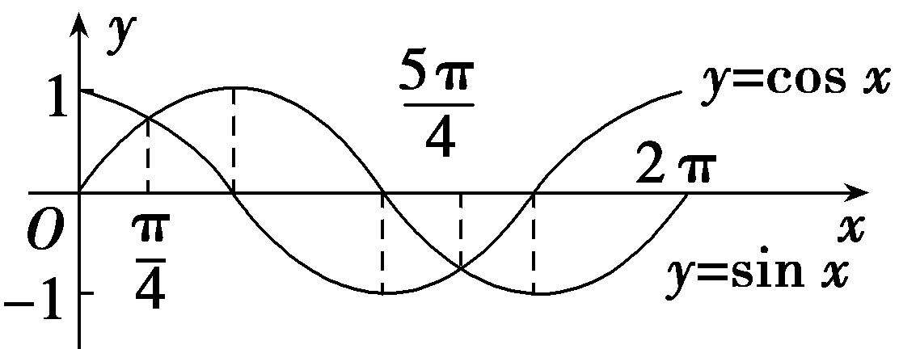
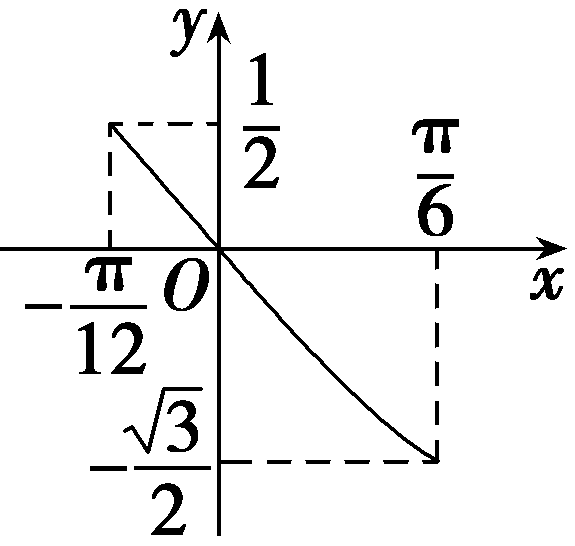
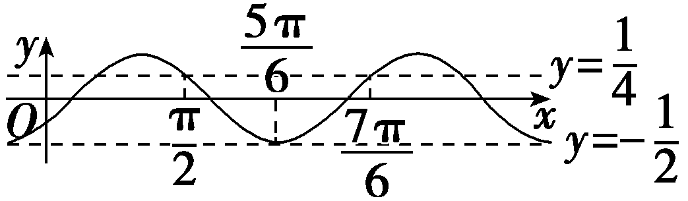
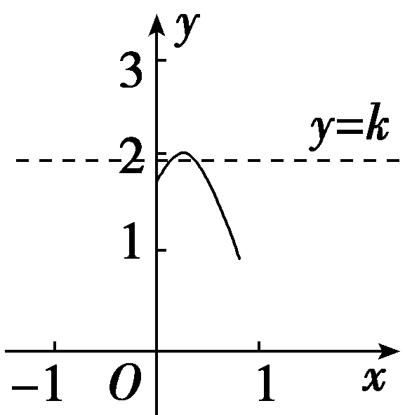

第四节　三角函数的图象与性质

【课标研读】　1.能画出<te<te<te<te*x*t style="italic">x</text>t st*y*le="italic">x</text>t st*y*le="italic">x</text>t style="italic">y</text>＝sin x，y＝cos x，y＝tan x的图象，了解三角函数的周期性、单调性、奇偶性、最大(小)值.　2.借助图象理解正弦函数、余弦函数在[0，2π]上，正切函数在 $\left(－\frac{\pi }{2}，\frac{\pi }{2}\right)$ 上的性质(如单调性、奇偶性、最大(小)值、图象与<te<te<te*x*t style="italic">x</text>t st*y*le="italic">x</text>t st*y*le="italic">x</text>轴交点等).

##### 1.用五点法作正弦函数和余弦函数的简图

（1）在正弦函数<te<te*x*t style="italic">x</text>t style="italic">y</text>＝sin x，x∈[0，2π]的图象中，五个关键点是：(0，0)， $\left(\frac{\pi }{2}，1\right)$ ， $\left(\pi ，0\right)$ ， $\left(\frac{3\pi }{2},-1\right)$ ，(2π，0).

（2）在余弦函数<te<te*x*t style="italic">x</text>t style="italic">y</text>＝cos x，x∈[0，2π]的图象中，五个关键点是：(0，1)， $\left(\frac{\pi }{2}，0\right)$ ， $\left(\pi ,-1\right)$ ， $\left(\frac{3\pi }{2}，0\right)$ ，(2π，1).

##### 2.正弦、余弦、正切函数的图象与性质(下表中<em>k</em>∈<strong>Z</strong>)

[微提醒]　正、余弦函数一个完整的单调区间的长度是半个周期；*y*＝tan *x*无单调递减区间；*y*＝tan *x*在整个定义域内不单调.

【常用结论】

（1）对称性与周期性

①正弦曲线、余弦曲线相邻两对称中心、相邻两对称轴之间的距离是 $\frac{1}{2}$ 个周期，相邻的对称中心与对称轴之间的距离是 $\frac{1}{4}$ 个周期.

②正切曲线相邻两对称中心之间的距离是 $\frac{1}{2}$ 个周期.

（2）奇偶性

①若函数&lt;te<em>x</em>t style="italic"&gt;y&lt;/text&gt;＝<em>A</em>sin (<em>ωx</em>＋<em>&lt;text style="italic"&gt;&lt;text style="italic"&gt;φ</em>&lt;/text&gt;&lt;/text&gt;)(x∈<strong>R</strong>) 是奇函数，则φ＝<em>&lt;text style="italic"&gt;&lt;text style="italic"&gt;&lt;text style="italic"&gt;k</em>&lt;/text&gt;&lt;/text&gt;&lt;/text&gt;π (k∈<strong>&lt;text style="bold"&gt;Z</strong> &lt;/text&gt;)；若为偶函数，则φ＝kπ＋ $\frac{\pi }{2}$ (<em>&lt;text style="italic"&gt;&lt;text style="italic"&gt;&lt;text style="italic"&gt;k</em>&lt;/text&gt;&lt;/text&gt;&lt;/text&gt;∈<strong>Z</strong>).

②若函数&lt;te<em>x</em>t style="italic"&gt;y&lt;/text&gt;＝<em>A</em>cos(<em>ωx</em>＋<em>&lt;text style="italic"&gt;&lt;text style="italic"&gt;φ</em>&lt;/text&gt;&lt;/text&gt;)(x∈<strong>R</strong>) 是奇函数，则φ＝<em>&lt;text style="italic"&gt;&lt;text style="italic"&gt;&lt;text style="italic"&gt;k</em>&lt;/text&gt;&lt;/text&gt;&lt;/text&gt;π＋ $\frac{\pi }{2}$ (<em>&lt;text style="italic"&gt;&lt;text style="italic"&gt;&lt;text style="italic"&gt;k</em>&lt;/text&gt;&lt;/text&gt;&lt;/text&gt;∈<strong>&lt;text style="bold"&gt;Z</strong>&lt;/text&gt;) ；若为偶函数，则&lt;te<em>x</em>t style="italic"&gt;<em>&lt;text style="italic"&gt;φ</em>&lt;/text&gt;&lt;/text&gt;＝kπ(k∈Z) .

③若<em>y</em>＝<em>A</em>tan (<em>ωx</em>＋<em>&lt;text style="italic"&gt;φ</em>&lt;/text&gt;) 为奇函数，则有φ＝ $\frac{k\pi }{2}$ (<em>k</em>∈<strong>Z</strong>) .

【自主检测】

##### 1.(多选)下列结论错误的是(　　)

$\quad$A.*y*＝cos *x*在第一、二象限内单调递减

$\quad$B.若非零常数*T*是函数*f*(*x*)的周期，则*kT*(*k*是非零整数)也是函数*f*(*x*)的周期

$\quad$C.函数<te<te*x*t style="italic">x</text>t style="italic">y</text>＝sin x图象的对称轴方程为x＝2*k*π＋ $\frac{\pi }{2}\left(k\in Z\right)$

$\quad$D.函数*y*＝tan *x*在整个定义域上是增函数

答案ACD

##### 2.(链接人教A必修一P201例2)若函数*y*＝2sin 2*x*－1的最小正周期为*T*，最大值为*A*，则(　　)

$\quad$A.*T*＝π，*A*＝1	
$\quad$B.*T*＝2π，*A*＝1

$\quad$C.*T*＝π，*A*＝2	
$\quad$D.*T*＝2π，*A*＝2

答案A

##### 3.已知函数<te*x*t style="italic">f</text>(x)＝5sin $\left(4x＋\frac{\varphi }{2}\right)$ (0＜*<text style="italic">φ*</text>＜2π)为偶函数，则φ＝(　　)

$\quad$A. $\frac{\pi }{2}$ 	
$\quad$B. $\frac{3\pi }{4}$

$\quad$C.π	
$\quad$D. $\frac{3\pi }{2}$

答案C

解析因为函数&lt;te<em>x</em>t style="italic"&gt;f&lt;/text&gt;(x)为偶函数，所以 $\frac{\varphi }{2}$ ＝ $\frac{\pi }{2}$ ＋<em>&lt;text style="italic"&gt;&lt;text style="italic"&gt;&lt;text style="italic"&gt;k</em>&lt;/text&gt;&lt;/text&gt;&lt;/text&gt;π，k∈<strong>&lt;text style="bold"&gt;Z</strong>&lt;/text&gt;，所以<em>&lt;text style="italic"&gt;&lt;text style="italic"&gt;φ</em>&lt;/text&gt;&lt;/text&gt;＝π＋2kπ，k∈Z，又0＜φ＜2π，所以φ＝π.故选C.

##### 4.(链接人教A必修一P207例5)函数&lt;te<em>x</em>t style="italic"&gt;y&lt;/text&gt;＝sin(x＋ $\frac{\pi }{6}$ )的单调递增区间为<u>　　　　　　　</u>.

答案 $\left[－\frac{2\pi }{3}+2k\pi ，\frac{\pi }{3}+2k\pi \right]\left(k\in Z\right)$

解析令－ $\frac{\pi }{2}$ ＋2&lt;te&lt;te&lt;text st<em>y</em>le="italic"&gt;x&lt;/text&gt;t style="italic"&gt;x&lt;/text&gt;t style="italic"&gt;<em>&lt;text style="italic"&gt;&lt;text style="italic"&gt;&lt;text style="italic"&gt;&lt;text style="italic"&gt;&lt;text style="italic"&gt;&lt;text style="italic"&gt;k</em>&lt;/text&gt;&lt;/text&gt;&lt;/text&gt;&lt;/text&gt;&lt;/text&gt;&lt;/text&gt;&lt;/text&gt;π≤x＋ $\frac{\pi }{6}$ ≤ $\frac{\pi }{2}$ ＋2&lt;te&lt;te&lt;text st<em>y</em>le="italic"&gt;x&lt;/text&gt;t style="italic"&gt;x&lt;/text&gt;t style="italic"&gt;<em>&lt;text style="italic"&gt;&lt;text style="italic"&gt;&lt;text style="italic"&gt;&lt;text style="italic"&gt;&lt;text style="italic"&gt;&lt;text style="italic"&gt;k</em>&lt;/text&gt;&lt;/text&gt;&lt;/text&gt;&lt;/text&gt;&lt;/text&gt;&lt;/text&gt;&lt;/text&gt;π，k∈<strong>&lt;text style="bold"&gt;Z</strong>&lt;/text&gt;，得－ $\frac{2\pi }{3}$ ＋2&lt;te&lt;te&lt;text st<em>y</em>le="italic"&gt;x&lt;/text&gt;t style="italic"&gt;x&lt;/text&gt;t style="italic"&gt;<em>&lt;text style="italic"&gt;&lt;text style="italic"&gt;&lt;text style="italic"&gt;&lt;text style="italic"&gt;&lt;text style="italic"&gt;&lt;text style="italic"&gt;k</em>&lt;/text&gt;&lt;/text&gt;&lt;/text&gt;&lt;/text&gt;&lt;/text&gt;&lt;/text&gt;&lt;/text&gt;π≤x≤ $\frac{\pi }{3}$ ＋2&lt;te&lt;te&lt;text st<em>y</em>le="italic"&gt;x&lt;/text&gt;t style="italic"&gt;x&lt;/text&gt;t style="italic"&gt;<em>&lt;text style="italic"&gt;&lt;text style="italic"&gt;&lt;text style="italic"&gt;&lt;text style="italic"&gt;&lt;text style="italic"&gt;&lt;text style="italic"&gt;k</em>&lt;/text&gt;&lt;/text&gt;&lt;/text&gt;&lt;/text&gt;&lt;/text&gt;&lt;/text&gt;&lt;/text&gt;π，k∈<strong>&lt;text style="bold"&gt;Z</strong>&lt;/text&gt;，所以y＝sin $\left(x＋\frac{\pi }{6}\right)$ 的单调递增区间为［－ $\frac{2\pi }{3}$ ＋2&lt;te&lt;te&lt;text st<em>y</em>le="italic"&gt;x&lt;/text&gt;t style="italic"&gt;x&lt;/text&gt;t style="italic"&gt;<em>&lt;text style="italic"&gt;&lt;text style="italic"&gt;&lt;text style="italic"&gt;&lt;text style="italic"&gt;&lt;text style="italic"&gt;&lt;text style="italic"&gt;k</em>&lt;/text&gt;&lt;/text&gt;&lt;/text&gt;&lt;/text&gt;&lt;/text&gt;&lt;/text&gt;&lt;/text&gt;π， $\frac{\pi }{3}$ ＋2&lt;te&lt;te&lt;text st<em>y</em>le="italic"&gt;x&lt;/text&gt;t style="italic"&gt;x&lt;/text&gt;t style="italic"&gt;<em>&lt;text style="italic"&gt;&lt;text style="italic"&gt;&lt;text style="italic"&gt;&lt;text style="italic"&gt;&lt;text style="italic"&gt;&lt;text style="italic"&gt;k</em>&lt;/text&gt;&lt;/text&gt;&lt;/text&gt;&lt;/text&gt;&lt;/text&gt;&lt;/text&gt;&lt;/text&gt;π］ $\left(k\in Z\right)$ .

第1课时　三角函数的定义域、值域与单调性

考点一　三角函数的定义域　　　　自主练透

##### 1.函数*f* $\left(x\right)$ ＝－2tan $\left(2x＋\frac{\pi }{6}\right)$ 的定义域是(　　)

$\quad$A.{<te*x*t style="italic">x</text>｜x≠ $\frac{\pi }{6}$ }

$\quad$B.{<te*x*t style="italic">x</text>｜x≠*k*π＋ $\frac{\pi }{6}\left(k\in Z\right)$ }

$\quad$C.{<te*x*t style="italic">x</text>｜x≠－ $\frac{\pi }{12}$ }

$\quad$D.{<te*x*t style="italic">x</text>｜x≠ $\frac{k\pi }{2}$ ＋ $\frac{\pi }{6}\left(k\in Z\right)$ }

答案D

解析由2<te*x*t style="italic">x</text>＋ $\frac{\pi }{6}$ ≠<te*x*t style="italic">k</text>π＋ $\frac{\pi }{2}\left(k\in Z\right)$ ，得<te*x*t style="italic">x</text>≠ $\frac{k\pi }{2}$ ＋ $\frac{\pi }{6}\left(k\in Z\right)$ .故选D.

##### 2.函数<em>y</em>＝lg $\left(sinx\right)$ ＋ $\sqrt{cosx－\frac{1}{2}}$ 的定义域为<u>　　　　　　　　　　　</u>.

答案{&lt;te<em>x</em>t style="italic"&gt;x&lt;/text&gt;｜2<em>&lt;text style="italic"&gt;&lt;text style="italic"&gt;k</em>&lt;/text&gt;&lt;/text&gt;π＜x≤ $\frac{\pi }{3}$ ＋2&lt;te<em>x</em>t style="italic"&gt;<em>&lt;text style="italic"&gt;k</em>&lt;/text&gt;&lt;/text&gt;π，k∈<strong>Z</strong>}

解析要使函数有意义，则有 $\left\{\begin{matrix}sinx>0，\\cosx－\frac{1}{2}\geq 0，\end{matrix}\right.$

解得 $\left\{\begin{matrix}2k\pi ＜x＜\pi +2k\pi ，k\in Z，\\－\frac{\pi }{3}+2k\pi \leq x\leq \frac{\pi }{3}+2k\pi ，k\in Z，\end{matrix}\right.$ 所以2&lt;te&lt;te&lt;te&lt;te<em>x</em>t style="italic"&gt;x&lt;/text&gt;t style="italic"&gt;x&lt;/text&gt;t st<em>y</em>le="italic"&gt;x&lt;/text&gt;t style="italic"&gt;<em>&lt;text style="italic"&gt;&lt;text style="italic"&gt;&lt;text style="italic"&gt;&lt;text style="italic"&gt;k</em>&lt;/text&gt;&lt;/text&gt;&lt;/text&gt;&lt;/text&gt;&lt;/text&gt;π＜x≤ $\frac{\pi }{3}$ ＋2&lt;te&lt;te&lt;te&lt;te<em>x</em>t style="italic"&gt;x&lt;/text&gt;t style="italic"&gt;x&lt;/text&gt;t st<em>y</em>le="italic"&gt;x&lt;/text&gt;t style="italic"&gt;<em>&lt;text style="italic"&gt;&lt;text style="italic"&gt;&lt;text style="italic"&gt;&lt;text style="italic"&gt;k</em>&lt;/text&gt;&lt;/text&gt;&lt;/text&gt;&lt;/text&gt;&lt;/text&gt;π，k∈<strong>&lt;text style="bold"&gt;Z</strong>&lt;/text&gt;，所以函数y＝lg(sin x)＋ $\sqrt{cosx－\frac{1}{2}}$ 的定义域为{&lt;te&lt;te&lt;te<em>x</em>t style="italic"&gt;x&lt;/text&gt;t style="italic"&gt;x&lt;/text&gt;t st<em>y</em>le="italic"&gt;x&lt;/text&gt;｜2<em>&lt;text style="italic"&gt;&lt;text style="italic"&gt;&lt;text style="italic"&gt;&lt;text style="italic"&gt;&lt;text style="italic"&gt;k</em>&lt;/text&gt;&lt;/text&gt;&lt;/text&gt;&lt;/text&gt;&lt;/text&gt;π＜x≤ $\frac{\pi }{3}$ ＋2&lt;te&lt;te&lt;te&lt;te<em>x</em>t style="italic"&gt;x&lt;/text&gt;t style="italic"&gt;x&lt;/text&gt;t st<em>y</em>le="italic"&gt;x&lt;/text&gt;t style="italic"&gt;<em>&lt;text style="italic"&gt;&lt;text style="italic"&gt;&lt;text style="italic"&gt;&lt;text style="italic"&gt;k</em>&lt;/text&gt;&lt;/text&gt;&lt;/text&gt;&lt;/text&gt;&lt;/text&gt;π，k∈<strong>&lt;text style="bold"&gt;Z</strong>&lt;/text&gt;}.

##### 3.函数<em>y</em>＝ $\sqrt{sinx－cosx}$ 的定义域为<u>　　　　　　　　　　</u>.

答案{&lt;te<em>x</em>t style="italic"&gt;x&lt;/text&gt;｜2<em>&lt;text style="italic"&gt;&lt;text style="italic"&gt;k</em>&lt;/text&gt;&lt;/text&gt;π＋ $\frac{\pi }{4}$ ≤&lt;te<em>x</em>t style="italic"&gt;x&lt;/text&gt;≤2<em>&lt;text style="italic"&gt;&lt;text style="italic"&gt;k</em>&lt;/text&gt;&lt;/text&gt;π＋ $\frac{5\pi }{4}$ ，&lt;te<em>x</em>t style="italic"&gt;<em>&lt;text style="italic"&gt;k</em>&lt;/text&gt;&lt;/text&gt;∈<strong>Z</strong>}

解析要使函数有意义，必须使sin *x*－cos *x*≥0，即sin *x*≥cos *x*.在同一平面直角坐标系中画出*y*＝sin *x*和*y*＝cos *x*在[0，2π]上的图象，如图所示.

在[0，2π]内，满足sin <te<te*x*t style="italic">x</text>t style="italic">x</text>＝cos x的x的值为 $\frac{\pi }{4}$ ， $\frac{5\pi }{4}$ ，再结合正弦、余弦函数的周期是2π，所以原函数的定义域为 $\left\{x｜2k\pi ＋\frac{\pi }{4}\leq x\leq 2k\pi ＋\frac{5\pi }{4}，k\in Z\right\}$ .

三角函数的定义域的求法

求三角函数的定义域，实际上是构造简单的三角不等式(组)，解三角不等式(组)常借助三角函数的图象，对于有限集、无限集求交集可借助数轴.

注意：解三角不等式时要注意周期，且<em>k</em>∈<strong>Z</strong>不可以忽略.

考点二　三角函数的值域(最值)　　　　师生共研

（1）函数<te*x*t style="italic">f</text>(x)＝3sin $\left(2x－\frac{\pi }{6}\right)$ 在区间 $\left[0，\frac{\pi }{2}\right]$ 上的值域为(　　)

$\quad$A. $\left[－\frac{3}{2}，\frac{3}{2}\right]$ 	
$\quad$B. $\left[－\frac{3}{2}，3\right]$

$\quad$C. $\left[－\frac{3\sqrt{3}}{2}，\frac{3\sqrt{3}}{2}\right]$ 	
$\quad$D. $\left[－\frac{3\sqrt{3}}{2}，3\right]$

（2）(2021·全国乙卷)函数<te*x*t style="italic">f</text>(x)＝sin $\frac{x}{3}$ ＋cos $\frac{x}{3}$  的最小正周期和最大值分别是(　　)

$\quad$A.3π 和 $\sqrt{2}$ 	
$\quad$B. 3π 和2

$\quad$C.6π 和 $\sqrt{2}$ 	
$\quad$D. 6π 和2

（3）函数&lt;te&lt;te&lt;te&lt;te<em>x</em>t style="italic"&gt;x&lt;/text&gt;t style="italic"&gt;x&lt;/text&gt;t style="italic"&gt;x&lt;/text&gt;t style="italic"&gt;f&lt;/text&gt;(x)＝sin2x＋ $\sqrt{3}$ cos &lt;te&lt;te&lt;te<em>x</em>t style="italic"&gt;x&lt;/text&gt;t style="italic"&gt;x&lt;/text&gt;t style="italic"&gt;x&lt;/text&gt;－ $\frac{3}{4}$ (&lt;te&lt;te&lt;te<em>x</em>t style="italic"&gt;x&lt;/text&gt;t style="italic"&gt;x&lt;/text&gt;t style="italic"&gt;x&lt;/text&gt;∈［0， $\frac{\pi }{2}$ ］)的最大值是<u>　　　　</u>.

答案（1）B　（2）C　（3）1

解析（1）当<te<te*x*t style="italic">x</text>t style="italic">x</text>∈ $\left[0，\frac{\pi }{2}\right]$ 时，2<te<te*x*t style="italic">x</text>t style="italic">x</text>－ $\frac{\pi }{6}$ ∈ $\left[－\frac{\pi }{6}，\frac{5\pi }{6}\right]$ ，sin $\left(2x－\frac{\pi }{6}\right)$ ∈ $\left[－\frac{1}{2}，1\right]$ ，故3sin $\left(2x－\frac{\pi }{6}\right)$ ∈ $\left[－\frac{3}{2}，3\right]$ ，所以函数<te*x*t style="italic">f</text>(<te*x*t style="italic">x</text>)的值域为 $\left[－\frac{3}{2}，3\right]$ .故选B.

（2）因为函数<te<te*x*t style="italic">x</text>t style="italic">*f*</text>(x)＝sin $\frac{x}{3}$ ＋cos $\frac{x}{3}$ ＝ $\sqrt{2}$ (sin $\frac{x}{3}$ cos $\frac{\pi }{4}$ ＋cos $\frac{x}{3}$ sin $\frac{\pi }{4}$ )＝ $\sqrt{2}$ sin( $\frac{x}{3}$ ＋ $\frac{\pi }{4}$ )，所以函数<te<te*x*t style="italic">x</text>t style="italic">*f*</text>(x)的最小正周期*T*＝ $\frac{2\pi }{\frac{1}{3}}$ ＝6π ，最大值为 $\sqrt{2}$  .故选C.

（3）由题意可得&lt;te&lt;te&lt;te&lt;te&lt;te&lt;te&lt;te&lt;te&lt;te<em>x</em>t style="italic"&gt;x&lt;/text&gt;t style="italic"&gt;x&lt;/text&gt;t style="italic"&gt;x&lt;/text&gt;t style="italic"&gt;x&lt;/text&gt;t style="italic"&gt;x&lt;/text&gt;t style="italic"&gt;x&lt;/text&gt;t style="italic"&gt;x&lt;/text&gt;t style="italic"&gt;x&lt;/text&gt;t style="italic"&gt;<em>f</em>&lt;/text&gt;(x)＝－cos&lt;text style="superscript"&gt;2&lt;/text&gt;x＋ $\sqrt{3}$ cos &lt;te&lt;te&lt;te&lt;te&lt;te&lt;te&lt;te&lt;te<em>x</em>t style="italic"&gt;x&lt;/text&gt;t style="italic"&gt;x&lt;/text&gt;t style="italic"&gt;x&lt;/text&gt;t style="italic"&gt;x&lt;/text&gt;t style="italic"&gt;x&lt;/text&gt;t style="italic"&gt;x&lt;/text&gt;t style="italic"&gt;x&lt;/text&gt;t style="italic"&gt;x&lt;/text&gt;＋ $\frac{1}{4}$ ＝－(cos &lt;te&lt;te&lt;te&lt;te&lt;te&lt;te&lt;te&lt;te<em>x</em>t style="italic"&gt;x&lt;/text&gt;t style="italic"&gt;x&lt;/text&gt;t style="italic"&gt;x&lt;/text&gt;t style="italic"&gt;x&lt;/text&gt;t style="italic"&gt;x&lt;/text&gt;t style="italic"&gt;x&lt;/text&gt;t style="italic"&gt;x&lt;/text&gt;t style="italic"&gt;x&lt;/text&gt;－ $\frac{\sqrt{3}}{2}$ )&lt;te&lt;te&lt;te&lt;te&lt;te&lt;te&lt;te&lt;te<em>x</em>t style="italic"&gt;x&lt;/text&gt;t style="italic"&gt;x&lt;/text&gt;t style="italic"&gt;x&lt;/text&gt;t style="italic"&gt;x&lt;/text&gt;t style="italic"&gt;x&lt;/text&gt;t style="italic"&gt;x&lt;/text&gt;t style="italic"&gt;x&lt;/text&gt;t style="superscript"&gt;2&lt;/text&gt;＋1.因为<em>x</em>∈ $\left[0，\frac{\pi }{2}\right]$ ，所以cos &lt;te&lt;te&lt;te&lt;te&lt;te&lt;te&lt;te&lt;te<em>x</em>t style="italic"&gt;x&lt;/text&gt;t style="italic"&gt;x&lt;/text&gt;t style="italic"&gt;x&lt;/text&gt;t style="italic"&gt;x&lt;/text&gt;t style="italic"&gt;x&lt;/text&gt;t style="italic"&gt;x&lt;/text&gt;t style="italic"&gt;x&lt;/text&gt;t style="italic"&gt;x&lt;/text&gt;∈ $\left[0，1\right]$ .所以当cos &lt;te&lt;te&lt;te&lt;te&lt;te&lt;te&lt;te&lt;te<em>x</em>t style="italic"&gt;x&lt;/text&gt;t style="italic"&gt;x&lt;/text&gt;t style="italic"&gt;x&lt;/text&gt;t style="italic"&gt;x&lt;/text&gt;t style="italic"&gt;x&lt;/text&gt;t style="italic"&gt;x&lt;/text&gt;t style="italic"&gt;x&lt;/text&gt;t style="italic"&gt;x&lt;/text&gt;＝ $\frac{\sqrt{3}}{2}$ ，即&lt;te&lt;te&lt;te&lt;te&lt;te&lt;te&lt;te&lt;te<em>x</em>t style="italic"&gt;x&lt;/text&gt;t style="italic"&gt;x&lt;/text&gt;t style="italic"&gt;x&lt;/text&gt;t style="italic"&gt;x&lt;/text&gt;t style="italic"&gt;x&lt;/text&gt;t style="italic"&gt;x&lt;/text&gt;t style="italic"&gt;x&lt;/text&gt;t style="italic"&gt;x&lt;/text&gt;＝ $\frac{\pi }{6}$ 时，&lt;te&lt;te&lt;te&lt;te&lt;te&lt;te&lt;te&lt;te&lt;te<em>x</em>t style="italic"&gt;x&lt;/text&gt;t style="italic"&gt;x&lt;/text&gt;t style="italic"&gt;x&lt;/text&gt;t style="italic"&gt;x&lt;/text&gt;t style="italic"&gt;x&lt;/text&gt;t style="italic"&gt;x&lt;/text&gt;t style="italic"&gt;x&lt;/text&gt;t style="italic"&gt;x&lt;/text&gt;t style="italic"&gt;<em>f</em>&lt;/text&gt;(x)取最大值为1.

求三角函数的值域(最值)的三种类型及解题思路

##### 1.形如*y*＝*a*sin *ωx*＋*b*cos *ωx*＋*c*的三角函数化为*y*＝*A*sin(*ωx*＋*φ*)＋*c*的形式，再求值域(最值).

##### 2.形如<em>y</em>＝<em>a</em>sin2<em>x</em>＋<em>b</em>sin <em>x</em>＋<em>c</em>的三角函数，可先设sin <em>x</em>＝<em>t</em>，化为关于<em>t</em>的二次函数求值域(最值).

##### 3.形如*y*＝*a*sin *x*cos *x*＋*b*(sin *x*±cos *x*)＋*c*的三角函数，可先设*t*＝sin *x*±cos *x*，化为关于*t*的二次函数求值域(最值).

对点练1.函数<te*x*t style="italic">y</text>＝tan $\left(x－\frac{\pi }{6}\right)$ ，*x*∈ $\left(－\frac{\pi }{6}，\frac{5\pi }{12}\right)$ 的值域为(　　)

$\quad$A. $\left(－\sqrt{3}，1\right)$ 	
$\quad$B. $\left(－1，\frac{\sqrt{3}}{3}\right)$

$\quad$C.(1， $\sqrt{3}$ )	
$\quad$D. $\left(\frac{\sqrt{3}}{3}，1\right)$

答案A

解析设<te<te<text st*y*le="italic">x</text>t style="italic">x</text>t style="italic">*<text style="italic"><text style="italic">z*</text></text></text>＝x－ $\frac{\pi }{6}$ ，因为<te<text st*y*le="italic">x</text>t style="italic">x</text>∈ $\left(－\frac{\pi }{6}，\frac{5\pi }{12}\right)$ ，所以<te<te<text st*y*le="italic">x</text>t style="italic">x</text>t style="italic">*<text style="italic"><text style="italic">z*</text></text></text>∈ $\left(－\frac{\pi }{3}，\frac{\pi }{4}\right)$ ，因为正切函数*y*＝tan <te<te*x*t style="italic">x</text>t style="italic">*<text style="italic"><text style="italic">z*</text></text></text>在 $\left(－\frac{\pi }{2}，\frac{\pi }{2}\right)$ 上单调递增，且tan $\left(－\frac{\pi }{3}\right)$ ＝－ $\sqrt{3}$ ，tan $\frac{\pi }{4}$ ＝1，所以tan <te<te<text st*y*le="italic">x</text>t style="italic">x</text>t style="italic">*<text style="italic"><text style="italic">z*</text></text></text>∈ $\left(－\sqrt{3}，1\right)$ .故选A.

对点练2.已知函数<te*x*t style="italic">f</text>(x)＝4sin $\left(2x－\frac{\pi }{6}\right)$ ＋1的定义域是[0，*<text style="italic">m*</text>]，值域为[－1，5]，则m的最大值是(　　)

$\quad$A. $\frac{2\pi }{3}$ 	
$\quad$B. $\frac{\pi }{3}$

$\quad$C. $\frac{\pi }{6}$ 	
$\quad$D. $\frac{5\pi }{6}$

答案A

解析因为<te<te*x*t style="italic">x</text>t style="italic">x</text>∈[0，*<text style="italic"><text style="italic"><text style="italic">m*</text></text></text>]，所以2x－ $\frac{\pi }{6}$ ∈ $\left[－\frac{\pi }{6}，2m－\frac{\pi }{6}\right]$ .因为<te*x*t style="italic">f</text>(<te*x*t style="italic">x</text>)的值域为[－1，5]，所以 $\frac{\pi }{2}$ ≤2<te<te*x*t style="italic">x</text>t style="italic">*<text style="italic"><text style="italic">m*</text></text></text>－ $\frac{\pi }{6}$ ≤ $\frac{7\pi }{6}$ ，解得 $\frac{\pi }{3}$ ≤<te<te*x*t style="italic">x</text>t style="italic">*<text style="italic"><text style="italic">m*</text></text></text>≤ $\frac{2\pi }{3}$ ，所以<te<te*x*t style="italic">x</text>t style="italic">*<text style="italic"><text style="italic">m*</text></text></text>的最大值为 $\frac{2\pi }{3}$ .故选A.

对点练3.函数<em>f</em>(<em>x</em>)＝sin <em>x</em>－cos <em>x</em>＋sin <em>x</em>cos <em>x</em>的值域为<u>　　　　</u>.

答案 $\left[－\frac{1}{2}－\sqrt{2}，1\right]$

解析设&lt;&lt;&lt;&lt;&lt;&lt;text st<em>y</em>le="italic"&gt;t&lt;/text&gt;ext st<em>y</em>le="italic"&gt;t&lt;/text&gt;ext style="italic"&gt;t&lt;/text&gt;e&lt;te&lt;te&lt;te&lt;te&lt;te&lt;text st<em>y</em>le="italic"&gt;x&lt;/text&gt;t style="italic"&gt;x&lt;/text&gt;t style="italic"&gt;x&lt;/text&gt;t style="italic"&gt;x&lt;/text&gt;t style="italic"&gt;x&lt;/text&gt;t style="italic"&gt;x&lt;/text&gt;t style="italic"&gt;t&lt;/text&gt;ext style="italic"&gt;t&lt;/text&gt;e&lt;te<em>x</em>t style="italic"&gt;x&lt;/text&gt;t style="italic"&gt;t&lt;/text&gt;＝sin x－cos x，则－ $\sqrt{2}$ ≤&lt;&lt;&lt;&lt;&lt;&lt;text st<em>y</em>le="italic"&gt;t&lt;/text&gt;ext st<em>y</em>le="italic"&gt;t&lt;/text&gt;ext style="italic"&gt;t&lt;/text&gt;e&lt;te&lt;te&lt;te&lt;te&lt;te&lt;text st<em>y</em>le="italic"&gt;x&lt;/text&gt;t style="italic"&gt;x&lt;/text&gt;t style="italic"&gt;x&lt;/text&gt;t style="italic"&gt;x&lt;/text&gt;t style="italic"&gt;x&lt;/text&gt;t style="italic"&gt;x&lt;/text&gt;t style="italic"&gt;t&lt;/text&gt;ext style="italic"&gt;t&lt;/text&gt;e&lt;te<em>x</em>t style="italic"&gt;x&lt;/text&gt;t style="italic"&gt;t&lt;/text&gt;≤ $\sqrt{2}$ ，&lt;&lt;&lt;&lt;&lt;&lt;text st<em>y</em>le="italic"&gt;t&lt;/text&gt;ext st<em>y</em>le="italic"&gt;t&lt;/text&gt;ext style="italic"&gt;t&lt;/text&gt;e&lt;te&lt;te&lt;te&lt;te&lt;te&lt;text st<em>y</em>le="italic"&gt;x&lt;/text&gt;t style="italic"&gt;x&lt;/text&gt;t style="italic"&gt;x&lt;/text&gt;t style="italic"&gt;x&lt;/text&gt;t style="italic"&gt;x&lt;/text&gt;t style="italic"&gt;x&lt;/text&gt;t style="italic"&gt;t&lt;/text&gt;ext style="italic"&gt;t&lt;/text&gt;e&lt;te<em>x</em>t style="italic"&gt;x&lt;/text&gt;t style="italic"&gt;t&lt;/text&gt;&lt;text style="superscript"&gt;&lt;text style="superscript"&gt;2&lt;/text&gt;&lt;/text&gt;＝sin2x＋cos2x－2sin xcos x，则sin xcos x＝ $\frac{1－t^{2}}{2}$ ，所以&lt;&lt;&lt;&lt;text st<em>y</em>le="italic"&gt;t&lt;/text&gt;ext st<em>y</em>le="italic"&gt;t&lt;/text&gt;ext style="italic"&gt;t&lt;/text&gt;ext style="italic"&gt;y&lt;/text&gt;＝－ $\frac{t^{2}}{2}$ ＋&lt;&lt;&lt;&lt;&lt;&lt;text st<em>y</em>le="italic"&gt;t&lt;/text&gt;ext st<em>y</em>le="italic"&gt;t&lt;/text&gt;ext style="italic"&gt;t&lt;/text&gt;e&lt;te&lt;te&lt;te&lt;te&lt;te&lt;text st<em>y</em>le="italic"&gt;x&lt;/text&gt;t style="italic"&gt;x&lt;/text&gt;t style="italic"&gt;x&lt;/text&gt;t style="italic"&gt;x&lt;/text&gt;t style="italic"&gt;x&lt;/text&gt;t style="italic"&gt;x&lt;/text&gt;t style="italic"&gt;t&lt;/text&gt;ext style="italic"&gt;t&lt;/text&gt;e&lt;te<em>x</em>t style="italic"&gt;x&lt;/text&gt;t style="italic"&gt;t&lt;/text&gt;＋ $\frac{1}{2}$ ＝－ $\frac{1}{2}\left(t－1\right)^{2}$ ＋1.当&lt;&lt;&lt;&lt;&lt;&lt;text st<em>y</em>le="italic"&gt;t&lt;/text&gt;ext st<em>y</em>le="italic"&gt;t&lt;/text&gt;ext style="italic"&gt;t&lt;/text&gt;e&lt;te&lt;te&lt;te&lt;te&lt;te&lt;text st<em>y</em>le="italic"&gt;x&lt;/text&gt;t style="italic"&gt;x&lt;/text&gt;t style="italic"&gt;x&lt;/text&gt;t style="italic"&gt;x&lt;/text&gt;t style="italic"&gt;x&lt;/text&gt;t style="italic"&gt;x&lt;/text&gt;t style="italic"&gt;t&lt;/text&gt;ext style="italic"&gt;t&lt;/text&gt;e&lt;te<em>x</em>t style="italic"&gt;x&lt;/text&gt;t style="italic"&gt;t&lt;/text&gt;＝1时，ymax＝1；当t＝－ $\sqrt{2}$ 时，&lt;&lt;&lt;&lt;text st<em>y</em>le="italic"&gt;t&lt;/text&gt;ext st<em>y</em>le="italic"&gt;t&lt;/text&gt;ext style="italic"&gt;t&lt;/text&gt;ext style="italic"&gt;y&lt;/text&gt;min＝－ $\frac{1}{2}$ － $\sqrt{2}$ .所以函数的值域为 $\left[－\frac{1}{2}－\sqrt{2}，1\right]$ .

考点三　三角函数的单调性　　　　多维探究

角度1　求三角函数的单调区间

（1）函数<te*x*t style="italic">f</text>(x)＝tan $\left(2x－\frac{\pi }{3}\right)$ 的单调递增区间是(　　)

$\quad$A. $\left[\frac{k\pi }{2}－\frac{\pi }{12}，\frac{k\pi }{2}＋\frac{5\pi }{12}\right]\left(k\in Z\right)$

$\quad$B. $\left(\frac{k\pi }{2}－\frac{\pi }{12}，\frac{k\pi }{2}＋\frac{5\pi }{12}\right)\left(k\in Z\right)$

$\quad$C. $\left(k\pi ＋\frac{\pi }{6}，k\pi ＋\frac{2\pi }{3}\right)\left(k\in Z\right)$

$\quad$D. $\left[k\pi －\frac{\pi }{12}，k\pi ＋\frac{5\pi }{12}\right]\left(k\in Z\right)$

（2）(2022·北京卷)已知函数<em>f</em>(<em>x</em>)＝cos2<em>x</em>－sin2<em>x</em>，则(　　)

$\quad$A.<te*x*t style="italic">f</text>(x)在 $\left(－\frac{\pi }{2},-\frac{\pi }{6}\right)$ 上单调递减

$\quad$B.<te*x*t style="italic">f</text>(x)在 $\left(－\frac{\pi }{4}，\frac{\pi }{12}\right)$ 上单调递增

$\quad$C.<te*x*t style="italic">f</text>(x)在 $\left(0，\frac{\pi }{3}\right)$ 上单调递减

$\quad$D.<te*x*t style="italic">f</text>(x)在 $\left(\frac{\pi }{4}，\frac{7\pi }{12}\right)$ 上单调递增

（3）函数&lt;te<em>x</em>t style="italic"&gt;f&lt;/text&gt;(x)＝sin $\left(\frac{\pi }{3}－2x\right)$ 的单调递减区间为<u>　　　　　　</u>.

答案（1）<strong>B</strong>　（2）<strong>C</strong>　（3）［<em>&lt;text style="italic"&gt;&lt;text style="italic"&gt;k</em>&lt;/text&gt;&lt;/text&gt;π－ $\frac{\pi }{12}$ ，<em>&lt;text style="italic"&gt;&lt;text style="italic"&gt;k</em>&lt;/text&gt;&lt;/text&gt;π＋ $\frac{5\pi }{12}$ ］，<em>&lt;text style="italic"&gt;&lt;text style="italic"&gt;k</em>&lt;/text&gt;&lt;/text&gt;∈<strong>Z</strong>

解析（1）由<te<te<te<te*x*t style="italic">x</text>t style="italic">x</text>t style="italic">x</text>t style="italic">*k*</text>π－ $\frac{\pi }{2}$ ＜2<te<te<te*x*t style="italic">x</text>t style="italic">x</text>t style="italic">x</text>－ $\frac{\pi }{3}$ ＜<te<te<te<te*x*t style="italic">x</text>t style="italic">x</text>t style="italic">x</text>t style="italic">*k*</text>π＋ $\frac{\pi }{2}\left(k\in Z\right)$ ，得 $\frac{k\pi }{2}$ － $\frac{\pi }{12}$ ＜<te<te<te*x*t style="italic">x</text>t style="italic">x</text>t style="italic">x</text>＜ $\frac{k\pi }{2}$ ＋ $\frac{5\pi }{12}\left(k\in Z\right)$ ，所以函数<te<te*x*t style="italic">x</text>t style="italic">f</text>(<te*x*t style="italic">x</text>)＝tan(2x－ $\frac{\pi }{3}$ )的单调递增区间为( $\frac{k\pi }{2}$ － $\frac{\pi }{12}$ ， $\frac{k\pi }{2}$ ＋ $\frac{5\pi }{12})\left(k\in Z\right)$ .故选B.

(&lt;te&lt;te&lt;te&lt;te&lt;te&lt;te&lt;te&lt;te&lt;te&lt;te&lt;te&lt;te&lt;te&lt;te&lt;te<em>x</em>t style="italic"&gt;x&lt;/text&gt;t style="italic"&gt;x&lt;/text&gt;t style="italic"&gt;x&lt;/text&gt;t style="italic"&gt;x&lt;/text&gt;t style="italic"&gt;x&lt;/text&gt;t style="italic"&gt;x&lt;/text&gt;t style="italic"&gt;x&lt;/text&gt;t style="italic"&gt;x&lt;/text&gt;t style="italic"&gt;x&lt;/text&gt;t style="italic"&gt;x&lt;/text&gt;t style="italic"&gt;x&lt;/text&gt;t style="italic"&gt;x&lt;/text&gt;t style="italic"&gt;x&lt;/text&gt;t style="italic"&gt;x&lt;/text&gt;t style="superscript"&gt;2&lt;/text&gt;)依题意可知&lt;te<em>x</em>t style="italic"&gt;<em>&lt;text style="italic"&gt;&lt;text style="italic"&gt;&lt;text style="italic"&gt;f</em>&lt;/text&gt;&lt;/text&gt;&lt;/text&gt;&lt;/text&gt;(x)＝cos2x－sin2x＝cos 2x.对于A，因为x∈ $\left(－\frac{\pi }{2}，-\frac{\pi }{6}\right)$ ，所以&lt;te&lt;te&lt;te&lt;te&lt;te&lt;te&lt;te&lt;te&lt;te&lt;te&lt;te&lt;te&lt;te&lt;te&lt;te<em>x</em>t style="italic"&gt;x&lt;/text&gt;t style="italic"&gt;x&lt;/text&gt;t style="italic"&gt;x&lt;/text&gt;t style="italic"&gt;x&lt;/text&gt;t style="italic"&gt;x&lt;/text&gt;t style="italic"&gt;x&lt;/text&gt;t style="italic"&gt;x&lt;/text&gt;t style="italic"&gt;x&lt;/text&gt;t style="italic"&gt;x&lt;/text&gt;t style="italic"&gt;x&lt;/text&gt;t style="italic"&gt;x&lt;/text&gt;t style="italic"&gt;x&lt;/text&gt;t style="italic"&gt;x&lt;/text&gt;t style="italic"&gt;x&lt;/text&gt;t style="superscript"&gt;2&lt;/text&gt;<em>x</em>∈ $\left(－\pi ，-\frac{\pi }{3}\right)$ ，所以函数&lt;te&lt;te&lt;te&lt;te&lt;te&lt;te&lt;te&lt;te&lt;te&lt;te&lt;te&lt;te&lt;te&lt;te&lt;te&lt;te<em>x</em>t style="italic"&gt;x&lt;/text&gt;t style="italic"&gt;x&lt;/text&gt;t style="italic"&gt;x&lt;/text&gt;t style="italic"&gt;x&lt;/text&gt;t style="italic"&gt;x&lt;/text&gt;t style="italic"&gt;x&lt;/text&gt;t style="italic"&gt;x&lt;/text&gt;t style="italic"&gt;x&lt;/text&gt;t style="italic"&gt;x&lt;/text&gt;t style="italic"&gt;x&lt;/text&gt;t style="italic"&gt;x&lt;/text&gt;t style="italic"&gt;x&lt;/text&gt;t style="italic"&gt;x&lt;/text&gt;t style="italic"&gt;x&lt;/text&gt;t style="italic"&gt;x&lt;/text&gt;t style="italic"&gt;<em>&lt;text style="italic"&gt;&lt;text style="italic"&gt;&lt;text style="italic"&gt;f</em>&lt;/text&gt;&lt;/text&gt;&lt;/text&gt;&lt;/text&gt;(x)在 $\left(－\frac{\pi }{2}，-\frac{\pi }{6}\right)$ 上单调递增，故A不正确；对于B，因为&lt;te&lt;te&lt;te&lt;te&lt;te&lt;te&lt;te&lt;te&lt;te&lt;te&lt;te&lt;te&lt;te&lt;te&lt;te<em>x</em>t style="italic"&gt;x&lt;/text&gt;t style="italic"&gt;x&lt;/text&gt;t style="italic"&gt;x&lt;/text&gt;t style="italic"&gt;x&lt;/text&gt;t style="italic"&gt;x&lt;/text&gt;t style="italic"&gt;x&lt;/text&gt;t style="italic"&gt;x&lt;/text&gt;t style="italic"&gt;x&lt;/text&gt;t style="italic"&gt;x&lt;/text&gt;t style="italic"&gt;x&lt;/text&gt;t style="italic"&gt;x&lt;/text&gt;t style="italic"&gt;x&lt;/text&gt;t style="italic"&gt;x&lt;/text&gt;t style="italic"&gt;x&lt;/text&gt;t style="italic"&gt;x&lt;/text&gt;∈ $\left(－\frac{\pi }{4}，\frac{\pi }{12}\right)$ ，所以&lt;te&lt;te&lt;te&lt;te&lt;te&lt;te&lt;te&lt;te&lt;te&lt;te&lt;te&lt;te&lt;te&lt;te&lt;te<em>x</em>t style="italic"&gt;x&lt;/text&gt;t style="italic"&gt;x&lt;/text&gt;t style="italic"&gt;x&lt;/text&gt;t style="italic"&gt;x&lt;/text&gt;t style="italic"&gt;x&lt;/text&gt;t style="italic"&gt;x&lt;/text&gt;t style="italic"&gt;x&lt;/text&gt;t style="italic"&gt;x&lt;/text&gt;t style="italic"&gt;x&lt;/text&gt;t style="italic"&gt;x&lt;/text&gt;t style="italic"&gt;x&lt;/text&gt;t style="italic"&gt;x&lt;/text&gt;t style="italic"&gt;x&lt;/text&gt;t style="italic"&gt;x&lt;/text&gt;t style="superscript"&gt;2&lt;/text&gt;<em>x</em>∈ $\left(－\frac{\pi }{2}，\frac{\pi }{6}\right)$ ，所以函数&lt;te&lt;te&lt;te&lt;te&lt;te&lt;te&lt;te&lt;te&lt;te&lt;te&lt;te&lt;te&lt;te&lt;te&lt;te&lt;te<em>x</em>t style="italic"&gt;x&lt;/text&gt;t style="italic"&gt;x&lt;/text&gt;t style="italic"&gt;x&lt;/text&gt;t style="italic"&gt;x&lt;/text&gt;t style="italic"&gt;x&lt;/text&gt;t style="italic"&gt;x&lt;/text&gt;t style="italic"&gt;x&lt;/text&gt;t style="italic"&gt;x&lt;/text&gt;t style="italic"&gt;x&lt;/text&gt;t style="italic"&gt;x&lt;/text&gt;t style="italic"&gt;x&lt;/text&gt;t style="italic"&gt;x&lt;/text&gt;t style="italic"&gt;x&lt;/text&gt;t style="italic"&gt;x&lt;/text&gt;t style="italic"&gt;x&lt;/text&gt;t style="italic"&gt;<em>&lt;text style="italic"&gt;&lt;text style="italic"&gt;&lt;text style="italic"&gt;f</em>&lt;/text&gt;&lt;/text&gt;&lt;/text&gt;&lt;/text&gt;(x)在 $\left(－\frac{\pi }{4}，\frac{\pi }{12}\right)$ 上不单调，故B不正确；对于C，因为&lt;te&lt;te&lt;te&lt;te&lt;te&lt;te&lt;te&lt;te&lt;te&lt;te&lt;te&lt;te&lt;te&lt;te&lt;te<em>x</em>t style="italic"&gt;x&lt;/text&gt;t style="italic"&gt;x&lt;/text&gt;t style="italic"&gt;x&lt;/text&gt;t style="italic"&gt;x&lt;/text&gt;t style="italic"&gt;x&lt;/text&gt;t style="italic"&gt;x&lt;/text&gt;t style="italic"&gt;x&lt;/text&gt;t style="italic"&gt;x&lt;/text&gt;t style="italic"&gt;x&lt;/text&gt;t style="italic"&gt;x&lt;/text&gt;t style="italic"&gt;x&lt;/text&gt;t style="italic"&gt;x&lt;/text&gt;t style="italic"&gt;x&lt;/text&gt;t style="italic"&gt;x&lt;/text&gt;t style="italic"&gt;x&lt;/text&gt;∈ $\left(0，\frac{\pi }{3}\right)$ ，所以&lt;te&lt;te&lt;te&lt;te&lt;te&lt;te&lt;te&lt;te&lt;te&lt;te&lt;te&lt;te&lt;te&lt;te&lt;te<em>x</em>t style="italic"&gt;x&lt;/text&gt;t style="italic"&gt;x&lt;/text&gt;t style="italic"&gt;x&lt;/text&gt;t style="italic"&gt;x&lt;/text&gt;t style="italic"&gt;x&lt;/text&gt;t style="italic"&gt;x&lt;/text&gt;t style="italic"&gt;x&lt;/text&gt;t style="italic"&gt;x&lt;/text&gt;t style="italic"&gt;x&lt;/text&gt;t style="italic"&gt;x&lt;/text&gt;t style="italic"&gt;x&lt;/text&gt;t style="italic"&gt;x&lt;/text&gt;t style="italic"&gt;x&lt;/text&gt;t style="italic"&gt;x&lt;/text&gt;t style="superscript"&gt;2&lt;/text&gt;<em>x</em>∈ $\left(0，\frac{2\pi }{3}\right)$ ，所以函数&lt;te&lt;te&lt;te&lt;te&lt;te&lt;te&lt;te&lt;te&lt;te&lt;te&lt;te&lt;te&lt;te&lt;te&lt;te&lt;te<em>x</em>t style="italic"&gt;x&lt;/text&gt;t style="italic"&gt;x&lt;/text&gt;t style="italic"&gt;x&lt;/text&gt;t style="italic"&gt;x&lt;/text&gt;t style="italic"&gt;x&lt;/text&gt;t style="italic"&gt;x&lt;/text&gt;t style="italic"&gt;x&lt;/text&gt;t style="italic"&gt;x&lt;/text&gt;t style="italic"&gt;x&lt;/text&gt;t style="italic"&gt;x&lt;/text&gt;t style="italic"&gt;x&lt;/text&gt;t style="italic"&gt;x&lt;/text&gt;t style="italic"&gt;x&lt;/text&gt;t style="italic"&gt;x&lt;/text&gt;t style="italic"&gt;x&lt;/text&gt;t style="italic"&gt;<em>&lt;text style="italic"&gt;&lt;text style="italic"&gt;&lt;text style="italic"&gt;f</em>&lt;/text&gt;&lt;/text&gt;&lt;/text&gt;&lt;/text&gt;(x)在 $\left(0，\frac{\pi }{3}\right)$ 上单调递减，故C正确；对于D，因为&lt;te&lt;te&lt;te&lt;te&lt;te&lt;te&lt;te&lt;te&lt;te&lt;te&lt;te&lt;te&lt;te&lt;te&lt;te<em>x</em>t style="italic"&gt;x&lt;/text&gt;t style="italic"&gt;x&lt;/text&gt;t style="italic"&gt;x&lt;/text&gt;t style="italic"&gt;x&lt;/text&gt;t style="italic"&gt;x&lt;/text&gt;t style="italic"&gt;x&lt;/text&gt;t style="italic"&gt;x&lt;/text&gt;t style="italic"&gt;x&lt;/text&gt;t style="italic"&gt;x&lt;/text&gt;t style="italic"&gt;x&lt;/text&gt;t style="italic"&gt;x&lt;/text&gt;t style="italic"&gt;x&lt;/text&gt;t style="italic"&gt;x&lt;/text&gt;t style="italic"&gt;x&lt;/text&gt;t style="italic"&gt;x&lt;/text&gt;∈ $\left(\frac{\pi }{4}，\frac{7\pi }{12}\right)$ ，所以&lt;te&lt;te&lt;te&lt;te&lt;te&lt;te&lt;te&lt;te&lt;te&lt;te&lt;te&lt;te&lt;te&lt;te&lt;te<em>x</em>t style="italic"&gt;x&lt;/text&gt;t style="italic"&gt;x&lt;/text&gt;t style="italic"&gt;x&lt;/text&gt;t style="italic"&gt;x&lt;/text&gt;t style="italic"&gt;x&lt;/text&gt;t style="italic"&gt;x&lt;/text&gt;t style="italic"&gt;x&lt;/text&gt;t style="italic"&gt;x&lt;/text&gt;t style="italic"&gt;x&lt;/text&gt;t style="italic"&gt;x&lt;/text&gt;t style="italic"&gt;x&lt;/text&gt;t style="italic"&gt;x&lt;/text&gt;t style="italic"&gt;x&lt;/text&gt;t style="italic"&gt;x&lt;/text&gt;t style="superscript"&gt;2&lt;/text&gt;<em>x</em>∈ $\left(\frac{\pi }{2}，\frac{7\pi }{6}\right)$ ，所以函数&lt;te&lt;te&lt;te&lt;te&lt;te&lt;te&lt;te&lt;te&lt;te&lt;te&lt;te&lt;te&lt;te&lt;te&lt;te&lt;te<em>x</em>t style="italic"&gt;x&lt;/text&gt;t style="italic"&gt;x&lt;/text&gt;t style="italic"&gt;x&lt;/text&gt;t style="italic"&gt;x&lt;/text&gt;t style="italic"&gt;x&lt;/text&gt;t style="italic"&gt;x&lt;/text&gt;t style="italic"&gt;x&lt;/text&gt;t style="italic"&gt;x&lt;/text&gt;t style="italic"&gt;x&lt;/text&gt;t style="italic"&gt;x&lt;/text&gt;t style="italic"&gt;x&lt;/text&gt;t style="italic"&gt;x&lt;/text&gt;t style="italic"&gt;x&lt;/text&gt;t style="italic"&gt;x&lt;/text&gt;t style="italic"&gt;x&lt;/text&gt;t style="italic"&gt;<em>&lt;text style="italic"&gt;&lt;text style="italic"&gt;&lt;text style="italic"&gt;f</em>&lt;/text&gt;&lt;/text&gt;&lt;/text&gt;&lt;/text&gt;(x)在 $\left(\frac{\pi }{4}，\frac{7\pi }{12}\right)$ 上不单调，故D不正确.故选C.

（3）&lt;te&lt;te&lt;te&lt;te&lt;te<em>x</em>t style="italic"&gt;x&lt;/text&gt;t style="italic"&gt;x&lt;/text&gt;t style="italic"&gt;x&lt;/text&gt;t st<em>y</em>le="italic"&gt;x&lt;/text&gt;t style="italic"&gt;<em>f</em>&lt;/text&gt;(x)＝sin $\left(\frac{\pi }{3}－2x\right)$ 的单调递减区间是&lt;te&lt;te&lt;te&lt;te<em>x</em>t style="italic"&gt;x&lt;/text&gt;t style="italic"&gt;x&lt;/text&gt;t style="italic"&gt;x&lt;/text&gt;t style="italic"&gt;y&lt;/text&gt;＝sin(2<em>x</em>－ $\frac{\pi }{3}$ )的单调递增区间，由2&lt;te&lt;te&lt;te<em>x</em>t style="italic"&gt;x&lt;/text&gt;t style="italic"&gt;x&lt;/text&gt;t style="italic"&gt;<em>&lt;text style="italic"&gt;&lt;text style="italic"&gt;&lt;text style="italic"&gt;&lt;text style="italic"&gt;&lt;text style="italic"&gt;&lt;text style="italic"&gt;&lt;text style="italic"&gt;k</em>&lt;/text&gt;&lt;/text&gt;&lt;/text&gt;&lt;/text&gt;&lt;/text&gt;&lt;/text&gt;&lt;/text&gt;&lt;/text&gt;π－ $\frac{\pi }{2}$ ≤2&lt;te&lt;te&lt;te&lt;te<em>x</em>t style="italic"&gt;x&lt;/text&gt;t style="italic"&gt;x&lt;/text&gt;t style="italic"&gt;x&lt;/text&gt;t st<em>y</em>le="italic"&gt;x&lt;/text&gt;－ $\frac{\pi }{3}$ ≤2&lt;te&lt;te&lt;te<em>x</em>t style="italic"&gt;x&lt;/text&gt;t style="italic"&gt;x&lt;/text&gt;t style="italic"&gt;<em>&lt;text style="italic"&gt;&lt;text style="italic"&gt;&lt;text style="italic"&gt;&lt;text style="italic"&gt;&lt;text style="italic"&gt;&lt;text style="italic"&gt;&lt;text style="italic"&gt;k</em>&lt;/text&gt;&lt;/text&gt;&lt;/text&gt;&lt;/text&gt;&lt;/text&gt;&lt;/text&gt;&lt;/text&gt;&lt;/text&gt;π＋ $\frac{\pi }{2}$ ，&lt;te&lt;te&lt;te<em>x</em>t style="italic"&gt;x&lt;/text&gt;t style="italic"&gt;x&lt;/text&gt;t style="italic"&gt;<em>&lt;text style="italic"&gt;&lt;text style="italic"&gt;&lt;text style="italic"&gt;&lt;text style="italic"&gt;&lt;text style="italic"&gt;&lt;text style="italic"&gt;&lt;text style="italic"&gt;k</em>&lt;/text&gt;&lt;/text&gt;&lt;/text&gt;&lt;/text&gt;&lt;/text&gt;&lt;/text&gt;&lt;/text&gt;&lt;/text&gt;∈<strong>&lt;text style="bold"&gt;&lt;text style="bold"&gt;Z</strong>&lt;/text&gt;&lt;/text&gt;，解得kπ－ $\frac{\pi }{12}$ ≤&lt;te&lt;te&lt;te&lt;te<em>x</em>t style="italic"&gt;x&lt;/text&gt;t style="italic"&gt;x&lt;/text&gt;t style="italic"&gt;x&lt;/text&gt;t st<em>y</em>le="italic"&gt;x&lt;/text&gt;≤<em>&lt;text style="italic"&gt;&lt;text style="italic"&gt;&lt;text style="italic"&gt;&lt;text style="italic"&gt;&lt;text style="italic"&gt;&lt;text style="italic"&gt;&lt;text style="italic"&gt;&lt;text style="italic"&gt;k</em>&lt;/text&gt;&lt;/text&gt;&lt;/text&gt;&lt;/text&gt;&lt;/text&gt;&lt;/text&gt;&lt;/text&gt;&lt;/text&gt;π＋ $\frac{5\pi }{12}$ ，&lt;te&lt;te&lt;te<em>x</em>t style="italic"&gt;x&lt;/text&gt;t style="italic"&gt;x&lt;/text&gt;t style="italic"&gt;<em>&lt;text style="italic"&gt;&lt;text style="italic"&gt;&lt;text style="italic"&gt;&lt;text style="italic"&gt;&lt;text style="italic"&gt;&lt;text style="italic"&gt;&lt;text style="italic"&gt;k</em>&lt;/text&gt;&lt;/text&gt;&lt;/text&gt;&lt;/text&gt;&lt;/text&gt;&lt;/text&gt;&lt;/text&gt;&lt;/text&gt;∈<strong>&lt;text style="bold"&gt;&lt;text style="bold"&gt;Z</strong>&lt;/text&gt;&lt;/text&gt;.故函数&lt;te&lt;te<em>x</em>t st<em>y</em>le="italic"&gt;x&lt;/text&gt;t style="italic"&gt;<em>f</em>&lt;/text&gt;(x)的单调递减区间为［kπ－ $\frac{\pi }{12}$ ，&lt;te&lt;te&lt;te<em>x</em>t style="italic"&gt;x&lt;/text&gt;t style="italic"&gt;x&lt;/text&gt;t style="italic"&gt;<em>&lt;text style="italic"&gt;&lt;text style="italic"&gt;&lt;text style="italic"&gt;&lt;text style="italic"&gt;&lt;text style="italic"&gt;&lt;text style="italic"&gt;&lt;text style="italic"&gt;k</em>&lt;/text&gt;&lt;/text&gt;&lt;/text&gt;&lt;/text&gt;&lt;/text&gt;&lt;/text&gt;&lt;/text&gt;&lt;/text&gt;π＋ $\frac{5\pi }{12}$ ］，&lt;te&lt;te&lt;te<em>x</em>t style="italic"&gt;x&lt;/text&gt;t style="italic"&gt;x&lt;/text&gt;t style="italic"&gt;<em>&lt;text style="italic"&gt;&lt;text style="italic"&gt;&lt;text style="italic"&gt;&lt;text style="italic"&gt;&lt;text style="italic"&gt;&lt;text style="italic"&gt;&lt;text style="italic"&gt;k</em>&lt;/text&gt;&lt;/text&gt;&lt;/text&gt;&lt;/text&gt;&lt;/text&gt;&lt;/text&gt;&lt;/text&gt;&lt;/text&gt;∈<strong>&lt;text style="bold"&gt;&lt;text style="bold"&gt;Z</strong>&lt;/text&gt;&lt;/text&gt;.

角度2　利用单调性比较大小

（1）已知<text style="it<text style="itali*c*">a</text>li*c*">a</text>＝sin $\frac{6\pi }{7}$ ，<text style="it<text style="itali*c*">a</text>li*c*">*b*</text>＝sin $\frac{4\pi }{7}$ ，<text style="it<text style="itali*c*">a</text>lic">c</text>＝cos $\frac{3\pi }{14}$ ，则<text style="it<text style="itali*c*">a</text>li*c*">a</text>，*<text style="italic">b*</text>，c的大小关系为(　　)

$\quad$A. *a*＞*b*＞*c*	
$\quad$B. *c*＞*b*＞*a*

$\quad$C. *c*＞*a*＞*b*	
$\quad$D. *b*＞*c*＞*a*

（2）已知<text style="it<text style="itali*c*">a</text>li*c*">a</text>＝ $\frac{4}{5}$ ，<text style="it<text style="itali*c*">a</text>li*c*">*b*</text>＝sin $\frac{2}{3}$ ，<text style="it<text style="itali*c*">a</text>lic">c</text>＝cos $\frac{1}{3}$ ，则<text style="it<text style="itali*c*">a</text>li*c*">a</text>，*<text style="italic">b*</text>，c的大小关系为(　　)

$\quad$A. *c*＜*b*＜*a*	
$\quad$B. *a*＜*b*＜*c*

$\quad$C. *b*＜*a*＜*c*	
$\quad$D. *b*＜*c*＜*a*

答案（1）D　（2）C

解析（1）由诱导公式得<te<text style="it*a*li*c*">x</text>t st*y*le="itali*c*">a</text>＝sin $\left(\pi －\frac{\pi }{7}\right)$ ＝sin $\frac{\pi }{7}$ ，<te<text style="it*a*li*c*">x</text>t st*y*le="itali*c*">*b*</text>＝sin $\left(\pi －\frac{3\pi }{7}\right)$ ＝sin $\frac{3\pi }{7}$ ，<te<text style="it*a*li*c*">x</text>t st*y*le="italic">c</text>＝sin $\left(\frac{\pi }{2}－\frac{3\pi }{14}\right)$ ＝sin $\frac{2\pi }{7}$ .因为<te<text style="it*a*li*c*">x</text>t style="italic">y</text>＝sin x在 $\left(0，\frac{\pi }{2}\right)$ 上单调递增，所以sin $\frac{3\pi }{7}$ ＞sin $\frac{2\pi }{7}$ ＞sin $\frac{\pi }{7}$ ，即<te<text style="it*a*li*c*">x</text>t st*y*le="itali*c*">*b*</text>＞c＞*a*.故选D.

（2）因为<text style="it<text style="it<text style="it<text style="it<text style="it<text style="itali*c*">a</text>lic">a</text>li*c*">a</text>li*c*">a</text>lic">a</text>lic">*<text style="italic">b*</text></text>＝sin $\frac{2}{3}$ ＜sin $\frac{\pi }{4}$ ＝ $\frac{\sqrt{2}}{2}$ ＜ $\frac{4}{5}$ ＝<text style="it<text style="it<text style="it<text style="it<text style="itali*c*">a</text>lic">a</text>li*c*">a</text>li*c*">a</text>lic">a</text>，所以*<text style="italic"><text style="italic">b*</text></text>＜a，因为c＝cos $\frac{1}{3}$ ＞<text style="it<text style="it<text style="it<text style="itali*c*">a</text>lic">a</text>li*c*">a</text>lic">c</text>os $\frac{\pi }{6}$ ＝ $\frac{\sqrt{3}}{2}$ ＞ $\frac{4}{5}$ ＝<text style="it<text style="it<text style="it<text style="it<text style="itali*c*">a</text>lic">a</text>li*c*">a</text>li*c*">a</text>lic">a</text>，所以c＞a，所以*<text style="italic"><text style="italic">b*</text></text>＜a＜c.故选C.

角度3　根据单调性求参数

已知<te<te<te*x*t style="italic">x</text>t style="italic">x</text>t style="italic">*f*</text>(x)＝sin(2x－*<text style="italic">φ*</text>) $\left(0<\varphi ＜\frac{\pi }{2}\right)$ 在 $\left[0，\frac{\pi }{3}\right]$ 上单调递增，且<te<te<te*x*t style="italic">x</text>t style="italic">x</text>t style="italic">*f*</text>(x)在 $\left(0，\frac{7\pi }{8}\right)$ 上有最小值，那么<te*x*t style="italic">*φ*</text>的取值范围是(　　)

$\quad$A. $\left[\frac{\pi }{6}，\frac{\pi }{2}\right)$ 	
$\quad$B. $\left[\frac{\pi }{6}，\frac{\pi }{4}\right)$

$\quad$C. $\left[\frac{\pi }{3}，\frac{\pi }{2}\right)$ 	
$\quad$D. $\left[\frac{\pi }{4}，\frac{\pi }{3}\right)$

答案B

解析由<te<te<te<te<te*x*t style="italic">x</text>t style="italic">x</text>t style="italic">x</text>t style="italic">x</text>t style="italic">x</text>∈ $\left[0，\frac{\pi }{3}\right]$ ，可得2<te<te<te<te<te*x*t style="italic">x</text>t style="italic">x</text>t style="italic">x</text>t style="italic">x</text>t style="italic">x</text>－*<text style="italic"><text style="italic"><text style="italic"><text style="italic"><text style="italic"><text style="italic"><text style="italic">φ*</text></text></text></text></text></text></text>∈ $\left[－\varphi ，\frac{2\pi }{3}－\varphi \right]$ ，又由0＜<te<te<te<te*x*t style="italic">x</text>t style="italic">x</text>t style="italic">x</text>t style="italic">*<text style="italic"><text style="italic"><text style="italic"><text style="italic"><text style="italic"><text style="italic">φ*</text></text></text></text></text></text></text>＜ $\frac{\pi }{2}$ ，且<te<te<te<te*x*t style="italic">x</text>t style="italic">x</text>t style="italic">x</text>t style="italic">*f*</text>(<te*x*t style="italic">x</text>)在 $\left[0，\frac{\pi }{3}\right]$ 上单调递增，可得 $\frac{2\pi }{3}$ －<te<te<te<te*x*t style="italic">x</text>t style="italic">x</text>t style="italic">x</text>t style="italic">*<text style="italic"><text style="italic"><text style="italic"><text style="italic"><text style="italic"><text style="italic">φ*</text></text></text></text></text></text></text>≤ $\frac{\pi }{2}$ ，所以 $\frac{\pi }{6}$ ≤<te<te<te<te*x*t style="italic">x</text>t style="italic">x</text>t style="italic">x</text>t style="italic">*<text style="italic"><text style="italic"><text style="italic"><text style="italic"><text style="italic"><text style="italic">φ*</text></text></text></text></text></text></text>＜ $\frac{\pi }{2}$ .当<te<te<te<te<te*x*t style="italic">x</text>t style="italic">x</text>t style="italic">x</text>t style="italic">x</text>t style="italic">x</text>∈ $\left(0，\frac{7\pi }{8}\right)$ 时，2<te<te<te<te<te*x*t style="italic">x</text>t style="italic">x</text>t style="italic">x</text>t style="italic">x</text>t style="italic">x</text>－*<text style="italic"><text style="italic"><text style="italic"><text style="italic"><text style="italic"><text style="italic"><text style="italic">φ*</text></text></text></text></text></text></text>∈ $\left(－\varphi ，\frac{7\pi }{4}－\varphi \right)$ ，由<te<te<te<te*x*t style="italic">x</text>t style="italic">x</text>t style="italic">x</text>t style="italic">*f*</text>(<te*x*t style="italic">x</text>)在 $\left(0，\frac{7\pi }{8}\right)$ 上有最小值，可得 $\frac{7\pi }{4}$ －<te<te<te<te*x*t style="italic">x</text>t style="italic">x</text>t style="italic">x</text>t style="italic">*<text style="italic"><text style="italic"><text style="italic"><text style="italic"><text style="italic"><text style="italic">φ*</text></text></text></text></text></text></text>＞ $\frac{3\pi }{2}$ ，所以<te<te<te<te*x*t style="italic">x</text>t style="italic">x</text>t style="italic">x</text>t style="italic">*<text style="italic"><text style="italic"><text style="italic"><text style="italic"><text style="italic"><text style="italic">φ*</text></text></text></text></text></text></text>＜ $\frac{\pi }{4}$ .综上， $\frac{\pi }{6}$ ≤<te<te<te<te*x*t style="italic">x</text>t style="italic">x</text>t style="italic">x</text>t style="italic">*<text style="italic"><text style="italic"><text style="italic"><text style="italic"><text style="italic"><text style="italic">φ*</text></text></text></text></text></text></text>＜ $\frac{\pi }{4}$ .故选B.

##### 1.已知三角函数解析式求单调区间

（1）将函数化简为“一角一函数”的形式，如*y*＝*A*sin (*ωx*＋*φ*)＋*b*(*A*＞0，*ω*＞0).

（2）利用整体思想，视“*ωx*＋*φ*”为一个整体，根据*y*＝sin *x*的单调区间列不等式求解.

对于*y*＝*A*cos(*ωx*＋*φ*)，*y*＝*A*tan(*ωx*＋*φ*)，可以利用类似方法求解.

注意：求函数*y*＝*A*sin(*ωx*＋*φ*)＋*b*的单调区间时要先看*A*和*ω*的符号，如果*ω*＜0，可先借助诱导公式将*ω*化为正数，防止把单调性弄错.

##### 2.已知三角函数单调性求参数的两种方法

一是求出原函数的相应单调区间，由已知区间是所求某区间的子集，列不等式(组)求解；二是由所给区间求出整体角的范围，由该范围是某相应正、余弦函数的某个单调区间的子集，列不等式(组)求解.

对点练4.设函数<te<te*x*t style="italic">x</text>t style="italic">*f*</text>(x)＝cos $\left(\frac{\pi }{4}－2x\right)$ ，则<te<te*x*t style="italic">x</text>t style="italic">*f*</text>(x)在 $\left[0，\frac{\pi }{2}\right]$ 上的单调递减区间是(　　)

$\quad$A. $\left[0，\frac{\pi }{8}\right]$ 	
$\quad$B. $\left[0，\frac{\pi }{4}\right]$

$\quad$C. $\left[\frac{\pi }{4}，\frac{\pi }{2}\right]$ 	
$\quad$D. $\left[\frac{\pi }{8}，\frac{\pi }{2}\right]$

答案D

解析由已知得&lt;te&lt;te&lt;te&lt;te&lt;te<em>x</em>t style="italic"&gt;x&lt;/text&gt;t style="italic"&gt;x&lt;/text&gt;t style="italic"&gt;x&lt;/text&gt;t style="italic"&gt;x&lt;/text&gt;t style="italic"&gt;<em>f</em>&lt;/text&gt;(x)＝cos $\left(2x－\frac{\pi }{4}\right)$ ，得2&lt;te&lt;te&lt;te&lt;te<em>x</em>t style="italic"&gt;x&lt;/text&gt;t style="italic"&gt;x&lt;/text&gt;t style="italic"&gt;x&lt;/text&gt;t style="italic"&gt;<em>&lt;text style="italic"&gt;&lt;text style="italic"&gt;&lt;text style="italic"&gt;&lt;text style="italic"&gt;k</em>&lt;/text&gt;&lt;/text&gt;&lt;/text&gt;&lt;/text&gt;&lt;/text&gt;π≤2<em>x</em>－ $\frac{\pi }{4}$ ≤2&lt;te&lt;te&lt;te&lt;te<em>x</em>t style="italic"&gt;x&lt;/text&gt;t style="italic"&gt;x&lt;/text&gt;t style="italic"&gt;x&lt;/text&gt;t style="italic"&gt;<em>&lt;text style="italic"&gt;&lt;text style="italic"&gt;&lt;text style="italic"&gt;&lt;text style="italic"&gt;k</em>&lt;/text&gt;&lt;/text&gt;&lt;/text&gt;&lt;/text&gt;&lt;/text&gt;π＋π，k∈<strong>&lt;text style="bold"&gt;Z</strong>&lt;/text&gt;，则kπ＋ $\frac{\pi }{8}$ ≤&lt;te&lt;te&lt;te&lt;te<em>x</em>t style="italic"&gt;x&lt;/text&gt;t style="italic"&gt;x&lt;/text&gt;t style="italic"&gt;x&lt;/text&gt;t style="italic"&gt;x&lt;/text&gt;≤<em>&lt;text style="italic"&gt;&lt;text style="italic"&gt;&lt;text style="italic"&gt;&lt;text style="italic"&gt;&lt;text style="italic"&gt;k</em>&lt;/text&gt;&lt;/text&gt;&lt;/text&gt;&lt;/text&gt;&lt;/text&gt;π＋ $\frac{5\pi }{8}$ ，&lt;te&lt;te&lt;te&lt;te<em>x</em>t style="italic"&gt;x&lt;/text&gt;t style="italic"&gt;x&lt;/text&gt;t style="italic"&gt;x&lt;/text&gt;t style="italic"&gt;<em>&lt;text style="italic"&gt;&lt;text style="italic"&gt;&lt;text style="italic"&gt;&lt;text style="italic"&gt;k</em>&lt;/text&gt;&lt;/text&gt;&lt;/text&gt;&lt;/text&gt;&lt;/text&gt;∈<strong>&lt;text style="bold"&gt;Z</strong>&lt;/text&gt;，又<em>x</em>∈ $\left[0，\frac{\pi }{2}\right]$ ，所以&lt;te&lt;te&lt;te&lt;te&lt;te<em>x</em>t style="italic"&gt;x&lt;/text&gt;t style="italic"&gt;x&lt;/text&gt;t style="italic"&gt;x&lt;/text&gt;t style="italic"&gt;x&lt;/text&gt;t style="italic"&gt;<em>f</em>&lt;/text&gt;(x)在 $\left[0，\frac{\pi }{2}\right]$ 上的单调递减区间为 $\left[\frac{\pi }{8}，\frac{\pi }{2}\right]$ .故选D.

对点练5.若*f*(*x*)＝cos *x*－sin *x*在[－*a*，*a*]上单调递减，则实数*a*的最大值是(　　)

$\quad$A. $\frac{\pi }{4}$ 	
$\quad$B. $\frac{\pi }{2}$

$\quad$C. $\frac{3\pi }{4}$ 	
$\quad$D.π

答案A

解析<te<te<te<te<text style="it<text style="it<text style="it<text style="it*a*lic">a</text>lic">a</text>lic">a</text>lic">x</text>t style="it*a*lic">x</text>t style="italic">x</text>t style="italic">x</text>t style="italic">*f*</text>(x)＝cos x－sin x＝ $\sqrt{2}$ cos $\left(x＋\frac{\pi }{4}\right)$ ，由题意得<te<text style="it<text style="it<text style="it<text style="it*a*lic">a</text>lic">a</text>lic">a</text>lic">x</text>t style="italic">a</text>＞0，因为<te<te<te*x*t style="italic">x</text>t style="italic">x</text>t style="italic">*f*</text>(x)＝ $\sqrt{2}$ cos $\left(x＋\frac{\pi }{4}\right)$ 在[－<te<text style="it<text style="it<text style="it<text style="it*a*lic">a</text>lic">a</text>lic">a</text>lic">x</text>t style="italic">a</text>，a]上单调递减，所以 $\left\{\begin{matrix}－a＋\frac{\pi }{4}\geq 0，\\a＋\frac{\pi }{4}\leq \pi ，\\a>0，\end{matrix}\right.$ 解得0＜<te<text style="it<text style="it<text style="it<text style="it*a*lic">a</text>lic">a</text>lic">a</text>lic">x</text>t style="italic">a</text>≤ $\frac{\pi }{4}$ ，所以实数<te<text style="it<text style="it<text style="it<text style="it*a*lic">a</text>lic">a</text>lic">a</text>lic">x</text>t style="italic">a</text>的最大值是 $\frac{\pi }{4}$ .故选A.

[真题再现]　(2021·新高考Ⅰ卷)下列区间中，函数<te*x*t style="italic">f</text>(x)＝7sin $\left(x－\frac{\pi }{6}\right)$ 单调递增的区间是(　　)

$\quad$A. $\left(0，\frac{\pi }{2}\right)$ 	
$\quad$B. $\left(\frac{\pi }{2}，\pi \right)$

$\quad$C. $\left(\pi ，\frac{3\pi }{2}\right)$ 	
$\quad$D. $\left(\frac{3\pi }{2}，2\pi \right)$

答案A

解析令－ $\frac{\pi }{2}$ ＋2&lt;te&lt;te&lt;te&lt;te<em>x</em>t style="italic"&gt;x&lt;/text&gt;t style="italic"&gt;x&lt;/text&gt;t style="italic"&gt;x&lt;/text&gt;t style="italic"&gt;<em>&lt;text style="italic"&gt;&lt;text style="italic"&gt;&lt;text style="italic"&gt;&lt;text style="italic"&gt;&lt;text style="italic"&gt;k</em>&lt;/text&gt;&lt;/text&gt;&lt;/text&gt;&lt;/text&gt;&lt;/text&gt;&lt;/text&gt;π≤x－ $\frac{\pi }{6}$ ≤ $\frac{\pi }{2}$ ＋2&lt;te&lt;te&lt;te&lt;te<em>x</em>t style="italic"&gt;x&lt;/text&gt;t style="italic"&gt;x&lt;/text&gt;t style="italic"&gt;x&lt;/text&gt;t style="italic"&gt;<em>&lt;text style="italic"&gt;&lt;text style="italic"&gt;&lt;text style="italic"&gt;&lt;text style="italic"&gt;&lt;text style="italic"&gt;k</em>&lt;/text&gt;&lt;/text&gt;&lt;/text&gt;&lt;/text&gt;&lt;/text&gt;&lt;/text&gt;π，k∈<strong>&lt;text style="bold"&gt;Z</strong>&lt;/text&gt;，得－ $\frac{\pi }{3}$ ＋2&lt;te&lt;te&lt;te&lt;te<em>x</em>t style="italic"&gt;x&lt;/text&gt;t style="italic"&gt;x&lt;/text&gt;t style="italic"&gt;x&lt;/text&gt;t style="italic"&gt;<em>&lt;text style="italic"&gt;&lt;text style="italic"&gt;&lt;text style="italic"&gt;&lt;text style="italic"&gt;&lt;text style="italic"&gt;k</em>&lt;/text&gt;&lt;/text&gt;&lt;/text&gt;&lt;/text&gt;&lt;/text&gt;&lt;/text&gt;π≤x≤ $\frac{2\pi }{3}$ ＋2&lt;te&lt;te&lt;te&lt;te<em>x</em>t style="italic"&gt;x&lt;/text&gt;t style="italic"&gt;x&lt;/text&gt;t style="italic"&gt;x&lt;/text&gt;t style="italic"&gt;<em>&lt;text style="italic"&gt;&lt;text style="italic"&gt;&lt;text style="italic"&gt;&lt;text style="italic"&gt;&lt;text style="italic"&gt;k</em>&lt;/text&gt;&lt;/text&gt;&lt;/text&gt;&lt;/text&gt;&lt;/text&gt;&lt;/text&gt;π，k∈<strong>&lt;text style="bold"&gt;Z</strong>&lt;/text&gt;.取k＝0，则－ $\frac{\pi }{3}$ ≤&lt;te&lt;te&lt;te<em>x</em>t style="italic"&gt;x&lt;/text&gt;t style="italic"&gt;x&lt;/text&gt;t style="italic"&gt;x&lt;/text&gt;≤ $\frac{2\pi }{3}$ .因为 $\left(0，\frac{\pi }{2}\right)$ ⫋ $\left[－\frac{\pi }{3}，\frac{2\pi }{3}\right]$ ，所以区间 $\left(0，\frac{\pi }{2}\right)$ 是函数&lt;te<em>x</em>t style="italic"&gt;f&lt;/text&gt;(&lt;te&lt;te<em>x</em>t style="italic"&gt;x&lt;/text&gt;t style="italic"&gt;x&lt;/text&gt;)的单调递增区间.故选A.

[教材呈现]　(人教A必修一P207T5)求函数<te*x*t style="italic">y</text>＝3sin $\left(2x＋\frac{\pi }{4}\right)$ ，*x*∈[0，π]的单调递减区间.

点评：本题和教材习题都是求三角函数的单调区间，解决此类问题，首先化简成*y*＝*A*sin(*ωx*＋*φ*)形式，再求*y*＝*A*sin(*ωx*＋*φ*)的单调区间，只需把*ωx*＋*φ*看作一个整体代入*y*＝sin *x*的相应单调区间内即可，注意要先把*ω*化为正数.

课时测评34　三角函数的定义域、值域与单调性 $\frac{对应学生}{用书P377}$

(时间：70分钟　满分：100分)

(本栏目内容，在学生用书中以独立形式分册装订！)

(1—8题，每小题5分，共40分)

##### 1.函数*y*＝ $\frac{1}{tanx－1}$ 的定义域为(　　)

$\quad$A.{&lt;te<em>x</em>t style="italic"&gt;x&lt;/text&gt;｜x≠ $\frac{\pi }{4}$ ＋<em>&lt;text style="italic"&gt;k</em>&lt;/text&gt;π，k∈<strong>Z</strong>}

$\quad$B.{&lt;te<em>x</em>t style="italic"&gt;x&lt;/text&gt;｜x≠ $\frac{\pi }{2}$ ＋<em>&lt;text style="italic"&gt;k</em>&lt;/text&gt;π，k∈<strong>Z</strong>}

$\quad$C.{<em>x</em>｜<em>x</em>≠<em>k</em>π，<em>k</em>∈<strong>Z</strong>}

$\quad$D.{&lt;te&lt;te<em>x</em>t style="italic"&gt;x&lt;/text&gt;t style="italic"&gt;x&lt;/text&gt;｜x≠ $\frac{\pi }{4}$ ＋&lt;te<em>x</em>t style="italic"&gt;<em>&lt;text style="italic"&gt;k</em>&lt;/text&gt;&lt;/text&gt;π，且&lt;te<em>x</em>t style="italic"&gt;x&lt;/text&gt;≠ $\frac{\pi }{2}$ ＋&lt;te<em>x</em>t style="italic"&gt;<em>&lt;text style="italic"&gt;k</em>&lt;/text&gt;&lt;/text&gt;π，k∈<strong>Z</strong>}

答案D

解析要使函数有意义，必须有 $\left\{\begin{matrix}tanx－1\ne 0，\\x\ne \frac{\pi }{2}＋k\pi ，k\in Z，\end{matrix}\right.$ 即 $\left\{\begin{matrix}x\ne \frac{\pi }{4}＋k\pi ，k\in Z，\\x\ne \frac{\pi }{2}＋k\pi ，k\in Z.\end{matrix}\right.$ 故函数的定义域为{&lt;te&lt;te<em>x</em>t style="italic"&gt;x&lt;/text&gt;t style="italic"&gt;x&lt;/text&gt;｜x≠ $\frac{\pi }{4}$ ＋&lt;te<em>x</em>t style="italic"&gt;<em>&lt;text style="italic"&gt;k</em>&lt;/text&gt;&lt;/text&gt;π，且&lt;te<em>x</em>t style="italic"&gt;x&lt;/text&gt;≠ $\frac{\pi }{2}$ ＋&lt;te<em>x</em>t style="italic"&gt;<em>&lt;text style="italic"&gt;k</em>&lt;/text&gt;&lt;/text&gt;π，k∈<strong>Z</strong>}.故选D.

##### 2.下列函数中，以 $\frac{\pi }{2}$ 为周期且在区间( $\frac{\pi }{4}$ ， $\frac{\pi }{2}$ )单调递增的是(　　)

$\quad$A.*f*(*x*)＝｜cos 2*x*｜	
$\quad$B.*f*(*x*)＝｜sin 2*x*｜

$\quad$C.*f*(*x*)＝cos｜*x*｜	
$\quad$D.*f*(*x*)＝sin ｜*x*｜

答案A

解析对于A，函数<te<te<te<te<te<te<te<te<te<te<te<te<te<te<te<te<te<te*x*t style="italic">x</text>t style="italic">x</text>t style="italic">x</text>t style="italic">x</text>t style="italic">x</text>t style="italic">x</text>t style="italic">x</text>t style="italic">x</text>t style="italic">x</text>t style="italic">x</text>t style="italic">x</text>t style="italic">x</text>t style="italic">x</text>t style="italic">x</text>t style="italic">x</text>t style="italic">x</text>t style="italic">x</text>t style="italic">*<text style="italic"><text style="italic"><text style="italic"><text style="italic"><text style="italic"><text style="italic">f*</text></text></text></text></text></text></text>(x)＝｜cos 2x｜的最小正周期为 $\frac{\pi }{2}$ ，当<te<te<te<te<te<te<te<te<te<te<te<te<te<te<te<te<te*x*t style="italic">x</text>t style="italic">x</text>t style="italic">x</text>t style="italic">x</text>t style="italic">x</text>t style="italic">x</text>t style="italic">x</text>t style="italic">x</text>t style="italic">x</text>t style="italic">x</text>t style="italic">x</text>t style="italic">x</text>t style="italic">x</text>t style="italic">x</text>t style="italic">x</text>t style="italic">x</text>t style="italic">x</text>∈( $\frac{\pi }{4}$ ， $\frac{\pi }{2}$ )时，2<te<te<te<te<te<te<te<te<te<te<te<te<te<te<te<te<te*x*t style="italic">x</text>t style="italic">x</text>t style="italic">x</text>t style="italic">x</text>t style="italic">x</text>t style="italic">x</text>t style="italic">x</text>t style="italic">x</text>t style="italic">x</text>t style="italic">x</text>t style="italic">x</text>t style="italic">x</text>t style="italic">x</text>t style="italic">x</text>t style="italic">x</text>t style="italic">x</text>t style="italic">x</text>∈( $\frac{\pi }{2}$ ，π)，函数<te<te<te<te<te<te<te<te<te<te<te<te<te<te<te<te<te<te*x*t style="italic">x</text>t style="italic">x</text>t style="italic">x</text>t style="italic">x</text>t style="italic">x</text>t style="italic">x</text>t style="italic">x</text>t style="italic">x</text>t style="italic">x</text>t style="italic">x</text>t style="italic">x</text>t style="italic">x</text>t style="italic">x</text>t style="italic">x</text>t style="italic">x</text>t style="italic">x</text>t style="italic">x</text>t style="italic">*<text style="italic"><text style="italic"><text style="italic"><text style="italic"><text style="italic"><text style="italic">f*</text></text></text></text></text></text></text>(x)单调递增，故A正确；对于B，函数f(x)＝｜sin 2x｜的最小正周期为 $\frac{\pi }{2}$ ，当<te<te<te<te<te<te<te<te<te<te<te<te<te<te<te<te<te*x*t style="italic">x</text>t style="italic">x</text>t style="italic">x</text>t style="italic">x</text>t style="italic">x</text>t style="italic">x</text>t style="italic">x</text>t style="italic">x</text>t style="italic">x</text>t style="italic">x</text>t style="italic">x</text>t style="italic">x</text>t style="italic">x</text>t style="italic">x</text>t style="italic">x</text>t style="italic">x</text>t style="italic">x</text>∈( $\frac{\pi }{4}$ ， $\frac{\pi }{2}$ )时，2<te<te<te<te<te<te<te<te<te<te<te<te<te<te<te<te<te*x*t style="italic">x</text>t style="italic">x</text>t style="italic">x</text>t style="italic">x</text>t style="italic">x</text>t style="italic">x</text>t style="italic">x</text>t style="italic">x</text>t style="italic">x</text>t style="italic">x</text>t style="italic">x</text>t style="italic">x</text>t style="italic">x</text>t style="italic">x</text>t style="italic">x</text>t style="italic">x</text>t style="italic">x</text>∈( $\frac{\pi }{2}$ ，π)，函数<te<te<te<te<te<te<te<te<te<te<te<te<te<te<te<te<te<te*x*t style="italic">x</text>t style="italic">x</text>t style="italic">x</text>t style="italic">x</text>t style="italic">x</text>t style="italic">x</text>t style="italic">x</text>t style="italic">x</text>t style="italic">x</text>t style="italic">x</text>t style="italic">x</text>t style="italic">x</text>t style="italic">x</text>t style="italic">x</text>t style="italic">x</text>t style="italic">x</text>t style="italic">x</text>t style="italic">*<text style="italic"><text style="italic"><text style="italic"><text style="italic"><text style="italic"><text style="italic">f*</text></text></text></text></text></text></text>(x)单调递减，故B不正确；对于C，函数f(x)＝cos｜x｜＝cos x的最小正周期为2π，故C不正确；对于D，f(x)＝sin *∣x∣*＝ $\left\{\begin{matrix}sinx，x\geq 0，\\－sinx，x<0，\end{matrix}\right.$ 由正弦函数图象知，在<te<te<te<te<te<te<te<te<te<te<te<te<te<te<te<te<te*x*t style="italic">x</text>t style="italic">x</text>t style="italic">x</text>t style="italic">x</text>t style="italic">x</text>t style="italic">x</text>t style="italic">x</text>t style="italic">x</text>t style="italic">x</text>t style="italic">x</text>t style="italic">x</text>t style="italic">x</text>t style="italic">x</text>t style="italic">x</text>t style="italic">x</text>t style="italic">x</text>t style="italic">x</text>≥0和x＜0时，*<text style="italic"><text style="italic"><text style="italic"><text style="italic"><text style="italic"><text style="italic"><text style="italic">f*</text></text></text></text></text></text></text>(x)均以2π为周期，但在整个定义域上f(x)不是周期函数，故D不正确.故选A.

##### 3.(2024·天津卷)已知函数*f* $\left(x\right)$ ＝sin 3(*ωx*＋ $\frac{\pi }{3})\left(\omega >0\right)$ 的最小正周期为π，则函数在 $\left[－\frac{\pi }{12}，\frac{\pi }{6}\right]$ 的最小值是(　　)

$\quad$A.－ $\frac{\sqrt{3}}{2}$ 	
$\quad$B.－ $\frac{3}{2}$

$\quad$C.0	
$\quad$D. $\frac{3}{2}$

答案A

解析<te<te<te<te<te<te*x*t style="italic">x</text>t style="italic">x</text>t style="italic">x</text>t style="italic">x</text>t style="italic">x</text>t style="italic">*<text style="italic"><text style="italic"><text style="italic">f*</text></text></text></text> $\left(x\right)$ ＝sin 3 $\left(\omega x＋\frac{\pi }{3}\right)$ ＝sin $\left(3\omega x＋\pi \right)$ ＝－sin 3<te<te<te<te<te<te*x*t style="italic">x</text>t style="italic">x</text>t style="italic">x</text>t style="italic">x</text>t style="italic">x</text>t style="italic">*ω*x</text>，由*T*＝ $\frac{2\pi }{3\omega }$ ＝π得<te<te<te<te<te<te*x*t style="italic">x</text>t style="italic">x</text>t style="italic">x</text>t style="italic">x</text>t style="italic">x</text>t style="italic">ω</text>＝ $\frac{2}{3}$ ，即<te<te<te<te<te<te*x*t style="italic">x</text>t style="italic">x</text>t style="italic">x</text>t style="italic">x</text>t style="italic">x</text>t style="italic">*<text style="italic"><text style="italic"><text style="italic">f*</text></text></text></text> $\left(x\right)$ ＝－sin 2<te<te<te<te<te*x*t style="italic">x</text>t style="italic">x</text>t style="italic">x</text>t style="italic">x</text>t style="italic">x</text>，当x∈ $\left[－\frac{\pi }{12}，\frac{\pi }{6}\right]$ 时，2<te<te<te<te<te*x*t style="italic">x</text>t style="italic">x</text>t style="italic">x</text>t style="italic">x</text>t style="italic">x</text>∈ $\left[－\frac{\pi }{6}，\frac{\pi }{3}\right]$ ，画出<te<te<te<te<te<te*x*t style="italic">x</text>t style="italic">x</text>t style="italic">x</text>t style="italic">x</text>t style="italic">x</text>t style="italic">*<text style="italic"><text style="italic"><text style="italic">f*</text></text></text></text> $\left(x\right)$ ＝－sin 2<te<te<te<te<te*x*t style="italic">x</text>t style="italic">x</text>t style="italic">x</text>t style="italic">x</text>t style="italic">x</text>图象如图所示.由图可知，*<text style="italic"><text style="italic"><text style="italic"><text style="italic">f*</text></text></text></text> $\left(x\right)$ ＝－sin 2<te<te<te<te<te*x*t style="italic">x</text>t style="italic">x</text>t style="italic">x</text>t style="italic">x</text>t style="italic">x</text>在 $\left[－\frac{\pi }{12}，\frac{\pi }{6}\right]$ 上单调递减，所以当<te<te<te<te<te*x*t style="italic">x</text>t style="italic">x</text>t style="italic">x</text>t style="italic">x</text>t style="italic">x</text>＝ $\frac{\pi }{6}$ 时，<te<te<te<te<te<te*x*t style="italic">x</text>t style="italic">x</text>t style="italic">x</text>t style="italic">x</text>t style="italic">x</text>t style="italic">*<text style="italic"><text style="italic"><text style="italic">f*</text></text></text></text> $\left(x\right)_{min}$ ＝－sin $\frac{\pi }{3}$ ＝－ $\frac{\sqrt{3}}{2}$ ，故选A.

##### 4.已知函数&lt;te&lt;te&lt;te&lt;te&lt;te<em>x</em>t style="italic"&gt;x&lt;/text&gt;t style="italic"&gt;x&lt;/text&gt;t style="italic"&gt;x&lt;/text&gt;t style="italic"&gt;x&lt;/text&gt;t style="italic"&gt;<em>&lt;text style="italic"&gt;&lt;text style="italic"&gt;f</em>&lt;/text&gt;&lt;/text&gt;&lt;/text&gt;(x)＝sin(2x＋<em>&lt;text style="italic"&gt;φ</em>&lt;/text&gt;)，其中φ∈(0，2π)，若f(x)≤f $\left(\frac{\pi }{6}\right)$ 对任意&lt;te&lt;te&lt;te&lt;te<em>x</em>t style="italic"&gt;x&lt;/text&gt;t style="italic"&gt;x&lt;/text&gt;t style="italic"&gt;x&lt;/text&gt;t style="italic"&gt;x&lt;/text&gt;∈<strong>R</strong>恒成立，则<em>&lt;text style="italic"&gt;&lt;text style="italic"&gt;&lt;text style="italic"&gt;f</em>&lt;/text&gt;&lt;/text&gt;&lt;/text&gt;(x)的单调递增区间是(　　)

$\quad$A. $\left[k\pi ，k\pi ＋\frac{\pi }{2}\right]\left(k\in Z\right)$

$\quad$B. $\left[k\pi －\frac{\pi }{3}，k\pi ＋\frac{\pi }{6}\right]\left(k\in Z\right)$

$\quad$C. $\left[k\pi ＋\frac{\pi }{6}，k\pi ＋\frac{2\pi }{3}\right]\left(k\in Z\right)$

$\quad$D. $\left[k\pi －\frac{\pi }{2}，k\pi \right]\left(k\in Z\right)$

答案B

解析由题意得<te<te<te<te*x*t style="italic">x</text>t style="italic">x</text>t style="italic">x</text>t style="italic">*<text style="italic">f*</text></text> $\left(\frac{\pi }{6}\right)$ 为函数<te<te<te<te*x*t style="italic">x</text>t style="italic">x</text>t style="italic">x</text>t style="italic">*<text style="italic">f*</text></text>(x)的最大值，即2× $\frac{\pi }{6}$ ＋<te<te<te*x*t style="italic">x</text>t style="italic">x</text>t style="italic">*<text style="italic"><text style="italic">φ*</text></text></text>＝2*<text style="italic"><text style="italic"><text style="italic">k*</text></text></text>π＋ $\frac{\pi }{2}\left(k\in Z\right)$ ，则<te<te<te*x*t style="italic">x</text>t style="italic">x</text>t style="italic">*<text style="italic"><text style="italic">φ*</text></text></text>＝2*<text style="italic"><text style="italic"><text style="italic">k*</text></text></text>π＋ $\frac{\pi }{6}\left(k\in Z\right)$ ，又<te<te<te*x*t style="italic">x</text>t style="italic">x</text>t style="italic">*<text style="italic"><text style="italic">φ*</text></text></text>∈(0，2π)，所以φ＝ $\frac{\pi }{6}$ ，所以<te<te<te<te*x*t style="italic">x</text>t style="italic">x</text>t style="italic">x</text>t style="italic">*<text style="italic">f*</text></text>(x)＝sin $\left(2x＋\frac{\pi }{6}\right)$ .令2<te<te<te*x*t style="italic">x</text>t style="italic">x</text>t style="italic">x</text>＋ $\frac{\pi }{6}$ ∈ $\left[2k\pi －\frac{\pi }{2}，2k\pi ＋\frac{\pi }{2}\right]\left(k\in Z\right)$ ，则<te<te<te*x*t style="italic">x</text>t style="italic">x</text>t style="italic">x</text>∈［*<text style="italic"><text style="italic"><text style="italic">k*</text></text></text>π－ $\frac{\pi }{3}$ ，<te<te<te*x*t style="italic">x</text>t style="italic">x</text>t style="italic">*<text style="italic"><text style="italic">k*</text></text></text>π＋ $\frac{\pi }{6}$ ］ $\left(k\in Z\right)$ .故选B.

##### 5.(多选)下列结论中正确的是(　　)

$\quad$A.sin 1＞cos 1

$\quad$B.cos $\left(－\frac{21\pi }{5}\right)$ ＜cos $\frac{17\pi }{4}$

$\quad$C.tan(－52°)＞tan(－47°)

$\quad$D.sin $\left(－\frac{\pi }{12}\right)$ ＞sin $\left(－\frac{\pi }{10}\right)$

答案AD

解析对于A，因为函数<te<te*x*t st*y*le="italic">x</text>t style="italic">y</text>＝sin x在 $\left(0，\frac{\pi }{2}\right)$ 上单调递增，且0＜ $\frac{\pi }{2}$ －1＜1＜ $\frac{\pi }{2}$ ，所以sin 1＞sin( $\frac{\pi }{2}$ －1)＝cos 1，故A正确；对于B，因为函数<te<te*x*t st*y*le="italic">x</text>t style="italic">y</text>＝cos x在(0，π)上单调递减，cos $\left(－\frac{21\pi }{5}\right)$ ＝cos $\frac{21\pi }{5}$ ＝cos $\frac{\pi }{5}$ ，cos $\frac{17\pi }{4}$ ＝cos $\frac{\pi }{4}$ ，又因为0＜ $\frac{\pi }{5}$ ＜ $\frac{\pi }{4}$ ＜π，所以cos $\frac{\pi }{5}$ ＞cos $\frac{\pi }{4}$ ，即cos $\left(－\frac{21\pi }{5}\right)$ ＞cos $\frac{17\pi }{4}$ ，故B错误；

对于C，当－90°＜<te<te*x*t st*y*le="italic">x</text>t st*y*le="italic">x</text>＜0°时，函数y＝tan x单调递增，因为－90°＜－52°＜－47°＜0°，所以tan(－52°)＜tan(－47°)，故C错误；对于D，因为函数y＝sin x在(－ $\frac{\pi }{2}$ ，0)上单调递增，又因为－ $\frac{\pi }{2}$ ＜－ $\frac{\pi }{10}$ ＜－ $\frac{\pi }{12}$ ＜0，所以sin $\left(－\frac{\pi }{12}\right)$ ＞sin $\left(－\frac{\pi }{10}\right)$ ，故D正确.故选AD.

##### 6.(多选)已知函数<te<te<te*x*t style="italic">x</text>t style="italic">x</text>t style="italic">f</text>(x)＝ $\sqrt{3}$ sin <te<te*x*t style="italic">x</text>t style="italic">x</text>＋cos x，下列说法正确的是(　　)

$\quad$A.*f*(*x*)的最小正周期为2π

$\quad$B.<te*x*t style="italic">f</text>(x)的最大值为 $\sqrt{3}$ ＋1

$\quad$C.<te*x*t style="italic">f</text>(x)在区间 $\left[\frac{\pi }{3}，\frac{2\pi }{3}\right]$ 上单调递减

$\quad$D. $\frac{5\pi }{6}$ 为<te*x*t style="italic">f</text>(x)的一个零点

答案ACD

解析<te<te<te<te<te<te<te<te<te*x*t style="italic">x</text>t style="italic">x</text>t style="italic">x</text>t style="italic">x</text>t style="italic">x</text>t style="italic">x</text>t style="italic">x</text>t style="italic">x</text>t style="italic">*<text style="italic"><text style="italic"><text style="italic"><text style="italic">f*</text></text></text></text></text>(x)＝ $\sqrt{3}$ sin <te<te<te<te<te<te<te<te*x*t style="italic">x</text>t style="italic">x</text>t style="italic">x</text>t style="italic">x</text>t style="italic">x</text>t style="italic">x</text>t style="italic">x</text>t style="italic">x</text>＋cos x＝2sin $\left(x＋\frac{\pi }{6}\right)$ ，<te<te<te<te<te<te<te<te<te*x*t style="italic">x</text>t style="italic">x</text>t style="italic">x</text>t style="italic">x</text>t style="italic">x</text>t style="italic">x</text>t style="italic">x</text>t style="italic">x</text>t style="italic">*<text style="italic"><text style="italic"><text style="italic"><text style="italic">f*</text></text></text></text></text>(x)的最小正周期为2π，故A正确；当sin $\left(x＋\frac{\pi }{6}\right)$ ＝1时，<te<te<te<te<te<te<te<te<te*x*t style="italic">x</text>t style="italic">x</text>t style="italic">x</text>t style="italic">x</text>t style="italic">x</text>t style="italic">x</text>t style="italic">x</text>t style="italic">x</text>t style="italic">*<text style="italic"><text style="italic"><text style="italic"><text style="italic">f*</text></text></text></text></text>(x)的最大值为2，故B错误；因为x∈ $\left[\frac{\pi }{3}，\frac{2\pi }{3}\right]$ ，所以<te<te<te<te<te<te<te<te*x*t style="italic">x</text>t style="italic">x</text>t style="italic">x</text>t style="italic">x</text>t style="italic">x</text>t style="italic">x</text>t style="italic">x</text>t style="italic">x</text>＋ $\frac{\pi }{6}$ ∈ $\left[\frac{\pi }{2}，\frac{5\pi }{6}\right]$ ⊆ $\left[\frac{\pi }{2}，\frac{3\pi }{2}\right]$ ，所以<te<te<te<te<te<te<te<te<te*x*t style="italic">x</text>t style="italic">x</text>t style="italic">x</text>t style="italic">x</text>t style="italic">x</text>t style="italic">x</text>t style="italic">x</text>t style="italic">x</text>t style="italic">*<text style="italic"><text style="italic"><text style="italic"><text style="italic">f*</text></text></text></text></text>(x)在区间 $\left[\frac{\pi }{3}，\frac{2\pi }{3}\right]$ 上单调递减，故C正确；<te<te<te<te<te<te<te<te<te*x*t style="italic">x</text>t style="italic">x</text>t style="italic">x</text>t style="italic">x</text>t style="italic">x</text>t style="italic">x</text>t style="italic">x</text>t style="italic">x</text>t style="italic">*<text style="italic"><text style="italic"><text style="italic"><text style="italic">f*</text></text></text></text></text> $\left(\frac{5\pi }{6}\right)$ ＝2sin( $\frac{5\pi }{6}$ ＋ $\frac{\pi }{6}$ )＝2sin π＝0，所以 $\frac{5\pi }{6}$ 为<te<te<te<te<te<te<te<te<te*x*t style="italic">x</text>t style="italic">x</text>t style="italic">x</text>t style="italic">x</text>t style="italic">x</text>t style="italic">x</text>t style="italic">x</text>t style="italic">x</text>t style="italic">*<text style="italic"><text style="italic"><text style="italic"><text style="italic">f*</text></text></text></text></text>(x)的一个零点，故D正确.故选ACD.

##### 7.已知&lt;te&lt;te<em>x</em>t style="italic"&gt;x&lt;/text&gt;t style="italic"&gt;ω&lt;/text&gt;＞0，函数<em>&lt;text style="italic"&gt;f</em>&lt;/text&gt;(x)＝sin $\left(\omega x＋\frac{\pi }{4}\right)$ 的最小正周期为π，则&lt;te&lt;te<em>x</em>t style="italic"&gt;x&lt;/text&gt;t style="italic"&gt;<em>f</em>&lt;/text&gt;(x)在区间 $\left[0，\frac{\pi }{2}\right]$ 上的单调递减区间是<u>　　　　</u>.

答案 $\left[\frac{\pi }{8}，\frac{\pi }{2}\right]$

解析由题知 $\frac{2\pi }{\omega }$ ＝π，解得&lt;te&lt;te&lt;te&lt;te&lt;te&lt;te&lt;te<em>x</em>t style="italic"&gt;x&lt;/text&gt;t style="italic"&gt;x&lt;/text&gt;t style="italic"&gt;x&lt;/text&gt;t style="italic"&gt;x&lt;/text&gt;t style="italic"&gt;x&lt;/text&gt;t style="italic"&gt;x&lt;/text&gt;t style="italic"&gt;ω&lt;/text&gt;＝2，即<em>&lt;text style="italic"&gt;&lt;text style="italic"&gt;f</em>&lt;/text&gt;&lt;/text&gt;(x)＝sin(2x＋ $\frac{\pi }{4}$ ).令2&lt;te&lt;te&lt;te&lt;te&lt;te<em>x</em>t style="italic"&gt;x&lt;/text&gt;t style="italic"&gt;x&lt;/text&gt;t style="italic"&gt;x&lt;/text&gt;t style="italic"&gt;x&lt;/text&gt;t style="italic"&gt;<em>&lt;text style="italic"&gt;&lt;text style="italic"&gt;&lt;text style="italic"&gt;&lt;text style="italic"&gt;&lt;text style="italic"&gt;k</em>&lt;/text&gt;&lt;/text&gt;&lt;/text&gt;&lt;/text&gt;&lt;/text&gt;&lt;/text&gt;π＋ $\frac{\pi }{2}$ ≤2&lt;te&lt;te&lt;te&lt;te&lt;te&lt;te<em>x</em>t style="italic"&gt;x&lt;/text&gt;t style="italic"&gt;x&lt;/text&gt;t style="italic"&gt;x&lt;/text&gt;t style="italic"&gt;x&lt;/text&gt;t style="italic"&gt;x&lt;/text&gt;t style="italic"&gt;x&lt;/text&gt;＋ $\frac{\pi }{4}$ ≤2&lt;te&lt;te&lt;te&lt;te&lt;te<em>x</em>t style="italic"&gt;x&lt;/text&gt;t style="italic"&gt;x&lt;/text&gt;t style="italic"&gt;x&lt;/text&gt;t style="italic"&gt;x&lt;/text&gt;t style="italic"&gt;<em>&lt;text style="italic"&gt;&lt;text style="italic"&gt;&lt;text style="italic"&gt;&lt;text style="italic"&gt;&lt;text style="italic"&gt;k</em>&lt;/text&gt;&lt;/text&gt;&lt;/text&gt;&lt;/text&gt;&lt;/text&gt;&lt;/text&gt;π＋ $\frac{3\pi }{2}$ ，&lt;te&lt;te&lt;te&lt;te&lt;te<em>x</em>t style="italic"&gt;x&lt;/text&gt;t style="italic"&gt;x&lt;/text&gt;t style="italic"&gt;x&lt;/text&gt;t style="italic"&gt;x&lt;/text&gt;t style="italic"&gt;<em>&lt;text style="italic"&gt;&lt;text style="italic"&gt;&lt;text style="italic"&gt;&lt;text style="italic"&gt;&lt;text style="italic"&gt;k</em>&lt;/text&gt;&lt;/text&gt;&lt;/text&gt;&lt;/text&gt;&lt;/text&gt;&lt;/text&gt;∈<strong>&lt;text style="bold"&gt;&lt;text style="bold"&gt;Z</strong>&lt;/text&gt;&lt;/text&gt;，解得kπ＋ $\frac{\pi }{8}$ ≤&lt;te&lt;te&lt;te&lt;te&lt;te&lt;te<em>x</em>t style="italic"&gt;x&lt;/text&gt;t style="italic"&gt;x&lt;/text&gt;t style="italic"&gt;x&lt;/text&gt;t style="italic"&gt;x&lt;/text&gt;t style="italic"&gt;x&lt;/text&gt;t style="italic"&gt;x&lt;/text&gt;≤<em>&lt;text style="italic"&gt;&lt;text style="italic"&gt;&lt;text style="italic"&gt;&lt;text style="italic"&gt;&lt;text style="italic"&gt;&lt;text style="italic"&gt;k</em>&lt;/text&gt;&lt;/text&gt;&lt;/text&gt;&lt;/text&gt;&lt;/text&gt;&lt;/text&gt;π＋ $\frac{5\pi }{8}$ ，&lt;te&lt;te&lt;te&lt;te&lt;te<em>x</em>t style="italic"&gt;x&lt;/text&gt;t style="italic"&gt;x&lt;/text&gt;t style="italic"&gt;x&lt;/text&gt;t style="italic"&gt;x&lt;/text&gt;t style="italic"&gt;<em>&lt;text style="italic"&gt;&lt;text style="italic"&gt;&lt;text style="italic"&gt;&lt;text style="italic"&gt;&lt;text style="italic"&gt;k</em>&lt;/text&gt;&lt;/text&gt;&lt;/text&gt;&lt;/text&gt;&lt;/text&gt;&lt;/text&gt;∈<strong>&lt;text style="bold"&gt;&lt;text style="bold"&gt;Z</strong>&lt;/text&gt;&lt;/text&gt;，即函数&lt;te&lt;te<em>x</em>t style="italic"&gt;x&lt;/text&gt;t style="italic"&gt;<em>&lt;text style="italic"&gt;f</em>&lt;/text&gt;&lt;/text&gt;(x)的单调递减区间为 $\left[k\pi ＋\frac{\pi }{8}，k\pi ＋\frac{5\pi }{8}\right]$ ，&lt;te&lt;te&lt;te&lt;te&lt;te<em>x</em>t style="italic"&gt;x&lt;/text&gt;t style="italic"&gt;x&lt;/text&gt;t style="italic"&gt;x&lt;/text&gt;t style="italic"&gt;x&lt;/text&gt;t style="italic"&gt;<em>&lt;text style="italic"&gt;&lt;text style="italic"&gt;&lt;text style="italic"&gt;&lt;text style="italic"&gt;&lt;text style="italic"&gt;k</em>&lt;/text&gt;&lt;/text&gt;&lt;/text&gt;&lt;/text&gt;&lt;/text&gt;&lt;/text&gt;∈<strong>&lt;text style="bold"&gt;&lt;text style="bold"&gt;Z</strong>&lt;/text&gt;&lt;/text&gt;，又&lt;te<em>x</em>t style="italic"&gt;x&lt;/text&gt;∈ $\left[0，\frac{\pi }{2}\right]$ ，则&lt;te&lt;te&lt;te&lt;te&lt;te&lt;te&lt;te<em>x</em>t style="italic"&gt;x&lt;/text&gt;t style="italic"&gt;x&lt;/text&gt;t style="italic"&gt;x&lt;/text&gt;t style="italic"&gt;x&lt;/text&gt;t style="italic"&gt;x&lt;/text&gt;t style="italic"&gt;x&lt;/text&gt;t style="italic"&gt;<em>&lt;text style="italic"&gt;f</em>&lt;/text&gt;&lt;/text&gt;(x)在区间 $\left[0，\frac{\pi }{2}\right]$ 上的单调递减区间是 $\left[\frac{\pi }{8}，\frac{\pi }{2}\right]$ .

##### 8. (新定义)定义运算&lt;te&lt;te<em>x</em>t style="italic"&gt;x&lt;/text&gt;t style="italic"&gt;<em>a&lt;text style="italic"&gt;\*</em>b&lt;/text&gt;&lt;/text&gt;为：a\*b＝ $\left\{\begin{matrix}a(a\leq b),\\b(a＞b),\end{matrix}\right.$ 例如，1&lt;te&lt;te<em>x</em>t style="italic"&gt;x&lt;/text&gt;t style="italic"&gt;\*&lt;/text&gt;2＝1，则函数<em>f</em>(x)＝sin <em>x\*</em>cos x的值域为<u>　　　　</u>.

答案［－1， $\frac{\sqrt{2}}{2}$ ］

解析由题意可得&lt;te&lt;te&lt;te&lt;te&lt;te&lt;te&lt;te&lt;te&lt;te&lt;te&lt;te&lt;te<em>x</em>t style="italic"&gt;x&lt;/text&gt;t style="italic"&gt;x&lt;/text&gt;t style="italic"&gt;x&lt;/text&gt;t style="italic"&gt;x&lt;/text&gt;t style="italic"&gt;x&lt;/text&gt;t style="italic"&gt;x&lt;/text&gt;t style="italic"&gt;x&lt;/text&gt;t style="italic"&gt;x&lt;/text&gt;t style="italic"&gt;x&lt;/text&gt;t style="italic"&gt;x&lt;/text&gt;t style="italic"&gt;x&lt;/text&gt;t style="italic"&gt;<em>&lt;text style="italic"&gt;f</em>&lt;/text&gt;&lt;/text&gt;(x)＝sin <em>x\*</em>cos x，当x∈( $\frac{\pi }{4}$ ＋2&lt;te&lt;te&lt;te&lt;te&lt;te&lt;te&lt;te&lt;te&lt;te<em>x</em>t style="italic"&gt;x&lt;/text&gt;t style="italic"&gt;x&lt;/text&gt;t style="italic"&gt;x&lt;/text&gt;t style="italic"&gt;x&lt;/text&gt;t style="italic"&gt;x&lt;/text&gt;t style="italic"&gt;x&lt;/text&gt;t style="italic"&gt;x&lt;/text&gt;t style="italic"&gt;x&lt;/text&gt;t style="italic"&gt;<em>&lt;text style="italic"&gt;&lt;text style="italic"&gt;&lt;text style="italic"&gt;&lt;text style="italic"&gt;k</em>&lt;/text&gt;&lt;/text&gt;&lt;/text&gt;&lt;/text&gt;&lt;/text&gt;π， $\frac{5\pi }{4}$ ＋2&lt;te&lt;te&lt;te&lt;te&lt;te&lt;te&lt;te&lt;te&lt;te<em>x</em>t style="italic"&gt;x&lt;/text&gt;t style="italic"&gt;x&lt;/text&gt;t style="italic"&gt;x&lt;/text&gt;t style="italic"&gt;x&lt;/text&gt;t style="italic"&gt;x&lt;/text&gt;t style="italic"&gt;x&lt;/text&gt;t style="italic"&gt;x&lt;/text&gt;t style="italic"&gt;x&lt;/text&gt;t style="italic"&gt;<em>&lt;text style="italic"&gt;&lt;text style="italic"&gt;&lt;text style="italic"&gt;&lt;text style="italic"&gt;k</em>&lt;/text&gt;&lt;/text&gt;&lt;/text&gt;&lt;/text&gt;&lt;/text&gt;π)，k∈<strong>&lt;text style="bold"&gt;Z</strong>&lt;/text&gt;时，sin &lt;te&lt;te<em>x</em>t style="italic"&gt;x&lt;/text&gt;t style="italic"&gt;x&lt;/text&gt;＞cos x，所以<em>&lt;text style="italic"&gt;&lt;text style="italic"&gt;f</em>&lt;/text&gt;&lt;/text&gt;(x)＝cos x，这时函数的值域为［－1， $\frac{\sqrt{2}}{2}$ )；当&lt;te&lt;te&lt;te&lt;te&lt;te&lt;te&lt;te&lt;te&lt;te&lt;te&lt;te<em>x</em>t style="italic"&gt;x&lt;/text&gt;t style="italic"&gt;x&lt;/text&gt;t style="italic"&gt;x&lt;/text&gt;t style="italic"&gt;x&lt;/text&gt;t style="italic"&gt;x&lt;/text&gt;t style="italic"&gt;x&lt;/text&gt;t style="italic"&gt;x&lt;/text&gt;t style="italic"&gt;x&lt;/text&gt;t style="italic"&gt;x&lt;/text&gt;t style="italic"&gt;x&lt;/text&gt;t style="italic"&gt;x&lt;/text&gt;∈［－ $\frac{3\pi }{4}$ ＋2&lt;te&lt;te&lt;te&lt;te&lt;te&lt;te&lt;te&lt;te&lt;te<em>x</em>t style="italic"&gt;x&lt;/text&gt;t style="italic"&gt;x&lt;/text&gt;t style="italic"&gt;x&lt;/text&gt;t style="italic"&gt;x&lt;/text&gt;t style="italic"&gt;x&lt;/text&gt;t style="italic"&gt;x&lt;/text&gt;t style="italic"&gt;x&lt;/text&gt;t style="italic"&gt;x&lt;/text&gt;t style="italic"&gt;<em>&lt;text style="italic"&gt;&lt;text style="italic"&gt;&lt;text style="italic"&gt;&lt;text style="italic"&gt;k</em>&lt;/text&gt;&lt;/text&gt;&lt;/text&gt;&lt;/text&gt;&lt;/text&gt;π， $\frac{\pi }{4}$ ＋2&lt;te&lt;te&lt;te&lt;te&lt;te&lt;te&lt;te&lt;te&lt;te<em>x</em>t style="italic"&gt;x&lt;/text&gt;t style="italic"&gt;x&lt;/text&gt;t style="italic"&gt;x&lt;/text&gt;t style="italic"&gt;x&lt;/text&gt;t style="italic"&gt;x&lt;/text&gt;t style="italic"&gt;x&lt;/text&gt;t style="italic"&gt;x&lt;/text&gt;t style="italic"&gt;x&lt;/text&gt;t style="italic"&gt;<em>&lt;text style="italic"&gt;&lt;text style="italic"&gt;&lt;text style="italic"&gt;&lt;text style="italic"&gt;k</em>&lt;/text&gt;&lt;/text&gt;&lt;/text&gt;&lt;/text&gt;&lt;/text&gt;π］，k∈<strong>&lt;text style="bold"&gt;Z</strong>&lt;/text&gt;时，sin &lt;te&lt;te<em>x</em>t style="italic"&gt;x&lt;/text&gt;t style="italic"&gt;x&lt;/text&gt;≤cos x，所以<em>&lt;text style="italic"&gt;&lt;text style="italic"&gt;f</em>&lt;/text&gt;&lt;/text&gt;(x)＝sin x，这时函数的值域为［－1， $\frac{\sqrt{2}}{2}$ ］.综上，函数的值域为［－1， $\frac{\sqrt{2}}{2}$ ］.

##### 9.(13分)已知函数&lt;te&lt;te&lt;te&lt;te<em>x</em>t style="italic"&gt;x&lt;/text&gt;t style="italic"&gt;x&lt;/text&gt;t style="italic"&gt;x&lt;/text&gt;t style="italic"&gt;f&lt;/text&gt;(x)＝sin(x－ $\frac{\pi }{6}$ )＋cos(&lt;te&lt;te&lt;te<em>x</em>t style="italic"&gt;x&lt;/text&gt;t style="italic"&gt;x&lt;/text&gt;t style="italic"&gt;x&lt;/text&gt;－ $\frac{\pi }{3}$ )，&lt;te<em>x</em>t style="italic"&gt;g&lt;/text&gt;(&lt;te&lt;te<em>x</em>t style="italic"&gt;x&lt;/text&gt;t style="italic"&gt;x&lt;/text&gt;)＝2sin2 $\frac{x}{2}$ .

（1）若*<text style="italic"><text style="italic">α*</text></text>是第一象限角，且*f*(α)＝ $\frac{3\sqrt{3}}{5}$ ，求*g*(*<text style="italic"><text style="italic">α*</text></text>)的值；(6分)

（2）求使*f*(*x*)≥*g*(*x*)成立的*x*的取值集合.(7分)

解：&lt;te&lt;te&lt;te&lt;te&lt;te&lt;te&lt;te&lt;te&lt;te&lt;te<em>x</em>t style="italic"&gt;x&lt;/text&gt;t style="italic"&gt;x&lt;/text&gt;t style="italic"&gt;x&lt;/text&gt;t style="italic"&gt;x&lt;/text&gt;t style="italic"&gt;x&lt;/text&gt;t style="italic"&gt;x&lt;/text&gt;t style="italic"&gt;x&lt;/text&gt;t style="italic"&gt;x&lt;/text&gt;t style="italic"&gt;x&lt;/text&gt;t style="italic"&gt;f&lt;/text&gt;(x)＝sin(x－ $\frac{\pi }{6}$ )＋cos(&lt;te&lt;te&lt;te&lt;te&lt;te&lt;te&lt;te&lt;te&lt;te<em>x</em>t style="italic"&gt;x&lt;/text&gt;t style="italic"&gt;x&lt;/text&gt;t style="italic"&gt;x&lt;/text&gt;t style="italic"&gt;x&lt;/text&gt;t style="italic"&gt;x&lt;/text&gt;t style="italic"&gt;x&lt;/text&gt;t style="italic"&gt;x&lt;/text&gt;t style="italic"&gt;x&lt;/text&gt;t style="italic"&gt;x&lt;/text&gt;－ $\frac{\pi }{3}$ )＝ $\frac{\sqrt{3}}{2}$ sin &lt;te&lt;te&lt;te&lt;te&lt;te&lt;te&lt;te&lt;te&lt;te<em>x</em>t style="italic"&gt;x&lt;/text&gt;t style="italic"&gt;x&lt;/text&gt;t style="italic"&gt;x&lt;/text&gt;t style="italic"&gt;x&lt;/text&gt;t style="italic"&gt;x&lt;/text&gt;t style="italic"&gt;x&lt;/text&gt;t style="italic"&gt;x&lt;/text&gt;t style="italic"&gt;x&lt;/text&gt;t style="italic"&gt;x&lt;/text&gt;－ $\frac{1}{2}$ cos &lt;te&lt;te&lt;te&lt;te&lt;te&lt;te&lt;te&lt;te&lt;te<em>x</em>t style="italic"&gt;x&lt;/text&gt;t style="italic"&gt;x&lt;/text&gt;t style="italic"&gt;x&lt;/text&gt;t style="italic"&gt;x&lt;/text&gt;t style="italic"&gt;x&lt;/text&gt;t style="italic"&gt;x&lt;/text&gt;t style="italic"&gt;x&lt;/text&gt;t style="italic"&gt;x&lt;/text&gt;t style="italic"&gt;x&lt;/text&gt;＋ $\frac{1}{2}$ cos &lt;te&lt;te&lt;te&lt;te&lt;te&lt;te&lt;te&lt;te&lt;te<em>x</em>t style="italic"&gt;x&lt;/text&gt;t style="italic"&gt;x&lt;/text&gt;t style="italic"&gt;x&lt;/text&gt;t style="italic"&gt;x&lt;/text&gt;t style="italic"&gt;x&lt;/text&gt;t style="italic"&gt;x&lt;/text&gt;t style="italic"&gt;x&lt;/text&gt;t style="italic"&gt;x&lt;/text&gt;t style="italic"&gt;x&lt;/text&gt;＋ $\frac{\sqrt{3}}{2}$ sin &lt;te&lt;te&lt;te&lt;te&lt;te&lt;te&lt;te&lt;te&lt;te<em>x</em>t style="italic"&gt;x&lt;/text&gt;t style="italic"&gt;x&lt;/text&gt;t style="italic"&gt;x&lt;/text&gt;t style="italic"&gt;x&lt;/text&gt;t style="italic"&gt;x&lt;/text&gt;t style="italic"&gt;x&lt;/text&gt;t style="italic"&gt;x&lt;/text&gt;t style="italic"&gt;x&lt;/text&gt;t style="italic"&gt;x&lt;/text&gt;＝ $\sqrt{3}$ sin &lt;te&lt;te&lt;te&lt;te&lt;te&lt;te&lt;te&lt;te&lt;te<em>x</em>t style="italic"&gt;x&lt;/text&gt;t style="italic"&gt;x&lt;/text&gt;t style="italic"&gt;x&lt;/text&gt;t style="italic"&gt;x&lt;/text&gt;t style="italic"&gt;x&lt;/text&gt;t style="italic"&gt;x&lt;/text&gt;t style="italic"&gt;x&lt;/text&gt;t style="italic"&gt;x&lt;/text&gt;t style="italic"&gt;x&lt;/text&gt;，<em>g</em>(x)＝2sin2 $\frac{x}{2}$ ＝1－cos &lt;te&lt;te&lt;te&lt;te&lt;te&lt;te&lt;te&lt;te&lt;te<em>x</em>t style="italic"&gt;x&lt;/text&gt;t style="italic"&gt;x&lt;/text&gt;t style="italic"&gt;x&lt;/text&gt;t style="italic"&gt;x&lt;/text&gt;t style="italic"&gt;x&lt;/text&gt;t style="italic"&gt;x&lt;/text&gt;t style="italic"&gt;x&lt;/text&gt;t style="italic"&gt;x&lt;/text&gt;t style="italic"&gt;x&lt;/text&gt;.

（1）由*f*(*<text style="italic">α*</text>)＝ $\frac{3\sqrt{3}}{5}$ ，得sin *<text style="italic">α*</text>＝ $\frac{3}{5}$ .

因为*α*是第一象限角，所以cos *α*＞0，

从而*g*(*<text style="italic">α*</text>)＝1－cos α＝1－ $\sqrt{1－sin^{2}\alpha }$ ＝1－ $\frac{4}{5}$ ＝ $\frac{1}{5}$ .

（2）<te<te<te<te*x*t style="italic">x</text>t style="italic">x</text>t style="italic">x</text>t style="italic">f</text>(x)≥*g*(x)等价于 $\sqrt{3}$ sin <te<te<te*x*t style="italic">x</text>t style="italic">x</text>t style="italic">x</text>≥1－cos x，

即 $\sqrt{3}$ sin <te*x*t style="italic">x</text>＋cos x≥1.

于是sin(*x*＋ $\frac{\pi }{6}$ )≥ $\frac{1}{2}$ ，

从而2&lt;te&lt;te<em>x</em>t style="italic"&gt;x&lt;/text&gt;t style="italic"&gt;<em>&lt;text style="italic"&gt;&lt;text style="italic"&gt;&lt;text style="italic"&gt;&lt;text style="italic"&gt;k</em>&lt;/text&gt;&lt;/text&gt;&lt;/text&gt;&lt;/text&gt;&lt;/text&gt;π＋ $\frac{\pi }{6}$ ≤&lt;te<em>x</em>t style="italic"&gt;x&lt;/text&gt;＋ $\frac{\pi }{6}$ ≤2&lt;te&lt;te<em>x</em>t style="italic"&gt;x&lt;/text&gt;t style="italic"&gt;<em>&lt;text style="italic"&gt;&lt;text style="italic"&gt;&lt;text style="italic"&gt;&lt;text style="italic"&gt;k</em>&lt;/text&gt;&lt;/text&gt;&lt;/text&gt;&lt;/text&gt;&lt;/text&gt;π＋ $\frac{5\pi }{6}$ ，&lt;te&lt;te<em>x</em>t style="italic"&gt;x&lt;/text&gt;t style="italic"&gt;<em>&lt;text style="italic"&gt;&lt;text style="italic"&gt;&lt;text style="italic"&gt;&lt;text style="italic"&gt;k</em>&lt;/text&gt;&lt;/text&gt;&lt;/text&gt;&lt;/text&gt;&lt;/text&gt;∈<strong>&lt;text style="bold"&gt;Z</strong>&lt;/text&gt;，即2kπ≤x≤2kπ＋ $\frac{2\pi }{3}$ ，&lt;te&lt;te<em>x</em>t style="italic"&gt;x&lt;/text&gt;t style="italic"&gt;<em>&lt;text style="italic"&gt;&lt;text style="italic"&gt;&lt;text style="italic"&gt;&lt;text style="italic"&gt;k</em>&lt;/text&gt;&lt;/text&gt;&lt;/text&gt;&lt;/text&gt;&lt;/text&gt;∈<strong>&lt;text style="bold"&gt;Z</strong>&lt;/text&gt;，

故使&lt;te&lt;te&lt;te&lt;te&lt;te<em>x</em>t style="italic"&gt;x&lt;/text&gt;t style="italic"&gt;x&lt;/text&gt;t style="italic"&gt;x&lt;/text&gt;t style="italic"&gt;x&lt;/text&gt;t style="italic"&gt;f&lt;/text&gt;(x)≥<em>g</em>(x)成立的x的取值集合为{x｜2<em>&lt;text style="italic"&gt;&lt;text style="italic"&gt;k</em>&lt;/text&gt;&lt;/text&gt;π≤x≤2kπ＋ $\frac{2\pi }{3}$ ，&lt;te<em>x</em>t style="italic"&gt;<em>&lt;text style="italic"&gt;k</em>&lt;/text&gt;&lt;/text&gt;∈<strong>Z</strong>}.

(10、11题，每小题5分，共10分)

##### 10.(多选)已知函数<te<te<te*x*t style="italic">x</text>t style="italic">x</text>t style="italic">*f*</text>(x)＝ $\frac{1}{2}$ si<te*x*t style="italic">*<text style="italic">n*</text></text> $\left(2x－\frac{\pi }{6}\right)$ ，若当<te<te*x*t style="italic">x</text>t style="italic">x</text>∈[*<text style="italic"><text style="italic">m*</text></text>，*<text style="italic"><text style="italic">n*</text></text>](m＜n)时，*<text style="italic">f*</text>(x)∈ $\left[－\frac{1}{2}，\frac{1}{4}\right]$ ，则<te*x*t style="italic">*<text style="italic">n*</text></text>－*<text style="italic"><text style="italic">m*</text></text>的值可能为(　　)

$\quad$A. $\frac{5\pi }{12}$ 	
$\quad$B. $\frac{\pi }{2}$

$\quad$C. $\frac{7\pi }{12}$ 	
$\quad$D. $\frac{3\pi }{4}$

答案ABC

解析<te<te*x*t style="italic">x</text>t style="italic">*f*</text>(x)＝ $\frac{1}{2}$ sin $\left(2x－\frac{\pi }{6}\right)$ ，作出函数<te<te*x*t style="italic">x</text>t style="italic">*f*</text>(x)的图象，如图所示.

在一个周期内考虑问题，若要使当<te*x*t style="italic">x</text>∈[*<text style="italic">m*</text>，*<text style="italic">n*</text>]时，*f*(x)∈ $\left[－\frac{1}{2}，\frac{1}{4}\right]$ ，则需满足 $\left\{\begin{matrix}m＝\frac{\pi }{2}，\\\frac{5\pi }{6}\leq n\leq \frac{7\pi }{6}\end{matrix}\right.$ 或 $\left\{\begin{matrix}\frac{\pi }{2}\leq m\leq \frac{5\pi }{6}，\\n＝\frac{7\pi }{6}，\end{matrix}\right.$ 所以<te*x*t style="italic">*n*</text>－*<text style="italic">m*</text>的值可以为区间 $\left[\frac{\pi }{3}，\frac{2\pi }{3}\right]$ 内的任意实数.故选ABC.

##### 11.若函数<te<te<te<te<text style="it<text style="it<text style="it*a*lic">a</text>lic">a</text>lic">x</text>t style="italic">x</text>t style="italic">x</text>t style="italic">x</text>t style="italic">f</text>(x)＝sin(2x－ $\frac{\pi }{3}$ )与<te<te<text style="it<text style="it<text style="it*a*lic">a</text>lic">a</text>lic">x</text>t style="italic">x</text>t style="italic">g</text>(<te*x*t style="italic">x</text>)＝cos(x＋ $\frac{\pi }{4}$ )都在区间(<text style="it<text style="it*a*lic">a</text>lic">a</text>，*<text style="italic"><text style="italic">b*</text></text>)(0＜a＜b＜π)上单调递减，则b－a的最大值为(　　)

$\quad$A. $\frac{\pi }{6}$ 	
$\quad$B. $\frac{\pi }{3}$

$\quad$C. $\frac{\pi }{2}$ 	
$\quad$D. $\frac{5\pi }{12}$

答案B

解析函数<te<te<text style="it*a*lic">x</text>t style="italic">x</text>t style="italic">f</text>(x)＝sin $\left(2x－\frac{\pi }{3}\right)$ 在 $\left(0，\frac{5\pi }{12}\right)$ 上单调递增，在 $\left(\frac{5\pi }{12}，\frac{11\pi }{12}\right)$ 上单调递减，在 $\left(\frac{11\pi }{12}，\pi \right)$ 上单调递增，函数<te<text style="it*a*lic">x</text>t style="italic">g</text>(*x*)＝cos $\left(x＋\frac{\pi }{4}\right)$ 在区间 $\left(0，\frac{3\pi }{4}\right)$ 上单调递减，在 $\left(\frac{3\pi }{4}，\pi \right)$ 上单调递增，所以这两个函数都在区间 $\left(\frac{5\pi }{12}，\frac{3\pi }{4}\right)$ 上单调递减，故(<text style="it*a*lic">b</text>－a)ma<te*x*t style="italic">x</text>＝ $\frac{3\pi }{4}$ － $\frac{5\pi }{12}$ ＝ $\frac{\pi }{3}$ .故选B.

##### 12.(15分)已知函数<te<te<te<te*x*t style="italic">x</text>t style="italic">x</text>t style="italic">x</text>t style="italic">f</text>(x)＝2sin xcos x＋ $\sqrt{3}$ cos 2<te<te<te*x*t style="italic">x</text>t style="italic">x</text>t style="italic">x</text>.

（1）求*f*(*x*)的单调递减区间；(6分)

（2）若函数<te<te*x*t style="italic">x</text>t style="italic">g</text>(x)＝*f*(x)－*<text style="italic">k*</text>在 $\left[0，\frac{\pi }{4}\right]$ 上有两个不同的零点，求实数*<text style="italic">k*</text>的取值范围.(9分)

解：（1）因为<te<te<te<te<te<te<te*x*t style="italic">x</text>t style="italic">x</text>t style="italic">x</text>t style="italic">x</text>t style="italic">x</text>t style="italic">x</text>t style="italic">f</text>(x)＝2sin xcos x＋ $\sqrt{3}$ cos 2<te<te<te<te<te<te*x*t style="italic">x</text>t style="italic">x</text>t style="italic">x</text>t style="italic">x</text>t style="italic">x</text>t style="italic">x</text>＝sin 2x＋ $\sqrt{3}$ cos 2<te<te<te<te<te<te*x*t style="italic">x</text>t style="italic">x</text>t style="italic">x</text>t style="italic">x</text>t style="italic">x</text>t style="italic">x</text>＝2 $\left(\frac{1}{2}sin2x＋\frac{\sqrt{3}}{2}cos2x\right)$ ＝2sin(2<te<te<te<te<te<te*x*t style="italic">x</text>t style="italic">x</text>t style="italic">x</text>t style="italic">x</text>t style="italic">x</text>t style="italic">x</text>＋ $\frac{\pi }{3}$ )，

即<te*x*t style="italic">f</text>(x)＝2sin $\left(2x＋\frac{\pi }{3}\right)$ .

令2&lt;te<em>x</em>t style="italic"&gt;<em>&lt;text style="italic"&gt;k</em>&lt;/text&gt;&lt;/text&gt;π＋ $\frac{\pi }{2}$ ≤2<em>x</em>＋ $\frac{\pi }{3}$ ≤2&lt;te<em>x</em>t style="italic"&gt;<em>&lt;text style="italic"&gt;k</em>&lt;/text&gt;&lt;/text&gt;π＋ $\frac{3\pi }{2}$ ，&lt;te<em>x</em>t style="italic"&gt;<em>&lt;text style="italic"&gt;k</em>&lt;/text&gt;&lt;/text&gt;∈<strong>Z</strong>，

解得&lt;te<em>x</em>t style="italic"&gt;<em>&lt;text style="italic"&gt;k</em>&lt;/text&gt;&lt;/text&gt;π＋ $\frac{\pi }{12}$ ≤<em>x</em>≤<em>&lt;text style="italic"&gt;&lt;text style="italic"&gt;k</em>&lt;/text&gt;&lt;/text&gt;π＋ $\frac{7\pi }{12}$ ，&lt;te<em>x</em>t style="italic"&gt;<em>&lt;text style="italic"&gt;k</em>&lt;/text&gt;&lt;/text&gt;∈<strong>Z</strong>，

所以&lt;te<em>x</em>t style="italic"&gt;f&lt;/text&gt;(x)的单调递减区间为 $\left[k\pi ＋\frac{\pi }{12}，k\pi ＋\frac{7\pi }{12}\right]$ ，<em>k</em>∈<strong>Z</strong>.

（2）由<te*x*t style="italic">x</text>∈ $\left[0，\frac{\pi }{4}\right]$ ，可得2<te*x*t style="italic">x</text>＋ $\frac{\pi }{3}$ ∈ $\left[\frac{\pi }{3}，\frac{5\pi }{6}\right]$ ，

又函数<te<te<te<te*x*t style="italic">x</text>t style="italic">x</text>t style="italic">x</text>t style="italic">*<text style="italic"><text style="italic">f*</text></text></text>(x)在 $\left[0，\frac{\pi }{12}\right]$ 上单调递增，所以<te<te<te<te*x*t style="italic">x</text>t style="italic">x</text>t style="italic">x</text>t style="italic">*<text style="italic"><text style="italic">f*</text></text></text>(x)∈[ $\sqrt{3}$ ，2]，<te<te<te<te*x*t style="italic">x</text>t style="italic">x</text>t style="italic">x</text>t style="italic">*<text style="italic"><text style="italic">f*</text></text></text>(x)在 $\left[\frac{\pi }{12}，\frac{\pi }{4}\right]$ 上单调递减，<te<te<te<te*x*t style="italic">x</text>t style="italic">x</text>t style="italic">x</text>t style="italic">*<text style="italic"><text style="italic">f*</text></text></text>(x)∈[1，2]，

所以若函数<te<te<te*x*t st<text st*y*le="italic">y</text>le="italic">x</text>t style="italic">x</text>t style="italic">g</text>(x)＝*<text style="italic">f*</text>(x)－*<text style="italic">k*</text>在 $\left[0，\frac{\pi }{4}\right]$ 上有两个不同的零点，即<te*x*t st*y*le="italic">y</text>＝*<text style="italic">k*</text>与y＝<te*x*t style="italic">*f*</text>(*x*)的图象有两个交点，如图所示，

所以实数*k*的取值范围为[ $\sqrt{3}$ ，2).

##### 13.(5分)(双空题)已知函数&lt;te&lt;te&lt;te&lt;te&lt;te&lt;te&lt;text style="it<em>a</em>lic"&gt;x&lt;/text&gt;t style="it<em>a</em>lic"&gt;x&lt;/text&gt;t style="italic"&gt;x&lt;/text&gt;t style="italic"&gt;x&lt;/text&gt;t style="italic"&gt;x&lt;/text&gt;t style="italic"&gt;x&lt;/text&gt;t style="italic"&gt;<em>&lt;text style="italic"&gt;f</em>&lt;/text&gt;&lt;/text&gt;(x)＝sin x＋ $\sqrt{3}$ ｜cos &lt;te&lt;te&lt;te&lt;te&lt;te&lt;text style="it<em>a</em>lic"&gt;x&lt;/text&gt;t style="it<em>a</em>lic"&gt;x&lt;/text&gt;t style="italic"&gt;x&lt;/text&gt;t style="italic"&gt;x&lt;/text&gt;t style="italic"&gt;x&lt;/text&gt;t style="italic"&gt;x&lt;/text&gt;｜，写出函数<em>&lt;text style="italic"&gt;&lt;text style="italic"&gt;f</em>&lt;/text&gt;&lt;/text&gt;(x)的一个单调递增区间为<u>&lt;text style="underline"&gt;　　　　</u>&lt;/text&gt;；当x∈[0，a]时，函数f(x)的值域为[1，2]，则实数a的取值范围是　　　　.

答案 $\left[－\frac{\pi }{2}，\frac{\pi }{6}\right]$ (答案不唯一)　 $\left[\frac{\pi }{2}，\frac{7\pi }{6}\right]$

解析当&lt;te&lt;te&lt;te&lt;te&lt;te&lt;te&lt;te&lt;te&lt;te&lt;te&lt;te&lt;te&lt;te&lt;te&lt;te&lt;te&lt;te&lt;te&lt;te&lt;te&lt;te&lt;te&lt;te&lt;te&lt;te&lt;te&lt;text style="it<em>a</em>lic"&gt;x&lt;/text&gt;t style="it<em>a</em>lic"&gt;x&lt;/text&gt;t style="italic"&gt;x&lt;/text&gt;t style="italic"&gt;x&lt;/text&gt;t style="italic"&gt;x&lt;/text&gt;t style="italic"&gt;x&lt;/text&gt;t style="italic"&gt;x&lt;/text&gt;t style="italic"&gt;x&lt;/text&gt;t style="italic"&gt;x&lt;/text&gt;t style="italic"&gt;x&lt;/text&gt;t style="italic"&gt;x&lt;/text&gt;t style="italic"&gt;x&lt;/text&gt;t style="italic"&gt;x&lt;/text&gt;t style="italic"&gt;x&lt;/text&gt;t style="italic"&gt;x&lt;/text&gt;t style="italic"&gt;x&lt;/text&gt;t style="italic"&gt;x&lt;/text&gt;t style="italic"&gt;x&lt;/text&gt;t style="italic"&gt;x&lt;/text&gt;t style="italic"&gt;x&lt;/text&gt;t style="italic"&gt;x&lt;/text&gt;t style="italic"&gt;x&lt;/text&gt;t style="italic"&gt;x&lt;/text&gt;t style="italic"&gt;x&lt;/text&gt;t style="italic"&gt;x&lt;/text&gt;t style="italic"&gt;x&lt;/text&gt;t style="italic"&gt;x&lt;/text&gt;∈［－ $\frac{\pi }{2}$ ＋2&lt;te&lt;te&lt;te&lt;te&lt;te&lt;te&lt;te&lt;te&lt;te&lt;te&lt;te&lt;te&lt;te&lt;te&lt;te&lt;te&lt;te&lt;te&lt;te&lt;te&lt;te&lt;te&lt;te&lt;te&lt;te&lt;te&lt;text style="it<em>a</em>lic"&gt;x&lt;/text&gt;t style="it<em>a</em>lic"&gt;x&lt;/text&gt;t style="italic"&gt;x&lt;/text&gt;t style="italic"&gt;x&lt;/text&gt;t style="italic"&gt;x&lt;/text&gt;t style="italic"&gt;x&lt;/text&gt;t style="italic"&gt;x&lt;/text&gt;t style="italic"&gt;x&lt;/text&gt;t style="italic"&gt;x&lt;/text&gt;t style="italic"&gt;x&lt;/text&gt;t style="italic"&gt;x&lt;/text&gt;t style="italic"&gt;x&lt;/text&gt;t style="italic"&gt;x&lt;/text&gt;t style="italic"&gt;x&lt;/text&gt;t style="italic"&gt;x&lt;/text&gt;t style="italic"&gt;x&lt;/text&gt;t style="italic"&gt;x&lt;/text&gt;t style="italic"&gt;x&lt;/text&gt;t style="italic"&gt;x&lt;/text&gt;t style="italic"&gt;x&lt;/text&gt;t style="italic"&gt;x&lt;/text&gt;t style="italic"&gt;x&lt;/text&gt;t style="italic"&gt;x&lt;/text&gt;t style="italic"&gt;x&lt;/text&gt;t style="italic"&gt;x&lt;/text&gt;t style="italic"&gt;x&lt;/text&gt;t style="italic"&gt;<em>&lt;text style="italic"&gt;&lt;text style="italic"&gt;k</em>&lt;/text&gt;&lt;/text&gt;&lt;/text&gt;π， $\frac{\pi }{2}$ ＋2&lt;te&lt;te&lt;te&lt;te&lt;te&lt;te&lt;te&lt;te&lt;te&lt;te&lt;te&lt;te&lt;te&lt;te&lt;te&lt;te&lt;te&lt;te&lt;te&lt;te&lt;te&lt;te&lt;te&lt;te&lt;te&lt;te&lt;text style="it<em>a</em>lic"&gt;x&lt;/text&gt;t style="it<em>a</em>lic"&gt;x&lt;/text&gt;t style="italic"&gt;x&lt;/text&gt;t style="italic"&gt;x&lt;/text&gt;t style="italic"&gt;x&lt;/text&gt;t style="italic"&gt;x&lt;/text&gt;t style="italic"&gt;x&lt;/text&gt;t style="italic"&gt;x&lt;/text&gt;t style="italic"&gt;x&lt;/text&gt;t style="italic"&gt;x&lt;/text&gt;t style="italic"&gt;x&lt;/text&gt;t style="italic"&gt;x&lt;/text&gt;t style="italic"&gt;x&lt;/text&gt;t style="italic"&gt;x&lt;/text&gt;t style="italic"&gt;x&lt;/text&gt;t style="italic"&gt;x&lt;/text&gt;t style="italic"&gt;x&lt;/text&gt;t style="italic"&gt;x&lt;/text&gt;t style="italic"&gt;x&lt;/text&gt;t style="italic"&gt;x&lt;/text&gt;t style="italic"&gt;x&lt;/text&gt;t style="italic"&gt;x&lt;/text&gt;t style="italic"&gt;x&lt;/text&gt;t style="italic"&gt;x&lt;/text&gt;t style="italic"&gt;x&lt;/text&gt;t style="italic"&gt;x&lt;/text&gt;t style="italic"&gt;<em>&lt;text style="italic"&gt;&lt;text style="italic"&gt;k</em>&lt;/text&gt;&lt;/text&gt;&lt;/text&gt;π］，k∈<strong>&lt;text style="bold"&gt;Z</strong>&lt;/text&gt;时，<em>&lt;text style="italic"&gt;&lt;text style="italic"&gt;&lt;text style="italic"&gt;&lt;text style="italic"&gt;&lt;text style="italic"&gt;&lt;text style="italic"&gt;&lt;text style="italic"&gt;&lt;text style="italic"&gt;&lt;text style="italic"&gt;&lt;text style="italic"&gt;&lt;text style="italic"&gt;&lt;text style="italic"&gt;f</em>&lt;/text&gt;&lt;/text&gt;&lt;/text&gt;&lt;/text&gt;&lt;/text&gt;&lt;/text&gt;&lt;/text&gt;&lt;/text&gt;&lt;/text&gt;&lt;/text&gt;&lt;/text&gt;&lt;/text&gt;(<em>x</em>)＝sin x＋ $\sqrt{3}$ cos &lt;te&lt;te&lt;te&lt;te&lt;te&lt;te&lt;te&lt;te&lt;te&lt;te&lt;te&lt;te&lt;te&lt;te&lt;te&lt;te&lt;te&lt;te&lt;te&lt;te&lt;te&lt;te&lt;te&lt;te&lt;te&lt;te&lt;text style="it<em>a</em>lic"&gt;x&lt;/text&gt;t style="it<em>a</em>lic"&gt;x&lt;/text&gt;t style="italic"&gt;x&lt;/text&gt;t style="italic"&gt;x&lt;/text&gt;t style="italic"&gt;x&lt;/text&gt;t style="italic"&gt;x&lt;/text&gt;t style="italic"&gt;x&lt;/text&gt;t style="italic"&gt;x&lt;/text&gt;t style="italic"&gt;x&lt;/text&gt;t style="italic"&gt;x&lt;/text&gt;t style="italic"&gt;x&lt;/text&gt;t style="italic"&gt;x&lt;/text&gt;t style="italic"&gt;x&lt;/text&gt;t style="italic"&gt;x&lt;/text&gt;t style="italic"&gt;x&lt;/text&gt;t style="italic"&gt;x&lt;/text&gt;t style="italic"&gt;x&lt;/text&gt;t style="italic"&gt;x&lt;/text&gt;t style="italic"&gt;x&lt;/text&gt;t style="italic"&gt;x&lt;/text&gt;t style="italic"&gt;x&lt;/text&gt;t style="italic"&gt;x&lt;/text&gt;t style="italic"&gt;x&lt;/text&gt;t style="italic"&gt;x&lt;/text&gt;t style="italic"&gt;x&lt;/text&gt;t style="italic"&gt;x&lt;/text&gt;t style="italic"&gt;x&lt;/text&gt;＝2sin $\left(x＋\frac{\pi }{3}\right)$ ，当&lt;te&lt;te&lt;te&lt;te&lt;te&lt;te&lt;te&lt;te&lt;te&lt;te&lt;te&lt;te&lt;te&lt;te&lt;te&lt;te&lt;te&lt;te&lt;te&lt;te&lt;te&lt;te&lt;te&lt;te&lt;te&lt;te&lt;text style="it<em>a</em>lic"&gt;x&lt;/text&gt;t style="it<em>a</em>lic"&gt;x&lt;/text&gt;t style="italic"&gt;x&lt;/text&gt;t style="italic"&gt;x&lt;/text&gt;t style="italic"&gt;x&lt;/text&gt;t style="italic"&gt;x&lt;/text&gt;t style="italic"&gt;x&lt;/text&gt;t style="italic"&gt;x&lt;/text&gt;t style="italic"&gt;x&lt;/text&gt;t style="italic"&gt;x&lt;/text&gt;t style="italic"&gt;x&lt;/text&gt;t style="italic"&gt;x&lt;/text&gt;t style="italic"&gt;x&lt;/text&gt;t style="italic"&gt;x&lt;/text&gt;t style="italic"&gt;x&lt;/text&gt;t style="italic"&gt;x&lt;/text&gt;t style="italic"&gt;x&lt;/text&gt;t style="italic"&gt;x&lt;/text&gt;t style="italic"&gt;x&lt;/text&gt;t style="italic"&gt;x&lt;/text&gt;t style="italic"&gt;x&lt;/text&gt;t style="italic"&gt;x&lt;/text&gt;t style="italic"&gt;x&lt;/text&gt;t style="italic"&gt;x&lt;/text&gt;t style="italic"&gt;x&lt;/text&gt;t style="italic"&gt;x&lt;/text&gt;t style="italic"&gt;x&lt;/text&gt;∈ $\left[\frac{\pi }{2}+2k\pi ，\frac{3\pi }{2}+2k\pi \right]$ ，&lt;te&lt;te&lt;te&lt;te&lt;te&lt;te&lt;te&lt;te&lt;te&lt;te&lt;te&lt;te&lt;te&lt;te&lt;te&lt;te&lt;te&lt;te&lt;te&lt;te&lt;te&lt;te&lt;te&lt;te&lt;te&lt;te&lt;text style="it<em>a</em>lic"&gt;x&lt;/text&gt;t style="it<em>a</em>lic"&gt;x&lt;/text&gt;t style="italic"&gt;x&lt;/text&gt;t style="italic"&gt;x&lt;/text&gt;t style="italic"&gt;x&lt;/text&gt;t style="italic"&gt;x&lt;/text&gt;t style="italic"&gt;x&lt;/text&gt;t style="italic"&gt;x&lt;/text&gt;t style="italic"&gt;x&lt;/text&gt;t style="italic"&gt;x&lt;/text&gt;t style="italic"&gt;x&lt;/text&gt;t style="italic"&gt;x&lt;/text&gt;t style="italic"&gt;x&lt;/text&gt;t style="italic"&gt;x&lt;/text&gt;t style="italic"&gt;x&lt;/text&gt;t style="italic"&gt;x&lt;/text&gt;t style="italic"&gt;x&lt;/text&gt;t style="italic"&gt;x&lt;/text&gt;t style="italic"&gt;x&lt;/text&gt;t style="italic"&gt;x&lt;/text&gt;t style="italic"&gt;x&lt;/text&gt;t style="italic"&gt;x&lt;/text&gt;t style="italic"&gt;x&lt;/text&gt;t style="italic"&gt;x&lt;/text&gt;t style="italic"&gt;x&lt;/text&gt;t style="italic"&gt;x&lt;/text&gt;t style="italic"&gt;<em>&lt;text style="italic"&gt;&lt;text style="italic"&gt;k</em>&lt;/text&gt;&lt;/text&gt;&lt;/text&gt;∈<strong>&lt;text style="bold"&gt;Z</strong>&lt;/text&gt;时，<em>&lt;text style="italic"&gt;&lt;text style="italic"&gt;&lt;text style="italic"&gt;&lt;text style="italic"&gt;&lt;text style="italic"&gt;&lt;text style="italic"&gt;&lt;text style="italic"&gt;&lt;text style="italic"&gt;&lt;text style="italic"&gt;&lt;text style="italic"&gt;&lt;text style="italic"&gt;&lt;text style="italic"&gt;f</em>&lt;/text&gt;&lt;/text&gt;&lt;/text&gt;&lt;/text&gt;&lt;/text&gt;&lt;/text&gt;&lt;/text&gt;&lt;/text&gt;&lt;/text&gt;&lt;/text&gt;&lt;/text&gt;&lt;/text&gt;(<em>x</em>)＝sin x－ $\sqrt{3}$ cos &lt;te&lt;te&lt;te&lt;te&lt;te&lt;te&lt;te&lt;te&lt;te&lt;te&lt;te&lt;te&lt;te&lt;te&lt;te&lt;te&lt;te&lt;te&lt;te&lt;te&lt;te&lt;te&lt;te&lt;te&lt;te&lt;te&lt;text style="it<em>a</em>lic"&gt;x&lt;/text&gt;t style="it<em>a</em>lic"&gt;x&lt;/text&gt;t style="italic"&gt;x&lt;/text&gt;t style="italic"&gt;x&lt;/text&gt;t style="italic"&gt;x&lt;/text&gt;t style="italic"&gt;x&lt;/text&gt;t style="italic"&gt;x&lt;/text&gt;t style="italic"&gt;x&lt;/text&gt;t style="italic"&gt;x&lt;/text&gt;t style="italic"&gt;x&lt;/text&gt;t style="italic"&gt;x&lt;/text&gt;t style="italic"&gt;x&lt;/text&gt;t style="italic"&gt;x&lt;/text&gt;t style="italic"&gt;x&lt;/text&gt;t style="italic"&gt;x&lt;/text&gt;t style="italic"&gt;x&lt;/text&gt;t style="italic"&gt;x&lt;/text&gt;t style="italic"&gt;x&lt;/text&gt;t style="italic"&gt;x&lt;/text&gt;t style="italic"&gt;x&lt;/text&gt;t style="italic"&gt;x&lt;/text&gt;t style="italic"&gt;x&lt;/text&gt;t style="italic"&gt;x&lt;/text&gt;t style="italic"&gt;x&lt;/text&gt;t style="italic"&gt;x&lt;/text&gt;t style="italic"&gt;x&lt;/text&gt;t style="italic"&gt;x&lt;/text&gt;＝2sin $\left(x－\frac{\pi }{3}\right)$ ，令－ $\frac{\pi }{2}$ ≤&lt;te&lt;te&lt;te&lt;te&lt;te&lt;te&lt;te&lt;te&lt;te&lt;te&lt;te&lt;te&lt;te&lt;te&lt;te&lt;te&lt;te&lt;te&lt;te&lt;te&lt;te&lt;te&lt;te&lt;te&lt;te&lt;te&lt;text style="it<em>a</em>lic"&gt;x&lt;/text&gt;t style="it<em>a</em>lic"&gt;x&lt;/text&gt;t style="italic"&gt;x&lt;/text&gt;t style="italic"&gt;x&lt;/text&gt;t style="italic"&gt;x&lt;/text&gt;t style="italic"&gt;x&lt;/text&gt;t style="italic"&gt;x&lt;/text&gt;t style="italic"&gt;x&lt;/text&gt;t style="italic"&gt;x&lt;/text&gt;t style="italic"&gt;x&lt;/text&gt;t style="italic"&gt;x&lt;/text&gt;t style="italic"&gt;x&lt;/text&gt;t style="italic"&gt;x&lt;/text&gt;t style="italic"&gt;x&lt;/text&gt;t style="italic"&gt;x&lt;/text&gt;t style="italic"&gt;x&lt;/text&gt;t style="italic"&gt;x&lt;/text&gt;t style="italic"&gt;x&lt;/text&gt;t style="italic"&gt;x&lt;/text&gt;t style="italic"&gt;x&lt;/text&gt;t style="italic"&gt;x&lt;/text&gt;t style="italic"&gt;x&lt;/text&gt;t style="italic"&gt;x&lt;/text&gt;t style="italic"&gt;x&lt;/text&gt;t style="italic"&gt;x&lt;/text&gt;t style="italic"&gt;x&lt;/text&gt;t style="italic"&gt;x&lt;/text&gt;＋ $\frac{\pi }{3}$ ≤ $\frac{\pi }{2}$ ，得－ $\frac{5\pi }{6}$ ≤&lt;te&lt;te&lt;te&lt;te&lt;te&lt;te&lt;te&lt;te&lt;te&lt;te&lt;te&lt;te&lt;te&lt;te&lt;te&lt;te&lt;te&lt;te&lt;te&lt;te&lt;te&lt;te&lt;te&lt;te&lt;te&lt;te&lt;text style="it<em>a</em>lic"&gt;x&lt;/text&gt;t style="it<em>a</em>lic"&gt;x&lt;/text&gt;t style="italic"&gt;x&lt;/text&gt;t style="italic"&gt;x&lt;/text&gt;t style="italic"&gt;x&lt;/text&gt;t style="italic"&gt;x&lt;/text&gt;t style="italic"&gt;x&lt;/text&gt;t style="italic"&gt;x&lt;/text&gt;t style="italic"&gt;x&lt;/text&gt;t style="italic"&gt;x&lt;/text&gt;t style="italic"&gt;x&lt;/text&gt;t style="italic"&gt;x&lt;/text&gt;t style="italic"&gt;x&lt;/text&gt;t style="italic"&gt;x&lt;/text&gt;t style="italic"&gt;x&lt;/text&gt;t style="italic"&gt;x&lt;/text&gt;t style="italic"&gt;x&lt;/text&gt;t style="italic"&gt;x&lt;/text&gt;t style="italic"&gt;x&lt;/text&gt;t style="italic"&gt;x&lt;/text&gt;t style="italic"&gt;x&lt;/text&gt;t style="italic"&gt;x&lt;/text&gt;t style="italic"&gt;x&lt;/text&gt;t style="italic"&gt;x&lt;/text&gt;t style="italic"&gt;x&lt;/text&gt;t style="italic"&gt;x&lt;/text&gt;t style="italic"&gt;x&lt;/text&gt;≤ $\frac{\pi }{6}$ ，所以函数&lt;te&lt;te&lt;te&lt;te&lt;te&lt;te&lt;te&lt;te&lt;te&lt;te&lt;te&lt;te&lt;te&lt;te&lt;te&lt;te&lt;te&lt;te&lt;te&lt;te&lt;te&lt;te&lt;te&lt;te&lt;te&lt;te&lt;text style="it<em>a</em>lic"&gt;x&lt;/text&gt;t style="it<em>a</em>lic"&gt;x&lt;/text&gt;t style="italic"&gt;x&lt;/text&gt;t style="italic"&gt;x&lt;/text&gt;t style="italic"&gt;x&lt;/text&gt;t style="italic"&gt;x&lt;/text&gt;t style="italic"&gt;x&lt;/text&gt;t style="italic"&gt;x&lt;/text&gt;t style="italic"&gt;x&lt;/text&gt;t style="italic"&gt;x&lt;/text&gt;t style="italic"&gt;x&lt;/text&gt;t style="italic"&gt;x&lt;/text&gt;t style="italic"&gt;x&lt;/text&gt;t style="italic"&gt;x&lt;/text&gt;t style="italic"&gt;x&lt;/text&gt;t style="italic"&gt;x&lt;/text&gt;t style="italic"&gt;x&lt;/text&gt;t style="italic"&gt;x&lt;/text&gt;t style="italic"&gt;x&lt;/text&gt;t style="italic"&gt;x&lt;/text&gt;t style="italic"&gt;x&lt;/text&gt;t style="italic"&gt;x&lt;/text&gt;t style="italic"&gt;x&lt;/text&gt;t style="italic"&gt;x&lt;/text&gt;t style="italic"&gt;x&lt;/text&gt;t style="italic"&gt;x&lt;/text&gt;t style="italic"&gt;<em>&lt;text style="italic"&gt;&lt;text style="italic"&gt;&lt;text style="italic"&gt;&lt;text style="italic"&gt;&lt;text style="italic"&gt;&lt;text style="italic"&gt;&lt;text style="italic"&gt;&lt;text style="italic"&gt;&lt;text style="italic"&gt;&lt;text style="italic"&gt;&lt;text style="italic"&gt;f</em>&lt;/text&gt;&lt;/text&gt;&lt;/text&gt;&lt;/text&gt;&lt;/text&gt;&lt;/text&gt;&lt;/text&gt;&lt;/text&gt;&lt;/text&gt;&lt;/text&gt;&lt;/text&gt;&lt;/text&gt;(<em>x</em>)的一个单调递增区间为 $\left[－\frac{\pi }{2}，\frac{\pi }{6}\right]$ .&lt;te&lt;te&lt;te&lt;te&lt;te&lt;te&lt;te&lt;te&lt;te&lt;te&lt;te&lt;te&lt;te&lt;te&lt;te&lt;te&lt;te&lt;te&lt;te&lt;te&lt;te&lt;te&lt;te&lt;te&lt;te&lt;te&lt;text style="it<em>a</em>lic"&gt;x&lt;/text&gt;t style="it<em>a</em>lic"&gt;x&lt;/text&gt;t style="italic"&gt;x&lt;/text&gt;t style="italic"&gt;x&lt;/text&gt;t style="italic"&gt;x&lt;/text&gt;t style="italic"&gt;x&lt;/text&gt;t style="italic"&gt;x&lt;/text&gt;t style="italic"&gt;x&lt;/text&gt;t style="italic"&gt;x&lt;/text&gt;t style="italic"&gt;x&lt;/text&gt;t style="italic"&gt;x&lt;/text&gt;t style="italic"&gt;x&lt;/text&gt;t style="italic"&gt;x&lt;/text&gt;t style="italic"&gt;x&lt;/text&gt;t style="italic"&gt;x&lt;/text&gt;t style="italic"&gt;x&lt;/text&gt;t style="italic"&gt;x&lt;/text&gt;t style="italic"&gt;x&lt;/text&gt;t style="italic"&gt;x&lt;/text&gt;t style="italic"&gt;x&lt;/text&gt;t style="italic"&gt;x&lt;/text&gt;t style="italic"&gt;x&lt;/text&gt;t style="italic"&gt;x&lt;/text&gt;t style="italic"&gt;x&lt;/text&gt;t style="italic"&gt;x&lt;/text&gt;t style="italic"&gt;x&lt;/text&gt;t style="italic"&gt;<em>&lt;text style="italic"&gt;&lt;text style="italic"&gt;&lt;text style="italic"&gt;&lt;text style="italic"&gt;&lt;text style="italic"&gt;&lt;text style="italic"&gt;&lt;text style="italic"&gt;&lt;text style="italic"&gt;&lt;text style="italic"&gt;&lt;text style="italic"&gt;&lt;text style="italic"&gt;f</em>&lt;/text&gt;&lt;/text&gt;&lt;/text&gt;&lt;/text&gt;&lt;/text&gt;&lt;/text&gt;&lt;/text&gt;&lt;/text&gt;&lt;/text&gt;&lt;/text&gt;&lt;/text&gt;&lt;/text&gt;(<em>x</em>)＝ $\left\{\begin{matrix}2sin\left(x＋\frac{\pi }{3}\right)，0\leq x\leq \frac{\pi }{2}，\\2sin\left(x－\frac{\pi }{3}\right)，\frac{\pi }{2}＜x\leq \frac{3\pi }{2}，\end{matrix}\right.$ 则函数&lt;te&lt;te&lt;te&lt;te&lt;te&lt;te&lt;te&lt;te&lt;te&lt;te&lt;te&lt;te&lt;te&lt;te&lt;te&lt;te&lt;te&lt;te&lt;te&lt;te&lt;te&lt;te&lt;te&lt;te&lt;te&lt;te&lt;text style="it<em>a</em>lic"&gt;x&lt;/text&gt;t style="it<em>a</em>lic"&gt;x&lt;/text&gt;t style="italic"&gt;x&lt;/text&gt;t style="italic"&gt;x&lt;/text&gt;t style="italic"&gt;x&lt;/text&gt;t style="italic"&gt;x&lt;/text&gt;t style="italic"&gt;x&lt;/text&gt;t style="italic"&gt;x&lt;/text&gt;t style="italic"&gt;x&lt;/text&gt;t style="italic"&gt;x&lt;/text&gt;t style="italic"&gt;x&lt;/text&gt;t style="italic"&gt;x&lt;/text&gt;t style="italic"&gt;x&lt;/text&gt;t style="italic"&gt;x&lt;/text&gt;t style="italic"&gt;x&lt;/text&gt;t style="italic"&gt;x&lt;/text&gt;t style="italic"&gt;x&lt;/text&gt;t style="italic"&gt;x&lt;/text&gt;t style="italic"&gt;x&lt;/text&gt;t style="italic"&gt;x&lt;/text&gt;t style="italic"&gt;x&lt;/text&gt;t style="italic"&gt;x&lt;/text&gt;t style="italic"&gt;x&lt;/text&gt;t style="italic"&gt;x&lt;/text&gt;t style="italic"&gt;x&lt;/text&gt;t style="italic"&gt;x&lt;/text&gt;t style="italic"&gt;<em>&lt;text style="italic"&gt;&lt;text style="italic"&gt;&lt;text style="italic"&gt;&lt;text style="italic"&gt;&lt;text style="italic"&gt;&lt;text style="italic"&gt;&lt;text style="italic"&gt;&lt;text style="italic"&gt;&lt;text style="italic"&gt;&lt;text style="italic"&gt;&lt;text style="italic"&gt;f</em>&lt;/text&gt;&lt;/text&gt;&lt;/text&gt;&lt;/text&gt;&lt;/text&gt;&lt;/text&gt;&lt;/text&gt;&lt;/text&gt;&lt;/text&gt;&lt;/text&gt;&lt;/text&gt;&lt;/text&gt;(<em>x</em>)在 $\left[0，\frac{\pi }{6}\right]$ 上单调递增，在 $\left[\frac{\pi }{6}，\frac{\pi }{2}\right]$ 上单调递减，则当&lt;te&lt;te&lt;te&lt;te&lt;te&lt;te&lt;te&lt;te&lt;te&lt;te&lt;te&lt;te&lt;te&lt;te&lt;te&lt;te&lt;te&lt;te&lt;te&lt;te&lt;te&lt;te&lt;te&lt;te&lt;te&lt;te&lt;text style="it<em>a</em>lic"&gt;x&lt;/text&gt;t style="it<em>a</em>lic"&gt;x&lt;/text&gt;t style="italic"&gt;x&lt;/text&gt;t style="italic"&gt;x&lt;/text&gt;t style="italic"&gt;x&lt;/text&gt;t style="italic"&gt;x&lt;/text&gt;t style="italic"&gt;x&lt;/text&gt;t style="italic"&gt;x&lt;/text&gt;t style="italic"&gt;x&lt;/text&gt;t style="italic"&gt;x&lt;/text&gt;t style="italic"&gt;x&lt;/text&gt;t style="italic"&gt;x&lt;/text&gt;t style="italic"&gt;x&lt;/text&gt;t style="italic"&gt;x&lt;/text&gt;t style="italic"&gt;x&lt;/text&gt;t style="italic"&gt;x&lt;/text&gt;t style="italic"&gt;x&lt;/text&gt;t style="italic"&gt;x&lt;/text&gt;t style="italic"&gt;x&lt;/text&gt;t style="italic"&gt;x&lt;/text&gt;t style="italic"&gt;x&lt;/text&gt;t style="italic"&gt;x&lt;/text&gt;t style="italic"&gt;x&lt;/text&gt;t style="italic"&gt;x&lt;/text&gt;t style="italic"&gt;x&lt;/text&gt;t style="italic"&gt;x&lt;/text&gt;t style="italic"&gt;x&lt;/text&gt;∈ $\left[0，\frac{\pi }{2}\right]$ 时，&lt;te&lt;te&lt;te&lt;te&lt;te&lt;te&lt;te&lt;te&lt;te&lt;te&lt;te&lt;te&lt;te&lt;te&lt;te&lt;te&lt;te&lt;te&lt;te&lt;te&lt;te&lt;te&lt;te&lt;te&lt;te&lt;te&lt;text style="it<em>a</em>lic"&gt;x&lt;/text&gt;t style="it<em>a</em>lic"&gt;x&lt;/text&gt;t style="italic"&gt;x&lt;/text&gt;t style="italic"&gt;x&lt;/text&gt;t style="italic"&gt;x&lt;/text&gt;t style="italic"&gt;x&lt;/text&gt;t style="italic"&gt;x&lt;/text&gt;t style="italic"&gt;x&lt;/text&gt;t style="italic"&gt;x&lt;/text&gt;t style="italic"&gt;x&lt;/text&gt;t style="italic"&gt;x&lt;/text&gt;t style="italic"&gt;x&lt;/text&gt;t style="italic"&gt;x&lt;/text&gt;t style="italic"&gt;x&lt;/text&gt;t style="italic"&gt;x&lt;/text&gt;t style="italic"&gt;x&lt;/text&gt;t style="italic"&gt;x&lt;/text&gt;t style="italic"&gt;x&lt;/text&gt;t style="italic"&gt;x&lt;/text&gt;t style="italic"&gt;x&lt;/text&gt;t style="italic"&gt;x&lt;/text&gt;t style="italic"&gt;x&lt;/text&gt;t style="italic"&gt;x&lt;/text&gt;t style="italic"&gt;x&lt;/text&gt;t style="italic"&gt;x&lt;/text&gt;t style="italic"&gt;x&lt;/text&gt;t style="italic"&gt;<em>&lt;text style="italic"&gt;&lt;text style="italic"&gt;&lt;text style="italic"&gt;&lt;text style="italic"&gt;&lt;text style="italic"&gt;&lt;text style="italic"&gt;&lt;text style="italic"&gt;&lt;text style="italic"&gt;&lt;text style="italic"&gt;&lt;text style="italic"&gt;&lt;text style="italic"&gt;f</em>&lt;/text&gt;&lt;/text&gt;&lt;/text&gt;&lt;/text&gt;&lt;/text&gt;&lt;/text&gt;&lt;/text&gt;&lt;/text&gt;&lt;/text&gt;&lt;/text&gt;&lt;/text&gt;&lt;/text&gt;(<em>x</em>)∈[1，2]，且f(0)＝ $\sqrt{3}$ ，&lt;te&lt;te&lt;te&lt;te&lt;te&lt;te&lt;te&lt;te&lt;te&lt;te&lt;te&lt;te&lt;te&lt;te&lt;te&lt;te&lt;te&lt;te&lt;te&lt;te&lt;te&lt;te&lt;te&lt;te&lt;te&lt;te&lt;text style="it<em>a</em>lic"&gt;x&lt;/text&gt;t style="it<em>a</em>lic"&gt;x&lt;/text&gt;t style="italic"&gt;x&lt;/text&gt;t style="italic"&gt;x&lt;/text&gt;t style="italic"&gt;x&lt;/text&gt;t style="italic"&gt;x&lt;/text&gt;t style="italic"&gt;x&lt;/text&gt;t style="italic"&gt;x&lt;/text&gt;t style="italic"&gt;x&lt;/text&gt;t style="italic"&gt;x&lt;/text&gt;t style="italic"&gt;x&lt;/text&gt;t style="italic"&gt;x&lt;/text&gt;t style="italic"&gt;x&lt;/text&gt;t style="italic"&gt;x&lt;/text&gt;t style="italic"&gt;x&lt;/text&gt;t style="italic"&gt;x&lt;/text&gt;t style="italic"&gt;x&lt;/text&gt;t style="italic"&gt;x&lt;/text&gt;t style="italic"&gt;x&lt;/text&gt;t style="italic"&gt;x&lt;/text&gt;t style="italic"&gt;x&lt;/text&gt;t style="italic"&gt;x&lt;/text&gt;t style="italic"&gt;x&lt;/text&gt;t style="italic"&gt;x&lt;/text&gt;t style="italic"&gt;x&lt;/text&gt;t style="italic"&gt;x&lt;/text&gt;t style="italic"&gt;<em>&lt;text style="italic"&gt;&lt;text style="italic"&gt;&lt;text style="italic"&gt;&lt;text style="italic"&gt;&lt;text style="italic"&gt;&lt;text style="italic"&gt;&lt;text style="italic"&gt;&lt;text style="italic"&gt;&lt;text style="italic"&gt;&lt;text style="italic"&gt;&lt;text style="italic"&gt;f</em>&lt;/text&gt;&lt;/text&gt;&lt;/text&gt;&lt;/text&gt;&lt;/text&gt;&lt;/text&gt;&lt;/text&gt;&lt;/text&gt;&lt;/text&gt;&lt;/text&gt;&lt;/text&gt;&lt;/text&gt; $\left(\frac{\pi }{2}\right)$ ＝1，令－ $\frac{\pi }{2}$ ≤&lt;te&lt;te&lt;te&lt;te&lt;te&lt;te&lt;te&lt;te&lt;te&lt;te&lt;te&lt;te&lt;te&lt;te&lt;te&lt;te&lt;te&lt;te&lt;te&lt;te&lt;te&lt;te&lt;te&lt;te&lt;te&lt;te&lt;text style="it<em>a</em>lic"&gt;x&lt;/text&gt;t style="it<em>a</em>lic"&gt;x&lt;/text&gt;t style="italic"&gt;x&lt;/text&gt;t style="italic"&gt;x&lt;/text&gt;t style="italic"&gt;x&lt;/text&gt;t style="italic"&gt;x&lt;/text&gt;t style="italic"&gt;x&lt;/text&gt;t style="italic"&gt;x&lt;/text&gt;t style="italic"&gt;x&lt;/text&gt;t style="italic"&gt;x&lt;/text&gt;t style="italic"&gt;x&lt;/text&gt;t style="italic"&gt;x&lt;/text&gt;t style="italic"&gt;x&lt;/text&gt;t style="italic"&gt;x&lt;/text&gt;t style="italic"&gt;x&lt;/text&gt;t style="italic"&gt;x&lt;/text&gt;t style="italic"&gt;x&lt;/text&gt;t style="italic"&gt;x&lt;/text&gt;t style="italic"&gt;x&lt;/text&gt;t style="italic"&gt;x&lt;/text&gt;t style="italic"&gt;x&lt;/text&gt;t style="italic"&gt;x&lt;/text&gt;t style="italic"&gt;x&lt;/text&gt;t style="italic"&gt;x&lt;/text&gt;t style="italic"&gt;x&lt;/text&gt;t style="italic"&gt;x&lt;/text&gt;t style="italic"&gt;x&lt;/text&gt;－ $\frac{\pi }{3}$ ≤ $\frac{\pi }{2}$ ，得－ $\frac{\pi }{6}$ ≤&lt;te&lt;te&lt;te&lt;te&lt;te&lt;te&lt;te&lt;te&lt;te&lt;te&lt;te&lt;te&lt;te&lt;te&lt;te&lt;te&lt;te&lt;te&lt;te&lt;te&lt;te&lt;te&lt;te&lt;te&lt;te&lt;te&lt;text style="it<em>a</em>lic"&gt;x&lt;/text&gt;t style="it<em>a</em>lic"&gt;x&lt;/text&gt;t style="italic"&gt;x&lt;/text&gt;t style="italic"&gt;x&lt;/text&gt;t style="italic"&gt;x&lt;/text&gt;t style="italic"&gt;x&lt;/text&gt;t style="italic"&gt;x&lt;/text&gt;t style="italic"&gt;x&lt;/text&gt;t style="italic"&gt;x&lt;/text&gt;t style="italic"&gt;x&lt;/text&gt;t style="italic"&gt;x&lt;/text&gt;t style="italic"&gt;x&lt;/text&gt;t style="italic"&gt;x&lt;/text&gt;t style="italic"&gt;x&lt;/text&gt;t style="italic"&gt;x&lt;/text&gt;t style="italic"&gt;x&lt;/text&gt;t style="italic"&gt;x&lt;/text&gt;t style="italic"&gt;x&lt;/text&gt;t style="italic"&gt;x&lt;/text&gt;t style="italic"&gt;x&lt;/text&gt;t style="italic"&gt;x&lt;/text&gt;t style="italic"&gt;x&lt;/text&gt;t style="italic"&gt;x&lt;/text&gt;t style="italic"&gt;x&lt;/text&gt;t style="italic"&gt;x&lt;/text&gt;t style="italic"&gt;x&lt;/text&gt;t style="italic"&gt;x&lt;/text&gt;≤ $\frac{5\pi }{6}$ ，所以函数&lt;te&lt;te&lt;te&lt;te&lt;te&lt;te&lt;te&lt;te&lt;te&lt;te&lt;te&lt;te&lt;te&lt;te&lt;te&lt;te&lt;te&lt;te&lt;te&lt;te&lt;te&lt;te&lt;te&lt;te&lt;te&lt;te&lt;text style="it<em>a</em>lic"&gt;x&lt;/text&gt;t style="it<em>a</em>lic"&gt;x&lt;/text&gt;t style="italic"&gt;x&lt;/text&gt;t style="italic"&gt;x&lt;/text&gt;t style="italic"&gt;x&lt;/text&gt;t style="italic"&gt;x&lt;/text&gt;t style="italic"&gt;x&lt;/text&gt;t style="italic"&gt;x&lt;/text&gt;t style="italic"&gt;x&lt;/text&gt;t style="italic"&gt;x&lt;/text&gt;t style="italic"&gt;x&lt;/text&gt;t style="italic"&gt;x&lt;/text&gt;t style="italic"&gt;x&lt;/text&gt;t style="italic"&gt;x&lt;/text&gt;t style="italic"&gt;x&lt;/text&gt;t style="italic"&gt;x&lt;/text&gt;t style="italic"&gt;x&lt;/text&gt;t style="italic"&gt;x&lt;/text&gt;t style="italic"&gt;x&lt;/text&gt;t style="italic"&gt;x&lt;/text&gt;t style="italic"&gt;x&lt;/text&gt;t style="italic"&gt;x&lt;/text&gt;t style="italic"&gt;x&lt;/text&gt;t style="italic"&gt;x&lt;/text&gt;t style="italic"&gt;x&lt;/text&gt;t style="italic"&gt;x&lt;/text&gt;t style="italic"&gt;<em>&lt;text style="italic"&gt;&lt;text style="italic"&gt;&lt;text style="italic"&gt;&lt;text style="italic"&gt;&lt;text style="italic"&gt;&lt;text style="italic"&gt;&lt;text style="italic"&gt;&lt;text style="italic"&gt;&lt;text style="italic"&gt;&lt;text style="italic"&gt;&lt;text style="italic"&gt;f</em>&lt;/text&gt;&lt;/text&gt;&lt;/text&gt;&lt;/text&gt;&lt;/text&gt;&lt;/text&gt;&lt;/text&gt;&lt;/text&gt;&lt;/text&gt;&lt;/text&gt;&lt;/text&gt;&lt;/text&gt;(<em>x</em>)在 $\left[\frac{\pi }{2}，\frac{5\pi }{6}\right]$ 上单调递增，此时&lt;te&lt;te&lt;te&lt;te&lt;te&lt;te&lt;te&lt;te&lt;te&lt;te&lt;te&lt;te&lt;te&lt;te&lt;te&lt;te&lt;te&lt;te&lt;te&lt;te&lt;te&lt;te&lt;te&lt;te&lt;te&lt;te&lt;text style="it<em>a</em>lic"&gt;x&lt;/text&gt;t style="it<em>a</em>lic"&gt;x&lt;/text&gt;t style="italic"&gt;x&lt;/text&gt;t style="italic"&gt;x&lt;/text&gt;t style="italic"&gt;x&lt;/text&gt;t style="italic"&gt;x&lt;/text&gt;t style="italic"&gt;x&lt;/text&gt;t style="italic"&gt;x&lt;/text&gt;t style="italic"&gt;x&lt;/text&gt;t style="italic"&gt;x&lt;/text&gt;t style="italic"&gt;x&lt;/text&gt;t style="italic"&gt;x&lt;/text&gt;t style="italic"&gt;x&lt;/text&gt;t style="italic"&gt;x&lt;/text&gt;t style="italic"&gt;x&lt;/text&gt;t style="italic"&gt;x&lt;/text&gt;t style="italic"&gt;x&lt;/text&gt;t style="italic"&gt;x&lt;/text&gt;t style="italic"&gt;x&lt;/text&gt;t style="italic"&gt;x&lt;/text&gt;t style="italic"&gt;x&lt;/text&gt;t style="italic"&gt;x&lt;/text&gt;t style="italic"&gt;x&lt;/text&gt;t style="italic"&gt;x&lt;/text&gt;t style="italic"&gt;x&lt;/text&gt;t style="italic"&gt;x&lt;/text&gt;t style="italic"&gt;<em>&lt;text style="italic"&gt;&lt;text style="italic"&gt;&lt;text style="italic"&gt;&lt;text style="italic"&gt;&lt;text style="italic"&gt;&lt;text style="italic"&gt;&lt;text style="italic"&gt;&lt;text style="italic"&gt;&lt;text style="italic"&gt;&lt;text style="italic"&gt;&lt;text style="italic"&gt;f</em>&lt;/text&gt;&lt;/text&gt;&lt;/text&gt;&lt;/text&gt;&lt;/text&gt;&lt;/text&gt;&lt;/text&gt;&lt;/text&gt;&lt;/text&gt;&lt;/text&gt;&lt;/text&gt;&lt;/text&gt;(<em>x</em>)∈[1，2].令 $\frac{\pi }{2}$ ≤&lt;te&lt;te&lt;te&lt;te&lt;te&lt;te&lt;te&lt;te&lt;te&lt;te&lt;te&lt;te&lt;te&lt;te&lt;te&lt;te&lt;te&lt;te&lt;te&lt;te&lt;te&lt;te&lt;te&lt;te&lt;te&lt;te&lt;text style="it<em>a</em>lic"&gt;x&lt;/text&gt;t style="it<em>a</em>lic"&gt;x&lt;/text&gt;t style="italic"&gt;x&lt;/text&gt;t style="italic"&gt;x&lt;/text&gt;t style="italic"&gt;x&lt;/text&gt;t style="italic"&gt;x&lt;/text&gt;t style="italic"&gt;x&lt;/text&gt;t style="italic"&gt;x&lt;/text&gt;t style="italic"&gt;x&lt;/text&gt;t style="italic"&gt;x&lt;/text&gt;t style="italic"&gt;x&lt;/text&gt;t style="italic"&gt;x&lt;/text&gt;t style="italic"&gt;x&lt;/text&gt;t style="italic"&gt;x&lt;/text&gt;t style="italic"&gt;x&lt;/text&gt;t style="italic"&gt;x&lt;/text&gt;t style="italic"&gt;x&lt;/text&gt;t style="italic"&gt;x&lt;/text&gt;t style="italic"&gt;x&lt;/text&gt;t style="italic"&gt;x&lt;/text&gt;t style="italic"&gt;x&lt;/text&gt;t style="italic"&gt;x&lt;/text&gt;t style="italic"&gt;x&lt;/text&gt;t style="italic"&gt;x&lt;/text&gt;t style="italic"&gt;x&lt;/text&gt;t style="italic"&gt;x&lt;/text&gt;t style="italic"&gt;x&lt;/text&gt;－ $\frac{\pi }{3}$ ≤ $\frac{3\pi }{2}$ ，得 $\frac{5\pi }{6}$ ≤&lt;te&lt;te&lt;te&lt;te&lt;te&lt;te&lt;te&lt;te&lt;te&lt;te&lt;te&lt;te&lt;te&lt;te&lt;te&lt;te&lt;te&lt;te&lt;te&lt;te&lt;te&lt;te&lt;te&lt;te&lt;te&lt;te&lt;text style="it<em>a</em>lic"&gt;x&lt;/text&gt;t style="it<em>a</em>lic"&gt;x&lt;/text&gt;t style="italic"&gt;x&lt;/text&gt;t style="italic"&gt;x&lt;/text&gt;t style="italic"&gt;x&lt;/text&gt;t style="italic"&gt;x&lt;/text&gt;t style="italic"&gt;x&lt;/text&gt;t style="italic"&gt;x&lt;/text&gt;t style="italic"&gt;x&lt;/text&gt;t style="italic"&gt;x&lt;/text&gt;t style="italic"&gt;x&lt;/text&gt;t style="italic"&gt;x&lt;/text&gt;t style="italic"&gt;x&lt;/text&gt;t style="italic"&gt;x&lt;/text&gt;t style="italic"&gt;x&lt;/text&gt;t style="italic"&gt;x&lt;/text&gt;t style="italic"&gt;x&lt;/text&gt;t style="italic"&gt;x&lt;/text&gt;t style="italic"&gt;x&lt;/text&gt;t style="italic"&gt;x&lt;/text&gt;t style="italic"&gt;x&lt;/text&gt;t style="italic"&gt;x&lt;/text&gt;t style="italic"&gt;x&lt;/text&gt;t style="italic"&gt;x&lt;/text&gt;t style="italic"&gt;x&lt;/text&gt;t style="italic"&gt;x&lt;/text&gt;t style="italic"&gt;x&lt;/text&gt;≤ $\frac{11\pi }{6}$ ，所以函数&lt;te&lt;te&lt;te&lt;te&lt;te&lt;te&lt;te&lt;te&lt;te&lt;te&lt;te&lt;te&lt;te&lt;te&lt;te&lt;te&lt;te&lt;te&lt;te&lt;te&lt;te&lt;te&lt;te&lt;te&lt;te&lt;te&lt;text style="it<em>a</em>lic"&gt;x&lt;/text&gt;t style="it<em>a</em>lic"&gt;x&lt;/text&gt;t style="italic"&gt;x&lt;/text&gt;t style="italic"&gt;x&lt;/text&gt;t style="italic"&gt;x&lt;/text&gt;t style="italic"&gt;x&lt;/text&gt;t style="italic"&gt;x&lt;/text&gt;t style="italic"&gt;x&lt;/text&gt;t style="italic"&gt;x&lt;/text&gt;t style="italic"&gt;x&lt;/text&gt;t style="italic"&gt;x&lt;/text&gt;t style="italic"&gt;x&lt;/text&gt;t style="italic"&gt;x&lt;/text&gt;t style="italic"&gt;x&lt;/text&gt;t style="italic"&gt;x&lt;/text&gt;t style="italic"&gt;x&lt;/text&gt;t style="italic"&gt;x&lt;/text&gt;t style="italic"&gt;x&lt;/text&gt;t style="italic"&gt;x&lt;/text&gt;t style="italic"&gt;x&lt;/text&gt;t style="italic"&gt;x&lt;/text&gt;t style="italic"&gt;x&lt;/text&gt;t style="italic"&gt;x&lt;/text&gt;t style="italic"&gt;x&lt;/text&gt;t style="italic"&gt;x&lt;/text&gt;t style="italic"&gt;x&lt;/text&gt;t style="italic"&gt;<em>&lt;text style="italic"&gt;&lt;text style="italic"&gt;&lt;text style="italic"&gt;&lt;text style="italic"&gt;&lt;text style="italic"&gt;&lt;text style="italic"&gt;&lt;text style="italic"&gt;&lt;text style="italic"&gt;&lt;text style="italic"&gt;&lt;text style="italic"&gt;&lt;text style="italic"&gt;f</em>&lt;/text&gt;&lt;/text&gt;&lt;/text&gt;&lt;/text&gt;&lt;/text&gt;&lt;/text&gt;&lt;/text&gt;&lt;/text&gt;&lt;/text&gt;&lt;/text&gt;&lt;/text&gt;&lt;/text&gt;(<em>x</em>)在 $\left[\frac{5\pi }{6}，\frac{3\pi }{2}\right]$ 上单调递减，当&lt;te&lt;te&lt;te&lt;te&lt;te&lt;te&lt;te&lt;te&lt;te&lt;te&lt;te&lt;te&lt;te&lt;te&lt;te&lt;te&lt;te&lt;te&lt;te&lt;te&lt;te&lt;te&lt;te&lt;te&lt;te&lt;te&lt;text style="it<em>a</em>lic"&gt;x&lt;/text&gt;t style="it<em>a</em>lic"&gt;x&lt;/text&gt;t style="italic"&gt;x&lt;/text&gt;t style="italic"&gt;x&lt;/text&gt;t style="italic"&gt;x&lt;/text&gt;t style="italic"&gt;x&lt;/text&gt;t style="italic"&gt;x&lt;/text&gt;t style="italic"&gt;x&lt;/text&gt;t style="italic"&gt;x&lt;/text&gt;t style="italic"&gt;x&lt;/text&gt;t style="italic"&gt;x&lt;/text&gt;t style="italic"&gt;x&lt;/text&gt;t style="italic"&gt;x&lt;/text&gt;t style="italic"&gt;x&lt;/text&gt;t style="italic"&gt;x&lt;/text&gt;t style="italic"&gt;x&lt;/text&gt;t style="italic"&gt;x&lt;/text&gt;t style="italic"&gt;x&lt;/text&gt;t style="italic"&gt;x&lt;/text&gt;t style="italic"&gt;x&lt;/text&gt;t style="italic"&gt;x&lt;/text&gt;t style="italic"&gt;x&lt;/text&gt;t style="italic"&gt;x&lt;/text&gt;t style="italic"&gt;x&lt;/text&gt;t style="italic"&gt;x&lt;/text&gt;t style="italic"&gt;x&lt;/text&gt;t style="italic"&gt;x&lt;/text&gt;∈ $\left[\frac{5\pi }{6}，\frac{3\pi }{2}\right]$ 时，令&lt;te&lt;te&lt;te&lt;te&lt;te&lt;te&lt;te&lt;te&lt;te&lt;te&lt;te&lt;te&lt;te&lt;te&lt;te&lt;te&lt;te&lt;te&lt;te&lt;te&lt;te&lt;te&lt;te&lt;te&lt;te&lt;te&lt;text style="it<em>a</em>lic"&gt;x&lt;/text&gt;t style="it<em>a</em>lic"&gt;x&lt;/text&gt;t style="italic"&gt;x&lt;/text&gt;t style="italic"&gt;x&lt;/text&gt;t style="italic"&gt;x&lt;/text&gt;t style="italic"&gt;x&lt;/text&gt;t style="italic"&gt;x&lt;/text&gt;t style="italic"&gt;x&lt;/text&gt;t style="italic"&gt;x&lt;/text&gt;t style="italic"&gt;x&lt;/text&gt;t style="italic"&gt;x&lt;/text&gt;t style="italic"&gt;x&lt;/text&gt;t style="italic"&gt;x&lt;/text&gt;t style="italic"&gt;x&lt;/text&gt;t style="italic"&gt;x&lt;/text&gt;t style="italic"&gt;x&lt;/text&gt;t style="italic"&gt;x&lt;/text&gt;t style="italic"&gt;x&lt;/text&gt;t style="italic"&gt;x&lt;/text&gt;t style="italic"&gt;x&lt;/text&gt;t style="italic"&gt;x&lt;/text&gt;t style="italic"&gt;x&lt;/text&gt;t style="italic"&gt;x&lt;/text&gt;t style="italic"&gt;x&lt;/text&gt;t style="italic"&gt;x&lt;/text&gt;t style="italic"&gt;x&lt;/text&gt;t style="italic"&gt;<em>&lt;text style="italic"&gt;&lt;text style="italic"&gt;&lt;text style="italic"&gt;&lt;text style="italic"&gt;&lt;text style="italic"&gt;&lt;text style="italic"&gt;&lt;text style="italic"&gt;&lt;text style="italic"&gt;&lt;text style="italic"&gt;&lt;text style="italic"&gt;&lt;text style="italic"&gt;f</em>&lt;/text&gt;&lt;/text&gt;&lt;/text&gt;&lt;/text&gt;&lt;/text&gt;&lt;/text&gt;&lt;/text&gt;&lt;/text&gt;&lt;/text&gt;&lt;/text&gt;&lt;/text&gt;&lt;/text&gt;(<em>x</em>)＝1，则x＝ $\frac{7\pi }{6}$ ，因为当&lt;te&lt;te&lt;te&lt;te&lt;te&lt;te&lt;te&lt;te&lt;te&lt;te&lt;te&lt;te&lt;te&lt;te&lt;te&lt;te&lt;te&lt;te&lt;te&lt;te&lt;te&lt;te&lt;te&lt;te&lt;te&lt;te&lt;text style="it<em>a</em>lic"&gt;x&lt;/text&gt;t style="it<em>a</em>lic"&gt;x&lt;/text&gt;t style="italic"&gt;x&lt;/text&gt;t style="italic"&gt;x&lt;/text&gt;t style="italic"&gt;x&lt;/text&gt;t style="italic"&gt;x&lt;/text&gt;t style="italic"&gt;x&lt;/text&gt;t style="italic"&gt;x&lt;/text&gt;t style="italic"&gt;x&lt;/text&gt;t style="italic"&gt;x&lt;/text&gt;t style="italic"&gt;x&lt;/text&gt;t style="italic"&gt;x&lt;/text&gt;t style="italic"&gt;x&lt;/text&gt;t style="italic"&gt;x&lt;/text&gt;t style="italic"&gt;x&lt;/text&gt;t style="italic"&gt;x&lt;/text&gt;t style="italic"&gt;x&lt;/text&gt;t style="italic"&gt;x&lt;/text&gt;t style="italic"&gt;x&lt;/text&gt;t style="italic"&gt;x&lt;/text&gt;t style="italic"&gt;x&lt;/text&gt;t style="italic"&gt;x&lt;/text&gt;t style="italic"&gt;x&lt;/text&gt;t style="italic"&gt;x&lt;/text&gt;t style="italic"&gt;x&lt;/text&gt;t style="italic"&gt;x&lt;/text&gt;t style="italic"&gt;x&lt;/text&gt;∈[0，a]时，函数<em>&lt;text style="italic"&gt;&lt;text style="italic"&gt;&lt;text style="italic"&gt;&lt;text style="italic"&gt;&lt;text style="italic"&gt;&lt;text style="italic"&gt;&lt;text style="italic"&gt;&lt;text style="italic"&gt;&lt;text style="italic"&gt;&lt;text style="italic"&gt;&lt;text style="italic"&gt;&lt;text style="italic"&gt;f</em>&lt;/text&gt;&lt;/text&gt;&lt;/text&gt;&lt;/text&gt;&lt;/text&gt;&lt;/text&gt;&lt;/text&gt;&lt;/text&gt;&lt;/text&gt;&lt;/text&gt;&lt;/text&gt;&lt;/text&gt;(x)的值域为[1，2]，所以 $\frac{\pi }{2}$ ≤&lt;te&lt;text style="it<em>a</em>lic"&gt;x&lt;/text&gt;t style="italic"&gt;a&lt;/text&gt;≤ $\frac{7\pi }{6}$ .

##### 14.(17分)(2023·北京卷)设函数<te*x*t style="italic">f</text>(x)＝sin *<text style="italic"><text style="italic">ω*x</text></text>cos *<text style="italic"><text style="italic">φ*</text></text>＋cos ωxsin φ(ω＞0，｜φ｜＜ $\frac{\pi }{2}$ ).

（1）若*f*（0）＝－ $\frac{\sqrt{3}}{2}$ ，求*φ*的值；(7分)

（2）已知<te<te*x*t style="italic">x</text>t style="italic">*<text style="italic">f*</text></text>(x)在区间 $\left[－\frac{\pi }{3}，\frac{2\pi }{3}\right]$ 上单调递增，<te<te*x*t style="italic">x</text>t style="italic">*<text style="italic">f*</text></text> $\left(\frac{2\pi }{3}\right)$ ＝1，再从条件①、条件②、条件③这三个条件中选择一个作为已知，使函数<te<te*x*t style="italic">x</text>t style="italic">*<text style="italic">f*</text></text>(x)存在，求*ω*，*φ*的值.(10分)

条件①：*f* $\left(\frac{\pi }{3}\right)$ ＝ $\sqrt{2}$ ；

条件②：*f* $\left(－\frac{\pi }{3}\right)$ ＝－1；

条件③：<te*x*t style="italic">f</text>(x)在 $\left[－\frac{\pi }{2},-\frac{\pi }{3}\right]$ 上单调递减.

注：如果选择的条件不符合要求，第（2）问得0分；如果选择多个符合要求的条件分别解答，按第一个解答计分.

解：（1）因为<te*x*t style="italic">f</text>(x)＝sin *<text style="italic"><text style="italic">ω*x</text></text>cos *<text style="italic"><text style="italic">φ*</text></text>＋cos ωxsin φ，ω＞0，｜φ｜＜ $\frac{\pi }{2}$ ，

所以*f*（0）＝sin(*<text style="italic">ω*</text>·0)cos *<text style="italic"><text style="italic">φ*</text></text>＋cos(ω·0)sin φ＝sin φ＝－ $\frac{\sqrt{3}}{2}$ ，

因为｜*<text style="italic">φ*</text>｜＜ $\frac{\pi }{2}$ ，所以*<text style="italic">φ*</text>＝－ $\frac{\pi }{3}$ .

（2）因为<te*x*t style="italic">f</text>(x)＝sin *<text style="italic"><text style="italic">ω*x</text></text>cos *<text style="italic"><text style="italic">φ*</text></text>＋cos ωxsin φ，ω＞0，｜φ｜＜ $\frac{\pi }{2}$ ，

所以<te*x*t style="italic">f</text>(x)＝sin(*<text style="italic">ω*x</text>＋*<text style="italic">φ*</text>)，ω＞0，｜φ｜＜ $\frac{\pi }{2}$ ，

所以*f*(*x*)的最大值为1，最小值为－1.

若选①：因为<te*x*t style="italic">*f*</text>(x)＝sin(*ωx*＋*φ*)的最大值为1，最小值为－1，所以f $\left(\frac{\pi }{3}\right)$ ＝ $\sqrt{2}$ 无解，

故条件①不能使函数*f*(*x*)存在.

若选②：因为<te*x*t style="italic">f</text>(x)在 $\left[－\frac{\pi }{3}，\frac{2\pi }{3}\right]$ 上单调递增，

且*<text style="italic">f*</text> $\left(\frac{2\pi }{3}\right)$ ＝1，*<text style="italic">f*</text> $\left(－\frac{\pi }{3}\right)$ ＝－1，

所以 $\frac{T}{2}$ ＝ $\frac{2\pi }{3}$ － $\left(－\frac{\pi }{3}\right)$ ＝π，所以<te<te*x*t style="italic">x</text>t style="italic">T</text>＝2π，*ω*＝ $\frac{2\pi }{T}$ ＝1，所以<te<te*x*t style="italic">x</text>t style="italic">f</text>(x)＝sin(x＋*φ*).

又因为*f* $\left(－\frac{\pi }{3}\right)$ ＝－1，所以sin $\left(－\frac{\pi }{3}＋\varphi \right)$ ＝－1，

所以－ $\frac{\pi }{3}$ ＋<em>&lt;text style="italic"&gt;φ</em>&lt;/text&gt;＝－ $\frac{\pi }{2}$ ＋2<em>&lt;text style="italic"&gt;&lt;text style="italic"&gt;&lt;text style="italic"&gt;k</em>&lt;/text&gt;&lt;/text&gt;&lt;/text&gt;π，k∈<strong>&lt;text style="bold"&gt;Z</strong>&lt;/text&gt;，所以<em>&lt;text style="italic"&gt;φ</em>&lt;/text&gt;＝－ $\frac{\pi }{6}$ ＋2<em>&lt;text style="italic"&gt;&lt;text style="italic"&gt;&lt;text style="italic"&gt;k</em>&lt;/text&gt;&lt;/text&gt;&lt;/text&gt;π，k∈<strong>&lt;text style="bold"&gt;Z</strong>&lt;/text&gt;，

因为｜*<text style="italic"><text style="italic">φ*</text></text>｜＜ $\frac{\pi }{2}$ ，所以*<text style="italic"><text style="italic">φ*</text></text>＝－ $\frac{\pi }{6}$ ，所以*ω*＝1，*<text style="italic"><text style="italic">φ*</text></text>＝－ $\frac{\pi }{6}$ .

若选③：因为<te*x*t style="italic">f</text>(x)在 $\left[－\frac{\pi }{3}，\frac{2\pi }{3}\right]$ 上单调递增，在 $\left[－\frac{\pi }{2},-\frac{\pi }{3}\right]$ 上单调递减，

所以<te<te*x*t style="italic">x</text>t style="italic">*f*</text>(x)在x＝－ $\frac{\pi }{3}$ 处取得最小值－1，即<te<te*x*t style="italic">x</text>t style="italic">*f*</text> $\left(－\frac{\pi }{3}\right)$ ＝－1.以下与选条件②相同.

