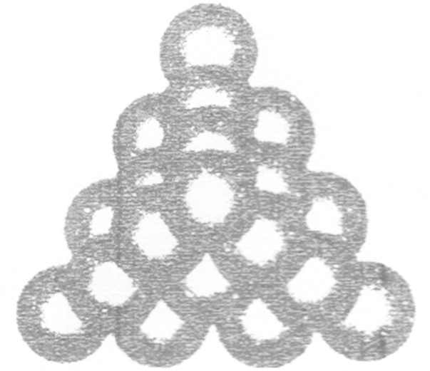

第一节　数列的概念与简单表示法

【课标研读】　1.通过日常生活和数学中的实例，了解数列的概念和表示方法(列表、图象、通项公式).　2.了解数列是一种特殊函数.

##### 1.数列的有关概念

<table><tr><td>
概念
</td><td>
含义
</td></tr><tr><td>
数列
</td><td>
按照确定的顺序排列的一列数
</td></tr><tr><td>
数列的项
</td><td>
数列中的每一个数
</td></tr><tr><td>
通项公式
</td><td>
如果数列{<em>an</em>}的第<em>n</em>项<em>an</em>与它的序号<em>n</em>之间的对应关系可以用一个式子来表示，那么这个式子叫做这个数列的通项公式
</td></tr><tr><td>
递推公式
</td><td>
如果一个数列的相邻两项或多项之间的关系可以用一个式子来表示，那么这个式子叫做这个数列的递推公式
</td></tr><tr><td>
数列{<em>an</em>}的

前<em>n</em>项和
</td><td>
把数列{<em>an</em>}从第1项起到第<em>n</em>项止的各项之和，称为数列{<em>an</em>}的前<em>n</em>项和，记作<em>Sn</em>，即<em>Sn</em>＝<em>a</em>1＋<em>a</em>2＋…＋<em>an</em>
</td></tr></table>

[微提醒]　（1）数列的项是指数列中某一确定的数，而项数是指数列的项对应的位置序号.(2) $\left\{a_{n}\right\}$ 表示数列&lt;text style="it&lt;text style="it&lt;text style="it<em>a</em>lic"&gt;a&lt;/text&gt;lic"&gt;a&lt;/text&gt;lic"&gt;a&lt;/text&gt;1 ，a2，…，a<em>&lt;text style="italic,subscript"&gt;&lt;text style="italic"&gt;n</em>&lt;/text&gt;&lt;/text&gt;，…，是数列的一种简记形式；而an只表示数列 $\left\{a_{n}\right\}$ 的第&lt;text style="it<em>a</em>lic,subscript"&gt;<em>&lt;text style="italic"&gt;n</em>&lt;/text&gt;&lt;/text&gt;项.（3）并不是所有的数列都有通项公式；同一个数列的通项公式在形式上未必唯一.

##### 2.数列的分类

<table><tr><td>
分类标准
</td><td>
类型
</td><td colspan="2">
满足条件
</td></tr><tr><td rowspan="2">
项数
</td><td>
有穷数列
</td><td colspan="2">
项数有限
</td></tr><tr><td>
无穷数列
</td><td colspan="2">
项数无限
</td></tr><tr><td rowspan="4">
项与项

间的大

小关系
</td><td>
递增数列
</td><td>
<em>an</em>＋1＞<em>an</em>
</td><td rowspan="3">
其中<em>n</em>∈<strong>N</strong><em>*</em>
</td></tr><tr><td>
递减数列
</td><td>
<em>an</em>＋1＜<em>an</em>
</td></tr><tr><td>
常数列
</td><td>
<em>an</em>＋1＝<em>an</em>
</td></tr><tr><td>
摆动数列
</td><td colspan="2">
从第二项起，有些项大于它的前一项，有些项小于它的前一项的数列
</td></tr></table>

##### 3.数列与函数的关系

数列{<em>an</em>}是从正整数集<strong>N</strong><em>\*</em>(或它的有限子集{1，2，…，<em>n</em>})到实数集<strong>R</strong>的函数，其自变量是<u>序号</u><em><u>n</u></em>，对应的函数值是<u>数列的第</u><em><u>n</u></em><u>项</u><em><u>an</u></em>，记为<em>an</em>＝<em>f</em>(<em>n</em>).

##### 4.数列的表示方法

<table><tr><td colspan="2">
列表法
</td><td>
列表格表示<em>n</em>与<em>an</em>的对应关系
</td></tr><tr><td colspan="2">
图象法
</td><td>
把点(<em>n</em>，<em>an</em>)画在平面直角坐标系中
</td></tr><tr><td rowspan="2">
公式法
</td><td>
通项公式
</td><td>
数列的通项使用<em>an</em>＝<em>f</em>(<em>n</em>)表示的方法
</td></tr><tr><td>
递推公式
</td><td>
使用初始值<em>a</em>1和<em>an</em>＋1＝<em>f</em>(<em>an</em>)或<em>a</em>1，<em>a</em>2和<em>an</em>＋1＝<em>f</em>(<em>an</em>，<em>an</em>－1)表示数列的方法
</td></tr></table>

【常用结论】

（1）若数列{&lt;text style="it&lt;text style="it<em>a</em>lic"&gt;a&lt;/text&gt;lic"&gt;a&lt;/text&gt;<em>&lt;text style="italic"&gt;&lt;text style="italic,subscript"&gt;&lt;text style="italic,subscript"&gt;&lt;text style="italic,subscript"&gt;n</em>&lt;/text&gt;&lt;/text&gt;&lt;/text&gt;&lt;/text&gt;}的前n项和为<em>S</em>n，则数列{an}的通项公式可表示为an＝ $\left\{\begin{matrix}S_{1}，n=1，\\S_{n}－S_{n－1}，n\geq 2，n\in N^{*}.\end{matrix}\right.$

（2）在数列{&lt;text style="it&lt;text style="it<em>a</em>lic"&gt;a&lt;/text&gt;lic"&gt;a&lt;/text&gt;<em>&lt;text style="italic,subscript"&gt;&lt;text style="italic,subscript"&gt;n</em>&lt;/text&gt;&lt;/text&gt;}中，若an最大，则 $\left\{\begin{matrix}a_{n}\geq a_{n－1}，\\a_{n}\geq a_{n+1}；\end{matrix}\right.$ 若&lt;text style="it&lt;text style="it<em>a</em>lic"&gt;a&lt;/text&gt;lic"&gt;a&lt;/text&gt;<em>&lt;text style="italic,subscript"&gt;&lt;text style="italic,subscript"&gt;n</em>&lt;/text&gt;&lt;/text&gt;最小，则 $\left\{\begin{matrix}a_{n}\leq a_{n－1}，\\a_{n}\leq a_{n+1}.\end{matrix}\right.$

（3）若<em>an</em>＋<em>k</em>＝<em>an</em>(<em>k</em>∈<strong>N</strong><em>\*</em>)，则{<em>an</em>}为周期数列，<em>k</em>为{<em>an</em>}的一个周期.

【自主检测】

##### 1.(多选)下列结论正确的是(　　)

$\quad$A.数列的项与项数是同一个概念

$\quad$B.数列1，2，3与3，2，1是两个不同的数列

$\quad$C.任何一个数列不是递增数列，就是递减数列

$\quad$D.若数列用图象表示，则从图象上看是一群孤立的点

答案BD

##### 2.(链接人教A选择性必修二P5例2)数列－1， $\frac{1}{2}$ ，－ $\frac{1}{3}$ ， $\frac{1}{4}$ ，－ $\frac{1}{5}$ ，…的一个通项公式为(　　)

$\quad$A.&lt;text style="it<em>a</em>lic"&gt;a&lt;/text&gt;<em>&lt;text style="italic,subscript"&gt;n</em>&lt;/text&gt;＝± $\frac{1}{n}$ 	
$\quad$B.&lt;text style="it<em>a</em>lic"&gt;a&lt;/text&gt;<em>&lt;text style="italic,subscript"&gt;n</em>&lt;/text&gt;＝ $\left(－1\right)^{n}$ · $\frac{1}{n}$

$\quad$C.&lt;text style="it<em>a</em>lic"&gt;a&lt;/text&gt;<em>&lt;text style="italic,subscript"&gt;n</em>&lt;/text&gt;＝ $\left(－1\right)^{n+1}$ · $\frac{1}{n}$ 	
$\quad$D.&lt;text style="it<em>a</em>lic"&gt;a&lt;/text&gt;<em>&lt;text style="italic,subscript"&gt;n</em>&lt;/text&gt;＝ $\frac{1}{n}$

答案B

##### 3.(链接人教A选择性必修二P8练习T3)在数列{&lt;text style="it&lt;text style="it&lt;text style="it<em>a</em>lic"&gt;a&lt;/text&gt;lic"&gt;a&lt;/text&gt;lic"&gt;a&lt;/text&gt;<em>&lt;text style="italic,subscript"&gt;n</em>&lt;/text&gt;}中，a1＝1，an＋1＝1＋ $\frac{1}{a_{n}}$ ，则&lt;text style="it&lt;text style="it&lt;text style="it<em>a</em>lic"&gt;a&lt;/text&gt;lic"&gt;a&lt;/text&gt;lic"&gt;a&lt;/text&gt;5＝(　　)

$\quad$A.2	
$\quad$B. $\frac{3}{2}$

$\quad$C. $\frac{5}{3}$ 	
$\quad$D. $\frac{8}{5}$

答案D

解析由题意得，令&lt;text style="it&lt;text style="it&lt;text style="it&lt;text style="it<em>a</em>lic"&gt;a&lt;/text&gt;lic"&gt;a&lt;/text&gt;lic"&gt;a&lt;/text&gt;lic"&gt;<em>&lt;text style="italic"&gt;&lt;text style="italic"&gt;n</em>&lt;/text&gt;&lt;/text&gt;&lt;/text&gt;＝1，可得a2＝1＋ $\frac{1}{a_{1}}$ ＝2；令&lt;text style="it&lt;text style="it&lt;text style="it&lt;text style="it<em>a</em>lic"&gt;a&lt;/text&gt;lic"&gt;a&lt;/text&gt;lic"&gt;a&lt;/text&gt;lic"&gt;<em>&lt;text style="italic"&gt;&lt;text style="italic"&gt;n</em>&lt;/text&gt;&lt;/text&gt;&lt;/text&gt;＝2，可得a3＝1＋ $\frac{1}{a_{2}}$ ＝1＋ $\frac{1}{2}$ ＝ $\frac{3}{2}$ ；令&lt;text style="it&lt;text style="it&lt;text style="it&lt;text style="it<em>a</em>lic"&gt;a&lt;/text&gt;lic"&gt;a&lt;/text&gt;lic"&gt;a&lt;/text&gt;lic"&gt;<em>&lt;text style="italic"&gt;&lt;text style="italic"&gt;n</em>&lt;/text&gt;&lt;/text&gt;&lt;/text&gt;＝3，可得a4＝1＋ $\frac{1}{a_{3}}$ ＝1＋ $\frac{1}{\frac{3}{2}}$ ＝ $\frac{5}{3}$ ；令&lt;text style="it&lt;text style="it&lt;text style="it&lt;text style="it<em>a</em>lic"&gt;a&lt;/text&gt;lic"&gt;a&lt;/text&gt;lic"&gt;a&lt;/text&gt;lic"&gt;<em>&lt;text style="italic"&gt;&lt;text style="italic"&gt;n</em>&lt;/text&gt;&lt;/text&gt;&lt;/text&gt;＝4，可得a5＝1＋ $\frac{1}{a_{4}}$ ＝1＋ $\frac{1}{\frac{5}{3}}$ ＝ $\frac{8}{5}$ .故选D.

##### 4.(链接人教A选择性必修二P7思考)已知数列{<em>an</em>}的前<em>n</em>项和<em>Sn</em>＝<em>n</em>2＋1，则<em>an</em>＝<u>　　　　</u>.

答案 $\left\{\begin{matrix}2，n=1，\\2n－1，n\geq 2\end{matrix}\right.$

解析当&lt;text style="it&lt;text style="it&lt;text style="it<em>a</em>lic"&gt;a&lt;/text&gt;lic"&gt;a&lt;/text&gt;lic"&gt;<em>&lt;text style="italic,subscript"&gt;&lt;text style="italic,subscript"&gt;&lt;text style="italic,subscript"&gt;&lt;text style="italic"&gt;&lt;text style="italic"&gt;&lt;text style="italic"&gt;&lt;text style="italic"&gt;&lt;text style="italic,subscript"&gt;n</em>&lt;/text&gt;&lt;/text&gt;&lt;/text&gt;&lt;/text&gt;&lt;/text&gt;&lt;/text&gt;&lt;/text&gt;&lt;/text&gt;&lt;/text&gt;＝&lt;text style="subscript"&gt;1&lt;/text&gt;时，a1＝<em>&lt;text style="italic"&gt;&lt;text style="italic"&gt;S</em>&lt;/text&gt;&lt;/text&gt;1＝&lt;text style="superscript"&gt;2&lt;/text&gt;.当n≥2时，an＝Sn－Sn－1＝n2＋1－[(n－1)2＋1]＝2n－1.显然当n＝1时，不满足上式，故an＝ $\left\{\begin{matrix}2，n=1，\\2n－1，n\geq 2.\end{matrix}\right.$

考点一　由<em>an</em>与<em>Sn</em>的关系求通项公式　　　　自主练透

##### 1.(双空题)已知数列{<em>an</em>}的前<em>n</em>项和为<em>Sn</em>，（1）若<em>Sn</em>＝<em>n</em>2＋2<em>n</em>，则<em>an</em>＝<u>　　　　</u>；（2）若<em>Sn</em>＝<em>n</em>2＋2<em>n</em>＋1，则<em>an</em>＝<u>　　　　</u>.

答案（1）2*n*＋1　（2） $\left\{\begin{matrix}4，n=1，\\2n+1，n\geq 2\end{matrix}\right.$

解析(&lt;text style="subscript"&gt;&lt;text style="subscript"&gt;1&lt;/text&gt;&lt;/text&gt;)当&lt;text style="it&lt;text style="it&lt;text style="it&lt;text style="it<em>a</em>lic"&gt;a&lt;/text&gt;lic"&gt;a&lt;/text&gt;lic"&gt;a&lt;/text&gt;lic"&gt;<em>&lt;text style="italic,subscript"&gt;&lt;text style="italic,subscript"&gt;&lt;text style="italic"&gt;&lt;text style="italic"&gt;&lt;text style="italic"&gt;&lt;text style="italic"&gt;&lt;text style="italic"&gt;&lt;text style="italic,subscript"&gt;&lt;text style="italic"&gt;n</em>&lt;/text&gt;&lt;/text&gt;&lt;/text&gt;&lt;/text&gt;&lt;/text&gt;&lt;/text&gt;&lt;/text&gt;&lt;/text&gt;&lt;/text&gt;&lt;/text&gt;＝1时，a1＝<em>&lt;text style="italic"&gt;S</em>&lt;/text&gt;1＝3.当n≥&lt;text style="superscript"&gt;2&lt;/text&gt;时，an＝Sn－ $S_{n}_{－1}$ ＝&lt;text style="it&lt;text style="it&lt;text style="it&lt;text style="it<em>a</em>lic"&gt;a&lt;/text&gt;lic"&gt;a&lt;/text&gt;lic"&gt;a&lt;/text&gt;lic"&gt;<em>&lt;text style="italic,subscript"&gt;&lt;text style="italic,subscript"&gt;&lt;text style="italic"&gt;&lt;text style="italic"&gt;&lt;text style="italic"&gt;&lt;text style="italic"&gt;&lt;text style="italic"&gt;&lt;text style="italic,subscript"&gt;&lt;text style="italic"&gt;n</em>&lt;/text&gt;&lt;/text&gt;&lt;/text&gt;&lt;/text&gt;&lt;/text&gt;&lt;/text&gt;&lt;/text&gt;&lt;/text&gt;&lt;/text&gt;&lt;/text&gt;&lt;text style="superscript"&gt;2&lt;/text&gt;＋2n－[(n－&lt;text style="subscript"&gt;&lt;text style="subscript"&gt;1&lt;/text&gt;&lt;/text&gt;)2＋2(n－1)]＝2n＋1.由于a1＝3也满足上式，所以an＝2n＋1.

（2）当&lt;text style="it&lt;text style="it&lt;text style="it&lt;text style="it<em>a</em>lic"&gt;a&lt;/text&gt;lic"&gt;a&lt;/text&gt;lic"&gt;a&lt;/text&gt;lic"&gt;<em>&lt;text style="italic,subscript"&gt;&lt;text style="italic,subscript"&gt;&lt;text style="italic"&gt;&lt;text style="italic,subscript"&gt;n</em>&lt;/text&gt;&lt;/text&gt;&lt;/text&gt;&lt;/text&gt;&lt;/text&gt;＝&lt;text style="subscript"&gt;&lt;text style="subscript"&gt;1&lt;/text&gt;&lt;/text&gt;时，a1＝<em>&lt;text style="italic"&gt;S</em>&lt;/text&gt;1＝4.当n≥2时，由（1）知，an＝Sn－ $S_{n}_{－1}$ ＝2&lt;text style="it&lt;text style="it&lt;text style="it&lt;text style="it<em>a</em>lic"&gt;a&lt;/text&gt;lic"&gt;a&lt;/text&gt;lic"&gt;a&lt;/text&gt;lic"&gt;<em>&lt;text style="italic,subscript"&gt;&lt;text style="italic,subscript"&gt;&lt;text style="italic"&gt;&lt;text style="italic,subscript"&gt;n</em>&lt;/text&gt;&lt;/text&gt;&lt;/text&gt;&lt;/text&gt;&lt;/text&gt;＋&lt;text style="subscript"&gt;&lt;text style="subscript"&gt;1&lt;/text&gt;&lt;/text&gt;，此时a1＝4不满足上式，所以an＝ $\left\{\begin{matrix}4，n=1，\\2n+1，n\geq 2.\end{matrix}\right.$

##### 2.(双空题)已知数列{<em>an</em>}中，<em>Sn</em>是其前<em>n</em>项和，且<em>Sn</em>＝2<em>an</em>＋1，则数列的通项公式<em>an</em>＝<u>　　　　</u>，<em>S</em>6＝<u>　　　</u>.

答案－2<em>n</em>－1　－63

解析当&lt;text style="it&lt;text style="it&lt;text style="it&lt;text style="it&lt;text style="it&lt;text style="it&lt;text style="it&lt;text style="it&lt;text style="it&lt;text style="it&lt;text style="it&lt;text style="it&lt;text style="it&lt;text style="it&lt;text style="it&lt;text style="it<em>a</em>lic"&gt;a&lt;/text&gt;lic"&gt;a&lt;/text&gt;lic"&gt;a&lt;/text&gt;lic"&gt;a&lt;/text&gt;lic"&gt;a&lt;/text&gt;lic"&gt;a&lt;/text&gt;lic"&gt;a&lt;/text&gt;lic"&gt;a&lt;/text&gt;lic"&gt;a&lt;/text&gt;lic"&gt;a&lt;/text&gt;lic"&gt;a&lt;/text&gt;lic"&gt;a&lt;/text&gt;lic"&gt;a&lt;/text&gt;lic"&gt;a&lt;/text&gt;lic"&gt;a&lt;/text&gt;lic"&gt;<em>&lt;text style="italic,subscript"&gt;&lt;text style="italic,subscript"&gt;&lt;text style="italic,subscript"&gt;&lt;text style="italic,subscript"&gt;&lt;text style="italic,subscript"&gt;&lt;text style="italic,subscript"&gt;&lt;text style="italic,subscript"&gt;&lt;text style="italic,subscript"&gt;&lt;text style="italic,subscript"&gt;&lt;text style="italic,subscript"&gt;&lt;text style="italic,subscript"&gt;&lt;text style="italic,subscript"&gt;&lt;text style="italic,subscript"&gt;&lt;text style="italic"&gt;&lt;text style="italic,subscript"&gt;&lt;text style="italic,subscript"&gt;&lt;text style="italic,superscript"&gt;&lt;text style="italic,superscript"&gt;n</em>&lt;/text&gt;&lt;/text&gt;&lt;/text&gt;&lt;/text&gt;&lt;/text&gt;&lt;/text&gt;&lt;/text&gt;&lt;/text&gt;&lt;/text&gt;&lt;/text&gt;&lt;/text&gt;&lt;/text&gt;&lt;/text&gt;&lt;/text&gt;&lt;/text&gt;&lt;/text&gt;&lt;/text&gt;&lt;/text&gt;&lt;/text&gt;＝&lt;text style="subscript"&gt;&lt;text style="subscript"&gt;&lt;text style="subscript"&gt;&lt;text style="subscript"&gt;&lt;text style="subscript"&gt;1&lt;/text&gt;&lt;/text&gt;&lt;/text&gt;&lt;/text&gt;&lt;/text&gt;时，a1＝<em>&lt;text style="italic"&gt;&lt;text style="italic"&gt;&lt;text style="italic"&gt;&lt;text style="italic"&gt;&lt;text style="italic"&gt;S</em>&lt;/text&gt;&lt;/text&gt;&lt;/text&gt;&lt;/text&gt;&lt;/text&gt;1＝2a1＋1，所以a1＝&lt;text style="subscript"&gt;&lt;text style="subscript"&gt;&lt;text style="subscript"&gt;&lt;text style="subscript"&gt;&lt;text style="subscript"&gt;&lt;text style="superscript"&gt;&lt;text style="superscript"&gt;－1&lt;/text&gt;&lt;/text&gt;&lt;/text&gt;&lt;/text&gt;&lt;/text&gt;&lt;/text&gt;&lt;/text&gt;.当n≥2时，Sn＝2an＋1①，Sn－1＝2an－1＋1②.①－②得Sn－Sn－1＝2an－2an－1，即an＝2an－2an－1，即an＝2an－1(n≥2)，所以{an}是首项为a1＝－1，公比为<em>q</em>＝2的等比数列.所以an＝a1<em>·q</em>n－1＝－2n－1，S6＝ $\frac{－1\times (1－2^{6})}{1－2}$ ＝－63.

##### 3.已知数列{<em>an</em>}满足<em>a</em>1＋3<em>a</em>2＋5<em>a</em>3＋…＋(2<em>n</em>－1)<em>an</em>＝(<em>n</em>＋1)2，<em>n</em>∈<strong>N</strong><em>\*</em>，则{<em>an</em>}的通项公式<em>an</em>＝<u>　　　　</u>.

答案 $\left\{\begin{matrix}4，n=1，\\\frac{2n+1}{2n－1}，n\geq 2\end{matrix}\right.$

解析因为&lt;text style="it&lt;text style="it&lt;text style="it&lt;text style="it&lt;text style="it&lt;text style="it&lt;text style="it&lt;text style="it&lt;text style="it&lt;text style="it&lt;text style="it<em>a</em>lic"&gt;a&lt;/text&gt;lic"&gt;a&lt;/text&gt;lic"&gt;a&lt;/text&gt;lic"&gt;a&lt;/text&gt;lic"&gt;a&lt;/text&gt;lic"&gt;a&lt;/text&gt;lic"&gt;a&lt;/text&gt;lic"&gt;a&lt;/text&gt;lic"&gt;a&lt;/text&gt;lic"&gt;a&lt;/text&gt;lic"&gt;a&lt;/text&gt;&lt;text style="subscript"&gt;&lt;text style="subscript"&gt;1&lt;/text&gt;&lt;/text&gt;＋&lt;text style="subscript"&gt;3&lt;/text&gt;a&lt;text style="superscript"&gt;&lt;text style="superscript"&gt;&lt;text style="subscript"&gt;&lt;text style="superscript"&gt;2&lt;/text&gt;&lt;/text&gt;&lt;/text&gt;&lt;/text&gt;＋5a3＋…＋(2<em>&lt;text style="italic,subscript"&gt;&lt;text style="italic"&gt;&lt;text style="italic"&gt;&lt;text style="italic"&gt;&lt;text style="italic"&gt;&lt;text style="italic"&gt;&lt;text style="italic,subscript"&gt;&lt;text style="italic"&gt;&lt;text style="italic,subscript"&gt;&lt;text style="italic"&gt;&lt;text style="italic"&gt;&lt;text style="italic"&gt;&lt;text style="italic,subscript"&gt;&lt;text style="italic,subscript"&gt;n</em>&lt;/text&gt;&lt;/text&gt;&lt;/text&gt;&lt;/text&gt;&lt;/text&gt;&lt;/text&gt;&lt;/text&gt;&lt;/text&gt;&lt;/text&gt;&lt;/text&gt;&lt;/text&gt;&lt;/text&gt;&lt;/text&gt;&lt;/text&gt;－1)an＝(n＋1)2①，所以a1＝22＝4，当n≥2时，a1＋3a2＋5a3＋…＋(2n－3) $a_{n}_{－1}$ ＝&lt;text style="it&lt;text style="it&lt;text style="it&lt;text style="it&lt;text style="it&lt;text style="it&lt;text style="it&lt;text style="it&lt;text style="it<em>a</em>lic"&gt;a&lt;/text&gt;lic"&gt;a&lt;/text&gt;lic"&gt;a&lt;/text&gt;lic"&gt;a&lt;/text&gt;lic"&gt;a&lt;/text&gt;lic"&gt;a&lt;/text&gt;lic"&gt;a&lt;/text&gt;lic"&gt;a&lt;/text&gt;lic"&gt;<em>&lt;text style="italic"&gt;&lt;text style="italic"&gt;&lt;text style="italic"&gt;&lt;text style="italic"&gt;&lt;text style="italic"&gt;&lt;text style="italic,subscript"&gt;&lt;text style="italic"&gt;&lt;text style="italic,subscript"&gt;&lt;text style="italic"&gt;&lt;text style="italic"&gt;&lt;text style="italic"&gt;&lt;text style="italic,subscript"&gt;&lt;text style="italic,subscript"&gt;n</em>&lt;/text&gt;&lt;/text&gt;&lt;/text&gt;&lt;/text&gt;&lt;/text&gt;&lt;/text&gt;&lt;/text&gt;&lt;/text&gt;&lt;/text&gt;&lt;/text&gt;&lt;/text&gt;&lt;/text&gt;&lt;/text&gt;&lt;/text&gt;&lt;text style="superscript"&gt;&lt;text style="superscript"&gt;&lt;text style="subscript"&gt;&lt;text style="superscript"&gt;2&lt;/text&gt;&lt;/text&gt;&lt;/text&gt;&lt;/text&gt;②，由①－②，可得(2n－&lt;text style="subscript"&gt;&lt;text style="subscript"&gt;1&lt;/text&gt;&lt;/text&gt;)&lt;text style="it&lt;text style="it<em>a</em>lic"&gt;a&lt;/text&gt;lic"&gt;a&lt;/text&gt;n＝2n＋1，所以an＝ $\frac{2n+1}{2n－1}$ (&lt;text style="it&lt;text style="it&lt;text style="it&lt;text style="it&lt;text style="it&lt;text style="it&lt;text style="it&lt;text style="it&lt;text style="it<em>a</em>lic"&gt;a&lt;/text&gt;lic"&gt;a&lt;/text&gt;lic"&gt;a&lt;/text&gt;lic"&gt;a&lt;/text&gt;lic"&gt;a&lt;/text&gt;lic"&gt;a&lt;/text&gt;lic"&gt;a&lt;/text&gt;lic"&gt;a&lt;/text&gt;lic"&gt;<em>&lt;text style="italic"&gt;&lt;text style="italic"&gt;&lt;text style="italic"&gt;&lt;text style="italic"&gt;&lt;text style="italic"&gt;&lt;text style="italic,subscript"&gt;&lt;text style="italic"&gt;&lt;text style="italic,subscript"&gt;&lt;text style="italic"&gt;&lt;text style="italic"&gt;&lt;text style="italic"&gt;&lt;text style="italic,subscript"&gt;&lt;text style="italic,subscript"&gt;n</em>&lt;/text&gt;&lt;/text&gt;&lt;/text&gt;&lt;/text&gt;&lt;/text&gt;&lt;/text&gt;&lt;/text&gt;&lt;/text&gt;&lt;/text&gt;&lt;/text&gt;&lt;/text&gt;&lt;/text&gt;&lt;/text&gt;&lt;/text&gt;≥&lt;text style="superscript"&gt;&lt;text style="superscript"&gt;&lt;text style="subscript"&gt;&lt;text style="superscript"&gt;2&lt;/text&gt;&lt;/text&gt;&lt;/text&gt;&lt;/text&gt;，n∈<strong>N</strong><em>\*</em>)，当n＝&lt;text style="subscript"&gt;&lt;text style="subscript"&gt;1&lt;/text&gt;&lt;/text&gt;时，不满足上式，所以数列{&lt;text style="it&lt;text style="it<em>a</em>lic"&gt;a&lt;/text&gt;lic"&gt;a&lt;/text&gt;n}的通项公式是an＝ $\left\{\begin{matrix}4，n=1，\\\frac{2n+1}{2n－1}，n\geq 2.\end{matrix}\right.$

##### 4.设<em>Sn</em>是数列{<em>an</em>}的前<em>n</em>项和，且<em>a</em>1＝－1，<em>an</em>＋1＝<em>SnSn</em>＋1，则<em>Sn</em>＝<u>　　　　</u>.

答案－ $\frac{1}{n}$

解析因为&lt;text style="it<em>a</em>lic"&gt;a&lt;/text&gt;<em>&lt;text style="italic,subscript"&gt;&lt;text style="italic,subscript"&gt;&lt;text style="italic,subscript"&gt;&lt;text style="italic,subscript"&gt;&lt;text style="italic,subscript"&gt;&lt;text style="italic,subscript"&gt;&lt;text style="italic,subscript"&gt;&lt;text style="italic,subscript"&gt;&lt;text style="italic,subscript"&gt;&lt;text style="italic,subscript"&gt;&lt;text style="italic"&gt;&lt;text style="italic"&gt;&lt;text style="italic,subscript"&gt;n</em>&lt;/text&gt;&lt;/text&gt;&lt;/text&gt;&lt;/text&gt;&lt;/text&gt;&lt;/text&gt;&lt;/text&gt;&lt;/text&gt;&lt;/text&gt;&lt;/text&gt;&lt;/text&gt;&lt;/text&gt;&lt;/text&gt;&lt;text style="subscript"&gt;&lt;text style="subscript"&gt;&lt;text style="subscript"&gt;&lt;text style="subscript"&gt;&lt;text style="subscript"&gt;＋1&lt;/text&gt;&lt;/text&gt;&lt;/text&gt;&lt;/text&gt;&lt;/text&gt;＝<em>&lt;text style="italic"&gt;&lt;text style="italic"&gt;&lt;text style="italic"&gt;&lt;text style="italic"&gt;&lt;text style="italic"&gt;&lt;text style="italic"&gt;&lt;text style="italic"&gt;&lt;text style="italic"&gt;&lt;text style="italic"&gt;S</em>&lt;/text&gt;&lt;/text&gt;&lt;/text&gt;&lt;/text&gt;&lt;/text&gt;&lt;/text&gt;&lt;/text&gt;&lt;/text&gt;&lt;/text&gt;n＋1－Sn，an＋1＝SnSn＋1，所以由两式联立得Sn＋1－Sn＝SnSn＋1.由题意可知Sn≠0，所以 $\frac{1}{S_{n}}$ － $\frac{1}{S_{n+1}}$ ＝1，即 $\frac{1}{S_{n+1}}$ － $\frac{1}{S_{n}}$ ＝－1.又 $\frac{1}{S_{1}}$ ＝－1，所以数列 $\left\{\frac{1}{S_{n}}\right\}$ 是首项为－1，公差为－1的等差数列.所以 $\frac{1}{S_{n}}$ ＝－1＋(&lt;text style="it<em>a</em>lic,subscript"&gt;<em>&lt;text style="italic,subscript"&gt;&lt;text style="italic,subscript"&gt;&lt;text style="italic,subscript"&gt;&lt;text style="italic,subscript"&gt;&lt;text style="italic,subscript"&gt;&lt;text style="italic,subscript"&gt;&lt;text style="italic,subscript"&gt;&lt;text style="italic,subscript"&gt;&lt;text style="italic,subscript"&gt;&lt;text style="italic"&gt;&lt;text style="italic"&gt;&lt;text style="italic,subscript"&gt;n</em>&lt;/text&gt;&lt;/text&gt;&lt;/text&gt;&lt;/text&gt;&lt;/text&gt;&lt;/text&gt;&lt;/text&gt;&lt;/text&gt;&lt;/text&gt;&lt;/text&gt;&lt;/text&gt;&lt;/text&gt;&lt;/text&gt;－1)×(－1)＝－n，所以<em>&lt;text style="italic"&gt;&lt;text style="italic"&gt;&lt;text style="italic"&gt;&lt;text style="italic"&gt;&lt;text style="italic"&gt;&lt;text style="italic"&gt;&lt;text style="italic"&gt;&lt;text style="italic"&gt;&lt;text style="italic"&gt;S</em>&lt;/text&gt;&lt;/text&gt;&lt;/text&gt;&lt;/text&gt;&lt;/text&gt;&lt;/text&gt;&lt;/text&gt;&lt;/text&gt;&lt;/text&gt;n＝－ $\frac{1}{n}$ .

##### 1.已知<em>Sn</em>求<em>an</em>的三个步骤

第一步：先利用<em>a</em>1＝<em>S</em>1求出<em>a</em>1；

第二步：用<em>n</em>－1替换<em>Sn</em>中的<em>n</em>得到一个新的关系式，利用<em>an</em>＝<em>Sn</em>－<em>Sn</em>－1(<em>n</em>≥2)便可求出当<em>n</em>≥2时<em>an</em>的表达式；

第三步：注意检验当*n*＝1时的表达式是否可以与*n*≥2时的表达式合并.

##### 2.<em>Sn</em>与<em>an</em>关系问题的求解思路

根据所求结果的不同要求，将问题向不同的两个方向转化.

方向1：利用<em>an</em>＝<em>Sn</em>－<em>Sn</em>－1(<em>n</em>≥2)转化为只含<em>Sn</em>，<em>Sn</em>－1的关系式，再求解.

方向2：利用<em>Sn</em>－<em>Sn</em>－1＝<em>an</em>(<em>n</em>≥2)转化为只含<em>an</em>，<em>an</em>－1的关系式，再求解.

考点二　由数列的递推关系求通项公式　　　　师生共研

(多题同问)根据下列条件求数列的通项公式：

（1）已知数列{<em>an</em>}中，<em>a</em>1＝1，<em>an</em>＋1＝<em>an</em>＋<em>n</em>＋1；

（2）已知数列{<em>an</em>}中，<em>a</em>1＝1，<em>an</em>＋1－<em>an</em>＝4<em>n</em>－1；

（3）已知数列{<em>an</em>}中，<em>a</em>1＝2，(<em>n</em>＋1)<em>an</em>＋1＝2(<em>n</em>＋2)<em>an</em>；

（4）已知数列{<em>an</em>}中，其前<em>n</em>项和为<em>Sn</em>，且<em>a</em>1＝1，<em>Sn</em>＝<em>n</em>2<em>an</em>.

解：（1）(累加法)：根据题意 $a_{n}_{+1}$ ＝<em>a&lt;text style="italic"&gt;n</em>&lt;/text&gt;＋n＋1，

所以当&lt;text style="it&lt;text style="it<em>a</em>lic"&gt;a&lt;/text&gt;lic"&gt;<em>&lt;text style="italic"&gt;&lt;text style="italic,subscript"&gt;&lt;text style="italic"&gt;n</em>&lt;/text&gt;&lt;/text&gt;&lt;/text&gt;&lt;/text&gt;≥2时，an＝ $a_{n}_{－1}$ ＋&lt;text style="it&lt;text style="it<em>a</em>lic"&gt;a&lt;/text&gt;lic"&gt;<em>&lt;text style="italic"&gt;&lt;text style="italic,subscript"&gt;&lt;text style="italic"&gt;n</em>&lt;/text&gt;&lt;/text&gt;&lt;/text&gt;&lt;/text&gt;，即an－ $a_{n}_{－1}$ ＝&lt;text style="it&lt;text style="it<em>a</em>lic"&gt;a&lt;/text&gt;lic"&gt;<em>&lt;text style="italic"&gt;&lt;text style="italic,subscript"&gt;&lt;text style="italic"&gt;n</em>&lt;/text&gt;&lt;/text&gt;&lt;/text&gt;&lt;/text&gt;，

所以当&lt;text style="it&lt;text style="it&lt;text style="it&lt;text style="it&lt;text style="it<em>a</em>lic"&gt;a&lt;/text&gt;lic"&gt;a&lt;/text&gt;lic"&gt;a&lt;/text&gt;lic"&gt;a&lt;/text&gt;lic"&gt;<em>&lt;text style="italic,subscript"&gt;&lt;text style="italic"&gt;&lt;text style="italic"&gt;n</em>&lt;/text&gt;&lt;/text&gt;&lt;/text&gt;&lt;/text&gt;≥2时，an＝(an－ $a_{n}_{－1}$ )＋( $a_{n}_{－1}$ － $a_{n}_{－2}$ )＋…＋(&lt;text style="it&lt;text style="it&lt;text style="it&lt;text style="it<em>a</em>lic"&gt;a&lt;/text&gt;lic"&gt;a&lt;/text&gt;lic"&gt;a&lt;/text&gt;lic"&gt;a&lt;/text&gt;2－a&lt;text style="subscript"&gt;1&lt;/text&gt;)＋a1＝<em>&lt;text style="italic,subscript"&gt;&lt;text style="italic,subscript"&gt;&lt;text style="italic"&gt;&lt;text style="italic"&gt;n</em>&lt;/text&gt;&lt;/text&gt;&lt;/text&gt;&lt;/text&gt;＋(n－1)＋…＋2＋1＝ $\frac{n(n+1)}{2}$ ，

当&lt;text style="it&lt;text style="it&lt;text style="it<em>a</em>lic"&gt;a&lt;/text&gt;lic"&gt;a&lt;/text&gt;lic"&gt;<em>&lt;text style="italic,subscript"&gt;n</em>&lt;/text&gt;&lt;/text&gt;＝1时，a1＝1符合上式，故数列{an}的通项公式是an＝ $\frac{n(n+1)}{2}$ .

(&lt;text style="subscript"&gt;2&lt;/text&gt;)(累加法)由&lt;text style="it&lt;text style="it&lt;text style="it&lt;text style="it&lt;text style="it&lt;text style="it&lt;text style="it&lt;text style="it&lt;text style="it&lt;text style="it<em>a</em>lic"&gt;a&lt;/text&gt;lic"&gt;a&lt;/text&gt;lic"&gt;a&lt;/text&gt;lic"&gt;a&lt;/text&gt;lic"&gt;a&lt;/text&gt;lic"&gt;a&lt;/text&gt;lic"&gt;a&lt;/text&gt;lic"&gt;a&lt;/text&gt;lic"&gt;a&lt;/text&gt;lic"&gt;a&lt;/text&gt;<em>&lt;text style="italic,subscript"&gt;&lt;text style="italic,superscript"&gt;&lt;text style="italic,subscript"&gt;&lt;text style="italic,subscript"&gt;&lt;text style="italic,subscript"&gt;&lt;text style="italic,superscript"&gt;&lt;text style="italic"&gt;n</em>&lt;/text&gt;&lt;/text&gt;&lt;/text&gt;&lt;/text&gt;&lt;/text&gt;&lt;/text&gt;&lt;/text&gt;＋&lt;text style="subscript"&gt;&lt;text style="subscript"&gt;&lt;text style="subscript"&gt;1&lt;/text&gt;&lt;/text&gt;&lt;/text&gt;－an＝4n&lt;text style="subscript"&gt;－1&lt;/text&gt;，得an＝a1＋(a2－a1)＋(a3－a2)＋…＋(an－an－1)＝a1＋1＋4＋…＋4n－2＝ $\frac{4^{n－1}+2}{3}$ (&lt;text style="it&lt;text style="it&lt;text style="it&lt;text style="it&lt;text style="it&lt;text style="it&lt;text style="it&lt;text style="it&lt;text style="it&lt;text style="it<em>a</em>lic"&gt;a&lt;/text&gt;lic"&gt;a&lt;/text&gt;lic"&gt;a&lt;/text&gt;lic"&gt;a&lt;/text&gt;lic"&gt;a&lt;/text&gt;lic"&gt;a&lt;/text&gt;lic"&gt;a&lt;/text&gt;lic"&gt;a&lt;/text&gt;lic"&gt;a&lt;/text&gt;lic,subscript"&gt;<em>&lt;text style="italic,superscript"&gt;&lt;text style="italic,subscript"&gt;&lt;text style="italic,subscript"&gt;&lt;text style="italic,subscript"&gt;&lt;text style="italic,superscript"&gt;&lt;text style="italic"&gt;n</em>&lt;/text&gt;&lt;/text&gt;&lt;/text&gt;&lt;/text&gt;&lt;/text&gt;&lt;/text&gt;&lt;/text&gt;≥&lt;text style="subscript"&gt;2&lt;/text&gt;).

当<em>n</em>＝1时，<em>a</em>1＝1，满足上式.

故数列{&lt;text style="it<em>a</em>lic"&gt;a&lt;/text&gt;<em>&lt;text style="italic,subscript"&gt;n</em>&lt;/text&gt;}的通项公式是an＝ $\frac{4^{n－1}+2}{3}$ .

（3）(累乘法)因为(<text style="it*a*lic">*<text style="italic,subscript">n*</text></text>＋1) $a_{n}_{+1}$ ＝2(<text style="it*a*lic">*<text style="italic,subscript">n*</text></text>＋2)an，

所以 $\frac{a_{n}_{+1}}{a_{n}}$ ＝ $\frac{2(n+2)}{n+1}$ ，

则&lt;text style="it<em>a</em>lic"&gt;a&lt;/text&gt;<em>&lt;text style="italic,superscript"&gt;&lt;text style="italic"&gt;&lt;text style="italic,superscript"&gt;&lt;text style="italic"&gt;n</em>&lt;/text&gt;&lt;/text&gt;&lt;/text&gt;&lt;/text&gt;＝a&lt;text style="subscript"&gt;1&lt;/text&gt;<em>&lt;text style="italic"&gt;&lt;text style="italic"&gt;&lt;text style="italic"&gt;&lt;text style="italic"&gt;&lt;text style="italic"&gt;&lt;text style="italic"&gt;·</em>&lt;/text&gt;&lt;/text&gt;&lt;/text&gt;&lt;/text&gt;&lt;/text&gt;&lt;/text&gt; $\frac{a_{2}}{a_{1}}$ <em>&lt;text style="italic"&gt;&lt;text style="italic"&gt;&lt;text style="italic"&gt;&lt;text style="italic"&gt;&lt;text style="italic"&gt;&lt;text style="italic"&gt;·</em>&lt;/text&gt;&lt;/text&gt;&lt;/text&gt;&lt;/text&gt;&lt;/text&gt;&lt;/text&gt; $\frac{a_{3}}{a_{2}}$ <em>&lt;text style="italic"&gt;&lt;text style="italic"&gt;&lt;text style="italic"&gt;&lt;text style="italic"&gt;&lt;text style="italic"&gt;&lt;text style="italic"&gt;·</em>&lt;/text&gt;&lt;/text&gt;&lt;/text&gt;&lt;/text&gt;&lt;/text&gt;&lt;/text&gt; $\frac{a_{4}}{a_{3}}$ <em>&lt;text style="italic"&gt;&lt;text style="italic"&gt;&lt;text style="italic"&gt;&lt;text style="italic"&gt;&lt;text style="italic"&gt;&lt;text style="italic"&gt;·</em>&lt;/text&gt;&lt;/text&gt;&lt;/text&gt;&lt;/text&gt;&lt;/text&gt;&lt;/text&gt;…· $\frac{a_{n}}{a_{n}_{－1}}$ ＝2&lt;text style="it<em>a</em>lic,subscript"&gt;<em>&lt;text style="italic"&gt;&lt;text style="italic,superscript"&gt;&lt;text style="italic"&gt;n</em>&lt;/text&gt;&lt;/text&gt;&lt;/text&gt;&lt;/text&gt;－&lt;text style="subscript"&gt;1&lt;/text&gt;<em>&lt;text style="italic"&gt;&lt;text style="italic"&gt;&lt;text style="italic"&gt;&lt;text style="italic"&gt;&lt;text style="italic"&gt;&lt;text style="italic"&gt;·</em>&lt;/text&gt;&lt;/text&gt;&lt;/text&gt;&lt;/text&gt;&lt;/text&gt;&lt;/text&gt;<em>a</em>1· $\left(\frac{3}{2}\times \frac{4}{3}\times \frac{5}{4}\times \ldots \times \frac{n+1}{n}\right)$ ＝(&lt;text style="it<em>a</em>lic,subscript"&gt;<em>&lt;text style="italic"&gt;&lt;text style="italic,superscript"&gt;&lt;text style="italic"&gt;n</em>&lt;/text&gt;&lt;/text&gt;&lt;/text&gt;&lt;/text&gt;＋&lt;text style="subscript"&gt;1&lt;/text&gt;)<em>&lt;text style="italic"&gt;&lt;text style="italic"&gt;&lt;text style="italic"&gt;&lt;text style="italic"&gt;&lt;text style="italic"&gt;&lt;text style="italic"&gt;·</em>&lt;/text&gt;&lt;/text&gt;&lt;/text&gt;&lt;/text&gt;&lt;/text&gt;&lt;/text&gt;2n&lt;text style="superscript"&gt;－1&lt;/text&gt;(n≥2).

当<em>n</em>＝1时，<em>a</em>1＝2满足上式，

故数列{<em>an</em>}的通项公式是<em>an</em>＝(<em>n</em>＋1)<em>·</em>2<em>n</em>－1.

（4）(累乘法)由<em>Sn</em>＝<em>n</em>2<em>an</em>，可得当<em>n</em>≥2时，<em>Sn</em>－1＝(<em>n</em>－1)2<em>an</em>－1，

则<em>an</em>＝<em>Sn</em>－<em>Sn</em>－1＝<em>n</em>2<em>an</em>－(<em>n</em>－1)2<em>an</em>－1，

即(<em>n</em>2－1)<em>an</em>＝(<em>n</em>－1)2<em>an</em>－1，易知<em>an</em>≠0，

故 $\frac{a_{n}}{a_{n－1}}$ ＝ $\frac{n－1}{n+1}$ (*n*≥2).

所以当&lt;text style="it&lt;text style="it<em>a</em>lic"&gt;a&lt;/text&gt;lic"&gt;<em>n</em>&lt;/text&gt;≥2时，an＝ $\frac{a_{n}}{a_{n－1}}$ × $\frac{a_{n－1}}{a_{n－2}}$ × $\frac{a_{n－2}}{a_{n－3}}$ ×…× $\frac{a_{3}}{a_{2}}$ × $\frac{a_{2}}{a_{1}}$ ×&lt;text style="it<em>a</em>lic"&gt;a&lt;/text&gt;1＝ $\frac{n－1}{n+1}$ × $\frac{n－2}{n}$ × $\frac{n－3}{n－1}$ ×…× $\frac{2}{4}$ × $\frac{1}{3}$ ×1＝ $\frac{2}{n(n+1)}$ .

当&lt;text style="it&lt;text style="it<em>a</em>lic"&gt;a&lt;/text&gt;lic"&gt;<em>n</em>&lt;/text&gt;＝1时，a1＝1满足an＝ $\frac{2}{n(n+1)}$ .

故数列 $\left\{a_{n}\right\}$ 的通项公式是<em>an</em>＝ $\frac{2}{n(n+1)}$ .

&lt;text style="subscript"&gt;1&lt;/text&gt;.形如 $a_{n}_{+1}$ －&lt;text style="it&lt;text style="it&lt;text style="it&lt;text style="it&lt;text style="it&lt;text style="it&lt;text style="it<em>a</em>lic"&gt;a&lt;/text&gt;lic"&gt;a&lt;/text&gt;lic"&gt;a&lt;/text&gt;lic"&gt;a&lt;/text&gt;lic"&gt;a&lt;/text&gt;lic"&gt;a&lt;/text&gt;lic"&gt;a&lt;/text&gt;<em>&lt;text style="italic"&gt;&lt;text style="italic,subscript"&gt;&lt;text style="italic,subscript"&gt;&lt;text style="italic"&gt;n</em>&lt;/text&gt;&lt;/text&gt;&lt;/text&gt;&lt;/text&gt;＝<em>f</em>(n)的递推关系，用累加法求通项，即利用恒等式an＝a&lt;text style="subscript"&gt;1&lt;/text&gt;＋(a&lt;text style="subscript"&gt;2&lt;/text&gt;－a1)＋(a3－a2)＋…＋(an－ $a_{n}_{－1}$ )(&lt;text style="it&lt;text style="it&lt;text style="it&lt;text style="it&lt;text style="it&lt;text style="it&lt;text style="it<em>a</em>lic"&gt;a&lt;/text&gt;lic"&gt;a&lt;/text&gt;lic"&gt;a&lt;/text&gt;lic"&gt;a&lt;/text&gt;lic"&gt;a&lt;/text&gt;lic"&gt;a&lt;/text&gt;lic,subscript"&gt;<em>&lt;text style="italic,subscript"&gt;&lt;text style="italic,subscript"&gt;&lt;text style="italic"&gt;n</em>&lt;/text&gt;&lt;/text&gt;&lt;/text&gt;&lt;/text&gt;≥&lt;text style="subscript"&gt;2&lt;/text&gt;)求解.

##### 2.形如 $\frac{a_{n}_{+1}}{a_{n}}$ ＝&lt;text style="it&lt;text style="it&lt;text style="it<em>a</em>lic"&gt;a&lt;/text&gt;lic"&gt;a&lt;/text&gt;lic"&gt;f&lt;/text&gt;(<em>&lt;text style="italic,subscript"&gt;&lt;text style="italic,subscript"&gt;&lt;text style="italic"&gt;n</em>&lt;/text&gt;&lt;/text&gt;&lt;/text&gt;)的递推关系，用累乘法求通项，即利用恒等式an＝a1<em>&lt;text style="italic"&gt;&lt;text style="italic"&gt;&lt;text style="italic"&gt;&lt;text style="italic"&gt;·</em>&lt;/text&gt;&lt;/text&gt;&lt;/text&gt;&lt;/text&gt; $\frac{a_{2}}{a_{1}}$ &lt;text style="it<em>a</em>lic"&gt;<em>&lt;text style="italic"&gt;&lt;text style="italic"&gt;&lt;text style="italic"&gt;·</em>&lt;/text&gt;&lt;/text&gt;&lt;/text&gt;&lt;/text&gt; $\frac{a_{3}}{a_{2}}$ &lt;text style="it<em>a</em>lic"&gt;<em>&lt;text style="italic"&gt;&lt;text style="italic"&gt;&lt;text style="italic"&gt;·</em>&lt;/text&gt;&lt;/text&gt;&lt;/text&gt;&lt;/text&gt; $\frac{a_{4}}{a_{3}}$ &lt;text style="it<em>a</em>lic"&gt;<em>&lt;text style="italic"&gt;&lt;text style="italic"&gt;&lt;text style="italic"&gt;·</em>&lt;/text&gt;&lt;/text&gt;&lt;/text&gt;&lt;/text&gt;…· $\frac{a_{n}}{a_{n}_{－1}}$ (&lt;text style="it&lt;text style="it<em>a</em>lic"&gt;a&lt;/text&gt;lic"&gt;a&lt;/text&gt;<em>&lt;text style="italic,subscript"&gt;&lt;text style="italic,subscript"&gt;&lt;text style="italic"&gt;n</em>&lt;/text&gt;&lt;/text&gt;&lt;/text&gt;≠0，n≥2)求解.

对点练1.在数列{&lt;text style="it&lt;text style="it&lt;text style="it<em>a</em>lic"&gt;a&lt;/text&gt;lic"&gt;a&lt;/text&gt;lic"&gt;a&lt;/text&gt;<em>&lt;text style="italic,subscript"&gt;&lt;text style="italic,subscript"&gt;n</em>&lt;/text&gt;&lt;/text&gt;}中，a1＝2， $a_{n}_{+1}$ ＝&lt;text style="it&lt;text style="it&lt;text style="it<em>a</em>lic"&gt;a&lt;/text&gt;lic"&gt;a&lt;/text&gt;lic"&gt;a&lt;/text&gt;<em>&lt;text style="italic,subscript"&gt;&lt;text style="italic,subscript"&gt;n</em>&lt;/text&gt;&lt;/text&gt;＋ln $\left(1+\frac{1}{n}\right)$ ，则&lt;text style="it&lt;text style="it&lt;text style="it<em>a</em>lic"&gt;a&lt;/text&gt;lic"&gt;a&lt;/text&gt;lic"&gt;a&lt;/text&gt;<em>&lt;text style="italic,subscript"&gt;&lt;text style="italic,subscript"&gt;n</em>&lt;/text&gt;&lt;/text&gt;等于(　　)

$\quad$A.2＋ln *n*	
$\quad$B.2＋(*n*－1)ln *n*

$\quad$C.2＋*n*ln *n*	
$\quad$D.1＋*n*＋ln *n*

答案A

解析因为 $a_{n}_{+1}$ －&lt;text style="it&lt;text style="it&lt;text style="it&lt;text style="it&lt;text style="it&lt;text style="it&lt;text style="it&lt;text style="it&lt;text style="it&lt;text style="it&lt;text style="it&lt;text style="it<em>a</em>lic"&gt;a&lt;/text&gt;lic"&gt;a&lt;/text&gt;lic"&gt;a&lt;/text&gt;lic"&gt;a&lt;/text&gt;lic"&gt;a&lt;/text&gt;lic"&gt;a&lt;/text&gt;lic"&gt;a&lt;/text&gt;lic"&gt;a&lt;/text&gt;lic"&gt;a&lt;/text&gt;lic"&gt;a&lt;/text&gt;lic"&gt;a&lt;/text&gt;lic"&gt;a&lt;/text&gt;<em>&lt;text style="italic"&gt;&lt;text style="italic"&gt;&lt;text style="italic,subscript"&gt;&lt;text style="italic"&gt;&lt;text style="italic"&gt;&lt;text style="italic"&gt;&lt;text style="italic,subscript"&gt;&lt;text style="italic"&gt;&lt;text style="italic,subscript"&gt;&lt;text style="italic"&gt;&lt;text style="italic"&gt;&lt;text style="italic,subscript"&gt;&lt;text style="italic"&gt;&lt;text style="italic"&gt;n</em>&lt;/text&gt;&lt;/text&gt;&lt;/text&gt;&lt;/text&gt;&lt;/text&gt;&lt;/text&gt;&lt;/text&gt;&lt;/text&gt;&lt;/text&gt;&lt;/text&gt;&lt;/text&gt;&lt;/text&gt;&lt;/text&gt;&lt;/text&gt;＝ln $\frac{n+1}{n}$ ＝l&lt;text style="it&lt;text style="it&lt;text style="it&lt;text style="it&lt;text style="it&lt;text style="it&lt;text style="it&lt;text style="it&lt;text style="it&lt;text style="it&lt;text style="it&lt;text style="it<em>a</em>lic"&gt;a&lt;/text&gt;lic"&gt;a&lt;/text&gt;lic"&gt;a&lt;/text&gt;lic"&gt;a&lt;/text&gt;lic"&gt;a&lt;/text&gt;lic"&gt;a&lt;/text&gt;lic"&gt;a&lt;/text&gt;lic"&gt;a&lt;/text&gt;lic"&gt;a&lt;/text&gt;lic"&gt;a&lt;/text&gt;lic"&gt;a&lt;/text&gt;lic,subscript"&gt;<em>&lt;text style="italic"&gt;&lt;text style="italic,subscript"&gt;&lt;text style="italic"&gt;&lt;text style="italic"&gt;&lt;text style="italic"&gt;&lt;text style="italic,subscript"&gt;&lt;text style="italic"&gt;&lt;text style="italic,subscript"&gt;&lt;text style="italic"&gt;&lt;text style="italic"&gt;&lt;text style="italic,subscript"&gt;&lt;text style="italic"&gt;&lt;text style="italic"&gt;n</em>&lt;/text&gt;&lt;/text&gt;&lt;/text&gt;&lt;/text&gt;&lt;/text&gt;&lt;/text&gt;&lt;/text&gt;&lt;/text&gt;&lt;/text&gt;&lt;/text&gt;&lt;/text&gt;&lt;/text&gt;&lt;/text&gt;&lt;/text&gt;(n＋&lt;text style="subscript"&gt;&lt;text style="subscript"&gt;1&lt;/text&gt;&lt;/text&gt;)－ln n，所以<em>a</em>&lt;text style="subscript"&gt;2&lt;/text&gt;－a1＝ln 2－ln 1，a&lt;text style="subscript"&gt;3&lt;/text&gt;－a2＝ln 3－ln 2，a4－a3＝ln 4－ln 3，…，an－ $a_{n}_{－1}$ ＝l&lt;text style="it&lt;text style="it&lt;text style="it&lt;text style="it&lt;text style="it&lt;text style="it&lt;text style="it&lt;text style="it&lt;text style="it&lt;text style="it&lt;text style="it&lt;text style="it<em>a</em>lic"&gt;a&lt;/text&gt;lic"&gt;a&lt;/text&gt;lic"&gt;a&lt;/text&gt;lic"&gt;a&lt;/text&gt;lic"&gt;a&lt;/text&gt;lic"&gt;a&lt;/text&gt;lic"&gt;a&lt;/text&gt;lic"&gt;a&lt;/text&gt;lic"&gt;a&lt;/text&gt;lic"&gt;a&lt;/text&gt;lic"&gt;a&lt;/text&gt;lic,subscript"&gt;<em>&lt;text style="italic"&gt;&lt;text style="italic,subscript"&gt;&lt;text style="italic"&gt;&lt;text style="italic"&gt;&lt;text style="italic"&gt;&lt;text style="italic,subscript"&gt;&lt;text style="italic"&gt;&lt;text style="italic,subscript"&gt;&lt;text style="italic"&gt;&lt;text style="italic"&gt;&lt;text style="italic,subscript"&gt;&lt;text style="italic"&gt;&lt;text style="italic"&gt;n</em>&lt;/text&gt;&lt;/text&gt;&lt;/text&gt;&lt;/text&gt;&lt;/text&gt;&lt;/text&gt;&lt;/text&gt;&lt;/text&gt;&lt;/text&gt;&lt;/text&gt;&lt;/text&gt;&lt;/text&gt;&lt;/text&gt;&lt;/text&gt; n－ln(n－&lt;text style="subscript"&gt;&lt;text style="subscript"&gt;1&lt;/text&gt;&lt;/text&gt;)(n≥&lt;text style="subscript"&gt;2&lt;/text&gt;)，把以上各式相加得<em>a</em>n－a1＝ln n－ln 1，则an＝2＋ln n(n≥2)，且a1＝2也满足此式，因此an＝2＋ln n(n∈<strong>N</strong><em>\*</em>).故选A.

对点练2.已知数列{<em>an</em>}的前<em>n</em>项和为<em>Sn</em>，且满足<em>Sn</em>＝2<em>n</em>＋2－3，则该数列的通项公式为<u>　　　　　　</u>.

答案<em>an</em>＝ $\left\{\begin{matrix}5，n=1，\\2^{n+1}，n\geq 2\end{matrix}\right.$

解析当&lt;text style="it&lt;text style="it&lt;text style="it&lt;text style="it<em>a</em>lic"&gt;a&lt;/text&gt;lic"&gt;a&lt;/text&gt;lic"&gt;a&lt;/text&gt;lic"&gt;<em>&lt;text style="italic,subscript"&gt;&lt;text style="italic,subscript"&gt;&lt;text style="italic,subscript"&gt;&lt;text style="italic,superscript"&gt;&lt;text style="italic,superscript"&gt;&lt;text style="italic,superscript"&gt;&lt;text style="italic"&gt;&lt;text style="italic,subscript"&gt;n</em>&lt;/text&gt;&lt;/text&gt;&lt;/text&gt;&lt;/text&gt;&lt;/text&gt;&lt;/text&gt;&lt;/text&gt;&lt;/text&gt;&lt;/text&gt;＝&lt;text style="subscript"&gt;&lt;text style="subscript"&gt;1&lt;/text&gt;&lt;/text&gt;时，a1＝<em>&lt;text style="italic"&gt;&lt;text style="italic"&gt;S</em>&lt;/text&gt;&lt;/text&gt;1＝23－3＝5，当n≥2时，有an＝Sn－Sn－1＝(2n＋2－3)－(2n&lt;text style="superscript"&gt;＋1&lt;/text&gt;－3)＝2n＋1，当n＝1时，a1＝5不满足上式，所以an＝ $\left\{\begin{matrix}5，n=1，\\2^{n+1}，n\geq 2.\end{matrix}\right.$

考点三　数列的函数特征　　　　多维探究

角度1　数列的单调性

已知数列{&lt;text style="it&lt;text style="it<em>a</em>lic"&gt;a&lt;/text&gt;lic"&gt;a&lt;/text&gt;<em>&lt;text style="italic,subscript"&gt;&lt;text style="italic,subscript"&gt;n</em>&lt;/text&gt;&lt;/text&gt;}中，an＝ $\frac{3n＋k}{2^{n}}$ ，若数列{&lt;text style="it&lt;text style="it<em>a</em>lic"&gt;a&lt;/text&gt;lic"&gt;a&lt;/text&gt;<em>&lt;text style="italic,subscript"&gt;&lt;text style="italic,subscript"&gt;n</em>&lt;/text&gt;&lt;/text&gt;}为递减数列，则实数<em>k</em>的取值范围为(　　)

$\quad$A.(3，＋∞)	
$\quad$B.(2，＋∞)

$\quad$C.(1，＋∞)	
$\quad$D.(0，＋∞)

答案D

解析&lt;text style="it&lt;text style="it&lt;text style="it&lt;text style="it<em>a</em>lic"&gt;a&lt;/text&gt;lic"&gt;a&lt;/text&gt;lic"&gt;a&lt;/text&gt;lic"&gt;a&lt;/text&gt;<em>&lt;text style="italic,subscript"&gt;&lt;text style="italic,subscript"&gt;&lt;text style="italic"&gt;&lt;text style="italic,subscript"&gt;&lt;text style="italic,subscript"&gt;&lt;text style="italic"&gt;&lt;text style="italic"&gt;n</em>&lt;/text&gt;&lt;/text&gt;&lt;/text&gt;&lt;/text&gt;&lt;/text&gt;&lt;/text&gt;&lt;/text&gt;&lt;text style="subscript"&gt;＋1&lt;/text&gt;－an＝ $\frac{3n+3+k}{2^{n+1}}$ － $\frac{3n＋k}{2^{n}}$ ＝ $\frac{3－3n－k}{2^{n+1}}$ ，由数列{&lt;text style="it&lt;text style="it&lt;text style="it&lt;text style="it<em>a</em>lic"&gt;a&lt;/text&gt;lic"&gt;a&lt;/text&gt;lic"&gt;a&lt;/text&gt;lic"&gt;a&lt;/text&gt;<em>&lt;text style="italic,subscript"&gt;&lt;text style="italic,subscript"&gt;&lt;text style="italic"&gt;&lt;text style="italic,subscript"&gt;&lt;text style="italic,subscript"&gt;&lt;text style="italic"&gt;&lt;text style="italic"&gt;n</em>&lt;/text&gt;&lt;/text&gt;&lt;/text&gt;&lt;/text&gt;&lt;/text&gt;&lt;/text&gt;&lt;/text&gt;}为递减数列知，对任意n∈<strong>&lt;text style="bold"&gt;N</strong>&lt;/text&gt;<em>&lt;text style="italic,superscript"&gt;\*</em>&lt;/text&gt;，an&lt;text style="subscript"&gt;＋1&lt;/text&gt;－an＝ $\frac{3－3n－k}{2^{n+1}}$ ＜0，所以<em>&lt;text style="italic"&gt;k</em>&lt;/text&gt;＞3－3&lt;text style="it&lt;text style="it&lt;text style="it&lt;text style="it<em>a</em>lic"&gt;a&lt;/text&gt;lic"&gt;a&lt;/text&gt;lic"&gt;a&lt;/text&gt;lic,subscript"&gt;<em>&lt;text style="italic,subscript"&gt;&lt;text style="italic"&gt;&lt;text style="italic,subscript"&gt;&lt;text style="italic,subscript"&gt;&lt;text style="italic"&gt;&lt;text style="italic"&gt;n</em>&lt;/text&gt;&lt;/text&gt;&lt;/text&gt;&lt;/text&gt;&lt;/text&gt;&lt;/text&gt;&lt;/text&gt;对任意n∈<strong>&lt;text style="bold"&gt;N</strong>&lt;/text&gt;<em>&lt;text style="italic,superscript"&gt;\*</em>&lt;/text&gt;恒成立，所以k的取值范围为(0，＋∞).故选D.

角度2　数列的周期性

(1)在数列 $\left\{a_{n}\right\}$ 中，&lt;text style="it&lt;text style="it<em>a</em>lic"&gt;a&lt;/text&gt;lic"&gt;a&lt;/text&gt;<em>n</em>＋&lt;text style="subscript"&gt;1&lt;/text&gt;＝ $\left\{\begin{matrix}2a_{n}，a_{n}＜\frac{1}{2}，\\2a_{n}－1，a_{n}\geq \frac{1}{2}，\end{matrix}\right.$ 若&lt;text style="it&lt;text style="it<em>a</em>lic"&gt;a&lt;/text&gt;lic"&gt;a&lt;/text&gt;1＝ $\frac{4}{5}$ ，则&lt;text style="it&lt;text style="it<em>a</em>lic"&gt;a&lt;/text&gt;lic"&gt;a&lt;/text&gt;2 025＝(　　)

$\quad$A. $\frac{4}{5}$ 	
$\quad$B. $\frac{3}{5}$

$\quad$C. $\frac{2}{5}$ 	
$\quad$D. $\frac{1}{5}$

(2)在数列 $\left\{a_{n}\right\}$ 中，&lt;text style="it&lt;text style="it&lt;text style="it<em>a</em>lic"&gt;a&lt;/text&gt;lic"&gt;a&lt;/text&gt;lic"&gt;a&lt;/text&gt;<em>&lt;text style="italic"&gt;n</em>&lt;/text&gt;＞0，a1＝1，a2＝ $\sqrt{2}$ ，若对∀&lt;text style="it&lt;text style="it&lt;text style="it<em>a</em>lic"&gt;a&lt;/text&gt;lic"&gt;a&lt;/text&gt;lic,subscript"&gt;<em>n</em>&lt;/text&gt;∈<strong>N</strong><em>\*</em>， $a_{n}^{2}$ ＋ $a_{n+1}^{2}$ ＋ $a_{n+2}^{2}$ ＝10，则&lt;text style="it&lt;text style="it&lt;text style="it<em>a</em>lic"&gt;a&lt;/text&gt;lic"&gt;a&lt;/text&gt;lic"&gt;a&lt;/text&gt;2 026＝(　　)

$\quad$A. $\sqrt{2}$ 	
$\quad$B.1

$\quad$C. $\sqrt{3}$ 	
$\quad$D. $\sqrt{5}$

答案（1）A　（2）B

解析(&lt;text style="subscript"&gt;&lt;text style="subscript"&gt;1&lt;/text&gt;&lt;/text&gt;)因为&lt;text style="it&lt;text style="it&lt;text style="it&lt;text style="it&lt;text style="it&lt;text style="it&lt;text style="it&lt;text style="it&lt;text style="it&lt;text style="it&lt;text style="it&lt;text style="it&lt;text style="it&lt;text style="it<em>a</em>lic"&gt;a&lt;/text&gt;lic"&gt;a&lt;/text&gt;lic"&gt;a&lt;/text&gt;lic"&gt;a&lt;/text&gt;lic"&gt;a&lt;/text&gt;lic"&gt;a&lt;/text&gt;lic"&gt;a&lt;/text&gt;lic"&gt;a&lt;/text&gt;lic"&gt;a&lt;/text&gt;lic"&gt;a&lt;/text&gt;lic"&gt;a&lt;/text&gt;lic"&gt;a&lt;/text&gt;lic"&gt;a&lt;/text&gt;lic"&gt;a&lt;/text&gt;<em>n</em>＋1＝ $\left\{\begin{matrix}2a_{n}，a_{n}＜\frac{1}{2}，\\2a_{n}－1，a_{n}\geq \frac{1}{2}，\end{matrix}\right.$ 且&lt;text style="it&lt;text style="it&lt;text style="it&lt;text style="it&lt;text style="it&lt;text style="it&lt;text style="it&lt;text style="it&lt;text style="it&lt;text style="it&lt;text style="it&lt;text style="it&lt;text style="it&lt;text style="it<em>a</em>lic"&gt;a&lt;/text&gt;lic"&gt;a&lt;/text&gt;lic"&gt;a&lt;/text&gt;lic"&gt;a&lt;/text&gt;lic"&gt;a&lt;/text&gt;lic"&gt;a&lt;/text&gt;lic"&gt;a&lt;/text&gt;lic"&gt;a&lt;/text&gt;lic"&gt;a&lt;/text&gt;lic"&gt;a&lt;/text&gt;lic"&gt;a&lt;/text&gt;lic"&gt;a&lt;/text&gt;lic"&gt;a&lt;/text&gt;lic"&gt;a&lt;/text&gt;&lt;text style="subscript"&gt;&lt;text style="subscript"&gt;1&lt;/text&gt;&lt;/text&gt;＝ $\frac{4}{5}$ ，所以&lt;text style="it&lt;text style="it&lt;text style="it&lt;text style="it&lt;text style="it&lt;text style="it&lt;text style="it&lt;text style="it&lt;text style="it&lt;text style="it&lt;text style="it&lt;text style="it&lt;text style="it&lt;text style="it<em>a</em>lic"&gt;a&lt;/text&gt;lic"&gt;a&lt;/text&gt;lic"&gt;a&lt;/text&gt;lic"&gt;a&lt;/text&gt;lic"&gt;a&lt;/text&gt;lic"&gt;a&lt;/text&gt;lic"&gt;a&lt;/text&gt;lic"&gt;a&lt;/text&gt;lic"&gt;a&lt;/text&gt;lic"&gt;a&lt;/text&gt;lic"&gt;a&lt;/text&gt;lic"&gt;a&lt;/text&gt;lic"&gt;a&lt;/text&gt;lic"&gt;a&lt;/text&gt;&lt;text style="subscript"&gt;2&lt;/text&gt;＝2a&lt;text style="subscript"&gt;&lt;text style="subscript"&gt;1&lt;/text&gt;&lt;/text&gt;－1＝2× $\frac{4}{5}$ －&lt;text style="subscript"&gt;&lt;text style="subscript"&gt;1&lt;/text&gt;&lt;/text&gt;＝ $\frac{3}{5}$ ，&lt;text style="it&lt;text style="it&lt;text style="it&lt;text style="it&lt;text style="it&lt;text style="it&lt;text style="it&lt;text style="it&lt;text style="it&lt;text style="it&lt;text style="it&lt;text style="it&lt;text style="it&lt;text style="it<em>a</em>lic"&gt;a&lt;/text&gt;lic"&gt;a&lt;/text&gt;lic"&gt;a&lt;/text&gt;lic"&gt;a&lt;/text&gt;lic"&gt;a&lt;/text&gt;lic"&gt;a&lt;/text&gt;lic"&gt;a&lt;/text&gt;lic"&gt;a&lt;/text&gt;lic"&gt;a&lt;/text&gt;lic"&gt;a&lt;/text&gt;lic"&gt;a&lt;/text&gt;lic"&gt;a&lt;/text&gt;lic"&gt;a&lt;/text&gt;lic"&gt;a&lt;/text&gt;&lt;text style="subscript"&gt;3&lt;/text&gt;＝&lt;text style="subscript"&gt;2&lt;/text&gt;a2－&lt;text style="subscript"&gt;&lt;text style="subscript"&gt;1&lt;/text&gt;&lt;/text&gt;＝2× $\frac{3}{5}$ －&lt;text style="subscript"&gt;&lt;text style="subscript"&gt;1&lt;/text&gt;&lt;/text&gt;＝ $\frac{1}{5}$ ，&lt;text style="it&lt;text style="it&lt;text style="it&lt;text style="it&lt;text style="it&lt;text style="it&lt;text style="it&lt;text style="it&lt;text style="it&lt;text style="it&lt;text style="it&lt;text style="it&lt;text style="it&lt;text style="it<em>a</em>lic"&gt;a&lt;/text&gt;lic"&gt;a&lt;/text&gt;lic"&gt;a&lt;/text&gt;lic"&gt;a&lt;/text&gt;lic"&gt;a&lt;/text&gt;lic"&gt;a&lt;/text&gt;lic"&gt;a&lt;/text&gt;lic"&gt;a&lt;/text&gt;lic"&gt;a&lt;/text&gt;lic"&gt;a&lt;/text&gt;lic"&gt;a&lt;/text&gt;lic"&gt;a&lt;/text&gt;lic"&gt;a&lt;/text&gt;lic"&gt;a&lt;/text&gt;&lt;text style="subscript"&gt;4&lt;/text&gt;＝&lt;text style="subscript"&gt;2&lt;/text&gt;a&lt;text style="subscript"&gt;3&lt;/text&gt;＝ $\frac{2}{5}$ ，&lt;text style="it&lt;text style="it&lt;text style="it&lt;text style="it&lt;text style="it&lt;text style="it&lt;text style="it&lt;text style="it&lt;text style="it&lt;text style="it&lt;text style="it&lt;text style="it&lt;text style="it&lt;text style="it<em>a</em>lic"&gt;a&lt;/text&gt;lic"&gt;a&lt;/text&gt;lic"&gt;a&lt;/text&gt;lic"&gt;a&lt;/text&gt;lic"&gt;a&lt;/text&gt;lic"&gt;a&lt;/text&gt;lic"&gt;a&lt;/text&gt;lic"&gt;a&lt;/text&gt;lic"&gt;a&lt;/text&gt;lic"&gt;a&lt;/text&gt;lic"&gt;a&lt;/text&gt;lic"&gt;a&lt;/text&gt;lic"&gt;a&lt;/text&gt;lic"&gt;a&lt;/text&gt;&lt;text style="subscript"&gt;5&lt;/text&gt;＝&lt;text style="subscript"&gt;2&lt;/text&gt;a&lt;text style="subscript"&gt;4&lt;/text&gt;＝ $\frac{4}{5}$ ，&lt;text style="it&lt;text style="it&lt;text style="it&lt;text style="it&lt;text style="it&lt;text style="it&lt;text style="it&lt;text style="it&lt;text style="it&lt;text style="it&lt;text style="it&lt;text style="it&lt;text style="it&lt;text style="it<em>a</em>lic"&gt;a&lt;/text&gt;lic"&gt;a&lt;/text&gt;lic"&gt;a&lt;/text&gt;lic"&gt;a&lt;/text&gt;lic"&gt;a&lt;/text&gt;lic"&gt;a&lt;/text&gt;lic"&gt;a&lt;/text&gt;lic"&gt;a&lt;/text&gt;lic"&gt;a&lt;/text&gt;lic"&gt;a&lt;/text&gt;lic"&gt;a&lt;/text&gt;lic"&gt;a&lt;/text&gt;lic"&gt;a&lt;/text&gt;lic"&gt;a&lt;/text&gt;6＝&lt;text style="subscript"&gt;2&lt;/text&gt;a&lt;text style="subscript"&gt;5&lt;/text&gt;－&lt;text style="subscript"&gt;&lt;text style="subscript"&gt;1&lt;/text&gt;&lt;/text&gt;＝2× $\frac{4}{5}$ －&lt;text style="subscript"&gt;&lt;text style="subscript"&gt;1&lt;/text&gt;&lt;/text&gt;＝ $\frac{3}{5}$ ，…，所以 $\left\{a_{n}\right\}$ 是以&lt;text style="subscript"&gt;4&lt;/text&gt;为周期的周期数列，所以&lt;text style="it&lt;text style="it&lt;text style="it&lt;text style="it&lt;text style="it&lt;text style="it&lt;text style="it&lt;text style="it&lt;text style="it&lt;text style="it&lt;text style="it&lt;text style="it&lt;text style="it&lt;text style="it<em>a</em>lic"&gt;a&lt;/text&gt;lic"&gt;a&lt;/text&gt;lic"&gt;a&lt;/text&gt;lic"&gt;a&lt;/text&gt;lic"&gt;a&lt;/text&gt;lic"&gt;a&lt;/text&gt;lic"&gt;a&lt;/text&gt;lic"&gt;a&lt;/text&gt;lic"&gt;a&lt;/text&gt;lic"&gt;a&lt;/text&gt;lic"&gt;a&lt;/text&gt;lic"&gt;a&lt;/text&gt;lic"&gt;a&lt;/text&gt;lic"&gt;a&lt;/text&gt;&lt;text style="subscript"&gt;2&lt;/text&gt; 02&lt;text style="subscript"&gt;5&lt;/text&gt;＝a4×506＋&lt;text style="subscript"&gt;&lt;text style="subscript"&gt;&lt;text style="subscript"&gt;1&lt;/text&gt;&lt;/text&gt;&lt;/text&gt;＝a1＝ $\frac{4}{5}$ .故选A.

（2）由 $a_{n+1}^{2}$ ＋ $a_{n+2}^{2}$ ＋ $a_{n+3}^{2}$ ＝10与 $a_{n}^{2}$ ＋ $a_{n+1}^{2}$ ＋ $a_{n+2}^{2}$ ＝10相减得 $a_{n+3}^{2}$ － $a_{n}^{2}$ ＝0，即(&lt;text style="it&lt;text style="it&lt;text style="it&lt;text style="it&lt;text style="it&lt;text style="it&lt;text style="it&lt;text style="it&lt;text style="it<em>a</em>lic"&gt;a&lt;/text&gt;lic"&gt;a&lt;/text&gt;lic"&gt;a&lt;/text&gt;lic"&gt;a&lt;/text&gt;lic"&gt;a&lt;/text&gt;lic"&gt;a&lt;/text&gt;lic"&gt;a&lt;/text&gt;lic"&gt;a&lt;/text&gt;lic"&gt;a&lt;/text&gt;<em>&lt;text style="italic,subscript"&gt;&lt;text style="italic,subscript"&gt;&lt;text style="italic,subscript"&gt;&lt;text style="italic,subscript"&gt;&lt;text style="italic,subscript"&gt;&lt;text style="italic,subscript"&gt;n</em>&lt;/text&gt;&lt;/text&gt;&lt;/text&gt;&lt;/text&gt;&lt;/text&gt;&lt;/text&gt;&lt;text style="subscript"&gt;&lt;text style="subscript"&gt;＋3&lt;/text&gt;&lt;/text&gt;－an)(an＋3＋an)＝0，又an＞0，故an＋3＝an，所以a2 026＝a3×675＋&lt;text style="subscript"&gt;1&lt;/text&gt;＝a1＝1.故选B.

角度3　数列的最值

若数列{<text style="it*a*lic">a</text><text style="italic,su*b*script">*<text style="italic,subscript"><text style="italic"><text style="italic,subscript">n*</text></text></text></text>}的前n项积bn＝1－ $\frac{2}{7}$ <text style="it*a*lic,su*b*script">*<text style="italic,subscript"><text style="italic"><text style="italic,subscript">n*</text></text></text></text>，则*a*n的最大值与最小值之和为(　　 )

$\quad$A.－ $\frac{1}{3}$ 	
$\quad$B. $\frac{5}{7}$

$\quad$C.2	
$\quad$D. $\frac{7}{3}$

答案C

解析因为数列{&lt;text style="it&lt;text style="it&lt;text style="it&lt;text style="it&lt;text style="it&lt;text style="it&lt;text style="it&lt;text style="it&lt;text style="it&lt;text style="it&lt;text style="it<em>a</em>lic"&gt;a&lt;/text&gt;lic"&gt;a&lt;/text&gt;lic"&gt;a&lt;/text&gt;lic"&gt;a&lt;/text&gt;lic"&gt;a&lt;/text&gt;lic"&gt;a&lt;/text&gt;lic"&gt;a&lt;/text&gt;lic"&gt;a&lt;/text&gt;lic"&gt;a&lt;/text&gt;lic"&gt;a&lt;/text&gt;lic"&gt;a&lt;/text&gt;&lt;text style="italic,su<em>b</em>script"&gt;<em>&lt;text style="italic,subscript"&gt;&lt;text style="italic"&gt;&lt;text style="italic"&gt;&lt;text style="italic"&gt;&lt;text style="italic"&gt;&lt;text style="italic,subscript"&gt;&lt;text style="italic"&gt;&lt;text style="italic,subscript"&gt;&lt;text style="italic"&gt;&lt;text style="italic,subscript"&gt;&lt;text style="italic,subscript"&gt;&lt;text style="italic"&gt;&lt;text style="italic,subscript"&gt;&lt;text style="italic,subscript"&gt;&lt;text style="italic,subscript"&gt;&lt;text style="italic,subscript"&gt;n</em>&lt;/text&gt;&lt;/text&gt;&lt;/text&gt;&lt;/text&gt;&lt;/text&gt;&lt;/text&gt;&lt;/text&gt;&lt;/text&gt;&lt;/text&gt;&lt;/text&gt;&lt;/text&gt;&lt;/text&gt;&lt;/text&gt;&lt;/text&gt;&lt;/text&gt;&lt;/text&gt;&lt;/text&gt;}的前n项积bn＝1－ $\frac{2}{7}$ &lt;text style="it&lt;text style="it&lt;text style="it&lt;text style="it&lt;text style="it&lt;text style="it&lt;text style="it&lt;text style="it&lt;text style="it&lt;text style="it&lt;text style="it<em>a</em>lic"&gt;a&lt;/text&gt;lic"&gt;a&lt;/text&gt;lic"&gt;a&lt;/text&gt;lic"&gt;a&lt;/text&gt;lic"&gt;a&lt;/text&gt;lic"&gt;a&lt;/text&gt;lic"&gt;a&lt;/text&gt;lic"&gt;a&lt;/text&gt;lic"&gt;a&lt;/text&gt;lic"&gt;a&lt;/text&gt;lic,su<em>b</em>script"&gt;<em>&lt;text style="italic,subscript"&gt;&lt;text style="italic"&gt;&lt;text style="italic"&gt;&lt;text style="italic"&gt;&lt;text style="italic"&gt;&lt;text style="italic,subscript"&gt;&lt;text style="italic"&gt;&lt;text style="italic,subscript"&gt;&lt;text style="italic"&gt;&lt;text style="italic,subscript"&gt;&lt;text style="italic,subscript"&gt;&lt;text style="italic"&gt;&lt;text style="italic,subscript"&gt;&lt;text style="italic,subscript"&gt;&lt;text style="italic,subscript"&gt;&lt;text style="italic,subscript"&gt;n</em>&lt;/text&gt;&lt;/text&gt;&lt;/text&gt;&lt;/text&gt;&lt;/text&gt;&lt;/text&gt;&lt;/text&gt;&lt;/text&gt;&lt;/text&gt;&lt;/text&gt;&lt;/text&gt;&lt;/text&gt;&lt;/text&gt;&lt;/text&gt;&lt;/text&gt;&lt;/text&gt;&lt;/text&gt;，当n＝1时，<em>a</em>1＝ $\frac{5}{7}$ ；当&lt;text style="it&lt;text style="it&lt;text style="it&lt;text style="it&lt;text style="it&lt;text style="it&lt;text style="it&lt;text style="it&lt;text style="it&lt;text style="it&lt;text style="it<em>a</em>lic"&gt;a&lt;/text&gt;lic"&gt;a&lt;/text&gt;lic"&gt;a&lt;/text&gt;lic"&gt;a&lt;/text&gt;lic"&gt;a&lt;/text&gt;lic"&gt;a&lt;/text&gt;lic"&gt;a&lt;/text&gt;lic"&gt;a&lt;/text&gt;lic"&gt;a&lt;/text&gt;lic"&gt;a&lt;/text&gt;lic,su<em>b</em>script"&gt;<em>&lt;text style="italic,subscript"&gt;&lt;text style="italic"&gt;&lt;text style="italic"&gt;&lt;text style="italic"&gt;&lt;text style="italic"&gt;&lt;text style="italic,subscript"&gt;&lt;text style="italic"&gt;&lt;text style="italic,subscript"&gt;&lt;text style="italic"&gt;&lt;text style="italic,subscript"&gt;&lt;text style="italic,subscript"&gt;&lt;text style="italic"&gt;&lt;text style="italic,subscript"&gt;&lt;text style="italic,subscript"&gt;&lt;text style="italic,subscript"&gt;&lt;text style="italic,subscript"&gt;n</em>&lt;/text&gt;&lt;/text&gt;&lt;/text&gt;&lt;/text&gt;&lt;/text&gt;&lt;/text&gt;&lt;/text&gt;&lt;/text&gt;&lt;/text&gt;&lt;/text&gt;&lt;/text&gt;&lt;/text&gt;&lt;/text&gt;&lt;/text&gt;&lt;/text&gt;&lt;/text&gt;&lt;/text&gt;≥2时， $b_{n}_{－1}$ ＝1－ $\frac{2}{7}$ (&lt;text style="it&lt;text style="it&lt;text style="it&lt;text style="it&lt;text style="it&lt;text style="it&lt;text style="it&lt;text style="it&lt;text style="it&lt;text style="it&lt;text style="it<em>a</em>lic"&gt;a&lt;/text&gt;lic"&gt;a&lt;/text&gt;lic"&gt;a&lt;/text&gt;lic"&gt;a&lt;/text&gt;lic"&gt;a&lt;/text&gt;lic"&gt;a&lt;/text&gt;lic"&gt;a&lt;/text&gt;lic"&gt;a&lt;/text&gt;lic"&gt;a&lt;/text&gt;lic"&gt;a&lt;/text&gt;lic,su<em>b</em>script"&gt;<em>&lt;text style="italic,subscript"&gt;&lt;text style="italic"&gt;&lt;text style="italic"&gt;&lt;text style="italic"&gt;&lt;text style="italic"&gt;&lt;text style="italic,subscript"&gt;&lt;text style="italic"&gt;&lt;text style="italic,subscript"&gt;&lt;text style="italic"&gt;&lt;text style="italic,subscript"&gt;&lt;text style="italic,subscript"&gt;&lt;text style="italic"&gt;&lt;text style="italic,subscript"&gt;&lt;text style="italic,subscript"&gt;&lt;text style="italic,subscript"&gt;&lt;text style="italic,subscript"&gt;n</em>&lt;/text&gt;&lt;/text&gt;&lt;/text&gt;&lt;/text&gt;&lt;/text&gt;&lt;/text&gt;&lt;/text&gt;&lt;/text&gt;&lt;/text&gt;&lt;/text&gt;&lt;/text&gt;&lt;/text&gt;&lt;/text&gt;&lt;/text&gt;&lt;/text&gt;&lt;/text&gt;&lt;/text&gt;－1)，<em>a</em>n＝ $\frac{b_{n}}{b_{n}_{－1}}$ ＝ $\frac{1－\frac{2}{7}n}{1－\frac{2}{7}(n－1)}$ ＝ $\frac{2n－7}{2n－9}$ ＝1＋ $\frac{2}{2n－9}$ ，当&lt;text style="it&lt;text style="it&lt;text style="it&lt;text style="it&lt;text style="it&lt;text style="it&lt;text style="it&lt;text style="it&lt;text style="it&lt;text style="it&lt;text style="it<em>a</em>lic"&gt;a&lt;/text&gt;lic"&gt;a&lt;/text&gt;lic"&gt;a&lt;/text&gt;lic"&gt;a&lt;/text&gt;lic"&gt;a&lt;/text&gt;lic"&gt;a&lt;/text&gt;lic"&gt;a&lt;/text&gt;lic"&gt;a&lt;/text&gt;lic"&gt;a&lt;/text&gt;lic"&gt;a&lt;/text&gt;lic,su<em>b</em>script"&gt;<em>&lt;text style="italic,subscript"&gt;&lt;text style="italic"&gt;&lt;text style="italic"&gt;&lt;text style="italic"&gt;&lt;text style="italic"&gt;&lt;text style="italic,subscript"&gt;&lt;text style="italic"&gt;&lt;text style="italic,subscript"&gt;&lt;text style="italic"&gt;&lt;text style="italic,subscript"&gt;&lt;text style="italic,subscript"&gt;&lt;text style="italic"&gt;&lt;text style="italic,subscript"&gt;&lt;text style="italic,subscript"&gt;&lt;text style="italic,subscript"&gt;&lt;text style="italic,subscript"&gt;n</em>&lt;/text&gt;&lt;/text&gt;&lt;/text&gt;&lt;/text&gt;&lt;/text&gt;&lt;/text&gt;&lt;/text&gt;&lt;/text&gt;&lt;/text&gt;&lt;/text&gt;&lt;/text&gt;&lt;/text&gt;&lt;/text&gt;&lt;/text&gt;&lt;/text&gt;&lt;/text&gt;&lt;/text&gt;＝1时也适合上式，所以<em>a</em>n＝1＋ $\frac{2}{2n－9}$ ，所以当&lt;text style="it&lt;text style="it&lt;text style="it&lt;text style="it&lt;text style="it&lt;text style="it&lt;text style="it&lt;text style="it&lt;text style="it&lt;text style="it&lt;text style="it<em>a</em>lic"&gt;a&lt;/text&gt;lic"&gt;a&lt;/text&gt;lic"&gt;a&lt;/text&gt;lic"&gt;a&lt;/text&gt;lic"&gt;a&lt;/text&gt;lic"&gt;a&lt;/text&gt;lic"&gt;a&lt;/text&gt;lic"&gt;a&lt;/text&gt;lic"&gt;a&lt;/text&gt;lic"&gt;a&lt;/text&gt;lic,su<em>b</em>script"&gt;<em>&lt;text style="italic,subscript"&gt;&lt;text style="italic"&gt;&lt;text style="italic"&gt;&lt;text style="italic"&gt;&lt;text style="italic"&gt;&lt;text style="italic,subscript"&gt;&lt;text style="italic"&gt;&lt;text style="italic,subscript"&gt;&lt;text style="italic"&gt;&lt;text style="italic,subscript"&gt;&lt;text style="italic,subscript"&gt;&lt;text style="italic"&gt;&lt;text style="italic,subscript"&gt;&lt;text style="italic,subscript"&gt;&lt;text style="italic,subscript"&gt;&lt;text style="italic,subscript"&gt;n</em>&lt;/text&gt;&lt;/text&gt;&lt;/text&gt;&lt;/text&gt;&lt;/text&gt;&lt;/text&gt;&lt;/text&gt;&lt;/text&gt;&lt;/text&gt;&lt;/text&gt;&lt;/text&gt;&lt;/text&gt;&lt;/text&gt;&lt;/text&gt;&lt;/text&gt;&lt;/text&gt;&lt;/text&gt;≤4时，数列{<em>a</em>n}单调递减，且an＜1；当n≥5时，数列{an}单调递减，且an＞1，故an的最大值为a5＝3，最小值为a4＝－1，所以an的最大值与最小值之和为2.故选C.

##### 1.解决数列的单调性问题的方法

用作差或作商比较法，根据 $a_{n}_{+1}$ －&lt;text style="it<em>a</em>lic"&gt;a&lt;/text&gt;<em>&lt;text style="italic,subscript"&gt;n</em>&lt;/text&gt;的符号或 $\frac{a_{n}_{+1}}{a_{n}}$ 与1的关系判断数列{&lt;text style="it<em>a</em>lic"&gt;a&lt;/text&gt;<em>&lt;text style="italic,subscript"&gt;n</em>&lt;/text&gt;}是递增数列、递减数列还是常数列.

##### 2.解决数列周期性问题的方法

先根据已知条件求出数列的前几项，确定数列的周期，再根据周期性求值.

##### 3.解决数列的最大项与最小项问题的常用方法

（1）将数列视为函数<em>f</em>(<em>x</em>)当<em>x</em>∈<strong>N</strong><em>\*</em>时所对应的一列函数值，根据<em>f</em>(<em>x</em>)的类型作出相应的函数图象，或利用求函数最值的方法，求出<em>f</em>(<em>x</em>)的最值，进而求出数列的最大项及最小项.

（2）通过通项公式<em>an</em>研究数列的增减性，确定最大项及最小项.

对点练3.(2024·山东济宁三模)已知数列 $\left\{a_{n}\right\}$ 中，&lt;text style="it&lt;text style="it&lt;text style="it&lt;text style="it&lt;text style="it<em>a</em>lic"&gt;a&lt;/text&gt;lic"&gt;a&lt;/text&gt;lic"&gt;a&lt;/text&gt;lic"&gt;a&lt;/text&gt;lic"&gt;a&lt;/text&gt;1＝2，a2＝1，a<em>&lt;text style="italic,subscript"&gt;&lt;text style="italic,subscript"&gt;n</em>&lt;/text&gt;&lt;/text&gt;＋1＝an－an－1 $\left(n\geq 2，n\in N^{*}\right)$ ，则&lt;text style="it&lt;text style="it&lt;text style="it&lt;text style="it&lt;text style="it<em>a</em>lic"&gt;a&lt;/text&gt;lic"&gt;a&lt;/text&gt;lic"&gt;a&lt;/text&gt;lic"&gt;a&lt;/text&gt;lic"&gt;a&lt;/text&gt;2 024＝(　　)

$\quad$A.－2	
$\quad$B.－1

$\quad$C.1	
$\quad$D.2

答案C

解析由<em>a</em>1＝2，<em>a</em>2＝1，<em>an</em>＋1＝<em>an</em>－<em>an</em>－1(<em>n</em>≥2，<em>n</em>∈<strong>N</strong><em>\*</em>)，得<em>a</em>3＝<em>a</em>2－<em>a</em>1＝－1，<em>a</em>4＝<em>a</em>3－<em>a</em>2＝－2，<em>a</em>5＝<em>a</em>4－<em>a</em>3＝－1，<em>a</em>6＝<em>a</em>5－<em>a</em>4＝1，<em>a</em>7＝<em>a</em>6－<em>a</em>5＝2，<em>a</em>8＝<em>a</em>7－<em>a</em>6＝1，…，则{<em>an</em>}是以6为周期的周期数列，所以<em>a</em>2 024＝<em>a</em>337×6＋2＝<em>a</em>2＝1.故选C.

对点练4.已知数列{<em>an</em>}满足<em>an</em>＝<em>n</em>2－<em>λn</em>(<em>n</em>∈<strong>N</strong><em>\*</em>)，若{<em>an</em>}是递增数列，则实数<em>λ</em>的取值范围是<u>　　　　</u>.

答案(－∞，3)

解析已知&lt;text style="it&lt;text style="it<em>a</em>lic"&gt;a&lt;/text&gt;lic"&gt;a&lt;/text&gt;<em>&lt;text style="italic"&gt;&lt;text style="italic"&gt;&lt;text style="italic,subscript"&gt;&lt;text style="italic"&gt;&lt;text style="italic,subscript"&gt;&lt;text style="italic"&gt;&lt;text style="italic"&gt;&lt;text style="italic"&gt;&lt;text style="italic"&gt;n</em>&lt;/text&gt;&lt;/text&gt;&lt;/text&gt;&lt;/text&gt;&lt;/text&gt;&lt;/text&gt;&lt;/text&gt;&lt;/text&gt;&lt;/text&gt;＝n&lt;text style="superscript"&gt;&lt;text style="superscript"&gt;2&lt;/text&gt;&lt;/text&gt;－<em>&lt;text style="italic"&gt;&lt;text style="italic"&gt;&lt;text style="italic"&gt;&lt;text style="italic"&gt;&lt;text style="italic"&gt;λ</em>&lt;/text&gt;&lt;/text&gt;&lt;/text&gt;n&lt;/text&gt;&lt;/text&gt;(n∈<strong>N</strong><em>\*</em>)，若{an}是递增数列，则当n≥2时，an＝n2－λn＞ $a_{n}_{－}_{1}$ ＝(&lt;text style="it&lt;text style="it<em>a</em>lic"&gt;a&lt;/text&gt;lic,subscript"&gt;<em>&lt;text style="italic"&gt;&lt;text style="italic,subscript"&gt;&lt;text style="italic"&gt;&lt;text style="italic,subscript"&gt;&lt;text style="italic"&gt;&lt;text style="italic"&gt;&lt;text style="italic"&gt;&lt;text style="italic"&gt;n</em>&lt;/text&gt;&lt;/text&gt;&lt;/text&gt;&lt;/text&gt;&lt;/text&gt;&lt;/text&gt;&lt;/text&gt;&lt;/text&gt;&lt;/text&gt;－1)&lt;text style="superscript"&gt;&lt;text style="superscript"&gt;2&lt;/text&gt;&lt;/text&gt;－<em>&lt;text style="italic"&gt;&lt;text style="italic"&gt;&lt;text style="italic"&gt;λ</em>&lt;/text&gt;&lt;/text&gt;&lt;/text&gt;(n－1)，得2n－1＞λ，所以λ＜3，则实数λ的取值范围为(－∞，3).

对点练5.已知数列 $\left\{a_{n}\right\}$ 的通项公式为&lt;text style="it<em>a</em>lic"&gt;a&lt;/text&gt;<em>&lt;text style="italic,subscript"&gt;&lt;text style="italic"&gt;n</em>&lt;/text&gt;&lt;/text&gt;＝ $\frac{n^{3}}{3^{n}}$ ，当&lt;text style="it<em>a</em>lic"&gt;a&lt;/text&gt;<em>&lt;text style="italic,subscript"&gt;&lt;text style="italic"&gt;n</em>&lt;/text&gt;&lt;/text&gt;最大时，n＝<u>　　　</u>.( $\sqrt[3]{3}$ ≈1.44)

答案3

解析设<em>a&lt;text style="italic"&gt;&lt;text style="italic"&gt;&lt;text style="italic"&gt;n</em>&lt;/text&gt;&lt;/text&gt;&lt;/text&gt;是数列 $\left\{a_{n}\right\}$ 的最大项，则 $\left\{\begin{matrix}a_{n+1}\leq a_{n}，\\a_{n－1}\leq a_{n}，\end{matrix}\right.$ 所以 $\left\{\begin{matrix}\frac{(n+1)^{3}}{3^{n+1}}\leq \frac{n^{3}}{3^{n}}，\\\frac{(n－1)^{3}}{3^{n－1}}\leq \frac{n^{3}}{3^{n}}，\end{matrix}\right.$ 解得 $\frac{1}{\sqrt[3]{3}－1}$ ≤<em>&lt;text style="italic"&gt;&lt;text style="italic"&gt;&lt;text style="italic"&gt;n</em>&lt;/text&gt;&lt;/text&gt;&lt;/text&gt;≤ $\frac{\sqrt[3]{3}}{\sqrt[3]{3}－1}$ .因为 $\sqrt[3]{3}$ ≈1.44，<em>&lt;text style="italic"&gt;&lt;text style="italic"&gt;&lt;text style="italic"&gt;n</em>&lt;/text&gt;&lt;/text&gt;&lt;/text&gt;∈<strong>N</strong><em>\*</em>，所以n的值为3.

[真题再现]　(2022·北京卷改编)已知数列{<em>an</em>}的各项均为正数，其前<em>n</em>项和<em>Sn</em>满足<em>an</em>·<em>Sn</em>＝9(<em>n</em>＝1，2，…)，则{<em>an</em>}为递<u>　　　　</u>数列.(填“增”或“减”)

答案减

解析由题意可知，当&lt;text style="it&lt;text style="it&lt;text style="it<em>a</em>lic"&gt;a&lt;/text&gt;lic"&gt;a&lt;/text&gt;lic"&gt;<em>&lt;text style="italic,subscript"&gt;&lt;text style="italic,subscript"&gt;&lt;text style="italic,subscript"&gt;&lt;text style="italic,subscript"&gt;&lt;text style="italic,subscript"&gt;n</em>&lt;/text&gt;&lt;/text&gt;&lt;/text&gt;&lt;/text&gt;&lt;/text&gt;&lt;/text&gt;≥2时，由<em>&lt;text style="italic"&gt;&lt;text style="italic"&gt;S</em>&lt;/text&gt;&lt;/text&gt;n＝ $\frac{9}{a_{n}}$ 可得 $S_{n－}_{1}$ ＝ $\frac{9}{a_{n－1}}$ ，又由&lt;text style="it&lt;text style="it<em>a</em>lic"&gt;a&lt;/text&gt;lic"&gt;a&lt;/text&gt;<em>&lt;text style="italic,subscript"&gt;&lt;text style="italic,subscript"&gt;&lt;text style="italic,subscript"&gt;&lt;text style="italic,subscript"&gt;&lt;text style="italic,subscript"&gt;&lt;text style="italic,subscript"&gt;n</em>&lt;/text&gt;&lt;/text&gt;&lt;/text&gt;&lt;/text&gt;&lt;/text&gt;&lt;/text&gt;＝<em>&lt;text style="italic"&gt;&lt;text style="italic"&gt;S</em>&lt;/text&gt;&lt;/text&gt;n－Sn－1＝ $\frac{9}{a_{n}}$ － $\frac{9}{a_{n－1}}$ ＝ $\frac{9(a_{n－1}－a_{n})}{a_{n}a_{n－1}}$ ＞0，可得&lt;text style="it&lt;text style="it<em>a</em>lic"&gt;a&lt;/text&gt;lic"&gt;a&lt;/text&gt;<em>&lt;text style="italic,subscript"&gt;&lt;text style="italic,subscript"&gt;&lt;text style="italic,subscript"&gt;&lt;text style="italic,subscript"&gt;&lt;text style="italic,subscript"&gt;&lt;text style="italic,subscript"&gt;n</em>&lt;/text&gt;&lt;/text&gt;&lt;/text&gt;&lt;/text&gt;&lt;/text&gt;&lt;/text&gt;＜ $a_{n－}_{1}$ ，所以数列{&lt;text style="it&lt;text style="it<em>a</em>lic"&gt;a&lt;/text&gt;lic"&gt;a&lt;/text&gt;<em>&lt;text style="italic,subscript"&gt;&lt;text style="italic,subscript"&gt;&lt;text style="italic,subscript"&gt;&lt;text style="italic,subscript"&gt;&lt;text style="italic,subscript"&gt;&lt;text style="italic,subscript"&gt;n</em>&lt;/text&gt;&lt;/text&gt;&lt;/text&gt;&lt;/text&gt;&lt;/text&gt;&lt;/text&gt;}为递减数列.

[教材呈现]　(人教A选择性必修二P9T7) 已知函数&lt;text style="it<em>a</em>lic"&gt;<em>f</em>&lt;/text&gt; $\left(x\right)$ ＝ $\frac{2^{x}－1}{2^{x}}\left(x\in R\right)$ ，设数列 $\left\{a_{n}\right\}$ 的通项公式为<em>a&lt;text style="italic"&gt;&lt;text style="italic"&gt;n</em>&lt;/text&gt;&lt;/text&gt;＝<em>&lt;text style="italic"&gt;f</em>&lt;/text&gt;(n)(n∈<strong>N</strong><em>\*</em>).

（1）求证<em>an</em>≥ $\frac{1}{2}$ ；

（2） $\left\{a_{n}\right\}$ 是递增数列还是递减数列？为什么？

点评：高考题与教材习题都考查数列的函数特性——单调性，高考题难度低于教材习题.

课时测评42　数列的概念与简单表示法 $\frac{对应学生}{用书P393}$

(时间：60分钟　满分：88分)

(本栏目内容，在学生用书中以独立形式分册装订！)

(1—8题，每小题5分，共40分)

##### 1.在数列 $\frac{2}{7}$ ， $\frac{3}{11}$ ， $\frac{4}{15}$ ， $\frac{5}{19}$ ，…， $\frac{n+1}{4n+3}$ ，…中， $\frac{10}{39}$ 是它的(　　)

$\quad$A.第8项	
$\quad$B.第9项

$\quad$C.第10项	
$\quad$D.第11项

答案B

解析由题意可得，数列的通项公式为<em>a&lt;text style="italic"&gt;n</em>&lt;/text&gt;＝ $\frac{n+1}{4n+3}$ ，令 $\frac{n+1}{4n+3}$ ＝ $\frac{10}{39}$ ，解得<em>&lt;text style="italic"&gt;n</em>&lt;/text&gt;＝9.故选B.

##### 2.已知正项数列{&lt;text style="it<em>a</em>lic"&gt;a&lt;/text&gt;<em>&lt;text style="italic,subscript"&gt;n</em>&lt;/text&gt;}中， $\sqrt{a_{1}}$ ＋ $\sqrt{a_{2}}$ ＋…＋ $\sqrt{a_{n}}$ ＝ $\frac{n(n+1)}{2}$ ，则数列{&lt;text style="it<em>a</em>lic"&gt;a&lt;/text&gt;<em>&lt;text style="italic,subscript"&gt;n</em>&lt;/text&gt;}的通项公式为(　　)

$\quad$A.&lt;text style="it<em>a</em>lic"&gt;a&lt;/text&gt;<em>&lt;text style="italic,subscript"&gt;n</em>&lt;/text&gt;＝<em>n</em>	
$\quad$B.an＝ $\frac{n}{2}$

$\quad$C.&lt;text style="it<em>a</em>lic"&gt;a&lt;/text&gt;<em>&lt;text style="italic"&gt;&lt;text style="italic,subscript"&gt;n</em>&lt;/text&gt;&lt;/text&gt;＝n2	
$\quad$D.an＝ $\frac{n^{2}}{2}$

答案C

解析因为 $\sqrt{a_{1}}$ ＋ $\sqrt{a_{2}}$ ＋…＋ $\sqrt{a_{n}}$ ＝ $\frac{n(n+1)}{2}$ ，所以 $\sqrt{a_{1}}$ ＋ $\sqrt{a_{2}}$ ＋…＋ $\sqrt{a_{n－1}}$ ＝ $\frac{n(n－1)}{2}$ (&lt;text style="it&lt;text style="it&lt;text style="it<em>a</em>lic"&gt;a&lt;/text&gt;lic"&gt;a&lt;/text&gt;lic"&gt;<em>&lt;text style="italic"&gt;&lt;text style="italic,subscript"&gt;&lt;text style="italic"&gt;&lt;text style="italic"&gt;&lt;text style="italic"&gt;&lt;text style="italic,subscript"&gt;&lt;text style="italic"&gt;&lt;text style="italic"&gt;n</em>&lt;/text&gt;&lt;/text&gt;&lt;/text&gt;&lt;/text&gt;&lt;/text&gt;&lt;/text&gt;&lt;/text&gt;&lt;/text&gt;&lt;/text&gt;≥&lt;text style="superscript"&gt;2&lt;/text&gt;)，两式相减得 $\sqrt{a_{n}}$ ＝ $\frac{n(n+1)}{2}$ － $\frac{n(n－1)}{2}$ ＝&lt;text style="it&lt;text style="it&lt;text style="it<em>a</em>lic"&gt;a&lt;/text&gt;lic"&gt;a&lt;/text&gt;lic"&gt;<em>&lt;text style="italic"&gt;&lt;text style="italic,subscript"&gt;&lt;text style="italic"&gt;&lt;text style="italic"&gt;&lt;text style="italic"&gt;&lt;text style="italic,subscript"&gt;&lt;text style="italic"&gt;&lt;text style="italic"&gt;n</em>&lt;/text&gt;&lt;/text&gt;&lt;/text&gt;&lt;/text&gt;&lt;/text&gt;&lt;/text&gt;&lt;/text&gt;&lt;/text&gt;&lt;/text&gt;(n≥&lt;text style="superscript"&gt;2&lt;/text&gt;)，所以an＝n2(n≥2)①，又当n＝1时， $\sqrt{a_{1}}$ ＝ $\frac{1\times 2}{2}$ ＝1，&lt;text style="it&lt;text style="it<em>a</em>lic"&gt;a&lt;/text&gt;lic"&gt;a&lt;/text&gt;1＝1，适合①式，所以a<em>&lt;text style="italic"&gt;&lt;text style="italic"&gt;&lt;text style="italic,subscript"&gt;&lt;text style="italic"&gt;&lt;text style="italic"&gt;&lt;text style="italic"&gt;&lt;text style="italic,subscript"&gt;&lt;text style="italic"&gt;&lt;text style="italic"&gt;n</em>&lt;/text&gt;&lt;/text&gt;&lt;/text&gt;&lt;/text&gt;&lt;/text&gt;&lt;/text&gt;&lt;/text&gt;&lt;/text&gt;&lt;/text&gt;＝n&lt;text style="superscript"&gt;2&lt;/text&gt;，n∈<strong>N</strong><em>\*</em>.故选C.

##### 3.九连环是我国从古至今广泛流传的一种益智游戏，它用九个圆环相连成串，以解开为胜.在某种玩法中，用&lt;text style="it<em>a</em>lic"&gt;a&lt;/text&gt;<em>&lt;text style="italic"&gt;&lt;text style="italic"&gt;&lt;text style="italic"&gt;n</em>&lt;/text&gt;&lt;/text&gt;&lt;/text&gt;表示解下n(n≤9，n∈<strong>N</strong><em>\*</em>)个圆环所需的最少移动次数，若a1＝1，且 $a_{n}_{＋}_{1}$ ＝ $\left\{\begin{matrix}a_{n}+2，n为奇数，\\2a_{n}－1，n为偶数，\end{matrix}\right.$ 则解下6个环所需的最少移动次数为(　　)

$\quad$A.13	
$\quad$B.15

$\quad$C.16	
$\quad$D.29

答案B

解析因为&lt;text style="it&lt;text style="it&lt;text style="it&lt;text style="it&lt;text style="it&lt;text style="it&lt;text style="it&lt;text style="it&lt;text style="it&lt;text style="it<em>a</em>lic"&gt;a&lt;/text&gt;lic"&gt;a&lt;/text&gt;lic"&gt;a&lt;/text&gt;lic"&gt;a&lt;/text&gt;lic"&gt;a&lt;/text&gt;lic"&gt;a&lt;/text&gt;lic"&gt;a&lt;/text&gt;lic"&gt;a&lt;/text&gt;lic"&gt;a&lt;/text&gt;lic"&gt;a&lt;/text&gt;&lt;text style="subscript"&gt;1&lt;/text&gt;＝1， $a_{n}_{＋}_{1}$ ＝ $\left\{\begin{matrix}a_{n}+2，n为奇数，\\2a_{n}－1，n为偶数，\end{matrix}\right.$ 所以&lt;text style="it&lt;text style="it&lt;text style="it&lt;text style="it&lt;text style="it&lt;text style="it&lt;text style="it&lt;text style="it&lt;text style="it&lt;text style="it<em>a</em>lic"&gt;a&lt;/text&gt;lic"&gt;a&lt;/text&gt;lic"&gt;a&lt;/text&gt;lic"&gt;a&lt;/text&gt;lic"&gt;a&lt;/text&gt;lic"&gt;a&lt;/text&gt;lic"&gt;a&lt;/text&gt;lic"&gt;a&lt;/text&gt;lic"&gt;a&lt;/text&gt;lic"&gt;a&lt;/text&gt;&lt;text style="subscript"&gt;2&lt;/text&gt;＝a&lt;text style="subscript"&gt;1&lt;/text&gt;＋2＝&lt;text style="subscript"&gt;3&lt;/text&gt;，a3＝2a2－1＝&lt;text style="subscript"&gt;5&lt;/text&gt;，a&lt;text style="subscript"&gt;4&lt;/text&gt;＝a3＋2＝7，a5＝2a4－1＝13，a6＝a5＋2＝15.故选B.

##### 4.数列 $\left\{a_{n}\right\}$ 的前<em>&lt;text style="italic,subscript"&gt;&lt;text style="italic,subscript"&gt;&lt;text style="italic"&gt;n</em>&lt;/text&gt;&lt;/text&gt;&lt;/text&gt;项和<em>&lt;text style="italic"&gt;S</em>&lt;/text&gt;n满足Sn＝<em>&lt;text style="italic"&gt;&lt;text style="italic"&gt;λ</em>&lt;/text&gt;n&lt;/text&gt;2＋2n＋1(λ∈<strong>R</strong>)，若 $\left\{a_{n}\right\}$ 是递增数列，则实数<em>&lt;text style="italic"&gt;λ</em>&lt;/text&gt;的取值范围为(　　)

$\quad$A.(0，＋∞)	
$\quad$B.(1，＋∞)

$\quad$C.( $\frac{1}{2}$ ，＋∞)	
$\quad$D.(－ $\frac{1}{2}$ ，＋∞)

答案C

解析因为数列 $\left\{a_{n}\right\}$ 的前&lt;text style="it&lt;text style="it&lt;text style="it&lt;text style="it&lt;text style="it<em>a</em>lic"&gt;a&lt;/text&gt;lic"&gt;a&lt;/text&gt;lic"&gt;a&lt;/text&gt;lic"&gt;a&lt;/text&gt;lic"&gt;<em>&lt;text style="italic,subscript"&gt;&lt;text style="italic"&gt;&lt;text style="italic"&gt;&lt;text style="italic,subscript"&gt;&lt;text style="italic,subscript"&gt;&lt;text style="italic,subscript"&gt;&lt;text style="italic"&gt;&lt;text style="italic"&gt;&lt;text style="italic"&gt;n</em>&lt;/text&gt;&lt;/text&gt;&lt;/text&gt;&lt;/text&gt;&lt;/text&gt;&lt;/text&gt;&lt;/text&gt;&lt;/text&gt;&lt;/text&gt;&lt;/text&gt;项和<em>&lt;text style="italic"&gt;&lt;text style="italic"&gt;&lt;text style="italic"&gt;S</em>&lt;/text&gt;&lt;/text&gt;&lt;/text&gt;n满足Sn＝<em>&lt;text style="italic"&gt;&lt;text style="italic"&gt;&lt;text style="italic"&gt;&lt;text style="italic"&gt;&lt;text style="italic"&gt;&lt;text style="italic"&gt;&lt;text style="italic"&gt;&lt;text style="italic"&gt;&lt;text style="italic"&gt;λ</em>&lt;/text&gt;&lt;/text&gt;&lt;/text&gt;&lt;/text&gt;&lt;/text&gt;&lt;/text&gt;&lt;/text&gt;&lt;/text&gt;n&lt;/text&gt;&lt;text style="superscript"&gt;&lt;text style="superscript"&gt;&lt;text style="subscript"&gt;&lt;text style="subscript"&gt;2&lt;/text&gt;&lt;/text&gt;&lt;/text&gt;&lt;/text&gt;＋2n＋&lt;text style="subscript"&gt;1&lt;/text&gt;(λ∈<strong>R</strong>)，所以a1＝λ＋3，当n≥2时，an＝Sn－Sn－1＝<em>&lt;text style="italic"&gt;λn</em>&lt;/text&gt;2＋2n＋1－[λ(n－1)2＋2(n－1)＋1]＝2λn－λ＋2，所以a2＝3λ＋2.显然，从第二项开始， $\left\{a_{n}\right\}$ 是以&lt;text style="superscript"&gt;&lt;text style="superscript"&gt;&lt;text style="subscript"&gt;&lt;text style="subscript"&gt;2&lt;/text&gt;&lt;/text&gt;&lt;/text&gt;&lt;/text&gt;&lt;text style="it&lt;text style="it&lt;text style="it&lt;text style="it&lt;text style="it<em>a</em>lic"&gt;a&lt;/text&gt;lic"&gt;a&lt;/text&gt;lic"&gt;a&lt;/text&gt;lic"&gt;a&lt;/text&gt;lic"&gt;<em>&lt;text style="italic"&gt;&lt;text style="italic"&gt;&lt;text style="italic"&gt;&lt;text style="italic"&gt;&lt;text style="italic"&gt;&lt;text style="italic"&gt;&lt;text style="italic"&gt;λ</em>&lt;/text&gt;&lt;/text&gt;&lt;/text&gt;&lt;/text&gt;&lt;/text&gt;&lt;/text&gt;&lt;/text&gt;&lt;/text&gt;为公差的等差数列.又 $\left\{a_{n}\right\}$ 是递增数列，所以&lt;text style="superscript"&gt;&lt;text style="superscript"&gt;&lt;text style="subscript"&gt;&lt;text style="subscript"&gt;2&lt;/text&gt;&lt;/text&gt;&lt;/text&gt;&lt;/text&gt;&lt;text style="it&lt;text style="it&lt;text style="it&lt;text style="it&lt;text style="it<em>a</em>lic"&gt;a&lt;/text&gt;lic"&gt;a&lt;/text&gt;lic"&gt;a&lt;/text&gt;lic"&gt;a&lt;/text&gt;lic"&gt;<em>&lt;text style="italic"&gt;&lt;text style="italic"&gt;&lt;text style="italic"&gt;&lt;text style="italic"&gt;&lt;text style="italic"&gt;&lt;text style="italic"&gt;&lt;text style="italic"&gt;λ</em>&lt;/text&gt;&lt;/text&gt;&lt;/text&gt;&lt;/text&gt;&lt;/text&gt;&lt;/text&gt;&lt;/text&gt;&lt;/text&gt;＞0，且a2－a&lt;text style="subscript"&gt;1&lt;/text&gt;＝2λ－1＞0，得λ＞ $\frac{1}{2}$ .故选C.

##### 5.(多选)已知数列 $\left\{a_{n}\right\}$ 的通项公式为<em>an</em>＝ $\frac{n}{3n－16}$ ，则(　　)

$\quad$A.数列 $\left\{a_{n}\right\}$ 为递增数列

$\quad$B.<em>a</em>4＋<em>a</em>8＝2<em>a</em>6

$\quad$C.<em>a</em>5为最小项

$\quad$D.<em>a</em>6为最大项

答案CD

解析因为&lt;text style="it&lt;text style="it&lt;text style="it&lt;text style="it&lt;text style="it&lt;text style="it&lt;text style="it&lt;text style="it&lt;text style="it&lt;text style="it<em>a</em>lic"&gt;a&lt;/text&gt;lic"&gt;a&lt;/text&gt;lic"&gt;a&lt;/text&gt;lic"&gt;a&lt;/text&gt;lic"&gt;a&lt;/text&gt;lic"&gt;a&lt;/text&gt;lic"&gt;a&lt;/text&gt;lic"&gt;a&lt;/text&gt;lic"&gt;a&lt;/text&gt;lic"&gt;a&lt;/text&gt;<em>&lt;text style="italic"&gt;&lt;text style="italic"&gt;&lt;text style="italic,subscript"&gt;&lt;text style="italic"&gt;&lt;text style="italic"&gt;&lt;text style="italic,subscript"&gt;n</em>&lt;/text&gt;&lt;/text&gt;&lt;/text&gt;&lt;/text&gt;&lt;/text&gt;&lt;/text&gt;＝ $\frac{n}{3n－16}$ ＝ $\frac{1}{3}$ ＋ $\frac{16}{9\left(n－\frac{16}{3}\right)}$ ，当&lt;text style="it&lt;text style="it&lt;text style="it&lt;text style="it&lt;text style="it&lt;text style="it&lt;text style="it&lt;text style="it&lt;text style="it&lt;text style="it<em>a</em>lic"&gt;a&lt;/text&gt;lic"&gt;a&lt;/text&gt;lic"&gt;a&lt;/text&gt;lic"&gt;a&lt;/text&gt;lic"&gt;a&lt;/text&gt;lic"&gt;a&lt;/text&gt;lic"&gt;a&lt;/text&gt;lic"&gt;a&lt;/text&gt;lic"&gt;a&lt;/text&gt;lic,subscript"&gt;<em>&lt;text style="italic"&gt;&lt;text style="italic,subscript"&gt;&lt;text style="italic"&gt;&lt;text style="italic"&gt;&lt;text style="italic,subscript"&gt;n</em>&lt;/text&gt;&lt;/text&gt;&lt;/text&gt;&lt;/text&gt;&lt;/text&gt;&lt;/text&gt;＞5(n∈<strong>&lt;text style="bold"&gt;N</strong>&lt;/text&gt;<em>&lt;text style="italic,superscript"&gt;\*</em>&lt;/text&gt;)时，<em>a</em>n＞ $\frac{1}{3}$ ，且单调递减；当&lt;text style="it&lt;text style="it&lt;text style="it&lt;text style="it&lt;text style="it&lt;text style="it&lt;text style="it&lt;text style="it&lt;text style="it&lt;text style="it<em>a</em>lic"&gt;a&lt;/text&gt;lic"&gt;a&lt;/text&gt;lic"&gt;a&lt;/text&gt;lic"&gt;a&lt;/text&gt;lic"&gt;a&lt;/text&gt;lic"&gt;a&lt;/text&gt;lic"&gt;a&lt;/text&gt;lic"&gt;a&lt;/text&gt;lic"&gt;a&lt;/text&gt;lic,subscript"&gt;<em>&lt;text style="italic"&gt;&lt;text style="italic,subscript"&gt;&lt;text style="italic"&gt;&lt;text style="italic"&gt;&lt;text style="italic,subscript"&gt;n</em>&lt;/text&gt;&lt;/text&gt;&lt;/text&gt;&lt;/text&gt;&lt;/text&gt;&lt;/text&gt;≤5(n∈<strong>&lt;text style="bold"&gt;N</strong>&lt;/text&gt;<em>&lt;text style="italic,superscript"&gt;\*</em>&lt;/text&gt;)时，<em>a</em>n＜ $\frac{1}{3}$ ，且单调递减，则&lt;text style="it&lt;text style="it&lt;text style="it&lt;text style="it&lt;text style="it&lt;text style="it&lt;text style="it&lt;text style="it&lt;text style="it&lt;text style="it<em>a</em>lic"&gt;a&lt;/text&gt;lic"&gt;a&lt;/text&gt;lic"&gt;a&lt;/text&gt;lic"&gt;a&lt;/text&gt;lic"&gt;a&lt;/text&gt;lic"&gt;a&lt;/text&gt;lic"&gt;a&lt;/text&gt;lic"&gt;a&lt;/text&gt;lic"&gt;a&lt;/text&gt;lic"&gt;a&lt;/text&gt;5为最小项，a&lt;text style="subscript"&gt;&lt;text style="subscript"&gt;6&lt;/text&gt;&lt;/text&gt;为最大项，故C，D正确，A错误；a&lt;text style="subscript"&gt;4&lt;/text&gt;＋a&lt;text style="subscript"&gt;8&lt;/text&gt;＝ $\frac{4}{3\times 4－16}$ ＋ $\frac{8}{3\times 8－16}$ ＝0，&lt;text style="it&lt;text style="it&lt;text style="it&lt;text style="it&lt;text style="it&lt;text style="it&lt;text style="it&lt;text style="it&lt;text style="it&lt;text style="it<em>a</em>lic"&gt;a&lt;/text&gt;lic"&gt;a&lt;/text&gt;lic"&gt;a&lt;/text&gt;lic"&gt;a&lt;/text&gt;lic"&gt;a&lt;/text&gt;lic"&gt;a&lt;/text&gt;lic"&gt;a&lt;/text&gt;lic"&gt;a&lt;/text&gt;lic"&gt;a&lt;/text&gt;lic"&gt;a&lt;/text&gt;&lt;text style="subscript"&gt;&lt;text style="subscript"&gt;6&lt;/text&gt;&lt;/text&gt;＝ $\frac{6}{3\times 6－16}$ ＝3，则&lt;text style="it&lt;text style="it&lt;text style="it&lt;text style="it&lt;text style="it&lt;text style="it&lt;text style="it&lt;text style="it&lt;text style="it&lt;text style="it<em>a</em>lic"&gt;a&lt;/text&gt;lic"&gt;a&lt;/text&gt;lic"&gt;a&lt;/text&gt;lic"&gt;a&lt;/text&gt;lic"&gt;a&lt;/text&gt;lic"&gt;a&lt;/text&gt;lic"&gt;a&lt;/text&gt;lic"&gt;a&lt;/text&gt;lic"&gt;a&lt;/text&gt;lic"&gt;a&lt;/text&gt;&lt;text style="subscript"&gt;4&lt;/text&gt;＋a&lt;text style="subscript"&gt;8&lt;/text&gt;≠2a&lt;text style="subscript"&gt;&lt;text style="subscript"&gt;6&lt;/text&gt;&lt;/text&gt;，故B错误.故选CD.

##### 6.(多选)已知数列 $\left\{a_{n}\right\}$ ，下列结论正确的有(　　)

$\quad$A.若<em>a</em>1＝2，<em>an</em>＋1＝<em>an</em>＋<em>n</em>＋1，则<em>a</em>20＝211

$\quad$B.若&lt;text style="it&lt;text style="it<em>a</em>lic"&gt;a&lt;/text&gt;lic"&gt;a&lt;/text&gt;1＝1，且<em>&lt;text style="italic,subscript"&gt;&lt;text style="italic,subscript"&gt;&lt;text style="italic,subscript"&gt;&lt;text style="italic"&gt;n</em>&lt;/text&gt;&lt;/text&gt;&lt;/text&gt;a&lt;/text&gt;n＋1＝ $\left(n+1\right)$ &lt;text style="it&lt;text style="it<em>a</em>lic"&gt;a&lt;/text&gt;lic"&gt;a&lt;/text&gt;<em>&lt;text style="italic,subscript"&gt;&lt;text style="italic,subscript"&gt;&lt;text style="italic"&gt;n</em>&lt;/text&gt;&lt;/text&gt;&lt;/text&gt;，则an＝n

$\quad$C.若&lt;text style="it<em>a</em>lic"&gt;S&lt;/text&gt;<em>&lt;text style="italic,superscript"&gt;&lt;text style="italic,subscript"&gt;&lt;text style="italic,superscript"&gt;n</em>&lt;/text&gt;&lt;/text&gt;&lt;/text&gt;＝3n＋ $\frac{1}{2}$ ，则数列 $\left\{a_{n}\right\}$ 的通项公式为<em>a&lt;text style="italic,superscript"&gt;&lt;text style="italic,subscript"&gt;&lt;text style="italic,superscript"&gt;n</em>&lt;/text&gt;&lt;/text&gt;&lt;/text&gt;＝2×3n－1

$\quad$D.若&lt;text style="it&lt;text style="it<em>a</em>lic"&gt;a&lt;/text&gt;lic"&gt;a&lt;/text&gt;1＝1，a<em>&lt;text style="italic,subscript"&gt;n</em>&lt;/text&gt;＋1＝ $\frac{2a_{n}}{2+a_{n}}\left(n\in N^{*}\right)$ ，则&lt;text style="it&lt;text style="it<em>a</em>lic"&gt;a&lt;/text&gt;lic"&gt;a&lt;/text&gt;<em>&lt;text style="italic,subscript"&gt;n</em>&lt;/text&gt;＝ $\frac{2}{n+1}$

答案ABD

解析对于A，由&lt;text style="it&lt;text style="it&lt;text style="it&lt;text style="it&lt;text style="it&lt;text style="it&lt;text style="it&lt;text style="it&lt;text style="it&lt;text style="it&lt;text style="it&lt;text style="it<em>a</em>lic"&gt;a&lt;/text&gt;lic"&gt;a&lt;/text&gt;lic"&gt;a&lt;/text&gt;lic"&gt;a&lt;/text&gt;lic"&gt;a&lt;/text&gt;lic"&gt;a&lt;/text&gt;lic"&gt;a&lt;/text&gt;lic"&gt;a&lt;/text&gt;lic"&gt;a&lt;/text&gt;lic"&gt;a&lt;/text&gt;lic"&gt;a&lt;/text&gt;lic"&gt;a&lt;/text&gt;<em>&lt;text style="italic,subscript"&gt;&lt;text style="italic"&gt;&lt;text style="italic,subscript"&gt;&lt;text style="italic,subscript"&gt;&lt;text style="italic"&gt;&lt;text style="italic,subscript"&gt;&lt;text style="italic,subscript"&gt;&lt;text style="italic,subscript"&gt;&lt;text style="italic"&gt;&lt;text style="italic,subscript"&gt;&lt;text style="italic,superscript"&gt;&lt;text style="italic"&gt;&lt;text style="italic"&gt;&lt;text style="italic,subscript"&gt;&lt;text style="italic,subscript"&gt;&lt;text style="italic,subscript"&gt;&lt;text style="italic,superscript"&gt;&lt;text style="italic,superscript"&gt;&lt;text style="italic,superscript"&gt;&lt;text style="italic,subscript"&gt;&lt;text style="italic,subscript"&gt;n</em>&lt;/text&gt;&lt;/text&gt;&lt;/text&gt;&lt;/text&gt;&lt;/text&gt;&lt;/text&gt;&lt;/text&gt;&lt;/text&gt;&lt;/text&gt;&lt;/text&gt;&lt;/text&gt;&lt;/text&gt;&lt;/text&gt;&lt;/text&gt;&lt;/text&gt;&lt;/text&gt;&lt;/text&gt;&lt;/text&gt;&lt;/text&gt;&lt;/text&gt;&lt;/text&gt;&lt;text style="subscript"&gt;＋&lt;text style="subscript"&gt;&lt;text style="subscript"&gt;&lt;text style="subscript"&gt;1&lt;/text&gt;&lt;/text&gt;&lt;/text&gt;&lt;/text&gt;＝an＋n&lt;text style="subscript"&gt;＋1&lt;/text&gt;得an＋1－an＝n＋1，则a20＝ $\left(a_{20}－a_{19}\right)$ ＋ $\left(a_{19}－a_{18}\right)$ ＋…＋ $\left(a_{2}－a_{1}\right)$ ＋&lt;text style="it&lt;text style="it&lt;text style="it&lt;text style="it&lt;text style="it&lt;text style="it&lt;text style="it&lt;text style="it&lt;text style="it&lt;text style="it&lt;text style="it&lt;text style="it<em>a</em>lic"&gt;a&lt;/text&gt;lic"&gt;a&lt;/text&gt;lic"&gt;a&lt;/text&gt;lic"&gt;a&lt;/text&gt;lic"&gt;a&lt;/text&gt;lic"&gt;a&lt;/text&gt;lic"&gt;a&lt;/text&gt;lic"&gt;a&lt;/text&gt;lic"&gt;a&lt;/text&gt;lic"&gt;a&lt;/text&gt;lic"&gt;a&lt;/text&gt;lic"&gt;a&lt;/text&gt;&lt;text style="subscript"&gt;&lt;text style="subscript"&gt;1&lt;/text&gt;&lt;/text&gt;＝20&lt;text style="subscript"&gt;&lt;text style="subscript"&gt;&lt;text style="subscript"&gt;＋1&lt;/text&gt;&lt;/text&gt;&lt;/text&gt;9＋…＋2＋2＝211，故A正确；对于B，因为<em>&lt;text style="italic,subscript"&gt;&lt;text style="italic"&gt;&lt;text style="italic,subscript"&gt;&lt;text style="italic,subscript"&gt;&lt;text style="italic"&gt;&lt;text style="italic,subscript"&gt;&lt;text style="italic,subscript"&gt;&lt;text style="italic,subscript"&gt;&lt;text style="italic"&gt;&lt;text style="italic,subscript"&gt;&lt;text style="italic,superscript"&gt;&lt;text style="italic"&gt;&lt;text style="italic"&gt;&lt;text style="italic,subscript"&gt;&lt;text style="italic,subscript"&gt;&lt;text style="italic,subscript"&gt;&lt;text style="italic,superscript"&gt;&lt;text style="italic,superscript"&gt;&lt;text style="italic,superscript"&gt;&lt;text style="italic,subscript"&gt;&lt;text style="italic,subscript"&gt;n</em>&lt;/text&gt;&lt;/text&gt;&lt;/text&gt;&lt;/text&gt;&lt;/text&gt;&lt;/text&gt;&lt;/text&gt;&lt;/text&gt;&lt;/text&gt;&lt;/text&gt;&lt;/text&gt;&lt;/text&gt;&lt;/text&gt;&lt;/text&gt;&lt;/text&gt;&lt;/text&gt;&lt;/text&gt;&lt;/text&gt;&lt;/text&gt;&lt;/text&gt;&lt;/text&gt;an＋1＝ $\left(n+1\right)$ &lt;text style="it&lt;text style="it&lt;text style="it&lt;text style="it&lt;text style="it&lt;text style="it&lt;text style="it&lt;text style="it&lt;text style="it&lt;text style="it&lt;text style="it&lt;text style="it<em>a</em>lic"&gt;a&lt;/text&gt;lic"&gt;a&lt;/text&gt;lic"&gt;a&lt;/text&gt;lic"&gt;a&lt;/text&gt;lic"&gt;a&lt;/text&gt;lic"&gt;a&lt;/text&gt;lic"&gt;a&lt;/text&gt;lic"&gt;a&lt;/text&gt;lic"&gt;a&lt;/text&gt;lic"&gt;a&lt;/text&gt;lic"&gt;a&lt;/text&gt;lic"&gt;a&lt;/text&gt;<em>&lt;text style="italic,subscript"&gt;&lt;text style="italic"&gt;&lt;text style="italic,subscript"&gt;&lt;text style="italic,subscript"&gt;&lt;text style="italic"&gt;&lt;text style="italic,subscript"&gt;&lt;text style="italic,subscript"&gt;&lt;text style="italic,subscript"&gt;&lt;text style="italic"&gt;&lt;text style="italic,subscript"&gt;&lt;text style="italic,superscript"&gt;&lt;text style="italic"&gt;&lt;text style="italic"&gt;&lt;text style="italic,subscript"&gt;&lt;text style="italic,subscript"&gt;&lt;text style="italic,subscript"&gt;&lt;text style="italic,superscript"&gt;&lt;text style="italic,superscript"&gt;&lt;text style="italic,superscript"&gt;&lt;text style="italic,subscript"&gt;&lt;text style="italic,subscript"&gt;n</em>&lt;/text&gt;&lt;/text&gt;&lt;/text&gt;&lt;/text&gt;&lt;/text&gt;&lt;/text&gt;&lt;/text&gt;&lt;/text&gt;&lt;/text&gt;&lt;/text&gt;&lt;/text&gt;&lt;/text&gt;&lt;/text&gt;&lt;/text&gt;&lt;/text&gt;&lt;/text&gt;&lt;/text&gt;&lt;/text&gt;&lt;/text&gt;&lt;/text&gt;&lt;/text&gt;，所以 $\frac{a_{n+1}}{n+1}$ ＝ $\frac{a_{n}}{n}$ ，则数列 $\left\{\frac{a_{n}}{n}\right\}$ 是常数列，所以 $\frac{a_{n}}{n}$ ＝ $\frac{a_{1}}{1}$ ＝&lt;text style="subscript"&gt;&lt;text style="subscript"&gt;1&lt;/text&gt;&lt;/text&gt;，&lt;text style="it&lt;text style="it&lt;text style="it&lt;text style="it&lt;text style="it&lt;text style="it&lt;text style="it&lt;text style="it&lt;text style="it&lt;text style="it&lt;text style="it&lt;text style="it<em>a</em>lic"&gt;a&lt;/text&gt;lic"&gt;a&lt;/text&gt;lic"&gt;a&lt;/text&gt;lic"&gt;a&lt;/text&gt;lic"&gt;a&lt;/text&gt;lic"&gt;a&lt;/text&gt;lic"&gt;a&lt;/text&gt;lic"&gt;a&lt;/text&gt;lic"&gt;a&lt;/text&gt;lic"&gt;a&lt;/text&gt;lic"&gt;a&lt;/text&gt;lic"&gt;a&lt;/text&gt;<em>&lt;text style="italic,subscript"&gt;&lt;text style="italic"&gt;&lt;text style="italic,subscript"&gt;&lt;text style="italic,subscript"&gt;&lt;text style="italic"&gt;&lt;text style="italic,subscript"&gt;&lt;text style="italic,subscript"&gt;&lt;text style="italic,subscript"&gt;&lt;text style="italic"&gt;&lt;text style="italic,subscript"&gt;&lt;text style="italic,superscript"&gt;&lt;text style="italic"&gt;&lt;text style="italic"&gt;&lt;text style="italic,subscript"&gt;&lt;text style="italic,subscript"&gt;&lt;text style="italic,subscript"&gt;&lt;text style="italic,superscript"&gt;&lt;text style="italic,superscript"&gt;&lt;text style="italic,superscript"&gt;&lt;text style="italic,subscript"&gt;&lt;text style="italic,subscript"&gt;n</em>&lt;/text&gt;&lt;/text&gt;&lt;/text&gt;&lt;/text&gt;&lt;/text&gt;&lt;/text&gt;&lt;/text&gt;&lt;/text&gt;&lt;/text&gt;&lt;/text&gt;&lt;/text&gt;&lt;/text&gt;&lt;/text&gt;&lt;/text&gt;&lt;/text&gt;&lt;/text&gt;&lt;/text&gt;&lt;/text&gt;&lt;/text&gt;&lt;/text&gt;&lt;/text&gt;＝n，故B正确；对于C，由<em>&lt;text style="italic"&gt;&lt;text style="italic"&gt;S</em>&lt;/text&gt;&lt;/text&gt;n＝3n＋ $\frac{1}{2}$ 可得，当&lt;text style="it&lt;text style="it&lt;text style="it&lt;text style="it&lt;text style="it&lt;text style="it&lt;text style="it&lt;text style="it&lt;text style="it&lt;text style="it&lt;text style="it&lt;text style="it<em>a</em>lic"&gt;a&lt;/text&gt;lic"&gt;a&lt;/text&gt;lic"&gt;a&lt;/text&gt;lic"&gt;a&lt;/text&gt;lic"&gt;a&lt;/text&gt;lic"&gt;a&lt;/text&gt;lic"&gt;a&lt;/text&gt;lic"&gt;a&lt;/text&gt;lic"&gt;a&lt;/text&gt;lic"&gt;a&lt;/text&gt;lic"&gt;a&lt;/text&gt;lic,subscript"&gt;<em>&lt;text style="italic"&gt;&lt;text style="italic,subscript"&gt;&lt;text style="italic,subscript"&gt;&lt;text style="italic"&gt;&lt;text style="italic,subscript"&gt;&lt;text style="italic,subscript"&gt;&lt;text style="italic,subscript"&gt;&lt;text style="italic"&gt;&lt;text style="italic,subscript"&gt;&lt;text style="italic,superscript"&gt;&lt;text style="italic"&gt;&lt;text style="italic"&gt;&lt;text style="italic,subscript"&gt;&lt;text style="italic,subscript"&gt;&lt;text style="italic,subscript"&gt;&lt;text style="italic,superscript"&gt;&lt;text style="italic,superscript"&gt;&lt;text style="italic,superscript"&gt;&lt;text style="italic,subscript"&gt;&lt;text style="italic,subscript"&gt;n</em>&lt;/text&gt;&lt;/text&gt;&lt;/text&gt;&lt;/text&gt;&lt;/text&gt;&lt;/text&gt;&lt;/text&gt;&lt;/text&gt;&lt;/text&gt;&lt;/text&gt;&lt;/text&gt;&lt;/text&gt;&lt;/text&gt;&lt;/text&gt;&lt;/text&gt;&lt;/text&gt;&lt;/text&gt;&lt;/text&gt;&lt;/text&gt;&lt;/text&gt;&lt;/text&gt;＝&lt;text style="subscript"&gt;&lt;text style="subscript"&gt;1&lt;/text&gt;&lt;/text&gt;时，<em>a</em>1＝3＋ $\frac{1}{2}$ ＝ $\frac{7}{2}$ ，当&lt;text style="it&lt;text style="it&lt;text style="it&lt;text style="it&lt;text style="it&lt;text style="it&lt;text style="it&lt;text style="it&lt;text style="it&lt;text style="it&lt;text style="it&lt;text style="it<em>a</em>lic"&gt;a&lt;/text&gt;lic"&gt;a&lt;/text&gt;lic"&gt;a&lt;/text&gt;lic"&gt;a&lt;/text&gt;lic"&gt;a&lt;/text&gt;lic"&gt;a&lt;/text&gt;lic"&gt;a&lt;/text&gt;lic"&gt;a&lt;/text&gt;lic"&gt;a&lt;/text&gt;lic"&gt;a&lt;/text&gt;lic"&gt;a&lt;/text&gt;lic,subscript"&gt;<em>&lt;text style="italic"&gt;&lt;text style="italic,subscript"&gt;&lt;text style="italic,subscript"&gt;&lt;text style="italic"&gt;&lt;text style="italic,subscript"&gt;&lt;text style="italic,subscript"&gt;&lt;text style="italic,subscript"&gt;&lt;text style="italic"&gt;&lt;text style="italic,subscript"&gt;&lt;text style="italic,superscript"&gt;&lt;text style="italic"&gt;&lt;text style="italic"&gt;&lt;text style="italic,subscript"&gt;&lt;text style="italic,subscript"&gt;&lt;text style="italic,subscript"&gt;&lt;text style="italic,superscript"&gt;&lt;text style="italic,superscript"&gt;&lt;text style="italic,superscript"&gt;&lt;text style="italic,subscript"&gt;&lt;text style="italic,subscript"&gt;n</em>&lt;/text&gt;&lt;/text&gt;&lt;/text&gt;&lt;/text&gt;&lt;/text&gt;&lt;/text&gt;&lt;/text&gt;&lt;/text&gt;&lt;/text&gt;&lt;/text&gt;&lt;/text&gt;&lt;/text&gt;&lt;/text&gt;&lt;/text&gt;&lt;/text&gt;&lt;/text&gt;&lt;/text&gt;&lt;/text&gt;&lt;/text&gt;&lt;/text&gt;&lt;/text&gt;≥2时，<em>a</em>n＝<em>&lt;text style="italic"&gt;&lt;text style="italic"&gt;S</em>&lt;/text&gt;&lt;/text&gt;n－Sn－&lt;text style="subscript"&gt;&lt;text style="subscript"&gt;1&lt;/text&gt;&lt;/text&gt;＝3n－3n&lt;text style="superscript"&gt;&lt;text style="superscript"&gt;－1&lt;/text&gt;&lt;/text&gt;＝2×3n－1，但a1不满足上式，故C错误；对于D，由an&lt;text style="subscript"&gt;&lt;text style="subscript"&gt;&lt;text style="subscript"&gt;＋1&lt;/text&gt;&lt;/text&gt;&lt;/text&gt;＝ $\frac{2a_{n}}{2+a_{n}}$ ，可得 $\frac{1}{a_{n+1}}$ － $\frac{1}{a_{n}}$ ＝ $\frac{1}{2}$ ，所以数列 $\left\{\frac{1}{a_{n}}\right\}$ 是以&lt;text style="subscript"&gt;&lt;text style="subscript"&gt;1&lt;/text&gt;&lt;/text&gt;为首项， $\frac{1}{2}$ 为公差的等差数列，所以 $\frac{1}{a_{n}}$ ＝&lt;text style="subscript"&gt;&lt;text style="subscript"&gt;1&lt;/text&gt;&lt;/text&gt;＋ $\frac{1}{2}\left(n－1\right)$ ＝ $\frac{n+1}{2}$ ，则&lt;text style="it&lt;text style="it&lt;text style="it&lt;text style="it&lt;text style="it&lt;text style="it&lt;text style="it&lt;text style="it&lt;text style="it&lt;text style="it&lt;text style="it&lt;text style="it<em>a</em>lic"&gt;a&lt;/text&gt;lic"&gt;a&lt;/text&gt;lic"&gt;a&lt;/text&gt;lic"&gt;a&lt;/text&gt;lic"&gt;a&lt;/text&gt;lic"&gt;a&lt;/text&gt;lic"&gt;a&lt;/text&gt;lic"&gt;a&lt;/text&gt;lic"&gt;a&lt;/text&gt;lic"&gt;a&lt;/text&gt;lic"&gt;a&lt;/text&gt;lic"&gt;a&lt;/text&gt;<em>&lt;text style="italic,subscript"&gt;&lt;text style="italic"&gt;&lt;text style="italic,subscript"&gt;&lt;text style="italic,subscript"&gt;&lt;text style="italic"&gt;&lt;text style="italic,subscript"&gt;&lt;text style="italic,subscript"&gt;&lt;text style="italic,subscript"&gt;&lt;text style="italic"&gt;&lt;text style="italic,subscript"&gt;&lt;text style="italic,superscript"&gt;&lt;text style="italic"&gt;&lt;text style="italic"&gt;&lt;text style="italic,subscript"&gt;&lt;text style="italic,subscript"&gt;&lt;text style="italic,subscript"&gt;&lt;text style="italic,superscript"&gt;&lt;text style="italic,superscript"&gt;&lt;text style="italic,superscript"&gt;&lt;text style="italic,subscript"&gt;&lt;text style="italic,subscript"&gt;n</em>&lt;/text&gt;&lt;/text&gt;&lt;/text&gt;&lt;/text&gt;&lt;/text&gt;&lt;/text&gt;&lt;/text&gt;&lt;/text&gt;&lt;/text&gt;&lt;/text&gt;&lt;/text&gt;&lt;/text&gt;&lt;/text&gt;&lt;/text&gt;&lt;/text&gt;&lt;/text&gt;&lt;/text&gt;&lt;/text&gt;&lt;/text&gt;&lt;/text&gt;&lt;/text&gt;＝ $\frac{2}{n+1}$ ，故D正确.故选ABD.

##### 7.数列{<em>an</em>}中，<em>an</em>＝－<em>n</em>2＋11<em>n</em>(<em>n</em>∈<strong>N</strong><em>\*</em>)，则此数列最大项的值是<u>　　　　</u>.

答案30

解析若&lt;text style="it<em>a</em>lic"&gt;a&lt;/text&gt;<em>&lt;text style="italic"&gt;&lt;text style="italic"&gt;&lt;text style="italic"&gt;&lt;text style="italic"&gt;&lt;text style="italic,subscript"&gt;n</em>&lt;/text&gt;&lt;/text&gt;&lt;/text&gt;&lt;/text&gt;&lt;/text&gt;最大，则 $\left\{\begin{matrix}a_{n}\geq a_{n}_{－1}，\\a_{n}\geq a_{n}_{+1}，\end{matrix}\right.$ 即 $\left\{\begin{matrix}－n^{2}+11n\geq -(n－1)^{2}+11(n－1),\\－n^{2}+11n\geq -(n+1)^{2}+11(n+1),\end{matrix}\right.$ 解得5≤&lt;text style="it<em>a</em>lic,subscript"&gt;<em>&lt;text style="italic"&gt;&lt;text style="italic"&gt;&lt;text style="italic"&gt;&lt;text style="italic,subscript"&gt;n</em>&lt;/text&gt;&lt;/text&gt;&lt;/text&gt;&lt;/text&gt;&lt;/text&gt;≤6.因为n∈<strong>N</strong><em>\*</em>，所以当n＝5或n＝6时，<em>a</em>n取最大值30.

##### 8.(新定义)若非零数列 $\left\{a_{n}\right\}$ 满足&lt;text style="it&lt;text style="it&lt;text style="it&lt;text style="it&lt;text style="it<em>a</em>lic"&gt;a&lt;/text&gt;lic"&gt;a&lt;/text&gt;lic"&gt;a&lt;/text&gt;lic"&gt;a&lt;/text&gt;lic"&gt;a&lt;/text&gt;<em>&lt;text style="italic,subscript"&gt;&lt;text style="italic,subscript"&gt;&lt;text style="italic"&gt;n</em>&lt;/text&gt;&lt;/text&gt;&lt;/text&gt;an＋&lt;text style="subscript"&gt;2&lt;/text&gt;＝an＋&lt;text style="subscript"&gt;1&lt;/text&gt;(n∈<strong>N</strong><em>\*</em>)，则称数列 $\left\{a_{n}\right\}$ 为“等积数列”.若等积数列 $\left\{a_{n}\right\}$ 中&lt;text style="it&lt;text style="it&lt;text style="it&lt;text style="it&lt;text style="it<em>a</em>lic"&gt;a&lt;/text&gt;lic"&gt;a&lt;/text&gt;lic"&gt;a&lt;/text&gt;lic"&gt;a&lt;/text&gt;lic"&gt;a&lt;/text&gt;1＝4，a2＝5，则a2 025＝<u>　　　　</u>.

答案 $\frac{5}{4}$

解析由题意知&lt;text style="it&lt;text style="it&lt;text style="it&lt;text style="it&lt;text style="it&lt;text style="it&lt;text style="it&lt;text style="it&lt;text style="it&lt;text style="it&lt;text style="it&lt;text style="it&lt;text style="it&lt;text style="it<em>a</em>lic"&gt;a&lt;/text&gt;lic"&gt;a&lt;/text&gt;lic"&gt;a&lt;/text&gt;lic"&gt;a&lt;/text&gt;lic"&gt;a&lt;/text&gt;lic"&gt;a&lt;/text&gt;lic"&gt;a&lt;/text&gt;lic"&gt;a&lt;/text&gt;lic"&gt;a&lt;/text&gt;lic"&gt;a&lt;/text&gt;lic"&gt;a&lt;/text&gt;lic"&gt;a&lt;/text&gt;lic"&gt;a&lt;/text&gt;lic"&gt;a&lt;/text&gt;<em>&lt;text style="italic,subscript"&gt;&lt;text style="italic,subscript"&gt;&lt;text style="italic,subscript"&gt;n</em>&lt;/text&gt;&lt;/text&gt;&lt;/text&gt;an&lt;text style="subscript"&gt;＋&lt;text style="subscript"&gt;2&lt;/text&gt;&lt;/text&gt;＝an＋&lt;text style="subscript"&gt;1&lt;/text&gt;，则an＋2＝ $\frac{a_{n+1}}{a_{n}}$ ，结合&lt;text style="it&lt;text style="it&lt;text style="it&lt;text style="it&lt;text style="it&lt;text style="it&lt;text style="it&lt;text style="it&lt;text style="it&lt;text style="it&lt;text style="it&lt;text style="it&lt;text style="it&lt;text style="it<em>a</em>lic"&gt;a&lt;/text&gt;lic"&gt;a&lt;/text&gt;lic"&gt;a&lt;/text&gt;lic"&gt;a&lt;/text&gt;lic"&gt;a&lt;/text&gt;lic"&gt;a&lt;/text&gt;lic"&gt;a&lt;/text&gt;lic"&gt;a&lt;/text&gt;lic"&gt;a&lt;/text&gt;lic"&gt;a&lt;/text&gt;lic"&gt;a&lt;/text&gt;lic"&gt;a&lt;/text&gt;lic"&gt;a&lt;/text&gt;lic"&gt;a&lt;/text&gt;1＝4，a2＝5，可得a&lt;text style="subscript"&gt;3&lt;/text&gt;＝ $\frac{a_{2}}{a_{1}}$ ＝ $\frac{5}{4}$ ，&lt;text style="it&lt;text style="it&lt;text style="it&lt;text style="it&lt;text style="it&lt;text style="it&lt;text style="it&lt;text style="it&lt;text style="it&lt;text style="it&lt;text style="it&lt;text style="it&lt;text style="it&lt;text style="it<em>a</em>lic"&gt;a&lt;/text&gt;lic"&gt;a&lt;/text&gt;lic"&gt;a&lt;/text&gt;lic"&gt;a&lt;/text&gt;lic"&gt;a&lt;/text&gt;lic"&gt;a&lt;/text&gt;lic"&gt;a&lt;/text&gt;lic"&gt;a&lt;/text&gt;lic"&gt;a&lt;/text&gt;lic"&gt;a&lt;/text&gt;lic"&gt;a&lt;/text&gt;lic"&gt;a&lt;/text&gt;lic"&gt;a&lt;/text&gt;lic"&gt;a&lt;/text&gt;4＝ $\frac{a_{3}}{a_{2}}$ ＝ $\frac{\frac{5}{4}}{5}$ ＝ $\frac{1}{4}$ ，&lt;text style="it&lt;text style="it&lt;text style="it&lt;text style="it&lt;text style="it&lt;text style="it&lt;text style="it&lt;text style="it&lt;text style="it&lt;text style="it&lt;text style="it&lt;text style="it&lt;text style="it&lt;text style="it<em>a</em>lic"&gt;a&lt;/text&gt;lic"&gt;a&lt;/text&gt;lic"&gt;a&lt;/text&gt;lic"&gt;a&lt;/text&gt;lic"&gt;a&lt;/text&gt;lic"&gt;a&lt;/text&gt;lic"&gt;a&lt;/text&gt;lic"&gt;a&lt;/text&gt;lic"&gt;a&lt;/text&gt;lic"&gt;a&lt;/text&gt;lic"&gt;a&lt;/text&gt;lic"&gt;a&lt;/text&gt;lic"&gt;a&lt;/text&gt;lic"&gt;a&lt;/text&gt;5＝ $\frac{a_{4}}{a_{3}}$ ＝ $\frac{\frac{1}{4}}{\frac{5}{4}}$ ＝ $\frac{1}{5}$ ，&lt;text style="it&lt;text style="it&lt;text style="it&lt;text style="it&lt;text style="it&lt;text style="it&lt;text style="it&lt;text style="it&lt;text style="it&lt;text style="it&lt;text style="it&lt;text style="it&lt;text style="it&lt;text style="it<em>a</em>lic"&gt;a&lt;/text&gt;lic"&gt;a&lt;/text&gt;lic"&gt;a&lt;/text&gt;lic"&gt;a&lt;/text&gt;lic"&gt;a&lt;/text&gt;lic"&gt;a&lt;/text&gt;lic"&gt;a&lt;/text&gt;lic"&gt;a&lt;/text&gt;lic"&gt;a&lt;/text&gt;lic"&gt;a&lt;/text&gt;lic"&gt;a&lt;/text&gt;lic"&gt;a&lt;/text&gt;lic"&gt;a&lt;/text&gt;lic"&gt;a&lt;/text&gt;6＝ $\frac{a_{5}}{a_{4}}$ ＝ $\frac{4}{5}$ ，&lt;text style="it&lt;text style="it&lt;text style="it&lt;text style="it&lt;text style="it&lt;text style="it&lt;text style="it&lt;text style="it&lt;text style="it&lt;text style="it&lt;text style="it&lt;text style="it&lt;text style="it&lt;text style="it<em>a</em>lic"&gt;a&lt;/text&gt;lic"&gt;a&lt;/text&gt;lic"&gt;a&lt;/text&gt;lic"&gt;a&lt;/text&gt;lic"&gt;a&lt;/text&gt;lic"&gt;a&lt;/text&gt;lic"&gt;a&lt;/text&gt;lic"&gt;a&lt;/text&gt;lic"&gt;a&lt;/text&gt;lic"&gt;a&lt;/text&gt;lic"&gt;a&lt;/text&gt;lic"&gt;a&lt;/text&gt;lic"&gt;a&lt;/text&gt;lic"&gt;a&lt;/text&gt;7＝ $\frac{a_{6}}{a_{5}}$ ＝4，&lt;text style="it&lt;text style="it&lt;text style="it&lt;text style="it&lt;text style="it&lt;text style="it&lt;text style="it&lt;text style="it&lt;text style="it&lt;text style="it&lt;text style="it&lt;text style="it&lt;text style="it&lt;text style="it<em>a</em>lic"&gt;a&lt;/text&gt;lic"&gt;a&lt;/text&gt;lic"&gt;a&lt;/text&gt;lic"&gt;a&lt;/text&gt;lic"&gt;a&lt;/text&gt;lic"&gt;a&lt;/text&gt;lic"&gt;a&lt;/text&gt;lic"&gt;a&lt;/text&gt;lic"&gt;a&lt;/text&gt;lic"&gt;a&lt;/text&gt;lic"&gt;a&lt;/text&gt;lic"&gt;a&lt;/text&gt;lic"&gt;a&lt;/text&gt;lic"&gt;a&lt;/text&gt;8＝ $\frac{a_{7}}{a_{6}}$ ＝5，…，故数列 $\left\{a_{n}\right\}$ 是以6为周期的周期数列，所以&lt;text style="it&lt;text style="it&lt;text style="it&lt;text style="it&lt;text style="it&lt;text style="it&lt;text style="it&lt;text style="it&lt;text style="it&lt;text style="it&lt;text style="it&lt;text style="it&lt;text style="it&lt;text style="it<em>a</em>lic"&gt;a&lt;/text&gt;lic"&gt;a&lt;/text&gt;lic"&gt;a&lt;/text&gt;lic"&gt;a&lt;/text&gt;lic"&gt;a&lt;/text&gt;lic"&gt;a&lt;/text&gt;lic"&gt;a&lt;/text&gt;lic"&gt;a&lt;/text&gt;lic"&gt;a&lt;/text&gt;lic"&gt;a&lt;/text&gt;lic"&gt;a&lt;/text&gt;lic"&gt;a&lt;/text&gt;lic"&gt;a&lt;/text&gt;lic"&gt;a&lt;/text&gt;2 025＝a&lt;text style="subscript"&gt;3&lt;/text&gt;37×6＋3＝a3＝ $\frac{5}{4}$ .

##### 9.(13分)已知数列 $\left\{a_{n}\right\}$ 的前*<text style="italic,subscript">n*</text>项积为*b*n，且 $\frac{a_{1}}{b_{1}}$ ＋ $\frac{a_{2}}{b_{2}}$ ＋…＋ $\frac{a_{n}}{b_{n}}$ ＝ $\frac{n^{2}＋n}{2}\left(n\in N^{*}\right)$ .

（1）求数列 $\left\{\frac{a_{n}}{b_{n}}\right\}$ 和 $\left\{b_{n}\right\}$ 的通项公式；(6分)

(&lt;text style="su<em>b</em>script"&gt;2&lt;/text&gt;)求<em>f</em> $\left(n\right)$ ＝<em>&lt;text style="italic"&gt;&lt;text style="italic"&gt;&lt;text style="italic"&gt;&lt;text style="italic"&gt;b</em>&lt;/text&gt;&lt;/text&gt;&lt;/text&gt;&lt;/text&gt;<em>&lt;text style="italic,subscript"&gt;&lt;text style="italic,subscript"&gt;&lt;text style="italic,subscript"&gt;&lt;text style="italic,subscript"&gt;n</em>&lt;/text&gt;&lt;/text&gt;&lt;/text&gt;&lt;/text&gt;＋bn＋1＋bn＋&lt;text style="subscript"&gt;&lt;text style="subscript"&gt;2&lt;/text&gt;&lt;/text&gt;＋…＋b2n－1＋b2n的最大值.(7分)

解：（1）由题意得 $\frac{a_{1}}{b_{1}}$ ＝1，

因为 $\frac{a_{1}}{b_{1}}$ ＋ $\frac{a_{2}}{b_{2}}$ ＋…＋ $\frac{a_{n}}{b_{n}}$ ＝ $\frac{n^{2}＋n}{2}$ ，①

所以 $\frac{a_{1}}{b_{1}}$ ＋ $\frac{a_{2}}{b_{2}}$ ＋…＋ $\frac{a_{n－1}}{b_{n－1}}$ ＝ $\frac{\left(n－1\right)^{2}＋n－1}{2}\left(n\geq 2\right)$ ，②

①－②可得 $\frac{a_{n}}{b_{n}}$ ＝*<text style="italic">n*</text> $\left(n\geq 2\right)$ ， $\frac{a_{1}}{b_{1}}$ ＝1也满足上式，所以 $\frac{a_{n}}{b_{n}}$ ＝*<text style="italic">n*</text> $\left(n\in N^{*}\right)$ .③

因为数列 $\left\{a_{n}\right\}$ 的前&lt;text style="it<em>a</em>lic"&gt;&lt;text style="italic,su<em>b</em>script"&gt;<em>&lt;text style="italic,subscript"&gt;&lt;text style="italic,subscript"&gt;n</em>&lt;/text&gt;&lt;/text&gt;&lt;/text&gt;&lt;/text&gt;项积为<em>b</em>n，所以当n≥2时，an＝ $\frac{b_{n}}{b_{n－1}}$ ，代入③可得&lt;text style="it<em>a</em>lic"&gt;<em>b</em>&lt;/text&gt;<em>&lt;text style="italic,subscript"&gt;&lt;text style="italic"&gt;&lt;text style="italic,subscript"&gt;&lt;text style="italic,subscript"&gt;n</em>&lt;/text&gt;&lt;/text&gt;&lt;/text&gt;&lt;/text&gt;－1＝ $\frac{1}{n}$ ，

所以<em>bn</em>＝ $\frac{1}{n+1}\left(n\in N^{*}\right)$ .

(&lt;text style="su<em>b</em>script"&gt;2&lt;/text&gt;)<em>f</em> $\left(n\right)$ ＝<em>&lt;text style="italic"&gt;&lt;text style="italic"&gt;&lt;text style="italic"&gt;b</em>&lt;/text&gt;&lt;/text&gt;&lt;/text&gt;<em>&lt;text style="italic,subscript"&gt;&lt;text style="italic,subscript"&gt;&lt;text style="italic,subscript"&gt;n</em>&lt;/text&gt;&lt;/text&gt;&lt;/text&gt;＋bn＋1＋…＋b&lt;text style="subscript"&gt;2&lt;/text&gt;n－1＋b2n＝ $\frac{1}{n+1}$ ＋ $\frac{1}{n+2}$ ＋…＋ $\frac{1}{2n}$ ＋ $\frac{1}{2n+1}$ ，

所以*f* $\left(n+1\right)$ ＝ $\frac{1}{n+2}$ ＋ $\frac{1}{n+3}$ ＋…＋ $\frac{1}{2n+2}$ ＋ $\frac{1}{2n+3}$ ，

所以*<text style="italic">f*</text> $\left(n+1\right)$ －*<text style="italic">f*</text> $\left(n\right)$ ＝ $\frac{1}{2n+2}$ ＋ $\frac{1}{2n+3}$ － $\frac{1}{n+1}$ ＝ $\frac{1}{2n+3}$ － $\frac{1}{2n+2}$ ＜0，

所以*<text style="italic"><text style="italic">f*</text></text> $\left(n+1\right)$ ＜*<text style="italic"><text style="italic">f*</text></text> $\left(n\right)$ ，即*<text style="italic"><text style="italic">f*</text></text> $\left(n\right)$ 单调递减，

所以<em>&lt;text style="italic"&gt;f</em>&lt;/text&gt; $\left(n\right)$ 的最大值为<em>&lt;text style="italic"&gt;f</em>&lt;/text&gt; $\left(1\right)$ ＝<em>&lt;text style="italic"&gt;b</em>&lt;/text&gt;1＋b2＝ $\frac{1}{2}$ ＋ $\frac{1}{3}$ ＝ $\frac{5}{6}$ .

(10、11题，每小题5分，共10分)

##### 10.(多选)已知数列 $\left\{a_{n}\right\}$ 满足&lt;text style="it&lt;text style="it<em>a</em>lic"&gt;a&lt;/text&gt;lic"&gt;a&lt;/text&gt;<em>&lt;text style="italic,superscript"&gt;&lt;text style="italic"&gt;&lt;text style="italic,subscript"&gt;&lt;text style="italic,subscript"&gt;n</em>&lt;/text&gt;&lt;/text&gt;&lt;/text&gt;&lt;/text&gt;＝4n＋<em>&lt;text style="italic"&gt;λ</em>&lt;/text&gt; $\left(－2\right)^{n+1}$ .若对∀&lt;text style="it&lt;text style="it<em>a</em>lic"&gt;a&lt;/text&gt;lic,subscript"&gt;<em>&lt;text style="italic"&gt;&lt;text style="italic,subscript"&gt;&lt;text style="italic,subscript"&gt;n</em>&lt;/text&gt;&lt;/text&gt;&lt;/text&gt;&lt;/text&gt;∈<strong>N</strong><em>\*</em>，都有<em>a</em>n＋1＞an成立，则整数<em>&lt;text style="italic"&gt;λ</em>&lt;/text&gt;的值可能是(　　)

$\quad$A.－2	
$\quad$B.－1

$\quad$C.0	
$\quad$D.1

答案BC

解析由&lt;text style="it&lt;text style="it&lt;text style="it<em>a</em>lic"&gt;a&lt;/text&gt;lic"&gt;a&lt;/text&gt;lic"&gt;a&lt;/text&gt;<em>&lt;text style="italic,superscript"&gt;&lt;text style="italic,subscript"&gt;&lt;text style="italic,superscript"&gt;&lt;text style="italic"&gt;&lt;text style="italic,subscript"&gt;&lt;text style="italic,subscript"&gt;&lt;text style="italic,superscript"&gt;&lt;text style="italic,superscript"&gt;&lt;text style="italic,superscript"&gt;&lt;text style="italic,superscript"&gt;&lt;text style="italic"&gt;&lt;text style="italic"&gt;&lt;text style="italic,superscript"&gt;&lt;text style="italic"&gt;&lt;text style="italic,superscript"&gt;n</em>&lt;/text&gt;&lt;/text&gt;&lt;/text&gt;&lt;/text&gt;&lt;/text&gt;&lt;/text&gt;&lt;/text&gt;&lt;/text&gt;&lt;/text&gt;&lt;/text&gt;&lt;/text&gt;&lt;/text&gt;&lt;/text&gt;&lt;/text&gt;&lt;/text&gt;＝4n＋<em>&lt;text style="italic"&gt;&lt;text style="italic"&gt;&lt;text style="italic"&gt;&lt;text style="italic"&gt;&lt;text style="italic"&gt;&lt;text style="italic"&gt;&lt;text style="italic"&gt;&lt;text style="italic"&gt;&lt;text style="italic"&gt;&lt;text style="italic"&gt;&lt;text style="italic"&gt;&lt;text style="italic"&gt;&lt;text style="italic"&gt;λ</em>&lt;/text&gt;&lt;/text&gt;&lt;/text&gt;&lt;/text&gt;&lt;/text&gt;&lt;/text&gt;&lt;/text&gt;&lt;/text&gt;&lt;/text&gt;&lt;/text&gt;&lt;/text&gt;&lt;/text&gt;&lt;/text&gt; $\left(－2\right)^{n+1}$ 可得&lt;text style="it&lt;text style="it&lt;text style="it<em>a</em>lic"&gt;a&lt;/text&gt;lic"&gt;a&lt;/text&gt;lic"&gt;a&lt;/text&gt;<em>&lt;text style="italic,superscript"&gt;&lt;text style="italic,subscript"&gt;&lt;text style="italic,superscript"&gt;&lt;text style="italic"&gt;&lt;text style="italic,subscript"&gt;&lt;text style="italic,subscript"&gt;&lt;text style="italic,superscript"&gt;&lt;text style="italic,superscript"&gt;&lt;text style="italic,superscript"&gt;&lt;text style="italic,superscript"&gt;&lt;text style="italic"&gt;&lt;text style="italic"&gt;&lt;text style="italic,superscript"&gt;&lt;text style="italic"&gt;&lt;text style="italic,superscript"&gt;n</em>&lt;/text&gt;&lt;/text&gt;&lt;/text&gt;&lt;/text&gt;&lt;/text&gt;&lt;/text&gt;&lt;/text&gt;&lt;/text&gt;&lt;/text&gt;&lt;/text&gt;&lt;/text&gt;&lt;/text&gt;&lt;/text&gt;&lt;/text&gt;&lt;/text&gt;&lt;text style="superscript"&gt;&lt;text style="subscript"&gt;&lt;text style="superscript"&gt;＋1&lt;/text&gt;&lt;/text&gt;&lt;/text&gt;＝4n＋1＋ $\lambda \left(－2\right)^{n+2}$ ，若对∀&lt;text style="it&lt;text style="it&lt;text style="it<em>a</em>lic"&gt;a&lt;/text&gt;lic"&gt;a&lt;/text&gt;lic,subscript"&gt;<em>&lt;text style="italic,subscript"&gt;&lt;text style="italic,superscript"&gt;&lt;text style="italic"&gt;&lt;text style="italic,subscript"&gt;&lt;text style="italic,subscript"&gt;&lt;text style="italic,superscript"&gt;&lt;text style="italic,superscript"&gt;&lt;text style="italic,superscript"&gt;&lt;text style="italic,superscript"&gt;&lt;text style="italic"&gt;&lt;text style="italic"&gt;&lt;text style="italic,superscript"&gt;&lt;text style="italic"&gt;&lt;text style="italic,superscript"&gt;n</em>&lt;/text&gt;&lt;/text&gt;&lt;/text&gt;&lt;/text&gt;&lt;/text&gt;&lt;/text&gt;&lt;/text&gt;&lt;/text&gt;&lt;/text&gt;&lt;/text&gt;&lt;/text&gt;&lt;/text&gt;&lt;/text&gt;&lt;/text&gt;&lt;/text&gt;∈<strong>&lt;text style="bold"&gt;N</strong>&lt;/text&gt;<em>&lt;text style="italic,superscript"&gt;\*</em>&lt;/text&gt;，都有<em>a</em>n&lt;text style="superscript"&gt;&lt;text style="subscript"&gt;&lt;text style="superscript"&gt;＋1&lt;/text&gt;&lt;/text&gt;&lt;/text&gt;＞an成立，即4n＋1＋<em>&lt;text style="italic"&gt;&lt;text style="italic"&gt;&lt;text style="italic"&gt;&lt;text style="italic"&gt;&lt;text style="italic"&gt;&lt;text style="italic"&gt;&lt;text style="italic"&gt;&lt;text style="italic"&gt;&lt;text style="italic"&gt;&lt;text style="italic"&gt;&lt;text style="italic"&gt;&lt;text style="italic"&gt;&lt;text style="italic"&gt;λ</em>&lt;/text&gt;&lt;/text&gt;&lt;/text&gt;&lt;/text&gt;&lt;/text&gt;&lt;/text&gt;&lt;/text&gt;&lt;/text&gt;&lt;/text&gt;&lt;/text&gt;&lt;/text&gt;&lt;/text&gt;&lt;/text&gt; $\left(－2\right)^{n+2}$ ＞4&lt;text style="it&lt;text style="it&lt;text style="it<em>a</em>lic"&gt;a&lt;/text&gt;lic"&gt;a&lt;/text&gt;lic,subscript"&gt;<em>&lt;text style="italic,subscript"&gt;&lt;text style="italic,superscript"&gt;&lt;text style="italic"&gt;&lt;text style="italic,subscript"&gt;&lt;text style="italic,subscript"&gt;&lt;text style="italic,superscript"&gt;&lt;text style="italic,superscript"&gt;&lt;text style="italic,superscript"&gt;&lt;text style="italic,superscript"&gt;&lt;text style="italic"&gt;&lt;text style="italic"&gt;&lt;text style="italic,superscript"&gt;&lt;text style="italic"&gt;&lt;text style="italic,superscript"&gt;n</em>&lt;/text&gt;&lt;/text&gt;&lt;/text&gt;&lt;/text&gt;&lt;/text&gt;&lt;/text&gt;&lt;/text&gt;&lt;/text&gt;&lt;/text&gt;&lt;/text&gt;&lt;/text&gt;&lt;/text&gt;&lt;/text&gt;&lt;/text&gt;&lt;/text&gt;＋<em>&lt;text style="italic"&gt;&lt;text style="italic"&gt;&lt;text style="italic"&gt;&lt;text style="italic"&gt;&lt;text style="italic"&gt;&lt;text style="italic"&gt;&lt;text style="italic"&gt;&lt;text style="italic"&gt;&lt;text style="italic"&gt;&lt;text style="italic"&gt;&lt;text style="italic"&gt;&lt;text style="italic"&gt;&lt;text style="italic"&gt;λ</em>&lt;/text&gt;&lt;/text&gt;&lt;/text&gt;&lt;/text&gt;&lt;/text&gt;&lt;/text&gt;&lt;/text&gt;&lt;/text&gt;&lt;/text&gt;&lt;/text&gt;&lt;/text&gt;&lt;/text&gt;&lt;/text&gt; $\left(－2\right)^{n+1}$ ，整理可得3×4&lt;text style="it&lt;text style="it&lt;text style="it<em>a</em>lic"&gt;a&lt;/text&gt;lic"&gt;a&lt;/text&gt;lic,subscript"&gt;<em>&lt;text style="italic,subscript"&gt;&lt;text style="italic,superscript"&gt;&lt;text style="italic"&gt;&lt;text style="italic,subscript"&gt;&lt;text style="italic,subscript"&gt;&lt;text style="italic,superscript"&gt;&lt;text style="italic,superscript"&gt;&lt;text style="italic,superscript"&gt;&lt;text style="italic,superscript"&gt;&lt;text style="italic"&gt;&lt;text style="italic"&gt;&lt;text style="italic,superscript"&gt;&lt;text style="italic"&gt;&lt;text style="italic,superscript"&gt;n</em>&lt;/text&gt;&lt;/text&gt;&lt;/text&gt;&lt;/text&gt;&lt;/text&gt;&lt;/text&gt;&lt;/text&gt;&lt;/text&gt;&lt;/text&gt;&lt;/text&gt;&lt;/text&gt;&lt;/text&gt;&lt;/text&gt;&lt;/text&gt;&lt;/text&gt;＞3<em>&lt;text style="italic"&gt;&lt;text style="italic"&gt;&lt;text style="italic"&gt;&lt;text style="italic"&gt;&lt;text style="italic"&gt;&lt;text style="italic"&gt;&lt;text style="italic"&gt;&lt;text style="italic"&gt;&lt;text style="italic"&gt;&lt;text style="italic"&gt;&lt;text style="italic"&gt;&lt;text style="italic"&gt;&lt;text style="italic"&gt;λ</em>&lt;/text&gt;&lt;/text&gt;&lt;/text&gt;&lt;/text&gt;&lt;/text&gt;&lt;/text&gt;&lt;/text&gt;&lt;/text&gt;&lt;/text&gt;&lt;/text&gt;&lt;/text&gt;&lt;/text&gt;&lt;/text&gt; $\left(－2\right)^{n+1}$ ，所以4&lt;text style="it&lt;text style="it&lt;text style="it<em>a</em>lic"&gt;a&lt;/text&gt;lic"&gt;a&lt;/text&gt;lic,subscript"&gt;<em>&lt;text style="italic,subscript"&gt;&lt;text style="italic,superscript"&gt;&lt;text style="italic"&gt;&lt;text style="italic,subscript"&gt;&lt;text style="italic,subscript"&gt;&lt;text style="italic,superscript"&gt;&lt;text style="italic,superscript"&gt;&lt;text style="italic,superscript"&gt;&lt;text style="italic,superscript"&gt;&lt;text style="italic"&gt;&lt;text style="italic"&gt;&lt;text style="italic,superscript"&gt;&lt;text style="italic"&gt;&lt;text style="italic,superscript"&gt;n</em>&lt;/text&gt;&lt;/text&gt;&lt;/text&gt;&lt;/text&gt;&lt;/text&gt;&lt;/text&gt;&lt;/text&gt;&lt;/text&gt;&lt;/text&gt;&lt;/text&gt;&lt;/text&gt;&lt;/text&gt;&lt;/text&gt;&lt;/text&gt;&lt;/text&gt;＞<em>&lt;text style="italic"&gt;&lt;text style="italic"&gt;&lt;text style="italic"&gt;&lt;text style="italic"&gt;&lt;text style="italic"&gt;&lt;text style="italic"&gt;&lt;text style="italic"&gt;&lt;text style="italic"&gt;&lt;text style="italic"&gt;&lt;text style="italic"&gt;&lt;text style="italic"&gt;&lt;text style="italic"&gt;&lt;text style="italic"&gt;λ</em>&lt;/text&gt;&lt;/text&gt;&lt;/text&gt;&lt;/text&gt;&lt;/text&gt;&lt;/text&gt;&lt;/text&gt;&lt;/text&gt;&lt;/text&gt;&lt;/text&gt;&lt;/text&gt;&lt;/text&gt;&lt;/text&gt; $\left(－2\right)^{n+1}$ 对∀&lt;text style="it&lt;text style="it&lt;text style="it<em>a</em>lic"&gt;a&lt;/text&gt;lic"&gt;a&lt;/text&gt;lic,subscript"&gt;<em>&lt;text style="italic,subscript"&gt;&lt;text style="italic,superscript"&gt;&lt;text style="italic"&gt;&lt;text style="italic,subscript"&gt;&lt;text style="italic,subscript"&gt;&lt;text style="italic,superscript"&gt;&lt;text style="italic,superscript"&gt;&lt;text style="italic,superscript"&gt;&lt;text style="italic,superscript"&gt;&lt;text style="italic"&gt;&lt;text style="italic"&gt;&lt;text style="italic,superscript"&gt;&lt;text style="italic"&gt;&lt;text style="italic,superscript"&gt;n</em>&lt;/text&gt;&lt;/text&gt;&lt;/text&gt;&lt;/text&gt;&lt;/text&gt;&lt;/text&gt;&lt;/text&gt;&lt;/text&gt;&lt;/text&gt;&lt;/text&gt;&lt;/text&gt;&lt;/text&gt;&lt;/text&gt;&lt;/text&gt;&lt;/text&gt;∈<strong>&lt;text style="bold"&gt;N</strong>&lt;/text&gt;<em>&lt;text style="italic,superscript"&gt;\*</em>&lt;/text&gt;都成立.当n为奇数时，<em>&lt;text style="italic"&gt;&lt;text style="italic"&gt;&lt;text style="italic"&gt;&lt;text style="italic"&gt;&lt;text style="italic"&gt;&lt;text style="italic"&gt;&lt;text style="italic"&gt;&lt;text style="italic"&gt;&lt;text style="italic"&gt;&lt;text style="italic"&gt;&lt;text style="italic"&gt;&lt;text style="italic"&gt;&lt;text style="italic"&gt;λ</em>&lt;/text&gt;&lt;/text&gt;&lt;/text&gt;&lt;/text&gt;&lt;/text&gt;&lt;/text&gt;&lt;/text&gt;&lt;/text&gt;&lt;/text&gt;&lt;/text&gt;&lt;/text&gt;&lt;/text&gt;&lt;/text&gt;＜ $\frac{4^{n}}{\left(－2\right)^{n+1}}$ ＝2&lt;text style="it&lt;text style="it&lt;text style="it<em>a</em>lic"&gt;a&lt;/text&gt;lic"&gt;a&lt;/text&gt;lic,subscript"&gt;<em>&lt;text style="italic,subscript"&gt;&lt;text style="italic,superscript"&gt;&lt;text style="italic"&gt;&lt;text style="italic,subscript"&gt;&lt;text style="italic,subscript"&gt;&lt;text style="italic,superscript"&gt;&lt;text style="italic,superscript"&gt;&lt;text style="italic,superscript"&gt;&lt;text style="italic,superscript"&gt;&lt;text style="italic"&gt;&lt;text style="italic"&gt;&lt;text style="italic,superscript"&gt;&lt;text style="italic"&gt;&lt;text style="italic,superscript"&gt;n</em>&lt;/text&gt;&lt;/text&gt;&lt;/text&gt;&lt;/text&gt;&lt;/text&gt;&lt;/text&gt;&lt;/text&gt;&lt;/text&gt;&lt;/text&gt;&lt;/text&gt;&lt;/text&gt;&lt;/text&gt;&lt;/text&gt;&lt;/text&gt;&lt;/text&gt;&lt;text style="superscript"&gt;－1&lt;/text&gt;恒成立，所以<em>&lt;text style="italic"&gt;&lt;text style="italic"&gt;&lt;text style="italic"&gt;&lt;text style="italic"&gt;&lt;text style="italic"&gt;&lt;text style="italic"&gt;&lt;text style="italic"&gt;&lt;text style="italic"&gt;&lt;text style="italic"&gt;&lt;text style="italic"&gt;&lt;text style="italic"&gt;&lt;text style="italic"&gt;&lt;text style="italic"&gt;λ</em>&lt;/text&gt;&lt;/text&gt;&lt;/text&gt;&lt;/text&gt;&lt;/text&gt;&lt;/text&gt;&lt;/text&gt;&lt;/text&gt;&lt;/text&gt;&lt;/text&gt;&lt;/text&gt;&lt;/text&gt;&lt;/text&gt;＜ $\left(2^{n－1}\right)_{min}$ ＝21&lt;text style="superscript"&gt;－1&lt;/text&gt;＝1，即&lt;text style="it&lt;text style="it&lt;text style="it<em>a</em>lic"&gt;a&lt;/text&gt;lic"&gt;a&lt;/text&gt;lic"&gt;<em>&lt;text style="italic"&gt;&lt;text style="italic"&gt;&lt;text style="italic"&gt;&lt;text style="italic"&gt;&lt;text style="italic"&gt;&lt;text style="italic"&gt;&lt;text style="italic"&gt;&lt;text style="italic"&gt;&lt;text style="italic"&gt;&lt;text style="italic"&gt;&lt;text style="italic"&gt;&lt;text style="italic"&gt;λ</em>&lt;/text&gt;&lt;/text&gt;&lt;/text&gt;&lt;/text&gt;&lt;/text&gt;&lt;/text&gt;&lt;/text&gt;&lt;/text&gt;&lt;/text&gt;&lt;/text&gt;&lt;/text&gt;&lt;/text&gt;&lt;/text&gt;＜1；当<em>&lt;text style="italic,superscript"&gt;&lt;text style="italic,subscript"&gt;&lt;text style="italic,superscript"&gt;&lt;text style="italic"&gt;&lt;text style="italic,subscript"&gt;&lt;text style="italic,subscript"&gt;&lt;text style="italic,superscript"&gt;&lt;text style="italic,superscript"&gt;&lt;text style="italic,superscript"&gt;&lt;text style="italic,superscript"&gt;&lt;text style="italic"&gt;&lt;text style="italic"&gt;&lt;text style="italic,superscript"&gt;&lt;text style="italic"&gt;&lt;text style="italic,superscript"&gt;n</em>&lt;/text&gt;&lt;/text&gt;&lt;/text&gt;&lt;/text&gt;&lt;/text&gt;&lt;/text&gt;&lt;/text&gt;&lt;/text&gt;&lt;/text&gt;&lt;/text&gt;&lt;/text&gt;&lt;/text&gt;&lt;/text&gt;&lt;/text&gt;&lt;/text&gt;为偶数时，λ＞ $\frac{4^{n}}{\left(－2\right)^{n+1}}$ ＝－2&lt;text style="it&lt;text style="it&lt;text style="it<em>a</em>lic"&gt;a&lt;/text&gt;lic"&gt;a&lt;/text&gt;lic,subscript"&gt;<em>&lt;text style="italic,subscript"&gt;&lt;text style="italic,superscript"&gt;&lt;text style="italic"&gt;&lt;text style="italic,subscript"&gt;&lt;text style="italic,subscript"&gt;&lt;text style="italic,superscript"&gt;&lt;text style="italic,superscript"&gt;&lt;text style="italic,superscript"&gt;&lt;text style="italic,superscript"&gt;&lt;text style="italic"&gt;&lt;text style="italic"&gt;&lt;text style="italic,superscript"&gt;&lt;text style="italic"&gt;&lt;text style="italic,superscript"&gt;n</em>&lt;/text&gt;&lt;/text&gt;&lt;/text&gt;&lt;/text&gt;&lt;/text&gt;&lt;/text&gt;&lt;/text&gt;&lt;/text&gt;&lt;/text&gt;&lt;/text&gt;&lt;/text&gt;&lt;/text&gt;&lt;/text&gt;&lt;/text&gt;&lt;/text&gt;&lt;text style="superscript"&gt;－1&lt;/text&gt;恒成立，所以<em>&lt;text style="italic"&gt;&lt;text style="italic"&gt;&lt;text style="italic"&gt;&lt;text style="italic"&gt;&lt;text style="italic"&gt;&lt;text style="italic"&gt;&lt;text style="italic"&gt;&lt;text style="italic"&gt;&lt;text style="italic"&gt;&lt;text style="italic"&gt;&lt;text style="italic"&gt;&lt;text style="italic"&gt;&lt;text style="italic"&gt;λ</em>&lt;/text&gt;&lt;/text&gt;&lt;/text&gt;&lt;/text&gt;&lt;/text&gt;&lt;/text&gt;&lt;/text&gt;&lt;/text&gt;&lt;/text&gt;&lt;/text&gt;&lt;/text&gt;&lt;/text&gt;&lt;/text&gt;＞ $\left(－2^{n－1}\right)_{max}$ ＝－2，即&lt;text style="it&lt;text style="it&lt;text style="it<em>a</em>lic"&gt;a&lt;/text&gt;lic"&gt;a&lt;/text&gt;lic"&gt;<em>&lt;text style="italic"&gt;&lt;text style="italic"&gt;&lt;text style="italic"&gt;&lt;text style="italic"&gt;&lt;text style="italic"&gt;&lt;text style="italic"&gt;&lt;text style="italic"&gt;&lt;text style="italic"&gt;&lt;text style="italic"&gt;&lt;text style="italic"&gt;&lt;text style="italic"&gt;&lt;text style="italic"&gt;λ</em>&lt;/text&gt;&lt;/text&gt;&lt;/text&gt;&lt;/text&gt;&lt;/text&gt;&lt;/text&gt;&lt;/text&gt;&lt;/text&gt;&lt;/text&gt;&lt;/text&gt;&lt;/text&gt;&lt;/text&gt;&lt;/text&gt;＞－2，所以λ的取值范围是－2＜λ＜1，则整数λ的值可能是&lt;text style="superscript"&gt;－1&lt;/text&gt;，0.故选BC.

11.(双空题)在数列 $\left\{a_{n}\right\}$ 中，&lt;text style="it&lt;text style="it&lt;text style="it<em>a</em>lic"&gt;a&lt;/text&gt;lic"&gt;a&lt;/text&gt;lic"&gt;a&lt;/text&gt;1＝ $\frac{1}{2}$ ，&lt;text style="it&lt;text style="it&lt;text style="it<em>a</em>lic"&gt;a&lt;/text&gt;lic"&gt;a&lt;/text&gt;lic"&gt;a&lt;/text&gt;<em>&lt;text style="italic,subscript"&gt;&lt;text style="italic,subscript"&gt;n</em>&lt;/text&gt;&lt;/text&gt;＋1－an＝ $\frac{1}{4n^{2}－1}$ ，则该数列的通项公式&lt;text style="it&lt;text style="it&lt;text style="it<em>a</em>lic"&gt;a&lt;/text&gt;lic"&gt;a&lt;/text&gt;lic"&gt;a&lt;/text&gt;<em>&lt;text style="italic,subscript"&gt;&lt;text style="italic,subscript"&gt;n</em>&lt;/text&gt;&lt;/text&gt;＝<u>　　　　</u>；数列 $\left\{a_{n}\right\}$ 中最小项的值为<u>　　　　</u>　.

答案 $\frac{4n－3}{4n－2}　\frac{1}{2}$

解析由题意知，&lt;text style="it&lt;text style="it&lt;text style="it&lt;text style="it&lt;text style="it&lt;text style="it&lt;text style="it&lt;text style="it&lt;text style="it&lt;text style="it&lt;text style="it&lt;text style="it<em>a</em>lic"&gt;a&lt;/text&gt;lic"&gt;a&lt;/text&gt;lic"&gt;a&lt;/text&gt;lic"&gt;a&lt;/text&gt;lic"&gt;a&lt;/text&gt;lic"&gt;a&lt;/text&gt;lic"&gt;a&lt;/text&gt;lic"&gt;a&lt;/text&gt;lic"&gt;a&lt;/text&gt;lic"&gt;a&lt;/text&gt;lic"&gt;a&lt;/text&gt;lic"&gt;a&lt;/text&gt;<em>&lt;text style="italic,subscript"&gt;&lt;text style="italic"&gt;&lt;text style="italic,subscript"&gt;&lt;text style="italic,subscript"&gt;&lt;text style="italic,subscript"&gt;&lt;text style="italic,subscript"&gt;&lt;text style="italic,subscript"&gt;&lt;text style="italic"&gt;&lt;text style="italic,subscript"&gt;&lt;text style="italic,subscript"&gt;&lt;text style="italic"&gt;n</em>&lt;/text&gt;&lt;/text&gt;&lt;/text&gt;&lt;/text&gt;&lt;/text&gt;&lt;/text&gt;&lt;/text&gt;&lt;/text&gt;&lt;/text&gt;&lt;/text&gt;&lt;/text&gt;＋&lt;text style="subscript"&gt;&lt;text style="subscript"&gt;&lt;text style="subscript"&gt;1&lt;/text&gt;&lt;/text&gt;&lt;/text&gt;－an＝ $\frac{1}{4n^{2}－1}$ ＝ $\frac{1}{2}(\frac{1}{2n－1}$ － $\frac{1}{2n+1}$ ).当&lt;text style="it&lt;text style="it&lt;text style="it&lt;text style="it&lt;text style="it&lt;text style="it&lt;text style="it&lt;text style="it&lt;text style="it&lt;text style="it&lt;text style="it&lt;text style="it<em>a</em>lic"&gt;a&lt;/text&gt;lic"&gt;a&lt;/text&gt;lic"&gt;a&lt;/text&gt;lic"&gt;a&lt;/text&gt;lic"&gt;a&lt;/text&gt;lic"&gt;a&lt;/text&gt;lic"&gt;a&lt;/text&gt;lic"&gt;a&lt;/text&gt;lic"&gt;a&lt;/text&gt;lic"&gt;a&lt;/text&gt;lic"&gt;a&lt;/text&gt;lic,subscript"&gt;<em>&lt;text style="italic"&gt;&lt;text style="italic,subscript"&gt;&lt;text style="italic,subscript"&gt;&lt;text style="italic,subscript"&gt;&lt;text style="italic,subscript"&gt;&lt;text style="italic,subscript"&gt;&lt;text style="italic"&gt;&lt;text style="italic,subscript"&gt;&lt;text style="italic,subscript"&gt;&lt;text style="italic"&gt;n</em>&lt;/text&gt;&lt;/text&gt;&lt;/text&gt;&lt;/text&gt;&lt;/text&gt;&lt;/text&gt;&lt;/text&gt;&lt;/text&gt;&lt;/text&gt;&lt;/text&gt;&lt;/text&gt;≥2时，<em>a</em>n＝(an－an&lt;text style="subscript"&gt;－&lt;text style="subscript"&gt;&lt;text style="subscript"&gt;&lt;text style="subscript"&gt;1&lt;/text&gt;&lt;/text&gt;&lt;/text&gt;&lt;/text&gt;)＋(an－1－an－2)＋…＋(a2－a1)＋a1＝ $\frac{1}{2}(\frac{1}{2n－3}$ － $\frac{1}{2n－1}$ )＋ $\frac{1}{2}(\frac{1}{2n－5}$ － $\frac{1}{2n－3}$ )＋…＋ $\frac{1}{2}$ (&lt;text style="subscript"&gt;&lt;text style="subscript"&gt;1&lt;/text&gt;&lt;/text&gt;－ $\frac{1}{3}$ )＋ $\frac{1}{2}$ ＝ $\frac{1}{2}$ (&lt;text style="subscript"&gt;&lt;text style="subscript"&gt;1&lt;/text&gt;&lt;/text&gt;－ $\frac{1}{2n－1}$ )＋ $\frac{1}{2}$ ＝ $\frac{4n－3}{4n－2}$ .当&lt;text style="it&lt;text style="it&lt;text style="it&lt;text style="it&lt;text style="it&lt;text style="it&lt;text style="it&lt;text style="it&lt;text style="it&lt;text style="it&lt;text style="it&lt;text style="it<em>a</em>lic"&gt;a&lt;/text&gt;lic"&gt;a&lt;/text&gt;lic"&gt;a&lt;/text&gt;lic"&gt;a&lt;/text&gt;lic"&gt;a&lt;/text&gt;lic"&gt;a&lt;/text&gt;lic"&gt;a&lt;/text&gt;lic"&gt;a&lt;/text&gt;lic"&gt;a&lt;/text&gt;lic"&gt;a&lt;/text&gt;lic"&gt;a&lt;/text&gt;lic,subscript"&gt;<em>&lt;text style="italic"&gt;&lt;text style="italic,subscript"&gt;&lt;text style="italic,subscript"&gt;&lt;text style="italic,subscript"&gt;&lt;text style="italic,subscript"&gt;&lt;text style="italic,subscript"&gt;&lt;text style="italic"&gt;&lt;text style="italic,subscript"&gt;&lt;text style="italic,subscript"&gt;&lt;text style="italic"&gt;n</em>&lt;/text&gt;&lt;/text&gt;&lt;/text&gt;&lt;/text&gt;&lt;/text&gt;&lt;/text&gt;&lt;/text&gt;&lt;/text&gt;&lt;/text&gt;&lt;/text&gt;&lt;/text&gt;＝&lt;text style="subscript"&gt;&lt;text style="subscript"&gt;1&lt;/text&gt;&lt;/text&gt;时，也满足该式，故该数列的通项公式为<em>a</em>n＝ $\frac{4n－3}{4n－2}$ .由&lt;text style="it&lt;text style="it&lt;text style="it&lt;text style="it&lt;text style="it&lt;text style="it&lt;text style="it&lt;text style="it&lt;text style="it&lt;text style="it&lt;text style="it&lt;text style="it<em>a</em>lic"&gt;a&lt;/text&gt;lic"&gt;a&lt;/text&gt;lic"&gt;a&lt;/text&gt;lic"&gt;a&lt;/text&gt;lic"&gt;a&lt;/text&gt;lic"&gt;a&lt;/text&gt;lic"&gt;a&lt;/text&gt;lic"&gt;a&lt;/text&gt;lic"&gt;a&lt;/text&gt;lic"&gt;a&lt;/text&gt;lic"&gt;a&lt;/text&gt;lic"&gt;a&lt;/text&gt;<em>&lt;text style="italic,subscript"&gt;&lt;text style="italic"&gt;&lt;text style="italic,subscript"&gt;&lt;text style="italic,subscript"&gt;&lt;text style="italic,subscript"&gt;&lt;text style="italic,subscript"&gt;&lt;text style="italic,subscript"&gt;&lt;text style="italic"&gt;&lt;text style="italic,subscript"&gt;&lt;text style="italic,subscript"&gt;&lt;text style="italic"&gt;n</em>&lt;/text&gt;&lt;/text&gt;&lt;/text&gt;&lt;/text&gt;&lt;/text&gt;&lt;/text&gt;&lt;/text&gt;&lt;/text&gt;&lt;/text&gt;&lt;/text&gt;&lt;/text&gt;＝&lt;text style="subscript"&gt;&lt;text style="subscript"&gt;1&lt;/text&gt;&lt;/text&gt;－ $\frac{1}{4n－2}$ ，结合反比例函数的单调性可知，当&lt;text style="it&lt;text style="it&lt;text style="it&lt;text style="it&lt;text style="it&lt;text style="it&lt;text style="it&lt;text style="it&lt;text style="it&lt;text style="it&lt;text style="it&lt;text style="it<em>a</em>lic"&gt;a&lt;/text&gt;lic"&gt;a&lt;/text&gt;lic"&gt;a&lt;/text&gt;lic"&gt;a&lt;/text&gt;lic"&gt;a&lt;/text&gt;lic"&gt;a&lt;/text&gt;lic"&gt;a&lt;/text&gt;lic"&gt;a&lt;/text&gt;lic"&gt;a&lt;/text&gt;lic"&gt;a&lt;/text&gt;lic"&gt;a&lt;/text&gt;lic,subscript"&gt;<em>&lt;text style="italic"&gt;&lt;text style="italic,subscript"&gt;&lt;text style="italic,subscript"&gt;&lt;text style="italic,subscript"&gt;&lt;text style="italic,subscript"&gt;&lt;text style="italic,subscript"&gt;&lt;text style="italic"&gt;&lt;text style="italic,subscript"&gt;&lt;text style="italic,subscript"&gt;&lt;text style="italic"&gt;n</em>&lt;/text&gt;&lt;/text&gt;&lt;/text&gt;&lt;/text&gt;&lt;/text&gt;&lt;/text&gt;&lt;/text&gt;&lt;/text&gt;&lt;/text&gt;&lt;/text&gt;&lt;/text&gt;≥&lt;text style="subscript"&gt;&lt;text style="subscript"&gt;1&lt;/text&gt;&lt;/text&gt;时，数列 $\left\{a_{n}\right\}$ 为递增数列，故数列 $\left\{a_{n}\right\}$ 中最小项的值为&lt;text style="it&lt;text style="it&lt;text style="it&lt;text style="it&lt;text style="it&lt;text style="it&lt;text style="it&lt;text style="it&lt;text style="it&lt;text style="it&lt;text style="it&lt;text style="it<em>a</em>lic"&gt;a&lt;/text&gt;lic"&gt;a&lt;/text&gt;lic"&gt;a&lt;/text&gt;lic"&gt;a&lt;/text&gt;lic"&gt;a&lt;/text&gt;lic"&gt;a&lt;/text&gt;lic"&gt;a&lt;/text&gt;lic"&gt;a&lt;/text&gt;lic"&gt;a&lt;/text&gt;lic"&gt;a&lt;/text&gt;lic"&gt;a&lt;/text&gt;lic"&gt;a&lt;/text&gt;&lt;text style="subscript"&gt;&lt;text style="subscript"&gt;1&lt;/text&gt;&lt;/text&gt;＝ $\frac{1}{2}$ .

12.(15分)已知数列 $\left\{a_{n}\right\}$ 中，&lt;text style="it<em>a</em>lic"&gt;a&lt;/text&gt;1＝1，其前<em>&lt;text style="italic,subscript"&gt;&lt;text style="italic,subscript"&gt;&lt;text style="italic"&gt;&lt;text style="italic,subscript"&gt;n</em>&lt;/text&gt;&lt;/text&gt;&lt;/text&gt;&lt;/text&gt;项和为<em>&lt;text style="italic"&gt;S</em>&lt;/text&gt;n，且满足2Sn＝(n＋1)an.

（1）求数列 $\left\{a_{n}\right\}$ 的通项公式；(6分)

（2）记<em>b&lt;text style="italic,superscript"&gt;n</em>&lt;/text&gt;＝3n－<em>&lt;text style="italic"&gt;λ</em>&lt;/text&gt; $a_{n}^{2}$ ，若数列 $\left\{b_{n}\right\}$ 为递增数列，求实数<em>&lt;text style="italic"&gt;λ</em>&lt;/text&gt;的取值范围.(9分)

解：（1）法一：因为2<em>Sn</em>＝(<em>n</em>＋1)<em>an</em>，

所以2<em>Sn</em>＋1＝(<em>n</em>＋2)<em>an</em>＋1，

两式相减得2<em>an</em>＋1＝(<em>n</em>＋2)<em>an</em>＋1－(<em>n</em>＋1)<em>an</em>，

即&lt;text style="it<em>a</em>lic"&gt;<em>&lt;text style="italic"&gt;&lt;text style="italic,subscript"&gt;n</em>&lt;/text&gt;&lt;/text&gt;a&lt;/text&gt;n＋1＝(n＋1)an，所以 $\frac{a_{n+1}}{n+1}$ ＝ $\frac{a_{n}}{n}$ ，

所以 $\frac{a_{n}}{n}$ ＝ $\frac{a_{n－1}}{n－1}$ ＝…＝ $\frac{a_{1}}{1}$ ＝1，

所以<em>an</em>＝<em>n</em>.

法二：因为2<em>Sn</em>＝(<em>n</em>＋1)<em>an</em>，

所以2<em>Sn</em>＋1＝(<em>n</em>＋2)<em>an</em>＋1，

两式相减得2<em>an</em>＋1＝(<em>n</em>＋2)<em>an</em>＋1－(<em>n</em>＋1)<em>an</em>，

即&lt;text style="it<em>a</em>lic"&gt;<em>&lt;text style="italic"&gt;&lt;text style="italic,subscript"&gt;n</em>&lt;/text&gt;&lt;/text&gt;a&lt;/text&gt;n＋1＝(n＋1)an，所以 $\frac{a_{n+1}}{a_{n}}$ ＝ $\frac{n+1}{n}$ ，

所以当&lt;text style="it&lt;text style="it<em>a</em>lic"&gt;a&lt;/text&gt;lic"&gt;<em>&lt;text style="italic"&gt;n</em>&lt;/text&gt;&lt;/text&gt;≥2时，an＝a1× $\frac{a_{2}}{a_{1}}$ × $\frac{a_{3}}{a_{2}}$ ×…× $\frac{a_{n}}{a_{n－1}}$ ＝1× $\frac{2}{1}$ × $\frac{3}{2}$ ×…× $\frac{n}{n－1}$ ＝&lt;text style="it&lt;text style="it<em>a</em>lic"&gt;a&lt;/text&gt;lic"&gt;<em>&lt;text style="italic"&gt;n</em>&lt;/text&gt;&lt;/text&gt;.

又<em>a</em>1＝1也满足<em>an</em>＝<em>n</em>，

所以数列 $\left\{a_{n}\right\}$ 的通项公式为<em>a&lt;text style="italic"&gt;n</em>&lt;/text&gt;＝n.

（2）由（1）知<em>bn</em>＝3<em>n</em>－<em>λn</em>2，

则<em>bn</em>＋1－<em>bn</em>＝3<em>n</em>＋1－<em>λ</em>(<em>n</em>＋1)2－(3<em>n</em>－<em>λn</em>2)＝2<em>·</em>3<em>n</em>－<em>λ</em>(2<em>n</em>＋1).

因为数列 $\left\{b_{n}\right\}$ 为递增数列，

所以2<em>·</em>3<em>&lt;text style="italic"&gt;n</em>&lt;/text&gt;－<em>&lt;text style="italic"&gt;λ</em>&lt;/text&gt;(2n＋1)＞0，即λ＜ $\frac{2\cdot 3^{n}}{2n+1}$ .

令<em>cn</em>＝ $\frac{2\cdot 3^{n}}{2n+1}$ ，则 $\frac{c_{n+1}}{c_{n}}$ ＝ $\frac{2\cdot 3^{n+1}}{2n＋3}$ <em>·</em> $\frac{2n+1}{2\cdot 3^{n}}$ ＝ $\frac{6n+3}{2n+3}$ ＞1，

所以 $\left\{c_{n}\right\}$ 为递增数列，所以&lt;text style="itali<em>c</em>"&gt;λ&lt;/text&gt;＜c1＝2，

即实数*λ*的取值范围为(－∞，2).

(13、14题，每小题5分，共10分)

##### 13.(多选)某一机器人每一秒可以前进或后退一步，将该机器人放在数轴的原点处，沿着数轴的正方向按照“先前进3步，再后退2步”的规律进行移动，且每步移动的距离均为1个单位长度.若<em>P</em>(<em>n</em>)表示第<em>n</em>秒机器人所在的点在数轴上对应的实数值，且规定<em>P</em>（0）＝0，下式中的<em>k</em>∈<strong>N</strong>，则以下结论正确的是(　　)

$\quad$A.*P*（2）＝*P*（4）	
$\quad$B.*P*（1）＝*P*（5）

$\quad$C.*P*(5*k*＋3)＝*k*＋3	
$\quad$D.*P*(5*k*＋4)＝*k*＋4

答案ABC

解析由题意<em>P</em>（0）＝0，<em>P</em>（1）＝1，<em>P</em>（2）＝2，<em>P</em>（3）＝3，<em>P</em>（4）＝2，<em>P</em>（5）＝1，<em>P</em>（6）＝2，<em>P</em>（7）＝3，<em>P</em>（8）＝4，<em>P</em>（9）＝3，<em>P</em>（10）＝2，<em>P</em>（11）＝3，<em>P</em>（12）＝4，<em>P</em>（13）＝5，<em>P</em>（14）＝4，<em>P</em>（15）＝3，…，以此类推，<em>P</em>(5<em>k</em>)＝<em>k</em>，<em>P</em>(5<em>k</em>＋1)＝<em>k</em>＋1，<em>P</em>(5<em>k</em>＋2)＝<em>k</em>＋2，<em>P</em>(5<em>k</em>＋3)＝<em>k</em>＋3，<em>P</em>(5<em>k</em>＋4)＝<em>k</em>＋2，<em>k</em>∈<strong>N</strong>，所以A，B，C正确，D错误.故选ABC.

##### 14.(数学文化)(多选)如图的形状出现在南宋数学家杨辉所著的《详解九章算法》中，后人称之为“三角垛”.“三角垛”的最上层有1个球，第二层有3个球，第三层有6个球，依次类推.设第<em>n</em>层有<em>an</em>个球，从上往下<em>n</em>层球的总个数为<em>Sn</em>，则下列关系式正确的是(　　)

$\quad$A.<em>S</em>5＝35

$\quad$B.<em>an</em>＋1－<em>an</em>＝<em>n</em>

$\quad$C.<em>&lt;text style="italic"&gt;S</em>&lt;/text&gt;<em>&lt;text style="italic,subscript"&gt;&lt;text style="italic"&gt;n</em>&lt;/text&gt;&lt;/text&gt;－Sn－1＝ $\frac{n\left(n+1\right)}{2}$ ，<em>&lt;text style="italic,subscript"&gt;&lt;text style="italic"&gt;n</em>&lt;/text&gt;&lt;/text&gt;≥2

$\quad$D. $\frac{1}{a_{1}}$ ＋ $\frac{1}{a_{2}}$ ＋ $\frac{1}{a_{3}}$ ＋…＋ $\frac{1}{a_{100}}$ ＝ $\frac{200}{101}$

答案ACD

解析由题意得&lt;text style="it&lt;text style="it&lt;text style="it&lt;text style="it&lt;text style="it&lt;text style="it&lt;text style="it&lt;text style="it&lt;text style="it&lt;text style="it&lt;text style="it&lt;text style="it&lt;text style="it&lt;text style="it&lt;text style="it&lt;text style="it&lt;text style="it<em>a</em>lic"&gt;a&lt;/text&gt;lic"&gt;a&lt;/text&gt;lic"&gt;a&lt;/text&gt;lic"&gt;a&lt;/text&gt;lic"&gt;a&lt;/text&gt;lic"&gt;a&lt;/text&gt;lic"&gt;a&lt;/text&gt;lic"&gt;a&lt;/text&gt;lic"&gt;a&lt;/text&gt;lic"&gt;a&lt;/text&gt;lic"&gt;a&lt;/text&gt;lic"&gt;a&lt;/text&gt;lic"&gt;a&lt;/text&gt;lic"&gt;a&lt;/text&gt;lic"&gt;a&lt;/text&gt;lic"&gt;a&lt;/text&gt;lic"&gt;a&lt;/text&gt;&lt;text style="subscript"&gt;&lt;text style="subscript"&gt;&lt;text style="subscript"&gt;1&lt;/text&gt;&lt;/text&gt;&lt;/text&gt;＝1，a&lt;text style="subscript"&gt;&lt;text style="subscript"&gt;2&lt;/text&gt;&lt;/text&gt;－a1＝2，a&lt;text style="subscript"&gt;3&lt;/text&gt;－a2＝3，…，a<em>&lt;text style="italic,subscript"&gt;&lt;text style="italic"&gt;&lt;text style="italic"&gt;&lt;text style="italic,subscript"&gt;&lt;text style="italic"&gt;&lt;text style="italic,subscript"&gt;&lt;text style="italic,subscript"&gt;&lt;text style="italic,subscript"&gt;&lt;text style="italic"&gt;&lt;text style="italic"&gt;&lt;text style="italic,subscript"&gt;&lt;text style="italic,subscript"&gt;&lt;text style="italic,subscript"&gt;n</em>&lt;/text&gt;&lt;/text&gt;&lt;/text&gt;&lt;/text&gt;&lt;/text&gt;&lt;/text&gt;&lt;/text&gt;&lt;/text&gt;&lt;/text&gt;&lt;/text&gt;&lt;/text&gt;&lt;/text&gt;&lt;/text&gt;－an&lt;text style="subscript"&gt;－1&lt;/text&gt;＝n $\left(n\geq 2\right)$ ，以上&lt;text style="it&lt;text style="it&lt;text style="it&lt;text style="it&lt;text style="it&lt;text style="it&lt;text style="it&lt;text style="it&lt;text style="it&lt;text style="it&lt;text style="it&lt;text style="it<em>a</em>lic"&gt;a&lt;/text&gt;lic"&gt;a&lt;/text&gt;lic"&gt;a&lt;/text&gt;lic"&gt;a&lt;/text&gt;lic"&gt;a&lt;/text&gt;lic"&gt;a&lt;/text&gt;lic"&gt;a&lt;/text&gt;lic"&gt;a&lt;/text&gt;lic"&gt;a&lt;/text&gt;lic"&gt;a&lt;/text&gt;lic"&gt;a&lt;/text&gt;lic,subscript"&gt;<em>&lt;text style="italic"&gt;&lt;text style="italic"&gt;&lt;text style="italic,subscript"&gt;&lt;text style="italic"&gt;&lt;text style="italic,subscript"&gt;&lt;text style="italic,subscript"&gt;&lt;text style="italic,subscript"&gt;&lt;text style="italic"&gt;&lt;text style="italic"&gt;&lt;text style="italic,subscript"&gt;&lt;text style="italic,subscript"&gt;&lt;text style="italic,subscript"&gt;n</em>&lt;/text&gt;&lt;/text&gt;&lt;/text&gt;&lt;/text&gt;&lt;/text&gt;&lt;/text&gt;&lt;/text&gt;&lt;/text&gt;&lt;/text&gt;&lt;/text&gt;&lt;/text&gt;&lt;/text&gt;&lt;/text&gt;个式子相加可得&lt;text style="it&lt;text style="it&lt;text style="it&lt;text style="it&lt;text style="it<em>a</em>lic"&gt;a&lt;/text&gt;lic"&gt;a&lt;/text&gt;lic"&gt;a&lt;/text&gt;lic"&gt;a&lt;/text&gt;lic"&gt;a&lt;/text&gt;n＝&lt;text style="subscript"&gt;&lt;text style="subscript"&gt;&lt;text style="subscript"&gt;1&lt;/text&gt;&lt;/text&gt;&lt;/text&gt;＋&lt;text style="subscript"&gt;&lt;text style="subscript"&gt;2&lt;/text&gt;&lt;/text&gt;＋&lt;text style="subscript"&gt;3&lt;/text&gt;＋…＋n＝ $\frac{n\left(n+1\right)}{2}\left(n\geq 2\right)$ ，又&lt;text style="it&lt;text style="it&lt;text style="it&lt;text style="it&lt;text style="it&lt;text style="it&lt;text style="it&lt;text style="it&lt;text style="it&lt;text style="it&lt;text style="it&lt;text style="it&lt;text style="it&lt;text style="it&lt;text style="it&lt;text style="it&lt;text style="it<em>a</em>lic"&gt;a&lt;/text&gt;lic"&gt;a&lt;/text&gt;lic"&gt;a&lt;/text&gt;lic"&gt;a&lt;/text&gt;lic"&gt;a&lt;/text&gt;lic"&gt;a&lt;/text&gt;lic"&gt;a&lt;/text&gt;lic"&gt;a&lt;/text&gt;lic"&gt;a&lt;/text&gt;lic"&gt;a&lt;/text&gt;lic"&gt;a&lt;/text&gt;lic"&gt;a&lt;/text&gt;lic"&gt;a&lt;/text&gt;lic"&gt;a&lt;/text&gt;lic"&gt;a&lt;/text&gt;lic"&gt;a&lt;/text&gt;lic"&gt;a&lt;/text&gt;&lt;text style="subscript"&gt;&lt;text style="subscript"&gt;&lt;text style="subscript"&gt;1&lt;/text&gt;&lt;/text&gt;&lt;/text&gt;＝1也满足上式，所以a<em>&lt;text style="italic,subscript"&gt;&lt;text style="italic"&gt;&lt;text style="italic"&gt;&lt;text style="italic,subscript"&gt;&lt;text style="italic"&gt;&lt;text style="italic,subscript"&gt;&lt;text style="italic,subscript"&gt;&lt;text style="italic,subscript"&gt;&lt;text style="italic"&gt;&lt;text style="italic"&gt;&lt;text style="italic,subscript"&gt;&lt;text style="italic,subscript"&gt;&lt;text style="italic,subscript"&gt;n</em>&lt;/text&gt;&lt;/text&gt;&lt;/text&gt;&lt;/text&gt;&lt;/text&gt;&lt;/text&gt;&lt;/text&gt;&lt;/text&gt;&lt;/text&gt;&lt;/text&gt;&lt;/text&gt;&lt;/text&gt;&lt;/text&gt;＝ $\frac{n\left(n+1\right)}{2}\left(n\in N^{*}\right)$ ，所以&lt;text style="it&lt;text style="it&lt;text style="it&lt;text style="it&lt;text style="it&lt;text style="it&lt;text style="it&lt;text style="it<em>a</em>lic"&gt;a&lt;/text&gt;lic"&gt;a&lt;/text&gt;lic"&gt;a&lt;/text&gt;lic"&gt;a&lt;/text&gt;lic"&gt;a&lt;/text&gt;lic"&gt;a&lt;/text&gt;lic"&gt;a&lt;/text&gt;lic"&gt;<em>&lt;text style="italic"&gt;S</em>&lt;/text&gt;&lt;/text&gt;&lt;text style="subscript"&gt;5&lt;/text&gt;＝&lt;text style="it&lt;text style="it&lt;text style="it&lt;text style="it&lt;text style="it&lt;text style="it&lt;text style="it&lt;text style="it&lt;text style="it<em>a</em>lic"&gt;a&lt;/text&gt;lic"&gt;a&lt;/text&gt;lic"&gt;a&lt;/text&gt;lic"&gt;a&lt;/text&gt;lic"&gt;a&lt;/text&gt;lic"&gt;a&lt;/text&gt;lic"&gt;a&lt;/text&gt;lic"&gt;a&lt;/text&gt;lic"&gt;a&lt;/text&gt;&lt;text style="subscript"&gt;&lt;text style="subscript"&gt;&lt;text style="subscript"&gt;1&lt;/text&gt;&lt;/text&gt;&lt;/text&gt;＋a&lt;text style="subscript"&gt;&lt;text style="subscript"&gt;2&lt;/text&gt;&lt;/text&gt;＋a&lt;text style="subscript"&gt;3&lt;/text&gt;＋a4＋a5＝1＋3＋6＋10＋15＝35，故A正确；由递推关系可知a<em>&lt;text style="italic,subscript"&gt;&lt;text style="italic"&gt;&lt;text style="italic"&gt;&lt;text style="italic,subscript"&gt;&lt;text style="italic"&gt;&lt;text style="italic,subscript"&gt;&lt;text style="italic,subscript"&gt;&lt;text style="italic,subscript"&gt;&lt;text style="italic"&gt;&lt;text style="italic"&gt;&lt;text style="italic,subscript"&gt;&lt;text style="italic,subscript"&gt;&lt;text style="italic,subscript"&gt;n</em>&lt;/text&gt;&lt;/text&gt;&lt;/text&gt;&lt;/text&gt;&lt;/text&gt;&lt;/text&gt;&lt;/text&gt;&lt;/text&gt;&lt;/text&gt;&lt;/text&gt;&lt;/text&gt;&lt;/text&gt;&lt;/text&gt;＋1－an＝n＋1，故B不正确；当n≥2时，Sn－Sn&lt;text style="subscript"&gt;－1&lt;/text&gt;＝an＝ $\frac{n\left(n+1\right)}{2}$ ，故C正确；因为 $\frac{1}{a_{n}}$ ＝ $\frac{2}{n\left(n+1\right)}$ ＝&lt;text style="subscript"&gt;&lt;text style="subscript"&gt;2&lt;/text&gt;&lt;/text&gt; $\left(\frac{1}{n}－\frac{1}{n+1}\right)$ ，所以 $\frac{1}{a_{1}}$ ＋ $\frac{1}{a_{2}}$ ＋…＋ $\frac{1}{a_{100}}$ ＝&lt;text style="subscript"&gt;&lt;text style="subscript"&gt;2&lt;/text&gt;&lt;/text&gt;× $\left(1－\frac{1}{2}\right)$ ＋&lt;text style="subscript"&gt;&lt;text style="subscript"&gt;2&lt;/text&gt;&lt;/text&gt;× $\left(\frac{1}{2}－\frac{1}{3}\right)$ ＋…＋&lt;text style="subscript"&gt;&lt;text style="subscript"&gt;2&lt;/text&gt;&lt;/text&gt;× $\left(\frac{1}{100}－\frac{1}{101}\right)$ ＝&lt;text style="subscript"&gt;&lt;text style="subscript"&gt;2&lt;/text&gt;&lt;/text&gt;×(&lt;text style="subscript"&gt;&lt;text style="subscript"&gt;&lt;text style="subscript"&gt;1&lt;/text&gt;&lt;/text&gt;&lt;/text&gt;－ $\frac{1}{101}$ )＝ $\frac{200}{101}$ ，故D正确.故选ACD.

