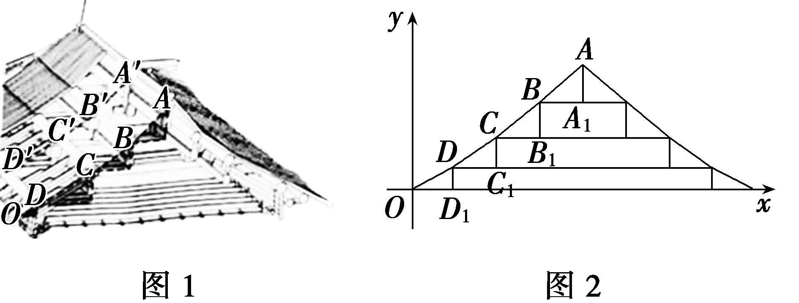
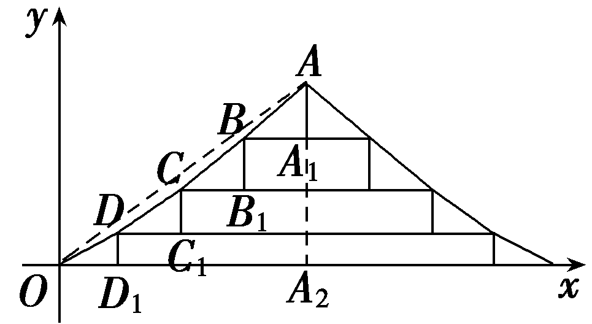

培优课11　数列中的创新问题

数列中的创新问题通常以新定义、新运算、新情境等形式出现，常以压轴题的形式出现，难度较大.通过给定的与数列有关的新定义，或约定的一种新运算，或给出的由几个新模型来创设的新问题的情景，解答时要在阅读理解的基础上，依据题设所提供的信息，联系所学的知识和方法，实现信息的迁移，达到灵活解题的目的.

解答与数列有关的新定义问题的策略：

（1）通过给定的与数列有关的新定义，或约定的一种新运算，或给出的由几个新模型来创设的新问题的情景，要求在阅读理解的基础上，依据题设所提供的信息，联系所学的知识和方法，实现信息的迁移，达到灵活解题的目的.

（2）遇到新定义问题，需耐心研究题中信息，分析新定义的特点，搞清新定义的本质，按新定义的要求“照章办事”，逐条分析、运算、验证，使问题得以顺利解决.

（3）类比“熟悉数列”的研究方式，用特殊化的方法研究新数列，向“熟悉数列”的性质靠拢.

### 题型一　数列定义新概念

定义：任取数列{<em>an</em>}中相邻的两项，若这两项之差的绝对值为1，则称数列{<em>an</em>}具有“性质1”.已知项数为<em>n</em>的数列{<em>an</em>}的所有项的和为<em>Mn</em>，且数列{<em>an</em>}具有“性质1”.

（1）若<em>n</em>＝4，且<em>a</em>1＝0，<em>a</em>4＝－1，写出所有可能的<em>Mn</em>的值；

（2）若<em>a</em>1＝2 024，<em>n</em>＝2 023，证明：“<em>a</em>2 023＝2”是“<em>ak</em>＞<em>ak</em>＋1(<em>k</em>＝1，2，…，2 022)”的充要条件；

（3）若<em>a</em>1＝0，<em>n</em>≥2，<em>Mn</em>＝0，证明：<em>n</em>＝4<em>m</em>或<em>n</em>＝4<em>m</em>＋1(<em>m</em>∈<strong>N</strong><em>\*</em>).

解：（1）依题意，若<em>an</em>：0，1，0，－1，此时<em>Mn</em>＝0；

若<em>an</em>：0，－1，0，－1，此时<em>Mn</em>＝－2；

若<em>an</em>：0，－1，－2，－1，此时<em>Mn</em>＝－4.

（2）证明：必要性：因为<em>ak</em>＞<em>ak</em>＋1(<em>k</em>＝1，2，…，2 022)，故数列{<em>an</em>}(<em>n</em>＝1，2，3，…，2 023)为等差数列，

所以<em>ak</em>＋1－<em>ak</em>＝－1(<em>k</em>＝1，2，…，2 022)，公差为－1，

所以<em>a</em>2 023＝2 024＋(2 023－1)×(－1)＝2；

充分性：由于<em>a</em>2 023－<em>a</em>2 022≥－1，

<em>a</em>2 022－<em>a</em>2 021≥－1，…，<em>a</em>2－<em>a</em>1≥－1，

累加可得，<em>a</em>2 023－<em>a</em>1≥－2 022，

即<em>a</em>2 023≥<em>a</em>1－2 022＝2，

因为<em>a</em>2 023＝2，故上述不等式的每个等号都取到，

所以<em>ak</em>＋1－<em>ak</em>＝－1＜0(<em>k</em>＝1，2，…，2 022)，

所以<em>ak</em>＞<em>ak</em>＋1(<em>k</em>＝1，2，…，2 022)，

综上所述，“<em>a</em>2 023＝2”是“<em>ak</em>＞<em>ak</em>＋1(<em>k</em>＝1，2，…，2 022)”的充要条件.

（3）证明：令<em>ck</em>＝<em>ak</em>＋1－<em>ak</em>(<em>k</em>＝1，2，…，<em>n</em>－1)，依题意，<em>ck</em>＝±1，

因为<em>a</em>2＝<em>a</em>1＋<em>c</em>1，<em>a</em>3＝<em>a</em>1＋<em>c</em>1＋<em>c</em>2，…，<em>an</em>＝<em>a</em>1＋<em>c</em>1＋<em>c</em>2＋…＋<em>cn</em>－1，

所以<em>Mn</em>＝<em>na</em>1＋(<em>n</em>－1)<em>c</em>1＋(<em>n</em>－2)<em>c</em>2＋(<em>n</em>－3)<em>c</em>3＋…＋<em>cn</em>－1

＝(<em>n</em>－1)＋(<em>n</em>－2)＋…＋1－(1－<em>c</em>1)(<em>n</em>－1)－(1－<em>c</em>2)(<em>n</em>－2)－…－(1－<em>cn</em>－1)

＝ $\frac{n(n－1)}{2}$ －[(&lt;text style="subs&lt;text style="itali<em>c</em>"&gt;c&lt;/text&gt;ript"&gt;1&lt;/text&gt;－<em>c</em>1)(<em>&lt;text style="italic"&gt;&lt;text style="italic,subscript"&gt;n</em>&lt;/text&gt;&lt;/text&gt;－1)＋(1－c2)(n－2)＋…＋(1－cn－1)]，

因为<em>ck</em>＝±1，所以1－<em>ck</em>为偶数(<em>k</em>＝1，2，…，<em>n</em>－1)，

所以(1－<em>c</em>1)(<em>n</em>－1)＋(1－<em>c</em>2)(<em>n</em>－2)＋…＋(1－<em>cn</em>－1)为偶数；

所以要使<em>M&lt;text style="italic"&gt;&lt;text style="italic"&gt;n</em>&lt;/text&gt;&lt;/text&gt;＝0，必须使 $\frac{n(n－1)}{2}$ 为偶数，即4整除<em>&lt;text style="italic"&gt;&lt;text style="italic"&gt;n</em>&lt;/text&gt;&lt;/text&gt;(n－1)，

亦即<em>n</em>＝4<em>m</em>或<em>n</em>＝4<em>m</em>＋1(<em>m</em>∈<strong>N</strong><em>\*</em>)，

当<em>n</em>＝4<em>m</em>(<em>m</em>∈<strong>N</strong><em>\*</em>)时，比如<em>a</em>4<em>k</em>－1＝<em>a</em>4<em>k</em>－3＝0，<em>a</em>4<em>k</em>－2＝－1，<em>a</em>4<em>k</em>＝1(<em>k</em>＝1，2，…，<em>m</em>)或<em>a</em>4<em>k</em>－1＝<em>a</em>4<em>k</em>－3＝0，<em>a</em>4<em>k</em>－2＝1，<em>a</em>4<em>k</em>＝－1(<em>k</em>＝1，2，…，<em>m</em>)时，有<em>a</em>1＝0，<em>Mn</em>＝0；

当<em>n</em>＝4<em>m</em>＋1(<em>m</em>∈<strong>N</strong><em>\*</em>)时，比如<em>a</em>4<em>k</em>－1＝<em>a</em>4<em>k</em>－3＝0，<em>a</em>4<em>k</em>－2＝－1，<em>a</em>4<em>k</em>＝1，<em>a</em>4<em>k</em>＋1＝0(<em>k</em>＝1，2，…，<em>m</em>)或<em>a</em>4<em>k</em>－1＝<em>a</em>4<em>k</em>－3＝0，<em>a</em>4<em>k</em>－2＝1，<em>a</em>4<em>k</em>＝－1，<em>a</em>4<em>k</em>＋1＝0(<em>k</em>＝1，2，…，<em>m</em>)时，有<em>a</em>1＝0，<em>Mn</em>＝0；

当<em>n</em>＝4<em>m</em>＋2或<em>n</em>＝4<em>m</em>＋3(<em>m</em>∈<strong>N</strong><em>\*</em>)时，<em>n</em>(<em>n</em>－1)不能被4整除，<em>Mn</em>≠0.

综上所述，若<em>a</em>1＝0，<em>n</em>≥2，<em>Mn</em>＝0，则<em>n</em>＝4<em>m</em>或<em>n</em>＝4<em>m</em>＋1(<em>m</em>∈<strong>N</strong><em>\*</em>).

定义新概念问题，应分析新概念的特点，弄清新概念的要求，把新概念转化为等差、等比数列，逐条分析，运算，验证，使得问题得以解决.

对点练1.对任意正整数*<text style="italic"><text style="italic"><text style="italic"><text style="italic">n*</text></text></text></text>，定义n的丰度指数*I*(n)＝ $\frac{S(n)}{n}$ ，其中*S*(*<text style="italic"><text style="italic"><text style="italic"><text style="italic">n*</text></text></text></text>)为n的所有正因数的和.

（1）求*I*（8）的值；

（2）若<em>an</em>＝<em>I</em>(2<em>n</em>)，求数列{<em>nan</em>}的前<em>n</em>项和<em>Tn</em>；

（3）对互不相等的质数<em>p</em>，<em>m</em>，<em>n</em>，证明：<em>I</em>(<em>p</em>3<em>mn</em>)＝<em>I</em>(<em>p</em>3)<em>I</em>(<em>m</em>)<em>I</em>(<em>n</em>)，并求<em>I</em>(2 024)的值.

解：（1）因为8的所有正因数为1，2，4，8，所以*S*（8）＝1＋2＋4＋8＝15，得到*I*（8）＝ $\frac{S(8)}{8}$ ＝ $\frac{15}{8}$ .

（2）因为2<em>n</em>共有<em>n</em>＋1个正因数，它们为1，2，22，…，2<em>n</em>，

所以<em>a&lt;text style="italic,superscript"&gt;&lt;text style="italic,subscript"&gt;&lt;text style="italic"&gt;n</em>&lt;/text&gt;&lt;/text&gt;&lt;/text&gt;＝<em>I</em>(2n)＝ $\frac{1+2+2^{2}＋\ldots ＋2^{n}}{2^{n}}$ ＝ $\frac{\frac{1－2^{n+1}}{1－2}}{2^{n}}$ ＝2－ $\frac{1}{2^{n}}$ ，得到<em>&lt;text style="italic,superscript"&gt;&lt;text style="italic,subscript"&gt;&lt;text style="italic"&gt;n</em>&lt;/text&gt;&lt;/text&gt;&lt;/text&gt;<em>a</em>n＝2n－ $\frac{n}{2^{n}}$ ，

所以<em>T&lt;text style="italic"&gt;&lt;text style="italic"&gt;&lt;text style="italic"&gt;n</em>&lt;/text&gt;&lt;/text&gt;&lt;/text&gt;＝2(1＋2＋…＋n)－ $\left(\frac{1}{2}＋\frac{2}{2^{2}}＋\ldots ＋\frac{n}{2^{n}}\right)$ ＝<em>&lt;text style="italic"&gt;&lt;text style="italic"&gt;&lt;text style="italic"&gt;n</em>&lt;/text&gt;&lt;/text&gt;&lt;/text&gt;(n＋1)－ $\left(\frac{1}{2}＋\frac{2}{2^{2}}＋\ldots ＋\frac{n}{2^{n}}\right)$ ，

令<em>Bn</em>＝ $\frac{1}{2}$ ＋ $\frac{2}{2^{2}}$ ＋…＋ $\frac{n}{2^{n}}$ ①，

则 $\frac{1}{2}$ <em>Bn</em>＝ $\frac{1}{2^{2}}$ ＋ $\frac{2}{2^{3}}$ ＋…＋ $\frac{n}{2^{n+1}}$ ②，

由①－②得到 $\frac{1}{2}$ <em>Bn</em>＝ $\frac{1}{2}$ ＋ $\frac{1}{2^{2}}$ ＋ $\frac{1}{2^{3}}$ ＋…＋ $\frac{1}{2^{n}}$ － $\frac{n}{2^{n+1}}$ ＝1－ $\frac{1}{2^{n}}$ － $\frac{n}{2^{n+1}}$ ，

所以<em>Bn</em>＝2－ $\frac{2+n}{2^{n}}$ ，

故<em>T&lt;text style="italic"&gt;&lt;text style="italic"&gt;n</em>&lt;/text&gt;&lt;/text&gt;＝n(n＋1)－2＋ $\frac{2+n}{2^{n}}$ .

（3）证明：因为<em>p</em>，<em>m</em>，<em>n</em>是互不相等的质数，则<em>p</em>3的正因数有4个，它们是1，<em>p</em>，<em>p</em>2，<em>p</em>3，

*m*，*n*的正因数均为2个，分别为1，*m*和1，*n*，

<em>p</em>3<em>mn</em>的正因数有4×2×2＝16个，分别为1，<em>p</em>，<em>p</em>2，<em>p</em>3，<em>m</em>，<em>mp</em>，<em>mp</em>2，<em>mp</em>3，<em>n</em>，<em>np</em>，<em>np</em>2，<em>np</em>3，<em>mn</em>，<em>mnp</em>，<em>mnp</em>2，<em>mnp</em>3，

所以<em>&lt;text style="italic"&gt;&lt;text style="italic"&gt;I</em>&lt;/text&gt;&lt;/text&gt;(<em>p</em>3)＝ $\frac{1+p＋p^{2}＋p^{3}}{p^{3}}$ ，<em>&lt;text style="italic"&gt;&lt;text style="italic"&gt;I</em>&lt;/text&gt;&lt;/text&gt;(<em>m</em>)＝ $\frac{1+m}{m}$ ，<em>&lt;text style="italic"&gt;&lt;text style="italic"&gt;I</em>&lt;/text&gt;&lt;/text&gt;(<em>n</em>)＝ $\frac{1+n}{n}$ ，

<em>I</em>(<em>p</em>3<em>mn</em>)＝ $\frac{1+p＋p^{2}＋p^{3}＋m＋mp＋mp^{2}＋mp^{3}＋n＋np＋np^{2}＋np^{3}＋mn＋mnp＋mnp^{2}＋mnp^{3}}{p^{3}mn}$

＝ $\frac{(1+p＋p^{2}＋p^{3})(1+m＋n＋mn)}{p^{3}mn}$

＝ $\frac{(1+p＋p^{2}＋p^{3})(1+m)(1+n)}{p^{3}mn}$

＝ $\frac{1+p＋p^{2}＋p^{3}}{p^{3}}$ · $\frac{1+m}{m}$ · $\frac{1+n}{n}$ ＝<em>&lt;text style="italic"&gt;&lt;text style="italic"&gt;I</em>&lt;/text&gt;&lt;/text&gt;(<em>p</em>3)I(<em>m</em>)I(<em>n</em>)，

因为2 024＝2&lt;text style="superscript"&gt;3&lt;/text&gt;×11×23，所以<em>&lt;text style="italic"&gt;&lt;text style="italic"&gt;&lt;text style="italic"&gt;I</em>&lt;/text&gt;&lt;/text&gt;&lt;/text&gt;(2 024)＝I(23)I(11)I(23)＝ $\frac{1+2+4+8}{8}$ × $\frac{1+11}{11}$ × $\frac{1+23}{23}$ ＝ $\frac{15}{8}$ × $\frac{12}{11}$ × $\frac{24}{23}$ ＝ $\frac{540}{253}$ .

### 题型二　数列定义新运算

(&lt;te&lt;te&lt;te&lt;text style="it&lt;text style="it&lt;text style="it&lt;text style="it<em>a</em>lic"&gt;a&lt;/text&gt;lic"&gt;a&lt;/text&gt;lic"&gt;a&lt;/text&gt;lic"&gt;x&lt;/text&gt;t style="italic"&gt;x&lt;/text&gt;t style="it<em>a</em>lic"&gt;x&lt;/text&gt;t style="su<em>&lt;text style="italic"&gt;&lt;text style="italic"&gt;&lt;text style="italic"&gt;b</em>&lt;/text&gt;&lt;/text&gt;&lt;/text&gt;script"&gt;2&lt;/text&gt;024·吉林长春模拟)记集合&lt;text style="it&lt;text style="it&lt;text style="it&lt;text style="it<em>a</em>lic"&gt;a&lt;/text&gt;lic"&gt;a&lt;/text&gt;lic"&gt;a&lt;/text&gt;lic"&gt;<em>&lt;text style="italic"&gt;&lt;text style="italic"&gt;S</em>&lt;/text&gt;&lt;/text&gt;&lt;/text&gt;＝ $\left\{\{a_{n}\}|无穷数列\{a_{n}\}中存在有限项不为零，n\in N^{*}\right\}$ ，对任意{&lt;te&lt;te&lt;te&lt;text style="it&lt;text style="it&lt;text style="it&lt;text style="it<em>a</em>lic"&gt;a&lt;/text&gt;lic"&gt;a&lt;/text&gt;lic"&gt;a&lt;/text&gt;lic"&gt;x&lt;/text&gt;t style="italic"&gt;x&lt;/text&gt;t style="it<em>a</em>lic"&gt;x&lt;/text&gt;t style="it&lt;text style="it&lt;text style="it<em>a</em>lic"&gt;a&lt;/text&gt;lic"&gt;a&lt;/text&gt;lic"&gt;a&lt;/text&gt;&lt;text style="italic,su<em>&lt;text style="italic"&gt;&lt;text style="italic"&gt;&lt;text style="italic"&gt;b</em>&lt;/text&gt;&lt;/text&gt;&lt;/text&gt;script"&gt;<em>&lt;text style="italic,subscript"&gt;&lt;text style="italic,superscript"&gt;&lt;text style="italic,subscript"&gt;&lt;text style="italic,subscript"&gt;&lt;text style="italic,subscript"&gt;&lt;text style="italic,subscript"&gt;&lt;text style="italic,subscript"&gt;&lt;text style="italic,subscript"&gt;&lt;text style="italic,subscript"&gt;&lt;text style="italic,subscript"&gt;n</em>&lt;/text&gt;&lt;/text&gt;&lt;/text&gt;&lt;/text&gt;&lt;/text&gt;&lt;/text&gt;&lt;/text&gt;&lt;/text&gt;&lt;/text&gt;&lt;/text&gt;&lt;/text&gt;}∈<em>&lt;text style="italic"&gt;&lt;text style="italic"&gt;&lt;text style="italic"&gt;S</em>&lt;/text&gt;&lt;/text&gt;&lt;/text&gt;，设<em>&lt;text style="italic"&gt;&lt;text style="italic"&gt;&lt;text style="italic"&gt;φ</em>&lt;/text&gt;&lt;/text&gt;&lt;/text&gt;({an})＝a1＋a2x＋…＋anxn－1＋…，x∈<strong>R</strong>.定义运算⊗：若{an}，{bn}∈S，则{an}⊗{bn}∈S，且φ({an}⊗{bn})＝φ({an})·φ({bn}).

（1）设{<em>an</em>}⊗{<em>bn</em>}＝{<em>dn</em>}，用<em>a</em>1，<em>a</em>2，<em>a</em>3，<em>b</em>1，<em>b</em>2，<em>b</em>3表示<em>d</em>3；

（2）若{<em>an</em>}，{<em>bn</em>}，{<em>cn</em>}∈<em>S</em>，证明：({<em>an</em>}⊗{<em>bn</em>})⊗{<em>cn</em>}＝{<em>an</em>}⊗ ({<em>bn</em>}⊗{<em>cn</em>})；

（3）若数列{&lt;text style="it&lt;text style="it<em>a</em>lic"&gt;a&lt;/text&gt;lic"&gt;a&lt;/text&gt;&lt;text style="italic,su<em>&lt;text style="italic"&gt;&lt;text style="italic"&gt;b</em>&lt;/text&gt;&lt;/text&gt;script"&gt;<em>&lt;text style="italic,subscript"&gt;&lt;text style="italic,subscript"&gt;&lt;text style="italic,subscript"&gt;&lt;text style="italic,subscript"&gt;&lt;text style="italic,subscript"&gt;n</em>&lt;/text&gt;&lt;/text&gt;&lt;/text&gt;&lt;/text&gt;&lt;/text&gt;&lt;/text&gt;}满足an＝ $\left\{\begin{matrix}\frac{(n+1)^{2}+1}{n(n+1)}，1\leq n\leq 100，\\0，n>100，\end{matrix}\right.$ 数列{&lt;text style="it<em>a</em>lic"&gt;<em>&lt;text style="italic"&gt;b</em>&lt;/text&gt;&lt;/text&gt;&lt;text style="it<em>a</em>lic,subscript"&gt;<em>&lt;text style="italic,subscript"&gt;&lt;text style="italic,subscript"&gt;&lt;text style="italic,subscript"&gt;&lt;text style="italic,subscript"&gt;&lt;text style="italic,subscript"&gt;n</em>&lt;/text&gt;&lt;/text&gt;&lt;/text&gt;&lt;/text&gt;&lt;/text&gt;&lt;/text&gt;}满足bn＝ $\left\{\begin{matrix}\left(\frac{1}{2}\right)^{203－n}，1\leq n\leq 500，\\0，n>500，\end{matrix}\right.$ 设{&lt;text style="it&lt;text style="it<em>a</em>lic"&gt;a&lt;/text&gt;lic"&gt;a&lt;/text&gt;&lt;text style="italic,su<em>&lt;text style="italic"&gt;&lt;text style="italic"&gt;b</em>&lt;/text&gt;&lt;/text&gt;script"&gt;<em>&lt;text style="italic,subscript"&gt;&lt;text style="italic,subscript"&gt;&lt;text style="italic,subscript"&gt;&lt;text style="italic,subscript"&gt;&lt;text style="italic,subscript"&gt;n</em>&lt;/text&gt;&lt;/text&gt;&lt;/text&gt;&lt;/text&gt;&lt;/text&gt;&lt;/text&gt;}⊗{bn}＝{<em>&lt;text style="italic"&gt;d</em>&lt;/text&gt;n}，证明：d200＜ $\frac{1}{2}$ .

解：（1）因为{<em>an</em>}⊗{<em>bn</em>}＝{<em>dn</em>}，所以<em>φ</em>({<em>dn</em>})＝<em>φ</em>({<em>an</em>}⊗{<em>bn</em>})＝<em>φ</em>({<em>an</em>})·<em>φ</em>({<em>bn</em>})，

所以<em>d</em>1＋<em>d</em>2<em>x</em>＋<em>d</em>3<em>x</em>2＋…＝(<em>a</em>1＋<em>a</em>2<em>x</em>＋<em>a</em>3<em>x</em>2＋…)(<em>b</em>1＋<em>b</em>2<em>x</em>＋<em>b</em>3<em>x</em>2＋…)，<em>x</em>∈<strong>R</strong>，

根据多项式的乘法可得：<em>d</em>3＝<em>a</em>1<em>b</em>3＋<em>a</em>2<em>b</em>2＋<em>a</em>3<em>b</em>1.

（2）证明：因为<em>φ</em>({<em>an</em>}⊗{<em>bn</em>})＝<em>φ</em>({<em>an</em>})·<em>φ</em>({<em>bn</em>})，

所以&lt;text style="it&lt;text style="it&lt;text style="itali<em>c</em>"&gt;a&lt;/text&gt;li<em>c</em>"&gt;a&lt;/text&gt;lic"&gt;<em>&lt;text style="italic"&gt;&lt;text style="italic"&gt;&lt;text style="italic"&gt;&lt;text style="italic"&gt;φ</em>&lt;/text&gt;&lt;/text&gt;&lt;/text&gt;&lt;/text&gt;&lt;/text&gt; $\left((\{a_{n}\}\otimes \{b_{n}\})\otimes \{c_{n}\}\right)$ ＝&lt;text style="it&lt;text style="it&lt;text style="itali<em>c</em>"&gt;a&lt;/text&gt;li<em>c</em>"&gt;a&lt;/text&gt;lic"&gt;<em>&lt;text style="italic"&gt;&lt;text style="italic"&gt;&lt;text style="italic"&gt;&lt;text style="italic"&gt;φ</em>&lt;/text&gt;&lt;/text&gt;&lt;/text&gt;&lt;/text&gt;&lt;/text&gt;({a&lt;text style="italic,su<em>&lt;text style="italic"&gt;b</em>&lt;/text&gt;script"&gt;<em>&lt;text style="italic,subscript"&gt;&lt;text style="italic,subscript"&gt;&lt;text style="italic,subscript"&gt;n</em>&lt;/text&gt;&lt;/text&gt;&lt;/text&gt;&lt;/text&gt;}⊗{b<em>n</em> })·φ({cn})＝φ({an})·φ({bn})·φ({cn}).

又&lt;text style="it&lt;text style="it&lt;text style="itali<em>c</em>"&gt;a&lt;/text&gt;li<em>c</em>"&gt;a&lt;/text&gt;lic"&gt;<em>&lt;text style="italic"&gt;&lt;text style="italic"&gt;&lt;text style="italic"&gt;&lt;text style="italic"&gt;&lt;text style="italic"&gt;φ</em>&lt;/text&gt;&lt;/text&gt;&lt;/text&gt;&lt;/text&gt;&lt;/text&gt;&lt;/text&gt; $\left(\{a_{n}\}\otimes (\{b_{n}\}\otimes \{c_{n}\})\right)$ ＝&lt;text style="it&lt;text style="it&lt;text style="itali<em>c</em>"&gt;a&lt;/text&gt;li<em>c</em>"&gt;a&lt;/text&gt;lic"&gt;<em>&lt;text style="italic"&gt;&lt;text style="italic"&gt;&lt;text style="italic"&gt;&lt;text style="italic"&gt;&lt;text style="italic"&gt;φ</em>&lt;/text&gt;&lt;/text&gt;&lt;/text&gt;&lt;/text&gt;&lt;/text&gt;&lt;/text&gt;({a&lt;text style="italic,su<em>&lt;text style="italic"&gt;b</em>&lt;/text&gt;script"&gt;<em>&lt;text style="italic,subscript"&gt;&lt;text style="italic,subscript"&gt;&lt;text style="italic,subscript"&gt;n</em>&lt;/text&gt;&lt;/text&gt;&lt;/text&gt;&lt;/text&gt;})·φ({b<em>n</em> }⊗φ{cn})＝φ({an})·φ({bn})·φ({cn}).

所以&lt;text style="it&lt;text style="itali<em>c</em>"&gt;a&lt;/text&gt;lic"&gt;<em>φ</em>&lt;/text&gt; $\left((\{a_{n}\}\otimes \{b_{n}\})\otimes \{c_{n}\}\right)$ ＝&lt;text style="it&lt;text style="itali<em>c</em>"&gt;a&lt;/text&gt;lic"&gt;<em>φ</em>&lt;/text&gt;({a&lt;text style="italic,su<em>b</em>script"&gt;n&lt;/text&gt;}⊗ ({b<em>&lt;text style="italic,subscript"&gt;n</em> &lt;/text&gt;}⊗{cn }))，

所以({&lt;text style="it<em>a</em>li<em>c</em>"&gt;a&lt;/text&gt;&lt;text style="italic,su<em>b</em>script"&gt;<em>&lt;text style="italic,subscript"&gt;&lt;text style="italic,subscript"&gt;n</em>&lt;/text&gt;&lt;/text&gt;&lt;/text&gt;}⊗{bn})⊗{cn}＝{an}⊗ $\left(\{b_{n}\}\otimes \{c_{n}\}\right)$ .

（3）证明：对于{<em>an</em>}，{<em>bn</em>}∈<em>S</em>，

因为{<em>an</em>}⊗{<em>bn</em>}＝{<em>dn</em>}，所以<em>φ</em>({<em>dn</em>})＝<em>φ</em>({<em>an</em>}⊗{<em>bn</em>})＝<em>φ</em>({<em>an</em>})<em>·φ</em>({<em>bn</em>})，

所以(<em>a</em>1＋<em>a</em>2<em>x</em>＋…＋<em>anxn</em>－1＋…)(<em>b</em>1＋<em>b</em>2<em>x</em>＋…＋<em>bnxn</em>－1＋…)＝<em>d</em>1＋<em>d</em>2<em>x</em>＋…＋<em>dnxn</em>－1＋…，

所以<em>dnxn</em>－1＝<em>a</em>1(<em>bnxn</em>－1)＋…＋<em>akxk</em>－1(<em>bn</em>＋1－<em>kxn</em>－<em>k</em>)＋…＋<em>an</em>－1<em>xn</em>－2(<em>b</em>2<em>x</em>)＋<em>anxn</em>－1<em>b</em>1，<em>x</em>∈<strong>R</strong>，

所以<em>dn</em>＝<em>a</em>1<em>bn</em>＋<em>a</em>2<em>bn</em>－1＋…＋<em>akbn</em>＋1－<em>k</em>＋…＋<em>an</em>－1<em>b</em>2＋<em>anb</em>1.

所以&lt;text style="it&lt;text style="it&lt;text style="it&lt;text style="it<em>a</em>lic"&gt;a&lt;/text&gt;lic"&gt;a&lt;/text&gt;lic"&gt;a&lt;/text&gt;lic"&gt;d&lt;/text&gt;&lt;text style="su<em>&lt;text style="italic"&gt;&lt;text style="italic"&gt;&lt;text style="italic"&gt;b</em>&lt;/text&gt;&lt;/text&gt;&lt;/text&gt;script"&gt;200&lt;/text&gt;＝ $\overset{200}{\underset{k=1}{\sum }}$ &lt;text style="it&lt;text style="it&lt;text style="it<em>a</em>lic"&gt;a&lt;/text&gt;lic"&gt;a&lt;/text&gt;lic"&gt;a&lt;/text&gt;&lt;text style="italic,su<em>&lt;text style="italic"&gt;&lt;text style="italic"&gt;&lt;text style="italic"&gt;b</em>&lt;/text&gt;&lt;/text&gt;&lt;/text&gt;script"&gt;<em>&lt;text style="italic,subscript"&gt;&lt;text style="italic,subscript"&gt;&lt;text style="italic,subscript"&gt;&lt;text style="italic,subscript"&gt;&lt;text style="italic,subscript"&gt;&lt;text style="italic,subscript"&gt;k</em>&lt;/text&gt;&lt;/text&gt;&lt;/text&gt;&lt;/text&gt;&lt;/text&gt;&lt;/text&gt;&lt;/text&gt;b&lt;text style="subscript"&gt;&lt;text style="subscript"&gt;&lt;text style="subscript"&gt;201－&lt;/text&gt;&lt;/text&gt;&lt;/text&gt;k＝ $\overset{100}{\underset{k=1}{\sum }}$ &lt;text style="it&lt;text style="it&lt;text style="it<em>a</em>lic"&gt;a&lt;/text&gt;lic"&gt;a&lt;/text&gt;lic"&gt;a&lt;/text&gt;&lt;text style="italic,su<em>&lt;text style="italic"&gt;&lt;text style="italic"&gt;&lt;text style="italic"&gt;b</em>&lt;/text&gt;&lt;/text&gt;&lt;/text&gt;script"&gt;<em>&lt;text style="italic,subscript"&gt;&lt;text style="italic,subscript"&gt;&lt;text style="italic,subscript"&gt;&lt;text style="italic,subscript"&gt;&lt;text style="italic,subscript"&gt;&lt;text style="italic,subscript"&gt;k</em>&lt;/text&gt;&lt;/text&gt;&lt;/text&gt;&lt;/text&gt;&lt;/text&gt;&lt;/text&gt;&lt;/text&gt;b&lt;text style="subscript"&gt;&lt;text style="subscript"&gt;&lt;text style="subscript"&gt;201－&lt;/text&gt;&lt;/text&gt;&lt;/text&gt;k＋ $\overset{200}{\underset{k=101}{\sum }}$ &lt;text style="it&lt;text style="it&lt;text style="it<em>a</em>lic"&gt;a&lt;/text&gt;lic"&gt;a&lt;/text&gt;lic"&gt;a&lt;/text&gt;&lt;text style="italic,su<em>&lt;text style="italic"&gt;&lt;text style="italic"&gt;&lt;text style="italic"&gt;b</em>&lt;/text&gt;&lt;/text&gt;&lt;/text&gt;script"&gt;<em>&lt;text style="italic,subscript"&gt;&lt;text style="italic,subscript"&gt;&lt;text style="italic,subscript"&gt;&lt;text style="italic,subscript"&gt;&lt;text style="italic,subscript"&gt;&lt;text style="italic,subscript"&gt;k</em>&lt;/text&gt;&lt;/text&gt;&lt;/text&gt;&lt;/text&gt;&lt;/text&gt;&lt;/text&gt;&lt;/text&gt;b&lt;text style="subscript"&gt;&lt;text style="subscript"&gt;&lt;text style="subscript"&gt;201－&lt;/text&gt;&lt;/text&gt;&lt;/text&gt;k＝ $\overset{100}{\underset{k=1}{\sum }}$ &lt;text style="it&lt;text style="it&lt;text style="it<em>a</em>lic"&gt;a&lt;/text&gt;lic"&gt;a&lt;/text&gt;lic"&gt;a&lt;/text&gt;&lt;text style="italic,su<em>&lt;text style="italic"&gt;&lt;text style="italic"&gt;&lt;text style="italic"&gt;b</em>&lt;/text&gt;&lt;/text&gt;&lt;/text&gt;script"&gt;<em>&lt;text style="italic,subscript"&gt;&lt;text style="italic,subscript"&gt;&lt;text style="italic,subscript"&gt;&lt;text style="italic,subscript"&gt;&lt;text style="italic,subscript"&gt;&lt;text style="italic,subscript"&gt;k</em>&lt;/text&gt;&lt;/text&gt;&lt;/text&gt;&lt;/text&gt;&lt;/text&gt;&lt;/text&gt;&lt;/text&gt;b&lt;text style="subscript"&gt;&lt;text style="subscript"&gt;&lt;text style="subscript"&gt;201－&lt;/text&gt;&lt;/text&gt;&lt;/text&gt;k＝ $\overset{100}{\underset{k=1}{\sum }}\frac{(k+1)^{2}+1}{k(k+1)2^{k+2}}$ .

所以<em>d</em>200＝ $\overset{100}{\underset{k=1}{\sum }}\frac{1}{2^{k+2}}\left(1+\frac{2}{k}－\frac{1}{k+1}\right)$ ＝ $\overset{100}{\underset{k=1}{\sum }}\frac{1}{2^{k+2}}$ ＋ $\overset{100}{\underset{k=1}{\sum }}\left[\frac{1}{k\cdot 2^{k+1}}－\frac{1}{(k+1)\cdot 2^{k+2}}\right]$ .

$\overset{100}{\underset{k=1}{\sum }}\frac{1}{2^{k+2}}$ ＝ $\frac{\frac{1}{8}\left(1－\frac{1}{2^{100}}\right)}{1－\frac{1}{2}}$ ＝ $\frac{1}{4}\left(1－\frac{1}{2^{100}}\right)$ ＝ $\frac{1}{4}$ － $\frac{1}{2^{102}}$ ，

所以<em>d</em>200＝ $\overset{100}{\underset{k=1}{\sum }}\frac{1}{2^{k+2}}$ ＋ $\overset{100}{\underset{k=1}{\sum }}\left[\frac{1}{k\cdot 2^{k+1}}－\frac{1}{(k+1)\cdot 2^{k+2}}\right]$

＝ $\frac{1}{4}$ － $\frac{1}{2^{102}}$ ＋ $\frac{1}{1\times 2^{2}}$ － $\frac{1}{2\times 2^{3}}$ ＋ $\frac{1}{2\times 2^{3}}$ － $\frac{1}{3\times 2^{4}}$ ＋…＋ $\frac{1}{100\times 2^{101}}$ － $\frac{1}{101\times 2^{102}}$

＝ $\frac{1}{2}$ － $\frac{1}{2^{102}}$ － $\frac{1}{101\times 2^{102}}$ ＜ $\frac{1}{2}$ .

定义新运算问题，应分析新运算的特点，弄清新运算的本质，按新运算的要求“照章办事”，就能够使问题得以解决.

对点练2.定义运算“⊕”：对于任意<em>x</em>，<em>y</em>∈<strong>R</strong>，<em>x</em>⊕<em>y</em>＝(1－<em>b</em>)<em>x</em>＋<em>by</em>(<em>b</em>∈<strong>R</strong>＋)(等式的右边是通常的加减乘运算).

若数列{<em>an</em>}的前<em>n</em>项和为<em>Sn</em>，且<em>Sn</em>⊕<em>an</em>＝3<em>n</em>对任意<em>n</em>∈<strong>N</strong><em>\*</em>都成立.

（1）求<em>a</em>1的值，并推导出用<em>an</em>－1表示<em>an</em>的解析式；

（2）若<em>&lt;text style="italic"&gt;&lt;text style="italic"&gt;b</em>&lt;/text&gt;&lt;/text&gt;＝3，令b<em>&lt;text style="italic"&gt;&lt;text style="italic,subscript"&gt;n</em>&lt;/text&gt;&lt;/text&gt;＝ $\frac{a_{n}}{3^{n}}$ (&lt;text style="italic,su<em>b</em>script"&gt;<em>&lt;text style="italic,subscript"&gt;n</em>&lt;/text&gt;&lt;/text&gt;∈<strong>N</strong><em>\*</em>)，证明数列{<em>&lt;text style="italic"&gt;b</em>&lt;/text&gt;n}是等差数列；

（3）若&lt;text style="itali&lt;text style="itali&lt;text style="itali<em>c</em>"&gt;c&lt;/text&gt;"&gt;c&lt;/text&gt;"&gt;<em>b</em>&lt;/text&gt;≠3，令c<em>&lt;text style="italic"&gt;&lt;text style="italic,subscript"&gt;&lt;text style="italic,subscript"&gt;&lt;text style="italic"&gt;n</em>&lt;/text&gt;&lt;/text&gt;&lt;/text&gt;&lt;/text&gt;＝ $\frac{a_{n}}{3^{n}}$ (&lt;text style="itali&lt;text style="itali<em>c</em>"&gt;c&lt;/text&gt;,su<em>b</em>script"&gt;<em>&lt;text style="italic,subscript"&gt;&lt;text style="italic,subscript"&gt;&lt;text style="italic"&gt;n</em>&lt;/text&gt;&lt;/text&gt;&lt;/text&gt;&lt;/text&gt;∈<strong>&lt;text style="bold"&gt;N</strong>&lt;/text&gt;<em>&lt;text style="italic,superscript"&gt;\*</em>&lt;/text&gt;)，数列{<em>c</em>n}满足｜cn｜≤2(n∈N\*)，求正实数<em>b</em>的取值范围.

解：（1）因为<em>Sn</em>⊕<em>an</em>＝3<em>n</em>，

所以(1－<em>b</em>)<em>Sn</em>＝－<em>ban</em>＋3<em>n</em>，<em>n</em>∈<strong>N</strong><em>\*</em>，<em>S</em>1＝<em>a</em>1，

令<em>n</em>＝1，得(1－<em>b</em>)<em>a</em>1＝－<em>ba</em>1＋3，

所以<em>a</em>1＝3.

当<em>n</em>≥2时，有(1－<em>b</em>)<em>Sn</em>－1＝－<em>ban</em>－1＋3<em>n</em>－1.

所以(1－<em>b</em>)(<em>Sn</em>－<em>Sn</em>－1)＝－<em>ban</em>＋<em>ban</em>－1＋3<em>n</em>－3<em>n</em>－1(<em>n</em>≥2，<em>n</em>∈<strong>N</strong><em>\*</em>).

所以<em>an</em>＝<em>ban</em>－1＋2·3<em>n</em>－1(<em>n</em>≥2，<em>n</em>∈<strong>N</strong><em>\*</em>).

（2）证明：因为<em>&lt;text style="italic"&gt;&lt;text style="italic"&gt;b</em>&lt;/text&gt;&lt;/text&gt;＝3，b<em>&lt;text style="italic"&gt;n</em>&lt;/text&gt;＝ $\frac{a_{n}}{3^{n}}$ (&lt;text style="italic,su<em>b</em>script"&gt;<em>n</em>&lt;/text&gt;∈<strong>N</strong><em>\*</em>)，<em>&lt;text style="italic"&gt;b</em>&lt;/text&gt;1＝1，

所以&lt;text style="it<em>a</em>lic"&gt;a&lt;/text&gt;<em>&lt;text style="italic,subscript"&gt;&lt;text style="italic,superscript"&gt;&lt;text style="italic"&gt;&lt;text style="italic"&gt;n</em>&lt;/text&gt;&lt;/text&gt;&lt;/text&gt;&lt;/text&gt;＝3an&lt;text style="superscript"&gt;－1&lt;/text&gt;＋2·3n－1(n≥2，n∈<strong>N</strong><em>\*</em>)，整理得 $\frac{a_{n}}{3^{n}}$ ＝ $\frac{a_{n－1}}{3^{n－1}}$ ＋ $\frac{2}{3}$ .

所以<em>&lt;text style="italic"&gt;b</em>&lt;/text&gt;<em>&lt;text style="italic,subscript"&gt;&lt;text style="italic"&gt;&lt;text style="italic"&gt;n</em>&lt;/text&gt;&lt;/text&gt;&lt;/text&gt;－bn－1＝ $\frac{2}{3}$ (&lt;text style="italic,su<em>b</em>script"&gt;<em>&lt;text style="italic"&gt;&lt;text style="italic"&gt;n</em>&lt;/text&gt;&lt;/text&gt;&lt;/text&gt;≥2，n∈<strong>N</strong><em>\*</em>).

所以数列{<em>bn</em>}是首项为1，公差为 $\frac{2}{3}$ 的等差数列.

（3）结合(1)，且&lt;text style="itali&lt;text style="itali<em>c</em>"&gt;c&lt;/text&gt;"&gt;b&lt;/text&gt;≠3，c<em>&lt;text style="italic"&gt;n</em>&lt;/text&gt;＝ $\frac{a_{n}}{3^{n}}$ (&lt;text style="itali<em>c</em>,subscript"&gt;<em>n</em>&lt;/text&gt;∈<strong>N</strong><em>\*</em>)，<em>c</em>1＝1，

所以 $\frac{a_{n}}{3^{n}}$ ＝ $\frac{ba_{n－1}}{3\times 3^{n－1}}$ ＋ $\frac{2}{3}$ ，即&lt;text style="itali<em>c</em>"&gt;c&lt;/text&gt;<em>&lt;text style="italic,subscript"&gt;&lt;text style="italic"&gt;&lt;text style="italic"&gt;n</em>&lt;/text&gt;&lt;/text&gt;&lt;/text&gt;＝ $\frac{b}{3}$ &lt;text style="itali<em>c</em>"&gt;c&lt;/text&gt;<em>&lt;text style="italic,subscript"&gt;&lt;text style="italic"&gt;&lt;text style="italic"&gt;n</em>&lt;/text&gt;&lt;/text&gt;&lt;/text&gt;－1＋ $\frac{2}{3}$ (&lt;text style="itali<em>c</em>,subscript"&gt;<em>&lt;text style="italic"&gt;&lt;text style="italic"&gt;n</em>&lt;/text&gt;&lt;/text&gt;&lt;/text&gt;≥2，n∈<strong>N</strong><em>\*</em>).

所以&lt;text style="itali<em>c</em>"&gt;c&lt;/text&gt;<em>&lt;text style="italic,subscript"&gt;n</em>&lt;/text&gt;－ $\frac{2}{3－b}$ ＝ $\frac{b}{3}$ (&lt;text style="itali<em>c</em>"&gt;c&lt;/text&gt;<em>&lt;text style="italic,subscript"&gt;n</em>&lt;/text&gt;－1－ $\frac{2}{3－b}$ ).

①当&lt;text style="itali&lt;text style="itali<em>c</em>"&gt;c&lt;/text&gt;"&gt;b&lt;/text&gt;＝1时，c1－ $\frac{2}{3－b}$ ＝0，此时，&lt;text style="itali<em>c</em>"&gt;c&lt;/text&gt;<em>n</em>＝1，

总是满足｜<em>cn</em>｜≤2(<em>n</em>∈<strong>N</strong><em>\*</em>)；

②当&lt;text style="itali<em>c</em>"&gt;b&lt;/text&gt;≠1时，c1－ $\frac{2}{3－b}$ ≠0，

此时， $\left\{c_{n}－\frac{2}{3－b}\right\}$ 是等比数列.

所以&lt;text style="itali<em>c</em>"&gt;c&lt;/text&gt;<em>&lt;text style="italic,superscript"&gt;&lt;text style="italic"&gt;n</em>&lt;/text&gt;&lt;/text&gt;－ $\frac{2}{3－b}$ ＝(&lt;text style="itali<em>c</em>"&gt;c&lt;/text&gt;1－ $\frac{2}{3－b}$ )( $\frac{b}{3}$ )&lt;text style="itali<em>c</em>,subscript"&gt;<em>&lt;text style="italic"&gt;n</em>&lt;/text&gt;&lt;/text&gt;－1(n∈<strong>N</strong><em>\*</em>).

所以<em>c&lt;text style="italic,superscript"&gt;&lt;text style="italic"&gt;n</em>&lt;/text&gt;&lt;/text&gt;＝ $\frac{2}{3－b}$ ＋ $\frac{b－1}{b－3}$ ·( $\frac{b}{3}$ )<em>&lt;text style="italic,superscript"&gt;&lt;text style="italic"&gt;n</em>&lt;/text&gt;&lt;/text&gt;－1(n∈<strong>N</strong><em>\*</em>).

若<em>b</em>＞3时，数列{<em>cn</em>}是单调递增数列，且<em>n</em>→＋∞时，<em>cn</em>→＋∞，不满足｜<em>cn</em>｜≤2(<em>n</em>∈<strong>N</strong><em>\*</em>).

若0＜*b*＜1时， $\frac{b－1}{b－3}$ ＞0，0＜ $\frac{b}{3}$ ＜1，

数列{<em>cn</em>}是单调递减数列，故<em>c</em>1＞<em>c</em>2＞….

又<em>c</em>1＝1，同样恒有｜<em>cn</em>｜≤2(<em>n</em>∈<strong>N</strong><em>\*</em>)成立；

若1＜*b*＜3时， $\frac{b－1}{b－3}$ ＜0，0＜ $\frac{b}{3}$ ＜1，

数列{&lt;text style="itali<em>c</em>"&gt;c&lt;/text&gt;<em>&lt;text style="italic,subscript"&gt;n</em>&lt;/text&gt;}是单调递增数列， $\lim_{n\to ＋\infty }$ &lt;text style="itali<em>c</em>"&gt;c&lt;/text&gt;<em>&lt;text style="italic,subscript"&gt;n</em>&lt;/text&gt;＝ $\frac{2}{3－b}$ .

由 $\frac{2}{3－b}$ ≤2，得&lt;text style="itali<em>c</em>"&gt;<em>b</em>&lt;/text&gt;≤2，即当1＜b≤2时，满足｜c<em>&lt;text style="italic"&gt;n</em>&lt;/text&gt;｜≤2(n∈<strong>N</strong><em>\*</em>).

综上，所求实数*b*的取值范围是(0，2].

### 题型三　数列定义新情境

角度1　数学文化情境

(&lt;text style="subscript"&gt;2&lt;/text&gt;022·新高考Ⅱ卷)图&lt;text style="subscript"&gt;&lt;text style="subscript"&gt;&lt;text style="subscript"&gt;&lt;text style="subscript"&gt;&lt;text style="subscript"&gt;&lt;text style="subscript"&gt;&lt;text style="subscript"&gt;&lt;text style="subscript"&gt;&lt;text style="subscript"&gt;1&lt;/text&gt;&lt;/text&gt;&lt;/text&gt;&lt;/text&gt;&lt;/text&gt;&lt;/text&gt;&lt;/text&gt;&lt;/text&gt;&lt;/text&gt;是中国古代建筑中的举架结构，<em>&lt;text style="italic"&gt;AA</em>'&lt;/text&gt;，<em>&lt;text style="italic"&gt;BB</em>'&lt;/text&gt;，<em>&lt;text style="italic"&gt;CC</em>'&lt;/text&gt;，<em>&lt;text style="italic"&gt;DD</em>'&lt;/text&gt;是桁，相邻桁的水平距离称为步，垂直距离称为举.图2是某古代建筑屋顶截面的示意图，其中DD1，CC1，BB1，AA1是举，<em>OD</em>1，<em>DC</em>1，<em>CB</em>1，<em>BA</em>1是相等的步，相邻桁的举步之比分别为 $\frac{DD_{1}}{OD_{1}}$ ＝0.5， $\frac{CC_{1}}{DC_{1}}$ ＝<em>&lt;text style="italic"&gt;&lt;text style="italic"&gt;&lt;text style="italic"&gt;&lt;text style="italic"&gt;&lt;text style="italic"&gt;&lt;text style="italic"&gt;k</em>&lt;/text&gt;&lt;/text&gt;&lt;/text&gt;&lt;/text&gt;&lt;/text&gt;&lt;/text&gt;&lt;text style="subscript"&gt;&lt;text style="subscript"&gt;&lt;text style="subscript"&gt;&lt;text style="subscript"&gt;&lt;text style="subscript"&gt;&lt;text style="subscript"&gt;&lt;text style="subscript"&gt;&lt;text style="subscript"&gt;&lt;text style="subscript"&gt;1&lt;/text&gt;&lt;/text&gt;&lt;/text&gt;&lt;/text&gt;&lt;/text&gt;&lt;/text&gt;&lt;/text&gt;&lt;/text&gt;&lt;/text&gt;， $\frac{BB_{1}}{CB_{1}}$ ＝<em>&lt;text style="italic"&gt;&lt;text style="italic"&gt;&lt;text style="italic"&gt;&lt;text style="italic"&gt;&lt;text style="italic"&gt;&lt;text style="italic"&gt;k</em>&lt;/text&gt;&lt;/text&gt;&lt;/text&gt;&lt;/text&gt;&lt;/text&gt;&lt;/text&gt;&lt;text style="subscript"&gt;2&lt;/text&gt;， $\frac{AA_{1}}{BA_{1}}$ ＝<em>&lt;text style="italic"&gt;&lt;text style="italic"&gt;&lt;text style="italic"&gt;&lt;text style="italic"&gt;&lt;text style="italic"&gt;&lt;text style="italic"&gt;k</em>&lt;/text&gt;&lt;/text&gt;&lt;/text&gt;&lt;/text&gt;&lt;/text&gt;&lt;/text&gt;&lt;text style="subscript"&gt;&lt;text style="subscript"&gt;3&lt;/text&gt;&lt;/text&gt;.已知k&lt;text style="subscript"&gt;&lt;text style="subscript"&gt;&lt;text style="subscript"&gt;&lt;text style="subscript"&gt;&lt;text style="subscript"&gt;&lt;text style="subscript"&gt;&lt;text style="subscript"&gt;&lt;text style="subscript"&gt;&lt;text style="subscript"&gt;1&lt;/text&gt;&lt;/text&gt;&lt;/text&gt;&lt;/text&gt;&lt;/text&gt;&lt;/text&gt;&lt;/text&gt;&lt;/text&gt;&lt;/text&gt;，k&lt;text style="subscript"&gt;2&lt;/text&gt;，k3成公差为0.1的等差数列，且直线<em>OA</em>的斜率为0.725，则k3＝(　　)

$\quad$A.0.75	
$\quad$B.0.8

$\quad$C.0.85	
$\quad$D.0.9

答案D

解析如图，连接&lt;te&lt;te&lt;te&lt;te&lt;te&lt;te&lt;te<em>x</em>t style="italic"&gt;x&lt;/text&gt;t style="italic"&gt;x&lt;/text&gt;t style="italic"&gt;x&lt;/text&gt;t style="italic"&gt;x&lt;/text&gt;t style="italic"&gt;x&lt;/text&gt;t style="italic"&gt;x&lt;/text&gt;t style="italic"&gt;O<em>A</em>&lt;/text&gt;，延长<em>&lt;text style="italic"&gt;AA</em>&lt;/text&gt;&lt;text style="subscript"&gt;&lt;text style="subscript"&gt;&lt;text style="subscript"&gt;&lt;text style="subscript"&gt;&lt;text style="subscript"&gt;&lt;text style="subscript"&gt;&lt;text style="subscript"&gt;1&lt;/text&gt;&lt;/text&gt;&lt;/text&gt;&lt;/text&gt;&lt;/text&gt;&lt;/text&gt;&lt;/text&gt;与x轴交于点A&lt;text style="subscript"&gt;&lt;text style="subscript"&gt;&lt;text style="subscript"&gt;&lt;text style="subscript"&gt;2&lt;/text&gt;&lt;/text&gt;&lt;/text&gt;&lt;/text&gt;，设<em>OD</em>1＝x，则易得<em>DD</em>1＝0.5x，<em>CC</em>1＝<em>&lt;text style="italic"&gt;&lt;text style="italic"&gt;&lt;text style="italic"&gt;&lt;text style="italic"&gt;&lt;text style="italic"&gt;&lt;text style="italic"&gt;&lt;text style="italic"&gt;k</em>&lt;/text&gt;&lt;/text&gt;&lt;/text&gt;&lt;/text&gt;&lt;/text&gt;&lt;/text&gt;&lt;/text&gt;1x，<em>BB</em>1＝k2x，AA1＝k&lt;text style="subscript"&gt;&lt;text style="subscript"&gt;3&lt;/text&gt;&lt;/text&gt;x，<em>&lt;text style="italic"&gt;OA</em>&lt;/text&gt;2＝4x.由OA斜率为0.725可得， $\frac{AA_{2}}{OA_{2}}$ ＝ $\frac{0.5x＋k_{1}x＋k_{2}x＋k_{3}x}{4x}$ ＝0.7&lt;te&lt;te&lt;te&lt;te&lt;te&lt;te<em>x</em>t style="italic"&gt;x&lt;/text&gt;t style="italic"&gt;x&lt;/text&gt;t style="italic"&gt;x&lt;/text&gt;t style="italic"&gt;x&lt;/text&gt;t style="italic"&gt;x&lt;/text&gt;t style="subscript"&gt;&lt;text style="subscript"&gt;&lt;text style="subscript"&gt;&lt;text style="subscript"&gt;2&lt;/text&gt;&lt;/text&gt;&lt;/text&gt;&lt;/text&gt;5.因为<em>&lt;text style="italic"&gt;&lt;text style="italic"&gt;&lt;text style="italic"&gt;&lt;text style="italic"&gt;&lt;text style="italic"&gt;&lt;text style="italic"&gt;&lt;text style="italic"&gt;k</em>&lt;/text&gt;&lt;/text&gt;&lt;/text&gt;&lt;/text&gt;&lt;/text&gt;&lt;/text&gt;&lt;/text&gt;&lt;te<em>x</em>t style="subscript"&gt;&lt;text style="subscript"&gt;&lt;text style="subscript"&gt;&lt;text style="subscript"&gt;&lt;text style="subscript"&gt;&lt;text style="subscript"&gt;&lt;text style="subscript"&gt;1&lt;/text&gt;&lt;/text&gt;&lt;/text&gt;&lt;/text&gt;&lt;/text&gt;&lt;/text&gt;&lt;/text&gt;，k2，k&lt;text style="subscript"&gt;&lt;text style="subscript"&gt;3&lt;/text&gt;&lt;/text&gt;成公差为0.1的等差数列，所以 $\frac{0.5+3k_{2}}{4}$ ＝0.7&lt;te&lt;te&lt;te&lt;te&lt;te&lt;te<em>x</em>t style="italic"&gt;x&lt;/text&gt;t style="italic"&gt;x&lt;/text&gt;t style="italic"&gt;x&lt;/text&gt;t style="italic"&gt;x&lt;/text&gt;t style="italic"&gt;x&lt;/text&gt;t style="subscript"&gt;&lt;text style="subscript"&gt;&lt;text style="subscript"&gt;&lt;text style="subscript"&gt;2&lt;/text&gt;&lt;/text&gt;&lt;/text&gt;&lt;/text&gt;5，解得<em>&lt;text style="italic"&gt;&lt;text style="italic"&gt;&lt;text style="italic"&gt;&lt;text style="italic"&gt;&lt;text style="italic"&gt;&lt;text style="italic"&gt;&lt;text style="italic"&gt;k</em>&lt;/text&gt;&lt;/text&gt;&lt;/text&gt;&lt;/text&gt;&lt;/text&gt;&lt;/text&gt;&lt;/text&gt;2＝0.8，所以k&lt;text style="subscript"&gt;&lt;text style="subscript"&gt;3&lt;/text&gt;&lt;/text&gt;＝0.9.故选D.

角度2　生产生活情境

某市抗洪指挥部接到最新雨情预报，未来24 h城区拦洪坝外洪水将超过警戒水位，因此需要紧急抽调工程机械加高加固拦洪坝.经测算，加高加固拦洪坝工程需要调用20辆某型号翻斗车，平均每辆翻斗车需要工作24 h.而抗洪指挥部目前只有一辆翻斗车可立即投入施工，其余翻斗车需要从其他施工现场抽调.若抽调的翻斗车每隔20 min才有一辆到达施工现场投入工作，要在24 h内完成拦洪坝加高加固工程，指挥部至少还需要抽调这种型号翻斗车(　　)

$\quad$A.25辆	
$\quad$B.24辆

$\quad$C.23辆	
$\quad$D.22辆

答案C

解析由题意可知，需要一辆翻斗车20×24＝480(h)的工作量才能完成拦洪坝的加高加固工程，设至少需要&lt;text style="it&lt;text style="it&lt;text style="it&lt;text style="it&lt;text style="it&lt;text style="it<em>a</em>lic"&gt;a&lt;/text&gt;lic"&gt;a&lt;/text&gt;lic"&gt;a&lt;/text&gt;lic"&gt;a&lt;/text&gt;lic"&gt;a&lt;/text&gt;lic"&gt;<em>&lt;text style="italic,subscript"&gt;&lt;text style="italic,subscript"&gt;&lt;text style="italic,subscript"&gt;&lt;text style="italic"&gt;&lt;text style="italic,subscript"&gt;&lt;text style="italic,subscript"&gt;&lt;text style="italic,subscript"&gt;&lt;text style="italic"&gt;&lt;text style="italic"&gt;&lt;text style="italic"&gt;&lt;text style="italic"&gt;&lt;text style="italic,subscript"&gt;&lt;text style="italic"&gt;&lt;text style="italic,subscript"&gt;&lt;text style="italic"&gt;n</em>&lt;/text&gt;&lt;/text&gt;&lt;/text&gt;&lt;/text&gt;&lt;/text&gt;&lt;/text&gt;&lt;/text&gt;&lt;/text&gt;&lt;/text&gt;&lt;/text&gt;&lt;/text&gt;&lt;/text&gt;&lt;/text&gt;&lt;/text&gt;&lt;/text&gt;&lt;/text&gt;辆这种型号的翻斗车才能在24 h内完成该工程，这n辆翻斗车的工作时间(单位：h)按从大到小排列依次记为a&lt;text style="subscript"&gt;&lt;text style="subscript"&gt;1&lt;/text&gt;&lt;/text&gt;，a2，…，an，则数列{an}是公差为－ $\frac{1}{3}$ 的等差数列，所以&lt;text style="it&lt;text style="it&lt;text style="it&lt;text style="it&lt;text style="it<em>a</em>lic"&gt;a&lt;/text&gt;lic"&gt;a&lt;/text&gt;lic"&gt;a&lt;/text&gt;lic"&gt;a&lt;/text&gt;lic"&gt;a&lt;/text&gt;&lt;text style="subscript"&gt;&lt;text style="subscript"&gt;1&lt;/text&gt;&lt;/text&gt;＝24，记{a<em>&lt;text style="italic"&gt;&lt;text style="italic,subscript"&gt;&lt;text style="italic,subscript"&gt;&lt;text style="italic,subscript"&gt;&lt;text style="italic"&gt;&lt;text style="italic,subscript"&gt;&lt;text style="italic,subscript"&gt;&lt;text style="italic,subscript"&gt;&lt;text style="italic"&gt;&lt;text style="italic"&gt;&lt;text style="italic"&gt;&lt;text style="italic"&gt;&lt;text style="italic,subscript"&gt;&lt;text style="italic"&gt;&lt;text style="italic,subscript"&gt;&lt;text style="italic"&gt;n</em>&lt;/text&gt;&lt;/text&gt;&lt;/text&gt;&lt;/text&gt;&lt;/text&gt;&lt;/text&gt;&lt;/text&gt;&lt;/text&gt;&lt;/text&gt;&lt;/text&gt;&lt;/text&gt;&lt;/text&gt;&lt;/text&gt;&lt;/text&gt;&lt;/text&gt;&lt;/text&gt;}的前n项和为<em>&lt;text style="italic"&gt;&lt;text style="italic"&gt;&lt;text style="italic"&gt;&lt;text style="italic"&gt;S</em>&lt;/text&gt;&lt;/text&gt;&lt;/text&gt;&lt;/text&gt;n，则Sn＝<em>na</em>1＋ $\frac{n(n－1)}{2}$ × $\left(－\frac{1}{3}\right)$ ，可得<em>&lt;text style="italic"&gt;&lt;text style="italic"&gt;&lt;text style="italic"&gt;&lt;text style="italic"&gt;S</em>&lt;/text&gt;&lt;/text&gt;&lt;/text&gt;&lt;/text&gt;&lt;text style="it&lt;text style="it&lt;text style="it&lt;text style="it&lt;text style="it&lt;text style="it<em>a</em>lic"&gt;a&lt;/text&gt;lic"&gt;a&lt;/text&gt;lic"&gt;a&lt;/text&gt;lic"&gt;a&lt;/text&gt;lic"&gt;a&lt;/text&gt;lic"&gt;<em>&lt;text style="italic,subscript"&gt;&lt;text style="italic,subscript"&gt;&lt;text style="italic,subscript"&gt;&lt;text style="italic"&gt;&lt;text style="italic,subscript"&gt;&lt;text style="italic,subscript"&gt;&lt;text style="italic,subscript"&gt;&lt;text style="italic"&gt;&lt;text style="italic"&gt;&lt;text style="italic"&gt;&lt;text style="italic"&gt;&lt;text style="italic,subscript"&gt;&lt;text style="italic"&gt;&lt;text style="italic,subscript"&gt;&lt;text style="italic"&gt;n</em>&lt;/text&gt;&lt;/text&gt;&lt;/text&gt;&lt;/text&gt;&lt;/text&gt;&lt;/text&gt;&lt;/text&gt;&lt;/text&gt;&lt;/text&gt;&lt;/text&gt;&lt;/text&gt;&lt;/text&gt;&lt;/text&gt;&lt;/text&gt;&lt;/text&gt;&lt;/text&gt;＝24n－ $\frac{1}{6}$ &lt;text style="it&lt;text style="it&lt;text style="it&lt;text style="it&lt;text style="it&lt;text style="it<em>a</em>lic"&gt;a&lt;/text&gt;lic"&gt;a&lt;/text&gt;lic"&gt;a&lt;/text&gt;lic"&gt;a&lt;/text&gt;lic"&gt;a&lt;/text&gt;lic"&gt;<em>&lt;text style="italic,subscript"&gt;&lt;text style="italic,subscript"&gt;&lt;text style="italic,subscript"&gt;&lt;text style="italic"&gt;&lt;text style="italic,subscript"&gt;&lt;text style="italic,subscript"&gt;&lt;text style="italic,subscript"&gt;&lt;text style="italic"&gt;&lt;text style="italic"&gt;&lt;text style="italic"&gt;&lt;text style="italic"&gt;&lt;text style="italic,subscript"&gt;&lt;text style="italic"&gt;&lt;text style="italic,subscript"&gt;&lt;text style="italic"&gt;n</em>&lt;/text&gt;&lt;/text&gt;&lt;/text&gt;&lt;/text&gt;&lt;/text&gt;&lt;/text&gt;&lt;/text&gt;&lt;/text&gt;&lt;/text&gt;&lt;/text&gt;&lt;/text&gt;&lt;/text&gt;&lt;/text&gt;&lt;/text&gt;&lt;/text&gt;&lt;/text&gt;(n－&lt;text style="subscript"&gt;&lt;text style="subscript"&gt;1&lt;/text&gt;&lt;/text&gt;)，当n＝23时，<em>&lt;text style="italic"&gt;&lt;text style="italic"&gt;&lt;text style="italic"&gt;&lt;text style="italic"&gt;S</em>&lt;/text&gt;&lt;/text&gt;&lt;/text&gt;&lt;/text&gt;n≈467.7＜480，当n＝24时，Sn＝484＞480，故n的值为24，至少需要24辆翻斗车，所以至少还需要抽调23辆翻斗车.故选C.

定义新情境问题，关键是要从问题情境中寻找“重要信息”，即研究对象的本质特征、数量关系(数量化的特征)等，建立数学模型求解.同时类比“熟悉数列”的研究方式，用特殊化的方法研究新数列，向“熟悉数列”的性质靠拢也是一种有效的方法.

对点练3.(多选)在《算法统宗》中有这样一则故事：“三百七十八里关，初行健步不为难；次日脚痛减一半，六朝才得到其关”，其大致意思是：“某人到某地需走378里路，第一天健步行走，从第二天起因为脚痛每天走的路程为前一天的一半，走了6天才到达目的地”，则(　　)

$\quad$A.此人第二天走的路程占全程的 $\frac{1}{4}$

$\quad$B.此人第三天走了48里路

$\quad$C.此人第一天走的路程比第四天走的路程多144里

$\quad$D.此人第五天和第六天共走了18里路

答案BD

解析设此人第&lt;text style="it&lt;text style="it&lt;text style="it&lt;text style="it&lt;text style="it&lt;text style="it&lt;text style="it&lt;text style="it&lt;text style="it&lt;text style="it<em>a</em>lic"&gt;a&lt;/text&gt;lic"&gt;a&lt;/text&gt;lic"&gt;a&lt;/text&gt;lic"&gt;a&lt;/text&gt;lic"&gt;a&lt;/text&gt;lic"&gt;a&lt;/text&gt;lic"&gt;a&lt;/text&gt;lic"&gt;a&lt;/text&gt;lic"&gt;a&lt;/text&gt;lic"&gt;<em>n</em>&lt;/text&gt;天走了an里路，则数列 $\left\{a_{n}\right\}$ 是首项为&lt;text style="it&lt;text style="it&lt;text style="it&lt;text style="it&lt;text style="it&lt;text style="it&lt;text style="it&lt;text style="it&lt;text style="it<em>a</em>lic"&gt;a&lt;/text&gt;lic"&gt;a&lt;/text&gt;lic"&gt;a&lt;/text&gt;lic"&gt;a&lt;/text&gt;lic"&gt;a&lt;/text&gt;lic"&gt;a&lt;/text&gt;lic"&gt;a&lt;/text&gt;lic"&gt;a&lt;/text&gt;lic"&gt;a&lt;/text&gt;&lt;text style="subscript"&gt;&lt;text style="subscript"&gt;1&lt;/text&gt;&lt;/text&gt;，公比为 $\frac{1}{2}$ 的等比数列，因为&lt;text style="it&lt;text style="it&lt;text style="it&lt;text style="it&lt;text style="it&lt;text style="it&lt;text style="it&lt;text style="it<em>a</em>lic"&gt;a&lt;/text&gt;lic"&gt;a&lt;/text&gt;lic"&gt;a&lt;/text&gt;lic"&gt;a&lt;/text&gt;lic"&gt;a&lt;/text&gt;lic"&gt;a&lt;/text&gt;lic"&gt;a&lt;/text&gt;lic"&gt;S&lt;/text&gt;&lt;text style="subscript"&gt;6&lt;/text&gt;＝ $\frac{a_{1}\left(1－\frac{1}{2^{6}}\right)}{1－\frac{1}{2}}$ ＝378，解得&lt;text style="it&lt;text style="it&lt;text style="it&lt;text style="it&lt;text style="it&lt;text style="it&lt;text style="it&lt;text style="it&lt;text style="it<em>a</em>lic"&gt;a&lt;/text&gt;lic"&gt;a&lt;/text&gt;lic"&gt;a&lt;/text&gt;lic"&gt;a&lt;/text&gt;lic"&gt;a&lt;/text&gt;lic"&gt;a&lt;/text&gt;lic"&gt;a&lt;/text&gt;lic"&gt;a&lt;/text&gt;lic"&gt;a&lt;/text&gt;&lt;text style="subscript"&gt;&lt;text style="subscript"&gt;1&lt;/text&gt;&lt;/text&gt;＝192，a2＝192× $\frac{1}{2}$ ＝9&lt;text style="subscript"&gt;6&lt;/text&gt;，所以此人第二天走了96里路， $\frac{96}{378}$ ＞ $\frac{1}{4}$ ，故A错误；&lt;text style="it&lt;text style="it&lt;text style="it&lt;text style="it&lt;text style="it&lt;text style="it&lt;text style="it&lt;text style="it&lt;text style="it<em>a</em>lic"&gt;a&lt;/text&gt;lic"&gt;a&lt;/text&gt;lic"&gt;a&lt;/text&gt;lic"&gt;a&lt;/text&gt;lic"&gt;a&lt;/text&gt;lic"&gt;a&lt;/text&gt;lic"&gt;a&lt;/text&gt;lic"&gt;a&lt;/text&gt;lic"&gt;a&lt;/text&gt;3＝&lt;text style="subscript"&gt;&lt;text style="subscript"&gt;1&lt;/text&gt;&lt;/text&gt;92× $\frac{1}{4}$ ＝&lt;text style="subscript"&gt;4&lt;/text&gt;8，所以此人第三天走了48里路，故B正确；&lt;text style="it&lt;text style="it&lt;text style="it&lt;text style="it&lt;text style="it&lt;text style="it&lt;text style="it&lt;text style="it&lt;text style="it<em>a</em>lic"&gt;a&lt;/text&gt;lic"&gt;a&lt;/text&gt;lic"&gt;a&lt;/text&gt;lic"&gt;a&lt;/text&gt;lic"&gt;a&lt;/text&gt;lic"&gt;a&lt;/text&gt;lic"&gt;a&lt;/text&gt;lic"&gt;a&lt;/text&gt;lic"&gt;a&lt;/text&gt;4＝&lt;text style="subscript"&gt;&lt;text style="subscript"&gt;1&lt;/text&gt;&lt;/text&gt;92× $\frac{1}{8}$ ＝2&lt;text style="subscript"&gt;4&lt;/text&gt;，&lt;text style="it&lt;text style="it&lt;text style="it&lt;text style="it&lt;text style="it&lt;text style="it&lt;text style="it&lt;text style="it&lt;text style="it<em>a</em>lic"&gt;a&lt;/text&gt;lic"&gt;a&lt;/text&gt;lic"&gt;a&lt;/text&gt;lic"&gt;a&lt;/text&gt;lic"&gt;a&lt;/text&gt;lic"&gt;a&lt;/text&gt;lic"&gt;a&lt;/text&gt;lic"&gt;a&lt;/text&gt;lic"&gt;a&lt;/text&gt;&lt;text style="subscript"&gt;&lt;text style="subscript"&gt;1&lt;/text&gt;&lt;/text&gt;－a4＝192－24＝1&lt;text style="subscript"&gt;6&lt;/text&gt;8，此人第一天走的路程比第四天走的路程多168里，故C错误；a5＋a6＝192×( $\frac{1}{16}$ ＋ $\frac{1}{32}$ )＝&lt;text style="subscript"&gt;&lt;text style="subscript"&gt;1&lt;/text&gt;&lt;/text&gt;8，此人第五天和第六天共走了18里路，故D正确.故选BD.

对点练4.(多选)某企业为一个高科技项目注入了启动资金2 000万元，已知每年可获利20％，但由于竞争激烈，每年年底需从利润中取出200万元资金进行科研、技术改造与广告投入，方能保持原有的利润增长率.设经过<em>n</em>年之后，该项目的资金为<em>an</em>万元.(取lg 2≈0.30，lg 3≈0.48)，则下列叙述正确的是(　　)

$\quad$A.<em>a</em>1＝2 200

$\quad$B.数列{<em>an</em>}的递推关系是<em>an</em>＋1＝<em>an</em>×(1＋20％)

$\quad$C.数列{<em>an</em>－1 000}为等比数列

$\quad$D.至少要经过6年，该项目的资金才可以达到或超过翻一番(即为原来的2倍)的目标

答案ACD

解析根据题意，经过&lt;text style="subscript"&gt;1&lt;/text&gt;年之后，该项目的资金为&lt;text style="it&lt;text style="it&lt;text style="it&lt;text style="it&lt;text style="it&lt;text style="it&lt;text style="it&lt;text style="it&lt;text style="it&lt;text style="it&lt;text style="it&lt;text style="it<em>a</em>lic"&gt;a&lt;/text&gt;lic"&gt;a&lt;/text&gt;lic"&gt;a&lt;/text&gt;lic"&gt;a&lt;/text&gt;lic"&gt;a&lt;/text&gt;lic"&gt;a&lt;/text&gt;lic"&gt;a&lt;/text&gt;lic"&gt;a&lt;/text&gt;lic"&gt;a&lt;/text&gt;lic"&gt;a&lt;/text&gt;lic"&gt;a&lt;/text&gt;lic"&gt;a&lt;/text&gt;1＝2 000×(1＋20％)－200＝2 200万元，故A正确；a<em>&lt;text style="italic,subscript"&gt;&lt;text style="italic,subscript"&gt;&lt;text style="italic,subscript"&gt;&lt;text style="italic,subscript"&gt;&lt;text style="italic,subscript"&gt;&lt;text style="italic,subscript"&gt;&lt;text style="italic,subscript"&gt;&lt;text style="italic,subscript"&gt;&lt;text style="italic,superscript"&gt;&lt;text style="italic,superscript"&gt;&lt;text style="italic,subscript"&gt;&lt;text style="italic,superscript"&gt;&lt;text style="italic,subscript"&gt;&lt;text style="italic,superscript"&gt;&lt;text style="italic"&gt;n</em>&lt;/text&gt;&lt;/text&gt;&lt;/text&gt;&lt;/text&gt;&lt;/text&gt;&lt;/text&gt;&lt;/text&gt;&lt;/text&gt;&lt;/text&gt;&lt;/text&gt;&lt;/text&gt;&lt;/text&gt;&lt;/text&gt;&lt;/text&gt;&lt;/text&gt;&lt;text style="subscript"&gt;&lt;text style="subscript"&gt;＋1&lt;/text&gt;&lt;/text&gt;＝an×(1＋20％)－200＝1.2an－200，故B不正确；an＋1＝1.2an－200，则an＋1－1 000＝1.2(an－1 000)，又a1－1 000＝1 200，所以数列{an－1 000}是首项为1 200，公比为1.2的等比数列，故C正确；an－1 000＝1 200×1.2n－1＝1 000×1.2n，即an＝1 000(1.2n＋1)，令an＝1 000(1.2n＋1)≥4 000，则n≥log1.23＝ $\frac{lg3}{2lg2+lg3－1}$ ≈6，至少要经过6年，该项目的资金才可以达到或超过翻一番(即为原来的2倍)的目标，故D正确.故选ACD.

课时测评50　数列中的创新问题 $\frac{对应学生}{用书P409}$

(时间：60分钟　满分：68分)

(本栏目内容，在学生用书中以独立形式分册装订！)

##### 1.(17分)(2024·重庆模拟)对于数列{<em>an</em>}，定义Δ<em>an</em>＝<em>an</em>＋1－<em>an</em>(<em>n</em>∈<strong>N</strong><em>\*</em>)，满足<em>a</em>1＝<em>a</em>2＝1，Δ(Δ<em>an</em>)＝<em>m</em>(<em>m</em>∈<strong>R</strong>)，记<em>f</em>(<em>m</em>，<em>n</em>)＝<em>a</em>1<em>m</em>＋<em>a</em>2<em>m</em>2＋…＋<em>anmn</em>，称<em>f</em>(<em>m</em>，<em>n</em>)为由数列{<em>an</em>}生成的“<em>m</em>－函数”.

（1）试写出“2－函数”*f*(2，*n*)，并求*f*(2，3)的值；(4分)

（2）若“1－函数”*f*(1，*n*)≤15，求*n*的最大值；(6分)

（3）记函数&lt;te&lt;te&lt;te&lt;te&lt;text style="<em>i</em>talic"&gt;x&lt;/text&gt;t style="italic"&gt;x&lt;/text&gt;t style="italic"&gt;x&lt;/text&gt;t style="italic"&gt;x&lt;/text&gt;t style="italic"&gt;<em>S</em>&lt;/text&gt;(x)＝x＋2x2＋…＋<em>&lt;text style="italic,superscript"&gt;&lt;text style="italic"&gt;n</em>&lt;/text&gt;x&lt;/text&gt;n，其导函数为<em>&lt;text style="italic"&gt;S'</em>&lt;/text&gt;(x)，证明：“<em>&lt;text style="italic"&gt;&lt;text style="italic"&gt;&lt;text style="italic"&gt;&lt;text style="italic"&gt;&lt;text style="italic"&gt;m</em>&lt;/text&gt;&lt;/text&gt;&lt;/text&gt;&lt;/text&gt;&lt;/text&gt;－函数”<em>f</em>(m，n)＝ $\frac{m^{2}}{2}$ &lt;te&lt;te&lt;te&lt;te&lt;text style="<em>i</em>talic"&gt;x&lt;/text&gt;t style="italic"&gt;x&lt;/text&gt;t style="italic"&gt;x&lt;/text&gt;t style="italic"&gt;x&lt;/text&gt;t style="italic"&gt;<em>S</em>&lt;/text&gt;'(<em>&lt;text style="italic"&gt;&lt;text style="italic"&gt;&lt;text style="italic"&gt;&lt;text style="italic"&gt;&lt;text style="italic"&gt;m</em>&lt;/text&gt;&lt;/text&gt;&lt;/text&gt;&lt;/text&gt;&lt;/text&gt;)－ $\frac{3m}{2}$ &lt;te&lt;te&lt;te&lt;te&lt;text style="<em>i</em>talic"&gt;x&lt;/text&gt;t style="italic"&gt;x&lt;/text&gt;t style="italic"&gt;x&lt;/text&gt;t style="italic"&gt;x&lt;/text&gt;t style="italic"&gt;<em>S</em>&lt;/text&gt;(<em>&lt;text style="italic"&gt;&lt;text style="italic"&gt;&lt;text style="italic"&gt;&lt;text style="italic"&gt;&lt;text style="italic"&gt;m</em>&lt;/text&gt;&lt;/text&gt;&lt;/text&gt;&lt;/text&gt;&lt;/text&gt;)＋(m＋1) $\overset{n}{\underset{i=1}{\sum }}$ &lt;text style="<em>i</em>talic"&gt;<em>&lt;text style="italic"&gt;&lt;text style="italic"&gt;&lt;text style="italic"&gt;&lt;text style="italic"&gt;m</em>&lt;/text&gt;&lt;/text&gt;&lt;/text&gt;&lt;/text&gt;&lt;/text&gt;i.(7分)

解：（1）由定义及Δ(Δ<em>an</em>)＝<em>m</em>，知Δ(Δ<em>an</em>)＝Δ<em>an</em>＋1－Δ<em>an</em>＝<em>m</em>，

所以{Δ<em>an</em>}是公差为<em>m</em>的等差数列，所以Δ<em>an</em>＝Δ<em>a</em>1＋(<em>n</em>－1)<em>m</em>.

因为<em>a</em>1＝<em>a</em>2＝1，所以Δ<em>a</em>1＝<em>a</em>2－<em>a</em>1＝0，

所以Δ<em>an</em>＝(<em>n</em>－1)<em>m</em>，即<em>an</em>＋1－<em>an</em>＝(<em>n</em>－1)<em>m</em>.

当<em>n</em>≥2时，有<em>a</em>3－<em>a</em>2＝<em>m</em>，

<em>a</em>4－<em>a</em>3＝2<em>m</em>，

……

<em>an</em>－<em>an</em>－1＝(<em>n</em>－2)<em>m</em>，

所以&lt;text style="it<em>a</em>lic"&gt;a&lt;/text&gt;<em>&lt;text style="italic"&gt;n</em>&lt;/text&gt;－a2＝<em>&lt;text style="italic"&gt;&lt;text style="italic"&gt;m</em>&lt;/text&gt;&lt;/text&gt;＋2m＋…＋(n－2)m＝ $\frac{(n－1)(n－2)m}{2}$ ，

即<em>an</em>＝1＋ $\frac{(n－1)(n－2)m}{2}$ .

&lt;text style="it&lt;text style="it<em>a</em>lic"&gt;a&lt;/text&gt;lic"&gt;<em>n</em>&lt;/text&gt;＝1时a1＝1也满足上式，故an＝1＋ $\frac{(n－1)(n－2)m}{2}$ ，

当<em>m</em>＝2时，<em>an</em>＝1＋(<em>n</em>－1)(<em>n</em>－2)＝<em>n</em>2－3<em>n</em>＋3，

所以“2－函数”<em>f</em>(2，<em>n</em>)＝1×2＋1×22＋…＋(<em>n</em>2－3<em>n</em>＋3)×2<em>n</em>.

当<em>n</em>＝3时，<em>f</em>(2，3)＝1×2＋1×22＋3×23＝30.

（2）当&lt;text style="it<em>a</em>lic"&gt;m&lt;/text&gt;＝1时，a<em>n</em>＝1＋ $\frac{(n－1)(n－2)}{2}$ ＝ $\frac{n^{2}－3n+4}{2}$ ，

故“1－函数”<em>f</em>(1，<em>n</em>)＝<em>a</em>1＋<em>a</em>2＋…＋<em>an</em>

＝1＋1＋…＋ $\frac{n^{2}－3n+4}{2}$

＝ $\frac{1^{2}－3\times 1+4}{2}$ ＋ $\frac{2^{2}－3\times 2+4}{2}$ ＋…＋ $\frac{n^{2}－3n+4}{2}$

＝ $\frac{1}{2}$ (1&lt;text style="superscript"&gt;&lt;text style="superscript"&gt;2&lt;/text&gt;&lt;/text&gt;＋22＋…＋<em>&lt;text style="italic"&gt;&lt;text style="italic"&gt;n</em>&lt;/text&gt;&lt;/text&gt;2)－ $\frac{3}{2}$ (1＋&lt;text style="superscript"&gt;&lt;text style="superscript"&gt;2&lt;/text&gt;&lt;/text&gt;＋…＋<em>&lt;text style="italic"&gt;&lt;text style="italic"&gt;n</em>&lt;/text&gt;&lt;/text&gt;)＋2n

＝ $\frac{n(n+1)(2n+1)}{12}$ － $\frac{3n(n+1)}{4}$ ＋2*n*

＝ $\frac{n^{3}－3n^{2}+8n}{6}$ .

由<em>f</em>(1，<em>n</em>)≤15，得<em>n</em>3－3<em>n</em>2＋8<em>n</em>－90≤0.

令<em>g</em>(<em>x</em>)＝<em>x</em>3－3<em>x</em>2＋8<em>x</em>－90(<em>x</em>≥1)，则<em>g'</em>(<em>x</em>)＝3<em>x</em>2－6<em>x</em>＋8＝3(<em>x</em>－1)2＋5＞0，

所以<em>g</em>(<em>x</em>)＝<em>x</em>3－3<em>x</em>2＋8<em>x</em>－90在[1，＋∞)上单调递增.

因为*g*（5）＝0，所以当1≤*x*≤5时，*g*(*x*)≤0，所以当1≤*n*≤5时，*f*(1，*n*)≤15，

故*n*的最大值为5.

（3）证明：由题意得<em>f</em>(<em>m</em>，<em>n</em>)＝<em>a</em>1<em>m</em>＋<em>a</em>2<em>m</em>2＋…＋<em>anmn</em>

＝&lt;text style="<em>i</em>talic"&gt;<em>&lt;text style="italic"&gt;&lt;text style="italic"&gt;m</em>&lt;/text&gt;&lt;/text&gt;&lt;/text&gt;＋m2＋…＋ $\left[1+\frac{(i－1)(i－2)}{2}\times m\right]$ &lt;text style="<em>i</em>talic"&gt;<em>&lt;text style="italic"&gt;&lt;text style="italic"&gt;m</em>&lt;/text&gt;&lt;/text&gt;&lt;/text&gt;i＋…＋ $\left[1+\frac{(n－1)(n－2)}{2}\times m\right]$ &lt;text style="<em>i</em>talic"&gt;<em>&lt;text style="italic"&gt;&lt;text style="italic"&gt;m</em>&lt;/text&gt;&lt;/text&gt;&lt;/text&gt;<em>n</em>

＝&lt;text style="<em>i</em>talic"&gt;<em>&lt;text style="italic"&gt;&lt;text style="italic"&gt;m</em>&lt;/text&gt;&lt;/text&gt;&lt;/text&gt;＋m2＋…＋ $\left[\frac{i^{2}－3i}{2}\times m＋(m+1)\right]$ &lt;text style="<em>i</em>talic"&gt;<em>&lt;text style="italic"&gt;&lt;text style="italic"&gt;m</em>&lt;/text&gt;&lt;/text&gt;&lt;/text&gt;i＋…＋ $\left[\frac{n^{2}－3n}{2}\times m＋(m+1)\right]$ &lt;text style="<em>i</em>talic"&gt;<em>&lt;text style="italic"&gt;&lt;text style="italic"&gt;m</em>&lt;/text&gt;&lt;/text&gt;&lt;/text&gt;<em>n</em>

＝ $\frac{m}{2}\overset{n}{\underset{i=1}{\sum }}$ &lt;text style="&lt;text style="&lt;text style="<em>i</em>talic,superscript"&gt;i&lt;/text&gt;talic,superscript"&gt;i&lt;/text&gt;talic"&gt;i&lt;/text&gt;2<em>&lt;text style="italic"&gt;&lt;text style="italic"&gt;m</em>&lt;/text&gt;&lt;/text&gt;i－ $\frac{3m}{2}\overset{n}{\underset{i=1}{\sum }}$ &lt;text style="&lt;text style="&lt;text style="<em>i</em>talic,superscript"&gt;i&lt;/text&gt;talic,superscript"&gt;i&lt;/text&gt;talic"&gt;i&lt;/text&gt;<em>&lt;text style="italic"&gt;&lt;text style="italic"&gt;m</em>&lt;/text&gt;&lt;/text&gt;i＋(m＋1) $\overset{n}{\underset{i=1}{\sum }}$ &lt;text style="&lt;text style="&lt;text style="<em>i</em>talic,superscript"&gt;i&lt;/text&gt;talic,superscript"&gt;i&lt;/text&gt;talic"&gt;<em>&lt;text style="italic"&gt;m</em>&lt;/text&gt;&lt;/text&gt;<em>i</em>，

由<em>S</em>(<em>x</em>)＝<em>x</em>＋2<em>x</em>2＋…＋<em>nxn</em>，得<em>S'</em>(<em>x</em>)＝1＋4<em>x</em>＋…＋<em>n</em>2<em>xn</em>－1，

所以&lt;te&lt;te&lt;te&lt;te&lt;te&lt;text style="&lt;text style="&lt;text style="&lt;text style="<em>i</em>talic,superscript"&gt;i&lt;/text&gt;talic"&gt;i&lt;/text&gt;talic,superscript"&gt;i&lt;/text&gt;talic"&gt;x&lt;/text&gt;t style="<em>i</em>talic"&gt;x&lt;/text&gt;t style="italic"&gt;x&lt;/text&gt;t style="italic"&gt;x&lt;/text&gt;t style="italic"&gt;x&lt;/text&gt;t style="italic"&gt;x<em>S</em>'&lt;/text&gt;(x)＝x＋4x&lt;text style="superscript"&gt;&lt;text style="superscript"&gt;&lt;text style="superscript"&gt;2&lt;/text&gt;&lt;/text&gt;&lt;/text&gt;＋…＋<em>&lt;text style="italic,superscript"&gt;n</em>&lt;/text&gt;2xn＝ $\overset{n}{\underset{i=1}{\sum }}$ &lt;te&lt;text style="&lt;text style="&lt;text style="&lt;text style="<em>i</em>talic,superscript"&gt;i&lt;/text&gt;talic"&gt;i&lt;/text&gt;talic,superscript"&gt;i&lt;/text&gt;talic"&gt;x&lt;/text&gt;t style="italic"&gt;i&lt;/text&gt;&lt;te<em>x</em>t style="superscript"&gt;&lt;text style="superscript"&gt;&lt;text style="superscript"&gt;2&lt;/text&gt;&lt;/text&gt;&lt;/text&gt;&lt;te&lt;te<em>x</em>t style="italic"&gt;x&lt;/text&gt;t style="italic"&gt;x&lt;/text&gt;i，所以 $\overset{n}{\underset{i=1}{\sum }}$ &lt;te&lt;text style="&lt;text style="&lt;text style="&lt;text style="<em>i</em>talic,superscript"&gt;i&lt;/text&gt;talic"&gt;i&lt;/text&gt;talic,superscript"&gt;i&lt;/text&gt;talic"&gt;x&lt;/text&gt;t style="italic"&gt;i&lt;/text&gt;&lt;te<em>x</em>t style="superscript"&gt;&lt;text style="superscript"&gt;&lt;text style="superscript"&gt;2&lt;/text&gt;&lt;/text&gt;&lt;/text&gt;<em>&lt;text style="italic"&gt;&lt;text style="italic"&gt;m</em>&lt;/text&gt;&lt;/text&gt;i＝<em>m&lt;text style="italic"&gt;S</em>'&lt;/text&gt;(m)， $\overset{n}{\underset{i=1}{\sum }}$ &lt;te&lt;text style="&lt;text style="&lt;text style="&lt;text style="<em>i</em>talic,superscript"&gt;i&lt;/text&gt;talic"&gt;i&lt;/text&gt;talic,superscript"&gt;i&lt;/text&gt;talic"&gt;x&lt;/text&gt;t style="italic"&gt;i&lt;/text&gt;<em>&lt;text style="italic"&gt;&lt;text style="italic"&gt;m</em>&lt;/text&gt;&lt;/text&gt;i＝<em>S</em>(m)，

所以&lt;text style="<em>i</em>talic"&gt;f&lt;/text&gt;(<em>&lt;text style="italic"&gt;&lt;text style="italic"&gt;&lt;text style="italic"&gt;&lt;text style="italic"&gt;m</em>&lt;/text&gt;&lt;/text&gt;&lt;/text&gt;&lt;/text&gt;，<em>n</em>)＝ $\frac{m^{2}}{2}$ &lt;text style="<em>i</em>talic"&gt;<em>S</em>'&lt;/text&gt;(<em>&lt;text style="italic"&gt;&lt;text style="italic"&gt;&lt;text style="italic"&gt;&lt;text style="italic"&gt;m</em>&lt;/text&gt;&lt;/text&gt;&lt;/text&gt;&lt;/text&gt;)－ $\frac{3m}{2}$ &lt;text style="<em>i</em>talic"&gt;S&lt;/text&gt;(<em>&lt;text style="italic"&gt;&lt;text style="italic"&gt;&lt;text style="italic"&gt;&lt;text style="italic"&gt;m</em>&lt;/text&gt;&lt;/text&gt;&lt;/text&gt;&lt;/text&gt;)＋(m＋1) $\overset{n}{\underset{i=1}{\sum }}$ &lt;text style="<em>i</em>talic"&gt;<em>&lt;text style="italic"&gt;&lt;text style="italic"&gt;&lt;text style="italic"&gt;m</em>&lt;/text&gt;&lt;/text&gt;&lt;/text&gt;&lt;/text&gt;i.

##### 2.(17分)(2024·甘肃张掖模拟)定义：在一个有穷数列的每相邻两项之间插入这两项的和，形成新的数列，我们把这样的操作称为该数列的一次“和扩充”，例如：数列1，2，3经过第一次“和扩充”后得到数列1，3，2，5，3；第二次“和扩充”后得到数列1，4，3，5，2，7，5，8，3.设数列<em>a</em>，<em>b</em>，<em>c</em>经过<em>n</em>次“和扩充”后得到的数列的项数为<em>Pn</em>，所有项的和为<em>Sn</em>.

（1）若<em>a</em>＝2，<em>b</em>＝3，<em>c</em>＝4，求<em>P</em>2，<em>S</em>2；(3分)

（2）求不等式<em>Pn</em>≥2 024的解集；(6分)

（3）是否存在数列<em>a</em>，<em>b</em>，<em>c</em>(<em>a</em>，<em>b</em>，<em>c</em>∈<strong>R</strong>)，使得数列{<em>Sn</em>}为等比数列？请说明理由.(8分)

解：（1）*a*＝2，*b*＝3，*c*＝4，第一次“和扩充”后得到数列2，5，3，7，4，

第二次“和扩充”后得到数列2，7，5，8，3，10，7，11，4，

<em>P</em>2＝9，<em>S</em>2＝2＋7＋5＋8＋3＋10＋7＋11＋4＝57.

（2）数列经每一次“和扩充”后是在原数列的相邻两项中增加一项，

数列<em>a</em>，<em>b</em>，<em>c</em>经过<em>n</em>次“和扩充”后得到的数列的项数为<em>Pn</em>，

则经第(<em>n</em>＋1)次“和扩充”后增加的项数为<em>Pn</em>－1，

所以<em>Pn</em>＋1＝<em>Pn</em>＋(<em>Pn</em>－1)＝2<em>Pn</em>－1，所以<em>Pn</em>＋1－1＝2<em>Pn</em>－2＝2(<em>Pn</em>－1)，

其中数列<em>a</em>，<em>b</em>，<em>c</em>经过1次“和扩充”后，得到<em>a</em>，<em>a</em>＋<em>b</em>，<em>b</em>，<em>b</em>＋<em>c</em>，<em>c</em>，故<em>P</em>1＝5，<em>P</em>1－1＝4，

故{<em>Pn</em>－1}是首项为4，公比为2的等比数列，

所以<em>Pn</em>－1＝4×2<em>n</em>－1＝2<em>n</em>＋1，故<em>Pn</em>＝2<em>n</em>＋1＋1，

则2<em>n</em>＋1＋1≥2 024，即2<em>n</em>＋1≥2 023，

又<em>n</em>∈<strong>N</strong><em>\*</em>，解得<em>n</em>≥10.

所以<em>Pn</em>≥2 024的解集为[10，＋∞).

（3）存在数列<em>a</em>，<em>b</em>，<em>c</em>(<em>a</em>，<em>b</em>，<em>c</em>∈<strong>R</strong>)，使得数列{<em>Sn</em>}为等比数列，理由如下：

因为<em>S</em>1＝<em>a</em>＋<em>a</em>＋<em>b</em>＋<em>b</em>＋<em>b</em>＋<em>c</em>＋<em>c</em>＝2<em>a</em>＋3<em>b</em>＋2<em>c</em>，

<em>S</em>2＝<em>S</em>1＋3(<em>a</em>＋2<em>b</em>＋<em>c</em>)，<em>S</em>3＝<em>S</em>2＋32(<em>a</em>＋2<em>b</em>＋<em>c</em>)，

依次类推，<em>Sn</em>＝<em>Sn</em>－1＋3<em>n</em>－1(<em>a</em>＋2<em>b</em>＋<em>c</em>)，

故<em>Sn</em>＝<em>Sn</em>－1＋3<em>n</em>－1(<em>a</em>＋2<em>b</em>＋<em>c</em>)＝<em>Sn</em>－2＋3<em>n</em>－2(<em>a</em>＋2<em>b</em>＋<em>c</em>)＋3<em>n</em>－1(<em>a</em>＋2<em>b</em>＋<em>c</em>)

＝…＝<em>S</em>1＋(<em>a</em>＋2<em>b</em>＋<em>c</em>)(3＋32＋…＋3<em>n</em>－1)

＝2&lt;text style="it&lt;text style="itali<em>c</em>"&gt;a&lt;/text&gt;li<em>c</em>"&gt;a&lt;/text&gt;＋3<em>&lt;text style="italic"&gt;b</em>&lt;/text&gt;＋2c＋(a＋2b＋c)<em>·</em> $\frac{3(1－3^{n－1})}{1－3}$ ＝ $\left(b＋\frac{a＋c}{2}\right)$ <em>·</em>3<em>n</em>＋ $\frac{a＋c}{2}$ ，

若使{<em>Sn</em>}为等比数列，

则 $\left\{\begin{matrix}\frac{a＋c}{2}=0，\\b＋\frac{a＋c}{2}\ne 0，\end{matrix}\right.$ 或 $\left\{\begin{matrix}\frac{a＋c}{2}\ne 0，\\b＋\frac{a＋c}{2}=0.\end{matrix}\right.$

##### 3.(17分)(2024·河南新乡第三次模拟)函数&lt;te&lt;te&lt;te&lt;te&lt;te&lt;te&lt;text style="it&lt;text style="it<em>a</em>lic"&gt;a&lt;/text&gt;lic"&gt;x&lt;/text&gt;t style="italic"&gt;x&lt;/text&gt;t style="italic"&gt;x&lt;/text&gt;t style="italic"&gt;x&lt;/text&gt;t style="italic"&gt;x&lt;/text&gt;t style="italic"&gt;x&lt;/text&gt;t style="italic"&gt;f&lt;/text&gt;(x)＝[x]称为取整函数，也称为高斯函数，其中[x]表示不超过实数x的最大整数，例如：[3.2]＝3，[0.6]＝0，[－1.6]＝－2.对于任意的实数x，定义(x)＝ $\left\{\begin{matrix}[x],x\leq [x]＋\frac{1}{2}，\\[x]+1，x＞[x]＋\frac{1}{2}，\end{matrix}\right.$ 数列{&lt;text style="it<em>a</em>lic"&gt;a&lt;/text&gt;<em>&lt;text style="italic,subscript"&gt;n</em>&lt;/text&gt;}满足an＝( $\sqrt{n}$ ).

（1）求<em>a</em>13，<em>a</em>2 024的值；(5分)

（2）设<em>bn</em>＝<em>n</em>＋<em>an</em>，从全体正整数中除去所有<em>bn</em>，剩下的正整数按从小到大的顺序排列得到数列{<em>cn</em>}.(12分)

①求{<em>cn</em>}的通项公式；

②证明：对任意的<em>n</em>∈<strong>N</strong><em>\*</em>，都有 $\frac{1}{c_{1}}$ ＋ $\frac{1}{c_{2}}$ ＋ $\frac{1}{c_{3}}$ ＋…＋ $\frac{1}{c_{n}}$ ＜ $\frac{119}{72}$ .

解：（1）由 $\frac{7}{2}$ ＜ $\sqrt{13}$ ＜4，得[ $\sqrt{13}$ ]＝3，则 $\sqrt{13}$ ＞[ $\sqrt{13}$ ]＋ $\frac{1}{2}$ ，

所以<em>a</em>13＝( $\sqrt{13}$ )＝[ $\sqrt{13}$ ]＋1＝4；

由 $\frac{89}{2}$ ＜ $\sqrt{2 024}$ ＜45，得[ $\sqrt{2 024}$ ]＝44，则 $\sqrt{2 024}$ ＞[ $\sqrt{2 024}$ ]＋ $\frac{1}{2}$ ，

所以<em>a</em>2 024＝( $\sqrt{2 024}$ )＝[ $\sqrt{2 024}$ ]＋1＝45.

（2）①依题意，<em>b</em>1＝1＋<em>a</em>1＝1＋（1）＝1＋1＝2，则<em>c</em>1＝1，

对于给定的<em>&lt;text style="italic"&gt;n</em>&lt;/text&gt;∈<strong>&lt;text style="bold"&gt;N</strong>&lt;/text&gt;<em>&lt;text style="italic,superscript"&gt;\*</em>&lt;/text&gt;，存在唯一确定的<em>&lt;text style="italic"&gt;&lt;text style="italic"&gt;&lt;text style="italic"&gt;&lt;text style="italic"&gt;k</em>&lt;/text&gt;&lt;/text&gt;&lt;/text&gt;&lt;/text&gt;∈N\*，使得k≤ $\sqrt{n}$ ＜<em>&lt;text style="italic"&gt;&lt;text style="italic"&gt;&lt;text style="italic"&gt;&lt;text style="italic"&gt;k</em>&lt;/text&gt;&lt;/text&gt;&lt;/text&gt;&lt;/text&gt;＋1，即k&lt;text style="superscript"&gt;2&lt;/text&gt;≤<em>&lt;text style="italic"&gt;n</em>&lt;/text&gt;＜(k＋1)2，

而 $\left(k＋\frac{1}{2}\right)^{2}$ ＝&lt;text style="it<em>a</em>lic"&gt;<em>&lt;text style="italic"&gt;&lt;text style="italic"&gt;&lt;text style="italic"&gt;&lt;text style="italic"&gt;&lt;text style="italic"&gt;&lt;text style="italic"&gt;k</em>&lt;/text&gt;&lt;/text&gt;&lt;/text&gt;&lt;/text&gt;&lt;/text&gt;&lt;/text&gt;&lt;/text&gt;&lt;text style="superscript"&gt;&lt;text style="superscript"&gt;&lt;text style="superscript"&gt;2&lt;/text&gt;&lt;/text&gt;&lt;/text&gt;＋k＋ $\frac{1}{4}$ ，则当&lt;text style="it<em>a</em>lic"&gt;<em>&lt;text style="italic"&gt;&lt;text style="italic"&gt;&lt;text style="italic"&gt;&lt;text style="italic"&gt;&lt;text style="italic"&gt;&lt;text style="italic"&gt;k</em>&lt;/text&gt;&lt;/text&gt;&lt;/text&gt;&lt;/text&gt;&lt;/text&gt;&lt;/text&gt;&lt;/text&gt;&lt;text style="superscript"&gt;&lt;text style="superscript"&gt;&lt;text style="superscript"&gt;2&lt;/text&gt;&lt;/text&gt;&lt;/text&gt;≤<em>&lt;text style="italic,subscript"&gt;&lt;text style="italic"&gt;n</em>&lt;/text&gt;&lt;/text&gt;≤k2＋k时，an＝k，设n＝k2＋<em>&lt;text style="italic"&gt;m</em>&lt;/text&gt;，m∈{0，1，2，…，k}，

此时<em>bn</em>＝<em>n</em>＋<em>k</em>，即<em>bn</em>＝<em>k</em>2＋<em>k</em>＋<em>m</em>，<em>m</em>∈{0，1，2，…，<em>k</em>}；

当<em>k</em>2＋<em>k</em>＋1≤<em>n</em>＜(<em>k</em>＋1)2时，<em>an</em>＝<em>k</em>＋1，设<em>n</em>＝<em>k</em>2＋<em>m</em>，<em>m</em>∈{<em>k</em>＋1，<em>k</em>＋2，…，2<em>k</em>}，

此时<em>bn</em>＝<em>n</em>＋<em>k</em>＋1，即<em>bn</em>＝<em>k</em>2＋<em>k</em>＋1＋<em>m</em>，<em>m</em>∈{<em>k</em>＋1，<em>k</em>＋2，…，2<em>k</em>}，

因此<em>bn</em>∈{<em>k</em>2＋<em>k</em>，<em>k</em>2＋<em>k</em>＋1，…，<em>k</em>2＋2<em>k</em>，<em>k</em>2＋2<em>k</em>＋2，<em>k</em>2＋2<em>k</em>＋3，…，<em>k</em>2＋3<em>k</em>＋1}，

恰好跳过<em>k</em>2＋2<em>k</em>＋1＝(<em>k</em>＋1)2，即所有正整数中恰好少了(<em>k</em>＋1)2，

因为<em>c</em>1＝1，所以<em>cn</em>＝<em>n</em>2.

②证明：由<em>c&lt;text style="italic"&gt;n</em>&lt;/text&gt;＝n2＞0，得 $\frac{1}{c_{n}}$ ＞0，则 $\left\{\frac{1}{c_{1}}＋\frac{1}{c_{2}}＋\frac{1}{c_{3}}＋\ldots ＋\frac{1}{c_{n}}\right\}$ 为递增数列， $\frac{1}{c_{1}}$ ＋ $\frac{1}{c_{2}}$ ＋ $\frac{1}{c_{3}}$ ＝1＋ $\frac{1}{4}$ ＋ $\frac{1}{9}$ ＝ $\frac{49}{36}$ ＜ $\frac{119}{72}$ ，

当*n*≥4时， $\frac{1}{c_{n}}$ ＝ $\frac{1}{n^{2}}$ ＜ $\frac{1}{n^{2}－1}$ ＝ $\frac{1}{(n－1)(n+1)}$ ＝ $\frac{1}{2}\left(\frac{1}{n－1}－\frac{1}{n+1}\right)$ ，

则 $\frac{1}{c_{1}}$ ＋ $\frac{1}{c_{2}}$ ＋ $\frac{1}{c_{3}}$ ＋…＋ $\frac{1}{c_{n}}$ ＜ $\frac{49}{36}$ ＋ $\frac{1}{2}$ ［ $\left(\frac{1}{3}－\frac{1}{5}\right)$ ＋ $\left(\frac{1}{4}－\frac{1}{6}\right)$ ＋ $\left(\frac{1}{5}－\frac{1}{7}\right)$ ＋…＋ $\left(\frac{1}{n－2}－\frac{1}{n}\right)$ ＋ $\left(\frac{1}{n－1}－\frac{1}{n+1}\right)$ ］

＝ $\frac{49}{36}$ ＋ $\frac{1}{2}\left(\frac{1}{3}＋\frac{1}{4}－\frac{1}{n}－\frac{1}{n+1}\right)$ ＝ $\frac{119}{72}$ － $\frac{1}{2}(\frac{1}{n}$ ＋ $\frac{1}{n+1}$ )＜ $\frac{119}{72}$ ，

所以对任意的<em>n</em>∈<strong>N</strong><em>\*</em>，都有 $\frac{1}{c_{1}}$ ＋ $\frac{1}{c_{2}}$ ＋ $\frac{1}{c_{3}}$ ＋…＋ $\frac{1}{c_{n}}$ ＜ $\frac{119}{72}$ .

##### 4.(17分)(2024·湖北武汉五调)混沌现象普遍存在于自然界和数学模型中，比如天气预测、种群数量变化和天体运动等等，其中一维线段上的抛物线映射是混沌动力学中最基础、应用最广泛的模型之一.假设在一个混沌系统中，用<em>xn</em>来表示系统在第<em>n</em>(<em>n</em>∈<strong>N</strong><em>\*</em>)个时刻的状态值，且该系统下一时刻的状态值<em>xn</em>＋1满足<em>xn</em>＋1＝<em>f</em>(<em>xn</em>)，0＜<em>x</em>1＜1，其中<em>f</em>(<em>x</em>)＝－<em>ax</em>2＋<em>ax</em>.

（1）当<em>a</em>＝3时，若满足对∀<em>n</em>∈<strong>N</strong><em>\*</em>，有<em>xn</em>＝<em>f</em>(<em>xn</em>＋1)，求{<em>xn</em>}的通项公式；(5分)

（2）证明：当<em>a</em>＝1时，{<em>xn</em>}中不存在连续的三项构成等比数列；(5分)

（3）若&lt;text style="it<em>a</em>lic"&gt;x&lt;/text&gt;&lt;text style="subscript"&gt;1&lt;/text&gt;＝ $\frac{1}{2}$ ，<em>a</em>＝&lt;text style="subscript"&gt;1&lt;/text&gt;，记<em>&lt;text style="italic"&gt;&lt;text style="italic"&gt;&lt;text style="italic"&gt;S</em>&lt;/text&gt;&lt;/text&gt;&lt;/text&gt;<em>&lt;text style="italic,subscript"&gt;n</em>&lt;/text&gt;＝ $x_{n}^{2}x_{n+1}^{2}$ ，证明：<em>&lt;text style="italic"&gt;&lt;text style="italic"&gt;&lt;text style="italic"&gt;S</em>&lt;/text&gt;&lt;/text&gt;&lt;/text&gt;&lt;text style="subscript"&gt;1&lt;/text&gt;＋S2＋…＋S<em>&lt;text style="italic,subscript"&gt;n</em>&lt;/text&gt;＜ $\frac{1}{8}$ .(7分)

解：(&lt;te&lt;te&lt;te<em>x</em>t style="italic"&gt;x&lt;/text&gt;t style="italic"&gt;x&lt;/text&gt;t style="subscript"&gt;1&lt;/text&gt;)当&lt;te&lt;te&lt;te&lt;te<em>x</em>t style="italic"&gt;x&lt;/text&gt;t style="italic"&gt;x&lt;/text&gt;t style="italic"&gt;x&lt;/text&gt;t style="italic"&gt;a&lt;/text&gt;＝3时，<em>f</em>(x)＝－3x&lt;text style="subscript"&gt;&lt;text style="subscript"&gt;2&lt;/text&gt;&lt;/text&gt;＋3x，依题意，x1＝－3 $x_{2}^{2}$ ＋3&lt;te&lt;te&lt;te&lt;te&lt;te&lt;te<em>x</em>t style="italic"&gt;x&lt;/text&gt;t style="italic"&gt;x&lt;/text&gt;t style="italic"&gt;x&lt;/text&gt;t style="italic"&gt;x&lt;/text&gt;t style="italic"&gt;x&lt;/text&gt;t style="italic"&gt;x&lt;/text&gt;&lt;text style="subscript"&gt;&lt;text style="subscript"&gt;2&lt;/text&gt;&lt;/text&gt;①，x2＝－3 $x_{1}^{2}$ ＋3&lt;te&lt;te&lt;te&lt;te&lt;te&lt;te<em>x</em>t style="italic"&gt;x&lt;/text&gt;t style="italic"&gt;x&lt;/text&gt;t style="italic"&gt;x&lt;/text&gt;t style="italic"&gt;x&lt;/text&gt;t style="italic"&gt;x&lt;/text&gt;t style="italic"&gt;x&lt;/text&gt;&lt;text style="subscript"&gt;1&lt;/text&gt;②，

两式作差，得(&lt;te&lt;te&lt;te&lt;te&lt;te&lt;te&lt;te<em>x</em>t style="italic"&gt;x&lt;/text&gt;t style="italic"&gt;x&lt;/text&gt;t style="italic"&gt;x&lt;/text&gt;t style="italic"&gt;x&lt;/text&gt;t style="italic"&gt;x&lt;/text&gt;t style="italic"&gt;x&lt;/text&gt;t style="italic"&gt;x&lt;/text&gt;&lt;text style="subscript"&gt;&lt;text style="subscript"&gt;&lt;text style="subscript"&gt;2&lt;/text&gt;&lt;/text&gt;&lt;/text&gt;－x&lt;text style="subscript"&gt;&lt;text style="subscript"&gt;&lt;text style="subscript"&gt;1&lt;/text&gt;&lt;/text&gt;&lt;/text&gt;)[4－3(x1＋x2)]＝0，则x1＝x2或x1＋x2＝ $\frac{4}{3}$ ，

若&lt;te&lt;te&lt;te&lt;te&lt;te<em>x</em>t style="italic"&gt;x&lt;/text&gt;t style="italic"&gt;x&lt;/text&gt;t style="italic"&gt;x&lt;/text&gt;t style="italic"&gt;x&lt;/text&gt;t style="italic"&gt;x&lt;/text&gt;&lt;text style="subscript"&gt;&lt;text style="subscript"&gt;&lt;text style="subscript"&gt;&lt;text style="subscript"&gt;1&lt;/text&gt;&lt;/text&gt;&lt;/text&gt;&lt;/text&gt;＝x2，代入①式解得x1＝0或x1＝ $\frac{2}{3}$ ，而0＜&lt;te&lt;te&lt;te&lt;te&lt;te<em>x</em>t style="italic"&gt;x&lt;/text&gt;t style="italic"&gt;x&lt;/text&gt;t style="italic"&gt;x&lt;/text&gt;t style="italic"&gt;x&lt;/text&gt;t style="italic"&gt;x&lt;/text&gt;&lt;text style="subscript"&gt;&lt;text style="subscript"&gt;&lt;text style="subscript"&gt;&lt;text style="subscript"&gt;1&lt;/text&gt;&lt;/text&gt;&lt;/text&gt;&lt;/text&gt;＜1，于是x1＝ $\frac{2}{3}$ ；

若&lt;te&lt;te&lt;te&lt;te&lt;te<em>x</em>t style="italic"&gt;x&lt;/text&gt;t style="italic"&gt;x&lt;/text&gt;t style="italic"&gt;x&lt;/text&gt;t style="italic"&gt;x&lt;/text&gt;t style="italic"&gt;x&lt;/text&gt;&lt;text style="subscript"&gt;&lt;text style="subscript"&gt;&lt;text style="subscript"&gt;1&lt;/text&gt;&lt;/text&gt;&lt;/text&gt;＋x&lt;text style="subscript"&gt;2&lt;/text&gt;＝ $\frac{4}{3}$ ，将&lt;te&lt;te&lt;te&lt;te&lt;te<em>x</em>t style="italic"&gt;x&lt;/text&gt;t style="italic"&gt;x&lt;/text&gt;t style="italic"&gt;x&lt;/text&gt;t style="italic"&gt;x&lt;/text&gt;t style="italic"&gt;x&lt;/text&gt;&lt;text style="subscript"&gt;2&lt;/text&gt;＝ $\frac{4}{3}$ －&lt;te&lt;te&lt;te&lt;te&lt;te<em>x</em>t style="italic"&gt;x&lt;/text&gt;t style="italic"&gt;x&lt;/text&gt;t style="italic"&gt;x&lt;/text&gt;t style="italic"&gt;x&lt;/text&gt;t style="italic"&gt;x&lt;/text&gt;&lt;text style="subscript"&gt;&lt;text style="subscript"&gt;&lt;text style="subscript"&gt;1&lt;/text&gt;&lt;/text&gt;&lt;/text&gt;代入②式，解得x1＝ $\frac{2}{3}$ .因此必有&lt;te&lt;te&lt;te&lt;te&lt;te<em>x</em>t style="italic"&gt;x&lt;/text&gt;t style="italic"&gt;x&lt;/text&gt;t style="italic"&gt;x&lt;/text&gt;t style="italic"&gt;x&lt;/text&gt;t style="italic"&gt;x&lt;/text&gt;&lt;text style="subscript"&gt;&lt;text style="subscript"&gt;&lt;text style="subscript"&gt;1&lt;/text&gt;&lt;/text&gt;&lt;/text&gt;＝ $\frac{2}{3}$ .

注意到&lt;te&lt;te&lt;te&lt;te&lt;te<em>x</em>t style="italic"&gt;x&lt;/text&gt;t style="italic"&gt;x&lt;/text&gt;t style="italic"&gt;x&lt;/text&gt;t style="italic"&gt;x&lt;/text&gt;t style="italic"&gt;<em>f</em>&lt;/text&gt; $\left(\frac{2}{3}\right)$ ＝ $\frac{2}{3}$ ，&lt;te&lt;te&lt;te&lt;te<em>x</em>t style="italic"&gt;x&lt;/text&gt;t style="italic"&gt;x&lt;/text&gt;t style="italic"&gt;x&lt;/text&gt;t style="italic"&gt;x&lt;/text&gt;<em>&lt;text style="italic,subscript"&gt;&lt;text style="italic,subscript"&gt;&lt;text style="italic,subscript"&gt;n</em>&lt;/text&gt;&lt;/text&gt;&lt;/text&gt;＋&lt;text style="subscript"&gt;1&lt;/text&gt;＝<em>&lt;text style="italic"&gt;f</em>&lt;/text&gt;(xn)，从而由x1＝ $\frac{2}{3}$ 归纳即知{&lt;te&lt;te&lt;te&lt;te<em>x</em>t style="italic"&gt;x&lt;/text&gt;t style="italic"&gt;x&lt;/text&gt;t style="italic"&gt;x&lt;/text&gt;t style="italic"&gt;x&lt;/text&gt;<em>&lt;text style="italic,subscript"&gt;&lt;text style="italic,subscript"&gt;&lt;text style="italic,subscript"&gt;n</em>&lt;/text&gt;&lt;/text&gt;&lt;/text&gt;}是常数列，xn＝ $\frac{2}{3}$ .

所以{&lt;te<em>x</em>t style="italic"&gt;x&lt;/text&gt;<em>&lt;text style="italic,subscript"&gt;n</em>&lt;/text&gt;}的通项公式为xn＝ $\frac{2}{3}$ .

（2）证明：假设<em>xn</em>，<em>xn</em>＋1，<em>xn</em>＋2构成等比数列，则<em>xn</em>≠0.

那么由 $\frac{x_{n+1}}{x_{n}}$ ＝ $\frac{－x_{n}^{2}＋x_{n}}{x_{n}}$ ＝－&lt;te&lt;te&lt;te<em>x</em>t style="italic"&gt;x&lt;/text&gt;t style="italic"&gt;x&lt;/text&gt;t style="italic"&gt;x&lt;/text&gt;<em>&lt;text style="italic,subscript"&gt;&lt;text style="italic,subscript"&gt;&lt;text style="italic,subscript"&gt;n</em>&lt;/text&gt;&lt;/text&gt;&lt;/text&gt;&lt;text style="subscript"&gt;＋1&lt;/text&gt;， $\frac{x_{n+2}}{x_{n+1}}$ ＝ $\frac{－x_{n+1}^{2}＋x_{n+1}}{x_{n+1}}$ ＝－&lt;te&lt;te&lt;te<em>x</em>t style="italic"&gt;x&lt;/text&gt;t style="italic"&gt;x&lt;/text&gt;t style="italic"&gt;x&lt;/text&gt;<em>&lt;text style="italic,subscript"&gt;&lt;text style="italic,subscript"&gt;&lt;text style="italic,subscript"&gt;n</em>&lt;/text&gt;&lt;/text&gt;&lt;/text&gt;&lt;text style="subscript"&gt;＋1&lt;/text&gt;＋1可知xn＋1＝xn.

又&lt;te&lt;te&lt;te&lt;te&lt;te<em>x</em>t style="italic"&gt;x&lt;/text&gt;t style="italic"&gt;x&lt;/text&gt;t style="italic"&gt;x&lt;/text&gt;t style="italic"&gt;x&lt;/text&gt;t style="italic"&gt;x&lt;/text&gt;<em>&lt;text style="italic,subscript"&gt;&lt;text style="italic,subscript"&gt;&lt;text style="italic,subscript"&gt;&lt;text style="italic,subscript"&gt;&lt;text style="italic,subscript"&gt;n</em>&lt;/text&gt;&lt;/text&gt;&lt;/text&gt;&lt;/text&gt;&lt;/text&gt;＋1＝－ $x_{n}^{2}$ ＋&lt;te&lt;te&lt;te&lt;te&lt;te<em>x</em>t style="italic"&gt;x&lt;/text&gt;t style="italic"&gt;x&lt;/text&gt;t style="italic"&gt;x&lt;/text&gt;t style="italic"&gt;x&lt;/text&gt;t style="italic"&gt;x&lt;/text&gt;<em>&lt;text style="italic,subscript"&gt;&lt;text style="italic,subscript"&gt;&lt;text style="italic,subscript"&gt;&lt;text style="italic,subscript"&gt;&lt;text style="italic,subscript"&gt;n</em>&lt;/text&gt;&lt;/text&gt;&lt;/text&gt;&lt;/text&gt;&lt;/text&gt;，则－ $x_{n}^{2}$ ＋&lt;te&lt;te&lt;te&lt;te&lt;te<em>x</em>t style="italic"&gt;x&lt;/text&gt;t style="italic"&gt;x&lt;/text&gt;t style="italic"&gt;x&lt;/text&gt;t style="italic"&gt;x&lt;/text&gt;t style="italic"&gt;x&lt;/text&gt;<em>&lt;text style="italic,subscript"&gt;&lt;text style="italic,subscript"&gt;&lt;text style="italic,subscript"&gt;&lt;text style="italic,subscript"&gt;&lt;text style="italic,subscript"&gt;n</em>&lt;/text&gt;&lt;/text&gt;&lt;/text&gt;&lt;/text&gt;&lt;/text&gt;＝xn，解得xn＝0，与xn≠0矛盾.

所以{<em>xn</em>}中不存在连续的三项构成等比数列.

（3）证明：由于当0＜<em>x</em>＜1时，有<em>f</em>(<em>x</em>)＝－<em>x</em>2＋<em>x</em>＝<em>x</em>(1－<em>x</em>)＞0，<em>f</em>(<em>x</em>)＝－<em>x</em>2＋<em>x</em>＜<em>x</em>＜1，即0＜<em>f</em>(<em>x</em>)＜1.

而0＜<em>x</em>1＜1，<em>xn</em>＋1＝<em>f</em>(<em>xn</em>)，故归纳即知对任意正整数<em>n</em>都有0＜<em>xn</em>＜1.

又由&lt;te&lt;te&lt;te&lt;te&lt;te&lt;te<em>x</em>t style="italic"&gt;x&lt;/text&gt;t style="italic"&gt;x&lt;/text&gt;t style="italic"&gt;x&lt;/text&gt;t style="italic"&gt;x&lt;/text&gt;t style="italic"&gt;x&lt;/text&gt;t style="italic"&gt;x&lt;/text&gt;<em>&lt;text style="italic,subscript"&gt;&lt;text style="italic,subscript"&gt;&lt;text style="italic,subscript"&gt;&lt;text style="italic,subscript"&gt;&lt;text style="italic,subscript"&gt;&lt;text style="italic,subscript"&gt;n</em>&lt;/text&gt;&lt;/text&gt;&lt;/text&gt;&lt;/text&gt;&lt;/text&gt;&lt;/text&gt;＞0及xn&lt;text style="subscript"&gt;＋1&lt;/text&gt;＝<em>f</em>(xn)可知xn＋1＝－ $x_{n}^{2}$ ＋&lt;te&lt;te&lt;te&lt;te&lt;te&lt;te<em>x</em>t style="italic"&gt;x&lt;/text&gt;t style="italic"&gt;x&lt;/text&gt;t style="italic"&gt;x&lt;/text&gt;t style="italic"&gt;x&lt;/text&gt;t style="italic"&gt;x&lt;/text&gt;t style="italic"&gt;x&lt;/text&gt;<em>&lt;text style="italic,subscript"&gt;&lt;text style="italic,subscript"&gt;&lt;text style="italic,subscript"&gt;&lt;text style="italic,subscript"&gt;&lt;text style="italic,subscript"&gt;&lt;text style="italic,subscript"&gt;n</em>&lt;/text&gt;&lt;/text&gt;&lt;/text&gt;&lt;/text&gt;&lt;/text&gt;&lt;/text&gt;＜xn，故数列{xn}单调递减.

又由于 $x_{i}^{2}$ ＝&lt;te&lt;te&lt;te&lt;te&lt;te&lt;te&lt;te<em>x</em>t style="italic"&gt;x&lt;/text&gt;t style="<em>i</em>talic"&gt;x&lt;/text&gt;t style="<em>i</em>talic"&gt;x&lt;/text&gt;t style="&lt;text style="<em>i</em>talic,subscript"&gt;i&lt;/text&gt;talic"&gt;x&lt;/text&gt;t style="<em>i</em>talic"&gt;x&lt;/text&gt;t style="<em>i</em>talic"&gt;x&lt;/text&gt;t style="<em>i</em>talic"&gt;x&lt;/text&gt;i－(－ $x_{i}^{2}$ ＋&lt;te&lt;te&lt;te&lt;te&lt;te&lt;te&lt;te<em>x</em>t style="italic"&gt;x&lt;/text&gt;t style="<em>i</em>talic"&gt;x&lt;/text&gt;t style="<em>i</em>talic"&gt;x&lt;/text&gt;t style="&lt;text style="<em>i</em>talic,subscript"&gt;i&lt;/text&gt;talic"&gt;x&lt;/text&gt;t style="<em>i</em>talic"&gt;x&lt;/text&gt;t style="<em>i</em>talic"&gt;x&lt;/text&gt;t style="<em>i</em>talic"&gt;x&lt;/text&gt;i)＝xi－xi&lt;text style="subscript"&gt;＋&lt;text style="subscript"&gt;1&lt;/text&gt;&lt;/text&gt;，故 $\overset{n}{\underset{i=1}{\sum }}$ &lt;te&lt;te&lt;te&lt;te<em>x</em>t style="italic"&gt;x&lt;/text&gt;t style="<em>i</em>talic"&gt;x&lt;/text&gt;t style="<em>i</em>talic"&gt;x&lt;/text&gt;t style="<em>i</em>talic"&gt;S&lt;/text&gt;&lt;te&lt;te&lt;te&lt;text style="<em>i</em>talic"&gt;x&lt;/text&gt;t style="<em>i</em>talic"&gt;x&lt;/text&gt;t style="<em>i</em>talic"&gt;x&lt;/text&gt;t style="italic,subscript"&gt;i&lt;/text&gt;＝ $\overset{n}{\underset{i=1}{\sum }}x_{i}^{2}x_{i+1}^{2}$ ＜ $\overset{n}{\underset{i=1}{\sum }}x_{i}^{2}x_{1}^{2}$ ＝ $x_{1}^{2}\overset{n}{\underset{i=1}{\sum }}x_{i}^{2}$ ＝ $x_{1}^{2}\overset{n}{\underset{i=1}{\sum }}$ (&lt;te&lt;te&lt;te&lt;te&lt;te&lt;te&lt;te<em>x</em>t style="italic"&gt;x&lt;/text&gt;t style="<em>i</em>talic"&gt;x&lt;/text&gt;t style="<em>i</em>talic"&gt;x&lt;/text&gt;t style="&lt;text style="<em>i</em>talic,subscript"&gt;i&lt;/text&gt;talic"&gt;x&lt;/text&gt;t style="<em>i</em>talic"&gt;x&lt;/text&gt;t style="<em>i</em>talic"&gt;x&lt;/text&gt;t style="<em>i</em>talic"&gt;x&lt;/text&gt;i－xi&lt;text style="subscript"&gt;＋&lt;text style="subscript"&gt;1&lt;/text&gt;&lt;/text&gt;)＝ $x_{1}^{2}$ (&lt;te&lt;te&lt;te&lt;te&lt;te&lt;te&lt;te<em>x</em>t style="italic"&gt;x&lt;/text&gt;t style="<em>i</em>talic"&gt;x&lt;/text&gt;t style="<em>i</em>talic"&gt;x&lt;/text&gt;t style="&lt;text style="<em>i</em>talic,subscript"&gt;i&lt;/text&gt;talic"&gt;x&lt;/text&gt;t style="<em>i</em>talic"&gt;x&lt;/text&gt;t style="<em>i</em>talic"&gt;x&lt;/text&gt;t style="<em>i</em>talic"&gt;x&lt;/text&gt;1－x<em>n</em>&lt;text style="subscript"&gt;&lt;text style="subscript"&gt;＋1&lt;/text&gt;&lt;/text&gt;)＜ $x_{1}^{3}$ ＝ $\frac{1}{8}$ .

