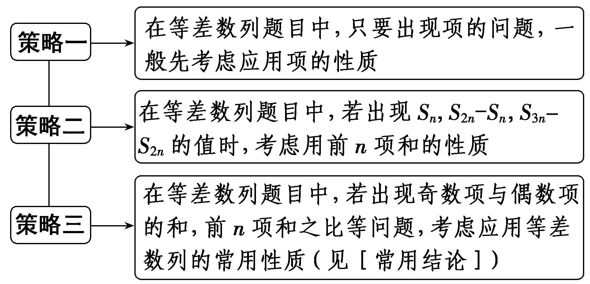
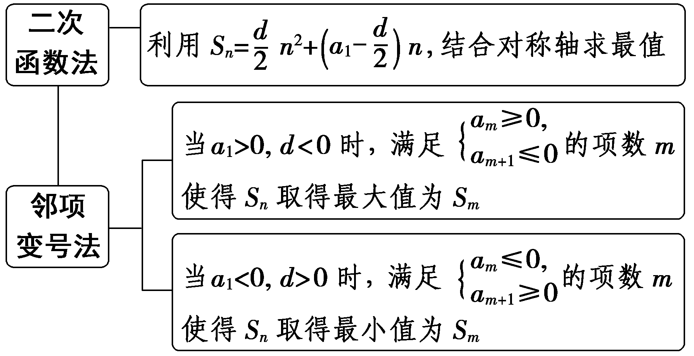
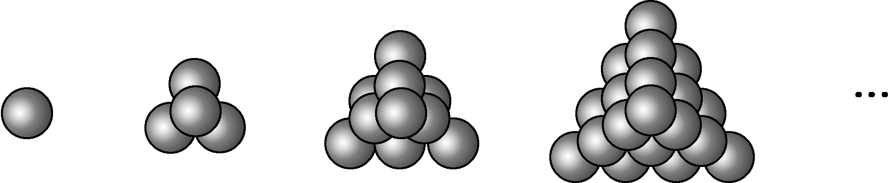

第二节　等差数列

【课标研读】　1.通过生活中的实例，理解等差数列的概念和通项公式的意义.　2.探索并掌握等差数列的前*n*项和公式，理解等差数列的通项公式与前*n*项和公式的关系.　3.能在具体的问题情境中，发现数列的等差关系，并解决相应的问题.　4.体会等差数列与一元一次函数的关系.

##### 1.等差数列的概念

（1）定义：如果一个数列从第2项起，每一项与它的前一项的差都等于<u>同一个常数</u>，那么这个数列就叫做等差数列.

数学语言表达式： $a_{n}_{＋}_{1}$ －<em>a&lt;text style="italic"&gt;n</em>&lt;/text&gt;＝<em>&lt;text style="italic"&gt;d</em>&lt;/text&gt;(n∈<strong>N</strong><em>\*</em>，d为常数).

（2）等差中项：由三个数<em>a</em>，<em>A</em>，<em>b</em>组成的等差数列可以看成是最简单的等差数列，这时<em><u>A</u></em>叫做<em>a</em>与<em>b</em>的等差中项，根据等差数列的定义可知2<em>A</em>＝<em><u>a</u></em><u>＋</u><em><u>b</u></em>.

##### 2.等差数列的通项公式与前*n*项和公式

（1）若等差数列{<em>an</em>}的首项是<em>a</em>1，公差是<em>d</em>，则其通项公式为<em>an</em>＝<em><u>a</u></em><u>1＋(</u><em><u>n</u></em><u>－1)</u><em><u>d</u></em>；

通项公式的推广：<em>an</em>＝<em>am</em>＋(<em>n</em>－<em>m</em>)<em>d</em>(<em>n</em>，<em>m</em>∈<strong>N</strong><em>\*</em>).

（2）前<em>&lt;text style="italic,subscript"&gt;n</em>&lt;/text&gt;项和公式：<em>S</em>n＝<em><u>na</u></em><u>1＋</u> $\frac{n(n－1)d}{2}$ ＝ $\frac{n(a_{1}＋a_{n})}{2}$ .

（3）当<em>d</em>≠0时，<em>an</em>可看作关于<em>n</em>的一次函数，<em>Sn</em>可看作关于<em>n</em>的二次函数，可借助二次函数的图象和性质来研究<em>Sn</em>的最值问题.

##### 3.等差数列的常用性质

（1）等差数列项的性质

①在等差数列{<em>an</em>}中，当<em>m</em>＋<em>n</em>＝<em>p</em>＋<em>q</em>时，<em>am</em>＋<em>an</em>＝<em><u>ap</u></em><u>＋</u><em><u>aq</u></em>(<em>m</em>，<em>n</em>，<em>p</em>，<em>q</em>∈<strong>N</strong><em>\*</em>).特别地，若<em>m</em>＋<em>n</em>＝2<em>p</em>，则<em>am</em>＋<em>an</em>＝<u>2</u><em><u>ap</u></em>(<em>m</em>，<em>n</em>，<em>p</em>∈<strong>N</strong><em>\*</em>).

②若 $\left\{a_{n}\right\}$ 公差为&lt;text style="it&lt;text style="it<em>a</em>lic"&gt;a&lt;/text&gt;lic"&gt;<em>d</em>&lt;/text&gt;，则 $\left\{a_{2n}\right\}$ 也是等差数列，公差为2&lt;text style="it&lt;text style="it<em>a</em>lic"&gt;a&lt;/text&gt;lic"&gt;<em>d</em>&lt;/text&gt;；a<em>&lt;text style="italic,subscript"&gt;&lt;text style="italic"&gt;k</em>&lt;/text&gt;&lt;/text&gt;， $a_{k}_{＋}_{m}$ ，&lt;text style="it<em>a</em>lic"&gt;a&lt;/text&gt;<em>&lt;text style="italic,subscript"&gt;&lt;text style="italic"&gt;k</em>&lt;/text&gt;&lt;/text&gt;＋2<em>&lt;text style="italic"&gt;m</em>&lt;/text&gt;，…仍是等差数列，公差为m<em>&lt;text style="italic"&gt;d</em>&lt;/text&gt;(k，m∈<strong>N</strong><em>\*</em>).

③若{<em>a</em>&lt;text style="italic,su<em>b</em>scri<em>p</em>t"&gt;<em>&lt;text style="italic,subscript"&gt;&lt;text style="italic,subscript"&gt;n</em>&lt;/text&gt;&lt;/text&gt;&lt;/text&gt;}，{bn}是等差数列，则{<em>pa</em>n＋<em>&lt;text style="italic"&gt;q</em>b&lt;/text&gt;n}(p，q为常数)也是等差数列； $\left\{a_{n}\right\}$ 与 $\left\{b_{n}\right\}$ 的公共项从小到大排成的新数列也是等差数列，首项是第一个相同的公共项，公差是 $\left\{a_{n}\right\}$ 与 $\left\{b_{n}\right\}$ 的公差的最小公倍数.

（2）等差数列前*n*项和的性质

①<em>&lt;text style="italic"&gt;S</em>&lt;/text&gt;<em>&lt;text style="italic,subscript"&gt;&lt;text style="italic"&gt;n</em>&lt;/text&gt;&lt;/text&gt;， $S_{2}_{n}$ －<em>&lt;text style="italic"&gt;S</em>&lt;/text&gt;<em>&lt;text style="italic,subscript"&gt;&lt;text style="italic"&gt;n</em>&lt;/text&gt;&lt;/text&gt;， $S_{3}_{n}$ － $S_{2}_{n}$ ，…也成&lt;text style="u<em>nd</em>erline"&gt;等差&lt;/text&gt;数列，公差为<em>&lt;text style="italic,subscript"&gt;n</em>&lt;/text&gt;2d.

②若{&lt;text style="it&lt;text style="it<em>a</em>lic"&gt;a&lt;/text&gt;lic"&gt;a&lt;/text&gt;<em>&lt;text style="italic,subscript"&gt;&lt;text style="italic,subscript"&gt;n</em>&lt;/text&gt;&lt;/text&gt;}是<u>等差</u>数列，则 $\left\{\frac{S_{n}}{n}\right\}$ 也成&lt;text style="u&lt;text style="it<em>a</em>lic,subscript"&gt;<em>n</em>&lt;/text&gt;derline"&gt;等差&lt;/text&gt;数列，其首项与{&lt;text style="it<em>a</em>lic"&gt;a&lt;/text&gt;<em>n</em>}首项相同，公差是{an}公差的 $\frac{1}{2}$ .

【常用结论】

（1）①数列{<em>an</em>}是等差数列⇔<em>an</em>＝<em>pn</em>＋<em>q</em>(其中<em>p</em>，<em>q</em>为常数)，这里公差<em>d</em>＝<em>p</em>.

②数列{<em>an</em>}是等差数列⇔<em>Sn</em>＝<em>An</em>2＋<em>Bn</em>(<em>A</em>，<em>B</em>为常数).这里公差<em>d</em>＝2<em>A</em>.

（2）等差数列的函数性质

①等差数列{<em>an</em>}的单调性：当<em>d</em>＞0时，{<em>an</em>}是递增数列；当<em>d</em>＜0时，{<em>an</em>}是递减数列；当<em>d</em>＝0时，{<em>an</em>}是常数列.

②在等差数列{<em>an</em>}中，若<em>a</em>1＞0，<em>d</em>＜0，则<em>Sn</em>存在最大值；若<em>a</em>1＜0，<em>d</em>＞0，则<em>Sn</em>存在最小值.

（3）关于等差数列奇数项和与偶数项和的性质

①若项数为2<em>n</em>，则<em>&lt;text style="italic"&gt;S</em>&lt;/text&gt;偶－S奇＝<em>nd</em>， $\frac{S_{奇}}{S_{偶}}$ ＝ $\frac{a_{n}}{a_{n}_{+1}}$ .

②若项数为2&lt;text style="it&lt;text style="it<em>a</em>lic"&gt;a&lt;/text&gt;lic"&gt;<em>&lt;text style="italic,subscript"&gt;&lt;text style="italic,subscript"&gt;&lt;text style="italic,subscript"&gt;n</em>&lt;/text&gt;&lt;/text&gt;&lt;/text&gt;&lt;/text&gt;－1，则<em>&lt;text style="italic"&gt;&lt;text style="italic"&gt;&lt;text style="italic"&gt;S</em>&lt;/text&gt;&lt;/text&gt;&lt;/text&gt;&lt;text style="subscript"&gt;偶&lt;/text&gt;＝(n－1)an，S&lt;text style="subscript"&gt;奇&lt;/text&gt;＝<em>na</em>n，S奇－S偶＝an， $\frac{S_{奇}}{S_{偶}}$ ＝ $\frac{n}{n－1}$ .

（4）两个等差数列{<em>a</em>&lt;text style="italic,su<em>b</em>script"&gt;<em>&lt;text style="italic"&gt;&lt;text style="italic,subscript"&gt;&lt;text style="italic,subscript"&gt;n</em>&lt;/text&gt;&lt;/text&gt;&lt;/text&gt;&lt;/text&gt;}，{bn}的前n项和<em>S</em>n，<em>T</em>n之间的关系为 $\frac{S_{2n－1}}{T_{2n－1}}$ ＝ $\frac{a_{n}}{b_{n}}$ .

【自主检测】

##### 1.(多选)下列结论正确的是(　　)

$\quad$A.若一个数列从第2项起每一项与它的前一项的差都是常数，则这个数列是等差数列

$\quad$B.数列{<em>an</em>}为等差数列的充要条件是对任意<em>n</em>∈<strong>N</strong><em>\*</em>，都有2<em>an</em>＋1＝<em>an</em>＋<em>an</em>＋2

$\quad$C.在等差数列{<em>an</em>}中，若<em>am</em>＋<em>an</em>＝<em>ap</em>＋<em>aq</em>，则<em>m</em>＋<em>n</em>＝<em>p</em>＋<em>q</em>

$\quad$D.若无穷等差数列{<em>an</em>}的公差<em>d</em>＞0，则其前<em>n</em>项和<em>Sn</em>不存在最大值

答案BD

##### 2.(链接人教A选择性必修二P15T4)等差数列{<em>an</em>}中，<em>a</em>4＋<em>a</em>8＝10，<em>a</em>10＝6，则公差<em>d</em>等于(　　)

$\quad$A. $\frac{1}{4}$ 	
$\quad$B. $\frac{1}{2}$

$\quad$C.2	
$\quad$D.－ $\frac{1}{2}$

答案A

解析因为&lt;text style="it&lt;text style="it&lt;text style="it&lt;text style="it<em>a</em>lic"&gt;a&lt;/text&gt;lic"&gt;a&lt;/text&gt;lic"&gt;a&lt;/text&gt;lic"&gt;a&lt;/text&gt;4＋a8＝10，所以2a&lt;text style="subscript"&gt;6&lt;/text&gt;＝10，即a6＝5，又a10＝6，所以4<em>&lt;text style="italic"&gt;d</em>&lt;/text&gt;＝6－5＝1，即d＝ $\frac{1}{4}$ .故选A.

##### 3.(链接人教A选择性必修二P21例6)设数列{<em>an</em>}是等差数列，其前<em>n</em>项和为<em>Sn</em>，若<em>a</em>6＝2且<em>S</em>5＝30，则<em>S</em>8等于(　　)

$\quad$A.31	
$\quad$B.32

$\quad$C.33	
$\quad$D.34

答案B

解析由题意知 $\left\{\begin{matrix}a_{1}+5d=2，\\5a_{1}+10d=30，\end{matrix}\right.$ 解得 $\left\{\begin{matrix}a_{1}＝\frac{26}{3}，\\d＝－\frac{4}{3}.\end{matrix}\right.$ 所以&lt;text style="it<em>a</em>lic"&gt;S&lt;/text&gt;8＝8a1＋ $\frac{8\times 7}{2}$ <em>d</em>＝8× $\frac{26}{3}$ －28× $\frac{4}{3}$ ＝32.故选B.

##### 4.(链接人教A选择性必修二P23例8)某剧场有20排座位，后一排比前一排多2个座位，最后一排有60个座位，则剧场总共的座位数为<u>　　　　</u>.

答案820

解析设第&lt;text style="it&lt;text style="it&lt;text style="it&lt;text style="it&lt;text style="it&lt;text style="it&lt;text style="it&lt;text style="it<em>a</em>lic"&gt;a&lt;/text&gt;lic"&gt;a&lt;/text&gt;lic"&gt;a&lt;/text&gt;lic"&gt;a&lt;/text&gt;lic"&gt;a&lt;/text&gt;lic"&gt;a&lt;/text&gt;lic"&gt;a&lt;/text&gt;lic"&gt;<em>&lt;text style="italic"&gt;&lt;text style="italic,subscript"&gt;&lt;text style="italic,subscript"&gt;&lt;text style="italic"&gt;&lt;text style="italic"&gt;n</em>&lt;/text&gt;&lt;/text&gt;&lt;/text&gt;&lt;/text&gt;&lt;/text&gt;&lt;/text&gt;排的座位数为an(n∈&lt;text style="bol<em>&lt;text style="italic"&gt;d</em>&lt;/text&gt;"&gt;N&lt;/text&gt;<em>\*</em>)，数列{an}为等差数列，其公差d＝2，则an＝a&lt;text style="subscript"&gt;&lt;text style="subscript"&gt;&lt;text style="subscript"&gt;1&lt;/text&gt;&lt;/text&gt;&lt;/text&gt;＋(n－1)d＝a1＋2(n－1).由已知a20＝60，得60＝a1＋2×(20－1)，解得a1＝22，则剧场总共的座位数为 $\frac{20\left(a_{1}＋a_{20}\right)}{2}$ ＝ $\frac{20\times \left(22+60\right)}{2}$ ＝820.

考点一　等差数列基本量的运算　　　　自主练透

##### 1.记&lt;text style="it<em>a</em>lic"&gt;<em>S</em>&lt;/text&gt;<em>&lt;text style="italic"&gt;n</em>&lt;/text&gt;为等差数列 $\left\{a_{n}\right\}$ 的前&lt;text style="it<em>a</em>lic,subscript"&gt;<em>n</em>&lt;/text&gt;项和.已知<em>&lt;text style="italic"&gt;S</em>&lt;/text&gt;4＝0，a5＝5，则(　　)

$\quad$A.<em>an</em>＝2<em>n</em>－5	
$\quad$B.<em>an</em>＝3<em>n</em>－10

$\quad$C.<em>&lt;text style="italic"&gt;S</em>&lt;/text&gt;<em>&lt;text style="italic"&gt;&lt;text style="italic,subscript"&gt;&lt;text style="italic"&gt;&lt;text style="italic"&gt;n</em>&lt;/text&gt;&lt;/text&gt;&lt;/text&gt;&lt;/text&gt;＝&lt;text style="superscript"&gt;2&lt;/text&gt;n2－8<em>n</em>	
$\quad$D.Sn＝ $\frac{1}{2}$ <em>&lt;text style="italic"&gt;&lt;text style="italic,subscript"&gt;&lt;text style="italic"&gt;&lt;text style="italic"&gt;n</em>&lt;/text&gt;&lt;/text&gt;&lt;/text&gt;&lt;/text&gt;&lt;text style="superscript"&gt;2&lt;/text&gt;－2n

答案A

解析设等差数列 $\left\{a_{n}\right\}$ 的公差为&lt;text style="it&lt;text style="it<em>a</em>lic"&gt;a&lt;/text&gt;lic"&gt;<em>&lt;text style="italic"&gt;d</em>&lt;/text&gt;&lt;/text&gt;，因为 $\left\{\begin{matrix}S_{4}=0，\\a_{5}=5，\end{matrix}\right.$ 所以 $\left\{\begin{matrix}4a_{1}＋\frac{4\times 3}{2}d=0，\\a_{1}+4d=5，\end{matrix}\right.$ 解得 $\left\{\begin{matrix}a_{1}＝－3，\\d=2，\end{matrix}\right.$ 所以&lt;text style="it<em>a</em>lic"&gt;a&lt;/text&gt;<em>&lt;text style="italic"&gt;&lt;text style="italic"&gt;&lt;text style="italic"&gt;&lt;text style="italic,subscript"&gt;&lt;text style="italic"&gt;&lt;text style="italic"&gt;n</em>&lt;/text&gt;&lt;/text&gt;&lt;/text&gt;&lt;/text&gt;&lt;/text&gt;&lt;/text&gt;＝a&lt;text style="subscript"&gt;1&lt;/text&gt;＋(n－1)<em>&lt;text style="italic"&gt;&lt;text style="italic"&gt;d</em>&lt;/text&gt;&lt;/text&gt;＝－3＋2(n－1)＝2n－5，<em>S</em>n＝<em>na</em>1＋ $\frac{n(n－1)}{2}$ &lt;text style="it&lt;text style="it<em>a</em>lic"&gt;a&lt;/text&gt;lic"&gt;<em>&lt;text style="italic"&gt;d</em>&lt;/text&gt;&lt;/text&gt;＝<em>&lt;text style="italic"&gt;&lt;text style="italic"&gt;&lt;text style="italic"&gt;&lt;text style="italic,subscript"&gt;&lt;text style="italic"&gt;&lt;text style="italic"&gt;n</em>&lt;/text&gt;&lt;/text&gt;&lt;/text&gt;&lt;/text&gt;&lt;/text&gt;&lt;/text&gt;2－4n.故选A.

2.(一题多解)(2023·全国甲卷)记&lt;text style="it&lt;text style="it&lt;text style="it&lt;text style="it<em>a</em>lic"&gt;a&lt;/text&gt;lic"&gt;a&lt;/text&gt;lic"&gt;a&lt;/text&gt;lic"&gt;<em>S</em>&lt;/text&gt;<em>&lt;text style="italic"&gt;n</em>&lt;/text&gt;为等差数列 $\left\{a_{n}\right\}$ 的前&lt;text style="it&lt;text style="it&lt;text style="it&lt;text style="it<em>a</em>lic"&gt;a&lt;/text&gt;lic"&gt;a&lt;/text&gt;lic"&gt;a&lt;/text&gt;lic,subscript"&gt;<em>n</em>&lt;/text&gt;项和.若a2＋a6＝10，a4a8＝45，则<em>&lt;text style="italic"&gt;S</em>&lt;/text&gt;5＝(　　)

$\quad$A.25	
$\quad$B.22

$\quad$C.20	
$\quad$D.15

答案C

解析法一：设等差数列 $\left\{a_{n}\right\}$ 的公差为&lt;text style="it&lt;text style="it&lt;text style="it&lt;text style="it&lt;text style="it&lt;text style="it&lt;text style="it&lt;text style="it&lt;text style="it&lt;text style="it<em>a</em>lic"&gt;a&lt;/text&gt;lic"&gt;a&lt;/text&gt;lic"&gt;a&lt;/text&gt;lic"&gt;a&lt;/text&gt;lic"&gt;a&lt;/text&gt;lic"&gt;a&lt;/text&gt;lic"&gt;a&lt;/text&gt;lic"&gt;a&lt;/text&gt;lic"&gt;a&lt;/text&gt;lic"&gt;<em>&lt;text style="italic"&gt;&lt;text style="italic"&gt;&lt;text style="italic"&gt;&lt;text style="italic"&gt;d</em>&lt;/text&gt;&lt;/text&gt;&lt;/text&gt;&lt;/text&gt;&lt;/text&gt;，首项为a&lt;text style="subscript"&gt;&lt;text style="subscript"&gt;&lt;text style="subscript"&gt;&lt;text style="subscript"&gt;&lt;text style="subscript"&gt;1&lt;/text&gt;&lt;/text&gt;&lt;/text&gt;&lt;/text&gt;&lt;/text&gt;，依题意可得，a2＋a6＝a1＋d＋a1＋5d＝10，即a1＋3d＝5，又a4a8＝ $\left(a_{1}+3d\right)\left(a_{1}+7d\right)$ ＝45，解得&lt;text style="it&lt;text style="it&lt;text style="it&lt;text style="it&lt;text style="it&lt;text style="it&lt;text style="it&lt;text style="it&lt;text style="it&lt;text style="it<em>a</em>lic"&gt;a&lt;/text&gt;lic"&gt;a&lt;/text&gt;lic"&gt;a&lt;/text&gt;lic"&gt;a&lt;/text&gt;lic"&gt;a&lt;/text&gt;lic"&gt;a&lt;/text&gt;lic"&gt;a&lt;/text&gt;lic"&gt;a&lt;/text&gt;lic"&gt;a&lt;/text&gt;lic"&gt;<em>&lt;text style="italic"&gt;&lt;text style="italic"&gt;&lt;text style="italic"&gt;&lt;text style="italic"&gt;d</em>&lt;/text&gt;&lt;/text&gt;&lt;/text&gt;&lt;/text&gt;&lt;/text&gt;＝&lt;text style="subscript"&gt;&lt;text style="subscript"&gt;&lt;text style="subscript"&gt;&lt;text style="subscript"&gt;&lt;text style="subscript"&gt;1&lt;/text&gt;&lt;/text&gt;&lt;/text&gt;&lt;/text&gt;&lt;/text&gt;，a1＝2，所以<em>S</em>5＝5a1＋ $\frac{5\times 4}{2}$ ×&lt;text style="it&lt;text style="it&lt;text style="it&lt;text style="it&lt;text style="it&lt;text style="it&lt;text style="it&lt;text style="it&lt;text style="it&lt;text style="it<em>a</em>lic"&gt;a&lt;/text&gt;lic"&gt;a&lt;/text&gt;lic"&gt;a&lt;/text&gt;lic"&gt;a&lt;/text&gt;lic"&gt;a&lt;/text&gt;lic"&gt;a&lt;/text&gt;lic"&gt;a&lt;/text&gt;lic"&gt;a&lt;/text&gt;lic"&gt;a&lt;/text&gt;lic"&gt;<em>&lt;text style="italic"&gt;&lt;text style="italic"&gt;&lt;text style="italic"&gt;&lt;text style="italic"&gt;d</em>&lt;/text&gt;&lt;/text&gt;&lt;/text&gt;&lt;/text&gt;&lt;/text&gt;＝5×2＋&lt;text style="subscript"&gt;&lt;text style="subscript"&gt;&lt;text style="subscript"&gt;&lt;text style="subscript"&gt;&lt;text style="subscript"&gt;1&lt;/text&gt;&lt;/text&gt;&lt;/text&gt;&lt;/text&gt;&lt;/text&gt;0＝20.故选C.

法二：&lt;text style="it&lt;text style="it&lt;text style="it&lt;text style="it&lt;text style="it&lt;text style="it&lt;text style="it&lt;text style="it&lt;text style="it<em>a</em>lic"&gt;a&lt;/text&gt;lic"&gt;a&lt;/text&gt;lic"&gt;a&lt;/text&gt;lic"&gt;a&lt;/text&gt;lic"&gt;a&lt;/text&gt;lic"&gt;a&lt;/text&gt;lic"&gt;a&lt;/text&gt;lic"&gt;a&lt;/text&gt;lic"&gt;a&lt;/text&gt;2＋a6＝2a&lt;text style="subscript"&gt;&lt;text style="subscript"&gt;&lt;text style="subscript"&gt;4&lt;/text&gt;&lt;/text&gt;&lt;/text&gt;＝10，a4a&lt;text style="subscript"&gt;8&lt;/text&gt;＝45，所以a4＝5，a8＝9，从而<em>&lt;text style="italic"&gt;d</em>&lt;/text&gt;＝ $\frac{a_{8}－a_{4}}{8－4}$ ＝1，于是&lt;text style="it&lt;text style="it&lt;text style="it&lt;text style="it&lt;text style="it&lt;text style="it&lt;text style="it&lt;text style="it&lt;text style="it<em>a</em>lic"&gt;a&lt;/text&gt;lic"&gt;a&lt;/text&gt;lic"&gt;a&lt;/text&gt;lic"&gt;a&lt;/text&gt;lic"&gt;a&lt;/text&gt;lic"&gt;a&lt;/text&gt;lic"&gt;a&lt;/text&gt;lic"&gt;a&lt;/text&gt;lic"&gt;a&lt;/text&gt;&lt;text style="subscript"&gt;3&lt;/text&gt;＝a&lt;text style="subscript"&gt;&lt;text style="subscript"&gt;&lt;text style="subscript"&gt;4&lt;/text&gt;&lt;/text&gt;&lt;/text&gt;－<em>&lt;text style="italic"&gt;d</em>&lt;/text&gt;＝5－1＝4，所以<em>S</em>5＝5a3＝20.故选C.

##### 3.广丰永和塔塔高九层，每至夜色降临，金灯齐明，塔身晶莹剔透，远望犹如仙境.某游客从塔底层(一层)进入塔身，即沿石阶逐级攀登，一步一阶，此后每上一层均沿塔走廊绕塔一周以便浏览美景，现知底层共二十六级台阶，此后每往上一层减少两级台阶，顶层绕塔一周需十二步，每往下一层绕塔一周需多三步，则这位游客从底层进入塔身开始到顶层绕塔一周停止共需(　　)

$\quad$A.352步	
$\quad$B.387步

$\quad$C.332步	
$\quad$D.368步

答案C

解析设从第&lt;text style="it&lt;text style="it&lt;text style="it&lt;text style="it&lt;text style="it&lt;text style="it<em>a</em>lic"&gt;a&lt;/text&gt;lic"&gt;a&lt;/text&gt;lic"&gt;a&lt;/text&gt;lic"&gt;a&lt;/text&gt;lic"&gt;a&lt;/text&gt;lic"&gt;<em>&lt;text style="italic,su&lt;text style="italic"&gt;&lt;text style="italic"&gt;&lt;text style="italic"&gt;&lt;text style="italic"&gt;&lt;text style="italic"&gt;&lt;text style="italic"&gt;b</em>&lt;/text&gt;&lt;/text&gt;&lt;/text&gt;&lt;/text&gt;&lt;/text&gt;script"&gt;<em>&lt;text style="italic,subscript"&gt;&lt;text style="italic,subscript"&gt;&lt;text style="italic"&gt;&lt;text style="italic,subscript"&gt;&lt;text style="italic"&gt;&lt;text style="italic,subscript"&gt;&lt;text style="italic,subscript"&gt;&lt;text style="italic"&gt;&lt;text style="italic"&gt;&lt;text style="italic,subscript"&gt;&lt;text style="italic,subscript"&gt;&lt;text style="italic"&gt;&lt;text style="italic"&gt;&lt;text style="italic,subscript"&gt;&lt;text style="italic,subscript"&gt;&lt;text style="italic"&gt;&lt;text style="italic,subscript"&gt;&lt;text style="italic,subscript"&gt;n</em>&lt;/text&gt;&lt;/text&gt;&lt;/text&gt;&lt;/text&gt;&lt;/text&gt;&lt;/text&gt;&lt;/text&gt;&lt;/text&gt;&lt;/text&gt;&lt;/text&gt;&lt;/text&gt;&lt;/text&gt;&lt;/text&gt;&lt;/text&gt;&lt;/text&gt;&lt;/text&gt;&lt;/text&gt;&lt;/text&gt;&lt;/text&gt;&lt;/text&gt;&lt;/text&gt;层到第n＋1层所走的台阶数为an，绕第n＋1层一周所走的步数为bn，由已知可得a1＝26， $a_{n}_{+1}$ －&lt;text style="it&lt;text style="it&lt;text style="it&lt;text style="it&lt;text style="it<em>a</em>lic"&gt;a&lt;/text&gt;lic"&gt;a&lt;/text&gt;lic"&gt;a&lt;/text&gt;lic"&gt;a&lt;/text&gt;lic"&gt;a&lt;/text&gt;<em>&lt;text style="italic"&gt;&lt;text style="italic,su&lt;text style="italic"&gt;&lt;text style="italic"&gt;&lt;text style="italic"&gt;&lt;text style="italic"&gt;&lt;text style="italic"&gt;&lt;text style="italic"&gt;b</em>&lt;/text&gt;&lt;/text&gt;&lt;/text&gt;&lt;/text&gt;&lt;/text&gt;script"&gt;<em>&lt;text style="italic,subscript"&gt;&lt;text style="italic,subscript"&gt;&lt;text style="italic"&gt;&lt;text style="italic,subscript"&gt;&lt;text style="italic"&gt;&lt;text style="italic,subscript"&gt;&lt;text style="italic,subscript"&gt;&lt;text style="italic"&gt;&lt;text style="italic"&gt;&lt;text style="italic,subscript"&gt;&lt;text style="italic,subscript"&gt;&lt;text style="italic"&gt;&lt;text style="italic"&gt;&lt;text style="italic,subscript"&gt;&lt;text style="italic,subscript"&gt;&lt;text style="italic"&gt;&lt;text style="italic,subscript"&gt;&lt;text style="italic,subscript"&gt;n</em>&lt;/text&gt;&lt;/text&gt;&lt;/text&gt;&lt;/text&gt;&lt;/text&gt;&lt;/text&gt;&lt;/text&gt;&lt;/text&gt;&lt;/text&gt;&lt;/text&gt;&lt;/text&gt;&lt;/text&gt;&lt;/text&gt;&lt;/text&gt;&lt;/text&gt;&lt;/text&gt;&lt;/text&gt;&lt;/text&gt;&lt;/text&gt;&lt;/text&gt;&lt;/text&gt;＝－2，n∈{1，2，3，4，5，6，7，&lt;text style="subscript"&gt;&lt;text style="subscript"&gt;&lt;text style="subscript"&gt;&lt;text style="subscript"&gt;8&lt;/text&gt;&lt;/text&gt;&lt;/text&gt;&lt;/text&gt;}，b8＝12，bn－ $b_{n}_{+1}$ ＝3，&lt;text style="it&lt;text style="it&lt;text style="it&lt;text style="it&lt;text style="it&lt;text style="it<em>a</em>lic"&gt;a&lt;/text&gt;lic"&gt;a&lt;/text&gt;lic"&gt;a&lt;/text&gt;lic"&gt;a&lt;/text&gt;lic"&gt;a&lt;/text&gt;lic"&gt;<em>&lt;text style="italic,su&lt;text style="italic"&gt;&lt;text style="italic"&gt;&lt;text style="italic"&gt;&lt;text style="italic"&gt;&lt;text style="italic"&gt;&lt;text style="italic"&gt;b</em>&lt;/text&gt;&lt;/text&gt;&lt;/text&gt;&lt;/text&gt;&lt;/text&gt;script"&gt;<em>&lt;text style="italic,subscript"&gt;&lt;text style="italic,subscript"&gt;&lt;text style="italic"&gt;&lt;text style="italic,subscript"&gt;&lt;text style="italic"&gt;&lt;text style="italic,subscript"&gt;&lt;text style="italic,subscript"&gt;&lt;text style="italic"&gt;&lt;text style="italic"&gt;&lt;text style="italic,subscript"&gt;&lt;text style="italic,subscript"&gt;&lt;text style="italic"&gt;&lt;text style="italic"&gt;&lt;text style="italic,subscript"&gt;&lt;text style="italic,subscript"&gt;&lt;text style="italic"&gt;&lt;text style="italic,subscript"&gt;&lt;text style="italic,subscript"&gt;n</em>&lt;/text&gt;&lt;/text&gt;&lt;/text&gt;&lt;/text&gt;&lt;/text&gt;&lt;/text&gt;&lt;/text&gt;&lt;/text&gt;&lt;/text&gt;&lt;/text&gt;&lt;/text&gt;&lt;/text&gt;&lt;/text&gt;&lt;/text&gt;&lt;/text&gt;&lt;/text&gt;&lt;/text&gt;&lt;/text&gt;&lt;/text&gt;&lt;/text&gt;&lt;/text&gt;∈{1，2，3，4，5，6，7，&lt;text style="subscript"&gt;&lt;text style="subscript"&gt;&lt;text style="subscript"&gt;&lt;text style="subscript"&gt;8&lt;/text&gt;&lt;/text&gt;&lt;/text&gt;&lt;/text&gt;}，所以数列{an}为首项为26，公差为－2的等差数列，故an＝28－2n，n∈{1，2，3，4，5，6，7，8}，数列{bn}为公差为－3的等差数列，故bn＝36－3n，n∈{1，2，3，4，5，6，7，8}，设数列{an}，{bn}的前n项和分别为<em>&lt;text style="italic"&gt;&lt;text style="italic"&gt;S</em>&lt;/text&gt;&lt;/text&gt;n，<em>&lt;text style="italic"&gt;&lt;text style="italic"&gt;T</em>&lt;/text&gt;&lt;/text&gt;n，所以S8＝ $\frac{8(a_{1}＋a_{8})}{2}$ ＝&lt;text style="su&lt;text style="it&lt;text style="it&lt;text style="it<em>a</em>lic"&gt;a&lt;/text&gt;lic"&gt;a&lt;/text&gt;lic"&gt;<em>&lt;text style="italic"&gt;&lt;text style="italic"&gt;&lt;text style="italic"&gt;b</em>&lt;/text&gt;&lt;/text&gt;&lt;/text&gt;&lt;/text&gt;script"&gt;1&lt;/text&gt;52，<em>&lt;text style="italic"&gt;&lt;text style="italic"&gt;T</em>&lt;/text&gt;&lt;/text&gt;&lt;text style="subscript"&gt;&lt;text style="subscript"&gt;&lt;text style="subscript"&gt;&lt;text style="subscript"&gt;8&lt;/text&gt;&lt;/text&gt;&lt;/text&gt;&lt;/text&gt;＝ $\frac{8(b_{1}＋b_{8})}{2}$ ＝&lt;text style="su&lt;text style="it&lt;text style="it&lt;text style="it<em>a</em>lic"&gt;a&lt;/text&gt;lic"&gt;a&lt;/text&gt;lic"&gt;<em>&lt;text style="italic"&gt;&lt;text style="italic"&gt;&lt;text style="italic"&gt;b</em>&lt;/text&gt;&lt;/text&gt;&lt;/text&gt;&lt;/text&gt;script"&gt;1&lt;/text&gt;&lt;text style="subscript"&gt;&lt;text style="subscript"&gt;&lt;text style="subscript"&gt;&lt;text style="subscript"&gt;8&lt;/text&gt;&lt;/text&gt;&lt;/text&gt;&lt;/text&gt;0，<em>&lt;text style="italic"&gt;&lt;text style="italic"&gt;S</em>&lt;/text&gt;&lt;/text&gt;8＋<em>&lt;text style="italic"&gt;&lt;text style="italic"&gt;T</em>&lt;/text&gt;&lt;/text&gt;8＝152＋180＝332，故这位游客从底层进入塔身开始到顶层绕塔一周停止共需332步.故选C.

&lt;text style="subscript"&gt;4&lt;/text&gt;.(2021·新高考Ⅱ卷)记&lt;text style="it&lt;text style="it&lt;text style="it<em>a</em>lic"&gt;a&lt;/text&gt;lic"&gt;a&lt;/text&gt;lic"&gt;<em>&lt;text style="italic"&gt;S</em>&lt;/text&gt;&lt;/text&gt;<em>&lt;text style="italic"&gt;n</em>&lt;/text&gt;是公差不为0的等差数列 $\left\{a_{n}\right\}$ 的前&lt;text style="it&lt;text style="it&lt;text style="it<em>a</em>lic"&gt;a&lt;/text&gt;lic"&gt;a&lt;/text&gt;lic,subscript"&gt;<em>n</em>&lt;/text&gt;项和，若a3＝<em>&lt;text style="italic"&gt;&lt;text style="italic"&gt;S</em>&lt;/text&gt;&lt;/text&gt;5，a2a&lt;text style="subscript"&gt;4&lt;/text&gt;＝S4.

（1）求数列 $\left\{a_{n}\right\}$ 的通项公式；

（2）求使<em>Sn</em>＞<em>an</em>成立的<em>n</em>的最小值.

解：（1）设等差数列 $\left\{a_{n}\right\}$ 的公差为*<text style="italic">d*</text>(d≠0)，

则由题意，得 $\left\{\begin{matrix}a_{1}+2d=5a_{1}+10d，\\(a_{1}＋d)(a_{1}+3d)=4a_{1}+6d，\end{matrix}\right.$ 解得 $\left\{\begin{matrix}a_{1}＝－4，\\d=2，\end{matrix}\right.$ 所以&lt;text style="it<em>a</em>lic"&gt;a&lt;/text&gt;<em>&lt;text style="italic"&gt;&lt;text style="italic"&gt;n</em>&lt;/text&gt;&lt;/text&gt;＝a1＋(n－1)<em>d</em>＝2n－6.

(2)法一：<em>S&lt;text style="italic"&gt;&lt;text style="italic"&gt;n</em>&lt;/text&gt;&lt;/text&gt;＝ $\frac{n(a_{1}＋a_{n})}{2}$ ＝ $\frac{n(2n－10)}{2}$ ＝<em>&lt;text style="italic"&gt;&lt;text style="italic"&gt;n</em>&lt;/text&gt;&lt;/text&gt;2－5n，

则由<em>n</em>2－5<em>n</em>＞2<em>n</em>－6，整理得<em>n</em>2－7<em>n</em>＋6＞0，解得<em>n</em>＜1或<em>n</em>＞6.

因为<em>n</em>∈<strong>N</strong><em>\*</em>，所以使<em>Sn</em>＞<em>an</em>成立的<em>n</em>的最小值为7.

法二：由&lt;text style="it<em>a</em>lic"&gt;<em>S</em>&lt;/text&gt;<em>&lt;text style="italic,subscript"&gt;&lt;text style="italic,subscript"&gt;&lt;text style="italic"&gt;n</em>&lt;/text&gt;&lt;/text&gt;&lt;/text&gt;＞an得Sn－1＞0(n≥2)，即 $\frac{(a_{1}＋a_{n－1})(n－1)}{2}$ ＞0，

所以<em>a</em>1＋<em>an</em>－1＝2<em>n</em>－12＞0，解得<em>n</em>＞6，所以<em>n</em>的最小值为7.

##### 1.等差数列基本运算中常用的数学思想

<table><tr><td>
方程思想
</td><td>
等差数列的通项公式及前<em>n</em>项和公式涉及<em>a</em>1，<em>an</em>，<em>d</em>，<em>n</em>，<em>Sn</em>五个量，知其中三个就能求另外两个，通常利用条件和通项公式、前<em>n</em>项和公式建立方程(组)求解，例如1，2，4题.
</td></tr><tr><td>
整体思想
</td><td>
当所给条件只有一个时，可将已知和所求都用<em>a</em>1和<em>d</em>表示，寻求两者之间的联系，整体代换求解，例如第3题.
</td></tr></table>

##### 2.等差数列基本运算中常用的技巧

（1）<em>a</em>1和<em>d</em>是等差数列的两个基本量，用它们表示已知量和未知量是常用技巧；

（2）减少运算量的设元技巧：若三个数成等差数列，可将三个数设为*a*－*d*，*a*，*a*＋*d*；若四个数成等差数列，可将四个数设为*a*－3*d*，*a*－*d*，*a*＋*d*，*a*＋3*d*.

考点二　等差数列的判定与证明　　　　师生共研

(2021·全国甲卷)已知数列{<em>an</em>}的各项均为正数，记<em>Sn</em>为{<em>an</em>}的前<em>n</em>项和，从下面①②③中选取两个作为条件，证明另外一个成立.

①数列{&lt;text style="it&lt;text style="it<em>a</em>lic"&gt;a&lt;/text&gt;lic"&gt;a&lt;/text&gt;<em>n</em>}是等差数列；②数列 $\left\{\sqrt{S_{n}}\right\}$ 是等差数列；③&lt;text style="it&lt;text style="it<em>a</em>lic"&gt;a&lt;/text&gt;lic"&gt;a&lt;/text&gt;2＝3a1.

注：若选择不同的组合分别解答，则按第一个解答计分.

证明：①③⇒②.

已知{<em>an</em>}是等差数列，<em>a</em>2＝3<em>a</em>1.

设数列{<em>an</em>}的公差为<em>d</em>，

则<em>a</em>2＝3<em>a</em>1＝<em>a</em>1＋<em>d</em>，得<em>d</em>＝2<em>a</em>1，

所以&lt;text style="it<em>a</em>lic"&gt;S&lt;/text&gt;<em>&lt;text style="italic"&gt;n</em>&lt;/text&gt;＝<em>na</em>&lt;text style="subscript"&gt;1&lt;/text&gt;＋ $\frac{n(n－1)}{2}$ &lt;text style="it<em>a</em>lic"&gt;d&lt;/text&gt;＝<em>&lt;text style="italic"&gt;n</em>&lt;/text&gt;2a&lt;text style="subscript"&gt;1&lt;/text&gt;.

因为数列{<em>an</em>}的各项均为正数，

所以 $\sqrt{S_{n}}$ ＝*n* $\sqrt{a_{1}}$ ，

所以 $\sqrt{S_{n}_{+1}}$ － $\sqrt{S_{n}}$ ＝(*<text style="italic">n*</text>＋1) $\sqrt{a_{1}}$ －*<text style="italic">n*</text> $\sqrt{a_{1}}$ ＝ $\sqrt{a_{1}}$ (常数)，所以数列 $\left\{\sqrt{S_{n}}\right\}$ 是等差数列.

①②⇒③.

已知{<em>an</em>}是等差数列，{ $\sqrt{S_{n}}$ }是等差数列.

设数列{<em>an</em>}的公差为<em>d</em>，

则<em>S&lt;text style="italic"&gt;&lt;text style="italic"&gt;n</em>&lt;/text&gt;&lt;/text&gt;＝<em>na</em>1＋ $\frac{n(n－1)}{2}$ <em>&lt;text style="italic"&gt;d</em>&lt;/text&gt;＝ $\frac{1}{2}$ <em>&lt;text style="italic"&gt;&lt;text style="italic"&gt;n</em>&lt;/text&gt;&lt;/text&gt;2<em>&lt;text style="italic"&gt;d</em>&lt;/text&gt;＋ $\left(a_{1}－\frac{d}{2}\right)$ <em>&lt;text style="italic"&gt;&lt;text style="italic"&gt;n</em>&lt;/text&gt;&lt;/text&gt;.

因为数列 $\left\{\sqrt{S_{n}}\right\}$ 是等差数列，所以数列 $\left\{\sqrt{S_{n}}\right\}$ 的通项公式是关于&lt;text style="it&lt;text style="it&lt;text style="it&lt;text style="it&lt;text style="it<em>a</em>lic"&gt;a&lt;/text&gt;lic"&gt;a&lt;/text&gt;lic"&gt;a&lt;/text&gt;lic"&gt;a&lt;/text&gt;lic"&gt;n&lt;/text&gt;的一次函数，则a&lt;text style="subscript"&gt;&lt;text style="subscript"&gt;&lt;text style="subscript"&gt;1&lt;/text&gt;&lt;/text&gt;&lt;/text&gt;－ $\frac{d}{2}$ ＝0，即&lt;text style="it&lt;text style="it&lt;text style="it&lt;text style="it<em>a</em>lic"&gt;a&lt;/text&gt;lic"&gt;a&lt;/text&gt;lic"&gt;a&lt;/text&gt;lic"&gt;<em>d</em>&lt;/text&gt;＝2<em>a</em>&lt;text style="subscript"&gt;&lt;text style="subscript"&gt;&lt;text style="subscript"&gt;1&lt;/text&gt;&lt;/text&gt;&lt;/text&gt;，所以a2＝a1＋d＝3a1.

②③⇒①.

已知数列{ $\sqrt{S_{n}}$ }是等差数列，&lt;text style="it<em>a</em>lic"&gt;a&lt;/text&gt;2＝3a1，

所以<em>S</em>1＝<em>a</em>1，<em>S</em>2＝<em>a</em>1＋<em>a</em>2＝4<em>a</em>1.

设数列 $\left\{\sqrt{S_{n}}\right\}$ 的公差为*<text style="italic">d*</text>，d＞0，

则 $\sqrt{S_{2}}$ － $\sqrt{S_{1}}$ ＝ $\sqrt{4a_{1}}$ － $\sqrt{a_{1}}$ ＝&lt;text style="it<em>a</em>lic"&gt;<em>d</em>&lt;/text&gt;，得a1＝d2，

所以 $\sqrt{S_{n}}$ ＝ $\sqrt{S_{1}}$ ＋(<em>&lt;text style="italic,subscript"&gt;&lt;text style="italic"&gt;n</em>&lt;/text&gt;&lt;/text&gt;－1)<em>&lt;text style="italic"&gt;d</em>&lt;/text&gt;＝<em>nd</em>，所以<em>S</em>n＝n&lt;text style="superscript"&gt;2&lt;/text&gt;d2，

所以&lt;text style="it<em>a</em>lic"&gt;a&lt;/text&gt;<em>&lt;text style="italic,subscript"&gt;&lt;text style="italic"&gt;&lt;text style="italic"&gt;&lt;text style="italic"&gt;&lt;text style="italic"&gt;&lt;text style="italic"&gt;n</em>&lt;/text&gt;&lt;/text&gt;&lt;/text&gt;&lt;/text&gt;&lt;/text&gt;&lt;/text&gt;＝<em>S</em>n－ $S_{n}_{－1}$ ＝&lt;text style="it<em>a</em>lic,subscript"&gt;<em>&lt;text style="italic"&gt;&lt;text style="italic"&gt;&lt;text style="italic"&gt;&lt;text style="italic"&gt;&lt;text style="italic"&gt;n</em>&lt;/text&gt;&lt;/text&gt;&lt;/text&gt;&lt;/text&gt;&lt;/text&gt;&lt;/text&gt;&lt;text style="superscript"&gt;&lt;text style="superscript"&gt;&lt;text style="superscript"&gt;&lt;text style="superscript"&gt;&lt;text style="superscript"&gt;&lt;text style="superscript"&gt;2&lt;/text&gt;&lt;/text&gt;&lt;/text&gt;&lt;/text&gt;&lt;/text&gt;&lt;/text&gt;<em>&lt;text style="italic"&gt;&lt;text style="italic"&gt;&lt;text style="italic"&gt;&lt;text style="italic"&gt;d</em>&lt;/text&gt;&lt;/text&gt;&lt;/text&gt;&lt;/text&gt;2－(n－1)2d2＝2d2n－d2(n≥2)，是关于n的一次函数，且<em>a</em>1＝d2满足上式，

所以数列{<em>an</em>}是等差数列.

等差数列的判定与证明的常用方法

##### 1.定义法： $a_{n}_{+1}$ －&lt;text style="it&lt;text style="it<em>a</em>lic"&gt;a&lt;/text&gt;lic"&gt;a&lt;/text&gt;<em>&lt;text style="italic"&gt;&lt;text style="italic,subscript"&gt;&lt;text style="italic"&gt;&lt;text style="italic"&gt;&lt;text style="italic,subscript"&gt;n</em>&lt;/text&gt;&lt;/text&gt;&lt;/text&gt;&lt;/text&gt;&lt;/text&gt;＝<em>&lt;text style="italic"&gt;&lt;text style="italic"&gt;&lt;text style="italic"&gt;d</em>&lt;/text&gt;&lt;/text&gt;&lt;/text&gt;(d是常数，n∈<strong>&lt;text style="bold"&gt;N</strong>&lt;/text&gt;<em>&lt;text style="italic,superscript"&gt;\*</em>&lt;/text&gt;)或an－ $a_{n}_{－1}$ ＝&lt;text style="it&lt;text style="it<em>a</em>lic"&gt;a&lt;/text&gt;lic"&gt;<em>&lt;text style="italic"&gt;&lt;text style="italic"&gt;d</em>&lt;/text&gt;&lt;/text&gt;&lt;/text&gt;(d是常数，<em>&lt;text style="italic"&gt;&lt;text style="italic,subscript"&gt;&lt;text style="italic"&gt;&lt;text style="italic"&gt;&lt;text style="italic,subscript"&gt;n</em>&lt;/text&gt;&lt;/text&gt;&lt;/text&gt;&lt;/text&gt;&lt;/text&gt;∈<strong>&lt;text style="bold"&gt;N</strong>&lt;/text&gt;<em>&lt;text style="italic,superscript"&gt;\*</em>&lt;/text&gt;，n≥2)⇔{<em>a</em>n}为等差数列.

##### 2.等差中项法：2 $a_{n}_{+1}$ ＝&lt;text style="it<em>a</em>lic"&gt;a&lt;/text&gt;<em>&lt;text style="italic"&gt;&lt;text style="italic,subscript"&gt;n</em>&lt;/text&gt;&lt;/text&gt;＋ $a_{n}_{+2}$ (&lt;text style="it<em>a</em>lic,subscript"&gt;<em>&lt;text style="italic,subscript"&gt;n</em>&lt;/text&gt;&lt;/text&gt;∈<strong>N</strong><em>\*</em>)⇔{<em>a</em>n}为等差数列.

##### 3.通项公式法：<em>an</em>＝<em>an</em>＋<em>b</em>(<em>a</em>，<em>b</em>是常数，<em>n</em>∈<strong>N</strong><em>\*</em>)⇔{<em>an</em>}为等差数列.

##### 4.前<em>n</em>项和公式法：<em>Sn</em>＝<em>an</em>2＋<em>bn</em>(<em>a</em>，<em>b</em>为常数)⇔{<em>an</em>}为等差数列.

注意：若要判定一个数列不是等差数列，则只需找出三项&lt;text style="it<em>a</em>lic"&gt;a&lt;/text&gt;<em>&lt;text style="italic,subscript"&gt;&lt;text style="italic"&gt;n</em>&lt;/text&gt;&lt;/text&gt;， $a_{n}_{+1}$ ， $a_{n}_{+2}$ ，使得这三项不满足2 $a_{n}_{+1}$ ＝&lt;text style="it<em>a</em>lic"&gt;a&lt;/text&gt;<em>&lt;text style="italic,subscript"&gt;&lt;text style="italic"&gt;n</em>&lt;/text&gt;&lt;/text&gt;＋ $a_{n}_{+2}$ 即可；但如果要证明一个数列是等差数列，则必须证明任意&lt;text style="it<em>a</em>lic,subscript"&gt;<em>&lt;text style="italic"&gt;n</em>&lt;/text&gt;&lt;/text&gt;∈<strong>N</strong><em>\*</em>都满足上式.

对点练1.(2023·新课标Ⅰ卷)设<em>S&lt;text style="italic"&gt;n</em>&lt;/text&gt;为数列 $\left\{a_{n}\right\}$ 的前<em>&lt;text style="italic"&gt;n</em>&lt;/text&gt;项和，设甲： $\left\{a_{n}\right\}$ 为等差数列；乙： $\left\{\frac{S_{n}}{n}\right\}$ 为等差数列.则(　　)

$\quad$A.甲是乙的充分条件但不是必要条件

$\quad$B.甲是乙的必要条件但不是充分条件

$\quad$C.甲是乙的充要条件

$\quad$D.甲既不是乙的充分条件也不是乙的必要条件

答案C

解析若 $\left\{a_{n}\right\}$ 为等差数列，设其公差为&lt;&lt;&lt;&lt;&lt;&lt;&lt;&lt;&lt;&lt;&lt;<em>t</em>ext style="italic"&gt;t&lt;/text&gt;ext style="it<em>a</em>lic"&gt;t&lt;/text&gt;ext style="it&lt;text style="it&lt;text style="it<em>a</em>lic"&gt;a&lt;/text&gt;lic"&gt;a&lt;/text&gt;lic"&gt;t&lt;/text&gt;ext style="it&lt;text style="it&lt;text style="it<em>a</em>lic"&gt;a&lt;/text&gt;lic"&gt;a&lt;/text&gt;lic"&gt;t&lt;/text&gt;ext style="it<em>a</em>lic"&gt;t&lt;/text&gt;ext style="it<em>a</em>lic"&gt;t&lt;/text&gt;ext style="it<em>a</em>lic"&gt;t&lt;/text&gt;ext style="italic"&gt;t&lt;/text&gt;ext style="it<em>a</em>lic"&gt;t&lt;/text&gt;ext style="italic"&gt;t&lt;/text&gt;ext style="it&lt;text style="it&lt;text style="it&lt;text style="it&lt;text style="it<em>a</em>lic"&gt;a&lt;/text&gt;lic"&gt;a&lt;/text&gt;lic"&gt;a&lt;/text&gt;lic"&gt;a&lt;/text&gt;lic"&gt;<em>&lt;text style="italic"&gt;d</em>&lt;/text&gt;&lt;/text&gt;，则a<em>&lt;text style="italic,subscript"&gt;&lt;text style="italic"&gt;&lt;text style="italic,subscript"&gt;&lt;text style="italic"&gt;&lt;text style="italic"&gt;&lt;text style="italic,subscript"&gt;&lt;text style="italic,subscript"&gt;&lt;text style="italic,subscript"&gt;&lt;text style="italic"&gt;&lt;text style="italic"&gt;&lt;text style="italic,subscript"&gt;&lt;text style="italic,subscript"&gt;&lt;text style="italic,subscript"&gt;n</em>&lt;/text&gt;&lt;/text&gt;&lt;/text&gt;&lt;/text&gt;&lt;/text&gt;&lt;/text&gt;&lt;/text&gt;&lt;/text&gt;&lt;/text&gt;&lt;/text&gt;&lt;/text&gt;&lt;/text&gt;&lt;/text&gt;＝a&lt;text style="subscript"&gt;&lt;text style="subscript"&gt;&lt;text style="subscript"&gt;&lt;text style="subscript"&gt;&lt;text style="subscript"&gt;&lt;text style="subscript"&gt;&lt;text style="subscript"&gt;&lt;text style="subscript"&gt;&lt;text style="subscript"&gt;&lt;text style="subscript"&gt;&lt;text style="subscript"&gt;&lt;text style="subscript"&gt;&lt;text style="subscript"&gt;&lt;text style="subscript"&gt;1&lt;/text&gt;&lt;/text&gt;&lt;/text&gt;&lt;/text&gt;&lt;/text&gt;&lt;/text&gt;&lt;/text&gt;&lt;/text&gt;&lt;/text&gt;&lt;/text&gt;&lt;/text&gt;&lt;/text&gt;&lt;/text&gt;&lt;/text&gt;＋ $\left(n－1\right)$ &lt;&lt;&lt;&lt;&lt;&lt;&lt;&lt;&lt;&lt;&lt;<em>t</em>ext style="italic"&gt;t&lt;/text&gt;ext style="it<em>a</em>lic"&gt;t&lt;/text&gt;ext style="it&lt;text style="it&lt;text style="it<em>a</em>lic"&gt;a&lt;/text&gt;lic"&gt;a&lt;/text&gt;lic"&gt;t&lt;/text&gt;ext style="it&lt;text style="it&lt;text style="it<em>a</em>lic"&gt;a&lt;/text&gt;lic"&gt;a&lt;/text&gt;lic"&gt;t&lt;/text&gt;ext style="it<em>a</em>lic"&gt;t&lt;/text&gt;ext style="it<em>a</em>lic"&gt;t&lt;/text&gt;ext style="it<em>a</em>lic"&gt;t&lt;/text&gt;ext style="italic"&gt;t&lt;/text&gt;ext style="it<em>a</em>lic"&gt;t&lt;/text&gt;ext style="italic"&gt;t&lt;/text&gt;ext style="it&lt;text style="it&lt;text style="it&lt;text style="it&lt;text style="it<em>a</em>lic"&gt;a&lt;/text&gt;lic"&gt;a&lt;/text&gt;lic"&gt;a&lt;/text&gt;lic"&gt;a&lt;/text&gt;lic"&gt;<em>&lt;text style="italic"&gt;d</em>&lt;/text&gt;&lt;/text&gt;，所以<em>&lt;text style="italic"&gt;&lt;text style="italic"&gt;&lt;text style="italic"&gt;&lt;text style="italic"&gt;S</em>&lt;/text&gt;&lt;/text&gt;&lt;/text&gt;&lt;/text&gt;<em>&lt;text style="italic,subscript"&gt;&lt;text style="italic"&gt;&lt;text style="italic,subscript"&gt;&lt;text style="italic"&gt;&lt;text style="italic"&gt;&lt;text style="italic,subscript"&gt;&lt;text style="italic,subscript"&gt;&lt;text style="italic,subscript"&gt;&lt;text style="italic"&gt;&lt;text style="italic"&gt;&lt;text style="italic,subscript"&gt;&lt;text style="italic,subscript"&gt;&lt;text style="italic,subscript"&gt;n</em>&lt;/text&gt;&lt;/text&gt;&lt;/text&gt;&lt;/text&gt;&lt;/text&gt;&lt;/text&gt;&lt;/text&gt;&lt;/text&gt;&lt;/text&gt;&lt;/text&gt;&lt;/text&gt;&lt;/text&gt;&lt;/text&gt;＝<em>&lt;text style="italic"&gt;&lt;text style="italic"&gt;na</em>&lt;/text&gt;&lt;/text&gt;&lt;text style="subscript"&gt;&lt;text style="subscript"&gt;&lt;text style="subscript"&gt;&lt;text style="subscript"&gt;&lt;text style="subscript"&gt;&lt;text style="subscript"&gt;&lt;text style="subscript"&gt;&lt;text style="subscript"&gt;&lt;text style="subscript"&gt;&lt;text style="subscript"&gt;&lt;text style="subscript"&gt;&lt;text style="subscript"&gt;&lt;text style="subscript"&gt;&lt;text style="subscript"&gt;1&lt;/text&gt;&lt;/text&gt;&lt;/text&gt;&lt;/text&gt;&lt;/text&gt;&lt;/text&gt;&lt;/text&gt;&lt;/text&gt;&lt;/text&gt;&lt;/text&gt;&lt;/text&gt;&lt;/text&gt;&lt;/text&gt;&lt;/text&gt;＋ $\frac{n\left(n－1\right)}{2}$ &lt;&lt;&lt;&lt;&lt;&lt;&lt;&lt;&lt;&lt;&lt;<em>t</em>ext style="italic"&gt;t&lt;/text&gt;ext style="it<em>a</em>lic"&gt;t&lt;/text&gt;ext style="it&lt;text style="it&lt;text style="it<em>a</em>lic"&gt;a&lt;/text&gt;lic"&gt;a&lt;/text&gt;lic"&gt;t&lt;/text&gt;ext style="it&lt;text style="it&lt;text style="it<em>a</em>lic"&gt;a&lt;/text&gt;lic"&gt;a&lt;/text&gt;lic"&gt;t&lt;/text&gt;ext style="it<em>a</em>lic"&gt;t&lt;/text&gt;ext style="it<em>a</em>lic"&gt;t&lt;/text&gt;ext style="it<em>a</em>lic"&gt;t&lt;/text&gt;ext style="italic"&gt;t&lt;/text&gt;ext style="it<em>a</em>lic"&gt;t&lt;/text&gt;ext style="italic"&gt;t&lt;/text&gt;ext style="it&lt;text style="it&lt;text style="it&lt;text style="it&lt;text style="it<em>a</em>lic"&gt;a&lt;/text&gt;lic"&gt;a&lt;/text&gt;lic"&gt;a&lt;/text&gt;lic"&gt;a&lt;/text&gt;lic"&gt;<em>&lt;text style="italic"&gt;d</em>&lt;/text&gt;&lt;/text&gt;，所以 $\frac{S_{n}}{n}$ ＝&lt;&lt;&lt;&lt;&lt;&lt;&lt;&lt;&lt;&lt;&lt;<em>t</em>ext style="italic"&gt;t&lt;/text&gt;ext style="it<em>a</em>lic"&gt;t&lt;/text&gt;ext style="it&lt;text style="it&lt;text style="it<em>a</em>lic"&gt;a&lt;/text&gt;lic"&gt;a&lt;/text&gt;lic"&gt;t&lt;/text&gt;ext style="it&lt;text style="it&lt;text style="it<em>a</em>lic"&gt;a&lt;/text&gt;lic"&gt;a&lt;/text&gt;lic"&gt;t&lt;/text&gt;ext style="it<em>a</em>lic"&gt;t&lt;/text&gt;ext style="it<em>a</em>lic"&gt;t&lt;/text&gt;ext style="it<em>a</em>lic"&gt;t&lt;/text&gt;ext style="italic"&gt;t&lt;/text&gt;ext style="it<em>a</em>lic"&gt;t&lt;/text&gt;ext style="italic"&gt;t&lt;/text&gt;ext style="it&lt;text style="it&lt;text style="it&lt;text style="it<em>a</em>lic"&gt;a&lt;/text&gt;lic"&gt;a&lt;/text&gt;lic"&gt;a&lt;/text&gt;lic"&gt;a&lt;/text&gt;&lt;text style="subscript"&gt;&lt;text style="subscript"&gt;&lt;text style="subscript"&gt;&lt;text style="subscript"&gt;&lt;text style="subscript"&gt;&lt;text style="subscript"&gt;&lt;text style="subscript"&gt;&lt;text style="subscript"&gt;&lt;text style="subscript"&gt;&lt;text style="subscript"&gt;&lt;text style="subscript"&gt;&lt;text style="subscript"&gt;&lt;text style="subscript"&gt;&lt;text style="subscript"&gt;1&lt;/text&gt;&lt;/text&gt;&lt;/text&gt;&lt;/text&gt;&lt;/text&gt;&lt;/text&gt;&lt;/text&gt;&lt;/text&gt;&lt;/text&gt;&lt;/text&gt;&lt;/text&gt;&lt;/text&gt;&lt;/text&gt;&lt;/text&gt;＋ $\left(n－1\right)$ · $\frac{d}{2}$ ，所以 $\frac{S_{n+1}}{n+1}$ － $\frac{S_{n}}{n}$ ＝&lt;&lt;&lt;&lt;&lt;&lt;&lt;&lt;&lt;&lt;&lt;<em>t</em>ext style="italic"&gt;t&lt;/text&gt;ext style="it<em>a</em>lic"&gt;t&lt;/text&gt;ext style="it&lt;text style="it&lt;text style="it<em>a</em>lic"&gt;a&lt;/text&gt;lic"&gt;a&lt;/text&gt;lic"&gt;t&lt;/text&gt;ext style="it&lt;text style="it&lt;text style="it<em>a</em>lic"&gt;a&lt;/text&gt;lic"&gt;a&lt;/text&gt;lic"&gt;t&lt;/text&gt;ext style="it<em>a</em>lic"&gt;t&lt;/text&gt;ext style="it<em>a</em>lic"&gt;t&lt;/text&gt;ext style="it<em>a</em>lic"&gt;t&lt;/text&gt;ext style="italic"&gt;t&lt;/text&gt;ext style="it<em>a</em>lic"&gt;t&lt;/text&gt;ext style="italic"&gt;t&lt;/text&gt;ext style="it&lt;text style="it&lt;text style="it&lt;text style="it<em>a</em>lic"&gt;a&lt;/text&gt;lic"&gt;a&lt;/text&gt;lic"&gt;a&lt;/text&gt;lic"&gt;a&lt;/text&gt;&lt;text style="subscript"&gt;&lt;text style="subscript"&gt;&lt;text style="subscript"&gt;&lt;text style="subscript"&gt;&lt;text style="subscript"&gt;&lt;text style="subscript"&gt;&lt;text style="subscript"&gt;&lt;text style="subscript"&gt;&lt;text style="subscript"&gt;&lt;text style="subscript"&gt;&lt;text style="subscript"&gt;&lt;text style="subscript"&gt;&lt;text style="subscript"&gt;&lt;text style="subscript"&gt;1&lt;/text&gt;&lt;/text&gt;&lt;/text&gt;&lt;/text&gt;&lt;/text&gt;&lt;/text&gt;&lt;/text&gt;&lt;/text&gt;&lt;/text&gt;&lt;/text&gt;&lt;/text&gt;&lt;/text&gt;&lt;/text&gt;&lt;/text&gt;＋(<em>&lt;text style="italic,subscript"&gt;&lt;text style="italic"&gt;&lt;text style="italic,subscript"&gt;&lt;text style="italic"&gt;&lt;text style="italic"&gt;&lt;text style="italic,subscript"&gt;&lt;text style="italic,subscript"&gt;&lt;text style="italic,subscript"&gt;&lt;text style="italic"&gt;&lt;text style="italic"&gt;&lt;text style="italic,subscript"&gt;&lt;text style="italic,subscript"&gt;&lt;text style="italic,subscript"&gt;n</em>&lt;/text&gt;&lt;/text&gt;&lt;/text&gt;&lt;/text&gt;&lt;/text&gt;&lt;/text&gt;&lt;/text&gt;&lt;/text&gt;&lt;/text&gt;&lt;/text&gt;&lt;/text&gt;&lt;/text&gt;&lt;/text&gt;＋1－1)· $\frac{d}{2}$ －［&lt;&lt;&lt;&lt;&lt;&lt;&lt;&lt;&lt;&lt;&lt;<em>t</em>ext style="italic"&gt;t&lt;/text&gt;ext style="it<em>a</em>lic"&gt;t&lt;/text&gt;ext style="it&lt;text style="it&lt;text style="it<em>a</em>lic"&gt;a&lt;/text&gt;lic"&gt;a&lt;/text&gt;lic"&gt;t&lt;/text&gt;ext style="it&lt;text style="it&lt;text style="it<em>a</em>lic"&gt;a&lt;/text&gt;lic"&gt;a&lt;/text&gt;lic"&gt;t&lt;/text&gt;ext style="it<em>a</em>lic"&gt;t&lt;/text&gt;ext style="it<em>a</em>lic"&gt;t&lt;/text&gt;ext style="it<em>a</em>lic"&gt;t&lt;/text&gt;ext style="italic"&gt;t&lt;/text&gt;ext style="it<em>a</em>lic"&gt;t&lt;/text&gt;ext style="italic"&gt;t&lt;/text&gt;ext style="it&lt;text style="it&lt;text style="it&lt;text style="it<em>a</em>lic"&gt;a&lt;/text&gt;lic"&gt;a&lt;/text&gt;lic"&gt;a&lt;/text&gt;lic"&gt;a&lt;/text&gt;&lt;text style="subscript"&gt;&lt;text style="subscript"&gt;&lt;text style="subscript"&gt;&lt;text style="subscript"&gt;&lt;text style="subscript"&gt;&lt;text style="subscript"&gt;&lt;text style="subscript"&gt;&lt;text style="subscript"&gt;&lt;text style="subscript"&gt;&lt;text style="subscript"&gt;&lt;text style="subscript"&gt;&lt;text style="subscript"&gt;&lt;text style="subscript"&gt;&lt;text style="subscript"&gt;1&lt;/text&gt;&lt;/text&gt;&lt;/text&gt;&lt;/text&gt;&lt;/text&gt;&lt;/text&gt;&lt;/text&gt;&lt;/text&gt;&lt;/text&gt;&lt;/text&gt;&lt;/text&gt;&lt;/text&gt;&lt;/text&gt;&lt;/text&gt;＋ $\left(n－1\right)$ · $\frac{d}{2}$ ］＝ $\frac{d}{2}$ ，为常数，所以 $\left\{\frac{S_{n}}{n}\right\}$ 为等差数列，即甲⇒乙；若 $\left\{\frac{S_{n}}{n}\right\}$ 为等差数列，设其公差为&lt;&lt;&lt;&lt;&lt;&lt;&lt;&lt;&lt;&lt;<em>t</em>ext style="italic"&gt;t&lt;/text&gt;ext style="it<em>a</em>lic"&gt;t&lt;/text&gt;ext style="it&lt;text style="it&lt;text style="it<em>a</em>lic"&gt;a&lt;/text&gt;lic"&gt;a&lt;/text&gt;lic"&gt;t&lt;/text&gt;ext style="it&lt;text style="it&lt;text style="it<em>a</em>lic"&gt;a&lt;/text&gt;lic"&gt;a&lt;/text&gt;lic"&gt;t&lt;/text&gt;ext style="it<em>a</em>lic"&gt;t&lt;/text&gt;ext style="it<em>a</em>lic"&gt;t&lt;/text&gt;ext style="it<em>a</em>lic"&gt;t&lt;/text&gt;ext style="italic"&gt;t&lt;/text&gt;ext style="it<em>a</em>lic"&gt;t&lt;/text&gt;ext style="italic"&gt;t&lt;/text&gt;，则 $\frac{S_{n}}{n}$ ＝ $\frac{S_{1}}{1}$ ＋ $\left(n－1\right)$ &lt;&lt;&lt;&lt;&lt;&lt;&lt;&lt;&lt;&lt;<em>t</em>ext style="italic"&gt;t&lt;/text&gt;ext style="it<em>a</em>lic"&gt;t&lt;/text&gt;ext style="it&lt;text style="it&lt;text style="it<em>a</em>lic"&gt;a&lt;/text&gt;lic"&gt;a&lt;/text&gt;lic"&gt;t&lt;/text&gt;ext style="it&lt;text style="it&lt;text style="it<em>a</em>lic"&gt;a&lt;/text&gt;lic"&gt;a&lt;/text&gt;lic"&gt;t&lt;/text&gt;ext style="it<em>a</em>lic"&gt;t&lt;/text&gt;ext style="it<em>a</em>lic"&gt;t&lt;/text&gt;ext style="it<em>a</em>lic"&gt;t&lt;/text&gt;ext style="italic"&gt;t&lt;/text&gt;ext style="it<em>a</em>lic"&gt;t&lt;/text&gt;ext style="italic"&gt;t&lt;/text&gt;＝&lt;text style="it&lt;text style="it&lt;text style="it&lt;text style="it<em>a</em>lic"&gt;a&lt;/text&gt;lic"&gt;a&lt;/text&gt;lic"&gt;a&lt;/text&gt;lic"&gt;a&lt;/text&gt;&lt;text style="subscript"&gt;&lt;text style="subscript"&gt;&lt;text style="subscript"&gt;&lt;text style="subscript"&gt;&lt;text style="subscript"&gt;&lt;text style="subscript"&gt;&lt;text style="subscript"&gt;&lt;text style="subscript"&gt;&lt;text style="subscript"&gt;&lt;text style="subscript"&gt;&lt;text style="subscript"&gt;&lt;text style="subscript"&gt;&lt;text style="subscript"&gt;&lt;text style="subscript"&gt;1&lt;/text&gt;&lt;/text&gt;&lt;/text&gt;&lt;/text&gt;&lt;/text&gt;&lt;/text&gt;&lt;/text&gt;&lt;/text&gt;&lt;/text&gt;&lt;/text&gt;&lt;/text&gt;&lt;/text&gt;&lt;/text&gt;&lt;/text&gt;＋ $\left(n－1\right)$ &lt;&lt;&lt;&lt;&lt;&lt;&lt;&lt;&lt;&lt;<em>t</em>ext style="italic"&gt;t&lt;/text&gt;ext style="it<em>a</em>lic"&gt;t&lt;/text&gt;ext style="it&lt;text style="it&lt;text style="it<em>a</em>lic"&gt;a&lt;/text&gt;lic"&gt;a&lt;/text&gt;lic"&gt;t&lt;/text&gt;ext style="it&lt;text style="it&lt;text style="it<em>a</em>lic"&gt;a&lt;/text&gt;lic"&gt;a&lt;/text&gt;lic"&gt;t&lt;/text&gt;ext style="it<em>a</em>lic"&gt;t&lt;/text&gt;ext style="it<em>a</em>lic"&gt;t&lt;/text&gt;ext style="it<em>a</em>lic"&gt;t&lt;/text&gt;ext style="italic"&gt;t&lt;/text&gt;ext style="it<em>a</em>lic"&gt;t&lt;/text&gt;ext style="italic"&gt;t&lt;/text&gt;，所以&lt;text style="it&lt;text style="it&lt;text style="it<em>a</em>lic"&gt;a&lt;/text&gt;lic"&gt;a&lt;/text&gt;lic"&gt;<em>&lt;text style="italic"&gt;&lt;text style="italic"&gt;&lt;text style="italic"&gt;S</em>&lt;/text&gt;&lt;/text&gt;&lt;/text&gt;&lt;/text&gt;&lt;text style="it<em>a</em>lic,subscript"&gt;<em>&lt;text style="italic"&gt;&lt;text style="italic,subscript"&gt;&lt;text style="italic"&gt;&lt;text style="italic"&gt;&lt;text style="italic,subscript"&gt;&lt;text style="italic,subscript"&gt;&lt;text style="italic,subscript"&gt;&lt;text style="italic"&gt;&lt;text style="italic"&gt;&lt;text style="italic,subscript"&gt;&lt;text style="italic,subscript"&gt;&lt;text style="italic,subscript"&gt;n</em>&lt;/text&gt;&lt;/text&gt;&lt;/text&gt;&lt;/text&gt;&lt;/text&gt;&lt;/text&gt;&lt;/text&gt;&lt;/text&gt;&lt;/text&gt;&lt;/text&gt;&lt;/text&gt;&lt;/text&gt;&lt;/text&gt;＝n<em>a</em>&lt;text style="subscript"&gt;&lt;text style="subscript"&gt;&lt;text style="subscript"&gt;&lt;text style="subscript"&gt;&lt;text style="subscript"&gt;&lt;text style="subscript"&gt;&lt;text style="subscript"&gt;&lt;text style="subscript"&gt;&lt;text style="subscript"&gt;&lt;text style="subscript"&gt;&lt;text style="subscript"&gt;&lt;text style="subscript"&gt;&lt;text style="subscript"&gt;&lt;text style="subscript"&gt;1&lt;/text&gt;&lt;/text&gt;&lt;/text&gt;&lt;/text&gt;&lt;/text&gt;&lt;/text&gt;&lt;/text&gt;&lt;/text&gt;&lt;/text&gt;&lt;/text&gt;&lt;/text&gt;&lt;/text&gt;&lt;/text&gt;&lt;/text&gt;＋n $\left(n－1\right)$ &lt;&lt;&lt;&lt;&lt;&lt;&lt;&lt;&lt;&lt;<em>t</em>ext style="italic"&gt;t&lt;/text&gt;ext style="it<em>a</em>lic"&gt;t&lt;/text&gt;ext style="it&lt;text style="it&lt;text style="it<em>a</em>lic"&gt;a&lt;/text&gt;lic"&gt;a&lt;/text&gt;lic"&gt;t&lt;/text&gt;ext style="it&lt;text style="it&lt;text style="it<em>a</em>lic"&gt;a&lt;/text&gt;lic"&gt;a&lt;/text&gt;lic"&gt;t&lt;/text&gt;ext style="it<em>a</em>lic"&gt;t&lt;/text&gt;ext style="it<em>a</em>lic"&gt;t&lt;/text&gt;ext style="it<em>a</em>lic"&gt;t&lt;/text&gt;ext style="italic"&gt;t&lt;/text&gt;ext style="it<em>a</em>lic"&gt;t&lt;/text&gt;ext style="italic"&gt;t&lt;/text&gt;，所以当&lt;text style="it&lt;text style="it&lt;text style="it&lt;text style="it<em>a</em>lic"&gt;a&lt;/text&gt;lic"&gt;a&lt;/text&gt;lic"&gt;a&lt;/text&gt;lic,subscript"&gt;<em>&lt;text style="italic"&gt;&lt;text style="italic,subscript"&gt;&lt;text style="italic"&gt;&lt;text style="italic"&gt;&lt;text style="italic,subscript"&gt;&lt;text style="italic,subscript"&gt;&lt;text style="italic,subscript"&gt;&lt;text style="italic"&gt;&lt;text style="italic"&gt;&lt;text style="italic,subscript"&gt;&lt;text style="italic,subscript"&gt;&lt;text style="italic,subscript"&gt;n</em>&lt;/text&gt;&lt;/text&gt;&lt;/text&gt;&lt;/text&gt;&lt;/text&gt;&lt;/text&gt;&lt;/text&gt;&lt;/text&gt;&lt;/text&gt;&lt;/text&gt;&lt;/text&gt;&lt;/text&gt;&lt;/text&gt;≥2时，<em>a</em>n＝<em>&lt;text style="italic"&gt;&lt;text style="italic"&gt;&lt;text style="italic"&gt;&lt;text style="italic"&gt;S</em>&lt;/text&gt;&lt;/text&gt;&lt;/text&gt;&lt;/text&gt;n－Sn－&lt;text style="subscript"&gt;&lt;text style="subscript"&gt;&lt;text style="subscript"&gt;&lt;text style="subscript"&gt;&lt;text style="subscript"&gt;&lt;text style="subscript"&gt;&lt;text style="subscript"&gt;&lt;text style="subscript"&gt;&lt;text style="subscript"&gt;&lt;text style="subscript"&gt;&lt;text style="subscript"&gt;&lt;text style="subscript"&gt;&lt;text style="subscript"&gt;&lt;text style="subscript"&gt;1&lt;/text&gt;&lt;/text&gt;&lt;/text&gt;&lt;/text&gt;&lt;/text&gt;&lt;/text&gt;&lt;/text&gt;&lt;/text&gt;&lt;/text&gt;&lt;/text&gt;&lt;/text&gt;&lt;/text&gt;&lt;/text&gt;&lt;/text&gt;＝<em>&lt;text style="italic"&gt;&lt;text style="italic"&gt;na</em>&lt;/text&gt;&lt;/text&gt;1＋n $\left(n－1\right)$ &lt;&lt;&lt;&lt;&lt;&lt;&lt;&lt;&lt;&lt;<em>t</em>ext style="italic"&gt;t&lt;/text&gt;ext style="it<em>a</em>lic"&gt;t&lt;/text&gt;ext style="it&lt;text style="it&lt;text style="it<em>a</em>lic"&gt;a&lt;/text&gt;lic"&gt;a&lt;/text&gt;lic"&gt;t&lt;/text&gt;ext style="it&lt;text style="it&lt;text style="it<em>a</em>lic"&gt;a&lt;/text&gt;lic"&gt;a&lt;/text&gt;lic"&gt;t&lt;/text&gt;ext style="it<em>a</em>lic"&gt;t&lt;/text&gt;ext style="it<em>a</em>lic"&gt;t&lt;/text&gt;ext style="it<em>a</em>lic"&gt;t&lt;/text&gt;ext style="italic"&gt;t&lt;/text&gt;ext style="it<em>a</em>lic"&gt;t&lt;/text&gt;ext style="italic"&gt;t&lt;/text&gt;－[ $\left(n－1\right)$ &lt;&lt;&lt;&lt;&lt;&lt;&lt;&lt;&lt;&lt;&lt;<em>t</em>ext style="italic"&gt;t&lt;/text&gt;ext style="it<em>a</em>lic"&gt;t&lt;/text&gt;ext style="it&lt;text style="it&lt;text style="it<em>a</em>lic"&gt;a&lt;/text&gt;lic"&gt;a&lt;/text&gt;lic"&gt;t&lt;/text&gt;ext style="it&lt;text style="it&lt;text style="it<em>a</em>lic"&gt;a&lt;/text&gt;lic"&gt;a&lt;/text&gt;lic"&gt;t&lt;/text&gt;ext style="it<em>a</em>lic"&gt;t&lt;/text&gt;ext style="it<em>a</em>lic"&gt;t&lt;/text&gt;ext style="it<em>a</em>lic"&gt;t&lt;/text&gt;ext style="italic"&gt;t&lt;/text&gt;ext style="it<em>a</em>lic"&gt;t&lt;/text&gt;ext style="italic"&gt;t&lt;/text&gt;ext style="it&lt;text style="it&lt;text style="it&lt;text style="it<em>a</em>lic"&gt;a&lt;/text&gt;lic"&gt;a&lt;/text&gt;lic"&gt;a&lt;/text&gt;lic"&gt;a&lt;/text&gt;&lt;text style="subscript"&gt;&lt;text style="subscript"&gt;&lt;text style="subscript"&gt;&lt;text style="subscript"&gt;&lt;text style="subscript"&gt;&lt;text style="subscript"&gt;&lt;text style="subscript"&gt;&lt;text style="subscript"&gt;&lt;text style="subscript"&gt;&lt;text style="subscript"&gt;&lt;text style="subscript"&gt;&lt;text style="subscript"&gt;&lt;text style="subscript"&gt;&lt;text style="subscript"&gt;1&lt;/text&gt;&lt;/text&gt;&lt;/text&gt;&lt;/text&gt;&lt;/text&gt;&lt;/text&gt;&lt;/text&gt;&lt;/text&gt;&lt;/text&gt;&lt;/text&gt;&lt;/text&gt;&lt;/text&gt;&lt;/text&gt;&lt;/text&gt;＋ $\left(n－1\right)\left(n－2\right)$ &lt;&lt;&lt;&lt;&lt;&lt;&lt;&lt;&lt;&lt;<em>t</em>ext style="italic"&gt;t&lt;/text&gt;ext style="it<em>a</em>lic"&gt;t&lt;/text&gt;ext style="it&lt;text style="it&lt;text style="it<em>a</em>lic"&gt;a&lt;/text&gt;lic"&gt;a&lt;/text&gt;lic"&gt;t&lt;/text&gt;ext style="it&lt;text style="it&lt;text style="it<em>a</em>lic"&gt;a&lt;/text&gt;lic"&gt;a&lt;/text&gt;lic"&gt;t&lt;/text&gt;ext style="it<em>a</em>lic"&gt;t&lt;/text&gt;ext style="it<em>a</em>lic"&gt;t&lt;/text&gt;ext style="it<em>a</em>lic"&gt;t&lt;/text&gt;ext style="italic"&gt;t&lt;/text&gt;ext style="it<em>a</em>lic"&gt;t&lt;/text&gt;ext style="italic"&gt;t&lt;/text&gt;]＝&lt;text style="it&lt;text style="it&lt;text style="it&lt;text style="it<em>a</em>lic"&gt;a&lt;/text&gt;lic"&gt;a&lt;/text&gt;lic"&gt;a&lt;/text&gt;lic"&gt;a&lt;/text&gt;&lt;text style="subscript"&gt;&lt;text style="subscript"&gt;&lt;text style="subscript"&gt;&lt;text style="subscript"&gt;&lt;text style="subscript"&gt;&lt;text style="subscript"&gt;&lt;text style="subscript"&gt;&lt;text style="subscript"&gt;&lt;text style="subscript"&gt;&lt;text style="subscript"&gt;&lt;text style="subscript"&gt;&lt;text style="subscript"&gt;&lt;text style="subscript"&gt;&lt;text style="subscript"&gt;1&lt;/text&gt;&lt;/text&gt;&lt;/text&gt;&lt;/text&gt;&lt;/text&gt;&lt;/text&gt;&lt;/text&gt;&lt;/text&gt;&lt;/text&gt;&lt;/text&gt;&lt;/text&gt;&lt;/text&gt;&lt;/text&gt;&lt;/text&gt;＋2 $\left(n－1\right)$ &lt;&lt;&lt;&lt;&lt;&lt;&lt;&lt;&lt;&lt;<em>t</em>ext style="italic"&gt;t&lt;/text&gt;ext style="it<em>a</em>lic"&gt;t&lt;/text&gt;ext style="it&lt;text style="it&lt;text style="it<em>a</em>lic"&gt;a&lt;/text&gt;lic"&gt;a&lt;/text&gt;lic"&gt;t&lt;/text&gt;ext style="it&lt;text style="it&lt;text style="it<em>a</em>lic"&gt;a&lt;/text&gt;lic"&gt;a&lt;/text&gt;lic"&gt;t&lt;/text&gt;ext style="it<em>a</em>lic"&gt;t&lt;/text&gt;ext style="it<em>a</em>lic"&gt;t&lt;/text&gt;ext style="it<em>a</em>lic"&gt;t&lt;/text&gt;ext style="italic"&gt;t&lt;/text&gt;ext style="it<em>a</em>lic"&gt;t&lt;/text&gt;ext style="italic"&gt;t&lt;/text&gt;，当&lt;text style="it&lt;text style="it&lt;text style="it&lt;text style="it<em>a</em>lic"&gt;a&lt;/text&gt;lic"&gt;a&lt;/text&gt;lic"&gt;a&lt;/text&gt;lic,subscript"&gt;<em>&lt;text style="italic"&gt;&lt;text style="italic,subscript"&gt;&lt;text style="italic"&gt;&lt;text style="italic"&gt;&lt;text style="italic,subscript"&gt;&lt;text style="italic,subscript"&gt;&lt;text style="italic,subscript"&gt;&lt;text style="italic"&gt;&lt;text style="italic"&gt;&lt;text style="italic,subscript"&gt;&lt;text style="italic,subscript"&gt;&lt;text style="italic,subscript"&gt;n</em>&lt;/text&gt;&lt;/text&gt;&lt;/text&gt;&lt;/text&gt;&lt;/text&gt;&lt;/text&gt;&lt;/text&gt;&lt;/text&gt;&lt;/text&gt;&lt;/text&gt;&lt;/text&gt;&lt;/text&gt;&lt;/text&gt;＝&lt;text style="subscript"&gt;&lt;text style="subscript"&gt;&lt;text style="subscript"&gt;&lt;text style="subscript"&gt;&lt;text style="subscript"&gt;&lt;text style="subscript"&gt;&lt;text style="subscript"&gt;&lt;text style="subscript"&gt;&lt;text style="subscript"&gt;&lt;text style="subscript"&gt;&lt;text style="subscript"&gt;&lt;text style="subscript"&gt;&lt;text style="subscript"&gt;&lt;text style="subscript"&gt;1&lt;/text&gt;&lt;/text&gt;&lt;/text&gt;&lt;/text&gt;&lt;/text&gt;&lt;/text&gt;&lt;/text&gt;&lt;/text&gt;&lt;/text&gt;&lt;/text&gt;&lt;/text&gt;&lt;/text&gt;&lt;/text&gt;&lt;/text&gt;时，<em>&lt;text style="italic"&gt;&lt;text style="italic"&gt;&lt;text style="italic"&gt;&lt;text style="italic"&gt;S</em>&lt;/text&gt;&lt;/text&gt;&lt;/text&gt;&lt;/text&gt;1＝<em>a</em>1也满足上式，所以an＝a1＋2 $\left(n－1\right)$ &lt;&lt;&lt;&lt;&lt;&lt;&lt;&lt;&lt;&lt;<em>t</em>ext style="italic"&gt;t&lt;/text&gt;ext style="it<em>a</em>lic"&gt;t&lt;/text&gt;ext style="it&lt;text style="it&lt;text style="it<em>a</em>lic"&gt;a&lt;/text&gt;lic"&gt;a&lt;/text&gt;lic"&gt;t&lt;/text&gt;ext style="it&lt;text style="it&lt;text style="it<em>a</em>lic"&gt;a&lt;/text&gt;lic"&gt;a&lt;/text&gt;lic"&gt;t&lt;/text&gt;ext style="it<em>a</em>lic"&gt;t&lt;/text&gt;ext style="it<em>a</em>lic"&gt;t&lt;/text&gt;ext style="it<em>a</em>lic"&gt;t&lt;/text&gt;ext style="italic"&gt;t&lt;/text&gt;ext style="it<em>a</em>lic"&gt;t&lt;/text&gt;ext style="italic"&gt;t&lt;/text&gt; $\left(n\in N^{*}\right)$ ，所以&lt;&lt;&lt;&lt;&lt;&lt;&lt;&lt;&lt;&lt;&lt;<em>t</em>ext style="italic"&gt;t&lt;/text&gt;ext style="it<em>a</em>lic"&gt;t&lt;/text&gt;ext style="it&lt;text style="it&lt;text style="it<em>a</em>lic"&gt;a&lt;/text&gt;lic"&gt;a&lt;/text&gt;lic"&gt;t&lt;/text&gt;ext style="it&lt;text style="it&lt;text style="it<em>a</em>lic"&gt;a&lt;/text&gt;lic"&gt;a&lt;/text&gt;lic"&gt;t&lt;/text&gt;ext style="it<em>a</em>lic"&gt;t&lt;/text&gt;ext style="it<em>a</em>lic"&gt;t&lt;/text&gt;ext style="it<em>a</em>lic"&gt;t&lt;/text&gt;ext style="italic"&gt;t&lt;/text&gt;ext style="it<em>a</em>lic"&gt;t&lt;/text&gt;ext style="italic"&gt;t&lt;/text&gt;ext style="it&lt;text style="it&lt;text style="it&lt;text style="it<em>a</em>lic"&gt;a&lt;/text&gt;lic"&gt;a&lt;/text&gt;lic"&gt;a&lt;/text&gt;lic"&gt;a&lt;/text&gt;<em>&lt;text style="italic,subscript"&gt;&lt;text style="italic"&gt;&lt;text style="italic,subscript"&gt;&lt;text style="italic"&gt;&lt;text style="italic"&gt;&lt;text style="italic,subscript"&gt;&lt;text style="italic,subscript"&gt;&lt;text style="italic,subscript"&gt;&lt;text style="italic"&gt;&lt;text style="italic"&gt;&lt;text style="italic,subscript"&gt;&lt;text style="italic,subscript"&gt;&lt;text style="italic,subscript"&gt;n</em>&lt;/text&gt;&lt;/text&gt;&lt;/text&gt;&lt;/text&gt;&lt;/text&gt;&lt;/text&gt;&lt;/text&gt;&lt;/text&gt;&lt;/text&gt;&lt;/text&gt;&lt;/text&gt;&lt;/text&gt;&lt;/text&gt;＋&lt;text style="subscript"&gt;&lt;text style="subscript"&gt;&lt;text style="subscript"&gt;&lt;text style="subscript"&gt;&lt;text style="subscript"&gt;&lt;text style="subscript"&gt;&lt;text style="subscript"&gt;&lt;text style="subscript"&gt;&lt;text style="subscript"&gt;&lt;text style="subscript"&gt;&lt;text style="subscript"&gt;&lt;text style="subscript"&gt;&lt;text style="subscript"&gt;&lt;text style="subscript"&gt;1&lt;/text&gt;&lt;/text&gt;&lt;/text&gt;&lt;/text&gt;&lt;/text&gt;&lt;/text&gt;&lt;/text&gt;&lt;/text&gt;&lt;/text&gt;&lt;/text&gt;&lt;/text&gt;&lt;/text&gt;&lt;/text&gt;&lt;/text&gt;－an＝a1＋2 $\left(n+1－1\right)$ &lt;&lt;&lt;&lt;&lt;&lt;&lt;&lt;&lt;&lt;<em>t</em>ext style="italic"&gt;t&lt;/text&gt;ext style="it<em>a</em>lic"&gt;t&lt;/text&gt;ext style="it&lt;text style="it&lt;text style="it<em>a</em>lic"&gt;a&lt;/text&gt;lic"&gt;a&lt;/text&gt;lic"&gt;t&lt;/text&gt;ext style="it&lt;text style="it&lt;text style="it<em>a</em>lic"&gt;a&lt;/text&gt;lic"&gt;a&lt;/text&gt;lic"&gt;t&lt;/text&gt;ext style="it<em>a</em>lic"&gt;t&lt;/text&gt;ext style="it<em>a</em>lic"&gt;t&lt;/text&gt;ext style="it<em>a</em>lic"&gt;t&lt;/text&gt;ext style="italic"&gt;t&lt;/text&gt;ext style="it<em>a</em>lic"&gt;t&lt;/text&gt;ext style="italic"&gt;t&lt;/text&gt;－[&lt;text style="it&lt;text style="it&lt;text style="it&lt;text style="it<em>a</em>lic"&gt;a&lt;/text&gt;lic"&gt;a&lt;/text&gt;lic"&gt;a&lt;/text&gt;lic"&gt;a&lt;/text&gt;&lt;text style="subscript"&gt;&lt;text style="subscript"&gt;&lt;text style="subscript"&gt;&lt;text style="subscript"&gt;&lt;text style="subscript"&gt;&lt;text style="subscript"&gt;&lt;text style="subscript"&gt;&lt;text style="subscript"&gt;&lt;text style="subscript"&gt;&lt;text style="subscript"&gt;&lt;text style="subscript"&gt;&lt;text style="subscript"&gt;&lt;text style="subscript"&gt;&lt;text style="subscript"&gt;1&lt;/text&gt;&lt;/text&gt;&lt;/text&gt;&lt;/text&gt;&lt;/text&gt;&lt;/text&gt;&lt;/text&gt;&lt;/text&gt;&lt;/text&gt;&lt;/text&gt;&lt;/text&gt;&lt;/text&gt;&lt;/text&gt;&lt;/text&gt;＋2 $\left(n－1\right)$ &lt;&lt;&lt;&lt;&lt;&lt;&lt;&lt;&lt;&lt;<em>t</em>ext style="italic"&gt;t&lt;/text&gt;ext style="it<em>a</em>lic"&gt;t&lt;/text&gt;ext style="it&lt;text style="it&lt;text style="it<em>a</em>lic"&gt;a&lt;/text&gt;lic"&gt;a&lt;/text&gt;lic"&gt;t&lt;/text&gt;ext style="it&lt;text style="it&lt;text style="it<em>a</em>lic"&gt;a&lt;/text&gt;lic"&gt;a&lt;/text&gt;lic"&gt;t&lt;/text&gt;ext style="it<em>a</em>lic"&gt;t&lt;/text&gt;ext style="it<em>a</em>lic"&gt;t&lt;/text&gt;ext style="it<em>a</em>lic"&gt;t&lt;/text&gt;ext style="italic"&gt;t&lt;/text&gt;ext style="it<em>a</em>lic"&gt;t&lt;/text&gt;ext style="italic"&gt;t&lt;/text&gt;]＝2t，为常数，所以 $\left\{a_{n}\right\}$ 为等差数列，即甲⇐乙.所以甲是乙的充要条件.故选C.

对点练2.(2021·全国乙卷)记*S*<text style="italic,su*b*script">*<text style="italic,subscript"><text style="italic">n*</text></text></text>为数列 $\left\{a_{n}\right\}$ 的前<text style="italic,su*b*script">*<text style="italic,subscript"><text style="italic">n*</text></text></text>项和，bn为数列 $\left\{S_{n}\right\}$ 的前<text style="italic,su*b*script">*<text style="italic,subscript"><text style="italic">n*</text></text></text>项积，已知 $\frac{2}{S_{n}}$ ＋ $\frac{1}{b_{n}}$ ＝2.

（1）证明：数列 $\left\{b_{n}\right\}$ 是等差数列；

（2）求 $\left\{a_{n}\right\}$ 的通项公式.

解：（1）证明：因为<em>b&lt;text style="italic"&gt;&lt;text style="italic"&gt;&lt;text style="italic,subscript"&gt;n</em>&lt;/text&gt;&lt;/text&gt;&lt;/text&gt;是数列 $\left\{S_{n}\right\}$ 的前<em>&lt;text style="italic"&gt;&lt;text style="italic"&gt;&lt;text style="italic,subscript"&gt;n</em>&lt;/text&gt;&lt;/text&gt;&lt;/text&gt;项积，所以n≥2时，<em>S</em>n＝ $\frac{b_{n}}{b_{n－1}}$ ，

代入 $\frac{2}{S_{n}}$ ＋ $\frac{1}{b_{n}}$ ＝2，可得 $\frac{2b_{n－1}}{b_{n}}$ ＋ $\frac{1}{b_{n}}$ ＝2，

整理可得2<em>bn</em>－1＋1＝2<em>bn</em>，

即<em>&lt;text style="italic"&gt;b</em>&lt;/text&gt;<em>&lt;text style="italic,subscript"&gt;&lt;text style="italic"&gt;n</em>&lt;/text&gt;&lt;/text&gt;－bn－1＝ $\frac{1}{2}$ (&lt;text style="italic,su<em>b</em>script"&gt;<em>&lt;text style="italic"&gt;n</em>&lt;/text&gt;&lt;/text&gt;≥2).

又 $\frac{2}{S_{1}}$ ＋ $\frac{1}{b_{1}}$ ＝ $\frac{3}{b_{1}}$ ＝2，

所以<em>b</em>1＝ $\frac{3}{2}$ ，

故 $\left\{b_{n}\right\}$ 是以 $\frac{3}{2}$ 为首项， $\frac{1}{2}$ 为公差的等差数列.

（2）由（1）可知，<em>bn</em>＝ $\frac{n+2}{2}$ ，则 $\frac{2}{S_{n}}$ ＋ $\frac{2}{n+2}$ ＝2，

所以<em>Sn</em>＝ $\frac{n+2}{n+1}$ ，

当&lt;text style="it<em>a</em>lic"&gt;n&lt;/text&gt;＝&lt;text style="subscript"&gt;1&lt;/text&gt;时，a1＝<em>S</em>1＝ $\frac{3}{2}$ ，

当&lt;text style="it<em>a</em>lic"&gt;<em>&lt;text style="italic,subscript"&gt;&lt;text style="italic,subscript"&gt;n</em>&lt;/text&gt;&lt;/text&gt;&lt;/text&gt;≥2时，an＝<em>&lt;text style="italic"&gt;S</em>&lt;/text&gt;n－Sn－1＝ $\frac{n+2}{n+1}$ － $\frac{n+1}{n}$ ＝－ $\frac{1}{n(n+1)}$ .

当&lt;text style="it<em>a</em>lic"&gt;n&lt;/text&gt;＝1时，a1＝ $\frac{3}{2}$ ≠－ $\frac{1}{1\times 2}$ ＝－ $\frac{1}{2}$ ，

故<em>an</em>＝ $\left\{\begin{matrix}\frac{3}{2}，n=1，\\－\frac{1}{n(n+1)}，n\geq 2.\end{matrix}\right.$

考点三　等差数列的性质及其应用　　　　多维探究

角度1　等差数列项的性质

(1)(2024·全国甲卷理)记&lt;text style="it&lt;text style="it<em>a</em>lic"&gt;a&lt;/text&gt;lic"&gt;<em>&lt;text style="italic"&gt;S</em>&lt;/text&gt;&lt;/text&gt;<em>&lt;text style="italic"&gt;n</em>&lt;/text&gt;为等差数列 $\left\{a_{n}\right\}$ 的前&lt;text style="it&lt;text style="it<em>a</em>lic"&gt;a&lt;/text&gt;lic,subscript"&gt;<em>n</em>&lt;/text&gt;项和，已知<em>&lt;text style="italic"&gt;&lt;text style="italic"&gt;S</em>&lt;/text&gt;&lt;/text&gt;&lt;text style="subscript"&gt;5&lt;/text&gt;＝S&lt;text style="subscript"&gt;10&lt;/text&gt;，a5＝1，则a1＝(　　)

$\quad$A. $\frac{7}{2}$ 	
$\quad$B. $\frac{7}{3}$

$\quad$C.－ $\frac{1}{3}$ 	
$\quad$D.－ $\frac{7}{11}$

（2）已知等差数列{<em>an</em>}的前<em>n</em>项和为<em>Sn</em>，若<em>a</em>1＝2，<em>S</em>3＝<em>S</em>21，则<em>S</em>23等于(　　)

$\quad$A.1	
$\quad$B.2

$\quad$C.3	
$\quad$D.4

答案（1）B　（2）B

解析(1)由&lt;text style="it&lt;text style="it&lt;text style="it&lt;text style="it&lt;text style="it&lt;text style="it&lt;text style="it&lt;text style="it&lt;text style="it<em>a</em>lic"&gt;a&lt;/text&gt;lic"&gt;a&lt;/text&gt;lic"&gt;a&lt;/text&gt;lic"&gt;a&lt;/text&gt;lic"&gt;a&lt;/text&gt;lic"&gt;a&lt;/text&gt;lic"&gt;a&lt;/text&gt;lic"&gt;a&lt;/text&gt;lic"&gt;<em>S</em>&lt;/text&gt;&lt;text style="subscript"&gt;10&lt;/text&gt;－S&lt;text style="subscript"&gt;5&lt;/text&gt;＝a6＋a7＋a&lt;text style="subscript"&gt;&lt;text style="subscript"&gt;8&lt;/text&gt;&lt;/text&gt;＋a9＋a10＝5a8＝0，则a8＝0，则等差数列 $\left\{a_{n}\right\}$ 的公差&lt;text style="it&lt;text style="it<em>a</em>lic"&gt;a&lt;/text&gt;lic"&gt;<em>d</em>&lt;/text&gt;＝ $\frac{a_{8}－a_{5}}{3}$ ＝－ $\frac{1}{3}$ ，故&lt;text style="it&lt;text style="it&lt;text style="it&lt;text style="it&lt;text style="it&lt;text style="it&lt;text style="it&lt;text style="it<em>a</em>lic"&gt;a&lt;/text&gt;lic"&gt;a&lt;/text&gt;lic"&gt;a&lt;/text&gt;lic"&gt;a&lt;/text&gt;lic"&gt;a&lt;/text&gt;lic"&gt;a&lt;/text&gt;lic"&gt;a&lt;/text&gt;lic"&gt;a&lt;/text&gt;1＝a&lt;text style="subscript"&gt;5&lt;/text&gt;－4<em>&lt;text style="italic"&gt;d</em>&lt;/text&gt;＝1－4× $\left(－\frac{1}{3}\right)$ ＝ $\frac{7}{3}$ .故选B.

（2）因为<em>S</em>3＝<em>S</em>21，所以<em>S</em>21－<em>S</em>3＝<em>a</em>4＋<em>a</em>5＋…＋<em>a</em>21＝9(<em>a</em>4＋<em>a</em>21)＝0，所以<em>a</em>4＋<em>a</em>21＝0，所以<em>S</em>23＝<em>a</em>1＋<em>a</em>2＋<em>a</em>3＋(<em>a</em>4＋<em>a</em>5＋…＋<em>a</em>21)＋<em>a</em>22＋<em>a</em>23＝<em>a</em>1＋<em>a</em>2＋<em>a</em>3＋<em>a</em>22＋<em>a</em>23＝<em>a</em>1＋2(<em>a</em>4＋<em>a</em>21)＝<em>a</em>1＝2.故选B.

角度2　等差数列前*n*项和的性质

（1）已知等差数列{<em>an</em>}的前<em>n</em>项和为<em>Sn</em>，若<em>S</em>3＝9，<em>S</em>6＝63，则<em>a</em>7＋<em>a</em>8＋<em>a</em>9等于(　　)

$\quad$A.63	
$\quad$B.71

$\quad$C.99	
$\quad$D.117

（2）(一题多变)设等差数列{<em>a</em>&lt;text style="italic,su<em>b</em>script"&gt;<em>&lt;text style="italic"&gt;&lt;text style="italic,subscript"&gt;&lt;text style="italic,subscript"&gt;n</em>&lt;/text&gt;&lt;/text&gt;&lt;/text&gt;&lt;/text&gt;}，{bn}的前n项和分别是<em>S</em>n，<em>T</em>n，若 $\frac{S_{n}}{T_{n}}$ ＝ $\frac{3n+7}{2n}$ ，则 $\frac{a_{6}}{b_{6}}$ 等于(　　)

$\quad$A. $\frac{20}{17}$ 	
$\quad$B. $\frac{20}{11}$

$\quad$C. $\frac{17}{22}$ 	
$\quad$D. $\frac{17}{12}$

答案（1）C　（2）B

解析（1）由等差数列{<em>an</em>}的前<em>n</em>项和性质，得<em>S</em>3，<em>S</em>6－<em>S</em>3，<em>S</em>9－<em>S</em>6也成等差数列，即2(<em>S</em>6－<em>S</em>3)＝<em>S</em>3＋<em>S</em>9－<em>S</em>6，又<em>S</em>3＝9，<em>S</em>6＝63，则<em>S</em>9＝162，因此<em>a</em>7＋<em>a</em>8＋<em>a</em>9＝<em>S</em>9－<em>S</em>6＝162－63＝99.故选C.

（2）因为等差数列{<em>a</em>&lt;text style="italic,su<em>b</em>script"&gt;<em>&lt;text style="italic"&gt;&lt;text style="italic,subscript"&gt;&lt;text style="italic,subscript"&gt;n</em>&lt;/text&gt;&lt;/text&gt;&lt;/text&gt;&lt;/text&gt;}，{bn}的前n项和分别是<em>S</em>n，<em>T</em>n，所以 $\frac{a_{6}}{b_{6}}$ ＝ $\frac{\frac{a_{1}＋a_{11}}{2}}{\frac{b_{1}＋b_{11}}{2}}$ ＝ $\frac{\frac{11(a_{1}＋a_{11})}{2}}{\frac{11(b_{1}＋b_{11})}{2}}$ ＝ $\frac{S_{11}}{T_{11}}$ ＝ $\frac{33+7}{22}$ ＝ $\frac{20}{11}$ .故选B.

[变式探究]

(变条件)在本例（2）中，将 $\frac{S_{n}}{T_{n}}$ ＝ $\frac{3n+7}{2n}$ 改为 $\frac{a_{n}}{b_{n}}$ ＝ $\frac{3n+7}{2n}$ ，则 $\frac{S_{7}}{T_{7}}$ ＝<u>　　　　</u>.

答案 $\frac{19}{8}$

解析 $\frac{S_{7}}{T_{7}}$ ＝ $\frac{7a_{4}}{7b_{4}}$ ＝ $\frac{a_{4}}{b_{4}}$ ＝ $\frac{19}{8}$ .

角度3　等差数列前*n*项和的最值

(一题多解)(一题多变)等差数列{<em>an</em>}的前<em>n</em>项和为<em>Sn</em>，已知<em>a</em>1＝13，<em>S</em>3＝<em>S</em>11，当<em>Sn</em>最大时，<em>n</em>的值是(　　)

$\quad$A.5	
$\quad$B.6

$\quad$C.7	
$\quad$D.8

答案C

解析法一(邻项变号法)：由<em>S</em>3＝<em>S</em>11，得<em>a</em>4＋<em>a</em>5＋…＋<em>a</em>11＝0，根据等差数列的性质，可得<em>a</em>7＋<em>a</em>8＝0.根据首项等于13，可推知这个数列为递减数列，从而得到<em>a</em>7＞0，<em>a</em>8＜0，故<em>n</em>＝7时<em>Sn</em>最大.故选C.

法二(函数法)：由<em>S</em>3＝<em>S</em>11，可得3<em>a</em>1＋3<em>d</em>＝11<em>a</em>1＋55<em>d</em>，把<em>a</em>1＝13代入，得<em>d</em>＝－2，故<em>Sn</em>＝13<em>n</em>－<em>n</em>(<em>n</em>－1)＝－<em>n</em>2＋14<em>n</em>.根据二次函数的性质，知当<em>n</em>＝7时<em>Sn</em>最大.故选C.

法三(图象法)：根据<em>a</em>1＝13，<em>&lt;text style="italic"&gt;&lt;text style="italic"&gt;S</em>&lt;/text&gt;&lt;/text&gt;3＝S11，知这个数列的公差不等于零，且这个数列的和先递增后递减.根据公差不为零的等差数列的前<em>&lt;text style="italic"&gt;&lt;text style="italic"&gt;&lt;text style="italic,subscript"&gt;n</em>&lt;/text&gt;&lt;/text&gt;&lt;/text&gt;项和是关于n的二次函数，以及二次函数图象的对称性，可得只有当n＝ $\frac{3+11}{2}$ ＝7时，<em>&lt;text style="italic"&gt;&lt;text style="italic"&gt;S</em>&lt;/text&gt;&lt;/text&gt;<em>&lt;text style="italic"&gt;&lt;text style="italic"&gt;&lt;text style="italic,subscript"&gt;n</em>&lt;/text&gt;&lt;/text&gt;&lt;/text&gt;取得最大值.故选C.

[变式探究]

(变条件)若将本例中“<em>a</em>1＝13，<em>S</em>3＝<em>S</em>11”改为“<em>a</em>1＝20，<em>S</em>10＝<em>S</em>15”，则<em>Sn</em>最大时，<em>n</em>为何值？

解：因为<em>a</em>1＝20，<em>&lt;text style="italic"&gt;S</em>&lt;/text&gt;10＝S15，所以10×20＋ $\frac{10\times 9}{2}$ <em>&lt;text style="italic"&gt;&lt;text style="italic"&gt;d</em>&lt;/text&gt;&lt;/text&gt;＝15×20＋ $\frac{15\times 14}{2}$ <em>&lt;text style="italic"&gt;&lt;text style="italic"&gt;d</em>&lt;/text&gt;&lt;/text&gt;，所以d＝－ $\frac{5}{3}$ .

法一：由&lt;text style="it&lt;text style="it&lt;text style="it<em>a</em>lic"&gt;a&lt;/text&gt;lic"&gt;a&lt;/text&gt;lic"&gt;a&lt;/text&gt;<em>&lt;text style="italic"&gt;&lt;text style="italic"&gt;&lt;text style="italic"&gt;&lt;text style="italic,subscript"&gt;&lt;text style="italic"&gt;&lt;text style="italic,subscript"&gt;n</em>&lt;/text&gt;&lt;/text&gt;&lt;/text&gt;&lt;/text&gt;&lt;/text&gt;&lt;/text&gt;＝20＋(n－1)× $\left(－\frac{5}{3}\right)$ ＝－ $\frac{5}{3}$ &lt;text style="it&lt;text style="it&lt;text style="it<em>a</em>lic"&gt;a&lt;/text&gt;lic"&gt;a&lt;/text&gt;lic,subscript"&gt;<em>&lt;text style="italic"&gt;&lt;text style="italic"&gt;&lt;text style="italic,subscript"&gt;&lt;text style="italic"&gt;&lt;text style="italic,subscript"&gt;n</em>&lt;/text&gt;&lt;/text&gt;&lt;/text&gt;&lt;/text&gt;&lt;/text&gt;&lt;/text&gt;＋ $\frac{65}{3}$ ，得&lt;text style="it&lt;text style="it&lt;text style="it<em>a</em>lic"&gt;a&lt;/text&gt;lic"&gt;a&lt;/text&gt;lic"&gt;a&lt;/text&gt;13＝0.即当<em>&lt;text style="italic"&gt;&lt;text style="italic"&gt;&lt;text style="italic"&gt;&lt;text style="italic,subscript"&gt;&lt;text style="italic"&gt;&lt;text style="italic,subscript"&gt;n</em>&lt;/text&gt;&lt;/text&gt;&lt;/text&gt;&lt;/text&gt;&lt;/text&gt;&lt;/text&gt;≤12时，an＞0，当n≥14时，an＜0.

所以当<em>n</em>＝12或<em>n</em>＝13时，<em>Sn</em>取得最大值.

法二：<em>S&lt;text style="italic"&gt;&lt;text style="italic"&gt;&lt;text style="italic"&gt;&lt;text style="italic"&gt;n</em>&lt;/text&gt;&lt;/text&gt;&lt;/text&gt;&lt;/text&gt;＝20n＋ $\frac{n(n－1)}{2}$ <em>·</em> $\left(－\frac{5}{3}\right)$ ＝－ $\frac{5}{6}$ <em>&lt;text style="italic"&gt;&lt;text style="italic"&gt;&lt;text style="italic"&gt;&lt;text style="italic"&gt;n</em>&lt;/text&gt;&lt;/text&gt;&lt;/text&gt;&lt;/text&gt;2＋ $\frac{125}{6}$ <em>&lt;text style="italic"&gt;&lt;text style="italic"&gt;&lt;text style="italic"&gt;&lt;text style="italic"&gt;n</em>&lt;/text&gt;&lt;/text&gt;&lt;/text&gt;&lt;/text&gt;＝－ $\frac{5}{6}\left(n－\frac{25}{2}\right)^{2}$ ＋ $\frac{3 125}{24}$ .因为<em>&lt;text style="italic"&gt;&lt;text style="italic"&gt;&lt;text style="italic"&gt;&lt;text style="italic"&gt;n</em>&lt;/text&gt;&lt;/text&gt;&lt;/text&gt;&lt;/text&gt;∈<strong>N</strong><em>\*</em>，

所以当<em>n</em>＝12或<em>n</em>＝13时，<em>Sn</em>取得最大值.

法三：由<em>S</em>10＝<em>S</em>15，得<em>a</em>11＋<em>a</em>12＋<em>a</em>13＋<em>a</em>14＋<em>a</em>15＝0，

所以5<em>a</em>13＝0，即<em>a</em>13＝0.即当<em>n</em>≤12时，<em>an</em>＞0，当<em>n</em>≥14时，<em>an</em>＜0.

所以当<em>n</em>＝12或<em>n</em>＝13时，<em>Sn</em>取得最大值.

##### 1.应用等差数列性质的解题策略

##### 2.求等差数列前<em>n</em>项和<em>Sn</em>最值的两种方法

对点练3.设&lt;text style="it<em>a</em>lic"&gt;S&lt;/text&gt;<em>&lt;text style="italic,subscript"&gt;&lt;text style="italic"&gt;n</em>&lt;/text&gt;&lt;/text&gt;是等差数列{an}的前n项和，若 $\frac{S_{5}}{S_{10}}$ ＝ $\frac{1}{3}$ ，则 $\frac{S_{5}}{S_{20}＋S_{10}}$ ＝<u>　　　　</u>.

答案 $\frac{1}{13}$

解析令&lt;&lt;&lt;&lt;&lt;&lt;&lt;<em>t</em>ext style="italic"&gt;t&lt;/text&gt;ext style="italic"&gt;t&lt;/text&gt;ext style="italic"&gt;t&lt;/text&gt;ext style="italic"&gt;t&lt;/text&gt;ext style="it<em>a</em>lic"&gt;t&lt;/text&gt;ext style="italic"&gt;t&lt;/text&gt;ext style="italic"&gt;<em>&lt;text style="italic"&gt;&lt;text style="italic"&gt;&lt;text style="italic"&gt;&lt;text style="italic"&gt;&lt;text style="italic"&gt;&lt;text style="italic"&gt;&lt;text style="italic"&gt;&lt;text style="italic"&gt;&lt;text style="italic"&gt;&lt;text style="italic"&gt;&lt;text style="italic"&gt;&lt;text style="italic"&gt;&lt;text style="italic"&gt;&lt;text style="italic"&gt;&lt;text style="italic"&gt;&lt;text style="italic"&gt;&lt;text style="italic"&gt;S</em>&lt;/text&gt;&lt;/text&gt;&lt;/text&gt;&lt;/text&gt;&lt;/text&gt;&lt;/text&gt;&lt;/text&gt;&lt;/text&gt;&lt;/text&gt;&lt;/text&gt;&lt;/text&gt;&lt;/text&gt;&lt;/text&gt;&lt;/text&gt;&lt;/text&gt;&lt;/text&gt;&lt;/text&gt;&lt;/text&gt;&lt;text style="subscript"&gt;&lt;text style="subscript"&gt;&lt;text style="subscript"&gt;&lt;text style="subscript"&gt;&lt;text style="subscript"&gt;5&lt;/text&gt;&lt;/text&gt;&lt;/text&gt;&lt;/text&gt;&lt;/text&gt;＝t，则由 $\frac{S_{5}}{S_{10}}$ ＝ $\frac{1}{3}$ ，得&lt;&lt;&lt;&lt;&lt;&lt;&lt;<em>t</em>ext style="italic"&gt;t&lt;/text&gt;ext style="italic"&gt;t&lt;/text&gt;ext style="italic"&gt;t&lt;/text&gt;ext style="italic"&gt;t&lt;/text&gt;ext style="it<em>a</em>lic"&gt;t&lt;/text&gt;ext style="italic"&gt;t&lt;/text&gt;ext style="italic"&gt;<em>&lt;text style="italic"&gt;&lt;text style="italic"&gt;&lt;text style="italic"&gt;&lt;text style="italic"&gt;&lt;text style="italic"&gt;&lt;text style="italic"&gt;&lt;text style="italic"&gt;&lt;text style="italic"&gt;&lt;text style="italic"&gt;&lt;text style="italic"&gt;&lt;text style="italic"&gt;&lt;text style="italic"&gt;&lt;text style="italic"&gt;&lt;text style="italic"&gt;&lt;text style="italic"&gt;&lt;text style="italic"&gt;&lt;text style="italic"&gt;S</em>&lt;/text&gt;&lt;/text&gt;&lt;/text&gt;&lt;/text&gt;&lt;/text&gt;&lt;/text&gt;&lt;/text&gt;&lt;/text&gt;&lt;/text&gt;&lt;/text&gt;&lt;/text&gt;&lt;/text&gt;&lt;/text&gt;&lt;/text&gt;&lt;/text&gt;&lt;/text&gt;&lt;/text&gt;&lt;/text&gt;&lt;text style="subscript"&gt;&lt;text style="subscript"&gt;&lt;text style="subscript"&gt;&lt;text style="subscript"&gt;10&lt;/text&gt;&lt;/text&gt;&lt;/text&gt;&lt;/text&gt;－S&lt;text style="subscript"&gt;&lt;text style="subscript"&gt;&lt;text style="subscript"&gt;&lt;text style="subscript"&gt;&lt;text style="subscript"&gt;5&lt;/text&gt;&lt;/text&gt;&lt;/text&gt;&lt;/text&gt;&lt;/text&gt;＝2t.又由等差数列{a<em>n</em>}的性质得S5，S10－S5，S&lt;text style="subscript"&gt;&lt;text style="subscript"&gt;&lt;text style="subscript"&gt;15&lt;/text&gt;&lt;/text&gt;&lt;/text&gt;－S10，S&lt;text style="subscript"&gt;&lt;text style="subscript"&gt;&lt;text style="subscript"&gt;20&lt;/text&gt;&lt;/text&gt;&lt;/text&gt;－S15成等差数列，故有S10－S5＝2t，S15－S10＝3t，S20－S15＝4t，相加可得S20－S5＝9t，所以S20＝10t，则 $\frac{S_{5}}{S_{20}}$ ＝ $\frac{t}{10t}$ ＝ $\frac{1}{10}$ ，所以 $\frac{S_{5}}{S_{20}＋S_{10}}$ ＝ $\frac{1}{\frac{S_{20}}{S_{5}}＋\frac{S_{10}}{S_{5}}}$ ＝ $\frac{1}{13}$ .

对点练4.一个等差数列的前12项和为354，前12项中偶数项和与奇数项和之比为32∶27，则公差<em>d</em>为<u>　　　　</u>.

答案5

解析设偶数项和为32*<text style="italic"><text style="italic"><text style="italic"><text style="italic"><text style="italic">k*</text></text></text></text></text>，则奇数项和为27k，由32k＋27k＝59k＝354可得k＝6，故公差*d*＝ $\frac{32k－27k}{6}$ ＝ $\frac{5k}{6}$ ＝5.

对点练5.(多选)若数列{<em>an</em>}为等差数列，<em>Sn</em>为其前<em>n</em>项和，<em>S</em>5＜<em>S</em>6，<em>S</em>6＝<em>S</em>7，<em>S</em>7＞<em>S</em>8，则下列说法正确的有(　　 )

$\quad$A.公差*d*＜0

$\quad$B.<em>S</em>12＞0

$\quad$C.<em>S</em>9＞<em>S</em>5

$\quad$D.使<em>Sn</em>＜0的最小正整数<em>n</em>为14

答案ABD

解析由题意得，&lt;text style="it&lt;text style="it&lt;text style="it&lt;text style="it&lt;text style="it&lt;text style="it&lt;text style="it&lt;text style="it&lt;text style="it&lt;text style="it&lt;text style="it&lt;text style="it&lt;text style="it&lt;text style="it&lt;text style="it&lt;text style="it&lt;text style="it&lt;text style="it&lt;text style="it<em>a</em>lic"&gt;a&lt;/text&gt;lic"&gt;a&lt;/text&gt;lic"&gt;a&lt;/text&gt;lic"&gt;a&lt;/text&gt;lic"&gt;a&lt;/text&gt;lic"&gt;a&lt;/text&gt;lic"&gt;a&lt;/text&gt;lic"&gt;a&lt;/text&gt;lic"&gt;a&lt;/text&gt;lic"&gt;a&lt;/text&gt;lic"&gt;a&lt;/text&gt;lic"&gt;a&lt;/text&gt;lic"&gt;a&lt;/text&gt;lic"&gt;a&lt;/text&gt;lic"&gt;a&lt;/text&gt;lic"&gt;a&lt;/text&gt;lic"&gt;a&lt;/text&gt;lic"&gt;a&lt;/text&gt;lic"&gt;<em>&lt;text style="italic"&gt;&lt;text style="italic"&gt;&lt;text style="italic"&gt;&lt;text style="italic"&gt;&lt;text style="italic"&gt;&lt;text style="italic"&gt;&lt;text style="italic"&gt;&lt;text style="italic"&gt;&lt;text style="italic"&gt;&lt;text style="italic"&gt;&lt;text style="italic"&gt;&lt;text style="italic"&gt;&lt;text style="italic"&gt;&lt;text style="italic"&gt;&lt;text style="italic"&gt;&lt;text style="italic"&gt;&lt;text style="italic"&gt;S</em>&lt;/text&gt;&lt;/text&gt;&lt;/text&gt;&lt;/text&gt;&lt;/text&gt;&lt;/text&gt;&lt;/text&gt;&lt;/text&gt;&lt;/text&gt;&lt;/text&gt;&lt;/text&gt;&lt;/text&gt;&lt;/text&gt;&lt;/text&gt;&lt;/text&gt;&lt;/text&gt;&lt;/text&gt;&lt;/text&gt;&lt;text style="subscript"&gt;&lt;text style="subscript"&gt;&lt;text style="subscript"&gt;5&lt;/text&gt;&lt;/text&gt;&lt;/text&gt;＜S&lt;text style="subscript"&gt;&lt;text style="subscript"&gt;&lt;text style="subscript"&gt;&lt;text style="subscript"&gt;&lt;text style="subscript"&gt;&lt;text style="subscript"&gt;&lt;text style="subscript"&gt;&lt;text style="subscript"&gt;6&lt;/text&gt;&lt;/text&gt;&lt;/text&gt;&lt;/text&gt;&lt;/text&gt;&lt;/text&gt;&lt;/text&gt;&lt;/text&gt;，则S6－S5＝a6＞0；S6＝S&lt;text style="subscript"&gt;&lt;text style="subscript"&gt;&lt;text style="subscript"&gt;&lt;text style="subscript"&gt;&lt;text style="subscript"&gt;&lt;text style="subscript"&gt;&lt;text style="subscript"&gt;&lt;text style="subscript"&gt;&lt;text style="subscript"&gt;&lt;text style="subscript"&gt;7&lt;/text&gt;&lt;/text&gt;&lt;/text&gt;&lt;/text&gt;&lt;/text&gt;&lt;/text&gt;&lt;/text&gt;&lt;/text&gt;&lt;/text&gt;&lt;/text&gt;，则S7－S6＝a7＝0；S7＞S&lt;text style="subscript"&gt;&lt;text style="subscript"&gt;&lt;text style="subscript"&gt;&lt;text style="subscript"&gt;&lt;text style="subscript"&gt;&lt;text style="subscript"&gt;&lt;text style="subscript"&gt;8&lt;/text&gt;&lt;/text&gt;&lt;/text&gt;&lt;/text&gt;&lt;/text&gt;&lt;/text&gt;&lt;/text&gt;，则S8－S7＝a8＜0.由a6＞a7，得<em>d</em>＜0，故A正确；S12＝ $\frac{12(a_{1}＋a_{12})}{2}$ ＝&lt;text style="subscript"&gt;&lt;text style="subscript"&gt;&lt;text style="subscript"&gt;&lt;text style="subscript"&gt;&lt;text style="subscript"&gt;&lt;text style="subscript"&gt;&lt;text style="subscript"&gt;&lt;text style="subscript"&gt;6&lt;/text&gt;&lt;/text&gt;&lt;/text&gt;&lt;/text&gt;&lt;/text&gt;&lt;/text&gt;&lt;/text&gt;&lt;/text&gt;(&lt;text style="it&lt;text style="it&lt;text style="it&lt;text style="it&lt;text style="it&lt;text style="it&lt;text style="it&lt;text style="it&lt;text style="it&lt;text style="it&lt;text style="it&lt;text style="it&lt;text style="it&lt;text style="it&lt;text style="it&lt;text style="it&lt;text style="it&lt;text style="it<em>a</em>lic"&gt;a&lt;/text&gt;lic"&gt;a&lt;/text&gt;lic"&gt;a&lt;/text&gt;lic"&gt;a&lt;/text&gt;lic"&gt;a&lt;/text&gt;lic"&gt;a&lt;/text&gt;lic"&gt;a&lt;/text&gt;lic"&gt;a&lt;/text&gt;lic"&gt;a&lt;/text&gt;lic"&gt;a&lt;/text&gt;lic"&gt;a&lt;/text&gt;lic"&gt;a&lt;/text&gt;lic"&gt;a&lt;/text&gt;lic"&gt;a&lt;/text&gt;lic"&gt;a&lt;/text&gt;lic"&gt;a&lt;/text&gt;lic"&gt;a&lt;/text&gt;lic"&gt;a&lt;/text&gt;6＋a&lt;text style="subscript"&gt;&lt;text style="subscript"&gt;&lt;text style="subscript"&gt;&lt;text style="subscript"&gt;&lt;text style="subscript"&gt;&lt;text style="subscript"&gt;&lt;text style="subscript"&gt;&lt;text style="subscript"&gt;&lt;text style="subscript"&gt;&lt;text style="subscript"&gt;7&lt;/text&gt;&lt;/text&gt;&lt;/text&gt;&lt;/text&gt;&lt;/text&gt;&lt;/text&gt;&lt;/text&gt;&lt;/text&gt;&lt;/text&gt;&lt;/text&gt;)＝6a6＞0，故B正确；<em>&lt;text style="italic"&gt;&lt;text style="italic"&gt;&lt;text style="italic"&gt;&lt;text style="italic"&gt;&lt;text style="italic"&gt;&lt;text style="italic"&gt;&lt;text style="italic"&gt;&lt;text style="italic"&gt;&lt;text style="italic"&gt;&lt;text style="italic"&gt;&lt;text style="italic"&gt;&lt;text style="italic"&gt;&lt;text style="italic"&gt;&lt;text style="italic"&gt;&lt;text style="italic"&gt;&lt;text style="italic"&gt;&lt;text style="italic"&gt;&lt;text style="italic"&gt;S</em>&lt;/text&gt;&lt;/text&gt;&lt;/text&gt;&lt;/text&gt;&lt;/text&gt;&lt;/text&gt;&lt;/text&gt;&lt;/text&gt;&lt;/text&gt;&lt;/text&gt;&lt;/text&gt;&lt;/text&gt;&lt;/text&gt;&lt;/text&gt;&lt;/text&gt;&lt;/text&gt;&lt;/text&gt;&lt;/text&gt;&lt;text style="subscript"&gt;&lt;text style="subscript"&gt;9&lt;/text&gt;&lt;/text&gt;－S&lt;text style="subscript"&gt;&lt;text style="subscript"&gt;&lt;text style="subscript"&gt;5&lt;/text&gt;&lt;/text&gt;&lt;/text&gt;＝a6＋a7＋a&lt;text style="subscript"&gt;&lt;text style="subscript"&gt;&lt;text style="subscript"&gt;&lt;text style="subscript"&gt;&lt;text style="subscript"&gt;&lt;text style="subscript"&gt;&lt;text style="subscript"&gt;8&lt;/text&gt;&lt;/text&gt;&lt;/text&gt;&lt;/text&gt;&lt;/text&gt;&lt;/text&gt;&lt;/text&gt;＋a9＝2(a7＋a8)＝2a8＜0，故S9＜S5，故C错误；S14＝ $\frac{14(a_{1}＋a_{14})}{2}$ ＝&lt;text style="subscript"&gt;&lt;text style="subscript"&gt;&lt;text style="subscript"&gt;&lt;text style="subscript"&gt;&lt;text style="subscript"&gt;&lt;text style="subscript"&gt;&lt;text style="subscript"&gt;&lt;text style="subscript"&gt;&lt;text style="subscript"&gt;&lt;text style="subscript"&gt;7&lt;/text&gt;&lt;/text&gt;&lt;/text&gt;&lt;/text&gt;&lt;/text&gt;&lt;/text&gt;&lt;/text&gt;&lt;/text&gt;&lt;/text&gt;&lt;/text&gt;(&lt;text style="it&lt;text style="it&lt;text style="it&lt;text style="it&lt;text style="it&lt;text style="it&lt;text style="it&lt;text style="it&lt;text style="it&lt;text style="it&lt;text style="it&lt;text style="it&lt;text style="it&lt;text style="it&lt;text style="it&lt;text style="it&lt;text style="it&lt;text style="it<em>a</em>lic"&gt;a&lt;/text&gt;lic"&gt;a&lt;/text&gt;lic"&gt;a&lt;/text&gt;lic"&gt;a&lt;/text&gt;lic"&gt;a&lt;/text&gt;lic"&gt;a&lt;/text&gt;lic"&gt;a&lt;/text&gt;lic"&gt;a&lt;/text&gt;lic"&gt;a&lt;/text&gt;lic"&gt;a&lt;/text&gt;lic"&gt;a&lt;/text&gt;lic"&gt;a&lt;/text&gt;lic"&gt;a&lt;/text&gt;lic"&gt;a&lt;/text&gt;lic"&gt;a&lt;/text&gt;lic"&gt;a&lt;/text&gt;lic"&gt;a&lt;/text&gt;lic"&gt;a&lt;/text&gt;7＋a&lt;text style="subscript"&gt;&lt;text style="subscript"&gt;&lt;text style="subscript"&gt;&lt;text style="subscript"&gt;&lt;text style="subscript"&gt;&lt;text style="subscript"&gt;&lt;text style="subscript"&gt;8&lt;/text&gt;&lt;/text&gt;&lt;/text&gt;&lt;/text&gt;&lt;/text&gt;&lt;/text&gt;&lt;/text&gt;)＝7a8＜0，<em>&lt;text style="italic"&gt;&lt;text style="italic"&gt;&lt;text style="italic"&gt;&lt;text style="italic"&gt;&lt;text style="italic"&gt;&lt;text style="italic"&gt;&lt;text style="italic"&gt;&lt;text style="italic"&gt;&lt;text style="italic"&gt;&lt;text style="italic"&gt;&lt;text style="italic"&gt;&lt;text style="italic"&gt;&lt;text style="italic"&gt;&lt;text style="italic"&gt;&lt;text style="italic"&gt;&lt;text style="italic"&gt;&lt;text style="italic"&gt;&lt;text style="italic"&gt;S</em>&lt;/text&gt;&lt;/text&gt;&lt;/text&gt;&lt;/text&gt;&lt;/text&gt;&lt;/text&gt;&lt;/text&gt;&lt;/text&gt;&lt;/text&gt;&lt;/text&gt;&lt;/text&gt;&lt;/text&gt;&lt;/text&gt;&lt;/text&gt;&lt;/text&gt;&lt;/text&gt;&lt;/text&gt;&lt;/text&gt;13＝ $\frac{13(a_{1}＋a_{13})}{2}$ ＝13&lt;text style="it&lt;text style="it&lt;text style="it&lt;text style="it&lt;text style="it&lt;text style="it&lt;text style="it&lt;text style="it&lt;text style="it&lt;text style="it&lt;text style="it&lt;text style="it&lt;text style="it&lt;text style="it&lt;text style="it&lt;text style="it&lt;text style="it&lt;text style="it<em>a</em>lic"&gt;a&lt;/text&gt;lic"&gt;a&lt;/text&gt;lic"&gt;a&lt;/text&gt;lic"&gt;a&lt;/text&gt;lic"&gt;a&lt;/text&gt;lic"&gt;a&lt;/text&gt;lic"&gt;a&lt;/text&gt;lic"&gt;a&lt;/text&gt;lic"&gt;a&lt;/text&gt;lic"&gt;a&lt;/text&gt;lic"&gt;a&lt;/text&gt;lic"&gt;a&lt;/text&gt;lic"&gt;a&lt;/text&gt;lic"&gt;a&lt;/text&gt;lic"&gt;a&lt;/text&gt;lic"&gt;a&lt;/text&gt;lic"&gt;a&lt;/text&gt;lic"&gt;a&lt;/text&gt;&lt;text style="subscript"&gt;&lt;text style="subscript"&gt;&lt;text style="subscript"&gt;&lt;text style="subscript"&gt;&lt;text style="subscript"&gt;&lt;text style="subscript"&gt;&lt;text style="subscript"&gt;&lt;text style="subscript"&gt;&lt;text style="subscript"&gt;&lt;text style="subscript"&gt;7&lt;/text&gt;&lt;/text&gt;&lt;/text&gt;&lt;/text&gt;&lt;/text&gt;&lt;/text&gt;&lt;/text&gt;&lt;/text&gt;&lt;/text&gt;&lt;/text&gt;＝0，故D正确.故选ABD.

##### 1.[真题再现]　(2024·新课标Ⅱ卷)记&lt;text style="it&lt;text style="it&lt;text style="it&lt;text style="it<em>a</em>lic"&gt;a&lt;/text&gt;lic"&gt;a&lt;/text&gt;lic"&gt;a&lt;/text&gt;lic"&gt;<em>S</em>&lt;/text&gt;<em>&lt;text style="italic"&gt;n</em>&lt;/text&gt;为等差数列 $\left\{a_{n}\right\}$ 的前&lt;text style="it&lt;text style="it&lt;text style="it&lt;text style="it<em>a</em>lic"&gt;a&lt;/text&gt;lic"&gt;a&lt;/text&gt;lic"&gt;a&lt;/text&gt;lic,subscript"&gt;<em>n</em>&lt;/text&gt;项和，若a3＋a4＝7，3a2＋a5＝5，则<em>&lt;text style="italic"&gt;S</em>&lt;/text&gt;10＝<u>　　　　</u>.

答案95

解析因为数列&lt;text style="it<em>a</em>lic"&gt;a&lt;/text&gt;<em>n</em>为等差数列，则由题意得 $\left\{\begin{matrix}a_{1}+2d＋a_{1}+3d=7，\\3\left(a_{1}＋d\right)＋a_{1}+4d=5，\end{matrix}\right.$ 解得 $\left\{\begin{matrix}a_{1}＝－4，\\d=3，\end{matrix}\right.$ 则&lt;text style="it<em>a</em>lic"&gt;S&lt;/text&gt;&lt;text style="subscript"&gt;10&lt;/text&gt;＝10<em>a</em>1＋ $\frac{10\times 9}{2}$ <em>d</em>＝&lt;text style="subscript"&gt;10&lt;/text&gt;× $\left(－4\right)$ ＋45×3＝95.

[教材呈现]　(人教A选择性必修二P23T4)在等差数列{<em>an</em>}中，若<em>S</em>15＝5(<em>a</em>2＋<em>a</em>6＋<em>ak</em>)，求<em>k</em>.

点评：高考题与教材习题都是考查等差数列中的基本量的计算.

##### 2.[真题再现]　(2022·全国甲卷理)记&lt;text style="it&lt;text style="it<em>a</em>lic"&gt;a&lt;/text&gt;lic"&gt;S&lt;/text&gt;<em>&lt;text style="italic,subscript"&gt;&lt;text style="italic"&gt;&lt;text style="italic"&gt;&lt;text style="italic,subscript"&gt;n</em>&lt;/text&gt;&lt;/text&gt;&lt;/text&gt;&lt;/text&gt;为数列{an}的前n项和.已知 $\frac{2S_{n}}{n}$ ＋&lt;text style="it&lt;text style="it<em>a</em>lic"&gt;a&lt;/text&gt;lic,subscript"&gt;<em>&lt;text style="italic"&gt;&lt;text style="italic"&gt;&lt;text style="italic,subscript"&gt;n</em>&lt;/text&gt;&lt;/text&gt;&lt;/text&gt;&lt;/text&gt;＝2an＋1.

（1）证明：{<em>an</em>}是等差数列；

（2）若<em>a</em>4，<em>a</em>7，<em>a</em>9成等比数列，求<em>Sn</em>的最小值.

解：（1）证明：因为 $\frac{2S_{n}}{n}$ ＋&lt;text style="it<em>a</em>lic"&gt;<em>&lt;text style="italic,subscript"&gt;&lt;text style="italic"&gt;&lt;text style="italic,subscript"&gt;&lt;text style="italic"&gt;n</em>&lt;/text&gt;&lt;/text&gt;&lt;/text&gt;&lt;/text&gt;&lt;/text&gt;＝2an＋1，即2<em>S</em>n＋n2＝2<em>na</em>n＋n①，

当&lt;text style="it<em>a</em>lic"&gt;<em>&lt;text style="italic"&gt;&lt;text style="italic,subscript"&gt;n</em>&lt;/text&gt;&lt;/text&gt;&lt;/text&gt;≥2时，2<em>S</em>n&lt;text style="subscript"&gt;－1&lt;/text&gt;＋ $\left(n－1\right)^{2}$ ＝2(&lt;text style="it<em>a</em>lic"&gt;<em>&lt;text style="italic"&gt;&lt;text style="italic,subscript"&gt;n</em>&lt;/text&gt;&lt;/text&gt;&lt;/text&gt;&lt;text style="subscript"&gt;－1&lt;/text&gt;)an－1＋ $\left(n－1\right)$ ②，

①－②得，2&lt;text style="it<em>a</em>lic"&gt;<em>S</em>&lt;/text&gt;<em>&lt;text style="italic"&gt;&lt;text style="italic,subscript"&gt;&lt;text style="italic,subscript"&gt;&lt;text style="italic"&gt;&lt;text style="italic,subscript"&gt;n</em>&lt;/text&gt;&lt;/text&gt;&lt;/text&gt;&lt;/text&gt;&lt;/text&gt;＋n2－2Sn&lt;text style="subscript"&gt;－1&lt;/text&gt;－ $\left(n－1\right)^{2}$ ＝2&lt;text style="it<em>a</em>lic,subscript"&gt;<em>&lt;text style="italic,subscript"&gt;&lt;text style="italic,subscript"&gt;&lt;text style="italic"&gt;&lt;text style="italic,subscript"&gt;n</em>&lt;/text&gt;&lt;/text&gt;&lt;/text&gt;&lt;/text&gt;&lt;/text&gt;an＋n－2 $\left(n－1\right)$ <em>a&lt;text style="italic"&gt;&lt;text style="italic,subscript"&gt;&lt;text style="italic,subscript"&gt;&lt;text style="italic"&gt;&lt;text style="italic,subscript"&gt;n</em>&lt;/text&gt;&lt;/text&gt;&lt;/text&gt;&lt;/text&gt;&lt;/text&gt;&lt;text style="subscript"&gt;－1&lt;/text&gt;－ $\left(n－1\right)$ ，

即2&lt;text style="it<em>a</em>lic"&gt;a&lt;/text&gt;<em>&lt;text style="italic"&gt;&lt;text style="italic,subscript"&gt;&lt;text style="italic,subscript"&gt;n</em>&lt;/text&gt;&lt;/text&gt;&lt;/text&gt;＋2n－1＝2<em>na</em>n－2 $\left(n－1\right)$ &lt;text style="it<em>a</em>lic"&gt;a&lt;/text&gt;<em>&lt;text style="italic"&gt;&lt;text style="italic,subscript"&gt;&lt;text style="italic,subscript"&gt;n</em>&lt;/text&gt;&lt;/text&gt;&lt;/text&gt;－1＋1，

即2 $\left(n－1\right)$ &lt;text style="it&lt;text style="it&lt;text style="it<em>a</em>lic"&gt;a&lt;/text&gt;lic"&gt;a&lt;/text&gt;lic"&gt;a&lt;/text&gt;<em>&lt;text style="italic,subscript"&gt;&lt;text style="italic,subscript"&gt;&lt;text style="italic,subscript"&gt;&lt;text style="italic"&gt;&lt;text style="italic"&gt;n</em>&lt;/text&gt;&lt;/text&gt;&lt;/text&gt;&lt;/text&gt;&lt;/text&gt;－2 $\left(n－1\right)$ &lt;text style="it&lt;text style="it&lt;text style="it<em>a</em>lic"&gt;a&lt;/text&gt;lic"&gt;a&lt;/text&gt;lic"&gt;a&lt;/text&gt;<em>&lt;text style="italic,subscript"&gt;&lt;text style="italic,subscript"&gt;&lt;text style="italic,subscript"&gt;&lt;text style="italic"&gt;&lt;text style="italic"&gt;n</em>&lt;/text&gt;&lt;/text&gt;&lt;/text&gt;&lt;/text&gt;&lt;/text&gt;&lt;text style="subscript"&gt;－1&lt;/text&gt;＝2 $\left(n－1\right)$ ，所以&lt;text style="it&lt;text style="it&lt;text style="it<em>a</em>lic"&gt;a&lt;/text&gt;lic"&gt;a&lt;/text&gt;lic"&gt;a&lt;/text&gt;<em>&lt;text style="italic,subscript"&gt;&lt;text style="italic,subscript"&gt;&lt;text style="italic,subscript"&gt;&lt;text style="italic"&gt;&lt;text style="italic"&gt;n</em>&lt;/text&gt;&lt;/text&gt;&lt;/text&gt;&lt;/text&gt;&lt;/text&gt;－an&lt;text style="subscript"&gt;－1&lt;/text&gt;＝1，n≥2且n∈<strong>N</strong><em>\*</em>，

所以 $\left\{a_{n}\right\}$ 是以1为公差的等差数列.

（2）由（1）可得<em>a</em>4＝<em>a</em>1＋3，<em>a</em>7＝<em>a</em>1＋6，<em>a</em>9＝<em>a</em>1＋8，

又&lt;text style="it&lt;text style="it&lt;text style="it<em>a</em>lic"&gt;a&lt;/text&gt;lic"&gt;a&lt;/text&gt;lic"&gt;a&lt;/text&gt;&lt;text style="subscript"&gt;4&lt;/text&gt;，a7，a&lt;text style="subscript"&gt;9&lt;/text&gt;成等比数列，所以 $a_{7}^{2}$ ＝&lt;text style="it&lt;text style="it&lt;text style="it<em>a</em>lic"&gt;a&lt;/text&gt;lic"&gt;a&lt;/text&gt;lic"&gt;a&lt;/text&gt;&lt;text style="subscript"&gt;4&lt;/text&gt;<em>·a</em>&lt;text style="subscript"&gt;9&lt;/text&gt;，

即 $\left(a_{1}+6\right)^{2}$ ＝ $\left(a_{1}+3\right)$ &lt;text style="it<em>a</em>lic"&gt;·&lt;/text&gt; $\left(a_{1}+8\right)$ ，解得<em>a</em>1＝－12，

所以<em>a&lt;text style="italic"&gt;&lt;text style="italic,subscript"&gt;&lt;text style="italic"&gt;&lt;text style="italic"&gt;&lt;text style="italic"&gt;n</em>&lt;/text&gt;&lt;/text&gt;&lt;/text&gt;&lt;/text&gt;&lt;/text&gt;＝n－13，所以<em>S</em>n＝－12n＋ $\frac{n\left(n－1\right)}{2}$ ＝ $\frac{1}{2}$ <em>&lt;text style="italic"&gt;&lt;text style="italic,subscript"&gt;&lt;text style="italic"&gt;&lt;text style="italic"&gt;&lt;text style="italic"&gt;n</em>&lt;/text&gt;&lt;/text&gt;&lt;/text&gt;&lt;/text&gt;&lt;/text&gt;2－ $\frac{25}{2}$ <em>&lt;text style="italic"&gt;&lt;text style="italic,subscript"&gt;&lt;text style="italic"&gt;&lt;text style="italic"&gt;&lt;text style="italic"&gt;n</em>&lt;/text&gt;&lt;/text&gt;&lt;/text&gt;&lt;/text&gt;&lt;/text&gt;＝ $\frac{1}{2}\left(n－\frac{25}{2}\right)^{2}$ － $\frac{625}{8}$ ，

所以，当*<text style="italic">n*</text>＝12或n＝13时 $\left(S_{n}\right)_{min}$ ＝－78.

[教材呈现]　 (人教A选择性必修二P23例9)已知等差数列{<em>an</em>}的前<em>n</em>项和为<em>Sn</em>，若<em>a</em>1＝10，公差<em>d</em>＝－2，则<em>Sn</em>是否存在最大值？若存在，求<em>Sn</em>的最大值及取得最大值时<em>n</em>的值；若不存在，请说明理由.

点评：高考题与教材例题都是考查等差数列前<em>n</em>项和<em>Sn</em>的最值问题.

课时测评43　等差数列 $\frac{对应学生}{用书P395}$

(时间：60分钟　满分：88分)

(本栏目内容，在学生用书中以独立形式分册装订！)

(1—8题，每小题5分，共40分)

1.(&lt;text style="subscript"&gt;2&lt;/text&gt;025·陕西商洛模拟)已知等差数列 $\left\{a_{n}\right\}$ 满足&lt;text style="it&lt;text style="it&lt;text style="it&lt;text style="it<em>a</em>lic"&gt;a&lt;/text&gt;lic"&gt;a&lt;/text&gt;lic"&gt;a&lt;/text&gt;lic"&gt;a&lt;/text&gt;&lt;text style="subscript"&gt;2&lt;/text&gt;＋a3＝14，且a4－a2＝8，则首项a1＝(　　)

$\quad$A.1	
$\quad$B.2

$\quad$C.3	
$\quad$D.4

答案A

解析设等差数列 $\left\{a_{n}\right\}$ 的公差为&lt;text style="it&lt;text style="it&lt;text style="it&lt;text style="it<em>a</em>lic"&gt;a&lt;/text&gt;lic"&gt;a&lt;/text&gt;lic"&gt;a&lt;/text&gt;lic"&gt;d&lt;/text&gt;，因为a&lt;text style="subscript"&gt;2&lt;/text&gt;＋a3＝14，且a4－a2＝8，所以 $\left\{\begin{matrix}a_{2}＋a_{3}=2a_{1}+3d=14，\\a_{4}－a_{2}=2d=8，\end{matrix}\right.$ 所以 $\left\{\begin{matrix}a_{1}=1，\\d=4.\end{matrix}\right.$ 故选A.

2.(2025·河北石家庄模拟)已知&lt;text style="it<em>a</em>lic"&gt;<em>S</em>&lt;/text&gt;<em>&lt;text style="italic"&gt;n</em>&lt;/text&gt;是等差数列 $\left\{a_{n}\right\}$ 的前&lt;text style="it<em>a</em>lic,subscript"&gt;<em>n</em>&lt;/text&gt;项和，若a2＝3，<em>&lt;text style="italic"&gt;S</em>&lt;/text&gt;5＝25，则 $\frac{S_{4}}{a_{4}－a_{2}}$ ＝(　　)

$\quad$A.1	
$\quad$B.2

$\quad$C.3	
$\quad$D.4

答案D

解析由等差数列前&lt;text style="it&lt;text style="it&lt;text style="it&lt;text style="it&lt;text style="it<em>a</em>lic"&gt;a&lt;/text&gt;lic"&gt;a&lt;/text&gt;lic"&gt;a&lt;/text&gt;lic"&gt;a&lt;/text&gt;lic"&gt;<em>&lt;text style="italic"&gt;&lt;text style="italic,subscript"&gt;&lt;text style="italic"&gt;n</em>&lt;/text&gt;&lt;/text&gt;&lt;/text&gt;&lt;/text&gt;项和公式，得<em>&lt;text style="italic"&gt;S</em>&lt;/text&gt;5＝5a&lt;text style="subscript"&gt;&lt;text style="subscript"&gt;1&lt;/text&gt;&lt;/text&gt;＋ $\frac{5\times 4}{2}$ &lt;text style="it&lt;text style="it&lt;text style="it&lt;text style="it<em>a</em>lic"&gt;a&lt;/text&gt;lic"&gt;a&lt;/text&gt;lic"&gt;a&lt;/text&gt;lic"&gt;<em>&lt;text style="italic"&gt;d</em>&lt;/text&gt;&lt;/text&gt;＝&lt;text style="superscript"&gt;2&lt;/text&gt;5，即<em>a</em>&lt;text style="subscript"&gt;&lt;text style="subscript"&gt;1&lt;/text&gt;&lt;/text&gt;＋2d＝5.因为a2＝3，所以a1＋d＝3，由 $\left\{\begin{matrix}a_{1}+2d=5，\\a_{1}＋d=3，\end{matrix}\right.$ 可得 $\left\{\begin{matrix}a_{1}=1，\\d=2，\end{matrix}\right.$ 所以&lt;text style="it&lt;text style="it&lt;text style="it&lt;text style="it<em>a</em>lic"&gt;a&lt;/text&gt;lic"&gt;a&lt;/text&gt;lic"&gt;a&lt;/text&gt;lic"&gt;a&lt;/text&gt;<em>&lt;text style="italic,subscript"&gt;&lt;text style="italic"&gt;&lt;text style="italic,subscript"&gt;&lt;text style="italic"&gt;n</em>&lt;/text&gt;&lt;/text&gt;&lt;/text&gt;&lt;/text&gt;＝&lt;text style="subscript"&gt;&lt;text style="subscript"&gt;1&lt;/text&gt;&lt;/text&gt;＋&lt;text style="superscript"&gt;2&lt;/text&gt; $\left(n－1\right)$ ＝&lt;text style="superscript"&gt;2&lt;/text&gt;&lt;text style="it&lt;text style="it&lt;text style="it&lt;text style="it&lt;text style="it<em>a</em>lic"&gt;a&lt;/text&gt;lic"&gt;a&lt;/text&gt;lic"&gt;a&lt;/text&gt;lic"&gt;a&lt;/text&gt;lic"&gt;<em>&lt;text style="italic"&gt;&lt;text style="italic,subscript"&gt;&lt;text style="italic"&gt;n</em>&lt;/text&gt;&lt;/text&gt;&lt;/text&gt;&lt;/text&gt;－&lt;text style="subscript"&gt;&lt;text style="subscript"&gt;1&lt;/text&gt;&lt;/text&gt;，<em>&lt;text style="italic"&gt;S</em>&lt;/text&gt;n＝ $\frac{\left(1+2n－1\right)n}{2}$ ＝&lt;text style="it&lt;text style="it&lt;text style="it&lt;text style="it&lt;text style="it<em>a</em>lic"&gt;a&lt;/text&gt;lic"&gt;a&lt;/text&gt;lic"&gt;a&lt;/text&gt;lic"&gt;a&lt;/text&gt;lic"&gt;<em>&lt;text style="italic"&gt;&lt;text style="italic,subscript"&gt;&lt;text style="italic"&gt;n</em>&lt;/text&gt;&lt;/text&gt;&lt;/text&gt;&lt;/text&gt;&lt;text style="superscript"&gt;2&lt;/text&gt;，所以 $\frac{S_{4}}{a_{4}－a_{2}}$ ＝ $\frac{4^{2}}{7－3}$ ＝4.故选D.

3.(2024·九省适应性测试)记等差数列 $\left\{a_{n}\right\}$ 的前&lt;text style="it&lt;text style="it&lt;text style="it<em>a</em>lic"&gt;a&lt;/text&gt;lic"&gt;a&lt;/text&gt;lic"&gt;<em>n</em>&lt;/text&gt;项和为<em>&lt;text style="italic"&gt;S</em>&lt;/text&gt;n，a3＋a7＝6，a12＝17，则S16＝(　　)

$\quad$A.120	
$\quad$B.140

$\quad$C.160	
$\quad$D.180

答案C

解析因为&lt;text style="it&lt;text style="it&lt;text style="it&lt;text style="it&lt;text style="it<em>a</em>lic"&gt;a&lt;/text&gt;lic"&gt;a&lt;/text&gt;lic"&gt;a&lt;/text&gt;lic"&gt;a&lt;/text&gt;lic"&gt;a&lt;/text&gt;3＋a7＝2a&lt;text style="subscript"&gt;&lt;text style="subscript"&gt;5&lt;/text&gt;&lt;/text&gt;＝6，所以a5＝3，所以a5＋a12＝3＋17＝20，所以<em>S</em>16＝ $\frac{\left(a_{1}＋a_{16}\right)\times 16}{2}$ ＝8 $\left(a_{5}＋a_{12}\right)$ ＝160.故选C.

##### 4.(2025·湖南长沙模拟)张扬的父亲经营着一家童鞋店，该店提供从25码到36.5码的童鞋，尺寸之间按0.5码为公差排列成等差数列.有一天，张扬帮助他的父亲整理某一型号的童鞋，以便确定哪些尺寸需要进货，张扬在进货单上标记了两个缺货尺寸.几天后，张扬的父亲询问那些缺货尺寸是哪些，但张扬无法找到标记缺货尺寸的进货单，他只记得其中一个尺寸是28.5码，并且在当时将所有有货尺寸加起来的总和是677码.现在问题是，另外一个缺货尺寸是(　　)

$\quad$A.28码	
$\quad$B.29.5码

$\quad$C.32.5码	
$\quad$D.34码

答案C

解析设第一个尺码为&lt;text style="it&lt;text style="it&lt;text style="it<em>a</em>lic"&gt;a&lt;/text&gt;lic"&gt;a&lt;/text&gt;lic"&gt;a&lt;/text&gt;&lt;text style="subscript"&gt;1&lt;/text&gt;，公差为<em>&lt;text style="italic"&gt;d</em>&lt;/text&gt;，则a1＝25，d＝0.5，则a<em>&lt;text style="italic"&gt;&lt;text style="italic,subscript"&gt;&lt;text style="italic"&gt;&lt;text style="italic"&gt;n</em>&lt;/text&gt;&lt;/text&gt;&lt;/text&gt;&lt;/text&gt;＝25＋ $\left(n－1\right)$ ×0.5＝0.5&lt;text style="it<em>a</em>lic,subscript"&gt;<em>&lt;text style="italic,subscript"&gt;&lt;text style="italic"&gt;&lt;text style="italic"&gt;n</em>&lt;/text&gt;&lt;/text&gt;&lt;/text&gt;&lt;/text&gt;＋24.5，当&lt;text style="it&lt;text style="it<em>a</em>lic"&gt;a&lt;/text&gt;lic"&gt;a&lt;/text&gt;n＝0.5n＋24.5＝36.5时，n＝24，故若不缺码，所有尺寸加起来的总和为<em>S</em>24＝ $\frac{\left(a_{1}＋a_{24}\right)\times 24}{2}$ ＝738码，所有缺货尺码的和为738－677＝6&lt;text style="subscript"&gt;1&lt;/text&gt;码，又因为缺货的一个尺寸为28.5码，则另外一个缺货尺寸是61－28.5＝32.5码.故选C.

##### 5.(多选)已知等差数列{<em>an</em>}的前<em>n</em>项和为<em>Sn</em>，且满足<em>a</em>5＝－4，<em>S</em>5＝－40，则(　　)

$\quad$A.<em>a</em>10＝6

$\quad$B.<em>S</em>10＝－30

$\quad$C.当且仅当<em>n</em>＝6时，<em>Sn</em>取最小值

$\quad$D.<em>a</em>5＋<em>a</em>6＋<em>a</em>7＋<em>a</em>8＋<em>a</em>9＋<em>a</em>10＝0

答案AB

解析设等差数列{&lt;text style="it&lt;text style="it&lt;text style="it&lt;text style="it&lt;text style="it&lt;text style="it&lt;text style="it&lt;text style="it&lt;text style="it&lt;text style="it&lt;text style="it&lt;text style="it&lt;text style="it&lt;text style="it&lt;text style="it&lt;text style="it<em>a</em>lic"&gt;a&lt;/text&gt;lic"&gt;a&lt;/text&gt;lic"&gt;a&lt;/text&gt;lic"&gt;a&lt;/text&gt;lic"&gt;a&lt;/text&gt;lic"&gt;a&lt;/text&gt;lic"&gt;a&lt;/text&gt;lic"&gt;a&lt;/text&gt;lic"&gt;a&lt;/text&gt;lic"&gt;a&lt;/text&gt;lic"&gt;a&lt;/text&gt;lic"&gt;a&lt;/text&gt;lic"&gt;a&lt;/text&gt;lic"&gt;a&lt;/text&gt;lic"&gt;a&lt;/text&gt;lic"&gt;a&lt;/text&gt;<em>&lt;text style="italic,subscript"&gt;&lt;text style="italic"&gt;&lt;text style="italic,subscript"&gt;&lt;text style="italic"&gt;&lt;text style="italic"&gt;&lt;text style="italic,subscript"&gt;&lt;text style="italic"&gt;&lt;text style="italic"&gt;&lt;text style="italic"&gt;&lt;text style="italic"&gt;&lt;text style="italic,subscript"&gt;n</em>&lt;/text&gt;&lt;/text&gt;&lt;/text&gt;&lt;/text&gt;&lt;/text&gt;&lt;/text&gt;&lt;/text&gt;&lt;/text&gt;&lt;/text&gt;&lt;/text&gt;&lt;/text&gt;}的公差为<em>d</em>，由 $\left\{\begin{matrix}a_{5}＝－4，\\S_{5}＝－40，\end{matrix}\right.$ 得 $\left\{\begin{matrix}a_{1}+4d＝－4，\\5a_{1}＋\frac{5\times 4}{2}d＝－40，\end{matrix}\right.$ 解得 $\left\{\begin{matrix}a_{1}＝－12，\\d=2，\end{matrix}\right.$ 所以&lt;text style="it&lt;text style="it&lt;text style="it&lt;text style="it&lt;text style="it&lt;text style="it&lt;text style="it&lt;text style="it&lt;text style="it&lt;text style="it&lt;text style="it&lt;text style="it&lt;text style="it&lt;text style="it&lt;text style="it&lt;text style="it<em>a</em>lic"&gt;a&lt;/text&gt;lic"&gt;a&lt;/text&gt;lic"&gt;a&lt;/text&gt;lic"&gt;a&lt;/text&gt;lic"&gt;a&lt;/text&gt;lic"&gt;a&lt;/text&gt;lic"&gt;a&lt;/text&gt;lic"&gt;a&lt;/text&gt;lic"&gt;a&lt;/text&gt;lic"&gt;a&lt;/text&gt;lic"&gt;a&lt;/text&gt;lic"&gt;a&lt;/text&gt;lic"&gt;a&lt;/text&gt;lic"&gt;a&lt;/text&gt;lic"&gt;a&lt;/text&gt;lic"&gt;a&lt;/text&gt;<em>&lt;text style="italic,subscript"&gt;&lt;text style="italic"&gt;&lt;text style="italic,subscript"&gt;&lt;text style="italic"&gt;&lt;text style="italic"&gt;&lt;text style="italic,subscript"&gt;&lt;text style="italic"&gt;&lt;text style="italic"&gt;&lt;text style="italic"&gt;&lt;text style="italic"&gt;&lt;text style="italic,subscript"&gt;n</em>&lt;/text&gt;&lt;/text&gt;&lt;/text&gt;&lt;/text&gt;&lt;/text&gt;&lt;/text&gt;&lt;/text&gt;&lt;/text&gt;&lt;/text&gt;&lt;/text&gt;&lt;/text&gt;＝2n－14，<em>&lt;text style="italic"&gt;&lt;text style="italic"&gt;S</em>&lt;/text&gt;&lt;/text&gt;n＝ $\frac{\left(－12+2n－14\right)n}{2}$ ＝&lt;text style="it&lt;text style="it&lt;text style="it&lt;text style="it&lt;text style="it&lt;text style="it&lt;text style="it&lt;text style="it&lt;text style="it&lt;text style="it&lt;text style="it&lt;text style="it&lt;text style="it&lt;text style="it&lt;text style="it&lt;text style="it<em>a</em>lic"&gt;a&lt;/text&gt;lic"&gt;a&lt;/text&gt;lic"&gt;a&lt;/text&gt;lic"&gt;a&lt;/text&gt;lic"&gt;a&lt;/text&gt;lic"&gt;a&lt;/text&gt;lic"&gt;a&lt;/text&gt;lic"&gt;a&lt;/text&gt;lic"&gt;a&lt;/text&gt;lic"&gt;a&lt;/text&gt;lic"&gt;a&lt;/text&gt;lic"&gt;a&lt;/text&gt;lic"&gt;a&lt;/text&gt;lic"&gt;a&lt;/text&gt;lic"&gt;a&lt;/text&gt;lic,subscript"&gt;<em>&lt;text style="italic"&gt;&lt;text style="italic,subscript"&gt;&lt;text style="italic"&gt;&lt;text style="italic"&gt;&lt;text style="italic,subscript"&gt;&lt;text style="italic"&gt;&lt;text style="italic"&gt;&lt;text style="italic"&gt;&lt;text style="italic"&gt;&lt;text style="italic,subscript"&gt;n</em>&lt;/text&gt;&lt;/text&gt;&lt;/text&gt;&lt;/text&gt;&lt;/text&gt;&lt;/text&gt;&lt;/text&gt;&lt;/text&gt;&lt;/text&gt;&lt;/text&gt;&lt;/text&gt;2－13n，则<em>a</em>&lt;text style="subscript"&gt;&lt;text style="subscript"&gt;10&lt;/text&gt;&lt;/text&gt;＝&lt;text style="subscript"&gt;6&lt;/text&gt;，<em>&lt;text style="italic"&gt;&lt;text style="italic"&gt;S</em>&lt;/text&gt;&lt;/text&gt;10＝－30，故A，B正确；令an＝2n－14≤0，得n≤&lt;text style="subscript"&gt;&lt;text style="subscript"&gt;&lt;text style="subscript"&gt;7&lt;/text&gt;&lt;/text&gt;&lt;/text&gt;，且a7＝0，则n＝6或n＝7时，Sn取最小值，故C不正确；因为a&lt;text style="subscript"&gt;5&lt;/text&gt;＋a6＋a7＋a&lt;text style="subscript"&gt;8&lt;/text&gt;＋a&lt;text style="subscript"&gt;9&lt;/text&gt;＝5a7＝0，所以a5＋a6＋a7＋a8＋a9＋a10＝6≠0，故D不正确.故选AB.

##### 6.(多选)公差为<em>d</em>的等差数列 $\left\{a_{n}\right\}$ 的前<em>&lt;text style="italic,subscript"&gt;n</em>&lt;/text&gt;项和为<em>&lt;text style="italic"&gt;&lt;text style="italic"&gt;&lt;text style="italic"&gt;S</em>&lt;/text&gt;&lt;/text&gt;&lt;/text&gt;n，若S2 025＜S2 023＜S2 024，则下列选项正确的是(　　)

$\quad$A.*d*＞0

$\quad$B.<em>an</em>＜0时，<em>n</em>的最小值为2 024

$\quad$C.<em>Sn</em>有最大值

$\quad$D.<em>Sn</em>＞0时，<em>n</em>的最大值为4 047

答案CD

解析对于A，由&lt;text style="it&lt;text style="it&lt;text style="it&lt;text style="it&lt;text style="it&lt;text style="it&lt;text style="it&lt;text style="it&lt;text style="it&lt;text style="it<em>a</em>lic"&gt;a&lt;/text&gt;lic"&gt;a&lt;/text&gt;lic"&gt;a&lt;/text&gt;lic"&gt;a&lt;/text&gt;lic"&gt;a&lt;/text&gt;lic"&gt;a&lt;/text&gt;lic"&gt;a&lt;/text&gt;lic"&gt;a&lt;/text&gt;lic"&gt;a&lt;/text&gt;lic"&gt;<em>&lt;text style="italic"&gt;&lt;text style="italic"&gt;&lt;text style="italic"&gt;&lt;text style="italic"&gt;&lt;text style="italic"&gt;S</em>&lt;/text&gt;&lt;/text&gt;&lt;/text&gt;&lt;/text&gt;&lt;/text&gt;&lt;/text&gt;&lt;text style="subscript"&gt;&lt;text style="subscript"&gt;&lt;text style="subscript"&gt;&lt;text style="subscript"&gt;&lt;text style="superscript"&gt;2 025&lt;/text&gt;&lt;/text&gt;&lt;/text&gt;&lt;/text&gt;&lt;/text&gt;＜S2 023＜S&lt;text style="subscript"&gt;&lt;text style="subscript"&gt;&lt;text style="subscript"&gt;&lt;text style="subscript"&gt;&lt;text style="subscript"&gt;2 024&lt;/text&gt;&lt;/text&gt;&lt;/text&gt;&lt;/text&gt;&lt;/text&gt;可得a2 025＋a2 024＜0，a2 025＜0，a2 024＞0，故等差数列 $\left\{a_{n}\right\}$ 的公差&lt;text style="it&lt;text style="it&lt;text style="it&lt;text style="it&lt;text style="it&lt;text style="it<em>a</em>lic"&gt;a&lt;/text&gt;lic"&gt;a&lt;/text&gt;lic"&gt;a&lt;/text&gt;lic"&gt;a&lt;/text&gt;lic"&gt;a&lt;/text&gt;lic"&gt;<em>&lt;text style="italic"&gt;d</em>&lt;/text&gt;&lt;/text&gt;＝&lt;text style="it&lt;text style="it&lt;text style="it<em>a</em>lic"&gt;a&lt;/text&gt;lic"&gt;a&lt;/text&gt;lic"&gt;a&lt;/text&gt;&lt;text style="subscript"&gt;&lt;text style="subscript"&gt;&lt;text style="subscript"&gt;&lt;text style="subscript"&gt;&lt;text style="superscript"&gt;2 025&lt;/text&gt;&lt;/text&gt;&lt;/text&gt;&lt;/text&gt;&lt;/text&gt;－a&lt;text style="subscript"&gt;&lt;text style="subscript"&gt;&lt;text style="subscript"&gt;&lt;text style="subscript"&gt;&lt;text style="subscript"&gt;2 024&lt;/text&gt;&lt;/text&gt;&lt;/text&gt;&lt;/text&gt;&lt;/text&gt;＜0，故A错误；对于B，因为d＜0，数列为单调递减数列，且a2 025＜0，a2 024＞0，故a<em>&lt;text style="italic"&gt;&lt;text style="italic,subscript"&gt;&lt;text style="italic"&gt;&lt;text style="italic"&gt;&lt;text style="italic"&gt;&lt;text style="italic,subscript"&gt;&lt;text style="italic"&gt;n</em>&lt;/text&gt;&lt;/text&gt;&lt;/text&gt;&lt;/text&gt;&lt;/text&gt;&lt;/text&gt;&lt;/text&gt;＜0时，n的最小值为2 025，故B错误；对于C，因为d＜0，故<em>&lt;text style="italic"&gt;&lt;text style="italic"&gt;&lt;text style="italic"&gt;&lt;text style="italic"&gt;&lt;text style="italic"&gt;&lt;text style="italic"&gt;S</em>&lt;/text&gt;&lt;/text&gt;&lt;/text&gt;&lt;/text&gt;&lt;/text&gt;&lt;/text&gt;n＝ $\frac{d}{2}$ &lt;text style="it<em>a</em>lic,subscript"&gt;<em>&lt;text style="italic,subscript"&gt;&lt;text style="italic"&gt;&lt;text style="italic"&gt;&lt;text style="italic"&gt;&lt;text style="italic,subscript"&gt;&lt;text style="italic"&gt;n</em>&lt;/text&gt;&lt;/text&gt;&lt;/text&gt;&lt;/text&gt;&lt;/text&gt;&lt;/text&gt;&lt;/text&gt;2＋ $\left(a_{1}－\frac{d}{2}\right)$ &lt;text style="it<em>a</em>lic,subscript"&gt;<em>&lt;text style="italic,subscript"&gt;&lt;text style="italic"&gt;&lt;text style="italic"&gt;&lt;text style="italic"&gt;&lt;text style="italic,subscript"&gt;&lt;text style="italic"&gt;n</em>&lt;/text&gt;&lt;/text&gt;&lt;/text&gt;&lt;/text&gt;&lt;/text&gt;&lt;/text&gt;&lt;/text&gt;是关于n的开口向下的二次函数，有最大值，没有最小值，故C正确；对于D，因为数列 $\left\{a_{n}\right\}$ 的前&lt;text style="subscript"&gt;&lt;text style="subscript"&gt;&lt;text style="subscript"&gt;&lt;text style="subscript"&gt;&lt;text style="superscript"&gt;2 024&lt;/text&gt;&lt;/text&gt;&lt;/text&gt;&lt;/text&gt;&lt;/text&gt;项均为正数，且&lt;text style="it&lt;text style="it&lt;text style="it&lt;text style="it&lt;text style="it&lt;text style="it&lt;text style="it&lt;text style="it&lt;text style="it&lt;text style="it<em>a</em>lic"&gt;a&lt;/text&gt;lic"&gt;a&lt;/text&gt;lic"&gt;a&lt;/text&gt;lic"&gt;a&lt;/text&gt;lic"&gt;a&lt;/text&gt;lic"&gt;a&lt;/text&gt;lic"&gt;a&lt;/text&gt;lic"&gt;a&lt;/text&gt;lic"&gt;a&lt;/text&gt;lic"&gt;<em>&lt;text style="italic"&gt;&lt;text style="italic"&gt;&lt;text style="italic"&gt;&lt;text style="italic"&gt;&lt;text style="italic"&gt;S</em>&lt;/text&gt;&lt;/text&gt;&lt;/text&gt;&lt;/text&gt;&lt;/text&gt;&lt;/text&gt;4 048＝ $\frac{4 048(a_{1}＋a_{4 048})}{2}$ ＝&lt;text style="subscript"&gt;&lt;text style="subscript"&gt;&lt;text style="subscript"&gt;&lt;text style="subscript"&gt;&lt;text style="superscript"&gt;2 024&lt;/text&gt;&lt;/text&gt;&lt;/text&gt;&lt;/text&gt;&lt;/text&gt; $\left(a_{1}＋a_{4 048}\right)$ ＝&lt;text style="subscript"&gt;&lt;text style="subscript"&gt;&lt;text style="subscript"&gt;&lt;text style="subscript"&gt;&lt;text style="superscript"&gt;2 024&lt;/text&gt;&lt;/text&gt;&lt;/text&gt;&lt;/text&gt;&lt;/text&gt; $\left(a_{2 024}＋a_{2 025}\right)$ ＜0，&lt;text style="it&lt;text style="it&lt;text style="it&lt;text style="it&lt;text style="it&lt;text style="it&lt;text style="it&lt;text style="it&lt;text style="it&lt;text style="it<em>a</em>lic"&gt;a&lt;/text&gt;lic"&gt;a&lt;/text&gt;lic"&gt;a&lt;/text&gt;lic"&gt;a&lt;/text&gt;lic"&gt;a&lt;/text&gt;lic"&gt;a&lt;/text&gt;lic"&gt;a&lt;/text&gt;lic"&gt;a&lt;/text&gt;lic"&gt;a&lt;/text&gt;lic"&gt;<em>&lt;text style="italic"&gt;&lt;text style="italic"&gt;&lt;text style="italic"&gt;&lt;text style="italic"&gt;&lt;text style="italic"&gt;S</em>&lt;/text&gt;&lt;/text&gt;&lt;/text&gt;&lt;/text&gt;&lt;/text&gt;&lt;/text&gt;4 047＝ $\frac{4 047(a_{1}＋a_{4 047})}{2}$ ＝4 047&lt;text style="it&lt;text style="it&lt;text style="it&lt;text style="it&lt;text style="it&lt;text style="it&lt;text style="it&lt;text style="it&lt;text style="it<em>a</em>lic"&gt;a&lt;/text&gt;lic"&gt;a&lt;/text&gt;lic"&gt;a&lt;/text&gt;lic"&gt;a&lt;/text&gt;lic"&gt;a&lt;/text&gt;lic"&gt;a&lt;/text&gt;lic"&gt;a&lt;/text&gt;lic"&gt;a&lt;/text&gt;lic"&gt;a&lt;/text&gt;&lt;text style="subscript"&gt;&lt;text style="subscript"&gt;&lt;text style="subscript"&gt;&lt;text style="subscript"&gt;&lt;text style="superscript"&gt;2 024&lt;/text&gt;&lt;/text&gt;&lt;/text&gt;&lt;/text&gt;&lt;/text&gt;＞0，所以<em>&lt;text style="italic"&gt;&lt;text style="italic"&gt;&lt;text style="italic"&gt;&lt;text style="italic"&gt;&lt;text style="italic"&gt;&lt;text style="italic"&gt;S</em>&lt;/text&gt;&lt;/text&gt;&lt;/text&gt;&lt;/text&gt;&lt;/text&gt;&lt;/text&gt;<em>&lt;text style="italic"&gt;&lt;text style="italic,subscript"&gt;&lt;text style="italic"&gt;&lt;text style="italic"&gt;&lt;text style="italic"&gt;&lt;text style="italic,subscript"&gt;&lt;text style="italic"&gt;n</em>&lt;/text&gt;&lt;/text&gt;&lt;/text&gt;&lt;/text&gt;&lt;/text&gt;&lt;/text&gt;&lt;/text&gt;＞0时，n的最大值为4 047，故D正确.故选CD.

##### 7.已知等差数列{<em>an</em>}共有(2<em>n</em>＋1)项，其中奇数项之和为290，偶数项之和为261，则<em>an</em>＋1＝<u>　　　　</u>.

答案29

解析奇数项共有(&lt;text style="it&lt;text style="it<em>a</em>lic"&gt;a&lt;/text&gt;lic"&gt;<em>&lt;text style="italic,subscript"&gt;&lt;text style="italic"&gt;&lt;text style="italic"&gt;&lt;text style="italic"&gt;&lt;text style="italic,subscript"&gt;&lt;text style="italic,subscript"&gt;n</em>&lt;/text&gt;&lt;/text&gt;&lt;/text&gt;&lt;/text&gt;&lt;/text&gt;&lt;/text&gt;&lt;/text&gt;&lt;text style="subscript"&gt;&lt;text style="subscript"&gt;＋1&lt;/text&gt;&lt;/text&gt;)项，其和为 $\frac{a_{1}＋a_{2n+1}}{2}$ ·(&lt;text style="it&lt;text style="it<em>a</em>lic"&gt;a&lt;/text&gt;lic"&gt;<em>&lt;text style="italic,subscript"&gt;&lt;text style="italic"&gt;&lt;text style="italic"&gt;&lt;text style="italic"&gt;&lt;text style="italic,subscript"&gt;&lt;text style="italic,subscript"&gt;n</em>&lt;/text&gt;&lt;/text&gt;&lt;/text&gt;&lt;/text&gt;&lt;/text&gt;&lt;/text&gt;&lt;/text&gt;&lt;text style="subscript"&gt;&lt;text style="subscript"&gt;＋1&lt;/text&gt;&lt;/text&gt;)＝ $\frac{2a_{n+1}}{2}$ · $\left(n+1\right)$ ＝290，所以 $\left(n+1\right)$ &lt;text style="it<em>a</em>lic"&gt;a&lt;/text&gt;<em>&lt;text style="italic"&gt;&lt;text style="italic,subscript"&gt;&lt;text style="italic"&gt;&lt;text style="italic"&gt;&lt;text style="italic"&gt;&lt;text style="italic,subscript"&gt;&lt;text style="italic,subscript"&gt;n</em>&lt;/text&gt;&lt;/text&gt;&lt;/text&gt;&lt;/text&gt;&lt;/text&gt;&lt;/text&gt;&lt;/text&gt;&lt;text style="subscript"&gt;&lt;text style="subscript"&gt;＋1&lt;/text&gt;&lt;/text&gt;＝290.偶数项共有n项，其和为 $\frac{a_{2}＋a_{2n}}{2}$ ·&lt;text style="it&lt;text style="it<em>a</em>lic"&gt;a&lt;/text&gt;lic"&gt;<em>&lt;text style="italic,subscript"&gt;&lt;text style="italic"&gt;&lt;text style="italic"&gt;&lt;text style="italic"&gt;&lt;text style="italic,subscript"&gt;&lt;text style="italic,subscript"&gt;n</em>&lt;/text&gt;&lt;/text&gt;&lt;/text&gt;&lt;/text&gt;&lt;/text&gt;&lt;/text&gt;&lt;/text&gt;＝ $\frac{2a_{n+1}}{2}$ ·&lt;text style="it&lt;text style="it<em>a</em>lic"&gt;a&lt;/text&gt;lic"&gt;<em>&lt;text style="italic,subscript"&gt;&lt;text style="italic"&gt;&lt;text style="italic"&gt;&lt;text style="italic"&gt;&lt;text style="italic,subscript"&gt;&lt;text style="italic,subscript"&gt;n</em>&lt;/text&gt;&lt;/text&gt;&lt;/text&gt;&lt;/text&gt;&lt;/text&gt;&lt;/text&gt;&lt;/text&gt;＝<em>na</em>n&lt;text style="subscript"&gt;&lt;text style="subscript"&gt;＋1&lt;/text&gt;&lt;/text&gt;＝261，所以an＋1＝290－261＝29.

##### 8.(原创题)已知&lt;text style="it&lt;text style="it<em>a</em>lic"&gt;a&lt;/text&gt;lic"&gt;<em>S</em>&lt;/text&gt;<em>&lt;text style="italic,subscript"&gt;&lt;text style="italic"&gt;n</em>&lt;/text&gt;&lt;/text&gt;是等差数列{an}的前n项和，若a1＝－2 020， $\frac{S_{2 023}}{2 023}$ － $\frac{S_{2 017}}{2 017}$ ＝6，则&lt;text style="it&lt;text style="it<em>a</em>lic"&gt;a&lt;/text&gt;lic"&gt;<em>S</em>&lt;/text&gt;2 024＝<u>　　　　</u>.

答案6 072

解析由等差数列性质知 $\left\{\frac{S_{n}}{n}\right\}$ 为等差数列，设公差为<em>&lt;text style="italic"&gt;&lt;text style="italic"&gt;d'</em>&lt;/text&gt;&lt;/text&gt;，则 $\frac{S_{2 023}}{2 023}$ － $\frac{S_{2 017}}{2 017}$ ＝6<em>&lt;text style="italic"&gt;&lt;text style="italic"&gt;d'</em>&lt;/text&gt;&lt;/text&gt;＝6，所以d'＝1，首项为 $\frac{S_{1}}{1}$ ＝－2 020，所以 $\frac{S_{2 024}}{2 024}$ ＝－2 020＋ $\left(2 024－1\right)$ ×1＝3，所以<em>S</em>2 024＝2 024×3＝6 072.

##### 9.(13分)已知数列 $\left\{a_{n}\right\}$ 的前<em>&lt;text style="italic,subscript"&gt;n</em>&lt;/text&gt;项和为<em>&lt;text style="italic"&gt;S</em>&lt;/text&gt;n.若 $\left\{\frac{S_{n}}{n}\right\}$ 为等差数列，且满足<em>&lt;text style="italic"&gt;S</em>&lt;/text&gt;1＝8， $\frac{S_{4}}{4}$ ＝5.

（1）求数列 $\left\{a_{n}\right\}$ 的通项公式，并判断数列 $\left\{a_{n}\right\}$ 是否为等差数列；(6分)

（2）设<em>&lt;text style="italic"&gt;T</em>&lt;/text&gt;<em>&lt;text style="italic,subscript"&gt;n</em>&lt;/text&gt;＝ $\left|a_{1}\right|$ ＋ $\left|a_{2}\right|$ ＋…＋ $\left|a_{n}\right|$ ，求<em>&lt;text style="italic"&gt;T</em>&lt;/text&gt;<em>&lt;text style="italic,subscript"&gt;n</em>&lt;/text&gt;.(7分)

解：（1）由题意，设等差数列 $\left\{\frac{S_{n}}{n}\right\}$ 的公差为*d*，又 $\frac{S_{1}}{1}$ ＝8， $\frac{S_{4}}{4}$ ＝5，

所以3*d*＝5－8＝－3，所以*d*＝－1，

所以 $\frac{S_{n}}{n}$ ＝8＋ $\left(n－1\right)$ × $\left(－1\right)$ ＝9－*n*，

所以<em>&lt;text style="italic"&gt;S</em>&lt;/text&gt;<em>&lt;text style="italic"&gt;&lt;text style="italic"&gt;&lt;text style="italic,subscript"&gt;&lt;text style="italic"&gt;&lt;text style="italic"&gt;&lt;text style="italic"&gt;n</em>&lt;/text&gt;&lt;/text&gt;&lt;/text&gt;&lt;/text&gt;&lt;/text&gt;&lt;/text&gt;＝－n&lt;text style="superscript"&gt;2&lt;/text&gt;＋9n，则Sn－1＝－ $\left(n－1\right)^{2}$ ＋9 $\left(n－1\right)$ ＝－<em>&lt;text style="italic"&gt;&lt;text style="italic"&gt;&lt;text style="italic,subscript"&gt;&lt;text style="italic"&gt;&lt;text style="italic"&gt;&lt;text style="italic"&gt;n</em>&lt;/text&gt;&lt;/text&gt;&lt;/text&gt;&lt;/text&gt;&lt;/text&gt;&lt;/text&gt;&lt;text style="superscript"&gt;2&lt;/text&gt;＋11n－10，n≥2，

所以<em>an</em>＝<em>Sn</em>－<em>Sn</em>－1＝－2<em>n</em>＋10，又<em>a</em>1＝<em>S</em>1＝8符合上式，

所以<em>an</em>＝－2<em>n</em>＋10，<em>n</em>∈<strong>N</strong><em>\*</em>.

所以<em>an</em>＋1－<em>an</em>＝－2(<em>n</em>＋1)＋10－(－2<em>n</em>＋10)＝－2，

所以数列 $\left\{a_{n}\right\}$ 是等差数列.

（2）由（1）得，<em>a</em>1＞<em>a</em>2＞…＞<em>a</em>5＝0＞<em>a</em>6＞…，

当&lt;text style="it&lt;text style="it&lt;text style="it<em>a</em>lic"&gt;a&lt;/text&gt;lic"&gt;a&lt;/text&gt;lic"&gt;<em>&lt;text style="italic,subscript"&gt;&lt;text style="italic"&gt;&lt;text style="italic"&gt;n</em>&lt;/text&gt;&lt;/text&gt;&lt;/text&gt;&lt;/text&gt;≤5时，<em>T</em>n＝ $\left|a_{1}\right|$ ＋ $\left|a_{2}\right|$ ＋…＋ $\left|a_{n}\right|$ ＝&lt;text style="it&lt;text style="it<em>a</em>lic"&gt;a&lt;/text&gt;lic"&gt;a&lt;/text&gt;1＋a&lt;text style="superscript"&gt;2&lt;/text&gt;＋…＋a<em>&lt;text style="italic,subscript"&gt;&lt;text style="italic,subscript"&gt;&lt;text style="italic"&gt;&lt;text style="italic"&gt;n</em>&lt;/text&gt;&lt;/text&gt;&lt;/text&gt;&lt;/text&gt;＝ $\frac{n\left(8+10－2n\right)}{2}$ ＝－&lt;text style="it&lt;text style="it&lt;text style="it<em>a</em>lic"&gt;a&lt;/text&gt;lic"&gt;a&lt;/text&gt;lic"&gt;<em>&lt;text style="italic,subscript"&gt;&lt;text style="italic"&gt;&lt;text style="italic"&gt;n</em>&lt;/text&gt;&lt;/text&gt;&lt;/text&gt;&lt;/text&gt;&lt;text style="superscript"&gt;2&lt;/text&gt;＋9n，

当<em>n</em>≥6时，<em>Tn</em>＝<em>a</em>1＋<em>a</em>2＋…＋<em>a</em>5－<em>a</em>6－<em>a</em>7－…－<em>an</em>＝2<em>S</em>5－<em>Sn</em>

＝2× $\left(－5^{2}+5\times 9\right)$ － $\left(－n^{2}+9n\right)$ ＝<em>&lt;text style="italic"&gt;n</em>&lt;/text&gt;2－9n＋40.

所以<em>T&lt;text style="italic"&gt;n</em>&lt;/text&gt;＝ $\left\{\begin{matrix}－n^{2}+9n，n\leq 5，\\n^{2}－9n+40，n \geq 6，\end{matrix}\right.$ <em>&lt;text style="italic"&gt;n</em>&lt;/text&gt;∈<strong>N</strong><em>\*</em>.

(10、11题，每小题5分，共10分)

##### 10.(2020·全国Ⅱ卷)北京天坛的圜丘坛为古代祭天的场所，分上、中、下三层.上层中心有一块圆形石板(称为天心石)，环绕天心石砌9块扇面形石板构成第一环，向外每环依次增加9块.下一层的第一环比上一层的最后一环多9块，向外每环依次也增加9块.已知每层环数相同，且下层比中层多729块，则三层共有扇面形石板(不含天心石)(　　)

$\quad$A.3 699 块	
$\quad$B.3 474 块

$\quad$C.3 402 块	
$\quad$D.3 339 块

答案C

解析由题意知，由天心石开始向外的每环的扇面形石板块数构成一个等差数列，记为 $\left\{a_{n}\right\}$ ，设数列 $\left\{a_{n}\right\}$ 的公差为&lt;text style="it&lt;text style="it&lt;text style="it<em>a</em>lic"&gt;a&lt;/text&gt;lic"&gt;a&lt;/text&gt;lic"&gt;<em>&lt;text style="italic"&gt;d</em>&lt;/text&gt;&lt;/text&gt;，前<em>&lt;text style="italic,subscript"&gt;&lt;text style="italic,subscript"&gt;&lt;text style="italic"&gt;&lt;text style="italic"&gt;&lt;text style="italic,subscript"&gt;&lt;text style="italic,subscript"&gt;&lt;text style="italic,subscript"&gt;&lt;text style="italic,subscript"&gt;&lt;text style="italic,subscript"&gt;&lt;text style="italic,subscript"&gt;&lt;text style="italic,subscript"&gt;&lt;text style="italic,subscript"&gt;&lt;text style="italic,subscript"&gt;&lt;text style="italic,subscript"&gt;&lt;text style="italic,subscript"&gt;&lt;text style="italic"&gt;&lt;text style="italic,subscript"&gt;n</em>&lt;/text&gt;&lt;/text&gt;&lt;/text&gt;&lt;/text&gt;&lt;/text&gt;&lt;/text&gt;&lt;/text&gt;&lt;/text&gt;&lt;/text&gt;&lt;/text&gt;&lt;/text&gt;&lt;/text&gt;&lt;/text&gt;&lt;/text&gt;&lt;/text&gt;&lt;/text&gt;&lt;/text&gt;项和为<em>&lt;text style="italic"&gt;&lt;text style="italic"&gt;&lt;text style="italic"&gt;&lt;text style="italic"&gt;&lt;text style="italic"&gt;&lt;text style="italic"&gt;&lt;text style="italic"&gt;&lt;text style="italic"&gt;&lt;text style="italic"&gt;&lt;text style="italic"&gt;&lt;text style="italic"&gt;&lt;text style="italic"&gt;&lt;text style="italic"&gt;S</em>&lt;/text&gt;&lt;/text&gt;&lt;/text&gt;&lt;/text&gt;&lt;/text&gt;&lt;/text&gt;&lt;/text&gt;&lt;/text&gt;&lt;/text&gt;&lt;/text&gt;&lt;/text&gt;&lt;/text&gt;&lt;/text&gt;n，易知其首项a&lt;text style="subscript"&gt;1&lt;/text&gt;＝9，d＝9，所以an＝a1＋(n－1)d＝9n.由等差数列的性质知Sn，S&lt;text style="subscript"&gt;&lt;text style="subscript"&gt;&lt;text style="subscript"&gt;&lt;text style="subscript"&gt;2&lt;/text&gt;&lt;/text&gt;&lt;/text&gt;&lt;/text&gt;n－Sn，S&lt;text style="subscript"&gt;&lt;text style="subscript"&gt;3&lt;/text&gt;&lt;/text&gt;n－S2n也成等差数列，所以(S3n－S2n)－(S2n－Sn)＝S2n－2Sn，即729＝ $\frac{2n(9+18n)}{2}$ －&lt;text style="subscript"&gt;&lt;text style="subscript"&gt;&lt;text style="subscript"&gt;&lt;text style="subscript"&gt;2&lt;/text&gt;&lt;/text&gt;&lt;/text&gt;&lt;/text&gt;× $\frac{n(9+9n)}{2}$ ，解得&lt;text style="it&lt;text style="it&lt;text style="it<em>a</em>lic"&gt;a&lt;/text&gt;lic"&gt;a&lt;/text&gt;lic"&gt;<em>&lt;text style="italic,subscript"&gt;&lt;text style="italic"&gt;&lt;text style="italic"&gt;&lt;text style="italic,subscript"&gt;&lt;text style="italic,subscript"&gt;&lt;text style="italic,subscript"&gt;&lt;text style="italic,subscript"&gt;&lt;text style="italic,subscript"&gt;&lt;text style="italic,subscript"&gt;&lt;text style="italic,subscript"&gt;&lt;text style="italic,subscript"&gt;&lt;text style="italic,subscript"&gt;&lt;text style="italic,subscript"&gt;&lt;text style="italic,subscript"&gt;&lt;text style="italic"&gt;&lt;text style="italic,subscript"&gt;n</em>&lt;/text&gt;&lt;/text&gt;&lt;/text&gt;&lt;/text&gt;&lt;/text&gt;&lt;/text&gt;&lt;/text&gt;&lt;/text&gt;&lt;/text&gt;&lt;/text&gt;&lt;/text&gt;&lt;/text&gt;&lt;/text&gt;&lt;/text&gt;&lt;/text&gt;&lt;/text&gt;&lt;/text&gt;＝9，所以三层共有扇面形石板的块数为<em>&lt;text style="italic"&gt;&lt;text style="italic"&gt;&lt;text style="italic"&gt;&lt;text style="italic"&gt;&lt;text style="italic"&gt;&lt;text style="italic"&gt;&lt;text style="italic"&gt;&lt;text style="italic"&gt;&lt;text style="italic"&gt;&lt;text style="italic"&gt;&lt;text style="italic"&gt;&lt;text style="italic"&gt;&lt;text style="italic"&gt;S</em>&lt;/text&gt;&lt;/text&gt;&lt;/text&gt;&lt;/text&gt;&lt;/text&gt;&lt;/text&gt;&lt;/text&gt;&lt;/text&gt;&lt;/text&gt;&lt;/text&gt;&lt;/text&gt;&lt;/text&gt;&lt;/text&gt;&lt;text style="subscript"&gt;&lt;text style="subscript"&gt;3&lt;/text&gt;&lt;/text&gt;n＝S&lt;text style="subscript"&gt;&lt;text style="subscript"&gt;&lt;text style="subscript"&gt;&lt;text style="subscript"&gt;2&lt;/text&gt;&lt;/text&gt;&lt;/text&gt;&lt;/text&gt;7＝ $\frac{27\times (9+27\times 9)}{2}$ ＝&lt;text style="subscript"&gt;&lt;text style="subscript"&gt;3&lt;/text&gt;&lt;/text&gt; 40&lt;text style="subscript"&gt;&lt;text style="subscript"&gt;&lt;text style="subscript"&gt;&lt;text style="subscript"&gt;2&lt;/text&gt;&lt;/text&gt;&lt;/text&gt;&lt;/text&gt;.故选C.

##### 11.(数学文化)(多选)在悠久灿烂的中国古代文化中，数学文化是其中一朵绚丽的奇葩.《张丘建算经》是我国古代有标志性的内容丰富的数学名著之一，大约创作于公元5世纪.书中有如下问题：“今有女善织，日益功疾，初日织五尺，今一月织九匹三丈，问日益几何？”其大意为：“有一女子擅长织布，织布的速度一天比一天快，从第二天起，每天比前一天多织相同数量的布，第一天织5尺，一个月共织了九匹三丈，问从第二天起，每天比前一天多织多少尺布？”已知1匹＝4丈，1丈＝10尺，若这一个月有30天，记该女子在这一个月中第&lt;text style="it&lt;text style="it<em>a</em>lic"&gt;a&lt;/text&gt;lic"&gt;&lt;text style="italic,su<em>&lt;text style="italic"&gt;b</em>&lt;/text&gt;script"&gt;<em>&lt;text style="italic,subscript"&gt;&lt;text style="italic,subscript"&gt;n</em>&lt;/text&gt;&lt;/text&gt;&lt;/text&gt;&lt;/text&gt;天所织布的尺数为an，bn＝ $2^{a_{n}}$ ，对于数列{&lt;text style="it<em>a</em>lic"&gt;a&lt;/text&gt;<em>&lt;text style="italic,su&lt;text style="italic"&gt;&lt;text style="italic"&gt;b</em>&lt;/text&gt;script"&gt;<em>&lt;text style="italic,subscript"&gt;&lt;text style="italic,subscript"&gt;n</em>&lt;/text&gt;&lt;/text&gt;&lt;/text&gt;&lt;/text&gt;}，{bn}，下列选项中正确的为(　　)

$\quad$A.<em>b</em>10＝8<em>b</em>5

$\quad$B.{<em>bn</em>}是等比数列

$\quad$C.<em>a</em>1<em>b</em>30＝105

$\quad$D. $\frac{a_{3}＋a_{5}＋a_{7}}{a_{2}＋a_{4}＋a_{6}}$ ＝ $\frac{209}{193}$

答案BD

解析由题意可知，数列{&lt;text style="it&lt;text style="it&lt;text style="it&lt;text style="it&lt;text style="it&lt;text style="it&lt;text style="it&lt;text style="it&lt;text style="it&lt;text style="it&lt;text style="it<em>a</em>lic"&gt;a&lt;/text&gt;lic"&gt;a&lt;/text&gt;lic"&gt;a&lt;/text&gt;lic"&gt;a&lt;/text&gt;lic"&gt;a&lt;/text&gt;lic"&gt;a&lt;/text&gt;lic"&gt;a&lt;/text&gt;lic"&gt;a&lt;/text&gt;lic"&gt;a&lt;/text&gt;lic"&gt;a&lt;/text&gt;lic"&gt;a&lt;/text&gt;&lt;text style="italic,su<em>&lt;text style="italic"&gt;&lt;text style="italic"&gt;&lt;text style="italic"&gt;&lt;text style="italic"&gt;b</em>&lt;/text&gt;&lt;/text&gt;&lt;/text&gt;&lt;/text&gt;script"&gt;<em>&lt;text style="italic,subscript"&gt;&lt;text style="italic"&gt;&lt;text style="italic,subscript"&gt;&lt;text style="italic,subscript"&gt;n</em>&lt;/text&gt;&lt;/text&gt;&lt;/text&gt;&lt;/text&gt;&lt;/text&gt;}为等差数列，设数列{an}的公差为<em>&lt;text style="italic"&gt;&lt;text style="italic,superscript"&gt;&lt;text style="italic"&gt;&lt;text style="italic,superscript"&gt;&lt;text style="italic,superscript"&gt;&lt;text style="italic"&gt;&lt;text style="italic"&gt;&lt;text style="italic"&gt;d</em>&lt;/text&gt;&lt;/text&gt;&lt;/text&gt;&lt;/text&gt;&lt;/text&gt;&lt;/text&gt;&lt;/text&gt;&lt;/text&gt;，由题意可得a&lt;text style="subscript"&gt;&lt;text style="subscript"&gt;&lt;text style="subscript"&gt;&lt;text style="subscript"&gt;&lt;text style="subscript"&gt;1&lt;/text&gt;&lt;/text&gt;&lt;/text&gt;&lt;/text&gt;&lt;/text&gt;＝&lt;text style="superscript"&gt;&lt;text style="subscript"&gt;&lt;text style="subscript"&gt;5&lt;/text&gt;&lt;/text&gt;&lt;/text&gt;，30a1＋ $\frac{30\times 29d}{2}$ ＝390，解得&lt;text style="it&lt;text style="it&lt;text style="it&lt;text style="it&lt;text style="it&lt;text style="it&lt;text style="it&lt;text style="it&lt;text style="it&lt;text style="it<em>a</em>lic"&gt;a&lt;/text&gt;lic"&gt;a&lt;/text&gt;lic"&gt;a&lt;/text&gt;lic"&gt;a&lt;/text&gt;lic"&gt;a&lt;/text&gt;lic"&gt;a&lt;/text&gt;lic"&gt;a&lt;/text&gt;lic"&gt;a&lt;/text&gt;lic"&gt;a&lt;/text&gt;lic"&gt;<em>&lt;text style="italic,superscript"&gt;&lt;text style="italic"&gt;&lt;text style="italic,superscript"&gt;&lt;text style="italic,superscript"&gt;&lt;text style="italic"&gt;&lt;text style="italic"&gt;&lt;text style="italic"&gt;d</em>&lt;/text&gt;&lt;/text&gt;&lt;/text&gt;&lt;/text&gt;&lt;/text&gt;&lt;/text&gt;&lt;/text&gt;&lt;/text&gt;＝ $\frac{16}{29}$ ，所以&lt;text style="it&lt;text style="it&lt;text style="it&lt;text style="it&lt;text style="it&lt;text style="it&lt;text style="it&lt;text style="it&lt;text style="it&lt;text style="it&lt;text style="it<em>a</em>lic"&gt;a&lt;/text&gt;lic"&gt;a&lt;/text&gt;lic"&gt;a&lt;/text&gt;lic"&gt;a&lt;/text&gt;lic"&gt;a&lt;/text&gt;lic"&gt;a&lt;/text&gt;lic"&gt;a&lt;/text&gt;lic"&gt;a&lt;/text&gt;lic"&gt;a&lt;/text&gt;lic"&gt;a&lt;/text&gt;lic"&gt;a&lt;/text&gt;&lt;text style="italic,su<em>&lt;text style="italic"&gt;&lt;text style="italic"&gt;&lt;text style="italic"&gt;&lt;text style="italic"&gt;b</em>&lt;/text&gt;&lt;/text&gt;&lt;/text&gt;&lt;/text&gt;script"&gt;<em>&lt;text style="italic,subscript"&gt;&lt;text style="italic"&gt;&lt;text style="italic,subscript"&gt;&lt;text style="italic,subscript"&gt;n</em>&lt;/text&gt;&lt;/text&gt;&lt;/text&gt;&lt;/text&gt;&lt;/text&gt;＝&lt;text style="superscript"&gt;&lt;text style="subscript"&gt;&lt;text style="subscript"&gt;5&lt;/text&gt;&lt;/text&gt;&lt;/text&gt;＋(n－&lt;text style="subscript"&gt;&lt;text style="subscript"&gt;&lt;text style="subscript"&gt;&lt;text style="subscript"&gt;&lt;text style="subscript"&gt;1&lt;/text&gt;&lt;/text&gt;&lt;/text&gt;&lt;/text&gt;&lt;/text&gt;)× $\frac{16}{29}$ ＝ $\frac{16n+129}{29}$ .因为&lt;text style="it&lt;text style="it&lt;text style="it&lt;text style="it&lt;text style="it&lt;text style="it&lt;text style="it<em>a</em>lic"&gt;a&lt;/text&gt;lic"&gt;a&lt;/text&gt;lic"&gt;a&lt;/text&gt;lic"&gt;a&lt;/text&gt;lic"&gt;a&lt;/text&gt;lic"&gt;a&lt;/text&gt;lic"&gt;<em>&lt;text style="italic"&gt;&lt;text style="italic"&gt;&lt;text style="italic"&gt;b</em>&lt;/text&gt;&lt;/text&gt;&lt;/text&gt;&lt;/text&gt;&lt;text style="it&lt;text style="it&lt;text style="it&lt;text style="it<em>a</em>lic"&gt;a&lt;/text&gt;lic"&gt;a&lt;/text&gt;lic"&gt;a&lt;/text&gt;lic,subscript"&gt;<em>&lt;text style="italic,subscript"&gt;&lt;text style="italic"&gt;&lt;text style="italic,subscript"&gt;&lt;text style="italic,subscript"&gt;n</em>&lt;/text&gt;&lt;/text&gt;&lt;/text&gt;&lt;/text&gt;&lt;/text&gt;＝ $2^{a_{n}}$ ，所以 $\frac{b_{n+1}}{b_{n}}$ ＝ $\frac{2^{a_{n+1}}}{2^{a_{n}}}$ ＝ $2^{a_{n+1}－a_{n}}$ ＝2&lt;text style="it&lt;text style="it&lt;text style="it&lt;text style="it&lt;text style="it&lt;text style="it&lt;text style="it&lt;text style="it&lt;text style="it&lt;text style="it<em>a</em>lic"&gt;a&lt;/text&gt;lic"&gt;a&lt;/text&gt;lic"&gt;a&lt;/text&gt;lic"&gt;a&lt;/text&gt;lic"&gt;a&lt;/text&gt;lic"&gt;a&lt;/text&gt;lic"&gt;a&lt;/text&gt;lic"&gt;a&lt;/text&gt;lic"&gt;a&lt;/text&gt;lic"&gt;<em>&lt;text style="italic,superscript"&gt;&lt;text style="italic"&gt;&lt;text style="italic,superscript"&gt;&lt;text style="italic,superscript"&gt;&lt;text style="italic"&gt;&lt;text style="italic"&gt;&lt;text style="italic"&gt;d</em>&lt;/text&gt;&lt;/text&gt;&lt;/text&gt;&lt;/text&gt;&lt;/text&gt;&lt;/text&gt;&lt;/text&gt;&lt;/text&gt;(非零常数)，则数列{<em>&lt;text style="italic"&gt;&lt;text style="italic"&gt;&lt;text style="italic"&gt;&lt;text style="italic"&gt;b</em>&lt;/text&gt;&lt;/text&gt;&lt;/text&gt;&lt;/text&gt;&lt;text style="it<em>a</em>lic,subscript"&gt;<em>&lt;text style="italic,subscript"&gt;&lt;text style="italic"&gt;&lt;text style="italic,subscript"&gt;&lt;text style="italic,subscript"&gt;n</em>&lt;/text&gt;&lt;/text&gt;&lt;/text&gt;&lt;/text&gt;&lt;/text&gt;}是等比数列，故B正确；因为&lt;text style="superscript"&gt;&lt;text style="subscript"&gt;&lt;text style="subscript"&gt;5&lt;/text&gt;&lt;/text&gt;&lt;/text&gt;d＝5× $\frac{16}{29}$ ＝ $\frac{80}{29}$ ≠3， $\frac{b_{10}}{b_{5}}$ ＝(2&lt;text style="it&lt;text style="it&lt;text style="it&lt;text style="it&lt;text style="it&lt;text style="it&lt;text style="it&lt;text style="it&lt;text style="it&lt;text style="it<em>a</em>lic"&gt;a&lt;/text&gt;lic"&gt;a&lt;/text&gt;lic"&gt;a&lt;/text&gt;lic"&gt;a&lt;/text&gt;lic"&gt;a&lt;/text&gt;lic"&gt;a&lt;/text&gt;lic"&gt;a&lt;/text&gt;lic"&gt;a&lt;/text&gt;lic"&gt;a&lt;/text&gt;lic"&gt;<em>&lt;text style="italic,superscript"&gt;&lt;text style="italic"&gt;&lt;text style="italic,superscript"&gt;&lt;text style="italic,superscript"&gt;&lt;text style="italic"&gt;&lt;text style="italic"&gt;&lt;text style="italic"&gt;d</em>&lt;/text&gt;&lt;/text&gt;&lt;/text&gt;&lt;/text&gt;&lt;/text&gt;&lt;/text&gt;&lt;/text&gt;&lt;/text&gt;)&lt;text style="superscript"&gt;&lt;text style="su&lt;text style="italic"&gt;bscript"&gt;5&lt;/text&gt;&lt;/text&gt;&lt;/text&gt;＝25d≠23，所以<em>&lt;text style="italic"&gt;&lt;text style="italic"&gt;&lt;text style="italic"&gt;b</em>&lt;/text&gt;&lt;/text&gt;&lt;/text&gt;&lt;text style="subscript"&gt;&lt;text style="subscript"&gt;&lt;text style="subscript"&gt;&lt;text style="subscript"&gt;&lt;text style="subscript"&gt;1&lt;/text&gt;&lt;/text&gt;&lt;/text&gt;&lt;/text&gt;&lt;/text&gt;0≠8b5，故A错误；&lt;text style="it<em>a</em>lic"&gt;a&lt;/text&gt;&lt;text style="subscript"&gt;30&lt;/text&gt;＝a1＋29d＝5＋16＝21，所以a1b30＝5×221＞105，故C错误；a4＝a1＋3d＝5＋3× $\frac{16}{29}$ ＝ $\frac{193}{29}$ ，&lt;text style="it&lt;text style="it&lt;text style="it&lt;text style="it&lt;text style="it&lt;text style="it&lt;text style="it&lt;text style="it&lt;text style="it&lt;text style="it&lt;text style="it<em>a</em>lic"&gt;a&lt;/text&gt;lic"&gt;a&lt;/text&gt;lic"&gt;a&lt;/text&gt;lic"&gt;a&lt;/text&gt;lic"&gt;a&lt;/text&gt;lic"&gt;a&lt;/text&gt;lic"&gt;a&lt;/text&gt;lic"&gt;a&lt;/text&gt;lic"&gt;a&lt;/text&gt;lic"&gt;a&lt;/text&gt;lic"&gt;a&lt;/text&gt;&lt;text style="superscript"&gt;&lt;text style="su&lt;text style="italic"&gt;bscript"&gt;5&lt;/text&gt;&lt;/text&gt;&lt;/text&gt;＝a&lt;text style="su<em>&lt;text style="italic"&gt;&lt;text style="italic"&gt;&lt;text style="italic"&gt;b</em>&lt;/text&gt;&lt;/text&gt;&lt;/text&gt;script"&gt;&lt;text style="subscript"&gt;&lt;text style="subscript"&gt;&lt;text style="subscript"&gt;&lt;text style="subscript"&gt;1&lt;/text&gt;&lt;/text&gt;&lt;/text&gt;&lt;/text&gt;&lt;/text&gt;＋4<em>&lt;text style="italic"&gt;&lt;text style="italic,superscript"&gt;&lt;text style="italic"&gt;&lt;text style="italic,superscript"&gt;&lt;text style="italic,superscript"&gt;&lt;text style="italic"&gt;&lt;text style="italic"&gt;&lt;text style="italic"&gt;d</em>&lt;/text&gt;&lt;/text&gt;&lt;/text&gt;&lt;/text&gt;&lt;/text&gt;&lt;/text&gt;&lt;/text&gt;&lt;/text&gt;＝5＋4× $\frac{16}{29}$ ＝ $\frac{209}{29}$ ，所以 $\frac{a_{3}＋a_{5}＋a_{7}}{a_{2}＋a_{4}＋a_{6}}$ ＝ $\frac{3a_{5}}{3a_{4}}$ ＝ $\frac{a_{5}}{a_{4}}$ ＝ $\frac{209}{193}$ ，故D正确.故选BD.

##### 12.(15分)(2023·新课标Ⅰ卷)设等差数列{&lt;text style="it<em>a</em>lic"&gt;a&lt;/text&gt;&lt;text style="italic,su<em>&lt;text style="italic"&gt;b</em>&lt;/text&gt;script"&gt;<em>&lt;text style="italic,subscript"&gt;&lt;text style="italic,subscript"&gt;&lt;text style="italic,subscript"&gt;&lt;text style="italic,subscript"&gt;&lt;text style="italic"&gt;n</em>&lt;/text&gt;&lt;/text&gt;&lt;/text&gt;&lt;/text&gt;&lt;/text&gt;&lt;/text&gt;}的公差为<em>&lt;text style="italic"&gt;d</em>&lt;/text&gt;，且d＞1.令bn＝ $\frac{n^{2}＋n}{a_{n}}$ ，记&lt;text style="it<em>a</em>lic"&gt;S&lt;/text&gt;&lt;text style="italic,su<em>&lt;text style="italic"&gt;b</em>&lt;/text&gt;script"&gt;<em>&lt;text style="italic,subscript"&gt;&lt;text style="italic,subscript"&gt;&lt;text style="italic,subscript"&gt;&lt;text style="italic,subscript"&gt;&lt;text style="italic"&gt;n</em>&lt;/text&gt;&lt;/text&gt;&lt;/text&gt;&lt;/text&gt;&lt;/text&gt;&lt;/text&gt;，<em>T</em>n分别为数列{<em>a</em>n}，{bn}的前n项和.

（1）若3<em>a</em>2＝3<em>a</em>1＋<em>a</em>3，<em>S</em>3＋<em>T</em>3＝21，求{<em>an</em>}的通项公式；(6分)

（2）若{<em>bn</em>}为等差数列，且<em>S</em>99－<em>T</em>99＝99，求<em>d</em>.(9分)

解：（1）因为3<em>a</em>2＝3<em>a</em>1＋<em>a</em>3，所以3<em>d</em>＝<em>a</em>1＋2<em>d</em>，

解得<em>a</em>1＝<em>d</em>，

所以<em>S</em>3＝3<em>a</em>2＝3(<em>a</em>1＋<em>d</em>)＝6<em>d</em>，

又<em>T</em>&lt;text style="su<em>&lt;text style="italic"&gt;&lt;text style="italic"&gt;b</em>&lt;/text&gt;&lt;/text&gt;script"&gt;3&lt;/text&gt;＝b1＋b2＋b3＝ $\frac{2}{d}$ ＋ $\frac{6}{2d}$ ＋ $\frac{12}{3d}$ ＝ $\frac{9}{d}$ ，

所以<em>S</em>&lt;text style="subscript"&gt;3&lt;/text&gt;＋<em>T</em>3＝6<em>d</em>＋ $\frac{9}{d}$ ＝21，

即2<em>&lt;text style="italic"&gt;&lt;text style="italic"&gt;&lt;text style="italic"&gt;d</em>&lt;/text&gt;&lt;/text&gt;&lt;/text&gt;2－7d＋3＝0，解得d＝3或d＝ $\frac{1}{2}$ (舍去)，

所以<em>an</em>＝<em>a</em>1＋(<em>n</em>－1)·<em>d</em>＝3<em>n</em>.

（2）因为{<em>bn</em>}为等差数列，

所以&lt;text style="su<em>&lt;text style="italic"&gt;b</em>&lt;/text&gt;script"&gt;2&lt;/text&gt;<em>b</em>2＝b1＋b3，即 $\frac{12}{a_{2}}$ ＝ $\frac{2}{a_{1}}$ ＋ $\frac{12}{a_{3}}$ ，

所以6 $\left(\frac{1}{a_{2}}－\frac{1}{a_{3}}\right)$ ＝ $\frac{6d}{a_{2}a_{3}}$ ＝ $\frac{6d}{(a_{1}＋d)(a_{1}+2d)}$ ＝ $\frac{1}{a_{1}}$ ，即 $a_{1}^{2}$ －3&lt;text style="it&lt;text style="it<em>a</em>lic"&gt;a&lt;/text&gt;lic"&gt;a&lt;/text&gt;&lt;text style="subscript"&gt;&lt;text style="subscript"&gt;1&lt;/text&gt;&lt;/text&gt;<em>&lt;text style="italic"&gt;&lt;text style="italic"&gt;&lt;text style="italic"&gt;d</em>&lt;/text&gt;&lt;/text&gt;&lt;/text&gt;＋2d2＝0，解得a1＝d或a1＝2d，

因为<em>d</em>＞1，所以<em>an</em>＞0，

又<em>S</em>99－<em>T</em>99＝99，由等差数列性质知，99<em>a</em>50－99<em>b</em>50＝99，即<em>a</em>50－<em>b</em>50＝1，

所以&lt;text style="it<em>a</em>lic"&gt;a&lt;/text&gt;&lt;text style="subscript"&gt;50&lt;/text&gt;－ $\frac{2 550}{a_{50}}$ ＝1，即 $a_{50}^{2}$ －&lt;text style="it<em>a</em>lic"&gt;a&lt;/text&gt;&lt;text style="subscript"&gt;50&lt;/text&gt;－2 550＝0，

解得<em>a</em>50＝51或<em>a</em>50＝－50(舍去).

当<em>a</em>1＝2<em>d</em>时，<em>a</em>50＝<em>a</em>1＋49<em>d</em>＝51<em>d</em>＝51，

解得*d*＝1，与*d*＞1矛盾，舍去；

当&lt;text style="it&lt;text style="it<em>a</em>lic"&gt;a&lt;/text&gt;lic"&gt;a&lt;/text&gt;&lt;text style="subscript"&gt;1&lt;/text&gt;＝<em>&lt;text style="italic"&gt;&lt;text style="italic"&gt;&lt;text style="italic"&gt;d</em>&lt;/text&gt;&lt;/text&gt;&lt;/text&gt;时，a50＝a1＋49d＝50d＝51，解得d＝ $\frac{51}{50}$ .

综上，*d*＝ $\frac{51}{50}$ .

(13、14题，每小题5分，共10分)

##### 13.(&lt;text style="superscript"&gt;20&lt;/text&gt;24·陕西西安三模)如图，用相同的球堆成若干堆“正三棱锥”形的装饰品，其中第1堆只有1层，且只有1个球；第2堆有2层4个球，其中第1层有1个球，第2层有3个球；…；第<em>&lt;text style="italic"&gt;&lt;text style="italic,subscript"&gt;&lt;text style="italic"&gt;n</em>&lt;/text&gt;&lt;/text&gt;&lt;/text&gt;堆有n层共<em>&lt;text style="italic"&gt;S</em>&lt;/text&gt;n个球，第1层有1个球，第2层有3个球，第3层有6个球，….已知S20＝1 540，则 $\overset{20}{\underset{n=1}{\sum }}$ <em>&lt;text style="italic"&gt;&lt;text style="italic,subscript"&gt;&lt;text style="italic"&gt;n</em>&lt;/text&gt;&lt;/text&gt;&lt;/text&gt;2＝(　　)

$\quad$A.2 290	
$\quad$B.2 540

$\quad$C.2 650	
$\quad$D.2 870

答案D

解析在第&lt;text style="it&lt;text style="it&lt;text style="it&lt;text style="it&lt;text style="it&lt;text style="it&lt;text style="it&lt;text style="it&lt;text style="it&lt;text style="it&lt;text style="it<em>a</em>lic"&gt;a&lt;/text&gt;lic"&gt;a&lt;/text&gt;lic"&gt;a&lt;/text&gt;lic"&gt;a&lt;/text&gt;lic"&gt;a&lt;/text&gt;lic"&gt;a&lt;/text&gt;lic"&gt;a&lt;/text&gt;lic"&gt;a&lt;/text&gt;lic"&gt;a&lt;/text&gt;lic"&gt;a&lt;/text&gt;lic"&gt;<em>&lt;text style="italic"&gt;&lt;text style="italic"&gt;&lt;text style="italic"&gt;&lt;text style="italic,subscript"&gt;&lt;text style="italic,subscript"&gt;&lt;text style="italic,subscript"&gt;&lt;text style="italic"&gt;&lt;text style="italic,subscript"&gt;&lt;text style="italic"&gt;&lt;text style="italic"&gt;&lt;text style="italic,subscript"&gt;&lt;text style="italic"&gt;&lt;text style="italic"&gt;&lt;text style="italic,subscript"&gt;&lt;text style="italic,subscript"&gt;&lt;text style="italic"&gt;&lt;text style="italic"&gt;&lt;text style="italic"&gt;&lt;text style="italic"&gt;&lt;text style="italic"&gt;&lt;text style="italic"&gt;n</em>&lt;/text&gt;&lt;/text&gt;&lt;/text&gt;&lt;/text&gt;&lt;/text&gt;&lt;/text&gt;&lt;/text&gt;&lt;/text&gt;&lt;/text&gt;&lt;/text&gt;&lt;/text&gt;&lt;/text&gt;&lt;/text&gt;&lt;/text&gt;&lt;/text&gt;&lt;/text&gt;&lt;/text&gt;&lt;/text&gt;&lt;/text&gt;&lt;/text&gt;&lt;/text&gt;&lt;/text&gt; $\left(n\geq 2\right)$ 堆中，从第&lt;text style="superscript"&gt;&lt;text style="superscript"&gt;&lt;text style="superscript"&gt;&lt;text style="superscript"&gt;&lt;text style="superscript"&gt;&lt;text style="superscript"&gt;&lt;text style="superscript"&gt;&lt;text style="superscript"&gt;&lt;text style="superscript"&gt;2&lt;/text&gt;&lt;/text&gt;&lt;/text&gt;&lt;/text&gt;&lt;/text&gt;&lt;/text&gt;&lt;/text&gt;&lt;/text&gt;&lt;/text&gt;层起，第&lt;text style="it&lt;text style="it&lt;text style="it&lt;text style="it&lt;text style="it&lt;text style="it&lt;text style="it&lt;text style="it&lt;text style="it&lt;text style="it&lt;text style="it<em>a</em>lic"&gt;a&lt;/text&gt;lic"&gt;a&lt;/text&gt;lic"&gt;a&lt;/text&gt;lic"&gt;a&lt;/text&gt;lic"&gt;a&lt;/text&gt;lic"&gt;a&lt;/text&gt;lic"&gt;a&lt;/text&gt;lic"&gt;a&lt;/text&gt;lic"&gt;a&lt;/text&gt;lic"&gt;a&lt;/text&gt;lic"&gt;<em>&lt;text style="italic"&gt;&lt;text style="italic"&gt;&lt;text style="italic"&gt;&lt;text style="italic,subscript"&gt;&lt;text style="italic,subscript"&gt;&lt;text style="italic,subscript"&gt;&lt;text style="italic"&gt;&lt;text style="italic,subscript"&gt;&lt;text style="italic"&gt;&lt;text style="italic"&gt;&lt;text style="italic,subscript"&gt;&lt;text style="italic"&gt;&lt;text style="italic"&gt;&lt;text style="italic,subscript"&gt;&lt;text style="italic,subscript"&gt;&lt;text style="italic"&gt;&lt;text style="italic"&gt;&lt;text style="italic"&gt;&lt;text style="italic"&gt;&lt;text style="italic"&gt;&lt;text style="italic"&gt;n</em>&lt;/text&gt;&lt;/text&gt;&lt;/text&gt;&lt;/text&gt;&lt;/text&gt;&lt;/text&gt;&lt;/text&gt;&lt;/text&gt;&lt;/text&gt;&lt;/text&gt;&lt;/text&gt;&lt;/text&gt;&lt;/text&gt;&lt;/text&gt;&lt;/text&gt;&lt;/text&gt;&lt;/text&gt;&lt;/text&gt;&lt;/text&gt;&lt;/text&gt;&lt;/text&gt;&lt;/text&gt;层的球的个数比第n－&lt;text style="subscript"&gt;&lt;text style="subscript"&gt;&lt;text style="subscript"&gt;1&lt;/text&gt;&lt;/text&gt;&lt;/text&gt;层的球的个数多n，记第n层球的个数为an，则an－an－1＝n $\left(n\geq 2\right)$ ，得&lt;text style="it&lt;text style="it&lt;text style="it&lt;text style="it&lt;text style="it&lt;text style="it&lt;text style="it&lt;text style="it&lt;text style="it&lt;text style="it<em>a</em>lic"&gt;a&lt;/text&gt;lic"&gt;a&lt;/text&gt;lic"&gt;a&lt;/text&gt;lic"&gt;a&lt;/text&gt;lic"&gt;a&lt;/text&gt;lic"&gt;a&lt;/text&gt;lic"&gt;a&lt;/text&gt;lic"&gt;a&lt;/text&gt;lic"&gt;a&lt;/text&gt;lic"&gt;a&lt;/text&gt;<em>&lt;text style="italic"&gt;&lt;text style="italic"&gt;&lt;text style="italic"&gt;&lt;text style="italic"&gt;&lt;text style="italic,subscript"&gt;&lt;text style="italic,subscript"&gt;&lt;text style="italic,subscript"&gt;&lt;text style="italic"&gt;&lt;text style="italic,subscript"&gt;&lt;text style="italic"&gt;&lt;text style="italic"&gt;&lt;text style="italic,subscript"&gt;&lt;text style="italic"&gt;&lt;text style="italic"&gt;&lt;text style="italic,subscript"&gt;&lt;text style="italic,subscript"&gt;&lt;text style="italic"&gt;&lt;text style="italic"&gt;&lt;text style="italic"&gt;&lt;text style="italic"&gt;&lt;text style="italic"&gt;&lt;text style="italic"&gt;n</em>&lt;/text&gt;&lt;/text&gt;&lt;/text&gt;&lt;/text&gt;&lt;/text&gt;&lt;/text&gt;&lt;/text&gt;&lt;/text&gt;&lt;/text&gt;&lt;/text&gt;&lt;/text&gt;&lt;/text&gt;&lt;/text&gt;&lt;/text&gt;&lt;/text&gt;&lt;/text&gt;&lt;/text&gt;&lt;/text&gt;&lt;/text&gt;&lt;/text&gt;&lt;/text&gt;&lt;/text&gt;＝a&lt;text style="subscript"&gt;&lt;text style="subscript"&gt;1&lt;/text&gt;&lt;/text&gt;＋ $\left(a_{2}－a_{1}\right)$ ＋ $\left(a_{3}－a_{2}\right)$ ＋…＋ $\left(a_{n}－a_{n－1}\right)$ ＝&lt;text style="subscript"&gt;&lt;text style="subscript"&gt;1&lt;/text&gt;&lt;/text&gt;＋&lt;text style="superscript"&gt;&lt;text style="superscript"&gt;&lt;text style="superscript"&gt;&lt;text style="superscript"&gt;&lt;text style="superscript"&gt;&lt;text style="superscript"&gt;&lt;text style="superscript"&gt;&lt;text style="superscript"&gt;&lt;text style="superscript"&gt;2&lt;/text&gt;&lt;/text&gt;&lt;/text&gt;&lt;/text&gt;&lt;/text&gt;&lt;/text&gt;&lt;/text&gt;&lt;/text&gt;&lt;/text&gt;＋3＋…＋&lt;text style="it&lt;text style="it&lt;text style="it&lt;text style="it&lt;text style="it&lt;text style="it&lt;text style="it&lt;text style="it&lt;text style="it&lt;text style="it&lt;text style="it<em>a</em>lic"&gt;a&lt;/text&gt;lic"&gt;a&lt;/text&gt;lic"&gt;a&lt;/text&gt;lic"&gt;a&lt;/text&gt;lic"&gt;a&lt;/text&gt;lic"&gt;a&lt;/text&gt;lic"&gt;a&lt;/text&gt;lic"&gt;a&lt;/text&gt;lic"&gt;a&lt;/text&gt;lic"&gt;a&lt;/text&gt;lic"&gt;<em>&lt;text style="italic"&gt;&lt;text style="italic"&gt;&lt;text style="italic"&gt;&lt;text style="italic,subscript"&gt;&lt;text style="italic,subscript"&gt;&lt;text style="italic,subscript"&gt;&lt;text style="italic"&gt;&lt;text style="italic,subscript"&gt;&lt;text style="italic"&gt;&lt;text style="italic"&gt;&lt;text style="italic,subscript"&gt;&lt;text style="italic"&gt;&lt;text style="italic"&gt;&lt;text style="italic,subscript"&gt;&lt;text style="italic,subscript"&gt;&lt;text style="italic"&gt;&lt;text style="italic"&gt;&lt;text style="italic"&gt;&lt;text style="italic"&gt;&lt;text style="italic"&gt;&lt;text style="italic"&gt;n</em>&lt;/text&gt;&lt;/text&gt;&lt;/text&gt;&lt;/text&gt;&lt;/text&gt;&lt;/text&gt;&lt;/text&gt;&lt;/text&gt;&lt;/text&gt;&lt;/text&gt;&lt;/text&gt;&lt;/text&gt;&lt;/text&gt;&lt;/text&gt;&lt;/text&gt;&lt;/text&gt;&lt;/text&gt;&lt;/text&gt;&lt;/text&gt;&lt;/text&gt;&lt;/text&gt;&lt;/text&gt;＝ $\frac{1}{2}$ &lt;text style="it&lt;text style="it&lt;text style="it&lt;text style="it&lt;text style="it&lt;text style="it&lt;text style="it&lt;text style="it&lt;text style="it&lt;text style="it&lt;text style="it<em>a</em>lic"&gt;a&lt;/text&gt;lic"&gt;a&lt;/text&gt;lic"&gt;a&lt;/text&gt;lic"&gt;a&lt;/text&gt;lic"&gt;a&lt;/text&gt;lic"&gt;a&lt;/text&gt;lic"&gt;a&lt;/text&gt;lic"&gt;a&lt;/text&gt;lic"&gt;a&lt;/text&gt;lic"&gt;a&lt;/text&gt;lic"&gt;<em>&lt;text style="italic"&gt;&lt;text style="italic"&gt;&lt;text style="italic"&gt;&lt;text style="italic,subscript"&gt;&lt;text style="italic,subscript"&gt;&lt;text style="italic,subscript"&gt;&lt;text style="italic"&gt;&lt;text style="italic,subscript"&gt;&lt;text style="italic"&gt;&lt;text style="italic"&gt;&lt;text style="italic,subscript"&gt;&lt;text style="italic"&gt;&lt;text style="italic"&gt;&lt;text style="italic,subscript"&gt;&lt;text style="italic,subscript"&gt;&lt;text style="italic"&gt;&lt;text style="italic"&gt;&lt;text style="italic"&gt;&lt;text style="italic"&gt;&lt;text style="italic"&gt;&lt;text style="italic"&gt;n</em>&lt;/text&gt;&lt;/text&gt;&lt;/text&gt;&lt;/text&gt;&lt;/text&gt;&lt;/text&gt;&lt;/text&gt;&lt;/text&gt;&lt;/text&gt;&lt;/text&gt;&lt;/text&gt;&lt;/text&gt;&lt;/text&gt;&lt;/text&gt;&lt;/text&gt;&lt;/text&gt;&lt;/text&gt;&lt;/text&gt;&lt;/text&gt;&lt;/text&gt;&lt;/text&gt;&lt;/text&gt; $\left(n+1\right)$ ，其中&lt;text style="it&lt;text style="it&lt;text style="it&lt;text style="it&lt;text style="it&lt;text style="it&lt;text style="it&lt;text style="it&lt;text style="it&lt;text style="it<em>a</em>lic"&gt;a&lt;/text&gt;lic"&gt;a&lt;/text&gt;lic"&gt;a&lt;/text&gt;lic"&gt;a&lt;/text&gt;lic"&gt;a&lt;/text&gt;lic"&gt;a&lt;/text&gt;lic"&gt;a&lt;/text&gt;lic"&gt;a&lt;/text&gt;lic"&gt;a&lt;/text&gt;lic"&gt;a&lt;/text&gt;&lt;text style="subscript"&gt;&lt;text style="subscript"&gt;1&lt;/text&gt;&lt;/text&gt;＝1也适合上式，则a<em>&lt;text style="italic"&gt;&lt;text style="italic"&gt;&lt;text style="italic"&gt;&lt;text style="italic"&gt;&lt;text style="italic,subscript"&gt;&lt;text style="italic,subscript"&gt;&lt;text style="italic,subscript"&gt;&lt;text style="italic"&gt;&lt;text style="italic,subscript"&gt;&lt;text style="italic"&gt;&lt;text style="italic"&gt;&lt;text style="italic,subscript"&gt;&lt;text style="italic"&gt;&lt;text style="italic"&gt;&lt;text style="italic,subscript"&gt;&lt;text style="italic,subscript"&gt;&lt;text style="italic"&gt;&lt;text style="italic"&gt;&lt;text style="italic"&gt;&lt;text style="italic"&gt;&lt;text style="italic"&gt;&lt;text style="italic"&gt;n</em>&lt;/text&gt;&lt;/text&gt;&lt;/text&gt;&lt;/text&gt;&lt;/text&gt;&lt;/text&gt;&lt;/text&gt;&lt;/text&gt;&lt;/text&gt;&lt;/text&gt;&lt;/text&gt;&lt;/text&gt;&lt;/text&gt;&lt;/text&gt;&lt;/text&gt;&lt;/text&gt;&lt;/text&gt;&lt;/text&gt;&lt;/text&gt;&lt;/text&gt;&lt;/text&gt;&lt;/text&gt;＝ $\frac{1}{2}$ &lt;text style="it&lt;text style="it&lt;text style="it&lt;text style="it&lt;text style="it&lt;text style="it&lt;text style="it&lt;text style="it&lt;text style="it&lt;text style="it&lt;text style="it<em>a</em>lic"&gt;a&lt;/text&gt;lic"&gt;a&lt;/text&gt;lic"&gt;a&lt;/text&gt;lic"&gt;a&lt;/text&gt;lic"&gt;a&lt;/text&gt;lic"&gt;a&lt;/text&gt;lic"&gt;a&lt;/text&gt;lic"&gt;a&lt;/text&gt;lic"&gt;a&lt;/text&gt;lic"&gt;a&lt;/text&gt;lic"&gt;<em>&lt;text style="italic"&gt;&lt;text style="italic"&gt;&lt;text style="italic"&gt;&lt;text style="italic,subscript"&gt;&lt;text style="italic,subscript"&gt;&lt;text style="italic,subscript"&gt;&lt;text style="italic"&gt;&lt;text style="italic,subscript"&gt;&lt;text style="italic"&gt;&lt;text style="italic"&gt;&lt;text style="italic,subscript"&gt;&lt;text style="italic"&gt;&lt;text style="italic"&gt;&lt;text style="italic,subscript"&gt;&lt;text style="italic,subscript"&gt;&lt;text style="italic"&gt;&lt;text style="italic"&gt;&lt;text style="italic"&gt;&lt;text style="italic"&gt;&lt;text style="italic"&gt;&lt;text style="italic"&gt;n</em>&lt;/text&gt;&lt;/text&gt;&lt;/text&gt;&lt;/text&gt;&lt;/text&gt;&lt;/text&gt;&lt;/text&gt;&lt;/text&gt;&lt;/text&gt;&lt;/text&gt;&lt;/text&gt;&lt;/text&gt;&lt;/text&gt;&lt;/text&gt;&lt;/text&gt;&lt;/text&gt;&lt;/text&gt;&lt;/text&gt;&lt;/text&gt;&lt;/text&gt;&lt;/text&gt;&lt;/text&gt; $\left(n+1\right)$ ＝ $\frac{1}{2}\left(n^{2}＋n\right)$ ，在第&lt;text style="it&lt;text style="it&lt;text style="it&lt;text style="it&lt;text style="it&lt;text style="it&lt;text style="it&lt;text style="it&lt;text style="it&lt;text style="it&lt;text style="it<em>a</em>lic"&gt;a&lt;/text&gt;lic"&gt;a&lt;/text&gt;lic"&gt;a&lt;/text&gt;lic"&gt;a&lt;/text&gt;lic"&gt;a&lt;/text&gt;lic"&gt;a&lt;/text&gt;lic"&gt;a&lt;/text&gt;lic"&gt;a&lt;/text&gt;lic"&gt;a&lt;/text&gt;lic"&gt;a&lt;/text&gt;lic"&gt;<em>&lt;text style="italic"&gt;&lt;text style="italic"&gt;&lt;text style="italic"&gt;&lt;text style="italic,subscript"&gt;&lt;text style="italic,subscript"&gt;&lt;text style="italic,subscript"&gt;&lt;text style="italic"&gt;&lt;text style="italic,subscript"&gt;&lt;text style="italic"&gt;&lt;text style="italic"&gt;&lt;text style="italic,subscript"&gt;&lt;text style="italic"&gt;&lt;text style="italic"&gt;&lt;text style="italic,subscript"&gt;&lt;text style="italic,subscript"&gt;&lt;text style="italic"&gt;&lt;text style="italic"&gt;&lt;text style="italic"&gt;&lt;text style="italic"&gt;&lt;text style="italic"&gt;&lt;text style="italic"&gt;n</em>&lt;/text&gt;&lt;/text&gt;&lt;/text&gt;&lt;/text&gt;&lt;/text&gt;&lt;/text&gt;&lt;/text&gt;&lt;/text&gt;&lt;/text&gt;&lt;/text&gt;&lt;/text&gt;&lt;/text&gt;&lt;/text&gt;&lt;/text&gt;&lt;/text&gt;&lt;/text&gt;&lt;/text&gt;&lt;/text&gt;&lt;/text&gt;&lt;/text&gt;&lt;/text&gt;&lt;/text&gt;堆中，<em>&lt;text style="italic"&gt;S</em>&lt;/text&gt;n＝a&lt;text style="subscript"&gt;&lt;text style="subscript"&gt;1&lt;/text&gt;&lt;/text&gt;＋a&lt;text style="superscript"&gt;&lt;text style="superscript"&gt;&lt;text style="superscript"&gt;&lt;text style="superscript"&gt;&lt;text style="superscript"&gt;&lt;text style="superscript"&gt;&lt;text style="superscript"&gt;&lt;text style="superscript"&gt;&lt;text style="superscript"&gt;2&lt;/text&gt;&lt;/text&gt;&lt;/text&gt;&lt;/text&gt;&lt;/text&gt;&lt;/text&gt;&lt;/text&gt;&lt;/text&gt;&lt;/text&gt;＋a3＋…＋an＝ $\frac{1}{2}$ [(&lt;text style="subscript"&gt;&lt;text style="subscript"&gt;1&lt;/text&gt;&lt;/text&gt;&lt;text style="superscript"&gt;&lt;text style="superscript"&gt;&lt;text style="superscript"&gt;&lt;text style="superscript"&gt;&lt;text style="superscript"&gt;&lt;text style="superscript"&gt;&lt;text style="superscript"&gt;&lt;text style="superscript"&gt;&lt;text style="superscript"&gt;2&lt;/text&gt;&lt;/text&gt;&lt;/text&gt;&lt;/text&gt;&lt;/text&gt;&lt;/text&gt;&lt;/text&gt;&lt;/text&gt;&lt;/text&gt;＋22＋32＋…＋&lt;text style="it&lt;text style="it&lt;text style="it&lt;text style="it&lt;text style="it&lt;text style="it&lt;text style="it&lt;text style="it&lt;text style="it&lt;text style="it&lt;text style="it<em>a</em>lic"&gt;a&lt;/text&gt;lic"&gt;a&lt;/text&gt;lic"&gt;a&lt;/text&gt;lic"&gt;a&lt;/text&gt;lic"&gt;a&lt;/text&gt;lic"&gt;a&lt;/text&gt;lic"&gt;a&lt;/text&gt;lic"&gt;a&lt;/text&gt;lic"&gt;a&lt;/text&gt;lic"&gt;a&lt;/text&gt;lic"&gt;<em>&lt;text style="italic"&gt;&lt;text style="italic"&gt;&lt;text style="italic"&gt;&lt;text style="italic,subscript"&gt;&lt;text style="italic,subscript"&gt;&lt;text style="italic,subscript"&gt;&lt;text style="italic"&gt;&lt;text style="italic,subscript"&gt;&lt;text style="italic"&gt;&lt;text style="italic"&gt;&lt;text style="italic,subscript"&gt;&lt;text style="italic"&gt;&lt;text style="italic"&gt;&lt;text style="italic,subscript"&gt;&lt;text style="italic,subscript"&gt;&lt;text style="italic"&gt;&lt;text style="italic"&gt;&lt;text style="italic"&gt;&lt;text style="italic"&gt;&lt;text style="italic"&gt;&lt;text style="italic"&gt;n</em>&lt;/text&gt;&lt;/text&gt;&lt;/text&gt;&lt;/text&gt;&lt;/text&gt;&lt;/text&gt;&lt;/text&gt;&lt;/text&gt;&lt;/text&gt;&lt;/text&gt;&lt;/text&gt;&lt;/text&gt;&lt;/text&gt;&lt;/text&gt;&lt;/text&gt;&lt;/text&gt;&lt;/text&gt;&lt;/text&gt;&lt;/text&gt;&lt;/text&gt;&lt;/text&gt;&lt;/text&gt;2)＋ $\left(1+2+3+\ldots ＋n\right)$ ]＝ $\frac{1}{2}$ ［(&lt;text style="subscript"&gt;&lt;text style="subscript"&gt;1&lt;/text&gt;&lt;/text&gt;&lt;text style="superscript"&gt;&lt;text style="superscript"&gt;&lt;text style="superscript"&gt;&lt;text style="superscript"&gt;&lt;text style="superscript"&gt;&lt;text style="superscript"&gt;&lt;text style="superscript"&gt;&lt;text style="superscript"&gt;&lt;text style="superscript"&gt;2&lt;/text&gt;&lt;/text&gt;&lt;/text&gt;&lt;/text&gt;&lt;/text&gt;&lt;/text&gt;&lt;/text&gt;&lt;/text&gt;&lt;/text&gt;＋22＋32＋…＋&lt;text style="it&lt;text style="it&lt;text style="it&lt;text style="it&lt;text style="it&lt;text style="it&lt;text style="it&lt;text style="it&lt;text style="it&lt;text style="it&lt;text style="it<em>a</em>lic"&gt;a&lt;/text&gt;lic"&gt;a&lt;/text&gt;lic"&gt;a&lt;/text&gt;lic"&gt;a&lt;/text&gt;lic"&gt;a&lt;/text&gt;lic"&gt;a&lt;/text&gt;lic"&gt;a&lt;/text&gt;lic"&gt;a&lt;/text&gt;lic"&gt;a&lt;/text&gt;lic"&gt;a&lt;/text&gt;lic"&gt;<em>&lt;text style="italic"&gt;&lt;text style="italic"&gt;&lt;text style="italic"&gt;&lt;text style="italic,subscript"&gt;&lt;text style="italic,subscript"&gt;&lt;text style="italic,subscript"&gt;&lt;text style="italic"&gt;&lt;text style="italic,subscript"&gt;&lt;text style="italic"&gt;&lt;text style="italic"&gt;&lt;text style="italic,subscript"&gt;&lt;text style="italic"&gt;&lt;text style="italic"&gt;&lt;text style="italic,subscript"&gt;&lt;text style="italic,subscript"&gt;&lt;text style="italic"&gt;&lt;text style="italic"&gt;&lt;text style="italic"&gt;&lt;text style="italic"&gt;&lt;text style="italic"&gt;&lt;text style="italic"&gt;n</em>&lt;/text&gt;&lt;/text&gt;&lt;/text&gt;&lt;/text&gt;&lt;/text&gt;&lt;/text&gt;&lt;/text&gt;&lt;/text&gt;&lt;/text&gt;&lt;/text&gt;&lt;/text&gt;&lt;/text&gt;&lt;/text&gt;&lt;/text&gt;&lt;/text&gt;&lt;/text&gt;&lt;/text&gt;&lt;/text&gt;&lt;/text&gt;&lt;/text&gt;&lt;/text&gt;&lt;/text&gt;2)＋ $\frac{1}{2}$ &lt;text style="it&lt;text style="it&lt;text style="it&lt;text style="it&lt;text style="it&lt;text style="it&lt;text style="it&lt;text style="it&lt;text style="it&lt;text style="it&lt;text style="it<em>a</em>lic"&gt;a&lt;/text&gt;lic"&gt;a&lt;/text&gt;lic"&gt;a&lt;/text&gt;lic"&gt;a&lt;/text&gt;lic"&gt;a&lt;/text&gt;lic"&gt;a&lt;/text&gt;lic"&gt;a&lt;/text&gt;lic"&gt;a&lt;/text&gt;lic"&gt;a&lt;/text&gt;lic"&gt;a&lt;/text&gt;lic"&gt;<em>&lt;text style="italic"&gt;&lt;text style="italic"&gt;&lt;text style="italic"&gt;&lt;text style="italic,subscript"&gt;&lt;text style="italic,subscript"&gt;&lt;text style="italic,subscript"&gt;&lt;text style="italic"&gt;&lt;text style="italic,subscript"&gt;&lt;text style="italic"&gt;&lt;text style="italic"&gt;&lt;text style="italic,subscript"&gt;&lt;text style="italic"&gt;&lt;text style="italic"&gt;&lt;text style="italic,subscript"&gt;&lt;text style="italic,subscript"&gt;&lt;text style="italic"&gt;&lt;text style="italic"&gt;&lt;text style="italic"&gt;&lt;text style="italic"&gt;&lt;text style="italic"&gt;&lt;text style="italic"&gt;n</em>&lt;/text&gt;&lt;/text&gt;&lt;/text&gt;&lt;/text&gt;&lt;/text&gt;&lt;/text&gt;&lt;/text&gt;&lt;/text&gt;&lt;/text&gt;&lt;/text&gt;&lt;/text&gt;&lt;/text&gt;&lt;/text&gt;&lt;/text&gt;&lt;/text&gt;&lt;/text&gt;&lt;/text&gt;&lt;/text&gt;&lt;/text&gt;&lt;/text&gt;&lt;/text&gt;&lt;/text&gt;(n＋&lt;text style="subscript"&gt;&lt;text style="subscript"&gt;1&lt;/text&gt;&lt;/text&gt;)］，当n＝&lt;text style="superscript"&gt;&lt;text style="superscript"&gt;&lt;text style="superscript"&gt;&lt;text style="superscript"&gt;&lt;text style="superscript"&gt;&lt;text style="superscript"&gt;&lt;text style="superscript"&gt;&lt;text style="superscript"&gt;&lt;text style="superscript"&gt;2&lt;/text&gt;&lt;/text&gt;&lt;/text&gt;&lt;/text&gt;&lt;/text&gt;&lt;/text&gt;&lt;/text&gt;&lt;/text&gt;&lt;/text&gt;0时，<em>&lt;text style="italic"&gt;S</em>&lt;/text&gt;20＝ $\frac{1}{2}\left(\overset{20}{\underset{n=1}{\sum }}n^{2}+210\right)$ ＝&lt;text style="subscript"&gt;&lt;text style="subscript"&gt;1&lt;/text&gt;&lt;/text&gt; 540，解得 $\overset{20}{\underset{n=1}{\sum }}$ &lt;text style="it&lt;text style="it&lt;text style="it&lt;text style="it&lt;text style="it&lt;text style="it&lt;text style="it&lt;text style="it&lt;text style="it&lt;text style="it&lt;text style="it<em>a</em>lic"&gt;a&lt;/text&gt;lic"&gt;a&lt;/text&gt;lic"&gt;a&lt;/text&gt;lic"&gt;a&lt;/text&gt;lic"&gt;a&lt;/text&gt;lic"&gt;a&lt;/text&gt;lic"&gt;a&lt;/text&gt;lic"&gt;a&lt;/text&gt;lic"&gt;a&lt;/text&gt;lic"&gt;a&lt;/text&gt;lic"&gt;<em>&lt;text style="italic"&gt;&lt;text style="italic"&gt;&lt;text style="italic"&gt;&lt;text style="italic,subscript"&gt;&lt;text style="italic,subscript"&gt;&lt;text style="italic,subscript"&gt;&lt;text style="italic"&gt;&lt;text style="italic,subscript"&gt;&lt;text style="italic"&gt;&lt;text style="italic"&gt;&lt;text style="italic,subscript"&gt;&lt;text style="italic"&gt;&lt;text style="italic"&gt;&lt;text style="italic,subscript"&gt;&lt;text style="italic,subscript"&gt;&lt;text style="italic"&gt;&lt;text style="italic"&gt;&lt;text style="italic"&gt;&lt;text style="italic"&gt;&lt;text style="italic"&gt;&lt;text style="italic"&gt;n</em>&lt;/text&gt;&lt;/text&gt;&lt;/text&gt;&lt;/text&gt;&lt;/text&gt;&lt;/text&gt;&lt;/text&gt;&lt;/text&gt;&lt;/text&gt;&lt;/text&gt;&lt;/text&gt;&lt;/text&gt;&lt;/text&gt;&lt;/text&gt;&lt;/text&gt;&lt;/text&gt;&lt;/text&gt;&lt;/text&gt;&lt;/text&gt;&lt;/text&gt;&lt;/text&gt;&lt;/text&gt;&lt;text style="superscript"&gt;&lt;text style="superscript"&gt;&lt;text style="superscript"&gt;&lt;text style="superscript"&gt;&lt;text style="superscript"&gt;&lt;text style="superscript"&gt;&lt;text style="superscript"&gt;&lt;text style="superscript"&gt;&lt;text style="superscript"&gt;2&lt;/text&gt;&lt;/text&gt;&lt;/text&gt;&lt;/text&gt;&lt;/text&gt;&lt;/text&gt;&lt;/text&gt;&lt;/text&gt;&lt;/text&gt;＝2 870.故选D.

&lt;text style="su<em>&lt;text style="italic"&gt;&lt;text style="italic"&gt;&lt;text style="italic"&gt;&lt;text style="italic"&gt;b</em>&lt;/text&gt;&lt;/text&gt;&lt;/text&gt;&lt;/text&gt;script"&gt;1&lt;/text&gt;4.(多选)(&lt;text style="subscript"&gt;2&lt;/text&gt;025·重庆模拟预测)已知数列 $\left\{a_{n}\right\}$ ， $\left\{b_{n}\right\}$ ，记&lt;text style="it&lt;text style="it&lt;text style="it&lt;text style="it<em>a</em>lic"&gt;a&lt;/text&gt;lic"&gt;a&lt;/text&gt;lic"&gt;a&lt;/text&gt;lic"&gt;T&lt;/text&gt;&lt;text style="italic,su<em>&lt;text style="italic"&gt;&lt;text style="italic"&gt;&lt;text style="italic"&gt;&lt;text style="italic"&gt;b</em>&lt;/text&gt;&lt;/text&gt;&lt;/text&gt;&lt;/text&gt;script"&gt;<em>&lt;text style="italic,subscript"&gt;&lt;text style="italic,subscript"&gt;&lt;text style="italic,subscript"&gt;n</em>&lt;/text&gt;&lt;/text&gt;&lt;/text&gt;&lt;/text&gt;＝a&lt;text style="subscript"&gt;1&lt;/text&gt;a&lt;text style="subscript"&gt;2&lt;/text&gt;a&lt;text style="subscript"&gt;3&lt;/text&gt;…an，<em>S</em>n＝b1＋b2＋b3＋…＋bn，若 $\frac{1}{T_{n}}$ ＋ $\frac{1}{a_{n}}$ ＝&lt;text style="su<em>&lt;text style="italic"&gt;&lt;text style="italic"&gt;&lt;text style="italic"&gt;&lt;text style="italic"&gt;b</em>&lt;/text&gt;&lt;/text&gt;&lt;/text&gt;&lt;/text&gt;script"&gt;1&lt;/text&gt;且b&lt;text style="it&lt;text style="it&lt;text style="it&lt;text style="it<em>a</em>lic"&gt;a&lt;/text&gt;lic"&gt;a&lt;/text&gt;lic"&gt;a&lt;/text&gt;lic,subscript"&gt;<em>&lt;text style="italic,subscript"&gt;&lt;text style="italic,subscript"&gt;&lt;text style="italic,subscript"&gt;n</em>&lt;/text&gt;&lt;/text&gt;&lt;/text&gt;&lt;/text&gt;＝ $\frac{1}{T_{n}T_{n+1}}$ ，则下列说法正确的是(　　)

$\quad$A.<em>T</em>12＝12	
$\quad$B.数列 $\left\{a_{n}\right\}$ 中的最大项为2

$\quad$C.<em>&lt;text style="italic"&gt;S</em>&lt;/text&gt;10＝ $\frac{10}{11}$ 	
$\quad$D.<em>&lt;text style="italic"&gt;S</em>&lt;/text&gt;<em>n</em>＜ $\frac{1}{2}$

答案BD

解析对于A，由已知&lt;text style="it&lt;text style="it&lt;text style="it&lt;text style="it&lt;text style="it&lt;text style="it&lt;text style="it&lt;text style="it&lt;text style="it&lt;text style="it&lt;text style="it&lt;text style="it&lt;text style="it<em>a</em>lic"&gt;a&lt;/text&gt;lic"&gt;a&lt;/text&gt;lic"&gt;a&lt;/text&gt;lic"&gt;a&lt;/text&gt;lic"&gt;a&lt;/text&gt;lic"&gt;a&lt;/text&gt;lic"&gt;a&lt;/text&gt;lic"&gt;a&lt;/text&gt;lic"&gt;a&lt;/text&gt;lic"&gt;a&lt;/text&gt;lic"&gt;a&lt;/text&gt;lic"&gt;a&lt;/text&gt;lic"&gt;<em>&lt;text style="italic"&gt;&lt;text style="italic"&gt;&lt;text style="italic"&gt;&lt;text style="italic"&gt;&lt;text style="italic"&gt;&lt;text style="italic"&gt;T</em>&lt;/text&gt;&lt;/text&gt;&lt;/text&gt;&lt;/text&gt;&lt;/text&gt;&lt;/text&gt;&lt;/text&gt;&lt;text style="italic,su<em>&lt;text style="italic"&gt;&lt;text style="italic"&gt;&lt;text style="italic"&gt;&lt;text style="italic"&gt;b</em>&lt;/text&gt;&lt;/text&gt;&lt;/text&gt;&lt;/text&gt;script"&gt;<em>&lt;text style="italic"&gt;&lt;text style="italic"&gt;&lt;text style="italic,subscript"&gt;&lt;text style="italic,subscript"&gt;&lt;text style="italic,subscript"&gt;&lt;text style="italic,subscript"&gt;&lt;text style="italic,subscript"&gt;&lt;text style="italic,subscript"&gt;&lt;text style="italic"&gt;&lt;text style="italic,subscript"&gt;&lt;text style="italic"&gt;&lt;text style="italic,subscript"&gt;&lt;text style="italic,subscript"&gt;&lt;text style="italic,subscript"&gt;&lt;text style="italic"&gt;&lt;text style="italic,subscript"&gt;n</em>&lt;/text&gt;&lt;/text&gt;&lt;/text&gt;&lt;/text&gt;&lt;/text&gt;&lt;/text&gt;&lt;/text&gt;&lt;/text&gt;&lt;/text&gt;&lt;/text&gt;&lt;/text&gt;&lt;/text&gt;&lt;/text&gt;&lt;/text&gt;&lt;/text&gt;&lt;/text&gt;&lt;/text&gt;＝a&lt;text style="subscript"&gt;&lt;text style="subscript"&gt;&lt;text style="subscript"&gt;&lt;text style="subscript"&gt;&lt;text style="subscript"&gt;&lt;text style="subscript"&gt;&lt;text style="subscript"&gt;1&lt;/text&gt;&lt;/text&gt;&lt;/text&gt;&lt;/text&gt;&lt;/text&gt;&lt;/text&gt;&lt;/text&gt;a&lt;text style="subscript"&gt;&lt;text style="subscript"&gt;2&lt;/text&gt;&lt;/text&gt;a&lt;text style="subscript"&gt;&lt;text style="subscript"&gt;3&lt;/text&gt;&lt;/text&gt;…an，当n＝1时，T1＝a1，即 $\frac{1}{T_{1}}$ ＋ $\frac{1}{a_{1}}$ ＝ $\frac{2}{a_{1}}$ ＝&lt;text style="su<em>&lt;text style="italic"&gt;&lt;text style="italic"&gt;&lt;text style="italic"&gt;&lt;text style="italic"&gt;b</em>&lt;/text&gt;&lt;/text&gt;&lt;/text&gt;&lt;/text&gt;script"&gt;&lt;text style="subscript"&gt;&lt;text style="subscript"&gt;&lt;text style="subscript"&gt;&lt;text style="subscript"&gt;&lt;text style="subscript"&gt;&lt;text style="subscript"&gt;1&lt;/text&gt;&lt;/text&gt;&lt;/text&gt;&lt;/text&gt;&lt;/text&gt;&lt;/text&gt;&lt;/text&gt;，&lt;text style="it&lt;text style="it&lt;text style="it&lt;text style="it&lt;text style="it&lt;text style="it&lt;text style="it&lt;text style="it&lt;text style="it&lt;text style="it&lt;text style="it&lt;text style="it&lt;text style="it<em>a</em>lic"&gt;a&lt;/text&gt;lic"&gt;a&lt;/text&gt;lic"&gt;a&lt;/text&gt;lic"&gt;a&lt;/text&gt;lic"&gt;a&lt;/text&gt;lic"&gt;a&lt;/text&gt;lic"&gt;a&lt;/text&gt;lic"&gt;a&lt;/text&gt;lic"&gt;a&lt;/text&gt;lic"&gt;a&lt;/text&gt;lic"&gt;a&lt;/text&gt;lic"&gt;a&lt;/text&gt;lic"&gt;<em>&lt;text style="italic"&gt;&lt;text style="italic"&gt;&lt;text style="italic"&gt;&lt;text style="italic"&gt;&lt;text style="italic"&gt;&lt;text style="italic"&gt;T</em>&lt;/text&gt;&lt;/text&gt;&lt;/text&gt;&lt;/text&gt;&lt;/text&gt;&lt;/text&gt;&lt;/text&gt;1＝a1＝&lt;text style="subscript"&gt;&lt;text style="subscript"&gt;2&lt;/text&gt;&lt;/text&gt;，当<em>&lt;text style="italic,subscript"&gt;&lt;text style="italic"&gt;&lt;text style="italic"&gt;&lt;text style="italic,subscript"&gt;&lt;text style="italic,subscript"&gt;&lt;text style="italic,subscript"&gt;&lt;text style="italic,subscript"&gt;&lt;text style="italic,subscript"&gt;&lt;text style="italic,subscript"&gt;&lt;text style="italic"&gt;&lt;text style="italic,subscript"&gt;&lt;text style="italic"&gt;&lt;text style="italic,subscript"&gt;&lt;text style="italic,subscript"&gt;&lt;text style="italic,subscript"&gt;&lt;text style="italic"&gt;&lt;text style="italic,subscript"&gt;n</em>&lt;/text&gt;&lt;/text&gt;&lt;/text&gt;&lt;/text&gt;&lt;/text&gt;&lt;/text&gt;&lt;/text&gt;&lt;/text&gt;&lt;/text&gt;&lt;/text&gt;&lt;/text&gt;&lt;/text&gt;&lt;/text&gt;&lt;/text&gt;&lt;/text&gt;&lt;/text&gt;&lt;/text&gt;≥2时，Tn&lt;text style="subscript"&gt;&lt;text style="subscript"&gt;－1&lt;/text&gt;&lt;/text&gt;＝a1a2a&lt;text style="subscript"&gt;&lt;text style="subscript"&gt;3&lt;/text&gt;&lt;/text&gt;…an－1，即an＝ $\frac{T_{n}}{T_{n－1}}$ ，所以 $\frac{1}{T_{n}}$ ＋ $\frac{1}{a_{n}}$ ＝ $\frac{1}{T_{n}}$ ＋ $\frac{T_{n－1}}{T_{n}}$ ＝ $\frac{1+T_{n－1}}{T_{n}}$ ＝&lt;text style="su<em>&lt;text style="italic"&gt;&lt;text style="italic"&gt;&lt;text style="italic"&gt;&lt;text style="italic"&gt;b</em>&lt;/text&gt;&lt;/text&gt;&lt;/text&gt;&lt;/text&gt;script"&gt;&lt;text style="subscript"&gt;&lt;text style="subscript"&gt;&lt;text style="subscript"&gt;&lt;text style="subscript"&gt;&lt;text style="subscript"&gt;&lt;text style="subscript"&gt;1&lt;/text&gt;&lt;/text&gt;&lt;/text&gt;&lt;/text&gt;&lt;/text&gt;&lt;/text&gt;&lt;/text&gt;，即&lt;text style="it&lt;text style="it&lt;text style="it&lt;text style="it&lt;text style="it&lt;text style="it&lt;text style="it&lt;text style="it&lt;text style="it&lt;text style="it&lt;text style="it&lt;text style="it&lt;text style="it<em>a</em>lic"&gt;a&lt;/text&gt;lic"&gt;a&lt;/text&gt;lic"&gt;a&lt;/text&gt;lic"&gt;a&lt;/text&gt;lic"&gt;a&lt;/text&gt;lic"&gt;a&lt;/text&gt;lic"&gt;a&lt;/text&gt;lic"&gt;a&lt;/text&gt;lic"&gt;a&lt;/text&gt;lic"&gt;a&lt;/text&gt;lic"&gt;a&lt;/text&gt;lic"&gt;a&lt;/text&gt;lic"&gt;<em>&lt;text style="italic"&gt;&lt;text style="italic"&gt;&lt;text style="italic"&gt;&lt;text style="italic"&gt;&lt;text style="italic"&gt;&lt;text style="italic"&gt;T</em>&lt;/text&gt;&lt;/text&gt;&lt;/text&gt;&lt;/text&gt;&lt;/text&gt;&lt;/text&gt;&lt;/text&gt;<em>&lt;text style="italic,subscript"&gt;&lt;text style="italic"&gt;&lt;text style="italic"&gt;&lt;text style="italic,subscript"&gt;&lt;text style="italic,subscript"&gt;&lt;text style="italic,subscript"&gt;&lt;text style="italic,subscript"&gt;&lt;text style="italic,subscript"&gt;&lt;text style="italic,subscript"&gt;&lt;text style="italic"&gt;&lt;text style="italic,subscript"&gt;&lt;text style="italic"&gt;&lt;text style="italic,subscript"&gt;&lt;text style="italic,subscript"&gt;&lt;text style="italic,subscript"&gt;&lt;text style="italic"&gt;&lt;text style="italic,subscript"&gt;n</em>&lt;/text&gt;&lt;/text&gt;&lt;/text&gt;&lt;/text&gt;&lt;/text&gt;&lt;/text&gt;&lt;/text&gt;&lt;/text&gt;&lt;/text&gt;&lt;/text&gt;&lt;/text&gt;&lt;/text&gt;&lt;/text&gt;&lt;/text&gt;&lt;/text&gt;&lt;/text&gt;&lt;/text&gt;－Tn&lt;text style="subscript"&gt;&lt;text style="subscript"&gt;－1&lt;/text&gt;&lt;/text&gt;＝1，所以数列 $\left\{T_{n}\right\}$ 是以&lt;text style="su<em>&lt;text style="italic"&gt;&lt;text style="italic"&gt;&lt;text style="italic"&gt;&lt;text style="italic"&gt;b</em>&lt;/text&gt;&lt;/text&gt;&lt;/text&gt;&lt;/text&gt;script"&gt;&lt;text style="subscript"&gt;2&lt;/text&gt;&lt;/text&gt;为首项，&lt;text style="subscript"&gt;&lt;text style="subscript"&gt;&lt;text style="subscript"&gt;&lt;text style="subscript"&gt;&lt;text style="subscript"&gt;&lt;text style="subscript"&gt;&lt;text style="subscript"&gt;1&lt;/text&gt;&lt;/text&gt;&lt;/text&gt;&lt;/text&gt;&lt;/text&gt;&lt;/text&gt;&lt;/text&gt;为公差的等差数列，所以&lt;text style="it&lt;text style="it&lt;text style="it&lt;text style="it&lt;text style="it&lt;text style="it&lt;text style="it&lt;text style="it&lt;text style="it&lt;text style="it&lt;text style="it&lt;text style="it&lt;text style="it<em>a</em>lic"&gt;a&lt;/text&gt;lic"&gt;a&lt;/text&gt;lic"&gt;a&lt;/text&gt;lic"&gt;a&lt;/text&gt;lic"&gt;a&lt;/text&gt;lic"&gt;a&lt;/text&gt;lic"&gt;a&lt;/text&gt;lic"&gt;a&lt;/text&gt;lic"&gt;a&lt;/text&gt;lic"&gt;a&lt;/text&gt;lic"&gt;a&lt;/text&gt;lic"&gt;a&lt;/text&gt;lic"&gt;<em>&lt;text style="italic"&gt;&lt;text style="italic"&gt;&lt;text style="italic"&gt;&lt;text style="italic"&gt;&lt;text style="italic"&gt;&lt;text style="italic"&gt;T</em>&lt;/text&gt;&lt;/text&gt;&lt;/text&gt;&lt;/text&gt;&lt;/text&gt;&lt;/text&gt;&lt;/text&gt;<em>&lt;text style="italic,subscript"&gt;&lt;text style="italic"&gt;&lt;text style="italic"&gt;&lt;text style="italic,subscript"&gt;&lt;text style="italic,subscript"&gt;&lt;text style="italic,subscript"&gt;&lt;text style="italic,subscript"&gt;&lt;text style="italic,subscript"&gt;&lt;text style="italic,subscript"&gt;&lt;text style="italic"&gt;&lt;text style="italic,subscript"&gt;&lt;text style="italic"&gt;&lt;text style="italic,subscript"&gt;&lt;text style="italic,subscript"&gt;&lt;text style="italic,subscript"&gt;&lt;text style="italic"&gt;&lt;text style="italic,subscript"&gt;n</em>&lt;/text&gt;&lt;/text&gt;&lt;/text&gt;&lt;/text&gt;&lt;/text&gt;&lt;/text&gt;&lt;/text&gt;&lt;/text&gt;&lt;/text&gt;&lt;/text&gt;&lt;/text&gt;&lt;/text&gt;&lt;/text&gt;&lt;/text&gt;&lt;/text&gt;&lt;/text&gt;&lt;/text&gt;＝n＋1，即T12＝1&lt;text style="subscript"&gt;&lt;text style="subscript"&gt;3&lt;/text&gt;&lt;/text&gt;，故A错误；对于B，所以an＝ $\frac{n+1}{n}$ ＝&lt;text style="su<em>&lt;text style="italic"&gt;&lt;text style="italic"&gt;&lt;text style="italic"&gt;&lt;text style="italic"&gt;b</em>&lt;/text&gt;&lt;/text&gt;&lt;/text&gt;&lt;/text&gt;script"&gt;&lt;text style="subscript"&gt;&lt;text style="subscript"&gt;&lt;text style="subscript"&gt;&lt;text style="subscript"&gt;&lt;text style="subscript"&gt;&lt;text style="subscript"&gt;1&lt;/text&gt;&lt;/text&gt;&lt;/text&gt;&lt;/text&gt;&lt;/text&gt;&lt;/text&gt;&lt;/text&gt;＋ $\frac{1}{n}$ ，&lt;text style="it&lt;text style="it&lt;text style="it&lt;text style="it&lt;text style="it&lt;text style="it&lt;text style="it&lt;text style="it&lt;text style="it&lt;text style="it&lt;text style="it&lt;text style="it&lt;text style="it<em>a</em>lic"&gt;a&lt;/text&gt;lic"&gt;a&lt;/text&gt;lic"&gt;a&lt;/text&gt;lic"&gt;a&lt;/text&gt;lic"&gt;a&lt;/text&gt;lic"&gt;a&lt;/text&gt;lic"&gt;a&lt;/text&gt;lic"&gt;a&lt;/text&gt;lic"&gt;a&lt;/text&gt;lic"&gt;a&lt;/text&gt;lic"&gt;a&lt;/text&gt;lic"&gt;a&lt;/text&gt;lic,su<em>&lt;text style="italic"&gt;&lt;text style="italic"&gt;&lt;text style="italic"&gt;&lt;text style="italic"&gt;b</em>&lt;/text&gt;&lt;/text&gt;&lt;/text&gt;&lt;/text&gt;script"&gt;<em>&lt;text style="italic"&gt;&lt;text style="italic"&gt;&lt;text style="italic,subscript"&gt;&lt;text style="italic,subscript"&gt;&lt;text style="italic,subscript"&gt;&lt;text style="italic,subscript"&gt;&lt;text style="italic,subscript"&gt;&lt;text style="italic,subscript"&gt;&lt;text style="italic"&gt;&lt;text style="italic,subscript"&gt;&lt;text style="italic"&gt;&lt;text style="italic,subscript"&gt;&lt;text style="italic,subscript"&gt;&lt;text style="italic,subscript"&gt;&lt;text style="italic"&gt;&lt;text style="italic,subscript"&gt;n</em>&lt;/text&gt;&lt;/text&gt;&lt;/text&gt;&lt;/text&gt;&lt;/text&gt;&lt;/text&gt;&lt;/text&gt;&lt;/text&gt;&lt;/text&gt;&lt;/text&gt;&lt;/text&gt;&lt;/text&gt;&lt;/text&gt;&lt;/text&gt;&lt;/text&gt;&lt;/text&gt;&lt;/text&gt;∈<strong>&lt;text style="bold"&gt;N</strong>&lt;/text&gt;<em>&lt;text style="italic,superscript"&gt;\*</em>&lt;/text&gt;，且数列 $\left\{a_{n}\right\}$ 单调递减，所以数列 $\left\{a_{n}\right\}$ 中的最大项为&lt;text style="it&lt;text style="it&lt;text style="it&lt;text style="it&lt;text style="it&lt;text style="it&lt;text style="it&lt;text style="it&lt;text style="it&lt;text style="it&lt;text style="it&lt;text style="it<em>a</em>lic"&gt;a&lt;/text&gt;lic"&gt;a&lt;/text&gt;lic"&gt;a&lt;/text&gt;lic"&gt;a&lt;/text&gt;lic"&gt;a&lt;/text&gt;lic"&gt;a&lt;/text&gt;lic"&gt;a&lt;/text&gt;lic"&gt;a&lt;/text&gt;lic"&gt;a&lt;/text&gt;lic"&gt;a&lt;/text&gt;lic"&gt;a&lt;/text&gt;lic"&gt;a&lt;/text&gt;&lt;text style="su<em>&lt;text style="italic"&gt;&lt;text style="italic"&gt;&lt;text style="italic"&gt;&lt;text style="italic"&gt;b</em>&lt;/text&gt;&lt;/text&gt;&lt;/text&gt;&lt;/text&gt;script"&gt;&lt;text style="subscript"&gt;&lt;text style="subscript"&gt;&lt;text style="subscript"&gt;&lt;text style="subscript"&gt;&lt;text style="subscript"&gt;&lt;text style="subscript"&gt;1&lt;/text&gt;&lt;/text&gt;&lt;/text&gt;&lt;/text&gt;&lt;/text&gt;&lt;/text&gt;&lt;/text&gt;＝&lt;text style="subscript"&gt;&lt;text style="subscript"&gt;2&lt;/text&gt;&lt;/text&gt;，故B正确；对于C，b<em>&lt;text style="italic,subscript"&gt;&lt;text style="italic"&gt;&lt;text style="italic"&gt;&lt;text style="italic,subscript"&gt;&lt;text style="italic,subscript"&gt;&lt;text style="italic,subscript"&gt;&lt;text style="italic,subscript"&gt;&lt;text style="italic,subscript"&gt;&lt;text style="italic,subscript"&gt;&lt;text style="italic"&gt;&lt;text style="italic,subscript"&gt;&lt;text style="italic"&gt;&lt;text style="italic,subscript"&gt;&lt;text style="italic,subscript"&gt;&lt;text style="italic,subscript"&gt;&lt;text style="italic"&gt;&lt;text style="italic,subscript"&gt;n</em>&lt;/text&gt;&lt;/text&gt;&lt;/text&gt;&lt;/text&gt;&lt;/text&gt;&lt;/text&gt;&lt;/text&gt;&lt;/text&gt;&lt;/text&gt;&lt;/text&gt;&lt;/text&gt;&lt;/text&gt;&lt;/text&gt;&lt;/text&gt;&lt;/text&gt;&lt;/text&gt;&lt;/text&gt;＝ $\frac{1}{T_{n}T_{n+1}}$ ＝ $\frac{1}{\left(n+1\right)\left(n+2\right)}$ ＝ $\frac{1}{n+1}$ － $\frac{1}{n+2}$ ，<em>&lt;text style="italic"&gt;&lt;text style="italic"&gt;S</em>&lt;/text&gt;&lt;/text&gt;&lt;text style="it&lt;text style="it&lt;text style="it&lt;text style="it&lt;text style="it&lt;text style="it&lt;text style="it&lt;text style="it&lt;text style="it&lt;text style="it&lt;text style="it&lt;text style="it&lt;text style="it<em>a</em>lic"&gt;a&lt;/text&gt;lic"&gt;a&lt;/text&gt;lic"&gt;a&lt;/text&gt;lic"&gt;a&lt;/text&gt;lic"&gt;a&lt;/text&gt;lic"&gt;a&lt;/text&gt;lic"&gt;a&lt;/text&gt;lic"&gt;a&lt;/text&gt;lic"&gt;a&lt;/text&gt;lic"&gt;a&lt;/text&gt;lic"&gt;a&lt;/text&gt;lic"&gt;a&lt;/text&gt;lic,su<em>&lt;text style="italic"&gt;&lt;text style="italic"&gt;&lt;text style="italic"&gt;&lt;text style="italic"&gt;b</em>&lt;/text&gt;&lt;/text&gt;&lt;/text&gt;&lt;/text&gt;script"&gt;<em>&lt;text style="italic"&gt;&lt;text style="italic"&gt;&lt;text style="italic,subscript"&gt;&lt;text style="italic,subscript"&gt;&lt;text style="italic,subscript"&gt;&lt;text style="italic,subscript"&gt;&lt;text style="italic,subscript"&gt;&lt;text style="italic,subscript"&gt;&lt;text style="italic"&gt;&lt;text style="italic,subscript"&gt;&lt;text style="italic"&gt;&lt;text style="italic,subscript"&gt;&lt;text style="italic,subscript"&gt;&lt;text style="italic,subscript"&gt;&lt;text style="italic"&gt;&lt;text style="italic,subscript"&gt;n</em>&lt;/text&gt;&lt;/text&gt;&lt;/text&gt;&lt;/text&gt;&lt;/text&gt;&lt;/text&gt;&lt;/text&gt;&lt;/text&gt;&lt;/text&gt;&lt;/text&gt;&lt;/text&gt;&lt;/text&gt;&lt;/text&gt;&lt;/text&gt;&lt;/text&gt;&lt;/text&gt;&lt;/text&gt;＝b&lt;text style="subscript"&gt;&lt;text style="subscript"&gt;&lt;text style="subscript"&gt;&lt;text style="subscript"&gt;&lt;text style="subscript"&gt;&lt;text style="subscript"&gt;&lt;text style="subscript"&gt;1&lt;/text&gt;&lt;/text&gt;&lt;/text&gt;&lt;/text&gt;&lt;/text&gt;&lt;/text&gt;&lt;/text&gt;＋b&lt;text style="subscript"&gt;&lt;text style="subscript"&gt;2&lt;/text&gt;&lt;/text&gt;＋b&lt;text style="subscript"&gt;&lt;text style="subscript"&gt;3&lt;/text&gt;&lt;/text&gt;＋…＋bn＝ $\frac{1}{2}$ － $\frac{1}{3}$ ＋ $\frac{1}{3}$ － $\frac{1}{4}$ ＋ $\frac{1}{4}$ － $\frac{1}{5}$ ＋…＋ $\frac{1}{n+1}$ － $\frac{1}{n+2}$ ＝ $\frac{1}{2}$ － $\frac{1}{n+2}$ ，所以<em>&lt;text style="italic"&gt;&lt;text style="italic"&gt;S</em>&lt;/text&gt;&lt;/text&gt;&lt;text style="su<em>&lt;text style="italic"&gt;&lt;text style="italic"&gt;&lt;text style="italic"&gt;&lt;text style="italic"&gt;b</em>&lt;/text&gt;&lt;/text&gt;&lt;/text&gt;&lt;/text&gt;script"&gt;&lt;text style="subscript"&gt;&lt;text style="subscript"&gt;&lt;text style="subscript"&gt;&lt;text style="subscript"&gt;&lt;text style="subscript"&gt;&lt;text style="subscript"&gt;1&lt;/text&gt;&lt;/text&gt;&lt;/text&gt;&lt;/text&gt;&lt;/text&gt;&lt;/text&gt;&lt;/text&gt;0＝ $\frac{1}{2}$ － $\frac{1}{12}$ ＝ $\frac{5}{12}$ ，故C错误；对于D，又&lt;text style="it&lt;text style="it&lt;text style="it&lt;text style="it&lt;text style="it&lt;text style="it&lt;text style="it&lt;text style="it&lt;text style="it&lt;text style="it&lt;text style="it&lt;text style="it&lt;text style="it<em>a</em>lic"&gt;a&lt;/text&gt;lic"&gt;a&lt;/text&gt;lic"&gt;a&lt;/text&gt;lic"&gt;a&lt;/text&gt;lic"&gt;a&lt;/text&gt;lic"&gt;a&lt;/text&gt;lic"&gt;a&lt;/text&gt;lic"&gt;a&lt;/text&gt;lic"&gt;a&lt;/text&gt;lic"&gt;a&lt;/text&gt;lic"&gt;a&lt;/text&gt;lic"&gt;a&lt;/text&gt;lic,su<em>&lt;text style="italic"&gt;&lt;text style="italic"&gt;&lt;text style="italic"&gt;&lt;text style="italic"&gt;b</em>&lt;/text&gt;&lt;/text&gt;&lt;/text&gt;&lt;/text&gt;script"&gt;<em>&lt;text style="italic"&gt;&lt;text style="italic"&gt;&lt;text style="italic,subscript"&gt;&lt;text style="italic,subscript"&gt;&lt;text style="italic,subscript"&gt;&lt;text style="italic,subscript"&gt;&lt;text style="italic,subscript"&gt;&lt;text style="italic,subscript"&gt;&lt;text style="italic"&gt;&lt;text style="italic,subscript"&gt;&lt;text style="italic"&gt;&lt;text style="italic,subscript"&gt;&lt;text style="italic,subscript"&gt;&lt;text style="italic,subscript"&gt;&lt;text style="italic"&gt;&lt;text style="italic,subscript"&gt;n</em>&lt;/text&gt;&lt;/text&gt;&lt;/text&gt;&lt;/text&gt;&lt;/text&gt;&lt;/text&gt;&lt;/text&gt;&lt;/text&gt;&lt;/text&gt;&lt;/text&gt;&lt;/text&gt;&lt;/text&gt;&lt;/text&gt;&lt;/text&gt;&lt;/text&gt;&lt;/text&gt;&lt;/text&gt;∈<strong>&lt;text style="bold"&gt;N</strong>&lt;/text&gt;<em>&lt;text style="italic,superscript"&gt;\*</em>&lt;/text&gt;，所以 $\frac{1}{n+2}$ ＞0，即<em>&lt;text style="italic"&gt;&lt;text style="italic"&gt;S</em>&lt;/text&gt;&lt;/text&gt;&lt;text style="it&lt;text style="it&lt;text style="it&lt;text style="it&lt;text style="it&lt;text style="it&lt;text style="it&lt;text style="it&lt;text style="it&lt;text style="it&lt;text style="it&lt;text style="it&lt;text style="it<em>a</em>lic"&gt;a&lt;/text&gt;lic"&gt;a&lt;/text&gt;lic"&gt;a&lt;/text&gt;lic"&gt;a&lt;/text&gt;lic"&gt;a&lt;/text&gt;lic"&gt;a&lt;/text&gt;lic"&gt;a&lt;/text&gt;lic"&gt;a&lt;/text&gt;lic"&gt;a&lt;/text&gt;lic"&gt;a&lt;/text&gt;lic"&gt;a&lt;/text&gt;lic"&gt;a&lt;/text&gt;lic,su<em>&lt;text style="italic"&gt;&lt;text style="italic"&gt;&lt;text style="italic"&gt;&lt;text style="italic"&gt;b</em>&lt;/text&gt;&lt;/text&gt;&lt;/text&gt;&lt;/text&gt;script"&gt;<em>&lt;text style="italic"&gt;&lt;text style="italic"&gt;&lt;text style="italic,subscript"&gt;&lt;text style="italic,subscript"&gt;&lt;text style="italic,subscript"&gt;&lt;text style="italic,subscript"&gt;&lt;text style="italic,subscript"&gt;&lt;text style="italic,subscript"&gt;&lt;text style="italic"&gt;&lt;text style="italic,subscript"&gt;&lt;text style="italic"&gt;&lt;text style="italic,subscript"&gt;&lt;text style="italic,subscript"&gt;&lt;text style="italic,subscript"&gt;&lt;text style="italic"&gt;&lt;text style="italic,subscript"&gt;n</em>&lt;/text&gt;&lt;/text&gt;&lt;/text&gt;&lt;/text&gt;&lt;/text&gt;&lt;/text&gt;&lt;/text&gt;&lt;/text&gt;&lt;/text&gt;&lt;/text&gt;&lt;/text&gt;&lt;/text&gt;&lt;/text&gt;&lt;/text&gt;&lt;/text&gt;&lt;/text&gt;&lt;/text&gt;＝ $\frac{1}{2}$ － $\frac{1}{n+2}$ ＜ $\frac{1}{2}$ ，故D正确.故选BD.

