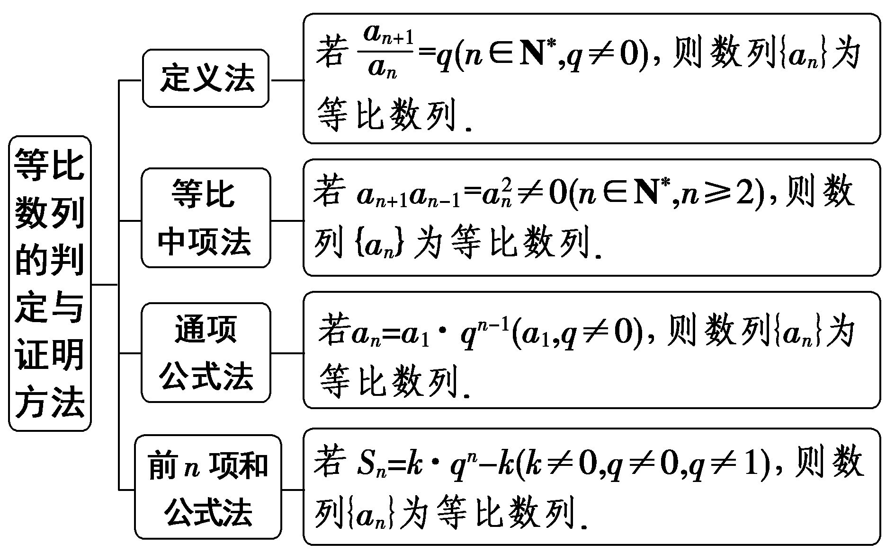
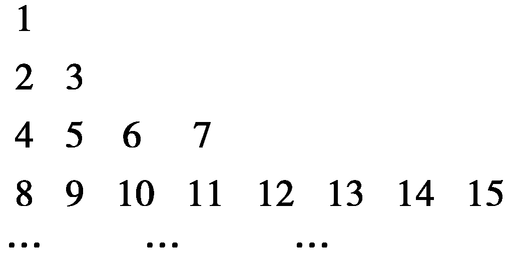
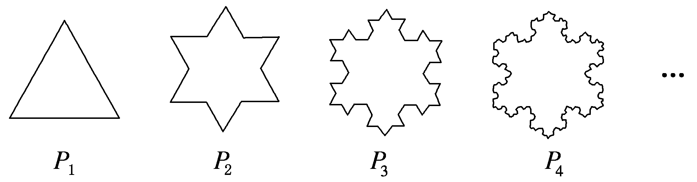

第三节　等比数列

【课标研读】　1.通过生活中的实例，理解等比数列的概念和通项公式的意义.　2.探索并掌握等比数列的前*n*项和公式，理解等比数列的通项公式与前*n*项和公式的关系.　3.能在具体的问题情境中，发现数列的等比关系，并解决相应的问题.　4.体会等比数列与指数函数的关系.

##### 1.等比数列的概念

（1）定义：如果一个数列从第2项起，每一项与它的前一项的比都等于<u>同一个</u>常数，那么这个数列叫做等比数列，这个常数叫做等比数列的公比，公比通常用字母<em>q</em>表示(显然<em>q</em>≠0).

数学定义表达式： $\frac{a_{n}}{a_{n}_{－1}}$ ＝<text style="italic,u*n*derline">*q*</text>(n≥2，q为非零常数).

（2）等比中项：如果在<em>a</em>与<em>b</em>中间插入一个数<em>G</em>，使<em>a</em>，<em>G</em>，<em>b</em>成等比数列，那么<em>G</em>叫做<em>a</em>与<em>b</em>的等比中项，则<em>G</em>2＝<em><u>ab</u></em>.

[微提醒]　（1）等比数列中的任何一项都不为0，且公比*q*≠0.（2）若一个数列是常数列，则此数列一定是等差数列，但不一定是等比数列，如：0，0，0，….（3）只有当两个数同号时，这两数才有等比中项，且等比中项有两个，它们互为相反数.

##### 2.等比数列的通项公式与前*n*项和公式

(&lt;text style="underline,subscript"&gt;1&lt;/text&gt;)若等比数列{&lt;text style="it&lt;text style="it&lt;text style="it<em><u>a</u></em>lic"&gt;a&lt;/text&gt;lic"&gt;a&lt;/text&gt;lic"&gt;a&lt;/text&gt;<em>&lt;text style="italic,subscript"&gt;n</em>&lt;/text&gt;}的首项为a1，公比是<em>q</em>，则其通项公式为an＝a1 $q^{n}^{－1}$ ；

通项公式的推广：&lt;text style="it<em>a</em>lic"&gt;a&lt;/text&gt;<em>n</em>＝a<em>m</em> $q^{n}^{－m}$ .

（2）前<em>&lt;text style="italic,subscript"&gt;&lt;text style="italic,subscript"&gt;n</em>&lt;/text&gt;&lt;/text&gt;项和公式：当<em>&lt;text style="italic"&gt;q</em>&lt;/text&gt;＝1时，<em>&lt;text style="italic"&gt;S</em>&lt;/text&gt;n＝<em>na</em>1；当q≠1时，Sn＝ $\frac{a_{1}(1－q^{n})}{1－q}$ ＝ $\frac{a_{1}－a_{n}q}{1－q}$ .

（3）当&lt;te&lt;te&lt;text style="it<em>a</em>lic,superscript"&gt;x&lt;/text&gt;t st<em>y</em>le="it&lt;text style="it&lt;text style="it<em>a</em>lic"&gt;a&lt;/text&gt;lic"&gt;a&lt;/text&gt;lic,superscript"&gt;x&lt;/text&gt;t st<em>y</em>le="it<em>a</em>lic"&gt;<em>&lt;text style="italic"&gt;&lt;text style="italic"&gt;&lt;text style="italic"&gt;&lt;text style="italic"&gt;q</em>&lt;/text&gt;&lt;/text&gt;&lt;/text&gt;&lt;/text&gt;&lt;/text&gt;＞0且q≠1时，a<em>&lt;text style="italic,superscript"&gt;&lt;text style="italic,subscript"&gt;&lt;text style="italic,superscript"&gt;&lt;text style="italic,subscript"&gt;&lt;text style="italic,superscript"&gt;n</em>&lt;/text&gt;&lt;/text&gt;&lt;/text&gt;&lt;/text&gt;&lt;/text&gt;＝ $\frac{a_{1}}{q}$ ·&lt;te&lt;te&lt;text style="it<em>a</em>lic,superscript"&gt;x&lt;/text&gt;t st<em>y</em>le="it&lt;text style="it&lt;text style="it<em>a</em>lic"&gt;a&lt;/text&gt;lic"&gt;a&lt;/text&gt;lic,superscript"&gt;x&lt;/text&gt;t st<em>y</em>le="it<em>a</em>lic"&gt;<em>&lt;text style="italic"&gt;&lt;text style="italic"&gt;&lt;text style="italic"&gt;&lt;text style="italic"&gt;q</em>&lt;/text&gt;&lt;/text&gt;&lt;/text&gt;&lt;/text&gt;&lt;/text&gt;<em>&lt;text style="italic,superscript"&gt;&lt;text style="italic,subscript"&gt;&lt;text style="italic,superscript"&gt;&lt;text style="italic,subscript"&gt;&lt;text style="italic,superscript"&gt;n</em>&lt;/text&gt;&lt;/text&gt;&lt;/text&gt;&lt;/text&gt;&lt;/text&gt;可以看成函数y＝<em>cq</em>x；<em>&lt;text style="italic"&gt;S</em>&lt;/text&gt;n＝ $\frac{a_{1}(1－q^{n})}{1－q}$ ＝－ $\frac{a_{1}}{1－q}$ &lt;te&lt;te&lt;text style="it<em>a</em>lic,superscript"&gt;x&lt;/text&gt;t st<em>y</em>le="it&lt;text style="it&lt;text style="it<em>a</em>lic"&gt;a&lt;/text&gt;lic"&gt;a&lt;/text&gt;lic,superscript"&gt;x&lt;/text&gt;t st<em>y</em>le="it<em>a</em>lic"&gt;<em>&lt;text style="italic"&gt;&lt;text style="italic"&gt;&lt;text style="italic"&gt;&lt;text style="italic"&gt;q</em>&lt;/text&gt;&lt;/text&gt;&lt;/text&gt;&lt;/text&gt;&lt;/text&gt;<em>&lt;text style="italic,superscript"&gt;&lt;text style="italic,subscript"&gt;&lt;text style="italic,superscript"&gt;&lt;text style="italic,subscript"&gt;&lt;text style="italic,superscript"&gt;n</em>&lt;/text&gt;&lt;/text&gt;&lt;/text&gt;&lt;/text&gt;&lt;/text&gt;＋ $\frac{a_{1}}{1－q}$ ，若设&lt;te&lt;te&lt;text style="it<em>a</em>lic,superscript"&gt;x&lt;/text&gt;t st<em>y</em>le="it&lt;text style="it&lt;text style="it<em>a</em>lic"&gt;a&lt;/text&gt;lic"&gt;a&lt;/text&gt;lic,superscript"&gt;x&lt;/text&gt;t st<em>y</em>le="italic"&gt;a&lt;/text&gt;＝ $\frac{a_{1}}{1－q}$ ，则&lt;te&lt;text style="it<em>a</em>lic,superscript"&gt;x&lt;/text&gt;t st<em>y</em>le="it&lt;text style="it&lt;text style="it<em>a</em>lic"&gt;a&lt;/text&gt;lic"&gt;a&lt;/text&gt;lic"&gt;<em>S</em>&lt;/text&gt;&lt;te<em>x</em>t st<em>y</em>le="italic,subscript"&gt;<em>&lt;text style="italic,subscript"&gt;&lt;text style="italic,superscript"&gt;&lt;text style="italic,subscript"&gt;&lt;text style="italic,superscript"&gt;n</em>&lt;/text&gt;&lt;/text&gt;&lt;/text&gt;&lt;/text&gt;&lt;/text&gt;＝－<em>a&lt;text style="italic"&gt;&lt;text style="italic"&gt;&lt;text style="italic"&gt;&lt;text style="italic"&gt;&lt;text style="italic"&gt;q</em>&lt;/text&gt;&lt;/text&gt;&lt;/text&gt;&lt;/text&gt;&lt;/text&gt;n＋a(a≠0，q≠0，q≠1)可以看成函数y＝－<em>&lt;text style="italic"&gt;aq</em>&lt;/text&gt;x＋a.

[微提醒]　在运用等比数列的前*n*项和公式时，要注意对*q*＝1与*q*≠1进行讨论.

##### 3.等比数列的常用性质

（1）等比数列项的性质

①若&lt;text style="it&lt;text style="it&lt;text style="it&lt;text style="it&lt;text style="it&lt;text style="it&lt;text style="italic,u&lt;text style="italic,u<em>n</em>derline,subscript"&gt;n&lt;/text&gt;derline"&gt;a&lt;/text&gt;lic,underline"&gt;a&lt;/text&gt;lic,u<em>&lt;text style="italic"&gt;n</em>&lt;/text&gt;derline"&gt;a&lt;/text&gt;lic,underline"&gt;a&lt;/text&gt;lic,u&lt;text style="italic,underline,subscri&lt;text style="italic,underline,subscri<em>p</em>t"&gt;p&lt;/text&gt;t"&gt;n&lt;/text&gt;derline"&gt;a&lt;/text&gt;lic,underline"&gt;a&lt;/text&gt;lic"&gt;<em><u>&lt;text style="italic"&gt;&lt;text style="italic"&gt;&lt;text style="italic,underline,subscript"&gt;&lt;text style="italic"&gt;m</u></em>&lt;/text&gt;&lt;/text&gt;&lt;/text&gt;&lt;/text&gt;&lt;/text&gt;＋<em>n</em><u>&lt;text style="underline"&gt;＝</u>&lt;/text&gt;<em>p</em>＋<em>&lt;text style="italic,underline,subscript"&gt;&lt;text style="italic"&gt;q</em>&lt;/text&gt;&lt;/text&gt;，则aman＝apaq，其中m，n，p，q∈<strong>&lt;text style="bold"&gt;N</strong>&lt;/text&gt;<em>&lt;text style="italic,superscript"&gt;\*</em>&lt;/text&gt;.特别地，若2<em>&lt;text style="italic"&gt;k</em>&lt;/text&gt;＝m＋n，则aman＝ $a_{k}^{2}$ ，其中&lt;text style="it&lt;text style="it&lt;text style="it&lt;text style="it&lt;text style="it&lt;text style="it&lt;text style="italic,u&lt;text style="italic,u<em>n</em>derline,subscript"&gt;n&lt;/text&gt;derline"&gt;a&lt;/text&gt;lic,underline"&gt;a&lt;/text&gt;lic,u<em>&lt;text style="italic"&gt;n</em>&lt;/text&gt;derline"&gt;a&lt;/text&gt;lic,underline"&gt;a&lt;/text&gt;lic,u&lt;text style="italic,underline,subscri&lt;text style="italic,underline,subscri<em>p</em>t"&gt;p&lt;/text&gt;t"&gt;n&lt;/text&gt;derline"&gt;a&lt;/text&gt;lic,underline"&gt;a&lt;/text&gt;lic"&gt;<em><u>&lt;text style="italic"&gt;&lt;text style="italic"&gt;&lt;text style="italic,underline,subscript"&gt;&lt;text style="italic"&gt;m</u></em>&lt;/text&gt;&lt;/text&gt;&lt;/text&gt;&lt;/text&gt;&lt;/text&gt;，<em>n</em>，<em>&lt;text style="italic"&gt;k</em>&lt;/text&gt;∈<strong>&lt;text style="bold"&gt;N</strong>&lt;/text&gt;<em>&lt;text style="italic,superscript"&gt;\*</em>&lt;/text&gt;.

②数列{&lt;text style="it&lt;text style="it&lt;text style="it<em>a</em>lic"&gt;a&lt;/text&gt;lic"&gt;a&lt;/text&gt;lic"&gt;λa&lt;/text&gt;<em>n</em>}， $\left\{a_{n}^{2}\right\}$ ， $\left\{\frac{1}{a_{n}}\right\}$ 也是等比数列；&lt;text style="it&lt;text style="it<em>a</em>lic"&gt;a&lt;/text&gt;lic"&gt;a&lt;/text&gt;<em>&lt;text style="italic,subscript"&gt;&lt;text style="italic,subscript"&gt;&lt;text style="italic"&gt;k</em>&lt;/text&gt;&lt;/text&gt;&lt;/text&gt;，ak＋<em>&lt;text style="italic,subscript"&gt;&lt;text style="italic,underline,superscript"&gt;&lt;text style="italic"&gt;m</em>&lt;/text&gt;&lt;/text&gt;&lt;/text&gt;，ak＋2m，…也是等比数列，公比为<em><u>q</u></em>m(k，m∈<strong>N</strong><em>\*</em>).

③若数列{&lt;text style="it<em>a</em>lic"&gt;a&lt;/text&gt;&lt;text style="italic,su<em>&lt;text style="italic"&gt;b</em>&lt;/text&gt;scri<em>p</em>t"&gt;<em>&lt;text style="italic,subscript"&gt;&lt;text style="italic,subscript"&gt;&lt;text style="italic,subscript"&gt;&lt;text style="italic,subscript"&gt;n</em>&lt;/text&gt;&lt;/text&gt;&lt;/text&gt;&lt;/text&gt;&lt;/text&gt;}，{bn}是两个项数相同的等比数列，则数列{an·bn}，{<em>pa</em>n·<em>&lt;text style="italic"&gt;q</em>b&lt;/text&gt;n}和 $\left\{\frac{pa_{n}}{qb_{n}}\right\}$ 也是等比数列(<em>p</em>，<em>q</em>≠0).

④若<em>an</em>＞0，则数列{lg <em>an</em>}是等差数列.

（2）等比数列的前*n*项和的性质

设<em>&lt;text style="italic"&gt;&lt;text style="italic"&gt;&lt;text style="italic"&gt;&lt;text style="italic"&gt;&lt;text style="italic"&gt;S</em>&lt;/text&gt;&lt;/text&gt;&lt;/text&gt;&lt;/text&gt;&lt;/text&gt;<em>&lt;text style="italic"&gt;n</em>&lt;/text&gt;是<u>等比</u>数列 $\left\{a_{n}\right\}$ 的前<em>&lt;text style="italic"&gt;n</em>&lt;/text&gt;项和，则当<em>&lt;text style="italic"&gt;q</em>&lt;/text&gt;≠－1(或q＝－1且<em>&lt;text style="italic,subscript"&gt;&lt;text style="italic,subscript"&gt;&lt;text style="italic,subscript"&gt;&lt;text style="italic,subscript"&gt;&lt;text style="italic,subscript"&gt;k</em>&lt;/text&gt;&lt;/text&gt;&lt;/text&gt;&lt;/text&gt;&lt;/text&gt;为奇数)时，<em>&lt;text style="italic"&gt;&lt;text style="italic"&gt;&lt;text style="italic"&gt;&lt;text style="italic"&gt;&lt;text style="italic"&gt;S</em>&lt;/text&gt;&lt;/text&gt;&lt;/text&gt;&lt;/text&gt;&lt;/text&gt;k，S&lt;text style="subscript"&gt;2&lt;/text&gt;k－Sk，S3k－S2k，…是<u>等比</u>数列；

当<em>q</em>＝－1且<em>k</em>为偶数时，<em>Sk</em>，<em>S</em>2<em>k</em>－<em>Sk</em>，<em>S</em>3<em>k</em>－<em>S</em>2<em>k</em>，…不是等比数列.

（3）等比数列的单调性

若 $\left\{\begin{matrix}a_{1}>0，\\q>1\end{matrix}\right.$ 或 $\left\{\begin{matrix}a_{1}<0，\\0<q<1，\end{matrix}\right.$ 则等比数列{<em>an</em>}递<u>增</u>；

若 $\left\{\begin{matrix}a_{1}>0，\\0<q<1\end{matrix}\right.$ 或 $\left\{\begin{matrix}a_{1}<0，\\q>1，\end{matrix}\right.$ 则等比数列{<em>an</em>}递<u>减</u>.

【常用结论】

（1）①等比数列{<em>an</em>}的通项公式可以写成<em>an</em>＝<em>cqn</em>，这里<em>c</em>≠0，<em>q</em>≠0.

②等比数列{<em>an</em>}的前<em>n</em>项和<em>Sn</em>可以写成<em>Sn</em>＝<em>Aqn</em>－<em>A</em>(<em>A</em>≠0，<em>q</em>≠1，0).

（2）数列{<em>an</em>}是等比数列，<em>Sn</em>是其前<em>n</em>项和

①<em>Sm</em>＋<em>n</em>＝<em>Sn</em>＋<em>qnSm</em>＝<em>Sm</em>＋<em>qmSn</em>.

②若数列{<em>a&lt;text style="italic"&gt;&lt;text style="italic"&gt;n</em>&lt;/text&gt;&lt;/text&gt;}的项数为2n，则 $\frac{S_{偶}}{S_{奇}}$ ＝<em>&lt;text style="italic"&gt;&lt;text style="italic"&gt;q</em>&lt;/text&gt;&lt;/text&gt;；若项数为2<em>&lt;text style="italic"&gt;&lt;text style="italic"&gt;n</em>&lt;/text&gt;&lt;/text&gt;＋1，则 $\frac{S_{奇}－a_{1}}{S_{偶}}$ ＝<em>&lt;text style="italic"&gt;&lt;text style="italic"&gt;q</em>&lt;/text&gt;&lt;/text&gt;，或 $\frac{S_{偶}}{S_{奇}－a_{2n+1}}$ ＝<em>&lt;text style="italic"&gt;&lt;text style="italic"&gt;q</em>&lt;/text&gt;&lt;/text&gt;.

③若<em>a</em>1<em>&lt;text style="italic"&gt;·</em>a&lt;/text&gt;2·…<em>·a&lt;text style="italic,subscript"&gt;&lt;text style="italic,subscript"&gt;n</em>&lt;/text&gt;&lt;/text&gt;＝<em>&lt;text style="italic"&gt;T</em>&lt;/text&gt;n，则Tn， $\frac{T_{2n}}{T_{n}}$ ， $\frac{T_{3n}}{T_{2n}}$ ，…成等比数列.

【自主检测】

##### 1.(多选)下列结论错误的是(　　)

$\quad$A.三个数<em>a</em>，<em>b</em>，<em>c</em>成等比数列的充要条件是<em>b</em>2＝<em>ac</em>

$\quad$B.当公比<em>q</em>＞1时，等比数列{<em>an</em>}为递增数列

$\quad$C.等比数列中所有偶数项的符号相同

$\quad$D.数列{<em>an</em>}为等比数列，则<em>S</em>4，<em>S</em>8－<em>S</em>4，<em>S</em>12－<em>S</em>8成等比数列

答案ABD

##### 2.(链接人教A选择性必修二P31T2)在等比数列{<em>an</em>}中，<em>a</em>3＝2，<em>a</em>7＝8，则<em>a</em>5等于(　　)

$\quad$A.5	
$\quad$B.±5

$\quad$C.4	
$\quad$D.±4

答案C

解析因为 $a_{5}^{2}$ ＝&lt;text style="it&lt;text style="it&lt;text style="it&lt;text style="it&lt;text style="it<em>a</em>lic"&gt;a&lt;/text&gt;lic"&gt;a&lt;/text&gt;lic"&gt;a&lt;/text&gt;lic"&gt;a&lt;/text&gt;lic"&gt;a&lt;/text&gt;&lt;text style="subscript"&gt;3&lt;/text&gt;a7＝2×8＝16，所以a&lt;text style="subscript"&gt;&lt;text style="subscript"&gt;5&lt;/text&gt;&lt;/text&gt;＝±4.又因为a5＝a3<em>q</em>2＞0，所以a5＝4.故选C.

&lt;text style="subscript"&gt;3&lt;/text&gt;.(链接人教A选择性必修二P37T1)在等比数列{&lt;text style="it&lt;text style="it<em>a</em>lic"&gt;a&lt;/text&gt;lic"&gt;a&lt;/text&gt;<em>n</em>}中，a3＝ $\frac{3}{2}$ ，&lt;text style="it<em>a</em>lic"&gt;S&lt;/text&gt;&lt;text style="subscript"&gt;3&lt;/text&gt;＝ $\frac{9}{2}$ ，则&lt;text style="it&lt;text style="it<em>a</em>lic"&gt;a&lt;/text&gt;lic"&gt;a&lt;/text&gt;2的值为(　　)

$\quad$A. $\frac{3}{2}$ 	
$\quad$B.－3

$\quad$C.－ $\frac{3}{2}$ 	
$\quad$D.－3或 $\frac{3}{2}$

答案D

解析由&lt;text style="it&lt;text style="it&lt;text style="it&lt;text style="it&lt;text style="it<em>a</em>lic"&gt;a&lt;/text&gt;lic"&gt;a&lt;/text&gt;lic"&gt;a&lt;/text&gt;lic"&gt;a&lt;/text&gt;lic"&gt;S&lt;/text&gt;&lt;text style="subscript"&gt;&lt;text style="subscript"&gt;3&lt;/text&gt;&lt;/text&gt;＝a1＋a&lt;text style="superscript"&gt;&lt;text style="subscript"&gt;2&lt;/text&gt;&lt;/text&gt;＋a3＝a3(<em>&lt;text style="italic"&gt;&lt;text style="italic"&gt;&lt;text style="italic"&gt;&lt;text style="italic"&gt;&lt;text style="italic"&gt;&lt;text style="italic"&gt;&lt;text style="italic"&gt;q</em>&lt;/text&gt;&lt;/text&gt;&lt;/text&gt;&lt;/text&gt;&lt;/text&gt;&lt;/text&gt;&lt;/text&gt;&lt;text style="superscript"&gt;－2&lt;/text&gt;＋q&lt;text style="superscript"&gt;－1&lt;/text&gt;＋1)，得q－2＋q－1＋1＝3，即2q2－q－1＝0，解得q＝1或q＝－ $\frac{1}{2}$ .所以&lt;text style="it&lt;text style="it&lt;text style="it&lt;text style="it<em>a</em>lic"&gt;a&lt;/text&gt;lic"&gt;a&lt;/text&gt;lic"&gt;a&lt;/text&gt;lic"&gt;a&lt;/text&gt;&lt;text style="superscript"&gt;&lt;text style="subscript"&gt;2&lt;/text&gt;&lt;/text&gt;＝ $\frac{a_{3}}{q}$ ＝ $\frac{3}{2}$ 或－&lt;text style="subscript"&gt;&lt;text style="subscript"&gt;3&lt;/text&gt;&lt;/text&gt;.故选D.

##### 4.(链接人教A选择性必修二P37T4)已知三个数成等比数列，若它们的和等于13，积等于27，则这三个数为<u>　　　　</u>.

答案9，3，1或1，3，9

解析设这三个数为 $\frac{a}{q}$ ，*a*，*aq*，则 $\left\{\begin{matrix}a＋\frac{a}{q}＋aq=13，\\a\cdot \frac{a}{q}\cdot aq=27，\end{matrix}\right.$ 解得 $\left\{\begin{matrix}a=3，\\q＝\frac{1}{3}，\end{matrix}\right.$ 或 $\left\{\begin{matrix}a=3，\\q=3，\end{matrix}\right.$ 所以这三个数为9，3，1或1，3，9.

考点一　等比数列基本量的运算　　　　自主练透

##### 1.(一题多解)(2022·全国乙卷)已知等比数列{<em>an</em>}的前3项和为168，<em>a</em>2－<em>a</em>5＝42，则<em>a</em>6＝(　　)

$\quad$A.14	
$\quad$B.12

$\quad$C.6	
$\quad$D.3

答案D

解析法一：设等比数列{<em>an</em>}的公比为<em>q</em>，由题意可得 $\left\{\begin{matrix}a_{1}＋a_{2}＋a_{3}=168，\\a_{2}－a_{5}=42，\end{matrix}\right.$

即 $\left\{\begin{matrix}a_{1}(1+q＋q^{2})=168，\\a_{1}q(1－q^{3})＝a_{1}q(1－q)(1+q＋q^{2})=42，\end{matrix}\right.$ 解得 $\left\{\begin{matrix}a_{1}=96，\\q＝\frac{1}{2}，\end{matrix}\right.$ 所以&lt;text style="it<em>a</em>lic"&gt;a&lt;/text&gt;6＝a1<em>q</em>5＝3.故选D.

法二：设等比数列{&lt;text style="it&lt;text style="it<em>a</em>lic"&gt;a&lt;/text&gt;lic"&gt;a&lt;/text&gt;<em>n</em>}的公比为<em>&lt;text style="italic"&gt;&lt;text style="italic"&gt;q</em>&lt;/text&gt;&lt;/text&gt;，易知q≠1，由题意可得 $\left\{\begin{matrix}\frac{a_{1}(1－q^{3})}{1－q}=168，\\a_{1}q(1－q^{3})=42，\end{matrix}\right.$ 解得 $\left\{\begin{matrix}a_{1}=96，\\q＝\frac{1}{2}，\end{matrix}\right.$ 所以&lt;text style="it&lt;text style="it<em>a</em>lic"&gt;a&lt;/text&gt;lic"&gt;a&lt;/text&gt;6＝a1<em>&lt;text style="italic"&gt;&lt;text style="italic"&gt;q</em>&lt;/text&gt;&lt;/text&gt;5＝3.故选D.

##### 2.(一题多解)(2023·全国甲卷)设等比数列{<em>an</em>}的各项均为正数，前<em>n</em>项和为<em>Sn</em>，若<em>a</em>1＝1，<em>S</em>5＝5<em>S</em>3－4，则<em>S</em>4＝(　　)

$\quad$A. $\frac{15}{8}$ 	
$\quad$B. $\frac{65}{8}$

$\quad$C.15	
$\quad$D.40

答案C

解析法一：若该数列的公比<em>&lt;text style="italic"&gt;&lt;text style="italic"&gt;&lt;text style="italic"&gt;&lt;text style="italic"&gt;&lt;text style="italic"&gt;&lt;text style="italic"&gt;q</em>&lt;/text&gt;&lt;/text&gt;&lt;/text&gt;&lt;/text&gt;&lt;/text&gt;&lt;/text&gt;＝1，代入<em>&lt;text style="italic"&gt;&lt;text style="italic"&gt;S</em>&lt;/text&gt;&lt;/text&gt;5＝5S3－&lt;text style="subscript"&gt;4&lt;/text&gt;中，有5＝5×3－4，不成立，所以q≠1.由 $\frac{1－q^{5}}{1－q}$ ＝5× $\frac{1－q^{3}}{1－q}$ －&lt;text style="subscript"&gt;4&lt;/text&gt;，化简得<em>&lt;text style="italic"&gt;&lt;text style="italic"&gt;&lt;text style="italic"&gt;&lt;text style="italic"&gt;&lt;text style="italic"&gt;&lt;text style="italic"&gt;q</em>&lt;/text&gt;&lt;/text&gt;&lt;/text&gt;&lt;/text&gt;&lt;/text&gt;&lt;/text&gt;4－5q&lt;text style="superscript"&gt;&lt;text style="superscript"&gt;2&lt;/text&gt;&lt;/text&gt;＋4＝0，所以q2＝1或q2＝4，因为此数列各项均为正数，所以q＝2，所以<em>&lt;text style="italic"&gt;&lt;text style="italic"&gt;S</em>&lt;/text&gt;&lt;/text&gt;4＝ $\frac{1－q^{4}}{1－q}$ ＝15.故选C.

法二：由题知1＋<em>q</em>＋<em>q</em>2＋<em>q</em>3＋<em>q</em>4＝5(1＋<em>q</em>＋<em>q</em>2)－4，即<em>q</em>3＋<em>q</em>4＝4<em>q</em>＋4<em>q</em>2，即<em>q</em>3＋<em>q</em>2－4<em>q</em>－4＝0，即(<em>q</em>－2)(<em>q</em>＋1)(<em>q</em>＋2)＝0.由题知<em>q</em>＞0，所以<em>q</em>＝2.所以<em>S</em>4＝1＋2＋4＋8＝15.故选C.

##### 3.公元前1650年左右的埃及《莱因德纸草书》上载有如下问题：“十人分十斗玉米，从第二人开始，各人所得依次比前人少八分之一，问每人各得玉米多少斗？”在上述问题中，第一人分得玉米(　　)

$\quad$A. $\frac{70\times 8^{9}}{8^{10}－1}$ 斗	
$\quad$B. $\frac{10\times 8^{10}}{8^{10}－7^{10}}$ 斗

$\quad$C. $\frac{10\times 8^{9}}{8^{10}－7^{10}}$ 斗	
$\quad$D. $\frac{10\times 8^{8}}{8^{10}－7^{10}}$ 斗

答案C

解析设第&lt;text style="&lt;text style="&lt;text style="it<em>a</em>lic"&gt;i&lt;/text&gt;talic,subscript"&gt;i&lt;/text&gt;t<em>a</em>lic"&gt;i&lt;/text&gt;个人分到的玉米斗数为ai(i＝1，2，…，9，10)，则 $\left\{a_{i}\right\}$ 是公比为 $\frac{7}{8}$ 的等比数列.由题意知 $\frac{a_{1}［1－(\frac{7}{8})^{10}］}{1－\frac{7}{8}}$ ＝10，所以&lt;text style="&lt;text style="&lt;text style="it<em>a</em>lic"&gt;i&lt;/text&gt;talic,subscript"&gt;i&lt;/text&gt;talic"&gt;a&lt;/text&gt;1＝ $\frac{\frac{10}{8}}{1－(\frac{7}{8})^{10}}$ ＝ $\frac{10\times 8^{9}}{8^{10}－7^{10}}$ .故选C.

##### 4.(2024·全国甲卷)已知等比数列 $\left\{a_{n}\right\}$ 的前&lt;text style="it<em>a</em>lic"&gt;<em>&lt;text style="italic,subscript"&gt;&lt;text style="italic,subscript"&gt;n</em>&lt;/text&gt;&lt;/text&gt;&lt;/text&gt;项和为<em>&lt;text style="italic"&gt;S</em>&lt;/text&gt;n，且2Sn＝3an＋1－3.

（1）求 $\left\{a_{n}\right\}$ 的通项公式；

（2）求数列 $\left\{S_{n}\right\}$ 的前*n*项和.

解：（1）因为2<em>Sn</em>＝3<em>an</em>＋1－3，故2<em>Sn</em>－1＝3<em>an</em>－3，

所以2&lt;text style="it&lt;text style="it&lt;text style="it&lt;text style="it<em>a</em>lic"&gt;a&lt;/text&gt;lic"&gt;a&lt;/text&gt;lic"&gt;a&lt;/text&gt;lic"&gt;a&lt;/text&gt;<em>&lt;text style="italic,subscript"&gt;&lt;text style="italic,subscript"&gt;&lt;text style="italic,subscript"&gt;&lt;text style="italic,subscript"&gt;n</em>&lt;/text&gt;&lt;/text&gt;&lt;/text&gt;&lt;/text&gt;＝3an&lt;text style="subscript"&gt;＋1&lt;/text&gt;－3an $\left(n\geq 2\right)$ ，即5&lt;text style="it&lt;text style="it&lt;text style="it&lt;text style="it<em>a</em>lic"&gt;a&lt;/text&gt;lic"&gt;a&lt;/text&gt;lic"&gt;a&lt;/text&gt;lic"&gt;a&lt;/text&gt;<em>&lt;text style="italic,subscript"&gt;&lt;text style="italic,subscript"&gt;&lt;text style="italic,subscript"&gt;&lt;text style="italic,subscript"&gt;n</em>&lt;/text&gt;&lt;/text&gt;&lt;/text&gt;&lt;/text&gt;＝3an&lt;text style="subscript"&gt;＋1&lt;/text&gt;，故等比数列的公比为<em>q</em>＝ $\frac{5}{3}$ ，

故2&lt;text style="it&lt;text style="it&lt;text style="it&lt;text style="it&lt;text style="it<em>a</em>lic"&gt;a&lt;/text&gt;lic"&gt;a&lt;/text&gt;lic"&gt;a&lt;/text&gt;lic"&gt;a&lt;/text&gt;lic"&gt;a&lt;/text&gt;&lt;text style="subscript"&gt;&lt;text style="subscript"&gt;&lt;text style="subscript"&gt;1&lt;/text&gt;&lt;/text&gt;&lt;/text&gt;＝3a2－3＝3a1× $\frac{5}{3}$ －3＝5&lt;text style="it&lt;text style="it&lt;text style="it&lt;text style="it&lt;text style="it<em>a</em>lic"&gt;a&lt;/text&gt;lic"&gt;a&lt;/text&gt;lic"&gt;a&lt;/text&gt;lic"&gt;a&lt;/text&gt;lic"&gt;a&lt;/text&gt;&lt;text style="subscript"&gt;&lt;text style="subscript"&gt;&lt;text style="subscript"&gt;1&lt;/text&gt;&lt;/text&gt;&lt;/text&gt;－3，故a1＝1，故a<em>n</em>＝ $\left(\frac{5}{3}\right)^{n－1}$ .

（2）由等比数列求和公式得<em>&lt;text style="italic"&gt;S</em>&lt;/text&gt;<em>&lt;text style="italic,subscript"&gt;&lt;text style="italic"&gt;&lt;text style="italic,subscript"&gt;&lt;text style="italic,subscript"&gt;&lt;text style="italic,superscript"&gt;n</em>&lt;/text&gt;&lt;/text&gt;&lt;/text&gt;&lt;/text&gt;&lt;/text&gt;＝ $\frac{1\times \left[1－\left(\frac{5}{3}\right)^{n}\right]}{1－\frac{5}{3}}$ ＝ $\frac{3}{2}\left(\frac{5}{3}\right)^{n}$ － $\frac{3}{2}$ .设数列{<em>&lt;text style="italic"&gt;S</em>&lt;/text&gt;<em>&lt;text style="italic,subscript"&gt;&lt;text style="italic"&gt;&lt;text style="italic,subscript"&gt;&lt;text style="italic,subscript"&gt;&lt;text style="italic,superscript"&gt;n</em>&lt;/text&gt;&lt;/text&gt;&lt;/text&gt;&lt;/text&gt;&lt;/text&gt;}的前n项和为<em>&lt;text style="italic"&gt;T</em>&lt;/text&gt;n，则Tn＝ $\frac{3}{2}$ × $\frac{\frac{5}{3}\left[1－(\frac{5}{3})^{n}\right]}{1－\frac{5}{3}}$ － $\frac{3n}{2}$ ＝ $\frac{15}{4}$ ×( $\frac{5}{3}$ )<em>&lt;text style="italic,subscript"&gt;&lt;text style="italic"&gt;&lt;text style="italic,subscript"&gt;&lt;text style="italic,subscript"&gt;&lt;text style="italic,superscript"&gt;n</em>&lt;/text&gt;&lt;/text&gt;&lt;/text&gt;&lt;/text&gt;&lt;/text&gt;－ $\frac{3n}{2}$ － $\frac{15}{4}$ .

解决等比数列有关问题的两种常用思想

##### 1.方程思想：等比数列中有五个量<em>a</em>1，<em>n</em>，<em>q</em>，<em>an</em>，<em>Sn</em>，一般可以“知三求二”，通过列方程(组)求关键量<em>a</em>1和<em>q</em>，问题可迎刃而解.

##### 2.分类讨论思想：等比数列的前&lt;text style="it&lt;text style="it<em>a</em>lic"&gt;a&lt;/text&gt;lic"&gt;<em>&lt;text style="italic"&gt;&lt;text style="italic,subscript"&gt;&lt;text style="italic,subscript"&gt;&lt;text style="italic"&gt;&lt;text style="italic,subscript"&gt;n</em>&lt;/text&gt;&lt;/text&gt;&lt;/text&gt;&lt;/text&gt;&lt;/text&gt;&lt;/text&gt;项和公式涉及对公比<em>&lt;text style="italic"&gt;&lt;text style="italic"&gt;q</em>&lt;/text&gt;&lt;/text&gt;的分类讨论，当q＝1时，{an}的前n项和<em>&lt;text style="italic"&gt;S</em>&lt;/text&gt;n＝<em>na</em>1；当q≠1时，{an}的前n项和Sn＝ $\frac{a_{1}(1－q^{n})}{1－q}$ ＝ $\frac{a_{1}－a_{n}q}{1－q}$ .

注意：求解等比数列基本量时注意运用整体思想、设而不求等，同时还要注意合理运用*q*＝ $\frac{a_{2}}{a_{1}}$ ＝ $\frac{a_{3}}{a_{2}}$ ＝…＝ $\frac{a_{n}}{a_{n－1}}$ ＝ $\frac{a_{2}＋a_{3}＋\ldots ＋a_{n}}{a_{1}＋a_{2}＋\ldots ＋a_{n－1}}$ .

考点二　等比数列的判定与证明　　　　师生共研

已知数列{<em>an</em>}的各项均为正数，记<em>Sn</em>为{<em>an</em>}的前<em>n</em>项和，从下面①②③中选取两个作为条件，证明另外一个成立.

①数列{<em>an</em>}是等比数列；②数列{<em>Sn</em>＋<em>a</em>1}是等比数列；③<em>a</em>2＝2<em>a</em>1.

注：如果选择不同的组合分别解答，则按第一个解答计分.

证明：选①②作为条件证明③：

设&lt;text style="it&lt;text style="it<em>a</em>lic"&gt;a&lt;/text&gt;lic"&gt;<em>S</em>&lt;/text&gt;<em>&lt;text style="italic,superscript"&gt;&lt;text style="italic,subscript"&gt;&lt;text style="italic,superscript"&gt;n</em>&lt;/text&gt;&lt;/text&gt;&lt;/text&gt;＋a&lt;text style="subscript"&gt;1&lt;/text&gt;＝<em>&lt;text style="italic"&gt;Aq</em>&lt;/text&gt;n&lt;text style="superscript"&gt;－1&lt;/text&gt; $\left(A\ne 0\right)$ ，则&lt;text style="it&lt;text style="it<em>a</em>lic"&gt;a&lt;/text&gt;lic"&gt;<em>S</em>&lt;/text&gt;<em>&lt;text style="italic,superscript"&gt;&lt;text style="italic,subscript"&gt;&lt;text style="italic,superscript"&gt;n</em>&lt;/text&gt;&lt;/text&gt;&lt;/text&gt;＝<em>&lt;text style="italic"&gt;Aq</em>&lt;/text&gt;n－&lt;text style="subscript"&gt;1&lt;/text&gt;－a1，

当&lt;text style="it&lt;text style="it&lt;text style="it<em>a</em>lic"&gt;a&lt;/text&gt;lic"&gt;a&lt;/text&gt;lic"&gt;n&lt;/text&gt;＝&lt;text style="subscript"&gt;&lt;text style="subscript"&gt;&lt;text style="subscript"&gt;1&lt;/text&gt;&lt;/text&gt;&lt;/text&gt;时，a1＝<em>S</em>1＝<em>A</em>－a1，所以a1＝ $\frac{A}{2}$ ；

当&lt;text style="it<em>a</em>lic"&gt;<em>&lt;text style="italic,subscript"&gt;&lt;text style="italic,subscript"&gt;&lt;text style="italic,superscript"&gt;n</em>&lt;/text&gt;&lt;/text&gt;&lt;/text&gt;&lt;/text&gt;≥2时，an＝<em>&lt;text style="italic"&gt;S</em>&lt;/text&gt;n－Sn－1＝<em>Aq</em>n－2 $\left(q－1\right)$ ，

因为{&lt;text style="it&lt;text style="it<em>a</em>lic"&gt;a&lt;/text&gt;lic"&gt;a&lt;/text&gt;<em>n</em>}是等比数列，所以 $\frac{A\left(q－1\right)}{q}$ ＝ $\frac{A}{2}$ ，解得&lt;text style="it&lt;text style="it<em>a</em>lic"&gt;a&lt;/text&gt;lic"&gt;q&lt;/text&gt;＝2，所以<em>a</em>2＝2a1.

选①③作为条件证明②：

因为<em>a</em>2＝2<em>a</em>1，{<em>an</em>}是等比数列，所以公比<em>q</em>＝2，

所以&lt;text style="it&lt;text style="it&lt;text style="it<em>a</em>lic"&gt;a&lt;/text&gt;lic"&gt;a&lt;/text&gt;lic"&gt;<em>S</em>&lt;/text&gt;<em>&lt;text style="italic,subscript"&gt;&lt;text style="italic,superscript"&gt;n</em>&lt;/text&gt;&lt;/text&gt;＝ $\frac{a_{1}\left(1－2^{n}\right)}{1－2}$ ＝&lt;text style="it&lt;text style="it<em>a</em>lic"&gt;a&lt;/text&gt;lic"&gt;a&lt;/text&gt;&lt;text style="subscript"&gt;&lt;text style="subscript"&gt;1&lt;/text&gt;&lt;/text&gt; $\left(2^{n}－1\right)$ ，即&lt;text style="it&lt;text style="it&lt;text style="it<em>a</em>lic"&gt;a&lt;/text&gt;lic"&gt;a&lt;/text&gt;lic"&gt;<em>S</em>&lt;/text&gt;<em>&lt;text style="italic,subscript"&gt;&lt;text style="italic,superscript"&gt;n</em>&lt;/text&gt;&lt;/text&gt;＋a&lt;text style="subscript"&gt;&lt;text style="subscript"&gt;1&lt;/text&gt;&lt;/text&gt;＝a12n，

因为 $\frac{S_{n+1}＋a_{1}}{S_{n}＋a_{1}}$ ＝2，所以{&lt;text style="it<em>a</em>lic"&gt;S&lt;/text&gt;<em>n</em>＋a1}是等比数列.

选②③作为条件证明①：

设&lt;text style="it&lt;text style="it<em>a</em>lic"&gt;a&lt;/text&gt;lic"&gt;<em>S</em>&lt;/text&gt;<em>&lt;text style="italic,superscript"&gt;&lt;text style="italic,subscript"&gt;&lt;text style="italic,superscript"&gt;n</em>&lt;/text&gt;&lt;/text&gt;&lt;/text&gt;＋a&lt;text style="subscript"&gt;1&lt;/text&gt;＝<em>&lt;text style="italic"&gt;Aq</em>&lt;/text&gt;n&lt;text style="superscript"&gt;－1&lt;/text&gt; $\left(A\ne 0\right)$ ，则&lt;text style="it&lt;text style="it<em>a</em>lic"&gt;a&lt;/text&gt;lic"&gt;<em>S</em>&lt;/text&gt;<em>&lt;text style="italic,superscript"&gt;&lt;text style="italic,subscript"&gt;&lt;text style="italic,superscript"&gt;n</em>&lt;/text&gt;&lt;/text&gt;&lt;/text&gt;＝<em>&lt;text style="italic"&gt;Aq</em>&lt;/text&gt;n－&lt;text style="subscript"&gt;1&lt;/text&gt;－a1，

当<em>n</em>＝1时，<em>a</em>1＝<em>S</em>1＝<em>A</em>－<em>a</em>1，所以<em>A</em>＝2<em>a</em>1；

当&lt;text style="it<em>a</em>lic"&gt;<em>&lt;text style="italic,subscript"&gt;&lt;text style="italic,subscript"&gt;&lt;text style="italic,superscript"&gt;n</em>&lt;/text&gt;&lt;/text&gt;&lt;/text&gt;&lt;/text&gt;≥2时，an＝<em>&lt;text style="italic"&gt;S</em>&lt;/text&gt;n－Sn－1＝<em>Aq</em>n－2 $\left(q－1\right)$ ，

因为<em>a</em>2＝2<em>a</em>1，所以<em>A</em>(<em>q</em>－1)＝<em>A</em>，解得<em>q</em>＝2，

所以当<em>n</em>≥2时，<em>an</em>＝<em>A</em>·2<em>n</em>－2＝<em>a</em>1·2<em>n</em>－1，

又因为 $\frac{a_{n+1}}{a_{n}}$ ＝2 $\left(n\geq 2\right)$ ，且&lt;text style="it<em>a</em>lic"&gt;a&lt;/text&gt;2＝2a1，

所以{<em>an</em>}为等比数列.

注意：（1）前两种方法是判定等比数列的常用方法，常用于证明；后两种方法常用于选择题、填空题中的判定.（2）若要判定一个数列不是等比数列，则只需判定存在连续的三项不成等比数列即可.

对点练&lt;text style="su<em>b</em>script"&gt;1&lt;/text&gt;.已知数列 $\left\{a_{n}\right\}$ 满足&lt;text style="it<em>a</em>lic"&gt;a&lt;/text&gt;&lt;text style="su<em>b</em>script"&gt;1&lt;/text&gt;＝1，<em>&lt;text style="italic,subscript"&gt;&lt;text style="italic"&gt;&lt;text style="italic,subscript"&gt;&lt;text style="italic,subscript"&gt;n</em>&lt;/text&gt;&lt;/text&gt;&lt;/text&gt;a&lt;/text&gt;n＋1＝2(n＋1)an.设bn＝ $\frac{a_{n}}{n}$ .

（1）求<em>b</em>1，<em>b</em>2，<em>b</em>3；

（2）判断数列 $\left\{b_{n}\right\}$ 是否为等比数列，并说明理由；

（3）求 $\left\{a_{n}\right\}$ 的通项公式.

解：（1）由条件可得&lt;text style="it<em>a</em>lic"&gt;a&lt;/text&gt;<em>&lt;text style="italic,subscript"&gt;n</em>&lt;/text&gt;＋1＝ $\frac{2(n+1)}{n}$ &lt;text style="it<em>a</em>lic"&gt;a&lt;/text&gt;<em>&lt;text style="italic,subscript"&gt;n</em>&lt;/text&gt;.

将<em>n</em>＝1代入得，<em>a</em>2＝4<em>a</em>1，而<em>a</em>1＝1，所以<em>a</em>2＝4.

将<em>n</em>＝2代入得，<em>a</em>3＝3<em>a</em>2，所以<em>a</em>3＝12.

从而<em>b</em>1＝1，<em>b</em>2＝2，<em>b</em>3＝4.

（2） $\left\{b_{n}\right\}$ 是首项为1，公比为2的等比数列.

由条件可得 $\frac{a_{n+1}}{n+1}$ ＝ $\frac{2a_{n}}{n}$ ，即<em>&lt;text style="italic"&gt;&lt;text style="italic"&gt;b</em>&lt;/text&gt;&lt;/text&gt;<em>&lt;text style="italic,subscript"&gt;n</em>&lt;/text&gt;＋&lt;text style="subscript"&gt;1&lt;/text&gt;＝2bn，又b1＝1，

所以 $\left\{b_{n}\right\}$ 是首项为1，公比为2的等比数列.

（3）由（2）可得 $\frac{a_{n}}{n}$ ＝2&lt;text style="it<em>a</em>lic,superscript"&gt;<em>&lt;text style="italic,superscript"&gt;n</em>&lt;/text&gt;&lt;/text&gt;&lt;text style="superscript"&gt;－1&lt;/text&gt;，所以an＝<em>n·</em>2n－1.

对点练2.(2025·八省适应性测试)已知数列 $\left\{a_{n}\right\}$ 中，&lt;text style="it<em>a</em>lic"&gt;a&lt;/text&gt;1＝3，a<em>n</em>＋1＝ $\frac{3a_{n}}{a_{n}+2}$ .

（1）证明：数列 $\left\{1－\frac{1}{a_{n}}\right\}$ 为等比数列；

（2）求 $\left\{a_{n}\right\}$ 的通项公式；

（3）令<em>&lt;text style="italic"&gt;&lt;text style="italic"&gt;b</em>&lt;/text&gt;&lt;/text&gt;<em>&lt;text style="italic,subscript"&gt;&lt;text style="italic,subscript"&gt;n</em>&lt;/text&gt;&lt;/text&gt;＝ $\frac{a_{n+1}}{a_{n}}$ ，证明：<em>&lt;text style="italic"&gt;&lt;text style="italic"&gt;b</em>&lt;/text&gt;&lt;/text&gt;<em>&lt;text style="italic,subscript"&gt;&lt;text style="italic,subscript"&gt;n</em>&lt;/text&gt;&lt;/text&gt;＜bn＋1＜1.

解：（1）证明：由<em>an</em>＋1＝ $\frac{3a_{n}}{a_{n}+2}$ 得 $\frac{1}{a_{n+1}}$ ＝ $\frac{a_{n}+2}{3a_{n}}$ ＝ $\frac{2}{3}$ · $\frac{1}{a_{n}}$ ＋ $\frac{1}{3}$ ，

则1－ $\frac{1}{a_{n+1}}$ ＝ $\frac{2}{3}$ － $\frac{2}{3}$ · $\frac{1}{a_{n}}$ ＝ $\frac{2}{3}\left(1－\frac{1}{a_{n}}\right)$ ，

所以数列 $\left\{1－\frac{1}{a_{n}}\right\}$ 是首项为1－ $\frac{1}{a_{1}}$ ＝ $\frac{2}{3}$ ，公比为 $\frac{2}{3}$ 的等比数列.

（2）由（1）得1－ $\frac{1}{a_{n}}$ ＝ $\frac{2}{3}$ × $\left(\frac{2}{3}\right)^{n－1}$ ＝ $\left(\frac{2}{3}\right)^{n}$ ，

解得<em>an</em>＝ $\frac{1}{1－\left(\frac{2}{3}\right)^{n}}$ ＝ $\frac{3^{n}}{3^{n}－2^{n}}$ .

（3）证明：<em>bn</em>＝ $\frac{a_{n+1}}{a_{n}}$ ＝ $\frac{3^{n+1}}{3^{n+1}－2^{n+1}}$ · $\frac{3^{n}－2^{n}}{3^{n}}$ ＝ $\frac{3\left(3^{n}－2^{n}\right)}{3^{n+1}－2^{n+1}}$ ＝ $\frac{3\left(\frac{3}{2}\right)^{n}－3}{3\left(\frac{3}{2}\right)^{n}－2}$ ＝ $\frac{3\left(\frac{3}{2}\right)^{n}－2－1}{3\left(\frac{3}{2}\right)^{n}－2}$

＝1－ $\frac{1}{3\cdot \left(\frac{3}{2}\right)^{n}－2}$ .

令*f* $\left(n\right)$ ＝3· $\left(\frac{3}{2}\right)^{n}$ －2，*n*∈ $\left[1，＋\infty \right)$ ，

因为*<text style="italic"><text style="italic">f*</text></text> $\left(n\right)$ ＝3· $\left(\frac{3}{2}\right)^{n}$ －2在*n*∈ $\left[1，＋\infty \right)$ 上单调递增，则*<text style="italic"><text style="italic">f*</text></text> $\left(n\right)$ ≥*<text style="italic"><text style="italic">f*</text></text> $\left(1\right)$ ＝3× $\frac{3}{2}$ －2＝ $\frac{5}{2}$ ＞0，

所以数列 $\left\{\frac{1}{3\cdot \left(\frac{3}{2}\right)^{n}－2}\right\}$ 在<em>&lt;text style="italic"&gt;&lt;text style="italic,subscript"&gt;n</em>&lt;/text&gt;&lt;/text&gt;∈&lt;text style="<em>b</em>old"&gt;<strong>N</strong>&lt;/text&gt;<em>&lt;text style="italic,superscript"&gt;\*</em>&lt;/text&gt;上单调递减，从而数列 $\left\{b_{n}\right\}$ 在<em>&lt;text style="italic"&gt;&lt;text style="italic,subscript"&gt;n</em>&lt;/text&gt;&lt;/text&gt;∈&lt;text style="<em>b</em>old"&gt;<strong>N</strong>&lt;/text&gt;<em>&lt;text style="italic,superscript"&gt;\*</em>&lt;/text&gt;上单调递增，且bn＜1，

故得<em>bn</em>＜<em>bn</em>＋1＜1.

考点三　等比数列的性质及其应用　　　　多维探究

角度1　等比数列项的性质

（1）(&lt;text style="su<em>&lt;text style="italic"&gt;&lt;text style="italic"&gt;b</em>&lt;/text&gt;&lt;/text&gt;script"&gt;2&lt;/text&gt;025·浙江金华模拟)已知数列 $\left\{a_{n}\right\}$ 是等差数列，数列 $\left\{b_{n}\right\}$ 是等比数列，若&lt;text style="it&lt;text style="it<em>a</em>lic"&gt;a&lt;/text&gt;lic"&gt;a&lt;/text&gt;&lt;text style="su<em>&lt;text style="italic"&gt;&lt;text style="italic"&gt;b</em>&lt;/text&gt;&lt;/text&gt;script"&gt;2&lt;/text&gt;＋a&lt;text style="subscript"&gt;4&lt;/text&gt;＋a&lt;text style="subscript"&gt;6&lt;/text&gt;＝5π，b2b4b6＝3 $\sqrt{3}$ ，则t&lt;text style="it&lt;text style="it<em>a</em>lic"&gt;a&lt;/text&gt;lic"&gt;a&lt;/text&gt;n $\frac{a_{1}＋a_{7}}{1－b_{2}b_{6}}$ ＝<u>　　　　</u>.

（2）已知数列 $\left\{a_{n}\right\}$ 为正项等比数列，若&lt;text style="it&lt;text style="it&lt;text style="it&lt;text style="it&lt;text style="it<em>a</em>lic"&gt;a&lt;/text&gt;lic"&gt;a&lt;/text&gt;lic"&gt;a&lt;/text&gt;lic"&gt;a&lt;/text&gt;lic"&gt;a&lt;/text&gt;3＋a4＋a&lt;text style="subscript"&gt;6&lt;/text&gt;＋a8＋a9＝2， $\frac{1}{a_{3}}$ ＋ $\frac{1}{a_{4}}$ ＋ $\frac{1}{a_{6}}$ ＋ $\frac{1}{a_{8}}$ ＋ $\frac{1}{a_{9}}$ ＝18，则&lt;text style="it&lt;text style="it&lt;text style="it&lt;text style="it&lt;text style="it<em>a</em>lic"&gt;a&lt;/text&gt;lic"&gt;a&lt;/text&gt;lic"&gt;a&lt;/text&gt;lic"&gt;a&lt;/text&gt;lic"&gt;a&lt;/text&gt;&lt;text style="subscript"&gt;6&lt;/text&gt;＝<u>　　　　</u>.

答案（1） $\sqrt{3}$ 　（2） $\frac{1}{3}$

解析(&lt;text style="su<em>&lt;text style="italic"&gt;&lt;text style="italic"&gt;&lt;text style="italic"&gt;&lt;text style="italic"&gt;&lt;text style="italic"&gt;b</em>&lt;/text&gt;&lt;/text&gt;&lt;/text&gt;&lt;/text&gt;&lt;/text&gt;script"&gt;1&lt;/text&gt;)由等差数列的性质可知，&lt;text style="it&lt;text style="it&lt;text style="it&lt;text style="it&lt;text style="it&lt;text style="it&lt;text style="it<em>a</em>lic"&gt;a&lt;/text&gt;lic"&gt;a&lt;/text&gt;lic"&gt;a&lt;/text&gt;lic"&gt;a&lt;/text&gt;lic"&gt;a&lt;/text&gt;lic"&gt;a&lt;/text&gt;lic"&gt;a&lt;/text&gt;&lt;text style="subscript"&gt;&lt;text style="subscript"&gt;2&lt;/text&gt;&lt;/text&gt;＋a&lt;text style="subscript"&gt;&lt;text style="subscript"&gt;&lt;text style="subscript"&gt;&lt;text style="subscript"&gt;&lt;text style="subscript"&gt;4&lt;/text&gt;&lt;/text&gt;&lt;/text&gt;&lt;/text&gt;&lt;/text&gt;＋a&lt;text style="subscript"&gt;&lt;text style="subscript"&gt;6&lt;/text&gt;&lt;/text&gt;＝3a4＝5π，即a4＝ $\frac{5\pi }{3}$ ，而&lt;text style="it&lt;text style="it&lt;text style="it&lt;text style="it&lt;text style="it&lt;text style="it&lt;text style="it<em>a</em>lic"&gt;a&lt;/text&gt;lic"&gt;a&lt;/text&gt;lic"&gt;a&lt;/text&gt;lic"&gt;a&lt;/text&gt;lic"&gt;a&lt;/text&gt;lic"&gt;a&lt;/text&gt;lic"&gt;a&lt;/text&gt;&lt;text style="su<em>&lt;text style="italic"&gt;&lt;text style="italic"&gt;&lt;text style="italic"&gt;&lt;text style="italic"&gt;&lt;text style="italic"&gt;b</em>&lt;/text&gt;&lt;/text&gt;&lt;/text&gt;&lt;/text&gt;&lt;/text&gt;script"&gt;1&lt;/text&gt;＋a7＝&lt;text style="subscript"&gt;&lt;text style="subscript"&gt;2&lt;/text&gt;&lt;/text&gt;a&lt;text style="subscript"&gt;&lt;text style="subscript"&gt;&lt;text style="subscript"&gt;&lt;text style="subscript"&gt;&lt;text style="subscript"&gt;4&lt;/text&gt;&lt;/text&gt;&lt;/text&gt;&lt;/text&gt;&lt;/text&gt;＝ $\frac{10\pi }{3}$ ，根据等比数列的性质可知，<em>&lt;text style="italic"&gt;&lt;text style="italic"&gt;&lt;text style="italic"&gt;&lt;text style="italic"&gt;&lt;text style="italic"&gt;b</em>&lt;/text&gt;&lt;/text&gt;&lt;/text&gt;&lt;/text&gt;&lt;/text&gt;&lt;text style="subscript"&gt;&lt;text style="subscript"&gt;2&lt;/text&gt;&lt;/text&gt;b&lt;text style="subscript"&gt;&lt;text style="subscript"&gt;&lt;text style="subscript"&gt;&lt;text style="subscript"&gt;&lt;text style="subscript"&gt;4&lt;/text&gt;&lt;/text&gt;&lt;/text&gt;&lt;/text&gt;&lt;/text&gt;b&lt;text style="subscript"&gt;&lt;text style="subscript"&gt;6&lt;/text&gt;&lt;/text&gt;＝ $b_{4}^{3}$ ＝3 $\sqrt{3}$ ，则<em>&lt;text style="italic"&gt;&lt;text style="italic"&gt;&lt;text style="italic"&gt;&lt;text style="italic"&gt;&lt;text style="italic"&gt;b</em>&lt;/text&gt;&lt;/text&gt;&lt;/text&gt;&lt;/text&gt;&lt;/text&gt;&lt;text style="subscript"&gt;&lt;text style="subscript"&gt;&lt;text style="subscript"&gt;&lt;text style="subscript"&gt;&lt;text style="subscript"&gt;4&lt;/text&gt;&lt;/text&gt;&lt;/text&gt;&lt;/text&gt;&lt;/text&gt;＝ $\sqrt{3}$ ，<em>&lt;text style="italic"&gt;&lt;text style="italic"&gt;&lt;text style="italic"&gt;&lt;text style="italic"&gt;&lt;text style="italic"&gt;b</em>&lt;/text&gt;&lt;/text&gt;&lt;/text&gt;&lt;/text&gt;&lt;/text&gt;&lt;text style="subscript"&gt;&lt;text style="subscript"&gt;2&lt;/text&gt;&lt;/text&gt;b&lt;text style="subscript"&gt;&lt;text style="subscript"&gt;6&lt;/text&gt;&lt;/text&gt;＝ $b_{4}^{2}$ ＝3，所以t&lt;text style="it&lt;text style="it&lt;text style="it&lt;text style="it&lt;text style="it&lt;text style="it&lt;text style="it<em>a</em>lic"&gt;a&lt;/text&gt;lic"&gt;a&lt;/text&gt;lic"&gt;a&lt;/text&gt;lic"&gt;a&lt;/text&gt;lic"&gt;a&lt;/text&gt;lic"&gt;a&lt;/text&gt;lic"&gt;a&lt;/text&gt;n $\frac{a_{1}＋a_{7}}{1－b_{2}b_{6}}$ ＝t&lt;text style="it&lt;text style="it&lt;text style="it&lt;text style="it&lt;text style="it&lt;text style="it&lt;text style="it<em>a</em>lic"&gt;a&lt;/text&gt;lic"&gt;a&lt;/text&gt;lic"&gt;a&lt;/text&gt;lic"&gt;a&lt;/text&gt;lic"&gt;a&lt;/text&gt;lic"&gt;a&lt;/text&gt;lic"&gt;a&lt;/text&gt;n $\left(－\frac{5\pi }{3}\right)$ ＝t&lt;text style="it&lt;text style="it&lt;text style="it&lt;text style="it&lt;text style="it&lt;text style="it&lt;text style="it<em>a</em>lic"&gt;a&lt;/text&gt;lic"&gt;a&lt;/text&gt;lic"&gt;a&lt;/text&gt;lic"&gt;a&lt;/text&gt;lic"&gt;a&lt;/text&gt;lic"&gt;a&lt;/text&gt;lic"&gt;a&lt;/text&gt;n $\frac{\pi }{3}$ ＝ $\sqrt{3}$ .

（2）由 $\frac{1}{a_{3}}$ ＋ $\frac{1}{a_{4}}$ ＋ $\frac{1}{a_{6}}$ ＋ $\frac{1}{a_{8}}$ ＋ $\frac{1}{a_{9}}$ ＝ $\left(\frac{1}{a_{3}}＋\frac{1}{a_{9}}\right)$ ＋ $\left(\frac{1}{a_{4}}＋\frac{1}{a_{8}}\right)$ ＋ $\frac{1}{a_{6}}$ ＝ $\frac{a_{3}＋a_{9}}{a_{3}a_{9}}$ ＋ $\frac{a_{4}＋a_{8}}{a_{4}a_{8}}$ ＋ $\frac{a_{6}}{a_{6}^{2}}$ ，由等比数列的性质可得：&lt;text style="it&lt;text style="it&lt;text style="it&lt;text style="it&lt;text style="it<em>a</em>lic"&gt;a&lt;/text&gt;lic"&gt;a&lt;/text&gt;lic"&gt;a&lt;/text&gt;lic"&gt;a&lt;/text&gt;lic"&gt;a&lt;/text&gt;3a9＝a4a8＝ $a_{6}^{2}$ ， $\frac{a_{3}＋a_{9}＋a_{4}＋a_{6}＋a_{8}}{a_{6}^{2}}$ ＝18，所以 $a_{6}^{2}$ ＝ $\frac{1}{9}$ ，又&lt;text style="it&lt;text style="it&lt;text style="it&lt;text style="it&lt;text style="it<em>a</em>lic"&gt;a&lt;/text&gt;lic"&gt;a&lt;/text&gt;lic"&gt;a&lt;/text&gt;lic"&gt;a&lt;/text&gt;lic"&gt;a&lt;/text&gt;&lt;text style="subscript"&gt;6&lt;/text&gt;＞0，所以a6＝ $\frac{1}{3}$ .

角度2　等比数列前*n*项和的性质

（1）(一题多解)(2023·新高考Ⅱ卷)记<em>Sn</em>为等比数列{<em>an</em>}的前<em>n</em>项和，若<em>S</em>4＝－5，<em>S</em>6＝21<em>S</em>2，则<em>S</em>8＝(　　)

$\quad$A.120	
$\quad$B.85

$\quad$C.－85	
$\quad$D.－120

（2）已知等比数列{&lt;text style="it&lt;text style="it&lt;text style="it&lt;text style="it<em>a</em>lic"&gt;a&lt;/text&gt;lic"&gt;a&lt;/text&gt;lic"&gt;a&lt;/text&gt;lic"&gt;a&lt;/text&gt;<em>n</em>}的前10项中，所有奇数项之和为85 $\frac{1}{4}$ ，所有偶数项之和为170 $\frac{1}{2}$ ，则&lt;text style="it&lt;text style="it&lt;text style="it&lt;text style="it<em>a</em>lic"&gt;a&lt;/text&gt;lic"&gt;a&lt;/text&gt;lic"&gt;a&lt;/text&gt;lic"&gt;S&lt;/text&gt;＝<em>a</em>3＋a6＋a9＋a12的值为<u>　　　　</u>.

答案（1）C　（2）585

解析(&lt;text style="subscript"&gt;&lt;text style="subscript"&gt;1&lt;/text&gt;&lt;/text&gt;)法一：设等比数列 $\left\{a_{n}\right\}$ 的公比为&lt;text style="it&lt;text style="it&lt;text style="it<em>a</em>lic"&gt;a&lt;/text&gt;lic"&gt;a&lt;/text&gt;lic"&gt;<em>&lt;text style="italic"&gt;&lt;text style="italic"&gt;&lt;text style="italic"&gt;&lt;text style="italic"&gt;&lt;text style="italic"&gt;&lt;text style="italic"&gt;q</em>&lt;/text&gt;&lt;/text&gt;&lt;/text&gt;&lt;/text&gt;&lt;/text&gt;&lt;/text&gt;&lt;/text&gt;，首项为a&lt;text style="subscript"&gt;&lt;text style="subscript"&gt;1&lt;/text&gt;&lt;/text&gt;，若q＝－1，则<em>&lt;text style="italic"&gt;&lt;text style="italic"&gt;&lt;text style="italic"&gt;&lt;text style="italic"&gt;&lt;text style="italic"&gt;&lt;text style="italic"&gt;S</em>&lt;/text&gt;&lt;/text&gt;&lt;/text&gt;&lt;/text&gt;&lt;/text&gt;&lt;/text&gt;&lt;text style="subscript"&gt;&lt;text style="superscript"&gt;4&lt;/text&gt;&lt;/text&gt;＝0≠－5，与题意不符，所以q≠－1；若q＝1，则S&lt;text style="subscript"&gt;6&lt;/text&gt;＝6a1＝3×&lt;text style="subscript"&gt;&lt;text style="superscript"&gt;&lt;text style="superscript"&gt;2&lt;/text&gt;&lt;/text&gt;&lt;/text&gt;a1＝3S2≠0，与题意不符，所以q≠1；由S4＝－5，S6＝21S2，可得 $\frac{a_{1}\left(1－q^{4}\right)}{1－q}$ ＝－5， $\frac{a_{1}\left(1－q^{6}\right)}{1－q}$ ＝&lt;text style="subscript"&gt;&lt;text style="superscript"&gt;&lt;text style="superscript"&gt;2&lt;/text&gt;&lt;/text&gt;&lt;/text&gt;&lt;text style="subscript"&gt;&lt;text style="subscript"&gt;1&lt;/text&gt;&lt;/text&gt;× $\frac{a_{1}\left(1－q^{2}\right)}{1－q}$ ①，由①可得&lt;text style="subscript"&gt;&lt;text style="subscript"&gt;1&lt;/text&gt;&lt;/text&gt;＋&lt;text style="it&lt;text style="it&lt;text style="it<em>a</em>lic"&gt;a&lt;/text&gt;lic"&gt;a&lt;/text&gt;lic"&gt;<em>&lt;text style="italic"&gt;&lt;text style="italic"&gt;&lt;text style="italic"&gt;&lt;text style="italic"&gt;&lt;text style="italic"&gt;&lt;text style="italic"&gt;q</em>&lt;/text&gt;&lt;/text&gt;&lt;/text&gt;&lt;/text&gt;&lt;/text&gt;&lt;/text&gt;&lt;/text&gt;&lt;text style="subscript"&gt;&lt;text style="superscript"&gt;&lt;text style="superscript"&gt;2&lt;/text&gt;&lt;/text&gt;&lt;/text&gt;＋q&lt;text style="subscript"&gt;&lt;text style="superscript"&gt;4&lt;/text&gt;&lt;/text&gt;＝21，解得q2＝4，所以<em>&lt;text style="italic"&gt;&lt;text style="italic"&gt;&lt;text style="italic"&gt;&lt;text style="italic"&gt;&lt;text style="italic"&gt;&lt;text style="italic"&gt;S</em>&lt;/text&gt;&lt;/text&gt;&lt;/text&gt;&lt;/text&gt;&lt;/text&gt;&lt;/text&gt;8＝ $\frac{a_{1}\left(1－q^{8}\right)}{1－q}$ ＝ $\frac{a_{1}\left(1－q^{4}\right)}{1－q}$ × $\left(1+q^{4}\right)$ ＝－5× $\left(1+16\right)$ ＝－85.故选C.

法二：设等比数列 $\left\{a_{n}\right\}$ 的公比为&lt;text style="it&lt;text style="it&lt;text style="it&lt;text style="it&lt;text style="it&lt;text style="it<em>a</em>lic"&gt;a&lt;/text&gt;lic"&gt;a&lt;/text&gt;lic"&gt;a&lt;/text&gt;lic"&gt;a&lt;/text&gt;lic"&gt;a&lt;/text&gt;lic"&gt;<em>&lt;text style="italic"&gt;q</em>&lt;/text&gt;&lt;/text&gt;，因为<em>&lt;text style="italic"&gt;&lt;text style="italic"&gt;&lt;text style="italic"&gt;&lt;text style="italic"&gt;&lt;text style="italic"&gt;&lt;text style="italic"&gt;&lt;text style="italic"&gt;&lt;text style="italic"&gt;&lt;text style="italic"&gt;&lt;text style="italic"&gt;&lt;text style="italic"&gt;&lt;text style="italic"&gt;&lt;text style="italic"&gt;&lt;text style="italic"&gt;&lt;text style="italic"&gt;&lt;text style="italic"&gt;&lt;text style="italic"&gt;&lt;text style="italic"&gt;&lt;text style="italic"&gt;&lt;text style="italic"&gt;&lt;text style="italic"&gt;&lt;text style="italic"&gt;&lt;text style="italic"&gt;&lt;text style="italic"&gt;&lt;text style="italic"&gt;&lt;text style="italic"&gt;&lt;text style="italic"&gt;&lt;text style="italic"&gt;S</em>&lt;/text&gt;&lt;/text&gt;&lt;/text&gt;&lt;/text&gt;&lt;/text&gt;&lt;/text&gt;&lt;/text&gt;&lt;/text&gt;&lt;/text&gt;&lt;/text&gt;&lt;/text&gt;&lt;/text&gt;&lt;/text&gt;&lt;/text&gt;&lt;/text&gt;&lt;/text&gt;&lt;/text&gt;&lt;/text&gt;&lt;/text&gt;&lt;/text&gt;&lt;/text&gt;&lt;/text&gt;&lt;/text&gt;&lt;/text&gt;&lt;/text&gt;&lt;/text&gt;&lt;/text&gt;&lt;/text&gt;&lt;text style="subscript"&gt;&lt;text style="subscript"&gt;&lt;text style="subscript"&gt;&lt;text style="subscript"&gt;&lt;text style="subscript"&gt;&lt;text style="subscript"&gt;&lt;text style="subscript"&gt;&lt;text style="subscript"&gt;4&lt;/text&gt;&lt;/text&gt;&lt;/text&gt;&lt;/text&gt;&lt;/text&gt;&lt;/text&gt;&lt;/text&gt;&lt;/text&gt;＝－5，S&lt;text style="subscript"&gt;&lt;text style="subscript"&gt;&lt;text style="subscript"&gt;&lt;text style="subscript"&gt;6&lt;/text&gt;&lt;/text&gt;&lt;/text&gt;&lt;/text&gt;＝&lt;text style="subscript"&gt;&lt;text style="subscript"&gt;&lt;text style="subscript"&gt;&lt;text style="subscript"&gt;&lt;text style="subscript"&gt;&lt;text style="subscript"&gt;&lt;text style="subscript"&gt;&lt;text style="subscript"&gt;&lt;text style="subscript"&gt;&lt;text style="subscript"&gt;&lt;text style="subscript"&gt;&lt;text style="superscript"&gt;&lt;text style="subscript"&gt;2&lt;/text&gt;&lt;/text&gt;&lt;/text&gt;&lt;/text&gt;&lt;/text&gt;&lt;/text&gt;&lt;/text&gt;&lt;/text&gt;&lt;/text&gt;&lt;/text&gt;&lt;/text&gt;&lt;/text&gt;&lt;/text&gt;&lt;text style="subscript"&gt;1&lt;/text&gt;S2，所以q≠－1，否则S4＝0，从而S2，S4－S2，S6－S4，S&lt;text style="subscript"&gt;&lt;text style="subscript"&gt;&lt;text style="subscript"&gt;&lt;text style="subscript"&gt;8&lt;/text&gt;&lt;/text&gt;&lt;/text&gt;&lt;/text&gt;－S6成等比数列，所以有 $\left(－5－S_{2}\right)^{2}$ ＝&lt;text style="it&lt;text style="it&lt;text style="it&lt;text style="it&lt;text style="it&lt;text style="it<em>a</em>lic"&gt;a&lt;/text&gt;lic"&gt;a&lt;/text&gt;lic"&gt;a&lt;/text&gt;lic"&gt;a&lt;/text&gt;lic"&gt;a&lt;/text&gt;lic"&gt;<em>&lt;text style="italic"&gt;&lt;text style="italic"&gt;&lt;text style="italic"&gt;&lt;text style="italic"&gt;&lt;text style="italic"&gt;&lt;text style="italic"&gt;&lt;text style="italic"&gt;&lt;text style="italic"&gt;&lt;text style="italic"&gt;&lt;text style="italic"&gt;&lt;text style="italic"&gt;&lt;text style="italic"&gt;&lt;text style="italic"&gt;&lt;text style="italic"&gt;&lt;text style="italic"&gt;&lt;text style="italic"&gt;&lt;text style="italic"&gt;&lt;text style="italic"&gt;&lt;text style="italic"&gt;&lt;text style="italic"&gt;&lt;text style="italic"&gt;&lt;text style="italic"&gt;&lt;text style="italic"&gt;&lt;text style="italic"&gt;&lt;text style="italic"&gt;&lt;text style="italic"&gt;&lt;text style="italic"&gt;S</em>&lt;/text&gt;&lt;/text&gt;&lt;/text&gt;&lt;/text&gt;&lt;/text&gt;&lt;/text&gt;&lt;/text&gt;&lt;/text&gt;&lt;/text&gt;&lt;/text&gt;&lt;/text&gt;&lt;/text&gt;&lt;/text&gt;&lt;/text&gt;&lt;/text&gt;&lt;/text&gt;&lt;/text&gt;&lt;/text&gt;&lt;/text&gt;&lt;/text&gt;&lt;/text&gt;&lt;/text&gt;&lt;/text&gt;&lt;/text&gt;&lt;/text&gt;&lt;/text&gt;&lt;/text&gt;&lt;/text&gt;&lt;text style="subscript"&gt;&lt;text style="subscript"&gt;&lt;text style="subscript"&gt;&lt;text style="subscript"&gt;&lt;text style="subscript"&gt;&lt;text style="subscript"&gt;&lt;text style="subscript"&gt;&lt;text style="subscript"&gt;&lt;text style="subscript"&gt;&lt;text style="subscript"&gt;&lt;text style="subscript"&gt;&lt;text style="superscript"&gt;&lt;text style="subscript"&gt;2&lt;/text&gt;&lt;/text&gt;&lt;/text&gt;&lt;/text&gt;&lt;/text&gt;&lt;/text&gt;&lt;/text&gt;&lt;/text&gt;&lt;/text&gt;&lt;/text&gt;&lt;/text&gt;&lt;/text&gt;&lt;/text&gt; $\left(21S_{2}+5\right)$ ，解得&lt;text style="it&lt;text style="it&lt;text style="it&lt;text style="it&lt;text style="it&lt;text style="it<em>a</em>lic"&gt;a&lt;/text&gt;lic"&gt;a&lt;/text&gt;lic"&gt;a&lt;/text&gt;lic"&gt;a&lt;/text&gt;lic"&gt;a&lt;/text&gt;lic"&gt;<em>&lt;text style="italic"&gt;&lt;text style="italic"&gt;&lt;text style="italic"&gt;&lt;text style="italic"&gt;&lt;text style="italic"&gt;&lt;text style="italic"&gt;&lt;text style="italic"&gt;&lt;text style="italic"&gt;&lt;text style="italic"&gt;&lt;text style="italic"&gt;&lt;text style="italic"&gt;&lt;text style="italic"&gt;&lt;text style="italic"&gt;&lt;text style="italic"&gt;&lt;text style="italic"&gt;&lt;text style="italic"&gt;&lt;text style="italic"&gt;&lt;text style="italic"&gt;&lt;text style="italic"&gt;&lt;text style="italic"&gt;&lt;text style="italic"&gt;&lt;text style="italic"&gt;&lt;text style="italic"&gt;&lt;text style="italic"&gt;&lt;text style="italic"&gt;&lt;text style="italic"&gt;&lt;text style="italic"&gt;S</em>&lt;/text&gt;&lt;/text&gt;&lt;/text&gt;&lt;/text&gt;&lt;/text&gt;&lt;/text&gt;&lt;/text&gt;&lt;/text&gt;&lt;/text&gt;&lt;/text&gt;&lt;/text&gt;&lt;/text&gt;&lt;/text&gt;&lt;/text&gt;&lt;/text&gt;&lt;/text&gt;&lt;/text&gt;&lt;/text&gt;&lt;/text&gt;&lt;/text&gt;&lt;/text&gt;&lt;/text&gt;&lt;/text&gt;&lt;/text&gt;&lt;/text&gt;&lt;/text&gt;&lt;/text&gt;&lt;/text&gt;&lt;text style="subscript"&gt;&lt;text style="subscript"&gt;&lt;text style="subscript"&gt;&lt;text style="subscript"&gt;&lt;text style="subscript"&gt;&lt;text style="subscript"&gt;&lt;text style="subscript"&gt;&lt;text style="subscript"&gt;&lt;text style="subscript"&gt;&lt;text style="subscript"&gt;&lt;text style="subscript"&gt;&lt;text style="superscript"&gt;&lt;text style="subscript"&gt;2&lt;/text&gt;&lt;/text&gt;&lt;/text&gt;&lt;/text&gt;&lt;/text&gt;&lt;/text&gt;&lt;/text&gt;&lt;/text&gt;&lt;/text&gt;&lt;/text&gt;&lt;/text&gt;&lt;/text&gt;&lt;/text&gt;＝－&lt;text style="subscript"&gt;1&lt;/text&gt;或S2＝ $\frac{5}{4}$ ，当&lt;text style="it&lt;text style="it&lt;text style="it&lt;text style="it&lt;text style="it&lt;text style="it<em>a</em>lic"&gt;a&lt;/text&gt;lic"&gt;a&lt;/text&gt;lic"&gt;a&lt;/text&gt;lic"&gt;a&lt;/text&gt;lic"&gt;a&lt;/text&gt;lic"&gt;<em>&lt;text style="italic"&gt;&lt;text style="italic"&gt;&lt;text style="italic"&gt;&lt;text style="italic"&gt;&lt;text style="italic"&gt;&lt;text style="italic"&gt;&lt;text style="italic"&gt;&lt;text style="italic"&gt;&lt;text style="italic"&gt;&lt;text style="italic"&gt;&lt;text style="italic"&gt;&lt;text style="italic"&gt;&lt;text style="italic"&gt;&lt;text style="italic"&gt;&lt;text style="italic"&gt;&lt;text style="italic"&gt;&lt;text style="italic"&gt;&lt;text style="italic"&gt;&lt;text style="italic"&gt;&lt;text style="italic"&gt;&lt;text style="italic"&gt;&lt;text style="italic"&gt;&lt;text style="italic"&gt;&lt;text style="italic"&gt;&lt;text style="italic"&gt;&lt;text style="italic"&gt;&lt;text style="italic"&gt;S</em>&lt;/text&gt;&lt;/text&gt;&lt;/text&gt;&lt;/text&gt;&lt;/text&gt;&lt;/text&gt;&lt;/text&gt;&lt;/text&gt;&lt;/text&gt;&lt;/text&gt;&lt;/text&gt;&lt;/text&gt;&lt;/text&gt;&lt;/text&gt;&lt;/text&gt;&lt;/text&gt;&lt;/text&gt;&lt;/text&gt;&lt;/text&gt;&lt;/text&gt;&lt;/text&gt;&lt;/text&gt;&lt;/text&gt;&lt;/text&gt;&lt;/text&gt;&lt;/text&gt;&lt;/text&gt;&lt;/text&gt;&lt;text style="subscript"&gt;&lt;text style="subscript"&gt;&lt;text style="subscript"&gt;&lt;text style="subscript"&gt;&lt;text style="subscript"&gt;&lt;text style="subscript"&gt;&lt;text style="subscript"&gt;&lt;text style="subscript"&gt;&lt;text style="subscript"&gt;&lt;text style="subscript"&gt;&lt;text style="subscript"&gt;&lt;text style="superscript"&gt;&lt;text style="subscript"&gt;2&lt;/text&gt;&lt;/text&gt;&lt;/text&gt;&lt;/text&gt;&lt;/text&gt;&lt;/text&gt;&lt;/text&gt;&lt;/text&gt;&lt;/text&gt;&lt;/text&gt;&lt;/text&gt;&lt;/text&gt;&lt;/text&gt;＝－&lt;text style="subscript"&gt;1&lt;/text&gt;时，S2，S&lt;text style="subscript"&gt;&lt;text style="subscript"&gt;&lt;text style="subscript"&gt;&lt;text style="subscript"&gt;&lt;text style="subscript"&gt;&lt;text style="subscript"&gt;&lt;text style="subscript"&gt;&lt;text style="subscript"&gt;4&lt;/text&gt;&lt;/text&gt;&lt;/text&gt;&lt;/text&gt;&lt;/text&gt;&lt;/text&gt;&lt;/text&gt;&lt;/text&gt;－S2，S&lt;text style="subscript"&gt;&lt;text style="subscript"&gt;&lt;text style="subscript"&gt;&lt;text style="subscript"&gt;6&lt;/text&gt;&lt;/text&gt;&lt;/text&gt;&lt;/text&gt;－S4，S&lt;text style="subscript"&gt;&lt;text style="subscript"&gt;&lt;text style="subscript"&gt;&lt;text style="subscript"&gt;8&lt;/text&gt;&lt;/text&gt;&lt;/text&gt;&lt;/text&gt;－S6，即为－1，－4，－16，S8＋21，易知S8＋21＝－64，即S8＝－85；当S2＝ $\frac{5}{4}$ 时，&lt;text style="it&lt;text style="it&lt;text style="it&lt;text style="it&lt;text style="it&lt;text style="it<em>a</em>lic"&gt;a&lt;/text&gt;lic"&gt;a&lt;/text&gt;lic"&gt;a&lt;/text&gt;lic"&gt;a&lt;/text&gt;lic"&gt;a&lt;/text&gt;lic"&gt;<em>&lt;text style="italic"&gt;&lt;text style="italic"&gt;&lt;text style="italic"&gt;&lt;text style="italic"&gt;&lt;text style="italic"&gt;&lt;text style="italic"&gt;&lt;text style="italic"&gt;&lt;text style="italic"&gt;&lt;text style="italic"&gt;&lt;text style="italic"&gt;&lt;text style="italic"&gt;&lt;text style="italic"&gt;&lt;text style="italic"&gt;&lt;text style="italic"&gt;&lt;text style="italic"&gt;&lt;text style="italic"&gt;&lt;text style="italic"&gt;&lt;text style="italic"&gt;&lt;text style="italic"&gt;&lt;text style="italic"&gt;&lt;text style="italic"&gt;&lt;text style="italic"&gt;&lt;text style="italic"&gt;&lt;text style="italic"&gt;&lt;text style="italic"&gt;&lt;text style="italic"&gt;&lt;text style="italic"&gt;S</em>&lt;/text&gt;&lt;/text&gt;&lt;/text&gt;&lt;/text&gt;&lt;/text&gt;&lt;/text&gt;&lt;/text&gt;&lt;/text&gt;&lt;/text&gt;&lt;/text&gt;&lt;/text&gt;&lt;/text&gt;&lt;/text&gt;&lt;/text&gt;&lt;/text&gt;&lt;/text&gt;&lt;/text&gt;&lt;/text&gt;&lt;/text&gt;&lt;/text&gt;&lt;/text&gt;&lt;/text&gt;&lt;/text&gt;&lt;/text&gt;&lt;/text&gt;&lt;/text&gt;&lt;/text&gt;&lt;/text&gt;&lt;text style="subscript"&gt;&lt;text style="subscript"&gt;&lt;text style="subscript"&gt;&lt;text style="subscript"&gt;&lt;text style="subscript"&gt;&lt;text style="subscript"&gt;&lt;text style="subscript"&gt;&lt;text style="subscript"&gt;4&lt;/text&gt;&lt;/text&gt;&lt;/text&gt;&lt;/text&gt;&lt;/text&gt;&lt;/text&gt;&lt;/text&gt;&lt;/text&gt;＝a&lt;text style="subscript"&gt;1&lt;/text&gt;＋a&lt;text style="subscript"&gt;&lt;text style="subscript"&gt;&lt;text style="subscript"&gt;&lt;text style="subscript"&gt;&lt;text style="subscript"&gt;&lt;text style="subscript"&gt;&lt;text style="subscript"&gt;&lt;text style="subscript"&gt;&lt;text style="subscript"&gt;&lt;text style="subscript"&gt;&lt;text style="subscript"&gt;&lt;text style="superscript"&gt;&lt;text style="subscript"&gt;2&lt;/text&gt;&lt;/text&gt;&lt;/text&gt;&lt;/text&gt;&lt;/text&gt;&lt;/text&gt;&lt;/text&gt;&lt;/text&gt;&lt;/text&gt;&lt;/text&gt;&lt;/text&gt;&lt;/text&gt;&lt;/text&gt;＋a3＋a4＝(a1＋a2)(1＋<em>&lt;text style="italic"&gt;&lt;text style="italic"&gt;q</em>&lt;/text&gt;&lt;/text&gt;2)＝ $\left(1+q^{2}\right)$ &lt;text style="it&lt;text style="it&lt;text style="it&lt;text style="it&lt;text style="it&lt;text style="it<em>a</em>lic"&gt;a&lt;/text&gt;lic"&gt;a&lt;/text&gt;lic"&gt;a&lt;/text&gt;lic"&gt;a&lt;/text&gt;lic"&gt;a&lt;/text&gt;lic"&gt;<em>&lt;text style="italic"&gt;&lt;text style="italic"&gt;&lt;text style="italic"&gt;&lt;text style="italic"&gt;&lt;text style="italic"&gt;&lt;text style="italic"&gt;&lt;text style="italic"&gt;&lt;text style="italic"&gt;&lt;text style="italic"&gt;&lt;text style="italic"&gt;&lt;text style="italic"&gt;&lt;text style="italic"&gt;&lt;text style="italic"&gt;&lt;text style="italic"&gt;&lt;text style="italic"&gt;&lt;text style="italic"&gt;&lt;text style="italic"&gt;&lt;text style="italic"&gt;&lt;text style="italic"&gt;&lt;text style="italic"&gt;&lt;text style="italic"&gt;&lt;text style="italic"&gt;&lt;text style="italic"&gt;&lt;text style="italic"&gt;&lt;text style="italic"&gt;&lt;text style="italic"&gt;&lt;text style="italic"&gt;S</em>&lt;/text&gt;&lt;/text&gt;&lt;/text&gt;&lt;/text&gt;&lt;/text&gt;&lt;/text&gt;&lt;/text&gt;&lt;/text&gt;&lt;/text&gt;&lt;/text&gt;&lt;/text&gt;&lt;/text&gt;&lt;/text&gt;&lt;/text&gt;&lt;/text&gt;&lt;/text&gt;&lt;/text&gt;&lt;/text&gt;&lt;/text&gt;&lt;/text&gt;&lt;/text&gt;&lt;/text&gt;&lt;/text&gt;&lt;/text&gt;&lt;/text&gt;&lt;/text&gt;&lt;/text&gt;&lt;/text&gt;&lt;text style="subscript"&gt;&lt;text style="subscript"&gt;&lt;text style="subscript"&gt;&lt;text style="subscript"&gt;&lt;text style="subscript"&gt;&lt;text style="subscript"&gt;&lt;text style="subscript"&gt;&lt;text style="subscript"&gt;&lt;text style="subscript"&gt;&lt;text style="subscript"&gt;&lt;text style="subscript"&gt;&lt;text style="superscript"&gt;&lt;text style="subscript"&gt;2&lt;/text&gt;&lt;/text&gt;&lt;/text&gt;&lt;/text&gt;&lt;/text&gt;&lt;/text&gt;&lt;/text&gt;&lt;/text&gt;&lt;/text&gt;&lt;/text&gt;&lt;/text&gt;&lt;/text&gt;&lt;/text&gt;＞0，与S&lt;text style="subscript"&gt;&lt;text style="subscript"&gt;&lt;text style="subscript"&gt;&lt;text style="subscript"&gt;&lt;text style="subscript"&gt;&lt;text style="subscript"&gt;&lt;text style="subscript"&gt;&lt;text style="subscript"&gt;4&lt;/text&gt;&lt;/text&gt;&lt;/text&gt;&lt;/text&gt;&lt;/text&gt;&lt;/text&gt;&lt;/text&gt;&lt;/text&gt;＝－5矛盾，舍去.故选C.

(2)设公比为&lt;text style="it&lt;text style="it&lt;text style="it&lt;text style="it&lt;text style="it&lt;text style="it<em>a</em>lic"&gt;a&lt;/text&gt;lic"&gt;a&lt;/text&gt;lic"&gt;a&lt;/text&gt;lic"&gt;a&lt;/text&gt;lic"&gt;a&lt;/text&gt;lic"&gt;<em>&lt;text style="italic"&gt;&lt;text style="italic"&gt;&lt;text style="italic"&gt;&lt;text style="italic"&gt;&lt;text style="italic"&gt;q</em>&lt;/text&gt;&lt;/text&gt;&lt;/text&gt;&lt;/text&gt;&lt;/text&gt;&lt;/text&gt;，由 $\left\{\begin{matrix}\frac{S_{偶}}{S_{奇}}＝q=2，\\S_{奇}＝\frac{a_{1}\left[1-(q^{2})^{5}\right]}{1－q^{2}}=85\frac{1}{4}，\end{matrix}\right.$ 解得 $\left\{\begin{matrix}a_{1}＝\frac{1}{4}，\\q=2，\end{matrix}\right.$ 所以&lt;text style="it&lt;text style="it&lt;text style="it&lt;text style="it&lt;text style="it&lt;text style="it<em>a</em>lic"&gt;a&lt;/text&gt;lic"&gt;a&lt;/text&gt;lic"&gt;a&lt;/text&gt;lic"&gt;a&lt;/text&gt;lic"&gt;a&lt;/text&gt;lic"&gt;S&lt;/text&gt;＝a&lt;text style="subscript"&gt;&lt;text style="superscript"&gt;&lt;text style="superscript"&gt;3&lt;/text&gt;&lt;/text&gt;&lt;/text&gt;＋a&lt;text style="superscript"&gt;&lt;text style="superscript"&gt;6&lt;/text&gt;&lt;/text&gt;＋a&lt;text style="superscript"&gt;9&lt;/text&gt;＋a&lt;text style="subscript"&gt;12&lt;/text&gt;＝a3(1＋<em>&lt;text style="italic"&gt;&lt;text style="italic"&gt;&lt;text style="italic"&gt;&lt;text style="italic"&gt;&lt;text style="italic"&gt;&lt;text style="italic"&gt;q</em>&lt;/text&gt;&lt;/text&gt;&lt;/text&gt;&lt;/text&gt;&lt;/text&gt;&lt;/text&gt;3＋q6＋q9)＝a1q2(1＋q3)(1＋q6)＝585.

角度3　等比数列的最值

(多选)设等比数列{&lt;text style="it&lt;text style="it&lt;text style="it<em>a</em>lic"&gt;a&lt;/text&gt;lic"&gt;a&lt;/text&gt;lic"&gt;a&lt;/text&gt;<em>&lt;text style="italic"&gt;&lt;text style="italic,subscript"&gt;&lt;text style="italic"&gt;&lt;text style="italic,subscript"&gt;n</em>&lt;/text&gt;&lt;/text&gt;&lt;/text&gt;&lt;/text&gt;}的公比为<em>q</em>，其前n项和为<em>S</em>n，前n项积为<em>T</em>n，并满足条件a1＞1，a2 024a2 025＞1， $\frac{a_{2 024}－1}{a_{2 025}－1}$ ＜0，下列结论正确的是(　　 )

$\quad$A.<em>S</em>2 024＜<em>S</em>2 025

$\quad$B.<em>a</em>2 024<em>a</em>2 026－1＜0

$\quad$C.<em>T</em>2 025是数列{<em>Tn</em>}中的最大值

$\quad$D.数列{<em>Tn</em>}无最大值

答案AB

解析当&lt;text style="it&lt;text style="it&lt;text style="it&lt;text style="it&lt;text style="it&lt;text style="it&lt;text style="it&lt;text style="it&lt;text style="it<em>a</em>lic"&gt;a&lt;/text&gt;lic"&gt;a&lt;/text&gt;lic"&gt;a&lt;/text&gt;lic"&gt;a&lt;/text&gt;lic"&gt;a&lt;/text&gt;lic"&gt;a&lt;/text&gt;lic"&gt;a&lt;/text&gt;lic"&gt;a&lt;/text&gt;lic"&gt;<em>&lt;text style="italic"&gt;&lt;text style="italic"&gt;q</em>&lt;/text&gt;&lt;/text&gt;&lt;/text&gt;＜0时，a&lt;text style="subscript"&gt;&lt;text style="subscript"&gt;&lt;text style="subscript"&gt;&lt;text style="subscript"&gt;&lt;text style="subscript"&gt;2 024&lt;/text&gt;&lt;/text&gt;&lt;/text&gt;&lt;/text&gt;&lt;/text&gt;a&lt;text style="subscript"&gt;&lt;text style="subscript"&gt;&lt;text style="subscript"&gt;2 025&lt;/text&gt;&lt;/text&gt;&lt;/text&gt;＝ $a_{2 024}^{2}$ &lt;text style="it&lt;text style="it&lt;text style="it&lt;text style="it&lt;text style="it&lt;text style="it&lt;text style="it&lt;text style="it&lt;text style="it<em>a</em>lic"&gt;a&lt;/text&gt;lic"&gt;a&lt;/text&gt;lic"&gt;a&lt;/text&gt;lic"&gt;a&lt;/text&gt;lic"&gt;a&lt;/text&gt;lic"&gt;a&lt;/text&gt;lic"&gt;a&lt;/text&gt;lic"&gt;a&lt;/text&gt;lic"&gt;<em>&lt;text style="italic"&gt;&lt;text style="italic"&gt;q</em>&lt;/text&gt;&lt;/text&gt;&lt;/text&gt;＜0，不成立；当q≥1时，因为a1＞1，所以a&lt;text style="subscript"&gt;&lt;text style="subscript"&gt;&lt;text style="subscript"&gt;&lt;text style="subscript"&gt;&lt;text style="subscript"&gt;2 024&lt;/text&gt;&lt;/text&gt;&lt;/text&gt;&lt;/text&gt;&lt;/text&gt;＞1，a&lt;text style="subscript"&gt;&lt;text style="subscript"&gt;&lt;text style="subscript"&gt;2 025&lt;/text&gt;&lt;/text&gt;&lt;/text&gt;＞1，则 $\frac{a_{2 024}－1}{a_{2 025}－1}$ ＜0不成立；故0＜&lt;text style="it&lt;text style="it&lt;text style="it&lt;text style="it&lt;text style="it&lt;text style="it&lt;text style="it&lt;text style="it&lt;text style="it<em>a</em>lic"&gt;a&lt;/text&gt;lic"&gt;a&lt;/text&gt;lic"&gt;a&lt;/text&gt;lic"&gt;a&lt;/text&gt;lic"&gt;a&lt;/text&gt;lic"&gt;a&lt;/text&gt;lic"&gt;a&lt;/text&gt;lic"&gt;a&lt;/text&gt;lic"&gt;<em>&lt;text style="italic"&gt;&lt;text style="italic"&gt;q</em>&lt;/text&gt;&lt;/text&gt;&lt;/text&gt;＜1，且a&lt;text style="subscript"&gt;&lt;text style="subscript"&gt;&lt;text style="subscript"&gt;&lt;text style="subscript"&gt;&lt;text style="subscript"&gt;2 024&lt;/text&gt;&lt;/text&gt;&lt;/text&gt;&lt;/text&gt;&lt;/text&gt;＞1，0＜a&lt;text style="subscript"&gt;&lt;text style="subscript"&gt;&lt;text style="subscript"&gt;2 025&lt;/text&gt;&lt;/text&gt;&lt;/text&gt;＜1，故<em>&lt;text style="italic"&gt;S</em>&lt;/text&gt;2 025＞S2 024，故A正确；a2 024a2 026－1＝ $a_{2 025}^{2}$ －1＜0，故B正确；<em>&lt;text style="italic"&gt;T</em>&lt;/text&gt;&lt;text style="subscript"&gt;&lt;text style="subscript"&gt;&lt;text style="subscript"&gt;&lt;text style="subscript"&gt;&lt;text style="subscript"&gt;2 024&lt;/text&gt;&lt;/text&gt;&lt;/text&gt;&lt;/text&gt;&lt;/text&gt;是数列{T<em>n</em>}中的最大值，故C，D错误.故选AB.

等比数列性质应用问题的解题突破口

##### 1.等比数列的性质可以分为三类：一是通项公式的变形，二是等比中项的变形，三是前*n*项和公式的变形.根据题目条件，认真分析，发现具体的变化特征，即可找出解决问题的突破口.

##### 2.在解决等比数列的有关问题时，要注意挖掘隐含条件，利用性质，特别是性质“若<em>m</em>＋<em>n</em>＝<em>p</em>＋<em>q</em>，则<em>am·an</em>＝<em>ap·aq</em>”，可以减少运算量，提高解题速度.

##### 3.涉及等比数列的单调性与最值问题，一般要考虑公比与首项的符号对其的影响.

注意：在应用相应性质解题时，还要注意“设而不求”方法的运用.

对点练3.(2023·全国乙卷)已知{<em>an</em>}为等比数列，<em>a</em>2<em>a</em>4<em>a</em>5＝<em>a</em>3<em>a</em>6，<em>a</em>9<em>a</em>10＝－8，则<em>a</em>7＝<u>　　　　</u>.

答案－2

解析设{<em>an</em>}的公比为<em>q</em>(<em>q</em>≠0)，则<em>a</em>2<em>a</em>4<em>a</em>5＝<em>a</em>3<em>a</em>6＝<em>a</em>2<em>q·a</em>5<em>q</em>，显然<em>an</em>≠0，则<em>a</em>4＝<em>q</em>2，即<em>a</em>1<em>q</em>3＝<em>q</em>2，则<em>a</em>1<em>q</em>＝1，因为<em>a</em>9<em>a</em>10＝－8，则<em>a</em>1<em>q</em>8<em>·a</em>1<em>q</em>9＝－8，则<em>q</em>15＝(<em>q</em>5)3＝－8＝(－2)3，则<em>q</em>5＝－2，则<em>a</em>7＝<em>a</em>1<em>q·q</em>5＝<em>q</em>5＝－2.

对点练4.已知公比不等于1的等比数列{<em>an</em>}的前<em>n</em>项和为<em>Sn</em>，若<em>S</em>6＝－1，<em>S</em>9＝3<em>S</em>3，则<em>a</em>13＋<em>a</em>14＋<em>a</em>15＝<u>　　　　</u>.

答案16

解析设数列{<em>an</em>}的公比为<em>q</em>(<em>q</em>≠1)，因为<em>S</em>6＝－1，所以(<em>a</em>1＋<em>a</em>2＋<em>a</em>3)(1＋<em>q</em>3)＝－1.所以<em>a</em>1＋<em>a</em>2＋<em>a</em>3≠0.因为<em>S</em>9＝3<em>S</em>3，所以(<em>a</em>1＋<em>a</em>2＋<em>a</em>3)(1＋<em>q</em>3＋<em>q</em>6)＝3(<em>a</em>1＋<em>a</em>2＋<em>a</em>3)，则1＋<em>q</em>3＋<em>q</em>6＝3.因为<em>q</em>≠1，所以<em>q</em>3＝－2，所以<em>a</em>1＋<em>a</em>2＋<em>a</em>3＝1.故<em>a</em>13＋<em>a</em>14＋<em>a</em>15＝(<em>a</em>1＋<em>a</em>2＋<em>a</em>3)<em>q</em>12＝1×(－2)4＝16.

##### 1.[真题再现](2020·全国Ⅰ卷)设{<em>an</em>}是等比数列，且<em>a</em>1＋<em>a</em>2＋<em>a</em>3＝1，<em>a</em>2＋<em>a</em>3＋<em>a</em>4＝2，则<em>a</em>6＋<em>a</em>7＋<em>a</em>8＝(　　)

$\quad$A.12	
$\quad$B.24

$\quad$C.30	
$\quad$D.32

答案D

解析设等比数列{<em>an</em>}的公比为<em>q</em>，故<em>a</em>2＋<em>a</em>3＋<em>a</em>4＝<em>q</em>(<em>a</em>1＋<em>a</em>2＋<em>a</em>3)，又<em>a</em>2＋<em>a</em>3＋<em>a</em>4＝2，<em>a</em>1＋<em>a</em>2＋<em>a</em>3＝1，所以<em>q</em>＝2，所以<em>a</em>6＋<em>a</em>7＋<em>a</em>8＝<em>q</em>5(<em>a</em>1＋<em>a</em>2＋<em>a</em>3)＝25＝32，故选D.

[教材呈现]　(人教A选择性必修二P25T2)已知{<em>an</em>}为等差数列，<em>a</em>1＋<em>a</em>3＋<em>a</em>5＝105，<em>a</em>2＋<em>a</em>4＋<em>a</em>6＝99.求<em>a</em>20.

点评：该高考题在所给条件的形式上与教材习题很类似，只是把等差数列改为了等比数列，解题的难点和关键点分别是求公差、公比.

2.[真题再现](2021·全国甲卷)记<em>&lt;text style="italic"&gt;&lt;text style="italic"&gt;&lt;text style="italic"&gt;S</em>&lt;/text&gt;&lt;/text&gt;&lt;/text&gt;<em>&lt;text style="italic"&gt;n</em>&lt;/text&gt;为等比数列 $\left\{a_{n}\right\}$ 的前<em>&lt;text style="italic"&gt;n</em>&lt;/text&gt;项和.若<em>&lt;text style="italic"&gt;&lt;text style="italic"&gt;&lt;text style="italic"&gt;S</em>&lt;/text&gt;&lt;/text&gt;&lt;/text&gt;2＝4，S4＝6，则S6＝(　　)

$\quad$A.7	
$\quad$B.8

$\quad$C.9	
$\quad$D.10

答案A

解析易知公比<em>q</em>≠－1，则<em>S</em>2，<em>S</em>4－<em>S</em>2，<em>S</em>6－<em>S</em>4构成等比数列，由等比中项得<em>S</em>2(<em>S</em>6－<em>S</em>4)＝(<em>S</em>4－<em>S</em>2)2，即4(<em>S</em>6－6)＝22，所以<em>S</em>6＝7.故选A.

[教材呈现]　(人教A选择性必修二P37例9)已知等比数列{<em>a&lt;text style="italic"&gt;&lt;text style="italic,subscript"&gt;&lt;text style="italic,subscript"&gt;&lt;text style="italic,subscript"&gt;n</em>&lt;/text&gt;&lt;/text&gt;&lt;/text&gt;&lt;/text&gt;}的公比<em>q</em>≠－1，前n项和为<em>&lt;text style="italic"&gt;&lt;text style="italic"&gt;S</em>&lt;/text&gt;&lt;/text&gt;n.证明Sn， $S_{2}_{n}$ －<em>&lt;text style="italic"&gt;&lt;text style="italic"&gt;S</em>&lt;/text&gt;&lt;/text&gt;<em>&lt;text style="italic"&gt;&lt;text style="italic,subscript"&gt;&lt;text style="italic,subscript"&gt;&lt;text style="italic,subscript"&gt;n</em>&lt;/text&gt;&lt;/text&gt;&lt;/text&gt;&lt;/text&gt;， $S_{3}_{n}$ － $S_{2}_{n}$ 成等比数列，并求这个数列的公比.

点评：该高考题是教材例题结论的直接应用，考查了等比数列的前*n*项和的性质.

课时测评44　等比数列 $\frac{对应学生}{用书P397}$

(时间：60分钟　满分：88分)

(本栏目内容，在学生用书中以独立形式分册装订！)

(1—8题，每小题5分，共40分)

##### 1.(2024·山东济南三模)已知 $\left\{a_{n}\right\}$ 是等比数列，且&lt;text style="it&lt;text style="it&lt;text style="it&lt;text style="it<em>a</em>lic"&gt;a&lt;/text&gt;lic"&gt;a&lt;/text&gt;lic"&gt;a&lt;/text&gt;lic"&gt;a&lt;/text&gt;2a7＝－a8＝－4a4，则a3＝(　　)

$\quad$A.－ $\sqrt{2}$ 	
$\quad$B.± $\sqrt{2}$

$\quad$C.－2	
$\quad$D.±2

答案C

解析设等比数列 $\left\{a_{n}\right\}$ 的公比为&lt;text style="it&lt;text style="it&lt;text style="it&lt;text style="it&lt;text style="it&lt;text style="it&lt;text style="it&lt;text style="it&lt;text style="it&lt;text style="it<em>a</em>lic"&gt;a&lt;/text&gt;lic"&gt;a&lt;/text&gt;lic"&gt;a&lt;/text&gt;lic"&gt;a&lt;/text&gt;lic"&gt;a&lt;/text&gt;lic"&gt;a&lt;/text&gt;lic"&gt;a&lt;/text&gt;lic"&gt;a&lt;/text&gt;lic"&gt;a&lt;/text&gt;lic"&gt;<em>&lt;text style="italic"&gt;&lt;text style="italic"&gt;&lt;text style="italic"&gt;&lt;text style="italic"&gt;q</em>&lt;/text&gt;&lt;/text&gt;&lt;/text&gt;&lt;/text&gt;&lt;/text&gt;，因为－a8＝－&lt;text style="subscript"&gt;&lt;text style="superscript"&gt;&lt;text style="subscript"&gt;&lt;text style="superscript"&gt;&lt;text style="subscript"&gt;&lt;text style="superscript"&gt;4&lt;/text&gt;&lt;/text&gt;&lt;/text&gt;&lt;/text&gt;&lt;/text&gt;&lt;/text&gt;a4，所以－a4q4＝－4a4，得到q4＝4，所以q&lt;text style="subscript"&gt;2&lt;/text&gt;＝2，由a2a7＝－4a4，得到 $\frac{a_{3}}{q}$ ×&lt;text style="it&lt;text style="it&lt;text style="it&lt;text style="it&lt;text style="it&lt;text style="it&lt;text style="it&lt;text style="it&lt;text style="it<em>a</em>lic"&gt;a&lt;/text&gt;lic"&gt;a&lt;/text&gt;lic"&gt;a&lt;/text&gt;lic"&gt;a&lt;/text&gt;lic"&gt;a&lt;/text&gt;lic"&gt;a&lt;/text&gt;lic"&gt;a&lt;/text&gt;lic"&gt;a&lt;/text&gt;lic"&gt;a&lt;/text&gt;&lt;text style="subscript"&gt;&lt;text style="subscript"&gt;3&lt;/text&gt;&lt;/text&gt;<em>&lt;text style="italic"&gt;&lt;text style="italic"&gt;&lt;text style="italic"&gt;&lt;text style="italic"&gt;&lt;text style="italic"&gt;q</em>&lt;/text&gt;&lt;/text&gt;&lt;/text&gt;&lt;/text&gt;&lt;/text&gt;&lt;text style="subscript"&gt;&lt;text style="superscript"&gt;&lt;text style="subscript"&gt;&lt;text style="superscript"&gt;&lt;text style="subscript"&gt;&lt;text style="superscript"&gt;4&lt;/text&gt;&lt;/text&gt;&lt;/text&gt;&lt;/text&gt;&lt;/text&gt;&lt;/text&gt;＝－4a3q，所以a3＝－ $\frac{4}{q^{2}}$ ＝－&lt;text style="subscript"&gt;2&lt;/text&gt;，故选C.

##### 2.等比数列{<em>an</em>}的前<em>n</em>项和为<em>Sn</em>＝32<em>n</em>－1＋<em>r</em>，则<em>r</em>＝(　　)

$\quad$A. $\frac{1}{3}$ 	
$\quad$B.－ $\frac{1}{3}$

$\quad$C. $\frac{1}{9}$ 	
$\quad$D.－ $\frac{1}{9}$

答案B

解析当&lt;text style="it&lt;text style="it<em>a</em>lic"&gt;a&lt;/text&gt;lic"&gt;<em>&lt;text style="italic,subsc&lt;text style="italic"&gt;&lt;text style="italic"&gt;r</em>&lt;/text&gt;ipt"&gt;<em>&lt;text style="italic,subscript"&gt;&lt;text style="italic,superscript"&gt;&lt;text style="italic,superscript"&gt;&lt;text style="italic,superscript"&gt;&lt;text style="italic,superscript"&gt;&lt;text style="italic,superscript"&gt;&lt;text style="italic,superscript"&gt;n</em>&lt;/text&gt;&lt;/text&gt;&lt;/text&gt;&lt;/text&gt;&lt;/text&gt;&lt;/text&gt;&lt;/text&gt;&lt;/text&gt;&lt;/text&gt;&lt;/text&gt;＝&lt;text style="subsc<em>r</em>ipt"&gt;1&lt;/text&gt;时，a1＝<em>&lt;text style="italic"&gt;&lt;text style="italic"&gt;S</em>&lt;/text&gt;&lt;/text&gt;1＝3＋r；当n≥&lt;text style="superscript"&gt;&lt;text style="superscript"&gt;&lt;text style="superscript"&gt;&lt;text style="superscript"&gt;2&lt;/text&gt;&lt;/text&gt;&lt;/text&gt;&lt;/text&gt;时，an＝Sn－Sn&lt;text style="superscript"&gt;&lt;text style="superscript"&gt;&lt;text style="superscript"&gt;－1&lt;/text&gt;&lt;/text&gt;&lt;/text&gt;＝32n－1&lt;text style="superscript"&gt;&lt;text style="superscript"&gt;－3&lt;/text&gt;&lt;/text&gt;2n－3＝32n－3 $\left(3^{2}－1\right)$ ＝8<em>&lt;text style="italic"&gt;&lt;text style="italic"&gt;&lt;text style="italic"&gt;·</em>&lt;/text&gt;&lt;/text&gt;&lt;/text&gt;3&lt;text style="supe<em>&lt;text style="italic"&gt;r</em>&lt;/text&gt;script"&gt;&lt;text style="superscript"&gt;&lt;text style="superscript"&gt;&lt;text style="superscript"&gt;2&lt;/text&gt;&lt;/text&gt;&lt;/text&gt;&lt;/text&gt;&lt;text style="it&lt;text style="it<em>a</em>lic"&gt;a&lt;/text&gt;lic"&gt;<em>&lt;text style="italic,subscript"&gt;&lt;text style="italic,subscript"&gt;&lt;text style="italic,subscript"&gt;&lt;text style="italic,superscript"&gt;&lt;text style="italic,superscript"&gt;&lt;text style="italic,superscript"&gt;&lt;text style="italic,superscript"&gt;&lt;text style="italic,superscript"&gt;&lt;text style="italic,superscript"&gt;n</em>&lt;/text&gt;&lt;/text&gt;&lt;/text&gt;&lt;/text&gt;&lt;/text&gt;&lt;/text&gt;&lt;/text&gt;&lt;/text&gt;&lt;/text&gt;&lt;/text&gt;&lt;text style="superscript"&gt;&lt;text style="superscript"&gt;－3&lt;/text&gt;&lt;/text&gt;＝8·32n－2·3－&lt;text style="subsc<em>r</em>ipt"&gt;1&lt;/text&gt;＝ $\frac{8}{3}$ <em>&lt;text style="italic"&gt;&lt;text style="italic"&gt;&lt;text style="italic"&gt;·</em>&lt;/text&gt;&lt;/text&gt;&lt;/text&gt;9&lt;text style="it&lt;text style="it<em>a</em>lic"&gt;a&lt;/text&gt;lic"&gt;<em>&lt;text style="italic,subsc&lt;text style="italic"&gt;&lt;text style="italic"&gt;r</em>&lt;/text&gt;ipt"&gt;<em>&lt;text style="italic,subscript"&gt;&lt;text style="italic,superscript"&gt;&lt;text style="italic,superscript"&gt;&lt;text style="italic,superscript"&gt;&lt;text style="italic,superscript"&gt;&lt;text style="italic,superscript"&gt;&lt;text style="italic,superscript"&gt;n</em>&lt;/text&gt;&lt;/text&gt;&lt;/text&gt;&lt;/text&gt;&lt;/text&gt;&lt;/text&gt;&lt;/text&gt;&lt;/text&gt;&lt;/text&gt;&lt;/text&gt;－&lt;text style="subsc<em>r</em>ipt"&gt;1&lt;/text&gt;，所以3＋r＝ $\frac{8}{3}$ ，即&lt;text style="it<em>a</em>lic"&gt;<em>&lt;text style="italic"&gt;r</em>&lt;/text&gt;&lt;/text&gt;＝－ $\frac{1}{3}$ .故选B.

3.(&lt;text style="subscript"&gt;2&lt;/text&gt;024·江西南昌二模)已知等比数列 $\left\{a_{n}\right\}$ 的前&lt;text style="it&lt;text style="it<em>a</em>lic"&gt;a&lt;/text&gt;lic"&gt;<em>n</em>&lt;/text&gt;项和为<em>&lt;text style="italic"&gt;&lt;text style="italic"&gt;&lt;text style="italic"&gt;S</em>&lt;/text&gt;&lt;/text&gt;&lt;/text&gt;n，S&lt;text style="subscript"&gt;2&lt;/text&gt;＝4，且S3＝4a2＋a1，则S4＝(　　)

$\quad$A.120	
$\quad$B.40

$\quad$C.48	
$\quad$D.60

答案B

解析因为数列 $\left\{a_{n}\right\}$ 为等比数列，设数列的公比为&lt;text style="it&lt;text style="it&lt;text style="it&lt;text style="it&lt;text style="it&lt;text style="it&lt;text style="it&lt;text style="it&lt;text style="it&lt;text style="it&lt;text style="it<em>a</em>lic"&gt;a&lt;/text&gt;lic"&gt;a&lt;/text&gt;lic"&gt;a&lt;/text&gt;lic"&gt;a&lt;/text&gt;lic"&gt;a&lt;/text&gt;lic"&gt;a&lt;/text&gt;lic"&gt;a&lt;/text&gt;lic"&gt;a&lt;/text&gt;lic"&gt;a&lt;/text&gt;lic"&gt;a&lt;/text&gt;lic"&gt;<em>&lt;text style="italic"&gt;q</em>&lt;/text&gt;&lt;/text&gt;，若q＝&lt;text style="subscript"&gt;&lt;text style="subscript"&gt;&lt;text style="subscript"&gt;&lt;text style="subscript"&gt;&lt;text style="subscript"&gt;&lt;text style="subscript"&gt;&lt;text style="subscript"&gt;1&lt;/text&gt;&lt;/text&gt;&lt;/text&gt;&lt;/text&gt;&lt;/text&gt;&lt;/text&gt;&lt;/text&gt;，则a<em>n</em>＝a1，此时<em>&lt;text style="italic"&gt;&lt;text style="italic"&gt;&lt;text style="italic"&gt;&lt;text style="italic"&gt;S</em>&lt;/text&gt;&lt;/text&gt;&lt;/text&gt;&lt;/text&gt;&lt;text style="subscript"&gt;&lt;text style="subscript"&gt;3&lt;/text&gt;&lt;/text&gt;＝3a1，由已知S3＝4a&lt;text style="subscript"&gt;&lt;text style="subscript"&gt;2&lt;/text&gt;&lt;/text&gt;＋a1＝5a1，即5a1＝3a1，解得a1＝0，不成立，所以q≠1；因为S2＝4，S3＝4a2＋a1，则有 $\left\{\begin{matrix}a_{1}＋a_{1}q=4，\\a_{1}＋a_{1}q＋a_{1}q^{2}=4a_{1}q＋a_{1}，\end{matrix}\right.$ 解得 $\left\{\begin{matrix}q=3，\\a_{1}=1，\end{matrix}\right.$ 所以&lt;text style="it&lt;text style="it&lt;text style="it&lt;text style="it&lt;text style="it&lt;text style="it&lt;text style="it&lt;text style="it&lt;text style="it<em>a</em>lic"&gt;a&lt;/text&gt;lic"&gt;a&lt;/text&gt;lic"&gt;a&lt;/text&gt;lic"&gt;a&lt;/text&gt;lic"&gt;a&lt;/text&gt;lic"&gt;a&lt;/text&gt;lic"&gt;a&lt;/text&gt;lic"&gt;a&lt;/text&gt;lic"&gt;<em>&lt;text style="italic"&gt;&lt;text style="italic"&gt;&lt;text style="italic"&gt;S</em>&lt;/text&gt;&lt;/text&gt;&lt;/text&gt;&lt;/text&gt;4＝ $\frac{a_{1}\left(1－q^{4}\right)}{1－q}$ ＝ $\frac{1－3^{4}}{1－3}$ ＝40.故选B.

&lt;text style="subscript"&gt;4&lt;/text&gt;.(&lt;text style="subscript"&gt;2&lt;/text&gt;024·湖北武汉模拟)已知 $\left\{a_{n}\right\}$ 是各项均为正数的等比数列，&lt;text style="it&lt;text style="it&lt;text style="it&lt;text style="it&lt;text style="it&lt;text style="it&lt;text style="it&lt;text style="it&lt;text style="it&lt;text style="it&lt;text style="it<em>a</em>lic"&gt;a&lt;/text&gt;lic"&gt;a&lt;/text&gt;lic"&gt;a&lt;/text&gt;lic"&gt;a&lt;/text&gt;lic"&gt;a&lt;/text&gt;lic"&gt;a&lt;/text&gt;lic"&gt;a&lt;/text&gt;lic"&gt;a&lt;/text&gt;lic"&gt;a&lt;/text&gt;lic"&gt;a&lt;/text&gt;lic"&gt;a&lt;/text&gt;&lt;text style="subscript"&gt;1&lt;/text&gt;＋a&lt;text style="subscript"&gt;2&lt;/text&gt;＋a&lt;text style="subscript"&gt;3&lt;/text&gt;＋a&lt;text style="subscript"&gt;4&lt;/text&gt;＋a&lt;text style="subscript"&gt;5&lt;/text&gt;＋a&lt;text style="subscript"&gt;6&lt;/text&gt;＝10，a1a2a3a4a5a6＝8，则 $\frac{1}{a_{1}}$ ＋ $\frac{1}{a_{2}}$ ＋ $\frac{1}{a_{3}}$ ＋ $\frac{1}{a_{4}}$ ＋ $\frac{1}{a_{5}}$ ＋ $\frac{1}{a_{6}}$ ＝(　　)

$\quad$A.2	
$\quad$B.3

$\quad$C.4	
$\quad$D.5

答案D

解析由题设易知，&lt;text style="it&lt;text style="it&lt;text style="it&lt;text style="it&lt;text style="it&lt;text style="it&lt;text style="it&lt;text style="it&lt;text style="it&lt;text style="it&lt;text style="it&lt;text style="it&lt;text style="it<em>a</em>lic"&gt;a&lt;/text&gt;lic"&gt;a&lt;/text&gt;lic"&gt;a&lt;/text&gt;lic"&gt;a&lt;/text&gt;lic"&gt;a&lt;/text&gt;lic"&gt;a&lt;/text&gt;lic"&gt;a&lt;/text&gt;lic"&gt;a&lt;/text&gt;lic"&gt;a&lt;/text&gt;lic"&gt;a&lt;/text&gt;lic"&gt;a&lt;/text&gt;lic"&gt;a&lt;/text&gt;lic"&gt;a&lt;/text&gt;&lt;text style="subscript"&gt;&lt;text style="subscript"&gt;1&lt;/text&gt;&lt;/text&gt;a&lt;text style="subscript"&gt;2&lt;/text&gt;a&lt;text style="superscript"&gt;&lt;text style="subscript"&gt;3&lt;/text&gt;&lt;/text&gt;a&lt;text style="subscript"&gt;4&lt;/text&gt;a&lt;text style="subscript"&gt;5&lt;/text&gt;a&lt;text style="subscript"&gt;&lt;text style="subscript"&gt;6&lt;/text&gt;&lt;/text&gt;＝(a1a6)3＝8，所以a1a6＝a2a5＝a3a4＝2，所以 $\frac{1}{a_{1}}$ ＋ $\frac{1}{a_{2}}$ ＋ $\frac{1}{a_{3}}$ ＋ $\frac{1}{a_{4}}$ ＋ $\frac{1}{a_{5}}$ ＋ $\frac{1}{a_{6}}$ ＝ $\frac{a_{1}＋a_{6}}{a_{1}a_{6}}$ ＋ $\frac{a_{2}＋a_{5}}{a_{2}a_{5}}$ ＋ $\frac{a_{3}＋a_{4}}{a_{3}a_{4}}$ ＝ $\frac{a_{1}＋a_{2}＋a_{3}＋a_{4}＋a_{5}＋a_{6}}{a_{1}a_{6}}$ ＝ $\frac{10}{2}$ ＝&lt;text style="subscript"&gt;5&lt;/text&gt;.故选D.

##### 5.(多选)设等比数列{<em>an</em>}的公比为<em>q</em>，则下列结论正确的是(　　)

$\quad$A.数列{<em>anan</em>＋1}是公比为<em>q</em>2的等比数列

$\quad$B.数列{<em>an</em>＋<em>an</em>＋1}是公比为<em>q</em>的等比数列

$\quad$C.数列{<em>an</em>－<em>an</em>＋1}是公比为<em>q</em>的等比数列

$\quad$D.数列 $\left\{\frac{1}{a_{n}}\right\}$ 是公比为 $\frac{1}{q}$ 的等比数列

答案AD

解析对于A，由 $\frac{a_{n}a_{n+1}}{a_{n－1}a_{n}}$ ＝&lt;text style="it&lt;text style="it&lt;text style="it&lt;text style="it&lt;text style="it&lt;text style="it<em>a</em>lic"&gt;a&lt;/text&gt;lic"&gt;a&lt;/text&gt;lic"&gt;a&lt;/text&gt;lic"&gt;a&lt;/text&gt;lic"&gt;a&lt;/text&gt;lic"&gt;<em>&lt;text style="italic"&gt;&lt;text style="italic"&gt;q</em>&lt;/text&gt;&lt;/text&gt;&lt;/text&gt;&lt;text style="superscript"&gt;2&lt;/text&gt; $\left(n\geq 2\right)$ 知数列{&lt;text style="it&lt;text style="it&lt;text style="it&lt;text style="it&lt;text style="it<em>a</em>lic"&gt;a&lt;/text&gt;lic"&gt;a&lt;/text&gt;lic"&gt;a&lt;/text&gt;lic"&gt;a&lt;/text&gt;lic"&gt;a&lt;/text&gt;<em>&lt;text style="italic,subscript"&gt;&lt;text style="italic,subscript"&gt;&lt;text style="italic,subscript"&gt;&lt;text style="italic,subscript"&gt;&lt;text style="italic,subscript"&gt;n</em>&lt;/text&gt;&lt;/text&gt;&lt;/text&gt;&lt;/text&gt;&lt;/text&gt;an&lt;text style="subscript"&gt;&lt;text style="subscript"&gt;＋1&lt;/text&gt;&lt;/text&gt;}是公比为<em>&lt;text style="italic"&gt;&lt;text style="italic"&gt;&lt;text style="italic"&gt;q</em>&lt;/text&gt;&lt;/text&gt;&lt;/text&gt;&lt;text style="superscript"&gt;2&lt;/text&gt;的等比数列；对于B，当q＝－1时，数列{an＋an＋1}的项中有0，不是等比数列；对于C，当q＝1时，数列{an－an＋1}的项中有0，不是等比数列；对于D， $\frac{\frac{1}{a_{n+1}}}{\frac{1}{a_{n}}}$ ＝ $\frac{a_{n}}{a_{n+1}}$ ＝ $\frac{1}{q}$ ，所以数列 $\left\{\frac{1}{a_{n}}\right\}$ 是公比为 $\frac{1}{q}$ 的等比数列.故选AD.

##### 6.(多选)已知在数列{<em>an</em>}中，<em>a</em>1＝1，<em>an</em>·<em>an</em>＋1＝2<em>n</em>，<em>n</em>∈<strong>N</strong><em>\*</em>，则下列说法正确的是(　　)

$\quad$A.<em>a</em>4＝4	
$\quad$B.{<em>a</em>2<em>n</em>}是等比数列

$\quad$C.<em>a</em>2<em>n</em>－<em>a</em>2<em>n</em>－1＝2<em>n</em>－1	
$\quad$D.<em>a</em>2<em>n</em>－1＋<em>a</em>2<em>n</em>＝2<em>n</em>＋1

答案ABC

解析因为&lt;text style="it&lt;text style="it&lt;text style="it&lt;text style="it&lt;text style="it&lt;text style="it&lt;text style="it&lt;text style="it&lt;text style="it&lt;text style="it&lt;text style="it&lt;text style="it&lt;text style="it&lt;text style="it&lt;text style="it&lt;text style="it&lt;text style="it<em>a</em>lic"&gt;a&lt;/text&gt;lic"&gt;a&lt;/text&gt;lic"&gt;a&lt;/text&gt;lic"&gt;a&lt;/text&gt;lic"&gt;a&lt;/text&gt;lic"&gt;a&lt;/text&gt;lic"&gt;a&lt;/text&gt;lic"&gt;a&lt;/text&gt;lic"&gt;a&lt;/text&gt;lic"&gt;a&lt;/text&gt;lic"&gt;a&lt;/text&gt;lic"&gt;a&lt;/text&gt;lic"&gt;a&lt;/text&gt;lic"&gt;a&lt;/text&gt;lic"&gt;a&lt;/text&gt;lic"&gt;a&lt;/text&gt;lic"&gt;a&lt;/text&gt;&lt;text style="subscript"&gt;&lt;text style="subscript"&gt;1&lt;/text&gt;&lt;/text&gt;＝1，a<em>&lt;text style="italic,subscript"&gt;&lt;text style="italic,superscript"&gt;&lt;text style="italic,subscript"&gt;&lt;text style="italic,subscript"&gt;&lt;text style="italic,superscript"&gt;&lt;text style="italic,subscript"&gt;&lt;text style="italic,subscript"&gt;&lt;text style="italic,superscript"&gt;&lt;text style="italic,subscript"&gt;&lt;text style="italic,subscript"&gt;&lt;text style="italic,superscript"&gt;&lt;text style="italic,superscript"&gt;&lt;text style="italic,subscript"&gt;&lt;text style="italic,superscript"&gt;&lt;text style="italic,superscript"&gt;&lt;text style="italic,subscript"&gt;&lt;text style="italic,subscript"&gt;&lt;text style="italic,superscript"&gt;&lt;text style="italic,superscript"&gt;&lt;text style="italic,superscript"&gt;&lt;text style="italic,subscript"&gt;&lt;text style="italic,subscript"&gt;&lt;text style="italic,superscript"&gt;&lt;text style="italic,superscript"&gt;&lt;text style="italic,superscript"&gt;n</em>&lt;/text&gt;&lt;/text&gt;&lt;/text&gt;&lt;/text&gt;&lt;/text&gt;&lt;/text&gt;&lt;/text&gt;&lt;/text&gt;&lt;/text&gt;&lt;/text&gt;&lt;/text&gt;&lt;/text&gt;&lt;/text&gt;&lt;/text&gt;&lt;/text&gt;&lt;/text&gt;&lt;/text&gt;&lt;/text&gt;&lt;/text&gt;&lt;/text&gt;&lt;/text&gt;&lt;/text&gt;&lt;/text&gt;&lt;/text&gt;&lt;/text&gt;<em>&lt;text style="italic"&gt;·a</em>&lt;/text&gt;n&lt;text style="subscript"&gt;&lt;text style="subscript"&gt;&lt;text style="superscript"&gt;＋1&lt;/text&gt;&lt;/text&gt;&lt;/text&gt;＝&lt;text style="subscript"&gt;&lt;text style="subscript"&gt;&lt;text style="subscript"&gt;&lt;text style="subscript"&gt;&lt;text style="subscript"&gt;&lt;text style="subscript"&gt;&lt;text style="subscript"&gt;&lt;text style="subscript"&gt;2&lt;/text&gt;&lt;/text&gt;&lt;/text&gt;&lt;/text&gt;&lt;/text&gt;&lt;/text&gt;&lt;/text&gt;&lt;/text&gt;n，所以a2·a1＝2，即a2＝2.因为an·an＋1＝2n，所以an＋1·an＋2＝2n＋1，所以 $\frac{a_{n+2}}{a_{n}}$ ＝&lt;text style="subscript"&gt;&lt;text style="subscript"&gt;&lt;text style="subscript"&gt;&lt;text style="subscript"&gt;&lt;text style="subscript"&gt;&lt;text style="subscript"&gt;&lt;text style="subscript"&gt;&lt;text style="subscript"&gt;2&lt;/text&gt;&lt;/text&gt;&lt;/text&gt;&lt;/text&gt;&lt;/text&gt;&lt;/text&gt;&lt;/text&gt;&lt;/text&gt;，所以数列{&lt;text style="it&lt;text style="it&lt;text style="it&lt;text style="it&lt;text style="it&lt;text style="it&lt;text style="it&lt;text style="it&lt;text style="it&lt;text style="it&lt;text style="it&lt;text style="it&lt;text style="it&lt;text style="it&lt;text style="it&lt;text style="it&lt;text style="it<em>a</em>lic"&gt;a&lt;/text&gt;lic"&gt;a&lt;/text&gt;lic"&gt;a&lt;/text&gt;lic"&gt;a&lt;/text&gt;lic"&gt;a&lt;/text&gt;lic"&gt;a&lt;/text&gt;lic"&gt;a&lt;/text&gt;lic"&gt;a&lt;/text&gt;lic"&gt;a&lt;/text&gt;lic"&gt;a&lt;/text&gt;lic"&gt;a&lt;/text&gt;lic"&gt;a&lt;/text&gt;lic"&gt;a&lt;/text&gt;lic"&gt;a&lt;/text&gt;lic"&gt;a&lt;/text&gt;lic"&gt;a&lt;/text&gt;lic"&gt;a&lt;/text&gt;<em>&lt;text style="italic,subscript"&gt;&lt;text style="italic,superscript"&gt;&lt;text style="italic,subscript"&gt;&lt;text style="italic,subscript"&gt;&lt;text style="italic,superscript"&gt;&lt;text style="italic,subscript"&gt;&lt;text style="italic,subscript"&gt;&lt;text style="italic,superscript"&gt;&lt;text style="italic,subscript"&gt;&lt;text style="italic,subscript"&gt;&lt;text style="italic,superscript"&gt;&lt;text style="italic,superscript"&gt;&lt;text style="italic,subscript"&gt;&lt;text style="italic,superscript"&gt;&lt;text style="italic,superscript"&gt;&lt;text style="italic,subscript"&gt;&lt;text style="italic,subscript"&gt;&lt;text style="italic,superscript"&gt;&lt;text style="italic,superscript"&gt;&lt;text style="italic,superscript"&gt;&lt;text style="italic,subscript"&gt;&lt;text style="italic,subscript"&gt;&lt;text style="italic,superscript"&gt;&lt;text style="italic,superscript"&gt;&lt;text style="italic,superscript"&gt;n</em>&lt;/text&gt;&lt;/text&gt;&lt;/text&gt;&lt;/text&gt;&lt;/text&gt;&lt;/text&gt;&lt;/text&gt;&lt;/text&gt;&lt;/text&gt;&lt;/text&gt;&lt;/text&gt;&lt;/text&gt;&lt;/text&gt;&lt;/text&gt;&lt;/text&gt;&lt;/text&gt;&lt;/text&gt;&lt;/text&gt;&lt;/text&gt;&lt;/text&gt;&lt;/text&gt;&lt;/text&gt;&lt;/text&gt;&lt;/text&gt;&lt;/text&gt;}的奇数项是以a&lt;text style="subscript"&gt;&lt;text style="subscript"&gt;1&lt;/text&gt;&lt;/text&gt;＝1为首项，2为公比的等比数列，偶数项是以a2＝2为首项，2为公比的等比数列，所以a2n＝2×2n&lt;text style="subscript"&gt;&lt;text style="superscript"&gt;&lt;text style="superscript"&gt;&lt;text style="subscript"&gt;&lt;text style="superscript"&gt;&lt;text style="superscript"&gt;&lt;text style="subscript"&gt;&lt;text style="superscript"&gt;&lt;text style="superscript"&gt;－1&lt;/text&gt;&lt;/text&gt;&lt;/text&gt;&lt;/text&gt;&lt;/text&gt;&lt;/text&gt;&lt;/text&gt;&lt;/text&gt;&lt;/text&gt;＝2n，a2n－1＝1×2n－1＝2n－1，所以a4＝4，故A，B正确；a2n－a2n－1＝2n－2n－1＝2n－1，故C正确；a2n－1＋a2n＝2n－1＋2n＝3×2n－1，故D不正确.故选ABC.

##### 7.已知公比大于1的等比数列{&lt;text style="it&lt;text style="it&lt;text style="it&lt;text style="it&lt;text style="it&lt;text style="it<em>a</em>lic"&gt;a&lt;/text&gt;lic"&gt;a&lt;/text&gt;lic"&gt;a&lt;/text&gt;lic"&gt;a&lt;/text&gt;lic"&gt;a&lt;/text&gt;lic"&gt;a&lt;/text&gt;<em>&lt;text style="italic,subscript"&gt;&lt;text style="italic"&gt;n</em>&lt;/text&gt;&lt;/text&gt;}满足a2a<em>&lt;text style="italic"&gt;m</em>&lt;/text&gt;＝a&lt;text style="subscript"&gt;6&lt;/text&gt;an， $a_{m}^{2}$ ＝&lt;text style="it&lt;text style="it&lt;text style="it&lt;text style="it&lt;text style="it&lt;text style="it<em>a</em>lic"&gt;a&lt;/text&gt;lic"&gt;a&lt;/text&gt;lic"&gt;a&lt;/text&gt;lic"&gt;a&lt;/text&gt;lic"&gt;a&lt;/text&gt;lic"&gt;a&lt;/text&gt;&lt;text style="subscript"&gt;6&lt;/text&gt;a10，则<em>&lt;text style="italic"&gt;m</em>&lt;/text&gt;＋<em>&lt;text style="italic,subscript"&gt;&lt;text style="italic"&gt;n</em>&lt;/text&gt;&lt;/text&gt;＝<u>　　　　</u>.

答案12

解析因为&lt;text style="it&lt;text style="it&lt;text style="it&lt;text style="it&lt;text style="it<em>a</em>lic"&gt;a&lt;/text&gt;lic"&gt;a&lt;/text&gt;lic"&gt;a&lt;/text&gt;lic"&gt;a&lt;/text&gt;lic"&gt;a&lt;/text&gt;2a<em>&lt;text style="italic"&gt;&lt;text style="italic"&gt;&lt;text style="italic"&gt;&lt;text style="italic"&gt;m</em>&lt;/text&gt;&lt;/text&gt;&lt;/text&gt;&lt;/text&gt;＝a&lt;text style="subscript"&gt;6&lt;/text&gt;a<em>&lt;text style="italic"&gt;&lt;text style="italic"&gt;&lt;text style="italic"&gt;n</em>&lt;/text&gt;&lt;/text&gt;&lt;/text&gt;， $a_{m}^{2}$ ＝&lt;text style="it&lt;text style="it&lt;text style="it&lt;text style="it&lt;text style="it<em>a</em>lic"&gt;a&lt;/text&gt;lic"&gt;a&lt;/text&gt;lic"&gt;a&lt;/text&gt;lic"&gt;a&lt;/text&gt;lic"&gt;a&lt;/text&gt;&lt;text style="subscript"&gt;6&lt;/text&gt;a10，公比<em>q</em>＞1，所以由等比数列的性质可得2＋<em>&lt;text style="italic"&gt;&lt;text style="italic"&gt;&lt;text style="italic"&gt;&lt;text style="italic"&gt;m</em>&lt;/text&gt;&lt;/text&gt;&lt;/text&gt;&lt;/text&gt;＝6＋<em>&lt;text style="italic"&gt;&lt;text style="italic"&gt;&lt;text style="italic"&gt;n</em>&lt;/text&gt;&lt;/text&gt;&lt;/text&gt;，2m＝16，解得m＝8，n＝4，所以m＋n＝12.

##### 8.已知一个等比数列首项为1，项数是偶数，其奇数项之和为341，偶数项之和为682，则这个数列的项数为<u>　　　　</u>.

答案10

解析设等比数列项数为&lt;text style="it&lt;text style="it&lt;text style="it&lt;text style="it&lt;text style="it&lt;text style="it&lt;text style="it&lt;text style="it&lt;text style="it&lt;text style="it&lt;text style="it&lt;text style="it&lt;text style="it&lt;text style="it&lt;text style="it<em>a</em>lic"&gt;a&lt;/text&gt;lic"&gt;a&lt;/text&gt;lic"&gt;a&lt;/text&gt;lic"&gt;a&lt;/text&gt;lic"&gt;a&lt;/text&gt;lic"&gt;a&lt;/text&gt;lic"&gt;a&lt;/text&gt;lic"&gt;a&lt;/text&gt;lic"&gt;a&lt;/text&gt;lic"&gt;a&lt;/text&gt;lic"&gt;a&lt;/text&gt;lic"&gt;a&lt;/text&gt;lic"&gt;a&lt;/text&gt;lic"&gt;a&lt;/text&gt;lic"&gt;<em>&lt;text style="italic,subscript"&gt;&lt;text style="italic,subscript"&gt;&lt;text style="italic,subscript"&gt;&lt;text style="italic,subscript"&gt;&lt;text style="italic"&gt;n</em>&lt;/text&gt;&lt;/text&gt;&lt;/text&gt;&lt;/text&gt;&lt;/text&gt;&lt;/text&gt;项，公比为<em>&lt;text style="italic"&gt;&lt;text style="italic"&gt;&lt;text style="italic"&gt;&lt;text style="italic"&gt;&lt;text style="italic"&gt;&lt;text style="italic"&gt;&lt;text style="italic"&gt;q</em>&lt;/text&gt;&lt;/text&gt;&lt;/text&gt;&lt;/text&gt;&lt;/text&gt;&lt;/text&gt;&lt;/text&gt;，则a&lt;text style="subscript"&gt;&lt;text style="subscript"&gt;1&lt;/text&gt;&lt;/text&gt;＋a&lt;text style="subscript"&gt;&lt;text style="subscript"&gt;3&lt;/text&gt;&lt;/text&gt;＋…＋an&lt;text style="subscript"&gt;&lt;text style="subscript"&gt;－1&lt;/text&gt;&lt;/text&gt;＝3&lt;text style="subscript"&gt;4&lt;/text&gt;1，a&lt;text style="subscript"&gt;&lt;text style="superscript"&gt;2&lt;/text&gt;&lt;/text&gt;＋a4＋…＋an＝682，由a2＋a4＋…＋an＝a1q＋a3q＋…＋an－1q＝ $\left(a_{1}＋a_{3}＋\ldots ＋a_{n－1}\right)$ &lt;text style="it&lt;text style="it&lt;text style="it&lt;text style="it&lt;text style="it&lt;text style="it&lt;text style="it&lt;text style="it&lt;text style="it&lt;text style="it&lt;text style="it&lt;text style="it&lt;text style="it&lt;text style="it&lt;text style="it<em>a</em>lic"&gt;a&lt;/text&gt;lic"&gt;a&lt;/text&gt;lic"&gt;a&lt;/text&gt;lic"&gt;a&lt;/text&gt;lic"&gt;a&lt;/text&gt;lic"&gt;a&lt;/text&gt;lic"&gt;a&lt;/text&gt;lic"&gt;a&lt;/text&gt;lic"&gt;a&lt;/text&gt;lic"&gt;a&lt;/text&gt;lic"&gt;a&lt;/text&gt;lic"&gt;a&lt;/text&gt;lic"&gt;a&lt;/text&gt;lic"&gt;a&lt;/text&gt;lic"&gt;<em>&lt;text style="italic"&gt;&lt;text style="italic"&gt;&lt;text style="italic"&gt;&lt;text style="italic"&gt;&lt;text style="italic"&gt;&lt;text style="italic"&gt;q</em>&lt;/text&gt;&lt;/text&gt;&lt;/text&gt;&lt;/text&gt;&lt;/text&gt;&lt;/text&gt;&lt;/text&gt;＝&lt;text style="subscript"&gt;&lt;text style="subscript"&gt;3&lt;/text&gt;&lt;/text&gt;&lt;text style="subscript"&gt;4&lt;/text&gt;&lt;text style="subscript"&gt;&lt;text style="subscript"&gt;1&lt;/text&gt;&lt;/text&gt;q＝68&lt;text style="subscript"&gt;&lt;text style="superscript"&gt;2&lt;/text&gt;&lt;/text&gt;，解得q＝2，因为a1，a3，…，a<em>&lt;text style="italic,subscript"&gt;&lt;text style="italic,subscript"&gt;&lt;text style="italic,subscript"&gt;&lt;text style="italic,subscript"&gt;&lt;text style="italic,subscript"&gt;&lt;text style="italic"&gt;n</em>&lt;/text&gt;&lt;/text&gt;&lt;/text&gt;&lt;/text&gt;&lt;/text&gt;&lt;/text&gt;&lt;text style="subscript"&gt;&lt;text style="subscript"&gt;－1&lt;/text&gt;&lt;/text&gt;是公比为q2＝4的等比数列，则 $\frac{a_{1}(1－q^{2\cdot \frac{n}{2}})}{1－q^{2}}$ ＝&lt;text style="subscript"&gt;&lt;text style="subscript"&gt;3&lt;/text&gt;&lt;/text&gt;&lt;text style="subscript"&gt;4&lt;/text&gt;&lt;text style="subscript"&gt;&lt;text style="subscript"&gt;1&lt;/text&gt;&lt;/text&gt;，即 $\frac{1－2^{n}}{1－4}$ ＝&lt;text style="subscript"&gt;&lt;text style="subscript"&gt;3&lt;/text&gt;&lt;/text&gt;&lt;text style="subscript"&gt;4&lt;/text&gt;&lt;text style="subscript"&gt;&lt;text style="subscript"&gt;1&lt;/text&gt;&lt;/text&gt;，解得&lt;text style="it&lt;text style="it&lt;text style="it&lt;text style="it&lt;text style="it&lt;text style="it&lt;text style="it&lt;text style="it&lt;text style="it&lt;text style="it&lt;text style="it&lt;text style="it&lt;text style="it&lt;text style="it&lt;text style="it<em>a</em>lic"&gt;a&lt;/text&gt;lic"&gt;a&lt;/text&gt;lic"&gt;a&lt;/text&gt;lic"&gt;a&lt;/text&gt;lic"&gt;a&lt;/text&gt;lic"&gt;a&lt;/text&gt;lic"&gt;a&lt;/text&gt;lic"&gt;a&lt;/text&gt;lic"&gt;a&lt;/text&gt;lic"&gt;a&lt;/text&gt;lic"&gt;a&lt;/text&gt;lic"&gt;a&lt;/text&gt;lic"&gt;a&lt;/text&gt;lic"&gt;a&lt;/text&gt;lic"&gt;<em>&lt;text style="italic,subscript"&gt;&lt;text style="italic,subscript"&gt;&lt;text style="italic,subscript"&gt;&lt;text style="italic,subscript"&gt;&lt;text style="italic"&gt;n</em>&lt;/text&gt;&lt;/text&gt;&lt;/text&gt;&lt;/text&gt;&lt;/text&gt;&lt;/text&gt;＝10.

##### 9.(13分)已知等差数列{<em>an</em>}的公差为2，其前<em>n</em>项和<em>Sn</em>＝<em>pn</em>2＋2<em>n</em>(<em>n</em>∈<strong>N</strong><em>\*</em>).

（1）求实数<em>p</em>的值及数列{<em>an</em>}的通项公式；(5分)

(&lt;text style="su<em>b</em>script"&gt;2&lt;/text&gt;)在等比数列{&lt;text style="it&lt;text style="it<em>a</em>lic"&gt;a&lt;/text&gt;lic"&gt;<em>&lt;text style="italic"&gt;b</em>&lt;/text&gt;&lt;/text&gt;<em>&lt;text style="italic,subscript"&gt;&lt;text style="italic"&gt;&lt;text style="italic,subscript"&gt;n</em>&lt;/text&gt;&lt;/text&gt;&lt;/text&gt;}中，b3＝a1，b4＝a2＋4，若{bn}的前n项和为<em>T</em>n，求证：数列 $\left\{T_{n}＋\frac{1}{6}\right\}$ 为等比数列.(8分)

解：(&lt;text style="subscript"&gt;&lt;text style="subscript"&gt;1&lt;/text&gt;&lt;/text&gt;)&lt;text style="it<em>a</em>lic"&gt;S&lt;/text&gt;<em>&lt;text style="italic"&gt;&lt;text style="italic"&gt;&lt;text style="italic"&gt;&lt;text style="italic"&gt;n</em>&lt;/text&gt;&lt;/text&gt;&lt;/text&gt;&lt;/text&gt;＝<em>&lt;text style="italic"&gt;na</em>&lt;/text&gt;1＋ $\frac{n(n－1)}{2}$ &lt;text style="it<em>a</em>lic"&gt;d&lt;/text&gt;＝<em>&lt;text style="italic"&gt;&lt;text style="italic"&gt;&lt;text style="italic"&gt;&lt;text style="italic"&gt;n</em>&lt;/text&gt;&lt;/text&gt;&lt;/text&gt;&lt;/text&gt;a&lt;text style="subscript"&gt;&lt;text style="subscript"&gt;1&lt;/text&gt;&lt;/text&gt;＋n(n－1)＝n2＋(a1－1)n，

又<em>Sn</em>＝<em>pn</em>2＋2<em>n</em>(<em>n</em>∈<strong>N</strong><em>\*</em>)，所以<em>p</em>＝1，<em>a</em>1－1＝2，即<em>a</em>1＝3，

所以<em>an</em>＝3＋2(<em>n</em>－1)＝2<em>n</em>＋1.

（2）证明：因为<em>b</em>3＝<em>a</em>1＝3，<em>b</em>4＝<em>a</em>2＋4＝9，所以<em>q</em>＝3，

所以<em>&lt;text style="italic"&gt;&lt;text style="italic"&gt;b</em>&lt;/text&gt;&lt;/text&gt;<em>n</em>＝b3· $q^{n}^{－}^{3}$ ＝ $3^{n}^{－}^{2}$ ，所以<em>&lt;text style="italic"&gt;&lt;text style="italic"&gt;b</em>&lt;/text&gt;&lt;/text&gt;1＝ $\frac{1}{3}$ ，

所以<em>&lt;text style="italic"&gt;T</em>&lt;/text&gt;<em>&lt;text style="italic,subscript"&gt;n</em>&lt;/text&gt;＝ $\frac{\frac{1}{3}(1－3^{n})}{1－3}$ ＝ $\frac{3^{n}－1}{6}$ ，所以<em>&lt;text style="italic"&gt;T</em>&lt;/text&gt;<em>&lt;text style="italic,subscript"&gt;n</em>&lt;/text&gt;＋ $\frac{1}{6}$ ＝ $\frac{3^{n}}{6}$ ，

又<em>T</em>1＋ $\frac{1}{6}$ ＝ $\frac{1}{2}$ ，所以 $\frac{T_{n}＋\frac{1}{6}}{T_{n－1}＋\frac{1}{6}}$ ＝ $\frac{\frac{3^{n}}{6}}{\frac{3^{n－1}}{6}}$ ＝3(<em>n</em>≥2)，

所以数列 $\left\{T_{n}＋\frac{1}{6}\right\}$ 是以 $\frac{1}{2}$ 为首项，3为公比的等比数列.

(10、11题，每小题5分，共10分)

10.(2020·全国Ⅱ卷)数列 $\left\{a_{n}\right\}$ 中，&lt;text style="it&lt;text style="it&lt;text style="it&lt;text style="it&lt;text style="it&lt;text style="it<em>a</em>lic"&gt;a&lt;/text&gt;lic"&gt;a&lt;/text&gt;lic"&gt;a&lt;/text&gt;lic"&gt;a&lt;/text&gt;lic"&gt;a&lt;/text&gt;lic"&gt;a&lt;/text&gt;1＝2，a<em>&lt;text style="italic,subscript"&gt;m</em>&lt;/text&gt;＋<em>&lt;text style="italic,subscript"&gt;n</em>&lt;/text&gt;＝aman.若a<em>&lt;text style="italic,subscript"&gt;&lt;text style="italic,subscript"&gt;&lt;text style="italic"&gt;k</em>&lt;/text&gt;&lt;/text&gt;&lt;/text&gt;＋1＋ak＋2＋…＋ak＋10＝21&lt;text style="superscript"&gt;5&lt;/text&gt;－25，则k＝(　　)

$\quad$A.2	
$\quad$B.3

$\quad$C.4	
$\quad$D.5

答案C

解析令&lt;text style="it&lt;text style="it&lt;text style="it&lt;text style="it&lt;text style="it&lt;text style="it&lt;text style="it&lt;text style="it&lt;text style="it&lt;text style="it&lt;text style="it&lt;text style="it&lt;text style="it&lt;text style="it<em>a</em>lic"&gt;a&lt;/text&gt;lic"&gt;a&lt;/text&gt;lic"&gt;a&lt;/text&gt;lic"&gt;a&lt;/text&gt;lic"&gt;a&lt;/text&gt;lic"&gt;a&lt;/text&gt;lic"&gt;a&lt;/text&gt;lic"&gt;a&lt;/text&gt;lic"&gt;a&lt;/text&gt;lic"&gt;a&lt;/text&gt;lic"&gt;a&lt;/text&gt;lic"&gt;a&lt;/text&gt;lic"&gt;a&lt;/text&gt;lic"&gt;<em>&lt;text style="italic,subscript"&gt;m</em>&lt;/text&gt;&lt;/text&gt;＝&lt;text style="subscript"&gt;&lt;text style="subscript"&gt;1&lt;/text&gt;&lt;/text&gt;，则由am＋<em>&lt;text style="italic,subscript"&gt;&lt;text style="italic,subscript"&gt;&lt;text style="italic,subscript"&gt;&lt;text style="italic,subscript"&gt;&lt;text style="italic,superscript"&gt;n</em>&lt;/text&gt;&lt;/text&gt;&lt;/text&gt;&lt;/text&gt;&lt;/text&gt;＝aman得an&lt;text style="subscript"&gt;&lt;text style="superscript"&gt;＋1&lt;/text&gt;&lt;/text&gt;＝a1an，即 $\frac{a_{n+1}}{a_{n}}$ ＝&lt;text style="it&lt;text style="it&lt;text style="it&lt;text style="it&lt;text style="it&lt;text style="it&lt;text style="it&lt;text style="it&lt;text style="it&lt;text style="it&lt;text style="it&lt;text style="it&lt;text style="it<em>a</em>lic"&gt;a&lt;/text&gt;lic"&gt;a&lt;/text&gt;lic"&gt;a&lt;/text&gt;lic"&gt;a&lt;/text&gt;lic"&gt;a&lt;/text&gt;lic"&gt;a&lt;/text&gt;lic"&gt;a&lt;/text&gt;lic"&gt;a&lt;/text&gt;lic"&gt;a&lt;/text&gt;lic"&gt;a&lt;/text&gt;lic"&gt;a&lt;/text&gt;lic"&gt;a&lt;/text&gt;lic"&gt;a&lt;/text&gt;&lt;text style="subscript"&gt;&lt;text style="subscript"&gt;1&lt;/text&gt;&lt;/text&gt;＝2，所以数列 $\left\{a_{n}\right\}$ 是首项为2，公比为2的等比数列，所以&lt;text style="it&lt;text style="it&lt;text style="it&lt;text style="it&lt;text style="it&lt;text style="it&lt;text style="it&lt;text style="it&lt;text style="it&lt;text style="it&lt;text style="it&lt;text style="it&lt;text style="it<em>a</em>lic"&gt;a&lt;/text&gt;lic"&gt;a&lt;/text&gt;lic"&gt;a&lt;/text&gt;lic"&gt;a&lt;/text&gt;lic"&gt;a&lt;/text&gt;lic"&gt;a&lt;/text&gt;lic"&gt;a&lt;/text&gt;lic"&gt;a&lt;/text&gt;lic"&gt;a&lt;/text&gt;lic"&gt;a&lt;/text&gt;lic"&gt;a&lt;/text&gt;lic"&gt;a&lt;/text&gt;lic"&gt;a&lt;/text&gt;<em>&lt;text style="italic,subscript"&gt;&lt;text style="italic,subscript"&gt;&lt;text style="italic,subscript"&gt;&lt;text style="italic,subscript"&gt;&lt;text style="italic,superscript"&gt;n</em>&lt;/text&gt;&lt;/text&gt;&lt;/text&gt;&lt;/text&gt;&lt;/text&gt;＝2n，所以a<em>&lt;text style="italic,subscript"&gt;&lt;text style="italic,subscript"&gt;&lt;text style="italic,superscript"&gt;&lt;text style="italic,superscript"&gt;&lt;text style="italic,superscript"&gt;&lt;text style="italic"&gt;k</em>&lt;/text&gt;&lt;/text&gt;&lt;/text&gt;&lt;/text&gt;&lt;/text&gt;&lt;/text&gt;＋&lt;text style="subscript"&gt;&lt;text style="subscript"&gt;1&lt;/text&gt;&lt;/text&gt;＋ak＋2＋…＋ak&lt;text style="subscript"&gt;&lt;text style="superscript"&gt;＋1&lt;/text&gt;&lt;/text&gt;0＝<em>q</em>k(a1＋a2＋…＋a&lt;text style="superscript"&gt;&lt;text style="superscript"&gt;10&lt;/text&gt;&lt;/text&gt;)＝2k× $\frac{2\times (1－2^{10})}{1－2}$ ＝2&lt;text style="it&lt;text style="it&lt;text style="it&lt;text style="it&lt;text style="it<em>a</em>lic"&gt;a&lt;/text&gt;lic"&gt;a&lt;/text&gt;lic"&gt;a&lt;/text&gt;lic"&gt;a&lt;/text&gt;lic,subscript"&gt;<em>&lt;text style="italic,subscript"&gt;&lt;text style="italic,superscript"&gt;&lt;text style="italic,superscript"&gt;&lt;text style="italic,superscript"&gt;&lt;text style="italic"&gt;k</em>&lt;/text&gt;&lt;/text&gt;&lt;/text&gt;&lt;/text&gt;&lt;/text&gt;&lt;/text&gt;＋&lt;text style="subscript"&gt;&lt;text style="subscript"&gt;1&lt;/text&gt;&lt;/text&gt;×(2&lt;text style="superscript"&gt;&lt;text style="superscript"&gt;10&lt;/text&gt;&lt;/text&gt;－1)＝21&lt;text style="superscript"&gt;&lt;text style="superscript"&gt;5&lt;/text&gt;&lt;/text&gt;－25＝25×(210－1)，解得k＝4.故选C.

##### 11.(双空题)将正整数按照如图所示方式排列：

试问2 025是表中第<u>　　　</u>行的第<u>　　　</u>个数.

答案11　1 002

解析由题意得第<em>&lt;text style="italic,superscript"&gt;n</em>&lt;/text&gt;行有&lt;text style="superscript"&gt;2&lt;/text&gt;n－1个数，前1&lt;text style="superscript"&gt;0&lt;/text&gt;行共有20＋2＋22＋2&lt;text style="superscript"&gt;3&lt;/text&gt;＋2&lt;text style="superscript"&gt;4&lt;/text&gt;＋2&lt;text style="superscript"&gt;5&lt;/text&gt;＋2&lt;text style="superscript"&gt;6&lt;/text&gt;＋2&lt;text style="superscript"&gt;7&lt;/text&gt;＋2&lt;text style="superscript"&gt;8&lt;/text&gt;＋2&lt;text style="superscript"&gt;9&lt;/text&gt;＝ $\frac{1－2^{10}}{1－2}$ ＝1 &lt;text style="superscript"&gt;0&lt;/text&gt;&lt;text style="superscript"&gt;2&lt;/text&gt;&lt;text style="superscript"&gt;3&lt;/text&gt;(个)数，前11行共有20＋2＋22＋23＋2&lt;text style="superscript"&gt;4&lt;/text&gt;＋2&lt;text style="superscript"&gt;5&lt;/text&gt;＋2&lt;text style="superscript"&gt;6&lt;/text&gt;＋2&lt;text style="superscript"&gt;7&lt;/text&gt;＋2&lt;text style="superscript"&gt;8&lt;/text&gt;＋2&lt;text style="superscript"&gt;9&lt;/text&gt;＋210＝ $\frac{1－2^{11}}{1－2}$ ＝&lt;text style="superscript"&gt;2&lt;/text&gt; &lt;text style="superscript"&gt;0&lt;/text&gt;&lt;text style="superscript"&gt;4&lt;/text&gt;&lt;text style="superscript"&gt;7&lt;/text&gt;(个)数，故2 02&lt;text style="superscript"&gt;5&lt;/text&gt;在表中第11行，又表中前10行共有1 02&lt;text style="superscript"&gt;3&lt;/text&gt;个数，故2 025是表中第11行的第1 002个数.

12.(15分)已知数列 $\left\{a_{n}\right\}$ 的前&lt;text style="it&lt;text style="it&lt;text style="it<em>a</em>lic"&gt;a&lt;/text&gt;lic"&gt;a&lt;/text&gt;lic"&gt;<em>&lt;text style="italic,subscript"&gt;&lt;text style="italic,subscript"&gt;&lt;text style="italic,superscript"&gt;&lt;text style="italic,subscript"&gt;&lt;text style="italic"&gt;&lt;text style="italic,subscript"&gt;&lt;text style="italic,subscript"&gt;&lt;text style="italic"&gt;&lt;text style="italic"&gt;n</em>&lt;/text&gt;&lt;/text&gt;&lt;/text&gt;&lt;/text&gt;&lt;/text&gt;&lt;/text&gt;&lt;/text&gt;&lt;/text&gt;&lt;/text&gt;&lt;/text&gt;项和为<em>&lt;text style="italic"&gt;&lt;text style="italic"&gt;&lt;text style="italic"&gt;&lt;text style="italic"&gt;S</em>&lt;/text&gt;&lt;/text&gt;&lt;/text&gt;&lt;/text&gt;n，a1＝1，a2＝3，且Sn＋1＋Sn－1＝2n＋2Sn，n≥2，若<em>&lt;text style="italic"&gt;λ</em>&lt;/text&gt;(Sn－an)＋λ＋7≥ $\left(2－\lambda \right)$ &lt;text style="it&lt;text style="it&lt;text style="it<em>a</em>lic"&gt;a&lt;/text&gt;lic"&gt;a&lt;/text&gt;lic"&gt;<em>&lt;text style="italic,subscript"&gt;&lt;text style="italic,subscript"&gt;&lt;text style="italic,superscript"&gt;&lt;text style="italic,subscript"&gt;&lt;text style="italic"&gt;&lt;text style="italic,subscript"&gt;&lt;text style="italic,subscript"&gt;&lt;text style="italic"&gt;&lt;text style="italic"&gt;n</em>&lt;/text&gt;&lt;/text&gt;&lt;/text&gt;&lt;/text&gt;&lt;/text&gt;&lt;/text&gt;&lt;/text&gt;&lt;/text&gt;&lt;/text&gt;&lt;/text&gt;对任意n∈<strong>N</strong><em>\*</em>都成立.

（1）求数列 $\left\{a_{n}\right\}$ 的通项公式；(6分)

（2）求实数*λ*的最小值.(9分)

解：（1）由题意得，<em>Sn</em>＋1－<em>Sn</em>＝2<em>n</em>＋<em>Sn</em>－<em>Sn</em>－1，

故&lt;text style="it<em>a</em>lic"&gt;a&lt;/text&gt;<em>&lt;text style="italic,subscript"&gt;&lt;text style="italic,superscript"&gt;n</em>&lt;/text&gt;&lt;/text&gt;＋1－an＝2n $\left(n\geq 2\right)$ ，

因为<em>a</em>2－<em>a</em>1＝3－1＝21符合上式，

所以&lt;text style="it<em>a</em>lic"&gt;a&lt;/text&gt;<em>&lt;text style="italic,subscript"&gt;&lt;text style="italic,superscript"&gt;n</em>&lt;/text&gt;&lt;/text&gt;＋1－an＝2n $\left(n\geq 1\right)$ ，

所以<em>an</em>－<em>an</em>－1＝2<em>n</em>－1，<em>an</em>－1－<em>an</em>－2＝2<em>n</em>－2，…，<em>a</em>2－<em>a</em>1＝21，

则<em>an</em>－<em>a</em>1＝21＋22＋…＋2<em>n</em>－1，

故<em>a&lt;text style="italic,superscript"&gt;&lt;text style="italic,superscript"&gt;n</em>&lt;/text&gt;&lt;/text&gt;＝1＋21＋…＋2n－1＝ $\frac{1－2^{n}}{1－2}$ ＝2<em>&lt;text style="italic,superscript"&gt;&lt;text style="italic,superscript"&gt;n</em>&lt;/text&gt;&lt;/text&gt;－1.

（2）由（1）得<em>an</em>＝2<em>n</em>－1，

所以<em>S&lt;text style="italic,superscript"&gt;&lt;text style="italic"&gt;&lt;text style="italic"&gt;&lt;text style="italic,superscript"&gt;&lt;text style="italic"&gt;n</em>&lt;/text&gt;&lt;/text&gt;&lt;/text&gt;&lt;/text&gt;&lt;/text&gt;＝21＋22＋23＋…＋2n－n＝ $\frac{2\left(1－2^{n}\right)}{1－2}$ －<em>&lt;text style="italic,superscript"&gt;&lt;text style="italic"&gt;&lt;text style="italic"&gt;&lt;text style="italic,superscript"&gt;&lt;text style="italic"&gt;n</em>&lt;/text&gt;&lt;/text&gt;&lt;/text&gt;&lt;/text&gt;&lt;/text&gt;＝2n＋1－n－2，

所以<em>Sn</em>－<em>an</em>＝2<em>n</em>－<em>n</em>－1，

因为<em>&lt;text style="italic"&gt;&lt;text style="italic"&gt;λ</em>&lt;/text&gt;&lt;/text&gt; $\left(S_{n}－a_{n}\right)$ ＋<em>&lt;text style="italic"&gt;&lt;text style="italic"&gt;λ</em>&lt;/text&gt;&lt;/text&gt;＋7≥ $\left(2－\lambda \right)$ <em>&lt;text style="italic"&gt;n</em>&lt;/text&gt;对任意n∈<strong>N</strong><em>\*</em>都成立，所以<em>&lt;text style="italic"&gt;&lt;text style="italic"&gt;λ</em>&lt;/text&gt;&lt;/text&gt;≥ $\left(\frac{2n－7}{2^{n}}\right)_{max}$ ，

设&lt;text style="itali&lt;text style="itali<em>c</em>"&gt;c&lt;/text&gt;"&gt;c&lt;/text&gt;<em>&lt;text style="italic,subscript"&gt;&lt;text style="italic,subscript"&gt;n</em>&lt;/text&gt;&lt;/text&gt;＝ $\frac{2n－7}{2^{n}}$ ，则&lt;text style="itali&lt;text style="itali<em>c</em>"&gt;c&lt;/text&gt;"&gt;c&lt;/text&gt;<em>&lt;text style="italic,subscript"&gt;&lt;text style="italic,subscript"&gt;n</em>&lt;/text&gt;&lt;/text&gt;＋1－cn＝ $\frac{2n－5}{2^{n+1}}$ － $\frac{2n－7}{2^{n}}$ ＝ $\frac{9－2n}{2^{n+1}}$ ，

当<em>n</em>≤4时，<em>cn</em>＋1＞<em>cn</em>，当<em>n</em>≥5时，<em>cn</em>＋1＜<em>cn</em>，

因此<em>c</em>1＜<em>c</em>2＜<em>c</em>3＜<em>c</em>4＜<em>c</em>5＞<em>c</em>6＞<em>c</em>7＞…，

则&lt;text style="itali<em>c</em>"&gt;<em>λ</em>&lt;/text&gt;≥c5＝ $\frac{3}{32}$ ，故实数&lt;text style="itali<em>c</em>"&gt;<em>λ</em>&lt;/text&gt;的最小值为 $\frac{3}{32}$ .

(13、14题，每小题5分，共10分)

##### 13.洁白的雪花惊艳了冬天，你知道吗，数学中也有一朵美丽的雪花——科赫雪花.它可以这样画：任意画一个正三角形<em>P</em>1，把每一边三等分，取三等分后每边的中间一段为边向外作正三角形，并把这“中间一段”擦掉，形成雪花曲线<em>P</em>2.重复上述步骤，画出更小的三角形.一直重复，直到无穷，形成雪花曲线<em>P</em>3，<em>P</em>4，…，<em>Pn</em>，….

设雪花曲线<em>Pn</em>的边长为<em>an</em>，边数为<em>bn</em>，周长为<em>ln</em>，面积为<em>Sn</em>，若<em>a</em>1＝3，则下列说法正确的是(　　)

$\quad$A.&lt;text sty<em>l</em>e="italic"&gt;a&lt;/text&gt;&lt;text style="subscript"&gt;5&lt;/text&gt;＝ $\frac{1}{27}$ ，<em>l</em>&lt;text style="subscript"&gt;5&lt;/text&gt;＝9× $\left(\frac{3}{2}\right)^{3}$

$\quad$B.<em>&lt;text style="italic"&gt;&lt;text style="italic"&gt;S</em>&lt;/text&gt;&lt;/text&gt;&lt;text style="subscript"&gt;1&lt;/text&gt;＜S3＜ $\frac{8}{5}$ <em>&lt;text style="italic"&gt;&lt;text style="italic"&gt;S</em>&lt;/text&gt;&lt;/text&gt;&lt;text style="subscript"&gt;1&lt;/text&gt;

$\quad$C.{<em>an</em>}，{<em>bn</em>}，{<em>ln</em>}，{<em>Sn</em>}均为等比数列

$\quad$D.<em>&lt;text style="italic"&gt;S</em>&lt;/text&gt;&lt;text style="italic,su<em>b</em>script"&gt;<em>&lt;text style="italic,subscript"&gt;n</em>&lt;/text&gt;&lt;/text&gt;＝Sn&lt;text style="subscript"&gt;－1&lt;/text&gt;＋ $\frac{\sqrt{3}}{4}$ <em>b&lt;text style="italic,subscript"&gt;&lt;text style="italic,subscript"&gt;n</em>&lt;/text&gt;&lt;/text&gt;&lt;text style="subscript"&gt;－1&lt;/text&gt; $a_{n－1}^{2}$

答案B

解析由题意知，&lt;text sty&lt;text sty<em>l</em>e="it&lt;text style="it<em>a</em>lic"&gt;a&lt;/text&gt;lic"&gt;l&lt;/text&gt;e="it<em>a</em>lic"&gt;a&lt;/text&gt;&lt;text style="italic,su<em>&lt;text style="italic"&gt;&lt;text style="italic"&gt;&lt;text style="italic"&gt;b</em>&lt;/text&gt;&lt;/text&gt;&lt;/text&gt;script"&gt;<em>&lt;text style="italic,superscript"&gt;&lt;text style="italic,superscript"&gt;&lt;text style="italic,subscript"&gt;&lt;text style="italic,subscript"&gt;&lt;text style="italic,subscript"&gt;&lt;text style="italic"&gt;&lt;text style="italic,subscript"&gt;&lt;text style="italic,subscript"&gt;&lt;text style="italic,subscript"&gt;&lt;text style="italic,superscript"&gt;&lt;text style="italic"&gt;&lt;text style="italic,subscript"&gt;&lt;text style="italic,subscript"&gt;&lt;text style="italic,subscript"&gt;&lt;text style="italic,subscript"&gt;&lt;text style="italic,subscript"&gt;n</em>&lt;/text&gt;&lt;/text&gt;&lt;/text&gt;&lt;/text&gt;&lt;/text&gt;&lt;/text&gt;&lt;/text&gt;&lt;/text&gt;&lt;/text&gt;&lt;/text&gt;&lt;/text&gt;&lt;/text&gt;&lt;/text&gt;&lt;/text&gt;&lt;/text&gt;&lt;/text&gt;&lt;/text&gt;＝a&lt;text style="subscript"&gt;&lt;text style="subscript"&gt;&lt;text style="subscript"&gt;&lt;text style="subscript"&gt;&lt;text style="subscript"&gt;&lt;text style="subscript"&gt;1&lt;/text&gt;&lt;/text&gt;&lt;/text&gt;&lt;/text&gt;&lt;/text&gt;&lt;/text&gt;<em>&lt;text style="italic"&gt;&lt;text style="italic"&gt;&lt;text style="italic"&gt;·</em>&lt;/text&gt;&lt;/text&gt;&lt;/text&gt; $\left(\frac{1}{3}\right)^{n－1}$ ＝ $\left(\frac{1}{3}\right)^{n－2}$ ，&lt;text sty&lt;text sty<em>l</em>e="it&lt;text style="it<em>a</em>lic"&gt;a&lt;/text&gt;lic"&gt;l&lt;/text&gt;e="italic"&gt;<em>&lt;text style="italic"&gt;&lt;text style="italic"&gt;b</em>&lt;/text&gt;&lt;/text&gt;&lt;/text&gt;&lt;text style="it<em>a</em>lic,subscript"&gt;<em>&lt;text style="italic,superscript"&gt;&lt;text style="italic,superscript"&gt;&lt;text style="italic,subscript"&gt;&lt;text style="italic,subscript"&gt;&lt;text style="italic,subscript"&gt;&lt;text style="italic"&gt;&lt;text style="italic,subscript"&gt;&lt;text style="italic,subscript"&gt;&lt;text style="italic,subscript"&gt;&lt;text style="italic,superscript"&gt;&lt;text style="italic"&gt;&lt;text style="italic,subscript"&gt;&lt;text style="italic,subscript"&gt;&lt;text style="italic,subscript"&gt;&lt;text style="italic,subscript"&gt;&lt;text style="italic,subscript"&gt;n</em>&lt;/text&gt;&lt;/text&gt;&lt;/text&gt;&lt;/text&gt;&lt;/text&gt;&lt;/text&gt;&lt;/text&gt;&lt;/text&gt;&lt;/text&gt;&lt;/text&gt;&lt;/text&gt;&lt;/text&gt;&lt;/text&gt;&lt;/text&gt;&lt;/text&gt;&lt;/text&gt;&lt;/text&gt;＝b&lt;text style="subscript"&gt;&lt;text style="subscript"&gt;&lt;text style="subscript"&gt;&lt;text style="subscript"&gt;&lt;text style="subscript"&gt;&lt;text style="subscript"&gt;1&lt;/text&gt;&lt;/text&gt;&lt;/text&gt;&lt;/text&gt;&lt;/text&gt;&lt;/text&gt;<em>&lt;text style="italic"&gt;&lt;text style="italic"&gt;&lt;text style="italic"&gt;·</em>&lt;/text&gt;&lt;/text&gt;&lt;/text&gt;4n&lt;text style="superscript"&gt;&lt;text style="subscript"&gt;&lt;text style="subscript"&gt;&lt;text style="subscript"&gt;－1&lt;/text&gt;&lt;/text&gt;&lt;/text&gt;&lt;/text&gt;＝&lt;text style="subscript"&gt;3&lt;/text&gt;·4n－1，ln＝<em>a</em>nbn＝9· $\left(\frac{4}{3}\right)^{n－1}$ ，所以&lt;text sty&lt;text sty<em>l</em>e="it&lt;text style="it<em>a</em>lic"&gt;a&lt;/text&gt;lic"&gt;l&lt;/text&gt;e="it<em>a</em>lic"&gt;a&lt;/text&gt;&lt;text style="su<em>b</em>script"&gt;5&lt;/text&gt;＝ $\frac{1}{27}$ ，&lt;text sty<em>l</em>e="it&lt;text style="it<em>a</em>lic"&gt;a&lt;/text&gt;lic"&gt;l&lt;/text&gt;&lt;text style="su<em>b</em>script"&gt;5&lt;/text&gt;＝9× $\left(\frac{4}{3}\right)^{4}$ ，故A错误；<em>&lt;text style="italic"&gt;&lt;text style="italic"&gt;&lt;text style="italic"&gt;&lt;text style="italic"&gt;&lt;text style="italic"&gt;&lt;text style="italic"&gt;&lt;text style="italic"&gt;&lt;text style="italic"&gt;&lt;text style="italic"&gt;&lt;text style="italic"&gt;&lt;text style="italic"&gt;&lt;text style="italic"&gt;&lt;text style="italic"&gt;&lt;text style="italic"&gt;&lt;text style="italic"&gt;S</em>&lt;/text&gt;&lt;/text&gt;&lt;/text&gt;&lt;/text&gt;&lt;/text&gt;&lt;/text&gt;&lt;/text&gt;&lt;/text&gt;&lt;/text&gt;&lt;/text&gt;&lt;/text&gt;&lt;/text&gt;&lt;/text&gt;&lt;/text&gt;&lt;/text&gt;&lt;text sty&lt;text sty<em>l</em>e="it&lt;text style="it<em>a</em>lic"&gt;a&lt;/text&gt;lic"&gt;l&lt;/text&gt;e="su<em>&lt;text style="italic"&gt;&lt;text style="italic"&gt;&lt;text style="italic"&gt;b</em>&lt;/text&gt;&lt;/text&gt;&lt;/text&gt;script"&gt;&lt;text style="subscript"&gt;&lt;text style="subscript"&gt;&lt;text style="subscript"&gt;&lt;text style="subscript"&gt;&lt;text style="subscript"&gt;1&lt;/text&gt;&lt;/text&gt;&lt;/text&gt;&lt;/text&gt;&lt;/text&gt;&lt;/text&gt;＝ $\frac{1}{2}$ × $a_{1}^{2}$ &lt;text sty&lt;text sty<em>l</em>e="it&lt;text style="it<em>a</em>lic"&gt;a&lt;/text&gt;lic"&gt;l&lt;/text&gt;e="italic"&gt;<em>&lt;text style="italic"&gt;&lt;text style="italic"&gt;·</em>&lt;/text&gt;&lt;/text&gt;&lt;/text&gt;si&lt;text style="it<em>a</em>lic,su<em>&lt;text style="italic"&gt;&lt;text style="italic"&gt;&lt;text style="italic"&gt;b</em>&lt;/text&gt;&lt;/text&gt;&lt;/text&gt;script"&gt;<em>&lt;text style="italic,superscript"&gt;&lt;text style="italic,superscript"&gt;&lt;text style="italic,subscript"&gt;&lt;text style="italic,subscript"&gt;&lt;text style="italic,subscript"&gt;&lt;text style="italic"&gt;&lt;text style="italic,subscript"&gt;&lt;text style="italic,subscript"&gt;&lt;text style="italic,subscript"&gt;&lt;text style="italic,superscript"&gt;&lt;text style="italic"&gt;&lt;text style="italic,subscript"&gt;&lt;text style="italic,subscript"&gt;&lt;text style="italic,subscript"&gt;&lt;text style="italic,subscript"&gt;&lt;text style="italic,subscript"&gt;n</em>&lt;/text&gt;&lt;/text&gt;&lt;/text&gt;&lt;/text&gt;&lt;/text&gt;&lt;/text&gt;&lt;/text&gt;&lt;/text&gt;&lt;/text&gt;&lt;/text&gt;&lt;/text&gt;&lt;/text&gt;&lt;/text&gt;&lt;/text&gt;&lt;/text&gt;&lt;/text&gt;&lt;/text&gt; 60°＝ $\frac{9\sqrt{3}}{4}$ ，当&lt;text sty&lt;text sty<em>l</em>e="it&lt;text style="it<em>a</em>lic"&gt;a&lt;/text&gt;lic"&gt;l&lt;/text&gt;e="it<em>a</em>lic,su<em>&lt;text style="italic"&gt;&lt;text style="italic"&gt;&lt;text style="italic"&gt;b</em>&lt;/text&gt;&lt;/text&gt;&lt;/text&gt;script"&gt;<em>&lt;text style="italic,superscript"&gt;&lt;text style="italic,superscript"&gt;&lt;text style="italic,subscript"&gt;&lt;text style="italic,subscript"&gt;&lt;text style="italic,subscript"&gt;&lt;text style="italic"&gt;&lt;text style="italic,subscript"&gt;&lt;text style="italic,subscript"&gt;&lt;text style="italic,subscript"&gt;&lt;text style="italic,superscript"&gt;&lt;text style="italic"&gt;&lt;text style="italic,subscript"&gt;&lt;text style="italic,subscript"&gt;&lt;text style="italic,subscript"&gt;&lt;text style="italic,subscript"&gt;&lt;text style="italic,subscript"&gt;n</em>&lt;/text&gt;&lt;/text&gt;&lt;/text&gt;&lt;/text&gt;&lt;/text&gt;&lt;/text&gt;&lt;/text&gt;&lt;/text&gt;&lt;/text&gt;&lt;/text&gt;&lt;/text&gt;&lt;/text&gt;&lt;/text&gt;&lt;/text&gt;&lt;/text&gt;&lt;/text&gt;&lt;/text&gt;≥&lt;text style="subscript"&gt;2&lt;/text&gt;时，<em>&lt;text style="italic"&gt;&lt;text style="italic"&gt;&lt;text style="italic"&gt;&lt;text style="italic"&gt;&lt;text style="italic"&gt;&lt;text style="italic"&gt;&lt;text style="italic"&gt;&lt;text style="italic"&gt;&lt;text style="italic"&gt;&lt;text style="italic"&gt;&lt;text style="italic"&gt;&lt;text style="italic"&gt;&lt;text style="italic"&gt;&lt;text style="italic"&gt;&lt;text style="italic"&gt;S</em>&lt;/text&gt;&lt;/text&gt;&lt;/text&gt;&lt;/text&gt;&lt;/text&gt;&lt;/text&gt;&lt;/text&gt;&lt;/text&gt;&lt;/text&gt;&lt;/text&gt;&lt;/text&gt;&lt;/text&gt;&lt;/text&gt;&lt;/text&gt;&lt;/text&gt;n－Sn－&lt;text style="subscript"&gt;&lt;text style="subscript"&gt;&lt;text style="subscript"&gt;&lt;text style="subscript"&gt;&lt;text style="subscript"&gt;&lt;text style="subscript"&gt;1&lt;/text&gt;&lt;/text&gt;&lt;/text&gt;&lt;/text&gt;&lt;/text&gt;&lt;/text&gt;＝bn&lt;text style="superscript"&gt;&lt;text style="subscript"&gt;&lt;text style="subscript"&gt;&lt;text style="subscript"&gt;－1&lt;/text&gt;&lt;/text&gt;&lt;/text&gt;&lt;/text&gt;<em>&lt;text style="italic"&gt;&lt;text style="italic"&gt;&lt;text style="italic"&gt;·</em>&lt;/text&gt;&lt;/text&gt;&lt;/text&gt; $\left(\frac{\sqrt{3}}{4}a_{n}^{2}\right)$ ＝&lt;text style="subscript"&gt;3&lt;/text&gt;&lt;text sty&lt;text sty<em>l</em>e="it&lt;text style="it<em>a</em>lic"&gt;a&lt;/text&gt;lic"&gt;l&lt;/text&gt;e="italic"&gt;<em>&lt;text style="italic"&gt;&lt;text style="italic"&gt;·</em>&lt;/text&gt;&lt;/text&gt;&lt;/text&gt;4&lt;text style="it<em>a</em>lic,su<em>&lt;text style="italic"&gt;&lt;text style="italic"&gt;&lt;text style="italic"&gt;b</em>&lt;/text&gt;&lt;/text&gt;&lt;/text&gt;script"&gt;<em>&lt;text style="italic,superscript"&gt;&lt;text style="italic,superscript"&gt;&lt;text style="italic,subscript"&gt;&lt;text style="italic,subscript"&gt;&lt;text style="italic,subscript"&gt;&lt;text style="italic"&gt;&lt;text style="italic,subscript"&gt;&lt;text style="italic,subscript"&gt;&lt;text style="italic,subscript"&gt;&lt;text style="italic,superscript"&gt;&lt;text style="italic"&gt;&lt;text style="italic,subscript"&gt;&lt;text style="italic,subscript"&gt;&lt;text style="italic,subscript"&gt;&lt;text style="italic,subscript"&gt;&lt;text style="italic,subscript"&gt;n</em>&lt;/text&gt;&lt;/text&gt;&lt;/text&gt;&lt;/text&gt;&lt;/text&gt;&lt;/text&gt;&lt;/text&gt;&lt;/text&gt;&lt;/text&gt;&lt;/text&gt;&lt;/text&gt;&lt;/text&gt;&lt;/text&gt;&lt;/text&gt;&lt;/text&gt;&lt;/text&gt;&lt;/text&gt;－&lt;text style="subscript"&gt;&lt;text style="subscript"&gt;2&lt;/text&gt;&lt;/text&gt;· $\frac{\sqrt{3}}{4}$ &lt;text sty&lt;text sty<em>l</em>e="it&lt;text style="it<em>a</em>lic"&gt;a&lt;/text&gt;lic"&gt;l&lt;/text&gt;e="italic"&gt;<em>&lt;text style="italic"&gt;&lt;text style="italic"&gt;·</em>&lt;/text&gt;&lt;/text&gt;&lt;/text&gt; $\left(\frac{1}{9}\right)^{n－2}$ ＝ $\frac{3\sqrt{3}}{4}$ &lt;text sty&lt;text sty<em>l</em>e="it&lt;text style="it<em>a</em>lic"&gt;a&lt;/text&gt;lic"&gt;l&lt;/text&gt;e="italic"&gt;<em>&lt;text style="italic"&gt;&lt;text style="italic"&gt;·</em>&lt;/text&gt;&lt;/text&gt;&lt;/text&gt; $\left(\frac{4}{9}\right)^{n－2}$ ，故D错误；当&lt;text sty&lt;text sty<em>l</em>e="it&lt;text style="it<em>a</em>lic"&gt;a&lt;/text&gt;lic"&gt;l&lt;/text&gt;e="it<em>a</em>lic,su<em>&lt;text style="italic"&gt;&lt;text style="italic"&gt;&lt;text style="italic"&gt;b</em>&lt;/text&gt;&lt;/text&gt;&lt;/text&gt;script"&gt;<em>&lt;text style="italic,superscript"&gt;&lt;text style="italic,superscript"&gt;&lt;text style="italic,subscript"&gt;&lt;text style="italic,subscript"&gt;&lt;text style="italic,subscript"&gt;&lt;text style="italic"&gt;&lt;text style="italic,subscript"&gt;&lt;text style="italic,subscript"&gt;&lt;text style="italic,subscript"&gt;&lt;text style="italic,superscript"&gt;&lt;text style="italic"&gt;&lt;text style="italic,subscript"&gt;&lt;text style="italic,subscript"&gt;&lt;text style="italic,subscript"&gt;&lt;text style="italic,subscript"&gt;&lt;text style="italic,subscript"&gt;n</em>&lt;/text&gt;&lt;/text&gt;&lt;/text&gt;&lt;/text&gt;&lt;/text&gt;&lt;/text&gt;&lt;/text&gt;&lt;/text&gt;&lt;/text&gt;&lt;/text&gt;&lt;/text&gt;&lt;/text&gt;&lt;/text&gt;&lt;/text&gt;&lt;/text&gt;&lt;/text&gt;&lt;/text&gt;≥&lt;text style="subscript"&gt;2&lt;/text&gt;时，<em>&lt;text style="italic"&gt;&lt;text style="italic"&gt;&lt;text style="italic"&gt;&lt;text style="italic"&gt;&lt;text style="italic"&gt;&lt;text style="italic"&gt;&lt;text style="italic"&gt;&lt;text style="italic"&gt;&lt;text style="italic"&gt;&lt;text style="italic"&gt;&lt;text style="italic"&gt;&lt;text style="italic"&gt;&lt;text style="italic"&gt;&lt;text style="italic"&gt;&lt;text style="italic"&gt;S</em>&lt;/text&gt;&lt;/text&gt;&lt;/text&gt;&lt;/text&gt;&lt;/text&gt;&lt;/text&gt;&lt;/text&gt;&lt;/text&gt;&lt;/text&gt;&lt;/text&gt;&lt;/text&gt;&lt;/text&gt;&lt;/text&gt;&lt;/text&gt;&lt;/text&gt;n＝S&lt;text style="subscript"&gt;&lt;text style="subscript"&gt;&lt;text style="subscript"&gt;&lt;text style="subscript"&gt;&lt;text style="subscript"&gt;&lt;text style="subscript"&gt;1&lt;/text&gt;&lt;/text&gt;&lt;/text&gt;&lt;/text&gt;&lt;/text&gt;&lt;/text&gt;＋(S2－S1)＋(S&lt;text style="subscript"&gt;3&lt;/text&gt;－S2)＋…＋(Sn－Sn&lt;text style="superscript"&gt;&lt;text style="subscript"&gt;&lt;text style="subscript"&gt;&lt;text style="subscript"&gt;－1&lt;/text&gt;&lt;/text&gt;&lt;/text&gt;&lt;/text&gt;)＝ $\frac{9\sqrt{3}}{4}$ ＋ $\frac{3\sqrt{3}}{4}$ ［&lt;text sty&lt;text sty<em>l</em>e="it&lt;text style="it<em>a</em>lic"&gt;a&lt;/text&gt;lic"&gt;l&lt;/text&gt;e="su<em>&lt;text style="italic"&gt;&lt;text style="italic"&gt;&lt;text style="italic"&gt;b</em>&lt;/text&gt;&lt;/text&gt;&lt;/text&gt;script"&gt;&lt;text style="subscript"&gt;&lt;text style="subscript"&gt;&lt;text style="subscript"&gt;&lt;text style="subscript"&gt;&lt;text style="subscript"&gt;1&lt;/text&gt;&lt;/text&gt;&lt;/text&gt;&lt;/text&gt;&lt;/text&gt;&lt;/text&gt;＋ $\frac{4}{9}$ ＋ $\left(\frac{4}{9}\right)^{2}$ ＋…＋ $\left(\frac{4}{9}\right)^{n－2}$ ］＝ $\frac{18\sqrt{3}}{5}$ － $\frac{27\sqrt{3}}{20}$ &lt;text sty&lt;text sty<em>l</em>e="it&lt;text style="it<em>a</em>lic"&gt;a&lt;/text&gt;lic"&gt;l&lt;/text&gt;e="italic"&gt;<em>&lt;text style="italic"&gt;&lt;text style="italic"&gt;·</em>&lt;/text&gt;&lt;/text&gt;&lt;/text&gt; $\left(\frac{4}{9}\right)^{n－1}$ ，且<em>&lt;text style="italic"&gt;&lt;text style="italic"&gt;&lt;text style="italic"&gt;&lt;text style="italic"&gt;&lt;text style="italic"&gt;&lt;text style="italic"&gt;&lt;text style="italic"&gt;&lt;text style="italic"&gt;&lt;text style="italic"&gt;&lt;text style="italic"&gt;&lt;text style="italic"&gt;&lt;text style="italic"&gt;&lt;text style="italic"&gt;&lt;text style="italic"&gt;&lt;text style="italic"&gt;S</em>&lt;/text&gt;&lt;/text&gt;&lt;/text&gt;&lt;/text&gt;&lt;/text&gt;&lt;/text&gt;&lt;/text&gt;&lt;/text&gt;&lt;/text&gt;&lt;/text&gt;&lt;/text&gt;&lt;/text&gt;&lt;/text&gt;&lt;/text&gt;&lt;/text&gt;&lt;text sty&lt;text sty<em>l</em>e="it&lt;text style="it<em>a</em>lic"&gt;a&lt;/text&gt;lic"&gt;l&lt;/text&gt;e="su<em>&lt;text style="italic"&gt;&lt;text style="italic"&gt;&lt;text style="italic"&gt;b</em>&lt;/text&gt;&lt;/text&gt;&lt;/text&gt;script"&gt;&lt;text style="subscript"&gt;&lt;text style="subscript"&gt;&lt;text style="subscript"&gt;&lt;text style="subscript"&gt;&lt;text style="subscript"&gt;1&lt;/text&gt;&lt;/text&gt;&lt;/text&gt;&lt;/text&gt;&lt;/text&gt;&lt;/text&gt;＝ $\frac{9\sqrt{3}}{4}$ 满足上式，则<em>&lt;text style="italic"&gt;&lt;text style="italic"&gt;&lt;text style="italic"&gt;&lt;text style="italic"&gt;&lt;text style="italic"&gt;&lt;text style="italic"&gt;&lt;text style="italic"&gt;&lt;text style="italic"&gt;&lt;text style="italic"&gt;&lt;text style="italic"&gt;&lt;text style="italic"&gt;&lt;text style="italic"&gt;&lt;text style="italic"&gt;&lt;text style="italic"&gt;&lt;text style="italic"&gt;S</em>&lt;/text&gt;&lt;/text&gt;&lt;/text&gt;&lt;/text&gt;&lt;/text&gt;&lt;/text&gt;&lt;/text&gt;&lt;/text&gt;&lt;/text&gt;&lt;/text&gt;&lt;/text&gt;&lt;/text&gt;&lt;/text&gt;&lt;/text&gt;&lt;/text&gt;&lt;text sty&lt;text sty<em>l</em>e="it&lt;text style="it<em>a</em>lic"&gt;a&lt;/text&gt;lic"&gt;l&lt;/text&gt;e="it<em>a</em>lic,su<em>&lt;text style="italic"&gt;&lt;text style="italic"&gt;&lt;text style="italic"&gt;b</em>&lt;/text&gt;&lt;/text&gt;&lt;/text&gt;script"&gt;<em>&lt;text style="italic,superscript"&gt;&lt;text style="italic,superscript"&gt;&lt;text style="italic,subscript"&gt;&lt;text style="italic,subscript"&gt;&lt;text style="italic,subscript"&gt;&lt;text style="italic"&gt;&lt;text style="italic,subscript"&gt;&lt;text style="italic,subscript"&gt;&lt;text style="italic,subscript"&gt;&lt;text style="italic,superscript"&gt;&lt;text style="italic"&gt;&lt;text style="italic,subscript"&gt;&lt;text style="italic,subscript"&gt;&lt;text style="italic,subscript"&gt;&lt;text style="italic,subscript"&gt;&lt;text style="italic,subscript"&gt;n</em>&lt;/text&gt;&lt;/text&gt;&lt;/text&gt;&lt;/text&gt;&lt;/text&gt;&lt;/text&gt;&lt;/text&gt;&lt;/text&gt;&lt;/text&gt;&lt;/text&gt;&lt;/text&gt;&lt;/text&gt;&lt;/text&gt;&lt;/text&gt;&lt;/text&gt;&lt;/text&gt;&lt;/text&gt;＝ $\frac{18\sqrt{3}}{5}$ － $\frac{27\sqrt{3}}{20}$ &lt;text sty&lt;text sty<em>l</em>e="it&lt;text style="it<em>a</em>lic"&gt;a&lt;/text&gt;lic"&gt;l&lt;/text&gt;e="italic"&gt;<em>&lt;text style="italic"&gt;&lt;text style="italic"&gt;·</em>&lt;/text&gt;&lt;/text&gt;&lt;/text&gt; $\left(\frac{4}{9}\right)^{n－1}$ ，所以{<em>&lt;text style="italic"&gt;&lt;text style="italic"&gt;&lt;text style="italic"&gt;&lt;text style="italic"&gt;&lt;text style="italic"&gt;&lt;text style="italic"&gt;&lt;text style="italic"&gt;&lt;text style="italic"&gt;&lt;text style="italic"&gt;&lt;text style="italic"&gt;&lt;text style="italic"&gt;&lt;text style="italic"&gt;&lt;text style="italic"&gt;&lt;text style="italic"&gt;&lt;text style="italic"&gt;S</em>&lt;/text&gt;&lt;/text&gt;&lt;/text&gt;&lt;/text&gt;&lt;/text&gt;&lt;/text&gt;&lt;/text&gt;&lt;/text&gt;&lt;/text&gt;&lt;/text&gt;&lt;/text&gt;&lt;/text&gt;&lt;/text&gt;&lt;/text&gt;&lt;/text&gt;&lt;text sty&lt;text sty<em>l</em>e="it&lt;text style="it<em>a</em>lic"&gt;a&lt;/text&gt;lic"&gt;l&lt;/text&gt;e="it<em>a</em>lic,su<em>&lt;text style="italic"&gt;&lt;text style="italic"&gt;&lt;text style="italic"&gt;b</em>&lt;/text&gt;&lt;/text&gt;&lt;/text&gt;script"&gt;<em>&lt;text style="italic,superscript"&gt;&lt;text style="italic,superscript"&gt;&lt;text style="italic,subscript"&gt;&lt;text style="italic,subscript"&gt;&lt;text style="italic,subscript"&gt;&lt;text style="italic"&gt;&lt;text style="italic,subscript"&gt;&lt;text style="italic,subscript"&gt;&lt;text style="italic,subscript"&gt;&lt;text style="italic,superscript"&gt;&lt;text style="italic"&gt;&lt;text style="italic,subscript"&gt;&lt;text style="italic,subscript"&gt;&lt;text style="italic,subscript"&gt;&lt;text style="italic,subscript"&gt;&lt;text style="italic,subscript"&gt;n</em>&lt;/text&gt;&lt;/text&gt;&lt;/text&gt;&lt;/text&gt;&lt;/text&gt;&lt;/text&gt;&lt;/text&gt;&lt;/text&gt;&lt;/text&gt;&lt;/text&gt;&lt;/text&gt;&lt;/text&gt;&lt;/text&gt;&lt;/text&gt;&lt;/text&gt;&lt;/text&gt;&lt;/text&gt;}不是等比数列，故C错误；S&lt;text style="subscript"&gt;3&lt;/text&gt;＝ $\frac{10\sqrt{3}}{3}$ ， $\frac{8}{5}$ <em>&lt;text style="italic"&gt;&lt;text style="italic"&gt;&lt;text style="italic"&gt;&lt;text style="italic"&gt;&lt;text style="italic"&gt;&lt;text style="italic"&gt;&lt;text style="italic"&gt;&lt;text style="italic"&gt;&lt;text style="italic"&gt;&lt;text style="italic"&gt;&lt;text style="italic"&gt;&lt;text style="italic"&gt;&lt;text style="italic"&gt;&lt;text style="italic"&gt;&lt;text style="italic"&gt;S</em>&lt;/text&gt;&lt;/text&gt;&lt;/text&gt;&lt;/text&gt;&lt;/text&gt;&lt;/text&gt;&lt;/text&gt;&lt;/text&gt;&lt;/text&gt;&lt;/text&gt;&lt;/text&gt;&lt;/text&gt;&lt;/text&gt;&lt;/text&gt;&lt;/text&gt;&lt;text sty&lt;text sty<em>l</em>e="it&lt;text style="it<em>a</em>lic"&gt;a&lt;/text&gt;lic"&gt;l&lt;/text&gt;e="su<em>&lt;text style="italic"&gt;&lt;text style="italic"&gt;&lt;text style="italic"&gt;b</em>&lt;/text&gt;&lt;/text&gt;&lt;/text&gt;script"&gt;&lt;text style="subscript"&gt;&lt;text style="subscript"&gt;&lt;text style="subscript"&gt;&lt;text style="subscript"&gt;&lt;text style="subscript"&gt;1&lt;/text&gt;&lt;/text&gt;&lt;/text&gt;&lt;/text&gt;&lt;/text&gt;&lt;/text&gt;＝ $\frac{18\sqrt{3}}{5}$ ，故B正确.故选B.

##### 14.若<em>m</em>，<em>n</em>是函数<em>f</em>(<em>x</em>)＝<em>x</em>2－<em>px</em>＋<em>q</em>(<em>p</em>＞0，<em>q</em>＞0)的两个不同零点，且<em>m</em>，<em>n</em>，－2这三个数可适当排序后成等差数列，也可适当排序后成等比数列，则<em>pq</em>＝<u>　　　　</u>.

答案20

解析由题可得 $\left\{\begin{matrix}m＋n＝p>0，\\mn＝q>0，\end{matrix}\right.$ 所以 $\left\{\begin{matrix}m>0，\\n>0，\end{matrix}\right.$ 则<em>&lt;text style="italic"&gt;&lt;text style="italic"&gt;&lt;text style="italic"&gt;&lt;text style="italic"&gt;&lt;text style="italic"&gt;&lt;text style="italic"&gt;&lt;text style="italic"&gt;&lt;text style="italic"&gt;&lt;text style="italic"&gt;&lt;text style="italic"&gt;&lt;text style="italic"&gt;m</em>&lt;/text&gt;&lt;/text&gt;&lt;/text&gt;&lt;/text&gt;&lt;/text&gt;&lt;/text&gt;&lt;/text&gt;&lt;/text&gt;&lt;/text&gt;&lt;/text&gt;&lt;/text&gt;，－2，<em>&lt;text style="italic"&gt;&lt;text style="italic"&gt;&lt;text style="italic"&gt;&lt;text style="italic"&gt;&lt;text style="italic"&gt;n</em>&lt;/text&gt;&lt;/text&gt;&lt;/text&gt;&lt;/text&gt;&lt;/text&gt;或n，－2，m成等比数列，得<em>&lt;text style="italic"&gt;mn</em>&lt;/text&gt;＝(－2)2＝4.不妨设m＜n，则－2，m，n或n，m，－2成等差数列，得2m＝n－2.结合mn＝4，可得(2m＋2)m＝4⇒m(m＋1)＝2，解得m＝1或m＝－2(舍去)，即 $\left\{\begin{matrix}m=1，\\n=4，\end{matrix}\right.$ 所以 $\left\{\begin{matrix}p=5，\\q=4，\end{matrix}\right.$ 所以<em>pq</em>＝20.

