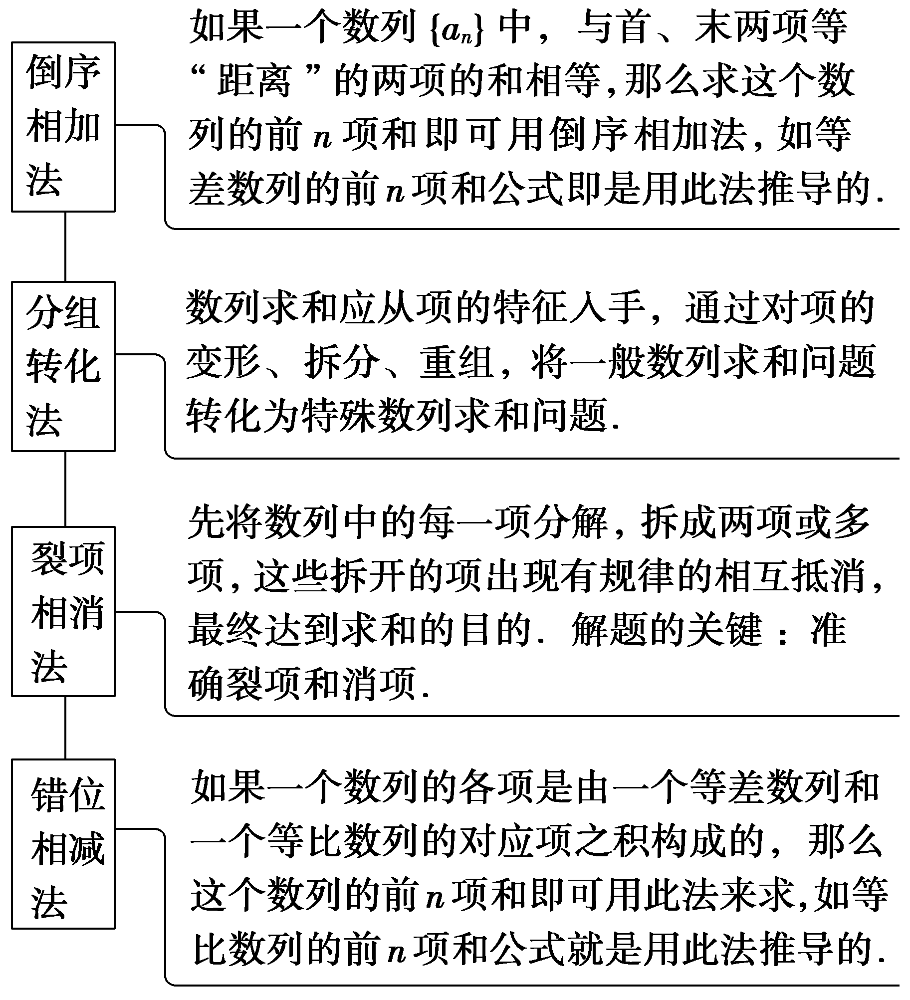
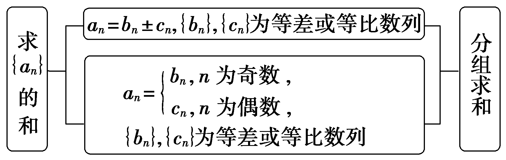
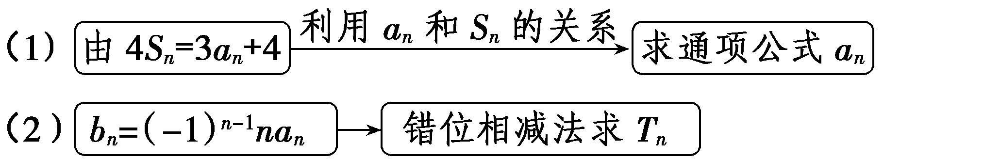
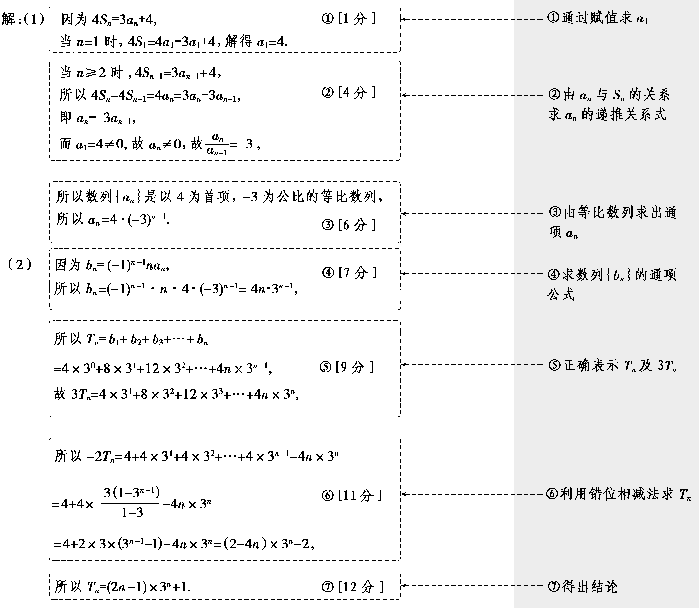
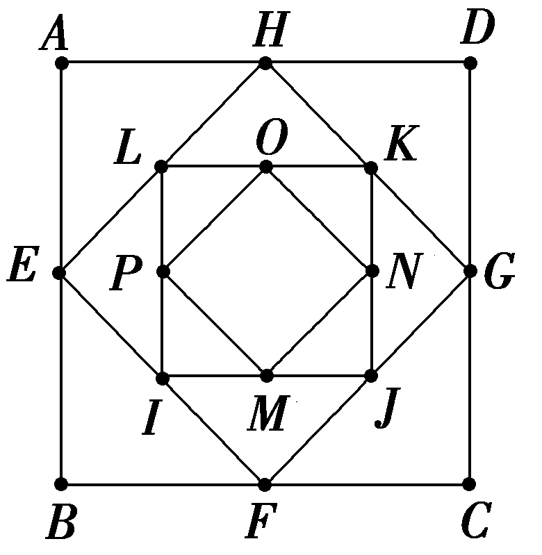

第四节　数列求和

【课标研读】　1.熟练掌握等差、等比数列的前*n*项和公式及倒序相加、错位相减求和法.　2.掌握非等差、等比数列求和的几种常见方法.

##### 1.公式法

（1）等差数列{<em>an</em>}的前<em>n</em>项和公式：

<em>Sn</em>＝ $\frac{n\left(a_{1}＋a_{n}\right)}{2}$ ＝<em>n</em>a1＋ $\frac{n\left(n－1\right)d}{2}$ .

（2）等比数列{<em>an</em>}的前<em>n</em>项和公式：

<em>Sn</em>＝ $\left\{\begin{matrix}na_{1}，q=1，\\\frac{a_{1}\left(1－q^{n}\right)}{1－q}＝\overline{\frac{a_{1}－a_{n}q}{1－q}}，q\ne 1.\end{matrix}\right.$

##### 2.数列求和的常用方法

[微提醒]　（1）裂项相消的规律：消项后，前边剩几项，后边就剩几项，前边剩第几项，后边就剩倒数第几项.（2）利用错位相减法作差后，应注意减式中所剩各项的符号以及重组求和部分的项数.

【常用结论】

（1）常见数列的前*n*项和

①1＋2＋3＋4＋…＋*n*＝ $\frac{n\left(n+1\right)}{2}$ .

②1＋3＋5＋7＋…＋2<em>n</em>－1＝<em>n</em>2.

③2＋4＋6＋8＋…＋2<em>n</em>＝<em>n</em>2＋<em>n</em>.

④1＋2＋22＋…＋2<em>n</em>－1＝2<em>n</em>－1.

（2）常见的裂项公式

①若{<em>an</em>}是等差数列，且公差<em>d</em>≠0，则 $\frac{1}{a_{n}a_{n+1}}$ ＝ $\frac{1}{d}\left(\frac{1}{a_{n}}－\frac{1}{a_{n+1}}\right)$ ， $\frac{1}{a_{n}a_{n+2}}$ ＝ $\frac{1}{2d}\left(\frac{1}{a_{n}}－\frac{1}{a_{n+2}}\right)$ .

② $\frac{1}{n\left(n＋k\right)}$ ＝ $\frac{1}{k}\left(\frac{1}{n}－\frac{1}{n＋k}\right)\left(k\ne 0\right)$ .

③ $\frac{1}{\left(2n－1\right)\left(2n+1\right)}$ ＝ $\frac{1}{2}\left(\frac{1}{2n－1}－\frac{1}{2n+1}\right)$ .

④ $\frac{1}{n\left(n+1\right)\left(n+2\right)}$ ＝ $\frac{1}{2}$ ［ $\frac{1}{n\left(n+1\right)}$ － $\frac{1}{\left(n+1\right)\left(n+2\right)}$ ］.

⑤ $\frac{1}{\sqrt{n}＋\sqrt{n＋k}}$ ＝ $\frac{1}{k}\left(\sqrt{n＋k}－\sqrt{n}\right)\left(k\ne 0\right)$ .

⑥log&lt;text style="it&lt;text style="it&lt;text style="it<em>a</em>lic,subscript"&gt;a&lt;/text&gt;lic,subscript"&gt;a&lt;/text&gt;lic,subscript"&gt;a&lt;/text&gt; $\left(1+\frac{1}{n}\right)$ ＝log&lt;text style="it&lt;text style="it&lt;text style="it<em>a</em>lic,subscript"&gt;a&lt;/text&gt;lic,subscript"&gt;a&lt;/text&gt;lic,subscript"&gt;a&lt;/text&gt; $\frac{n+1}{n}$ ＝log&lt;text style="it&lt;text style="it&lt;text style="it<em>a</em>lic,subscript"&gt;a&lt;/text&gt;lic,subscript"&gt;a&lt;/text&gt;lic,subscript"&gt;a&lt;/text&gt; $\left(n+1\right)$ －log&lt;text style="it&lt;text style="it&lt;text style="it<em>a</em>lic,subscript"&gt;a&lt;/text&gt;lic,subscript"&gt;a&lt;/text&gt;lic,subscript"&gt;a&lt;/text&gt;<em>n</em>.

⑦ $\frac{2^{n}}{\left(2^{n}－1\right)\left(2^{n+1}－1\right)}$ ＝ $\frac{1}{2^{n}－1}$ － $\frac{1}{2^{n+1}－1}$ .

【自主检测】

##### 1.(多选)下列结论正确的是(　　)

$\quad$A.若数列{<em>a&lt;text style="italic"&gt;&lt;text style="italic,subscript"&gt;n</em>&lt;/text&gt;&lt;/text&gt;}为等比数列，且公比不等于1，则其前n项和<em>S</em>n＝ $\frac{a_{1}－a_{n+1}}{1－q}$

$\quad$B.当*n*≥2时， $\frac{1}{n^{2}－1}$ ＝ $\frac{1}{2}\left(\frac{1}{n－1}－\frac{1}{n+1}\right)$

$\quad$C.求<em>Sn</em>＝<em>a</em>＋2<em>a</em>2＋3<em>a</em>3＋…＋<em>nan</em>时，只要把上式等号两边同时乘以<em>a</em>即可根据错位相减法求和

$\quad$D.若数列&lt;text style="it&lt;text style="it&lt;text style="it&lt;text style="it&lt;text style="it&lt;text style="it<em>a</em>lic"&gt;a&lt;/text&gt;lic"&gt;a&lt;/text&gt;lic"&gt;a&lt;/text&gt;lic"&gt;a&lt;/text&gt;lic"&gt;a&lt;/text&gt;lic"&gt;a&lt;/text&gt;&lt;text style="subscript"&gt;1&lt;/text&gt;，a2－a1，…，a<em>&lt;text style="italic,subscript"&gt;&lt;text style="italic,subscript"&gt;&lt;text style="italic,subscript"&gt;n</em>&lt;/text&gt;&lt;/text&gt;&lt;/text&gt;－an－1是首项为1，公比为3的等比数列，则数列{an}的通项公式是an＝ $\frac{3^{n}－1}{2}$

答案ABD

##### 2.(链接人教A选择性必修二P51练习T2)数列{&lt;text style="it<em>a</em>lic"&gt;a&lt;/text&gt;<em>&lt;text style="italic"&gt;&lt;text style="italic,subscript"&gt;&lt;text style="italic,subscript"&gt;n</em>&lt;/text&gt;&lt;/text&gt;&lt;/text&gt;}的前n项和为<em>&lt;text style="italic"&gt;S</em>&lt;/text&gt;n，若an＝ $\frac{1}{n\left(n+1\right)}$ ，则&lt;text style="it<em>a</em>lic"&gt;<em>S</em>&lt;/text&gt;5等于(　　)

$\quad$A.1	
$\quad$B. $\frac{5}{6}$

$\quad$C. $\frac{1}{6}$ 	
$\quad$D. $\frac{1}{30}$

答案B

解析因为&lt;text style="it&lt;text style="it&lt;text style="it<em>a</em>lic"&gt;a&lt;/text&gt;lic"&gt;a&lt;/text&gt;lic"&gt;a&lt;/text&gt;<em>n</em>＝ $\frac{1}{n\left(n+1\right)}$ ＝ $\frac{1}{n}$ － $\frac{1}{n+1}$ ，所以&lt;text style="it&lt;text style="it&lt;text style="it<em>a</em>lic"&gt;a&lt;/text&gt;lic"&gt;a&lt;/text&gt;lic"&gt;S&lt;/text&gt;&lt;text style="subscript"&gt;5&lt;/text&gt;＝<em>a</em>1＋a2＋…＋a5＝(1－ $\frac{1}{2}$ )＋( $\frac{1}{2}$ － $\frac{1}{3}$ )＋…＋( $\frac{1}{5}$ － $\frac{1}{6}$ )＝ $\frac{5}{6}$ .故选B.

##### 3.数列{&lt;text style="it<em>a</em>lic"&gt;a&lt;/text&gt;<em>&lt;text style="italic,subscript"&gt;n</em>&lt;/text&gt;}的通项公式an＝ $\left(－1\right)^{n}\left(2n－1\right)$ ，则该数列的前100项和为(　　)

$\quad$A.－200	
$\quad$B.－100

$\quad$C.200	
$\quad$D.100

答案D

解析<em>S</em>100＝ $\left(－1+3\right)$ ＋ $\left(－5+7\right)$ ＋…＋(－197＋199)＝2×50＝100.故选D.

##### 4.(链接人教A选择性必修二P40习题T3)若数列{<em>an</em>}的通项公式<em>an</em>＝2<em>n</em>＋2<em>n</em>－1，则数列{<em>an</em>}的前<em>n</em>项和为(　　)

$\quad$A.2<em>n</em>＋<em>n</em>2－1	
$\quad$B.2<em>n</em>＋1＋<em>n</em>2－1

$\quad$C.2<em>n</em>＋1＋<em>n</em>2－2	
$\quad$D.2<em>n</em>＋<em>n</em>－2

答案C

解析&lt;text style="it&lt;text style="it&lt;text style="it&lt;text style="it<em>a</em>lic"&gt;a&lt;/text&gt;lic"&gt;a&lt;/text&gt;lic"&gt;a&lt;/text&gt;lic"&gt;S&lt;/text&gt;<em>&lt;text style="italic,subscript"&gt;&lt;text style="italic,superscript"&gt;&lt;text style="italic"&gt;&lt;text style="italic,superscript"&gt;&lt;text style="italic"&gt;&lt;text style="italic"&gt;&lt;text style="italic"&gt;&lt;text style="italic,superscript"&gt;&lt;text style="italic"&gt;&lt;text style="italic"&gt;&lt;text style="italic"&gt;&lt;text style="italic,superscript"&gt;&lt;text style="italic"&gt;n</em>&lt;/text&gt;&lt;/text&gt;&lt;/text&gt;&lt;/text&gt;&lt;/text&gt;&lt;/text&gt;&lt;/text&gt;&lt;/text&gt;&lt;/text&gt;&lt;/text&gt;&lt;/text&gt;&lt;/text&gt;&lt;/text&gt;＝a&lt;text style="superscript"&gt;1&lt;/text&gt;＋a&lt;text style="superscript"&gt;&lt;text style="superscript"&gt;&lt;text style="superscript"&gt;&lt;text style="superscript"&gt;2&lt;/text&gt;&lt;/text&gt;&lt;/text&gt;&lt;/text&gt;＋a&lt;text style="superscript"&gt;3&lt;/text&gt;＋…＋an＝(21＋2×1－1)＋(22＋2×2－1)＋(23＋2×3－1)＋…＋(2n＋2n－1)＝(2＋22＋…＋2n)＋2(1＋2＋3＋…＋n)－n＝ $\frac{2\left(1－2^{n}\right)}{1－2}$ ＋&lt;text style="superscript"&gt;&lt;text style="superscript"&gt;&lt;text style="superscript"&gt;&lt;text style="superscript"&gt;2&lt;/text&gt;&lt;/text&gt;&lt;/text&gt;&lt;/text&gt;× $\frac{n\left(n+1\right)}{2}$ －&lt;text style="it&lt;text style="it&lt;text style="it&lt;text style="it<em>a</em>lic"&gt;a&lt;/text&gt;lic"&gt;a&lt;/text&gt;lic"&gt;a&lt;/text&gt;lic,subscript"&gt;<em>&lt;text style="italic,superscript"&gt;&lt;text style="italic"&gt;&lt;text style="italic,superscript"&gt;&lt;text style="italic"&gt;&lt;text style="italic"&gt;&lt;text style="italic"&gt;&lt;text style="italic,superscript"&gt;&lt;text style="italic"&gt;&lt;text style="italic"&gt;&lt;text style="italic"&gt;&lt;text style="italic,superscript"&gt;&lt;text style="italic"&gt;n</em>&lt;/text&gt;&lt;/text&gt;&lt;/text&gt;&lt;/text&gt;&lt;/text&gt;&lt;/text&gt;&lt;/text&gt;&lt;/text&gt;&lt;/text&gt;&lt;/text&gt;&lt;/text&gt;&lt;/text&gt;&lt;/text&gt;＝&lt;text style="superscript"&gt;&lt;text style="superscript"&gt;&lt;text style="superscript"&gt;&lt;text style="superscript"&gt;2&lt;/text&gt;&lt;/text&gt;&lt;/text&gt;&lt;/text&gt;(2n－&lt;text style="superscript"&gt;1&lt;/text&gt;)＋n2＋n－n＝2n＋1＋n2－2.故选C.

技法一　公式法及分组转化法求和

已知数列 $\left\{a_{n}\right\}$ 的前<em>&lt;text style="italic,subscript"&gt;&lt;text style="italic,subscript"&gt;&lt;text style="italic"&gt;n</em>&lt;/text&gt;&lt;/text&gt;&lt;/text&gt;项和为<em>&lt;text style="italic"&gt;S</em>&lt;/text&gt;n，满足Sn＝ $\frac{2}{3}\left(a_{n}－1\right)$ ，<em>&lt;text style="italic,subscript"&gt;&lt;text style="italic,subscript"&gt;&lt;text style="italic"&gt;n</em>&lt;/text&gt;&lt;/text&gt;&lt;/text&gt;∈<strong>N</strong>\*.

（1）求数列 $\left\{a_{n}\right\}$ 的通项公式；

（2）记&lt;text style="it<em>a</em>lic"&gt;b&lt;/text&gt;<em>&lt;text style="italic,subscript"&gt;n</em>&lt;/text&gt;＝an·cos $\frac{n\pi }{2}$ ，求数列 $\left\{b_{n}\right\}$ 的前100项的和<em>T</em>100.

解：（1）当&lt;text style="it&lt;text style="it<em>a</em>lic"&gt;a&lt;/text&gt;lic"&gt;<em>&lt;text style="italic,subscript"&gt;&lt;text style="italic,subscript"&gt;&lt;text style="italic,subscript"&gt;n</em>&lt;/text&gt;&lt;/text&gt;&lt;/text&gt;&lt;/text&gt;≥2时，an＝<em>&lt;text style="italic"&gt;S</em>&lt;/text&gt;n－Sn&lt;text style="subscript"&gt;－1&lt;/text&gt;＝ $\frac{2}{3}\left(a_{n}－1\right)$ － $\frac{2}{3}$ (&lt;text style="it<em>a</em>lic"&gt;a&lt;/text&gt;<em>&lt;text style="italic,subscript"&gt;&lt;text style="italic,subscript"&gt;&lt;text style="italic,subscript"&gt;&lt;text style="italic,subscript"&gt;n</em>&lt;/text&gt;&lt;/text&gt;&lt;/text&gt;&lt;/text&gt;&lt;text style="subscript"&gt;－1&lt;/text&gt;－1)，整理得 $\frac{a_{n}}{a_{n－1}}$ ＝－2，

又&lt;text style="it<em>a</em>lic"&gt;a&lt;/text&gt;&lt;text style="subscript"&gt;&lt;text style="subscript"&gt;1&lt;/text&gt;&lt;/text&gt;＝<em>S</em>1＝ $\frac{2}{3}\left(a_{1}－1\right)$ ，得&lt;text style="it<em>a</em>lic"&gt;a&lt;/text&gt;&lt;text style="subscript"&gt;&lt;text style="subscript"&gt;1&lt;/text&gt;&lt;/text&gt;＝－2，

则数列 $\left\{a_{n}\right\}$ 是以－2为首项，－2为公比的等比数列.

则<em>an</em>＝(－2)<em>n</em>，<em>n</em>∈<strong>N</strong>\*.

（2）当<em>n</em>＝&lt;text style="superscript"&gt;&lt;text style="superscript"&gt;4&lt;/text&gt;&lt;/text&gt;<em>&lt;text style="italic"&gt;&lt;text style="italic,subscript"&gt;&lt;text style="italic,superscript"&gt;&lt;text style="italic,superscript"&gt;k</em>&lt;/text&gt;&lt;/text&gt;&lt;/text&gt;&lt;/text&gt;，k∈&lt;text style="<em>b</em>old"&gt;N&lt;/text&gt;\*时，b4k＝(－2)4k·cos $\frac{4k\pi }{2}$ ＝2&lt;text style="superscript"&gt;&lt;text style="superscript"&gt;4&lt;/text&gt;&lt;/text&gt;<em>&lt;text style="italic"&gt;&lt;text style="italic,subscript"&gt;&lt;text style="italic,superscript"&gt;&lt;text style="italic,superscript"&gt;k</em>&lt;/text&gt;&lt;/text&gt;&lt;/text&gt;&lt;/text&gt;，

当<em>n</em>＝4<em>k</em>－1，<em>k</em>∈<strong>N</strong>\*时，

<em>b</em>&lt;text style="superscript"&gt;4&lt;/text&gt;<em>&lt;text style="italic,superscript"&gt;k</em>&lt;/text&gt;&lt;text style="superscript"&gt;－1&lt;/text&gt;＝(－2)4k－1·cos $\frac{\left(4k－1\right)\pi }{2}$ ＝0，

当<em>n</em>＝4<em>k</em>－2，<em>k</em>∈<strong>N</strong>\*时，

<em>b</em>&lt;text style="superscript"&gt;&lt;text style="superscript"&gt;4&lt;/text&gt;&lt;/text&gt;<em>&lt;text style="italic,superscript"&gt;&lt;text style="italic,superscript"&gt;k</em>&lt;/text&gt;&lt;/text&gt;&lt;text style="superscript"&gt;&lt;text style="superscript"&gt;－2&lt;/text&gt;&lt;/text&gt;＝(－2)4k－2·cos $\frac{\left(4k－2\right)\pi }{2}$ ＝&lt;text style="superscript"&gt;&lt;text style="superscript"&gt;－2&lt;/text&gt;&lt;/text&gt;&lt;text style="superscript"&gt;&lt;text style="superscript"&gt;4&lt;/text&gt;&lt;/text&gt;<em>&lt;text style="italic,superscript"&gt;&lt;text style="italic,superscript"&gt;k</em>&lt;/text&gt;&lt;/text&gt;－2，

当<em>n</em>＝4<em>k</em>－3，<em>k</em>∈<strong>N</strong>\*时，

<em>b</em>&lt;text style="superscript"&gt;4&lt;/text&gt;<em>&lt;text style="italic,superscript"&gt;k</em>&lt;/text&gt;&lt;text style="superscript"&gt;－3&lt;/text&gt;＝(－2)4k－3·cos $\frac{\left(4k－3\right)\pi }{2}$ ＝0，

则<em>T</em>&lt;text style="su<em>&lt;text style="italic"&gt;&lt;text style="italic"&gt;&lt;text style="italic"&gt;b</em>&lt;/text&gt;&lt;/text&gt;&lt;/text&gt;script"&gt;100&lt;/text&gt;＝b1＋b&lt;text style="superscript"&gt;2&lt;/text&gt;＋b3＋…＋b100＝－(22＋26＋…＋298)＋ $\left(2^{4}＋2^{8}＋\ldots ＋2^{100}\right)$

＝－ $\frac{2^{2}－2^{98}\times 2^{4}}{1－2^{4}}$ ＋ $\frac{2^{4}－2^{100}\times 2^{4}}{1－2^{4}}$ ＝ $\frac{2^{102}－4}{5}$ .

##### 1.分组转化法求和

数列求和应从通项入手，若无通项，则先求通项，然后通过对通项变形，转化为等差数列或等比数列或可求前*n*项和的数列求和.

##### 2.分组转化法求和的常见类型

注意：周期型问题，如&lt;text style="it<em>a</em>lic"&gt;a&lt;/text&gt;<em>&lt;text style="italic,subscript"&gt;n</em>&lt;/text&gt;＝sin $\frac{n\pi }{3}$ ，&lt;text style="it<em>a</em>lic"&gt;a&lt;/text&gt;<em>&lt;text style="italic,subscript"&gt;n</em>&lt;/text&gt;＝cos $\frac{n\pi }{3}$ 等，常采用分组转化法求和.

对点练1.(2021·新高考Ⅰ卷)已知数列 $\left\{a_{n}\right\}$ 满足&lt;text style="it<em>a</em>lic"&gt;a&lt;/text&gt;1＝1，a<em>n</em>＋1＝ $\left\{\begin{matrix}a_{n}+1，n为奇数，\\a_{n}+2，n为偶数.\end{matrix}\right.$

(&lt;text style="su<em>b</em>script"&gt;1&lt;/text&gt;)记&lt;text style="it<em>a</em>lic"&gt;<em>b</em>&lt;/text&gt;<em>&lt;text style="italic,subscript"&gt;n</em>&lt;/text&gt;＝a&lt;text style="subscript"&gt;2&lt;/text&gt;n，写出b1，b2，并求数列 $\left\{b_{n}\right\}$ 的通项公式；

（2）求 $\left\{a_{n}\right\}$ 的前20项和.

解：(1)因为&lt;text style="it&lt;text style="it&lt;text style="it<em>a</em>lic"&gt;a&lt;/text&gt;lic"&gt;a&lt;/text&gt;lic"&gt;b&lt;/text&gt;<em>&lt;text style="italic,subscript"&gt;&lt;text style="italic,subscript"&gt;n</em>&lt;/text&gt;&lt;/text&gt;＝a2n，且a1＝1，an＋1＝ $\left\{\begin{matrix}a_{n}+1，n为奇数，\\a_{n}+2，n为偶数，\end{matrix}\right.$

所以<em>b</em>1＝<em>a</em>2＝<em>a</em>1＋1＝2，

<em>b</em>2＝<em>a</em>4＝<em>a</em>3＋1＝<em>a</em>2＋2＋1＝5.

因为<em>bn</em>＋1＝<em>a</em>2<em>n</em>＋2＝<em>a</em>2<em>n</em>＋1＋1＝<em>a</em>2<em>n</em>＋1＋1＝<em>a</em>2<em>n</em>＋2＋1＝<em>a</em>2<em>n</em>＋3，

所以<em>bn</em>＋1－<em>bn</em>＝<em>a</em>2<em>n</em>＋3－<em>a</em>2<em>n</em>＝3，

所以数列 $\left\{b_{n}\right\}$ 是以2为首项，3为公差的等差数列，<em>b&lt;text style="italic"&gt;&lt;text style="italic"&gt;&lt;text style="italic"&gt;n</em>&lt;/text&gt;&lt;/text&gt;&lt;/text&gt;＝2＋3(n－1)＝3n－1，n∈<strong>N</strong><em>\*</em>.

(&lt;text style="subscript"&gt;&lt;text style="subscript"&gt;&lt;text style="subscript"&gt;&lt;text style="subscript"&gt;&lt;text style="subscript"&gt;2&lt;/text&gt;&lt;/text&gt;&lt;/text&gt;&lt;/text&gt;&lt;/text&gt;)因为&lt;text style="it&lt;text style="it&lt;text style="it&lt;text style="it&lt;text style="it&lt;text style="it<em>a</em>lic"&gt;a&lt;/text&gt;lic"&gt;a&lt;/text&gt;lic"&gt;a&lt;/text&gt;lic"&gt;a&lt;/text&gt;lic"&gt;a&lt;/text&gt;lic"&gt;a&lt;/text&gt;<em>n</em>&lt;text style="subscript"&gt;&lt;text style="subscript"&gt;＋1&lt;/text&gt;&lt;/text&gt;＝ $\left\{\begin{matrix}a_{n}+1，n为奇数，\\a_{n}+2，n为偶数，\end{matrix}\right.$ 所以&lt;text style="it&lt;text style="it&lt;text style="it&lt;text style="it&lt;text style="it&lt;text style="it<em>a</em>lic"&gt;a&lt;/text&gt;lic"&gt;a&lt;/text&gt;lic"&gt;a&lt;/text&gt;lic"&gt;a&lt;/text&gt;lic"&gt;a&lt;/text&gt;lic"&gt;<em>&lt;text style="italic,subscript"&gt;&lt;text style="italic,subscript"&gt;&lt;text style="italic,subscript"&gt;&lt;text style="italic,subscript"&gt;&lt;text style="italic,subscript"&gt;k</em>&lt;/text&gt;&lt;/text&gt;&lt;/text&gt;&lt;/text&gt;&lt;/text&gt;&lt;/text&gt;∈<strong>N</strong><em>\*</em>时，<em>a</em>&lt;text style="subscript"&gt;&lt;text style="subscript"&gt;&lt;text style="subscript"&gt;&lt;text style="subscript"&gt;&lt;text style="subscript"&gt;2&lt;/text&gt;&lt;/text&gt;&lt;/text&gt;&lt;/text&gt;&lt;/text&gt;k＝a2k－1&lt;text style="subscript"&gt;&lt;text style="subscript"&gt;＋1&lt;/text&gt;&lt;/text&gt;　①，a2k＋1＝a2k＋2　②，a2k＋2＝a2k＋1＋1　③，

所以①＋②得<em>a</em>2<em>k</em>＋1＝<em>a</em>2<em>k</em>－1＋3，

即<em>a</em>2<em>k</em>＋1－<em>a</em>2<em>k</em>－1＝3，

所以数列 $\left\{a_{n}\right\}$ 的奇数项是以1为首项，3为公差的等差数列；

②＋③得<em>a</em>2<em>k</em>＋2＝<em>a</em>2<em>k</em>＋3，即<em>a</em>2<em>k</em>＋2－<em>a</em>2<em>k</em>＝3，

又<em>a</em>2＝2，所以数列 $\left\{a_{n}\right\}$ 的偶数项是以2为首项，3为公差的等差数列.

所以数列 $\left\{a_{n}\right\}$ 的前&lt;text style="subscript"&gt;20&lt;/text&gt;项和&lt;text style="it&lt;text style="it&lt;text style="it&lt;text style="it&lt;text style="it&lt;text style="it&lt;text style="it&lt;text style="it<em>a</em>lic"&gt;a&lt;/text&gt;lic"&gt;a&lt;/text&gt;lic"&gt;a&lt;/text&gt;lic"&gt;a&lt;/text&gt;lic"&gt;a&lt;/text&gt;lic"&gt;a&lt;/text&gt;lic"&gt;a&lt;/text&gt;lic"&gt;S&lt;/text&gt;20＝(a1＋a3＋a5＋…＋a19)＋(a2＋a4＋a6＋…＋a20)＝10＋ $\frac{10\times 9}{2}$ ×3＋&lt;text style="subscript"&gt;20&lt;/text&gt;＋ $\frac{10\times 9}{2}$ ×3＝300.

技法二　并项法求和

数列{&lt;text style="it<em>a</em>lic"&gt;a&lt;/text&gt;<em>&lt;text style="italic"&gt;&lt;text style="italic,subscript"&gt;&lt;text style="italic,subscript"&gt;&lt;text style="italic"&gt;n</em>&lt;/text&gt;&lt;/text&gt;&lt;/text&gt;&lt;/text&gt;}的前n项和<em>&lt;text style="italic"&gt;S</em>&lt;/text&gt;n满足Sn＝ $a_{n}_{+1}$ －1，&lt;text style="it<em>a</em>lic,subscript"&gt;<em>&lt;text style="italic,subscript"&gt;&lt;text style="italic,subscript"&gt;&lt;text style="italic"&gt;n</em>&lt;/text&gt;&lt;/text&gt;&lt;/text&gt;&lt;/text&gt;∈<strong>N</strong><em>\*</em>，且<em>a</em>1＝1.

（1）求<em>an</em>；

（2）设<em>bn</em>＝(－1)<em>n</em>(<em>an</em>－1)，求数列{<em>bn</em>}的前2<em>n</em>项和<em>T</em>2<em>n</em>.

解：（1）因为<em>Sn</em>＝ $a_{n}_{+1}$ －1，

当<em>n</em>＝1时，<em>a</em>1＝<em>S</em>1＝<em>a</em>2－1，

由<em>a</em>1＝1可得<em>a</em>2＝2，

当&lt;text style="it<em>a</em>lic"&gt;<em>n</em>&lt;/text&gt;≥2时， $S_{n}_{－1}$ ＝<em>a&lt;text style="italic,subscript"&gt;n</em>&lt;/text&gt;－1，

作差得&lt;text style="it<em>a</em>lic"&gt;S&lt;/text&gt;<em>&lt;text style="italic,subscript"&gt;n</em>&lt;/text&gt;－ $S_{n}_{－1}$ ＝ $a_{n}_{+1}$ －1－(<em>a&lt;text style="italic,subscript"&gt;n</em>&lt;/text&gt;－1)，

即2<em>a&lt;text style="italic"&gt;n</em>&lt;/text&gt;＝ $a_{n}_{+1}$ ，<em>&lt;text style="italic"&gt;n</em>&lt;/text&gt;≥2，

又 $\frac{a_{2}}{a_{1}}$ ＝2，所以数列{&lt;text style="it<em>a</em>lic"&gt;a&lt;/text&gt;<em>&lt;text style="italic,subscript"&gt;&lt;text style="italic,superscript"&gt;n</em>&lt;/text&gt;&lt;/text&gt;}是以1为首项，2为公比的等比数列，所以an＝2n－1.

（2）由（1）知<em>bn</em>＝(－1)<em>n</em>2<em>n</em>－1－(－1)<em>n</em>，

所以<em>b</em>2<em>n</em>＝22<em>n</em>－1－1，<em>b</em>2<em>n</em>－1＝－22<em>n</em>－2＋1，

所以<em>b</em>2<em>n</em>－1＋<em>b</em>2<em>n</em>＝4<em>n</em>－1，

所以<em>T</em>2<em>n</em>＝(<em>b</em>1＋<em>b</em>2)＋(<em>b</em>3＋<em>b</em>4)＋…＋(<em>b</em>2<em>n</em>－1＋<em>b</em>2<em>n</em>)

＝1＋4＋…＋4<em>n</em>－1

＝ $\frac{1－4^{n}}{1－4}$ ＝ $\frac{4^{n}－1}{3}$ .

并项法求和的常见题型

##### 1.数列{<em>an</em>}的通项公式为<em>an</em>＝(－1)<em>nf</em>(<em>n</em>)，求数列{<em>an</em>}的前<em>n</em>项和.

##### 2.数列{&lt;text style="it&lt;text style="it<em>a</em>lic"&gt;a&lt;/text&gt;lic"&gt;a&lt;/text&gt;<em>&lt;text style="italic,subscript"&gt;&lt;text style="italic"&gt;n</em>&lt;/text&gt;&lt;/text&gt;}是周期数列或a<em>&lt;text style="italic"&gt;k</em>&lt;/text&gt;＋ $a_{k}_{＋}_{1}$ (&lt;text style="it<em>a</em>lic,subscript"&gt;<em>k</em>&lt;/text&gt;∈<strong>N</strong><em>\*</em>)为定值，求数列{&lt;text style="it<em>a</em>lic"&gt;a&lt;/text&gt;<em>&lt;text style="italic,subscript"&gt;&lt;text style="italic"&gt;n</em>&lt;/text&gt;&lt;/text&gt;}的前n项和.

对点练2.已知数列 $\left\{a_{n}\right\}$ 满足&lt;text style="it<em>a</em>lic"&gt;a&lt;/text&gt;<em>&lt;text style="italic,subscript"&gt;&lt;text style="italic,superscript"&gt;&lt;text style="italic"&gt;n</em>&lt;/text&gt;&lt;/text&gt;&lt;/text&gt;＋an＋2＝2n(n∈<strong>N</strong><em>\*</em>)，则 $\left\{a_{n}\right\}$ 的前20项和<em>S</em>20＝(　　)

$\quad$A. $\frac{2^{20}－1}{5}$ 	
$\quad$B. $\frac{2^{20}－2}{5}$

$\quad$C. $\frac{2^{21}－1}{5}$ 	
$\quad$D. $\frac{2^{21}－2}{5}$

答案D

解析&lt;text style="it&lt;text style="it&lt;text style="it&lt;text style="it&lt;text style="it&lt;text style="it&lt;text style="it&lt;text style="it&lt;text style="it&lt;text style="it&lt;text style="it&lt;text style="it&lt;text style="it&lt;text style="it&lt;text style="it&lt;text style="it&lt;text style="it&lt;text style="it&lt;text style="it&lt;text style="it<em>a</em>lic"&gt;a&lt;/text&gt;lic"&gt;a&lt;/text&gt;lic"&gt;a&lt;/text&gt;lic"&gt;a&lt;/text&gt;lic"&gt;a&lt;/text&gt;lic"&gt;a&lt;/text&gt;lic"&gt;a&lt;/text&gt;lic"&gt;a&lt;/text&gt;lic"&gt;a&lt;/text&gt;lic"&gt;a&lt;/text&gt;lic"&gt;a&lt;/text&gt;lic"&gt;a&lt;/text&gt;lic"&gt;a&lt;/text&gt;lic"&gt;a&lt;/text&gt;lic"&gt;a&lt;/text&gt;lic"&gt;a&lt;/text&gt;lic"&gt;a&lt;/text&gt;lic"&gt;a&lt;/text&gt;lic"&gt;a&lt;/text&gt;lic"&gt;S&lt;/text&gt;&lt;text style="subscript"&gt;&lt;text style="subscript"&gt;&lt;text style="superscript"&gt;&lt;text style="superscript"&gt;2&lt;/text&gt;&lt;/text&gt;&lt;/text&gt;0&lt;/text&gt;＝a&lt;text style="subscript"&gt;&lt;text style="superscript"&gt;&lt;text style="superscript"&gt;1&lt;/text&gt;&lt;/text&gt;&lt;/text&gt;＋a2＋a&lt;text style="subscript"&gt;3&lt;/text&gt;＋a&lt;text style="subscript"&gt;4&lt;/text&gt;＋a&lt;text style="subscript"&gt;&lt;text style="superscript"&gt;&lt;text style="superscript"&gt;5&lt;/text&gt;&lt;/text&gt;&lt;/text&gt;＋a&lt;text style="superscript"&gt;6&lt;/text&gt;＋…＋a1&lt;text style="subscript"&gt;7&lt;/text&gt;＋a&lt;text style="subscript"&gt;&lt;text style="superscript"&gt;&lt;text style="superscript"&gt;18&lt;/text&gt;&lt;/text&gt;&lt;/text&gt;＋a&lt;text style="subscript"&gt;1&lt;text style="superscript"&gt;9&lt;/text&gt;&lt;/text&gt;＋a&lt;text style="subscript"&gt;20&lt;/text&gt;＝(a1＋a3)＋(a2＋a4)＋(a5＋a7)＋…＋(a&lt;text style="superscript"&gt;&lt;text style="superscript"&gt;17&lt;/text&gt;&lt;/text&gt;＋a19)＋(a18＋a20)＝21＋22＋25＋…＋217＋218＝(21＋25＋29＋…＋217)＋(22＋26＋210＋…＋218)＝ $\frac{2－2^{17}\cdot 16}{1－16}$ ＋ $\frac{4－2^{18}\cdot 16}{1－16}$ ＝ $\frac{2^{21}－2}{5}$ .故选D.

对点练3.(1)数列 $\left\{a_{n}\right\}$ 满足&lt;text style="it&lt;text style="it<em>a</em>lic"&gt;a&lt;/text&gt;lic"&gt;a&lt;/text&gt;<em>&lt;text style="italic,superscript"&gt;&lt;text style="italic,subscript"&gt;&lt;text style="italic"&gt;n</em>&lt;/text&gt;&lt;/text&gt;&lt;/text&gt;＋2＋(－1)nan＝3n＋1，前8项的和为106，则a1＝<u>　　　　</u>.

(2)已知数列 $\left\{a_{n}\right\}$ 满足&lt;text style="it&lt;text style="it&lt;text style="it<em>a</em>lic"&gt;a&lt;/text&gt;lic"&gt;a&lt;/text&gt;lic"&gt;a&lt;/text&gt;1＋a2＝0，a<em>&lt;text style="italic,subscript"&gt;n</em>&lt;/text&gt;＋2＋ $\left(－1\right)^{\frac{n(n+1)}{2}}$ &lt;text style="it&lt;text style="it&lt;text style="it<em>a</em>lic"&gt;a&lt;/text&gt;lic"&gt;a&lt;/text&gt;lic"&gt;a&lt;/text&gt;<em>&lt;text style="italic,subscript"&gt;n</em>&lt;/text&gt;＝2，则数列 $\left\{a_{n}\right\}$ 的前2 026项的和为<u>　　　　</u>.

答案（1）8　（2）2 024

解析(&lt;text style="subscript"&gt;&lt;text style="subscript"&gt;&lt;text style="subscript"&gt;&lt;text style="subscript"&gt;&lt;text style="subscript"&gt;&lt;text style="subscript"&gt;&lt;text style="subscript"&gt;&lt;text style="subscript"&gt;1&lt;/text&gt;&lt;/text&gt;&lt;/text&gt;&lt;/text&gt;&lt;/text&gt;&lt;/text&gt;&lt;/text&gt;&lt;/text&gt;)&lt;text style="it&lt;text style="it&lt;text style="it&lt;text style="it&lt;text style="it&lt;text style="it&lt;text style="it&lt;text style="it&lt;text style="it&lt;text style="it&lt;text style="it&lt;text style="it&lt;text style="it&lt;text style="it&lt;text style="it&lt;text style="it&lt;text style="it&lt;text style="it&lt;text style="it&lt;text style="it&lt;text style="it&lt;text style="it&lt;text style="it&lt;text style="it&lt;text style="it&lt;text style="it&lt;text style="it<em>a</em>lic"&gt;a&lt;/text&gt;lic"&gt;a&lt;/text&gt;lic"&gt;a&lt;/text&gt;lic"&gt;a&lt;/text&gt;lic"&gt;a&lt;/text&gt;lic"&gt;a&lt;/text&gt;lic"&gt;a&lt;/text&gt;lic"&gt;a&lt;/text&gt;lic"&gt;a&lt;/text&gt;lic"&gt;a&lt;/text&gt;lic"&gt;a&lt;/text&gt;lic"&gt;a&lt;/text&gt;lic"&gt;a&lt;/text&gt;lic"&gt;a&lt;/text&gt;lic"&gt;a&lt;/text&gt;lic"&gt;a&lt;/text&gt;lic"&gt;a&lt;/text&gt;lic"&gt;a&lt;/text&gt;lic"&gt;a&lt;/text&gt;lic"&gt;a&lt;/text&gt;lic"&gt;a&lt;/text&gt;lic"&gt;a&lt;/text&gt;lic"&gt;a&lt;/text&gt;lic"&gt;a&lt;/text&gt;lic"&gt;a&lt;/text&gt;lic"&gt;a&lt;/text&gt;lic"&gt;a&lt;/text&gt;<em>&lt;text style="italic,superscript"&gt;&lt;text style="italic,subscript"&gt;&lt;text style="italic"&gt;&lt;text style="italic"&gt;&lt;text style="italic,subscript"&gt;&lt;text style="italic,subscript"&gt;&lt;text style="italic"&gt;&lt;text style="italic"&gt;&lt;text style="italic,subscript"&gt;&lt;text style="italic,subscript"&gt;&lt;text style="italic"&gt;&lt;text style="italic"&gt;&lt;text style="italic,subscript"&gt;n</em>&lt;/text&gt;&lt;/text&gt;&lt;/text&gt;&lt;/text&gt;&lt;/text&gt;&lt;/text&gt;&lt;/text&gt;&lt;/text&gt;&lt;/text&gt;&lt;/text&gt;&lt;/text&gt;&lt;/text&gt;&lt;/text&gt;&lt;text style="subscript"&gt;&lt;text style="subscript"&gt;＋&lt;text style="subscript"&gt;&lt;text style="subscript"&gt;&lt;text style="subscript"&gt;2&lt;/text&gt;&lt;/text&gt;&lt;/text&gt;&lt;/text&gt;&lt;/text&gt;＋(－1)nan＝3n＋1，当n为奇数时，an＋2＝an＋3n＋1；当n为偶数时，an＋2＋an＝3n＋1.设数列 $\left\{a_{n}\right\}$ 的前&lt;text style="it&lt;text style="it&lt;text style="it&lt;text style="it&lt;text style="it&lt;text style="it&lt;text style="it&lt;text style="it&lt;text style="it&lt;text style="it&lt;text style="it&lt;text style="it&lt;text style="it&lt;text style="it&lt;text style="it&lt;text style="it&lt;text style="it&lt;text style="it&lt;text style="it&lt;text style="it&lt;text style="it&lt;text style="it&lt;text style="it&lt;text style="it&lt;text style="it&lt;text style="it&lt;text style="it<em>a</em>lic"&gt;a&lt;/text&gt;lic"&gt;a&lt;/text&gt;lic"&gt;a&lt;/text&gt;lic"&gt;a&lt;/text&gt;lic"&gt;a&lt;/text&gt;lic"&gt;a&lt;/text&gt;lic"&gt;a&lt;/text&gt;lic"&gt;a&lt;/text&gt;lic"&gt;a&lt;/text&gt;lic"&gt;a&lt;/text&gt;lic"&gt;a&lt;/text&gt;lic"&gt;a&lt;/text&gt;lic"&gt;a&lt;/text&gt;lic"&gt;a&lt;/text&gt;lic"&gt;a&lt;/text&gt;lic"&gt;a&lt;/text&gt;lic"&gt;a&lt;/text&gt;lic"&gt;a&lt;/text&gt;lic"&gt;a&lt;/text&gt;lic"&gt;a&lt;/text&gt;lic"&gt;a&lt;/text&gt;lic"&gt;a&lt;/text&gt;lic"&gt;a&lt;/text&gt;lic"&gt;a&lt;/text&gt;lic"&gt;a&lt;/text&gt;lic"&gt;a&lt;/text&gt;lic,subscript"&gt;<em>&lt;text style="italic,subscript"&gt;&lt;text style="italic"&gt;&lt;text style="italic"&gt;&lt;text style="italic,subscript"&gt;&lt;text style="italic,subscript"&gt;&lt;text style="italic"&gt;&lt;text style="italic"&gt;&lt;text style="italic,subscript"&gt;&lt;text style="italic,subscript"&gt;&lt;text style="italic"&gt;&lt;text style="italic"&gt;&lt;text style="italic,subscript"&gt;n</em>&lt;/text&gt;&lt;/text&gt;&lt;/text&gt;&lt;/text&gt;&lt;/text&gt;&lt;/text&gt;&lt;/text&gt;&lt;/text&gt;&lt;/text&gt;&lt;/text&gt;&lt;/text&gt;&lt;/text&gt;&lt;/text&gt;项和为<em>&lt;text style="italic"&gt;S</em>&lt;/text&gt;n，S&lt;text style="subscript"&gt;&lt;text style="subscript"&gt;&lt;text style="subscript"&gt;8&lt;/text&gt;&lt;/text&gt;&lt;/text&gt;＝<em>a</em>&lt;text style="subscript"&gt;&lt;text style="subscript"&gt;&lt;text style="subscript"&gt;&lt;text style="subscript"&gt;&lt;text style="subscript"&gt;&lt;text style="subscript"&gt;&lt;text style="subscript"&gt;&lt;text style="subscript"&gt;1&lt;/text&gt;&lt;/text&gt;&lt;/text&gt;&lt;/text&gt;&lt;/text&gt;&lt;/text&gt;&lt;/text&gt;&lt;/text&gt;＋a&lt;text style="subscript"&gt;&lt;text style="subscript"&gt;2&lt;/text&gt;&lt;/text&gt;＋…＋a8＝a1＋a3＋a5＋a7＋(a2＋a&lt;text style="subscript"&gt;4&lt;/text&gt;)＋(a&lt;text style="subscript"&gt;6&lt;/text&gt;＋a8)＝a1＋(a1＋4)＋(a1＋14)＋(a1＋30)＋(a2＋a4)＋(a6＋a8)＝4a1＋48＋7＋19＝4a1＋74＝106，解得a1＝8.

(&lt;text style="subscript"&gt;&lt;text style="subscript"&gt;&lt;text style="subscript"&gt;2&lt;/text&gt;&lt;/text&gt;&lt;/text&gt;)在&lt;text style="it&lt;text style="it&lt;text style="it&lt;text style="it&lt;text style="it&lt;text style="it&lt;text style="it&lt;text style="it&lt;text style="it&lt;text style="it&lt;text style="it&lt;text style="it&lt;text style="it&lt;text style="it&lt;text style="it&lt;text style="it&lt;text style="it&lt;text style="it&lt;text style="it&lt;text style="it&lt;text style="it&lt;text style="it&lt;text style="it&lt;text style="it&lt;text style="it&lt;text style="it&lt;text style="it&lt;text style="it&lt;text style="it&lt;text style="it&lt;text style="it<em>a</em>lic"&gt;a&lt;/text&gt;lic"&gt;a&lt;/text&gt;lic"&gt;a&lt;/text&gt;lic"&gt;a&lt;/text&gt;lic"&gt;a&lt;/text&gt;lic"&gt;a&lt;/text&gt;lic"&gt;a&lt;/text&gt;lic"&gt;a&lt;/text&gt;lic"&gt;a&lt;/text&gt;lic"&gt;a&lt;/text&gt;lic"&gt;a&lt;/text&gt;lic"&gt;a&lt;/text&gt;lic"&gt;a&lt;/text&gt;lic"&gt;a&lt;/text&gt;lic"&gt;a&lt;/text&gt;lic"&gt;a&lt;/text&gt;lic"&gt;a&lt;/text&gt;lic"&gt;a&lt;/text&gt;lic"&gt;a&lt;/text&gt;lic"&gt;a&lt;/text&gt;lic"&gt;a&lt;/text&gt;lic"&gt;a&lt;/text&gt;lic"&gt;a&lt;/text&gt;lic"&gt;a&lt;/text&gt;lic"&gt;a&lt;/text&gt;lic"&gt;a&lt;/text&gt;lic"&gt;a&lt;/text&gt;lic"&gt;a&lt;/text&gt;lic"&gt;a&lt;/text&gt;lic"&gt;a&lt;/text&gt;lic"&gt;a&lt;/text&gt;<em>&lt;text style="italic,subscript"&gt;&lt;text style="italic"&gt;&lt;text style="italic,subscript"&gt;&lt;text style="italic,subscript"&gt;&lt;text style="italic"&gt;n</em>&lt;/text&gt;&lt;/text&gt;&lt;/text&gt;&lt;/text&gt;&lt;/text&gt;&lt;text style="subscript"&gt;＋2&lt;/text&gt;＋ $\left(－1\right)^{\frac{n(n+1)}{2}}$ &lt;text style="it&lt;text style="it&lt;text style="it&lt;text style="it&lt;text style="it&lt;text style="it&lt;text style="it&lt;text style="it&lt;text style="it&lt;text style="it&lt;text style="it&lt;text style="it&lt;text style="it&lt;text style="it&lt;text style="it&lt;text style="it&lt;text style="it&lt;text style="it&lt;text style="it&lt;text style="it&lt;text style="it&lt;text style="it&lt;text style="it&lt;text style="it&lt;text style="it&lt;text style="it&lt;text style="it&lt;text style="it&lt;text style="it&lt;text style="it&lt;text style="it<em>a</em>lic"&gt;a&lt;/text&gt;lic"&gt;a&lt;/text&gt;lic"&gt;a&lt;/text&gt;lic"&gt;a&lt;/text&gt;lic"&gt;a&lt;/text&gt;lic"&gt;a&lt;/text&gt;lic"&gt;a&lt;/text&gt;lic"&gt;a&lt;/text&gt;lic"&gt;a&lt;/text&gt;lic"&gt;a&lt;/text&gt;lic"&gt;a&lt;/text&gt;lic"&gt;a&lt;/text&gt;lic"&gt;a&lt;/text&gt;lic"&gt;a&lt;/text&gt;lic"&gt;a&lt;/text&gt;lic"&gt;a&lt;/text&gt;lic"&gt;a&lt;/text&gt;lic"&gt;a&lt;/text&gt;lic"&gt;a&lt;/text&gt;lic"&gt;a&lt;/text&gt;lic"&gt;a&lt;/text&gt;lic"&gt;a&lt;/text&gt;lic"&gt;a&lt;/text&gt;lic"&gt;a&lt;/text&gt;lic"&gt;a&lt;/text&gt;lic"&gt;a&lt;/text&gt;lic"&gt;a&lt;/text&gt;lic"&gt;a&lt;/text&gt;lic"&gt;a&lt;/text&gt;lic"&gt;a&lt;/text&gt;lic"&gt;a&lt;/text&gt;<em>&lt;text style="italic,subscript"&gt;&lt;text style="italic"&gt;&lt;text style="italic,subscript"&gt;&lt;text style="italic,subscript"&gt;&lt;text style="italic"&gt;n</em>&lt;/text&gt;&lt;/text&gt;&lt;/text&gt;&lt;/text&gt;&lt;/text&gt;＝&lt;text style="subscript"&gt;&lt;text style="subscript"&gt;&lt;text style="subscript"&gt;2&lt;/text&gt;&lt;/text&gt;&lt;/text&gt;中，分别令n＝&lt;text style="subscript"&gt;&lt;text style="subscript"&gt;&lt;text style="subscript"&gt;1&lt;/text&gt;&lt;/text&gt;&lt;/text&gt;，2，得a&lt;text style="subscript"&gt;&lt;text style="subscript"&gt;&lt;text style="subscript"&gt;&lt;text style="subscript"&gt;3&lt;/text&gt;&lt;/text&gt;&lt;/text&gt;&lt;/text&gt;－a1＝2，a&lt;text style="subscript"&gt;&lt;text style="subscript"&gt;&lt;text style="subscript"&gt;&lt;text style="subscript"&gt;&lt;text style="subscript"&gt;&lt;text style="subscript"&gt;&lt;text style="subscript"&gt;&lt;text style="subscript"&gt;4&lt;/text&gt;&lt;/text&gt;&lt;/text&gt;&lt;/text&gt;&lt;/text&gt;&lt;/text&gt;&lt;/text&gt;&lt;/text&gt;－a2＝2，两式相加，得a3＋a4＝a1＋a2＋4＝4.在an&lt;text style="subscript"&gt;＋2&lt;/text&gt;＋ $\left(－1\right)^{\frac{n(n+1)}{2}}$ &lt;text style="it&lt;text style="it&lt;text style="it&lt;text style="it&lt;text style="it&lt;text style="it&lt;text style="it&lt;text style="it&lt;text style="it&lt;text style="it&lt;text style="it&lt;text style="it&lt;text style="it&lt;text style="it&lt;text style="it&lt;text style="it&lt;text style="it&lt;text style="it&lt;text style="it&lt;text style="it&lt;text style="it&lt;text style="it&lt;text style="it&lt;text style="it&lt;text style="it&lt;text style="it&lt;text style="it&lt;text style="it&lt;text style="it&lt;text style="it&lt;text style="it<em>a</em>lic"&gt;a&lt;/text&gt;lic"&gt;a&lt;/text&gt;lic"&gt;a&lt;/text&gt;lic"&gt;a&lt;/text&gt;lic"&gt;a&lt;/text&gt;lic"&gt;a&lt;/text&gt;lic"&gt;a&lt;/text&gt;lic"&gt;a&lt;/text&gt;lic"&gt;a&lt;/text&gt;lic"&gt;a&lt;/text&gt;lic"&gt;a&lt;/text&gt;lic"&gt;a&lt;/text&gt;lic"&gt;a&lt;/text&gt;lic"&gt;a&lt;/text&gt;lic"&gt;a&lt;/text&gt;lic"&gt;a&lt;/text&gt;lic"&gt;a&lt;/text&gt;lic"&gt;a&lt;/text&gt;lic"&gt;a&lt;/text&gt;lic"&gt;a&lt;/text&gt;lic"&gt;a&lt;/text&gt;lic"&gt;a&lt;/text&gt;lic"&gt;a&lt;/text&gt;lic"&gt;a&lt;/text&gt;lic"&gt;a&lt;/text&gt;lic"&gt;a&lt;/text&gt;lic"&gt;a&lt;/text&gt;lic"&gt;a&lt;/text&gt;lic"&gt;a&lt;/text&gt;lic"&gt;a&lt;/text&gt;lic"&gt;a&lt;/text&gt;<em>&lt;text style="italic,subscript"&gt;&lt;text style="italic"&gt;&lt;text style="italic,subscript"&gt;&lt;text style="italic,subscript"&gt;&lt;text style="italic"&gt;n</em>&lt;/text&gt;&lt;/text&gt;&lt;/text&gt;&lt;/text&gt;&lt;/text&gt;＝&lt;text style="subscript"&gt;&lt;text style="subscript"&gt;&lt;text style="subscript"&gt;2&lt;/text&gt;&lt;/text&gt;&lt;/text&gt;中，分别令n＝&lt;text style="subscript"&gt;&lt;text style="subscript"&gt;&lt;text style="subscript"&gt;&lt;text style="subscript"&gt;3&lt;/text&gt;&lt;/text&gt;&lt;/text&gt;&lt;/text&gt;，&lt;text style="subscript"&gt;&lt;text style="subscript"&gt;&lt;text style="subscript"&gt;&lt;text style="subscript"&gt;&lt;text style="subscript"&gt;&lt;text style="subscript"&gt;&lt;text style="subscript"&gt;&lt;text style="subscript"&gt;4&lt;/text&gt;&lt;/text&gt;&lt;/text&gt;&lt;/text&gt;&lt;/text&gt;&lt;/text&gt;&lt;/text&gt;&lt;/text&gt;，得a&lt;text style="subscript"&gt;&lt;text style="subscript"&gt;5&lt;/text&gt;&lt;/text&gt;＋a3＝2，a&lt;text style="subscript"&gt;&lt;text style="subscript"&gt;6&lt;/text&gt;&lt;/text&gt;＋a4＝2，两式相加，得a3＋a4＋a5＋a6＝4，所以a5＋a6＝0.……依此类推，可得a4<em>&lt;text style="italic,subscript"&gt;&lt;text style="italic,subscript"&gt;&lt;text style="italic,subscript"&gt;&lt;text style="italic"&gt;k</em>&lt;/text&gt;&lt;/text&gt;&lt;/text&gt;&lt;/text&gt;－3＋a4k－2＝0，a4k－&lt;text style="subscript"&gt;&lt;text style="subscript"&gt;&lt;text style="subscript"&gt;1&lt;/text&gt;&lt;/text&gt;&lt;/text&gt;＋a4k＝4，k∈<strong>N</strong>\*，所以数列 $\left\{a_{n}\right\}$ 的前&lt;text style="subscript"&gt;&lt;text style="subscript"&gt;&lt;text style="subscript"&gt;2&lt;/text&gt;&lt;/text&gt;&lt;/text&gt; 02&lt;text style="subscript"&gt;&lt;text style="subscript"&gt;6&lt;/text&gt;&lt;/text&gt;项，有&lt;text style="subscript"&gt;&lt;text style="subscript"&gt;5&lt;/text&gt;&lt;/text&gt;06组&lt;text style="it&lt;text style="it&lt;text style="it&lt;text style="it&lt;text style="it&lt;text style="it&lt;text style="it&lt;text style="it&lt;text style="it&lt;text style="it&lt;text style="it&lt;text style="it&lt;text style="it&lt;text style="it&lt;text style="it&lt;text style="it&lt;text style="it&lt;text style="it&lt;text style="it&lt;text style="it&lt;text style="it&lt;text style="it&lt;text style="it&lt;text style="it&lt;text style="it&lt;text style="it&lt;text style="it&lt;text style="it&lt;text style="it&lt;text style="it&lt;text style="it<em>a</em>lic"&gt;a&lt;/text&gt;lic"&gt;a&lt;/text&gt;lic"&gt;a&lt;/text&gt;lic"&gt;a&lt;/text&gt;lic"&gt;a&lt;/text&gt;lic"&gt;a&lt;/text&gt;lic"&gt;a&lt;/text&gt;lic"&gt;a&lt;/text&gt;lic"&gt;a&lt;/text&gt;lic"&gt;a&lt;/text&gt;lic"&gt;a&lt;/text&gt;lic"&gt;a&lt;/text&gt;lic"&gt;a&lt;/text&gt;lic"&gt;a&lt;/text&gt;lic"&gt;a&lt;/text&gt;lic"&gt;a&lt;/text&gt;lic"&gt;a&lt;/text&gt;lic"&gt;a&lt;/text&gt;lic"&gt;a&lt;/text&gt;lic"&gt;a&lt;/text&gt;lic"&gt;a&lt;/text&gt;lic"&gt;a&lt;/text&gt;lic"&gt;a&lt;/text&gt;lic"&gt;a&lt;/text&gt;lic"&gt;a&lt;/text&gt;lic"&gt;a&lt;/text&gt;lic"&gt;a&lt;/text&gt;lic"&gt;a&lt;/text&gt;lic"&gt;a&lt;/text&gt;lic"&gt;a&lt;/text&gt;lic"&gt;a&lt;/text&gt;&lt;text style="subscript"&gt;&lt;text style="subscript"&gt;&lt;text style="subscript"&gt;1&lt;/text&gt;&lt;/text&gt;&lt;/text&gt;＋a2＋a&lt;text style="subscript"&gt;&lt;text style="subscript"&gt;&lt;text style="subscript"&gt;&lt;text style="subscript"&gt;3&lt;/text&gt;&lt;/text&gt;&lt;/text&gt;&lt;/text&gt;＋a&lt;text style="subscript"&gt;&lt;text style="subscript"&gt;&lt;text style="subscript"&gt;&lt;text style="subscript"&gt;&lt;text style="subscript"&gt;&lt;text style="subscript"&gt;&lt;text style="subscript"&gt;&lt;text style="subscript"&gt;4&lt;/text&gt;&lt;/text&gt;&lt;/text&gt;&lt;/text&gt;&lt;/text&gt;&lt;/text&gt;&lt;/text&gt;&lt;/text&gt;和1组a1＋a2，故数列 $\left\{a_{n}\right\}$ 的前&lt;text style="subscript"&gt;&lt;text style="subscript"&gt;&lt;text style="subscript"&gt;2&lt;/text&gt;&lt;/text&gt;&lt;/text&gt; 02&lt;text style="subscript"&gt;&lt;text style="subscript"&gt;6&lt;/text&gt;&lt;/text&gt;项的和为&lt;text style="subscript"&gt;&lt;text style="subscript"&gt;5&lt;/text&gt;&lt;/text&gt;06×&lt;text style="subscript"&gt;&lt;text style="subscript"&gt;&lt;text style="subscript"&gt;&lt;text style="subscript"&gt;&lt;text style="subscript"&gt;&lt;text style="subscript"&gt;&lt;text style="subscript"&gt;&lt;text style="subscript"&gt;4&lt;/text&gt;&lt;/text&gt;&lt;/text&gt;&lt;/text&gt;&lt;/text&gt;&lt;/text&gt;&lt;/text&gt;&lt;/text&gt;＋0＝2 024.

技法三　裂项相消法求和

(一题多变)设数列{<em>an</em>}满足<em>a</em>1＋3<em>a</em>2＋…＋(2<em>n</em>－1)·<em>an</em>＝2<em>n</em>.

求：（1）{<em>an</em>}的通项公式；

（2）数列 $\left\{\frac{a_{n}}{2n+1}\right\}$ 的前*n*项和.

解：（1）因为<em>a</em>1＋3<em>a</em>2＋…＋(2<em>n</em>－1)<em>an</em>＝2<em>n</em>　①，

故当*n*≥2时，

&lt;text style="it<em>a</em>lic"&gt;a&lt;/text&gt;1＋3a2＋…＋(2<em>&lt;text style="italic"&gt;n</em>&lt;/text&gt;－3) $a_{n}_{－1}$ ＝2(<em>&lt;text style="italic"&gt;n</em>&lt;/text&gt;－1)　②，

①－②得(2&lt;text style="it&lt;text style="it<em>a</em>lic"&gt;a&lt;/text&gt;lic"&gt;<em>&lt;text style="italic,subscript"&gt;n</em>&lt;/text&gt;&lt;/text&gt;－1)an＝2，所以an＝ $\frac{2}{2n－1}$ ，

又<em>n</em>＝1时，<em>a</em>1＝2适合上式，

从而{&lt;text style="it<em>a</em>lic"&gt;a&lt;/text&gt;<em>&lt;text style="italic,subscript"&gt;n</em>&lt;/text&gt;}的通项公式为an＝ $\frac{2}{2n－1}$ .

（2）记 $\left\{\frac{a_{n}}{2n+1}\right\}$ 的前*<text style="italic,subscript">n*</text>项和为*S*n，

由（1）知， $\frac{a_{n}}{2n+1}$ ＝ $\frac{2}{(2n－1)(2n+1)}$ ＝ $\frac{1}{2n－1}$ － $\frac{1}{2n+1}$ ，

则<em>Sn</em>＝ $\left(1－\frac{1}{3}\right)$ ＋ $\left(\frac{1}{3}－\frac{1}{5}\right)$ ＋…＋( $\frac{1}{2n－1}$ － $\frac{1}{2n+1}$ )＝1－ $\frac{1}{2n+1}$ ＝ $\frac{2n}{2n+1}$ .

[变式探究]

##### 1.(变条件)若&lt;text style="it<em>a</em>lic"&gt;a&lt;/text&gt;<em>&lt;text style="italic,superscript"&gt;&lt;text style="italic,subscript"&gt;&lt;text style="italic"&gt;&lt;text style="italic,subscript"&gt;n</em>&lt;/text&gt;&lt;/text&gt;&lt;/text&gt;&lt;/text&gt;＝(－1)n( $\frac{1}{2n－1}$ ＋ $\frac{1}{2n+1}$ )，则其数列{&lt;text style="it<em>a</em>lic"&gt;a&lt;/text&gt;<em>&lt;text style="italic,superscript"&gt;&lt;text style="italic,subscript"&gt;&lt;text style="italic"&gt;&lt;text style="italic,subscript"&gt;n</em>&lt;/text&gt;&lt;/text&gt;&lt;/text&gt;&lt;/text&gt;}的前n项和<em>S</em>n为<u>　　　　　　</u>.

答案－1＋ $\frac{(-1)^{n}}{2n+1}$

解析由题意得，当*<text style="italic,subscript">n*</text>为偶数时，*S*n＝－(1＋ $\frac{1}{3}$ )＋( $\frac{1}{3}$ ＋ $\frac{1}{5}$ )－( $\frac{1}{5}$ ＋ $\frac{1}{7}$ )＋…＋( $\frac{1}{2n－1}$ ＋ $\frac{1}{2n+1}$ )＝－1＋ $\frac{1}{2n+1}$ .

当*<text style="italic,subscript">n*</text>为奇数时，*S*n＝－(1＋ $\frac{1}{3}$ )＋( $\frac{1}{3}$ ＋ $\frac{1}{5}$ )－( $\frac{1}{5}$ ＋ $\frac{1}{7}$ )＋…－( $\frac{1}{2n－1}$ ＋ $\frac{1}{2n+1}$ )＝－1－ $\frac{1}{2n+1}$ .

综上所述，<em>Sn</em>＝－1＋ $\frac{(-1)^{n}}{2n+1}$ .

##### 2.(变条件)若&lt;text style="it<em>a</em>lic"&gt;a&lt;/text&gt;<em>&lt;text style="italic,subscript"&gt;&lt;text style="italic"&gt;&lt;text style="italic,subscript"&gt;n</em>&lt;/text&gt;&lt;/text&gt;&lt;/text&gt;＝ $\frac{1}{\sqrt{2n－1}＋\sqrt{2n+1}}$ ，则其数列{&lt;text style="it<em>a</em>lic"&gt;a&lt;/text&gt;<em>&lt;text style="italic,subscript"&gt;&lt;text style="italic"&gt;&lt;text style="italic,subscript"&gt;n</em>&lt;/text&gt;&lt;/text&gt;&lt;/text&gt;}的前n项和<em>S</em>n为<u>　　　　　　</u>.

答案 $\frac{1}{2}\left(\sqrt{2n+1}－1\right)$

解析由题意分母有理化得，<em>a&lt;text style="italic,subscript"&gt;n</em>&lt;/text&gt;＝ $\frac{1}{\sqrt{2n－1}＋\sqrt{2n+1}}$ ＝ $\frac{1}{2}\left(\sqrt{2n+1}－\sqrt{2n－1}\right)$ ，所以<em>S&lt;text style="italic,subscript"&gt;n</em>&lt;/text&gt;＝ $\frac{1}{2}(\sqrt{3}$ －1＋ $\sqrt{5}$ － $\sqrt{3}$ ＋ $\sqrt{7}$ － $\sqrt{5}$ ＋…＋ $\sqrt{2n+1}$ － $\sqrt{2n－1}$ )＝ $\frac{1}{2}\left(\sqrt{2n+1}－1\right)$ .

破解裂项相消求和的关键点

##### 1.定通项：根据已知条件求出数列的通项公式.

##### 2.巧裂项：根据通项公式的特征进行准确裂项，把数列的每一项，表示为两项之差的形式.

##### 3.消项求和：通过累加抵消掉中间的项，达到消项的目的，准确求和.

对点练&lt;text style="su<em>&lt;text style="italic"&gt;&lt;text style="italic"&gt;b</em>&lt;/text&gt;&lt;/text&gt;script"&gt;4&lt;/text&gt;.已知等比数列{&lt;text style="it&lt;text style="it&lt;text style="it&lt;text style="it<em>a</em>lic"&gt;a&lt;/text&gt;lic"&gt;a&lt;/text&gt;lic"&gt;a&lt;/text&gt;lic"&gt;a&lt;/text&gt;<em>&lt;text style="italic,subscript"&gt;&lt;text style="italic"&gt;&lt;text style="italic,subscript"&gt;&lt;text style="italic,subscript"&gt;&lt;text style="italic"&gt;n</em>&lt;/text&gt;&lt;/text&gt;&lt;/text&gt;&lt;/text&gt;&lt;/text&gt;}的各项均为正数，2a5，a4，4a6成等差数列，a4＝4 $a_{3}^{2}$ ，数列{<em>&lt;text style="italic"&gt;&lt;text style="italic"&gt;b</em>&lt;/text&gt;&lt;/text&gt;&lt;text style="it&lt;text style="it&lt;text style="it&lt;text style="it<em>a</em>lic"&gt;a&lt;/text&gt;lic"&gt;a&lt;/text&gt;lic"&gt;a&lt;/text&gt;lic,subscript"&gt;<em>&lt;text style="italic"&gt;&lt;text style="italic,subscript"&gt;&lt;text style="italic,subscript"&gt;&lt;text style="italic"&gt;n</em>&lt;/text&gt;&lt;/text&gt;&lt;/text&gt;&lt;/text&gt;&lt;/text&gt;}的前n项和<em>S</em>n＝ $\frac{n+1}{2}$ <em>&lt;text style="italic"&gt;&lt;text style="italic"&gt;b</em>&lt;/text&gt;&lt;/text&gt;&lt;text style="it&lt;text style="it&lt;text style="it&lt;text style="it<em>a</em>lic"&gt;a&lt;/text&gt;lic"&gt;a&lt;/text&gt;lic"&gt;a&lt;/text&gt;lic,subscript"&gt;<em>&lt;text style="italic"&gt;&lt;text style="italic,subscript"&gt;&lt;text style="italic,subscript"&gt;&lt;text style="italic"&gt;n</em>&lt;/text&gt;&lt;/text&gt;&lt;/text&gt;&lt;/text&gt;&lt;/text&gt;(n∈<strong>N</strong><em>\*</em>)，且b1＝1.

（1）求{<em>an</em>}和{<em>bn</em>}的通项公式；

（2）设&lt;text style="itali<em>c</em>"&gt;c&lt;/text&gt;<em>&lt;text style="italic,subscript"&gt;&lt;text style="italic"&gt;&lt;text style="italic,subscript"&gt;&lt;text style="italic,subscript"&gt;n</em>&lt;/text&gt;&lt;/text&gt;&lt;/text&gt;&lt;/text&gt;＝ $\frac{(b_{2n+1}+3)a_{n}}{(b_{2n+1}－1)(b_{2n+1}+1)}\left(n\in N^{*}\right)$ ，记数列{&lt;text style="itali<em>c</em>"&gt;c&lt;/text&gt;<em>&lt;text style="italic,subscript"&gt;&lt;text style="italic"&gt;&lt;text style="italic,subscript"&gt;&lt;text style="italic,subscript"&gt;n</em>&lt;/text&gt;&lt;/text&gt;&lt;/text&gt;&lt;/text&gt;}的前n项和为<em>&lt;text style="italic"&gt;A</em>&lt;/text&gt;n.求证：An＜ $\frac{1}{2}$ .

解：（1）设等比数列 $\left\{a_{n}\right\}$ 的公比为&lt;text style="it&lt;text style="it&lt;text style="it<em>a</em>lic"&gt;a&lt;/text&gt;lic"&gt;a&lt;/text&gt;lic"&gt;q&lt;/text&gt;＞0，因为2a5，a4，4a6成等差数列，

所以&lt;text style="superscript"&gt;2&lt;/text&gt;&lt;text style="it&lt;text style="it&lt;text style="it&lt;text style="it&lt;text style="it<em>a</em>lic"&gt;a&lt;/text&gt;lic"&gt;a&lt;/text&gt;lic"&gt;a&lt;/text&gt;lic"&gt;a&lt;/text&gt;lic"&gt;a&lt;/text&gt;&lt;text style="subscript"&gt;&lt;text style="subscript"&gt;&lt;text style="subscript"&gt;4&lt;/text&gt;&lt;/text&gt;&lt;/text&gt;＝2a5＋4a6，即a4＝a4<em>·&lt;text style="italic"&gt;&lt;text style="italic"&gt;&lt;text style="italic"&gt;&lt;text style="italic"&gt;q</em>&lt;/text&gt;&lt;/text&gt;&lt;/text&gt;&lt;/text&gt;＋2a4·q2，整理得2q2＋q－1＝0，解得q＝ $\frac{1}{2}$ .

因为&lt;text style="it&lt;text style="it&lt;text style="it&lt;text style="it<em>a</em>lic"&gt;a&lt;/text&gt;lic"&gt;a&lt;/text&gt;lic"&gt;a&lt;/text&gt;lic"&gt;a&lt;/text&gt;4＝4 $a_{3}^{2}$ ，所以&lt;text style="it&lt;text style="it&lt;text style="it&lt;text style="it<em>a</em>lic"&gt;a&lt;/text&gt;lic"&gt;a&lt;/text&gt;lic"&gt;a&lt;/text&gt;lic"&gt;q&lt;/text&gt;＝4<em>a</em>3，即 $\frac{1}{2}$ ＝4×&lt;text style="it&lt;text style="it&lt;text style="it&lt;text style="it<em>a</em>lic"&gt;a&lt;/text&gt;lic"&gt;a&lt;/text&gt;lic"&gt;a&lt;/text&gt;lic"&gt;a&lt;/text&gt;&lt;text style="subscript"&gt;1&lt;/text&gt;×( $\frac{1}{2}$ )2，解得&lt;text style="it&lt;text style="it&lt;text style="it&lt;text style="it<em>a</em>lic"&gt;a&lt;/text&gt;lic"&gt;a&lt;/text&gt;lic"&gt;a&lt;/text&gt;lic"&gt;a&lt;/text&gt;&lt;text style="subscript"&gt;1&lt;/text&gt;＝ $\frac{1}{2}$ ，所以&lt;text style="it&lt;text style="it&lt;text style="it&lt;text style="it<em>a</em>lic"&gt;a&lt;/text&gt;lic"&gt;a&lt;/text&gt;lic"&gt;a&lt;/text&gt;lic"&gt;a&lt;/text&gt;<em>&lt;text style="italic,superscript"&gt;n</em>&lt;/text&gt;＝( $\frac{1}{2}$ )<em>&lt;text style="italic,superscript"&gt;n</em>&lt;/text&gt;.

因为数列 $\left\{b_{n}\right\}$ 的前<em>&lt;text style="italic,su&lt;text style="italic"&gt;&lt;text style="italic"&gt;b</em>&lt;/text&gt;script"&gt;<em>&lt;text style="italic"&gt;n</em>&lt;/text&gt;&lt;/text&gt;&lt;/text&gt;项和<em>S</em>n＝ $\frac{n+1}{2}$ <em>&lt;text style="italic"&gt;b</em>&lt;/text&gt;<em>&lt;text style="italic,subscript"&gt;&lt;text style="italic,subscript"&gt;&lt;text style="italic"&gt;n</em>&lt;/text&gt;&lt;/text&gt;&lt;/text&gt;(n∈<strong>N</strong><em>\*</em>)，且b1＝1，

所以当<em>&lt;text style="italic,su&lt;text style="italic"&gt;&lt;text style="italic"&gt;b</em>&lt;/text&gt;script"&gt;<em>&lt;text style="italic,subscript"&gt;&lt;text style="italic,subscript"&gt;&lt;text style="italic,subscript"&gt;n</em>&lt;/text&gt;&lt;/text&gt;&lt;/text&gt;&lt;/text&gt;&lt;/text&gt;≥2时，<em>b</em>n＝<em>&lt;text style="italic"&gt;S</em>&lt;/text&gt;n－Sn&lt;text style="subscript"&gt;－1&lt;/text&gt;＝ $\frac{n+1}{2}$ <em>&lt;text style="italic"&gt;&lt;text style="italic"&gt;b</em>&lt;/text&gt;&lt;/text&gt;<em>&lt;text style="italic,subscript"&gt;&lt;text style="italic,subscript"&gt;&lt;text style="italic,subscript"&gt;&lt;text style="italic,subscript"&gt;&lt;text style="italic,subscript"&gt;n</em>&lt;/text&gt;&lt;/text&gt;&lt;/text&gt;&lt;/text&gt;&lt;/text&gt;－ $\frac{n}{2}$ <em>&lt;text style="italic"&gt;&lt;text style="italic"&gt;b</em>&lt;/text&gt;&lt;/text&gt;<em>&lt;text style="italic,subscript"&gt;&lt;text style="italic,subscript"&gt;&lt;text style="italic,subscript"&gt;&lt;text style="italic,subscript"&gt;&lt;text style="italic,subscript"&gt;n</em>&lt;/text&gt;&lt;/text&gt;&lt;/text&gt;&lt;/text&gt;&lt;/text&gt;&lt;text style="subscript"&gt;－1&lt;/text&gt;，整理为 $\frac{b_{n}}{n}$ ＝ $\frac{b_{n－1}}{n－1}$ ，

因为 $\frac{b_{1}}{1}$ ＝1，所以数列 $\left\{\frac{b_{n}}{n}\right\}$ 是每项都为1的常数列，

所以 $\frac{b_{n}}{n}$ ＝1，解得<em>b&lt;text style="italic"&gt;n</em>&lt;/text&gt;＝n.

（2）证明：<em>cn</em>＝ $\frac{(2n+4)\cdot (\frac{1}{2})^{n}}{2n\cdot (2n+2)}$ ＝ $\frac{1}{n\cdot 2^{n}}$ － $\frac{1}{(n+1)\cdot 2^{n+1}}$ ，

数列 $\left\{c_{n}\right\}$ 的前*<text style="italic,subscript"><text style="italic,subscript">n*</text></text>项和为*<text style="italic">A*</text>n＝ $\frac{1}{1\times 2}$ － $\frac{1}{2\times 2^{2}}$ ＋ $\frac{1}{2\times 2^{2}}$ － $\frac{1}{3\times 2^{3}}$ ＋…＋ $\frac{1}{n\cdot 2^{n}}$ － $\frac{1}{(n＋1)\cdot 2^{n+1}}$ ＝ $\frac{1}{2}$ － $\frac{1}{(n+1)\cdot 2^{n+1}}$ ＜ $\frac{1}{2}$ ，所以*<text style="italic">A*</text>*<text style="italic,subscript"><text style="italic,subscript">n*</text></text>＜ $\frac{1}{2}$ .

技法四　错位相减法求和

(答题规范)(12分)(2024·全国甲卷理)记&lt;text style="it<em>a</em>lic"&gt;<em>S</em>&lt;/text&gt;<em>&lt;text style="italic"&gt;&lt;text style="italic,subscript"&gt;&lt;text style="italic,subscript"&gt;n</em>&lt;/text&gt;&lt;/text&gt;&lt;/text&gt;为数列 $\left\{a_{n}\right\}$ 的前&lt;text style="it<em>a</em>lic,subscript"&gt;<em>&lt;text style="italic,subscript"&gt;&lt;text style="italic,subscript"&gt;n</em>&lt;/text&gt;&lt;/text&gt;&lt;/text&gt;项和，已知4<em>&lt;text style="italic"&gt;S</em>&lt;/text&gt;n＝3an＋4.

（1）求 $\left\{a_{n}\right\}$ 的通项公式；

（2）设<em>b&lt;text style="italic,superscript"&gt;&lt;text style="italic,subscript"&gt;&lt;text style="italic"&gt;&lt;text style="italic,subscript"&gt;n</em>&lt;/text&gt;&lt;/text&gt;&lt;/text&gt;&lt;/text&gt;＝(－1)n－1<em>na</em>n，求数列 $\left\{b_{n}\right\}$ 的前<em>&lt;text style="italic,superscript"&gt;&lt;text style="italic,subscript"&gt;&lt;text style="italic"&gt;&lt;text style="italic,subscript"&gt;n</em>&lt;/text&gt;&lt;/text&gt;&lt;/text&gt;&lt;/text&gt;项和<em>T</em>n.

[思路分析]

##### 1.如果数列{<em>an</em>}是等差数列，{<em>bn</em>}是等比数列，求数列{<em>an·bn</em>}的前<em>n</em>项和时，常采用错位相减法，思路为展开、乘公比、错位相减、求和.

##### 2.错位相减法求和时，应注意：

（1）在写出“<em>Sn</em>”与“<em>qSn</em>”的表达式时应特别注意将两式“错项对齐”，以便于下一步准确地写出“<em>Sn</em>－<em>qSn</em>”的表达式.还要特别注意两式相减时最后一项的符号和相减后的和式结构的中间为(<em>n</em>－1)项的和；

（2）应用等比数列求和公式时必须注意公比<em>q</em>是否等于1，如果<em>q</em>＝1，应用公式<em>Sn</em>＝<em>na</em>1.

对点练5.已知数列 $\left\{a_{n}\right\}$ 的各项均为正数，其前&lt;text style="it&lt;text style="it&lt;text style="it&lt;text style="it<em>a</em>lic"&gt;a&lt;/text&gt;lic"&gt;a&lt;/text&gt;lic"&gt;a&lt;/text&gt;lic"&gt;<em>n</em>&lt;/text&gt;项和为<em>&lt;text style="italic"&gt;S</em>&lt;/text&gt;n， $\left\{S_{n}\right\}$ 是等比数列，&lt;text style="it&lt;text style="it&lt;text style="it<em>a</em>lic"&gt;a&lt;/text&gt;lic"&gt;a&lt;/text&gt;lic"&gt;a&lt;/text&gt;3＝a1a2，2<em>&lt;text style="italic"&gt;S</em>&lt;/text&gt;5＝a6.

（1）求数列 $\left\{S_{n}\right\}$ 的通项公式；

（2）设&lt;text style="it<em>a</em>lic"&gt;b&lt;/text&gt;<em>&lt;text style="italic,subscript"&gt;&lt;text style="italic,subscript"&gt;&lt;text style="italic"&gt;&lt;text style="italic,subscript"&gt;n</em>&lt;/text&gt;&lt;/text&gt;&lt;/text&gt;&lt;/text&gt;＝an·log3<em>S</em>n，求数列 $\left\{b_{n}\right\}$ 的前&lt;text style="it<em>a</em>lic,subscript"&gt;<em>&lt;text style="italic,subscript"&gt;&lt;text style="italic"&gt;&lt;text style="italic,subscript"&gt;n</em>&lt;/text&gt;&lt;/text&gt;&lt;/text&gt;&lt;/text&gt;项和<em>T</em>n.

解：（1）由 $\left\{S_{n}\right\}$ 是等比数列，设公比为&lt;text style="it<em>a</em>lic"&gt;q&lt;/text&gt;，则由2<em>&lt;text style="italic"&gt;&lt;text style="italic"&gt;&lt;text style="italic"&gt;&lt;text style="italic"&gt;&lt;text style="italic"&gt;S</em>&lt;/text&gt;&lt;/text&gt;&lt;/text&gt;&lt;/text&gt;&lt;/text&gt;&lt;text style="subscript"&gt;&lt;text style="subscript"&gt;&lt;text style="subscript"&gt;5&lt;/text&gt;&lt;/text&gt;&lt;/text&gt;＝a&lt;text style="subscript"&gt;&lt;text style="subscript"&gt;6&lt;/text&gt;&lt;/text&gt;得2S5＝S6－S5，所以S6＝3S5，

所以&lt;text style="it&lt;text style="it&lt;text style="it<em>a</em>lic"&gt;a&lt;/text&gt;lic"&gt;a&lt;/text&gt;lic"&gt;q&lt;/text&gt;＝&lt;text style="subscript"&gt;&lt;text style="subscript"&gt;3&lt;/text&gt;&lt;/text&gt;，所以<em>&lt;text style="italic"&gt;&lt;text style="italic"&gt;&lt;text style="italic"&gt;&lt;text style="italic"&gt;&lt;text style="italic"&gt;&lt;text style="italic"&gt;&lt;text style="italic"&gt;S</em>&lt;/text&gt;&lt;/text&gt;&lt;/text&gt;&lt;/text&gt;&lt;/text&gt;&lt;/text&gt;&lt;/text&gt;&lt;text style="subscript"&gt;&lt;text style="subscript"&gt;&lt;text style="subscript"&gt;2&lt;/text&gt;&lt;/text&gt;&lt;/text&gt;＝3S&lt;text style="subscript"&gt;&lt;text style="subscript"&gt;&lt;text style="subscript"&gt;1&lt;/text&gt;&lt;/text&gt;&lt;/text&gt;，S3＝3S2＝9S1，故由a3＝a1a2得S3－S2＝S1 $\left(S_{2}－S_{1}\right)$ ，

所以6<em>S</em>1＝<em>S</em>1×2<em>S</em>1，所以<em>S</em>1＝3，所以<em>Sn</em>＝3×3<em>n</em>－1＝3<em>n</em>.

（2）由（1）可得<em>Sn</em>＝3<em>n</em>，当<em>n</em>＝1时，<em>a</em>1＝<em>S</em>1＝3.

当<em>n</em>≥2时，<em>an</em>＝<em>Sn</em>－<em>Sn</em>－1＝3<em>n</em>－3<em>n</em>－1＝2·3<em>n</em>－1.经检验<em>a</em>1＝3不适合<em>an</em>＝2·3<em>n</em>－1，

所以&lt;text style="it<em>a</em>lic"&gt;a&lt;/text&gt;&lt;text style="italic,su<em>b</em>script"&gt;<em>&lt;text style="italic,subscript"&gt;&lt;text style="italic,subscript"&gt;n</em>&lt;/text&gt;&lt;/text&gt;&lt;/text&gt;＝ $\left\{\begin{matrix}3，n=1，\\2\cdot 3^{n－1}，n\geq 2，\end{matrix}\right.$ 所以&lt;text style="it<em>a</em>lic"&gt;b&lt;/text&gt;<em>&lt;text style="italic,subscript"&gt;&lt;text style="italic,subscript"&gt;&lt;text style="italic,subscript"&gt;n</em>&lt;/text&gt;&lt;/text&gt;&lt;/text&gt;＝<em>a</em>n·log3<em>S</em>n＝ $\left\{\begin{matrix}3，n=1，\\2n\cdot 3^{n－1}，n\geq 2，\end{matrix}\right.$

则数列 $\left\{b_{n}\right\}$ 的前<em>&lt;text style="italic,subscript"&gt;&lt;text style="italic,superscript"&gt;&lt;text style="italic"&gt;&lt;text style="italic,superscript"&gt;n</em>&lt;/text&gt;&lt;/text&gt;&lt;/text&gt;&lt;/text&gt;项和<em>T</em>n＝3＋4×3＋6×32＋8×33＋…＋2 $\left(n－1\right)$ ×3<em>&lt;text style="italic,subscript"&gt;&lt;text style="italic,superscript"&gt;&lt;text style="italic"&gt;&lt;text style="italic,superscript"&gt;n</em>&lt;/text&gt;&lt;/text&gt;&lt;/text&gt;&lt;/text&gt;－2＋2n×3n－1，

3<em>T&lt;text style="italic,superscript"&gt;&lt;text style="italic"&gt;&lt;text style="italic,superscript"&gt;n</em>&lt;/text&gt;&lt;/text&gt;&lt;/text&gt;＝9＋4×32＋6×33＋8×34＋…＋2 $\left(n－1\right)$ ×3<em>&lt;text style="italic,superscript"&gt;&lt;text style="italic"&gt;&lt;text style="italic,superscript"&gt;n</em>&lt;/text&gt;&lt;/text&gt;&lt;/text&gt;－1＋2n×3n，

两式相减可得－2<em>&lt;text style="italic"&gt;T</em>&lt;/text&gt;<em>&lt;text style="italic"&gt;&lt;text style="italic,superscript"&gt;&lt;text style="italic"&gt;&lt;text style="italic,superscript"&gt;&lt;text style="italic,superscript"&gt;&lt;text style="italic,subscript"&gt;&lt;text style="italic,superscript"&gt;n</em>&lt;/text&gt;&lt;/text&gt;&lt;/text&gt;&lt;/text&gt;&lt;/text&gt;&lt;/text&gt;&lt;/text&gt;＝2 $\left(3+3^{2}＋3^{3}＋\ldots ＋3^{n－1}\right)$ －2<em>&lt;text style="italic"&gt;&lt;text style="italic,superscript"&gt;&lt;text style="italic"&gt;&lt;text style="italic,superscript"&gt;&lt;text style="italic,superscript"&gt;&lt;text style="italic,subscript"&gt;&lt;text style="italic,superscript"&gt;n</em>&lt;/text&gt;&lt;/text&gt;&lt;/text&gt;&lt;/text&gt;&lt;/text&gt;&lt;/text&gt;&lt;/text&gt;×3n＝2× $\frac{3－3^{n}}{1－3}$ －2<em>&lt;text style="italic"&gt;&lt;text style="italic,superscript"&gt;&lt;text style="italic"&gt;&lt;text style="italic,superscript"&gt;&lt;text style="italic,superscript"&gt;&lt;text style="italic,subscript"&gt;&lt;text style="italic,superscript"&gt;n</em>&lt;/text&gt;&lt;/text&gt;&lt;/text&gt;&lt;/text&gt;&lt;/text&gt;&lt;/text&gt;&lt;/text&gt;×3n＝－3＋ $\left(1－2n\right)$ ·3<em>&lt;text style="italic"&gt;&lt;text style="italic,superscript"&gt;&lt;text style="italic"&gt;&lt;text style="italic,superscript"&gt;&lt;text style="italic,superscript"&gt;&lt;text style="italic,subscript"&gt;&lt;text style="italic,superscript"&gt;n</em>&lt;/text&gt;&lt;/text&gt;&lt;/text&gt;&lt;/text&gt;&lt;/text&gt;&lt;/text&gt;&lt;/text&gt;，所以<em>&lt;text style="italic"&gt;T</em>&lt;/text&gt;n＝ $\frac{3}{2}$ ＋ $\left(n－\frac{1}{2}\right)$ ·3<em>&lt;text style="italic"&gt;&lt;text style="italic,superscript"&gt;&lt;text style="italic"&gt;&lt;text style="italic,superscript"&gt;&lt;text style="italic,superscript"&gt;&lt;text style="italic,subscript"&gt;&lt;text style="italic,superscript"&gt;n</em>&lt;/text&gt;&lt;/text&gt;&lt;/text&gt;&lt;/text&gt;&lt;/text&gt;&lt;/text&gt;&lt;/text&gt;.

技法五　分类讨论法求数列{｜<em>an</em>｜}的和

(2023·全国乙卷)记<em>Sn</em>为等差数列{<em>an</em>}的前<em>n</em>项和，已知<em>a</em>2＝11，<em>S</em>10＝40.

（1）求{<em>an</em>}的通项公式；

（2）求数列{｜<em>an</em>｜}的前<em>n</em>项和<em>Tn</em>.

解：（1）设等差数列的公差为*d*，

由题意可得 $\left\{\begin{matrix}a_{2}＝a_{1}＋d=11，\\S_{10}=10a_{1}＋\frac{10\times 9}{2}d=40，\end{matrix}\right.$

即 $\left\{\begin{matrix}a_{1}＋d=11，\\2a_{1}+9d=8，\end{matrix}\right.$ 解得 $\left\{\begin{matrix}a_{1}=13，\\d＝－2，\end{matrix}\right.$

所以<em>an</em>＝13－2(<em>n</em>－1)＝15－2<em>n</em>.

(2)因为<em>S&lt;text style="italic"&gt;&lt;text style="italic"&gt;n</em>&lt;/text&gt;&lt;/text&gt;＝ $\frac{n(13+15－2n)}{2}$ ＝14<em>&lt;text style="italic"&gt;&lt;text style="italic"&gt;n</em>&lt;/text&gt;&lt;/text&gt;－n2，

令<em>a&lt;text style="italic"&gt;&lt;text style="italic"&gt;&lt;text style="italic"&gt;n</em>&lt;/text&gt;&lt;/text&gt;&lt;/text&gt;＝15－2n＞0，解得n＜ $\frac{15}{2}$ ，且<em>&lt;text style="italic"&gt;&lt;text style="italic"&gt;&lt;text style="italic"&gt;n</em>&lt;/text&gt;&lt;/text&gt;&lt;/text&gt;∈<strong>N</strong><em>\*</em>，

当<em>n</em>≤7时，则<em>an</em>＞0，可得<em>Tn</em>＝｜<em>a</em>1｜＋｜<em>a</em>2｜＋…＋｜<em>an</em>｜＝<em>a</em>1＋<em>a</em>2＋…＋<em>an</em>＝<em>Sn</em>＝14<em>n</em>－<em>n</em>2；

当<em>n</em>≥8时，则<em>an</em>＜0，可得<em>Tn</em>＝｜<em>a</em>1｜＋｜<em>a</em>2｜＋…＋｜<em>an</em>｜＝(<em>a</em>1＋<em>a</em>2＋…＋<em>a</em>7)－(<em>a</em>8＋…＋<em>an</em>)

＝<em>S</em>7－(<em>Sn</em>－<em>S</em>7)＝2<em>S</em>7－<em>Sn</em>＝2×(14×7－72)－(14<em>n</em>－<em>n</em>2)＝<em>n</em>2－14<em>n</em>＋98；

综上所述，<em>Tn</em>＝ $\left\{\begin{matrix}14n－n^{2}，n\leq 7，\\n^{2}－14n+98，n\geq 8.\end{matrix}\right.$

根据题意找到转折项，讨论<em>an</em>的符号去绝对值，然后结合<em>Sn</em>运算求解.

对点练6.已知数列{&lt;text style="it&lt;text style="it&lt;text style="it&lt;text style="it<em>a</em>lic"&gt;a&lt;/text&gt;lic"&gt;a&lt;/text&gt;lic"&gt;a&lt;/text&gt;lic"&gt;a&lt;/text&gt;&lt;text style="italic,su<em>&lt;text style="italic"&gt;&lt;text style="italic"&gt;&lt;text style="italic"&gt;b</em>&lt;/text&gt;&lt;/text&gt;&lt;/text&gt;script"&gt;<em>&lt;text style="italic,subscript"&gt;&lt;text style="italic"&gt;&lt;text style="italic,subscript"&gt;n</em>&lt;/text&gt;&lt;/text&gt;&lt;/text&gt;&lt;/text&gt;}的前n项和<em>S</em>n＝n&lt;text style="subscript"&gt;&lt;text style="subscript"&gt;2&lt;/text&gt;&lt;/text&gt;＋<em>λn</em> $\left(\lambda \in R\right)$ ，且&lt;text style="it&lt;text style="it&lt;text style="it&lt;text style="it<em>a</em>lic"&gt;a&lt;/text&gt;lic"&gt;a&lt;/text&gt;lic"&gt;a&lt;/text&gt;lic"&gt;a&lt;/text&gt;&lt;text style="su<em>&lt;text style="italic"&gt;&lt;text style="italic"&gt;&lt;text style="italic"&gt;b</em>&lt;/text&gt;&lt;/text&gt;&lt;/text&gt;script"&gt;3&lt;/text&gt;＝6，正项等比数列{b<em>&lt;text style="italic"&gt;&lt;text style="italic,subscript"&gt;&lt;text style="italic"&gt;&lt;text style="italic,subscript"&gt;n</em>&lt;/text&gt;&lt;/text&gt;&lt;/text&gt;&lt;/text&gt;}满足：b&lt;text style="subscript"&gt;1&lt;/text&gt;＝a1，b&lt;text style="subscript"&gt;&lt;text style="subscript"&gt;2&lt;/text&gt;&lt;/text&gt;＋b3＝a2＋a4.

（1）求数列{<em>an</em>}和{<em>bn</em>}的通项公式；

（2）若<em>c</em>&lt;text style="italic,su<em>b</em>script"&gt;<em>&lt;text style="italic"&gt;&lt;text style="italic,subscript"&gt;n</em>&lt;/text&gt;&lt;/text&gt;&lt;/text&gt;＝｜bn－2 025｜，求数列 $\left\{c_{n}\right\}$ 的前&lt;text style="italic,su<em>b</em>script"&gt;<em>&lt;text style="italic"&gt;&lt;text style="italic,subscript"&gt;n</em>&lt;/text&gt;&lt;/text&gt;&lt;/text&gt;项和<em>T</em>n.

解：（1）当&lt;text style="it<em>a</em>lic"&gt;<em>&lt;text style="italic,subscript"&gt;&lt;text style="italic"&gt;&lt;text style="italic"&gt;n</em>&lt;/text&gt;&lt;/text&gt;&lt;/text&gt;&lt;/text&gt;≥2时，an＝<em>S</em>n－ $S_{n}_{－1}$ ＝&lt;text style="it<em>a</em>lic"&gt;<em>&lt;text style="italic,subscript"&gt;&lt;text style="italic"&gt;&lt;text style="italic"&gt;n</em>&lt;/text&gt;&lt;/text&gt;&lt;/text&gt;&lt;/text&gt;2＋<em>&lt;text style="italic"&gt;λ</em>n&lt;/text&gt;－ $\left[(n－1)^{2}＋\lambda (n－1)\right]$ ＝2&lt;text style="it<em>a</em>lic"&gt;<em>&lt;text style="italic,subscript"&gt;&lt;text style="italic"&gt;&lt;text style="italic"&gt;n</em>&lt;/text&gt;&lt;/text&gt;&lt;/text&gt;&lt;/text&gt;－1＋<em>λ</em>，

由<em>a</em>3＝6，即2×3－1＋<em>λ</em>＝6，得<em>λ</em>＝1，即<em>Sn</em>＝<em>n</em>2＋<em>n</em>，

当<em>n</em>＝1时，<em>a</em>1＝<em>S</em>1＝2，

当<em>n</em>≥2时，<em>an</em>＝2<em>n</em>，当<em>n</em>＝1时也成立，所以<em>an</em>＝2<em>n</em>；

设正项等比数列{<em>bn</em>}的公比为<em>q</em>(<em>q</em>＞0)，

则<em>b</em>1＝<em>a</em>1＝2，<em>b</em>2＋<em>b</em>3＝<em>a</em>2＋<em>a</em>4＝2(<em>q</em>＋<em>q</em>2)＝12，

所以<em>q</em>2＋<em>q</em>－6＝0，解得<em>q</em>＝2或<em>q</em>＝－3(舍)，

所以<em>bn</em>＝2<em>n</em>.

（2）<em>c</em>&lt;text style="italic,su<em>b</em>script"&gt;<em>n</em>&lt;/text&gt;＝｜bn－2 025｜＝ $\left\{\begin{matrix}2 025－2^{n}，n\leq 10，\\2^{n}－2 025，n\geq 11，\end{matrix}\right.$

所以当<em>n</em>≤10时，<em>Tn</em>＝2 025<em>n</em>－(21＋22＋…＋2<em>n</em>)

＝2 025<em>&lt;text style="italic"&gt;&lt;text style="italic,superscript"&gt;n</em>&lt;/text&gt;&lt;/text&gt;－ $\frac{2\times (1－2^{n})}{1－2}$ ＝2 025<em>&lt;text style="italic"&gt;&lt;text style="italic,superscript"&gt;n</em>&lt;/text&gt;&lt;/text&gt;－2n＋1＋2，

当<em>n</em>≥11时，<em>Tn</em>＝－(2 025<em>n</em>－2<em>n</em>＋1＋2)＋2<em>T</em>10

＝－2 025<em>n</em>＋2<em>n</em>＋1－2＋40 500－212＋4

＝2<em>n</em>＋1－2 025<em>n</em>＋36 406，

即<em>Tn</em>＝ $\left\{\begin{matrix}－2^{n+1}+2 025n+2，n\leq 10，\\2^{n+1}－2 025n+36 406，n\geq 11.\end{matrix}\right.$

1.[真题再现]　(&lt;text style="subscript"&gt;&lt;text style="superscript"&gt;&lt;text style="superscript"&gt;2&lt;/text&gt;&lt;/text&gt;&lt;/text&gt;021·新高考Ⅰ卷)某校学生在研究民间剪纸艺术时，发现剪纸时经常会沿纸的某条对称轴把纸对折.规格为20 dm×12 dm的长方形纸，对折1次共可以得到10 dm×12 dm，20 dm×6 dm两种规格的图形，它们的面积之和<em>&lt;text style="italic"&gt;&lt;text style="italic"&gt;S</em>&lt;/text&gt;&lt;/text&gt;1＝240 dm2，对折2次共可以得到5 dm×12 dm，10 dm×6 dm，20 dm×3 dm三种规格的图形，它们的面积之和S2＝180 dm2，以此类推.则对折4次共可以得到不同规格图形的种数为&lt;text style="u<em>n</em>derline"&gt;<u>　　　　</u>　&lt;/text&gt;；如果对折n次，那么 $\overset{n}{\underset{k=1}{\sum }}$ <em>&lt;text style="italic"&gt;&lt;text style="italic"&gt;S</em>&lt;/text&gt;&lt;/text&gt;<em>k</em>＝<u>　　　　</u>dm&lt;text style="subscript"&gt;&lt;text style="superscript"&gt;&lt;text style="superscript"&gt;2&lt;/text&gt;&lt;/text&gt;&lt;/text&gt;.

答案5　240 $\left(3－\frac{n+3}{2^{n}}\right)$

解析依题意得，<em>&lt;text style="italic"&gt;&lt;text style="italic"&gt;&lt;text style="italic"&gt;&lt;text style="italic"&gt;&lt;text style="italic"&gt;&lt;text style="italic"&gt;&lt;text style="italic"&gt;&lt;text style="italic"&gt;S</em>&lt;/text&gt;&lt;/text&gt;&lt;/text&gt;&lt;/text&gt;&lt;/text&gt;&lt;/text&gt;&lt;/text&gt;&lt;/text&gt;1＝1&lt;text style="superscript"&gt;2&lt;/text&gt;0×2＝240；S2＝60×3＝180；当<em>&lt;text style="italic"&gt;n</em>&lt;/text&gt;＝3时，共可以得到5 dm×6 dm， $\frac{5}{2}$  dm×1&lt;text style="superscript"&gt;2&lt;/text&gt; dm，10 dm×3 dm，20 dm× $\frac{3}{2}$  dm四种规格的图形，且5×6＝30， $\frac{5}{2}$ ×1&lt;text style="superscript"&gt;2&lt;/text&gt;＝30，10×3＝30，20× $\frac{3}{2}$ ＝30，所以<em>&lt;text style="italic"&gt;&lt;text style="italic"&gt;&lt;text style="italic"&gt;&lt;text style="italic"&gt;&lt;text style="italic"&gt;&lt;text style="italic"&gt;&lt;text style="italic"&gt;&lt;text style="italic"&gt;S</em>&lt;/text&gt;&lt;/text&gt;&lt;/text&gt;&lt;/text&gt;&lt;/text&gt;&lt;/text&gt;&lt;/text&gt;&lt;/text&gt;3＝30×4＝1&lt;text style="superscript"&gt;2&lt;/text&gt;0；当<em>&lt;text style="italic"&gt;n</em>&lt;/text&gt;＝4时，共可以得到5 dm×3 dm， $\frac{5}{2}$  dm×6 dm， $\frac{5}{4}$  dm×1&lt;text style="superscript"&gt;2&lt;/text&gt; dm，10 dm× $\frac{3}{2}$  dm，&lt;text style="superscript"&gt;2&lt;/text&gt;0 dm× $\frac{3}{4}$  dm五种规格的图形，所以对折4次共可以得到不同规格图形的种数为5，且5×3＝15， $\frac{5}{2}$ ×6＝15， $\frac{5}{4}$ ×1&lt;text style="superscript"&gt;2&lt;/text&gt;＝15，10× $\frac{3}{2}$ ＝15，&lt;text style="superscript"&gt;2&lt;/text&gt;0× $\frac{3}{4}$ ＝15，所以<em>&lt;text style="italic"&gt;&lt;text style="italic"&gt;&lt;text style="italic"&gt;&lt;text style="italic"&gt;&lt;text style="italic"&gt;&lt;text style="italic"&gt;&lt;text style="italic"&gt;&lt;text style="italic"&gt;S</em>&lt;/text&gt;&lt;/text&gt;&lt;/text&gt;&lt;/text&gt;&lt;/text&gt;&lt;/text&gt;&lt;/text&gt;&lt;/text&gt;4＝15×5＝75；……所以可归纳S<em>&lt;text style="italic"&gt;&lt;text style="italic,subscript"&gt;&lt;text style="italic,subscript"&gt;&lt;text style="italic,subscript"&gt;&lt;text style="italic,subscript"&gt;k</em>&lt;/text&gt;&lt;/text&gt;&lt;/text&gt;&lt;/text&gt;&lt;/text&gt;＝ $\frac{240}{2^{k}}$ ×(<em>&lt;text style="italic"&gt;&lt;text style="italic,subscript"&gt;&lt;text style="italic,subscript"&gt;&lt;text style="italic,subscript"&gt;&lt;text style="italic,subscript"&gt;k</em>&lt;/text&gt;&lt;/text&gt;&lt;/text&gt;&lt;/text&gt;&lt;/text&gt;＋1)＝ $\frac{240\left(k+1\right)}{2^{k}}$ .所以 $\overset{n}{\underset{k=1}{\sum }}$ <em>&lt;text style="italic"&gt;&lt;text style="italic"&gt;&lt;text style="italic"&gt;&lt;text style="italic"&gt;&lt;text style="italic"&gt;&lt;text style="italic"&gt;&lt;text style="italic"&gt;&lt;text style="italic"&gt;S</em>&lt;/text&gt;&lt;/text&gt;&lt;/text&gt;&lt;/text&gt;&lt;/text&gt;&lt;/text&gt;&lt;/text&gt;&lt;/text&gt;<em>&lt;text style="italic"&gt;&lt;text style="italic,subscript"&gt;&lt;text style="italic,subscript"&gt;&lt;text style="italic,subscript"&gt;&lt;text style="italic,subscript"&gt;k</em>&lt;/text&gt;&lt;/text&gt;&lt;/text&gt;&lt;/text&gt;&lt;/text&gt;＝&lt;text style="superscript"&gt;2&lt;/text&gt;40(1＋ $\frac{3}{2^{2}}$ ＋ $\frac{4}{2^{3}}$ ＋…＋ $\frac{n}{2^{n－1}}$ ＋ $\frac{n+1}{2^{n}}$ )①，所以 $\frac{1}{2}$ × $\overset{n}{\underset{k=1}{\sum }}$ <em>&lt;text style="italic"&gt;&lt;text style="italic"&gt;&lt;text style="italic"&gt;&lt;text style="italic"&gt;&lt;text style="italic"&gt;&lt;text style="italic"&gt;&lt;text style="italic"&gt;&lt;text style="italic"&gt;S</em>&lt;/text&gt;&lt;/text&gt;&lt;/text&gt;&lt;/text&gt;&lt;/text&gt;&lt;/text&gt;&lt;/text&gt;&lt;/text&gt;<em>&lt;text style="italic"&gt;&lt;text style="italic,subscript"&gt;&lt;text style="italic,subscript"&gt;&lt;text style="italic,subscript"&gt;&lt;text style="italic,subscript"&gt;k</em>&lt;/text&gt;&lt;/text&gt;&lt;/text&gt;&lt;/text&gt;&lt;/text&gt;＝&lt;text style="superscript"&gt;2&lt;/text&gt;40 $\left(\frac{2}{2^{2}}＋\frac{3}{2^{3}}＋\frac{4}{2^{4}}＋\ldots ＋\frac{n}{2^{n}}＋\frac{n+1}{2^{n+1}}\right)$ ②，由①－②得， $\frac{1}{2}$ × $\overset{n}{\underset{k=1}{\sum }}$ <em>&lt;text style="italic"&gt;&lt;text style="italic"&gt;&lt;text style="italic"&gt;&lt;text style="italic"&gt;&lt;text style="italic"&gt;&lt;text style="italic"&gt;&lt;text style="italic"&gt;&lt;text style="italic"&gt;S</em>&lt;/text&gt;&lt;/text&gt;&lt;/text&gt;&lt;/text&gt;&lt;/text&gt;&lt;/text&gt;&lt;/text&gt;&lt;/text&gt;<em>&lt;text style="italic"&gt;&lt;text style="italic,subscript"&gt;&lt;text style="italic,subscript"&gt;&lt;text style="italic,subscript"&gt;&lt;text style="italic,subscript"&gt;k</em>&lt;/text&gt;&lt;/text&gt;&lt;/text&gt;&lt;/text&gt;&lt;/text&gt;＝&lt;text style="superscript"&gt;2&lt;/text&gt;40(1＋ $\frac{1}{2^{2}}$ ＋ $\frac{1}{2^{3}}$ ＋ $\frac{1}{2^{4}}$ ＋…＋ $\frac{1}{2^{n}}$ － $\frac{n+1}{2^{n+1}}$ )＝&lt;text style="superscript"&gt;2&lt;/text&gt;40 $\left(1+\frac{\frac{1}{2^{2}}－\frac{1}{2^{n}}\times \frac{1}{2}}{1－\frac{1}{2}}－\frac{n+1}{2^{n+1}}\right)$ ＝&lt;text style="superscript"&gt;2&lt;/text&gt;40( $\frac{3}{2}$ － $\frac{n+3}{2^{n+1}}$ )，所以 $\overset{n}{\underset{k=1}{\sum }}$ <em>&lt;text style="italic"&gt;&lt;text style="italic"&gt;&lt;text style="italic"&gt;&lt;text style="italic"&gt;&lt;text style="italic"&gt;&lt;text style="italic"&gt;&lt;text style="italic"&gt;&lt;text style="italic"&gt;S</em>&lt;/text&gt;&lt;/text&gt;&lt;/text&gt;&lt;/text&gt;&lt;/text&gt;&lt;/text&gt;&lt;/text&gt;&lt;/text&gt;<em>&lt;text style="italic"&gt;&lt;text style="italic,subscript"&gt;&lt;text style="italic,subscript"&gt;&lt;text style="italic,subscript"&gt;&lt;text style="italic,subscript"&gt;k</em>&lt;/text&gt;&lt;/text&gt;&lt;/text&gt;&lt;/text&gt;&lt;/text&gt;＝&lt;text style="superscript"&gt;2&lt;/text&gt;40 $\left(3－\frac{n+3}{2^{n}}\right)$  dm&lt;text style="superscript"&gt;2&lt;/text&gt;.

[教材呈现]　(人教A选择性必修二P38例10)如图，正方形*ABCD*的边长为5 cm，取正方形*ABCD*各边的中点*E*，*F*，*G*，*H*，作第2个正方形*EFGH*，然后再取正方形*EFGH*各边的中点*I*，*J*，*K*，*L*，作第3个正方形*IJKL*，依此方法一直继续下去.

（1）求从正方形*ABCD*开始，连续10个正方形的面积之和；

（2）如果这个作图过程可以一直继续下去，那么这些正方形的面积之和将趋近于多少？

点评：该高考题是在教材例题基础上的深化和拓展，考查角度完全相同，都要在具体的应用情境中探寻数列的规律，然后求数列的和.

2.[真题再现]　(2023·全国甲卷)记&lt;text style="it<em>a</em>lic"&gt;<em>S</em>&lt;/text&gt;<em>&lt;text style="italic"&gt;&lt;text style="italic,subscript"&gt;&lt;text style="italic,subscript"&gt;n</em>&lt;/text&gt;&lt;/text&gt;&lt;/text&gt;为数列 $\left\{a_{n}\right\}$ 的前&lt;text style="it<em>a</em>lic,subscript"&gt;<em>&lt;text style="italic,subscript"&gt;&lt;text style="italic,subscript"&gt;n</em>&lt;/text&gt;&lt;/text&gt;&lt;/text&gt;项和，已知a2＝1，2<em>&lt;text style="italic"&gt;S</em>&lt;/text&gt;n＝<em>na</em>n.

（1）求 $\left\{a_{n}\right\}$ 的通项公式；

（2）求数列 $\left\{\frac{a_{n}+1}{2^{n}}\right\}$ 的前*<text style="italic,subscript">n*</text>项和*T*n.

解：（1）因为2<em>Sn</em>＝<em>nan</em>，

当<em>n</em>＝1时，2<em>a</em>1＝<em>a</em>1，即<em>a</em>1＝0；

当&lt;text style="it&lt;text style="it<em>a</em>lic"&gt;a&lt;/text&gt;lic"&gt;n&lt;/text&gt;＝&lt;text style="subscript"&gt;3&lt;/text&gt;时，2 $\left(1+a_{3}\right)$ ＝&lt;text style="subscript"&gt;3&lt;/text&gt;&lt;text style="it<em>a</em>lic"&gt;a&lt;/text&gt;3，即a3＝2，

当&lt;text style="it&lt;text style="it&lt;text style="it<em>a</em>lic"&gt;a&lt;/text&gt;lic"&gt;a&lt;/text&gt;lic"&gt;<em>&lt;text style="italic,subscript"&gt;&lt;text style="italic,subscript"&gt;&lt;text style="italic,subscript"&gt;&lt;text style="italic,subscript"&gt;&lt;text style="italic,subscript"&gt;&lt;text style="italic,subscript"&gt;n</em>&lt;/text&gt;&lt;/text&gt;&lt;/text&gt;&lt;/text&gt;&lt;/text&gt;&lt;/text&gt;&lt;/text&gt;≥2时，2<em>&lt;text style="italic"&gt;&lt;text style="italic"&gt;S</em>&lt;/text&gt;&lt;/text&gt;n&lt;text style="subscript"&gt;&lt;text style="subscript"&gt;&lt;text style="subscript"&gt;－1&lt;/text&gt;&lt;/text&gt;&lt;/text&gt;＝ $\left(n－1\right)$ &lt;text style="it&lt;text style="it<em>a</em>lic"&gt;a&lt;/text&gt;lic"&gt;a&lt;/text&gt;<em>&lt;text style="italic,subscript"&gt;&lt;text style="italic,subscript"&gt;&lt;text style="italic,subscript"&gt;&lt;text style="italic,subscript"&gt;&lt;text style="italic,subscript"&gt;&lt;text style="italic,subscript"&gt;&lt;text style="italic,subscript"&gt;n</em>&lt;/text&gt;&lt;/text&gt;&lt;/text&gt;&lt;/text&gt;&lt;/text&gt;&lt;/text&gt;&lt;/text&gt;&lt;text style="subscript"&gt;&lt;text style="subscript"&gt;&lt;text style="subscript"&gt;－1&lt;/text&gt;&lt;/text&gt;&lt;/text&gt;，所以2(<em>&lt;text style="italic"&gt;&lt;text style="italic"&gt;S</em>&lt;/text&gt;&lt;/text&gt;n－Sn－1)＝<em>na</em>n－ $\left(n－1\right)$ &lt;text style="it&lt;text style="it<em>a</em>lic"&gt;a&lt;/text&gt;lic"&gt;a&lt;/text&gt;<em>&lt;text style="italic,subscript"&gt;&lt;text style="italic,subscript"&gt;&lt;text style="italic,subscript"&gt;&lt;text style="italic,subscript"&gt;&lt;text style="italic,subscript"&gt;&lt;text style="italic,subscript"&gt;&lt;text style="italic,subscript"&gt;n</em>&lt;/text&gt;&lt;/text&gt;&lt;/text&gt;&lt;/text&gt;&lt;/text&gt;&lt;/text&gt;&lt;/text&gt;&lt;text style="subscript"&gt;&lt;text style="subscript"&gt;&lt;text style="subscript"&gt;－1&lt;/text&gt;&lt;/text&gt;&lt;/text&gt;＝2an，

化简得 $\left(n－2\right)$ &lt;text style="it<em>a</em>lic"&gt;a&lt;/text&gt;<em>&lt;text style="italic,subscript"&gt;n</em>&lt;/text&gt;＝ $\left(n－1\right)$ &lt;text style="it<em>a</em>lic"&gt;a&lt;/text&gt;<em>&lt;text style="italic,subscript"&gt;n</em>&lt;/text&gt;－1，

当&lt;text style="it<em>a</em>lic"&gt;<em>&lt;text style="italic"&gt;n</em>&lt;/text&gt;&lt;/text&gt;≥3时， $\frac{a_{n}}{n－1}$ ＝ $\frac{a_{n－1}}{n－2}$ ＝…＝ $\frac{a_{3}}{2}$ ＝1，即<em>a&lt;text style="italic,subscript"&gt;&lt;text style="italic"&gt;n</em>&lt;/text&gt;&lt;/text&gt;＝n－1，

当&lt;text style="it<em>a</em>lic"&gt;<em>&lt;text style="italic"&gt;n</em>&lt;/text&gt;&lt;/text&gt;＝1，2时都满足上式，所以an＝n－1 $\left(n\in N^{*}\right)$ .

（2）因为 $\frac{a_{n}+1}{2^{n}}$ ＝ $\frac{n}{2^{n}}$ ，

所以<em>T&lt;text style="italic"&gt;n</em>&lt;/text&gt;＝1× $\left(\frac{1}{2}\right)^{1}$ ＋2× $\left(\frac{1}{2}\right)^{2}$ ＋3× $\left(\frac{1}{2}\right)^{3}$ ＋…＋<em>&lt;text style="italic"&gt;n</em>&lt;/text&gt;× $\left(\frac{1}{2}\right)^{n}$ ，

$\frac{1}{2}$ <em>T&lt;text style="italic"&gt;&lt;text style="italic"&gt;n</em>&lt;/text&gt;&lt;/text&gt;＝1× $\left(\frac{1}{2}\right)^{2}$ ＋2× $\left(\frac{1}{2}\right)^{3}$ ＋…＋(<em>&lt;text style="italic"&gt;&lt;text style="italic"&gt;n</em>&lt;/text&gt;&lt;/text&gt;－1)× $\left(\frac{1}{2}\right)^{n}$ ＋<em>&lt;text style="italic"&gt;&lt;text style="italic"&gt;n</em>&lt;/text&gt;&lt;/text&gt;× $\left(\frac{1}{2}\right)^{n+1}$ ，

两式相减得， $\frac{1}{2}$ <em>T&lt;text style="italic"&gt;&lt;text style="italic"&gt;n</em>&lt;/text&gt;&lt;/text&gt;＝ $\left(\frac{1}{2}\right)^{1}$ ＋ $\left(\frac{1}{2}\right)^{2}$ ＋ $\left(\frac{1}{2}\right)^{3}$ ＋…＋ $\left(\frac{1}{2}\right)^{n}$ －<em>&lt;text style="italic"&gt;&lt;text style="italic"&gt;n</em>&lt;/text&gt;&lt;/text&gt;× $\left(\frac{1}{2}\right)^{n+1}$ ＝ $\frac{\frac{1}{2}\times \left[1－\left(\frac{1}{2}\right)^{n}\right]}{1－\frac{1}{2}}$ －<em>&lt;text style="italic"&gt;&lt;text style="italic"&gt;n</em>&lt;/text&gt;&lt;/text&gt;× $\left(\frac{1}{2}\right)^{n+1}$ ＝1－ $\left(1+\frac{n}{2}\right)\left(\frac{1}{2}\right)^{n}$ ，

即<em>T&lt;text style="italic"&gt;n</em>&lt;/text&gt;＝2－ $\left(2+n\right)\left(\frac{1}{2}\right)^{n}$ ，<em>&lt;text style="italic"&gt;n</em>&lt;/text&gt;∈<strong>N</strong><em>\*</em>.

[教材呈现]　(人教A选择性必修二P56T11)已知等差数列{&lt;text style="it<em>a</em>lic"&gt;a&lt;/text&gt;<em>&lt;text style="italic"&gt;&lt;text style="italic,subscript"&gt;&lt;text style="italic,subscript"&gt;&lt;text style="italic"&gt;n</em>&lt;/text&gt;&lt;/text&gt;&lt;/text&gt;&lt;/text&gt;}的前n项和为<em>&lt;text style="italic"&gt;&lt;text style="italic"&gt;S</em>&lt;/text&gt;&lt;/text&gt;n，且S4＝4S2， $a_{2}_{n}$ ＝2&lt;text style="it<em>a</em>lic"&gt;a&lt;/text&gt;<em>&lt;text style="italic"&gt;&lt;text style="italic,subscript"&gt;&lt;text style="italic,subscript"&gt;&lt;text style="italic"&gt;n</em>&lt;/text&gt;&lt;/text&gt;&lt;/text&gt;&lt;/text&gt;＋1(n∈<strong>N</strong><em>\*</em>).

（1）求数列{<em>an</em>}的通项公式；

（2）若&lt;text style="it&lt;text style="itali<em>c</em>"&gt;a&lt;/text&gt;li<em>c</em>"&gt;<em>b</em>&lt;/text&gt;<em>&lt;text style="italic,subscript"&gt;&lt;text style="italic,subscript"&gt;&lt;text style="italic,subscript"&gt;&lt;text style="italic,subscript"&gt;&lt;text style="italic"&gt;&lt;text style="italic,subscript"&gt;n</em>&lt;/text&gt;&lt;/text&gt;&lt;/text&gt;&lt;/text&gt;&lt;/text&gt;&lt;/text&gt;＝ $3^{n}^{－1}$ ，令&lt;text style="it&lt;text style="itali<em>c</em>"&gt;a&lt;/text&gt;lic"&gt;c&lt;/text&gt;&lt;text style="italic,su<em>b</em>script"&gt;<em>&lt;text style="italic,subscript"&gt;&lt;text style="italic,subscript"&gt;&lt;text style="italic,subscript"&gt;&lt;text style="italic"&gt;&lt;text style="italic,subscript"&gt;n</em>&lt;/text&gt;&lt;/text&gt;&lt;/text&gt;&lt;/text&gt;&lt;/text&gt;&lt;/text&gt;＝an<em>b</em>n，求数列{cn}的前n项和<em>T</em>n.

点评：该高考题与教材习题相似，主要考查利用错位相减法求数列的和.

课时测评46　数列求和 $\frac{对应学生}{用书P401}$

(时间：60分钟　满分：79分)

(本栏目内容，在学生用书中以独立形式分册装订！)

(1—3题，每小题5分，共15分)

##### 1.(多选)已知数列{<em>a</em>&lt;text style="italic,su<em>&lt;text style="italic"&gt;b</em>&lt;/text&gt;script"&gt;<em>&lt;text style="italic,subscript"&gt;&lt;text style="italic"&gt;&lt;text style="italic,subscript"&gt;n</em>&lt;/text&gt;&lt;/text&gt;&lt;/text&gt;&lt;/text&gt;}： $\frac{1}{2}$ ， $\frac{1}{3}$ ＋ $\frac{2}{3}$ ， $\frac{1}{4}$ ＋ $\frac{2}{4}$ ＋ $\frac{3}{4}$ ，…， $\frac{1}{10}$ ＋ $\frac{2}{10}$ ＋…＋ $\frac{9}{10}$ ，….若<em>&lt;text style="italic"&gt;b</em>&lt;/text&gt;<em>&lt;text style="italic,subscript"&gt;&lt;text style="italic,subscript"&gt;&lt;text style="italic"&gt;&lt;text style="italic,subscript"&gt;n</em>&lt;/text&gt;&lt;/text&gt;&lt;/text&gt;&lt;/text&gt;＝ $\frac{1}{a_{n}a_{n+1}}$ ，设数列{<em>&lt;text style="italic"&gt;b</em>&lt;/text&gt;<em>&lt;text style="italic,subscript"&gt;&lt;text style="italic,subscript"&gt;&lt;text style="italic"&gt;&lt;text style="italic,subscript"&gt;n</em>&lt;/text&gt;&lt;/text&gt;&lt;/text&gt;&lt;/text&gt;}的前n项和为<em>S</em>n，则(　　)

$\quad$A.&lt;text style="it<em>a</em>lic"&gt;a&lt;/text&gt;<em>&lt;text style="italic,subscript"&gt;&lt;text style="italic"&gt;n</em>&lt;/text&gt;&lt;/text&gt;＝ $\frac{n}{2}$ 	
$\quad$B.&lt;text style="it<em>a</em>lic"&gt;a&lt;/text&gt;<em>&lt;text style="italic,subscript"&gt;&lt;text style="italic"&gt;n</em>&lt;/text&gt;&lt;/text&gt;＝n

$\quad$C.<em>&lt;text style="italic"&gt;S</em>&lt;/text&gt;<em>&lt;text style="italic,subscript"&gt;n</em>&lt;/text&gt;＝ $\frac{4n}{n+1}$ 	
$\quad$D.<em>&lt;text style="italic"&gt;S</em>&lt;/text&gt;<em>&lt;text style="italic,subscript"&gt;n</em>&lt;/text&gt;＝ $\frac{5n}{n+1}$

答案AC

解析由题意得<em>a</em>&lt;text style="italic,su<em>&lt;text style="italic"&gt;&lt;text style="italic"&gt;&lt;text style="italic"&gt;&lt;text style="italic"&gt;&lt;text style="italic"&gt;b</em>&lt;/text&gt;&lt;/text&gt;&lt;/text&gt;&lt;/text&gt;&lt;/text&gt;script"&gt;<em>&lt;text style="italic,subscript"&gt;&lt;text style="italic"&gt;&lt;text style="italic,subscript"&gt;&lt;text style="italic,subscript"&gt;n</em>&lt;/text&gt;&lt;/text&gt;&lt;/text&gt;&lt;/text&gt;&lt;/text&gt;＝ $\frac{1}{n+1}$ ＋ $\frac{2}{n+1}$ ＋…＋ $\frac{n}{n+1}$ ＝ $\frac{1+2+3+\ldots ＋n}{n+1}$ ＝ $\frac{n}{2}$ ，所以<em>&lt;text style="italic"&gt;&lt;text style="italic"&gt;&lt;text style="italic"&gt;&lt;text style="italic"&gt;&lt;text style="italic"&gt;b</em>&lt;/text&gt;&lt;/text&gt;&lt;/text&gt;&lt;/text&gt;&lt;/text&gt;<em>&lt;text style="italic,subscript"&gt;&lt;text style="italic,subscript"&gt;&lt;text style="italic"&gt;&lt;text style="italic,subscript"&gt;&lt;text style="italic,subscript"&gt;n</em>&lt;/text&gt;&lt;/text&gt;&lt;/text&gt;&lt;/text&gt;&lt;/text&gt;＝ $\frac{1}{\frac{n}{2}\cdot \frac{n+1}{2}}$ ＝ $\frac{4}{n\left(n+1\right)}$ ＝4 $\left(\frac{1}{n}－\frac{1}{n+1}\right)$ .所以数列{<em>&lt;text style="italic"&gt;&lt;text style="italic"&gt;&lt;text style="italic"&gt;&lt;text style="italic"&gt;&lt;text style="italic"&gt;b</em>&lt;/text&gt;&lt;/text&gt;&lt;/text&gt;&lt;/text&gt;&lt;/text&gt;<em>&lt;text style="italic,subscript"&gt;&lt;text style="italic,subscript"&gt;&lt;text style="italic"&gt;&lt;text style="italic,subscript"&gt;&lt;text style="italic,subscript"&gt;n</em>&lt;/text&gt;&lt;/text&gt;&lt;/text&gt;&lt;/text&gt;&lt;/text&gt;}的前n项和<em>S</em>n＝b1＋b2＋b3＋…＋bn＝4(1－ $\frac{1}{2}$ ＋ $\frac{1}{2}$ － $\frac{1}{3}$ ＋ $\frac{1}{3}$ － $\frac{1}{4}$ ＋…＋ $\frac{1}{n}$ － $\frac{1}{n+1}$ )＝4 $\left(1－\frac{1}{n+1}\right)$ ＝ $\frac{4n}{n+1}$ .故A，C正确，B，D错误.故选AC.

##### 2.已知[<em>x</em>]表示不超过<em>x</em>的最大整数，例如：[2.3]＝2，[－1.7]＝－2.在数列{<em>an</em>}中，<em>an</em>＝[lg <em>n</em>]，记<em>Sn</em>为数列{<em>an</em>}的前<em>n</em>项和，则<em>a</em>2 024＝<u>　　　　</u>；<em>S</em>2 024＝<u>　　　　</u>.

答案3　4 965

解析因为<em>an</em>＝[lg <em>n</em>]，所以当1≤<em>n</em>≤9时，<em>an</em>＝[lg <em>n</em>]＝0；当10≤<em>n</em>≤99时，<em>an</em>＝[lg <em>n</em>]＝1；当100≤<em>n</em>≤999时，<em>an</em>＝[lg <em>n</em>]＝2；当1 000≤<em>n</em>≤9 999时，<em>an</em>＝[lg <em>n</em>]＝3.所以<em>a</em>2 024＝[lg 2 024]＝3，<em>S</em>2 024＝9×0＋90×1＋900×2＋1 025×3＝4 965.

##### 3.已知函数&lt;te&lt;te&lt;te<em>x</em>t style="italic"&gt;x&lt;/text&gt;t style="italic"&gt;x&lt;/text&gt;t style="italic"&gt;<em>&lt;text style="italic"&gt;&lt;text style="italic"&gt;&lt;text style="italic"&gt;&lt;text style="italic"&gt;f</em>&lt;/text&gt;&lt;/text&gt;&lt;/text&gt;&lt;/text&gt;&lt;/text&gt;(x)＝x＋sin πx－3，则f( $\frac{1}{2 024}$ )＋&lt;te&lt;te&lt;te<em>x</em>t style="italic"&gt;x&lt;/text&gt;t style="italic"&gt;x&lt;/text&gt;t style="italic"&gt;<em>&lt;text style="italic"&gt;&lt;text style="italic"&gt;&lt;text style="italic"&gt;&lt;text style="italic"&gt;f</em>&lt;/text&gt;&lt;/text&gt;&lt;/text&gt;&lt;/text&gt;&lt;/text&gt;( $\frac{2}{2 024}$ )＋&lt;te&lt;te&lt;te<em>x</em>t style="italic"&gt;x&lt;/text&gt;t style="italic"&gt;x&lt;/text&gt;t style="italic"&gt;<em>&lt;text style="italic"&gt;&lt;text style="italic"&gt;&lt;text style="italic"&gt;&lt;text style="italic"&gt;f</em>&lt;/text&gt;&lt;/text&gt;&lt;/text&gt;&lt;/text&gt;&lt;/text&gt;( $\frac{3}{2 024}$ )＋…＋&lt;te&lt;te&lt;te<em>x</em>t style="italic"&gt;x&lt;/text&gt;t style="italic"&gt;x&lt;/text&gt;t style="italic"&gt;<em>&lt;text style="italic"&gt;&lt;text style="italic"&gt;&lt;text style="italic"&gt;&lt;text style="italic"&gt;f</em>&lt;/text&gt;&lt;/text&gt;&lt;/text&gt;&lt;/text&gt;&lt;/text&gt;( $\frac{4 046}{2 024}$ )＋&lt;te&lt;te&lt;te<em>x</em>t style="italic"&gt;x&lt;/text&gt;t style="italic"&gt;x&lt;/text&gt;t style="italic"&gt;<em>&lt;text style="italic"&gt;&lt;text style="italic"&gt;&lt;text style="italic"&gt;&lt;text style="italic"&gt;f</em>&lt;/text&gt;&lt;/text&gt;&lt;/text&gt;&lt;/text&gt;&lt;/text&gt;( $\frac{4 047}{2 024}$ )＝<u>　　　　</u>.

答案－8 094

解析令<te<te<te<te<te<te<text st<text st*y*le="italic">y</text>le="italic">x</text>t style="italic">x</text>t style="italic">x</text>t style="italic">x</text>t style="italic">x</text>t style="italic">x</text>t st<text st*y*le="italic">y</text>le="italic">y</text>＝*<text style="italic"><text style="italic"><text style="italic"><text style="italic"><text style="italic"><text style="italic"><text style="italic"><text style="italic"><text style="italic"><text style="italic"><text style="italic"><text style="italic"><text style="italic"><text style="italic"><text style="italic"><text style="italic"><text style="italic">f*</text></text></text></text></text></text></text></text></text></text></text></text></text></text></text></text></text>( $\frac{1}{2 024}$ )＋<te<te<te<te<te<te<text st<text st*y*le="italic">y</text>le="italic">x</text>t style="italic">x</text>t style="italic">x</text>t style="italic">x</text>t style="italic">x</text>t style="italic">x</text>t st<text st*y*le="italic">y</text>le="italic">*<text style="italic"><text style="italic"><text style="italic"><text style="italic"><text style="italic"><text style="italic"><text style="italic"><text style="italic"><text style="italic"><text style="italic"><text style="italic"><text style="italic"><text style="italic"><text style="italic"><text style="italic"><text style="italic">f*</text></text></text></text></text></text></text></text></text></text></text></text></text></text></text></text></text>( $\frac{2}{2 024}$ )＋…＋<te<te<te<te<te<te<text st<text st*y*le="italic">y</text>le="italic">x</text>t style="italic">x</text>t style="italic">x</text>t style="italic">x</text>t style="italic">x</text>t style="italic">x</text>t st<text st*y*le="italic">y</text>le="italic">*<text style="italic"><text style="italic"><text style="italic"><text style="italic"><text style="italic"><text style="italic"><text style="italic"><text style="italic"><text style="italic"><text style="italic"><text style="italic"><text style="italic"><text style="italic"><text style="italic"><text style="italic"><text style="italic">f*</text></text></text></text></text></text></text></text></text></text></text></text></text></text></text></text></text>( $\frac{4 046}{2 024}$ )＋<te<te<te<te<te<te<text st<text st*y*le="italic">y</text>le="italic">x</text>t style="italic">x</text>t style="italic">x</text>t style="italic">x</text>t style="italic">x</text>t style="italic">x</text>t st<text st*y*le="italic">y</text>le="italic">*<text style="italic"><text style="italic"><text style="italic"><text style="italic"><text style="italic"><text style="italic"><text style="italic"><text style="italic"><text style="italic"><text style="italic"><text style="italic"><text style="italic"><text style="italic"><text style="italic"><text style="italic"><text style="italic">f*</text></text></text></text></text></text></text></text></text></text></text></text></text></text></text></text></text>( $\frac{4 047}{2 024}$ )　①，<te<te<te<te<te<te<text st<text st*y*le="italic">y</text>le="italic">x</text>t style="italic">x</text>t style="italic">x</text>t style="italic">x</text>t style="italic">x</text>t style="italic">x</text>t st<text st*y*le="italic">y</text>le="italic">y</text>＝*<text style="italic"><text style="italic"><text style="italic"><text style="italic"><text style="italic"><text style="italic"><text style="italic"><text style="italic"><text style="italic"><text style="italic"><text style="italic"><text style="italic"><text style="italic"><text style="italic"><text style="italic"><text style="italic"><text style="italic">f*</text></text></text></text></text></text></text></text></text></text></text></text></text></text></text></text></text>( $\frac{4 047}{2 024}$ )＋<te<te<te<te<te<te<text st<text st*y*le="italic">y</text>le="italic">x</text>t style="italic">x</text>t style="italic">x</text>t style="italic">x</text>t style="italic">x</text>t style="italic">x</text>t st<text st*y*le="italic">y</text>le="italic">*<text style="italic"><text style="italic"><text style="italic"><text style="italic"><text style="italic"><text style="italic"><text style="italic"><text style="italic"><text style="italic"><text style="italic"><text style="italic"><text style="italic"><text style="italic"><text style="italic"><text style="italic"><text style="italic">f*</text></text></text></text></text></text></text></text></text></text></text></text></text></text></text></text></text>( $\frac{4 046}{2 024}$ )＋…＋<te<te<te<te<te<te<text st<text st*y*le="italic">y</text>le="italic">x</text>t style="italic">x</text>t style="italic">x</text>t style="italic">x</text>t style="italic">x</text>t style="italic">x</text>t st<text st*y*le="italic">y</text>le="italic">*<text style="italic"><text style="italic"><text style="italic"><text style="italic"><text style="italic"><text style="italic"><text style="italic"><text style="italic"><text style="italic"><text style="italic"><text style="italic"><text style="italic"><text style="italic"><text style="italic"><text style="italic"><text style="italic">f*</text></text></text></text></text></text></text></text></text></text></text></text></text></text></text></text></text>( $\frac{2}{2 024}$ )＋<te<te<te<te<te<te<text st<text st*y*le="italic">y</text>le="italic">x</text>t style="italic">x</text>t style="italic">x</text>t style="italic">x</text>t style="italic">x</text>t style="italic">x</text>t st<text st*y*le="italic">y</text>le="italic">*<text style="italic"><text style="italic"><text style="italic"><text style="italic"><text style="italic"><text style="italic"><text style="italic"><text style="italic"><text style="italic"><text style="italic"><text style="italic"><text style="italic"><text style="italic"><text style="italic"><text style="italic"><text style="italic">f*</text></text></text></text></text></text></text></text></text></text></text></text></text></text></text></text></text>( $\frac{1}{2 024}$ )②，①＋②，得2<te<te<te<te<te<te<text st<text st*y*le="italic">y</text>le="italic">x</text>t style="italic">x</text>t style="italic">x</text>t style="italic">x</text>t style="italic">x</text>t style="italic">x</text>t st<text st*y*le="italic">y</text>le="italic">y</text>＝［*<text style="italic"><text style="italic"><text style="italic"><text style="italic"><text style="italic"><text style="italic"><text style="italic"><text style="italic"><text style="italic"><text style="italic"><text style="italic"><text style="italic"><text style="italic"><text style="italic"><text style="italic"><text style="italic"><text style="italic">f*</text></text></text></text></text></text></text></text></text></text></text></text></text></text></text></text></text>( $\frac{1}{2 024}$ )＋<te<te<te<te<te<te<text st<text st*y*le="italic">y</text>le="italic">x</text>t style="italic">x</text>t style="italic">x</text>t style="italic">x</text>t style="italic">x</text>t style="italic">x</text>t st<text st*y*le="italic">y</text>le="italic">*<text style="italic"><text style="italic"><text style="italic"><text style="italic"><text style="italic"><text style="italic"><text style="italic"><text style="italic"><text style="italic"><text style="italic"><text style="italic"><text style="italic"><text style="italic"><text style="italic"><text style="italic"><text style="italic">f*</text></text></text></text></text></text></text></text></text></text></text></text></text></text></text></text></text>( $\frac{4 047}{2 024}$ )］＋［<te<te<te<te<te<te<text st<text st*y*le="italic">y</text>le="italic">x</text>t style="italic">x</text>t style="italic">x</text>t style="italic">x</text>t style="italic">x</text>t style="italic">x</text>t st<text st*y*le="italic">y</text>le="italic">*<text style="italic"><text style="italic"><text style="italic"><text style="italic"><text style="italic"><text style="italic"><text style="italic"><text style="italic"><text style="italic"><text style="italic"><text style="italic"><text style="italic"><text style="italic"><text style="italic"><text style="italic"><text style="italic">f*</text></text></text></text></text></text></text></text></text></text></text></text></text></text></text></text></text>( $\frac{2}{2 024}$ )＋<te<te<te<te<te<te<text st<text st*y*le="italic">y</text>le="italic">x</text>t style="italic">x</text>t style="italic">x</text>t style="italic">x</text>t style="italic">x</text>t style="italic">x</text>t st<text st*y*le="italic">y</text>le="italic">*<text style="italic"><text style="italic"><text style="italic"><text style="italic"><text style="italic"><text style="italic"><text style="italic"><text style="italic"><text style="italic"><text style="italic"><text style="italic"><text style="italic"><text style="italic"><text style="italic"><text style="italic"><text style="italic">f*</text></text></text></text></text></text></text></text></text></text></text></text></text></text></text></text></text>( $\frac{4 046}{2 024}$ )］＋…＋［<te<te<te<te<te<te<text st<text st*y*le="italic">y</text>le="italic">x</text>t style="italic">x</text>t style="italic">x</text>t style="italic">x</text>t style="italic">x</text>t style="italic">x</text>t st<text st*y*le="italic">y</text>le="italic">*<text style="italic"><text style="italic"><text style="italic"><text style="italic"><text style="italic"><text style="italic"><text style="italic"><text style="italic"><text style="italic"><text style="italic"><text style="italic"><text style="italic"><text style="italic"><text style="italic"><text style="italic"><text style="italic">f*</text></text></text></text></text></text></text></text></text></text></text></text></text></text></text></text></text>( $\frac{4 046}{2 024}$ )＋<te<te<te<te<te<te<text st<text st*y*le="italic">y</text>le="italic">x</text>t style="italic">x</text>t style="italic">x</text>t style="italic">x</text>t style="italic">x</text>t style="italic">x</text>t st<text st*y*le="italic">y</text>le="italic">*<text style="italic"><text style="italic"><text style="italic"><text style="italic"><text style="italic"><text style="italic"><text style="italic"><text style="italic"><text style="italic"><text style="italic"><text style="italic"><text style="italic"><text style="italic"><text style="italic"><text style="italic"><text style="italic">f*</text></text></text></text></text></text></text></text></text></text></text></text></text></text></text></text></text>( $\frac{2}{2 024}$ )］＋［<te<te<te<te<te<te<text st<text st*y*le="italic">y</text>le="italic">x</text>t style="italic">x</text>t style="italic">x</text>t style="italic">x</text>t style="italic">x</text>t style="italic">x</text>t st<text st*y*le="italic">y</text>le="italic">*<text style="italic"><text style="italic"><text style="italic"><text style="italic"><text style="italic"><text style="italic"><text style="italic"><text style="italic"><text style="italic"><text style="italic"><text style="italic"><text style="italic"><text style="italic"><text style="italic"><text style="italic"><text style="italic">f*</text></text></text></text></text></text></text></text></text></text></text></text></text></text></text></text></text>( $\frac{4 047}{2 024}$ )＋<te<te<te<te<te<te<text st<text st*y*le="italic">y</text>le="italic">x</text>t style="italic">x</text>t style="italic">x</text>t style="italic">x</text>t style="italic">x</text>t style="italic">x</text>t st<text st*y*le="italic">y</text>le="italic">*<text style="italic"><text style="italic"><text style="italic"><text style="italic"><text style="italic"><text style="italic"><text style="italic"><text style="italic"><text style="italic"><text style="italic"><text style="italic"><text style="italic"><text style="italic"><text style="italic"><text style="italic"><text style="italic">f*</text></text></text></text></text></text></text></text></text></text></text></text></text></text></text></text></text>( $\frac{1}{2 024}$ )］，因为<te<te<te<te<te<te<text st<text st*y*le="italic">y</text>le="italic">x</text>t style="italic">x</text>t style="italic">x</text>t style="italic">x</text>t style="italic">x</text>t style="italic">x</text>t st<text st*y*le="italic">y</text>le="italic">*<text style="italic"><text style="italic"><text style="italic"><text style="italic"><text style="italic"><text style="italic"><text style="italic"><text style="italic"><text style="italic"><text style="italic"><text style="italic"><text style="italic"><text style="italic"><text style="italic"><text style="italic"><text style="italic">f*</text></text></text></text></text></text></text></text></text></text></text></text></text></text></text></text></text>(x)＋f(2－x)＝x＋sin πx－3＋(2－x)＋sin π(2－x)－3＝－4，所以2*y*＝－4×4 047，故y＝－8 094.

##### 4.(15分)(2025·北京大兴模拟)已知数列 $\left\{a_{n}\right\}$ 是首项为2的等差数列，数列 $\left\{b_{n}\right\}$ 是公比为2的等比数列，且数列{<em>a</em>&lt;text style="italic,su<em>b</em>script"&gt;<em>&lt;text style="italic"&gt;&lt;text style="italic,subscript"&gt;&lt;text style="italic"&gt;&lt;text style="italic,superscript"&gt;n</em>&lt;/text&gt;&lt;/text&gt;&lt;/text&gt;&lt;/text&gt;&lt;/text&gt;·bn}的前n项和为<em>S</em>n＝n·2n＋1.再从条件①、条件②、条件③这三个条件中选择一个作为已知，并解答下列问题：

（1）求数列 $\left\{a_{n}\right\}$ 和 $\left\{b_{n}\right\}$ 的通项公式；(6分)

（2）求数列 $\left\{c_{n}\right\}$ 的前*<text style="italic,subscript">n*</text>项和*T*n.(9分)

条件①&lt;text style="it<em>a</em>li&lt;text style="itali<em>c</em>"&gt;c&lt;/text&gt;"&gt;c&lt;/text&gt;&lt;text style="italic,su<em>b</em>script"&gt;<em>&lt;text style="italic,subscript"&gt;&lt;text style="italic,subscript"&gt;&lt;text style="italic,subscript"&gt;n</em>&lt;/text&gt;&lt;/text&gt;&lt;/text&gt;&lt;/text&gt;＝ $\frac{a_{n}}{b_{n}}$ ；条件②&lt;text style="it<em>a</em>li&lt;text style="itali<em>c</em>"&gt;c&lt;/text&gt;"&gt;c&lt;/text&gt;&lt;text style="italic,su<em>b</em>script"&gt;<em>&lt;text style="italic,subscript"&gt;&lt;text style="italic,subscript"&gt;&lt;text style="italic,subscript"&gt;n</em>&lt;/text&gt;&lt;/text&gt;&lt;/text&gt;&lt;/text&gt;＝ $\frac{1}{a_{n}\cdot log_{2}b_{n}}$ ；条件③&lt;text style="it<em>a</em>li&lt;text style="itali<em>c</em>"&gt;c&lt;/text&gt;"&gt;c&lt;/text&gt;&lt;text style="italic,su<em>b</em>script"&gt;<em>&lt;text style="italic,subscript"&gt;&lt;text style="italic,subscript"&gt;&lt;text style="italic,subscript"&gt;n</em>&lt;/text&gt;&lt;/text&gt;&lt;/text&gt;&lt;/text&gt;＝an＋bn.

注：如果选择多个符合要求的条件分别解答，按第一个解答计分.

解：（1）由题意，设等差数列 $\left\{a_{n}\right\}$ 的公差为*d*，

则<em>an</em>＝2＋(<em>n</em>－1)<em>d</em>，<em>bn</em>＝<em>b</em>12<em>n</em>－1，

当<em>n</em>＝1时，<em>S</em>1＝<em>a</em>1<em>b</em>1＝2<em>b</em>1＝1×22＝4，解得<em>b</em>1＝2，

所以<em>bn</em>＝2<em>·</em>2<em>n</em>－1＝2<em>n</em>，

当<em>n</em>＝2时，<em>S</em>2＝2×23＝16，

即<em>a</em>1<em>b</em>1＋<em>a</em>2<em>b</em>2＝4＋(2＋<em>d</em>)4＝16，解得<em>d</em>＝1，

所以<em>an</em>＝<em>n</em>＋1.

（2）若选择条件①：

由（1）可得，<em>cn</em>＝ $\frac{a_{n}}{b_{n}}$ ＝ $\frac{n+1}{2^{n}}$ ，

则&lt;text style="itali&lt;text style="itali&lt;text style="itali&lt;text style="itali<em>c</em>"&gt;c&lt;/text&gt;"&gt;c&lt;/text&gt;"&gt;c&lt;/text&gt;"&gt;<em>T</em>&lt;/text&gt;<em>&lt;text style="italic,subscript"&gt;&lt;text style="italic,subscript"&gt;n</em>&lt;/text&gt;&lt;/text&gt;＝c1＋c2＋c3＋…＋cn＝ $\frac{2}{2^{1}}$ ＋ $\frac{3}{2^{2}}$ ＋ $\frac{4}{2^{3}}$ ＋…＋ $\frac{n+1}{2^{n}}$ ， $\frac{1}{2}$ &lt;text style="itali&lt;text style="itali&lt;text style="itali&lt;text style="itali<em>c</em>"&gt;c&lt;/text&gt;"&gt;c&lt;/text&gt;"&gt;c&lt;/text&gt;"&gt;<em>T</em>&lt;/text&gt;<em>&lt;text style="italic,subscript"&gt;&lt;text style="italic,subscript"&gt;n</em>&lt;/text&gt;&lt;/text&gt;＝ $\frac{2}{2^{2}}$ ＋ $\frac{3}{2^{3}}$ ＋ $\frac{4}{2^{4}}$ ＋…＋ $\frac{n+1}{2^{n+1}}$ ，

两式相减，可得 $\frac{1}{2}$ <em>Tn</em>＝ $\frac{2}{2^{1}}$ ＋ $\frac{1}{2^{2}}$ ＋ $\frac{1}{2^{3}}$ ＋ $\frac{1}{2^{4}}$ ＋…＋ $\frac{1}{2^{n}}$ － $\frac{n+1}{2^{n+1}}$ ＝1＋ $\frac{\frac{1}{4}(1－\frac{1}{2^{n－1}})}{1－\frac{1}{2}}$ － $\frac{n+1}{2^{n+1}}$ ＝ $\frac{3}{2}$ － $\frac{n+3}{2^{n+1}}$ ，

所以<em>Tn</em>＝3－ $\frac{n+3}{2^{n}}$ .

若选择条件②：

由（1）可得，<em>cn</em>＝ $\frac{1}{a_{n}\cdot log_{2}b_{n}}$ ＝ $\frac{1}{n(n+1)}$ ＝ $\frac{1}{n}$ － $\frac{1}{n+1}$ ，

则&lt;text style="itali&lt;text style="itali&lt;text style="itali&lt;text style="itali<em>c</em>"&gt;c&lt;/text&gt;"&gt;c&lt;/text&gt;"&gt;c&lt;/text&gt;"&gt;T&lt;/text&gt;<em>&lt;text style="italic,subscript"&gt;n</em>&lt;/text&gt;＝c1＋c2＋c3＋…＋cn＝1－ $\frac{1}{2}$ ＋ $\frac{1}{2}$ － $\frac{1}{3}$ ＋ $\frac{1}{3}$ － $\frac{1}{4}$ ＋…＋ $\frac{1}{n}$ － $\frac{1}{n+1}$ ＝&lt;text style="subs&lt;text style="itali&lt;text style="itali<em>c</em>"&gt;c&lt;/text&gt;"&gt;c&lt;/text&gt;ript"&gt;1&lt;/text&gt;－ $\frac{1}{n+1}$ ＝ $\frac{n}{n+1}$ ，

所以<em>Tn</em>＝ $\frac{n}{n+1}$ .

若选择条件③：

由（1）可得，<em>cn</em>＝<em>an</em>＋<em>bn</em>＝<em>n</em>＋1＋2<em>n</em>，

则<em>Tn</em>＝<em>c</em>1＋<em>c</em>2＋<em>c</em>3＋…＋<em>cn</em>＝2＋21＋3＋22＋4＋23＋…＋<em>n</em>＋1＋2<em>n</em>

＝(2＋3＋4＋…＋<em>&lt;text style="italic,superscript"&gt;&lt;text style="italic"&gt;&lt;text style="italic,superscript"&gt;n</em>&lt;/text&gt;&lt;/text&gt;&lt;/text&gt;＋1)＋(21＋22＋23＋…＋2n)＝ $\frac{n(2＋n+1)}{2}$ ＋ $\frac{2(1－2^{n})}{1－2}$ ＝ $\frac{n^{2}}{2}$ ＋ $\frac{3}{2}$ <em>&lt;text style="italic,superscript"&gt;&lt;text style="italic"&gt;&lt;text style="italic,superscript"&gt;n</em>&lt;/text&gt;&lt;/text&gt;&lt;/text&gt;＋2n＋1－2，

所以<em>T&lt;text style="italic"&gt;&lt;text style="italic,superscript"&gt;n</em>&lt;/text&gt;&lt;/text&gt;＝ $\frac{n^{2}}{2}$ ＋ $\frac{3}{2}$ <em>&lt;text style="italic"&gt;&lt;text style="italic,superscript"&gt;n</em>&lt;/text&gt;&lt;/text&gt;＋2n＋1－2.

##### 5.(15分)(2024·河北邯郸第四次调研)已知正项数列 $\left\{a_{n}\right\}$ 的前&lt;text style="it<em>a</em>lic"&gt;<em>n</em>&lt;/text&gt;项和为<em>S</em>n，a2＝3，且 $\sqrt{S_{n+1}}$ ＝ $\sqrt{S_{n}}$ ＋ $\sqrt{S_{1}}$ .

（1）求 $\left\{a_{n}\right\}$ 的通项公式；(6分)

（2）若<em>b&lt;text style="italic"&gt;&lt;text style="italic,subscript"&gt;n</em>&lt;/text&gt;&lt;/text&gt;＝ $\frac{4S_{n}}{a_{n}a_{n+1}}$ ，求数列 $\left\{b_{n}\right\}$ 的前<em>&lt;text style="italic"&gt;&lt;text style="italic,subscript"&gt;n</em>&lt;/text&gt;&lt;/text&gt;项和<em>T</em>n.(9分)

解：(1)当&lt;text style="it<em>a</em>lic"&gt;n&lt;/text&gt;＝1时，由 $\sqrt{S_{2}}$ ＝ $\sqrt{S_{1}}$ ＋ $\sqrt{S_{1}}$ ，即 $\sqrt{a_{1}＋a_{2}}$ ＝2 $\sqrt{a_{1}}$ ，解得<em>a</em>1＝1，

所以 $\sqrt{S_{n+1}}$ － $\sqrt{S_{n}}$ ＝ $\sqrt{S_{1}}$ ＝1，则数列 $\left\{\sqrt{S_{n}}\right\}$ 为首项为1，公差为1的等差数列；

所以 $\sqrt{S_{n}}$ ＝<em>&lt;text style="italic,subscript"&gt;&lt;text style="italic"&gt;n</em>&lt;/text&gt;&lt;/text&gt;，则<em>S</em>n＝n2，

当<em>n</em>≥2时，<em>an</em>＝<em>Sn</em>－<em>Sn</em>－1＝<em>n</em>2－(<em>n</em>－1)2＝2<em>n</em>－1，

当<em>n</em>＝1时，<em>a</em>1＝2×1－1＝1满足条件，

所以 $\left\{a_{n}\right\}$ 的通项公式为<em>a&lt;text style="italic"&gt;&lt;text style="italic"&gt;n</em>&lt;/text&gt;&lt;/text&gt;＝2n－1(n∈<strong>N</strong><em>\*</em>).

（2）由（1）知，<em>bn</em>＝ $\frac{4S_{n}}{a_{n}a_{n+1}}$ ＝ $\frac{4n^{2}}{(2n－1)(2n+1)}$ ，

所以<em>bn</em>＝ $\frac{4n^{2}}{4n^{2}－1}$ ＝1＋ $\frac{1}{4n^{2}－1}$ ＝1＋ $\frac{1}{(2n－1)(2n+1)}$ ＝1＋ $\frac{1}{2}\left(\frac{1}{2n－1}－\frac{1}{2n+1}\right)$ ，

故<em>&lt;text style="italic"&gt;T</em>&lt;/text&gt;<em>&lt;text style="italic"&gt;&lt;text style="italic"&gt;&lt;text style="italic"&gt;&lt;text style="italic,subscript"&gt;&lt;text style="italic"&gt;n</em>&lt;/text&gt;&lt;/text&gt;&lt;/text&gt;&lt;/text&gt;&lt;/text&gt;＝n＋ $\frac{1}{2}$ (1－ $\frac{1}{3}$ ＋ $\frac{1}{3}$ － $\frac{1}{5}$ ＋…＋ $\frac{1}{2n－1}$ － $\frac{1}{2n+1}$ )＝<em>&lt;text style="italic"&gt;&lt;text style="italic"&gt;&lt;text style="italic"&gt;&lt;text style="italic,subscript"&gt;&lt;text style="italic"&gt;n</em>&lt;/text&gt;&lt;/text&gt;&lt;/text&gt;&lt;/text&gt;&lt;/text&gt;＋ $\frac{1}{2}\left(1－\frac{1}{2n+1}\right)$ ＝<em>&lt;text style="italic"&gt;&lt;text style="italic"&gt;&lt;text style="italic"&gt;&lt;text style="italic,subscript"&gt;&lt;text style="italic"&gt;n</em>&lt;/text&gt;&lt;/text&gt;&lt;/text&gt;&lt;/text&gt;&lt;/text&gt;＋ $\frac{n}{2n+1}$ ，即<em>&lt;text style="italic"&gt;T</em>&lt;/text&gt;<em>&lt;text style="italic"&gt;&lt;text style="italic"&gt;&lt;text style="italic"&gt;&lt;text style="italic,subscript"&gt;&lt;text style="italic"&gt;n</em>&lt;/text&gt;&lt;/text&gt;&lt;/text&gt;&lt;/text&gt;&lt;/text&gt;＝n＋ $\frac{n}{2n+1}$ .

##### 6.(17分)已知数列 $\left\{a_{n}\right\}$ 满足&lt;text style="it&lt;text style="it<em>a</em>lic"&gt;a&lt;/text&gt;lic"&gt;a&lt;/text&gt;<em>&lt;text style="italic"&gt;m</em>&lt;/text&gt;＋2<em>&lt;text style="italic,subscript"&gt;n</em>&lt;/text&gt;＝an＋2m $\left(m，n\in N^{*}\right)$ ，且&lt;text style="it&lt;text style="it<em>a</em>lic"&gt;a&lt;/text&gt;lic"&gt;a&lt;/text&gt;3＝5.

（1）求数列 $\left\{a_{n}\right\}$ 的通项公式；(7分)

（2）证明： $\frac{a_{1}}{3}$ ＋ $\frac{a_{2}}{3^{2}}$ ＋…＋ $\frac{a_{n}}{3^{n}}$ ＜1.(10分)

解：（1）&lt;text style="it<em>a</em>lic"&gt;a&lt;/text&gt;<em>&lt;text style="italic"&gt;m</em>&lt;/text&gt;－2m＝a<em>&lt;text style="italic"&gt;n</em>&lt;/text&gt;－2n，故 $\left\{a_{n}－2n\right\}$ 为常数列，

其中<em>a</em>3＝5，故<em>a</em>3－6＝5－6＝－1，

故<em>an</em>－2<em>n</em>＝－1，即<em>an</em>＝2<em>n</em>－1.

（2）证明：设<em>b&lt;text style="italic"&gt;&lt;text style="italic,subscript"&gt;n</em>&lt;/text&gt;&lt;/text&gt;＝ $\frac{a_{n}}{3^{n}}$ ＝ $\frac{2n－1}{3^{n}}$ ， $\left\{b_{n}\right\}$ 的前<em>&lt;text style="italic"&gt;&lt;text style="italic,subscript"&gt;n</em>&lt;/text&gt;&lt;/text&gt;项和为<em>T</em>n，

则<em>Tn</em>＝ $\frac{1}{3}$ ＋ $\frac{3}{3^{2}}$ ＋…＋ $\frac{2n－1}{3^{n}}$ ①，

$\frac{1}{3}$ <em>Tn</em>＝ $\frac{1}{3^{2}}$ ＋ $\frac{3}{3^{3}}$ ＋…＋ $\frac{2n－1}{3^{n+1}}$ ②，

两式相减得， $\frac{2}{3}$ <em>Tn</em>＝ $\frac{1}{3}$ ＋ $\frac{2}{3^{2}}$ ＋ $\frac{2}{3^{3}}$ ＋…＋ $\frac{2}{3^{n}}$ － $\frac{2n－1}{3^{n+1}}$ ＝ $\frac{1}{3}$ ＋ $\frac{\frac{2}{3^{2}}－\frac{2}{3^{n+1}}}{1－\frac{1}{3}}$ － $\frac{2n－1}{3^{n+1}}$ ＝ $\frac{2}{3}$ － $\frac{2+2n}{3^{n+1}}$ ，

故<em>Tn</em>＝ $\frac{a_{1}}{3}$ ＋ $\frac{a_{2}}{3^{2}}$ ＋…＋ $\frac{a_{n}}{3^{n}}$ ＝1－ $\frac{n+1}{3^{n}}$ ＜1.

##### 7.(17分)(2024·山东日照一模)已知各项均为正数的数列 $\left\{a_{n}\right\}$ 的前&lt;text style="it<em>a</em>lic"&gt;<em>&lt;text style="italic,subscript"&gt;&lt;text style="italic,subscript"&gt;n</em>&lt;/text&gt;&lt;/text&gt;&lt;/text&gt;项和为<em>&lt;text style="italic"&gt;S</em>&lt;/text&gt;n，且an，Sn， $a_{n}^{2}$ 成等差数列.

(1)求<em>a</em>1及 $\left\{a_{n}\right\}$ 的通项公式；(7分)

（2）记集合 $\left\{a_{n}\left|a_{n}＋\frac{4}{a_{n}}\right.\leq 2k，k\in N^{*}\right\}$ 的元素个数为<em>&lt;text style="italic"&gt;b</em>&lt;/text&gt;<em>&lt;text style="italic,subscript"&gt;k</em>&lt;/text&gt;，求数列{bk}的前50项和.(10分)

解：（1）因为&lt;text style="it&lt;text style="it<em>a</em>lic"&gt;a&lt;/text&gt;lic"&gt;a&lt;/text&gt;<em>&lt;text style="italic,subscript"&gt;&lt;text style="italic,subscript"&gt;&lt;text style="italic,subscript"&gt;&lt;text style="italic,subscript"&gt;n</em>&lt;/text&gt;&lt;/text&gt;&lt;/text&gt;&lt;/text&gt;，<em>&lt;text style="italic"&gt;S</em>&lt;/text&gt;n， $a_{n}^{2}$ 成等差数列，则2&lt;text style="it&lt;text style="it<em>a</em>lic"&gt;a&lt;/text&gt;lic"&gt;<em>S</em>&lt;/text&gt;<em>&lt;text style="italic,subscript"&gt;&lt;text style="italic,subscript"&gt;&lt;text style="italic,subscript"&gt;&lt;text style="italic,subscript"&gt;n</em>&lt;/text&gt;&lt;/text&gt;&lt;/text&gt;&lt;/text&gt;＝<em>a</em>n＋ $a_{n}^{2}$ ，且&lt;text style="it&lt;text style="it<em>a</em>lic"&gt;a&lt;/text&gt;lic"&gt;a&lt;/text&gt;<em>&lt;text style="italic,subscript"&gt;&lt;text style="italic,subscript"&gt;&lt;text style="italic,subscript"&gt;&lt;text style="italic,subscript"&gt;n</em>&lt;/text&gt;&lt;/text&gt;&lt;/text&gt;&lt;/text&gt;＞0，

当&lt;text style="it&lt;text style="it&lt;text style="it&lt;text style="it<em>a</em>lic"&gt;a&lt;/text&gt;lic"&gt;a&lt;/text&gt;lic"&gt;a&lt;/text&gt;lic"&gt;n&lt;/text&gt;＝&lt;text style="subscript"&gt;&lt;text style="subscript"&gt;&lt;text style="subscript"&gt;1&lt;/text&gt;&lt;/text&gt;&lt;/text&gt;时，可得2a1＝a1＋ $a_{1}^{2}$ ，解得&lt;text style="it&lt;text style="it&lt;text style="it<em>a</em>lic"&gt;a&lt;/text&gt;lic"&gt;a&lt;/text&gt;lic"&gt;a&lt;/text&gt;&lt;text style="subscript"&gt;&lt;text style="subscript"&gt;&lt;text style="subscript"&gt;1&lt;/text&gt;&lt;/text&gt;&lt;/text&gt;＝1或a1＝0(舍去)；

当&lt;text style="it<em>a</em>lic"&gt;<em>&lt;text style="italic,subscript"&gt;n</em>&lt;/text&gt;&lt;/text&gt;≥2时，可得2<em>S</em>n&lt;text style="subscript"&gt;－1&lt;/text&gt;＝an－1＋ $a_{n－1}^{2}$ ，

两式相减得2&lt;text style="it&lt;text style="it&lt;text style="it&lt;text style="it<em>a</em>lic"&gt;a&lt;/text&gt;lic"&gt;a&lt;/text&gt;lic"&gt;a&lt;/text&gt;lic"&gt;a&lt;/text&gt;<em>&lt;text style="italic,subscript"&gt;&lt;text style="italic,subscript"&gt;&lt;text style="italic,subscript"&gt;&lt;text style="italic,subscript"&gt;n</em>&lt;/text&gt;&lt;/text&gt;&lt;/text&gt;&lt;/text&gt;＝an－an&lt;text style="subscript"&gt;－1&lt;/text&gt;＋ $a_{n}^{2}$ － $a_{n－1}^{2}$ ，整理得 $\left(a_{n}＋a_{n－1}\right)\left(a_{n}－a_{n－1}\right)$ ＝&lt;text style="it&lt;text style="it&lt;text style="it&lt;text style="it<em>a</em>lic"&gt;a&lt;/text&gt;lic"&gt;a&lt;/text&gt;lic"&gt;a&lt;/text&gt;lic"&gt;a&lt;/text&gt;<em>&lt;text style="italic,subscript"&gt;&lt;text style="italic,subscript"&gt;&lt;text style="italic,subscript"&gt;&lt;text style="italic,subscript"&gt;n</em>&lt;/text&gt;&lt;/text&gt;&lt;/text&gt;&lt;/text&gt;＋an&lt;text style="subscript"&gt;－1&lt;/text&gt;，

且<em>an</em>＋<em>an</em>－1＞0，则<em>an</em>－<em>an</em>－1＝1；

可知数列 $\left\{a_{n}\right\}$ 是首项为1，公差为1的等差数列，所以<em>a&lt;text style="italic"&gt;&lt;text style="italic"&gt;n</em>&lt;/text&gt;&lt;/text&gt;＝1＋n－1＝n.

（2）因为<em>a&lt;text style="italic"&gt;n</em>&lt;/text&gt;＋ $\frac{4}{a_{n}}$ ≤2<em>&lt;text style="italic"&gt;&lt;text style="italic"&gt;k</em>&lt;/text&gt;&lt;/text&gt;，由（1）可得<em>&lt;text style="italic"&gt;n</em>&lt;/text&gt;＋ $\frac{4}{n}$ ≤2<em>&lt;text style="italic"&gt;&lt;text style="italic"&gt;k</em>&lt;/text&gt;&lt;/text&gt;，即k≥ $\frac{1}{2}\left(n＋\frac{4}{n}\right)$ ，

因为 $\frac{1}{2}\left(n＋\frac{4}{n}\right)$ ≥ $\frac{1}{2}$ ×2 $\sqrt{n\cdot \frac{4}{n}}$ ＝2，当且仅当<em>&lt;text style="italic"&gt;n</em>&lt;/text&gt;＝ $\frac{4}{n}$ ，即<em>&lt;text style="italic"&gt;n</em>&lt;/text&gt;＝2时，等号成立，可知<em>&lt;text style="italic"&gt;b</em>&lt;/text&gt;1＝0，b2＝1；

当*<text style="italic"><text style="italic"><text style="italic"><text style="italic"><text style="italic,subscript"><text style="italic">k*</text></text></text></text></text></text>≥3时，因为 $\frac{1}{2}\left(2k－1+\frac{4}{2k－1}\right)$ ＝*<text style="italic"><text style="italic"><text style="italic"><text style="italic"><text style="italic,subscript"><text style="italic">k*</text></text></text></text></text></text>－ $\left(\frac{1}{2}－\frac{2}{2k－1}\right)$ ≤*<text style="italic"><text style="italic"><text style="italic"><text style="italic"><text style="italic,subscript"><text style="italic">k*</text></text></text></text></text></text>， $\frac{1}{2}\left(2k＋\frac{4}{2k}\right)$ ＝*<text style="italic"><text style="italic"><text style="italic"><text style="italic"><text style="italic,subscript"><text style="italic">k*</text></text></text></text></text></text>＋ $\frac{1}{k}$ ＞*<text style="italic"><text style="italic"><text style="italic"><text style="italic"><text style="italic,subscript"><text style="italic">k*</text></text></text></text></text></text>，所以*b*k＝2k－1；

综上所述：<em>bk</em>＝ $\left\{\begin{matrix}0，k=1，\\1，k=2，\\2k－1，k\geq 3.\end{matrix}\right.$

所以数列{<em>bk</em>}的前50项和为0＋1＋5＋7＋…＋99＝1＋ $\frac{48\left(5+99\right)}{2}$ ＝2 497.

