等和线与极化恒等式

平面向量基本定理及数量积是高考考查的重点，很多时候需要用基底代换，运算量大且复杂，用向量极化恒等式、等和(高)线求解，能简化向量代换，减少运算量，使问题变得更加清晰简单.

### 题型一　等和线

已知平面内一组基向量 $\vec{OA}$ ， $\vec{OB}$ 及任一向量 $\vec{OP}$ ，且 $\vec{OP}$ ＝<em>&lt;text style="italic"&gt;&lt;text style="italic"&gt;λ</em>&lt;/text&gt;&lt;/text&gt; $\vec{OA}$ ＋<em>&lt;text style="italic"&gt;&lt;text style="italic"&gt;μ</em>&lt;/text&gt;&lt;/text&gt; $\vec{OB}$ (<em>&lt;text style="italic"&gt;&lt;text style="italic"&gt;λ</em>&lt;/text&gt;&lt;/text&gt;，<em>&lt;text style="italic"&gt;&lt;text style="italic"&gt;μ</em>&lt;/text&gt;&lt;/text&gt;∈<strong>R</strong>)，若点<em>P</em>在直线<em>&lt;text style="italic"&gt;&lt;text style="italic"&gt;&lt;text style="italic"&gt;AB</em>&lt;/text&gt;&lt;/text&gt;&lt;/text&gt;上或者在平行于AB的直线上，则λ＋μ＝<em>k</em>(定值)，反之也成立，我们把直线AB以及与直线AB平行的直线称为等和线.

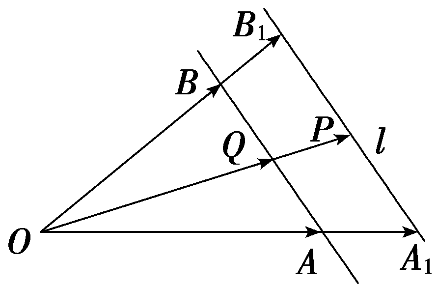

容易得到等和线的几个结论：

（1）当等和线恰为直线*AB*时，*k*＝1.

（2）当等和线在*O*点和直线*AB*之间时，*k*∈(0，1).

（3）当直线*AB*在点*O*和等和线之间时，*k*∈(1，＋*∞*).

（4）当等和线过*O*点时，*k*＝0.

（5）若两等和线关于<em>O</em>点对称，则它们对应的定值<em>k</em>1，<em>k</em>2互为相反数.

（6）定值*k*的变化与等和线到*O*点的距离成正比.

(一题多解)给定两个长度为1的平面向量 $\vec{OA}$ 和 $\vec{OB}$ ，它们的夹角为120°，如图，点&lt;te&lt;te&lt;te&lt;text st<em>y</em>le="italic"&gt;x&lt;/text&gt;t st<em>y</em>le="italic"&gt;x&lt;/text&gt;t st<em>y</em>le="italic"&gt;x&lt;/text&gt;t style="italic"&gt;C&lt;/text&gt;在以<em>O</em>为圆心的 $\overparen{AB}$ 上运动，若 $\vec{OC}$ ＝&lt;te&lt;te&lt;text st<em>y</em>le="italic"&gt;x&lt;/text&gt;t st<em>y</em>le="italic"&gt;x&lt;/text&gt;t st<em>y</em>le="italic"&gt;x&lt;/text&gt; $\vec{OA}$ ＋&lt;te&lt;te&lt;text st<em>y</em>le="italic"&gt;x&lt;/text&gt;t st<em>y</em>le="italic"&gt;x&lt;/text&gt;t style="italic"&gt;y&lt;/text&gt; $\vec{OB}$ ，其中&lt;te&lt;te&lt;text st<em>y</em>le="italic"&gt;x&lt;/text&gt;t st<em>y</em>le="italic"&gt;x&lt;/text&gt;t st<em>y</em>le="italic"&gt;x&lt;/text&gt;，y∈<strong>R</strong>，则x＋y的最大值是<u>　　　　</u>.

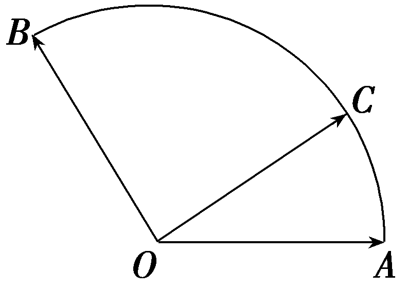

答案2

解析法一：由已知可设<te<te<te<te<text st*y*le="italic">x</text>t st*y*le="italic">x</text>t st*y*le="italic">x</text>t style="italic">x</text>t style="italic">*OA*</text>为x轴的正半轴，O为坐标原点，建立直角坐标系(图略).其中A(1，0)，*B* $\left(－\frac{1}{2}，\frac{\sqrt{3}}{2}\right)$ ，令∠<te<te<te<text st*y*le="italic">x</text>t st*y*le="italic">x</text>t st*y*le="italic">x</text>t style="italic">A</text>*O*C＝*<text style="italic"><text style="italic"><text style="italic"><text style="italic"><text style="italic"><text style="italic"><text style="italic"><text style="italic"><text style="italic"><text style="italic"><text style="italic">θ*</text></text></text></text></text></text></text></text></text></text></text>，0≤θ≤ $\frac{2\pi }{3}$ ，则有 $\vec{OC}$ ＝ $\left(cos\theta ，sin\theta \right)$ ＝<te<te<te<text st*y*le="italic">x</text>t st*y*le="italic">x</text>t st*y*le="italic">x</text>t style="italic">x</text> $\left(1，0\right)$ ＋<te<te<text st*y*le="italic">x</text>t st*y*le="italic">x</text>t style="italic">y</text>(－ $\frac{1}{2}$ ， $\frac{\sqrt{3}}{2}$ )，即 $\left\{\begin{matrix}x－\frac{y}{2}＝cos\theta ，\\\frac{\sqrt{3}}{2}y＝sin\theta ，\end{matrix}\right.$ 得<te<te<te<text st*y*le="italic">x</text>t st*y*le="italic">x</text>t st*y*le="italic">x</text>t style="italic">x</text>＝ $\frac{\sqrt{3}}{3}$ sin <te<te<te<text st*y*le="italic">x</text>t st*y*le="italic">x</text>t st*y*le="italic">x</text>t style="italic">*<text style="italic"><text style="italic"><text style="italic"><text style="italic"><text style="italic"><text style="italic"><text style="italic"><text style="italic"><text style="italic"><text style="italic">θ*</text></text></text></text></text></text></text></text></text></text></text>＋cos θ，y＝ $\frac{2\sqrt{3}}{3}$ sin <te<te<te<text st*y*le="italic">x</text>t st*y*le="italic">x</text>t st*y*le="italic">x</text>t style="italic">*<text style="italic"><text style="italic"><text style="italic"><text style="italic"><text style="italic"><text style="italic"><text style="italic"><text style="italic"><text style="italic"><text style="italic">θ*</text></text></text></text></text></text></text></text></text></text></text>，*x*＋y＝ $\frac{\sqrt{3}}{3}$ sin <te<te<te<text st*y*le="italic">x</text>t st*y*le="italic">x</text>t st*y*le="italic">x</text>t style="italic">*<text style="italic"><text style="italic"><text style="italic"><text style="italic"><text style="italic"><text style="italic"><text style="italic"><text style="italic"><text style="italic"><text style="italic">θ*</text></text></text></text></text></text></text></text></text></text></text>＋cos θ＋ $\frac{2\sqrt{3}}{3}$ sin <te<te<te<text st*y*le="italic">x</text>t st*y*le="italic">x</text>t st*y*le="italic">x</text>t style="italic">*<text style="italic"><text style="italic"><text style="italic"><text style="italic"><text style="italic"><text style="italic"><text style="italic"><text style="italic"><text style="italic"><text style="italic">θ*</text></text></text></text></text></text></text></text></text></text></text>＝ $\sqrt{3}$ sin <te<te<te<text st*y*le="italic">x</text>t st*y*le="italic">x</text>t st*y*le="italic">x</text>t style="italic">*<text style="italic"><text style="italic"><text style="italic"><text style="italic"><text style="italic"><text style="italic"><text style="italic"><text style="italic"><text style="italic"><text style="italic">θ*</text></text></text></text></text></text></text></text></text></text></text>＋cos θ＝2sin $\left(\theta ＋\frac{\pi }{6}\right)$ ，其中0≤<te<te<te<text st*y*le="italic">x</text>t st*y*le="italic">x</text>t st*y*le="italic">x</text>t style="italic">*<text style="italic"><text style="italic"><text style="italic"><text style="italic"><text style="italic"><text style="italic"><text style="italic"><text style="italic"><text style="italic"><text style="italic">θ*</text></text></text></text></text></text></text></text></text></text></text>≤ $\frac{2\pi }{3}$ ，所以 $\left(x＋y\right)_{max}$ ＝2，当且仅当<te<te<te<text st*y*le="italic">x</text>t st*y*le="italic">x</text>t st*y*le="italic">x</text>t style="italic">*<text style="italic"><text style="italic"><text style="italic"><text style="italic"><text style="italic"><text style="italic"><text style="italic"><text style="italic"><text style="italic"><text style="italic">θ*</text></text></text></text></text></text></text></text></text></text></text>＝ $\frac{\pi }{3}$ 时取得.

法二：如图，连接<<<<<<<te<te<text st*y*le="italic">x</text>t st*y*le="italic">x</text>t style="italic">t</text>ext style="italic">t</text>ext style="italic">t</text>ext style="italic">t</text>e<te<text st*y*le="italic">x</text>t st<text s*ty*le="italic">y</text>le="italic">x</text>t style="italic">t</text>e<text st*y*le="italic">x</text>t style="italic">t</text>ext style="italic">*<text style="italic">A*</text>*<text style="italic">B*</text></text>交*OC*于点*<text style="italic"><text style="italic">D*</text></text>，设 $\vec{OD}$ ＝<<<<<<te<te<text st*y*le="italic">x</text>t st*y*le="italic">x</text>t style="italic">t</text>ext style="italic">t</text>ext style="italic">t</text>ext style="italic">t</text>e<te<text st*y*le="italic">x</text>t st<text s*ty*le="italic">y</text>le="italic">x</text>t style="italic">t</text>e<text st*y*le="italic">x</text>t style="italic">t</text> $\vec{OC}$ ，由于 $\vec{OC}$ ＝<<<<<<te<te<text st*y*le="italic">x</text>t st*y*le="italic">x</text>t style="italic">t</text>ext style="italic">t</text>ext style="italic">t</text>ext style="italic">t</text>e<te<text st*y*le="italic">x</text>t st<text s*ty*le="italic">y</text>le="italic">x</text>t style="italic">t</text>ext st*y*le="italic">x</text> $\vec{OA}$ ＋<<<<<<te<te<text st*y*le="italic">x</text>t st*y*le="italic">x</text>t style="italic">t</text>ext style="italic">t</text>ext style="italic">t</text>ext style="italic">t</text>e<te<text st*y*le="italic">x</text>t st<text s*ty*le="italic">y</text>le="italic">x</text>t style="italic">t</text>ext style="italic">y</text> $\vec{OB}$ ，所以 $\vec{OD}$ ＝<<<<<<te<te<text st*y*le="italic">x</text>t st*y*le="italic">x</text>t style="italic">t</text>ext style="italic">t</text>ext style="italic">t</text>ext style="italic">t</text>e<te<text st*y*le="italic">x</text>t st<text s*ty*le="italic">y</text>le="italic">x</text>t style="italic">t</text>e<text st*y*le="italic">x</text>t style="italic">t</text>(x $\vec{OA}$ ＋<<<<<<te<te<text st*y*le="italic">x</text>t st*y*le="italic">x</text>t style="italic">t</text>ext style="italic">t</text>ext style="italic">t</text>ext style="italic">t</text>e<te<text st*y*le="italic">x</text>t st<text s*ty*le="italic">y</text>le="italic">x</text>t style="italic">t</text>ext style="italic">y</text> $\vec{OB}$ ).因为<<<<<<<te<te<text st*y*le="italic">x</text>t st*y*le="italic">x</text>t style="italic">t</text>ext style="italic">t</text>ext style="italic">t</text>ext style="italic">t</text>e<te<text st*y*le="italic">x</text>t st<text s*ty*le="italic">y</text>le="italic">x</text>t style="italic">t</text>e<text st*y*le="italic">x</text>t style="italic">t</text>ext style="italic">*<text style="italic">D*</text></text>，*<text style="italic">A*</text>，*<text style="italic">B*</text>三点在同一直线上，所以*tx*＋ty＝1，x＋y＝ $\frac{1}{t}$ ，由于｜ $\vec{OD}$ ｜＝<<<<<<te<te<text st*y*le="italic">x</text>t st*y*le="italic">x</text>t style="italic">t</text>ext style="italic">t</text>ext style="italic">t</text>ext style="italic">t</text>e<te<text st*y*le="italic">x</text>t st<text s*ty*le="italic">y</text>le="italic">x</text>t style="italic">t</text>e<text st*y*le="italic">x</text>t style="italic">t</text>｜ $\vec{OC}$ ｜＝<<<<<<te<te<text st*y*le="italic">x</text>t st*y*le="italic">x</text>t style="italic">t</text>ext style="italic">t</text>ext style="italic">t</text>ext style="italic">t</text>e<te<text st*y*le="italic">x</text>t st<text s*ty*le="italic">y</text>le="italic">x</text>t style="italic">t</text>e<text st*y*le="italic">x</text>t style="italic">t</text>，当O*<text style="italic"><text style="italic">D*</text></text>⊥*<text style="italic"><text style="italic">A*</text>*<text style="italic">B*</text></text>时t取到最小值 $\frac{1}{2}$ ，当点<<<<<<<te<te<text st*y*le="italic">x</text>t st*y*le="italic">x</text>t style="italic">t</text>ext style="italic">t</text>ext style="italic">t</text>ext style="italic">t</text>e<te<text st*y*le="italic">x</text>t st<text s*ty*le="italic">y</text>le="italic">x</text>t style="italic">t</text>e<text st*y*le="italic">x</text>t style="italic">t</text>ext style="italic">*<text style="italic">D*</text></text>与点*<text style="italic">A*</text>或点*<text style="italic">B*</text>重合时t取到最大值1，故1≤x＋y≤2.故x＋y的最大值为2.

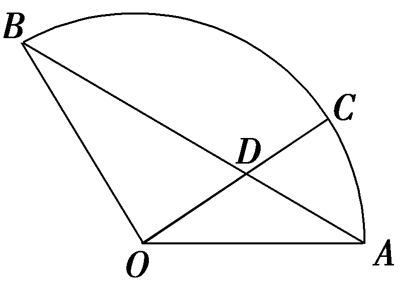

法三(等和线法)：连接&lt;te&lt;text st<em>y</em>le="italic"&gt;x&lt;/text&gt;t sty&lt;text sty&lt;text sty<em>l</em>e="italic"&gt;l&lt;/text&gt;e="italic"&gt;l&lt;/text&gt;e="italic"&gt;<em>AB</em>&lt;/text&gt;，过<em>&lt;text style="italic"&gt;C</em>&lt;/text&gt;作直线l∥AB，则直线l为以 $\vec{OA}$ ， $\vec{OB}$ 为基底的平面向量基本定理系数的等和线，显然当&lt;te&lt;text st<em>y</em>le="italic"&gt;x&lt;/text&gt;t sty&lt;text sty<em>l</em>e="italic"&gt;l&lt;/text&gt;e="italic"&gt;l&lt;/text&gt;与圆弧相切于<em>&lt;text style="italic"&gt;C</em>&lt;/text&gt;1时，定值最大，因为∠<em>AOB</em>＝120°，所以 $\vec{OC_{1}}$ ＝ $\vec{OA}$ ＋ $\vec{OB}$ ，所以&lt;text st<em>y</em>le="italic"&gt;x&lt;/text&gt;＋y的最大值为2.

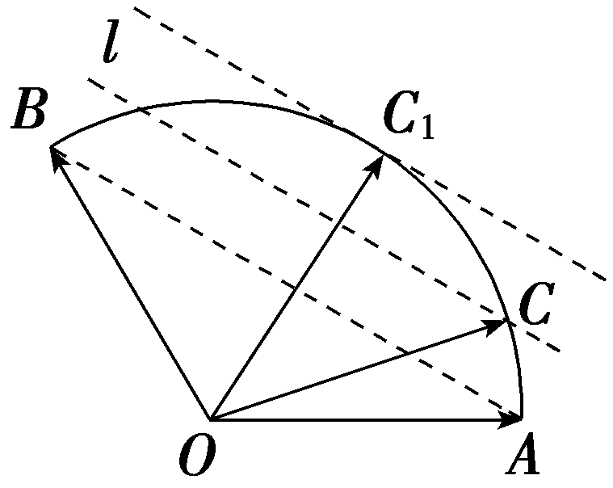

##### 1.在利用等和线定理求解两系数的线性关系式的值时，需要先通过变换基向量，使得需要研究的代数式为基的系数和，再去找基向量的等和线，转化为线段比例关系求解.

##### 2.要注意等和(高)线定理的形式，解题时一般要先找到*k*＝1时的等和(高)线，以此来求其他的等和(高)线.

对点练1.如图，圆&lt;te&lt;te&lt;te&lt;text st<em>y</em>le="italic"&gt;x&lt;/text&gt;t st<em>y</em>le="italic"&gt;x&lt;/text&gt;t st<em>y</em>le="italic"&gt;x&lt;/text&gt;t style="italic"&gt;O&lt;/text&gt;是边长为2 $\sqrt{3}$ 的等边△&lt;te&lt;te&lt;te&lt;text st<em>y</em>le="italic"&gt;x&lt;/text&gt;t st<em>y</em>le="italic"&gt;x&lt;/text&gt;t st<em>y</em>le="italic"&gt;x&lt;/text&gt;t style="italic"&gt;A<em>BC</em>&lt;/text&gt;的内切圆，其与BC边相切于点<em>D</em>，点<em>M</em>为圆上任意一点， $\vec{BM}$ ＝&lt;te&lt;te&lt;text st<em>y</em>le="italic"&gt;x&lt;/text&gt;t st<em>y</em>le="italic"&gt;x&lt;/text&gt;t st<em>y</em>le="italic"&gt;x&lt;/text&gt; $\vec{BA}$ ＋&lt;te&lt;te&lt;text st<em>y</em>le="italic"&gt;x&lt;/text&gt;t st<em>y</em>le="italic"&gt;x&lt;/text&gt;t style="italic"&gt;y&lt;/text&gt; $\vec{BD}$ (&lt;te&lt;te&lt;text st<em>y</em>le="italic"&gt;x&lt;/text&gt;t st<em>y</em>le="italic"&gt;x&lt;/text&gt;t st<em>y</em>le="italic"&gt;x&lt;/text&gt;，y∈<strong>R</strong>)，则2x＋y的最大值为(　　 )

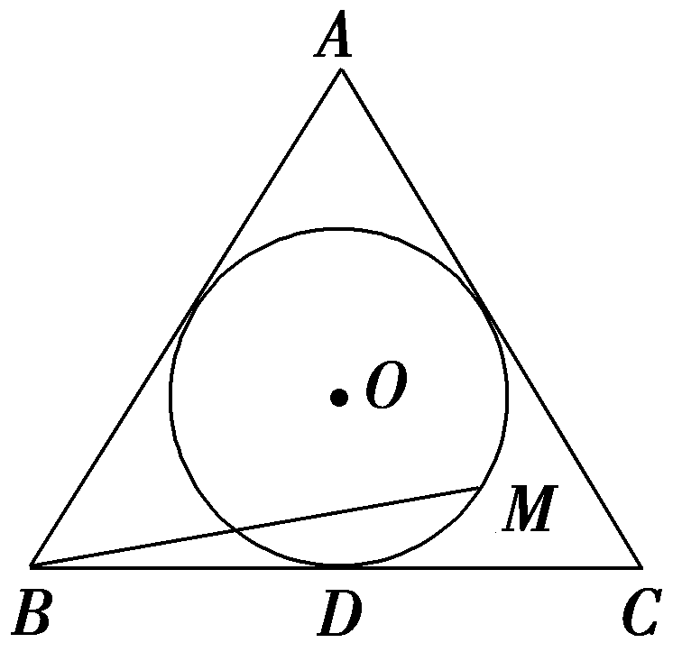

$\quad$A. $\sqrt{2}$ 	
$\quad$B. $\sqrt{3}$

$\quad$C.2	
$\quad$D.2 $\sqrt{2}$

答案C

解析设圆<te<te<te<te<te<text st*y*le="italic">x</text>t st*y*le="italic">x</text>t st*y*le="italic">x</text>t st*y*le="italic">x</text>t st<text st*y*le="italic">y</text>le="italic">x</text>t style="italic">O</text>与*AB*，*<text style="italic">AC*</text>边相切于点*E*，*<text style="italic">N*</text>，由题知 $\vec{BM}$ ＝<te<te<te<te<text st*y*le="italic">x</text>t st*y*le="italic">x</text>t st*y*le="italic">x</text>t st*y*le="italic">x</text>t st<text st*y*le="italic">y</text>le="italic">x</text> $\vec{BA}$ ＋<te<te<te<te<text st*y*le="italic">x</text>t st*y*le="italic">x</text>t st*y*le="italic">x</text>t st*y*le="italic">x</text>t st*y*le="italic">y</text> $\vec{BD}$ ＝2<te<te<te<te<text st*y*le="italic">x</text>t st*y*le="italic">x</text>t st*y*le="italic">x</text>t st*y*le="italic">x</text>t st<text st*y*le="italic">y</text>le="italic">x</text>· $\frac{1}{2}\vec{BA}$ ＋<te<te<te<te<text st*y*le="italic">x</text>t st*y*le="italic">x</text>t st*y*le="italic">x</text>t st*y*le="italic">x</text>t st*y*le="italic">y</text> $\vec{BD}$ ＝2<te<te<te<te<text st*y*le="italic">x</text>t st*y*le="italic">x</text>t st*y*le="italic">x</text>t st*y*le="italic">x</text>t st<text st*y*le="italic">y</text>le="italic">x</text> $\vec{BE}$ ＋<te<te<te<te<text st*y*le="italic">x</text>t st*y*le="italic">x</text>t st*y*le="italic">x</text>t st*y*le="italic">x</text>t st*y*le="italic">y</text> $\vec{BD}$ ，如图，作出定值<te<te<te<text st*y*le="italic">x</text>t st*y*le="italic">x</text>t st*y*le="italic">x</text>t style="italic">*<text style="italic">k*</text></text>为1的等和线D<te<te<text st*y*le="italic">x</text>t st<text st*y*le="italic">y</text>le="italic">x</text>t style="italic">E</text>，*<text style="italic">DE*</text>与B*O*相交于点*P*，*<text style="italic">AC*</text>是过圆上的点最远的等和线，当*M*在*<text style="italic">N*</text>点所在的位置时，2x＋y最大，设2x＋y＝k，则k＝ $\frac{｜\vec{NB}｜}{｜\vec{PB}｜}$ ＝2，所以2<te<te<te<te<text st*y*le="italic">x</text>t st*y*le="italic">x</text>t st*y*le="italic">x</text>t st*y*le="italic">x</text>t st<text st*y*le="italic">y</text>le="italic">x</text>＋y的最大值为2.故选C.

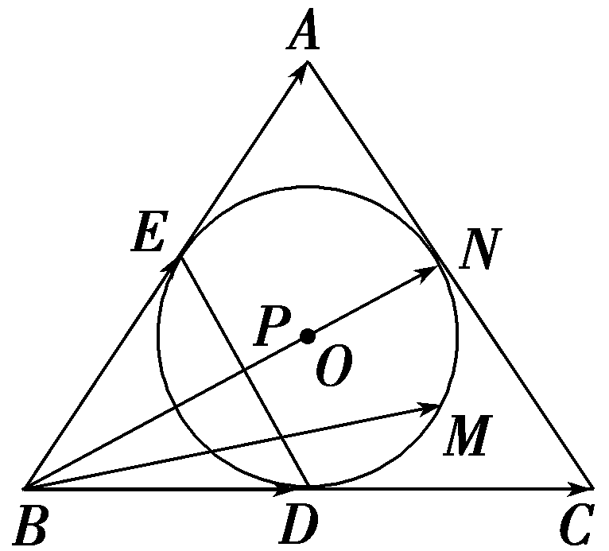

对点练2.如图，在△<em>A&lt;text style="italic"&gt;&lt;text style="italic"&gt;BC</em>&lt;/text&gt;&lt;/text&gt;中，<em>H</em>为BC上异于B，C的任一点，<em>M</em>为<em>AH</em>的中点，若 $\vec{AM}$ ＝<em>&lt;text style="italic"&gt;λ</em>&lt;/text&gt; $\vec{AB}$ ＋<em>&lt;text style="italic"&gt;μ</em>&lt;/text&gt; $\vec{AC}$ ，则<em>&lt;text style="italic"&gt;λ</em>&lt;/text&gt;＋<em>&lt;text style="italic"&gt;μ</em>&lt;/text&gt;＝<u>　　　　</u>.

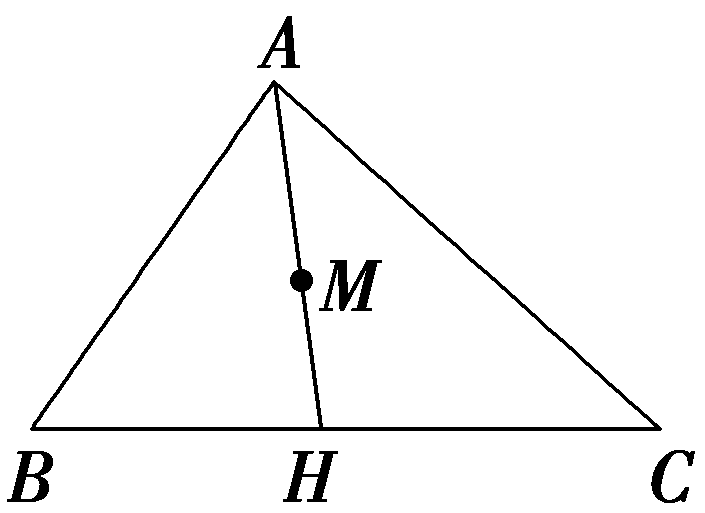

答案 $\frac{1}{2}$

解析由等和线定理可知*λ*＋*μ*＝ $\frac{AM}{AH}$ ＝ $\frac{1}{2}$ .

### 题型二　极化恒等式

##### 1.证明过程：如图，设 $\vec{AB}$ ＝<text style="<text style="<text style="*b*old,it*a*lic">b</text>old,it*a*lic">b</text>old,italic">a</text>， $\vec{AD}$ ＝<text style="<text style="*b*old,it*a*lic">b</text>old,it*a*lic">b</text>，则 $\vec{AC}$ ＝<text style="<text style="<text style="*b*old,it*a*lic">b</text>old,it*a*lic">b</text>old,italic">a</text>＋b， $\vec{DB}$ ＝<text style="<text style="<text style="*b*old,it*a*lic">b</text>old,it*a*lic">b</text>old,italic">a</text>－b.

｜ $\vec{AC}$ ｜&lt;text style="superscript"&gt;&lt;text style="superscript"&gt;2&lt;/text&gt;&lt;/text&gt;＝ $\left(a＋b\right)^{2}$ ＝｜&lt;text style="&lt;text style="<em><strong>b</strong></em>old,italic"&gt;b&lt;/text&gt;old,it<em><strong>a</strong></em>lic"&gt;a&lt;/text&gt;｜&lt;text style="superscript"&gt;&lt;text style="superscript"&gt;2&lt;/text&gt;&lt;/text&gt;＋2a·b＋｜b｜2，

｜ $\vec{DB}$ ｜&lt;text style="superscript"&gt;&lt;text style="superscript"&gt;2&lt;/text&gt;&lt;/text&gt;＝ $\left(a－b\right)^{2}$ ＝｜&lt;text style="&lt;text style="<em><strong>b</strong></em>old,italic"&gt;b&lt;/text&gt;old,it<em><strong>a</strong></em>lic"&gt;a&lt;/text&gt;｜&lt;text style="superscript"&gt;&lt;text style="superscript"&gt;2&lt;/text&gt;&lt;/text&gt;－2a·b＋｜b｜2，

两式相减得<text style="*b*old,italic">a</text>·b＝ $\frac{1}{4}\left[\left(a＋b\right)^{2}－\left(a－b\right)^{2}\right]$ ，此式即为极化恒等式.

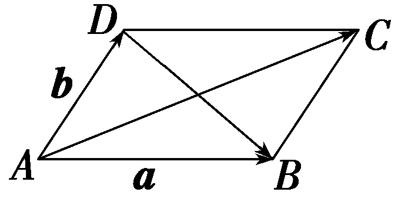

##### 2.几何意义：向量的数量积可以表示为以这组向量为邻边的平行四边形的“和对角线长”与“差对角线长”平方差的 $\frac{1}{4}$ .

##### 3.常见结论：

（1）三角形模式：如图，在△*A<text style="italic">BC* </text>中，若*M* 是BC 的中点，则 $\vec{AB}$ · $\vec{AC}$ ＝ $\vec{AM}^{2}$ － $\frac{1}{4}\vec{BC}^{2}$  .

(&lt;text style="superscript"&gt;&lt;text style="superscript"&gt;2&lt;/text&gt;&lt;/text&gt;)平行四边形模式：在<em>☐ABCD</em> 中，<em>O</em> 为<em>AC</em>，<em>BD</em> 的交点，则有 $\vec{AB}$ · $\vec{AD}$ ＝ $\frac{1}{4}$ (4｜ $\vec{AO}$ ｜&lt;text style="superscript"&gt;&lt;text style="superscript"&gt;2&lt;/text&gt;&lt;/text&gt;－4｜ $\vec{OB}$ ｜&lt;text style="superscript"&gt;&lt;text style="superscript"&gt;2&lt;/text&gt;&lt;/text&gt;)＝｜ $\vec{AO}$ ｜&lt;text style="superscript"&gt;&lt;text style="superscript"&gt;2&lt;/text&gt;&lt;/text&gt;－｜ $\vec{OB}$ ｜&lt;text style="superscript"&gt;&lt;text style="superscript"&gt;2&lt;/text&gt;&lt;/text&gt; .

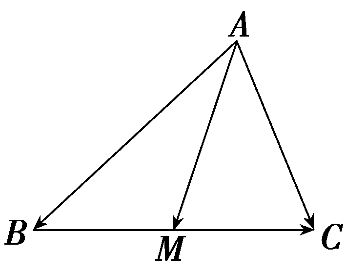

角度1　求值

（1）如图所示，在长方形<em>&lt;text style="italic"&gt;AB</em>CD&lt;/text&gt;中，AB＝4 $\sqrt{5}$ ，<em>AD</em>＝8，<em>E</em>，<em>O</em>，<em>F</em>为线段<em>BD</em>的四等分点，则 $\vec{AE}$ · $\vec{AF}$ ＝<u>　　　　</u>.

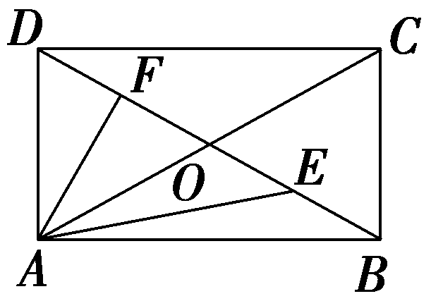

（2）如图，在△<em>A&lt;text style="italic"&gt;BC</em>&lt;/text&gt;中，<em>D</em>是BC的中点，<em>E</em>，<em>F</em>是<em>AD</em>上的两个三等分点. $\vec{BA}$ · $\vec{CA}$ ＝4， $\vec{BF}$ · $\vec{CF}$ ＝－1，则 $\vec{BE}$ · $\vec{CE}$ 的值为<u>　　　　</u>.

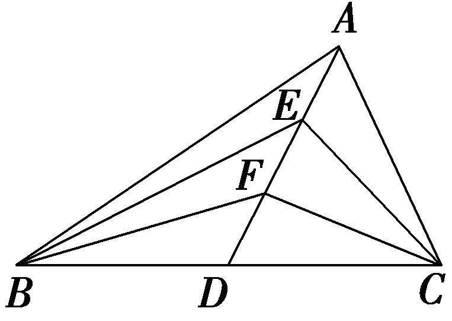

答案（1）27　（2） $\frac{7}{8}$

解析（1）*BD*＝ $\sqrt{AB^{2}＋AD^{2}}$ ＝12，所以*AO*＝6，*OE*＝3，所以由极化恒等式知 $\vec{AE}$ *·* $\vec{AF}$ ＝ $\vec{AO}^{2}$ － $\vec{OE}^{2}$ ＝36－9＝27.

(&lt;text style="superscript"&gt;&lt;text style="superscript"&gt;&lt;text style="superscript"&gt;&lt;text style="superscript"&gt;&lt;text style="superscript"&gt;&lt;text style="superscript"&gt;&lt;text style="superscript"&gt;2&lt;/text&gt;&lt;/text&gt;&lt;/text&gt;&lt;/text&gt;&lt;/text&gt;&lt;/text&gt;&lt;/text&gt;)设<em>BD</em>＝<em>DC</em>＝<em>&lt;text style="italic"&gt;&lt;text style="italic"&gt;&lt;text style="italic"&gt;&lt;text style="italic"&gt;m</em>&lt;/text&gt;&lt;/text&gt;&lt;/text&gt;&lt;/text&gt;，<em>AE</em>＝<em>EF</em>＝<em>FD</em>＝<em>&lt;text style="italic"&gt;&lt;text style="italic"&gt;&lt;text style="italic"&gt;&lt;text style="italic"&gt;&lt;text style="italic"&gt;n</em>&lt;/text&gt;&lt;/text&gt;&lt;/text&gt;&lt;/text&gt;&lt;/text&gt;，则<em>AD</em>＝3n.根据向量的极化恒等式，得 $\vec{AB}$ <em>&lt;text style="italic"&gt;·</em>&lt;/text&gt; $\vec{AC}$ ＝ $\vec{AD}^{2}$ － $\vec{DB}^{2}$ ＝9<em>&lt;text style="italic"&gt;&lt;text style="italic"&gt;&lt;text style="italic"&gt;&lt;text style="italic"&gt;&lt;text style="italic"&gt;n</em>&lt;/text&gt;&lt;/text&gt;&lt;/text&gt;&lt;/text&gt;&lt;/text&gt;&lt;text style="superscript"&gt;&lt;text style="superscript"&gt;&lt;text style="superscript"&gt;&lt;text style="superscript"&gt;&lt;text style="superscript"&gt;&lt;text style="superscript"&gt;&lt;text style="superscript"&gt;2&lt;/text&gt;&lt;/text&gt;&lt;/text&gt;&lt;/text&gt;&lt;/text&gt;&lt;/text&gt;&lt;/text&gt;－<em>&lt;text style="italic"&gt;&lt;text style="italic"&gt;&lt;text style="italic"&gt;&lt;text style="italic"&gt;m</em>&lt;/text&gt;&lt;/text&gt;&lt;/text&gt;&lt;/text&gt;2＝4①， $\vec{FB}$ <em>&lt;text style="italic"&gt;·</em>&lt;/text&gt; $\vec{FC}$ ＝ $\vec{FD}^{2}$ － $\vec{DB}^{2}$ ＝<em>&lt;text style="italic"&gt;&lt;text style="italic"&gt;&lt;text style="italic"&gt;&lt;text style="italic"&gt;&lt;text style="italic"&gt;n</em>&lt;/text&gt;&lt;/text&gt;&lt;/text&gt;&lt;/text&gt;&lt;/text&gt;&lt;text style="superscript"&gt;&lt;text style="superscript"&gt;&lt;text style="superscript"&gt;&lt;text style="superscript"&gt;&lt;text style="superscript"&gt;&lt;text style="superscript"&gt;&lt;text style="superscript"&gt;2&lt;/text&gt;&lt;/text&gt;&lt;/text&gt;&lt;/text&gt;&lt;/text&gt;&lt;/text&gt;&lt;/text&gt;－<em>&lt;text style="italic"&gt;&lt;text style="italic"&gt;&lt;text style="italic"&gt;&lt;text style="italic"&gt;m</em>&lt;/text&gt;&lt;/text&gt;&lt;/text&gt;&lt;/text&gt;2＝－1②，联立①②，解得n2＝ $\frac{5}{8}$ ，<em>&lt;text style="italic"&gt;&lt;text style="italic"&gt;&lt;text style="italic"&gt;&lt;text style="italic"&gt;m</em>&lt;/text&gt;&lt;/text&gt;&lt;/text&gt;&lt;/text&gt;&lt;text style="superscript"&gt;&lt;text style="superscript"&gt;&lt;text style="superscript"&gt;&lt;text style="superscript"&gt;&lt;text style="superscript"&gt;&lt;text style="superscript"&gt;&lt;text style="superscript"&gt;2&lt;/text&gt;&lt;/text&gt;&lt;/text&gt;&lt;/text&gt;&lt;/text&gt;&lt;/text&gt;&lt;/text&gt;＝ $\frac{13}{8}$ .因此 $\vec{EB}$ <em>&lt;text style="italic"&gt;·</em>&lt;/text&gt; $\vec{EC}$ ＝ $\vec{ED}^{2}$ － $\vec{DB}^{2}$ ＝4<em>&lt;text style="italic"&gt;&lt;text style="italic"&gt;&lt;text style="italic"&gt;&lt;text style="italic"&gt;&lt;text style="italic"&gt;n</em>&lt;/text&gt;&lt;/text&gt;&lt;/text&gt;&lt;/text&gt;&lt;/text&gt;&lt;text style="superscript"&gt;&lt;text style="superscript"&gt;&lt;text style="superscript"&gt;&lt;text style="superscript"&gt;&lt;text style="superscript"&gt;&lt;text style="superscript"&gt;&lt;text style="superscript"&gt;2&lt;/text&gt;&lt;/text&gt;&lt;/text&gt;&lt;/text&gt;&lt;/text&gt;&lt;/text&gt;&lt;/text&gt;－<em>&lt;text style="italic"&gt;&lt;text style="italic"&gt;&lt;text style="italic"&gt;&lt;text style="italic"&gt;m</em>&lt;/text&gt;&lt;/text&gt;&lt;/text&gt;&lt;/text&gt;2＝ $\frac{7}{8}$ .即 $\vec{BE}$ <em>&lt;text style="italic"&gt;·</em>&lt;/text&gt; $\vec{CE}$ ＝ $\frac{7}{8}$ .

角度2　求最值或范围

（1）(一题多解)已知△*<text style="italic">ABC* </text>是边长为2的等边三角形，*P* 为平面ABC 内一点，则 $\vec{PA}$ ·( $\vec{PB}$ ＋ $\vec{PC}$ ) 的最小值是(　　)

$\quad$A.－2	
$\quad$B.－ $\frac{3}{2}$

$\quad$C.－ $\frac{4}{3}$ 	
$\quad$D.－1

（2）(2025·河南郑州、开封重点中学联考)如图所示，△<em>A&lt;text style="italic"&gt;B</em>C&lt;/text&gt;是边长为8的等边三角形，点<em>P</em>为<em>AC</em>边上的一个动点，长度为6的线段<em>EF</em>的中点为点B，则 $\vec{PE}$ · $\vec{PF}$ 的取值范围是<u>　　　　</u>.

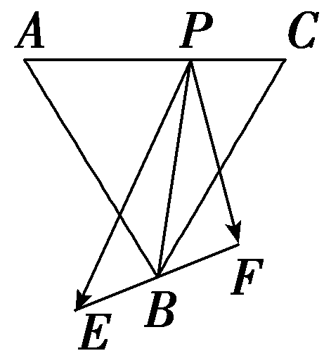

答案（1）B　（2） $\left[39，55\right]$

解析（1）法一：如图，取&lt;text style="italic"&gt;BC &lt;/text&gt;的中点<em>D</em>，则 $\vec{PB}$ ＋ $\vec{PC}$ ＝&lt;text style="superscript"&gt;&lt;text style="superscript"&gt;2&lt;/text&gt;&lt;/text&gt; $\vec{PD}$ ，则 $\vec{PA}$ &lt;text style="italic"&gt;·&lt;/text&gt;( $\vec{PB}$ ＋ $\vec{PC}$ )＝&lt;text style="superscript"&gt;&lt;text style="superscript"&gt;2&lt;/text&gt;&lt;/text&gt; $\vec{PA}$ &lt;text style="italic"&gt;·&lt;/text&gt; $\vec{PD}$ ，在△&lt;text style="italic"&gt;P&lt;/text&gt;A<em>D</em> 中，取<em>AD</em> 的中点<em>O</em>，则&lt;text style="superscript"&gt;&lt;text style="superscript"&gt;2&lt;/text&gt;&lt;/text&gt; $\vec{PA}$ &lt;text style="italic"&gt;·&lt;/text&gt; $\vec{PD}$ ＝&lt;text style="superscript"&gt;&lt;text style="superscript"&gt;2&lt;/text&gt;&lt;/text&gt;｜ $\vec{PO}$ ｜&lt;text style="superscript"&gt;&lt;text style="superscript"&gt;2&lt;/text&gt;&lt;/text&gt;－ $\frac{1}{2}$ ｜ $\vec{AD}$ ｜&lt;text style="superscript"&gt;&lt;text style="superscript"&gt;2&lt;/text&gt;&lt;/text&gt;＝2｜ $\vec{PO}$ ｜&lt;text style="superscript"&gt;&lt;text style="superscript"&gt;2&lt;/text&gt;&lt;/text&gt;－ $\frac{3}{2}$ ，由于点&lt;text style="italic"&gt;<em>P</em> &lt;/text&gt;在平面内是任意的，因此当且仅当点P，<em>O</em> 重合时， $\left|\vec{PO}\right|$  取得最小值，即&lt;text style="superscript"&gt;&lt;text style="superscript"&gt;2&lt;/text&gt;&lt;/text&gt; $\vec{PA}$ &lt;text style="italic"&gt;·&lt;/text&gt; $\vec{PD}$  取得最小值－ $\frac{3}{2}$  .故选B.

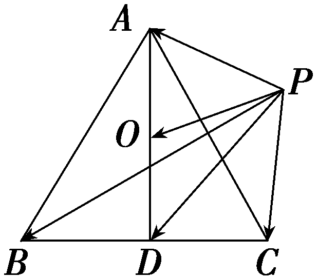

法二：如图，以等边三角形&lt;te&lt;te&lt;te&lt;te&lt;te&lt;te&lt;te&lt;te&lt;text st<em>y</em>le="italic"&gt;x&lt;/text&gt;t st<em>y</em>le="italic"&gt;x&lt;/text&gt;t st<em>y</em>le="italic"&gt;x&lt;/text&gt;t st<em>y</em>le="italic"&gt;x&lt;/text&gt;t style="italic"&gt;x&lt;/text&gt;t st<em>y</em>le="italic"&gt;x&lt;/text&gt;t st<em>y</em>le="italic"&gt;x&lt;/text&gt;t st<em>y</em>le="italic"&gt;x&lt;/text&gt;t style="italic"&gt;<em>A&lt;text style="italic"&gt;&lt;text style="italic"&gt;&lt;text style="italic"&gt;BC</em> &lt;/text&gt;&lt;/text&gt;&lt;/text&gt;&lt;/text&gt;的底边BC 的中点<em>O</em> 为坐标原点，BC 所在直线为<em>x</em> 轴，BC 的垂直平分线为<em>&lt;text style="italic"&gt;y</em> &lt;/text&gt;轴建立平面直角坐标系，则A(0， $\sqrt{3}$ )，&lt;te&lt;te&lt;te&lt;te&lt;te&lt;te&lt;te&lt;te&lt;text st<em>y</em>le="italic"&gt;x&lt;/text&gt;t st<em>y</em>le="italic"&gt;x&lt;/text&gt;t st<em>y</em>le="italic"&gt;x&lt;/text&gt;t st<em>y</em>le="italic"&gt;x&lt;/text&gt;t style="italic"&gt;x&lt;/text&gt;t st<em>y</em>le="italic"&gt;x&lt;/text&gt;t st<em>y</em>le="italic"&gt;x&lt;/text&gt;t st<em>y</em>le="italic"&gt;x&lt;/text&gt;t style="italic"&gt;B&lt;/text&gt;(－1，0)，<em>C</em>(1，0) .设<em>P</em>(x，y)，则 $\vec{PA}$ ＝(－&lt;te&lt;te&lt;te&lt;te&lt;te&lt;te&lt;te&lt;text st<em>y</em>le="italic"&gt;x&lt;/text&gt;t st<em>y</em>le="italic"&gt;x&lt;/text&gt;t st<em>y</em>le="italic"&gt;x&lt;/text&gt;t st<em>y</em>le="italic"&gt;x&lt;/text&gt;t style="italic"&gt;x&lt;/text&gt;t st<em>y</em>le="italic"&gt;x&lt;/text&gt;t st<em>y</em>le="italic"&gt;x&lt;/text&gt;t st<em>y</em>le="italic"&gt;x&lt;/text&gt;， $\sqrt{3}$ －&lt;te&lt;te&lt;te&lt;te&lt;te&lt;te&lt;te&lt;text st<em>y</em>le="italic"&gt;x&lt;/text&gt;t st<em>y</em>le="italic"&gt;x&lt;/text&gt;t st<em>y</em>le="italic"&gt;x&lt;/text&gt;t st<em>y</em>le="italic"&gt;x&lt;/text&gt;t style="italic"&gt;x&lt;/text&gt;t st<em>y</em>le="italic"&gt;x&lt;/text&gt;t st<em>y</em>le="italic"&gt;x&lt;/text&gt;t style="italic"&gt;y&lt;/text&gt;)， $\vec{PB}$ ＝(－1－&lt;te&lt;te&lt;te&lt;te&lt;te&lt;te&lt;te&lt;text st<em>y</em>le="italic"&gt;x&lt;/text&gt;t st<em>y</em>le="italic"&gt;x&lt;/text&gt;t st<em>y</em>le="italic"&gt;x&lt;/text&gt;t st<em>y</em>le="italic"&gt;x&lt;/text&gt;t style="italic"&gt;x&lt;/text&gt;t st<em>y</em>le="italic"&gt;x&lt;/text&gt;t st<em>y</em>le="italic"&gt;x&lt;/text&gt;t st<em>y</em>le="italic"&gt;x&lt;/text&gt;，－y)， $\vec{PC}$ ＝ (1－&lt;te&lt;te&lt;te&lt;te&lt;te&lt;te&lt;te&lt;text st<em>y</em>le="italic"&gt;x&lt;/text&gt;t st<em>y</em>le="italic"&gt;x&lt;/text&gt;t st<em>y</em>le="italic"&gt;x&lt;/text&gt;t st<em>y</em>le="italic"&gt;x&lt;/text&gt;t style="italic"&gt;x&lt;/text&gt;t st<em>y</em>le="italic"&gt;x&lt;/text&gt;t st<em>y</em>le="italic"&gt;x&lt;/text&gt;t st<em>y</em>le="italic"&gt;x&lt;/text&gt;，－<em>&lt;text style="italic"&gt;y</em> &lt;/text&gt;)，所以 $\vec{PA}$ &lt;te&lt;te&lt;te&lt;text st<em>y</em>le="italic"&gt;x&lt;/text&gt;t st<em>y</em>le="italic"&gt;x&lt;/text&gt;t st<em>y</em>le="italic"&gt;x&lt;/text&gt;t style="italic"&gt;·&lt;/text&gt;( $\vec{PB}$ ＋ $\vec{PC}$ )＝(－&lt;te&lt;te&lt;te&lt;te&lt;te&lt;te&lt;te&lt;text st<em>y</em>le="italic"&gt;x&lt;/text&gt;t st<em>y</em>le="italic"&gt;x&lt;/text&gt;t st<em>y</em>le="italic"&gt;x&lt;/text&gt;t st<em>y</em>le="italic"&gt;x&lt;/text&gt;t style="italic"&gt;x&lt;/text&gt;t st<em>y</em>le="italic"&gt;x&lt;/text&gt;t st<em>y</em>le="italic"&gt;x&lt;/text&gt;t st<em>y</em>le="italic"&gt;x&lt;/text&gt;， $\sqrt{3}$ －&lt;te&lt;te&lt;te&lt;te&lt;te&lt;te&lt;te&lt;text st<em>y</em>le="italic"&gt;x&lt;/text&gt;t st<em>y</em>le="italic"&gt;x&lt;/text&gt;t st<em>y</em>le="italic"&gt;x&lt;/text&gt;t st<em>y</em>le="italic"&gt;x&lt;/text&gt;t style="italic"&gt;x&lt;/text&gt;t st<em>y</em>le="italic"&gt;x&lt;/text&gt;t st<em>y</em>le="italic"&gt;x&lt;/text&gt;t style="italic"&gt;y&lt;/text&gt;)<em>·</em>(－&lt;text style="superscript"&gt;2&lt;/text&gt;<em>x</em>，－2y) ＝2x2＋2(y－ $\frac{\sqrt{3}}{2}$ )&lt;te&lt;text st<em>y</em>le="italic"&gt;x&lt;/text&gt;t st<em>y</em>le="superscript"&gt;2&lt;/text&gt;－ $\frac{3}{2}$ ，易知当&lt;te&lt;te&lt;te&lt;te&lt;te&lt;te&lt;te&lt;text st<em>y</em>le="italic"&gt;x&lt;/text&gt;t st<em>y</em>le="italic"&gt;x&lt;/text&gt;t st<em>y</em>le="italic"&gt;x&lt;/text&gt;t st<em>y</em>le="italic"&gt;x&lt;/text&gt;t style="italic"&gt;x&lt;/text&gt;t st<em>y</em>le="italic"&gt;x&lt;/text&gt;t st<em>y</em>le="italic"&gt;x&lt;/text&gt;t st<em>y</em>le="italic"&gt;x&lt;/text&gt;＝0，y＝ $\frac{\sqrt{3}}{2}$  时， $\vec{PA}$ &lt;te&lt;te&lt;te&lt;text st<em>y</em>le="italic"&gt;x&lt;/text&gt;t st<em>y</em>le="italic"&gt;x&lt;/text&gt;t st<em>y</em>le="italic"&gt;x&lt;/text&gt;t style="italic"&gt;·&lt;/text&gt;( $\vec{PB}$ ＋ $\vec{PC}$ ) 取得最小值，最小值为－ $\frac{3}{2}$  .故选&lt;te&lt;te&lt;te&lt;te&lt;te&lt;te&lt;te&lt;te&lt;text st<em>y</em>le="italic"&gt;x&lt;/text&gt;t st<em>y</em>le="italic"&gt;x&lt;/text&gt;t st<em>y</em>le="italic"&gt;x&lt;/text&gt;t st<em>y</em>le="italic"&gt;x&lt;/text&gt;t style="italic"&gt;x&lt;/text&gt;t st<em>y</em>le="italic"&gt;x&lt;/text&gt;t st<em>y</em>le="italic"&gt;x&lt;/text&gt;t st<em>y</em>le="italic"&gt;x&lt;/text&gt;t style="italic"&gt;B&lt;/text&gt;.

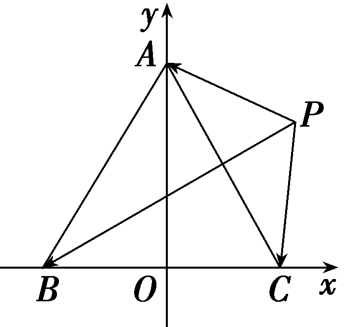

（2）因为*B*是*<text style="italic">EF*</text>的中点，且EF＝6，由极化恒等式得， $\vec{PE}$ *·* $\vec{PF}$ ＝ $\vec{PB}^{2}$ － $\vec{BF}^{2}$ ＝ $\vec{PB}^{2}$ －9，又知△A*B*C是边长为8的等边三角形，*P*在*AC*上运动，则 $\left|\vec{BP}\right|$ ∈ $\left[4\sqrt{3}，8\right]$ ，所以 $\left|\vec{PB}\right|^{2}$ ∈ $\left[48，64\right]$ ，所以 $\vec{PE}$ *·* $\vec{PF}$ ＝ $\vec{PB}^{2}$ － $\vec{BF}^{2}$ ＝ $\vec{PB}^{2}$ －9∈ $\left[39，55\right]$ .

极化恒等式使用方法

在确定求数量积的两个向量共起点或共终点的情况下，极化恒等式的一般步骤如下：

第一步：取第三边的中点，连接向量的起点与中点；

第二步：利用极化恒等式公式，将数量积转化为中线长与第三边长的一半的平方差；

第三步：利用平面几何方法或用正余弦定理求中线及第三边的长度，从而求出数量积，如需进一步求数量积的范围，可以用点到直线的距离最小或用三角形两边之和大于第三边，两边之差小于第三边或用基本不等式等求得中线长的最值(范围).

对点练3.(一题多解)在△*A<text style="italic">B<text style="italic">C*</text></text>中，*AC*＝3，BC＝4，∠C＝90°.*P*为△*ABC*所在平面内的动点，且*PC*＝1，则 $\vec{PA}$ · $\vec{PB}$ 的取值范围是(　　)

$\quad$A.[－5，3]	
$\quad$B.[－3，5]

$\quad$C.[－6，4]	
$\quad$D.[－4，6]

答案D

解析法一：以&lt;te&lt;te&lt;te&lt;te&lt;te&lt;te&lt;text st<em>y</em>le="italic"&gt;x&lt;/text&gt;t st&lt;text st<em>y</em>le="italic"&gt;y&lt;/text&gt;le="italic"&gt;x&lt;/text&gt;t style="italic"&gt;x&lt;/text&gt;t st<em>y</em>le="italic"&gt;x&lt;/text&gt;t st<em>y</em>le="italic"&gt;x&lt;/text&gt;t st<em>y</em>le="italic"&gt;x&lt;/text&gt;t style="italic"&gt;C&lt;/text&gt;为坐标原点，<em>C&lt;text style="italic"&gt;A</em>&lt;/text&gt;，<em>C&lt;text style="italic"&gt;B</em>&lt;/text&gt;所在直线分别为x轴、y轴建立平面直角坐标系(图略)，则A(3，0)，B(0，4).设<em>P</em>(x，y)，则x&lt;text style="superscript"&gt;&lt;text style="superscript"&gt;&lt;text style="superscript"&gt;&lt;text style="superscript"&gt;&lt;text style="superscript"&gt;2&lt;/text&gt;&lt;/text&gt;&lt;/text&gt;&lt;/text&gt;&lt;/text&gt;＋y2＝1， $\vec{PA}$ ＝ $\left(3－x,-y\right)$ ， $\vec{PB}$ ＝ $\left(－x，4－y\right)$ ，所以 $\vec{PA}$ &lt;te&lt;te&lt;te&lt;text st<em>y</em>le="italic"&gt;x&lt;/text&gt;t st&lt;text st<em>y</em>le="italic"&gt;y&lt;/text&gt;le="italic"&gt;x&lt;/text&gt;t style="italic"&gt;x&lt;/text&gt;t style="italic"&gt;·&lt;/text&gt; $\vec{PB}$ ＝&lt;te&lt;te&lt;te&lt;te&lt;te&lt;text st<em>y</em>le="italic"&gt;x&lt;/text&gt;t st&lt;text st<em>y</em>le="italic"&gt;y&lt;/text&gt;le="italic"&gt;x&lt;/text&gt;t style="italic"&gt;x&lt;/text&gt;t st<em>y</em>le="italic"&gt;x&lt;/text&gt;t st<em>y</em>le="italic"&gt;x&lt;/text&gt;t st<em>y</em>le="italic"&gt;x&lt;/text&gt;&lt;text style="superscript"&gt;&lt;text style="superscript"&gt;&lt;text style="superscript"&gt;&lt;text style="superscript"&gt;&lt;text style="superscript"&gt;2&lt;/text&gt;&lt;/text&gt;&lt;/text&gt;&lt;/text&gt;&lt;/text&gt;－3x＋y2－4y＝ $\left(x－\frac{3}{2}\right)^{2}$ ＋ $\left(y－2\right)^{2}$ － $\frac{25}{4}$ .又 $\left(x－\frac{3}{2}\right)^{2}$ ＋ $\left(y－2\right)^{2}$ 表示圆&lt;te&lt;te&lt;te&lt;te&lt;te&lt;text st<em>y</em>le="italic"&gt;x&lt;/text&gt;t st&lt;text st<em>y</em>le="italic"&gt;y&lt;/text&gt;le="italic"&gt;x&lt;/text&gt;t style="italic"&gt;x&lt;/text&gt;t st<em>y</em>le="italic"&gt;x&lt;/text&gt;t st<em>y</em>le="italic"&gt;x&lt;/text&gt;t st<em>y</em>le="italic"&gt;x&lt;/text&gt;&lt;text style="superscript"&gt;&lt;text style="superscript"&gt;&lt;text style="superscript"&gt;&lt;text style="superscript"&gt;&lt;text style="superscript"&gt;2&lt;/text&gt;&lt;/text&gt;&lt;/text&gt;&lt;/text&gt;&lt;/text&gt;＋y2＝1上一点到点 $\left(\frac{3}{2}，2\right)$ 距离的平方，圆心(0，0)到点 $\left(\frac{3}{2}，2\right)$ 的距离为 $\frac{5}{2}$ ，所以 $\vec{PA}$ &lt;te&lt;te&lt;te&lt;text st<em>y</em>le="italic"&gt;x&lt;/text&gt;t st&lt;text st<em>y</em>le="italic"&gt;y&lt;/text&gt;le="italic"&gt;x&lt;/text&gt;t style="italic"&gt;x&lt;/text&gt;t style="italic"&gt;·&lt;/text&gt; $\vec{PB}$ ∈［ $\left(\frac{5}{2}－1\right)^{2}$ － $\frac{25}{4}$ ， $\left(\frac{5}{2}+1\right)^{2}$ － $\frac{25}{4}$ ］，即 $\vec{PA}$ &lt;te&lt;te&lt;te&lt;text st<em>y</em>le="italic"&gt;x&lt;/text&gt;t st&lt;text st<em>y</em>le="italic"&gt;y&lt;/text&gt;le="italic"&gt;x&lt;/text&gt;t style="italic"&gt;x&lt;/text&gt;t style="italic"&gt;·&lt;/text&gt; $\vec{PB}$ ∈ $\left[－4，6\right]$ .故选D.

法二(极化恒等式)：设*AB*的中点为*M*， $\vec{CM}$ 与 $\vec{CP}$ 的夹角为*<text style="italic"><text style="italic"><text style="italic">θ*</text></text></text>，由极化恒等式得 $\vec{PA}$ · $\vec{PB}$ ＝ $\vec{PM}^{2}$ － $\frac{1}{4}\vec{AB}^{2}$ ＝ $\left(\vec{CM}－\vec{CP}\right)^{2}$ － $\frac{25}{4}$ ＝ $\vec{CM}^{2}$ ＋ $\vec{CP}^{2}$ －2 $\vec{CM}$ · $\vec{CP}$ － $\frac{25}{4}$ ＝ $\frac{25}{4}$ ＋1－5cos *<text style="italic"><text style="italic"><text style="italic">θ*</text></text></text>－ $\frac{25}{4}$ ＝1－5cos *<text style="italic"><text style="italic"><text style="italic">θ*</text></text></text>，因为cos θ∈[－1，1]，所以 $\vec{PA}$ · $\vec{PB}$ ∈ $\left[－4，6\right]$ .故选D.

对点练4.(2025·安徽池州模拟)莱洛三角形，也称圆弧三角形，是一种特殊三角形，在建筑、工业上应用广泛，如图所示，分别以正三角形<em>&lt;text style="italic"&gt;AB</em>C&lt;/text&gt;的顶点为圆心，以边长为半径作圆弧，由这三段圆弧组成的曲边三角形即为莱洛三角形，已知A，B两点间的距离为2，点<em>P</em>为 $\overparen{AB}$ 上的一点，则 $\vec{PA}$ ·( $\vec{PB}$ ＋ $\vec{PC}$ )的最小值为<u>　　　　　　</u>.

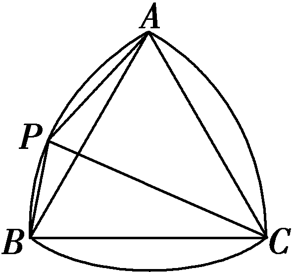

答案10－4 $\sqrt{7}$

解析如图，设<em>D</em>为<em>BC</em>的中点，<em>E</em>为<em>&lt;text style="italic"&gt;AD</em>&lt;/text&gt;的中点，连接<em>PD</em>，<em>PE</em>，<em>&lt;text style="italic"&gt;CE</em>&lt;/text&gt;，则 $\vec{PA}$ ·( $\vec{PB}$ ＋ $\vec{PC}$ )＝2 $\vec{PA}$ · $\vec{PD}$ ＝2( $\vec{PE}$ ＋ $\vec{EA}$ )·( $\vec{PE}$ ＋ $\vec{ED}$ )＝2( $\vec{PE}$ ＋ $\vec{EA}$ )·( $\vec{PE}$ － $\vec{EA}$ )＝2( $\vec{PE}^{2}$ － $\vec{EA}^{2}$ ).在正三角形A<em>BC</em>中，A<em>D</em>＝ $\sqrt{AB^{2}－BD^{2}}$ ＝ $\sqrt{2^{2}－1^{2}}$ ＝ $\sqrt{3}$ ，所以A<em>E</em>＝<em>D</em>E＝ $\frac{\sqrt{3}}{2}$ ，所以 $\vec{PA}$ ·( $\vec{PB}$ ＋ $\vec{PC}$ )＝2( $\vec{PE}^{2}$ － $\vec{EA}^{2}$ )＝2 $\vec{PE}^{2}$ － $\frac{3}{2}$ .因为C<em>E</em>＝ $\sqrt{CD^{2}＋DE^{2}}$ ＝ $\sqrt{1^{2}＋\left(\frac{\sqrt{3}}{2}\right)^{2}}$ ＝ $\frac{\sqrt{7}}{2}$ ，所以｜ $\vec{PE}$ ｜min＝2－｜ $\vec{CE}$ ｜＝2－ $\frac{\sqrt{7}}{2}$ ，所以 $\vec{PA}$ ·( $\vec{PB}$ ＋ $\vec{PC}$ )的最小值为2 $\vec{PE}^{2}$ － $\frac{3}{2}$ ＝2× $\left(2－\frac{\sqrt{7}}{2}\right)^{2}$ － $\frac{3}{2}$ ＝10－4 $\sqrt{7}$ .

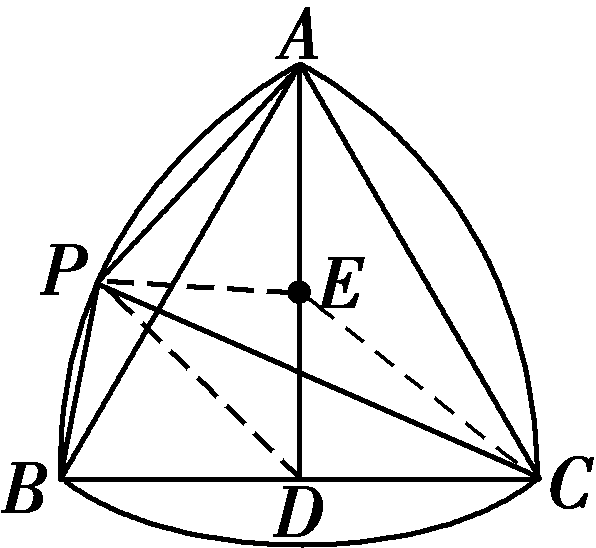

对点练5.(2020·天津卷)如图，在四边形<em>A&lt;text style="italic"&gt;B</em>CD &lt;/text&gt;中，∠B＝60°，<em>AB</em>＝3，<em>BC</em>＝6，且 $\vec{AD}$ ＝<em>λ</em> $\vec{BC}$ ， $\vec{AD}$ · $\vec{AB}$ ＝－ $\frac{3}{2}$ ，则实数<em>λ</em> 的值为<u>　　　</u>，若<em>M</em>，<em>N</em> 是线段<em>B</em>C 上的动点，且｜ $\vec{MN}$ ｜＝1，则 $\vec{DM}$ · $\vec{DN}$  的最小值为<u>　　　</u>　 .

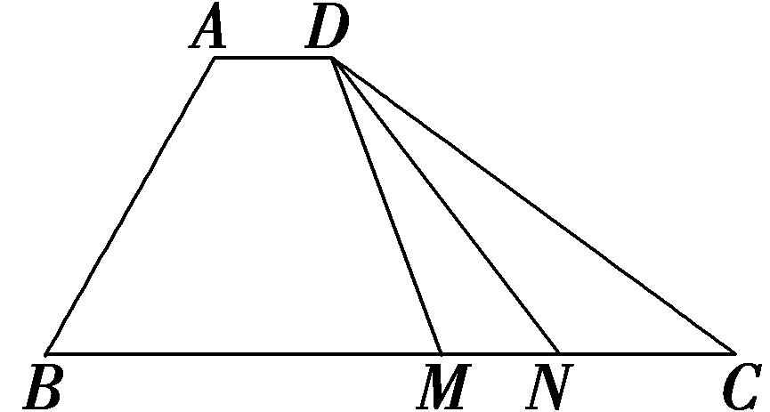

答案 $\frac{1}{6}　\frac{13}{2}$

解析依题意得<em>AD</em>∥<em>&lt;text style="italic"&gt;B</em>C&lt;/text&gt;，∠<em>&lt;text style="italic"&gt;BAD</em>&lt;/text&gt;＝1&lt;text style="superscript"&gt;&lt;text style="superscript"&gt;2&lt;/text&gt;&lt;/text&gt;0°，由 $\vec{AD}$ · $\vec{AB}$ ＝｜ $\vec{AD}$ ｜·｜ $\vec{AB}$ ｜cos ∠<em>BAD</em>＝－ $\frac{3}{2}$ ｜ $\vec{AD}$ ｜＝－ $\frac{3}{2}$ ，得｜ $\vec{AD}$ ｜＝1，因此<em>λ</em>＝ $\frac{\left|\vec{AD}\right|}{\left|\vec{BC}\right|}$ ＝ $\frac{1}{6}$  .取<em>&lt;text style="italic"&gt;MN</em> &lt;/text&gt;的中点<em>E</em>，连接<em>DE</em>(图略)，则 $\vec{DM}$ ＋ $\vec{DN}$ ＝&lt;text style="superscript"&gt;&lt;text style="superscript"&gt;2&lt;/text&gt;&lt;/text&gt; $\vec{DE}$ ， $\vec{DM}$ · $\vec{DN}$ ＝ $\frac{1}{4}$ [( $\vec{DM}$ ＋ $\vec{DN}$ )&lt;text style="superscript"&gt;&lt;text style="superscript"&gt;2&lt;/text&gt;&lt;/text&gt;－( $\vec{DM}$ － $\vec{DN}$ )&lt;text style="superscript"&gt;&lt;text style="superscript"&gt;2&lt;/text&gt;&lt;/text&gt;]＝ $\vec{DE}^{2}$ － $\frac{1}{4}\vec{NM}^{2}$ ＝ $\vec{DE}^{2}$ － $\frac{1}{4}$  .注意到线段<em>&lt;text style="italic"&gt;MN</em> &lt;/text&gt;在线段<em>&lt;text style="italic"&gt;B</em>C&lt;/text&gt; 上运动时，D<em>E</em> 的最小值等于点<em>D</em> 到直线<em>&lt;text style="italic"&gt;BC</em> &lt;/text&gt;的距离，即<em>AB</em>·sin ∠B＝ $\frac{3\sqrt{3}}{2}$ ，因此 $\vec{DE}^{2}$ － $\frac{1}{4}$  的最小值为( $\frac{3\sqrt{3}}{2}$ )&lt;text style="superscript"&gt;&lt;text style="superscript"&gt;2&lt;/text&gt;&lt;/text&gt;－ $\frac{1}{4}$ ＝ $\frac{13}{2}$ ，即 $\vec{DM}$ · $\vec{DN}$  的最小值为 $\frac{13}{2}$  .

