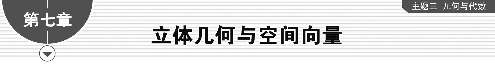

第一节　基本立体图形、简单几何体的表面积与体积

【课标研读】　1.利用实物，计算机软件等观察空间图形，认识柱、锥、台、球及简单组合体的结构特征，能运用这些特征描述现实生活中简单物体的结构.　2.知道球、棱柱、棱锥、棱台的表面积和体积的计算公式，能用公式解决简单的实际问题.　3.能用斜二测法画出简单空间图形(长方体、球、圆柱、圆锥、棱柱及其简单组合)的直观图.

##### 1.空间几何体的结构特征

（1）多面体的结构特征

<table><tr><td>
名称
</td><td>
棱柱
</td><td>
棱锥
</td><td>
棱台
</td></tr><tr><td>
图形
</td><td>
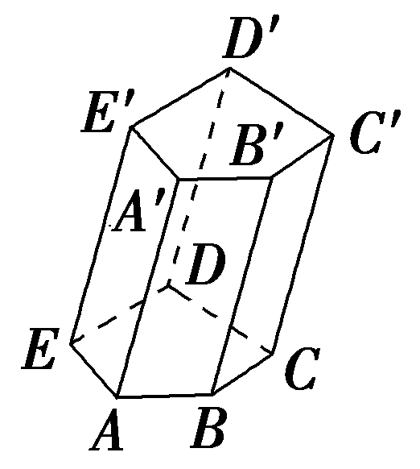
</td><td>
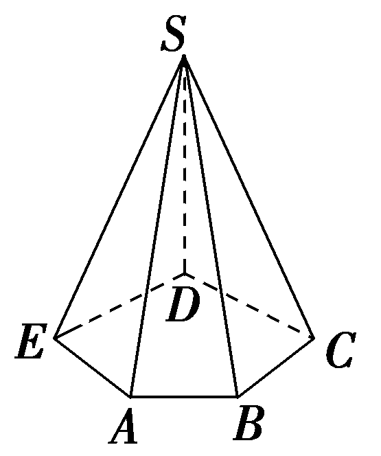
</td><td>
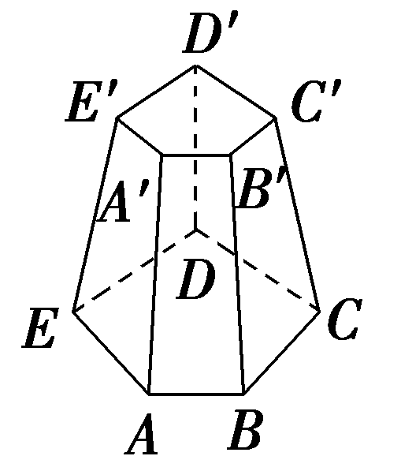
</td></tr><tr><td>
底面
</td><td>
互相平行且全等
</td><td>
多边形
</td><td>
互相平行且相似
</td></tr><tr><td>
侧棱
</td><td>
平行且相等
</td><td>
相交于一点，但不一定相等
</td><td>
延长线交于一点
</td></tr><tr><td>
侧面形状
</td><td>
平行四边形
</td><td>
三角形
</td><td>
梯形
</td></tr></table>

（2）旋转体的结构特征

<table><tr><td>
名称
</td><td>
圆柱
</td><td>
圆锥
</td><td>
圆台
</td><td>
球
</td></tr><tr><td>
图形
</td><td>
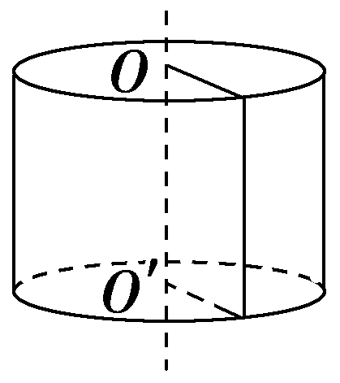
</td><td>
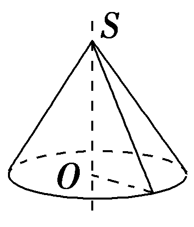
</td><td>
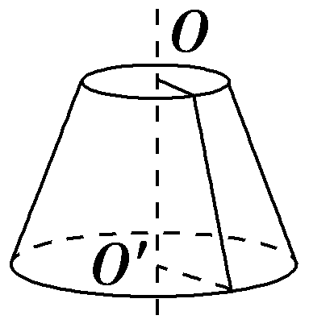
</td><td>
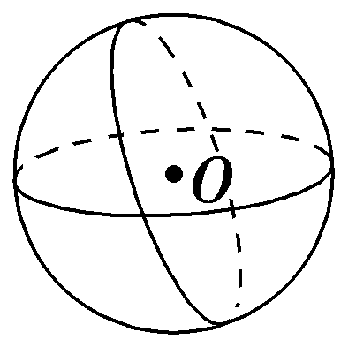
</td></tr><tr><td>
母线
</td><td>
互相平行且相等，垂直于底面
</td><td>
相交于一点
</td><td>
延长线交于一点
</td><td></td></tr><tr><td>
轴截面
</td><td>
矩形
</td><td>
等腰三角形
</td><td>
等腰梯形
</td><td>
圆面
</td></tr><tr><td>
侧面

展开图
</td><td>
矩形
</td><td>
扇形
</td><td>
扇环
</td><td></td></tr></table>

[微提醒]　（1）常见的几种四棱柱的结构特征及其之间的关系

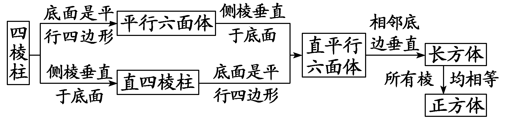

（2）球的截面的性质

①球的任何截面是圆面；②球心和截面(不过球心)圆心的连线垂直于截面；③球心到截面的距离*d*与球的半径*R*及截面圆的半径*<text style="italic">r*</text>的关系为r＝ $\sqrt{R^{2}－d^{2}}$ .

##### 2.立体图形的直观图

（1）画法：常用<u>斜二测画法</u>.

（2）规则：①原图形中<em>x</em>轴、<em>y</em>轴、<em>z</em>轴两两垂直，直观图中，<em>x'</em>轴、<em>y'</em>轴的夹角为<u>45°或135°</u>，<em>z'</em>轴与<em>x'</em>轴和<em>y'</em>轴所在平面<u>垂直</u>.

②原图形中平行于坐标轴的线段，直观图中仍<u>分别平行于坐标轴</u>，平行于<em>x</em>轴和<em>z</em>轴的线段在直观图中保持原长度<u>不变</u>，平行于<em>y</em>轴的线段长度在直观图中变为原来的<u>一半</u>.

##### 3.圆柱、圆锥、圆台的侧面展开图及侧面积公式

<table><tr><td>
名称
</td><td>
圆柱
</td><td>
圆锥
</td><td>
圆台
</td></tr><tr><td>
侧面展开图
</td><td>
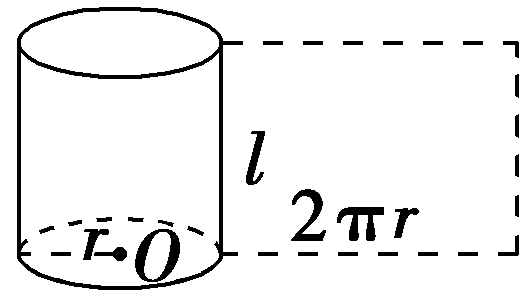
</td><td>
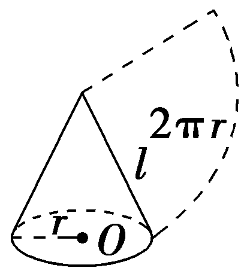
</td><td>
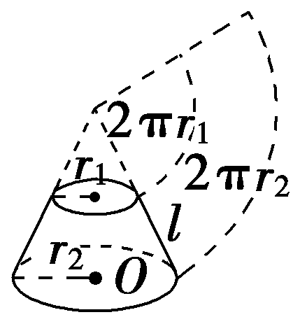
</td></tr><tr><td>
侧面积公式
</td><td>
<em>S</em>圆柱侧＝2π<em>rl</em>
</td><td>
<em>S</em>圆锥侧＝π<em>rl</em>
</td><td>
<em>S</em>圆台侧＝π(<em>r</em>1＋<em>r</em>2)<em>l</em>
</td></tr></table>

##### 4.柱、锥、台、球的表面积和体积

<table><tr><td>
　　名称

几何体　　
</td><td>
表面积
</td><td>
体积
</td></tr><tr><td>
柱体

(棱柱和圆柱)
</td><td>
<em>S</em>表面积＝<em>S</em>侧＋2<em>S</em>底
</td><td>
<em>V</em>＝<em>S</em>底<em>h</em>
</td></tr><tr><td>
锥体

(棱锥和圆锥)
</td><td>
<em>S</em>表面积＝<em>S</em>侧＋<em>S</em>底
</td><td>
<em>V</em>＝<em>S</em>底<em>h</em>
</td></tr><tr><td>
台体

(棱台和圆台)
</td><td>
<em>S</em>表面积＝<em>S</em>侧＋<em>S</em>上＋<em>S</em>下
</td><td>
<em>V</em>＝(<em>S</em>上＋<em>S</em>下＋)<em>h</em>
</td></tr><tr><td>
球
</td><td>
<em>S</em>＝4π<em>R</em>2
</td><td>
<em>V</em>＝π<em>R</em>3
</td></tr></table>

[微提醒]　（1）圆柱、圆锥、圆台的有关元素都集中在轴截面上，解题时要注意用好轴截面中各元素间的关系.（2）在求解组合体的表面积时，注意几何体表面的构成，尤其是重合部分，面积不要多加或少减.

【常用结论】

（1）原图形与直观图面积的关系

按照斜二测画法得到的平面图形的&lt;text style="subscript"&gt;直观图&lt;/text&gt;与&lt;text style="subscript"&gt;原图形&lt;/text&gt;面积的关系：①<em>&lt;text style="italic"&gt;&lt;text style="italic"&gt;&lt;text style="italic"&gt;S</em>&lt;/text&gt;&lt;/text&gt;&lt;/text&gt;直观图＝ $\frac{\sqrt{2}}{4}$ <em>&lt;text style="italic"&gt;&lt;text style="italic"&gt;&lt;text style="italic"&gt;S</em>&lt;/text&gt;&lt;/text&gt;&lt;/text&gt;&lt;text style="subscript"&gt;原图形&lt;/text&gt;.②S原图形＝2 $\sqrt{2}$ <em>&lt;text style="italic"&gt;&lt;text style="italic"&gt;&lt;text style="italic"&gt;S</em>&lt;/text&gt;&lt;/text&gt;&lt;/text&gt;&lt;text style="subscript"&gt;直观图&lt;/text&gt;.

（2）与体积有关的几个结论

①一个组合体的体积等于它的各部分体积的和或差.

②底面面积及高都相等的两个同类几何体的体积相等(祖暅原理).

【自主检测】

##### 1.(多选)下列结论错误的是(　　)

$\quad$A.有两个面平行，其余各面都是平行四边形的几何体是棱柱

$\quad$B.用一个平行于底面的平面截圆锥，得到一个圆锥和一个圆台

$\quad$C.菱形的直观图仍是菱形

$\quad$D.两个球的体积之比等于它们的半径比的平方

答案ACD

##### 2.(链接人教A必修二P106T8)如图所示，长方体*ABCD* -*A'B'C'D'* 中被截去一部分，其中*EH*∥*A'D'*，则剩下的几何体是(　　)

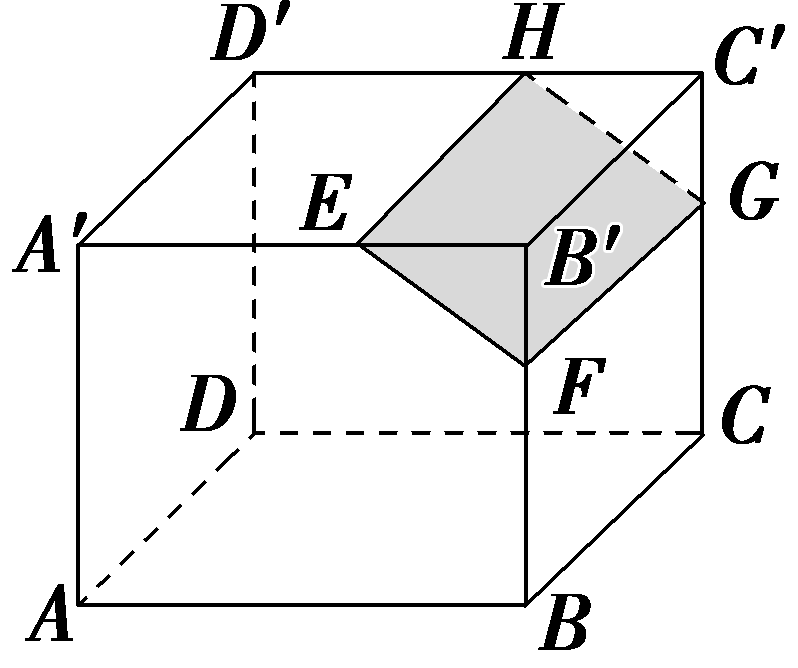

$\quad$A.棱台	
$\quad$B.四棱柱

$\quad$C.五棱柱	
$\quad$D.简单组合体

答案C

解析由几何体的结构特征知，剩下的几何体为五棱柱.故选C.

##### 3.(链接人教A必修二P119练习T2)一个球的表面积是16π，那么这个球的体积为(　　)

$\quad$A. $\frac{16}{3}$ π	
$\quad$B. $\frac{32}{3}$ π

$\quad$C.16π	
$\quad$D.24π

答案B

解析设球的半径为<em>&lt;text style="italic"&gt;&lt;text style="italic"&gt;&lt;text style="italic"&gt;R</em>&lt;/text&gt;&lt;/text&gt;&lt;/text&gt;，则<em>S</em>＝4πR2＝16π，解得R＝2，则球的体积<em>V</em>＝ $\frac{4}{3}$ π<em>&lt;text style="italic"&gt;&lt;text style="italic"&gt;&lt;text style="italic"&gt;R</em>&lt;/text&gt;&lt;/text&gt;&lt;/text&gt;3＝ $\frac{32}{3}$ π.故选B.

##### 4.（1）(链接人教A必修二P119习题T2)如图，将一个长方体用过相邻三条棱的中点的平面截出一个棱锥，则该棱锥的体积与剩下的几何体体积的比为<u>　　　　</u>.

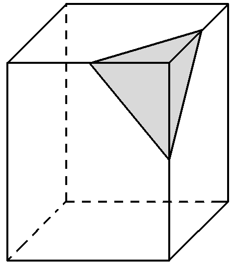

（2）(2025·八省适应性测试)底面直径和母线长均为2的圆锥的体积为<u>　　　　</u>.

答案（1）1∶47　（2） $\frac{\sqrt{3}}{3}$ π

解析(&lt;text style="su&lt;text style="itali<em>c</em>"&gt;b&lt;/text&gt;script"&gt;1&lt;/text&gt;)设长方体的相邻三条棱长分别为&lt;text style="it<em>a</em>li<em>c</em>"&gt;a&lt;/text&gt;，<em>b</em>，c，它截出的棱锥的体积为<em>&lt;text style="italic"&gt;&lt;text style="italic"&gt;&lt;text style="italic"&gt;V</em>&lt;/text&gt;&lt;/text&gt;&lt;/text&gt;1＝ $\frac{1}{3}$ × $\frac{1}{2}$ × $\frac{1}{2}$ &lt;text style="it&lt;text style="itali<em>c</em>"&gt;a&lt;/text&gt;li<em>c</em>"&gt;a&lt;/text&gt;× $\frac{1}{2}$ &lt;text style="it&lt;text style="itali<em>c</em>"&gt;a&lt;/text&gt;li<em>c</em>"&gt;<em>b</em>&lt;/text&gt;× $\frac{1}{2}$ &lt;text style="it&lt;text style="itali<em>c</em>"&gt;a&lt;/text&gt;lic"&gt;c&lt;/text&gt;＝ $\frac{1}{48}$ &lt;text style="it&lt;text style="itali<em>c</em>"&gt;a&lt;/text&gt;li<em>c</em>"&gt;a&lt;/text&gt;<em>&lt;text style="italic"&gt;b</em>&lt;/text&gt;c，剩下的几何体的体积<em>&lt;text style="italic"&gt;&lt;text style="italic"&gt;&lt;text style="italic"&gt;V</em>&lt;/text&gt;&lt;/text&gt;&lt;/text&gt;&lt;text style="subscript"&gt;2&lt;/text&gt;＝<em>&lt;text style="italic"&gt;&lt;text style="italic"&gt;&lt;text style="italic"&gt;abc</em>&lt;/text&gt;&lt;/text&gt;&lt;/text&gt;－ $\frac{1}{48}$ &lt;text style="it&lt;text style="itali<em>c</em>"&gt;a&lt;/text&gt;li<em>c</em>"&gt;a&lt;/text&gt;<em>&lt;text style="italic"&gt;b</em>&lt;/text&gt;c＝ $\frac{47}{48}$ &lt;text style="it&lt;text style="itali<em>c</em>"&gt;a&lt;/text&gt;li<em>c</em>"&gt;a&lt;/text&gt;<em>&lt;text style="italic"&gt;b</em>&lt;/text&gt;c，所以<em>&lt;text style="italic"&gt;&lt;text style="italic"&gt;&lt;text style="italic"&gt;V</em>&lt;/text&gt;&lt;/text&gt;&lt;/text&gt;&lt;text style="subscript"&gt;1&lt;/text&gt;∶V&lt;text style="subscript"&gt;2&lt;/text&gt;＝1∶47.

(2)由题意可知圆锥的底面半径&lt;text sty<em>l</em>e="italic"&gt;<em>R</em>&lt;/text&gt;＝1，母线长l＝2，所以高<em>&lt;text style="italic"&gt;h</em>&lt;/text&gt;＝ $\sqrt{l^{2}－R^{2}}$ ＝ $\sqrt{2^{2}－1^{2}}$ ＝ $\sqrt{3}$ ，所以圆锥的体积为<em>V</em>＝ $\frac{1}{3}$ π&lt;text sty<em>l</em>e="italic"&gt;<em>R</em>&lt;/text&gt;2<em>&lt;text style="italic"&gt;h</em>&lt;/text&gt;＝ $\frac{\sqrt{3}}{3}$ π.

考点一　基本立体图形　　　　多维探究

角度1　结构特征

##### 1.下列命题正确的是(　　)

$\quad$A.两个面平行，其余各面都是梯形的多面体是棱台

$\quad$B.两个面平行且相似，其余各面都是梯形的多面体是棱台

$\quad$C.直角梯形以一条直角腰所在的直线为旋转轴，其余三边旋转形成的面所围成的旋转体是圆台

$\quad$D.用平面截圆柱得到的截面只能是圆面或矩形面

答案C

解析如图所示，可排除A，B.对于D，只有截面与圆柱的母线平行或垂直时，截得的截面才为矩形面或圆面，否则截面为椭圆面或椭圆面的一部分.故选C.

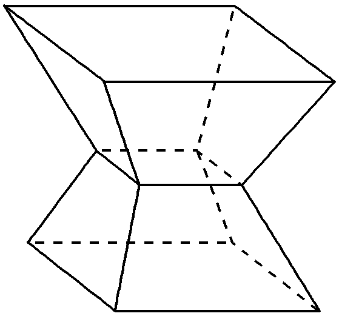

##### 2.(多选)下列说法正确的是(　　)

$\quad$A.以直角三角形的一条边所在的直线为轴，其余两边旋转形成的曲面围成的几何体是圆锥

$\quad$B.以等腰三角形底边上的中线所在的直线为轴，将三角形旋转形成的曲面围成的几何体是圆锥

$\quad$C.经过圆锥任意两条母线的截面是等腰三角形

$\quad$D.圆锥侧面的母线长有可能大于圆锥底面圆的直径

答案BCD

解析A不正确，直角三角形绕斜边所在的直线旋转得到的旋转体不是圆锥；B正确，以等腰三角形底边上的中线所在的直线为轴，将三角形旋转形成的曲面围成的几何体是圆锥；C正确，因为圆锥的母线长都相等，所以经过圆锥任意两条母线的截面是等腰三角形；D正确，如图所示，圆锥侧面的母线长*l*有可能大于圆锥底面圆半径*r*的2倍(即直径).故选BCD.

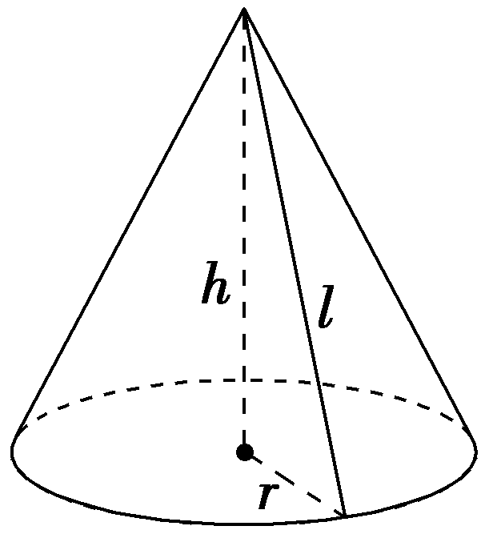

角度2　直观图

##### 3.(一题多解)已知水平放置的四边形*OABC*按斜二测画法得到如图所示的直观图，其中*O'A'*∥*B'C'*，∠*O'A'B'*＝90°，*O'A'*＝1，*B'C'*＝2，则原四边形*OABC*的面积为(　　)

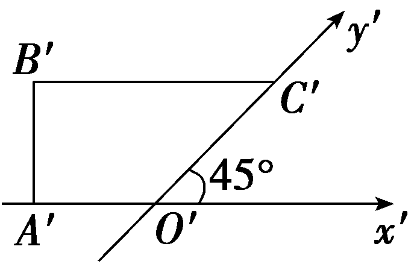

$\quad$A. $\frac{3\sqrt{2}}{2}$ 	
$\quad$B.3 $\sqrt{2}$

$\quad$C.4 $\sqrt{2}$ 	
$\quad$D.5 $\sqrt{2}$

答案B

解析

法一：由已知求得*O'C'*＝ $\sqrt{2}$ ，把直观图还原为原图形如图，可得原图形为直角梯形，*<text style="italic"><text style="italic">OA*</text></text>∥*CB*，OA⊥*<text style="italic">OC*</text>，且OA＝1，*BC*＝2，OC＝2 $\sqrt{2}$ ，得原四边形*<text style="italic"><text style="italic">OA*</text></text>*BC*的面积为 $\frac{1}{2}$ × $\left(1+2\right)$ ×2 $\sqrt{2}$ ＝3 $\sqrt{2}$ .故选B.

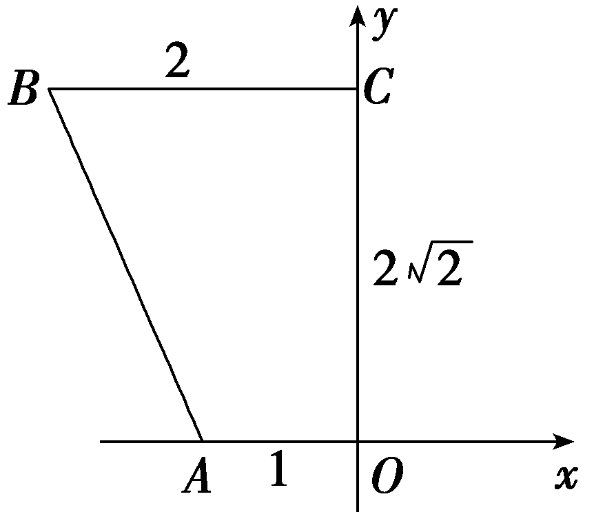

法二：由题意知<em>A'B'</em>＝1，所以<em>&lt;text style="italic"&gt;&lt;text style="italic"&gt;S</em>&lt;/text&gt;&lt;/text&gt;&lt;text style="subscript"&gt;直观图&lt;/text&gt;＝ $\frac{1}{2}$ × $\left(1+2\right)$ ×1＝ $\frac{3}{2}$ ，所以<em>&lt;text style="italic"&gt;&lt;text style="italic"&gt;S</em>&lt;/text&gt;&lt;/text&gt;原图形＝2 $\sqrt{2}$ <em>&lt;text style="italic"&gt;&lt;text style="italic"&gt;S</em>&lt;/text&gt;&lt;/text&gt;&lt;text style="subscript"&gt;直观图&lt;/text&gt;＝3 $\sqrt{2}$ .

##### 4.如图，△*A'B'C'* 是水平放置的△*ABC*的斜二测直观图，其中*O'C'*＝*O'A'*＝2*O'B'*，则以下说法正确的是(　　)

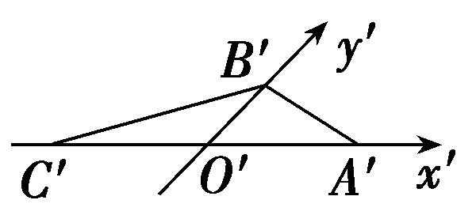

$\quad$A.△*ABC*是钝角三角形

$\quad$B.△*ABC*是等边三角形

$\quad$C.△*ABC*是等腰直角三角形

$\quad$D.△*ABC*是等腰三角形，但不是直角三角形

答案C

解析将直观图还原成原图形，如图所示，设<em>&lt;text style="italic"&gt;A'C'</em>&lt;/text&gt;＝&lt;text style="superscript"&gt;&lt;text style="superscript"&gt;2&lt;/text&gt;&lt;/text&gt;，则可得<em>OB</em>＝2<em>O'B'</em>＝1，<em>&lt;text style="italic"&gt;AC</em>&lt;/text&gt;＝A'C'＝2，从而<em>&lt;text style="italic"&gt;&lt;text style="italic"&gt;AB</em>&lt;/text&gt;&lt;/text&gt;＝<em>&lt;text style="italic"&gt;&lt;text style="italic"&gt;BC</em>&lt;/text&gt;&lt;/text&gt;＝ $\sqrt{2}$ ，所以<em>&lt;text style="italic"&gt;&lt;text style="italic"&gt;AB</em>&lt;/text&gt;&lt;/text&gt;&lt;text style="superscript"&gt;&lt;text style="superscript"&gt;2&lt;/text&gt;&lt;/text&gt;＋<em>&lt;text style="italic"&gt;&lt;text style="italic"&gt;BC</em>&lt;/text&gt;&lt;/text&gt;2＝<em>&lt;text style="italic"&gt;AC</em>&lt;/text&gt;2，即AB⊥BC，故△<em>ABC</em>是等腰直角三角形.故选C.

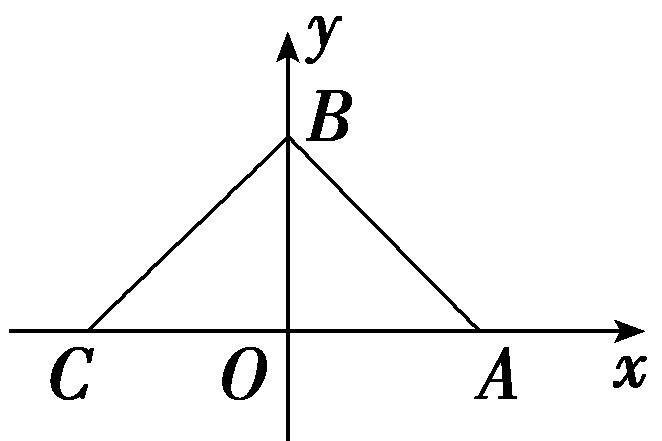

角度3　展开图

（1）如图，正三棱锥*S* -*ABC*中，∠*BSC*＝40°，*SB*＝2，一质点自点*B*出发，沿着三棱锥的侧面绕行一周回到点*B*的最短路线的长为(　　)

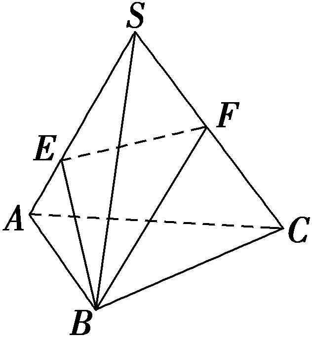

$\quad$A.2	
$\quad$B.3

$\quad$C.2 $\sqrt{3}$ 	
$\quad$D.3 $\sqrt{3}$

（2）圆台的上、下底面半径分别为10 cm，20 cm，它的侧面展开图扇环的圆心角为180°，则圆台的表面积为<u>　　　　</u>cm2.(结果中保留π)

答案（1）C　（2）1 100π

解析（1）三棱锥*S* -*A<text style="italic">B*C</text>沿侧棱*SB*展开，其侧面展开图如图所示，其中∠*<text style="italic">BS*B'</text>＝120°，BS＝*B'S*＝2，由余弦定理得，沿着三棱锥的侧面绕行一周回到点B的最短路线的长为*BB'*＝ $\sqrt{2^{2}＋2^{2}－2\times 2\times 2\times cos120\circ }$ ＝2 $\sqrt{3}$ .故选C.

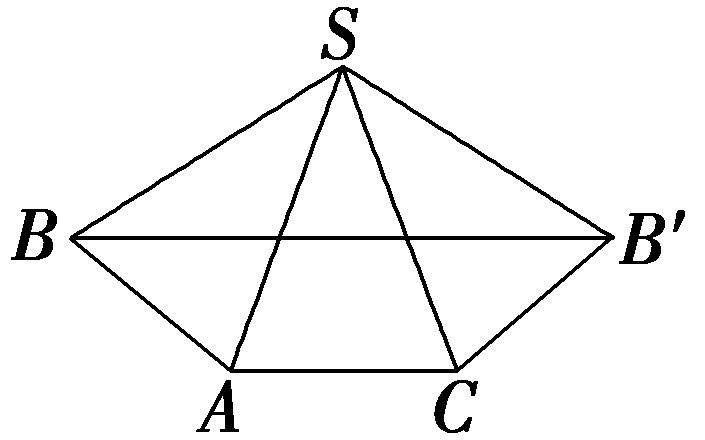

(&lt;text style="superscript"&gt;&lt;text style="superscript"&gt;&lt;text style="superscript"&gt;2&lt;/text&gt;&lt;/text&gt;&lt;/text&gt;)如图所示，设圆台的上底面周长为&lt;text style="itali<em>c</em>"&gt;c &lt;/text&gt;cm，因为扇环的圆心角是180°，故c＝π<em>·&lt;text style="italic"&gt;&lt;text style="italic"&gt;&lt;text style="italic"&gt;&lt;text style="italic"&gt;&lt;text style="italic"&gt;&lt;text style="italic"&gt;S</em>&lt;/text&gt;&lt;/text&gt;&lt;/text&gt;A&lt;/text&gt;&lt;/text&gt;&lt;/text&gt;＝2π×10(cm)，所以SA＝ $\frac{c}{\pi }$ ＝&lt;text style="superscript"&gt;&lt;text style="superscript"&gt;&lt;text style="superscript"&gt;2&lt;/text&gt;&lt;/text&gt;&lt;/text&gt;0 <em>c</em>m.同理可得<em>&lt;text style="italic"&gt;&lt;text style="italic"&gt;&lt;text style="italic"&gt;&lt;text style="italic"&gt;&lt;text style="italic"&gt;S</em>&lt;/text&gt;&lt;/text&gt;&lt;/text&gt;B&lt;/text&gt;&lt;/text&gt;＝40 cm，所以<em>AB</em>＝SB－<em>&lt;text style="italic"&gt;SA</em>&lt;/text&gt;＝20 cm，所以S表＝S侧＋S上底＋S下底＝π(10＋20)×20＋π×102＋π×202＝1 100π(cm2).故圆台的表面积为1 100π cm2.

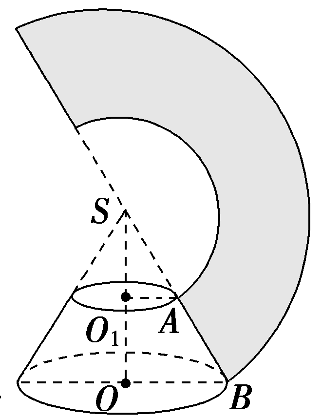

##### 1.空间几何体结构特征的判断方法

（1）定义法：紧扣定义，依据条件构建几何模型，在条件不变的情况下，变换模型中的线面关系或增加线、面等基本元素，然后再依据题意判定.

（2）反例法：通过反例对结构特征进行辨析.

##### 2.在斜二测画法中，要确定关键点及关键线段.平行于*x*轴的线段平行性不变，长度不变；平行于*y*轴的线段平行性不变，长度减半.

##### 3.在解决空间曲线或折线(段)最短问题时一般要考虑几何体的侧面展开图，采用化曲为直的策略，将空间问题平面化.

对点练1.已知圆台的上、下底面圆半径分别为10和5，侧面积为300π，*AB*为圆台的一条母线(点*B*在圆台的上底面圆周上)，*M*为*AB*的中点，一只蚂蚁从点*B*出发，绕圆台侧面爬行一周到点*M*，则蚂蚁爬行所经路程的最小值为(　　)

$\quad$A.30	
$\quad$B.40

$\quad$C.50	
$\quad$D.60

答案C

解析圆台上底面半径为&lt;text style="subscript"&gt;&lt;text style="subscript"&gt;&lt;text style="subscript"&gt;1&lt;/text&gt;&lt;/text&gt;&lt;/text&gt;0，下底面半径为5，设母线长为&lt;text sty&lt;text sty&lt;text sty<em>l</em>e="italic"&gt;l&lt;/text&gt;e="italic"&gt;l&lt;/text&gt;e="italic"&gt;l&lt;/text&gt;，所以侧面积<em>S</em>＝πl(10＋5)＝15πl＝300π，解得l＝20.将圆台所在圆锥的侧面展开如图所示，且设扇形所在圆的圆心为<em>O</em>.线段<em>&lt;text style="italic"&gt;M</em>&lt;/text&gt;1<em>&lt;text style="italic"&gt;B</em>&lt;/text&gt;就是蚂蚁经过的最短距离.设<em>OA</em>＝<em>&lt;text style="italic"&gt;&lt;text style="italic"&gt;R</em>&lt;/text&gt;&lt;/text&gt;，扇形的圆心角是<em>&lt;text style="italic"&gt;&lt;text style="italic"&gt;α</em>&lt;/text&gt;&lt;/text&gt;，则由题意知2×5π＝<em>αR</em>①，2×10π＝α(20＋R)②，由①②解得α＝ $\frac{\pi }{2}$ ，<em>&lt;text style="italic"&gt;&lt;text style="italic"&gt;R</em>&lt;/text&gt;&lt;/text&gt;＝20，所以<em>O&lt;text style="italic"&gt;M</em>&lt;/text&gt;＝<em>&lt;text style="italic"&gt;OM</em>&lt;/text&gt;&lt;text style="subscript"&gt;&lt;text style="subscript"&gt;&lt;text style="subscript"&gt;1&lt;/text&gt;&lt;/text&gt;&lt;/text&gt;＝30，O<em>&lt;text style="italic"&gt;B</em>&lt;/text&gt;1＝<em>&lt;text style="italic"&gt;OB</em>&lt;/text&gt;＝40，则M1B＝ $\sqrt{OB^{2}＋OM_{1}^{2}}$ ＝50.故选C.

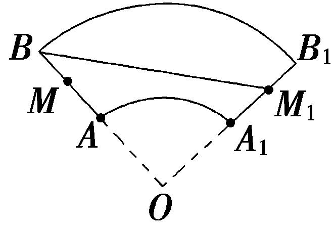

考点二　空间几何体的表(侧)面积　　　　师生共研

（1）(2020·全国Ⅰ卷)已知<em>A</em>，<em>B</em>，<em>C</em>为球<em>O</em>的球面上的三个点，☉<em>O</em>1为△<em>ABC</em>的外接圆.若☉<em>O</em>1的面积为4π，<em>AB</em>＝<em>BC</em>＝<em>AC</em>＝<em>OO</em>1，则球<em>O</em>的表面积为(　　)

$\quad$A.64π	
$\quad$B.48π

$\quad$C.36π	
$\quad$D.32π

（2）如图，圆锥的底面半径为1，侧面展开图是一个圆心角为60°的扇形.把该圆锥截成圆台，已知圆台的下底面与该圆锥的底面重合，圆台的上底面半径为 $\frac{1}{3}$ ，则圆台的侧面积为<u>　　　　</u>.

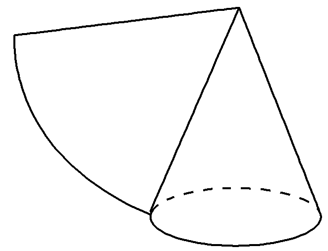

（3）攒尖是中国古建筑中屋顶的一种结构形式，兰州市著名景点三台阁(如图①)的屋顶部分是典型的攒尖结构.如图②所示是某研究性学习小组制作的三台阁仿真模型的屋顶部分，它可以看作是不含下底面的正四棱台和正三棱柱的组合体，已知正四棱台上底边、下底边、侧棱的长度(单位：dm)分别为2，6，4，正三棱柱各棱长均相等，则该结构的表面积为<u>　　　　</u>dm2.

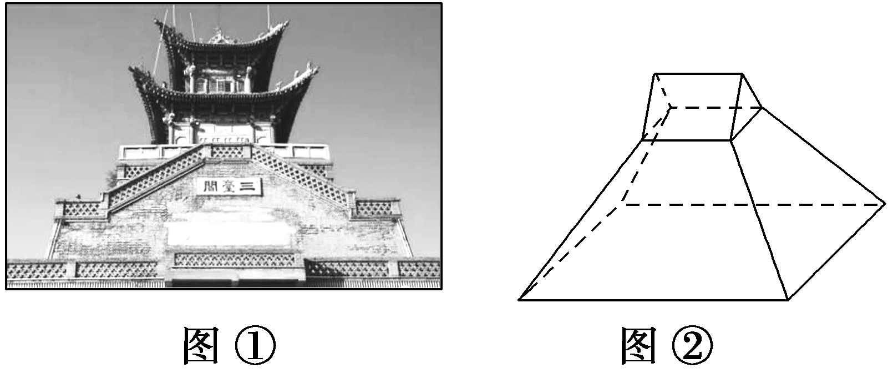

答案（1）A　（2） $\frac{16\pi }{3}$ 　（3）34 $\sqrt{3}$ ＋8

解析

(&lt;text style="subsc<em>&lt;text style="italic"&gt;&lt;text style="italic"&gt;&lt;text style="italic"&gt;&lt;text style="italic"&gt;r</em>&lt;/text&gt;&lt;/text&gt;&lt;/text&gt;&lt;/text&gt;ipt"&gt;&lt;text style="subscript"&gt;&lt;text style="subscript"&gt;1&lt;/text&gt;&lt;/text&gt;&lt;/text&gt;)如图所示，设球<em>&lt;text style="italic"&gt;&lt;text style="italic"&gt;&lt;text style="italic"&gt;&lt;text style="italic"&gt;O</em>&lt;/text&gt;&lt;/text&gt;&lt;/text&gt;&lt;/text&gt;的半径为<em>&lt;text style="italic"&gt;&lt;text style="italic"&gt;R</em>&lt;/text&gt;&lt;/text&gt;，☉O1的半径为r，因为☉O1的面积为4π，所以4π＝πr&lt;text style="superscript"&gt;&lt;text style="superscript"&gt;&lt;text style="superscript"&gt;&lt;text style="superscript"&gt;&lt;text style="superscript"&gt;2&lt;/text&gt;&lt;/text&gt;&lt;/text&gt;&lt;/text&gt;&lt;/text&gt;，解得r＝2.又<em>&lt;text style="italic"&gt;AB</em>&lt;/text&gt;＝<em>BC</em>＝<em>AC</em>＝<em>&lt;text style="italic"&gt;OO</em>&lt;/text&gt;1，所以 $\frac{AB}{sin60\circ }$ ＝&lt;text style="supe<em>&lt;text style="italic"&gt;&lt;text style="italic"&gt;r</em>&lt;/text&gt;&lt;/text&gt;script"&gt;&lt;text style="superscript"&gt;&lt;text style="superscript"&gt;&lt;text style="superscript"&gt;&lt;text style="superscript"&gt;2&lt;/text&gt;&lt;/text&gt;&lt;/text&gt;&lt;/text&gt;&lt;/text&gt;<em>&lt;text style="italic"&gt;r</em>&lt;/text&gt;，解得<em>&lt;text style="italic"&gt;AB</em>&lt;/text&gt;＝2 $\sqrt{3}$ ，故<em>&lt;text style="italic"&gt;&lt;text style="italic"&gt;&lt;text style="italic"&gt;&lt;text style="italic"&gt;O</em>&lt;/text&gt;&lt;/text&gt;&lt;/text&gt;&lt;/text&gt;O&lt;text style="subsc<em>&lt;text style="italic"&gt;&lt;text style="italic"&gt;&lt;text style="italic"&gt;&lt;text style="italic"&gt;r</em>&lt;/text&gt;&lt;/text&gt;&lt;/text&gt;&lt;/text&gt;ipt"&gt;&lt;text style="subscript"&gt;&lt;text style="subscript"&gt;1&lt;/text&gt;&lt;/text&gt;&lt;/text&gt;＝&lt;text style="superscript"&gt;&lt;text style="superscript"&gt;&lt;text style="superscript"&gt;&lt;text style="superscript"&gt;&lt;text style="superscript"&gt;2&lt;/text&gt;&lt;/text&gt;&lt;/text&gt;&lt;/text&gt;&lt;/text&gt; $\sqrt{3}$ ，所以<em>&lt;text style="italic"&gt;&lt;text style="italic"&gt;R</em>&lt;/text&gt;&lt;/text&gt;&lt;text style="supe<em>&lt;text style="italic"&gt;&lt;text style="italic"&gt;r</em>&lt;/text&gt;&lt;/text&gt;script"&gt;&lt;text style="superscript"&gt;&lt;text style="superscript"&gt;&lt;text style="superscript"&gt;&lt;text style="superscript"&gt;2&lt;/text&gt;&lt;/text&gt;&lt;/text&gt;&lt;/text&gt;&lt;/text&gt;＝<em>&lt;text style="italic"&gt;&lt;text style="italic"&gt;&lt;text style="italic"&gt;&lt;text style="italic"&gt;O</em>&lt;/text&gt;&lt;/text&gt;&lt;/text&gt;&lt;/text&gt; $O_{1}^{2}$ ＋<em>&lt;text style="italic"&gt;&lt;text style="italic"&gt;&lt;text style="italic"&gt;&lt;text style="italic"&gt;r</em>&lt;/text&gt;&lt;/text&gt;&lt;/text&gt;&lt;/text&gt;&lt;text style="superscript"&gt;&lt;text style="superscript"&gt;&lt;text style="superscript"&gt;&lt;text style="superscript"&gt;&lt;text style="superscript"&gt;2&lt;/text&gt;&lt;/text&gt;&lt;/text&gt;&lt;/text&gt;&lt;/text&gt;＝(2 $\sqrt{3}$ )&lt;text style="supe<em>&lt;text style="italic"&gt;&lt;text style="italic"&gt;r</em>&lt;/text&gt;&lt;/text&gt;script"&gt;&lt;text style="superscript"&gt;&lt;text style="superscript"&gt;&lt;text style="superscript"&gt;&lt;text style="superscript"&gt;2&lt;/text&gt;&lt;/text&gt;&lt;/text&gt;&lt;/text&gt;&lt;/text&gt;＋22＝&lt;text style="subsc<em>&lt;text style="italic"&gt;r</em>&lt;/text&gt;ipt"&gt;&lt;text style="subscript"&gt;&lt;text style="subscript"&gt;1&lt;/text&gt;&lt;/text&gt;&lt;/text&gt;6，所以球<em>&lt;text style="italic"&gt;&lt;text style="italic"&gt;&lt;text style="italic"&gt;&lt;text style="italic"&gt;O</em>&lt;/text&gt;&lt;/text&gt;&lt;/text&gt;&lt;/text&gt;的表面积<em>S</em>＝4π<em>&lt;text style="italic"&gt;&lt;text style="italic"&gt;R</em>&lt;/text&gt;&lt;/text&gt;2＝64π.故选A.

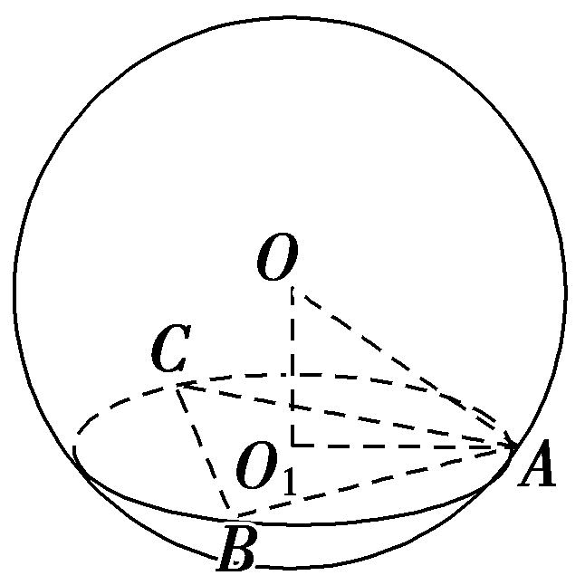

（2）设圆锥的底面半径为&lt;text sty&lt;text sty&lt;text sty&lt;text sty&lt;text sty&lt;text sty<em>l</em>e="italic"&gt;l&lt;/text&gt;e="italic"&gt;l&lt;/text&gt;e="italic"&gt;l&lt;/text&gt;e="italic"&gt;l&lt;/text&gt;e="italic"&gt;l&lt;/text&gt;e="italic"&gt;<em>&lt;text style="italic"&gt;&lt;text style="italic"&gt;R</em>&lt;/text&gt;&lt;/text&gt;&lt;/text&gt;，母线长为l，则R＝&lt;text style="subsc<em>&lt;text style="italic"&gt;r</em>&lt;/text&gt;ipt"&gt;&lt;text style="subscript"&gt;1&lt;/text&gt;&lt;/text&gt;，设圆台上底面半径为<em>r</em>，母线长为l1，则r＝ $\frac{1}{3}$ .由已知可得， $\frac{\pi }{3}$ &lt;text sty&lt;text sty&lt;text sty&lt;text sty&lt;text sty<em>l</em>e="italic"&gt;l&lt;/text&gt;e="italic"&gt;l&lt;/text&gt;e="italic"&gt;l&lt;/text&gt;e="italic"&gt;l&lt;/text&gt;e="italic"&gt;l&lt;/text&gt;＝2π<em>&lt;text style="italic"&gt;&lt;text style="italic"&gt;&lt;text style="italic"&gt;R</em>&lt;/text&gt;&lt;/text&gt;&lt;/text&gt;，所以l＝6.如图，作出圆锥、圆台的轴截面，则有 $\frac{l－l_{1}}{l}$ ＝ $\frac{r}{R}$ ＝ $\frac{1}{3}$ ，解得&lt;text sty&lt;text sty&lt;text sty&lt;text sty&lt;text sty<em>l</em>e="italic"&gt;l&lt;/text&gt;e="italic"&gt;l&lt;/text&gt;e="italic"&gt;l&lt;/text&gt;e="italic"&gt;l&lt;/text&gt;e="italic"&gt;l&lt;/text&gt;&lt;text style="subsc<em>&lt;text style="italic"&gt;r</em>&lt;/text&gt;ipt"&gt;&lt;text style="subscript"&gt;1&lt;/text&gt;&lt;/text&gt;＝4.所以圆台的侧面积为π(<em>&lt;text style="italic"&gt;&lt;text style="italic"&gt;&lt;text style="italic"&gt;R</em>&lt;/text&gt;&lt;/text&gt;&lt;/text&gt;＋<em>r</em>)l1＝4× $\left(1+\frac{1}{3}\right)$ π＝ $\frac{16\pi }{3}$ .

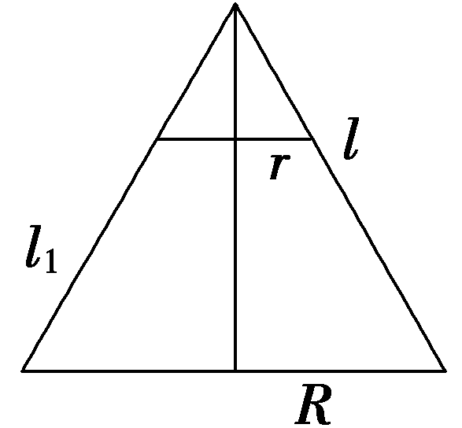

（3）正三棱柱部分的侧面积为&lt;text style="superscript"&gt;&lt;text style="superscript"&gt;&lt;text style="superscript"&gt;2&lt;/text&gt;&lt;/text&gt;&lt;/text&gt;×2×2＝8(dm2)，底面积为2× $\frac{1}{2}$ ×&lt;text style="superscript"&gt;&lt;text style="superscript"&gt;&lt;text style="superscript"&gt;2&lt;/text&gt;&lt;/text&gt;&lt;/text&gt;×2×sin 60°＝2 $\sqrt{3}$ (dm&lt;text style="superscript"&gt;&lt;text style="superscript"&gt;&lt;text style="superscript"&gt;2&lt;/text&gt;&lt;/text&gt;&lt;/text&gt;).正四棱台中，侧面梯形的高为 $\sqrt{4^{2}－(\frac{6－2}{2})^{2}}$ ＝&lt;text style="superscript"&gt;&lt;text style="superscript"&gt;&lt;text style="superscript"&gt;2&lt;/text&gt;&lt;/text&gt;&lt;/text&gt; $\sqrt{3}$ (dm)，所以正四棱台的侧面积为4× $\frac{(2+6)\times 2\sqrt{3}}{2}$ ＝3&lt;text style="superscript"&gt;&lt;text style="superscript"&gt;&lt;text style="superscript"&gt;2&lt;/text&gt;&lt;/text&gt;&lt;/text&gt; $\sqrt{3}$ (dm&lt;text style="superscript"&gt;&lt;text style="superscript"&gt;&lt;text style="superscript"&gt;2&lt;/text&gt;&lt;/text&gt;&lt;/text&gt;).所以该结构的表面积为8＋2 $\sqrt{3}$ ＋3&lt;text style="superscript"&gt;&lt;text style="superscript"&gt;&lt;text style="superscript"&gt;2&lt;/text&gt;&lt;/text&gt;&lt;/text&gt; $\sqrt{3}$ ＝(34 $\sqrt{3}$ ＋8)(dm&lt;text style="superscript"&gt;&lt;text style="superscript"&gt;&lt;text style="superscript"&gt;2&lt;/text&gt;&lt;/text&gt;&lt;/text&gt;).

求解几何体表面积的类型及方法

<table><tr><td>
求多面体的表面积
</td><td>
直接求各面面积然后求和或将它们沿着棱“剪开”展成平面图形，利用求平面图形面积的方法求多面体的表面积
</td></tr><tr><td>
求旋转体的表面积
</td><td>
可以从旋转体的形成过程及其几何特征入手，将其展开后求表面积，但要搞清它们的底面半径、母线长与对应侧面展开图中的边长关系
</td></tr><tr><td>
求不规则几何体的表面积
</td><td>
通常将所给几何体分割成基本的柱体、锥体、台体，先求出这些基本的柱体、锥体、台体的表面积，再通过求和或作差，求出所给不规则几何体的表面积
</td></tr></table>

对点练2.已知四棱锥*P*-*ABCD*的底面是边长为4的正方形，*PC*＝*PD*＝3，∠*PCA*＝45°，则△*PBC*的面积为(　　)

$\quad$A.2 $\sqrt{2}$ 	
$\quad$B.3 $\sqrt{2}$

$\quad$C.4 $\sqrt{2}$ 	
$\quad$D.6 $\sqrt{2}$

答案C

解析如图，过点<em>&lt;text style="italic"&gt;P</em>&lt;/text&gt;作<em>P&lt;text style="italic"&gt;&lt;text style="italic"&gt;O</em>&lt;/text&gt;&lt;/text&gt;⊥平面<em>&lt;text style="italic"&gt;AB</em>CD&lt;/text&gt;，垂足为O，取<em>&lt;text style="italic"&gt;&lt;text style="italic"&gt;&lt;text style="italic"&gt;&lt;text style="italic"&gt;&lt;text style="italic"&gt;DC</em>&lt;/text&gt;&lt;/text&gt;&lt;/text&gt;&lt;/text&gt;&lt;/text&gt;的中点<em>&lt;text style="italic"&gt;M</em>&lt;/text&gt;，AB的中点<em>&lt;text style="italic"&gt;N</em>&lt;/text&gt;，连接<em>&lt;text style="italic"&gt;&lt;text style="italic"&gt;PM</em>&lt;/text&gt;&lt;/text&gt;，<em>MN</em>，<em>AO</em>，<em>BO</em>，<em>&lt;text style="italic"&gt;&lt;text style="italic"&gt;OM</em>&lt;/text&gt;&lt;/text&gt;.由<em>PC</em>＝<em>PD</em>，得PM⊥DC，又<em>&lt;text style="italic"&gt;PO</em>&lt;/text&gt;⊥DC，PO∩PM＝P，所以DC⊥平面<em>&lt;text style="italic"&gt;POM</em>&lt;/text&gt;，又OM⊂平面POM，所以DC⊥OM.在正方形<em>ABCD</em>中，DC⊥<em>NM</em>，所以M，N，O三点共线，所以<em>OA</em>＝<em>OB</em>，所以Rt△<em>&lt;text style="italic"&gt;&lt;text style="italic"&gt;PA</em>&lt;/text&gt;O&lt;/text&gt;≌Rt△<em>&lt;text style="italic"&gt;&lt;text style="italic"&gt;PB</em>&lt;/text&gt;O&lt;/text&gt;，所以PB＝PA.在△<em>PAC</em>中，由余弦定理，得PA＝ $\sqrt{PC^{2}＋AC^{2}－2PC\cdot ACcos45\circ }$ ＝ $\sqrt{17}$ ，所以<em>&lt;text style="italic"&gt;P</em>&lt;/text&gt;B＝ $\sqrt{17}$ .在△<em>&lt;text style="italic"&gt;P</em>&lt;/text&gt;BC中，由余弦定理，得cos ∠<em>PC</em>B＝ $\frac{PC^{2}＋BC^{2}－BP^{2}}{2PC\cdot BC}$ ＝ $\frac{1}{3}$ ，所以sin ∠<em>&lt;text style="italic"&gt;P</em>&lt;/text&gt;CB＝ $\frac{2\sqrt{2}}{3}$ ，所以<em>S</em>△<em>&lt;text style="italic"&gt;P</em>&lt;/text&gt;BC＝ $\frac{1}{2}$ <em>&lt;text style="italic"&gt;P</em>&lt;/text&gt;C·BCsin ∠<em>PC</em>B＝4 $\sqrt{2}$ ，故选C.

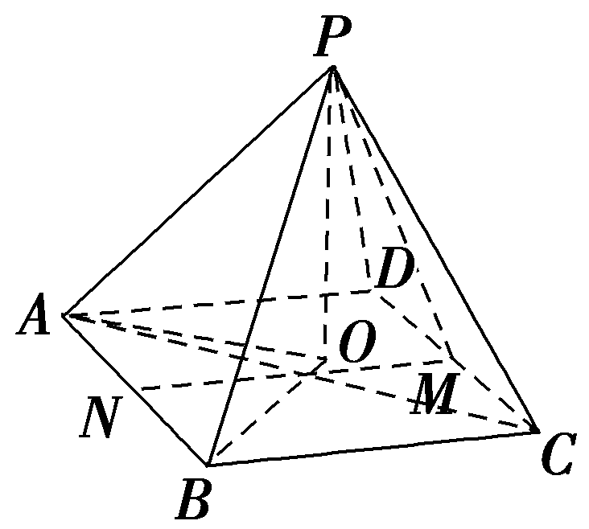

对点练3.用一个平行于圆锥底面的平面去截圆锥，截得的圆台上底面半径为1，下底面半径为2，且该圆台的侧面积为3 $\sqrt{5}$ π，则原圆锥的母线长为(　　 )

$\quad$A.2	
$\quad$B. $\sqrt{5}$

$\quad$C.4	
$\quad$D.2 $\sqrt{5}$

答案D

解析设圆台的母线长为<text sty<text sty<text sty*l*e="italic">l</text>e="italic">l</text>e="italic">l</text>，因为该圆台的侧面积为3 $\sqrt{5}$ π，所以由圆台侧面积公式可得π<text sty<text sty<text sty*l*e="italic">l</text>e="italic">l</text>e="italic">l</text>(1＋2)＝3πl＝3 $\sqrt{5}$ π，解得<text sty<text sty<text sty*l*e="italic">l</text>e="italic">l</text>e="italic">l</text>＝ $\sqrt{5}$ .设原圆锥的母线长为<text sty<text sty<text sty*l*e="italic">l</text>e="italic">l</text>e="italic">l</text>'，由三角形相似可得 $\frac{l'-l}{l'}$ ＝ $\frac{1}{2}$ ，解得<text sty<text sty<text sty*l*e="italic">l</text>e="italic">l</text>e="italic">l</text>'＝2 $\sqrt{5}$ ，所以原圆锥的母线长为2 $\sqrt{5}$ .故选D.

考点三　空间几何体的体积　　　　多维探究

角度1　公式法求体积

（1）(2022·全国&lt;text style="subscript"&gt;甲&lt;/text&gt;卷)甲、&lt;text style="subscript"&gt;乙&lt;/text&gt;两个圆锥的母线长相等，侧面展开图的圆心角之和为2π，侧面积分别为<em>&lt;text style="italic"&gt;S</em>&lt;/text&gt;甲和S乙，体积分别为<em>&lt;text style="italic"&gt;V</em>&lt;/text&gt;甲和V乙.若 $\frac{S_{甲}}{S_{乙}}$ ＝2，则 $\frac{V_{甲}}{V_{乙}}$ ＝(　　 )

$\quad$A. $\sqrt{5}$ 	
$\quad$B.2 $\sqrt{2}$

$\quad$C. $\sqrt{10}$ 	
$\quad$D. $\frac{5\sqrt{10}}{4}$

（2）(一题多解)(2023·新课标Ⅰ卷)在正四棱台<em>&lt;text style="italic"&gt;&lt;text style="italic"&gt;A</em>&lt;/text&gt;<em>&lt;text style="italic"&gt;B</em>&lt;/text&gt;<em>CD</em>&lt;/text&gt; -A&lt;text style="subscript"&gt;&lt;text style="subscript"&gt;&lt;text style="subscript"&gt;&lt;text style="subscript"&gt;&lt;text style="subscript"&gt;&lt;text style="subscript"&gt;1&lt;/text&gt;&lt;/text&gt;&lt;/text&gt;&lt;/text&gt;&lt;/text&gt;&lt;/text&gt;B1C1D1中，<em>AB</em>＝2，A1B1＝1，<em>AA</em>1＝ $\sqrt{2}$ ，则该棱台的体积为<u>　　　　</u>.

答案（1）C　（2） $\frac{7\sqrt{6}}{6}$

解析(&lt;text sty&lt;text sty&lt;text sty&lt;text sty<em>l</em>e="italic"&gt;l&lt;/text&gt;e="italic"&gt;l&lt;/text&gt;e="italic"&gt;l&lt;/text&gt;e="subsc<em>&lt;text style="italic"&gt;&lt;text style="italic"&gt;&lt;text style="italic"&gt;&lt;text style="italic"&gt;r</em>&lt;/text&gt;&lt;/text&gt;&lt;/text&gt;&lt;/text&gt;ipt"&gt;&lt;text style="subscript"&gt;&lt;text style="subscript"&gt;1&lt;/text&gt;&lt;/text&gt;&lt;/text&gt;)设母线长为<em>l</em>，甲圆锥底面半径为<em>r</em>1，乙圆锥底面圆半径为r&lt;text style="subscript"&gt;&lt;text style="subscript"&gt;&lt;text style="subscript"&gt;2&lt;/text&gt;&lt;/text&gt;&lt;/text&gt;，则 $\frac{S_{甲}}{S_{乙}}$ ＝ $\frac{\pi r_{1}l}{\pi r_{2}l}$ ＝ $\frac{r_{1}}{r_{2}}$ ＝&lt;text sty&lt;text sty&lt;text sty&lt;text sty<em>l</em>e="italic"&gt;l&lt;/text&gt;e="italic"&gt;l&lt;/text&gt;e="italic"&gt;l&lt;/text&gt;e="subsc<em>&lt;text style="italic"&gt;&lt;text style="italic"&gt;&lt;text style="italic"&gt;r</em>&lt;/text&gt;&lt;/text&gt;&lt;/text&gt;ipt"&gt;&lt;text style="subscript"&gt;&lt;text style="subscript"&gt;2&lt;/text&gt;&lt;/text&gt;&lt;/text&gt;，所以<em>&lt;text style="italic"&gt;r</em>&lt;/text&gt;&lt;text style="subscript"&gt;&lt;text style="subscript"&gt;&lt;text style="subscript"&gt;1&lt;/text&gt;&lt;/text&gt;&lt;/text&gt;＝2r2，又 $\frac{2\pi r_{1}}{l}$ ＋ $\frac{2\pi r_{2}}{l}$ ＝&lt;text sty&lt;text sty&lt;text sty&lt;text sty<em>l</em>e="italic"&gt;l&lt;/text&gt;e="italic"&gt;l&lt;/text&gt;e="italic"&gt;l&lt;/text&gt;e="subsc<em>&lt;text style="italic"&gt;&lt;text style="italic"&gt;&lt;text style="italic"&gt;r</em>&lt;/text&gt;&lt;/text&gt;&lt;/text&gt;ipt"&gt;&lt;text style="subscript"&gt;&lt;text style="subscript"&gt;2&lt;/text&gt;&lt;/text&gt;&lt;/text&gt;π，则 $\frac{r_{1}＋r_{2}}{l}$ ＝&lt;text sty&lt;text sty&lt;text sty&lt;text sty<em>l</em>e="italic"&gt;l&lt;/text&gt;e="italic"&gt;l&lt;/text&gt;e="italic"&gt;l&lt;/text&gt;e="subsc<em>&lt;text style="italic"&gt;&lt;text style="italic"&gt;&lt;text style="italic"&gt;&lt;text style="italic"&gt;r</em>&lt;/text&gt;&lt;/text&gt;&lt;/text&gt;&lt;/text&gt;ipt"&gt;&lt;text style="subscript"&gt;&lt;text style="subscript"&gt;1&lt;/text&gt;&lt;/text&gt;&lt;/text&gt;，所以<em>r</em>1＝ $\frac{2}{3}$ &lt;text sty&lt;text sty&lt;text sty&lt;text sty<em>l</em>e="italic"&gt;l&lt;/text&gt;e="italic"&gt;l&lt;/text&gt;e="italic"&gt;l&lt;/text&gt;e="italic"&gt;l&lt;/text&gt;，<em>&lt;text style="italic"&gt;&lt;text style="italic"&gt;&lt;text style="italic"&gt;&lt;text style="italic"&gt;&lt;text style="italic"&gt;r</em>&lt;/text&gt;&lt;/text&gt;&lt;/text&gt;&lt;/text&gt;&lt;/text&gt;&lt;text style="subscript"&gt;&lt;text style="subscript"&gt;&lt;text style="subscript"&gt;2&lt;/text&gt;&lt;/text&gt;&lt;/text&gt;＝ $\frac{1}{3}$ &lt;text sty&lt;text sty&lt;text sty&lt;text sty<em>l</em>e="italic"&gt;l&lt;/text&gt;e="italic"&gt;l&lt;/text&gt;e="italic"&gt;l&lt;/text&gt;e="italic"&gt;l&lt;/text&gt;，所以甲圆锥的高<em>&lt;text style="italic"&gt;h</em>&lt;/text&gt;&lt;text style="subsc<em>&lt;text style="italic"&gt;&lt;text style="italic"&gt;&lt;text style="italic"&gt;&lt;text style="italic"&gt;r</em>&lt;/text&gt;&lt;/text&gt;&lt;/text&gt;&lt;/text&gt;ipt"&gt;&lt;text style="subscript"&gt;&lt;text style="subscript"&gt;1&lt;/text&gt;&lt;/text&gt;&lt;/text&gt;＝ $\sqrt{l^{2}－\frac{4}{9}l^{2}}$ ＝ $\frac{\sqrt{5}}{3}$ &lt;text sty&lt;text sty&lt;text sty&lt;text sty<em>l</em>e="italic"&gt;l&lt;/text&gt;e="italic"&gt;l&lt;/text&gt;e="italic"&gt;l&lt;/text&gt;e="italic"&gt;l&lt;/text&gt;，乙圆锥的高<em>&lt;text style="italic"&gt;h</em>&lt;/text&gt;&lt;text style="subsc<em>&lt;text style="italic"&gt;&lt;text style="italic"&gt;&lt;text style="italic"&gt;r</em>&lt;/text&gt;&lt;/text&gt;&lt;/text&gt;ipt"&gt;&lt;text style="subscript"&gt;&lt;text style="subscript"&gt;2&lt;/text&gt;&lt;/text&gt;&lt;/text&gt;＝ $\sqrt{l^{2}－\frac{1}{9}l^{2}}$ ＝ $\frac{2\sqrt{2}}{3}$ &lt;text sty&lt;text sty&lt;text sty&lt;text sty<em>l</em>e="italic"&gt;l&lt;/text&gt;e="italic"&gt;l&lt;/text&gt;e="italic"&gt;l&lt;/text&gt;e="italic"&gt;l&lt;/text&gt;，所以 $\frac{V_{甲}}{V_{乙}}$ ＝ $\frac{\frac{1}{3}\pi r_{1}^{2}h_{1}}{\frac{1}{3}\pi r_{2}^{2}h_{2}}$ ＝ $\frac{\frac{4}{9}l^{2}\times \frac{\sqrt{5}}{3}l}{\frac{1}{9}l^{2}\times \frac{2\sqrt{2}}{3}l}$ ＝ $\sqrt{10}$ .故选C.

(&lt;text style="superscript"&gt;2&lt;/text&gt;)法一：如图所示，设点<em>&lt;text style="italic"&gt;&lt;text style="italic"&gt;&lt;text style="italic"&gt;&lt;text style="italic"&gt;&lt;text style="italic"&gt;&lt;text style="italic"&gt;&lt;text style="italic"&gt;&lt;text style="italic"&gt;&lt;text style="italic"&gt;&lt;text style="italic"&gt;&lt;text style="italic"&gt;&lt;text style="italic"&gt;&lt;text style="italic"&gt;O</em>&lt;/text&gt;&lt;/text&gt;&lt;/text&gt;&lt;/text&gt;&lt;/text&gt;&lt;/text&gt;&lt;/text&gt;&lt;/text&gt;&lt;/text&gt;&lt;/text&gt;&lt;/text&gt;&lt;/text&gt;&lt;/text&gt;&lt;text style="subscript"&gt;&lt;text style="subscript"&gt;&lt;text style="subscript"&gt;&lt;text style="subscript"&gt;&lt;text style="subscript"&gt;&lt;text style="subscript"&gt;&lt;text style="subscript"&gt;&lt;text style="subscript"&gt;&lt;text style="subscript"&gt;&lt;text style="subscript"&gt;&lt;text style="subscript"&gt;&lt;text style="subscript"&gt;&lt;text style="subscript"&gt;&lt;text style="subscript"&gt;&lt;text style="subscript"&gt;&lt;text style="subscript"&gt;&lt;text style="subscript"&gt;&lt;text style="subscript"&gt;&lt;text style="subscript"&gt;&lt;text style="subscript"&gt;&lt;text style="subscript"&gt;&lt;text style="subscript"&gt;&lt;text style="subscript"&gt;&lt;text style="subscript"&gt;&lt;text style="subscript"&gt;&lt;text style="subscript"&gt;&lt;text style="subscript"&gt;&lt;text style="subscript"&gt;&lt;text style="subscript"&gt;1&lt;/text&gt;&lt;/text&gt;&lt;/text&gt;&lt;/text&gt;&lt;/text&gt;&lt;/text&gt;&lt;/text&gt;&lt;/text&gt;&lt;/text&gt;&lt;/text&gt;&lt;/text&gt;&lt;/text&gt;&lt;/text&gt;&lt;/text&gt;&lt;/text&gt;&lt;/text&gt;&lt;/text&gt;&lt;/text&gt;&lt;/text&gt;&lt;/text&gt;&lt;/text&gt;&lt;/text&gt;&lt;/text&gt;&lt;/text&gt;&lt;/text&gt;&lt;/text&gt;&lt;/text&gt;&lt;/text&gt;&lt;/text&gt;，O分别为正四棱台<em>&lt;text style="italic"&gt;&lt;text style="italic"&gt;&lt;text style="italic"&gt;A</em>&lt;/text&gt;&lt;/text&gt;<em>&lt;text style="italic"&gt;&lt;text style="italic"&gt;&lt;text style="italic"&gt;&lt;text style="italic"&gt;&lt;text style="italic"&gt;&lt;text style="italic"&gt;&lt;text style="italic"&gt;&lt;text style="italic"&gt;&lt;text style="italic"&gt;&lt;text style="italic"&gt;B</em>&lt;/text&gt;&lt;/text&gt;&lt;/text&gt;&lt;/text&gt;&lt;/text&gt;&lt;/text&gt;&lt;/text&gt;&lt;/text&gt;&lt;/text&gt;&lt;/text&gt;<em>&lt;text style="italic"&gt;C</em>&lt;/text&gt;<em>&lt;text style="italic"&gt;&lt;text style="italic"&gt;&lt;text style="italic"&gt;D</em>&lt;/text&gt;&lt;/text&gt;&lt;/text&gt;&lt;/text&gt;-A1B1C1D1上、下底面的中心，连接B1D1，<em>&lt;text style="italic"&gt;&lt;text style="italic"&gt;BD</em>&lt;/text&gt;&lt;/text&gt;，则O1，O分别为B1D1，BD的中点.连接O1O，则O1O即正四棱台<em>&lt;text style="italic"&gt;AB</em>CD&lt;/text&gt;-A1B1C1D1的高.过点B1作B1<em>&lt;text style="italic"&gt;&lt;text style="italic"&gt;&lt;text style="italic"&gt;E</em>&lt;/text&gt;&lt;/text&gt;&lt;/text&gt;⊥BD，垂足为E，则B1E＝O1O.因为AB＝2，A1B1＝1，所以<em>&lt;text style="italic"&gt;&lt;text style="italic"&gt;OB</em>&lt;/text&gt;&lt;/text&gt;＝ $\sqrt{2}$ ，<em>&lt;text style="italic"&gt;&lt;text style="italic"&gt;&lt;text style="italic"&gt;&lt;text style="italic"&gt;&lt;text style="italic"&gt;&lt;text style="italic"&gt;&lt;text style="italic"&gt;&lt;text style="italic"&gt;&lt;text style="italic"&gt;&lt;text style="italic"&gt;&lt;text style="italic"&gt;&lt;text style="italic"&gt;&lt;text style="italic"&gt;O</em>&lt;/text&gt;&lt;/text&gt;&lt;/text&gt;&lt;/text&gt;&lt;/text&gt;&lt;/text&gt;&lt;/text&gt;&lt;/text&gt;&lt;/text&gt;&lt;/text&gt;&lt;/text&gt;&lt;/text&gt;&lt;/text&gt;&lt;text style="subscript"&gt;&lt;text style="subscript"&gt;&lt;text style="subscript"&gt;&lt;text style="subscript"&gt;&lt;text style="subscript"&gt;&lt;text style="subscript"&gt;&lt;text style="subscript"&gt;&lt;text style="subscript"&gt;&lt;text style="subscript"&gt;&lt;text style="subscript"&gt;&lt;text style="subscript"&gt;&lt;text style="subscript"&gt;&lt;text style="subscript"&gt;&lt;text style="subscript"&gt;&lt;text style="subscript"&gt;&lt;text style="subscript"&gt;&lt;text style="subscript"&gt;&lt;text style="subscript"&gt;&lt;text style="subscript"&gt;&lt;text style="subscript"&gt;&lt;text style="subscript"&gt;&lt;text style="subscript"&gt;&lt;text style="subscript"&gt;&lt;text style="subscript"&gt;&lt;text style="subscript"&gt;&lt;text style="subscript"&gt;&lt;text style="subscript"&gt;&lt;text style="subscript"&gt;&lt;text style="subscript"&gt;1&lt;/text&gt;&lt;/text&gt;&lt;/text&gt;&lt;/text&gt;&lt;/text&gt;&lt;/text&gt;&lt;/text&gt;&lt;/text&gt;&lt;/text&gt;&lt;/text&gt;&lt;/text&gt;&lt;/text&gt;&lt;/text&gt;&lt;/text&gt;&lt;/text&gt;&lt;/text&gt;&lt;/text&gt;&lt;/text&gt;&lt;/text&gt;&lt;/text&gt;&lt;/text&gt;&lt;/text&gt;&lt;/text&gt;&lt;/text&gt;&lt;/text&gt;&lt;/text&gt;&lt;/text&gt;&lt;/text&gt;&lt;/text&gt;<em>&lt;text style="italic"&gt;&lt;text style="italic"&gt;&lt;text style="italic"&gt;&lt;text style="italic"&gt;&lt;text style="italic"&gt;&lt;text style="italic"&gt;&lt;text style="italic"&gt;&lt;text style="italic"&gt;&lt;text style="italic"&gt;&lt;text style="italic"&gt;B</em>&lt;/text&gt;&lt;/text&gt;&lt;/text&gt;&lt;/text&gt;&lt;/text&gt;&lt;/text&gt;&lt;/text&gt;&lt;/text&gt;&lt;/text&gt;&lt;/text&gt;1＝ $\frac{\sqrt{2}}{2}$ ，所以<em>&lt;text style="italic"&gt;&lt;text style="italic"&gt;&lt;text style="italic"&gt;&lt;text style="italic"&gt;&lt;text style="italic"&gt;&lt;text style="italic"&gt;&lt;text style="italic"&gt;&lt;text style="italic"&gt;&lt;text style="italic"&gt;&lt;text style="italic"&gt;B</em>&lt;/text&gt;&lt;/text&gt;&lt;/text&gt;&lt;/text&gt;&lt;/text&gt;&lt;/text&gt;&lt;/text&gt;&lt;/text&gt;&lt;/text&gt;&lt;/text&gt;<em>&lt;text style="italic"&gt;&lt;text style="italic"&gt;&lt;text style="italic"&gt;E</em>&lt;/text&gt;&lt;/text&gt;&lt;/text&gt;＝<em>&lt;text style="italic"&gt;&lt;text style="italic"&gt;&lt;text style="italic"&gt;&lt;text style="italic"&gt;&lt;text style="italic"&gt;&lt;text style="italic"&gt;&lt;text style="italic"&gt;&lt;text style="italic"&gt;&lt;text style="italic"&gt;&lt;text style="italic"&gt;&lt;text style="italic"&gt;&lt;text style="italic"&gt;&lt;text style="italic"&gt;O</em>&lt;/text&gt;&lt;/text&gt;&lt;/text&gt;&lt;/text&gt;&lt;/text&gt;&lt;/text&gt;&lt;/text&gt;&lt;/text&gt;&lt;/text&gt;&lt;/text&gt;&lt;/text&gt;&lt;/text&gt;&lt;/text&gt;B－<em>OE</em>＝<em>&lt;text style="italic"&gt;&lt;text style="italic"&gt;OB</em>&lt;/text&gt;&lt;/text&gt;－O&lt;text style="subscript"&gt;&lt;text style="subscript"&gt;&lt;text style="subscript"&gt;&lt;text style="subscript"&gt;&lt;text style="subscript"&gt;&lt;text style="subscript"&gt;&lt;text style="subscript"&gt;&lt;text style="subscript"&gt;&lt;text style="subscript"&gt;&lt;text style="subscript"&gt;&lt;text style="subscript"&gt;&lt;text style="subscript"&gt;&lt;text style="subscript"&gt;&lt;text style="subscript"&gt;&lt;text style="subscript"&gt;&lt;text style="subscript"&gt;&lt;text style="subscript"&gt;&lt;text style="subscript"&gt;&lt;text style="subscript"&gt;&lt;text style="subscript"&gt;&lt;text style="subscript"&gt;&lt;text style="subscript"&gt;&lt;text style="subscript"&gt;&lt;text style="subscript"&gt;&lt;text style="subscript"&gt;&lt;text style="subscript"&gt;&lt;text style="subscript"&gt;&lt;text style="subscript"&gt;&lt;text style="subscript"&gt;1&lt;/text&gt;&lt;/text&gt;&lt;/text&gt;&lt;/text&gt;&lt;/text&gt;&lt;/text&gt;&lt;/text&gt;&lt;/text&gt;&lt;/text&gt;&lt;/text&gt;&lt;/text&gt;&lt;/text&gt;&lt;/text&gt;&lt;/text&gt;&lt;/text&gt;&lt;/text&gt;&lt;/text&gt;&lt;/text&gt;&lt;/text&gt;&lt;/text&gt;&lt;/text&gt;&lt;/text&gt;&lt;/text&gt;&lt;/text&gt;&lt;/text&gt;&lt;/text&gt;&lt;/text&gt;&lt;/text&gt;&lt;/text&gt;B1＝ $\frac{\sqrt{2}}{2}$ ，又<em>&lt;text style="italic"&gt;&lt;text style="italic"&gt;A</em>&lt;/text&gt;&lt;/text&gt;A&lt;text style="subscript"&gt;&lt;text style="subscript"&gt;&lt;text style="subscript"&gt;&lt;text style="subscript"&gt;&lt;text style="subscript"&gt;&lt;text style="subscript"&gt;&lt;text style="subscript"&gt;&lt;text style="subscript"&gt;&lt;text style="subscript"&gt;&lt;text style="subscript"&gt;&lt;text style="subscript"&gt;&lt;text style="subscript"&gt;&lt;text style="subscript"&gt;&lt;text style="subscript"&gt;&lt;text style="subscript"&gt;&lt;text style="subscript"&gt;&lt;text style="subscript"&gt;&lt;text style="subscript"&gt;&lt;text style="subscript"&gt;&lt;text style="subscript"&gt;&lt;text style="subscript"&gt;&lt;text style="subscript"&gt;&lt;text style="subscript"&gt;&lt;text style="subscript"&gt;&lt;text style="subscript"&gt;&lt;text style="subscript"&gt;&lt;text style="subscript"&gt;&lt;text style="subscript"&gt;&lt;text style="subscript"&gt;1&lt;/text&gt;&lt;/text&gt;&lt;/text&gt;&lt;/text&gt;&lt;/text&gt;&lt;/text&gt;&lt;/text&gt;&lt;/text&gt;&lt;/text&gt;&lt;/text&gt;&lt;/text&gt;&lt;/text&gt;&lt;/text&gt;&lt;/text&gt;&lt;/text&gt;&lt;/text&gt;&lt;/text&gt;&lt;/text&gt;&lt;/text&gt;&lt;/text&gt;&lt;/text&gt;&lt;/text&gt;&lt;/text&gt;&lt;/text&gt;&lt;/text&gt;&lt;/text&gt;&lt;/text&gt;&lt;/text&gt;&lt;/text&gt;＝ $\sqrt{2}$ ，所以<em>&lt;text style="italic"&gt;&lt;text style="italic"&gt;&lt;text style="italic"&gt;&lt;text style="italic"&gt;&lt;text style="italic"&gt;&lt;text style="italic"&gt;&lt;text style="italic"&gt;&lt;text style="italic"&gt;&lt;text style="italic"&gt;&lt;text style="italic"&gt;B</em>&lt;/text&gt;&lt;/text&gt;&lt;/text&gt;&lt;/text&gt;&lt;/text&gt;&lt;/text&gt;&lt;/text&gt;&lt;/text&gt;&lt;/text&gt;&lt;/text&gt;B&lt;text style="subscript"&gt;&lt;text style="subscript"&gt;&lt;text style="subscript"&gt;&lt;text style="subscript"&gt;&lt;text style="subscript"&gt;&lt;text style="subscript"&gt;&lt;text style="subscript"&gt;&lt;text style="subscript"&gt;&lt;text style="subscript"&gt;&lt;text style="subscript"&gt;&lt;text style="subscript"&gt;&lt;text style="subscript"&gt;&lt;text style="subscript"&gt;&lt;text style="subscript"&gt;&lt;text style="subscript"&gt;&lt;text style="subscript"&gt;&lt;text style="subscript"&gt;&lt;text style="subscript"&gt;&lt;text style="subscript"&gt;&lt;text style="subscript"&gt;&lt;text style="subscript"&gt;&lt;text style="subscript"&gt;&lt;text style="subscript"&gt;&lt;text style="subscript"&gt;&lt;text style="subscript"&gt;&lt;text style="subscript"&gt;&lt;text style="subscript"&gt;&lt;text style="subscript"&gt;&lt;text style="subscript"&gt;1&lt;/text&gt;&lt;/text&gt;&lt;/text&gt;&lt;/text&gt;&lt;/text&gt;&lt;/text&gt;&lt;/text&gt;&lt;/text&gt;&lt;/text&gt;&lt;/text&gt;&lt;/text&gt;&lt;/text&gt;&lt;/text&gt;&lt;/text&gt;&lt;/text&gt;&lt;/text&gt;&lt;/text&gt;&lt;/text&gt;&lt;/text&gt;&lt;/text&gt;&lt;/text&gt;&lt;/text&gt;&lt;/text&gt;&lt;/text&gt;&lt;/text&gt;&lt;/text&gt;&lt;/text&gt;&lt;/text&gt;&lt;/text&gt;＝ $\sqrt{2}$ ，所以<em>&lt;text style="italic"&gt;&lt;text style="italic"&gt;&lt;text style="italic"&gt;&lt;text style="italic"&gt;&lt;text style="italic"&gt;&lt;text style="italic"&gt;&lt;text style="italic"&gt;&lt;text style="italic"&gt;&lt;text style="italic"&gt;&lt;text style="italic"&gt;B</em>&lt;/text&gt;&lt;/text&gt;&lt;/text&gt;&lt;/text&gt;&lt;/text&gt;&lt;/text&gt;&lt;/text&gt;&lt;/text&gt;&lt;/text&gt;&lt;/text&gt;&lt;text style="subscript"&gt;&lt;text style="subscript"&gt;&lt;text style="subscript"&gt;&lt;text style="subscript"&gt;&lt;text style="subscript"&gt;&lt;text style="subscript"&gt;&lt;text style="subscript"&gt;&lt;text style="subscript"&gt;&lt;text style="subscript"&gt;&lt;text style="subscript"&gt;&lt;text style="subscript"&gt;&lt;text style="subscript"&gt;&lt;text style="subscript"&gt;&lt;text style="subscript"&gt;&lt;text style="subscript"&gt;&lt;text style="subscript"&gt;&lt;text style="subscript"&gt;&lt;text style="subscript"&gt;&lt;text style="subscript"&gt;&lt;text style="subscript"&gt;&lt;text style="subscript"&gt;&lt;text style="subscript"&gt;&lt;text style="subscript"&gt;&lt;text style="subscript"&gt;&lt;text style="subscript"&gt;&lt;text style="subscript"&gt;&lt;text style="subscript"&gt;&lt;text style="subscript"&gt;&lt;text style="subscript"&gt;1&lt;/text&gt;&lt;/text&gt;&lt;/text&gt;&lt;/text&gt;&lt;/text&gt;&lt;/text&gt;&lt;/text&gt;&lt;/text&gt;&lt;/text&gt;&lt;/text&gt;&lt;/text&gt;&lt;/text&gt;&lt;/text&gt;&lt;/text&gt;&lt;/text&gt;&lt;/text&gt;&lt;/text&gt;&lt;/text&gt;&lt;/text&gt;&lt;/text&gt;&lt;/text&gt;&lt;/text&gt;&lt;/text&gt;&lt;/text&gt;&lt;/text&gt;&lt;/text&gt;&lt;/text&gt;&lt;/text&gt;&lt;/text&gt;<em>&lt;text style="italic"&gt;&lt;text style="italic"&gt;&lt;text style="italic"&gt;E</em>&lt;/text&gt;&lt;/text&gt;&lt;/text&gt;＝ $\sqrt{BB_{1}^{2}－BE^{2}}$ ＝ $\sqrt{2－\frac{1}{2}}$ ＝ $\frac{\sqrt{6}}{2}$ ，所以<em>&lt;text style="italic"&gt;&lt;text style="italic"&gt;&lt;text style="italic"&gt;&lt;text style="italic"&gt;&lt;text style="italic"&gt;&lt;text style="italic"&gt;&lt;text style="italic"&gt;&lt;text style="italic"&gt;&lt;text style="italic"&gt;&lt;text style="italic"&gt;&lt;text style="italic"&gt;&lt;text style="italic"&gt;&lt;text style="italic"&gt;O</em>&lt;/text&gt;&lt;/text&gt;&lt;/text&gt;&lt;/text&gt;&lt;/text&gt;&lt;/text&gt;&lt;/text&gt;&lt;/text&gt;&lt;/text&gt;&lt;/text&gt;&lt;/text&gt;&lt;/text&gt;&lt;/text&gt;&lt;text style="subscript"&gt;&lt;text style="subscript"&gt;&lt;text style="subscript"&gt;&lt;text style="subscript"&gt;&lt;text style="subscript"&gt;&lt;text style="subscript"&gt;&lt;text style="subscript"&gt;&lt;text style="subscript"&gt;&lt;text style="subscript"&gt;&lt;text style="subscript"&gt;&lt;text style="subscript"&gt;&lt;text style="subscript"&gt;&lt;text style="subscript"&gt;&lt;text style="subscript"&gt;&lt;text style="subscript"&gt;&lt;text style="subscript"&gt;&lt;text style="subscript"&gt;&lt;text style="subscript"&gt;&lt;text style="subscript"&gt;&lt;text style="subscript"&gt;&lt;text style="subscript"&gt;&lt;text style="subscript"&gt;&lt;text style="subscript"&gt;&lt;text style="subscript"&gt;&lt;text style="subscript"&gt;&lt;text style="subscript"&gt;&lt;text style="subscript"&gt;&lt;text style="subscript"&gt;&lt;text style="subscript"&gt;1&lt;/text&gt;&lt;/text&gt;&lt;/text&gt;&lt;/text&gt;&lt;/text&gt;&lt;/text&gt;&lt;/text&gt;&lt;/text&gt;&lt;/text&gt;&lt;/text&gt;&lt;/text&gt;&lt;/text&gt;&lt;/text&gt;&lt;/text&gt;&lt;/text&gt;&lt;/text&gt;&lt;/text&gt;&lt;/text&gt;&lt;/text&gt;&lt;/text&gt;&lt;/text&gt;&lt;/text&gt;&lt;/text&gt;&lt;/text&gt;&lt;/text&gt;&lt;/text&gt;&lt;/text&gt;&lt;/text&gt;&lt;/text&gt;O＝ $\frac{\sqrt{6}}{2}$ ，所以 $V_{正四棱台ABCD-A_{1}B_{1}C_{1}D_{1}}$ ＝ $\frac{1}{3}$ ×(&lt;text style="superscript"&gt;2&lt;/text&gt;2＋&lt;text style="subscript"&gt;&lt;text style="subscript"&gt;&lt;text style="subscript"&gt;&lt;text style="subscript"&gt;&lt;text style="subscript"&gt;&lt;text style="subscript"&gt;&lt;text style="subscript"&gt;&lt;text style="subscript"&gt;&lt;text style="subscript"&gt;&lt;text style="subscript"&gt;&lt;text style="subscript"&gt;&lt;text style="subscript"&gt;&lt;text style="subscript"&gt;&lt;text style="subscript"&gt;&lt;text style="subscript"&gt;&lt;text style="subscript"&gt;&lt;text style="subscript"&gt;&lt;text style="subscript"&gt;&lt;text style="subscript"&gt;&lt;text style="subscript"&gt;&lt;text style="subscript"&gt;&lt;text style="subscript"&gt;&lt;text style="subscript"&gt;&lt;text style="subscript"&gt;&lt;text style="subscript"&gt;&lt;text style="subscript"&gt;&lt;text style="subscript"&gt;&lt;text style="subscript"&gt;&lt;text style="subscript"&gt;1&lt;/text&gt;&lt;/text&gt;&lt;/text&gt;&lt;/text&gt;&lt;/text&gt;&lt;/text&gt;&lt;/text&gt;&lt;/text&gt;&lt;/text&gt;&lt;/text&gt;&lt;/text&gt;&lt;/text&gt;&lt;/text&gt;&lt;/text&gt;&lt;/text&gt;&lt;/text&gt;&lt;/text&gt;&lt;/text&gt;&lt;/text&gt;&lt;/text&gt;&lt;/text&gt;&lt;/text&gt;&lt;/text&gt;&lt;/text&gt;&lt;/text&gt;&lt;/text&gt;&lt;/text&gt;&lt;/text&gt;&lt;/text&gt;2＋ $\sqrt{2^{2}\times 1^{2}}$ )× $\frac{\sqrt{6}}{2}$ ＝ $\frac{7\sqrt{6}}{6}$ .

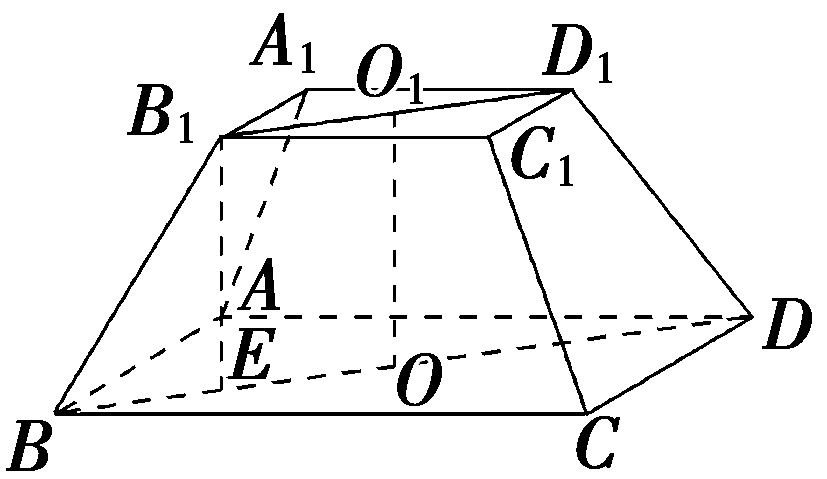

法二：如图，将正四棱台<em>&lt;text style="italic"&gt;&lt;text style="italic"&gt;&lt;text style="italic"&gt;&lt;text style="italic"&gt;&lt;text style="italic"&gt;&lt;text style="italic"&gt;&lt;text style="italic"&gt;A</em>&lt;/text&gt;&lt;/text&gt;&lt;/text&gt;&lt;/text&gt;&lt;/text&gt;&lt;/text&gt;<em>&lt;text style="italic"&gt;&lt;text style="italic"&gt;&lt;text style="italic"&gt;&lt;text style="italic"&gt;B</em>&lt;/text&gt;&lt;/text&gt;&lt;/text&gt;&lt;/text&gt;<em>&lt;text style="italic"&gt;&lt;text style="italic"&gt;C</em>&lt;/text&gt;&lt;/text&gt;<em>&lt;text style="italic"&gt;&lt;text style="italic"&gt;D</em>&lt;/text&gt;&lt;/text&gt;&lt;/text&gt;-A&lt;text style="subscript"&gt;&lt;text style="subscript"&gt;&lt;text style="subscript"&gt;&lt;text style="subscript"&gt;&lt;text style="subscript"&gt;&lt;text style="subscript"&gt;&lt;text style="subscript"&gt;&lt;text style="subscript"&gt;&lt;text style="subscript"&gt;&lt;text style="subscript"&gt;&lt;text style="subscript"&gt;&lt;text style="subscript"&gt;&lt;text style="subscript"&gt;&lt;text style="subscript"&gt;&lt;text style="subscript"&gt;&lt;text style="subscript"&gt;1&lt;/text&gt;&lt;/text&gt;&lt;/text&gt;&lt;/text&gt;&lt;/text&gt;&lt;/text&gt;&lt;/text&gt;&lt;/text&gt;&lt;/text&gt;&lt;/text&gt;&lt;/text&gt;&lt;/text&gt;&lt;/text&gt;&lt;/text&gt;&lt;/text&gt;&lt;/text&gt;B1C1D1补形成正四棱锥<em>P</em>-<em>&lt;text style="italic"&gt;&lt;text style="italic"&gt;AB</em>&lt;/text&gt;CD&lt;/text&gt;.因为AB＝&lt;text style="superscript"&gt;2&lt;/text&gt;，A1B1＝1，AB∥A1B1，所以A1，B1，C1，D1分别为<em>&lt;text style="italic"&gt;PA</em>&lt;/text&gt;，<em>&lt;text style="italic"&gt;PB</em>&lt;/text&gt;，<em>PC</em>，<em>PD</em>的中点，又A1A＝ $\sqrt{2}$ ，所以<em>P&lt;text style="italic"&gt;&lt;text style="italic"&gt;&lt;text style="italic"&gt;&lt;text style="italic"&gt;&lt;text style="italic"&gt;&lt;text style="italic"&gt;A</em>&lt;/text&gt;&lt;/text&gt;&lt;/text&gt;&lt;/text&gt;&lt;/text&gt;&lt;/text&gt;＝&lt;text style="superscript"&gt;2&lt;/text&gt; $\sqrt{2}$ ，即<em>P&lt;text style="italic"&gt;&lt;text style="italic"&gt;&lt;text style="italic"&gt;&lt;text style="italic"&gt;B</em>&lt;/text&gt;&lt;/text&gt;&lt;/text&gt;&lt;/text&gt;＝&lt;text style="superscript"&gt;2&lt;/text&gt; $\sqrt{2}$ .连接<em>&lt;text style="italic"&gt;&lt;text style="italic"&gt;&lt;text style="italic"&gt;&lt;text style="italic"&gt;B</em>&lt;/text&gt;&lt;/text&gt;&lt;/text&gt;&lt;/text&gt;<em>&lt;text style="italic"&gt;&lt;text style="italic"&gt;D</em>&lt;/text&gt;&lt;/text&gt;，取<em>&lt;text style="italic"&gt;BD</em>&lt;/text&gt;的中点为<em>O</em>，连接<em>P</em>O，则<em>&lt;text style="italic"&gt;&lt;text style="italic"&gt;PO</em>&lt;/text&gt;&lt;/text&gt;⊥平面<em>&lt;text style="italic"&gt;&lt;text style="italic"&gt;&lt;text style="italic"&gt;&lt;text style="italic"&gt;&lt;text style="italic"&gt;&lt;text style="italic"&gt;&lt;text style="italic"&gt;A</em>&lt;/text&gt;&lt;/text&gt;&lt;/text&gt;&lt;/text&gt;&lt;/text&gt;&lt;/text&gt;B<em>&lt;text style="italic"&gt;&lt;text style="italic"&gt;C</em>&lt;/text&gt;&lt;/text&gt;D&lt;/text&gt;，易知<em>BO</em>＝ $\sqrt{2}$ ，所以<em>PO</em>＝ $\sqrt{PB^{2}－BO^{2}}$ ＝ $\sqrt{6}$ ，所以正四棱台<em>&lt;text style="italic"&gt;&lt;text style="italic"&gt;&lt;text style="italic"&gt;&lt;text style="italic"&gt;&lt;text style="italic"&gt;&lt;text style="italic"&gt;&lt;text style="italic"&gt;A</em>&lt;/text&gt;&lt;/text&gt;&lt;/text&gt;&lt;/text&gt;&lt;/text&gt;&lt;/text&gt;<em>&lt;text style="italic"&gt;&lt;text style="italic"&gt;&lt;text style="italic"&gt;&lt;text style="italic"&gt;B</em>&lt;/text&gt;&lt;/text&gt;&lt;/text&gt;&lt;/text&gt;<em>&lt;text style="italic"&gt;&lt;text style="italic"&gt;C</em>&lt;/text&gt;&lt;/text&gt;<em>&lt;text style="italic"&gt;&lt;text style="italic"&gt;D</em>&lt;/text&gt;&lt;/text&gt;&lt;/text&gt;-A&lt;text style="subscript"&gt;&lt;text style="subscript"&gt;&lt;text style="subscript"&gt;&lt;text style="subscript"&gt;&lt;text style="subscript"&gt;&lt;text style="subscript"&gt;&lt;text style="subscript"&gt;&lt;text style="subscript"&gt;&lt;text style="subscript"&gt;&lt;text style="subscript"&gt;&lt;text style="subscript"&gt;&lt;text style="subscript"&gt;&lt;text style="subscript"&gt;&lt;text style="subscript"&gt;&lt;text style="subscript"&gt;&lt;text style="subscript"&gt;1&lt;/text&gt;&lt;/text&gt;&lt;/text&gt;&lt;/text&gt;&lt;/text&gt;&lt;/text&gt;&lt;/text&gt;&lt;/text&gt;&lt;/text&gt;&lt;/text&gt;&lt;/text&gt;&lt;/text&gt;&lt;/text&gt;&lt;/text&gt;&lt;/text&gt;&lt;/text&gt;B1C1D1的高为 $\frac{\sqrt{6}}{2}$ ，所以 $V_{正四棱台ABCD-A_{1}B_{1}C_{1}D_{1}}$ ＝ $\frac{1}{3}$ ×(&lt;text style="superscript"&gt;2&lt;/text&gt;2＋&lt;text style="subscript"&gt;&lt;text style="subscript"&gt;&lt;text style="subscript"&gt;&lt;text style="subscript"&gt;&lt;text style="subscript"&gt;&lt;text style="subscript"&gt;&lt;text style="subscript"&gt;&lt;text style="subscript"&gt;&lt;text style="subscript"&gt;&lt;text style="subscript"&gt;&lt;text style="subscript"&gt;&lt;text style="subscript"&gt;&lt;text style="subscript"&gt;&lt;text style="subscript"&gt;&lt;text style="subscript"&gt;&lt;text style="subscript"&gt;1&lt;/text&gt;&lt;/text&gt;&lt;/text&gt;&lt;/text&gt;&lt;/text&gt;&lt;/text&gt;&lt;/text&gt;&lt;/text&gt;&lt;/text&gt;&lt;/text&gt;&lt;/text&gt;&lt;/text&gt;&lt;/text&gt;&lt;/text&gt;&lt;/text&gt;&lt;/text&gt;2＋ $\sqrt{2^{2}\times 1^{2}}$ )× $\frac{\sqrt{6}}{2}$ ＝ $\frac{7\sqrt{6}}{6}$ .

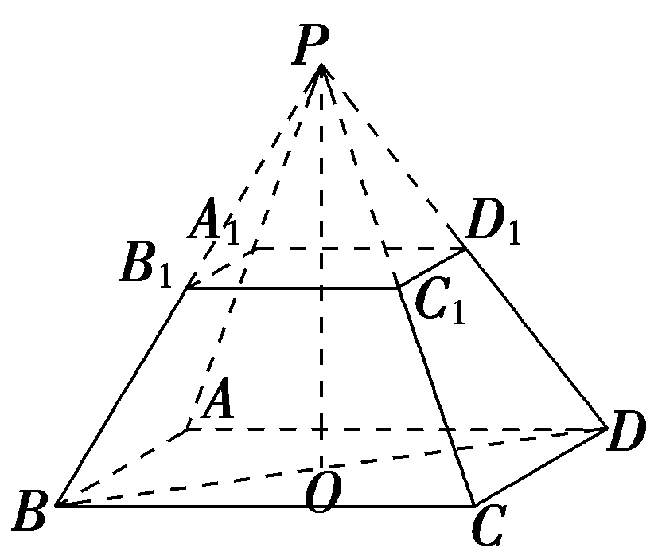

角度2　割补法求体积

（1）《九章算术》是我国古代的数学巨著，其卷第五“商功”有如下的问题：“今有刍甍，下广三丈，袤四丈，上袤二丈，无广，高一丈.问积几何？”意思为：今有底面为矩形的屋脊形状的多面体(如图)，下底面宽*AD*＝3丈，长*AB*＝4丈，上棱*EF*＝2丈，*EF*与平面*ABCD*平行，*EF*与平面*ABCD*的距离为1丈，则该几何体的体积是(　　)

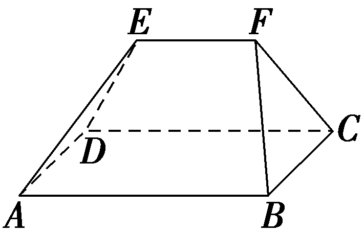

$\quad$A.4立方丈	
$\quad$B.5立方丈

$\quad$C.6立方丈	
$\quad$D.8立方丈

（2）(2020·江苏卷)如图，六角螺帽毛坯是由一个正六棱柱挖去一个圆柱所构成的.已知螺帽的底面正六边形边长为2 cm，高为2 cm，内孔半径为0.5 cm，则此六角螺帽毛坯的体积是<u>　　　　</u>cm3.

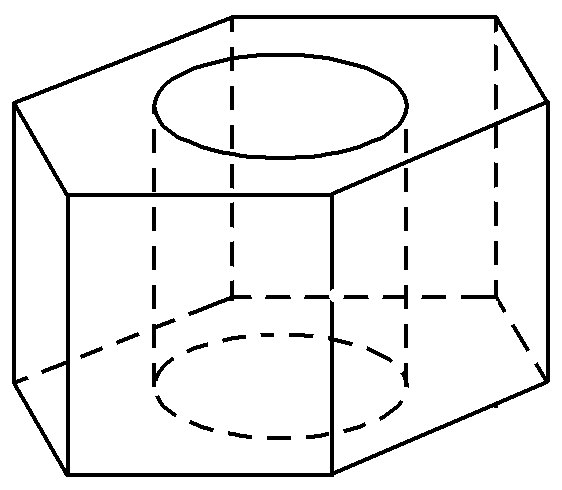

答案（1）B　（2）12 $\sqrt{3}$ － $\frac{\pi }{2}$

解析（1）如图，过*E*作*E<text style="italic"><text style="italic">G*</text></text>⊥平面*<text style="italic"><text style="italic"><text style="italic">AB*</text>*<text style="italic">CD*</text></text></text>，垂足为G，过*F*作*F<text style="italic"><text style="italic">H*</text></text>⊥平面A*BC*D，垂足为H，过G作*<text style="italic">PQ*</text>∥*AD*，交AB于Q，交CD于P，过H作*<text style="italic">MN*</text>∥BC，交AB于N，交CD于M，连接*EP*，*EQ*，*FN*，*FM*，由图形的对称性可知，*AQ*＝*BN*＝1，*QN*＝2，且四边形*AQPD*与四边形*NBCM*都是矩形.则该几何体的体积*V*＝ $V_{四棱锥E-AQPD}$ ＋ $V_{三棱柱EPQ-FMN}$ ＋ $V_{四棱锥F-NBCM}$ ＝ $\frac{1}{3}$ ·*E<text style="italic">G*</text>· $S_{矩形AQPD}$ ＋ $S_{\bigtriangleup }_{EPQ}$ ·*NQ*＋ $\frac{1}{3}$ ·*F<text style="italic">H*</text>· $S_{矩形NBCM}$ ＝ $\frac{1}{3}$ ×1×1×3＋ $\frac{1}{2}$ ×3×1×2＋ $\frac{1}{3}$ ×1×1×3＝5(立方丈).故选B.

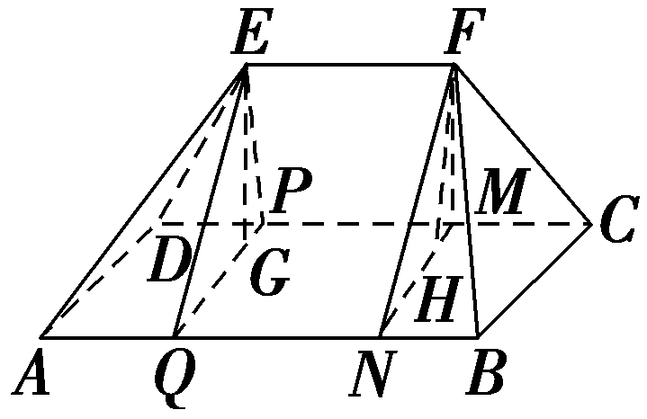

(&lt;text style="superscript"&gt;2&lt;/text&gt;)正六棱柱的体积为6× $\frac{\sqrt{3}}{4}$ ×&lt;text style="superscript"&gt;2&lt;/text&gt;2×2＝12 $\sqrt{3}$ (cm&lt;text style="superscript"&gt;&lt;text style="superscript"&gt;3&lt;/text&gt;&lt;/text&gt;)，圆柱的体积为π×0.5&lt;text style="superscript"&gt;2&lt;/text&gt;×2＝ $\frac{\pi }{2}$ (cm&lt;text style="superscript"&gt;&lt;text style="superscript"&gt;3&lt;/text&gt;&lt;/text&gt;)，则该六角螺帽毛坯的体积为(1&lt;text style="superscript"&gt;2&lt;/text&gt; $\sqrt{3}$ － $\frac{\pi }{2}$ )cm&lt;text style="superscript"&gt;&lt;text style="superscript"&gt;3&lt;/text&gt;&lt;/text&gt;.

角度3　等体积法求体积

(2020·新高考Ⅱ卷)在棱长为2的正方体<em>ABCD</em> -<em>A</em>1<em>B</em>1<em>C</em>1<em>D</em>1中，<em>M</em>，<em>N</em>分别为棱<em>BB</em>1，<em>AB</em>的中点，则三棱锥<em>A</em>1-<em>D</em>1<em>MN</em>的体积为<u>　　　　</u>.

答案1

解析如图，由正方体棱长为2，得 $S_{\bigtriangleup A_{1}MN}$ ＝2×2－2× $\frac{1}{2}$ ×2×&lt;text style="subscript"&gt;&lt;text style="subscript"&gt;&lt;text style="subscript"&gt;&lt;text style="subscript"&gt;&lt;text style="subscript"&gt;&lt;text style="subscript"&gt;&lt;text style="subscript"&gt;1&lt;/text&gt;&lt;/text&gt;&lt;/text&gt;&lt;/text&gt;&lt;/text&gt;&lt;/text&gt;&lt;/text&gt;－ $\frac{1}{2}$ ×&lt;text style="subscript"&gt;&lt;text style="subscript"&gt;&lt;text style="subscript"&gt;&lt;text style="subscript"&gt;&lt;text style="subscript"&gt;&lt;text style="subscript"&gt;&lt;text style="subscript"&gt;1&lt;/text&gt;&lt;/text&gt;&lt;/text&gt;&lt;/text&gt;&lt;/text&gt;&lt;/text&gt;&lt;/text&gt;×1＝ $\frac{3}{2}$ ，又易知<em>&lt;text style="italic"&gt;&lt;text style="italic"&gt;D</em>&lt;/text&gt;&lt;/text&gt;&lt;text style="subscript"&gt;&lt;text style="subscript"&gt;&lt;text style="subscript"&gt;&lt;text style="subscript"&gt;&lt;text style="subscript"&gt;&lt;text style="subscript"&gt;&lt;text style="subscript"&gt;1&lt;/text&gt;&lt;/text&gt;&lt;/text&gt;&lt;/text&gt;&lt;/text&gt;&lt;/text&gt;&lt;/text&gt;<em>&lt;text style="italic"&gt;&lt;text style="italic"&gt;&lt;text style="italic"&gt;A</em>&lt;/text&gt;&lt;/text&gt;&lt;/text&gt;1为三棱锥D1-A1<em>MN</em>的高，且D1A1＝2，所以 $V_{三棱锥A_{1}-D_{1}MN}$ ＝ $V_{三棱锥D_{1}-A_{1}MN}$ ＝ $\frac{1}{3}$ <em>·</em> $S_{\bigtriangleup A_{1}MN}$ <em>·&lt;text style="italic"&gt;&lt;text style="italic"&gt;D</em>&lt;/text&gt;&lt;/text&gt;&lt;text style="subscript"&gt;&lt;text style="subscript"&gt;&lt;text style="subscript"&gt;&lt;text style="subscript"&gt;&lt;text style="subscript"&gt;&lt;text style="subscript"&gt;&lt;text style="subscript"&gt;1&lt;/text&gt;&lt;/text&gt;&lt;/text&gt;&lt;/text&gt;&lt;/text&gt;&lt;/text&gt;&lt;/text&gt;<em>&lt;text style="italic"&gt;&lt;text style="italic"&gt;&lt;text style="italic"&gt;A</em>&lt;/text&gt;&lt;/text&gt;&lt;/text&gt;1＝ $\frac{1}{3}$ × $\frac{3}{2}$ ×2＝&lt;text style="subscript"&gt;&lt;text style="subscript"&gt;&lt;text style="subscript"&gt;&lt;text style="subscript"&gt;&lt;text style="subscript"&gt;&lt;text style="subscript"&gt;&lt;text style="subscript"&gt;1&lt;/text&gt;&lt;/text&gt;&lt;/text&gt;&lt;/text&gt;&lt;/text&gt;&lt;/text&gt;&lt;/text&gt;.

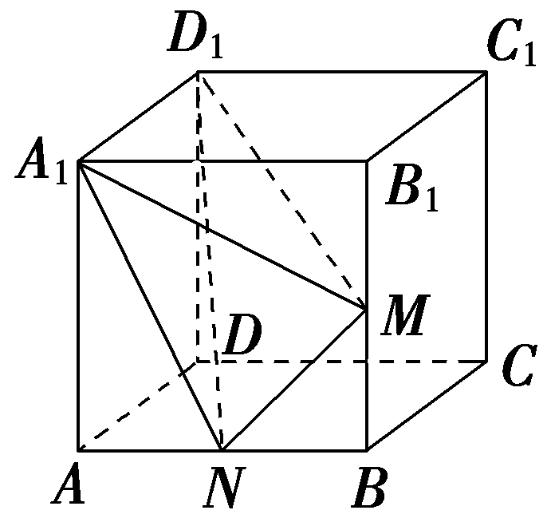

求空间几何体的体积的三种方法

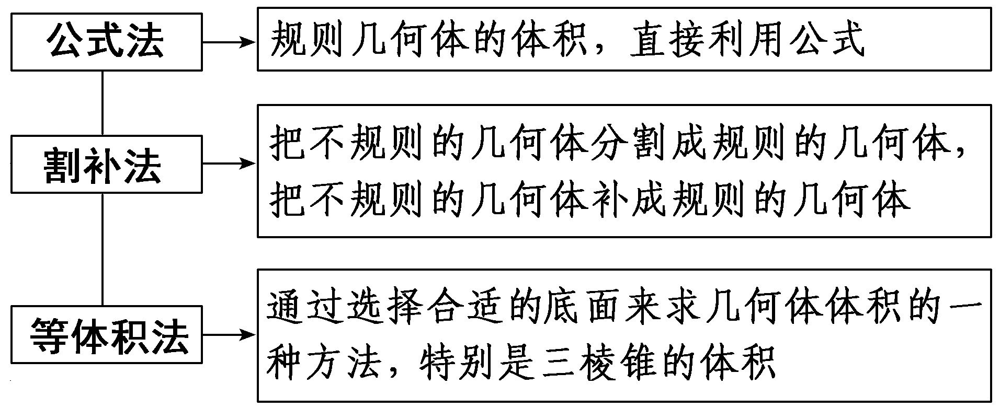

注意：正四面体的体积是 $\frac{\sqrt{2}}{12}$ &lt;text style="it<em>a</em>lic"&gt;a&lt;/text&gt;3(a是正四面体的棱长).

对点练4.(&lt;text style="superscript"&gt;2&lt;/text&gt;022·新高考Ⅰ卷)南水北调工程缓解了北方一些地区水资源短缺问题，其中一部分水蓄入某水库.已知该水库水位为海拔148.5 m时，相应水面的面积为140.0 km2；水位为海拔157.5 m时，相应水面的面积为180.0 km2.将该水库在这两个水位间的形状看作一个棱台，则该水库水位从海拔148.5 m上升到157.5 m时，增加的水量约为( $\sqrt{7}$ ≈&lt;text style="superscript"&gt;2&lt;/text&gt;.65)(　　)

$\quad$A.1.0×109 m3	
$\quad$B.1.2×109 m3

$\quad$C.1.4×109 m3	
$\quad$D.1.6×109 m3

答案C

解析依题意可知棱台的高为<em>MN</em>＝157.5－148.5＝&lt;text style="superscript"&gt;9&lt;/text&gt;(m)，所以增加的水量即为棱台的体积<em>&lt;text style="italic"&gt;V</em>&lt;/text&gt;.棱台上底面积<em>S</em>＝140.0 km&lt;text style="superscript"&gt;&lt;text style="superscript"&gt;&lt;text style="superscript"&gt;2&lt;/text&gt;&lt;/text&gt;&lt;/text&gt;＝140×10&lt;text style="superscript"&gt;&lt;text style="superscript"&gt;&lt;text style="superscript"&gt;&lt;text style="superscript"&gt;6&lt;/text&gt;&lt;/text&gt; &lt;/text&gt;&lt;/text&gt;m2，下底面积<em>S'</em>＝180.0 km2＝180×106 m2，所以V＝ $\frac{1}{3}$ <em>h</em> $\left(S＋S'＋\sqrt{SS'}\right)$ ＝ $\frac{1}{3}$ ×&lt;text style="superscript"&gt;9&lt;/text&gt;×(140×10&lt;text style="superscript"&gt;&lt;text style="superscript"&gt;6&lt;/text&gt;&lt;/text&gt;＋180×106＋ $\sqrt{140\times 180\times 10^{12}}$ )＝3× $\left(320+60\sqrt{7}\right)$ ×10&lt;text style="superscript"&gt;&lt;text style="superscript"&gt;6&lt;/text&gt;&lt;/text&gt;≈ $\left(96+18\times 2.65\right)$ ×107＝1.437×10&lt;text style="superscript"&gt;9&lt;/text&gt;≈1.4×109(m3).故选C.

对点练5.如图，在平面五边形<em>&lt;text style="italic"&gt;&lt;text style="italic"&gt;AB</em>&lt;/text&gt;C<em>DE</em>&lt;/text&gt;中，AB＝DE＝1，<em>BC</em>＝<em>CD</em>＝2，<em>AE</em>＝ $\sqrt{2}$ ，∠<em>&lt;text style="italic"&gt;AB</em>&lt;/text&gt;C＝∠<em>BC</em>D＝∠C<em>DE</em>＝90°，则五边形<em>AB&lt;text style="italic"&gt;CD</em>E&lt;/text&gt;绕直线AB旋转一周所成的几何体的体积为<u>　　　　</u>.

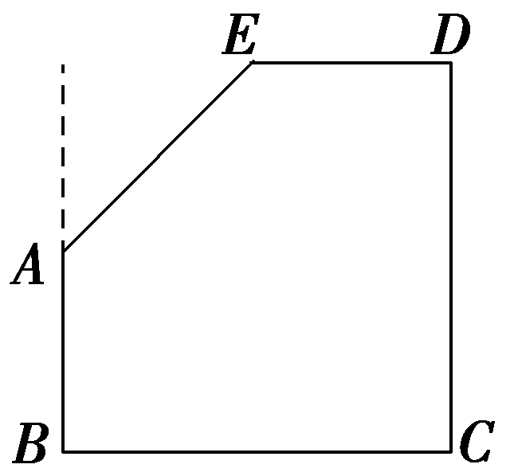

答案 $\frac{23\pi }{3}$

解析由图可知，五边形<em>&lt;text style="italic"&gt;&lt;text style="italic"&gt;AB</em>CDE&lt;/text&gt;&lt;/text&gt;可看作正方形<em>BCDF</em>切去一个等腰直角三角形<em>AEF</em>，将五边形ABCDE绕直线AB旋转一周得到的几何体是一个圆柱挖去一个圆锥.所求几何体的体积<em>&lt;text style="italic"&gt;&lt;text style="italic"&gt;V</em>&lt;/text&gt;&lt;/text&gt;＝V圆柱－V圆锥＝&lt;text style="superscript"&gt;2&lt;/text&gt;2π×2－ $\frac{1}{3}$ ×1&lt;text style="superscript"&gt;2&lt;/text&gt;×π×1＝ $\frac{23\pi }{3}$ .

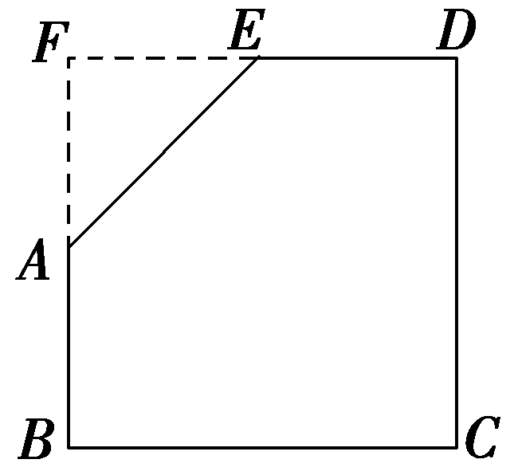

对点练6.如图，在六面体<em>ABC</em>-<em>FEDG</em>中，<em>BG</em>⊥平面<em>ABC</em>，平面<em>ABC</em>∥平面<em>FEDG</em>，<em>AF</em>∥<em>BG</em>，<em>FE</em>∥<em>GD</em>，∠<em>FGD</em>＝90°，<em>AB</em>＝<em>BC</em>＝<em>BG</em>＝2，<em>GD</em>＝2<em>BC</em>，四边形<em>AEDC</em>是菱形，则六面体<em>ABC</em>-<em>FEDG</em>的体积为<u>　　　　</u>.

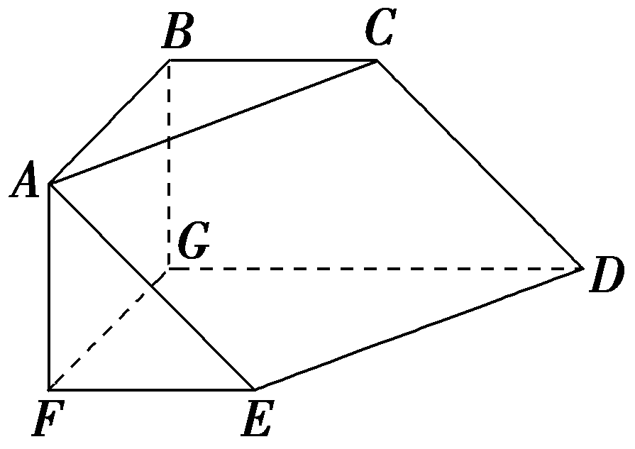

答案8

解析连接<em>&lt;text style="italic,subscript"&gt;&lt;text style="italic,subscript"&gt;&lt;text style="italic,subscript"&gt;A</em>&lt;/text&gt;&lt;/text&gt;G&lt;/text&gt;，<em>AD</em>，则 $V_{六面体}_{ABC-FEDG}$ ＝<em>&lt;text style="italic"&gt;&lt;text style="italic"&gt;V</em>&lt;/text&gt;&lt;/text&gt;&lt;text style="subscript"&gt;&lt;text style="subscript"&gt;四棱锥&lt;/text&gt;&lt;/text&gt;<em>&lt;text style="italic,subscript"&gt;&lt;text style="italic,subscript"&gt;A</em>&lt;/text&gt;&lt;/text&gt;&lt;text style="subscript"&gt;&lt;text style="subscript"&gt;-&lt;/text&gt;&lt;/text&gt;<em>&lt;text style="italic,subscript"&gt;FEDG</em>&lt;/text&gt;＋V四棱锥A-<em>BCDG</em>＝2V四棱锥A-FEDG，

由题意得，<em>EF</em>＝2，<em>DG</em>＝4，<em>FG</em>＝<em>&lt;text style="italic,subscript"&gt;A</em>F&lt;/text&gt;＝2，所以<em>&lt;text style="italic"&gt;S</em>&lt;/text&gt;&lt;text style="subscript"&gt;梯形&lt;/text&gt;<em>&lt;text style="italic,subscript"&gt;&lt;text style="italic,subscript"&gt;&lt;text style="italic,subscript"&gt;FEDG</em>&lt;/text&gt;&lt;/text&gt;&lt;/text&gt;＝ $\frac{1}{2}$ ×(2＋4)×2＝6，所以<em>&lt;text style="italic"&gt;V</em>&lt;/text&gt;四棱锥<em>A</em>&lt;text style="subscript"&gt;-&lt;/text&gt;FE<em>DG</em>＝ $\frac{1}{3}$ ×<em>&lt;text style="italic"&gt;S</em>&lt;/text&gt;&lt;text style="subscript"&gt;梯形&lt;/text&gt;FE<em>DG</em>×<em>&lt;text style="italic,subscript"&gt;A</em>F&lt;/text&gt;＝4，所以<em>&lt;text style="italic"&gt;V</em>&lt;/text&gt;六面体<em>ABC</em>&lt;text style="subscript"&gt;-&lt;/text&gt;<em>&lt;text style="italic,subscript"&gt;&lt;text style="italic,subscript"&gt;&lt;text style="italic,subscript"&gt;FEDG</em>&lt;/text&gt;&lt;/text&gt;&lt;/text&gt;＝8.

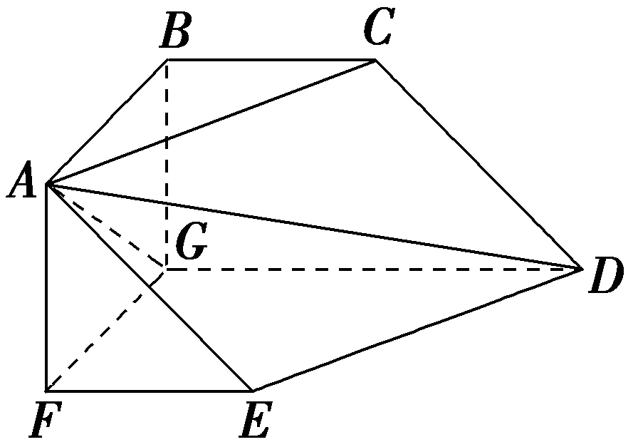

##### 1.[真题再现]　(2024·全国甲卷)已知圆台甲、乙的上底面半径均为<em>r</em>1，下底面半径均为<em>r</em>2，圆台的母线长分别为2(<em>r</em>2－<em>r</em>1)，3(<em>r</em>2－<em>r</em>1)，则圆台甲与乙的体积之比为<u>　　　　</u>.

答案 $\frac{\sqrt{6}}{4}$

解析两圆台的上、下底面积对应相等，则两圆台的体积之比为高之比，根据母线与半径的关系可得甲与乙的体积之比为 $\frac{\sqrt{4(r_{2}－r_{1})^{2}-(r_{2}－r_{1})^{2}}}{\sqrt{9(r_{2}－r_{1})^{2}-(r_{2}－r_{1})^{2}}}$ ＝ $\frac{\sqrt{3}}{\sqrt{8}}$ ＝ $\frac{\sqrt{6}}{4}$ .

[教材呈现]　(人教A必修二P117思考)圆柱、圆锥、圆台的体积公式之间有什么关系？结合棱柱、棱锥、棱台的体积公式，你能将它们统一成柱体、锥体、台体的体积公式吗？柱体、锥体、台体的体积公式之间又有怎样的关系？

点评：高考题与教材思考题都考查台体的体积公式.

##### 2.[真题再现]　(2024·新课标Ⅰ卷)已知圆柱和圆锥的底面半径相等，侧面积相等，且它们的高均为 $\sqrt{3}$ ，则圆锥的体积为(　　)

$\quad$A.2 $\sqrt{3}$ π	
$\quad$B.3 $\sqrt{3}$ π

$\quad$C.6 $\sqrt{3}$ π	
$\quad$D.9 $\sqrt{3}$ π

答案B

解析设圆柱和圆锥的底面半径均为<em>&lt;text style="italic"&gt;&lt;text style="italic"&gt;&lt;text style="italic"&gt;&lt;text style="italic"&gt;r</em>&lt;/text&gt;&lt;/text&gt;&lt;/text&gt;&lt;/text&gt;，因为它们的高均为 $\sqrt{3}$ ，且侧面积相等，所以&lt;text style="supe<em>r</em>script"&gt;2&lt;/text&gt;π<em>&lt;text style="italic"&gt;&lt;text style="italic"&gt;&lt;text style="italic"&gt;r</em>&lt;/text&gt;&lt;/text&gt;&lt;/text&gt;× $\sqrt{3}$ ＝π<em>&lt;text style="italic"&gt;&lt;text style="italic"&gt;&lt;text style="italic"&gt;&lt;text style="italic"&gt;r</em>&lt;/text&gt;&lt;/text&gt;&lt;/text&gt;&lt;/text&gt; $\sqrt{\left(\sqrt{3}\right)^{2}＋r^{2}}$ ，得<em>&lt;text style="italic"&gt;&lt;text style="italic"&gt;&lt;text style="italic"&gt;&lt;text style="italic"&gt;r</em>&lt;/text&gt;&lt;/text&gt;&lt;/text&gt;&lt;/text&gt;&lt;text style="superscript"&gt;2&lt;/text&gt;＝9，所以圆锥的体积<em>V</em>＝ $\frac{1}{3}$ π<em>&lt;text style="italic"&gt;&lt;text style="italic"&gt;&lt;text style="italic"&gt;&lt;text style="italic"&gt;r</em>&lt;/text&gt;&lt;/text&gt;&lt;/text&gt;&lt;/text&gt;&lt;text style="superscript"&gt;2&lt;/text&gt;× $\sqrt{3}$ ＝3 $\sqrt{3}$ π.故选B.

[教材呈现]　(人教A必修二P120T4)如图，圆锥*PO*的底面直径和高均是*a*，过*PO*的中点*O'* 作平行于底面的截面，以该截面为底面挖去一个圆柱，求剩下几何体的表面积和体积.

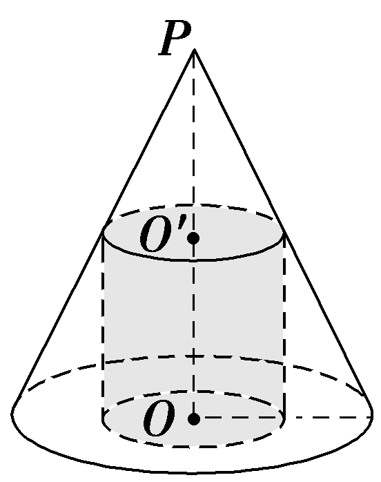

点评：高考题与教材习题设问的本质是一样的，都考查了圆锥的侧面积与体积的求解.

课时测评56　基本立体图形、简单几何体的表面积与体积 $\frac{对应学生}{用书P421}$

(时间：60分钟　满分：85分)

(本栏目内容，在学生用书中以独立形式分册装订！)

(1—10题，每小题5分，共50分)

##### 1.下列说法中正确的是(　　)

$\quad$A.各个面都是三角形的几何体是三棱锥

$\quad$B.以三角形的一条边所在直线为旋转轴，其余两边旋转形成的曲面所围成的几何体叫圆锥

$\quad$C.棱锥的侧棱长与底面多边形的边长相等，则该棱锥可能是六棱锥

$\quad$D.圆锥的顶点与底面圆周上的任一点的连线都是母线

答案D

解析对于A，如图①所示，由两个结构相同的三棱锥叠放在一起构成的几何体，各个面都是三角形，但它不是三棱锥，故A错误；对于B，如图②③所示，若△*ABC*不是直角三角形，或是直角三角形但旋转轴不是直角边，所得的几何体都不是圆锥，故B错误；对于C，若六棱锥的所有棱长都相等，则底面多边形是正六边形.由过中心和定点的截面知，若以正六边形为底面，侧棱长必然要大于底面边长，故C错误；对于D，根据圆锥母线的定义知，D正确.故选D.

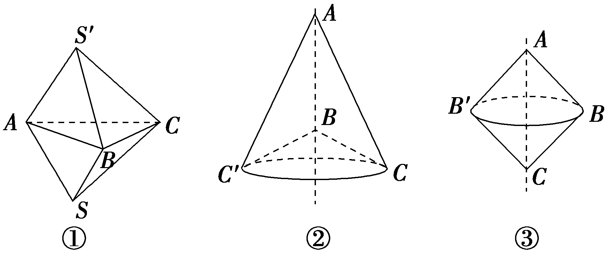

##### 2.如图是用斜二测画法画出的水平放置的△*AOB*的直观图(图中虚线分别与*x'* 轴、*y'* 轴平行)，则原图形△*AOB*的面积是(　　)

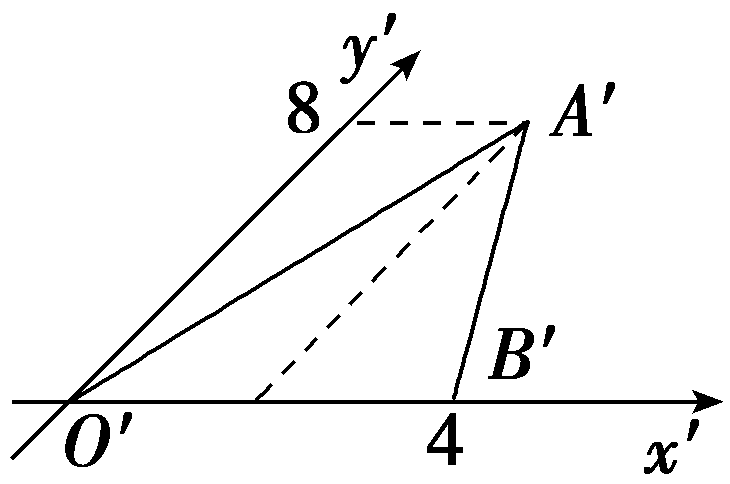

$\quad$A.8	
$\quad$B.16

$\quad$C.32	
$\quad$D.64

答案C

解析根据题意，如图，原图形△*A<text style="italic">OB*</text>的底边OB的长为4，高为16，所以其面积*S*＝ $\frac{1}{2}$ ×4×16＝32.故选C.

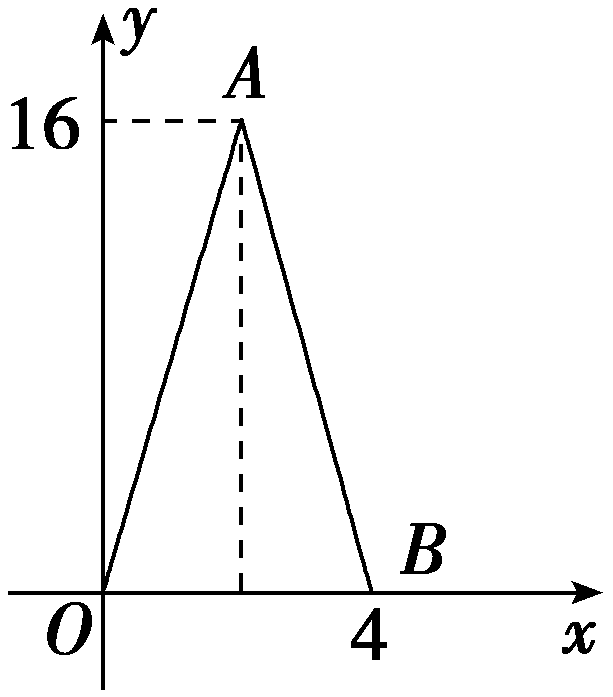

##### 3.(2024·北京东城一模)《天工开物》是我国明代科学家宋应星所著的一部综合性科学技术著作，书中记载了一种制造瓦片的方法.某校高一年级计划实践这种方法，为同学们准备了制瓦用的粘土和圆柱形的木质圆桶，圆桶底面外圆的直径为20 cm，高为20 cm.首先，在圆桶的外侧面均匀包上一层厚度为2 cm的粘土，然后，沿圆桶母线方向将粘土层分割成四等份(如图)，等粘土干后，即可得到大小相同的四片瓦.每位同学制作四片瓦，全年级共500人，需要准备的粘土量(不计损耗)与下列哪个数字最接近.(参考数据：π≈3.14)(　　)

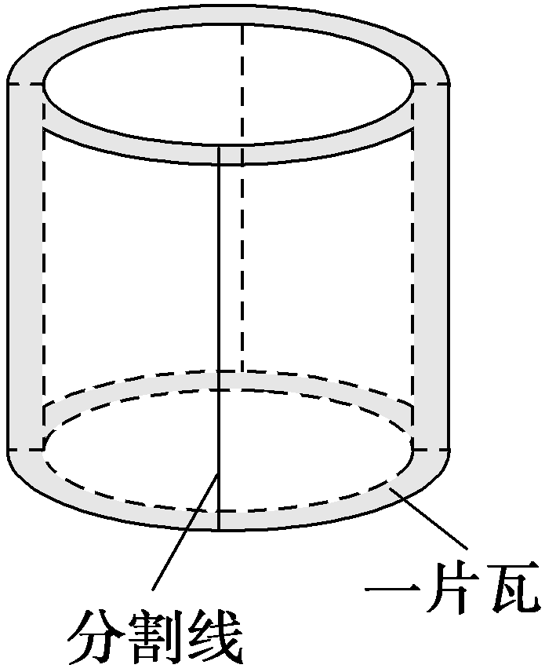

$\quad$A.0.8 m3	
$\quad$B.1.4 m3

$\quad$C.1.8 m3	
$\quad$D.2.2 m3

答案B

解析由条件可得四片瓦的体积<em>V</em>＝π×122×20－π×102×20＝880π(cm3)，所以500名学生每人制作4片瓦共需粘土的体积为500×880π＝440 000π(cm3)，又π≈3.14，所以共需粘土的体积约为1.381 6 m3.故选B.

##### 4.(2023·全国乙卷)已知圆锥*P<text style="italic">O*</text>的底面半径为 $\sqrt{3}$ ，*O*为底面圆心，*PA*，*PB*为圆锥的母线，∠*AOB*＝120°，若△*PAB*的面积等于 $\frac{9\sqrt{3}}{4}$ ，则该圆锥的体积为(　　)

$\quad$A.π	
$\quad$B. $\sqrt{6}$ π

$\quad$C.3π	
$\quad$D.3 $\sqrt{6}$ π

答案B

解析在△<em>&lt;text style="italic"&gt;A&lt;text style="italic"&gt;OB</em>&lt;/text&gt;&lt;/text&gt;中，∠AOB＝1&lt;text style="superscript"&gt;2&lt;/text&gt;0°，而<em>&lt;text style="italic"&gt;OA</em>&lt;/text&gt;＝OB＝ $\sqrt{3}$ ，取<em>&lt;text style="italic"&gt;&lt;text style="italic"&gt;&lt;text style="italic"&gt;AB</em>&lt;/text&gt;&lt;/text&gt;&lt;/text&gt;的中点<em>C</em>，连接<em>&lt;text style="italic"&gt;&lt;text style="italic"&gt;OC</em>&lt;/text&gt;&lt;/text&gt;，<em>&lt;text style="italic"&gt;&lt;text style="italic"&gt;&lt;text style="italic"&gt;PC</em>&lt;/text&gt;&lt;/text&gt;&lt;/text&gt;，有OC⊥AB，PC⊥AB，如图，所以∠<em>ABO</em>＝30°，OC＝ $\frac{\sqrt{3}}{2}$ ，B<em>C</em>＝ $\frac{3}{2}$ ，<em>&lt;text style="italic"&gt;&lt;text style="italic"&gt;&lt;text style="italic"&gt;AB</em>&lt;/text&gt;&lt;/text&gt;&lt;/text&gt;＝&lt;text style="superscript"&gt;2&lt;/text&gt;B<em>C</em>＝3，由△<em>PAB</em>的面积为 $\frac{9\sqrt{3}}{4}$ ，得 $\frac{1}{2}$ ×3×P<em>C</em>＝ $\frac{9\sqrt{3}}{4}$ ，解得P<em>C</em>＝ $\frac{3\sqrt{3}}{2}$ ，于是<em>&lt;text style="italic"&gt;PO</em>&lt;/text&gt;＝ $\sqrt{PC^{2}－OC^{2}}$ ＝ $\sqrt{(\frac{3\sqrt{3}}{2})^{2}－(\frac{\sqrt{3}}{2})^{2}}$ ＝ $\sqrt{6}$ ，所以圆锥的体积<em>V</em>＝ $\frac{1}{3}$ π×<em>&lt;text style="italic"&gt;OA</em>&lt;/text&gt;&lt;text style="superscript"&gt;2&lt;/text&gt;×<em>&lt;text style="italic"&gt;PO</em>&lt;/text&gt;＝ $\frac{1}{3}$ π×( $\sqrt{3}$ )&lt;text style="superscript"&gt;2&lt;/text&gt;× $\sqrt{6}$ ＝ $\sqrt{6}$ π.故选B.

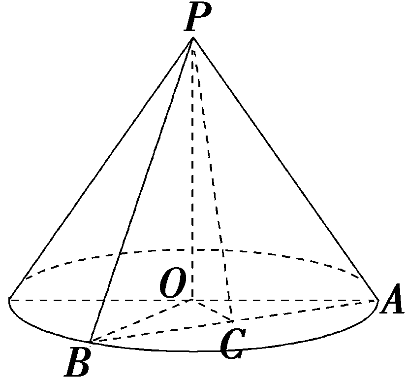

##### 5.如图①所示，在高为<em>h</em>的直三棱柱容器<em>ABC</em>-<em>A</em>1<em>B</em>1<em>C</em>1中，<em>AB</em>＝<em>AC</em>＝2，<em>AB</em>⊥<em>AC</em>.现往该容器内灌进一些水，水深为2，然后固定容器底面的一边<em>AB</em>于地面上，再将容器倾斜，当倾斜到某一位置时，水面恰好在平面<em>A</em>1<em>B</em>1<em>C</em>内(如图②)，则容器的高<em>h</em>为(　　)

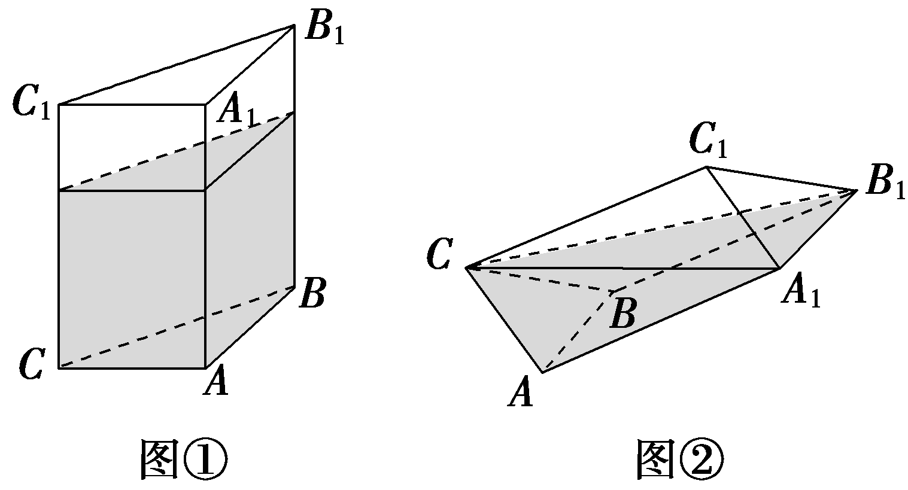

$\quad$A.2 $\sqrt{2}$ 	
$\quad$B.3

$\quad$C.4	
$\quad$D.6

答案B

解析结合题图②知 $V_{C-A_{1}B_{1}C_{1}}$ ＝ $\frac{1}{3}S_{\bigtriangleup A_{1}B_{1}C_{1}}$ *<text style="italic"><text style="italic"><text style="italic"><text style="italic">h*</text></text></text></text>，故 $V_{C-ABB_{1}A_{1}}$ ＝ $V_{ABC-A_{1}B_{1}C_{1}}$ － $V_{C-A_{1}B_{1}C_{1}}$ ＝ $S_{\bigtriangleup A_{1}B_{1}C_{1}}$ *<text style="italic"><text style="italic"><text style="italic"><text style="italic">h*</text></text></text></text>－ $\frac{1}{3}S_{\bigtriangleup A_{1}B_{1}C_{1}}$ *<text style="italic"><text style="italic"><text style="italic"><text style="italic">h*</text></text></text></text>＝ $\frac{2}{3}S_{\bigtriangleup A_{1}B_{1}C_{1}}$ *<text style="italic"><text style="italic"><text style="italic"><text style="italic">h*</text></text></text></text>，所以题图①中容器的高度与水深之比为3∶2，又水深为2，则h＝3.故选B.

##### 6.(多选)(2023·新高考Ⅱ卷)已知圆锥的顶点为*P*，底面圆心为*O*，*AB*为底面直径，∠*APB*＝120°，*PA*＝2，点*C*在底面圆周上，且二面角*P*-*AC*-*O*为45°，则(　　)

$\quad$A.该圆锥的体积为π

$\quad$B.该圆锥的侧面积为4 $\sqrt{3}$ π

$\quad$C.*AC*＝2 $\sqrt{2}$

$\quad$D.△*PAC* 的面积为 $\sqrt{3}$

答案AC

解析依题意，∠<em>A&lt;text style="italic"&gt;P</em>B&lt;/text&gt;＝120°，<em>PA</em>＝2，所以<em>&lt;text style="italic"&gt;O</em>P&lt;/text&gt;＝1，<em>OA</em>＝<em>OB</em>＝ $\sqrt{3}$ ，对于A，圆锥的体积为 $\frac{1}{3}$ ×π×( $\sqrt{3}$ )2×1＝π，故A正确；对于B，圆锥的侧面积为π× $\sqrt{3}$ ×2＝2 $\sqrt{3}$ π，故B错误；对于C，如图，设<em>D</em>是<em>&lt;text style="italic"&gt;&lt;text style="italic"&gt;&lt;text style="italic"&gt;&lt;text style="italic"&gt;AC</em>&lt;/text&gt;&lt;/text&gt;&lt;/text&gt;&lt;/text&gt;的中点，连接<em>&lt;text style="italic"&gt;&lt;text style="italic"&gt;O</em>D&lt;/text&gt;&lt;/text&gt;，<em>&lt;text style="italic"&gt;&lt;text style="italic"&gt;P</em>D&lt;/text&gt;&lt;/text&gt;，则AC⊥<em>OD</em>，AC⊥<em>PD</em>，所以∠<em>&lt;text style="italic"&gt;PDO</em>&lt;/text&gt;是二面角P-AC-O的平面角，则∠PDO＝45°，所以<em>&lt;text style="italic"&gt;OP</em>&lt;/text&gt;＝OD＝1，故<em>AD</em>＝<em>CD</em>＝ $\sqrt{3－1}$ ＝ $\sqrt{2}$ ，则<em>&lt;text style="italic"&gt;&lt;text style="italic"&gt;&lt;text style="italic"&gt;&lt;text style="italic"&gt;AC</em>&lt;/text&gt;&lt;/text&gt;&lt;/text&gt;&lt;/text&gt;＝2 $\sqrt{2}$ ，故C正确；对于<em>D</em>，<em>&lt;text style="italic"&gt;&lt;text style="italic"&gt;P</em>D&lt;/text&gt;&lt;/text&gt;＝ $\sqrt{1^{2}＋1^{2}}$ ＝ $\sqrt{2}$ ，所以<em>S</em>△<em>&lt;text style="italic"&gt;P</em>A&lt;/text&gt;C＝ $\frac{1}{2}$ ×2 $\sqrt{2}$ × $\sqrt{2}$ ＝2，故<em>D</em>错误.故选<em>&lt;text style="italic"&gt;&lt;text style="italic"&gt;&lt;text style="italic"&gt;&lt;text style="italic"&gt;AC</em>&lt;/text&gt;&lt;/text&gt;&lt;/text&gt;&lt;/text&gt;.

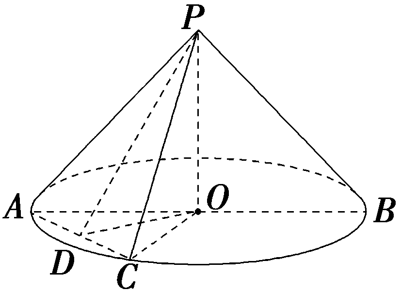

##### 7.(多选)攒尖是我国古代建筑中屋顶的一种结构形式，多见于亭阁式建筑、园林建筑.如图为四角攒尖，它的屋顶部分的轮廓可近似看作一个正四棱锥.已知此正四棱锥的侧面与底面所成的锐二面角为*<text style="italic">θ*</text>，这个角接近30°.若取θ＝30°，侧棱长为 $\sqrt{21}$ 米，则(　　)

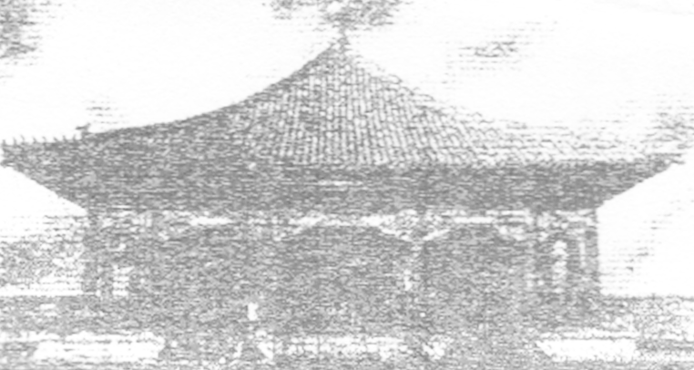

$\quad$A.正四棱锥的底面边长为6米

$\quad$B.正四棱锥的底面边长为3米

$\quad$C.正四棱锥的侧面积为24 $\sqrt{3}$  平方米

$\quad$D.正四棱锥的侧面积为12 $\sqrt{3}$  平方米

答案AC

解析如图，在正四棱锥&lt;text style="it&lt;text style="it&lt;text style="it&lt;text style="it&lt;text style="it&lt;text style="it<em>a</em>lic"&gt;a&lt;/text&gt;lic"&gt;a&lt;/text&gt;lic"&gt;a&lt;/text&gt;lic"&gt;a&lt;/text&gt;lic"&gt;a&lt;/text&gt;lic"&gt;<em>S</em>&lt;/text&gt;-<em>&lt;text style="italic"&gt;&lt;text style="italic"&gt;&lt;text style="italic"&gt;AB</em>&lt;/text&gt;CD&lt;/text&gt;&lt;/text&gt;中，<em>O</em>为正方形ABCD的中心，<em>H</em>为AB的中点，则<em>&lt;text style="italic"&gt;SH</em>&lt;/text&gt;⊥AB，设底面边长为2a.因为∠<em>SHO</em>＝30°，所以<em>OH</em>＝<em>AH</em>＝a，<em>OS</em>＝ $\frac{\sqrt{3}}{3}$ &lt;text style="it&lt;text style="it&lt;text style="it&lt;text style="it&lt;text style="it<em>a</em>lic"&gt;a&lt;/text&gt;lic"&gt;a&lt;/text&gt;lic"&gt;a&lt;/text&gt;lic"&gt;a&lt;/text&gt;lic"&gt;a&lt;/text&gt;，<em>&lt;text style="italic"&gt;S</em>&lt;/text&gt;<em>H</em>＝ $\frac{2\sqrt{3}}{3}$ &lt;text style="it&lt;text style="it&lt;text style="it&lt;text style="it&lt;text style="it<em>a</em>lic"&gt;a&lt;/text&gt;lic"&gt;a&lt;/text&gt;lic"&gt;a&lt;/text&gt;lic"&gt;a&lt;/text&gt;lic"&gt;a&lt;/text&gt;.在Rt△<em>&lt;text style="italic"&gt;S</em>&lt;/text&gt;A<em>H</em>中，a2＋ $\left(\frac{2\sqrt{3}}{3}a\right)^{2}$ ＝21，解得&lt;text style="it&lt;text style="it&lt;text style="it&lt;text style="it&lt;text style="it<em>a</em>lic"&gt;a&lt;/text&gt;lic"&gt;a&lt;/text&gt;lic"&gt;a&lt;/text&gt;lic"&gt;a&lt;/text&gt;lic"&gt;a&lt;/text&gt;＝3，所以正四棱锥的底面边长为6米，侧面积为<em>&lt;text style="italic"&gt;S</em>&lt;/text&gt;＝ $\frac{1}{2}$ ×6×2 $\sqrt{3}$ ×4＝24 $\sqrt{3}$ (平方米).故选AC.

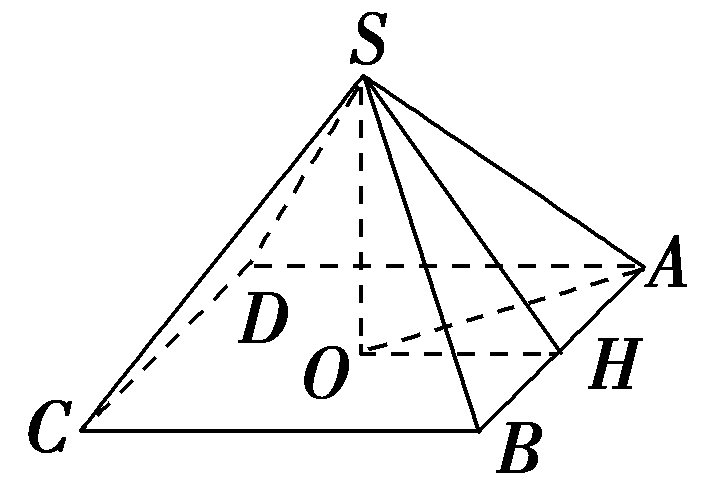

##### 8.(多选)(2022·新高考Ⅱ卷)如图，四边形<em>ABCD</em>为正方形，<em>ED</em>⊥平面<em>ABCD</em>，<em>FB</em>∥<em>ED</em>，<em>AB</em>＝<em>ED</em>＝2<em>FB</em>，记三棱锥<em>E</em>-<em>ACD</em>，<em>F</em>-<em>ABC</em>，<em>F</em>-<em>ACE</em>的体积分别为<em>V</em>1，<em>V</em>2，<em>V</em>3，则(　　)

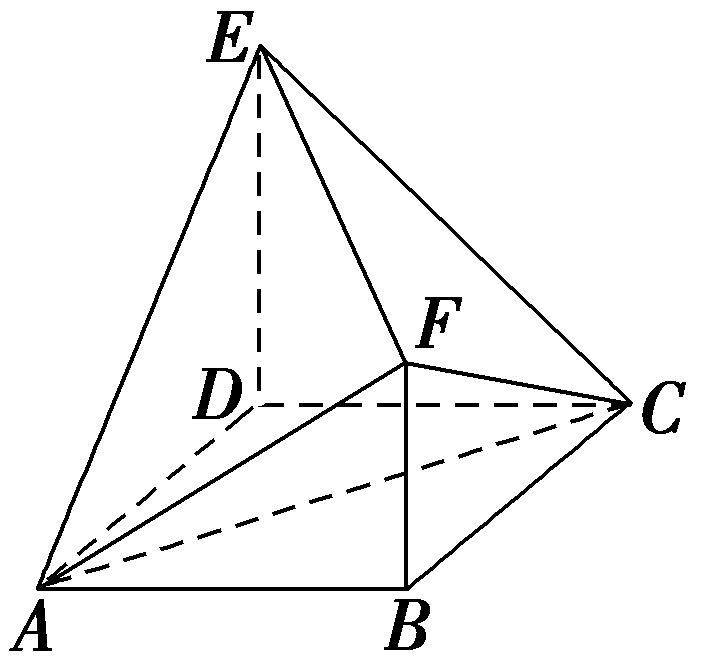

$\quad$A.<em>V</em>3＝2<em>V</em>2	
$\quad$B.<em>V</em>3＝<em>V</em>1

$\quad$C.<em>V</em>3＝<em>V</em>1＋<em>V</em>2	
$\quad$D.2<em>V</em>3＝3<em>V</em>1

答案CD

解析设<em>AB</em>＝<em>ED</em>＝&lt;text style="superscript"&gt;&lt;text style="superscript"&gt;&lt;text style="superscript"&gt;&lt;text style="subscript"&gt;2&lt;/text&gt;&lt;/text&gt;&lt;/text&gt;&lt;/text&gt;<em>FB</em>＝2，则<em>&lt;text style="italic"&gt;&lt;text style="italic"&gt;&lt;text style="italic"&gt;&lt;text style="italic"&gt;&lt;text style="italic"&gt;&lt;text style="italic"&gt;&lt;text style="italic"&gt;V</em>&lt;/text&gt;&lt;/text&gt;&lt;/text&gt;&lt;/text&gt;&lt;/text&gt;&lt;/text&gt;&lt;/text&gt;&lt;text style="subscript"&gt;&lt;text style="subscript"&gt;1&lt;/text&gt;&lt;/text&gt;＝ $\frac{1}{3}$ × $\frac{1}{2}$ ×&lt;text style="superscript"&gt;&lt;text style="superscript"&gt;&lt;text style="superscript"&gt;&lt;text style="subscript"&gt;2&lt;/text&gt;&lt;/text&gt;&lt;/text&gt;&lt;/text&gt;×2×2＝ $\frac{4}{3}$ ，<em>&lt;text style="italic"&gt;&lt;text style="italic"&gt;&lt;text style="italic"&gt;&lt;text style="italic"&gt;&lt;text style="italic"&gt;&lt;text style="italic"&gt;&lt;text style="italic"&gt;V</em>&lt;/text&gt;&lt;/text&gt;&lt;/text&gt;&lt;/text&gt;&lt;/text&gt;&lt;/text&gt;&lt;/text&gt;&lt;text style="superscript"&gt;&lt;text style="superscript"&gt;&lt;text style="superscript"&gt;&lt;text style="subscript"&gt;2&lt;/text&gt;&lt;/text&gt;&lt;/text&gt;&lt;/text&gt;＝ $\frac{1}{3}$ × $\frac{1}{2}$ ×&lt;text style="superscript"&gt;&lt;text style="superscript"&gt;&lt;text style="superscript"&gt;&lt;text style="subscript"&gt;2&lt;/text&gt;&lt;/text&gt;&lt;/text&gt;&lt;/text&gt;×2×&lt;text style="subscript"&gt;&lt;text style="subscript"&gt;1&lt;/text&gt;&lt;/text&gt;＝ $\frac{2}{3}$ .连接<em>BD</em>交<em>&lt;text style="italic"&gt;AC</em>&lt;/text&gt;于<em>M</em>，连接<em>&lt;text style="italic"&gt;&lt;text style="italic"&gt;EM</em>&lt;/text&gt;&lt;/text&gt;，<em>&lt;text style="italic"&gt;&lt;text style="italic"&gt;FM</em>&lt;/text&gt;&lt;/text&gt;(图略)，则FM＝ $\sqrt{3}$ ，E<em>M</em>＝ $\sqrt{6}$ ，<em>&lt;text style="italic"&gt;EF</em>&lt;/text&gt;＝&lt;text style="subscript"&gt;&lt;text style="subscript"&gt;3&lt;/text&gt;&lt;/text&gt;，F<em>M</em>&lt;text style="superscript"&gt;&lt;text style="superscript"&gt;&lt;text style="superscript"&gt;&lt;text style="subscript"&gt;2&lt;/text&gt;&lt;/text&gt;&lt;/text&gt;&lt;/text&gt;＋<em>&lt;text style="italic"&gt;&lt;text style="italic"&gt;EM</em>&lt;/text&gt;&lt;/text&gt;2＝EF2，故&lt;text style="subscript"&gt;△&lt;/text&gt;<em>&lt;text style="italic,subscript"&gt;&lt;text style="italic,subscript"&gt;EMF</em>&lt;/text&gt;&lt;/text&gt;是直角三角形，故<em>&lt;text style="italic"&gt;S</em>&lt;/text&gt;△EMF＝ $\frac{1}{2}$ × $\sqrt{3}$ × $\sqrt{6}$ ＝ $\frac{3\sqrt{2}}{2}$ ，<em>&lt;text style="italic"&gt;&lt;text style="italic"&gt;&lt;text style="italic"&gt;&lt;text style="italic"&gt;&lt;text style="italic"&gt;&lt;text style="italic"&gt;&lt;text style="italic"&gt;V</em>&lt;/text&gt;&lt;/text&gt;&lt;/text&gt;&lt;/text&gt;&lt;/text&gt;&lt;/text&gt;&lt;/text&gt;&lt;text style="subscript"&gt;&lt;text style="subscript"&gt;3&lt;/text&gt;&lt;/text&gt;＝ $\frac{1}{3}$ <em>&lt;text style="italic"&gt;S</em>&lt;/text&gt;&lt;text style="subscript"&gt;△&lt;/text&gt;E<em>M</em>F×<em>&lt;text style="italic"&gt;AC</em>&lt;/text&gt;＝&lt;text style="superscript"&gt;&lt;text style="superscript"&gt;&lt;text style="superscript"&gt;&lt;text style="subscript"&gt;2&lt;/text&gt;&lt;/text&gt;&lt;/text&gt;&lt;/text&gt;，<em>&lt;text style="italic"&gt;&lt;text style="italic"&gt;&lt;text style="italic"&gt;&lt;text style="italic"&gt;&lt;text style="italic"&gt;&lt;text style="italic"&gt;&lt;text style="italic"&gt;V</em>&lt;/text&gt;&lt;/text&gt;&lt;/text&gt;&lt;/text&gt;&lt;/text&gt;&lt;/text&gt;&lt;/text&gt;&lt;text style="subscript"&gt;&lt;text style="subscript"&gt;3&lt;/text&gt;&lt;/text&gt;＝V&lt;text style="subscript"&gt;&lt;text style="subscript"&gt;1&lt;/text&gt;&lt;/text&gt;＋V2，2V3＝3V1.故选CD.

##### 9.如图，一个装有某种液体的圆柱形容器固定在墙面和地面的角落内，容器与地面所成的角为30°，液面呈椭圆形，椭圆长轴上的顶点<em>M</em>，<em>N</em>到容器底部的距离分别是10和16，则容器内液体的体积是<u>　　　　</u>.

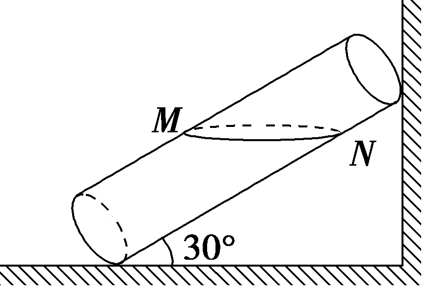

答案39π

解析将含液体部分的几何体补成如图所示的圆柱，过<em>M</em>作底面的平行平面，与过<em>N</em>的母线交于点<em>S</em>，连接<em>&lt;text style="italic"&gt;MS</em>&lt;/text&gt;，由题意知∠<em>MNS</em>＝30°，则MS＝6× $\frac{\sqrt{3}}{3}$ ＝2 $\sqrt{3}$ ，故圆柱的底面半径为 $\sqrt{3}$ ，则容器内液体的体积为 $\frac{1}{2}$ ×(10＋16)×π×( $\sqrt{3}$ )2＝13×π×3＝39π.

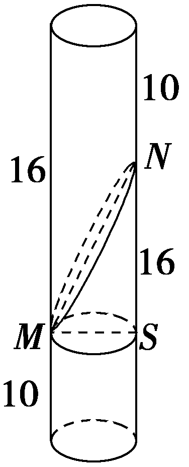

##### 10.(2024·天津滨海新区二模)在各棱长均为2的正三棱柱<em>ABC</em>-<em>A</em>1<em>B</em>1<em>C</em>1中，上下底面的中心分别为<em>D</em>，<em>H</em>，三个侧面的中心分别为<em>E</em>，<em>F</em>，<em>G</em>，若在该三棱柱中挖去两个三棱锥<em>D</em> -<em>EFG</em>和<em>H</em>-<em>EFG</em>，则剩余部分的体积为<u>　　　　　</u>.

答案 $\frac{11\sqrt{3}}{6}$

解析如图所示，因为三个侧面的中心分别为<em>E</em>，<em>F</em>，<em>G</em>，所以三棱锥<em>D</em> -<em>&lt;text style="italic"&gt;&lt;text style="italic"&gt;EFG</em>&lt;/text&gt;&lt;/text&gt;和三棱锥<em>H</em>-EFG的底面EFG面积为 $\frac{1}{4}$ <em>S</em>△<em>ABC</em>，高为正三棱柱的高的一半，故挖去的几何体的体积为2× $\frac{1}{3}$ × $\frac{1}{4}$ × $\frac{1}{2}$ ×2×2sin 60°×1＝ $\frac{\sqrt{3}}{6}$ ，三棱柱的体积为 $\frac{1}{2}$ ×2×2sin 60°×2＝2 $\sqrt{3}$ ，故剩余几何体的体积为2 $\sqrt{3}$ － $\frac{\sqrt{3}}{6}$ ＝ $\frac{11\sqrt{3}}{6}$ .

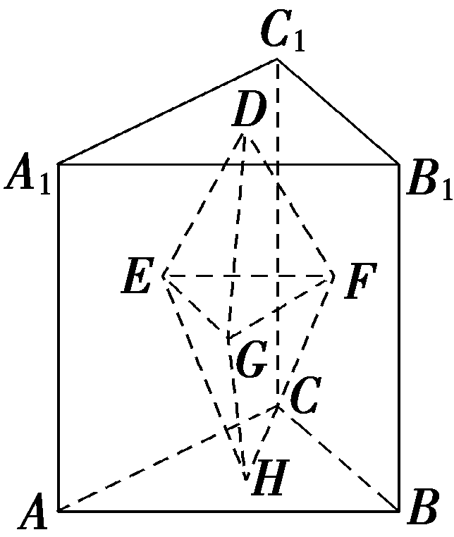

(11、12题，每小题5分，共10分)

##### 11.(多选)折扇是我国古老文化的延续，在我国已有四千年左右的历史，“扇”与“善”谐音，折扇也寓意“善良”“善行”.它常以字画的形式体现我国的传统文化，也是运筹帷幄、决胜千里、大智大勇的象征(如图①).图②是一个圆台的侧面展开图(扇形的一部分)，若两个圆弧 $\overparen{DE}$ ， $\overparen{AC}$ 所在圆的半径分别是3和9，且∠*ABC*＝120°，则该圆台的(　　)

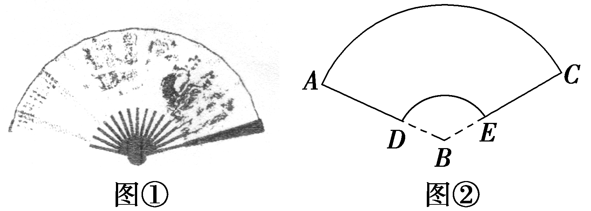

$\quad$A.高为4 $\sqrt{2}$

$\quad$B.体积为 $\frac{50\sqrt{2}}{3}$ π

$\quad$C.表面积为34π

$\quad$D.上底面面积、下底面面积和侧面面积之比为1∶9∶22

答案AC

解析设圆台的上底面半径为&lt;text sty<em>l</em>e="italic"&gt;<em>&lt;text style="italic"&gt;r</em>&lt;/text&gt;&lt;/text&gt;，下底面半径为<em>&lt;text style="italic"&gt;&lt;text style="italic"&gt;R</em>&lt;/text&gt;&lt;/text&gt;，则&lt;text style="superscript"&gt;2&lt;/text&gt;πr＝ $\frac{1}{3}$ ×&lt;text style="superscript"&gt;2&lt;/text&gt;π×3，2π&lt;text sty<em>l</em>e="italic"&gt;<em>&lt;text style="italic"&gt;R</em>&lt;/text&gt;&lt;/text&gt;＝ $\frac{1}{3}$ ×&lt;text style="superscript"&gt;2&lt;/text&gt;π×9，解得&lt;text sty<em>l</em>e="italic"&gt;<em>&lt;text style="italic"&gt;r</em>&lt;/text&gt;&lt;/text&gt;＝1，<em>&lt;text style="italic"&gt;&lt;text style="italic"&gt;R</em>&lt;/text&gt;&lt;/text&gt;＝3.易知圆台的母线长l＝6，则圆台的高为<em>h</em>＝ $\sqrt{6^{2}－\left(3－1\right)^{2}}$ ＝4 $\sqrt{2}$ ，故A正确；圆台的体积＝ $\frac{1}{3}$ π×4 $\sqrt{2}$ ×(3&lt;text style="superscript"&gt;2&lt;/text&gt;＋3×1＋12)＝ $\frac{52\sqrt{2}}{3}$ π，故B错误；圆台的上底面面积为π，下底面面积为9π，侧面面积为π(1＋3)×6＝&lt;text style="superscript"&gt;2&lt;/text&gt;4π，则圆台的表面积为π＋9π＋24π＝34π，故C正确；由C选项可知上底面面积、下底面面积和侧面面积之比为1∶9∶24，故D错误.故选AC.

##### 12.在长方体<em>ABCD</em> -<em>A</em>1<em>B</em>1<em>C</em>1<em>D</em>1中，<em>AB</em>＝2，<em>BC</em>＝4，<em>AA</em>1＝1，则一只小虫从<em>A</em>点沿长方体的表面爬到<em>C</em>1点的最短距离是<u>　　　　</u>.

答案5

解析如图所示，长方体<em>ABCD</em> -<em>A</em>1<em>B</em>1<em>C</em>1<em>D</em>1的表面有三种展开方法，

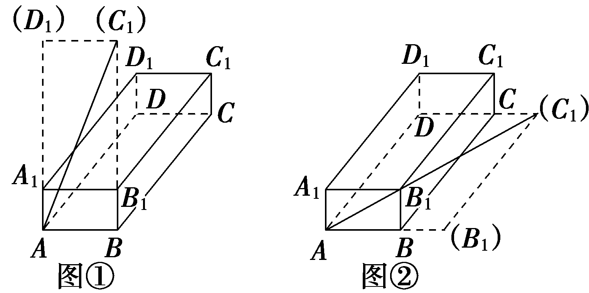

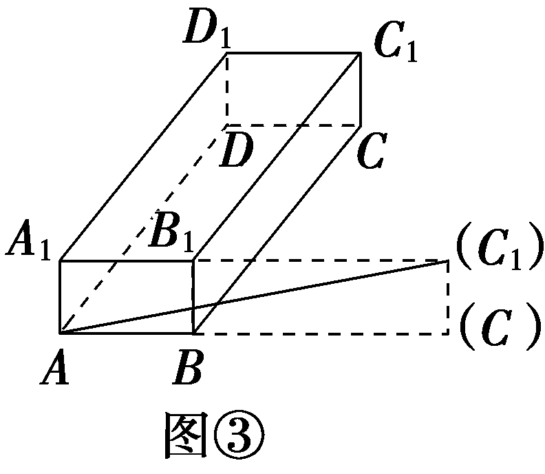

则图①中，<em>&lt;text style="italic"&gt;&lt;text style="italic"&gt;&lt;text style="italic"&gt;AC</em>&lt;/text&gt;&lt;/text&gt;&lt;/text&gt;&lt;text style="subscript"&gt;&lt;text style="subscript"&gt;&lt;text style="subscript"&gt;1&lt;/text&gt;&lt;/text&gt;&lt;/text&gt;＝ $\sqrt{2^{2}＋\left(1+4\right)^{2}}$ ＝ $\sqrt{29}$ ；图②中，<em>&lt;text style="italic"&gt;&lt;text style="italic"&gt;&lt;text style="italic"&gt;AC</em>&lt;/text&gt;&lt;/text&gt;&lt;/text&gt;&lt;text style="subscript"&gt;&lt;text style="subscript"&gt;&lt;text style="subscript"&gt;1&lt;/text&gt;&lt;/text&gt;&lt;/text&gt;＝ $\sqrt{\left(2+1\right)^{2}＋4^{2}}$ ＝5；图③中，<em>&lt;text style="italic"&gt;&lt;text style="italic"&gt;&lt;text style="italic"&gt;AC</em>&lt;/text&gt;&lt;/text&gt;&lt;/text&gt;&lt;text style="subscript"&gt;&lt;text style="subscript"&gt;&lt;text style="subscript"&gt;1&lt;/text&gt;&lt;/text&gt;&lt;/text&gt;＝ $\sqrt{\left(2+4\right)^{2}＋1^{2}}$ ＝ $\sqrt{37}$ .所以一只小虫从<em>A</em>点沿长方体的表面爬到<em>C</em>&lt;text style="subscript"&gt;&lt;text style="subscript"&gt;&lt;text style="subscript"&gt;1&lt;/text&gt;&lt;/text&gt;&lt;/text&gt;点的最短距离是5.

##### 13.(15分)如图，矩形*O'A'B'C'* 是用斜二测画法画出的水平放置的一个平面四边形*OABC*的直观图，其中*O'A'*＝3，*O'C'*＝1.

（1）求平面四边形*OABC*的面积；(5分)

（2）若四边形*OABC*以*OA*为轴，旋转一周，求旋转形成的几何体的体积和表面积.(10分)

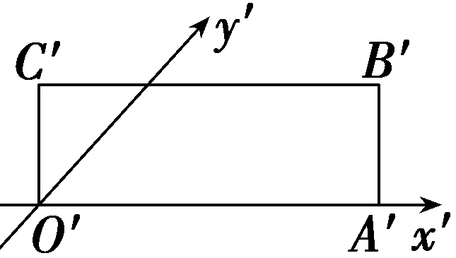

解：（1）因为<em>&lt;text style="italic"&gt;S</em>&lt;/text&gt;原图形＝2 $\sqrt{2}$ <em>&lt;text style="italic"&gt;S</em>&lt;/text&gt;直观图，

所以<em>&lt;text style="italic"&gt;S</em>&lt;/text&gt;四边形<em>OABC</em>＝2 $\sqrt{2}$ <em>&lt;text style="italic"&gt;S</em>&lt;/text&gt;矩形<em>O'A'B'C'</em>＝6 $\sqrt{2}$ .

（2）平面四边形*OABC*如图所示，过点*O*作*OD*⊥*BC*交*BC*于点*D*，在Rt△*ODC*中，

有<em>OC</em>&lt;text style="superscript"&gt;&lt;text style="superscript"&gt;&lt;text style="superscript"&gt;&lt;text style="superscript"&gt;2&lt;/text&gt;&lt;/text&gt;&lt;/text&gt;&lt;/text&gt;＝<em>OD</em>2＋<em>CD</em>2＝(2 $\sqrt{2}$ )&lt;text style="superscript"&gt;&lt;text style="superscript"&gt;&lt;text style="superscript"&gt;&lt;text style="superscript"&gt;2&lt;/text&gt;&lt;/text&gt;&lt;/text&gt;&lt;/text&gt;＋12＝9，

所以*OC*＝3，所以*AB*＝3.

如图，分别过点*B*，*C*作*AO*及其延长线的垂线，垂足为*E*，*F*.

矩形&lt;text sty<em>l</em>e="italic"&gt;FE<em>BC</em>&lt;/text&gt;绕<em>OA</em>所在直线旋转一周得到一个底面半径<em>r</em>＝<em>OD</em>＝2 $\sqrt{2}$ ，母线<em>l</em>1＝<em>BC</em>＝3的圆柱；

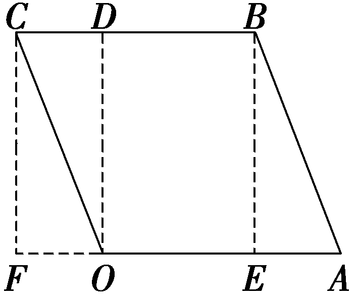

Rt△&lt;text sty<em>l</em>e="italic"&gt;BEA&lt;/text&gt;绕<em>OA</em>旋转一周得到一个底面半径<em>r</em>＝<em>OD</em>＝2 $\sqrt{2}$ ，母线<em>l</em>2＝<em>AB</em>＝3，高<em>h</em>1＝<em>AE</em>＝1的圆锥；

Rt△&lt;text sty<em>l</em>e="italic"&gt;CFO&lt;/text&gt;绕<em>OA</em>所在直线旋转一周得到一个底面半径<em>r</em>＝<em>OD</em>＝2 $\sqrt{2}$ ，母线<em>l</em>3＝<em>OC</em>＝3，高<em>h</em>2＝<em>OF</em>＝<em>CD</em>＝1的圆锥.

所以旋转形成的几何体为圆柱挖去一个同底的圆锥，再加上一个同底的圆锥构成的组合体.

则旋转形成的几何体的体积即等于圆柱的体积，减去挖去的圆锥体积，加上组合的圆锥的体积，

所以旋转形成的几何体的体积&lt;text sty&lt;text sty&lt;text sty<em>l</em>e="italic"&gt;l&lt;/text&gt;e="italic"&gt;l&lt;/text&gt;e="italic"&gt;V&lt;/text&gt;＝π<em>&lt;text style="italic"&gt;&lt;text style="italic"&gt;r</em>&lt;/text&gt;&lt;/text&gt;&lt;text style="superscript"&gt;&lt;text style="subscript"&gt;&lt;text style="superscript"&gt;&lt;text style="superscript"&gt;&lt;text style="superscript"&gt;&lt;text style="superscript"&gt;2&lt;/text&gt;&lt;/text&gt;&lt;/text&gt;&lt;/text&gt;&lt;/text&gt;&lt;/text&gt;l1－ $\frac{1}{3}$ π&lt;text sty&lt;text sty&lt;text sty<em>l</em>e="italic"&gt;l&lt;/text&gt;e="italic"&gt;l&lt;/text&gt;e="italic"&gt;<em>&lt;text style="italic"&gt;r</em>&lt;/text&gt;&lt;/text&gt;&lt;text style="superscript"&gt;&lt;text style="subscript"&gt;&lt;text style="superscript"&gt;&lt;text style="superscript"&gt;&lt;text style="superscript"&gt;&lt;text style="superscript"&gt;2&lt;/text&gt;&lt;/text&gt;&lt;/text&gt;&lt;/text&gt;&lt;/text&gt;&lt;/text&gt;l2＋ $\frac{1}{3}$ π&lt;text sty&lt;text sty&lt;text sty<em>l</em>e="italic"&gt;l&lt;/text&gt;e="italic"&gt;l&lt;/text&gt;e="italic"&gt;<em>&lt;text style="italic"&gt;r</em>&lt;/text&gt;&lt;/text&gt;&lt;text style="superscript"&gt;&lt;text style="subscript"&gt;&lt;text style="superscript"&gt;&lt;text style="superscript"&gt;&lt;text style="superscript"&gt;&lt;text style="superscript"&gt;2&lt;/text&gt;&lt;/text&gt;&lt;/text&gt;&lt;/text&gt;&lt;/text&gt;&lt;/text&gt;l3＝π×(2 $\sqrt{2}$ )&lt;text sty&lt;text sty&lt;text sty<em>l</em>e="italic"&gt;l&lt;/text&gt;e="italic"&gt;l&lt;/text&gt;e="supe<em>&lt;text style="italic"&gt;r</em>&lt;/text&gt;script"&gt;&lt;text style="subscript"&gt;&lt;text style="superscript"&gt;&lt;text style="superscript"&gt;&lt;text style="superscript"&gt;&lt;text style="superscript"&gt;2&lt;/text&gt;&lt;/text&gt;&lt;/text&gt;&lt;/text&gt;&lt;/text&gt;&lt;/text&gt;×3－ $\frac{1}{3}$ π×(&lt;text sty&lt;text sty&lt;text sty<em>l</em>e="italic"&gt;l&lt;/text&gt;e="italic"&gt;l&lt;/text&gt;e="supe<em>&lt;text style="italic"&gt;r</em>&lt;/text&gt;script"&gt;&lt;text style="subscript"&gt;&lt;text style="superscript"&gt;&lt;text style="superscript"&gt;&lt;text style="superscript"&gt;&lt;text style="superscript"&gt;2&lt;/text&gt;&lt;/text&gt;&lt;/text&gt;&lt;/text&gt;&lt;/text&gt;&lt;/text&gt; $\sqrt{2}$ )&lt;text sty&lt;text sty&lt;text sty<em>l</em>e="italic"&gt;l&lt;/text&gt;e="italic"&gt;l&lt;/text&gt;e="supe<em>&lt;text style="italic"&gt;r</em>&lt;/text&gt;script"&gt;&lt;text style="subscript"&gt;&lt;text style="superscript"&gt;&lt;text style="superscript"&gt;&lt;text style="superscript"&gt;&lt;text style="superscript"&gt;2&lt;/text&gt;&lt;/text&gt;&lt;/text&gt;&lt;/text&gt;&lt;/text&gt;&lt;/text&gt;×1＋ $\frac{1}{3}$ π×(&lt;text sty&lt;text sty&lt;text sty<em>l</em>e="italic"&gt;l&lt;/text&gt;e="italic"&gt;l&lt;/text&gt;e="supe<em>&lt;text style="italic"&gt;r</em>&lt;/text&gt;script"&gt;&lt;text style="subscript"&gt;&lt;text style="superscript"&gt;&lt;text style="superscript"&gt;&lt;text style="superscript"&gt;&lt;text style="superscript"&gt;2&lt;/text&gt;&lt;/text&gt;&lt;/text&gt;&lt;/text&gt;&lt;/text&gt;&lt;/text&gt; $\sqrt{2}$ )&lt;text sty&lt;text sty&lt;text sty<em>l</em>e="italic"&gt;l&lt;/text&gt;e="italic"&gt;l&lt;/text&gt;e="supe<em>&lt;text style="italic"&gt;r</em>&lt;/text&gt;script"&gt;&lt;text style="subscript"&gt;&lt;text style="superscript"&gt;&lt;text style="superscript"&gt;&lt;text style="superscript"&gt;&lt;text style="superscript"&gt;2&lt;/text&gt;&lt;/text&gt;&lt;/text&gt;&lt;/text&gt;&lt;/text&gt;&lt;/text&gt;×1＝24π.

旋转形成的几何体的表面积即圆柱的侧面积，加上两个圆锥的侧面积之和，

所以<em>S</em>＝2π<em>&lt;text style="italic"&gt;&lt;text style="italic"&gt;rl</em>&lt;/text&gt;&lt;/text&gt;1＋πrl2＋πrl3＝2π×2 $\sqrt{2}$ ×3＋π×2 $\sqrt{2}$ ×3＋π×2 $\sqrt{2}$ ×3＝24 $\sqrt{2}$ π.

(14、15题，每小题5分，共10分)

##### 14.(多选)如图，在直三棱柱<em>ABC</em>-<em>A</em>1<em>B</em>1<em>C</em>1中，<em>AA</em>1＝2，<em>AB</em>＝<em>BC</em>＝1，∠<em>ABC</em>＝90°，侧面<em>AA</em>1<em>C</em>1<em>C</em>的中心为<em>O</em>，点<em>E</em>是侧棱<em>BB</em>1上的一个动点，下列判断正确的是(　　)

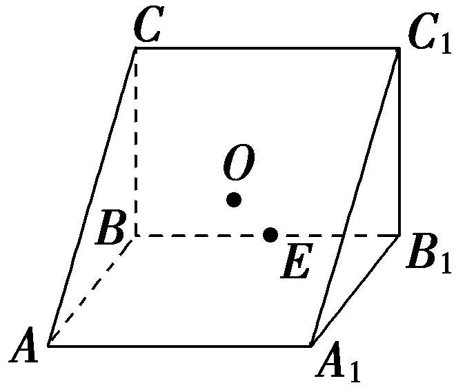

$\quad$A.直三棱柱的侧面积是4＋2 $\sqrt{2}$

$\quad$B.直三棱柱的体积是 $\frac{1}{3}$

$\quad$C.三棱锥<em>E</em>-<em>AA</em>1<em>O</em>的体积为定值

$\quad$D.<em>AE</em>＋<em>EC</em>1的最小值为2 $\sqrt{2}$

答案ACD

解析因为在直三棱柱<em>&lt;text style="italic"&gt;&lt;text style="italic"&gt;A</em>&lt;/text&gt;<em>&lt;text style="italic"&gt;B</em>&lt;/text&gt;<em>&lt;text style="italic"&gt;&lt;text style="italic"&gt;&lt;text style="italic"&gt;&lt;text style="italic"&gt;&lt;text style="italic"&gt;C</em>&lt;/text&gt;&lt;/text&gt;&lt;/text&gt;&lt;/text&gt;&lt;/text&gt;&lt;/text&gt;-A&lt;text style="subscript"&gt;&lt;text style="subscript"&gt;&lt;text style="subscript"&gt;&lt;text style="subscript"&gt;&lt;text style="subscript"&gt;&lt;text style="subscript"&gt;&lt;text style="subscript"&gt;&lt;text style="subscript"&gt;&lt;text style="subscript"&gt;&lt;text style="subscript"&gt;&lt;text style="subscript"&gt;&lt;text style="subscript"&gt;&lt;text style="subscript"&gt;&lt;text style="subscript"&gt;&lt;text style="subscript"&gt;1&lt;/text&gt;&lt;/text&gt;&lt;/text&gt;&lt;/text&gt;&lt;/text&gt;&lt;/text&gt;&lt;/text&gt;&lt;/text&gt;&lt;/text&gt;&lt;/text&gt;&lt;/text&gt;&lt;/text&gt;&lt;/text&gt;&lt;/text&gt;&lt;/text&gt;B1C1中，<em>&lt;text style="italic"&gt;&lt;text style="italic"&gt;&lt;text style="italic"&gt;AA</em>&lt;/text&gt;&lt;/text&gt;&lt;/text&gt;1＝2，<em>AB</em>＝<em>BC</em>＝1，∠<em>&lt;text style="italic"&gt;&lt;text style="italic,subscript"&gt;ABC</em>&lt;/text&gt;&lt;/text&gt;＝90°，所以△ABC和△A1B1C1是等腰直角三角形，侧面全是矩形，所以其侧面积为1×2×2＋ $\sqrt{1^{2}＋1^{2}}$ ×2＝4＋2 $\sqrt{2}$ ，故<em>&lt;text style="italic"&gt;A</em>&lt;/text&gt;正确；直三棱柱的体积<em>V</em>＝<em>S</em>△<em>A&lt;text style="italic"&gt;&lt;text style="italic"&gt;B</em>&lt;/text&gt;<em>&lt;text style="italic"&gt;&lt;text style="italic"&gt;&lt;text style="italic"&gt;&lt;text style="italic"&gt;&lt;text style="italic"&gt;C</em>&lt;/text&gt;&lt;/text&gt;&lt;/text&gt;&lt;/text&gt;&lt;/text&gt;&lt;/text&gt;·<em>&lt;text style="italic"&gt;&lt;text style="italic"&gt;&lt;text style="italic"&gt;AA</em>&lt;/text&gt;&lt;/text&gt;&lt;/text&gt;&lt;text style="subscript"&gt;&lt;text style="subscript"&gt;&lt;text style="subscript"&gt;&lt;text style="subscript"&gt;&lt;text style="subscript"&gt;&lt;text style="subscript"&gt;&lt;text style="subscript"&gt;&lt;text style="subscript"&gt;&lt;text style="subscript"&gt;&lt;text style="subscript"&gt;&lt;text style="subscript"&gt;&lt;text style="subscript"&gt;&lt;text style="subscript"&gt;&lt;text style="subscript"&gt;&lt;text style="subscript"&gt;1&lt;/text&gt;&lt;/text&gt;&lt;/text&gt;&lt;/text&gt;&lt;/text&gt;&lt;/text&gt;&lt;/text&gt;&lt;/text&gt;&lt;/text&gt;&lt;/text&gt;&lt;/text&gt;&lt;/text&gt;&lt;/text&gt;&lt;/text&gt;&lt;/text&gt;＝ $\frac{1}{2}$ ×&lt;text style="subscript"&gt;&lt;text style="subscript"&gt;&lt;text style="subscript"&gt;&lt;text style="subscript"&gt;&lt;text style="subscript"&gt;&lt;text style="subscript"&gt;&lt;text style="subscript"&gt;&lt;text style="subscript"&gt;&lt;text style="subscript"&gt;&lt;text style="subscript"&gt;&lt;text style="subscript"&gt;&lt;text style="subscript"&gt;&lt;text style="subscript"&gt;&lt;text style="subscript"&gt;&lt;text style="subscript"&gt;1&lt;/text&gt;&lt;/text&gt;&lt;/text&gt;&lt;/text&gt;&lt;/text&gt;&lt;/text&gt;&lt;/text&gt;&lt;/text&gt;&lt;/text&gt;&lt;/text&gt;&lt;/text&gt;&lt;/text&gt;&lt;/text&gt;&lt;/text&gt;&lt;/text&gt;×1×2＝1，故<em>&lt;text style="italic"&gt;B</em>&lt;/text&gt;不正确；如图所示，因为<em>&lt;text style="italic"&gt;BB</em>&lt;/text&gt;1∥平面<em>&lt;text style="italic"&gt;A</em>&lt;/text&gt;A1<em>&lt;text style="italic"&gt;&lt;text style="italic"&gt;&lt;text style="italic"&gt;&lt;text style="italic"&gt;&lt;text style="italic"&gt;C</em>&lt;/text&gt;&lt;/text&gt;&lt;/text&gt;&lt;/text&gt;&lt;/text&gt;1C，且点<em>&lt;text style="italic"&gt;&lt;text style="italic"&gt;E</em>&lt;/text&gt;&lt;/text&gt;是侧棱BB1上的一个动点，所以点E到平面<em>&lt;text style="italic"&gt;&lt;text style="italic"&gt;&lt;text style="italic"&gt;AA</em>&lt;/text&gt;&lt;/text&gt;&lt;/text&gt;1C1C的距离为定值，即三棱锥E-AA1<em>O</em>的高为定值 $\frac{\sqrt{2}}{2}$ ， $S_{\bigtriangleup AA_{1}O}$ ＝ $\frac{1}{4}$ × $\sqrt{2}$ ×2＝ $\frac{\sqrt{2}}{2}$ ，所以 $V_{三棱锥E-AA_{1}O}$ ＝ $\frac{1}{3}$ × $\frac{\sqrt{2}}{2}$ × $\frac{\sqrt{2}}{2}$ ＝ $\frac{1}{6}$ ，为定值，故<em>&lt;text style="italic"&gt;&lt;text style="italic"&gt;&lt;text style="italic"&gt;&lt;text style="italic"&gt;&lt;text style="italic"&gt;C</em>&lt;/text&gt;&lt;/text&gt;&lt;/text&gt;&lt;/text&gt;&lt;/text&gt;正确；由该棱柱的侧面展开图易知(图略)，<em>&lt;text style="italic"&gt;A</em>&lt;/text&gt;<em>&lt;text style="italic"&gt;&lt;text style="italic"&gt;E</em>&lt;/text&gt;&lt;/text&gt;＋<em>EC</em>&lt;text style="subscript"&gt;&lt;text style="subscript"&gt;&lt;text style="subscript"&gt;&lt;text style="subscript"&gt;&lt;text style="subscript"&gt;&lt;text style="subscript"&gt;&lt;text style="subscript"&gt;&lt;text style="subscript"&gt;&lt;text style="subscript"&gt;&lt;text style="subscript"&gt;&lt;text style="subscript"&gt;&lt;text style="subscript"&gt;&lt;text style="subscript"&gt;&lt;text style="subscript"&gt;&lt;text style="subscript"&gt;1&lt;/text&gt;&lt;/text&gt;&lt;/text&gt;&lt;/text&gt;&lt;/text&gt;&lt;/text&gt;&lt;/text&gt;&lt;/text&gt;&lt;/text&gt;&lt;/text&gt;&lt;/text&gt;&lt;/text&gt;&lt;/text&gt;&lt;/text&gt;&lt;/text&gt;的最小值为 $\sqrt{AA_{1}^{2}＋\left(A_{1}B_{1}＋B_{1}C_{1}\right)^{2}}$ ＝ $\sqrt{2^{2}＋\left(1+1\right)^{2}}$ ＝2 $\sqrt{2}$ ，故D正确.故选<em>&lt;text style="italic"&gt;A</em>&lt;/text&gt;<em>&lt;text style="italic"&gt;&lt;text style="italic"&gt;&lt;text style="italic"&gt;&lt;text style="italic"&gt;&lt;text style="italic"&gt;C</em>&lt;/text&gt;&lt;/text&gt;&lt;/text&gt;&lt;/text&gt;&lt;/text&gt;D.

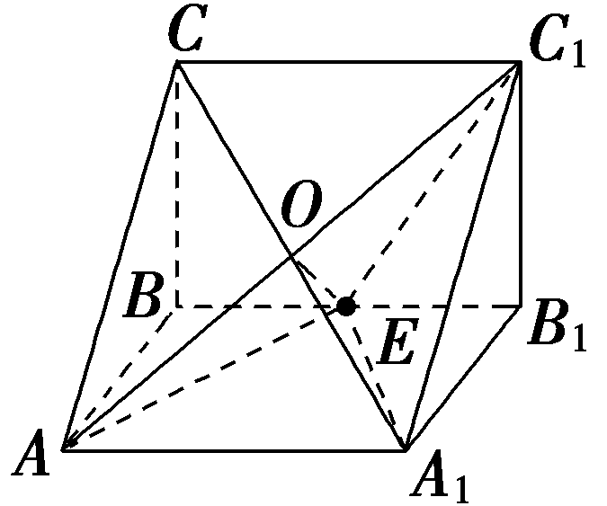

##### 15.(双空题)如图，一个正三棱锥<em>P</em>-<em>ABC</em>的底面边长为1，高为2，则此三棱锥的体积为<u>　　　　</u>.若一个正三棱柱<em>A</em>1<em>B</em>1<em>C</em>1-<em>A</em>0<em>B</em>0<em>C</em>0的顶点<em>A</em>1，<em>B</em>1，<em>C</em>1分别在该三棱锥的三条棱上，<em>A</em>0，<em>B</em>0，<em>C</em>0在该三棱锥的底面<em>ABC</em>上，则此三棱柱侧面积的最大值为<u>　　　　</u>.

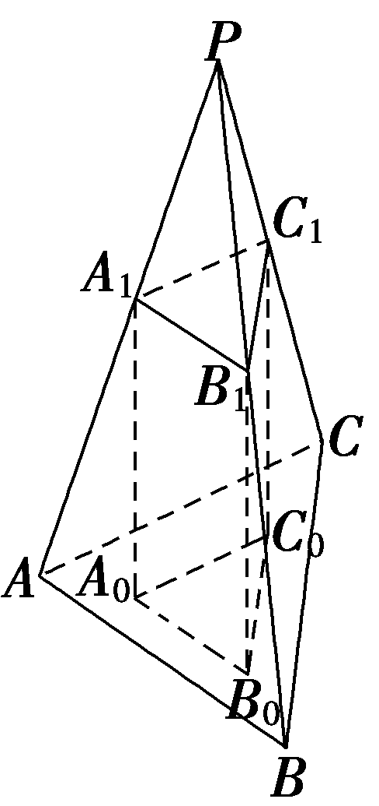

答案 $\frac{\sqrt{3}}{6}　\frac{3}{2}$

解析由三角形面积公式可得&lt;te&lt;te&lt;te&lt;te&lt;te&lt;te&lt;te&lt;te&lt;te<em>x</em>t style="italic"&gt;x&lt;/text&gt;t style="italic"&gt;x&lt;/text&gt;t style="italic"&gt;x&lt;/text&gt;t style="italic"&gt;x&lt;/text&gt;t style="italic"&gt;x&lt;/text&gt;t style="italic"&gt;x&lt;/text&gt;t style="italic"&gt;x&lt;/text&gt;t style="italic"&gt;x&lt;/text&gt;t style="italic"&gt;<em>&lt;text style="italic"&gt;S</em>&lt;/text&gt;&lt;/text&gt;&lt;text style="subscript"&gt;△&lt;/text&gt;<em>&lt;text style="italic"&gt;&lt;text style="italic,subscript"&gt;&lt;text style="italic,subscript"&gt;&lt;text style="italic"&gt;&lt;text style="italic"&gt;&lt;text style="italic"&gt;&lt;text style="italic"&gt;&lt;text style="italic"&gt;&lt;text style="italic"&gt;&lt;text style="italic"&gt;A</em>&lt;/text&gt;&lt;/text&gt;&lt;/text&gt;&lt;/text&gt;&lt;/text&gt;&lt;/text&gt;<em>&lt;text style="italic"&gt;&lt;text style="italic"&gt;B</em>&lt;/text&gt;&lt;/text&gt;<em>&lt;text style="italic"&gt;&lt;text style="italic"&gt;C</em>&lt;/text&gt;&lt;/text&gt;&lt;/text&gt;&lt;/text&gt;&lt;/text&gt;&lt;/text&gt;＝ $\frac{1}{2}$ ×&lt;te&lt;te&lt;te&lt;te&lt;te&lt;te&lt;te&lt;te&lt;te<em>x</em>t style="italic"&gt;x&lt;/text&gt;t style="italic"&gt;x&lt;/text&gt;t style="italic"&gt;x&lt;/text&gt;t style="italic"&gt;x&lt;/text&gt;t style="italic"&gt;x&lt;/text&gt;t style="italic"&gt;x&lt;/text&gt;t style="italic"&gt;x&lt;/text&gt;t style="italic"&gt;x&lt;/text&gt;t style="subscript"&gt;&lt;text style="subscript"&gt;&lt;text style="subscript"&gt;&lt;text style="subscript"&gt;&lt;text style="subscript"&gt;&lt;text style="subscript"&gt;&lt;text style="subscript"&gt;&lt;text style="subscript"&gt;&lt;text style="subscript"&gt;&lt;text style="subscript"&gt;&lt;text style="subscript"&gt;&lt;text style="subscript"&gt;&lt;text style="subscript"&gt;&lt;text style="subscript"&gt;1&lt;/text&gt;&lt;/text&gt;&lt;/text&gt;&lt;/text&gt;&lt;/text&gt;&lt;/text&gt;&lt;/text&gt;&lt;/text&gt;&lt;/text&gt;&lt;/text&gt;&lt;/text&gt;&lt;/text&gt;&lt;/text&gt;&lt;/text&gt;×1×sin 6&lt;text style="subscript"&gt;0&lt;/text&gt;°＝ $\frac{\sqrt{3}}{4}$ .设三棱锥&lt;te&lt;te&lt;te&lt;te&lt;te&lt;te&lt;te&lt;te&lt;te<em>x</em>t style="italic"&gt;x&lt;/text&gt;t style="italic"&gt;x&lt;/text&gt;t style="italic"&gt;x&lt;/text&gt;t style="italic"&gt;x&lt;/text&gt;t style="italic"&gt;x&lt;/text&gt;t style="italic"&gt;x&lt;/text&gt;t style="italic"&gt;x&lt;/text&gt;t style="italic"&gt;x&lt;/text&gt;t style="italic"&gt;<em>&lt;text style="italic"&gt;P</em>&lt;/text&gt;&lt;/text&gt;-<em>&lt;text style="italic"&gt;&lt;text style="italic,subscript"&gt;&lt;text style="italic,subscript"&gt;&lt;text style="italic"&gt;&lt;text style="italic"&gt;&lt;text style="italic"&gt;&lt;text style="italic"&gt;&lt;text style="italic"&gt;&lt;text style="italic"&gt;&lt;text style="italic"&gt;A</em>&lt;/text&gt;&lt;/text&gt;&lt;/text&gt;&lt;/text&gt;&lt;/text&gt;&lt;/text&gt;<em>&lt;text style="italic"&gt;&lt;text style="italic"&gt;B</em>&lt;/text&gt;&lt;/text&gt;<em>&lt;text style="italic"&gt;&lt;text style="italic"&gt;C</em>&lt;/text&gt;&lt;/text&gt;&lt;/text&gt;&lt;/text&gt;&lt;/text&gt;&lt;/text&gt;的高为<em>&lt;text style="italic"&gt;&lt;text style="italic"&gt;&lt;text style="italic"&gt;&lt;text style="italic"&gt;h</em>&lt;/text&gt;&lt;/text&gt;&lt;/text&gt;&lt;/text&gt;，<em>V</em>P-ABC＝ $\frac{1}{3}$ &lt;te&lt;te&lt;te&lt;te&lt;te&lt;te&lt;te&lt;te&lt;te<em>x</em>t style="italic"&gt;x&lt;/text&gt;t style="italic"&gt;x&lt;/text&gt;t style="italic"&gt;x&lt;/text&gt;t style="italic"&gt;x&lt;/text&gt;t style="italic"&gt;x&lt;/text&gt;t style="italic"&gt;x&lt;/text&gt;t style="italic"&gt;x&lt;/text&gt;t style="italic"&gt;x&lt;/text&gt;t style="italic"&gt;<em>&lt;text style="italic"&gt;S</em>&lt;/text&gt;&lt;/text&gt;&lt;text style="subscript"&gt;△&lt;/text&gt;<em>&lt;text style="italic"&gt;&lt;text style="italic,subscript"&gt;&lt;text style="italic,subscript"&gt;&lt;text style="italic"&gt;&lt;text style="italic"&gt;&lt;text style="italic"&gt;&lt;text style="italic"&gt;&lt;text style="italic"&gt;&lt;text style="italic"&gt;&lt;text style="italic"&gt;A</em>&lt;/text&gt;&lt;/text&gt;&lt;/text&gt;&lt;/text&gt;&lt;/text&gt;&lt;/text&gt;<em>&lt;text style="italic"&gt;&lt;text style="italic"&gt;B</em>&lt;/text&gt;&lt;/text&gt;<em>&lt;text style="italic"&gt;&lt;text style="italic"&gt;C</em>&lt;/text&gt;&lt;/text&gt;&lt;/text&gt;&lt;/text&gt;&lt;/text&gt;&lt;/text&gt;·<em>&lt;text style="italic"&gt;&lt;text style="italic"&gt;&lt;text style="italic"&gt;&lt;text style="italic"&gt;h</em>&lt;/text&gt;&lt;/text&gt;&lt;/text&gt;&lt;/text&gt;＝ $\frac{1}{3}$ × $\frac{\sqrt{3}}{4}$ ×2＝ $\frac{\sqrt{3}}{6}$ .由题意得，三棱锥&lt;te&lt;te&lt;te&lt;te&lt;te&lt;te&lt;te&lt;te&lt;te<em>x</em>t style="italic"&gt;x&lt;/text&gt;t style="italic"&gt;x&lt;/text&gt;t style="italic"&gt;x&lt;/text&gt;t style="italic"&gt;x&lt;/text&gt;t style="italic"&gt;x&lt;/text&gt;t style="italic"&gt;x&lt;/text&gt;t style="italic"&gt;x&lt;/text&gt;t style="italic"&gt;x&lt;/text&gt;t style="italic"&gt;<em>&lt;text style="italic"&gt;P</em>&lt;/text&gt;&lt;/text&gt;-<em>&lt;text style="italic"&gt;&lt;text style="italic"&gt;&lt;text style="italic"&gt;&lt;text style="italic"&gt;&lt;text style="italic"&gt;&lt;text style="italic"&gt;A</em>&lt;/text&gt;&lt;/text&gt;&lt;/text&gt;&lt;/text&gt;&lt;/text&gt;&lt;/text&gt;&lt;text style="subscript"&gt;&lt;text style="subscript"&gt;&lt;text style="subscript"&gt;&lt;text style="subscript"&gt;&lt;text style="subscript"&gt;&lt;text style="subscript"&gt;&lt;text style="subscript"&gt;&lt;text style="subscript"&gt;&lt;text style="subscript"&gt;&lt;text style="subscript"&gt;&lt;text style="subscript"&gt;&lt;text style="subscript"&gt;&lt;text style="subscript"&gt;&lt;text style="subscript"&gt;1&lt;/text&gt;&lt;/text&gt;&lt;/text&gt;&lt;/text&gt;&lt;/text&gt;&lt;/text&gt;&lt;/text&gt;&lt;/text&gt;&lt;/text&gt;&lt;/text&gt;&lt;/text&gt;&lt;/text&gt;&lt;/text&gt;&lt;/text&gt;<em>&lt;text style="italic"&gt;&lt;text style="italic"&gt;B</em>&lt;/text&gt;&lt;/text&gt;1<em>&lt;text style="italic"&gt;&lt;text style="italic"&gt;C</em>&lt;/text&gt;&lt;/text&gt;1为正三棱锥，设其高为<em>&lt;text style="italic"&gt;&lt;text style="italic"&gt;&lt;text style="italic"&gt;&lt;text style="italic"&gt;h</em>&lt;/text&gt;&lt;/text&gt;&lt;/text&gt;&lt;/text&gt;1，则A1A&lt;text style="subscript"&gt;0&lt;/text&gt;＝2－h1.设A1B1＝x(0＜x＜1)，则C1B1＝C1A1＝x，由相似知识得， $\frac{x}{1}$ ＝ $\frac{h_{1}}{2}$ ，故&lt;te&lt;te&lt;te&lt;te&lt;te&lt;te&lt;te&lt;te&lt;te<em>x</em>t style="italic"&gt;x&lt;/text&gt;t style="italic"&gt;x&lt;/text&gt;t style="italic"&gt;x&lt;/text&gt;t style="italic"&gt;x&lt;/text&gt;t style="italic"&gt;x&lt;/text&gt;t style="italic"&gt;x&lt;/text&gt;t style="italic"&gt;x&lt;/text&gt;t style="italic"&gt;x&lt;/text&gt;t style="italic"&gt;<em>&lt;text style="italic"&gt;&lt;text style="italic"&gt;&lt;text style="italic"&gt;h</em>&lt;/text&gt;&lt;/text&gt;&lt;/text&gt;&lt;/text&gt;&lt;text style="subscript"&gt;&lt;text style="subscript"&gt;&lt;text style="subscript"&gt;&lt;text style="subscript"&gt;&lt;text style="subscript"&gt;&lt;text style="subscript"&gt;&lt;text style="subscript"&gt;&lt;text style="subscript"&gt;&lt;text style="subscript"&gt;&lt;text style="subscript"&gt;&lt;text style="subscript"&gt;&lt;text style="subscript"&gt;&lt;text style="subscript"&gt;&lt;text style="subscript"&gt;1&lt;/text&gt;&lt;/text&gt;&lt;/text&gt;&lt;/text&gt;&lt;/text&gt;&lt;/text&gt;&lt;/text&gt;&lt;/text&gt;&lt;/text&gt;&lt;/text&gt;&lt;/text&gt;&lt;/text&gt;&lt;/text&gt;&lt;/text&gt;＝2x，则<em>&lt;text style="italic"&gt;&lt;text style="italic"&gt;&lt;text style="italic"&gt;&lt;text style="italic"&gt;&lt;text style="italic"&gt;&lt;text style="italic"&gt;A</em>&lt;/text&gt;&lt;/text&gt;&lt;/text&gt;&lt;/text&gt;&lt;/text&gt;&lt;/text&gt;1A&lt;text style="subscript"&gt;0&lt;/text&gt;＝2－h1＝2－2x.三棱柱的侧面积<em>&lt;text style="italic"&gt;&lt;text style="italic"&gt;S</em>&lt;/text&gt;&lt;/text&gt;＝3x(2－2x)＝－6 $\left(x－\frac{1}{2}\right)^{2}$ ＋ $\frac{3}{2}$ .因为&lt;te&lt;te&lt;te&lt;te&lt;te&lt;te&lt;te&lt;te&lt;te<em>x</em>t style="italic"&gt;x&lt;/text&gt;t style="italic"&gt;x&lt;/text&gt;t style="italic"&gt;x&lt;/text&gt;t style="italic"&gt;x&lt;/text&gt;t style="italic"&gt;x&lt;/text&gt;t style="italic"&gt;x&lt;/text&gt;t style="italic"&gt;x&lt;/text&gt;t style="italic"&gt;x&lt;/text&gt;t style="subscript"&gt;0&lt;/text&gt;＜x＜&lt;text style="subscript"&gt;&lt;text style="subscript"&gt;&lt;text style="subscript"&gt;&lt;text style="subscript"&gt;&lt;text style="subscript"&gt;&lt;text style="subscript"&gt;&lt;text style="subscript"&gt;&lt;text style="subscript"&gt;&lt;text style="subscript"&gt;&lt;text style="subscript"&gt;&lt;text style="subscript"&gt;&lt;text style="subscript"&gt;&lt;text style="subscript"&gt;&lt;text style="subscript"&gt;1&lt;/text&gt;&lt;/text&gt;&lt;/text&gt;&lt;/text&gt;&lt;/text&gt;&lt;/text&gt;&lt;/text&gt;&lt;/text&gt;&lt;/text&gt;&lt;/text&gt;&lt;/text&gt;&lt;/text&gt;&lt;/text&gt;&lt;/text&gt;，所以当x＝ $\frac{1}{2}$ 时，三棱柱的侧面积取得最大值，最大值为 $\frac{3}{2}$ .

