培优课14　空间中的动态及探索性问题

“动态”问题是高考立体几何问题最具创新意识的题型之一，它渗透了一些“动态”的点、线、面等元素，给静态的立体几何题赋予了活力，使题型更新颖.同时，由于“动态”的存在，也使立体几何题更趋多元化，将立体几何问题与平面几何中的解三角形问题、多边形面积问题以及解析几何问题之间建立桥梁，使得它们之间灵活转化.

### 题型一　空间中的动态问题

角度1　动态位置关系的判定

（1）(多选)已知<em>P</em>，<em>Q</em>分别是正方体<em>ABCD</em> -<em>A</em>1<em>B</em>1<em>C</em>1<em>D</em>1的棱<em>BB</em>1，<em>CC</em>1上的动点(不与顶点重合)，则下列结论正确的是(　　)

$\quad$A.*AB*⊥*PQ*

$\quad$B.平面<em>BPQ</em>∥平面<em>ADD</em>1<em>A</em>1

$\quad$C.四面体*ABPQ*的体积为定值

$\quad$D.<em>AP</em>∥平面<em>CDD</em>1<em>C</em>1

（2）(多选)如图，在矩形*ABCD*中，*BC*＝1，*AB*＝*x*，*BD*和*AC*交于点*O*，将△*BAD*沿直线*BD*翻折，则下列说法中正确的是(　　)

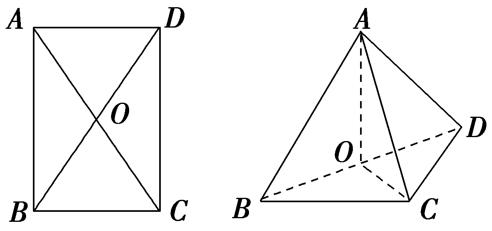

$\quad$A.存在*x*，在翻折过程中存在某个位置，使得*AB*⊥*OC*

$\quad$B.存在*x*，在翻折过程中存在某个位置，使得*AC*⊥*BD*

$\quad$C.存在*x*，在翻折过程中存在某个位置，使得*AB*⊥平面*ACD*

$\quad$D.存在*x*，在翻折过程中存在某个位置，使得*AC*⊥平面*ABD*

答案（1）ABD　（2）ABC

解析（1）对于A，因为<em>AB</em>⊥<em>BC</em>，<em>AB</em>⊥<em>BB</em>1，<em>BC</em>∩<em>BB</em>1＝<em>B</em>，<em>BC</em>，<em>BB</em>1⊂平面<em>BCC</em>1<em>B</em>1，所以<em>AB</em>⊥平面<em>BCC</em>1<em>B</em>1，因为<em>PQ</em>⊂平面<em>BCC</em>1<em>B</em>1，所以<em>AB</em>⊥<em>PQ</em>，故A正确；对于B，因为平面<em>ADD</em>1<em>A</em>1∥平面<em>BCC</em>1<em>B</em>1，平面<em>BPQ</em>与平面<em>BCC</em>1<em>B</em>1重合，所以平面<em>BPQ</em>∥平面<em>ADD</em>1<em>A</em>1，故B正确；对于C，因为<em>A</em>到平面<em>BPQ</em>的距离<em>AB</em>为定值，<em>Q</em>到<em>BP</em>的距离为定值，<em>BP</em>的长不是定值，所以四面体<em>ABPQ</em>的体积不为定值，故C错误；对于D，因为平面<em>ABB</em>1<em>A</em>1∥平面<em>CDD</em>1<em>C</em>1，<em>AP</em>⊂平面<em>ABB</em>1<em>A</em>1，所以<em>AP</em>∥平面<em>CDD</em>1<em>C</em>1，故D正确.故选ABD.

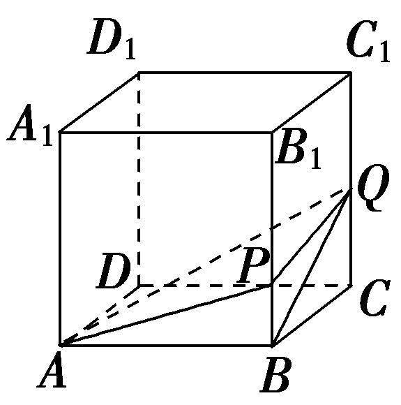

(&lt;text style="superscript"&gt;&lt;text style="superscript"&gt;2&lt;/text&gt;&lt;/text&gt;)当&lt;te&lt;te<em>x</em>t style="italic"&gt;x&lt;/text&gt;t style="italic"&gt;<em>&lt;text style="italic"&gt;&lt;text style="italic"&gt;&lt;text style="italic"&gt;&lt;text style="italic"&gt;&lt;text style="italic"&gt;&lt;text style="italic"&gt;A</em>B&lt;/text&gt;&lt;/text&gt;&lt;/text&gt;&lt;/text&gt;&lt;/text&gt;&lt;/text&gt;&lt;/text&gt;＝x＝1时，此时矩形<em>A&lt;text style="italic"&gt;&lt;text style="italic"&gt;&lt;text style="italic"&gt;&lt;text style="italic"&gt;BC</em>D&lt;/text&gt;&lt;/text&gt;&lt;/text&gt;&lt;/text&gt;为正方形，则<em>&lt;text style="italic"&gt;&lt;text style="italic"&gt;&lt;text style="italic"&gt;&lt;text style="italic"&gt;&lt;text style="italic"&gt;&lt;text style="italic"&gt;&lt;text style="italic"&gt;&lt;text style="italic"&gt;&lt;text style="italic"&gt;&lt;text style="italic"&gt;AC</em>&lt;/text&gt;&lt;/text&gt;&lt;/text&gt;&lt;/text&gt;&lt;/text&gt;&lt;/text&gt;&lt;/text&gt;&lt;/text&gt;&lt;/text&gt;&lt;/text&gt;⊥<em>&lt;text style="italic"&gt;&lt;text style="italic"&gt;&lt;text style="italic"&gt;&lt;text style="italic"&gt;&lt;text style="italic"&gt;&lt;text style="italic"&gt;&lt;text style="italic"&gt;&lt;text style="italic"&gt;&lt;text style="italic"&gt;BD</em>&lt;/text&gt;&lt;/text&gt;&lt;/text&gt;&lt;/text&gt;&lt;/text&gt;&lt;/text&gt;&lt;/text&gt;&lt;/text&gt;&lt;/text&gt;，将△<em>B&lt;text style="italic"&gt;&lt;text style="italic"&gt;&lt;text style="italic"&gt;&lt;text style="italic"&gt;AD</em>&lt;/text&gt;&lt;/text&gt;&lt;/text&gt;&lt;/text&gt;沿直线BD翻折，当平面<em>&lt;text style="italic"&gt;&lt;text style="italic"&gt;&lt;text style="italic"&gt;&lt;text style="italic"&gt;AB</em>D&lt;/text&gt;&lt;/text&gt;&lt;/text&gt;&lt;/text&gt;⊥平面BCD时，由<em>&lt;text style="italic"&gt;&lt;text style="italic"&gt;&lt;text style="italic"&gt;&lt;text style="italic"&gt;&lt;text style="italic"&gt;&lt;text style="italic"&gt;O</em>C&lt;/text&gt;&lt;/text&gt;&lt;/text&gt;&lt;/text&gt;&lt;/text&gt;&lt;/text&gt;⊥BD，<em>&lt;text style="italic"&gt;&lt;text style="italic"&gt;OC</em>&lt;/text&gt;&lt;/text&gt;⊂平面BCD，平面<em>&lt;text style="italic"&gt;ABD</em>&lt;/text&gt;∩平面BCD＝BD，所以OC⊥平面ABD，又AB⊂平面ABD，所以AB⊥OC，故A正确；又OC⊥BD，<em>&lt;text style="italic"&gt;&lt;text style="italic"&gt;&lt;text style="italic"&gt;OA</em>&lt;/text&gt;&lt;/text&gt;&lt;/text&gt;⊥BD，且OA∩OC＝O，OA，OC⊂平面<em>&lt;text style="italic"&gt;&lt;text style="italic"&gt;OAC</em>&lt;/text&gt;&lt;/text&gt;，所以BD⊥平面OAC，又AC⊂平面OAC，所以AC⊥BD，故B正确；在矩形<em>ABCD</em>中，AB⊥AD，AC＝ $\sqrt{1+x^{2}}$ ，所以将△&lt;te<em>x</em>t style="italic"&gt;B<em>&lt;text style="italic"&gt;&lt;text style="italic"&gt;&lt;text style="italic"&gt;A</em>D&lt;/text&gt;&lt;/text&gt;&lt;/text&gt;&lt;/text&gt;沿直线<em>&lt;text style="italic"&gt;&lt;text style="italic"&gt;&lt;text style="italic"&gt;&lt;text style="italic"&gt;&lt;text style="italic"&gt;&lt;text style="italic"&gt;&lt;text style="italic"&gt;&lt;text style="italic"&gt;&lt;text style="italic"&gt;BD</em>&lt;/text&gt;&lt;/text&gt;&lt;/text&gt;&lt;/text&gt;&lt;/text&gt;&lt;/text&gt;&lt;/text&gt;&lt;/text&gt;&lt;/text&gt;翻折时，总有&lt;te<em>x</em>t style="italic"&gt;<em>&lt;text style="italic"&gt;&lt;text style="italic"&gt;&lt;text style="italic"&gt;&lt;text style="italic"&gt;&lt;text style="italic"&gt;&lt;text style="italic"&gt;AB</em>&lt;/text&gt;&lt;/text&gt;&lt;/text&gt;&lt;/text&gt;&lt;/text&gt;&lt;/text&gt;&lt;/text&gt;⊥<em>AD</em>，取x＝ $\frac{1}{2}$ ，当将△&lt;te<em>x</em>t style="italic"&gt;B<em>&lt;text style="italic"&gt;&lt;text style="italic"&gt;&lt;text style="italic"&gt;A</em>D&lt;/text&gt;&lt;/text&gt;&lt;/text&gt;&lt;/text&gt;沿直线<em>&lt;text style="italic"&gt;&lt;text style="italic"&gt;&lt;text style="italic"&gt;&lt;text style="italic"&gt;&lt;text style="italic"&gt;&lt;text style="italic"&gt;&lt;text style="italic"&gt;&lt;text style="italic"&gt;&lt;text style="italic"&gt;BD</em>&lt;/text&gt;&lt;/text&gt;&lt;/text&gt;&lt;/text&gt;&lt;/text&gt;&lt;/text&gt;&lt;/text&gt;&lt;/text&gt;&lt;/text&gt;翻折到<em>&lt;text style="italic"&gt;&lt;text style="italic"&gt;&lt;text style="italic"&gt;&lt;text style="italic"&gt;&lt;text style="italic"&gt;&lt;text style="italic"&gt;&lt;text style="italic"&gt;&lt;text style="italic"&gt;&lt;text style="italic"&gt;&lt;text style="italic"&gt;AC</em>&lt;/text&gt;&lt;/text&gt;&lt;/text&gt;&lt;/text&gt;&lt;/text&gt;&lt;/text&gt;&lt;/text&gt;&lt;/text&gt;&lt;/text&gt;&lt;/text&gt;＝ $\frac{\sqrt{3}}{2}$ 时，有&lt;te&lt;te<em>x</em>t style="italic"&gt;x&lt;/text&gt;t style="italic"&gt;<em>&lt;text style="italic"&gt;&lt;text style="italic"&gt;&lt;text style="italic"&gt;&lt;text style="italic"&gt;&lt;text style="italic"&gt;&lt;text style="italic"&gt;A</em>B&lt;/text&gt;&lt;/text&gt;&lt;/text&gt;&lt;/text&gt;&lt;/text&gt;&lt;/text&gt;&lt;/text&gt;&lt;text style="superscript"&gt;&lt;text style="superscript"&gt;2&lt;/text&gt;&lt;/text&gt;＋<em>&lt;text style="italic"&gt;&lt;text style="italic"&gt;&lt;text style="italic"&gt;&lt;text style="italic"&gt;&lt;text style="italic"&gt;&lt;text style="italic"&gt;&lt;text style="italic"&gt;&lt;text style="italic"&gt;&lt;text style="italic"&gt;&lt;text style="italic"&gt;AC</em>&lt;/text&gt;&lt;/text&gt;&lt;/text&gt;&lt;/text&gt;&lt;/text&gt;&lt;/text&gt;&lt;/text&gt;&lt;/text&gt;&lt;/text&gt;&lt;/text&gt;2＝<em>BC</em>2，即<em>AB</em>⊥AC，且AC∩<em>&lt;text style="italic"&gt;&lt;text style="italic"&gt;&lt;text style="italic"&gt;AD</em>&lt;/text&gt;&lt;/text&gt;&lt;/text&gt;＝A，AC，AD⊂平面<em>&lt;text style="italic"&gt;ACD</em>&lt;/text&gt;，则此时满足AB⊥平面ACD，故C正确；若AC⊥平面A<em>&lt;text style="italic"&gt;&lt;text style="italic"&gt;&lt;text style="italic"&gt;&lt;text style="italic"&gt;&lt;text style="italic"&gt;&lt;text style="italic"&gt;&lt;text style="italic"&gt;&lt;text style="italic"&gt;&lt;text style="italic"&gt;BD</em>&lt;/text&gt;&lt;/text&gt;&lt;/text&gt;&lt;/text&gt;&lt;/text&gt;&lt;/text&gt;&lt;/text&gt;&lt;/text&gt;&lt;/text&gt;，又A<em>O</em>⊂平面<em>&lt;text style="italic"&gt;&lt;text style="italic"&gt;&lt;text style="italic"&gt;&lt;text style="italic"&gt;&lt;text style="italic"&gt;ABD</em>&lt;/text&gt;&lt;/text&gt;&lt;/text&gt;&lt;/text&gt;&lt;/text&gt;，则AC⊥<em>&lt;text style="italic"&gt;AO</em>&lt;/text&gt;，所以在△A<em>&lt;text style="italic"&gt;&lt;text style="italic"&gt;&lt;text style="italic"&gt;&lt;text style="italic"&gt;&lt;text style="italic"&gt;&lt;text style="italic"&gt;&lt;text style="italic"&gt;&lt;text style="italic"&gt;OC</em>&lt;/text&gt;&lt;/text&gt;&lt;/text&gt;&lt;/text&gt;&lt;/text&gt;&lt;/text&gt;&lt;/text&gt;&lt;/text&gt;中，OC为斜边，这与OC＝<em>&lt;text style="italic"&gt;&lt;text style="italic"&gt;&lt;text style="italic"&gt;OA</em>&lt;/text&gt;&lt;/text&gt;&lt;/text&gt;相矛盾，故D不正确.故选ABC.

解决空间位置关系的动态问题

##### 1.应用“位置关系定理”转化.

##### 2.建立“坐标系”计算.

对点练1.如图，点<em>P</em>在正方体<em>ABCD</em> -<em>A</em>1<em>B</em>1<em>C</em>1<em>D</em>1的面对角线<em>BC</em>1上运动，则下列结论一定成立的是(　　)

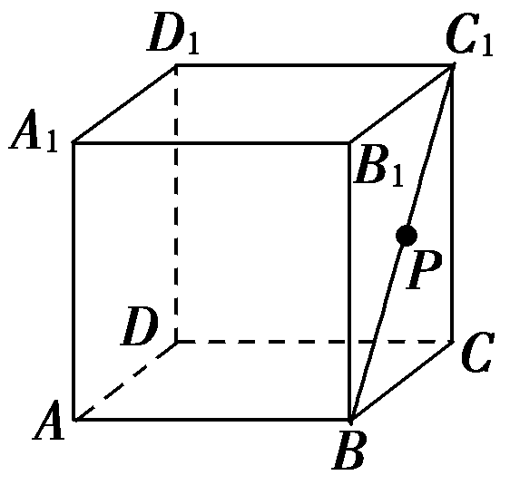

$\quad$A.三棱锥<em>A</em>-<em>A</em>1<em>PD</em>的体积大小与点<em>P</em>的位置有关

$\quad$B.<em>A</em>1<em>P</em>与平面<em>ACD</em>1相交

$\quad$C.平面<em>PDB</em>1⊥平面<em>A</em>1<em>BC</em>1

$\quad$D.<em>AP</em>⊥<em>D</em>1<em>C</em>

答案C

解析对于<em>&lt;text style="italic"&gt;&lt;text style="italic"&gt;&lt;text style="italic"&gt;&lt;text style="italic"&gt;&lt;text style="italic"&gt;&lt;text style="italic"&gt;&lt;text style="italic"&gt;&lt;text style="italic"&gt;&lt;text style="italic"&gt;&lt;text style="italic"&gt;&lt;text style="italic"&gt;&lt;text style="italic"&gt;&lt;text style="italic"&gt;&lt;text style="italic"&gt;&lt;text style="italic"&gt;&lt;text style="italic"&gt;A</em>&lt;/text&gt;&lt;/text&gt;&lt;/text&gt;&lt;/text&gt;&lt;/text&gt;&lt;/text&gt;&lt;/text&gt;&lt;/text&gt;&lt;/text&gt;&lt;/text&gt;&lt;/text&gt;&lt;/text&gt;&lt;/text&gt;&lt;/text&gt;&lt;/text&gt;&lt;/text&gt;， $V_{A-A_{1}PD}$ ＝ $V_{P-AA_{1}D}$ .在正方体中，<em>&lt;text style="italic"&gt;&lt;text style="italic"&gt;&lt;text style="italic"&gt;&lt;text style="italic"&gt;&lt;text style="italic"&gt;&lt;text style="italic"&gt;&lt;text style="italic"&gt;&lt;text style="italic"&gt;&lt;text style="italic"&gt;&lt;text style="italic"&gt;&lt;text style="italic"&gt;&lt;text style="italic"&gt;&lt;text style="italic"&gt;&lt;text style="italic"&gt;&lt;text style="italic"&gt;B</em>&lt;/text&gt;&lt;/text&gt;&lt;/text&gt;&lt;/text&gt;&lt;/text&gt;&lt;/text&gt;&lt;/text&gt;&lt;/text&gt;&lt;/text&gt;&lt;/text&gt;<em>&lt;text style="italic"&gt;&lt;text style="italic"&gt;&lt;text style="italic"&gt;&lt;text style="italic"&gt;&lt;text style="italic"&gt;&lt;text style="italic"&gt;&lt;text style="italic"&gt;&lt;text style="italic"&gt;C</em>&lt;/text&gt;&lt;/text&gt;&lt;/text&gt;&lt;/text&gt;&lt;/text&gt;&lt;/text&gt;&lt;/text&gt;&lt;/text&gt;&lt;/text&gt;&lt;/text&gt;&lt;/text&gt;&lt;/text&gt;&lt;/text&gt;&lt;text style="subscript"&gt;&lt;text style="subscript"&gt;&lt;text style="subscript"&gt;&lt;text style="subscript"&gt;&lt;text style="subscript"&gt;&lt;text style="subscript"&gt;&lt;text style="subscript"&gt;&lt;text style="subscript"&gt;&lt;text style="subscript"&gt;&lt;text style="subscript"&gt;&lt;text style="subscript"&gt;&lt;text style="subscript"&gt;&lt;text style="subscript"&gt;&lt;text style="subscript"&gt;&lt;text style="subscript"&gt;&lt;text style="subscript"&gt;&lt;text style="subscript"&gt;&lt;text style="subscript"&gt;&lt;text style="subscript"&gt;&lt;text style="subscript"&gt;&lt;text style="subscript"&gt;&lt;text style="subscript"&gt;&lt;text style="subscript"&gt;&lt;text style="subscript"&gt;&lt;text style="subscript"&gt;&lt;text style="subscript"&gt;&lt;text style="subscript"&gt;&lt;text style="subscript"&gt;&lt;text style="subscript"&gt;&lt;text style="subscript"&gt;&lt;text style="subscript"&gt;&lt;text style="subscript"&gt;&lt;text style="subscript"&gt;&lt;text style="subscript"&gt;&lt;text style="subscript"&gt;&lt;text style="subscript"&gt;&lt;text style="subscript"&gt;&lt;text style="subscript"&gt;&lt;text style="subscript"&gt;&lt;text style="subscript"&gt;&lt;text style="subscript"&gt;&lt;text style="subscript"&gt;&lt;text style="subscript"&gt;&lt;text style="subscript"&gt;&lt;text style="subscript"&gt;&lt;text style="subscript"&gt;&lt;text style="subscript"&gt;&lt;text style="subscript"&gt;&lt;text style="subscript"&gt;&lt;text style="subscript"&gt;&lt;text style="subscript"&gt;&lt;text style="subscript"&gt;&lt;text style="subscript"&gt;&lt;text style="subscript"&gt;&lt;text style="subscript"&gt;&lt;text style="subscript"&gt;&lt;text style="subscript"&gt;&lt;text style="subscript"&gt;&lt;text style="subscript"&gt;&lt;text style="subscript"&gt;&lt;text style="subscript"&gt;&lt;text style="subscript"&gt;1&lt;/text&gt;&lt;/text&gt;&lt;/text&gt;&lt;/text&gt;&lt;/text&gt;&lt;/text&gt;&lt;/text&gt;&lt;/text&gt;&lt;/text&gt;&lt;/text&gt;&lt;/text&gt;&lt;/text&gt;&lt;/text&gt;&lt;/text&gt;&lt;/text&gt;&lt;/text&gt;&lt;/text&gt;&lt;/text&gt;&lt;/text&gt;&lt;/text&gt;&lt;/text&gt;&lt;/text&gt;&lt;/text&gt;&lt;/text&gt;&lt;/text&gt;&lt;/text&gt;&lt;/text&gt;&lt;/text&gt;&lt;/text&gt;&lt;/text&gt;&lt;/text&gt;&lt;/text&gt;&lt;/text&gt;&lt;/text&gt;&lt;/text&gt;&lt;/text&gt;&lt;/text&gt;&lt;/text&gt;&lt;/text&gt;&lt;/text&gt;&lt;/text&gt;&lt;/text&gt;&lt;/text&gt;&lt;/text&gt;&lt;/text&gt;&lt;/text&gt;&lt;/text&gt;&lt;/text&gt;&lt;/text&gt;&lt;/text&gt;&lt;/text&gt;&lt;/text&gt;&lt;/text&gt;&lt;/text&gt;&lt;/text&gt;&lt;/text&gt;&lt;/text&gt;&lt;/text&gt;&lt;/text&gt;&lt;/text&gt;&lt;/text&gt;&lt;/text&gt;∥平面<em>&lt;text style="italic"&gt;&lt;text style="italic"&gt;&lt;text style="italic"&gt;&lt;text style="italic"&gt;&lt;text style="italic"&gt;&lt;text style="italic"&gt;&lt;text style="italic"&gt;&lt;text style="italic"&gt;&lt;text style="italic"&gt;&lt;text style="italic"&gt;&lt;text style="italic"&gt;&lt;text style="italic"&gt;&lt;text style="italic"&gt;&lt;text style="italic"&gt;&lt;text style="italic"&gt;&lt;text style="italic"&gt;&lt;text style="italic"&gt;&lt;text style="italic"&gt;&lt;text style="italic"&gt;&lt;text style="italic"&gt;&lt;text style="italic"&gt;A</em>&lt;/text&gt;&lt;/text&gt;&lt;/text&gt;&lt;/text&gt;&lt;/text&gt;&lt;/text&gt;&lt;/text&gt;&lt;/text&gt;&lt;/text&gt;&lt;/text&gt;&lt;/text&gt;&lt;/text&gt;&lt;/text&gt;&lt;/text&gt;&lt;/text&gt;&lt;/text&gt;A&lt;/text&gt;&lt;/text&gt;&lt;/text&gt;&lt;/text&gt;&lt;/text&gt;1<em>&lt;text style="italic"&gt;&lt;text style="italic"&gt;&lt;text style="italic"&gt;&lt;text style="italic"&gt;&lt;text style="italic"&gt;&lt;text style="italic"&gt;&lt;text style="italic"&gt;&lt;text style="italic"&gt;&lt;text style="italic"&gt;&lt;text style="italic"&gt;&lt;text style="italic"&gt;&lt;text style="italic"&gt;&lt;text style="italic"&gt;D</em>&lt;/text&gt;&lt;/text&gt;&lt;/text&gt;&lt;/text&gt;&lt;/text&gt;&lt;/text&gt;&lt;/text&gt;&lt;/text&gt;&lt;/text&gt;&lt;/text&gt;&lt;/text&gt;&lt;/text&gt;&lt;/text&gt;，所以点<em>&lt;text style="italic"&gt;&lt;text style="italic"&gt;&lt;text style="italic"&gt;&lt;text style="italic"&gt;&lt;text style="italic"&gt;&lt;text style="italic"&gt;P</em>&lt;/text&gt;&lt;/text&gt;&lt;/text&gt;&lt;/text&gt;&lt;/text&gt;&lt;/text&gt;到平面AA1D的距离不变，即三棱锥P-AA1D的高不变，又△AA1D的面积不变，因此三棱锥P-AA1D的体积不变，即三棱锥A-A1<em>PD</em>的体积与点P的位置无关，故A不成立；对于B，由于<em>&lt;text style="italic"&gt;&lt;text style="italic"&gt;BC</em>&lt;/text&gt;&lt;/text&gt;1∥<em>&lt;text style="italic"&gt;AD</em>&lt;/text&gt;1，AD1⊂平面<em>&lt;text style="italic"&gt;&lt;text style="italic"&gt;&lt;text style="italic"&gt;&lt;text style="italic"&gt;&lt;text style="italic"&gt;ACD</em>&lt;/text&gt;&lt;/text&gt;&lt;/text&gt;&lt;/text&gt;&lt;/text&gt;1，BC1⊄平面ACD1，所以BC1∥平面ACD1，同理可证<em>&lt;text style="italic"&gt;&lt;text style="italic"&gt;&lt;text style="italic"&gt;BA</em>&lt;/text&gt;&lt;/text&gt;&lt;/text&gt;1∥平面ACD1，又BA1∩BC1＝B，所以平面BA1C1∥平面ACD1，因为A1P⊂平面BA1C1，所以A1P∥平面ACD1，故B不成立；对于C，因为A1C1⊥<em>&lt;text style="italic"&gt;&lt;text style="italic"&gt;BD</em>&lt;/text&gt;&lt;/text&gt;，A1C1⊥<em>&lt;text style="italic"&gt;&lt;text style="italic"&gt;&lt;text style="italic"&gt;&lt;text style="italic"&gt;&lt;text style="italic"&gt;BB</em>&lt;/text&gt;&lt;/text&gt;&lt;/text&gt;&lt;/text&gt;&lt;/text&gt;1，BD∩BB1＝B，BD，BB1⊂平面BB1D，所以A1C1⊥平面BB1D，B1D⊂平面BB1D，则A1C1⊥B1D；同理A1B⊥B1D，又A1C1∩A1B＝A1，A1C1，A1B⊂平面A1BC1，所以B1D⊥平面A1BC1，又B1D⊂平面<em>&lt;text style="italic"&gt;PDB</em>&lt;/text&gt;1，所以平面PDB1⊥平面A1BC1，故C成立；对于D，当B与P重合时，<em>AP</em>与D1C的夹角为 $\frac{\pi }{4}$ ，故<em>&lt;text style="italic"&gt;&lt;text style="italic"&gt;&lt;text style="italic"&gt;&lt;text style="italic"&gt;&lt;text style="italic"&gt;&lt;text style="italic"&gt;&lt;text style="italic"&gt;&lt;text style="italic"&gt;&lt;text style="italic"&gt;&lt;text style="italic"&gt;&lt;text style="italic"&gt;&lt;text style="italic"&gt;&lt;text style="italic"&gt;D</em>&lt;/text&gt;&lt;/text&gt;&lt;/text&gt;&lt;/text&gt;&lt;/text&gt;&lt;/text&gt;&lt;/text&gt;&lt;/text&gt;&lt;/text&gt;&lt;/text&gt;&lt;/text&gt;&lt;/text&gt;&lt;/text&gt;不成立.故选<em>&lt;text style="italic"&gt;&lt;text style="italic"&gt;&lt;text style="italic"&gt;&lt;text style="italic"&gt;&lt;text style="italic"&gt;&lt;text style="italic"&gt;&lt;text style="italic"&gt;&lt;text style="italic"&gt;C</em>&lt;/text&gt;&lt;/text&gt;&lt;/text&gt;&lt;/text&gt;&lt;/text&gt;&lt;/text&gt;&lt;/text&gt;&lt;/text&gt;.

角度2　动点的轨迹问题

(多选)如图，已知正方体<em>ABCD</em> -<em>A</em>1<em>B</em>1<em>C</em>1<em>D</em>1的棱长为4，<em>M</em>为<em>DD</em>1的中点，<em>N</em>为<em>ABCD</em>所在平面内一动点，则下列命题正确的是(　　)

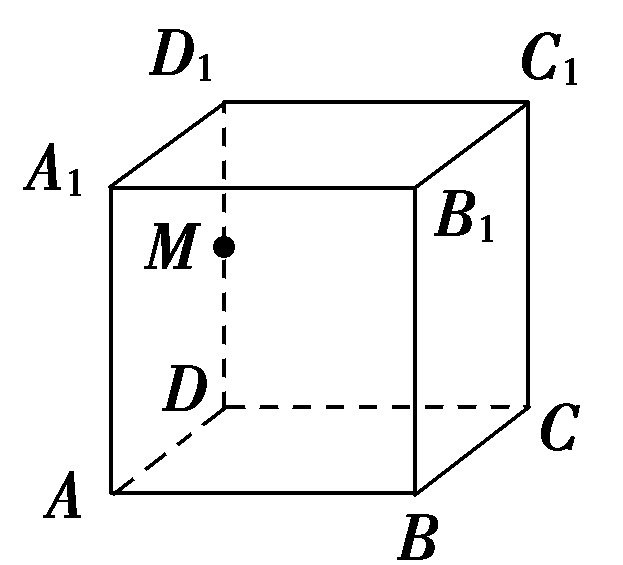

$\quad$A.若*M<text style="italic">N*</text>与平面*ABCD*所成的角为 $\frac{\pi }{4}$ ，则点*N*的轨迹为圆

$\quad$B.若*MN*＝4，则*MN*的中点*P*的轨迹所围成图形的面积为2π

$\quad$C.若点<em>N</em>到直线<em>BB</em>1与到直线<em>CD</em>的距离相等，则点<em>N</em>的轨迹为抛物线

<em>D</em>.若D1<em>&lt;text style="italic"&gt;N</em>&lt;/text&gt;与<em>AB</em>所成的角为 $\frac{\pi }{3}$ ，则点<em>&lt;text style="italic"&gt;N</em>&lt;/text&gt;的轨迹为双曲线

答案ACD

解析如图所示，对于A，根据正方体的性质可知，<em>M&lt;text style="italic"&gt;D</em>&lt;/text&gt;⊥平面<em>&lt;text style="italic"&gt;&lt;text style="italic"&gt;A&lt;text style="italic"&gt;&lt;text style="italic"&gt;&lt;text style="italic"&gt;B</em>&lt;/text&gt;&lt;/text&gt;<em>&lt;text style="italic"&gt;&lt;text style="italic"&gt;CD</em>&lt;/text&gt;&lt;/text&gt;&lt;/text&gt;&lt;/text&gt;&lt;/text&gt;，所以∠<em>&lt;text style="italic"&gt;M&lt;text style="italic"&gt;&lt;text style="italic"&gt;&lt;text style="italic"&gt;&lt;text style="italic"&gt;&lt;text style="italic"&gt;N</em>&lt;/text&gt;&lt;/text&gt;&lt;/text&gt;&lt;/text&gt;&lt;/text&gt;D&lt;/text&gt;为<em>MN</em>与平面ABCD所成的角，所以∠<em>MND</em>＝ $\frac{\pi }{4}$ ，所以<em>&lt;text style="italic"&gt;D&lt;text style="italic"&gt;&lt;text style="italic"&gt;&lt;text style="italic"&gt;&lt;text style="italic"&gt;N</em>&lt;/text&gt;&lt;/text&gt;&lt;/text&gt;&lt;/text&gt;&lt;/text&gt;＝<em>DM</em>＝ $\frac{1}{2}$ <em>&lt;text style="italic"&gt;D</em>D&lt;/text&gt;&lt;text style="subscript"&gt;&lt;text style="subscript"&gt;&lt;text style="subscript"&gt;&lt;text style="subscript"&gt;1&lt;/text&gt;&lt;/text&gt;&lt;/text&gt;&lt;/text&gt;＝ $\frac{1}{2}$ ×4＝2，所以点<em>&lt;text style="italic"&gt;&lt;text style="italic"&gt;&lt;text style="italic"&gt;&lt;text style="italic"&gt;N</em>&lt;/text&gt;&lt;/text&gt;&lt;/text&gt;&lt;/text&gt;的轨迹为以<em>D</em>为圆心，2为半径的圆，故A正确；对于<em>&lt;text style="italic"&gt;&lt;text style="italic"&gt;B</em>&lt;/text&gt;&lt;/text&gt;，在Rt△<em>&lt;text style="italic"&gt;MD</em>&lt;/text&gt;N中，<em>&lt;text style="italic"&gt;&lt;text style="italic"&gt;&lt;text style="italic"&gt;&lt;text style="italic"&gt;DN</em>&lt;/text&gt;&lt;/text&gt;&lt;/text&gt;&lt;/text&gt;＝ $\sqrt{MN^{2}－MD^{2}}$ ＝ $\sqrt{4^{2}－2^{2}}$ ＝2 $\sqrt{3}$ ，取<em>M&lt;text style="italic"&gt;D</em>&lt;/text&gt;的中点<em>&lt;text style="italic"&gt;E</em>&lt;/text&gt;，连接<em>&lt;text style="italic"&gt;&lt;text style="italic"&gt;&lt;text style="italic"&gt;P</em>&lt;/text&gt;&lt;/text&gt;E&lt;/text&gt;，因为P为<em>M&lt;text style="italic"&gt;&lt;text style="italic"&gt;&lt;text style="italic"&gt;&lt;text style="italic"&gt;&lt;text style="italic"&gt;N</em>&lt;/text&gt;&lt;/text&gt;&lt;/text&gt;&lt;/text&gt;&lt;/text&gt;的中点，所以<em>&lt;text style="italic"&gt;&lt;text style="italic"&gt;&lt;text style="italic"&gt;PE</em>&lt;/text&gt;&lt;/text&gt;&lt;/text&gt;∥<em>&lt;text style="italic"&gt;&lt;text style="italic"&gt;&lt;text style="italic"&gt;&lt;text style="italic"&gt;DN</em>&lt;/text&gt;&lt;/text&gt;&lt;/text&gt;&lt;/text&gt;，且PE＝ $\frac{1}{2}$ <em>&lt;text style="italic"&gt;D&lt;text style="italic"&gt;&lt;text style="italic"&gt;&lt;text style="italic"&gt;&lt;text style="italic"&gt;N</em>&lt;/text&gt;&lt;/text&gt;&lt;/text&gt;&lt;/text&gt;&lt;/text&gt;＝ $\sqrt{3}$ ，因为<em>&lt;text style="italic"&gt;D&lt;text style="italic"&gt;&lt;text style="italic"&gt;&lt;text style="italic"&gt;&lt;text style="italic"&gt;N</em>&lt;/text&gt;&lt;/text&gt;&lt;/text&gt;&lt;/text&gt;&lt;/text&gt;⊥<em>&lt;text style="italic"&gt;E</em>&lt;/text&gt;D，所以<em>&lt;text style="italic"&gt;&lt;text style="italic"&gt;&lt;text style="italic"&gt;P</em>&lt;/text&gt;&lt;/text&gt;E&lt;/text&gt;⊥<em>&lt;text style="italic"&gt;ED</em>&lt;/text&gt;，即点P在过点E且与<em>&lt;text style="italic"&gt;DD</em>&lt;/text&gt;&lt;text style="subscript"&gt;&lt;text style="subscript"&gt;&lt;text style="subscript"&gt;&lt;text style="subscript"&gt;1&lt;/text&gt;&lt;/text&gt;&lt;/text&gt;&lt;/text&gt;垂直的平面内，又<em>&lt;text style="italic"&gt;&lt;text style="italic"&gt;&lt;text style="italic"&gt;PE</em>&lt;/text&gt;&lt;/text&gt;&lt;/text&gt;＝ $\sqrt{3}$ ，所以点<em>&lt;text style="italic"&gt;&lt;text style="italic"&gt;P</em>&lt;/text&gt;&lt;/text&gt;的轨迹为以 $\sqrt{3}$ 为半径的圆，其面积为π<em>·</em> $\left(\sqrt{3}\right)^{2}$ ＝3π，故<em>&lt;text style="italic"&gt;&lt;text style="italic"&gt;B</em>&lt;/text&gt;&lt;/text&gt;不正确；对于C，连接<em>&lt;text style="italic"&gt;&lt;text style="italic"&gt;&lt;text style="italic"&gt;&lt;text style="italic"&gt;N</em>&lt;/text&gt;&lt;/text&gt;&lt;/text&gt;&lt;/text&gt;B，因为<em>&lt;text style="italic"&gt;&lt;text style="italic"&gt;BB</em>&lt;/text&gt;&lt;/text&gt;&lt;text style="subscript"&gt;&lt;text style="subscript"&gt;&lt;text style="subscript"&gt;&lt;text style="subscript"&gt;1&lt;/text&gt;&lt;/text&gt;&lt;/text&gt;&lt;/text&gt;⊥平面<em>&lt;text style="italic"&gt;ABC&lt;text style="italic"&gt;D</em>&lt;/text&gt;&lt;/text&gt;，所以BB1⊥<em>&lt;text style="italic"&gt;&lt;text style="italic"&gt;NB</em>&lt;/text&gt;&lt;/text&gt;，所以点N到直线BB1的距离为NB，所以点N到点B的距离等于点N到定直线<em>&lt;text style="italic"&gt;&lt;text style="italic"&gt;CD</em>&lt;/text&gt;&lt;/text&gt;的距离，又B不在直线CD上，所以点N的轨迹为以B为焦点，CD为准线的抛物线，故C正确；

对于&lt;te&lt;te&lt;text st<em>y</em>le="italic"&gt;x&lt;/text&gt;t st<em>y</em>le="italic"&gt;x&lt;/text&gt;t style="italic"&gt;<em>&lt;text style="italic"&gt;D</em>&lt;/text&gt;&lt;/text&gt;，以D为坐标原点，<em>D&lt;text style="italic"&gt;A</em>&lt;/text&gt;，<em>DC</em>，<em>DD</em>&lt;text style="subscript"&gt;&lt;text style="subscript"&gt;1&lt;/text&gt;&lt;/text&gt;所在直线分别为x，y，<em>z</em>轴建立空间直角坐标系，则A(4，0，0)，<em>B</em>(4，4，0)，D1(0，0，4)，设<em>&lt;text style="italic"&gt;&lt;text style="italic"&gt;N</em>&lt;/text&gt;&lt;/text&gt;(x，y，0)，则 $\vec{AB}$ ＝ $\left(0，4，0\right)$ ， $\vec{D_{1}N}$ ＝ $\left(x，y,-4\right)$ ，因为&lt;te&lt;te&lt;text st<em>y</em>le="italic"&gt;x&lt;/text&gt;t st<em>y</em>le="italic"&gt;x&lt;/text&gt;t style="italic"&gt;<em>&lt;text style="italic"&gt;D</em>&lt;/text&gt;&lt;/text&gt;&lt;text style="subscript"&gt;&lt;text style="subscript"&gt;1&lt;/text&gt;&lt;/text&gt;<em>&lt;text style="italic"&gt;&lt;text style="italic"&gt;N</em>&lt;/text&gt;&lt;/text&gt;与<em>AB</em>所成的角为 $\frac{\pi }{3}$ ，所以｜cos＜ $\vec{AB}$ ， $\vec{D_{1}N}$ ＞｜＝cos $\frac{\pi }{3}$ ，所以｜ $\frac{4y}{4\sqrt{x^{2}＋y^{2}+16}}$ ｜＝ $\frac{1}{2}$ ，整理得 $\frac{3y^{2}}{16}$ － $\frac{x^{2}}{16}$ ＝&lt;te&lt;te&lt;text st<em>y</em>le="italic"&gt;x&lt;/text&gt;t st<em>y</em>le="italic"&gt;x&lt;/text&gt;t style="subscript"&gt;&lt;text style="subscript"&gt;1&lt;/text&gt;&lt;/text&gt;，所以点<em>&lt;text style="italic"&gt;&lt;text style="italic"&gt;N</em>&lt;/text&gt;&lt;/text&gt;的轨迹为双曲线，故<em>&lt;text style="italic"&gt;&lt;text style="italic"&gt;D</em>&lt;/text&gt;&lt;/text&gt;正确.故选<em>A</em>CD.

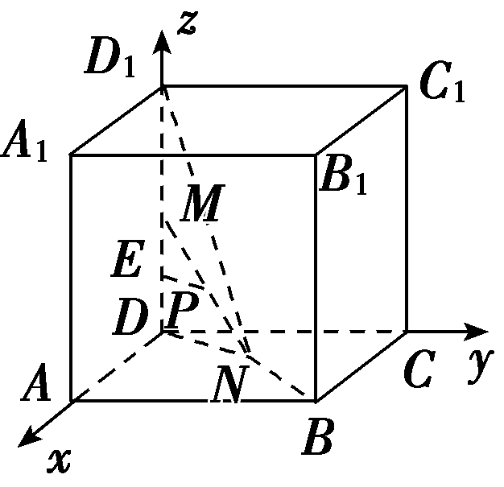

解决与几何体有关的动点轨迹问题的方法

##### 1.几何法：根据平面的性质进行判定.

##### 2.定义法：转化为平面轨迹问题，用圆锥曲线的定义判定，或用向量法进行计算.

##### 3.特殊值法：根据空间图形线段长度关系取特殊值或位置进行排除.

对点练2.设正方体<em>&lt;text style="italic"&gt;ABCD</em>&lt;/text&gt; -A&lt;text style="subscript"&gt;&lt;text style="subscript"&gt;&lt;text style="subscript"&gt;&lt;text style="subscript"&gt;1&lt;/text&gt;&lt;/text&gt;&lt;/text&gt;&lt;/text&gt;B1C1D1的棱长为1，<em>&lt;text style="italic"&gt;P</em>&lt;/text&gt;为底面正方形<em>ABCD</em>内的一动点，若△<em>APC</em>1的面积<em>S</em>＝ $\frac{1}{2}$ ，则动点<em>&lt;text style="italic"&gt;P</em>&lt;/text&gt;的轨迹是(　　)

$\quad$A.圆的一部分	
$\quad$B.双曲线的一部分

$\quad$C.抛物线的一部分	
$\quad$D.椭圆的一部分

答案D

解析设<em>&lt;text style="italic"&gt;&lt;text style="italic"&gt;d</em>&lt;/text&gt;&lt;/text&gt;是△<em>A&lt;text style="italic"&gt;&lt;text style="italic"&gt;&lt;text style="italic"&gt;P</em>&lt;/text&gt;&lt;/text&gt;C&lt;/text&gt;&lt;text style="subscript"&gt;&lt;text style="subscript"&gt;&lt;text style="subscript"&gt;&lt;text style="subscript"&gt;&lt;text style="subscript"&gt;1&lt;/text&gt;&lt;/text&gt;&lt;/text&gt;&lt;/text&gt;&lt;/text&gt;边<em>&lt;text style="italic"&gt;&lt;text style="italic"&gt;&lt;text style="italic"&gt;&lt;text style="italic"&gt;AC</em>&lt;/text&gt;&lt;/text&gt;&lt;/text&gt;&lt;/text&gt;1上的高，则 $S_{\bigtriangleup APC_{1}}$ ＝ $\frac{1}{2}$ <em>·</em>｜<em>&lt;text style="italic"&gt;&lt;text style="italic"&gt;&lt;text style="italic"&gt;&lt;text style="italic"&gt;AC</em>&lt;/text&gt;&lt;/text&gt;&lt;/text&gt;&lt;/text&gt;&lt;text style="subscript"&gt;&lt;text style="subscript"&gt;&lt;text style="subscript"&gt;&lt;text style="subscript"&gt;&lt;text style="subscript"&gt;1&lt;/text&gt;&lt;/text&gt;&lt;/text&gt;&lt;/text&gt;&lt;/text&gt;｜·<em>&lt;text style="italic"&gt;&lt;text style="italic"&gt;d</em>&lt;/text&gt;&lt;/text&gt;＝ $\frac{\sqrt{3}}{2}$ <em>&lt;text style="italic"&gt;&lt;text style="italic"&gt;d</em>&lt;/text&gt;&lt;/text&gt;＝ $\frac{1}{2}$ ，所以<em>&lt;text style="italic"&gt;&lt;text style="italic"&gt;d</em>&lt;/text&gt;&lt;/text&gt;＝ $\frac{\sqrt{3}}{3}$ ，即点<em>&lt;text style="italic"&gt;&lt;text style="italic"&gt;P</em>&lt;/text&gt;&lt;/text&gt;到直线<em>&lt;text style="italic"&gt;&lt;text style="italic"&gt;&lt;text style="italic"&gt;&lt;text style="italic"&gt;AC</em>&lt;/text&gt;&lt;/text&gt;&lt;/text&gt;&lt;/text&gt;&lt;text style="subscript"&gt;&lt;text style="subscript"&gt;&lt;text style="subscript"&gt;&lt;text style="subscript"&gt;&lt;text style="subscript"&gt;1&lt;/text&gt;&lt;/text&gt;&lt;/text&gt;&lt;/text&gt;&lt;/text&gt;的距离为定值 $\frac{\sqrt{3}}{3}$ ，所以点<em>&lt;text style="italic"&gt;&lt;text style="italic"&gt;P</em>&lt;/text&gt;&lt;/text&gt;在以直线<em>&lt;text style="italic"&gt;&lt;text style="italic"&gt;&lt;text style="italic"&gt;&lt;text style="italic"&gt;AC</em>&lt;/text&gt;&lt;/text&gt;&lt;/text&gt;&lt;/text&gt;&lt;text style="subscript"&gt;&lt;text style="subscript"&gt;&lt;text style="subscript"&gt;&lt;text style="subscript"&gt;&lt;text style="subscript"&gt;1&lt;/text&gt;&lt;/text&gt;&lt;/text&gt;&lt;/text&gt;&lt;/text&gt;为轴，以 $\frac{\sqrt{3}}{3}$ 为底面半径的圆柱侧面上，直线<em>&lt;text style="italic"&gt;&lt;text style="italic"&gt;&lt;text style="italic"&gt;&lt;text style="italic"&gt;AC</em>&lt;/text&gt;&lt;/text&gt;&lt;/text&gt;&lt;/text&gt;&lt;text style="subscript"&gt;&lt;text style="subscript"&gt;&lt;text style="subscript"&gt;&lt;text style="subscript"&gt;&lt;text style="subscript"&gt;1&lt;/text&gt;&lt;/text&gt;&lt;/text&gt;&lt;/text&gt;&lt;/text&gt;与平面<em>&lt;text style="italic"&gt;&lt;text style="italic"&gt;ABCD</em>&lt;/text&gt;&lt;/text&gt;既不平行也不垂直，所以点<em>&lt;text style="italic"&gt;&lt;text style="italic"&gt;P</em>&lt;/text&gt;&lt;/text&gt;的轨迹是平面ABCD上的一个椭圆，其中只有一部分在正方形ABCD内.故选D.

对点练3.在四棱锥<em>P</em>-<em>ABCD</em>中，四边形<em>ABCD</em>是边长为2的菱形，∠<em>DAB</em>＝60°，<em>PA</em>＝<em>PD</em>，∠<em>APD</em>＝90°，平面<em>PAD</em>⊥平面<em>ABCD</em>，点<em>Q</em>是△<em>PBC</em>内(含边界)的一个动点，且满足<em>DQ</em>⊥<em>AC</em>，则点<em>Q</em>所形成的轨迹长度是<u>　　　　</u>.

答案 $\frac{2\sqrt{5}}{3}$

解析如图，连接<te<text st*y*le="italic">x</text>t style="italic">*<text style="italic"><text style="italic"><text style="italic">B<text style="italic">D*</text></text></text></text></text>，交*<text style="italic"><text style="italic"><text style="italic"><text style="italic"><text style="italic">A*C</text></text></text></text></text>于点*<text style="italic"><text style="italic"><text style="italic">O*</text></text></text>，因为四边形*<text style="italic">ABCD*</text>为菱形，所以AC⊥*BD*.取*PC*上一点*M*，连接*MD*，*MB*，且*<text style="italic"><text style="italic">DM*</text></text>⊥AC，又AC⊥BD，BD∩DM＝D，BD，DM⊂平面*<text style="italic">BDM*</text>，所以AC⊥平面BDM，则点*Q*的轨迹是线段*BM*.以O为原点，*OA*所在直线为x轴，*OB*所在直线为y轴，过点O且垂直于平面ABCD的直线为*z*轴，建立空间直角坐标系.则O(0，0，0)，A( $\sqrt{3}$ ，0，0)，*B*(0，1，0)，<te<text st*y*le="italic">x</text>t style="italic">*D*</text> $\left(0,-1，0\right)$ ，

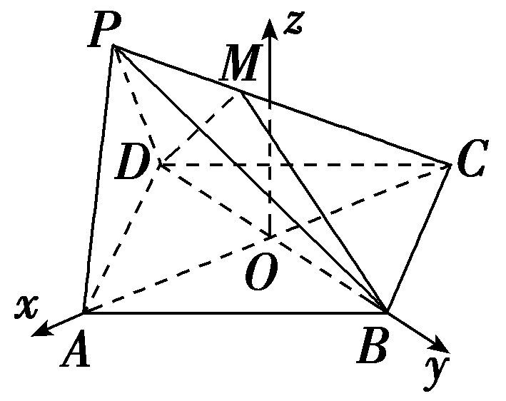

*P* $\left(\frac{\sqrt{3}}{2},-\frac{1}{2}，1\right)$ ，*C* $\left(－\sqrt{3}，0，0\right)$ ， $\vec{OA}$ ＝ $\left(\sqrt{3}，0，0\right)$ ， $\vec{DP}$ ＝ $\left(\frac{\sqrt{3}}{2}，\frac{1}{2}，1\right)$ ， $\vec{PC}$ ＝(－ $\frac{3\sqrt{3}}{2}$ ， $\frac{1}{2}$ ，－1)， $\vec{BD}$ ＝ $\left(0,-2，0\right)$ .设 $\vec{DM}$ ＝ $\vec{DP}$ ＋ $\vec{PM}$ ＝ $\vec{DP}$ ＋*<text style="italic"><text style="italic"><text style="italic"><text style="italic"><text style="italic"><text style="italic">λ*</text></text></text></text></text></text> $\vec{PC}$ ＝ $\left(\frac{\sqrt{3}}{2}，\frac{1}{2}，1\right)$ ＋*<text style="italic"><text style="italic"><text style="italic"><text style="italic"><text style="italic"><text style="italic">λ*</text></text></text></text></text></text>( － $\frac{3\sqrt{3}}{2}$ ， $\frac{1}{2}$ ，－1)，0≤*<text style="italic"><text style="italic"><text style="italic"><text style="italic"><text style="italic"><text style="italic">λ*</text></text></text></text></text></text>≤1，则 $\vec{DM}$ ＝( $\frac{\sqrt{3}}{2}$ － $\frac{3\sqrt{3}}{2}$ *<text style="italic"><text style="italic"><text style="italic"><text style="italic"><text style="italic"><text style="italic">λ*</text></text></text></text></text></text>， $\frac{1}{2}$ ＋ $\frac{1}{2}$ *<text style="italic"><text style="italic"><text style="italic"><text style="italic"><text style="italic"><text style="italic">λ*</text></text></text></text></text></text>，1－λ).因为*OA*⊥*DM*，所以 $\vec{OA}$ · $\vec{DM}$ ＝0，解得*<text style="italic"><text style="italic"><text style="italic"><text style="italic"><text style="italic"><text style="italic">λ*</text></text></text></text></text></text>＝ $\frac{1}{3}$ ，所以 $\vec{DM}$ ＝ $\left(0，\frac{2}{3}，\frac{2}{3}\right)$ ， $\vec{BM}$ ＝ $\vec{BD}$ ＋ $\vec{DM}$ ＝ $\left(0,-2，0\right)$ ＋ $\left(0，\frac{2}{3}，\frac{2}{3}\right)$ ＝ $\left(0,-\frac{4}{3}，\frac{2}{3}\right)$ ，所以｜ $\vec{BM}$ ｜＝ $\sqrt{\left(\frac{4}{3}\right)^{2}＋\left(\frac{2}{3}\right)^{2}}$ ＝ $\frac{2\sqrt{5}}{3}$ ，即点*Q*所形成的轨迹长度为 $\frac{2\sqrt{5}}{3}$ .

### 题型二　立体几何中的探索性问题

在三棱柱<em>&lt;text style="italic"&gt;&lt;text style="italic"&gt;&lt;text style="italic"&gt;A</em>&lt;/text&gt;&lt;/text&gt;<em>&lt;text style="italic"&gt;&lt;text style="italic"&gt;B</em>&lt;/text&gt;&lt;/text&gt;<em>C</em>&lt;/text&gt;-A&lt;text style="subscript"&gt;&lt;text style="subscript"&gt;&lt;text style="subscript"&gt;&lt;text style="subscript"&gt;&lt;text style="subscript"&gt;&lt;text style="subscript"&gt;&lt;text style="subscript"&gt;&lt;text style="subscript"&gt;1&lt;/text&gt;&lt;/text&gt;&lt;/text&gt;&lt;/text&gt;&lt;/text&gt;&lt;/text&gt;&lt;/text&gt;&lt;/text&gt;B1C1中，平面A1B1<em>&lt;text style="italic"&gt;BA</em>&lt;/text&gt;⊥平面<em>&lt;text style="italic"&gt;&lt;text style="italic"&gt;AB</em>&lt;/text&gt;C&lt;/text&gt;，侧面A1B1BA为菱形，∠<em>ABB</em>1＝ $\frac{\pi }{3}$ ，<em>&lt;text style="italic"&gt;&lt;text style="italic"&gt;A</em>&lt;/text&gt;&lt;/text&gt;<em>&lt;text style="italic"&gt;&lt;text style="italic"&gt;B</em>&lt;/text&gt;&lt;/text&gt;&lt;text style="subscript"&gt;&lt;text style="subscript"&gt;&lt;text style="subscript"&gt;&lt;text style="subscript"&gt;&lt;text style="subscript"&gt;&lt;text style="subscript"&gt;&lt;text style="subscript"&gt;&lt;text style="subscript"&gt;1&lt;/text&gt;&lt;/text&gt;&lt;/text&gt;&lt;/text&gt;&lt;/text&gt;&lt;/text&gt;&lt;/text&gt;&lt;/text&gt;⊥A<em>C</em>，<em>&lt;text style="italic"&gt;AB</em>&lt;/text&gt;＝<em>&lt;text style="italic"&gt;&lt;text style="italic"&gt;AC</em>&lt;/text&gt;&lt;/text&gt;＝2，<em>E</em>是AC的中点.

（1）求证：<em>A</em>1<em>B</em>⊥平面<em>AB</em>1<em>C</em>；

（2）确定在线段<em>&lt;text style="italic"&gt;A</em>&lt;/text&gt;&lt;text style="subscript"&gt;&lt;text style="subscript"&gt;1&lt;/text&gt;&lt;/text&gt;<em>&lt;text style="italic"&gt;E</em>&lt;/text&gt;上是否存在一点<em>P</em>，使得<em>AP</em>与平面A1<em>B</em>1E所成角为 $\frac{\pi }{3}$ ，若存在，求出 $\frac{EP}{EA_{1}}$ 的值；若不存在，说明理由.

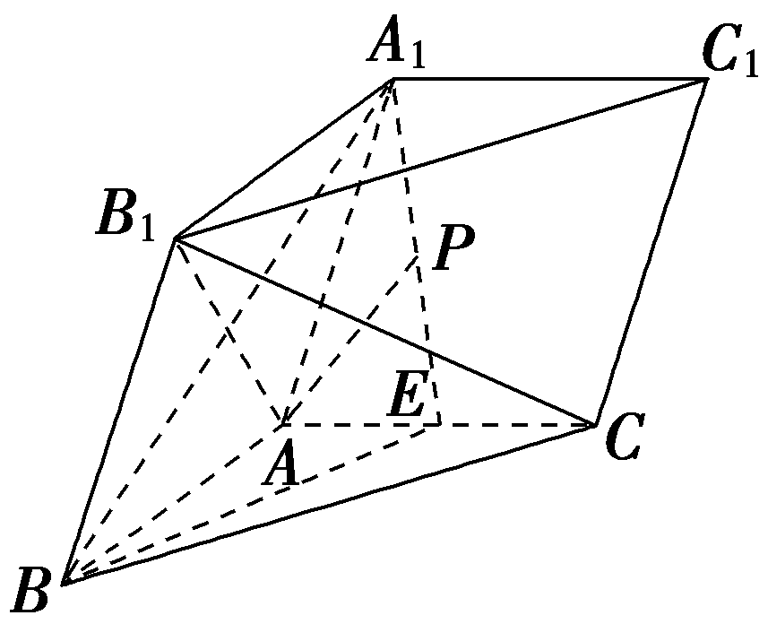

解：(&lt;text style="subscript"&gt;&lt;text style="subscript"&gt;&lt;text style="subscript"&gt;&lt;text style="subscript"&gt;&lt;text style="subscript"&gt;1&lt;/text&gt;&lt;/text&gt;&lt;/text&gt;&lt;/text&gt;&lt;/text&gt;)证明：因为侧面<em>A</em>1<em>&lt;text style="italic"&gt;&lt;text style="italic"&gt;&lt;text style="italic"&gt;B</em>&lt;/text&gt;&lt;/text&gt;&lt;/text&gt;1<em>&lt;text style="italic"&gt;BA</em>&lt;/text&gt;为菱形，∠<em>&lt;text style="italic"&gt;&lt;text style="italic"&gt;AB</em>&lt;/text&gt;B&lt;/text&gt;1＝ $\frac{\pi }{3}$ ，则△<em>&lt;text style="italic"&gt;&lt;text style="italic"&gt;&lt;text style="italic"&gt;B</em>&lt;/text&gt;&lt;/text&gt;&lt;/text&gt;&lt;text style="subscript"&gt;&lt;text style="subscript"&gt;&lt;text style="subscript"&gt;&lt;text style="subscript"&gt;&lt;text style="subscript"&gt;1&lt;/text&gt;&lt;/text&gt;&lt;/text&gt;&lt;/text&gt;&lt;/text&gt;B<em>A</em>是等边三角形，取<em>&lt;text style="italic"&gt;AB</em>&lt;/text&gt;中点<em>&lt;text style="italic"&gt;&lt;text style="italic"&gt;O</em>&lt;/text&gt;&lt;/text&gt;，连接B1O，于是有B1O⊥AB，

又平面<em>A</em>1<em>B</em>1<em>BA</em>⊥平面<em>ABC</em>，且<em>B</em>1<em>O</em>⊂平面<em>A</em>1<em>B</em>1<em>BA</em>，平面<em>A</em>1<em>B</em>1<em>BA</em>∩平面<em>ABC</em>＝<em>AB</em>，

于是<em>B</em>1<em>O</em>⊥平面<em>ABC</em>，又<em>AC</em>⊂平面<em>ABC</em>，即有<em>B</em>1<em>O</em>⊥<em>AC</em>，

又<em>AB</em>1⊥<em>AC</em>，且<em>B</em>1<em>O</em>∩<em>AB</em>1＝<em>B</em>1，<em>B</em>1<em>O</em>，<em>AB</em>1⊂平面<em>A</em>1<em>B</em>1<em>BA</em>，因此<em>AC</em>⊥平面<em>A</em>1<em>B</em>1<em>BA</em>，而<em>A</em>1<em>B</em>⊂平面<em>A</em>1<em>B</em>1<em>BA</em>，

则<em>AC</em>⊥<em>A</em>1<em>B</em>，由四边形<em>A</em>1<em>B</em>1<em>BA</em>为菱形，得<em>A</em>1<em>B</em>⊥<em>AB</em>1，又<em>AB</em>1，<em>AC</em>⊂平面<em>AB</em>1<em>C</em>，<em>AB</em>1∩<em>AC</em>＝<em>A</em>，所以<em>A</em>1<em>B</em>⊥平面<em>AB</em>1<em>C</em>.

（2）由（1）可知<em>B</em>1<em>O</em>⊥<em>AB</em>，<em>B</em>1<em>O</em>⊥<em>AC</em>，<em>AC</em>⊥平面<em>A</em>1<em>B</em>1<em>BA</em>，且<em>AB</em>⊂平面<em>A</em>1<em>B</em>1<em>BA</em>，所以<em>AC</em>⊥<em>AB</em>，

取*BC*的中点为*D*，连接*OD*，有*OD*∥*AC*，*OD*⊥*AB*，

以*O*为原点， $\left\{\vec{OB}，\vec{OD}，\vec{OB_{1}}\right\}$ 为空间正交基底建立直角坐标系，

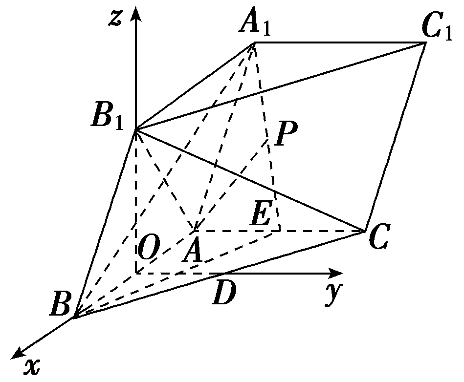

则<em>&lt;text style="italic"&gt;B</em>&lt;/text&gt;(&lt;text style="subscript"&gt;1&lt;/text&gt;，0，0)，<em>&lt;text style="italic"&gt;A</em>&lt;/text&gt; $\left(－1，0，0\right)$ ，<em>&lt;text style="italic"&gt;A</em>&lt;/text&gt;&lt;text style="subscript"&gt;1&lt;/text&gt; $\left(－2，0，\sqrt{3}\right)$ ，<em>E</em> $\left(－1，1，0\right)$ ，<em>&lt;text style="italic"&gt;B</em>&lt;/text&gt;&lt;text style="subscript"&gt;1&lt;/text&gt; $\left(0，0，\sqrt{3}\right)$ ， $\vec{A_{1}B_{1}}$ ＝ $\left(2，0，0\right)$ ， $\vec{A_{1}E}$ ＝ $\left(1，1,-\sqrt{3}\right)$ ， $\vec{AE}$ ＝(0，&lt;text style="subscript"&gt;1&lt;/text&gt;，0).

设平面&lt;te&lt;text st<em>y</em>le="italic"&gt;x&lt;/text&gt;t style="italic"&gt;A&lt;/text&gt;&lt;text style="subscript"&gt;1&lt;/text&gt;<em>B</em>1<em>E</em>的一个法向量为<em><strong>n</strong></em>＝(x，y，<em>z</em>)，则 $\left\{\begin{matrix}n\cdot \vec{A_{1}B_{1}}=2x=0，\\n\cdot \vec{A_{1}E}＝x＋y－\sqrt{3}z=0，\end{matrix}\right.$

令<em>z</em>＝1，得<em><strong>n</strong></em>＝ $\left(0，\sqrt{3}，1\right)$ ，

令 $\vec{EP}$ ＝*<text style="italic">λ*</text> $\vec{EA_{1}}$ ，0≤*<text style="italic">λ*</text>≤1，则 $\vec{EP}$ ＝ $\left(－\lambda ,-\lambda ，\sqrt{3}\lambda \right)$ ， $\vec{AP}$ ＝ $\vec{AE}$ ＋ $\vec{EP}$ ＝ $\left(－\lambda ，1－\lambda ，\sqrt{3}\lambda \right)$ ，

依题意，si*n* $\frac{\pi }{3}$ ＝｜cos＜*n*， $\vec{AP}$ ＞｜＝ $\frac{｜n\cdot \vec{AP}｜}{｜n||\vec{AP}｜}$ ＝ $\frac{｜\sqrt{3}\left(1－\lambda \right)＋\sqrt{3}\lambda ｜}{2\sqrt{\left(－\lambda \right)^{2}＋\left(1－\lambda \right)^{2}＋\left(\sqrt{3}\lambda \right)^{2}}}$ ＝ $\frac{\sqrt{3}}{2}$ ，

整理得，5<em>&lt;text style="italic"&gt;&lt;text style="italic"&gt;&lt;text style="italic"&gt;λ</em>&lt;/text&gt;&lt;/text&gt;&lt;/text&gt;2－2λ＝0，解得λ＝ $\frac{2}{5}$ 或<em>&lt;text style="italic"&gt;&lt;text style="italic"&gt;&lt;text style="italic"&gt;λ</em>&lt;/text&gt;&lt;/text&gt;&lt;/text&gt;＝0，

所以存在满足条件的点*P*， $\frac{EP}{EA_{1}}$ 的值为 $\frac{2}{5}$ 或0.

##### 1.对于存在判断型问题：通常应先假设存在，把要成立的结论当作条件，据此列方程或方程组，把“是否存在”问题转化为“点的坐标是否有解，是否有规定范围内的解”等.

##### 2.对于位置探究型问题：通常借助向量，引进参数，综合已知和结论列出等式，解出参数.

对点练4.如图，四棱锥*S* -*ABCD*的底面是正方形，每条侧棱的长都是底面边长的 $\sqrt{2}$ 倍，*P*为侧棱*S*D上的点.

（1）求证：*AC*⊥*SD*；

（2）若*SD*⊥平面*PAC*，求平面*PAC*与平面*DAC*夹角的大小；

（3）在（2）的条件下，侧棱*SC*上是否存在一点*E*，使得*BE*∥平面*PAC*.若存在，求*SE*∶*EC*的值；若不存在，请说明理由.

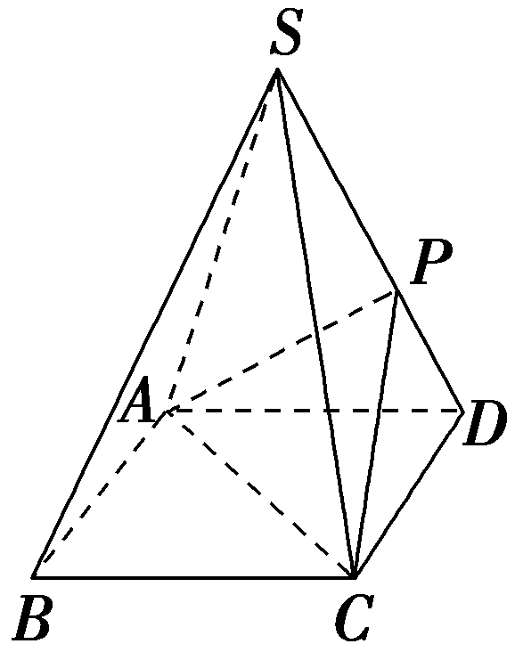

解：（1）证明：如图，连接*BD*交*AC*于点*O*，连接*SO*.

由题意知，*SO*⊥平面*ABCD*，以*O*为坐标原点，

以<te<text st<text style="it<text style="it*a*lic">a</text>lic">y</text>le="italic">x</text>t style="italic">OB</text>，*OC*，*OS*所在直线分别为x轴，y轴，*z*轴，建立空间直角坐标系.设底面边长为a，则高*SO*＝ $\frac{\sqrt{6}}{2}$ <text style="it*a*lic">a</text>，

于是*S* $\left(0，0，\frac{\sqrt{6}}{2}a\right)$ ，*D* $\left(－\frac{\sqrt{2}}{2}a，0，0\right)$ ，*C* $\left(0，\frac{\sqrt{2}}{2}a，0\right)$ .

于是 $\vec{OC}$ ＝ $\left(0，\frac{\sqrt{2}}{2}a，0\right)$ ， $\vec{SD}$ ＝(－ $\frac{\sqrt{2}}{2}$ <text style="it*a*lic">a</text>，0，－ $\frac{\sqrt{6}}{2}$ <text style="it*a*lic">a</text>).

则 $\vec{OC}$ · $\vec{SD}$ ＝0，所以 $\vec{OC}$ ⊥ $\vec{SD}$ ，

故*OC*⊥*SD*，从而*AC*⊥*SD*.

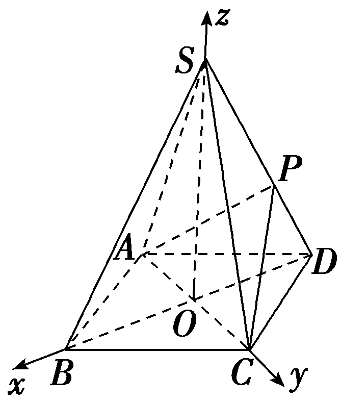

（2）由题设知，平面*PAC*的一个法向量为 $\vec{DS}$ ＝ $\left(\frac{\sqrt{2}}{2}a，0，\frac{\sqrt{6}}{2}a\right)$ ，平面*DAC*的一个法向量为 $\vec{OS}$ ＝ $\left(0，0，\frac{\sqrt{6}}{2}a\right)$ .

设平面*PAC*与平面*DAC*的夹角为*θ*，

则cos *θ*＝｜cos＜ $\vec{OS}$ ， $\vec{DS}$ ＞｜＝ $\frac{｜\vec{OS}\cdot \vec{DS}｜}{｜\vec{OS}||\vec{DS}｜}$ ＝ $\frac{\sqrt{3}}{2}$ ，

所以平面*PAC*与平面*DAC*夹角的大小为30°.

（3）假设在棱*SC*上存在一点*E*使*BE*∥平面*PAC*.

由（2）知 $\vec{DS}$ 是平面*PAC*的一个法向量，

且 $\vec{DS}$ ＝ $\left(\frac{\sqrt{2}}{2}a，0，\frac{\sqrt{6}}{2}a\right)$ ， $\vec{CS}$ ＝ $\left(0,-\frac{\sqrt{2}}{2}a，\frac{\sqrt{6}}{2}a\right)$ .

设 $\vec{CE}$ ＝*t* $\vec{CS}\left(0\leq t\leq 1\right)$ ，

因为*B* $\left(\frac{\sqrt{2}}{2}a，0，0\right)$ ，*C* $\left(0，\frac{\sqrt{2}}{2}a，0\right)$ ，

所以 $\vec{BC}$ ＝ $\left(－\frac{\sqrt{2}}{2}a，\frac{\sqrt{2}}{2}a，0\right)$ ，

则 $\vec{BE}$ ＝ $\vec{BC}$ ＋ $\vec{CE}$ ＝ $\vec{BC}$ ＋<text style="it<text style="it*a*lic">a</text>lic">t</text> $\vec{CS}$ ＝(－ $\frac{\sqrt{2}}{2}$ <text style="it*a*lic">a</text>， $\frac{\sqrt{2}}{2}$ <text style="it*a*lic">a</text> $\left(1－t\right)$ ， $\frac{\sqrt{6}}{2}$ <text style="it*a*lic">a</text>*t*).

由 $\vec{BE}$ · $\vec{DS}$ ＝0，得－ $\frac{a^{2}}{2}$ ＋0＋ $\frac{3}{2}$ &lt;<em>t</em>ext style="italic"&gt;a&lt;/text&gt;2t＝0，

解得*t*＝ $\frac{1}{3}$ ，当*SE*∶*EC*＝2∶1时， $\vec{BE}$ ⊥ $\vec{DS}$ .

由于*BE*⊄平面*PAC*，故*BE*∥平面*PAC*.

因此在棱*SC*上存在点*E*，使*BE*∥平面*PAC*，此时*SE*∶*EC*＝2∶1.

### 题型三　最值、范围问题

《九章算术》是中国古代张苍、耿寿昌所撰写的一部数学专著，是《算经十书》中最重要的一部，成于公元一世纪左右，是当时世界上最简练有效的应用数学，它的出现标志着中国古代数学形成了完整的体系.在《九章算术》中，将底面是直角三角形的直三棱柱称为“堑堵”.已知在“堑堵”<em>&lt;text style="italic"&gt;A&lt;text style="italic"&gt;B</em>&lt;/text&gt;<em>C</em>&lt;/text&gt;-A&lt;text style="subscript"&gt;&lt;text style="subscript"&gt;&lt;text style="subscript"&gt;&lt;text style="subscript"&gt;&lt;text style="subscript"&gt;1&lt;/text&gt;&lt;/text&gt;&lt;/text&gt;&lt;/text&gt;&lt;/text&gt;B1C1中，<em>&lt;text style="italic"&gt;AB</em>&lt;/text&gt;⊥<em>&lt;text style="italic"&gt;AC</em>&lt;/text&gt;，AB＝AC＝<em>AA</em>1＝ $\sqrt{6}$ ，动点<em>M</em>在“堑堵”的侧面<em>&lt;text style="italic"&gt;B</em>&lt;/text&gt;<em>C</em>C&lt;text style="subscript"&gt;&lt;text style="subscript"&gt;&lt;text style="subscript"&gt;&lt;text style="subscript"&gt;&lt;text style="subscript"&gt;1&lt;/text&gt;&lt;/text&gt;&lt;/text&gt;&lt;/text&gt;&lt;/text&gt;B1上运动，且<em>A</em>M＝2，则∠M<em>&lt;text style="italic"&gt;AB</em>&lt;/text&gt;的最大值为(　　)

$\quad$A. $\frac{\pi }{4}$ 	
$\quad$B. $\frac{5\pi }{12}$

$\quad$C. $\frac{\pi }{2}$ 	
$\quad$D. $\frac{\pi }{3}$

答案B

解析如图，取<em>&lt;text style="italic"&gt;&lt;text style="italic"&gt;&lt;text style="italic"&gt;&lt;text style="italic"&gt;&lt;text style="italic"&gt;&lt;text style="italic"&gt;B</em>&lt;/text&gt;&lt;/text&gt;&lt;/text&gt;&lt;/text&gt;<em>C</em>&lt;/text&gt;&lt;/text&gt;的中点<em>O</em>，连接<em>&lt;text style="italic"&gt;&lt;text style="italic"&gt;A</em>O&lt;/text&gt;&lt;/text&gt;，<em>MO</em>，则<em>&lt;text style="italic"&gt;&lt;text style="italic"&gt;&lt;text style="italic"&gt;AO</em>&lt;/text&gt;&lt;/text&gt;&lt;/text&gt;⊥<em>&lt;text style="italic"&gt;BC</em>&lt;/text&gt;.因为在直三棱柱<em>&lt;text style="italic"&gt;&lt;text style="italic"&gt;&lt;text style="italic"&gt;AB</em>C&lt;/text&gt;&lt;/text&gt;&lt;/text&gt;-A&lt;text style="subscript"&gt;&lt;text style="subscript"&gt;&lt;text style="subscript"&gt;&lt;text style="subscript"&gt;&lt;text style="subscript"&gt;&lt;text style="subscript"&gt;&lt;text style="subscript"&gt;&lt;text style="subscript"&gt;&lt;text style="subscript"&gt;&lt;text style="subscript"&gt;&lt;text style="subscript"&gt;&lt;text style="subscript"&gt;1&lt;/text&gt;&lt;/text&gt;&lt;/text&gt;&lt;/text&gt;&lt;/text&gt;&lt;/text&gt;&lt;/text&gt;&lt;/text&gt;&lt;/text&gt;&lt;/text&gt;&lt;/text&gt;&lt;/text&gt;B1C1中，<em>&lt;text style="italic"&gt;&lt;text style="italic"&gt;&lt;text style="italic"&gt;BB</em>&lt;/text&gt;&lt;/text&gt;&lt;/text&gt;1⊥平面ABC，所以BB1⊥AO，又BC∩BB1＝B，BC，BB1⊂平面<em>&lt;text style="italic"&gt;&lt;text style="italic"&gt;BCC</em>&lt;/text&gt;&lt;/text&gt;1B1，所以AO⊥平面BCC1B1，<em>&lt;text style="italic"&gt;OM</em>&lt;/text&gt;⊂平面BCC1B1，所以AO⊥OM.在等腰直角三角形ABC中，AB＝<em>AC</em>＝ $\sqrt{6}$ ，∠<em>&lt;text style="italic"&gt;&lt;text style="italic"&gt;&lt;text style="italic"&gt;&lt;text style="italic"&gt;B</em>&lt;/text&gt;&lt;/text&gt;&lt;/text&gt;&lt;/text&gt;<em>AC</em>＝ $\frac{\pi }{2}$ ，所以<em>AO</em>＝ $\sqrt{3}$ ，又<em>A</em>M＝2，

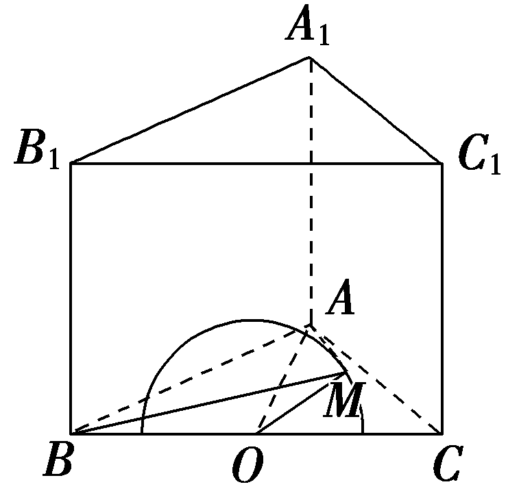

所以在Rt△<em>&lt;text style="italic"&gt;O</em>A<em>M</em>&lt;/text&gt;中，<em>OM</em>＝ $\sqrt{2^{2}－\left(\sqrt{3}\right)^{2}}$ ＝&lt;text style="subscript"&gt;1&lt;/text&gt;，所以动点<em>M</em>的轨迹是平面<em>&lt;text style="italic"&gt;B</em>CC&lt;/text&gt;1B1内以<em>O</em>为圆心，1为半径的半圆.连接<em>&lt;text style="italic"&gt;&lt;text style="italic"&gt;BM</em>&lt;/text&gt;&lt;/text&gt;，易得<em>BO</em>＝ $\frac{1}{2}$ <em>B</em>C＝ $\sqrt{3}$ ，所以<em>BM</em>∈[ $\sqrt{3}$ －&lt;text style="subscript"&gt;1&lt;/text&gt;， $\sqrt{3}$ ＋&lt;text style="subscript"&gt;1&lt;/text&gt;].在△<em>B</em>A<em>M</em>中，<em>AB</em>＝ $\sqrt{6}$ ，A<em>M</em>＝2，由余弦定理得cos∠MA<em>B</em>＝ $\frac{AM^{2}＋AB^{2}－BM^{2}}{2AM\cdot AB}$ ＝ $\frac{2^{2}＋\left(\sqrt{6}\right)^{2}－BM^{2}}{2\times 2\times \sqrt{6}}$ ≥ $\frac{10－\left(\sqrt{3}+1\right)^{2}}{4\sqrt{6}}$ ＝ $\frac{\sqrt{6}－\sqrt{2}}{4}$ .即当<em>BM</em>＝ $\sqrt{3}$ ＋&lt;text style="subscript"&gt;1&lt;/text&gt;时，cos∠<em>M</em>A<em>B</em>取得最小值 $\frac{\sqrt{6}－\sqrt{2}}{4}$ ，即∠<em>M</em>A<em>B</em>取最大值，结合选项可知，A，C，D均不正确，所以∠M<em>AB</em>的最大值为 $\frac{5\pi }{12}$ .故选<em>B</em>.

在动态变化过程中产生的体积最大、距离最大(小)、角的范围等问题，常用的两种思路

##### 1.直观判断：在变化过程中判断点、线、面在何位置时，所求的量有相应最大、最小值，即可求解.

##### 2.函数思想：通过建系或引入变量，把这类动态问题转化为目标函数，从而利用代数方法求目标函数的最值.

对点练5.如图所示，菱形*ABCD*的边长为2，现将△*ACD*沿对角线*AC*折起，使平面*ACD'*⊥平面*ACB*，则此时空间四面体*ABCD'* 体积的最大值为(　　)

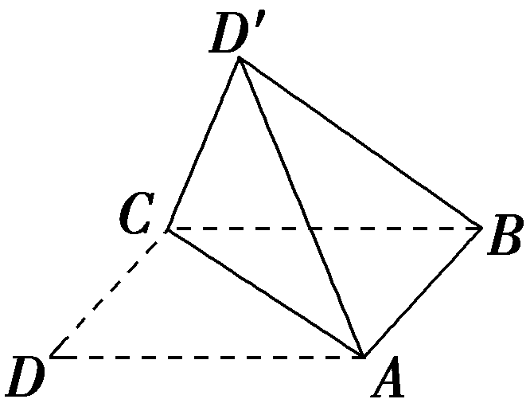

$\quad$A. $\frac{16\sqrt{3}}{27}$ 	
$\quad$B. $\frac{5\sqrt{3}}{9}$

$\quad$C.1	
$\quad$D. $\frac{\sqrt{3}}{4}$

答案A

解析取*AC*的中点*O*，连接*D'O*(图略).

设∠&lt;&lt;&lt;&lt;&lt;&lt;&lt;&lt;&lt;&lt;&lt;&lt;<em>t</em>ext style="italic"&gt;t&lt;/text&gt;ext style="italic"&gt;t&lt;/text&gt;ext style="italic"&gt;t&lt;/text&gt;ext style="italic"&gt;t&lt;/text&gt;ext style="italic"&gt;t&lt;/text&gt;ext style="italic"&gt;t&lt;/text&gt;ext style="italic"&gt;t&lt;/text&gt;ext style="italic"&gt;t&lt;/text&gt;ext style="italic"&gt;t&lt;/text&gt;ext style="italic"&gt;t&lt;/text&gt;ext style="italic"&gt;t&lt;/text&gt;ext style="italic"&gt;<em>&lt;text style="italic"&gt;&lt;text style="italic,subscript"&gt;ABC</em>&lt;/text&gt;&lt;/text&gt;&lt;/text&gt;＝<em>&lt;text style="italic"&gt;&lt;text style="italic"&gt;&lt;text style="italic"&gt;&lt;text style="italic"&gt;α</em>&lt;/text&gt;&lt;/text&gt;&lt;/text&gt;&lt;/text&gt;，α∈(0，π)，所以<em>&lt;text style="italic"&gt;&lt;text style="italic"&gt;D'O</em>&lt;/text&gt;&lt;/text&gt;＝<em>AD'</em>cos $\frac{\alpha }{2}$ ＝&lt;&lt;&lt;&lt;&lt;&lt;&lt;&lt;&lt;&lt;&lt;&lt;<em>t</em>ext style="italic"&gt;t&lt;/text&gt;ext style="italic"&gt;t&lt;/text&gt;ext style="italic"&gt;t&lt;/text&gt;ext style="italic"&gt;t&lt;/text&gt;ext style="italic"&gt;t&lt;/text&gt;ext style="italic"&gt;t&lt;/text&gt;ext style="italic"&gt;t&lt;/text&gt;ext style="italic"&gt;t&lt;/text&gt;ext style="italic"&gt;t&lt;/text&gt;ext style="italic"&gt;t&lt;/text&gt;ext style="italic"&gt;t&lt;/text&gt;ext style="superscript"&gt;2&lt;/text&gt;cos $\frac{\alpha }{2}$ ，&lt;&lt;&lt;&lt;&lt;&lt;&lt;&lt;&lt;&lt;&lt;&lt;<em>t</em>ext style="italic"&gt;t&lt;/text&gt;ext style="italic"&gt;t&lt;/text&gt;ext style="italic"&gt;t&lt;/text&gt;ext style="italic"&gt;t&lt;/text&gt;ext style="italic"&gt;t&lt;/text&gt;ext style="italic"&gt;t&lt;/text&gt;ext style="italic"&gt;t&lt;/text&gt;ext style="italic"&gt;t&lt;/text&gt;ext style="italic"&gt;t&lt;/text&gt;ext style="italic"&gt;t&lt;/text&gt;ext style="italic"&gt;t&lt;/text&gt;ext style="italic"&gt;<em>S</em>&lt;/text&gt;&lt;text style="subscript"&gt;△&lt;/text&gt;<em>&lt;text style="italic,subscript"&gt;&lt;text style="italic"&gt;&lt;text style="italic,subscript"&gt;ABC</em>&lt;/text&gt;&lt;/text&gt;&lt;/text&gt;＝ $\frac{1}{2}$ ×&lt;&lt;&lt;&lt;&lt;&lt;&lt;&lt;&lt;&lt;&lt;&lt;<em>t</em>ext style="italic"&gt;t&lt;/text&gt;ext style="italic"&gt;t&lt;/text&gt;ext style="italic"&gt;t&lt;/text&gt;ext style="italic"&gt;t&lt;/text&gt;ext style="italic"&gt;t&lt;/text&gt;ext style="italic"&gt;t&lt;/text&gt;ext style="italic"&gt;t&lt;/text&gt;ext style="italic"&gt;t&lt;/text&gt;ext style="italic"&gt;t&lt;/text&gt;ext style="italic"&gt;t&lt;/text&gt;ext style="italic"&gt;t&lt;/text&gt;ext style="superscript"&gt;2&lt;/text&gt;×2sin <em>&lt;text style="italic"&gt;&lt;text style="italic"&gt;&lt;text style="italic"&gt;&lt;text style="italic"&gt;α</em>&lt;/text&gt;&lt;/text&gt;&lt;/text&gt;&lt;/text&gt;＝2sin α.因为<em>&lt;text style="italic"&gt;&lt;text style="italic"&gt;D'O</em>&lt;/text&gt;&lt;/text&gt;⊥平面<em>&lt;text style="italic,subscript"&gt;&lt;text style="italic"&gt;&lt;text style="italic,subscript"&gt;ABC</em>&lt;/text&gt;&lt;/text&gt;&lt;/text&gt;，所以<em>&lt;text style="italic"&gt;V</em>&lt;/text&gt;&lt;text style="subscript"&gt;四面体&lt;/text&gt;<em>&lt;text style="italic,subscript"&gt;&lt;text style="italic"&gt;ABCD'</em>&lt;/text&gt;&lt;/text&gt;＝ $\frac{1}{3}$ &lt;&lt;&lt;&lt;&lt;&lt;&lt;&lt;&lt;&lt;&lt;&lt;<em>t</em>ext style="italic"&gt;t&lt;/text&gt;ext style="italic"&gt;t&lt;/text&gt;ext style="italic"&gt;t&lt;/text&gt;ext style="italic"&gt;t&lt;/text&gt;ext style="italic"&gt;t&lt;/text&gt;ext style="italic"&gt;t&lt;/text&gt;ext style="italic"&gt;t&lt;/text&gt;ext style="italic"&gt;t&lt;/text&gt;ext style="italic"&gt;t&lt;/text&gt;ext style="italic"&gt;t&lt;/text&gt;ext style="italic"&gt;t&lt;/text&gt;ext style="italic"&gt;<em>S</em>&lt;/text&gt;&lt;text style="subscript"&gt;△&lt;/text&gt;<em>&lt;text style="italic,subscript"&gt;&lt;text style="italic"&gt;&lt;text style="italic,subscript"&gt;ABC</em>&lt;/text&gt;&lt;/text&gt;&lt;/text&gt;×<em>&lt;text style="italic"&gt;&lt;text style="italic"&gt;D'O</em>&lt;/text&gt;&lt;/text&gt;＝ $\frac{4}{3}$ sin &lt;&lt;&lt;&lt;&lt;&lt;&lt;&lt;&lt;&lt;&lt;&lt;<em>t</em>ext style="italic"&gt;t&lt;/text&gt;ext style="italic"&gt;t&lt;/text&gt;ext style="italic"&gt;t&lt;/text&gt;ext style="italic"&gt;t&lt;/text&gt;ext style="italic"&gt;t&lt;/text&gt;ext style="italic"&gt;t&lt;/text&gt;ext style="italic"&gt;t&lt;/text&gt;ext style="italic"&gt;t&lt;/text&gt;ext style="italic"&gt;t&lt;/text&gt;ext style="italic"&gt;t&lt;/text&gt;ext style="italic"&gt;t&lt;/text&gt;ext style="italic"&gt;<em>&lt;text style="italic"&gt;&lt;text style="italic"&gt;&lt;text style="italic"&gt;α</em>&lt;/text&gt;&lt;/text&gt;&lt;/text&gt;&lt;/text&gt;cos $\frac{\alpha }{2}$ ＝ $\frac{8}{3}$ sin $\frac{\alpha }{2}$ cos&lt;&lt;&lt;&lt;&lt;&lt;&lt;&lt;&lt;&lt;&lt;&lt;<em>t</em>ext style="italic"&gt;t&lt;/text&gt;ext style="italic"&gt;t&lt;/text&gt;ext style="italic"&gt;t&lt;/text&gt;ext style="italic"&gt;t&lt;/text&gt;ext style="italic"&gt;t&lt;/text&gt;ext style="italic"&gt;t&lt;/text&gt;ext style="italic"&gt;t&lt;/text&gt;ext style="italic"&gt;t&lt;/text&gt;ext style="italic"&gt;t&lt;/text&gt;ext style="italic"&gt;t&lt;/text&gt;ext style="italic"&gt;t&lt;/text&gt;ext style="superscript"&gt;2&lt;/text&gt; $\frac{\alpha }{2}$ ＝ $\frac{8}{3}$ sin $\frac{\alpha }{2}$ · $\left(1－sin^{2}\frac{\alpha }{2}\right)$ ( 0＜ $\frac{\alpha }{2}$ ＜ $\frac{\pi }{2}$ ).设&lt;&lt;&lt;&lt;&lt;&lt;&lt;&lt;&lt;&lt;&lt;<em>t</em>ext style="italic"&gt;t&lt;/text&gt;ext style="italic"&gt;t&lt;/text&gt;ext style="italic"&gt;t&lt;/text&gt;ext style="italic"&gt;t&lt;/text&gt;ext style="italic"&gt;t&lt;/text&gt;ext style="italic"&gt;t&lt;/text&gt;ext style="italic"&gt;t&lt;/text&gt;ext style="italic"&gt;t&lt;/text&gt;ext style="italic"&gt;t&lt;/text&gt;ext style="italic"&gt;t&lt;/text&gt;ext style="italic"&gt;t&lt;/text&gt;＝sin $\frac{\alpha }{2}$ ，则0＜&lt;&lt;&lt;&lt;&lt;&lt;&lt;&lt;&lt;&lt;&lt;<em>t</em>ext style="italic"&gt;t&lt;/text&gt;ext style="italic"&gt;t&lt;/text&gt;ext style="italic"&gt;t&lt;/text&gt;ext style="italic"&gt;t&lt;/text&gt;ext style="italic"&gt;t&lt;/text&gt;ext style="italic"&gt;t&lt;/text&gt;ext style="italic"&gt;t&lt;/text&gt;ext style="italic"&gt;t&lt;/text&gt;ext style="italic"&gt;t&lt;/text&gt;ext style="italic"&gt;t&lt;/text&gt;ext style="italic"&gt;t&lt;/text&gt;＜1，<em>&lt;text style="italic"&gt;V</em>&lt;/text&gt;&lt;text style="subscript"&gt;四面体&lt;/text&gt;<em>&lt;text style="italic,subscript"&gt;&lt;text style="italic"&gt;&lt;text style="italic,subscript"&gt;ABC</em>&lt;/text&gt;&lt;/text&gt;&lt;/text&gt;D'＝ $\frac{8}{3}\left(t－t^{3}\right)$ .设&lt;&lt;&lt;&lt;&lt;&lt;&lt;&lt;&lt;&lt;<em>t</em>ext style="italic"&gt;t&lt;/text&gt;ext style="italic"&gt;t&lt;/text&gt;ext style="italic"&gt;t&lt;/text&gt;ext style="italic"&gt;t&lt;/text&gt;ext style="italic"&gt;t&lt;/text&gt;ext style="italic"&gt;t&lt;/text&gt;ext style="italic"&gt;t&lt;/text&gt;ext style="italic"&gt;t&lt;/text&gt;ext style="italic"&gt;t&lt;/text&gt;ext style="italic"&gt;<em>&lt;text style="italic"&gt;&lt;text style="italic"&gt;f</em>&lt;/text&gt;&lt;/text&gt;&lt;/text&gt; $\left(t\right)$ ＝ $\frac{8}{3}\left(t－t^{3}\right)$ ，0＜&lt;&lt;&lt;&lt;&lt;&lt;&lt;&lt;&lt;&lt;&lt;<em>t</em>ext style="italic"&gt;t&lt;/text&gt;ext style="italic"&gt;t&lt;/text&gt;ext style="italic"&gt;t&lt;/text&gt;ext style="italic"&gt;t&lt;/text&gt;ext style="italic"&gt;t&lt;/text&gt;ext style="italic"&gt;t&lt;/text&gt;ext style="italic"&gt;t&lt;/text&gt;ext style="italic"&gt;t&lt;/text&gt;ext style="italic"&gt;t&lt;/text&gt;ext style="italic"&gt;t&lt;/text&gt;ext style="italic"&gt;t&lt;/text&gt;＜1，则<em>&lt;text style="italic"&gt;&lt;text style="italic"&gt;&lt;text style="italic"&gt;f</em>&lt;/text&gt;&lt;/text&gt;&lt;/text&gt;' $\left(t\right)$ ＝ $\frac{8}{3}\left(1－3t^{2}\right)$ ，0＜&lt;&lt;&lt;&lt;&lt;&lt;&lt;&lt;&lt;&lt;&lt;<em>t</em>ext style="italic"&gt;t&lt;/text&gt;ext style="italic"&gt;t&lt;/text&gt;ext style="italic"&gt;t&lt;/text&gt;ext style="italic"&gt;t&lt;/text&gt;ext style="italic"&gt;t&lt;/text&gt;ext style="italic"&gt;t&lt;/text&gt;ext style="italic"&gt;t&lt;/text&gt;ext style="italic"&gt;t&lt;/text&gt;ext style="italic"&gt;t&lt;/text&gt;ext style="italic"&gt;t&lt;/text&gt;ext style="italic"&gt;t&lt;/text&gt;＜1.所以当0＜t＜ $\frac{\sqrt{3}}{3}$ 时，&lt;&lt;&lt;&lt;&lt;&lt;&lt;&lt;&lt;&lt;<em>t</em>ext style="italic"&gt;t&lt;/text&gt;ext style="italic"&gt;t&lt;/text&gt;ext style="italic"&gt;t&lt;/text&gt;ext style="italic"&gt;t&lt;/text&gt;ext style="italic"&gt;t&lt;/text&gt;ext style="italic"&gt;t&lt;/text&gt;ext style="italic"&gt;t&lt;/text&gt;ext style="italic"&gt;t&lt;/text&gt;ext style="italic"&gt;t&lt;/text&gt;ext style="italic"&gt;<em>&lt;text style="italic"&gt;&lt;text style="italic"&gt;f</em>&lt;/text&gt;&lt;/text&gt;&lt;/text&gt;'(&lt;<em>t</em>ext style="italic"&gt;t&lt;/text&gt;)＞0，f(t)单调递增；当 $\frac{\sqrt{3}}{3}$ ＜&lt;&lt;&lt;&lt;&lt;&lt;&lt;&lt;&lt;&lt;&lt;<em>t</em>ext style="italic"&gt;t&lt;/text&gt;ext style="italic"&gt;t&lt;/text&gt;ext style="italic"&gt;t&lt;/text&gt;ext style="italic"&gt;t&lt;/text&gt;ext style="italic"&gt;t&lt;/text&gt;ext style="italic"&gt;t&lt;/text&gt;ext style="italic"&gt;t&lt;/text&gt;ext style="italic"&gt;t&lt;/text&gt;ext style="italic"&gt;t&lt;/text&gt;ext style="italic"&gt;t&lt;/text&gt;ext style="italic"&gt;t&lt;/text&gt;＜1时，<em>&lt;text style="italic"&gt;&lt;text style="italic"&gt;&lt;text style="italic"&gt;f</em>&lt;/text&gt;&lt;/text&gt;&lt;/text&gt;'(t)＜0，f(t)单调递减.所以当t＝ $\frac{\sqrt{3}}{3}$ 时，&lt;&lt;&lt;&lt;&lt;&lt;&lt;&lt;&lt;&lt;<em>t</em>ext style="italic"&gt;t&lt;/text&gt;ext style="italic"&gt;t&lt;/text&gt;ext style="italic"&gt;t&lt;/text&gt;ext style="italic"&gt;t&lt;/text&gt;ext style="italic"&gt;t&lt;/text&gt;ext style="italic"&gt;t&lt;/text&gt;ext style="italic"&gt;t&lt;/text&gt;ext style="italic"&gt;t&lt;/text&gt;ext style="italic"&gt;t&lt;/text&gt;ext style="italic"&gt;<em>&lt;text style="italic"&gt;&lt;text style="italic"&gt;f</em>&lt;/text&gt;&lt;/text&gt;&lt;/text&gt;(&lt;<em>t</em>ext style="italic"&gt;t&lt;/text&gt;)取得最大值 $\frac{16\sqrt{3}}{27}$ .所以&lt;&lt;&lt;&lt;&lt;&lt;&lt;&lt;&lt;&lt;&lt;&lt;<em>t</em>ext style="italic"&gt;t&lt;/text&gt;ext style="italic"&gt;t&lt;/text&gt;ext style="italic"&gt;t&lt;/text&gt;ext style="italic"&gt;t&lt;/text&gt;ext style="italic"&gt;t&lt;/text&gt;ext style="italic"&gt;t&lt;/text&gt;ext style="italic"&gt;t&lt;/text&gt;ext style="italic"&gt;t&lt;/text&gt;ext style="italic"&gt;t&lt;/text&gt;ext style="italic"&gt;t&lt;/text&gt;ext style="italic"&gt;t&lt;/text&gt;ext style="subscript"&gt;四面体&lt;/text&gt;<em>&lt;text style="italic,subscript"&gt;&lt;text style="italic"&gt;&lt;text style="italic,subscript"&gt;ABC</em>&lt;/text&gt;&lt;/text&gt;&lt;/text&gt;D'体积的最大值为 $\frac{16\sqrt{3}}{27}$ .故选A.

课时测评65　空间中的动态及探索性问题 $\frac{对应学生}{用书P439}$

(时间：60分钟　满分：88分)

(本栏目内容，在学生用书中以独立形式分册装订！)

(1—8题，每小题5分，共40分)

##### 1.如图，斜线段*A<text style="italic">B*</text>与平面*<text style="italic">α*</text>所成的角为 $\frac{\pi }{4}$ ，*B*为斜足.平面*<text style="italic">α*</text>上的动点*<text style="italic">P*</text>满足∠P*AB*＝ $\frac{\pi }{6}$ ，则点*<text style="italic">P*</text>的轨迹为(　　)

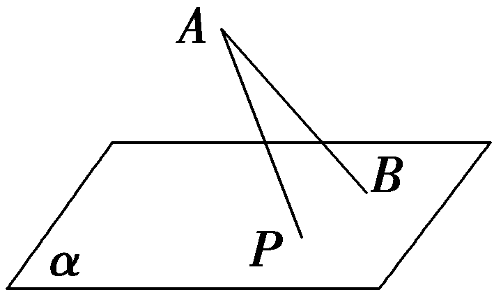

$\quad$A.圆	
$\quad$B.椭圆

$\quad$C.双曲线的一部分	
$\quad$D.抛物线的一部分

答案B

解析建立如图所示的空间直角坐标系，设&lt;te&lt;te<em>x</em>t st<em>y</em>le="italic"&gt;x&lt;/text&gt;t style="italic"&gt;O<em>B</em>&lt;/text&gt;＝<em>O&lt;text style="italic"&gt;A</em>&lt;/text&gt;＝1，则B(0，1，0)，A(0，0，1)，<em>&lt;text style="italic"&gt;P</em>&lt;/text&gt;(x，y，0)，则 $\vec{AB}$ ＝ $\left(0，1,-1\right)$ ， $\vec{AP}$ ＝ $\left(x，y,-1\right)$ ，所以cos＜ $\vec{AB}$ ， $\vec{AP}$ ＞＝ $\frac{y+1}{\sqrt{2}\cdot \sqrt{x^{2}＋y^{2}+1}}$ ＝ $\frac{\sqrt{3}}{2}$ ，即&lt;te<em>x</em>t st<em>y</em>le="italic"&gt;x&lt;/text&gt;2＋ $\frac{\left(y－2\right)^{2}}{3}$ ＝1，所以点&lt;te&lt;te<em>x</em>t st<em>y</em>le="italic"&gt;x&lt;/text&gt;t style="italic"&gt;<em>P</em>&lt;/text&gt;的轨迹是椭圆.故选<em>B</em>.

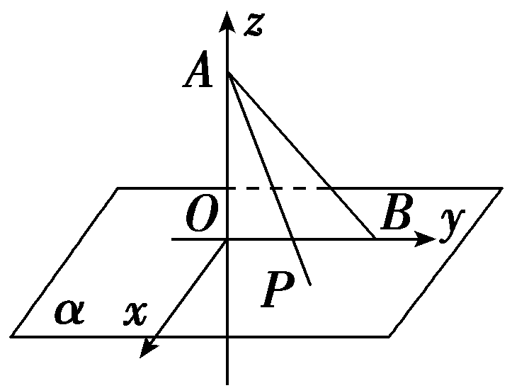

##### 2.点<em>&lt;text style="italic"&gt;P</em>&lt;/text&gt;为棱长是2 $\sqrt{5}$ 的正方体<em>&lt;text style="italic"&gt;A&lt;text style="italic"&gt;B</em>&lt;/text&gt;<em>&lt;text style="italic"&gt;C</em>&lt;/text&gt;<em>D</em>&lt;/text&gt; -A&lt;text style="subscript"&gt;&lt;text style="subscript"&gt;&lt;text style="subscript"&gt;&lt;text style="subscript"&gt;&lt;text style="subscript"&gt;1&lt;/text&gt;&lt;/text&gt;&lt;/text&gt;&lt;/text&gt;&lt;/text&gt;B1C1D1的内切球<em>O</em>球面上的动点，点<em>M</em>为B1C1的中点，若满足D<em>&lt;text style="italic"&gt;P</em>&lt;/text&gt;⊥<em>BM</em>，则动点P的轨迹的长度为(　　)

$\quad$A.π	
$\quad$B.2π

$\quad$C.4π	
$\quad$D.2 $\sqrt{5}$ π

答案C

解析根据题意知，该正方体的内切球半径为<em>r</em>＝ $\sqrt{5}$ ，如图.取<em>&lt;text style="italic"&gt;&lt;text style="italic"&gt;B</em>&lt;/text&gt;B&lt;/text&gt;&lt;text style="subscript"&gt;&lt;text style="subscript"&gt;&lt;text style="subscript"&gt;&lt;text style="subscript"&gt;&lt;text style="subscript"&gt;&lt;text style="subscript"&gt;1&lt;/text&gt;&lt;/text&gt;&lt;/text&gt;&lt;/text&gt;&lt;/text&gt;&lt;/text&gt;的中点<em>&lt;text style="italic"&gt;&lt;text style="italic"&gt;N</em>&lt;/text&gt;&lt;/text&gt;，连接<em>&lt;text style="italic"&gt;&lt;text style="italic"&gt;&lt;text style="italic"&gt;&lt;text style="italic"&gt;&lt;text style="italic"&gt;&lt;text style="italic"&gt;C</em>&lt;/text&gt;&lt;/text&gt;&lt;/text&gt;N&lt;/text&gt;&lt;/text&gt;&lt;/text&gt;，则CN⊥<em>BM</em>，所以CN为<em>&lt;text style="italic"&gt;&lt;text style="italic"&gt;&lt;text style="italic"&gt;D</em>&lt;/text&gt;&lt;/text&gt;<em>&lt;text style="italic"&gt;P</em>&lt;/text&gt;&lt;/text&gt;在平面B1C1<em>CB</em>中的射影，所以点P的轨迹为过D，C，N的平面与内切球的交线，因为正方体<em>&lt;text style="italic"&gt;A</em>BCD&lt;/text&gt; -A1B1C1D1的棱长为2 $\sqrt{5}$ ，所以<em>O</em>到过<em>&lt;text style="italic"&gt;&lt;text style="italic"&gt;D</em>&lt;/text&gt;&lt;/text&gt;，<em>&lt;text style="italic"&gt;&lt;text style="italic"&gt;&lt;text style="italic"&gt;C</em>&lt;/text&gt;&lt;/text&gt;&lt;/text&gt;，<em>&lt;text style="italic"&gt;&lt;text style="italic"&gt;N</em>&lt;/text&gt;&lt;/text&gt;的平面的距离为 $\frac{\sqrt{5}}{\sqrt{5}}$ ＝&lt;text style="subscript"&gt;&lt;text style="subscript"&gt;&lt;text style="subscript"&gt;&lt;text style="subscript"&gt;&lt;text style="subscript"&gt;&lt;text style="subscript"&gt;1&lt;/text&gt;&lt;/text&gt;&lt;/text&gt;&lt;/text&gt;&lt;/text&gt;&lt;/text&gt;，所以截面圆的半径为2，所以点<em>&lt;text style="italic"&gt;P</em>&lt;/text&gt;的轨迹的长度为2π×2＝4π.故选<em>&lt;text style="italic"&gt;&lt;text style="italic"&gt;&lt;text style="italic"&gt;C</em>&lt;/text&gt;&lt;/text&gt;&lt;/text&gt;.

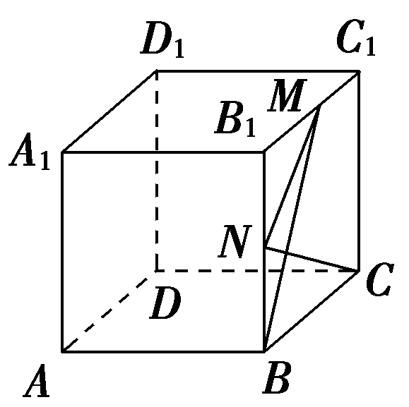

##### 3.如图，在正方体<em>ABCD</em> -<em>A</em>1<em>B</em>1<em>C</em>1<em>D</em>1中，点<em>M</em>是平面<em>A</em>1<em>B</em>1<em>C</em>1<em>D</em>1内一点，且<em>BM</em>∥平面<em>ACD</em>1，则tan∠<em>DMD</em>1的最大值为(　　)

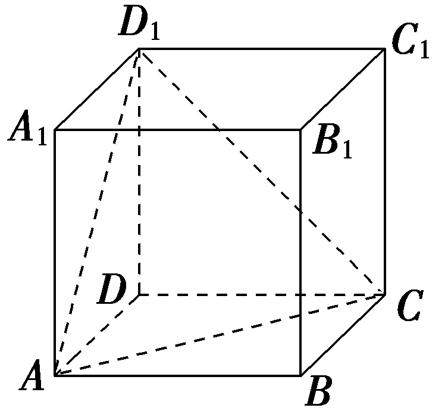

$\quad$A. $\frac{\sqrt{2}}{2}$ 	
$\quad$B.1

$\quad$C.2	
$\quad$D. $\sqrt{2}$

答案D

解析因为当<em>M</em>在直线<em>A</em>&lt;text style="subscript"&gt;&lt;text style="subscript"&gt;&lt;text style="subscript"&gt;&lt;text style="subscript"&gt;&lt;text style="subscript"&gt;&lt;text style="subscript"&gt;1&lt;/text&gt;&lt;/text&gt;&lt;/text&gt;&lt;/text&gt;&lt;/text&gt;&lt;/text&gt;<em>C</em>1上时，都满足<em>BM</em>∥平面<em>ACD</em>1，所以tan∠<em>D&lt;text style="italic"&gt;MD</em>&lt;/text&gt;1＝ $\frac{DD_{1}}{MD_{1}}$ ，当<em>M</em>D&lt;text style="subscript"&gt;&lt;text style="subscript"&gt;&lt;text style="subscript"&gt;&lt;text style="subscript"&gt;&lt;text style="subscript"&gt;&lt;text style="subscript"&gt;1&lt;/text&gt;&lt;/text&gt;&lt;/text&gt;&lt;/text&gt;&lt;/text&gt;&lt;/text&gt;最小时，tan∠<em>D&lt;text style="italic"&gt;MD</em>&lt;/text&gt;1取得最大值，此时tan∠<em>&lt;text style="italic"&gt;DMD</em>&lt;/text&gt;1＝ $\frac{DD_{1}}{\frac{\sqrt{2}}{2}DD_{1}}$ ＝ $\sqrt{2}$ .故选D.

##### 4.如图，四棱锥*P*-*ABCD*的底面是边长为2的正方形，*PA*⊥平面*ABCD*，且*PA*＝4，*M*是*PB*上的一个动点(不与*P*，*B*重合)，过点*M*作平面*α*∥平面*PAD*，截棱锥所得图形的面积为*y*，若平面*α*与平面*PAD*之间的距离为*x*，则函数*y*＝*f*(*x*)的图象是(　　)

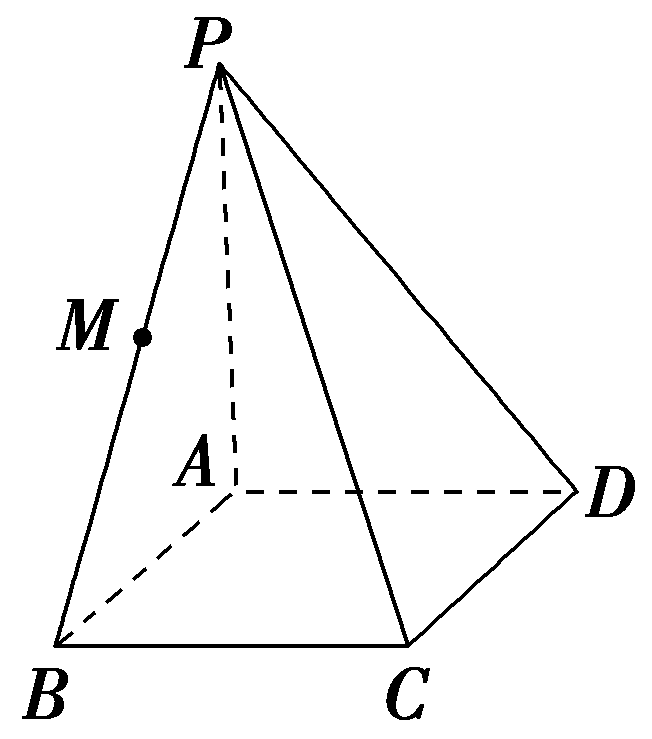

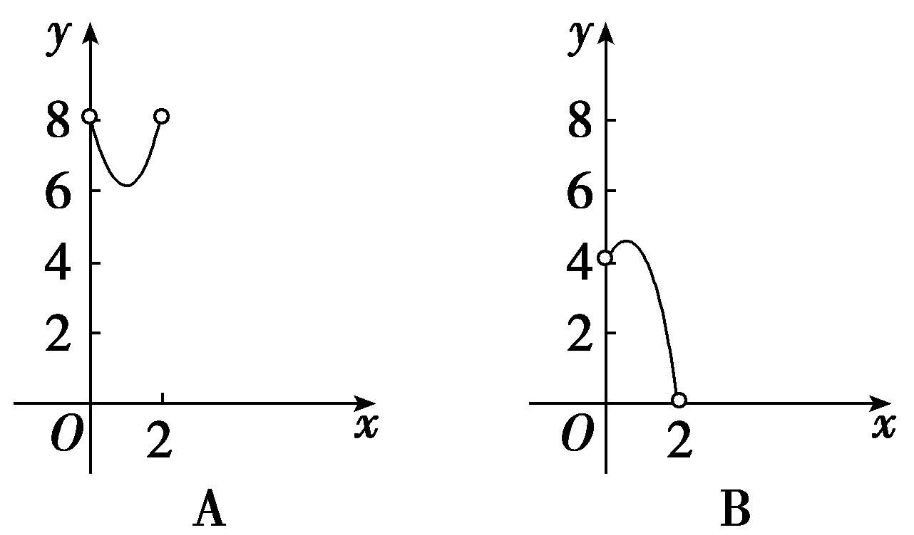

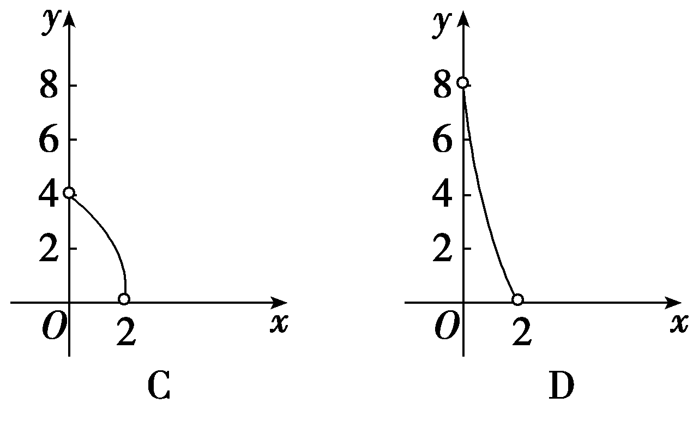

答案C

解析如图①，过<te*x*t style="italic">M</text>作*M<text style="italic"><text style="italic">N*</text></text>⊥*<text style="italic">AB*</text>，交AB于N，则*<text style="italic">MN*</text>⊥平面*AB<text style="italic">CD*</text>，过N作*N<text style="italic"><text style="italic">Q*</text></text>∥*AD*，交CD于Q，过Q作*Q<text style="italic">H*</text>∥*PD*，交*PC*于H，连接*MH*，则平面*MN<text style="italic">QH*</text>是所作的平面*α*，由题意得 $\frac{2－x}{2}$ ＝ $\frac{MN}{4}$ ，解得<te*x*t style="italic">M</text>*<text style="italic">N*</text>＝4－2x，由 $\frac{CQ}{CD}$ ＝ $\frac{QH}{PD}$ ，即 $\frac{2－x}{2}$ ＝ $\frac{QH}{2\sqrt{5}}$ ，解得<te*x*t style="italic">*Q*</text>*H*＝ $\sqrt{5}\left(2－x\right)$ ，

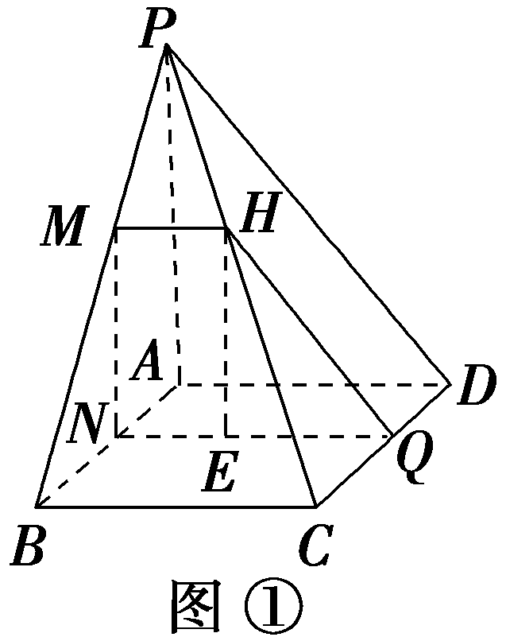

过&lt;te&lt;te&lt;te&lt;te&lt;te&lt;te&lt;te&lt;te<em>x</em>t st<em>y</em>le="italic"&gt;x&lt;/text&gt;t style="italic"&gt;x&lt;/text&gt;t style="italic"&gt;x&lt;/text&gt;t st<em>y</em>le="italic"&gt;x&lt;/text&gt;t style="italic"&gt;x&lt;/text&gt;t style="italic"&gt;x&lt;/text&gt;t style="italic"&gt;x&lt;/text&gt;t style="italic"&gt;H&lt;/text&gt;作<em>HE</em>⊥<em>NQ</em>，在Rt△<em>H&lt;text style="italic"&gt;EQ</em>&lt;/text&gt;中，EQ＝ $\sqrt{HQ^{2}－HE^{2}}$ ＝&lt;te&lt;te<em>x</em>t st<em>y</em>le="italic"&gt;x&lt;/text&gt;t style="superscript"&gt;2&lt;/text&gt;－&lt;te&lt;te&lt;te&lt;te&lt;te<em>x</em>t style="italic"&gt;x&lt;/text&gt;t st<em>y</em>le="italic"&gt;x&lt;/text&gt;t style="italic"&gt;x&lt;/text&gt;t style="italic"&gt;x&lt;/text&gt;t style="italic"&gt;x&lt;/text&gt;，所以<em>NE</em>＝2－(2－x)＝x，所以M<em>H</em>＝x.所以y＝<em>&lt;text style="italic"&gt;f</em>&lt;/text&gt;(x)＝ $\frac{\left(x+2\right)\left(4－2x\right)}{2}$ ＝－&lt;te&lt;te&lt;te&lt;te&lt;te&lt;te&lt;te<em>x</em>t st<em>y</em>le="italic"&gt;x&lt;/text&gt;t style="italic"&gt;x&lt;/text&gt;t style="italic"&gt;x&lt;/text&gt;t st<em>y</em>le="italic"&gt;x&lt;/text&gt;t style="italic"&gt;x&lt;/text&gt;t style="italic"&gt;x&lt;/text&gt;t style="italic"&gt;x&lt;/text&gt;2＋4(0＜x＜2).所以函数y＝<em>&lt;text style="italic"&gt;f</em>&lt;/text&gt;(x)的图象如图②.故选C.

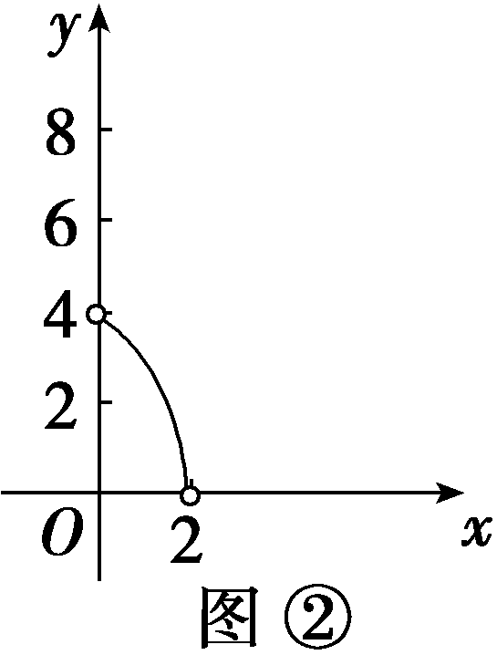

##### 5.(多选)设动点<em>P</em>在正方体<em>&lt;text style="italic"&gt;ABCD</em>&lt;/text&gt; -A&lt;text style="subscript"&gt;&lt;text style="subscript"&gt;&lt;text style="subscript"&gt;1&lt;/text&gt;&lt;/text&gt;&lt;/text&gt;B1C1D1上(含内部)，且 $\vec{D_{1}P}$ ＝<em>&lt;text style="italic"&gt;λ</em>&lt;/text&gt; $\vec{D_{1}B}$ ，当∠<em>APC</em>为锐角时，实数<em>&lt;text style="italic"&gt;λ</em>&lt;/text&gt;可能的取值是(　　)

$\quad$A. $\frac{1}{2}$ 	
$\quad$B. $\frac{1}{3}$

$\quad$C. $\frac{1}{4}$ 	
$\quad$D. $\frac{1}{5}$

答案CD

解析如图，设&lt;&lt;&lt;&lt;&lt;&lt;&lt;&lt;&lt;<em>t</em>ext style="italic"&gt;t&lt;/text&gt;ext style="italic"&gt;t&lt;/text&gt;ext style="italic"&gt;t&lt;/text&gt;ext style="italic"&gt;t&lt;/text&gt;ext style="italic"&gt;t&lt;/text&gt;ext style="italic"&gt;t&lt;/text&gt;ext style="italic"&gt;t&lt;/text&gt;e&lt;te<em>x</em>t style="italic"&gt;x&lt;/text&gt;t style="italic"&gt;t&lt;/text&gt;e<em>x</em>t style="italic"&gt;A<em>&lt;text style="italic"&gt;P</em>&lt;/text&gt;&lt;/text&gt;＝x，<em>&lt;text style="italic"&gt;D</em>&lt;/text&gt;&lt;text style="subscript"&gt;&lt;text style="subscript"&gt;&lt;text style="subscript"&gt;&lt;text style="subscript"&gt;&lt;text style="subscript"&gt;1&lt;/text&gt;&lt;/text&gt;&lt;/text&gt;&lt;/text&gt;&lt;/text&gt;P＝t，正方体的棱长为1，则<em>AC</em>＝ $\sqrt{2}$ ，在△&lt;&lt;&lt;&lt;&lt;&lt;&lt;&lt;&lt;<em>t</em>ext style="italic"&gt;t&lt;/text&gt;ext style="italic"&gt;t&lt;/text&gt;ext style="italic"&gt;t&lt;/text&gt;ext style="italic"&gt;t&lt;/text&gt;ext style="italic"&gt;t&lt;/text&gt;ext style="italic"&gt;t&lt;/text&gt;ext style="italic"&gt;t&lt;/text&gt;e&lt;te<em>x</em>t style="italic"&gt;x&lt;/text&gt;t style="italic"&gt;t&lt;/text&gt;e<em>x</em>t style="italic"&gt;A<em>&lt;text style="italic"&gt;P</em>&lt;/text&gt;&lt;/text&gt;C中，由余弦定理得cos∠<em>&lt;text style="italic"&gt;&lt;text style="italic"&gt;APC</em>&lt;/text&gt;&lt;/text&gt;＝ $\frac{x^{2}＋x^{2}－2}{2x^{2}}$ ＝ $\frac{x^{2}－1}{x^{2}}$ ，若∠&lt;&lt;&lt;&lt;&lt;&lt;&lt;&lt;&lt;<em>t</em>ext style="italic"&gt;t&lt;/text&gt;ext style="italic"&gt;t&lt;/text&gt;ext style="italic"&gt;t&lt;/text&gt;ext style="italic"&gt;t&lt;/text&gt;ext style="italic"&gt;t&lt;/text&gt;ext style="italic"&gt;t&lt;/text&gt;ext style="italic"&gt;t&lt;/text&gt;e&lt;te<em>x</em>t style="italic"&gt;x&lt;/text&gt;t style="italic"&gt;t&lt;/text&gt;e<em>x</em>t style="italic"&gt;A<em>&lt;text style="italic"&gt;P</em>&lt;/text&gt;&lt;/text&gt;C为锐角，则 $\frac{x^{2}－1}{x^{2}}$ ＞0，则&lt;&lt;&lt;&lt;&lt;&lt;&lt;&lt;&lt;<em>t</em>ext style="italic"&gt;t&lt;/text&gt;ext style="italic"&gt;t&lt;/text&gt;ext style="italic"&gt;t&lt;/text&gt;ext style="italic"&gt;t&lt;/text&gt;ext style="italic"&gt;t&lt;/text&gt;ext style="italic"&gt;t&lt;/text&gt;ext style="italic"&gt;t&lt;/text&gt;e&lt;te<em>x</em>t style="italic"&gt;x&lt;/text&gt;t style="italic"&gt;t&lt;/text&gt;ext style="italic"&gt;x&lt;/text&gt;&lt;text style="superscript"&gt;&lt;text style="superscript"&gt;&lt;text style="superscript"&gt;&lt;text style="superscript"&gt;2&lt;/text&gt;&lt;/text&gt;&lt;/text&gt;&lt;/text&gt;＞&lt;text style="subscript"&gt;&lt;text style="subscript"&gt;&lt;text style="subscript"&gt;&lt;text style="subscript"&gt;&lt;text style="subscript"&gt;1&lt;/text&gt;&lt;/text&gt;&lt;/text&gt;&lt;/text&gt;&lt;/text&gt;，在△A<em>&lt;text style="italic"&gt;D</em>&lt;/text&gt;1<em>&lt;text style="italic"&gt;&lt;text style="italic"&gt;B</em>&lt;/text&gt;&lt;/text&gt;中，<em>&lt;text style="italic"&gt;&lt;text style="italic"&gt;&lt;text style="italic"&gt;AD</em>&lt;/text&gt;&lt;/text&gt;&lt;/text&gt;1＝ $\sqrt{2}$ ，cos∠A&lt;&lt;&lt;&lt;&lt;&lt;&lt;&lt;&lt;<em>t</em>ext style="italic"&gt;t&lt;/text&gt;ext style="italic"&gt;t&lt;/text&gt;ext style="italic"&gt;t&lt;/text&gt;ext style="italic"&gt;t&lt;/text&gt;ext style="italic"&gt;t&lt;/text&gt;ext style="italic"&gt;t&lt;/text&gt;ext style="italic"&gt;t&lt;/text&gt;e&lt;te<em>x</em>t style="italic"&gt;x&lt;/text&gt;t style="italic"&gt;t&lt;/text&gt;ext style="italic"&gt;<em>D</em>&lt;/text&gt;&lt;text style="subscript"&gt;&lt;text style="subscript"&gt;&lt;text style="subscript"&gt;&lt;text style="subscript"&gt;&lt;text style="subscript"&gt;1&lt;/text&gt;&lt;/text&gt;&lt;/text&gt;&lt;/text&gt;&lt;/text&gt;<em>&lt;text style="italic"&gt;&lt;text style="italic"&gt;B</em>&lt;/text&gt;&lt;/text&gt;＝ $\frac{\left(\sqrt{2}\right)^{2}＋\left(\sqrt{3}\right)^{2}－1}{2\times \sqrt{2}\times \sqrt{3}}$ ＝ $\frac{\sqrt{6}}{3}$ ，在△A&lt;&lt;&lt;&lt;&lt;&lt;&lt;&lt;&lt;<em>t</em>ext style="italic"&gt;t&lt;/text&gt;ext style="italic"&gt;t&lt;/text&gt;ext style="italic"&gt;t&lt;/text&gt;ext style="italic"&gt;t&lt;/text&gt;ext style="italic"&gt;t&lt;/text&gt;ext style="italic"&gt;t&lt;/text&gt;ext style="italic"&gt;t&lt;/text&gt;e&lt;te<em>x</em>t style="italic"&gt;x&lt;/text&gt;t style="italic"&gt;t&lt;/text&gt;ext style="italic"&gt;<em>D</em>&lt;/text&gt;&lt;text style="subscript"&gt;&lt;text style="subscript"&gt;&lt;text style="subscript"&gt;&lt;text style="subscript"&gt;&lt;text style="subscript"&gt;1&lt;/text&gt;&lt;/text&gt;&lt;/text&gt;&lt;/text&gt;&lt;/text&gt;<em>&lt;text style="italic"&gt;P</em>&lt;/text&gt;中，由余弦定理得<em>x</em>&lt;text style="superscript"&gt;&lt;text style="superscript"&gt;&lt;text style="superscript"&gt;&lt;text style="superscript"&gt;2&lt;/text&gt;&lt;/text&gt;&lt;/text&gt;&lt;/text&gt;＝2＋t2－2× $\sqrt{2}$ ×&lt;&lt;&lt;&lt;&lt;&lt;&lt;&lt;<em>t</em>ext style="italic"&gt;t&lt;/text&gt;ext style="italic"&gt;t&lt;/text&gt;ext style="italic"&gt;t&lt;/text&gt;ext style="italic"&gt;t&lt;/text&gt;ext style="italic"&gt;t&lt;/text&gt;ext style="italic"&gt;t&lt;/text&gt;ext style="italic"&gt;t&lt;/text&gt;e&lt;te<em>x</em>t style="italic"&gt;x&lt;/text&gt;t style="italic"&gt;t&lt;/text&gt;× $\frac{\sqrt{6}}{3}$ ，于是&lt;&lt;&lt;&lt;&lt;&lt;&lt;&lt;<em>t</em>ext style="italic"&gt;t&lt;/text&gt;ext style="italic"&gt;t&lt;/text&gt;ext style="italic"&gt;t&lt;/text&gt;ext style="italic"&gt;t&lt;/text&gt;ext style="italic"&gt;t&lt;/text&gt;ext style="italic"&gt;t&lt;/text&gt;ext style="italic"&gt;t&lt;/text&gt;e<em>x</em>t style="superscript"&gt;&lt;text style="superscript"&gt;&lt;text style="superscript"&gt;&lt;text style="superscript"&gt;2&lt;/text&gt;&lt;/text&gt;&lt;/text&gt;&lt;/text&gt;＋&lt;te<em>x</em>t style="italic"&gt;t&lt;/text&gt;2－2× $\sqrt{2}$ ×&lt;&lt;&lt;&lt;&lt;&lt;&lt;&lt;<em>t</em>ext style="italic"&gt;t&lt;/text&gt;ext style="italic"&gt;t&lt;/text&gt;ext style="italic"&gt;t&lt;/text&gt;ext style="italic"&gt;t&lt;/text&gt;ext style="italic"&gt;t&lt;/text&gt;ext style="italic"&gt;t&lt;/text&gt;ext style="italic"&gt;t&lt;/text&gt;e&lt;te<em>x</em>t style="italic"&gt;x&lt;/text&gt;t style="italic"&gt;t&lt;/text&gt;× $\frac{\sqrt{6}}{3}$ ＞&lt;&lt;&lt;&lt;&lt;&lt;&lt;&lt;&lt;<em>t</em>ext style="italic"&gt;t&lt;/text&gt;ext style="italic"&gt;t&lt;/text&gt;ext style="italic"&gt;t&lt;/text&gt;ext style="italic"&gt;t&lt;/text&gt;ext style="italic"&gt;t&lt;/text&gt;ext style="italic"&gt;t&lt;/text&gt;ext style="italic"&gt;t&lt;/text&gt;e&lt;te<em>x</em>t style="italic"&gt;x&lt;/text&gt;t style="italic"&gt;t&lt;/text&gt;ext style="subscript"&gt;&lt;text style="subscript"&gt;&lt;text style="subscript"&gt;&lt;text style="subscript"&gt;&lt;text style="subscript"&gt;1&lt;/text&gt;&lt;/text&gt;&lt;/text&gt;&lt;/text&gt;&lt;/text&gt;，即3t&lt;text style="superscript"&gt;&lt;text style="superscript"&gt;&lt;text style="superscript"&gt;&lt;text style="superscript"&gt;2&lt;/text&gt;&lt;/text&gt;&lt;/text&gt;&lt;/text&gt;－4 $\sqrt{3}$ &lt;&lt;&lt;&lt;&lt;&lt;&lt;&lt;<em>t</em>ext style="italic"&gt;t&lt;/text&gt;ext style="italic"&gt;t&lt;/text&gt;ext style="italic"&gt;t&lt;/text&gt;ext style="italic"&gt;t&lt;/text&gt;ext style="italic"&gt;t&lt;/text&gt;ext style="italic"&gt;t&lt;/text&gt;ext style="italic"&gt;t&lt;/text&gt;e&lt;te<em>x</em>t style="italic"&gt;x&lt;/text&gt;t style="italic"&gt;t&lt;/text&gt;＋3＞0，解得t＞ $\sqrt{3}$ 或&lt;&lt;&lt;&lt;&lt;&lt;&lt;&lt;<em>t</em>ext style="italic"&gt;t&lt;/text&gt;ext style="italic"&gt;t&lt;/text&gt;ext style="italic"&gt;t&lt;/text&gt;ext style="italic"&gt;t&lt;/text&gt;ext style="italic"&gt;t&lt;/text&gt;ext style="italic"&gt;t&lt;/text&gt;ext style="italic"&gt;t&lt;/text&gt;e&lt;te<em>x</em>t style="italic"&gt;x&lt;/text&gt;t style="italic"&gt;t&lt;/text&gt;＜ $\frac{\sqrt{3}}{3}$ ，由&lt;&lt;&lt;&lt;&lt;&lt;&lt;&lt;&lt;<em>t</em>ext style="italic"&gt;t&lt;/text&gt;ext style="italic"&gt;t&lt;/text&gt;ext style="italic"&gt;t&lt;/text&gt;ext style="italic"&gt;t&lt;/text&gt;ext style="italic"&gt;t&lt;/text&gt;ext style="italic"&gt;t&lt;/text&gt;ext style="italic"&gt;t&lt;/text&gt;e&lt;te<em>x</em>t style="italic"&gt;x&lt;/text&gt;t style="italic"&gt;t&lt;/text&gt;ext style="italic"&gt;<em>D</em>&lt;/text&gt;&lt;text style="subscript"&gt;&lt;text style="subscript"&gt;&lt;text style="subscript"&gt;&lt;text style="subscript"&gt;&lt;text style="subscript"&gt;1&lt;/text&gt;&lt;/text&gt;&lt;/text&gt;&lt;/text&gt;&lt;/text&gt;<em>&lt;text style="italic"&gt;&lt;text style="italic"&gt;B</em>&lt;/text&gt;&lt;/text&gt;＝ $\sqrt{3}$ ，得<em>&lt;text style="italic"&gt;&lt;text style="italic"&gt;λ</em>&lt;/text&gt;&lt;/text&gt;＝ $\frac{t}{\sqrt{3}}$ ，故<em>&lt;text style="italic"&gt;&lt;text style="italic"&gt;λ</em>&lt;/text&gt;&lt;/text&gt;＞&lt;&lt;&lt;&lt;&lt;&lt;&lt;&lt;&lt;<em>t</em>ext style="italic"&gt;t&lt;/text&gt;ext style="italic"&gt;t&lt;/text&gt;ext style="italic"&gt;t&lt;/text&gt;ext style="italic"&gt;t&lt;/text&gt;ext style="italic"&gt;t&lt;/text&gt;ext style="italic"&gt;t&lt;/text&gt;ext style="italic"&gt;t&lt;/text&gt;e&lt;te<em>x</em>t style="italic"&gt;x&lt;/text&gt;t style="italic"&gt;t&lt;/text&gt;ext style="subscript"&gt;&lt;text style="subscript"&gt;&lt;text style="subscript"&gt;&lt;text style="subscript"&gt;&lt;text style="subscript"&gt;1&lt;/text&gt;&lt;/text&gt;&lt;/text&gt;&lt;/text&gt;&lt;/text&gt;(舍去)或0＜λ＜ $\frac{1}{3}$ .故选C&lt;&lt;&lt;&lt;&lt;&lt;&lt;&lt;&lt;<em>t</em>ext style="italic"&gt;t&lt;/text&gt;ext style="italic"&gt;t&lt;/text&gt;ext style="italic"&gt;t&lt;/text&gt;ext style="italic"&gt;t&lt;/text&gt;ext style="italic"&gt;t&lt;/text&gt;ext style="italic"&gt;t&lt;/text&gt;ext style="italic"&gt;t&lt;/text&gt;e&lt;te<em>x</em>t style="italic"&gt;x&lt;/text&gt;t style="italic"&gt;t&lt;/text&gt;ext style="italic"&gt;<em>D</em>&lt;/text&gt;.

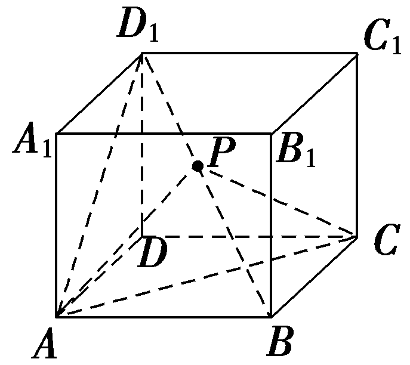

##### 6.(多选)如图，在棱长为1的正方体<em>ABCD</em> -<em>A</em>1<em>B</em>1<em>C</em>1<em>D</em>1中，<em>M</em>，<em>N</em>分别为<em>BD</em>1，<em>B</em>1<em>C</em>1的中点，点<em>P</em>在正方体的表面上运动，且满足<em>MP</em>⊥<em>CN</em>.下列说法中正确的是(　　)

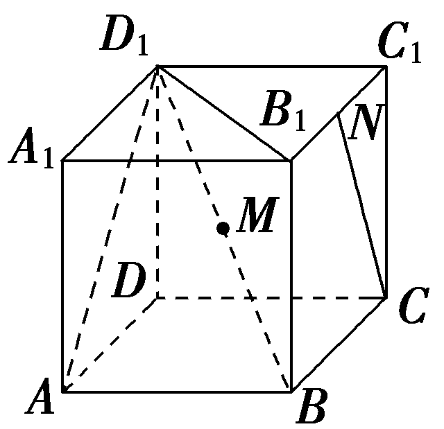

$\quad$A.点<em>P</em>可以是棱<em>BB</em>1的中点

$\quad$B.线段*MP*的最大值为 $\frac{3}{4}$

$\quad$C.点*P*的轨迹是正方形

$\quad$D.点*P*的轨迹长度为2＋ $\sqrt{5}$

答案BD

解析在正方体&lt;te&lt;te&lt;text st<em>y</em>le="italic"&gt;x&lt;/text&gt;t st<em>y</em>le="italic"&gt;x&lt;/text&gt;t style="italic"&gt;<em>A&lt;text style="italic"&gt;&lt;text style="italic"&gt;B</em>&lt;/text&gt;&lt;/text&gt;<em>&lt;text style="italic"&gt;&lt;text style="italic"&gt;C</em>&lt;/text&gt;&lt;/text&gt;<em>&lt;text style="italic"&gt;&lt;text style="italic"&gt;D</em>&lt;/text&gt;&lt;/text&gt;&lt;/text&gt; -A&lt;text style="subscript"&gt;&lt;text style="subscript"&gt;&lt;text style="subscript"&gt;&lt;text style="subscript"&gt;&lt;text style="subscript"&gt;&lt;text style="subscript"&gt;&lt;text style="subscript"&gt;&lt;text style="subscript"&gt;1&lt;/text&gt;&lt;/text&gt;&lt;/text&gt;&lt;/text&gt;&lt;/text&gt;&lt;/text&gt;&lt;/text&gt;&lt;/text&gt;B1C1D1中，以D为坐标原点，<em>DA</em>所在直线为x轴，<em>DC</em>所在直线为y轴，<em>DD</em>1所在直线为<em>&lt;text style="italic"&gt;&lt;text style="italic"&gt;z</em>&lt;/text&gt;&lt;/text&gt;轴，建立如图所示的空间直角坐标系，因为该正方体的棱长为1，<em>&lt;text style="italic"&gt;M</em>&lt;/text&gt;，<em>&lt;text style="italic"&gt;N</em>&lt;/text&gt;分别为<em>BD</em>1，B1C1的中点，所以D1(0，0，1)，B(1，1，0)，M $\left(\frac{1}{2}，\frac{1}{2}，\frac{1}{2}\right)$ ，&lt;te&lt;text st<em>y</em>le="italic"&gt;x&lt;/text&gt;t style="italic"&gt;<em>N</em>&lt;/text&gt;( $\frac{1}{2}$ ，&lt;te&lt;te&lt;text st<em>y</em>le="italic"&gt;x&lt;/text&gt;t st<em>y</em>le="italic"&gt;x&lt;/text&gt;t style="subscript"&gt;&lt;text style="subscript"&gt;&lt;text style="subscript"&gt;&lt;text style="subscript"&gt;&lt;text style="subscript"&gt;&lt;text style="subscript"&gt;&lt;text style="subscript"&gt;&lt;text style="subscript"&gt;1&lt;/text&gt;&lt;/text&gt;&lt;/text&gt;&lt;/text&gt;&lt;/text&gt;&lt;/text&gt;&lt;/text&gt;&lt;/text&gt;，1)，<em>&lt;text style="italic"&gt;&lt;text style="italic"&gt;C</em>&lt;/text&gt;&lt;/text&gt;(0，1，0)，所以 $\vec{CN}$ ＝ $\left(\frac{1}{2}，0，1\right)$ ，设&lt;te&lt;text st<em>y</em>le="italic"&gt;x&lt;/text&gt;t style="italic"&gt;P&lt;/text&gt;(&lt;text st<em>y</em>le="italic"&gt;x&lt;/text&gt;，y，<em>&lt;text style="italic"&gt;&lt;text style="italic"&gt;z</em>&lt;/text&gt;&lt;/text&gt;)，则 $\vec{MP}$ ＝ $\left(x－\frac{1}{2}，y－\frac{1}{2}，z－\frac{1}{2}\right)$ ，因为&lt;te&lt;text st<em>y</em>le="italic"&gt;x&lt;/text&gt;t style="italic"&gt;<em>M</em>&lt;/text&gt;<em>P</em>⊥&lt;te&lt;text st<em>y</em>le="italic"&gt;x&lt;/text&gt;t style="italic"&gt;<em>&lt;text style="italic"&gt;C</em>&lt;/text&gt;&lt;/text&gt;<em>&lt;text style="italic"&gt;N</em>&lt;/text&gt;，所以 $\frac{1}{2}\left(x－\frac{1}{2}\right)$ ＋&lt;te&lt;text st<em>y</em>le="italic"&gt;x&lt;/text&gt;t style="italic"&gt;<em>&lt;text style="italic"&gt;z</em>&lt;/text&gt;&lt;/text&gt;－ $\frac{1}{2}$ ＝0，

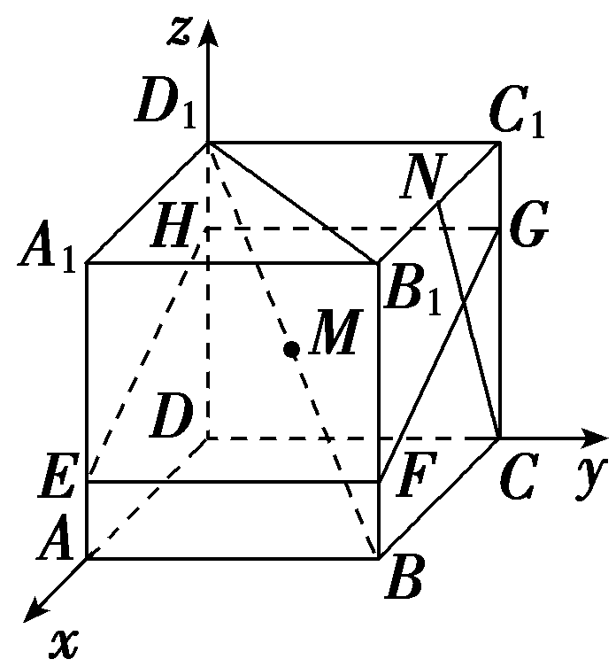

即2&lt;te&lt;te<em>x</em>t style="italic"&gt;x&lt;/text&gt;t style="italic"&gt;x&lt;/text&gt;＋4<em>&lt;text style="italic"&gt;&lt;text style="italic"&gt;z</em>&lt;/text&gt;&lt;/text&gt;－3＝0，当x＝1时，z＝ $\frac{1}{4}$ ，当&lt;te&lt;te<em>x</em>t style="italic"&gt;x&lt;/text&gt;t style="italic"&gt;x&lt;/text&gt;＝0时，<em>&lt;text style="italic"&gt;&lt;text style="italic"&gt;z</em>&lt;/text&gt;&lt;/text&gt;＝ $\frac{3}{4}$ ，取<em>E</em>( 1，0， $\frac{1}{4}$ )，<em>F</em>( 1，1， $\frac{1}{4}$ )，<em>G</em>( 0，1， $\frac{3}{4}$ )，<em>H</em>( 0，0， $\frac{3}{4}$ )，连接<em>EF</em>，F<em>G</em>，G<em>H</em>，<em>HE</em>，则 $\vec{EF}$ ＝ $\vec{HG}$ ＝(0，1，0)， $\vec{EH}$ ＝ $\vec{FG}$ ＝ $\left(－1，0，\frac{1}{2}\right)$ ，所以四边形<em>EFGH</em>为矩形，又 $\vec{EF}$ <em>·</em> $\vec{CN}$ ＝0， $\vec{EH}$ <em>·</em> $\vec{CN}$ ＝0，即<em>EF</em>⊥<em>&lt;text style="italic"&gt;&lt;text style="italic"&gt;&lt;text style="italic"&gt;CN</em>&lt;/text&gt;&lt;/text&gt;&lt;/text&gt;，E<em>H</em>⊥CN，又<em>&lt;text style="italic"&gt;&lt;text style="italic"&gt;&lt;text style="italic"&gt;&lt;text style="italic"&gt;EF</em>&lt;/text&gt;&lt;/text&gt;&lt;/text&gt;&lt;/text&gt;和<em>&lt;text style="italic"&gt;&lt;text style="italic"&gt;&lt;text style="italic"&gt;EH</em>&lt;/text&gt;&lt;/text&gt;&lt;/text&gt;为平面EF<em>G</em>H中的两条相交直线，所以CN⊥平面E<em>&lt;text style="italic"&gt;FG</em>&lt;/text&gt;H，又 $\vec{EM}$ ＝ $\left(－\frac{1}{2}，\frac{1}{2}，\frac{1}{4}\right)$ ， $\vec{MG}$ ＝ $\left(－\frac{1}{2}，\frac{1}{2}，\frac{1}{4}\right)$ ，所以<em>&lt;text style="italic"&gt;M</em>&lt;/text&gt;为<em>EG</em>的中点，则M∈平面E<em>F</em>G<em>H</em>，为使<em>M&lt;text style="italic"&gt;&lt;text style="italic"&gt;&lt;text style="italic"&gt;&lt;text style="italic"&gt;&lt;text style="italic"&gt;&lt;text style="italic"&gt;&lt;text style="italic"&gt;P</em>&lt;/text&gt;&lt;/text&gt;&lt;/text&gt;&lt;/text&gt;&lt;/text&gt;&lt;/text&gt;&lt;/text&gt;⊥<em>&lt;text style="italic"&gt;&lt;text style="italic"&gt;&lt;text style="italic"&gt;CN</em>&lt;/text&gt;&lt;/text&gt;&lt;/text&gt;，必有点P∈平面<em>&lt;text style="italic"&gt;&lt;text style="italic"&gt;&lt;text style="italic"&gt;&lt;text style="italic"&gt;EF</em>&lt;/text&gt;&lt;/text&gt;&lt;/text&gt;&lt;/text&gt;<em>&lt;text style="italic"&gt;GH</em>&lt;/text&gt;.又点P在正方体表面上运动，所以点P的轨迹为四边形E<em>&lt;text style="italic"&gt;FG</em>&lt;/text&gt;H，所以点P不可能是棱<em>BB</em>1的中点.故A错误；又EF＝GH＝1，<em>&lt;text style="italic"&gt;&lt;text style="italic"&gt;&lt;text style="italic"&gt;EH</em>&lt;/text&gt;&lt;/text&gt;&lt;/text&gt;＝FG＝ $\frac{\sqrt{5}}{2}$ ，所以<em>EF</em>≠E<em>H</em>，则点<em>&lt;text style="italic"&gt;&lt;text style="italic"&gt;&lt;text style="italic"&gt;&lt;text style="italic"&gt;&lt;text style="italic"&gt;&lt;text style="italic"&gt;P</em>&lt;/text&gt;&lt;/text&gt;&lt;/text&gt;&lt;/text&gt;&lt;/text&gt;&lt;/text&gt;的轨迹是矩形不是正方形，且矩形<em>&lt;text style="italic"&gt;&lt;text style="italic"&gt;&lt;text style="italic"&gt;&lt;text style="italic"&gt;EF</em>&lt;/text&gt;&lt;/text&gt;&lt;/text&gt;&lt;/text&gt;<em>G</em>H的周长为2＋2× $\frac{\sqrt{5}}{2}$ ＝2＋ $\sqrt{5}$ ，故C错误，D正确；因为点<em>&lt;text style="italic"&gt;&lt;text style="italic"&gt;&lt;text style="italic"&gt;&lt;text style="italic"&gt;&lt;text style="italic"&gt;&lt;text style="italic"&gt;P</em>&lt;/text&gt;&lt;/text&gt;&lt;/text&gt;&lt;/text&gt;&lt;/text&gt;&lt;/text&gt;的轨迹为矩形<em>EFGH</em>，所以当点P在矩形的四个端点时，<em>&lt;text style="italic"&gt;M</em>&lt;/text&gt;P取得最大值，且<em>&lt;text style="italic"&gt;&lt;text style="italic"&gt;MP</em>&lt;/text&gt;&lt;/text&gt;的最大值为 $\frac{3}{4}$ ，故B正确.故选BD.

##### 7.如图所示，正方体<em>ABCD</em> -<em>A</em>1<em>B</em>1<em>C</em>1<em>D</em>1的棱长为2，<em>E</em>，<em>F</em>分别为<em>AA</em>1，<em>AB</em>的中点，<em>M</em>点是正方形<em>ABB</em>1<em>A</em>1内的动点，若<em>C</em>1<em>M</em>∥平面<em>CD</em>1<em>EF</em>，则<em>M</em>点的轨迹长度为<u>　　　　</u>.

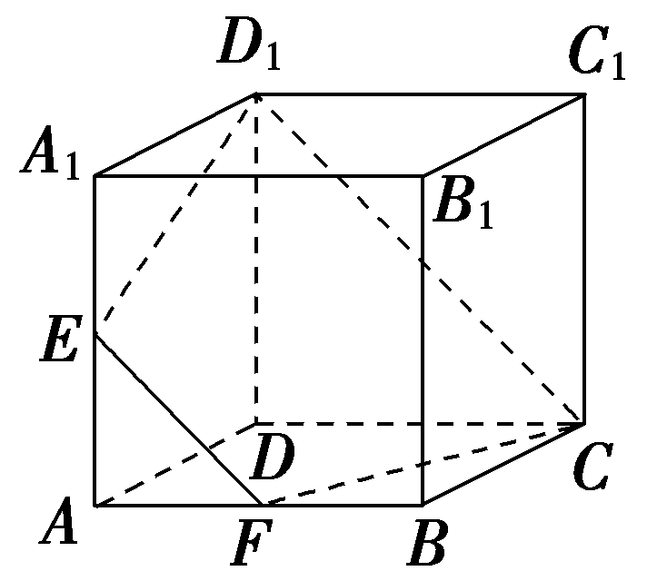

答案 $\sqrt{2}$

解析如图所示，取<em>&lt;text style="italic"&gt;A</em>&lt;/text&gt;&lt;text style="subscript"&gt;&lt;text style="subscript"&gt;&lt;text style="subscript"&gt;&lt;text style="subscript"&gt;&lt;text style="subscript"&gt;&lt;text style="subscript"&gt;&lt;text style="subscript"&gt;&lt;text style="subscript"&gt;&lt;text style="subscript"&gt;&lt;text style="subscript"&gt;&lt;text style="subscript"&gt;&lt;text style="subscript"&gt;&lt;text style="subscript"&gt;&lt;text style="subscript"&gt;&lt;text style="subscript"&gt;&lt;text style="subscript"&gt;&lt;text style="subscript"&gt;&lt;text style="subscript"&gt;&lt;text style="subscript"&gt;&lt;text style="subscript"&gt;&lt;text style="subscript"&gt;&lt;text style="subscript"&gt;&lt;text style="subscript"&gt;&lt;text style="subscript"&gt;&lt;text style="subscript"&gt;&lt;text style="subscript"&gt;&lt;text style="subscript"&gt;&lt;text style="subscript"&gt;&lt;text style="subscript"&gt;1&lt;/text&gt;&lt;/text&gt;&lt;/text&gt;&lt;/text&gt;&lt;/text&gt;&lt;/text&gt;&lt;/text&gt;&lt;/text&gt;&lt;/text&gt;&lt;/text&gt;&lt;/text&gt;&lt;/text&gt;&lt;/text&gt;&lt;/text&gt;&lt;/text&gt;&lt;/text&gt;&lt;/text&gt;&lt;/text&gt;&lt;/text&gt;&lt;/text&gt;&lt;/text&gt;&lt;/text&gt;&lt;/text&gt;&lt;/text&gt;&lt;/text&gt;&lt;/text&gt;&lt;/text&gt;&lt;/text&gt;&lt;/text&gt;<em>&lt;text style="italic"&gt;&lt;text style="italic"&gt;B</em>&lt;/text&gt;&lt;/text&gt;1的中点<em>&lt;text style="italic"&gt;&lt;text style="italic"&gt;&lt;text style="italic"&gt;&lt;text style="italic"&gt;&lt;text style="italic"&gt;H</em>&lt;/text&gt;&lt;/text&gt;&lt;/text&gt;&lt;/text&gt;&lt;/text&gt;，B1B的中点<em>&lt;text style="italic"&gt;&lt;text style="italic"&gt;&lt;text style="italic"&gt;&lt;text style="italic"&gt;&lt;text style="italic"&gt;&lt;text style="italic"&gt;G</em>&lt;/text&gt;&lt;/text&gt;&lt;/text&gt;&lt;/text&gt;&lt;/text&gt;&lt;/text&gt;，连接<em>&lt;text style="italic"&gt;&lt;text style="italic"&gt;&lt;text style="italic"&gt;&lt;text style="italic"&gt;GH</em>&lt;/text&gt;&lt;/text&gt;&lt;/text&gt;&lt;/text&gt;，<em>&lt;text style="italic"&gt;&lt;text style="italic"&gt;&lt;text style="italic"&gt;&lt;text style="italic"&gt;&lt;text style="italic"&gt;&lt;text style="italic"&gt;&lt;text style="italic"&gt;&lt;text style="italic"&gt;&lt;text style="italic"&gt;&lt;text style="italic"&gt;&lt;text style="italic"&gt;&lt;text style="italic"&gt;&lt;text style="italic"&gt;&lt;text style="italic"&gt;C</em>&lt;/text&gt;&lt;/text&gt;&lt;/text&gt;&lt;/text&gt;&lt;/text&gt;&lt;/text&gt;&lt;/text&gt;&lt;/text&gt;&lt;/text&gt;&lt;/text&gt;&lt;/text&gt;&lt;/text&gt;&lt;/text&gt;&lt;/text&gt;1H，C1G，<em>&lt;text style="italic"&gt;&lt;text style="italic"&gt;E</em>&lt;/text&gt;G&lt;/text&gt;，<em>HF</em>，可得四边形<em>EGC</em>1<em>&lt;text style="italic"&gt;&lt;text style="italic"&gt;D</em>&lt;/text&gt;&lt;/text&gt;1是平行四边形，所以C1G∥D1E，又C1G⊄平面<em>&lt;text style="italic"&gt;&lt;text style="italic"&gt;&lt;text style="italic"&gt;&lt;text style="italic"&gt;&lt;text style="italic"&gt;CD</em>&lt;/text&gt;&lt;/text&gt;&lt;/text&gt;&lt;/text&gt;&lt;/text&gt;1<em>&lt;text style="italic"&gt;&lt;text style="italic"&gt;&lt;text style="italic"&gt;&lt;text style="italic"&gt;&lt;text style="italic"&gt;EF</em>&lt;/text&gt;&lt;/text&gt;&lt;/text&gt;&lt;/text&gt;&lt;/text&gt;，D1E⊂平面CD1EF，所以C1G∥平面CD1EF.同理可得C1H∥<em>CF</em>，C1H∥平面CD1EF.因为C1H∩C1G＝C1，C1H，C1G⊂平面C1GH，所以平面C1GH∥平面CD1EF.由<em>&lt;text style="italic"&gt;&lt;text style="italic"&gt;&lt;text style="italic"&gt;M</em>&lt;/text&gt;&lt;/text&gt;&lt;/text&gt;点是正方形<em>ABB</em>1A1内的动点可知，若C1M∥平面CD1EF，则点M在线段GH上，所以M点的轨迹长度GH＝ $\sqrt{1^{2}＋1^{2}}$ ＝ $\sqrt{2}$ .

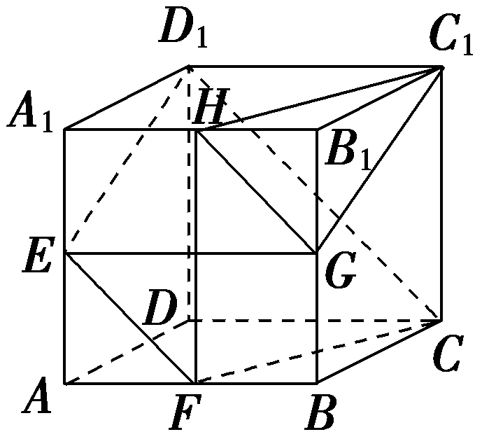

##### 8.在三棱锥<em>P</em>-<em>ABC</em>中，<em>PA</em>，<em>AB</em>，<em>AC</em>两两垂直，<em>D</em>为棱<em>PC</em>上一动点，<em>PA</em>＝<em>AC</em>＝2，<em>AB</em>＝3.当<em>BD</em>与平面<em>PAC</em>所成角最大时，<em>AD</em>与平面<em>PBC</em>所成角的正弦值为<u>　　　　</u>.

答案 $\frac{3\sqrt{11}}{11}$

解析因为在三棱锥<te<text st*y*le="italic">x</text>t style="italic">P</text>-*<text style="italic"><text style="italic"><text style="italic">A*B</text></text>C</text>中，*PA*，*AB*，*<text style="italic">AC*</text>两两垂直，所以AB⊥平面*<text style="italic"><text style="italic">PAC*</text></text>，则*B<text style="italic">D*</text>与平面PAC所成的角为∠*<text style="italic"><text style="italic"><text style="italic">AD*</text>B</text></text>，tan∠*ADB*＝ $\frac{AB}{AD}$ ＝ $\frac{3}{AD}$ ，当<te<text st*y*le="italic">x</text>t style="italic">*AD*</text>取得最小值时，∠*<text style="italic"><text style="italic"><text style="italic">AD*B</text></text></text>取得最大值.在等腰Rt△*P<text style="italic">AC*</text>中，当D为*PC*的中点时，AD取得最小值.以A为坐标原点，*<text style="italic"><text style="italic">AB*</text></text>，AC，*AP*所在直线分别为x轴，y轴，*z*轴，建立如图所示的空间直角坐标系，

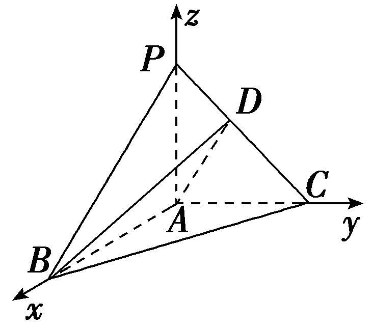

则&lt;te&lt;text st<em>y</em>le="italic"&gt;x&lt;/text&gt;t style="italic"&gt;A&lt;/text&gt;(0，0，0)，<em>B</em>(3，0，0)，<em>C</em>(0，2，0)，<em>P</em>(0，0，2)，<em>D</em>(0，1，1)，则 $\vec{AD}$ ＝ $\left(0，1，1\right)$ ， $\vec{PC}$ ＝ $\left(0，2,-2\right)$ ， $\vec{BC}$ ＝ $\left(－3，2，0\right)$ .设平面&lt;te&lt;text st<em>y</em>le="italic"&gt;x&lt;/text&gt;t style="italic"&gt;P&lt;/text&gt;<em>BC</em>的法向量为<em><strong>n</strong></em>＝(x，y，<em>z</em>)，

则 $\left\{\begin{matrix}n\cdot \vec{PC}=0，\\n\cdot \vec{BC}=0，\end{matrix}\right.$ 即 $\left\{\begin{matrix}2y－2z=0，\\－3x+2y=0，\end{matrix}\right.$ 令<em>y</em>＝3，得<em><strong>&lt;text style="bold,italic"&gt;n</strong></em>&lt;/text&gt;＝(2，3，3).因为cos＜n， $\vec{AD}$ ＞＝ $\frac{n\cdot \vec{AD}}{｜n||\vec{AD}｜}$ ＝ $\frac{3+3}{\sqrt{22}\times \sqrt{2}}$ ＝ $\frac{3\sqrt{11}}{11}$ ，所以当<em>BD</em>与平面<em>PAC</em>所成角最大时，<em>AD</em>与平面<em>PBC</em>所成角的正弦值为 $\frac{3\sqrt{11}}{11}$ .

##### 9.(13分)如图所示，在四棱台<em>ABCD</em> -<em>A</em>1<em>B</em>1<em>C</em>1<em>D</em>1中，底面<em>ABCD</em>是菱形，<em>AA</em>1⊥平面<em>ABCD</em>.

（1）证明：<em>BD</em>⊥<em>CC</em>1；(5分)

（2）若<em>&lt;text style="italic"&gt;AB</em>&lt;/text&gt;＝2，<em>AA</em>&lt;text style="subscript"&gt;&lt;text style="subscript"&gt;&lt;text style="subscript"&gt;&lt;text style="subscript"&gt;1&lt;/text&gt;&lt;/text&gt;&lt;/text&gt;&lt;/text&gt;＝ $\sqrt{3}$ ，<em>A</em>&lt;text style="subscript"&gt;&lt;text style="subscript"&gt;&lt;text style="subscript"&gt;&lt;text style="subscript"&gt;1&lt;/text&gt;&lt;/text&gt;&lt;/text&gt;&lt;/text&gt;<em>B</em>1＝1，∠<em>AB</em>C＝60°，棱<em>BC</em>上是否存在一点<em>&lt;text style="italic"&gt;P</em>&lt;/text&gt;，使得平面<em>AD</em>1P与平面<em>ADD</em>1的夹角余弦值为 $\frac{\sqrt{17}}{17}$ .若存在，求线段C<em>&lt;text style="italic"&gt;P</em>&lt;/text&gt;的长；若不存在，请说明理由.(8分)

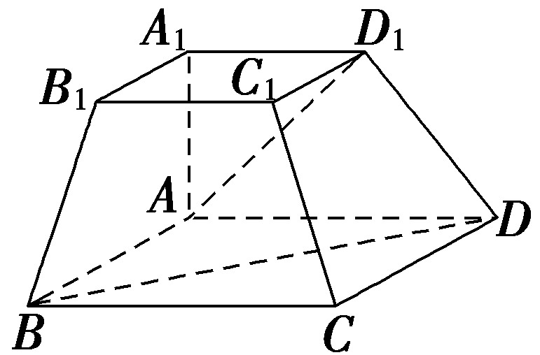

解：（1）证明：连接*AC*，因为底面*ABCD*是菱形，所以*BD*⊥*AC*，

又<em>AA</em>1⊥平面<em>ABCD</em>，<em>BD</em>⊂平面<em>ABCD</em>，所以<em>BD</em>⊥<em>AA</em>1；

又<em>AC</em>∩<em>AA</em>1＝<em>A</em>，<em>AC</em>，<em>AA</em>1⊂平面<em>A</em>1<em>AC</em>，所以<em>BD</em>⊥平面<em>A</em>1<em>AC</em>.

因为四棱台<em>ABCD</em> -<em>A</em>1<em>B</em>1<em>C</em>1<em>D</em>1中，<em>AA</em>1，<em>CC</em>1延长线交于一点，

所以<em>A</em>1，<em>C</em>1，<em>C</em>，<em>A</em>四点共面，<em>CC</em>1⊂平面<em>A</em>1<em>AC</em>，所以<em>BD</em>⊥<em>CC</em>1.

（2）由(1)知，建立如图所示空间直角坐标系<em>&lt;text style="italic"&gt;A</em>&lt;/text&gt;-<em>xyz</em>，则A(0，0，0)，<em>&lt;text style="italic"&gt;D</em>&lt;/text&gt;(0，2，0)，D1(0，1， $\sqrt{3}$ )，

若存在点<text st<text st*y*le="italic">y</text>le="italic">*P*</text>满足题意，则设P( $\sqrt{3}$ ，<text st*y*le="italic">y</text>，0)，y∈[－1，1].

易知平面<em>AD</em>1<em>D</em>的一个法向量<em><strong>n</strong></em>＝(1，0，0)

设平面<em>AD</em>1<em>P</em>的法向量<em><strong>m</strong></em>＝(<em>x</em>0，<em>y</em>0，<em>z</em>0).

$\vec{AD_{1}}$ ＝(0，1， $\sqrt{3}$ )， $\vec{AP}$ ＝( $\sqrt{3}$ ，*y*，0)

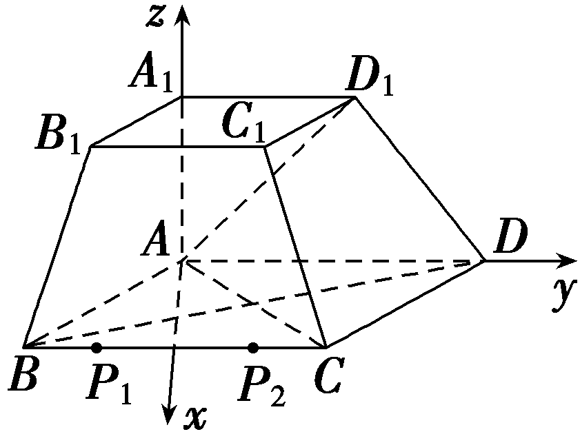

则 $\left\{\begin{matrix}m\cdot \vec{AD_{1}}=0，\\m\cdot \vec{AP}=0.\end{matrix}\right.$ 则 $\left\{\begin{matrix}y_{0}＋\sqrt{3}z_{0}=0，\\\sqrt{3}x_{0}＋y\cdot y_{0}=0.\end{matrix}\right.$ 令&lt;te&lt;text st&lt;text st<em>y</em>le="italic"&gt;y&lt;/text&gt;le="italic"&gt;x&lt;/text&gt;t style="italic"&gt;y&lt;/text&gt;&lt;text style="subscript"&gt;&lt;text style="subscript"&gt;0&lt;/text&gt;&lt;/text&gt;＝ $\sqrt{3}$ ，则&lt;te&lt;text st&lt;text st<em>y</em>le="italic"&gt;y&lt;/text&gt;le="italic"&gt;x&lt;/text&gt;t style="italic"&gt;z&lt;/text&gt;&lt;text style="subscript"&gt;&lt;text style="subscript"&gt;0&lt;/text&gt;&lt;/text&gt;＝－1，x0＝－<em>y</em>，<em><strong>m</strong></em>＝(－y， $\sqrt{3}$ ，－1).

所以｜cos＜&lt;text st<em>y</em>le="bold,italic"&gt;m&lt;/text&gt;，<em><strong>n</strong></em>＞｜＝｜ $\frac{m\cdot n}{｜m｜\cdot ｜n｜}$ ｜＝ $\frac{｜y｜}{\sqrt{4+y^{2}}}$ ＝ $\frac{\sqrt{17}}{17}$ ，解之得<em>y</em>＝± $\frac{1}{2}$ .

故在棱*BC*上存在点*P*满足题意，此时*<text style="italic">CP*</text>＝ $\frac{1}{2}$ 或C*P*＝ $\frac{3}{2}$ .

(10、11题，每小题5分，共10分)

##### 10.(多选)如图，在正四棱柱<em>ABCD</em>-<em>A</em>1<em>B</em>1<em>C</em>1<em>D</em>1中，<em>AB</em>＝3，<em>AA</em>1＝4，点<em>M</em>在棱<em>CC</em>1上，且<em>C</em>1<em>M</em>＝1，点<em>P</em>在上底面<em>A</em>1<em>B</em>1<em>C</em>1<em>D</em>1运动，则下列结论正确的是(　　)

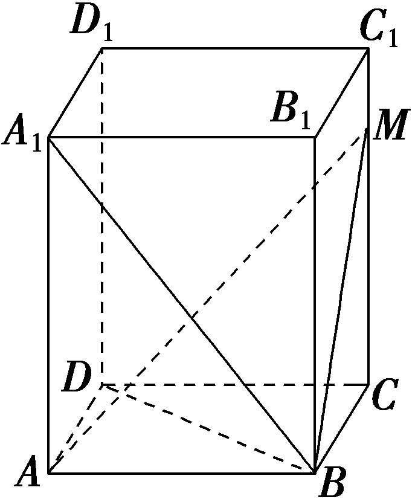

$\quad$A.存在点*P*使*BP*⊥*AM*

$\quad$B.不存在点*P*使平面*PBD*⊥平面*MBD*

$\quad$C.若<em>&lt;text style="italic"&gt;P</em>&lt;/text&gt;，<em>A</em>&lt;text style="subscript"&gt;1&lt;/text&gt;，<em>&lt;text style="italic"&gt;B</em>&lt;/text&gt;，<em>M</em>四点共面，则B1P的最小值为 $\frac{12}{5}$

<em>D</em>.若<em>&lt;text style="italic"&gt;P</em>&lt;/text&gt;，<em>A</em>，<em>&lt;text style="italic"&gt;B</em>&lt;/text&gt;，<em>M</em>，D五点共球面，则B1P的最小值为 $\sqrt{2}$

答案BCD

解析对于<te<te<te<te<te<te<te<text st*y*le="italic">x</text>t st*y*le="italic">x</text>t st*y*le="italic">x</text>t st*y*le="italic">x</text>t st*y*le="italic">x</text>t st*y*le="italic">x</text>t st*y*le="italic">x</text>t style="italic">A</text>，以*D*为原点，建立如图①所示的空间直角坐标系，则A(3，0，0)，*B*(3，3，0)，*M*(0，3，3)，设*P*(x，y，4)，则0≤x≤3，0≤y≤3，则 $\vec{AM}$ ＝(－3，3，3)， $\vec{BP}$ ＝(<te<te<te<te<te<te<text st*y*le="italic">x</text>t st*y*le="italic">x</text>t st*y*le="italic">x</text>t st*y*le="italic">x</text>t st*y*le="italic">x</text>t st*y*le="italic">x</text>t st*y*le="italic">x</text>－3，y－3，4)，若*BP*⊥*AM*，则有 $\vec{AM}$ · $\vec{BP}$ ＝－3(<te<te<te<te<te<te<text st*y*le="italic">x</text>t st*y*le="italic">x</text>t st*y*le="italic">x</text>t st*y*le="italic">x</text>t st*y*le="italic">x</text>t st*y*le="italic">x</text>t st*y*le="italic">x</text>－3)＋3(y－3)＋12＝0，化简得x－y＝4，又0≤x≤3，0≤y≤3，所以x－y＝4不可能成立，故*A*错误；

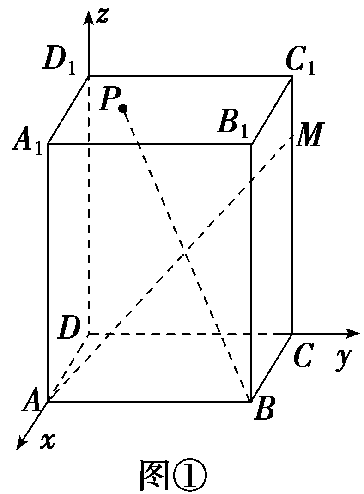

对于<te<te<te<text st*y*le="italic">x</text>t st*y*le="italic">x</text>t st*y*le="italic">x</text>t style="italic">B</text>，连接*AC*交*<text style="italic"><text style="italic"><text style="italic">B<text style="italic">D*</text></text></text></text>于*<text style="italic">O*</text>，连接*<text style="italic"><text style="italic"><text style="italic"><text style="italic"><text style="italic"><text style="italic">M*O</text></text></text></text></text></text>，则依题意可得MO⊥BD，若平面*<text style="italic"><text style="italic"><text style="italic"><text style="italic">P*BD</text></text></text></text>⊥平面*<text style="italic"><text style="italic">MBD*</text></text>，又平面PBD∩平面MBD＝BD，MO⊂平面MBD，MO⊥BD，所以MO⊥平面PBD，*<text style="italic">BP*</text>⊂平面PBD，所以有MO⊥BP，以D为原点，建立如图②所示的空间直角坐标系，则M(0，3，3)，O( $\frac{3}{2}$ ， $\frac{3}{2}$ ，0)，<te<te<te<text st*y*le="italic">x</text>t st*y*le="italic">x</text>t st*y*le="italic">x</text>t style="italic">B</text>(3，3，0)，设*P*(x，y，4)，则0≤x≤3，0≤y≤3，则 $\vec{MO}$ ＝( $\frac{3}{2}$ ，－ $\frac{3}{2}$ ，－3)， $\vec{BP}$ ＝(<te<te<text st*y*le="italic">x</text>t st*y*le="italic">x</text>t st*y*le="italic">x</text>－3，y－3，4)，

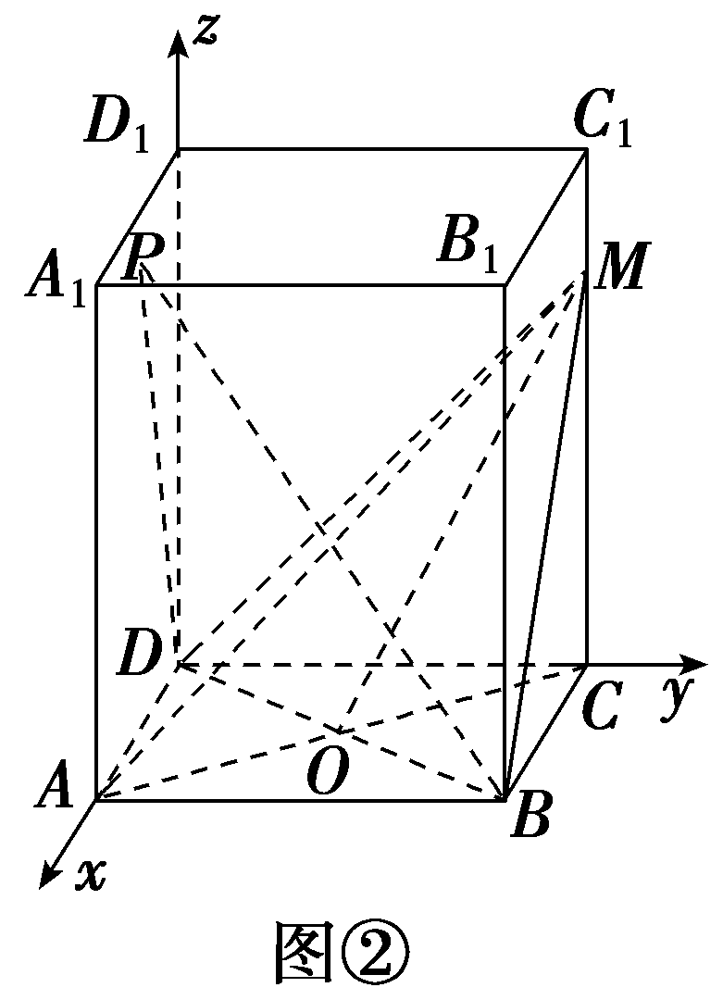

则 $\vec{MO}$ · $\vec{BP}$ ＝ $\frac{3}{2}$ (&lt;te&lt;text st<em>y</em>le="italic"&gt;x&lt;/text&gt;t st<em>y</em>le="italic"&gt;x&lt;/text&gt;－3)－ $\frac{3}{2}$ (&lt;te&lt;text st<em>y</em>le="italic"&gt;x&lt;/text&gt;t style="italic"&gt;y&lt;/text&gt;－3)－&lt;text style="subscript"&gt;&lt;text style="subscript"&gt;&lt;text style="subscript"&gt;&lt;text style="subscript"&gt;&lt;text style="subscript"&gt;&lt;text style="subscript"&gt;&lt;text style="subscript"&gt;&lt;text style="subscript"&gt;&lt;text style="subscript"&gt;&lt;text style="subscript"&gt;&lt;text style="subscript"&gt;&lt;text style="subscript"&gt;&lt;text style="subscript"&gt;&lt;text style="subscript"&gt;&lt;text style="subscript"&gt;&lt;text style="subscript"&gt;&lt;text style="subscript"&gt;&lt;text style="subscript"&gt;&lt;text style="subscript"&gt;&lt;text style="subscript"&gt;&lt;text style="subscript"&gt;&lt;text style="subscript"&gt;&lt;text style="subscript"&gt;&lt;text style="subscript"&gt;&lt;text style="subscript"&gt;&lt;text style="subscript"&gt;&lt;text style="subscript"&gt;&lt;text style="subscript"&gt;&lt;text style="subscript"&gt;&lt;text style="subscript"&gt;&lt;text style="subscript"&gt;&lt;text style="subscript"&gt;&lt;text style="subscript"&gt;&lt;text style="subscript"&gt;1&lt;/text&gt;&lt;/text&gt;&lt;/text&gt;&lt;/text&gt;&lt;/text&gt;&lt;/text&gt;&lt;/text&gt;&lt;/text&gt;&lt;/text&gt;&lt;/text&gt;&lt;/text&gt;&lt;/text&gt;&lt;/text&gt;&lt;/text&gt;&lt;/text&gt;&lt;/text&gt;&lt;/text&gt;&lt;/text&gt;&lt;/text&gt;&lt;/text&gt;&lt;/text&gt;&lt;/text&gt;&lt;/text&gt;&lt;/text&gt;&lt;/text&gt;&lt;/text&gt;&lt;/text&gt;&lt;/text&gt;&lt;/text&gt;&lt;/text&gt;&lt;/text&gt;&lt;/text&gt;&lt;/text&gt;&lt;/text&gt;2＝0，得<em>x</em>－y＝8，此式不可能成立，故<em>&lt;text style="italic"&gt;&lt;text style="italic"&gt;&lt;text style="italic"&gt;&lt;text style="italic"&gt;&lt;text style="italic"&gt;&lt;text style="italic"&gt;&lt;text style="italic"&gt;&lt;text style="italic"&gt;&lt;text style="italic"&gt;&lt;text style="italic"&gt;&lt;text style="italic"&gt;&lt;text style="italic"&gt;B</em>&lt;/text&gt;&lt;/text&gt;&lt;/text&gt;&lt;/text&gt;&lt;/text&gt;&lt;/text&gt;&lt;/text&gt;&lt;/text&gt;&lt;/text&gt;&lt;/text&gt;&lt;/text&gt;&lt;/text&gt;正确；对于<em>&lt;text style="italic"&gt;&lt;text style="italic"&gt;&lt;text style="italic"&gt;&lt;text style="italic"&gt;C</em>&lt;/text&gt;&lt;/text&gt;&lt;/text&gt;&lt;/text&gt;，如图③所示，延长<em>&lt;text style="italic"&gt;B&lt;text style="italic"&gt;&lt;text style="italic"&gt;M</em>&lt;/text&gt;&lt;/text&gt;&lt;/text&gt;交B1C1的延长线于<em>&lt;text style="italic"&gt;&lt;text style="italic"&gt;&lt;text style="italic"&gt;&lt;text style="italic"&gt;&lt;text style="italic"&gt;&lt;text style="italic"&gt;Q</em>&lt;/text&gt;&lt;/text&gt;&lt;/text&gt;&lt;/text&gt;&lt;/text&gt;&lt;/text&gt;，连接<em>&lt;text style="italic"&gt;&lt;text style="italic"&gt;&lt;text style="italic"&gt;&lt;text style="italic"&gt;&lt;text style="italic"&gt;&lt;text style="italic"&gt;&lt;text style="italic"&gt;&lt;text style="italic"&gt;&lt;text style="italic"&gt;&lt;text style="italic"&gt;&lt;text style="italic"&gt;&lt;text style="italic"&gt;&lt;text style="italic"&gt;A</em>&lt;/text&gt;&lt;/text&gt;&lt;/text&gt;&lt;/text&gt;&lt;/text&gt;&lt;/text&gt;&lt;/text&gt;&lt;/text&gt;&lt;/text&gt;&lt;/text&gt;&lt;/text&gt;&lt;/text&gt;&lt;/text&gt;1Q交C1<em>&lt;text style="italic"&gt;D</em>&lt;/text&gt;1于<em>&lt;text style="italic"&gt;&lt;text style="italic"&gt;&lt;text style="italic"&gt;&lt;text style="italic"&gt;N</em>&lt;/text&gt;&lt;/text&gt;&lt;/text&gt;&lt;/text&gt;，则A1Q为平面A1BM与平面A1B1C1D1的交线，若<em>&lt;text style="italic"&gt;&lt;text style="italic"&gt;&lt;text style="italic"&gt;&lt;text style="italic"&gt;&lt;text style="italic"&gt;&lt;text style="italic"&gt;P</em>&lt;/text&gt;&lt;/text&gt;&lt;/text&gt;&lt;/text&gt;&lt;/text&gt;&lt;/text&gt;，A1，B，M四点共面，则P在线段A1N上，所以当B1P⊥A1N时，B1P最小，因为C1M∥<em>BB</em>1，C1N∥A1B1，所以 $\frac{C_{1}M}{BB_{1}}$ ＝ $\frac{C_{1}Q}{B_{1}Q}$ ＝ $\frac{NQ}{A_{1}Q}$ ＝ $\frac{1}{4}$ ，所以<em>&lt;text style="italic"&gt;&lt;text style="italic"&gt;&lt;text style="italic"&gt;&lt;text style="italic"&gt;&lt;text style="italic"&gt;&lt;text style="italic"&gt;&lt;text style="italic"&gt;&lt;text style="italic"&gt;&lt;text style="italic"&gt;&lt;text style="italic"&gt;&lt;text style="italic"&gt;&lt;text style="italic"&gt;B</em>&lt;/text&gt;&lt;/text&gt;&lt;/text&gt;&lt;/text&gt;&lt;/text&gt;&lt;/text&gt;&lt;/text&gt;&lt;/text&gt;&lt;/text&gt;&lt;/text&gt;&lt;/text&gt;&lt;/text&gt;&lt;text style="subscript"&gt;&lt;text style="subscript"&gt;&lt;text style="subscript"&gt;&lt;text style="subscript"&gt;&lt;text style="subscript"&gt;&lt;text style="subscript"&gt;&lt;text style="subscript"&gt;&lt;text style="subscript"&gt;&lt;text style="subscript"&gt;&lt;text style="subscript"&gt;&lt;text style="subscript"&gt;&lt;text style="subscript"&gt;&lt;text style="subscript"&gt;&lt;text style="subscript"&gt;&lt;text style="subscript"&gt;&lt;text style="subscript"&gt;&lt;text style="subscript"&gt;&lt;text style="subscript"&gt;&lt;text style="subscript"&gt;&lt;text style="subscript"&gt;&lt;text style="subscript"&gt;&lt;text style="subscript"&gt;&lt;text style="subscript"&gt;&lt;text style="subscript"&gt;&lt;text style="subscript"&gt;&lt;text style="subscript"&gt;&lt;text style="subscript"&gt;&lt;text style="subscript"&gt;&lt;text style="subscript"&gt;&lt;text style="subscript"&gt;&lt;text style="subscript"&gt;&lt;text style="subscript"&gt;&lt;text style="subscript"&gt;&lt;text style="subscript"&gt;1&lt;/text&gt;&lt;/text&gt;&lt;/text&gt;&lt;/text&gt;&lt;/text&gt;&lt;/text&gt;&lt;/text&gt;&lt;/text&gt;&lt;/text&gt;&lt;/text&gt;&lt;/text&gt;&lt;/text&gt;&lt;/text&gt;&lt;/text&gt;&lt;/text&gt;&lt;/text&gt;&lt;/text&gt;&lt;/text&gt;&lt;/text&gt;&lt;/text&gt;&lt;/text&gt;&lt;/text&gt;&lt;/text&gt;&lt;/text&gt;&lt;/text&gt;&lt;/text&gt;&lt;/text&gt;&lt;/text&gt;&lt;/text&gt;&lt;/text&gt;&lt;/text&gt;&lt;/text&gt;&lt;/text&gt;&lt;/text&gt;<em>&lt;text style="italic"&gt;&lt;text style="italic"&gt;&lt;text style="italic"&gt;&lt;text style="italic"&gt;&lt;text style="italic"&gt;&lt;text style="italic"&gt;Q</em>&lt;/text&gt;&lt;/text&gt;&lt;/text&gt;&lt;/text&gt;&lt;/text&gt;&lt;/text&gt;＝4，又<em>&lt;text style="italic"&gt;&lt;text style="italic"&gt;&lt;text style="italic"&gt;&lt;text style="italic"&gt;&lt;text style="italic"&gt;&lt;text style="italic"&gt;&lt;text style="italic"&gt;&lt;text style="italic"&gt;&lt;text style="italic"&gt;&lt;text style="italic"&gt;&lt;text style="italic"&gt;&lt;text style="italic"&gt;&lt;text style="italic"&gt;A</em>&lt;/text&gt;&lt;/text&gt;&lt;/text&gt;&lt;/text&gt;&lt;/text&gt;&lt;/text&gt;&lt;/text&gt;&lt;/text&gt;&lt;/text&gt;&lt;/text&gt;&lt;/text&gt;&lt;/text&gt;&lt;/text&gt;1B1＝3，则A1Q＝5，所以当B1<em>&lt;text style="italic"&gt;&lt;text style="italic"&gt;&lt;text style="italic"&gt;&lt;text style="italic"&gt;&lt;text style="italic"&gt;&lt;text style="italic"&gt;P</em>&lt;/text&gt;&lt;/text&gt;&lt;/text&gt;&lt;/text&gt;&lt;/text&gt;&lt;/text&gt;⊥A1<em>&lt;text style="italic"&gt;&lt;text style="italic"&gt;&lt;text style="italic"&gt;&lt;text style="italic"&gt;N</em>&lt;/text&gt;&lt;/text&gt;&lt;/text&gt;&lt;/text&gt;时，在Rt△A1B1Q中，有A1B1·B1Q＝A1<em>Q·B</em>1P，得B1P＝ $\frac{A_{1}B_{1}\cdot B_{1}Q}{A_{1}Q}$ ＝ $\frac{3\times 4}{5}$ ＝ $\frac{12}{5}$ ，故<em>&lt;text style="italic"&gt;&lt;text style="italic"&gt;&lt;text style="italic"&gt;&lt;text style="italic"&gt;C</em>&lt;/text&gt;&lt;/text&gt;&lt;/text&gt;&lt;/text&gt;正确；

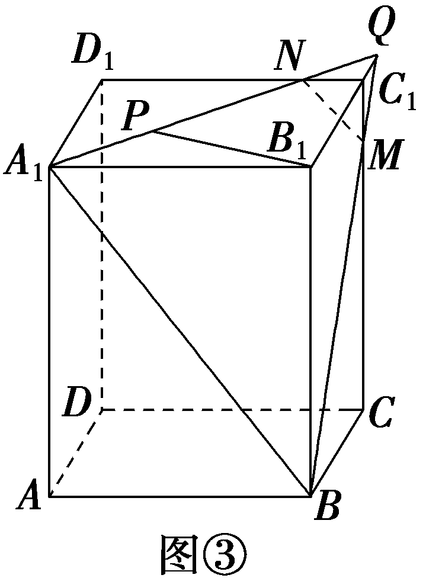

对于<em>&lt;text style="italic"&gt;&lt;text style="italic"&gt;&lt;text style="italic"&gt;D</em>&lt;/text&gt;&lt;/text&gt;&lt;/text&gt;，如图④所示，四点<em>&lt;text style="italic"&gt;&lt;text style="italic"&gt;&lt;text style="italic"&gt;A</em>&lt;/text&gt;&lt;/text&gt;&lt;/text&gt;，<em>&lt;text style="italic"&gt;&lt;text style="italic"&gt;&lt;text style="italic"&gt;&lt;text style="italic"&gt;&lt;text style="italic"&gt;B</em>&lt;/text&gt;&lt;/text&gt;&lt;/text&gt;&lt;/text&gt;&lt;/text&gt;，<em>&lt;text style="italic"&gt;M</em>&lt;/text&gt;，D确定的几何体的外接球即为正方体<em>&lt;text style="italic"&gt;AB&lt;text style="italic"&gt;&lt;text style="italic"&gt;C</em>&lt;/text&gt;D&lt;/text&gt;&lt;/text&gt; -<em>&lt;text style="italic"&gt;FGME</em>&lt;/text&gt;的外接球<em>&lt;text style="italic"&gt;&lt;text style="italic"&gt;&lt;text style="italic"&gt;&lt;text style="italic"&gt;&lt;text style="italic"&gt;&lt;text style="italic"&gt;&lt;text style="italic"&gt;O</em>&lt;/text&gt;&lt;/text&gt;&lt;/text&gt;&lt;/text&gt;&lt;/text&gt;&lt;/text&gt;&lt;/text&gt;，球O的半径<em>R</em>＝ $\frac{3\sqrt{3}}{2}$ (正方体<em>&lt;text style="italic"&gt;&lt;text style="italic"&gt;&lt;text style="italic"&gt;A</em>&lt;/text&gt;&lt;/text&gt;&lt;/text&gt;<em>&lt;text style="italic"&gt;&lt;text style="italic"&gt;&lt;text style="italic"&gt;&lt;text style="italic"&gt;&lt;text style="italic"&gt;B</em>&lt;/text&gt;&lt;/text&gt;&lt;/text&gt;&lt;/text&gt;&lt;/text&gt;<em>&lt;text style="italic"&gt;C</em>&lt;/text&gt;<em>&lt;text style="italic"&gt;&lt;text style="italic"&gt;&lt;text style="italic"&gt;D</em>&lt;/text&gt;&lt;/text&gt;&lt;/text&gt; -FG<em>&lt;text style="italic"&gt;M</em>&lt;/text&gt;E的体对角线长的一半)，设平面A&lt;text style="subsc<em>&lt;text style="italic"&gt;&lt;text style="italic"&gt;r</em>&lt;/text&gt;&lt;/text&gt;ipt"&gt;&lt;text style="subscript"&gt;&lt;text style="subscript"&gt;&lt;text style="subscript"&gt;&lt;text style="subscript"&gt;&lt;text style="subscript"&gt;&lt;text style="subscript"&gt;&lt;text style="subscript"&gt;&lt;text style="subscript"&gt;&lt;text style="subscript"&gt;&lt;text style="subscript"&gt;&lt;text style="subscript"&gt;&lt;text style="subscript"&gt;&lt;text style="subscript"&gt;&lt;text style="subscript"&gt;1&lt;/text&gt;&lt;/text&gt;&lt;/text&gt;&lt;/text&gt;&lt;/text&gt;&lt;/text&gt;&lt;/text&gt;&lt;/text&gt;&lt;/text&gt;&lt;/text&gt;&lt;/text&gt;&lt;/text&gt;&lt;/text&gt;&lt;/text&gt;&lt;/text&gt;B1C1D1截球<em>&lt;text style="italic"&gt;&lt;text style="italic"&gt;&lt;text style="italic"&gt;&lt;text style="italic"&gt;&lt;text style="italic"&gt;&lt;text style="italic"&gt;&lt;text style="italic"&gt;O</em>&lt;/text&gt;&lt;/text&gt;&lt;/text&gt;&lt;/text&gt;&lt;/text&gt;&lt;/text&gt;&lt;/text&gt;的截面圆为圆O1，O1为正方形A1B1C1D1的中心，设圆O1的半径为r，<em>OO</em>1＝ $\frac{5}{2}$ ，所以<em>&lt;text style="italic"&gt;&lt;text style="italic"&gt;r</em>&lt;/text&gt;&lt;/text&gt;＝ $\sqrt{R^{2}－OO_{1}^{2}}$ ＝ $\frac{\sqrt{2}}{2}$ ，若<em>&lt;text style="italic"&gt;&lt;text style="italic"&gt;P</em>&lt;/text&gt;&lt;/text&gt;，<em>&lt;text style="italic"&gt;&lt;text style="italic"&gt;&lt;text style="italic"&gt;A</em>&lt;/text&gt;&lt;/text&gt;&lt;/text&gt;，<em>&lt;text style="italic"&gt;&lt;text style="italic"&gt;&lt;text style="italic"&gt;&lt;text style="italic"&gt;&lt;text style="italic"&gt;B</em>&lt;/text&gt;&lt;/text&gt;&lt;/text&gt;&lt;/text&gt;&lt;/text&gt;，<em>&lt;text style="italic"&gt;M</em>&lt;/text&gt;，<em>&lt;text style="italic"&gt;&lt;text style="italic"&gt;&lt;text style="italic"&gt;D</em>&lt;/text&gt;&lt;/text&gt;&lt;/text&gt;五点共球面，则P在圆<em>&lt;text style="italic"&gt;&lt;text style="italic"&gt;&lt;text style="italic"&gt;&lt;text style="italic"&gt;&lt;text style="italic"&gt;&lt;text style="italic"&gt;&lt;text style="italic"&gt;O</em>&lt;/text&gt;&lt;/text&gt;&lt;/text&gt;&lt;/text&gt;&lt;/text&gt;&lt;/text&gt;&lt;/text&gt;&lt;text style="subsc<em>&lt;text style="italic"&gt;&lt;text style="italic"&gt;r</em>&lt;/text&gt;&lt;/text&gt;ipt"&gt;&lt;text style="subscript"&gt;&lt;text style="subscript"&gt;&lt;text style="subscript"&gt;&lt;text style="subscript"&gt;&lt;text style="subscript"&gt;&lt;text style="subscript"&gt;&lt;text style="subscript"&gt;&lt;text style="subscript"&gt;&lt;text style="subscript"&gt;&lt;text style="subscript"&gt;&lt;text style="subscript"&gt;&lt;text style="subscript"&gt;&lt;text style="subscript"&gt;&lt;text style="subscript"&gt;1&lt;/text&gt;&lt;/text&gt;&lt;/text&gt;&lt;/text&gt;&lt;/text&gt;&lt;/text&gt;&lt;/text&gt;&lt;/text&gt;&lt;/text&gt;&lt;/text&gt;&lt;/text&gt;&lt;/text&gt;&lt;/text&gt;&lt;/text&gt;&lt;/text&gt;上，则B1P的最小值为B1O1－r＝ $\sqrt{2}$ ，故<em>&lt;text style="italic"&gt;&lt;text style="italic"&gt;&lt;text style="italic"&gt;D</em>&lt;/text&gt;&lt;/text&gt;&lt;/text&gt;正确.故选<em>&lt;text style="italic"&gt;&lt;text style="italic"&gt;&lt;text style="italic"&gt;&lt;text style="italic"&gt;&lt;text style="italic"&gt;B</em>&lt;/text&gt;&lt;/text&gt;&lt;/text&gt;&lt;/text&gt;&lt;/text&gt;<em>&lt;text style="italic"&gt;C</em>&lt;/text&gt;D.

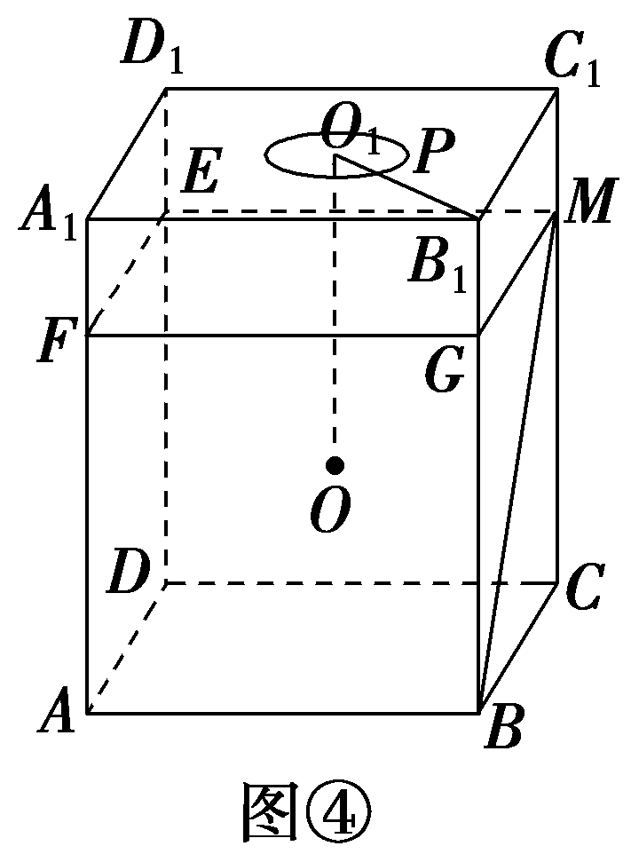

##### 11.(多选)如图，在长方体<em>ABCD</em> -<em>A</em>1<em>B</em>1<em>C</em>1<em>D</em>1中，点<em>E</em>，<em>F</em>分别是棱<em>DD</em>1，<em>BB</em>1上的动点(异于所在棱的端点).则下列结论正确的是(　　)

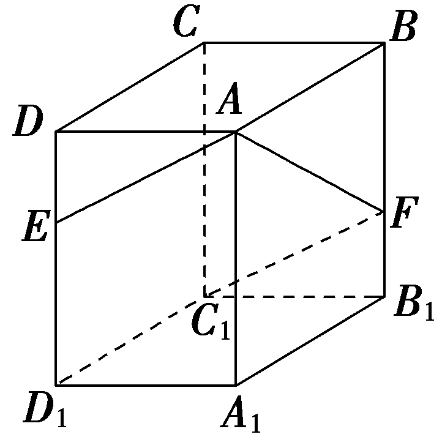

$\quad$A.在点<em>F</em>运动的过程中，直线<em>FC</em>1可能与<em>AE</em>平行

$\quad$B.直线<em>AC</em>1与<em>EF</em>必然异面

$\quad$C.设直线<em>AE</em>，<em>AF</em>分别与平面<em>A</em>1<em>B</em>1<em>C</em>1<em>D</em>1相交于点<em>P</em>，<em>Q</em>，则点<em>C</em>1可能在直线<em>PQ</em>上

$\quad$D.设直线<em>AE</em>，<em>AF</em>分别与平面<em>A</em>1<em>B</em>1<em>C</em>1<em>D</em>1相交于点<em>P</em>，<em>Q</em>，则点<em>C</em>1一定不在直线<em>PQ</em>上

答案AC

解析在长方体&lt;te&lt;text st<em>y</em>le="italic"&gt;x&lt;/text&gt;t style="italic"&gt;<em>&lt;text style="italic"&gt;&lt;text style="italic"&gt;&lt;text style="italic"&gt;A</em>&lt;/text&gt;&lt;/text&gt;&lt;/text&gt;<em>&lt;text style="italic"&gt;&lt;text style="italic"&gt;&lt;text style="italic"&gt;&lt;text style="italic"&gt;B</em>&lt;/text&gt;&lt;/text&gt;&lt;/text&gt;&lt;/text&gt;<em>&lt;text style="italic"&gt;&lt;text style="italic"&gt;&lt;text style="italic"&gt;&lt;text style="italic"&gt;&lt;text style="italic"&gt;&lt;text style="italic"&gt;&lt;text style="italic"&gt;&lt;text style="italic"&gt;&lt;text style="italic"&gt;&lt;text style="italic"&gt;&lt;text style="italic"&gt;&lt;text style="italic"&gt;C</em>&lt;/text&gt;&lt;/text&gt;&lt;/text&gt;&lt;/text&gt;&lt;/text&gt;&lt;/text&gt;&lt;/text&gt;&lt;/text&gt;&lt;/text&gt;&lt;/text&gt;&lt;/text&gt;&lt;/text&gt;<em>&lt;text style="italic"&gt;&lt;text style="italic"&gt;&lt;text style="italic"&gt;&lt;text style="italic"&gt;D</em>&lt;/text&gt;&lt;/text&gt;&lt;/text&gt;&lt;/text&gt;&lt;/text&gt; -A&lt;text style="subscript"&gt;&lt;text style="subscript"&gt;&lt;text style="subscript"&gt;&lt;text style="subscript"&gt;&lt;text style="subscript"&gt;&lt;text style="subscript"&gt;&lt;text style="subscript"&gt;&lt;text style="subscript"&gt;&lt;text style="subscript"&gt;&lt;text style="subscript"&gt;&lt;text style="subscript"&gt;&lt;text style="subscript"&gt;&lt;text style="subscript"&gt;&lt;text style="subscript"&gt;&lt;text style="subscript"&gt;&lt;text style="subscript"&gt;&lt;text style="subscript"&gt;&lt;text style="subscript"&gt;&lt;text style="subscript"&gt;&lt;text style="subscript"&gt;&lt;text style="subscript"&gt;&lt;text style="subscript"&gt;&lt;text style="subscript"&gt;&lt;text style="subscript"&gt;&lt;text style="subscript"&gt;&lt;text style="subscript"&gt;&lt;text style="subscript"&gt;&lt;text style="subscript"&gt;&lt;text style="subscript"&gt;&lt;text style="subscript"&gt;&lt;text style="subscript"&gt;&lt;text style="subscript"&gt;&lt;text style="subscript"&gt;&lt;text style="subscript"&gt;&lt;text style="subscript"&gt;1&lt;/text&gt;&lt;/text&gt;&lt;/text&gt;&lt;/text&gt;&lt;/text&gt;&lt;/text&gt;&lt;/text&gt;&lt;/text&gt;&lt;/text&gt;&lt;/text&gt;&lt;/text&gt;&lt;/text&gt;&lt;/text&gt;&lt;/text&gt;&lt;/text&gt;&lt;/text&gt;&lt;/text&gt;&lt;/text&gt;&lt;/text&gt;&lt;/text&gt;&lt;/text&gt;&lt;/text&gt;&lt;/text&gt;&lt;/text&gt;&lt;/text&gt;&lt;/text&gt;&lt;/text&gt;&lt;/text&gt;&lt;/text&gt;&lt;/text&gt;&lt;/text&gt;&lt;/text&gt;&lt;/text&gt;&lt;/text&gt;&lt;/text&gt;B1C1D1中，<em>AB</em>＝C1D1，<em>&lt;text style="italic"&gt;&lt;text style="italic"&gt;DD</em>&lt;/text&gt;&lt;/text&gt;1＝<em>&lt;text style="italic"&gt;&lt;text style="italic"&gt;BB</em>&lt;/text&gt;&lt;/text&gt;1，B1C1＝<em>AD</em>，连接C1<em>&lt;text style="italic"&gt;&lt;text style="italic"&gt;&lt;text style="italic"&gt;E</em>&lt;/text&gt;&lt;/text&gt;&lt;/text&gt;，<em>&lt;text style="italic"&gt;AC</em>&lt;/text&gt;1，<em>E&lt;text style="italic"&gt;&lt;text style="italic"&gt;&lt;text style="italic"&gt;&lt;text style="italic"&gt;&lt;text style="italic"&gt;&lt;text style="italic"&gt;F</em>&lt;/text&gt;&lt;/text&gt;&lt;/text&gt;&lt;/text&gt;&lt;/text&gt;&lt;/text&gt;，如图①所示，当点E，F分别是棱DD1，BB1的中点时，由勾股定理得<em>&lt;text style="italic"&gt;&lt;text style="italic"&gt;&lt;text style="italic"&gt;AE</em>&lt;/text&gt;&lt;/text&gt;&lt;/text&gt;＝ $\sqrt{AD^{2}＋DE^{2}}$ ，&lt;te&lt;text st<em>y</em>le="italic"&gt;x&lt;/text&gt;t style="italic"&gt;<em>&lt;text style="italic"&gt;&lt;text style="italic"&gt;&lt;text style="italic"&gt;&lt;text style="italic"&gt;&lt;text style="italic"&gt;&lt;text style="italic"&gt;&lt;text style="italic"&gt;&lt;text style="italic"&gt;&lt;text style="italic"&gt;&lt;text style="italic"&gt;&lt;text style="italic"&gt;C</em>&lt;/text&gt;&lt;/text&gt;&lt;/text&gt;&lt;/text&gt;&lt;/text&gt;&lt;/text&gt;&lt;/text&gt;&lt;/text&gt;&lt;/text&gt;&lt;/text&gt;&lt;/text&gt;&lt;/text&gt;&lt;text style="subscript"&gt;&lt;text style="subscript"&gt;&lt;text style="subscript"&gt;&lt;text style="subscript"&gt;&lt;text style="subscript"&gt;&lt;text style="subscript"&gt;&lt;text style="subscript"&gt;&lt;text style="subscript"&gt;&lt;text style="subscript"&gt;&lt;text style="subscript"&gt;&lt;text style="subscript"&gt;&lt;text style="subscript"&gt;&lt;text style="subscript"&gt;&lt;text style="subscript"&gt;&lt;text style="subscript"&gt;&lt;text style="subscript"&gt;&lt;text style="subscript"&gt;&lt;text style="subscript"&gt;&lt;text style="subscript"&gt;&lt;text style="subscript"&gt;&lt;text style="subscript"&gt;&lt;text style="subscript"&gt;&lt;text style="subscript"&gt;&lt;text style="subscript"&gt;&lt;text style="subscript"&gt;&lt;text style="subscript"&gt;&lt;text style="subscript"&gt;&lt;text style="subscript"&gt;&lt;text style="subscript"&gt;&lt;text style="subscript"&gt;&lt;text style="subscript"&gt;&lt;text style="subscript"&gt;&lt;text style="subscript"&gt;&lt;text style="subscript"&gt;&lt;text style="subscript"&gt;1&lt;/text&gt;&lt;/text&gt;&lt;/text&gt;&lt;/text&gt;&lt;/text&gt;&lt;/text&gt;&lt;/text&gt;&lt;/text&gt;&lt;/text&gt;&lt;/text&gt;&lt;/text&gt;&lt;/text&gt;&lt;/text&gt;&lt;/text&gt;&lt;/text&gt;&lt;/text&gt;&lt;/text&gt;&lt;/text&gt;&lt;/text&gt;&lt;/text&gt;&lt;/text&gt;&lt;/text&gt;&lt;/text&gt;&lt;/text&gt;&lt;/text&gt;&lt;/text&gt;&lt;/text&gt;&lt;/text&gt;&lt;/text&gt;&lt;/text&gt;&lt;/text&gt;&lt;/text&gt;&lt;/text&gt;&lt;/text&gt;&lt;/text&gt;<em>&lt;text style="italic"&gt;&lt;text style="italic"&gt;&lt;text style="italic"&gt;&lt;text style="italic"&gt;&lt;text style="italic"&gt;F</em>&lt;/text&gt;&lt;/text&gt;&lt;/text&gt;&lt;/text&gt;&lt;/text&gt;＝ $\sqrt{C_{1}B_{1}^{2}＋B_{1}F^{2}}$ ，故&lt;te&lt;text st<em>y</em>le="italic"&gt;x&lt;/text&gt;t style="italic"&gt;<em>&lt;text style="italic"&gt;&lt;text style="italic"&gt;A</em>&lt;/text&gt;&lt;/text&gt;&lt;/text&gt;<em>&lt;text style="italic"&gt;&lt;text style="italic"&gt;&lt;text style="italic"&gt;E</em>&lt;/text&gt;&lt;/text&gt;&lt;/text&gt;＝<em>&lt;text style="italic"&gt;&lt;text style="italic"&gt;&lt;text style="italic"&gt;&lt;text style="italic"&gt;&lt;text style="italic"&gt;&lt;text style="italic"&gt;&lt;text style="italic"&gt;&lt;text style="italic"&gt;&lt;text style="italic"&gt;&lt;text style="italic"&gt;&lt;text style="italic"&gt;&lt;text style="italic"&gt;C</em>&lt;/text&gt;&lt;/text&gt;&lt;/text&gt;&lt;/text&gt;&lt;/text&gt;&lt;/text&gt;&lt;/text&gt;&lt;/text&gt;&lt;/text&gt;&lt;/text&gt;&lt;/text&gt;&lt;/text&gt;&lt;text style="subscript"&gt;&lt;text style="subscript"&gt;&lt;text style="subscript"&gt;&lt;text style="subscript"&gt;&lt;text style="subscript"&gt;&lt;text style="subscript"&gt;&lt;text style="subscript"&gt;&lt;text style="subscript"&gt;&lt;text style="subscript"&gt;&lt;text style="subscript"&gt;&lt;text style="subscript"&gt;&lt;text style="subscript"&gt;&lt;text style="subscript"&gt;&lt;text style="subscript"&gt;&lt;text style="subscript"&gt;&lt;text style="subscript"&gt;&lt;text style="subscript"&gt;&lt;text style="subscript"&gt;&lt;text style="subscript"&gt;&lt;text style="subscript"&gt;&lt;text style="subscript"&gt;&lt;text style="subscript"&gt;&lt;text style="subscript"&gt;&lt;text style="subscript"&gt;&lt;text style="subscript"&gt;&lt;text style="subscript"&gt;&lt;text style="subscript"&gt;&lt;text style="subscript"&gt;&lt;text style="subscript"&gt;&lt;text style="subscript"&gt;&lt;text style="subscript"&gt;&lt;text style="subscript"&gt;&lt;text style="subscript"&gt;&lt;text style="subscript"&gt;&lt;text style="subscript"&gt;1&lt;/text&gt;&lt;/text&gt;&lt;/text&gt;&lt;/text&gt;&lt;/text&gt;&lt;/text&gt;&lt;/text&gt;&lt;/text&gt;&lt;/text&gt;&lt;/text&gt;&lt;/text&gt;&lt;/text&gt;&lt;/text&gt;&lt;/text&gt;&lt;/text&gt;&lt;/text&gt;&lt;/text&gt;&lt;/text&gt;&lt;/text&gt;&lt;/text&gt;&lt;/text&gt;&lt;/text&gt;&lt;/text&gt;&lt;/text&gt;&lt;/text&gt;&lt;/text&gt;&lt;/text&gt;&lt;/text&gt;&lt;/text&gt;&lt;/text&gt;&lt;/text&gt;&lt;/text&gt;&lt;/text&gt;&lt;/text&gt;&lt;/text&gt;<em>&lt;text style="italic"&gt;&lt;text style="italic"&gt;&lt;text style="italic"&gt;&lt;text style="italic"&gt;&lt;text style="italic"&gt;F</em>&lt;/text&gt;&lt;/text&gt;&lt;/text&gt;&lt;/text&gt;&lt;/text&gt;，同理可得<em>&lt;text style="italic"&gt;AF</em>&lt;/text&gt;＝C1E，故四边形<em>&lt;text style="italic"&gt;&lt;text style="italic"&gt;&lt;text style="italic"&gt;AE</em>&lt;/text&gt;&lt;/text&gt;&lt;/text&gt;C1F可能是平行四边形，所以在点F运动的过程中，直线<em>FC</em>1可能与AE平行，<em>&lt;text style="italic"&gt;AC</em>&lt;/text&gt;1与<em>&lt;text style="italic"&gt;EF</em>&lt;/text&gt;相交，故A正确，<em>&lt;text style="italic"&gt;&lt;text style="italic"&gt;&lt;text style="italic"&gt;&lt;text style="italic"&gt;B</em>&lt;/text&gt;&lt;/text&gt;&lt;/text&gt;&lt;/text&gt;错误；以C1为坐标原点，C1<em>&lt;text style="italic"&gt;&lt;text style="italic"&gt;&lt;text style="italic"&gt;&lt;text style="italic"&gt;D</em>&lt;/text&gt;&lt;/text&gt;&lt;/text&gt;&lt;/text&gt;1，C1B1，C1C所在直线分别为x轴，y轴，<em>z</em>轴建立如图②所示的空间直角坐标系，则当点E，F分别是棱<em>&lt;text style="italic"&gt;&lt;text style="italic"&gt;DD</em>&lt;/text&gt;&lt;/text&gt;1，<em>&lt;text style="italic"&gt;&lt;text style="italic"&gt;BB</em>&lt;/text&gt;&lt;/text&gt;1中点且几何体<em>&lt;text style="italic"&gt;AB</em>CD&lt;/text&gt; -A1B1C1D1为正方体时，设棱长为2，延长AE，A1D1交于点<em>M</em>，延长AF，A1B1交于点<em>N</em>，连接<em>MN</em>，

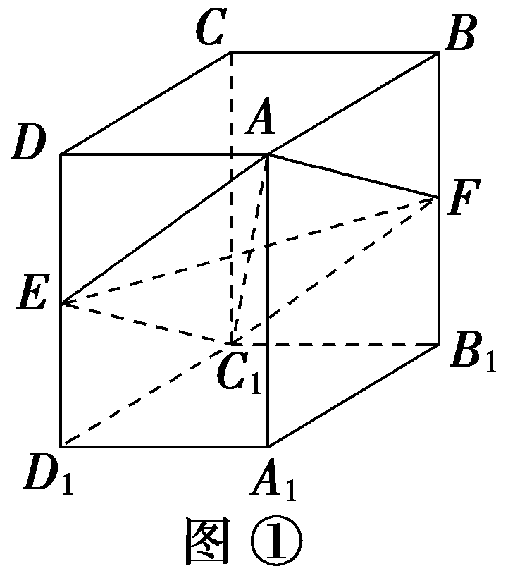

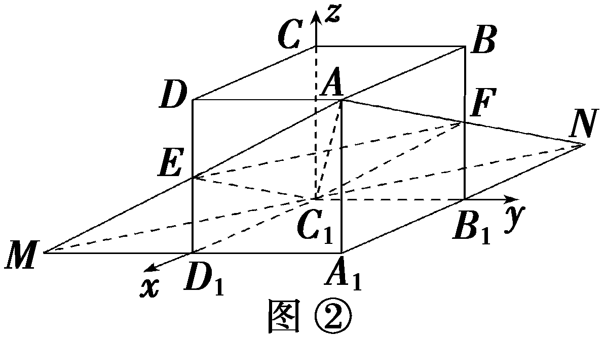

则<em>&lt;text style="italic"&gt;&lt;text style="italic"&gt;&lt;text style="italic"&gt;C</em>&lt;/text&gt;&lt;/text&gt;&lt;/text&gt;&lt;text style="subscript"&gt;&lt;text style="subscript"&gt;&lt;text style="subscript"&gt;1&lt;/text&gt;&lt;/text&gt;&lt;/text&gt;(0，0，0)，<em>&lt;text style="italic"&gt;M</em>&lt;/text&gt;(2，－2，0)，<em>&lt;text style="italic"&gt;N</em>&lt;/text&gt;(－2，2，0)，则 $\vec{C_{1}M}$ ＝ $\left(2,-2，0\right)$ ， $\vec{NC_{1}}$ ＝ $\left(2,-2，0\right)$ ，则 $\vec{C_{1}M}$ ＝ $\vec{NC_{1}}$ ，又两向量有公共点<em>&lt;text style="italic"&gt;&lt;text style="italic"&gt;&lt;text style="italic"&gt;C</em>&lt;/text&gt;&lt;/text&gt;&lt;/text&gt;&lt;text style="subscript"&gt;&lt;text style="subscript"&gt;&lt;text style="subscript"&gt;1&lt;/text&gt;&lt;/text&gt;&lt;/text&gt;，所以C1，<em>&lt;text style="italic"&gt;M</em>&lt;/text&gt;，<em>&lt;text style="italic"&gt;N</em>&lt;/text&gt;三点共线，故点C1可能在直线<em>PQ</em>上，故C正确，D错误.故选AC.

##### 12.(15分)(2025·湖南长沙模拟)如图，在棱长为2的正方体*ABCD* -*EFGH*中，点*<text style="italic">M*</text>是正方体的中心，将四棱锥M-*B<text style="italic">CG*F</text>绕直线CG逆时针旋转*α* $\left(0<\alpha ＜\pi \right)$ 后，得到四棱锥*<text style="italic">M*</text>'-B'*CG*F'.

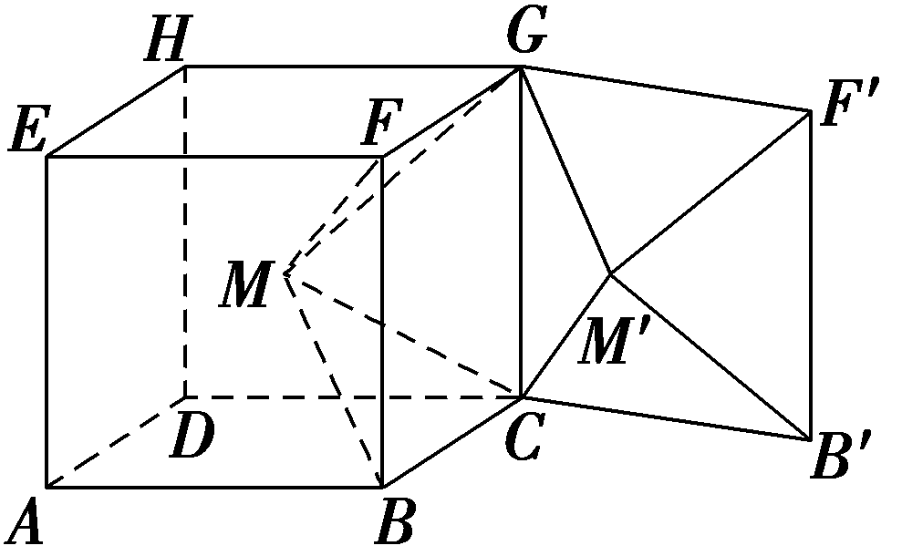

（1）若*α*＝ $\frac{\pi }{2}$ ，求证：平面*MBF*⊥平面*M'B'F'*；(5分)

（2）是否存在*α*，使得直线*M'F'*⊥平面*MBC*，若存在，求出*α*的值；若不存在，请说明理由.(10分)

解：（1）证明：若*α*＝ $\frac{\pi }{2}$ ，则平面*DCGH*，

平面*CB'F'G*为同一个平面.

连接*BH*，*BF'*，则*M*是*BH*中点，*M'* 是*BF'* 中点，

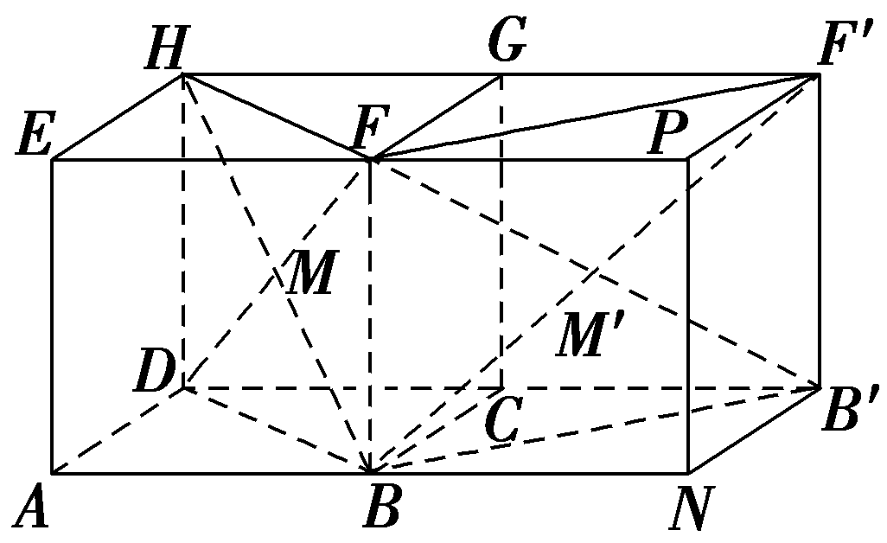

所以平面*MBF*与平面*BFHD*重合，平面*M'B'F'* 与平面*BFF'B'* 重合，

由正方体性质可知*BF*⊥平面*EFF'H*，

因为*HF*，*FF'*⊂平面*EFF'H*，所以，*BF*⊥*HF*，*BF*⊥*FF'*，

∠*HFF'* 为二面角*H*-*BF*-*F'* 的平面角，

因为*HG*＝*FG*，∠*HGF*＝ $\frac{\pi }{2}$ ，则∠H*FG*＝ $\frac{\pi }{4}$ ，同理可得∠F'*FG*＝ $\frac{\pi }{4}$ ，

所以∠*HFF'*＝ $\frac{\pi }{2}$ ，所以平面*MBF*⊥平面*M'B'F'*.

（2）假设存在*α*，使得直线*M'F'*⊥平面*MBC*，

以<te<text st*y*le="italic">x</text>t style="italic">C</text>为原点，分别以 $\vec{CB}$ ， $\vec{DC}$ ， $\vec{CG}$ 的方向为<text st*y*le="italic">x</text>，y，*z*轴的正方向建立如图所示的空间直角坐标系，

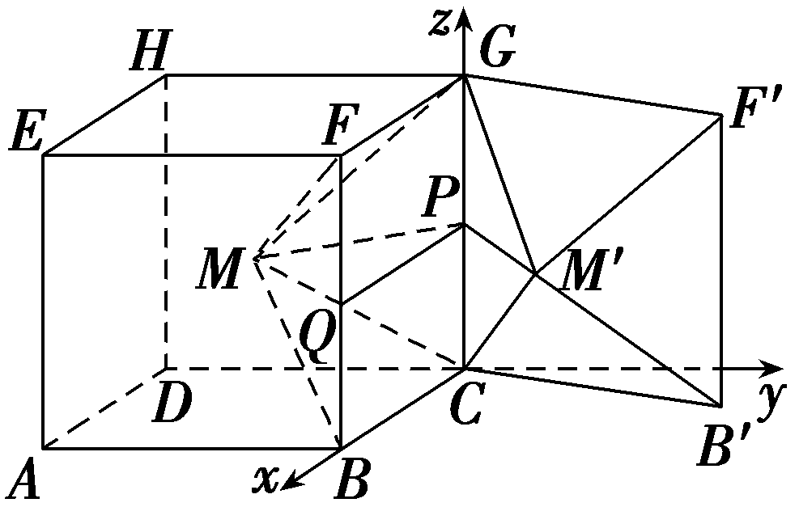

则*C* $\left(0，0，0\right)$ ，*B* $\left(2，0，0\right)$ ，*M* $\left(1,-1，1\right)$ ，故 $\vec{CB}$ ＝ $\left(2，0，0\right)$ ， $\vec{CM}$ ＝ $\left(1,-1，1\right)$ ，

设平面<em>MBC</em>的法向量为<em><strong>m</strong></em>＝ $\left(x，y，z\right)$ ，则 $\left\{\begin{matrix}m\cdot \vec{CM}＝x－y＋z=0，\\m\cdot \vec{CB}=2x=0，\end{matrix}\right.$

取<em>y</em>＝1，得<em><strong>m</strong></em>＝ $\left(0，1，1\right)$ 是平面<em>MBC</em>的一个法向量，

取*CG*的中点*<text style="italic">P*</text>，*BF*的中点*<text style="italic">Q*</text>，连接*PQ*，*PM*，*PM'*，则P $\left(0，0，1\right)$ ，*<text style="italic">Q*</text>(2，0，1)，

因为 $\left|MG\right|$ ＝ $\left|MC\right|$ ＝ $\sqrt{1^{2}＋\left(－1\right)^{2}＋1^{2}}$ ＝ $\sqrt{3}$ ，则*PM*⊥*<text style="italic">CG*</text>，同理可知，*PM'*⊥CG，

因为*BQ*∥*CP*，*BQ*＝*CP*，*BQ*⊥*BC*，则四边形*BCPQ*为矩形，所以*PQ*⊥*CG*，

于是∠*MPM'* 是二面角*M*-*CG*-*M'* 的平面角，∠*MPQ*是二面角*M*-*CG*-*Q*的平面角，

∠*QPM'* 是二面角*Q*-*CG*-*M'* 的平面角.于是∠*MPM'*＝*α*，

因为 $\vec{PM}$ ＝ $\left(1,-1，0\right)$ ， $\vec{PQ}$ ＝ $\left(2，0，0\right)$ ，cos∠*MPQ*＝ $\frac{\vec{PM}\cdot \vec{PQ}}{\left|\vec{PM}\right|\cdot \left|\vec{PQ}\right|}$ ＝ $\frac{2}{\sqrt{2}\times 2}$ ＝ $\frac{\sqrt{2}}{2}$ ，

因为0＜∠*<text style="italic">MPQ*</text>＜π，则∠MPQ＝ $\frac{\pi }{4}$ ，所以∠*QPM'*＝*α*－ $\frac{\pi }{4}$ ，

因为*PM*⊥*CG*，*PM'*⊥*CG*，*PM*∩*PM'*＝*P*，*PM*，*PM'*⊂平面*MPM'*，

所以*CG*⊥平面*MPM'*，且 $\left|M'P\right|$ ＝ $\left|MP\right|$ ＝ $\sqrt{2}$ ，

故*M'* $\left(\sqrt{2}cos\left(\alpha －\frac{\pi }{4}\right)，\sqrt{2}sin\left(\alpha －\frac{\pi }{4}\right)，1\right)$ ，同理*F'*(2cos *<text style="italic">α*</text>，2sin α，2)，

所以 $\vec{M'F'}$ ＝(2cos *α*－ $\sqrt{2}$ cos $\left(\alpha －\frac{\pi }{4}\right)$ ，

2sin *α*－ $\sqrt{2}$ sin $\left(\alpha －\frac{\pi }{4}\right)$ ，1)，

因为2cos *<text style="italic"><text style="italic"><text style="italic"><text style="italic"><text style="italic">α*</text></text></text></text></text>－ $\sqrt{2}$ cos $\left(\alpha －\frac{\pi }{4}\right)$ ＝2cos *<text style="italic"><text style="italic"><text style="italic"><text style="italic"><text style="italic">α*</text></text></text></text></text>－ $\sqrt{2}$ cos *<text style="italic"><text style="italic"><text style="italic"><text style="italic"><text style="italic">α*</text></text></text></text></text>cos $\frac{\pi }{4}$ － $\sqrt{2}$ sin *<text style="italic"><text style="italic"><text style="italic"><text style="italic"><text style="italic">α*</text></text></text></text></text>sin $\frac{\pi }{4}$ ＝cos *<text style="italic"><text style="italic"><text style="italic"><text style="italic"><text style="italic">α*</text></text></text></text></text>－sin α，

2sin *<text style="italic"><text style="italic"><text style="italic"><text style="italic"><text style="italic">α*</text></text></text></text></text>－ $\sqrt{2}$ sin $\left(\alpha －\frac{\pi }{4}\right)$ ＝2sin *<text style="italic"><text style="italic"><text style="italic"><text style="italic"><text style="italic">α*</text></text></text></text></text>－ $\sqrt{2}$ sin *<text style="italic"><text style="italic"><text style="italic"><text style="italic"><text style="italic">α*</text></text></text></text></text>cos $\frac{\pi }{4}$ ＋ $\sqrt{2}$ cos *<text style="italic"><text style="italic"><text style="italic"><text style="italic"><text style="italic">α*</text></text></text></text></text>sin $\frac{\pi }{4}$ ＝cos *<text style="italic"><text style="italic"><text style="italic"><text style="italic"><text style="italic">α*</text></text></text></text></text>＋sin α，

所以 $\vec{M'F'}$ ＝ $\left(cos\alpha －sin\alpha ，cos\alpha ＋sin\alpha ，1\right)$ ，

若直线<em>M'F'</em>⊥平面<em>&lt;text style="italic"&gt;MBC</em>&lt;/text&gt;，<em><strong>&lt;text style="bold,italic"&gt;m</strong></em>&lt;/text&gt;是平面MBC的一个法向量，则 $\vec{M'F'}$ ∥<em><strong>&lt;text style="bold,italic"&gt;m</strong></em>&lt;/text&gt;，

即存在<em>&lt;text style="italic"&gt;λ</em>&lt;/text&gt;∈<strong>R</strong>，使得 $\vec{M'F'}$ ＝<em>&lt;text style="italic"&gt;λ</em>&lt;/text&gt;<em><strong>m</strong></em>，则 $\left\{\begin{matrix}cos\alpha －sin\alpha =0，\\cos\alpha ＋sin\alpha ＝\lambda ，\\1=\lambda ，\end{matrix}\right.$

因为0＋<em>&lt;text style="italic"&gt;λ</em>&lt;/text&gt;&lt;text style="superscript"&gt;2&lt;/text&gt;＝ $\left(cos\alpha －sin\alpha \right)^{2}$ ＋ $\left(cos\alpha ＋sin\alpha \right)^{2}$ ＝&lt;text style="superscript"&gt;2&lt;/text&gt;，可得<em>&lt;text style="italic"&gt;λ</em>&lt;/text&gt;2＝2，

故方程组 $\left\{\begin{matrix}cos\alpha －sin\alpha =0，\\cos\alpha ＋sin\alpha ＝\lambda ，\\1=\lambda ，\end{matrix}\right.$ 无解，

所以不存在*α*∈ $\left(0，\pi \right)$ ，使得直线*M'F'*⊥平面*MBC*.

(13、14题，每小题5分，共10分)

##### 13.在空间直角坐标系*O* -*xyz*中，正四面体*P*-*ABC*的顶点*A*，*B*分别在*x*轴，*y*轴上移动.若该正四面体的棱长是2，则｜*OP*｜的取值范围是(　　)

$\quad$A. $\left[\sqrt{3}－1，\sqrt{3}+1\right]$ 	
$\quad$B.[1，3]

$\quad$C. $\left[\sqrt{3}－1，2\right]$ 	
$\quad$D. $\left[1，\sqrt{3}+1\right]$

答案A

解析如图所示，若固定正四面体*<text style="italic">P*</text>-*<text style="italic"><text style="italic">AB*</text>C</text>的位置，则原点*<text style="italic">O*</text>在以AB为直径的球面上运动.设AB的中点为*<text style="italic"><text style="italic">M*</text></text>，则*<text style="italic"><text style="italic">PM*</text></text>＝ $\sqrt{2^{2}－1^{2}}$ ＝ $\sqrt{3}$ ，所以原点*<text style="italic">O*</text>到点*<text style="italic">P*</text>的最小距离等于P*<text style="italic"><text style="italic">M*</text></text>减去球M的半径，最大距离是*<text style="italic"><text style="italic">PM*</text></text>加上球M的半径，所以 $\sqrt{3}$ －1≤｜*<text style="italic">O*</text>*<text style="italic">P*</text>｜≤ $\sqrt{3}$ ＋1，即｜*<text style="italic">O*</text>*<text style="italic">P*</text>｜的取值范围是 $\left[\sqrt{3}－1，\sqrt{3}+1\right]$ .故选A.

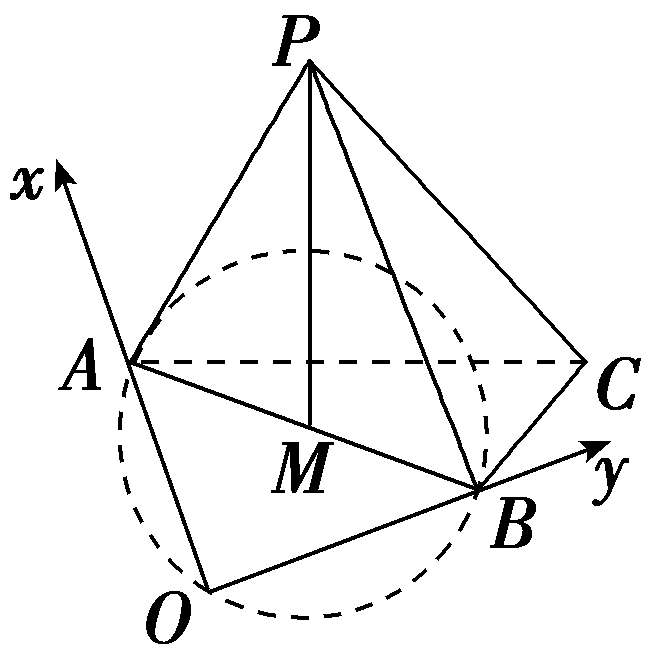

##### 14.(多选)已知棱长为<em>a</em>的正方体<em>ABCD</em> -<em>A</em>1<em>B</em>1<em>C</em>1<em>D</em>1中，<em>M</em>为<em>B</em>1<em>C</em>1的中点，点<em>P</em>在正方体的表面上运动，且总满足<em>MP</em>垂直于<em>MC</em>，则下列结论正确的是(　　)

$\quad$A.点<em>P</em>的轨迹中包含<em>AA</em>1的中点

$\quad$B.点<em>P</em>在侧面<em>AA</em>&lt;text style="subscript"&gt;1&lt;/text&gt;<em>&lt;text style="italic"&gt;D</em>&lt;/text&gt;1D内的轨迹的长为 $\frac{\sqrt{5}a}{4}$

$\quad$C.*MP*长度的最大值为 $\frac{\sqrt{21}a}{4}$

$\quad$D.直线<em>CC</em>1与直线<em>MP</em>所成角的余弦值的最大值为 $\frac{\sqrt{5}}{5}$

答案BCD

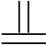

解析如图，取&lt;text style="it&lt;text style="it<em>a</em>lic"&gt;a&lt;/text&gt;lic"&gt;<em>&lt;text style="italic"&gt;&lt;text style="italic"&gt;&lt;text style="italic"&gt;A</em>&lt;/text&gt;&lt;/text&gt;&lt;/text&gt;&lt;/text&gt;&lt;text style="subscript"&gt;&lt;text style="subscript"&gt;&lt;text style="subscript"&gt;&lt;text style="subscript"&gt;&lt;text style="subscript"&gt;&lt;text style="subscript"&gt;&lt;text style="subscript"&gt;&lt;text style="subscript"&gt;&lt;text style="subscript"&gt;&lt;text style="subscript"&gt;&lt;text style="subscript"&gt;&lt;text style="subscript"&gt;&lt;text style="subscript"&gt;&lt;text style="subscript"&gt;&lt;text style="subscript"&gt;&lt;text style="subscript"&gt;&lt;text style="subscript"&gt;&lt;text style="subscript"&gt;&lt;text style="subscript"&gt;&lt;text style="subscript"&gt;&lt;text style="subscript"&gt;1&lt;/text&gt;&lt;/text&gt;&lt;/text&gt;&lt;/text&gt;&lt;/text&gt;&lt;/text&gt;&lt;/text&gt;&lt;/text&gt;&lt;/text&gt;&lt;/text&gt;&lt;/text&gt;&lt;/text&gt;&lt;/text&gt;&lt;/text&gt;&lt;/text&gt;&lt;/text&gt;&lt;/text&gt;&lt;/text&gt;&lt;/text&gt;&lt;/text&gt;&lt;/text&gt;<em>&lt;text style="italic"&gt;&lt;text style="italic"&gt;D</em>&lt;/text&gt;&lt;/text&gt;1的中点<em>&lt;text style="italic"&gt;E</em>&lt;/text&gt;，分别取A1A，<em>&lt;text style="italic"&gt;&lt;text style="italic"&gt;&lt;text style="italic"&gt;&lt;text style="italic"&gt;&lt;text style="italic"&gt;&lt;text style="italic"&gt;&lt;text style="italic"&gt;&lt;text style="italic"&gt;B</em>&lt;/text&gt;&lt;/text&gt;&lt;/text&gt;&lt;/text&gt;&lt;/text&gt;&lt;/text&gt;&lt;/text&gt;&lt;/text&gt;1B上靠近点A1，B1的四等分点<em>&lt;text style="italic"&gt;&lt;text style="italic"&gt;&lt;text style="italic"&gt;F</em>&lt;/text&gt;&lt;/text&gt;&lt;/text&gt;，<em>&lt;text style="italic"&gt;G</em>&lt;/text&gt;，连接<em>E&lt;text style="italic"&gt;&lt;text style="italic"&gt;&lt;text style="italic"&gt;M</em>&lt;/text&gt;&lt;/text&gt;&lt;/text&gt;，<em>&lt;text style="italic"&gt;&lt;text style="italic"&gt;EF</em>&lt;/text&gt;&lt;/text&gt;，<em>FG</em>，<em>&lt;text style="italic"&gt;&lt;text style="italic"&gt;&lt;text style="italic"&gt;&lt;text style="italic"&gt;&lt;text style="italic"&gt;&lt;text style="italic"&gt;MG</em>&lt;/text&gt;&lt;/text&gt;&lt;/text&gt;&lt;/text&gt;&lt;/text&gt;&lt;/text&gt;，则<em>EMA</em>1B1，<em>FGA</em>1B1，所以<em>EMFG</em>，所以点E，M，F，G四点共面.连接<em>&lt;text style="italic"&gt;&lt;text style="italic"&gt;G&lt;text style="italic"&gt;&lt;text style="italic"&gt;&lt;text style="italic"&gt;C</em>&lt;/text&gt;&lt;/text&gt;&lt;/text&gt;&lt;/text&gt;&lt;/text&gt;，因为MG&lt;text style="superscript"&gt;&lt;text style="superscript"&gt;&lt;text style="superscript"&gt;&lt;text style="superscript"&gt;&lt;text style="superscript"&gt;&lt;text style="superscript"&gt;&lt;text style="superscript"&gt;2&lt;/text&gt;&lt;/text&gt;&lt;/text&gt;&lt;/text&gt;&lt;/text&gt;&lt;/text&gt;&lt;/text&gt;＝ $\left(\frac{a}{2}\right)^{2}$ ＋ $\left(\frac{a}{4}\right)^{2}$ ＝ $\frac{5a^{2}}{16}$ ，&lt;text style="it&lt;text style="it<em>a</em>lic"&gt;a&lt;/text&gt;lic"&gt;<em>&lt;text style="italic"&gt;M</em>&lt;/text&gt;&lt;/text&gt;<em>&lt;text style="italic"&gt;&lt;text style="italic"&gt;C</em>&lt;/text&gt;&lt;/text&gt;&lt;text style="superscript"&gt;&lt;text style="superscript"&gt;&lt;text style="superscript"&gt;&lt;text style="superscript"&gt;&lt;text style="superscript"&gt;&lt;text style="superscript"&gt;&lt;text style="superscript"&gt;2&lt;/text&gt;&lt;/text&gt;&lt;/text&gt;&lt;/text&gt;&lt;/text&gt;&lt;/text&gt;&lt;/text&gt;＝ $\left(\frac{a}{2}\right)^{2}$ ＋&lt;text style="it<em>a</em>lic"&gt;a&lt;/text&gt;&lt;text style="superscript"&gt;&lt;text style="superscript"&gt;&lt;text style="superscript"&gt;&lt;text style="superscript"&gt;&lt;text style="superscript"&gt;&lt;text style="superscript"&gt;&lt;text style="superscript"&gt;2&lt;/text&gt;&lt;/text&gt;&lt;/text&gt;&lt;/text&gt;&lt;/text&gt;&lt;/text&gt;&lt;/text&gt;＝ $\frac{5a^{2}}{4}$ ，&lt;text style="it&lt;text style="it<em>a</em>lic"&gt;a&lt;/text&gt;lic"&gt;<em>G</em>&lt;/text&gt;<em>&lt;text style="italic"&gt;&lt;text style="italic"&gt;C</em>&lt;/text&gt;&lt;/text&gt;&lt;text style="superscript"&gt;&lt;text style="superscript"&gt;&lt;text style="superscript"&gt;&lt;text style="superscript"&gt;&lt;text style="superscript"&gt;&lt;text style="superscript"&gt;&lt;text style="superscript"&gt;2&lt;/text&gt;&lt;/text&gt;&lt;/text&gt;&lt;/text&gt;&lt;/text&gt;&lt;/text&gt;&lt;/text&gt;＝ $\left(\frac{3a}{4}\right)^{2}$ ＋&lt;text style="it<em>a</em>lic"&gt;a&lt;/text&gt;&lt;text style="superscript"&gt;&lt;text style="superscript"&gt;&lt;text style="superscript"&gt;&lt;text style="superscript"&gt;&lt;text style="superscript"&gt;&lt;text style="superscript"&gt;&lt;text style="superscript"&gt;2&lt;/text&gt;&lt;/text&gt;&lt;/text&gt;&lt;/text&gt;&lt;/text&gt;&lt;/text&gt;&lt;/text&gt;＝ $\frac{25a^{2}}{16}$ ，所以&lt;text style="it&lt;text style="it<em>a</em>lic"&gt;a&lt;/text&gt;lic"&gt;<em>&lt;text style="italic"&gt;M</em>&lt;/text&gt;&lt;/text&gt;<em>&lt;text style="italic"&gt;G</em>&lt;/text&gt;&lt;text style="superscript"&gt;&lt;text style="superscript"&gt;&lt;text style="superscript"&gt;&lt;text style="superscript"&gt;&lt;text style="superscript"&gt;&lt;text style="superscript"&gt;&lt;text style="superscript"&gt;2&lt;/text&gt;&lt;/text&gt;&lt;/text&gt;&lt;/text&gt;&lt;/text&gt;&lt;/text&gt;&lt;/text&gt;＋<em>&lt;text style="italic"&gt;&lt;text style="italic"&gt;M&lt;text style="italic"&gt;&lt;text style="italic"&gt;&lt;text style="italic"&gt;C</em>&lt;/text&gt;&lt;/text&gt;&lt;/text&gt;&lt;/text&gt;&lt;/text&gt;2＝<em>&lt;text style="italic"&gt;&lt;text style="italic"&gt;GC</em>&lt;/text&gt;&lt;/text&gt;2，所以<em>&lt;text style="italic"&gt;&lt;text style="italic"&gt;&lt;text style="italic"&gt;&lt;text style="italic"&gt;&lt;text style="italic"&gt;&lt;text style="italic"&gt;MG</em>&lt;/text&gt;&lt;/text&gt;&lt;/text&gt;&lt;/text&gt;&lt;/text&gt;&lt;/text&gt;⊥<em>&lt;text style="italic"&gt;&lt;text style="italic"&gt;MC</em>&lt;/text&gt;&lt;/text&gt;.由正方体的性质知<em>&lt;text style="italic"&gt;&lt;text style="italic"&gt;&lt;text style="italic"&gt;&lt;text style="italic"&gt;A</em>&lt;/text&gt;&lt;/text&gt;&lt;/text&gt;&lt;/text&gt;&lt;text style="subscript"&gt;&lt;text style="subscript"&gt;&lt;text style="subscript"&gt;&lt;text style="subscript"&gt;&lt;text style="subscript"&gt;&lt;text style="subscript"&gt;&lt;text style="subscript"&gt;&lt;text style="subscript"&gt;&lt;text style="subscript"&gt;&lt;text style="subscript"&gt;&lt;text style="subscript"&gt;&lt;text style="subscript"&gt;&lt;text style="subscript"&gt;&lt;text style="subscript"&gt;&lt;text style="subscript"&gt;&lt;text style="subscript"&gt;&lt;text style="subscript"&gt;&lt;text style="subscript"&gt;&lt;text style="subscript"&gt;&lt;text style="subscript"&gt;&lt;text style="subscript"&gt;1&lt;/text&gt;&lt;/text&gt;&lt;/text&gt;&lt;/text&gt;&lt;/text&gt;&lt;/text&gt;&lt;/text&gt;&lt;/text&gt;&lt;/text&gt;&lt;/text&gt;&lt;/text&gt;&lt;/text&gt;&lt;/text&gt;&lt;/text&gt;&lt;/text&gt;&lt;/text&gt;&lt;/text&gt;&lt;/text&gt;&lt;/text&gt;&lt;/text&gt;&lt;/text&gt;<em>&lt;text style="italic"&gt;&lt;text style="italic"&gt;&lt;text style="italic"&gt;&lt;text style="italic"&gt;&lt;text style="italic"&gt;&lt;text style="italic"&gt;&lt;text style="italic"&gt;&lt;text style="italic"&gt;B</em>&lt;/text&gt;&lt;/text&gt;&lt;/text&gt;&lt;/text&gt;&lt;/text&gt;&lt;/text&gt;&lt;/text&gt;&lt;/text&gt;1⊥平面B1C1<em>&lt;text style="italic"&gt;&lt;text style="italic"&gt;CB</em>&lt;/text&gt;&lt;/text&gt;，所以M<em>&lt;text style="italic"&gt;E</em>&lt;/text&gt;⊥平面B1C1CB，又MC⊂平面B1C1CB，所以<em>&lt;text style="italic"&gt;&lt;text style="italic"&gt;&lt;text style="italic"&gt;ME</em>&lt;/text&gt;&lt;/text&gt;&lt;/text&gt;⊥MC.因为MG∩ME＝M，MG，ME⊂平面ME<em>&lt;text style="italic"&gt;&lt;text style="italic"&gt;&lt;text style="italic"&gt;F</em>&lt;/text&gt;&lt;/text&gt;&lt;/text&gt;G，所以MC⊥平面M<em>&lt;text style="italic"&gt;&lt;text style="italic"&gt;EF</em>&lt;/text&gt;&lt;/text&gt;G，所以点<em>&lt;text style="italic"&gt;&lt;text style="italic"&gt;P</em>&lt;/text&gt;&lt;/text&gt;的轨迹为四边形ME<em>FG</em>(不含点M).对于A，点P的轨迹与<em>&lt;text style="italic"&gt;&lt;text style="italic"&gt;AA</em>&lt;/text&gt;&lt;/text&gt;1有唯一交点F，而F不是AA1的中点，故A不正确；对于B，因为点P在侧面AA1<em>&lt;text style="italic"&gt;&lt;text style="italic"&gt;D</em>&lt;/text&gt;&lt;/text&gt;1D内的轨迹为EF，四边形<em>&lt;text style="italic"&gt;&lt;text style="italic"&gt;&lt;text style="italic"&gt;MEFG</em>&lt;/text&gt;&lt;/text&gt;&lt;/text&gt;为平行四边形，所以EF＝MG＝ $\frac{\sqrt{5}a}{4}$ ，故&lt;text style="it&lt;text style="it<em>a</em>lic"&gt;a&lt;/text&gt;lic"&gt;<em>&lt;text style="italic"&gt;&lt;text style="italic"&gt;&lt;text style="italic"&gt;&lt;text style="italic"&gt;&lt;text style="italic"&gt;&lt;text style="italic"&gt;&lt;text style="italic"&gt;B</em>&lt;/text&gt;&lt;/text&gt;&lt;/text&gt;&lt;/text&gt;&lt;/text&gt;&lt;/text&gt;&lt;/text&gt;&lt;/text&gt;正确；

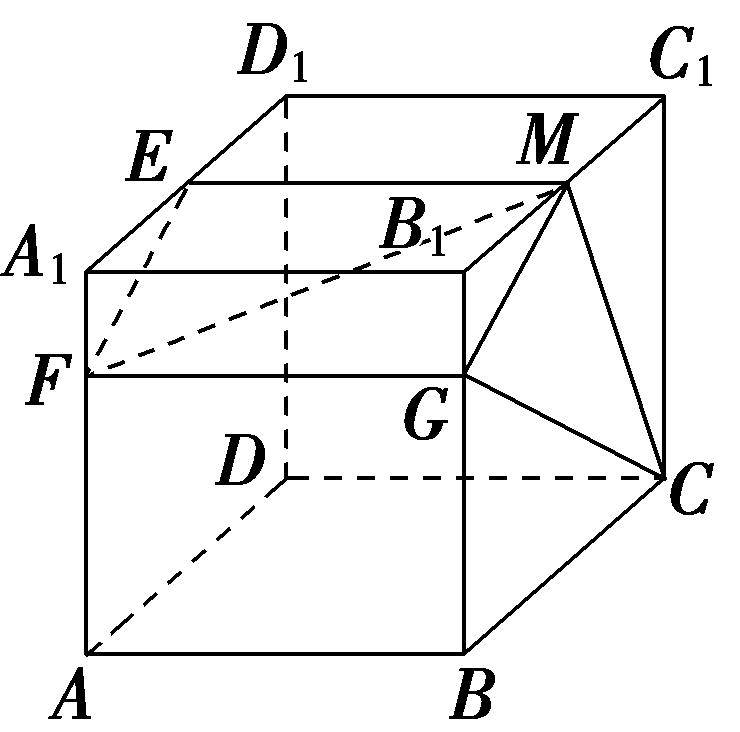

对于<em>&lt;text style="italic"&gt;&lt;text style="italic"&gt;&lt;text style="italic"&gt;&lt;text style="italic"&gt;C</em>&lt;/text&gt;&lt;/text&gt;&lt;/text&gt;&lt;/text&gt;，根据点<em>&lt;text style="italic"&gt;&lt;text style="italic"&gt;P</em>&lt;/text&gt;&lt;/text&gt;的轨迹可知，当P与<em>F</em>重合时，<em>&lt;text style="italic"&gt;&lt;text style="italic"&gt;&lt;text style="italic"&gt;M</em>P&lt;/text&gt;&lt;/text&gt;&lt;/text&gt;的长度有最大值.由正方体的性质知<em>A</em>&lt;text style="subscript"&gt;&lt;text style="subscript"&gt;&lt;text style="subscript"&gt;&lt;text style="subscript"&gt;&lt;text style="subscript"&gt;&lt;text style="subscript"&gt;&lt;text style="subscript"&gt;&lt;text style="subscript"&gt;&lt;text style="subscript"&gt;&lt;text style="subscript"&gt;&lt;text style="subscript"&gt;&lt;text style="subscript"&gt;&lt;text style="subscript"&gt;&lt;text style="subscript"&gt;&lt;text style="subscript"&gt;1&lt;/text&gt;&lt;/text&gt;&lt;/text&gt;&lt;/text&gt;&lt;/text&gt;&lt;/text&gt;&lt;/text&gt;&lt;/text&gt;&lt;/text&gt;&lt;/text&gt;&lt;/text&gt;&lt;/text&gt;&lt;/text&gt;&lt;/text&gt;&lt;/text&gt;<em>&lt;text style="italic"&gt;&lt;text style="italic"&gt;&lt;text style="italic"&gt;B</em>&lt;/text&gt;&lt;/text&gt;&lt;/text&gt;1⊥平面B1C1<em>&lt;text style="italic"&gt;&lt;text style="italic"&gt;CB</em>&lt;/text&gt;&lt;/text&gt;，所以<em>&lt;text style="italic"&gt;FG</em>&lt;/text&gt;⊥平面B1C1CB.又<em>&lt;text style="italic"&gt;MG</em>&lt;/text&gt;⊂平面B1C1CB，所以FG⊥MG.连接<em>&lt;text style="italic"&gt;MF</em>&lt;/text&gt;，则MF＝ $\sqrt{a^{2}＋\frac{5a^{2}}{16}}$ ＝ $\frac{\sqrt{21}a}{4}$ ，故<em>&lt;text style="italic"&gt;&lt;text style="italic"&gt;&lt;text style="italic"&gt;&lt;text style="italic"&gt;C</em>&lt;/text&gt;&lt;/text&gt;&lt;/text&gt;&lt;/text&gt;正确；对于D，当直线<em>&lt;text style="italic"&gt;&lt;text style="italic"&gt;&lt;text style="italic"&gt;&lt;text style="italic"&gt;&lt;text style="italic"&gt;CC</em>&lt;/text&gt;&lt;/text&gt;&lt;/text&gt;&lt;/text&gt;&lt;/text&gt;&lt;text style="subscript"&gt;&lt;text style="subscript"&gt;&lt;text style="subscript"&gt;&lt;text style="subscript"&gt;&lt;text style="subscript"&gt;&lt;text style="subscript"&gt;&lt;text style="subscript"&gt;&lt;text style="subscript"&gt;&lt;text style="subscript"&gt;&lt;text style="subscript"&gt;&lt;text style="subscript"&gt;&lt;text style="subscript"&gt;&lt;text style="subscript"&gt;&lt;text style="subscript"&gt;&lt;text style="subscript"&gt;1&lt;/text&gt;&lt;/text&gt;&lt;/text&gt;&lt;/text&gt;&lt;/text&gt;&lt;/text&gt;&lt;/text&gt;&lt;/text&gt;&lt;/text&gt;&lt;/text&gt;&lt;/text&gt;&lt;/text&gt;&lt;/text&gt;&lt;/text&gt;&lt;/text&gt;与直线<em>M&lt;text style="italic"&gt;&lt;text style="italic"&gt;P</em>&lt;/text&gt;&lt;/text&gt;所成角的余弦值最大时，直线CC1与直线<em>&lt;text style="italic"&gt;&lt;text style="italic"&gt;&lt;text style="italic"&gt;&lt;text style="italic"&gt;MP</em>&lt;/text&gt;&lt;/text&gt;&lt;/text&gt;&lt;/text&gt;所成的角最小，由于点P的轨迹为四边形ME<em>F</em>G(不含点M)，所以直线CC1与直线MP所成的最小角就是直线CC1与平面ME<em>&lt;text style="italic"&gt;FG</em>&lt;/text&gt;所成的角，又向量 $\vec{CC_{1}}$ 与平面<em>M</em>E<em>F</em>G的法向量 $\vec{CM}$ 的夹角为∠<em>&lt;text style="italic"&gt;&lt;text style="italic"&gt;&lt;text style="italic"&gt;&lt;text style="italic"&gt;C</em>&lt;/text&gt;&lt;/text&gt;&lt;/text&gt;&lt;/text&gt;&lt;text style="subscript"&gt;&lt;text style="subscript"&gt;&lt;text style="subscript"&gt;&lt;text style="subscript"&gt;&lt;text style="subscript"&gt;&lt;text style="subscript"&gt;&lt;text style="subscript"&gt;&lt;text style="subscript"&gt;&lt;text style="subscript"&gt;&lt;text style="subscript"&gt;&lt;text style="subscript"&gt;&lt;text style="subscript"&gt;&lt;text style="subscript"&gt;&lt;text style="subscript"&gt;&lt;text style="subscript"&gt;1&lt;/text&gt;&lt;/text&gt;&lt;/text&gt;&lt;/text&gt;&lt;/text&gt;&lt;/text&gt;&lt;/text&gt;&lt;/text&gt;&lt;/text&gt;&lt;/text&gt;&lt;/text&gt;&lt;/text&gt;&lt;/text&gt;&lt;/text&gt;&lt;/text&gt;C<em>M</em>，且sin∠C1<em>&lt;text style="italic"&gt;CM</em>&lt;/text&gt;＝ $\frac{\frac{a}{2}}{\frac{\sqrt{5}a}{2}}$ ＝ $\frac{\sqrt{5}}{5}$ ，所以直线<em>&lt;text style="italic"&gt;&lt;text style="italic"&gt;&lt;text style="italic"&gt;&lt;text style="italic"&gt;C</em>&lt;/text&gt;&lt;/text&gt;&lt;/text&gt;&lt;/text&gt;C&lt;text style="subscript"&gt;&lt;text style="subscript"&gt;&lt;text style="subscript"&gt;&lt;text style="subscript"&gt;&lt;text style="subscript"&gt;&lt;text style="subscript"&gt;&lt;text style="subscript"&gt;&lt;text style="subscript"&gt;&lt;text style="subscript"&gt;&lt;text style="subscript"&gt;&lt;text style="subscript"&gt;&lt;text style="subscript"&gt;&lt;text style="subscript"&gt;&lt;text style="subscript"&gt;&lt;text style="subscript"&gt;1&lt;/text&gt;&lt;/text&gt;&lt;/text&gt;&lt;/text&gt;&lt;/text&gt;&lt;/text&gt;&lt;/text&gt;&lt;/text&gt;&lt;/text&gt;&lt;/text&gt;&lt;/text&gt;&lt;/text&gt;&lt;/text&gt;&lt;/text&gt;&lt;/text&gt;与平面<em>M</em>E<em>F</em>G所成角的余弦值为 $\frac{\sqrt{5}}{5}$ ，即直线<em>&lt;text style="italic"&gt;&lt;text style="italic"&gt;&lt;text style="italic"&gt;&lt;text style="italic"&gt;C</em>&lt;/text&gt;&lt;/text&gt;&lt;/text&gt;&lt;/text&gt;C&lt;text style="subscript"&gt;&lt;text style="subscript"&gt;&lt;text style="subscript"&gt;&lt;text style="subscript"&gt;&lt;text style="subscript"&gt;&lt;text style="subscript"&gt;&lt;text style="subscript"&gt;&lt;text style="subscript"&gt;&lt;text style="subscript"&gt;&lt;text style="subscript"&gt;&lt;text style="subscript"&gt;&lt;text style="subscript"&gt;&lt;text style="subscript"&gt;&lt;text style="subscript"&gt;&lt;text style="subscript"&gt;1&lt;/text&gt;&lt;/text&gt;&lt;/text&gt;&lt;/text&gt;&lt;/text&gt;&lt;/text&gt;&lt;/text&gt;&lt;/text&gt;&lt;/text&gt;&lt;/text&gt;&lt;/text&gt;&lt;/text&gt;&lt;/text&gt;&lt;/text&gt;&lt;/text&gt;与直线<em>M&lt;text style="italic"&gt;&lt;text style="italic"&gt;P</em>&lt;/text&gt;&lt;/text&gt;所成角的余弦值的最大值为 $\frac{\sqrt{5}}{5}$ ，故D正确.综上所述选<em>&lt;text style="italic"&gt;&lt;text style="italic"&gt;&lt;text style="italic"&gt;B</em>&lt;/text&gt;&lt;/text&gt;&lt;/text&gt;<em>&lt;text style="italic"&gt;&lt;text style="italic"&gt;&lt;text style="italic"&gt;&lt;text style="italic"&gt;C</em>&lt;/text&gt;&lt;/text&gt;&lt;/text&gt;&lt;/text&gt;D.

