第六节　空间向量的概念与运算

【课标研读】　1.了解空间直角坐标系，会用空间直角坐标系刻画点的位置；借助特殊长方体顶点坐标，探索并得出空间两点间的距离公式.　2.了解空间向量的概念，了解空间向量基本定理及其意义，掌握空间向量的正交分解及其坐标表示.　3.掌握空间向量的线性运算及其坐标表示；掌握空间向量的数量积及其坐标表示；了解空间向量投影的概念以及投影向量的意义.

##### 1.空间向量的有关概念

<table><tr><td>
名称
</td><td>
定义
</td></tr><tr><td>
空间向量
</td><td>
在空间中，具有大小和方向的量
</td></tr><tr><td>
相等向量
</td><td>
方向相同且模相等的向量
</td></tr><tr><td>
相反向量
</td><td>
长度相等而方向相反的向量
</td></tr><tr><td>
共线向量

(或平行向量)
</td><td>
表示若干空间向量的有向线段所在的直线互相平行或重合的向量
</td></tr><tr><td>
共面向量
</td><td>
平行于同一个平面的向量
</td></tr></table>

##### 2.空间向量的有关定理

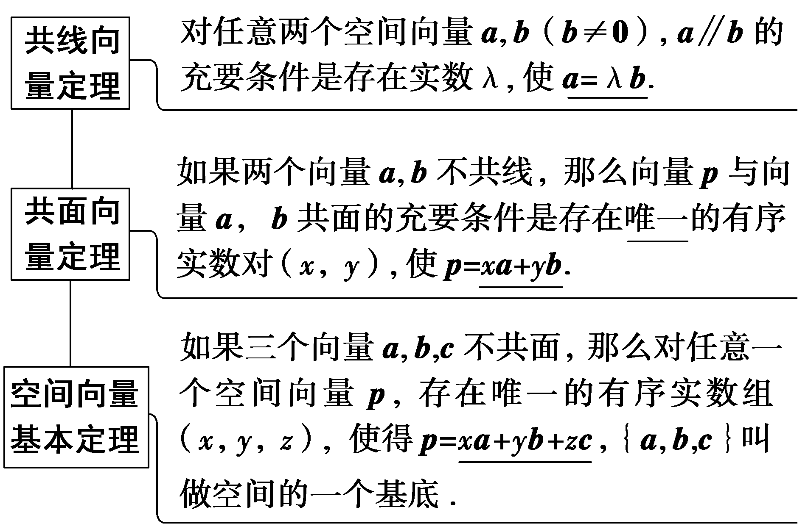

[微提醒]　空间向量基本定理的3点注意：

（1）空间任意三个不共面的向量都可构成空间的一个基底.（2）由于0与任意一个非零向量共线，与任意两个非零向量共面，故0不能作为基向量.（3）基底选定后，空间的所有向量均可由基底唯一表示.

##### 3.空间向量的数量积

（1）两向量的夹角：已知两个非零向量&lt;text style="&lt;text style="&lt;text style="&lt;text style="&lt;text style="&lt;text style="&lt;text style="<em><strong>b</strong></em>old,it<em><strong>a</strong></em>lic"&gt;b&lt;/text&gt;old,it<em><strong>a</strong></em>lic"&gt;b&lt;/text&gt;old,it<em><strong>a</strong></em>lic"&gt;b&lt;/text&gt;old,it<em><strong>a</strong></em>lic"&gt;b&lt;/text&gt;old,it<em><strong>a</strong></em>lic"&gt;b&lt;/text&gt;old,it<em><strong>a</strong></em>lic"&gt;b&lt;/text&gt;old,italic"&gt;a&lt;/text&gt;，b，在空间任取一点<em>O</em>，作 $\vec{OA}$ ＝&lt;text style="&lt;text style="&lt;text style="&lt;text style="&lt;text style="&lt;text style="&lt;text style="<em><strong>b</strong></em>old,it<em><strong>a</strong></em>lic"&gt;b&lt;/text&gt;old,it<em><strong>a</strong></em>lic"&gt;b&lt;/text&gt;old,it<em><strong>a</strong></em>lic"&gt;b&lt;/text&gt;old,it<em><strong>a</strong></em>lic"&gt;b&lt;/text&gt;old,it<em><strong>a</strong></em>lic"&gt;b&lt;/text&gt;old,it<em><strong>a</strong></em>lic"&gt;b&lt;/text&gt;old,italic"&gt;a&lt;/text&gt;， $\vec{OB}$ ＝&lt;text style="&lt;text style="&lt;text style="&lt;text style="&lt;text style="&lt;text style="<em><strong>b</strong></em>old,it<em><strong>a</strong></em>lic"&gt;b&lt;/text&gt;old,it<em><strong>a</strong></em>lic"&gt;b&lt;/text&gt;old,it<em><strong>a</strong></em>lic"&gt;b&lt;/text&gt;old,it<em><strong>a</strong></em>lic"&gt;b&lt;/text&gt;old,it<em><strong>a</strong></em>lic"&gt;b&lt;/text&gt;old,it<em><strong>a</strong></em>lic"&gt;b&lt;/text&gt;，则∠A<em>O</em>B叫做向量<em><strong>a</strong></em>与b的夹角，记作＜a，b＞，其范围是<u>[0，π]</u>，若＜a，b＞＝ $\frac{\pi }{2}$ ，则称&lt;text style="&lt;text style="&lt;text style="&lt;text style="&lt;text style="&lt;text style="&lt;text style="<em><strong>b</strong></em>old,it<em><strong>a</strong></em>lic"&gt;b&lt;/text&gt;old,it<em><strong>a</strong></em>lic"&gt;b&lt;/text&gt;old,it<em><strong>a</strong></em>lic"&gt;b&lt;/text&gt;old,it<em><strong>a</strong></em>lic"&gt;b&lt;/text&gt;old,it<em><strong>a</strong></em>lic"&gt;b&lt;/text&gt;old,it<em><strong>a</strong></em>lic"&gt;b&lt;/text&gt;old,italic"&gt;a&lt;/text&gt;与b<u>互相垂直</u>，记作a⊥b.

（2）两向量的数量积：已知两个非零向量<em><strong>a</strong></em>，<em><strong>b</strong></em>，则｜<em><strong>a</strong></em>｜｜<em><strong>b</strong></em>｜cos＜<em><strong>a</strong></em>，<em><strong>b</strong></em>＞叫做<em><strong>a</strong></em>，<em><strong>b</strong></em>的数量积，记作<em><strong>a</strong></em>·<em><strong>b</strong></em>，即<em><strong>a</strong></em>·<em><strong>b</strong></em>＝<u>｜</u><em><strong><u>a</u></strong></em><u>｜｜</u><em><strong><u>b</u></strong></em><u>｜cos＜</u><em><strong><u>a</u></strong></em><u>，</u><em><strong><u>b</u></strong></em><u>＞</u>.

（3）空间向量数量积的运算律

①结合律：(<em>λ<strong>a</strong></em>)·<em><strong>b</strong></em>＝<em>λ</em>(<em><strong>a</strong></em>·<em><strong>b</strong></em>)，<em>λ</em>∈<strong>R</strong>；

②交换律：*a*·*b*＝*b*·*a*；

③分配律：*a*·(*b*＋*c*)＝*a*·*b*＋*a*·*c*.

（4）在空间，向量<text style="<text style="<text style="<text style="*b*old,it*a*li*c*">b</text>old,it<text style="bold,it*a*lic">a</text>li<text style="bold,itali*c*">c</text>">b</text>old,italic">b</text>old,italic">a</text>向向量b投影，得到与向量b共线的向量c，c＝｜a｜cos＜a，b＞ $\frac{b}{｜b｜}$ ，向量<text style="<text style="*b*old,it*a*li*c*">b</text>old,it<text style="bold,it*a*lic">a</text>li*c*">c</text>称为向量<text style="<text style="*b*old,italic">b</text>old,italic">a</text>在向量b上的投影向量.

##### 4.空间向量的坐标表示及其应用

设<em><strong>a</strong></em>＝(<em>a</em>1，<em>a</em>2，<em>a</em>3)，<em><strong>b</strong></em>＝(<em>b</em>1，<em>b</em>2，<em>b</em>3).

<table><tr><td></td><td>
向量表示
</td><td>
坐标表示
</td></tr><tr><td>
数量积
</td><td>
<strong><em>a</em></strong>·<strong><em>b</em></strong>
</td><td>
<em>a</em>1<em>b</em>1＋<em>a</em>2<em>b</em>2＋<em>a</em>3<em>b</em>3
</td></tr><tr><td>
共线
</td><td>
<strong><em>a</em></strong>＝<em>λ</em><strong><em>b</em></strong>

(<strong><em>b</em></strong>≠<strong>0</strong>，<em>λ</em>∈<strong>R</strong>)
</td><td>
<em>a</em>1＝<em>λb</em>1，<em>a</em>2＝<em>λb</em>2，<em>a</em>3＝<em>λb</em>3
</td></tr><tr><td>
垂直
</td><td>
<strong><em>a</em></strong>·<strong><em>b</em></strong>＝0

(<strong><em>a</em></strong>≠<strong>0</strong>，<strong><em>b</em></strong>≠<strong>0</strong>)
</td><td>
<em>a</em>1<em>b</em>1＋<em>a</em>2<em>b</em>2＋<em>a</em>3<em>b</em>3＝0
</td></tr><tr><td>
模
</td><td>
｜<strong><em>a</em></strong>｜
</td><td></td></tr><tr><td>
夹角余弦值
</td><td>
cos＜<strong><em>a</em></strong>，<strong><em>b</em></strong>＞＝
</td><td></td></tr></table>

【常用结论】

（1）三点共线：在平面中<te<te<text st*y*le="italic">x</text>t st*y*le="italic">x</text>t style="italic">A</text>，*B*，*C*三点共线⇔ $\vec{OA}$ ＝<te<text st*y*le="italic">x</text>t st*y*le="italic">x</text> $\vec{OB}$ ＋<te<text st*y*le="italic">x</text>t style="italic">y</text> $\vec{OC}$ (其中<te<text st*y*le="italic">x</text>t st*y*le="italic">x</text>＋y＝1)，*O*为平面内任意一点.

（2）四点共面：在空间中<te<te<text st*y*le="italic">x</text>t st*y*le="italic">x</text>t style="italic">P</text>，*A*，*B*，*C*四点共面⇔ $\vec{OP}$ ＝<te<text st*y*le="italic">x</text>t st*y*le="italic">x</text> $\vec{OA}$ ＋<te<text st*y*le="italic">x</text>t style="italic">y</text> $\vec{OB}$ ＋<te<text st*y*le="italic">x</text>t style="italic">*z*</text> $\vec{OC}$ (其中<te<text st*y*le="italic">x</text>t st*y*le="italic">x</text>＋y＋*<text style="italic">z*</text>＝1)，*O*为空间中任意一点.

【自主检测】

##### 1.(多选)下列说法正确的是(　　)

$\quad$A.空间中任意两个非零向量*a*，*b*共面

$\quad$B.空间中模相等的两个向量方向相同或相反

<em>C</em>.若<em>A</em>，<em>B</em>，C，<em>D</em>是空间中任意四点，则有 $\vec{AB}$ ＋ $\vec{BC}$ ＋ $\vec{CD}$ ＋ $\vec{DA}$ ＝<strong>0</strong>

$\quad$D.对于向量<em><strong>a</strong></em>，<em><strong>b</strong></em>，若<em><strong>a</strong></em>·<em><strong>b</strong></em>＝0，则一定有<em><strong>a</strong></em>＝<strong>0</strong>或<em><strong>b</strong></em>＝<strong>0</strong>

答案AC

##### 2.(链接人教A选择性必修一P23T5)已知向量*a*＝(2，－3，1)，*b*＝(2，0，3)，*c*＝(0，0，2)，则*a*·(*b*＋*c*)＝(　　)

$\quad$A.6	
$\quad$B.7

$\quad$C.9	
$\quad$D.13

答案C

解析因为<em><strong>a</strong></em>＝(2，－3，1)，<em><strong>b</strong></em>＋<em><strong>c</strong></em>＝(2，0，5)，所以<em><strong>a</strong>·</em>(<em><strong>b</strong></em>＋<em><strong>c</strong></em>)＝2×2＋(－3)×0＋1×5＝9.故选C.

##### 3.(链接人教&lt;text style="it&lt;text style="&lt;text style="bold,itali<em><strong>c</strong></em>"&gt;b&lt;/text&gt;old,italic"&gt;a&lt;/text&gt;lic"&gt;<em>A</em>&lt;/text&gt;选择性必修一P&lt;text style="subscript"&gt;&lt;text style="subscript"&gt;&lt;text style="subscript"&gt;&lt;text style="subscript"&gt;&lt;text style="subscript"&gt;&lt;text style="subscript"&gt;&lt;text style="subscript"&gt;1&lt;/text&gt;&lt;/text&gt;&lt;/text&gt;&lt;/text&gt;&lt;/text&gt;&lt;/text&gt;&lt;/text&gt;0T5)在平行六面体<em>A&lt;text style="italic"&gt;&lt;text style="italic"&gt;B</em>&lt;/text&gt;<em>&lt;text style="italic"&gt;C</em>&lt;/text&gt;<em>&lt;text style="italic"&gt;D</em>&lt;/text&gt;&lt;/text&gt; -A1B1C1D1中，<em>M</em>为A1C1与B1D1的交点.若 $\vec{AB}$ ＝&lt;text style="&lt;text style="bold,itali<em><strong>c</strong></em>"&gt;b&lt;/text&gt;old,italic"&gt;a&lt;/text&gt;， $\vec{AD}$ ＝&lt;text style="bold,itali<em><strong>c</strong></em>"&gt;b&lt;/text&gt;， $\vec{AA_{1}}$ ＝<em><strong>c</strong></em>，则下列向量中与 $\vec{BM}$ 相等的向量是(　　)

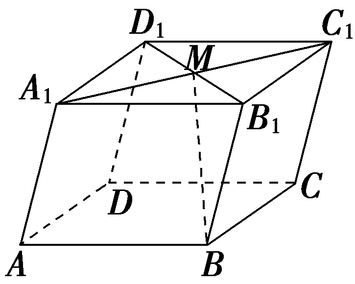

$\quad$A.－ $\frac{1}{2}$ <text style="<text style="<text style="bold,itali*c*">b</text>old,it*a*lic">b</text>old,italic">a</text>＋ $\frac{1}{2}$ <text style="<text style="bold,itali*c*">b</text>old,it*a*lic">b</text>＋*c*	
$\quad$B. $\frac{1}{2}$ <text style="<text style="<text style="bold,itali*c*">b</text>old,it*a*lic">b</text>old,italic">a</text>＋ $\frac{1}{2}$ <text style="<text style="bold,itali*c*">b</text>old,it*a*lic">b</text>＋c

$\quad$C.－ $\frac{1}{2}$ <text style="<text style="<text style="bold,itali*c*">b</text>old,it*a*lic">b</text>old,italic">a</text>－ $\frac{1}{2}$ <text style="<text style="bold,itali*c*">b</text>old,it*a*lic">b</text>＋*c*	
$\quad$D. $\frac{1}{2}$ <text style="<text style="<text style="bold,itali*c*">b</text>old,it*a*lic">b</text>old,italic">a</text>－ $\frac{1}{2}$ <text style="<text style="bold,itali*c*">b</text>old,it*a*lic">b</text>＋c

答案A

解析 $\vec{BM}$ ＝ $\vec{BB_{1}}$ ＋ $\vec{B_{1}M}$ ＝ $\vec{AA_{1}}$ ＋ $\frac{1}{2}(\vec{AD}$ － $\vec{AB}$ )＝<text style="<text style="bold,itali*c*">b</text>old,it*a*lic">c</text>＋ $\frac{1}{2}\left(b－a\right)$ ＝－ $\frac{1}{2}$ <text style="<text style="bold,itali*c*">b</text>old,italic">a</text>＋ $\frac{1}{2}$ <text style="bold,itali*c*">b</text>＋<text style="bold,it*a*lic">c</text>.故选A.

##### 4.(链接人教A选择性必修一P15T5)正四面体<em>ABCD</em>的棱长为2，<em>E</em>，<em>F</em>分别为<em>BC</em>，<em>AD</em>的中点，则<em>EF</em>的长为<u>　　　　</u>.

答案 $\sqrt{2}$

解析｜ $\vec{EF}$ ｜&lt;text style="superscript"&gt;&lt;text style="superscript"&gt;&lt;text style="superscript"&gt;2&lt;/text&gt;&lt;/text&gt;&lt;/text&gt;＝ $\vec{EF}^{2}$ ＝ $\left(\vec{EC}＋\vec{CD}＋\vec{DF}\right)^{2}$ ＝ $\vec{EC}^{2}$ ＋ $\vec{CD}^{2}$ ＋ $\vec{DF}^{2}$ ＋&lt;text style="superscript"&gt;&lt;text style="superscript"&gt;&lt;text style="superscript"&gt;2&lt;/text&gt;&lt;/text&gt;&lt;/text&gt;( $\vec{EC}$ · $\vec{CD}$ ＋ $\vec{EC}$ · $\vec{DF}$ ＋ $\vec{CD}$ · $\vec{DF}$ )＝1&lt;text style="superscript"&gt;&lt;text style="superscript"&gt;&lt;text style="superscript"&gt;2&lt;/text&gt;&lt;/text&gt;&lt;/text&gt;＋22＋12＋2(1×2×cos 120°＋0＋2×1×cos 120°)＝2，所以｜ $\vec{EF}$ ｜＝ $\sqrt{2}$ ，所以<em>EF</em>的长为 $\sqrt{2}$ .

考点一　空间向量的线性运算　　　　自主练透

##### 1.在空间四边形*A<text style="italic">BC*D</text>中， $\vec{AB}$ ＝(－3，5，2)， $\vec{CD}$ ＝(－7，－1，－4)，点*E*，*F*分别为线段*BC*，*AD*的中点，则 $\vec{EF}$ 的坐标为(　　)

$\quad$A.(2，3，3)	
$\quad$B.(－2，－3，－3)

$\quad$C.(5，－2，1)	
$\quad$D.(－5，2，－1)

答案B

解析因为点*E*，*F*分别为线段*BC*，*AD*的中点，设*O*为坐标原点，所以 $\vec{EF}$ ＝ $\vec{OF}$ － $\vec{OE}$ ， $\vec{OF}$ ＝ $\frac{1}{2}(\vec{OA}$ ＋ $\vec{OD}$ )， $\vec{OE}$ ＝ $\frac{1}{2}(\vec{OB}$ ＋ $\vec{OC}$ ).所以 $\vec{EF}$ ＝ $\frac{1}{2}(\vec{OA}$ ＋ $\vec{OD}$ )－ $\frac{1}{2}\left(\vec{OB}＋\vec{OC}\right)$ ＝ $\frac{1}{2}(\vec{BA}$ ＋ $\vec{CD}$ )＝ $\frac{1}{2}$ ×[(3，－5，－2)＋(－7，－1，－4)]＝ $\frac{1}{2}$ ×(－4，－6，－6)＝(－2，－3，－3).故选B.

##### 2.在三棱柱&lt;text style="it&lt;text style="&lt;text style="bold,itali<em><strong>c</strong></em>"&gt;b&lt;/text&gt;old,italic"&gt;a&lt;/text&gt;lic"&gt;A&lt;/text&gt;&lt;text style="subscript"&gt;&lt;text style="subscript"&gt;&lt;text style="subscript"&gt;&lt;text style="subscript"&gt;1&lt;/text&gt;&lt;/text&gt;&lt;/text&gt;&lt;/text&gt;<em>B</em>1<em>&lt;text style="italic"&gt;&lt;text style="italic"&gt;C</em>&lt;/text&gt;&lt;/text&gt;1-<em>ABC</em>中，<em>D</em>是四边形<em>BB</em>1C1C的中心，且 $\vec{AA_{1}}$ ＝&lt;text style="&lt;text style="bold,itali<em><strong>c</strong></em>"&gt;b&lt;/text&gt;old,italic"&gt;a&lt;/text&gt;， $\vec{AB}$ ＝&lt;text style="bold,itali<em><strong>c</strong></em>"&gt;b&lt;/text&gt;， $\vec{AC}$ ＝<em><strong>c</strong></em>，则 $\vec{A_{1}D}$ 等于(　　)

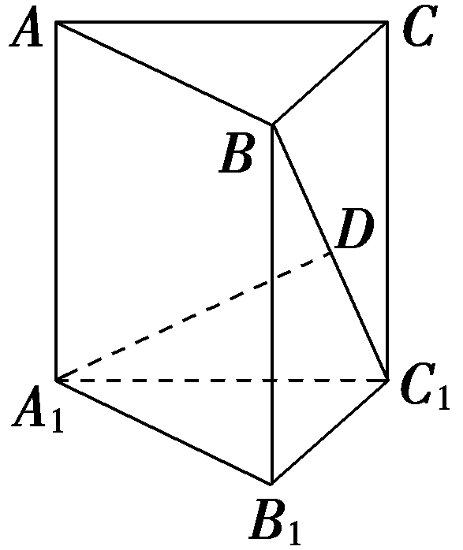

$\quad$A. $\frac{1}{2}$ <text style="<text style="bold,itali*c*">b</text>old,italic">a</text>＋ $\frac{1}{2}$ <text style="bold,itali*c*">b</text>＋ $\frac{1}{2}$ *c*

$\quad$B. $\frac{1}{2}$ <text style="<text style="bold,itali*c*">b</text>old,italic">a</text>－ $\frac{1}{2}$ <text style="bold,itali*c*">b</text>＋ $\frac{1}{2}$ *c*

$\quad$C. $\frac{1}{2}$ <text style="<text style="bold,itali*c*">b</text>old,italic">a</text>＋ $\frac{1}{2}$ <text style="bold,itali*c*">b</text>－ $\frac{1}{2}$ *c*

$\quad$D.－ $\frac{1}{2}$ <text style="<text style="bold,itali*c*">b</text>old,italic">a</text>＋ $\frac{1}{2}$ <text style="bold,itali*c*">b</text>＋ $\frac{1}{2}$ *c*

答案D

解析 $\vec{A_{1}D}$ ＝ $\vec{A_{1}A}$ ＋ $\vec{AB}$ ＋ $\vec{BD}$ ＝－ $\vec{AA_{1}}$ ＋ $\vec{AB}$ ＋ $\frac{1}{2}(\vec{BB_{1}}$ ＋ $\vec{BC}$ )＝－ $\vec{AA_{1}}$ ＋ $\vec{AB}$ ＋ $\frac{1}{2}\vec{AA_{1}}$ ＋ $\frac{1}{2}(\vec{AC}$ － $\vec{AB}$ )＝－ $\frac{1}{2}\vec{AA_{1}}$ ＋ $\frac{1}{2}\vec{AB}$ ＋ $\frac{1}{2}\vec{AC}$ ＝－ $\frac{1}{2}$ <text style="<text style="bold,itali*c*">b</text>old,italic">a</text>＋ $\frac{1}{2}$ <text style="bold,itali*c*">b</text>＋ $\frac{1}{2}$ *c*.故选D.

##### 3.(多选)如图所示，在四面体&lt;text style="it&lt;text style="&lt;text style="bold,itali<em><strong>c</strong></em>"&gt;b&lt;/text&gt;old,italic"&gt;a&lt;/text&gt;lic"&gt;OA<em>BC</em>&lt;/text&gt;中，点<em>M</em>是棱BC的中点，点<em>N</em>在线段<em>OM</em>上，点<em>P</em>在线段<em>AN</em>上，且<em>AP</em>＝3<em>PN</em>， $\vec{ON}$ ＝ $\frac{2}{3}\vec{OM}$ ，设 $\vec{OA}$ ＝&lt;text style="&lt;text style="bold,itali<em><strong>c</strong></em>"&gt;b&lt;/text&gt;old,italic"&gt;a&lt;/text&gt;， $\vec{OB}$ ＝&lt;text style="bold,itali<em><strong>c</strong></em>"&gt;b&lt;/text&gt;， $\vec{OC}$ ＝<em><strong>c</strong></em>，则下列等式成立的是(　　)

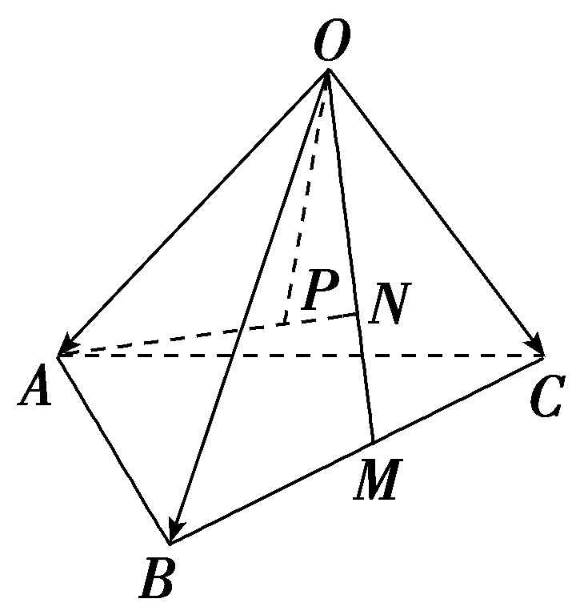

$\quad$A. $\vec{OM}$ ＝ $\frac{1}{2}$ <text style="bold,itali*c*">b</text>－ $\frac{1}{2}$ *c*

$\quad$B. $\vec{AN}$ ＝ $\frac{1}{3}$ <text style="bold,it*a*li*c*">b</text>＋ $\frac{1}{3}$ <text style="bold,it*a*lic">c</text>－a

$\quad$C. $\vec{AP}$ ＝ $\frac{1}{4}$ <text style="bold,it*a*li*c*">b</text>－ $\frac{1}{4}$ <text style="bold,it*a*lic">c</text>－ $\frac{3}{4}$ *a*

$\quad$D. $\vec{OP}$ ＝ $\frac{1}{4}$ <text style="<text style="bold,itali*c*">b</text>old,italic">a</text>＋ $\frac{1}{4}$ <text style="bold,itali*c*">b</text>＋ $\frac{1}{4}$ *c*

答案BD

解析对于A，利用向量的平行四边形法则， $\vec{OM}$ ＝ $\frac{1}{2}\vec{OB}$ ＋ $\frac{1}{2}\vec{OC}$ ＝ $\frac{1}{2}$ &lt;text style="&lt;text style="&lt;text style="&lt;text style="&lt;text style="bold,itali<em><strong>c</strong></em>"&gt;b&lt;/text&gt;old,it&lt;text style="bold,it<em><strong>a</strong></em>lic"&gt;a&lt;/text&gt;li<em><strong>c</strong></em>"&gt;b&lt;/text&gt;old,it&lt;text style="bold,it<em><strong>a</strong></em>lic"&gt;a&lt;/text&gt;li<em><strong>c</strong></em>"&gt;b&lt;/text&gt;old,it<em><strong>a</strong></em>li<em><strong>c</strong></em>"&gt;b&lt;/text&gt;old,itali<em><strong>c</strong></em>"&gt;b&lt;/text&gt;＋ $\frac{1}{2}$ &lt;text style="&lt;text style="&lt;text style="&lt;text style="&lt;text style="bold,itali<em><strong>c</strong></em>"&gt;b&lt;/text&gt;old,it&lt;text style="bold,it<em><strong>a</strong></em>lic"&gt;a&lt;/text&gt;li<em><strong>c</strong></em>"&gt;b&lt;/text&gt;old,it&lt;text style="bold,it<em><strong>a</strong></em>lic"&gt;a&lt;/text&gt;li<em><strong>c</strong></em>"&gt;b&lt;/text&gt;old,it<em><strong>a</strong></em>li<em><strong>c</strong></em>"&gt;b&lt;/text&gt;old,italic"&gt;c&lt;/text&gt;，故A错误；对于B，利用向量的平行四边形法则和三角形法则，得 $\vec{AN}$ ＝ $\vec{ON}$ － $\vec{OA}$ ＝ $\frac{2}{3}\vec{OM}$ － $\vec{OA}$ ＝ $\frac{2}{3}\left(\frac{1}{2}\vec{OB}＋\frac{1}{2}\vec{OC}\right)$ － $\vec{OA}$ ＝ $\frac{1}{3}\vec{OB}$ ＋ $\frac{1}{3}\vec{OC}$ － $\vec{OA}$ ＝ $\frac{1}{3}$ &lt;text style="&lt;text style="&lt;text style="&lt;text style="&lt;text style="bold,itali<em><strong>c</strong></em>"&gt;b&lt;/text&gt;old,it&lt;text style="bold,it<em><strong>a</strong></em>lic"&gt;a&lt;/text&gt;li<em><strong>c</strong></em>"&gt;b&lt;/text&gt;old,it&lt;text style="bold,it<em><strong>a</strong></em>lic"&gt;a&lt;/text&gt;li<em><strong>c</strong></em>"&gt;b&lt;/text&gt;old,it<em><strong>a</strong></em>li<em><strong>c</strong></em>"&gt;b&lt;/text&gt;old,itali<em><strong>c</strong></em>"&gt;b&lt;/text&gt;＋ $\frac{1}{3}$ &lt;text style="&lt;text style="&lt;text style="&lt;text style="&lt;text style="bold,itali<em><strong>c</strong></em>"&gt;b&lt;/text&gt;old,it&lt;text style="bold,it<em><strong>a</strong></em>lic"&gt;a&lt;/text&gt;li<em><strong>c</strong></em>"&gt;b&lt;/text&gt;old,it&lt;text style="bold,it<em><strong>a</strong></em>lic"&gt;a&lt;/text&gt;li<em><strong>c</strong></em>"&gt;b&lt;/text&gt;old,it<em><strong>a</strong></em>li<em><strong>c</strong></em>"&gt;b&lt;/text&gt;old,italic"&gt;c&lt;/text&gt;－a，故B正确；对于C，因为点<em>P</em>在线段<em>AN</em>上，且<em>AP</em>＝3<em>PN</em>，所以 $\vec{AP}$ ＝ $\frac{3}{4}\vec{AN}$ ＝ $\frac{3}{4}$ × $\left(\frac{1}{3}b＋\frac{1}{3}c－a\right)$ ＝ $\frac{1}{4}$ &lt;text style="&lt;text style="&lt;text style="&lt;text style="&lt;text style="bold,itali<em><strong>c</strong></em>"&gt;b&lt;/text&gt;old,it&lt;text style="bold,it<em><strong>a</strong></em>lic"&gt;a&lt;/text&gt;li<em><strong>c</strong></em>"&gt;b&lt;/text&gt;old,it&lt;text style="bold,it<em><strong>a</strong></em>lic"&gt;a&lt;/text&gt;li<em><strong>c</strong></em>"&gt;b&lt;/text&gt;old,it<em><strong>a</strong></em>li<em><strong>c</strong></em>"&gt;b&lt;/text&gt;old,itali<em><strong>c</strong></em>"&gt;b&lt;/text&gt;＋ $\frac{1}{4}$ &lt;text style="&lt;text style="&lt;text style="&lt;text style="&lt;text style="bold,itali<em><strong>c</strong></em>"&gt;b&lt;/text&gt;old,it&lt;text style="bold,it<em><strong>a</strong></em>lic"&gt;a&lt;/text&gt;li<em><strong>c</strong></em>"&gt;b&lt;/text&gt;old,it&lt;text style="bold,it<em><strong>a</strong></em>lic"&gt;a&lt;/text&gt;li<em><strong>c</strong></em>"&gt;b&lt;/text&gt;old,it<em><strong>a</strong></em>li<em><strong>c</strong></em>"&gt;b&lt;/text&gt;old,italic"&gt;c&lt;/text&gt;－ $\frac{3}{4}$ &lt;text style="&lt;text style="&lt;text style="&lt;text style="bold,itali<em><strong>c</strong></em>"&gt;b&lt;/text&gt;old,it&lt;text style="bold,it<em><strong>a</strong></em>lic"&gt;a&lt;/text&gt;li<em><strong>c</strong></em>"&gt;b&lt;/text&gt;old,it&lt;text style="bold,it<em><strong>a</strong></em>lic"&gt;a&lt;/text&gt;li<em><strong>c</strong></em>"&gt;b&lt;/text&gt;old,italic"&gt;a&lt;/text&gt;，故C错误；对于D， $\vec{OP}$ ＝ $\vec{OA}$ ＋ $\vec{AP}$ ＝&lt;text style="&lt;text style="&lt;text style="&lt;text style="bold,itali<em><strong>c</strong></em>"&gt;b&lt;/text&gt;old,it&lt;text style="bold,it<em><strong>a</strong></em>lic"&gt;a&lt;/text&gt;li<em><strong>c</strong></em>"&gt;b&lt;/text&gt;old,it&lt;text style="bold,it<em><strong>a</strong></em>lic"&gt;a&lt;/text&gt;li<em><strong>c</strong></em>"&gt;b&lt;/text&gt;old,italic"&gt;a&lt;/text&gt;＋ $\frac{1}{4}$ &lt;text style="&lt;text style="&lt;text style="&lt;text style="&lt;text style="bold,itali<em><strong>c</strong></em>"&gt;b&lt;/text&gt;old,it&lt;text style="bold,it<em><strong>a</strong></em>lic"&gt;a&lt;/text&gt;li<em><strong>c</strong></em>"&gt;b&lt;/text&gt;old,it&lt;text style="bold,it<em><strong>a</strong></em>lic"&gt;a&lt;/text&gt;li<em><strong>c</strong></em>"&gt;b&lt;/text&gt;old,it<em><strong>a</strong></em>li<em><strong>c</strong></em>"&gt;b&lt;/text&gt;old,itali<em><strong>c</strong></em>"&gt;b&lt;/text&gt;＋ $\frac{1}{4}$ &lt;text style="&lt;text style="&lt;text style="&lt;text style="&lt;text style="bold,itali<em><strong>c</strong></em>"&gt;b&lt;/text&gt;old,it&lt;text style="bold,it<em><strong>a</strong></em>lic"&gt;a&lt;/text&gt;li<em><strong>c</strong></em>"&gt;b&lt;/text&gt;old,it&lt;text style="bold,it<em><strong>a</strong></em>lic"&gt;a&lt;/text&gt;li<em><strong>c</strong></em>"&gt;b&lt;/text&gt;old,it<em><strong>a</strong></em>li<em><strong>c</strong></em>"&gt;b&lt;/text&gt;old,italic"&gt;c&lt;/text&gt;－ $\frac{3}{4}$ &lt;text style="&lt;text style="&lt;text style="&lt;text style="bold,itali<em><strong>c</strong></em>"&gt;b&lt;/text&gt;old,it&lt;text style="bold,it<em><strong>a</strong></em>lic"&gt;a&lt;/text&gt;li<em><strong>c</strong></em>"&gt;b&lt;/text&gt;old,it&lt;text style="bold,it<em><strong>a</strong></em>lic"&gt;a&lt;/text&gt;li<em><strong>c</strong></em>"&gt;b&lt;/text&gt;old,italic"&gt;a&lt;/text&gt;＝ $\frac{1}{4}$ &lt;text style="&lt;text style="&lt;text style="&lt;text style="bold,itali<em><strong>c</strong></em>"&gt;b&lt;/text&gt;old,it&lt;text style="bold,it<em><strong>a</strong></em>lic"&gt;a&lt;/text&gt;li<em><strong>c</strong></em>"&gt;b&lt;/text&gt;old,it&lt;text style="bold,it<em><strong>a</strong></em>lic"&gt;a&lt;/text&gt;li<em><strong>c</strong></em>"&gt;b&lt;/text&gt;old,italic"&gt;a&lt;/text&gt;＋ $\frac{1}{4}$ &lt;text style="&lt;text style="&lt;text style="&lt;text style="&lt;text style="bold,itali<em><strong>c</strong></em>"&gt;b&lt;/text&gt;old,it&lt;text style="bold,it<em><strong>a</strong></em>lic"&gt;a&lt;/text&gt;li<em><strong>c</strong></em>"&gt;b&lt;/text&gt;old,it&lt;text style="bold,it<em><strong>a</strong></em>lic"&gt;a&lt;/text&gt;li<em><strong>c</strong></em>"&gt;b&lt;/text&gt;old,it<em><strong>a</strong></em>li<em><strong>c</strong></em>"&gt;b&lt;/text&gt;old,itali<em><strong>c</strong></em>"&gt;b&lt;/text&gt;＋ $\frac{1}{4}$ &lt;text style="&lt;text style="&lt;text style="&lt;text style="&lt;text style="bold,itali<em><strong>c</strong></em>"&gt;b&lt;/text&gt;old,it&lt;text style="bold,it<em><strong>a</strong></em>lic"&gt;a&lt;/text&gt;li<em><strong>c</strong></em>"&gt;b&lt;/text&gt;old,it&lt;text style="bold,it<em><strong>a</strong></em>lic"&gt;a&lt;/text&gt;li<em><strong>c</strong></em>"&gt;b&lt;/text&gt;old,it<em><strong>a</strong></em>li<em><strong>c</strong></em>"&gt;b&lt;/text&gt;old,italic"&gt;c&lt;/text&gt;，故D正确.故选BD.

##### 4.如图，已知四棱柱<em>&lt;text style="italic"&gt;&lt;text style="italic"&gt;A</em>&lt;/text&gt;<em>&lt;text style="italic"&gt;B</em>&lt;/text&gt;<em>&lt;text style="italic"&gt;C</em>&lt;/text&gt;<em>&lt;text style="italic"&gt;D</em>&lt;/text&gt;&lt;/text&gt; -A&lt;text style="subscript"&gt;&lt;text style="subscript"&gt;&lt;text style="subscript"&gt;&lt;text style="subscript"&gt;&lt;text style="subscript"&gt;&lt;text style="subscript"&gt;&lt;text style="subscript"&gt;&lt;text style="subscript"&gt;1&lt;/text&gt;&lt;/text&gt;&lt;/text&gt;&lt;/text&gt;&lt;/text&gt;&lt;/text&gt;&lt;/text&gt;&lt;/text&gt;B1C1D1的底面A1B1C1D1为平行四边形，<em>E</em>为棱<em>AB</em>的中点， $\vec{AF}$ ＝ $\frac{1}{3}\vec{AD}$ ， $\vec{AG}$ ＝2 $\vec{GA_{1}}$ ，<em>&lt;text style="italic"&gt;A</em>&lt;/text&gt;<em>&lt;text style="italic"&gt;C</em>&lt;/text&gt;&lt;text style="subscript"&gt;&lt;text style="subscript"&gt;&lt;text style="subscript"&gt;&lt;text style="subscript"&gt;&lt;text style="subscript"&gt;&lt;text style="subscript"&gt;&lt;text style="subscript"&gt;&lt;text style="subscript"&gt;1&lt;/text&gt;&lt;/text&gt;&lt;/text&gt;&lt;/text&gt;&lt;/text&gt;&lt;/text&gt;&lt;/text&gt;&lt;/text&gt;与平面<em>E</em>FG交于点<em>M</em>，则 $\frac{AM}{AC_{1}}$ ＝<u>　　　　</u>.

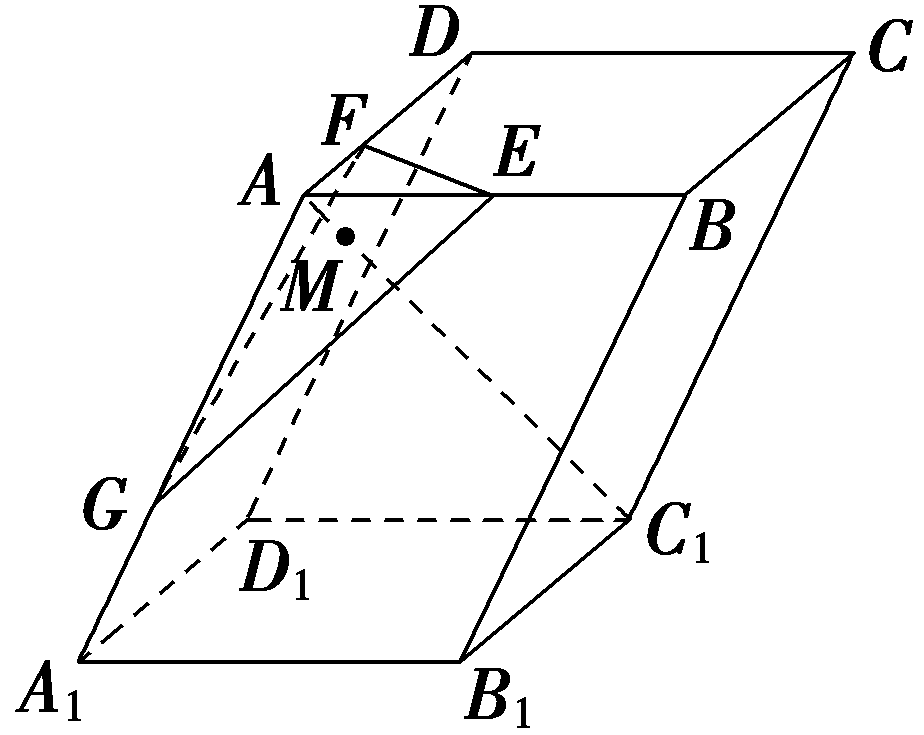

答案 $\frac{2}{13}$

解析由题可设 $\vec{AM}$ ＝*<text style="italic"><text style="italic"><text style="italic"><text style="italic"><text style="italic"><text style="italic"><text style="italic"><text style="italic">λ*</text></text></text></text></text></text></text></text> $\vec{AC_{1}}$ (0＜*<text style="italic"><text style="italic"><text style="italic"><text style="italic"><text style="italic"><text style="italic"><text style="italic"><text style="italic">λ*</text></text></text></text></text></text></text></text>＜1)，因为 $\vec{AC_{1}}$ ＝ $\vec{AB}$ ＋ $\vec{AD}$ ＋ $\vec{AA_{1}}$ ＝2 $\vec{AE}$ ＋3 $\vec{AF}$ ＋ $\frac{3}{2}\vec{AG}$ ，所以 $\vec{AM}$ ＝2*<text style="italic"><text style="italic"><text style="italic"><text style="italic"><text style="italic"><text style="italic"><text style="italic"><text style="italic">λ*</text></text></text></text></text></text></text></text> $\vec{AE}$ ＋3*<text style="italic"><text style="italic"><text style="italic"><text style="italic"><text style="italic"><text style="italic"><text style="italic"><text style="italic">λ*</text></text></text></text></text></text></text></text> $\vec{AF}$ ＋ $\frac{3}{2}$ *<text style="italic"><text style="italic"><text style="italic"><text style="italic"><text style="italic"><text style="italic"><text style="italic"><text style="italic">λ*</text></text></text></text></text></text></text></text> $\vec{AG}$ ，因为*M*，*E*，*F*，*G*四点共面，所以2*<text style="italic"><text style="italic"><text style="italic"><text style="italic"><text style="italic"><text style="italic"><text style="italic"><text style="italic">λ*</text></text></text></text></text></text></text></text>＋3λ＋ $\frac{3}{2}$ *<text style="italic"><text style="italic"><text style="italic"><text style="italic"><text style="italic"><text style="italic"><text style="italic"><text style="italic">λ*</text></text></text></text></text></text></text></text>＝1，解得λ＝ $\frac{2}{13}$ .

空间向量线性运算的三个关键点

一要结合图形，明确图形中各线段的几何关系，以图形为指导是解题的关键；二要正确理解向量加法、减法与数乘运算的几何意义；三要在立体几何中正确运用三角形法则、平行四边形法则.

考点二　空间向量基本定理及其应用　　　　师生共研

已知*A*，*B*，*C*三点不共线，对平面*ABC*外的任一点*O*，若点*M*满足 $\vec{OM}$ ＝ $\frac{1}{3}\left(\vec{OA}＋\vec{OB}＋\vec{OC}\right)$ .

（1）判断 $\vec{MA}$ ， $\vec{MB}$ ， $\vec{MC}$ 三个向量是否共面；

（2）判断点*M*是否在平面*ABC*内.

解：（1）由题知 $\vec{OA}$ ＋ $\vec{OB}$ ＋ $\vec{OC}$ ＝3 $\vec{OM}$ ，

所以 $\vec{OA}$ － $\vec{OM}$ ＝ $\vec{OM}$ － $\vec{OB}$ ＋ $\vec{OM}$ － $\vec{OC}$ ，

即 $\vec{MA}$ ＝ $\vec{BM}$ ＋ $\vec{CM}$ ＝－ $\vec{MB}$ － $\vec{MC}$ ，

所以 $\vec{MA}$ ， $\vec{MB}$ ， $\vec{MC}$ 共面.

（2）由（1）知， $\vec{MA}$ ， $\vec{MB}$ ， $\vec{MC}$ 共面且有公共点*<text style="italic"><text style="italic">M*</text></text>，所以M，*A*，*B*，*C*四点共面，即点M在平面*ABC*内.

证明三点共线和空间四点共面的方法比较

<table><tr><td>
三点<em>P</em>，<em>A</em>，<em>B</em>共线
</td><td>
空间四点<em>M</em>，<em>P</em>，<em>A</em>，<em>B</em>共面
</td></tr><tr><td>
＝<em>λ</em>且同过点<em>P</em>
</td><td>
＝<em>x</em>＋<em>y</em>且同过点<em>M</em>
</td></tr><tr><td>
对空间任一点<em>O</em>，＝＋<em>t</em>
</td><td>
对空间任一点<em>O</em>，＝＋<em>x</em>＋<em>y</em>
</td></tr><tr><td>
对空间任一点<em>O</em>，＝<em>x</em>＋(1－<em>x</em>)
</td><td>
对空间任一点<em>O</em>，＝<em>x</em>＋<em>y</em>＋(1－<em>x</em>－<em>y</em>)
</td></tr></table>

对点练1.(多选)下列说法中正确的是(　　)

$\quad$A.｜*a*｜－｜*b*｜＝｜*a*＋*b*｜是*a*，*b*共线的充要条件

$\quad$B.若 $\vec{AB}$ ， $\vec{CD}$ 共线，则*AB*∥*CD*

*<text style="italic">C*</text>.*<text style="italic">A*</text>，*<text style="italic">B*</text>，C三点不共线，对空间任意一点*O*，若 $\vec{OP}$ ＝ $\frac{3}{4}\vec{OA}$ ＋ $\frac{1}{8}\vec{OB}$ ＋ $\frac{1}{8}\vec{OC}$ ，则*P*，*<text style="italic">A*</text>，*<text style="italic">B*</text>，*<text style="italic">C*</text>四点共面

$\quad$D.若*P*，*<text style="italic">A*</text>，*<text style="italic">B*</text>，*<text style="italic">C*</text>为空间四点，且有 $\vec{PA}$ ＝*<text style="italic">λ*</text> $\vec{PB}$ ＋*<text style="italic">μ*</text> $\vec{PC}(\vec{PB}$ ， $\vec{PC}$ 不共线)，则*<text style="italic">λ*</text>＋*<text style="italic">μ*</text>＝1是*<text style="italic">A*</text>，*<text style="italic">B*</text>，*<text style="italic">C*</text>三点共线的充要条件

答案CD

解析由｜&lt;text style="&lt;text style="&lt;text style="&lt;text style="&lt;text style="&lt;text style="&lt;text style="&lt;text style="<em><strong>b</strong></em>old,it<em><strong>a</strong></em>lic"&gt;b&lt;/text&gt;old,it<em><strong>a</strong></em>lic"&gt;b&lt;/text&gt;old,it<em><strong>a</strong></em>lic"&gt;b&lt;/text&gt;old,it<em><strong>a</strong></em>lic"&gt;b&lt;/text&gt;old,it<em><strong>a</strong></em>lic"&gt;b&lt;/text&gt;old,it<em><strong>a</strong></em>lic"&gt;b&lt;/text&gt;old,it<em><strong>a</strong></em>lic"&gt;b&lt;/text&gt;old,italic"&gt;a&lt;/text&gt;｜－｜b｜＝｜a＋b｜，可知向量a，b的方向相反，此时向量a，b共线，反之，当向量a，b同向时，向量a，b共线，但不能得到｜a｜－｜b｜＝｜a＋b｜，故<em>&lt;text style="italic"&gt;&lt;text style="italic"&gt;&lt;text style="italic"&gt;&lt;text style="italic"&gt;&lt;text style="italic"&gt;A</em>&lt;/text&gt;&lt;/text&gt;&lt;/text&gt;&lt;/text&gt;&lt;/text&gt;不正确；若 $\vec{AB}$ ， $\vec{CD}$ 共线，则<em>&lt;text style="italic"&gt;&lt;text style="italic"&gt;&lt;text style="italic"&gt;&lt;text style="italic"&gt;&lt;text style="italic"&gt;&lt;text style="italic"&gt;A</em>&lt;/text&gt;&lt;/text&gt;&lt;/text&gt;&lt;/text&gt;&lt;/text&gt;<em>&lt;text style="italic"&gt;&lt;text style="italic"&gt;&lt;text style="italic"&gt;&lt;text style="italic"&gt;&lt;text style="italic"&gt;B</em>&lt;/text&gt;&lt;/text&gt;&lt;/text&gt;&lt;/text&gt;&lt;/text&gt;&lt;/text&gt;∥<em>&lt;text style="italic"&gt;&lt;text style="italic"&gt;&lt;text style="italic"&gt;&lt;text style="italic"&gt;&lt;text style="italic"&gt;&lt;text style="italic"&gt;C</em>&lt;/text&gt;&lt;/text&gt;&lt;/text&gt;&lt;/text&gt;&lt;/text&gt;<em>D</em>&lt;/text&gt;或A，B，C，D四点共线，故B不正确；由A，B，C三点不共线，对空间任意一点<em>O</em>，若 $\vec{OP}$ ＝ $\frac{3}{4}\vec{OA}$ ＋ $\frac{1}{8}\vec{OB}$ ＋ $\frac{1}{8}\vec{OC}$ ，因为 $\frac{3}{4}$ ＋ $\frac{1}{8}$ ＋ $\frac{1}{8}$ ＝1，可得<em>&lt;text style="italic"&gt;P</em>&lt;/text&gt;，<em>&lt;text style="italic"&gt;&lt;text style="italic"&gt;&lt;text style="italic"&gt;&lt;text style="italic"&gt;&lt;text style="italic"&gt;A</em>&lt;/text&gt;&lt;/text&gt;&lt;/text&gt;&lt;/text&gt;&lt;/text&gt;，<em>&lt;text style="italic"&gt;&lt;text style="italic"&gt;&lt;text style="italic"&gt;&lt;text style="italic"&gt;&lt;text style="italic"&gt;B</em>&lt;/text&gt;&lt;/text&gt;&lt;/text&gt;&lt;/text&gt;&lt;/text&gt;，<em>&lt;text style="italic"&gt;&lt;text style="italic"&gt;&lt;text style="italic"&gt;&lt;text style="italic"&gt;&lt;text style="italic"&gt;C</em>&lt;/text&gt;&lt;/text&gt;&lt;/text&gt;&lt;/text&gt;&lt;/text&gt;四点共面，故C正确；若P，A，B，C为空间四点，且有 $\vec{PA}$ ＝<em>&lt;text style="italic"&gt;&lt;text style="italic"&gt;&lt;text style="italic"&gt;&lt;text style="italic"&gt;&lt;text style="italic"&gt;λ</em>&lt;/text&gt;&lt;/text&gt;&lt;/text&gt;&lt;/text&gt;&lt;/text&gt; $\vec{PB}$ ＋<em>&lt;text style="italic"&gt;&lt;text style="italic"&gt;&lt;text style="italic"&gt;μ</em>&lt;/text&gt;&lt;/text&gt;&lt;/text&gt; $\vec{PC}(\vec{PB}$ ， $\vec{PC}$ 不共线)，当<em>&lt;text style="italic"&gt;&lt;text style="italic"&gt;&lt;text style="italic"&gt;&lt;text style="italic"&gt;&lt;text style="italic"&gt;λ</em>&lt;/text&gt;&lt;/text&gt;&lt;/text&gt;&lt;/text&gt;&lt;/text&gt;＋<em>&lt;text style="italic"&gt;&lt;text style="italic"&gt;&lt;text style="italic"&gt;μ</em>&lt;/text&gt;&lt;/text&gt;&lt;/text&gt;＝1时，即μ＝1－λ，可得 $\vec{PA}$ － $\vec{PC}$ ＝<em>&lt;text style="italic"&gt;&lt;text style="italic"&gt;&lt;text style="italic"&gt;&lt;text style="italic"&gt;&lt;text style="italic"&gt;λ</em>&lt;/text&gt;&lt;/text&gt;&lt;/text&gt;&lt;/text&gt;&lt;/text&gt;( $\vec{PB}$ － $\vec{PC}$ )，即 $\vec{CA}$ ＝<em>&lt;text style="italic"&gt;&lt;text style="italic"&gt;&lt;text style="italic"&gt;&lt;text style="italic"&gt;&lt;text style="italic"&gt;λ</em>&lt;/text&gt;&lt;/text&gt;&lt;/text&gt;&lt;/text&gt;&lt;/text&gt; $\vec{CB}$ ，所以<em>&lt;text style="italic"&gt;&lt;text style="italic"&gt;&lt;text style="italic"&gt;&lt;text style="italic"&gt;&lt;text style="italic"&gt;A</em>&lt;/text&gt;&lt;/text&gt;&lt;/text&gt;&lt;/text&gt;&lt;/text&gt;，<em>&lt;text style="italic"&gt;&lt;text style="italic"&gt;&lt;text style="italic"&gt;&lt;text style="italic"&gt;&lt;text style="italic"&gt;B</em>&lt;/text&gt;&lt;/text&gt;&lt;/text&gt;&lt;/text&gt;&lt;/text&gt;，<em>&lt;text style="italic"&gt;&lt;text style="italic"&gt;&lt;text style="italic"&gt;&lt;text style="italic"&gt;&lt;text style="italic"&gt;C</em>&lt;/text&gt;&lt;/text&gt;&lt;/text&gt;&lt;/text&gt;&lt;/text&gt;三点共线，反之也成立，即<em>&lt;text style="italic"&gt;&lt;text style="italic"&gt;&lt;text style="italic"&gt;&lt;text style="italic"&gt;&lt;text style="italic"&gt;λ</em>&lt;/text&gt;&lt;/text&gt;&lt;/text&gt;&lt;/text&gt;&lt;/text&gt;＋<em>&lt;text style="italic"&gt;&lt;text style="italic"&gt;&lt;text style="italic"&gt;μ</em>&lt;/text&gt;&lt;/text&gt;&lt;/text&gt;＝1是A，B，C三点共线的充要条件，故<em>D</em>正确.故选<em>CD</em>.

对点练2.已知空间中<em>A</em>，<em>B</em>，<em>C</em>，<em>D</em>四点共面，且其中任意三点均不共线，设<em>P</em>为空间中任意一点，若 $\vec{BD}$ ＝6 $\vec{PA}$ －4 $\vec{PB}$ ＋<em>&lt;text style="italic"&gt;λ</em>&lt;/text&gt; $\vec{PC}$ ，则<em>&lt;text style="italic"&gt;λ</em>&lt;/text&gt;＝<u>　　　　</u>.

答案－2

解析 $\vec{BD}$ ＝6 $\vec{PA}$ －4 $\vec{PB}$ ＋*<text style="italic"><text style="italic"><text style="italic"><text style="italic">λ*</text></text></text></text> $\vec{PC}$ ，即 $\vec{PD}$ － $\vec{PB}$ ＝6 $\vec{PA}$ －4 $\vec{PB}$ ＋*<text style="italic"><text style="italic"><text style="italic"><text style="italic">λ*</text></text></text></text> $\vec{PC}$ ，整理得 $\vec{PD}$ ＝6 $\vec{PA}$ －3 $\vec{PB}$ ＋*<text style="italic"><text style="italic"><text style="italic"><text style="italic">λ*</text></text></text></text> $\vec{PC}$ ，由*A*，*B*，*C*，*D*四点共面，且其中任意三点均不共线，可得6－3＋*<text style="italic"><text style="italic"><text style="italic"><text style="italic">λ*</text></text></text></text>＝1，解得λ＝－2.

考点三　空间向量数量积及其应用　　　　师生共研

如图，已知平行六面体<em>ABCD</em> -<em>A</em>1<em>B</em>1<em>C</em>1<em>D</em>1中，底面<em>ABCD</em>是边长为1的正方形，<em>AA</em>1＝2，∠<em>A</em>1<em>AB</em>＝∠<em>A</em>1<em>AD</em>＝120°.

（1）求线段<em>AC</em>1的长；

（2）求异面直线<em>AC</em>1与<em>A</em>1<em>D</em>所成角的余弦值；

（3）求证：<em>AA</em>1⊥<em>BD</em>.

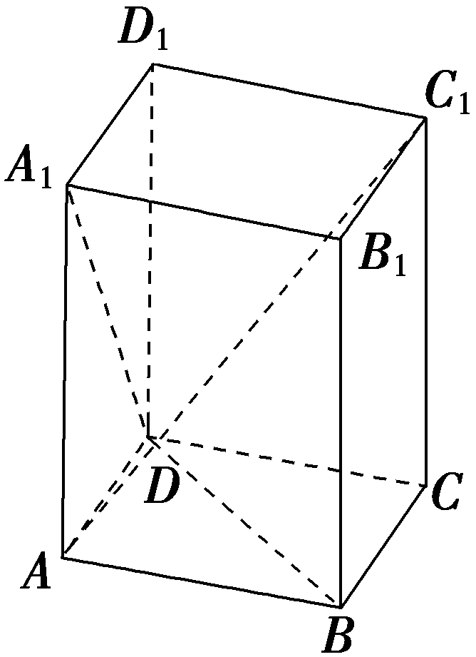

解：（1）设 $\vec{AB}$ ＝<text style="<text style="bold,itali*c*">b</text>old,italic">a</text>， $\vec{AD}$ ＝<text style="bold,itali*c*">b</text>， $\vec{AA_{1}}$ ＝*c*，

则｜*a*｜＝｜*b*｜＝1，｜*c*｜＝2，*a*·*b*＝0，

*c*·*a*＝*c*·*b*＝2×1×cos 120°＝－1.

因为 $\vec{AC_{1}}$ ＝ $\vec{AB}$ ＋ $\vec{AD}$ ＋ $\vec{AA_{1}}$ ＝<text style="<text style="bold,itali*c*">b</text>old,italic">a</text>＋b＋c，

所以｜ $\vec{AC_{1}}$ ｜＝｜<text style="<text style="bold,itali*c*">b</text>old,italic">a</text>＋b＋c｜＝ $\sqrt{\left(a＋b＋c\right)^{2}}$

＝ $\sqrt{｜a｜^{2}＋｜b｜^{2}＋｜c｜^{2}+2a\cdot b+2b\cdot c+2a\cdot c}$

＝ $\sqrt{1+1+4+0－2－2}$ ＝ $\sqrt{2}$ ，

所以线段<em>AC</em>1的长为 $\sqrt{2}$ .

（2）因为 $\vec{AC_{1}}$ ＝<text style="<text style="<text style="bold,itali*c*">b</text>old,itali*c*">b</text>old,italic">a</text>＋b＋c， $\vec{A_{1}D}$ ＝<text style="<text style="bold,itali*c*">b</text>old,itali*c*">b</text>－c，

所以 $\vec{AC_{1}}$ · $\vec{A_{1}D}$ ＝ $\left(a＋b＋c\right)$ · $\left(b－c\right)$

＝<em><strong>a</strong>·<strong>b</strong></em>－<em><strong>a</strong></em>·<em><strong>c</strong></em>＋<em><strong>b</strong></em>2－<em><strong>c</strong></em>2

＝0＋1＋1－4＝－2，

｜ $\vec{A_{1}D}$ ｜＝｜<text style="bold,itali*c*">b</text>－c｜＝ $\sqrt{\left(b－c\right)^{2}}$ ＝ $\sqrt{｜b｜^{2}＋｜c｜^{2}－2b\cdot c}$

＝ $\sqrt{1+4+2}$ ＝ $\sqrt{7}$ ，设异面直线<em>&lt;text style="italic"&gt;A</em>C&lt;/text&gt;&lt;text style="subscript"&gt;1&lt;/text&gt;与A1<em>D</em>所成的角为<em>&lt;text style="italic"&gt;θ</em>&lt;/text&gt;，则cos θ＝｜cos＜ $\vec{AC_{1}}$ ， $\vec{A_{1}D}$ ＞｜＝ $\frac{｜\vec{AC_{1}}\cdot \vec{A_{1}D}｜}{｜\vec{AC_{1}}||\vec{A_{1}D}｜}$ ＝ $\frac{|-2｜}{\sqrt{2}\times \sqrt{7}}$ ＝ $\frac{\sqrt{14}}{7}$ ，

即异面直线<em>&lt;text style="italic"&gt;A</em>C&lt;/text&gt;&lt;text style="subscript"&gt;1&lt;/text&gt;与A1<em>D</em>所成角的余弦值为 $\frac{\sqrt{14}}{7}$ .

（3）证明：由(1)知 $\vec{AA_{1}}$ ＝&lt;text style="&lt;text style="&lt;text style="bold,it<em><strong>a</strong></em>li<em><strong>c</strong></em>"&gt;b&lt;/text&gt;old,it&lt;text style="bold,itali&lt;text style="bold,itali<em><strong>c</strong></em>"&gt;c&lt;/text&gt;"&gt;a&lt;/text&gt;lic"&gt;b&lt;/text&gt;old,italic"&gt;c&lt;/text&gt;， $\vec{BD}$ ＝&lt;text style="&lt;text style="bold,it<em><strong>a</strong></em>li<em><strong>c</strong></em>"&gt;b&lt;/text&gt;old,it&lt;text style="bold,itali&lt;text style="bold,itali<em><strong>c</strong></em>"&gt;c&lt;/text&gt;"&gt;a&lt;/text&gt;lic"&gt;b&lt;/text&gt;－a，所以 $\vec{AA_{1}}$ · $\vec{BD}$ ＝&lt;text style="&lt;text style="&lt;text style="bold,it<em><strong>a</strong></em>li<em><strong>c</strong></em>"&gt;b&lt;/text&gt;old,it&lt;text style="bold,itali&lt;text style="bold,itali<em><strong>c</strong></em>"&gt;c&lt;/text&gt;"&gt;a&lt;/text&gt;lic"&gt;b&lt;/text&gt;old,italic"&gt;c&lt;/text&gt;· $\left(b－a\right)$ ＝&lt;text style="&lt;text style="&lt;text style="bold,it<em><strong>a</strong></em>li<em><strong>c</strong></em>"&gt;b&lt;/text&gt;old,it&lt;text style="bold,itali&lt;text style="bold,itali<em><strong>c</strong></em>"&gt;c&lt;/text&gt;"&gt;a&lt;/text&gt;lic"&gt;b&lt;/text&gt;old,italic"&gt;c&lt;/text&gt;·b－c·a＝－1＋1＝0，即 $\vec{AA_{1}}$ · $\vec{BD}$ ＝0，所以<em>AA</em>1⊥<em>BD</em>.

空间向量数量积的三个应用

<table><tr><td>
求夹角
</td><td>
设向量<strong><em>a</em></strong>，<strong><em>b</em></strong>所成的角为<em>θ</em>，则cos <em>θ</em>＝，进而可求两异面直线所成的角
</td></tr><tr><td>
求长度

(距离)
</td><td>
运用公式｜<strong><em>a</em></strong>｜2＝<strong><em>a</em></strong>·<strong><em>a</em></strong>，可使线段长度的计算问题转化为向量数量积的计算问题
</td></tr><tr><td>
解决垂

直问题
</td><td>
利用<strong><em>a</em></strong>⊥<strong><em>b</em></strong>⇔<strong><em>a</em></strong>·<strong><em>b</em></strong>＝0(<strong><em>a</em></strong>≠<strong>0</strong>，<strong><em>b</em></strong>≠<strong>0</strong>)，可将垂直问题转化为向量数量积的计算问题
</td></tr></table>

对点练3.（1）已知<em><strong>a</strong></em>＝(－1，3，1)，<em><strong>b</strong></em>＝(2，0，－4)，<em><strong>c</strong></em>＝(3，－2，3)，则<em><strong>a</strong></em>·(<em><strong>b</strong></em>＋<em><strong>c</strong></em>)＝<u>　　　　</u>.

（2）在正三棱锥<em>P</em>-<em>&lt;text style="italic"&gt;&lt;text style="italic"&gt;AB</em>C&lt;/text&gt;&lt;/text&gt;中，<em>O</em>是△ABC的中心，<em>PA</em>＝AB＝2，则 $\vec{PO}$ · $\vec{PA}$ ＝<u>　　　　</u>.

答案（1）－12　（2） $\frac{8}{3}$

解析（1）因为*b*＋*c*＝(5，－2，－1)，所以*a*·(*b*＋*c*)＝－1×5＋3×(－2)＋1×(－1)＝－12.

(&lt;text style="superscript"&gt;&lt;text style="superscript"&gt;2&lt;/text&gt;&lt;/text&gt;)因为<em>P</em>-<em>&lt;text style="italic"&gt;&lt;text style="italic"&gt;&lt;text style="italic"&gt;ABC</em>&lt;/text&gt;&lt;/text&gt;&lt;/text&gt;为正三棱锥，<em>O</em>为△ABC的中心，所以<em>&lt;text style="italic"&gt;PO</em>&lt;/text&gt;⊥平面ABC，△ABC是等边三角形，所以PO⊥<em>AO</em>，所以 $\vec{PO}$ <em>·</em> $\vec{OA}$ ＝0，｜ $\vec{AO}$ ｜＝ $\frac{2}{3}$ <em>·</em>｜ $\vec{AB}$ ｜<em>·</em>sin 60°＝ $\frac{2\sqrt{3}}{3}$ ，故 $\vec{PO}$ <em>·</em> $\vec{PA}$ ＝ $\vec{PO}$ <em>·</em> $\left(\vec{PO}＋\vec{OA}\right)$ ＝｜ $\vec{PO}$ ｜&lt;text style="superscript"&gt;&lt;text style="superscript"&gt;2&lt;/text&gt;&lt;/text&gt;＝｜ $\vec{AP}$ ｜&lt;text style="superscript"&gt;&lt;text style="superscript"&gt;2&lt;/text&gt;&lt;/text&gt;－｜ $\vec{AO}$ ｜&lt;text style="superscript"&gt;&lt;text style="superscript"&gt;2&lt;/text&gt;&lt;/text&gt;＝4－ $\frac{4}{3}$ ＝ $\frac{8}{3}$ .

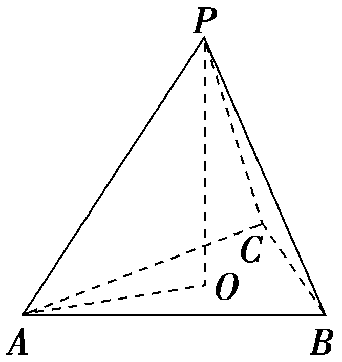

课时测评62　空间向量的概念与运算 $\frac{对应学生}{用书P433}$

(时间：60分钟　满分：88分)

(本栏目内容，在学生用书中以独立形式分册装订！)

(1—8题，每小题5分，共40分)

##### 1.已知<te<te*x*t style="bold,it*a*lic">x</text>t style="<text style="*b*old,italic">b</text>old,italic">a</text>＝(2，3，－4)，b＝(－4，－3，－2)，b＝ $\frac{1}{2}$ <te*x*t style="bold,it*a*lic">x</text>－2<text style="<text style="*b*old,italic">b</text>old,italic">a</text>，则x等于(　　)

$\quad$A.(0，3，－6)	
$\quad$B.(0，6，－20)

$\quad$C.(0，6，－6)	
$\quad$D.(6，6，－6)

答案B

解析由<te<te<text style="*b*old,it*a*lic">x</text>t style="bold,it*a*lic">x</text>t style="bold,italic">b</text>＝ $\frac{1}{2}$ <te<text style="*b*old,it*a*lic">x</text>t style="bold,it*a*lic">x</text>－2a，得x＝4a＋2*b*＝(8，12，－16)＋(－8，－6，－4)＝(0，6，－20).故选B.

##### 2.在空间四边形<text style="it<text style="<text style="bold,itali*c*">b</text>old,italic">a</text>lic">ABCD</text>中， $\vec{AB}$ ＝<text style="<text style="bold,itali*c*">b</text>old,italic">a</text>， $\vec{BC}$ ＝<text style="bold,itali*c*">b</text>， $\vec{AD}$ ＝*c*，则 $\vec{CD}$ ＝(　　)

$\quad$A.*a*＋*b*－*c*	
$\quad$B.*c*－*a*－*b*

$\quad$C.*a*－*b*－*c*	
$\quad$D.*b*－*a*＋*c*

答案B

解析如图所示， $\vec{CD}$ ＝ $\vec{CB}$ ＋ $\vec{BD}$ ＝ $\vec{CB}$ ＋( $\vec{AD}$ － $\vec{AB}$ )＝－<text style="*b*old,it<text style="bold,it*a*li*c*">a</text>li*c*">b</text>＋c－a＝c－a－b.故选B.

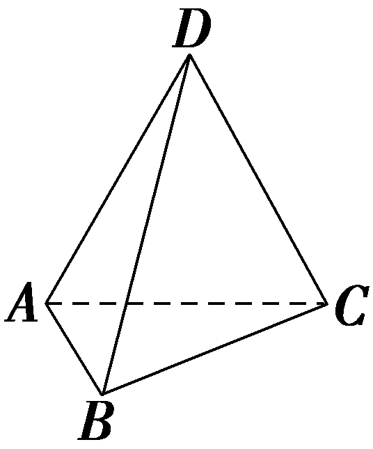

##### 3.如图，在平行六面体*ABCD* -*A'B'C'D'* 中，*AC*与*BD*的交点为*O*，点*M*在*BC'* 上，且*BM*＝2*MC'*，则下列向量中与 $\vec{OM}$ 相等的向量是(　　)

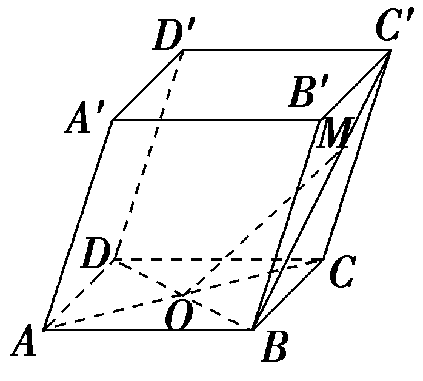

$\quad$A.－ $\frac{1}{2}\vec{AB}$ ＋ $\frac{7}{6}\vec{AD}$ ＋ $\frac{2}{3}\vec{AA'}$

$\quad$B.－ $\frac{1}{2}\vec{AB}$ ＋ $\frac{5}{6}\vec{AD}$ ＋ $\frac{1}{3}\vec{AA'}$

$\quad$C. $\frac{1}{2}\vec{AB}$ ＋ $\frac{1}{6}\vec{AD}$ ＋ $\frac{2}{3}\vec{AA'}$

$\quad$D. $\frac{1}{2}\vec{AB}$ － $\frac{1}{6}\vec{AD}$ ＋ $\frac{1}{3}\vec{AA'}$

答案C

解析因为*BM*＝2*MC'*，所以 $\vec{BM}$ ＝ $\frac{2}{3}\vec{BC'}$ ，在平行六面体*ABCD* -*A'B'C'D'* 中， $\vec{OM}$ ＝ $\vec{OB}$ ＋ $\vec{BM}$ ＝ $\vec{OB}$ ＋ $\frac{2}{3}\vec{BC'}$ ＝ $\frac{1}{2}\vec{DB}$ ＋ $\frac{2}{3}(\vec{AD}$ ＋ $\vec{AA'}$ )＝ $\frac{1}{2}(\vec{AB}$ － $\vec{AD}$ )＋ $\frac{2}{3}(\vec{AD}$ ＋ $\vec{AA'}$ )＝ $\frac{1}{2}\vec{AB}$ ＋ $\frac{1}{6}\vec{AD}$ ＋ $\frac{2}{3}\vec{AA'}$ .故选C.

##### 4.设正四面体*A<text style="italic">B<text style="italic">CD*</text></text>的棱长为2，*O*为△BCD的中心，*E*为*AO*上一点，*F*是CD的中点，则 $\vec{BE}$ · $\vec{BF}$ 的值为(　　)

$\quad$A.1	
$\quad$B.2

$\quad$C.4	
$\quad$D. $\sqrt{3}$

答案B

解析因为<em>O</em>为△<em>B&lt;text style="italic"&gt;CD</em>&lt;/text&gt;的中心，<em>E</em>∈<em>&lt;text style="italic"&gt;&lt;text style="italic"&gt;AO</em>&lt;/text&gt;&lt;/text&gt;，<em>F</em>为CD的中点，所以<em>BO</em>＝ $\frac{2}{3}$ B<em>F</em>，在正四面体中，A<em>O</em>⊥平面<em>B&lt;text style="italic"&gt;CD</em>&lt;/text&gt;，设 $\vec{OE}$ ＝<em>&lt;text style="italic"&gt;λ</em>&lt;/text&gt; $\vec{OA}$ ，0≤<em>&lt;text style="italic"&gt;λ</em>&lt;/text&gt;≤1，B<em>F</em>⊂平面<em>B&lt;text style="italic"&gt;CD</em>&lt;/text&gt;，所以A<em>O</em>⊥<em>&lt;text style="italic"&gt;&lt;text style="italic"&gt;&lt;text style="italic"&gt;BF</em>&lt;/text&gt;&lt;/text&gt;&lt;/text&gt;， $\vec{OA}$ · $\vec{BF}$ ＝0，所以 $\vec{OE}$ · $\vec{BF}$ ＝0，因为 $\vec{BE}$ · $\vec{BF}$ ＝( $\vec{BO}$ ＋ $\vec{OE}$ )· $\vec{BF}$ ＝ $\vec{BO}$ · $\vec{BF}$ ＋ $\vec{OE}$ · $\vec{BF}$ ＝｜ $\vec{BO}$ ｜·｜ $\vec{BF}$ ｜cos 0＋0＝ $\frac{2}{3}$ ｜ $\vec{BF}$ ｜&lt;text style="superscript"&gt;2&lt;/text&gt;，因为△<em>B&lt;text style="italic"&gt;CD</em>&lt;/text&gt;的边长为2，所以｜B<em>F</em>｜＝ $\frac{\sqrt{3}}{2}$ ×&lt;text style="superscript"&gt;2&lt;/text&gt;＝ $\sqrt{3}$ ，所以 $\vec{BE}$ · $\vec{BF}$ ＝ $\frac{2}{3}$ ×( $\sqrt{3}$ )&lt;text style="superscript"&gt;2&lt;/text&gt;＝2.

##### 5.(多选)给出下列四个说法，其中正确的是(　　)

$\quad$A.若*a*·*b*＜0，则＜*a*，*b*＞是钝角

$\quad$B.若<em><strong>a</strong></em>为直线<em>l</em>的方向向量，则<em>λ<strong>a</strong></em>(<em>λ</em>∈<strong>R</strong>)也是直线<em>l</em>的方向向量

$\quad$C.若 $\vec{AD}$ ＝ $\frac{1}{3}\vec{AC}$ ＋ $\frac{2}{3}\vec{AB}$ ，则 $\vec{CD}$ ＝2 $\vec{DB}$

$\quad$D.在三棱锥*P*-*ABC*中，若 $\vec{PA}$ · $\vec{BC}$ ＝0， $\vec{PC}$ · $\vec{AB}$ ＝0，则 $\vec{PB}$ · $\vec{AC}$ ＝0

答案CD

解析对于A，当&lt;text sty<em>l</em>e="&lt;text style="&lt;text style="&lt;text style="bold,it<em><strong>a</strong></em>lic"&gt;b&lt;/text&gt;old,it<em><strong>a</strong></em>lic"&gt;b&lt;/text&gt;old,it<em><strong>a</strong></em>lic"&gt;b&lt;/text&gt;old,italic"&gt;a&lt;/text&gt;＝－b时，满足a<em>&lt;text style="italic"&gt;&lt;text style="italic"&gt;·</em>&lt;/text&gt;&lt;/text&gt;b＜<strong>0</strong>，但＜a，b＞＝π，不是钝角，故A错误；对于B，当<em>&lt;text style="italic"&gt;λ</em>&lt;/text&gt;＝0时，λa＝0，不是直线l的方向向量，故B错误；对于C，由 $\vec{AD}$ ＝ $\frac{1}{3}\vec{AC}$ ＋ $\frac{2}{3}\vec{AB}$ ，得3 $\vec{AD}$ ＝ $\vec{AC}$ ＋2 $\vec{AB}$ ，则 $\vec{AD}$ － $\vec{AC}$ ＝－2 $\vec{AD}$ ＋2 $\vec{AB}$ ，所以 $\vec{CD}$ ＝2 $\vec{DB}$ ，故C正确；对于D，过点<em>P</em>作<em>P&lt;text style="italic"&gt;&lt;text style="italic"&gt;O</em>&lt;/text&gt;&lt;/text&gt;⊥平面<em>&lt;text style="italic"&gt;&lt;text style="italic"&gt;&lt;text style="italic"&gt;AB</em>&lt;/text&gt;C&lt;/text&gt;&lt;/text&gt;交平面A<em>&lt;text style="italic"&gt;&lt;text style="italic"&gt;BC</em>&lt;/text&gt;&lt;/text&gt;于点O，连接<em>CO</em>并延长，交AB于点<em>M</em>，连接<em>AO</em>并延长，交BC于点<em>N</em>，连接<em>BO</em>并延长，交<em>&lt;text style="italic"&gt;&lt;text style="italic"&gt;AC</em>&lt;/text&gt;&lt;/text&gt;于点<em>T</em>(图略)，由 $\vec{PA}$ &lt;text sty<em>l</em>e="it&lt;text style="&lt;text style="bold,it<em><strong>a</strong></em>lic"&gt;b&lt;/text&gt;old,italic"&gt;a&lt;/text&gt;lic"&gt;<em>&lt;text style="italic"&gt;·</em>&lt;/text&gt;&lt;/text&gt; $\vec{BC}$ ＝&lt;text sty<em>l</em>e="bold"&gt;0&lt;/text&gt;，可得<em>P</em>A⊥<em>&lt;text style="italic"&gt;&lt;text style="italic"&gt;BC</em>&lt;/text&gt;&lt;/text&gt;，则A<em>N</em>⊥BC，同理得C<em>M</em>⊥<em>&lt;text style="italic"&gt;AB</em>&lt;/text&gt;，所以<em>&lt;text style="italic"&gt;O</em>&lt;/text&gt;为△<em>&lt;text style="italic"&gt;&lt;text style="italic"&gt;ABC</em>&lt;/text&gt;&lt;/text&gt;的垂心，所以B<em>T</em>⊥<em>&lt;text style="italic"&gt;&lt;text style="italic"&gt;AC</em>&lt;/text&gt;&lt;/text&gt;，则<em>PB</em>⊥AC，从而 $\vec{PB}$ &lt;text sty<em>l</em>e="it&lt;text style="&lt;text style="bold,it<em><strong>a</strong></em>lic"&gt;b&lt;/text&gt;old,italic"&gt;a&lt;/text&gt;lic"&gt;<em>&lt;text style="italic"&gt;·</em>&lt;/text&gt;&lt;/text&gt; $\vec{AC}$ ＝&lt;text sty<em>l</em>e="bold"&gt;0&lt;/text&gt;，故D正确.故选CD.

##### 6.(多选)已知空间向量*a*＝(2，－2，1)，*b*＝(3，0，4)，则下列说法正确的是(　　)

$\quad$A.向量*c*＝(－8，5，6)与*a*，*b*垂直

$\quad$B.向量*d*＝(1，－4，－2)与*a*，*b*共面

$\quad$C.若&lt;text sty&lt;text sty<em>l</em>e="italic"&gt;l&lt;/text&gt;e="<em><strong>b</strong></em>old,italic"&gt;a&lt;/text&gt;与b分别是异面直线l1与l2的方向向量，则其所成角的余弦值为 $\frac{2}{3}$

$\quad$D.向量*a*在向量*b*上的投影向量为(6，0，8)

答案BC

解析对于A，&lt;text sty&lt;text sty&lt;text style="it&lt;text style="&lt;text style="<em><strong>b</strong></em>old,it&lt;text style="bold,it<em><strong>a</strong></em>lic"&gt;a&lt;/text&gt;lic"&gt;b&lt;/text&gt;old,italic"&gt;a&lt;/text&gt;lic"&gt;l&lt;/text&gt;e="italic"&gt;l&lt;/text&gt;e="&lt;text style="&lt;text style="&lt;text style="<em><strong>b</strong></em>ol&lt;text style="bold,it<em><strong>a</strong></em>lic"&gt;d&lt;/text&gt;,italic"&gt;b&lt;/text&gt;old,it<em><strong>a</strong></em>lic"&gt;b&lt;/text&gt;ol&lt;text style="bold,it<em><strong>a</strong></em>lic"&gt;d&lt;/text&gt;,it&lt;text style="bold,itali<em><strong>c</strong></em>"&gt;a&lt;/text&gt;li<em><strong>c</strong></em>"&gt;b&lt;/text&gt;old,itali<em><strong>c</strong></em>"&gt;a&lt;/text&gt;<em>&lt;text style="italic"&gt;·</em>&lt;/text&gt;c＝－16－10＋6≠0，b·c＝－24＋24＝0，故a，c不垂直，故A错误；对于B，设d＝<em>&lt;text style="italic"&gt;m</em>&lt;/text&gt;a＋<em>&lt;text style="italic"&gt;n</em>&lt;/text&gt;b，则m(2，－2，1)＋n(3，0，4)＝(1，－4，－2)，所以 $\left\{\begin{matrix}2m+3n=1，\\－2m＝－4，\\m+4n＝－2，\end{matrix}\right.$ 解得 $\left\{\begin{matrix}m=2，\\n＝－1，\end{matrix}\right.$ 即&lt;text style="su&lt;text style="<em><strong>b</strong></em>old,it&lt;text style="bold,it<em><strong>a</strong></em>lic"&gt;a&lt;/text&gt;lic"&gt;b&lt;/text&gt;script"&gt;2&lt;/text&gt;&lt;text sty&lt;text sty&lt;text style="it<em><strong>a</strong></em>lic"&gt;l&lt;/text&gt;e="italic"&gt;l&lt;/text&gt;e="&lt;text style="&lt;text style="&lt;text style="<em><strong>b</strong></em>ol&lt;text style="bold,it<em><strong>a</strong></em>lic"&gt;d&lt;/text&gt;,italic"&gt;b&lt;/text&gt;old,it<em><strong>a</strong></em>lic"&gt;b&lt;/text&gt;ol&lt;text style="bold,it<em><strong>a</strong></em>lic"&gt;d&lt;/text&gt;,it&lt;text style="bold,itali<em><strong>c</strong></em>"&gt;a&lt;/text&gt;li<em><strong>c</strong></em>"&gt;b&lt;/text&gt;old,itali<em><strong>c</strong></em>"&gt;a&lt;/text&gt;－b＝d，故B正确；对于C，因为cos＜a，b＞＝ $\frac{a\cdot b}{｜a||b｜}$ ＝ $\frac{10}{3\times 5}$ ＝ $\frac{2}{3}$ ，所以异面直线&lt;text sty&lt;text style="it&lt;text style="&lt;text style="<em><strong>b</strong></em>old,it&lt;text style="bold,it<em><strong>a</strong></em>lic"&gt;a&lt;/text&gt;lic"&gt;b&lt;/text&gt;old,italic"&gt;a&lt;/text&gt;lic"&gt;l&lt;/text&gt;e="italic"&gt;l&lt;/text&gt;1与l2所成角的余弦值为 $\frac{2}{3}$ ，故C正确；对于D，向量&lt;text sty&lt;text sty&lt;text style="it&lt;text style="&lt;text style="<em><strong>b</strong></em>old,it&lt;text style="bold,it<em><strong>a</strong></em>lic"&gt;a&lt;/text&gt;lic"&gt;b&lt;/text&gt;old,italic"&gt;a&lt;/text&gt;lic"&gt;l&lt;/text&gt;e="italic"&gt;l&lt;/text&gt;e="&lt;text style="&lt;text style="&lt;text style="<em><strong>b</strong></em>ol&lt;text style="bold,it<em><strong>a</strong></em>lic"&gt;d&lt;/text&gt;,italic"&gt;b&lt;/text&gt;old,it<em><strong>a</strong></em>lic"&gt;b&lt;/text&gt;ol&lt;text style="bold,it<em><strong>a</strong></em>lic"&gt;d&lt;/text&gt;,it&lt;text style="bold,itali<em><strong>c</strong></em>"&gt;a&lt;/text&gt;li<em><strong>c</strong></em>"&gt;b&lt;/text&gt;old,itali<em><strong>c</strong></em>"&gt;a&lt;/text&gt;在向量b上的投影向量为｜a｜cos＜a，b＞<em>&lt;text style="italic"&gt;·</em>&lt;/text&gt; $\frac{b}{｜b｜}$ ＝3× $\frac{2}{3}$ × $\frac{1}{5}$ × $\left(3，0，4\right)$ ＝ $\left(\frac{6}{5}，0，\frac{8}{5}\right)$ ，故D错误.故选BC.

##### 7.已知<em>A</em>，<em>B</em>，<em>C</em>三点不共线，点<em>O</em>为平面<em>&lt;text style="italic"&gt;ABC</em>&lt;/text&gt;外任意一点，若点<em>&lt;text style="italic"&gt;M</em>&lt;/text&gt;满足 $\vec{OM}$ ＝ $\frac{1}{5}\vec{OA}$ ＋ $\frac{4}{5}\vec{OB}$ ＋ $\frac{2}{5}\vec{BC}$ ，则点<em>&lt;text style="italic"&gt;M</em>&lt;/text&gt;<u>　　　　</u>(填“∈”或“∉”)平面<em>ABC</em>.

答案∈

解析 $\vec{OM}$ ＝ $\frac{1}{5}\vec{OA}$ ＋ $\frac{4}{5}\vec{OB}$ ＋ $\frac{2}{5}\vec{BC}$ ＝ $\frac{1}{5}\vec{OA}$ ＋ $\frac{4}{5}\vec{OB}$ ＋ $\frac{2}{5}(\vec{OC}$ － $\vec{OB}$ )＝ $\frac{1}{5}\vec{OA}$ ＋ $\frac{2}{5}\vec{OB}$ ＋ $\frac{2}{5}\vec{OC}$ ，因为 $\frac{1}{5}$ ＋ $\frac{2}{5}$ ＋ $\frac{2}{5}$ ＝1，所以*<text style="italic">M*</text>，*A*，*B*，*C*四点共面，即点M∈平面*ABC*.

##### 8.如图所示，正方体<em>&lt;text style="italic"&gt;ABCD</em>&lt;/text&gt; -A&lt;text style="subscript"&gt;&lt;text style="subscript"&gt;&lt;text style="subscript"&gt;&lt;text style="subscript"&gt;1&lt;/text&gt;&lt;/text&gt;&lt;/text&gt;&lt;/text&gt;B1C1D1的棱长为1，若动点<em>P</em>在线段<em>BD</em>1上运动，则 $\vec{DC}$ · $\vec{AP}$ 的取值范围是<u>　　　　</u>.

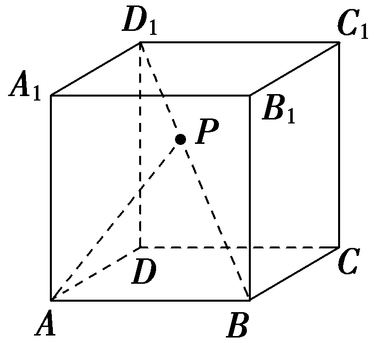

答案[0，1]

解析由题意，设 $\vec{BP}$ ＝*<text style="italic"><text style="italic"><text style="italic"><text style="italic"><text style="italic">λ*</text></text></text></text></text> $\vec{BD_{1}}$ ，其中*<text style="italic"><text style="italic"><text style="italic"><text style="italic"><text style="italic">λ*</text></text></text></text></text>∈[0，1]，则 $\vec{DC}$ *<text style="italic">·*</text> $\vec{AP}$ ＝ $\vec{AB}$ *<text style="italic">·*</text> $\left(\vec{AB}＋\vec{BP}\right)$ ＝ $\vec{AB}$ *<text style="italic">·*</text>( $\vec{AB}$ ＋*<text style="italic"><text style="italic"><text style="italic"><text style="italic"><text style="italic">λ*</text></text></text></text></text> $\vec{BD_{1}}$ )＝ $\vec{AB}^{2}$ ＋*<text style="italic"><text style="italic"><text style="italic"><text style="italic"><text style="italic">λ*</text></text></text></text></text> $\vec{AB}$ *<text style="italic">·*</text> $\vec{BD_{1}}$ ＝ $\vec{AB}^{2}$ ＋*<text style="italic"><text style="italic"><text style="italic"><text style="italic"><text style="italic">λ*</text></text></text></text></text> $\vec{AB}$ *<text style="italic">·*</text> $\left(\vec{AD_{1}}－\vec{AB}\right)$ ＝ $\left(1－\lambda \right)\vec{AB}^{2}$ ＝1－*<text style="italic"><text style="italic"><text style="italic"><text style="italic"><text style="italic">λ*</text></text></text></text></text>∈[0，1].因此 $\vec{DC}$ *<text style="italic">·*</text> $\vec{AP}$ 的取值范围是[0，1].

##### 9.(13分)如图，正四面体&lt;text style="it&lt;text style="&lt;text style="bold,itali<em><strong>c</strong></em>"&gt;b&lt;/text&gt;old,italic"&gt;a&lt;/text&gt;lic"&gt;<em>ABCD</em>&lt;/text&gt;(所有棱长均相等)的棱长为1，<em>E</em>，<em>F</em>，<em>G</em>，<em>H</em>分别是正四面体ABCD中各棱的中点，设 $\vec{AB}$ ＝&lt;text style="&lt;text style="bold,itali<em><strong>c</strong></em>"&gt;b&lt;/text&gt;old,italic"&gt;a&lt;/text&gt;， $\vec{AC}$ ＝&lt;text style="bold,itali<em><strong>c</strong></em>"&gt;b&lt;/text&gt;， $\vec{AD}$ ＝<em><strong>c</strong></em>，试用向量法解决下列问题：

（1）求 $\vec{EF}$ 的模长；(5分)

（2）求 $\vec{EF}$ ， $\vec{GH}$ 的夹角.(8分)

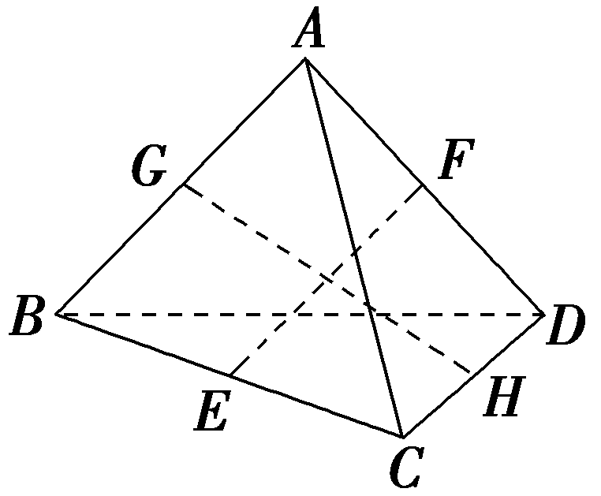

解：（1）因为点*E*，*F*，*G*分别是棱*BC*，*AD*，*AB*的中点，

所以 $\vec{EF}$ ＝ $\vec{EB}$ ＋ $\vec{BA}$ ＋ $\vec{AF}$ ＝ $\frac{1}{2}\vec{CB}$ ＋ $\vec{BA}$ ＋ $\frac{1}{2}\vec{AD}$ ＝ $\frac{1}{2}(\vec{AB}$ － $\vec{AC}$ )－ $\vec{AB}$ ＋ $\frac{1}{2}\vec{AD}$ ＝ $\frac{1}{2}\left(c－b－a\right)$ ，

因此｜ $\vec{EF}$ ｜&lt;text style="supers&lt;text style="&lt;text style="&lt;text style="&lt;text style="bold,it&lt;text style="bold,it<em><strong>a</strong></em>li<em><strong>c</strong></em>"&gt;a&lt;/text&gt;lic"&gt;b&lt;/text&gt;old,italic"&gt;b&lt;/text&gt;old,it&lt;text style="bold,itali<em><strong>c</strong></em>"&gt;a&lt;/text&gt;lic"&gt;b&lt;/text&gt;old,italic"&gt;c&lt;/text&gt;ript"&gt;&lt;text style="superscript"&gt;&lt;text style="superscript"&gt;2&lt;/text&gt;&lt;/text&gt;&lt;/text&gt;＝ $\frac{1}{4}\left(c－b－a\right)^{2}$ ＝ $\frac{1}{4}$ (&lt;text style="&lt;text style="&lt;text style="&lt;text style="bold,it&lt;text style="bold,it<em><strong>a</strong></em>li<em><strong>c</strong></em>"&gt;a&lt;/text&gt;lic"&gt;b&lt;/text&gt;old,italic"&gt;b&lt;/text&gt;old,it&lt;text style="bold,itali<em><strong>c</strong></em>"&gt;a&lt;/text&gt;lic"&gt;b&lt;/text&gt;old,italic"&gt;c&lt;/text&gt;&lt;text style="superscript"&gt;&lt;text style="superscript"&gt;&lt;text style="superscript"&gt;2&lt;/text&gt;&lt;/text&gt;&lt;/text&gt;＋b2＋a2－2c·b＋2b·a－2c·a)，

因为正四面体的所有棱长为1，

所以｜ $\vec{EF}$ ｜2＝ $\frac{1}{4}$ ×( 1＋1＋1－2×1×1× $\frac{1}{2}$ ＋2×1×1× $\frac{1}{2}$ －2×1×1× $\frac{1}{2}$ )＝ $\frac{1}{2}$ ，

所以｜ $\vec{EF}$ ｜＝ $\frac{\sqrt{2}}{2}$ .

（2）由（1）可知 $\vec{EF}$ ＝ $\frac{1}{2}\left(c－b－a\right)$ ，｜ $\vec{EF}$ ｜＝ $\frac{\sqrt{2}}{2}$ ，

同理 $\vec{GH}$ ＝ $\frac{1}{2}\left(b＋c－a\right)$ ，｜ $\vec{GH}$ ｜＝ $\frac{\sqrt{2}}{2}$ ，

所以cos＜ $\vec{EF}$ ， $\vec{GH}$ ＞＝ $\frac{\vec{EF}\cdot \vec{GH}}{｜\vec{EF}||\vec{GH}｜}$

＝ $\frac{\frac{1}{4}\left[\left(c－a\right)^{2}－b^{2}\right]}{\frac{1}{2}}$ ＝ $\frac{1}{2}\left(c^{2}＋a^{2}－2a\cdot c－b^{2}\right)$

＝ $\frac{1}{2}$ ×(1＋1－2×1×1× $\frac{1}{2}$ －1)＝0，

所以 $\vec{EF}$ ， $\vec{GH}$ 的夹角为90°.

(10、11题，每小题5分，共10分)

##### 10.如图，在空间四边形*<text style="italic"><text style="italic">OA*</text>*BC*</text>中，OA＝*OB*＝*OC*＝2，∠*AOC*＝∠*BOC*＝ $\frac{\pi }{2}$ ，∠A*OB*＝ $\frac{\pi }{3}$ ，点*M*，*N*分别在*<text style="italic">OA*</text>，*BC*上，且*OM*＝2*MA*，*BN*＝*CN*，则*MN*＝(　　)

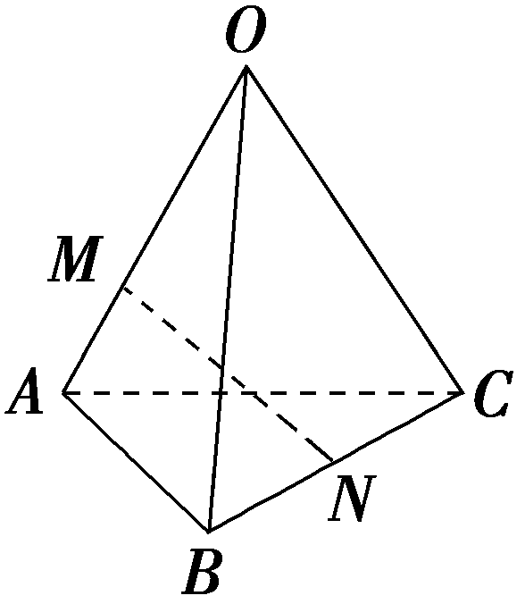

$\quad$A. $\frac{\sqrt{22}}{3}$ 	
$\quad$B. $\frac{\sqrt{46}}{3}$

$\quad$C. $\frac{\sqrt{34}}{3}$ 	
$\quad$D. $\frac{\sqrt{21}}{3}$

答案A

解析因为<em>OM</em>＝&lt;text style="superscript"&gt;&lt;text style="superscript"&gt;&lt;text style="superscript"&gt;&lt;text style="superscript"&gt;&lt;text style="superscript"&gt;2&lt;/text&gt;&lt;/text&gt;&lt;/text&gt;&lt;/text&gt;&lt;/text&gt;<em>MA</em>，<em>BN</em>＝<em>CN</em>，所以 $\vec{MN}$ ＝ $\vec{ON}$ － $\vec{OM}$ ＝ $\frac{1}{2}\left(\vec{OB}＋\vec{OC}\right)$ － $\frac{2}{3}\vec{OA}$ ＝－ $\frac{2}{3}\vec{OA}$ ＋ $\frac{1}{2}\vec{OB}$ ＋ $\frac{1}{2}\vec{OC}$ .又<em>OA</em>＝<em>OB</em>＝<em>OC</em>＝&lt;text style="superscript"&gt;&lt;text style="superscript"&gt;&lt;text style="superscript"&gt;&lt;text style="superscript"&gt;&lt;text style="superscript"&gt;2&lt;/text&gt;&lt;/text&gt;&lt;/text&gt;&lt;/text&gt;&lt;/text&gt;，∠<em>AOC</em>＝∠<em>BOC</em>＝ $\frac{\pi }{2}$ ，∠A<em>OB</em>＝ $\frac{\pi }{3}$ ，所以 $\vec{OA}$ <em>·</em> $\vec{OC}$ ＝0， $\vec{OB}$ <em>·</em> $\vec{OC}$ ＝0， $\vec{OA}$ <em>·</em> $\vec{OB}$ ＝｜ $\vec{OA}$ ｜｜ $\vec{OB}$ ｜cos $\frac{\pi }{3}$ ＝&lt;text style="superscript"&gt;&lt;text style="superscript"&gt;&lt;text style="superscript"&gt;&lt;text style="superscript"&gt;&lt;text style="superscript"&gt;2&lt;/text&gt;&lt;/text&gt;&lt;/text&gt;&lt;/text&gt;&lt;/text&gt;，所以 $\vec{MN}^{2}$ ＝ $\left(－\frac{2}{3}\vec{OA}＋\frac{1}{2}\vec{OB}＋\frac{1}{2}\vec{OC}\right)^{2}$ ＝ $\frac{4}{9}\vec{OA}^{2}$ ＋ $\frac{1}{4}\vec{OB}^{2}$ ＋ $\frac{1}{4}\vec{OC^{2}}$ － $\frac{2}{3}\vec{OA}$ <em>·</em> $\vec{OB}$ － $\frac{2}{3}\vec{OA}$ <em>·</em> $\vec{OC}$ ＋ $\frac{1}{2}\vec{OB}$ <em>·</em> $\vec{OC}$ ＝ $\frac{4}{9}$ ｜ $\vec{OA}$ ｜&lt;text style="superscript"&gt;&lt;text style="superscript"&gt;&lt;text style="superscript"&gt;&lt;text style="superscript"&gt;&lt;text style="superscript"&gt;2&lt;/text&gt;&lt;/text&gt;&lt;/text&gt;&lt;/text&gt;&lt;/text&gt;＋ $\frac{1}{4}$ ｜ $\vec{OB}$ ｜&lt;text style="superscript"&gt;&lt;text style="superscript"&gt;&lt;text style="superscript"&gt;&lt;text style="superscript"&gt;&lt;text style="superscript"&gt;2&lt;/text&gt;&lt;/text&gt;&lt;/text&gt;&lt;/text&gt;&lt;/text&gt;＋ $\frac{1}{4}$ ｜ $\vec{OC}$ ｜&lt;text style="superscript"&gt;&lt;text style="superscript"&gt;&lt;text style="superscript"&gt;&lt;text style="superscript"&gt;&lt;text style="superscript"&gt;2&lt;/text&gt;&lt;/text&gt;&lt;/text&gt;&lt;/text&gt;&lt;/text&gt;－ $\frac{2}{3}\vec{OA}$ <em>·</em> $\vec{OB}$ ＝ $\frac{4}{9}$ ×&lt;text style="superscript"&gt;&lt;text style="superscript"&gt;&lt;text style="superscript"&gt;&lt;text style="superscript"&gt;&lt;text style="superscript"&gt;2&lt;/text&gt;&lt;/text&gt;&lt;/text&gt;&lt;/text&gt;&lt;/text&gt;2＋ $\frac{1}{4}$ ×&lt;text style="superscript"&gt;&lt;text style="superscript"&gt;&lt;text style="superscript"&gt;&lt;text style="superscript"&gt;&lt;text style="superscript"&gt;2&lt;/text&gt;&lt;/text&gt;&lt;/text&gt;&lt;/text&gt;&lt;/text&gt;2＋ $\frac{1}{4}$ ×&lt;text style="superscript"&gt;&lt;text style="superscript"&gt;&lt;text style="superscript"&gt;&lt;text style="superscript"&gt;&lt;text style="superscript"&gt;2&lt;/text&gt;&lt;/text&gt;&lt;/text&gt;&lt;/text&gt;&lt;/text&gt;2－ $\frac{2}{3}$ ×&lt;text style="superscript"&gt;&lt;text style="superscript"&gt;&lt;text style="superscript"&gt;&lt;text style="superscript"&gt;&lt;text style="superscript"&gt;2&lt;/text&gt;&lt;/text&gt;&lt;/text&gt;&lt;/text&gt;&lt;/text&gt;＝ $\frac{22}{9}$ ，所以｜ $\vec{MN}$ ｜＝ $\frac{\sqrt{22}}{3}$ .故选A.

##### 11.如图，在三棱锥<em>P</em>-<em>&lt;text style="italic"&gt;AB</em>C&lt;/text&gt;中，AB⊥<em>BC</em>，<em>PA</em>⊥平面<em>ABC</em>，<em>A&lt;text style="italic"&gt;E</em>&lt;/text&gt;⊥<em>&lt;text style="italic"&gt;PB</em>&lt;/text&gt;于点E，点<em>M</em>是<em>AC</em>的中点，PB＝1，则 $\vec{EP}$ · $\vec{EM}$ 的最小值为<u>　　　　</u>.

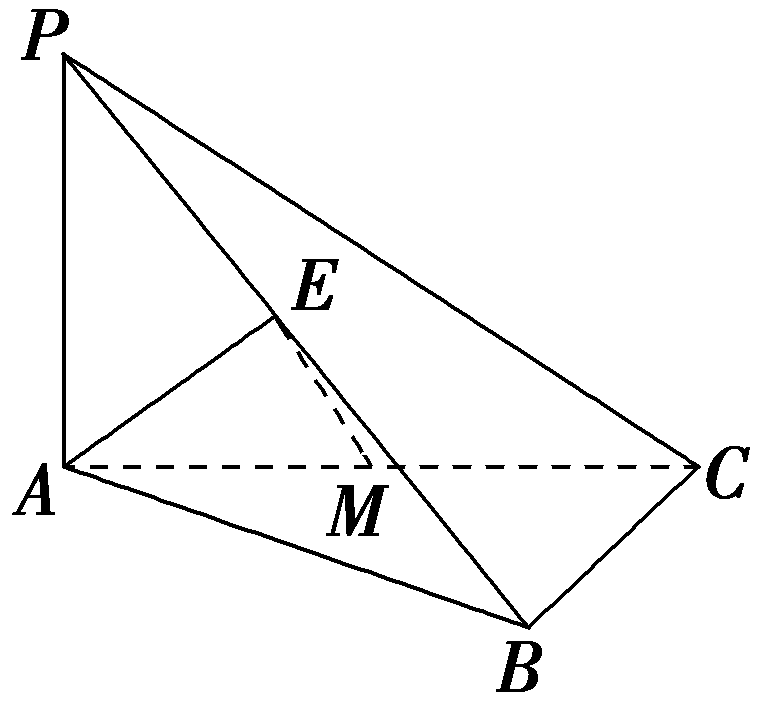

答案－ $\frac{1}{8}$

解析连接*EC*，如图，因为*<text style="italic"><text style="italic">P<text style="italic">A*</text></text></text>⊥平面*A<text style="italic"><text style="italic"><text style="italic"><text style="italic"><text style="italic">BC*</text></text></text></text></text>，BC⊂平面*<text style="italic"><text style="italic"><text style="italic">AB*</text></text>C</text>，则*PA*⊥BC，而AB⊥BC，PA∩AB＝A，PA，AB⊂平面*<text style="italic"><text style="italic">PAB*</text></text>，则BC⊥平面PAB，又*<text style="italic"><text style="italic">PB*</text></text>⊂平面PAB，即有BC⊥PB.因为点*M*是*AC*的中点，则 $\vec{EM}$ ＝ $\frac{1}{2}(\vec{EA}$ ＋ $\vec{EC}$ )＝ $\frac{1}{2}\vec{EA}$ ＋ $\frac{1}{2}(\vec{EB}$ ＋ $\vec{BC}$ )，又*A*E⊥*<text style="italic"><text style="italic">PB*</text></text>， $\vec{EP}$ *<text style="italic">·*</text> $\vec{EM}$ ＝ $\vec{EP}$ *<text style="italic">·*</text>［ $\frac{1}{2}\vec{EA}$ ＋ $\frac{1}{2}(\vec{EB}$ ＋ $\vec{BC}$ )］＝ $\frac{1}{2}\vec{EP}$ *<text style="italic">·*</text> $\vec{EA}$ ＋ $\frac{1}{2}\vec{EP}$ *<text style="italic">·*</text> $\vec{EB}$ ＋ $\frac{1}{2}\vec{EP}$ *<text style="italic">·*</text> $\vec{BC}$ ＝ $\frac{1}{2}\vec{EP}$ *<text style="italic">·*</text> $\vec{EB}$ ＝－ $\frac{1}{2}$ ｜ $\vec{EP}$ ｜｜ $\vec{EB}$ ｜≥－ $\frac{1}{2}\left(\frac{｜\vec{EP}｜＋｜\vec{EB}｜}{2}\right)^{2}$ ＝－ $\frac{1}{8}$ ，当且仅当｜ $\vec{EP}$ ｜＝｜ $\vec{EB}$ ｜＝ $\frac{1}{2}$ 时，等号成立，所以 $\vec{EP}$ *<text style="italic">·*</text> $\vec{EM}$ 的最小值为－ $\frac{1}{8}$ .

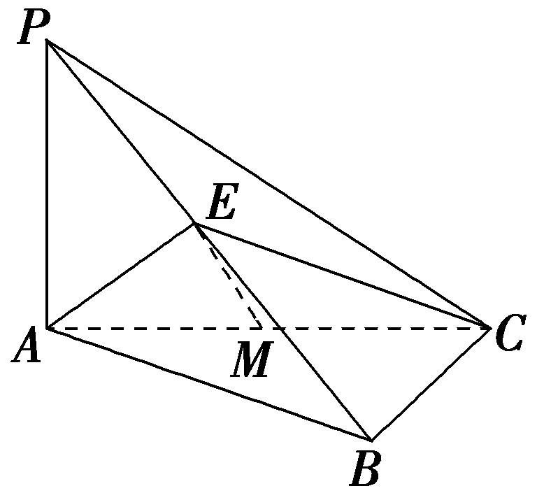

##### 12.(15分)如图，在棱长为1的正四面体<<*t*ext style="italic">t</text>ext style="italic">*ABCD*</text>中，*M*，*N*分别为棱AB，CD的中点， $\vec{BG}$ ＝2 $\vec{GN}$ ， $\vec{ME}$ ＝<*t*ext style="italic">t</text> $\vec{MC}$ (0＜<*t*ext style="italic">t</text>＜1).

（1）用向量 $\vec{AB}$ ， $\vec{AC}$ ， $\vec{AD}$ 表示向量 $\vec{AG}$ ；(5分)

（2）若*EB*⊥*ED*，求实数*t*的值.(10分)

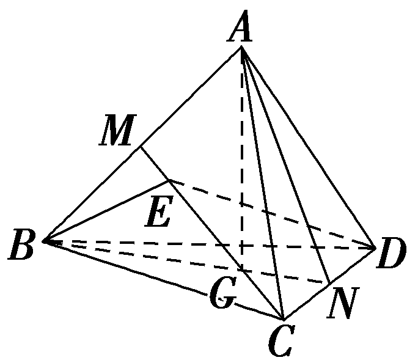

解：（1）由 $\vec{BG}$ ＝2 $\vec{GN}$ ，可得 $\vec{AG}$ － $\vec{AB}$ ＝2( $\vec{AN}$ － $\vec{AG}$ )＝ $\vec{AC}$ ＋ $\vec{AD}$ －2 $\vec{AG}$ ，

所以 $\vec{AG}$ ＝ $\frac{1}{3}(\vec{AB}$ ＋ $\vec{AC}$ ＋ $\vec{AD}$ ).

（2）连接<<*t*ext style="italic">t</text>ext style="italic">*M*D</text>(图略).由 $\vec{ME}$ ＝<*t*ext style="italic">t</text> $\vec{MC}$ ，<*t*ext style="italic">M</text>为*AB*的中点，可得 $\vec{ME}$ ＝<*t*ext style="italic">t</text>( $\vec{AC}$ － $\frac{1}{2}\vec{AB}$ )，

所以 $\vec{ED}$ ＝ $\vec{MD}$ － $\vec{ME}$ ＝ $\vec{AD}$ － $\frac{1}{2}\vec{AB}$ －<*t*ext style="italic">t</text> $\vec{AC}$ ＋ $\frac{t}{2}\vec{AB}$ ＝ $\frac{t－1}{2}\vec{AB}$ －<*t*ext style="italic">t</text> $\vec{AC}$ ＋ $\vec{AD}$ ，

$\vec{EB}$ ＝ $\vec{EM}$ ＋ $\vec{MB}$ ＝－<*t*ext style="italic">t</text>( $\vec{AC}$ － $\frac{1}{2}\vec{AB}$ )＋ $\frac{1}{2}\vec{AB}$ ＝ $\frac{t+1}{2}\vec{AB}$ －<*t*ext style="italic">t</text> $\vec{AC}$ .

因为&lt;&lt;&lt;<em>t</em>ext style="italic"&gt;t&lt;/text&gt;ext style="italic"&gt;t&lt;/text&gt;ext style="italic"&gt;EB&lt;/text&gt;⊥<em>ED</em>，所以 $\vec{ED}$ &lt;&lt;&lt;<em>t</em>ext style="italic"&gt;t&lt;/text&gt;ext style="italic"&gt;t&lt;/text&gt;ext style="italic"&gt;<em>·</em>&lt;/text&gt; $\vec{EB}$ ＝( $\frac{t－1}{2}\vec{AB}$ －&lt;&lt;<em>t</em>ext style="italic"&gt;t&lt;/text&gt;ext style="italic"&gt;t&lt;/text&gt; $\vec{AC}$ ＋ $\vec{AD}$ )&lt;&lt;&lt;<em>t</em>ext style="italic"&gt;t&lt;/text&gt;ext style="italic"&gt;t&lt;/text&gt;ext style="italic"&gt;<em>·</em>&lt;/text&gt;( $\frac{t+1}{2}\vec{AB}$ －&lt;&lt;<em>t</em>ext style="italic"&gt;t&lt;/text&gt;ext style="italic"&gt;t&lt;/text&gt; $\vec{AC}$ )＝ $\frac{t^{2}－1}{4}$ － $\frac{t^{2}＋t}{4}$ ＋ $\frac{1+t}{4}$ － $\frac{t^{2}－t}{4}$ ＋&lt;&lt;<em>t</em>ext style="italic"&gt;t&lt;/text&gt;ext style="italic"&gt;t&lt;/text&gt;2－ $\frac{t}{2}$ ＝0.

因为0＜<*t*ext style="italic">t</text>＜1，所以t＝ $\frac{1}{3}$ .

(13、14题，每小题5分，共10分)

##### 13.(多选)如图，在四棱锥*P*-*ABCD*中，底面*ABCD*为正方形，*PA*⊥底面*ABCD*，*PA*＝*AB*，*E*，*F*分别为线段*PB*，*CD*的中点，*G*为线段*PC*上的动点(含端点)，则下列说法正确的是(　　)

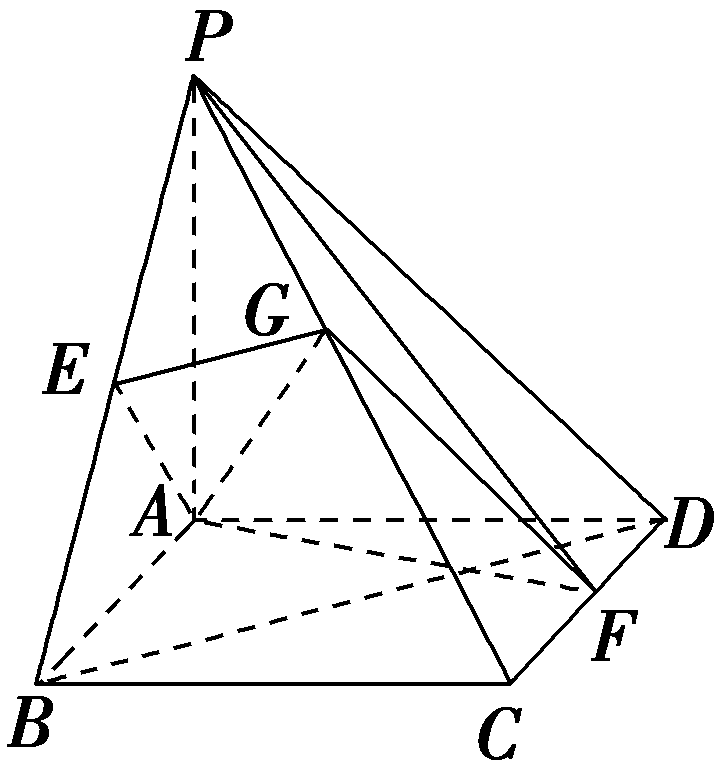

$\quad$A.对任意点*G*，都有*B*，*E*，*G*，*F*四点共面

$\quad$B.存在点*G*，使得*A*，*E*，*G*，*F*四点共面

$\quad$C.对任意点*G*，都有*AG*⊥平面*PBD*

$\quad$D.存在点*G*，使得*EG*∥平面*PAF*

答案BD

解析因为<te<text st*y*le="italic">x</text>t style="italic">*P<text style="italic"><text style="italic">A*</text></text></text>⊥底面*<text style="italic"><text style="italic"><text style="italic">A<text style="italic">B*</text></text>*CD*</text></text>，四边形ABCD为正方形，以点A为坐标原点，AB，*AD*，*AP*所在直线分别为x轴，y轴，*z*轴建立空间直角坐标系，如图，设*PA*＝AB＝2，则A(0，0，0)，B(2，0，0)，C(2，2，0)，D(0，2，0)，P(0，0，2)，*<text style="italic">E*</text>(1，0，1)，*<text style="italic">F*</text>(1，2，0)，设 $\vec{PG}$ ＝*<text style="italic"><text style="italic"><text style="italic"><text style="italic"><text style="italic"><text style="italic"><text style="italic"><text style="italic">λ*</text></text></text></text></text></text></text></text> $\vec{PC}$ ＝(2*<text style="italic"><text style="italic"><text style="italic"><text style="italic"><text style="italic"><text style="italic"><text style="italic"><text style="italic">λ*</text></text></text></text></text></text></text></text>，2λ，－2λ)，其中0≤λ≤1，则 $\vec{AG}$ ＝ $\vec{AP}$ ＋ $\vec{PG}$ ＝(2*<text style="italic"><text style="italic"><text style="italic"><text style="italic"><text style="italic"><text style="italic"><text style="italic"><text style="italic">λ*</text></text></text></text></text></text></text></text>，2λ，2－2λ)， $\vec{AE}$ ＝ $\left(1，0，1\right)$ ， $\vec{AF}$ ＝ $\left(1，2，0\right)$ ，设 $\vec{AG}$ ＝*<text style="italic">m*</text> $\vec{AE}$ ＋*<text style="italic">n*</text> $\vec{AF}$ ＝ $\left(m＋n，2n，m\right)$ ，则 $\left\{\begin{matrix}m＋n=2\lambda ，\\2n=2\lambda ，\\m=2－2\lambda ，\end{matrix}\right.$ 解得*<text style="italic">m*</text>＝*<text style="italic">n*</text>＝*<text style="italic"><text style="italic"><text style="italic"><text style="italic"><text style="italic"><text style="italic"><text style="italic"><text style="italic">λ*</text></text></text></text></text></text></text></text>＝ $\frac{2}{3}$ ，故存在点*<text style="italic">G*</text>，使得<te<text st*y*le="italic">x</text>t style="italic">*<text style="italic">A*</text></text>，*<text style="italic">E*</text>，G，*<text style="italic">F*</text>四点共面，故*B*正确；

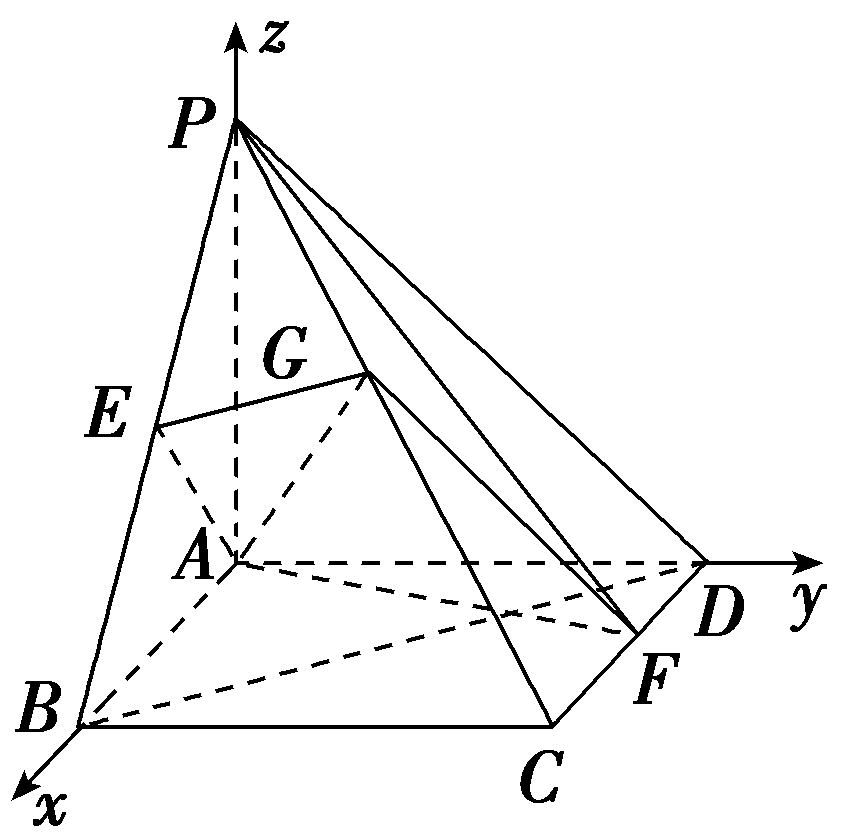

$\vec{BE}$ ＝ $\left(－1，0，1\right)$ ， $\vec{BF}$ ＝ $\left(－1，2，0\right)$ ， $\vec{BP}$ ＝ $\left(－2，0，2\right)$ ， $\vec{BG}$ ＝ $\vec{BP}$ ＋ $\vec{PG}$ ＝ $\left(2\lambda －2，2\lambda ，2－2\lambda \right)$ ，设 $\vec{BG}$ ＝*a* $\vec{BE}$ ＋*b* $\vec{BF}$ ＝ $\left(－a－b，2b，a\right)$ ，

所以 $\left\{\begin{matrix}－a－b=2\lambda －2，\\2b=2\lambda ，\\a=2－2\lambda ，\end{matrix}\right.$ 解得 $\left\{\begin{matrix}a=2，\\b=0，\\\lambda =0，\end{matrix}\right.$ 故A错误； $\vec{AG}$ ＝ $\left(2\lambda ，2\lambda ，2－2\lambda \right)$ ， $\vec{BP}$ ＝ $\left(－2，0，2\right)$ ，若*AG*⊥平面*<text style="italic">PBD*</text>，*BP*⊂平面PBD，则 $\vec{AG}$ *·* $\vec{BP}$ ＝－4*<text style="italic"><text style="italic"><text style="italic">λ*</text></text></text>＋4－4λ＝4－8λ＝0，解得λ＝ $\frac{1}{2}$ ，故C错误；

设平面&lt;te<em>x</em>t style="italic"&gt;PAF&lt;/text&gt;的法向量为<em><strong>&lt;text style="bold,italic"&gt;n</strong></em>&lt;/text&gt;＝ $\left(x，y，z\right)$ ， $\vec{AP}$ ＝ $\left(0，0，2\right)$ ， $\vec{AF}$ ＝ $\left(1，2，0\right)$ ，则 $\left\{\begin{matrix}n\cdot \vec{AP}=0，\\n\cdot \vec{AF}=0，\end{matrix}\right.$ 即 $\left\{\begin{matrix}2z=0，\\x+2y=0，\end{matrix}\right.$ 取<em>x</em>＝2，则<em><strong>&lt;text style="bold,italic"&gt;n</strong></em>&lt;/text&gt;＝(2，－1，0)， $\vec{EG}$ ＝ $\vec{EP}$ ＋ $\vec{PG}$ ＝ $\left(－1，0，1\right)$ ＋ $\left(2\lambda ，2\lambda ,-2\lambda \right)$

＝(2<em>&lt;text style="italic"&gt;&lt;text style="italic"&gt;&lt;text style="italic"&gt;&lt;text style="italic"&gt;&lt;text style="italic"&gt;&lt;text style="italic"&gt;λ</em>&lt;/text&gt;&lt;/text&gt;&lt;/text&gt;&lt;/text&gt;&lt;/text&gt;&lt;/text&gt;－1，2λ，1－2λ).若<em>E&lt;text style="italic"&gt;G</em>&lt;/text&gt;∥平面<em>&lt;text style="italic"&gt;PAF</em>&lt;/text&gt;，则 $\vec{EG}$ <em>·<strong>n</strong></em>＝4<em>&lt;text style="italic"&gt;&lt;text style="italic"&gt;&lt;text style="italic"&gt;&lt;text style="italic"&gt;&lt;text style="italic"&gt;&lt;text style="italic"&gt;λ</em>&lt;/text&gt;&lt;/text&gt;&lt;/text&gt;&lt;/text&gt;&lt;/text&gt;&lt;/text&gt;－2－2λ＝2λ－2＝0，解得λ＝1，故当点<em>G</em>与点<em>C</em>重合时，<em>&lt;text style="italic"&gt;EG</em>&lt;/text&gt;∥平面<em>&lt;text style="italic"&gt;PAF</em>&lt;/text&gt;，故D正确.故选BD.

&lt;text style="subscript"&gt;&lt;text style="subscript"&gt;&lt;text style="subscript"&gt;&lt;text style="subscript"&gt;&lt;text style="subscript"&gt;1&lt;/text&gt;&lt;/text&gt;&lt;/text&gt;&lt;/text&gt;&lt;/text&gt;4.(双空题)如图，在棱长为2的正方体<em>&lt;text style="italic"&gt;AB&lt;text style="italic"&gt;&lt;text style="italic"&gt;C</em>&lt;/text&gt;&lt;/text&gt;<em>D</em>&lt;/text&gt; -A1B1C1D1中，点<em>&lt;text style="italic"&gt;E</em>&lt;/text&gt;是侧面<em>BB</em>1C1C内的一个动点.若点E满足 $\vec{D_{1}E}$ ⊥ $\vec{CE}$ ，则｜ $\vec{BE}$ ｜的最大值为<u>　　　　　　　</u>，

最小值为<u>　　　　　</u>.

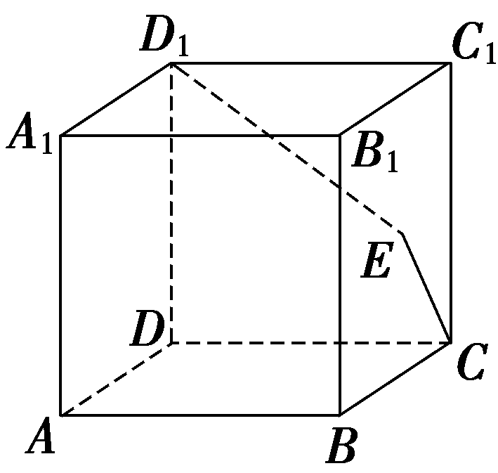

答案2 $\sqrt{2}　\sqrt{5}$ －1

解析如图，建立空间直角坐标系，则&lt;te&lt;te&lt;te&lt;te&lt;te&lt;te&lt;te<em>x</em>t style="italic"&gt;x&lt;/text&gt;t style="italic"&gt;x&lt;/text&gt;t style="italic"&gt;x&lt;/text&gt;t style="italic"&gt;x&lt;/text&gt;t style="italic"&gt;x&lt;/text&gt;t style="italic"&gt;x&lt;/text&gt;t style="italic"&gt;C&lt;/text&gt;(0，&lt;text style="superscript"&gt;&lt;text style="superscript"&gt;2&lt;/text&gt;&lt;/text&gt;，0)，<em>D</em>1(0，0，2)，<em>B</em>(2，2，0)，设<em>E</em>(x，2，<em>&lt;text style="italic"&gt;&lt;text style="italic"&gt;&lt;text style="italic"&gt;&lt;text style="italic"&gt;&lt;text style="italic"&gt;&lt;text style="italic"&gt;&lt;text style="italic"&gt;z</em>&lt;/text&gt;&lt;/text&gt;&lt;/text&gt;&lt;/text&gt;&lt;/text&gt;&lt;/text&gt;&lt;/text&gt;)，x∈[0，2]，z∈[0，2]，所以 $\vec{D_{1}E}$ ＝(&lt;te&lt;te&lt;te&lt;te&lt;te&lt;te<em>x</em>t style="italic"&gt;x&lt;/text&gt;t style="italic"&gt;x&lt;/text&gt;t style="italic"&gt;x&lt;/text&gt;t style="italic"&gt;x&lt;/text&gt;t style="italic"&gt;x&lt;/text&gt;t style="italic"&gt;x&lt;/text&gt;，&lt;text style="superscript"&gt;&lt;text style="superscript"&gt;2&lt;/text&gt;&lt;/text&gt;，<em>&lt;text style="italic"&gt;&lt;text style="italic"&gt;&lt;text style="italic"&gt;&lt;text style="italic"&gt;&lt;text style="italic"&gt;&lt;text style="italic"&gt;&lt;text style="italic"&gt;z</em>&lt;/text&gt;&lt;/text&gt;&lt;/text&gt;&lt;/text&gt;&lt;/text&gt;&lt;/text&gt;&lt;/text&gt;－2)， $\vec{CE}$ ＝(&lt;te&lt;te&lt;te&lt;te&lt;te&lt;te<em>x</em>t style="italic"&gt;x&lt;/text&gt;t style="italic"&gt;x&lt;/text&gt;t style="italic"&gt;x&lt;/text&gt;t style="italic"&gt;x&lt;/text&gt;t style="italic"&gt;x&lt;/text&gt;t style="italic"&gt;x&lt;/text&gt;，0，<em>&lt;text style="italic"&gt;&lt;text style="italic"&gt;&lt;text style="italic"&gt;&lt;text style="italic"&gt;&lt;text style="italic"&gt;&lt;text style="italic"&gt;&lt;text style="italic"&gt;z</em>&lt;/text&gt;&lt;/text&gt;&lt;/text&gt;&lt;/text&gt;&lt;/text&gt;&lt;/text&gt;&lt;/text&gt;)，因为 $\vec{D_{1}E}$ ⊥ $\vec{CE}$ ，所以 $\vec{D_{1}E}$ &lt;te&lt;te&lt;te<em>x</em>t style="italic"&gt;x&lt;/text&gt;t style="italic"&gt;x&lt;/text&gt;t style="italic"&gt;·&lt;/text&gt; $\vec{CE}$ ＝&lt;te&lt;te&lt;te&lt;te&lt;te&lt;te<em>x</em>t style="italic"&gt;x&lt;/text&gt;t style="italic"&gt;x&lt;/text&gt;t style="italic"&gt;x&lt;/text&gt;t style="italic"&gt;x&lt;/text&gt;t style="italic"&gt;x&lt;/text&gt;t style="italic"&gt;x&lt;/text&gt;&lt;text style="superscript"&gt;&lt;text style="superscript"&gt;2&lt;/text&gt;&lt;/text&gt;＋<em>&lt;text style="italic"&gt;&lt;text style="italic"&gt;&lt;text style="italic"&gt;&lt;text style="italic"&gt;&lt;text style="italic"&gt;&lt;text style="italic"&gt;&lt;text style="italic"&gt;z</em>&lt;/text&gt;&lt;/text&gt;&lt;/text&gt;&lt;/text&gt;&lt;/text&gt;&lt;/text&gt;&lt;/text&gt;(z－2)＝0，即x2＋(z－1)2＝1，x∈[0，2]，z∈[0，2]，

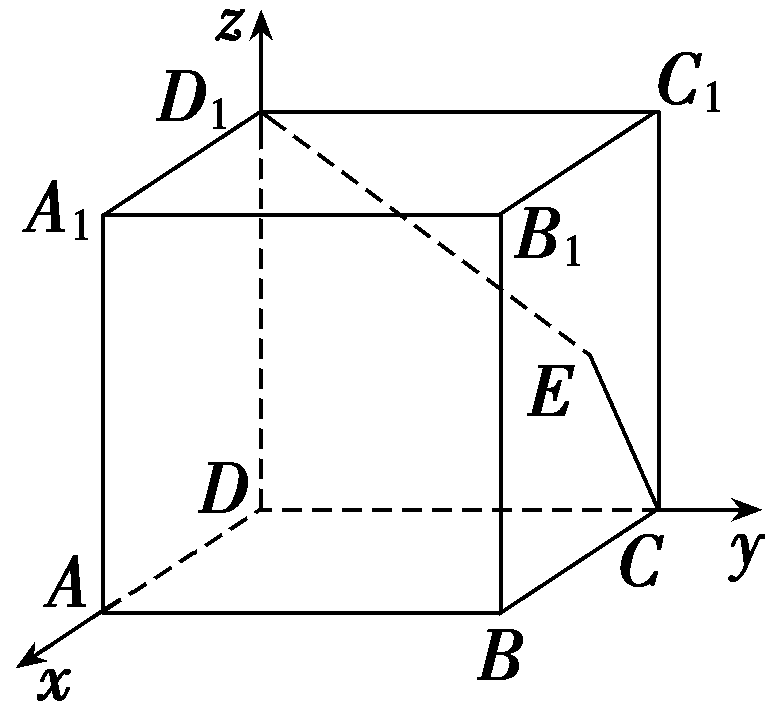

则动点<em>&lt;text style="italic"&gt;E</em>&lt;/text&gt;的轨迹为以(0，2，1)为圆心，1为半径的半圆，将其放到平面直角坐标系中如图所示，则<em>B</em>(2，0)，<em>M</em>(0，1)，<em>&lt;text style="italic"&gt;N</em>&lt;/text&gt;(0，2)，所以｜ $\vec{BM}$ ｜＝ $\sqrt{1^{2}＋2^{2}}$ ＝ $\sqrt{5}$ ，所以｜ $\vec{BE}$ ｜min＝ $\sqrt{5}$ －1；显然当点<em>&lt;text style="italic"&gt;E</em>&lt;/text&gt;在点<em>&lt;text style="italic"&gt;N</em>&lt;/text&gt;处(即立体图形中的<em>C</em>1点)时，｜ $\vec{BE}$ ｜取得最大值，｜ $\vec{BE}$ ｜max＝ $\sqrt{2^{2}＋2^{2}}$ ＝2 $\sqrt{2}$ ，因此，｜ $\vec{BE}$ ｜的最大值为2 $\sqrt{2}$ ，最小值为 $\sqrt{5}$ －1.

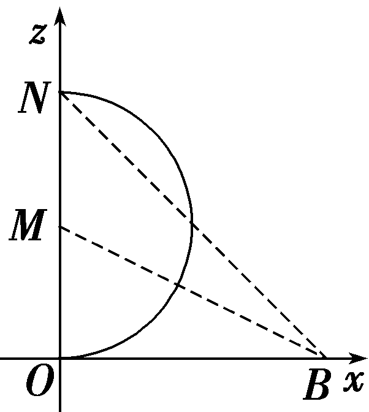

