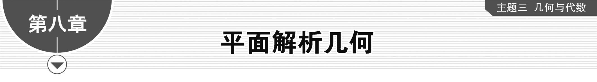
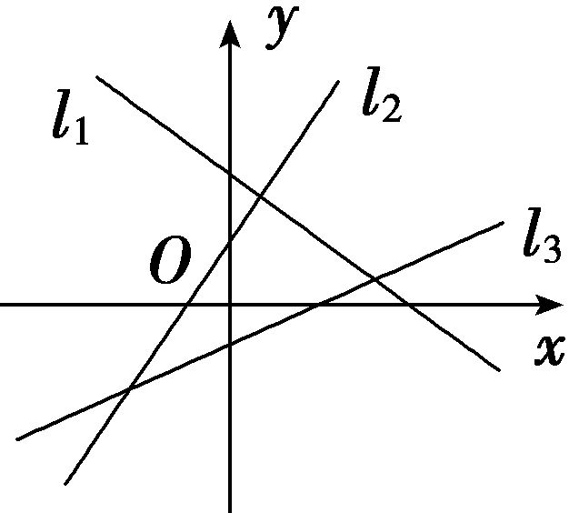
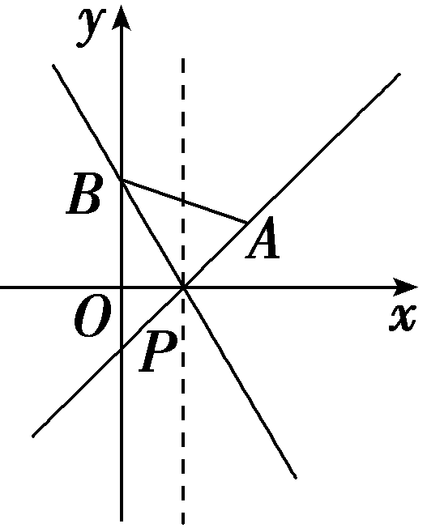
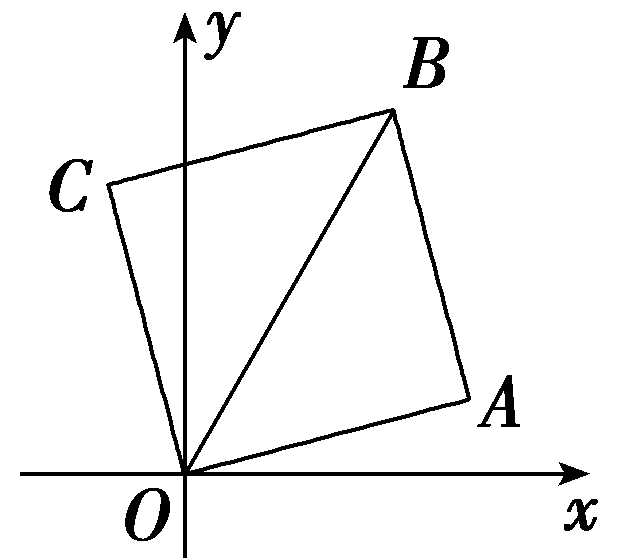
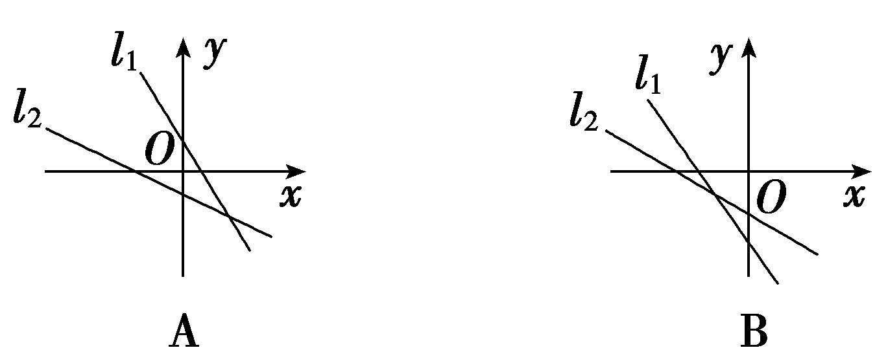
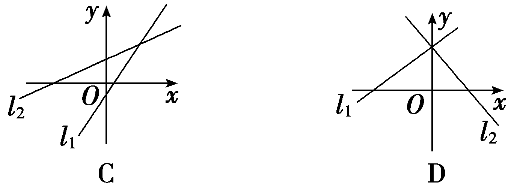
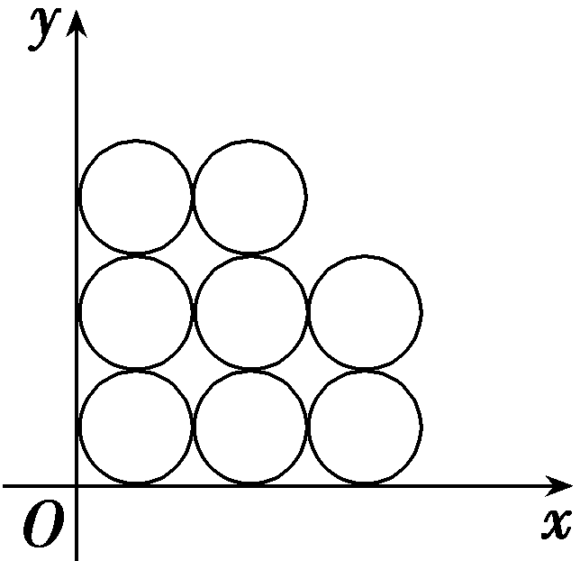
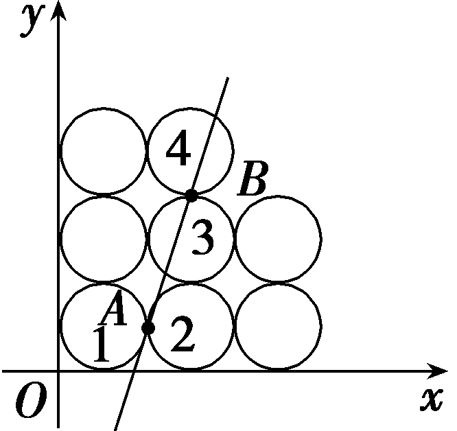

第一节　直线的倾斜角与斜率、直线的方程

【课标研读】　1.在平面直角坐标系中，结合具体图形，探索确定直线位置的几何要素.　2.理解直线的倾斜角和斜率的概念，经历用代数方法刻画直线斜率的过程，掌握过两点的直线斜率的计算公式.　3.根据确定直线位置的几何要素，探索并掌握直线方程的几种形式(点斜式、两点式及一般式).

##### 1.直线的倾斜角

（1）定义：当直线<em>l</em>与<em>x</em>轴相交时，我们以<em>x</em>轴为基准，<em><u>x</u></em><u>轴正向</u>与直线<em>l</em><u>向上</u>的方向之间所成的角<em>α</em>叫做直线<em>l</em>的倾斜角.

（2）规定：当直线<em>l</em>与<em>x</em>轴平行或重合时，规定它的倾斜角为<u>0°</u>.

（3）范围：直线的倾斜角<em>α</em>的取值范围为<u>0°≤</u><em><u>α</u></em><u>＜180°</u>.

##### 2.直线的斜率

（1）定义：把一条直线的倾斜角<em>α</em>的<u>正切值</u>叫做这条直线的斜率.斜率常用小写字母<em>k</em>表示，即<em>k</em>＝<u>tan_</u><em><u>α</u></em>.(<em>α</em>≠90°)

(&lt;te&lt;te&lt;te<em>x</em>t style="italic"&gt;x&lt;/text&gt;t st<em>y</em>le="italic"&gt;x&lt;/text&gt;t style="subscript"&gt;&lt;text style="subscript"&gt;&lt;text style="subscript"&gt;2&lt;/text&gt;&lt;/text&gt;&lt;/text&gt;)过两点的直线的斜率公式：如果直线经过两点&lt;te&lt;text st<em>y</em>le="italic"&gt;x&lt;/text&gt;t style="italic"&gt;<em>P</em>&lt;/text&gt;&lt;text style="subscript"&gt;&lt;text style="subscript"&gt;&lt;text style="subscript"&gt;1&lt;/text&gt;&lt;/text&gt;&lt;/text&gt;(x1，y1)，P2(x2，y2)(x1≠x2)，其斜率<em>k</em>＝ $\frac{y_{2}－y_{1}}{x_{2}－x_{1}}$ .

（3）直线的&lt;te&lt;text st<em>y</em>le="italic"&gt;x&lt;/text&gt;t sty<em>l</em>e="underline"&gt;方向向量&lt;/text&gt;：设&lt;te&lt;te&lt;te&lt;te&lt;te&lt;te&lt;text st&lt;text st<em>y</em>le="italic"&gt;y&lt;/text&gt;le="italic"&gt;x&lt;/text&gt;t style="italic"&gt;x&lt;/text&gt;t sty<em>l</em>e="italic"&gt;x&lt;/text&gt;t style="italic"&gt;x&lt;/text&gt;t st<em>y</em>le="italic"&gt;x&lt;/text&gt;t st<em>y</em>le="italic"&gt;x&lt;/text&gt;t style="italic"&gt;<em>P</em>&lt;/text&gt;&lt;text style="subscript"&gt;&lt;text style="subscript"&gt;&lt;text style="subscript"&gt;&lt;text style="subscript"&gt;&lt;text style="subscript"&gt;1&lt;/text&gt;&lt;/text&gt;&lt;/text&gt;&lt;/text&gt;&lt;/text&gt;(x1，y1)，P&lt;text style="subscript"&gt;&lt;text style="subscript"&gt;&lt;text style="subscript"&gt;&lt;text style="subscript"&gt;&lt;text style="subscript"&gt;2&lt;/text&gt;&lt;/text&gt;&lt;/text&gt;&lt;/text&gt;&lt;/text&gt;(x2，y2)(其中x1≠x2)是直线l上的两点，则向量 $\vec{P_{1}P_{2}}$ ＝(&lt;te&lt;te&lt;te&lt;te&lt;te&lt;te&lt;text st<em>y</em>le="italic"&gt;x&lt;/text&gt;t st&lt;text st&lt;text sty<em>l</em>e="italic"&gt;y&lt;/text&gt;le="italic"&gt;y&lt;/text&gt;le="italic"&gt;x&lt;/text&gt;t style="italic"&gt;x&lt;/text&gt;t sty<em>l</em>e="italic"&gt;x&lt;/text&gt;t style="italic"&gt;x&lt;/text&gt;t st<em>y</em>le="italic"&gt;x&lt;/text&gt;t st<em>y</em>le="italic"&gt;x&lt;/text&gt;&lt;text style="subscript"&gt;&lt;text style="subscript"&gt;&lt;text style="subscript"&gt;&lt;text style="subscript"&gt;&lt;text style="subscript"&gt;2&lt;/text&gt;&lt;/text&gt;&lt;/text&gt;&lt;/text&gt;&lt;/text&gt;－x&lt;text style="subscript"&gt;&lt;text style="subscript"&gt;&lt;text style="subscript"&gt;&lt;text style="subscript"&gt;&lt;text style="subscript"&gt;1&lt;/text&gt;&lt;/text&gt;&lt;/text&gt;&lt;/text&gt;&lt;/text&gt;，y2－y1)以及与它平行的非零向量都是直线的<u>方向向量</u>.若直线l的斜率为<em>&lt;text style="italic"&gt;k</em>&lt;/text&gt;，它的一个方向向量的坐标为(x，y)，则k＝ $\frac{y}{x}$ .

[微提醒]　直线倾斜角为 $\frac{\pi }{2}$ 时，斜率不存在.

##### 3.直线方程的五种形式

<table><tr><td>
名称
</td><td>
方程
</td><td>
适用范围
</td></tr><tr><td>
点斜式
</td><td>
<em>y</em>－<em>y</em>0＝<em>k</em>(<em>x</em>－<em>x</em>0)
</td><td>
不含直线<em>x</em>＝<em>x</em>0
</td></tr><tr><td>
斜截式
</td><td>
<em>y</em>＝<em>kx</em>＋<em>b</em>
</td><td>
不含垂直于<em>x</em>轴的直线
</td></tr><tr><td>
两点式
</td><td>
＝

(<em>x</em>1≠<em>x</em>2，<em>y</em>1≠<em>y</em>2)
</td><td>
不含直线<em>x</em>＝<em>x</em>1和直线<em>y</em>＝<em>y</em>1
</td></tr><tr><td>
截距式
</td><td>
＋＝1
</td><td>
不含垂直于坐标轴和过原点的直线
</td></tr><tr><td>
一般式
</td><td>
<em>Ax</em>＋<em>By</em>＋<em>C</em>＝0

(<em>A</em>2＋<em>B</em>2≠0)
</td><td>
平面直角坐标系内的直线都适用
</td></tr></table>

[微提醒]　（1）应用“点斜式”和“斜截式”方程时，要注意讨论斜率是否存在.（2）“截距式”中的“截距”是直线与坐标轴交点的坐标值，它可正，可负，也可以是零，而“距离”是一个非负数.应注意过原点的特殊情况是否满足题意.

【常用结论】

（1）直线的斜率*k*与倾斜角*α*之间的关系

<table><tr><td>
<em>α</em>
</td><td>
0°
</td><td>
0°＜<em>α</em>＜90°
</td><td>
90°
</td><td>
90°＜<em>α</em>＜180°
</td></tr><tr><td>
<em>k</em>
</td><td>
0
</td><td>
<em>k</em>＞0
</td><td>
不存在
</td><td>
<em>k</em>＜0
</td></tr></table>

牢记口诀：“斜率变化分两段，90°是分界线；遇到斜率要谨记，存在与否要讨论”.

（2）几种特殊直线的方程

①直线过点<em>P</em>1(<em>x</em>1，<em>y</em>1)，垂直于<em>x</em>轴的方程为<em>x</em>＝<em>x</em>1.

②直线过点<em>P</em>1(<em>x</em>1，<em>y</em>1)，垂直于<em>y</em>轴的方程为<em>y</em>＝<em>y</em>1.

③)*y*轴的方程为*x*＝0.

④*x*轴的方程为*y*＝0.

（3）斜率为*k*的直线的一个方向向量为(1，*k*).

【自主检测】

##### 1.(多选)下列结论正确的是 (　　)

$\quad$A.平面直角坐标系中的直线都有倾斜角与斜率

$\quad$B.直线的倾斜角越大，其斜率就越大

$\quad$C.直线*y*＝*kx*－2一定过定点(0，－2)

$\quad$D.经过任意两个不同的点<em>P</em>1(<em>x</em>1，<em>y</em>1)，<em>P</em>2(<em>x</em>2，<em>y</em>2)的直线都可以用方程(<em>y</em>－<em>y</em>1)·(<em>x</em>2－<em>x</em>1)＝(<em>x</em>－<em>x</em>1)(<em>y</em>2－<em>y</em>1)表示

答案CD

##### 2.(链接人教A选择性必修一P58T7)若过点*M*(－2，*m*)，*N*(*m*，4)的直线的斜率等于1，则*m*的值为(　　)

$\quad$A.1	
$\quad$B.4

$\quad$C.1或3	
$\quad$D.1或4

答案A

解析由斜率公式得 $\frac{4－m}{m+2}$ ＝1，解得*m*＝1.故选A.

##### 3.(易错题)(链接人教A选择性必修一P67T7)过点(3，－2)且在<em>x</em>轴、<em>y</em>轴上截距相等的直线方程为<u>　　　　　　　　　</u>.

答案2*x*＋3*y*＝0或*x*＋*y*＝1

解析由题知，若在<te<te<te<te<text st*y*le="italic">x</text>t st<text style="it<text style="it*a*lic">a</text>lic">y</text>le="italic">x</text>t st*y*le="italic">x</text>t style="italic">x</text>t st<text st*y*le="italic">y</text>le="italic">x</text>轴、y轴上截距均为0，即直线过原点，又过(3，－2)，则直线方程为y＝－ $\frac{2}{3}$ <te<te<te<te<text st*y*le="italic">x</text>t st<text style="it<text style="it*a*lic">a</text>lic">y</text>le="italic">x</text>t st*y*le="italic">x</text>t style="italic">x</text>t st<text st*y*le="italic">y</text>le="italic">x</text>，即2x＋3y＝0；若截距不为0，设在x轴、y轴上的截距均为a，则直线方程为 $\frac{x}{a}$ ＋ $\frac{y}{a}$ ＝1，又直线过点(3，－2)，则 $\frac{3}{a}$ ＋ $\frac{－2}{a}$ ＝1，解得<te<text st*y*le="italic">x</text>t style="it*a*lic">a</text>＝1，所以此时直线方程为<te<te<te<text st*y*le="italic">x</text>t st*y*le="italic">x</text>t style="italic">x</text>t st<text st*y*le="italic">y</text>le="italic">x</text>＋y＝1.

##### 4.直线<em>y</em>＝1的斜率为<u>　　　　　　</u>.

答案0

解析因为直线*y*＝1平行于*x*轴，所以斜率为0.

考点一　直线的倾斜角与斜率　　　　自主练透

##### 1.直线*x*sin *α*＋*y*＋2＝0的倾斜角的取值范围是(　　)

$\quad$A.[0，π)	
$\quad$B. $\left[0，\frac{\pi }{4}\right]$ ∪ $\left[\frac{3\pi }{4}，\pi \right)$

$\quad$C. $\left[0，\frac{\pi }{4}\right]$ 	
$\quad$D. $\left[0，\frac{\pi }{4}\right]$ ∪ $\left(\frac{\pi }{2}，\pi \right)$

答案B

解析设直线的倾斜角为*<text style="italic"><text style="italic"><text style="italic"><text style="italic"><text style="italic">θ*</text></text></text></text></text>，则有tan θ＝－sin *<text style="italic">α*</text>.因为sin α∈[－1，1]，所以－1≤tan θ≤1，又θ∈[0，π)，所以0≤θ≤ $\frac{\pi }{4}$ 或 $\frac{3\pi }{4}$ ≤*<text style="italic"><text style="italic"><text style="italic"><text style="italic"><text style="italic">θ*</text></text></text></text></text>＜π.故选B.

##### 2.若图中直线<em>l</em>1，<em>l</em>2，<em>l</em>3的斜率分别为<em>k</em>1，<em>k</em>2，<em>k</em>3，则(　　)

$\quad$A.<em>k</em>1＜<em>k</em>2＜<em>k</em>3

$\quad$B.<em>k</em>3＜<em>k</em>1＜<em>k</em>2

$\quad$C.<em>k</em>3＜<em>k</em>2＜<em>k</em>1

$\quad$D.<em>k</em>1＜<em>k</em>3＜<em>k</em>2

答案D

解析因为直线<em>l</em>2，<em>l</em>3的倾斜角为锐角，且直线<em>l</em>2的倾斜角大于直线<em>l</em>3的倾斜角，所以0＜<em>k</em>3＜<em>k</em>2.直线<em>l</em>1的倾斜角为钝角，斜率<em>k</em>1＜0，所以<em>k</em>1＜<em>k</em>3＜<em>k</em>2.故选D.

##### 3.(双空题)直线&lt;text sty<em>l</em>e="italic"&gt;l&lt;/text&gt;过点<em>P</em>(1，0)，且与以<em>A</em>(2，1)，<em>B</em>(0， $\sqrt{3}$ )为端点的线段有公共点，则直线&lt;text sty<em>l</em>e="italic"&gt;l&lt;/text&gt;的斜率的取值范围为<u>&lt;text style="underline"&gt;　　　　</u>　　　　&lt;/text&gt;，倾斜角的取值范围是　　　　.

答案(－∞，－ $\sqrt{3}$ ]∪[1，＋∞)　 $\left[\frac{\pi }{4}，\frac{2\pi }{3}\right]$

解析如图，因为<em>&lt;text style="italic"&gt;&lt;text style="italic"&gt;k</em>&lt;/text&gt;&lt;/text&gt;<em>AP</em>＝ $\frac{1－0}{2－1}$ ＝1，<em>&lt;text style="italic"&gt;&lt;text style="italic"&gt;k</em>&lt;/text&gt;&lt;/text&gt;<em>BP</em>＝ $\frac{\sqrt{3}－0}{0－1}$ ＝－ $\sqrt{3}$ ，所以<em>&lt;text style="italic"&gt;&lt;text style="italic"&gt;k</em>&lt;/text&gt;&lt;/text&gt;∈(－∞，－ $\sqrt{3}$ ]∪[1，＋∞).设直线的倾斜角为<em>&lt;text style="italic"&gt;&lt;text style="italic"&gt;&lt;text style="italic"&gt;θ</em>&lt;/text&gt;&lt;/text&gt;&lt;/text&gt;，则有tan θ≤－ $\sqrt{3}$ ，或tan <em>&lt;text style="italic"&gt;&lt;text style="italic"&gt;&lt;text style="italic"&gt;θ</em>&lt;/text&gt;&lt;/text&gt;&lt;/text&gt;≥1，所以 $\frac{\pi }{4}$ ≤<em>&lt;text style="italic"&gt;&lt;text style="italic"&gt;&lt;text style="italic"&gt;θ</em>&lt;/text&gt;&lt;/text&gt;&lt;/text&gt;≤ $\frac{2\pi }{3}$ ，即倾斜角的取值范围为［ $\frac{\pi }{4}$ ， $\frac{2\pi }{3}$ ］.

##### 4.(双空题)若正方形一条对角线所在直线的斜率为2，则该正方形的两条邻边所在直线的斜率分别为<u>　　　　</u>，<u>　　　　</u>.

答案 $\frac{1}{3}$ 　－3

解析如图，在正方形*<text style="italic"><text style="italic,subscript">OA*</text>BC</text>中，对角线*<text style="italic">OB*</text>所在直线的斜率为2，建立如图所示的平面直角坐标系.设对角线OB所在直线的倾斜角为*<text style="italic"><text style="italic"><text style="italic">θ*</text></text></text>，则tan θ＝2，由正方形的性质可知，直线OA的倾斜角为θ－45°，直线*<text style="italic,subscript">OC*</text>的倾斜角为θ＋45°，故*<text style="italic">k*</text>OA＝tan $\left(\theta －45\circ \right)$ ＝ $\frac{tan\theta －tan45\circ }{1+tan\theta tan45\circ }$ ＝ $\frac{2－1}{1+2}$ ＝ $\frac{1}{3}$ ，*<text style="italic">k*</text>*<text style="italic,subscript">OC*</text>＝tan $\left(\theta +45\circ \right)$ ＝ $\frac{tan\theta ＋tan45\circ }{1－tan\theta tan45\circ }$ ＝ $\frac{2+1}{1－2}$ ＝－3.

##### 1.直线斜率的两种求法：定义法、斜率公式法.

##### 2.求直线的倾斜角和斜率范围的关键：（1）数形结合；（2）充分利用函数*k*＝tan *α* $\left(\alpha \ne \frac{\pi }{2}\right)$ 的单调性和图象.

考点二　直线的方程　　　　师生共研

求满足下列条件的直线方程：

（1）直线过点*A*(－1，－3)，且斜率为－ $\frac{1}{4}$ ；

（2）斜率为 $\frac{3}{4}$ ，且与两坐标轴围成的面积为6；

（3）直线过点(2，1)，且横截距为纵截距的两倍.

解：（1）因为所求直线过点<te<te<text st*y*le="italic">x</text>t style="italic">x</text>t st*y*le="italic">A</text>(－1，－3)，且斜率为－ $\frac{1}{4}$ ，所以<te<te<text st*y*le="italic">x</text>t style="italic">x</text>t style="italic">y</text>＋3＝－ $\frac{1}{4}$ (<te<text st*y*le="italic">x</text>t style="italic">x</text>＋1)，即x＋4*y*＋13＝0.

（2）设直线方程为<te*x*t style="italic">y</text>＝ $\frac{3}{4}$ *x*＋*b*，

令*x*＝0，得*y*＝*b*，

令<te*x*t style="italic">y</text>＝0，得x＝－ $\frac{4}{3}$ *b*，

所以 $\frac{1}{2}$ ｜*<text style="italic">b*</text>｜*·* $\left|－\frac{4}{3}b\right|$ ＝6，解得*<text style="italic">b*</text>＝±3，

所以直线方程为<te<te<text st*y*le="italic">x</text>t style="italic">x</text>t style="italic">y</text>＝ $\frac{3}{4}$ <te<text st*y*le="italic">x</text>t style="italic">x</text>±3，即3x－4*y*±12＝0.

（3）当横截距与纵截距都为0时，

可设直线方程为*y*＝*kx*，

又直线过点(2，1)，

所以1＝2*<text style="italic">k*</text>，解得k＝ $\frac{1}{2}$ ，

所以直线方程为<te<te<text st*y*le="italic">x</text>t style="italic">x</text>t style="italic">y</text>＝ $\frac{1}{2}$ <te<text st*y*le="italic">x</text>t style="italic">x</text>，即x－2*y*＝0；

当横截距与纵截距都不为0时，

可设直线方程为 $\frac{x}{a}$ ＋ $\frac{y}{b}$ ＝1，

由题意可得 $\left\{\begin{matrix}\frac{2}{a}＋\frac{1}{b}=1，\\a=2b，\end{matrix}\right.$ 解得 $\left\{\begin{matrix}a=4，\\b=2，\end{matrix}\right.$

所以直线方程为 $\frac{x}{4}$ ＋ $\frac{y}{2}$ ＝1，即<text st*y*le="italic">x</text>＋2y－4＝0；

综上，所求直线方程为*x*－2*y*＝0或*x*＋2*y*－4＝0.

求直线方程的两种方法

##### 1.直接法：根据已知条件，选择适当的直线方程形式，直接写出直线方程.

##### 2.待定系数法：先由直线满足的条件设出直线方程，方程中含有待定的系数，再由题设条件求出待定系数.

注意：对于点斜式、截距式方程要注意分类讨论思想的运用.

对点练1.(一题多解)已知直线<em>l</em>的一个方向向量为<em><strong>n</strong></em>＝(2，3)，若<em>l</em>过点<em>A</em>(－4，3)，则直线<em>l</em>的方程为(　　)

$\quad$A.<te*x*t style="italic">y</text>－3＝－ $\frac{3}{2}$ (*x*＋4)

$\quad$B.<te*x*t style="italic">y</text>＋3＝ $\frac{3}{2}$ (*x*－4)

$\quad$C.<te*x*t style="italic">y</text>－3＝ $\frac{3}{2}$ (*x*＋4)

$\quad$D.<te*x*t style="italic">y</text>＋3＝－ $\frac{3}{2}$ (*x*－4)

答案C

解析法一：因为直线&lt;te<em>x</em>t st<em>y</em>&lt;text sty<em>l</em>e="italic"&gt;l&lt;/text&gt;e="italic"&gt;l&lt;/text&gt;的一个方向向量为<em><strong>n</strong></em>＝(2，3)，所以直线l的斜率<em>k</em>＝ $\frac{3}{2}$ ，故直线&lt;te<em>x</em>t st<em>y</em>&lt;text sty<em>l</em>e="italic"&gt;l&lt;/text&gt;e="italic"&gt;l&lt;/text&gt;的方程为y－3＝ $\frac{3}{2}$ (<em>x</em>＋4).故选C.

法二：设&lt;te&lt;te&lt;te<em>x</em>t st&lt;text st<em>yl</em>e="italic"&gt;y&lt;/text&gt;le="italic"&gt;x&lt;/text&gt;t st&lt;text sty&lt;text sty<em>l</em>e="italic"&gt;l&lt;/text&gt;e="italic"&gt;y&lt;/text&gt;le="italic"&gt;x&lt;/text&gt;t style="italic"&gt;P&lt;/text&gt;(x，y)是直线l上的任意一点(不同于<em>A</em>)，则 $\vec{AP}$ ＝ $\left(x+4，y－3\right)$ ，因为直线&lt;te&lt;te<em>x</em>t st&lt;text st<em>yl</em>e="italic"&gt;y&lt;/text&gt;le="italic"&gt;x&lt;/text&gt;t sty<em>l</em>e="italic"&gt;l&lt;/text&gt;的一个方向向量为<em><strong>n</strong></em>＝(2，3)，所以3(&lt;text st<em>y</em>le="italic"&gt;x&lt;/text&gt;＋4)－2(y－3)＝0，故直线l的方程为y－3＝ $\frac{3}{2}$ (&lt;te&lt;te<em>x</em>t st&lt;text st<em>yl</em>e="italic"&gt;y&lt;/text&gt;le="italic"&gt;x&lt;/text&gt;t st&lt;text sty&lt;text sty<em>l</em>e="italic"&gt;l&lt;/text&gt;e="italic"&gt;y&lt;/text&gt;le="italic"&gt;x&lt;/text&gt;＋4).故选C.

对点练2.过点*P*(1，4)且在两坐标轴上的截距的绝对值相等的直线有(　　)

$\quad$A.1条	
$\quad$B.2条

$\quad$C.3条	
$\quad$D.4条

答案C

解析当截距为0时，设直线方程为<te<te<te<text st*y*le="italic">x</text>t st<text style="it*a*lic">y</text>le="italic">x</text>t style="it*a*lic">x</text>t st<text st*y*le="italic">y</text>le="italic">y</text>＝*<text style="italic"><text style="italic">k*x</text></text>，将*<text style="italic"><text style="italic">P*</text></text>(1，4)代入y＝kx，求得k＝4，故方程为y＝4x；当截距不为0时，①若截距相等，设方程为 $\frac{x}{a}$ ＋ $\frac{y}{a}$ ＝1，将<te<te<te<text st*y*le="italic">x</text>t st<text style="it*a*lic">y</text>le="italic">x</text>t style="it*a*lic">x</text>t st<text st*y*le="italic">y</text>le="italic">*<text style="italic">P*</text></text>(1，4)代入，即 $\frac{1}{a}$ ＋ $\frac{4}{a}$ ＝1，解得<te<te<text st*y*le="italic">x</text>t st<text style="it*a*lic">y</text>le="italic">x</text>t style="italic">a</text>＝5，故方程为*x*＋<text st<text st*y*le="italic">y</text>le="italic">y</text>＝5.②若截距互为相反数，设直线方程为 $\frac{x}{a}$ － $\frac{y}{a}$ ＝1，将<te<te<te<text st*y*le="italic">x</text>t st<text style="it*a*lic">y</text>le="italic">x</text>t style="it*a*lic">x</text>t st<text st*y*le="italic">y</text>le="italic">*<text style="italic">P*</text></text>(1，4)代入，即 $\frac{1}{a}$ － $\frac{4}{a}$ ＝1，解得<te<te<text st*y*le="italic">x</text>t st<text style="it*a*lic">y</text>le="italic">x</text>t style="italic">a</text>＝－3，故方程为*x*－<text st<text st*y*le="italic">y</text>le="italic">y</text>＋3＝0.一条是截距为0，一条是截距相等(不为0)，一条是截距互为相反数(不为0)，共3条.故选C.

考点三　直线方程的综合应用　　　　师生共研

(一题多变)已知直线*l*过点*M*(2，1)，且分别与*x*轴的正半轴、*y*轴的正半轴交于*A*，*B*两点，*O*为原点，当△*AOB*面积最小时，求直线*l*的方程.

解：法一：易知直线*l*的斜率存在，设直线*l*的方程为*y*－1＝*k*(*x*－2)(*k*＜0)，

则*A* $\left(2－\frac{1}{k}，0\right)$ ，*B* $\left(0，1－2k\right)$ ，

<em>S</em>△<em>AOB</em>＝ $\frac{1}{2}\left(1－2k\right)$ <em>·</em> $\left(2－\frac{1}{k}\right)$

＝ $\frac{1}{2}\left[4+(-4k)＋\left(－\frac{1}{k}\right)\right]$ ≥ $\frac{1}{2}$ ×(4＋4)＝4，

当且仅当－4*<text style="italic">k*</text>＝－ $\frac{1}{k}$ ，即*<text style="italic">k*</text>＝－ $\frac{1}{2}$ 时，等号成立.

故直线<te*x*t st*y*le="italic">l</text>的方程为y－1＝－ $\frac{1}{2}$ (*x*－2)，

即*x*＋2*y*－4＝0.

法二：易知直线<text sty<text style="it*a*lic">l</text>e="italic">l</text>的横截距、纵截距均存在且不为0，设直线l： $\frac{x}{a}$ ＋ $\frac{y}{b}$ ＝1，且*a*＞0，*b*＞0，

因为直线*l*过点*M*(2，1)，所以 $\frac{2}{a}$ ＋ $\frac{1}{b}$ ＝1，

则1＝ $\frac{2}{a}$ ＋ $\frac{1}{b}$ ≥2 $\sqrt{\frac{2}{ab}}$ ，故*ab*≥8，

故<em>S</em>△<em>AOB</em>的最小值为 $\frac{1}{2}$ ×<em>ab</em>＝ $\frac{1}{2}$ ×8＝4，

当且仅当 $\frac{2}{a}$ ＝ $\frac{1}{b}$ ＝ $\frac{1}{2}$ 时取等号，

此时<text sty*l*e="italic">a</text>＝4，*b*＝2，故直线l的方程为 $\frac{x}{4}$ ＋ $\frac{y}{2}$ ＝1，

即*x*＋2*y*－4＝0.

[变式探究]

##### 1.(变条件)在本例条件下，当｜*OA*｜＋｜*OB*｜取最小值时，求直线*l*的方程.

解：由本例法二知， $\frac{2}{a}$ ＋ $\frac{1}{b}$ ＝1，*a*＞0，*b*＞0，

所以｜<text style="it*a*lic">OA</text>｜＋｜*OB*｜＝a＋*b*＝ $\left(a＋b\right)$ *·* $\left(\frac{2}{a}＋\frac{1}{b}\right)$

＝3＋ $\frac{a}{b}$ ＋ $\frac{2b}{a}$ ≥3＋2 $\sqrt{2}$ ，

当且仅当*a*＝2＋ $\sqrt{2}$ ，*b*＝1＋ $\sqrt{2}$ 时，等号成立，

所以当｜<te<text st*y*le="italic">x</text>t sty*l*e="italic">OA</text>｜＋｜*OB*｜取最小值时，直线l的方程为x＋ $\sqrt{2}$ *y*＝2＋ $\sqrt{2}$ .

##### 2.(变条件)本例中，当｜*MA*｜·｜*MB*｜取得最小值时，求直线*l*的方程.

解：法一：由本例法一知，*A* $\left(2－\frac{1}{k}，0\right)$ ，*B*(0，1－2*<text style="italic">k*</text>)(k＜0).

所以｜*MA*｜·｜*MB*｜＝ $\sqrt{\frac{1}{k^{2}}+1}$ · $\sqrt{4+4k^{2}}$

＝2× $\frac{1+k^{2}}{｜k｜}$ ＝2 $\left[\left(－k\right)＋\frac{1}{\left(－k\right)}\right]$ ≥4，

当且仅当－*<text style="italic">k*</text>＝－ $\frac{1}{k}$ ，即*<text style="italic">k*</text>＝－1时取等号，

此时直线*l*的方程为*x*＋*y*－3＝0.

法二：由本例法二知，<text style="it<text style="it*a*lic">a</text>lic">A</text>(a，0)，*B*(0，*<text style="italic">b*</text>)，a＞0，b＞0， $\frac{2}{a}$ ＋ $\frac{1}{b}$ ＝1，

所以｜*MA*｜·｜*MB*｜＝｜ $\vec{MA}$ ｜·｜ $\vec{MB}$ ｜

＝－ $\vec{MA}$ *·* $\vec{MB}$

＝－(*a*－2，－1)*·*(－2，*b*－1)

＝2(*a*－2)＋*b*－1＝2*a*＋*b*－5

＝ $\left(2a＋b\right)\left(\frac{2}{a}＋\frac{1}{b}\right)$ －5

＝2 $\left(\frac{b}{a}＋\frac{a}{b}\right)$ ≥4，

当且仅当*a*＝*b*＝3时取等号，此时直线*l*的方程为*x*＋*y*－3＝0.

直线方程综合问题的两大类型及解法

##### 1.与函数相结合的问题：一般是利用直线方程中*x*，*y*的关系，将问题转化为关于*x*(或*y*)的函数，借助函数的性质解决.

##### 2.与方程、不等式相结合的问题：一般是利用方程、不等式的有关知识来解决.

对点练3.已知直线<em>l</em>过点<em>M</em>(1，1)，且分别与<em>x</em>轴、<em>y</em>轴的正半轴交于<em>A</em>，<em>B</em>两点，<em>O</em>为坐标原点.当｜<em>MA</em>｜2＋｜<em>MB</em>｜2取得最小值时，则直线<em>l</em>的方程为<u>　　　　　　　　　　</u>.

答案*x*＋*y*－2＝0

解析设直线&lt;te&lt;text st<em>y</em>le="italic"&gt;x&lt;/text&gt;t sty<em>l</em>e="it&lt;text style="it&lt;text style="it&lt;text style="it&lt;text style="it&lt;text style="it&lt;text style="it&lt;text style="it&lt;text style="it<em>a</em>lic"&gt;a&lt;/text&gt;lic"&gt;a&lt;/text&gt;lic"&gt;a&lt;/text&gt;lic"&gt;a&lt;/text&gt;lic"&gt;a&lt;/text&gt;lic"&gt;a&lt;/text&gt;lic"&gt;a&lt;/text&gt;lic"&gt;a&lt;/text&gt;lic"&gt;l&lt;/text&gt;的方程为 $\frac{x}{a}$ ＋ $\frac{y}{b}$ ＝1(&lt;te&lt;text st<em>y</em>le="italic"&gt;x&lt;/text&gt;t sty<em>l</em>e="it&lt;text style="it&lt;text style="it&lt;text style="it&lt;text style="it&lt;text style="it&lt;text style="it&lt;text style="it<em>a</em>lic"&gt;a&lt;/text&gt;lic"&gt;a&lt;/text&gt;lic"&gt;a&lt;/text&gt;lic"&gt;a&lt;/text&gt;lic"&gt;a&lt;/text&gt;lic"&gt;a&lt;/text&gt;lic"&gt;a&lt;/text&gt;lic"&gt;a&lt;/text&gt;＞0，<em>&lt;text style="italic"&gt;&lt;text style="italic"&gt;&lt;text style="italic"&gt;&lt;text style="italic"&gt;&lt;text style="italic"&gt;&lt;text style="italic"&gt;&lt;text style="italic"&gt;&lt;text style="italic"&gt;b</em>&lt;/text&gt;&lt;/text&gt;&lt;/text&gt;&lt;/text&gt;&lt;/text&gt;&lt;/text&gt;&lt;/text&gt;&lt;/text&gt;＞0)，则<em>A</em>(a，0)，<em>B</em>(0，b)，且 $\frac{1}{a}$ ＋ $\frac{1}{b}$ ＝1，则&lt;te&lt;text st<em>y</em>le="italic"&gt;x&lt;/text&gt;t sty<em>l</em>e="it&lt;text style="it&lt;text style="it&lt;text style="it&lt;text style="it&lt;text style="it&lt;text style="it&lt;text style="it<em>a</em>lic"&gt;a&lt;/text&gt;lic"&gt;a&lt;/text&gt;lic"&gt;a&lt;/text&gt;lic"&gt;a&lt;/text&gt;lic"&gt;a&lt;/text&gt;lic"&gt;a&lt;/text&gt;lic"&gt;a&lt;/text&gt;lic"&gt;a&lt;/text&gt;＋<em>&lt;text style="italic"&gt;&lt;text style="italic"&gt;&lt;text style="italic"&gt;&lt;text style="italic"&gt;&lt;text style="italic"&gt;&lt;text style="italic"&gt;&lt;text style="italic"&gt;&lt;text style="italic"&gt;b</em>&lt;/text&gt;&lt;/text&gt;&lt;/text&gt;&lt;/text&gt;&lt;/text&gt;&lt;/text&gt;&lt;/text&gt;&lt;/text&gt;＝<em>&lt;text style="italic"&gt;ab</em>&lt;/text&gt;，所以｜M<em>A</em>｜&lt;text style="superscript"&gt;&lt;text style="superscript"&gt;&lt;text style="superscript"&gt;&lt;text style="superscript"&gt;&lt;text style="superscript"&gt;&lt;text style="superscript"&gt;&lt;text style="superscript"&gt;&lt;text style="superscript"&gt;&lt;text style="superscript"&gt;&lt;text style="superscript"&gt;2&lt;/text&gt;&lt;/text&gt;&lt;/text&gt;&lt;/text&gt;&lt;/text&gt;&lt;/text&gt;&lt;/text&gt;&lt;/text&gt;&lt;/text&gt;&lt;/text&gt;＋｜M<em>B</em>｜2＝(a－1)2＋(0－1)2＋(0－1)2＋(b－1)2＝4＋a2＋b2－2(a＋b)＝4＋a2＋b2－2ab＝4＋(a－b)2≥4，当且仅当a＝b＝2时取等号，此时直线<em>l</em>的方程为x＋y－2＝0.

对点练4.已知直线<em>l</em>：<em>kx</em>－<em>y</em>＋1＋2<em>k</em>＝0(<em>k</em>∈<strong>R</strong>).

（1）证明：直线*l*过定点；

（2）若直线不经过第四象限，求实数*k*的取值范围.

解：（1）证明：直线*l*的方程可化为*k*(*x*＋2)＋(1－*y*)＝0，

令 $\left\{\begin{matrix}x+2=0，\\1－y=0，\end{matrix}\right.$ 解得 $\left\{\begin{matrix}x＝－2，\\y=1.\end{matrix}\right.$

所以无论*k*取何值，直线总经过定点(－2，1).

（2）由方程知，当<te<text st*y*le="italic">x</text>t style="italic">*k*</text>≠0时，直线在x轴上的截距为－ $\frac{1+2k}{k}$ ，在*y*轴上的截距为1＋2<te*x*t style="italic">*k*</text>，

要使直线不经过第四象限，则必须有 $\left\{\begin{matrix}－\frac{1+2k}{k}\leq －2，\\1+2k\geq 1，\end{matrix}\right.$ 解得*k*＞0；

当*k*＝0时，直线为*y*＝1，符合题意，

故实数*k*的取值范围是[0，＋∞).

课时测评66　直线的倾斜角与斜率、直线的方程 $\frac{对应学生}{用书P441}$

(时间：60分钟　满分：93分)

(本栏目内容，在学生用书中以独立形式分册装订！)

(1—8题，每小题5分，共40分)

##### 1.已知直线<te<text st<text sty*l*e="italic">y</text>le="italic">x</text>t st*y*le="italic">l</text>的斜率为 $\sqrt{3}$ ，在<te<text st<text sty*l*e="italic">y</text>le="italic">x</text>t style="italic">y</text>轴上的截距为另一条直线x－2y－4＝0的斜率的倒数，则直线*l*的方程为(　　)

$\quad$A.<te<te*x*t st*y*le="italic">x</text>t style="italic">y</text>＝ $\sqrt{3}$ <te*x*t st*y*le="italic">x</text>＋2	
$\quad$B.*y*＝ $\sqrt{3}$ <te*x*t st*y*le="italic">x</text>－2

$\quad$C.<te<te*x*t st*y*le="italic">x</text>t style="italic">y</text>＝ $\sqrt{3}$ <te*x*t st*y*le="italic">x</text>－ $\frac{1}{2}$ 	
$\quad$D.<te<te*x*t st*y*le="italic">x</text>t style="italic">y</text>＝－ $\sqrt{3}$ <te*x*t st*y*le="italic">x</text>－2

答案A

解析直线<te*x*t st<text st<text st*yl*e="italic">y</text>*l*e="italic">y</text>le="italic">x</text>－2y－4＝0的斜率为 $\frac{1}{2}$ ，所以直线<te*x*t st<text st*yl*e="italic">y</text>le="italic">l</text>在*y*轴上的截距为2，所以直线l的方程为y＝ $\sqrt{3}$ <te*x*t st<text st<text st*yl*e="italic">y</text>*l*e="italic">y</text>le="italic">x</text>＋2.故选A.

##### 2.如果*AB*＞0且*BC*＜0，那么直线*Ax*＋*By*＋*C*＝0不经过(　　)

$\quad$A.第一象限	
$\quad$B.第二象限

$\quad$C.第三象限	
$\quad$D.第四象限

答案C

解析由<te<te*x*t st<text st*y*le="italic">y</text>le="italic">x</text>t style="italic">*<text style="italic">A*</text>*<text style="italic">B*</text></text>＞0且*B<text style="italic"><text style="italic"><text style="italic">C*</text></text></text>＜0，可得A，B同号，B，C异号，所以A，C也是异号，令x＝0，得y＝－ $\frac{C}{B}$ ＞0；令<te*x*t st*y*le="italic">y</text>＝0，得*x*＝－ $\frac{C}{A}$ ＞0，所以直线<te<te*x*t st<text st*y*le="italic">y</text>le="italic">x</text>t style="italic">*A*</text>x＋*<text style="italic">B*</text>y＋*<text style="italic"><text style="italic">C*</text></text>＝0不经过第三象限.故选C.

##### 3.若将直线*l*沿*x*轴正方向平移3个单位长度，再沿*y*轴负方向平移2个单位长度，又回到了原来的位置，则*l*的斜率是(　　)

$\quad$A.－ $\frac{3}{2}$ 	
$\quad$B. $\frac{3}{2}$

$\quad$C.－ $\frac{2}{3}$ 	
$\quad$D. $\frac{2}{3}$

答案C

解析由题意可知直线<te*x*t st<text st*y*le="italic">y</text>*l*e="italic">l</text>的斜率存在且不为0，设直线l的方程为y＝*<text style="italic"><text style="italic"><text style="italic"><text style="italic"><text style="italic">k*</text></text></text></text>x</text>＋*<text style="italic"><text style="italic"><text style="italic"><text style="italic">b*</text></text></text></text>(k≠0)，则平移后直线的方程为y＝k(x－3)＋b－2＝(*<text style="italic"><text style="italic">kx*</text></text>＋b)＋(－3k－2)，可得kx＋b＝(kx＋b)＋(－3k－2)，即k＝－ $\frac{2}{3}$ .故选C.

##### 4.在同一平面直角坐标系中，直线<em>l</em>1：<em>ax</em>＋<em>y</em>＋<em>b</em>＝0和直线<em>l</em>2：<em>bx</em>＋<em>y</em>＋<em>a</em>＝0有可能是(　　)

答案B

解析由题意<em>l</em>1：<em>y</em>＝－<em>ax</em>－<em>b</em>，<em>l</em>2：<em>y</em>＝－<em>bx</em>－<em>a</em>，所以直线<em>l</em>1的斜率、<em>y</em>轴上的截距分别与直线<em>l</em>2在<em>y</em>轴上的截距、斜率符号相同，分析选项可知B符合.故选B.

##### 5.(多选)已知直线*l*的方程为*ax*＋*by*－2＝0，则下列判断正确的是(　　)

$\quad$A.若*ab*＞0，则直线*l*的斜率小于0

$\quad$B.若*b*＝0，*a*≠0，则直线*l*的倾斜角为90°

$\quad$C.直线*l*可能经过坐标原点

$\quad$D.若*a*＝0，*b*≠0，则直线*l*的倾斜角为0°

答案ABD

解析若<te<text st*yl*e="it*a*lic">x</text>t sty<text sty*l*e="it*a*lic">l</text>e="italic">a*<text style="italic">b*</text></text>＞0，则直线l的斜率－ $\frac{a}{b}$ ＜0，故A正确；若<te<text st*yl*e="it*a*lic">x</text>t sty*l*e="it*a*lic">*b*</text>＝0，a≠0，则直线*l*的方程为x＝ $\frac{2}{a}$ ，其倾斜角为90°，故B正确；将(0，0)代入<te<text st*yl*e="it*a*lic">x</text>t sty*l*e="italic">a</text>x＋*<text style="italic">b*</text>y－2＝0中，显然不成立，故C错误；若a＝0，b≠0，则直线*l*的方程为y＝ $\frac{2}{b}$ ，其倾斜角为0°，故D正确.故选ABD.

##### 6.(多选)已知直线&lt;text sty<em>l</em>e="italic"&gt;l&lt;/text&gt;的一个方向向量为<em><strong>u</strong></em>＝ $\left(－\frac{\sqrt{3}}{6}，\frac{1}{2}\right)$ ，且&lt;text sty<em>l</em>e="italic"&gt;l&lt;/text&gt;经过点(1，－2)，则下列结论中正确的是(　　)

$\quad$A.*l*的倾斜角等于150°

$\quad$B.<te*x*t style="italic">l</text>在x轴上的截距等于 $\frac{2\sqrt{3}}{3}$

$\quad$C.<te<text st*y*le="italic">x</text>t style="italic">l</text>与直线 $\sqrt{3}$ <text st*y*le="italic">x</text>－3y＋2＝0垂直

$\quad$D.*l*上不存在与原点距离等于 $\frac{1}{8}$ 的点

答案CD

解析由已知得直线<te<te<te<te<text st<text sty<text sty<text sty*l*e="italic">l</text>e="italic">l</text>e="italic">y</text>le="italic">x</text>t style="italic">x</text>t st*y*le="italic">x</text>t style="italic">x</text>t st*yl*e="italic">l</text>的斜率*k*＝ $\frac{\frac{1}{2}}{－\frac{\sqrt{3}}{6}}$ ＝－ $\sqrt{3}$ ，设其倾斜角为<te<te<te<te<text st<text sty<text sty<text sty*l*e="italic">l</text>e="italic">l</text>e="italic">y</text>le="italic">x</text>t style="italic">x</text>t st*y*le="italic">x</text>t style="italic">x</text>t st*yl*e="italic">*<text style="italic">θ*</text></text>，则tan θ＝－ $\sqrt{3}$ ，所以<te<te<te<te<text st<text sty<text sty<text sty*l*e="italic">l</text>e="italic">l</text>e="italic">y</text>le="italic">x</text>t style="italic">x</text>t st*y*le="italic">x</text>t style="italic">x</text>t st*yl*e="italic">*<text style="italic">θ*</text></text>＝120°，故A错误；直线*l*的方程为y＋2＝－ $\sqrt{3}$ (<te<te<te<text st<text sty<text sty<text sty*l*e="italic">l</text>e="italic">l</text>e="italic">y</text>le="italic">x</text>t style="italic">x</text>t st*y*le="italic">x</text>t style="italic">x</text>－1)，即 $\sqrt{3}$ <te<te<te<text st<text sty<text sty<text sty*l*e="italic">l</text>e="italic">l</text>e="italic">y</text>le="italic">x</text>t style="italic">x</text>t st*y*le="italic">x</text>t style="italic">x</text>＋*y*＋2－ $\sqrt{3}$ ＝0，所以它在<te<te<te<text st<text sty<text sty<text sty*l*e="italic">l</text>e="italic">l</text>e="italic">y</text>le="italic">x</text>t style="italic">x</text>t st*y*le="italic">x</text>t style="italic">x</text>轴上的截距等于1－ $\frac{2\sqrt{3}}{3}$ ，故B错误；直线 $\sqrt{3}$ <te<te<te<text st<text sty<text sty<text sty*l*e="italic">l</text>e="italic">l</text>e="italic">y</text>le="italic">x</text>t style="italic">x</text>t st*y*le="italic">x</text>t style="italic">x</text>－3*y*＋2＝0的斜率为 $\frac{\sqrt{3}}{3}$ ， $\frac{\sqrt{3}}{3}$ ×(－ $\sqrt{3}$ )＝－1，所以两直线垂直，故C正确；原点到直线<te<te<te<te<text st<text sty<text sty<text sty*l*e="italic">l</text>e="italic">l</text>e="italic">y</text>le="italic">x</text>t style="italic">x</text>t st*y*le="italic">x</text>t style="italic">x</text>t st*yl*e="italic">l</text>的距离*d*＝1－ $\frac{\sqrt{3}}{2}$ ＞ $\frac{1}{8}$ ，即<te<te<te<te<text st<text sty<text sty<text sty*l*e="italic">l</text>e="italic">l</text>e="italic">y</text>le="italic">x</text>t style="italic">x</text>t st*y*le="italic">x</text>t style="italic">x</text>t st*yl*e="italic">l</text>上的点与原点的最小距离大于 $\frac{1}{8}$ ，故<te<te<te<te<text st<text sty<text sty<text sty*l*e="italic">l</text>e="italic">l</text>e="italic">y</text>le="italic">x</text>t style="italic">x</text>t st*y*le="italic">x</text>t style="italic">x</text>t st*yl*e="italic">l</text>上不存在与原点距离等于 $\frac{1}{8}$ 的点，故D正确.故选CD.

##### 7.已知直线<em>y</em>＝(3－2<em>k</em>)<em>x</em>－6不经过第一象限，则实数<em>k</em>的取值范围为<u>　　　　</u>.

答案 $\left[\frac{3}{2}，＋\infty \right)$

解析由题意知，需满足它在*y*轴上的截距不大于零，且斜率不大于零，则 $\left\{\begin{matrix}－6\leq 0，\\3－2k\leq 0，\end{matrix}\right.$ 得*k*≥ $\frac{3}{2}$ .

##### 8.已知点<em>A</em>(1，3)，<em>B</em>(－2，－1)，若直线<em>l</em>：<em>y</em>＝<em>k</em>(<em>x</em>－2)＋1与线段<em>AB</em>恒相交，则实数<em>k</em>的取值范围为<u>　　　　　　</u>.

答案 $\left[－2，\frac{1}{2}\right]$

解析直线&lt;te&lt;text sty<em>l</em>e="italic"&gt;x&lt;/text&gt;t st<em>y</em>le="italic"&gt;l&lt;/text&gt;：y＝<em>&lt;text style="italic"&gt;&lt;text style="italic"&gt;&lt;text style="italic"&gt;k</em>&lt;/text&gt;&lt;/text&gt;&lt;/text&gt;(x－2)＋1经过定点<em>P</em>(2，1)，因为k<em>PA</em>＝ $\frac{3－1}{1－2}$ ＝－2，&lt;te&lt;text sty<em>l</em>e="italic"&gt;x&lt;/text&gt;t style="italic"&gt;<em>&lt;text style="italic"&gt;&lt;text style="italic"&gt;k</em>&lt;/text&gt;&lt;/text&gt;&lt;/text&gt;<em>P</em>B＝ $\frac{－1－1}{－2－2}$ ＝ $\frac{1}{2}$ ，又直线&lt;te&lt;text sty<em>l</em>e="italic"&gt;x&lt;/text&gt;t st<em>y</em>le="italic"&gt;l&lt;/text&gt;与线段<em>AB</em>恒相交，所以－2≤<em>&lt;text style="italic"&gt;&lt;text style="italic"&gt;&lt;text style="italic"&gt;k</em>&lt;/text&gt;&lt;/text&gt;&lt;/text&gt;≤ $\frac{1}{2}$ .

##### 9.(13分)求满足下列条件的直线方程：

（1）直线过点*A*(1，2)，倾斜角*α*的正弦值为 $\frac{3}{5}$ ；(3分)

（2）直线过点*A*(1，3)，且在两坐标轴上的截距之和为8；(3分)

（3）直线过点*A*(2，4)，*B*(－2，8)；(3分)

（4）直线过点&lt;te&lt;text st<em>y</em>le="italic"&gt;x&lt;/text&gt;t sty<em>l</em>e="italic"&gt;P&lt;/text&gt;(－1，0)且与直线l1： $\sqrt{3}$ &lt;text st<em>y</em>le="italic"&gt;x&lt;/text&gt;－y＋2＝0的夹角为 $\frac{\pi }{6}$ .(4分)

解：（1）因为sin *<text style="italic">α*</text>＝ $\frac{3}{5}$ ，所以*k*＝tan *<text style="italic">α*</text>＝± $\frac{3}{4}$ ，

则所求直线方程为<te*x*t style="italic">y</text>－2＝± $\frac{3}{4}$ (*x*－1)，

即3*x*－4*y*＋5＝0或3*x*＋4*y*－11＝0.

（2）依题意得，直线的横截距、纵截距均不为0，

可设直线方程为 $\frac{x}{m}$ ＋ $\frac{y}{8－m}$ ＝1，

代入点*A*(1，3)，可得 $\frac{1}{m}$ ＋ $\frac{3}{8－m}$ ＝1，解得*<text style="italic">m*</text>＝2或m＝4，

所以所求直线方程为 $\frac{x}{2}$ ＋ $\frac{y}{6}$ ＝1或 $\frac{x}{4}$ ＋ $\frac{y}{4}$ ＝1，

即所求直线方程为3*x*＋*y*－6＝0或*x*＋*y*－4＝0.

（3）直线斜率*k*＝ $\frac{4－8}{2-(-2)}$ ＝－1，

则所求直线方程为*y*－4＝－(*x*－2)，

即*x*＋*y*－6＝0.

（4）直线<em>l</em>1的倾斜角<em>&lt;text style="italic"&gt;β</em>&lt;/text&gt;∈[0，π)且tan β＝ $\sqrt{3}$ ，

则*β*＝ $\frac{\pi }{3}$ ，

因为所求直线与直线<em>l</em>1的夹角为 $\frac{\pi }{6}$ ，所以所求直线的倾斜角为 $\frac{\pi }{6}$ 或 $\frac{\pi }{2}$ .

当所求直线的倾斜角为 $\frac{\pi }{2}$ 时，直线为*x*＝－1；

当所求直线的倾斜角为 $\frac{\pi }{6}$ 时，直线为<te*x*t style="italic">y</text>＝ $\frac{\sqrt{3}}{3}$ (*x*＋1)，

故直线为<te<te<text st*y*le="italic">x</text>t style="italic">x</text>t st*y*le="italic">x</text>－ $\sqrt{3}$ <te<te<text st*y*le="italic">x</text>t style="italic">x</text>t style="italic">y</text>＋1＝0.综上，所求直线为*x*＋1＝0或x－ $\sqrt{3}$ <te<te<text st*y*le="italic">x</text>t style="italic">x</text>t style="italic">y</text>＋1＝0.

(10—12题，每小题5分，共15分)

##### 10.已知直线<em>a</em>1<em>x</em>＋<em>b</em>1<em>y</em>＋1＝0和直线<em>a</em>2<em>x</em>＋<em>b</em>2<em>y</em>＋1＝0都过点<em>A</em>(4，3)，则过点<em>P</em>1(<em>a</em>1，<em>b</em>1)和点<em>P</em>2(<em>a</em>2，<em>b</em>2)的直线方程为(　　)

$\quad$A.4*x*－3*y*＋1＝0	
$\quad$B.3*x*－4*y*－1＝0

$\quad$C.4*x*＋3*y*＋1＝0	
$\quad$D.3*x*＋4*y*－1＝0

答案C

解析因为直线<em>a</em>1<em>x</em>＋<em>b</em>1<em>y</em>＋1＝0和直线<em>a</em>2<em>x</em>＋<em>b</em>2<em>y</em>＋1＝0都过点<em>A</em>(4，3)，所以4<em>a</em>1＋3<em>b</em>1＋1＝0，4<em>a</em>2＋3<em>b</em>2＋1＝0.由上式可得点<em>P</em>1(<em>a</em>1，<em>b</em>1)和点<em>P</em>2(<em>a</em>2，<em>b</em>2)都在直线4<em>x</em>＋3<em>y</em>＋1＝0上，即过点<em>P</em>1(<em>a</em>1，<em>b</em>1)和点<em>P</em>2(<em>a</em>2，<em>b</em>2)的直线方程为4<em>x</em>＋3<em>y</em>＋1＝0.故选C.

##### 11.(多选)已知两条直线<em>l</em>1，<em>l</em>2的斜率分别为<em>k</em>1，<em>k</em>2，倾斜角分别为<em>α</em>，<em>β</em>.若<em>α</em>＜<em>β</em>，则下列关系可能成立的是(　　)

$\quad$A.0＜<em>k</em>1＜<em>k</em>2	
$\quad$B.<em>k</em>1＜<em>k</em>2＜0

$\quad$C.<em>k</em>2＜<em>k</em>1＜0	
$\quad$D.<em>k</em>2＜0＜<em>k</em>1

答案ABD

解析若0＜&lt;text st&lt;text st<em>y</em>le="italic"&gt;y&lt;/text&gt;le="italic"&gt;<em>&lt;text style="italic"&gt;&lt;text style="italic"&gt;&lt;text style="italic"&gt;&lt;text style="italic"&gt;&lt;text style="italic"&gt;&lt;text style="italic"&gt;&lt;text style="italic"&gt;α</em>&lt;/text&gt;&lt;/text&gt;&lt;/text&gt;&lt;/text&gt;&lt;/text&gt;&lt;/text&gt;&lt;/text&gt;&lt;/text&gt;＜<em>&lt;text style="italic"&gt;&lt;text style="italic"&gt;&lt;text style="italic"&gt;&lt;text style="italic"&gt;&lt;text style="italic"&gt;&lt;text style="italic"&gt;&lt;text style="italic"&gt;&lt;text style="italic"&gt;β</em>&lt;/text&gt;&lt;/text&gt;&lt;/text&gt;&lt;/text&gt;&lt;/text&gt;&lt;/text&gt;&lt;/text&gt;&lt;/text&gt;＜ $\frac{\pi }{2}$ ，因为&lt;text st<em>y</em>le="italic"&gt;y&lt;/text&gt;＝tan <em>&lt;text style="italic"&gt;θ</em>&lt;/text&gt;在 $\left(0，\frac{\pi }{2}\right)$ 上单调递增，则0＜tan &lt;text st&lt;text st<em>y</em>le="italic"&gt;y&lt;/text&gt;le="italic"&gt;<em>&lt;text style="italic"&gt;&lt;text style="italic"&gt;&lt;text style="italic"&gt;&lt;text style="italic"&gt;&lt;text style="italic"&gt;&lt;text style="italic"&gt;&lt;text style="italic"&gt;α</em>&lt;/text&gt;&lt;/text&gt;&lt;/text&gt;&lt;/text&gt;&lt;/text&gt;&lt;/text&gt;&lt;/text&gt;&lt;/text&gt;＜tan <em>&lt;text style="italic"&gt;&lt;text style="italic"&gt;&lt;text style="italic"&gt;&lt;text style="italic"&gt;&lt;text style="italic"&gt;&lt;text style="italic"&gt;&lt;text style="italic"&gt;&lt;text style="italic"&gt;β</em>&lt;/text&gt;&lt;/text&gt;&lt;/text&gt;&lt;/text&gt;&lt;/text&gt;&lt;/text&gt;&lt;/text&gt;&lt;/text&gt;，即0＜<em>&lt;text style="italic"&gt;&lt;text style="italic"&gt;&lt;text style="italic"&gt;&lt;text style="italic"&gt;&lt;text style="italic"&gt;&lt;text style="italic"&gt;&lt;text style="italic"&gt;k</em>&lt;/text&gt;&lt;/text&gt;&lt;/text&gt;&lt;/text&gt;&lt;/text&gt;&lt;/text&gt;&lt;/text&gt;&lt;text style="subscript"&gt;&lt;text style="subscript"&gt;&lt;text style="subscript"&gt;1&lt;/text&gt;&lt;/text&gt;&lt;/text&gt;＜k&lt;text style="subscript"&gt;&lt;text style="subscript"&gt;&lt;text style="subscript"&gt;2&lt;/text&gt;&lt;/text&gt;&lt;/text&gt;，所以A可能成立；若 $\frac{\pi }{2}$ ＜&lt;text st&lt;text st<em>y</em>le="italic"&gt;y&lt;/text&gt;le="italic"&gt;<em>&lt;text style="italic"&gt;&lt;text style="italic"&gt;&lt;text style="italic"&gt;&lt;text style="italic"&gt;&lt;text style="italic"&gt;&lt;text style="italic"&gt;&lt;text style="italic"&gt;α</em>&lt;/text&gt;&lt;/text&gt;&lt;/text&gt;&lt;/text&gt;&lt;/text&gt;&lt;/text&gt;&lt;/text&gt;&lt;/text&gt;＜<em>&lt;text style="italic"&gt;&lt;text style="italic"&gt;&lt;text style="italic"&gt;&lt;text style="italic"&gt;&lt;text style="italic"&gt;&lt;text style="italic"&gt;&lt;text style="italic"&gt;&lt;text style="italic"&gt;β</em>&lt;/text&gt;&lt;/text&gt;&lt;/text&gt;&lt;/text&gt;&lt;/text&gt;&lt;/text&gt;&lt;/text&gt;&lt;/text&gt;＜π，因为y＝tan <em>&lt;text style="italic"&gt;θ</em>&lt;/text&gt;在 $\left(\frac{\pi }{2}，\pi \right)$ 上单调递增，则tan &lt;text st&lt;text st<em>y</em>le="italic"&gt;y&lt;/text&gt;le="italic"&gt;<em>&lt;text style="italic"&gt;&lt;text style="italic"&gt;&lt;text style="italic"&gt;&lt;text style="italic"&gt;&lt;text style="italic"&gt;&lt;text style="italic"&gt;&lt;text style="italic"&gt;α</em>&lt;/text&gt;&lt;/text&gt;&lt;/text&gt;&lt;/text&gt;&lt;/text&gt;&lt;/text&gt;&lt;/text&gt;&lt;/text&gt;＜tan <em>&lt;text style="italic"&gt;&lt;text style="italic"&gt;&lt;text style="italic"&gt;&lt;text style="italic"&gt;&lt;text style="italic"&gt;&lt;text style="italic"&gt;&lt;text style="italic"&gt;&lt;text style="italic"&gt;β</em>&lt;/text&gt;&lt;/text&gt;&lt;/text&gt;&lt;/text&gt;&lt;/text&gt;&lt;/text&gt;&lt;/text&gt;&lt;/text&gt;＜0，即<em>&lt;text style="italic"&gt;&lt;text style="italic"&gt;&lt;text style="italic"&gt;&lt;text style="italic"&gt;&lt;text style="italic"&gt;&lt;text style="italic"&gt;&lt;text style="italic"&gt;k</em>&lt;/text&gt;&lt;/text&gt;&lt;/text&gt;&lt;/text&gt;&lt;/text&gt;&lt;/text&gt;&lt;/text&gt;&lt;text style="subscript"&gt;&lt;text style="subscript"&gt;&lt;text style="subscript"&gt;1&lt;/text&gt;&lt;/text&gt;&lt;/text&gt;＜k&lt;text style="subscript"&gt;&lt;text style="subscript"&gt;&lt;text style="subscript"&gt;2&lt;/text&gt;&lt;/text&gt;&lt;/text&gt;＜0，所以B可能成立；对于C，由k2＜k1＜0可知α，β∈ $\left(\frac{\pi }{2}，\pi \right)$ ，且tan &lt;text st&lt;text st<em>y</em>le="italic"&gt;y&lt;/text&gt;le="italic"&gt;<em>&lt;text style="italic"&gt;&lt;text style="italic"&gt;&lt;text style="italic"&gt;&lt;text style="italic"&gt;&lt;text style="italic"&gt;&lt;text style="italic"&gt;&lt;text style="italic"&gt;β</em>&lt;/text&gt;&lt;/text&gt;&lt;/text&gt;&lt;/text&gt;&lt;/text&gt;&lt;/text&gt;&lt;/text&gt;&lt;/text&gt;＜tan <em>&lt;text style="italic"&gt;&lt;text style="italic"&gt;&lt;text style="italic"&gt;&lt;text style="italic"&gt;&lt;text style="italic"&gt;&lt;text style="italic"&gt;&lt;text style="italic"&gt;&lt;text style="italic"&gt;α</em>&lt;/text&gt;&lt;/text&gt;&lt;/text&gt;&lt;/text&gt;&lt;/text&gt;&lt;/text&gt;&lt;/text&gt;&lt;/text&gt;，即β＜α，与题意矛盾，不可能成立；若0＜α＜ $\frac{\pi }{2}$ ＜&lt;text st&lt;text st<em>y</em>le="italic"&gt;y&lt;/text&gt;le="italic"&gt;<em>&lt;text style="italic"&gt;&lt;text style="italic"&gt;&lt;text style="italic"&gt;&lt;text style="italic"&gt;&lt;text style="italic"&gt;&lt;text style="italic"&gt;&lt;text style="italic"&gt;β</em>&lt;/text&gt;&lt;/text&gt;&lt;/text&gt;&lt;/text&gt;&lt;/text&gt;&lt;/text&gt;&lt;/text&gt;&lt;/text&gt;＜π，则tan <em>&lt;text style="italic"&gt;&lt;text style="italic"&gt;&lt;text style="italic"&gt;&lt;text style="italic"&gt;&lt;text style="italic"&gt;&lt;text style="italic"&gt;&lt;text style="italic"&gt;&lt;text style="italic"&gt;α</em>&lt;/text&gt;&lt;/text&gt;&lt;/text&gt;&lt;/text&gt;&lt;/text&gt;&lt;/text&gt;&lt;/text&gt;&lt;/text&gt;＞0，tan β＜0，即<em>&lt;text style="italic"&gt;&lt;text style="italic"&gt;&lt;text style="italic"&gt;&lt;text style="italic"&gt;&lt;text style="italic"&gt;&lt;text style="italic"&gt;&lt;text style="italic"&gt;k</em>&lt;/text&gt;&lt;/text&gt;&lt;/text&gt;&lt;/text&gt;&lt;/text&gt;&lt;/text&gt;&lt;/text&gt;&lt;text style="subscript"&gt;&lt;text style="subscript"&gt;&lt;text style="subscript"&gt;2&lt;/text&gt;&lt;/text&gt;&lt;/text&gt;＜0＜k&lt;text style="subscript"&gt;&lt;text style="subscript"&gt;&lt;text style="subscript"&gt;1&lt;/text&gt;&lt;/text&gt;&lt;/text&gt;，所以D可能成立.故选ABD.

##### 12.已知&lt;te&lt;text st<em>y</em>le="italic"&gt;x&lt;/text&gt;t style="italic"&gt;A&lt;/text&gt;(2，3)，<em>B</em>(－1，2)，若点<em>P</em>(x，y)在线段<em>AB</em>上，则 $\frac{y}{x－3}$ 的最大值为<u>　　　　</u>.

答案－ $\frac{1}{2}$

解析设&lt;te&lt;text st<em>y</em>le="italic"&gt;x&lt;/text&gt;t style="italic"&gt;Q&lt;/text&gt;(3，0)，则<em>&lt;text style="italic"&gt;&lt;text style="italic"&gt;k</em>&lt;/text&gt;&lt;/text&gt;<em>AQ</em>＝ $\frac{3－0}{2－3}$ ＝－3，&lt;te&lt;text st<em>y</em>le="italic"&gt;x&lt;/text&gt;t style="italic"&gt;<em>&lt;text style="italic"&gt;k</em>&lt;/text&gt;&lt;/text&gt;B<em>Q</em>＝ $\frac{2－0}{－1－3}$ ＝－ $\frac{1}{2}$ ，因为点&lt;te&lt;text st<em>y</em>le="italic"&gt;x&lt;/text&gt;t style="italic"&gt;P&lt;/text&gt;(x，y)是线段<em>AB</em>上的任意一点，所以 $\frac{y}{x－3}$ 表示直线&lt;te&lt;text st<em>y</em>le="italic"&gt;x&lt;/text&gt;t style="italic"&gt;P&lt;/text&gt;<em>Q</em>的斜率，而<em>&lt;text style="italic"&gt;&lt;text style="italic"&gt;k</em>&lt;/text&gt;&lt;/text&gt;<em>&lt;text style="italic,subscript"&gt;PQ</em>&lt;/text&gt;∈ $\left[－3,-\frac{1}{2}\right]$ ，故 $\frac{y}{x－3}$ 的最大值为－ $\frac{1}{2}$ .

##### 13.(15分)已知直线<em>l</em>：<em>x</em>－<em>ky</em>＋2＋<em>k</em>＝0(<em>k</em>∈<strong>R</strong>).

（1）若直线*l*不经过第一象限，求实数*k*的取值范围；(7分)

（2）若直线*l*交*x*轴负半轴于点*A*，交*y*轴正半轴于点*B*，△*AOB*的面积为*S*(*O*为坐标原点)，求*S*的最小值和此时直线*l*的方程.(8分)

解：（1）当*k*＝0时，方程*x*－*ky*＋2＋*k*＝0可化为*x*＝－2，不经过第一象限；

当<te<te*x*t st*y*le="italic">x</text>t style="italic">*k*</text>≠0时，方程x－*ky*＋2＋k＝0可化为y＝ $\frac{1}{k}$ <te*x*t st*y*le="italic">x</text>＋ $\frac{2}{k}$ ＋1，

要使直线不经过第一象限，

则 $\left\{\begin{matrix}\frac{1}{k}\leq 0，\\\frac{2}{k}+1\leq 0，\end{matrix}\right.$ 解得－2≤*k*＜0.

综上，实数*k*的取值范围为[－2，0].

（2）由题意可得*k*＞0，

由*x*－*ky*＋2＋*k*＝0，令*y*＝0，得*x*＝－2－*k*，

令<text st*y*le="italic">x</text>＝0得y＝ $\frac{2+k}{k}$ ，

所以*S*＝ $\frac{1}{2}$ ｜*OA*｜｜*OB*｜＝ $\frac{1}{2}$ *<text style="italic">·*</text>(2＋*k*)· $\frac{2+k}{k}$

＝ $\frac{1}{2}\left(k＋\frac{4}{k}+4\right)$ ≥ $\frac{1}{2}\left(2\sqrt{k\cdot \frac{4}{k}}+4\right)$ ＝4，

当且仅当*<text style="italic">k*</text>＝ $\frac{4}{k}$ ，即*<text style="italic">k*</text>＝2时取等号，

此时<em>S</em>min＝4，直线<em>l</em>的方程为<em>x</em>－2<em>y</em>＋4＝0.

(14、15题，每小题5分，共10分)

##### 14.设<em>m</em>∈<strong>R</strong>，过定点<em>A</em>的动直线<em>x</em>＋<em>my</em>＋1＝0和过定点<em>B</em>的动直线<em>mx</em>－<em>y</em>－2<em>m</em>＋3＝0交于点<em>P</em>(<em>x</em>，<em>y</em>)，则｜<em>PA</em>｜＋｜<em>PB</em>｜的最大值为(　　)

$\quad$A.2 $\sqrt{5}$ 	
$\quad$B.3 $\sqrt{2}$

$\quad$C.3	
$\quad$D.6

答案D

解析由题意知，动直线&lt;te&lt;text st<em>y</em>le="italic"&gt;x&lt;/text&gt;t st<em>y</em>le="italic"&gt;x&lt;/text&gt;＋<em>&lt;text style="italic"&gt;&lt;text style="italic"&gt;&lt;text style="italic"&gt;&lt;text style="italic"&gt;m</em>&lt;/text&gt;&lt;/text&gt;&lt;/text&gt;y&lt;/text&gt;＋1＝0过定点<em>A</em>(－1，0)，动直线<em>mx</em>－y－&lt;text style="superscript"&gt;&lt;text style="superscript"&gt;&lt;text style="superscript"&gt;&lt;text style="superscript"&gt;2&lt;/text&gt;&lt;/text&gt;&lt;/text&gt;&lt;/text&gt;m＋3＝0可化为(x－2)m＋3－y＝0，令 $\left\{\begin{matrix}x－2=0，\\3－y=0，\end{matrix}\right.$ 可得<em>B</em>(&lt;text style="superscript"&gt;&lt;text style="superscript"&gt;&lt;text style="superscript"&gt;&lt;text style="superscript"&gt;2&lt;/text&gt;&lt;/text&gt;&lt;/text&gt;&lt;/text&gt;，3)，又1×&lt;te&lt;text st<em>y</em>le="italic"&gt;x&lt;/text&gt;t style="italic"&gt;<em>&lt;text style="italic"&gt;&lt;text style="italic"&gt;m</em>&lt;/text&gt;&lt;/text&gt;&lt;/text&gt;＋m×(－1)＝0，所以两动直线互相垂直，且交点为<em>P</em>，所以｜P&lt;text st<em>y</em>le="italic"&gt;A&lt;/text&gt;｜2＋｜<em>&lt;text style="italic"&gt;&lt;text style="italic"&gt;PB</em>&lt;/text&gt;&lt;/text&gt;｜2＝｜<em>AB</em>｜2＝(－1－2)2＋(0－3)2＝18，因为 $\frac{｜PA｜^{2}＋｜PB｜^{2}}{2}$ ≥ $\left(\frac{｜PA｜＋｜PB｜}{2}\right)^{2}$ ，所以｜<em>P</em>&lt;te&lt;text st<em>y</em>le="italic"&gt;x&lt;/text&gt;t st<em>y</em>le="italic"&gt;A&lt;/text&gt;｜＋｜P<em>B</em>｜≤ $\sqrt{2\left(｜PA｜^{2}＋｜PB｜^{2}\right)}$ ＝ $\sqrt{2\times 18}$ ＝6，当且仅当｜<em>P</em>&lt;te&lt;text st<em>y</em>le="italic"&gt;x&lt;/text&gt;t st<em>y</em>le="italic"&gt;A&lt;/text&gt;｜＝｜P<em>B</em>｜＝3时取等号.故选D.

##### 15.(开放题)如图，8个半径为1的圆摆在坐标平面的第一象限(每个圆与相邻的圆或坐标轴外切)，设<em>L</em>为八个圆形区域的并集，斜率为3的直线<em>l</em>将<em>L</em>划分为面积相等的两个区域，则直线<em>l</em>的方程为<u>　　　　　　　　　　</u>.

答案3*x*－*y*－5＝0

解析当过<em>A</em>(2，1)的直线将圆1与圆2平分，过<em>B</em>(3，4)的直线将圆3与圆4平分时，<em>L</em>划分为面积相等的两个区域且<em>kAB</em>＝ $\frac{4－1}{3－2}$ ＝3，

所以直线*AB*的方程为*y*－1＝3(*x*－2)，即直线*l*：3*x*－*y*－5＝0.

