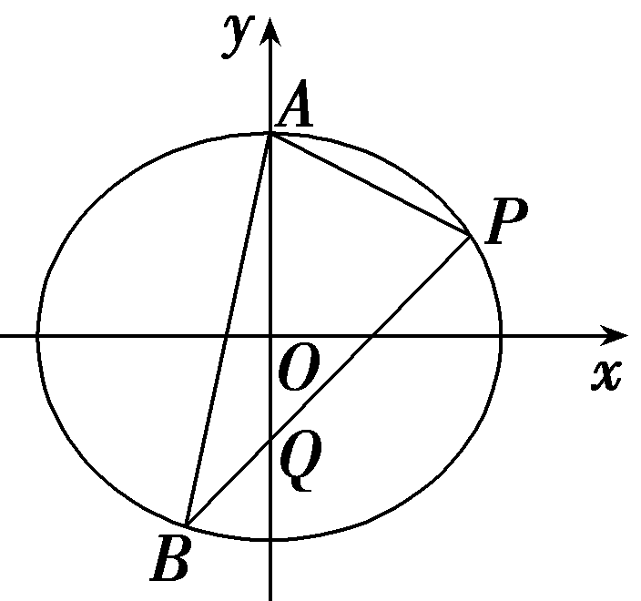
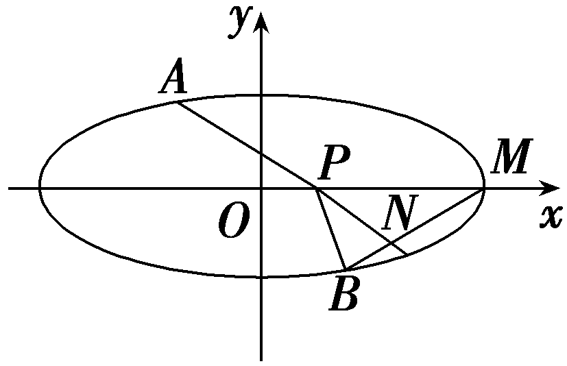
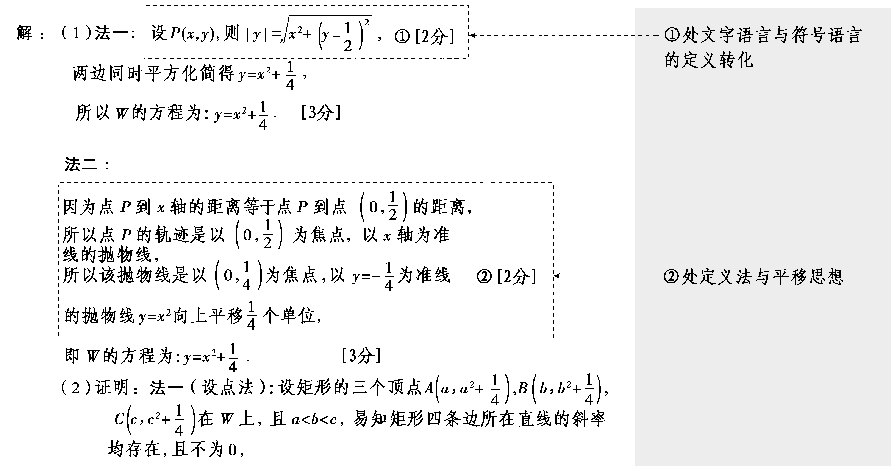
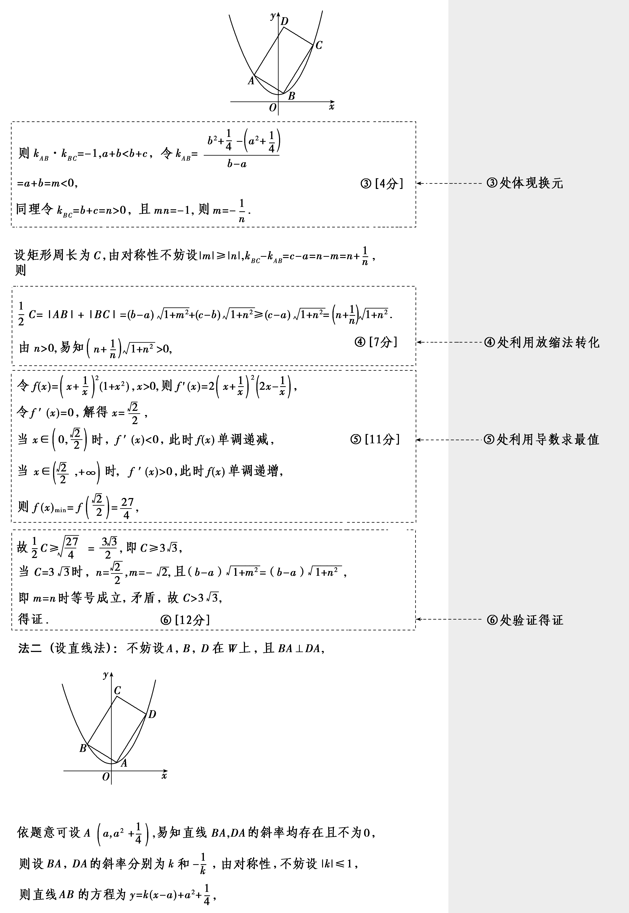
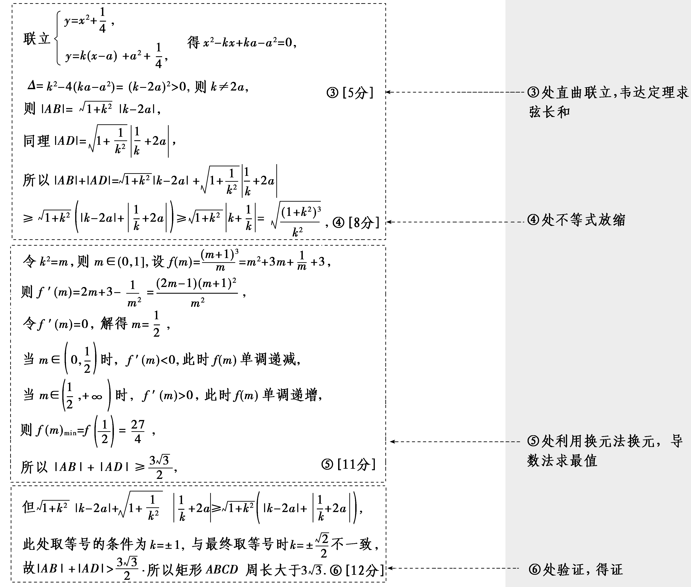
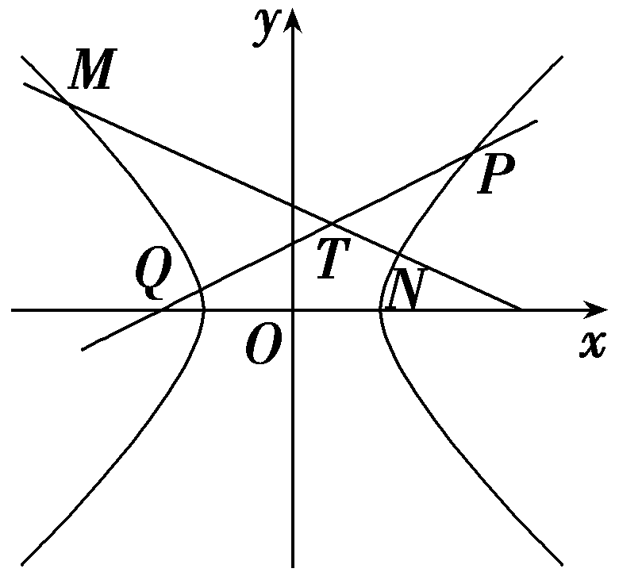
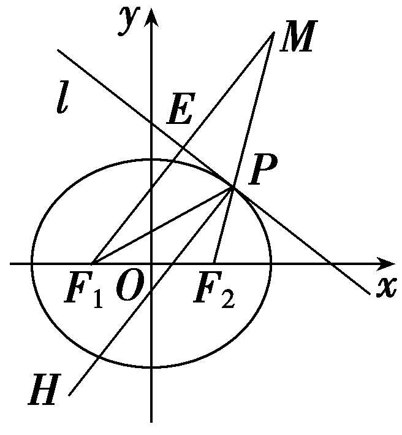
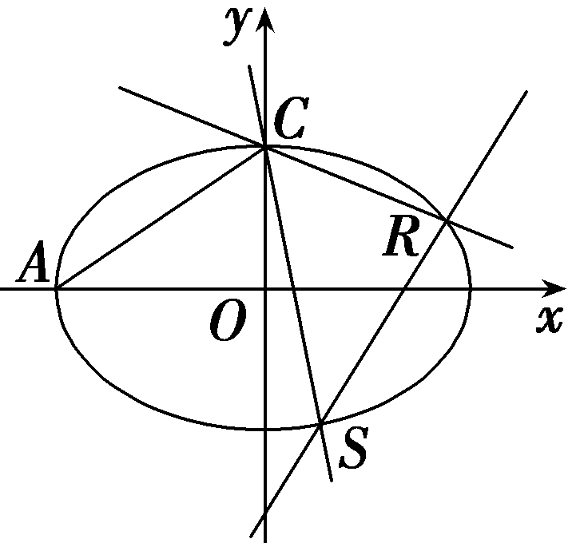

突破7　求值与证明问题

圆锥曲线中的证明问题主要有两类：一是证明点、直线、曲线等几何元素中的位置关系，如：某点在直线上，某直线经过某个点，某两条直线平行或垂直等；二是证明直线与圆锥曲线中的一些数量关系，解决时，主要根据直线、圆锥曲线的性质，直线与圆锥曲线的位置关系等，通过相关的性质应用代数式恒等变形及必要的数值计算进行证明.

### 题型一　圆锥曲线中的求值问题

(一题多解)(2024·新课标Ⅰ卷)已知<text style="it*a*lic">A</text>(0，3)和*P* $\left(3，\frac{3}{2}\right)$ 为椭圆<text style="it*a*lic">C</text>： $\frac{x^{2}}{a^{2}}$ ＋ $\frac{y^{2}}{b^{2}}$ ＝1(*a*＞*b*＞0)上两点.

（1）求*C*的离心率；

（2）若过*P*的直线*l*交*C*于另一点*B*，且△*ABP*的面积为9，求*l*的方程.

解：（1）由题意得 $\left\{\begin{matrix}b=3，\\\frac{9}{a^{2}}＋\frac{\frac{9}{4}}{b^{2}}=1，\end{matrix}\right.$ 解得 $\left\{\begin{matrix}b^{2}=9，\\a^{2}=12，\end{matrix}\right.$

所以*e*＝ $\sqrt{1－\frac{b^{2}}{a^{2}}}$ ＝ $\sqrt{1－\frac{9}{12}}$ ＝ $\frac{1}{2}$ .

（2）法一：&lt;te&lt;te&lt;text st<em>y</em>le="italic"&gt;x&lt;/text&gt;t style="italic"&gt;x&lt;/text&gt;t st<em>y</em>le="italic"&gt;k&lt;/text&gt;<em>&lt;text style="italic"&gt;AP</em>&lt;/text&gt;＝ $\frac{3－\frac{3}{2}}{0－3}$ ＝－ $\frac{1}{2}$ ，则直线&lt;te&lt;te&lt;text st<em>y</em>le="italic"&gt;x&lt;/text&gt;t style="italic"&gt;x&lt;/text&gt;t st<em>y</em>le="italic,subscript"&gt;<em>AP</em>&lt;/text&gt;的方程为y＝－ $\frac{1}{2}$ &lt;te&lt;text st<em>y</em>le="italic"&gt;x&lt;/text&gt;t style="italic"&gt;x&lt;/text&gt;＋3，即x＋2<em>y</em>－6＝0，

$\left|AP\right|$ ＝ $\sqrt{\left(0－3\right)^{2}＋\left(3－\frac{3}{2}\right)^{2}}$ ＝ $\frac{3\sqrt{5}}{2}$ ，由（1）知*C*： $\frac{x^{2}}{12}$ ＋ $\frac{y^{2}}{9}$ ＝1，

设点*B*到直线*AP*的距离为*<text style="italic">d*</text>，则d＝ $\frac{2\times 9}{\frac{3\sqrt{5}}{2}}$ ＝ $\frac{12\sqrt{5}}{5}$ ，

将直线*<text style="italic"><text style="italic">AP*</text></text>沿着与AP垂直的方向平移 $\frac{12\sqrt{5}}{5}$ 单位得到直线*<text style="italic"><text style="italic">AP*</text></text>的一条平行线，

此时该平行线与椭圆的交点即为点*B*，

设该平行线的方程为*x*＋2*y*＋*C*＝0，

则 $\frac{\left|C+6\right|}{\sqrt{5}}$ ＝ $\frac{12\sqrt{5}}{5}$ ，解得*<text style="italic">C*</text>＝6或C＝－18，

当*C*＝6时，联立 $\left\{\begin{matrix}\frac{x^{2}}{12}＋\frac{y^{2}}{9}=1，\\x+2y+6=0，\end{matrix}\right.$ 解得 $\left\{\begin{matrix}x=0，\\y＝－3，\end{matrix}\right.$ 或 $\left\{\begin{matrix}x＝－3，\\y＝－\frac{3}{2}，\end{matrix}\right.$ 即*B* $\left(0,-3\right)$ 或 $\left(－3,-\frac{3}{2}\right)$ ，

当<te<te<text st*y*le="italic">x</text>t style="italic">x</text>t st*y*<text sty*l*e="italic,subscript">l</text>e="italic">B</text> $\left(0,-3\right)$ 时，此时<te<te<text st*y*le="italic">x</text>t style="italic">x</text>t st*y*<text sty*l*e="italic,subscript">l</text>e="italic">k</text>l＝ $\frac{3}{2}$ ，直线<te<te<text st*y*le="italic">x</text>t style="italic">x</text>t st*yl*e="italic,subscript">l</text>的方程为y＝ $\frac{3}{2}$ <te<text st*y*le="italic">x</text>t style="italic">x</text>－3，即3x－2*y*－6＝0，

当<te<te<text st*y*le="italic">x</text>t style="italic">x</text>t st*y*<text sty*l*e="italic,subscript">l</text>e="italic">B</text> $\left(－3,-\frac{3}{2}\right)$ 时，此时<te<te<text st*y*le="italic">x</text>t style="italic">x</text>t st*y*<text sty*l*e="italic,subscript">l</text>e="italic">k</text>l＝ $\frac{1}{2}$ ，直线<te<te<text st*y*le="italic">x</text>t style="italic">x</text>t st*yl*e="italic,subscript">l</text>的方程为y＝ $\frac{1}{2}$ <te<text st*y*le="italic">x</text>t style="italic">x</text>，即x－2*y*＝0，

当<text st<text st*y*le="italic">y</text>le="italic">C</text>＝－18时，联立 $\left\{\begin{matrix}\frac{x^{2}}{12}＋\frac{y^{2}}{9}=1，\\x+2y－18=0\end{matrix}\right.$ 得<text st*y*le="superscript">2</text>*y*2－27y＋117＝0，

<em>Δ</em>＝272－4×2×117＝－207＜0，此时该直线与椭圆无交点.

综上，直线*l*的方程为3*x*－2*y*－6＝0或*x*－2*y*＝0.

法二：同法一得到直线*AP*的方程为*x*＋2*y*－6＝0，

点*B*到直线*AP*的距离*d*＝ $\frac{12\sqrt{5}}{5}$ ，

设*B* $\left(x_{0}，y_{0}\right)$ ，则 $\left\{\begin{matrix}\frac{\left|x_{0}+2y_{0}－6\right|}{\sqrt{5}}＝\frac{12\sqrt{5}}{5}，\\\frac{x_{0}^{2}}{12}＋\frac{y_{0}^{2}}{9}=1，\end{matrix}\right.$ 解得 $\left\{\begin{matrix}x_{0}＝－3，\\y_{0}＝－\frac{3}{2}，\end{matrix}\right.$ 或 $\left\{\begin{matrix}x_{0}=0，\\y_{0}＝－3，\end{matrix}\right.$

即*B* $\left(0,-3\right)$ 或 $\left(－3,-\frac{3}{2}\right)$ ，以下同法一.

法三：同法一得到直线*AP*的方程为*x*＋2*y*－6＝0，

点*B*到直线*AP*的距离*d*＝ $\frac{12\sqrt{5}}{5}$ ，

设*B* $\left(2\sqrt{3}cos\theta ，3sin\theta \right)$ ，其中*θ*∈ $\left[0，2\pi \right)$ ，则有 $\frac{\left|2\sqrt{3}cos\theta +6sin\theta －6\right|}{\sqrt{5}}$ ＝ $\frac{12\sqrt{5}}{5}$ ，

联立cos2<em>θ</em>＋sin2<em>θ</em>＝1，

解得 $\left\{\begin{matrix}cos\theta ＝－\frac{\sqrt{3}}{2}，\\sin\theta ＝－\frac{1}{2}，\end{matrix}\right.$ 或 $\left\{\begin{matrix}cos\theta =0，\\sin\theta ＝－1，\end{matrix}\right.$

即*B* $\left(0,-3\right)$ 或 $\left(－3,-\frac{3}{2}\right)$ ，以下同法一.

法四：当直线*A<text style="italic">B*</text>的斜率不存在时，此时B $\left(0,-3\right)$ ，

&lt;te&lt;te&lt;text st<em>y</em>le="italic"&gt;x&lt;/text&gt;t style="italic"&gt;x&lt;/text&gt;t st<em>y</em>&lt;text sty<em>l</em>e="italic,subscript"&gt;l&lt;/text&gt;e="italic"&gt;S&lt;/text&gt;△<em>ABP</em>＝ $\frac{1}{2}$ ×6×3＝9，符合题意，此时&lt;te&lt;te&lt;text st<em>y</em>le="italic"&gt;x&lt;/text&gt;t style="italic"&gt;x&lt;/text&gt;t st<em>y</em>&lt;text sty<em>l</em>e="italic,subscript"&gt;l&lt;/text&gt;e="italic"&gt;k&lt;/text&gt;l＝ $\frac{3}{2}$ ，直线&lt;te&lt;te&lt;text st<em>y</em>le="italic"&gt;x&lt;/text&gt;t style="italic"&gt;x&lt;/text&gt;t st<em>yl</em>e="italic,subscript"&gt;l&lt;/text&gt;的方程为y＝ $\frac{3}{2}$ &lt;te&lt;text st<em>y</em>le="italic"&gt;x&lt;/text&gt;t style="italic"&gt;x&lt;/text&gt;－3，即3x－2<em>y</em>－6＝0，

当直线*AB*的斜率存在时，设直线*AB*的方程为*y*＝*kx*＋3，

联立椭圆方程有 $\left\{\begin{matrix}y＝kx+3，\\\frac{x^{2}}{12}＋\frac{y^{2}}{9}=1，\end{matrix}\right.$ 则 $\left(4k^{2}+3\right)$ <em>x</em>2＋24<em>&lt;text style="italic"&gt;&lt;text style="italic"&gt;&lt;text style="italic"&gt;k</em>&lt;/text&gt;&lt;/text&gt;x&lt;/text&gt;＝0，其中k≠k<em>AP</em>，即k≠－ $\frac{1}{2}$ ，

解得<te*x*t style="italic">x</text>＝0或x＝ $\frac{－24k}{4k^{2}+3}$ ，*<text style="italic">k*</text>≠0，k≠－ $\frac{1}{2}$ ，

令<text st*y*le="italic">x</text>＝ $\frac{－24k}{4k^{2}+3}$ ，则*y*＝ $\frac{－12k^{2}+9}{4k^{2}+3}$ ，

则*B* $\left(\frac{－24k}{4k^{2}+3}，\frac{－12k^{2}+9}{4k^{2}+3}\right)$ .

同法一：得到直线*AP*的方程为*x*＋2*y*－6＝0，

点*B*到直线*AP*的距离*d*＝ $\frac{12\sqrt{5}}{5}$ ，

则 $\frac{\left|\frac{－24k}{4k^{2}+3}+2\times \frac{－12k^{2}+9}{4k^{2}+3}－6\right|}{\sqrt{5}}$ ＝ $\frac{12\sqrt{5}}{5}$ ，解得*k*＝ $\frac{3}{2}$ ，

此时<te<te<text st*y*le="italic">x</text>t style="italic">x</text>t st*y*<text sty*l*e="italic,subscript">l</text>e="italic">B</text> $\left(－3,-\frac{3}{2}\right)$ ，则得到此时<te<te<text st*y*le="italic">x</text>t style="italic">x</text>t st*y*<text sty*l*e="italic,subscript">l</text>e="italic">k</text>l＝ $\frac{1}{2}$ ，直线<te<te<text st*y*le="italic">x</text>t style="italic">x</text>t st*yl*e="italic,subscript">l</text>的方程为y＝ $\frac{1}{2}$ <te<text st*y*le="italic">x</text>t style="italic">x</text>，即x－2*y*＝0，

综上，直线*l*的方程为3*x*－2*y*－6＝0或*x*－2*y*＝0.

面积问题的解决策略

##### 1.求三角形的面积需要寻底找高，需要两条线段的长度，为了简化运算，通常优先选择能用坐标直接表示的底(或高).

##### 2.面积的拆分：不规则的多边形通常考虑拆分为多个三角形，对于三角形，如果底和高不便于计算，则也可以考虑拆分成若干个易于计算的三角形.

对点练1.(&lt;te&lt;te&lt;text style="it<em>a</em>lic"&gt;x&lt;/text&gt;t st<em>y</em>le="italic"&gt;x&lt;/text&gt;t st<em>y</em>le="superscript"&gt;2&lt;/text&gt;024·山东泰安一模)已知圆<em>x</em>2＋y2－x－2y＋<em>m</em>＝0与x轴交于点<em>P</em> $\left(1，0\right)$ ，且经过椭圆&lt;text style="it<em>a</em>lic"&gt;<em>G</em>&lt;/text&gt;： $\frac{x^{2}}{a^{2}}$ ＋ $\frac{y^{2}}{b^{2}}$ ＝1(<em>a</em>＞<em>b</em>＞0)的上顶点，椭圆<em>&lt;text style="italic"&gt;G</em>&lt;/text&gt;的离心率为 $\frac{\sqrt{5}}{3}$ .

（1）求椭圆*G*的方程；

（2）若点<te*x*t style="italic">*A*</text>为椭圆*<text style="italic">G*</text>上一点，且在x轴上方，*B*为A关于原点*O*的对称点，点*M*为椭圆G的右顶点，直线*<text style="italic">PA*</text>与*MB*交于点*N*，△*PBN*的面积为 $\frac{\sqrt{5}}{3}$ ，求直线P<te*x*t style="italic">*A*</text>的斜率.

解：（1）因为圆&lt;te&lt;text st<em>y</em>le="italic"&gt;x&lt;/text&gt;t st<em>y</em>le="italic"&gt;x&lt;/text&gt;&lt;text style="superscript"&gt;2&lt;/text&gt;＋y2－x－2y＋<em>&lt;text style="italic"&gt;m</em>&lt;/text&gt;＝0过 $\left(1，0\right)$ ，所以<em>&lt;text style="italic"&gt;m</em>&lt;/text&gt;＝0，

又因为圆&lt;te&lt;text st<em>y</em>le="italic"&gt;x&lt;/text&gt;t st<em>y</em>le="italic"&gt;x&lt;/text&gt;&lt;text style="superscript"&gt;2&lt;/text&gt;＋y2－x－2y＝0过 $\left(0，b\right)$ ，所以<em>b</em>＝&lt;te&lt;text st<em>y</em>le="italic"&gt;x&lt;/text&gt;t st<em>y</em>le="superscript"&gt;2&lt;/text&gt;，

又因为 $\left\{\begin{matrix}e＝\frac{c}{a}＝\frac{\sqrt{5}}{3}，\\a^{2}－c^{2}=4，\end{matrix}\right.$ 解得<em>a</em>2＝9，

所以椭圆*G*的方程为 $\frac{x^{2}}{9}$ ＋ $\frac{y^{2}}{4}$ ＝1.

（2）设*A* $\left(x_{0}，y_{0}\right)\left(y_{0}>0\right)$ ，则*B* $\left(－x_{0},-y_{0}\right)$ ，

由题知<em>x</em>0≠1且<em>x</em>0≠－3，

则<text st*y*le="italic">PA</text>：y＝ $\frac{y_{0}}{x_{0}－1}\left(x－1\right)$ ，

<text st*y*le="italic">MB</text>：y＝ $\frac{y_{0}}{x_{0}+3}\left(x－3\right)$ ，由 $\left\{\begin{matrix}y＝\frac{y_{0}}{x_{0}－1}\left(x－1\right)，\\y＝\frac{y_{0}}{x_{0}+3}\left(x－3\right)，\end{matrix}\right.$ 解得 $\left\{\begin{matrix}x＝\frac{3}{2}－\frac{1}{2}x_{0}，\\y＝－\frac{y_{0}}{2}，\end{matrix}\right.$ 所以*N* $\left(\frac{3}{2}－\frac{1}{2}x_{0},-\frac{y_{0}}{2}\right)$ ，

又因为&lt;text st&lt;text st&lt;text st<em>y</em>le="italic"&gt;y&lt;/text&gt;le="italic"&gt;y&lt;/text&gt;le="italic"&gt;<em>&lt;text style="italic"&gt;S</em>&lt;/text&gt;&lt;/text&gt;&lt;text style="subscript"&gt;&lt;text style="subscript"&gt;△&lt;/text&gt;&lt;/text&gt;<em>PBN</em>＝S△<em>PBM</em>－S△<em>PNM</em>＝ $\frac{1}{2}$ × $\left|PM\right|$ × $\frac{1}{2}$ &lt;text st&lt;text st<em>y</em>le="italic"&gt;y&lt;/text&gt;le="italic"&gt;y&lt;/text&gt;&lt;text style="subscript"&gt;&lt;text style="subscript"&gt;0&lt;/text&gt;&lt;/text&gt;＝ $\frac{1}{2}$ &lt;text st&lt;text st<em>y</em>le="italic"&gt;y&lt;/text&gt;le="italic"&gt;y&lt;/text&gt;&lt;text style="subscript"&gt;&lt;text style="subscript"&gt;0&lt;/text&gt;&lt;/text&gt;＝ $\frac{\sqrt{5}}{3}$ ，所以&lt;text st&lt;text st<em>y</em>le="italic"&gt;y&lt;/text&gt;le="italic"&gt;y&lt;/text&gt;&lt;text style="subscript"&gt;&lt;text style="subscript"&gt;0&lt;/text&gt;&lt;/text&gt;＝ $\frac{2\sqrt{5}}{3}$ ，

又因为 $\frac{x_{0}^{2}}{9}$ ＋ $\frac{y_{0}^{2}}{4}$ ＝1，所以<em>x</em>0＝±2，

所以直线<em>PA</em>的斜率<em>kAP</em>＝ $\frac{y_{0}}{x_{0}－1}$ ＝－ $\frac{2\sqrt{5}}{9}$ 或 $\frac{2\sqrt{5}}{3}$ .

### 题型二　圆锥曲线中的证明问题

角度1　数量关系的证明

[答题规范](12分)(2023·新课标Ⅰ卷)在直角坐标系<te*x*t style="italic">xOy</text>中，点*<text style="italic"><text style="italic">P*</text></text>到x轴的距离等于点P到点 $\left(0，\frac{1}{2}\right)$ 的距离，记动点<te*x*t style="italic">*<text style="italic">P*</text></text>的轨迹为*W*.

（1）求<te*x*t style="italic">W</text>的方程；[切入点：点*<text style="italic">P*</text>到x轴的距离等于点P到点 $\left(0，\frac{1}{2}\right)$ 的距离.]

（2）已知矩形*<text style="italic">ABCD*</text>有三个顶点在*W*上，证明：矩形ABCD的周长大于3 $\sqrt{3}$ .

[关键点：把问题转化为在抛物线&lt;te<em>x</em>t style="italic"&gt;y&lt;/text&gt;＝x2＋ $\frac{1}{4}$ 上考虑，设矩形的顶点<em>A</em> $\left(a，a^{2}＋\frac{1}{4}\right)$ ，用｜<em>A</em>B｜＋｜<em>AD</em>｜表示矩形<em>AB</em>CD的周长.]

[思路分析]　本题以抛物线为载体，考查求轨迹方程，以及不等式、函数与导数等知识的综合问题.

（1）法一：设<te<text st<text st*y*le="italic">y</text>le="italic">x</text>t style="italic">P</text>(x，y)，根据题意列出方程｜y｜＝ $\sqrt{x^{2}＋\left(y－\frac{1}{2}\right)^{2}}$ ，化简即可；

法二：利用抛物线的定义求解，找出顶点，算出焦准距*p*即可.

（2）法一：设矩形的三个顶点<te*x*t style="it<text style="it<text style="itali*c*">a</text>li*c*">a</text>lic">A</text> $\left(a，a^{2}＋\frac{1}{4}\right)$ ，<te*x*t style="it<text style="it<text style="itali*c*">a</text>li*c*">a</text>lic">B</text> $\left(b，b^{2}＋\frac{1}{4}\right)$ ，<te*x*t style="it<text style="it<text style="itali*c*">a</text>li*c*">a</text>lic">*<text style="italic">C*</text></text> $\left(c，c^{2}＋\frac{1}{4}\right)$ ，且<te*x*t style="it<text style="itali*c*">a</text>li*c*">a</text>＜*<text style="italic"><text style="italic">b*</text></text>＜c，分别令*<text style="italic">k*</text>*AB*＝a＋b＝*m*＜0，kB*<text style="italic"><text style="italic">C*</text></text>＝b＋c＝*n*＞0，且*mn*＝－1，利用放缩法得 $\frac{1}{2}$ <te*x*t style="it<text style="it<text style="itali*c*">a</text>li*c*">a</text>lic">*<text style="italic">C*</text></text>≥ $\left(n＋\frac{1}{n}\right)\sqrt{1+n^{2}}$ ，设函数<te*x*t style="italic">f</text>(x)＝ $\left(x＋\frac{1}{x}\right)^{2}\left(1+x^{2}\right)$ ，利用导数求出其最小值，则得<te*x*t style="it<text style="it<text style="itali*c*">a</text>li*c*">a</text>lic">*<text style="italic">C*</text></text>的最小值，再排除临界值即可；

法二：设直线&lt;te&lt;text style="it&lt;text style="it<em>a</em>lic"&gt;a&lt;/text&gt;lic"&gt;x&lt;/text&gt;t st<em>y</em>le="italic"&gt;<em>AB</em>&lt;/text&gt;的方程为y＝<em>k</em>(x－a)＋a2＋ $\frac{1}{4}$ ，将其与抛物线方程联立，再利用弦长公式和放缩法得｜&lt;te&lt;text style="it&lt;text style="it<em>a</em>lic"&gt;a&lt;/text&gt;lic"&gt;x&lt;/text&gt;t st<em>y</em>le="italic"&gt;<em>AB</em>&lt;/text&gt;｜＋｜<em>AD</em>｜≥ $\sqrt{\frac{(1+k^{2})^{3}}{k^{2}}}$ ，利用换元法和求导即可求出周长最值，再排除临界值即可.

<table><tr><td></td></tr><tr><td></td></tr></table>

评注：处理 $\frac{(1+k^{2})^{3}}{k^{2}}$ 最小值的方法较多，比如： $\frac{(1+k^{2})^{3}}{k^{2}}$ ＝<em>&lt;text style="italic"&gt;&lt;text style="italic"&gt;&lt;text style="italic"&gt;&lt;text style="italic"&gt;&lt;text style="italic"&gt;&lt;text style="italic"&gt;k</em>&lt;/text&gt;&lt;/text&gt;&lt;/text&gt;&lt;/text&gt;&lt;/text&gt;&lt;/text&gt;4＋3k&lt;text style="superscript"&gt;&lt;text style="superscript"&gt;&lt;text style="superscript"&gt;&lt;text style="superscript"&gt;&lt;text style="superscript"&gt;&lt;text style="superscript"&gt;&lt;text style="superscript"&gt;2&lt;/text&gt;&lt;/text&gt;&lt;/text&gt;&lt;/text&gt;&lt;/text&gt;&lt;/text&gt;&lt;/text&gt;＋ $\frac{1}{k^{2}}$ ＋3＝(<em>&lt;text style="italic"&gt;&lt;text style="italic"&gt;&lt;text style="italic"&gt;&lt;text style="italic"&gt;&lt;text style="italic"&gt;&lt;text style="italic"&gt;k</em>&lt;/text&gt;&lt;/text&gt;&lt;/text&gt;&lt;/text&gt;&lt;/text&gt;&lt;/text&gt;&lt;text style="superscript"&gt;&lt;text style="superscript"&gt;&lt;text style="superscript"&gt;&lt;text style="superscript"&gt;&lt;text style="superscript"&gt;&lt;text style="superscript"&gt;&lt;text style="superscript"&gt;2&lt;/text&gt;&lt;/text&gt;&lt;/text&gt;&lt;/text&gt;&lt;/text&gt;&lt;/text&gt;&lt;/text&gt;－ $\frac{1}{2}$ )&lt;text style="superscript"&gt;&lt;text style="superscript"&gt;&lt;text style="superscript"&gt;&lt;text style="superscript"&gt;&lt;text style="superscript"&gt;&lt;text style="superscript"&gt;&lt;text style="superscript"&gt;2&lt;/text&gt;&lt;/text&gt;&lt;/text&gt;&lt;/text&gt;&lt;/text&gt;&lt;/text&gt;&lt;/text&gt;＋(4<em>&lt;text style="italic"&gt;&lt;text style="italic"&gt;&lt;text style="italic"&gt;&lt;text style="italic"&gt;&lt;text style="italic"&gt;&lt;text style="italic"&gt;k</em>&lt;/text&gt;&lt;/text&gt;&lt;/text&gt;&lt;/text&gt;&lt;/text&gt;&lt;/text&gt;2＋ $\frac{1}{k^{2}}$ )＋ $\frac{11}{4}$ ≥0＋&lt;text style="superscript"&gt;&lt;text style="superscript"&gt;&lt;text style="superscript"&gt;&lt;text style="superscript"&gt;&lt;text style="superscript"&gt;&lt;text style="superscript"&gt;&lt;text style="superscript"&gt;2&lt;/text&gt;&lt;/text&gt;&lt;/text&gt;&lt;/text&gt;&lt;/text&gt;&lt;/text&gt;&lt;/text&gt; $\sqrt{4k^{2}\times \frac{1}{k^{2}}}$ ＋ $\frac{11}{4}$ ＝ $\frac{27}{4}$ ，当且仅当<em>&lt;text style="italic"&gt;&lt;text style="italic"&gt;&lt;text style="italic"&gt;&lt;text style="italic"&gt;&lt;text style="italic"&gt;&lt;text style="italic"&gt;k</em>&lt;/text&gt;&lt;/text&gt;&lt;/text&gt;&lt;/text&gt;&lt;/text&gt;&lt;/text&gt;&lt;text style="superscript"&gt;&lt;text style="superscript"&gt;&lt;text style="superscript"&gt;&lt;text style="superscript"&gt;&lt;text style="superscript"&gt;&lt;text style="superscript"&gt;&lt;text style="superscript"&gt;2&lt;/text&gt;&lt;/text&gt;&lt;/text&gt;&lt;/text&gt;&lt;/text&gt;&lt;/text&gt;&lt;/text&gt;＝ $\frac{1}{2}$ 时，上式取等号.又如设<em>&lt;text style="italic"&gt;&lt;text style="italic"&gt;&lt;text style="italic"&gt;&lt;text style="italic"&gt;&lt;text style="italic"&gt;&lt;text style="italic"&gt;k</em>&lt;/text&gt;&lt;/text&gt;&lt;/text&gt;&lt;/text&gt;&lt;/text&gt;&lt;/text&gt;＝tan <em>&lt;text style="italic"&gt;&lt;text style="italic"&gt;&lt;text style="italic"&gt;θ</em>&lt;/text&gt;&lt;/text&gt;&lt;/text&gt;，θ∈(0， $\frac{\pi }{2}$ )∪( $\frac{\pi }{2}$ ，π)，则 $\frac{(1+k^{2})^{3}}{k^{2}}$ ＝ $\frac{1}{sin^{2}\theta cos^{4}\theta }$ ＝ $\frac{2}{2sin^{2}\theta cos^{2}\theta cos^{2}\theta }$ ，则 $\frac{(1+k^{2})^{3}}{k^{2}}$ ≥ $\frac{2}{\left(\frac{2sin^{2}\theta ＋cos^{2}\theta ＋cos^{2}\theta }{3}\right)^{3}}$ ＝ $\frac{27}{4}$ ，当且仅当&lt;text style="superscript"&gt;&lt;text style="superscript"&gt;&lt;text style="superscript"&gt;&lt;text style="superscript"&gt;&lt;text style="superscript"&gt;&lt;text style="superscript"&gt;&lt;text style="superscript"&gt;2&lt;/text&gt;&lt;/text&gt;&lt;/text&gt;&lt;/text&gt;&lt;/text&gt;&lt;/text&gt;&lt;/text&gt;sin2<em>&lt;text style="italic"&gt;&lt;text style="italic"&gt;&lt;text style="italic"&gt;θ</em>&lt;/text&gt;&lt;/text&gt;&lt;/text&gt;＝cos2θ，即<em>&lt;text style="italic"&gt;&lt;text style="italic"&gt;&lt;text style="italic"&gt;&lt;text style="italic"&gt;&lt;text style="italic"&gt;&lt;text style="italic"&gt;k</em>&lt;/text&gt;&lt;/text&gt;&lt;/text&gt;&lt;/text&gt;&lt;/text&gt;&lt;/text&gt;2＝ $\frac{1}{2}$ 时，上式取等号.

角度2　位置关系的证明

(2024·全国甲卷)已知椭圆<te*x*t style="it*a*lic">*C*</text>： $\frac{x^{2}}{a^{2}}$ ＋ $\frac{y^{2}}{b^{2}}$ ＝1(<te*x*t style="italic">a</text>＞*b*＞0)的右焦点为*F*，点*M* $\left(1，\frac{3}{2}\right)$ 在<te*x*t style="it*a*lic">*C*</text>上，且*MF*⊥x轴.

（1）求*C*的方程；

（2）过点*P*(4，0)的直线交*C*于*A*，*B*两点，*N*为线段*FP*的中点，直线*NB*交直线*MF*于点*Q*，证明：*AQ*⊥*y*轴.

解：（1）由题意知 $\left\{\begin{matrix}\frac{1}{a^{2}}＋\frac{9}{4b^{2}}=1，\\c=1，\\a^{2}＝b^{2}＋c^{2}，\end{matrix}\right.$ 得 $\left\{\begin{matrix}a=2，\\b＝\sqrt{3}，\\c=1，\end{matrix}\right.$

所以椭圆*C*的方程为 $\frac{x^{2}}{4}$ ＋ $\frac{y^{2}}{3}$ ＝1.

（2）证明：分析知直线*AB*的斜率存在.

易知当直线*AB*的斜率为0时，*AQ*⊥*y*轴.

当直线<em>AB</em>的斜率不为0时，设直线<em>AB</em>：<em>x</em>＝<em>ty</em>＋4(<em>t</em>≠0)，<em>A</em>(<em>x</em>1，<em>y</em>1)，<em>B</em>(<em>x</em>2，<em>y</em>2)，<em>Q</em>(1，<em>n</em>)，

联立方程 $\left\{\begin{matrix}x＝ty+4，\\\frac{x^{2}}{4}＋\frac{y^{2}}{3}=1，\end{matrix}\right.$

消去&lt;text st&lt;text s<em>ty</em>le="italic"&gt;y&lt;/text&gt;le="italic"&gt;x&lt;/text&gt;得 $\left(3t^{2}+4\right)$ &lt;text s<em>ty</em>le="italic"&gt;y&lt;/text&gt;2＋24ty＋36＝0，<em>Δ</em>＞0，

则&lt;text st&lt;text st&lt;text st<em>y</em>le="italic"&gt;y&lt;/text&gt;le="italic"&gt;y&lt;/text&gt;le="italic"&gt;y&lt;/text&gt;&lt;text style="subscript"&gt;1&lt;/text&gt;＋y&lt;text style="subscript"&gt;2&lt;/text&gt;＝ $\frac{－24t}{3t^{2}+4}$ ，&lt;text st&lt;text st&lt;text st<em>y</em>le="italic"&gt;y&lt;/text&gt;le="italic"&gt;y&lt;/text&gt;le="italic"&gt;y&lt;/text&gt;&lt;text style="subscript"&gt;1&lt;/text&gt;y&lt;text style="subscript"&gt;2&lt;/text&gt;＝ $\frac{36}{3t^{2}+4}$ .

因为 *<text style="italic">N* </text>为线段 *<text style="italic">F*P</text>的中点，F(1，0)，所以N $\left(\frac{5}{2}，0\right)$ .

由&lt;text st<em>y</em>le="italic"&gt;N&lt;/text&gt;，<em>Q</em>，<em>B</em> 三点共线，得<em>&lt;text style="italic"&gt;k</em>&lt;/text&gt;<em>BN</em>＝k<em>NQ</em>，即 $\frac{y_{2}}{x_{2}－\frac{5}{2}}$ ＝ $\frac{n}{1－\frac{5}{2}}$ ，得－ $\frac{3}{2}$ <em>y</em>2＝<em>&lt;text style="italic"&gt;n</em>&lt;/text&gt; $\left(x_{2}－\frac{5}{2}\right)$ ，得<em>&lt;text style="italic"&gt;n</em>&lt;/text&gt;＝ $\frac{－3y_{2}}{2x_{2}－5}$ ，

所以&lt;text st&lt;text st&lt;text st<em>y</em>le="italic"&gt;y&lt;/text&gt;le="italic"&gt;y&lt;/text&gt;le="italic"&gt;n&lt;/text&gt;－y&lt;text style="subscript"&gt;&lt;text style="subscript"&gt;1&lt;/text&gt;&lt;/text&gt;＝ $\frac{－3y_{2}}{2x_{2}－5}$ －&lt;text st&lt;text st<em>y</em>le="italic"&gt;y&lt;/text&gt;le="italic"&gt;y&lt;/text&gt;&lt;text style="subscript"&gt;&lt;text style="subscript"&gt;1&lt;/text&gt;&lt;/text&gt;＝ $\frac{－3y_{2}}{2\left(ty_{2}+4\right)－5}$ －&lt;text st&lt;text st<em>y</em>le="italic"&gt;y&lt;/text&gt;le="italic"&gt;y&lt;/text&gt;&lt;text style="subscript"&gt;&lt;text style="subscript"&gt;1&lt;/text&gt;&lt;/text&gt;＝ $\frac{－2ty_{1}y_{2}－3\left(y_{1}＋y_{2}\right)}{2ty_{2}+3}$ ＝ $\frac{\frac{－2t\times 36}{3t^{2}+4}＋\frac{3\times 24t}{3t^{2}+4}}{2ty_{2}+3}$ ＝0，

所以<em>n</em>＝<em>y</em>1，所以<em>AQ</em>⊥<em>y</em>轴.

常见的圆锥曲线中的证明问题

##### 1.数量关系方面：如存在定值、恒成立、相等等.在熟悉圆锥曲线的定义与性质的前提下，一般采用直接法，通过相关的代数运算证明.

##### 2.位置关系方面：如证明直线与曲线相切，直线间的平行、垂直，直线过定点等.

对点练2.(2024·湖北武汉五调)已知双曲线<em>E</em>：<em>x</em>2－<em>y</em>2＝1，直线<em>PQ</em>与双曲线<em>E</em>交于<em>P</em>，<em>Q</em>两点，直线<em>MN</em>与双曲线<em>E</em>交于<em>M</em>，<em>N</em>两点.

（1）若直线<em>MN</em>经过坐标原点，且直线<em>PM</em>，<em>PN</em>的斜率<em>kPM</em>，<em>kPN</em>均存在，求<em>kPMkPN</em>；

（2）设直线*<text style="italic">PQ*</text>与直线*<text style="italic">MN*</text>的交点为*T*(1，2)，且 $\vec{TP}$ · $\vec{TQ}$ ＝ $\vec{TM}$ · $\vec{TN}$ ，证明：直线*<text style="italic">PQ*</text>与直线*<text style="italic">MN*</text>的斜率之和为0.

解：（1）当直线*MN*经过坐标原点时，*M*，*N*两点关于原点对称.

设*M* $\left(x_{1}，y_{1}\right)$ ，*N* $\left(－x_{1},-y_{1}\right)$ ，*P* $\left(x_{0}，y_{0}\right)$ ，

于是<em>&lt;text style="italic"&gt;k</em>&lt;/text&gt;<em>PM</em>＝ $\frac{y_{0}－y_{1}}{x_{0}－x_{1}}$ ，<em>&lt;text style="italic"&gt;k</em>&lt;/text&gt;<em>PN</em>＝ $\frac{y_{0}＋y_{1}}{x_{0}＋x_{1}}$ .

因为<em>M</em>，<em>N</em>，<em>P</em>三点都在双曲线<em>x</em>2－<em>y</em>2＝1，

所以 $\left\{\begin{matrix}x_{0}^{2}－y_{0}^{2}=1，\\x_{1}^{2}－y_{1}^{2}=1，\end{matrix}\right.$ 两式作差得 $x_{0}^{2}$ － $x_{1}^{2}$ ＝ $y_{0}^{2}$ － $y_{1}^{2}$ ，

所以<em>&lt;text style="italic"&gt;k</em>&lt;/text&gt;<em>PM</em>k<em>PN</em>＝ $\frac{y_{0}－y_{1}}{x_{0}－x_{1}}$ · $\frac{y_{0}＋y_{1}}{x_{0}＋x_{1}}$ ＝ $\frac{y_{0}^{2}－y_{1}^{2}}{x_{0}^{2}－x_{1}^{2}}$ ＝1.

（2）证明：已知*T*(1，2)，由题意可知*MN*，*PQ*均有斜率，

可设直线&lt;te&lt;te<em>x</em>t st<em>y</em>le="italic"&gt;x&lt;/text&gt;t st<em>y</em>le="italic"&gt;<em>MN</em>&lt;/text&gt;：y－2＝<em>&lt;text style="italic"&gt;k</em>&lt;/text&gt;1(x－1)，直线<em>&lt;text style="italic"&gt;PQ</em>&lt;/text&gt;：y－2＝k2(x－1)，M $\left(x_{1}，y_{1}\right)$ ，<em>N</em> $\left(x_{2}，y_{2}\right)$ ，<em>P</em> $\left(x_{3}，y_{3}\right)$ ，<em>Q</em> $\left(x_{4}，y_{4}\right)$ . $\vec{TM}$ ＝ $\left(x_{1}－1，y_{1}－2\right)$ ， $\vec{TN}$ ＝ $\left(x_{2}－1，y_{2}－2\right)$ .

联立 $\left\{\begin{matrix}y－2=k_{1}(x－1),\\x^{2}－y^{2}=1，\end{matrix}\right.$

整理得， $\left(1－k_{1}^{2}\right)$ &lt;te<em>x</em>t style="italic"&gt;x&lt;/text&gt;2＋2<em>k</em>1 $\left(k_{1}－2\right)$ &lt;te<em>x</em>t style="italic"&gt;x&lt;/text&gt;－ $\left(k_{1}－2\right)^{2}$ －&lt;te<em>x</em>t style="subscript"&gt;1&lt;/text&gt;＝0，

当1－ $k_{1}^{2}$ ≠0时，*Δ*＝4 $\left(5－4k_{1}\right)$ ＞0.

&lt;te&lt;te&lt;te<em>x</em>t style="italic"&gt;x&lt;/text&gt;t style="italic"&gt;x&lt;/text&gt;t style="italic"&gt;x&lt;/text&gt;&lt;text style="subscript"&gt;1&lt;/text&gt;＋x&lt;text style="subscript"&gt;2&lt;/text&gt;＝－ $\frac{2k_{1}\left(k_{1}－2\right)}{1－k_{1}^{2}}$ ，&lt;te&lt;te&lt;te<em>x</em>t style="italic"&gt;x&lt;/text&gt;t style="italic"&gt;x&lt;/text&gt;t style="italic"&gt;x&lt;/text&gt;&lt;text style="subscript"&gt;1&lt;/text&gt;x&lt;text style="subscript"&gt;2&lt;/text&gt;＝ $\frac{－\left(k_{1}－2\right)^{2}－1}{1－k_{1}^{2}}$ .

于是， $\vec{TM}$ · $\vec{TN}$ ＝ $\left(x_{1}－1\right)\left(x_{2}－1\right)$ ＋ $\left(y_{1}－2\right)\left(y_{2}－2\right)$ ＝ $\left(1+k_{1}^{2}\right)\left[x_{1}x_{2}－\left(x_{1}＋x_{2}\right)+1\right]$

＝ $\left(1+k_{1}^{2}\right)\left[\frac{－\left(k_{1}－2\right)^{2}－1}{1－k_{1}^{2}}＋\frac{2k_{1}\left(k_{1}－2\right)}{1－k_{1}^{2}}+1\right]$ ＝ $\left(1+k_{1}^{2}\right)$ · $\frac{－4}{1－k_{1}^{2}}$ ，

同理可得， $\vec{TP}$ · $\vec{TQ}$ ＝ $\left(1+k_{2}^{2}\right)$ · $\frac{－4}{1－k_{2}^{2}}$ .

因为 $\vec{TM}$ · $\vec{TN}$ ＝ $\vec{TP}$ · $\vec{TQ}$ ，所以 $\frac{1+k_{1}^{2}}{1－k_{1}^{2}}$ ＝ $\frac{1+k_{2}^{2}}{1－k_{2}^{2}}$

整理得， $k_{1}^{2}$ ＝ $k_{2}^{2}$ ，而<em>&lt;text style="italic"&gt;&lt;text style="italic"&gt;&lt;text style="italic"&gt;k</em>&lt;/text&gt;&lt;/text&gt;&lt;/text&gt;&lt;text style="subscript"&gt;1&lt;/text&gt;≠k&lt;text style="subscript"&gt;2&lt;/text&gt;，所以k1＋k2＝0.

对点练3.(2025·八省适应性测试)已知椭圆<em>C</em>的离心率为 $\frac{1}{2}$ ，左、右焦点分别为<em>&lt;text style="italic"&gt;F</em>&lt;/text&gt;1 $\left(－1，0\right)$ ，<em>&lt;text style="italic"&gt;F</em>&lt;/text&gt;2 $\left(1，0\right)$ .

（1）求椭圆*C*的方程；

（2）已知点<em>&lt;text style="italic"&gt;M</em>&lt;/text&gt;&lt;text style="subscript"&gt;0&lt;/text&gt; $\left(1，4\right)$ ，证明：线段<em>F</em>1<em>&lt;text style="italic"&gt;M</em>&lt;/text&gt;&lt;text style="subscript"&gt;0&lt;/text&gt;的垂直平分线与<em>C</em>恰有一个公共点；

（3）设<em>M</em>是坐标平面上的动点，且线段<em>F</em>1<em>M</em>的垂直平分线与<em>C</em>恰有一个公共点，证明<em>M</em>的轨迹为圆，并求该圆的方程.

解：(&lt;text style="subs<em>c</em>ript"&gt;1&lt;/text&gt;)因为椭圆<em>C</em>的左、右焦点分别为<em>&lt;text style="italic"&gt;F</em>&lt;/text&gt;1 $\left(－1，0\right)$ ，&lt;text style="itali<em>c</em>"&gt;<em>F</em>&lt;/text&gt;2 $\left(1，0\right)$ ，所以<em>c</em>＝1.

又因为椭圆*C*的离心率为 $\frac{1}{2}$ ，

所以<em>a</em>＝2，<em>b</em>2＝3，所以椭圆<em>C</em>的方程为 $\frac{x^{2}}{4}$ ＋ $\frac{y^{2}}{3}$ ＝1.

（2）证明：由<em>&lt;text style="italic"&gt;M</em>&lt;/text&gt;&lt;text style="subscript"&gt;0&lt;/text&gt; $\left(1，4\right)$ ，<em>&lt;text style="italic"&gt;F</em>&lt;/text&gt;&lt;text style="subscript"&gt;1&lt;/text&gt; $\left(－1，0\right)$ 得直线<em>&lt;text style="italic"&gt;M</em>&lt;/text&gt;&lt;text style="subscript"&gt;0&lt;/text&gt;<em>&lt;text style="italic"&gt;F</em>&lt;/text&gt;&lt;text style="subscript"&gt;1&lt;/text&gt;斜率为<em>k</em>＝2，中点坐标为 $\left(0，2\right)$ ，

所以线段&lt;te<em>x</em>t st<em>y</em>le="italic"&gt;F&lt;/text&gt;1<em>M</em>0的垂直平分线方程为y＝－ $\frac{1}{2}$ <em>x</em>＋2.

联立垂直平分线方程和椭圆方程 $\left\{\begin{matrix}\frac{x^{2}}{4}＋\frac{y^{2}}{3}=1，\\y＝－\frac{1}{2}x+2，\end{matrix}\right.$ 得&lt;te&lt;te&lt;text st<em>y</em>le="italic"&gt;x&lt;/text&gt;t style="italic"&gt;x&lt;/text&gt;t style="italic"&gt;x&lt;/text&gt;2－2x＋1＝0，x＝1，y＝ $\frac{3}{2}$ .

因为*Δ*＝4－4＝0，所以直线与椭圆相切，

线段<em>F</em>1<em>M</em>0的垂直平分线与<em>C</em>恰有一个公共点 $\left(1，\frac{3}{2}\right)$ .

（3）证明：法一：设*M* $\left(x_{0}，y_{0}\right)$ ，

当&lt;te<em>x</em>t style="italic"&gt;y&lt;/text&gt;0＝0时，<em>F</em>1<em>M</em>的垂直平分线方程为x＝ $\frac{x_{0}－1}{2}$ ，

此时 $\frac{x_{0}－1}{2}$ ＝±2，<em>x</em>0＝5或－3.

当&lt;te<em>x</em>t st<em>y</em>le="italic"&gt;y&lt;/text&gt;0≠0时，<em>F</em>1<em>M</em>的垂直平分线方程为y＝－ $\frac{x_{0}+1}{y_{0}}\left(x－\frac{x_{0}－1}{2}\right)$ ＋ $\frac{y_{0}}{2}$ ＝－ $\frac{x_{0}+1}{y_{0}}$ <em>x</em>＋ $\frac{x_{0}^{2}＋y_{0}^{2}－1}{2y_{0}}$ .

联立 $\left\{\begin{matrix}y＝－\frac{x_{0}+1}{y_{0}}x＋\frac{x_{0}^{2}＋y_{0}^{2}－1}{2y_{0}}，\\3x^{2}+4y^{2}=12，\end{matrix}\right.$

得3&lt;te&lt;te<em>x</em>t style="italic"&gt;x&lt;/text&gt;t style="italic"&gt;x&lt;/text&gt;&lt;text style="superscript"&gt;2&lt;/text&gt;＋4［ $\frac{\left(x_{0}+1\right)^{2}}{y_{0}^{2}}$ &lt;te&lt;te<em>x</em>t style="italic"&gt;x&lt;/text&gt;t style="italic"&gt;x&lt;/text&gt;&lt;text style="superscript"&gt;2&lt;/text&gt;－ $\frac{\left(x_{0}+1\right)\left(x_{0}^{2}＋y_{0}^{2}－1\right)}{y_{0}^{2}}$ &lt;te&lt;te<em>x</em>t style="italic"&gt;x&lt;/text&gt;t style="italic"&gt;x&lt;/text&gt;＋ $\frac{\left(x_{0}^{2}＋y_{0}^{2}－1\right)^{2}}{4y_{0}^{2}}$ ］＝1&lt;te&lt;te<em>x</em>t style="italic"&gt;x&lt;/text&gt;t style="superscript"&gt;2&lt;/text&gt;，

即 $\left[3+\frac{4\left(x_{0}+1\right)^{2}}{y_{0}^{2}}\right]$ &lt;te<em>x</em>t style="italic"&gt;x&lt;/text&gt;2－ $\frac{4\left(x_{0}＋1\right)\left(x_{0}^{2}＋y_{0}^{2}－1\right)}{y_{0}^{2}}$ &lt;te<em>x</em>t style="italic"&gt;x&lt;/text&gt;＋ $\frac{\left(x_{0}^{2}＋y_{0}^{2}－1\right)^{2}}{y_{0}^{2}}$ －1&lt;te<em>x</em>t style="superscript"&gt;2&lt;/text&gt;＝0.

因为线段<em>F</em>1<em>M</em>的垂直平分线与<em>C</em>恰有一个公共点，

故*Δ*＝ $\frac{16\left(x_{0}+1\right)^{2}\left(x_{0}^{2}＋y_{0}^{2}－1\right)^{2}}{y_{0}^{4}}$ －4［3＋ $\frac{4\left(x_{0}+1\right)^{2}}{y_{0}^{2}}$ ］ $\left[\frac{\left(x_{0}^{2}＋y_{0}^{2}－1\right)^{2}}{y_{0}^{2}}－12\right]$ ＝0，即 $\frac{3\left(x_{0}^{2}＋y_{0}^{2}－1\right)^{2}}{y_{0}^{2}}$ －36－ $\frac{48\left(x_{0}+1\right)^{2}}{y_{0}^{2}}$ ＝0，

则 $y_{0}^{4}$ ＋ $\left(2x_{0}^{2}－14\right)y_{0}^{2}$ ＋ $x_{0}^{4}$ －18 $x_{0}^{2}$ －32<em>x</em>0－15＝0，

即 $y_{0}^{4}$ ＋ $\left(2x_{0}^{2}－14\right)y_{0}^{2}$ ＋ $\left(x_{0}+1\right)^{2}$ (&lt;te<em>x</em>t style="italic"&gt;x&lt;/text&gt;&lt;text style="subscript"&gt;0&lt;/text&gt;＋3)(x0－5)＝0，

$y_{0}^{4}$ ＋ $\left(2x_{0}^{2}－14\right)y_{0}^{2}$ ＋( $x_{0}^{2}$ ＋2&lt;te<em>x</em>t style="italic"&gt;x&lt;/text&gt;&lt;text style="subscript"&gt;0&lt;/text&gt;＋1)( $x_{0}^{2}$ －2&lt;te<em>x</em>t style="italic"&gt;x&lt;/text&gt;&lt;text style="subscript"&gt;0&lt;/text&gt;－15)＝0，

即 $\left(y_{0}^{2}＋x_{0}^{2}+2x_{0}+1\right)\left(y_{0}^{2}＋x_{0}^{2}－2x_{0}－15\right)$ ＝0.

因为 $x_{0}^{2}$ ＋ $y_{0}^{2}$ ＋2&lt;te<em>x</em>t style="italic"&gt;x&lt;/text&gt;&lt;text style="subscript"&gt;0&lt;/text&gt;＋1＝ $\left(x_{0}+1\right)^{2}$ ＋ $y_{0}^{2}$ ＞&lt;te<em>x</em>t style="subscript"&gt;0&lt;/text&gt;，所以 $x_{0}^{2}$ ＋ $y_{0}^{2}$ －2&lt;te<em>x</em>t style="italic"&gt;x&lt;/text&gt;&lt;text style="subscript"&gt;0&lt;/text&gt;－15＝0，

而 $\left(5，0\right)$ ， $\left(－3，0\right)$ 也满足该式，

故点&lt;te&lt;te&lt;text st<em>y</em>le="italic"&gt;x&lt;/text&gt;t st<em>y</em>le="italic"&gt;x&lt;/text&gt;t style="italic"&gt;M&lt;/text&gt;的轨迹是圆，该圆的方程为x&lt;text style="superscript"&gt;&lt;text style="superscript"&gt;2&lt;/text&gt;&lt;/text&gt;＋y2－2x－15＝0，即 $\left(x－1\right)^{2}$ ＋&lt;te&lt;text st<em>y</em>le="italic"&gt;x&lt;/text&gt;t style="italic"&gt;y&lt;/text&gt;&lt;text style="superscript"&gt;&lt;text style="superscript"&gt;2&lt;/text&gt;&lt;/text&gt;＝16.

法二：设线段<em>F</em>1<em>M</em>的垂直平分线<em>l</em>与<em>C</em>恰有一个公共点为<em>P</em>，

则当点<em>P</em>不在长轴时，线段<em>F</em>1<em>M</em>的垂直平分线<em>l</em>即为点<em>P</em>处的切线，

也为∠<em>F</em>1<em>PM</em>的角平分线，

作∠<em>F</em>1<em>PF</em>2的角平分线<em>PH</em>，根据椭圆的光学性质得<em>PH</em>⊥<em>l</em>，

所以∠<em>F</em>1<em>PE</em>＋∠<em>F</em>1<em>PH</em>＝90°，则∠<em>F</em>2<em>PH</em>＋∠<em>EPM</em>＝90°，

故∠<em>F</em>2<em>PF</em>1＋∠<em>F</em>1<em>PM</em>＝180°，

所以<em>M</em>，<em>P</em>，<em>F</em>2三点共线，所以 $\left|MF_{2}\right|$ ＝ $\left|MP\right|$ ＋ $\left|PF_{2}\right|$ ＝ $\left|PF_{1}\right|$ ＋ $\left|PF_{2}\right|$ ＝4，

所以点<em>M</em>的轨迹是以<em>F</em>2为圆心，4为半径的圆；

当*P*在椭圆长轴上时，*M*点为 $\left(5，0\right)$ 或 $\left(－3，0\right)$ 也满足 $\left|MF_{2}\right|$ ＝4，

故点&lt;text st<em>y</em>le="italic"&gt;M&lt;/text&gt;的轨迹是圆，该圆的方程为 $\left(x－1\right)^{2}$ ＋<em>y</em>2＝16.

课时测评74　求值与证明问题 $\frac{对应学生}{用书P457}$

(时间：60分钟　满分：64分)

(本栏目内容，在学生用书中以独立形式分册装订！)

##### 1.(15分)(2024· 山东潍坊一模)已知椭圆<text style="it*a*lic">*<text style="italic">E*</text></text>： $\frac{x^{2}}{a^{2}}$ ＋ $\frac{y^{2}}{b^{2}}$ ＝1(*a*＞*b*＞0)，点*A*，*C*分别是*<text style="italic"><text style="italic">E*</text></text>的左、上顶点， $\left|AC\right|$ ＝ $\sqrt{5}$ ，且<text style="it*a*lic">*<text style="italic">E*</text></text>的焦距为2 $\sqrt{3}$ .

（1）求*E*的方程和离心率；(5分)

(&lt;text style="subscript"&gt;2&lt;/text&gt;)过点 $\left(1，0\right)$ 且斜率不为零的直线交椭圆于<em>R</em>，<em>S</em>两点，设直线<em>RS</em>，<em>CR</em>，<em>CS</em>的斜率分别为<em>&lt;text style="italic"&gt;&lt;text style="italic"&gt;&lt;text style="italic"&gt;&lt;text style="italic"&gt;&lt;text style="italic"&gt;k</em>&lt;/text&gt;&lt;/text&gt;&lt;/text&gt;&lt;/text&gt;&lt;/text&gt;，k&lt;text style="subscript"&gt;1&lt;/text&gt;，k&lt;text style="subscript"&gt;2&lt;/text&gt;，若k1＋k2＝－3，求k的值.(10分)

解：（1）由题意可得*A*(－*a*，0)，*C*(0，*b*)，

可得 $\left|AC\right|$ ＝ $\sqrt{a^{2}＋b^{2}}$ ＝ $\sqrt{5}$ ，又2<text style="itali*c*">c</text>＝2 $\sqrt{3}$ ，所以<text style="itali*c*">c</text>＝ $\sqrt{3}$ ，

可得<em>a</em>2＋<em>b</em>2＝5，<em>a</em>2－<em>b</em>2＝<em>c</em>2＝3，

解得<em>a</em>2＝4，<em>b</em>2＝1，

所以椭圆&lt;t<em>e</em>xt st<em>y</em>le="italic"&gt;E&lt;/text&gt;的方程为 $\frac{x^{2}}{4}$ ＋&lt;t<em>e</em>xt style="italic"&gt;y&lt;/text&gt;2＝1，离心率为e＝ $\frac{c}{a}$ ＝ $\frac{\sqrt{3}}{2}$ .

（2）由（1）可得<te*x*t style="italic">C</text>(0，1)，由题意设直线*RS*的方程为x＝*my*＋1 $\left(m\ne 0\right)$ ，则*k*＝ $\frac{1}{m}$ ，

设*R* $\left(x_{1}，y_{1}\right)$ ，*S* $\left(x_{2}，y_{2}\right)\left(x_{1}x_{2}\ne 0\right)$ ，

联立 $\left\{\begin{matrix}\frac{x^{2}}{4}＋y^{2}=1，\\x＝my+1，\end{matrix}\right.$ 整理可得(4＋&lt;text st<em>y</em>le="italic"&gt;m&lt;/text&gt;&lt;text style="superscript"&gt;2&lt;/text&gt;)y2＋2<em>my</em>－3＝0，

显然&lt;text st&lt;text st&lt;text st&lt;text st<em>y</em>le="italic"&gt;y&lt;/text&gt;le="italic"&gt;y&lt;/text&gt;le="italic"&gt;y&lt;/text&gt;le="italic"&gt;Δ&lt;/text&gt;＞0，且y&lt;text style="subscript"&gt;1&lt;/text&gt;＋y&lt;text style="subscript"&gt;2&lt;/text&gt;＝－ $\frac{2m}{4+m^{2}}$ ，&lt;text st&lt;text st&lt;text st<em>y</em>le="italic"&gt;y&lt;/text&gt;le="italic"&gt;y&lt;/text&gt;le="italic"&gt;y&lt;/text&gt;&lt;text style="subscript"&gt;1&lt;/text&gt;y&lt;text style="subscript"&gt;2&lt;/text&gt;＝－ $\frac{3}{4+m^{2}}$ ，

直线<em>CR</em>，<em>CS</em>的斜率<em>&lt;text style="italic"&gt;k</em>&lt;/text&gt;1＝ $\frac{y_{1}－1}{x_{1}}$ ，<em>&lt;text style="italic"&gt;k</em>&lt;/text&gt;2＝ $\frac{y_{2}－1}{x_{2}}$ ，

则<em>&lt;text style="italic"&gt;k</em>&lt;/text&gt;1＋k2＝ $\frac{y_{1}－1}{x_{1}}$ ＋ $\frac{y_{2}－1}{x_{2}}$

＝ $\frac{(my_{2}+1)(y_{1}－1)＋(my_{1}+1)(y_{2}－1)}{(my_{1}+1)(my_{2}+1)}$

＝ $\frac{2my_{1}y_{2}＋(1－m)(y_{1}＋y_{2})-2}{m^{2}y_{1}y_{2}＋m(y_{1}＋y_{2})+1}$

＝ $\frac{2m\cdot \frac{－3}{4+m^{2}}＋(1－m)\cdot \frac{－2m}{4+m^{2}}－2}{m^{2}\cdot \frac{－3}{4+m^{2}}＋m\cdot \frac{－2m}{4+m^{2}}+1}$ ＝ $\frac{2}{m－1}$ ，

因为<em>&lt;text style="italic"&gt;k</em>&lt;/text&gt;1＋k2＝－3，即－3＝ $\frac{2}{m－1}$ ，解得<em>m</em>＝ $\frac{1}{3}$ ，

所以直线*RS*的斜率*<text style="italic">k*</text>＝ $\frac{1}{m}$ ＝3，即*<text style="italic">k*</text>的值为3.

##### 2.(&lt;te<em>x</em>t sty<em>l</em>e="subscript"&gt;1&lt;/text&gt;5分)已知椭圆&lt;text sty<em>l</em>e="it<em>a</em>lic"&gt;<em>C</em>&lt;/text&gt;： $\frac{x^{2}}{a^{2}}$ ＋ $\frac{y^{2}}{b^{2}}$ ＝&lt;te<em>x</em>t sty<em>l</em>e="subscript"&gt;1&lt;/text&gt;(&lt;text sty<em>l</em>e="italic"&gt;a&lt;/text&gt;＞<em>b</em>＞0)，点<em>&lt;text style="italic"&gt;F</em>&lt;/text&gt;(1，0)为椭圆的右焦点，过点F且斜率不为0的直线l1交椭圆<em>&lt;text style="italic"&gt;C</em>&lt;/text&gt;于<em>M</em>，<em>N</em>两点，当l1与x轴垂直时，｜<em>MN</em>｜＝3.

（1）求椭圆*C*的标准方程；(5分)

（2）设<em>A</em>1，<em>A</em>2分别为椭圆<em>C</em>的左、右顶点，直线<em>A</em>1<em>M</em>，<em>A</em>2<em>N</em>分别与直线<em>l</em>2：<em>x</em>＝1交于<em>P</em>，<em>Q</em>两点，求证：四边形<em>OPA</em>2<em>Q</em>为菱形.(10分)

解：(<te*x*t style="subscript">1</text>)由题可知<text sty*l*e="italic">c</text>＝1.当l1与x轴垂直时，不妨设*M*的坐标为 $\left(1，\frac{3}{2}\right)$ ，所以 $\left\{\begin{matrix}a^{2}＝b^{2}+1，\\\frac{1}{a^{2}}＋\frac{\frac{9}{4}}{b^{2}}=1，\end{matrix}\right.$

解得*a*＝2，*b*＝ $\sqrt{3}$ ，所以椭圆*C*的标准方程为 $\frac{x^{2}}{4}$ ＋ $\frac{y^{2}}{3}$ ＝1.

(&lt;te&lt;te&lt;te&lt;te&lt;text st&lt;text st&lt;text st&lt;text st&lt;text st&lt;text st<em>y</em>le="italic"&gt;y&lt;/text&gt;le="italic"&gt;y&lt;/text&gt;le="italic"&gt;y&lt;/text&gt;le="italic"&gt;y&lt;/text&gt;le="italic"&gt;y&lt;/text&gt;le="italic"&gt;x&lt;/text&gt;t style="italic"&gt;x&lt;/text&gt;t st&lt;text st<em>y</em>le="italic"&gt;y&lt;/text&gt;le="italic"&gt;x&lt;/text&gt;t st&lt;text st&lt;text st&lt;text st&lt;text st&lt;text st<em>y</em>le="italic"&gt;y&lt;/text&gt;le="italic"&gt;y&lt;/text&gt;le="italic"&gt;y&lt;/text&gt;le="italic"&gt;y&lt;/text&gt;le="italic"&gt;y&lt;/text&gt;le="italic"&gt;x&lt;/text&gt;t st<em>y</em>le="subscript"&gt;&lt;text style="superscript"&gt;&lt;text style="superscript"&gt;&lt;text style="subscript"&gt;&lt;text style="subscript"&gt;&lt;text style="subscript"&gt;&lt;text style="subscript"&gt;&lt;text style="subscript"&gt;&lt;text style="subscript"&gt;&lt;text style="subscript"&gt;&lt;text style="subscript"&gt;2&lt;/text&gt;&lt;/text&gt;&lt;/text&gt;&lt;/text&gt;&lt;/text&gt;&lt;/text&gt;&lt;/text&gt;&lt;/text&gt;&lt;/text&gt;&lt;/text&gt;&lt;/text&gt;)证明：设&lt;te&lt;te&lt;te<em>x</em>t st<em>y</em>le="italic"&gt;x&lt;/text&gt;t style="italic"&gt;x&lt;/text&gt;t style="italic"&gt;l&lt;/text&gt;&lt;text style="subscript"&gt;&lt;text style="subscript"&gt;&lt;text style="subscript"&gt;&lt;text style="subscript"&gt;&lt;text style="subscript"&gt;&lt;text style="subscript"&gt;&lt;text style="subscript"&gt;1&lt;/text&gt;&lt;/text&gt;&lt;/text&gt;&lt;/text&gt;&lt;/text&gt;&lt;/text&gt;&lt;/text&gt;的方程为x＝<em>&lt;text style="italic"&gt;&lt;text style="italic"&gt;m</em>&lt;/text&gt;y&lt;/text&gt;＋1，<em>&lt;text style="italic"&gt;&lt;text style="italic"&gt;M</em>&lt;/text&gt;&lt;/text&gt;(x1，y1)，<em>&lt;text style="italic"&gt;&lt;text style="italic"&gt;N</em>&lt;/text&gt;&lt;/text&gt;(x2，y2)，联立 $\left\{\begin{matrix}x＝my+1，\\\frac{x^{2}}{4}＋\frac{y^{2}}{3}=1，\end{matrix}\right.$ 消去&lt;te&lt;te&lt;te&lt;te&lt;te&lt;te&lt;text st&lt;text st&lt;text st&lt;text st&lt;text st&lt;text st<em>y</em>le="italic"&gt;y&lt;/text&gt;le="italic"&gt;y&lt;/text&gt;le="italic"&gt;y&lt;/text&gt;le="italic"&gt;y&lt;/text&gt;le="italic"&gt;y&lt;/text&gt;le="italic"&gt;x&lt;/text&gt;t style="italic"&gt;x&lt;/text&gt;t st&lt;text st<em>y</em>le="italic"&gt;y&lt;/text&gt;le="italic"&gt;x&lt;/text&gt;t st&lt;text st&lt;text st&lt;text st&lt;text st&lt;text st<em>y</em>le="italic"&gt;y&lt;/text&gt;le="italic"&gt;y&lt;/text&gt;le="italic"&gt;y&lt;/text&gt;le="italic"&gt;y&lt;/text&gt;le="italic"&gt;y&lt;/text&gt;le="italic"&gt;x&lt;/text&gt;t st<em>y</em>le="italic"&gt;x&lt;/text&gt;t st<em>y</em>le="italic"&gt;x&lt;/text&gt;t style="italic"&gt;x&lt;/text&gt;得(3<em>&lt;text style="italic"&gt;m</em>&lt;/text&gt;&lt;text style="subscript"&gt;&lt;text style="superscript"&gt;&lt;text style="superscript"&gt;&lt;text style="subscript"&gt;&lt;text style="subscript"&gt;&lt;text style="subscript"&gt;&lt;text style="subscript"&gt;&lt;text style="subscript"&gt;&lt;text style="subscript"&gt;&lt;text style="subscript"&gt;&lt;text style="subscript"&gt;2&lt;/text&gt;&lt;/text&gt;&lt;/text&gt;&lt;/text&gt;&lt;/text&gt;&lt;/text&gt;&lt;/text&gt;&lt;/text&gt;&lt;/text&gt;&lt;/text&gt;&lt;/text&gt;＋4)y2＋6<em>&lt;text style="italic"&gt;&lt;text style="italic"&gt;my</em>&lt;/text&gt;&lt;/text&gt;－9＝0，易知<em>Δ</em>＞0恒成立，由韦达定理得y&lt;text style="subscript"&gt;&lt;text style="subscript"&gt;&lt;text style="subscript"&gt;&lt;text style="subscript"&gt;&lt;text style="subscript"&gt;&lt;text style="subscript"&gt;&lt;text style="subscript"&gt;1&lt;/text&gt;&lt;/text&gt;&lt;/text&gt;&lt;/text&gt;&lt;/text&gt;&lt;/text&gt;&lt;/text&gt;＋y2＝ $\frac{－6m}{3m^{2}+4}$ ，&lt;te&lt;te&lt;te&lt;te&lt;te&lt;text st&lt;text st&lt;text st&lt;text st&lt;text st&lt;text st<em>y</em>le="italic"&gt;y&lt;/text&gt;le="italic"&gt;y&lt;/text&gt;le="italic"&gt;y&lt;/text&gt;le="italic"&gt;y&lt;/text&gt;le="italic"&gt;y&lt;/text&gt;le="italic"&gt;x&lt;/text&gt;t style="italic"&gt;x&lt;/text&gt;t st&lt;text st<em>y</em>le="italic"&gt;y&lt;/text&gt;le="italic"&gt;x&lt;/text&gt;t st&lt;text st&lt;text st&lt;text st&lt;text st&lt;text st<em>y</em>le="italic"&gt;y&lt;/text&gt;le="italic"&gt;y&lt;/text&gt;le="italic"&gt;y&lt;/text&gt;le="italic"&gt;y&lt;/text&gt;le="italic"&gt;y&lt;/text&gt;le="italic"&gt;x&lt;/text&gt;t st<em>y</em>le="italic"&gt;x&lt;/text&gt;t style="italic"&gt;y&lt;/text&gt;&lt;te&lt;te<em>x</em>t style="italic"&gt;x&lt;/text&gt;t style="subscript"&gt;&lt;text style="subscript"&gt;&lt;text style="subscript"&gt;&lt;text style="subscript"&gt;&lt;text style="subscript"&gt;&lt;text style="subscript"&gt;&lt;text style="subscript"&gt;1&lt;/text&gt;&lt;/text&gt;&lt;/text&gt;&lt;/text&gt;&lt;/text&gt;&lt;/text&gt;&lt;/text&gt;y&lt;text style="subscript"&gt;&lt;text style="superscript"&gt;&lt;text style="superscript"&gt;&lt;text style="subscript"&gt;&lt;text style="subscript"&gt;&lt;text style="subscript"&gt;&lt;text style="subscript"&gt;&lt;text style="subscript"&gt;&lt;text style="subscript"&gt;&lt;text style="subscript"&gt;&lt;text style="subscript"&gt;2&lt;/text&gt;&lt;/text&gt;&lt;/text&gt;&lt;/text&gt;&lt;/text&gt;&lt;/text&gt;&lt;/text&gt;&lt;/text&gt;&lt;/text&gt;&lt;/text&gt;&lt;/text&gt;＝ $\frac{－9}{3m^{2}+4}$ ，由直线&lt;te&lt;te&lt;te&lt;text st&lt;text st&lt;text st&lt;text st&lt;text st&lt;text st<em>y</em>le="italic"&gt;y&lt;/text&gt;le="italic"&gt;y&lt;/text&gt;le="italic"&gt;y&lt;/text&gt;le="italic"&gt;y&lt;/text&gt;le="italic"&gt;y&lt;/text&gt;le="italic"&gt;x&lt;/text&gt;t style="italic"&gt;x&lt;/text&gt;t st&lt;text st<em>y</em>le="italic"&gt;y&lt;/text&gt;le="italic"&gt;x&lt;/text&gt;t st<em>y</em>le="italic"&gt;<em>&lt;text style="italic"&gt;&lt;text style="italic"&gt;A</em>&lt;/text&gt;&lt;/text&gt;&lt;/text&gt;&lt;te&lt;te&lt;te&lt;te&lt;text st&lt;text st&lt;text st&lt;text st&lt;text st<em>y</em>le="italic"&gt;y&lt;/text&gt;le="italic"&gt;y&lt;/text&gt;le="italic"&gt;y&lt;/text&gt;le="italic"&gt;y&lt;/text&gt;le="italic"&gt;x&lt;/text&gt;t st<em>y</em>le="italic"&gt;x&lt;/text&gt;t st<em>y</em>le="italic"&gt;x&lt;/text&gt;t style="italic"&gt;x&lt;/text&gt;t style="subscript"&gt;&lt;text style="subscript"&gt;&lt;text style="subscript"&gt;&lt;text style="subscript"&gt;&lt;text style="subscript"&gt;&lt;text style="subscript"&gt;&lt;text style="subscript"&gt;1&lt;/text&gt;&lt;/text&gt;&lt;/text&gt;&lt;/text&gt;&lt;/text&gt;&lt;/text&gt;&lt;/text&gt;<em>&lt;text style="italic"&gt;&lt;text style="italic"&gt;M</em>&lt;/text&gt;&lt;/text&gt;的斜率为 $k_{A_{1}M}$ ＝ $\frac{y_{1}}{x_{1}+2}$ ，得直线&lt;te&lt;te&lt;te&lt;text st&lt;text st&lt;text st&lt;text st&lt;text st&lt;text st<em>y</em>le="italic"&gt;y&lt;/text&gt;le="italic"&gt;y&lt;/text&gt;le="italic"&gt;y&lt;/text&gt;le="italic"&gt;y&lt;/text&gt;le="italic"&gt;y&lt;/text&gt;le="italic"&gt;x&lt;/text&gt;t style="italic"&gt;x&lt;/text&gt;t st&lt;text st<em>y</em>le="italic"&gt;y&lt;/text&gt;le="italic"&gt;x&lt;/text&gt;t st<em>y</em>le="italic"&gt;<em>&lt;text style="italic"&gt;&lt;text style="italic"&gt;A</em>&lt;/text&gt;&lt;/text&gt;&lt;/text&gt;&lt;te&lt;te&lt;te&lt;te&lt;text st&lt;text st&lt;text st&lt;text st&lt;text st<em>y</em>le="italic"&gt;y&lt;/text&gt;le="italic"&gt;y&lt;/text&gt;le="italic"&gt;y&lt;/text&gt;le="italic"&gt;y&lt;/text&gt;le="italic"&gt;x&lt;/text&gt;t st<em>y</em>le="italic"&gt;x&lt;/text&gt;t st<em>y</em>le="italic"&gt;x&lt;/text&gt;t style="italic"&gt;x&lt;/text&gt;t style="subscript"&gt;&lt;text style="subscript"&gt;&lt;text style="subscript"&gt;&lt;text style="subscript"&gt;&lt;text style="subscript"&gt;&lt;text style="subscript"&gt;&lt;text style="subscript"&gt;1&lt;/text&gt;&lt;/text&gt;&lt;/text&gt;&lt;/text&gt;&lt;/text&gt;&lt;/text&gt;&lt;/text&gt;<em>&lt;text style="italic"&gt;&lt;text style="italic"&gt;M</em>&lt;/text&gt;&lt;/text&gt;的方程为y＝ $\frac{y_{1}}{x_{1}+2}\left(x+2\right)$ ，当&lt;te&lt;te&lt;te&lt;te&lt;te&lt;te&lt;text st&lt;text st&lt;text st&lt;text st&lt;text st&lt;text st<em>y</em>le="italic"&gt;y&lt;/text&gt;le="italic"&gt;y&lt;/text&gt;le="italic"&gt;y&lt;/text&gt;le="italic"&gt;y&lt;/text&gt;le="italic"&gt;y&lt;/text&gt;le="italic"&gt;x&lt;/text&gt;t style="italic"&gt;x&lt;/text&gt;t st&lt;text st<em>y</em>le="italic"&gt;y&lt;/text&gt;le="italic"&gt;x&lt;/text&gt;t st&lt;text st&lt;text st&lt;text st&lt;text st&lt;text st<em>y</em>le="italic"&gt;y&lt;/text&gt;le="italic"&gt;y&lt;/text&gt;le="italic"&gt;y&lt;/text&gt;le="italic"&gt;y&lt;/text&gt;le="italic"&gt;y&lt;/text&gt;le="italic"&gt;x&lt;/text&gt;t st<em>y</em>le="italic"&gt;x&lt;/text&gt;t st<em>y</em>le="italic"&gt;x&lt;/text&gt;t style="italic"&gt;x&lt;/text&gt;＝&lt;text style="subscript"&gt;&lt;text style="subscript"&gt;&lt;text style="subscript"&gt;&lt;text style="subscript"&gt;&lt;text style="subscript"&gt;&lt;text style="subscript"&gt;&lt;text style="subscript"&gt;1&lt;/text&gt;&lt;/text&gt;&lt;/text&gt;&lt;/text&gt;&lt;/text&gt;&lt;/text&gt;&lt;/text&gt;时，y<em>&lt;text style="italic,subscript"&gt;&lt;text style="italic,subscript"&gt;P</em>&lt;/text&gt;&lt;/text&gt;＝ $\frac{3y_{1}}{x_{1}+2}$ .由直线&lt;te&lt;te&lt;te&lt;text st&lt;text st&lt;text st&lt;text st&lt;text st&lt;text st<em>y</em>le="italic"&gt;y&lt;/text&gt;le="italic"&gt;y&lt;/text&gt;le="italic"&gt;y&lt;/text&gt;le="italic"&gt;y&lt;/text&gt;le="italic"&gt;y&lt;/text&gt;le="italic"&gt;x&lt;/text&gt;t style="italic"&gt;x&lt;/text&gt;t st&lt;text st<em>y</em>le="italic"&gt;y&lt;/text&gt;le="italic"&gt;x&lt;/text&gt;t st<em>y</em>le="italic"&gt;<em>&lt;text style="italic"&gt;&lt;text style="italic"&gt;A</em>&lt;/text&gt;&lt;/text&gt;&lt;/text&gt;&lt;te&lt;text st&lt;text st&lt;text st&lt;text st&lt;text st<em>y</em>le="italic"&gt;y&lt;/text&gt;le="italic"&gt;y&lt;/text&gt;le="italic"&gt;y&lt;/text&gt;le="italic"&gt;y&lt;/text&gt;le="italic"&gt;x&lt;/text&gt;t st<em>y</em>le="subscript"&gt;&lt;text style="superscript"&gt;&lt;text style="superscript"&gt;&lt;text style="subscript"&gt;&lt;text style="subscript"&gt;&lt;text style="subscript"&gt;&lt;text style="subscript"&gt;&lt;text style="subscript"&gt;&lt;text style="subscript"&gt;&lt;text style="subscript"&gt;&lt;text style="subscript"&gt;2&lt;/text&gt;&lt;/text&gt;&lt;/text&gt;&lt;/text&gt;&lt;/text&gt;&lt;/text&gt;&lt;/text&gt;&lt;/text&gt;&lt;/text&gt;&lt;/text&gt;&lt;/text&gt;&lt;te<em>x</em>t style="italic"&gt;<em>&lt;text style="italic"&gt;N</em>&lt;/text&gt;&lt;/text&gt;的斜率为 $k_{A_{2}N}$ ＝ $\frac{y_{2}}{x_{2}－2}$ ，得直线&lt;te&lt;te&lt;te&lt;text st&lt;text st&lt;text st&lt;text st&lt;text st&lt;text st<em>y</em>le="italic"&gt;y&lt;/text&gt;le="italic"&gt;y&lt;/text&gt;le="italic"&gt;y&lt;/text&gt;le="italic"&gt;y&lt;/text&gt;le="italic"&gt;y&lt;/text&gt;le="italic"&gt;x&lt;/text&gt;t style="italic"&gt;x&lt;/text&gt;t st&lt;text st<em>y</em>le="italic"&gt;y&lt;/text&gt;le="italic"&gt;x&lt;/text&gt;t st<em>y</em>le="italic"&gt;<em>&lt;text style="italic"&gt;&lt;text style="italic"&gt;A</em>&lt;/text&gt;&lt;/text&gt;&lt;/text&gt;&lt;te&lt;text st&lt;text st&lt;text st&lt;text st&lt;text st<em>y</em>le="italic"&gt;y&lt;/text&gt;le="italic"&gt;y&lt;/text&gt;le="italic"&gt;y&lt;/text&gt;le="italic"&gt;y&lt;/text&gt;le="italic"&gt;x&lt;/text&gt;t st<em>y</em>le="subscript"&gt;&lt;text style="superscript"&gt;&lt;text style="superscript"&gt;&lt;text style="subscript"&gt;&lt;text style="subscript"&gt;&lt;text style="subscript"&gt;&lt;text style="subscript"&gt;&lt;text style="subscript"&gt;&lt;text style="subscript"&gt;&lt;text style="subscript"&gt;&lt;text style="subscript"&gt;2&lt;/text&gt;&lt;/text&gt;&lt;/text&gt;&lt;/text&gt;&lt;/text&gt;&lt;/text&gt;&lt;/text&gt;&lt;/text&gt;&lt;/text&gt;&lt;/text&gt;&lt;/text&gt;&lt;te<em>x</em>t style="italic"&gt;<em>&lt;text style="italic"&gt;N</em>&lt;/text&gt;&lt;/text&gt;的方程为<em>y</em>＝ $\frac{y_{2}}{x_{2}－2}$ (&lt;te&lt;te&lt;te&lt;te&lt;te&lt;te&lt;text st&lt;text st&lt;text st&lt;text st&lt;text st&lt;text st<em>y</em>le="italic"&gt;y&lt;/text&gt;le="italic"&gt;y&lt;/text&gt;le="italic"&gt;y&lt;/text&gt;le="italic"&gt;y&lt;/text&gt;le="italic"&gt;y&lt;/text&gt;le="italic"&gt;x&lt;/text&gt;t style="italic"&gt;x&lt;/text&gt;t st&lt;text st<em>y</em>le="italic"&gt;y&lt;/text&gt;le="italic"&gt;x&lt;/text&gt;t st&lt;text st&lt;text st&lt;text st&lt;text st&lt;text st<em>y</em>le="italic"&gt;y&lt;/text&gt;le="italic"&gt;y&lt;/text&gt;le="italic"&gt;y&lt;/text&gt;le="italic"&gt;y&lt;/text&gt;le="italic"&gt;y&lt;/text&gt;le="italic"&gt;x&lt;/text&gt;t st<em>y</em>le="italic"&gt;x&lt;/text&gt;t st<em>y</em>le="italic"&gt;x&lt;/text&gt;t style="italic"&gt;x&lt;/text&gt;－&lt;text style="subscript"&gt;&lt;text style="superscript"&gt;&lt;text style="superscript"&gt;&lt;text style="subscript"&gt;&lt;text style="subscript"&gt;&lt;text style="subscript"&gt;&lt;text style="subscript"&gt;&lt;text style="subscript"&gt;&lt;text style="subscript"&gt;&lt;text style="subscript"&gt;&lt;text style="subscript"&gt;2&lt;/text&gt;&lt;/text&gt;&lt;/text&gt;&lt;/text&gt;&lt;/text&gt;&lt;/text&gt;&lt;/text&gt;&lt;/text&gt;&lt;/text&gt;&lt;/text&gt;&lt;/text&gt;)，当x＝&lt;text style="subscript"&gt;&lt;text style="subscript"&gt;&lt;text style="subscript"&gt;&lt;text style="subscript"&gt;&lt;text style="subscript"&gt;&lt;text style="subscript"&gt;&lt;text style="subscript"&gt;1&lt;/text&gt;&lt;/text&gt;&lt;/text&gt;&lt;/text&gt;&lt;/text&gt;&lt;/text&gt;&lt;/text&gt;时，y<em>&lt;text style="italic"&gt;&lt;text style="italic,subscript"&gt;&lt;text style="italic,subscript"&gt;&lt;text style="italic"&gt;Q</em>&lt;/text&gt;&lt;/text&gt;&lt;/text&gt;&lt;/text&gt;＝ $\frac{－y_{2}}{x_{2}－2}$ .若四边形O&lt;te&lt;te&lt;text st&lt;text st&lt;text st&lt;text st&lt;text st&lt;text st<em>y</em>le="italic"&gt;y&lt;/text&gt;le="italic"&gt;y&lt;/text&gt;le="italic"&gt;y&lt;/text&gt;le="italic"&gt;y&lt;/text&gt;le="italic"&gt;y&lt;/text&gt;le="italic"&gt;x&lt;/text&gt;t style="italic"&gt;x&lt;/text&gt;t st<em>y</em>le="italic,subscript"&gt;<em>&lt;text style="italic,subscript"&gt;P</em>&lt;/text&gt;&lt;/text&gt;&lt;te&lt;text st<em>y</em>le="italic"&gt;x&lt;/text&gt;t st<em>y</em>le="italic"&gt;<em>&lt;text style="italic"&gt;&lt;text style="italic"&gt;A</em>&lt;/text&gt;&lt;/text&gt;&lt;/text&gt;&lt;te&lt;text st&lt;text st&lt;text st&lt;text st&lt;text st<em>y</em>le="italic"&gt;y&lt;/text&gt;le="italic"&gt;y&lt;/text&gt;le="italic"&gt;y&lt;/text&gt;le="italic"&gt;y&lt;/text&gt;le="italic"&gt;x&lt;/text&gt;t st<em>y</em>le="subscript"&gt;&lt;text style="superscript"&gt;&lt;text style="superscript"&gt;&lt;text style="subscript"&gt;&lt;text style="subscript"&gt;&lt;text style="subscript"&gt;&lt;text style="subscript"&gt;&lt;text style="subscript"&gt;&lt;text style="subscript"&gt;&lt;text style="subscript"&gt;&lt;text style="subscript"&gt;2&lt;/text&gt;&lt;/text&gt;&lt;/text&gt;&lt;/text&gt;&lt;/text&gt;&lt;/text&gt;&lt;/text&gt;&lt;/text&gt;&lt;/text&gt;&lt;/text&gt;&lt;/text&gt;<em>&lt;text style="italic"&gt;&lt;text style="italic,subscript"&gt;&lt;text style="italic,subscript"&gt;&lt;text style="italic"&gt;Q</em>&lt;/text&gt;&lt;/text&gt;&lt;/text&gt;&lt;/text&gt;为菱形，则对角线相互垂直且平分，下面证&lt;te<em>x</em>t style="italic"&gt;y&lt;/text&gt;P＋yQ＝0，因为yP＋yQ＝ $\frac{3y_{1}}{x_{1}+2}$ ＋ $\frac{－y_{2}}{x_{2}－2}$ ＝ $\frac{3y_{1}\left(x_{2}－2\right)－y_{2}\left(x_{1}+2\right)}{\left(x_{1}+2\right)\left(x_{2}－2\right)}$ ＝ $\frac{2my_{1}y_{2}－3\left(y_{1}＋y_{2}\right)}{\left(my_{1}+3\right)\left(my_{2}－1\right)}$ ，给分子代入韦达定理得&lt;te&lt;te&lt;te&lt;te&lt;text st&lt;text st&lt;text st&lt;text st&lt;text st&lt;text st<em>y</em>le="italic"&gt;y&lt;/text&gt;le="italic"&gt;y&lt;/text&gt;le="italic"&gt;y&lt;/text&gt;le="italic"&gt;y&lt;/text&gt;le="italic"&gt;y&lt;/text&gt;le="italic"&gt;x&lt;/text&gt;t style="italic"&gt;x&lt;/text&gt;t st&lt;text st<em>y</em>le="italic"&gt;y&lt;/text&gt;le="italic"&gt;x&lt;/text&gt;t st&lt;text st&lt;text st&lt;text st&lt;text st&lt;text st<em>y</em>le="italic"&gt;y&lt;/text&gt;le="italic"&gt;y&lt;/text&gt;le="italic"&gt;y&lt;/text&gt;le="italic"&gt;y&lt;/text&gt;le="italic"&gt;y&lt;/text&gt;le="italic"&gt;x&lt;/text&gt;t st<em>y</em>le="subscript"&gt;&lt;text style="superscript"&gt;&lt;text style="superscript"&gt;&lt;text style="subscript"&gt;&lt;text style="subscript"&gt;&lt;text style="subscript"&gt;&lt;text style="subscript"&gt;&lt;text style="subscript"&gt;&lt;text style="subscript"&gt;&lt;text style="subscript"&gt;&lt;text style="subscript"&gt;2&lt;/text&gt;&lt;/text&gt;&lt;/text&gt;&lt;/text&gt;&lt;/text&gt;&lt;/text&gt;&lt;/text&gt;&lt;/text&gt;&lt;/text&gt;&lt;/text&gt;&lt;/text&gt;&lt;te&lt;te<em>x</em>t st<em>y</em>le="italic"&gt;x&lt;/text&gt;t style="italic"&gt;<em>&lt;text style="italic"&gt;m</em>&lt;/text&gt;y&lt;/text&gt;&lt;te<em>x</em>t style="subscript"&gt;&lt;text style="subscript"&gt;&lt;text style="subscript"&gt;&lt;text style="subscript"&gt;&lt;text style="subscript"&gt;&lt;text style="subscript"&gt;&lt;text style="subscript"&gt;1&lt;/text&gt;&lt;/text&gt;&lt;/text&gt;&lt;/text&gt;&lt;/text&gt;&lt;/text&gt;&lt;/text&gt;y2－3 $\left(y_{1}＋y_{2}\right)$ ＝&lt;te&lt;te&lt;te&lt;te&lt;text st&lt;text st&lt;text st&lt;text st&lt;text st&lt;text st<em>y</em>le="italic"&gt;y&lt;/text&gt;le="italic"&gt;y&lt;/text&gt;le="italic"&gt;y&lt;/text&gt;le="italic"&gt;y&lt;/text&gt;le="italic"&gt;y&lt;/text&gt;le="italic"&gt;x&lt;/text&gt;t style="italic"&gt;x&lt;/text&gt;t st&lt;text st<em>y</em>le="italic"&gt;y&lt;/text&gt;le="italic"&gt;x&lt;/text&gt;t st&lt;text st&lt;text st&lt;text st&lt;text st&lt;text st<em>y</em>le="italic"&gt;y&lt;/text&gt;le="italic"&gt;y&lt;/text&gt;le="italic"&gt;y&lt;/text&gt;le="italic"&gt;y&lt;/text&gt;le="italic"&gt;y&lt;/text&gt;le="italic"&gt;x&lt;/text&gt;t st<em>y</em>le="subscript"&gt;&lt;text style="superscript"&gt;&lt;text style="superscript"&gt;&lt;text style="subscript"&gt;&lt;text style="subscript"&gt;&lt;text style="subscript"&gt;&lt;text style="subscript"&gt;&lt;text style="subscript"&gt;&lt;text style="subscript"&gt;&lt;text style="subscript"&gt;&lt;text style="subscript"&gt;2&lt;/text&gt;&lt;/text&gt;&lt;/text&gt;&lt;/text&gt;&lt;/text&gt;&lt;/text&gt;&lt;/text&gt;&lt;/text&gt;&lt;/text&gt;&lt;/text&gt;&lt;/text&gt;<em>&lt;text style="italic"&gt;m</em>&lt;/text&gt;· $\frac{－9}{3m^{2}+4}$ －3 $\left(\frac{－6m}{3m^{2}+4}\right)$ ＝ $\frac{－18m+18m}{3m^{2}+4}$ ＝0，所以｜&lt;te&lt;te&lt;text st&lt;text st&lt;text st&lt;text st&lt;text st&lt;text st<em>y</em>le="italic"&gt;y&lt;/text&gt;le="italic"&gt;y&lt;/text&gt;le="italic"&gt;y&lt;/text&gt;le="italic"&gt;y&lt;/text&gt;le="italic"&gt;y&lt;/text&gt;le="italic"&gt;x&lt;/text&gt;t style="italic"&gt;x&lt;/text&gt;t st<em>y</em>le="italic,subscript"&gt;<em>&lt;text style="italic,subscript"&gt;P</em>&lt;/text&gt;&lt;/text&gt;F｜＝｜<em>&lt;text style="italic"&gt;&lt;text style="italic,subscript"&gt;&lt;text style="italic,subscript"&gt;&lt;text style="italic"&gt;Q</em>&lt;/text&gt;&lt;/text&gt;&lt;/text&gt;&lt;/text&gt;F｜，即<em>PQ</em>与O&lt;te&lt;text st<em>y</em>le="italic"&gt;x&lt;/text&gt;t st<em>y</em>le="italic"&gt;<em>&lt;text style="italic"&gt;&lt;text style="italic"&gt;A</em>&lt;/text&gt;&lt;/text&gt;&lt;/text&gt;&lt;te&lt;text st&lt;text st&lt;text st&lt;text st&lt;text st<em>y</em>le="italic"&gt;y&lt;/text&gt;le="italic"&gt;y&lt;/text&gt;le="italic"&gt;y&lt;/text&gt;le="italic"&gt;y&lt;/text&gt;le="italic"&gt;x&lt;/text&gt;t st<em>y</em>le="subscript"&gt;&lt;text style="superscript"&gt;&lt;text style="superscript"&gt;&lt;text style="subscript"&gt;&lt;text style="subscript"&gt;&lt;text style="subscript"&gt;&lt;text style="subscript"&gt;&lt;text style="subscript"&gt;&lt;text style="subscript"&gt;&lt;text style="subscript"&gt;&lt;text style="subscript"&gt;2&lt;/text&gt;&lt;/text&gt;&lt;/text&gt;&lt;/text&gt;&lt;/text&gt;&lt;/text&gt;&lt;/text&gt;&lt;/text&gt;&lt;/text&gt;&lt;/text&gt;&lt;/text&gt;相互垂直且平分，所以四边形<em>&lt;text style="italic"&gt;OPA</em>&lt;/text&gt;2Q为菱形.

##### 3.(17分)(2022·新高考Ⅰ卷)已知点<text sty*l*e="it*a*lic">A</text>(2，1)在双曲线*<text style="italic">C*</text>： $\frac{x^{2}}{a^{2}}$ － $\frac{y^{2}}{a^{2}－1}$ ＝1(<text sty*l*e="italic">a</text>＞1)上，直线l交*<text style="italic">C*</text>于*P*，*Q*两点，直线*A*P，*AQ*的斜率之和为0.

（1）求*l*的斜率；(7分)

（2）若tan∠*<text style="italic">PAQ*</text>＝2 $\sqrt{2}$ ，求△*<text style="italic">PAQ*</text>的面积.(10分)

解：（1）将点*A*的坐标代入双曲线方程得 $\frac{4}{a^{2}}$ － $\frac{1}{a^{2}－1}$ ＝1，

化简得<em>a</em>4－4<em>a</em>2＋4＝0，得<em>a</em>2＝2，

故双曲线&lt;text st<em>y</em>le="italic"&gt;C&lt;/text&gt;的方程为 $\frac{x^{2}}{2}$ －<em>y</em>2＝1.

由题易知直线*l*的斜率存在，

设直线<em>l</em>的方程为<em>y</em>＝<em>kx</em>＋<em>m</em>，<em>P</em>(<em>x</em>1，<em>y</em>1)，<em>Q</em>(<em>x</em>2，<em>y</em>2)，

联立直线<em>l</em>与双曲线<em>C</em>的方程，消<em>y</em>整理得(2<em>k</em>2－1)<em>x</em>2＋4<em>kmx</em>＋2<em>m</em>2＋2＝0，

故&lt;te&lt;te&lt;te<em>x</em>t style="italic"&gt;x&lt;/text&gt;t style="italic"&gt;x&lt;/text&gt;t style="italic"&gt;x&lt;/text&gt;&lt;text style="subscript"&gt;1&lt;/text&gt;＋x&lt;text style="subscript"&gt;2&lt;/text&gt;＝－ $\frac{4km}{2k^{2}－1}$ ，&lt;te&lt;te&lt;te<em>x</em>t style="italic"&gt;x&lt;/text&gt;t style="italic"&gt;x&lt;/text&gt;t style="italic"&gt;x&lt;/text&gt;&lt;text style="subscript"&gt;1&lt;/text&gt;x&lt;text style="subscript"&gt;2&lt;/text&gt;＝ $\frac{2m^{2}+2}{2k^{2}－1}$ .

<em>&lt;text style="italic"&gt;k</em>&lt;/text&gt;<em>AP</em>＋k<em>AQ</em>＝ $\frac{y_{1}－1}{x_{1}－2}$ ＋ $\frac{y_{2}－1}{x_{2}－2}$ ＝ $\frac{kx_{1}＋m－1}{x_{1}－2}$ ＋ $\frac{kx_{2}＋m－1}{x_{2}－2}$ ＝0，

化简得2<em>kx</em>1<em>x</em>2＋(<em>m</em>－1－2<em>k</em>)(<em>x</em>1＋<em>x</em>2)－4(<em>m</em>－1)＝0，

故 $\frac{2k(2m^{2}+2)}{2k^{2}－1}$ ＋(*<text style="italic">m*</text>－1－2*k*) $\left(－\frac{4km}{2k^{2}－1}\right)$ －4(*<text style="italic">m*</text>－1)＝0，

整理得(*k*＋1)(*m*＋2*k*－1)＝0，

又直线*l*不过点*A*，即*m*＋2*k*－1≠0，

故*k*＝－1.

（2）不妨设直线*PA*的倾斜角为*θ* $\left(0<\theta ＜\frac{\pi }{2}\right)$ ，

由题意知∠*PAQ*＝π－2*θ*，

所以tan∠*PAQ*＝－tan 2*θ*＝ $\frac{2tan\theta }{tan^{2}\theta －1}$ ＝2 $\sqrt{2}$ ，

解得tan *<text style="italic">θ*</text>＝ $\sqrt{2}$ 或tan *<text style="italic">θ*</text>＝－ $\frac{\sqrt{2}}{2}$ (舍去).

由 $\left\{\begin{matrix}\frac{y_{1}－1}{x_{1}－2}＝\sqrt{2}，\\\frac{x_{1}^{2}}{2}－y_{1}^{2}=1，\end{matrix}\right.$ 得<em>x</em>1＝ $\frac{10－4\sqrt{2}}{3}$ ，

所以｜&lt;te<em>x</em>t style="italic"&gt;AP&lt;/text&gt;｜＝ $\sqrt{3}$ ｜<em>x</em>1－2｜＝ $\frac{4\sqrt{3}(\sqrt{2}－1)}{3}$ ，

同理得<em>x</em>2＝ $\frac{10+4\sqrt{2}}{3}$ ，

所以｜&lt;te<em>x</em>t style="italic"&gt;AQ&lt;/text&gt;｜＝ $\sqrt{3}$ ｜<em>x</em>2－2｜＝ $\frac{4\sqrt{3}(\sqrt{2}+1)}{3}$ .

因为tan∠*<text style="italic">PAQ*</text>＝2 $\sqrt{2}$ ，所以sin∠*<text style="italic">PAQ*</text>＝ $\frac{2\sqrt{2}}{3}$ ，

故<em>S</em>△<em>P&lt;text style="italic"&gt;AQ</em>&lt;/text&gt;＝ $\frac{1}{2}$ ｜<em>AP</em>｜｜<em>AQ</em>｜sin∠<em>&lt;text style="italic"&gt;PAQ</em>&lt;/text&gt;＝ $\frac{1}{2}$ × $\frac{4\sqrt{3}(\sqrt{2}－1)}{3}$ × $\frac{4\sqrt{3}(\sqrt{2}+1)}{3}$ × $\frac{2\sqrt{2}}{3}$ ＝ $\frac{16\sqrt{2}}{9}$ .

##### 4.(17分)在平面直角坐标系<em>xOy</em>中，已知圆<em>G</em>：<em>x</em>2＋(<em>y</em>－1)2＝1与抛物线<em>C</em>：<em>x</em>2＝2<em>py</em>(<em>p</em>＞0)交于点<em>M</em>，<em>N</em>(异于原点<em>O</em>)，<em>MN</em>恰为该圆的直径，过点<em>E</em>(0，2)作直线交抛物线<em>C</em>于<em>A</em>，<em>B</em>两点，过<em>A</em>，<em>B</em>两点分别作抛物线<em>C</em>的切线交于点<em>P</em>.

（1）求证：点*P*的纵坐标为定值；(7分)

（2）若*F*是抛物线*C*的焦点，求证：∠*PFA*＝∠*PFB*.(10分)

证明：（1）由对称性可知交点坐标为(1，1)，(－1，1)，代入抛物线方程可得2*p*＝1，

所以抛物线的方程为<em>x</em>2＝<em>y</em>.

设&lt;te&lt;te&lt;te&lt;te<em>x</em>t style="italic"&gt;x&lt;/text&gt;t style="italic"&gt;x&lt;/text&gt;t style="italic"&gt;x&lt;/text&gt;t style="italic"&gt;A&lt;/text&gt;(x&lt;text style="subscript"&gt;1&lt;/text&gt;， $x_{1}^{2}$ )，&lt;te&lt;te&lt;te<em>x</em>t style="italic"&gt;x&lt;/text&gt;t style="italic"&gt;x&lt;/text&gt;t style="italic"&gt;B&lt;/text&gt;(<em>x</em>&lt;text style="subscript"&gt;2&lt;/text&gt;， $x_{2}^{2}$ )，所以&lt;te&lt;te<em>x</em>t style="italic"&gt;x&lt;/text&gt;t style="italic"&gt;k&lt;/text&gt;&lt;te&lt;te<em>x</em>t style="italic"&gt;x&lt;/text&gt;t style="italic"&gt;A&lt;/text&gt;<em>B</em>＝ $\frac{x_{1}^{2}－x_{2}^{2}}{x_{1}－x_{2}}$ ＝&lt;te&lt;te&lt;te<em>x</em>t style="italic"&gt;x&lt;/text&gt;t style="italic"&gt;x&lt;/text&gt;t style="italic"&gt;x&lt;/text&gt;&lt;text style="subscript"&gt;1&lt;/text&gt;＋x&lt;text style="subscript"&gt;2&lt;/text&gt;，

所以直线&lt;te&lt;te&lt;te&lt;te&lt;te&lt;te&lt;te<em>x</em>t style="italic"&gt;x&lt;/text&gt;t style="italic"&gt;x&lt;/text&gt;t style="italic"&gt;x&lt;/text&gt;t style="italic"&gt;x&lt;/text&gt;t st<em>y</em>le="italic"&gt;x&lt;/text&gt;t style="italic"&gt;x&lt;/text&gt;t st<em>y</em>le="italic"&gt;AB&lt;/text&gt;的方程为y－ $x_{1}^{2}$ ＝(&lt;te&lt;te&lt;te&lt;te&lt;te&lt;te<em>x</em>t style="italic"&gt;x&lt;/text&gt;t style="italic"&gt;x&lt;/text&gt;t style="italic"&gt;x&lt;/text&gt;t style="italic"&gt;x&lt;/text&gt;t st<em>y</em>le="italic"&gt;x&lt;/text&gt;t style="italic"&gt;x&lt;/text&gt;&lt;text style="subscript"&gt;&lt;text style="subscript"&gt;1&lt;/text&gt;&lt;/text&gt;＋x&lt;text style="subscript"&gt;&lt;text style="subscript"&gt;2&lt;/text&gt;&lt;/text&gt;) $\left(x－x_{1}\right)$ ，即&lt;te&lt;te&lt;te&lt;te&lt;te&lt;te&lt;te<em>x</em>t style="italic"&gt;x&lt;/text&gt;t style="italic"&gt;x&lt;/text&gt;t style="italic"&gt;x&lt;/text&gt;t style="italic"&gt;x&lt;/text&gt;t st<em>y</em>le="italic"&gt;x&lt;/text&gt;t style="italic"&gt;x&lt;/text&gt;t style="italic"&gt;y&lt;/text&gt;＝(x&lt;text style="subscript"&gt;&lt;text style="subscript"&gt;1&lt;/text&gt;&lt;/text&gt;＋x&lt;text style="subscript"&gt;&lt;text style="subscript"&gt;2&lt;/text&gt;&lt;/text&gt;)x－x1x2.

因为直线<em>AB</em>过点<em>E</em>(0，2)，所以－<em>x</em>1<em>x</em>2＝2，所以<em>x</em>1<em>x</em>2＝－2.　①

因为&lt;te&lt;te&lt;te&lt;te&lt;te&lt;te<em>x</em>t style="italic"&gt;x&lt;/text&gt;t st<em>y</em>le="italic"&gt;x&lt;/text&gt;t st<em>y</em>le="italic"&gt;x&lt;/text&gt;t style="italic"&gt;x&lt;/text&gt;t style="italic"&gt;x&lt;/text&gt;t style="italic"&gt;y'&lt;/text&gt;＝2x，所以直线<em>&lt;text style="italic"&gt;PA</em>&lt;/text&gt;的斜率为2x&lt;text style="subscript"&gt;&lt;text style="subscript"&gt;1&lt;/text&gt;&lt;/text&gt;，直线<em>PB</em>的斜率为2x2，直线PA的方程为y－ $x_{1}^{2}$ ＝&lt;te&lt;te&lt;te<em>x</em>t style="italic"&gt;x&lt;/text&gt;t st<em>y</em>le="italic"&gt;x&lt;/text&gt;t st<em>y</em>le="subscript"&gt;2&lt;/text&gt;&lt;te&lt;te<em>x</em>t style="italic"&gt;x&lt;/text&gt;t style="italic"&gt;x&lt;/text&gt;&lt;text style="subscript"&gt;&lt;text style="subscript"&gt;1&lt;/text&gt;&lt;/text&gt; $\left(x－x_{1}\right)$ ，即&lt;te&lt;te&lt;te<em>x</em>t style="italic"&gt;x&lt;/text&gt;t st<em>y</em>le="italic"&gt;x&lt;/text&gt;t style="italic"&gt;y&lt;/text&gt;＝2&lt;te&lt;te<em>x</em>t style="italic"&gt;x&lt;/text&gt;t style="italic"&gt;x&lt;/text&gt;&lt;text style="subscript"&gt;&lt;text style="subscript"&gt;1&lt;/text&gt;&lt;/text&gt;x－ $x_{1}^{2}$ ，

同理直线&lt;te&lt;te<em>x</em>t style="italic"&gt;x&lt;/text&gt;t st<em>y</em>le="italic"&gt;PB&lt;/text&gt;的方程为y＝2x2x－ $x_{2}^{2}$ ，

联立两直线的方程，可得*P* $\left(\frac{x_{1}＋x_{2}}{2}，x_{1}x_{2}\right)$ ，

由①可知点*P*的纵坐标为定值－2.

（2）cos∠*<text style="italic">PFA*</text>＝ $\frac{\vec{FA}\cdot \vec{FP}}{｜\vec{FA}||\vec{FP}｜}$ ，cos∠*<text style="italic">PFB*</text>＝ $\frac{\vec{FB}\cdot \vec{FP}}{｜\vec{FB}||\vec{FP}｜}$ ，注意到两角都在(0，π)内，可知要证∠*<text style="italic">PFA*</text>＝∠*<text style="italic">PFB*</text>，即证 $\frac{\vec{FA}\cdot \vec{FP}}{｜\vec{FA}｜}$ ＝ $\frac{\vec{FB}\cdot \vec{FP}}{｜\vec{FB}｜}\left(*\right)$ .

因为 $\vec{FA}$ ＝ $\left(x_{1}，x_{1}^{2}－\frac{1}{4}\right)$ ， $\vec{FP}$ ＝ $\left(\frac{x_{1}＋x_{2}}{2},-\frac{9}{4}\right)$ ，

所以 $\vec{FA}$ &lt;te<em>x</em>t style="italic"&gt;·&lt;/text&gt; $\vec{FP}$ ＝<em>x</em>1<em>·</em> $\frac{x_{1}＋x_{2}}{2}$ － $\frac{9}{4}\left(x_{1}^{2}－\frac{1}{4}\right)$

＝－ $\frac{7}{4}x_{1}^{2}$ － $\frac{7}{16}$ ＝－ $\frac{7}{16}\left(4x_{1}^{2}+1\right)$ ，

又｜ $\vec{FA}$ ｜＝ $\sqrt{x_{1}^{2}＋\left(x_{1}^{2}－\frac{1}{4}\right)^{2}}$ ＝ $x_{1}^{2}$ ＋ $\frac{1}{4}$ ，

所以 $\frac{\vec{FA}\cdot \vec{FP}}{｜\vec{FA}｜}$ ＝－ $\frac{7}{4}$ .

同理 $\frac{\vec{FB}\cdot \vec{FP}}{｜\vec{FB}｜}$ ＝－ $\frac{7}{4}$ ，(*\)式得证，故∠*PFA*＝∠*PFB*得证.

