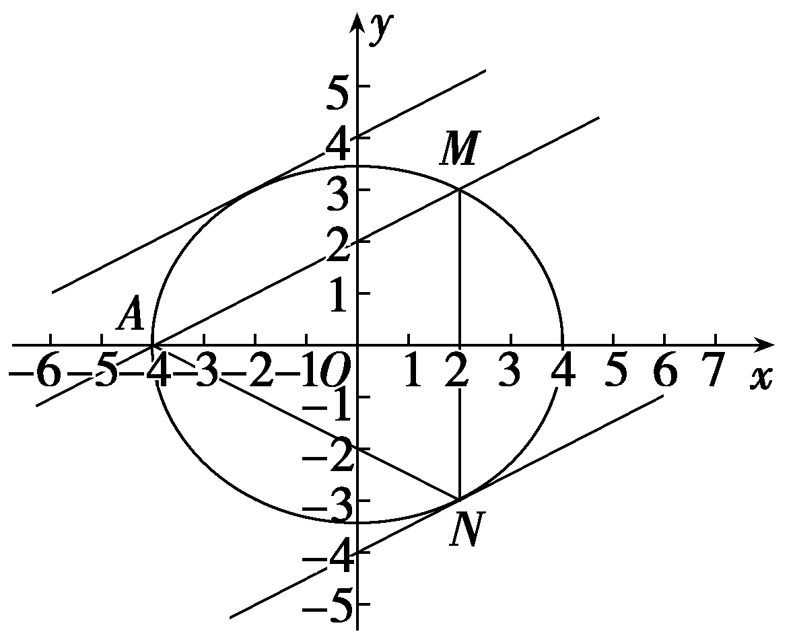
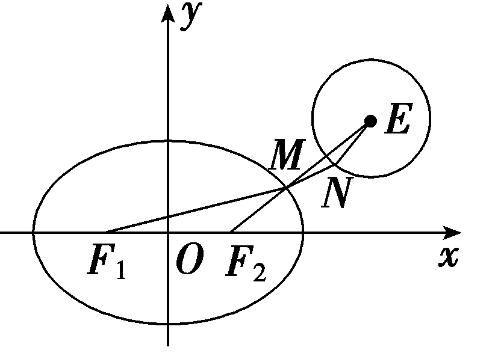
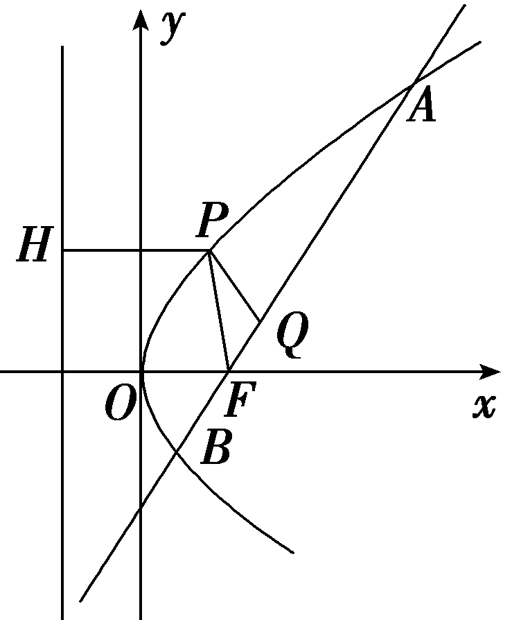
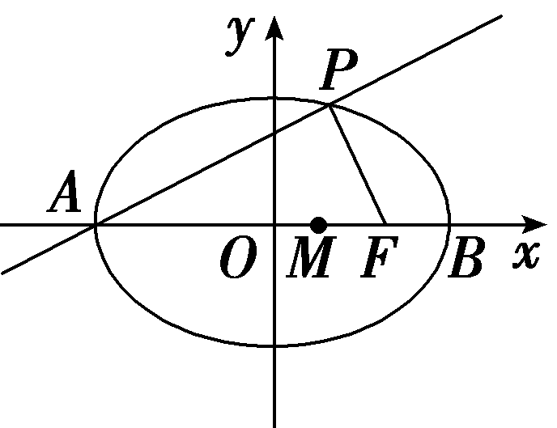
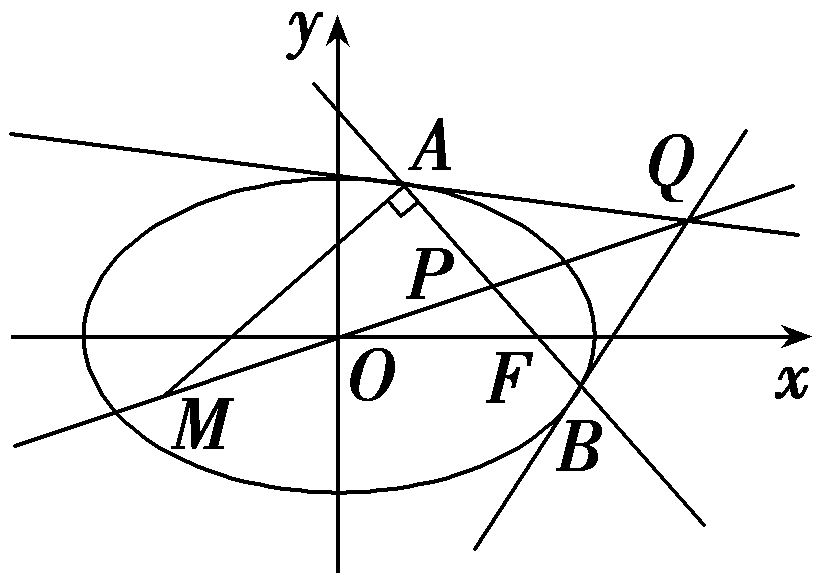
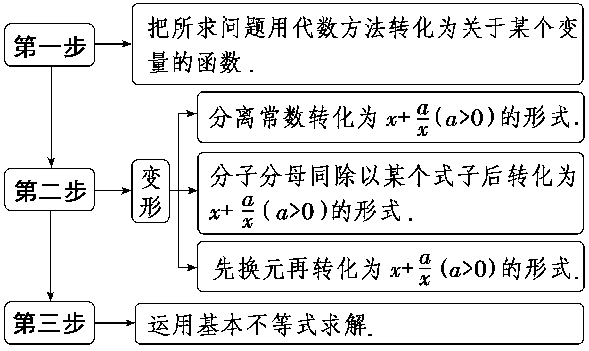
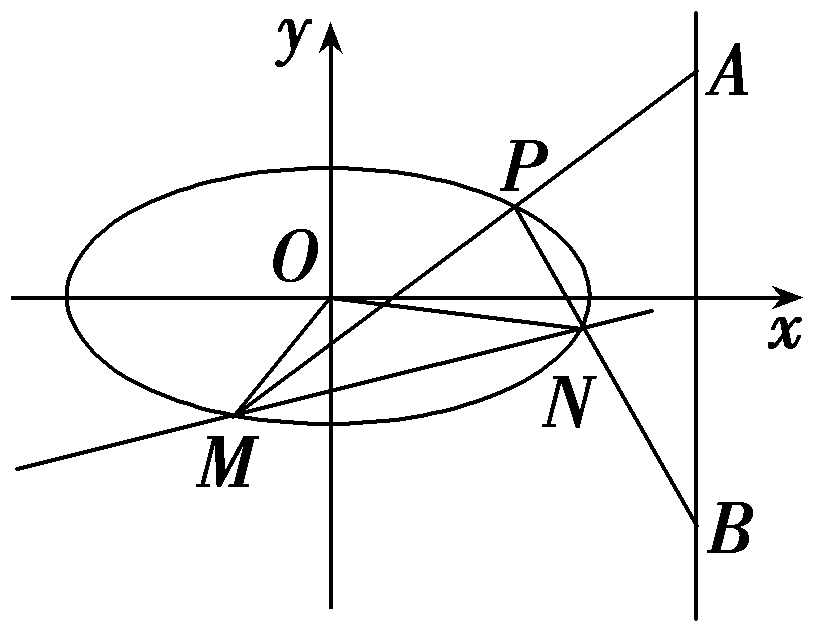

突破8　最值、范围问题

处理圆锥曲线中最值、范围问题的方法：（1）几何法：利用曲线的定义、几何性质以及平面几何中的定理、性质等进行求解.（2）代数法：把要求最值、范围的几何量或代数表达式表示为某个(些)参数的函数(解析式)，然后利用函数法、不等式法等进行求解.

技法一　巧用数形结合法求最值(范围)

(2020·新高考Ⅱ卷)已知椭圆<text style="it*a*lic">C</text>： $\frac{x^{2}}{a^{2}}$ ＋ $\frac{y^{2}}{b^{2}}$ ＝1(*a*＞*b*＞0)过点*M*(2，3)，点*A*为其左顶点，且*AM*的斜率为 $\frac{1}{2}$ .

（1）求*C*的方程；

（2）点*N*为椭圆上任意一点，求△*AMN*的面积的最大值.

解：（1）由题意可知直线<te<te<text st*y*le="italic">x</text>t style="italic">x</text>t st*y*le="italic">AM</text>的方程为y－3＝ $\frac{1}{2}$ (<te<text st*y*le="italic">x</text>t style="italic">x</text>－2)，即x－2*y*＝－4.

当*y*＝0时，解得*x*＝－4，所以*a*＝4.

由椭圆<text style="it*a*lic">C</text>： $\frac{x^{2}}{a^{2}}$ ＋ $\frac{y^{2}}{b^{2}}$ ＝1(*a*＞*b*＞0)过点*M*(2，3)，

可得 $\frac{4}{16}$ ＋ $\frac{9}{b^{2}}$ ＝1，解得<em>b</em>2＝12.

所以*C*的方程为 $\frac{x^{2}}{16}$ ＋ $\frac{y^{2}}{12}$ ＝1.

（2）设与直线*AM*平行的直线方程为*x*－2*y*＝*m*.

如图所示，当直线与椭圆相切时，与*AM*距离比较远的直线与椭圆的切点为*N*，此时△*AMN*的面积取得最大值.

联立 $\left\{\begin{matrix}x－2y＝m，\\\frac{x^{2}}{16}＋\frac{y^{2}}{12}=1，\end{matrix}\right.$ 可得3(&lt;text st&lt;text st<em>y</em>le="italic"&gt;y&lt;/text&gt;le="italic"&gt;m&lt;/text&gt;＋&lt;text style="superscript"&gt;2&lt;/text&gt;y)2＋4y2＝48，

化简可得16<em>y</em>2＋12<em>my</em>＋3<em>m</em>2－48＝0，

所以<em>Δ</em>＝144<em>m</em>2－4×16(3<em>m</em>2－48)＝0，

即<em>m</em>2＝64，解得<em>m</em>＝±8，

与*AM*距离比较远的直线方程为*x*－2*y*＝8，

点*N*到直线*AM*的距离即两平行线之间的距离，即*d*＝ $\frac{｜4-(-8)|}{\sqrt{1+4}}$ ＝ $\frac{12\sqrt{5}}{5}$ ，

由两点之间的距离公式可得｜*AM*｜＝ $\sqrt{(2+4)^{2}＋3^{2}}$ ＝3 $\sqrt{5}$ ，

所以△*AMN*的面积的最大值为 $\frac{1}{2}$ ×3 $\sqrt{5}$ × $\frac{12\sqrt{5}}{5}$ ＝18.

若题目的条件和结论能明显体现几何特征和意义，则考虑利用直线与曲线的定义、图形、几何性质来解决.

对点练&lt;te&lt;text st<em>y</em>le="italic"&gt;x&lt;/text&gt;t style="subscript"&gt;1&lt;/text&gt;.已知椭圆<em>&lt;text style="italic"&gt;C</em>&lt;/text&gt;： $\frac{x^{2}}{4}$ ＋ $\frac{y^{2}}{3}$ ＝&lt;te&lt;text st<em>y</em>le="italic"&gt;x&lt;/text&gt;t style="subscript"&gt;1&lt;/text&gt;的左、右焦点分别为<em>&lt;text style="italic"&gt;F</em>&lt;/text&gt;1，F&lt;text style="superscript"&gt;&lt;text style="superscript"&gt;2&lt;/text&gt;&lt;/text&gt;，<em>M</em>为椭圆<em>&lt;text style="italic"&gt;C</em>&lt;/text&gt;上任意一点，<em>N</em>为圆<em>E</em>：(x－3)2＋(y－2)2＝1上任意一点，则｜<em>MN</em>｜－｜<em>MF</em>1｜的最小值为(　　)

$\quad$A.2 $\sqrt{2}$ －5	
$\quad$B.2 $\sqrt{2}$ －3

$\quad$C.2 $\sqrt{2}$ ＋1	
$\quad$D.2 $\sqrt{2}$ －1

答案A

解析如图所示，由题意得｜<em>&lt;text style="italic"&gt;&lt;text style="italic"&gt;&lt;text style="italic"&gt;&lt;text style="italic"&gt;M</em>&lt;/text&gt;&lt;/text&gt;<em>&lt;text style="italic"&gt;F</em>&lt;/text&gt;&lt;/text&gt;&lt;/text&gt;&lt;text style="subscript"&gt;&lt;text style="subscript"&gt;1&lt;/text&gt;&lt;/text&gt;｜＋｜<em>&lt;text style="italic"&gt;&lt;text style="italic"&gt;&lt;text style="italic"&gt;&lt;text style="italic"&gt;MF</em>&lt;/text&gt;&lt;/text&gt;&lt;/text&gt;&lt;/text&gt;&lt;text style="subscript"&gt;&lt;text style="subscript"&gt;&lt;text style="subscript"&gt;&lt;text style="subscript"&gt;&lt;text style="subscript"&gt;&lt;text style="subscript"&gt;&lt;text style="subscript"&gt;&lt;text style="subscript"&gt;2&lt;/text&gt;&lt;/text&gt;&lt;/text&gt;&lt;/text&gt;&lt;/text&gt;&lt;/text&gt;&lt;/text&gt;&lt;/text&gt;｜＝4，｜<em>M&lt;text style="italic"&gt;&lt;text style="italic"&gt;&lt;text style="italic"&gt;&lt;text style="italic"&gt;N</em>&lt;/text&gt;&lt;/text&gt;&lt;/text&gt;&lt;/text&gt;｜≥｜<em>M&lt;text style="italic"&gt;&lt;text style="italic"&gt;&lt;text style="italic"&gt;E</em>&lt;/text&gt;&lt;/text&gt;&lt;/text&gt;｜－1，当且仅当M，N，E三点共线，且N在线段<em>&lt;text style="italic"&gt;ME</em>&lt;/text&gt;上时取等号，所以｜<em>&lt;text style="italic"&gt;&lt;text style="italic"&gt;&lt;text style="italic"&gt;MN</em>&lt;/text&gt;&lt;/text&gt;&lt;/text&gt;｜－｜MF1｜＝｜MN｜－(4－｜MF2｜)＝｜MN｜＋｜MF2｜－4≥｜ME｜＋｜MF2｜－5≥｜<em>&lt;text style="italic"&gt;&lt;text style="italic"&gt;EF</em>&lt;/text&gt;&lt;/text&gt;2｜－5，当且仅当M，N，E，F2共线，且M，N在线段EF2上时取等号，因为F2(1，0)，E(3，2)，所以｜EF2｜＝ $\sqrt{\left(3－1\right)^{2}＋\left(2－0\right)^{2}}$ ＝&lt;text style="subscript"&gt;&lt;text style="subscript"&gt;&lt;text style="subscript"&gt;&lt;text style="subscript"&gt;&lt;text style="subscript"&gt;&lt;text style="subscript"&gt;&lt;text style="subscript"&gt;&lt;text style="subscript"&gt;2&lt;/text&gt;&lt;/text&gt;&lt;/text&gt;&lt;/text&gt;&lt;/text&gt;&lt;/text&gt;&lt;/text&gt;&lt;/text&gt; $\sqrt{2}$ ，所以｜<em>&lt;text style="italic"&gt;&lt;text style="italic"&gt;&lt;text style="italic"&gt;M</em>&lt;/text&gt;&lt;/text&gt;<em>&lt;text style="italic"&gt;&lt;text style="italic"&gt;&lt;text style="italic"&gt;N</em>&lt;/text&gt;&lt;/text&gt;&lt;/text&gt;&lt;/text&gt;｜－｜<em>&lt;text style="italic"&gt;&lt;text style="italic"&gt;&lt;text style="italic"&gt;&lt;text style="italic"&gt;&lt;text style="italic"&gt;M&lt;text style="italic"&gt;&lt;text style="italic"&gt;F</em>&lt;/text&gt;&lt;/text&gt;&lt;/text&gt;&lt;/text&gt;&lt;/text&gt;&lt;/text&gt;&lt;/text&gt;&lt;text style="subscript"&gt;&lt;text style="subscript"&gt;1&lt;/text&gt;&lt;/text&gt;｜的最小值为&lt;text style="subscript"&gt;&lt;text style="subscript"&gt;&lt;text style="subscript"&gt;&lt;text style="subscript"&gt;&lt;text style="subscript"&gt;&lt;text style="subscript"&gt;&lt;text style="subscript"&gt;&lt;text style="subscript"&gt;2&lt;/text&gt;&lt;/text&gt;&lt;/text&gt;&lt;/text&gt;&lt;/text&gt;&lt;/text&gt;&lt;/text&gt;&lt;/text&gt; $\sqrt{2}$ －5.故选A.

对点练<te*x*t style="superscript">2</text>.已知过抛物线<text st*y*le="italic">*<text style="italic">C*</text></text>：y2＝4x的焦点*F*且倾斜角为60°的直线交C于*<text style="italic">A*</text>，*<text style="italic">B*</text>两点(A在B的右边)，*P*为C上一点，5 $\vec{AB}$ ＝8 $\vec{QB}$ ，则｜*PF*｜＋｜*PQ*｜的最小值为(　　)

$\quad$A.3	
$\quad$B. $\frac{11}{3}$

$\quad$C. $\frac{13}{3}$ 	
$\quad$D.5

答案A

解析由题意，得焦点&lt;te&lt;te&lt;te&lt;te&lt;te&lt;te&lt;te<em>x</em>t style="italic"&gt;x&lt;/text&gt;t st<em>y</em>le="italic"&gt;x&lt;/text&gt;t st<em>y</em>le="italic"&gt;x&lt;/text&gt;t style="italic"&gt;x&lt;/text&gt;t style="italic"&gt;x&lt;/text&gt;t style="italic"&gt;x&lt;/text&gt;t st<em>y</em>le="italic"&gt;F&lt;/text&gt;(&lt;text style="subscript"&gt;&lt;text style="subscript"&gt;1&lt;/text&gt;&lt;/text&gt;，0)，又因为直线的倾斜角为60°，得斜率<em>k</em>＝tan 60°＝ $\sqrt{3}$ ，故直线&lt;te&lt;te&lt;te&lt;te&lt;te&lt;te&lt;te<em>x</em>t style="italic"&gt;x&lt;/text&gt;t st<em>y</em>le="italic"&gt;x&lt;/text&gt;t st<em>y</em>le="italic"&gt;x&lt;/text&gt;t style="italic"&gt;x&lt;/text&gt;t style="italic"&gt;x&lt;/text&gt;t style="italic"&gt;x&lt;/text&gt;t st<em>y</em>le="italic"&gt;<em>AB</em>&lt;/text&gt;的方程为y＝ $\sqrt{3}$ (&lt;te&lt;te&lt;te&lt;te&lt;te&lt;te<em>x</em>t style="italic"&gt;x&lt;/text&gt;t st<em>y</em>le="italic"&gt;x&lt;/text&gt;t st<em>y</em>le="italic"&gt;x&lt;/text&gt;t style="italic"&gt;x&lt;/text&gt;t style="italic"&gt;x&lt;/text&gt;t style="italic"&gt;x&lt;/text&gt;－&lt;text style="subscript"&gt;&lt;text style="subscript"&gt;1&lt;/text&gt;&lt;/text&gt;)，联立方程组 $\left\{\begin{matrix}y＝\sqrt{3}(x－1),\\y^{2}=4x，\end{matrix}\right.$ 整理得3&lt;te&lt;te&lt;te&lt;te&lt;te&lt;te<em>x</em>t style="italic"&gt;x&lt;/text&gt;t st<em>y</em>le="italic"&gt;x&lt;/text&gt;t st<em>y</em>le="italic"&gt;x&lt;/text&gt;t style="italic"&gt;x&lt;/text&gt;t style="italic"&gt;x&lt;/text&gt;t style="italic"&gt;x&lt;/text&gt;&lt;text style="subscript"&gt;&lt;text style="subscript"&gt;&lt;text style="subscript"&gt;2&lt;/text&gt;&lt;/text&gt;&lt;/text&gt;－&lt;text style="subscript"&gt;&lt;text style="subscript"&gt;1&lt;/text&gt;&lt;/text&gt;0x＋3＝0，设<em>A</em>(x1，<em>y</em>1)，<em>B</em>(x2，y2)，解得x1＝3，x2＝ $\frac{1}{3}$ .

设&lt;te&lt;te&lt;te&lt;te<em>x</em>t style="italic"&gt;x&lt;/text&gt;t style="italic"&gt;x&lt;/text&gt;t style="italic"&gt;x&lt;/text&gt;t style="italic"&gt;<em>&lt;text style="italic"&gt;Q</em>&lt;/text&gt;&lt;/text&gt; $\left(x_{Q}，y_{Q}\right)$ ，因为5 $\vec{AB}$ ＝8 $\vec{QB}$ ，所以5(&lt;te&lt;te&lt;te<em>x</em>t style="italic"&gt;x&lt;/text&gt;t style="italic"&gt;x&lt;/text&gt;t style="italic"&gt;x&lt;/text&gt;2－x1)＝8 $\left(x_{2}－x_{Q}\right)$ ，解得&lt;te&lt;te&lt;te<em>x</em>t style="italic"&gt;x&lt;/text&gt;t style="italic"&gt;x&lt;/text&gt;t style="italic"&gt;x&lt;/text&gt;<em>&lt;text style="italic,subscript"&gt;&lt;text style="italic"&gt;Q</em>&lt;/text&gt;&lt;/text&gt;＝2，过点<em>&lt;text style="italic"&gt;P</em>&lt;/text&gt;作<em>P&lt;text style="italic"&gt;&lt;text style="italic"&gt;H</em>&lt;/text&gt;&lt;/text&gt;垂直准线于点H，根据抛物线的定义，得｜<em>&lt;text style="italic"&gt;&lt;text style="italic"&gt;PF</em>&lt;/text&gt;&lt;/text&gt;｜＋｜<em>&lt;text style="italic"&gt;&lt;text style="italic"&gt;&lt;text style="italic"&gt;PQ</em>&lt;/text&gt;&lt;/text&gt;&lt;/text&gt;｜＝｜<em>PH</em>｜＋｜PQ｜，当Q，P，H三点共线且与x轴平行时，｜PF｜＋｜PQ｜有最小值，最小值为｜<em>QH</em>｜＝2＋1＝3，所以｜PF｜＋｜PQ｜的最小值为3.故选A.

技法二　构造函数法求最值(范围)

已知点<em>&lt;text style="italic"&gt;A</em>&lt;/text&gt;&lt;text style="subscript"&gt;1&lt;/text&gt; $\left(－\sqrt{6}，0\right)$ ，<em>&lt;text style="italic"&gt;A</em>&lt;/text&gt;&lt;text style="subscript"&gt;2&lt;/text&gt; $\left(\sqrt{6}，0\right)$ ，直线<em>P&lt;text style="italic"&gt;A</em>&lt;/text&gt;&lt;text style="subscript"&gt;1&lt;/text&gt;，<em>&lt;text style="italic"&gt;PA</em>&lt;/text&gt;&lt;text style="subscript"&gt;2&lt;/text&gt;的斜率之积为－ $\frac{1}{6}$ ，设点<em>P</em>的轨迹为曲线<em>C</em>.

（1）求曲线*C*的方程；

（2）若抛物线<em>y</em>2＝2<em>px</em>(<em>p</em>＞0)与曲线<em>C</em>交于点<em>A</em>，<em>B</em>，设<em>M</em>(－1，0)，求△<em>ABM</em>面积最大时<em>p</em>的值.

解：（1）设点<te<text st<text st*y*le="italic">y</text>le="italic">x</text>t style="italic">P</text>的坐标为(x，y)，显然y≠0.由题意得 $\frac{y}{x＋\sqrt{6}}$ · $\frac{y}{x－\sqrt{6}}$ ＝－ $\frac{1}{6}$ ，

化简得 $\frac{x^{2}}{6}$ ＋<em>y</em>2＝1 $\left(y\ne 0\right)$ .

（2）不妨设点<em>A</em>在第一象限，<em>A</em>(<em>x</em>1，<em>y</em>1)，

则0＜&lt;text st<em>y</em>le="italic"&gt;x&lt;/text&gt;&lt;text style="subscript"&gt;1&lt;/text&gt;＜ $\sqrt{6}$ ，0＜<em>y</em>&lt;text style="subscript"&gt;1&lt;/text&gt;＜1，<em>B</em> $\left(x_{1},-y_{1}\right)$ ，

&lt;text st&lt;text st<em>y</em>le="italic"&gt;y&lt;/text&gt;le="subscript"&gt;△&lt;/text&gt;<em>&lt;text style="italic,subscript"&gt;ABM</em>&lt;/text&gt;的面积<em>S</em>△ABM＝ $\frac{1}{2}\left(x_{1}+1\right)$ ×2&lt;text st<em>y</em>le="italic"&gt;y&lt;/text&gt;&lt;text style="subscript"&gt;1&lt;/text&gt;＝ $\left(x_{1}+1\right)$ &lt;text st<em>y</em>le="italic"&gt;y&lt;/text&gt;&lt;text style="subscript"&gt;1&lt;/text&gt;.

因为点*A*在曲线*C*上，所以 $\frac{x_{1}^{2}}{6}$ ＋ $y_{1}^{2}$ ＝1，

所以<em>S</em>△<em>ABM</em>＝ $\left(x_{1}+1\right)\sqrt{1－\frac{x_{1}^{2}}{6}}$ .

令<te<te<te*x*t style="italic">x</text>t style="italic">x</text>t style="italic">f</text> $\left(x\right)$ ＝(<te<te*x*t style="italic">x</text>t style="italic">x</text>＋1) $\sqrt{1－\frac{x^{2}}{6}}$ ，0＜<te<te*x*t style="italic">x</text>t style="italic">x</text>＜ $\sqrt{6}$ ，则<te<te<te*x*t style="italic">x</text>t style="italic">x</text>t style="italic">f</text>'(x)＝ $\frac{－\frac{1}{6}\left(2x^{2}＋x－6\right)}{\sqrt{1－\frac{x^{2}}{6}}}$ ＝ $\frac{－\frac{1}{6}\left(2x－3\right)\left(x+2\right)}{\sqrt{1－\frac{x^{2}}{6}}}$ ，

由<te<te<te<te<te*x*t style="italic">x</text>t style="italic">x</text>t style="italic">x</text>t style="italic">x</text>t style="italic">*<text style="italic">f*'</text></text>(x)＝0得x＝ $\frac{3}{2}$ ，当<te<te<te<te*x*t style="italic">x</text>t style="italic">x</text>t style="italic">x</text>t style="italic">x</text>∈ $\left(0，\frac{3}{2}\right)$ 时，<te<te<te<te<te*x*t style="italic">x</text>t style="italic">x</text>t style="italic">x</text>t style="italic">x</text>t style="italic">*<text style="italic">f*'</text></text>(x)＞0，f(x)在 $\left(0，\frac{3}{2}\right)$ 上单调递增，

当<te<te<te<te*x*t style="italic">x</text>t style="italic">x</text>t style="italic">x</text>t style="italic">x</text>∈ $\left(\frac{3}{2}，\sqrt{6}\right)$ 时，<te<te<te<te*x*t style="italic">x</text>t style="italic">x</text>t style="italic">x</text>t style="italic">*<text style="italic">f*</text>'</text>(*x*)＜0，f(x)在 $\left(\frac{3}{2}，\sqrt{6}\right)$ 上单调递减，故当<te<te<te<te*x*t style="italic">x</text>t style="italic">x</text>t style="italic">x</text>t style="italic">x</text>＝ $\frac{3}{2}$ 时，<te<te<te*x*t style="italic">x</text>t style="italic">x</text>t style="italic">*f*</text>(<te*x*t style="italic">x</text>)有最大值，

即当&lt;text st<em>y</em>le="italic"&gt;x&lt;/text&gt;&lt;text style="subscri<em>p</em>t"&gt;1&lt;/text&gt;＝ $\frac{3}{2}$ 时，&lt;text st<em>y</em>le="italic"&gt;S&lt;/text&gt;&lt;text style="subscri<em>p</em>t"&gt;△&lt;/text&gt;<em>ABM</em>有最大值，此时y&lt;text style="subscript"&gt;1&lt;/text&gt;＝ $\frac{\sqrt{10}}{4}$ ，抛物线过点 $\left(\frac{3}{2}，\frac{\sqrt{10}}{4}\right)$ ，所以<em>p</em>＝ $\frac{5}{24}$ .

函数法求最值(范围)问题就是构建关于变量的目标函数，将问题转化为求函数的最值(或值域)，解决问题时要注意自变量的取值范围.

对点练3.如图所示，点<te*x*t style="italic">A</text>，*B*分别是椭圆 $\frac{x^{2}}{36}$ ＋ $\frac{y^{2}}{20}$ ＝1长轴的左、右端点，点<te*x*t style="italic">F</text>是椭圆的右焦点，点*P*在椭圆上，且位于x轴上方，P*A*⊥*PF*.

（1）求点*P*的坐标；

（2）设*M*是椭圆长轴*AB*上的一点，点*M*到直线*AP*的距离等于｜*MB*｜，求椭圆上的点到点*M*的距离*d*的最小值.

解：（1）由已知可得点*A*(－6，0)，*F*(4，0)，

设点*P*的坐标是(*x*，*y*)，

则 $\vec{AP}$ ＝ $\left(x+6，y\right)$ ， $\vec{FP}$ ＝ $\left(x－4，y\right)$ ，

因为*PA*⊥*PF*，所以 $\vec{AP}$ · $\vec{FP}$ ＝0，

则 $\left\{\begin{matrix}\frac{x^{2}}{36}＋\frac{y^{2}}{20}=1，\\\left(x+6\right)(x－4)＋y^{2}=0，\end{matrix}\right.$

可得<te<te<te*x*t style="italic">x</text>t style="italic">x</text>t style="superscript">2</text>*x*2＋9x－18＝0，得x＝ $\frac{3}{2}$ 或<te<te<te*x*t style="italic">x</text>t style="italic">x</text>t style="italic">x</text>＝－6.

由于<te<text st*y*le="italic">x</text>t style="italic">y</text>＞0，故x＝ $\frac{3}{2}$ ，于是<te<text st*y*le="italic">x</text>t style="italic">y</text>＝ $\frac{5\sqrt{3}}{2}$ ，

所以点*P*的坐标是 $\left(\frac{3}{2}，\frac{5\sqrt{3}}{2}\right)$ .

（2）由（1）可得直线<te<text st*y*le="italic">x</text>t style="italic">AP</text>的方程是x－ $\sqrt{3}$ *y*＋6＝0，点*B*(6，0).

设点*<text style="italic">M*</text>的坐标是(*<text style="italic">m*</text>，0)，则点M到直线*AP*的距离是 $\frac{｜m+6｜}{2}$ ，于是 $\frac{｜m+6｜}{2}$ ＝｜*<text style="italic">m*</text>－6｜，

又－6≤*m*≤6，解得*m*＝2.

由椭圆上的点(*x*，*y*)到点*M*的距离为*d*，

得&lt;te&lt;te&lt;te&lt;te<em>x</em>t style="italic"&gt;x&lt;/text&gt;t style="italic"&gt;x&lt;/text&gt;t st<em>y</em>le="italic"&gt;x&lt;/text&gt;t style="italic"&gt;d&lt;/text&gt;&lt;text style="superscript"&gt;&lt;text style="superscript"&gt;&lt;text style="superscript"&gt;&lt;text style="superscript"&gt;2&lt;/text&gt;&lt;/text&gt;&lt;/text&gt;&lt;/text&gt;＝(x－2)2＋y2＝x2－4x＋4＋20－ $\frac{5}{9}$ &lt;te&lt;te&lt;te<em>x</em>t style="italic"&gt;x&lt;/text&gt;t style="italic"&gt;x&lt;/text&gt;t st<em>y</em>le="italic"&gt;x&lt;/text&gt;&lt;text style="superscript"&gt;&lt;text style="superscript"&gt;&lt;text style="superscript"&gt;&lt;text style="superscript"&gt;2&lt;/text&gt;&lt;/text&gt;&lt;/text&gt;&lt;/text&gt;＝ $\frac{4}{9}(x－\frac{9}{2})^{2}$ ＋15，

由于－6≤<te*x*t style="italic">x</text>≤6，所以当x＝ $\frac{9}{2}$ 时，*d*取最小值，且最小值为 $\sqrt{15}$ .

技法三　利用不等关系求最值(范围)

已知椭圆*Γ*： $\frac{x^{2}}{m^{2}}$ ＋ $\frac{y^{2}}{3}$ ＝1(*<text style="italic">m*</text>＞0，m≠ $\sqrt{3}$ ).

（1）若*m*＝2，求椭圆*Γ*的离心率；

（2）若*<text style="italic">P*</text>为椭圆*Γ*上一点，过点P作一条斜率为 $\sqrt{3}$ 的直线与双曲线 $\frac{y^{2}}{5m^{2}}$ － $\frac{x^{2}}{5}$ ＝1仅有一个公共点，求实数*m*的取值范围.

解：（1）当*m*＝2时，椭圆*Γ*的方程为 $\frac{x^{2}}{4}$ ＋ $\frac{y^{2}}{3}$ ＝1，

则<text style="itali*c*">a</text>＝2，*b*＝ $\sqrt{3}$ ，所以*c*＝ $\sqrt{a^{2}－b^{2}}$ ＝1，

所以椭圆<t*e*xt style="italic">Γ</text>的离心率e＝ $\frac{c}{a}$ ＝ $\frac{1}{2}$ .

（2）设过点<*t*e*x*t st*y*le="italic">P</text>且斜率为 $\sqrt{3}$ 的直线的方程为<*t*e*x*t style="italic">y</text>＝ $\sqrt{3}$ <*t*ext style="italic">x</text>＋t，

由 $\left\{\begin{matrix}y＝\sqrt{3}x＋t，\\\frac{x^{2}}{m^{2}}＋\frac{y^{2}}{3}=1，\end{matrix}\right.$ 得 $\frac{x^{2}}{m^{2}}$ ＋ $\frac{(\sqrt{3}x＋t)^{2}}{3}$ ＝1，

整理，得(3&lt;<em>t</em>e&lt;te<em>x</em>t style="italic"&gt;x&lt;/text&gt;t style="italic"&gt;<em>m</em>&lt;/text&gt;&lt;text style="superscript"&gt;&lt;text style="superscript"&gt;&lt;text style="superscript"&gt;&lt;text style="superscript"&gt;2&lt;/text&gt;&lt;/text&gt;&lt;/text&gt;&lt;/text&gt;＋3)x2＋2 $\sqrt{3}$ <em>t</em>&lt;te&lt;te<em>x</em>t style="italic"&gt;x&lt;/text&gt;t style="italic"&gt;<em>m</em>&lt;/text&gt;&lt;text style="superscript"&gt;&lt;text style="superscript"&gt;&lt;text style="superscript"&gt;&lt;text style="superscript"&gt;2&lt;/text&gt;&lt;/text&gt;&lt;/text&gt;&lt;/text&gt;x＋(t2－3)m2＝0，

则&lt;<em>t</em>ext style="italic"&gt;Δ&lt;/text&gt;1＝(&lt;text style="superscript"&gt;&lt;text style="superscript"&gt;&lt;text style="superscript"&gt;&lt;text style="superscript"&gt;2&lt;/text&gt;&lt;/text&gt;&lt;/text&gt;&lt;/text&gt; $\sqrt{3}$ &lt;<em>t</em>ext style="italic"&gt;t<em>&lt;text style="italic"&gt;m</em>&lt;/text&gt;&lt;/text&gt;&lt;text style="superscript"&gt;&lt;text style="superscript"&gt;&lt;text style="superscript"&gt;&lt;text style="superscript"&gt;2&lt;/text&gt;&lt;/text&gt;&lt;/text&gt;&lt;/text&gt;)2－4m2(3m2＋3)(t2－3)≥0，

整理，得<em>t</em>2≤3<em>m</em>2＋3.　①

由 $\left\{\begin{matrix}y＝\sqrt{3}x＋t，\\\frac{y^{2}}{5m^{2}}－\frac{x^{2}}{5}=1，\end{matrix}\right.$ 得 $\frac{(\sqrt{3}x＋t)^{2}}{5m^{2}}$ － $\frac{x^{2}}{5}$ ＝1，整理得(3－&lt;<em>t</em>e<em>x</em>t style="italic"&gt;<em>m</em>&lt;/text&gt;&lt;text style="superscript"&gt;&lt;text style="superscript"&gt;&lt;text style="superscript"&gt;2&lt;/text&gt;&lt;/text&gt;&lt;/text&gt;)x2＋2 $\sqrt{3}$ <em>tx</em>＋(t&lt;text style="superscript"&gt;&lt;text style="superscript"&gt;&lt;text style="superscript"&gt;2&lt;/text&gt;&lt;/text&gt;&lt;/text&gt;－5<em>&lt;text style="italic"&gt;m</em>&lt;/text&gt;2)＝0，

则&lt;&lt;<em>t</em>ext style="italic"&gt;t&lt;/text&gt;ext style="italic"&gt;Δ&lt;/text&gt;&lt;text style="superscript"&gt;&lt;text style="superscript"&gt;&lt;text style="superscript"&gt;&lt;text style="superscript"&gt;2&lt;/text&gt;&lt;/text&gt;&lt;/text&gt;&lt;/text&gt;＝(2 $\sqrt{3}$ &lt;<em>t</em>ext style="italic"&gt;t&lt;/text&gt;)&lt;text style="superscript"&gt;&lt;text style="superscript"&gt;&lt;text style="superscript"&gt;&lt;text style="superscript"&gt;2&lt;/text&gt;&lt;/text&gt;&lt;/text&gt;&lt;/text&gt;－4(3－<em>&lt;text style="italic"&gt;m</em>&lt;/text&gt;2)(t2－5m2)＝0，

整理，得<em>t</em>2＝5<em>m</em>2－15.　②

由①②可得5<em>m</em>2－15≤3<em>m</em>2＋3，得－3≤<em>m</em>≤3，

由5<em>m</em>2－15≥0，可得<em>m</em>2≥3，

又*<text style="italic"><text style="italic">m*</text></text>＞0且m≠ $\sqrt{3}$ ，所以*<text style="italic"><text style="italic">m*</text></text>∈( $\sqrt{3}$ ，3].

综上，实数*m*的取值范围为( $\sqrt{3}$ ，3].

寻找不等关系的突破口

##### 1.利用判别式来构造不等式，从而确定所求范围.

##### 2.利用已知参数的取值范围，求新参数的范围，解这类问题的核心是在两个参数之间建立等量关系.

##### 3.利用隐含的不等关系，从而求出所求范围.

##### 4.利用已知不等关系构造不等式，从而求出所求范围.

##### 5.利用函数值域的求法，确定所求范围.

对点练4.已知双曲线的焦点在*x*轴上，中心在原点，离心率为 $\frac{2\sqrt{3}}{3}$ ，且过点( $\sqrt{6}$ ，1).

（1）求双曲线的标准方程；

（2）双曲线的左、右顶点分别为*A*，*B*，且动点*C*(*<text style="italic">m*</text>，*<text style="italic">n*</text>)，*D*(m，－n)在双曲线上，直线*BC*与直线*AD*交于点*P*，*M*(－ $\sqrt{2}$ ，0)，*N*( $\sqrt{2}$ ，0)，求 $\vec{PM}$ · $\vec{PN}$ 的取值范围.

解：（1）设双曲线的标准方程为 $\frac{x^{2}}{a^{2}}$ － $\frac{y^{2}}{b^{2}}$ ＝1(*a*＞0，*b*＞0)，

联立 $\left\{\begin{matrix}\frac{6}{a^{2}}－\frac{1}{b^{2}}=1，\\c^{2}＝a^{2}＋b^{2}，\\\frac{c}{a}＝\frac{2\sqrt{3}}{3}，\end{matrix}\right.$ 得<em>a</em>&lt;text style="superscript"&gt;2&lt;/text&gt;＝3，<em>b</em>2＝1，

所以双曲线的标准方程为 $\frac{x^{2}}{3}$ －<em>y</em>2＝1.

（2）已知*C*(*<text style="italic">m*</text>，*<text style="italic">n*</text>)，*D*(m，－n)，*A*(－ $\sqrt{3}$ ，0)，*B*( $\sqrt{3}$ ，0).

当*m*＝± $\sqrt{3}$ 时，动点*C*，*D*与点*A*或*B*重合，

当<te*x*t st<text st*y*le="italic">y</text>le="italic">m</text>≠± $\sqrt{3}$ 时，直线<te*x*t st<text st*y*le="italic">y</text>le="italic">AD</text>：y＝ $\frac{n}{－\sqrt{3}－m}\left(x＋\sqrt{3}\right)$ ，直线<te*x*t st*y*le="italic">BC</text>：*y*＝ $\frac{n}{m－\sqrt{3}}$ (*x*－ $\sqrt{3}$ )，

联立两直线方程得<em>y</em>2＝ $\frac{n^{2}}{3－m^{2}}\left(x^{2}－3\right)$ .

又因为 $\frac{m^{2}}{3}$ －<em>&lt;text style="italic"&gt;n</em>&lt;/text&gt;&lt;text style="superscript"&gt;&lt;text style="superscript"&gt;2&lt;/text&gt;&lt;/text&gt;＝1，即－3n2＝3－<em>m</em>2，

所以<em>y</em>2＝－ $\frac{1}{3}\left(x^{2}－3\right)$ ，

即点&lt;te&lt;text st&lt;text st<em>y</em>le="italic"&gt;y&lt;/text&gt;le="italic"&gt;x&lt;/text&gt;t style="italic"&gt;P&lt;/text&gt;的坐标(x，y)满足方程 $\frac{x^{2}}{3}$ ＋&lt;text st<em>y</em>le="italic"&gt;y&lt;/text&gt;2＝1.

又 $\vec{PM}$ · $\vec{PN}$ ＝ $\left(\vec{PO}＋\vec{OM}\right)$ · $\left(\vec{PO}－\vec{OM}\right)$ ＝｜ $\vec{PO}$ ｜&lt;te&lt;te&lt;te<em>x</em>t style="italic"&gt;x&lt;/text&gt;t style="italic"&gt;x&lt;/text&gt;t style="superscript"&gt;&lt;text style="superscript"&gt;2&lt;/text&gt;&lt;/text&gt;－｜ $\vec{OM}$ ｜&lt;te&lt;te&lt;te<em>x</em>t style="italic"&gt;x&lt;/text&gt;t style="italic"&gt;x&lt;/text&gt;t style="superscript"&gt;&lt;text style="superscript"&gt;2&lt;/text&gt;&lt;/text&gt;＝｜ $\vec{PO}$ ｜&lt;te&lt;te&lt;te<em>x</em>t style="italic"&gt;x&lt;/text&gt;t style="italic"&gt;x&lt;/text&gt;t style="superscript"&gt;&lt;text style="superscript"&gt;2&lt;/text&gt;&lt;/text&gt;－2，｜ $\vec{OP}$ ｜＝ $\sqrt{x^{2}＋y^{2}}$ ＝ $\sqrt{\frac{2}{3}x^{2}+1}$ ，又因为－ $\sqrt{3}$ ≤&lt;te&lt;te<em>x</em>t style="italic"&gt;x&lt;/text&gt;t style="italic"&gt;x&lt;/text&gt;≤ $\sqrt{3}$ ，且&lt;te&lt;te<em>x</em>t style="italic"&gt;x&lt;/text&gt;t style="italic"&gt;x&lt;/text&gt;≠0(当x＝0时，<em>P</em>(0，±1)不符合题意)，

所以*PO*∈(1， $\sqrt{3}$ ]，所以 $\vec{PM}$ · $\vec{PN}$ ∈ $\left(－1，1\right]$ .

技法四　构造基本不等式求最值(范围)

(2024·山东德州二模)已知椭圆*<text style="italic"><text style="italic">Γ*</text></text>： $\frac{x^{2}}{a^{2}}$ ＋ $\frac{y^{2}}{3}$ ＝1 $\left(a>0\right)$ 的右焦点为*<text style="italic">F*</text> $\left(1，0\right)$ ，过点*<text style="italic">F*</text>且不垂直于坐标轴的直线交*<text style="italic"><text style="italic">Γ*</text></text>于*<text style="italic">A*</text>，*<text style="italic">B*</text>两点，Γ在A，B两点处的切线交于点*Q*.

（1）求证：点*Q*在定直线上，并求出该直线方程；

（2）设点*M*为直线*OQ*上一点，且*AB*⊥*AM*，求 $\left|AM\right|$ 的最小值.

解：（1）证明：由题意可知，<em>a</em>2－3＝1，

所以<em>a</em>2＝4，所以椭圆方程为 $\frac{x^{2}}{4}$ ＋ $\frac{y^{2}}{3}$ ＝1，

设直线<text st*y*le="italic">*AB*</text>方程为y＝*k* $\left(x－1\right)\left(k\ne 0\right)$ ，*A* $\left(x_{1}，y_{1}\right)$ ，*B* $\left(x_{2}，y_{2}\right)$ ，

联立 $\left\{\begin{matrix}\frac{x^{2}}{4}＋\frac{y^{2}}{3}=1，\\y＝k\left(x－1\right)，\end{matrix}\right.$ 消去&lt;te&lt;te<em>x</em>t style="italic"&gt;x&lt;/text&gt;t style="italic"&gt;y&lt;/text&gt;可得 $\left(3+4k^{2}\right)$ &lt;te<em>x</em>t style="italic"&gt;x&lt;/text&gt;&lt;text style="superscript"&gt;&lt;text style="superscript"&gt;2&lt;/text&gt;&lt;/text&gt;－8<em>&lt;text style="italic"&gt;k</em>&lt;/text&gt;2x＋4k2－12＝0，

所以&lt;te&lt;te&lt;te<em>x</em>t style="italic"&gt;x&lt;/text&gt;t style="italic"&gt;x&lt;/text&gt;t style="italic"&gt;x&lt;/text&gt;&lt;text style="subscript"&gt;1&lt;/text&gt;＋x&lt;text style="subscript"&gt;2&lt;/text&gt;＝ $\frac{8k^{2}}{3+4k^{2}}$ ，&lt;te&lt;te&lt;te<em>x</em>t style="italic"&gt;x&lt;/text&gt;t style="italic"&gt;x&lt;/text&gt;t style="italic"&gt;x&lt;/text&gt;&lt;text style="subscript"&gt;1&lt;/text&gt;x&lt;text style="subscript"&gt;2&lt;/text&gt;＝ $\frac{4k^{2}－12}{3+4k^{2}}$ ，

因为过点*A*的切线为 $\frac{x_{1}x}{4}$ ＋ $\frac{y_{1}y}{3}$ ＝1，过点*B*的切线为 $\frac{x_{2}x}{4}$ ＋ $\frac{y_{2}y}{3}$ ＝1，

由对称性可得，点*Q*处于与*x*轴垂直的直线上.

法一：联立 $\left\{\begin{matrix}\frac{x_{1}x}{4}＋\frac{y_{1}y}{3}=1，\\\frac{x_{2}x}{4}＋\frac{y_{2}y}{3}=1，\end{matrix}\right.$ 消去&lt;te<em>x</em>t style="italic"&gt;y&lt;/text&gt;得x<em>Q</em>＝ $\frac{4\left(y_{2}－y_{1}\right)}{x_{1}y_{2}－x_{2}y_{1}}$ ，

将&lt;te<em>x</em>t st<em>y</em>le="italic"&gt;y&lt;/text&gt;1＝<em>&lt;text style="italic"&gt;k</em>&lt;/text&gt; $\left(x_{1}－1\right)$ ，&lt;te<em>x</em>t st<em>y</em>le="italic"&gt;y&lt;/text&gt;2＝<em>&lt;text style="italic"&gt;k</em>&lt;/text&gt; $\left(x_{2}－1\right)$ 代入上式得<em>xQ</em>＝ $\frac{4k\left(x_{2}－x_{1}\right)}{kx_{1}\left(x_{2}－1\right)－kx_{2}\left(x_{1}－1\right)}$ ＝ $\frac{4k\left(x_{2}－x_{1}\right)}{－kx_{1}＋kx_{2}}$ ＝4，

所以*Q*点在直线*x*＝4上.

法二：因为点*Q* $\left(x_{Q}，y_{Q}\right)$ 在两切线上，所以 $\frac{x_{1}x_{Q}}{4}$ ＋ $\frac{y_{1}y_{Q}}{3}$ ＝1， $\frac{x_{2}x_{Q}}{4}$ ＋ $\frac{y_{2}y_{Q}}{3}$ ＝1，

所以直线<te<text st*y*le="italic">x</text>t style="italic">AB</text>的方程为 $\frac{x_{Q}}{4}$ <text st*y*le="italic">x</text>＋ $\frac{y_{Q}}{3}$ *y*＝1，

又直线&lt;te<em>x</em>t style="italic"&gt;AB&lt;/text&gt;过点<em>F</em> $\left(1，0\right)$ ，所以 $\frac{x_{Q}}{4}$ ×1＋ $\frac{y_{Q}}{3}$ ×0＝1，解得<em>xQ</em>＝4.

所以*Q*点在直线*x*＝4上.

（2）将&lt;text st<em>y</em>le="italic"&gt;x&lt;/text&gt;＝4代入 $\frac{x_{1}x}{4}$ ＋ $\frac{y_{1}y}{3}$ ＝1得，<em>yQ</em>＝ $\frac{3\left(1－x_{1}\right)}{y_{1}}$ ＝ $\frac{3\left(1－x_{1}\right)}{k\left(x_{1}－1\right)}$ ＝－ $\frac{3}{k}$ ，

直线<te*x*t st*y*le="italic">OQ</text>的方程为y＝－ $\frac{3}{4k}$ *x*，

设直线<te*x*t style="italic">AB</text>和*OQ*交于点*<text style="italic,subscript">P*</text>，联立 $\left\{\begin{matrix}y＝k\left(x－1\right)，\\y＝－\frac{3}{4k}x，\end{matrix}\right.$ 解得*x<text style="italic,subscript">P*</text>＝ $\frac{4k^{2}}{3+4k^{2}}$ ，

又<em>x&lt;text style="italic"&gt;P</em>&lt;/text&gt;＝ $\frac{4k^{2}}{3+4k^{2}}$ ＝ $\frac{1}{2}$ <em>·</em> $\frac{8k^{2}}{3+4k^{2}}$ ＝ $\frac{x_{1}＋x_{2}}{2}$ ，所以<em>&lt;text style="italic"&gt;P</em>&lt;/text&gt;为线段<em>AB</em>的中点，

因为 $\left|AB\right|$ ＝ $\sqrt{1+k^{2}}\left|x_{1}－x_{2}\right|$ ＝ $\sqrt{1+k^{2}}\sqrt{\left(\frac{8k^{2}}{3+4k^{2}}\right)^{2}－4\times \frac{4k^{2}－12}{3+4k^{2}}}$ ＝ $\frac{12\left(k^{2}+1\right)}{3+4k^{2}}$ ，

所以 $\left|AP\right|$ ＝ $\frac{6\left(k^{2}+1\right)}{3+4k^{2}}$ ，

又因为tan∠*APM*＝ $\left|\frac{k＋\frac{3}{4k}}{1+k\cdot \left(－\frac{3}{4k}\right)}\right|$ ＝ $\frac{4k^{2}+3}{\left|k\right|}$ ＝ $\frac{\left|AM\right|}{\left|AP\right|}$ ，

所以 $\left|AM\right|$ ＝ $\frac{4k^{2}+3}{\left|k\right|}$ · $\left|AP\right|$ ＝ $\frac{4k^{2}+3}{\left|k\right|}$ · $\frac{6\left(k^{2}+1\right)}{3+4k^{2}}$ ＝6 $\left(\left|k\right|＋\frac{1}{\left|k\right|}\right)$ ≥12，

当且仅当*k*＝±1时，等号成立，

故 $\left|AM\right|$ 的最小值为12.

构造基本不等式求最值的步骤

对点练5.椭圆<text style="it*a*lic">C</text>： $\frac{x^{2}}{a^{2}}$ ＋ $\frac{y^{2}}{b^{2}}$ ＝1(*a*＞*b*＞0)的离心率为 $\frac{\sqrt{6}}{3}$ ，短轴一个端点到右焦点的距离为 $\sqrt{3}$ .

（1）求椭圆*C*的方程；

（2）设斜率存在的直线<text sty*l*e="italic">l</text>与椭圆*C*交于*A*，*B*两点，坐标原点*O*到直线l的距离为 $\frac{\sqrt{3}}{2}$ ，求△<text sty*l*e="italic">A</text>*OB*面积的最大值.

解：（1）设椭圆的半焦距为*c*，依题意知 $\left\{\begin{matrix}\frac{c}{a}＝\frac{\sqrt{6}}{3}，\\a＝\sqrt{3}，\end{matrix}\right.$

所以&lt;text st<em>y</em>le="italic"&gt;c&lt;/text&gt;＝ $\sqrt{2}$ ，&lt;text st<em>y</em>le="italic"&gt;b&lt;/text&gt;＝1，所以所求椭圆方程为 $\frac{x^{2}}{3}$ ＋<em>y</em>2＝1.

（2）设<em>A</em>(<em>x</em>1，<em>y</em>1)，<em>B</em>(<em>x</em>2，<em>y</em>2)，直线<em>AB</em>的方程为<em>y</em>＝<em>kx</em>＋<em>m</em>.

由已知 $\frac{｜m｜}{\sqrt{1+k^{2}}}$ ＝ $\frac{\sqrt{3}}{2}$ ，得<em>m</em>2＝ $\frac{3}{4}\left(k^{2}+1\right)$ .

把<em>y</em>＝<em>kx</em>＋<em>m</em>代入椭圆方程并整理，得(3<em>k</em>2＋1)<em>x</em>2＋6<em>kmx</em>＋3<em>m</em>2－3＝0，

<em>Δ</em>＝36<em>k</em>2<em>m</em>2－4(3<em>k</em>2＋1)(3<em>m</em>2－3)＝36<em>k</em>2－12<em>m</em>2＋12＞0.

所以&lt;te&lt;te&lt;te<em>x</em>t style="italic"&gt;x&lt;/text&gt;t style="italic"&gt;x&lt;/text&gt;t style="italic"&gt;x&lt;/text&gt;&lt;text style="subscript"&gt;1&lt;/text&gt;＋x&lt;text style="subscript"&gt;2&lt;/text&gt;＝ $\frac{－6km}{3k^{2}+1}$ ，&lt;te&lt;te&lt;te<em>x</em>t style="italic"&gt;x&lt;/text&gt;t style="italic"&gt;x&lt;/text&gt;t style="italic"&gt;x&lt;/text&gt;&lt;text style="subscript"&gt;1&lt;/text&gt;x&lt;text style="subscript"&gt;2&lt;/text&gt;＝ $\frac{3\left(m^{2}－1\right)}{3k^{2}+1}$ .

所以｜<em>AB</em>｜2＝(1＋<em>k</em>2)(<em>x</em>2－<em>x</em>1)2

＝(1＋<em>k</em>2) $\left[\frac{36k^{2}m^{2}}{\left(3k^{2}+1\right)^{2}}－\frac{12\left(m^{2}－1\right)}{3k^{2}+1}\right]$

＝ $\frac{12\left(k^{2}+1\right)\left(3k^{2}+1－m^{2}\right)}{\left(3k^{2}+1\right)^{2}}$ ＝ $\frac{3\left(k^{2}+1\right)\left(9k^{2}+1\right)}{\left(3k^{2}+1\right)^{2}}$

＝3＋ $\frac{12k^{2}}{9k^{4}+6k^{2}+1}$ ，当<em>k</em>≠0时，｜<em>AB</em>｜2＝3＋ $\frac{12}{9k^{2}＋\frac{1}{k^{2}}+6}$ ≤3＋ $\frac{12}{2\times 3+6}$ ＝4，

当且仅当9<em>&lt;text style="italic"&gt;k</em>&lt;/text&gt;2＝ $\frac{1}{k^{2}}$ ，即<em>&lt;text style="italic"&gt;k</em>&lt;/text&gt;＝± $\frac{\sqrt{3}}{3}$ 时等号成立.

当<em>k</em>＝0时，｜<em>&lt;text style="italic"&gt;AB</em>&lt;/text&gt;｜＝ $\sqrt{3}$ ，综上所述，｜<em>&lt;text style="italic"&gt;AB</em>&lt;/text&gt;｜max＝2.

所以当｜<em>&lt;text style="italic"&gt;AB</em>&lt;/text&gt;｜最大时，△<em>&lt;text style="italic,subscript"&gt;AOB</em>&lt;/text&gt;的面积取得最大值(<em>S</em>△AOB)&lt;text style="subscript"&gt;max&lt;/text&gt;＝ $\frac{1}{2}$ ×｜<em>&lt;text style="italic"&gt;AB</em>&lt;/text&gt;｜&lt;text style="subscript"&gt;max&lt;/text&gt;× $\frac{\sqrt{3}}{2}$ ＝ $\frac{\sqrt{3}}{2}$ .

课时测评75　最值、范围问题 $\frac{对应学生}{用书P459}$

(时间：60分钟　满分：64分)

(本栏目内容，在学生用书中以独立形式分册装订！)

##### 1.(15分)已知过点<text st*yl*e="italic">M</text>( $\frac{p}{2}$ ，0)的直线<text st*y*le="italic">l</text>与抛物线y<text style="su*p*erscript">2</text>＝2*px*(p＞0)交于*A*，*B*两点，且 $\vec{OA}$ · $\vec{OB}$ ＝－3，其中*O*为坐标原点.

（1）求*p*的值；(6分)

（2）当｜*AM*｜＋4｜*BM*｜最小时，求直线*l*的方程.(9分)

解：（1）设直线&lt;te&lt;te&lt;text st<em>y</em>le="italic"&gt;x&lt;/text&gt;t style="italic"&gt;x&lt;/text&gt;t style="italic"&gt;l&lt;/text&gt;的方程为x＝<em>my</em>＋ $\frac{p}{2}$ ，由 $\left\{\begin{matrix}x＝my＋\frac{p}{2}，\\y^{2}=2px，\end{matrix}\right.$ 消去&lt;te&lt;text st<em>y</em>le="italic"&gt;x&lt;/text&gt;t style="italic"&gt;x&lt;/text&gt;得y&lt;text style="su<em>p</em>erscript"&gt;2&lt;/text&gt;－2p<em>my</em>－p2＝0，

设<em>A</em>(<em>x</em>1，<em>y</em>1)，<em>B</em>(<em>x</em>2，<em>y</em>2)，所以<em>y</em>1＋<em>y</em>2＝2<em>pm</em>，<em>y</em>1<em>y</em>2＝－<em>p</em>2，

因为 $\vec{OA}$ &lt;te&lt;te&lt;text st&lt;text st<em>y</em>le="italic"&gt;y&lt;/text&gt;le="italic"&gt;x&lt;/text&gt;t style="italic"&gt;x&lt;/text&gt;t style="italic"&gt;·&lt;/text&gt; $\vec{OB}$ ＝－3，所以&lt;te&lt;text st&lt;text st<em>y</em>le="italic"&gt;y&lt;/text&gt;le="italic"&gt;x&lt;/text&gt;t style="italic"&gt;x&lt;/text&gt;&lt;text style="subscript"&gt;1&lt;/text&gt;x&lt;text style="subscript"&gt;2&lt;/text&gt;＋y1y2＝－3，

又&lt;te<em>x</em>t style="italic"&gt;x&lt;/text&gt;&lt;text style="subscri<em>p</em>t"&gt;1&lt;/text&gt;x&lt;text style="superscript"&gt;2&lt;/text&gt;＝ $\frac{y_{1}^{2}}{2p}$ · $\frac{y_{2}^{2}}{2p}$ ＝ $\frac{p^{2}}{4}$ ，所以 $\frac{p^{2}}{4}$ －<em>p</em>&lt;text style="superscript"&gt;2&lt;/text&gt;＝－3，

又因为*p*＞0，所以*p*＝2.

(&lt;te&lt;te&lt;te<em>x</em>t style="italic"&gt;x&lt;/text&gt;t style="italic"&gt;x&lt;/text&gt;t style="subscript"&gt;&lt;text style="subscript"&gt;2&lt;/text&gt;&lt;/text&gt;)由(&lt;te&lt;te<em>x</em>t style="italic"&gt;x&lt;/text&gt;t style="subscript"&gt;&lt;text style="subscript"&gt;1&lt;/text&gt;&lt;/text&gt;)及抛物线定义，得｜&lt;te<em>x</em>t style="italic"&gt;AM&lt;/text&gt;｜＝x1＋ $\frac{p}{2}$ ＝&lt;te&lt;te&lt;te&lt;te&lt;te<em>x</em>t style="italic"&gt;x&lt;/text&gt;t style="italic"&gt;x&lt;/text&gt;t style="italic"&gt;x&lt;/text&gt;t style="italic"&gt;x&lt;/text&gt;t style="italic"&gt;x&lt;/text&gt;&lt;text style="subscript"&gt;&lt;text style="subscript"&gt;1&lt;/text&gt;&lt;/text&gt;＋1，｜<em>BM</em>｜＝x&lt;text style="subscript"&gt;&lt;text style="subscript"&gt;2&lt;/text&gt;&lt;/text&gt;＋ $\frac{p}{2}$ ＝&lt;te&lt;te&lt;te&lt;te&lt;te<em>x</em>t style="italic"&gt;x&lt;/text&gt;t style="italic"&gt;x&lt;/text&gt;t style="italic"&gt;x&lt;/text&gt;t style="italic"&gt;x&lt;/text&gt;t style="italic"&gt;x&lt;/text&gt;&lt;text style="subscript"&gt;&lt;text style="subscript"&gt;2&lt;/text&gt;&lt;/text&gt;＋&lt;text style="subscript"&gt;&lt;text style="subscript"&gt;1&lt;/text&gt;&lt;/text&gt;，x1x2＝ $\frac{p^{2}}{4}$ ＝&lt;te&lt;te&lt;te&lt;te&lt;te<em>x</em>t style="italic"&gt;x&lt;/text&gt;t style="italic"&gt;x&lt;/text&gt;t style="italic"&gt;x&lt;/text&gt;t style="italic"&gt;x&lt;/text&gt;t style="subscript"&gt;&lt;text style="subscript"&gt;1&lt;/text&gt;&lt;/text&gt;，

所以｜&lt;te&lt;te&lt;te&lt;te<em>x</em>t style="italic"&gt;x&lt;/text&gt;t style="italic"&gt;x&lt;/text&gt;t style="italic"&gt;x&lt;/text&gt;t style="italic"&gt;AM&lt;/text&gt;｜＋4｜<em>BM</em>｜＝x&lt;text style="subscript"&gt;1&lt;/text&gt;＋4x&lt;text style="subscript"&gt;2&lt;/text&gt;＋5≥2 $\sqrt{4x_{1}x_{2}}$ ＋5＝9，当且仅当&lt;te&lt;te&lt;te<em>x</em>t style="italic"&gt;x&lt;/text&gt;t style="italic"&gt;x&lt;/text&gt;t style="italic"&gt;x&lt;/text&gt;&lt;text style="subscript"&gt;1&lt;/text&gt;＝4x&lt;text style="subscript"&gt;2&lt;/text&gt;时等号成立.

将&lt;te&lt;te&lt;te&lt;te<em>x</em>t style="italic"&gt;x&lt;/text&gt;t style="italic"&gt;x&lt;/text&gt;t style="italic"&gt;x&lt;/text&gt;t style="italic"&gt;x&lt;/text&gt;&lt;text style="subscript"&gt;1&lt;/text&gt;＝4x&lt;text style="subscript"&gt;&lt;text style="subscript"&gt;2&lt;/text&gt;&lt;/text&gt;代入x1x2＝ $\frac{p^{2}}{4}$ ＝&lt;te&lt;te&lt;te&lt;te<em>x</em>t style="italic"&gt;x&lt;/text&gt;t style="italic"&gt;x&lt;/text&gt;t style="italic"&gt;x&lt;/text&gt;t style="subscript"&gt;1&lt;/text&gt;，得<em>x</em>&lt;text style="subscript"&gt;&lt;text style="subscript"&gt;2&lt;/text&gt;&lt;/text&gt;＝ $\frac{1}{2}$ (负值舍去).

将&lt;te&lt;text st<em>y</em>le="italic"&gt;x&lt;/text&gt;t st<em>y</em>le="italic"&gt;x&lt;/text&gt;&lt;text style="superscript"&gt;&lt;text style="subscript"&gt;2&lt;/text&gt;&lt;/text&gt;＝ $\frac{1}{2}$ 代入&lt;te&lt;text st<em>y</em>le="italic"&gt;x&lt;/text&gt;t style="italic"&gt;y&lt;/text&gt;&lt;text style="superscript"&gt;&lt;text style="subscript"&gt;2&lt;/text&gt;&lt;/text&gt;＝4<em>x</em>，得y2＝± $\sqrt{2}$ ，

即点*B*( $\frac{1}{2}$ ，± $\sqrt{2}$ )，

将点<te*x*t style="italic">B</text>代入x＝*<text style="italic">m*y</text>＋1，得m＝± $\frac{\sqrt{2}}{4}$ ，

所以直线<te<te<text st*y*le="italic">x</text>t st*y*le="italic">x</text>t style="italic">l</text>的方程为x＝± $\frac{\sqrt{2}}{4}$ <te<text st*y*le="italic">x</text>t style="italic">y</text>＋1，即4*x*± $\sqrt{2}$ <te<text st*y*le="italic">x</text>t style="italic">y</text>－4＝0.

##### 2.(15分)已知<text style="it*a*lic">F</text>( $\sqrt{3}$ ，0)是椭圆<text style="it*a*lic">*C*</text>： $\frac{x^{2}}{a^{2}}$ ＋ $\frac{y^{2}}{b^{2}}$ ＝1(*a*＞*b*＞0)的一个焦点，点*M* $\left(\sqrt{3}，\frac{1}{2}\right)$ 在椭圆<text style="it*a*lic">*C*</text>上.

（1）求椭圆*C*的方程；(5分)

（2）若直线&lt;text sty<em>l</em>e="italic"&gt;l&lt;/text&gt;与椭圆<em>C</em>相交于<em>A</em>，<em>B</em>两点，且<em>&lt;text style="italic"&gt;k</em>&lt;/text&gt;<em>&lt;text style="italic"&gt;O</em>A&lt;/text&gt;＋k<em>OB</em>＝－ $\frac{1}{2}$ (&lt;text sty<em>l</em>e="italic"&gt;O&lt;/text&gt;为坐标原点)，求直线<em>l</em>的斜率的取值范围.(10分)

解：（1）由题意，得椭圆 $\frac{x^{2}}{a^{2}}$ ＋ $\frac{y^{2}}{b^{2}}$ ＝1(*a*＞*b*＞0)的左焦点为(－ $\sqrt{3}$ ，0)，

根据椭圆的定义，可得点*M*到两焦点的距离之和为 $\sqrt{\left(\sqrt{3}＋\sqrt{3}\right)^{2}＋\left(\frac{1}{2}－0\right)^{2}}$ ＋ $\frac{1}{2}$ ＝4，

即2*a*＝4，所以*a*＝2，

又因为&lt;text st<em>y</em>le="italic"&gt;c&lt;/text&gt;＝ $\sqrt{3}$ ，可得&lt;text st<em>y</em>le="italic"&gt;b&lt;/text&gt;＝ $\sqrt{a^{2}－c^{2}}$ ＝1，所以椭圆&lt;text st<em>y</em>le="italic"&gt;C&lt;/text&gt;的方程为 $\frac{x^{2}}{4}$ ＋<em>y</em>2＝1.

（2）当直线<em>l</em>的斜率为0或不存在时，结合椭圆的对称性可知，<em>kOA</em>＋<em>kOB</em>＝0，不符合题意.

故设直线<em>l</em>的方程为<em>y</em>＝<em>kx</em>＋<em>m</em>(<em>k</em>≠0)，<em>A</em>(<em>x</em>1，<em>y</em>1)，<em>B</em>(<em>x</em>2，<em>y</em>2)，

联立方程组 $\left\{\begin{matrix}y＝kx＋m，\\\frac{x^{2}}{4}＋y^{2}=1，\end{matrix}\right.$ 可得(4&lt;te&lt;te&lt;te&lt;te&lt;te<em>x</em>t style="italic"&gt;x&lt;/text&gt;t style="italic"&gt;x&lt;/text&gt;t style="italic"&gt;x&lt;/text&gt;t style="italic"&gt;x&lt;/text&gt;t style="italic"&gt;<em>&lt;text style="italic"&gt;&lt;text style="italic"&gt;&lt;text style="italic"&gt;k</em>&lt;/text&gt;&lt;/text&gt;&lt;/text&gt;&lt;/text&gt;&lt;text style="superscript"&gt;&lt;text style="superscript"&gt;&lt;text style="subscript"&gt;&lt;text style="subscript"&gt;2&lt;/text&gt;&lt;/text&gt;&lt;/text&gt;&lt;/text&gt;＋&lt;text style="subscript"&gt;1&lt;/text&gt;)x2＋8<em>k&lt;text style="italic"&gt;m</em>x&lt;/text&gt;＋4(m2－1)＝0，则x1＋x2＝ $\frac{－8km}{4k^{2}+1}$ ，&lt;te&lt;te&lt;te&lt;te<em>x</em>t style="italic"&gt;x&lt;/text&gt;t style="italic"&gt;x&lt;/text&gt;t style="italic"&gt;x&lt;/text&gt;t style="italic"&gt;x&lt;/text&gt;&lt;text style="subscript"&gt;1&lt;/text&gt;x&lt;text style="superscript"&gt;&lt;text style="superscript"&gt;&lt;text style="subscript"&gt;&lt;text style="subscript"&gt;2&lt;/text&gt;&lt;/text&gt;&lt;/text&gt;&lt;/text&gt;＝ $\frac{4\left(m^{2}－1\right)}{4k^{2}+1}$ ，所以&lt;te&lt;te&lt;te&lt;te&lt;te<em>x</em>t style="italic"&gt;x&lt;/text&gt;t style="italic"&gt;x&lt;/text&gt;t style="italic"&gt;x&lt;/text&gt;t style="italic"&gt;x&lt;/text&gt;t style="italic"&gt;<em>&lt;text style="italic"&gt;&lt;text style="italic"&gt;&lt;text style="italic"&gt;k</em>&lt;/text&gt;&lt;/text&gt;&lt;/text&gt;&lt;/text&gt;<em>OA</em>＋k<em>OB</em>＝ $\frac{y_{1}}{x_{1}}$ ＋ $\frac{y_{2}}{x_{2}}$ ＝ $\frac{\left(kx_{1}＋m\right)x_{2}＋\left(kx_{2}＋m\right)x_{1}}{x_{1}x_{2}}$ ＝&lt;te&lt;te&lt;te&lt;te&lt;te<em>x</em>t style="italic"&gt;x&lt;/text&gt;t style="italic"&gt;x&lt;/text&gt;t style="italic"&gt;x&lt;/text&gt;t style="italic"&gt;x&lt;/text&gt;t style="superscript"&gt;&lt;text style="superscript"&gt;&lt;text style="subscript"&gt;&lt;text style="subscript"&gt;2&lt;/text&gt;&lt;/text&gt;&lt;/text&gt;&lt;/text&gt;<em>&lt;text style="italic"&gt;&lt;text style="italic"&gt;&lt;text style="italic"&gt;&lt;text style="italic"&gt;k</em>&lt;/text&gt;&lt;/text&gt;&lt;/text&gt;&lt;/text&gt;＋ $\frac{m(x_{1}＋x_{2})}{x_{1}x_{2}}$ ＝&lt;te&lt;te&lt;te&lt;te&lt;te<em>x</em>t style="italic"&gt;x&lt;/text&gt;t style="italic"&gt;x&lt;/text&gt;t style="italic"&gt;x&lt;/text&gt;t style="italic"&gt;x&lt;/text&gt;t style="superscript"&gt;&lt;text style="superscript"&gt;&lt;text style="subscript"&gt;&lt;text style="subscript"&gt;2&lt;/text&gt;&lt;/text&gt;&lt;/text&gt;&lt;/text&gt;<em>&lt;text style="italic"&gt;&lt;text style="italic"&gt;&lt;text style="italic"&gt;&lt;text style="italic"&gt;k</em>&lt;/text&gt;&lt;/text&gt;&lt;/text&gt;&lt;/text&gt;＋ $\frac{－8km^{2}}{4\left(m^{2}－1\right)}$ ＝ $\frac{－2k}{m^{2}－1}$ ＝－ $\frac{1}{2}$ ，

可得<em>m</em>2＝4<em>&lt;text style="italic"&gt;k</em>&lt;/text&gt;＋1，所以k≥－ $\frac{1}{4}$ ，

又由<em>Δ</em>＞0，可得16(4<em>k</em>2－<em>m</em>2＋1)＞0，所以4<em>k</em>2－4<em>k</em>＞0，

解得<text sty*l*e="italic">*k*</text>＜0或k＞1.综上可得，直线l的斜率的取值范围是 $\left[－\frac{1}{4}，0\right)$ ∪ $\left(1，＋\infty \right)$ .

##### 3.(17分)(<text style="su*p*erscript">2</text>023·全国甲卷理)已知直线<text st<text st*y*le="italic">y</text>le="italic">x</text>－2y＋1＝0与抛物线*C*：y2＝2*px*(p＞0)交于*A*，*B*两点，｜*AB*｜＝4 $\sqrt{15}$ .

（1）求*p*；(5分)

（2）设*F*为*<text style="italic">C*</text>的焦点，*M*，*N*为C上两点，且 $\vec{FM}$ · $\vec{FN}$ ＝0，求△*MFN*面积的最小值.(12分)

解：（1）设<em>A</em>(<em>xA</em>，<em>yA</em>)，<em>B</em>(<em>xB</em>，<em>yB</em>)，

由 $\left\{\begin{matrix}x－2y+1=0，\\y^{2}=2px，\end{matrix}\right.$ 可得*y*<text style="su*p*erscript">2</text>－4*py*＋2p＝0，

所以<em>yA</em>＋<em>yB</em>＝4<em>p</em>，<em>yAyB</em>＝2<em>p</em>，

所以｜&lt;text st&lt;text st<em>y</em>le="italic"&gt;y&lt;/text&gt;le="italic"&gt;<em>AB</em>&lt;/text&gt;｜＝ $\sqrt{(x_{A}－x_{B})^{2}＋(y_{A}－y_{B})^{2}}$ ＝ $\sqrt{5}$ ｜&lt;text st<em>y</em>le="italic"&gt;y&lt;/text&gt;<em>A</em>－y<em>B</em>｜＝ $\sqrt{5}$ × $\sqrt{(y_{A}＋y_{B})^{2}－4y_{A}y_{B}}$ ＝4 $\sqrt{15}$ ，

即2<em>p</em>2－<em>p</em>－6＝0，因为<em>p</em>＞0，解得<em>p</em>＝2.

（2）因为*F*(1，0)，显然直线*MN*的斜率不可能为零，

设直线<em>MN</em>：<em>x</em>＝<em>my</em>＋<em>n</em>，<em>M</em>(<em>x</em>1，<em>y</em>1)，<em>N</em>(<em>x</em>2，<em>y</em>2)，

由 $\left\{\begin{matrix}y^{2}=4x，\\x＝my＋n，\end{matrix}\right.$ 可得<em>y</em>2－4<em>my</em>－4<em>n</em>＝0，

所以<em>y</em>1＋<em>y</em>2＝4<em>m</em>，<em>y</em>1<em>y</em>2＝－4<em>n</em>，

<em>Δ</em>＝16<em>m</em>2＋16<em>n</em>＞0⇒<em>m</em>2＋<em>n</em>＞0，

因为 $\vec{FM}$ · $\vec{FN}$ ＝0，所以(&lt;te&lt;text st&lt;text st<em>y</em>le="italic"&gt;y&lt;/text&gt;le="italic"&gt;x&lt;/text&gt;t style="italic"&gt;x&lt;/text&gt;&lt;text style="subscript"&gt;1&lt;/text&gt;－1)(x&lt;text style="subscript"&gt;2&lt;/text&gt;－1)＋y1y2＝0，

即(<em>my</em>1＋<em>n</em>－1)(<em>my</em>2＋<em>n</em>－1)＋<em>y</em>1<em>y</em>2＝0，

即(<em>m</em>2＋1)<em>y</em>1<em>y</em>2＋<em>m</em>(<em>n</em>－1)(<em>y</em>1＋<em>y</em>2)＋(<em>n</em>－1)2＝0，

将<em>y</em>1＋<em>y</em>2＝4<em>m</em>，<em>y</em>1<em>y</em>2＝－4<em>n</em>，代入得4<em>m</em>2＝<em>n</em>2－6<em>n</em>＋1，

因为4(<em>m</em>2＋<em>n</em>)＝(<em>n</em>－1)2＞0，

所以<em>&lt;text style="italic"&gt;&lt;text style="italic"&gt;&lt;text style="italic"&gt;&lt;text style="italic"&gt;n</em>&lt;/text&gt;&lt;/text&gt;&lt;/text&gt;&lt;/text&gt;≠1，且n2－6n＋1≥0，解得n≥3＋2 $\sqrt{2}$ 或<em>&lt;text style="italic"&gt;&lt;text style="italic"&gt;&lt;text style="italic"&gt;&lt;text style="italic"&gt;n</em>&lt;/text&gt;&lt;/text&gt;&lt;/text&gt;&lt;/text&gt;≤3－2 $\sqrt{2}$ .

设点*F*到直线*MN*的距离为*<text style="italic">d*</text>，所以d＝ $\frac{｜n－1｜}{\sqrt{1+m^{2}}}$ ，

｜&lt;text st&lt;text st<em>y</em>le="italic"&gt;y&lt;/text&gt;le="italic"&gt;MN&lt;/text&gt;｜＝ $\sqrt{(x_{1}－x_{2})^{2}＋(y_{1}－y_{2})^{2}}$ ＝ $\sqrt{1+m^{2}}$ ｜&lt;text st<em>y</em>le="italic"&gt;y&lt;/text&gt;1－y2｜＝ $\sqrt{1+m^{2}}\sqrt{16m^{2}+16n}$

＝ $\sqrt{1+m^{2}}\sqrt{4(n－1)^{2}}$ ＝2 $\sqrt{1+m^{2}}$ ｜*n*－1｜，

所以△<em>MFN</em>的面积<em>S</em>＝ $\frac{1}{2}$ ×｜<em>MN</em>｜×<em>d</em>＝ $\frac{1}{2}$ ×2 $\sqrt{1+m^{2}}$ ｜<em>&lt;text style="italic"&gt;n</em>&lt;/text&gt;－1｜× $\frac{｜n－1｜}{\sqrt{1+m^{2}}}$ ＝(<em>&lt;text style="italic"&gt;n</em>&lt;/text&gt;－1)2，

而*<text style="italic">n*</text>≥3＋2 $\sqrt{2}$ 或*<text style="italic">n*</text>≤3－2 $\sqrt{2}$ ，

所以当<em>n</em>＝3－2 $\sqrt{2}$ 时，△<em>MFN</em>的面积<em>S</em>mi<em>n</em>＝(2－2 $\sqrt{2}$ )2＝12－8 $\sqrt{2}$ .

##### 4.(17分)(2025·江西省重点中学盟校第一次联考)已知椭圆<te<te*x*t style="italic">x</text>t style="it*a*lic">*<text style="italic">C*</text></text>的方程为 $\frac{x^{2}}{a^{2}}$ ＋ $\frac{y^{2}}{b^{2}}$ ＝1(<te<te*x*t style="italic">x</text>t style="italic">a</text>＞*b*＞0)，由其3个顶点确定的三角形的面积为4，点*P*(2，1)在*<text style="italic"><text style="italic">C*</text></text>上，*A*，*B*为直线x＝4上关于x轴对称的两个动点，直线*AP*，*BP*与C的另一个交点分别为*M*，*N*.

（1）求*C*的标准方程；(3分)

（2）证明：直线*MN*经过定点；(7分)

（3）*O*为坐标原点，求△*MON*面积的最大值.(7分)

解：（1）由题意知 $\left\{\begin{matrix}ab=4，\\\frac{4}{a^{2}}＋\frac{1}{b^{2}}=1，\end{matrix}\right.$ 结合椭圆参数关系，解得*a*＝2 $\sqrt{2}$ ，*b*＝ $\sqrt{2}$ ，

所以椭圆*C*的标准方程为 $\frac{x^{2}}{8}$ ＋ $\frac{y^{2}}{2}$ ＝1.

（2）证明：直线*MN*的斜率必存在，设其方程为*y*＝*kx*＋*n*，

联立 $\left\{\begin{matrix}y＝kx＋n，\\\frac{x^{2}}{8}＋\frac{y^{2}}{2}=1\end{matrix}\right.$ 消去&lt;te<em>x</em>t style="italic"&gt;y&lt;/text&gt;得(1＋4<em>k</em>&lt;text style="superscript"&gt;&lt;text style="superscript"&gt;2&lt;/text&gt;&lt;/text&gt;)x2＋8<em>&lt;text style="italic"&gt;n</em>kx&lt;/text&gt;＋4n2－8＝0，

由<em>Δ</em>＞0得(8<em>nk</em>)2－4×(1＋4<em>k</em>2)×4(<em>n</em>2－2)＞0⇒<em>n</em>2＜8<em>k</em>2＋2.

设&lt;te&lt;te&lt;te&lt;te&lt;te&lt;te<em>x</em>t style="italic"&gt;x&lt;/text&gt;t style="italic"&gt;x&lt;/text&gt;t style="italic"&gt;x&lt;/text&gt;t st<em>y</em>le="italic"&gt;x&lt;/text&gt;t st<em>y</em>le="italic"&gt;x&lt;/text&gt;t style="italic"&gt;M&lt;/text&gt;(x&lt;text style="subscript"&gt;&lt;text style="subscript"&gt;&lt;text style="subscript"&gt;1&lt;/text&gt;&lt;/text&gt;&lt;/text&gt;，y1)，<em>N</em>(x&lt;text style="subscript"&gt;&lt;text style="subscript"&gt;&lt;text style="subscript"&gt;2&lt;/text&gt;&lt;/text&gt;&lt;/text&gt;，y2)，则x1＋x2＝－ $\frac{8nk}{1+4k^{2}}$ ，&lt;te&lt;te&lt;te&lt;te&lt;te<em>x</em>t style="italic"&gt;x&lt;/text&gt;t style="italic"&gt;x&lt;/text&gt;t style="italic"&gt;x&lt;/text&gt;t st<em>y</em>le="italic"&gt;x&lt;/text&gt;t st<em>y</em>le="italic"&gt;x&lt;/text&gt;&lt;text style="subscript"&gt;&lt;text style="subscript"&gt;&lt;text style="subscript"&gt;1&lt;/text&gt;&lt;/text&gt;&lt;/text&gt;x&lt;text style="subscript"&gt;&lt;text style="subscript"&gt;&lt;text style="subscript"&gt;2&lt;/text&gt;&lt;/text&gt;&lt;/text&gt;＝ $\frac{4(n^{2}－2)}{1+4k^{2}}$ ，(<em>\*</em>)

直线<te*x*t st*y*le="italic">PM</text>的方程为y－1＝ $\frac{y_{1}－1}{x_{1}－2}$ (*x*－2)，

令&lt;text st&lt;text st<em>y</em>le="italic"&gt;y&lt;/text&gt;le="italic"&gt;x&lt;/text&gt;＝4，得y<em>A</em>＝1＋ $\frac{2(y_{1}－1)}{x_{1}－2}$ ，同理&lt;text st<em>y</em>le="italic"&gt;y&lt;/text&gt;<em>B</em>＝1＋ $\frac{2(y_{2}－1)}{x_{2}－2}$ ，

由&lt;text st<em>y</em>le="italic"&gt;y&lt;/text&gt;<em>A</em>＋y<em>B</em>＝0⇒2＋ $\frac{2(y_{1}－1)}{x_{1}－2}$ ＋ $\frac{2(y_{2}－1)}{x_{2}－2}$ ＝0，

又<em>y</em>1＝<em>kx</em>1＋<em>n</em>，<em>y</em>2＝<em>kx</em>2＋<em>n</em>，

代入整理得(2<em>k</em>＋1)<em>x</em>1<em>x</em>2＋(<em>n</em>－2<em>k</em>－3)(<em>x</em>1＋<em>x</em>2)＋8－4<em>n</em>＝0，

将(<em>\*</em>)式代入并整理得<em>n</em>2＋(6<em>k</em>－1)<em>n</em>＋8<em>k</em>2－4<em>k</em>＝0⇒(<em>n</em>＋4<em>k</em>)(<em>n</em>＋2<em>k</em>－1)＝0.

因为直线*MN*不过*P*(2，1)，故*n*＋2*k*－1＝0不成立，所以*n*＋4*k*＝0，

此时直线*MN*的方程为*y*＝*k*(*x*－4)，经过定点(4，0).

（3）由&lt;te&lt;te&lt;te&lt;te<em>x</em>t style="italic"&gt;x&lt;/text&gt;t style="italic"&gt;x&lt;/text&gt;t style="italic"&gt;x&lt;/text&gt;t style="italic"&gt;n&lt;/text&gt;&lt;text style="superscript"&gt;&lt;text style="superscript"&gt;&lt;text style="subscript"&gt;&lt;text style="subscript"&gt;2&lt;/text&gt;&lt;/text&gt;&lt;/text&gt;&lt;/text&gt;＜8<em>&lt;text style="italic"&gt;k</em>&lt;/text&gt;2＋2⇒4k2＜&lt;text style="subscript"&gt;1&lt;/text&gt;，x1＋x2＝ $\frac{32k^{2}}{1+4k^{2}}$ ，&lt;te&lt;te&lt;te<em>x</em>t style="italic"&gt;x&lt;/text&gt;t style="italic"&gt;x&lt;/text&gt;t style="italic"&gt;x&lt;/text&gt;&lt;text style="subscript"&gt;1&lt;/text&gt;x&lt;text style="superscript"&gt;&lt;text style="superscript"&gt;&lt;text style="subscript"&gt;&lt;text style="subscript"&gt;2&lt;/text&gt;&lt;/text&gt;&lt;/text&gt;&lt;/text&gt;＝ $\frac{8(8k^{2}－1)}{1+4k^{2}}$ ，

所以｜&lt;te&lt;te<em>x</em>t style="italic"&gt;x&lt;/text&gt;t style="italic"&gt;MN&lt;/text&gt;｜＝ $\sqrt{1+k^{2}}$ ｜&lt;te<em>x</em>t style="italic"&gt;x&lt;/text&gt;1－x2｜＝ $\sqrt{1+k^{2}}\sqrt{(x_{1}＋x_{2})^{2}－4x_{1}x_{2}}$ ＝ $\frac{4\sqrt{2} \sqrt{1+k^{2}}\sqrt{1－4k^{2}}}{1+4k^{2}}$ ，

又点*O*到直线*MN*的距离为*d*＝ $\frac{｜4k｜}{\sqrt{1+k^{2}}}$ ，

所以<em>S</em>△<em>MON</em>＝ $\frac{1}{2}$ ｜<em>MN</em>｜<em>d</em>＝ $\frac{1}{2}$ × $\frac{4\sqrt{2} \sqrt{1+k^{2}}\sqrt{1－4k^{2}}}{1+4k^{2}}$ × $\frac{｜4k｜}{\sqrt{1+k^{2}}}$ ＝8 $\sqrt{2}$ × $\frac{｜k｜\sqrt{1－4k^{2}}}{1+4k^{2}}$ ，

令&lt;<em>t</em>ext style="italic"&gt;t&lt;/text&gt;＝1＋4<em>k</em>2，1＜t＜2，则<em>S</em>△<em>MON</em>＝4 $\sqrt{2}$  $\sqrt{\frac{(t－1)(2－t)}{t^{2}}}$ ＝4 $\sqrt{2}$  $\sqrt{－2(\frac{1}{t}－\frac{3}{4})^{2}＋\frac{1}{8}}$ ≤&lt;<em>t</em>ext style="superscript"&gt;2&lt;/text&gt;，

当 $\frac{1}{t}$ ＝ $\frac{3}{4}$ ，即<em>k</em>2＝ $\frac{1}{12}$ 时取等，所以△<em>MON</em>的面积的最大值为2.

