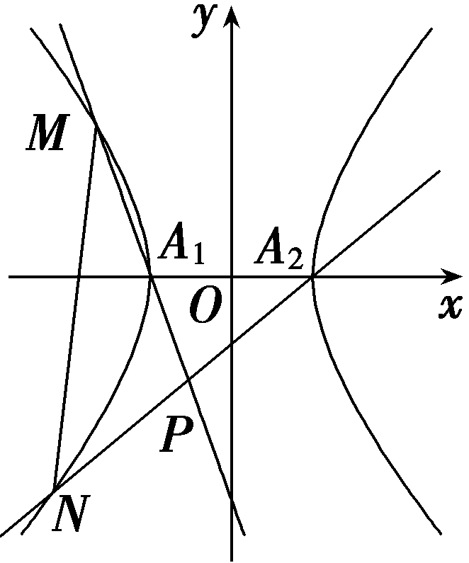

培优课15　非对称韦达定理的应用

在一元二次方程&lt;te&lt;te&lt;te&lt;te&lt;te&lt;te&lt;te&lt;te&lt;te&lt;te&lt;te&lt;te&lt;te&lt;te<em>x</em>t style="italic"&gt;x&lt;/text&gt;t st&lt;text st<em>y</em>le="italic"&gt;y&lt;/text&gt;le="italic"&gt;x&lt;/text&gt;t style="italic"&gt;x&lt;/text&gt;t style="italic"&gt;x&lt;/text&gt;t style="italic"&gt;x&lt;/text&gt;t style="italic"&gt;x&lt;/text&gt;t style="italic"&gt;x&lt;/text&gt;t style="italic"&gt;x&lt;/text&gt;t style="italic"&gt;x&lt;/text&gt;t style="italic"&gt;x&lt;/text&gt;t style="italic"&gt;x&lt;/text&gt;t style="italic"&gt;x&lt;/text&gt;t style="italic"&gt;x&lt;/text&gt;t style="itali<em>c</em>"&gt;ax&lt;/text&gt;&lt;text style="subscript"&gt;&lt;text style="subscript"&gt;&lt;text style="subscript"&gt;&lt;text style="subscript"&gt;&lt;text style="subscript"&gt;&lt;text style="subscript"&gt;&lt;text style="subscript"&gt;&lt;text style="subscript"&gt;&lt;text style="subscript"&gt;&lt;text style="subscript"&gt;2&lt;/text&gt;&lt;/text&gt;&lt;/text&gt;&lt;/text&gt;&lt;/text&gt;&lt;/text&gt;&lt;/text&gt;&lt;/text&gt;&lt;/text&gt;&lt;/text&gt;＋<em>bx</em>＋c＝0中，若<em>Δ</em>＞0，设它的两个根分别为x&lt;text style="subscript"&gt;&lt;text style="subscript"&gt;&lt;text style="subscript"&gt;&lt;text style="subscript"&gt;&lt;text style="subscript"&gt;&lt;text style="subscript"&gt;&lt;text style="subscript"&gt;&lt;text style="subscript"&gt;&lt;text style="subscript"&gt;1&lt;/text&gt;&lt;/text&gt;&lt;/text&gt;&lt;/text&gt;&lt;/text&gt;&lt;/text&gt;&lt;/text&gt;&lt;/text&gt;&lt;/text&gt;，x2，则有根与系数关系：x1＋x2＝－ $\frac{b}{a}$ ，&lt;te&lt;te&lt;te&lt;te&lt;te&lt;te&lt;te&lt;te&lt;te&lt;te&lt;te&lt;te&lt;te<em>x</em>t style="italic"&gt;x&lt;/text&gt;t st&lt;text st<em>y</em>le="italic"&gt;y&lt;/text&gt;le="italic"&gt;x&lt;/text&gt;t style="italic"&gt;x&lt;/text&gt;t style="italic"&gt;x&lt;/text&gt;t style="italic"&gt;x&lt;/text&gt;t style="italic"&gt;x&lt;/text&gt;t style="italic"&gt;x&lt;/text&gt;t style="italic"&gt;x&lt;/text&gt;t style="italic"&gt;x&lt;/text&gt;t style="italic"&gt;x&lt;/text&gt;t style="italic"&gt;x&lt;/text&gt;t style="italic"&gt;x&lt;/text&gt;t style="italic"&gt;x&lt;/text&gt;&lt;text style="subscript"&gt;&lt;text style="subscript"&gt;&lt;text style="subscript"&gt;&lt;text style="subscript"&gt;&lt;text style="subscript"&gt;&lt;text style="subscript"&gt;&lt;text style="subscript"&gt;&lt;text style="subscript"&gt;&lt;text style="subscript"&gt;1&lt;/text&gt;&lt;/text&gt;&lt;/text&gt;&lt;/text&gt;&lt;/text&gt;&lt;/text&gt;&lt;/text&gt;&lt;/text&gt;&lt;/text&gt;x&lt;text style="supers<em>c</em>ript"&gt;&lt;text style="subscript"&gt;&lt;text style="subscript"&gt;&lt;text style="subscript"&gt;&lt;text style="subscript"&gt;&lt;text style="subscript"&gt;&lt;text style="subscript"&gt;&lt;text style="subscript"&gt;&lt;text style="subscript"&gt;&lt;text style="subscript"&gt;2&lt;/text&gt;&lt;/text&gt;&lt;/text&gt;&lt;/text&gt;&lt;/text&gt;&lt;/text&gt;&lt;/text&gt;&lt;/text&gt;&lt;/text&gt;&lt;/text&gt;＝ $\frac{c}{a}$ ，借此我们往往能够利用韦达定理来快速处理｜&lt;te&lt;te&lt;te&lt;te&lt;te&lt;te&lt;te&lt;te&lt;te&lt;te&lt;te&lt;te&lt;te<em>x</em>t style="italic"&gt;x&lt;/text&gt;t st&lt;text st<em>y</em>le="italic"&gt;y&lt;/text&gt;le="italic"&gt;x&lt;/text&gt;t style="italic"&gt;x&lt;/text&gt;t style="italic"&gt;x&lt;/text&gt;t style="italic"&gt;x&lt;/text&gt;t style="italic"&gt;x&lt;/text&gt;t style="italic"&gt;x&lt;/text&gt;t style="italic"&gt;x&lt;/text&gt;t style="italic"&gt;x&lt;/text&gt;t style="italic"&gt;x&lt;/text&gt;t style="italic"&gt;x&lt;/text&gt;t style="italic"&gt;x&lt;/text&gt;t style="italic"&gt;x&lt;/text&gt;&lt;text style="subscript"&gt;&lt;text style="subscript"&gt;&lt;text style="subscript"&gt;&lt;text style="subscript"&gt;&lt;text style="subscript"&gt;&lt;text style="subscript"&gt;&lt;text style="subscript"&gt;&lt;text style="subscript"&gt;&lt;text style="subscript"&gt;1&lt;/text&gt;&lt;/text&gt;&lt;/text&gt;&lt;/text&gt;&lt;/text&gt;&lt;/text&gt;&lt;/text&gt;&lt;/text&gt;&lt;/text&gt;－x&lt;text style="supers<em>c</em>ript"&gt;&lt;text style="subscript"&gt;&lt;text style="subscript"&gt;&lt;text style="subscript"&gt;&lt;text style="subscript"&gt;&lt;text style="subscript"&gt;&lt;text style="subscript"&gt;&lt;text style="subscript"&gt;&lt;text style="subscript"&gt;&lt;text style="subscript"&gt;2&lt;/text&gt;&lt;/text&gt;&lt;/text&gt;&lt;/text&gt;&lt;/text&gt;&lt;/text&gt;&lt;/text&gt;&lt;/text&gt;&lt;/text&gt;&lt;/text&gt;｜， $x_{1}^{2}$ ＋ $x_{2}^{2}$ ， $\frac{1}{x_{1}}$ ＋ $\frac{1}{x_{2}}$ 之类的问题，但在有些问题中，我们会遇到涉及&lt;te&lt;te&lt;te&lt;te&lt;te&lt;te&lt;te&lt;te&lt;te&lt;te&lt;te&lt;te&lt;te<em>x</em>t style="italic"&gt;x&lt;/text&gt;t st&lt;text st<em>y</em>le="italic"&gt;y&lt;/text&gt;le="italic"&gt;x&lt;/text&gt;t style="italic"&gt;x&lt;/text&gt;t style="italic"&gt;x&lt;/text&gt;t style="italic"&gt;x&lt;/text&gt;t style="italic"&gt;x&lt;/text&gt;t style="italic"&gt;x&lt;/text&gt;t style="italic"&gt;x&lt;/text&gt;t style="italic"&gt;x&lt;/text&gt;t style="italic"&gt;x&lt;/text&gt;t style="italic"&gt;x&lt;/text&gt;t style="italic"&gt;x&lt;/text&gt;t style="italic"&gt;x&lt;/text&gt;&lt;text style="subscript"&gt;&lt;text style="subscript"&gt;&lt;text style="subscript"&gt;&lt;text style="subscript"&gt;&lt;text style="subscript"&gt;&lt;text style="subscript"&gt;&lt;text style="subscript"&gt;&lt;text style="subscript"&gt;&lt;text style="subscript"&gt;1&lt;/text&gt;&lt;/text&gt;&lt;/text&gt;&lt;/text&gt;&lt;/text&gt;&lt;/text&gt;&lt;/text&gt;&lt;/text&gt;&lt;/text&gt;，x&lt;text style="supers<em>c</em>ript"&gt;&lt;text style="subscript"&gt;&lt;text style="subscript"&gt;&lt;text style="subscript"&gt;&lt;text style="subscript"&gt;&lt;text style="subscript"&gt;&lt;text style="subscript"&gt;&lt;text style="subscript"&gt;&lt;text style="subscript"&gt;&lt;text style="subscript"&gt;2&lt;/text&gt;&lt;/text&gt;&lt;/text&gt;&lt;/text&gt;&lt;/text&gt;&lt;/text&gt;&lt;/text&gt;&lt;/text&gt;&lt;/text&gt;&lt;/text&gt;的不同系数的代数式的运算，比如求 $\frac{x_{1}}{x_{2}}$ ， $\frac{3x_{1}x_{2}+2x_{1}－x_{2}}{2x_{1}x_{2}－x_{1}＋x_{2}}$ 或&lt;te&lt;te&lt;te&lt;te<em>x</em>t style="italic"&gt;x&lt;/text&gt;t st&lt;text st<em>y</em>le="italic"&gt;y&lt;/text&gt;le="italic"&gt;x&lt;/text&gt;t style="italic"&gt;x&lt;/text&gt;t style="italic"&gt;λ&lt;/text&gt;&lt;te&lt;te&lt;te&lt;te&lt;te&lt;te&lt;te&lt;te&lt;te<em>x</em>t style="italic"&gt;x&lt;/text&gt;t style="italic"&gt;x&lt;/text&gt;t style="italic"&gt;x&lt;/text&gt;t style="italic"&gt;x&lt;/text&gt;t style="italic"&gt;x&lt;/text&gt;t style="italic"&gt;x&lt;/text&gt;t style="italic"&gt;x&lt;/text&gt;t style="italic"&gt;x&lt;/text&gt;t style="italic"&gt;x&lt;/text&gt;&lt;text style="subscript"&gt;&lt;text style="subscript"&gt;&lt;text style="subscript"&gt;&lt;text style="subscript"&gt;&lt;text style="subscript"&gt;&lt;text style="subscript"&gt;&lt;text style="subscript"&gt;&lt;text style="subscript"&gt;&lt;text style="subscript"&gt;1&lt;/text&gt;&lt;/text&gt;&lt;/text&gt;&lt;/text&gt;&lt;/text&gt;&lt;/text&gt;&lt;/text&gt;&lt;/text&gt;&lt;/text&gt;＋<em>&lt;text style="italic"&gt;μ</em>x&lt;/text&gt;&lt;text style="supers<em>c</em>ript"&gt;&lt;text style="subscript"&gt;&lt;text style="subscript"&gt;&lt;text style="subscript"&gt;&lt;text style="subscript"&gt;&lt;text style="subscript"&gt;&lt;text style="subscript"&gt;&lt;text style="subscript"&gt;&lt;text style="subscript"&gt;&lt;text style="subscript"&gt;2&lt;/text&gt;&lt;/text&gt;&lt;/text&gt;&lt;/text&gt;&lt;/text&gt;&lt;/text&gt;&lt;/text&gt;&lt;/text&gt;&lt;/text&gt;&lt;/text&gt;(λ≠μ)之类的问题，就相对较难转化为应用韦达定理来处理了.我们把这种形如x1＋2x2，<em>&lt;text style="italic"&gt;λx</em>&lt;/text&gt;1y2＋<em>μx</em>2y1， $\frac{x_{1}}{x_{2}}$ 或 $\frac{3x_{1}x_{2}+2x_{1}－x_{2}}{2x_{1}x_{2}－x_{1}＋x_{2}}$ 之类中&lt;te&lt;te&lt;te&lt;te&lt;te&lt;te&lt;te&lt;te&lt;te&lt;te&lt;te&lt;te&lt;te<em>x</em>t style="italic"&gt;x&lt;/text&gt;t st&lt;text st<em>y</em>le="italic"&gt;y&lt;/text&gt;le="italic"&gt;x&lt;/text&gt;t style="italic"&gt;x&lt;/text&gt;t style="italic"&gt;x&lt;/text&gt;t style="italic"&gt;x&lt;/text&gt;t style="italic"&gt;x&lt;/text&gt;t style="italic"&gt;x&lt;/text&gt;t style="italic"&gt;x&lt;/text&gt;t style="italic"&gt;x&lt;/text&gt;t style="italic"&gt;x&lt;/text&gt;t style="italic"&gt;x&lt;/text&gt;t style="italic"&gt;x&lt;/text&gt;t style="italic"&gt;x&lt;/text&gt;&lt;text style="subscript"&gt;&lt;text style="subscript"&gt;&lt;text style="subscript"&gt;&lt;text style="subscript"&gt;&lt;text style="subscript"&gt;&lt;text style="subscript"&gt;&lt;text style="subscript"&gt;&lt;text style="subscript"&gt;&lt;text style="subscript"&gt;1&lt;/text&gt;&lt;/text&gt;&lt;/text&gt;&lt;/text&gt;&lt;/text&gt;&lt;/text&gt;&lt;/text&gt;&lt;/text&gt;&lt;/text&gt;，x&lt;text style="supers<em>c</em>ript"&gt;&lt;text style="subscript"&gt;&lt;text style="subscript"&gt;&lt;text style="subscript"&gt;&lt;text style="subscript"&gt;&lt;text style="subscript"&gt;&lt;text style="subscript"&gt;&lt;text style="subscript"&gt;&lt;text style="subscript"&gt;&lt;text style="subscript"&gt;2&lt;/text&gt;&lt;/text&gt;&lt;/text&gt;&lt;/text&gt;&lt;/text&gt;&lt;/text&gt;&lt;/text&gt;&lt;/text&gt;&lt;/text&gt;&lt;/text&gt;的系数不对称的式子，称为“非对称韦达定理”问题.

一般解决方法：

##### 1.代换法：利用韦达定理消去*x*或*y*中的一个，一般而言，用直线方程中的*x*和*y*进行代换消元，如果选择代换消去*y*，则设直线*y*＝*kx*＋*b*；选择代换消去*x*，则设直线*x*＝*my*＋*t*.

&lt;te&lt;te<em>x</em>t style="italic"&gt;x&lt;/text&gt;t style="subscript"&gt;2&lt;/text&gt;.和积转化法：即运用 $\left\{\begin{matrix}x_{1}＋x_{2}＝f(t),\\x_{1}x_{2}＝g(t)\end{matrix}\right.$ ⇒&lt;&lt;te&lt;te&lt;te&lt;te<em>x</em>t style="italic"&gt;x&lt;/text&gt;t style="italic"&gt;x&lt;/text&gt;t style="italic"&gt;x&lt;/text&gt;t style="italic"&gt;t&lt;/text&gt;ext style="italic"&gt;h&lt;/text&gt;(t)x&lt;text style="subscript"&gt;1&lt;/text&gt;x&lt;text style="subscript"&gt;2&lt;/text&gt;＝<em>&lt;text style="italic"&gt;m</em>&lt;/text&gt;(x1＋x2)进行转化，一般情况下，多把积化和，且m多为常数.

##### 3.半配凑半代换法：对能代换的部分进行韦达代换，剩下的部分进行配凑，而半代换也有一定技巧，比如 $\frac{k_{1}}{k_{2}}$ ＝ $\frac{ty_{1}y_{2}－y_{1}}{ty_{1}y_{2}+3y_{2}}$ ，可将分子整理为 $\frac{k_{1}}{k_{2}}$ ＝ $\frac{ty_{1}y_{2}-(y_{1}＋y_{2})＋y_{2}}{ty_{1}y_{2}+3y_{2}}$ ，利用等比关系，从结构上可以猜测定值为 $\frac{1}{3}$ .

(一题多解)已知点<text sty*l*e="italic">*F*</text>为椭圆*E*： $\frac{x^{2}}{4}$ ＋ $\frac{y^{2}}{3}$ ＝1的右焦点，<text sty*l*e="italic">*A*</text>，*<text style="italic">B*</text>分别为其左、右顶点，过*<text style="italic">F*</text>作直线l与椭圆交于*M*，*N*两点(不与A，B重合).

(1)记直线<em>AM</em>与<em>BN</em>的斜率分别为<em>&lt;text style="italic"&gt;k</em>&lt;/text&gt;1，k2，求证： $\frac{k_{1}}{k_{2}}$ 为定值；

（2）当直线*l*斜率存在时，求证：直线*AM*与直线*BN*的交点在一条定直线上.

证明：（1）法一：积化和(变量<em>x</em>)： 当直线<em>l</em>斜率存在时，不妨设直线<em>l</em>：<em>y</em>＝<em>k</em>(<em>x</em>－1)，<em>M</em>(<em>x</em>1，<em>y</em>1)，<em>N</em>(<em>x</em>2，<em>y</em>2)，

则<em>&lt;text style="italic"&gt;k</em>&lt;/text&gt;1＝ $\frac{y_{1}}{x_{1}+2}$ ， <em>&lt;text style="italic"&gt;k</em>&lt;/text&gt;2＝ $\frac{y_{2}}{x_{2}－2}$ ，

联立 $\left\{\begin{matrix}\frac{x^{2}}{4}＋\frac{y^{2}}{3}=1，\\y＝k(x－1),\end{matrix}\right.$ 消&lt;te&lt;te<em>x</em>t style="italic"&gt;x&lt;/text&gt;t style="italic"&gt;y&lt;/text&gt;得(3＋4<em>&lt;text style="italic"&gt;&lt;text style="italic"&gt;k</em>&lt;/text&gt;&lt;/text&gt;&lt;text style="superscript"&gt;&lt;text style="superscript"&gt;&lt;text style="superscript"&gt;2&lt;/text&gt;&lt;/text&gt;&lt;/text&gt;)x2－8k2x＋4k2－12＝0，且<em>Δ</em>＞0，

则 $\left\{\begin{matrix}x_{1}＋x_{2}＝\frac{8k^{2}}{3+4k^{2}}＝－\frac{6}{3+4k^{2}}+2，\\x_{1}x_{2}＝\frac{4k^{2}－12}{3+4k^{2}}＝－\frac{15}{3+4k^{2}}+1，\end{matrix}\right.$

因此&lt;te&lt;te&lt;te<em>x</em>t style="italic"&gt;x&lt;/text&gt;t style="italic"&gt;x&lt;/text&gt;t style="italic"&gt;x&lt;/text&gt;&lt;text style="subscript"&gt;1&lt;/text&gt;x&lt;text style="subscript"&gt;2&lt;/text&gt;＝ $\frac{5}{2}$ (&lt;te&lt;te&lt;te<em>x</em>t style="italic"&gt;x&lt;/text&gt;t style="italic"&gt;x&lt;/text&gt;t style="italic"&gt;x&lt;/text&gt;&lt;text style="subscript"&gt;1&lt;/text&gt;＋x&lt;text style="subscript"&gt;2&lt;/text&gt;)－4，

所以 $\frac{k_{1}}{k_{2}}$ ＝ $\frac{\frac{y_{1}}{x_{1}+2}}{\frac{y_{2}}{x_{2}－2}}$ ＝ $\frac{y_{1}(x_{2}－2)}{y_{2}(x_{1}+2)}$ ＝ $\frac{k(x_{1}－1)(x_{2}－2)}{k(x_{2}－1)(x_{1}+2)}$ ＝ $\frac{x_{1}x_{2}－2x_{1}－x_{2}+2}{x_{1}x_{2}+2x_{2}－x_{1}－2}$

＝ $\frac{\frac{5}{2}(x_{1}＋x_{2})-4－2x_{1}－x_{2}+2}{\frac{5}{2}(x_{1}＋x_{2})-4－x_{1}+2x_{2}－2}$ ＝ $\frac{\frac{1}{2}x_{1}＋\frac{3}{2}x_{2}－2}{\frac{3}{2}x_{1}＋\frac{9}{2}x_{2}－6}$ ＝ $\frac{1}{3}$ ，为定值.

当直线<te*x*t sty*l*e="italic">l</text>斜率不存在时，直线l：x＝1，不妨设*M*(1， $\frac{3}{2}$ )，*N*(1，－ $\frac{3}{2}$ )，

则<em>&lt;text style="italic"&gt;k</em>&lt;/text&gt;1＝ $\frac{y_{1}}{x_{1}+2}$ ＝ $\frac{\frac{3}{2}}{1+2}$ ＝ $\frac{1}{2}$ ， <em>&lt;text style="italic"&gt;k</em>&lt;/text&gt;2＝ $\frac{y_{2}}{x_{2}－2}$ ＝ $\frac{－\frac{3}{2}}{1－2}$ ＝ $\frac{3}{2}$ ，

所以 $\frac{k_{1}}{k_{2}}$ ＝ $\frac{\frac{1}{2}}{\frac{3}{2}}$ ＝ $\frac{1}{3}$ .

综上 $\frac{k_{1}}{k_{2}}$ 为 $\frac{1}{3}$ ，是定值，从而得证.

法二：半配凑半代换(变量*x*)： 同法一

因此 $\frac{k_{1}}{k_{2}}$ ＝ $\frac{\frac{y_{1}}{x_{1}+2}}{\frac{y_{2}}{x_{2}－2}}$ ＝ $\frac{y_{1}(x_{2}－2)}{y_{2}(x_{1}+2)}$ ＝ $\frac{k(x_{1}－1)(x_{2}－2)}{k(x_{2}－1)(x_{1}+2)}$ ＝ $\frac{x_{1}x_{2}－2x_{1}－x_{2}+2}{x_{1}x_{2}+2x_{2}－x_{1}－2}$ ＝ $\frac{x_{1}x_{2}－2(x_{1}＋x_{2})＋x_{2}+2}{x_{1}x_{2}-(x_{1}＋x_{2})+3x_{2}－2}$

＝ $\frac{\frac{4k^{2}－12}{3+4k^{2}}－2\cdot \frac{8k^{2}}{3+4k^{2}}＋x_{2}+2}{\frac{4k^{2}－12}{3+4k^{2}}－\frac{8k^{2}}{3+4k^{2}}+3x_{2}－2}$

＝ $\frac{－\frac{3}{3+4k^{2}}＋x_{2}－1}{－\frac{9}{3+4k^{2}}+3x_{2}－3}$ ＝ $\frac{1}{3}$ .即为定值.

法三：积化和(变量*y*)：由题意知，*A*(－2，0)，*B*(2，0)，

设直线&lt;te&lt;te&lt;te&lt;text st<em>y</em>le="italic"&gt;x&lt;/text&gt;t st<em>y</em>le="italic"&gt;x&lt;/text&gt;t s<em>ty</em>le="italic"&gt;x&lt;/text&gt;t style="italic"&gt;l&lt;/text&gt;：x＝ty＋&lt;text style="subscript"&gt;&lt;text style="subscript"&gt;1&lt;/text&gt;&lt;/text&gt;，<em>M</em>(x1，y1)，<em>N</em>(x&lt;text style="subscript"&gt;&lt;text style="subscript"&gt;2&lt;/text&gt;&lt;/text&gt;，y2)，则<em>&lt;text style="italic"&gt;k</em>&lt;/text&gt;1＝ $\frac{y_{1}}{x_{1}+2}$ ， <em>&lt;text style="italic"&gt;k</em>&lt;/text&gt;&lt;text st<em>y</em>le="subscript"&gt;&lt;text style="subscript"&gt;2&lt;/text&gt;&lt;/text&gt;＝ $\frac{y_{2}}{x_{2}－2}$ ，

联立 $\left\{\begin{matrix}\frac{x^{2}}{4}＋\frac{y^{2}}{3}=1，\\x＝ty+1，\end{matrix}\right.$ 消&lt;&lt;text st&lt;text s<em>ty</em>le="italic"&gt;y&lt;/text&gt;le="italic"&gt;t&lt;/text&gt;ext style="italic"&gt;x&lt;/text&gt;得(4＋3t&lt;text style="superscript"&gt;2&lt;/text&gt;)y2＋6ty－9＝0，且<em>Δ</em>＞0，

则 $\left\{\begin{matrix}y_{1}＋y_{2}＝－\frac{6t}{4+3t^{2}}，\\y_{1}y_{2}＝－\frac{9}{4+3t^{2}}.\end{matrix}\right.$ 所以&lt;text st&lt;text st&lt;text st<em>y</em>le="italic"&gt;y&lt;/text&gt;le="italic"&gt;y&lt;/text&gt;le="italic"&gt;ty&lt;/text&gt;&lt;text style="subscript"&gt;1&lt;/text&gt;y&lt;text style="subscript"&gt;2&lt;/text&gt;＝ $\frac{3}{2}$ (&lt;text st&lt;text st<em>y</em>le="italic"&gt;y&lt;/text&gt;le="italic"&gt;y&lt;/text&gt;&lt;text style="subscript"&gt;1&lt;/text&gt;＋y&lt;text style="subscript"&gt;2&lt;/text&gt;)，

所以代入得， $\frac{k_{1}}{k_{2}}$ ＝ $\frac{ty_{1}y_{2}－y_{1}}{ty_{1}y_{2}+3y_{2}}$ ＝ $\frac{\frac{3}{2}(y_{1}＋y_{2})-y_{1}}{\frac{3}{2}(y_{1}＋y_{2})+3y_{2}}$ ＝ $\frac{\frac{1}{2}y_{1}＋\frac{3}{2}y_{2}}{\frac{3}{2}y_{1}＋\frac{9}{2}y_{2}}$ ＝ $\frac{1}{3}$ ，为定值.

法四：半配凑半代换(变量*y*)：同法三：

因此 $\frac{k_{1}}{k_{2}}$ ＝ $\frac{ty_{1}y_{2}－y_{1}}{ty_{1}y_{2}+3y_{2}}$ ＝ $\frac{ty_{1}y_{2}-(y_{1}＋y_{2})＋y_{2}}{ty_{1}y_{2}+3y_{2}}$ ＝ $\frac{－\frac{9t}{4+3t^{2}}＋\frac{6t}{4+3t^{2}}＋y_{2}}{－\frac{9t}{4+3t^{2}}+3y_{2}}$ ＝ $\frac{－\frac{3t}{4+3t^{2}}＋y_{2}}{－\frac{9t}{4+3t^{2}}+3y_{2}}$ ＝ $\frac{1}{3}$ ，为定值.

（2）由（1）法一知，直线<te<te*x*t st*y*le="italic">x</text>t st*y*le="italic">AM</text>：y＝ $\frac{y_{1}}{x_{1}+2}$ (<te*x*t st*y*le="italic">x</text>＋2)，直线*BN*：*y*＝ $\frac{y_{2}}{x_{2}－2}$ (<te*x*t st*y*le="italic">x</text>－2)，

联立得，*x*＝ $\frac{2(2x_{1}x_{2}－3x_{1}＋x_{2})}{x_{1}+3x_{2}－4}$ .

策略一：和积转换

所以*x*＝ $\frac{2(2x_{1}x_{2}－3x_{1}＋x_{2})}{x_{1}+3x_{2}－4}$

＝2× $\frac{5(x_{1}＋x_{2})-8－3x_{1}＋x_{2}}{x_{1}+3x_{2}－4}$ ＝4.

策略二：半配凑半代换

所以*x*＝ $\frac{2(2x_{1}x_{2}－3x_{1}＋x_{2})}{x_{1}+3x_{2}－4}$

＝ $\frac{2\left[2x_{1}x_{2}－3(x_{1}＋x_{2})+4x_{2}\right]}{(x_{1}＋x_{2})+2x_{2}－4}$

＝ $\frac{2\left(2\cdot \frac{4k^{2}－12}{3+4k^{2}}－3\cdot \frac{8k^{2}}{3+4k^{2}}+4x_{2}\right)}{\frac{8k^{2}}{3+4k^{2}}+2x_{2}－4}$

＝ $\frac{2\left(\frac{－16k^{2}－24}{3+4k^{2}}+4x_{2}\right)}{\frac{－8k^{2}－12}{3+4k^{2}}+2x_{2}}$ ＝ $\frac{4\left(\frac{－8k^{2}－12}{3+4k^{2}}+2x_{2}\right)}{\frac{－8k^{2}－12}{3+4k^{2}}+2x_{2}}$ ＝4.

故直线*AM*与直线*BN*的交点在定直线*x*＝4上.

策略三：两式相比法

设直线&lt;te&lt;te<em>x</em>t st<em>y</em>le="italic"&gt;x&lt;/text&gt;t style="italic"&gt;AM&lt;/text&gt;，<em>BN</em>的交点<em>P</em>(x&lt;text style="subscript"&gt;&lt;text style="subscript"&gt;0&lt;/text&gt;&lt;/text&gt;，y0)，则由（1）结论可知 $\frac{k_{1}}{k_{2}}$ ＝ $\frac{1}{3}$ ，联立 $\left\{\begin{matrix}y_{0}＝\frac{y_{1}}{x_{1}+2}(x_{0}+2),\\y_{0}＝\frac{y_{2}}{x_{2}－2}(x_{0}－2)\end{matrix}\right.$ 化简得1＝ $\frac{1}{3}$ × $\frac{x_{0}+2}{x_{0}－2}$ ，解得&lt;te<em>x</em>t st<em>y</em>le="italic"&gt;x&lt;/text&gt;&lt;text style="subscript"&gt;&lt;text style="subscript"&gt;0&lt;/text&gt;&lt;/text&gt;＝4.

故直线*AM*与直线*BN*的交点在定直线*x*＝4上.

对点练.已知*P*点坐标为 $\left(0，2\right)$ ，点*A*，*B*分别为椭圆*<text style="italic">E*</text>： $\frac{x^{2}}{a^{2}}$ ＋ $\frac{y^{2}}{b^{2}}$ ＝1 $\left(a＞b>0\right)$ 的左、右顶点，直线*AP*交*<text style="italic">E*</text>于点*Q*，△A*B*P是等腰直角三角形，且 $\vec{PQ}$ ＝ $\frac{3}{2}\vec{QA}$ .

（1）求椭圆*E*的方程；

(2)过点&lt;te<em>x</em>t sty<em>l</em>e="italic"&gt;M&lt;/text&gt; $\left(1，0\right)$ 的直线&lt;te<em>x</em>t style="italic"&gt;l&lt;/text&gt;交椭圆<em>E</em>于<em>&lt;text style="italic"&gt;C</em>&lt;/text&gt;，<em>D</em>两点，其中点C在x轴上方.设直线<em>AD</em>的斜率为<em>&lt;text style="italic"&gt;k</em>&lt;/text&gt;1，直线<em>BC</em>的斜率为k2，探究 $\frac{k_{1}}{k_{2}}$ 是否为定值，若为定值，求出定值；若不是定值，说明理由.

解：（1）因为△*ABP*是等腰直角三角形，*P*(0，2)，所以*a*＝2，*A*(－2，0)，

设&lt;te&lt;te&lt;te&lt;text st<em>y</em>le="italic"&gt;x&lt;/text&gt;t st<em>y</em>le="italic"&gt;x&lt;/text&gt;t st<em>y</em>le="italic"&gt;x&lt;/text&gt;t style="italic"&gt;Q&lt;/text&gt;(x&lt;text style="subscript"&gt;&lt;text style="subscript"&gt;&lt;text style="subscript"&gt;&lt;text style="subscript"&gt;&lt;text style="subscript"&gt;0&lt;/text&gt;&lt;/text&gt;&lt;/text&gt;&lt;/text&gt;&lt;/text&gt;，y0)，由 $\vec{PQ}$ ＝ $\frac{3}{2}\vec{QA}$ ，得(&lt;te&lt;te&lt;text st<em>y</em>le="italic"&gt;x&lt;/text&gt;t st<em>y</em>le="italic"&gt;x&lt;/text&gt;t st<em>y</em>le="italic"&gt;x&lt;/text&gt;&lt;text style="subscript"&gt;&lt;text style="subscript"&gt;&lt;text style="subscript"&gt;&lt;text style="subscript"&gt;&lt;text style="subscript"&gt;0&lt;/text&gt;&lt;/text&gt;&lt;/text&gt;&lt;/text&gt;&lt;/text&gt;，y0－2)＝ $\frac{3}{2}$ (－2－&lt;te&lt;te&lt;text st<em>y</em>le="italic"&gt;x&lt;/text&gt;t st<em>y</em>le="italic"&gt;x&lt;/text&gt;t st<em>y</em>le="italic"&gt;x&lt;/text&gt;&lt;text style="subscript"&gt;&lt;text style="subscript"&gt;&lt;text style="subscript"&gt;&lt;text style="subscript"&gt;&lt;text style="subscript"&gt;0&lt;/text&gt;&lt;/text&gt;&lt;/text&gt;&lt;/text&gt;&lt;/text&gt;，－y0)，则 $\left\{\begin{matrix}x_{0}＝－\frac{6}{5}，\\y_{0}＝\frac{4}{5}，\end{matrix}\right.$

代入椭圆方程得<em>b</em>2＝1，

所以椭圆&lt;text st<em>y</em>le="italic"&gt;E&lt;/text&gt;的方程为 $\frac{x^{2}}{4}$ ＋<em>y</em>2＝1.

（2）当直线*l*的斜率存在时，设直线*l*的方程为*y*＝*k*(*x*－1)，

联立 $\left\{\begin{matrix}y＝k(x－1),\\\frac{x^{2}}{4}＋y^{2}=1，\end{matrix}\right.$ 得(4&lt;te&lt;te<em>x</em>t style="italic"&gt;x&lt;/text&gt;t style="italic"&gt;<em>&lt;text style="italic"&gt;k</em>&lt;/text&gt;&lt;/text&gt;&lt;text style="superscript"&gt;&lt;text style="superscript"&gt;&lt;text style="superscript"&gt;2&lt;/text&gt;&lt;/text&gt;&lt;/text&gt;＋1)x2－8k2x＋4k2－4＝0.

设&lt;te&lt;te&lt;te&lt;te&lt;te&lt;te<em>x</em>t style="italic"&gt;x&lt;/text&gt;t style="italic"&gt;x&lt;/text&gt;t style="italic"&gt;x&lt;/text&gt;t st<em>y</em>le="italic"&gt;x&lt;/text&gt;t st<em>y</em>le="italic"&gt;x&lt;/text&gt;t style="italic"&gt;C&lt;/text&gt;(x&lt;text style="subscript"&gt;&lt;text style="subscript"&gt;&lt;text style="subscript"&gt;1&lt;/text&gt;&lt;/text&gt;&lt;/text&gt;，y1)，<em>D</em>(x&lt;text style="subscript"&gt;&lt;text style="subscript"&gt;&lt;text style="subscript"&gt;2&lt;/text&gt;&lt;/text&gt;&lt;/text&gt;，y2)，则x1＋x2＝ $\frac{8k^{2}}{4k^{2}+1}$ ，&lt;te&lt;te&lt;te&lt;te&lt;te<em>x</em>t style="italic"&gt;x&lt;/text&gt;t style="italic"&gt;x&lt;/text&gt;t style="italic"&gt;x&lt;/text&gt;t st<em>y</em>le="italic"&gt;x&lt;/text&gt;t st<em>y</em>le="italic"&gt;x&lt;/text&gt;&lt;text style="subscript"&gt;&lt;text style="subscript"&gt;&lt;text style="subscript"&gt;1&lt;/text&gt;&lt;/text&gt;&lt;/text&gt;x&lt;text style="subscript"&gt;&lt;text style="subscript"&gt;&lt;text style="subscript"&gt;2&lt;/text&gt;&lt;/text&gt;&lt;/text&gt;＝ $\frac{4k^{2}－4}{4k^{2}+1}$ ，

<em>&lt;text style="italic"&gt;k</em>&lt;/text&gt;1＝ $\frac{y_{2}}{x_{2}+2}$ ，<em>&lt;text style="italic"&gt;k</em>&lt;/text&gt;2＝ $\frac{y_{1}}{x_{1}－2}$ ，

则 $\frac{k_{1}}{k_{2}}$ ＝ $\frac{y_{2}(x_{1}－2)}{y_{1}(x_{2}+2)}$ ＝ $\frac{k(x_{2}－1)(x_{1}－2)}{k(x_{1}－1)(x_{2}+2)}$ ＝ $\frac{x_{1}x_{2}－2x_{2}－x_{1}+2}{x_{1}x_{2}+2x_{1}－x_{2}－2}$ ＝ $\frac{x_{1}x_{2}－2(x_{1}＋x_{2})＋x_{1}+2}{x_{1}x_{2}-(x_{1}＋x_{2})+3x_{1}－2}$ ＝ $\frac{－2－4k^{2}＋(4k^{2}+1)x_{1}}{－6－12k^{2}+3(4k^{2}+1)x_{1}}$ ＝ $\frac{1}{3}$ .

当直线*l*的斜率不存在时，

<em>x</em>＝1，此时<em>C</em>(1， $\frac{\sqrt{3}}{2}$ )，<em>D</em>(1，－ $\frac{\sqrt{3}}{2}$ )，<em>&lt;text style="italic"&gt;k</em>&lt;/text&gt;1＝ $\frac{－\frac{\sqrt{3}}{2}－0}{1+2}$ ＝－ $\frac{\sqrt{3}}{6}$ ，<em>&lt;text style="italic"&gt;k</em>&lt;/text&gt;2＝ $\frac{\frac{\sqrt{3}}{2}－0}{1－2}$ ＝－ $\frac{\sqrt{3}}{2}$ ， $\frac{k_{1}}{k_{2}}$ ＝ $\frac{1}{3}$ .

综上所述， $\frac{k_{1}}{k_{2}}$ 是定值为 $\frac{1}{3}$ .

课时测评77　非对称韦达定理的应用 $\frac{对应学生}{用书P463}$

(时间：60分钟　满分：64分)

(本栏目内容，在学生用书中以独立形式分册装订！)

##### 1.(15分)已知双曲线<em>C</em>：<em>x</em>2－<em>y</em>2＝1.

（1）求*C*的右支与直线*x*＝100围成的区域内部(不含边界)整点(横纵坐标均为整数的点)的个数；(4分)

(&lt;text style="subscript"&gt;2&lt;/text&gt;)记<em>&lt;text style="italic"&gt;C</em>&lt;/text&gt;的左、右顶点分别为<em>&lt;text style="italic"&gt;A</em>&lt;/text&gt;&lt;text style="subscript"&gt;1&lt;/text&gt;，A2，过点 $\left(－2，0\right)$ 的直线与<em>&lt;text style="italic"&gt;C</em>&lt;/text&gt;的左支交于<em>&lt;text style="italic"&gt;M</em>&lt;/text&gt;，<em>N</em>两点，M在第二象限，直线M<em>&lt;text style="italic"&gt;A</em>&lt;/text&gt;&lt;text style="subscript"&gt;1&lt;/text&gt;与<em>NA</em>&lt;text style="subscript"&gt;2&lt;/text&gt;交于点<em>&lt;text style="italic"&gt;P</em>&lt;/text&gt;，证明：点P在定直线上.(11分)

解：（1）因为双曲线方程为&lt;te&lt;te&lt;text st&lt;text st&lt;text st<em>y</em>le="italic"&gt;y&lt;/text&gt;le="italic"&gt;y&lt;/text&gt;le="italic"&gt;x&lt;/text&gt;t st<em>y</em>le="italic"&gt;x&lt;/text&gt;t style="italic"&gt;C&lt;/text&gt;：x&lt;text style="superscript"&gt;&lt;text style="superscript"&gt;&lt;text style="superscript"&gt;&lt;text style="superscript"&gt;2&lt;/text&gt;&lt;/text&gt;&lt;/text&gt;&lt;/text&gt;－y2＝1，令x＝<em>&lt;text style="italic"&gt;&lt;text style="italic"&gt;&lt;text style="italic"&gt;&lt;text style="italic"&gt;&lt;text style="italic"&gt;n</em>&lt;/text&gt;&lt;/text&gt;&lt;/text&gt;&lt;/text&gt;&lt;/text&gt;，2≤n≤99，整点时y满足 $\left(n－1\right)^{2}$ ＜&lt;te&lt;text st&lt;text st&lt;text st<em>y</em>le="italic"&gt;y&lt;/text&gt;le="italic"&gt;y&lt;/text&gt;le="italic"&gt;x&lt;/text&gt;t style="italic"&gt;y&lt;/text&gt;&lt;text style="superscript"&gt;&lt;text style="superscript"&gt;&lt;text style="superscript"&gt;&lt;text style="superscript"&gt;2&lt;/text&gt;&lt;/text&gt;&lt;/text&gt;&lt;/text&gt;＜<em>&lt;text style="italic"&gt;&lt;text style="italic"&gt;&lt;text style="italic"&gt;&lt;text style="italic"&gt;&lt;text style="italic"&gt;n</em>&lt;/text&gt;&lt;/text&gt;&lt;/text&gt;&lt;/text&gt;&lt;/text&gt;2－1＜n2，整点个数为y＝2 $\left(n－1\right)$ ＋1＝&lt;te&lt;text st&lt;text st&lt;text st<em>y</em>le="italic"&gt;y&lt;/text&gt;le="italic"&gt;y&lt;/text&gt;le="italic"&gt;x&lt;/text&gt;t st<em>y</em>le="superscript"&gt;&lt;text style="superscript"&gt;&lt;text style="superscript"&gt;&lt;text style="superscript"&gt;2&lt;/text&gt;&lt;/text&gt;&lt;/text&gt;&lt;/text&gt;<em>&lt;text style="italic"&gt;&lt;text style="italic"&gt;&lt;text style="italic"&gt;&lt;text style="italic"&gt;&lt;text style="italic"&gt;n</em>&lt;/text&gt;&lt;/text&gt;&lt;/text&gt;&lt;/text&gt;&lt;/text&gt;－1，2≤n≤99，

区域内部(不含边界)整点的个数为 $\frac{98\left(3+197\right)}{2}$ ＝9 800(个).

(2)由(1)可得<em>&lt;text style="italic"&gt;A</em>&lt;/text&gt;1 $\left(－1，0\right)$ ，<em>&lt;text style="italic"&gt;A</em>&lt;/text&gt;2 $\left(1，0\right)$ ，设<em>M</em> $\left(x_{1}，y_{1}\right)$ ，<em>N</em> $\left(x_{2}，y_{2}\right)$ ，

显然直线的斜率不为0，所以设直线*MN*的方程为*x*＝*my*－2，且－1＜*m*＜1，

与&lt;te&lt;text st&lt;text st<em>y</em>le="italic"&gt;y&lt;/text&gt;le="italic"&gt;x&lt;/text&gt;t style="italic"&gt;C&lt;/text&gt;：x&lt;text style="superscript"&gt;&lt;text style="superscript"&gt;&lt;text style="superscript"&gt;2&lt;/text&gt;&lt;/text&gt;&lt;/text&gt;－y2＝1联立可得 $\left(m^{2}－1\right)$ &lt;text st<em>y</em>le="italic"&gt;y&lt;/text&gt;&lt;text style="superscript"&gt;&lt;text style="superscript"&gt;&lt;text style="superscript"&gt;2&lt;/text&gt;&lt;/text&gt;&lt;/text&gt;－4<em>&lt;text style="italic"&gt;m</em>y&lt;/text&gt;＋3＝0，且<em>Δ</em>＝4(m2＋3)＞0，

则&lt;text st&lt;text st&lt;text st<em>y</em>le="italic"&gt;y&lt;/text&gt;le="italic"&gt;y&lt;/text&gt;le="italic"&gt;y&lt;/text&gt;&lt;text style="subscript"&gt;1&lt;/text&gt;＋y&lt;text style="subscript"&gt;2&lt;/text&gt;＝ $\frac{4m}{m^{2}－1}$ ，&lt;text st&lt;text st&lt;text st<em>y</em>le="italic"&gt;y&lt;/text&gt;le="italic"&gt;y&lt;/text&gt;le="italic"&gt;y&lt;/text&gt;&lt;text style="subscript"&gt;1&lt;/text&gt;y&lt;text style="subscript"&gt;2&lt;/text&gt;＝ $\frac{3}{m^{2}－1}$ ，

直线&lt;text st&lt;text st<em>y</em>le="italic"&gt;y&lt;/text&gt;le="italic"&gt;MA&lt;/text&gt;1的方程为y＝ $\frac{y_{1}}{x_{1}+1}\left(x+1\right)$ ，直线&lt;text st<em>y</em>le="italic"&gt;NA&lt;/text&gt;2的方程为<em>y</em>＝ $\frac{y_{2}}{x_{2}－1}\left(x－1\right)$ ，

联立直线<em>MA</em>1与直线<em>NA</em>2的方程可得，

$\frac{x+1}{x－1}$ ＝ $\frac{y_{2}\left(x_{1}+1\right)}{y_{1}\left(x_{2}－1\right)}$ ＝ $\frac{y_{2}\left(my_{1}－1\right)}{y_{1}\left(my_{2}－3\right)}$ ＝ $\frac{my_{1}y_{2}－\left(y_{1}＋y_{2}\right)＋y_{1}}{my_{1}y_{2}－3y_{1}}$ ＝ $\frac{m\cdot \frac{3}{m^{2}－1}－\frac{4m}{m^{2}－1}＋y_{1}}{m\cdot \frac{3}{m^{2}－1}－3y_{1}}$ ＝ $\frac{\frac{－m}{m^{2}－1}＋y_{1}}{\frac{3m}{m^{2}－1}－3y_{1}}$ ＝－ $\frac{1}{3}$ ，

由 $\frac{x+1}{x－1}$ ＝－ $\frac{1}{3}$ 可得&lt;te<em>x</em>t style="italic"&gt;x&lt;/text&gt;＝－ $\frac{1}{2}$ ，即&lt;te<em>x</em>t style="italic"&gt;x&lt;/text&gt;<em>P</em>＝－ $\frac{1}{2}$ ，

据此可得点<te*x*t style="italic">P</text>在定直线x＝－ $\frac{1}{2}$ 上运动.

&lt;t<em>e</em>xt style="su<em>b</em>script"&gt;2&lt;/text&gt;.(15分)已知&lt;text style="it<em>a</em>lic"&gt;<em>A</em>&lt;/text&gt;1，A2分别是椭圆<em>&lt;text style="italic"&gt;E</em>&lt;/text&gt;： $\frac{x^{2}}{a^{2}}$ ＋ $\frac{y^{2}}{b^{2}}$ ＝&lt;t<em>e</em>xt style="su<em>b</em>script"&gt;1&lt;/text&gt;(<em>a</em>＞b＞0)的左、右顶点，离心率e＝ $\frac{\sqrt{2}}{2}$ ，<em>P</em>是椭圆&lt;t<em>e</em>xt style="it<em>a</em>lic"&gt;<em>E</em>&lt;/text&gt;的上顶点，且 $\vec{PA_{1}}$ · $\vec{PA_{2}}$ ＝－&lt;t<em>e</em>xt style="su<em>b</em>script"&gt;1&lt;/text&gt;.

（1）求椭圆*E*的方程；(3分)

（2）若动直线<text st*y*le="italic">l</text>过点 $\left(0,-4\right)$ ，且与椭圆<text st*y*le="italic">E</text>交于*A*，*<text style="italic">B*</text>两点，点*M*与点B关于y轴对称，求证：直线*AM*恒过定点.(12分)

解：(1)由题意得<em>&lt;text style="italic"&gt;A</em>&lt;/text&gt;1 $\left(－a，0\right)$ ，<em>&lt;text style="italic"&gt;A</em>&lt;/text&gt;2 $\left(a，0\right)$ ，<em>P</em> $\left(0，b\right)$ ，

则 $\vec{PA_{1}}$ · $\vec{PA_{2}}$ ＝(－&lt;text style="it&lt;text style="it&lt;text style="itali&lt;text style="itali<em>c</em>"&gt;c&lt;/text&gt;"&gt;a&lt;/text&gt;lic"&gt;a&lt;/text&gt;lic"&gt;a&lt;/text&gt;，－<em>&lt;text style="italic"&gt;&lt;text style="italic"&gt;b</em>&lt;/text&gt;&lt;/text&gt;)·(a，－b)＝－a&lt;text style="superscript"&gt;&lt;text style="superscript"&gt;2&lt;/text&gt;&lt;/text&gt;＋b2＝－c2＝－1，所以c＝1，

又 $\left\{\begin{matrix}e＝\frac{c}{a}＝\frac{\sqrt{2}}{2}，\\a^{2}＝b^{2}＋c^{2}，\end{matrix}\right.$ 所以*a*＝ $\sqrt{2}$ ，*b*＝1，

所以椭圆&lt;text st<em>y</em>le="italic"&gt;E&lt;/text&gt;的方程为 $\frac{x^{2}}{2}$ ＋<em>y</em>2＝1.

（2）证明：当直线<text st*yl*e="italic">l</text>的斜率存在时，设直线l：y＝*kx*－4，*A* $\left(x_{1}，y_{1}\right)$ ，*B* $\left(x_{2}，y_{2}\right)$ ，则*M* $\left(－x_{2}，y_{2}\right)$ ，

由 $\left\{\begin{matrix}\frac{x^{2}}{2}＋y^{2}=1，\\y＝kx－4，\end{matrix}\right.$ 消去&lt;te<em>x</em>t style="italic"&gt;y&lt;/text&gt;得 $\left(1+2k^{2}\right)$ <em>x</em>2－16<em>kx</em>＋30＝0.

由<em>Δ</em>＝(－16<em>&lt;text style="italic"&gt;k</em>&lt;/text&gt;)&lt;text style="superscript"&gt;2&lt;/text&gt;－120 $\left(1+2k^{2}\right)$ ＞0，得<em>&lt;text style="italic"&gt;k</em>&lt;/text&gt;&lt;text style="superscript"&gt;2&lt;/text&gt;＞ $\frac{15}{2}$ ，

所以&lt;te&lt;te&lt;te<em>x</em>t style="italic"&gt;x&lt;/text&gt;t style="italic"&gt;x&lt;/text&gt;t style="italic"&gt;x&lt;/text&gt;&lt;text style="subscript"&gt;1&lt;/text&gt;＋x&lt;text style="subscript"&gt;2&lt;/text&gt;＝ $\frac{16k}{1+2k^{2}}$ ，&lt;te&lt;te&lt;te<em>x</em>t style="italic"&gt;x&lt;/text&gt;t style="italic"&gt;x&lt;/text&gt;t style="italic"&gt;x&lt;/text&gt;&lt;text style="subscript"&gt;1&lt;/text&gt;x&lt;text style="subscript"&gt;2&lt;/text&gt;＝ $\frac{30}{1+2k^{2}}$ .

<em>kAM</em>＝ $\frac{y_{1}－y_{2}}{x_{1}＋x_{2}}$ ＝ $\frac{kx_{1}－4－kx_{2}+4}{x_{1}＋x_{2}}$ ＝ $\frac{k\left(x_{1}－x_{2}\right)}{x_{1}＋x_{2}}$ ，

直线&lt;text st&lt;text st<em>y</em>le="italic"&gt;y&lt;/text&gt;le="italic"&gt;AM&lt;/text&gt;的方程为y－y1＝ $\frac{k\left(x_{1}－x_{2}\right)}{x_{1}＋x_{2}}\left(x－x_{1}\right)$ ，

即&lt;text st<em>y</em>le="italic"&gt;y&lt;/text&gt;＝y&lt;text style="subscript"&gt;1&lt;/text&gt;＋ $\frac{k\left(x_{1}－x_{2}\right)}{x_{1}＋x_{2}}\left(x－x_{1}\right)$ ＝<em>kx</em>&lt;text style="subscript"&gt;1&lt;/text&gt;－4＋ $\frac{k\left(x_{1}－x_{2}\right)}{x_{1}＋x_{2}}\left(x－x_{1}\right)$

＝ $\frac{\left(kx_{1}－4\right)\left(x_{1}＋x_{2}\right)＋k\left(x_{1}－x_{2}\right)\left(x－x_{1}\right)}{x_{1}＋x_{2}}$

＝ $\frac{2kx_{1}x_{2}－4\left(x_{1}＋x_{2}\right)＋kx\left(x_{1}－x_{2}\right)}{x_{1}＋x_{2}}$ ＝ $\frac{k\left(x_{1}－x_{2}\right)}{x_{1}＋x_{2}}$ *x*＋ $\frac{2kx_{1}x_{2}}{x_{1}＋x_{2}}$ －4，

因为&lt;te&lt;te&lt;te<em>x</em>t style="italic"&gt;x&lt;/text&gt;t style="italic"&gt;x&lt;/text&gt;t style="italic"&gt;x&lt;/text&gt;&lt;text style="subscript"&gt;1&lt;/text&gt;＋x&lt;text style="subscript"&gt;2&lt;/text&gt;＝ $\frac{16k}{1+2k^{2}}$ ，&lt;te&lt;te&lt;te<em>x</em>t style="italic"&gt;x&lt;/text&gt;t style="italic"&gt;x&lt;/text&gt;t style="italic"&gt;x&lt;/text&gt;&lt;text style="subscript"&gt;1&lt;/text&gt;x&lt;text style="subscript"&gt;2&lt;/text&gt;＝ $\frac{30}{1+2k^{2}}$ ，

所以 $\frac{2kx_{1}x_{2}}{x_{1}＋x_{2}}$ －4＝ $\frac{2k\times \frac{30}{1+2k^{2}}}{\frac{16k}{1+2k^{2}}}$ －4＝－ $\frac{1}{4}$ ，

故直线<te*x*t st*y*le="italic">*AM*</text>的方程可化为y＝ $\frac{k\left(x_{1}－x_{2}\right)}{x_{1}＋x_{2}}$ *x*－ $\frac{1}{4}$ ，则直线<te*x*t st*y*le="italic">*AM*</text>恒过定点 $\left(0,-\frac{1}{4}\right)$ .

当直线<te*x*t style="italic">l</text>的斜率不存在时，直线*AM*为x＝0，也过(0，－ $\frac{1}{4}$ )，

综上知直线*AM*恒过定点 $\left(0,-\frac{1}{4}\right)$ .

##### 3.(17分)已知椭圆<text sty*l*e="it*a*lic">*C*</text>： $\frac{x^{2}}{a^{2}}$ ＋ $\frac{y^{2}}{b^{2}}$ ＝1(<text sty*l*e="italic">a</text>＞*b*＞0)的右焦点为*F*，长轴长为4，离心率为 $\frac{1}{2}$ .过点<text sty*l*e="italic">Q</text>(4，0)的直线l与椭圆<text style="it*a*lic">*C*</text>交于*A*，*B*两点.

（1）求椭圆*C*的标准方程；(5分)

(2)设直线<em>AF</em>，<em>BF</em>的斜率分别为<em>&lt;text style="italic"&gt;k</em>&lt;/text&gt;1，k2 $\left(k_{2}\ne 0\right)$ ，求证： $\frac{k_{1}}{k_{2}}$ 为定值.(12分)

解：（1）由已知有 $\left\{\begin{matrix}2a=4，\\\frac{c}{a}＝\frac{1}{2}，\\a^{2}＝b^{2}＋c^{2}，\end{matrix}\right.$ 解得 $\left\{\begin{matrix}a^{2}=4，\\b^{2}=3，\end{matrix}\right.$

故椭圆*C*的标准方程为 $\frac{x^{2}}{4}$ ＋ $\frac{y^{2}}{3}$ ＝1.

（2）证明：由已知直线*l*斜率不为零，故设其方程为*x*＝*my*＋4，

由 $\left\{\begin{matrix}x＝my+4，\\\frac{x^{2}}{4}＋\frac{y^{2}}{3}=1，\end{matrix}\right.$ 消去&lt;text st<em>y</em>le="italic"&gt;x&lt;/text&gt;得， $\left(3m^{2}+4\right)$ <em>y</em>2＋24<em>my</em>＋36＝0，

令<em>Δ</em>＞0得<em>m</em>2＞4.

设&lt;text st&lt;text st&lt;text st&lt;text st<em>y</em>le="italic"&gt;y&lt;/text&gt;le="italic"&gt;y&lt;/text&gt;le="italic"&gt;y&lt;/text&gt;le="italic"&gt;A&lt;/text&gt; $\left(x_{1}，y_{1}\right)$ ，&lt;text st&lt;text st&lt;text st&lt;text st<em>y</em>le="italic"&gt;y&lt;/text&gt;le="italic"&gt;y&lt;/text&gt;le="italic"&gt;y&lt;/text&gt;le="italic"&gt;B&lt;/text&gt; $\left(x_{2}，y_{2}\right)$ ，则有&lt;text st&lt;text st&lt;text st<em>y</em>le="italic"&gt;y&lt;/text&gt;le="italic"&gt;y&lt;/text&gt;le="italic"&gt;y&lt;/text&gt;&lt;text style="subscript"&gt;1&lt;/text&gt;＋y&lt;text style="subscript"&gt;2&lt;/text&gt;＝－ $\frac{24m}{3m^{2}+4}$ ，&lt;text st&lt;text st&lt;text st<em>y</em>le="italic"&gt;y&lt;/text&gt;le="italic"&gt;y&lt;/text&gt;le="italic"&gt;y&lt;/text&gt;&lt;text style="subscript"&gt;1&lt;/text&gt;·y&lt;text style="subscript"&gt;2&lt;/text&gt;＝ $\frac{36}{3m^{2}+4}$ ，易知<em>F</em>(&lt;text st&lt;text st&lt;text st<em>y</em>le="italic"&gt;y&lt;/text&gt;le="italic"&gt;y&lt;/text&gt;le="subscript"&gt;1&lt;/text&gt;，0)，

所以 $\frac{k_{1}}{k_{2}}$ ＝ $\frac{y_{1}}{x_{1}－1}$ · $\frac{x_{2}－1}{y_{2}}$ ＝ $\frac{y_{1}}{my_{1}+3}$ · $\frac{my_{2}+3}{y_{2}}$ ＝ $\frac{my_{1}y_{2}+3y_{1}}{my_{1}y_{2}+3y_{2}}$ ＝ $\frac{my_{1}y_{2}+3\left(y_{1}＋y_{2}\right)－3y_{2}}{my_{1}y_{2}+3y_{2}}$

＝ $\frac{\frac{36m}{3m^{2}+4}－\frac{3\times 24m}{3m^{2}+4}－3y_{2}}{\frac{36m}{3m^{2}+4}+3y_{2}}$

＝ $\frac{36m－3\times 24m－3y_{2}\left(3m^{2}+4\right)}{36m+3y_{2}\left(3m^{2}+4\right)}$ ＝－1，

所以 $\frac{k_{1}}{k_{2}}$ 为定值－1.

##### 4.(&lt;text style="subs&lt;text style="itali&lt;text style="itali&lt;text style="itali<em>c</em>"&gt;c&lt;/text&gt;"&gt;c&lt;/text&gt;"&gt;c&lt;/text&gt;ript"&gt;&lt;text style="subscript"&gt;1&lt;/text&gt;&lt;/text&gt;7分)已知椭圆<em>&lt;text style="italic"&gt;E</em>&lt;/text&gt;的左、右焦点分别为<em>&lt;text style="italic"&gt;&lt;text style="italic"&gt;&lt;text style="italic"&gt;&lt;text style="italic"&gt;F</em>&lt;/text&gt;&lt;/text&gt;&lt;/text&gt;&lt;/text&gt;1(－c，0)，F&lt;text style="subscript"&gt;&lt;text style="subscript"&gt;&lt;text style="subscript"&gt;2&lt;/text&gt;&lt;/text&gt;&lt;/text&gt;(c，0)(c＞0).点<em>N</em>在E上，<em>&lt;text style="italic"&gt;NF</em>&lt;/text&gt;2⊥F1F2，△NF1F2的周长为6＋4 $\sqrt{2}$ ，面积为 $\frac{1}{3}$ &lt;text style="itali&lt;text style="itali&lt;text style="itali<em>c</em>"&gt;c&lt;/text&gt;"&gt;c&lt;/text&gt;"&gt;c&lt;/text&gt;.

（1）求*E*的方程；(5分)

(2)设&lt;text sty<em>l</em>e="italic"&gt;<em>E</em>&lt;/text&gt;的左、右顶点分别为<em>A</em>，<em>B</em>，过点 $\left(\frac{3}{2}，0\right)$ 的直线<em>l</em>与<em>&lt;text style="italic"&gt;E</em>&lt;/text&gt;交于<em>C</em>，<em>D</em>两点，记直线<em>A</em>C的斜率为<em>&lt;text style="italic"&gt;k</em>&lt;/text&gt;1，直线<em>B</em>D的斜率为k2，<u>　　　　</u>.(从以下①②③三个问题中任选一个填到横线上并解答).(12分)

①求直线*AC*和*BD*交点的轨迹方程；

②是否存在常数<em>λ</em>，使得<em>k</em>1＝<em>λk</em>2恒成立？

③过点<em>C</em>作关于<em>x</em>轴的对称点<em>C'</em>，连接<em>C'D</em>得到直线<em>l</em>1，试探究：直线<em>l</em>1是否恒过定点.

解：（1）依题意，得 $\left\{\begin{matrix}2a+2c=6+4\sqrt{2}，\\\frac{1}{2}\cdot 2c\cdot \frac{b^{2}}{a}＝\frac{b^{2}}{a}\cdot c＝\frac{1}{3}c，\end{matrix}\right.$

即 $\left\{\begin{matrix}a＋c=3+2\sqrt{2}，\\\frac{b^{2}}{a}＝\frac{1}{3}，\end{matrix}\right.$ 解得 $\left\{\begin{matrix}a^{2}=9，\\b^{2}=1，\end{matrix}\right.$

所以&lt;text st<em>y</em>le="italic"&gt;E&lt;/text&gt;的方程为 $\frac{x^{2}}{9}$ ＋<em>y</em>2＝1.

（2）选择①.

设直线&lt;te&lt;te&lt;te&lt;text st<em>y</em>le="italic"&gt;x&lt;/text&gt;t st<em>y</em>le="italic"&gt;x&lt;/text&gt;t s<em>ty</em>le="italic"&gt;x&lt;/text&gt;t style="italic"&gt;l&lt;/text&gt;的方程为x＝ty＋ $\frac{3}{2}$ ，&lt;te&lt;te&lt;text st<em>y</em>le="italic"&gt;x&lt;/text&gt;t st<em>y</em>le="italic"&gt;x&lt;/text&gt;t style="italic"&gt;C&lt;/text&gt;(&lt;text s<em>ty</em>le="italic"&gt;x&lt;/text&gt;&lt;text style="subscript"&gt;1&lt;/text&gt;，y1)，<em>D</em>(x&lt;text style="subscript"&gt;2&lt;/text&gt;，y2)，

联立方程 $\left\{\begin{matrix}\frac{x^{2}}{9}＋y^{2}=1，\\x＝ty＋\frac{3}{2}，\end{matrix}\right.$

化简整理，得4(<em>t</em>2＋9)<em>y</em>2＋12<em>ty</em>－27＝0，

由韦达定理得 $\left\{\begin{matrix}y_{1}＋y_{2}＝\frac{－3t}{t^{2}+9}，\\y_{1}y_{2}＝\frac{－27}{4(t^{2}+9)}，\end{matrix}\right.$ 得&lt;text st&lt;text st&lt;text st<em>y</em>le="italic"&gt;y&lt;/text&gt;le="italic"&gt;y&lt;/text&gt;le="italic"&gt;ty&lt;/text&gt;&lt;text style="subscript"&gt;1&lt;/text&gt;y&lt;text style="subscript"&gt;2&lt;/text&gt;＝ $\frac{9}{4}$ (&lt;text st&lt;text st<em>y</em>le="italic"&gt;y&lt;/text&gt;le="italic"&gt;y&lt;/text&gt;&lt;text style="subscript"&gt;1&lt;/text&gt;＋y&lt;text style="subscript"&gt;2&lt;/text&gt;)，

直线<te*x*t st*y*le="italic">AC</text>的方程为y＝ $\frac{y_{1}}{x_{1}+3}$ (*x*＋3)，

直线<te*x*t st*y*le="italic">BD</text>的方程为y＝ $\frac{y_{2}}{x_{2}－3}$ (*x*－3)，

联立方程，得 $\left\{\begin{matrix}y＝\frac{y_{1}}{x_{1}+3}(x+3),\\y＝\frac{y_{2}}{x_{2}－3}(x－3),\end{matrix}\right.$

两式相除，得 $\frac{x+3}{x－3}$ ＝ $\frac{y_{2}}{x_{2}－3}$ · $\frac{x_{1}+3}{y_{1}}$ ＝ $\frac{(x_{1}+3)y_{2}}{(x_{2}－3)y_{1}}$ ＝ $\frac{\left(ty_{1}＋\frac{9}{2}\right)y_{2}}{\left(ty_{2}－\frac{3}{2}\right)y_{1}}$ ＝ $\frac{2ty_{1}y_{2}+9y_{2}}{2ty_{1}y_{2}－3y_{1}}$ ＝ $\frac{2\cdot \frac{9}{4}(y_{1}＋y_{2})+9y_{2}}{2\cdot \frac{9}{4}(y_{1}＋y_{2})-3y_{1}}$

＝ $\frac{3(y_{1}＋y_{2})+6y_{2}}{3(y_{1}＋y_{2})-2y_{1}}$ ＝ $\frac{3(y_{1}+3y_{2})}{y_{1}+3y_{2}}$ ＝3，

即 $\frac{x+3}{x－3}$ ＝3，解得<te*x*t style="italic">x</text>＝6，所以直线*AC*和*BD*交点的轨迹方程是直线x＝6.

选择②.

设直线&lt;te&lt;te&lt;te&lt;text st<em>y</em>le="italic"&gt;x&lt;/text&gt;t st<em>y</em>le="italic"&gt;x&lt;/text&gt;t s<em>ty</em>le="italic"&gt;x&lt;/text&gt;t style="italic"&gt;l&lt;/text&gt;的方程为x＝ty＋ $\frac{3}{2}$ ，&lt;te&lt;te&lt;text st<em>y</em>le="italic"&gt;x&lt;/text&gt;t st<em>y</em>le="italic"&gt;x&lt;/text&gt;t style="italic"&gt;C&lt;/text&gt;(&lt;text s<em>ty</em>le="italic"&gt;x&lt;/text&gt;&lt;text style="subscript"&gt;1&lt;/text&gt;，y1)，<em>D</em>(x&lt;text style="subscript"&gt;2&lt;/text&gt;，y2)，联立方程 $\left\{\begin{matrix}\frac{x^{2}}{9}＋y^{2}=1，\\x＝ty＋\frac{3}{2}，\end{matrix}\right.$

化简整理4(<em>t</em>2＋9)<em>y</em>2＋12<em>ty</em>－27＝0，

由韦达定理得 $\left\{\begin{matrix}y_{1}＋y_{2}＝\frac{－3t}{t^{2}+9}，\\y_{1}y_{2}＝\frac{－27}{4(t^{2}+9)}，\end{matrix}\right.$ 得&lt;text st&lt;text st&lt;text st<em>y</em>le="italic"&gt;y&lt;/text&gt;le="italic"&gt;y&lt;/text&gt;le="italic"&gt;ty&lt;/text&gt;&lt;text style="subscript"&gt;1&lt;/text&gt;y&lt;text style="subscript"&gt;2&lt;/text&gt;＝ $\frac{9}{4}$ (&lt;text st&lt;text st<em>y</em>le="italic"&gt;y&lt;/text&gt;le="italic"&gt;y&lt;/text&gt;&lt;text style="subscript"&gt;1&lt;/text&gt;＋y&lt;text style="subscript"&gt;2&lt;/text&gt;)，

于是 $\frac{k_{1}}{k_{2}}$ ＝ $\frac{y_{1}}{x_{1}+3}$ · $\frac{x_{2}－3}{y_{2}}$ ＝ $\frac{(x_{2}－3)y_{1}}{(x_{1}+3)y_{2}}$ ＝ $\frac{\left(ty_{2}－\frac{3}{2}\right)y_{1}}{\left(ty_{1}＋\frac{9}{2}\right)y_{2}}$ ＝ $\frac{2ty_{1}y_{2}－3y_{1}}{2ty_{1}y_{2}+9y_{2}}$ ＝ $\frac{2\cdot \frac{9}{4}(y_{1}＋y_{2})-3y_{1}}{2\cdot \frac{9}{4}(y_{1}＋y_{2})+9y_{2}}$ ＝ $\frac{\frac{3}{2}y_{1}＋\frac{9}{2}y_{2}}{\frac{9}{2}y_{1}＋\frac{27}{2}y_{2}}$ ＝ $\frac{\frac{3}{2}(y_{1}+3y_{2})}{\frac{9}{2}(y_{1}+3y_{2})}$ ＝ $\frac{1}{3}$ ，

故存在实数<em>λ</em>＝ $\frac{1}{3}$ ，使得<em>k</em>1＝<em>λ</em>k2恒成立.

选择③.

设直线&lt;te&lt;te&lt;te&lt;text st<em>y</em>le="italic"&gt;x&lt;/text&gt;t st<em>y</em>le="italic"&gt;x&lt;/text&gt;t s<em>ty</em>le="italic"&gt;x&lt;/text&gt;t style="italic"&gt;l&lt;/text&gt;的方程为x＝ty＋ $\frac{3}{2}$ ，&lt;te&lt;te&lt;text st<em>y</em>le="italic"&gt;x&lt;/text&gt;t st<em>y</em>le="italic"&gt;x&lt;/text&gt;t style="italic"&gt;C&lt;/text&gt;(&lt;text s<em>ty</em>le="italic"&gt;x&lt;/text&gt;&lt;text style="subscript"&gt;1&lt;/text&gt;，y1)，<em>D</em>(x&lt;text style="subscript"&gt;2&lt;/text&gt;，y2)，

则<em>C'</em>(<em>x</em>1，－<em>y</em>1)，

联立方程，得 $\left\{\begin{matrix}\frac{x^{2}}{9}＋y^{2}=1，\\x＝ty＋\frac{3}{2}，\end{matrix}\right.$

化简整理，得4(<em>t</em>2＋9)<em>y</em>2＋12<em>ty</em>－27＝0，

由韦达定理得 $\left\{\begin{matrix}y_{1}＋y_{2}＝\frac{－3t}{t^{2}+9}，\\y_{1}y_{2}＝\frac{－27}{4(t^{2}+9)}，\end{matrix}\right.$

设直线<em>C'D</em>与<em>x</em>轴交于点<em>M</em>，由对称性可知，<em>kCM</em>＋<em>kDM</em>＝0，

假设*M*(*m*，0)，即 $\frac{y_{1}}{x_{1}－m}$ ＋ $\frac{y_{2}}{x_{2}－m}$ ＝0，

则<em>y</em>1(<em>x</em>2－<em>m</em>)＋<em>y</em>2(<em>x</em>1－<em>m</em>)＝0，

所以&lt;te&lt;te&lt;te&lt;te&lt;text st&lt;text st&lt;text st&lt;text st&lt;text st&lt;text st&lt;text st<em>y</em>le="italic"&gt;y&lt;/text&gt;le="italic"&gt;y&lt;/text&gt;le="italic"&gt;y&lt;/text&gt;le="italic"&gt;y&lt;/text&gt;le="italic"&gt;y&lt;/text&gt;le="italic"&gt;y&lt;/text&gt;le="italic"&gt;x&lt;/text&gt;t st<em>y</em>le="italic"&gt;x&lt;/text&gt;t style="italic"&gt;x&lt;/text&gt;t st<em>y</em>le="italic"&gt;x&lt;/text&gt;t style="italic"&gt;y&lt;/text&gt;&lt;text style="subscript"&gt;&lt;text style="subscript"&gt;&lt;text style="subscript"&gt;&lt;text style="subscript"&gt;&lt;text style="subscript"&gt;&lt;text style="subscript"&gt;1&lt;/text&gt;&lt;/text&gt;&lt;/text&gt;&lt;/text&gt;&lt;/text&gt;&lt;/text&gt;(x&lt;text style="subscript"&gt;&lt;text style="subscript"&gt;&lt;text style="subscript"&gt;&lt;text style="subscript"&gt;&lt;text style="subscript"&gt;&lt;text style="subscript"&gt;2&lt;/text&gt;&lt;/text&gt;&lt;/text&gt;&lt;/text&gt;&lt;/text&gt;&lt;/text&gt;－<em>&lt;text style="italic"&gt;&lt;text style="italic"&gt;&lt;text style="italic"&gt;m</em>&lt;/text&gt;&lt;/text&gt;&lt;/text&gt;)＋y2(x1－m)＝x1y2＋x2y1－m(y1＋y2)＝ $\left(ty_{1}＋\frac{3}{2}\right)$ &lt;te&lt;te&lt;te&lt;te&lt;text st&lt;text st&lt;text st&lt;text st&lt;text st&lt;text st&lt;text st<em>y</em>le="italic"&gt;y&lt;/text&gt;le="italic"&gt;y&lt;/text&gt;le="italic"&gt;y&lt;/text&gt;le="italic"&gt;y&lt;/text&gt;le="italic"&gt;y&lt;/text&gt;le="italic"&gt;y&lt;/text&gt;le="italic"&gt;x&lt;/text&gt;t st<em>y</em>le="italic"&gt;x&lt;/text&gt;t style="italic"&gt;x&lt;/text&gt;t st<em>y</em>le="italic"&gt;x&lt;/text&gt;t style="italic"&gt;y&lt;/text&gt;&lt;text style="subscript"&gt;&lt;text style="subscript"&gt;&lt;text style="subscript"&gt;&lt;text style="subscript"&gt;&lt;text style="subscript"&gt;&lt;text style="subscript"&gt;2&lt;/text&gt;&lt;/text&gt;&lt;/text&gt;&lt;/text&gt;&lt;/text&gt;&lt;/text&gt;＋ $\left(ty_{2}＋\frac{3}{2}\right)$ &lt;te&lt;te&lt;te&lt;te&lt;text st&lt;text st&lt;text st&lt;text st&lt;text st&lt;text st&lt;text st<em>y</em>le="italic"&gt;y&lt;/text&gt;le="italic"&gt;y&lt;/text&gt;le="italic"&gt;y&lt;/text&gt;le="italic"&gt;y&lt;/text&gt;le="italic"&gt;y&lt;/text&gt;le="italic"&gt;y&lt;/text&gt;le="italic"&gt;x&lt;/text&gt;t st<em>y</em>le="italic"&gt;x&lt;/text&gt;t style="italic"&gt;x&lt;/text&gt;t st<em>y</em>le="italic"&gt;x&lt;/text&gt;t style="italic"&gt;y&lt;/text&gt;&lt;text style="subscript"&gt;&lt;text style="subscript"&gt;&lt;text style="subscript"&gt;&lt;text style="subscript"&gt;&lt;text style="subscript"&gt;&lt;text style="subscript"&gt;1&lt;/text&gt;&lt;/text&gt;&lt;/text&gt;&lt;/text&gt;&lt;/text&gt;&lt;/text&gt;－<em>&lt;text style="italic"&gt;&lt;text style="italic"&gt;&lt;text style="italic"&gt;m</em>&lt;/text&gt;&lt;/text&gt;&lt;/text&gt;(y1＋y&lt;text style="subscript"&gt;&lt;text style="subscript"&gt;&lt;text style="subscript"&gt;&lt;text style="subscript"&gt;&lt;text style="subscript"&gt;&lt;text style="subscript"&gt;2&lt;/text&gt;&lt;/text&gt;&lt;/text&gt;&lt;/text&gt;&lt;/text&gt;&lt;/text&gt;)

＝&lt;<em>t</em>ext st&lt;text st<em>y</em>le="italic"&gt;y&lt;/text&gt;le="subscript"&gt;2&lt;/text&gt;&lt;text st<em>y</em>le="italic"&gt;ty&lt;/text&gt;&lt;text style="subscript"&gt;1&lt;/text&gt;y2＋ $\left(\frac{3}{2}－m\right)$ (&lt;<em>t</em>ext st&lt;text st<em>y</em>le="italic"&gt;y&lt;/text&gt;le="italic"&gt;y&lt;/text&gt;&lt;text style="subscript"&gt;1&lt;/text&gt;＋y&lt;text style="subscript"&gt;2&lt;/text&gt;)＝2t· $\frac{－27}{4(t^{2}+9)}$ ＋ $\left(\frac{3}{2}－m\right)$ · $\frac{－3t}{t^{2}+9}$ ＝0，

即－9*t*＋(3－2*m*)*·*(－*t*)＝0，解得*m*＝6，所以直线*C'D*恒过定点*M*(6，0).

