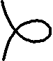
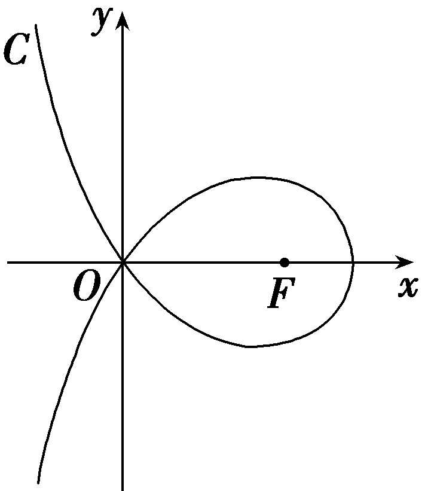
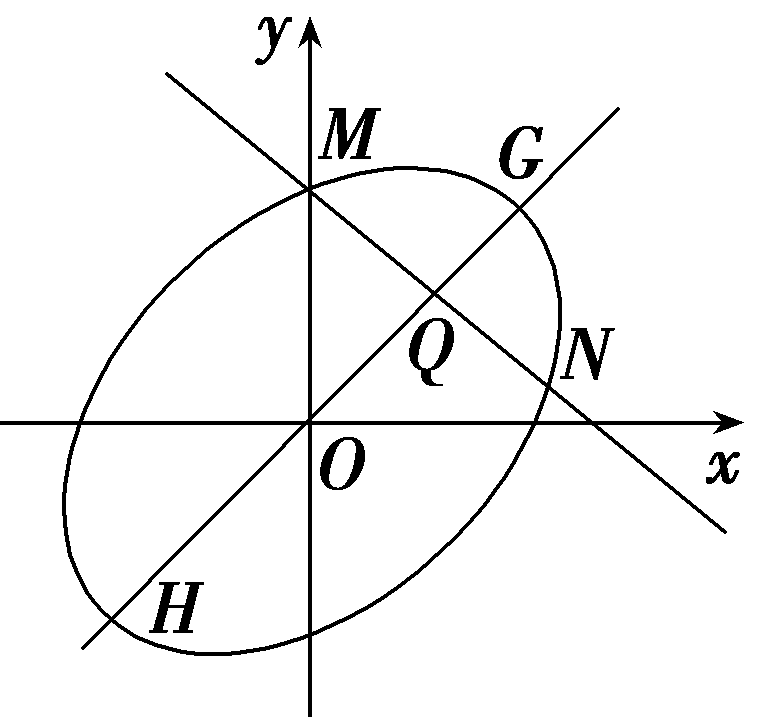
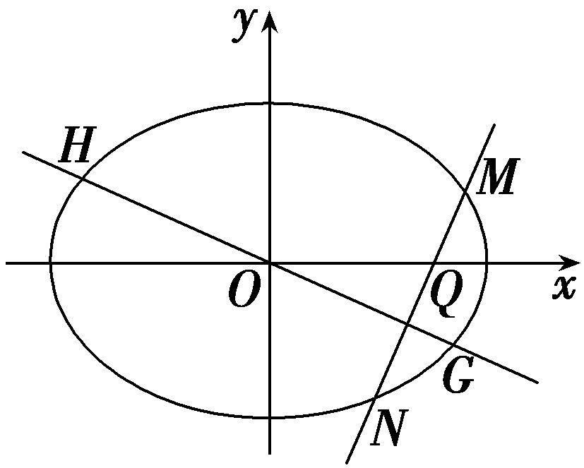
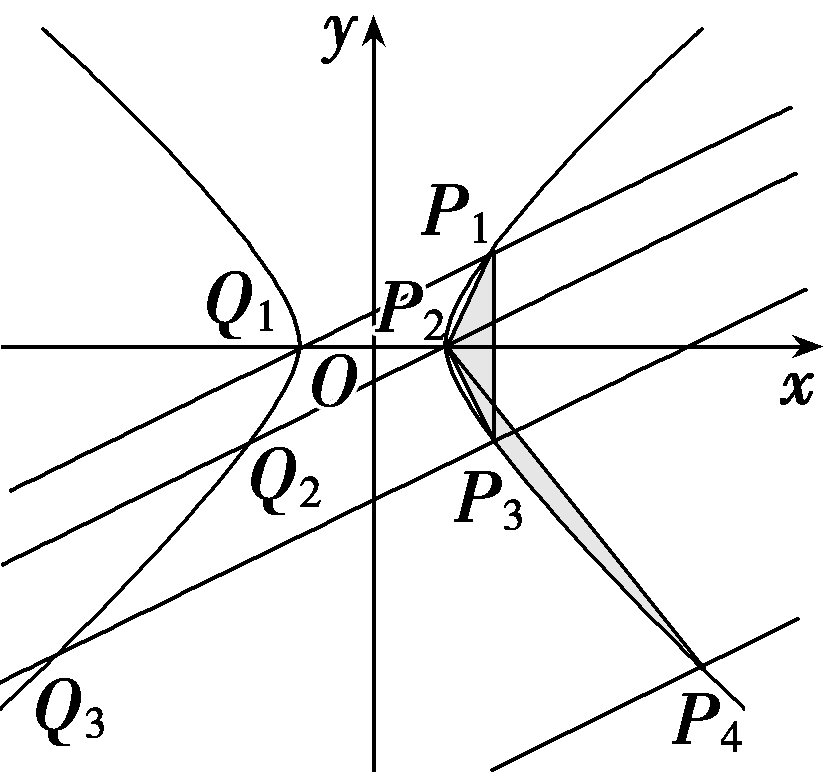
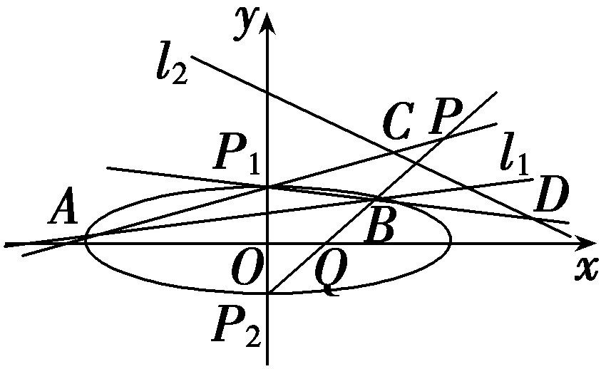
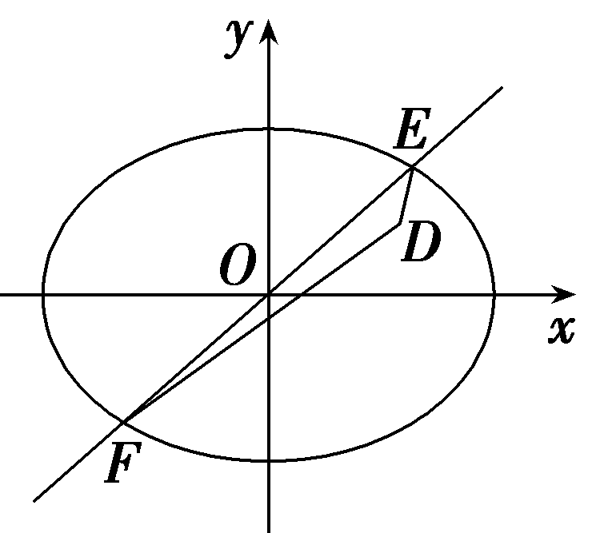

培优课16　圆锥曲线中的创新问题

圆锥曲线背景下的新定义问题，关键在于理解新定义的本质，并将其与常规圆锥曲线知识相结合.

解答圆锥曲线中的创新问题的五步曲

##### 1.明确新定义：首先仔细阅读题目，明确新定义的内容、符号及其含义.

##### 2.联系常规知识：将新定义与圆锥曲线的第一、第二定义或标准方程等常规知识联系起来，找出它们的相似之处或转换关系.

##### 3.建立数学模型：根据新定义，建立相应的数学模型或方程，利用解析几何或代数方法进行求解.

##### 4.验证与推理：在求解过程中，注意验证每一步推理的正确性，确保最终答案符合题目要求.

##### 5.灵活应用：对于复杂问题，可能需要综合运用多种数学知识和方法，灵活应对.

### 题型一　定义新曲线

(多选)(2024·新课标Ⅰ卷)设计一条美丽的丝带，其造型可以看作图中的曲线*C*的一部分.已知*C*过坐标原点*O*.且*C*上的点满足横坐标大于－2，到点*F*(2，0)的距离与到定直线*x*＝*a*(*a*＜0)的距离之积为4，则(　　)

$\quad$A.*a*＝－2

$\quad$B.点(2 $\sqrt{2}$ ，0)在*C*上

$\quad$C.*C*在第一象限的点的纵坐标的最大值为1

$\quad$D.当点 $\left(x_{0}，y_{0}\right)$ 在&lt;text st<em>y</em>le="italic"&gt;C&lt;/text&gt;上时，y0≤ $\frac{4}{x_{0}+2}$

答案ABD

解析对于A，设曲线上的动点&lt;te&lt;te&lt;te&lt;te&lt;text st&lt;text st&lt;text st<em>y</em>le="italic"&gt;y&lt;/text&gt;le="italic"&gt;y&lt;/text&gt;le="italic"&gt;x&lt;/text&gt;t st&lt;text st<em>y</em>le="italic"&gt;y&lt;/text&gt;le="italic"&gt;x&lt;/text&gt;t style="italic"&gt;x&lt;/text&gt;t style="it<em>a</em>lic"&gt;x&lt;/text&gt;t style="italic"&gt;P&lt;/text&gt; $\left(x，y\right)$ ，则&lt;te&lt;te&lt;te&lt;text st&lt;text st&lt;text st<em>y</em>le="italic"&gt;y&lt;/text&gt;le="italic"&gt;y&lt;/text&gt;le="italic"&gt;x&lt;/text&gt;t st&lt;text st<em>y</em>le="italic"&gt;y&lt;/text&gt;le="italic"&gt;x&lt;/text&gt;t style="italic"&gt;x&lt;/text&gt;t style="it<em>a</em>lic"&gt;x&lt;/text&gt;＞－&lt;text style="superscript"&gt;&lt;text style="superscript"&gt;2&lt;/text&gt;&lt;/text&gt;且 $\sqrt{\left(x－2\right)^{2}＋y^{2}}$ × $\left|x－a\right|$ ＝4，因为曲线过坐标原点，故 $\sqrt{\left(0－2\right)^{2}＋0^{2}}$ × $\left|0－a\right|$ ＝4，解得&lt;te&lt;te&lt;te&lt;text st&lt;text st&lt;text st<em>y</em>le="italic"&gt;y&lt;/text&gt;le="italic"&gt;y&lt;/text&gt;le="italic"&gt;x&lt;/text&gt;t st&lt;text st<em>y</em>le="italic"&gt;y&lt;/text&gt;le="italic"&gt;x&lt;/text&gt;t style="italic"&gt;x&lt;/text&gt;t style="italic"&gt;a&lt;/text&gt;＝－&lt;text style="superscript"&gt;&lt;text style="superscript"&gt;2&lt;/text&gt;&lt;/text&gt;，故A正确；对于B，又曲线方程为 $\sqrt{\left(x－2\right)^{2}＋y^{2}}$ × $\left|x+2\right|$ ＝4，而&lt;te&lt;te&lt;te&lt;text st&lt;text st&lt;text st<em>y</em>le="italic"&gt;y&lt;/text&gt;le="italic"&gt;y&lt;/text&gt;le="italic"&gt;x&lt;/text&gt;t st&lt;text st<em>y</em>le="italic"&gt;y&lt;/text&gt;le="italic"&gt;x&lt;/text&gt;t style="italic"&gt;x&lt;/text&gt;t style="it<em>a</em>lic"&gt;x&lt;/text&gt;＞－&lt;text style="superscript"&gt;&lt;text style="superscript"&gt;2&lt;/text&gt;&lt;/text&gt;，故 $\sqrt{\left(x－2\right)^{2}＋y^{2}}$ × $\left(x+2\right)$ ＝4.当&lt;te&lt;te&lt;te&lt;text st&lt;text st&lt;text st<em>y</em>le="italic"&gt;y&lt;/text&gt;le="italic"&gt;y&lt;/text&gt;le="italic"&gt;x&lt;/text&gt;t st&lt;text st<em>y</em>le="italic"&gt;y&lt;/text&gt;le="italic"&gt;x&lt;/text&gt;t style="italic"&gt;x&lt;/text&gt;t style="it<em>a</em>lic"&gt;x&lt;/text&gt;＝&lt;text style="superscript"&gt;&lt;text style="superscript"&gt;2&lt;/text&gt;&lt;/text&gt; $\sqrt{2}$ ，&lt;te&lt;text st&lt;text st&lt;text st<em>y</em>le="italic"&gt;y&lt;/text&gt;le="italic"&gt;y&lt;/text&gt;le="italic"&gt;x&lt;/text&gt;t st<em>y</em>le="italic"&gt;y&lt;/text&gt;＝0时， $\sqrt{\left(2\sqrt{2}－2\right)^{2}}$ × $\left(2\sqrt{2}+2\right)$ ＝8－4＝4，故 $\left(2\sqrt{2}，0\right)$ 在曲线上，故B正确；对于&lt;text st<em>y</em>le="italic"&gt;C&lt;/text&gt;，由曲线的方程可得&lt;te&lt;text st&lt;text st<em>y</em>le="italic"&gt;y&lt;/text&gt;le="italic"&gt;x&lt;/text&gt;t st<em>y</em>le="italic"&gt;y&lt;/text&gt;&lt;text style="superscript"&gt;&lt;text style="superscript"&gt;2&lt;/text&gt;&lt;/text&gt;＝ $\frac{16}{\left(x+2\right)^{2}}$ － $\left(x－2\right)^{2}$ ，取&lt;te&lt;te&lt;te&lt;text st&lt;text st&lt;text st<em>y</em>le="italic"&gt;y&lt;/text&gt;le="italic"&gt;y&lt;/text&gt;le="italic"&gt;x&lt;/text&gt;t st&lt;text st<em>y</em>le="italic"&gt;y&lt;/text&gt;le="italic"&gt;x&lt;/text&gt;t style="italic"&gt;x&lt;/text&gt;t style="it<em>a</em>lic"&gt;x&lt;/text&gt;＝ $\frac{3}{2}$ ，则&lt;te&lt;text st&lt;text st&lt;text st<em>y</em>le="italic"&gt;y&lt;/text&gt;le="italic"&gt;y&lt;/text&gt;le="italic"&gt;x&lt;/text&gt;t st<em>y</em>le="italic"&gt;y&lt;/text&gt;&lt;text style="superscript"&gt;&lt;text style="superscript"&gt;2&lt;/text&gt;&lt;/text&gt;＝ $\frac{64}{49}$ － $\frac{1}{4}$ ，而 $\frac{64}{49}$ － $\frac{1}{4}$ －1＝ $\frac{64}{49}$ － $\frac{5}{4}$ ＝ $\frac{256－245}{49\times 4}$ ＞0，故此时&lt;te&lt;text st&lt;text st&lt;text st<em>y</em>le="italic"&gt;y&lt;/text&gt;le="italic"&gt;y&lt;/text&gt;le="italic"&gt;x&lt;/text&gt;t st<em>y</em>le="italic"&gt;y&lt;/text&gt;&lt;text style="superscript"&gt;&lt;text style="superscript"&gt;2&lt;/text&gt;&lt;/text&gt;＞1，故曲线<em>C</em>在第一象限的点的纵坐标的最大值大于1，故C错误；对于D，当点 $\left(x_{0}，y_{0}\right)$ 在曲线上时，由&lt;text st<em>y</em>le="italic"&gt;C&lt;/text&gt;的分析可得 $y_{0}^{2}$ ＝ $\frac{16}{\left(x_{0}+2\right)^{2}}$ － $\left(x_{0}－2\right)^{2}$ ≤ $\frac{16}{\left(x_{0}+2\right)^{2}}$ ，故－ $\frac{4}{x_{0}+2}$ ≤&lt;te&lt;text st&lt;text st&lt;text st<em>y</em>le="italic"&gt;y&lt;/text&gt;le="italic"&gt;y&lt;/text&gt;le="italic"&gt;x&lt;/text&gt;t st<em>y</em>le="italic"&gt;y&lt;/text&gt;0≤ $\frac{4}{x_{0}+2}$ ，故D正确.故选ABD.

(&lt;te&lt;text st<em>y</em>le="italic"&gt;x&lt;/text&gt;t style="subscript"&gt;&lt;text style="subscript"&gt;2&lt;/text&gt;&lt;/text&gt;024·山东青岛三模)在平面内，若直线&lt;text sty&lt;text sty&lt;text sty<em>l</em>e="italic"&gt;l&lt;/text&gt;e="italic"&gt;l&lt;/text&gt;e="italic"&gt;l&lt;/text&gt;将多边形分为两部分，多边形在l两侧的顶点到直线l的距离之和相等，则称l为多边形的一条“等线”，已知<em>O</em>为坐标原点，双曲线<em>&lt;text style="italic"&gt;&lt;text style="italic"&gt;&lt;text style="italic"&gt;&lt;text style="italic"&gt;E</em>&lt;/text&gt;&lt;/text&gt;&lt;/text&gt;&lt;/text&gt;： $\frac{x^{2}}{a^{2}}$ － $\frac{y^{2}}{b^{2}}$ ＝&lt;te&lt;text st<em>y</em>le="italic"&gt;x&lt;/text&gt;t style="subscript"&gt;1&lt;/text&gt; $\left(a>0，b>0\right)$ 的左、右焦点分别为&lt;te&lt;text st<em>y</em>le="italic"&gt;x&lt;/text&gt;t style="italic"&gt;<em>&lt;text style="italic"&gt;F</em>&lt;/text&gt;&lt;/text&gt;&lt;text style="subscript"&gt;1&lt;/text&gt;，F&lt;text style="subscript"&gt;&lt;text style="subscript"&gt;2&lt;/text&gt;&lt;/text&gt;，<em>&lt;text style="italic"&gt;&lt;text style="italic"&gt;&lt;text style="italic"&gt;&lt;text style="italic"&gt;E</em>&lt;/text&gt;&lt;/text&gt;&lt;/text&gt;&lt;/text&gt;的离心率为2，点<em>&lt;text style="italic"&gt;P</em>&lt;/text&gt;为E右支上一动点，直线<em>m</em>与曲线E相切于点P，且与E的渐近线交于<em>A</em>，<em>B</em>两点，当<em>&lt;text style="italic"&gt;PF</em>&lt;/text&gt;2⊥x轴时，直线y＝1为△PF1F2的等线.

（1）求*E*的方程；

(&lt;text style="subscript"&gt;2&lt;/text&gt;)若&lt;te<em>x</em>t style="italic"&gt;y&lt;/text&gt;＝ $\sqrt{2}$ <em>x</em>是四边形<em>&lt;text style="italic"&gt;AF</em>&lt;/text&gt;&lt;text style="subscript"&gt;1&lt;/text&gt;<em>&lt;text style="italic"&gt;BF</em>&lt;/text&gt;&lt;text style="subscript"&gt;2&lt;/text&gt;的等线，求四边形AF1BF2的面积.

解：(&lt;text st<em>y</em>le="subscript"&gt;1&lt;/text&gt;)由题意知<em>&lt;text style="italic"&gt;F</em>&lt;/text&gt;1 $\left(－c，0\right)$ ，&lt;text st<em>y</em>le="italic"&gt;<em>F</em>&lt;/text&gt;2 $\left(c，0\right)$ ，显然点&lt;text st<em>y</em>le="italic"&gt;<em>P</em>&lt;/text&gt;在直线y＝1的上方，故P $\left(c，\frac{b^{2}}{a}\right)$ ，

因为直线&lt;t&lt;text style="it<em>a</em>li<em>c</em>"&gt;e&lt;/text&gt;xt style="italic"&gt;y&lt;/text&gt;＝&lt;text style="su<em>b</em>script"&gt;1&lt;/text&gt;为△<em>P&lt;text style="italic"&gt;F</em>&lt;/text&gt;1F&lt;text style="superscript"&gt;&lt;text style="superscript"&gt;&lt;text style="superscript"&gt;2&lt;/text&gt;&lt;/text&gt;&lt;/text&gt;的等线，所以 $\frac{b^{2}}{a}$ －&lt;t&lt;text style="it<em>a</em>li<em>c</em>"&gt;e&lt;/text&gt;xt style="su<em>b</em>script"&gt;1&lt;/text&gt;＝&lt;text style="superscript"&gt;&lt;text style="superscript"&gt;&lt;text style="superscript"&gt;2&lt;/text&gt;&lt;/text&gt;&lt;/text&gt;，e＝ $\frac{c}{a}$ ＝&lt;t&lt;text style="it<em>a</em>li<em>c</em>"&gt;e&lt;/text&gt;xt style="su<em>b</em>script"&gt;&lt;text style="superscript"&gt;&lt;text style="superscript"&gt;2&lt;/text&gt;&lt;/text&gt;&lt;/text&gt;，c2＝a2＋b2，

解得&lt;te<em>x</em>t style="italic"&gt;a&lt;/text&gt;＝1，<em>b</em>＝ $\sqrt{3}$ ，所以&lt;te<em>x</em>t style="italic"&gt;E&lt;/text&gt;的方程为x2－ $\frac{y^{2}}{3}$ ＝1.

(2)设&lt;te&lt;te<em>x</em>t st&lt;text st&lt;text st<em>y</em>le="italic"&gt;y&lt;/text&gt;le="italic"&gt;y&lt;/text&gt;le="italic"&gt;x&lt;/text&gt;t style="italic"&gt;P&lt;/text&gt;(x&lt;text style="subscript"&gt;&lt;text style="subscript"&gt;0&lt;/text&gt;&lt;/text&gt;，y0)，当<em>&lt;text style="italic"&gt;m</em>&lt;/text&gt;的斜率存在时，设切线m：y－y0＝<em>k</em> $\left(x－x_{0}\right)$ ，代入&lt;te<em>x</em>t st&lt;text st&lt;text st<em>y</em>le="italic"&gt;y&lt;/text&gt;le="italic"&gt;y&lt;/text&gt;le="italic"&gt;x&lt;/text&gt;2－ $\frac{y^{2}}{3}$ ＝1得，

$\left(3－k^{2}\right)$ &lt;te&lt;text st<em>y</em>le="italic"&gt;x&lt;/text&gt;t style="italic"&gt;x&lt;/text&gt;&lt;text style="superscript"&gt;2&lt;/text&gt;＋2<em>&lt;text style="italic"&gt;k</em>&lt;/text&gt; $\left(kx_{0}－y_{0}\right)$ &lt;te&lt;text st<em>y</em>le="italic"&gt;x&lt;/text&gt;t style="italic"&gt;x&lt;/text&gt;－(<em>&lt;text style="italic"&gt;k</em>&lt;/text&gt;&lt;text style="superscript"&gt;2&lt;/text&gt; $x_{0}^{2}$ ＋ $y_{0}^{2}$ －&lt;te&lt;text st<em>y</em>le="italic"&gt;x&lt;/text&gt;t style="superscript"&gt;2&lt;/text&gt;<em>&lt;text style="italic"&gt;k</em>&lt;/text&gt;<em>x</em>&lt;text style="subscript"&gt;0&lt;/text&gt;y0＋3)＝0，

故[&lt;text st<em>y</em>le="superscript"&gt;&lt;text style="superscript"&gt;2&lt;/text&gt;&lt;/text&gt;&lt;text st<em>y</em>le="italic"&gt;<em>&lt;text style="italic"&gt;k</em>&lt;/text&gt;&lt;/text&gt;(<em>&lt;text style="italic"&gt;kx</em>&lt;/text&gt;&lt;text style="subscript"&gt;&lt;text style="subscript"&gt;&lt;text style="subscript"&gt;0&lt;/text&gt;&lt;/text&gt;&lt;/text&gt;－y0)]2＋4(3－k2)(k2 $x_{0}^{2}$ ＋ $y_{0}^{2}$ －&lt;text st<em>y</em>le="superscript"&gt;&lt;text style="superscript"&gt;2&lt;/text&gt;&lt;/text&gt;&lt;text st<em>y</em>le="italic"&gt;<em>&lt;text style="italic"&gt;k</em>&lt;/text&gt;&lt;/text&gt;x&lt;text style="subscript"&gt;&lt;text style="subscript"&gt;&lt;text style="subscript"&gt;0&lt;/text&gt;&lt;/text&gt;&lt;/text&gt;y0＋3)＝0，

该式可以看作关于&lt;te&lt;text st<em>y</em>le="italic"&gt;x&lt;/text&gt;t style="italic"&gt;<em>&lt;text style="italic"&gt;k</em>&lt;/text&gt;&lt;/text&gt;的一元二次方程 $\left(x_{0}^{2}－1\right)$ &lt;te&lt;text st<em>y</em>le="italic"&gt;x&lt;/text&gt;t style="italic"&gt;<em>&lt;text style="italic"&gt;k</em>&lt;/text&gt;&lt;/text&gt;2－2x&lt;text style="subscript"&gt;0&lt;/text&gt;y0k＋ $y_{0}^{2}$ ＋3＝&lt;text st<em>y</em>le="subscript"&gt;0&lt;/text&gt;，

所以&lt;te&lt;te<em>x</em>t style="italic"&gt;x&lt;/text&gt;t style="italic"&gt;k&lt;/text&gt;＝ $\frac{x_{0}y_{0}}{x_{0}^{2}－1}$ ＝ $\frac{x_{0}y_{0}}{\left(1+\frac{y_{0}^{2}}{3}\right)－1}$ ＝ $\frac{3x_{0}}{y_{0}}$ ，即&lt;te&lt;te<em>x</em>t style="italic"&gt;x&lt;/text&gt;t style="italic"&gt;m&lt;/text&gt;的方程为x0x－ $\frac{y_{0}y}{3}$ ＝1(<em>\*</em>).

当*m*的斜率不存在时，也成立.

渐近线方程为<te*x*t style="italic">y</text>＝± $\sqrt{3}$ *x*，不妨设*A*在*B*上方，

联立得&lt;te&lt;te&lt;te&lt;te<em>x</em>t style="italic"&gt;x&lt;/text&gt;t style="italic"&gt;x&lt;/text&gt;t style="italic"&gt;x&lt;/text&gt;t style="italic"&gt;x&lt;/text&gt;<em>&lt;text style="italic,subscript"&gt;A</em>&lt;/text&gt;＝ $\frac{1}{x_{0}－\frac{y_{0}}{\sqrt{3}}}$ ，&lt;te&lt;te&lt;te&lt;te<em>x</em>t style="italic"&gt;x&lt;/text&gt;t style="italic"&gt;x&lt;/text&gt;t style="italic"&gt;x&lt;/text&gt;t style="italic"&gt;x&lt;/text&gt;<em>&lt;text style="italic,subscript"&gt;B</em>&lt;/text&gt;＝ $\frac{1}{x_{0}＋\frac{y_{0}}{\sqrt{3}}}$ ，故&lt;te&lt;te&lt;te&lt;te<em>x</em>t style="italic"&gt;x&lt;/text&gt;t style="italic"&gt;x&lt;/text&gt;t style="italic"&gt;x&lt;/text&gt;t style="italic"&gt;x&lt;/text&gt;<em>&lt;text style="italic,subscript"&gt;A</em>&lt;/text&gt;＋x<em>&lt;text style="italic,subscript"&gt;B</em>&lt;/text&gt;＝ $\frac{1}{x_{0}－\frac{y_{0}}{\sqrt{3}}}$ ＋ $\frac{1}{x_{0}＋\frac{y_{0}}{\sqrt{3}}}$ ＝2&lt;te&lt;te&lt;te&lt;te<em>x</em>t style="italic"&gt;x&lt;/text&gt;t style="italic"&gt;x&lt;/text&gt;t style="italic"&gt;x&lt;/text&gt;t style="italic"&gt;x&lt;/text&gt;0，

所以<em>P</em>是线段<em>AB</em>的中点，因为<em>F</em>1，<em>F</em>2到过<em>O</em>的直线距离相等，

则过*O*点的等线必定满足：*A*，*B*到该等线距离相等，

且分居两侧，所以该等线必过点<te*x*t st*y*le="italic">P</text>，即*OP*的方程为y＝ $\sqrt{2}$ *x*，

由 $\left\{\begin{matrix}y＝\sqrt{2}x，\\x^{2}－\frac{y^{2}}{3}=1，\end{matrix}\right.$ 解得 $\left\{\begin{matrix}x＝\sqrt{3}，\\y＝\sqrt{6}，\end{matrix}\right.$ 故*P* $\left(\sqrt{3}，\sqrt{6}\right)$ .

所以&lt;te<em>x</em>t style="italic"&gt;y&lt;/text&gt;<em>&lt;text style="italic,subscript"&gt;A</em>&lt;/text&gt;＝ $\sqrt{3}$ <em>x&lt;text style="italic,subscript"&gt;A</em>&lt;/text&gt;＝ $\frac{\sqrt{3}}{x_{0}－\frac{y_{0}}{\sqrt{3}}}$ ＝ $\frac{3}{\sqrt{3}x_{0}－y_{0}}$ ＝ $\sqrt{6}$ ＋3，

所以&lt;te<em>x</em>t style="italic"&gt;y&lt;/text&gt;<em>&lt;text style="italic,subscript"&gt;B</em>&lt;/text&gt;＝－ $\sqrt{3}$ <em>x&lt;text style="italic,subscript"&gt;B</em>&lt;/text&gt;＝－ $\frac{\sqrt{3}}{x_{0}＋\frac{y_{0}}{\sqrt{3}}}$ ＝ $\frac{－3}{\sqrt{3}x_{0}＋y_{0}}$ ＝ $\sqrt{6}$ －3，

所以 $\left|y_{A}－y_{B}\right|$ ＝6，所以 $S_{AF_{1}BF_{2}}$ ＝ $\frac{1}{2}\left|F_{1}F_{2}\right|$ *·* $\left|y_{A}－y_{B}\right|$ ＝2 $\left|y_{A}－y_{B}\right|$ ＝12.

### 题型二　定义新性质

(2024·江西新余二模)通过研究，已知对任意平面向量 $\vec{AB}$ ＝ $\left(x，y\right)$ ，把 $\vec{AB}$ 绕其起点<te<te<text st*y*le="italic">x</text>t st*y*le="italic">x</text>t style="italic">*A*</text>沿逆时针方向旋转*<text style="italic"><text style="italic"><text style="italic"><text style="italic"><text style="italic">θ*</text></text></text></text></text>角得到向量 $\vec{AP}$ ＝(<te<text st*y*le="italic">x</text>t st*y*le="italic">x</text>cos *<text style="italic"><text style="italic"><text style="italic"><text style="italic"><text style="italic">θ*</text></text></text></text></text>－ysin θ，xsin θ＋ycos θ)，叫做把点*B*绕点*<text style="italic">A*</text>逆时针方向旋转θ角得到点*P*.

（1）已知平面内点*<text style="italic">A*</text> $\left(－\sqrt{3}，2\sqrt{3}\right)$ ，点*<text style="italic">B*</text> $\left(\sqrt{3},-2\sqrt{3}\right)$ ，把点*<text style="italic">B*</text>绕点*<text style="italic">A*</text>逆时针旋转 $\frac{\pi }{3}$ 得到点*<text style="italic">P*</text>，求点P的坐标；

(&lt;text st<em>y</em>le="superscript"&gt;2&lt;/text&gt;)已知二次方程<em>x</em>2＋y2－<em>xy</em>＝1的图形是由平面直角坐标系下某标准椭圆 $\frac{x^{2}}{a^{2}}$ ＋ $\frac{y^{2}}{b^{2}}$ ＝1 $\left(a＞b>0\right)$ 绕原点<em>O</em>逆时针旋转 $\frac{\pi }{4}$ 所得的斜椭圆<em>C</em>.

(*ⅰ*)求斜椭圆*C*的离心率；

(&lt;text sty&lt;text sty&lt;text sty&lt;text sty<em>l</em>e="italic"&gt;l&lt;/text&gt;e="italic"&gt;l&lt;/text&gt;e="italic"&gt;l&lt;/text&gt;e="italic"&gt;ⅱ&lt;/text&gt;)过点<em>Q</em> $\left( \sqrt{\frac{2}{3}}，\sqrt{\frac{2}{3}}\right)$ 作与两坐标轴都不平行的直线&lt;text sty&lt;text sty&lt;text sty<em>l</em>e="italic"&gt;l&lt;/text&gt;e="italic"&gt;l&lt;/text&gt;e="italic"&gt;l&lt;/text&gt;&lt;text style="subscript"&gt;1&lt;/text&gt;交斜椭圆<em>&lt;text style="italic"&gt;C</em>&lt;/text&gt;于点<em>M</em>，<em>N</em>，过原点<em>O</em>作直线l&lt;text style="subscript"&gt;2&lt;/text&gt;与直线l1垂直，直线l2交斜椭圆C于点<em>G</em>，<em>H</em>，判断 $\frac{\sqrt{2}}{\left|MN\right|}$ ＋ $\frac{1}{\left|OH\right|^{2}}$ 是否为定值，若是，请求出定值，若不是，请说明理由.

解：（1）由已知可得 $\vec{AB}$ ＝ $\left(2\sqrt{3},-4\sqrt{3}\right)$ ，则 $\vec{AP}$ ＝ $\left(6+\sqrt{3}，3－2\sqrt{3}\right)$ ，

设&lt;te&lt;text st<em>y</em>le="italic"&gt;x&lt;/text&gt;t style="italic"&gt;P&lt;/text&gt;＝ $\left(x_{0}，y_{0}\right)$ ，则 $\vec{AP}$ ＝(&lt;text st<em>y</em>le="italic"&gt;x&lt;/text&gt;&lt;text style="subscript"&gt;0&lt;/text&gt;＋ $\sqrt{3}$ ，<em>y</em>&lt;text style="subscript"&gt;0&lt;/text&gt;－2 $\sqrt{3}$ )＝ $\left(6+\sqrt{3}，3－2\sqrt{3}\right)$ ，

所以&lt;text st<em>y</em>le="italic"&gt;x&lt;/text&gt;&lt;text style="subscript"&gt;0&lt;/text&gt;＝6，y0＝3，即点<em>P</em>的坐标为 $\left(6，3\right)$ .

(&lt;text st&lt;text style="it<em>a</em>lic"&gt;y&lt;/text&gt;le="superscript"&gt;&lt;text style="superscript"&gt;2&lt;/text&gt;&lt;/text&gt;)(&lt;te&lt;te<em>x</em>t style="italic"&gt;x&lt;/text&gt;t st<em>y</em>le="italic"&gt;ⅰ&lt;/text&gt;)由y＝x与x2＋y2－<em>xy</em>＝1交点为 $\left(1，1\right)$ 和 $\left(－1,-1\right)$ ，则<em>a</em>&lt;text st<em>y</em>le="superscript"&gt;&lt;text style="superscript"&gt;2&lt;/text&gt;&lt;/text&gt;＝2，

由&lt;te&lt;te&lt;text st<em>y</em>le="italic"&gt;x&lt;/text&gt;t style="italic"&gt;x&lt;/text&gt;t style="italic"&gt;y&lt;/text&gt;＝－x与x&lt;text style="superscript"&gt;2&lt;/text&gt;＋y2－<em>xy</em>＝1交点为 $\left(－\frac{\sqrt{3}}{3}，\frac{\sqrt{3}}{3}\right)$ 和 $\left(\frac{\sqrt{3}}{3},-\frac{\sqrt{3}}{3}\right)$ ，

则&lt;t<em>e</em>xt style="itali<em>c</em>"&gt;b&lt;/text&gt;&lt;text style="superscript"&gt;2&lt;/text&gt;＝ $\frac{2}{3}$ ，所以&lt;t<em>e</em>xt style="italic"&gt;c&lt;/text&gt;&lt;text style="superscript"&gt;2&lt;/text&gt;＝ $\frac{4}{3}$ ，<em>e</em>＝ $\frac{\frac{2\sqrt{3}}{3}}{\sqrt{2}}$ ＝ $\frac{\sqrt{6}}{3}$ .

(*ⅱ*) $\frac{\sqrt{2}}{｜MN｜}$ ＋ $\frac{1}{｜OH｜^{2}}$ 是定值.理由如下：

法一：设直线&lt;te&lt;text st<em>y</em>le="italic"&gt;x&lt;/text&gt;t st<em>y</em>le="italic"&gt;l&lt;/text&gt;1：y－ $\frac{\sqrt{2}}{\sqrt{3}}$ ＝&lt;te&lt;text st<em>y</em>le="italic"&gt;x&lt;/text&gt;t style="italic"&gt;k&lt;/text&gt; $\left(x－\frac{\sqrt{2}}{\sqrt{3}}\right)$ ，&lt;te&lt;text st<em>y</em>le="italic"&gt;x&lt;/text&gt;t style="italic"&gt;M&lt;/text&gt; $\left(x_{1}，y_{2}\right)$ ，&lt;te&lt;text st<em>y</em>le="italic"&gt;x&lt;/text&gt;t style="italic"&gt;N&lt;/text&gt;(x&lt;text style="subscript"&gt;2&lt;/text&gt;，<em>y</em>2)，

与斜椭圆&lt;text st<em>y</em>le="italic"&gt;x&lt;/text&gt;&lt;text style="superscript"&gt;2&lt;/text&gt;＋y2－<em>xy</em>＝1联立： $\left\{\begin{matrix}y－\frac{\sqrt{2}}{\sqrt{3}}＝k\left(x－\frac{\sqrt{2}}{\sqrt{3}}\right)，\\x^{2}＋y^{2}－xy=1，\end{matrix}\right.$

有 $\left(k^{2}－k+1\right)$ &lt;te<em>x</em>t style="italic"&gt;x&lt;/text&gt;2＋ $\frac{\sqrt{2}}{\sqrt{3}}\left(3k－2k^{2}－1\right)$ &lt;te<em>x</em>t style="italic"&gt;x&lt;/text&gt;＋ $\frac{2}{3}\left(1－k\right)^{2}$ －1＝0，

因为&lt;te&lt;te&lt;te<em>x</em>t style="italic"&gt;x&lt;/text&gt;t style="italic"&gt;x&lt;/text&gt;t style="italic"&gt;x&lt;/text&gt;&lt;text style="subscript"&gt;1&lt;/text&gt;＋x&lt;text style="subscript"&gt;2&lt;/text&gt;＝ $\frac{\sqrt{2}}{\sqrt{3}}$ · $\frac{2k^{2}－3k+1}{k^{2}－k+1}$ ，&lt;te&lt;te&lt;te<em>x</em>t style="italic"&gt;x&lt;/text&gt;t style="italic"&gt;x&lt;/text&gt;t style="italic"&gt;x&lt;/text&gt;&lt;text style="subscript"&gt;1&lt;/text&gt;x&lt;text style="subscript"&gt;2&lt;/text&gt;＝ $\frac{2}{3}$ · $\frac{k^{2}－2k－\frac{1}{2}}{k^{2}－k+1}$ ，

所以 $\left|MN\right|$ ＝ $\sqrt{\left(1+k^{2}\right)\left[\left(x_{1}＋x_{2}\right)^{2}－4x_{1}x_{2}\right]}$

＝ $\sqrt{\left(1+k^{2}\right)\left[\left(\frac{\sqrt{2}}{\sqrt{3}}\cdot \frac{2k^{2}－3k+1}{k^{2}－k+1}\right)^{2}－4\times \frac{2}{3}\cdot \frac{k^{2}－2k－\frac{1}{2}}{k^{2}－k+1}\right]}$ ＝ $\frac{\sqrt{2}\left(1+k^{2}\right)}{k^{2}－k+1}$ ，

设直线&lt;te&lt;te&lt;text st<em>y</em>le="italic"&gt;x&lt;/text&gt;t style="italic"&gt;x&lt;/text&gt;t st<em>y</em>le="italic"&gt;l&lt;/text&gt;&lt;text style="superscript"&gt;&lt;text style="superscript"&gt;2&lt;/text&gt;&lt;/text&gt;：y＝－ $\frac{1}{k}$ &lt;te&lt;text st<em>y</em>le="italic"&gt;x&lt;/text&gt;t style="italic"&gt;x&lt;/text&gt;，代入斜椭圆x&lt;text st<em>y</em>le="subscript"&gt;&lt;text style="superscript"&gt;2&lt;/text&gt;&lt;/text&gt;＋y2－<em>xy</em>＝1，

有&lt;te&lt;te<em>x</em>t style="italic"&gt;x&lt;/text&gt;t style="italic"&gt;x&lt;/text&gt;&lt;text style="superscript"&gt;&lt;text style="superscript"&gt;2&lt;/text&gt;&lt;/text&gt;＋ $\frac{1}{k^{2}}$ &lt;te&lt;te<em>x</em>t style="italic"&gt;x&lt;/text&gt;t style="italic"&gt;x&lt;/text&gt;&lt;text style="superscript"&gt;&lt;text style="superscript"&gt;2&lt;/text&gt;&lt;/text&gt;＋ $\frac{1}{k}$ &lt;te&lt;te<em>x</em>t style="italic"&gt;x&lt;/text&gt;t style="italic"&gt;x&lt;/text&gt;&lt;text style="superscript"&gt;&lt;text style="superscript"&gt;2&lt;/text&gt;&lt;/text&gt;＝1，

所以<em>x</em>2＝ $\frac{k^{2}}{k^{2}＋k+1}$ ，所以 $\left|OH\right|^{2}$ ＝ $\frac{k^{2}+1}{k^{2}＋k+1}$ ，

故 $\frac{\sqrt{2}}{\left|MN\right|}$ ＋ $\frac{1}{\left|OH\right|^{2}}$ ＝ $\frac{k^{2}－k+1}{k^{2}+1}$ ＋ $\frac{k^{2}＋k+1}{k^{2}+1}$ ＝2.

法二：将椭圆顺时针旋转 $\frac{\pi }{4}$ ，由(*ⅰ*)可得椭圆方程为 $\frac{x^{2}}{2}$ ＋ $\frac{3y^{2}}{2}$ ＝1，

点*Q*旋转后的坐标为 $\left(\frac{2\sqrt{3}}{3}，0\right)$ ，

当直线<em>l</em>1旋转后斜率不存在时， $\left|MN\right|$ ＝ $\frac{2\sqrt{2}}{3}$ ， $\left|OH\right|$ ＝ $\sqrt{2}$ ， $\frac{\sqrt{2}}{\left|MN\right|}$ ＋ $\frac{1}{\left|OH\right|^{2}}$ ＝2，

当直线&lt;te<em>x</em>t sty<em>l</em>e="italic"&gt;l&lt;/text&gt;&lt;text style="subscript"&gt;1&lt;/text&gt;旋转后斜率存在时，设直线l1旋转后为x＝<em>my</em>＋ $\frac{2\sqrt{3}}{3}$ ，

旋转后&lt;te&lt;text st<em>y</em>le="italic"&gt;x&lt;/text&gt;t style="italic"&gt;M&lt;/text&gt; $\left(x_{1}，y_{2}\right)$ ，&lt;te&lt;text st<em>y</em>le="italic"&gt;x&lt;/text&gt;t style="italic"&gt;N&lt;/text&gt;(x&lt;text style="subscript"&gt;2&lt;/text&gt;，y2)，

与椭圆方程 $\frac{x^{2}}{2}$ ＋ $\frac{3y^{2}}{2}$ ＝1联立，即 $\left\{\begin{matrix}x＝my＋\frac{2\sqrt{3}}{3}，\\\frac{x^{2}}{2}＋\frac{3y^{2}}{2}=1，\end{matrix}\right.$

可得3 $\left(m^{2}+3\right)$ <em>y</em>2＋4 $\sqrt{3}$ m<em>y</em>－2＝0，

&lt;text st&lt;text st&lt;text st<em>y</em>le="italic"&gt;y&lt;/text&gt;le="italic"&gt;y&lt;/text&gt;le="italic"&gt;y&lt;/text&gt;&lt;text style="subscript"&gt;1&lt;/text&gt;＋y&lt;text style="subscript"&gt;2&lt;/text&gt;＝－ $\frac{4\sqrt{3}m}{3\left(m^{2}+3\right)}$ ，&lt;text st&lt;text st&lt;text st<em>y</em>le="italic"&gt;y&lt;/text&gt;le="italic"&gt;y&lt;/text&gt;le="italic"&gt;y&lt;/text&gt;&lt;text style="subscript"&gt;1&lt;/text&gt;y&lt;text style="subscript"&gt;2&lt;/text&gt;＝－ $\frac{2}{3\left(m^{2}+3\right)}$ ，

$\left|MN\right|$ ＝ $\sqrt{1+m^{2}}\sqrt{\left(y_{1}＋y_{2}\right)^{2}－4y_{1}y_{2}}$ ＝ $\frac{6\sqrt{2}\left(1+m^{2}\right)}{3\left(m^{2}+3\right)}$ ，

设直线&lt;text st<em>y</em>le="italic"&gt;l&lt;/text&gt;2旋转后为y＝－<em>mx</em>，代入椭圆方程 $\frac{x^{2}}{2}$ ＋ $\frac{3y^{2}}{2}$ ＝1中，

有<em>x</em>2＝ $\frac{2}{1+3m^{2}}$ ， $\left|OH\right|^{2}$ ＝ $\frac{2+2m^{2}}{1+3m^{2}}$ ，

$\frac{\sqrt{2}}{\left|MN\right|}$ ＋ $\frac{1}{\left|OH\right|^{2}}$ ＝ $\frac{3\sqrt{2}\left(m^{2}+3\right)}{6\sqrt{2}\left(m^{2}+1\right)}$ ＋ $\frac{3m^{2}+1}{2\left(m^{2}+1\right)}$ ＝2.

综上所述， $\frac{\sqrt{2}}{\left|MN\right|}$ ＋ $\frac{1}{\left|OH\right|^{2}}$ ＝2.

### 题型三　知识融合

(&lt;text st&lt;text st<em>y</em>le="italic"&gt;y&lt;/text&gt;le="superscript"&gt;2&lt;/text&gt;024·新课标Ⅱ卷)已知双曲线&lt;te<em>x</em>t style="italic"&gt;<em>&lt;text style="italic"&gt;C</em>&lt;/text&gt;&lt;/text&gt;：x2－y2＝<em>m</em> $\left(m>0\right)$ ，点&lt;text st<em>y</em>le="italic"&gt;<em>&lt;text style="italic"&gt;&lt;text style="italic"&gt;&lt;text style="italic"&gt;P</em>&lt;/text&gt;&lt;/text&gt;&lt;/text&gt;&lt;/text&gt;1 $\left(5，4\right)$ 在&lt;te&lt;text st&lt;text st<em>y</em>le="italic"&gt;y&lt;/text&gt;le="italic"&gt;x&lt;/text&gt;t style="italic"&gt;<em>&lt;text style="italic"&gt;C</em>&lt;/text&gt;&lt;/text&gt;上，<em>&lt;text style="italic"&gt;&lt;text style="italic"&gt;k</em>&lt;/text&gt;&lt;/text&gt;为常数，0＜k＜1.按照如下方式依次构造点<em>&lt;text style="italic"&gt;&lt;text style="italic"&gt;&lt;text style="italic"&gt;&lt;text style="italic"&gt;P</em>&lt;/text&gt;&lt;/text&gt;&lt;/text&gt;&lt;/text&gt;<em>&lt;text style="italic,subscript"&gt;&lt;text style="italic,subscript"&gt;&lt;text style="italic,subscript"&gt;&lt;text style="italic,subscript"&gt;&lt;text style="italic,subscript"&gt;n</em>&lt;/text&gt;&lt;/text&gt;&lt;/text&gt;&lt;/text&gt;&lt;/text&gt; $\left(n=2，3，\ldots \right)$ ：过&lt;text st<em>y</em>le="italic"&gt;<em>&lt;text style="italic"&gt;&lt;text style="italic"&gt;&lt;text style="italic"&gt;P</em>&lt;/text&gt;&lt;/text&gt;&lt;/text&gt;&lt;/text&gt;<em>&lt;text style="italic,subscript"&gt;&lt;text style="italic,subscript"&gt;&lt;text style="italic,subscript"&gt;&lt;text style="italic,subscript"&gt;&lt;text style="italic,subscript"&gt;n</em>&lt;/text&gt;&lt;/text&gt;&lt;/text&gt;&lt;/text&gt;&lt;/text&gt;－1作斜率为<em>&lt;text style="italic"&gt;&lt;text style="italic"&gt;k</em>&lt;/text&gt;&lt;/text&gt;的直线与&lt;te&lt;text st<em>y</em>le="italic"&gt;x&lt;/text&gt;t style="italic"&gt;<em>&lt;text style="italic"&gt;C</em>&lt;/text&gt;&lt;/text&gt;的左支交于点<em>&lt;text style="italic"&gt;Q</em>&lt;/text&gt;n&lt;text style="subscript"&gt;&lt;text style="subscript"&gt;－1&lt;/text&gt;&lt;/text&gt;，令Pn为Qn－1关于y轴的对称点.记Pn的坐标为 $\left(x_{n}，y_{n}\right)$ .

（1）若&lt;te&lt;text st<em>y</em>le="italic"&gt;x&lt;/text&gt;t style="italic"&gt;k&lt;/text&gt;＝ $\frac{1}{2}$ ，求&lt;text st<em>y</em>le="italic"&gt;x&lt;/text&gt;&lt;text style="subscript"&gt;2&lt;/text&gt;，y2；

（2）证明：数列 $\left\{x_{n}－y_{n}\right\}$ 是公比为 $\frac{1+k}{1－k}$ 的等比数列；

（3）设<em>Sn</em>为△<em>PnPn</em>＋1<em>Pn</em>＋2的面积，证明：对任意的正整数<em>n</em>，<em>Sn</em>＝<em>Sn</em>＋1.

解：（1）由已知有<em>m</em>＝52－42＝9，故<em>C</em>的方程为<em>x</em>2－<em>y</em>2＝9.

当&lt;te&lt;te<em>x</em>t st<em>y</em>le="italic"&gt;x&lt;/text&gt;t st<em>y</em>le="italic"&gt;k&lt;/text&gt;＝ $\frac{1}{2}$ 时，过&lt;te&lt;te<em>x</em>t st<em>y</em>le="italic"&gt;x&lt;/text&gt;t st<em>y</em>le="italic"&gt;P&lt;/text&gt;1 $\left(5，4\right)$ 且斜率为 $\frac{1}{2}$ 的直线为&lt;te&lt;te<em>x</em>t st<em>y</em>le="italic"&gt;x&lt;/text&gt;t style="italic"&gt;y&lt;/text&gt;＝ $\frac{x+3}{2}$ ，与&lt;te<em>x</em>t st<em>y</em>le="italic"&gt;x&lt;/text&gt;&lt;text style="superscript"&gt;&lt;text style="superscript"&gt;2&lt;/text&gt;&lt;/text&gt;－<em>y</em>2＝9联立得到x2－ $\left(\frac{x+3}{2}\right)^{2}$ ＝9.

解得&lt;te<em>x</em>t style="italic"&gt;x&lt;/text&gt;＝－3或x＝5，所以该直线与<em>&lt;text style="italic"&gt;C</em>&lt;/text&gt;的不同于<em>P</em>&lt;text style="subscript"&gt;1&lt;/text&gt;的交点为<em>Q</em>1 $\left(－3，0\right)$ ，该点显然在<em>&lt;text style="italic"&gt;C</em>&lt;/text&gt;的左支上.

故&lt;te&lt;text st<em>y</em>le="italic"&gt;x&lt;/text&gt;t style="italic"&gt;P&lt;/text&gt;&lt;text style="subscript"&gt;&lt;text style="subscript"&gt;2&lt;/text&gt;&lt;/text&gt; $\left(3，0\right)$ ，从而&lt;text st<em>y</em>le="italic"&gt;x&lt;/text&gt;&lt;text style="subscript"&gt;&lt;text style="subscript"&gt;2&lt;/text&gt;&lt;/text&gt;＝3，y2＝0.

(&lt;te&lt;text st<em>y</em>le="italic"&gt;x&lt;/text&gt;t st<em>y</em>le="superscript"&gt;&lt;text style="superscript"&gt;&lt;text style="superscript"&gt;2&lt;/text&gt;&lt;/text&gt;&lt;/text&gt;)证明：由于过&lt;te<em>x</em>t st&lt;text st<em>y</em>le="italic"&gt;y&lt;/text&gt;le="italic"&gt;P&lt;/text&gt;<em>&lt;text style="italic,subscript"&gt;&lt;text style="italic,subscript"&gt;n</em>&lt;/text&gt;&lt;/text&gt; $\left(x_{n}，y_{n}\right)$ 且斜率为&lt;te&lt;te&lt;text st<em>y</em>le="italic"&gt;x&lt;/text&gt;t st<em>y</em>le="italic"&gt;x&lt;/text&gt;t st&lt;text st<em>y</em>le="italic"&gt;y&lt;/text&gt;le="italic"&gt;<em>&lt;text style="italic"&gt;k</em>&lt;/text&gt;&lt;/text&gt;的直线为y＝k $\left(x－x_{n}\right)$ ＋&lt;te&lt;te&lt;text st<em>y</em>le="italic"&gt;x&lt;/text&gt;t st<em>y</em>le="italic"&gt;x&lt;/text&gt;t st<em>y</em>le="italic"&gt;y&lt;/text&gt;<em>&lt;text style="italic,subscript"&gt;&lt;text style="italic,subscript"&gt;n</em>&lt;/text&gt;&lt;/text&gt;，与x&lt;text style="superscript"&gt;&lt;text style="superscript"&gt;&lt;text style="superscript"&gt;2&lt;/text&gt;&lt;/text&gt;&lt;/text&gt;－y2＝9联立，得到方程x2－[<em>&lt;text style="italic"&gt;&lt;text style="italic"&gt;k</em>&lt;/text&gt;&lt;/text&gt; $\left(x－x_{n}\right)$ ＋&lt;te&lt;te&lt;text st<em>y</em>le="italic"&gt;x&lt;/text&gt;t st<em>y</em>le="italic"&gt;x&lt;/text&gt;t st<em>y</em>le="italic"&gt;y&lt;/text&gt;<em>&lt;text style="italic,subscript"&gt;&lt;text style="italic,subscript"&gt;n</em>&lt;/text&gt;&lt;/text&gt;]&lt;text style="superscript"&gt;&lt;text style="superscript"&gt;&lt;text style="superscript"&gt;2&lt;/text&gt;&lt;/text&gt;&lt;/text&gt;＝9，

化简即得 $\left(1－k^{2}\right)$ &lt;te&lt;te&lt;te&lt;te<em>x</em>t style="italic"&gt;x&lt;/text&gt;t st<em>y</em>le="italic"&gt;x&lt;/text&gt;t st&lt;text st<em>y</em>le="italic"&gt;y&lt;/text&gt;le="italic"&gt;x&lt;/text&gt;t style="italic"&gt;x&lt;/text&gt;&lt;text style="superscript"&gt;&lt;text style="superscript"&gt;2&lt;/text&gt;&lt;/text&gt;－2<em>&lt;text style="italic"&gt;k</em>&lt;/text&gt; $\left(y_{n}－kx_{n}\right)$ &lt;te&lt;te&lt;te&lt;te<em>x</em>t style="italic"&gt;x&lt;/text&gt;t st<em>y</em>le="italic"&gt;x&lt;/text&gt;t st&lt;text st<em>y</em>le="italic"&gt;y&lt;/text&gt;le="italic"&gt;x&lt;/text&gt;t style="italic"&gt;x&lt;/text&gt;－ $\left(y_{n}－kx_{n}\right)^{2}$ －9＝0，由于&lt;te&lt;te&lt;te<em>x</em>t style="italic"&gt;x&lt;/text&gt;t st<em>y</em>le="italic"&gt;x&lt;/text&gt;t st&lt;text st<em>y</em>le="italic"&gt;y&lt;/text&gt;le="italic"&gt;P&lt;/text&gt;<em>&lt;text style="italic,subscript"&gt;&lt;text style="italic,subscript"&gt;n</em>&lt;/text&gt;&lt;/text&gt; $\left(x_{n}，y_{n}\right)$ 是直线&lt;te&lt;te&lt;te<em>x</em>t style="italic"&gt;x&lt;/text&gt;t st<em>y</em>le="italic"&gt;x&lt;/text&gt;t st<em>y</em>le="italic"&gt;y&lt;/text&gt;＝&lt;te<em>x</em>t style="italic"&gt;<em>k</em>&lt;/text&gt; $\left(x－x_{n}\right)$ ＋&lt;te&lt;te&lt;te<em>x</em>t style="italic"&gt;x&lt;/text&gt;t st<em>y</em>le="italic"&gt;x&lt;/text&gt;t st<em>y</em>le="italic"&gt;y&lt;/text&gt;<em>&lt;text style="italic,subscript"&gt;&lt;text style="italic,subscript"&gt;n</em>&lt;/text&gt;&lt;/text&gt;和&lt;te<em>x</em>t style="italic"&gt;x&lt;/text&gt;&lt;text style="superscript"&gt;&lt;text style="superscript"&gt;2&lt;/text&gt;&lt;/text&gt;－y2＝9的公共点，故方程必有一根x＝xn.

从而根据韦达定理，另一根&lt;te&lt;text st&lt;text st<em>y</em>le="italic"&gt;y&lt;/text&gt;le="italic"&gt;x&lt;/text&gt;t style="italic"&gt;x&lt;/text&gt;＝ $\frac{2k\left(y_{n}－kx_{n}\right)}{1－k^{2}}$ －&lt;te&lt;text st&lt;text st<em>y</em>le="italic"&gt;y&lt;/text&gt;le="italic"&gt;x&lt;/text&gt;t style="italic"&gt;x&lt;/text&gt;<em>&lt;text style="italic,subscript"&gt;n</em>&lt;/text&gt;＝ $\frac{2ky_{n}－x_{n}－k^{2}x_{n}}{1－k^{2}}$ ，相应的&lt;text st<em>y</em>le="italic"&gt;y&lt;/text&gt;＝<em>k</em> $\left(x－x_{n}\right)$ ＋&lt;text st<em>y</em>le="italic"&gt;y&lt;/text&gt;<em>&lt;text style="italic,subscript"&gt;n</em>&lt;/text&gt;＝ $\frac{y_{n}＋k^{2}y_{n}－2kx_{n}}{1－k^{2}}$ .

所以该直线与<em>&lt;text style="italic"&gt;C</em>&lt;/text&gt;的不同于<em>P&lt;text style="italic,subscript"&gt;&lt;text style="italic,subscript"&gt;&lt;text style="italic,subscript"&gt;n</em>&lt;/text&gt;&lt;/text&gt;&lt;/text&gt;的交点为<em>&lt;text style="italic"&gt;&lt;text style="italic"&gt;Q</em>&lt;/text&gt;&lt;/text&gt;n $\left(\frac{2ky_{n}－x_{n}－k^{2}x_{n}}{1－k^{2}}，\frac{y_{n}＋k^{2}y_{n}－2kx_{n}}{1－k^{2}}\right)$ ，而注意到<em>&lt;text style="italic"&gt;&lt;text style="italic"&gt;Q</em>&lt;/text&gt;&lt;/text&gt;<em>&lt;text style="italic,subscript"&gt;&lt;text style="italic,subscript"&gt;&lt;text style="italic,subscript"&gt;n</em>&lt;/text&gt;&lt;/text&gt;&lt;/text&gt;的横坐标亦可通过韦达定理表示为 $\frac{－\left(y_{n}－kx_{n}\right)^{2}－9}{\left(1－k^{2}\right)x_{n}}$ ，故<em>&lt;text style="italic"&gt;&lt;text style="italic"&gt;Q</em>&lt;/text&gt;&lt;/text&gt;<em>&lt;text style="italic,subscript"&gt;&lt;text style="italic,subscript"&gt;&lt;text style="italic,subscript"&gt;n</em>&lt;/text&gt;&lt;/text&gt;&lt;/text&gt;一定在<em>&lt;text style="italic"&gt;C</em>&lt;/text&gt;的左支上.

所以<em>Pn</em>＋1 $\left(\frac{x_{n}＋k^{2}x_{n}－2ky_{n}}{1－k^{2}}，\frac{y_{n}＋k^{2}y_{n}－2kx_{n}}{1－k^{2}}\right)$ .

这就得到&lt;text st<em>y</em>le="italic"&gt;x&lt;/text&gt;<em>&lt;text style="italic,subscript"&gt;n</em>&lt;/text&gt;&lt;text style="subscript"&gt;＋1&lt;/text&gt;＝ $\frac{x_{n}＋k^{2}x_{n}－2ky_{n}}{1－k^{2}}$ ，<em>y&lt;text style="italic,subscript"&gt;n</em>&lt;/text&gt;&lt;text style="subscript"&gt;＋1&lt;/text&gt;＝ $\frac{y_{n}＋k^{2}y_{n}－2kx_{n}}{1－k^{2}}$ .

所以&lt;text st<em>y</em>le="italic"&gt;x&lt;/text&gt;<em>&lt;text style="italic,subscript"&gt;n</em>&lt;/text&gt;&lt;text style="subscript"&gt;＋1&lt;/text&gt;－yn＋1＝ $\frac{x_{n}＋k^{2}x_{n}－2ky_{n}}{1－k^{2}}$ － $\frac{y_{n}＋k^{2}y_{n}－2kx_{n}}{1－k^{2}}$

＝ $\frac{x_{n}＋k^{2}x_{n}+2kx_{n}}{1－k^{2}}$ － $\frac{y_{n}＋k^{2}y_{n}+2ky_{n}}{1－k^{2}}$ ＝ $\frac{1+k^{2}+2k}{1－k^{2}}\left(x_{n}－y_{n}\right)$ ＝ $\frac{1+k}{1－k}\left(x_{n}－y_{n}\right)$ .

再由 $x_{1}^{2}$ － $y_{1}^{2}$ ＝9，就知道&lt;text st<em>y</em>le="italic"&gt;x&lt;/text&gt;&lt;text style="subscript"&gt;1&lt;/text&gt;－y1≠0，所以数列 $\left\{x_{n}－y_{n}\right\}$ 是公比为 $\frac{1+k}{1－k}$ 的等比数列.

（3）证明：法一：先证明一个结论：对平面上三个点<em>&lt;text style="italic"&gt;U</em>&lt;/text&gt;，<em>&lt;text style="italic"&gt;V</em>&lt;/text&gt;，<em>&lt;text style="italic"&gt;W</em>&lt;/text&gt;，若 $\vec{UV}$ ＝ $\left(a，b\right)$ ， $\vec{UW}$ ＝ $\left(c，d\right)$ ，则<em>&lt;text style="italic"&gt;S</em>&lt;/text&gt;&lt;text style="subscript"&gt;△&lt;/text&gt;<em>&lt;text style="italic"&gt;U</em>&lt;/text&gt;<em>&lt;text style="italic"&gt;V</em>&lt;/text&gt;<em>&lt;text style="italic"&gt;W</em>&lt;/text&gt;＝ $\frac{1}{2}\left|ad－bc\right|$ .(若<em>&lt;text style="italic"&gt;U</em>&lt;/text&gt;，<em>&lt;text style="italic"&gt;V</em>&lt;/text&gt;，<em>&lt;text style="italic"&gt;W</em>&lt;/text&gt;在同一条直线上，约定<em>&lt;text style="italic"&gt;S</em>&lt;/text&gt;&lt;text style="subscript"&gt;△&lt;/text&gt;<em>&lt;text style="italic,subscript"&gt;UVW</em>&lt;/text&gt;＝0)

证明：<em>S</em>△<em>UVW</em>＝ $\frac{1}{2}\left|\vec{UV}\right|$ · $\left|\vec{UW}\right|$ sin＜ $\vec{UV}$ ， $\vec{UW}$ ＞

＝ $\frac{1}{2}\left|\vec{UV}\right|$ · $\left|\vec{UW}\right|$  $\sqrt{1－cos^{2}＜\vec{UV}，\vec{UW}＞}$

＝ $\frac{1}{2}\left|\vec{UV}\right|$ · $\left|\vec{UW}\right|\sqrt{1－\left(\frac{\vec{UV}\cdot \vec{UW}}{\left|\vec{UV}\right|\cdot \left|\vec{UW}\right|}\right)^{2}}$

＝ $\frac{1}{2}$  $\sqrt{\left|\vec{UV}\right|^{2}\cdot \left|\vec{UW}\right|^{2}－\left(\vec{UV}\cdot \vec{UW}\right)^{2}}$

＝ $\frac{1}{2}$  $\sqrt{\left(a^{2}＋b^{2}\right)\left(c^{2}＋d^{2}\right)－\left(ac＋bd\right)^{2}}$

＝ $\frac{1}{2}$  $\sqrt{a^{2}c^{2}＋a^{2}d^{2}＋b^{2}c^{2}＋b^{2}d^{2}－a^{2}c^{2}－b^{2}d^{2}－2abcd}$

＝ $\frac{1}{2}\sqrt{a^{2}d^{2}＋b^{2}c^{2}－2abcd}$ ＝ $\frac{1}{2}\sqrt{\left(ad－bc\right)^{2}}$ ＝ $\frac{1}{2}\left|ad－bc\right|$ .

证毕，回到原题.

由于上一小问已经得到&lt;text st<em>y</em>le="italic"&gt;x&lt;/text&gt;<em>&lt;text style="italic,subscript"&gt;n</em>&lt;/text&gt;&lt;text style="subscript"&gt;＋1&lt;/text&gt;＝ $\frac{x_{n}＋k^{2}x_{n}－2ky_{n}}{1－k^{2}}$ ，<em>y&lt;text style="italic,subscript"&gt;n</em>&lt;/text&gt;&lt;text style="subscript"&gt;＋1&lt;/text&gt;＝ $\frac{y_{n}＋k^{2}y_{n}－2kx_{n}}{1－k^{2}}$ ，

故&lt;text st<em>y</em>le="italic"&gt;x&lt;/text&gt;<em>&lt;text style="italic,subscript"&gt;n</em>&lt;/text&gt;&lt;text style="subscript"&gt;＋1&lt;/text&gt;＋yn＋1＝ $\frac{x_{n}＋k^{2}x_{n}－2ky_{n}}{1－k^{2}}$ ＋ $\frac{y_{n}＋k^{2}y_{n}－2kx_{n}}{1－k^{2}}$ ＝ $\frac{1+k^{2}－2k}{1－k^{2}}\left(x_{n}＋y_{n}\right)$ ＝ $\frac{1－k}{1+k}\left(x_{n}＋y_{n}\right)$ .

再由 $x_{1}^{2}$ － $y_{1}^{2}$ ＝9，就知道&lt;text st<em>y</em>le="italic"&gt;x&lt;/text&gt;&lt;text style="subscript"&gt;1&lt;/text&gt;＋y1≠0，所以数列 $\left\{x_{n}＋y_{n}\right\}$ 是公比为 $\frac{1－k}{1+k}$ 的等比数列.

所以对任意的正整数*m*，都有

<em>xnyn</em>＋<em>m</em>－<em>ynxn</em>＋<em>m</em>

＝ $\frac{1}{2}$ [(&lt;te&lt;te&lt;te&lt;te&lt;te&lt;te&lt;te<em>x</em>t st&lt;text st<em>y</em>le="italic"&gt;y&lt;/text&gt;le="italic"&gt;x&lt;/text&gt;t st&lt;text st<em>y</em>le="italic"&gt;y&lt;/text&gt;le="italic"&gt;x&lt;/text&gt;t style="italic"&gt;x&lt;/text&gt;t style="italic"&gt;x&lt;/text&gt;t st&lt;text st<em>y</em>le="italic"&gt;y&lt;/text&gt;le="italic"&gt;x&lt;/text&gt;t st&lt;text st<em>y</em>le="italic"&gt;y&lt;/text&gt;le="italic"&gt;x&lt;/text&gt;t style="italic"&gt;x&lt;/text&gt;<em>&lt;text style="italic,subscript"&gt;&lt;text style="italic,subscript"&gt;&lt;text style="italic,subscript"&gt;&lt;text style="italic,subscript"&gt;&lt;text style="italic,subscript"&gt;&lt;text style="italic,subscript"&gt;&lt;text style="italic,subscript"&gt;&lt;text style="italic,subscript"&gt;&lt;text style="italic,subscript"&gt;&lt;text style="italic,subscript"&gt;&lt;text style="italic,subscript"&gt;&lt;text style="italic,subscript"&gt;&lt;text style="italic,subscript"&gt;&lt;text style="italic,subscript"&gt;&lt;text style="italic,subscript"&gt;n</em>&lt;/text&gt;&lt;/text&gt;&lt;/text&gt;&lt;/text&gt;&lt;/text&gt;&lt;/text&gt;&lt;/text&gt;&lt;/text&gt;&lt;/text&gt;&lt;/text&gt;&lt;/text&gt;&lt;/text&gt;&lt;/text&gt;&lt;/text&gt;&lt;/text&gt;xn&lt;text style="subscript"&gt;&lt;text style="subscript"&gt;&lt;text style="subscript"&gt;&lt;text style="subscript"&gt;&lt;text style="subscript"&gt;&lt;text style="subscript"&gt;&lt;text style="subscript"&gt;＋&lt;/text&gt;&lt;/text&gt;&lt;/text&gt;&lt;/text&gt;&lt;/text&gt;&lt;/text&gt;&lt;/text&gt;<em>&lt;text style="italic,subscript"&gt;&lt;text style="italic,subscript"&gt;&lt;text style="italic,subscript"&gt;&lt;text style="italic,subscript"&gt;&lt;text style="italic,subscript"&gt;&lt;text style="italic,subscript"&gt;&lt;text style="italic,subscript"&gt;m</em>&lt;/text&gt;&lt;/text&gt;&lt;/text&gt;&lt;/text&gt;&lt;/text&gt;&lt;/text&gt;&lt;/text&gt;－ynyn＋m)＋(xnyn＋m－ynxn＋m)]－ $\frac{1}{2}$ [(&lt;te&lt;te&lt;te&lt;te&lt;te&lt;te&lt;te<em>x</em>t st&lt;text st<em>y</em>le="italic"&gt;y&lt;/text&gt;le="italic"&gt;x&lt;/text&gt;t st&lt;text st<em>y</em>le="italic"&gt;y&lt;/text&gt;le="italic"&gt;x&lt;/text&gt;t style="italic"&gt;x&lt;/text&gt;t style="italic"&gt;x&lt;/text&gt;t st&lt;text st<em>y</em>le="italic"&gt;y&lt;/text&gt;le="italic"&gt;x&lt;/text&gt;t st&lt;text st<em>y</em>le="italic"&gt;y&lt;/text&gt;le="italic"&gt;x&lt;/text&gt;t style="italic"&gt;x&lt;/text&gt;<em>&lt;text style="italic,subscript"&gt;&lt;text style="italic,subscript"&gt;&lt;text style="italic,subscript"&gt;&lt;text style="italic,subscript"&gt;&lt;text style="italic,subscript"&gt;&lt;text style="italic,subscript"&gt;&lt;text style="italic,subscript"&gt;&lt;text style="italic,subscript"&gt;&lt;text style="italic,subscript"&gt;&lt;text style="italic,subscript"&gt;&lt;text style="italic,subscript"&gt;&lt;text style="italic,subscript"&gt;&lt;text style="italic,subscript"&gt;&lt;text style="italic,subscript"&gt;&lt;text style="italic,subscript"&gt;n</em>&lt;/text&gt;&lt;/text&gt;&lt;/text&gt;&lt;/text&gt;&lt;/text&gt;&lt;/text&gt;&lt;/text&gt;&lt;/text&gt;&lt;/text&gt;&lt;/text&gt;&lt;/text&gt;&lt;/text&gt;&lt;/text&gt;&lt;/text&gt;&lt;/text&gt;xn&lt;text style="subscript"&gt;&lt;text style="subscript"&gt;&lt;text style="subscript"&gt;&lt;text style="subscript"&gt;&lt;text style="subscript"&gt;&lt;text style="subscript"&gt;&lt;text style="subscript"&gt;＋&lt;/text&gt;&lt;/text&gt;&lt;/text&gt;&lt;/text&gt;&lt;/text&gt;&lt;/text&gt;&lt;/text&gt;<em>&lt;text style="italic,subscript"&gt;&lt;text style="italic,subscript"&gt;&lt;text style="italic,subscript"&gt;&lt;text style="italic,subscript"&gt;&lt;text style="italic,subscript"&gt;&lt;text style="italic,subscript"&gt;&lt;text style="italic,subscript"&gt;m</em>&lt;/text&gt;&lt;/text&gt;&lt;/text&gt;&lt;/text&gt;&lt;/text&gt;&lt;/text&gt;&lt;/text&gt;－ynyn＋m)－(xnyn＋m－ynxn＋m)]

＝ $\frac{1}{2}$ (&lt;te&lt;te&lt;te&lt;text st<em>y</em>le="italic"&gt;x&lt;/text&gt;t st<em>y</em>le="italic"&gt;x&lt;/text&gt;t st<em>y</em>le="italic"&gt;x&lt;/text&gt;t st<em>y</em>le="italic"&gt;x&lt;/text&gt;<em>&lt;text style="italic,subscript"&gt;&lt;text style="italic,subscript"&gt;&lt;text style="italic,subscript"&gt;&lt;text style="italic,subscript"&gt;&lt;text style="italic,subscript"&gt;&lt;text style="italic,subscript"&gt;&lt;text style="italic,subscript"&gt;n</em>&lt;/text&gt;&lt;/text&gt;&lt;/text&gt;&lt;/text&gt;&lt;/text&gt;&lt;/text&gt;&lt;/text&gt;－yn)(xn&lt;text style="subscript"&gt;&lt;text style="subscript"&gt;&lt;text style="subscript"&gt;＋&lt;/text&gt;&lt;/text&gt;&lt;/text&gt;<em>&lt;text style="italic,subscript"&gt;&lt;text style="italic,subscript"&gt;&lt;text style="italic,subscript"&gt;m</em>&lt;/text&gt;&lt;/text&gt;&lt;/text&gt;＋yn＋m)－ $\frac{1}{2}$ (&lt;te&lt;te&lt;te&lt;text st<em>y</em>le="italic"&gt;x&lt;/text&gt;t st<em>y</em>le="italic"&gt;x&lt;/text&gt;t st<em>y</em>le="italic"&gt;x&lt;/text&gt;t st<em>y</em>le="italic"&gt;x&lt;/text&gt;<em>&lt;text style="italic,subscript"&gt;&lt;text style="italic,subscript"&gt;&lt;text style="italic,subscript"&gt;&lt;text style="italic,subscript"&gt;&lt;text style="italic,subscript"&gt;&lt;text style="italic,subscript"&gt;&lt;text style="italic,subscript"&gt;n</em>&lt;/text&gt;&lt;/text&gt;&lt;/text&gt;&lt;/text&gt;&lt;/text&gt;&lt;/text&gt;&lt;/text&gt;&lt;text style="subscript"&gt;&lt;text style="subscript"&gt;&lt;text style="subscript"&gt;＋&lt;/text&gt;&lt;/text&gt;&lt;/text&gt;yn)(xn＋<em>&lt;text style="italic,subscript"&gt;&lt;text style="italic,subscript"&gt;&lt;text style="italic,subscript"&gt;m</em>&lt;/text&gt;&lt;/text&gt;&lt;/text&gt;－yn＋m)

＝ $\frac{1}{2}\left(\frac{1－k}{1+k}\right)^{m}\left(x_{n}－y_{n}\right)\left(x_{n}＋y_{n}\right)$ － $\frac{1}{2}\left(\frac{1+k}{1－k}\right)^{m}$ (&lt;te&lt;text st<em>y</em>le="italic"&gt;x&lt;/text&gt;t st<em>y</em>le="italic"&gt;x&lt;/text&gt;<em>&lt;text style="italic,subscript"&gt;&lt;text style="italic,subscript"&gt;&lt;text style="italic,subscript"&gt;n</em>&lt;/text&gt;&lt;/text&gt;&lt;/text&gt;＋yn)(xn－yn)

＝ $\frac{1}{2}\left[\left(\frac{1－k}{1+k}\right)^{m}－\left(\frac{1+k}{1－k}\right)^{m}\right]\left(x_{n}^{2}－y_{n}^{2}\right)$

＝ $\frac{9}{2}\left[\left(\frac{1－k}{1+k}\right)^{m}－\left(\frac{1+k}{1－k}\right)^{m}\right]$ .

而又有 $\vec{P_{n+1}P_{n}}$ ＝(－ $\left(x_{n+1}－x_{n}\right)$ ，－ $\left(y_{n+1}－y_{n}\right)$ )， $\vec{P_{n+1}P_{n+2}}$ ＝ $\left(x_{n+2}－x_{n+1}，y_{n+2}－y_{n+1}\right)$ ，

故利用前面已经证明的结论即得

&lt;te&lt;te&lt;te&lt;te<em>x</em>t style="italic"&gt;x&lt;/text&gt;t st&lt;text st&lt;text st&lt;text st<em>y</em>le="italic"&gt;y&lt;/text&gt;le="italic"&gt;y&lt;/text&gt;le="italic"&gt;y&lt;/text&gt;le="italic"&gt;x&lt;/text&gt;t style="italic"&gt;x&lt;/text&gt;t style="italic"&gt;S&lt;/text&gt;<em>&lt;text style="italic,subscript"&gt;&lt;text style="italic,subscript"&gt;&lt;text style="italic,subscript"&gt;&lt;text style="italic,subscript"&gt;&lt;text style="italic,subscript"&gt;&lt;text style="italic,subscript"&gt;&lt;text style="italic,subscript"&gt;&lt;text style="italic,subscript"&gt;n</em>&lt;/text&gt;&lt;/text&gt;&lt;/text&gt;&lt;/text&gt;&lt;/text&gt;&lt;/text&gt;&lt;/text&gt;&lt;/text&gt;＝ $S_{\bigtriangleup P_{n}P_{n+1}P_{n+2}}$ ＝ $\frac{1}{2}$ ｜－(&lt;te&lt;te&lt;te<em>x</em>t style="italic"&gt;x&lt;/text&gt;t st&lt;text st&lt;text st&lt;text st<em>y</em>le="italic"&gt;y&lt;/text&gt;le="italic"&gt;y&lt;/text&gt;le="italic"&gt;y&lt;/text&gt;le="italic"&gt;x&lt;/text&gt;t style="italic"&gt;x&lt;/text&gt;<em>&lt;text style="italic,subscript"&gt;&lt;text style="italic,subscript"&gt;&lt;text style="italic,subscript"&gt;&lt;text style="italic,subscript"&gt;&lt;text style="italic,subscript"&gt;&lt;text style="italic,subscript"&gt;&lt;text style="italic,subscript"&gt;&lt;text style="italic,subscript"&gt;n</em>&lt;/text&gt;&lt;/text&gt;&lt;/text&gt;&lt;/text&gt;&lt;/text&gt;&lt;/text&gt;&lt;/text&gt;&lt;/text&gt;&lt;text style="subscript"&gt;&lt;text style="subscript"&gt;&lt;text style="subscript"&gt;＋1&lt;/text&gt;&lt;/text&gt;&lt;/text&gt;－xn)(yn&lt;text style="subscript"&gt;＋2&lt;/text&gt;－yn＋1)＋(yn＋1－yn)(xn＋2－xn＋1)｜

＝ $\frac{1}{2}$ ｜(&lt;te&lt;te&lt;te<em>x</em>t style="italic"&gt;x&lt;/text&gt;t st&lt;text st&lt;text st&lt;text st<em>y</em>le="italic"&gt;y&lt;/text&gt;le="italic"&gt;y&lt;/text&gt;le="italic"&gt;y&lt;/text&gt;le="italic"&gt;x&lt;/text&gt;t style="italic"&gt;x&lt;/text&gt;<em>&lt;text style="italic,subscript"&gt;&lt;text style="italic,subscript"&gt;&lt;text style="italic,subscript"&gt;&lt;text style="italic,subscript"&gt;&lt;text style="italic,subscript"&gt;&lt;text style="italic,subscript"&gt;&lt;text style="italic,subscript"&gt;n</em>&lt;/text&gt;&lt;/text&gt;&lt;/text&gt;&lt;/text&gt;&lt;/text&gt;&lt;/text&gt;&lt;/text&gt;&lt;text style="subscript"&gt;&lt;text style="subscript"&gt;&lt;text style="subscript"&gt;＋1&lt;/text&gt;&lt;/text&gt;&lt;/text&gt;－xn)(yn&lt;text style="subscript"&gt;＋2&lt;/text&gt;－yn＋1)－(yn＋1－yn)(xn＋2－xn＋1)｜

＝ $\frac{1}{2}$ ｜(&lt;te&lt;te&lt;te&lt;te&lt;te<em>x</em>t st&lt;text st<em>y</em>le="italic"&gt;y&lt;/text&gt;le="italic"&gt;x&lt;/text&gt;t style="italic"&gt;x&lt;/text&gt;t st&lt;text st<em>y</em>le="italic"&gt;y&lt;/text&gt;le="italic"&gt;x&lt;/text&gt;t style="italic"&gt;x&lt;/text&gt;t st&lt;text st<em>y</em>le="italic"&gt;y&lt;/text&gt;le="italic"&gt;x&lt;/text&gt;<em>&lt;text style="italic,subscript"&gt;&lt;text style="italic,subscript"&gt;&lt;text style="italic,subscript"&gt;&lt;text style="italic,subscript"&gt;&lt;text style="italic,subscript"&gt;&lt;text style="italic,subscript"&gt;&lt;text style="italic,subscript"&gt;&lt;text style="italic,subscript"&gt;&lt;text style="italic,subscript"&gt;&lt;text style="italic,subscript"&gt;&lt;text style="italic,subscript"&gt;n</em>&lt;/text&gt;&lt;/text&gt;&lt;/text&gt;&lt;/text&gt;&lt;/text&gt;&lt;/text&gt;&lt;/text&gt;&lt;/text&gt;&lt;/text&gt;&lt;/text&gt;&lt;/text&gt;&lt;text style="subscript"&gt;&lt;text style="subscript"&gt;&lt;text style="subscript"&gt;＋1&lt;/text&gt;&lt;/text&gt;&lt;/text&gt;yn&lt;text style="subscript"&gt;&lt;text style="subscript"&gt;&lt;text style="subscript"&gt;＋2&lt;/text&gt;&lt;/text&gt;&lt;/text&gt;－yn＋1xn＋2)＋(xnyn＋1－ynxn＋1)－(xnyn＋2－ynxn＋2)｜

＝ $\frac{1}{2}$ ｜ $\frac{9}{2}\left(\frac{1－k}{1+k}－\frac{1+k}{1－k}\right)$ ＋ $\frac{9}{2}(\frac{1－k}{1+k}$ － $\frac{1+k}{1－k}$ )－ $\frac{9}{2}\left[\left(\frac{1－k}{1+k}\right)^{2}－\left(\frac{1+k}{1－k}\right)^{2}\right]$ ｜.

这就表明<em>Sn</em>的取值是与<em>n</em>无关的定值，所以<em>Sn</em>＝<em>Sn</em>＋1.

法二：由于上一小问已经得到&lt;text st<em>y</em>le="italic"&gt;x&lt;/text&gt;<em>&lt;text style="italic,subscript"&gt;n</em>&lt;/text&gt;&lt;text style="subscript"&gt;＋1&lt;/text&gt;＝ $\frac{x_{n}＋k^{2}x_{n}－2ky_{n}}{1－k^{2}}$ ，<em>y&lt;text style="italic,subscript"&gt;n</em>&lt;/text&gt;&lt;text style="subscript"&gt;＋1&lt;/text&gt;＝ $\frac{y_{n}＋k^{2}y_{n}－2kx_{n}}{1－k^{2}}$ ，

故&lt;text st<em>y</em>le="italic"&gt;x&lt;/text&gt;<em>&lt;text style="italic,subscript"&gt;n</em>&lt;/text&gt;&lt;text style="subscript"&gt;＋1&lt;/text&gt;＋yn＋1＝ $\frac{x_{n}＋k^{2}x_{n}－2ky_{n}}{1－k^{2}}$ ＋ $\frac{y_{n}＋k^{2}y_{n}－2kx_{n}}{1－k^{2}}$ ＝ $\frac{1+k^{2}－2k}{1－k^{2}}\left(x_{n}＋y_{n}\right)$ ＝ $\frac{1－k}{1+k}\left(x_{n}＋y_{n}\right)$ .

再由 $x_{1}^{2}$ － $y_{1}^{2}$ ＝9，就知道&lt;text st<em>y</em>le="italic"&gt;x&lt;/text&gt;&lt;text style="subscript"&gt;1&lt;/text&gt;＋y1≠0，所以数列 $\left\{x_{n}＋y_{n}\right\}$ 是公比为 $\frac{1－k}{1+k}$ 的等比数列.

所以对任意的正整数*m*，都有

<em>xnyn</em>＋<em>m</em>－<em>ynxn</em>＋<em>m</em>

＝ $\frac{1}{2}$ [(&lt;te&lt;te&lt;te<em>x</em>t st&lt;text st<em>y</em>le="italic"&gt;y&lt;/text&gt;le="italic"&gt;x&lt;/text&gt;t st&lt;text st<em>y</em>le="italic"&gt;y&lt;/text&gt;le="italic"&gt;x&lt;/text&gt;t style="italic"&gt;x&lt;/text&gt;<em>&lt;text style="italic,subscript"&gt;&lt;text style="italic,subscript"&gt;&lt;text style="italic,subscript"&gt;&lt;text style="italic,subscript"&gt;&lt;text style="italic,subscript"&gt;&lt;text style="italic,subscript"&gt;&lt;text style="italic,subscript"&gt;n</em>&lt;/text&gt;&lt;/text&gt;&lt;/text&gt;&lt;/text&gt;&lt;/text&gt;&lt;/text&gt;&lt;/text&gt;xn&lt;text style="subscript"&gt;&lt;text style="subscript"&gt;&lt;text style="subscript"&gt;＋&lt;/text&gt;&lt;/text&gt;&lt;/text&gt;<em>&lt;text style="italic,subscript"&gt;&lt;text style="italic,subscript"&gt;&lt;text style="italic,subscript"&gt;m</em>&lt;/text&gt;&lt;/text&gt;&lt;/text&gt;－ynyn＋m)＋(xnyn＋m－ynxn＋m)]－ $\frac{1}{2}$ [ $\left(x_{n}x_{n＋m}－y_{n}y_{n＋m}\right)$ － $\left(x_{n}y_{n＋m}－y_{n}x_{n＋m}\right)$ ]

＝ $\frac{1}{2}\left(x_{n}－y_{n}\right)\left(x_{n＋m}＋y_{n＋m}\right)$ － $\frac{1}{2}$ (&lt;te&lt;text st<em>y</em>le="italic"&gt;x&lt;/text&gt;t st<em>y</em>le="italic"&gt;x&lt;/text&gt;<em>&lt;text style="italic,subscript"&gt;&lt;text style="italic,subscript"&gt;&lt;text style="italic,subscript"&gt;n</em>&lt;/text&gt;&lt;/text&gt;&lt;/text&gt;&lt;text style="subscript"&gt;＋&lt;/text&gt;yn)(xn＋<em>&lt;text style="italic,subscript"&gt;m</em>&lt;/text&gt;－yn＋m)

＝ $\frac{1}{2}\left(\frac{1－k}{1+k}\right)^{m}\left(x_{n}－y_{n}\right)\left(x_{n}＋y_{n}\right)$ － $\frac{1}{2}\left(\frac{1+k}{1－k}\right)^{m}$ (&lt;te&lt;text st<em>y</em>le="italic"&gt;x&lt;/text&gt;t st<em>y</em>le="italic"&gt;x&lt;/text&gt;<em>&lt;text style="italic,subscript"&gt;&lt;text style="italic,subscript"&gt;&lt;text style="italic,subscript"&gt;n</em>&lt;/text&gt;&lt;/text&gt;&lt;/text&gt;＋yn)(xn－yn)

＝ $\frac{1}{2}\left[\left(\frac{1－k}{1+k}\right)^{m}－\left(\frac{1+k}{1－k}\right)^{m}\right]\left(x_{n}^{2}－y_{n}^{2}\right)$

＝ $\frac{9}{2}\left[\left(\frac{1－k}{1+k}\right)^{m}－\left(\frac{1+k}{1－k}\right)^{m}\right]$ .

这就得到&lt;te&lt;te&lt;te<em>x</em>t st&lt;text st<em>y</em>le="italic"&gt;y&lt;/text&gt;le="italic"&gt;x&lt;/text&gt;t style="italic"&gt;x&lt;/text&gt;t st&lt;text st<em>y</em>le="italic"&gt;y&lt;/text&gt;le="italic"&gt;x&lt;/text&gt;<em>&lt;text style="italic,subscript"&gt;&lt;text style="italic,subscript"&gt;&lt;text style="italic,subscript"&gt;&lt;text style="italic,subscript"&gt;&lt;text style="italic,subscript"&gt;&lt;text style="italic,subscript"&gt;&lt;text style="italic,subscript"&gt;n</em>&lt;/text&gt;&lt;/text&gt;&lt;/text&gt;&lt;/text&gt;&lt;/text&gt;&lt;/text&gt;&lt;/text&gt;&lt;text style="subscript"&gt;＋2&lt;/text&gt;yn&lt;text style="subscript"&gt;＋3&lt;/text&gt;－yn＋2xn＋3＝ $\frac{9}{2}(\frac{1－k}{1+k}$ － $\frac{1+k}{1－k}$ )＝&lt;te&lt;te&lt;te<em>x</em>t st&lt;text st<em>y</em>le="italic"&gt;y&lt;/text&gt;le="italic"&gt;x&lt;/text&gt;t style="italic"&gt;x&lt;/text&gt;t st&lt;text st<em>y</em>le="italic"&gt;y&lt;/text&gt;le="italic"&gt;x&lt;/text&gt;<em>&lt;text style="italic,subscript"&gt;&lt;text style="italic,subscript"&gt;&lt;text style="italic,subscript"&gt;&lt;text style="italic,subscript"&gt;&lt;text style="italic,subscript"&gt;&lt;text style="italic,subscript"&gt;&lt;text style="italic,subscript"&gt;n</em>&lt;/text&gt;&lt;/text&gt;&lt;/text&gt;&lt;/text&gt;&lt;/text&gt;&lt;/text&gt;&lt;/text&gt;yn&lt;text style="subscript"&gt;＋1&lt;/text&gt;－ynxn＋1，

以及&lt;te&lt;te&lt;te<em>x</em>t st&lt;text st<em>y</em>le="italic"&gt;y&lt;/text&gt;le="italic"&gt;x&lt;/text&gt;t style="italic"&gt;x&lt;/text&gt;t st&lt;text st<em>y</em>le="italic"&gt;y&lt;/text&gt;le="italic"&gt;x&lt;/text&gt;<em>&lt;text style="italic,subscript"&gt;&lt;text style="italic,subscript"&gt;&lt;text style="italic,subscript"&gt;&lt;text style="italic,subscript"&gt;&lt;text style="italic,subscript"&gt;&lt;text style="italic,subscript"&gt;&lt;text style="italic,subscript"&gt;n</em>&lt;/text&gt;&lt;/text&gt;&lt;/text&gt;&lt;/text&gt;&lt;/text&gt;&lt;/text&gt;&lt;/text&gt;&lt;text style="subscript"&gt;＋1&lt;/text&gt;yn&lt;text style="subscript"&gt;＋3&lt;/text&gt;－yn＋1xn＋3＝ $\frac{9}{2}$ ［ $\left(\frac{1－k}{1+k}\right)^{2}$ － $\left(\frac{1+k}{1－k}\right)^{2}$ ］＝&lt;te&lt;te&lt;te<em>x</em>t st&lt;text st<em>y</em>le="italic"&gt;y&lt;/text&gt;le="italic"&gt;x&lt;/text&gt;t style="italic"&gt;x&lt;/text&gt;t st&lt;text st<em>y</em>le="italic"&gt;y&lt;/text&gt;le="italic"&gt;x&lt;/text&gt;<em>&lt;text style="italic,subscript"&gt;&lt;text style="italic,subscript"&gt;&lt;text style="italic,subscript"&gt;&lt;text style="italic,subscript"&gt;&lt;text style="italic,subscript"&gt;&lt;text style="italic,subscript"&gt;&lt;text style="italic,subscript"&gt;n</em>&lt;/text&gt;&lt;/text&gt;&lt;/text&gt;&lt;/text&gt;&lt;/text&gt;&lt;/text&gt;&lt;/text&gt;yn&lt;text style="subscript"&gt;＋2&lt;/text&gt;－ynxn＋2.

两式相减，即得 $\left(x_{n+2}y_{n+3}－y_{n+2}x_{n+3}\right)$ －(&lt;te&lt;te&lt;te&lt;te&lt;te<em>x</em>t st&lt;text st<em>y</em>le="italic"&gt;y&lt;/text&gt;le="italic"&gt;x&lt;/text&gt;t style="italic"&gt;x&lt;/text&gt;t st&lt;text st<em>y</em>le="italic"&gt;y&lt;/text&gt;le="italic"&gt;x&lt;/text&gt;t style="italic"&gt;x&lt;/text&gt;t st&lt;text st<em>y</em>le="italic"&gt;y&lt;/text&gt;le="italic"&gt;x&lt;/text&gt;<em>&lt;text style="italic,subscript"&gt;&lt;text style="italic,subscript"&gt;&lt;text style="italic,subscript"&gt;&lt;text style="italic,subscript"&gt;&lt;text style="italic,subscript"&gt;&lt;text style="italic,subscript"&gt;&lt;text style="italic,subscript"&gt;&lt;text style="italic,subscript"&gt;&lt;text style="italic,subscript"&gt;&lt;text style="italic,subscript"&gt;&lt;text style="italic,subscript"&gt;n</em>&lt;/text&gt;&lt;/text&gt;&lt;/text&gt;&lt;/text&gt;&lt;/text&gt;&lt;/text&gt;&lt;/text&gt;&lt;/text&gt;&lt;/text&gt;&lt;/text&gt;&lt;/text&gt;&lt;text style="subscript"&gt;&lt;text style="subscript"&gt;&lt;text style="subscript"&gt;＋1&lt;/text&gt;&lt;/text&gt;&lt;/text&gt;yn&lt;text style="subscript"&gt;＋3&lt;/text&gt;－yn＋1xn＋3)＝(xnyn＋1－ynxn＋1)－(xnyn&lt;text style="subscript"&gt;＋2&lt;/text&gt;－ynxn＋2)，

移项得到<em>xn</em>＋2<em>yn</em>＋3－<em>ynxn</em>＋2－<em>xn</em>＋1<em>yn</em>＋3＋<em>ynxn</em>＋1＝<em>yn</em>＋2<em>xn</em>＋3－<em>xnyn</em>＋2－<em>yn</em>＋1<em>xn</em>＋3＋<em>xnyn</em>＋1.

故 $\left(y_{n+3}－y_{n}\right)\left(x_{n+2}－x_{n+1}\right)$ ＝(&lt;te&lt;te<em>x</em>t style="italic"&gt;x&lt;/text&gt;t st<em>y</em>le="italic"&gt;y&lt;/text&gt;<em>&lt;text style="italic,subscript"&gt;&lt;text style="italic,subscript"&gt;&lt;text style="italic,subscript"&gt;n</em>&lt;/text&gt;&lt;/text&gt;&lt;/text&gt;＋2－yn＋1)(xn＋3－xn).

而 $\vec{P_{n}P_{n+3}}$ ＝ $\left(x_{n+3}－x_{n}，y_{n+3}－y_{n}\right)$ ， $\vec{P_{n+1}P_{n+2}}$ ＝ $\left(x_{n+2}－x_{n+1}，y_{n+2}－y_{n+1}\right)$ ，

所以 $\vec{P_{n}P_{n+3}}$ 和 $\vec{P_{n+1}P_{n+2}}$ 平行，这就得到 $S_{\bigtriangleup P_{n}P_{n+1}P_{n+2}}$ ＝ $S_{\bigtriangleup P_{n+1}P_{n+2}P_{n+3}}$ ，即<em>&lt;text style="italic"&gt;S</em>&lt;/text&gt;<em>&lt;text style="italic,subscript"&gt;n</em>&lt;/text&gt;＝Sn＋1.

课时测评78　圆锥曲线中的创新问题 $\frac{对应学生}{用书P465}$

(时间：60分钟　满分：68分)

(本栏目内容，在学生用书中以独立形式分册装订！)

##### 1.(17分)直线族是指具有某种共同性质的直线的全体，例如*x*＝*ty*＋1表示过点(1，0)的直线，直线的包络曲线定义为：直线族中的每一条直线都是该曲线上某点处的切线，且该曲线上的每一点处的切线都是该直线族中的某条直线.

（1）若圆<em>C</em>1：<em>x</em>2＋<em>y</em>2＝1是直线族<em>mx</em>＋<em>ny</em>＝1(<em>m</em>，<em>n</em>∈<strong>R</strong>)的包络曲线，求<em>m</em>，<em>n</em>满足的关系式；(5分)

（2）若点<em>P</em>(<em>x</em>0，<em>y</em>0)不在直线族Ω：(2<em>a</em>－4)<em>x</em>＋4<em>y</em>＋(<em>a</em>－2)2＝0(<em>a</em>∈<strong>R</strong>)的任意一条直线上，求<em>y</em>0的取值范围和直线族Ω的包络曲线<em>E</em>.(12分)

解：（1）由定义可知，<em>mx</em>＋<em>ny</em>＝1与<em>x</em>2＋<em>y</em>2＝1相切，

则圆<em>C</em>1的圆心 $\left(0，0\right)$ 到直线<em>&lt;text style="italic"&gt;m</em>x&lt;/text&gt;＋<em>&lt;text style="italic"&gt;n</em>y&lt;/text&gt;＝1的距离等于1，则<em>d</em>＝ $\frac{1}{\sqrt{m^{2}＋n^{2}}}$ ＝1，<em>m</em>&lt;text style="superscript"&gt;2&lt;/text&gt;＋<em>n</em>2＝1.

(2)点&lt;te&lt;te&lt;text st&lt;text style="it<em>a</em>lic"&gt;y&lt;/text&gt;le="italic"&gt;x&lt;/text&gt;t st<em>y</em>le="italic"&gt;x&lt;/text&gt;t style="italic"&gt;P&lt;/text&gt;(x&lt;text style="subscript"&gt;0&lt;/text&gt;，y0)不在直线族Ω： $\left(2a－4\right)$ &lt;te&lt;text st&lt;text style="it<em>a</em>lic"&gt;y&lt;/text&gt;le="italic"&gt;x&lt;/text&gt;t st<em>y</em>le="italic"&gt;x&lt;/text&gt;＋4y＋(a－2)2＝&lt;text style="subscript"&gt;0&lt;/text&gt; $\left(a\in R\right)$ 的任意一条直线上，

所以无论&lt;te&lt;text st&lt;text style="it<em>a</em>lic"&gt;y&lt;/text&gt;le="italic"&gt;x&lt;/text&gt;t style="italic"&gt;a&lt;/text&gt;取何值时， $\left(2a－4\right)$ &lt;text st&lt;text style="it<em>a</em>lic"&gt;y&lt;/text&gt;le="italic"&gt;x&lt;/text&gt;&lt;text style="subscript"&gt;0&lt;/text&gt;＋4y0＋(<em>a</em>－2)2＝0无解.

将 $\left(2a－4\right)$ &lt;text st&lt;text style="it&lt;text style="it<em>a</em>lic"&gt;a&lt;/text&gt;lic"&gt;y&lt;/text&gt;le="italic"&gt;x&lt;/text&gt;&lt;text style="subscript"&gt;0&lt;/text&gt;＋4y0＋(a－2)2＝0整理成关于a的一元二次方程，

即&lt;text style="it<em>a</em>lic"&gt;a&lt;/text&gt;2＋ $\left(2x_{0}－4\right)$ &lt;text style="it<em>a</em>lic"&gt;a&lt;/text&gt;＋ $\left(4+4y_{0}－4x_{0}\right)$ ＝0.

若该方程无解，则&lt;te&lt;text st<em>y</em>le="italic"&gt;x&lt;/text&gt;t st<em>y</em>le="italic"&gt;Δ&lt;/text&gt;＝ $\left(2x_{0}－4\right)^{2}$ －4(4＋4&lt;te&lt;text st<em>y</em>le="italic"&gt;x&lt;/text&gt;t style="italic"&gt;y&lt;/text&gt;&lt;text style="subscript"&gt;&lt;text style="subscript"&gt;0&lt;/text&gt;&lt;/text&gt;－4x0)＜0，即y0＞ $\frac{x_{0}^{2}}{4}$ .

由以上结论猜测直线族Ω的包络曲线<text st*y*le="italic">E</text>为y＝ $\frac{x^{2}}{4}$ .

证明：在<text st*y*le="italic">y</text>＝ $\frac{x^{2}}{4}$ 上任取一点<text st*y*le="italic">Q</text> $\left(x_{1}，\frac{x_{1}^{2}}{4}\right)$ ，<text st*y*le="italic">y</text>＝ $\frac{x^{2}}{4}$ 在该点处的切线斜率为*k*＝ $\frac{x_{1}}{2}$ ，

于是可以得到<te*x*t st*y*le="italic">y</text>＝ $\frac{x^{2}}{4}$ 在点<te*x*t st*y*le="italic">Q</text> $\left(x_{1}，\frac{x_{1}^{2}}{4}\right)$ 处的切线方程为<te*x*t st*y*le="italic">y</text>＝ $\frac{x_{1}}{2}$ *x*－ $\frac{x_{1}^{2}}{4}$ ，

即－2&lt;te&lt;text st<em>y</em>le="italic"&gt;x&lt;/text&gt;t style="italic"&gt;x&lt;/text&gt;1x＋4y＋ $x_{1}^{2}$ ＝0.

令直线族Ω： $\left(2a－4\right)$ &lt;te<em>x</em>t st&lt;text style="it&lt;text style="it<em>a</em>lic"&gt;a&lt;/text&gt;lic"&gt;y&lt;/text&gt;le="italic"&gt;x&lt;/text&gt;＋4y＋(a－2)2＝0中2a－4＝－2x1，

则直线为－2&lt;te&lt;text st<em>y</em>le="italic"&gt;x&lt;/text&gt;t style="italic"&gt;x&lt;/text&gt;1x＋4y＋ $x_{1}^{2}$ ＝0，

所以该曲线上的每一点处的切线都是该直线族中的某条直线，

而对任意&lt;te&lt;text st&lt;text style="it<em>a</em>lic"&gt;y&lt;/text&gt;le="italic"&gt;x&lt;/text&gt;t style="italic"&gt;a&lt;/text&gt;∈<strong>R</strong>， $\left(2a－4\right)$ &lt;text st&lt;text style="it<em>a</em>lic"&gt;y&lt;/text&gt;le="italic"&gt;x&lt;/text&gt;＋4y＋(<em>a</em>－2)2＝0都是抛物线在点 $\left(2－a，\frac{(2－a)^{2}}{4}\right)$ 处的切线.

所以直线族Ω的包络曲线<text st*y*le="italic">E</text>为y＝ $\frac{x^{2}}{4}$ .

&lt;te&lt;text st<em>y</em>le="italic"&gt;x&lt;/text&gt;t sty&lt;text sty<em>l</em>e="italic"&gt;l&lt;/text&gt;e="subscript"&gt;&lt;text style="subscript"&gt;2&lt;/text&gt;&lt;/text&gt;.(&lt;text style="subscript"&gt;&lt;text style="subscript"&gt;1&lt;/text&gt;&lt;/text&gt;7分)(2025·河南南阳一模)在椭圆(双曲线)中，任意两条互相垂直的切线的交点都在同一个圆上，该圆的圆心是椭圆(双曲线)的中心，半径等于椭圆(双曲线)长半轴(实半轴)与短半轴(虚半轴)平方和(差)的算术平方根，则这个圆叫蒙日圆.已知椭圆&lt;text style="it<em>a</em>lic"&gt;<em>E</em>&lt;/text&gt;： $\frac{x^{2}}{a^{2}}$ ＋ $\frac{y^{2}}{b^{2}}$ ＝&lt;te&lt;text st<em>y</em>le="italic"&gt;x&lt;/text&gt;t sty&lt;text sty<em>l</em>e="italic"&gt;l&lt;/text&gt;e="subscript"&gt;&lt;text style="subscript"&gt;1&lt;/text&gt;&lt;/text&gt;(<em>a</em>＞<em>b</em>＞0)的蒙日圆的面积为13π，该椭圆的上顶点和下顶点分别为<em>&lt;text style="italic"&gt;&lt;text style="italic"&gt;&lt;text style="italic"&gt;P</em>&lt;/text&gt;&lt;/text&gt;&lt;/text&gt;1，P&lt;text style="subscript"&gt;&lt;text style="subscript"&gt;2&lt;/text&gt;&lt;/text&gt;，且 $\left|P_{1}P_{2}\right|$ ＝&lt;te&lt;text st<em>y</em>le="italic"&gt;x&lt;/text&gt;t sty&lt;text sty<em>l</em>e="italic"&gt;l&lt;/text&gt;e="subscript"&gt;&lt;text style="subscript"&gt;2&lt;/text&gt;&lt;/text&gt;，设过点<em>Q</em> $\left(0，\frac{1}{2}\right)$ 的直线&lt;te&lt;text st<em>y</em>le="italic"&gt;x&lt;/text&gt;t sty<em>l</em>e="italic"&gt;l&lt;/text&gt;&lt;text style="subscript"&gt;&lt;text style="subscript"&gt;1&lt;/text&gt;&lt;/text&gt;与椭圆&lt;text style="it<em>a</em>lic"&gt;<em>E</em>&lt;/text&gt;交于<em>A</em>，<em>B</em>两点(不与<em>&lt;text style="italic"&gt;&lt;text style="italic"&gt;&lt;text style="italic"&gt;P</em>&lt;/text&gt;&lt;/text&gt;&lt;/text&gt;1，P&lt;text style="subscript"&gt;&lt;text style="subscript"&gt;2&lt;/text&gt;&lt;/text&gt;两点重合)且直线l2：x＋2y－6＝0.

（1）证明：<em>AP</em>1，<em>BP</em>2的交点<em>P</em>在直线<em>y</em>＝2上；(7分)

（2）求直线<em>AP</em>1，<em>BP</em>1，<em>l</em>2围成的三角形面积的最小值.(10分)

解：（1）证明：根据题意，蒙日圆的半径为 $\sqrt{13}$ ，所以<em>a</em>&lt;text style="superscript"&gt;2&lt;/text&gt;＋<em>b</em>2＝13.

因为 $\left|P_{1}P_{2}\right|$ ＝2，可知<text style="it*a*lic">b</text>＝1，则a＝2 $\sqrt{3}$ ，

所以椭圆&lt;text st<em>y</em>le="italic"&gt;E&lt;/text&gt;的标准方程为 $\frac{x^{2}}{12}$ ＋<em>y</em>2＝1，

因为直线&lt;text sty&lt;text sty<em>l</em>e="italic"&gt;l&lt;/text&gt;e="italic"&gt;l&lt;/text&gt;&lt;text style="subscript"&gt;&lt;text style="subscript"&gt;1&lt;/text&gt;&lt;/text&gt;过点<em>Q</em> $\left(0，\frac{1}{2}\right)$ ，可知直线&lt;text sty&lt;text sty<em>l</em>e="italic"&gt;l&lt;/text&gt;e="italic"&gt;l&lt;/text&gt;&lt;text style="subscript"&gt;&lt;text style="subscript"&gt;1&lt;/text&gt;&lt;/text&gt;的斜率存在，且直线l1与椭圆必相交，

可设直线&lt;text st<em>y</em>le="italic"&gt;l&lt;/text&gt;1：y＝<em>kx</em>＋ $\frac{1}{2}$ ，<em>A</em> $\left(x_{1}，y_{1}\right)$ ，<em>B</em> $\left(x_{2}，y_{2}\right)$ ，

联立方程 $\left\{\begin{matrix}y＝kx＋\frac{1}{2}，\\\frac{x^{2}}{12}＋y^{2}=1，\end{matrix}\right.$ 消去&lt;te<em>x</em>t style="italic"&gt;y&lt;/text&gt;可得 $\left(12k^{2}+1\right)$ <em>x</em>2＋12<em>kx</em>－9＝0，

由根与系数的关系可得，&lt;te&lt;te&lt;te<em>x</em>t style="italic"&gt;x&lt;/text&gt;t style="italic"&gt;x&lt;/text&gt;t style="italic"&gt;x&lt;/text&gt;&lt;text style="subscript"&gt;1&lt;/text&gt;＋x&lt;text style="subscript"&gt;2&lt;/text&gt;＝－ $\frac{12k}{12k^{2}+1}$ ，&lt;te&lt;te&lt;te<em>x</em>t style="italic"&gt;x&lt;/text&gt;t style="italic"&gt;x&lt;/text&gt;t style="italic"&gt;x&lt;/text&gt;&lt;text style="subscript"&gt;1&lt;/text&gt;x&lt;text style="subscript"&gt;2&lt;/text&gt;＝－ $\frac{9}{12k^{2}+1}$  .

因为&lt;te&lt;te<em>x</em>t st<em>y</em>le="italic"&gt;x&lt;/text&gt;t st<em>y</em>le="italic"&gt;<em>P</em>&lt;/text&gt;&lt;text style="subscript"&gt;1&lt;/text&gt; $\left(0，1\right)$ ，&lt;te&lt;te<em>x</em>t st<em>y</em>le="italic"&gt;x&lt;/text&gt;t st<em>y</em>le="italic"&gt;<em>P</em>&lt;/text&gt;&lt;text style="subscript"&gt;2&lt;/text&gt; $\left(0,-1\right)$ ，可得直线A&lt;te&lt;te<em>x</em>t st<em>y</em>le="italic"&gt;x&lt;/text&gt;t st<em>y</em>le="italic"&gt;<em>P</em>&lt;/text&gt;&lt;text style="subscript"&gt;1&lt;/text&gt;：y＝ $\frac{y_{1}－1}{x_{1}}$ &lt;te<em>x</em>t st<em>y</em>le="italic"&gt;x&lt;/text&gt;＋&lt;text st<em>y</em>le="subscript"&gt;1&lt;/text&gt;，直线B<em>&lt;text style="italic"&gt;P</em>&lt;/text&gt;&lt;text style="subscript"&gt;2&lt;/text&gt;：y＝ $\frac{y_{2}+1}{x_{2}}$ &lt;te<em>x</em>t st<em>y</em>le="italic"&gt;x&lt;/text&gt;－&lt;text st<em>y</em>le="subscript"&gt;1&lt;/text&gt;，

所以 $\frac{y－1}{y+1}$ ＝ $\frac{\frac{y_{1}－1}{x_{1}}}{\frac{y_{2}+1}{x_{2}}}$ ＝ $\frac{x_{2}\left(y_{1}－1\right)}{x_{1}\left(y_{2}+1\right)}$ ＝ $\frac{x_{2}\left(kx_{1}－\frac{1}{2}\right)}{x_{1}\left(kx_{2}＋\frac{3}{2}\right)}$ ＝ $\frac{kx_{1}x_{2}－\frac{1}{2}x_{2}}{kx_{1}x_{2}＋\frac{3}{2}x_{1}}$ ＝ $\frac{kx_{1}x_{2}－\frac{1}{2}\left(x_{1}＋x_{2}\right)＋\frac{1}{2}x_{1}}{kx_{1}x_{2}＋\frac{3}{2}x_{1}}$

＝ $\frac{－\frac{9k}{12k^{2}+1}－\frac{1}{2}\times \left(－\frac{12k}{12k^{2}+1}\right)＋\frac{1}{2}x_{1}}{－\frac{9k}{12k^{2}+1}＋\frac{3}{2}x_{1}}$

＝ $\frac{－\frac{3k}{12k^{2}+1}＋\frac{1}{2}x_{1}}{－\frac{9k}{12k^{2}+1}＋\frac{3}{2}x_{1}}$ ＝ $\frac{1}{3}$ ，

即 $\frac{y－1}{y+1}$ ＝ $\frac{1}{3}$ ，解得*y*＝2，

所以直线<em>AP</em>1，<em>BP</em>2的交点<em>P</em>在直线<em>y</em>＝2上.

(2)设直线<em>l</em>2与直线<em>AP</em>&lt;text style="subscript"&gt;1&lt;/text&gt;，<em>BP</em>1的交点分别为<em>C</em> $\left(x_{3}，y_{3}\right)$ ，<em>D</em> $\left(x_{4}，y_{4}\right)$ ，

则由(&lt;te&lt;te<em>x</em>t st<em>y</em>le="italic"&gt;x&lt;/text&gt;t st<em>y</em>le="subscript"&gt;1&lt;/text&gt;)可知：直线<em>AP</em>1：y＝ $\frac{y_{1}－1}{x_{1}}$ &lt;te<em>x</em>t st<em>y</em>le="italic"&gt;x&lt;/text&gt;＋&lt;text st<em>y</em>le="subscript"&gt;1&lt;/text&gt;，直线<em>BP</em>1：y＝ $\frac{y_{2}－1}{x_{2}}$ &lt;te<em>x</em>t st<em>y</em>le="italic"&gt;x&lt;/text&gt;＋&lt;text st<em>y</em>le="subscript"&gt;1&lt;/text&gt;.

联立方程 $\left\{\begin{matrix}y＝\frac{y_{1}－1}{x_{1}}x+1，\\y＝－\frac{1}{2}x+3，\end{matrix}\right.$ 和 $\left\{\begin{matrix}y＝\frac{y_{2}－1}{x_{2}}x+1，\\y＝－\frac{1}{2}x+3，\end{matrix}\right.$

解得&lt;te<em>x</em>t style="italic"&gt;x&lt;/text&gt;3＝ $\frac{4x_{1}}{(2k+1)x_{1}－1}$ ，&lt;te<em>x</em>t style="italic"&gt;x&lt;/text&gt;4＝ $\frac{4x_{2}}{(2k+1)x_{2}－1}$  ，

因为 $\left|x_{1}－x_{2}\right|$ ＝ $\sqrt{\left(x_{1}＋x_{2}\right)^{2}－4x_{1}x_{2}}$ ＝ $\sqrt{\left(－\frac{12k}{12k^{2}+1}\right)^{2}＋\frac{36}{12k^{2}+1}}$ ＝ $\frac{6\sqrt{16k^{2}+1}}{12k^{2}+1}$ ，

又因为点&lt;text sty<em>l</em>e="italic"&gt;P&lt;/text&gt;1到直线l2的距离<em>d</em>＝ $\frac{｜0+2\times 1－6｜}{\sqrt{5}}$ ＝ $\frac{4\sqrt{5}}{5}$ ，

可得*S*＝ $\frac{1}{2}$ ｜*<text style="italic">CD*</text>｜*·d*＝ $\frac{2\sqrt{5}}{5}$ ｜*<text style="italic">CD*</text>｜，只需求 $\left|CD\right|$ 的最小值.

由弦长公式可得 $\left|CD\right|$ ＝ $\sqrt{1+\left(－\frac{1}{2}\right)^{2}}\left|x_{3}－x_{4}\right|$ ＝ $\frac{\sqrt{5}}{2}\left|\frac{4x_{1}}{(2k+1)x_{1}－1}－\frac{4x_{2}}{(2k+1)x_{2}－1}\right|$

＝2 $\sqrt{5}$ × $\left|\frac{x_{1}－x_{2}}{\left[(2k+1)x_{1}－1\right]\left[(2k+1)x_{2}－1\right]}\right|$

＝2 $\sqrt{5}$ × $\left|\frac{x_{1}－x_{2}}{(2k+1)^{2}x_{1}x_{2}-(2k+1)\left(x_{1}＋x_{2}\right)+1}\right|$

＝ $\frac{3\sqrt{5}}{2}$ × $\left|\frac{\sqrt{16k^{2}+1}}{3k+1}\right|$ .

令3<*t*ext style="italic">*k*</text>＋1＝t，则k＝ $\frac{t－1}{3}$ ，

可得 $\frac{3\sqrt{5}}{2}$ × $\left|\frac{\sqrt{16k^{2}+1}}{3k+1}\right|$ ＝ $\frac{\sqrt{5}}{2}$ × $\sqrt{\frac{16(t－1)^{2}+9}{t^{2}}}$ ＝ $\frac{\sqrt{5}}{2}$ × $\sqrt{25\left(\frac{1}{t}－\frac{16}{25}\right)^{2}＋\frac{16\times 9}{25}}$ ≥ $\frac{\sqrt{5}}{2}$ × $\frac{12}{5}$ ＝ $\frac{6\sqrt{5}}{5}$ ，

当且仅当 $\frac{1}{t}$ ＝ $\frac{16}{25}$ ，即*k*＝ $\frac{3}{16}$ 时等号成立.

即 $\left|CD\right|$ 的最小值为 $\frac{6\sqrt{5}}{5}$ ，可得△<em>P</em>1<em>CD</em>面积的最小值为 $\frac{12}{5}$ .

故直线&lt;text sty<em>l</em>e="italic"&gt;AP&lt;/text&gt;&lt;text style="subscript"&gt;1&lt;/text&gt;，<em>BP</em>1，l2围成的三角形面积的最小值为 $\frac{12}{5}$ .

##### 3.(17分)(2024·山东菏泽模拟)行列式是代数学中线性代数的重要分支，是一个方阵所对应的一个标量值.行列式具有简洁、对称、优美的特点，可以用来求直线方程，求三角形的面积，解线性方程组等.利用行列式进行求解，则可以简化运算步骤，提高做题速度.其中二阶行列式定义为： $\left|\begin{matrix}a_{11}&a_{12}\\a_{21}&a_{22}\end{matrix}\right|$ ＝&lt;text style="it&lt;text style="it&lt;text style="it&lt;text style="it&lt;text style="it&lt;text style="it<em>a</em>lic"&gt;a&lt;/text&gt;lic"&gt;a&lt;/text&gt;lic"&gt;a&lt;/text&gt;lic"&gt;a&lt;/text&gt;lic"&gt;a&lt;/text&gt;lic"&gt;a&lt;/text&gt;&lt;text style="subscript"&gt;11&lt;/text&gt;a22－a&lt;text style="subscript"&gt;12&lt;/text&gt;a21；三阶行列式定义为： $\left|\begin{matrix}a_{11}&a_{12}&a_{13}\\a_{21}&a_{22}&a_{23}\\a_{31}&a_{32}&a_{33}\end{matrix}\right|$ ＝&lt;text style="it&lt;text style="it&lt;text style="it&lt;text style="it&lt;text style="it&lt;text style="it<em>a</em>lic"&gt;a&lt;/text&gt;lic"&gt;a&lt;/text&gt;lic"&gt;a&lt;/text&gt;lic"&gt;a&lt;/text&gt;lic"&gt;a&lt;/text&gt;lic"&gt;a&lt;/text&gt;&lt;text style="subscript"&gt;11&lt;/text&gt;× $\left|\begin{matrix}a_{22}&a_{23}\\a_{32}&a_{33}\end{matrix}\right|$ －&lt;text style="it&lt;text style="it&lt;text style="it&lt;text style="it&lt;text style="it&lt;text style="it<em>a</em>lic"&gt;a&lt;/text&gt;lic"&gt;a&lt;/text&gt;lic"&gt;a&lt;/text&gt;lic"&gt;a&lt;/text&gt;lic"&gt;a&lt;/text&gt;lic"&gt;a&lt;/text&gt;&lt;text style="subscript"&gt;12&lt;/text&gt;× $\left|\begin{matrix}a_{21}&a_{23}\\a_{31}&a_{33}\end{matrix}\right|$ ＋&lt;text style="it&lt;text style="it&lt;text style="it&lt;text style="it&lt;text style="it&lt;text style="it<em>a</em>lic"&gt;a&lt;/text&gt;lic"&gt;a&lt;/text&gt;lic"&gt;a&lt;/text&gt;lic"&gt;a&lt;/text&gt;lic"&gt;a&lt;/text&gt;lic"&gt;a&lt;/text&gt;13× $\left|\begin{matrix}a_{21}&a_{22}\\a_{31}&a_{32}\end{matrix}\right|$ ，例如： $\left|\begin{matrix}1&2\\3&5\end{matrix}\right|$ ＝1×5－2×3＝－1.在平面直角坐标系中，已知△<em>&lt;text style="italic"&gt;ABC</em>&lt;/text&gt;的三个顶点坐标为A $\left(x_{1}，y_{1}\right)$ ，<em>B</em> $\left(x_{2}，y_{2}\right)$ ，<em>C</em> $\left(x_{3}，y_{3}\right)$ ，则△<em>&lt;text style="italic"&gt;ABC</em>&lt;/text&gt;的面积公式可表示为：<em>S</em>△<em>&lt;text style="italic,subscript"&gt;ABC</em>&lt;/text&gt;＝ $\left|\frac{1}{2}\times \left|\begin{matrix}x_{1}&y_{1}&1\\x_{2}&y_{2}&1\\x_{3}&y_{3}&1\end{matrix}\right|\right|$ .

（1）已知*O* $\left(0，0\right)$ ，*M* $\left(－3,-2\right)$ ，*N* $\left(1,-6\right)$ ，求△*OMN*的面积；(3分)

(&lt;te&lt;text st<em>y</em>le="italic"&gt;x&lt;/text&gt;t style="superscript"&gt;2&lt;/text&gt;)已知点&lt;te<em>x</em>t style="italic"&gt;A&lt;/text&gt; $\left(－2，0\right)$ ，&lt;te&lt;te&lt;text st<em>y</em>le="italic"&gt;x&lt;/text&gt;t style="italic"&gt;x&lt;/text&gt;t style="italic"&gt;B&lt;/text&gt; $\left(0，2\right)$ ，若点&lt;te&lt;te&lt;text st<em>y</em>le="italic"&gt;x&lt;/text&gt;t style="italic"&gt;x&lt;/text&gt;t style="italic"&gt;C&lt;/text&gt;是圆x&lt;text style="superscript"&gt;2&lt;/text&gt;－2x＋y2＝0上的动点，求△<em>AB</em>C面积的最小值；(6分)

（3）已知椭圆 $\frac{x^{2}}{a^{2}}$ ＋ $\frac{y^{2}}{b^{2}}$ ＝1(*a*＞*b*＞0)，它的左焦点坐标为 $\left(－2\sqrt{3}，0\right)$ ，右顶点坐标为 $\left(4，0\right)$ ，设点*D*的坐标为 $\left(2，1\right)$ ，过原点*O*的直线交椭圆于点*E*，*F*，求△*D*EF面积的最大值.(8分)

解：（1）由题意得<em>S</em>△<em>OMN</em>＝ $\left|\frac{1}{2}\times \left|\begin{matrix}0&0&1\\－3&－2&1\\1&－6&1\end{matrix}\right|\right|$ ＝｜ $\frac{1}{2}$ ×0× $\left|\begin{matrix}－2&1\\－6&1\end{matrix}\right|$ － $\frac{1}{2}$ ×0× $\left|\begin{matrix}－3&1\\1&1\end{matrix}\right|$ ＋ $\frac{1}{2}$ ×1× $\left|\begin{matrix}－3&－2\\1&－6\end{matrix}\right|$ ｜

＝ $\left|\frac{1}{2}\times 1\times \left[\left(－3\right)\times \left(－6\right)－1\times \left(－2\right)\right]\right|$ ＝10.

(&lt;te&lt;text st&lt;text st<em>y</em>le="italic"&gt;y&lt;/text&gt;le="italic"&gt;x&lt;/text&gt;t style="superscript"&gt;&lt;text style="superscript"&gt;2&lt;/text&gt;&lt;/text&gt;)<em>x</em>2－2x＋y2＝0⇒ $\left(x－1\right)^{2}$ ＋&lt;text st<em>y</em>le="italic"&gt;y&lt;/text&gt;&lt;te<em>x</em>t style="superscript"&gt;&lt;text style="superscript"&gt;2&lt;/text&gt;&lt;/text&gt;＝1，

设*C* $\left(1+cos\theta ，sin\theta \right)$ ，

则<em>S</em>△<em>ABC</em>＝ $\left|\frac{1}{2}\times \left|\begin{matrix}－2&0&1\\0&2&1\\1+cos\theta &sin\theta &1\end{matrix}\right|\right|$ ＝｜ $\frac{1}{2}$ ×(－2)× $\left|\begin{matrix}2&1\\sin\theta &1\end{matrix}\right|$ － $\frac{1}{2}$ ×0× $\left|\begin{matrix}0&0\\1+cos\theta &1\end{matrix}\right|$ ＋ $\frac{1}{2}$ × $\left|\begin{matrix}0&2\\1+cos\theta &sin\theta \end{matrix}\right|$ ｜

＝｜ $\frac{1}{2}$ × $\left(－2\right)$ × $\left(2－sin\theta \right)$ ＋ $\frac{1}{2}$ ×(－2－2cos *θ*)｜＝ $\left|sin\theta －cos\theta －3\right|$ ＝ $\left|\sqrt{2}sin\left(\theta －\frac{\pi }{4}\right)－3\right|$ ，

因为sin $\left(\theta －\frac{\pi }{4}\right)$ ∈ $\left[－1，1\right]$ ，所以当sin $\left(\theta －\frac{\pi }{4}\right)$ ＝1时，<em>S</em>△<em>ABC</em>取得最小值，

最小值为 $\left|\sqrt{2}－3\right|$ ＝3－ $\sqrt{2}$ .

（3）由题意得&lt;text style="it&lt;text style="itali<em>c</em>"&gt;a&lt;/text&gt;li<em>c</em>"&gt;a&lt;/text&gt;＝4，c＝&lt;text style="superscript"&gt;&lt;text style="superscript"&gt;2&lt;/text&gt;&lt;/text&gt; $\sqrt{3}$ ，故&lt;text style="it&lt;text style="itali<em>c</em>"&gt;a&lt;/text&gt;lic"&gt;b&lt;/text&gt;&lt;text style="superscript"&gt;&lt;text style="superscript"&gt;2&lt;/text&gt;&lt;/text&gt;＝&lt;text style="itali<em>c</em>"&gt;a&lt;/text&gt;2－c2＝16－12＝4，

故椭圆方程为 $\frac{x^{2}}{16}$ ＋ $\frac{y^{2}}{4}$ ＝1，

过原点*O*的直线交椭圆于点*<text style="italic">E*</text>，*F*，设E $\left(4cos\theta ，2sin\theta \right)$ ，

由对称性可知*F* $\left(－4cos\theta ,-2sin\theta \right)$ ，

故<em>S</em>△<em>DEF</em>＝ $\left|\frac{1}{2}\times \left|\begin{matrix}2&1&1\\4cos\theta &2sin\theta &1\\－4cos\theta &－2sin\theta &1\end{matrix}\right|\right|$ ＝｜ $\frac{1}{2}$ ×2× $\left|\begin{matrix}2sin\theta &1\\－2sin\theta &1\end{matrix}\right|$ － $\frac{1}{2}$ × $\left|\begin{matrix}4cos\theta &1\\－4cos\theta &1\end{matrix}\right|$ ＋ $\frac{1}{2}$ × $\left|\begin{matrix}4cos\theta &2sin\theta \\－4cos\theta &－2sin\theta \end{matrix}\right|$ ｜

＝｜ $\left(2sin\theta +2sin\theta \right)$ － $\frac{1}{2}$ × $\left(4cos\theta +4cos\theta \right)$ ＋ $\frac{1}{2}$ (－8sin *<text style="italic"><text style="italic"><text style="italic">θ*</text></text></text>cos θ＋8sin θcos θ)｜

＝ $\left|4sin\theta －4cos\theta \right|$ ＝4 $\sqrt{2}\left|sin\left(\theta －\frac{\pi }{4}\right)\right|$ ，

故当sin $\left(\theta －\frac{\pi }{4}\right)$ ＝±1时，△*DEF*面积取得最大值，最大值为4 $\sqrt{2}$ .

##### 4.(17分)(2025·河南信阳模拟)在空间解析几何中，可以定义曲面(含平面)&lt;text sty<em>l</em>e="italic"&gt;<em>&lt;text style="italic"&gt;&lt;text style="italic"&gt;&lt;text style="italic"&gt;&lt;text style="italic"&gt;S</em>&lt;/text&gt;&lt;/text&gt;&lt;/text&gt;&lt;/text&gt;&lt;/text&gt;的方程，若曲面S和三元方程<em>&lt;text style="italic"&gt;&lt;text style="italic"&gt;&lt;text style="italic"&gt;&lt;text style="italic"&gt;F</em>&lt;/text&gt;&lt;/text&gt;&lt;/text&gt;&lt;/text&gt; $\left(x，y，z\right)$ ＝0之间满足：①曲面&lt;text sty<em>l</em>e="italic"&gt;<em>&lt;text style="italic"&gt;&lt;text style="italic"&gt;&lt;text style="italic"&gt;&lt;text style="italic"&gt;S</em>&lt;/text&gt;&lt;/text&gt;&lt;/text&gt;&lt;/text&gt;&lt;/text&gt;上任意一点的坐标均为三元方程<em>&lt;text style="italic"&gt;&lt;text style="italic"&gt;&lt;text style="italic"&gt;&lt;text style="italic"&gt;F</em>&lt;/text&gt;&lt;/text&gt;&lt;/text&gt;&lt;/text&gt; $\left(x，y，z\right)$ ＝0的解；②以三元方程&lt;text sty<em>l</em>e="italic"&gt;<em>&lt;text style="italic"&gt;&lt;text style="italic"&gt;&lt;text style="italic"&gt;F</em>&lt;/text&gt;&lt;/text&gt;&lt;/text&gt;&lt;/text&gt; $\left(x，y，z\right)$ ＝0的任意解 $\left(x_{0}，y_{0}，z_{0}\right)$ 为坐标的点均在曲面&lt;text sty<em>l</em>e="italic"&gt;<em>&lt;text style="italic"&gt;&lt;text style="italic"&gt;&lt;text style="italic"&gt;&lt;text style="italic"&gt;S</em>&lt;/text&gt;&lt;/text&gt;&lt;/text&gt;&lt;/text&gt;&lt;/text&gt;上，则称曲面S的方程为<em>&lt;text style="italic"&gt;&lt;text style="italic"&gt;&lt;text style="italic"&gt;&lt;text style="italic"&gt;F</em>&lt;/text&gt;&lt;/text&gt;&lt;/text&gt;&lt;/text&gt; $\left(x，y，z\right)$ ＝0，方程&lt;text sty<em>l</em>e="italic"&gt;<em>&lt;text style="italic"&gt;&lt;text style="italic"&gt;&lt;text style="italic"&gt;F</em>&lt;/text&gt;&lt;/text&gt;&lt;/text&gt;&lt;/text&gt; $\left(x，y，z\right)$ ＝0的曲面为&lt;text sty<em>l</em>e="italic"&gt;<em>&lt;text style="italic"&gt;&lt;text style="italic"&gt;&lt;text style="italic"&gt;&lt;text style="italic"&gt;S</em>&lt;/text&gt;&lt;/text&gt;&lt;/text&gt;&lt;/text&gt;&lt;/text&gt;.已知空间中某单叶双曲面<em>&lt;text style="italic"&gt;&lt;text style="italic"&gt;C</em>&lt;/text&gt;&lt;/text&gt;的方程为 $\frac{x^{2}}{1}$ ＋ $\frac{y^{2}}{1}$ － $\frac{z^{2}}{4}$ ＝1，双曲面&lt;text sty<em>l</em>e="italic"&gt;<em>&lt;text style="italic"&gt;C</em>&lt;/text&gt;&lt;/text&gt;可视为平面<em>xO&lt;text style="italic"&gt;z</em>&lt;/text&gt;中某双曲线的一支绕z轴旋转一周所得的旋转面，已知直线l过C上一点<em>Q</em> $\left(1，1，2\right)$ ，且以<em><strong>d</strong></em>＝ $\left(－2，0，-4\right)$ 为方向向量.

（1）指出*xOy*平面截曲面*C*所得交线是什么曲线，并说明理由；(3分)

（2）证明：直线*l*在曲面*C*上；(5分)

（3）若过曲面<text sty*l*e="italic">*<text style="italic">C*</text></text>上任意一点，有且仅有两条直线，使得它们均在曲面C上.设直线*<text style="italic">l'*</text>在曲面C上，且过点*T* $\left(\sqrt{2}，0，2\right)$ ，求异面直线*l*与*<text style="italic">l'*</text>所成角的余弦值.(9分)

解：（1）根据坐标平面*xOy*内点的坐标的特征可知，坐标平面*xOy*的方程为*z*＝0，

已知曲面*C*的方程为 $\frac{x^{2}}{1}$ ＋ $\frac{y^{2}}{1}$ － $\frac{z^{2}}{4}$ ＝1，

当<em>z</em>＝0时，<em>xOy</em>平面截曲面<em>C</em>所得交线上的点<em>M</em>(<em>x</em>，<em>y</em>，0)满足<em>x</em>2＋<em>y</em>2＝1，

即 $\sqrt{(x－0)^{2}＋(y－0)^{2}＋(z－0)^{2}}$ ＝1，

也即*M*在平面*xOy*上到原点距离为定值1，

从而*xOy*平面截曲面*C*所得交线是平面*xOy*上，以原点*O*为圆心，1为半径的圆.

（2）证明：设<text sty*l*e="italic">P</text> $\left(x_{0}，y_{0}，z_{0}\right)$ 是直线*l*上任意一点，

由&lt;text sty<em>l</em>e="bol<em><strong>d</strong></em>,italic"&gt;d&lt;/text&gt;＝ $\left(－2，0,-4\right)$ ， $\vec{QP}$ 均为直线<em>l</em>的方向向量，有 $\vec{QP}$ ∥&lt;text sty<em>l</em>e="bol<em><strong>d</strong></em>,italic"&gt;d&lt;/text&gt;，

从而存在实数<em>&lt;text style="italic"&gt;λ</em>&lt;/text&gt;，使得 $\vec{QP}$ ＝<em>&lt;text style="italic"&gt;λ</em>&lt;/text&gt;<em><strong>d</strong></em>，

即 $\left(x_{0}－1，y_{0}－1，z_{0}－2\right)$ ＝*λ* $\left(－2，0,-4\right)$ ，

则 $\left\{\begin{matrix}x_{0}－1=－2\lambda ，\\y_{0}－1=0，\\z_{0}－2=－4\lambda ，\end{matrix}\right.$ 解得 $\left\{\begin{matrix}x_{0}=1－2\lambda ，\\y_{0}=1，\\z_{0}=2－4\lambda ，\end{matrix}\right.$

所以点*P*的坐标为(1－2*λ*，1，2－4*λ*)，

于是 $\frac{(1－2\lambda )^{2}}{1}$ ＋ $\frac{1^{2}}{1}$ － $\frac{(2－4\lambda )^{2}}{4}$ ＝1－4<em>&lt;text style="italic"&gt;&lt;text style="italic"&gt;&lt;text style="italic"&gt;λ</em>&lt;/text&gt;&lt;/text&gt;&lt;/text&gt;＋4λ&lt;text style="superscript"&gt;2&lt;/text&gt;＋1－(1－4λ＋4λ2)＝1，

因此点*P*的坐标总是满足曲面*C*的方程，且*Q*在曲面*C*上，从而直线*l*在曲面*C*上.

（3）直线*l'* 在曲面*C*上，且过点*T* $\left(\sqrt{2}，0，2\right)$ ，

设<text style="it<text style="itali*c*">a</text>lic">M</text> $\left(x_{1}，y_{1}，z_{1}\right)$ 是直线<text style="it<text style="itali*c*">a</text>lic">*l<text style="italic">'*</text></text>上任意一点，直线l'的方向向量为<text style="*b*old,italic">d</text>'＝(a，b，c)，

由&lt;text style="bol<em><strong>d</strong></em>,italic"&gt;d&lt;/text&gt;<em>&lt;text style="italic"&gt;'</em>&lt;/text&gt;， $\vec{TM}$ 均为直线l<em>&lt;text style="italic"&gt;'</em>&lt;/text&gt;的方向向量，有 $\vec{TM}$ ∥&lt;text style="bol<em><strong>d</strong></em>,italic"&gt;d&lt;/text&gt;<em>&lt;text style="italic"&gt;'</em>&lt;/text&gt;，

从而存在实数&lt;&lt;<em>t</em>e&lt;text st<em>y</em>le="italic"&gt;x&lt;/text&gt;t style="italic"&gt;t&lt;/text&gt;ext style="italic"&gt;t&lt;/text&gt;，使得 $\vec{TM}$ ＝&lt;&lt;<em>t</em>e&lt;text st<em>y</em>le="italic"&gt;x&lt;/text&gt;t style="italic"&gt;t&lt;/text&gt;ext style="italic"&gt;t&lt;/text&gt;<em><strong>d</strong>'</em>，即(x&lt;text style="subscript"&gt;&lt;text style="subscript"&gt;1&lt;/text&gt;&lt;/text&gt;－ $\sqrt{2}$ ，&lt;<em>t</em>ext style="italic"&gt;y&lt;/text&gt;&lt;text style="subscript"&gt;&lt;text style="subscript"&gt;1&lt;/text&gt;&lt;/text&gt;，<em>z</em>1－2)＝&lt;&lt;te<em>x</em>t style="italic"&gt;t&lt;/text&gt;ext style="italic"&gt;t&lt;/text&gt; $\left(a，b，c\right)$ ，

则 $\left\{\begin{matrix}x_{1}－\sqrt{2}＝at，\\y_{1}＝bt，\\z_{1}－2=ct，\end{matrix}\right.$ 解得 $\left\{\begin{matrix}x_{1}＝\sqrt{2}＋at，\\y_{1}＝bt，\\z_{1}=2+ct，\end{matrix}\right.$

所以点*M*的坐标为( $\sqrt{2}$ ＋*at*，*bt*，2＋*ct*)，

因为*M* $\left(x_{1}，y_{1}，z_{1}\right)$ 在曲面*C*上，所以 $\frac{(\sqrt{2}＋at)^{2}}{1}$ ＋ $\frac{(bt)^{2}}{1}$ － $\frac{(2+ct)^{2}}{4}$ ＝1，

整理得 $\left(a^{2}＋b^{2}－\frac{c^{2}}{4}\right)$ &lt;<em>t</em>ext style="italic"&gt;t&lt;/text&gt;2＋ $\left(2\sqrt{2}a－c\right)$ &lt;<em>t</em>ext style="italic"&gt;t&lt;/text&gt;＝0，

由题意，对任意的&lt;&lt;<em>t</em>ext style="italic"&gt;t&lt;/text&gt;ext style="italic"&gt;t&lt;/text&gt;，有 $\left(a^{2}＋b^{2}－\frac{c^{2}}{4}\right)$ &lt;&lt;<em>t</em>ext style="italic"&gt;t&lt;/text&gt;ext style="italic"&gt;t&lt;/text&gt;2＋ $\left(2\sqrt{2}a－c\right)$ &lt;&lt;<em>t</em>ext style="italic"&gt;t&lt;/text&gt;ext style="italic"&gt;t&lt;/text&gt;＝0恒成立，

所以&lt;text style="it&lt;text style="itali<em>c</em>"&gt;a&lt;/text&gt;lic"&gt;a&lt;/text&gt;&lt;text style="superscript"&gt;2&lt;/text&gt;＋<em>b</em>2－ $\frac{c^{2}}{4}$ ＝0，且&lt;text style="supers<em>c</em>ript"&gt;2&lt;/text&gt; $\sqrt{2}$ &lt;text style="it&lt;text style="itali<em>c</em>"&gt;a&lt;/text&gt;lic"&gt;a&lt;/text&gt;－c＝0，

所以<text style="it<text style="it<text style="it<text style="it*a*lic">a</text>li*c*">a</text>lic">a</text>lic">c</text>＝2 $\sqrt{2}$ <text style="it<text style="it<text style="it*a*lic">a</text>li*c*">a</text>lic">a</text>，*<text style="italic">b*</text>＝a，或*c*＝2 $\sqrt{2}$ <text style="it<text style="it<text style="it*a*lic">a</text>li*c*">a</text>lic">a</text>，*<text style="italic">b*</text>＝－a，

不妨取<text style="itali<text style="itali*c*">c</text>">a</text>＝－ $\sqrt{2}$ ，则<text style="itali*c*">c</text>＝－4，*<text style="italic">b*</text>＝－ $\sqrt{2}$ ，或<text style="itali*c*">c</text>＝－4，*<text style="italic">b*</text>＝ $\sqrt{2}$ ，

所以&lt;text style="bol<em><strong>d</strong></em>,italic"&gt;d&lt;/text&gt;<em>&lt;text style="italic"&gt;'</em>&lt;/text&gt;＝(－ $\sqrt{2}$ ，－ $\sqrt{2}$ ，－4)，或&lt;text style="bol<em><strong>d</strong></em>,italic"&gt;d&lt;/text&gt;<em>&lt;text style="italic"&gt;'</em>&lt;/text&gt;＝(－ $\sqrt{2}$ ， $\sqrt{2}$ ，－4)，

又直线<em>l</em>的方向向量为<em><strong>d</strong></em>＝(－2，0，－4)，

则异面直线*l*与*l'* 所成角的余弦值均为 $\frac{\left|d\cdot d'\right|}{\left|d\right|\left|d'\right|}$ ＝ $\frac{2\sqrt{2}+16}{2\sqrt{5}\times 2\sqrt{5}}$ ＝ $\frac{8+\sqrt{2}}{10}$ .

