第四节　直线与圆、圆与圆的位置关系

【课标研读】　1.能根据给定直线、圆的方程， 判断直线与圆、圆与圆的位置关系.　2.能用直线和圆的方程解决一些简单的数学问题与实际问题.　3.初步了解用代数方法处理几何问题的思想.

##### 1.直线与圆的位置关系(圆心到直线的距离为*d*，圆的半径为*r*)

<table><tr><td colspan="2"></td><td>
相离
</td><td>
相切
</td><td>
相交
</td></tr><tr><td colspan="2">
图

形
</td><td>
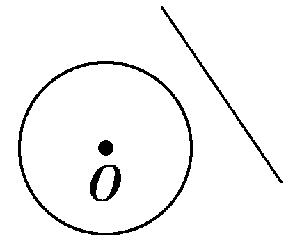
</td><td>
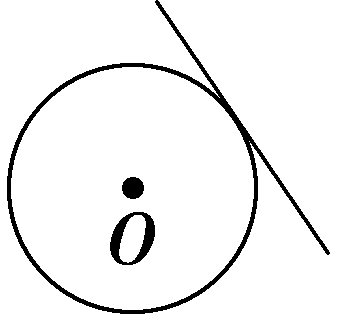
</td><td>
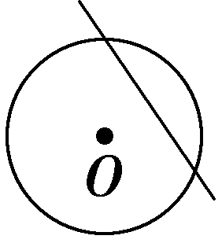
</td></tr><tr><td rowspan="2">
量化
</td><td>
方程观点
</td><td>
<em>Δ</em>＜0
</td><td>
<em>Δ</em>＝0
</td><td>
<em>Δ</em>＞0
</td></tr><tr><td>
几何观点
</td><td>
<em>d</em>＞<em>r</em>
</td><td>
<em>d</em>＝<em>r</em>
</td><td>
<em>d</em>＜<em>r</em>
</td></tr></table>

##### 2.圆与圆的位置关系(☉<em>O</em>1，☉<em>O</em>2的半径分别为<em>r</em>1，<em>r</em>2，<em>d</em>＝｜<em>O</em>1<em>O</em>2｜)

<table><tr><td></td><td>
图形
</td><td>
量的关系
</td></tr><tr><td>
外离
</td><td>
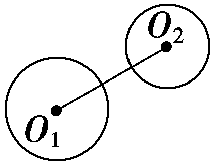
</td><td>
<em>d</em>＞<em>r</em>1＋<em>r</em>2
</td></tr><tr><td>
外切
</td><td>
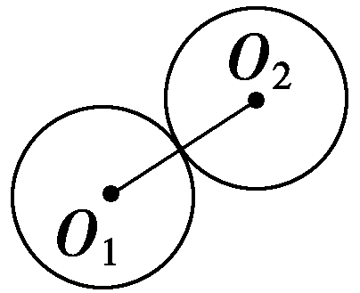
</td><td>
<em>d</em>＝<em>r</em>1＋<em>r</em>2
</td></tr><tr><td>
相交
</td><td>
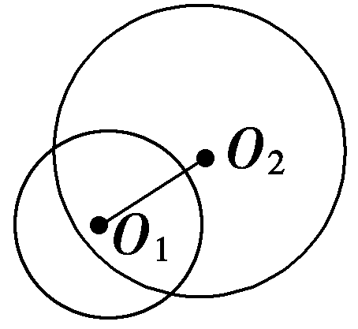
</td><td>
｜<em>r</em>1－<em>r</em>2｜＜<em>d</em>＜<em>r</em>1＋<em>r</em>2
</td></tr><tr><td>
内切
</td><td>
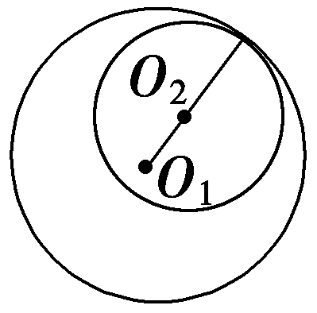
</td><td>
<em>d</em>＝｜<em>r</em>1－<em>r</em>2｜
</td></tr><tr><td>
内含
</td><td>
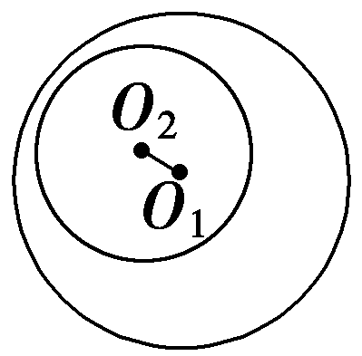
</td><td>
<em>d</em>＜｜<em>r</em>1－<em>r</em>2｜
</td></tr></table>

【常用结论】

（1）圆的切线方程常用结论

①过圆<em>x</em>2＋<em>y</em>2＝<em>r</em>2上一点<em>P</em>(<em>x</em>0，<em>y</em>0)的圆的切线方程为<em>x</em>0<em>x</em>＋<em>y</em>0<em>y</em>＝<em>r</em>2.

②过圆(<em>x</em>－<em>a</em>)2＋(<em>y</em>－<em>b</em>)2＝<em>r</em>2上一点<em>P</em>(<em>x</em>0，<em>y</em>0)的圆的切线方程为(<em>x</em>0－<em>a</em>)(<em>x</em>－<em>a</em>)＋(<em>y</em>0－<em>b</em>)(<em>y</em>－<em>b</em>)＝<em>r</em>2.

③过圆<em>x</em>2＋<em>y</em>2＝<em>r</em>2外一点<em>M</em>(<em>x</em>0，<em>y</em>0)作圆的两条切线，则两切点所在直线的方程为<em>x</em>0<em>x</em>＋<em>y</em>0<em>y</em>＝<em>r</em>2.

（2）直线被圆截得的弦长

弦心距&lt;text sty&lt;text sty<em>l</em>e="italic"&gt;l&lt;/text&gt;e="italic"&gt;<em>d</em>&lt;/text&gt;、弦长l的一半 $\frac{1}{2}$ &lt;text sty<em>l</em>e="italic"&gt;l&lt;/text&gt;及圆的半径<em>&lt;text style="italic"&gt;r</em>&lt;/text&gt;构成直角三角形，且有r&lt;text style="superscript"&gt;2&lt;/text&gt;＝<em>&lt;text style="italic"&gt;d</em>&lt;/text&gt;2＋ $\left(\frac{1}{2}l\right)^{2}$ .

（3）两圆相交时公共弦的方程

设圆<em>C</em>1：<em>x</em>2＋<em>y</em>2＋<em>D</em>1<em>x</em>＋<em>E</em>1<em>y</em>＋<em>F</em>1＝0　①，

圆<em>C</em>2：<em>x</em>2＋<em>y</em>2＋<em>D</em>2<em>x</em>＋<em>E</em>2<em>y</em>＋<em>F</em>2＝0　②，

若两圆相交，则有一条公共弦，其公共弦所在直线方程可由①－②得到，即：(<em>D</em>1－<em>D</em>2)<em>x</em>＋(<em>E</em>1－<em>E</em>2)<em>y</em>＋(<em>F</em>1－<em>F</em>2)＝0.

（4）圆系方程

①同心圆系方程：(<em>x</em>－<em>a</em>)2＋(<em>y</em>－<em>b</em>)2＝<em>r</em>2(<em>r</em>＞0)，其中<em>a</em>，<em>b</em>是定值，<em>r</em>是参数.

②过直线<em>Ax</em>＋<em>By</em>＋<em>C</em>＝0与圆<em>x</em>2＋<em>y</em>2＋<em>Dx</em>＋<em>Ey</em>＋<em>F</em>＝0交点的圆系方程：<em>x</em>2＋<em>y</em>2＋<em>Dx</em>＋<em>Ey</em>＋<em>F</em>＋<em>λ</em>(<em>Ax</em>＋<em>By</em>＋<em>C</em>)＝0(<em>λ</em>∈<strong>R</strong>).

③过圆<em>C</em>1：<em>x</em>2＋<em>y</em>2＋<em>D</em>1<em>x</em>＋<em>E</em>1<em>y</em>＋<em>F</em>1＝0和圆<em>C</em>2：<em>x</em>2＋<em>y</em>2＋<em>D</em>2<em>x</em>＋<em>E</em>2<em>y</em>＋<em>F</em>2＝0交点的圆系方程：<em>x</em>2＋<em>y</em>2＋<em>D</em>1<em>x</em>＋<em>E</em>1<em>y</em>＋<em>F</em>1＋<em>λ</em>(<em>x</em>2＋<em>y</em>2＋<em>D</em>2<em>x</em>＋<em>E</em>2<em>y</em>＋<em>F</em>2)＝0(<em>λ</em>≠－1)(该圆系不含圆<em>C</em>2，解题时，注意检验圆<em>C</em>2是否满足题意，以防漏解).

【自主检测】

##### 1.(多选)下列说法正确的是(　　)

$\quad$A.若两圆没有公共点，则两圆一定外离

$\quad$B.若两圆的圆心距小于两圆的半径之和，则两圆相交

$\quad$C.若直线的方程与圆的方程组成的方程组有且只有一组实数解，则直线与圆相切

$\quad$D.在圆中最长的弦是直径

答案CD

##### 2.(链接人教A选择性必修一P93T1)直线<em>y</em>＝<em>x</em>＋1与圆<em>x</em>2＋<em>y</em>2＝1的位置关系为(　　)

$\quad$A.相切	
$\quad$B.相交但直线不过圆心

$\quad$C.直线过圆心	
$\quad$D.相离

答案B

解析圆心为(0，0)，到直线<te<te<te*x*t st<text st*y*le="italic">y</text>le="italic">x</text>t style="italic">x</text>t style="italic">y</text>＝x＋1，即x－y＋1＝0的距离*d*＝ $\frac{1}{\sqrt{2}}$ ＝ $\frac{\sqrt{2}}{2}$ ，而0＜ $\frac{\sqrt{2}}{2}$ ＜1，但是圆心不在直线<te<te<te*x*t st<text st*y*le="italic">y</text>le="italic">x</text>t style="italic">x</text>t style="italic">y</text>＝x＋1上，所以直线与圆相交，但直线不过圆心.故选B.

##### 3.(链接人教A选择性必修一P96例5)圆<em>x</em>2＋<em>y</em>2－2<em>y</em>＝0与<em>x</em>2＋<em>y</em>2－4＝0的位置关系是(　　)

$\quad$A.相交	
$\quad$B.内切

$\quad$C.外切	
$\quad$D.内含

答案B

解析两圆方程可化为<em>x</em>2＋(<em>y</em>－1)2＝1，<em>x</em>2＋<em>y</em>2＝4.两圆圆心分别为<em>O</em>1(0，1)，<em>O</em>2(0，0)，半径分别为<em>r</em>1＝1，<em>r</em>2＝2.因为｜<em>O</em>1<em>O</em>2｜＝1＝<em>r</em>2－<em>r</em>1，所以两圆内切.故选B.

##### 4.(链接人教A选择性必修一P92例2)过点(2，2)作圆(<em>x</em>－1)2＋<em>y</em>2＝5的切线，则切线方程为(　　)

$\quad$A.*x*－2*y*＋2＝0

$\quad$B.3*x*＋2*y*－10＝0

$\quad$C.*x*＋2*y*－6＝0

$\quad$D.*x*＝2或*x*＋2*y*－6＝0

答案C

解析显然点(2，2)在圆上，由结论1可得切线方程为(2－1)*·*(*x*－1)＋(2－0)*y*＝5，即*x*＋2*y*－6＝0.故选C.

考点一　直线与圆的位置关系　　　　自主练透

##### 1.(2025·江西景德镇模拟)“<em>a</em>＝3”是“直线<em>y</em>＝<em>x</em>＋4与圆(<em>x</em>－<em>a</em>)2＋(<em>y</em>－3)2＝8相切”的(　　)

$\quad$A.充分不必要条件	
$\quad$B.必要不充分条件

$\quad$C.充要条件	
$\quad$D.既不充分也不必要条件

答案A

解析若直线&lt;te&lt;te&lt;te&lt;te&lt;te&lt;te&lt;text st<em>y</em>le="it<em>a</em>lic"&gt;x&lt;/text&gt;t style="italic"&gt;x&lt;/text&gt;t st&lt;text st<em>y</em>le="it<em>a</em>lic"&gt;y&lt;/text&gt;le="it<em>a</em>lic"&gt;x&lt;/text&gt;t style="italic"&gt;x&lt;/text&gt;t st&lt;text st<em>y</em>le="it&lt;text style="it&lt;text style="it<em>a</em>lic"&gt;a&lt;/text&gt;lic"&gt;a&lt;/text&gt;lic"&gt;y&lt;/text&gt;le="it<em>a</em>lic"&gt;x&lt;/text&gt;t style="italic"&gt;x&lt;/text&gt;t style="italic"&gt;y&lt;/text&gt;＝x＋4与圆(x－a)&lt;text style="superscript"&gt;&lt;text style="superscript"&gt;&lt;text style="superscript"&gt;&lt;text style="superscript"&gt;&lt;text style="superscript"&gt;2&lt;/text&gt;&lt;/text&gt;&lt;/text&gt;&lt;/text&gt;&lt;/text&gt;＋(y－3)2＝8相切，则有 $\frac{｜a－3+4｜}{\sqrt{2}}$ ＝&lt;te&lt;te&lt;te&lt;te&lt;text st<em>y</em>le="it<em>a</em>lic"&gt;x&lt;/text&gt;t style="italic"&gt;x&lt;/text&gt;t st&lt;text st<em>y</em>le="it<em>a</em>lic"&gt;y&lt;/text&gt;le="it<em>a</em>lic"&gt;x&lt;/text&gt;t style="italic"&gt;x&lt;/text&gt;t st&lt;text st<em>y</em>le="it&lt;text style="it&lt;text style="it<em>a</em>lic"&gt;a&lt;/text&gt;lic"&gt;a&lt;/text&gt;lic"&gt;y&lt;/text&gt;le="superscript"&gt;&lt;text style="superscript"&gt;&lt;text style="superscript"&gt;&lt;text style="superscript"&gt;&lt;text style="superscript"&gt;2&lt;/text&gt;&lt;/text&gt;&lt;/text&gt;&lt;/text&gt;&lt;/text&gt; $\sqrt{2}$ ，即｜&lt;te&lt;te&lt;te&lt;te&lt;text st<em>y</em>le="it<em>a</em>lic"&gt;x&lt;/text&gt;t style="italic"&gt;x&lt;/text&gt;t st&lt;text st<em>y</em>le="it<em>a</em>lic"&gt;y&lt;/text&gt;le="it<em>a</em>lic"&gt;x&lt;/text&gt;t style="italic"&gt;x&lt;/text&gt;t st&lt;text st<em>y</em>le="it&lt;text style="it&lt;text style="it<em>a</em>lic"&gt;a&lt;/text&gt;lic"&gt;a&lt;/text&gt;lic"&gt;y&lt;/text&gt;le="italic"&gt;a&lt;/text&gt;＋1｜＝4，所以a＝3或－5.当a＝3时，直线&lt;te&lt;te<em>x</em>t style="italic"&gt;x&lt;/text&gt;t style="italic"&gt;y&lt;/text&gt;＝x＋4与圆(x－a)&lt;text style="superscript"&gt;&lt;text style="superscript"&gt;&lt;text style="superscript"&gt;&lt;text style="superscript"&gt;&lt;text style="superscript"&gt;2&lt;/text&gt;&lt;/text&gt;&lt;/text&gt;&lt;/text&gt;&lt;/text&gt;＋(y－3)2＝8一定相切，故“a＝3”是“直线y＝x＋4与圆(x－a)2＋(y－3)2＝8相切”的充分不必要条件.故选A.

##### 2.(一题多解)直线<em>kx</em>－<em>y</em>＋2－<em>k</em>＝0与圆<em>x</em>2＋<em>y</em>2－2<em>x</em>－8＝0的位置关系为(　　)

$\quad$A.相交、相切或相离	
$\quad$B.相交或相切

$\quad$C.相交	
$\quad$D.相切

答案C

解析法一：直线<em>kx</em>－<em>y</em>＋2－<em>k</em>＝0的方程可化为<em>k</em>(<em>x</em>－1)－(<em>y</em>－2)＝0，该直线恒过定点(1，2).因为12＋22－2×1－8＜0，所以点(1，2)在圆<em>x</em>2＋<em>y</em>2－2<em>x</em>－8＝0的内部，所以直线<em>kx</em>－<em>y</em>＋2－<em>k</em>＝0与圆<em>x</em>2＋<em>y</em>2－2<em>x</em>－8＝0相交.故选C.

法二：圆的方程可化为(&lt;text st&lt;text st<em>y</em>le="italic"&gt;y&lt;/text&gt;le="italic"&gt;x&lt;/text&gt;－1)&lt;text style="superscript"&gt;&lt;text style="superscript"&gt;2&lt;/text&gt;&lt;/text&gt;＋y2＝32，所以圆的圆心为(1，0)，半径为3.圆心到直线<em>&lt;text style="italic"&gt;k</em>x&lt;/text&gt;－y＋2－k＝0的距离为 $\frac{｜k+2－k｜}{\sqrt{1+k^{2}}}$ ＝ $\frac{2}{\sqrt{1+k^{2}}}$ ≤&lt;text st&lt;text st<em>y</em>le="italic"&gt;y&lt;/text&gt;le="superscript"&gt;&lt;text style="superscript"&gt;2&lt;/text&gt;&lt;/text&gt;＜3，所以直线与圆相交.故选C.

##### 3.(多选)(2021·新高考Ⅱ卷)已知直线<em>l</em>：<em>ax</em>＋<em>by</em>－<em>r</em>2＝0(<em>r</em>＞0)与圆<em>C</em>：<em>x</em>2＋<em>y</em>2＝<em>r</em>2，点<em>A</em>(<em>a</em>，<em>b</em>)，则下列说法正确的是(　　)

$\quad$A.若点*A*在圆*C*上，则直线*l*与圆*C*相切

$\quad$B.若点*A*在圆*C*内，则直线*l*与圆*C*相离

$\quad$C.若点*A*在圆*C*外，则直线*l*与圆*C*相离

$\quad$D.若点*A*在直线*l*上，则直线*l*与圆*C*相切

答案ABD

解析对于&lt;text sty&lt;text sty&lt;text sty&lt;text sty&lt;text sty&lt;text sty&lt;text sty&lt;text sty&lt;text sty<em>l</em>e="italic"&gt;l&lt;/text&gt;e="it<em>a</em>lic"&gt;l&lt;/text&gt;e="italic"&gt;l&lt;/text&gt;e="italic"&gt;l&lt;/text&gt;e="it&lt;text style="it<em>a</em>lic"&gt;a&lt;/text&gt;lic"&gt;l&lt;/text&gt;e="italic"&gt;l&lt;/text&gt;e="it&lt;text style="it<em>a</em>lic"&gt;a&lt;/text&gt;lic"&gt;l&lt;/text&gt;e="italic"&gt;l&lt;/text&gt;e="it&lt;text style="it<em>a</em>lic"&gt;a&lt;/text&gt;lic"&gt;<em>&lt;text style="italic"&gt;&lt;text style="italic"&gt;A</em>&lt;/text&gt;&lt;/text&gt;&lt;/text&gt;，若点A(a，<em>&lt;text style="italic"&gt;&lt;text style="italic"&gt;&lt;text style="italic"&gt;&lt;text style="italic"&gt;&lt;text style="italic"&gt;&lt;text style="italic"&gt;b</em>&lt;/text&gt;&lt;/text&gt;&lt;/text&gt;&lt;/text&gt;&lt;/text&gt;&lt;/text&gt;)在圆<em>&lt;text style="italic"&gt;&lt;text style="italic"&gt;&lt;text style="italic"&gt;&lt;text style="italic"&gt;&lt;text style="italic"&gt;&lt;text style="italic"&gt;&lt;text style="italic"&gt;&lt;text style="italic"&gt;&lt;text style="italic"&gt;&lt;text style="italic"&gt;C</em>&lt;/text&gt;&lt;/text&gt;&lt;/text&gt;&lt;/text&gt;&lt;/text&gt;&lt;/text&gt;&lt;/text&gt;&lt;/text&gt;&lt;/text&gt;&lt;/text&gt;上，则a&lt;text style="supe<em>&lt;text style="italic"&gt;&lt;text style="italic"&gt;&lt;text style="italic"&gt;&lt;text style="italic"&gt;&lt;text style="italic"&gt;&lt;text style="italic"&gt;&lt;text style="italic"&gt;r</em>&lt;/text&gt;&lt;/text&gt;&lt;/text&gt;&lt;/text&gt;&lt;/text&gt;&lt;/text&gt;&lt;/text&gt;script"&gt;&lt;text style="superscript"&gt;&lt;text style="superscript"&gt;&lt;text style="superscript"&gt;&lt;text style="superscript"&gt;&lt;text style="superscript"&gt;&lt;text style="superscript"&gt;&lt;text style="superscript"&gt;&lt;text style="superscript"&gt;&lt;text style="superscript"&gt;&lt;text style="superscript"&gt;2&lt;/text&gt;&lt;/text&gt;&lt;/text&gt;&lt;/text&gt;&lt;/text&gt;&lt;/text&gt;&lt;/text&gt;&lt;/text&gt;&lt;/text&gt;&lt;/text&gt;&lt;/text&gt;＋b2＝r2，所以圆心C(0，0)到直线l的距离<em>&lt;text style="italic"&gt;&lt;text style="italic"&gt;&lt;text style="italic"&gt;d</em>&lt;/text&gt;&lt;/text&gt;&lt;/text&gt;＝ $\frac{r^{2}}{\sqrt{a^{2}＋b^{2}}}$ ＝&lt;text sty&lt;text sty&lt;text sty&lt;text sty&lt;text sty&lt;text sty&lt;text sty&lt;text sty&lt;text sty<em>l</em>e="italic"&gt;l&lt;/text&gt;e="it<em>a</em>lic"&gt;l&lt;/text&gt;e="italic"&gt;l&lt;/text&gt;e="italic"&gt;l&lt;/text&gt;e="it&lt;text style="it<em>a</em>lic"&gt;a&lt;/text&gt;lic"&gt;l&lt;/text&gt;e="italic"&gt;l&lt;/text&gt;e="it&lt;text style="it<em>a</em>lic"&gt;a&lt;/text&gt;lic"&gt;l&lt;/text&gt;e="italic"&gt;l&lt;/text&gt;e="italic"&gt;<em>&lt;text style="italic"&gt;&lt;text style="italic"&gt;&lt;text style="italic"&gt;&lt;text style="italic"&gt;&lt;text style="italic"&gt;&lt;text style="italic"&gt;r</em>&lt;/text&gt;&lt;/text&gt;&lt;/text&gt;&lt;/text&gt;&lt;/text&gt;&lt;/text&gt;&lt;/text&gt;，所以直线l与圆&lt;text style="it<em>a</em>lic"&gt;<em>&lt;text style="italic"&gt;&lt;text style="italic"&gt;&lt;text style="italic"&gt;&lt;text style="italic"&gt;&lt;text style="italic"&gt;&lt;text style="italic"&gt;&lt;text style="italic"&gt;&lt;text style="italic"&gt;&lt;text style="italic"&gt;C</em>&lt;/text&gt;&lt;/text&gt;&lt;/text&gt;&lt;/text&gt;&lt;/text&gt;&lt;/text&gt;&lt;/text&gt;&lt;/text&gt;&lt;/text&gt;&lt;/text&gt;相切，故&lt;text style="it<em>a</em>lic"&gt;<em>&lt;text style="italic"&gt;&lt;text style="italic"&gt;A</em>&lt;/text&gt;&lt;/text&gt;&lt;/text&gt;正确；对于B，若点A(a，<em>&lt;text style="italic"&gt;&lt;text style="italic"&gt;&lt;text style="italic"&gt;&lt;text style="italic"&gt;&lt;text style="italic"&gt;&lt;text style="italic"&gt;b</em>&lt;/text&gt;&lt;/text&gt;&lt;/text&gt;&lt;/text&gt;&lt;/text&gt;&lt;/text&gt;)在圆C内，则a&lt;text style="superscript"&gt;&lt;text style="superscript"&gt;&lt;text style="superscript"&gt;&lt;text style="superscript"&gt;&lt;text style="superscript"&gt;&lt;text style="superscript"&gt;&lt;text style="superscript"&gt;&lt;text style="superscript"&gt;&lt;text style="superscript"&gt;&lt;text style="superscript"&gt;&lt;text style="superscript"&gt;2&lt;/text&gt;&lt;/text&gt;&lt;/text&gt;&lt;/text&gt;&lt;/text&gt;&lt;/text&gt;&lt;/text&gt;&lt;/text&gt;&lt;/text&gt;&lt;/text&gt;&lt;/text&gt;＋b2＜r2，所以圆心C(0，0)到直线l的距离<em>&lt;text style="italic"&gt;&lt;text style="italic"&gt;&lt;text style="italic"&gt;d</em>&lt;/text&gt;&lt;/text&gt;&lt;/text&gt;＝ $\frac{r^{2}}{\sqrt{a^{2}＋b^{2}}}$ ＞&lt;text sty&lt;text sty&lt;text sty&lt;text sty&lt;text sty&lt;text sty&lt;text sty&lt;text sty&lt;text sty<em>l</em>e="italic"&gt;l&lt;/text&gt;e="it<em>a</em>lic"&gt;l&lt;/text&gt;e="italic"&gt;l&lt;/text&gt;e="italic"&gt;l&lt;/text&gt;e="it&lt;text style="it<em>a</em>lic"&gt;a&lt;/text&gt;lic"&gt;l&lt;/text&gt;e="italic"&gt;l&lt;/text&gt;e="it&lt;text style="it<em>a</em>lic"&gt;a&lt;/text&gt;lic"&gt;l&lt;/text&gt;e="italic"&gt;l&lt;/text&gt;e="italic"&gt;<em>&lt;text style="italic"&gt;&lt;text style="italic"&gt;&lt;text style="italic"&gt;&lt;text style="italic"&gt;&lt;text style="italic"&gt;&lt;text style="italic"&gt;r</em>&lt;/text&gt;&lt;/text&gt;&lt;/text&gt;&lt;/text&gt;&lt;/text&gt;&lt;/text&gt;&lt;/text&gt;，所以直线l与圆&lt;text style="it<em>a</em>lic"&gt;<em>&lt;text style="italic"&gt;&lt;text style="italic"&gt;&lt;text style="italic"&gt;&lt;text style="italic"&gt;&lt;text style="italic"&gt;&lt;text style="italic"&gt;&lt;text style="italic"&gt;&lt;text style="italic"&gt;&lt;text style="italic"&gt;C</em>&lt;/text&gt;&lt;/text&gt;&lt;/text&gt;&lt;/text&gt;&lt;/text&gt;&lt;/text&gt;&lt;/text&gt;&lt;/text&gt;&lt;/text&gt;&lt;/text&gt;相离，故B正确；对于C，若点&lt;text style="it<em>a</em>lic"&gt;<em>&lt;text style="italic"&gt;&lt;text style="italic"&gt;A</em>&lt;/text&gt;&lt;/text&gt;&lt;/text&gt;(a，<em>&lt;text style="italic"&gt;&lt;text style="italic"&gt;&lt;text style="italic"&gt;&lt;text style="italic"&gt;&lt;text style="italic"&gt;&lt;text style="italic"&gt;b</em>&lt;/text&gt;&lt;/text&gt;&lt;/text&gt;&lt;/text&gt;&lt;/text&gt;&lt;/text&gt;)在圆C外，则a&lt;text style="superscript"&gt;&lt;text style="superscript"&gt;&lt;text style="superscript"&gt;&lt;text style="superscript"&gt;&lt;text style="superscript"&gt;&lt;text style="superscript"&gt;&lt;text style="superscript"&gt;&lt;text style="superscript"&gt;&lt;text style="superscript"&gt;&lt;text style="superscript"&gt;&lt;text style="superscript"&gt;2&lt;/text&gt;&lt;/text&gt;&lt;/text&gt;&lt;/text&gt;&lt;/text&gt;&lt;/text&gt;&lt;/text&gt;&lt;/text&gt;&lt;/text&gt;&lt;/text&gt;&lt;/text&gt;＋b2＞r2，所以圆心C(0，0)到直线l的距离<em>&lt;text style="italic"&gt;&lt;text style="italic"&gt;&lt;text style="italic"&gt;d</em>&lt;/text&gt;&lt;/text&gt;&lt;/text&gt;＝ $\frac{r^{2}}{\sqrt{a^{2}＋b^{2}}}$ ＜&lt;text sty&lt;text sty&lt;text sty&lt;text sty&lt;text sty&lt;text sty&lt;text sty&lt;text sty&lt;text sty<em>l</em>e="italic"&gt;l&lt;/text&gt;e="it<em>a</em>lic"&gt;l&lt;/text&gt;e="italic"&gt;l&lt;/text&gt;e="italic"&gt;l&lt;/text&gt;e="it&lt;text style="it<em>a</em>lic"&gt;a&lt;/text&gt;lic"&gt;l&lt;/text&gt;e="italic"&gt;l&lt;/text&gt;e="it&lt;text style="it<em>a</em>lic"&gt;a&lt;/text&gt;lic"&gt;l&lt;/text&gt;e="italic"&gt;l&lt;/text&gt;e="italic"&gt;<em>&lt;text style="italic"&gt;&lt;text style="italic"&gt;&lt;text style="italic"&gt;&lt;text style="italic"&gt;&lt;text style="italic"&gt;&lt;text style="italic"&gt;r</em>&lt;/text&gt;&lt;/text&gt;&lt;/text&gt;&lt;/text&gt;&lt;/text&gt;&lt;/text&gt;&lt;/text&gt;，所以直线l与圆&lt;text style="it<em>a</em>lic"&gt;<em>&lt;text style="italic"&gt;&lt;text style="italic"&gt;&lt;text style="italic"&gt;&lt;text style="italic"&gt;&lt;text style="italic"&gt;&lt;text style="italic"&gt;&lt;text style="italic"&gt;&lt;text style="italic"&gt;&lt;text style="italic"&gt;C</em>&lt;/text&gt;&lt;/text&gt;&lt;/text&gt;&lt;/text&gt;&lt;/text&gt;&lt;/text&gt;&lt;/text&gt;&lt;/text&gt;&lt;/text&gt;&lt;/text&gt;相交，故C不正确；对于D，因为点&lt;text style="it<em>a</em>lic"&gt;<em>&lt;text style="italic"&gt;&lt;text style="italic"&gt;A</em>&lt;/text&gt;&lt;/text&gt;&lt;/text&gt;在直线l上，所以a&lt;text style="superscript"&gt;&lt;text style="superscript"&gt;&lt;text style="superscript"&gt;&lt;text style="superscript"&gt;&lt;text style="superscript"&gt;&lt;text style="superscript"&gt;&lt;text style="superscript"&gt;&lt;text style="superscript"&gt;&lt;text style="superscript"&gt;&lt;text style="superscript"&gt;&lt;text style="superscript"&gt;2&lt;/text&gt;&lt;/text&gt;&lt;/text&gt;&lt;/text&gt;&lt;/text&gt;&lt;/text&gt;&lt;/text&gt;&lt;/text&gt;&lt;/text&gt;&lt;/text&gt;&lt;/text&gt;＋<em>&lt;text style="italic"&gt;&lt;text style="italic"&gt;&lt;text style="italic"&gt;&lt;text style="italic"&gt;&lt;text style="italic"&gt;&lt;text style="italic"&gt;b</em>&lt;/text&gt;&lt;/text&gt;&lt;/text&gt;&lt;/text&gt;&lt;/text&gt;&lt;/text&gt;2＝r2，圆心C(0，0)到直线l的距离<em>&lt;text style="italic"&gt;&lt;text style="italic"&gt;&lt;text style="italic"&gt;d</em>&lt;/text&gt;&lt;/text&gt;&lt;/text&gt;＝ $\frac{r^{2}}{\sqrt{a^{2}＋b^{2}}}$ ＝&lt;text sty&lt;text sty&lt;text sty&lt;text sty&lt;text sty&lt;text sty&lt;text sty&lt;text sty&lt;text sty<em>l</em>e="italic"&gt;l&lt;/text&gt;e="it<em>a</em>lic"&gt;l&lt;/text&gt;e="italic"&gt;l&lt;/text&gt;e="italic"&gt;l&lt;/text&gt;e="it&lt;text style="it<em>a</em>lic"&gt;a&lt;/text&gt;lic"&gt;l&lt;/text&gt;e="italic"&gt;l&lt;/text&gt;e="it&lt;text style="it<em>a</em>lic"&gt;a&lt;/text&gt;lic"&gt;l&lt;/text&gt;e="italic"&gt;l&lt;/text&gt;e="italic"&gt;<em>&lt;text style="italic"&gt;&lt;text style="italic"&gt;&lt;text style="italic"&gt;&lt;text style="italic"&gt;&lt;text style="italic"&gt;&lt;text style="italic"&gt;r</em>&lt;/text&gt;&lt;/text&gt;&lt;/text&gt;&lt;/text&gt;&lt;/text&gt;&lt;/text&gt;&lt;/text&gt;，所以直线l与圆&lt;text style="it<em>a</em>lic"&gt;<em>&lt;text style="italic"&gt;&lt;text style="italic"&gt;&lt;text style="italic"&gt;&lt;text style="italic"&gt;&lt;text style="italic"&gt;&lt;text style="italic"&gt;&lt;text style="italic"&gt;&lt;text style="italic"&gt;&lt;text style="italic"&gt;C</em>&lt;/text&gt;&lt;/text&gt;&lt;/text&gt;&lt;/text&gt;&lt;/text&gt;&lt;/text&gt;&lt;/text&gt;&lt;/text&gt;&lt;/text&gt;&lt;/text&gt;相切，故D正确.故选&lt;text style="it<em>a</em>lic"&gt;<em>&lt;text style="italic"&gt;&lt;text style="italic"&gt;A</em>&lt;/text&gt;&lt;/text&gt;&lt;/text&gt;BD.

##### 4.(一题多解)(2022·新高考Ⅱ卷)设点<em>A</em>(－2，3)，<em>B</em>(0，<em>a</em>)，若直线<em>AB</em>关于<em>y</em>＝<em>a</em>对称的直线与圆(<em>x</em>＋3)2＋(<em>y</em>＋2)2＝1有公共点，则<em>a</em>的取值范围是<u>　　　　　　</u>.

答案［ $\frac{1}{3}$ ， $\frac{3}{2}$ ］

解析法一：由题意知点&lt;te&lt;te&lt;te&lt;text st&lt;text style="it&lt;text style="it&lt;text style="it&lt;text style="it<em>a</em>lic"&gt;a&lt;/text&gt;lic"&gt;a&lt;/text&gt;lic"&gt;a&lt;/text&gt;lic"&gt;y&lt;/text&gt;le="italic"&gt;x&lt;/text&gt;t st&lt;text style="it<em>a</em>lic"&gt;y&lt;/text&gt;le="italic"&gt;x&lt;/text&gt;t style="it&lt;text style="it<em>a</em>lic"&gt;a&lt;/text&gt;lic"&gt;x&lt;/text&gt;t st&lt;text st<em>y</em>le="it&lt;text style="it<em>a</em>lic"&gt;a&lt;/text&gt;lic"&gt;y&lt;/text&gt;le="italic"&gt;A&lt;/text&gt;(－&lt;text style="superscript"&gt;&lt;text style="superscript"&gt;2&lt;/text&gt;&lt;/text&gt;，3)关于直线y＝a的对称点为<em>A'</em>(－2，2a－3)，所以<em>k&lt;text style="italic"&gt;&lt;text style="italic"&gt;A'B</em>&lt;/text&gt;&lt;/text&gt;＝ $\frac{3－a}{2}$ ，所以直线&lt;te&lt;te&lt;te&lt;text st&lt;text style="it&lt;text style="it&lt;text style="it&lt;text style="it<em>a</em>lic"&gt;a&lt;/text&gt;lic"&gt;a&lt;/text&gt;lic"&gt;a&lt;/text&gt;lic"&gt;y&lt;/text&gt;le="italic"&gt;x&lt;/text&gt;t st&lt;text style="it<em>a</em>lic"&gt;y&lt;/text&gt;le="italic"&gt;x&lt;/text&gt;t style="it&lt;text style="it<em>a</em>lic"&gt;a&lt;/text&gt;lic"&gt;x&lt;/text&gt;t st&lt;text st<em>y</em>le="it&lt;text style="it<em>a</em>lic"&gt;a&lt;/text&gt;lic"&gt;y&lt;/text&gt;le="italic"&gt;A&lt;/text&gt;'B的方程为y＝ $\frac{3－a}{2}$ &lt;te&lt;te&lt;text st&lt;text style="it&lt;text style="it&lt;text style="it&lt;text style="it<em>a</em>lic"&gt;a&lt;/text&gt;lic"&gt;a&lt;/text&gt;lic"&gt;a&lt;/text&gt;lic"&gt;y&lt;/text&gt;le="italic"&gt;x&lt;/text&gt;t st&lt;text style="it<em>a</em>lic"&gt;y&lt;/text&gt;le="italic"&gt;x&lt;/text&gt;t style="it&lt;text style="it<em>a</em>lic"&gt;a&lt;/text&gt;lic"&gt;x&lt;/text&gt;＋&lt;text st<em>y</em>le="it<em>a</em>lic"&gt;a&lt;/text&gt;，即(3－a)x－&lt;text style="superscript"&gt;&lt;text style="superscript"&gt;2&lt;/text&gt;&lt;/text&gt;<em>y</em>＋2a＝0.由题意知直线<em>A</em>'B与圆(x＋3)2＋(y＋2)2＝1有公共点，易知圆心为(－3，－2)，半径为1，所以 $\frac{|-3(3－a)＋(-2)\times (-2)+2a｜}{\sqrt{(3－a)^{2}＋(-2)^{2}}}$ ≤1，整理得6&lt;te&lt;te&lt;te&lt;text st&lt;text style="it&lt;text style="it&lt;text style="it&lt;text style="it<em>a</em>lic"&gt;a&lt;/text&gt;lic"&gt;a&lt;/text&gt;lic"&gt;a&lt;/text&gt;lic"&gt;y&lt;/text&gt;le="italic"&gt;x&lt;/text&gt;t st&lt;text style="it<em>a</em>lic"&gt;y&lt;/text&gt;le="italic"&gt;x&lt;/text&gt;t style="it&lt;text style="it<em>a</em>lic"&gt;a&lt;/text&gt;lic"&gt;x&lt;/text&gt;t st<em>y</em>le="it<em>a</em>lic"&gt;a&lt;/text&gt;&lt;text style="superscript"&gt;&lt;text style="superscript"&gt;2&lt;/text&gt;&lt;/text&gt;－11a＋3≤0，解得 $\frac{1}{3}$ ≤&lt;te&lt;te&lt;te&lt;text st&lt;text style="it&lt;text style="it&lt;text style="it&lt;text style="it<em>a</em>lic"&gt;a&lt;/text&gt;lic"&gt;a&lt;/text&gt;lic"&gt;a&lt;/text&gt;lic"&gt;y&lt;/text&gt;le="italic"&gt;x&lt;/text&gt;t st&lt;text style="it<em>a</em>lic"&gt;y&lt;/text&gt;le="italic"&gt;x&lt;/text&gt;t style="it&lt;text style="it<em>a</em>lic"&gt;a&lt;/text&gt;lic"&gt;x&lt;/text&gt;t st<em>y</em>le="it<em>a</em>lic"&gt;a&lt;/text&gt;≤ $\frac{3}{2}$ ，所以&lt;te&lt;te&lt;te&lt;text st&lt;text style="it&lt;text style="it&lt;text style="it&lt;text style="it<em>a</em>lic"&gt;a&lt;/text&gt;lic"&gt;a&lt;/text&gt;lic"&gt;a&lt;/text&gt;lic"&gt;y&lt;/text&gt;le="italic"&gt;x&lt;/text&gt;t st&lt;text style="it<em>a</em>lic"&gt;y&lt;/text&gt;le="italic"&gt;x&lt;/text&gt;t style="it&lt;text style="it<em>a</em>lic"&gt;a&lt;/text&gt;lic"&gt;x&lt;/text&gt;t st<em>y</em>le="it<em>a</em>lic"&gt;a&lt;/text&gt;的取值范围是［ $\frac{1}{3}$ ， $\frac{3}{2}$ ］.

法二：设已知圆关于直线&lt;te&lt;te&lt;text st&lt;text style="it&lt;text style="it&lt;text style="it&lt;text style="it&lt;text style="it<em>a</em>lic"&gt;a&lt;/text&gt;lic"&gt;a&lt;/text&gt;lic"&gt;a&lt;/text&gt;lic"&gt;a&lt;/text&gt;lic"&gt;y&lt;/text&gt;le="italic"&gt;x&lt;/text&gt;t style="it&lt;text style="it<em>a</em>lic"&gt;a&lt;/text&gt;lic"&gt;x&lt;/text&gt;t st<em>y</em>le="it&lt;text style="it<em>a</em>lic"&gt;a&lt;/text&gt;lic"&gt;y&lt;/text&gt;＝a的对称圆为圆<em>&lt;text style="italic"&gt;&lt;text style="italic"&gt;C</em>&lt;/text&gt;&lt;/text&gt;，则易知圆心C(－3，2a＋2)，半径<em>r</em>＝1.又直线<em>&lt;text style="italic"&gt;AB</em>&lt;/text&gt;的方程为y＝ $\frac{a－3}{2}$ &lt;te&lt;text st&lt;text style="it&lt;text style="it&lt;text style="it&lt;text style="it&lt;text style="it<em>a</em>lic"&gt;a&lt;/text&gt;lic"&gt;a&lt;/text&gt;lic"&gt;a&lt;/text&gt;lic"&gt;a&lt;/text&gt;lic"&gt;y&lt;/text&gt;le="italic"&gt;x&lt;/text&gt;t style="it&lt;text style="it<em>a</em>lic"&gt;a&lt;/text&gt;lic"&gt;x&lt;/text&gt;＋&lt;text st<em>y</em>le="it<em>a</em>lic"&gt;a&lt;/text&gt;，即(a－3)x－2<em>y</em>＋2a＝0.于是，根据题意可知直线<em>&lt;text style="italic"&gt;AB</em>&lt;/text&gt;与圆<em>&lt;text style="italic"&gt;&lt;text style="italic"&gt;C</em>&lt;/text&gt;&lt;/text&gt;有公共点，从而可得 $\frac{|(a－3)(-3)-2(2a+2)+2a｜}{\sqrt{(a－3)^{2}＋(-2)^{2}}}$ ≤1，整理得6&lt;te&lt;te&lt;text st&lt;text style="it&lt;text style="it&lt;text style="it&lt;text style="it&lt;text style="it<em>a</em>lic"&gt;a&lt;/text&gt;lic"&gt;a&lt;/text&gt;lic"&gt;a&lt;/text&gt;lic"&gt;a&lt;/text&gt;lic"&gt;y&lt;/text&gt;le="italic"&gt;x&lt;/text&gt;t style="it&lt;text style="it<em>a</em>lic"&gt;a&lt;/text&gt;lic"&gt;x&lt;/text&gt;t st<em>y</em>le="it<em>a</em>lic"&gt;a&lt;/text&gt;2－11a＋3≤0，解得 $\frac{1}{3}$ ≤&lt;te&lt;te&lt;text st&lt;text style="it&lt;text style="it&lt;text style="it&lt;text style="it&lt;text style="it<em>a</em>lic"&gt;a&lt;/text&gt;lic"&gt;a&lt;/text&gt;lic"&gt;a&lt;/text&gt;lic"&gt;a&lt;/text&gt;lic"&gt;y&lt;/text&gt;le="italic"&gt;x&lt;/text&gt;t style="it&lt;text style="it<em>a</em>lic"&gt;a&lt;/text&gt;lic"&gt;x&lt;/text&gt;t st<em>y</em>le="it<em>a</em>lic"&gt;a&lt;/text&gt;≤ $\frac{3}{2}$ .故&lt;te&lt;te&lt;text st&lt;text style="it&lt;text style="it&lt;text style="it&lt;text style="it&lt;text style="it<em>a</em>lic"&gt;a&lt;/text&gt;lic"&gt;a&lt;/text&gt;lic"&gt;a&lt;/text&gt;lic"&gt;a&lt;/text&gt;lic"&gt;y&lt;/text&gt;le="italic"&gt;x&lt;/text&gt;t style="it&lt;text style="it<em>a</em>lic"&gt;a&lt;/text&gt;lic"&gt;x&lt;/text&gt;t st<em>y</em>le="it<em>a</em>lic"&gt;a&lt;/text&gt;的取值范围是［ $\frac{1}{3}$ ， $\frac{3}{2}$ ］.

判断直线与圆的位置关系的常见方法

##### 1.几何法：利用*d*与*r*的关系判断.

##### 2.代数法：联立方程之后利用*Δ*判断.

##### 3.点与圆的位置关系法：若直线恒过定点且定点在圆内，可判断直线与圆相交.

考点二　圆与圆的位置关系　　　　师生共研

（1）(一题多变)已知圆<em>C</em>1：<em>x</em>2＋<em>y</em>2＝1与圆<em>C</em>2：(<em>x</em>－2)2＋(<em>y</em>＋2)2＝1，则圆<em>C</em>1与<em>C</em>2的位置关系是(　　)

$\quad$A.相交	
$\quad$B.外离

$\quad$C.外切	
$\quad$D.内含

（2）(双空题)圆<em>C</em>1：<em>x</em>2＋<em>y</em>2－2<em>x</em>＋10<em>y</em>－24＝0与圆<em>C</em>2：<em>x</em>2＋<em>y</em>2＋2<em>x</em>＋2<em>y</em>－8＝0的公共弦所在直线的方程为<u>　　　　　　　　　　　</u>，公共弦长为<u>　　　　</u>.

（3）(一题多解、开放题)(2022·新高考Ⅰ卷)写出与圆<em>x</em>2＋<em>y</em>2＝1和(<em>x</em>－3)2＋(<em>y</em>－4)2＝16都相切的一条直线的方程<u>　　　　　　　</u>.

答案（1）<te<te*x*t st*y*le="italic">x</text>t style="bold">B　</text>（2）x－2y＋4＝0　2 $\sqrt{5}$ 　（3）<te*x*t st*y*le="italic">x</text>＝－1(答案不唯一)

解析(&lt;text style="subsc<em>&lt;text style="italic"&gt;&lt;text style="italic"&gt;&lt;text style="italic"&gt;r</em>&lt;/text&gt;&lt;/text&gt;&lt;/text&gt;ipt"&gt;&lt;text style="subscript"&gt;1&lt;/text&gt;&lt;/text&gt;)根据题意，可知圆<em>&lt;text style="italic"&gt;C</em>&lt;/text&gt;1的半径r1＝1，圆C&lt;text style="subscript"&gt;&lt;text style="subscript"&gt;2&lt;/text&gt;&lt;/text&gt;的半径r2＝1，且两圆的圆心距<em>&lt;text style="italic"&gt;d</em>&lt;/text&gt;＝ $\sqrt{2^{2}＋\left(－2\right)^{2}}$ ＝&lt;text style="subsc<em>&lt;text style="italic"&gt;&lt;text style="italic"&gt;r</em>&lt;/text&gt;&lt;/text&gt;ipt"&gt;&lt;text style="subscript"&gt;2&lt;/text&gt;&lt;/text&gt; $\sqrt{2}$ ＞&lt;text style="subsc<em>&lt;text style="italic"&gt;&lt;text style="italic"&gt;&lt;text style="italic"&gt;r</em>&lt;/text&gt;&lt;/text&gt;&lt;/text&gt;ipt"&gt;&lt;text style="subscript"&gt;1&lt;/text&gt;&lt;/text&gt;＋1，即<em>&lt;text style="italic"&gt;d</em>&lt;/text&gt;＞r1＋r&lt;text style="subscript"&gt;&lt;text style="subscript"&gt;2&lt;/text&gt;&lt;/text&gt;，故两圆外离.故选B.

（2）联立两圆的方程得

$\left\{\begin{matrix}x^{2}＋y^{2}－2x+10y－24=0，\\x^{2}＋y^{2}+2x+2y－8=0，\end{matrix}\right.$ 两式相减并化简，得两圆公共弦所在直线的方程为<text st*y*le="italic">x</text>－2y＋4＝0.设两圆相交于*<text style="italic">A*</text>，*<text style="italic">B*</text>两点，则A，B两点的坐标满足方程组 $\left\{\begin{matrix}x－2y+4=0，\\x^{2}＋y^{2}+2x+2y－8=0，\end{matrix}\right.$ 解得 $\left\{\begin{matrix}x＝－4，\\y=0\end{matrix}\right.$ 或 $\left\{\begin{matrix}x=0，\\y=2，\end{matrix}\right.$ 所以｜*<text style="italic">A*</text>*<text style="italic">B*</text>｜＝ $\sqrt{\left(－4－0\right)^{2}＋\left(0－2\right)^{2}}$ ＝2 $\sqrt{5}$ ，即公共弦长为2 $\sqrt{5}$ .

（3）圆&lt;te&lt;text st<em>y</em>le="italic"&gt;x&lt;/text&gt;t st<em>y</em>le="italic"&gt;x&lt;/text&gt;&lt;text style="superscript"&gt;&lt;text style="superscript"&gt;&lt;text style="superscript"&gt;2&lt;/text&gt;&lt;/text&gt;&lt;/text&gt;＋y2＝1的圆心为<em>&lt;text style="italic"&gt;O</em>&lt;/text&gt;(0，0)，半径为1，圆(x－3)2＋(y－4)2＝16的圆心为O1(3，4)，半径为4，两圆圆心距为 $\sqrt{3^{2}＋4^{2}}$ ＝5，等于两圆半径之和，故两圆外切.如图，

当切线为<<<<te<te<te<te<te<te<te<te*x*t st*y*le="italic">x</text>t st*y*le="italic">x</text>t style="italic">x</text>t st*y*le="italic">x</text>t st*y*le="italic">x</text>t st<text st*y*le="italic">y</text>le="italic">x</text>t style="italic">x</text>t st*yl*e="italic">t</text>ext sty*l*e="italic">t</text>ext style="italic">t</text>e*x*t st*y*<text style="italic,subscri*<text style="italic">p*</text>t">l</text>e="italic">l</text>时，因为 $k_{OO_{1}}$ ＝ $\frac{4}{3}$ ，所以<<<<te<te<te<te<te<te<te<te*x*t st*y*le="italic">x</text>t st*y*le="italic">x</text>t style="italic">x</text>t st*y*le="italic">x</text>t st*y*le="italic">x</text>t st<text st*y*le="italic">y</text>le="italic">x</text>t style="italic">x</text>t st*yl*e="italic">t</text>ext sty*l*e="italic">t</text>ext style="italic">t</text>e*x*t st*y*<text style="italic,subscri*<text style="italic">p*</text>t">l</text>e="italic">*k*</text>*l*＝－ $\frac{3}{4}$ ，设方程为<<<<te<te<te<te<te<te<te<te*x*t st*y*le="italic">x</text>t st*y*le="italic">x</text>t style="italic">x</text>t st*y*le="italic">x</text>t st*y*le="italic">x</text>t st<text st*y*le="italic">y</text>le="italic">x</text>t style="italic">x</text>t st*yl*e="italic">t</text>ext sty*l*e="italic">t</text>ext style="italic">t</text>e*x*t style="italic">y</text>＝－ $\frac{3}{4}$ <<<<te<te<te<te<te<te<te<te*x*t st*y*le="italic">x</text>t st*y*le="italic">x</text>t style="italic">x</text>t st*y*le="italic">x</text>t st*y*le="italic">x</text>t st<text st*y*le="italic">y</text>le="italic">x</text>t style="italic">x</text>t st*yl*e="italic">t</text>ext sty*l*e="italic">t</text>ext style="italic">t</text>ext style="italic">x</text>＋t(t＞0)，点*O*到<text st*y*<text style="italic,subscri*<text style="italic">p*</text>t">l</text>e="italic">l</text>的距离*d*＝ $\frac{｜t｜}{\sqrt{1+\frac{9}{16}}}$ ＝1，解得<<<te<te<te<te<te<te<te<te*x*t st*y*le="italic">x</text>t st*y*le="italic">x</text>t style="italic">x</text>t st*y*le="italic">x</text>t st*y*le="italic">x</text>t st<text st*y*le="italic">y</text>le="italic">x</text>t style="italic">x</text>t st*yl*e="italic">t</text>ext sty*l*e="italic">t</text>ext style="italic">t</text>＝ $\frac{5}{4}$ ，所以<<<<te<te<te<te<te<te<te<te*x*t st*y*le="italic">x</text>t st*y*le="italic">x</text>t style="italic">x</text>t st*y*le="italic">x</text>t st*y*le="italic">x</text>t st<text st*y*le="italic">y</text>le="italic">x</text>t style="italic">x</text>t st*yl*e="italic">t</text>ext sty*l*e="italic">t</text>ext style="italic">t</text>e*x*t st*y*<text style="italic,subscri*<text style="italic">p*</text>t">l</text>e="italic">l</text>的方程为y＝－ $\frac{3}{4}$ <<<<te<te<te<te<te<te<te<te*x*t st*y*le="italic">x</text>t st*y*le="italic">x</text>t style="italic">x</text>t st*y*le="italic">x</text>t st*y*le="italic">x</text>t st<text st*y*le="italic">y</text>le="italic">x</text>t style="italic">x</text>t st*yl*e="italic">t</text>ext sty*l*e="italic">t</text>ext style="italic">t</text>ext style="italic">x</text>＋ $\frac{5}{4}$ ，即3<<<<te<te<te<te<te<te<te<te*x*t st*y*le="italic">x</text>t st*y*le="italic">x</text>t style="italic">x</text>t st*y*le="italic">x</text>t st*y*le="italic">x</text>t st<text st*y*le="italic">y</text>le="italic">x</text>t style="italic">x</text>t st*yl*e="italic">t</text>ext sty*l*e="italic">t</text>ext style="italic">t</text>ext style="italic">x</text>＋4*y*－5＝0.当切线为*<text style="italic">m*</text>时，设直线方程为<text sty<text style="italic,subscri*<text style="italic">p*</text>t">l</text>e="italic">*k*</text>x＋y＋p＝0，其中p＞0，k＜0，由题意得 $\left\{\begin{matrix}\frac{｜p｜}{\sqrt{1+k^{2}}}=1，\\\frac{｜3k+4+p｜}{\sqrt{1+k^{2}}}=4，\end{matrix}\right.$ 解得 $\left\{\begin{matrix}k＝－\frac{7}{24}，\\p＝\frac{25}{24}，\end{matrix}\right.$ 所以<te<te<te<te<te<te*x*t st*y*le="italic">x</text>t st*y*le="italic">x</text>t style="italic">x</text>t st*y*le="italic">x</text>t st*y*le="italic">x</text>t st*y*le="italic">*m*</text>的方程为－ $\frac{7}{24}$ <<<<te<te<te<te<te<te<te<te*x*t st*y*le="italic">x</text>t st*y*le="italic">x</text>t style="italic">x</text>t st*y*le="italic">x</text>t st*y*le="italic">x</text>t st<text st*y*le="italic">y</text>le="italic">x</text>t style="italic">x</text>t st*yl*e="italic">t</text>ext sty*l*e="italic">t</text>ext style="italic">t</text>ext style="italic">x</text>＋*y*＋ $\frac{25}{24}$ ＝0，即7<<<<te<te<te<te<te<te<te<te*x*t st*y*le="italic">x</text>t st*y*le="italic">x</text>t style="italic">x</text>t st*y*le="italic">x</text>t st*y*le="italic">x</text>t st<text st*y*le="italic">y</text>le="italic">x</text>t style="italic">x</text>t st*yl*e="italic">t</text>ext sty*l*e="italic">t</text>ext style="italic">t</text>ext style="italic">x</text>－24*y*－25＝0.当切线为*n*时，易知切线方程为x＝－1.综上，所求切线的方程为3x＋4y－5＝0或7x－24y－25＝0或x＝－1.

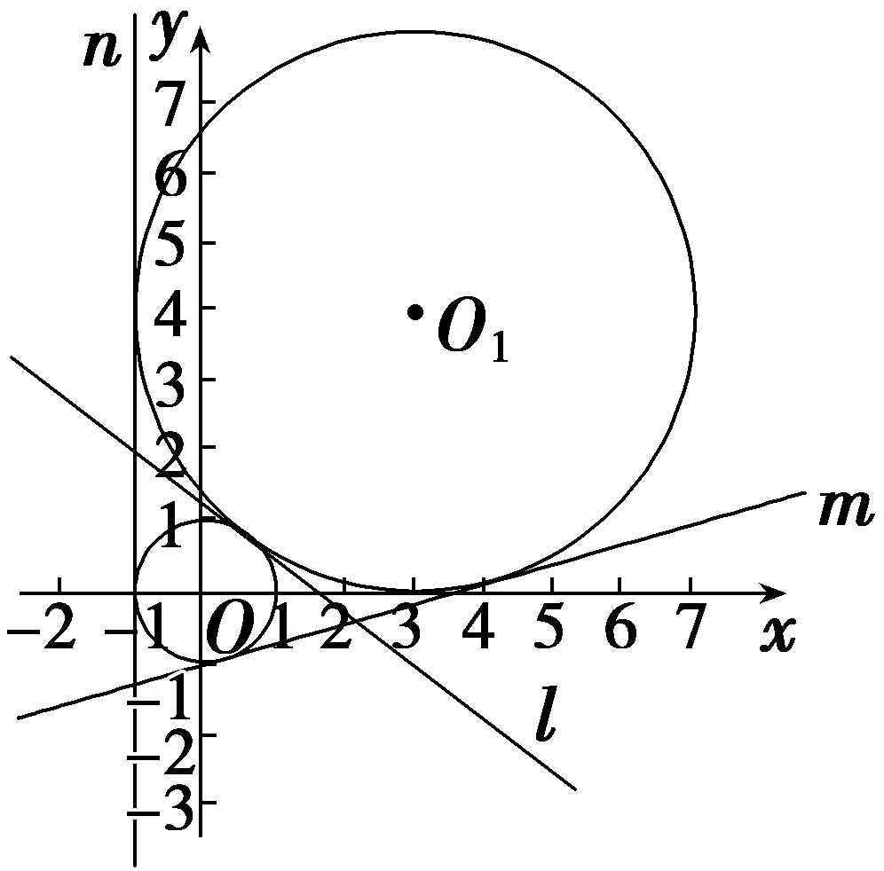

[变式探究]

(变条件，变设问)若本例（1）条件变为“圆<em>x</em>2＋(<em>y</em>－2)2＝4与圆<em>x</em>2＋2<em>mx</em>＋<em>y</em>2＋<em>m</em>2－1＝0至少有三条公切线”，则实数<em>m</em>的取值范围是<u>　　　　　　　</u>.

答案 $\left(－\infty ,-\sqrt{5}]\bigcup [\sqrt{5}，＋\infty \right)$

解析将&lt;te&lt;te&lt;te&lt;te&lt;text st<em>y</em>le="italic"&gt;x&lt;/text&gt;t st<em>y</em>le="italic"&gt;x&lt;/text&gt;t st<em>y</em>le="italic"&gt;x&lt;/text&gt;t st<em>y</em>le="italic"&gt;x&lt;/text&gt;t st<em>y</em>le="italic"&gt;x&lt;/text&gt;&lt;text style="superscript"&gt;&lt;text style="superscript"&gt;&lt;text style="superscript"&gt;&lt;text style="superscript"&gt;&lt;text style="superscript"&gt;&lt;text style="superscript"&gt;&lt;text style="superscript"&gt;&lt;text style="superscript"&gt;&lt;text style="superscript"&gt;&lt;text style="superscript"&gt;&lt;text style="superscript"&gt;&lt;text style="superscript"&gt;2&lt;/text&gt;&lt;/text&gt;&lt;/text&gt;&lt;/text&gt;&lt;/text&gt;&lt;/text&gt;&lt;/text&gt;&lt;/text&gt;&lt;/text&gt;&lt;/text&gt;&lt;/text&gt;&lt;/text&gt;＋2<em>&lt;text style="italic"&gt;&lt;text style="italic"&gt;&lt;text style="italic"&gt;&lt;text style="italic"&gt;&lt;text style="italic"&gt;&lt;text style="italic"&gt;m</em>&lt;/text&gt;&lt;/text&gt;&lt;/text&gt;&lt;/text&gt;&lt;/text&gt;x&lt;/text&gt;＋y2＋m2－1＝0化为标准方程得(x＋m)2＋y2＝1，即圆心为(－m，0)，半径为1，圆x2＋(y－2)2＝4的圆心为(0，2)，半径为2，因为圆x2＋(y－2)2＝4与圆x2＋2<em>mx</em>＋y2＋m2－1＝0至少有三条公切线，所以两圆的位置关系为外切或相离，所以 $\sqrt{m^{2}+4}$ ≥&lt;te&lt;te&lt;te&lt;te&lt;text st<em>y</em>le="italic"&gt;x&lt;/text&gt;t st<em>y</em>le="italic"&gt;x&lt;/text&gt;t st<em>y</em>le="italic"&gt;x&lt;/text&gt;t st<em>y</em>le="italic"&gt;x&lt;/text&gt;t st<em>y</em>le="superscript"&gt;&lt;text style="superscript"&gt;&lt;text style="superscript"&gt;&lt;text style="superscript"&gt;&lt;text style="superscript"&gt;&lt;text style="superscript"&gt;&lt;text style="superscript"&gt;&lt;text style="superscript"&gt;&lt;text style="superscript"&gt;&lt;text style="superscript"&gt;&lt;text style="superscript"&gt;&lt;text style="superscript"&gt;2&lt;/text&gt;&lt;/text&gt;&lt;/text&gt;&lt;/text&gt;&lt;/text&gt;&lt;/text&gt;&lt;/text&gt;&lt;/text&gt;&lt;/text&gt;&lt;/text&gt;&lt;/text&gt;&lt;/text&gt;＋1，即<em>&lt;text style="italic"&gt;&lt;text style="italic"&gt;&lt;text style="italic"&gt;&lt;text style="italic"&gt;&lt;text style="italic"&gt;m</em>&lt;/text&gt;&lt;/text&gt;&lt;/text&gt;&lt;/text&gt;&lt;/text&gt;2≥5，解得m∈(－∞，－ $\sqrt{5}$ ]∪[ $\sqrt{5}$ ，＋∞).

圆与圆的位置关系的求解策略

##### 1.判断两圆的位置关系时常用几何法，即利用两圆圆心之间的距离与两圆半径之间的关系，一般不采用代数法.

##### 2.若两圆相交，则两圆公共弦所在直线的方程可由两圆的方程作差消去<em>x</em>2，<em>y</em>2项得到.

对点练1.(2025·河北石家庄质检三)已知圆<em>C</em>1：<em>x</em>2＋<em>y</em>2＝1和圆<em>C</em>2：<em>x</em>2＋<em>y</em>2－6<em>x</em>－8<em>y</em>＋9＝0，则两圆公切线的条数为(　　)

$\quad$A.1	
$\quad$B.2

$\quad$C.3	
$\quad$D.4

答案C

解析圆&lt;te&lt;te&lt;te&lt;text st<em>y</em>le="italic"&gt;x&lt;/text&gt;t st<em>y</em>le="italic"&gt;x&lt;/text&gt;t st<em>y</em>le="italic"&gt;x&lt;/text&gt;t style="italic"&gt;<em>&lt;text style="italic"&gt;&lt;text style="italic"&gt;C</em>&lt;/text&gt;&lt;/text&gt;&lt;/text&gt;&lt;text style="subsc<em>&lt;text style="italic"&gt;&lt;text style="italic"&gt;&lt;text style="italic"&gt;r</em>&lt;/text&gt;&lt;/text&gt;&lt;/text&gt;ipt"&gt;&lt;text style="subscript"&gt;&lt;text style="subscript"&gt;1&lt;/text&gt;&lt;/text&gt;&lt;/text&gt;：x&lt;text style="superscript"&gt;&lt;text style="subscript"&gt;&lt;text style="superscript"&gt;&lt;text style="superscript"&gt;&lt;text style="subscript"&gt;&lt;text style="subscript"&gt;&lt;text style="subscript"&gt;2&lt;/text&gt;&lt;/text&gt;&lt;/text&gt;&lt;/text&gt;&lt;/text&gt;&lt;/text&gt;&lt;/text&gt;＋y2＝1的圆心为C1 $\left(0，0\right)$ ，半径&lt;te&lt;te&lt;text st<em>y</em>le="italic"&gt;x&lt;/text&gt;t st<em>y</em>le="italic"&gt;x&lt;/text&gt;t style="italic"&gt;<em>&lt;text style="italic"&gt;&lt;text style="italic"&gt;r</em>&lt;/text&gt;&lt;/text&gt;&lt;/text&gt;&lt;te&lt;text st<em>y</em>le="italic"&gt;x&lt;/text&gt;t style="subscript"&gt;&lt;text style="subscript"&gt;&lt;text style="subscript"&gt;1&lt;/text&gt;&lt;/text&gt;&lt;/text&gt;＝1，圆<em>&lt;text style="italic"&gt;&lt;text style="italic"&gt;&lt;text style="italic"&gt;C</em>&lt;/text&gt;&lt;/text&gt;&lt;/text&gt;&lt;text style="superscript"&gt;&lt;text style="subscript"&gt;&lt;text style="superscript"&gt;&lt;text style="superscript"&gt;&lt;text style="subscript"&gt;&lt;text style="subscript"&gt;&lt;text style="subscript"&gt;2&lt;/text&gt;&lt;/text&gt;&lt;/text&gt;&lt;/text&gt;&lt;/text&gt;&lt;/text&gt;&lt;/text&gt;：x2＋y2－6x－8y＋9＝0的圆心C2 $\left(3，4\right)$ ，半径&lt;te&lt;te&lt;text st<em>y</em>le="italic"&gt;x&lt;/text&gt;t st<em>y</em>le="italic"&gt;x&lt;/text&gt;t style="italic"&gt;<em>&lt;text style="italic"&gt;&lt;text style="italic"&gt;r</em>&lt;/text&gt;&lt;/text&gt;&lt;/text&gt;&lt;text st<em>y</em>le="superscript"&gt;&lt;text style="subscript"&gt;&lt;text style="superscript"&gt;&lt;text style="superscript"&gt;&lt;text style="subscript"&gt;&lt;text style="subscript"&gt;&lt;text style="subscript"&gt;2&lt;/text&gt;&lt;/text&gt;&lt;/text&gt;&lt;/text&gt;&lt;/text&gt;&lt;/text&gt;&lt;/text&gt;＝4，则 $\left|C_{1}C_{2}\right|$ ＝ $\sqrt{3^{2}＋4^{2}}$ ＝5＝&lt;te&lt;te&lt;text st<em>y</em>le="italic"&gt;x&lt;/text&gt;t st<em>y</em>le="italic"&gt;x&lt;/text&gt;t style="italic"&gt;<em>&lt;text style="italic"&gt;&lt;text style="italic"&gt;r</em>&lt;/text&gt;&lt;/text&gt;&lt;/text&gt;&lt;te&lt;text st<em>y</em>le="italic"&gt;x&lt;/text&gt;t style="subscript"&gt;&lt;text style="subscript"&gt;&lt;text style="subscript"&gt;1&lt;/text&gt;&lt;/text&gt;&lt;/text&gt;＋r&lt;text style="superscript"&gt;&lt;text style="subscript"&gt;&lt;text style="superscript"&gt;&lt;text style="superscript"&gt;&lt;text style="subscript"&gt;&lt;text style="subscript"&gt;&lt;text style="subscript"&gt;2&lt;/text&gt;&lt;/text&gt;&lt;/text&gt;&lt;/text&gt;&lt;/text&gt;&lt;/text&gt;&lt;/text&gt;，故两圆外切，则两圆公切线的条数为3.故选<em>&lt;text style="italic"&gt;&lt;text style="italic"&gt;&lt;text style="italic"&gt;C</em>&lt;/text&gt;&lt;/text&gt;&lt;/text&gt;.

对点练2.过两圆<em>x</em>2＋<em>y</em>2－2<em>y</em>－4＝0与<em>x</em>2＋<em>y</em>2－4<em>x</em>＋2<em>y</em>＝0的交点，且圆心在直线<em>l</em>：2<em>x</em>＋4<em>y</em>－1＝0上的圆的方程为<u>　　　　　　　　　　　</u>.

答案<em>x</em>2＋<em>y</em>2－3<em>x</em>＋<em>y</em>－1＝0

解析设所求圆的方程为&lt;te&lt;te&lt;te&lt;te&lt;te&lt;te&lt;te&lt;text st<em>y</em>le="italic"&gt;x&lt;/text&gt;t st<em>y</em>le="italic"&gt;x&lt;/text&gt;t st&lt;text st<em>y</em>le="italic"&gt;y&lt;/text&gt;le="italic"&gt;x&lt;/text&gt;t st&lt;text st&lt;text sty<em>l</em>e="italic"&gt;y&lt;/text&gt;le="italic"&gt;y&lt;/text&gt;le="italic"&gt;x&lt;/text&gt;t style="italic"&gt;x&lt;/text&gt;t st&lt;text st<em>y</em>le="italic"&gt;y&lt;/text&gt;le="italic"&gt;x&lt;/text&gt;t st<em>y</em>le="italic"&gt;x&lt;/text&gt;t st<em>y</em>le="italic"&gt;x&lt;/text&gt;&lt;text style="superscript"&gt;&lt;text style="superscript"&gt;&lt;text style="superscript"&gt;&lt;text style="superscript"&gt;&lt;text style="superscript"&gt;&lt;text style="superscript"&gt;&lt;text style="superscript"&gt;&lt;text style="superscript"&gt;&lt;text style="superscript"&gt;2&lt;/text&gt;&lt;/text&gt;&lt;/text&gt;&lt;/text&gt;&lt;/text&gt;&lt;/text&gt;&lt;/text&gt;&lt;/text&gt;&lt;/text&gt;＋y2－4x＋2y＋<em>&lt;text style="italic"&gt;&lt;text style="italic"&gt;&lt;text style="italic"&gt;&lt;text style="italic"&gt;&lt;text style="italic"&gt;&lt;text style="italic"&gt;λ</em>&lt;/text&gt;&lt;/text&gt;&lt;/text&gt;&lt;/text&gt;&lt;/text&gt;&lt;/text&gt;(x2＋y2－2y－4)＝0(λ≠－1)，则(1＋λ)x2－4x＋(1＋λ)y2＋(2－2λ)y－4λ＝0，把圆心坐标 $\left(\frac{2}{1+\lambda }，\frac{\lambda －1}{1+\lambda }\right)$ 代入直线&lt;te&lt;te&lt;te&lt;text st<em>y</em>le="italic"&gt;x&lt;/text&gt;t st<em>y</em>le="italic"&gt;x&lt;/text&gt;t st&lt;text st<em>y</em>le="italic"&gt;y&lt;/text&gt;le="italic"&gt;x&lt;/text&gt;t style="italic"&gt;l&lt;/text&gt;，可得&lt;te&lt;te&lt;te&lt;text st&lt;text st<em>y</em>le="italic"&gt;y&lt;/text&gt;le="italic"&gt;x&lt;/text&gt;t style="italic"&gt;x&lt;/text&gt;t st&lt;text st<em>y</em>le="italic"&gt;y&lt;/text&gt;le="italic"&gt;x&lt;/text&gt;t style="italic"&gt;<em>&lt;text style="italic"&gt;&lt;text style="italic"&gt;&lt;text style="italic"&gt;&lt;text style="italic"&gt;&lt;text style="italic"&gt;λ</em>&lt;/text&gt;&lt;/text&gt;&lt;/text&gt;&lt;/text&gt;&lt;/text&gt;&lt;/text&gt;＝ $\frac{1}{3}$ ，显然圆&lt;te&lt;te&lt;te&lt;te&lt;te&lt;te&lt;te&lt;text st<em>y</em>le="italic"&gt;x&lt;/text&gt;t st<em>y</em>le="italic"&gt;x&lt;/text&gt;t st&lt;text st<em>y</em>le="italic"&gt;y&lt;/text&gt;le="italic"&gt;x&lt;/text&gt;t st&lt;text st&lt;text sty<em>l</em>e="italic"&gt;y&lt;/text&gt;le="italic"&gt;y&lt;/text&gt;le="italic"&gt;x&lt;/text&gt;t style="italic"&gt;x&lt;/text&gt;t st&lt;text st<em>y</em>le="italic"&gt;y&lt;/text&gt;le="italic"&gt;x&lt;/text&gt;t st<em>y</em>le="italic"&gt;x&lt;/text&gt;t st<em>y</em>le="italic"&gt;x&lt;/text&gt;&lt;text style="superscript"&gt;&lt;text style="superscript"&gt;&lt;text style="superscript"&gt;&lt;text style="superscript"&gt;&lt;text style="superscript"&gt;&lt;text style="superscript"&gt;&lt;text style="superscript"&gt;&lt;text style="superscript"&gt;&lt;text style="superscript"&gt;2&lt;/text&gt;&lt;/text&gt;&lt;/text&gt;&lt;/text&gt;&lt;/text&gt;&lt;/text&gt;&lt;/text&gt;&lt;/text&gt;&lt;/text&gt;＋y2－2y－4＝0不符合题意，故所求圆的方程为x2＋y2－3x＋y－1＝0.

考点三　直线与圆的综合问题　　　　多维探究

角度1　弦长问题

（1）(多选)(2025·湖南长沙模拟)已知圆<em>C</em>：(<em>x</em>－1)2＋(<em>y</em>－1)2＝16，直线<em>l</em>：(2<em>m</em>－1)<em>x</em>＋(<em>m</em>－1)<em>y</em>－3<em>m</em>＋1＝0.下列说法正确的是(　　)

$\quad$A.直线*l*恒过定点(2，1)

$\quad$B.圆<text st*y*le="italic">C</text>被y轴截得的弦长为2 $\sqrt{15}$

$\quad$C.直线*l*被圆*C*截得的弦长存在最大值，此时直线*l*的方程为2*x*＋*y*－3＝0

$\quad$D.直线*l*被圆*C*截得的弦长存在最小值，此时直线*l*的方程为*x*－2*y*－4＝0

(&lt;text st<em>y</em>le="superscript"&gt;2&lt;/text&gt;)(开放题)(2023·新课标Ⅱ卷)已知直线&lt;te<em>x</em>t style="italic"&gt;x&lt;/text&gt;－<em>&lt;text style="italic"&gt;m</em>y&lt;/text&gt;＋1＝0与☉<em>C</em>：(x－1)2＋y2＝4交于<em>A</em>，<em>B</em>两点，写出满足“△<em>ABC</em>的面积为 $\frac{8}{5}$ ”的<em>m</em>的一个值<u>　　　　</u>.

答案（1）BD　（2）2(2，－2， $\frac{1}{2}$ ，－ $\frac{1}{2}$ 中任意一个皆可以)

解析（1）对于A，将直线&lt;te&lt;te&lt;te&lt;te&lt;te&lt;text st<em>y</em>le="italic"&gt;x&lt;/text&gt;t style="italic"&gt;x&lt;/text&gt;t st&lt;text st&lt;text st&lt;text st<em>y</em>&lt;text sty&lt;text sty&lt;text sty&lt;text sty<em>l</em>e="italic"&gt;l&lt;/text&gt;e="italic"&gt;l&lt;/text&gt;e="italic"&gt;l&lt;/text&gt;e="italic"&gt;l&lt;/text&gt;e="italic"&gt;y&lt;/text&gt;le="italic"&gt;y&lt;/text&gt;le="italic"&gt;y&lt;/text&gt;le="italic"&gt;x&lt;/text&gt;t st&lt;text sty<em>l</em>e="italic"&gt;y&lt;/text&gt;le="italic"&gt;x&lt;/text&gt;t st<em>y</em>le="italic"&gt;x&lt;/text&gt;t style="italic"&gt;l&lt;/text&gt;的方程整理为<em>&lt;text style="italic"&gt;&lt;text style="italic"&gt;m</em>&lt;/text&gt;&lt;/text&gt;(2x＋y－3)＋(－x－y＋1)＝0，由 $\left\{\begin{matrix}－x－y+1=0，\\2x＋y－3=0，\end{matrix}\right.$ 得 $\left\{\begin{matrix}x=2，\\y＝－1，\end{matrix}\right.$ 无论&lt;te&lt;te&lt;te&lt;te&lt;te&lt;text st<em>y</em>le="italic"&gt;x&lt;/text&gt;t style="italic"&gt;x&lt;/text&gt;t st&lt;text st&lt;text st&lt;text st<em>y</em>&lt;text sty&lt;text sty&lt;text sty&lt;text sty<em>l</em>e="italic"&gt;l&lt;/text&gt;e="italic"&gt;l&lt;/text&gt;e="italic"&gt;l&lt;/text&gt;e="italic"&gt;l&lt;/text&gt;e="italic"&gt;y&lt;/text&gt;le="italic"&gt;y&lt;/text&gt;le="italic"&gt;y&lt;/text&gt;le="italic"&gt;x&lt;/text&gt;t st&lt;text sty<em>l</em>e="italic"&gt;y&lt;/text&gt;le="italic"&gt;x&lt;/text&gt;t st<em>y</em>le="italic"&gt;x&lt;/text&gt;t style="italic"&gt;<em>&lt;text style="italic"&gt;m</em>&lt;/text&gt;&lt;/text&gt;为何值，直线<em>l</em>恒过定点(2，－1)，故A不正确；对于B，将x＝0代入圆<em>&lt;text style="italic"&gt;&lt;text style="italic"&gt;C</em>&lt;/text&gt;&lt;/text&gt;的方程，得(y－1)2＝15，解得y＝1± $\sqrt{15}$ ，故圆&lt;te&lt;te&lt;text st<em>y</em>le="italic"&gt;x&lt;/text&gt;t style="italic"&gt;x&lt;/text&gt;t st&lt;text st&lt;text st&lt;text st<em>y</em>&lt;text sty&lt;text sty&lt;text sty&lt;text sty<em>l</em>e="italic"&gt;l&lt;/text&gt;e="italic"&gt;l&lt;/text&gt;e="italic"&gt;l&lt;/text&gt;e="italic"&gt;l&lt;/text&gt;e="italic"&gt;y&lt;/text&gt;le="italic"&gt;y&lt;/text&gt;le="italic"&gt;y&lt;/text&gt;le="italic"&gt;<em>&lt;text style="italic"&gt;C</em>&lt;/text&gt;&lt;/text&gt;被&lt;te&lt;te<em>x</em>t st&lt;text sty<em>l</em>e="italic"&gt;y&lt;/text&gt;le="italic"&gt;x&lt;/text&gt;t style="italic"&gt;y&lt;/text&gt;轴截得的弦长为2 $\sqrt{15}$ ，故B正确；对于&lt;te&lt;te&lt;text st<em>y</em>le="italic"&gt;x&lt;/text&gt;t style="italic"&gt;x&lt;/text&gt;t st&lt;text st&lt;text st&lt;text st<em>y</em>&lt;text sty&lt;text sty&lt;text sty&lt;text sty<em>l</em>e="italic"&gt;l&lt;/text&gt;e="italic"&gt;l&lt;/text&gt;e="italic"&gt;l&lt;/text&gt;e="italic"&gt;l&lt;/text&gt;e="italic"&gt;y&lt;/text&gt;le="italic"&gt;y&lt;/text&gt;le="italic"&gt;y&lt;/text&gt;le="italic"&gt;<em>&lt;text style="italic"&gt;C</em>&lt;/text&gt;&lt;/text&gt;，无论&lt;te&lt;te&lt;te<em>x</em>t st&lt;text sty<em>l</em>e="italic"&gt;y&lt;/text&gt;le="italic"&gt;x&lt;/text&gt;t st<em>y</em>le="italic"&gt;x&lt;/text&gt;t style="italic"&gt;<em>&lt;text style="italic"&gt;m</em>&lt;/text&gt;&lt;/text&gt;为何值，直线<em>l</em>不过圆心(1，1)，即直线l被圆C截得的弦长不存在最大值，故C不正确；对于D，当截得的弦长最短时，直线l垂直于圆心与定点的连线，则直线l的斜率为 $\frac{1}{2}$ ，此时直线&lt;te&lt;te&lt;te&lt;te&lt;te&lt;text st<em>y</em>le="italic"&gt;x&lt;/text&gt;t style="italic"&gt;x&lt;/text&gt;t st&lt;text st&lt;text st&lt;text st<em>y</em>&lt;text sty&lt;text sty&lt;text sty&lt;text sty<em>l</em>e="italic"&gt;l&lt;/text&gt;e="italic"&gt;l&lt;/text&gt;e="italic"&gt;l&lt;/text&gt;e="italic"&gt;l&lt;/text&gt;e="italic"&gt;y&lt;/text&gt;le="italic"&gt;y&lt;/text&gt;le="italic"&gt;y&lt;/text&gt;le="italic"&gt;x&lt;/text&gt;t st&lt;text sty<em>l</em>e="italic"&gt;y&lt;/text&gt;le="italic"&gt;x&lt;/text&gt;t st<em>y</em>le="italic"&gt;x&lt;/text&gt;t style="italic"&gt;l&lt;/text&gt;的方程为y＋1＝ $\frac{1}{2}$ (&lt;te&lt;te&lt;te&lt;te&lt;text st<em>y</em>le="italic"&gt;x&lt;/text&gt;t style="italic"&gt;x&lt;/text&gt;t st&lt;text st&lt;text st&lt;text st<em>y</em>&lt;text sty&lt;text sty&lt;text sty&lt;text sty<em>l</em>e="italic"&gt;l&lt;/text&gt;e="italic"&gt;l&lt;/text&gt;e="italic"&gt;l&lt;/text&gt;e="italic"&gt;l&lt;/text&gt;e="italic"&gt;y&lt;/text&gt;le="italic"&gt;y&lt;/text&gt;le="italic"&gt;y&lt;/text&gt;le="italic"&gt;x&lt;/text&gt;t st&lt;text sty<em>l</em>e="italic"&gt;y&lt;/text&gt;le="italic"&gt;x&lt;/text&gt;t st<em>y</em>le="italic"&gt;x&lt;/text&gt;－2)，即x－2y－4＝0，故D正确.故选BD.

（2）设点<em>C</em>到直线 <em>&lt;text style="italic"&gt;AB</em> &lt;/text&gt;的距离为<em>&lt;text style="italic"&gt;&lt;text style="italic"&gt;&lt;text style="italic"&gt;&lt;text style="italic"&gt;d</em>&lt;/text&gt;&lt;/text&gt;&lt;/text&gt;&lt;/text&gt;，由弦长公式得｜AB｜＝2 $\sqrt{4－d^{2}}$ ，所以<em>S</em>△<em>ABC</em>＝ $\frac{1}{2}$ ×<em>&lt;text style="italic"&gt;&lt;text style="italic"&gt;&lt;text style="italic"&gt;&lt;text style="italic"&gt;d</em>&lt;/text&gt;&lt;/text&gt;&lt;/text&gt;&lt;/text&gt;×2 $\sqrt{4－d^{2}}$ ＝ $\frac{8}{5}$ ，解得<em>&lt;text style="italic"&gt;&lt;text style="italic"&gt;&lt;text style="italic"&gt;&lt;text style="italic"&gt;d</em>&lt;/text&gt;&lt;/text&gt;&lt;/text&gt;&lt;/text&gt;＝ $\frac{4\sqrt{5}}{5}$ 或<em>&lt;text style="italic"&gt;&lt;text style="italic"&gt;&lt;text style="italic"&gt;&lt;text style="italic"&gt;d</em>&lt;/text&gt;&lt;/text&gt;&lt;/text&gt;&lt;/text&gt;＝ $\frac{2\sqrt{5}}{5}$ ，由<em>&lt;text style="italic"&gt;&lt;text style="italic"&gt;&lt;text style="italic"&gt;&lt;text style="italic"&gt;d</em>&lt;/text&gt;&lt;/text&gt;&lt;/text&gt;&lt;/text&gt;＝ $\frac{｜1+1｜}{\sqrt{1+m^{2}}}$ ＝ $\frac{2}{\sqrt{1+m^{2}}}$ ，所以 $\frac{2}{\sqrt{1+m^{2}}}$ ＝ $\frac{4\sqrt{5}}{5}$ 或 $\frac{2}{\sqrt{1+m^{2}}}$ ＝ $\frac{2\sqrt{5}}{5}$ ，解得<em>&lt;text style="italic"&gt;m</em>&lt;/text&gt;＝± $\frac{1}{2}$ 或<em>&lt;text style="italic"&gt;m</em>&lt;/text&gt;＝±2.

角度2　切线问题

（1）(2024·山东滨州二模)已知圆<em>C</em>：(<em>x</em>－1)2＋<em>y</em>2＝9，直线<em>l</em>：<em>x</em>＋<em>y</em>＋<em>m</em>＝0，<em>P</em>为直线<em>l</em>上的动点.过点<em>P</em>作圆<em>C</em>的切线<em>PM</em>，<em>PN</em>，切点为<em>M</em>，<em>N</em>.若使得四边形<em>PMCN</em>为正方形的点<em>P</em>有且只有一个，则正实数<em>m</em>＝(　　)

$\quad$A.1	
$\quad$B.3 $\sqrt{2}$

$\quad$C.5	
$\quad$D.7

（2）过点<em>P</em>(2，4)引圆<em>C</em>：(<em>x</em>－1)2＋(<em>y</em>－1)2＝1的切线，则切线方程为<u>　　　　　　　　　</u>.

答案（1）<strong>C</strong>　（2）<em>x</em>＝2或4<em>x</em>－3<em>y</em>＋4＝0

解析（1）由题意可知：圆&lt;te&lt;text st&lt;text sty<em>l</em>e="italic"&gt;y&lt;/text&gt;le="italic"&gt;x&lt;/text&gt;t style="italic"&gt;<em>C</em>&lt;/text&gt;：(x－1)&lt;text style="supe<em>&lt;text style="italic"&gt;r</em>&lt;/text&gt;script"&gt;2&lt;/text&gt;＋y2＝9的圆心为C $\left(1，0\right)$ ，半径&lt;text sty<em>l</em>e="italic"&gt;<em>r</em>&lt;/text&gt;＝3，因为四边形<em>P</em>M&lt;te&lt;text st<em>y</em>le="italic"&gt;x&lt;/text&gt;t style="italic"&gt;<em>C</em>&lt;/text&gt;N为正方形，可知 $\left|CP\right|$ ＝ $\sqrt{2}$ &lt;text sty<em>l</em>e="italic"&gt;<em>r</em>&lt;/text&gt;＝3 $\sqrt{2}$ ，若使得四边形&lt;text sty<em>l</em>e="italic"&gt;P&lt;/text&gt;M&lt;te&lt;text st<em>y</em>le="italic"&gt;x&lt;/text&gt;t style="italic"&gt;<em>C</em>&lt;/text&gt;N为正方形的点P有且只有一个，可知<em>CP</em>⊥l，则 $\frac{\left|1+m\right|}{\sqrt{2}}$ ＝3 $\sqrt{2}$ ，解得<em>&lt;text style="italic"&gt;&lt;text style="italic"&gt;m</em>&lt;/text&gt;&lt;/text&gt;＝5或m＝－7(舍去)，所以正实数m＝5.故选&lt;te&lt;text st&lt;text sty<em>l</em>e="italic"&gt;y&lt;/text&gt;le="italic"&gt;x&lt;/text&gt;t style="italic"&gt;<em>C</em>&lt;/text&gt;.

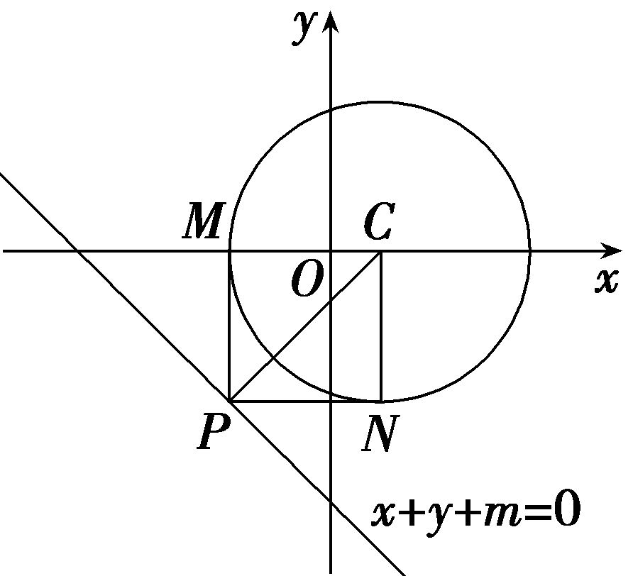

（2）当直线的斜率不存在时，直线方程为<te<te<te<te<te<text st*y*le="italic">x</text>t style="italic">x</text>t st*y*le="italic">x</text>t st*y*le="italic">x</text>t st*y*le="italic">x</text>t st*y*le="italic">x</text>＝2，此时，圆心到直线的距离等于半径，直线与圆相切，符合题意；当直线的斜率存在时，设直线方程为y－4＝*<text style="italic"><text style="italic">k*</text></text>(x－2)，即*kx*－y＋4－2k＝0，因为直线与圆相切，所以圆心到直线的距离等于半径，即*d*＝ $\frac{｜k－1+4－2k｜}{\sqrt{k^{2}＋(-1)^{2}}}$ ＝ $\frac{｜3－k｜}{\sqrt{k^{2}+1}}$ ＝1，解得<te<te<te<te<te<text st*y*le="italic">x</text>t style="italic">x</text>t st*y*le="italic">x</text>t st*y*le="italic">x</text>t st*y*le="italic">x</text>t style="italic">*<text style="italic">k*</text></text>＝ $\frac{4}{3}$ ，所以所求切线方程为 $\frac{4}{3}$ <te<te<te<te<te<text st*y*le="italic">x</text>t style="italic">x</text>t st*y*le="italic">x</text>t st*y*le="italic">x</text>t st*y*le="italic">x</text>t st*y*le="italic">x</text>－y＋4－2× $\frac{4}{3}$ ＝0，即4<te<te<te<te<te<text st*y*le="italic">x</text>t style="italic">x</text>t st*y*le="italic">x</text>t st*y*le="italic">x</text>t st*y*le="italic">x</text>t st*y*le="italic">x</text>－3y＋4＝0.综上，切线方程为x＝2或4x－3y＋4＝0.

角度3　最值(范围)问题

（1）(2025·安徽阜阳模拟)已知圆<em>C</em>：<em>x</em>2＋<em>y</em>2－4<em>x</em>－6<em>y</em>＋12＝0与直线<em>l</em>：<em>x</em>＋<em>y</em>－1＝0，<em>P</em>，<em>Q</em>分别是圆<em>C</em>和直线<em>l</em>上的点且直线<em>PQ</em>与圆<em>C</em>恰有1个公共点，则｜<em>PQ</em>｜的最小值是(　　)

$\quad$A. $\sqrt{7}$ 	
$\quad$B.2 $\sqrt{2}$

$\quad$C. $\sqrt{7}$ －1	
$\quad$D.2 $\sqrt{2}$ －1

（2）(2023·全国乙卷)已知☉*<text style="italic"><text style="italic">O*</text></text>的半径为1，直线*P<text style="italic">A*</text>与☉O相切于点A，直线*P<text style="italic">B*</text>与☉O交于B，*C*两点，*D*为*BC*的中点，若｜*PO*｜＝ $\sqrt{2}$ ，则 $\vec{PA}$ · $\vec{PD}$ 的最大值为(　　)

$\quad$A. $\frac{1+\sqrt{2}}{2}$ 	
$\quad$B. $\frac{1+2\sqrt{2}}{2}$

$\quad$C.1＋ $\sqrt{2}$ 	
$\quad$D.2＋ $\sqrt{2}$

答案（1）A　（2）A

解析（1）圆&lt;te&lt;te&lt;te&lt;text st&lt;text sty<em>l</em>e="italic"&gt;y&lt;/text&gt;le="italic"&gt;x&lt;/text&gt;t st<em>y</em>le="italic"&gt;x&lt;/text&gt;t st<em>y</em>le="italic"&gt;x&lt;/text&gt;t style="italic"&gt;<em>&lt;text style="italic"&gt;&lt;text style="italic"&gt;&lt;text style="italic"&gt;C</em>&lt;/text&gt;&lt;/text&gt;&lt;/text&gt;&lt;/text&gt;：x&lt;text style="supe<em>r</em>script"&gt;&lt;text style="superscript"&gt;&lt;text style="superscript"&gt;2&lt;/text&gt;&lt;/text&gt;&lt;/text&gt;＋y2－4x－6y＋12＝0化为标准方程为C：(x－2)2＋(y－3)2＝1，则圆C的圆心为C(2，3)，半径r＝1，则｜<em>CP</em>｜＝1，直线<em>&lt;text style="italic"&gt;P&lt;text style="italic"&gt;Q</em>&lt;/text&gt;&lt;/text&gt;与圆C相切，有｜<em>&lt;text style="italic"&gt;PQ</em>&lt;/text&gt;｜＝ $\sqrt{｜CQ｜^{2}-|CP｜^{2}}$ ＝ $\sqrt{｜CQ｜^{2}－1}$ ，因为点&lt;text sty<em>l</em>e="italic"&gt;Q&lt;/text&gt;在直线l上，所以｜&lt;te&lt;te&lt;te&lt;text st<em>y</em>le="italic"&gt;x&lt;/text&gt;t st<em>y</em>le="italic"&gt;x&lt;/text&gt;t st<em>y</em>le="italic"&gt;x&lt;/text&gt;t style="italic"&gt;<em>&lt;text style="italic"&gt;&lt;text style="italic"&gt;&lt;text style="italic"&gt;C</em>&lt;/text&gt;&lt;/text&gt;&lt;/text&gt;&lt;/text&gt;Q｜≥ $\frac{｜2+3－1｜}{\sqrt{2}}$ ＝&lt;te&lt;te&lt;text st&lt;text sty<em>l</em>e="italic"&gt;y&lt;/text&gt;le="italic"&gt;x&lt;/text&gt;t st<em>y</em>le="italic"&gt;x&lt;/text&gt;t st<em>y</em>le="supe<em>r</em>script"&gt;&lt;text style="superscript"&gt;&lt;text style="superscript"&gt;2&lt;/text&gt;&lt;/text&gt;&lt;/text&gt; $\sqrt{2}$ ，则｜&lt;text sty<em>l</em>e="italic"&gt;<em>P&lt;text style="italic"&gt;Q</em>&lt;/text&gt;&lt;/text&gt;｜≥ $\sqrt{7}$ .即｜&lt;text sty<em>l</em>e="italic"&gt;<em>P&lt;text style="italic"&gt;Q</em>&lt;/text&gt;&lt;/text&gt;｜的最小值是 $\sqrt{7}$ .故选A.

(&lt;text style="superscript"&gt;2&lt;/text&gt;)由题意可知，｜<em>O&lt;text style="italic"&gt;&lt;text style="italic"&gt;A</em>&lt;/text&gt;&lt;/text&gt;｜＝1，｜<em>&lt;text style="italic"&gt;&lt;text style="italic"&gt;PO</em>&lt;/text&gt;&lt;/text&gt;｜＝ $\sqrt{2}$ ，∠<em>&lt;text style="italic"&gt;A</em>&lt;/text&gt;<em>&lt;text style="italic"&gt;&lt;text style="italic"&gt;PO</em>&lt;/text&gt;&lt;/text&gt;＝45°，由勾股定理可得｜<em>PA</em>｜＝ $\sqrt{｜OP｜^{2}-|OA｜^{2}}$ ＝1，当点<em>&lt;text style="italic"&gt;A</em>&lt;/text&gt;，<em>&lt;text style="italic"&gt;D</em>&lt;/text&gt;位于直线<em>&lt;text style="italic"&gt;&lt;text style="italic"&gt;PO</em>&lt;/text&gt;&lt;/text&gt;异侧时，如图①所示，设∠<em>&lt;text style="italic"&gt;OPC</em>&lt;/text&gt;＝<em>&lt;text style="italic"&gt;&lt;text style="italic"&gt;&lt;text style="italic"&gt;&lt;text style="italic"&gt;&lt;text style="italic"&gt;&lt;text style="italic"&gt;&lt;text style="italic"&gt;&lt;text style="italic"&gt;&lt;text style="italic"&gt;&lt;text style="italic"&gt;&lt;text style="italic"&gt;&lt;text style="italic"&gt;&lt;text style="italic"&gt;&lt;text style="italic"&gt;&lt;text style="italic"&gt;&lt;text style="italic"&gt;&lt;text style="italic"&gt;&lt;text style="italic"&gt;&lt;text style="italic"&gt;&lt;text style="italic"&gt;&lt;text style="italic"&gt;&lt;text style="italic"&gt;&lt;text style="italic"&gt;&lt;text style="italic"&gt;&lt;text style="italic"&gt;&lt;text style="italic"&gt;&lt;text style="italic"&gt;&lt;text style="italic"&gt;&lt;text style="italic"&gt;&lt;text style="italic"&gt;&lt;text style="italic"&gt;α</em>&lt;/text&gt;&lt;/text&gt;&lt;/text&gt;&lt;/text&gt;&lt;/text&gt;&lt;/text&gt;&lt;/text&gt;&lt;/text&gt;&lt;/text&gt;&lt;/text&gt;&lt;/text&gt;&lt;/text&gt;&lt;/text&gt;&lt;/text&gt;&lt;/text&gt;&lt;/text&gt;&lt;/text&gt;&lt;/text&gt;&lt;/text&gt;&lt;/text&gt;&lt;/text&gt;&lt;/text&gt;&lt;/text&gt;&lt;/text&gt;&lt;/text&gt;&lt;/text&gt;&lt;/text&gt;&lt;/text&gt;&lt;/text&gt;&lt;/text&gt;&lt;/text&gt;，0≤α＜ $\frac{\pi }{4}$ ，则 $\vec{PA}$ <em>·</em> $\vec{PD}$ ＝｜ $\vec{PA}$ ｜<em>·</em>｜ $\vec{PD}$ ｜cos(<em>&lt;text style="italic"&gt;&lt;text style="italic"&gt;&lt;text style="italic"&gt;&lt;text style="italic"&gt;&lt;text style="italic"&gt;&lt;text style="italic"&gt;&lt;text style="italic"&gt;&lt;text style="italic"&gt;&lt;text style="italic"&gt;&lt;text style="italic"&gt;&lt;text style="italic"&gt;&lt;text style="italic"&gt;&lt;text style="italic"&gt;&lt;text style="italic"&gt;&lt;text style="italic"&gt;&lt;text style="italic"&gt;&lt;text style="italic"&gt;&lt;text style="italic"&gt;&lt;text style="italic"&gt;&lt;text style="italic"&gt;&lt;text style="italic"&gt;&lt;text style="italic"&gt;&lt;text style="italic"&gt;&lt;text style="italic"&gt;&lt;text style="italic"&gt;&lt;text style="italic"&gt;&lt;text style="italic"&gt;&lt;text style="italic"&gt;&lt;text style="italic"&gt;&lt;text style="italic"&gt;&lt;text style="italic"&gt;α</em>&lt;/text&gt;&lt;/text&gt;&lt;/text&gt;&lt;/text&gt;&lt;/text&gt;&lt;/text&gt;&lt;/text&gt;&lt;/text&gt;&lt;/text&gt;&lt;/text&gt;&lt;/text&gt;&lt;/text&gt;&lt;/text&gt;&lt;/text&gt;&lt;/text&gt;&lt;/text&gt;&lt;/text&gt;&lt;/text&gt;&lt;/text&gt;&lt;/text&gt;&lt;/text&gt;&lt;/text&gt;&lt;/text&gt;&lt;/text&gt;&lt;/text&gt;&lt;/text&gt;&lt;/text&gt;&lt;/text&gt;&lt;/text&gt;&lt;/text&gt;&lt;/text&gt;＋ $\frac{\pi }{4}$ )＝1× $\sqrt{2}$ cos <em>&lt;text style="italic"&gt;&lt;text style="italic"&gt;&lt;text style="italic"&gt;&lt;text style="italic"&gt;&lt;text style="italic"&gt;&lt;text style="italic"&gt;&lt;text style="italic"&gt;&lt;text style="italic"&gt;&lt;text style="italic"&gt;&lt;text style="italic"&gt;&lt;text style="italic"&gt;&lt;text style="italic"&gt;&lt;text style="italic"&gt;&lt;text style="italic"&gt;&lt;text style="italic"&gt;&lt;text style="italic"&gt;&lt;text style="italic"&gt;&lt;text style="italic"&gt;&lt;text style="italic"&gt;&lt;text style="italic"&gt;&lt;text style="italic"&gt;&lt;text style="italic"&gt;&lt;text style="italic"&gt;&lt;text style="italic"&gt;&lt;text style="italic"&gt;&lt;text style="italic"&gt;&lt;text style="italic"&gt;&lt;text style="italic"&gt;&lt;text style="italic"&gt;&lt;text style="italic"&gt;&lt;text style="italic"&gt;α</em>&lt;/text&gt;&lt;/text&gt;&lt;/text&gt;&lt;/text&gt;&lt;/text&gt;&lt;/text&gt;&lt;/text&gt;&lt;/text&gt;&lt;/text&gt;&lt;/text&gt;&lt;/text&gt;&lt;/text&gt;&lt;/text&gt;&lt;/text&gt;&lt;/text&gt;&lt;/text&gt;&lt;/text&gt;&lt;/text&gt;&lt;/text&gt;&lt;/text&gt;&lt;/text&gt;&lt;/text&gt;&lt;/text&gt;&lt;/text&gt;&lt;/text&gt;&lt;/text&gt;&lt;/text&gt;&lt;/text&gt;&lt;/text&gt;&lt;/text&gt;&lt;/text&gt;cos(α＋ $\frac{\pi }{4}$ )＝ $\sqrt{2}$ cos <em>&lt;text style="italic"&gt;&lt;text style="italic"&gt;&lt;text style="italic"&gt;&lt;text style="italic"&gt;&lt;text style="italic"&gt;&lt;text style="italic"&gt;&lt;text style="italic"&gt;&lt;text style="italic"&gt;&lt;text style="italic"&gt;&lt;text style="italic"&gt;&lt;text style="italic"&gt;&lt;text style="italic"&gt;&lt;text style="italic"&gt;&lt;text style="italic"&gt;&lt;text style="italic"&gt;&lt;text style="italic"&gt;&lt;text style="italic"&gt;&lt;text style="italic"&gt;&lt;text style="italic"&gt;&lt;text style="italic"&gt;&lt;text style="italic"&gt;&lt;text style="italic"&gt;&lt;text style="italic"&gt;&lt;text style="italic"&gt;&lt;text style="italic"&gt;&lt;text style="italic"&gt;&lt;text style="italic"&gt;&lt;text style="italic"&gt;&lt;text style="italic"&gt;&lt;text style="italic"&gt;&lt;text style="italic"&gt;α</em>&lt;/text&gt;&lt;/text&gt;&lt;/text&gt;&lt;/text&gt;&lt;/text&gt;&lt;/text&gt;&lt;/text&gt;&lt;/text&gt;&lt;/text&gt;&lt;/text&gt;&lt;/text&gt;&lt;/text&gt;&lt;/text&gt;&lt;/text&gt;&lt;/text&gt;&lt;/text&gt;&lt;/text&gt;&lt;/text&gt;&lt;/text&gt;&lt;/text&gt;&lt;/text&gt;&lt;/text&gt;&lt;/text&gt;&lt;/text&gt;&lt;/text&gt;&lt;/text&gt;&lt;/text&gt;&lt;/text&gt;&lt;/text&gt;&lt;/text&gt;&lt;/text&gt;( $\frac{\sqrt{2}}{2}$ cos <em>&lt;text style="italic"&gt;&lt;text style="italic"&gt;&lt;text style="italic"&gt;&lt;text style="italic"&gt;&lt;text style="italic"&gt;&lt;text style="italic"&gt;&lt;text style="italic"&gt;&lt;text style="italic"&gt;&lt;text style="italic"&gt;&lt;text style="italic"&gt;&lt;text style="italic"&gt;&lt;text style="italic"&gt;&lt;text style="italic"&gt;&lt;text style="italic"&gt;&lt;text style="italic"&gt;&lt;text style="italic"&gt;&lt;text style="italic"&gt;&lt;text style="italic"&gt;&lt;text style="italic"&gt;&lt;text style="italic"&gt;&lt;text style="italic"&gt;&lt;text style="italic"&gt;&lt;text style="italic"&gt;&lt;text style="italic"&gt;&lt;text style="italic"&gt;&lt;text style="italic"&gt;&lt;text style="italic"&gt;&lt;text style="italic"&gt;&lt;text style="italic"&gt;&lt;text style="italic"&gt;&lt;text style="italic"&gt;α</em>&lt;/text&gt;&lt;/text&gt;&lt;/text&gt;&lt;/text&gt;&lt;/text&gt;&lt;/text&gt;&lt;/text&gt;&lt;/text&gt;&lt;/text&gt;&lt;/text&gt;&lt;/text&gt;&lt;/text&gt;&lt;/text&gt;&lt;/text&gt;&lt;/text&gt;&lt;/text&gt;&lt;/text&gt;&lt;/text&gt;&lt;/text&gt;&lt;/text&gt;&lt;/text&gt;&lt;/text&gt;&lt;/text&gt;&lt;/text&gt;&lt;/text&gt;&lt;/text&gt;&lt;/text&gt;&lt;/text&gt;&lt;/text&gt;&lt;/text&gt;&lt;/text&gt;－ $\frac{\sqrt{2}}{2}$ sin <em>&lt;text style="italic"&gt;&lt;text style="italic"&gt;&lt;text style="italic"&gt;&lt;text style="italic"&gt;&lt;text style="italic"&gt;&lt;text style="italic"&gt;&lt;text style="italic"&gt;&lt;text style="italic"&gt;&lt;text style="italic"&gt;&lt;text style="italic"&gt;&lt;text style="italic"&gt;&lt;text style="italic"&gt;&lt;text style="italic"&gt;&lt;text style="italic"&gt;&lt;text style="italic"&gt;&lt;text style="italic"&gt;&lt;text style="italic"&gt;&lt;text style="italic"&gt;&lt;text style="italic"&gt;&lt;text style="italic"&gt;&lt;text style="italic"&gt;&lt;text style="italic"&gt;&lt;text style="italic"&gt;&lt;text style="italic"&gt;&lt;text style="italic"&gt;&lt;text style="italic"&gt;&lt;text style="italic"&gt;&lt;text style="italic"&gt;&lt;text style="italic"&gt;&lt;text style="italic"&gt;&lt;text style="italic"&gt;α</em>&lt;/text&gt;&lt;/text&gt;&lt;/text&gt;&lt;/text&gt;&lt;/text&gt;&lt;/text&gt;&lt;/text&gt;&lt;/text&gt;&lt;/text&gt;&lt;/text&gt;&lt;/text&gt;&lt;/text&gt;&lt;/text&gt;&lt;/text&gt;&lt;/text&gt;&lt;/text&gt;&lt;/text&gt;&lt;/text&gt;&lt;/text&gt;&lt;/text&gt;&lt;/text&gt;&lt;/text&gt;&lt;/text&gt;&lt;/text&gt;&lt;/text&gt;&lt;/text&gt;&lt;/text&gt;&lt;/text&gt;&lt;/text&gt;&lt;/text&gt;&lt;/text&gt;)＝cos&lt;text style="superscript"&gt;2&lt;/text&gt;α－sin αcos α＝ $\frac{1+cos2\alpha }{2}$ － $\frac{1}{2}$ sin &lt;text style="superscript"&gt;2&lt;/text&gt;<em>&lt;text style="italic"&gt;&lt;text style="italic"&gt;&lt;text style="italic"&gt;&lt;text style="italic"&gt;&lt;text style="italic"&gt;&lt;text style="italic"&gt;&lt;text style="italic"&gt;&lt;text style="italic"&gt;&lt;text style="italic"&gt;&lt;text style="italic"&gt;&lt;text style="italic"&gt;&lt;text style="italic"&gt;&lt;text style="italic"&gt;&lt;text style="italic"&gt;&lt;text style="italic"&gt;&lt;text style="italic"&gt;&lt;text style="italic"&gt;&lt;text style="italic"&gt;&lt;text style="italic"&gt;&lt;text style="italic"&gt;&lt;text style="italic"&gt;&lt;text style="italic"&gt;&lt;text style="italic"&gt;&lt;text style="italic"&gt;&lt;text style="italic"&gt;&lt;text style="italic"&gt;&lt;text style="italic"&gt;&lt;text style="italic"&gt;&lt;text style="italic"&gt;&lt;text style="italic"&gt;&lt;text style="italic"&gt;α</em>&lt;/text&gt;&lt;/text&gt;&lt;/text&gt;&lt;/text&gt;&lt;/text&gt;&lt;/text&gt;&lt;/text&gt;&lt;/text&gt;&lt;/text&gt;&lt;/text&gt;&lt;/text&gt;&lt;/text&gt;&lt;/text&gt;&lt;/text&gt;&lt;/text&gt;&lt;/text&gt;&lt;/text&gt;&lt;/text&gt;&lt;/text&gt;&lt;/text&gt;&lt;/text&gt;&lt;/text&gt;&lt;/text&gt;&lt;/text&gt;&lt;/text&gt;&lt;/text&gt;&lt;/text&gt;&lt;/text&gt;&lt;/text&gt;&lt;/text&gt;&lt;/text&gt;＝ $\frac{1}{2}$ － $\frac{\sqrt{2}}{2}$ sin(&lt;text style="superscript"&gt;2&lt;/text&gt;<em>&lt;text style="italic"&gt;&lt;text style="italic"&gt;&lt;text style="italic"&gt;&lt;text style="italic"&gt;&lt;text style="italic"&gt;&lt;text style="italic"&gt;&lt;text style="italic"&gt;&lt;text style="italic"&gt;&lt;text style="italic"&gt;&lt;text style="italic"&gt;&lt;text style="italic"&gt;&lt;text style="italic"&gt;&lt;text style="italic"&gt;&lt;text style="italic"&gt;&lt;text style="italic"&gt;&lt;text style="italic"&gt;&lt;text style="italic"&gt;&lt;text style="italic"&gt;&lt;text style="italic"&gt;&lt;text style="italic"&gt;&lt;text style="italic"&gt;&lt;text style="italic"&gt;&lt;text style="italic"&gt;&lt;text style="italic"&gt;&lt;text style="italic"&gt;&lt;text style="italic"&gt;&lt;text style="italic"&gt;&lt;text style="italic"&gt;&lt;text style="italic"&gt;&lt;text style="italic"&gt;&lt;text style="italic"&gt;α</em>&lt;/text&gt;&lt;/text&gt;&lt;/text&gt;&lt;/text&gt;&lt;/text&gt;&lt;/text&gt;&lt;/text&gt;&lt;/text&gt;&lt;/text&gt;&lt;/text&gt;&lt;/text&gt;&lt;/text&gt;&lt;/text&gt;&lt;/text&gt;&lt;/text&gt;&lt;/text&gt;&lt;/text&gt;&lt;/text&gt;&lt;/text&gt;&lt;/text&gt;&lt;/text&gt;&lt;/text&gt;&lt;/text&gt;&lt;/text&gt;&lt;/text&gt;&lt;/text&gt;&lt;/text&gt;&lt;/text&gt;&lt;/text&gt;&lt;/text&gt;&lt;/text&gt;－ $\frac{\pi }{4}$ )，又0≤<em>&lt;text style="italic"&gt;&lt;text style="italic"&gt;&lt;text style="italic"&gt;&lt;text style="italic"&gt;&lt;text style="italic"&gt;&lt;text style="italic"&gt;&lt;text style="italic"&gt;&lt;text style="italic"&gt;&lt;text style="italic"&gt;&lt;text style="italic"&gt;&lt;text style="italic"&gt;&lt;text style="italic"&gt;&lt;text style="italic"&gt;&lt;text style="italic"&gt;&lt;text style="italic"&gt;&lt;text style="italic"&gt;&lt;text style="italic"&gt;&lt;text style="italic"&gt;&lt;text style="italic"&gt;&lt;text style="italic"&gt;&lt;text style="italic"&gt;&lt;text style="italic"&gt;&lt;text style="italic"&gt;&lt;text style="italic"&gt;&lt;text style="italic"&gt;&lt;text style="italic"&gt;&lt;text style="italic"&gt;&lt;text style="italic"&gt;&lt;text style="italic"&gt;&lt;text style="italic"&gt;&lt;text style="italic"&gt;α</em>&lt;/text&gt;&lt;/text&gt;&lt;/text&gt;&lt;/text&gt;&lt;/text&gt;&lt;/text&gt;&lt;/text&gt;&lt;/text&gt;&lt;/text&gt;&lt;/text&gt;&lt;/text&gt;&lt;/text&gt;&lt;/text&gt;&lt;/text&gt;&lt;/text&gt;&lt;/text&gt;&lt;/text&gt;&lt;/text&gt;&lt;/text&gt;&lt;/text&gt;&lt;/text&gt;&lt;/text&gt;&lt;/text&gt;&lt;/text&gt;&lt;/text&gt;&lt;/text&gt;&lt;/text&gt;&lt;/text&gt;&lt;/text&gt;&lt;/text&gt;&lt;/text&gt;＜ $\frac{\pi }{4}$ ，则－ $\frac{\pi }{4}$ ≤&lt;text style="superscript"&gt;2&lt;/text&gt;<em>&lt;text style="italic"&gt;&lt;text style="italic"&gt;&lt;text style="italic"&gt;&lt;text style="italic"&gt;&lt;text style="italic"&gt;&lt;text style="italic"&gt;&lt;text style="italic"&gt;&lt;text style="italic"&gt;&lt;text style="italic"&gt;&lt;text style="italic"&gt;&lt;text style="italic"&gt;&lt;text style="italic"&gt;&lt;text style="italic"&gt;&lt;text style="italic"&gt;&lt;text style="italic"&gt;&lt;text style="italic"&gt;&lt;text style="italic"&gt;&lt;text style="italic"&gt;&lt;text style="italic"&gt;&lt;text style="italic"&gt;&lt;text style="italic"&gt;&lt;text style="italic"&gt;&lt;text style="italic"&gt;&lt;text style="italic"&gt;&lt;text style="italic"&gt;&lt;text style="italic"&gt;&lt;text style="italic"&gt;&lt;text style="italic"&gt;&lt;text style="italic"&gt;&lt;text style="italic"&gt;&lt;text style="italic"&gt;α</em>&lt;/text&gt;&lt;/text&gt;&lt;/text&gt;&lt;/text&gt;&lt;/text&gt;&lt;/text&gt;&lt;/text&gt;&lt;/text&gt;&lt;/text&gt;&lt;/text&gt;&lt;/text&gt;&lt;/text&gt;&lt;/text&gt;&lt;/text&gt;&lt;/text&gt;&lt;/text&gt;&lt;/text&gt;&lt;/text&gt;&lt;/text&gt;&lt;/text&gt;&lt;/text&gt;&lt;/text&gt;&lt;/text&gt;&lt;/text&gt;&lt;/text&gt;&lt;/text&gt;&lt;/text&gt;&lt;/text&gt;&lt;/text&gt;&lt;/text&gt;&lt;/text&gt;－ $\frac{\pi }{4}$ ＜ $\frac{\pi }{4}$ ，所以当&lt;text style="superscript"&gt;2&lt;/text&gt;<em>&lt;text style="italic"&gt;&lt;text style="italic"&gt;&lt;text style="italic"&gt;&lt;text style="italic"&gt;&lt;text style="italic"&gt;&lt;text style="italic"&gt;&lt;text style="italic"&gt;&lt;text style="italic"&gt;&lt;text style="italic"&gt;&lt;text style="italic"&gt;&lt;text style="italic"&gt;&lt;text style="italic"&gt;&lt;text style="italic"&gt;&lt;text style="italic"&gt;&lt;text style="italic"&gt;&lt;text style="italic"&gt;&lt;text style="italic"&gt;&lt;text style="italic"&gt;&lt;text style="italic"&gt;&lt;text style="italic"&gt;&lt;text style="italic"&gt;&lt;text style="italic"&gt;&lt;text style="italic"&gt;&lt;text style="italic"&gt;&lt;text style="italic"&gt;&lt;text style="italic"&gt;&lt;text style="italic"&gt;&lt;text style="italic"&gt;&lt;text style="italic"&gt;&lt;text style="italic"&gt;&lt;text style="italic"&gt;α</em>&lt;/text&gt;&lt;/text&gt;&lt;/text&gt;&lt;/text&gt;&lt;/text&gt;&lt;/text&gt;&lt;/text&gt;&lt;/text&gt;&lt;/text&gt;&lt;/text&gt;&lt;/text&gt;&lt;/text&gt;&lt;/text&gt;&lt;/text&gt;&lt;/text&gt;&lt;/text&gt;&lt;/text&gt;&lt;/text&gt;&lt;/text&gt;&lt;/text&gt;&lt;/text&gt;&lt;/text&gt;&lt;/text&gt;&lt;/text&gt;&lt;/text&gt;&lt;/text&gt;&lt;/text&gt;&lt;/text&gt;&lt;/text&gt;&lt;/text&gt;&lt;/text&gt;－ $\frac{\pi }{4}$ ＝－ $\frac{\pi }{4}$ 时， $\vec{PA}$ <em>·</em> $\vec{PD}$ 有最大值1；当点<em>&lt;text style="italic"&gt;A</em>&lt;/text&gt;，<em>&lt;text style="italic"&gt;D</em>&lt;/text&gt;位于直线<em>&lt;text style="italic"&gt;&lt;text style="italic"&gt;PO</em>&lt;/text&gt;&lt;/text&gt;同侧时，如图②所示，设∠<em>&lt;text style="italic"&gt;OPC</em>&lt;/text&gt;＝<em>&lt;text style="italic"&gt;&lt;text style="italic"&gt;&lt;text style="italic"&gt;&lt;text style="italic"&gt;&lt;text style="italic"&gt;&lt;text style="italic"&gt;&lt;text style="italic"&gt;&lt;text style="italic"&gt;&lt;text style="italic"&gt;&lt;text style="italic"&gt;&lt;text style="italic"&gt;&lt;text style="italic"&gt;&lt;text style="italic"&gt;&lt;text style="italic"&gt;&lt;text style="italic"&gt;&lt;text style="italic"&gt;&lt;text style="italic"&gt;&lt;text style="italic"&gt;&lt;text style="italic"&gt;&lt;text style="italic"&gt;&lt;text style="italic"&gt;&lt;text style="italic"&gt;&lt;text style="italic"&gt;&lt;text style="italic"&gt;&lt;text style="italic"&gt;&lt;text style="italic"&gt;&lt;text style="italic"&gt;&lt;text style="italic"&gt;&lt;text style="italic"&gt;&lt;text style="italic"&gt;&lt;text style="italic"&gt;α</em>&lt;/text&gt;&lt;/text&gt;&lt;/text&gt;&lt;/text&gt;&lt;/text&gt;&lt;/text&gt;&lt;/text&gt;&lt;/text&gt;&lt;/text&gt;&lt;/text&gt;&lt;/text&gt;&lt;/text&gt;&lt;/text&gt;&lt;/text&gt;&lt;/text&gt;&lt;/text&gt;&lt;/text&gt;&lt;/text&gt;&lt;/text&gt;&lt;/text&gt;&lt;/text&gt;&lt;/text&gt;&lt;/text&gt;&lt;/text&gt;&lt;/text&gt;&lt;/text&gt;&lt;/text&gt;&lt;/text&gt;&lt;/text&gt;&lt;/text&gt;&lt;/text&gt;，0≤α＜ $\frac{\pi }{4}$ ，则 $\vec{PA}$ <em>·</em> $\vec{PD}$ ＝｜ $\vec{PA}$ ｜<em>·</em>｜ $\vec{PD}$ ｜cos( $\frac{\pi }{4}$ －<em>&lt;text style="italic"&gt;&lt;text style="italic"&gt;&lt;text style="italic"&gt;&lt;text style="italic"&gt;&lt;text style="italic"&gt;&lt;text style="italic"&gt;&lt;text style="italic"&gt;&lt;text style="italic"&gt;&lt;text style="italic"&gt;&lt;text style="italic"&gt;&lt;text style="italic"&gt;&lt;text style="italic"&gt;&lt;text style="italic"&gt;&lt;text style="italic"&gt;&lt;text style="italic"&gt;&lt;text style="italic"&gt;&lt;text style="italic"&gt;&lt;text style="italic"&gt;&lt;text style="italic"&gt;&lt;text style="italic"&gt;&lt;text style="italic"&gt;&lt;text style="italic"&gt;&lt;text style="italic"&gt;&lt;text style="italic"&gt;&lt;text style="italic"&gt;&lt;text style="italic"&gt;&lt;text style="italic"&gt;&lt;text style="italic"&gt;&lt;text style="italic"&gt;&lt;text style="italic"&gt;&lt;text style="italic"&gt;α</em>&lt;/text&gt;&lt;/text&gt;&lt;/text&gt;&lt;/text&gt;&lt;/text&gt;&lt;/text&gt;&lt;/text&gt;&lt;/text&gt;&lt;/text&gt;&lt;/text&gt;&lt;/text&gt;&lt;/text&gt;&lt;/text&gt;&lt;/text&gt;&lt;/text&gt;&lt;/text&gt;&lt;/text&gt;&lt;/text&gt;&lt;/text&gt;&lt;/text&gt;&lt;/text&gt;&lt;/text&gt;&lt;/text&gt;&lt;/text&gt;&lt;/text&gt;&lt;/text&gt;&lt;/text&gt;&lt;/text&gt;&lt;/text&gt;&lt;/text&gt;&lt;/text&gt;)＝1× $\sqrt{2}$ cos <em>&lt;text style="italic"&gt;&lt;text style="italic"&gt;&lt;text style="italic"&gt;&lt;text style="italic"&gt;&lt;text style="italic"&gt;&lt;text style="italic"&gt;&lt;text style="italic"&gt;&lt;text style="italic"&gt;&lt;text style="italic"&gt;&lt;text style="italic"&gt;&lt;text style="italic"&gt;&lt;text style="italic"&gt;&lt;text style="italic"&gt;&lt;text style="italic"&gt;&lt;text style="italic"&gt;&lt;text style="italic"&gt;&lt;text style="italic"&gt;&lt;text style="italic"&gt;&lt;text style="italic"&gt;&lt;text style="italic"&gt;&lt;text style="italic"&gt;&lt;text style="italic"&gt;&lt;text style="italic"&gt;&lt;text style="italic"&gt;&lt;text style="italic"&gt;&lt;text style="italic"&gt;&lt;text style="italic"&gt;&lt;text style="italic"&gt;&lt;text style="italic"&gt;&lt;text style="italic"&gt;&lt;text style="italic"&gt;α</em>&lt;/text&gt;&lt;/text&gt;&lt;/text&gt;&lt;/text&gt;&lt;/text&gt;&lt;/text&gt;&lt;/text&gt;&lt;/text&gt;&lt;/text&gt;&lt;/text&gt;&lt;/text&gt;&lt;/text&gt;&lt;/text&gt;&lt;/text&gt;&lt;/text&gt;&lt;/text&gt;&lt;/text&gt;&lt;/text&gt;&lt;/text&gt;&lt;/text&gt;&lt;/text&gt;&lt;/text&gt;&lt;/text&gt;&lt;/text&gt;&lt;/text&gt;&lt;/text&gt;&lt;/text&gt;&lt;/text&gt;&lt;/text&gt;&lt;/text&gt;&lt;/text&gt;cos( $\frac{\pi }{4}$ －<em>&lt;text style="italic"&gt;&lt;text style="italic"&gt;&lt;text style="italic"&gt;&lt;text style="italic"&gt;&lt;text style="italic"&gt;&lt;text style="italic"&gt;&lt;text style="italic"&gt;&lt;text style="italic"&gt;&lt;text style="italic"&gt;&lt;text style="italic"&gt;&lt;text style="italic"&gt;&lt;text style="italic"&gt;&lt;text style="italic"&gt;&lt;text style="italic"&gt;&lt;text style="italic"&gt;&lt;text style="italic"&gt;&lt;text style="italic"&gt;&lt;text style="italic"&gt;&lt;text style="italic"&gt;&lt;text style="italic"&gt;&lt;text style="italic"&gt;&lt;text style="italic"&gt;&lt;text style="italic"&gt;&lt;text style="italic"&gt;&lt;text style="italic"&gt;&lt;text style="italic"&gt;&lt;text style="italic"&gt;&lt;text style="italic"&gt;&lt;text style="italic"&gt;&lt;text style="italic"&gt;&lt;text style="italic"&gt;α</em>&lt;/text&gt;&lt;/text&gt;&lt;/text&gt;&lt;/text&gt;&lt;/text&gt;&lt;/text&gt;&lt;/text&gt;&lt;/text&gt;&lt;/text&gt;&lt;/text&gt;&lt;/text&gt;&lt;/text&gt;&lt;/text&gt;&lt;/text&gt;&lt;/text&gt;&lt;/text&gt;&lt;/text&gt;&lt;/text&gt;&lt;/text&gt;&lt;/text&gt;&lt;/text&gt;&lt;/text&gt;&lt;/text&gt;&lt;/text&gt;&lt;/text&gt;&lt;/text&gt;&lt;/text&gt;&lt;/text&gt;&lt;/text&gt;&lt;/text&gt;&lt;/text&gt;)＝ $\sqrt{2}$ cos <em>&lt;text style="italic"&gt;&lt;text style="italic"&gt;&lt;text style="italic"&gt;&lt;text style="italic"&gt;&lt;text style="italic"&gt;&lt;text style="italic"&gt;&lt;text style="italic"&gt;&lt;text style="italic"&gt;&lt;text style="italic"&gt;&lt;text style="italic"&gt;&lt;text style="italic"&gt;&lt;text style="italic"&gt;&lt;text style="italic"&gt;&lt;text style="italic"&gt;&lt;text style="italic"&gt;&lt;text style="italic"&gt;&lt;text style="italic"&gt;&lt;text style="italic"&gt;&lt;text style="italic"&gt;&lt;text style="italic"&gt;&lt;text style="italic"&gt;&lt;text style="italic"&gt;&lt;text style="italic"&gt;&lt;text style="italic"&gt;&lt;text style="italic"&gt;&lt;text style="italic"&gt;&lt;text style="italic"&gt;&lt;text style="italic"&gt;&lt;text style="italic"&gt;&lt;text style="italic"&gt;&lt;text style="italic"&gt;α</em>&lt;/text&gt;&lt;/text&gt;&lt;/text&gt;&lt;/text&gt;&lt;/text&gt;&lt;/text&gt;&lt;/text&gt;&lt;/text&gt;&lt;/text&gt;&lt;/text&gt;&lt;/text&gt;&lt;/text&gt;&lt;/text&gt;&lt;/text&gt;&lt;/text&gt;&lt;/text&gt;&lt;/text&gt;&lt;/text&gt;&lt;/text&gt;&lt;/text&gt;&lt;/text&gt;&lt;/text&gt;&lt;/text&gt;&lt;/text&gt;&lt;/text&gt;&lt;/text&gt;&lt;/text&gt;&lt;/text&gt;&lt;/text&gt;&lt;/text&gt;&lt;/text&gt;( $\frac{\sqrt{2}}{2}$ cos <em>&lt;text style="italic"&gt;&lt;text style="italic"&gt;&lt;text style="italic"&gt;&lt;text style="italic"&gt;&lt;text style="italic"&gt;&lt;text style="italic"&gt;&lt;text style="italic"&gt;&lt;text style="italic"&gt;&lt;text style="italic"&gt;&lt;text style="italic"&gt;&lt;text style="italic"&gt;&lt;text style="italic"&gt;&lt;text style="italic"&gt;&lt;text style="italic"&gt;&lt;text style="italic"&gt;&lt;text style="italic"&gt;&lt;text style="italic"&gt;&lt;text style="italic"&gt;&lt;text style="italic"&gt;&lt;text style="italic"&gt;&lt;text style="italic"&gt;&lt;text style="italic"&gt;&lt;text style="italic"&gt;&lt;text style="italic"&gt;&lt;text style="italic"&gt;&lt;text style="italic"&gt;&lt;text style="italic"&gt;&lt;text style="italic"&gt;&lt;text style="italic"&gt;&lt;text style="italic"&gt;&lt;text style="italic"&gt;α</em>&lt;/text&gt;&lt;/text&gt;&lt;/text&gt;&lt;/text&gt;&lt;/text&gt;&lt;/text&gt;&lt;/text&gt;&lt;/text&gt;&lt;/text&gt;&lt;/text&gt;&lt;/text&gt;&lt;/text&gt;&lt;/text&gt;&lt;/text&gt;&lt;/text&gt;&lt;/text&gt;&lt;/text&gt;&lt;/text&gt;&lt;/text&gt;&lt;/text&gt;&lt;/text&gt;&lt;/text&gt;&lt;/text&gt;&lt;/text&gt;&lt;/text&gt;&lt;/text&gt;&lt;/text&gt;&lt;/text&gt;&lt;/text&gt;&lt;/text&gt;&lt;/text&gt;＋ $\frac{\sqrt{2}}{2}$ sin <em>&lt;text style="italic"&gt;&lt;text style="italic"&gt;&lt;text style="italic"&gt;&lt;text style="italic"&gt;&lt;text style="italic"&gt;&lt;text style="italic"&gt;&lt;text style="italic"&gt;&lt;text style="italic"&gt;&lt;text style="italic"&gt;&lt;text style="italic"&gt;&lt;text style="italic"&gt;&lt;text style="italic"&gt;&lt;text style="italic"&gt;&lt;text style="italic"&gt;&lt;text style="italic"&gt;&lt;text style="italic"&gt;&lt;text style="italic"&gt;&lt;text style="italic"&gt;&lt;text style="italic"&gt;&lt;text style="italic"&gt;&lt;text style="italic"&gt;&lt;text style="italic"&gt;&lt;text style="italic"&gt;&lt;text style="italic"&gt;&lt;text style="italic"&gt;&lt;text style="italic"&gt;&lt;text style="italic"&gt;&lt;text style="italic"&gt;&lt;text style="italic"&gt;&lt;text style="italic"&gt;&lt;text style="italic"&gt;α</em>&lt;/text&gt;&lt;/text&gt;&lt;/text&gt;&lt;/text&gt;&lt;/text&gt;&lt;/text&gt;&lt;/text&gt;&lt;/text&gt;&lt;/text&gt;&lt;/text&gt;&lt;/text&gt;&lt;/text&gt;&lt;/text&gt;&lt;/text&gt;&lt;/text&gt;&lt;/text&gt;&lt;/text&gt;&lt;/text&gt;&lt;/text&gt;&lt;/text&gt;&lt;/text&gt;&lt;/text&gt;&lt;/text&gt;&lt;/text&gt;&lt;/text&gt;&lt;/text&gt;&lt;/text&gt;&lt;/text&gt;&lt;/text&gt;&lt;/text&gt;&lt;/text&gt;)＝cos&lt;text style="superscript"&gt;2&lt;/text&gt;α＋sin αcos α＝ $\frac{1+cos2\alpha }{2}$ ＋ $\frac{1}{2}$ sin &lt;text style="superscript"&gt;2&lt;/text&gt;<em>&lt;text style="italic"&gt;&lt;text style="italic"&gt;&lt;text style="italic"&gt;&lt;text style="italic"&gt;&lt;text style="italic"&gt;&lt;text style="italic"&gt;&lt;text style="italic"&gt;&lt;text style="italic"&gt;&lt;text style="italic"&gt;&lt;text style="italic"&gt;&lt;text style="italic"&gt;&lt;text style="italic"&gt;&lt;text style="italic"&gt;&lt;text style="italic"&gt;&lt;text style="italic"&gt;&lt;text style="italic"&gt;&lt;text style="italic"&gt;&lt;text style="italic"&gt;&lt;text style="italic"&gt;&lt;text style="italic"&gt;&lt;text style="italic"&gt;&lt;text style="italic"&gt;&lt;text style="italic"&gt;&lt;text style="italic"&gt;&lt;text style="italic"&gt;&lt;text style="italic"&gt;&lt;text style="italic"&gt;&lt;text style="italic"&gt;&lt;text style="italic"&gt;&lt;text style="italic"&gt;&lt;text style="italic"&gt;α</em>&lt;/text&gt;&lt;/text&gt;&lt;/text&gt;&lt;/text&gt;&lt;/text&gt;&lt;/text&gt;&lt;/text&gt;&lt;/text&gt;&lt;/text&gt;&lt;/text&gt;&lt;/text&gt;&lt;/text&gt;&lt;/text&gt;&lt;/text&gt;&lt;/text&gt;&lt;/text&gt;&lt;/text&gt;&lt;/text&gt;&lt;/text&gt;&lt;/text&gt;&lt;/text&gt;&lt;/text&gt;&lt;/text&gt;&lt;/text&gt;&lt;/text&gt;&lt;/text&gt;&lt;/text&gt;&lt;/text&gt;&lt;/text&gt;&lt;/text&gt;&lt;/text&gt;＝ $\frac{1}{2}$ ＋ $\frac{\sqrt{2}}{2}$ sin(&lt;text style="superscript"&gt;2&lt;/text&gt;<em>&lt;text style="italic"&gt;&lt;text style="italic"&gt;&lt;text style="italic"&gt;&lt;text style="italic"&gt;&lt;text style="italic"&gt;&lt;text style="italic"&gt;&lt;text style="italic"&gt;&lt;text style="italic"&gt;&lt;text style="italic"&gt;&lt;text style="italic"&gt;&lt;text style="italic"&gt;&lt;text style="italic"&gt;&lt;text style="italic"&gt;&lt;text style="italic"&gt;&lt;text style="italic"&gt;&lt;text style="italic"&gt;&lt;text style="italic"&gt;&lt;text style="italic"&gt;&lt;text style="italic"&gt;&lt;text style="italic"&gt;&lt;text style="italic"&gt;&lt;text style="italic"&gt;&lt;text style="italic"&gt;&lt;text style="italic"&gt;&lt;text style="italic"&gt;&lt;text style="italic"&gt;&lt;text style="italic"&gt;&lt;text style="italic"&gt;&lt;text style="italic"&gt;&lt;text style="italic"&gt;&lt;text style="italic"&gt;α</em>&lt;/text&gt;&lt;/text&gt;&lt;/text&gt;&lt;/text&gt;&lt;/text&gt;&lt;/text&gt;&lt;/text&gt;&lt;/text&gt;&lt;/text&gt;&lt;/text&gt;&lt;/text&gt;&lt;/text&gt;&lt;/text&gt;&lt;/text&gt;&lt;/text&gt;&lt;/text&gt;&lt;/text&gt;&lt;/text&gt;&lt;/text&gt;&lt;/text&gt;&lt;/text&gt;&lt;/text&gt;&lt;/text&gt;&lt;/text&gt;&lt;/text&gt;&lt;/text&gt;&lt;/text&gt;&lt;/text&gt;&lt;/text&gt;&lt;/text&gt;&lt;/text&gt;＋ $\frac{\pi }{4}$ )，又0≤<em>&lt;text style="italic"&gt;&lt;text style="italic"&gt;&lt;text style="italic"&gt;&lt;text style="italic"&gt;&lt;text style="italic"&gt;&lt;text style="italic"&gt;&lt;text style="italic"&gt;&lt;text style="italic"&gt;&lt;text style="italic"&gt;&lt;text style="italic"&gt;&lt;text style="italic"&gt;&lt;text style="italic"&gt;&lt;text style="italic"&gt;&lt;text style="italic"&gt;&lt;text style="italic"&gt;&lt;text style="italic"&gt;&lt;text style="italic"&gt;&lt;text style="italic"&gt;&lt;text style="italic"&gt;&lt;text style="italic"&gt;&lt;text style="italic"&gt;&lt;text style="italic"&gt;&lt;text style="italic"&gt;&lt;text style="italic"&gt;&lt;text style="italic"&gt;&lt;text style="italic"&gt;&lt;text style="italic"&gt;&lt;text style="italic"&gt;&lt;text style="italic"&gt;&lt;text style="italic"&gt;&lt;text style="italic"&gt;α</em>&lt;/text&gt;&lt;/text&gt;&lt;/text&gt;&lt;/text&gt;&lt;/text&gt;&lt;/text&gt;&lt;/text&gt;&lt;/text&gt;&lt;/text&gt;&lt;/text&gt;&lt;/text&gt;&lt;/text&gt;&lt;/text&gt;&lt;/text&gt;&lt;/text&gt;&lt;/text&gt;&lt;/text&gt;&lt;/text&gt;&lt;/text&gt;&lt;/text&gt;&lt;/text&gt;&lt;/text&gt;&lt;/text&gt;&lt;/text&gt;&lt;/text&gt;&lt;/text&gt;&lt;/text&gt;&lt;/text&gt;&lt;/text&gt;&lt;/text&gt;&lt;/text&gt;＜ $\frac{\pi }{4}$ ，则 $\frac{\pi }{4}$ ≤&lt;text style="superscript"&gt;2&lt;/text&gt;<em>&lt;text style="italic"&gt;&lt;text style="italic"&gt;&lt;text style="italic"&gt;&lt;text style="italic"&gt;&lt;text style="italic"&gt;&lt;text style="italic"&gt;&lt;text style="italic"&gt;&lt;text style="italic"&gt;&lt;text style="italic"&gt;&lt;text style="italic"&gt;&lt;text style="italic"&gt;&lt;text style="italic"&gt;&lt;text style="italic"&gt;&lt;text style="italic"&gt;&lt;text style="italic"&gt;&lt;text style="italic"&gt;&lt;text style="italic"&gt;&lt;text style="italic"&gt;&lt;text style="italic"&gt;&lt;text style="italic"&gt;&lt;text style="italic"&gt;&lt;text style="italic"&gt;&lt;text style="italic"&gt;&lt;text style="italic"&gt;&lt;text style="italic"&gt;&lt;text style="italic"&gt;&lt;text style="italic"&gt;&lt;text style="italic"&gt;&lt;text style="italic"&gt;&lt;text style="italic"&gt;&lt;text style="italic"&gt;α</em>&lt;/text&gt;&lt;/text&gt;&lt;/text&gt;&lt;/text&gt;&lt;/text&gt;&lt;/text&gt;&lt;/text&gt;&lt;/text&gt;&lt;/text&gt;&lt;/text&gt;&lt;/text&gt;&lt;/text&gt;&lt;/text&gt;&lt;/text&gt;&lt;/text&gt;&lt;/text&gt;&lt;/text&gt;&lt;/text&gt;&lt;/text&gt;&lt;/text&gt;&lt;/text&gt;&lt;/text&gt;&lt;/text&gt;&lt;/text&gt;&lt;/text&gt;&lt;/text&gt;&lt;/text&gt;&lt;/text&gt;&lt;/text&gt;&lt;/text&gt;&lt;/text&gt;＋ $\frac{\pi }{4}$ ＜ $\frac{3\pi }{4}$ ，所以当&lt;text style="superscript"&gt;2&lt;/text&gt;<em>&lt;text style="italic"&gt;&lt;text style="italic"&gt;&lt;text style="italic"&gt;&lt;text style="italic"&gt;&lt;text style="italic"&gt;&lt;text style="italic"&gt;&lt;text style="italic"&gt;&lt;text style="italic"&gt;&lt;text style="italic"&gt;&lt;text style="italic"&gt;&lt;text style="italic"&gt;&lt;text style="italic"&gt;&lt;text style="italic"&gt;&lt;text style="italic"&gt;&lt;text style="italic"&gt;&lt;text style="italic"&gt;&lt;text style="italic"&gt;&lt;text style="italic"&gt;&lt;text style="italic"&gt;&lt;text style="italic"&gt;&lt;text style="italic"&gt;&lt;text style="italic"&gt;&lt;text style="italic"&gt;&lt;text style="italic"&gt;&lt;text style="italic"&gt;&lt;text style="italic"&gt;&lt;text style="italic"&gt;&lt;text style="italic"&gt;&lt;text style="italic"&gt;&lt;text style="italic"&gt;&lt;text style="italic"&gt;α</em>&lt;/text&gt;&lt;/text&gt;&lt;/text&gt;&lt;/text&gt;&lt;/text&gt;&lt;/text&gt;&lt;/text&gt;&lt;/text&gt;&lt;/text&gt;&lt;/text&gt;&lt;/text&gt;&lt;/text&gt;&lt;/text&gt;&lt;/text&gt;&lt;/text&gt;&lt;/text&gt;&lt;/text&gt;&lt;/text&gt;&lt;/text&gt;&lt;/text&gt;&lt;/text&gt;&lt;/text&gt;&lt;/text&gt;&lt;/text&gt;&lt;/text&gt;&lt;/text&gt;&lt;/text&gt;&lt;/text&gt;&lt;/text&gt;&lt;/text&gt;&lt;/text&gt;＋ $\frac{\pi }{4}$ ＝ $\frac{\pi }{2}$ 时， $\vec{PA}$ <em>·</em> $\vec{PD}$ 有最大值 $\frac{1+\sqrt{2}}{2}$ .综上可得， $\vec{PA}$ <em>·</em> $\vec{PD}$ 的最大值为 $\frac{1+\sqrt{2}}{2}$ .故选<em>&lt;text style="italic"&gt;A</em>&lt;/text&gt;.

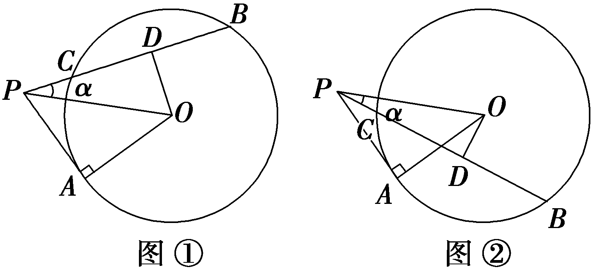

##### 1.直线被圆截得的弦长的两种求法

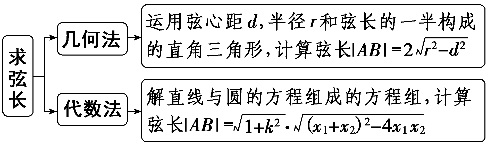

##### 2.求过某点的圆的切线的方法

（1）确定点与圆的位置关系，再求切线方程.

（2）若点在圆上(即为切点)，则过该点的切线只有一条；若点在圆外，则过该点的切线有两条，此时注意斜率不存在的切线.

注意：（1）圆的切线问题的处理要抓住圆心到直线的距离等于半径，从而建立等量关系解决问题.（2）验证斜率不存在时是否满足题意.

##### 3.涉及与圆的切线有关的线段长度范围(最值)问题，解题关键是能够把所求线段长度表示为关于圆心与直线上的点的距离的函数的形式，利用求函数值域的方法求得结果.

对点练3.(一题多解)(2021·北京卷)已知圆<em>C</em>：<em>x</em>2＋<em>y</em>2＝4，直线<em>l</em>：<em>y</em>＝<em>kx</em>＋<em>m</em>，当<em>k</em>的值发生变化时，直线<em>l</em>被圆<em>C</em>所截得的弦长的最小值为2，则<em>m</em>的值为(　　)

$\quad$A.±2	
$\quad$B.± $\sqrt{2}$

$\quad$C.± $\sqrt{3}$ 	
$\quad$D.±3

答案C

解析法一(几何法)：设直线<text st<text sty<text sty*l*e="italic">l</text>e="italic">y</text>le="italic">l</text>与y轴交于点*A*(0，*<text style="italic"><text style="italic">m*</text></text>)，由题意知，圆心*<text style="italic"><text style="italic">C*</text></text>(0，0)，当*k*的值发生变化时，要使直线l被圆C所截得的弦长最小，则圆心C到直线l的距离最大，为｜*AC*｜，即｜m｜＝ $\sqrt{2^{2}－1^{2}}$ ＝ $\sqrt{3}$ ，所以<text sty<text sty*l*e="italic">l</text>e="italic">*<text style="italic">m*</text></text>＝± $\sqrt{3}$ .故选<text sty<text sty*l*e="italic">l</text>e="italic">*<text style="italic">C*</text></text>.

法二(代数法)：由 $\left\{\begin{matrix}x^{2}＋y^{2}=4，\\y＝kx＋m\end{matrix}\right.$ 得(&lt;te&lt;te&lt;te&lt;te&lt;te<em>x</em>t style="italic"&gt;x&lt;/text&gt;t st<em>y</em>le="italic"&gt;x&lt;/text&gt;t st<em>y</em>le="italic"&gt;x&lt;/text&gt;t style="italic"&gt;x&lt;/text&gt;t style="italic"&gt;<em>k</em>&lt;/text&gt;&lt;text style="superscript"&gt;&lt;text style="superscript"&gt;&lt;text style="subscript"&gt;&lt;text style="subscript"&gt;&lt;text style="subscript"&gt;2&lt;/text&gt;&lt;/text&gt;&lt;/text&gt;&lt;/text&gt;&lt;/text&gt;＋&lt;text style="subscript"&gt;&lt;text style="subscript"&gt;1&lt;/text&gt;&lt;/text&gt;)x2＋2<em>k&lt;text style="italic"&gt;&lt;text style="italic"&gt;m</em>&lt;/text&gt;x&lt;/text&gt;＋m2－4＝0.设交点<em>A</em>(x1，y1)，<em>B</em>(x2，y2)，则 $\left\{\begin{matrix}x_{1}＋x_{2}＝\frac{－2km}{k^{2}+1}，\\x_{1}x_{2}＝\frac{m^{2}－4}{k^{2}+1}.\end{matrix}\right.$ 则｜&lt;te&lt;te&lt;te&lt;te<em>x</em>t style="italic"&gt;x&lt;/text&gt;t st<em>y</em>le="italic"&gt;x&lt;/text&gt;t st<em>y</em>le="italic"&gt;x&lt;/text&gt;t style="italic"&gt;A&lt;/text&gt;<em>B</em>｜＝ $\sqrt{1+k^{2}}$ ｜&lt;te&lt;te&lt;te&lt;te<em>x</em>t style="italic"&gt;x&lt;/text&gt;t st<em>y</em>le="italic"&gt;x&lt;/text&gt;t st<em>y</em>le="italic"&gt;x&lt;/text&gt;t style="italic"&gt;x&lt;/text&gt;&lt;text style="subscript"&gt;&lt;text style="subscript"&gt;1&lt;/text&gt;&lt;/text&gt;－x&lt;text style="superscript"&gt;&lt;text style="superscript"&gt;&lt;text style="subscript"&gt;&lt;text style="subscript"&gt;&lt;text style="subscript"&gt;2&lt;/text&gt;&lt;/text&gt;&lt;/text&gt;&lt;/text&gt;&lt;/text&gt;｜＝ $\sqrt{1+k^{2}}$ <em>·</em> $\sqrt{(x_{1}＋x_{2})^{2}－4x_{1}x_{2}}$ ＝ $\sqrt{1+k^{2}}\sqrt{(\frac{－2km}{k^{2}+1})^{2}－4\cdot \frac{m^{2}－4}{k^{2}+1}}$ ＝&lt;te&lt;te&lt;te&lt;te&lt;te<em>x</em>t style="italic"&gt;x&lt;/text&gt;t st<em>y</em>le="italic"&gt;x&lt;/text&gt;t st<em>y</em>le="italic"&gt;x&lt;/text&gt;t style="italic"&gt;x&lt;/text&gt;t style="superscript"&gt;&lt;text style="superscript"&gt;&lt;text style="subscript"&gt;&lt;text style="subscript"&gt;&lt;text style="subscript"&gt;2&lt;/text&gt;&lt;/text&gt;&lt;/text&gt;&lt;/text&gt;&lt;/text&gt; $\sqrt{4－\frac{m^{2}}{k^{2}+1}}$ .显然当&lt;te&lt;te&lt;te&lt;te&lt;te<em>x</em>t style="italic"&gt;x&lt;/text&gt;t st<em>y</em>le="italic"&gt;x&lt;/text&gt;t st<em>y</em>le="italic"&gt;x&lt;/text&gt;t style="italic"&gt;x&lt;/text&gt;t style="italic"&gt;<em>k</em>&lt;/text&gt;＝0时，弦长取得最小值&lt;text style="superscript"&gt;&lt;text style="superscript"&gt;&lt;text style="subscript"&gt;&lt;text style="subscript"&gt;&lt;text style="subscript"&gt;2&lt;/text&gt;&lt;/text&gt;&lt;/text&gt;&lt;/text&gt;&lt;/text&gt; $\sqrt{4－m^{2}}$ ＝&lt;te&lt;te&lt;te&lt;te&lt;te<em>x</em>t style="italic"&gt;x&lt;/text&gt;t st<em>y</em>le="italic"&gt;x&lt;/text&gt;t st<em>y</em>le="italic"&gt;x&lt;/text&gt;t style="italic"&gt;x&lt;/text&gt;t style="superscript"&gt;&lt;text style="superscript"&gt;&lt;text style="subscript"&gt;&lt;text style="subscript"&gt;&lt;text style="subscript"&gt;2&lt;/text&gt;&lt;/text&gt;&lt;/text&gt;&lt;/text&gt;&lt;/text&gt;，解得<em>&lt;text style="italic"&gt;m</em>&lt;/text&gt;＝± $\sqrt{3}$ .故选C.

对点练4. (&lt;te<em>x</em>t st<em>y</em>le="superscript"&gt;2&lt;/text&gt;025·安徽黄山第一次质量检测)过点 $\left(0，3\right)$ 与圆&lt;te<em>x</em>t st<em>y</em>le="italic"&gt;x&lt;/text&gt;&lt;text style="superscript"&gt;2&lt;/text&gt;＋y2－2x－3＝0相切的两条直线的夹角为<em>&lt;text style="italic"&gt;α</em>&lt;/text&gt;，则sin α＝(　　)

$\quad$A. $\frac{2\sqrt{6}}{5}$ 	
$\quad$B.1

$\quad$C. $\frac{3}{5}$ 	
$\quad$D. $\frac{\sqrt{10}}{5}$

答案A

解析圆&lt;te&lt;text st<em>y</em>le="italic"&gt;x&lt;/text&gt;t st<em>y</em>le="italic"&gt;x&lt;/text&gt;&lt;text style="superscript"&gt;&lt;text style="superscript"&gt;2&lt;/text&gt;&lt;/text&gt;＋y2－2x－3＝0的标准方程为 $\left(x－1\right)^{2}$ ＋&lt;te&lt;text st<em>y</em>le="italic"&gt;x&lt;/text&gt;t style="italic"&gt;y&lt;/text&gt;&lt;text style="superscript"&gt;&lt;text style="superscript"&gt;2&lt;/text&gt;&lt;/text&gt;＝4，圆心为<em>C</em> $\left(1，0\right)$ ，半径为&lt;te&lt;text st<em>y</em>le="italic"&gt;x&lt;/text&gt;t st<em>y</em>le="superscript"&gt;&lt;text style="superscript"&gt;2&lt;/text&gt;&lt;/text&gt;，记点<em>P</em> $\left(0，3\right)$ ，记切点分别为<em>A</em>，<em>B</em>，如图所示：由切线长定理可得 $\left|PA\right|$ ＝ $\left|PB\right|$ ，又因为 $\left|CA\right|$ ＝ $\left|CB\right|$ ，所以△<em>PAC</em>≌△P<em>B</em>C，所以∠<em>&lt;text style="italic"&gt;APC</em>&lt;/text&gt;＝∠<em>&lt;text style="italic"&gt;BPC</em>&lt;/text&gt;，设∠APC＝∠BPC＝<em>&lt;text style="italic"&gt;&lt;text style="italic"&gt;&lt;text style="italic"&gt;&lt;text style="italic"&gt;&lt;text style="italic"&gt;θ</em>&lt;/text&gt;&lt;/text&gt;&lt;/text&gt;&lt;/text&gt;&lt;/text&gt;，由圆的几何性质可得<em>AC</em>⊥<em>PA</em>，则 $\left|PC\right|$ ＝ $\sqrt{\left(0－1\right)^{2}＋\left(3－0\right)^{2}}$ ＝ $\sqrt{10}$ ，所以sin <em>&lt;text style="italic"&gt;&lt;text style="italic"&gt;&lt;text style="italic"&gt;&lt;text style="italic"&gt;&lt;text style="italic"&gt;θ</em>&lt;/text&gt;&lt;/text&gt;&lt;/text&gt;&lt;/text&gt;&lt;/text&gt;＝ $\frac{\left|AC\right|}{\left|PC\right|}$ ＝ $\frac{2}{\sqrt{10}}$ ＝ $\frac{\sqrt{10}}{5}$ ，由图可知，<em>&lt;text style="italic"&gt;&lt;text style="italic"&gt;&lt;text style="italic"&gt;&lt;text style="italic"&gt;&lt;text style="italic"&gt;θ</em>&lt;/text&gt;&lt;/text&gt;&lt;/text&gt;&lt;/text&gt;&lt;/text&gt;为锐角，则cos θ＝ $\sqrt{1－sin^{2}\theta }$ ＝ $\sqrt{1－\left(\frac{\sqrt{10}}{5}\right)^{2}}$ ＝ $\frac{\sqrt{15}}{5}$ ，所以sin∠<em>APB</em>＝sin &lt;te&lt;text st<em>y</em>le="italic"&gt;x&lt;/text&gt;t st<em>y</em>le="superscript"&gt;&lt;text style="superscript"&gt;2&lt;/text&gt;&lt;/text&gt;<em>&lt;text style="italic"&gt;&lt;text style="italic"&gt;&lt;text style="italic"&gt;&lt;text style="italic"&gt;&lt;text style="italic"&gt;θ</em>&lt;/text&gt;&lt;/text&gt;&lt;/text&gt;&lt;/text&gt;&lt;/text&gt;＝2sin <em>θ</em> cos θ＝2× $\frac{\sqrt{10}}{5}$ × $\frac{\sqrt{15}}{5}$ ＝ $\frac{2\sqrt{6}}{5}$ ，故sin <em>α</em>＝ $\frac{2\sqrt{6}}{5}$ .故选<em>A</em>.

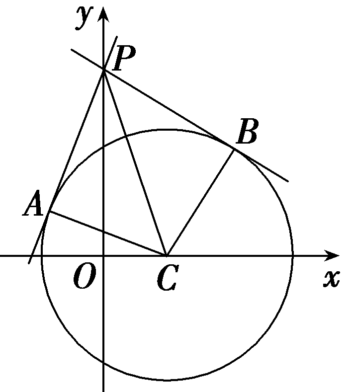

对点练5.已知直线*l*：4*x*＋3*y*＋10＝0，半径为2的圆*C*与*l*相切，圆心*C*在*x*轴上且在直线*l*的右上方.

（1）求圆*C*的方程；

（2）过点*M*(1，0)的直线与圆*C*交于*A*，*B*两点(*A*在*x*轴上方)，问在*x*轴正半轴上是否存在定点*N*，使得*x*轴平分∠*ANB*？若存在，请求出点*N*的坐标；若不存在，请说明理由.

解：（1）设圆心<text style="it<text style="it<text style="it*a*lic">a</text>lic">a</text>lic">C</text>(a，0) $\left(a＞－\frac{5}{2}\right)$ ，则 $\frac{\left|4a+10\right|}{5}$ ＝2，解得<text style="it<text style="it*a*lic">a</text>lic">a</text>＝0或a＝－5(舍)，

所以圆<em>C</em>的方程为<em>x</em>2＋<em>y</em>2＝4.

（2）当直线*AB*⊥*x*轴时，*x*轴平分∠*ANB*.

当直线<em>AB</em>的斜率存在时，设直线<em>AB</em>的方程为<em>y</em>＝<em>k</em>(<em>x</em>－1)，<em>k</em>≠0，<em>N</em>(<em>t</em>，0)，<em>A</em>(<em>x</em>1，<em>y</em>1)，<em>B</em>(<em>x</em>2，<em>y</em>2)，

由 $\left\{\begin{matrix}x^{2}＋y^{2}=4，\\y＝k\left(x－1\right)，\end{matrix}\right.$ 得(&lt;te&lt;te<em>x</em>t style="italic"&gt;x&lt;/text&gt;t style="italic"&gt;<em>&lt;text style="italic"&gt;k</em>&lt;/text&gt;&lt;/text&gt;&lt;text style="superscript"&gt;&lt;text style="superscript"&gt;&lt;text style="superscript"&gt;2&lt;/text&gt;&lt;/text&gt;&lt;/text&gt;＋1)x2－2k2x＋k2－4＝0，

所以&lt;te&lt;te&lt;te<em>x</em>t style="italic"&gt;x&lt;/text&gt;t style="italic"&gt;x&lt;/text&gt;t style="italic"&gt;x&lt;/text&gt;&lt;text style="subscript"&gt;1&lt;/text&gt;＋x&lt;text style="subscript"&gt;2&lt;/text&gt;＝ $\frac{2k^{2}}{k^{2}+1}$ ，&lt;te&lt;te&lt;te<em>x</em>t style="italic"&gt;x&lt;/text&gt;t style="italic"&gt;x&lt;/text&gt;t style="italic"&gt;x&lt;/text&gt;&lt;text style="subscript"&gt;1&lt;/text&gt;x&lt;text style="subscript"&gt;2&lt;/text&gt;＝ $\frac{k^{2}－4}{k^{2}+1}$ .

若&lt;&lt;&lt;&lt;<em>t</em>ext style="italic"&gt;t&lt;/text&gt;ext style="italic"&gt;t&lt;/text&gt;e&lt;te<em>x</em>t style="italic"&gt;x&lt;/text&gt;t style="italic"&gt;t&lt;/text&gt;e&lt;te<em>x</em>t style="italic"&gt;x&lt;/text&gt;t style="italic"&gt;x&lt;/text&gt;轴平分∠<em>&lt;text style="italic,subscript"&gt;AN</em>B&lt;/text&gt;，则<em>&lt;text style="italic"&gt;k</em>&lt;/text&gt;AN＝－k<em>BN</em>⇒ $\frac{y_{1}}{x_{1}－t}$ ＋ $\frac{y_{2}}{x_{2}－t}$ ＝0⇒ $\frac{k\left(x_{1}－1\right)}{x_{1}－t}$ ＋ $\frac{k\left(x_{2}－1\right)}{x_{2}－t}$ ＝0⇒&lt;&lt;&lt;&lt;<em>t</em>ext style="italic"&gt;t&lt;/text&gt;ext style="italic"&gt;t&lt;/text&gt;e&lt;te<em>x</em>t style="italic"&gt;x&lt;/text&gt;t style="italic"&gt;t&lt;/text&gt;ext style="subscript"&gt;2&lt;/text&gt;&lt;te&lt;te<em>x</em>t style="italic"&gt;x&lt;/text&gt;t style="italic"&gt;x&lt;/text&gt;&lt;text style="subscript"&gt;1&lt;/text&gt;x2－(t＋1)(x1＋x2)＋2t＝0⇒ $\frac{2\left(k^{2}－4\right)}{k^{2}+1}$ － $\frac{2k^{2}\left(t+1\right)}{k^{2}+1}$ ＋&lt;&lt;&lt;&lt;<em>t</em>ext style="italic"&gt;t&lt;/text&gt;ext style="italic"&gt;t&lt;/text&gt;e&lt;te<em>x</em>t style="italic"&gt;x&lt;/text&gt;t style="italic"&gt;t&lt;/text&gt;ext style="subscript"&gt;2&lt;/text&gt;t＝0⇒t＝4.

所以当点*N*为(4，0)时，能使得∠*ANM*＝∠*BNM*总成立.

综上，存在定点*N*(4，0)满足题意.

[真题再现]　(2024·全国甲卷理)已知<em>b</em>是<em>a</em>，<em>c</em>的等差中项，直线<em>ax</em>＋<em>by</em>＋<em>c</em>＝0与圆<em>x</em>2＋<em>y</em>2＋4<em>y</em>－1＝0交于<em>A</em>，<em>B</em>两点，则｜<em>AB</em>｜的最小值为(　　)

$\quad$A.1	
$\quad$B.2

$\quad$C.4	
$\quad$D.2 $\sqrt{5}$

答案C

解析根据题意有&lt;te<em>x</em>t st&lt;text st<em>y</em>le="italic"&gt;y&lt;/text&gt;le="superscript"&gt;&lt;text style="superscript"&gt;2&lt;/text&gt;&lt;/text&gt;&lt;te<em>x</em>t style="it&lt;text style="it&lt;text style="itali&lt;text style="itali<em>c</em>"&gt;c&lt;/text&gt;"&gt;a&lt;/text&gt;li<em>c</em>"&gt;a&lt;/text&gt;lic"&gt;<em>b</em>&lt;/text&gt;＝a＋c，即a－2b＋c＝0，所以直线<em>ax</em>＋<em>by</em>＋c＝0过点<em>M</em>(1，－2).设圆x2＋y2＋4y－1＝0的圆心为<em>&lt;text style="italic"&gt;C</em>&lt;/text&gt;，连接<em>CM</em>(图略)，则<em>&lt;text style="italic"&gt;&lt;text style="italic"&gt;AB</em>&lt;/text&gt;&lt;/text&gt;⊥<em>CM</em> 时，｜AB｜最小，将圆的方程化为x2＋ $\left(y+2\right)^{2}$ ＝5，则&lt;te<em>x</em>t style="italic"&gt;<em>C</em>&lt;/text&gt;(0，－&lt;text st&lt;text st<em>y</em>le="italic"&gt;y&lt;/text&gt;le="superscript"&gt;&lt;text style="superscript"&gt;2&lt;/text&gt;&lt;/text&gt;)，所以｜&lt;te<em>x</em>t style="italic"&gt;M&lt;/text&gt;C｜＝1，所以｜<em>&lt;text style="italic"&gt;&lt;text style="italic"&gt;AB</em>&lt;/text&gt;&lt;/text&gt;｜的最小值为2 $\sqrt{5-|MC｜^{2}}$ ＝4.故选&lt;te<em>x</em>t style="italic"&gt;<em>C</em>&lt;/text&gt;.

[教材呈现]　(人教A选择性必修一P103T20)已知圆<em>C</em>：(<em>x</em>－1)2＋(<em>y</em>－2)2＝25，直线<em>l</em>：(2<em>m</em>＋1)<em>x</em>＋(<em>m</em>＋1)<em>y</em>－7<em>m</em>－4＝0.

（1）求证：直线*l*恒过定点.

（2）直线*l*被圆*C*截得的弦何时最长、何时最短？并求截得的弦长最短时*m*的值以及最短弦长.

点评：高考题与教材习题考查角度相同，都考查了直线过定点问题和直线与圆相交时的最短弦问题.

课时测评69　直线与圆、圆与圆的位置关系 $\frac{对应学生}{用书P447}$

(时间：60分钟　满分：88分)

(本栏目内容，在学生用书中以独立形式分册装订！)

(1—8题，每小题5分，共40分)

##### 1.过点(0，2)且与直线*y*＝*x*－2相切，圆心在*x*轴上的圆的方程为(　　)

$\quad$A.(<em>x</em>＋1)2＋<em>y</em>2＝3	
$\quad$B.(<em>x</em>＋1)2＋<em>y</em>2＝5

$\quad$C.(<em>x</em>＋2)2＋<em>y</em>2＝4	
$\quad$D.(<em>x</em>＋2)2＋<em>y</em>2＝8

答案D

解析设圆心为(&lt;te&lt;text st<em>y</em>le="italic"&gt;x&lt;/text&gt;t style="it<em>a</em>lic"&gt;a&lt;/text&gt;，0)，由题意得 $\frac{｜a－2｜}{\sqrt{1^{2}＋(-1)^{2}}}$ ＝ $\sqrt{\left(a－0\right)^{2}＋\left(0－2\right)^{2}}$ ，解得&lt;te&lt;text st<em>y</em>le="italic"&gt;x&lt;/text&gt;t style="it<em>a</em>lic"&gt;a&lt;/text&gt;＝－&lt;text style="superscript"&gt;2&lt;/text&gt;，故圆的半径<em>r</em>＝ $\sqrt{\left(－2－0\right)^{2}＋\left(0－2\right)^{2}}$ ＝&lt;text st<em>y</em>le="superscript"&gt;2&lt;/text&gt; $\sqrt{2}$ ，所以圆的方程为(&lt;text st<em>y</em>le="italic"&gt;x&lt;/text&gt;＋&lt;text style="superscript"&gt;2&lt;/text&gt;)2＋y2＝8.故选D.

##### 2.过点(3，1)作圆(<em>x</em>－1)2＋<em>y</em>2＝<em>r</em>2的切线有且只有一条，则该切线的方程为(　　)

$\quad$A.2*x*＋*y*－5＝0	
$\quad$B.2*x*＋*y*－7＝0

$\quad$C.*x*－2*y*－5＝0	
$\quad$D.*x*－2*y*－7＝0

答案B

解析因为过点(3，1)作圆(&lt;te&lt;te&lt;te&lt;text st<em>y</em>le="italic"&gt;x&lt;/text&gt;t style="italic"&gt;x&lt;/text&gt;t st&lt;text st<em>y</em>le="italic"&gt;y&lt;/text&gt;le="italic"&gt;x&lt;/text&gt;t st<em>y</em>le="italic"&gt;x&lt;/text&gt;－1)&lt;text style="supe<em>&lt;text style="italic"&gt;r</em>&lt;/text&gt;script"&gt;&lt;text style="superscript"&gt;&lt;text style="superscript"&gt;&lt;text style="superscript"&gt;&lt;text style="superscript"&gt;2&lt;/text&gt;&lt;/text&gt;&lt;/text&gt;&lt;/text&gt;&lt;/text&gt;＋y2＝r2的切线有且只有一条，所以点(3，1)在圆(x－1)2＋y2＝r2上，圆心与切点连线的斜率为<em>k</em>＝ $\frac{1－0}{3－1}$ ＝ $\frac{1}{2}$ ，所以切线的斜率为－&lt;te&lt;te&lt;te&lt;text st<em>y</em>le="italic"&gt;x&lt;/text&gt;t style="italic"&gt;x&lt;/text&gt;t st&lt;text st<em>y</em>le="italic"&gt;y&lt;/text&gt;le="italic"&gt;x&lt;/text&gt;t st<em>y</em>le="supe<em>&lt;text style="italic"&gt;r</em>&lt;/text&gt;script"&gt;&lt;text style="superscript"&gt;&lt;text style="superscript"&gt;&lt;text style="superscript"&gt;&lt;text style="superscript"&gt;2&lt;/text&gt;&lt;/text&gt;&lt;/text&gt;&lt;/text&gt;&lt;/text&gt;，则圆的切线方程为y－1＝－2(<em>x</em>－3)，即2x＋y－7＝0.故选B.

##### 3.圆(<em>x</em>－3)2＋(<em>y</em>－3)2＝9上到直线3<em>x</em>＋4<em>y</em>－11＝0的距离等于1的点的个数为(　　)

$\quad$A.1	
$\quad$B.2

$\quad$C.3	
$\quad$D.4

答案C

解析因为圆心到直线的距离为 $\frac{｜9+12－11｜}{5}$ ＝2，圆的半径为3，所以直线与圆相交，如图所示，故圆上到直线的距离为1的点有3个.故选C.

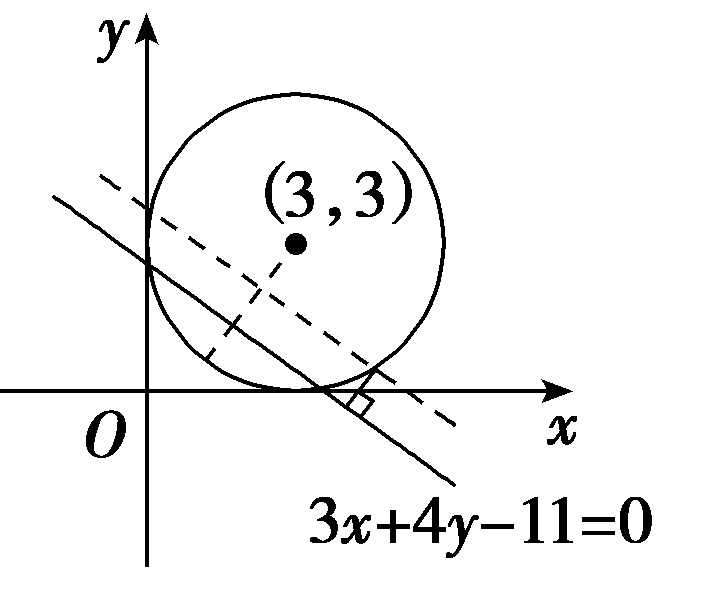

##### 4.已知圆&lt;te&lt;te&lt;text st<em>y</em>le="italic"&gt;x&lt;/text&gt;t st<em>y</em>le="italic"&gt;x&lt;/text&gt;t style="italic"&gt;<em>M</em>&lt;/text&gt;：x&lt;text style="superscript"&gt;2&lt;/text&gt;＋y2－2<em>ay</em>＝0 $\left(a>0\right)$ 截直线&lt;te&lt;text st<em>y</em>le="italic"&gt;x&lt;/text&gt;t st<em>y</em>le="italic"&gt;x&lt;/text&gt;＋y＝0所得线段的长度是&lt;text style="superscript"&gt;2&lt;/text&gt; $\sqrt{2}$ ，则圆&lt;te&lt;te&lt;text st<em>y</em>le="italic"&gt;x&lt;/text&gt;t st<em>y</em>le="italic"&gt;x&lt;/text&gt;t style="italic"&gt;<em>M</em>&lt;/text&gt;与圆<em>N</em>： $\left(x－1\right)^{2}$ ＋ $\left(y－1\right)^{2}$ ＝1的位置关系是(　　)

$\quad$A.内切	
$\quad$B.相交	
$\quad$C.外切	
$\quad$D.相离

答案B

解析圆&lt;te&lt;te&lt;text st&lt;text style="it&lt;text style="it<em>a</em>lic"&gt;a&lt;/text&gt;lic"&gt;y&lt;/text&gt;le="italic"&gt;x&lt;/text&gt;t style="it&lt;text style="it<em>a</em>lic"&gt;a&lt;/text&gt;lic"&gt;x&lt;/text&gt;t style="italic"&gt;<em>&lt;text style="italic"&gt;&lt;text style="italic"&gt;M</em>&lt;/text&gt;&lt;/text&gt;&lt;/text&gt;的标准方程为x&lt;text style="supe<em>&lt;text style="italic"&gt;&lt;text style="italic"&gt;&lt;text style="italic"&gt;&lt;text style="italic"&gt;r</em>&lt;/text&gt;&lt;/text&gt;&lt;/text&gt;&lt;/text&gt;script"&gt;&lt;text style="superscript"&gt;&lt;text style="subscript"&gt;&lt;text style="subscript"&gt;2&lt;/text&gt;&lt;/text&gt;&lt;/text&gt;&lt;/text&gt;＋ $\left(y－a\right)^{2}$ ＝&lt;te&lt;text st&lt;text style="it&lt;text style="it<em>a</em>lic"&gt;a&lt;/text&gt;lic"&gt;y&lt;/text&gt;le="italic"&gt;x&lt;/text&gt;t style="it<em>a</em>lic"&gt;a&lt;/text&gt;&lt;text style="supe<em>&lt;text style="italic"&gt;&lt;text style="italic"&gt;&lt;text style="italic"&gt;&lt;text style="italic"&gt;r</em>&lt;/text&gt;&lt;/text&gt;&lt;/text&gt;&lt;/text&gt;script"&gt;&lt;text style="superscript"&gt;&lt;text style="subscript"&gt;&lt;text style="subscript"&gt;2&lt;/text&gt;&lt;/text&gt;&lt;/text&gt;&lt;/text&gt;，得&lt;te<em>x</em>t style="italic"&gt;<em>&lt;text style="italic"&gt;&lt;text style="italic"&gt;M</em>&lt;/text&gt;&lt;/text&gt;&lt;/text&gt; $\left(0，a\right)$ ，&lt;te&lt;text st&lt;text style="it&lt;text style="it<em>a</em>lic"&gt;a&lt;/text&gt;lic"&gt;y&lt;/text&gt;le="italic"&gt;x&lt;/text&gt;t style="it<em>a</em>lic"&gt;<em>&lt;text style="italic"&gt;&lt;text style="italic"&gt;&lt;text style="italic"&gt;r</em>&lt;/text&gt;&lt;/text&gt;&lt;/text&gt;&lt;/text&gt;&lt;text style="subscript"&gt;&lt;text style="subscript"&gt;1&lt;/text&gt;&lt;/text&gt;＝<em>a</em>，所以&lt;te<em>x</em>t style="italic"&gt;<em>&lt;text style="italic"&gt;&lt;text style="italic"&gt;M</em>&lt;/text&gt;&lt;/text&gt;&lt;/text&gt;到直线x＋y＝0的距离<em>d</em>＝ $\frac{a}{\sqrt{2}}$ ，所以 $\left(\frac{a}{\sqrt{2}}\right)^{2}$ ＋&lt;te&lt;text st&lt;text style="it&lt;text style="it<em>a</em>lic"&gt;a&lt;/text&gt;lic"&gt;y&lt;/text&gt;le="italic"&gt;x&lt;/text&gt;t style="supe&lt;text style="it<em>a</em>lic"&gt;<em>&lt;text style="italic"&gt;&lt;text style="italic"&gt;&lt;text style="italic"&gt;r</em>&lt;/text&gt;&lt;/text&gt;&lt;/text&gt;&lt;/text&gt;script"&gt;&lt;text style="superscript"&gt;&lt;text style="subscript"&gt;&lt;text style="subscript"&gt;2&lt;/text&gt;&lt;/text&gt;&lt;/text&gt;&lt;/text&gt;＝<em>a</em>2，解得a＝2.所以&lt;te<em>x</em>t style="italic"&gt;<em>&lt;text style="italic"&gt;&lt;text style="italic"&gt;M</em>&lt;/text&gt;&lt;/text&gt;&lt;/text&gt; $\left(0，2\right)$ ，&lt;te&lt;text st&lt;text style="it&lt;text style="it<em>a</em>lic"&gt;a&lt;/text&gt;lic"&gt;y&lt;/text&gt;le="italic"&gt;x&lt;/text&gt;t style="it<em>a</em>lic"&gt;<em>&lt;text style="italic"&gt;&lt;text style="italic"&gt;&lt;text style="italic"&gt;r</em>&lt;/text&gt;&lt;/text&gt;&lt;/text&gt;&lt;/text&gt;&lt;text style="subscript"&gt;&lt;text style="subscript"&gt;1&lt;/text&gt;&lt;/text&gt;＝&lt;text style="superscript"&gt;&lt;text style="superscript"&gt;&lt;text style="subscript"&gt;&lt;text style="subscript"&gt;2&lt;/text&gt;&lt;/text&gt;&lt;/text&gt;&lt;/text&gt;，又<em>N</em> $\left(1，1\right)$ ，&lt;te&lt;text st&lt;text style="it&lt;text style="it<em>a</em>lic"&gt;a&lt;/text&gt;lic"&gt;y&lt;/text&gt;le="italic"&gt;x&lt;/text&gt;t style="it<em>a</em>lic"&gt;<em>&lt;text style="italic"&gt;&lt;text style="italic"&gt;&lt;text style="italic"&gt;r</em>&lt;/text&gt;&lt;/text&gt;&lt;/text&gt;&lt;/text&gt;&lt;text style="superscript"&gt;&lt;text style="superscript"&gt;&lt;text style="subscript"&gt;&lt;text style="subscript"&gt;2&lt;/text&gt;&lt;/text&gt;&lt;/text&gt;&lt;/text&gt;＝&lt;text style="subscript"&gt;&lt;text style="subscript"&gt;1&lt;/text&gt;&lt;/text&gt;，所以 $\left|MN\right|$ ＝ $\sqrt{2}$ ，所以 $\left|r_{1}－r_{2}\right|$ ＜ $\left|MN\right|$ ＜&lt;te&lt;text st&lt;text style="it&lt;text style="it<em>a</em>lic"&gt;a&lt;/text&gt;lic"&gt;y&lt;/text&gt;le="italic"&gt;x&lt;/text&gt;t style="it<em>a</em>lic"&gt;<em>&lt;text style="italic"&gt;&lt;text style="italic"&gt;&lt;text style="italic"&gt;r</em>&lt;/text&gt;&lt;/text&gt;&lt;/text&gt;&lt;/text&gt;&lt;text style="subscript"&gt;&lt;text style="subscript"&gt;1&lt;/text&gt;&lt;/text&gt;＋r&lt;text style="superscript"&gt;&lt;text style="superscript"&gt;&lt;text style="subscript"&gt;&lt;text style="subscript"&gt;2&lt;/text&gt;&lt;/text&gt;&lt;/text&gt;&lt;/text&gt;，所以两圆相交.故选B.

##### 5.(多选)已知圆(<em>x</em>－1)2＋(<em>y</em>－1)2＝4与直线<em>x</em>＋<em>my</em>－<em>m</em>－2＝0，则(　　)

$\quad$A.直线与圆必相交

$\quad$B.直线与圆不一定相交

$\quad$C.直线与圆相交所截的最短弦长为2 $\sqrt{3}$

$\quad$D.直线与圆可以相切

答案AC

解析由题意，圆(&lt;te&lt;te&lt;text st<em>y</em>le="italic"&gt;x&lt;/text&gt;t style="italic"&gt;x&lt;/text&gt;t st<em>y</em>le="italic"&gt;x&lt;/text&gt;－1)&lt;text style="supe<em>r</em>script"&gt;2&lt;/text&gt;＋(y－1)2＝4的圆心<em>&lt;text style="italic"&gt;C</em>&lt;/text&gt;(1，1)，半径r＝2，直线x＋<em>&lt;text style="italic"&gt;&lt;text style="italic"&gt;m</em>&lt;/text&gt;y&lt;/text&gt;－m－2＝0可变形为x－2＋m(y－1)＝0，故直线过定点<em>&lt;text style="italic"&gt;A</em>&lt;/text&gt;(2，1)，因为｜<em>CA</em>｜＝ $\sqrt{\left(2－1\right)^{2}＋\left(1－1\right)^{2}}$ ＝1＜&lt;te&lt;te&lt;text st<em>y</em>le="italic"&gt;x&lt;/text&gt;t style="italic"&gt;x&lt;/text&gt;t st<em>y</em>le="supe<em>r</em>script"&gt;2&lt;/text&gt;，所以直线与圆必相交，故<em>&lt;text style="italic"&gt;A</em>&lt;/text&gt;正确，B，D错误；由平面几何知识可知，当直线与过定点A和圆心<em>&lt;text style="italic"&gt;C</em>&lt;/text&gt;的直线垂直时，弦长有最小值，此时弦长为2 $\sqrt{r^{2}-|CA｜^{2}}$ ＝&lt;te&lt;te&lt;text st<em>y</em>le="italic"&gt;x&lt;/text&gt;t style="italic"&gt;x&lt;/text&gt;t st<em>y</em>le="supe<em>r</em>script"&gt;2&lt;/text&gt; $\sqrt{3}$ ，故&lt;te&lt;te&lt;text st<em>y</em>le="italic"&gt;x&lt;/text&gt;t style="italic"&gt;x&lt;/text&gt;t style="italic"&gt;<em>C</em>&lt;/text&gt;正确.故选<em>&lt;text style="italic"&gt;A</em>&lt;/text&gt;C.

##### 6.(多选)已知圆<em>C</em>：(<em>x</em>－2)2＋<em>y</em>2＝1，点<em>P</em>是直线<em>l</em>：<em>x</em>＋<em>y</em>＝0上一动点，过点<em>P</em>作圆的切线<em>PA</em>，<em>PB</em>，切点分别是<em>A</em>和<em>B</em>，则下列说法错误的是(　　)

$\quad$A.圆<text sty*l*e="italic">C</text>上恰有一个点到直线l的距离为 $\frac{1}{2}$

$\quad$B.切线长｜*PA*｜的最小值为1

$\quad$C.四边形*ACBP*面积的最小值为2

$\quad$D.直线*AB*恒过定点 $\left(\frac{3}{2},-\frac{1}{2}\right)$

答案AC

解析对于A，由圆&lt;te&lt;te&lt;text st&lt;text sty<em>l</em>e="italic"&gt;y&lt;/text&gt;le="italic"&gt;x&lt;/text&gt;t st&lt;text sty<em>l</em>e="italic"&gt;y&lt;/text&gt;le="italic"&gt;x&lt;/text&gt;t style="italic"&gt;<em>&lt;text style="italic"&gt;&lt;text style="italic"&gt;C</em>&lt;/text&gt;&lt;/text&gt;&lt;/text&gt;：(x－&lt;text style="supe<em>r</em>script"&gt;2&lt;/text&gt;)2＋y2＝1，可得圆心C(2，0)，半径r＝1，所以圆心C到直线l：x＋y＝0的距离为 $\frac{｜2｜}{\sqrt{2}}$ ＝ $\sqrt{2}$ ，因为 $\sqrt{2}$ －1＜ $\frac{1}{2}$ ＜ $\sqrt{2}$ ＋1，故圆&lt;te&lt;te&lt;text st&lt;text sty<em>l</em>e="italic"&gt;y&lt;/text&gt;le="italic"&gt;x&lt;/text&gt;t st&lt;text sty<em>l</em>e="italic"&gt;y&lt;/text&gt;le="italic"&gt;x&lt;/text&gt;t style="italic"&gt;<em>&lt;text style="italic"&gt;&lt;text style="italic"&gt;C</em>&lt;/text&gt;&lt;/text&gt;&lt;/text&gt;上不是只有一个点到直线l的距离为 $\frac{1}{2}$ ，故A错误；对于B，由圆的性质，可得切线长｜<em>&lt;text style="italic"&gt;&lt;text style="italic"&gt;&lt;text style="italic"&gt;&lt;text style="italic"&gt;&lt;text style="italic"&gt;PA</em>&lt;/text&gt;&lt;/text&gt;&lt;/text&gt;&lt;/text&gt;&lt;/text&gt;｜＝ $\sqrt{｜PC｜^{2}－r^{2}}$ ＝ $\sqrt{｜PC｜^{2}－1}$ ，当｜P&lt;te&lt;te&lt;text st&lt;text sty<em>l</em>e="italic"&gt;y&lt;/text&gt;le="italic"&gt;x&lt;/text&gt;t st&lt;text sty<em>l</em>e="italic"&gt;y&lt;/text&gt;le="italic"&gt;x&lt;/text&gt;t style="italic"&gt;<em>&lt;text style="italic"&gt;&lt;text style="italic"&gt;C</em>&lt;/text&gt;&lt;/text&gt;&lt;/text&gt;｜最小时，｜<em>&lt;text style="italic"&gt;&lt;text style="italic"&gt;&lt;text style="italic"&gt;&lt;text style="italic"&gt;&lt;text style="italic"&gt;PA</em>&lt;/text&gt;&lt;/text&gt;&lt;/text&gt;&lt;/text&gt;&lt;/text&gt;｜最小，又｜<em>&lt;text style="italic"&gt;PC</em>&lt;/text&gt;｜&lt;text style="subscript"&gt;&lt;text style="subscript"&gt;min&lt;/text&gt;&lt;/text&gt;＝ $\sqrt{2}$ ，则｜<em>&lt;text style="italic"&gt;&lt;text style="italic"&gt;&lt;text style="italic"&gt;&lt;text style="italic"&gt;&lt;text style="italic"&gt;PA</em>&lt;/text&gt;&lt;/text&gt;&lt;/text&gt;&lt;/text&gt;&lt;/text&gt;｜&lt;text style="subscript"&gt;&lt;text style="subscript"&gt;min&lt;/text&gt;&lt;/text&gt;＝1，故B正确；对于&lt;te&lt;te&lt;text st&lt;text sty<em>l</em>e="italic"&gt;y&lt;/text&gt;le="italic"&gt;x&lt;/text&gt;t st&lt;text sty<em>l</em>e="italic"&gt;y&lt;/text&gt;le="italic"&gt;x&lt;/text&gt;t style="italic"&gt;<em>&lt;text style="italic"&gt;&lt;text style="italic"&gt;C</em>&lt;/text&gt;&lt;/text&gt;&lt;/text&gt;，由四边形<em>&lt;text style="italic"&gt;ACBP</em>&lt;/text&gt;的面积为&lt;text style="supe<em>r</em>script"&gt;2&lt;/text&gt;× $\frac{1}{2}$ ×｜<em>&lt;text style="italic"&gt;&lt;text style="italic"&gt;&lt;text style="italic"&gt;&lt;text style="italic"&gt;&lt;text style="italic"&gt;PA</em>&lt;/text&gt;&lt;/text&gt;&lt;/text&gt;&lt;/text&gt;&lt;/text&gt;｜<em>·</em>｜&lt;te&lt;te&lt;text st&lt;text sty<em>l</em>e="italic"&gt;y&lt;/text&gt;le="italic"&gt;x&lt;/text&gt;t st&lt;text sty<em>l</em>e="italic"&gt;y&lt;/text&gt;le="italic"&gt;x&lt;/text&gt;t style="italic"&gt;<em>&lt;text style="italic"&gt;&lt;text style="italic"&gt;C</em>&lt;/text&gt;&lt;/text&gt;&lt;/text&gt;A｜＝｜PA｜，因为｜PA｜&lt;text style="subscript"&gt;&lt;text style="subscript"&gt;min&lt;/text&gt;&lt;/text&gt;＝1，所以四边形<em>&lt;text style="italic"&gt;ACBP</em>&lt;/text&gt;的面积的最小值为1，故C错误；

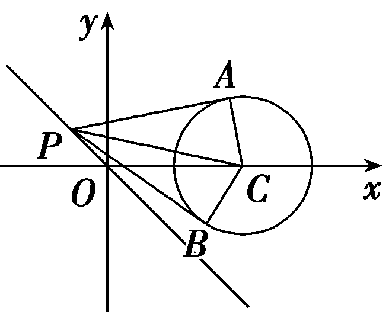

对于D，设&lt;&lt;&lt;&lt;&lt;&lt;&lt;&lt;&lt;&lt;te&lt;text st<em>y</em>le="italic"&gt;x&lt;/text&gt;t style="italic"&gt;t&lt;/text&gt;e<em>x</em>t style="italic"&gt;t&lt;/text&gt;e&lt;text s<em>ty</em>le="italic"&gt;x&lt;/text&gt;t style="italic"&gt;t&lt;/text&gt;e&lt;te&lt;te<em>x</em>t st<em>y</em>le="italic"&gt;x&lt;/text&gt;t st<em>y</em>le="italic"&gt;x&lt;/text&gt;t style="italic"&gt;t&lt;/text&gt;e&lt;text s<em>ty</em>le="italic"&gt;x&lt;/text&gt;t style="italic"&gt;t&lt;/text&gt;e&lt;text st<em>y</em>le="italic"&gt;x&lt;/text&gt;t st<em>y</em>le="italic"&gt;t&lt;/text&gt;e&lt;text st<em>y</em>le="italic"&gt;x&lt;/text&gt;t style="italic"&gt;t&lt;/text&gt;e<em>x</em>t style="italic"&gt;t&lt;/text&gt;ext style="italic"&gt;t&lt;/text&gt;ext style="italic"&gt;P&lt;/text&gt;(t，－t)，由题知<em>A</em>，<em>B</em>在以<em>P&lt;text style="italic"&gt;&lt;text style="italic"&gt;C</em>&lt;/text&gt;&lt;/text&gt;为直径的圆上，又由C(&lt;text style="superscript"&gt;&lt;text style="superscript"&gt;&lt;text style="superscript"&gt;&lt;text style="superscript"&gt;&lt;text style="superscript"&gt;2&lt;/text&gt;&lt;/text&gt;&lt;/text&gt;&lt;/text&gt;&lt;/text&gt;，0)，所以(x－t)(x－2)＋(y＋t)(y－0)＝0，即x2＋y2－(t＋2)x＋ty＋2t＝0，因为圆C：(x－2)2＋y2＝1，即x2＋y2－4x＋3＝0.两圆的方程相减得直线<em>&lt;text style="italic"&gt;AB</em>&lt;/text&gt;：(2－t)x＋ty－3＋2t＝0，即2x－3－t(x－y－2)＝0，由 $\left\{\begin{matrix}2x－3=0，\\x－y－2=0，\end{matrix}\right.$ 解得 $\left\{\begin{matrix}x＝\frac{3}{2}，\\y＝－\frac{1}{2}，\end{matrix}\right.$ 即直线&lt;&lt;&lt;&lt;&lt;&lt;&lt;&lt;te&lt;text st<em>y</em>le="italic"&gt;x&lt;/text&gt;t style="italic"&gt;t&lt;/text&gt;e<em>x</em>t style="italic"&gt;t&lt;/text&gt;e&lt;text s<em>ty</em>le="italic"&gt;x&lt;/text&gt;t style="italic"&gt;t&lt;/text&gt;e&lt;te&lt;te<em>x</em>t st<em>y</em>le="italic"&gt;x&lt;/text&gt;t st<em>y</em>le="italic"&gt;x&lt;/text&gt;t style="italic"&gt;t&lt;/text&gt;e&lt;text s<em>ty</em>le="italic"&gt;x&lt;/text&gt;t style="italic"&gt;t&lt;/text&gt;e&lt;text st<em>y</em>le="italic"&gt;x&lt;/text&gt;t st<em>y</em>le="italic"&gt;t&lt;/text&gt;e&lt;text st<em>y</em>le="italic"&gt;x&lt;/text&gt;t style="italic"&gt;t&lt;/text&gt;e<em>x</em>t style="italic"&gt;A&lt;/text&gt;<em>B</em>恒过定点 $\left(\frac{3}{2},-\frac{1}{2}\right)$ ，故D正确.故选&lt;&lt;&lt;&lt;&lt;&lt;&lt;&lt;te&lt;text st<em>y</em>le="italic"&gt;x&lt;/text&gt;t style="italic"&gt;t&lt;/text&gt;e<em>x</em>t style="italic"&gt;t&lt;/text&gt;e&lt;text s<em>ty</em>le="italic"&gt;x&lt;/text&gt;t style="italic"&gt;t&lt;/text&gt;e&lt;te&lt;te<em>x</em>t st<em>y</em>le="italic"&gt;x&lt;/text&gt;t st<em>y</em>le="italic"&gt;x&lt;/text&gt;t style="italic"&gt;t&lt;/text&gt;e&lt;text s<em>ty</em>le="italic"&gt;x&lt;/text&gt;t style="italic"&gt;t&lt;/text&gt;e&lt;text st<em>y</em>le="italic"&gt;x&lt;/text&gt;t st<em>y</em>le="italic"&gt;t&lt;/text&gt;e&lt;text st<em>y</em>le="italic"&gt;x&lt;/text&gt;t style="italic"&gt;t&lt;/text&gt;e<em>x</em>t style="italic"&gt;A&lt;/text&gt;<em>&lt;text style="italic"&gt;C</em>&lt;/text&gt;.

##### 7.圆<em>O</em>1：<em>x</em>2＋<em>y</em>2＝1与圆<em>O</em>2：<em>x</em>2＋<em>y</em>2－6<em>x</em>＋8<em>y</em>＋<em>m</em>＝0外切，则实数<em>m</em>＝<u>　　　　</u>.

答案9

解析圆<em>&lt;text style="italic"&gt;&lt;text style="italic"&gt;&lt;text style="italic"&gt;&lt;text style="italic"&gt;&lt;text style="italic"&gt;&lt;text style="italic"&gt;&lt;text style="italic"&gt;O</em>&lt;/text&gt;&lt;/text&gt;&lt;/text&gt;&lt;/text&gt;&lt;/text&gt;&lt;/text&gt;&lt;/text&gt;&lt;text style="subsc<em>&lt;text style="italic"&gt;&lt;text style="italic"&gt;&lt;text style="italic"&gt;r</em>&lt;/text&gt;&lt;/text&gt;&lt;/text&gt;ipt"&gt;&lt;text style="subscript"&gt;&lt;text style="subscript"&gt;&lt;text style="subscript"&gt;&lt;text style="subscript"&gt;1&lt;/text&gt;&lt;/text&gt;&lt;/text&gt;&lt;/text&gt;&lt;/text&gt;的圆心O1(0，0)，半径r1＝1，圆O&lt;text style="subscript"&gt;&lt;text style="subscript"&gt;&lt;text style="subscript"&gt;&lt;text style="subscript"&gt;&lt;text style="subscript"&gt;2&lt;/text&gt;&lt;/text&gt;&lt;/text&gt;&lt;/text&gt;&lt;/text&gt;的圆心O2(3，－4)，半径r2＝ $\sqrt{25－m}$ ，则｜<em>&lt;text style="italic"&gt;&lt;text style="italic"&gt;&lt;text style="italic"&gt;&lt;text style="italic"&gt;&lt;text style="italic"&gt;&lt;text style="italic"&gt;&lt;text style="italic"&gt;O</em>&lt;/text&gt;&lt;/text&gt;&lt;/text&gt;&lt;/text&gt;&lt;/text&gt;&lt;/text&gt;&lt;/text&gt;&lt;text style="subsc<em>&lt;text style="italic"&gt;&lt;text style="italic"&gt;&lt;text style="italic"&gt;r</em>&lt;/text&gt;&lt;/text&gt;&lt;/text&gt;ipt"&gt;&lt;text style="subscript"&gt;&lt;text style="subscript"&gt;&lt;text style="subscript"&gt;&lt;text style="subscript"&gt;1&lt;/text&gt;&lt;/text&gt;&lt;/text&gt;&lt;/text&gt;&lt;/text&gt;O&lt;text style="subscript"&gt;&lt;text style="subscript"&gt;&lt;text style="subscript"&gt;&lt;text style="subscript"&gt;&lt;text style="subscript"&gt;2&lt;/text&gt;&lt;/text&gt;&lt;/text&gt;&lt;/text&gt;&lt;/text&gt;｜＝5，根据题意可得｜O1O2｜＝r1＋r2，即5＝1＋ $\sqrt{25－m}$ ，解得<em>m</em>＝9.

##### 8.(易错题)过点&lt;te&lt;text st&lt;text sty<em>l</em>e="italic"&gt;y&lt;/text&gt;le="italic"&gt;x&lt;/text&gt;t sty<em>l</em>e="italic"&gt;P&lt;/text&gt;(0，&lt;text style="superscript"&gt;2&lt;/text&gt;)引一条直线l交圆(x－1)2＋y2＝4于<em>A</em>，<em>B</em>两点，若｜<em>AB</em>｜＝2 $\sqrt{3}$ ，则直线&lt;te&lt;text st&lt;text sty<em>l</em>e="italic"&gt;y&lt;/text&gt;le="italic"&gt;x&lt;/text&gt;t style="italic"&gt;l&lt;/text&gt;的方程为<u>　　　　　　　　　　　　</u>.

答案*x*＝0或3*x*＋4*y*－8＝0

解析当直线&lt;te&lt;te&lt;text st&lt;text st&lt;text st<em>y</em>le="italic"&gt;y&lt;/text&gt;&lt;text sty<em>l</em>e="italic"&gt;l&lt;/text&gt;e="italic"&gt;y&lt;/text&gt;le="italic"&gt;x&lt;/text&gt;t style="italic"&gt;x&lt;/text&gt;t style="italic"&gt;l&lt;/text&gt;的斜率不存在时，其方程为x＝0，可求出它与圆(x－1)&lt;text style="superscript"&gt;2&lt;/text&gt;＋y2＝4的两交点坐标分别为 $\left(0，\sqrt{3}\right)$ ， $\left(0,-\sqrt{3}\right)$ ，所以弦长｜&lt;text st&lt;text st<em>y</em>le="italic"&gt;y&lt;/text&gt;&lt;text sty<em>l</em>e="italic"&gt;l&lt;/text&gt;e="italic"&gt;AB&lt;/text&gt;｜＝&lt;text st<em>y</em>le="superscript"&gt;2&lt;/text&gt; $\sqrt{3}$ ，满足题意.当直线&lt;te&lt;te&lt;text st&lt;text st&lt;text st<em>y</em>le="italic"&gt;y&lt;/text&gt;&lt;text sty<em>l</em>e="italic"&gt;l&lt;/text&gt;e="italic"&gt;y&lt;/text&gt;le="italic"&gt;x&lt;/text&gt;t style="italic"&gt;x&lt;/text&gt;t style="italic"&gt;l&lt;/text&gt;的斜率存在时，设直线l的方程为y＝<em>&lt;text style="italic"&gt;kx</em>&lt;/text&gt;＋&lt;text style="superscript"&gt;2&lt;/text&gt;，即kx－y＋2＝0.

如图所示，设圆心为<te<te<te<text st*y*le="italic">x</text>t style="italic">x</text>t st*y*le="italic">x</text>t sty*l*e="italic">C</text>，点*D*是弦*<text style="italic"><text style="italic">AB*</text></text>的中点，连接*<text style="italic"><text style="italic">CD*</text></text>，*<text style="italic">AC*</text>，则CD⊥AB.在Rt△*<text style="italic"><text style="italic">AD*C</text></text>中，∠ADC＝90°，｜AC｜＝*r*＝2，｜AD｜＝ $\frac{1}{2}$ ｜<te<te<te<text st*y*le="italic">x</text>t style="italic">x</text>t st*y*le="italic">x</text>t sty*l*e="italic">*<text style="italic">AB*</text></text>｜＝ $\sqrt{3}$ ，故｜<te<te<te<text st*y*le="italic">x</text>t style="italic">x</text>t st*y*le="italic">x</text>t sty*l*e="italic">C</text>*D*｜＝ $\sqrt{｜AC｜^{2}-|AD｜^{2}}$ ＝ $\sqrt{4－3}$ ＝1，即 $\frac{｜k+2｜}{\sqrt{1+k^{2}}}$ ＝1，解得<te<te<te<text st*y*le="italic">x</text>t style="italic">x</text>t st*y*le="italic">x</text>t sty*l*e="italic">k</text>＝－ $\frac{3}{4}$ ，则直线<te<te<te<text st*y*le="italic">x</text>t style="italic">x</text>t st*y*le="italic">x</text>t style="italic">l</text>的方程为3x＋4y－8＝0.故所求直线方程为x＝0或3x＋4y－8＝0.

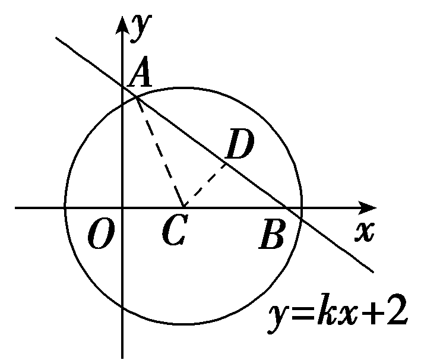

##### 9.(13分)已知两圆<em>x</em>2＋<em>y</em>2－2<em>x</em>－6<em>y</em>－1＝0和<em>x</em>2＋<em>y</em>2－10<em>x</em>－12<em>y</em>＋<em>m</em>＝0.求：

（1）*m*取何值时两圆外切？(6分)

（2）当*m*＝45时两圆的公共弦所在直线的方程和公共弦的长.(7分)

解：两圆的标准方程分别为(<em>x</em>－1)2＋(<em>y</em>－3)2＝11，(<em>x</em>－5)2＋(<em>y</em>－6)2＝61－<em>m</em>(<em>m</em>＜61)，

则圆心分别为(1，3)，(5，6)，半径分别为 $\sqrt{11}$ 和 $\sqrt{61－m}$ .

（1）当两圆外切时，

$\sqrt{(5－1)^{2}＋(6－3)^{2}}$ ＝ $\sqrt{11}$ ＋ $\sqrt{61－m}$ ，解得*m*＝25＋10 $\sqrt{11}$ .

（2）两圆的公共弦所在直线的方程为

(<em>x</em>2＋<em>y</em>2－2<em>x</em>－6<em>y</em>－1)－(<em>x</em>2＋<em>y</em>2－10<em>x</em>－12<em>y</em>＋45)＝0，即4<em>x</em>＋3<em>y</em>－23＝0.

所以公共弦的长为2× $\sqrt{(\sqrt{11})^{2}－\left(\frac{｜4+3\times 3－23｜}{\sqrt{4^{2}＋3^{2}}}\right)^{2}}$ ＝2 $\sqrt{7}$ .

(10、11题，每小题5分，共10分)

##### 10.(多选)(2021·新高考Ⅰ卷)已知点<em>P</em>在圆(<em>x</em>－5)2＋(<em>y</em>－5)2＝16上，点<em>A</em>(4，0)，<em>B</em>(0，2)，则(　　)

$\quad$A.点*P*到直线*AB*的距离小于10

$\quad$B.点*P*到直线*AB*的距离大于2

$\quad$C.当∠*<text style="italic">PB*A</text>最小时，｜PB｜＝3 $\sqrt{2}$

$\quad$D.当∠*<text style="italic">PB*A</text>最大时，｜PB｜＝3 $\sqrt{2}$

答案ACD

解析设圆(&lt;te&lt;text st<em>y</em>le="italic"&gt;x&lt;/text&gt;t st<em>y</em>le="italic"&gt;x&lt;/text&gt;－5)&lt;text style="superscript"&gt;2&lt;/text&gt;＋(y－5)2＝16的圆心为<em>&lt;text style="italic"&gt;&lt;text style="italic"&gt;&lt;text style="italic"&gt;M</em>&lt;/text&gt;&lt;/text&gt;&lt;/text&gt;(5，5)，由题易知直线<em>&lt;text style="italic"&gt;&lt;text style="italic"&gt;&lt;text style="italic"&gt;&lt;text style="italic"&gt;A&lt;text style="italic"&gt;B</em>&lt;/text&gt;&lt;/text&gt;&lt;/text&gt;&lt;/text&gt;&lt;/text&gt;的方程为 $\frac{x}{4}$ ＋ $\frac{y}{2}$ ＝1，即&lt;te&lt;text st<em>y</em>le="italic"&gt;x&lt;/text&gt;t st<em>y</em>le="italic"&gt;x&lt;/text&gt;＋&lt;text style="superscript"&gt;2&lt;/text&gt;y－4＝0，则圆心<em>&lt;text style="italic"&gt;&lt;text style="italic"&gt;&lt;text style="italic"&gt;M</em>&lt;/text&gt;&lt;/text&gt;&lt;/text&gt;到直线<em>&lt;text style="italic"&gt;&lt;text style="italic"&gt;&lt;text style="italic"&gt;&lt;text style="italic"&gt;A&lt;text style="italic"&gt;B</em>&lt;/text&gt;&lt;/text&gt;&lt;/text&gt;&lt;/text&gt;&lt;/text&gt;的距离<em>&lt;text style="italic"&gt;&lt;text style="italic"&gt;d</em>&lt;/text&gt;&lt;/text&gt;＝ $\frac{\left|5+2\times 5－4\right|}{\sqrt{5}}$ ＝ $\frac{11}{\sqrt{5}}$ ＞4，所以直线&lt;te&lt;text st<em>y</em>le="italic"&gt;x&lt;/text&gt;t style="italic"&gt;<em>&lt;text style="italic"&gt;&lt;text style="italic"&gt;&lt;text style="italic"&gt;A&lt;text style="italic"&gt;B</em>&lt;/text&gt;&lt;/text&gt;&lt;/text&gt;&lt;/text&gt;&lt;/text&gt;与圆<em>&lt;text style="italic"&gt;&lt;text style="italic"&gt;&lt;text style="italic"&gt;M</em>&lt;/text&gt;&lt;/text&gt;&lt;/text&gt;相离，所以点<em>&lt;text style="italic"&gt;&lt;text style="italic"&gt;&lt;text style="italic"&gt;P</em>&lt;/text&gt;&lt;/text&gt;&lt;/text&gt;到直线AB的距离的最大值为4＋<em>&lt;text style="italic"&gt;&lt;text style="italic"&gt;d</em>&lt;/text&gt;&lt;/text&gt;＝4＋ $\frac{11}{\sqrt{5}}$ ，4＋ $\frac{11}{\sqrt{5}}$ ＜5＋ $\sqrt{\frac{125}{5}}$ ＝10，故A正确；易知点<em>&lt;text style="italic"&gt;&lt;text style="italic"&gt;&lt;text style="italic"&gt;P</em>&lt;/text&gt;&lt;/text&gt;&lt;/text&gt;到直线&lt;te&lt;text st<em>y</em>le="italic"&gt;x&lt;/text&gt;t style="italic"&gt;<em>&lt;text style="italic"&gt;&lt;text style="italic"&gt;&lt;text style="italic"&gt;A&lt;text style="italic"&gt;B</em>&lt;/text&gt;&lt;/text&gt;&lt;/text&gt;&lt;/text&gt;&lt;/text&gt;的距离的最小值为<em>&lt;text style="italic"&gt;&lt;text style="italic"&gt;d</em>&lt;/text&gt;&lt;/text&gt;－4＝ $\frac{11}{\sqrt{5}}$ －4， $\frac{11}{\sqrt{5}}$ －4＜ $\sqrt{\frac{125}{5}}$ －4＝1，故<em>B</em>不正确；过点B作圆&lt;te&lt;text st<em>y</em>le="italic"&gt;x&lt;/text&gt;t style="italic"&gt;<em>&lt;text style="italic"&gt;&lt;text style="italic"&gt;M</em>&lt;/text&gt;&lt;/text&gt;&lt;/text&gt;的两条切线，切点分别为<em>&lt;text style="italic"&gt;N</em>&lt;/text&gt;，<em>&lt;text style="italic"&gt;Q</em>&lt;/text&gt;，如图所示，连接<em>MB</em>，<em>MN</em>，<em>MQ</em>，则当∠<em>&lt;text style="italic"&gt;&lt;text style="italic"&gt;&lt;text style="italic"&gt;P</em>&lt;/text&gt;&lt;/text&gt;&lt;/text&gt;BA最小时，点P与N重合，｜<em>PB</em>｜＝ $\sqrt{\left|MB\right|^{2}－\left|MN\right|^{2}}$ ＝ $\sqrt{5^{2}＋\left(5－2\right)^{2}－4^{2}}$ ＝3 $\sqrt{2}$ ，当∠<em>&lt;text style="italic"&gt;&lt;text style="italic"&gt;&lt;text style="italic"&gt;P</em>&lt;/text&gt;&lt;/text&gt;&lt;/text&gt;<em>B</em>A最大时，点P与<em>&lt;text style="italic"&gt;Q</em>&lt;/text&gt;重合， $\left|PB\right|$ ＝3 $\sqrt{2}$ ，故C、D都正确.故选ACD.

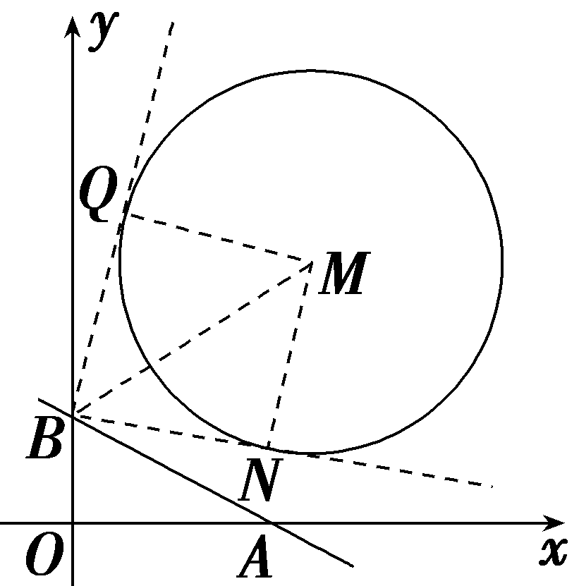

##### 11.已知圆<em>C</em>：<em>x</em>2＋<em>y</em>2－4<em>x</em>－2<em>y</em>＋1＝0及直线<em>l</em>：<em>y</em>＝<em>kx</em>－<em>k</em>＋2(<em>k</em>∈<strong>R</strong>)，设直线<em>l</em>与圆<em>C</em>相交所得的最长弦为<em>MN</em>，最短弦为<em>PQ</em>，则四边形<em>PMQN</em>的面积为<u>　　　　</u>.

答案4 $\sqrt{2}$

解析将圆&lt;te&lt;te&lt;text sty<em>l</em>e="italic"&gt;x&lt;/text&gt;t st&lt;text st<em>yl</em>e="italic"&gt;y&lt;/text&gt;le="italic"&gt;x&lt;/text&gt;t style="italic"&gt;<em>&lt;text style="italic"&gt;&lt;text style="italic"&gt;C</em>&lt;/text&gt;&lt;/text&gt;&lt;/text&gt;方程整理为(x－&lt;text style="supe<em>r</em>script"&gt;2&lt;/text&gt;)2＋(y－1)2＝4，得圆心C(2，1)，半径r＝2，将直线l的方程整理为y＝<em>k</em>(x－1)＋2，得直线l恒过定点(1，2)，且(1，2)在圆C内，所以最长弦<em>&lt;text style="italic"&gt;&lt;text style="italic"&gt;&lt;text style="italic"&gt;MN</em>&lt;/text&gt;&lt;/text&gt;&lt;/text&gt;为过(1，2)的圆的直径，即｜MN｜＝4，最短弦<em>&lt;text style="italic"&gt;&lt;text style="italic"&gt;&lt;text style="italic"&gt;PQ</em>&lt;/text&gt;&lt;/text&gt;&lt;/text&gt;为过(1，2)，且与最长弦MN垂直的弦，所以圆心C到直线PQ的距离为<em>d</em>＝ $\sqrt{(2－1)^{2}＋(1－2)^{2}}$ ＝ $\sqrt{2}$ ，所以｜<em>&lt;text style="italic"&gt;&lt;text style="italic"&gt;&lt;text style="italic"&gt;PQ</em>&lt;/text&gt;&lt;/text&gt;&lt;/text&gt;｜＝&lt;te&lt;text sty<em>l</em>e="italic"&gt;x&lt;/text&gt;t st&lt;text st<em>yl</em>e="italic"&gt;y&lt;/text&gt;le="supe<em>r</em>script"&gt;2&lt;/text&gt; $\sqrt{r^{2}－d^{2}}$ ＝&lt;te&lt;text sty<em>l</em>e="italic"&gt;x&lt;/text&gt;t st&lt;text st<em>yl</em>e="italic"&gt;y&lt;/text&gt;le="supe<em>r</em>script"&gt;2&lt;/text&gt; $\sqrt{4－2}$ ＝&lt;te&lt;text sty<em>l</em>e="italic"&gt;x&lt;/text&gt;t st&lt;text st<em>yl</em>e="italic"&gt;y&lt;/text&gt;le="supe<em>r</em>script"&gt;2&lt;/text&gt; $\sqrt{2}$ ，所以四边形<em>PMQN</em>的面积<em>S</em>＝ $\frac{1}{2}$ ｜<em>&lt;text style="italic"&gt;&lt;text style="italic"&gt;&lt;text style="italic"&gt;MN</em>&lt;/text&gt;&lt;/text&gt;&lt;/text&gt;｜<em>·</em>｜<em>&lt;text style="italic"&gt;&lt;text style="italic"&gt;&lt;text style="italic"&gt;PQ</em>&lt;/text&gt;&lt;/text&gt;&lt;/text&gt;｜＝ $\frac{1}{2}$ ×4×&lt;te&lt;text sty<em>l</em>e="italic"&gt;x&lt;/text&gt;t st&lt;text st<em>yl</em>e="italic"&gt;y&lt;/text&gt;le="supe<em>r</em>script"&gt;2&lt;/text&gt; $\sqrt{2}$ ＝4 $\sqrt{2}$ .

##### 12.(15分)已知两个定点*A*(－4，0)，*B*(－1，0)，动点*P*满足｜*PA*｜＝2｜*PB*｜，设动点*P*的轨迹为曲线*E*，直线*l*：*y*＝*kx*－4.

（1）求曲线*E*的方程；(3分)

（2）若*l*与曲线*E*交于不同的*C*，*D*两点，且∠*COD*＝90°(*O*为坐标原点)，求直线*l*的斜率；(4分)

（3）若<text sty*l*e="italic">k</text>＝ $\frac{1}{2}$ ，<text sty*l*e="italic">*Q*</text>是直线l上的动点，过Q作曲线*E*的两条切线*Q<text style="italic">M*</text>，*Q<text style="italic">N*</text>，切点分别为M，N，判断直线*MN*是否过定点.(8分)

解：（1）设点*P*的坐标为(*x*，*y*)，

由｜*PA*｜＝2｜*PB*｜，得 $\sqrt{(x+4)^{2}＋y^{2}}$ ＝2 $\sqrt{(x+1)^{2}＋y^{2}}$ ，

故曲线<em>E</em>的方程为<em>x</em>2＋<em>y</em>2＝4.

（2）依题意可知，圆心到直线*l*的距离*d*＝ $\frac{|-4｜}{\sqrt{1+k^{2}}}$ ＝ $\sqrt{2}$ ，解得*k*＝± $\sqrt{7}$ .

（3）由题意可知，*O*，*<text style="italic">Q*</text>，*M*，*N*四点共圆且在以*OQ*为直径的圆上，设Q $\left(t，\frac{1}{2}t－4\right)$ ，

圆的方程为<text st*y*le="italic">x</text> $\left(x－t\right)$ ＋*y* $\left(y－\frac{1}{2}t+4\right)$ ＝0，

即&lt;text st&lt;text st<em>y</em>le="italic"&gt;y&lt;/text&gt;le="italic"&gt;x&lt;/text&gt;&lt;text style="superscript"&gt;2&lt;/text&gt;－<em>tx</em>＋y2－ $\left(\frac{t}{2}－4\right)$ &lt;text st<em>y</em>le="italic"&gt;y&lt;/text&gt;＝0，

又<em>M</em>，<em>N</em>在曲线<em>E</em>：<em>x</em>2＋<em>y</em>2＝4上，

所以&lt;text st<em>y</em>le="italic"&gt;l&lt;/text&gt;<em>MN</em>：<em>tx</em>＋ $\left(\frac{t}{2}－4\right)$ <em>y</em>－4＝0，

即 $\left(x＋\frac{y}{2}\right)$ *t*－4 $\left(y+1\right)$ ＝0，

由 $\left\{\begin{matrix}x＋\frac{y}{2}=0，\\y+1=0，\end{matrix}\right.$ 得 $\left\{\begin{matrix}x＝\frac{1}{2}，\\y＝－1，\end{matrix}\right.$

所以直线*MN*过定点 $\left(\frac{1}{2},-1\right)$ .

(13、14题，每小题5分，共10分)

##### 13. (2024·山东枣庄二模)在平面直角坐标系<em>xOy</em>中，已知<em>A</em>(－3，0)，<em>B</em>(1，0)，<em>P</em>为圆<em>C</em>：(<em>x</em>－3)2＋(<em>y</em>－3)2＝1上的动点，则｜<em>PA</em>｜2＋｜<em>PB</em>｜2的最小值为(　　)

$\quad$A.34	
$\quad$B.40

$\quad$C.44	
$\quad$D.48

答案B

解析设&lt;te&lt;te&lt;te&lt;te&lt;te&lt;te&lt;text st<em>y</em>le="italic"&gt;x&lt;/text&gt;t style="italic"&gt;x&lt;/text&gt;t st<em>y</em>le="italic"&gt;x&lt;/text&gt;t st<em>y</em>le="italic"&gt;x&lt;/text&gt;t st<em>y</em>le="italic"&gt;x&lt;/text&gt;t st<em>y</em>le="italic"&gt;x&lt;/text&gt;t style="italic"&gt;<em>P</em>&lt;/text&gt;(x，y)，则｜<em>&lt;text style="italic"&gt;&lt;text style="italic"&gt;PA</em>&lt;/text&gt;&lt;/text&gt;｜&lt;text style="superscript"&gt;&lt;text style="superscript"&gt;&lt;text style="superscript"&gt;&lt;text style="superscript"&gt;&lt;text style="superscript"&gt;&lt;text style="superscript"&gt;&lt;text style="superscript"&gt;&lt;text style="superscript"&gt;&lt;text style="superscript"&gt;&lt;text style="superscript"&gt;&lt;text style="superscript"&gt;&lt;text style="superscript"&gt;&lt;text style="superscript"&gt;&lt;text style="superscript"&gt;2&lt;/text&gt;&lt;/text&gt;&lt;/text&gt;&lt;/text&gt;&lt;/text&gt;&lt;/text&gt;&lt;/text&gt;&lt;/text&gt;&lt;/text&gt;&lt;/text&gt;&lt;/text&gt;&lt;/text&gt;&lt;/text&gt;&lt;/text&gt;＋｜<em>&lt;text style="italic"&gt;&lt;text style="italic"&gt;PB</em>&lt;/text&gt;&lt;/text&gt;｜2＝(x＋3)2＋y2＋(x－1)2＋y2＝2x2＋2y2＋4x＋10＝2[(x＋1)2＋y2]＋8，即｜PA｜2＋｜PB｜2等价于点P到点<em>Q</em>(－1，0)的距离的平方的两倍加8，又｜<em>PQ</em>｜≥｜<em>QC</em>｜－｜<em>PC</em>｜＝ $\sqrt{(3+1)^{2}＋3^{2}}$ －1＝5－1＝4，即｜&lt;te&lt;te&lt;te&lt;te&lt;te&lt;te&lt;text st<em>y</em>le="italic"&gt;x&lt;/text&gt;t style="italic"&gt;x&lt;/text&gt;t st<em>y</em>le="italic"&gt;x&lt;/text&gt;t st<em>y</em>le="italic"&gt;x&lt;/text&gt;t st<em>y</em>le="italic"&gt;x&lt;/text&gt;t st<em>y</em>le="italic"&gt;x&lt;/text&gt;t style="italic"&gt;<em>P</em>&lt;/text&gt;A｜&lt;text style="superscript"&gt;&lt;text style="superscript"&gt;&lt;text style="superscript"&gt;&lt;text style="superscript"&gt;&lt;text style="superscript"&gt;&lt;text style="superscript"&gt;&lt;text style="superscript"&gt;&lt;text style="superscript"&gt;&lt;text style="superscript"&gt;&lt;text style="superscript"&gt;&lt;text style="superscript"&gt;&lt;text style="superscript"&gt;&lt;text style="superscript"&gt;&lt;text style="superscript"&gt;2&lt;/text&gt;&lt;/text&gt;&lt;/text&gt;&lt;/text&gt;&lt;/text&gt;&lt;/text&gt;&lt;/text&gt;&lt;/text&gt;&lt;/text&gt;&lt;/text&gt;&lt;/text&gt;&lt;/text&gt;&lt;/text&gt;&lt;/text&gt;＋｜<em>&lt;text style="italic"&gt;&lt;text style="italic"&gt;PB</em>&lt;/text&gt;&lt;/text&gt;｜2≥2×42＋8＝40.故选B.

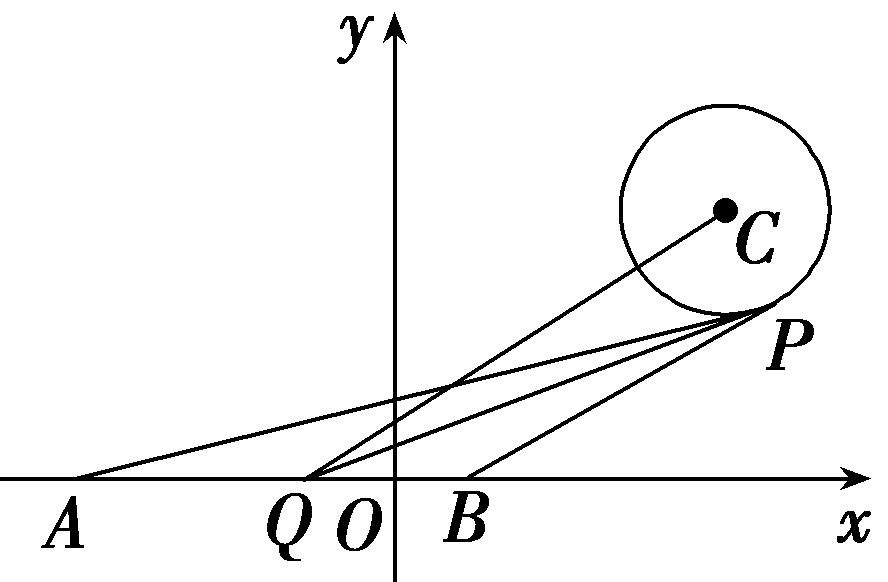

##### 14.(多选)(&lt;text st<em>y</em>le="superscript"&gt;2&lt;/text&gt;025·安徽六校第二次素养测试)已知直线&lt;te&lt;te<em>x</em>t st<em>y</em>le="italic"&gt;x&lt;/text&gt;t style="italic"&gt;l&lt;/text&gt;： $\left(a+2\right)$ &lt;te&lt;text st<em>y</em>le="italic"&gt;x&lt;/text&gt;t st<em>y</em>le="italic"&gt;x&lt;/text&gt;－ $\left(a+1\right)$ &lt;te&lt;text st<em>y</em>le="italic"&gt;x&lt;/text&gt;t style="italic"&gt;y&lt;/text&gt;－1＝0与圆<em>C</em>：<em>x</em>&lt;text style="superscript"&gt;2&lt;/text&gt;＋y2＝4交于点<em>A</em>，<em>B</em>，点<em>P</em> $\left(1，1\right)$ ，<em>AB</em>中点为<em>Q</em>，则(　　)

$\quad$A. $\left|AB\right|$ 的最小值为2 $\sqrt{2}$

$\quad$B. $\left|AB\right|$ 的最大值为4

$\quad$C. $\vec{PA}$ · $\vec{PB}$ 为定值

$\quad$D.存在定点*M*，使得 $\left|MQ\right|$ 为定值

答案ACD

解析直线&lt;te&lt;te&lt;te&lt;te&lt;te&lt;te&lt;te&lt;te&lt;te&lt;te&lt;te&lt;te&lt;te&lt;te<em>x</em>t style="italic"&gt;x&lt;/text&gt;t st&lt;text st&lt;text st&lt;text st<em>y</em>le="italic"&gt;y&lt;/text&gt;le="italic"&gt;y&lt;/text&gt;le="italic"&gt;y&lt;/text&gt;le="italic"&gt;x&lt;/text&gt;t style="italic"&gt;x&lt;/text&gt;t style="italic"&gt;x&lt;/text&gt;t st<em>y</em>le="italic"&gt;x&lt;/text&gt;t st&lt;text st&lt;text st<em>yl</em>e="italic"&gt;y&lt;/text&gt;le="italic"&gt;y&lt;/text&gt;le="italic"&gt;x&lt;/text&gt;t style="italic"&gt;x&lt;/text&gt;t st&lt;text st&lt;text sty&lt;text sty<em>l</em>e="italic"&gt;l&lt;/text&gt;e="italic"&gt;y&lt;/text&gt;le="italic"&gt;y&lt;/text&gt;le="italic"&gt;x&lt;/text&gt;t style="italic"&gt;x&lt;/text&gt;t st&lt;text sty<em>l</em>e="italic"&gt;y&lt;/text&gt;le="italic"&gt;x&lt;/text&gt;t st<em>y</em>le="italic"&gt;x&lt;/text&gt;t st<em>y</em>le="italic"&gt;x&lt;/text&gt;t st&lt;text style="it<em>a</em>lic"&gt;y&lt;/text&gt;le="italic"&gt;x&lt;/text&gt;t style="italic"&gt;l&lt;/text&gt;： $\left(a+2\right)$ &lt;te&lt;te&lt;te&lt;te&lt;te&lt;te&lt;te&lt;te&lt;te&lt;te&lt;te&lt;te&lt;te<em>x</em>t style="italic"&gt;x&lt;/text&gt;t st&lt;text st&lt;text st&lt;text st<em>y</em>le="italic"&gt;y&lt;/text&gt;le="italic"&gt;y&lt;/text&gt;le="italic"&gt;y&lt;/text&gt;le="italic"&gt;x&lt;/text&gt;t style="italic"&gt;x&lt;/text&gt;t style="italic"&gt;x&lt;/text&gt;t st<em>y</em>le="italic"&gt;x&lt;/text&gt;t st&lt;text st&lt;text st<em>yl</em>e="italic"&gt;y&lt;/text&gt;le="italic"&gt;y&lt;/text&gt;le="italic"&gt;x&lt;/text&gt;t style="italic"&gt;x&lt;/text&gt;t st&lt;text st&lt;text sty&lt;text sty<em>l</em>e="italic"&gt;l&lt;/text&gt;e="italic"&gt;y&lt;/text&gt;le="italic"&gt;y&lt;/text&gt;le="italic"&gt;x&lt;/text&gt;t style="italic"&gt;x&lt;/text&gt;t st&lt;text sty<em>l</em>e="italic"&gt;y&lt;/text&gt;le="italic"&gt;x&lt;/text&gt;t st<em>y</em>le="italic"&gt;x&lt;/text&gt;t st<em>y</em>le="italic"&gt;x&lt;/text&gt;t st&lt;text style="it<em>a</em>lic"&gt;y&lt;/text&gt;le="italic"&gt;x&lt;/text&gt;－ $\left(a+1\right)$ &lt;te&lt;te&lt;te&lt;te&lt;te&lt;te&lt;te&lt;te&lt;te&lt;te&lt;te&lt;te&lt;te<em>x</em>t style="italic"&gt;x&lt;/text&gt;t st&lt;text st&lt;text st&lt;text st<em>y</em>le="italic"&gt;y&lt;/text&gt;le="italic"&gt;y&lt;/text&gt;le="italic"&gt;y&lt;/text&gt;le="italic"&gt;x&lt;/text&gt;t style="italic"&gt;x&lt;/text&gt;t style="italic"&gt;x&lt;/text&gt;t st<em>y</em>le="italic"&gt;x&lt;/text&gt;t st&lt;text st&lt;text st<em>yl</em>e="italic"&gt;y&lt;/text&gt;le="italic"&gt;y&lt;/text&gt;le="italic"&gt;x&lt;/text&gt;t style="italic"&gt;x&lt;/text&gt;t st&lt;text st&lt;text sty&lt;text sty<em>l</em>e="italic"&gt;l&lt;/text&gt;e="italic"&gt;y&lt;/text&gt;le="italic"&gt;y&lt;/text&gt;le="italic"&gt;x&lt;/text&gt;t style="italic"&gt;x&lt;/text&gt;t st&lt;text sty<em>l</em>e="italic"&gt;y&lt;/text&gt;le="italic"&gt;x&lt;/text&gt;t st<em>y</em>le="italic"&gt;x&lt;/text&gt;t st<em>y</em>le="italic"&gt;x&lt;/text&gt;t style="it<em>a</em>lic"&gt;y&lt;/text&gt;－&lt;text style="subscript"&gt;&lt;text style="subscript"&gt;&lt;text style="subscript"&gt;&lt;text style="subscript"&gt;1&lt;/text&gt;&lt;/text&gt;&lt;/text&gt;&lt;/text&gt;＝0，即a(<em>x</em>－y)＋&lt;text style="superscript"&gt;&lt;text style="superscript"&gt;&lt;text style="superscript"&gt;&lt;text style="subscript"&gt;&lt;text style="subscript"&gt;&lt;text style="superscript"&gt;&lt;text style="superscript"&gt;&lt;text style="superscript"&gt;&lt;text style="superscript"&gt;&lt;text style="superscript"&gt;&lt;text style="superscript"&gt;&lt;text style="superscript"&gt;&lt;text style="subscript"&gt;&lt;text style="subscript"&gt;&lt;text style="superscript"&gt;&lt;text style="subscript"&gt;2&lt;/text&gt;&lt;/text&gt;&lt;/text&gt;&lt;/text&gt;&lt;/text&gt;&lt;/text&gt;&lt;/text&gt;&lt;/text&gt;&lt;/text&gt;&lt;/text&gt;&lt;/text&gt;&lt;/text&gt;&lt;/text&gt;&lt;/text&gt;&lt;/text&gt;&lt;/text&gt;x－y－1＝0，故直线过定点<em>&lt;text style="italic"&gt;P</em>&lt;/text&gt; $\left(1，1\right)$ ，且圆&lt;te&lt;te&lt;te&lt;te&lt;te&lt;te&lt;te&lt;te&lt;te&lt;te&lt;te<em>x</em>t style="italic"&gt;x&lt;/text&gt;t st&lt;text st&lt;text st&lt;text st<em>y</em>le="italic"&gt;y&lt;/text&gt;le="italic"&gt;y&lt;/text&gt;le="italic"&gt;y&lt;/text&gt;le="italic"&gt;x&lt;/text&gt;t style="italic"&gt;x&lt;/text&gt;t style="italic"&gt;x&lt;/text&gt;t st<em>y</em>le="italic"&gt;x&lt;/text&gt;t st&lt;text st&lt;text st<em>yl</em>e="italic"&gt;y&lt;/text&gt;le="italic"&gt;y&lt;/text&gt;le="italic"&gt;x&lt;/text&gt;t style="italic"&gt;x&lt;/text&gt;t st&lt;text st&lt;text sty&lt;text sty<em>l</em>e="italic"&gt;l&lt;/text&gt;e="italic"&gt;y&lt;/text&gt;le="italic"&gt;y&lt;/text&gt;le="italic"&gt;x&lt;/text&gt;t style="italic"&gt;x&lt;/text&gt;t st&lt;text sty<em>l</em>e="italic"&gt;y&lt;/text&gt;le="italic"&gt;x&lt;/text&gt;t style="italic"&gt;<em>&lt;text style="italic"&gt;&lt;text style="italic"&gt;C</em>&lt;/text&gt;&lt;/text&gt;&lt;/text&gt;：&lt;te&lt;te&lt;text st<em>y</em>le="italic"&gt;x&lt;/text&gt;t st<em>y</em>le="italic"&gt;x&lt;/text&gt;t st&lt;text style="it<em>a</em>lic"&gt;y&lt;/text&gt;le="italic"&gt;x&lt;/text&gt;&lt;text style="superscript"&gt;&lt;text style="superscript"&gt;&lt;text style="superscript"&gt;&lt;text style="subscript"&gt;&lt;text style="subscript"&gt;&lt;text style="superscript"&gt;&lt;text style="superscript"&gt;&lt;text style="superscript"&gt;&lt;text style="superscript"&gt;&lt;text style="superscript"&gt;&lt;text style="superscript"&gt;&lt;text style="superscript"&gt;&lt;text style="subscript"&gt;&lt;text style="subscript"&gt;&lt;text style="superscript"&gt;&lt;text style="subscript"&gt;2&lt;/text&gt;&lt;/text&gt;&lt;/text&gt;&lt;/text&gt;&lt;/text&gt;&lt;/text&gt;&lt;/text&gt;&lt;/text&gt;&lt;/text&gt;&lt;/text&gt;&lt;/text&gt;&lt;/text&gt;&lt;/text&gt;&lt;/text&gt;&lt;/text&gt;&lt;/text&gt;＋y2＝4的圆心为 $\left(0，0\right)$ ，半径为&lt;te&lt;te&lt;te&lt;te&lt;te&lt;te&lt;te&lt;te&lt;te&lt;te<em>x</em>t style="italic"&gt;x&lt;/text&gt;t st&lt;text st&lt;text st&lt;text st<em>y</em>le="italic"&gt;y&lt;/text&gt;le="italic"&gt;y&lt;/text&gt;le="italic"&gt;y&lt;/text&gt;le="italic"&gt;x&lt;/text&gt;t style="italic"&gt;x&lt;/text&gt;t style="italic"&gt;x&lt;/text&gt;t st<em>y</em>le="italic"&gt;x&lt;/text&gt;t st&lt;text st&lt;text st<em>yl</em>e="italic"&gt;y&lt;/text&gt;le="italic"&gt;y&lt;/text&gt;le="italic"&gt;x&lt;/text&gt;t style="italic"&gt;x&lt;/text&gt;t st&lt;text st&lt;text sty&lt;text sty<em>l</em>e="italic"&gt;l&lt;/text&gt;e="italic"&gt;y&lt;/text&gt;le="italic"&gt;y&lt;/text&gt;le="italic"&gt;x&lt;/text&gt;t style="italic"&gt;x&lt;/text&gt;t st&lt;text sty<em>l</em>e="italic"&gt;y&lt;/text&gt;le="superscript"&gt;&lt;text style="superscript"&gt;&lt;text style="superscript"&gt;&lt;text style="subscript"&gt;&lt;text style="subscript"&gt;&lt;text style="superscript"&gt;&lt;text style="superscript"&gt;&lt;text style="superscript"&gt;&lt;text style="superscript"&gt;&lt;text style="superscript"&gt;&lt;text style="superscript"&gt;&lt;text style="superscript"&gt;&lt;text style="subscript"&gt;&lt;text style="subscript"&gt;&lt;text style="superscript"&gt;&lt;text style="subscript"&gt;2&lt;/text&gt;&lt;/text&gt;&lt;/text&gt;&lt;/text&gt;&lt;/text&gt;&lt;/text&gt;&lt;/text&gt;&lt;/text&gt;&lt;/text&gt;&lt;/text&gt;&lt;/text&gt;&lt;/text&gt;&lt;/text&gt;&lt;/text&gt;&lt;/text&gt;&lt;/text&gt;，因为&lt;text style="subscript"&gt;&lt;text style="subscript"&gt;&lt;text style="subscript"&gt;&lt;text style="subscript"&gt;1&lt;/text&gt;&lt;/text&gt;&lt;/text&gt;&lt;/text&gt;2＋12＜4，故&lt;te<em>x</em>t style="italic"&gt;<em>P</em>&lt;/text&gt; $\left(1，1\right)$ 在圆&lt;te&lt;te&lt;te&lt;te&lt;te&lt;te&lt;te&lt;te&lt;te&lt;te&lt;te<em>x</em>t style="italic"&gt;x&lt;/text&gt;t st&lt;text st&lt;text st&lt;text st<em>y</em>le="italic"&gt;y&lt;/text&gt;le="italic"&gt;y&lt;/text&gt;le="italic"&gt;y&lt;/text&gt;le="italic"&gt;x&lt;/text&gt;t style="italic"&gt;x&lt;/text&gt;t style="italic"&gt;x&lt;/text&gt;t st<em>y</em>le="italic"&gt;x&lt;/text&gt;t st&lt;text st&lt;text st<em>yl</em>e="italic"&gt;y&lt;/text&gt;le="italic"&gt;y&lt;/text&gt;le="italic"&gt;x&lt;/text&gt;t style="italic"&gt;x&lt;/text&gt;t st&lt;text st&lt;text sty&lt;text sty<em>l</em>e="italic"&gt;l&lt;/text&gt;e="italic"&gt;y&lt;/text&gt;le="italic"&gt;y&lt;/text&gt;le="italic"&gt;x&lt;/text&gt;t style="italic"&gt;x&lt;/text&gt;t st&lt;text sty<em>l</em>e="italic"&gt;y&lt;/text&gt;le="italic"&gt;x&lt;/text&gt;t style="italic"&gt;<em>&lt;text style="italic"&gt;&lt;text style="italic"&gt;C</em>&lt;/text&gt;&lt;/text&gt;&lt;/text&gt;内.对于<em>A</em>，当C<em>&lt;text style="italic"&gt;P</em>&lt;/text&gt;和直线&lt;te&lt;te&lt;te&lt;text st<em>y</em>le="italic"&gt;x&lt;/text&gt;t st<em>y</em>le="italic"&gt;x&lt;/text&gt;t st&lt;text style="it<em>a</em>lic"&gt;y&lt;/text&gt;le="italic"&gt;x&lt;/text&gt;t style="italic"&gt;l&lt;/text&gt;垂直时，圆心到直线的距离最大，距离<em>d</em>＝ $\left|CP\right|$ ＝ $\sqrt{2}$ ，此时 $\left|AB\right|$ 最小， $\left|AB\right|$ ＝&lt;te&lt;te&lt;te&lt;te&lt;te&lt;te&lt;te&lt;te&lt;te&lt;te<em>x</em>t style="italic"&gt;x&lt;/text&gt;t st&lt;text st&lt;text st&lt;text st<em>y</em>le="italic"&gt;y&lt;/text&gt;le="italic"&gt;y&lt;/text&gt;le="italic"&gt;y&lt;/text&gt;le="italic"&gt;x&lt;/text&gt;t style="italic"&gt;x&lt;/text&gt;t style="italic"&gt;x&lt;/text&gt;t st<em>y</em>le="italic"&gt;x&lt;/text&gt;t st&lt;text st&lt;text st<em>yl</em>e="italic"&gt;y&lt;/text&gt;le="italic"&gt;y&lt;/text&gt;le="italic"&gt;x&lt;/text&gt;t style="italic"&gt;x&lt;/text&gt;t st&lt;text st&lt;text sty&lt;text sty<em>l</em>e="italic"&gt;l&lt;/text&gt;e="italic"&gt;y&lt;/text&gt;le="italic"&gt;y&lt;/text&gt;le="italic"&gt;x&lt;/text&gt;t style="italic"&gt;x&lt;/text&gt;t st&lt;text sty<em>l</em>e="italic"&gt;y&lt;/text&gt;le="superscript"&gt;&lt;text style="superscript"&gt;&lt;text style="superscript"&gt;&lt;text style="subscript"&gt;&lt;text style="subscript"&gt;&lt;text style="superscript"&gt;&lt;text style="superscript"&gt;&lt;text style="superscript"&gt;&lt;text style="superscript"&gt;&lt;text style="superscript"&gt;&lt;text style="superscript"&gt;&lt;text style="superscript"&gt;&lt;text style="subscript"&gt;&lt;text style="subscript"&gt;&lt;text style="superscript"&gt;&lt;text style="subscript"&gt;2&lt;/text&gt;&lt;/text&gt;&lt;/text&gt;&lt;/text&gt;&lt;/text&gt;&lt;/text&gt;&lt;/text&gt;&lt;/text&gt;&lt;/text&gt;&lt;/text&gt;&lt;/text&gt;&lt;/text&gt;&lt;/text&gt;&lt;/text&gt;&lt;/text&gt;&lt;/text&gt; $\sqrt{4－d^{2}}$ ＝&lt;te&lt;te&lt;te&lt;te&lt;te&lt;te&lt;te&lt;te&lt;te&lt;te<em>x</em>t style="italic"&gt;x&lt;/text&gt;t st&lt;text st&lt;text st&lt;text st<em>y</em>le="italic"&gt;y&lt;/text&gt;le="italic"&gt;y&lt;/text&gt;le="italic"&gt;y&lt;/text&gt;le="italic"&gt;x&lt;/text&gt;t style="italic"&gt;x&lt;/text&gt;t style="italic"&gt;x&lt;/text&gt;t st<em>y</em>le="italic"&gt;x&lt;/text&gt;t st&lt;text st&lt;text st<em>yl</em>e="italic"&gt;y&lt;/text&gt;le="italic"&gt;y&lt;/text&gt;le="italic"&gt;x&lt;/text&gt;t style="italic"&gt;x&lt;/text&gt;t st&lt;text st&lt;text sty&lt;text sty<em>l</em>e="italic"&gt;l&lt;/text&gt;e="italic"&gt;y&lt;/text&gt;le="italic"&gt;y&lt;/text&gt;le="italic"&gt;x&lt;/text&gt;t style="italic"&gt;x&lt;/text&gt;t st&lt;text sty<em>l</em>e="italic"&gt;y&lt;/text&gt;le="superscript"&gt;&lt;text style="superscript"&gt;&lt;text style="superscript"&gt;&lt;text style="subscript"&gt;&lt;text style="subscript"&gt;&lt;text style="superscript"&gt;&lt;text style="superscript"&gt;&lt;text style="superscript"&gt;&lt;text style="superscript"&gt;&lt;text style="superscript"&gt;&lt;text style="superscript"&gt;&lt;text style="superscript"&gt;&lt;text style="subscript"&gt;&lt;text style="subscript"&gt;&lt;text style="superscript"&gt;&lt;text style="subscript"&gt;2&lt;/text&gt;&lt;/text&gt;&lt;/text&gt;&lt;/text&gt;&lt;/text&gt;&lt;/text&gt;&lt;/text&gt;&lt;/text&gt;&lt;/text&gt;&lt;/text&gt;&lt;/text&gt;&lt;/text&gt;&lt;/text&gt;&lt;/text&gt;&lt;/text&gt;&lt;/text&gt; $\sqrt{2}$ ，故&lt;te&lt;te&lt;te&lt;te&lt;te&lt;te&lt;te&lt;te&lt;te&lt;te<em>x</em>t style="italic"&gt;x&lt;/text&gt;t st&lt;text st&lt;text st&lt;text st<em>y</em>le="italic"&gt;y&lt;/text&gt;le="italic"&gt;y&lt;/text&gt;le="italic"&gt;y&lt;/text&gt;le="italic"&gt;x&lt;/text&gt;t style="italic"&gt;x&lt;/text&gt;t style="italic"&gt;x&lt;/text&gt;t st<em>y</em>le="italic"&gt;x&lt;/text&gt;t st&lt;text st&lt;text st<em>yl</em>e="italic"&gt;y&lt;/text&gt;le="italic"&gt;y&lt;/text&gt;le="italic"&gt;x&lt;/text&gt;t style="italic"&gt;x&lt;/text&gt;t st&lt;text st&lt;text sty&lt;text sty<em>l</em>e="italic"&gt;l&lt;/text&gt;e="italic"&gt;y&lt;/text&gt;le="italic"&gt;y&lt;/text&gt;le="italic"&gt;x&lt;/text&gt;t style="italic"&gt;x&lt;/text&gt;t style="italic"&gt;A&lt;/text&gt;正确；对于<em>B</em>，当 $\left|AB\right|$ ＝4时，&lt;te&lt;te&lt;te&lt;te&lt;te&lt;te&lt;te&lt;te&lt;te&lt;te<em>x</em>t style="italic"&gt;x&lt;/text&gt;t st&lt;text st&lt;text st&lt;text st<em>y</em>le="italic"&gt;y&lt;/text&gt;le="italic"&gt;y&lt;/text&gt;le="italic"&gt;y&lt;/text&gt;le="italic"&gt;x&lt;/text&gt;t style="italic"&gt;x&lt;/text&gt;t style="italic"&gt;x&lt;/text&gt;t st<em>y</em>le="italic"&gt;x&lt;/text&gt;t st&lt;text st&lt;text st<em>yl</em>e="italic"&gt;y&lt;/text&gt;le="italic"&gt;y&lt;/text&gt;le="italic"&gt;x&lt;/text&gt;t style="italic"&gt;x&lt;/text&gt;t st&lt;text st&lt;text sty&lt;text sty<em>l</em>e="italic"&gt;l&lt;/text&gt;e="italic"&gt;y&lt;/text&gt;le="italic"&gt;y&lt;/text&gt;le="italic"&gt;x&lt;/text&gt;t style="italic"&gt;x&lt;/text&gt;t style="italic"&gt;<em>AB</em>&lt;/text&gt;为圆的直径，此时直线过圆心，因为 $\left(a+2\right)$ ×0－ $\left(a+1\right)$ ×0－&lt;te&lt;te&lt;te&lt;te&lt;te&lt;te&lt;te&lt;te&lt;te<em>x</em>t style="italic"&gt;x&lt;/text&gt;t st&lt;text st&lt;text st&lt;text st<em>y</em>le="italic"&gt;y&lt;/text&gt;le="italic"&gt;y&lt;/text&gt;le="italic"&gt;y&lt;/text&gt;le="italic"&gt;x&lt;/text&gt;t style="italic"&gt;x&lt;/text&gt;t style="italic"&gt;x&lt;/text&gt;t st<em>y</em>le="italic"&gt;x&lt;/text&gt;t st&lt;text st&lt;text st<em>yl</em>e="italic"&gt;y&lt;/text&gt;le="italic"&gt;y&lt;/text&gt;le="italic"&gt;x&lt;/text&gt;t style="italic"&gt;x&lt;/text&gt;t st&lt;text st&lt;text sty&lt;text sty<em>l</em>e="italic"&gt;l&lt;/text&gt;e="italic"&gt;y&lt;/text&gt;le="italic"&gt;y&lt;/text&gt;le="italic"&gt;x&lt;/text&gt;t style="subscript"&gt;&lt;text style="subscript"&gt;&lt;text style="subscript"&gt;&lt;text style="subscript"&gt;1&lt;/text&gt;&lt;/text&gt;&lt;/text&gt;&lt;/text&gt;＝0方程无解，故直线不可能过圆心，故&lt;te<em>x</em>t style="italic"&gt;B&lt;/text&gt;错误；对于&lt;te&lt;text st&lt;text sty<em>l</em>e="italic"&gt;y&lt;/text&gt;le="italic"&gt;x&lt;/text&gt;t style="italic"&gt;<em>&lt;text style="italic"&gt;&lt;text style="italic"&gt;C</em>&lt;/text&gt;&lt;/text&gt;&lt;/text&gt;，设<em>A</em> $\left(x_{1}，y_{1}\right)$ ，&lt;te&lt;te&lt;te&lt;te&lt;te&lt;te&lt;te&lt;te&lt;te&lt;te<em>x</em>t style="italic"&gt;x&lt;/text&gt;t st&lt;text st&lt;text st&lt;text st<em>y</em>le="italic"&gt;y&lt;/text&gt;le="italic"&gt;y&lt;/text&gt;le="italic"&gt;y&lt;/text&gt;le="italic"&gt;x&lt;/text&gt;t style="italic"&gt;x&lt;/text&gt;t style="italic"&gt;x&lt;/text&gt;t st<em>y</em>le="italic"&gt;x&lt;/text&gt;t st&lt;text st&lt;text st<em>yl</em>e="italic"&gt;y&lt;/text&gt;le="italic"&gt;y&lt;/text&gt;le="italic"&gt;x&lt;/text&gt;t style="italic"&gt;x&lt;/text&gt;t st&lt;text st&lt;text sty&lt;text sty<em>l</em>e="italic"&gt;l&lt;/text&gt;e="italic"&gt;y&lt;/text&gt;le="italic"&gt;y&lt;/text&gt;le="italic"&gt;x&lt;/text&gt;t style="italic"&gt;x&lt;/text&gt;t style="italic"&gt;B&lt;/text&gt; $\left(x_{2}，y_{2}\right)$ ，则 $\vec{PA}$ &lt;te&lt;te&lt;te&lt;te&lt;te&lt;te&lt;te&lt;te&lt;te&lt;te<em>x</em>t style="italic"&gt;x&lt;/text&gt;t st&lt;text st&lt;text st&lt;text st<em>y</em>le="italic"&gt;y&lt;/text&gt;le="italic"&gt;y&lt;/text&gt;le="italic"&gt;y&lt;/text&gt;le="italic"&gt;x&lt;/text&gt;t style="italic"&gt;x&lt;/text&gt;t style="italic"&gt;x&lt;/text&gt;t st<em>y</em>le="italic"&gt;x&lt;/text&gt;t st&lt;text st&lt;text st<em>yl</em>e="italic"&gt;y&lt;/text&gt;le="italic"&gt;y&lt;/text&gt;le="italic"&gt;x&lt;/text&gt;t style="italic"&gt;x&lt;/text&gt;t st&lt;text st&lt;text sty&lt;text sty<em>l</em>e="italic"&gt;l&lt;/text&gt;e="italic"&gt;y&lt;/text&gt;le="italic"&gt;y&lt;/text&gt;le="italic"&gt;x&lt;/text&gt;t style="italic"&gt;x&lt;/text&gt;t style="italic"&gt;<em>·</em>&lt;/text&gt; $\vec{PB}$ ＝ $\left(x_{1}－1\right)\left(x_{2}－1\right)$ ＋ $\left(y_{1}－1\right)\left(y_{2}－1\right)$ ＝&lt;te&lt;te&lt;te&lt;te&lt;te&lt;te&lt;te&lt;te&lt;te&lt;te&lt;te&lt;te&lt;te<em>x</em>t style="italic"&gt;x&lt;/text&gt;t st&lt;text st&lt;text st&lt;text st<em>y</em>le="italic"&gt;y&lt;/text&gt;le="italic"&gt;y&lt;/text&gt;le="italic"&gt;y&lt;/text&gt;le="italic"&gt;x&lt;/text&gt;t style="italic"&gt;x&lt;/text&gt;t style="italic"&gt;x&lt;/text&gt;t st<em>y</em>le="italic"&gt;x&lt;/text&gt;t st&lt;text st&lt;text st<em>yl</em>e="italic"&gt;y&lt;/text&gt;le="italic"&gt;y&lt;/text&gt;le="italic"&gt;x&lt;/text&gt;t style="italic"&gt;x&lt;/text&gt;t st&lt;text st&lt;text sty&lt;text sty<em>l</em>e="italic"&gt;l&lt;/text&gt;e="italic"&gt;y&lt;/text&gt;le="italic"&gt;y&lt;/text&gt;le="italic"&gt;x&lt;/text&gt;t style="italic"&gt;x&lt;/text&gt;t st&lt;text sty<em>l</em>e="italic"&gt;y&lt;/text&gt;le="italic"&gt;x&lt;/text&gt;t st<em>y</em>le="italic"&gt;x&lt;/text&gt;t st<em>y</em>le="italic"&gt;x&lt;/text&gt;t st&lt;text style="it<em>a</em>lic"&gt;y&lt;/text&gt;le="italic"&gt;x&lt;/text&gt;&lt;text style="subscript"&gt;&lt;text style="subscript"&gt;&lt;text style="subscript"&gt;&lt;text style="subscript"&gt;1&lt;/text&gt;&lt;/text&gt;&lt;/text&gt;&lt;/text&gt;x&lt;text style="superscript"&gt;&lt;text style="superscript"&gt;&lt;text style="superscript"&gt;&lt;text style="subscript"&gt;&lt;text style="subscript"&gt;&lt;text style="superscript"&gt;&lt;text style="superscript"&gt;&lt;text style="superscript"&gt;&lt;text style="superscript"&gt;&lt;text style="superscript"&gt;&lt;text style="superscript"&gt;&lt;text style="superscript"&gt;&lt;text style="subscript"&gt;&lt;text style="subscript"&gt;&lt;text style="superscript"&gt;&lt;text style="subscript"&gt;2&lt;/text&gt;&lt;/text&gt;&lt;/text&gt;&lt;/text&gt;&lt;/text&gt;&lt;/text&gt;&lt;/text&gt;&lt;/text&gt;&lt;/text&gt;&lt;/text&gt;&lt;/text&gt;&lt;/text&gt;&lt;/text&gt;&lt;/text&gt;&lt;/text&gt;&lt;/text&gt;－ $\left(x_{1}＋x_{2}\right)$ ＋&lt;te&lt;te&lt;te&lt;te&lt;te&lt;te&lt;te&lt;te&lt;te&lt;te&lt;te&lt;te&lt;te<em>x</em>t style="italic"&gt;x&lt;/text&gt;t st&lt;text st&lt;text st&lt;text st<em>y</em>le="italic"&gt;y&lt;/text&gt;le="italic"&gt;y&lt;/text&gt;le="italic"&gt;y&lt;/text&gt;le="italic"&gt;x&lt;/text&gt;t style="italic"&gt;x&lt;/text&gt;t style="italic"&gt;x&lt;/text&gt;t st<em>y</em>le="italic"&gt;x&lt;/text&gt;t st&lt;text st&lt;text st<em>yl</em>e="italic"&gt;y&lt;/text&gt;le="italic"&gt;y&lt;/text&gt;le="italic"&gt;x&lt;/text&gt;t style="italic"&gt;x&lt;/text&gt;t st&lt;text st&lt;text sty&lt;text sty<em>l</em>e="italic"&gt;l&lt;/text&gt;e="italic"&gt;y&lt;/text&gt;le="italic"&gt;y&lt;/text&gt;le="italic"&gt;x&lt;/text&gt;t style="italic"&gt;x&lt;/text&gt;t st&lt;text sty<em>l</em>e="italic"&gt;y&lt;/text&gt;le="italic"&gt;x&lt;/text&gt;t st<em>y</em>le="italic"&gt;x&lt;/text&gt;t st<em>y</em>le="italic"&gt;x&lt;/text&gt;t style="it<em>a</em>lic"&gt;y&lt;/text&gt;&lt;text style="subscript"&gt;&lt;text style="subscript"&gt;&lt;text style="subscript"&gt;&lt;text style="subscript"&gt;1&lt;/text&gt;&lt;/text&gt;&lt;/text&gt;&lt;/text&gt;y&lt;text style="superscript"&gt;&lt;text style="superscript"&gt;&lt;text style="superscript"&gt;&lt;text style="subscript"&gt;&lt;text style="subscript"&gt;&lt;text style="superscript"&gt;&lt;text style="superscript"&gt;&lt;text style="superscript"&gt;&lt;text style="superscript"&gt;&lt;text style="superscript"&gt;&lt;text style="superscript"&gt;&lt;text style="superscript"&gt;&lt;text style="subscript"&gt;&lt;text style="subscript"&gt;&lt;text style="superscript"&gt;&lt;text style="subscript"&gt;2&lt;/text&gt;&lt;/text&gt;&lt;/text&gt;&lt;/text&gt;&lt;/text&gt;&lt;/text&gt;&lt;/text&gt;&lt;/text&gt;&lt;/text&gt;&lt;/text&gt;&lt;/text&gt;&lt;/text&gt;&lt;/text&gt;&lt;/text&gt;&lt;/text&gt;&lt;/text&gt;－ $\left(y_{1}＋y_{2}\right)$ ＋&lt;te&lt;te&lt;te&lt;te&lt;te&lt;te&lt;te&lt;te&lt;te&lt;te<em>x</em>t style="italic"&gt;x&lt;/text&gt;t st&lt;text st&lt;text st&lt;text st<em>y</em>le="italic"&gt;y&lt;/text&gt;le="italic"&gt;y&lt;/text&gt;le="italic"&gt;y&lt;/text&gt;le="italic"&gt;x&lt;/text&gt;t style="italic"&gt;x&lt;/text&gt;t style="italic"&gt;x&lt;/text&gt;t st<em>y</em>le="italic"&gt;x&lt;/text&gt;t st&lt;text st&lt;text st<em>yl</em>e="italic"&gt;y&lt;/text&gt;le="italic"&gt;y&lt;/text&gt;le="italic"&gt;x&lt;/text&gt;t style="italic"&gt;x&lt;/text&gt;t st&lt;text st&lt;text sty&lt;text sty<em>l</em>e="italic"&gt;l&lt;/text&gt;e="italic"&gt;y&lt;/text&gt;le="italic"&gt;y&lt;/text&gt;le="italic"&gt;x&lt;/text&gt;t style="italic"&gt;x&lt;/text&gt;t st&lt;text sty<em>l</em>e="italic"&gt;y&lt;/text&gt;le="superscript"&gt;&lt;text style="superscript"&gt;&lt;text style="superscript"&gt;&lt;text style="subscript"&gt;&lt;text style="subscript"&gt;&lt;text style="superscript"&gt;&lt;text style="superscript"&gt;&lt;text style="superscript"&gt;&lt;text style="superscript"&gt;&lt;text style="superscript"&gt;&lt;text style="superscript"&gt;&lt;text style="superscript"&gt;&lt;text style="subscript"&gt;&lt;text style="subscript"&gt;&lt;text style="superscript"&gt;&lt;text style="subscript"&gt;2&lt;/text&gt;&lt;/text&gt;&lt;/text&gt;&lt;/text&gt;&lt;/text&gt;&lt;/text&gt;&lt;/text&gt;&lt;/text&gt;&lt;/text&gt;&lt;/text&gt;&lt;/text&gt;&lt;/text&gt;&lt;/text&gt;&lt;/text&gt;&lt;/text&gt;&lt;/text&gt;，当直线&lt;te&lt;te&lt;te&lt;te<em>x</em>t st<em>y</em>le="italic"&gt;x&lt;/text&gt;t st<em>y</em>le="italic"&gt;x&lt;/text&gt;t st&lt;text style="it<em>a</em>lic"&gt;y&lt;/text&gt;le="italic"&gt;x&lt;/text&gt;t style="italic"&gt;l&lt;/text&gt;斜率不存在时，l：x＝&lt;text style="subscript"&gt;&lt;text style="subscript"&gt;&lt;text style="subscript"&gt;&lt;text style="subscript"&gt;1&lt;/text&gt;&lt;/text&gt;&lt;/text&gt;&lt;/text&gt;，联立圆<em>&lt;text style="italic"&gt;&lt;text style="italic"&gt;&lt;text style="italic"&gt;C</em>&lt;/text&gt;&lt;/text&gt;&lt;/text&gt;：x2＋y2＝4，得y＝± $\sqrt{3}$ ，此时 $\vec{PA}$ &lt;te&lt;te&lt;te&lt;te&lt;te&lt;te&lt;te&lt;te&lt;te&lt;te<em>x</em>t style="italic"&gt;x&lt;/text&gt;t st&lt;text st&lt;text st&lt;text st<em>y</em>le="italic"&gt;y&lt;/text&gt;le="italic"&gt;y&lt;/text&gt;le="italic"&gt;y&lt;/text&gt;le="italic"&gt;x&lt;/text&gt;t style="italic"&gt;x&lt;/text&gt;t style="italic"&gt;x&lt;/text&gt;t st<em>y</em>le="italic"&gt;x&lt;/text&gt;t st&lt;text st&lt;text st<em>yl</em>e="italic"&gt;y&lt;/text&gt;le="italic"&gt;y&lt;/text&gt;le="italic"&gt;x&lt;/text&gt;t style="italic"&gt;x&lt;/text&gt;t st&lt;text st&lt;text sty&lt;text sty<em>l</em>e="italic"&gt;l&lt;/text&gt;e="italic"&gt;y&lt;/text&gt;le="italic"&gt;y&lt;/text&gt;le="italic"&gt;x&lt;/text&gt;t style="italic"&gt;x&lt;/text&gt;t style="italic"&gt;<em>·</em>&lt;/text&gt; $\vec{PB}$ ＝&lt;te&lt;te&lt;te&lt;te&lt;te&lt;te&lt;te&lt;te&lt;te<em>x</em>t style="italic"&gt;x&lt;/text&gt;t st&lt;text st&lt;text st&lt;text st<em>y</em>le="italic"&gt;y&lt;/text&gt;le="italic"&gt;y&lt;/text&gt;le="italic"&gt;y&lt;/text&gt;le="italic"&gt;x&lt;/text&gt;t style="italic"&gt;x&lt;/text&gt;t style="italic"&gt;x&lt;/text&gt;t st<em>y</em>le="italic"&gt;x&lt;/text&gt;t st&lt;text st&lt;text st<em>yl</em>e="italic"&gt;y&lt;/text&gt;le="italic"&gt;y&lt;/text&gt;le="italic"&gt;x&lt;/text&gt;t style="italic"&gt;x&lt;/text&gt;t st&lt;text st&lt;text sty&lt;text sty<em>l</em>e="italic"&gt;l&lt;/text&gt;e="italic"&gt;y&lt;/text&gt;le="italic"&gt;y&lt;/text&gt;le="italic"&gt;x&lt;/text&gt;t style="subscript"&gt;&lt;text style="subscript"&gt;&lt;text style="subscript"&gt;&lt;text style="subscript"&gt;1&lt;/text&gt;&lt;/text&gt;&lt;/text&gt;&lt;/text&gt;－&lt;te<em>x</em>t st&lt;text sty<em>l</em>e="italic"&gt;y&lt;/text&gt;le="superscript"&gt;&lt;text style="superscript"&gt;&lt;text style="superscript"&gt;&lt;text style="subscript"&gt;&lt;text style="subscript"&gt;&lt;text style="superscript"&gt;&lt;text style="superscript"&gt;&lt;text style="superscript"&gt;&lt;text style="superscript"&gt;&lt;text style="superscript"&gt;&lt;text style="superscript"&gt;&lt;text style="superscript"&gt;&lt;text style="subscript"&gt;&lt;text style="subscript"&gt;&lt;text style="superscript"&gt;&lt;text style="subscript"&gt;2&lt;/text&gt;&lt;/text&gt;&lt;/text&gt;&lt;/text&gt;&lt;/text&gt;&lt;/text&gt;&lt;/text&gt;&lt;/text&gt;&lt;/text&gt;&lt;/text&gt;&lt;/text&gt;&lt;/text&gt;&lt;/text&gt;&lt;/text&gt;&lt;/text&gt;&lt;/text&gt;－3＋2＝－2.当直线&lt;te&lt;te&lt;te&lt;te<em>x</em>t st<em>y</em>le="italic"&gt;x&lt;/text&gt;t st<em>y</em>le="italic"&gt;x&lt;/text&gt;t st&lt;text style="it<em>a</em>lic"&gt;y&lt;/text&gt;le="italic"&gt;x&lt;/text&gt;t style="italic"&gt;l&lt;/text&gt;斜率存在时，设直线y－1＝<em>&lt;text style="italic"&gt;&lt;text style="italic"&gt;&lt;text style="italic"&gt;&lt;text style="italic"&gt;&lt;text style="italic"&gt;k</em>&lt;/text&gt;&lt;/text&gt;&lt;/text&gt;&lt;/text&gt;&lt;/text&gt; $\left(x－1\right)$ ，联立圆&lt;te&lt;te&lt;te&lt;te&lt;te&lt;te&lt;te&lt;te&lt;te&lt;te&lt;te<em>x</em>t style="italic"&gt;x&lt;/text&gt;t st&lt;text st&lt;text st&lt;text st<em>y</em>le="italic"&gt;y&lt;/text&gt;le="italic"&gt;y&lt;/text&gt;le="italic"&gt;y&lt;/text&gt;le="italic"&gt;x&lt;/text&gt;t style="italic"&gt;x&lt;/text&gt;t style="italic"&gt;x&lt;/text&gt;t st<em>y</em>le="italic"&gt;x&lt;/text&gt;t st&lt;text st&lt;text st<em>yl</em>e="italic"&gt;y&lt;/text&gt;le="italic"&gt;y&lt;/text&gt;le="italic"&gt;x&lt;/text&gt;t style="italic"&gt;x&lt;/text&gt;t st&lt;text st&lt;text sty&lt;text sty<em>l</em>e="italic"&gt;l&lt;/text&gt;e="italic"&gt;y&lt;/text&gt;le="italic"&gt;y&lt;/text&gt;le="italic"&gt;x&lt;/text&gt;t style="italic"&gt;x&lt;/text&gt;t st&lt;text sty<em>l</em>e="italic"&gt;y&lt;/text&gt;le="italic"&gt;x&lt;/text&gt;t style="italic"&gt;<em>&lt;text style="italic"&gt;&lt;text style="italic"&gt;C</em>&lt;/text&gt;&lt;/text&gt;&lt;/text&gt;：&lt;te&lt;te&lt;text st<em>y</em>le="italic"&gt;x&lt;/text&gt;t st<em>y</em>le="italic"&gt;x&lt;/text&gt;t st&lt;text style="it<em>a</em>lic"&gt;y&lt;/text&gt;le="italic"&gt;x&lt;/text&gt;&lt;text style="superscript"&gt;&lt;text style="superscript"&gt;&lt;text style="superscript"&gt;&lt;text style="subscript"&gt;&lt;text style="subscript"&gt;&lt;text style="superscript"&gt;&lt;text style="superscript"&gt;&lt;text style="superscript"&gt;&lt;text style="superscript"&gt;&lt;text style="superscript"&gt;&lt;text style="superscript"&gt;&lt;text style="superscript"&gt;&lt;text style="subscript"&gt;&lt;text style="subscript"&gt;&lt;text style="superscript"&gt;&lt;text style="subscript"&gt;2&lt;/text&gt;&lt;/text&gt;&lt;/text&gt;&lt;/text&gt;&lt;/text&gt;&lt;/text&gt;&lt;/text&gt;&lt;/text&gt;&lt;/text&gt;&lt;/text&gt;&lt;/text&gt;&lt;/text&gt;&lt;/text&gt;&lt;/text&gt;&lt;/text&gt;&lt;/text&gt;＋y2＝4，得x2＋ $\left[k\left(x－1\right)+1\right]^{2}$ ＝4，即 $\left(k^{2}+1\right)$ &lt;te&lt;te&lt;te&lt;te&lt;te&lt;te&lt;te&lt;te&lt;te&lt;te&lt;te&lt;te&lt;te<em>x</em>t style="italic"&gt;x&lt;/text&gt;t st&lt;text st&lt;text st&lt;text st<em>y</em>le="italic"&gt;y&lt;/text&gt;le="italic"&gt;y&lt;/text&gt;le="italic"&gt;y&lt;/text&gt;le="italic"&gt;x&lt;/text&gt;t style="italic"&gt;x&lt;/text&gt;t style="italic"&gt;x&lt;/text&gt;t st<em>y</em>le="italic"&gt;x&lt;/text&gt;t st&lt;text st&lt;text st<em>yl</em>e="italic"&gt;y&lt;/text&gt;le="italic"&gt;y&lt;/text&gt;le="italic"&gt;x&lt;/text&gt;t style="italic"&gt;x&lt;/text&gt;t st&lt;text st&lt;text sty&lt;text sty<em>l</em>e="italic"&gt;l&lt;/text&gt;e="italic"&gt;y&lt;/text&gt;le="italic"&gt;y&lt;/text&gt;le="italic"&gt;x&lt;/text&gt;t style="italic"&gt;x&lt;/text&gt;t st&lt;text sty<em>l</em>e="italic"&gt;y&lt;/text&gt;le="italic"&gt;x&lt;/text&gt;t st<em>y</em>le="italic"&gt;x&lt;/text&gt;t st<em>y</em>le="italic"&gt;x&lt;/text&gt;t st&lt;text style="it<em>a</em>lic"&gt;y&lt;/text&gt;le="italic"&gt;x&lt;/text&gt;&lt;text style="superscript"&gt;&lt;text style="superscript"&gt;&lt;text style="superscript"&gt;&lt;text style="subscript"&gt;&lt;text style="subscript"&gt;&lt;text style="superscript"&gt;&lt;text style="superscript"&gt;&lt;text style="superscript"&gt;&lt;text style="superscript"&gt;&lt;text style="superscript"&gt;&lt;text style="superscript"&gt;&lt;text style="superscript"&gt;&lt;text style="subscript"&gt;&lt;text style="subscript"&gt;&lt;text style="superscript"&gt;&lt;text style="subscript"&gt;2&lt;/text&gt;&lt;/text&gt;&lt;/text&gt;&lt;/text&gt;&lt;/text&gt;&lt;/text&gt;&lt;/text&gt;&lt;/text&gt;&lt;/text&gt;&lt;/text&gt;&lt;/text&gt;&lt;/text&gt;&lt;/text&gt;&lt;/text&gt;&lt;/text&gt;&lt;/text&gt;＋ $\left(2k－2k^{2}\right)$ &lt;te&lt;te&lt;te&lt;te&lt;te&lt;te&lt;te&lt;te&lt;te&lt;te&lt;te&lt;te&lt;te<em>x</em>t style="italic"&gt;x&lt;/text&gt;t st&lt;text st&lt;text st&lt;text st<em>y</em>le="italic"&gt;y&lt;/text&gt;le="italic"&gt;y&lt;/text&gt;le="italic"&gt;y&lt;/text&gt;le="italic"&gt;x&lt;/text&gt;t style="italic"&gt;x&lt;/text&gt;t style="italic"&gt;x&lt;/text&gt;t st<em>y</em>le="italic"&gt;x&lt;/text&gt;t st&lt;text st&lt;text st<em>yl</em>e="italic"&gt;y&lt;/text&gt;le="italic"&gt;y&lt;/text&gt;le="italic"&gt;x&lt;/text&gt;t style="italic"&gt;x&lt;/text&gt;t st&lt;text st&lt;text sty&lt;text sty<em>l</em>e="italic"&gt;l&lt;/text&gt;e="italic"&gt;y&lt;/text&gt;le="italic"&gt;y&lt;/text&gt;le="italic"&gt;x&lt;/text&gt;t style="italic"&gt;x&lt;/text&gt;t st&lt;text sty<em>l</em>e="italic"&gt;y&lt;/text&gt;le="italic"&gt;x&lt;/text&gt;t st<em>y</em>le="italic"&gt;x&lt;/text&gt;t st<em>y</em>le="italic"&gt;x&lt;/text&gt;t st&lt;text style="it<em>a</em>lic"&gt;y&lt;/text&gt;le="italic"&gt;x&lt;/text&gt;＋<em>&lt;text style="italic"&gt;&lt;text style="italic"&gt;&lt;text style="italic"&gt;&lt;text style="italic"&gt;&lt;text style="italic"&gt;k</em>&lt;/text&gt;&lt;/text&gt;&lt;/text&gt;&lt;/text&gt;&lt;/text&gt;&lt;text style="superscript"&gt;&lt;text style="superscript"&gt;&lt;text style="superscript"&gt;&lt;text style="subscript"&gt;&lt;text style="subscript"&gt;&lt;text style="superscript"&gt;&lt;text style="superscript"&gt;&lt;text style="superscript"&gt;&lt;text style="superscript"&gt;&lt;text style="superscript"&gt;&lt;text style="superscript"&gt;&lt;text style="superscript"&gt;&lt;text style="subscript"&gt;&lt;text style="subscript"&gt;&lt;text style="superscript"&gt;&lt;text style="subscript"&gt;2&lt;/text&gt;&lt;/text&gt;&lt;/text&gt;&lt;/text&gt;&lt;/text&gt;&lt;/text&gt;&lt;/text&gt;&lt;/text&gt;&lt;/text&gt;&lt;/text&gt;&lt;/text&gt;&lt;/text&gt;&lt;/text&gt;&lt;/text&gt;&lt;/text&gt;&lt;/text&gt;－2k－3＝0，所以 $\left\{\begin{matrix}x_{1}＋x_{2}＝－\frac{2k－2k^{2}}{k^{2}+1}，\\x_{1}x_{2}＝\frac{k^{2}－2k－3}{k^{2}+1}，\end{matrix}\right.$ &lt;te&lt;te&lt;te&lt;te&lt;te&lt;te&lt;te&lt;te&lt;te&lt;te&lt;te&lt;te&lt;te<em>x</em>t style="italic"&gt;x&lt;/text&gt;t st&lt;text st&lt;text st&lt;text st<em>y</em>le="italic"&gt;y&lt;/text&gt;le="italic"&gt;y&lt;/text&gt;le="italic"&gt;y&lt;/text&gt;le="italic"&gt;x&lt;/text&gt;t style="italic"&gt;x&lt;/text&gt;t style="italic"&gt;x&lt;/text&gt;t st<em>y</em>le="italic"&gt;x&lt;/text&gt;t st&lt;text st&lt;text st<em>yl</em>e="italic"&gt;y&lt;/text&gt;le="italic"&gt;y&lt;/text&gt;le="italic"&gt;x&lt;/text&gt;t style="italic"&gt;x&lt;/text&gt;t st&lt;text st&lt;text sty&lt;text sty<em>l</em>e="italic"&gt;l&lt;/text&gt;e="italic"&gt;y&lt;/text&gt;le="italic"&gt;y&lt;/text&gt;le="italic"&gt;x&lt;/text&gt;t style="italic"&gt;x&lt;/text&gt;t st&lt;text sty<em>l</em>e="italic"&gt;y&lt;/text&gt;le="italic"&gt;x&lt;/text&gt;t st<em>y</em>le="italic"&gt;x&lt;/text&gt;t st<em>y</em>le="italic"&gt;x&lt;/text&gt;t style="it<em>a</em>lic"&gt;y&lt;/text&gt;&lt;text style="subscript"&gt;&lt;text style="subscript"&gt;&lt;text style="subscript"&gt;&lt;text style="subscript"&gt;1&lt;/text&gt;&lt;/text&gt;&lt;/text&gt;&lt;/text&gt;＋y&lt;text style="superscript"&gt;&lt;text style="superscript"&gt;&lt;text style="superscript"&gt;&lt;text style="subscript"&gt;&lt;text style="subscript"&gt;&lt;text style="superscript"&gt;&lt;text style="superscript"&gt;&lt;text style="superscript"&gt;&lt;text style="superscript"&gt;&lt;text style="superscript"&gt;&lt;text style="superscript"&gt;&lt;text style="superscript"&gt;&lt;text style="subscript"&gt;&lt;text style="subscript"&gt;&lt;text style="superscript"&gt;&lt;text style="subscript"&gt;2&lt;/text&gt;&lt;/text&gt;&lt;/text&gt;&lt;/text&gt;&lt;/text&gt;&lt;/text&gt;&lt;/text&gt;&lt;/text&gt;&lt;/text&gt;&lt;/text&gt;&lt;/text&gt;&lt;/text&gt;&lt;/text&gt;&lt;/text&gt;&lt;/text&gt;&lt;/text&gt;＝<em>&lt;text style="italic"&gt;&lt;text style="italic"&gt;&lt;text style="italic"&gt;&lt;text style="italic"&gt;&lt;text style="italic"&gt;k</em>&lt;/text&gt;&lt;/text&gt;&lt;/text&gt;&lt;/text&gt;&lt;/text&gt; $\left(x_{1}＋x_{2}\right)$ ＋&lt;te&lt;te&lt;te&lt;te&lt;te&lt;te&lt;te&lt;te&lt;te&lt;te<em>x</em>t style="italic"&gt;x&lt;/text&gt;t st&lt;text st&lt;text st&lt;text st<em>y</em>le="italic"&gt;y&lt;/text&gt;le="italic"&gt;y&lt;/text&gt;le="italic"&gt;y&lt;/text&gt;le="italic"&gt;x&lt;/text&gt;t style="italic"&gt;x&lt;/text&gt;t style="italic"&gt;x&lt;/text&gt;t st<em>y</em>le="italic"&gt;x&lt;/text&gt;t st&lt;text st&lt;text st<em>yl</em>e="italic"&gt;y&lt;/text&gt;le="italic"&gt;y&lt;/text&gt;le="italic"&gt;x&lt;/text&gt;t style="italic"&gt;x&lt;/text&gt;t st&lt;text st&lt;text sty&lt;text sty<em>l</em>e="italic"&gt;l&lt;/text&gt;e="italic"&gt;y&lt;/text&gt;le="italic"&gt;y&lt;/text&gt;le="italic"&gt;x&lt;/text&gt;t style="italic"&gt;x&lt;/text&gt;t st&lt;text sty<em>l</em>e="italic"&gt;y&lt;/text&gt;le="superscript"&gt;&lt;text style="superscript"&gt;&lt;text style="superscript"&gt;&lt;text style="subscript"&gt;&lt;text style="subscript"&gt;&lt;text style="superscript"&gt;&lt;text style="superscript"&gt;&lt;text style="superscript"&gt;&lt;text style="superscript"&gt;&lt;text style="superscript"&gt;&lt;text style="superscript"&gt;&lt;text style="superscript"&gt;&lt;text style="subscript"&gt;&lt;text style="subscript"&gt;&lt;text style="superscript"&gt;&lt;text style="subscript"&gt;2&lt;/text&gt;&lt;/text&gt;&lt;/text&gt;&lt;/text&gt;&lt;/text&gt;&lt;/text&gt;&lt;/text&gt;&lt;/text&gt;&lt;/text&gt;&lt;/text&gt;&lt;/text&gt;&lt;/text&gt;&lt;/text&gt;&lt;/text&gt;&lt;/text&gt;&lt;/text&gt;－2<em>&lt;text style="italic"&gt;&lt;text style="italic"&gt;&lt;text style="italic"&gt;&lt;text style="italic"&gt;&lt;text style="italic"&gt;k</em>&lt;/text&gt;&lt;/text&gt;&lt;/text&gt;&lt;/text&gt;&lt;/text&gt;，&lt;te&lt;te&lt;te<em>x</em>t st<em>y</em>le="italic"&gt;x&lt;/text&gt;t st<em>y</em>le="italic"&gt;x&lt;/text&gt;t style="it<em>a</em>lic"&gt;y&lt;/text&gt;&lt;text style="subscript"&gt;&lt;text style="subscript"&gt;&lt;text style="subscript"&gt;&lt;text style="subscript"&gt;1&lt;/text&gt;&lt;/text&gt;&lt;/text&gt;&lt;/text&gt;y2＝ $\left[k\left(x_{1}－1\right)+1\right]$ × $\left[k\left(x_{2}－1\right)+1\right]$ ＝&lt;te&lt;te&lt;te&lt;te&lt;te&lt;te<em>x</em>t style="italic"&gt;x&lt;/text&gt;t st&lt;text st&lt;text st&lt;text st<em>y</em>le="italic"&gt;y&lt;/text&gt;le="italic"&gt;y&lt;/text&gt;le="italic"&gt;y&lt;/text&gt;le="italic"&gt;x&lt;/text&gt;t style="italic"&gt;x&lt;/text&gt;t style="italic"&gt;x&lt;/text&gt;t st<em>y</em>le="italic"&gt;x&lt;/text&gt;t style="italic"&gt;<em>&lt;text style="italic"&gt;&lt;text style="italic"&gt;&lt;text style="italic"&gt;&lt;text style="italic"&gt;k</em>&lt;/text&gt;&lt;/text&gt;&lt;/text&gt;&lt;/text&gt;&lt;/text&gt;&lt;te&lt;te&lt;te&lt;te&lt;text st&lt;text st&lt;text st<em>yl</em>e="italic"&gt;y&lt;/text&gt;le="italic"&gt;y&lt;/text&gt;le="italic"&gt;x&lt;/text&gt;t style="italic"&gt;x&lt;/text&gt;t st&lt;text st&lt;text sty&lt;text sty<em>l</em>e="italic"&gt;l&lt;/text&gt;e="italic"&gt;y&lt;/text&gt;le="italic"&gt;y&lt;/text&gt;le="italic"&gt;x&lt;/text&gt;t style="italic"&gt;x&lt;/text&gt;t st&lt;text sty<em>l</em>e="italic"&gt;y&lt;/text&gt;le="superscript"&gt;&lt;text style="superscript"&gt;&lt;text style="superscript"&gt;&lt;text style="subscript"&gt;&lt;text style="subscript"&gt;&lt;text style="superscript"&gt;&lt;text style="superscript"&gt;&lt;text style="superscript"&gt;&lt;text style="superscript"&gt;&lt;text style="superscript"&gt;&lt;text style="superscript"&gt;&lt;text style="superscript"&gt;&lt;text style="subscript"&gt;&lt;text style="subscript"&gt;&lt;text style="superscript"&gt;&lt;text style="subscript"&gt;2&lt;/text&gt;&lt;/text&gt;&lt;/text&gt;&lt;/text&gt;&lt;/text&gt;&lt;/text&gt;&lt;/text&gt;&lt;/text&gt;&lt;/text&gt;&lt;/text&gt;&lt;/text&gt;&lt;/text&gt;&lt;/text&gt;&lt;/text&gt;&lt;/text&gt;&lt;/text&gt;&lt;te&lt;te&lt;te<em>x</em>t st<em>y</em>le="italic"&gt;x&lt;/text&gt;t st<em>y</em>le="italic"&gt;x&lt;/text&gt;t st&lt;text style="it<em>a</em>lic"&gt;y&lt;/text&gt;le="italic"&gt;x&lt;/text&gt;&lt;text style="subscript"&gt;&lt;text style="subscript"&gt;&lt;text style="subscript"&gt;&lt;text style="subscript"&gt;1&lt;/text&gt;&lt;/text&gt;&lt;/text&gt;&lt;/text&gt;x2＋ $\left(k－k^{2}\right)\left(x_{1}＋x_{2}\right)$ ＋ $\left(1－k\right)^{2}$ ，

所以 $\vec{PA}$ &lt;te&lt;te&lt;te&lt;te<em>x</em>t style="italic"&gt;x&lt;/text&gt;t st&lt;text st<em>y</em>le="italic"&gt;y&lt;/text&gt;le="italic"&gt;x&lt;/text&gt;t style="italic"&gt;x&lt;/text&gt;t style="italic"&gt;<em>&lt;text style="italic"&gt;·</em>&lt;/text&gt;&lt;/text&gt; $\vec{PB}$ ＝&lt;te&lt;te&lt;te<em>x</em>t style="italic"&gt;x&lt;/text&gt;t st&lt;text st<em>y</em>le="italic"&gt;y&lt;/text&gt;le="italic"&gt;x&lt;/text&gt;t style="italic"&gt;x&lt;/text&gt;&lt;text style="subscript"&gt;&lt;text style="subscript"&gt;1&lt;/text&gt;&lt;/text&gt;x&lt;text style="subscript"&gt;&lt;text style="subscript"&gt;&lt;text style="superscript"&gt;&lt;text style="superscript"&gt;&lt;text style="superscript"&gt;&lt;text style="superscript"&gt;2&lt;/text&gt;&lt;/text&gt;&lt;/text&gt;&lt;/text&gt;&lt;/text&gt;&lt;/text&gt;－ $\left(x_{1}＋x_{2}\right)$ ＋&lt;te&lt;te<em>x</em>t style="italic"&gt;x&lt;/text&gt;t st<em>y</em>le="italic"&gt;y&lt;/text&gt;&lt;te<em>x</em>t style="subscript"&gt;&lt;text style="subscript"&gt;1&lt;/text&gt;&lt;/text&gt;y&lt;text style="subscript"&gt;&lt;text style="subscript"&gt;&lt;text style="superscript"&gt;&lt;text style="superscript"&gt;&lt;text style="superscript"&gt;&lt;text style="superscript"&gt;2&lt;/text&gt;&lt;/text&gt;&lt;/text&gt;&lt;/text&gt;&lt;/text&gt;&lt;/text&gt;－ $\left(y_{1}＋y_{2}\right)$ ＋&lt;te&lt;te<em>x</em>t style="italic"&gt;x&lt;/text&gt;t st&lt;text st<em>y</em>le="italic"&gt;y&lt;/text&gt;le="subscript"&gt;&lt;text style="subscript"&gt;&lt;text style="superscript"&gt;&lt;text style="superscript"&gt;&lt;text style="superscript"&gt;&lt;text style="superscript"&gt;2&lt;/text&gt;&lt;/text&gt;&lt;/text&gt;&lt;/text&gt;&lt;/text&gt;&lt;/text&gt;＝ $\left(k^{2}+1\right)$ &lt;te&lt;te&lt;te<em>x</em>t style="italic"&gt;x&lt;/text&gt;t st&lt;text st<em>y</em>le="italic"&gt;y&lt;/text&gt;le="italic"&gt;x&lt;/text&gt;t style="italic"&gt;x&lt;/text&gt;&lt;text style="subscript"&gt;&lt;text style="subscript"&gt;1&lt;/text&gt;&lt;/text&gt;x&lt;text style="subscript"&gt;&lt;text style="subscript"&gt;&lt;text style="superscript"&gt;&lt;text style="superscript"&gt;&lt;text style="superscript"&gt;&lt;text style="superscript"&gt;2&lt;/text&gt;&lt;/text&gt;&lt;/text&gt;&lt;/text&gt;&lt;/text&gt;&lt;/text&gt;－ $\left(k^{2}+1\right)\left(x_{1}＋x_{2}\right)$ ＋<em>&lt;text style="italic"&gt;&lt;text style="italic"&gt;&lt;text style="italic"&gt;&lt;text style="italic"&gt;&lt;text style="italic"&gt;k</em>&lt;/text&gt;&lt;/text&gt;&lt;/text&gt;&lt;/text&gt;&lt;/text&gt;&lt;te&lt;te<em>x</em>t style="italic"&gt;x&lt;/text&gt;t st&lt;text st<em>y</em>le="italic"&gt;y&lt;/text&gt;le="subscript"&gt;&lt;text style="subscript"&gt;&lt;text style="superscript"&gt;&lt;text style="superscript"&gt;&lt;text style="superscript"&gt;&lt;text style="superscript"&gt;2&lt;/text&gt;&lt;/text&gt;&lt;/text&gt;&lt;/text&gt;&lt;/text&gt;&lt;/text&gt;＋&lt;te<em>x</em>t style="subscript"&gt;&lt;text style="subscript"&gt;1&lt;/text&gt;&lt;/text&gt;，代入得， $\vec{PA}$ &lt;te&lt;te&lt;te&lt;te<em>x</em>t style="italic"&gt;x&lt;/text&gt;t st&lt;text st<em>y</em>le="italic"&gt;y&lt;/text&gt;le="italic"&gt;x&lt;/text&gt;t style="italic"&gt;x&lt;/text&gt;t style="italic"&gt;<em>&lt;text style="italic"&gt;·</em>&lt;/text&gt;&lt;/text&gt; $\vec{PB}$ ＝<em>&lt;text style="italic"&gt;&lt;text style="italic"&gt;&lt;text style="italic"&gt;&lt;text style="italic"&gt;&lt;text style="italic"&gt;k</em>&lt;/text&gt;&lt;/text&gt;&lt;/text&gt;&lt;/text&gt;&lt;/text&gt;&lt;te&lt;te<em>x</em>t style="italic"&gt;x&lt;/text&gt;t st&lt;text st<em>y</em>le="italic"&gt;y&lt;/text&gt;le="subscript"&gt;&lt;text style="subscript"&gt;&lt;text style="superscript"&gt;&lt;text style="superscript"&gt;&lt;text style="superscript"&gt;&lt;text style="superscript"&gt;2&lt;/text&gt;&lt;/text&gt;&lt;/text&gt;&lt;/text&gt;&lt;/text&gt;&lt;/text&gt;－2k－3＋2k－2k2＋k2＋&lt;te<em>x</em>t style="subscript"&gt;&lt;text style="subscript"&gt;1&lt;/text&gt;&lt;/text&gt;＝－2，故 $\vec{PA}$ &lt;te&lt;te&lt;te&lt;te<em>x</em>t style="italic"&gt;x&lt;/text&gt;t st&lt;text st<em>y</em>le="italic"&gt;y&lt;/text&gt;le="italic"&gt;x&lt;/text&gt;t style="italic"&gt;x&lt;/text&gt;t style="italic"&gt;<em>&lt;text style="italic"&gt;·</em>&lt;/text&gt;&lt;/text&gt; $\vec{PB}$ 为定值－&lt;te&lt;te<em>x</em>t style="italic"&gt;x&lt;/text&gt;t st&lt;text st<em>y</em>le="italic"&gt;y&lt;/text&gt;le="subscript"&gt;&lt;text style="subscript"&gt;&lt;text style="superscript"&gt;&lt;text style="superscript"&gt;&lt;text style="superscript"&gt;&lt;text style="superscript"&gt;2&lt;/text&gt;&lt;/text&gt;&lt;/text&gt;&lt;/text&gt;&lt;/text&gt;&lt;/text&gt;，故C正确；

对于D，*<text style="italic"><text style="italic">AB*</text></text>中点为*Q*，故*<text style="italic">CQ*</text>⊥AB，且*P* $\left(1，1\right)$ 在*<text style="italic"><text style="italic">AB*</text></text>上，所以C*Q*⊥*P*Q，故△*PQ*C是直角三角形，当*M*为*PC*中点 $\left(\frac{1}{2}，\frac{1}{2}\right)$ 时， $\left|MQ\right|$ ＝ $\frac{1}{2}\left|PC\right|$ ＝ $\frac{\sqrt{2}}{2}$ 为定值，故D正确.故选ACD.

