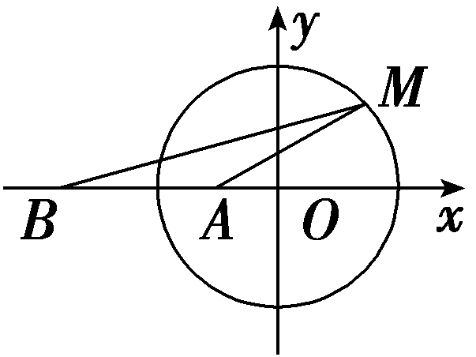

阿波罗尼斯圆

圆是高中数学中一种简单但又非常重要的曲线，近几年高考题和高考模拟题中，经常出现一类有关圆的题目，这类题目中，有一个共性是有关圆的信息没有直接在条件中给出，而是以“隐性”的形式出现，涉及轨迹方程、定值、定点、弦长、面积等解析几何核心问题，可以通过分析、转化，可以利用圆的知识求解，而阿波罗尼斯圆就是这一类问题.

##### 1.阿波罗尼斯圆的定义

在平面上给定两点*A*，*B*，设*<text style="italic"><text style="italic">P*</text></text>点在同一平面上且满足 $\frac{｜PA｜}{｜PB｜}$ ＝*<text style="italic"><text style="italic"><text style="italic">λ*</text></text></text>，当λ＞0且λ≠1时，*<text style="italic"><text style="italic">P*</text></text>点的轨迹是圆，称之为阿波罗尼斯圆.(λ＝1时，P点的轨迹是线段*AB*的中垂线)

##### 2.阿波罗尼斯圆的证明

设<text st*y*le="italic">*P*</text> $\left(x，y\right)$ ，<text st*y*le="italic">A</text> $\left(－a，0\right)$ ，<text st*y*le="italic">B</text> $\left(a，0\right)$ .若 $\frac{｜PA｜}{｜PB｜}$ ＝<text st*y*le="italic">*<text style="italic">λ*</text></text>(λ＞0且λ≠1)，则点*<text style="italic">P*</text>的轨迹方程是 $\left(x－\frac{\lambda ^{2}+1}{\lambda ^{2}－1}a\right)^{2}$ ＋*y*<text style="supe*r*script">2</text>＝ $\left(\frac{2a\lambda }{\lambda ^{2}－1}\right)^{2}$ ，其轨迹是以 $\left(\frac{\lambda ^{2}+1}{\lambda ^{2}－1}a，0\right)$ 为圆心，半径为*r*＝ $\left|\frac{2a\lambda }{\lambda ^{2}－1}\right|$ 的圆.

证明：由｜&lt;text st<em>y</em>le="italic"&gt;PA&lt;/text&gt;｜＝<em>&lt;text style="italic"&gt;λ</em>&lt;/text&gt;｜<em>PB</em>｜及两点间距离公式，可得 $\left(x＋a\right)^{2}$ ＋<em>y</em>&lt;text style="superscript"&gt;2&lt;/text&gt;＝<em>&lt;text style="italic"&gt;λ</em>&lt;/text&gt;2 $\left[\left(x－a\right)^{2}＋y^{2}\right]$ ，

化简可得 $\left(1－\lambda ^{2}\right)$ &lt;text st&lt;text style="it<em>a</em>lic"&gt;y&lt;/text&gt;le="italic"&gt;x&lt;/text&gt;&lt;text style="superscript"&gt;&lt;text style="superscript"&gt;2&lt;/text&gt;&lt;/text&gt;＋ $\left(1－\lambda ^{2}\right)$ &lt;text style="it<em>a</em>lic"&gt;y&lt;/text&gt;&lt;text style="superscript"&gt;&lt;text style="superscript"&gt;2&lt;/text&gt;&lt;/text&gt;＋2 $\left(1+\lambda ^{2}\right)$ <em>a</em>&lt;text st<em>y</em>le="italic"&gt;x&lt;/text&gt;＋ $\left(1－\lambda ^{2}\right)$ <em>a</em>&lt;text st<em>y</em>le="superscript"&gt;&lt;text style="superscript"&gt;2&lt;/text&gt;&lt;/text&gt;＝0①，

（1）当*λ*＝1时，得*x*＝0，此时动点的轨迹是线段*AB*的垂直平分线；

(&lt;te&lt;text st&lt;text style="it<em>a</em>lic"&gt;y&lt;/text&gt;le="italic"&gt;x&lt;/text&gt;t style="superscript"&gt;&lt;text style="superscript"&gt;&lt;text style="superscript"&gt;2&lt;/text&gt;&lt;/text&gt;&lt;/text&gt;)当<em>&lt;text style="italic"&gt;λ</em>&lt;/text&gt;≠1时，方程①两边都除以1－λ2得x2＋y2＋ $\frac{2a\left(1+\lambda ^{2}\right)x}{1－\lambda ^{2}}$ ＋<em>a</em>&lt;te&lt;text st<em>y</em>le="italic"&gt;x&lt;/text&gt;t style="superscript"&gt;&lt;text style="superscript"&gt;&lt;text style="superscript"&gt;2&lt;/text&gt;&lt;/text&gt;&lt;/text&gt;＝0，化为标准形式即为

$\left(x－\frac{\lambda ^{2}+1}{\lambda ^{2}－1}a\right)^{2}$ ＋*y*<text style="supe*r*script">2</text>＝ $\left(\frac{2a\lambda }{\lambda ^{2}－1}\right)^{2}$ ，所以点*P*的轨迹方程是以 $\left(\frac{\lambda ^{2}+1}{\lambda ^{2}－1}a，0\right)$ 为圆心，半径为*r*＝ $\left|\frac{2a\lambda }{\lambda ^{2}－1}\right|$ 的圆.

（1）已知平面直角坐标系中，<em>A</em>(－2，0)，<em>B</em>(2，0)，则满足｜<em>PA</em>｜＝2｜<em>PB</em>｜的点<em>P</em>的轨迹的圆心坐标为<u>　　　　</u>.

(&lt;text st<em>y</em>le="superscript"&gt;2&lt;/text&gt;)(双空题)已知圆&lt;te<em>x</em>t style="italic"&gt;<em>O</em>&lt;/text&gt;：x2＋y2＝1和点<em>A</em> $\left(－\frac{1}{2}，0\right)$ ，若定点<em>B</em>(<em>b</em>，0) $\left(b\ne －\frac{1}{2}\right)$ 和常数<em>&lt;text style="italic"&gt;&lt;text style="italic"&gt;λ</em>&lt;/text&gt;&lt;/text&gt;满足：对圆&lt;te&lt;text st<em>y</em>le="italic"&gt;x&lt;/text&gt;t style="italic"&gt;<em>O</em>&lt;/text&gt;上任意一点<em>M</em>，都有｜M<em>B</em>｜＝λ｜M<em>A</em>｜，则λ＝<u>&lt;text style="underline"&gt;　　　　</u>&lt;/text&gt;，△<em>MA</em>B面积的最大值为　　　　.

答案（1）( $\frac{10}{3}$ ，0)　（2）2　 $\frac{3}{4}$

解析（1）设&lt;te&lt;text st&lt;text st<em>y</em>le="italic"&gt;y&lt;/text&gt;le="italic"&gt;x&lt;/text&gt;t style="italic"&gt;<em>P</em>&lt;/text&gt;(x，y)，由｜<em>PA</em>｜＝2｜<em>PB</em>｜，得 $\sqrt{\left(x+2\right)^{2}＋y^{2}}$ ＝2 $\sqrt{(x－2)^{2}＋y^{2}}$ ，整理得 $\left(x－\frac{10}{3}\right)^{2}$ ＋&lt;text st<em>y</em>le="italic"&gt;y&lt;/text&gt;2＝ $\frac{64}{9}$ ，所以点&lt;te&lt;text st&lt;text st<em>y</em>le="italic"&gt;y&lt;/text&gt;le="italic"&gt;x&lt;/text&gt;t style="italic"&gt;<em>P</em>&lt;/text&gt;的轨迹的圆心坐标为 $\left(\frac{10}{3}，0\right)$ .

(&lt;te&lt;te<em>x</em>t st<em>y</em>le="italic"&gt;x&lt;/text&gt;t style="superscript"&gt;&lt;text style="superscript"&gt;&lt;text style="superscript"&gt;2&lt;/text&gt;&lt;/text&gt;&lt;/text&gt;)设点&lt;te&lt;text st&lt;text st<em>y</em>le="italic"&gt;y&lt;/text&gt;le="italic"&gt;x&lt;/text&gt;t style="italic"&gt;M&lt;/text&gt;(x，y)，由｜<em>MB</em>｜＝<em>&lt;text style="italic"&gt;&lt;text style="italic"&gt;λ</em>&lt;/text&gt;&lt;/text&gt;｜<em>MA</em>｜，得 $\left(x－b\right)^{2}$ ＋&lt;te&lt;te<em>x</em>t st<em>y</em>le="italic"&gt;x&lt;/text&gt;t st<em>y</em>le="italic"&gt;y&lt;/text&gt;&lt;text style="superscript"&gt;&lt;text style="superscript"&gt;&lt;text style="superscript"&gt;2&lt;/text&gt;&lt;/text&gt;&lt;/text&gt;＝<em>&lt;text style="italic"&gt;&lt;text style="italic"&gt;λ</em>&lt;/text&gt;&lt;/text&gt;2 $\left[\left(x＋\frac{1}{2}\right)^{2}＋y^{2}\right]$ ，因为&lt;te&lt;te<em>x</em>t st<em>y</em>le="italic"&gt;x&lt;/text&gt;t style="italic"&gt;b&lt;/text&gt;≠－ $\frac{1}{2}$ ，显然&lt;te&lt;te<em>x</em>t st<em>y</em>le="italic"&gt;x&lt;/text&gt;t st<em>y</em>le="italic"&gt;<em>&lt;text style="italic"&gt;λ</em>&lt;/text&gt;&lt;/text&gt;＝1时不成立，故整理得&lt;text st<em>y</em>le="italic"&gt;x&lt;/text&gt;&lt;text style="superscript"&gt;&lt;text style="superscript"&gt;&lt;text style="superscript"&gt;2&lt;/text&gt;&lt;/text&gt;&lt;/text&gt;＋y2－ $\frac{2b＋\lambda ^{2}}{1－\lambda ^{2}}$ &lt;te&lt;te<em>x</em>t st<em>y</em>le="italic"&gt;x&lt;/text&gt;t st&lt;text st<em>y</em>le="italic"&gt;y&lt;/text&gt;le="italic"&gt;x&lt;/text&gt;＋ $\frac{b^{2}－\frac{1}{4}\lambda ^{2}}{1－\lambda ^{2}}$ ＝0，所以 $\left\{\begin{matrix}\frac{2b＋\lambda ^{2}}{1－\lambda ^{2}}=0，\\\frac{b^{2}－\frac{1}{4}\lambda ^{2}}{1－\lambda ^{2}}＝－1，\end{matrix}\right.$ 解得 $\left\{\begin{matrix}\lambda =2，\\b＝－2.\end{matrix}\right.$

如图所示，&lt;text st&lt;text st<em>y</em>le="italic"&gt;y&lt;/text&gt;le="italic"&gt;<em>S</em>&lt;/text&gt;&lt;text style="subscript"&gt;△&lt;/text&gt;<em>&lt;text style="italic,subscript"&gt;&lt;text style="italic,subscript"&gt;&lt;text style="italic"&gt;M</em>&lt;/text&gt;&lt;/text&gt;<em>AB</em>&lt;/text&gt;＝ $\frac{1}{2}$ ｜&lt;text st&lt;text st<em>y</em>le="italic"&gt;y&lt;/text&gt;le="italic"&gt;AB&lt;/text&gt;｜<em>·</em>｜y<em>&lt;text style="italic,subscript"&gt;&lt;text style="italic"&gt;M</em>&lt;/text&gt;&lt;/text&gt;｜，由图可知，当｜yM｜＝1，即M的坐标为(0，1)或(0，－1)时，<em>&lt;text style="italic"&gt;S</em>&lt;/text&gt;&lt;text style="subscript"&gt;△&lt;/text&gt;<em>&lt;text style="italic,subscript"&gt;&lt;text style="italic"&gt;MAB</em>&lt;/text&gt;&lt;/text&gt;取得最大值，故△MAB面积的最大值为 $\frac{1}{2}$ ×｜－ $\frac{1}{2}$ － $\left(－2\right)$ ｜×1＝ $\frac{3}{4}$ .

对点练1.阿波罗尼斯是古希腊著名数学家，与欧几里得、阿基米德并称为亚历山大时期数学三巨匠，他对圆锥曲线有深刻而系统的研究，阿波罗尼斯圆就是他的研究成果之一，指的是：已知动点<em>&lt;text style="italic"&gt;M</em>&lt;/text&gt;与两个定点<em>&lt;text style="italic"&gt;A</em>&lt;/text&gt;，<em>&lt;text style="italic"&gt;B</em>&lt;/text&gt;的距离之比为<em>&lt;text style="italic"&gt;&lt;text style="italic"&gt;λ</em>&lt;/text&gt;&lt;/text&gt;(λ＞0，且λ≠1)，那么点M的轨迹就是阿波罗尼斯圆.若平面内两定点A，B间的距离为&lt;text style="superscript"&gt;2&lt;/text&gt;，动点<em>P</em>满足 $\frac{｜PA｜}{｜PB｜}$ ＝ $\sqrt{3}$ ，则｜<em>P&lt;text style="italic"&gt;A</em>&lt;/text&gt;｜&lt;text style="superscript"&gt;2&lt;/text&gt;＋｜P<em>&lt;text style="italic"&gt;B</em>&lt;/text&gt;｜2的最大值为(　　)

$\quad$A.16＋8 $\sqrt{3}$ 	
$\quad$B.8＋4 $\sqrt{3}$

$\quad$C.7＋4 $\sqrt{3}$ 	
$\quad$D.3＋ $\sqrt{3}$

答案A

解析由题意，设&lt;te&lt;te&lt;te&lt;te&lt;te&lt;te&lt;te&lt;te&lt;te&lt;te&lt;text st<em>y</em>le="italic"&gt;x&lt;/text&gt;t st<em>y</em>le="italic"&gt;x&lt;/text&gt;t st<em>y</em>le="italic"&gt;x&lt;/text&gt;t st<em>y</em>le="italic"&gt;x&lt;/text&gt;t st<em>y</em>le="italic"&gt;x&lt;/text&gt;t st<em>y</em>le="italic"&gt;x&lt;/text&gt;t st<em>y</em>le="italic"&gt;x&lt;/text&gt;t st<em>y</em>le="italic"&gt;x&lt;/text&gt;t st<em>y</em>le="italic"&gt;x&lt;/text&gt;t st<em>y</em>le="italic"&gt;x&lt;/text&gt;t style="italic"&gt;A&lt;/text&gt;(－1，0)，<em>B</em>(1，0)，<em>&lt;text style="italic"&gt;P</em>&lt;/text&gt;(x，y)，因为 $\frac{｜PA｜}{｜PB｜}$ ＝ $\sqrt{3}$ ，所以 $\frac{\sqrt{(x+1)^{2}＋y^{2}}}{\sqrt{(x－1)^{2}＋y^{2}}}$ ＝ $\sqrt{3}$ ，即(&lt;te&lt;te&lt;te&lt;te&lt;te&lt;te&lt;te&lt;te&lt;te&lt;text st<em>y</em>le="italic"&gt;x&lt;/text&gt;t st<em>y</em>le="italic"&gt;x&lt;/text&gt;t st<em>y</em>le="italic"&gt;x&lt;/text&gt;t st<em>y</em>le="italic"&gt;x&lt;/text&gt;t st<em>y</em>le="italic"&gt;x&lt;/text&gt;t st<em>y</em>le="italic"&gt;x&lt;/text&gt;t st<em>y</em>le="italic"&gt;x&lt;/text&gt;t st<em>y</em>le="italic"&gt;x&lt;/text&gt;t st<em>y</em>le="italic"&gt;x&lt;/text&gt;t st<em>y</em>le="italic"&gt;x&lt;/text&gt;－&lt;text style="superscript"&gt;&lt;text style="superscript"&gt;&lt;text style="superscript"&gt;&lt;text style="superscript"&gt;&lt;text style="superscript"&gt;&lt;text style="superscript"&gt;&lt;text style="superscript"&gt;&lt;text style="superscript"&gt;&lt;text style="superscript"&gt;&lt;text style="superscript"&gt;&lt;text style="superscript"&gt;&lt;text style="superscript"&gt;&lt;text style="superscript"&gt;&lt;text style="superscript"&gt;&lt;text style="superscript"&gt;&lt;text style="superscript"&gt;&lt;text style="superscript"&gt;&lt;text style="superscript"&gt;&lt;text style="superscript"&gt;&lt;text style="superscript"&gt;2&lt;/text&gt;&lt;/text&gt;&lt;/text&gt;&lt;/text&gt;&lt;/text&gt;&lt;/text&gt;&lt;/text&gt;&lt;/text&gt;&lt;/text&gt;&lt;/text&gt;&lt;/text&gt;&lt;/text&gt;&lt;/text&gt;&lt;/text&gt;&lt;/text&gt;&lt;/text&gt;&lt;/text&gt;&lt;/text&gt;&lt;/text&gt;&lt;/text&gt;)2＋y2＝3，所以点<em>&lt;text style="italic"&gt;P</em>&lt;/text&gt;的轨迹是以(2，0)为圆心，半径为 $\sqrt{3}$ 的圆，因为｜&lt;te&lt;te&lt;te&lt;te&lt;te&lt;te&lt;te&lt;te&lt;te&lt;te&lt;text st<em>y</em>le="italic"&gt;x&lt;/text&gt;t st<em>y</em>le="italic"&gt;x&lt;/text&gt;t st<em>y</em>le="italic"&gt;x&lt;/text&gt;t st<em>y</em>le="italic"&gt;x&lt;/text&gt;t st<em>y</em>le="italic"&gt;x&lt;/text&gt;t st<em>y</em>le="italic"&gt;x&lt;/text&gt;t st<em>y</em>le="italic"&gt;x&lt;/text&gt;t st<em>y</em>le="italic"&gt;x&lt;/text&gt;t st<em>y</em>le="italic"&gt;x&lt;/text&gt;t st<em>y</em>le="italic"&gt;x&lt;/text&gt;t style="italic"&gt;<em>P</em>&lt;/text&gt;<em>A</em>｜&lt;text style="superscript"&gt;&lt;text style="superscript"&gt;&lt;text style="superscript"&gt;&lt;text style="superscript"&gt;&lt;text style="superscript"&gt;&lt;text style="superscript"&gt;&lt;text style="superscript"&gt;&lt;text style="superscript"&gt;&lt;text style="superscript"&gt;&lt;text style="superscript"&gt;&lt;text style="superscript"&gt;&lt;text style="superscript"&gt;&lt;text style="superscript"&gt;&lt;text style="superscript"&gt;&lt;text style="superscript"&gt;&lt;text style="superscript"&gt;&lt;text style="superscript"&gt;&lt;text style="superscript"&gt;&lt;text style="superscript"&gt;&lt;text style="superscript"&gt;2&lt;/text&gt;&lt;/text&gt;&lt;/text&gt;&lt;/text&gt;&lt;/text&gt;&lt;/text&gt;&lt;/text&gt;&lt;/text&gt;&lt;/text&gt;&lt;/text&gt;&lt;/text&gt;&lt;/text&gt;&lt;/text&gt;&lt;/text&gt;&lt;/text&gt;&lt;/text&gt;&lt;/text&gt;&lt;/text&gt;&lt;/text&gt;&lt;/text&gt;＋｜P<em>B</em>｜2＝(x＋1)2＋y2＋(x－1)2＋y2＝2(x2＋y2＋1)，其中x2＋y2可看作圆(x－2)2＋y2＝3上的点(x，y)到原点(0，0)的距离的平方，所以(x2＋y2)&lt;text style="subscript"&gt;max&lt;/text&gt;＝(2＋ $\sqrt{3}$ )&lt;te&lt;te&lt;te&lt;te&lt;te&lt;te&lt;te&lt;te&lt;text st<em>y</em>le="italic"&gt;x&lt;/text&gt;t st<em>y</em>le="italic"&gt;x&lt;/text&gt;t st<em>y</em>le="italic"&gt;x&lt;/text&gt;t st<em>y</em>le="italic"&gt;x&lt;/text&gt;t st<em>y</em>le="italic"&gt;x&lt;/text&gt;t st<em>y</em>le="italic"&gt;x&lt;/text&gt;t st<em>y</em>le="italic"&gt;x&lt;/text&gt;t st<em>y</em>le="italic"&gt;x&lt;/text&gt;t st<em>y</em>le="superscript"&gt;&lt;text style="superscript"&gt;&lt;text style="superscript"&gt;&lt;text style="superscript"&gt;&lt;text style="superscript"&gt;&lt;text style="superscript"&gt;&lt;text style="superscript"&gt;&lt;text style="superscript"&gt;&lt;text style="superscript"&gt;&lt;text style="superscript"&gt;&lt;text style="superscript"&gt;&lt;text style="superscript"&gt;&lt;text style="superscript"&gt;&lt;text style="superscript"&gt;&lt;text style="superscript"&gt;&lt;text style="superscript"&gt;&lt;text style="superscript"&gt;&lt;text style="superscript"&gt;&lt;text style="superscript"&gt;&lt;text style="superscript"&gt;2&lt;/text&gt;&lt;/text&gt;&lt;/text&gt;&lt;/text&gt;&lt;/text&gt;&lt;/text&gt;&lt;/text&gt;&lt;/text&gt;&lt;/text&gt;&lt;/text&gt;&lt;/text&gt;&lt;/text&gt;&lt;/text&gt;&lt;/text&gt;&lt;/text&gt;&lt;/text&gt;&lt;/text&gt;&lt;/text&gt;&lt;/text&gt;&lt;/text&gt;＝7＋4 $\sqrt{3}$ ，所以[&lt;te&lt;te&lt;te&lt;te&lt;te&lt;te&lt;te&lt;te&lt;text st<em>y</em>le="italic"&gt;x&lt;/text&gt;t st<em>y</em>le="italic"&gt;x&lt;/text&gt;t st<em>y</em>le="italic"&gt;x&lt;/text&gt;t st<em>y</em>le="italic"&gt;x&lt;/text&gt;t st<em>y</em>le="italic"&gt;x&lt;/text&gt;t st<em>y</em>le="italic"&gt;x&lt;/text&gt;t st<em>y</em>le="italic"&gt;x&lt;/text&gt;t st<em>y</em>le="italic"&gt;x&lt;/text&gt;t st<em>y</em>le="superscript"&gt;&lt;text style="superscript"&gt;&lt;text style="superscript"&gt;&lt;text style="superscript"&gt;&lt;text style="superscript"&gt;&lt;text style="superscript"&gt;&lt;text style="superscript"&gt;&lt;text style="superscript"&gt;&lt;text style="superscript"&gt;&lt;text style="superscript"&gt;&lt;text style="superscript"&gt;&lt;text style="superscript"&gt;&lt;text style="superscript"&gt;&lt;text style="superscript"&gt;&lt;text style="superscript"&gt;&lt;text style="superscript"&gt;&lt;text style="superscript"&gt;&lt;text style="superscript"&gt;&lt;text style="superscript"&gt;&lt;text style="superscript"&gt;2&lt;/text&gt;&lt;/text&gt;&lt;/text&gt;&lt;/text&gt;&lt;/text&gt;&lt;/text&gt;&lt;/text&gt;&lt;/text&gt;&lt;/text&gt;&lt;/text&gt;&lt;/text&gt;&lt;/text&gt;&lt;/text&gt;&lt;/text&gt;&lt;/text&gt;&lt;/text&gt;&lt;/text&gt;&lt;/text&gt;&lt;/text&gt;&lt;/text&gt;(&lt;te<em>x</em>t st<em>y</em>le="italic"&gt;x&lt;/text&gt;2＋y2＋1)]&lt;text style="subscript"&gt;max&lt;/text&gt;＝16＋8 $\sqrt{3}$ ，即｜&lt;te&lt;te&lt;te&lt;te&lt;te&lt;te&lt;te&lt;te&lt;te&lt;te&lt;text st<em>y</em>le="italic"&gt;x&lt;/text&gt;t st<em>y</em>le="italic"&gt;x&lt;/text&gt;t st<em>y</em>le="italic"&gt;x&lt;/text&gt;t st<em>y</em>le="italic"&gt;x&lt;/text&gt;t st<em>y</em>le="italic"&gt;x&lt;/text&gt;t st<em>y</em>le="italic"&gt;x&lt;/text&gt;t st<em>y</em>le="italic"&gt;x&lt;/text&gt;t st<em>y</em>le="italic"&gt;x&lt;/text&gt;t st<em>y</em>le="italic"&gt;x&lt;/text&gt;t st<em>y</em>le="italic"&gt;x&lt;/text&gt;t style="italic"&gt;<em>P</em>&lt;/text&gt;<em>A</em>｜&lt;text style="superscript"&gt;&lt;text style="superscript"&gt;&lt;text style="superscript"&gt;&lt;text style="superscript"&gt;&lt;text style="superscript"&gt;&lt;text style="superscript"&gt;&lt;text style="superscript"&gt;&lt;text style="superscript"&gt;&lt;text style="superscript"&gt;&lt;text style="superscript"&gt;&lt;text style="superscript"&gt;&lt;text style="superscript"&gt;&lt;text style="superscript"&gt;&lt;text style="superscript"&gt;&lt;text style="superscript"&gt;&lt;text style="superscript"&gt;&lt;text style="superscript"&gt;&lt;text style="superscript"&gt;&lt;text style="superscript"&gt;&lt;text style="superscript"&gt;2&lt;/text&gt;&lt;/text&gt;&lt;/text&gt;&lt;/text&gt;&lt;/text&gt;&lt;/text&gt;&lt;/text&gt;&lt;/text&gt;&lt;/text&gt;&lt;/text&gt;&lt;/text&gt;&lt;/text&gt;&lt;/text&gt;&lt;/text&gt;&lt;/text&gt;&lt;/text&gt;&lt;/text&gt;&lt;/text&gt;&lt;/text&gt;&lt;/text&gt;＋｜P<em>B</em>｜2的最大值为16＋8 $\sqrt{3}$ .故选&lt;te&lt;te&lt;te&lt;te&lt;te&lt;te&lt;te&lt;te&lt;te&lt;te&lt;text st<em>y</em>le="italic"&gt;x&lt;/text&gt;t st<em>y</em>le="italic"&gt;x&lt;/text&gt;t st<em>y</em>le="italic"&gt;x&lt;/text&gt;t st<em>y</em>le="italic"&gt;x&lt;/text&gt;t st<em>y</em>le="italic"&gt;x&lt;/text&gt;t st<em>y</em>le="italic"&gt;x&lt;/text&gt;t st<em>y</em>le="italic"&gt;x&lt;/text&gt;t st<em>y</em>le="italic"&gt;x&lt;/text&gt;t st<em>y</em>le="italic"&gt;x&lt;/text&gt;t st<em>y</em>le="italic"&gt;x&lt;/text&gt;t style="italic"&gt;A&lt;/text&gt;.

对点练2.(多选)在平面直角坐标系中，*M*(－2，0)，*N*(1，0)，*A*(3，1)，｜*<text style="italic">P*M</text>｜＝ $\sqrt{2}$ ｜*PN*｜，设点P的轨迹为*C*，下列说法正确的是(　　)

$\quad$A.轨迹<em>C</em>的方程为(<em>x</em>＋4)2＋<em>y</em>2＝12

$\quad$B.△*PMN*面积的最大值为 $\frac{9\sqrt{2}}{2}$

$\quad$C.｜*AP*｜的最小值为4 $\sqrt{2}$

*D*.若直线<te*x*t style="italic">y</text>＝2x＋1与轨迹*C*交于D，*E*两点，则｜*DE*｜＝ $\frac{6\sqrt{5}}{5}$

答案BD

解析设点&lt;te&lt;te&lt;te<em>x</em>t st&lt;text st<em>y</em>le="italic"&gt;y&lt;/text&gt;le="italic"&gt;x&lt;/text&gt;t st<em>y</em>le="italic"&gt;x&lt;/text&gt;t style="italic"&gt;<em>P</em>&lt;/text&gt;(x，y)，则 $\sqrt{(x+2)^{2}＋y^{2}}$ ＝ $\sqrt{2}$ × $\sqrt{(x－1)^{2}＋y^{2}}$ ，化简得(&lt;te&lt;te<em>x</em>t st&lt;text st<em>y</em>le="italic"&gt;y&lt;/text&gt;le="italic"&gt;x&lt;/text&gt;t st<em>y</em>le="italic"&gt;x&lt;/text&gt;－4)&lt;text style="supe<em>&lt;text style="italic"&gt;&lt;text style="italic"&gt;r</em>&lt;/text&gt;&lt;/text&gt;script"&gt;2&lt;/text&gt;＋y2＝18，故<em>A</em>错误；当点<em>&lt;text style="italic"&gt;P</em>&lt;/text&gt;纵坐标的绝对值最大时，△<em>&lt;text style="italic,subscript"&gt;PMN</em>&lt;/text&gt;面积最大，此时<em>S</em>△PMN＝ $\frac{1}{2}$ ×3×3 $\sqrt{2}$ ＝ $\frac{9\sqrt{2}}{2}$ ，故B正确；设轨迹&lt;te<em>x</em>t st<em>y</em>le="italic"&gt;<em>&lt;text style="italic"&gt;C</em>&lt;/text&gt;&lt;/text&gt;的圆心为C，半径为<em>&lt;text style="italic"&gt;&lt;text style="italic"&gt;r</em>&lt;/text&gt;&lt;/text&gt;，所以C(4，0)，r＝3 $\sqrt{2}$ ，点&lt;te<em>x</em>t st<em>y</em>le="italic"&gt;A&lt;/text&gt;在圆内，所以｜A&lt;te&lt;te&lt;text st<em>y</em>le="italic"&gt;x&lt;/text&gt;t st<em>y</em>le="italic"&gt;x&lt;/text&gt;t style="italic"&gt;<em>P</em>&lt;/text&gt;｜&lt;text style="subsc<em>r</em>ipt"&gt;min&lt;/text&gt;＝<em>&lt;text style="italic"&gt;r</em>&lt;/text&gt;－｜A<em>&lt;text style="italic"&gt;&lt;text style="italic"&gt;C</em>&lt;/text&gt;&lt;/text&gt;｜＝3 $\sqrt{2}$ － $\sqrt{1+1}$ ＝&lt;te<em>x</em>t st&lt;text st<em>y</em>le="italic"&gt;y&lt;/text&gt;le="supe<em>&lt;text style="italic"&gt;&lt;text style="italic"&gt;r</em>&lt;/text&gt;&lt;/text&gt;script"&gt;2&lt;/text&gt; $\sqrt{2}$ ，故&lt;te<em>x</em>t st<em>y</em>le="italic"&gt;<em>&lt;text style="italic"&gt;C</em>&lt;/text&gt;&lt;/text&gt;错误；设圆心到直线&lt;te&lt;text st<em>y</em>le="italic"&gt;x&lt;/text&gt;t style="italic"&gt;y&lt;/text&gt;＝&lt;text style="supe<em>&lt;text style="italic"&gt;&lt;text style="italic"&gt;r</em>&lt;/text&gt;&lt;/text&gt;script"&gt;2&lt;/text&gt;<em>x</em>＋1的距离为<em>&lt;text style="italic"&gt;d</em>&lt;/text&gt;，则d＝ $\frac{9}{\sqrt{5}}$ ，｜<em>DE</em>｜＝&lt;te<em>x</em>t st&lt;text st<em>y</em>le="italic"&gt;y&lt;/text&gt;le="supe<em>&lt;text style="italic"&gt;&lt;text style="italic"&gt;r</em>&lt;/text&gt;&lt;/text&gt;script"&gt;2&lt;/text&gt; $\sqrt{r^{2}－d^{2}}$ ＝ $\frac{6\sqrt{5}}{5}$ ，故D正确.故选BD.

对点练3.(双空题)(&lt;te&lt;text st<em>y</em>le="italic"&gt;x&lt;/text&gt;t style="superscript"&gt;2&lt;/text&gt;025·广东佛山联考)希腊著名数学家阿波罗尼斯与欧几里得、阿基米德齐名.他发现：“平面内到两个定点&lt;text st<em>y</em>le="italic"&gt;<em>A</em>&lt;/text&gt;，<em>&lt;text style="italic"&gt;B</em>&lt;/text&gt;的距离之比为定值<em>&lt;text style="italic"&gt;&lt;text style="italic"&gt;λ</em>&lt;/text&gt;&lt;/text&gt;(λ≠1)的点的轨迹是圆”.后来，人们将这个圆以他的名字命名，称为阿波罗尼斯圆，简称阿氏圆.已知在平面直角坐标系<em>xOy</em>中，A(－2，1)，B(－2，4)，点<em>P</em>是满足λ＝ $\frac{1}{2}$ 的阿氏圆上的任一点，则该阿氏圆的方程为&lt;te&lt;text st<em>y</em>le="italic"&gt;x&lt;/text&gt;t st<em>y</em>le="underline"&gt;<u>　　　　</u>　　　　　　　　&lt;/text&gt;；若点<em>&lt;text style="italic"&gt;Q</em>&lt;/text&gt;为抛物线<em>E</em>：y2＝4x上的动点，Q在y轴上的射影为<em>H</em>，则 $\frac{1}{2}$ ｜&lt;te&lt;text st<em>y</em>le="italic"&gt;x&lt;/text&gt;t st<em>y</em>le="italic"&gt;P&lt;/text&gt;<em>&lt;text style="italic"&gt;B</em>&lt;/text&gt;｜＋｜P<em>&lt;text style="italic"&gt;Q</em>&lt;/text&gt;｜＋｜Q<em>H</em>｜的最小值为<u>　　　　</u>.

答案(&lt;text st<em>y</em>le="italic"&gt;x&lt;/text&gt;＋&lt;text style="superscript"&gt;2&lt;/text&gt;)2＋y2＝4　 $\sqrt{10}$ －1

解析设点&lt;te&lt;te&lt;text st<em>y</em>le="italic"&gt;x&lt;/text&gt;t st<em>y</em>le="italic"&gt;x&lt;/text&gt;t style="italic"&gt;P&lt;/text&gt;(x，y)，因为<em>λ</em>＝ $\frac{1}{2}$ ，所以 $\frac{\sqrt{(x+2)^{2}＋(y－1)^{2}}}{\sqrt{(x+2)^{2}＋(y－4)^{2}}}$ ＝ $\frac{1}{2}$ ，所以(&lt;te&lt;text st<em>y</em>le="italic"&gt;x&lt;/text&gt;t st<em>y</em>le="italic"&gt;x&lt;/text&gt;＋&lt;text style="superscript"&gt;2&lt;/text&gt;)2＋y2＝4；设抛物线的焦点为点<em>&lt;text style="italic"&gt;F</em>&lt;/text&gt;，由题意知F(1，0)， $\frac{1}{2}$ ｜&lt;te&lt;te&lt;text st<em>y</em>le="italic"&gt;x&lt;/text&gt;t st<em>y</em>le="italic"&gt;x&lt;/text&gt;t style="italic"&gt;P&lt;/text&gt;B｜＝｜<em>&lt;text style="italic"&gt;PA</em>&lt;/text&gt;｜，｜<em>&lt;text style="italic"&gt;QH</em>&lt;/text&gt;｜＝｜Q<em>&lt;text style="italic"&gt;F</em>&lt;/text&gt;｜－1，所以( $\frac{1}{2}$ ｜&lt;te&lt;te&lt;text st<em>y</em>le="italic"&gt;x&lt;/text&gt;t st<em>y</em>le="italic"&gt;x&lt;/text&gt;t style="italic"&gt;P&lt;/text&gt;B｜＋｜<em>&lt;text style="italic"&gt;PQ</em>&lt;/text&gt;｜＋｜<em>&lt;text style="italic"&gt;QH</em>&lt;/text&gt;｜)&lt;text style="subscript"&gt;min&lt;/text&gt;＝(｜<em>&lt;text style="italic"&gt;PA</em>&lt;/text&gt;｜＋｜PQ｜＋｜Q<em>&lt;text style="italic"&gt;F</em>&lt;/text&gt;｜－1)min＝｜<em>AF</em>｜－1＝ $\sqrt{(-2－1)^{2}＋1^{2}}$ －1＝ $\sqrt{10}$ －1.

