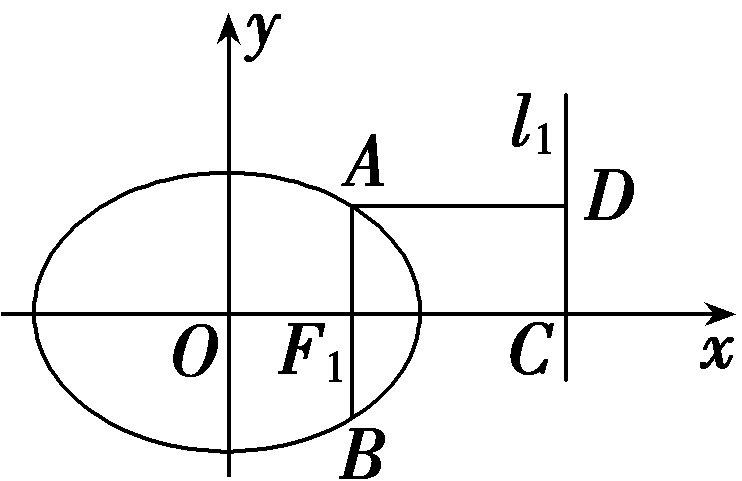
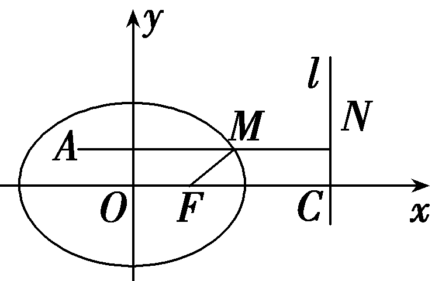

圆锥曲线的第二、第三定义

圆锥曲线的第二定义(平面内到定点与到定直线距离的比为常数*e*的点的轨迹)是圆锥曲线概念的重要组成部分，它揭示了圆锥曲线之间的内在联系，它不仅是研究圆锥曲线图形和性质的基础，而且在很多数学问题的求解过程中，具有不可低估的特殊功能.

平面内的动点到两定点<em>A</em>1(－<em>a</em>，0)，<em>A</em>2(<em>a</em>，0)的斜率乘积等于常数<em>e</em>2－1点的轨迹叫做椭圆或双曲线，其中两个定点为椭圆或双曲线的两个顶点.其中如果常数<em>e</em>2－1＞0时，轨迹为双曲线，如果<em>e</em>2－1∈(－1，0)时，轨迹为椭圆.以圆锥曲线第三定义及中点弦的斜率性质为背景的高考题、模拟题层出不穷，既有较为基础的简单小题，也有难度较大的综合性问题，更有能力要求极高的压轴题.它们兼具基础考查与能力检测的双重功能，无一例外都是以教材母题为“根”，以能力立意为“魂”，注重交汇性、渗透性、探究性，求新、求变、求活，生动展现了圆锥曲线第三定义的内涵、外延的“来龙去脉”，体现出数学公式的结构美与和谐美.

### 题型一　圆锥曲线的第二定义

（1）过抛物线<em>y</em>2＝4<em>x</em>的焦点<em>F</em>作直线交抛物线于<em>A</em>(<em>x</em>1，<em>y</em>1)，<em>B</em>(<em>x</em>2，<em>y</em>2)，若<em>x</em>1＋<em>x</em>2＝6，则｜<em>AB</em>｜的长为<u>　　　　</u>.

（2）设椭圆 $\frac{x^{2}}{a^{2}}$ ＋ $\frac{y^{2}}{b^{2}}$ ＝&lt;te&lt;text sty<em>l</em>e="italic"&gt;x&lt;/text&gt;t sty<em>l</em>e="subscript"&gt;&lt;text style="subscript"&gt;&lt;text style="subscript"&gt;&lt;text style="subscript"&gt;1&lt;/text&gt;&lt;/text&gt;&lt;/text&gt;&lt;/text&gt;(<em>a</em>＞<em>b</em>＞0)的右焦点为<em>&lt;text style="italic"&gt;&lt;text style="italic"&gt;F</em>&lt;/text&gt;&lt;/text&gt;1，右准线为l1，若过F1且垂直于x轴的弦的长度等于F1到准线l1的距离，则椭圆的离心率为<u>　　　　　</u>.

答案（1）8　（2） $\frac{1}{2}$

解析（1）设<te*x*t sty*l*e="italic">*AB*</text>的中点为*<text style="italic">E*</text>，点A，E，B在抛物线准线l：x＝－1上的射影分别为*G*，*H*，*M*.由第二定义知：｜*AB*｜＝｜*AF*｜＋｜*BF*｜＝｜*AG*｜＋｜*BM*｜＝2｜*EH*｜＝2 $\left|\frac{x_{1}＋x_{2}}{2}-(-1)\right|$ ＝8.

（2）如图，&lt;t<em>e</em>&lt;text sty&lt;text sty<em>l</em>e="italic"&gt;l&lt;/text&gt;e="italic"&gt;x&lt;/text&gt;t style="italic"&gt;<em>A</em>B&lt;/text&gt;是过<em>&lt;text style="italic"&gt;&lt;text style="italic"&gt;&lt;text style="italic"&gt;F</em>&lt;/text&gt;&lt;/text&gt;&lt;/text&gt;&lt;text style="subscript"&gt;&lt;text style="subscript"&gt;&lt;text style="subscript"&gt;&lt;text style="subscript"&gt;&lt;text style="subscript"&gt;&lt;text style="subscript"&gt;1&lt;/text&gt;&lt;/text&gt;&lt;/text&gt;&lt;/text&gt;&lt;/text&gt;&lt;/text&gt;垂直于x轴的弦，｜F1<em>&lt;text style="italic"&gt;C</em>&lt;/text&gt;｜为F1到准线l1的距离，过A作<em>A&lt;text style="italic"&gt;D</em>&lt;/text&gt;⊥l1于D，则｜<em>AD</em>｜＝｜F1C｜，由题意知｜<em>AF</em>1｜＝ $\frac{1}{2}$ ｜&lt;t<em>e</em>&lt;text sty&lt;text sty<em>l</em>e="italic"&gt;l&lt;/text&gt;e="italic"&gt;x&lt;/text&gt;t style="italic"&gt;<em>A</em>B&lt;/text&gt;｜，由椭圆的第二定义知：e＝ $\frac{｜AF_{1}｜}{｜AD｜}$ ＝ $\frac{\frac{1}{2}｜AB｜}{｜F_{1}C｜}$ ＝ $\frac{\frac{1}{2}｜AB｜}{｜AB｜}$ ＝ $\frac{1}{2}$ .

已知点*A*(－2， $\sqrt{3}$ )，设点*F*为椭圆 $\frac{x^{2}}{16}$ ＋ $\frac{y^{2}}{12}$ ＝1的右焦点，点*<text style="italic">M*</text>为椭圆上一动点，求｜M*A*｜＋2｜M*F*｜的最小值，并求此时点M的坐标.

解：如图，过点<te*x*t sty<text sty*l*e="it<text style="itali*c*">a</text>lic">l</text>e="italic">A</text>作右准线l的垂线，垂足为*N*，与椭圆交于点*M*，由题易知a＝4，c＝2，则右准线l：x＝ $\frac{a^{2}}{c}$ ＝8.

椭圆的离心率*e*＝ $\frac{1}{2}$ ，

所以由第二定义得2｜*MF*｜＝｜*MN*｜，

所以｜*AM*｜＋2｜*MF*｜的最小值为｜*AN*｜的长，且｜*AN*｜＝2＋8＝10，

所以｜*A<text style="italic">M*</text>｜＋2｜*MF*｜的最小值为10，此时点M的坐标为(2 $\sqrt{3}$ ， $\sqrt{3}$ ).

圆锥曲线的第二定义：到定点的距离与到定直线的距离的比*e*是常数的点的轨迹叫作圆锥曲线.当0＜*e*＜1时为椭圆：当*e*＝1时为抛物线；当*e*＞1时为双曲线.

(注：定点即为焦点，定直线为相应的准线)

对点练1.双曲线<em>x</em>&lt;text style="subscript"&gt;2&lt;/text&gt;－ $\frac{y^{2}}{3}$ ＝1的右支上一点<em>&lt;text style="italic"&gt;P</em>&lt;/text&gt;，到左焦点<em>&lt;text style="italic"&gt;F</em>&lt;/text&gt;1与到右焦点F&lt;text style="subscript"&gt;2&lt;/text&gt;的距离之比为2∶1，则点P的坐标为<u>　　　　　</u>.

答案 $\left(\frac{3}{2}，\pm \frac{\sqrt{15}}{2}\right)$

解析设点&lt;te&lt;te&lt;te&lt;te&lt;te&lt;te&lt;te&lt;text st<em>y</em>le="italic"&gt;x&lt;/text&gt;t style="italic"&gt;x&lt;/text&gt;t style="italic"&gt;x&lt;/text&gt;t sty&lt;text sty<em>l</em>e="italic"&gt;l&lt;/text&gt;e="italic"&gt;x&lt;/text&gt;t sty<em>l</em>e="italic"&gt;x&lt;/text&gt;t sty<em>l</em>e="italic"&gt;x&lt;/text&gt;t st<em>y</em>le="italic"&gt;x&lt;/text&gt;t style="italic"&gt;<em>&lt;text style="italic"&gt;P</em>&lt;/text&gt;&lt;/text&gt;(x&lt;text style="subscript"&gt;&lt;text style="subscript"&gt;&lt;text style="subscript"&gt;&lt;text style="subscript"&gt;&lt;text style="subscript"&gt;&lt;text style="subscript"&gt;0&lt;/text&gt;&lt;/text&gt;&lt;/text&gt;&lt;/text&gt;&lt;/text&gt;&lt;/text&gt;，y0)(x0＞0)，双曲线的左准线为l&lt;text style="subscript"&gt;&lt;text style="subscript"&gt;1&lt;/text&gt;&lt;/text&gt;：x＝－ $\frac{1}{2}$ ，右准线为&lt;te&lt;te&lt;te&lt;te&lt;te&lt;text st<em>y</em>le="italic"&gt;x&lt;/text&gt;t style="italic"&gt;x&lt;/text&gt;t style="italic"&gt;x&lt;/text&gt;t sty&lt;text sty<em>l</em>e="italic"&gt;l&lt;/text&gt;e="italic"&gt;x&lt;/text&gt;t sty<em>l</em>e="italic"&gt;x&lt;/text&gt;t style="italic"&gt;l&lt;/text&gt;&lt;text style="subscript"&gt;&lt;text style="subscript"&gt;2&lt;/text&gt;&lt;/text&gt;：&lt;te<em>x</em>t st<em>y</em>le="italic"&gt;x&lt;/text&gt;＝ $\frac{1}{2}$ ，则点&lt;te&lt;te&lt;te&lt;te&lt;te&lt;te&lt;te&lt;text st<em>y</em>le="italic"&gt;x&lt;/text&gt;t style="italic"&gt;x&lt;/text&gt;t style="italic"&gt;x&lt;/text&gt;t sty&lt;text sty<em>l</em>e="italic"&gt;l&lt;/text&gt;e="italic"&gt;x&lt;/text&gt;t sty<em>l</em>e="italic"&gt;x&lt;/text&gt;t sty<em>l</em>e="italic"&gt;x&lt;/text&gt;t st<em>y</em>le="italic"&gt;x&lt;/text&gt;t style="italic"&gt;<em>&lt;text style="italic"&gt;P</em>&lt;/text&gt;&lt;/text&gt;到l&lt;text style="subscript"&gt;&lt;text style="subscript"&gt;1&lt;/text&gt;&lt;/text&gt;，l&lt;text style="subscript"&gt;&lt;text style="subscript"&gt;2&lt;/text&gt;&lt;/text&gt;的距离分别为<em>&lt;text style="italic"&gt;d</em>&lt;/text&gt;1＝x&lt;text style="subscript"&gt;&lt;text style="subscript"&gt;&lt;text style="subscript"&gt;&lt;text style="subscript"&gt;&lt;text style="subscript"&gt;&lt;text style="subscript"&gt;0&lt;/text&gt;&lt;/text&gt;&lt;/text&gt;&lt;/text&gt;&lt;/text&gt;&lt;/text&gt;＋ $\frac{1}{2}$ ，&lt;te&lt;te&lt;te&lt;text st<em>y</em>le="italic"&gt;x&lt;/text&gt;t style="italic"&gt;x&lt;/text&gt;t style="italic"&gt;x&lt;/text&gt;t style="italic"&gt;<em>d</em>&lt;/text&gt;&lt;te&lt;text sty&lt;text sty<em>l</em>e="italic"&gt;l&lt;/text&gt;e="italic"&gt;x&lt;/text&gt;t style="subscript"&gt;&lt;text style="subscript"&gt;2&lt;/text&gt;&lt;/text&gt;＝&lt;te&lt;te&lt;text sty<em>l</em>e="italic"&gt;x&lt;/text&gt;t sty<em>l</em>e="italic"&gt;x&lt;/text&gt;t st<em>y</em>le="italic"&gt;x&lt;/text&gt;&lt;text style="subscript"&gt;&lt;text style="subscript"&gt;&lt;text style="subscript"&gt;&lt;text style="subscript"&gt;&lt;text style="subscript"&gt;&lt;text style="subscript"&gt;0&lt;/text&gt;&lt;/text&gt;&lt;/text&gt;&lt;/text&gt;&lt;/text&gt;&lt;/text&gt;－ $\frac{1}{2}$ ，所以 $\frac{｜PF_{1}｜}{｜PF_{2}｜}$ ＝ $\frac{d_{1}}{d_{2}}$ ＝ $\frac{x_{0}＋\frac{1}{2}}{x_{0}－\frac{1}{2}}$ ＝ $\frac{2}{1}$ ，解得&lt;te&lt;te&lt;te&lt;te&lt;te&lt;te&lt;text st<em>y</em>le="italic"&gt;x&lt;/text&gt;t style="italic"&gt;x&lt;/text&gt;t style="italic"&gt;x&lt;/text&gt;t sty&lt;text sty<em>l</em>e="italic"&gt;l&lt;/text&gt;e="italic"&gt;x&lt;/text&gt;t sty<em>l</em>e="italic"&gt;x&lt;/text&gt;t sty<em>l</em>e="italic"&gt;x&lt;/text&gt;t st<em>y</em>le="italic"&gt;x&lt;/text&gt;&lt;text style="subscript"&gt;&lt;text style="subscript"&gt;&lt;text style="subscript"&gt;&lt;text style="subscript"&gt;&lt;text style="subscript"&gt;&lt;text style="subscript"&gt;0&lt;/text&gt;&lt;/text&gt;&lt;/text&gt;&lt;/text&gt;&lt;/text&gt;&lt;/text&gt;＝ $\frac{3}{2}$ ，将其代入原方程，得&lt;te&lt;te&lt;te&lt;te&lt;te&lt;te&lt;text st<em>y</em>le="italic"&gt;x&lt;/text&gt;t style="italic"&gt;x&lt;/text&gt;t style="italic"&gt;x&lt;/text&gt;t sty&lt;text sty<em>l</em>e="italic"&gt;l&lt;/text&gt;e="italic"&gt;x&lt;/text&gt;t sty<em>l</em>e="italic"&gt;x&lt;/text&gt;t sty<em>l</em>e="italic"&gt;x&lt;/text&gt;t style="italic"&gt;y&lt;/text&gt;&lt;text style="subscript"&gt;&lt;text style="subscript"&gt;&lt;text style="subscript"&gt;&lt;text style="subscript"&gt;&lt;text style="subscript"&gt;&lt;text style="subscript"&gt;0&lt;/text&gt;&lt;/text&gt;&lt;/text&gt;&lt;/text&gt;&lt;/text&gt;&lt;/text&gt;＝± $\frac{\sqrt{15}}{2}$ .因此点&lt;te&lt;te&lt;te&lt;te&lt;te&lt;te&lt;te&lt;text st<em>y</em>le="italic"&gt;x&lt;/text&gt;t style="italic"&gt;x&lt;/text&gt;t style="italic"&gt;x&lt;/text&gt;t sty&lt;text sty<em>l</em>e="italic"&gt;l&lt;/text&gt;e="italic"&gt;x&lt;/text&gt;t sty<em>l</em>e="italic"&gt;x&lt;/text&gt;t sty<em>l</em>e="italic"&gt;x&lt;/text&gt;t st<em>y</em>le="italic"&gt;x&lt;/text&gt;t style="italic"&gt;<em>&lt;text style="italic"&gt;P</em>&lt;/text&gt;&lt;/text&gt;的坐标为 $\left(\frac{3}{2}，\pm \frac{\sqrt{15}}{2}\right)$ .

对点练&lt;t<em>e</em>xt style="subscript"&gt;2&lt;/text&gt;.已知椭圆 $\frac{x^{2}}{a^{2}}$ ＋ $\frac{y^{2}}{b^{2}}$ ＝&lt;t<em>e</em>xt style="subscript"&gt;1&lt;/text&gt;(<em>a</em>＞<em>b</em>＞0)，<em>&lt;text style="italic"&gt;&lt;text style="italic"&gt;F</em>&lt;/text&gt;&lt;/text&gt;1，F&lt;text style="subscript"&gt;2&lt;/text&gt;分别是左、右焦点，若椭圆上存在点<em>P</em>，使∠F1<em>PF</em>2＝90°，则椭圆的离心率e的取值范围为<u>　　　　</u>.

答案 $\left[\frac{\sqrt{2}}{2}，1\right)$

解析设点&lt;t&lt;t&lt;t&lt;t&lt;t&lt;t&lt;t<em>e</em>&lt;text style="it&lt;text style="it&lt;text style="it<em>a</em>lic"&gt;a&lt;/text&gt;lic"&gt;a&lt;/text&gt;lic"&gt;x&lt;/text&gt;t style="itali&lt;text style="itali<em>c</em>"&gt;c&lt;/text&gt;"&gt;ex&lt;/text&gt;t style="it<em>a</em>lic"&gt;ex&lt;/text&gt;t style="it<em>a</em>lic"&gt;ex&lt;/text&gt;t style="it<em>a</em>lic"&gt;e&lt;/text&gt;xt style="italic"&gt;ex&lt;/text&gt;t style="it<em>a</em>lic"&gt;e&lt;/text&gt;&lt;text st<em>y</em>le="italic"&gt;x&lt;/text&gt;t style="italic"&gt;P&lt;/text&gt;(x&lt;text style="subscript"&gt;&lt;text style="subscript"&gt;&lt;text style="subscript"&gt;&lt;text style="subscript"&gt;&lt;text style="subscript"&gt;0&lt;/text&gt;&lt;/text&gt;&lt;/text&gt;&lt;/text&gt;&lt;/text&gt;，y0)，则由第二定义得｜<em>&lt;text style="italic"&gt;&lt;text style="italic"&gt;P&lt;text style="italic"&gt;&lt;text style="italic"&gt;&lt;text style="italic"&gt;F</em>&lt;/text&gt;&lt;/text&gt;&lt;/text&gt;&lt;/text&gt;&lt;/text&gt;&lt;text style="subscript"&gt;&lt;text style="subscript"&gt;&lt;text style="subscript"&gt;1&lt;/text&gt;&lt;/text&gt;&lt;/text&gt;｜＝e $\left(x_{0}＋\frac{a^{2}}{c}\right)$ ＝&lt;t&lt;t&lt;t&lt;t&lt;t&lt;t<em>e</em>&lt;text style="it&lt;text style="it&lt;text style="it<em>a</em>lic"&gt;a&lt;/text&gt;lic"&gt;a&lt;/text&gt;lic"&gt;x&lt;/text&gt;t style="itali&lt;text style="itali<em>c</em>"&gt;c&lt;/text&gt;"&gt;ex&lt;/text&gt;t style="it<em>a</em>lic"&gt;ex&lt;/text&gt;t style="it<em>a</em>lic"&gt;ex&lt;/text&gt;t style="it<em>a</em>lic"&gt;e&lt;/text&gt;xt style="italic"&gt;ex&lt;/text&gt;t style="italic"&gt;a&lt;/text&gt;＋<em>e</em>&lt;text st<em>y</em>le="italic"&gt;x&lt;/text&gt;&lt;text style="subscript"&gt;&lt;text style="subscript"&gt;&lt;text style="subscript"&gt;&lt;text style="subscript"&gt;&lt;text style="subscript"&gt;0&lt;/text&gt;&lt;/text&gt;&lt;/text&gt;&lt;/text&gt;&lt;/text&gt;，｜<em>P&lt;text style="italic"&gt;&lt;text style="italic"&gt;F</em>&lt;/text&gt;&lt;/text&gt;&lt;text style="subscript"&gt;&lt;text style="superscript"&gt;&lt;text style="subscript"&gt;&lt;text style="superscript"&gt;&lt;text style="subscript"&gt;&lt;text style="superscript"&gt;&lt;text style="superscript"&gt;&lt;text style="superscript"&gt;&lt;text style="superscript"&gt;&lt;text style="superscript"&gt;&lt;text style="superscript"&gt;&lt;text style="superscript"&gt;&lt;text style="superscript"&gt;2&lt;/text&gt;&lt;/text&gt;&lt;/text&gt;&lt;/text&gt;&lt;/text&gt;&lt;/text&gt;&lt;/text&gt;&lt;/text&gt;&lt;/text&gt;&lt;/text&gt;&lt;/text&gt;&lt;/text&gt;&lt;/text&gt;｜＝e $\left(\frac{a^{2}}{c}－x_{0}\right)$ ＝&lt;t&lt;t&lt;t&lt;t&lt;t&lt;t<em>e</em>&lt;text style="it&lt;text style="it&lt;text style="it<em>a</em>lic"&gt;a&lt;/text&gt;lic"&gt;a&lt;/text&gt;lic"&gt;x&lt;/text&gt;t style="itali&lt;text style="itali<em>c</em>"&gt;c&lt;/text&gt;"&gt;ex&lt;/text&gt;t style="it<em>a</em>lic"&gt;ex&lt;/text&gt;t style="it<em>a</em>lic"&gt;ex&lt;/text&gt;t style="it<em>a</em>lic"&gt;e&lt;/text&gt;xt style="italic"&gt;ex&lt;/text&gt;t style="italic"&gt;a&lt;/text&gt;－<em>e</em>&lt;text st<em>y</em>le="italic"&gt;x&lt;/text&gt;&lt;text style="subscript"&gt;&lt;text style="subscript"&gt;&lt;text style="subscript"&gt;&lt;text style="subscript"&gt;&lt;text style="subscript"&gt;0&lt;/text&gt;&lt;/text&gt;&lt;/text&gt;&lt;/text&gt;&lt;/text&gt;.因为△<em>P&lt;text style="italic"&gt;&lt;text style="italic"&gt;F</em>&lt;/text&gt;&lt;/text&gt;&lt;text style="subscript"&gt;&lt;text style="subscript"&gt;&lt;text style="subscript"&gt;1&lt;/text&gt;&lt;/text&gt;&lt;/text&gt;F&lt;text style="subscript"&gt;&lt;text style="superscript"&gt;&lt;text style="subscript"&gt;&lt;text style="superscript"&gt;&lt;text style="subscript"&gt;&lt;text style="superscript"&gt;&lt;text style="superscript"&gt;&lt;text style="superscript"&gt;&lt;text style="superscript"&gt;&lt;text style="superscript"&gt;&lt;text style="superscript"&gt;&lt;text style="superscript"&gt;&lt;text style="superscript"&gt;2&lt;/text&gt;&lt;/text&gt;&lt;/text&gt;&lt;/text&gt;&lt;/text&gt;&lt;/text&gt;&lt;/text&gt;&lt;/text&gt;&lt;/text&gt;&lt;/text&gt;&lt;/text&gt;&lt;/text&gt;&lt;/text&gt;为直角三角形，所以｜<em>&lt;text style="italic"&gt;&lt;text style="italic"&gt;&lt;text style="italic"&gt;&lt;text style="italic"&gt;PF</em>&lt;/text&gt;&lt;/text&gt;&lt;/text&gt;&lt;/text&gt;1｜2＋｜PF2｜2＝｜F1F2｜2，即(a＋ex0)2＋(a－ex0)2＝(2c)2＝4c2，解得 $x_{0}^{2}$ ＝ $\frac{2c^{2}－a^{2}}{e^{2}}$ ，由椭圆方程中&lt;t&lt;t&lt;t&lt;t&lt;t&lt;t&lt;t<em>e</em>&lt;text style="it&lt;text style="it&lt;text style="it<em>a</em>lic"&gt;a&lt;/text&gt;lic"&gt;a&lt;/text&gt;lic"&gt;x&lt;/text&gt;t style="itali&lt;text style="itali<em>c</em>"&gt;c&lt;/text&gt;"&gt;ex&lt;/text&gt;t style="it<em>a</em>lic"&gt;ex&lt;/text&gt;t style="it<em>a</em>lic"&gt;ex&lt;/text&gt;t style="it<em>a</em>lic"&gt;e&lt;/text&gt;xt style="italic"&gt;ex&lt;/text&gt;t style="it<em>a</em>lic"&gt;e&lt;/text&gt;xt st<em>y</em>le="italic"&gt;x&lt;/text&gt;的范围知&lt;text style="subscript"&gt;&lt;text style="subscript"&gt;&lt;text style="subscript"&gt;&lt;text style="subscript"&gt;&lt;text style="subscript"&gt;0&lt;/text&gt;&lt;/text&gt;&lt;/text&gt;&lt;/text&gt;&lt;/text&gt;≤ $x_{0}^{2}$ ≤&lt;t&lt;t&lt;t&lt;t&lt;t&lt;t<em>e</em>&lt;text style="it&lt;text style="it&lt;text style="it<em>a</em>lic"&gt;a&lt;/text&gt;lic"&gt;a&lt;/text&gt;lic"&gt;x&lt;/text&gt;t style="itali&lt;text style="itali<em>c</em>"&gt;c&lt;/text&gt;"&gt;ex&lt;/text&gt;t style="it<em>a</em>lic"&gt;ex&lt;/text&gt;t style="it<em>a</em>lic"&gt;ex&lt;/text&gt;t style="it<em>a</em>lic"&gt;e&lt;/text&gt;xt style="italic"&gt;ex&lt;/text&gt;t style="italic"&gt;a&lt;/text&gt;&lt;text style="subscript"&gt;&lt;text style="superscript"&gt;&lt;text style="subscript"&gt;&lt;text style="superscript"&gt;&lt;text style="subscript"&gt;&lt;text style="superscript"&gt;&lt;text style="superscript"&gt;&lt;text style="superscript"&gt;&lt;text style="superscript"&gt;&lt;text style="superscript"&gt;&lt;text style="superscript"&gt;&lt;text style="superscript"&gt;&lt;text style="superscript"&gt;2&lt;/text&gt;&lt;/text&gt;&lt;/text&gt;&lt;/text&gt;&lt;/text&gt;&lt;/text&gt;&lt;/text&gt;&lt;/text&gt;&lt;/text&gt;&lt;/text&gt;&lt;/text&gt;&lt;/text&gt;&lt;/text&gt;，由题知 $x_{0}^{2}$ ≠&lt;t&lt;t&lt;t&lt;t&lt;t&lt;t<em>e</em>&lt;text style="it&lt;text style="it&lt;text style="it<em>a</em>lic"&gt;a&lt;/text&gt;lic"&gt;a&lt;/text&gt;lic"&gt;x&lt;/text&gt;t style="itali&lt;text style="itali<em>c</em>"&gt;c&lt;/text&gt;"&gt;ex&lt;/text&gt;t style="it<em>a</em>lic"&gt;ex&lt;/text&gt;t style="it<em>a</em>lic"&gt;ex&lt;/text&gt;t style="it<em>a</em>lic"&gt;e&lt;/text&gt;xt style="italic"&gt;ex&lt;/text&gt;t style="italic"&gt;a&lt;/text&gt;&lt;text style="subscript"&gt;&lt;text style="superscript"&gt;&lt;text style="subscript"&gt;&lt;text style="superscript"&gt;&lt;text style="subscript"&gt;&lt;text style="superscript"&gt;&lt;text style="superscript"&gt;&lt;text style="superscript"&gt;&lt;text style="superscript"&gt;&lt;text style="superscript"&gt;&lt;text style="superscript"&gt;&lt;text style="superscript"&gt;&lt;text style="superscript"&gt;2&lt;/text&gt;&lt;/text&gt;&lt;/text&gt;&lt;/text&gt;&lt;/text&gt;&lt;/text&gt;&lt;/text&gt;&lt;/text&gt;&lt;/text&gt;&lt;/text&gt;&lt;/text&gt;&lt;/text&gt;&lt;/text&gt;，所以&lt;t<em>e</em>xt st<em>y</em>le="subscript"&gt;&lt;text style="subscript"&gt;&lt;text style="subscript"&gt;&lt;text style="subscript"&gt;&lt;text style="subscript"&gt;0&lt;/text&gt;&lt;/text&gt;&lt;/text&gt;&lt;/text&gt;&lt;/text&gt;≤ $\frac{2c^{2}－a^{2}}{e^{2}}$ ＜&lt;t&lt;t&lt;t&lt;t&lt;t&lt;t<em>e</em>&lt;text style="it&lt;text style="it&lt;text style="it<em>a</em>lic"&gt;a&lt;/text&gt;lic"&gt;a&lt;/text&gt;lic"&gt;x&lt;/text&gt;t style="itali&lt;text style="itali<em>c</em>"&gt;c&lt;/text&gt;"&gt;ex&lt;/text&gt;t style="it<em>a</em>lic"&gt;ex&lt;/text&gt;t style="it<em>a</em>lic"&gt;ex&lt;/text&gt;t style="it<em>a</em>lic"&gt;e&lt;/text&gt;xt style="italic"&gt;ex&lt;/text&gt;t style="italic"&gt;a&lt;/text&gt;&lt;text style="subscript"&gt;&lt;text style="superscript"&gt;&lt;text style="subscript"&gt;&lt;text style="superscript"&gt;&lt;text style="subscript"&gt;&lt;text style="superscript"&gt;&lt;text style="superscript"&gt;&lt;text style="superscript"&gt;&lt;text style="superscript"&gt;&lt;text style="superscript"&gt;&lt;text style="superscript"&gt;&lt;text style="superscript"&gt;&lt;text style="superscript"&gt;2&lt;/text&gt;&lt;/text&gt;&lt;/text&gt;&lt;/text&gt;&lt;/text&gt;&lt;/text&gt;&lt;/text&gt;&lt;/text&gt;&lt;/text&gt;&lt;/text&gt;&lt;/text&gt;&lt;/text&gt;&lt;/text&gt;，解得 $\frac{\sqrt{2}}{2}$ ≤&lt;t&lt;t&lt;t&lt;t&lt;t&lt;t<em>e</em>&lt;text style="it&lt;text style="it&lt;text style="it<em>a</em>lic"&gt;a&lt;/text&gt;lic"&gt;a&lt;/text&gt;lic"&gt;x&lt;/text&gt;t style="itali&lt;text style="itali<em>c</em>"&gt;c&lt;/text&gt;"&gt;ex&lt;/text&gt;t style="it<em>a</em>lic"&gt;ex&lt;/text&gt;t style="it<em>a</em>lic"&gt;ex&lt;/text&gt;t style="it<em>a</em>lic"&gt;e&lt;/text&gt;xt style="italic"&gt;ex&lt;/text&gt;t style="it<em>a</em>lic"&gt;e&lt;/text&gt;＜&lt;text style="subscript"&gt;&lt;text style="subscript"&gt;&lt;text style="subscript"&gt;1&lt;/text&gt;&lt;/text&gt;&lt;/text&gt;.

### 题型二　圆锥曲线的第三定义

(&lt;text style="subscript"&gt;1&lt;/text&gt;)(一题多解)已知椭圆<em>&lt;text style="italic"&gt;C</em>&lt;/text&gt;： $\frac{x^{2}}{4}$ ＋ $\frac{y^{2}}{3}$ ＝&lt;text style="subscript"&gt;1&lt;/text&gt;的左、右顶点分别为<em>&lt;text style="italic"&gt;A</em>&lt;/text&gt;1，A&lt;text style="subscript"&gt;2&lt;/text&gt;，点<em>P</em>在<em>&lt;text style="italic"&gt;C</em>&lt;/text&gt;上，且直线<em>&lt;text style="italic"&gt;PA</em>&lt;/text&gt;2斜率的取值范围是[－2，－1]，则直线PA1斜率的取值范围是(　　)

$\quad$A. $\left[\frac{1}{2}，\frac{3}{4}\right]$ 	
$\quad$B. $\left[\frac{3}{8}，\frac{3}{4}\right]$

$\quad$C. $\left[\frac{1}{2}，1\right]$ 	
$\quad$D. $\left[\frac{3}{4}，1\right]$

（2）(一题多解)(2022·全国甲卷)椭圆<text st*y*le="it*a*lic">*<text style="italic">C*</text></text>： $\frac{x^{2}}{a^{2}}$ ＋ $\frac{y^{2}}{b^{2}}$ ＝1(<text st*y*le="italic">a</text>＞*b*＞0)的左顶点为*A*，点*P*，*Q*均在*<text style="italic"><text style="italic">C*</text></text>上，且关于y轴对称.若直线*AP*，*AQ*的斜率之积为 $\frac{1}{4}$ ，则<text st*y*le="it*a*lic">*<text style="italic">C*</text></text>的离心率为(　　)

$\quad$A. $\frac{\sqrt{3}}{2}$ 	
$\quad$B. $\frac{\sqrt{2}}{2}$ 	
$\quad$C. $\frac{1}{2}$ 	
$\quad$D. $\frac{1}{3}$

答案（1）B　（2）A

解析（1）法一：设点&lt;te&lt;text st<em>y</em>le="italic"&gt;x&lt;/text&gt;t style="italic"&gt;P&lt;/text&gt;的坐标为(x&lt;text style="subscript"&gt;0&lt;/text&gt;，y0)，则 $\frac{x_{0}^{2}}{4}$ ＋ $\frac{y_{0}^{2}}{3}$ ＝1， $k_{PA_{2}}$ ＝ $\frac{y_{0}}{x_{0}－2}$ ， $k_{PA_{1}}$ ＝ $\frac{y_{0}}{x_{0}+2}$ ，于是 $k_{PA_{1}}$ · $k_{PA_{2}}$ ＝ $\frac{y_{0}^{2}}{x_{0}^{2}－2^{2}}$ ＝ $\frac{3－\frac{3}{4}x_{0}^{2}}{x_{0}^{2}－4}$ ＝－ $\frac{3}{4}$ ，故 $k_{PA_{1}}$ ＝－ $\frac{3}{4k_{PA_{2}}}$ .因为 $k_{PA_{2}}$ ∈[－2，－1]，所以 $k_{PA_{1}}$ ∈［ $\frac{3}{8}$ ， $\frac{3}{4}$ ］.故选B.

法二(第三定义)：由题得椭圆的离心率&lt;t<em>e</em>xt style="italic"&gt;e&lt;/text&gt;＝ $\sqrt{1－\frac{b^{2}}{a^{2}}}$ ＝ $\frac{1}{2}$ ，由椭圆的第三定义得 $k_{PA_{1}}$ · $k_{PA_{2}}$ ＝&lt;t<em>e</em>xt style="italic"&gt;e&lt;/text&gt;2－1＝－ $\frac{3}{4}$ ，所以 $k_{PA_{1}}$ ＝－ $\frac{3}{4k_{PA_{2}}}$ .因为 $k_{PA_{2}}$ ∈[－2，－1]，所以 $k_{PA_{1}}$ ∈［ $\frac{3}{8}$ ， $\frac{3}{4}$ ］.故选B.

(&lt;t<em>e</em>xt style="superscript"&gt;&lt;text style="superscript"&gt;2&lt;/text&gt;&lt;/text&gt;)法一：设&lt;text style="it&lt;text style="it<em>a</em>lic"&gt;a&lt;/text&gt;lic"&gt;<em>P</em>&lt;/text&gt;(<em>&lt;text style="italic"&gt;&lt;text style="italic"&gt;m</em>&lt;/text&gt;&lt;/text&gt;，<em>&lt;text style="italic"&gt;&lt;text style="italic"&gt;&lt;text style="italic"&gt;n</em>&lt;/text&gt;&lt;/text&gt;&lt;/text&gt;)(n≠0)，则<em>Q</em>(－m，n)，易知<em>A</em>(－a，0)，所以<em>&lt;text style="italic"&gt;k</em>&lt;/text&gt;<em>AP·</em>k<em>AQ</em>＝ $\frac{n}{m＋a}$ &lt;t<em>e</em>xt style="it<em>a</em>lic"&gt;·&lt;/text&gt; $\frac{n}{－m＋a}$ ＝ $\frac{n^{2}}{a^{2}－m^{2}}$ ＝ $\frac{1}{4}$ 　①.因为点&lt;t<em>e</em>xt style="it&lt;text style="it<em>a</em>lic"&gt;a&lt;/text&gt;lic"&gt;<em>P</em>&lt;/text&gt;在椭圆<em>C</em>上，所以 $\frac{m^{2}}{a^{2}}$ ＋ $\frac{n^{2}}{b^{2}}$ ＝1，得&lt;t<em>e</em>xt style="it&lt;text style="it<em>a</em>lic"&gt;a&lt;/text&gt;lic"&gt;<em>&lt;text style="italic"&gt;&lt;text style="italic"&gt;n</em>&lt;/text&gt;&lt;/text&gt;&lt;/text&gt;&lt;text style="superscript"&gt;&lt;text style="superscript"&gt;2&lt;/text&gt;&lt;/text&gt;＝ $\frac{b^{2}}{a^{2}}$ (&lt;t<em>e</em>xt style="it<em>a</em>lic"&gt;a&lt;/text&gt;&lt;text style="superscript"&gt;&lt;text style="superscript"&gt;2&lt;/text&gt;&lt;/text&gt;－<em>&lt;text style="italic"&gt;&lt;text style="italic"&gt;m</em>&lt;/text&gt;&lt;/text&gt;2)，代入①式，得 $\frac{b^{2}}{a^{2}}$ ＝ $\frac{1}{4}$ ，所以<em>e</em>＝ $\sqrt{1－\frac{b^{2}}{a^{2}}}$ ＝ $\frac{\sqrt{3}}{2}$ .故选&lt;t<em>e</em>xt style="it&lt;text style="it<em>a</em>lic"&gt;a&lt;/text&gt;lic"&gt;A&lt;/text&gt;.

法二：设椭圆&lt;t&lt;t<em>e</em>xt style="italic"&gt;e&lt;/text&gt;xt st<em>y</em>le="italic"&gt;C&lt;/text&gt;的右顶点为<em>B</em>，则直线<em>&lt;text style="italic,subscript"&gt;&lt;text style="italic,subscript"&gt;BP</em>&lt;/text&gt;&lt;/text&gt;与直线<em>&lt;text style="italic,subscript"&gt;&lt;text style="italic,subscript"&gt;AQ</em>&lt;/text&gt;&lt;/text&gt;关于y轴对称，所以<em>&lt;text style="italic"&gt;&lt;text style="italic"&gt;&lt;text style="italic"&gt;&lt;text style="italic"&gt;&lt;text style="italic"&gt;k</em>&lt;/text&gt;&lt;/text&gt;&lt;/text&gt;&lt;/text&gt;&lt;/text&gt;AQ＝－kBP，所以k<em>&lt;text style="italic,subscript"&gt;AP</em>&lt;/text&gt;·kBP＝－kAP·kAQ＝－ $\frac{1}{4}$ ＝&lt;t<em>e</em>xt style="italic"&gt;e&lt;/text&gt;2－1，所以e＝ $\frac{\sqrt{3}}{2}$ .故选A.

已知椭圆&lt;te<em>x</em>t style="italic"&gt;<em>C</em>&lt;/text&gt;： $\frac{x^{2}}{a^{2}}$ ＋ $\frac{y^{2}}{b^{2}}$ ＝&lt;te<em>x</em>t style="subscript"&gt;1&lt;/text&gt; $\left(a＞b>0\right)$ 的左、右焦点分别为&lt;te<em>x</em>t style="italic"&gt;<em>&lt;text style="italic"&gt;F</em>&lt;/text&gt;&lt;/text&gt;&lt;text style="subscript"&gt;1&lt;/text&gt;，F&lt;text style="subscript"&gt;2&lt;/text&gt;， $\left|F_{1}F_{2}\right|$ ＝&lt;te<em>x</em>t style="subscript"&gt;2&lt;/text&gt; $\sqrt{3}$ ，经过点&lt;te<em>x</em>t style="italic"&gt;<em>&lt;text style="italic"&gt;F</em>&lt;/text&gt;&lt;/text&gt;&lt;text style="subscript"&gt;1&lt;/text&gt;的直线(不与x轴重合)与椭圆<em>&lt;text style="italic"&gt;C</em>&lt;/text&gt;相交于<em>A</em>，<em>B</em>两点，△<em>ABF</em>&lt;text style="subscript"&gt;2&lt;/text&gt;的周长为8.

（1）求椭圆*C*的方程；

（2）经过椭圆<em>C</em>上的一点<em>Q</em>作斜率为<em>k</em>1，<em>k</em>2(<em>k</em>1≠0，<em>k</em>2≠0)的两条直线分别与椭圆<em>C</em>相交于异于点<em>Q</em>的<em>M</em>，<em>N</em>两点.若<em>M</em>，<em>N</em>关于坐标原点对称，求<em>k</em>1<em>k</em>2的值.

解：（1）因为 $\left|F_{1}F_{2}\right|$ ＝2 $\sqrt{3}$ ，所以*c*＝ $\sqrt{3}$ .

因为△<em>ABF</em>2的周长为8，所以4<em>a</em>＝8，<em>a</em>＝2.

因为<em>a</em>2＝<em>b</em>2＋<em>c</em>2，所以<em>b</em>＝1，

所以椭圆&lt;text st<em>y</em>le="italic"&gt;C&lt;/text&gt;的方程为 $\frac{x^{2}}{4}$ ＋<em>y</em>2＝1.

（2）设&lt;te&lt;te&lt;text st&lt;text st<em>y</em>le="italic"&gt;y&lt;/text&gt;le="italic"&gt;x&lt;/text&gt;t style="italic"&gt;x&lt;/text&gt;t style="italic"&gt;M&lt;/text&gt; $\left(x_{1}，y_{1}\right)$ ，&lt;te&lt;te&lt;text st&lt;text st<em>y</em>le="italic"&gt;y&lt;/text&gt;le="italic"&gt;x&lt;/text&gt;t style="italic"&gt;x&lt;/text&gt;t style="italic"&gt;Q&lt;/text&gt; $\left(x_{0}，y_{0}\right)$ ，所以&lt;te&lt;te&lt;text st&lt;text st<em>y</em>le="italic"&gt;y&lt;/text&gt;le="italic"&gt;x&lt;/text&gt;t style="italic"&gt;x&lt;/text&gt;t style="italic"&gt;N&lt;/text&gt; $\left(－x_{1},-y_{1}\right)$ ，&lt;te&lt;text st&lt;text st<em>y</em>le="italic"&gt;y&lt;/text&gt;le="italic"&gt;x&lt;/text&gt;t style="italic"&gt;x&lt;/text&gt;&lt;text style="subscript"&gt;0&lt;/text&gt;≠±x&lt;text style="subscript"&gt;1&lt;/text&gt;，y0≠±y1.

所以 $\frac{x_{1}^{2}}{4}$ ＋ $y_{1}^{2}$ ＝1， $\frac{x_{0}^{2}}{4}$ ＋ $y_{0}^{2}$ ＝1，

两式相减，得 $\frac{x_{1}^{2}}{4}$ － $\frac{x_{0}^{2}}{4}$ ＋ $y_{1}^{2}$ － $y_{0}^{2}$ ＝0，

因为<em>x</em>0≠±<em>x</em>1，<em>y</em>0≠±<em>y</em>1，

所以 $\frac{y_{1}－y_{0}}{x_{1}－x_{0}}$ · $\frac{y_{1}＋y_{0}}{x_{1}＋x_{0}}$ ＝－ $\frac{1}{4}$ ，<em>&lt;text style="italic"&gt;k</em>&lt;/text&gt;1k2＝ $\frac{y_{1}－y_{0}}{x_{1}－x_{0}}$ · $\frac{－y_{1}－y_{0}}{－x_{1}－x_{0}}$ ＝－ $\frac{1}{4}$ .

##### 1.圆锥曲线的第三定义

平面内的动点到定点*A*(－*a*，0)，*B*(*a*，0)的斜率乘积等于常数*λ*(*λ*≠0，*λ*≠－1)的点的轨迹是椭圆或双曲线.当常数*λ*＜0且*λ*≠－1时，轨迹是除去两个定点*A*，*B*的椭圆；当常数*λ*＞0时，轨迹是除去两个定点*A*，*B*的双曲线.其中两个定点分别是椭圆或双曲线的顶点.

&lt;t<em>e</em>xt style="superscript"&gt;2&lt;/text&gt;.当焦点在&lt;t<em>e</em>xt style="italic"&gt;x&lt;/text&gt;轴上时，若<em>M</em>，<em>N</em>是椭圆上关于原点对称的两点，<em>P</em>是椭圆上任一点(<em>&lt;text style="italic,subscript"&gt;&lt;text style="italic,subscript"&gt;PM</em>&lt;/text&gt;&lt;/text&gt;，<em>&lt;text style="italic,subscript"&gt;&lt;text style="italic,subscript"&gt;PN</em>&lt;/text&gt;&lt;/text&gt;的斜率都存在)，则<em>&lt;text style="italic"&gt;&lt;text style="italic"&gt;&lt;text style="italic"&gt;k</em>&lt;/text&gt;&lt;/text&gt;&lt;/text&gt;PM·kPN＝－ $\frac{b^{2}}{a^{2}}$ ＝&lt;t<em>e</em>xt style="italic"&gt;e&lt;/text&gt;&lt;text style="superscript"&gt;2&lt;/text&gt;－1，在双曲线中此结论为<em>&lt;text style="italic"&gt;&lt;text style="italic"&gt;&lt;text style="italic"&gt;k</em>&lt;/text&gt;&lt;/text&gt;&lt;/text&gt;<em>PM</em>·kP<em>N</em>＝ $\frac{b^{2}}{a^{2}}$ ＝&lt;t<em>e</em>xt style="italic"&gt;e&lt;/text&gt;&lt;text style="superscript"&gt;2&lt;/text&gt;－1.

对点练3.已知双曲线 $\frac{x^{2}}{a^{2}}$ － $\frac{y^{2}}{b^{2}}$ ＝&lt;text style="subscript"&gt;1&lt;/text&gt;(<em>a</em>＞0，<em>b</em>＞0)上两点<em>M</em>，<em>N</em>关于原点对称，<em>P</em>为双曲线上的点，且直线<em>PM</em>，<em>PN</em>的斜率分别为<em>&lt;text style="italic"&gt;&lt;text style="italic"&gt;&lt;text style="italic"&gt;k</em>&lt;/text&gt;&lt;/text&gt;&lt;/text&gt;1，k&lt;text style="subscript"&gt;2&lt;/text&gt;，若k1·k2＝ $\frac{1}{4}$ ，则该双曲线的离心率为(　　)

$\quad$A. $\frac{\sqrt{5}}{2}$ 	
$\quad$B.2

$\quad$C. $\sqrt{5}$ 	
$\quad$D.2 $\sqrt{5}$

答案A

解析设&lt;t<em>e</em>&lt;te&lt;te&lt;text st<em>y</em>le="italic"&gt;x&lt;/text&gt;t st<em>y</em>le="italic"&gt;x&lt;/text&gt;t st<em>y</em>le="italic"&gt;x&lt;/text&gt;t style="italic"&gt;M&lt;/text&gt;(x&lt;text style="subscript"&gt;&lt;text style="subscript"&gt;&lt;text style="subscript"&gt;&lt;text style="subscript"&gt;&lt;text style="subscript"&gt;1&lt;/text&gt;&lt;/text&gt;&lt;/text&gt;&lt;/text&gt;&lt;/text&gt;，y1)，<em>P</em>(x&lt;text style="subscript"&gt;&lt;text style="subscript"&gt;&lt;text style="subscript"&gt;2&lt;/text&gt;&lt;/text&gt;&lt;/text&gt;，y2)，则<em>N</em>(－x1，－y1)，所以<em>&lt;text style="italic"&gt;&lt;text style="italic"&gt;&lt;text style="italic"&gt;k</em>&lt;/text&gt;&lt;/text&gt;&lt;/text&gt;1·k2＝ $\frac{y_{2}－y_{1}}{x_{2}－x_{1}}$ · $\frac{y_{2}＋y_{1}}{x_{2}＋x_{1}}$ ＝ $\frac{y_{2}^{2}－y_{1}^{2}}{x_{2}^{2}－x_{1}^{2}}$ .因为 $\frac{x_{1}^{2}}{a^{2}}$ － $\frac{y_{1}^{2}}{b^{2}}$ ＝&lt;t<em>e</em>&lt;te&lt;text st<em>y</em>le="italic"&gt;x&lt;/text&gt;t st<em>y</em>le="italic"&gt;x&lt;/text&gt;t st<em>y</em>le="subscript"&gt;&lt;text style="subscript"&gt;&lt;text style="subscript"&gt;&lt;text style="subscript"&gt;&lt;text style="subscript"&gt;1&lt;/text&gt;&lt;/text&gt;&lt;/text&gt;&lt;/text&gt;&lt;/text&gt;， $\frac{x_{2}^{2}}{a^{2}}$ － $\frac{y_{2}^{2}}{b^{2}}$ ＝&lt;t<em>e</em>&lt;te&lt;text st<em>y</em>le="italic"&gt;x&lt;/text&gt;t st<em>y</em>le="italic"&gt;x&lt;/text&gt;t st<em>y</em>le="subscript"&gt;&lt;text style="subscript"&gt;&lt;text style="subscript"&gt;&lt;text style="subscript"&gt;&lt;text style="subscript"&gt;1&lt;/text&gt;&lt;/text&gt;&lt;/text&gt;&lt;/text&gt;&lt;/text&gt;，两式相减可得 $\frac{y_{2}^{2}－y_{1}^{2}}{b^{2}}$ ＋ $\frac{x_{1}^{2}－x_{2}^{2}}{a^{2}}$ ＝0，即 $\frac{y_{2}^{2}－y_{1}^{2}}{x_{2}^{2}－x_{1}^{2}}$ ＝ $\frac{b^{2}}{a^{2}}$ .因为&lt;t<em>e</em>xt style="italic"&gt;<em>&lt;text style="italic"&gt;&lt;text style="italic"&gt;k</em>&lt;/text&gt;&lt;/text&gt;&lt;/text&gt;&lt;te&lt;te&lt;text st<em>y</em>le="italic"&gt;x&lt;/text&gt;t st<em>y</em>le="italic"&gt;x&lt;/text&gt;t st<em>y</em>le="subscript"&gt;&lt;text style="subscript"&gt;&lt;text style="subscript"&gt;&lt;text style="subscript"&gt;&lt;text style="subscript"&gt;1&lt;/text&gt;&lt;/text&gt;&lt;/text&gt;&lt;/text&gt;&lt;/text&gt;·k&lt;text style="subscript"&gt;&lt;text style="subscript"&gt;&lt;text style="subscript"&gt;2&lt;/text&gt;&lt;/text&gt;&lt;/text&gt;＝ $\frac{1}{4}$ ，所以 $\frac{b^{2}}{a^{2}}$ ＝ $\frac{1}{4}$ ，所以<em>e</em>＝ $\frac{c}{a}$ ＝ $\sqrt{1+\frac{b^{2}}{a^{2}}}$ ＝ $\frac{\sqrt{5}}{2}$ .故选A.

对点练4.已知椭圆&lt;t<em>e</em>xt style="it<em>a</em>lic"&gt;<em>&lt;text style="italic"&gt;&lt;text style="italic"&gt;C</em>&lt;/text&gt;&lt;/text&gt;&lt;/text&gt;： $\frac{x^{2}}{a^{2}}$ ＋ $\frac{y^{2}}{b^{2}}$ ＝1(&lt;t<em>e</em>xt style="italic"&gt;a&lt;/text&gt;＞<em>b</em>＞0)，<em>M</em>，<em>N</em>分别为椭圆<em>&lt;text style="italic"&gt;&lt;text style="italic"&gt;&lt;text style="italic"&gt;C</em>&lt;/text&gt;&lt;/text&gt;&lt;/text&gt;的左、右顶点，若在椭圆C上存在一点<em>H</em>，使得<em>&lt;text style="italic"&gt;k</em>&lt;/text&gt;<em>MH</em>·k<em>NH</em>∈ $\left(－\frac{1}{2}，0\right)$ ，则椭圆&lt;t<em>e</em>xt style="it<em>a</em>lic"&gt;<em>&lt;text style="italic"&gt;&lt;text style="italic"&gt;C</em>&lt;/text&gt;&lt;/text&gt;&lt;/text&gt;的离心率e的取值范围为(　　)

$\quad$A. $\left(\frac{\sqrt{2}}{2}，1\right)$ 	
$\quad$B. $\left(0，\frac{\sqrt{2}}{2}\right)$

$\quad$C. $\left(\frac{\sqrt{3}}{2}，1\right)$ 	
$\quad$D. $\left(0，\frac{\sqrt{3}}{2}\right)$

答案A

解析由题意可得&lt;t&lt;t&lt;t&lt;t<em>e</em>xt style="italic"&gt;e&lt;/text&gt;xt style="italic"&gt;e&lt;/text&gt;xt style="italic"&gt;e&lt;/text&gt;&lt;text st&lt;text style="it<em>a</em>lic"&gt;y&lt;/text&gt;le="italic"&gt;x&lt;/text&gt;t style="it&lt;text style="it<em>a</em>lic"&gt;a&lt;/text&gt;lic"&gt;M&lt;/text&gt;(－a，&lt;text style="subscript"&gt;0&lt;/text&gt;)，<em>N</em>(a，0)，设<em>H</em>(x0，y0)，则 $y_{0}^{2}$ ＝ $\frac{b^{2}}{a^{2}}$ (&lt;t&lt;t&lt;t&lt;t<em>e</em>xt style="italic"&gt;e&lt;/text&gt;xt style="italic"&gt;e&lt;/text&gt;xt style="italic"&gt;e&lt;/text&gt;&lt;text st&lt;text style="it<em>a</em>lic"&gt;y&lt;/text&gt;le="italic"&gt;x&lt;/text&gt;t style="it<em>a</em>lic"&gt;a&lt;/text&gt;&lt;text style="superscript"&gt;&lt;text style="superscript"&gt;2&lt;/text&gt;&lt;/text&gt;－ $x_{0}^{2}$ )，从而&lt;t&lt;t&lt;t&lt;t<em>e</em>xt style="italic"&gt;e&lt;/text&gt;xt style="italic"&gt;e&lt;/text&gt;xt style="italic"&gt;e&lt;/text&gt;xt style="italic"&gt;<em>k</em>&lt;/text&gt;&lt;te&lt;text st&lt;text style="it<em>a</em>lic"&gt;y&lt;/text&gt;le="italic"&gt;x&lt;/text&gt;t style="it&lt;text style="it<em>a</em>lic"&gt;a&lt;/text&gt;lic"&gt;M&lt;/text&gt;<em>H</em>·k<em>N</em>H＝ $\frac{y_{0}}{x_{0}＋a}$ · $\frac{y_{0}}{x_{0}－a}$ ＝ $\frac{y_{0}^{2}}{x_{0}^{2}－a^{2}}$ ＝ $\frac{\frac{b^{2}}{a^{2}}(a^{2}－x_{0}^{2})}{x_{0}^{2}－a^{2}}$ ＝－ $\frac{b^{2}}{a^{2}}$ ∈ $\left(－\frac{1}{2}，0\right)$ ，即 $\frac{c^{2}－a^{2}}{a^{2}}$ ＝&lt;t&lt;t&lt;t<em>e</em>xt style="italic"&gt;e&lt;/text&gt;xt style="italic"&gt;e&lt;/text&gt;xt style="italic"&gt;e&lt;/text&gt;&lt;text style="superscript"&gt;&lt;text style="superscript"&gt;2&lt;/text&gt;&lt;/text&gt;－1∈ $\left(－\frac{1}{2}，0\right)$ ，即&lt;t&lt;t&lt;t<em>e</em>xt style="italic"&gt;e&lt;/text&gt;xt style="italic"&gt;e&lt;/text&gt;xt style="italic"&gt;e&lt;/text&gt;&lt;text style="superscript"&gt;&lt;text style="superscript"&gt;2&lt;/text&gt;&lt;/text&gt;∈ $\left(\frac{1}{2}，1\right)$ .又因为&lt;t&lt;t&lt;t&lt;t<em>e</em>xt style="italic"&gt;e&lt;/text&gt;xt style="italic"&gt;e&lt;/text&gt;xt style="italic"&gt;e&lt;/text&gt;xt st&lt;text style="it<em>a</em>lic"&gt;y&lt;/text&gt;le="subscript"&gt;0&lt;/text&gt;＜e＜1，所以e∈ $\left(\frac{\sqrt{2}}{2}，1\right)$ .故选A.

