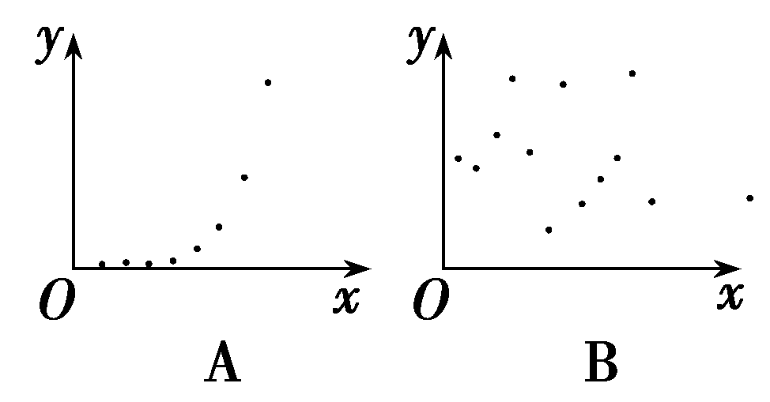
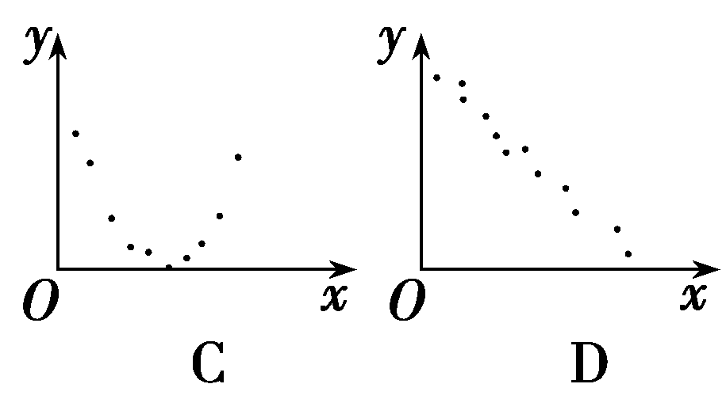
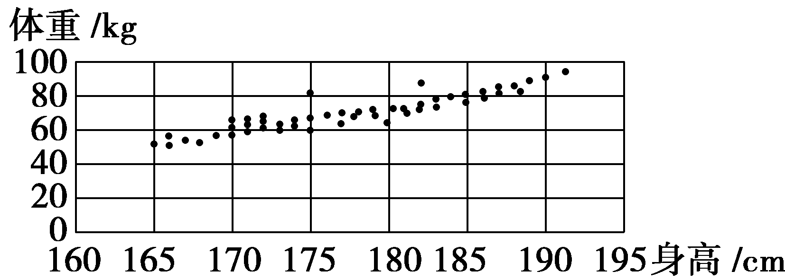
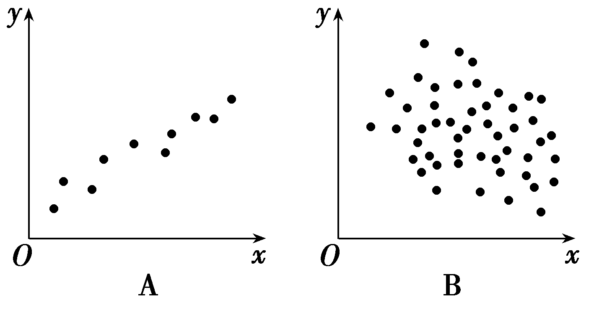
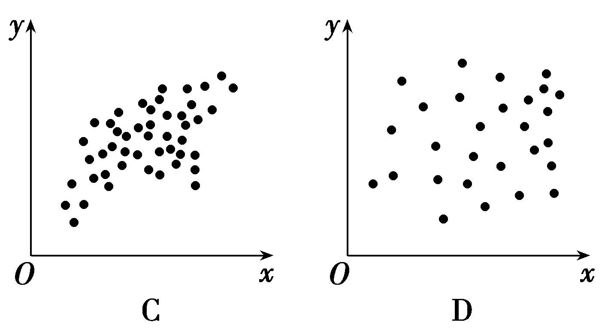
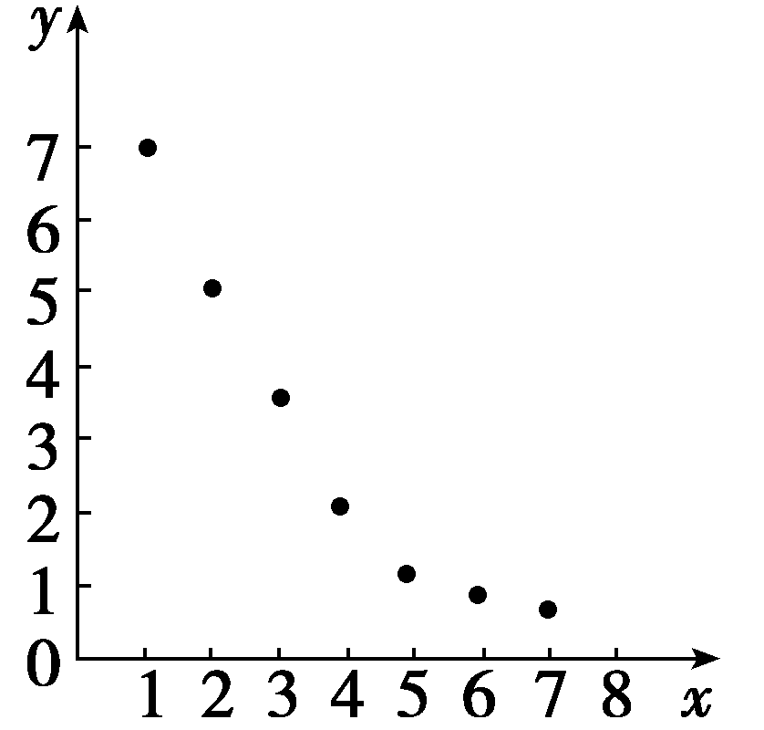
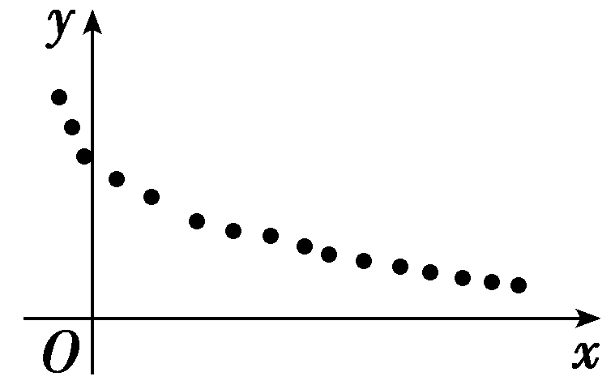
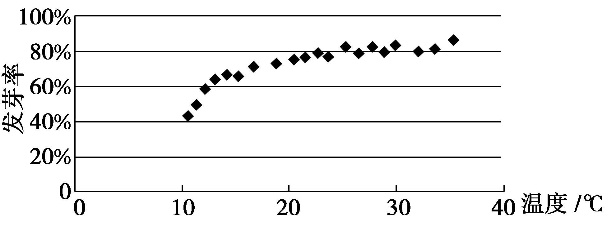
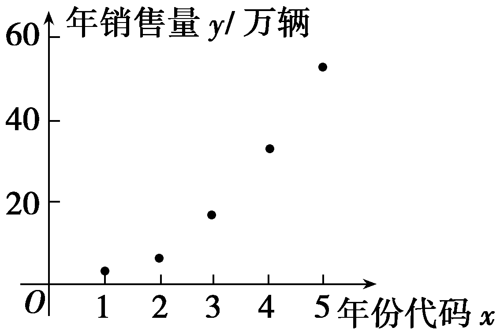
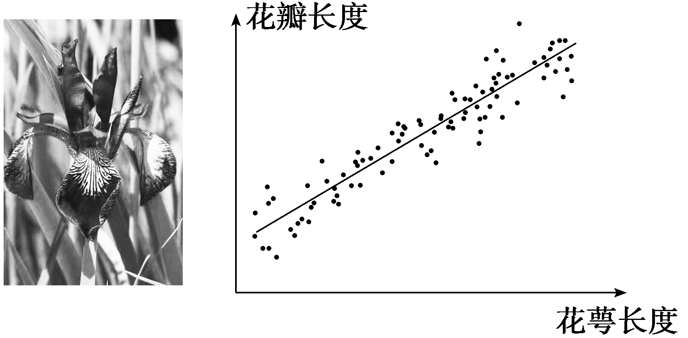

第三节　一元线性回归模型及其应用

【课标研读】　1.结合具体实例，了解一元线性回归模型的含义，了解模型参数的统计意义，了解最小二乘原理，掌握一元线性回归模型参数的最小二乘估计方法.　2.针对实际问题，会用一元线性回归模型进行预测.　3.结合实例，了解样本相关系数的统计含义，了解样本相关系数与标准化数据向量夹角的关系.　4.结合实例，会通过相关系数比较多组成对数据的相关性.

##### 1.变量的相关关系

（1）相关关系：两个变量<u>有关系</u>，但又没有确切到可由其中的一个去精确地决定另一个的程度，这种关系称为相关关系.

（2）相关关系的分类：<u>正相关</u>和<u>负相关</u>.

（3）线性相关：一般地，如果两个变量的取值呈现正相关或负相关，而且散点落在<u>一条直线</u>附近，我们就称这两个变量线性相关.

##### 2.样本相关系数

（1）相关系数*r*的计算

变量*x*和变量*y*的样本相关系数*r*的计算公式：

*r*＝ $\frac{\overset{n}{\underset{i=1}{\sum }}(x_{i}－\overline{x})(y_{i}－\overline{y})}{\sqrt{\overset{n}{\underset{i=1}{\sum }}(x_{i}－\overline{x})^{2}}\sqrt{\overset{n}{\underset{i=1}{\sum }}(y_{i}－\overline{y})^{2}}}$ ＝ $\frac{\overset{n}{\underset{i=1}{\sum }}x_{i}y_{i}－n\overline{x} \overline{y}}{\sqrt{\overset{n}{\underset{i=1}{\sum }}x_{i}^{2}－n\overline{x}^{2}}\sqrt{\overset{n}{\underset{i=1}{\sum }}y_{i}^{2}－n\overline{y}^{2}}}$ .

（2）相关系数*r*的性质

①当<em>r</em>＞0时，称成对样本数据<u>正</u>相关；当<em>r</em>＜0时，称成对样本数据<u>负</u>相关；当<em>r</em>＝0时，成对样本数据间没有线性相关关系.

②样本相关系数<em>r</em>的取值范围为<u>[－1，1]</u>.

当｜<em>r</em>｜越接近1时，成对样本数据的线性相关程度越<u>强</u>；

当｜<em>r</em>｜越接近0时，成对样本数据的线性相关程度越<u>弱</u>.

##### 3.一元线性回归模型

（1）我们将 $\overset{\wedge }{y}$ ＝ $\overset{\wedge }{b}$ <te*x*t style="italic">x</text>＋ $\overset{\wedge }{a}$ 称为<te*x*t style="italic">Y</text>关于*x*的经验回归方程，其中

$\left\{\begin{matrix}\overset{\wedge }{b}＝\frac{\overset{n}{\underset{i=1}{\sum }}\left(x_{i}－\overline{x}\right)\left(y_{i}－\overline{y}\right)}{\overset{n}{\underset{i=1}{\sum }}\left(x_{i}－\overline{x}\right)^{2}}＝\frac{\overset{n}{\underset{i=1}{\sum }}x_{i}y_{i}－n\overline{x} \overline{y}}{\overset{n}{\underset{i=1}{\sum }}x_{i}^{2}－n\overline{x}^{2}}\\\overset{\wedge }{a}＝\overline{y}－\overset{\wedge }{b}\overline{x}.\end{matrix}\right.$

（2）决定系数

<em>&lt;text style="italic"&gt;&lt;text style="italic"&gt;R</em>&lt;/text&gt;&lt;/text&gt;&lt;text style="superscript"&gt;&lt;text style="superscript"&gt;2&lt;/text&gt;&lt;/text&gt;＝1－ $\frac{\overset{n}{\underset{i=1}{\sum }}\left(y_{i}－\overset{\wedge }{y}_{i}\right)^{2}}{\overset{n}{\underset{i=1}{\sum }}\left(y_{i}－\overline{y}\right)^{2}}$ ，<em>&lt;text style="italic"&gt;&lt;text style="italic"&gt;R</em>&lt;/text&gt;&lt;/text&gt;&lt;text style="superscript"&gt;&lt;text style="superscript"&gt;2&lt;/text&gt;&lt;/text&gt;的值越<u>大</u>，模型的拟合效果越好，R2越<u>小</u>，模型的拟合效果越差.

【常用结论】

（1）经验回归直线过点( $\overline{x}$ ， $\overline{y}$ ).

（2）求 $\overset{\wedge }{b}$ 时，常用公式 $\overset{\wedge }{b}$ ＝ $\frac{\overset{n}{\underset{i=1}{\sum }}x_{i}y_{i}－n\overline{x} \overline{y}}{\overset{n}{\underset{i=1}{\sum }}x_{i}^{2}－n\overline{x}^{2}}$ .

（3）回归分析和独立性检验都是基于成对样本观测数据进行估计或推断，得出的结论都可能犯错误.

【自主检测】

##### 1.(多选)下列说法正确的是(　　)

$\quad$A.相关关系是一种非确定性关系

$\quad$B.散点图是判断两个变量相关关系的一种重要方法和手段

$\quad$C.经验回归直线 $\overset{\wedge }{y}$ ＝ $\overset{\wedge }{b}$ &lt;te&lt;te&lt;te&lt;text st<em>y</em>le="italic"&gt;x&lt;/text&gt;t st<em>y</em>le="italic"&gt;x&lt;/text&gt;t st<em>y</em>le="italic"&gt;x&lt;/text&gt;t style="italic"&gt;x&lt;/text&gt;＋ $\overset{\wedge }{a}$ 至少经过点(&lt;te&lt;te&lt;te&lt;text st<em>y</em>le="italic"&gt;x&lt;/text&gt;t st<em>y</em>le="italic"&gt;x&lt;/text&gt;t st<em>y</em>le="italic"&gt;x&lt;/text&gt;t style="italic"&gt;x&lt;/text&gt;&lt;text style="subscript"&gt;1&lt;/text&gt;，y1)，(x&lt;text style="subscript"&gt;2&lt;/text&gt;，y2)，…，(x<em>&lt;text style="italic,subscript"&gt;n</em>&lt;/text&gt;，yn)中的一个点
$\quad$D.样本相关系数的绝对值越接近1，成对样本数据的线性相关程度越强

答案ABD

##### 2.(链接人教A选择性必修三P103T1)下列四个散点图中，变量*x*与*y*之间具有负的线性相关关系的是(　　)

答案D

解析观察散点图可知，只有D选项的散点图表示的是变量*x*与*y*之间具有负的线性相关关系.故选D.

##### 3.对于*x*，*y*两变量，有四组成对样本数据，分别算出它们的样本相关系数*r*如下，则线性相关性最强的是(　　)

$\quad$A.－0.82	
$\quad$B.0.78

$\quad$C.－0.69	
$\quad$D.0.87

答案D

解析由样本相关系数的绝对值｜*r*｜越大，变量间的线性相关性越强知，各选项中*r*＝0.87的绝对值最大.故选D.

##### 4.已知变量<text st*y*le="italic">x</text>与y正相关，且由观测数据算得样本平均数 $\overline{x}$ ＝3， $\overline{y}$ ＝3.5，则由该观测数据算得的经验回归方程可能是(　　)

$\quad$A. $\overset{\wedge }{y}$ ＝0.4<te*x*t style="italic">x</text>＋2.3	
$\quad$B. $\overset{\wedge }{y}$ ＝2<te*x*t style="italic">x</text>－2.4

$\quad$C. $\overset{\wedge }{y}$ ＝－2<te*x*t style="italic">x</text>＋9.5	
$\quad$D. $\overset{\wedge }{y}$ ＝－0.3<te*x*t style="italic">x</text>＋4.4

答案A

解析由题意，<text st*y*le="italic">x</text>与y正相关，故排除C、D，将( $\overline{x}$ ， $\overline{y}$ )代入经验回归方程检验得A正确.故选A.

考点一　成对数据的相关性　　　　自主练透

##### 1.(2023·上海卷)已知某校50名学生的身高与体重的散点图如图所示，则下列说法正确的是(　　)

$\quad$A.身高越高，体重越重

$\quad$B.身高越高，体重越轻

$\quad$C.身高与体重成正相关

$\quad$D.身高与体重成负相关

答案C

解析由题图可知，身高越高的体重不一定就越重或越轻，但总体上来说，样本学生的身高和体重之间具有明显的相关性，个子高的学生往往更重一些，所以身高与体重成正相关.故选C.

##### 2.已知两个变量*x*和*y*之间有线性相关关系，经调查得到如下样本数据：

<table><tr><td>
<em>x</em>
</td><td>
3
</td><td>
4
</td><td>
5
</td><td>
6
</td><td>
7
</td></tr><tr><td>
<em>y</em>
</td><td>
3.5
</td><td>
2.4
</td><td>
1.1
</td><td>
－0.2
</td><td>
－1.3
</td></tr></table>

根据表格中的数据求得经验回归方程为 $\overset{\wedge }{y}$ ＝ $\overset{\wedge }{b}$ *x*＋ $\overset{\wedge }{a}$ ，则下列说法中正确的是(　　)

$\quad$A. $\overset{\wedge }{a}$ ＞0， $\overset{\wedge }{b}$ ＞0	
$\quad$B. $\overset{\wedge }{a}$ ＞0， $\overset{\wedge }{b}$ ＜0

$\quad$C. $\overset{\wedge }{a}$ ＜0， $\overset{\wedge }{b}$ ＞0	
$\quad$D. $\overset{\wedge }{a}$ ＜0， $\overset{\wedge }{b}$ ＜0

答案B

解析由已知数据可知<te<te<text st*y*le="italic">x</text>t style="italic">x</text>t style="italic">y</text>随着x的增大而减小，则变量x和y之间存在负相关关系，所以 $\overset{\wedge }{b}$ ＜0.又 $\overline{x}$ ＝ $\frac{1}{5}$ × $\left(3+4+5+6+7\right)$ ＝5， $\overline{y}$ ＝ $\frac{1}{5}$ ×(3.5＋2.4＋1.1－0.2－1.3)＝1.1，即1.1＝5 $\overset{\wedge }{b}$ ＋ $\overset{\wedge }{a}$ ，所以 $\overset{\wedge }{a}$ ＝1.1－5 $\overset{\wedge }{b}$ ＞0.故选B.

##### 3.(2024·天津卷)下列图中，线性相关系数最大的是(　　)

答案A

解析观察4幅图可知，A图散点分布比较集中，且大体接近某一条直线，线性回归模型拟合效果比较好，呈现明显的正相关， $\left|r\right|$ 值相比于其他3图更接近1.故选A.

##### 4.已知相关变量<em>x</em>和<em>y</em>的散点图如图所示，若用<em>y</em>＝<em>b</em>1ln(<em>k</em>1<em>x</em>)与<em>y</em>＝<em>k</em>2<em>x</em>＋<em>b</em>2拟合时的样本相关系数分别为<em>r</em>1，<em>r</em>2，则比较<em>r</em>1，<em>r</em>2的大小结果为(　　)

$\quad$A.<em>r</em>1＞<em>r</em>2	
$\quad$B.<em>r</em>1＝<em>r</em>2

$\quad$C.<em>r</em>1＜<em>r</em>2	
$\quad$D.不确定

答案C

解析由散点图可知，用<em>y</em>＝<em>b</em>1ln(<em>k</em>1<em>x</em>)拟合比用<em>y</em>＝<em>k</em>2<em>x</em>＋<em>b</em>2拟合的程度高，故｜<em>r</em>1｜＞｜<em>r</em>2｜；又因为<em>x</em>，<em>y</em>负相关，所以－<em>r</em>1＞－<em>r</em>2，即<em>r</em>1＜<em>r</em>2.故选C.

判定两个变量相关性的方法

##### 1.画散点图：若点的分布从左下角到右上角，则两个变量正相关；若点的分布从左上角到右下角，则两个变量负相关.

##### 2.样本相关系数：当*r*＞0时，正相关；当*r*＜0时，负相关；｜*r*｜越接近1，相关性越强.

##### 3.经验回归方程：当 $\overset{\wedge }{b}$ ＞0时，正相关；当 $\overset{\wedge }{b}$ ＜0时，负相关.

考点二　样本相关系数　　　　师生共研

为实施乡村振兴，科技兴农，某村建起了田园综合体，并从省城请来专家进行技术指导，根据统计，该田园综合体西红柿亩产量的增加量*y*(千克)与某种液体肥料每亩使用量*x*(千克)之间的对应数据如下：

<table><tr><td>
<em>x</em>(千克)
</td><td>
2
</td><td>
4
</td><td>
5
</td><td>
6
</td><td>
8
</td></tr><tr><td>
<em>y</em>(千克)
</td><td>
300
</td><td>
400
</td><td>
400
</td><td>
400
</td><td>
500
</td></tr></table>

（1）由上表数据可知，可用经验回归模型拟合*y*与*x*的关系，请计算样本相关系数*r*并加以说明(若｜*r*｜＞0.75，则线性相关程度很高，可用经验回归模型拟合)；

（2）求*y*关于*x*的经验回归方程，并预测当液体肥料每亩使用量为15千克时，西红柿亩产量的增加量约为多少千克？

附：相关系数*r*＝ $\frac{\overset{n}{\underset{i=1}{\sum }}(x_{i}－\overline{x})(y_{i}－\overline{y})}{\sqrt{\overset{n}{\underset{i=1}{\sum }}(x_{i}－\overline{x})^{2}}\cdot \sqrt{\overset{n}{\underset{i=1}{\sum }}(y_{i}－\overline{y})^{2}}}$ ，

经验回归方程 $\overset{\wedge }{y}$ ＝ $\overset{\wedge }{a}$ ＋ $\overset{\wedge }{b}$ *x*的斜率和截距的最小二乘估计公式分别为

$\overset{\wedge }{b}$ ＝ $\frac{\overset{n}{\underset{i=1}{\sum }}(x_{i}－\overline{x})(y_{i}－\overline{y})}{\overset{n}{\underset{i=1}{\sum }}(x_{i}－\overline{x})^{2}}$ ， $\overset{\wedge }{a}$ ＝ $\overline{y}$ － $\overset{\wedge }{b}\overline{x}$ ， $\sqrt{10}$ ≈3.16.

解：（1）由已知数据可得 $\overline{x}$ ＝ $\frac{2+4+5+6+8}{5}$ ＝5，

$\overline{y}$ ＝ $\frac{300+400+400+400+500}{5}$ ＝400，

所以 $\overset{5}{\underset{i=1}{\sum }}$ (&lt;text st&lt;text style="<em>i</em>talic"&gt;y&lt;/text&gt;le="<em>i</em>talic"&gt;x&lt;/text&gt;i－ $\overline{x}$ )(&lt;text style="<em>i</em>talic"&gt;y&lt;/text&gt;<em>i</em>－ $\overline{y}$ )＝(－3)×(－100)＋(－1)×0＋0×0＋1×0＋3×100＝600，

$\sqrt{\overset{5}{\underset{i=1}{\sum }}(x_{i}－\overline{x})^{2}}$ ＝ $\sqrt{(-3)^{2}＋(-1)^{2}＋0^{2}＋1^{2}＋3^{2}}$ ＝2 $\sqrt{5}$ ，

$\sqrt{\overset{5}{\underset{i=1}{\sum }}(y_{i}－\overline{y})^{2}}$ ＝ $\sqrt{(-100)^{2}＋0^{2}＋0^{2}＋0^{2}+100^{2}}$ ＝100 $\sqrt{2}$ ，

所以样本相关系数*r*＝ $\frac{\overset{5}{\underset{i=1}{\sum }}(x_{i}－\overline{x})(y_{i}－\overline{y})}{\sqrt{\overset{5}{\underset{i=1}{\sum }}(x_{i}－\overline{x})^{2}}\cdot \sqrt{\overset{5}{\underset{i=1}{\sum }}(y_{i}－\overline{y})^{2}}}$ ＝ $\frac{600}{2\sqrt{5}\times 100\sqrt{2}}$ ＝ $\frac{3}{\sqrt{10}}$ ≈0.95＞0.75.

所以可用经验回归模型拟合*y*与*x*的关系.

（2） $\overset{\wedge }{b}$ ＝ $\frac{\overset{5}{\underset{i=1}{\sum }}(x_{i}－\overline{x})(y_{i}－\overline{y})}{\overset{5}{\underset{i=1}{\sum }}(x_{i}－\overline{x})^{2}}$ ＝ $\frac{600}{20}$ ＝30，

$\overset{\wedge }{a}$ ＝400－5×30＝250，

所以经验回归方程为 $\overset{\wedge }{y}$ ＝30*x*＋250.

当*x*＝15时， $\overset{\wedge }{y}$ ＝30×15＋250＝700(千克)，

即当液体肥料每亩使用量为15千克时，西红柿亩产量的增加量约为700千克.

样本相关系数*r*的统计含义及应用

##### 1.由*r*的正、负可判断成对样本数据中两相关变量是正相关还是负相关.

##### 2.可根据｜*r*｜的大小从量的角度判断成对样本数据是否具有线性相关性，进而可知能否用经验回归方程进行分析和预测.

对点练1.某沙漠地区经过治理，生态系统得到很大改善，野生动物数量有所增加.为调查该地区某种野生动物的数量，将其分成面积相近的&lt;te&lt;text st&lt;text style="<em>i</em>talic"&gt;y&lt;/text&gt;le="<em>i</em>talic"&gt;x&lt;/text&gt;t st&lt;text style="<em>i</em>talic"&gt;y&lt;/text&gt;le="superscript"&gt;2&lt;/text&gt;00个地块，从这些地块中用简单随机抽样的方法抽取20个作为样区，调查得到样本数据(&lt;te&lt;te&lt;te&lt;text style="<em>i</em>talic"&gt;x&lt;/text&gt;t st&lt;text style="<em>i</em>talic"&gt;y&lt;/text&gt;le="<em>i</em>talic"&gt;x&lt;/text&gt;t st&lt;text style="&lt;text style="<em>i</em>talic,subscript"&gt;i&lt;/text&gt;talic"&gt;y&lt;/text&gt;le="<em>i</em>talic"&gt;x&lt;/text&gt;t st&lt;text style="&lt;text style="<em>i</em>talic,subscript"&gt;i&lt;/text&gt;talic"&gt;y&lt;/text&gt;le="<em>i</em>talic"&gt;x&lt;/text&gt;i，yi)(i＝1，2，…，20)，其中xi和yi分别表示第i个样区的植物覆盖面积(单位：公顷)和这种野生动物的数量，并计算得 $\overset{20}{\underset{i=1}{\sum }}$ &lt;te&lt;te&lt;te&lt;te&lt;text st&lt;text style="<em>i</em>talic"&gt;y&lt;/text&gt;le="<em>i</em>talic"&gt;x&lt;/text&gt;t st&lt;text style="<em>i</em>talic"&gt;y&lt;/text&gt;le="<em>i</em>talic"&gt;x&lt;/text&gt;t st&lt;text style="<em>i</em>talic"&gt;y&lt;/text&gt;le="<em>i</em>talic"&gt;x&lt;/text&gt;t st&lt;text style="&lt;text style="<em>i</em>talic,subscript"&gt;i&lt;/text&gt;talic"&gt;y&lt;/text&gt;le="<em>i</em>talic"&gt;x&lt;/text&gt;t st&lt;text style="&lt;text style="<em>i</em>talic,subscript"&gt;i&lt;/text&gt;talic"&gt;y&lt;/text&gt;le="<em>i</em>talic"&gt;x&lt;/text&gt;i＝60， $\overset{20}{\underset{i=1}{\sum }}$ &lt;te&lt;te&lt;te&lt;te&lt;text st&lt;text style="<em>i</em>talic"&gt;y&lt;/text&gt;le="<em>i</em>talic"&gt;x&lt;/text&gt;t st&lt;text style="<em>i</em>talic"&gt;y&lt;/text&gt;le="<em>i</em>talic"&gt;x&lt;/text&gt;t st&lt;text style="<em>i</em>talic"&gt;y&lt;/text&gt;le="<em>i</em>talic"&gt;x&lt;/text&gt;t st&lt;text style="&lt;text style="<em>i</em>talic,subscript"&gt;i&lt;/text&gt;talic"&gt;y&lt;/text&gt;le="<em>i</em>talic"&gt;x&lt;/text&gt;t style="&lt;text style="<em>i</em>talic,subscript"&gt;i&lt;/text&gt;talic"&gt;y&lt;/text&gt;<em>i</em>＝1 &lt;text style="superscript"&gt;2&lt;/text&gt;00， $\overset{20}{\underset{i=1}{\sum }}$ (&lt;te&lt;te&lt;te&lt;te&lt;text st&lt;text style="<em>i</em>talic"&gt;y&lt;/text&gt;le="<em>i</em>talic"&gt;x&lt;/text&gt;t st&lt;text style="<em>i</em>talic"&gt;y&lt;/text&gt;le="<em>i</em>talic"&gt;x&lt;/text&gt;t st&lt;text style="<em>i</em>talic"&gt;y&lt;/text&gt;le="<em>i</em>talic"&gt;x&lt;/text&gt;t st&lt;text style="&lt;text style="<em>i</em>talic,subscript"&gt;i&lt;/text&gt;talic"&gt;y&lt;/text&gt;le="<em>i</em>talic"&gt;x&lt;/text&gt;t st&lt;text style="&lt;text style="<em>i</em>talic,subscript"&gt;i&lt;/text&gt;talic"&gt;y&lt;/text&gt;le="<em>i</em>talic"&gt;x&lt;/text&gt;i－ $\overline{x}$ )&lt;te&lt;text st&lt;text style="<em>i</em>talic"&gt;y&lt;/text&gt;le="<em>i</em>talic"&gt;x&lt;/text&gt;t st&lt;text style="<em>i</em>talic"&gt;y&lt;/text&gt;le="superscript"&gt;2&lt;/text&gt;＝80， $\overset{20}{\underset{i=1}{\sum }}$ (&lt;te&lt;te&lt;te&lt;te&lt;text st&lt;text style="<em>i</em>talic"&gt;y&lt;/text&gt;le="<em>i</em>talic"&gt;x&lt;/text&gt;t st&lt;text style="<em>i</em>talic"&gt;y&lt;/text&gt;le="<em>i</em>talic"&gt;x&lt;/text&gt;t st&lt;text style="<em>i</em>talic"&gt;y&lt;/text&gt;le="<em>i</em>talic"&gt;x&lt;/text&gt;t st&lt;text style="&lt;text style="<em>i</em>talic,subscript"&gt;i&lt;/text&gt;talic"&gt;y&lt;/text&gt;le="<em>i</em>talic"&gt;x&lt;/text&gt;t style="&lt;text style="<em>i</em>talic,subscript"&gt;i&lt;/text&gt;talic"&gt;y&lt;/text&gt;<em>i</em>－ $\overline{y}$ )&lt;te&lt;text st&lt;text style="<em>i</em>talic"&gt;y&lt;/text&gt;le="<em>i</em>talic"&gt;x&lt;/text&gt;t st&lt;text style="<em>i</em>talic"&gt;y&lt;/text&gt;le="superscript"&gt;2&lt;/text&gt;＝9 000， $\overset{20}{\underset{i=1}{\sum }}$ (&lt;te&lt;te&lt;te&lt;te&lt;text st&lt;text style="<em>i</em>talic"&gt;y&lt;/text&gt;le="<em>i</em>talic"&gt;x&lt;/text&gt;t st&lt;text style="<em>i</em>talic"&gt;y&lt;/text&gt;le="<em>i</em>talic"&gt;x&lt;/text&gt;t st&lt;text style="<em>i</em>talic"&gt;y&lt;/text&gt;le="<em>i</em>talic"&gt;x&lt;/text&gt;t st&lt;text style="&lt;text style="<em>i</em>talic,subscript"&gt;i&lt;/text&gt;talic"&gt;y&lt;/text&gt;le="<em>i</em>talic"&gt;x&lt;/text&gt;t st&lt;text style="&lt;text style="<em>i</em>talic,subscript"&gt;i&lt;/text&gt;talic"&gt;y&lt;/text&gt;le="<em>i</em>talic"&gt;x&lt;/text&gt;i－ $\overline{x}$ )(&lt;te&lt;te&lt;te&lt;te&lt;text st&lt;text style="<em>i</em>talic"&gt;y&lt;/text&gt;le="<em>i</em>talic"&gt;x&lt;/text&gt;t st&lt;text style="<em>i</em>talic"&gt;y&lt;/text&gt;le="<em>i</em>talic"&gt;x&lt;/text&gt;t st&lt;text style="<em>i</em>talic"&gt;y&lt;/text&gt;le="<em>i</em>talic"&gt;x&lt;/text&gt;t st&lt;text style="&lt;text style="<em>i</em>talic,subscript"&gt;i&lt;/text&gt;talic"&gt;y&lt;/text&gt;le="<em>i</em>talic"&gt;x&lt;/text&gt;t style="&lt;text style="<em>i</em>talic,subscript"&gt;i&lt;/text&gt;talic"&gt;y&lt;/text&gt;<em>i</em>－ $\overline{y}$ )＝800.

（1）求该地区这种野生动物数量的估计值(这种野生动物数量的估计值等于样区这种野生动物数量的平均数乘以地块数)；

（2）求样本(<em>xi</em>，<em>yi</em>)(<em>i</em>＝1，2，…，20)的相关系数(精确到0.01)；

（3）根据现有统计资料，各地块间植物覆盖面积差异很大.为提高样本的代表性以获得该地区这种野生动物数量更准确的估计，请给出一种你认为更合理的抽样方法，并说明理由.

附：样本相关系数*r*＝ $\frac{\overset{n}{\underset{i=1}{\sum }}(x_{i}－\overline{x})(y_{i}－\overline{y})}{\sqrt{\overset{n}{\underset{i=1}{\sum }}(x_{i}－\overline{x})^{2}\overset{n}{\underset{i=1}{\sum }}(y_{i}－\overline{y})^{2}}}$ ， $\sqrt{2}$ ≈1.414.

解：（1）由已知得样本平均数 $\overline{y}$ ＝ $\frac{1}{20}\overset{20}{\underset{i=1}{\sum }}$ &lt;text style="<em>i</em>talic"&gt;y&lt;/text&gt;i＝60，从而该地区这种野生动物数量的估计值为60×200＝12 000.

（2）样本(&lt;text st&lt;text style="&lt;text style="<em>i</em>talic,subsc<em>r</em>ipt"&gt;i&lt;/text&gt;talic"&gt;y&lt;/text&gt;le="<em>i</em>talic"&gt;x&lt;/text&gt;i，yi)(i＝1，2，…，20)的相关系数r＝ $\frac{\overset{20}{\underset{i=1}{\sum }}(x_{i}－\overline{x})(y_{i}－\overline{y})}{\sqrt{\overset{20}{\underset{i=1}{\sum }}(x_{i}－\overline{x})^{2}\overset{20}{\underset{i=1}{\sum }}(y_{i}－\overline{y})^{2}}}$ ＝ $\frac{800}{\sqrt{80\times 9 000}}$ ＝ $\frac{2\sqrt{2}}{3}$ ≈0.94.

（3）分层随机抽样：根据植物覆盖面积的大小对地块分层，再对200个地块进行分层随机抽样.

理由如下：由（2）知各样区的这种野生动物数量与植物覆盖面积有很强的正相关.由于各地块间植物覆盖面积差异很大，从而各地块间这种野生动物数量差异也很大，采用分层随机抽样的方法较好地保持了样本结构与总体结构的一致性，提高了样本的代表性，从而可以获得该地区这种野生动物数量更准确的估计.

考点三　回归模型及其应用　　　　多维探究

角度1　回归模型的辨析

（1）一组实验数据构成的散点图如图，以下函数中适合作为*y* 与*x* 的回归方程模型的是(　　)

$\quad$A. $\overset{\wedge }{y}$ ＝&lt;text style="itali<em>c</em>"&gt;<em>ax</em>&lt;/text&gt;＋<em>b</em>	
$\quad$B. $\overset{\wedge }{y}$ ＝&lt;text style="itali<em>c</em>"&gt;<em>ax</em>&lt;/text&gt;2＋c

$\quad$C. $\overset{\wedge }{y}$ ＝&lt;te&lt;te&lt;text style="itali<em>c</em>,superscript"&gt;x&lt;/text&gt;t style="italic"&gt;x&lt;/text&gt;t style="it<em>a</em>lic"&gt;b&lt;/text&gt;logax＋<em>c</em>	
$\quad$D. $\overset{\wedge }{y}$ ＝&lt;te&lt;te&lt;text style="itali<em>c</em>,superscript"&gt;x&lt;/text&gt;t style="italic"&gt;x&lt;/text&gt;t style="it<em>a</em>lic"&gt;b&lt;/text&gt;ax＋c

（2）(2020·全国<em>Ⅰ</em>卷)某校一个课外学习小组为研究某作物种子的发芽率<em>y</em> 和温度<em>x</em> (单位：℃)的关系，在20个不同的温度条件下进行种子发芽实验，由实验数据(<em>xi</em>，<em>yi</em>)(<em>i</em>＝1，2，…，20) 得到如图所示的散点图.

由此散点图，在10 ℃ 至40 ℃之间，下面四个回归方程类型中最适宜作为发芽率*y* 和温度*x* 的回归方程类型的是(　　)

$\quad$A.<em>y</em>＝<em>a</em>＋<em>bx</em>	
$\quad$B.<em>y</em>＝<em>a</em>＋<em>bx</em>2

$\quad$C.<em>y</em>＝<em>a</em>＋<em>b</em>e<em>x</em> 	
$\quad$D.<em>y</em>＝<em>a</em>＋<em>b</em>ln <em>x</em>

答案（1）D　（2）D

解析（1）由散点图中各点的变化趋势知，各点不在一条直线上，排除A；由散点图中各点呈单调递减趋势，排除B；又图中点的横坐标有正有负，故排除C.故选D.

（2）由散点图可以看出，随着温度*x* 的增加，发芽率*y* 增加到一定程度后，变化率越来越慢，符合对数型函数的图象特征.故选D.

角度2　一元线性回归模型

某研究机构为调查人的最大可视距离*y*(单位：米)和年龄*x*(单位：岁)之间的关系，对不同年龄的志愿者进行了研究，收集数据得到下表：

<table><tr><td>
<em>x</em>
</td><td>
20
</td><td>
25
</td><td>
30
</td><td>
35
</td><td>
40
</td></tr><tr><td>
<em>y</em>
</td><td>
167
</td><td>
160
</td><td>
150
</td><td>
143
</td><td>
130
</td></tr></table>

（1）根据上表提供的数据，求出<te<te*x*t style="italic">x</text>t style="italic">y</text>关于x的经验回归方程 $\overset{\wedge }{y}$ ＝ $\overset{\wedge }{b}$ <te*x*t style="italic">x</text>＋ $\overset{\wedge }{a}$ ；

（2）根据（1）中求出的经验回归方程，估计年龄为50岁的人的最大可视距离.

参考公式：经验回归方程 $\overset{\wedge }{y}$ ＝ $\overset{\wedge }{b}$ *x*＋ $\overset{\wedge }{a}$ 中斜率和截距的最小二乘估计公式分别为 $\overset{\wedge }{b}$ ＝ $\frac{\overset{n}{\underset{i=1}{\sum }}\left(x_{i}－\overline{x}\right)\left(y_{i}－\overline{y}\right)}{\overset{n}{\underset{i=1}{\sum }}\left(x_{i}－\overline{x}\right)^{2}}$ ＝ $\frac{\overset{n}{\underset{i=1}{\sum }}x_{i}y_{i}－n\overline{x} \overline{y}}{\overset{n}{\underset{i=1}{\sum }}x_{i}^{2}－n\overline{x}^{2}}$ ， $\overset{\wedge }{a}$ ＝ $\overline{y}$ － $\overset{\wedge }{b}\overline{x}$ .

解：（1）由题意可得 $\overline{x}$ ＝ $\frac{20+25+30+35+40}{5}$ ＝30， $\overline{y}$ ＝ $\frac{167+160+150+143+130}{5}$ ＝150，

$\overset{5}{\underset{i=1}{\sum }}$ &lt;text st&lt;text style="<em>i</em>talic"&gt;y&lt;/text&gt;le="<em>i</em>talic"&gt;x&lt;/text&gt;iyi＝20×167＋25×160＋30×150＋35×143＋40×130＝22 045，

$\overset{5}{\underset{i=1}{\sum }}x_{i}^{2}$ ＝&lt;text style="superscript"&gt;&lt;text style="superscript"&gt;&lt;text style="superscript"&gt;&lt;text style="superscript"&gt;2&lt;/text&gt;&lt;/text&gt;&lt;/text&gt;&lt;/text&gt;02＋252＋302＋352＋402＝4 750，

所以 $\overset{\wedge }{b}$ ＝ $\frac{22 045－5\times 30\times 150}{4 750－5\times 30^{2}}$ ＝ $\frac{－455}{250}$ ＝－1.82，

则 $\overset{\wedge }{a}$ ＝ $\overline{y}$ － $\overset{\wedge }{b}\overline{x}$ ＝150＋1.82×30＝204.6，

故所求经验回归方程为 $\overset{\wedge }{y}$ ＝－1.82*x*＋204.6.

（2）当*x*＝50时， $\overset{\wedge }{y}$ ＝－1.82×50＋204.6＝113.6，即年龄为50岁的人的最大可视距离约为113.6米.

角度3　非线性回归模型

数独是源自18世纪瑞士的一种数学游戏，玩家需要根据9×9盘面上的已知数字，推理出所有剩余空格的数字，并满足每一行、每一列、每一个粗线宫(3×3)内的数字均含1～9，且不重复.数独爱好者小明打算报名参加“丝路杯”全国数独大赛初级组的比赛，赛前小明在某数独APP上进行一段时间的训练，每天的解题平均速度*y*(秒)与训练天数*x*(天)有关，经统计得到如表的数据：

<table><tr><td>
<em>x</em>(天)
</td><td>
1
</td><td>
2
</td><td>
3
</td><td>
4
</td><td>
5
</td><td>
6
</td><td>
7
</td></tr><tr><td>
<em>y</em>(秒)
</td><td>
990
</td><td>
990
</td><td>
450
</td><td>
320
</td><td>
300
</td><td>
240
</td><td>
210
</td></tr></table>

（1）现用<text style="it*a*lic">y</text>＝a＋ $\frac{b}{x}$ 作为经验回归模型，请利用表中数据，求出该经验回归方程；

（2）请用第（1）题的结论预测，小明经过100天训练后，每天解题的平均速度*y*约为多少秒？

参考数据 $\left(其中t_{i}＝\frac{1}{x_{i}}\right)$ ： $\overset{7}{\underset{i=1}{\sum }}$ &lt;text st&lt;text style="<em>i</em>talic"&gt;y&lt;/text&gt;le="<em>i</em>talic"&gt;t&lt;/text&gt;iyi＝1 845， $\overline{t}$ ≈0.37， $\overset{7}{\underset{i=1}{\sum }}t_{i}^{2}$ －7 $\overline{t}^{2}$ ≈0.55.

参考公式：对于一组数据(<em>&lt;text style="italic"&gt;&lt;text style="italic"&gt;&lt;text style="italic"&gt;u</em>&lt;/text&gt;&lt;/text&gt;&lt;/text&gt;&lt;text style="subscript"&gt;1&lt;/text&gt;，<em>&lt;text style="italic"&gt;&lt;text style="italic"&gt;v</em>&lt;/text&gt;&lt;/text&gt;1)，(u&lt;text style="subscript"&gt;2&lt;/text&gt;，v2)，…，(u<em>&lt;text style="italic,subscript"&gt;n</em>&lt;/text&gt;，vn)，其经验回归直线 $\overset{\wedge }{v}$ ＝ $\overset{\wedge }{\alpha }$ ＋ $\overset{\wedge }{\beta }$ <em>&lt;text style="italic"&gt;&lt;text style="italic"&gt;&lt;text style="italic"&gt;u</em>&lt;/text&gt;&lt;/text&gt;&lt;/text&gt;的斜率和截距的最小二乘估计公式分别为 $\overset{\wedge }{\beta }$ ＝ $\frac{\overset{n}{\underset{i=1}{\sum }}u_{i}v_{i}－n\overline{u}\cdot \overline{v}}{\overset{n}{\underset{i=1}{\sum }}u_{i}^{2}－n\overline{u}^{2}}$ ， $\overset{\wedge }{\alpha }$ ＝ $\overline{v}$ － $\overset{\wedge }{\beta }$ · $\overline{u}$ .

解：（1）由题意得 $\overline{y}$ ＝ $\frac{1}{7}$ ×(990＋990＋450＋320＋300＋240＋210)＝500，

令<<*t*ext style="italic">t</text>ext st*y*le="italic">t</text>＝ $\frac{1}{x}$ ，设<<*t*ext style="italic">t</text>ext style="italic">y</text>关于*t*的经验回归方程为 $\overset{\wedge }{y}$ ＝ $\overset{\wedge }{b}$ <<*t*ext style="italic">t</text>ext st*y*le="italic">t</text>＋ $\overset{\wedge }{a}$ ，

则有 $\overset{\wedge }{b}$ ＝ $\frac{\overset{7}{\underset{i=1}{\sum }}t_{i}y_{i}－7\overline{t} \overline{y}}{\overset{7}{\underset{i=1}{\sum }}t_{i}^{2}－7\times \overline{t}^{2}}$ ≈ $\frac{1 845－7\times 0.37\times 500}{0.55}$ ＝1 000， $\overset{\wedge }{a}$ ≈500－1 000×0.37＝130，

所以 $\overset{\wedge }{y}$ ＝1 000*t*＋130，

又<te*x*t st*y*le="italic">t</text>＝ $\frac{1}{x}$ ，所以<te*x*t style="italic">y</text>关于x的经验回归方程为 $\overset{\wedge }{y}$ ＝ $\frac{1 000}{x}$ ＋130.

（2）当*x*＝100时， $\overset{\wedge }{y}$ ＝140，

所以经过100天训练后，小明每天解题的平均速度约为140秒.

##### 1.线性回归分析问题的解题策略

（1）利用公式，求出回归系数 $\overset{\wedge }{b}$ .

（2）利用经验回归直线过样本点的中心求系数 $\overset{\wedge }{a}$ .

（3）利用经验回归方程进行预测，把回归方程看作一次函数，将解释变量*x*的值代入，得到预测变量 $\overset{\wedge }{y}$ 的值.

##### 2.有些非线性回归分析问题并不给出经验公式，这时我们可以画出已知数据的散点图，把它与学过的各种函数(幂函数、指数函数、对数函数等)的图象进行比较，挑选一种跟这些散点拟合得最好的函数，用适当的变量进行变换，如通过换元或取对数等方法，把问题化为线性回归分析问题，使之得到解决.

对点练2.已知变量*x*与*y*，且观测数据如下表(其中6.5＞*a*＞4＞*b*＞1，*a*＋*b*＝6)，则由该观测数据算得的经验回归方程可能是(　　)

<table><tr><td>
<em>x</em>
</td><td>
1
</td><td>
2
</td><td>
3
</td><td>
4
</td><td>
5
</td></tr><tr><td>
<em>y</em>
</td><td>
6.5
</td><td>
<em>a</em>
</td><td>
4
</td><td>
<em>b</em>
</td><td>
1
</td></tr></table>

$\quad$A. $\overset{\wedge }{y}$ ＝0.4<te*x*t style="italic">x</text>＋2.3	
$\quad$B. $\overset{\wedge }{y}$ ＝2<te*x*t style="italic">x</text>－2.4

$\quad$C. $\overset{\wedge }{y}$ ＝－2<te*x*t style="italic">x</text>＋9.5	
$\quad$D. $\overset{\wedge }{y}$ ＝－0.3<te*x*t style="italic">x</text>＋0.44

答案C

解析由题意 $\overline{x}$ ＝ $\frac{1+2+3+4+5}{5}$ ＝3， $\overline{y}$ ＝ $\frac{6.5+a+4+b+1}{5}$ ＝3.5，把 $\overline{x}$ 代入各方程，A中， $\overline{y}$ ＝0.4×3＋2.3＝3.5，同理有B中， $\overline{y}$ ＝3.6，C中， $\overline{y}$ ＝3.5，D中， $\overline{y}$ ＝－0.46，又表格中数据随着<te*x*t st*y*le="italic">x</text>的增大，y减小，因此它们负相关，x的系数为负.故选C.

对点练3.“绿水青山就是金山银山”的理念推动了新能源汽车产业的迅速发展.以下表格和散点图反映了近几年某新能源汽车的年销售量情况.

<table><tr><td>
年份
</td><td>
2020
</td><td>
2021
</td><td>
2022
</td><td>
2023
</td><td>
2024
</td></tr><tr><td>
年份代码<em>x</em>
</td><td>
1
</td><td>
2
</td><td>
3
</td><td>
4
</td><td>
5
</td></tr><tr><td>
某新能源汽车

年销售量<em>y/</em>万辆
</td><td>
1.5
</td><td>
5.9
</td><td>
17.7
</td><td>
32.9
</td><td>
55.6
</td></tr></table>

（1）请根据散点图判断，<em>y</em>＝<em>bx</em>＋<em>a</em>与<em>y</em>＝<em>cx</em>2＋<em>d</em>中哪一个更适宜作为年销售量<em>y</em>关于年份代码<em>x</em>的回归方程类型；(给出判断即可，不必说明理由)

（2）根据（1）的判断结果及表中数据，建立*y*关于*x*的经验回归方程，并预测2025年该新能源汽车的年销售量.(精确到0.1)

参考数据： $\overline{y}$ ＝&lt;text st&lt;text style="&lt;text style="<em>i</em>talic,subscript"&gt;i&lt;/text&gt;talic"&gt;y&lt;/text&gt;le="superscr<em>i</em>pt"&gt;2&lt;/text&gt;2.72， $\overset{5}{\underset{i=1}{\sum }}$ (&lt;text st&lt;text style="&lt;text style="<em>i</em>talic,subscript"&gt;i&lt;/text&gt;talic"&gt;y&lt;/text&gt;le="&lt;text style="<em>i</em>talic,subscript"&gt;i&lt;/text&gt;talic"&gt;<em>&lt;text style="italic"&gt;w</em>&lt;/text&gt;&lt;/text&gt;i－ $\overline{w}$ )&lt;text st&lt;text style="&lt;text style="<em>i</em>talic,subscript"&gt;i&lt;/text&gt;talic"&gt;y&lt;/text&gt;le="superscr<em>i</em>pt"&gt;2&lt;/text&gt;＝374， $\overset{5}{\underset{i=1}{\sum }}$ (&lt;text st&lt;text style="&lt;text style="<em>i</em>talic,subscript"&gt;i&lt;/text&gt;talic"&gt;y&lt;/text&gt;le="&lt;text style="<em>i</em>talic,subscript"&gt;i&lt;/text&gt;talic"&gt;<em>&lt;text style="italic"&gt;w</em>&lt;/text&gt;&lt;/text&gt;i－ $\overline{w}$ )(&lt;text style="&lt;text style="<em>i</em>talic,subscript"&gt;i&lt;/text&gt;talic"&gt;y&lt;/text&gt;&lt;text style="<em>i</em>talic,subscript"&gt;i&lt;/text&gt;－ $\overline{y}$ )＝851.&lt;text st&lt;text style="&lt;text style="<em>i</em>talic,subscript"&gt;i&lt;/text&gt;talic"&gt;y&lt;/text&gt;le="superscr<em>i</em>pt"&gt;2&lt;/text&gt;(其中&lt;text style="<em>i</em>talic"&gt;<em>&lt;text style="italic"&gt;w</em>&lt;/text&gt;&lt;/text&gt;i＝ $x_{i}^{2}$ ).

解：（1）根据散点图可知，<em>y</em>＝<em>cx</em>2＋<em>d</em>更适宜作为年销售量<em>y</em>关于年份代码<em>x</em>的回归方程类型.

(2)令&lt;te<em>x</em>t style="italic"&gt;<em>w</em>&lt;/text&gt;＝x2，则 $\overset{\wedge }{y}$ ＝ $\overset{\wedge }{c}$ &lt;te<em>x</em>t style="italic"&gt;<em>w</em>&lt;/text&gt;＋ $\overset{\wedge }{d}$ .

易知 $\overline{w}$ ＝11， $\overset{\wedge }{c}$ ＝ $\frac{\overset{5}{\underset{i=1}{\sum }}(w_{i}－\overline{w})(y_{i}－\overline{y})}{\overset{5}{\underset{i=1}{\sum }}(w_{i}－\overline{w})^{2}}$ ＝ $\frac{851.2}{374}$ ≈2.28，

$\overset{\wedge }{d}$ ＝ $\overline{y}$ － $\overset{\wedge }{c}\overline{w}$ ≈22.72－2.28×11＝－2.36，

所以 $\overset{\wedge }{y}$ ＝2.28*w*－2.36，

所以&lt;te&lt;te<em>x</em>t style="italic"&gt;x&lt;/text&gt;t style="italic"&gt;y&lt;/text&gt;关于x的经验回归方程为 $\overset{\wedge }{y}$ ＝2.28&lt;te<em>x</em>t style="italic"&gt;x&lt;/text&gt;2－2.36.

令*x*＝6，得 $\overset{\wedge }{y}$ ＝79.72≈79.7.

故预测2025年该新能源汽车的年销售量为79.7万辆.

[真题再现]　(2022·全国乙卷)某地经过多年的环境治理，已将荒山改造成了绿水青山.为估计一林区某种树木的总材积量，随机选取了10棵这种树木，测量每棵树的根部横截面积(单位：m2)和材积量(单位：m3)，得到如下数据：

<table><tr><td>
样本号<em>i</em>
</td><td>
根部横截面积<em>xi</em>
</td><td>
材积量<em>yi</em>
</td></tr><tr><td>
1
</td><td>
0.04
</td><td>
0.25
</td></tr><tr><td>
2
</td><td>
0.06
</td><td>
0.40
</td></tr><tr><td>
3
</td><td>
0.04
</td><td>
0.22
</td></tr><tr><td>
4
</td><td>
0.08
</td><td>
0.54
</td></tr><tr><td>
5
</td><td>
0.08
</td><td>
0.51
</td></tr><tr><td>
6
</td><td>
0.05
</td><td>
0.34
</td></tr><tr><td>
7
</td><td>
0.05
</td><td>
0.36
</td></tr><tr><td>
8
</td><td>
0.07
</td><td>
0.46
</td></tr><tr><td>
9
</td><td>
0.07
</td><td>
0.42
</td></tr><tr><td>
10
</td><td>
0.06
</td><td>
0.40
</td></tr><tr><td>
总和
</td><td>
0.6
</td><td>
3.9
</td></tr><tr><td colspan="3"></td></tr></table>

并计算得 $\overset{10}{\underset{i=1}{\sum }}x_{i}^{2}$ ＝0.038， $\overset{10}{\underset{i=1}{\sum }}y_{i}^{2}$ ＝1.615 8， $\overset{10}{\underset{i=1}{\sum }}$ &lt;text st&lt;text style="<em>i</em>talic"&gt;y&lt;/text&gt;le="<em>i</em>talic"&gt;x&lt;/text&gt;iyi＝0.247 4.

（1）估计该林区这种树木平均一棵的根部横截面积与平均一棵的材积量；

（2）求该林区这种树木的根部横截面积与材积量的样本相关系数(精确到0.01)；

（3）现测量了该林区所有这种树木的根部横截面积，并得到所有这种树木的根部横截面积总和为186 m2.已知树木的材积量与其根部横截面积近似成正比.利用以上数据给出该林区这种树木的总材积量的估计值.

附：相关系数*r*＝ $\frac{\overset{n}{\underset{i=1}{\sum }}(x_{i}－\overline{x})(y_{i}－\overline{y})}{\sqrt{\overset{n}{\underset{i=1}{\sum }}(x_{i}－\overline{x})^{2}\overset{n}{\underset{i=1}{\sum }}(y_{i}－\overline{y})^{2}}}$ ， $\sqrt{1.896}$ ≈1.377.

解：（1）估计该林区这种树木平均一棵的根部横截面积 $\overline{x}$ ＝ $\frac{\overset{10}{\underset{i=1}{\sum }}x_{i}}{10}$ ＝ $\frac{0.6}{10}$ ＝0.06，

估计该林区这种树木平均一棵的材积量 $\overline{y}$ ＝ $\frac{\overset{10}{\underset{i=1}{\sum }}y_{i}}{10}$ ＝ $\frac{3.9}{10}$ ＝0.39.

（2） $\overset{10}{\underset{i=1}{\sum }}$ (&lt;te&lt;text st&lt;text style="<em>i</em>talic"&gt;y&lt;/text&gt;le="<em>i</em>talic"&gt;x&lt;/text&gt;t st&lt;text style="<em>i</em>talic"&gt;y&lt;/text&gt;le="<em>i</em>talic"&gt;x&lt;/text&gt;i－ $\overline{x}$ )(&lt;te&lt;text st&lt;text style="<em>i</em>talic"&gt;y&lt;/text&gt;le="<em>i</em>talic"&gt;x&lt;/text&gt;t style="<em>i</em>talic"&gt;y&lt;/text&gt;<em>i</em>－ $\overline{y}$ )＝ $\overset{10}{\underset{i=1}{\sum }}$ &lt;te&lt;text st&lt;text style="<em>i</em>talic"&gt;y&lt;/text&gt;le="<em>i</em>talic"&gt;x&lt;/text&gt;t st&lt;text style="<em>i</em>talic"&gt;y&lt;/text&gt;le="<em>i</em>talic"&gt;x&lt;/text&gt;iyi－10 $\overline{x}　\overline{y}$ ＝0.013 4，

$\overset{10}{\underset{i=1}{\sum }}$ (&lt;text style="<em>i</em>talic"&gt;x&lt;/text&gt;i－ $\overline{x}$ )2＝ $\overset{10}{\underset{i=1}{\sum }}x_{i}^{2}$ －10 $\overline{x}^{2}$ ＝0.002，

$\overset{10}{\underset{i=1}{\sum }}$ (&lt;text style="<em>i</em>talic"&gt;y&lt;/text&gt;i－ $\overline{y}$ )2＝ $\overset{10}{\underset{i=1}{\sum }}y_{i}^{2}$ －10 $\overline{y}^{2}$ ＝0.094 8，

所以 $\sqrt{\overset{10}{\underset{i=1}{\sum }}(x_{i}－\overline{x})^{2}\overset{10}{\underset{i=1}{\sum }}(y_{i}－\overline{y})^{2}}$ ＝ $\sqrt{0.002\times 0.094 8}$ ＝ $\sqrt{0.000 1\times 1.896}$ ≈0.01×1.377＝0.013 77，

所以样本相关系数*r*＝ $\frac{\overset{10}{\underset{i=1}{\sum }}(x_{i}－\overline{x})(y_{i}－\overline{y})}{\sqrt{\overset{10}{\underset{i=1}{\sum }}(x_{i}－\overline{x})^{2}\overset{10}{\underset{i=1}{\sum }}(y_{i}－\overline{y})^{2}}}$ ≈ $\frac{0.013 4}{0.013 77}$ ≈0.97.

(3)设该林区这种树木的总材积量的估计值为<em>Y</em> m3，由题意可知，该种树木的材积量与其根部横截面积近似成正比，所以 $\frac{3.9}{0.6}$ ＝ $\frac{Y}{186}$ ，

所以<em>Y</em>＝ $\frac{186\times 3.9}{0.6}$ ＝1 209，即该林区这种树木的总材积量的估计值为1 209 m3.

[教材呈现]　(人教A选择性必修三P101例1)在对人体的脂肪含量和年龄之间关系的研究中，科研人员获得了一些年龄和脂肪含量的简单随机样本数据，如表所示.表中每个编号下的年龄和脂肪含量数据都是对同一个体的观测结果，它们构成了成对数据.

<table><tr><td>
编号
</td><td>
1
</td><td>
2
</td><td>
3
</td><td>
4
</td><td>
5
</td><td>
6
</td><td>
7
</td></tr><tr><td>
年龄<em>/</em>岁
</td><td>
23
</td><td>
27
</td><td>
39
</td><td>
41
</td><td>
45
</td><td>
49
</td><td>
50
</td></tr><tr><td>
脂肪含量<em>/</em>％
</td><td>
9.5
</td><td>
17.8
</td><td>
21.2
</td><td>
25.9
</td><td>
27.5
</td><td>
26.3
</td><td>
28.2
</td></tr><tr><td colspan="8">
 
</td></tr><tr><td>
编号
</td><td>
8
</td><td>
9
</td><td>
10
</td><td>
11
</td><td>
12
</td><td>
13
</td><td>
14
</td></tr><tr><td>
年龄<em>/</em>岁
</td><td>
53
</td><td>
54
</td><td>
56
</td><td>
57
</td><td>
58
</td><td>
60
</td><td>
61
</td></tr><tr><td>
脂肪含量<em>/</em>％
</td><td>
29.6
</td><td>
30.2
</td><td>
31.4
</td><td>
30.8
</td><td>
33.5
</td><td>
35.2
</td><td>
34.6
</td></tr></table>

根据上表中脂肪含量和年龄的样本数据，推断两个变量是否线性相关，计算样本相关系数，并推断它们的相关程度.

点评：该高考题考查相关系数的求法，考查计算能力，与课本中例题相似度较高.

课时测评81　一元线性回归模型及其应用 $\frac{对应学生}{用书P471}$

(时间：50分钟　满分：63分)

(本栏目内容，在学生用书中以独立形式分册装订！)

(1—5题，每小题5分，共25分)

##### 1.已知<te<te<te<text st*y*le="italic">x</text>t style="italic">x</text>t style="italic">x</text>t style="italic">y</text>关于x的经验回归方程为 $\overset{\wedge }{y}$ ＝2<te<te<text st*y*le="italic">x</text>t style="italic">x</text>t style="italic">x</text>－10，且*<text style="italic">v*</text>＝2x，则*y*关于v的经验回归方程为(　　)

$\quad$A. $\overset{\wedge }{y}$ ＝*<text style="italic">v*</text>－10	
$\quad$B. $\overset{\wedge }{y}$ ＝2*<text style="italic">v*</text>－5

$\quad$C. $\overset{\wedge }{y}$ ＝4*<text style="italic">v*</text>－10	
$\quad$D. $\overset{\wedge }{y}$ ＝*<text style="italic">v*</text>－20

答案A

解析因为<te<te<te*x*t style="italic">x</text>t style="italic">x</text>t style="italic">*<text style="italic">v*</text></text>＝2x，所以x＝ $\frac{1}{2}$ <te<te<te*x*t style="italic">x</text>t style="italic">x</text>t style="italic">*<text style="italic">v*</text></text>，又因为 $\overset{\wedge }{y}$ ＝2<te<te*x*t style="italic">x</text>t style="italic">x</text>－10，则 $\overset{\wedge }{y}$ ＝<te<te<te*x*t style="italic">x</text>t style="italic">x</text>t style="italic">*<text style="italic">v*</text></text>－10.故选A.

##### 2.对两个变量<em>x</em>，<em>y</em>进行线性相关分析，得到样本相关系数<em>r</em>1＝0.899 5，对两个变量<em>u</em>，<em>v</em>进行线性相关分析，得到样本相关系数<em>r</em>2＝－0.956 8，则下列判断正确的是(　　)

$\quad$A.变量*x*与*y*正相关，变量*u*与*v*负相关，变量*x*与*y*的线性相关性较强

$\quad$B.变量*x*与*y*负相关，变量*u*与*v*正相关，变量*x*与*y*的线性相关性较强

$\quad$C.变量*x*与*y*正相关，变量*u*与*v*负相关，变量*u*与*v*的线性相关性较强

$\quad$D.变量*x*与*y*负相关，变量*u*与*v*正相关，变量*u*与*v*的线性相关性较强

答案C

解析依题意，得<em>r</em>1＝0.899 5，<em>r</em>2＝－0.956 8，所以<em>x</em>，<em>y</em>正相关，<em>u</em>，<em>v</em>负相关，｜<em>r</em>1｜＜｜<em>r</em>2｜＜1，所以<em>u</em>与<em>v</em>的线性相关性较强.故选C.

##### 3.(2023·天津卷)调查某种群花萼长度和花瓣长度，所得数据如图所示.其中相关系数*r*＝0.824 5，下列说法正确的是(　　)

$\quad$A.花瓣长度和花萼长度没有相关性

$\quad$B.花瓣长度和花萼长度呈负相关

$\quad$C.花瓣长度和花萼长度呈正相关

$\quad$D.若从样本中抽取一部分，则这部分的相关系数一定是0.824 5

答案C

解析因为相关系数*r*＝0.824 5＞0.75，所以花瓣长度和花萼长度的相关性较强，并且呈正相关，故A，B错误，C正确；因为相关系数与样本的数据有关，所以当样本发生变化时，相关系数也会发生变化，故D错误.故选C.

##### 4.(多选)已知变量<te<te<text st*y*le="italic">x</text>t style="italic">x</text>t st*y*le="italic">x</text>，y之间的经验回归方程为 $\overset{\wedge }{y}$ ＝－0.7<te<te<text st*y*le="italic">x</text>t style="italic">x</text>t st*y*le="italic">x</text>＋10.3，且变量x，y之间的一组相关数据如下表所示，则下列说法正确的是(　　)

<table><tr><td>
<em>x</em>
</td><td>
6
</td><td>
8
</td><td>
10
</td><td>
12
</td></tr><tr><td>
<em>y</em>
</td><td>
6
</td><td>
<em>m</em>
</td><td>
3
</td><td>
2
</td></tr></table>

$\quad$A.变量*x*，*y*之间成负相关关系

$\quad$B.可以预测，当*x*＝20时， $\overset{\wedge }{y}$ ＝－3.7

$\quad$C.*m*＝4

$\quad$D.该经验回归直线必过点(9，4)

答案ABD

解析由－0.7＜0，得变量<te*x*t st*y*le="italic">x</text>，y之间成负相关关系，故A正确；当x＝20时， $\overset{\wedge }{y}$ ＝－0.7×20＋10.3＝－3.7，故B正确；由表格数据可知 $\overline{x}$ ＝ $\frac{1}{4}$ ×(6＋8＋10＋12)＝9， $\overline{y}$ ＝ $\frac{1}{4}$ ×(6＋*<text style="italic"><text style="italic">m*</text></text>＋3＋2)＝ $\frac{11+m}{4}$ ，则 $\frac{11+m}{4}$ ＝－0.7×9＋10.3，解得*<text style="italic"><text style="italic">m*</text></text>＝5，故C错误；由m＝5，得 $\overline{y}$ ＝ $\frac{6+5+3+2}{4}$ ＝4，所以该经验回归直线必过点(9，4)，故D正确.故选ABD.

##### 5.某市物价部门对本市的5家商场的某商品一天的销售量及其价格进行调查，5家商场的售价*x*(元*/* 件)和销售量*y*(件)的数据如下表所示：

<table><tr><td>
售价<em>x</em>
</td><td>
9
</td><td>
9.5
</td><td>
<em>m</em>
</td><td>
10.5
</td><td>
11
</td></tr><tr><td>
销售量<em>y</em>
</td><td>
11
</td><td>
<em>n</em>
</td><td>
8
</td><td>
6
</td><td>
5
</td></tr></table>

已知销售量&lt;te&lt;te<em>x</em>t style="italic"&gt;x&lt;/text&gt;t style="italic"&gt;y&lt;/text&gt;与售价x之间有较强的线性相关关系，其经验回归方程是 $\overset{\wedge }{y}$ ＝－3.2&lt;te<em>x</em>t style="italic"&gt;x&lt;/text&gt;＋40，且<em>m</em>＋<em>&lt;text style="italic"&gt;n</em>&lt;/text&gt;＝20，则n＝<u>　　　　</u>.

答案10

解析 $\overline{x}$ ＝ $\frac{9+9.5+m+10.5+11}{5}$ ＝8＋ $\frac{m}{5}$ ， $\overline{y}$ ＝ $\frac{11+n+8+6+5}{5}$ ＝6＋ $\frac{n}{5}$ ，经验回归直线一定经过点( $\overline{x}$ ， $\overline{y}$ )，即6＋ $\frac{n}{5}$ ＝－3.2(8＋ $\frac{m}{5}$ ) ＋40，即3.2*<text style="italic"><text style="italic">m*</text></text>＋*<text style="italic"><text style="italic">n*</text></text>＝42.又m＋n＝20，所以m＝10，n＝10.

##### 6.(13分)(2025·河南郑州名校联盟改编)某高中数学兴趣小组，在学习了统计案例后，准备利用所学知识研究成年男性的臂长*y*(cm)与身高*x*(cm)之间的关系，为此他们随机统计了5名成年男性的身高与臂长，得到如下数据：

<table><tr><td>
<em>x</em>
</td><td>
159
</td><td>
165
</td><td>
170
</td><td>
176
</td><td>
180
</td></tr><tr><td>
<em>y</em>
</td><td>
67
</td><td>
71
</td><td>
73
</td><td>
76
</td><td>
78
</td></tr></table>

（1）根据上表数据，可用线性回归模型拟合*y*与*x*的关系，请用相关系数加以说明；(7分)

（2）建立*y*关于*x*的回归方程(系数精确到0.01).(6分)

参考数据： $\overset{5}{\underset{i=1}{\sum }}$ &lt;text st&lt;text style="<em>i</em>talic"&gt;y&lt;/text&gt;le="<em>i</em>talic"&gt;x&lt;/text&gt;iyi＝62 194， $\sqrt{\overset{5}{\underset{i=1}{\sum }}\left(y_{i}－\overline{y}\right)^{2}}$ ≈8.6， $\sqrt{282}$ ≈16.8.

参考公式：相关系数<te*x*t style="italic">r</text>＝ $\frac{\overset{n}{\underset{i=1}{\sum }}\left(x_{i}－\overline{x}\right)\left(y_{i}－\overline{y}\right)}{\sqrt{\overset{n}{\underset{i=1}{\sum }}\left(x_{i}－\overline{x}\right)^{2}\overset{n}{\underset{i=1}{\sum }}\left(y_{i}－\overline{y}\right)^{2}}}$ ，回归方程 $\overset{\wedge }{y}$ ＝ $\overset{\wedge }{a}$ ＋ $\overset{\wedge }{b}$ *x*中斜率和截距的最小二乘估计公式分别为 $\overset{\wedge }{b}$ ＝ $\frac{\overset{n}{\underset{i=1}{\sum }}\left(x_{i}－\overline{x}\right)\left(y_{i}－\overline{y}\right)}{\overset{n}{\underset{i=1}{\sum }}\left(x_{i}－\overline{x}\right)^{2}}$ ， $\overset{\wedge }{a}$ ＝ $\overline{y}$ － $\overset{\wedge }{b}\overline{x}$ .

解：（1）由表中的数据和附注中的参考数据得

$\overset{5}{\underset{i=1}{\sum }}$ &lt;text st&lt;text style="<em>i</em>talic"&gt;y&lt;/text&gt;le="<em>i</em>talic"&gt;x&lt;/text&gt;i＝850， $\overline{x}$ ＝170， $\overset{5}{\underset{i=1}{\sum }}$ &lt;text style="<em>i</em>talic"&gt;y&lt;/text&gt;<em>i</em>＝365， $\overline{y}$ ＝73，

$\overset{5}{\underset{i=1}{\sum }}\left(x_{i}－\overline{x}\right)^{2}$ ＝11&lt;text style="superscript"&gt;&lt;text style="superscript"&gt;&lt;text style="superscript"&gt;&lt;text style="superscript"&gt;2&lt;/text&gt;&lt;/text&gt;&lt;/text&gt;&lt;/text&gt;＋52＋02＋62＋102＝282，

$\sqrt{\overset{5}{\underset{i=1}{\sum }}\left(y_{i}－\overline{y}\right)^{2}}$ ≈8.6， $\overset{5}{\underset{i=1}{\sum }}\left(x_{i}－\overline{x}\right)\left(y_{i}－\overline{y}\right)$ ＝ $\overset{5}{\underset{i=1}{\sum }}$ &lt;text st&lt;text st&lt;text style="<em>i</em>talic"&gt;y&lt;/text&gt;le="<em>i</em>talic"&gt;y&lt;/text&gt;le="<em>i</em>talic"&gt;x&lt;/text&gt;iyi－ $\overline{x}\overset{5}{\underset{i=1}{\sum }}$ &lt;text st&lt;text style="<em>i</em>talic"&gt;y&lt;/text&gt;le="<em>i</em>talic"&gt;y&lt;/text&gt;<em>i</em>＝62 194－170×365＝144，

所以*r*＝ $\frac{\overset{5}{\underset{i=1}{\sum }}\left(x_{i}－\overline{x}\right)\left(y_{i}－\overline{y}\right)}{\sqrt{\overset{5}{\underset{i=1}{\sum }}\left(x_{i}－\overline{x}\right)^{2}\overset{5}{\underset{i=1}{\sum }}\left(y_{i}－\overline{y}\right)^{2}}}$ ≈ $\frac{144}{16.8\times 8.6}$ ≈0.997.

因为*y*与*x*的相关系数近似为0.997，说明*y*与*x*的线性相关程度相当高，从而可以用线性回归模型拟合*y*与*x*的关系.

（2）由 $\overline{y}$ ＝73及（1）得 $\overset{\wedge }{b}$ ＝ $\frac{\overset{5}{\underset{i=1}{\sum }}\left(x_{i}－\overline{x}\right)\left(y_{i}－\overline{y}\right)}{\overset{5}{\underset{i=1}{\sum }}\left(x_{i}－\overline{x}\right)^{2}}$ ＝ $\frac{144}{282}$ ＝ $\frac{24}{47}$ ≈0.51，

$\overset{\wedge }{a}$ ＝ $\overline{y}$ － $\overset{\wedge }{b}\overline{x}$ ＝73－ $\frac{24}{47}$ ×170≈－13.81，

所以<te<te*x*t style="italic">x</text>t style="italic">y</text>关于x的回归方程为 $\overset{\wedge }{y}$ ＝－13.81＋0.51<te*x*t style="italic">x</text>.

(说明：根据 $\overset{\wedge }{a}$ ＝ $\overline{y}$ － $\overset{\wedge }{b}\overline{x}$ ＝73－0.51×170≈－13.70，得出 $\overset{\wedge }{y}$ ＝－13.70＋0.51*x*也正确)

(7、8题，每小题5分，共10分)

##### 7.下表是关于某设备的使用年限*x*(单位：年)和所支出的维修费用*y*(单位：万元)的统计表.

<table><tr><td>
<em>x</em>
</td><td>
2
</td><td>
3
</td><td>
4
</td><td>
5
</td><td>
6
</td></tr><tr><td>
<em>y</em>
</td><td>
3.4
</td><td>
4.2
</td><td>
5.1
</td><td>
5.5
</td><td>
6.8
</td></tr></table>

由表可得经验回归方程为 $\overset{\wedge }{y}$ ＝0.81<text st*y*le="italic">x</text>＋ $\overset{\wedge }{a}$ ，若规定：维修费用*y*不超过10万元，一旦大于10万元时，该设备必须报废.据此模型预测，该设备使用年限的最大值约为(　　)

$\quad$A.7	
$\quad$B.8

$\quad$C.9	
$\quad$D.10

答案D

解析由表格，得 $\overline{x}$ ＝ $\frac{1}{5}$ ×(2＋3＋4＋5＋6)＝4， $\overline{y}$ ＝ $\frac{1}{5}$ ×(3.4＋4.2＋5.1＋5.5＋6.8)＝5，因为经验回归直线恒过点( $\overline{x}$ ， $\overline{y}$ )，所以5＝0.81×4＋ $\overset{\wedge }{a}$ ，解得 $\overset{\wedge }{a}$ ＝1.76，所以经验回归方程为 $\overset{\wedge }{y}$ ＝0.81&lt;te&lt;te&lt;te<em>x</em>t style="italic"&gt;x&lt;/text&gt;t style="italic"&gt;x&lt;/text&gt;t st<em>y</em>le="italic"&gt;x&lt;/text&gt;＋1.76，由y≤10，得0.81x＋1.76≤10，解得x≤ $\frac{824}{81}$ ≈10.17，由于&lt;te&lt;te&lt;te<em>x</em>t style="italic"&gt;x&lt;/text&gt;t style="italic"&gt;x&lt;/text&gt;t st<em>y</em>le="italic"&gt;x&lt;/text&gt;∈<strong>N</strong><em>\*</em>，所以据此模型预测，该设备使用年限的最大值约为10.故选D.

##### 8.一只红铃虫产卵数&lt;te&lt;te&lt;te&lt;te&lt;te&lt;te&lt;text st&lt;text st&lt;text st&lt;text style="itali&lt;text style="itali<em>c</em>"&gt;c&lt;/text&gt;"&gt;y&lt;/text&gt;le="italic"&gt;y&lt;/text&gt;le="italic"&gt;y&lt;/text&gt;le="italic"&gt;x&lt;/text&gt;t style="italic"&gt;x&lt;/text&gt;t style="italic"&gt;x&lt;/text&gt;t style="italic"&gt;x&lt;/text&gt;t st&lt;text st&lt;text st<em>y</em>le="itali<em>c</em>"&gt;y&lt;/text&gt;le="&lt;text style="<em>i</em>talic,subscript"&gt;i&lt;/text&gt;talic"&gt;y&lt;/text&gt;le="<em>i</em>talic"&gt;x&lt;/text&gt;t style="italic"&gt;x&lt;/text&gt;t style="italic"&gt;y&lt;/text&gt;和温度x有关，现测得一组数据(xi，yi)(i＝&lt;text style="subscript"&gt;&lt;text style="subscript"&gt;&lt;text style="subscript"&gt;1&lt;/text&gt;&lt;/text&gt;&lt;/text&gt;，&lt;text style="subscript"&gt;&lt;text style="subscript"&gt;2&lt;/text&gt;&lt;/text&gt;，…，&lt;text style="subscript"&gt;10&lt;/text&gt;)，可用模型y＝c1 $e^{c_{2}x}$ 拟合，设&lt;te&lt;te&lt;te&lt;te&lt;text st&lt;text st&lt;text st&lt;text style="itali&lt;text style="itali<em>c</em>"&gt;c&lt;/text&gt;"&gt;y&lt;/text&gt;le="italic"&gt;y&lt;/text&gt;le="italic"&gt;y&lt;/text&gt;le="italic"&gt;x&lt;/text&gt;t style="italic"&gt;x&lt;/text&gt;t style="italic"&gt;x&lt;/text&gt;t style="italic"&gt;x&lt;/text&gt;t st<em>y</em>le="italic"&gt;z&lt;/text&gt;＝ln &lt;te&lt;te&lt;text st&lt;text st&lt;text style="itali<em>c</em>"&gt;y&lt;/text&gt;le="&lt;text style="<em>i</em>talic,subscript"&gt;i&lt;/text&gt;talic"&gt;y&lt;/text&gt;le="<em>i</em>talic"&gt;x&lt;/text&gt;t style="italic"&gt;x&lt;/text&gt;t style="italic"&gt;y&lt;/text&gt;，其变换后的经验回归方程为 $\overset{\wedge }{z}$ ＝ $\overset{\wedge }{b}$ &lt;te&lt;te&lt;te&lt;te&lt;te&lt;text st&lt;text st&lt;text st&lt;text style="itali&lt;text style="itali<em>c</em>"&gt;c&lt;/text&gt;"&gt;y&lt;/text&gt;le="italic"&gt;y&lt;/text&gt;le="italic"&gt;y&lt;/text&gt;le="italic"&gt;x&lt;/text&gt;t style="italic"&gt;x&lt;/text&gt;t style="italic"&gt;x&lt;/text&gt;t style="italic"&gt;x&lt;/text&gt;t st&lt;text st&lt;text st<em>y</em>le="itali<em>c</em>"&gt;y&lt;/text&gt;le="&lt;text style="<em>i</em>talic,subscript"&gt;i&lt;/text&gt;talic"&gt;y&lt;/text&gt;le="<em>i</em>talic"&gt;x&lt;/text&gt;t style="italic"&gt;x&lt;/text&gt;－4，若x&lt;text style="subscript"&gt;&lt;text style="subscript"&gt;&lt;text style="subscript"&gt;1&lt;/text&gt;&lt;/text&gt;&lt;/text&gt;＋x&lt;text style="subscript"&gt;&lt;text style="subscript"&gt;2&lt;/text&gt;&lt;/text&gt;＋…＋x&lt;text style="subscript"&gt;10&lt;/text&gt;＝300，<em>y</em>1y2…y10＝e50，e为自然常数，则c1c2＝<u>　　　　</u>.

答案0.3e－4

解析&lt;te&lt;te&lt;te&lt;te&lt;te&lt;text style="itali&lt;text style="itali&lt;text style="itali<em>c</em>"&gt;c&lt;/text&gt;"&gt;c&lt;/text&gt;"&gt;x&lt;/text&gt;t st&lt;text st&lt;text st&lt;text st&lt;text st&lt;text st<em>y</em>le="italic"&gt;y&lt;/text&gt;le="italic"&gt;y&lt;/text&gt;le="italic"&gt;y&lt;/text&gt;le="italic"&gt;y&lt;/text&gt;le="italic"&gt;y&lt;/text&gt;le="italic"&gt;x&lt;/text&gt;t style="italic"&gt;x&lt;/text&gt;t style="italic"&gt;x&lt;/text&gt;t style="itali&lt;text style="itali&lt;text style="itali<em>c</em>"&gt;c&lt;/text&gt;"&gt;c&lt;/text&gt;"&gt;x&lt;/text&gt;t st&lt;text st&lt;text style="itali<em>c</em>"&gt;y&lt;/text&gt;le="italic"&gt;y&lt;/text&gt;le="itali<em>c</em>"&gt;y&lt;/text&gt;＝c&lt;text style="subscript"&gt;&lt;text style="subscript"&gt;&lt;text style="subscript"&gt;&lt;text style="subscript"&gt;&lt;text style="subscript"&gt;&lt;text style="subscript"&gt;&lt;text style="subscript"&gt;1&lt;/text&gt;&lt;/text&gt;&lt;/text&gt;&lt;/text&gt;&lt;/text&gt;&lt;/text&gt;&lt;/text&gt; $e^{c_{2}x}$ 经过&lt;te&lt;te&lt;te&lt;te&lt;te&lt;text style="itali&lt;text style="itali&lt;text style="itali<em>c</em>"&gt;c&lt;/text&gt;"&gt;c&lt;/text&gt;"&gt;x&lt;/text&gt;t st&lt;text st&lt;text st&lt;text st&lt;text st&lt;text st<em>y</em>le="italic"&gt;y&lt;/text&gt;le="italic"&gt;y&lt;/text&gt;le="italic"&gt;y&lt;/text&gt;le="italic"&gt;y&lt;/text&gt;le="italic"&gt;y&lt;/text&gt;le="italic"&gt;x&lt;/text&gt;t style="italic"&gt;x&lt;/text&gt;t style="italic"&gt;x&lt;/text&gt;t style="itali&lt;text style="itali&lt;text style="itali<em>c</em>"&gt;c&lt;/text&gt;"&gt;c&lt;/text&gt;"&gt;x&lt;/text&gt;t st&lt;text st&lt;text style="itali<em>c</em>"&gt;y&lt;/text&gt;le="italic"&gt;y&lt;/text&gt;le="italic"&gt;<em>z</em>&lt;/text&gt;＝ln &lt;text style="itali<em>c</em>"&gt;y&lt;/text&gt;变换后，得到z＝ln y＝c&lt;text style="subscript"&gt;&lt;text style="subscript"&gt;&lt;text style="subscript"&gt;&lt;text style="subscript"&gt;&lt;text style="subscript"&gt;2&lt;/text&gt;&lt;/text&gt;&lt;/text&gt;&lt;/text&gt;&lt;/text&gt;x＋ln c&lt;text style="subscript"&gt;&lt;text style="subscript"&gt;&lt;text style="subscript"&gt;&lt;text style="subscript"&gt;&lt;text style="subscript"&gt;&lt;text style="subscript"&gt;&lt;text style="subscript"&gt;1&lt;/text&gt;&lt;/text&gt;&lt;/text&gt;&lt;/text&gt;&lt;/text&gt;&lt;/text&gt;&lt;/text&gt;，根据题意得ln c1＝&lt;text style="superscript"&gt;－4&lt;/text&gt;，故c1＝e－4，又x1＋x2＋…＋x&lt;text style="subscript"&gt;&lt;text style="subscript"&gt;10&lt;/text&gt;&lt;/text&gt;＝300，故 $\overline{x}$ ＝30，&lt;te&lt;te&lt;te&lt;te&lt;te&lt;text style="itali&lt;text style="itali&lt;text style="itali<em>c</em>"&gt;c&lt;/text&gt;"&gt;c&lt;/text&gt;"&gt;x&lt;/text&gt;t st&lt;text st&lt;text st&lt;text st&lt;text st&lt;text st<em>y</em>le="italic"&gt;y&lt;/text&gt;le="italic"&gt;y&lt;/text&gt;le="italic"&gt;y&lt;/text&gt;le="italic"&gt;y&lt;/text&gt;le="italic"&gt;y&lt;/text&gt;le="italic"&gt;x&lt;/text&gt;t style="italic"&gt;x&lt;/text&gt;t style="italic"&gt;x&lt;/text&gt;t style="itali&lt;text style="itali&lt;text style="itali<em>c</em>"&gt;c&lt;/text&gt;"&gt;c&lt;/text&gt;"&gt;x&lt;/text&gt;t st&lt;text st&lt;text style="itali<em>c</em>"&gt;y&lt;/text&gt;le="italic"&gt;y&lt;/text&gt;le="itali<em>c</em>"&gt;y&lt;/text&gt;&lt;text style="subscript"&gt;&lt;text style="subscript"&gt;&lt;text style="subscript"&gt;&lt;text style="subscript"&gt;&lt;text style="subscript"&gt;&lt;text style="subscript"&gt;&lt;text style="subscript"&gt;1&lt;/text&gt;&lt;/text&gt;&lt;/text&gt;&lt;/text&gt;&lt;/text&gt;&lt;/text&gt;&lt;/text&gt;y&lt;text style="subscript"&gt;&lt;text style="subscript"&gt;&lt;text style="subscript"&gt;&lt;text style="subscript"&gt;&lt;text style="subscript"&gt;2&lt;/text&gt;&lt;/text&gt;&lt;/text&gt;&lt;/text&gt;&lt;/text&gt;…y&lt;text style="subscript"&gt;&lt;text style="subscript"&gt;10&lt;/text&gt;&lt;/text&gt;＝e50⇒ln y1＋ln y2＋…＋ln y10＝50，故 $\overline{z}$ ＝5，于是经验回归直线 $\overset{\wedge }{z}$ ＝ $\overset{\wedge }{b}$ &lt;te&lt;te&lt;te&lt;te&lt;text style="itali&lt;text style="itali&lt;text style="itali<em>c</em>"&gt;c&lt;/text&gt;"&gt;c&lt;/text&gt;"&gt;x&lt;/text&gt;t st&lt;text st&lt;text st&lt;text st&lt;text st&lt;text st<em>y</em>le="italic"&gt;y&lt;/text&gt;le="italic"&gt;y&lt;/text&gt;le="italic"&gt;y&lt;/text&gt;le="italic"&gt;y&lt;/text&gt;le="italic"&gt;y&lt;/text&gt;le="italic"&gt;x&lt;/text&gt;t style="italic"&gt;x&lt;/text&gt;t style="italic"&gt;x&lt;/text&gt;t style="itali&lt;text style="itali&lt;text style="itali<em>c</em>"&gt;c&lt;/text&gt;"&gt;c&lt;/text&gt;"&gt;x&lt;/text&gt;&lt;text style="superscript"&gt;－4&lt;/text&gt;一定经过点(30，5)，故30 $\overset{\wedge }{b}$ &lt;te&lt;te&lt;te&lt;te&lt;text style="itali&lt;text style="itali&lt;text style="itali<em>c</em>"&gt;c&lt;/text&gt;"&gt;c&lt;/text&gt;"&gt;x&lt;/text&gt;t st&lt;text st&lt;text st&lt;text st&lt;text st&lt;text st<em>y</em>le="italic"&gt;y&lt;/text&gt;le="italic"&gt;y&lt;/text&gt;le="italic"&gt;y&lt;/text&gt;le="italic"&gt;y&lt;/text&gt;le="italic"&gt;y&lt;/text&gt;le="italic"&gt;x&lt;/text&gt;t style="italic"&gt;x&lt;/text&gt;t style="italic"&gt;x&lt;/text&gt;t style="superscript"&gt;－4&lt;/text&gt;＝5，解得 $\overset{\wedge }{b}$ ＝0.3，即&lt;te&lt;te&lt;te&lt;te&lt;te&lt;text style="itali&lt;text style="itali&lt;text style="itali<em>c</em>"&gt;c&lt;/text&gt;"&gt;c&lt;/text&gt;"&gt;x&lt;/text&gt;t st&lt;text st&lt;text st&lt;text st&lt;text st&lt;text st<em>y</em>le="italic"&gt;y&lt;/text&gt;le="italic"&gt;y&lt;/text&gt;le="italic"&gt;y&lt;/text&gt;le="italic"&gt;y&lt;/text&gt;le="italic"&gt;y&lt;/text&gt;le="italic"&gt;x&lt;/text&gt;t style="italic"&gt;x&lt;/text&gt;t style="italic"&gt;x&lt;/text&gt;t style="itali&lt;text style="itali&lt;text style="itali<em>c</em>"&gt;c&lt;/text&gt;"&gt;c&lt;/text&gt;"&gt;x&lt;/text&gt;t st&lt;text st&lt;text style="itali<em>c</em>"&gt;y&lt;/text&gt;le="italic"&gt;y&lt;/text&gt;le="italic"&gt;c&lt;/text&gt;&lt;text style="subscript"&gt;&lt;text style="subscript"&gt;&lt;text style="subscript"&gt;&lt;text style="subscript"&gt;&lt;text style="subscript"&gt;2&lt;/text&gt;&lt;/text&gt;&lt;/text&gt;&lt;/text&gt;&lt;/text&gt;＝0.3，于是c&lt;text style="subscript"&gt;&lt;text style="subscript"&gt;&lt;text style="subscript"&gt;&lt;text style="subscript"&gt;&lt;text style="subscript"&gt;&lt;text style="subscript"&gt;&lt;text style="subscript"&gt;1&lt;/text&gt;&lt;/text&gt;&lt;/text&gt;&lt;/text&gt;&lt;/text&gt;&lt;/text&gt;&lt;/text&gt;c2＝0.3e&lt;text style="superscript"&gt;－4&lt;/text&gt;.

##### 9.(15分)(2025·浙江温州二模)红旗淀粉厂2025年之前只生产食品淀粉，下表为年投入资金*x*(万元)与年收益*y*(万元)的8组数据：

<table><tr><td>
<em>x</em>
</td><td>
10
</td><td>
20
</td><td>
30
</td><td>
40
</td><td>
50
</td><td>
60
</td><td>
70
</td><td>
80
</td></tr><tr><td>
<em>y</em>
</td><td>
12.8
</td><td>
16.5
</td><td>
19
</td><td>
20.9
</td><td>
21.5
</td><td>
21.9
</td><td>
23
</td><td>
25.4
</td></tr></table>

（1）用*y*＝*b*ln *x*＋*a*模拟生产食品淀粉年收益*y*与年投入资金*x*的关系，求出回归方程；(6分)

（2）为响应国家“加快调整产业结构”的号召，该企业又自主研发出一种药用淀粉，预计其收益为投入的10％.2025年该企业计划投入200万元用于生产两种淀粉，求年收益的最大值.(精确到0.1万元)(9分)

附：①回归直线 $\overset{\wedge }{u}$ ＝ $\overset{\wedge }{b}$ *v*＋ $\overset{\wedge }{a}$ 中斜率和截距的最小二乘估计公式分别为

$\overset{\wedge }{b}$ ＝ $\frac{\overset{n}{\underset{i=1}{\sum }}v_{i}u_{i}－n\overline{v} \overline{u}}{\overset{n}{\underset{i=1}{\sum }}v_{i}^{2}－n\overline{v}^{2}}$ ， $\overset{\wedge }{a}$ ＝ $\overline{u}$ － $\overset{\wedge }{b}$ · $\overline{v}$ .

②

<table><tr><td>
<em>yi</em>
</td><td>
ln <em>xi</em>
</td><td></td><td>
(ln <em>xi</em>)2
</td><td>
<em>yi</em>ln <em>xi</em>
</td></tr><tr><td>
161
</td><td>
29
</td><td>
20 400
</td><td>
109
</td><td>
603
</td></tr></table>

③ln 2≈0.7，ln 5≈1.6.

解：（1） $\overset{\wedge }{b}$ ＝ $\frac{603－\frac{29\times 161}{8}}{109－\frac{29^{2}}{8}}$ ＝5， $\overset{\wedge }{a}$ ＝ $\frac{161}{8}$ －5× $\frac{29}{8}$ ＝2，

所以回归方程为 $\overset{\wedge }{y}$ ＝5ln *x*＋2.

（2）设该企业2025年投入<te<te<te*x*t style="italic">x</text>t st*y*le="italic">x</text>t style="italic">x</text>万元用于生产食品淀粉，则投入(200－x)万元用于生产药用淀粉，则y＝5ln x＋2＋ $\left(200－x\right)$ · $\frac{1}{10}$ ，0≤<te<te<te*x*t style="italic">x</text>t st*y*le="italic">x</text>t style="italic">x</text>≤200，

&lt;te<em>x</em>t style="italic"&gt;y&lt;/text&gt;<em>'</em>＝ $\frac{5}{x}$ － $\frac{1}{10}$ ＝ $\frac{50－x}{10x}$ ＝0，得<em>x</em>＝50，

所以其在 $\left(0，50\right)$ 上单调递增， $\left(50，200\right)$ 上单调递减，

<em>y</em>max＝5ln 50＋2＋15＝5 $\left(2ln5+ln2\right)$ ＋17≈36.5.

故年收益的最大值约为36.5万元.

