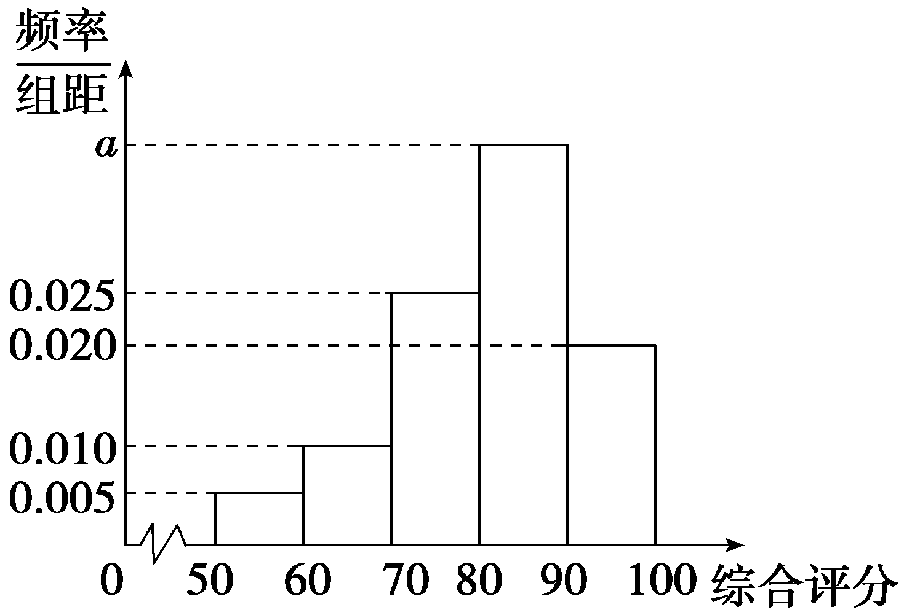

第四节　列联表与独立性检验

【课标研读】　1.通过实例，理解2×2列联表的统计意义.　2.通过实例，了解2×2列联表、独立性检验及其应用.

##### 1.分类变量

为了表述方便，我们经常会使用一种特殊的随机变量，以区别不同的现象或性质，这类随机变量称为分类变量.分类变量的取值可以用实数表示.

##### 2.列联表与独立性检验

（1）关于分类变量*X*和*Y*的抽样数据的2×2列联表：

<table><tr><td rowspan="2">
<em>X</em>
</td><td colspan="2">
<em>Y</em>
</td><td rowspan="2">
合计
</td></tr><tr><td>
<em>Y</em>＝0
</td><td>
<em>Y</em>＝1
</td></tr><tr><td>
<em>X</em>＝0
</td><td>
<em>a</em>
</td><td>
<em>b</em>
</td><td>
<em>a</em>＋<em>b</em>
</td></tr><tr><td>
<em>X</em>＝1
</td><td>
<em>c</em>
</td><td>
<em>d</em>
</td><td>
<em>c</em>＋<em>d</em>
</td></tr><tr><td>
合计
</td><td>
<em>a</em>＋<em>c</em>
</td><td>
<em>b</em>＋<em>d</em>
</td><td>
<em>n</em>＝<em>a</em>＋<em>b</em>＋<em>c</em>＋<em>d</em>
</td></tr></table>

(&lt;text style="superscript"&gt;&lt;text style="superscript"&gt;2&lt;/text&gt;&lt;/text&gt;)计算随机变量<em>&lt;text style="italic"&gt;&lt;text style="italic"&gt;χ</em>&lt;/text&gt;&lt;/text&gt;2＝ $\frac{n\left(ad－bc\right)^{2}}{\left(a＋b\right)\left(c＋d\right)\left(a＋c\right)\left(b＋d\right)}$ ，利用<em>&lt;text style="italic"&gt;&lt;text style="italic"&gt;χ</em>&lt;/text&gt;&lt;/text&gt;&lt;text style="superscript"&gt;&lt;text style="superscript"&gt;2&lt;/text&gt;&lt;/text&gt;的取值推断分类变量<em>X</em>和<em>Y</em><u>是否独立</u>的方法称为χ2独立性检验.

如下表为5个常用的小概率值和相应的临界值.

<table><tr><td>
<em>α</em>
</td><td>
0.1
</td><td>
0.05
</td><td>
0.01
</td><td>
0.005
</td><td>
0.001
</td></tr><tr><td>
<em>xα</em>
</td><td>
2.706
</td><td>
3.841
</td><td>
6.635
</td><td>
7.879
</td><td>
10.828
</td></tr></table>

[微提醒]　独立性检验是对两个分类变量有关系的可信程度的判断，而不是对其是否有关系的判断，<em>χ</em>2越大，认为两个分类变量有关系的把握越大.

【自主检测】

##### 1.(多选)下列说法正确的是(　　)

$\quad$A.2×2列联表中的数据是两个分类变量的频数

$\quad$B.事件*A*和*B*的独立性检验无关，即两个事件互不影响

$\quad$C.<em>χ</em>2的大小是判断事件<em>A</em>和<em>B</em>是否相关的统计量

$\quad$D.在2×2列联表中，若｜*ad*－*bc*｜越小，则说明两个分类变量之间关系越强

答案AC

##### 2.某机构为调查网游爱好者是否有性别差异，通过调研数据统计：在500名男生中有200名爱玩网游，在400名女生中有50名爱玩网游.若要确定爱玩网游是否与性别有关，下列最适合的统计方法是(　　)

$\quad$A.均值	
$\quad$B.方差

$\quad$C.独立性检验	
$\quad$D.回归分析

答案C

解析由题意可知，“爱玩网游”与“性别”是两类变量，其是否有关，应用独立性检验判断.故选C.

##### 3.如表是2×2列联表，则表中*a*，*b*的值分别为(　　)

<table><tr><td></td><td>
<em>y</em>1
</td><td>
<em>y</em>2
</td><td>
合计
</td></tr><tr><td>
<em>x</em>1
</td><td>
<em>a</em>
</td><td>
8
</td><td>
35
</td></tr><tr><td>
<em>x</em>2
</td><td>
11
</td><td>
34
</td><td>
45
</td></tr><tr><td>
合计
</td><td>
<em>b</em>
</td><td>
42
</td><td>
80
</td></tr></table>

$\quad$A.27，38	
$\quad$B.28，38

$\quad$C.27，37	
$\quad$D.28，37

答案A

解析*a*＝35－8＝27，*b*＝*a*＋11＝27＋11＝38.故选A.

##### 4.(链接人教A选择性必修三P132例3)随着国家三胎政策的放开，为了调查一线城市和非一线城市的三胎生育意愿，某机构用简单随机抽样的方法从不同地区调查了100位育龄妇女，结果如下表(单位：人).

<table><tr><td rowspan="2">
生育意愿
</td><td colspan="2">
城市级别
</td><td rowspan="2">
合计
</td></tr><tr><td>
非一线
</td><td>
一线
</td></tr><tr><td>
愿生
</td><td>
45
</td><td>
20
</td><td>
65
</td></tr><tr><td>
不愿生
</td><td>
13
</td><td>
22
</td><td>
35
</td></tr><tr><td>
合计
</td><td>
58
</td><td>
42
</td><td>
100
</td></tr></table>

计算得<em>χ</em>2＝ $\frac{100\times \left(45\times 22－20\times 13\right)^{2}}{65\times 35\times 58\times 42}$ ≈9.616.

参照下表：

<table><tr><td>
<em>α</em>
</td><td>
0.05
</td><td>
0.01
</td><td>
0.001
</td></tr><tr><td>
<em>xα</em>
</td><td>
3.841
</td><td>
6.635
</td><td>
10.828
</td></tr></table>

根据小概率值<em>α</em>＝0.01的独立性检验，可以得到的结论是<u>　　　　　　　　　　</u>.

答案生育意愿与城市级别有关

考点一　列联表与<em>χ</em>2的计算　　　　自主练透

##### 1.为了解某大学的学生是否喜欢体育锻炼，用简单随机抽样方法在校园内调查了120位学生，得到如下2×2列联表：

<table><tr><td></td><td>
男
</td><td>
女
</td><td>
合计
</td></tr><tr><td>
喜欢
</td><td>
<em>a</em>
</td><td>
<em>b</em>
</td><td>
73
</td></tr><tr><td>
不喜欢
</td><td>
<em>c</em>
</td><td>
25
</td><td></td></tr><tr><td>
合计
</td><td>
74
</td><td></td><td></td></tr></table>

则*a*－*b*－*c*等于(　　)

$\quad$A.7	
$\quad$B.8

$\quad$C.9	
$\quad$D.10

答案C

解析根据题意，可得*c*＝120－73－25＝22，*a*＝74－22＝52，*b*＝73－52＝21，所以*a*－*b*－*c*＝52－21－22＝9.故选C.

##### 2.(2025·上海模拟)假设有两个分类变量<em>X</em>和<em>Y</em>，它们的值域分别为{<em>x</em>1，<em>x</em>2} 和{<em>y</em>1，<em>y</em>2}，其2×2列联表为：

<table><tr><td rowspan="2">
<em>X</em>
</td><td colspan="2">
<em>Y</em>
</td><td rowspan="2">
总计
</td></tr><tr><td>
<em>y</em>1
</td><td>
<em>y</em>2
</td></tr><tr><td>
<em>x</em>1
</td><td>
<em>a</em>
</td><td>
<em>b</em>
</td><td>
<em>a</em>＋<em>b</em>
</td></tr><tr><td>
<em>x</em>2
</td><td>
<em>c</em>
</td><td>
<em>d</em>
</td><td>
<em>c</em>＋<em>d</em>
</td></tr><tr><td>
总计
</td><td>
<em>a</em>＋<em>c</em>
</td><td>
<em>b</em>＋<em>d</em>
</td><td>
<em>n</em>＝<em>a</em>＋<em>b</em>＋<em>c</em>＋<em>d</em>
</td></tr></table>

对同一样本，以下数据能说明*X* 与*Y* 有关的可能性最大的一组为(　　)

$\quad$A.*a*＝5，*b*＝4，*c*＝3，*d*＝2

$\quad$B.*a*＝5，*b*＝3，*c*＝4，*d*＝2

$\quad$C.*a*＝2，*b*＝3，*c*＝4，*d*＝5

$\quad$D.*a*＝3，*b*＝2，*c*＝4，*d*＝5

答案D

解析对于同一样本，｜*ad*－*bc*｜ 越小，说明*X* 与*Y* 相关性越弱，而｜*ad*－*bc*｜ 越大，说明*X* 与*Y* 相关性越强，通过计算知，对于A，B，C，都有｜*ad*－*bc*｜＝｜10－12｜＝2；对于D，有｜*ad*－*bc*｜＝｜15－8｜＝7，显然7＞2.故选D.

##### 3.为加强素质教育，使学生各方面全面发展，某学校对学生文化课与体育课的成绩进行了调查统计，结果如表：

<table><tr><td></td><td>
体育课不及格
</td><td>
体育课及格
</td><td>
合计
</td></tr><tr><td>
文化课及格
</td><td>
57
</td><td>
221
</td><td>
278
</td></tr><tr><td>
文化课不及格
</td><td>
16
</td><td>
43
</td><td>
59
</td></tr><tr><td>
合计
</td><td>
73
</td><td>
264
</td><td>
337
</td></tr></table>

在对体育课成绩与文化课成绩进行独立性检验时，根据以上数据可得到<em>χ</em>2的值为(　　)

$\quad$A.1.255	
$\quad$B.38.214

$\quad$C.0.003 7	
$\quad$D.2.058

答案A

解析<em>χ</em>2＝ $\frac{n\left(ad－bc\right)^{2}}{\left(a＋b\right)\left(c＋d\right)\left(a＋c\right)\left(b＋d\right)}$ ＝ $\frac{337\times \left(57\times 43－221\times 16\right)^{2}}{278\times 59\times 73\times 264}$ ≈1.255.故选A.

分类变量的两种统计表示形式

##### 1.2×2 列联表：直接利用2×2 列联表中的数据进行计算分析，用定量的方式判断两分类变量是否有关联及关联性的强弱.

##### 2.等高条形图：等高条形图和列联表相比，能更直观地反映出两个分类变量间是否相互影响，常用等高条形图展示列联表数据的频率特征.

注意：2×2列联表是4行4列，计算时要准确无误，关键是对涉及的变量分清类别.

考点二　列联表与独立性检验　　　　师生共研

(2023·全国甲卷)一项试验旨在研究臭氧效应，试验方案如下：选40只小白鼠，随机地将其中20只分配到试验组，另外20 只分配到对照组，试验组的小白鼠饲养在高浓度臭氧环境，对照组的小白鼠饲养在正常环境.一段时间后统计每只小白鼠体重的增加量(单位：g).

（1）设*X*表示指定的两只小白鼠中分配到对照组的只数，求*X*的分布列和数学期望；

（2）试验结果如下：

对照组的小白鼠体重的增加量从小到大排序为

##### 17.3　18.4　20.1　20.4　21.5　23.2　24.6

##### 24.8　25.0　25.4　26.1　26.3　26.4　26.5

##### 26.8　27.0　27.4　27.5　27.6　28.3

试验组的小白鼠体重的增加量从小到大排序为

##### 5.4　6.6　6.8　6.9　7.8　8.2　9.4　10.0

##### 10.4　11.2　14.4　17.3　19.2　20.2　23.6

##### 23.8　24.5　25.1　25.2　26.0

①求 40 只小白鼠体重的增加量的中位数*m*，再分别统计两样本中小于*m*与不小于*m*的数据的个数，完成如下列联表.

<table><tr><td></td><td>
＜<em>m</em>
</td><td>
≥<em>m</em>
</td></tr><tr><td>
对照组
</td><td></td><td></td></tr><tr><td>
试验组
</td><td></td><td></td></tr></table>

②根据①中的列联表，依据小概率值*α*＝0.050的独立性检验，能否认为小白鼠在高浓度臭氧环境中与在正常环境中体重的增加量有差异？

附：<em>χ</em>2＝ $\frac{n(ad－bc)^{2}}{(a＋b)(c＋d)(a＋c)(b＋d)}$ .

<table><tr><td>
<em>α</em>
</td><td>
0.100
</td><td>
0.050
</td><td>
0.010
</td></tr><tr><td>
<em>xα</em>
</td><td>
2.706
</td><td>
3.841
</td><td>
6.635
</td></tr></table>

解：（1）依题意， *X*的可能取值为0，1，2，

则*<text style="italic"><text style="italic">P*</text></text>(*<text style="italic"><text style="italic">X*</text></text>＝0)＝ $\frac{C_{20}^{0}C_{20}^{2}}{C_{40}^{2}}$ ＝ $\frac{19}{78}$ ，*<text style="italic"><text style="italic">P*</text></text>(*<text style="italic"><text style="italic">X*</text></text>＝1)＝ $\frac{C_{20}^{1}C_{20}^{1}}{C_{40}^{2}}$ ＝ $\frac{20}{39}$ ，*<text style="italic"><text style="italic">P*</text></text>(*<text style="italic"><text style="italic">X*</text></text>＝2)＝ $\frac{C_{20}^{2}C_{20}^{0}}{C_{40}^{2}}$ ＝ $\frac{19}{78}$ .

所以*X*的分布列为

<table><tr><td>
<em>X</em>
</td><td>
0
</td><td>
1
</td><td>
2
</td></tr><tr><td>
<em>P</em>
</td><td>
 $\frac{19}{78}$ 
</td><td>
 $\frac{20}{39}$ 
</td><td>
 $\frac{19}{78}$ 
</td></tr></table>

所以*E*(*X*)＝0× $\frac{19}{78}$ ＋1× $\frac{20}{39}$ ＋2× $\frac{19}{78}$ ＝1.

（2）①依题意，可知这40只小鼠体重的中位数是将两组数据合在一起，从小到大排后第20位与第21位数据的平均数，

故第20位为23.2，第21位数据为23.6，所以*m*＝ $\frac{23.2+23.6}{2}$ ＝23.4.

故列联表为

<table><tr><td></td><td>
＜<em>m</em>
</td><td>
≥<em>m</em>
</td></tr><tr><td>
对照组
</td><td>
6
</td><td>
14
</td></tr><tr><td>
试验组
</td><td>
14
</td><td>
6
</td></tr></table>

②零假设为<em>H</em>0：小白鼠在高浓度臭氧环境中与在正常环境中体重的增加量没有差异.由①可得，<em>&lt;text style="italic"&gt;χ</em>&lt;/text&gt;2＝ $\frac{40\times (6\times 6－14\times 14)^{2}}{20\times 20\times 20\times 20}$ ＝6.400＞3.841＝<em>&lt;text style="italic"&gt;χ</em>&lt;/text&gt;0.05.

所以根据小概率值<em>α</em>＝0.050的独立性检验，推断<em>H</em>0不成立，即认为小白鼠在高浓度臭氧环境中与在正常环境中体重的增加量有差异.

独立性检验的一般步骤

第一步：根据样本数据制成2×2列联表；

第二步：根据公式<em>&lt;text style="italic"&gt;χ</em>&lt;/text&gt;&lt;text style="superscript"&gt;2&lt;/text&gt;＝ $\frac{n(ad－bc)^{2}}{(a＋b)(c＋d)(a＋c)(b＋d)}$ ，计算<em>&lt;text style="italic"&gt;χ</em>&lt;/text&gt;&lt;text style="superscript"&gt;2&lt;/text&gt;的值；

第三步：查表比较<em>χ</em>2与临界值的大小关系，作出统计判断.

对点练1.(2025·八省适应性测试)为考察某种药物*A*对预防疾病*B*的效果，进行了动物(单位：只)试验，得到如下列联表：

<table><tr><td rowspan="2">
药物
</td><td colspan="2">
疾病
</td><td rowspan="2">
合计
</td></tr><tr><td>
未患病
</td><td>
患病
</td></tr><tr><td>
未服用
</td><td>
100
</td><td>
80
</td><td>
<em>s</em>
</td></tr><tr><td>
服用
</td><td>
150
</td><td>
70
</td><td>
220
</td></tr><tr><td>
合计
</td><td>
250
</td><td>
<em>t</em>
</td><td>
400
</td></tr></table>

（1）求*s*，*t*；

（2）记未服用药物*A*的动物患疾病*B*的概率为*P*，给出*P*的估计值；

（3）根据小概率值*α*＝0.01的独立性检验，能否认为药物*A*对预防疾病*B*有效？

附：<em>χ</em>2＝ $\frac{n\left(ad－bc\right)^{2}}{\left(a＋b\right)\left(c＋d\right)\left(a＋c\right)\left(b＋d\right)}$ ，

<table><tr><td>
<em>P</em>
</td><td>
0.050
</td><td>
0.010
</td><td>
0.001
</td></tr><tr><td>
<em>k</em>
</td><td>
3.841
</td><td>
6.635
</td><td>
10.828
</td></tr></table>

解：（1）由列联表知*s*＝100＋80＝180，*t*＝80＋70＝150.

（2）由列联表知，未服用药物*A*的动物有*s*＝180(只)，

未服用药物*A*且患疾病*B*的动物有80(只)，

所以未服用药物*A*的动物患疾病*B*的频率为 $\frac{80}{180}$ ＝ $\frac{4}{9}$ ，

所以未服用药物*A*的动物患疾病*B*的概率的估计值为*P*＝ $\frac{4}{9}$ .

（3）零假设为<em>H</em>0：药物<em>A</em>对预防疾病<em>B</em>无效.

根据列联表的数据，经计算得到&lt;te<em>x</em>t style="italic"&gt;χ&lt;/text&gt;2＝ $\frac{400\left(100\times 70－150\times 80\right)^{2}}{180\times 220\times 250\times 150}$ ＝ $\frac{2 000}{297}$ ≈6.734＞6.635＝<em>x</em>0.01.

根据小概率值<em>α</em>＝0.01的独立性检验，我们推断<em>H</em>0不成立，即认为药物<em>A</em>对预防疾病<em>B</em>有效，该推断犯错误的概率不超过0.01，

所以根据小概率值*α*＝0.01的独立性检验，能认为药物*A*对预防疾病*B*有效.

考点三　独立性检验的综合应用　　　　师生共研

(2024·全国甲卷改编)某工厂进行生产线智能化升级改造，升级改造后，从该工厂甲、乙两个车间的产品中随机抽取150件进行检验，数据如下：

<table><tr><td></td><td>
优级品
</td><td>
合格品
</td><td>
不合格品
</td><td>
总计
</td></tr><tr><td>
甲车间
</td><td>
26
</td><td>
24
</td><td>
0
</td><td>
50
</td></tr><tr><td>
乙车间
</td><td>
70
</td><td>
28
</td><td>
2
</td><td>
100
</td></tr><tr><td>
总计
</td><td>
96
</td><td>
52
</td><td>
2
</td><td>
150
</td></tr></table>

（1）填写如下列联表：

<table><tr><td></td><td>
优级品
</td><td>
非优级品
</td></tr><tr><td>
甲车间
</td><td></td><td></td></tr><tr><td>
乙车间
</td><td></td><td></td></tr></table>

①根据小概率值*α*＝0.05的独立性检验，分析“产品的优级品率”是否与“甲、乙两车间”有关；

②根据小概率值*α*＝0.01的独立性检验，分析“产品的优级品率”是否与“甲、乙两车间”有关；

（2）已知升级改造前该工厂产品的优级品率*<text style="italic">p*</text>＝0.5，设 $\overline{p}$ 为升级改造后抽取的*n*件产品的优级品率.如果 $\overline{p}$ ＞*<text style="italic">p*</text>＋1.65 $\sqrt{\frac{p(1－p)}{n}}$ ，则认为该工厂产品的优级品率提高了.根据抽取的150件产品的数据，能否认为生产线智能化升级改造后，该工厂产品的优级品率提高了？( $\sqrt{150}$ ≈12.247)

附：&lt;text style="it&lt;text style="itali<em>c</em>"&gt;a&lt;/text&gt;lic"&gt;χ&lt;/text&gt;2＝ $\frac{n(ad－bc)^{2}}{(a＋b)(c＋d)(a＋c)(b＋d)}$ ，&lt;text style="it&lt;text style="itali<em>c</em>"&gt;a&lt;/text&gt;lic"&gt;n&lt;/text&gt;＝a＋<em>b</em>＋c＋<em>d</em>.

<table><tr><td>
<em>α</em>
</td><td>
0.05
</td><td>
0.01
</td><td>
0.001
</td></tr><tr><td>
<em>xα</em>
</td><td>
3.841
</td><td>
6.635
</td><td>
10.828
</td></tr></table>

解：（1）根据题意可得列联表：

<table><tr><td></td><td>
优级品
</td><td>
非优级品
</td></tr><tr><td>
甲车间
</td><td>
26
</td><td>
24
</td></tr><tr><td>
乙车间
</td><td>
70
</td><td>
30
</td></tr></table>

①零假设为<em>H</em>0：“产品的优级品率”与“甲、乙两车间”无关，

<em>χ</em>2＝ $\frac{150\left(26\times 30－24\times 70\right)^{2}}{50\times 100\times 96\times 54}$ ＝ $\frac{75}{16}$ ＝4.687 5＞3.841＝ $x_{0.0}_{5}$ ，

所以根据小概率值<em>α</em>＝0.05的独立性检验，推断<em>H</em>0不成立，即认为“产品的优级品率”与“甲、乙两车间”有关.

②因为<em>χ</em>2＝ $\frac{150\left(26\times 30－24\times 70\right)^{2}}{50\times 100\times 96\times 54}$ ＝ $\frac{75}{16}$ ＝4.687 5＜6.635＝ $x_{0.0}_{1}$ ，

所以根据小概率值<em>α</em>＝0.01的独立性检验，推断<em>H</em>0成立，即认为“产品的优级品率”与“甲、乙两车间”无关.

（2）由题意可知：生产线智能化升级改造后，该工厂产品的优级品的频率为 $\frac{96}{150}$ ＝0.64，

用频率估计概率可得 $\overline{p}$ ＝0.64，

又因为升级改造前该工厂产品的优级品率*p*＝0.5，

则*p*＋1.65 $\sqrt{\frac{p\left(1－p\right)}{n}}$ ＝0.5＋1.65 $\sqrt{\frac{0.5\left(1－0.5\right)}{150}}$ ≈0.5＋1.65× $\frac{0.5}{12.247}$ ≈0.57，

可知 $\overline{p}$ ＞*p*＋1.65 $\sqrt{\frac{p(1－p)}{n}}$ ，

所以可以认为生产线智能化升级改造后，该工厂产品的优级品率提高了.

独立性检验的考查，往往与概率和抽样统计图等一起考查，这类问题的求解往往按各小题及提问的顺序，一步步进行下去，是比较容易解答的，考查单纯的独立性检验往往用小题的形式，而且<em>χ</em>2的公式一般会在原题中给出.

对点练2.体育运动是强身健体的重要途径，《中国儿童青少年体育健康促进行动方案(2020—2030)》(下面简称“体育健康促进行动方案”)中明确提出学生每天在校内参与不少于60分钟的中高强度身体活动的要求.随着“体育健康促进行动方案”的发布，体育运动受到各地中小学的高度重视，众多青少年的体质健康得到很大的改善.某中学教师为了了解体育

运动对学生的数学成绩的影响情况，现从该中学高三年级的一次月考中随机抽取1 000名学生，调查他们平均每天的体育运动情况以及本次月考的数学成绩情况，得到如表数据：

<table><tr><td>
数学成

绩(分)
</td><td>
[30，

50)
</td><td>
[50，

70)
</td><td>
[70，

90)
</td><td>
[90，

110)
</td><td>
[110，

130)
</td><td>
[130，

150]
</td></tr><tr><td>
人数(人)
</td><td>
25
</td><td>
125
</td><td>
350
</td><td>
300
</td><td>
150
</td><td>
50
</td></tr><tr><td>
运动达标的

人数(人)
</td><td>
10
</td><td>
45
</td><td>
145
</td><td>
200
</td><td>
107
</td><td>
43
</td></tr></table>

约定：平均每天进行体育运动的时间不少于60分钟的为“运动达标”，数学成绩排在年级前50％以内(含50％)的为“数学成绩达标”.

（1）求该中学高三年级本次月考数学成绩的65％分位数；

（2）请估计该中学高三年级本次月考数学成绩的平均分(同一组中的数据用该组区间的中点值作代表)；

（3）请根据已知数据完成下列列联表，并根据小概率值*α*＝0.001的独立性检验，分析“数学成绩达标”是否与“运动达标”相关.

<table><tr><td></td><td>
数学成绩

达标人数
</td><td>
数学成绩

不达标人数
</td><td>
合计
</td></tr><tr><td>
运动达

标人数
</td><td></td><td></td><td></td></tr><tr><td>
运动不

达标人数
</td><td></td><td></td><td></td></tr><tr><td>
合计
</td><td></td><td></td><td></td></tr></table>

附：&lt;text style="it&lt;text style="itali<em>c</em>"&gt;a&lt;/text&gt;lic"&gt;χ&lt;/text&gt;2＝ $\frac{n\left(ad－bc\right)^{2}}{\left(a＋b\right)\left(c＋d\right)\left(a＋c\right)\left(b＋d\right)}$ (&lt;text style="it&lt;text style="itali<em>c</em>"&gt;a&lt;/text&gt;lic"&gt;n&lt;/text&gt;＝a＋<em>b</em>＋c＋<em>d</em>).

<table><tr><td>
<em>α</em>
</td><td>
0.01
</td><td>
0.005
</td><td>
0.001
</td></tr><tr><td>
<em>xα</em>
</td><td>
6.635
</td><td>
7.879
</td><td>
10.828
</td></tr></table>

解：（1）每组的频率依次为0.025，0.125，0.350，0.300，0.150，0.050，

因为0.025＋0.125＋0.350＝0.500＜0.65，0.025＋0.125＋0.350＋0.300＝0.800＞0.65，且 $\frac{0.500+0.800}{2}$ ＝0.65，

所以高三年级本次月考数学成绩的65％分位数位于[90，110)内，且为[90，110)的中点，

则该中学高三年级本次月考数学成绩的65％分位数为100.

（2）该中学高三年级本次月考数学成绩的平均分 $\overline{x}$ ＝0.025×40＋0.125×60＋0.350×80＋0.300×100＋0.150×120＋0.050×140＝91.50，

估计该中学高三年级本次月考数学成绩的平均分为91.50分.

（3）50＋150＋300＝500，列联表如表所示：

<table><tr><td></td><td>
数学成绩

达标人数
</td><td>
数学成绩

不达标人数
</td><td>
合计
</td></tr><tr><td>
运动达

标人数
</td><td>
350
</td><td>
200
</td><td>
550
</td></tr><tr><td>
运动不

达标人数
</td><td>
150
</td><td>
300
</td><td>
450
</td></tr><tr><td>
合计
</td><td>
500
</td><td>
500
</td><td>
1 000
</td></tr></table>

零假设为<em>H</em>0：“数学成绩达标”与“运动达标”无关，

&lt;te<em>x</em>t style="italic"&gt;χ&lt;/text&gt;2＝ $\frac{1 000\times \left(350\times 300－200\times 150\right)^{2}}{550\times 450\times 500\times 500}$ ＝ $\frac{1 000}{11}$ ≈90.9＞10.8&lt;te<em>x</em>t style="superscript"&gt;2&lt;/text&gt;8＝x0.001，

所以根据小概率值<em>α</em>＝0.001的独立性检验，推断<em>H</em>0不成立，即认为“数学成绩达标”与“运动达标”有关.

[真题再现]　(2022·全国甲卷)甲、乙两城之间的长途客车均由*A*和*B*两家公司运营.为了解这两家公司长途客车的运行情况，随机调查了甲、乙两城之间的500个班次，得到下面列联表：

<table><tr><td></td><td>
准点班次数
</td><td>
未准点班次数
</td></tr><tr><td>
<em>A</em>
</td><td>
240
</td><td>
20
</td></tr><tr><td>
<em>B</em>
</td><td>
210
</td><td>
30 
</td></tr></table>

（1）根据上表，分别估计这两家公司甲、乙两城之间的长途客车准点的概率；

（2）能否有90％的把握认为甲、乙两城之间的长途客车是否准点与客车所属公司有关？

附：<em>χ</em>2＝ $\frac{n(ad－bc)^{2}}{(a＋b)(c＋d)(a＋c)(b＋d)}$ ，

<table><tr><td>
<em>P</em>(<em>χ</em>2≥<em>k</em>)
</td><td>
0.1
</td><td>
0.05
</td><td>
0.01
</td></tr><tr><td>
<em>k</em>
</td><td>
2.706
</td><td>
3.841
</td><td>
6.635
</td></tr></table>

解： （1）根据表中数据，*A*公司共有班次260个，准点班次有240个，

设*A*公司长途客车准点为事件*M*，

则*P*(*M*)＝ $\frac{240}{260}$ ＝ $\frac{12}{13}$ ；

*B*公司共有班次240个，准点班次有210个，

设*B*公司长途客车准点为事件*N*，

则*P*(*N*)＝ $\frac{210}{240}$ ＝ $\frac{7}{8}$ .

所以*A*公司长途客车准点的概率为 $\frac{12}{13}$ ；

*B*公司长途客车准点的概率为 $\frac{7}{8}$ .

（2）由题意，列联表如下表所示：

<table><tr><td rowspan="2">
公司
</td><td colspan="2">
班次是否准点
</td><td rowspan="2">
总计
</td></tr><tr><td>
准点班次数
</td><td>
未准点班次数
</td></tr><tr><td>
<em>A</em>
</td><td>
240
</td><td>
20
</td><td>
260
</td></tr><tr><td>
<em>B</em>
</td><td>
210
</td><td>
30
</td><td>
240
</td></tr><tr><td>
总计
</td><td>
450
</td><td>
50
</td><td>
500
</td></tr></table>

零假设为<em>H</em>0：甲、乙两城之间的长途客车是否准点与客车所属公司无关，

经计算得<em>χ</em>2＝ $\frac{500\times (240\times 30－20\times 210)^{2}}{260\times 240\times 450\times 50}$ ≈3.205＞2.706，

所以有90％的把握认为甲、乙两城之间的长途客车是否准点与客车所属公司有关.

[教材呈现]　(人教A选择性必修三P132例3)某儿童医院用甲、乙两种疗法治疗小儿消化不良.采用有放回简单随机抽样的方法对治疗情况进行检查，得到了如下数据：抽到接受甲种疗法的患儿67名，其中未治愈15名，治愈52名；抽到接受乙种疗法的患儿69名，其中未治愈6名，治愈63名.试根据小概率值*α*＝0.005的独立性检验，分析乙种疗法的效果是否比甲种疗法好.

点评：该高考题考查了统计与概率中的独立性检验，属于基础题，且与课本例题命题角度类似.

课时测评82　列联表与独立性检验 $\frac{对应学生}{用书P473}$

(时间：50分钟　满分：53分)

(本栏目内容，在学生用书中以独立形式分册装订！)

(1—4题，每小题5分，共20分)

##### 1.某市对机动车单双号限行进行了调查，在参加调查的2 600名有车人中有1 700名持反对意见，2 500名无车人中有1 400名持反对意见，在运用这些数据说明“拥有车辆”与“反对机动车单双号限行”是否相关时，用下列哪种方法最有说服力(　　)

$\quad$A.独立性检验	
$\quad$B.数学期望

$\quad$C.随机误差	
$\quad$D.频率分布直方图

答案A

解析独立性检验是分析两个不同分类的变量是否相关的方法，刚好符合题意，而数学期望、随机误差、频率分布直方图都不是分析两个不同分类的变量是否相关的方法，故采用独立性检验方法最有说服力.故选A.

##### 2.为了考察某种中成药预防流感的效果，抽样调查40人，得到如下数据：

<table><tr><td rowspan="2">
药物
</td><td colspan="2">
流感
</td></tr><tr><td>
患流感
</td><td>
未患流感
</td></tr><tr><td>
服用
</td><td>
2
</td><td>
18
</td></tr><tr><td>
未服用
</td><td>
8
</td><td>
12
</td></tr></table>

下表是<em>χ</em>2独立性检验中几个常用的小概率值和相应的临界值：

<table><tr><td>
<em>α</em>
</td><td>
0.1
</td><td>
0.05
</td><td>
0.01
</td><td>
0.005
</td></tr><tr><td>
<em>xα</em>
</td><td>
2.706
</td><td>
3.841
</td><td>
6.635
</td><td>
7.879
</td></tr></table>

根据表中数据，计算<em>χ</em>2＝ $\frac{n\left(ad－bc\right)^{2}}{\left(a＋b\right)\left(c＋d\right)\left(a＋c\right)\left(b＋d\right)}$ ，若由此认为“该药物预防流感有效果”，则该结论出错的概率不超过(　　)

$\quad$A.0.05	
$\quad$B.0.001

$\quad$C.0.01	
$\quad$D.0.005

答案A

解析由题意知，&lt;te<em>x</em>t style="italic"&gt;χ&lt;/text&gt;2＝ $\frac{40\times \left(2\times 12－18\times 8\right)^{2}}{20\times 20\times 10\times 30}$ ＝4.8＞3.841＝<em>x</em>0.05，由临界值表可知，认为“该药物预防流感有效果”，则该结论出错的概率不超过0.05.故选A.

##### 3.(多选)某大学为了解学生对学校食堂服务的满意度，随机调查了50名男生和50名女生，每位学生对食堂的服务给出满意或不满意的评价，得到如下所示的列联表，经计算<em>χ</em>2≈4.762，则可以推断出(　　)

<table><tr><td></td><td>
满意
</td><td>
不满意
</td></tr><tr><td>
男
</td><td>
30
</td><td>
20
</td></tr><tr><td>
女
</td><td>
40
</td><td>
10
</td></tr></table>

$\quad$A.该学校男生对食堂服务满意的概率的估计值为 $\frac{3}{5}$

$\quad$B.调研结果显示，该学校男生比女生对食堂服务更满意

$\quad$C.认为男、女生对该食堂服务的评价有差异，此推断犯错误的概率不超过0.05

$\quad$D.认为男、女生对该食堂服务的评价有差异，此推断犯错误的概率不超过0.01

附表：

<table><tr><td>
<em>α</em>
</td><td>
0.1
</td><td>
0.05
</td><td>
0.01
</td><td>
0.005
</td><td>
0.001
</td></tr><tr><td>
<em>xα</em>
</td><td>
2.706
</td><td>
3.841
</td><td>
6.635
</td><td>
7.879
</td><td>
10.828
</td></tr></table>

答案AC

解析对于A，该学校男生对食堂服务满意的概率的估计值为 $\frac{30}{30+20}$ ＝ $\frac{3}{5}$ ，故A正确；对于B，该学校女生对食堂服务满意的概率的估计值为 $\frac{40}{40+10}$ ＝ $\frac{4}{5}$ ＞ $\frac{3}{5}$ ，故B错误；因为<em>χ</em>2≈4.762，3.841＜4.762＜6.635，认为男、女生对该食堂服务的评价有差异，此推断犯错误的概率不超过0.05，故C正确，D错误.故选AC.

##### 4.一项研究同年龄段的男、女生的注意力差别的脑功能实验，其实验数据如表所示：

<table><tr><td></td><td>
注意力稳定
</td><td>
注意力不稳定
</td></tr><tr><td>
男生
</td><td>
29
</td><td>
7
</td></tr><tr><td>
女生
</td><td>
33
</td><td>
5
</td></tr></table>

则<em>χ</em>2≈<u>　　　　</u>(精确到小数点后三位)，依据概率值<em>α</em>＝0.05的独立性检验，该实验

<u>　　　　</u>该年龄段的学生在注意力的稳定性上对于性别没有显著差异(填拒绝或支持).

答案0.538　支持

解析由表中数据可知&lt;text style="it&lt;text style="itali<em>c</em>"&gt;a&lt;/text&gt;li<em>c</em>"&gt;a&lt;/text&gt;＝29，<em>&lt;text style="italic"&gt;b</em>&lt;/text&gt;＝7，c＝33，<em>&lt;text style="italic"&gt;d</em>&lt;/text&gt;＝5，<em>n</em>＝a＋b＋c＋d＝74，根据<em>χ</em>2＝ $\frac{n\left(ad－bc\right)^{2}}{\left(a＋b\right)\left(c＋d\right)\left(a＋c\right)\left(b＋d\right)}$ ，计算可知

<em>χ</em>2＝ $\frac{74\times \left(145－231\right)^{2}}{\left(29+7\right)\times \left(33+5\right)\times \left(29+33\right)\times \left(7+5\right)}$

≈0.538＜3.841＝<em>x</em>0.05，所以没有充分证据认为学生在注意力的稳定性上与性别有关，即该实验支持该年龄段的学生在注意力的稳定性上对于性别没有显著差异.

##### 5.(13分)(2021·全国甲卷)甲、乙两台机床生产同种产品，产品按质量分为一级品和二级品，为了比较两台机床产品的质量，分别用两台机床各生产了200件产品，产品的质量情况统计如下表：

<table><tr><td></td><td>
一级品
</td><td>
二级品
</td><td>
合计
</td></tr><tr><td>
甲机床
</td><td>
150
</td><td>
50
</td><td>
200
</td></tr><tr><td>
乙机床
</td><td>
120
</td><td>
80
</td><td>
200
</td></tr><tr><td>
合计
</td><td>
270
</td><td>
130
</td><td>
400
</td></tr></table>

（1）甲机床、乙机床生产的产品中一级品的频率分别是多少？(5分)

（2）能否有99％的把握认为甲机床的产品质量与乙机床的产品质量有差异？(8分)

附：<em>χ</em>2＝ $\frac{n\left(ad－bc\right)^{2}}{\left(a＋b\right)\left(c＋d\right)\left(a＋c\right)\left(b＋d\right)}$ .

<table><tr><td>
<em>P</em>(<em>χ</em>2≥<em>k</em>0)
</td><td>
0.050
</td><td>
0.010
</td><td>
0.001
</td></tr><tr><td>
<em>k</em>0
</td><td>
3.841
</td><td>
6.635
</td><td>
10.828
</td></tr></table>

解：（1）根据题表中数据知，甲机床生产的产品中一级品的频率是 $\frac{150}{200}$ ＝0.75，乙机床生产的产品中一级品的频率是 $\frac{120}{200}$ ＝0.6.

（2）根据题表中的数据可得

<em>χ</em>2＝ $\frac{400\times \left(150\times 80－120\times 50\right)^{2}}{200\times 200\times 270\times 130}$ ＝ $\frac{400}{39}$ ≈10.256＞6.635，

所以有99％的把握认为甲机床的产品质量与乙机床的产品质量有差异.

##### 6.(15分)某花圃为提高某品种花苗质量，开展技术创新活动，*A*，*B*在实验地分别用甲、乙方法培育该品种花苗.为观测其生长情况，分别在实验地随机抽取各50株，对每株进行综合评分，将每株所得的综合评分制成如图所示的频率分布直方图.记综合评分为80及以上的花苗为优质花苗.

（1）求图中*a*的值，并求综合评分的中位数；(6分)

（2）填写下面的2×2列联表，并根据小概率值*α*＝0.01的独立性检验，分析优质花苗与培育方法是否有关，请说明理由.(9分)

<table><tr><td></td><td>
优质花苗
</td><td>
非优质花苗
</td><td>
合计
</td></tr><tr><td>
甲培育法
</td><td>
20
</td><td></td><td></td></tr><tr><td>
乙培育法
</td><td></td><td>
10
</td><td></td></tr><tr><td>
合计
</td><td></td><td></td><td></td></tr></table>

附：&lt;text style="it&lt;text style="itali<em>c</em>"&gt;a&lt;/text&gt;lic"&gt;χ&lt;/text&gt;2＝ $\frac{n\left(ad－bc\right)^{2}}{\left(a＋b\right)\left(c＋d\right)\left(a＋c\right)\left(b＋d\right)}$ ，其中&lt;text style="it&lt;text style="itali<em>c</em>"&gt;a&lt;/text&gt;lic"&gt;n&lt;/text&gt;＝a＋<em>b</em>＋c＋<em>d</em>.

<table><tr><td>
<em>α</em>
</td><td>
0.1
</td><td>
0.05
</td><td>
0.01
</td><td>
0.005
</td><td>
0.001
</td></tr><tr><td>
<em>xα</em>
</td><td>
2.706
</td><td>
3.841
</td><td>
6.635
</td><td>
7.879
</td><td>
10.828
</td></tr></table>

解：（1）由直方图的性质可知，0.005×10＋0.010×10＋0.025×10＋10*a*＋0.020×10＝1，

解得*a*＝0.040，

因为0.020×10＝0.2＜0.5，(0.020＋0.040)×10＝0.6＞0.5，所以中位数位于[80，90)内，

设中位数为*x*，则有0.020×10＋0.040×(90－*x*)＝0.5，解得*x*＝82.5.

故综合评分的中位数为82.5.

（2）由（1）得优质花苗的频率为0.6，

所以样本中优质花苗的数量为60，

得如下列联表：

<table><tr><td></td><td>
优质花苗
</td><td>
非优质花苗
</td><td>
合计
</td></tr><tr><td>
甲培育法
</td><td>
20
</td><td>
30
</td><td>
50
</td></tr><tr><td>
乙培育法
</td><td>
40
</td><td>
10
</td><td>
50
</td></tr><tr><td>
合计
</td><td>
60
</td><td>
40
</td><td>
100
</td></tr></table>

零假设为<em>H</em>0：优质花苗与培育方法无关，

&lt;te<em>x</em>t style="italic"&gt;χ&lt;/text&gt;2＝ $\frac{100\times \left(20\times 10－30\times 40\right)^{2}}{50\times 50\times 60\times 40}$ ≈16.667＞6.635＝<em>x</em>0.01，

所以根据小概率值<em>α</em>＝0.01的独立性检验，推断<em>H</em>0不成立，即认为优质花苗与培育方法有关.

##### 7.(5分)为了考察某种药物预防疾病的效果，进行动物试验，得到如下列联表：

<table><tr><td rowspan="2">
药物
</td><td colspan="2">
疾病
</td><td rowspan="2">
合计
</td></tr><tr><td>
未患病
</td><td>
患病
</td></tr><tr><td>
服用
</td><td>
<em>a</em>
</td><td>
50－<em>a</em>
</td><td>
50
</td></tr><tr><td>
未服用
</td><td>
80－<em>a</em>
</td><td>
<em>a</em>－30
</td><td>
50
</td></tr><tr><td>
合计
</td><td>
80
</td><td>
20
</td><td>
100
</td></tr></table>

若在本次考察中得出“在犯错误的概率不超过0.01的前提下认为药物有效”的结论，则&lt;text style="it&lt;text style="it<em>a</em>lic"&gt;a&lt;/text&gt;lic"&gt;a&lt;/text&gt;的最小值为<u>　　　　</u>.(其中a≥40且a∈<strong>N</strong><em>\*</em>)(参考数据： $\sqrt{6.635}$ ≈2.58， $\sqrt{10.828}$ ≈3.29)

附：&lt;text style="it&lt;text style="itali<em>c</em>"&gt;a&lt;/text&gt;lic"&gt;χ&lt;/text&gt;2＝ $\frac{n\left(ad－bc\right)^{2}}{\left(a＋b\right)\left(c＋d\right)\left(a＋c\right)\left(b＋d\right)}$ ，&lt;text style="it&lt;text style="itali<em>c</em>"&gt;a&lt;/text&gt;lic"&gt;n&lt;/text&gt;＝a＋<em>b</em>＋c＋<em>d</em>.

<table><tr><td>
<em>α</em>
</td><td>
0.1
</td><td>
0.05
</td><td>
0.01
</td><td>
0.005
</td><td>
0.001
</td></tr><tr><td>
<em>xα</em>
</td><td>
2.706
</td><td>
3.841
</td><td>
6.635
</td><td>
7.879
</td><td>
10.828
</td></tr></table>

答案46

解析由题意可得

<em>χ</em>2＝ $\frac{100\left[a\left(a－30\right)－\left(50－a\right)\left(80－a\right)\right]^{2}}{50\times 50\times 80\times 20}$ ≥6.635，

整理得(&lt;text style="it&lt;text style="it&lt;text style="it&lt;text style="it&lt;text style="it&lt;text style="it<em>a</em>lic"&gt;a&lt;/text&gt;lic"&gt;a&lt;/text&gt;lic"&gt;a&lt;/text&gt;lic"&gt;a&lt;/text&gt;lic"&gt;a&lt;/text&gt;lic"&gt;a&lt;/text&gt;－40)2≥4×6.635，因为a≥40且a∈<strong>N</strong><em>\*</em>，所以a－40≥2 $\sqrt{6.635}$ ，即&lt;text style="it&lt;text style="it&lt;text style="it&lt;text style="it&lt;text style="it&lt;text style="it<em>a</em>lic"&gt;a&lt;/text&gt;lic"&gt;a&lt;/text&gt;lic"&gt;a&lt;/text&gt;lic"&gt;a&lt;/text&gt;lic"&gt;a&lt;/text&gt;lic"&gt;a&lt;/text&gt;≥40＋5.16＝45.16，所以a≥46，所以a的最小值为46.

