# 2025 新高考

# 数学

# 真题全刷

清优辅考组编

# 基础 2000 题

[NO TEXT]

含2024高考真题 | 在线刷题 | 免费视频

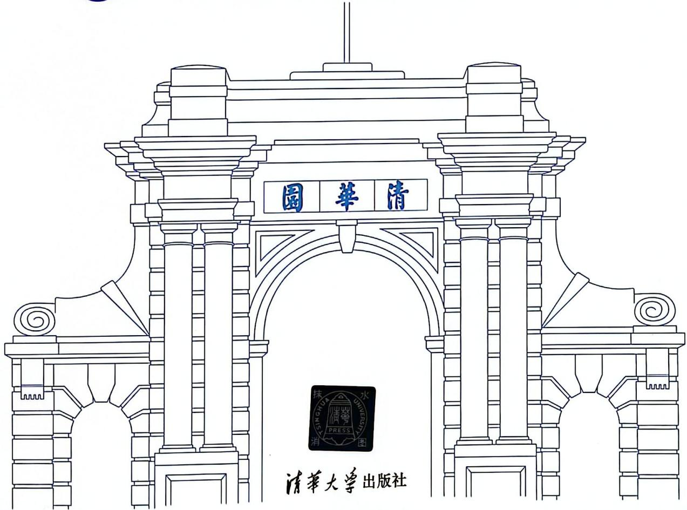

# 新高考

# 数学

# 真题全刷

清优辅考

组编

# 基础2000题

# 内容简介

如果你不能从无尽的模拟题海中脱身，那么刷有限的精选真题是不错的选择。“高考数学真题全刷”系列甄选历年全国高考数学真题（以2000年之后的真题为主），根据题目难度与考查范围共分为三本：基础2000题、决胜800题和艺考1500题，全国通用。系列中的真题按难度分为5类，由浅入深排列。书中大部分章节已按常见题型在每一节中进一步做了分类，并给出了各类题型的解题方法，涉及的重要公式也有证明。同时，为满足广大教师的需求，本系列书中特别增加了一本《教师用书》。

书中全部真题均配有免费视频讲解,学生刷题遇阻时可随时观看,方便其自己解决问题。本系列书力求让基础差的学生能重拾学习数学的信心;让基础好的学生能更上一层楼,提高备考效率,最终实现成绩的提升。

本书中有8面蓝色防伪页，透过光可以看到清华大学出版社防伪水印。若发现无蓝色防伪页，或蓝色防伪页无水印，欢迎举报。本书封面贴有清华大学出版社防伪标签，封底贴有防伪刮刮卡，无标签或刮刮卡者不得销售。

版权所有，侵权必究。举报：010-62782989，beiqinquan@tup.tsinghua.edu.cn。

# 图书在版编目（CIP）数据

新高考数学真题全刷. 基础 2000 题 / 清优辅考组编.

北京：清华大学出版社，2024.7（2024.8重印）.--ISBN 978-7-302

-66444-4

$\quad$I. G634.603

中国国家版本馆 CIP 数据核字第 2024Q3T177 号

责任编辑：汪操

封面设计：林晨

责任校对：赵琳爽

责任印制：杨艳

出版发行：清华大学出版社

网址：https://www.tup.com.cn，https://www.wqxuetang.com

地址：北京清华大学学研大厦 A 座 邮编：100084

社 总 机：010-83470000 邮 购：010-62786544

投稿与读者服务：010-62776969，c-service@tup.tsinghua.edu.cn

质量反馈：010-62772015，zhiliang@tup.tsinghua.edu.cn

印装者：保定市中画美凯印刷有限公司

经销：全国新华书店

开 本：210mm×285mm 印 张：39.75 字 数：1156 千字

版次：2024年7月第1版 印次：2024年8月第2次印刷

定 价：99.00 元(全两册)

# 编委会

王建民 薛文叙 李志军 徐丁点

陈飞 王杰 朱波 曹潇君

如果你无法从无尽的模拟题海中脱身，

那么刷精选的高考真题是不错的选择。

# 前言

如果说高考是一场马拉松比赛,那么真题就是领跑员“兔子”。跟着“兔子”不迷路,跟着“兔子”跑得快,要想在高考这场马拉松比赛中实现自己的目标,那你就得抓住这些“兔子”。

你好，“兔子全刷”欢迎你！

诚然，“兔子全刷”里全是“兔子”，但不是说我们建议你只抓“兔子”，平时模拟题就全然不顾。高中数学的学习，刷题非常必要，高三阶段的复习更是一个反复练习的过程，这个过程中提高能力是关键，不必刻意追求刷的是什么题。刷题就好比吃饭，模拟题是饭，真题是菜，你若长期只吃饭不吃菜，会营养不良；只吃菜不吃饭，更会大脑退化。答案你已知晓，要均衡搭配。此时，你可能会问：“那为什么还出‘真题全刷’呢？”

此刻,估计你也能自答了。因为“兔子”是高考这场马拉松比赛的领跑员,它很重要。既然很重要,那就有必要研究它,如果通过研究这些“兔子”能从中精选出有代表性的,那么一方面要抓的“兔子”数量少了,可以节省考生的时间;另一方面“兔子”配速更精准了,在它的带动下你更有可能突破,从而跑出更好成绩。

言归正传, 数学“真题全刷”有哪些特点呢?

第一，很全。高考数学真题万余道，年份跨度四十余载,但本书选材时穷尽了这万余题,并成功从中精选出了各个板块极具代表性的那些。书中经常会出现相似度特别高的相邻题,然而这些题都是高考真实考过的,通过这些题的题源年份你就可以看得出来。对于排列在一起的同年份同题号的真题,书中标出了文理,以示区分。而且,书中的题型很全,基本考虑到了各个考点各种可能出现的考查形式。

第二, 很新。高考数学真题没有新旧之分, 但随着高考不断改革, 很多题型和考点发生了较大变化, 尤其是在 2024 年九省联考的数学试卷中, 题型的数量和分数均发生了调整, 解答题也不再是之前的三角函数、数列、导数、立体几何、解析几何、概率统计全考, 而是六个板块中选出四个考查, 最后一道大题考查考生的综合能力。这次试题旨在引导考生“多想少算”, 为阻止猜题押题, 考题的顺序安排也打破常规。考虑到这些改革和变化, 尤其是新定义的题型, 数学“真题全刷”对历年真题的选取规则做了优化并重新甄选, 可以看到书中所选的真题发生较大变化, 新选入的真题也更具代表性, 还涵盖了 2024 年高考数学真题。

第三,分类。数学“真题全刷”除了在真题选取上做了重大革新外,在真题分类上也大下功夫。以《基础2000题》为例，章节按常见题型在每节中进一步做了分类，并给出了各类题型的解题方法，涉及的重要公式也有证明。配合每节开篇详细的核心笔记，这种分类（章→节→类型）能让同学们直观感受各类高考题型，透彻理解和掌握各种解题方法，并得到有针对性的充分训练。

第四,详解。数学“真题全刷”的答案解析翔实,比如“立体几何”一章的解析做到了题题有图。一方面,详解保持了规范性,促进同学们养成良好的规范答题习惯,而在复杂题的解析中会增加一些承上启下的解题点拨(用\_\_\_\_标注),让学生知其然更知其所以然,“一路东风送到底”。另一方面,为了丰富解题方法的多样性,详解中尽可能地增加了一题多解,引导同学们从多个角度来理解。

第五,视频。数学“真题全刷”给全部真题都配了免费视频讲解,目的是让考生能通过文字解析和视频讲解短时间内自己解决问题,然后更多的回归课堂,形成正反馈。这些免费视频由“真题全刷”编委会中的诸位教师亲自录制,书中每章首节扫码即可在“i清优”微信小程序中观看该章各题讲解视频。视频不是照本宣科式地念解析,更多的是解题思路和解题技巧的讲解,以及更多解题方法的呈现。

第六, 在线刷题。“真题全刷”除纸质书外, 还配套研发了在线刷题系统。刮开封底刮刮卡后, 扫码“i 清优”微信小程序, “点亮图书”后即可开启。在线刷题系统有错题统计功能, 方便错题收集和整理。希望在线刷题能节省备考时间, 提高复习效率。

另外,数学“真题全刷”采用了大字号,做题更护眼。

高中数学课本上的内容都看懂了,课本上例题也能自己完成后,考生即可开始使用“真题全刷”。《基础2000题》重视基础,目的是让考生能查漏补缺;建议考生刷两遍以上,第一遍刷完后,将错题整理出来,第二遍刷的时候以这些错题为主。如果你有冲击高考数学120分以上的需求,建议配套使用《决胜800题》,该书是布满高难度题、高技巧题的修炼场。《艺考1500题》则为艺考生量身打造,而刷《基础2000题》仍感觉困难的普通考生,也可尝试使用《艺考1500题》。

同时,为满足广大教师的需求,本系列书中特别增加了一本《教师用书》。

“真题全刷”一贯不变的初衷是：如果你无法从无尽的模拟题海中脱身，那么刷精选的高考真题是不错的选择。精诚所至，金石为开，期待“真题全刷”有朝一日能成为你学习高中数学时的案头书。衷心希望“真题全刷”能给予广大考生切实的帮助，愿所有考生都能考上心仪的大学。

高考有你,一路有我,清华大学出版社与你在一起。若你有关于“真题全刷”的建议和意见,可在微信公众号“清优辅考”上直接留言,也可加入高考QQ交流群:488277383,我们非常期待!

编者

2024年6月

i清优

# 目录

# 第 1 章 集合与逻辑用语 …… 1

##### 1.1 集合的含义与表示 …… 3  
##### 1.2 集合的基本关系与运算（1）:
交集、并集、补集……3  
##### 1.3 集合的基本关系与运算（2）:
基本关系…… 4  
##### 1.4 集合的基本关系与运算（3）:
韦恩(Venn)图 …… 6  
##### 1.5 集合的基本关系与运算（4）:
不等式……6  
##### 1.6 含参集合 8  
##### 1.7 点集 8  
##### 1.8 全称量词与存在量词（1）:
命题的否定……9  
##### 1.9 全称量词与存在量词（2）:
真假判断 …… 10  
##### 1.10 充分条件与必要条件…… 10

# 第2章 函数 …… 13

##### 2.1 计算 …… 15  
##### 2.2 函数的定义域 …… 16  
##### 2.3 分段函数与函数计算 …… 18  
##### 2.4 函数的单调性 …… 20  
##### 2.5 指对幂比较大小 …… 22   
##### 2.6 函数的奇偶性 …… 25

##### 2.7 函数的对称性与周期性及其应用 29  
##### 2.8 函数性质的综合问题 …… 31  
##### 2.9 函数的图像 …… 33  
##### 2.10 函数与方程 …… 40

# 第 3 章 导数 …… 43

##### 3.1 计算 45  
##### 3.2 切线 46  
##### 3.3 单调性与最值 …… 49   
##### 3.4 单调性与极值 …… 53  
##### 3.5 图像 56  
##### 3.6 零点问题 59

# 第4章 三角函数 …… 61

##### 4.1 三角函数定义及象限符号 …… 63  
##### 4.2 同角三角函数关系 …… 64  
##### 4.3 诱导公式 …… 66  
##### 4.4 和差公式 …… 67  
##### 4.5 二倍角公式 …… 70  
##### 4.6 恒等综合 72  
##### 4.7 图像及基础性质 75  
##### 4.8 图像变换 78  
##### 4.9 最值及范围问题 82  
##### 4.10 三角函数周期 85  
##### 4.11 三角函数单调性……87  
##### 4.12 三角函数对称性……90

##### 4.13 综合问题 93

# 第 5 章 解三角形 …… 97

##### 5.1 正弦定理 99  
##### 5.2 余弦定理 …… 101  
##### 5.3 边角互化 …… 104  
##### 5.4 三角形面积 …… 109  
##### 5.5 图形 …… 113  
##### 5.6 最值及范围问题 …… 115  
##### 5.7 射影定理与角平分线定理…… 117   
##### 5.8 综合问题 …… 118

# 第6章 平面向量 …… 121

##### 6.1 线性运算与基本定理 …… 123  
##### 6.2 坐标运算 …… 125   
##### 6.3 数量积 …… 128   
##### 6.4 平面向量的应用 …… 134

# 第 7 章 复数 …… 137

##### 7.1 复数的概念及分类 …… 139  
##### 7.2 计算基础 …… 139   
##### 7.3 共轭 …… 140   
##### 7.4 方程（1）: 一个未知数 …… 141  
##### 7.5 方程（2）: 两个未知数 …… 142  
##### 7.6 进阶：速算 …… 142   
##### 7.7 几何形式 …… 144  
##### 7.8 综合 146

# 第8章 数列 …… 147

##### 8.1 等差数列 …… 149   
##### 8.2 等比数列 …… 154  
##### 8.3 差比综合问题 …… 158  
##### 8.4 求通项公式 …… 161  
##### 8.5 数列求和 …… 165

# 第 9 章 不等式 …… 171

##### 9.1 不等关系与不等式的性质…… 173   
##### 9.2 一元二次不等式 …… 175

##### 9.3 分式不等式与高次不等式…… 176  
##### 9.4 基本不等式及其应用 …… 178

# 第 10 章 立体几何 …… 181

##### 10.1 空间中的位置关系 …… 183  
##### 10.2 空间几何体的表面积及体积 …… 186  
##### 10.3 球体 189  
##### 10.4 平行关系 …… 197  
##### 10.5 垂直关系 204  
##### 10.6 小题综合 …… 214  
##### 10.7 角度及距离计算 …… 220  
##### 10.8 空间位置关系综合及空间几何体体积计算 …… 233

# 第 11 章 直线与圆 …… 239

##### 11.1 直线的方程 …… 241  
##### 11.2 圆的方程 243  
##### 11.3 位置关系 …… 245  
##### 11.4 圆的弦长 247  
##### 11.5 圆的切线 249  
##### 11.6 圆中角度与面积 …… 251

# 第 12 章 圆锥曲线 …… 253

##### 12.1 椭圆的定义与方程 …… 255  
##### 12.2 椭圆的几何性质 …… 256   
##### 12.3 双曲线的定义与方程 …… 257  
##### 12.4 双曲线的渐近线 …… 259  
##### 12.5 双曲线的性质 263  
##### 12.6 方程求离心率 …… 265   
##### 12.7 渐近线与离心率互求 …… 266   
##### 12.8 定义求离心率 …… 267  
##### 12.9 焦点三角形求离心率 …… 270   
##### 12.10 离心率的范围 …… 271   
##### 12.11 抛物线的定义与方程…… 273   
##### 12.12 抛物线的性质 …… 275

##### 12.13 抛物线的焦点弦长与
面积 …… 277

# 第 13 章 统计 …… 279

##### 13.1 三种抽样方法 …… 281  
##### 13.2 数据的数字特征 283   
##### 13.3 数据统计图 289  
##### 13.4 频率分布直方图 292  
##### 13.5 线性回归方程 …… 301  
##### 13.6 独立性检验 …… 307

# 第 14 章 排列组合与二项式定理 …… 313

##### 14.1 排列组合 315  
##### 14.2 二项式定理 …… 322

# 第 15 章 概率 …… 325

##### 15.1 概率与概率模型 …… 327  
##### 15.2 事件的独立性与条件概率 … 334  
##### 15.3 离散型随机变量及其分布列 340  
##### 15.4 概率的应用 353

# 第 16 章 数学建模与新定义 …… 361

##### 16.1 数列模型 363  
##### 16.2 基本函数模型 …… 364  
##### 16.3 几何模型 …… 368  
##### 16.4 统计概率 …… 373   
##### 16.5 思维推理 …… 374  
##### 16.6 新定义 …… 376

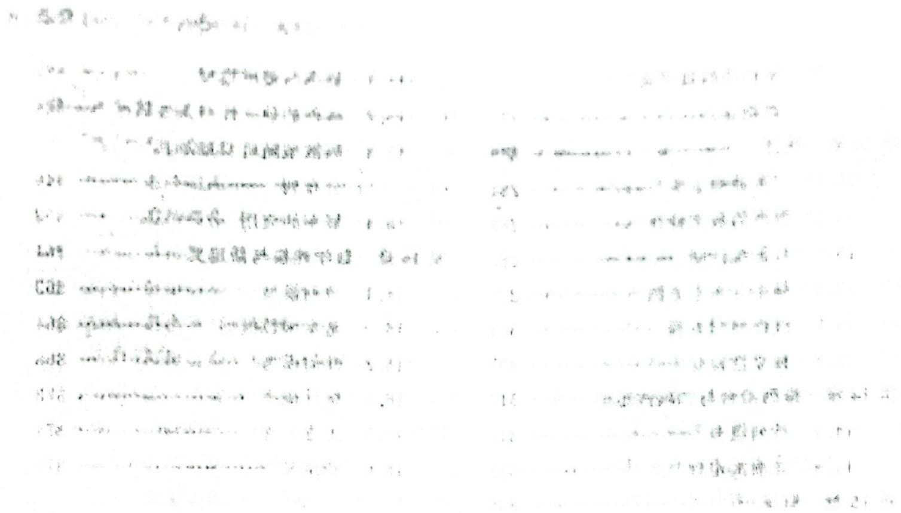

本书前8面为蓝色防伪页。

单翻起一面,透过光可以看到

清华大学出版社防伪水印。

学累了,翻翻这里调节一下。

# 第 1 章 集合与逻辑用语

作为整个高中的数学基础开篇,集合是刻画一类事物的语言和工具;逻辑用语是数学语言的重要组成部分,是数学表达和交流的工具,是逻辑思维的基本语言。

高考对集合的考查比较固定,常会与不等式(一元二次不等式、分式不等式、指数不等式、对数不等式、绝对值不等式、基本不等式等)关联,同时也会渗透在解答题的表达中。

高考对逻辑用语的考查比较简单,但有些同学还是会出错,原因在于逻辑经常与不等式、三角、立体几何、解析几何等知识联系起来综合考查。同学们不仅仅要知道逻辑中的相关概念,还需掌握题中所涉及的知识点和有关概念,同时也要会渗透在解答题的表达中。

总之,要关注与本章相关联的其他知识。若在第一遍刷本章题过程中遇到没有思路的题目,别气馁!请做好标记,其他知识过完再回头看,可能就会豁然开朗。

集合运算律  
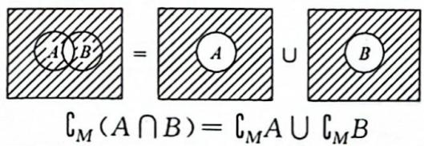

交的补 $=$ 补的并

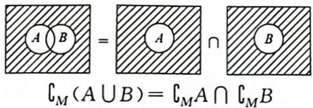

并的补=补的交

# 刷题散点图

让我们用数学的思想来备战高考数学,如统计中的散点图可展示出数据的分布和聚合情况,甚至可以得到趋势线公式。大道至简,请在刷题后完成属于你的本章刷题散点图,直接用你刷题的黑笔在题号上标出即可,做对画√,做错画×。

完成后,根据题号的分布和聚合情况,合理安排你的二刷甚至三刷。

##### 1.1

1 2

##### 1.2

3 4

5

6

7

8

##### 1.3

9 10

11

12

13

14

15

16

17

18

19

##### 1.4

20 21

22

23

##### 1.5

24 25

26

27

28

29

##### 1.6

31 32 33 34 35

##### 1.7

36 37 38

##### 1.8

39 40 41 42 43

##### 1.9

44 45 46 47

##### 1.10

48 49 50 51 52 53

54 55 56 57 58 59

30

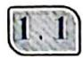

# 集合的含义与表示

本章
视频
讲解

# 核心笔记

##### 1. 常用集合的符号表示：

实数集：R；有理数集：Q；整数集：Z；自然数集：N；正整数集： $N^{*}$ ；空集：∅。

##### 2. 注意集合中元素的互异性。  
##### 3. $\{(x, y) | y = f(x)\}$ 表示点集。

##### 【1】（2013·山东·2·）

设集合 $A = \{0,1,2\}$ ，则集合 $B = \{x - y\mid x\in A,y\in A\}$ 中元素的个数是（ ）。

$\quad$A. 1

$\quad$B. 3

$\quad$C. 5

$\quad$D. 9

##### 【2】（2012·新课标全国·1·y）

已知集合 $A = \{1,2,3,4,5\}$ ， $B = \{(x,y) | x \in A, y \in A, x - y \in A\}$ ，则集合 $B$ 中元素的个数是（ ）。

$\quad$A. 3

$\quad$B. 6

$\quad$C. 8

$\quad$D. 10

# 集合的基本关系与运算（1）: 交集、并集、补集

核心笔记

<table><tr><td></td><td>交集</td><td>并集</td><td>补集</td></tr><tr><td>符号</td><td> $A \cap B$ </td><td> $A \cup B$ </td><td> $c_{U}A$ </td></tr><tr><td rowspan="3">图形</td><td></td><td></td><td></td></tr><tr><td>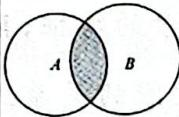</td><td>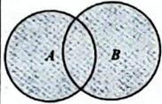</td><td>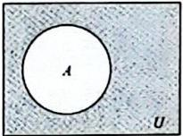</td></tr><tr><td>(阴影部分为 $A \cap B$ )</td><td>(阴影部分为 $A \cup B$ )</td><td>(阴影部分为 $c_{U}A$ )</td></tr></table>

<table><tr><td colspan="4">续表</td></tr><tr><td></td><td>交集</td><td>并集</td><td>补集</td></tr><tr><td rowspan="2">理解</td><td>x∈A且x∈B</td><td>x∈A或x∈B</td><td>x∈U且x∉A</td></tr><tr><td>既在A中又在B中</td><td>不同于生活中非此即彼的“或”</td><td>在U中但不在A中</td></tr></table>

##### 【3】（2022·新课标全国乙·1·）

设全集 $U = \{1,2,3,4,5\}$ ，集合 $M$ 满足 $\complement_U M = \{1,3\}$ ，则（ ）。

$\quad$A. $2 \in M$

$\quad$B. $3 \in  M$

$\quad$C. $4 \notin M$

$\quad$D. $5 \notin M$

##### 【4】（2023·新课标全国乙·2·）

$\begin{array}{l} {U = \{0, 1, 2, 4, 6, 8 \}, M = \{0, 4, 6 \}, N =} \\ {\{0, 1, 6 \}, M \cup \complement_ {U} N = (\quad) _ {\circ}} \end{array}$

$\quad$A. $\{0,2,4,6,8\}$

$\quad$B. $\{0,1,4,6,8\}$

$\quad$C. $\{1,2,4,6,8\}$

$\quad$D. $U$

##### 【5】（2011·江西·2·）

若全集 $U=\{1,2,3,4,5,6\}$ ， $M=\{2,3\}$ ， $N=\{1,4\}$ ，则集合 $\{5,6\}=(\quad)$ 。

$\quad$A. $M \cup  N$   
$\quad$B. $M \cap  N$   
$\quad$C. $(\complement_U M) \cup (\complement_U N)$   
$\quad$D. $(\complement_U M) \cap (\complement_U N)$

##### 【6】（2014·辽宁·1·）

已知全集 $U = \mathbf{R}, A = \{x \mid x \leqslant 0\}$ , $B = \{x \mid x \geqslant 1\}$ , 则集合 $\complement_U(A \cup B) = (\quad)$ 。

$\quad$A. $\{x \mid x \geqslant 0\}$

$\quad$B. $\{ x \mid  x \leq  1\}$

$\quad$C. $\{x \mid 0 \leqslant x \leqslant 1\}$

$\quad$D. $\{x \mid 0 < x < 1\}$

##### 【7】（2018·天津·1·）

设集合 $A = \{1,2,3,4\}, B = \{-1,0,2,3\}$ , $C = \{x \in \mathbb{R} | -1 \leqslant x < 2\}$ , 则 $(A \cup B) \cap C = (\quad)$ 。

$\quad$A. $\{-1,1\}$

$\quad$B. $\{0,1\}$

$\quad$C. $\{-1,0,1\}$

$\quad$D. $\{2,3,4\}$

##### 【8】（2014·重庆·11·）

设全集 $U = \{n \in N \mid 1 \leqslant n \leqslant 10\}$ ， $A = \{1, 2, 3, 5, 8\}$ ， $B = \{1, 3, 5, 7, 9\}$ ，则集合 $(\complement_{U} A) \cap B = \_\_\_\_$ 。

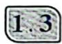

# 集合的基本关系与运算（2）: 基本关系

# 核心笔记

##### 1. 集合间的基本关系：

<table><tr><td></td><td>子集</td><td>相等</td><td>真子集</td></tr><tr><td>符号</td><td> $A \subseteq B$ (或  $B \supseteq A$ )</td><td> $A = B$ </td><td> $A \subsetneqq B$ (或  $B \supsetneqq A$ )</td></tr><tr><td>图形</td><td>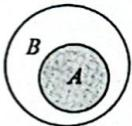或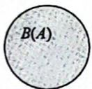</td><td>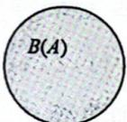</td><td>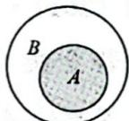</td></tr><tr><td>自然语言</td><td>集合  $A$  中任何一个元素都是集合  $B$  中的元素</td><td>集合  $A$  中任何一个元素都是集合  $B$  中的元素,同时集合  $B$  中任何一个元素都是集合  $A$  中的元素</td><td>集合  $A$  中任何一个元素都是集合  $B$  中的元素,同时存在集合  $B$  中的元素不是集合  $A$  中的元素</td></tr><tr><td>理解</td><td> $\forall x \in A \Rightarrow x \in B$ ,记作  $A \subseteq B$ ; $\subseteq$  理解为 $\leqslant$ </td><td> $\begin{cases} A \subseteq B \\ B \subseteq A \end{cases} \Rightarrow A = B$ </td><td> $A \subseteq B$ ,但  $\exists x \in B$  且  $x \notin A$ ,记作  $A \subsetneqq B$ ; $\subsetneqq$  理解为 $<$ </td></tr></table>

##### 2. 若集合 $A$ 有 $n (n \in \mathbb{N}^*)$ 个元素, 则其有 $2^n$ 个子集、 $2^n - 1$ 个非空子集、 $2^n - 1$ 个真子集、 $2^n - 2$ 个非空真子集。

##### 3. 常见的运算性质：

$A \subseteq B \Leftrightarrow A \cup B = B \Leftrightarrow A \cap B = A 。$

类型一：利用定义、性质判断集合间的关系

方法：根据子集、真子集的定义和性质求解。

##### 【9】（2015·重庆·1·）

已知 $A = \{1,2,3\}, B = \{2,3\}$ ，则（ ）。

$\quad$A. $A = B$

$\quad$B. $A \cap B = \varnothing$

$\quad$C. $A \subsetneqq B$

$\quad$D. $B \subsetneq A$

##### 【10】（2008·广东·1·）

第二十九届夏季奥林匹克运动会将于2008年8月8日在北京举行,若集合 $A=\{$ 参加北京奥运会比赛的运动员 $\}$ ,集合 $B=\{$ 参加北京奥运会比赛的男运动员 $\}$ ,集合 $C=\{$ 参加北京奥运会比赛的女运动员 $\}$ ,则下列关系正确的是( )。

$\quad$A. $A \subseteq  B$

$\quad$B. $B \subseteq  C$

$\quad$C. $A \cap B = C$

$\quad$D. $B \cup C = A$

类型二：利用元素特征判断集合间的关系

方法：先了解集合中元素的特征，再利用元素的特征判断得出集合之间的关系。如果不容易观察出元素特征，可先列举出集合中的部分元素，再通过定义得出集合。

##### 【11】（2023·新课标全国甲·1·）

设集合 $A = \{x\mid x = 3k + 1,k\in \mathbf{Z}\} ,B =$ $\{x\mid x = 3k + 2,k\in \mathbf{Z}\} ,U$ 为整数集， $\complement_U(A$ $\bigcup B) = (\quad)$ 。

$\quad$A. $\{x\mid x = 3k,k\in \mathbf{Z}\}$   
$\quad$B. $\{x \mid x = 3k - 1, k \in Z\}$   
$\quad$C. $\{x \mid x = 3k - 2, k \in Z\}$   
$\quad$D. $\varnothing$

##### 【12】（2002·大纲·6·）

设集合 $M = \left\{x \mid x = \frac{k}{2} + \frac{1}{4}, k \in \mathbf{Z}\right\}, N =$ $\left\{x \mid x = \frac{k}{4} + \frac{1}{2}, k \in \mathbf{Z}\right\}$ , 则（ ）。

$\quad$A. $M = N$

$\quad$B. $M \subseteq  N$

$\quad$C. $M \supseteq  N$

$\quad$D. $M \cap N = \varnothing$

##### 【13】（2023·新高考全国二·2·）

设集合 $A = \{0, -a\}, B = \{1, a - 2, 2a - 2\}$ , 若 $A \subseteq B$ , 则 $a = (\quad)$ 。

$\quad$A. 2

$\quad$B. 1

$\quad$C. $\frac{2}{3}$

$\quad$D. -1

# 类型三：相等集合的含参问题

方法：如果 A=B，只需满足 A，B 中的元素对应相等即可，注意同一集合中元素的互异性。

##### 【14】（2014·上海·11·）

已知互异的复数 a, b 满足 $ab \neq 0$ ，集合 $\{a, b\} = \{a^{2}, b^{2}\}$ ，则 $a + b = (\quad)$ 。

$\quad$A. 2

$\quad$B. 1

$\quad$C. 0

$\quad$D. -1

##### 【15】（2007·全国一·5·）

设 $a, b \in \mathbb{R}$ , 集合 $\{1, a + b, a\} = \left\{0, \frac{b}{a}, b\right\}$ , 则 $b - a = (\quad)$ 。

$\quad$A. 1

$\quad$B. -1

$\quad$C. 2

$\quad$D. -2

类型四：子集的个数计算

方法：直接应用核心笔记中的公式。

(若集合中元素较少,也可按照不重不漏的原则列举其子集或真子集。在列举时需关注两个特殊集合,即空集、它本身。)

##### 【16】（2013·福建·3·）

若集合 $A = \{1,2,3\}, B = \{1,3,4\}$ ，则 $A \cap B$ 的子集个数为（ ）。

$\quad$A. 2

$\quad$B. 3

$\quad$C. 4

$\quad$D. 16

##### 【17】（2005·天津·1·）

设集合 $A = \{x\mid 0\leqslant x <   3$ 且 $x\in \mathbf{N}\}$ 的真子集的个数是（ ）。

$\quad$A. 16

$\quad$B. 8

$\quad$C. 7

$\quad$D. 4

##### 【18】（2012·湖北·1·）

已知集合 $A = \{x\mid x^2 -3x + 2 = 0,x\in \mathbf{R}\}$ $B = \{x\mid 0 <   x <   5,x\in \mathbf{N}\}$ ，则满足条件 $A\subseteq$ $C\subseteq B$ 的集合 $C$ 的个数为（ ）。

$\quad$A. 2

$\quad$B. 3

$\quad$C. 4

$\quad$D. 5

##### 【19】（2008·山东·1·）

满足 $M \subseteq \{a_{1}, a_{2}, a_{3}, a_{4}\}$ 且 $M \cap \{a_{1}, a_{2}, a_{3}\} = \{a_{1}, a_{2}\}$ 的集合 $M$ 的个数是（ ）。

$\quad$A. 1

$\quad$B. 2

$\quad$C. 3

$\quad$D. 4

##### 1.4 集合的基本关系与运算（3）: 韦恩(Venn)图

核心笔记

德·摩根定律： $\complement_{U}(A\cap B)=\complement_{U}A\cup\complement_{U}B,\complement_{U}(A\cup B)=\complement_{U}A\cap\complement_{U}B$ 。

##### 【20】（2009·广东·1·）

已知全集 $U = \mathbf{R}$ ，则正确表示集合 $M = \{-1,0,1\}$ 和 $N = \{x \mid x^2 + x = 0\}$ 关系的Venn图的是（ ）。

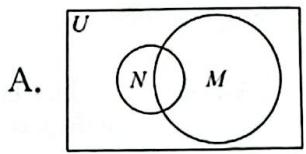

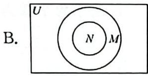

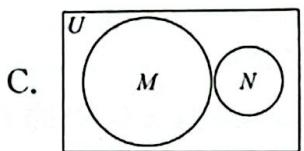

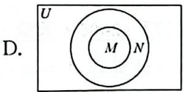

##### 【21】（2009·江西·文·3·）

50 名学生参加甲、乙两项体育活动,每人至少参加了一项,参加甲项目的学生有 30 名,参加乙项目的学生有 25 名,则仅参加了一项活动的学生人数为( )。

$\quad$A. 50

$\quad$B. 45

$\quad$C. 40

$\quad$D. 35

##### 【22】（2009·江西·理·3·j）

已知全集 $U = A \cup B$ 中有 $m$ 个元素， $(\complement_U A) \cup (\complement_U B)$ 中有 $n$ 个元素。若 $A \cap B$ 非空，则 $A \cap B$ 的元素个数为（ ）。

$\quad$A. ${mn}$

$\quad$B. $m + n$

$\quad$C. $n - m$

$\quad$D. m-n

##### 【23】（2011·辽宁·2·）

已知 M, N 为集合 I 的非空真子集，且 M, N 不相等，若 $N \cap C_{I}M = \varnothing$ ，则 $M \cup N = (\quad)$ 。

$\quad$A. $M$

$\quad$B. $N$

$\quad$C. I

$\quad$D. $\varnothing$

##### 1.5

集合的基本关系与运算（4）: 不等式

核心笔记·

##### 1. 集合 $\{x \mid y = f(x)\}$ 表示函数 $f(x)$ 的定义域，集合 $\{y \mid y = f(x)\}$ 表示函数 $f(x)$ 的值域。2. 解不等式往往需要结合函数图像，根据函数的单调性求解。因此，基本初等函数下的不等式解法需要掌握哦！

##### 3. 区间表示

<table><tr><td>定义</td><td>符号</td><td>数轴</td></tr><tr><td> $\{x \mid a \leqslant x \leqslant b\}$ </td><td> $[a,b]$ </td><td>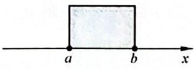</td></tr><tr><td> $\{x \mid a < x < b\}$ </td><td> $(a,b)$ </td><td>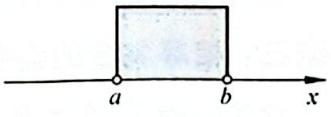</td></tr><tr><td> $\{x \mid a < x \leqslant b\}$ </td><td> $(a,b]$ </td><td>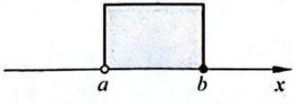</td></tr><tr><td> $\{x \mid a \leqslant x < b\}$ </td><td> $[a,b)$ </td><td>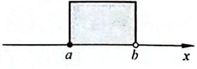</td></tr><tr><td> $\{x|x\geqslant a\}$ </td><td> $[a,+\infty)$ </td><td>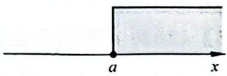</td></tr><tr><td> $\{x|x>a\}$ </td><td> $(a,+\infty)$ </td><td>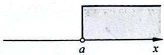</td></tr><tr><td> $\{x|x\leqslant b\}$ </td><td> $(-\infty,b]$ </td><td>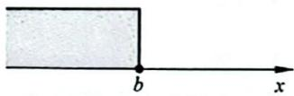</td></tr><tr><td> $\{x|x(-\infty,b)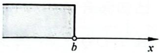$ </td><td>\( (-\infty,b)</td><td></td></tr></table>

##### 【24】（2010·北京·1·）

集合 $P = \{x\in \mathbf{Z}|0\leqslant x <   3\} ,M = \{x\in$ $\mathbf{Z}|x^2\leqslant 9\}$ ，则 $P\cap M = (\quad)$ 。

$\quad$A. $\{1,2\}$

$\quad$B. $\{0,1,2\}$

$\quad$C. $\{1,2,3\}$

$\quad$D. $\{0,1,2,3\}$

##### 【25】（2012·浙江·1·）

设集合 $A = \{x\mid 1 <   x <   4\} ,B = \{x\mid x^2 -$ $2x - 3\leqslant 0\}$ ，则 $A\cap (\complement_{\mathbb{R}}B) = (\quad)$ 。

$\quad$A. (1,4)

$\quad$B. $(3,4)$

$\quad$C. $(1,3)$

$\quad$D. $(1,2) \cup (3,4)$

##### 【26】（2009·安徽·2·）

若集合 $A = \{x\mid |2x - 1| <   3,x\in \mathbf{R}\} ,B =$ $\left\{x\mid \frac{2x + 1}{3 - x} <  0\right\} ,$ 则 $A\cap B = (\quad)$ 。

海啸凌云志，一起向未来。（推荐人：@无忌（山东））

$\quad$A. $\{x\mid -1 <   x <   - \frac{1}{2}$ 或 $2 <   x <   3\}$

$\quad$B. $\{ x\mid 2 < x < 3\}$

$\quad$C. $\left\{x\mid-\frac{1}{2}<x<2\right\}$

$\quad$D. $\left\{x\mid-1<x<-\frac{1}{2}\right\}$

##### 【27】（2022·新高考全国一·1·y）

若集合 $M=\{x\mid\sqrt{x}<4\}, N=\{x\mid3x\geqslant1\}$ ,
则 $M \cap N = (\quad)$ 。

$\quad$A. $\{x \mid 0 \leqslant x < 2\}$

$\quad$B. $\left\{x\mid\frac{1}{3}\leqslant x<2\right\}$

$\quad$C. $\{x \mid 3 \leqslant x < 16\}$

$\quad$D. $\left\{x\mid\frac{1}{3}\leqslant x<16\right\}$

##### 【28】（2014·山东·2·y）

设集合 $A = \{x\mid |x - 1| <   2\} ,B = \{y\mid y =$ $2^{x},x\in [0,2]\}$ ，则 $A\cap B = (\quad)$ 。

$\quad$A. $[0,2]$

$\quad$B. $(1,3)$

$\quad$C. $[1,3)$

$\quad$D. (1,4)

##### 【29】（2013·辽宁·2·）

已知集合 $A = \{x\mid 0 <   \log_4x <   1\} ,B =$ $\{x\mid x\leqslant 2\}$ ，则 $A\cap B = (\quad)$ 。

$\quad$A. (0,1)

$\quad$B. $(0,2]$

$\quad$C. (1,2)

$\quad$D. $(1,2]$

##### 【30】（2011·湖北·2·）

已知 $U = \{y \mid y = \log_{2} x, x > 1\}$ , $P = \left\{y \mid y = \frac{1}{x}, x > 2\right\}$ ，则 $C_{U}P = (\quad)$ 。

$\quad$A. $\left[\frac{1}{2}, +\infty\right)$   
$\quad$B. $\left(0,\frac{1}{2}\right)$   
$\quad$C. $(0, +\infty)$   
$\quad$D. $(- \infty, 0) \cup \left[\frac{1}{2}, +\infty\right)$

# 1.6 含参集合

# 核心笔记

##### 1. 离散,需注意元素的互异性; 连续,则需考虑端点是否可取。  
##### 2. 注意分类讨论与数轴形式下的数形结合。

# 类型一：有限数集

方法：需注意同一集合中元素的互异性。

# 【31】（2017·新课标全国二·2·）

设集合 $A = \{1,2,4\}, B = \{x \mid x^2 - 4x + m = 0\}$ 。若 $A \cap B = \{1\}$ ，则 $B = (\quad)$ 。

$\quad$A. $\{1, -3\}$

$\quad$B. $\{1,0\}$

$\quad$C. $\{1,3\}$

$\quad$D. $\{ 1,5\}$

# 【32】（2017·江苏·1·）

已知集合 $A = \{1,2\}, B = \{a,a^2 +3\}$ ，则 $A\cap B = \{1\}$ ，则实数 $a$ 的值为

# 类型二：无限数集

方法：利用数轴进行分析。将集合在数轴上表示出来，讨论参数，注意端点位置是否可取。

# 【33】（2020·新课标全国一·2·y）

设集合 $A = \{x\mid x^2 -4\leqslant 0\} ,B = \{x\mid 2x+$ $a\leqslant 0\}$ ，且 $A\cap B = \{x\mid -2\leqslant x\leqslant 1\}$ ，则 $a=$ （ ）。

$\quad$A. -4

$\quad$B. -2

$\quad$C. 2

$\quad$D. 4

# 【34】（2009·上海·2·）

已知集合 $A = \{x\mid x\leqslant 1\} ,B = \{x\mid x\geqslant a\}$ 且 $A\cup B = \mathbf{R}$ ，则实数 $a$ 的取值范围是

# 【35】（2013·上海·16·）

设常数 $a \in \mathbb{R}$ , 集合 $A = \{x \mid (x - 1)(x - a) \geqslant 0\}$ , $B = \{x \mid x \geqslant a - 1\}$ 。若 $A \cup B = \mathbb{R}$ , 则 $a$ 的取值范围为（ ）。

$\quad$A. $(-\infty, 2)$

$\quad$B. $(-∞,2]$

$\quad$C. $(2, +\infty)$

$\quad$D. $[2, +\infty)$

# 1.7 点集

# 核心笔记

集合 $\{(x,y)\mid y=f(x)\}$ 表示函数 $f(x)$ 图像上的所有点。这类集合中元素是点，常需要数形结合或联立方程组求解。

# 【36】（2020·新课标全国三·1·）

已知集合 $A = \{(x,y)\mid x,y\in \mathbf{N}^{*},y\geqslant x\}$

$B=\{(x,y)\mid x+y=8\}$ ，则 $A\cap B$ 中的元素个数为（）。

$\quad$A. 2

$\quad$B. 3

$\quad$C. 4

$\quad$D. 5

##### 【37】（2018·新课标全国二·2·）

已知集合 $A = \{(x,y) | x^2 + y^2 \leqslant 3, x \in \mathbf{Z}, y \in \mathbf{Z}\}$ , 则 $A$ 中元素的个数为（ ）。

$\quad$A. 9

$\quad$B. 8

$\quad$C. 5

$\quad$D. 4

##### 【38】（2010·湖北·2·）

设集合 $A = \left\{(x, y) \left| \frac{x^2}{4} + \frac{y^2}{16} = 1 \right\}, B = \{(x, y) | y = x^3\}$ , 则 $A \cap B$ 的子集的个数是（ ）。

$\quad$A. 4

$\quad$B. 3

$\quad$C. 2

$\quad$D. 1

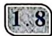

全称量词与存在量词（1）: 命题的否定

# 核心笔记

##### 1. 命题 $p$ 的否定记为 $\neg p$ 。
##### 2. 解题方法：改量词 + 否结论。
通俗来说：量词“ $\exists$ ”→“ $\forall$ ”“ $\forall$ ”→“ $\exists$ ”，否结论（找后半句的补集）。

##### 【39】（2014·山东·4·）

用反证法证明命题“设 a, b 为实数，则方程 $x^{3} + ax + b = 0$ 至少有一个实根”时，要做的假设是（）。

$\quad$A. 方程 $x^{3} + ax + b = 0$ 没有实根

$\quad$B. 方程 $x^{3} + ax + b = 0$ 至多有一个实根  
$\quad$C. 方程 $x^{3} + ax + b = 0$ 至多有两个实根  
$\quad$D. 方程 $x^{3} + ax + b = 0$ 恰好有两个实根

##### 【40】（2011·安徽·7·）

命题“所有能被 2 整除的整数都是偶数”的否定是（）。

$\quad$A. 所有不能被 2 整除的数都是偶数  
$\quad$B. 所有能被 2 整除的整数都不是偶数  
$\quad$C. 存在一个不能被 2 整除的整数是偶数  
$\quad$D. 存在一个能被 2 整除的整数不是偶数

##### 【41】（2012·湖北·2·）

命题“ $\exists x_{0} \in \complement_{\mathbf{R}} \mathbf{Q}, x_{0}^{3} \in \mathbf{Q}$ ”的否定是（ ）。

$\quad$A. $\exists x_0\notin\complement_{\mathbb{R}}\mathbf{Q},x_0^3\in\mathbf{Q}$ 
$\quad$B. $\exists x_0\in\complement_{\mathbb{R}}\mathbf{Q},x_0^3\notin\mathbf{Q}$ 
$\quad$C. $\forall x_0\notin\complement_{\mathbb{R}}\mathbf{Q},x_0^3\in\mathbf{Q}$ 
$\quad$D. $\forall x_0\in\complement_{\mathbb{R}}\mathbf{Q},x_0^3\notin\mathbf{Q}$

##### 【42】（2010·安徽·11·）

命题“对任何 $x \in R, |x - 2| + |x - 4| > 3$ ”的否定是 \_\_\_\_。

##### 【43】(2016·浙江·4·)

命题“ $\forall x \in \mathbf{R}, \exists n \in \mathbf{N}^{*}$ , 使得 $n \geqslant x^{2}$ ”的否定形式是( )。

$\quad$A. $\forall x\in \mathbb{R},\exists n\in \mathbb{N}^*$ ，使得 $n <   x^{2}$ 
$\quad$B. $\forall x\in \mathbb{R},\forall n\in \mathbb{N}^*$ ，使得 $n <   x^{2}$ 
$\quad$C. $\exists x\in \mathbb{R},\exists n\in \mathbb{N}^*$ ，使得 $n <   x^{2}$ 
$\quad$D. $\exists x\in \mathbb{R},\forall n\in \mathbb{N}^*$ ，使得 $n <   x^{2}$

# 1.9 全称量词与存在量词（2）: 真假判断

# 核心笔记

##### 1. 解题方法：

<table><tr><td></td><td>全称量词命题,∀</td><td>存在量词命题,∃</td></tr><tr><td>真</td><td>严格推理</td><td>举例</td></tr><tr><td>假</td><td>举反例</td><td>严格推理</td></tr></table>

##### 2. 若 $p$ 是真命题, 则 $\neg p$ 是假命题; 若 $p$ 是假命题, 则 $\neg p$ 是真命题。

因此当命题 $p$ 的真假不容易判断时，我们可以先判断出 $\neg p$ 的真假，从而得到 $p$ 的真假。

##### 【44】（2010·天津·5·）

下列命题中,真命题的是()。

$\quad$A. $\exists m\in \mathbf{R}$ ，使函数 $f(x) = x^{2} + mx(x\in$ R)是偶函数

$\quad$B. $\exists m \in \mathbb{R}$ , 使函数 $f(x) = x^2 + mx (x \in \mathbb{R})$ 是奇函数

$\quad$C. $\forall m\in \mathbf{R}$ ，使函数 $f(x) = x^{2} + mx(x\in$ R)是偶函数

$\quad$D. $\forall m\in \mathbf{R}$ ，使函数 $f(x) = x^{2} + mx(x\in$ R)是奇函数

##### 【45】（2010·辽宁·4·）

已知 a>0，函数 $f(x)=ax^{2}+bx+c$ 。若 $x_{0}$ 满足“关于 x 的方程 $2ax+b=0$ ”，则下列选项的命题中为假命题的是（）。

$\quad$A. $\exists x\in \mathbf{R},f(x)\leqslant f(x_0)$

$\quad$B. $\exists x\in \mathbf{R},f(x)\geqslant f(x_0)$

$\quad$C. $\forall x\in \mathbf{R},f(x)\leqslant f(x_0)$

$\quad$D. $\forall x\in \mathbf{R},f(x)\geqslant f(x_0)$

##### 【46】（2010·湖南·2·）

下列命题中,假命题的是( )。

$\quad$A. $\forall x\in \mathbf{R},2^{x - 1} > 0$

$\quad$B. $\forall x\in \mathbf{N}^{*},(x - 1)^{2} > 0$

$\quad$C. $\exists x\in \mathbf{R},\lg x <   1$

$\quad$D. ∃x∈R, tanx=2

##### 【47】（2015·山东·12·）

若“ $\forall x \in \left[0, \frac{\pi}{4}\right], \tan x \leqslant m$ ”是真命题，则实数 $m$ 的最小值为 \_\_\_\_。

# 1,10

# 充分条件与必要条件

# 核心笔记

设命题“若 $p$ ，则 $q$ ”是真命题，则称 $p$ 是 $q$ 的充分条件， $q$ 是 $p$ 的必要条件。

<table><tr><td rowspan="2">条件</td><td>逻辑推理</td><td>集合与集合之间的关系</td></tr><tr><td>若 $p$ ,则 $q$ </td><td> $A = \{ x \mid p(x) \}$ , $B = \{ x \mid q(x) \}$ </td></tr><tr><td>充分条件</td><td> $p \Rightarrow q$ </td><td> $A \subseteq B$ </td></tr><tr><td>必要条件</td><td> $q \Rightarrow p$ </td><td> $B \subseteq A$ </td></tr><tr><td>充要条件</td><td> $p \Leftrightarrow q$ </td><td> $A = B$ </td></tr><tr><td>充分不必要条件</td><td> $\begin{cases} p \Rightarrow q \\ q \neq p \end{cases}$ </td><td> $A \subsetneqq B$ </td></tr><tr><td>必要不充分条件</td><td> $\begin{cases} p \neq q \\ q \Rightarrow p \end{cases}$ </td><td> $B \subsetneqq A$ </td></tr><tr><td>既不充分也不必要条件</td><td> $\begin{cases} p \neq q \\ q \neq p \end{cases}$ </td><td> $\begin{cases} A \subsetneqq B \\ B \subsetneqq A \end{cases}$ </td></tr></table>

世界没有悲剧和喜剧之分,如果你能从悲剧中走出来,那就是喜剧;如果你沉湎于喜剧之中,那它就是悲剧。(推荐人:@于承琳(安徽))

##### 【48】（2004·重庆·7·）

已知 p 是 r 的充分不必要条件, s 是 r 的必要条件, q 是 s 的必要条件。那么 p 是 q 成立的（）。

$\quad$A. 充分不必要条件  
$\quad$B. 必要不充分条件  
$\quad$C. 充分必要条件  
$\quad$D. 既不充分也不必要条件

##### 【49】（2013·上海·17·）

钱大姐常说“便宜没好货”，她这句话的意思是“不便宜”是“好货”的（）。

$\quad$A. 充分条件  
$\quad$B. 必要条件  
$\quad$C. 充分必要条件  
$\quad$D. 既非充分也非必要条件

##### 【50】（2013·山东·7·）

给定两个命题 $p, q$ ，若 $\neg p$ 是 $q$ 的必要而不充分条件，则 $p$ 是 $\neg q$ 的（ ）。

$\quad$A. 充分而不必要条件  
$\quad$B. 必要而不充分条件  
$\quad$C. 充分必要条件  
$\quad$D. 既不充分也不必要条件

##### 【51】（2014·浙江·2·）

设四边形 ABCD 的两条对角线 AC, BD, 则“四边形 ABCD 为菱形”是“AC ⊥ BD”的( )。

$\quad$A. 充分不必要条件  
$\quad$B. 必要不充分条件  
$\quad$C. 充分必要条件  
$\quad$D. 既不充分也不必要条件

##### 【52】（2006·山东·8·）

设 $p: x^2 - x - 20 > 0, q: \frac{1 - x^2}{|x| - 2} < 0$ ，则 $p$ 是 $q$ 的（ ）。

$\quad$A. 充分不必要条件  
$\quad$B. 必要不充分条件  
$\quad$C. 充分必要条件  
$\quad$D. 既不充分也不必要条件

##### 【53】（2024·天津·2·y）

设 $a, b \in \mathbf{R}$ , 则“ $a^3 = b^3$ ”是“ $3^a = 3^b$ ”的（）。

$\quad$A. 充分不必要条件  
$\quad$B. 必要不充分条件  
$\quad$C. 充要条件  
$\quad$D. 既不充分也不必要条件

##### 【54】（2021·浙江·3·）

已知非零向量 a, b, c，则“ $a \cdot c = b \cdot c$ ”是“a = b”的（）。

$\quad$A. 充分不必要条件  
$\quad$B. 必要不充分条件  
$\quad$C. 充分必要条件  
$\quad$D. 既不充分也不必要条件

##### 【55】（2021·北京·3·）

设函数 $f(x)$ 的定义域为 $[0,1]$ ，则“函数 $f(x)$ 在 $[0,1]$ 上单调递增”是“函数 $f(x)$ 在 $[0,1]$ 上的最大值为 $f(1)$ ”的（ ）。

$\quad$A. 充分不必要条件  
$\quad$B. 必要不充分条件  
$\quad$C. 充分必要条件  
$\quad$D. 既不充分也不必要条件

##### 【56】（2005·天津·4·）

设 $\alpha, \beta, \gamma$ 为平面， $m, n, l$ 为直线，则 $m \perp \beta$ 的一个充分条件是（）。

$\quad$A. $\alpha \perp \beta, \alpha \cap \beta = l, m \perp l$   
$\quad$B. $\alpha \cap \gamma = m, \alpha \perp \gamma, \beta \perp \gamma$   
$\quad$C. $\alpha \perp \gamma, \beta \perp \gamma, m \perp \alpha$   
$\quad$D. $n \perp \alpha, n \perp \beta, m \perp \alpha$

##### 【57】（2024·北京·5·）

设 a, b 是向量，则“ $(a+b)\cdot(a-b)=0$ ”是“a=-b 或 a=b”的（）。

$\quad$A. 充分不必要条件  
$\quad$B. 必要不充分条件  
$\quad$C. 充要条件  
$\quad$D. 既不充分也不必要条件

##### 【58】（2012·四川·7·）

设 a, b 都是非零向量。下列四个条件中，使 $\frac{a}{|a|} = \frac{b}{|b|}$ 成立的充分条件是（）。

$\quad$A. a = -b

$\quad$B. a=2b

$\quad$C. $a \parallel b$

$\quad$D. $|a| = |b|$ 且 $a / / b$

##### 【59】（2005·湖南·8·）

集合 $A = \left\{x\left|\frac{x - 1}{x + 1} < 0\right.\right\}$ , $B = \{x\mid |x - b| < a\}$ , 若“ $a = 1$ ”是“ $A \cap B \neq \emptyset$ ”的充分条件, 则 $b$ 的取值范围是 ( )。

$\quad$A. $-2 \leqslant b < 0$

$\quad$B. $0 < b \leq  2$

$\quad$C. $-3 < b < -1$

$\quad$D. $-1 \leqslant b < 2$

# 第2章 函数

函数在高考数学中占比大,有直接考查和间接考查,通常有2\~3道题,以选择题和填空题的形式出现,且其难度并不确定。本章收录的是基础题和中档题。函数思想贯穿数学始终,要能理解和掌握函数及其思想,可进一步促进其他模块的学习与进步。

对勾函数: $f(x)=ax+\frac{b}{x}(a>0,b>0)$ :

定义域: $(-∞,0)∪(0,+∞)$ ;

值域： $(-∞,-2\sqrt{ab})∪(2\sqrt{ab},+∞)$ ;

单调性:递增区间为 $\left(-\infty,-\sqrt{\frac{b}{a}}\right)$ 和 $\left(\sqrt{\frac{b}{a}},+\infty\right)$ ;

递减区间为 $\left(-\sqrt{\frac{b}{a}},0\right)$ 和 $\left(0,\sqrt{\frac{b}{a}}\right)$ ;

极值： $f_{\text{极大值}}\left(-\sqrt{\frac{b}{a}}\right) = -2\sqrt{ab}, f_{\text{极小值}}\left(\sqrt{\frac{b}{a}}\right) = 2\sqrt{ab}$

奇偶性: 奇函数;

渐近线: x=0 和 y=ax。

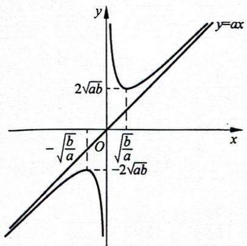

# 刷题散点图

让我们用数学的思想来备战高考数学,如统计中的散点图可展示出数据的分布和聚合情况,甚至可以得到趋势线公式。大道至简,请在刷题后完成属于你的本章刷题散点图,直接用你刷题的黑笔在题号上标出即可,做对画√,做错画×。

完成后,根据题号的分布和聚合情况,合理安排你的二刷甚至三刷。

##### 2.1 

<table><tr><td>60</td><td>61</td><td>62</td><td>63</td><td>64</td><td>65</td></tr><tr><td>66</td><td>67</td><td>68</td><td>69</td><td>70</td><td>71</td></tr><tr><td>72</td><td>73</td><td>74</td><td>75</td><td>76</td><td>77</td></tr><tr><td>78</td><td></td><td></td><td></td><td></td><td></td></tr></table>

##### 2.2 

<table><tr><td>79</td><td>80</td><td>81</td><td>82</td><td>83</td><td>84</td></tr><tr><td>85</td><td>86</td><td>87</td><td>88</td><td>89</td><td>90</td></tr><tr><td>91</td><td>92</td><td>93</td><td>94</td><td>95</td><td>96</td></tr></table>

##### 2.3 

<table><tr><td>97</td><td>98</td><td>99</td><td>100</td><td>101</td><td>102</td></tr><tr><td>103</td><td>104</td><td>105</td><td>106</td><td></td><td></td></tr></table>

##### 2.4 

<table><tr><td>107</td><td>108</td><td>109</td><td>110</td><td>111</td><td>112</td></tr><tr><td>113</td><td>114</td><td>115</td><td>116</td><td>117</td><td>118</td></tr><tr><td>119</td><td>120</td><td>121</td><td>122</td><td>123</td><td>124</td></tr></table>

##### 2.5 

<table><tr><td>125</td><td>126</td><td>127</td><td>128</td><td>129</td><td>130</td></tr><tr><td>131</td><td>132</td><td>133</td><td>134</td><td>135</td><td>136</td></tr><tr><td>137</td><td>138</td><td>139</td><td>140</td><td>141</td><td>142</td></tr><tr><td>143</td><td>144</td><td>145</td><td>146</td><td>147</td><td>148</td></tr><tr><td>149</td><td>150</td><td></td><td></td><td></td><td></td></tr></table>

##### 2.6 

<table><tr><td>151</td><td>152</td><td>153</td><td>154</td><td>155</td><td>156</td></tr></table>

<table><tr><td>157</td><td>158</td><td>159</td><td>160</td><td>161</td><td>162</td></tr><tr><td>163</td><td>164</td><td>165</td><td>166</td><td>167</td><td>168</td></tr><tr><td>169</td><td>170</td><td>171</td><td>172</td><td>173</td><td>174</td></tr><tr><td>175</td><td>176</td><td>177</td><td>178</td><td>179</td><td>180</td></tr><tr><td>181</td><td>182</td><td>183</td><td></td><td></td><td></td></tr></table>

##### 2.7 

<table><tr><td>184</td><td>185</td><td>186</td><td>187</td><td>188</td><td>189</td></tr><tr><td>190</td><td>191</td><td>192</td><td>193</td><td>194</td><td>195</td></tr><tr><td>196</td><td>197</td><td>198</td><td>199</td><td>200</td><td></td></tr></table>

##### 2.8 

<table><tr><td>201</td><td>202</td><td>203</td><td>204</td><td>205</td><td>206</td></tr><tr><td>207</td><td>208</td><td>209</td><td>210</td><td>211</td><td>212</td></tr><tr><td>213</td><td>214</td><td>215</td><td>216</td><td>217</td><td></td></tr></table>

##### 2.9 

<table><tr><td>218</td><td>219</td><td>220</td><td>221</td><td>222</td><td>223</td></tr><tr><td>224</td><td>225</td><td>226</td><td>227</td><td>228</td><td>229</td></tr><tr><td>230</td><td>231</td><td>232</td><td>233</td><td>234</td><td>235</td></tr><tr><td>236</td><td>237</td><td>238</td><td>239</td><td>240</td><td>241</td></tr><tr><td>242</td><td>243</td><td></td><td></td><td></td><td></td></tr></table>

##### 2.10 

<table><tr><td>244</td><td>245</td><td>246</td><td>247</td><td>248</td><td>249</td></tr><tr><td>250</td><td>251</td><td>252</td><td>253</td><td>254</td><td>255</td></tr><tr><td>256</td><td>257</td><td>258</td><td>259</td><td>260</td><td>261</td></tr><tr><td>262</td><td>263</td><td>264</td><td>265</td><td></td><td></td></tr></table>

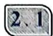

# 计算

本章
视频
讲解

# 核心笔记

指数运算公式：

$\begin{array}{l} \begin{array}{r l} & {（1） a ^ {m} \bullet a ^ {n} = a ^ {m + n}; （2） a ^ {m} \div a ^ {n} =} \\ & {a ^ {m - n}; （3） (a ^ {m}) ^ {n} = a ^ {m n}; （4） a ^ {m} \bullet b ^ {m} =} \end{array} \\ (a b) ^ {m}; （5） a ^ {- n} = \frac {1}{a ^ {n}}; （6） a ^ {\frac {1}{n}} = \sqrt [ n ]{a}; \\ \end{array}$

$（7） a ^ {\frac {m}{n}} = \sqrt [ n ]{a ^ {m}}; （8） a ^ {- \frac {m}{n}} = \frac {1}{\sqrt [ n ]{a ^ {m}}}.$

对数运算公式 $(a, M, N$ 均为正数， $a \neq 1)$ ：

$\begin{array}{l} \log_ {a} M + \log_ {a} N = \log_ {a} (M N); \tag {1} \\ （2） \log_ {a} M - \log_ {a} N = \log_ {a} \frac {M}{N}; （3） a ^ {\log_ {a} N} = \\ N; （4） \log_ {a} M ^ {m} = m \log_ {a} M, \log_ {a ^ {n}} M = \\ \frac {1}{n} \log_ {a} M = \log_ {a} M ^ {\frac {1}{n}}, \log_ {a ^ {n}} M ^ {m} = \frac {m}{n} \log_ {a} M 。 \\ \end{array}$

# 类型一：指数对数综合运算

方法：熟悉各个公式顺向与逆向，根据具体结构使用合适公式计算就行。

##### 【60】（2015·四川·12·）

$\lg 0.01 + \log_{2}16$ 的值是 \_\_\_\_。

##### 【61】(2016·上海·)

若 $\log_{2}(x+1)=3$ ，则 x= \_\_\_\_。

##### 【62】（2014·陕西·12·）

已知 $4^{a}=2,\lg x=a$ ，则 x=\_\_\_\_。

##### 【63】（2022·浙江·7·）

已知 $2^{a} = 5, \log_{8}3 = b$ ，则 $4^{a - 3b} = (\quad)$ 。

$\quad$A. 25

$\quad$B. 5

$\quad$C. $\frac{25}{9}$

$\quad$D. $\frac{5}{3}$

##### 【64】（2012·上海·）

方程 $4^{x}-2^{x+1}-3=0$ 的解为 \_\_\_\_。

##### 【65】（2015·上海·8·）

方程 $\log_{2}(9^{x-1}-5)=\log_{2}(3^{x-1}-2)+2$ 的解为\_\_\_\_。

##### 【66】（2013·浙江·3·）

已知 x, y 为正实数，则（）。

$\begin{array}{l} 2 ^ {\lg x + \lg y} = 2 ^ {\lg x} + 2 ^ {\lg y} \\ 2 ^ {\lg (x + y)} = 2 ^ {\lg x} \cdot 2 ^ {\lg y} \\ 2 ^ {\lg x \cdot \lg y} = 2 ^ {\lg x} + 2 ^ {\lg y} \\ 2 ^ {\lg (x y)} = 2 ^ {\lg x} \cdot 2 ^ {\lg y} \\ \end{array}$

##### 【67】（2010·四川·3·）

$2 \log_ {5} 1 0 + \log_ {5} 0. 2 5 = (\quad) 。$

$\quad$A. 0

$\quad$B. 1

$\quad$C. 2

$\quad$D. 4

##### 【68】（2015·安徽·11·）

计算： $\lg\frac{5}{2}+2\lg2-\left(\frac{1}{2}\right)^{-1}=$ \_\_\_\_。

##### 【69】（2014·安徽·11·）

$\left(\frac {1 6}{8 1}\right) ^ {- \frac {3}{4}} + \log_ {3} \frac {5}{4} + \log_ {3} \frac {4}{5} = \underline {{\quad}} 。$

##### 【70】（2011·四川·13·）

计算： $\left(\lg\frac{1}{4}-\lg25\right)\div100^{-\frac{1}{2}}=$ \_\_\_\_。

# 类型二：换底公式

方法：熟悉换底公式及其变形，根据代数特征合理使用公式。

换底公式： $\log_a N = \frac{\log_b N}{\log_b a} \Leftrightarrow \frac{\log_b N}{\log_a N} = \log_b a \Leftrightarrow \log_b a \cdot \log_a N = \log_b N$ 。

特例： $\log_a b = \frac{1}{\log_b a}$ 。

推论： $\log_{a}b\cdot\log_{b}c\cdot\cdots\cdot\log_{y}z=\log_{a}z;$ $\log_{a}N=\frac{\log_{b}N}{\log_{b}a}=\frac{\log_{c}N}{\log_{c}a}\Leftrightarrow\log_{b}a\cdot\log_{c}N=$ $\log_{b}N \cdot \log_{c}a$

##### 【71】（2020·新课标全国一·8·）

设 $a\log_34 = 2$ ，则 $4^{-a} = (\quad)$ 。

$\quad$A. $\frac{1}{16}$

$\quad$B. $\frac{1}{9}$

$\quad$C. $\frac{1}{8}$

$\quad$D. $\frac{1}{6}$

##### 【72】（2012·安徽·3·）

$\log_ {2} 9 \times \log_ {3} 4 = (\quad) 。$

$\quad$A. $\frac{1}{4}$

$\quad$B. $\frac{1}{2}$

$\quad$C. 2

$\quad$D. 4

##### 【73】（2013·陕西·3·）

设 a, b, c 均为不等于 1 的正实数, 则下列等式中恒成立的是( )。

$\quad$A. $\log_{a}b \cdot \log_{c}b = \log_{c}a$   
$\quad$B. $\log_a b \cdot \log_c a = \log_c b$   
$\quad$C. $\log_a(bc) = \log_ab\cdot \log_ac$   
$\quad$D. $\log_{a}(b+c)=\log_{a}b+\log_{a}c$

##### 【74】（2022·天津·6·）

化简 $(2\log_{4}3+\log_{8}3)(\log_{3}2+\log_{9}2)$ 的值为()。

$\quad$A. 1

$\quad$B. 2

$\quad$C. 4

$\quad$D. 6

##### 【75】（2014·四川·7·）

已知 $b > 0, \log_{5}b = a, \lg b = c, 5^{d} = 10$ ，则下列等式一定成立的是（）。

$\quad$A. $d = {ac}$

$\quad$B. $a = {cd}$

$\quad$C. $c = {ad}$

$\quad$D. $d = a + c$

##### 【76】（2021·天津·7·）

若 $2^{a}=5^{b}=10$ ，则 $\frac{1}{a}+\frac{1}{b}=()$ 。

$\quad$A. -1

$\quad$B. lg7

$\quad$C. 1

$\quad$D. $\log_710$

##### 【77】（2024·全国甲·15·）

已知 a > 1 且 $\frac{1}{\log_{8}a} - \frac{1}{\log_{a}4} = -\frac{5}{2}$ ，则
a = \_\_\_\_。

##### 【78】（2010·辽宁·10·）

设 $2^{a} = 5^{b} = m$ ，且 $\frac{1}{a} +\frac{1}{b} = 2$ ，则 $m =$ （ ）。

$\quad$A. $\sqrt{10}$

$\quad$B. 10

$\quad$C. 20

$\quad$D. 100

# 2.2 函数的定义域

# 核心笔记

定义域的求法: (通常需要从函数解析式结构入手, 以保证解析式有意义)

（1） 若 $f(x)$ 是整式，则 $x \in R$ ;  
（2） 若 $f(x)$ 是分式, 即 $f(x)=\frac{1}{g(x)}$ ,
则 $g(x) \neq 0$ ;  
（3） 若 $f(x)$ 是奇次根式, 即 $f(x)=\sqrt[2n-1]{g(x)}$ (其中 $n \in N^{*}$ ), 则 $g(x) \in \mathbb{R}$ ;  
若 $f(x)$ 是偶次根式，即 $f(x) = \sqrt[2n]{g(x)}$ （其中 $n\in \mathbf{N}^*$ ），则 $g(x)\geqslant 0$   
（4） 若 $f(x)=x^{0}$ ，则 $x\neq0$ ；若 $f(x)=0^{x}$ ，则 x>0；  
（5） 若 $f(x)=\log_{a}x$ (其中 a>0, 且 $a\neq1$ ), 则 x>0。

# 类型一：具象型函数

方法：观察判断函数整体结构与局部结构，写出相应不等式，而后解不等式取交集即可。

##### 【79】（2022·北京·11·）

函数 $f(x) = \frac{1}{x} +\sqrt{1 - x}$ 的定义域

是\_\_\_\_。

##### 【80】（2015·重庆·3·）

函数 $f(x)=\log_{2}(x^{2}+2x-3)$ 的定义域是()。

$\quad$A. $[-3, 1]$

$\quad$B. $(-3,1)$

$\quad$C. $(- \infty, -3] \cup [1, +\infty)$

$\quad$D. $(-∞,-3)∪(1,+∞)$

##### 【81】（2019·江苏·4·）

函数 $y = \sqrt{7 + 6x - x^{2}}$ 的定义域是 \_\_\_\_。

##### 【82】(2018·江苏·5·)

函数 $f(x) = \sqrt{\log_2x - 1}$ 的定义域为 \_\_\_\_。

##### 【83】(2004·重庆·1·)

函数 $y = \sqrt{\log_{\frac{1}{2}}(3x - 2)}$ 的定义域是()。

$\quad$A. $[1, +\infty)$

$\quad$B. $\left(\frac{2}{3},+\infty\right)$

$\quad$C. $\left[\frac{2}{3}, 1\right]$

$\quad$D. $\left(\frac{2}{3},1\right]$

##### 【84】（2022·上海春季·13·）

下列函数定义域为 R 的是()。

$\quad$A. $y = x^{-\frac{1}{2}}$

$\quad$B. $y = x^{-1}$

$\quad$C. $y = x^{\frac{1}{3}}$

$\quad$D. $y = x^{\frac{1}{2}}$

##### 【85】(2013·山东·5·)

函数 $f(x)=\sqrt{1-2^{x}}+\frac{1}{\sqrt{x+3}}$ 的定义域为( )。

如果没有天赋,那就不断重复。(推荐人:@锋哥(广西))

$\quad$A. $(-3,0]$

$\quad$B. $(-3,1]$

$\quad$C. $(- \infty, -3) \cup (-3, 0]$

$\quad$D. $(-∞,-3)∪(-3,1]$

##### 【86】（2020·北京·11·）

函数 $f(x)=\frac{1}{x+1}+\ln x$ 的定义域为 \_\_\_\_。

##### 【87】（2004·湖南·1·）

函数 $y=\lg\left(1-\frac{1}{x}\right)$ 的定义域为()。

$\quad$A. $\{x \mid x < 0\}$

$\quad$B. $\{ x \mid  x > 1\}$

$\quad$C. $\{x \mid 0 < x < 1\}$

$\quad$D. $\{x \mid x < 0 \text{ 或 } x > 1\}$

##### 【88】(2013·重庆·3·)

函数 $y=\frac{1}{\log_{2}(x-2)}$ 的定义域为()。

$\quad$A. $(-\infty, 2)$

$\quad$B. $(2, +\infty)$

$\quad$C. $(2,3)\cup(3,+\infty)$

$\quad$D. $(2,4)\cup (4, + \infty)$

##### 【89】(2014·山东·3·)

函数 $f(x)=\frac{1}{\sqrt{(\log_{2}x)^{2}-1}}$ 的定义域为()。

$\quad$A. $\left( {0,\frac{1}{2}}\right)$

$\quad$B. $(2, +\infty)$

$\quad$C. $\left(0,\frac{1}{2}\right)\cup(2,+\infty)$

$\quad$D. $\left(0, \frac{1}{2}\right] \cup [2, +\infty)$

##### 【90】（2015·湖北·6·）

函数 $f(x) = \sqrt{4 - |x|} +\lg \frac{x^2 - 5x + 6}{x - 3}$ 的定义域为（ ）。

$\quad$A. (2,3)

$\quad$B. $(2,4]$

$\quad$C. $(2,3)\cup (3,4]$

$\quad$D. $(-1,3)\cup(3,6]$

##### 【91】（2009·江西·2·）

函数 $y = \frac{\ln(x+1)}{\sqrt{-x^{2}-3x+4}}$ 的定义域是 \_\_\_\_。

##### 【92】（2005·湖北·13·）

函数 $y = \frac{\sqrt{x-2}}{x-3} \lg \sqrt{4-x}$ 的定义域是 \_\_\_\_。

##### 【93】（2008·安徽·13·）

函数 $y=\frac{\sqrt{|x-2|-1}}{\log_{2}(x-1)}$ 的定义域是 \_\_\_\_。

# 类型二：抽象型函数

方法：在同一对应法则 f 之下，所有代数式的范围相同（具有相同意义）。

##### 【94】（2013·大纲·4·）

已知函数 $f(x)$ 的定义域为 $(-1,0)$ ，则函数 $f(2x + 1)$ 的定义域为（ ）。

$\quad$A. $(-1,1)$

$\quad$B. $\left(-1,-\frac{1}{2}\right)$

$\quad$C. $(-1,0)$

$\quad$D. $\left(\frac{1}{2},1\right)$

##### 【95】（2008·江西·3·）

若函数 $f(x)$ 的定义域是 $[0,2]$ ，则函数 $g(x) = \frac{f(2x)}{x - 1}$ 的定义域是（ ）。

$\quad$A. $[0,1]$

$\quad$B. $[0,1)$

$\quad$C. $[0,1)\cup (1,4]$

$\quad$D. $(0,1)$

##### 【96】（2006·湖北4·）

设 $f(x) = \lg \frac{2 + x}{2 - x}$ ，则 $f\left(\frac{x}{2}\right) + f\left(\frac{2}{x}\right)$ 的定义域为（ ）。

$\quad$A. $(-4,0) \cup (0,4)$

$\quad$B. $(-4,-1)\cup(1,4)$

$\quad$C. $(-2, -1) \cup (1, 2)$

$\quad$D. $(-4, -2) \cup (2, 4)$

# 2.3 分段函数与函数计算

# 核心笔记

##### 1. 求分段函数值首先需要确定所求函数值对应的自变量的所属区间,然后代入该段表达式求值。  
##### 2. 给定函数值求变量问题, 先考虑每一段函数的函数值, 若能判断所给函数值所属函数, 则直接构建方程解方程即可; 若无法确定所给函数值的所属函数, 则分类讨论变量所属区间并代入相应函数解析式进而解方程, 再判断所求解是否满足假设前提, 满足保留, 不满足则舍去。

# 类型一：求函数值

方法: （1） 确定所求值的自变量的所属区间, 然后按该段表达式求值;

（2） 由内到外, 内层的 y 充当外层的 x。

##### 【97】（2015·新课标全国二·5·）

设函数

$f (x) = \left\{ \begin{array}{l l} 1 + \log_ {2} (2 - x), & x <   1, \\ 2 ^ {x - 1}, & x \geqslant 1, \end{array} \right.$

则 $f(-2)+f(\log_{2}12)=(\quad)$ 。

$\quad$A. 3

$\quad$B. 6

$\quad$C. 9

$\quad$D. 12

##### 【98】（2015·陕西·4·）

设 $f(x) = \begin{cases} 1 - \sqrt{x}, & x \geqslant 0, \\ 2^x, & x < 0, \end{cases}$ 则

$f (f (- 2)) = (\quad) _ {\circ}$

$\quad$A. -1

$\quad$B. $\frac{1}{4}$

$\quad$C. $\frac{1}{2}$

$\quad$D. $\frac{3}{2}$

##### 【99】（2012·江西·3·）

设函数 $f(x) = \begin{cases} x^2 + 1, & x \leqslant 1, \\ \lg x, & x > 1, \end{cases}$ 则

$f [ f (1 0) ] = (\quad) _ {\circ}$

$\quad$A. lg101

$\quad$B. 2

$\quad$C. 1

$\quad$D. 0

##### 【100】（2012·陕西·11·）

设函数 $f(x) = \begin{cases} \sqrt{x}, & x \geqslant 0, \\ \left(\frac{1}{2}\right)^x, & x < 0, \end{cases}$ 则

$f [ f (- 4) ] = \underline {{\quad}} 。$

# 类型二：由函数值求参数

方法：对于参数引起的变量不确定需要对变量所属区间一一讨论。

##### 【101】（2023·上海春季·9·）

已知函数 $f(x) = 2^{-x} + 1$ ，且 $g(x) = \left\{ \begin{array}{l} \log_2(x + 1), x > 0, \\ f(-x), x < 0, \end{array} \right.$ 则方程 $g(x) = 2$ 的解为 \_\_\_\_。

##### 【102】（2021·浙江·12·）

已知 $a \in \mathbb{R}$ , 函数 $f(x) = \begin{cases} x^2 - 4, & x > 2, \\ |x - 3| + a, & x \leqslant 2. \end{cases}$ 若 $f(f(\sqrt{6})) = 3$ ,

则 $a =$ \_\_\_\_。

##### 【103】（2015·山东·10·）

设函数 $f(x) = \begin{cases} 3x - b, & x < 1, \\ 2^x, & x \geqslant 1, \end{cases}$ 若 $f\left(f\left(\frac{5}{6}\right)\right) = 4$ ，则 $b = (\quad)$ 。

$\quad$A. 1

$\quad$B. $\frac{7}{8}$

$\quad$C. $\frac{3}{4}$

$\quad$D. $\frac{1}{2}$

##### 【104】（2015·新课标全国一·10·）

已知函数

$f (x) = \left\{ \begin{array}{l l} 2 ^ {x - 1} - 2, & x \leqslant 1, \\ - \log_ {2} (x + 1), & x > 1, \end{array} \right.$

且 $f(a) = -3$ ，则 $f(6 - a) = (\quad)$ 。

$\quad$A. $-\frac{7}{4}$

$\quad$B. $-\frac{5}{4}$

$\quad$C. $-\frac{3}{4}$

$\quad$D. $-\frac{1}{4}$

##### 【105】（2017·山东·9·）

设 $f(x) = \begin{cases} \sqrt{x}, & 0 < x < 1, \\ 2(x - 1), & x \geqslant 1, \end{cases}$ 若 $f(a) = f(a + 1)$ ，则 $f\left(\frac{1}{a}\right) = (\quad)$ 。

$\quad$A. 2

$\quad$B. 4

$\quad$C. 6

$\quad$D. 8

##### 【106】（2011·江苏·11·）

已知实数 $a \neq 0$ ，函数 $f(x) = \begin{cases} 2x + a, & x < 1, \\ -x - 2a, & x \geqslant 1, \end{cases}$ 若 $f(1 - a) = f(1 + a)$ ，则 $a$ 的值为 \_\_\_\_。

# 2.4 函数的单调性

# 核心笔记

##### 1. 函数单调性的判断方法：

（1）图像法：分段函数单调性用图像法更直观；

（2）性质法：初等函数模型直接使用函数性质判断即可；

（3）复合法：复合函数单调性的判断专属，首先要分清内外层函数，再分别找出内外层函数的极值点（外层函数极值点要和内层函数相等求解转为内层变量），其次在数轴上把内层极值点和通过外层极值点转化而来的所有数标识出来，接着判断每一段区间上内层的单调性，还要判断在相应区间上内层的值域，再说明内层函数产生的范围使得外层函数具备怎样的单调性，最后再使用“同增异减”来复合判断函数的单调性；

（4）求导法：通过对函数求导，在定义域上解得导数为正的区间即为函数的递增区间，导数为负的区间即为函数的递减区间。

##### 2. 单调性的四则运算：增+增=增；减+减=减；增-减=增；减-增=减。

# 类型一：性质法判断单调性

方法：熟识所学初等函数的性质。

# 【107】（2021·新课标全国甲·4·）

下列函数是增函数的是( )。

$\quad$A. $f(x) = -x$

$\quad$B. $f(x)=\left(\frac{2}{3}\right)^{x}$

$\quad$C. $f(x)=x^{2}$

$\quad$D. $f(x) = \sqrt[3]{x}$

数里乾坤大，学里奥妙多。（推荐人：@戴钦洪（辽宁））

##### 【108】(2019·北京·3·)

下列函数中,在区间 $(0,+\infty)$ 上单调递增的是()。

$\quad$A. $y = x^{\frac{1}{2}}$

$\quad$B. $y = 2^{-x}$

$\quad$C. $y = \log_{\frac{1}{2}}x$

$\quad$D. $y = \frac{1}{x}$

##### 【109】（2023·北京·4·）

下列函数中, 在 $(0, +\infty)$ 上单调递增的是( )。

$\quad$A. $f(x) = -\ln x$

$\quad$B. $f(x) = \frac{1}{2^x}$

$\quad$C. $f(x) = -\frac{1}{x}$

$\quad$D. $f(x) = 3^{|x - 1|}$

##### 【110】（2014·北京·2·）

下列函数中, 在 $(0, +\infty)$ 上是增函数的是( )。

$\quad$A. $y = \sqrt{x + 1}$

$\quad$B. $y = {\left( x - 1\right) }^{2}$

$\quad$C. $f(x)=2^{-x}$

$\quad$D. $y=\log_{0.5}(x+1)$

##### 【111】（2010·北京·6·）

给定函数：① $y=x^{\frac{1}{2}}$ ；② $y=\log_{\frac{1}{2}}(x+1)$ ；③ $y=|x-1|$ ；④ $y=2^{x+1}$ ，其中在区间(0,1)上单调递减的函数序号是()。

$\quad$A. ①②

$\quad$B. ②③

$\quad$C. ③④

$\quad$D. ①④

# 类型二：复合法判断复合函数单调性

方法: 分清内外层函数, 确定内层函数单调性并对其产生的范围判断外层函数单调性, 进而使用“同增异减”进行判断。

##### 【112】（2014·天津·4·）

函数 $f(x) = \log_{\frac{1}{2}}(x^2 - 4)$ 的单调递增区间

是( )。

$\quad$A. $(0, +\infty)$

$\quad$B. $(-∞,0)$

$\quad$C. $(2, +\infty)$

$\quad$D. $(-\infty, -2)$

##### 【113】（2017·新课标全国二·8·）

函数 $f(x)=\ln(x^{2}-2x-8)$ 的单调递增区间是()。

$\quad$A. $(-∞,-2)$

$\quad$B. $(-∞,1)$

$\quad$C. $(1, +\infty)$

$\quad$D. $(4, +\infty)$

##### 【114】（2023·新高考全国一·4·）

设函数 $f(x)=2^{x(x-a)}$ 在区间 $(0,1)$ 上单调递减，则 a 的取值范围是（）。

$\quad$A. $(-∞,-2]$

$\quad$B. $\left[-2,0\right)$

$\quad$C. $(0,2]$

$\quad$D. $[2, +\infty)$

##### 【115】（2023·新课标全国甲·11·）

已知函数 $f(x) = \mathrm{e}^{-(x - 1)^2}$ 。记 $a = f\left(\frac{\sqrt{2}}{2}\right), b = f\left(\frac{\sqrt{3}}{2}\right), c = f\left(\frac{\sqrt{6}}{2}\right)$ ，则（ ）。

$\quad$A. $b > c > a$

$\quad$B. $b > a > c$

$\quad$C. $c > b > a$

$\quad$D. $c > a > b$

# 类型三：函数单调性的应用

方法：熟识函数单调性的定义及其变形。

（1） 对任意的 $x_{1} \neq x_{2}$ ，且 $x_{1}, x_{2} \in D$ ，则：

若 $\frac{f(x_2) - f(x_1)}{x_2 - x_1} < 0$ 或 $[f(x_2) - f(x_1)](x_2 - x_1) < 0$ ，则 $f(x)$ 在 $D$ 上单调递减；

若 $\frac{f(x_2) - f(x_1)}{x_2 - x_1} > 0$ 或 $[f(x_2) - f(x_1)](x_2 - x_1) > 0$ ，则 $f(x)$ 在 $D$ 上单调递增。

（2） 如果 $f(x)$ 在 D 上单调递增, 若 $f(x_{1}) > f(x_{2})$ , 则 $x_{1} > x_{2}$ 且 $x_{1}, x_{2} \in D$ ;

如果 $f(x)$ 在 $D$ 上单调递减，若 $f(x_{1}) > f(x_{2})$ ，则 $x_{1} < x_{2}$ 且 $x_{1}, x_{2} \in D$ 。

##### 【116】（2009·福建·5·）

下列函数中, 满足“对任意的 $x_{1}, x_{2} \in (0, +\infty)$ , 当 $x_{1} < x_{2}$ 时, 都有 $f(x_{1}) > f(x_{2})$ ”的是()。

$\quad$A. $f(x) = \frac{1}{x}$

$\quad$B. $f(x) = (x - 1)^{2}$

$\quad$C. $f(x)=\mathrm{e}^{x}$

$\quad$D. $f(x)=\ln(x+1)$

##### 【117】（2009·陕西·10·）

定义在 $\mathbf{R}$ 上的函数 $f(x)$ 满足：对任意的 $x_{1}\neq x_{2}$ ，且 $x_{1},x_{2}\in [0, + \infty)$ ，有 $\frac{f(x_2) - f(x_1)}{x_2 - x_1} < 0$ ，则（ ）。

$\quad$A. $f(3) < f(2) < f(4)$

$\quad$B. $f(1) < f(2) < f(3)$

$\quad$C. $f(2) < f(1) < f(3)$

$\quad$D. $f(3) < f(1) < f(0)$

##### 【118】（2008·辽宁·9·）

已知函数 $f(x)$ 是定义在区间 $[0, +\infty)$ 上的增函数，则满足 $f(2x - 1) < f\left(\frac{1}{3}\right)$ 的 $x$ 的取值范围是（ ）。

$\quad$A. $\left(\frac{1}{3},\frac{2}{3}\right)$

$\quad$B. $\left[\frac{1}{3},\frac{2}{3}\right)$

$\quad$C. $\left(\frac{1}{2},\frac{2}{3}\right)$

$\quad$D. $\left[\frac{1}{2},\frac{2}{3}\right)$

##### 【119】（2007·福建·7·）

已知函数 $f(x)$ 为定义在 $\mathbf{R}$ 上的减函数，则满足 $f\left(\frac{1}{x}\right) > f(1)$ 的 $x$ 的取值范围是（ ）。

$\quad$A. $(-\infty, 1)$   
$\quad$B. $(1, +\infty)$   
$\quad$C. $(-\infty, 0) \cup (0, 1)$   
$\quad$D. $(-∞,0)∪(1,+∞)$

##### 【120】（2015·山东·14·）

已知函数 $f(x) = a^{x} + b (a > 0, a \neq 1)$ 的定义域和值域都是 $[-1, 0]$ ，则 $a + b =$ \_\_\_\_。

##### 【121】（2006·北京·5·）

已知 $f(x) = \begin{cases} (3a - 1)x + 4a, & x \leqslant 1, \\ \log_a x, & x > 1 \end{cases}$ 是 $(- \infty, + \infty)$ 上的减函数，那么 $a$ 的取值范围是（ ）。

$\quad$A. (0,1)   
$\quad$B. $\left(0,\frac{1}{3}\right)$   
$\quad$C. $\left[\frac{1}{7},\frac{1}{3}\right)$   
$\quad$D. $\left[\frac{1}{7},1\right)$

##### 【122】（2015·福建·14·）

若 $f(x)=\left\{\begin{aligned}-x+6,&\quad x\leqslant2,\\3+\log_{a}x,&\quad x>2\end{aligned}\right.$ (a>0,且 $a\neq1$ ) 的值域是 $[4,+\infty)$ ，则实数 a 的取值范围为 \_\_\_\_。

##### 【123】（2024·新高考全国一·6·）

已知函数 $f(x) = \begin{cases} -x^2 - 2ax - a, & x < 0, \\ \mathrm{e}^x + \ln (x + 1), & x \geqslant 0 \end{cases}$ 在 R 上单调递增，则 $a$ 的取值范围是（ ）。

$\quad$A. $(-\infty, 0]$

$\quad$B. $[-1,0]$

$\quad$C. $[-1, 1]$

$\quad$D. $[0,+\infty)$

##### 【124】（2022·浙江·14·）

已知函数 $f(x) = \left\{ \begin{array}{ll} - x^2 + 2, & x \leqslant 1, \\ x + \frac{1}{x} - 1, & x > 1, \end{array} \right.$ 则 $f\left(f\left(\frac{1}{2}\right)\right) =$ \_\_\_\_；若当 $x \in [a, b]$ 时， $1 \leqslant f(x) \leqslant 3$ ，则 $b - a$ 的最大值是\_\_\_\_。

##### 2.5

指对幂比较大小

# 核心笔记

##### 1. 观察代数式结构归纳出函数, 结合函数单调性进一步比较大小。  
##### 2. 寻求中间量过度比较大小：

（1） 比较 a, b 大小可先判断 a, b 和 0 之间的大小关系；  
（2） 若 a > 0, b > 0，则接着判断 a, b 和 1 的大小关系；  
（3） 若 0 < a < 1, 0 < b < 1, 则可以继续选择 $\frac{1}{2}, \frac{2}{3}, \frac{3}{4}, \cdots$ 这类数字进一步判断。

# 类型一：构造函数比较大小

方法：观察并调整代数结构归纳函数，使用函数单调性比较大小。

##### 【125】（2011·重庆·6·）

设 $a = \log_{\frac{1}{3}}\frac{1}{2}, b = \log_{\frac{1}{3}}\frac{2}{3}, c = \log_3\frac{4}{3}$ ，则 $a$ ， $b, c$ 的大小关系是（ ）。

$\quad$A. $a < b < c$

$\quad$B. c<b<a

$\quad$C. b<a<c

$\quad$D. b<c<a

##### 【126】（2015·山东·3·）

设 $a=0.6^{0.6}$ , $b=0.6^{1.5}$ , $c=1.5^{0.6}$ ，则 a, b, c 的大小关系是（）。

$\quad$A. $a < b < c$

$\quad$B. $a < c < b$

$\quad$C. $b < a < c$

$\quad$D. $b < c < a$

##### 【127】（2016·新课标全国三·6·）

已知 $a = 2^{\frac{4}{3}}, b = 4^{\frac{2}{5}}, c = 25^{\frac{1}{3}}$ ，则（ ）。

$\quad$A. b<a<c

$\quad$B. $a < b < c$

$\quad$C. $b < c < a$

$\quad$D. $c < a < b$

##### 【128】（2016·新课标全国一·8·）

若 a > b > 0, 0 < c < 1, 则( )。

$\quad$A. $\log_a c < \log_b c$

$\quad$B. $\log_c a < \log_c b$

$\quad$C. $a^{c} < b^{c}$

$\quad$D. $c^{a} > c^{b}$

##### 【129】（2009·全国二·7·）

已知 $a = \lg e, b = (\lg e)^2, c = \lg \sqrt{e}$ , 则（ ）。

$\quad$A. $a > b > c$

$\quad$B. $a > c > b$

$\quad$C. $c > a > b$

$\quad$D. $c > b > a$

##### 【130】（2023·天津·3·）

若 $a = 1.01^{0.5}, b = 1.01^{0.6}, c = 0.6^{0.5}$ ，则 $a, b, c$ 的大小关系为（ ）。

$\quad$A. $c > a > b$

$\quad$B. $c > b > a$

$\quad$C. $a > b > c$

$\quad$D. $b > a > c$

##### 【131】（2005·全国三·6·）

若 $a=\frac{\ln2}{2}, b=\frac{\ln3}{3}, c=\frac{\ln5}{5}$ ，则（）。

$\quad$A. $a < b < c$

$\quad$B. $b < c < a$

$\quad$C. $b < a < c$

$\quad$D. $c < a < b$

类型二：简单寻求中间量+函数单调性比较大小

方法: （1） 观察并调整代数结构归纳函数, 使用函数单调性比较大小;

（2） 寻求中间量过渡比较大小,诸如 0,1,2,…。

##### 【132】（2019·新课标全国一·3·）

已知 $a = \log_20.2, b = 2^{0.2}, c = 0.2^{0.3}$ , 则（ ）。

$\quad$A. $a < b < c$

$\quad$B. $a < c < b$

$\quad$C. c<a<b

$\quad$D. $b < c < a$

##### 【133】（2022·天津·5·）

设 $a = 2^{0.7}$ , $b = \left(\frac{1}{3}\right)^{0.7}$ , $c = \log_2\frac{1}{3}$ , 则（ ）。

$\quad$A. $a > c > b$

$\quad$B. $b > c > a$

$\quad$C. a > b > c

$\quad$D. $c > a > b$

##### 【134】（2012·天津4·）

已知 $a=2^{1.2}, b=2^{0.8}, c=2\log_{5}2$ ，则 a, b, c 的大小关系为（）。

$\quad$A. $c < b < a$

$\quad$B. $c < a < b$

$\quad$C. $b < a < c$

$\quad$D. b<c<a

##### 【135】（2024·天津·5·）

若 $a = 4.2^{-0.3}, b = 4.2^{0.3}, c = \log_{4.2}0.2$ ，则 $a, b, c$ 的大小关系为（ ）。

$\quad$A. $a > b > c$

$\quad$B. b > a > c

$\quad$C. $c > a > b$

$\quad$D. $b > c > a$

##### 【136】（2020·天津·6·）

设 $a = 3^{0.7}, b = \left(\frac{1}{3}\right)^{-0.8}, c = \log_{0.7}0.8$ ，则 $a, b, c$ 的大小关系为（ ）。

$\quad$A. $a < b < c$

$\quad$B. $b < a < c$

$\quad$C. $b < c < a$

$\quad$D. $c < a < b$

##### 【137】（2006·天津·4·）

设 $P=\log_{2}3, Q=\log_{3}2, R=\log_{2}(\log_{3}2)$ ,
则()。

$\quad$A. $R < Q < P$

$\quad$B. $P <   R <   Q$

$\quad$C. $Q < R < P$

$\quad$D. $R <   P <   Q$

##### 【138】（2018·天津·5·）

已知 $a=\log_{2}e, b=\ln2, c=\log_{\frac{1}{2}}\frac{1}{3}$ ，则 a, b，
c 的大小关系为()。

$\quad$A. $a > b > c$

$\quad$B. $b > a > c$

$\quad$C. $c > b > a$

$\quad$D. $c > a > b$

##### 【139】（2014·安徽·5·）

设 $a = \log_37, b = 2^{1.1}, c = 0.8^{3.1}$ , 则（ ）。

$\quad$A. $b < a < c$

$\quad$B. $c < a < b$

$\quad$C. $c < b < a$

$\quad$D. $a < c < b$

##### 【140】（2007·天津·4·）

设 $a = \log_{\frac{1}{2}}3, b = \left(\frac{1}{3}\right)^{0.2}, c = 2^{\frac{1}{3}}$ ，则（ ）。

$\quad$A. $a < b < c$

$\quad$B. $c < b < a$

$\quad$C. $c < a < b$

$\quad$D. $b < a < c$

##### 【141】（2018·天津·5·）

已知 $a = \log_3\frac{7}{2},b = \left(\frac{1}{4}\right)^{\frac{1}{3}},c = \log_{\frac{1}{3}}\frac{1}{5}$ ，则 $a,b,c$ 的大小关系为（ ）。

$\quad$A. $a > b > c$

$\quad$B. $b > a > c$

$\quad$C. $c > b > a$

$\quad$D. $c > a > b$

# 类型三：估值过渡量比较大小

方法：寻求中间量过渡比较大小，诸如0， $\frac{1}{3}, \frac{1}{2}, \frac{2}{3}, \frac{3}{4}, 1, \cdots$ ，要求能把中间两个写成指数或者对数形式，比如 $\frac{1}{2} = \log_2 2^{\frac{1}{2}} = 2^{\log_2 \frac{1}{2}}$ 。

##### 【142】（2014·天津·4·）

设 $a = \log_2\pi ,b = \log_{\frac{1}{2}}\pi ,c = \pi^{-2}$ ，则（ ）。

$\quad$A. $a > b > c$

$\quad$B. $b > a > c$

$\quad$C. $a > c > b$

$\quad$D. $c > b > a$

##### 【143】(2019·天津·5·)

已知 $a = \log_27, b = \log_38, c = 0.3^{0.3}$ , 则 $a$ ,

b,c 的大小关系为()。

$\quad$A. $c < b < a$

$\quad$B. $a < b < c$

$\quad$C. $b < c < a$

$\quad$D. $c < a < b$

##### 【144】（2021·新高考全国二·7·）

若 $a = \log_52, b = \log_83, c = \frac{1}{2}$ , 则（ ）。

$\quad$A. $c < b < a$

$\quad$B. $b < a < c$

$\quad$C. $a < c < b$

$\quad$D. $a < b < c$

##### 【145】(2020·新课标全国三·10·)

设 $a = \log_32, b = \log_53, c = \frac{2}{3}$ , 则（ ）。

$\quad$A. $a < c < b$

$\quad$B. $a < b < c$

$\quad$C. $b < c < a$

$\quad$D. $c < a < b$

##### 【146】（2019·天津·6·）

已知 $a = \log_52, b = \log_{0.5}0.2, c = 0.5^{0.2}$ ，则 $a, b, c$ 的大小关系为（ ）。

$\quad$A. $a < c < b$

$\quad$B. $a < b < c$

$\quad$C. $b < c < a$

$\quad$D. $c < a < b$

##### 【147】（2013·新课标全国二·8·）

设 $a = \log_32, b = \log_52, c = \log_23,$ 则（ ）。

$\quad$A. $a > c > b$

$\quad$B. $b > c > a$

$\quad$C. $c > a > b$

$\quad$D. $c > b > a$

##### 【148】（2012·大纲·9·）

设 $x = \ln \pi, y = \log_5 2, z = e^{-\frac{1}{2}}$ ，则（ ）。

$\quad$A. $x <   y <   z$

$\quad$B. $z < x < y$

$\quad$C. $z <   y <   x$

$\quad$D. $y <   z <   x$

##### 【149】（2010·全国一·10·）

设 $a = \log_32, b = \ln 2, c = 5^{-\frac{1}{2}}$ ，则（ ）。

$\quad$A. $a < b < c$

$\quad$B. $b < c < a$

$\quad$C. $c < a < b$

$\quad$D. $c < b < a$

##### 【150】（2011·天津·7·）

若 $a = 5^{\log_23.4}, b = 5^{\log_43.6}, c = \left(\frac{1}{5}\right)^{\log_30.3}$ , 则（ ）。

$\quad$A. $a > b > c$

$\quad$B. $b > a > c$

$\quad$C. $a > c > b$

$\quad$D. $c > a > b$

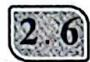

# 函数的奇偶性

# ←核心笔记

# 1. 函数的奇偶性定义

一般地,图像关于原点对称的函数叫作奇函数。在奇函数 $f(x)$ 中, $f(x)$ 和 $f(-x)$ 的绝对值相等, 符号相反, 即 $f(-x) = -f(x)$ (变形 $f(-x) + f(x) = 0$ 或 $\frac{f(-x)}{f(x)} = -1$ )。

图像关于 $y$ 轴对称的函数叫作偶函数。在偶函数 $f(x)$ 中， $f(x)$ 和 $f(-x)$ 相等，即 $f(-x) = f(x)$ （变形 $f(-x) - f(x) = 0$ 或 $\frac{f(-x)}{f(x)} = 1$ ）。偶函数满足 $f(x) = f(|x|) = f(-x)$ 。

判断奇偶对称的前提是判断定义域是否关于原点对称。若定义域关于原点不对称，则函数非奇非偶；定义域包含0的奇函数必过原点。

# 2. 常见函数奇偶的判断(假设以下所有函数定义域都关于原点对称)

$y=x^{n}(n \text{ 为奇数})$ 奇函数；

$y=x^{n}(n \text{ 为偶数})$ 偶函数；

$y=\sin kx(k\neq0)$ 奇函数；

$y=\cos kx(k\neq0)$ 偶函数；

$y=\tan kx(k\neq0)$ 奇函数；

$y=a^{x}+a^{-x}(a>0 \text{ 且 } a\neq1)$ 偶函数；

$y=a^{x}-a^{-x}$ 和 $y=a^{-x}-a^{x}(a>0$ 且 $a\neq1)$ 奇函数；

$y=\frac{a^{x}\pm1}{a^{x}\mp1}(a>0\text{ 且 }a\neq1)\text{ 和 }y=$ $\frac{1\pm a^{x}}{1\mp a^{x}}(a>0\text{ 且 }a\neq1)\quad\text{奇函数；}$

$y=\log_{a}\frac{b\pm cx}{b\mp cx}(b\neq0,c\neq0)$ 和 $y=\log_{a}(\sqrt{1+b^{2}x^{2}}\pm bx)(a>0$ 且 $a\neq1,b\neq0)$ 奇函数；

$y=\ln(e^{ax}+1)-\frac{ax}{2}$ 偶函数。

# 3. 函数奇偶的运算

奇函数±奇函数=奇函数；

偶函数±偶函数=偶函数；

奇函数×奇函数=偶函数；

奇函数×偶函数=奇函数；

偶函数×偶函数=偶函数；

奇函数±偶函数＝非奇非偶函数。

# 类型一：函数奇偶性的判断

方法：（1）先判断函数的定义域，定义域关于原点对称是判断函数奇偶性的先决条件；

（2） $f(-x) = -f(x)$ (奇函数), $f(-x) = f(x)$ (偶函数), 也可使用奇偶的变形判断, 如 $f(-x) + f(x) = 0$ (奇函数), $f(-x) - f(x) = 0$ (偶函数);

（3）记忆常见初等函数模型掌握其性质，并结合奇偶四则运算，也可快速判断出奇偶性。

##### 【151】（2012·广东·4·）

下列函数为偶函数的是()。

$\quad$A. $y = \sin x$

$\quad$B. $y = x^{3}$

$\quad$C. $y=e^{x}$

$\quad$D. $y=\ln\sqrt{x^{2}+1}$

##### 【152】(2015·福建·3·)

下列函数为奇函数的是()。

$\quad$A. $y=\sqrt{x}$

$\quad$B. $y = |\sin x|$

$\quad$C. $y=\cos x$

$\quad$D. $y=e^{x}-e^{-x}$

##### 【153】（2015·北京·3·）

下列函数中为偶函数的是()。

$\quad$A. $y = x^{2} \sin x$

$\quad$B. $y = x^{2} \cos x$

$\quad$C. $y = \left| \ln x \right|$

$\quad$D. $y=2^{-x}$

##### 【154】（2015·广东·文·3·）

下列函数中,既不是奇函数,也不是偶函数的是()。

$\quad$A. $y = x + \sin 2x$

$\quad$B. $y=x^{2}-\cos x$

$\quad$C. $y=2^{x}+\frac{1}{2^{x}}$

$\quad$D. $y = x^{2} + \sin x$

##### 【155】（2015·广东·理·3·）

下列函数中,既不是奇函数,也不是偶函数的是()。

$\quad$A. $y = \sqrt{1 + x^2}$

$\quad$B. $y = x + \frac{1}{x}$

$\quad$C. $y=2^{x}+\frac{1}{2^{x}}$

$\quad$D. $y = x + e^{x}$

##### 【156】（2010·广东·3·）

若函数 $f(x) = 3^{x} + 3^{-x}$ 与 $g(x) = 3^{x} - 3^{-x}$ 的定义域均为 $\mathbf{R}$ ，则（ ）。

$\quad$A. $f(x)$ 为偶函数, $g(x)$ 为奇函数

$\quad$B. $f(x)$ 与 $g(x)$ 均为奇函数

$\quad$C. $f(x)$ 为奇函数, $g(x)$ 为偶函数

$\quad$D. $f(x)$ 与 $g(x)$ 均为偶函数

##### 【157】（2024·天津·4·）

下列函数是偶函数的是( )。

$\quad$A. $y=\frac{e^{x}-x^{2}}{x^{2}+1}$

$\quad$B. $y=\frac{\cos x+x^{2}}{x^{2}+1}$

$\quad$C. $y=\frac{e^{x}-x}{x+1}$

$\quad$D. $y = \frac{\sin x + 4x}{\mathrm{e}^{|x|}}$

##### 【158】（2022·北京·4·）

已知函数 $f(x) = \frac{1}{1 + 2^x}$ ，则对任意的实数 $x$ ，有（ ）。

$\quad$A. $f(-x) + f(x) = 0$

$\quad$B. $f(-x)-f(x)=0$

$\quad$C. $f(-x) + f(x) = 1$

$\quad$D. $f(-x) - f(x) = \frac{1}{3}$

##### 【159】（2010·重庆·5·）

函数 $f(x)=\frac{4^{x}+1}{2^{x}}$ 的图像()。

$\quad$A. 关于原点对称

$\quad$B. 关于直线 $y = x$ 对称

$\quad$C. 关于 $x$ 轴对称

$\quad$D. 关于 y 轴对称

##### 【160】（2009·全国二·3·）

函数 $y=\log_{2}\frac{2-x}{2+x}$ 的图像()。

$\quad$A. 关于原点对称

$\quad$B. 关于直线 y = -x 对称

$\quad$C. 关于 $y$ 轴对称

$\quad$D. 关于直线 $y = x$ 对称

类型二：由奇偶性求参数

方法：（1） 若 $f(x)$ 具有奇偶性，则其定义域必然关于原点对称，且其图像特征也是关于原点或是 y 轴对称的。可以使用定义域的对称求参数，或是使用特殊点，比如零点也是对称的。

（2） 可以通过 $f(-x) = -f(x)$ 或 $f(-x) = f(x)$ 形成方程, 使用待定系数法求解参数。  
（3） 可以结合奇偶四则运算剥离含参函数并确定其奇偶, 再使用（1）或（2）。

##### 【161】（2012·重庆·12·）

若 $f(x)=(x+a)(x-4)$ 是偶函数，则实数 a= \_\_\_\_。

##### 【162】（2011·辽宁·6·）

若函数 $f(x) = \frac{x}{(2x + 1)(x - a)}$ 为奇函数，则 $a = (\quad)$ 。

$\quad$A. $\frac{1}{2}$

$\quad$B. $\frac{2}{3}$

$\quad$C. $\frac{3}{4}$

$\quad$D. 1

##### 【163】（2011·浙江·11·）

若函数 $f(x)=x^{2}-|x+a|$ 为偶函数，则实数 a= \_\_\_\_。

##### 【164】（2023·新课标全国甲·13·）

若 $y=(x-1)^{2}+ax+\sin\left(x+\frac{\pi}{2}\right)$ 为偶函数，则 a= \_\_\_\_。

##### 【165】（2009·重庆·12·）

若 $f(x)=\frac{1}{2^{x}-1}+a$ 是奇函数，则 a= \_\_\_\_。

##### 【166】(2006·全国一·13·)

已知函数 $f(x)=a-\frac{1}{2^{x}+1}$ 。若 $f(x)$ 为奇函数，则 a= \_\_\_\_。

##### 【167】（2015·山东·8·）

若函数 $f(x) = \frac{2^x + 1}{2^x - a}$ 是奇函数，则使

$f(x)>3$ 成立的 x 的取值范围为()。

$\quad$A. $(-\infty, -1)$

$\quad$B. $(-1,0)$

$\quad$C. $(0,1)$

$\quad$D. $(1, +\infty)$

##### 【168】（2023·新课标全国乙·4·）

已知 $f(x) = \frac{x\mathrm{e}^x}{\mathrm{e}^{ax} - 1}$ 是偶函数，则 $a =$ （ ）。

$\quad$A.-2

$\quad$B. -1

$\quad$C. 1

$\quad$D. 2

##### 【169】(2010·江苏·5·)

设函数 $f(x)=x\left(\mathrm{e}^{x}+a\mathrm{e}^{-x}\right)(x\in\mathbb{R})$ 是偶函数，则实数 a= \_\_\_\_。

##### 【170】（2021·新高考全国一·13·）

已知函数 $f(x) = x^{3}(a2^{x} - 2^{-x})(x\in \mathbf{R})$ 是偶函数，则实数 $a =$ \_\_\_\_。

##### 【171】（2023·新高考全国二·4·）

若 $f(x) = (x + a)\ln \frac{2x - 1}{2x + 1}$ 为偶函数，则 $a = (\quad)$ 。

$\quad$A. -1

$\quad$B. 0

$\quad$C. $\frac{1}{2}$

$\quad$D. 1

##### 【172】（2015·新课标全国一·13·）

若函数 $f(x)=x\ln(x+\sqrt{a+x^{2}})$ 是偶函数，则实数 a= \_\_\_\_。

##### 【173】(2014·湖南·15·)

若 $f(x)=\ln(\mathrm{e}^{3x}+1)+ax$ 是偶函数，则实数 a= \_\_\_\_。

##### 【174】（2024·新高考全国二·6·）

设函数 $f(x)=a(x+1)^{2}-1$ , $g(x)=\cos x+2ax$ (a 为常数), 当 $x\in(-1,1)$ 时, 曲线 $y=f(x)$ 和 $y=g(x)$ 恰有一个交点, 则 $a=(\quad)$ 。

$\quad$A. -1

$\quad$B. $\frac{1}{2}$

$\quad$C. 1

$\quad$D. 2

# 类型三：利用奇偶性求函数解析式与函数值

方法: （1） 设所求区间量, 根据对称性通过所设变量表示对称区间变量, 代入对称区间变量所在解析式, 再结合奇偶性化简得所求解析式;

（2） 利用对称性求得所求变量对称量函数值, 再由对称性求得所求变量函数值;  
（3） 结合平移知识可以把具有中心对称或者轴对称的函数问题转化为具有奇偶性的函数进行求解；或者通过调整函数结构转为利用函数奇偶性求解问题。

##### 【175】（2019·新课标全国二·6·）

设 $f(x)$ 为奇函数，且当 $x \geqslant 0$ 时， $f(x) = \mathrm{e}^x - 1$ ，则当 $x < 0$ 时， $f(x) = (\cdot)$ 。

$\quad$A. $\mathrm{e}^{-x} - 1$

$\quad$B. $\mathrm{e}^{-x} + 1$

$\quad$C. $-\mathrm{e}^{-x}-1$

$\quad$D. $-\mathrm{e}^{-x} + 1$

##### 【176】（2017·新课标全国二·14·）

已知函数 $f(x)$ 是定义在 $\mathbf{R}$ 上的奇函数，当 $x \in (-\infty, 0)$ 时， $f(x) = 2x^3 + x^2$ ，则 $f(2) =$ \_\_\_\_。

##### 【177】（2019·新课标全国二·14·）

已知 $f(x)$ 是奇函数, 且当 x<0 时, $f(x)=-\mathrm{e}^{ax}$ 。若 $f(\ln2)=8$ , 则 a=\_\_\_\_。

##### 【178】（2021·新课标全国乙·4·）

设函数 $f(x)=\frac{1-x}{1+x}$ ，则下列函数中为奇函数的是()。

$\quad$A. $f(x - 1) = 1$

$\quad$B. $f(x-1)+1$

$\quad$C. $f(x+1)-1$

$\quad$D. $f(x + 1) + 1$

##### 【179】（2011·广东·12·）

设函数 $f(x)=x^{3}\cos x+1$ ，若 $f(a)=11$ ，
则 $f(-a)=$ \_\_\_\_。

##### 【180】（2013·湖南·4·）

已知 $f(x)$ 是奇函数, $g(x)$ 是偶函数, 且 $f(-1)+g(1)=2$ , $f(1)+g(-1)=4$ , 则 $g(1)$ 等于()。

$\quad$A. 4

$\quad$B. 3

$\quad$C. 2

$\quad$D. 1

##### 【181】（2011·湖北·3·）

若定义在 $\mathbf{R}$ 上的偶函数 $f(x)$ 和奇函数 $g(x)$ 满足 $f(x) + g(x) = \mathrm{e}^x$ ，则 $g(x) =$ （ ）。

$\quad$A. $\mathrm{e}^{x} - \mathrm{e}^{-x}$

$\quad$B. $\frac{1}{2} (\mathrm{e}^{x} + \mathrm{e}^{-x})$

$\quad$C. $\frac{1}{2}(e^{-x}-e^{x})$

$\quad$D. $\frac{1}{2}(e^{x}-e^{-x})$

##### 【182】（2008·安徽·11·）

若函数 $f(x), g(x)$ 分别是 $\mathbf{R}$ 上的奇函数、偶函数，且满足 $f(x) - g(x) = \mathrm{e}^x$ ，则有（ ）。

$\quad$A. $f(2) < f(3) < g(0)$   
$\quad$B. $g(0) < f(3) < f(2)$   
$\quad$C. $f(2) < g(0) < f(3)$   
$\quad$D. $g(0) < f(2) < f(3)$

##### 【183】（2023·新高考全国一·11·）

(多选题)已知函数 $f(x)$ 的定义域为 R， $f(xy)=y^{2}f(x)+x^{2}f(y)$ ，则()。

$\quad$A. $f\left( 0\right)  = 0$   
$\quad$B. $f\left( 1\right)  = 0$   
$\quad$C. $f(x)$ 是偶函数  
$\quad$D. $x = 0$ 为 $f(x)$ 的极小值点

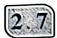

# 函数的对称性与周期性及其应用

# 核心笔记

# 函数的对称性

函数的奇偶性是函数特殊的对称性, 偶函数关于 y 轴对称, 奇函数关于原点对称, 若将具有奇偶性的函数进行上下左右平移, 虽然有可能不具有奇偶性, 但其对称中心和对称轴依然保留, 依然具有对称性。函数的对称中心和对称轴的判断还需结合平移伸缩综合判断, 其中涉及常数分离、先局部后整体等方法。

（1） 若函数 $f(x)$ 满足 $f(a+x)=f(b-x)$ 恒成立，则 $f(x)$ 的对称轴是 $x=\frac{a+b}{2}$ 。

（2） 若函数 $f(x)$ 满足 $f(a + x) = -f(b - x)$ 恒成立, 则 $f(x)$ 的对称中心为 $\left(\frac{a + b}{2}, 0\right)$ 。

（3） 若函数 $f(x)$ 满足 $f(a+x)=c-f(b-x)$ 恒成立，则 $f(x)$ 的对称中心为 $\left(\frac{a+b}{2},\frac{c}{2}\right)$ 。

# 函数的周期性

##### 1. 定义：一般地，对于函数 $f(x)$ ，如果存在非零实数 $T$ ，对任意的 $x \in D$ ，都有 $f(x + T) = f(x)$ ，则 $f(x)$ 为周期函数， $T$ 为这个函数的周期。

# 2. 常见函数周期的判断

（1）若函数 $f(x)$ 满足 $f(x + a) + f(x + b) = c(a, b, c$ 为常数），则 $T = 2|a - b|$ 。

特例：① 若函数 $f(x)$ 满足 $f(x + a) = -f(x)$ ，则 $T = 2|a|$ ；

② 若函数 $f(x)$ 满足 $f(x + a) = -f(x) + c$ ，则 $T = 2|a|$ 。

（2） 若函数 $f(x)$ 满足 $f(x+a)\cdot f(x+b)=c(a,b,c$ 为常数)，则 $T=2|a-b|$ 。

特例：① 若函数 $f(x)$ 满足 $f(x + a) = \frac{1}{f(x)} (a$ 为常数），则 $T = 2|a|$ ；

② 若函数 $f(x)$ 满足 $f(x + a) = -\frac{1}{f(x)} (a$ 为常数), 则 $T = 2|a|$ 。

（3） 若函数 $f(x)$ 的图像关于点 $(a,0)$ 和点 $(b,0)$ 对称，则 $f(x)$ 是周期函数， $T=2|a-b|$ 。

（4） 若函数 $f(x)$ 的图像关于直线 x=a 和直线 x=b 对称，则 $f(x)$ 是周期函数， $T=2|a-b|$ 。

（5） 若函数 $f(x)$ 的图像关于点 $(a,0)$ 和直线 x=b 对称，则 $f(x)$ 是周期函数， $T=4|a-b|$ 。

# 类型一：求函数值

方法：（1）判断函数的周期性，核心笔记里给出了常见函数的周期判断；

（2） 利用周期性将所求变量调整至已知解析式的区间上, 进而代入求解即可。

# 【184】(2019·上海·6·)

已知函数 $f(x)$ 周期为1，且当 $0 < x \leqslant 1$

时， $f(x)=-\log_{2}x$ ，则 $f\left(\frac{3}{2}\right)=$ \_\_\_\_。

##### 【185】（2014·四川·13·y）

设 $f(x)$ 是定义在 $\mathbf{R}$ 上的周期为2的函数，当 $x\in [-1,1)$ 时， $f(x) = \left\{ \begin{array}{ll} -4x^{2} + 2, & -1\leqslant x < 0,\\ x, & 0\leqslant x < 1, \end{array} \right.$ 则 $f\left(\frac{3}{2}\right) =$ \_\_\_\_。

##### 【186】（2018·江苏·9·）

函数 $f(x)$ 满足 $f(x + 4) = f(x)(x \in \mathbb{R})$ ，且在区间 $(-2, 2]$ 上， $f(x) = \left\{ \begin{array}{ll} \cos \frac{\pi x}{2}, & 0 < x \leqslant 2, \\ \left| x + \frac{1}{2} \right|, & -2 < x \leqslant 0, \end{array} \right.$ 则 $f(f(15))$ 的

值为\_\_\_\_。

# 类型二：判断周期性并求函数值

方法：判断函数的周期性，并由变量间的函数值关系确定已知函数值和未知函数值间的关系。

##### 【187】（2021·新课标全国甲·12·）

设 $f(x)$ 是定义域为 $\mathbf{R}$ 的奇函数，且 $f(1 + x) = f(-x)$ 。若 $f\left(-\frac{1}{3}\right) = \frac{1}{3}$ ，则 $f\left(\frac{5}{3}\right) = (\quad)$ 。

$\quad$A. $-\frac{5}{3}$

$\quad$B. $-\frac{1}{3}$

$\quad$C. $\frac{1}{3}$

$\quad$D. $\frac{5}{3}$

##### 【188】（2008·四川·9·）

函数 $f(x)$ 满足 $f(x) \cdot f(x+2)=13$ ，若 $f(1)=2$ ，则 $f(99)=(\quad)$ 。

$\quad$A. 13

$\quad$B. 2

$\quad$C. $\frac{13}{2}$

$\quad$D. $\frac{2}{13}$

##### 【189】（2006·安徽·15·）

函数 $f(x)$ 对于任意实数 $x$ 满足条件 $f(x + 2) = \frac{1}{f(x)}$ ，若 $f(1) = -5$ ，则 $f(f(5)) = \underline{\quad}$ 。

##### 【190】（2006·山东·5·）

已知定义在 $\mathbf{R}$ 上的奇函数 $f(x)$ 满足 $f(x + 2) = -f(x)$ ，则 $f(6)$ 的值为（ ）。

$\quad$A.-1

$\quad$B. 0

$\quad$C. 1

$\quad$D. 2

# 类型三：周期性和奇偶性综合问题求函数值

方法：（1）利用周期性和奇偶性将所求变量调整至已知解析式的区间上，进而代入求解即可；

（2） 结合定义深度理解周期定义并求周期, 能利用两条对称轴、两个对称中心或一个对称中心与一条对称轴求周期。

##### 【191】（2012·浙江·16·）

设函数 $f(x)$ 是定义在 $\mathbf{R}$ 上的周期为2的偶函数，当 $x \in [0,1]$ 时， $f(x) = x + 1$ ，则 $f\left(\frac{3}{2}\right) =$ \_\_\_\_。

##### 【192】（2011·大纲·10·）

设 $f(x)$ 是周期为2的奇函数，当 $0 \leqslant x \leqslant 1$ 时， $f(x) = 2x(1 - x)$ ，则 $f\left(-\frac{5}{2}\right) = (\quad)$ 。

$\quad$A. $-\frac{1}{2}$

$\quad$B. $-\frac{1}{4}$

$\quad$C. $\frac{1}{4}$

$\quad$D. $\frac{1}{2}$

##### 【193】（2008·湖北·6·）

已知 $f(x)$ 在 R 上是奇函数，且 $f(x+4)=f(x)$ ，当 $x\in(0,2)$ 时， $f(x)=2x^{2}$ ，则 $f(7)=(\quad)$ 。

$\quad$A. -2

$\quad$B. 2

$\quad$C. -98

$\quad$D. 98

##### 【194】（2010·安徽·4·）

若 $f(x)$ 是 $\mathbf{R}$ 上周期为5的奇函数，且满足 $f(1) = 1,f(2) = 2$ ，则 $f(3) - f(4) =$ （ ）。

$\quad$A. -1

$\quad$B. $\cdot  1$

$\quad$C.-2

$\quad$D. 2

##### 【195】（2016·四川·14·）

若函数 $f(x)$ 是定义 R 上的周期为 2 的奇函数，当 0 < x < 1 时， $f(x) = 4^{x}$ ，则 $f\left(-\frac{5}{2}\right) + f(2) =$ \_\_\_\_。

##### 【196】（2014·安徽·14·）

若函数 $f(x)(x \in \mathbb{R})$ 是周期为4的奇函数，且在[0,2]上的解析式为

$f (x) = \left\{ \begin{array}{l l} x (1 - x), & 0 \leqslant x \leqslant 1, \\ \sin \pi x, & 1 <   x \leqslant 2, \end{array} \right.$

则 $f\left(\frac{29}{4}\right)+f\left(\frac{41}{6}\right)=$ \_\_\_\_。

##### 【197】（2014·新课标全国二·15·）

已知偶函数 $f(x)$ 的图像关于直线 x=2 对称，若 $f(3)=3$ ，则 $f(-1)=$ \_\_\_\_。

##### 【198】（2017·山东·14·）

已知 $f(x)$ 是定义在 $\mathbf{R}$ 上的偶函数，且 $f(x + 4) = f(x - 2)$ 。若当 $x\in [-3,0]$ 时， $f(x) = 6^{-x}$ ，则 $f(919) =$

##### 【199】（2018·新课标全国二·11·）

已知 $f(x)$ 是定义域为 $(-∞,+∞)$ 的奇函数，满足 $f(1-x)=f(1+x)$ 。若 $f(1)=2$ ，则 $f(1)+f(2)+\cdots+f(50)=(\quad)$ 。

$\quad$A. -50

$\quad$B. 0

$\quad$C. 2

$\quad$D. 50

##### 【200】（2012·山东·8·）

定义在 $\mathbf{R}$ 上的函数 $f(x)$ 满足 $f(x + 6) = f(x)$ ，当 $-3 \leqslant x < -1$ 时， $f(x) = -(x + 2)^2$ ，当 $-1 \leqslant x < 3$ 时， $f(x) = x$ ，则

$f(1)+f(2)+f(3)+\cdots+f(2012)=$ ()。

$\quad$A. 335

$\quad$B. 338

$\quad$C. 1678

$\quad$D. 2012

# 2.8 函数性质的综合问题

# 核心笔记

##### 1. 熟识初等函数的性质且能在多项式函数中逐块判断单调性与奇偶性，并对多项式函数的单调性与奇偶性做进一步判断。

##### 2. 奇函数关于原点对称的两个区间单调性一致,偶函数关于原点对称的两个区间单调性相反。

# 类型一：单调性综合类问题

方法：（1）熟识初等函数的单调性且要结合单调性四则运算进一步判断多项式函数单调性；

（2） 复合函数单调性的判断要领是“同增异减”。

##### 【201】（2016·北京·5·）

已知 $x, y \in R$ ，且 x > y > 0，则（）。

$\quad$A. $\frac{1}{x} - \frac{1}{y} > 0$

$\quad$B. $\sin x - \sin y > 0$

$\quad$C. $\left(\frac{1}{2}\right)^{x}-\left(\frac{1}{2}\right)^{y}<0$

$\quad$D. $\ln x + \ln y > 0$

##### 【202】(2019·新课标全国二·6·y)

若 a > b，则（ ）。

$\quad$A. $\ln(a-b)>0$

$\quad$B. ${3}^{a} < {3}^{b}$

$\quad$C. $a^{3}-b^{3}>0$

$\quad$D. $|a| > |b|$

##### 【203】（2020·新课标全国二·11·）

若 $2^{x} - 2^{y} < 3^{-x} - 3^{-y}$ ，则（ ）。

$\quad$A. $\ln(y-x+1)>0$

$\quad$B. $\ln (y - x + 1) <   0$

$\quad$C. $\ln|x-y|>0$

$\quad$D. $\ln|x-y|<0$

##### 【204】（2019·北京·13·）

设函数 $f(x) = \mathrm{e}^x + a\mathrm{e}^{-x}$ ( $a$ 为常数)。若 $f(x)$ 为奇函数，则 $a =$ \_\_\_\_；若 $f(x)$ 是 $\mathbf{R}$ 上的增函数，则 $a$ 的取值范围是\_\_\_\_。

类型二：单调性与奇偶性的综合判断

方法：（1）熟识初等函数的单调性且要结合单调性四则运算进一步判断多项式函数的单调性；

（2） 熟识初等函数的奇偶性且要结合奇偶性四则运算进一步判断多项式函数的奇偶性。

##### 【205】（2012·陕西·2·）

下列函数中,既是奇函数又是增函数的是( )。

$\quad$A. $y = x + 1$

$\quad$B. $y =  - {x}^{3}$

$\quad$C. $y = \frac{1}{x}$

$\quad$D. $y = x\mid x\mid$

##### 【206】（2020·新课标全国二·10·）

设函数 $f(x) = x^{3} - \frac{1}{x^{3}}$ ，则 $f(x)$ （ ）。

$\quad$A. 是奇函数, 且在 $(0, +\infty)$ 上单调递增  
$\quad$B. 是奇函数, 且在 $(0, +\infty)$ 上单调递减  
$\quad$C. 是偶函数, 且在 $(0, +\infty)$ 上单调递增  
$\quad$D. 是偶函数, 且在 $(0, +\infty)$ 上单调递减

##### 【207】（2015·湖南·5·）

设函数 $f(x) = \ln (1 + x) - \ln (1 - x)$ ，则 $f(x)$ 是（ ）。

$\quad$A. 奇函数,且在(0,1)上是增函数  
$\quad$B. 奇函数,且在(0,1)上是减函数

$\quad$C. 偶函数,且在(0,1)上是增函数  
$\quad$D. 偶函数,且在(0,1)上是减函数

##### 【208】（2020·新课标全国二·9·）

设函数 $f(x) = \ln |2x + 1| - \ln |2x - 1|$ ，则 $f(x)$ （ ）。

$\quad$A. 是偶函数, 且在 $\left(\frac{1}{2}, +\infty\right)$ 上是增函数  
$\quad$B. 是奇函数, 且在 $\left(-\frac{1}{2}, \frac{1}{2}\right)$ 上是减函数  
$\quad$C. 是偶函数, 且在 $\left(-\infty, -\frac{1}{2}\right)$ 上是增函数  
$\quad$D. 是奇函数, 且在 $\left(-\infty, -\frac{1}{2}\right)$ 上是减函数

类型三：函数与不等式

方法：结合单调性与奇偶性能将函数值间的不等关系转为自变量间的不等关系。

##### 【209】（2017·新课标全国一·5·）

函数 $f(x)$ 在 $(-\infty, +\infty)$ 上单调递减，且为奇函数。若 $f(1) = -1$ ，则满足 $-1 \leqslant f(x - 2) \leqslant 1$ 的 $x$ 的取值范围是（ ）。

$\quad$A. $[-2, 2]$

$\quad$B. $[-1, 1]$

$\quad$C. $[0,4]$

$\quad$D. $[1,3]$

##### 【210】（2010·新课标全国·9·）

设偶函数 $f(x)$ 满足 $f(x) = 2^{x} - 4(x \geqslant 0)$ ，则 $\{x \mid f(x - 2) > 0\} = (\quad)$ 。

$\quad$A. $\{x \mid x < -2 \text{ 或 } x > 4\}$   
$\quad$B. $\{x \mid x < 0 \text{ 或 } x > 4\}$   
$\quad$C. $\{x\mid x <   0$ 或 $x > 6\}$   
$\quad$D. $\{x \mid x < -2 \text{ 或 } x > 2\}$

##### 【211】（2005·重庆·3·）

若函数 $f(x)$ 是定义在 $\mathbf{R}$ 上的偶函数，在 $(- \infty, 0]$ 上是减函数，且 $f(2) = 0$ ，则使得 $f(x) < 0$ 的 $x$ 的取值范围是（ ）。

$\quad$A. $(-\infty, 2)$   
$\quad$B. $(2,+\infty)$

$\quad$C. $(- \infty, -2) \cup (2, +\infty)$   
$\quad$D. $(-2,2)$

##### 【212】（2014·新课标全国二·15·）

已知偶函数 $f(x)$ 在 $[0, +\infty)$ 上单调递减， $f(2)=0$ 。若 $f(x-1)>0$ ，则 x 的取值范围是 \_\_\_\_。

##### 【213】（2016·天津·6·）

已知 $f(x)$ 是定义在 $\mathbf{R}$ 上的偶函数，且在区间 $(-\infty, 0)$ 上单调递增。若实数 $a$ 满足 $f(2^{|a - 1|}) > f(-\sqrt{2})$ ，则 $a$ 的取值范围是（ ）。

$\quad$A. $(-∞, \frac{1}{2})$   
$\quad$B. $\left(-\infty,\frac{1}{2}\right)\cup\left(\frac{3}{2},+\infty\right)$   
$\quad$C. $\left(\frac{1}{2},\frac{3}{2}\right)$   
$\quad$D. $\left(\frac{3}{2},+\infty\right)$

##### 【214】（2008·全国一·9·）

设奇函数 $f(x)$ 在 $(0, +\infty)$ 上为增函数，且 $f(1) = 0$ ，则不等式 $\frac{f(x) - f(-x)}{x} < 0$ 的解集为（ ）。

$\quad$A. $(-1,0) \cup (1, +\infty)$   
$\quad$B. $(-∞,-1)∪(0,1)$   
$\quad$C. $(- \infty, -1) \cup (1, +\infty)$   
$\quad$D. $(-1,0)\cup(0,1)$

##### 【215】（2024·北京·9·jj）

已知 $(x_{1},y_{1}),(x_{2},y_{2})$ 是函数 $y = 2^{x}$ 图像上不同的两点，则下列正确的是（ ）。

$\quad$A. $\log_{2}\frac{y_{1}+y_{2}}{2}>\frac{x_{1}+x_{2}}{2}$   
$\quad$B. $\log_2\frac{y_1 + y_2}{2} < \frac{x_1 + x_2}{2}$   
$\quad$C. $\log_2\frac{y_1 + y_2}{2} >x_1 + x_2$   
$\quad$D. $\log_2\frac{y_1 + y_2}{2} < x_1 + x_2$

##### 【216】（2020·新高考全国一·8·）

若定义在 R 上奇函数 $f(x)$ 在 $(-∞,0)$ 上单调递减，且 $f(2)=0$ ，则满足 $xf(x-1)≥0$ 的 x 的取值范围是（）。

$\quad$A. $[-1, 1] \cup [3, +\infty)$   
$\quad$B. $\left[-3,-1\right]\cup\left[0,1\right]$   
$\quad$C. $[-1,0] \cup [1, +\infty)$   
$\quad$D. $\left[-1,0\right]\cup\left[1,3\right]$

##### 【217】（2024·新高考全国二·8·）

设函数 $f(x) = (x + a)\ln (x + b)$ ，若 $f(x) \geqslant 0$ ，则 $a^2 + b^2$ 的最小值为（ ）。

$\quad$A. $\frac{1}{8}$

$\quad$B. $\frac{1}{4}$

$\quad$C. $\frac{1}{2}$

$\quad$D. 1

# 2.9 函数的图像

核心笔记

### 一、初等函数的图像与性质

##### 1. 幂函数的图像与性质

<table><tr><td>幂函数</td><td> $y = x$ </td><td> $y = {x}^{2}$ </td><td> $y = {x}^{3}$ </td><td> $y = {x}^{\frac{1}{2}}$ </td><td> $y = {x}^{-1}$ </td></tr><tr><td>定义域</td><td>R</td><td>R</td><td>R</td><td> $\left\lbrack {0, + \infty }\right)$ </td><td> $x \neq 0$ </td></tr><tr><td>值域</td><td>R</td><td> $\left\lbrack {0, + \infty }\right)$ </td><td>R</td><td> $\left\lbrack {0, + \infty }\right)$ </td><td> $y \neq 0$ </td></tr><tr><td>奇偶性</td><td>奇</td><td>偶</td><td>奇</td><td>非奇非偶</td><td>奇</td></tr><tr><td>单调性(x&gt;0)</td><td>单调递增</td><td>单调递增</td><td>单调递增</td><td>单调递增</td><td>单调递减</td></tr><tr><td>公共点</td><td colspan="5">(1,1)</td></tr></table>

幂函数 $y = x^{\alpha}$ 在第一象限的重要结论：

（1） 恒过点 $(1,1)$ ;  
（2） 当 $x \in (0,1)$ 时, $\alpha$ 越大, 函数值越小; 当 $x \in (1,+\infty)$ 时, $\alpha$ 越大, 函数值越大;  
（3） 在直线 x=1 的右侧, 图像由上至下对应的指数 $\alpha$ 由大到小;

（4） 在 y 轴和直线 x=1 之间, 图像由上至下对应的指数 $\alpha$ 由小到大。

##### 2. 指数函数的图像与性质

<table><tr><td rowspan="2">函数</td><td colspan="2"> $y = {a}^{x}\left( {a >0\text{,且}a \neq 1}\right)$ </td></tr><tr><td> $0 < a < 1$ </td><td> $a >1$ </td></tr><tr><td>图像</td><td>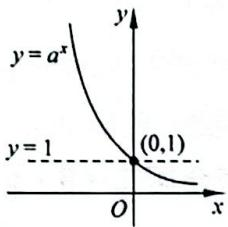</td><td>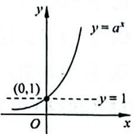</td></tr><tr><td>定义域</td><td colspan="2">R</td></tr><tr><td>值域</td><td colspan="2"> $(0, + \infty )$ </td></tr><tr><td rowspan="2">性质</td><td colspan="2">过定点(0,1)</td></tr><tr><td>减函数</td><td>增函数</td></tr></table>

##### 3. 对数函数的图像与性质

<table><tr><td rowspan="2">函数</td><td colspan="2"> $y=\log_a x$ (a&gt;0,且 a≠1)</td></tr><tr><td>a&gt;1</td><td>0</td></tr><tr><td>图像</td><td>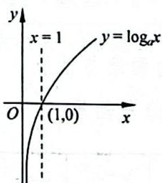</td><td>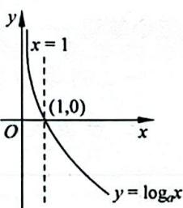</td></tr><tr><td>定义域</td><td colspan="2">(0,+∞)</td></tr><tr><td>值域</td><td colspan="2">R</td></tr><tr><td rowspan="3">性质</td><td colspan="2">过定点(1,0)</td></tr><tr><td>当x&gt;1时,y&gt;0;当00</td><td>当x&gt;1时,y&lt;0;当00</td></tr><tr><td>在(0,+∞)内单调递增</td><td>在(0,+∞)内单调递减</td></tr></table>

### 二、函数图像的变换与对称

（1） 平移变换

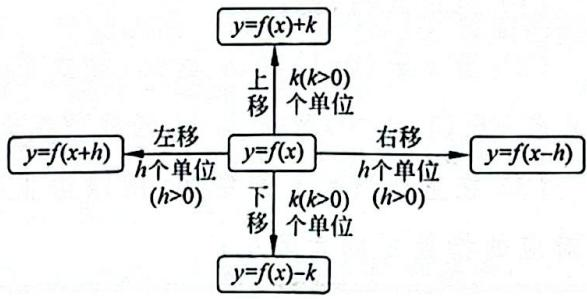

（2） 对称变换

① $y=f(x)$ 和 $y=-f(x)$ 关于 x 轴对称；

② $y = f(x)$ 和 $y = f(-x)$ 关于 $y$ 轴对称；

③ $y = f(x)$ 和 $y = -f(-x)$ 关于原点对称；

④ $y=a^{x}(a>0$ 且 $a\neq1)$ 和 $y=\log_{a}x$ 关于直线 y=x 对称。

（3） 翻折变换

① $y = f(x) \frac{\text{保留 } x \text{ 轴及上方图像}}{\text{将 } x \text{ 轴下方图像翻折上去}} \rightarrow y = |f(x)|;$

② $y = f(x) \xrightarrow[\text{关于 } y \text{ 轴对称的图像}]{\text{保留 } y \text{ 轴及右边图像,并作其}} y = f(|x|)$ 。

（4） 伸缩变换

① $y = f(x)$

$a > 1$ ，横坐标缩短为原来的 $\frac{1}{a}$ 倍，纵坐标不变 $0 < a < 1$ ，横坐标伸长为原来的 $\frac{1}{a}$ 倍，纵坐标不变 $y = f(ax)$

② $y = f(x)$

$a > 1$ ，纵坐标伸长为原来的 $a$ 倍，横坐标不变 $0 <   a <   1$ ，纵坐标缩短为原来的 $a$ 倍，横坐标不变 $y = af(x)$ 。

# 类型一：初等函数的图像综合判断

方法：熟识初等函数的图像和性质并加以应用。

##### 【218】（2011·陕西·4·）

函数 $y=x^{\frac{1}{3}}$ 的图像是()。

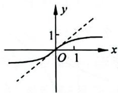

$\quad$A.

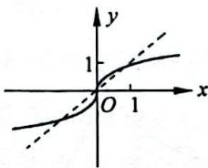

$\quad$B.

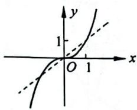

$\quad$C.

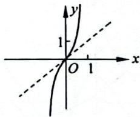

$\quad$D.

##### 【219】（2004·湖北·5·）

若函数 $y=a^{x}+b-1(a>0,$ 且 $a\neq1)$ 的图像经过第二、第三、第四象限，则一定有()。

$\quad$A. 0<a<1 且 b>0

$\quad$B. a>1 且 b>0

$\quad$C. 0 < a < 1 且 b < 0

$\quad$D. a>1 且 b<0

##### 【220】（2012·四川·5·）

函数 $y=a^{x}-\frac{1}{a}(a>0,$ 且 $a\neq1)$ 的图像可能是()。

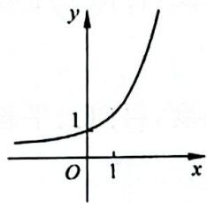

$\quad$A.

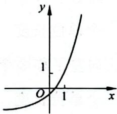

$\quad$B.

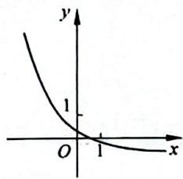

$\quad$C.

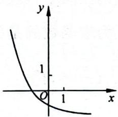

$\quad$D.

##### 【221】(2010·四川·2·)

函数 $y=\log_{2}x$ 的图像大致是()。

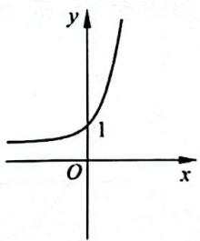

$\quad$A.

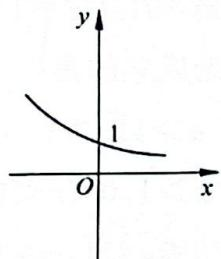

$\quad$B.

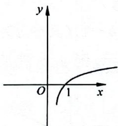

$\quad$C.

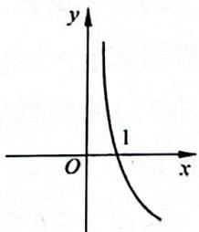

$\quad$D.

##### 【222】(2014·福建·8·)

若函数 $y=\log_{a}x(a>0,$ 且 $a\neq1)$ 的图像如下图所示，则下列函数正确的是()。

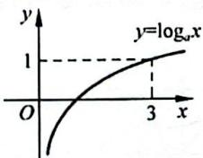

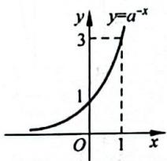

$\quad$A.

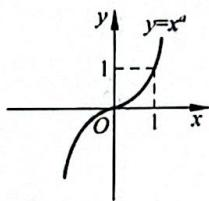

$\quad$B.

$\quad$C.

$\quad$D.

##### 【223】（2014·山东·6·）

已知函数 $y=\log_{a}(x+c)(a,c)$ 为常数，其中 a>0，且 $a\neq1)$ 的图像如图所示，则下列结论成立的是( )。

$\quad$A. $a > 1, c > 1$   
$\quad$B. $a > 1,0 <   c <   1$   
$\quad$C. 0<a<1,c>1   
$\quad$D. 0 < a < 1, 0 < c < 1

##### 【224】（2008·山东·12·）

已知函数 $y=\log_{a}(2^{x}+b-1)$ (其中 a>0, 且 $a\neq1$ ) 的图像如图所示，则 a,b 满足的关系是( )。

$\quad$A. $0 < a^{-1} < b < 1$   
$\quad$B. $0 < b < a^{-1} < 1$   
$\quad$C. $0 < b^{-1} < a < 1$   
$\quad$D. $0 < a^{-1} < b^{-1} < 1$

##### 【225】（2014·浙江·8·）

在同一坐标系中, 函数 $f(x)=x^{a}(x>0)$ , $g(x)=\log_{a}x$ 的图像可能是()。

$\quad$A.

$\quad$B.

$\quad$C.

$\quad$D.

##### 【226】（2019·浙江·6·）

在同一直角坐标系中，函数 $y = \frac{1}{a^x}, y =$

$\log_a\left(x + \frac{1}{2}\right)(a > 0$ ，且 $a\neq 1)$ 的图像可能是（ ）。

$\quad$A.

$\quad$B.

$\quad$C.

$\quad$D.

##### 【227】（2012·四川·4·）

为了得到函数 $y=2^{x-3}-1$ 的图像, 只需把函数 $y=2^{x}$ 上所有点()。

$\quad$A. 向右平移 3 个单位长度, 再向下平移 1 个单位长度  
$\quad$B. 向左平移 3 个单位长度, 再向下平移 1 个单位长度  
$\quad$C. 向右平移 3 个单位长度, 再向上平移 1 个单位长度  
$\quad$D. 向左平移 3 个单位长度, 再向上平移 1 个单位长度

##### 【228】（2011·重庆·5·）

下列区间中, 函数 $f(x)=\left|\ln(2-x)\right|$ 在其上为增函数的是()。

$\quad$A. $(-\infty, 1]$

$\quad$B. $\left[-1,\frac{4}{3}\right]$

$\quad$C. $\left[0, \frac{3}{2}\right)$

$\quad$D. $[1,2)$

# 类型二：函数的图像综合判断

方法：（1）判断函数的定义域、单调性、奇偶性、对称性以及零点等特殊点；

（2） 对比多个图像的不同之处进行判断。

##### 【229】（2022·新课标全国乙·8·）

如图所示是下列四个函数中的某个函数在区间 $[-3, 3]$ 的大致图像，则该函数是（）。

$\quad$A. $\frac{-x^{3} + 3x}{x^{2} + 1}$

$\quad$B. $y = \frac{x^3 - x}{x^2 + 1}$

$\quad$C. $y=\frac{2x\cos x}{x^{2}+1}$

$\quad$D. $y = \frac{2\sin x}{x^2 + 1}$

##### 【230】（2022·新课标全国甲·5·）

函数 $y = (3^x - 3^{-x})\cos x$ 在区间 $\left[-\frac{\pi}{2}, \frac{\pi}{2}\right]$ 的图像大致为（ ）。

$\quad$A.

$\quad$B.

$\quad$C.

$\quad$D.

##### 【231】（2024·全国甲·7·）

函数 $f(x) = -x^{2} + \left(\mathrm{e}^{x} - \mathrm{e}^{-x}\right)\sin x$ 在区间 $[-2.8, 2.8]$ 的大致图像为（）。

$\quad$A.

$\quad$B.

$\quad$C.

  
$\quad$D.

##### 【232】（2015·浙江·5·）

函数 $f(x) = \left(x - \frac{1}{x}\right)\cos x(-\pi \leqslant x\leqslant \pi$ 且 $x\neq 0)$ 的图像可能为（ ）。

$\quad$A.

$\quad$B.

$\quad$C.

$\quad$D.

##### 【233】（2018·浙江·5·）

函数 $y=2^{|x|}\sin2x$ 的图像可能是()。

$\quad$A.

$\quad$B.

$\quad$C.

$\quad$D.

##### 【234】(2020·浙江·4·)

函数 $y = x \cos x + \sin x$ 在区间 $[-π, π]$ 上的图像可能是（）

$\quad$A.

$\quad$B.

$\quad$C.

$\quad$D.

##### 【235】（2023·天津·4·）

函数 $f(x)$ 的图像如图所示, 则 $f(x)$ 的解析式可能为()。

$\quad$A. $\frac{5(\mathrm{e}^x - \mathrm{e}^{-x})}{x^2 + 2}$

$\quad$B. $\frac{5\sin x}{x^2 + 1}$

$\quad$C. $\frac{5(e^{x} + e^{-x})}{x^{2} + 2}$

$\quad$D. $\frac{5\cos x}{x^2 + 1}$

##### 【236】（2019·新课标全国一·5·）

函数 $f(x)=\frac{\sin x+x}{\cos x+x^{2}}$ 在 $[-π,π]$ 上的图像大致为()。

$\quad$A.

$\quad$B.

$\quad$C.

$\quad$D.

##### 【237】（2020·天津·3·）

函数 $y=\frac{4x}{x^{2}+1}$ 的图像大致为()。

$\quad$A.

$\quad$B.

$\quad$C.

$\quad$D.

##### 【238】（2018·新课标全国二·3·）

函数 $f(x)=\frac{\mathrm{e}^{x}-\mathrm{e}^{-x}}{x^{2}}$ 的图像大致为()。

$\quad$A.

$\quad$B.

不去期待突如其来的好运,只要付出过就会有回报,愿每个现在认真努力的人,会有一个水到渠成的未来。(推荐人:@李文杰(西藏))

$\quad$C.

$\quad$D.

##### 【239】（2019·新课标全国三·7·）

函数 $y=\frac{2x^{3}}{2^{x}+2^{-x}}$ 在 $[-6,6]$ 上的图像大致为()。

$\quad$A.

$\quad$B.

$\quad$C.

$\quad$D.

##### 【240】（2017·新课标全国三·7·）

函数 $y = 1 + x + \frac{\sin x}{x^{2}}$ 的部分图像大致为()。

$\quad$A.

$\quad$B.

$\quad$C.

$\quad$D.

##### 【241】（2018·新课标全国三·7·）

函数 $y = -x^{4} + x^{2} + 2$ 的图像大致为()。

$\quad$A.

$\quad$B.

$\quad$C.

$\quad$D.

##### 【242】（2022·天津·3·）

函数 $f(x)=\frac{|x^{2}-1|}{x}$ 的图像为()。

$\quad$A.

$\quad$B.

$\quad$C.

$\quad$D.

##### 【243】（2016·新课标全国一·7·y y y）

函数 $y=2x^{2}-e^{|x|}$ 在 $[-2,2]$ 上的图像大致为()。

$\quad$A.

$\quad$B.

$\quad$C.

$\quad$D.

# 2.10

# 函数与方程

# 核心笔记

##### 1. 函数零点与方程的根的转化

方程 $f(x) = 0$ 有实数根 $\Leftrightarrow$ 函数 $y = f(x)$ 有零点 $\Leftrightarrow$ 函数 $y = f(x)$ 的图像与 $x$ 轴有交点。

##### 2. 零点存在定理

如果函数 $y = f(x)$ 在区间 $[a, b]$ 上的

图像是连续不断的一条曲线，并且有 $f(a)\cdot f(b)<0$ ，那么函数 $y=f(x)$ 在区间 $(a,b)$ 内有零点，即至少存在一个 $c\in(a,b)$ ，使得 $f(c)=0$ ，这个c也是方程 $f(x)=0$ 的根。

注意：应用零点存在定理说明零点唯一存在的时候函数 $y = f(x)$ 在 $[a, b]$ 上应满足连续且单调，且有 $f(a) \cdot f(b) < 0$ ，那么函数在 $(a, b)$ 上存在唯一的 $c \in (a, b)$ ，使得 $f(c) = 0$ ，这个 $c$ 也是方程 $f(x) = 0$ 的唯一根。

# 类型一：利用零点存在定理判断零点所在区间

方法：判断函数 $y=f(x)$ 在区间 $[a,b]$ 上连续且单调以及 $f(a)\cdot f(b)<0$ ，那么函数 $y=f(x)$ 在区间 $(a,b)$ 上有唯一零点。

##### 【244】（2010·天津·2·）

函数 $f(x)=2^{x}+3x$ 的零点所在的一个区间是()。

$\quad$A. $(-2,-1)$

$\quad$B. $(-1,0)$

$\quad$C. $(0,1)$

$\quad$D. $(1,2)$

##### 【245】（2014·上海春季·19·）

设 $x_0$ 为函数 $f(x) = 2^x + x - 2$ 的零点，则 $x_0 \in (\quad)$ 。

$\quad$A. $(-2,-1)$

$\quad$B. $(-1,0)$

$\quad$C. (0,1)

$\quad$D. $(1,2)$

##### 【246】（2010·天津·4·）

函数 $f(x)=\mathrm{e}^{x}+x-2$ 的零点所在的一个区间是()。

$\quad$A. $(-2,-1)$

$\quad$B. $(-1,0)$

$\quad$C. $(0,1)$

$\quad$D. $(1,2)$

##### 【247】（2011·新课标全国·10·）

在下列区间中, 函数 $f(x)=\mathrm{e}^{x}+4x-3$ 的零点所在的区间为()。

$\quad$A. $\left(-\frac{1}{4},0\right)$

$\quad$B. $\left(0, \frac{1}{4}\right)$

$\quad$C. $\left(\frac{1}{4},\frac{1}{2}\right)$

$\quad$D. $\left(\frac{1}{2}, \frac{3}{4}\right)$

##### 【248】（2007·山东·11·）

设函数 $y = x^3$ 与 $y = \left(\frac{1}{2}\right)^{x - 2}$ 的图像的交点为 $(x_0, y_0)$ ，则 $x_0$ 所在区间是（ ）。

$\quad$A. (0,1)

$\quad$B. $(1,2)$

$\quad$C. $(2,3)$

$\quad$D. (3,4)

##### 【249】（2014·北京·6·）

已知函数 $f(x)=\frac{6}{x}-\log_{2}x$ ，在下列区间内，包含 $f(x)$ 零点的区间是（）。

$\quad$A. (0,1)

$\quad$B. $(1,2)$

$\quad$C. (2,4)

$\quad$D. $(4, +\infty)$

##### 【250】（2013·重庆·6·）

若 $a < b < c$ ，则函数 $f(x) = (x - a)(x - b) + (x - b)(x - c) + (x - c)(x - a)$ 的两个零点分别位于区间（ ）。

$\quad$A. $(a, b)$ 和 $(b, c)$ 内

$\quad$B. $(-\infty, a)$ 和 $(a, b)$ 内

$\quad$C. $(b, c)$ 和 $(c, +\infty)$ 内

$\quad$D. $(-\infty, a)$ 和 $(c, +\infty)$ 内

# 类型二：判断零点个数

方法: （1） 初等函数或是由初等函数组合而成的简单函数画图数零点;

（2） 将零点问题转为直线和曲线相交问题, 画图数交点;

（3） 令函数等于 0, 将零点个数问题转化为方程的根的个数问题。

##### 【251】（2012·北京·5·）

函数 $f(x) = x^{\frac{1}{2}} - \left(\frac{1}{2}\right)^x$ 的零点个数为（ ）。

$\quad$A. 0

$\quad$B. 1

$\quad$C. 2

$\quad$D. 3

##### 【252】（2013·湖南·6·）

函数 $f(x) = \ln x$ 的图像与函数 $g(x) = x^{2} - 4x + 4$ 的图像的交点个数为（ ）。

$\quad$A. 0

$\quad$B. 1

$\quad$C. 2

$\quad$D. 3

##### 【253】（2013·湖南5·）

函数 $f(x)=2\ln x$ 的图像与 $g(x)=x^{2}-4x+5$ 的图像的交点个数为()。

$\quad$A. 3

$\quad$B. 2

$\quad$C. 1

$\quad$D. 0

##### 【254】（2011·陕西·6·）

方程 $|x|=\cos x$ 在 $(-∞,+∞)$ 内()。

$\quad$A. 没有根

$\quad$B. 有且仅有一个根

$\quad$C. 有且仅有两个根

$\quad$D. 有无穷多个根

##### 【255】（2013·天津·7·）

已知函数 $f(x) = 2^{x} \mid \log_{0.5} x \mid -1$ 的零点个数为（ ）。

$\quad$A. 1

$\quad$B. 2

$\quad$C. 3

$\quad$D. 4

##### 【256】（2015·江苏·13·）

已知函数 $f(x) = |\ln x|, g(x) = \left\{ \begin{array}{ll}0, & 0 < x \leqslant 1,\\ |x^2 -4| - 2, & x > 1, \end{array} \right.$ 则方程 $|f(x) + g(x)| = 1$ 实根的个数为

##### 【257】（2012·湖北·9·）

函数 $f(x)=x\cos x^{2}$ 在区间 $[0,4]$ 上的零点个数为（）。

$\quad$A. 4

$\quad$B. 5

$\quad$C. 6

$\quad$D. 7

##### 【258】（2014·福建·15·）

函数 $f(x) = \begin{cases} x^2 - 2, & x \leqslant 0, \\ 2x - 6 + \ln x, & x > 0 \end{cases}$ 的零

点个数是\_\_\_\_。

# 类型三：由零点个数求解参数

方法: （1） 半参数分离: 将函数零点问题转化为曲线和绕定点旋转的直线相交问题; 或转化为曲线和斜率为定值且在 y 轴截距不定的相交问题, 注意借助导数计算临界状态相切。

（2） 全参数分离: 将函数零点问题转化为曲线和水平直线相交问题。

##### 【259】（2015·湖南·14·）

若函数 $f(x)=|2^{x}-2|-b$ 有两个零点，则实数 b 的取值范围是 \_\_\_\_。

##### 【260】（2004·湖南·16·）

若直线 y=2a 与函数 $y=|a^{x}-1|(a>0$ 且 $a\neq1)$ 的图像有两个公共点，则 a 的取值范围是 \_\_\_\_。

##### 【261】（2011·北京·13·）

已知函数 $f(x) = \begin{cases} \frac{2}{x}, & x \geqslant 2, \\ (x - 1)^3, & x < 2, \end{cases}$ 若关

于 $x$ 的方程 $f(x) = k$ 有两个不同的实根，则数 $k$ 的取值范围是 \_\_\_\_。

##### 【262】（2019·天津·8·）

已知函数 $f(x) = \begin{cases} 2\sqrt{x}, & 0 \leqslant x \leqslant 1, \\ \frac{1}{x}, & x > 1, \end{cases}$ 若关

于 $x$ 的方程 $f(x) = -\frac{1}{4} x + a (a \in \mathbb{R})$ 恰有两个互异的实数解，则 $a$ 的取值范围为（ ）。

$\quad$A. $\left[\frac{5}{4}, \frac{9}{4}\right]$

$\quad$B. $\left(\frac{5}{4},\frac{9}{4}\right]$

$\quad$C. $\left(\frac{5}{4},\frac{9}{4}\right]\cup\{1\}$

$\quad$D. $\left[\frac{5}{4},\frac{9}{4}\right]\cup\{1\}$

##### 【263】（2011·辽宁·16·）

已知函数 $f(x)=\mathrm{e}^{x}-2x+a$ 有零点，则 a 的取值范围是 \_\_\_\_。

##### 【264】（2015·湖南·15·）

已知函数 $f(x) = \begin{cases} x^3, & x \leqslant a, \\ x^2, & x > a, \end{cases}$ 若存在实数 $b$ ，使得函数 $g(x) = f(x) - b$ 有两个零点，则 $a$ 的取值范围是 \_\_\_\_。

##### 【265】（2018·浙江·15·）

已知 $\lambda \in \mathbf{R}$ , 函数 $f(x) = \begin{cases} x - 4, & x \geqslant \lambda, \\ x^2 - 4x + 3, & x < \lambda, \end{cases}$

当 $\lambda = 2$ 时，不等式 $f(x) < 0$ 的解集是 \_\_\_\_，若函数 $f(x)$ 恰有 2 个零点，则 $\lambda$ 的取值范围是 \_\_\_\_。

# 第3章 导数

导数是高考数学中的重难点内容,通常有两道题,选择题或者填空题里有一道,解答题里有一道,基本出现在压轴题的位置。导数是研究函数的有力工具,但其对思维和逻辑有较高要求。本章收录的是导数的基础题和中档题,若想在导数部分再进一步,可结合使用《决胜800题》。

常见切线不等式：

$\mathrm{e} ^ {x} \geqslant x + 1 > x > x - 1 \geqslant \ln x$

$\mathrm{e} ^ {x} \geqslant \mathrm{e} x, \frac {x}{\mathrm{e}} \geqslant \ln x$

# 刷题散点图

让我们用数学的思想来备战高考数学,如统计中的散点图可展示出数据的分布和聚合情况,甚至可以得到趋势线公式。大道至简,请在刷题后完成属于你的本章刷题散点图,直接用你刷题的黑笔在题号上标出即可,做对画√,做错画×。

完成后,根据题号的分布和聚合情况,合理安排你的二刷甚至三刷。

##### 3.1

<table><tr><td>266</td><td>267</td><td>268</td><td>269</td><td>270</td><td>271</td></tr><tr><td>272</td><td>273</td><td>274</td><td></td><td></td><td></td></tr></table>

##### 3.2

<table><tr><td>275</td><td>276</td><td>277</td><td>278</td><td>279</td><td>280</td></tr><tr><td>281</td><td>282</td><td>283</td><td>284</td><td>285</td><td>286</td></tr><tr><td>287</td><td>288</td><td>289</td><td>290</td><td>291</td><td>292</td></tr><tr><td>293</td><td>294</td><td>295</td><td>296</td><td>297</td><td>298</td></tr><tr><td>299</td><td>300</td><td>301</td><td>302</td><td>303</td><td>304</td></tr><tr><td>305</td><td>306</td><td>307</td><td>308</td><td>309</td><td>310</td></tr></table>

##### 3.3

<table><tr><td>311</td><td>312</td><td>313</td><td>314</td><td>315</td><td>316</td></tr><tr><td>317</td><td>318</td><td>319</td><td>320</td><td>321</td><td>322</td></tr></table>

<table><tr><td>323</td><td>324</td><td>325</td><td>326</td><td>327</td><td>328</td></tr><tr><td>329</td><td>330</td><td>331</td><td>332</td><td>333</td><td>334</td></tr><tr><td>335</td><td>336</td><td>337</td><td>338</td><td>339</td><td>340</td></tr></table>

##### 3.4

<table><tr><td>341</td><td>342</td><td>343</td><td>344</td><td>345</td><td>346</td></tr><tr><td>347</td><td>348</td><td>349</td><td>350</td><td>351</td><td>352</td></tr><tr><td>353</td><td>354</td><td>355</td><td>356</td><td>357</td><td>358</td></tr></table>

##### 3.5

<table><tr><td>359</td><td>360</td><td>361</td><td>362</td><td>363</td><td>364</td></tr><tr><td>365</td><td>366</td><td>367</td><td>368</td><td>369</td><td>370</td></tr></table>

##### 3.6

<table><tr><td>371</td><td>372</td><td>373</td><td>374</td><td>375</td><td>376</td></tr><tr><td>377</td><td></td><td></td><td></td><td></td><td></td></tr></table>

# 计算

# 核心笔记

##### 1. 基本初等函数的导数公式：

（1） 若 $f(x)=C$ (C 为常数)，则 $f'(x)=0$ ;

（2） 若 $f(x)=x^{\alpha}$ ( $\alpha\in Q$ 且 $\alpha\neq0$ ), 则 $f'(x)=\alpha x^{\alpha-1};$

（3） 若 $f(x)=\sin x$ ，则 $f'(x)=\cos x$ ;

（4） 若 $f(x)=\cos x$ ，则 $f'(x)=-\sin x$ ;

（5） 若 $f(x)=a^{x}$ (a>0 且 $a\neq1$ ), 则 $f'(x)=a^{x}\ln a$ ;

（6） 若 $f(x)=\mathrm{e}^{x}$ ，则 $f'(x)=\mathrm{e}^{x}$ ;

（7） 若 $f(x)=\log_{a}x$ (a>0 且 $a\neq1$ )，
则 $f'(x)=\frac{1}{x\ln a}=\frac{1}{x}\log_{a}e;$

（8） 若 $f(x)=\ln x$ ，则 $f'(x)=\frac{1}{x}$ 。

##### 2. 导数的四则运算法则：

（1） $[f(x)\pm g(x)]' = f'(x)\pm g'(x);$   
（2） $[f(x) \cdot g(x)]' = f'(x)g(x) + f(x)g'(x)$ ;

（3） $\left[\frac{f(x)}{g(x)}\right]' = \frac{f(x)'g(x) - f(x)g'(x)}{g^2(x)}$

##### 【266】（2018·天津·10·）

已知函数 $f(x)=\mathrm{e}^{x}\ln x$ , $f'(x)$ 为 $f(x)$ 的导函数, 则 $f'（1）$ 的值为 \_\_\_\_。

##### 【267】（2016·天津·10·）

已知函数 $f(x)=(2x+1)\mathrm{e}^{x}, f'(x)$ 为

$f(x)$ 的导函数, 则 $f'（0）$ 的值为 \_\_\_\_。

##### 【268】（2010·江西·4·）

若 $f(x)=ax^{4}+bx^{2}+c$ 满足 $f'（1）=2$ ,
则 $f'(-1)=(\quad)$ 。

$\quad$A. -1

$\quad$B. -2

$\quad$C. 2

$\quad$D. 0

##### 【269】（2008·宁夏海南·4·）

设 $f(x) = x\ln x$ ，若 $f'(x_0) = 2$ ，则 $x_0 =$ （ ）。

$\quad$A. $\mathrm{e}^{2}$

$\quad$B. e

$\quad$C. $\frac{\ln 2}{2}$

$\quad$D. $\ln 2$

##### 【270】（2015·天津·11·）

已知函数 $f(x) = ax\ln x, x \in (0 + \infty)$ ，其中 $a$ 为实数， $f'(x)$ 为 $f(x)$ 的导函数，若 $f'（1） = 3$ ，则 $a$ 的值为 \_\_\_\_。

##### 【271】（2004·贵州·4·）

函数 $y=(x+1)^{2}(x-1)$ 在 x=1 处的导数等于()。

$\quad$A. 1

$\quad$B. 2

$\quad$C. 3

$\quad$D. 4

##### 【272】（2020·新课标全国三·15·）

设函数 $f(x)=\frac{\mathrm{e}^{x}}{x+a}$ ，若 $f'（1）=\frac{\mathrm{e}}{4}$ ，则
a=\_\_\_\_。

##### 【273】（2009·湖北·14·）

若 $f(x)=f'\left(\frac{\pi}{4}\right)\cos x+\sin x$ ，则 $f\left(\frac{\pi}{4}\right)$ 的值为 \_\_\_\_。

##### 【274】（2013·江西·13·）

设函数 $f(x)$ 在 $(0, +\infty)$ 内可导，且 $f(e^{x}) = x + e^{x}$ ，则 $f'（1） =$ \_\_\_\_。

# 3.2 切线

# 核心笔记·

##### 1. 函数 $y = f(x)$ 在 $P(a, b)$ 处的切线： $y - b = f'(a)(x - a)$ 。  
##### 2. 函数 $y = f(x)$ 上过点 $P(a, b)$ 的切线：设切点 $Q(x_0, f(x_0))$ ，则在该切点 $Q$ 处的切线方程为 $y - f(x_0) = f'(x_0)(x - x_0)$ ，而切线过 $P(a, b)$ ，则 $b - f(x_0) = f'(x_0)(a - x_0)$ ，解关于所设切点 $x_0$ 的方程，再将所解得的 $x_0$ 代入 $y - f(x_0) = f'(x_0)(x - x_0)$ ，即可求得所求切线。

注意：利用导数求切线一定需要切点，切点处的导数才是切线斜率。

# 类型一：求斜率与倾斜角

方法：切线斜率 $k=f'(x_{0})=\tan\alpha$ （其中 $x_{0}$ 为切点横坐标， $\alpha$ 为切线倾斜角， $\alpha\in[0,\pi)$ ）。

##### 【275】（2007·湖北·13·）

已知函数 $y=f(x)$ 的图像在点 $M(1,f(1))$ 处的切线方程是 $y=\frac{1}{2}x+2$ ，则 $f(1)+f'（1）=$ \_\_\_\_。

##### 【276】（2011·湖南·7·）

曲线 $y=\frac{\sin x}{\sin x+\cos x}-\frac{1}{2}$ 在点 $M\left(\frac{\pi}{4},0\right)$ 处的切线的斜率为（）。

$\quad$A. $- \frac{1}{2}$

$\quad$B. $\frac{1}{2}$

$\quad$C. $-\frac{\sqrt{2}}{2}$

$\quad$D. $\frac{\sqrt{2}}{2}$

##### 【277】（2008·全国一·4·）

曲线 $y=x^{3}-2x+4$ 在点(1,3)处的切线的倾斜角为()。

$\quad$A. ${30}^{ \circ  }$

$\quad$B. ${45}^{ \circ  }$

$\quad$C. ${60}^{ \circ  }$

$\quad$D. ${120}^{ \circ  }$

##### 【278】（2008·辽宁·6·）

设 P 为曲线 C: $y = x^{2} + 2x + 3$ 上的点，且曲线 C 在点 P 处切线倾斜角的取值范围为 $\left[0, \frac{\pi}{4}\right]$ ，则点 P 横坐标的取值范围为（）。

$\quad$A. $\left[-1,-\frac{1}{2}\right]$

$\quad$B. $\left[-1,0\right]$

$\quad$C. $[0,1]$

$\quad$D. $\left[\frac{1}{2},1\right]$

##### 【279】（2009·江苏·9·）

在平面直角坐标系 $xOy$ 中，点 $P$ 在曲线 $C: y = x^3 - 10x + 3$ 上，且在第二象限内，已知曲线 $C$ 在点 $P$ 处的切线的斜率为 2，则点 $P$ 的坐标为 \_\_\_\_。

##### 【280】（2007·全国二·8·）

已知曲线 $y=\frac{x^{2}}{4}-3\ln x$ 的一条切线的斜率为 $\frac{1}{2}$ ，则切点的横坐标为（）。

$\quad$A. 3

$\quad$B. 2

$\quad$C. 1

$\quad$D. $\frac{1}{2}$

##### 【281】（2018·新课标全国三·14·）

曲线 $y=(ax+1)e^{x}$ 在点 $(0,1)$ 处的切线的斜率为 -2，则 a= \_\_\_\_。

##### 【282】（2008·全国二·7·）

设曲线 $y=ax^{2}$ 在点 $(1,a)$ 处的切线与直线 2x-y-6=0 平行，则 $a=(\quad)$ 。

$\quad$A. 1

$\quad$B. $\frac{1}{2}$

$\quad$C. $-\frac{1}{2}$

$\quad$D. -1

##### 【283】（2013·广东·12·）

若曲线 $y=ax^{2}-\ln x$ 在点 $(1,a)$ 处的切线平行于 x 轴，则 a= \_\_\_\_。

##### 【284】（2008·全国一·7·）

设曲线 $y=\frac{x+1}{x-1}$ 在点(3,2)处的切线与直线 $ax+y+1=0$ 垂直，则 $a=(\quad)$ 。

$\quad$A. 2

$\quad$B. $\frac{1}{2}$

$\quad$C. $- \frac{1}{2}$

$\quad$D. -2

##### 【285】（2020·新课标全国三·21.1·）

设函数 $f(x) = x^3 + bx + c$ ，曲线 $y = f(x)$ 在点 $\left(\frac{1}{2}, f\left(\frac{1}{2}\right)\right)$ 处的切线与 $y$ 轴垂直，求 $b$ 。

##### 【286】（2019·新课标全国三·6·）

已知曲线 $y = a e^{x} + x \ln x$ 在点 $(1, a e)$ 处的切线方程为 $y = 2x + b$ ，则（）。

$\quad$A. a=e, b=-1

$\quad$B. a=e, b=1

$\quad$C. $a=e^{-1},b=1$

$\quad$D. $a=e^{-1},b=-1$

##### 【287】（2016·北京·18.1·）

设函数 $f(x)=xe^{a-x}+bx$ ，曲线 $y=f(x)$ 在点 $(2,f(2))$ 处的切线方程为 $y=(e-1)\cdot x+4$ 。求 a,b 的值。

##### 【288】（2014·江苏·11·）

在平面直角坐标系 $xOy$ 中，若曲线 $y = ax^2 + \frac{b}{x} (a, b$ 为常数) 过点 $P(2, -5)$ ，且该曲线在点 $P$ 处的切线与直线 $7x + 2y + 3 = 0$ 平行，则 $a + b$ 的值是 \_\_\_\_。

类型二：求切线方程

方法: （1） 仔细审题, 搞清楚是求在点处的切线, 还是求过点的切线, 切点处的导数才是切线斜率;

（2） 若 $f(x)$ 是偶函数, 则 $f'(x)$ 是奇函数, 若 $f(x)$ 是奇函数, 则 $f'(x)$ 是偶函数;  
（3） 若切线过 $(m, n)$ , 切点为 $(x_0, y_0)$ , 则 $k = f'(x_0) = \frac{y_0 - n}{x_0 - m}$ 。

##### 【289】（2018·新课标全国二·13）

曲线 $y=2\ln x$ 在点 $(1,0)$ 处的切线方程为 \_\_\_\_。

##### 【290】（2017·新课标全国一·14·）

曲线 $y=x^{2}+\frac{1}{x}$ 在点(1,2)处的切线方程为 \_\_\_\_。

##### 【291】（2020·新课标全国一·6·）

函数 $f(x)=x^{4}-2x^{3}$ 的图像在点 $(1,f(1))$ 处的切线方程为()。

$\quad$A. $y = -2x - 1$

$\quad$B. $y =  - {2x} + 1$

$\quad$C. y=2x-3

$\quad$D. $y = {2x} + 1$

##### 【292】（2019·天津·11·）

曲线 $y=\cos x-\frac{x}{2}$ 在点 $(0,1)$ 处的切线方程为 \_\_\_\_。

##### 【293】（2019·新课标全国二·10·）

曲线 $y=2\sin x+\cos x$ 在点 $(\pi,-1)$ 处的切线方程为()。

$\quad$A. $x - y - \pi - 1 = 0$   
$\quad$B. $2x - y - 2\pi - 1 = 0$   
$\quad$C. $2x + y - 2\pi + 1 = 0$   
$\quad$D. $x + y - \pi + 1 = 0$

##### 【294】（2021·新课标全国甲·13·）

曲线 $y=\frac{2x-1}{x+2}$ 在点 $(-1,-3)$ 处的切线方程为 \_\_\_\_。

##### 【295】（2021·天津·20.1·）

已知 a > 0，函数 $f(x) = ax - x \mathrm{e}^{x}$ 。求曲线 $f(x)$ 在点 $(0, f(0))$ 处的切线方程。

##### 【296】（2023·新课标全国甲·8·）

曲线 $y=\frac{e^{x}}{x+1}$ 在点 $\left(1,\frac{e}{2}\right)$ 处的切线方程为（）。

$\quad$A. $y = \frac{\mathrm{e}}{4} x$

$\quad$B. $y = \frac{\mathrm{e}}{2} x$

$\quad$C. $y = \frac{e}{4}x + \frac{e}{4}$

$\quad$D. $y=\frac{e}{2}x+\frac{3e}{4}$

##### 【297】（2019·新课标全国一·13·）

曲线 $y=3(x^{2}+x)e^{x}$ 在点 $(0,0)$ 处的切线方程为 \_\_\_\_。

##### 【298】（2019·北京·19.1·）

已知函数 $f(x) = \frac{1}{4} x^3 - x^2 + x$ ，求曲线 $y = f(x)$ 的斜率为 1 的切线方程。

##### 【299】（2017·天津·10·）

已知 $a \in \mathbb{R}$ , 设函数 $f(x) = ax - \ln x$ 的图像在点(1, $f(1)$ )处的切线为 $l$ , 则 $l$ 在 $y$ 轴上的截距为 \_\_\_\_。

##### 【300】（2012·辽宁·12·）

已知 P, Q 为抛物线 $x^{2}=2y$ 上两点，点 P, Q 的横坐标分别为 4, -2，过 P, Q 分别作抛物线的切线，两切线交于点 A，则点 A 的纵坐标为（）。

$\quad$A. 1

$\quad$B. 3

$\quad$C. -4

$\quad$D. -8

##### 【301】（2024·全国甲·7·）

曲线 $f(x) = x^{6} + 3x - 1$ 在 $(0, -1)$ 处的切线与坐标轴围成的面积为（ ）。

$\quad$A. $\frac{1}{6}$

$\quad$B. $\frac{\sqrt{3}}{2}$

$\quad$C. $\frac{1}{2}$

$\quad$D. $-\frac{\sqrt{3}}{2}$

##### 【302】（2024·全国甲·6·）

设函数 $f(x) = \frac{\mathrm{e}^x + 2\sin x}{1 + x^2}$ , 则曲线 $y = f(x)$ 在(0,1)处的切线与两坐标轴围成的三角形的面积为（ ）。

$\quad$A. $\frac{1}{6}$

$\quad$B. $\frac{1}{3}$

$\quad$C. $\frac{1}{2}$

$\quad$D. $\frac{2}{3}$

##### 【303】（2020·新高考全国一·21.1·）

已知函数 $f(x) = a\mathrm{e}^{x - 1} - \ln x + \ln a$ ，当 $a = \mathrm{e}$ 时，求曲线 $y = f(x)$ 在点(1, $f(1)$ )处的切线与两坐标轴围成的三角形的面积。

##### 【304】（2018·新课标全国一·5·）

设函数 $f(x)=x^{3}+(a-1)x^{2}+ax$ 。若 $f(x)$ 为奇函数，则曲线 $y=f(x)$ 在点 $(0,0)$ 处的切线方程为（）。

$\quad$A. $y = -2x$

$\quad$B. $y =  - x$

$\quad$C. $y = {2x}$

$\quad$D. $y = x$

##### 【305】（2016·新课标全国三·文·16·y）已知 $f(x)$ 为偶函数，当 $x \leqslant 0$ 时， $f(x) = e^{-x-1} - x$ ，则曲线 $y = f(x)$ 在点 $(1, 2)$ 处的切线方程是 \_\_\_\_。

##### 【306】(2016·新课标全国三·理·15·) 已知 $f(x)$ 为偶函数, 当 x<0 时, $f(x)=\ln(-x)+3x$ , 则曲线 $y=f(x)$ 在点 $(1,-3)$ 处的切线方程是 \_\_\_\_。

##### 【307】（2020·新课标全国一·15·y）
曲线 $y=\ln x+x+1$ 的一条切线的斜率为 2，则该切线的方程为 \_\_\_\_。

##### 【308】（2022·新高考全国二·14·）曲线 $y = \ln |x|$ 的过原点的两条切线为 \_\_\_\_，\_\_\_\_。

##### 【309】(2024·新高考全国一·13·) 若曲线 $y=e^{x}+x$ 在点(0,1)处的切线也是曲线 $y=\ln(x+1)+a$ 的切线，则

$a = \underline {{\quad}} 。$

##### 【310】（2022·新高考全国一·15·）

若曲线 $y=(x+a)\mathrm{e}^{x}$ 有两条过坐标原点的切线，则 a 的取值范围是 \_\_\_\_。

# 3.3 单调性与最值

核心笔记

已知 $f(x)$ 在 $x \in D$ 上可导，若 $f'(x) > 0$ ，则 $f(x)$ 在 $x \in D$ 上单调递增；若 $f'(x) < 0$ ，则 $f(x)$ 在 $x \in D$ 上单调递减。

# 类型一：利用导数求函数的单调区间

方法：在定义域上求得导数为正的区间即为函数的增区间，导数为负的区间即为函数的减区间。

##### 【311】（2011·江西·4·）

若 $f(x)=x^{2}-2x-4\ln x$ ，则 $f'(x)>0$ 的解集为（）。

$\quad$A. $(0, +\infty)$

$\quad$B. $(-1,0)\cup(2,+\infty)$

$\quad$C. $(2, +\infty)$

$\quad$D. $(-1,0)$

##### 【312】（2005·广东·6·）

函数 $f(x)=x^{3}-3x^{2}+1$ 是减函数的区间为()。

$\quad$A. $(2, +\infty)$

$\quad$B. $(-∞,2)$

$\quad$C. $(- \infty, 0)$

$\quad$D. $(0,2)$

##### 【313】（2015·天津·20.1·）

已知函数 $f(x) = 4x - x^4, x \in \mathbb{R}$ , 求 $f(x)$ 的单调区间。

##### 【314】（2012·辽宁·8·）

函数 $y = \frac{1}{2} x^{2} - \ln x$ 的单调递减区间为()。

$\quad$A. $(-1,1]$

$\quad$B. $(0,1)$

$\quad$C. $[1,+\infty)$

$\quad$D. $(0,+\infty)$

##### 【315】（2007·广东·12·y）

函数 $f(x)=x\ln x(x>0)$ 的单调递增区间是 \_\_\_\_。

##### 【316】(2009·广东·8·)

函数 $f(x)=(x-3)\mathrm{e}^{x}$ 的单调递增区间是()。

$\quad$A. $(-\infty, 2)$

$\quad$B. $(0,3)$

$\quad$C. $(1,4)$

$\quad$D. $(2,+\infty)$

##### 【317】（2020·新课标全国一·文·20.1·）

已知函数 $f(x)=\mathrm{e}^{x}-a(x+2)$ 。当 a=1 时，讨论 $f(x)$ 的单调性。

##### 【318】（2020·新课标全国一·理·21.1·）

已知函数 $f(x)=\mathrm{e}^{x}+ax^{2}-x$ ，当 a=1 时，讨论 $f(x)$ 的单调性。

##### 【319】（2021·新高考全国一·22.1·）

已知函数 $f(x)=x(1-\ln x)$ ，讨论 $f(x)$ 的单调性。

##### 【320】(2021·新课标全国甲·21.1·)

已知 $a > 0$ 且 $a \neq 1$ , 函数 $f(x) = \frac{x^a}{a^x} (x > 0)$ 。当 $a = 2$ 时, 求 $f(x)$ 的单调区间。

##### 【321】(2019·天津·理·20.1·)

设函数 $f(x)=\mathrm{e}^{x}\cos x$ , $g(x)$ 为 $f(x)$ 的导函数, 求 $f(x)$ 的单调区间。

##### 【322】（2019·天津·文·20.1·）

设函数 $f(x) = \ln x - a(x - 1)\mathrm{e}^x$ ，其中 $a\in$ R。若 $a\leqslant 0$ ，讨论 $f(x)$ 的单调性。

##### 【323】(2011·天津·19.1·)

已知 a > 0，函数 $f(x) = \ln x - ax^{2}$ ， $x > 0$ ( $f(x)$ 的图像连续不断)，求 $f(x)$ 的单调区间。

##### 【324】（2011·浙江·21.1·）

设函数 $f(x) = a^{2}\ln x - x^{2} + ax, a > 0$ ，求 $f(x)$ 的单调区间。

# 类型二：利用导数求函数的最值

方法：利用导数求得函数的单调区间，在指定范围上结合函数单调性进一步确定函数最值。

##### 【325】（2006·浙江·6·）

$f(x)=x^{3}-3x^{2}+2$ 在区间 $[-1,1]$ 上的最大值是()。

$\quad$A. -2

$\quad$B. 0

$\quad$C. 2

$\quad$D. 4

##### 【326】（2007·湖南·13·）

函数 $f(x)=12x-x^{3}$ 在区间 $[-3,3]$ 上的最小值是 \_\_\_\_。

##### 【327】（2007·江苏·13·）

已知函数 $f(x)=x^{3}-12x+8$ 在区间 $[-3,3]$ 上的最大值与最小值分别为 M，m，则 M-m= \_\_\_\_。

##### 【328】(2020·新课标全国二·21.1·)

已知函数 $f(x) = 2\ln x + 1$ 。若 $f(x) \leqslant$

$2x+c$ ，求 c 的取值范围。

##### 【329】（2018·新课标全国三·21.1·）

已知函数 $f(x) = \mathrm{e}^{x} - ax^{2}$ ，若 $a = 1$ ，证明：当 $x\geqslant 0$ 时， $f(x)\geqslant 1$ 。

##### 【330】（2016·北京·14·）

设函数 $f(x) = \begin{cases} x^3 - 3x, & x \leqslant a, \\ -2x, & x > a. \end{cases}$

（1） 若 a=0，则 $f(x)$ 的最大值为 \_\_\_\_；

（2） 若 $f(x)$ 无最大值, 则实数 a 的取值范围是 \_\_\_\_。

##### 【331】(2021·北京·19·)

已知函数 $f(x)=\frac{3-2x}{x^{2}+a}$ 。

（1） 若 a=0，求 $y=f(x)$ 在 $(1,f(1))$ 处的切线方程；

（2） 若函数 $f(x)$ 在 x = -1 处取得极值，求 $f(x)$ 的单调区间，以及最大值和最小值。

# 类型三：含参导数的分类讨论

方法: （1） 求导后剥离出导数中控制正负的“开关”, 根据其代数特征确定其对应函数类型, 在定义域上结合该函数可能出现的单调性和零点进而讨论其出现正负的各种可能, 从而确定函数单调性。

（2） 若求导后剥离出的是不能有理因式分解的二次函数, 则需要讨论其图像与 $x$ 轴的关系, 即从讨论 $\Delta$ 开始。当 $\Delta > 0$ 时, 表示出两个零点, 接着需要讨论这两个零点的大小以及和定义域区间端点的大小, 讨论各种情况下二次函数出现正负的可能情况, 从而确定函数单调性。  
（3） 若求导后剥离的是多项式乘积代数式(求导后的因式分解很重要), 则分别讨论每一个多项式函数的单调性以及它们的零点大小, 结合零点分成的定义域片段, 在每一个片段上讨论每一个多项式函数可能出现的正负, 进而确定出每一个定义域片段多项式乘积的正负, 从而确定函数单调性。

##### 【332】（2024·全国甲·20·）

已知函数 $f(x)=a(x-1)-\ln x+1$ 。

（1） 求 $f(x)$ 的单调区间；  
（2） 若 $a \leqslant 2$ 时, 证明: 当 $x > 1$ 时, $f(x) < \mathrm{e}^{x - 1}$ 恒成立。

##### 【333】(2017·新课标全国一·文·21.1·)设函数 $f(x)=ax^{2}-a-\ln x$ ，其中 $a\in\mathbb{R}$ ，讨论 $f(x)$ 的单调性。

##### 【334】(2017·新课标全国一·理·21.1·)已知函数 $f(x)=ae^{2x}+(a-2)e^{x}-x$ ，讨论 $f(x)$ 的单调性。

##### 【335】（2020·新课标全国三·20·）已知函数 $f(x) = x^3 - kx + k^2$ ，讨论 $f(x)$ 的单调性。

##### 【336】（2021·新课标全国乙·21.1·）已知函数 $f(x)=x^{3}-x^{2}+ax+1$ ，讨论 $f(x)$ 的单调性。

##### 【337】（2018·新课标全国一·21.1·）

已知函数 $f(x) = \frac{1}{x} - x + a\ln x$ ，讨论 $f(x)$ 的单调性。

##### 【338】（2019·新课标全国三·20.1·y y）

已知函数 $f(x) = 2x^{3} - ax^{2} + 2$ ，讨论 $f(x)$ 的单调性。

##### 【339】（2009·辽宁·21.1·）

已知函数 $f(x) = \frac{1}{2} x^2 - ax + (a - 1)\ln x$ ， $a > 1$ ，讨论函数 $f(x)$ 的单调性。

##### 【340】（2021·新高考全国二·22.1·）

已知函数 $f(x)=(x-1)\mathrm{e}^{x}-ax^{2}+b$ ，讨论 $f(x)$ 的单调性。

# 3.4 单调性与极值

# 核心笔记

##### 1. 极值点指的是横坐标数值,而极值指的是纵坐标数值。极值是函数的局部最值,不一定是整体最值。极大值不一定比极小值大,极小值也不一定比极大值小,一个函数可以有多个极值。  
##### 2. 若函数 $f(x)$ 可导，则“ $f'(x_0) = 0$ ”是“函数 $f(x)$ 在 $x = x_0$ 处有极值”的必要不充分条件。

# 类型一：简单求函数的极值

方法：（1）通过求导而求得函数的单调性，再结合函数的单调性与极值的定义确定极值或是极值点；

（2） 极值点 $x_{0}$ 满足 $f'(x_{0})=0$ ，由极值点求参数问题一定要检验极值点是否成立。

##### 【341】（2014·新课标全国二·3·）

函数 $f(x)$ 在 $x = x_0$ 处导数存在，若 $p: f'(x_0) = 0$ ； $q: x = x_0$ 是 $f(x)$ 的极值点，则（ ）。

$\quad$A. $p$ 是 $q$ 的充分必要条件  
$\quad$B. p 是 q 的充分条件, 但不是 q 的必要条件  
$\quad$C. p 是 q 的必要条件, 但不是 q 的充分条件  
$\quad$D. p 既不是 q 的充分条件, 也不是 q 的必要条件

##### 【342】（2012·陕西·理·7·）

设函数 $f(x) = x\mathrm{e}^{x}$ ，则（ ）。

$\quad$A. $x = 1$ 为 $f(x)$ 的极大值点

$\quad$B. x=1 为 $f(x)$ 的极小值点  
$\quad$C. x = -1 为 $f(x)$ 的极大值点  
$\quad$D. x = -1 为 $f(x)$ 的极小值点

##### 【343】（2012·陕西·文·9·）

设函数 $f(x)=\frac{2}{x}+\ln x$ ，则（）。

$\quad$A. $x=\frac{1}{2}$ 为 $f(x)$ 的极大值点  
$\quad$B. $x=\frac{1}{2}$ 为 $f(x)$ 的极小值点  
$\quad$C. x=2 为 $f(x)$ 的极大值点  
$\quad$D. x=2 为 $f(x)$ 的极小值点

##### 【344】（2015·陕西·15·）

函数 $y = x e^{x}$ 在其极值点处的切线方程为 \_\_\_\_。

##### 【345】（2016·四川·6·）

已知 a 是函数 $f(x)=x^{3}-12x$ 的极小值点，则 $a=(\quad)$ 。

$\quad$A.-4

$\quad$B. -2

$\quad$C. 4

$\quad$D. 2

##### 【346】（2015·重庆·19.1·）

已知函数 $f(x)=ax^{3}+x^{2}(a\in\mathbf{R})$ 在 $x=-\frac{4}{3}$ 处取得极值。确定 a 的值。

##### 【347】（2022·新课标全国甲·6·）

当 x=1 时，函数 $f(x)=a\ln x+\frac{b}{x}$ 取得最大值 -2，则 $f'（2）=(\quad)$ 。

$\quad$A. -1

$\quad$B. $-\frac{1}{2}$

$\quad$C. $\frac{1}{2}$

$\quad$D. 1

知“数”达理，方能致远！（推荐人：@杨德志(辽宁)）

##### 【348】（2017·新课标全国二·11·）

若 x=-2 是函数 $f(x)=(x^{2}+ax-1)$ ， $e^{x-1}$ 的极值点，则 $f(x)$ 的极小值为（）。

$\quad$A. -1

$\quad$B. $-2e^{-3}$

$\quad$C. $5 \mathrm{e}^{-3}$

$\quad$D. 1

##### 【349】（2021·新课标全国乙·20.1·）

设函数 $f(x)=\ln(a-x)$ ，已知 x=0 是函数 $y=xf(x)$ 的极值点，求 a。

# 类型二：求函数极值的综合题

方法：结合条件和问题，对条件进行提炼，问题转化，使得条件和问题充分联系起来。

##### 【350】（2022·新高考全国一·10·）

(多选题)已知函数 $f(x)=x^{3}-x+1$ ，则()。

$\quad$A. $f(x)$ 有两个极值点  
$\quad$B. $f(x)$ 有三个零点  
$\quad$C. 点(0,1)是曲线 $y = f(x)$ 的对称中心  
$\quad$D. 直线 $y = 2x$ 是曲线 $y = f(x)$ 的切线

##### 【351】（2006·安徽·20·y）

设函数 $f(x)=x^{3}+bx^{2}+cx(x\in\mathbf{R})$ ，已知 $g(x)=f(x)-f'(x)$ 是奇函数。

（1） 求 b, c 的值;  
（2） 求 $g(x)$ 的单调区间与极值。

##### 【352】（2020·天津·20.1·）

已知函数 $f(x) = x^3 + k\ln x (k \in \mathbb{R})$ ， $f'(x)$ 为 $f(x)$ 的导函数。当 $k = 6$ 时，求：

（1） 曲线 $y = f(x)$ 在点 $(1, f(1))$ 处的切线方程；

（2） 函数 $g(x)=f(x)-f'(x)+\frac{9}{x}$ 的单调区间和极值。

##### 【353】（2014·重庆·19·）

已知函数 $f(x) = \frac{x}{4} +\frac{a}{x} -\ln x - \frac{3}{2}$ ，其中 $a\in \mathbf{R}$ ，且曲线 $y = f(x)$ 在点(1， $f(1))$ 处的切线垂直于 $y = \frac{1}{2} x$ 。

（1） 求 a 的值;

（2） 求函数 $f(x)$ 的单调区间和极值。

##### 【354】（2013·新课标全国一·20·）

已知函数 $f(x)=\mathrm{e}^{x}(ax+b)-x^{2}-4x$ ，曲线 $y=f(x)$ 在点 $(0,f(0))$ 处的切线方程为 $y=4x+4$ 。

（1） 求 a, b 的值;

（2） 讨论 $f(x)$ 的单调性, 并求 $f(x)$ 的极大值。

##### 【355】（2018·北京·19·）

设函数 $f(x) = [ax^2 - (3a + 1)x + 3a + 2]\mathrm{e}^x$ 。

（1） 若曲线 $y = f(x)$ 在点 $(2, f(2))$ 处的切线斜率为 0，求 a；

（2） 若 $f(x)$ 在 x=1 处取得极小值, 求 a 的取值范围。

##### 【356】（2024·新高考全国二·11·）

(多选题)设函数 $f(x)=2x^{3}-3ax^{2}+1$ ，则()。

$\quad$A. 当 $a > 1$ 时, $f(x)$ 有三个零点

$\quad$B. 当 $a < 0$ 时, $x = 0$ 是 $f(x)$ 的极大值点

$\quad$C. 存在 a, b，使得 x = b 为曲线 $f(x)$ 的对称轴

$\quad$D. 存在 $a$ , 使得点 $(1, f(1))$ 为曲线 $y = f(x)$ 的对称中心

##### 【357】（2024·新高考全国一·10·）

(多选题)设函数 $f(x)=(x-1)^{2}(x-4)$ ，则()。

$\quad$A. $x = 3$ 是 $f(x)$ 的极小值点  
$\quad$B. 当 0 < x < 1 时， $f(x) < f(x^{2})$   
$\quad$C. 当 1 < x < 2 时，-4 < f(2x - 1) < 0  
$\quad$D. 当-1<x<0时， $f(2-x)>f(x)$

##### 【358】（2024·新高考全国二·16·）

已知函数 $f(x)=\mathrm{e}^{x}-ax-a^{3}$ 。

（1） 当 a=1 时, 求曲线 $y=f(x)$ 在点 $(1,f(1))$ 处的切线方程;  
（2） 若 $f(x)$ 有极小值, 且极小值小于 0, 求 a 的取值范围。

# 3.5 图像

# 核心笔记

##### 1. 导数的正负在函数图像中的体现是增减,而函数的单调性在导数中体现出来的是正负。联系导数与函数的核心:导数看正负,函数看增减。  
##### 2. 导数递增, 则原函数图像下凸; 导数递减, 则原函数图像上凸(导数的几何意义为切线斜率, 导数递增, 则切线斜率递增, 导数递减, 则切线斜率递减)。

# 类型一：由导数图像判断函数图像

方法：导数为正的区间是函数的递增区间，而导数为负的区间是函数的递减区间。即当 $x \in (m, n)$ 时，若 $f'(x) > 0$ ，则

$f(x)$ 单调递增；若 $f'(x) < 0$ ，则 $f(x)$ 单调递减。

##### 【359】（2004·浙江·11·）

函数 $f(x)$ 的导函数 $y=f'(x)$ 的图像如图所示，则 $y=f(x)$ 的图像最有可能的是()。

$\quad$A.

$\quad$B.

$\quad$C.

$\quad$D.

##### 【360】(2017·浙江·7·)

函数 $y=f(x)$ 的导函数 $y=f'(x)$ 的图像如图所示，则函数 $y=f(x)$ 的图像可能是()。

$\quad$A.

$\quad$B.

$\quad$C.

$\quad$D.

##### 【361】(2013·浙江·8·)

已知函数 $y = f(x)$ 的图像是下列四个图像之一，且其导函数 $y = f'(x)$ 的图像如图所示，则该函数的图像是（）。

$\quad$A.

$\quad$B.

$\quad$C.

$\quad$D.

##### 【362】(2008·福建·12·)

已知函数 $y=f(x)$ , $y=g(x)$ 的导函数的图像如图所示, 那么 $y=f(x)$ , $y=g(x)$ 的图像可能是()。

$\quad$A.

$\quad$B.

$\quad$C.

$\quad$D.

##### 【363】(2006·天津·9·)

函数 $f(x)$ 的定义域为开区间 $(a, b)$ ，导函数 $f'(x)$ 在 $(a, b)$ 内的图像如图所示，则函数 $f(x)$ 在开区间 $(a, b)$ 内有极小值点（ ）。

$\quad$A. 1 个

$\quad$B. 2 个

$\quad$C. 3个

$\quad$D. 4 个

##### 【364】（2012·重庆·8·）

设函数 $f(x)$ 在 R 上可导, 其导函数为 $f'(x)$ , 且函数 $f(x)$ 在 x = -2 处取得极小值, 则函数 $y = x f'(x)$ 的图像可能是()。

$\quad$A.

$\quad$B.

$\quad$C.

$\quad$D.

有梦想, 就不要轻言放弃, 在追梦的路上, 做一个坚强的人, 矢志不移地前行, 才会成就人生梦想。(推荐人: @陈志安 (浙江))

##### 【365】（2005·江西·7·）

已知函数 $y = x f'(x)$ 的图像如图所示(其中 $f'(x)$ 是函数 $f(x)$ 的导函数)，下面四个图像中 $y = f(x)$ 的图像大致是()。

$\quad$A.

$\quad$B.

  
$\quad$C.

  
$\quad$D.

##### 【366】（2012·重庆·8·）

设函数 $f(x)$ 在 $\mathbf{R}$ 上可导，其导函数为 $f'(x)$ ，且函数 $y = (1 - x)f'(x)$ 的图像如图所示，则下列结论中一定成立的是（ ）。

$\quad$A. 函数 $f(x)$ 有极大值 $f(2)$ 和极小值 $f(1)$

$\quad$B. 函数 $f(x)$ 有极大值 $f(-2)$ 和极小值 $f(1)$

$\quad$C. 函数 $f(x)$ 有极大值 $f(2)$ 和极小值 $f(-2)$

$\quad$D. 函数 $f(x)$ 有极大值 $f(-2)$ 和极小值 $f(2)$

类型二：由函数图像判断导数图像

方法：函数单调递增的区间导数非负，而函数单调递减的区间导数非正，即当 $x \in (m, n)$ 时，若 $f(x)$ 单调递增， $f'(x) \geqslant 0$ ；若 $f(x)$ 单调递减， $f'(x) \leqslant 0$ 。

##### 【367】（2008·福建·11·）

如果函数 $y=f(x)$ 的图像如图所示, 那么导函数 $y=f'(x)$ 的图像可能是()。

  
$\quad$A.

  
$\quad$B.

  
$\quad$C.

  
$\quad$D.

##### 【368】（2004·湖南·9·）

若函数 $f(x)=x^{2}+bx+c$ 的图像的顶点在第四象限，则函数 $f'(x)$ 的图像是（）。

  
$\quad$A.

$\quad$B.

  
$\quad$C.

  
$\quad$D.

# 【369】（2007·浙江·8·）

设 $f'(x)$ 是函数 $f(x)$ 的导函数，将 $y = f(x)$ 和 $y = f'(x)$ 的图像画在同一个直角坐标系中，不可能正确的是（ ）。

$\quad$A.

$\quad$B.

$\quad$C.

$\quad$D.

# 【370】（2015·安徽·10·）

函数 $f(x)=ax^{3}+bx^{2}+cx+d$ 的图像如图所示，则下列结论成立的是()。

$\quad$A. a>0, b<0, c>0, d>0   
$\quad$B. $a > 0, b < 0, c < 0, d > 0$   
$\quad$C. a<0, b<0, c<0, d>0   
$\quad$D. a>0, b>0, c>0, d<0

# 零点问题

# 核心笔记

##### 1. 函数的零点、方程的根、曲线的交点之间要能进行灵活转化。  
##### 2. 利用导数求解函数单调性,能在草稿纸上画出函数的变化趋势图,要能判断极值点与水平线的大小关系进而判断出零点个数,另外注意使用零点存在定理说明零点所在。

# 【371】（2024·全国甲·16·）

曲线 $y=x^{3}-3x$ 与 $y=-(x-1)^{2}+a$ 在 $(0,+\infty)$ 上有两个不同的交点，则 a 的取值范围为 \_\_\_\_。

# 【372】（2021·新课标全国甲·20·）

设函数 $f(x)=a^{2}x^{2}+ax-3\ln x+1$ ，其中 a>0。

（1） 讨论 $f(x)$ 的单调性；  
（2） 若 $y = f(x)$ 的图像与 x 轴没有公共点, 求 a 的取值范围。

##### 【373】(2009·江西·17.2·)

设函数 $f(x)=x^{3}-\frac{9}{2}x^{2}+6x-a$ 。若方程 $f(x)=0$ 有且仅有一个实根，求 a 的取值范围。

##### 【374】（2005·全国二·21.2·）

设 a 为实数, 函数 $f(x)=x^{3}-x^{2}-x+a$ 。
当 a 在什么范围内取值时, 曲线 $y = f(x)$ 与 x 轴仅有一个交点。

##### 【375】（2012·大纲·10·）

已知函数 $y=x^{3}-3x+c$ 的图像与 x 轴恰有两个公共点，则 $c=(\quad)$ 。

$\quad$A. -2 或 2

$\quad$B. -9 或 3

$\quad$C. -1 或 1

$\quad$D. -3 或 1

##### 【376】（2009·陕西·20.2·）

已知函数 $f(x) = x^3 - 3ax - 1, a \neq 0$ 。若 $f(x)$ 在 $x = -1$ 处取得极值，直线 $y = m$ 与 $y = f(x)$ 的图像有三个不同的交点，求 $m$ 的取值范围。

##### 【377】（2013·北京·18.2·）

已知函数 $f(x) = x^{2} + x\sin x + \cos x$ 。若曲线 $y = f(x)$ 与直线 $y = b$ 有两个不同交点，求 $b$ 的取值范围。

# 第 4 章 三角函数

本章内容在高考数学中属于必考,考查内容主要包括两部分(三角函数图像及性质、三角恒等变换),考查形式基本以小题为主,通常有1\~2道题,总分值为5\~10分,以基础题和中档题为主,属于易得分题!本章内容的特点:公式多,性质多,题型多。针对高考考查的方向,我们在本书中对各种题型及公式的应用做了细致的分类,希望大家在刷题的过程中,对我们所总结的题型多思考,建立知识方法体系,轻松解决本章问题!

三角恒等变换  

# 刷题散点图

让我们用数学的思想来备战高考数学,如统计中的散点图可展示出数据的分布和聚合情况,甚至可以得到趋势线公式。大道至简,请在刷题后完成属于你的本章刷题散点图,直接用你刷题的黑笔在题号上标出即可,做对画√,做错画×。

完成后,根据题号的分布和聚合情况,合理安排你的二刷甚至三刷。

##### 4.1 

<table><tr><td>378</td><td>379</td><td>380</td><td>381</td><td>382</td><td>383</td></tr><tr><td>384</td><td>385</td><td>386</td><td></td><td></td><td></td></tr></table>

##### 4.2 

<table><tr><td>387</td><td>388</td><td>389</td><td>390</td><td>391</td><td>392</td></tr><tr><td>393</td><td>394</td><td>395</td><td>396</td><td>397</td><td>398</td></tr><tr><td>399</td><td>400</td><td>401</td><td>402</td><td>403</td><td>404</td></tr></table>

##### 4.3 

<table><tr><td>405</td><td>406</td><td>407</td><td>408</td><td>409</td><td>410</td></tr><tr><td>411</td><td></td><td></td><td></td><td></td><td></td></tr></table>

##### 4.4 

<table><tr><td>412</td><td>413</td><td>414</td><td>415</td><td>416</td><td>417</td></tr><tr><td>418</td><td>419</td><td>420</td><td>421</td><td>422</td><td>423</td></tr><tr><td>424</td><td>425</td><td>426</td><td>427</td><td>428</td><td>429</td></tr><tr><td>430</td><td>431</td><td>432</td><td>433</td><td></td><td></td></tr></table>

##### 4.5 

<table><tr><td>434</td><td>435</td><td>436</td><td>437</td><td>438</td><td>439</td></tr><tr><td>440</td><td>441</td><td>442</td><td>443</td><td>444</td><td>445</td></tr><tr><td>446</td><td>447</td><td></td><td></td><td></td><td></td></tr></table>

##### 4.6 

<table><tr><td>448</td><td>449</td><td>450</td><td>451</td><td>452</td><td>453</td></tr><tr><td>454</td><td>455</td><td>456</td><td>457</td><td>458</td><td>459</td></tr><tr><td>460</td><td>461</td><td>462</td><td>463</td><td>464</td><td>465</td></tr><tr><td>466</td><td>467</td><td>468</td><td>469</td><td>470</td><td>471</td></tr></table>

##### 4.7 

<table><tr><td>472</td><td>473</td><td>474</td><td>475</td><td>476</td><td>477</td></tr><tr><td>478</td><td>479</td><td>480</td><td>481</td><td>482</td><td>483</td></tr><tr><td>484</td><td>485</td><td>486</td><td>487</td><td>488</td><td>489</td></tr></table>

##### 4.8 

<table><tr><td>492</td><td>493</td><td>494</td><td>495</td><td>496</td><td>497</td></tr><tr><td>498</td><td>499</td><td>500</td><td>501</td><td>502</td><td>503</td></tr><tr><td>504</td><td>505</td><td>506</td><td>507</td><td></td><td></td></tr></table>

##### 4.9 

<table><tr><td>508</td><td>509</td><td>510</td><td>511</td><td>512</td><td>513</td></tr><tr><td>514</td><td>515</td><td>516</td><td>517</td><td>518</td><td>519</td></tr><tr><td>520</td><td>521</td><td>522</td><td>523</td><td>524</td><td>525</td></tr><tr><td>526</td><td>527</td><td>528</td><td></td><td></td><td></td></tr></table>

##### 4.10 

<table><tr><td>529</td><td>530</td><td>531</td><td>532</td><td>533</td><td>534</td></tr><tr><td>535</td><td>536</td><td>537</td><td>538</td><td>539</td><td>540</td></tr><tr><td>541</td><td>542</td><td></td><td></td><td></td><td></td></tr></table>

##### 4.11 

<table><tr><td>543</td><td>544</td><td>545</td><td>546</td><td>547</td><td>548</td></tr><tr><td>549</td><td>550</td><td>551</td><td>552</td><td>553</td><td>554</td></tr><tr><td>555</td><td>556</td><td>557</td><td>558</td><td>559</td><td>560</td></tr><tr><td>561</td><td></td><td></td><td></td><td></td><td></td></tr></table>

##### 4.12 

<table><tr><td>562</td><td>563</td><td>564</td><td>565</td><td>566</td><td>567</td></tr><tr><td>568</td><td>569</td><td>570</td><td>571</td><td>572</td><td>573</td></tr><tr><td>574</td><td>575</td><td>576</td><td>577</td><td>578</td><td>579</td></tr><tr><td>580</td><td>581</td><td>582</td><td></td><td></td><td></td></tr></table>

##### 4.13 

<table><tr><td>583</td><td>584</td><td>585</td><td>586</td><td>587</td><td>588</td></tr><tr><td>589</td><td>590</td><td>591</td><td>592</td><td>593</td><td>594</td></tr><tr><td>595</td><td>596</td><td>597</td><td>598</td><td>599</td><td>600</td></tr><tr><td>601</td><td>602</td><td></td><td></td><td></td><td></td></tr></table>

# 三角函数定义及象限符号

# 核心笔记

##### 1. 任意角 $\alpha$ 的终边上任意一点 $P(x, y)$ , 它与原点的距离是 $r$ (即 $r = |OP|$ ), 那么 $r = \sqrt{x^2 + y^2}$ , $\sin \alpha = \frac{y}{r} = \frac{y}{\sqrt{x^2 + y^2}}$ ,

$\cos \alpha = \frac {x}{r} = \frac {x}{\sqrt {x ^ {2} + y ^ {2}}}, \tan \alpha = \frac {y}{x} 。$

##### 2. 三角函数在各象限的符号(口诀:一全二正弦,三切四余弦)

# 类型一：三角函数定义

方法：（1） 直接套用核心笔记三角函数定义进行求解；

（2） 注意角终边所在象限。

##### 【378】（2014·大纲·2·）

已知角 $\alpha$ 的终边经过点 $(-4,3)$ ，则 $\cos\alpha=$ （）。

$\quad$A. $\frac{4}{5}$

$\quad$B. $\frac{3}{5}$

$\quad$C. $-\frac{3}{5}$

$\quad$D. $-\frac{4}{5}$

##### 【379】（2014·江西·14·）

已知角 $\theta$ 的顶点为坐标原点, 始边为 x 轴的正半轴, 若 $p(4, y)$ 是角 $\theta$ 终边上一点,

且 $\sin\theta=-\frac{2\sqrt{5}}{5}$ ，则 y= \_\_\_\_。

##### 【380】（2011·新课标全国·5·）

已知角 $\theta$ 的顶点与原点重合，始边与 $x$ 轴的正半轴重合，终边在直线 $y = 2x$ 上，则 $\cos 2\theta = (\quad)$ 。

$\quad$A. $-\frac{4}{5}$

$\quad$B. $-\frac{3}{5}$

$\quad$C. $\frac{3}{5}$

$\quad$D. $\frac{4}{5}$

##### 【381】（2018·新课标全国一·11·）

已知角 $\alpha$ 的顶点为坐标原点，始边与 $x$ 轴的非负半轴重合，终边上有两点 $A(1, a)$ ， $B(2, b)$ ，且 $\cos 2\alpha = \frac{2}{3}$ ，则 $|a - b| = (\quad)$ 。

$\quad$A. $\frac{1}{5}$

$\quad$B. $\frac{\sqrt{5}}{5}$

$\quad$C. $\frac{2 \sqrt{5}}{5}$

$\quad$D. 1

# 类型二：三角函数象限符号

方法：利用核心笔记三角函数象限符号直接进行判断。

##### 【382】（2007·北京·1·）

已知 $\cos\theta\cdot\tan\theta<0$ ,那么角 $\theta$ 是()。

$\quad$A. 第一或第二象限角

$\quad$B. 第二或第三象限角

$\quad$C. 第三或第四象限角

$\quad$D. 第一或第四象限角

##### 【383】（2016·上海·13·）

若 $\sin\alpha>0$ ，且 $\tan\alpha<0$ ，则角 $\alpha$ 的终边位于（）。

$\quad$A. 第一象限

$\quad$B. 第二象限

$\quad$C. 第三象限

$\quad$D. 第四象限

##### 【384】（2004·辽宁·1·）

若 $\cos\theta>0$ ，且 $\sin2\theta<0$ ，则角 $\theta$ 的终边所在象限是（）。

$\quad$A. 第一象限

$\quad$B. 第二象限

$\quad$C. 第三象限

$\quad$D. 第四象限

# 类型三：三角函数象限符号综合

方法：结合三角函数象限符号和倍角公式进行判断。

##### 【385】（2020·新课标全国二·2·）

若 $\alpha$ 为第四象限角, 则()。

$\quad$A. $\cos 2\alpha > 0$

$\quad$B. $\cos 2\alpha < 0$

$\quad$C. $\sin 2\alpha > 0$

$\quad$D. $\sin 2\alpha < 0$

##### 【386】（2014·新课标全国一·2·y）

若 $\tan\alpha>0$ ，则（）。

$\quad$A. $\sin \alpha > 0$

$\quad$B. $\cos \alpha > 0$

$\quad$C. $\sin2\alpha>0$

$\quad$D. $\sin 2\alpha < 0$

# 同角三角函数关系

# 核心笔记

##### 1. 平方关系： $\sin^{2}\alpha+\cos^{2}\alpha=1$ ;

商数关系： $\tan\alpha=\frac{\sin\alpha}{\cos\alpha}$ 。

##### 2. 同角三角函数关系变形：

（1）平方关系的变形： $\sin^{2}\alpha=1-\cos^{2}\alpha,\cos^{2}\alpha=1-\sin^{2}\alpha$ 。

（2）商的关系的变形： $\sin\alpha=\tan\alpha\cos\alpha,\cos\alpha=\frac{\sin\alpha}{\tan\alpha}$ 。

（3） $\frac{1}{\cos^2\alpha} - \tan^2\alpha = 1, \frac{1}{\sin^2\alpha} - \frac{1}{\tan^2\alpha} = 1.$

# 类型一： $\sin \alpha, \cos \alpha, \tan \alpha$ 三者转化

方法：（1）利用平方关系和商数关系三者知一求二；

（2） 小技巧: 在选择题和填空题中, 可以

利用直角三角形快速地进行知一求二, 注意角范围决定函数值正负。

##### 【387】（2013·大纲·2·）

已知 $\alpha$ 是第二象限角, $\sin\alpha=\frac{5}{13}$ , 则 $\cos\alpha=$ ( )。

$\quad$A. $-\frac{12}{13}$

$\quad$B. $-\frac{5}{13}$

$\quad$C. $\frac{5}{13}$

$\quad$D. $\frac{12}{13}$

##### 【388】（2023·新课标全国乙·14·）

若 $\theta \in \left(0, \frac{\pi}{2}\right), \tan \theta = \frac{1}{2}$ , 则 $\sin \theta - \cos \theta =$ \_\_\_\_。

##### 【389】（2007·陕西·4·）

已知 $\sin \alpha = \frac{\sqrt{5}}{5}$ ，则 $\sin^4\alpha - \cos^4\alpha$ 的值为（ ）。

$\quad$A. $-\frac{3}{5}$

$\quad$B. $-\frac{1}{5}$

$\quad$C. $\frac{1}{5}$

$\quad$D. $\frac{3}{5}$

# 类型二：构造 $\tan \alpha$

方法：（1）一次齐次式：同除以 $\cos\alpha$ $(\cos\alpha\neq0)$ ，构造正切；

（2） 二次齐次式: (补1) 同除以 $\cos^2\alpha$ ( $\cos^2\alpha \neq 0$ ), 构造正切;

（3） 万能公式: (会推导即可)

$\begin{array}{l} \sin \theta = 2 \sin \frac {\theta}{2} \cos \frac {\theta}{2} \\ = \frac {2 \sin \frac {\theta}{2} \cos \frac {\theta}{2}}{\sin^ {2} \frac {\theta}{2} + \cos^ {2} \frac {\theta}{2}} = \frac {2 \tan \frac {\theta}{2}}{\tan^ {2} \frac {\theta}{2} + 1}, \\ \end{array}$

$\cos \theta = \cos^ {2} \frac {\theta}{2} - \sin^ {2} \frac {\theta}{2}$

$= \frac {\cos^ {2} \frac {\theta}{2} - \sin^ {2} \frac {\theta}{2}}{\cos^ {2} \frac {\theta}{2} + \sin^ {2} \frac {\theta}{2}} = \frac {1 - \tan^ {2} \frac {\theta}{2}}{1 + \tan^ {2} \frac {\theta}{2}},$

$\tan \theta = \frac {2 \tan \frac {\theta}{2}}{1 - \tan^ {2} \frac {\theta}{2}} 。$

##### 【390】(2012·江西·4·)

若 $\frac{\sin\alpha + \cos\alpha}{\sin\alpha - \cos\alpha} = \frac{1}{2}$ , 则 $\tan 2\alpha = (\quad)$ 。

$\quad$A. $- \frac{3}{4}$

$\quad$B. $\frac{3}{4}$

$\quad$C. $-\frac{4}{3}$

$\quad$D. $\frac{4}{3}$

##### 【391】（2020·浙江·13·）

已知 $\tan\theta = 2$ ，则 $\cos2\theta =$ \_\_\_\_ ， $\tan\left(\theta-\frac{\pi}{4}\right)=$ \_\_\_\_ 。

##### 【392】（2016·新课标全国三·4·）

若 $\tan\alpha=\frac{3}{4}$ ，则 $\cos^{2}\alpha+2\sin2\alpha=(\quad)$ 。

$\quad$A. $\frac{64}{25}$

$\quad$B. $\frac{48}{25}$

$\quad$C. 1

$\quad$D. $\frac{16}{25}$

##### 【393】(2009·辽宁·8·)

已知 $\tan\theta = 2$ ，则 $\sin^{2}\theta + \sin\theta\cos\theta - 2\cos^{2}\theta = (\quad)$ 。

$\quad$A. $-\frac{4}{3}$

$\quad$B. $\frac{5}{4}$

$\quad$C. $-\frac{3}{4}$

$\quad$D. $\frac{4}{5}$

##### 【394】（2009·陕西·5·）

若 $3\sin \alpha + \cos \alpha = 0$ ，则 $\frac{1}{\cos^2\alpha + \sin 2\alpha}$ 的值为（ ）。

$\quad$A. $\frac{10}{3}$

$\quad$B. $\frac{5}{3}$

$\quad$C. $\frac{2}{3}$

$\quad$D. -2

##### 【395】（2024·全国甲·8·）

已知 $\frac{\cos\alpha}{\cos\alpha - \sin\alpha} = \sqrt{3}$ ，则 $\tan \left(\alpha + \frac{\pi}{4}\right) =$ （ ）。

$\quad$A. $2 \sqrt{3} + 1$

$\quad$B. $2\sqrt{3}-1$

$\quad$C. $\frac{\sqrt{3}}{2}$

$\quad$D. $1 - \sqrt{3}$

##### 【396】（2013·浙江·6·）

已知 $\alpha \in \mathbf{R}$ , $\sin \alpha + 2\cos \alpha = \frac{\sqrt{10}}{2}$ , 则 $\tan 2\alpha = (\quad)$ 。

$\quad$A. $\frac{4}{3}$

$\quad$B. $\frac{3}{4}$

$\quad$C. $-\frac{3}{4}$

$\quad$D. $-\frac{4}{3}$

##### 【397】（2021·新高考全国一·6·）

若 $\tan \theta = -2$ ，则 $\frac{\sin\theta(1 + \sin 2\theta)}{\sin\theta + \cos\theta} = (\quad)$ 。

$\quad$A. $-\frac{6}{5}$

$\quad$B. $-\frac{2}{5}$

$\quad$C. $\frac{2}{5}$

$\quad$D. $\frac{6}{5}$

类型三： $\sin\alpha+\cos\alpha,\sin\alpha-\cos\alpha,\sin\alpha\cos\alpha$ 三者转化

方法：（1） 三者之间知一求二,关系如下:

$\begin{array}{l} (\sin x + \cos x) ^ {2} = 1 + 2 \sin x \cos x = 1 + \sin 2 x, \\ (\sin x - \cos x) ^ {2} = 1 - 2 \sin x \cos x = 1 - \sin 2 x, \\ (\sin x + \cos x) ^ {2} + (\sin x - \cos x) ^ {2} = 2; \\ \end{array}$

（2） 常见处理方法: 等式两边同时平方;

（3） 一定要注意取值范围, 其决定了最后取值正负。

##### 【398】（2017·新课标全国三·4·）

已知 $\sin\alpha-\cos\alpha=\frac{4}{3}$ ，则 $\sin2\alpha=(\quad)$ 。

$\quad$A. $- \frac{7}{9}$

$\quad$B. $- \frac{2}{9}$

$\quad$C. $\frac{2}{9}$

$\quad$D. $\frac{7}{9}$

##### 【399】（2016·新课标全国二·9·）

若 $\cos \left(\frac{\pi}{4} -\alpha\right) = \frac{3}{5}$ ，则 $\sin 2\alpha = (\quad)$ 。

$\quad$A. $\frac{7}{25}$

$\quad$B. $\frac{1}{5}$

$\quad$C. $- \frac{1}{5}$

$\quad$D. $-\frac{7}{25}$

##### 【400】（2011·辽宁·7·）

设 $\sin\left(\frac{\pi}{4}+\theta\right)=\frac{1}{3}$ ，则 $\sin2\theta=(\quad)$ 。

$\quad$A. $-\frac{7}{9}$

$\quad$B. $-\frac{1}{9}$

$\quad$C. $\frac{1}{9}$

$\quad$D. $\frac{7}{9}$

##### 【401】(2012·辽宁·7·###)

已知 $\sin\alpha-\cos\alpha=\sqrt{2},\alpha\in(0,\pi)$ ，则 $\tan\alpha=$ （）。

$\quad$A. -1

$\quad$B. $-\frac{\sqrt{2}}{2}$

$\quad$C. $\frac{\sqrt{2}}{2}$

$\quad$D. 1

##### 【402】（2007·浙江·12·）

已知 $\sin\theta + \cos\theta = \frac{1}{5}$ ，且 $\frac{\pi}{2} \leqslant \theta \leqslant \frac{3\pi}{4}$ ，则 $\cos2\theta$ 的值是 \_\_\_\_。

##### 【403】（2012·新课标全国·7·）

已知 $\alpha$ 为第二象限角， $\sin\alpha + \cos\alpha = \frac{\sqrt{3}}{3}$ ，则 $\cos2\alpha=(\quad)$ 。

$\quad$A. $-\frac{\sqrt{5}}{3}$

$\quad$B. $-\frac{\sqrt{5}}{9}$

$\quad$C. $\frac{\sqrt{5}}{9}$

$\quad$D. $\frac{\sqrt{5}}{3}$

##### 【404】（2011·重庆·14·）

已知 $\sin \alpha = \frac{1}{2} + \cos \alpha$ ，且 $\alpha \in \left(0, \frac{\pi}{2}\right)$ ，则 $\frac{\cos 2\alpha}{\sin \left(\alpha - \frac{\pi}{4}\right)}$ 的值为 \_\_\_\_。

# 4.3 诱导公式

# 核心笔记

##### 1. 常见诱导公式：

（1） $\sin (\alpha + 2k\pi) = \sin \alpha, \cos (\alpha + 2k\pi) = \cos \alpha$ (其中 $k \in \mathbf{Z}$ ), $\tan (\alpha + 2k\pi) = \tan \alpha$ ;

（2） $\sin (\pi +\alpha) = -\sin \alpha ,\cos (\pi +$ $\alpha) = -\cos \alpha ,\tan (\pi +\alpha) = \tan \alpha ;$   
（3） $\sin (-\alpha) = -\sin \alpha, \cos (-\alpha) = \cos \alpha, \tan (-\alpha) = -\tan \alpha;$   
（4） $\sin (\pi -\alpha) = \sin \alpha ,\cos (\pi -\alpha) =$ $-\cos \alpha ,\tan (\pi -\alpha) = -\tan \alpha ;$   
（5） $\sin \left(\frac{\pi}{2} - \alpha\right) = \cos \alpha, \cos \left(\frac{\pi}{2} - \alpha\right) = \sin \alpha;$   
（6） $\sin \left(\frac{\pi}{2} + \alpha\right) = \cos \alpha, \cos \left(\frac{\pi}{2} + \alpha\right) = -\sin \alpha$ 。

##### 2. 诱导公式记忆口诀：奇变偶不变，符号看象限。  
##### 3. 诱导公式求值中的常见凑角（两角和差运算后出现 $\frac{\pi}{2}$ 的整数倍角）：

$\begin{array}{l} \left(\frac {\pi}{4} + \alpha\right) + \left(\frac {\pi}{4} - \alpha\right) = \frac {\pi}{2}, \left(\frac {\pi}{3} + \alpha\right) + \\ \left(\frac {\pi}{6} - \alpha\right) = \frac {\pi}{2}, \\ \end{array}$

$\left(\frac {2 \pi}{3} + \alpha\right) - \left(\frac {\pi}{6} + \alpha\right) = \frac {\pi}{2}, \left(\frac {\pi}{3} + \alpha\right) +$

$\left(\frac {2 \pi}{3} - \alpha\right) = \pi 。$

注意：① 两个角互补，正弦值相等，余弦值相反，正切值相反。

② 两个角互余,其中一个角的正弦等于另一个角的余弦,两个角正切值互为倒数。

# 类型一：具体角求值

方法：利用诱导公式将角化简至锐角，利用特殊角的三角函数值求解。

##### 【405】（2010·全国一·文·1·）

$\cos 3 0 0 ^ {\circ} = (\quad) 。$

$\quad$A. $- \frac{\sqrt{3}}{2}$

$\quad$B. $- \frac{1}{2}$

$\quad$C. $\frac{1}{2}$

$\quad$D. $\frac{\sqrt{3}}{2}$

##### 【406】（2010·全国一·理·2·）

记 $\cos(-80^{\circ})=k$ ,那么 $\tan100^{\circ}=(\quad)$ 。

$\quad$A. $\frac{\sqrt{1 - k^2}}{k}$

$\quad$B. $-\frac{\sqrt{1-k^{2}}}{k}$

$\quad$C. $\frac{k}{\sqrt{1 - k^2}}$

$\quad$D. $-\frac{k}{\sqrt{1-k^{2}}}$

# 类型二：比较大小

方法: （1） 利用诱导公式进行化简, 将正余弦三角函数化为同名同象限(尽可能化为锐角), 利用三角函数单调性进行判断;

（2） 弦和切同时出现时, 可以借助三角函数线进行大小判断。

##### 【407】（2009·重庆·6·）

下列关系式中正确的是( )。

$\quad$A. $\sin11^{\circ}<\cos10^{\circ}<\sin168^{\circ}$   
$\quad$B. $\sin 168^{\circ} < \sin 11^{\circ} < \cos 10^{\circ}$   
$\quad$C. $\sin 11^{\circ} < \sin 168^{\circ} < \cos 10^{\circ}$   
$\quad$D. $\sin 168^{\circ} < \cos 10^{\circ} < \sin 11^{\circ}$

##### 【408】（2014·大纲·3·）

设 $a = \sin33^{\circ}$ , $b = \cos55^{\circ}$ , $c = \tan35^{\circ}$ ,
则()。

$\quad$A. a > b > c   
$\quad$C. c>b>a

$\quad$B. b>c>a

$\quad$D. $c > a > b$

# 类型三：求值及综合

方法：利用诱导公式进行求值，出现角度不同时需要配凑角，引入诱导公式进行求解。例如： $\left(\frac{\pi}{4}+\alpha\right)+\left(\frac{\pi}{4}-\alpha\right)=\frac{\pi}{2},\left(\frac{\pi}{3}+\alpha\right)+\left(\frac{\pi}{6}-\alpha\right)=\frac{\pi}{2}$ 等。

##### 【409】（2011·广东·16·）

已知函数 $f(x) = 2\sin \left(\frac{1}{3} x - \frac{\pi}{6}\right), x \in \mathbf{R}$ 。

（1） 求 $f(0)$ 的值；

（2） 设 $\alpha, \beta \in \left[0, \frac{\pi}{2}\right]$ , $f\left(3\alpha + \frac{\pi}{2}\right) = \frac{10}{13}$ , $f(3\beta+2\pi)=\frac{6}{5}$ ，求 $\sin(\alpha+\beta)$ 的值。

##### 【410】（2016·新课标全国一·14·）

已知 $\theta$ 是第四象限角，且 $\sin \left(\theta + \frac{\pi}{4}\right) = \frac{3}{5}$ ，则 $\tan \left(\theta - \frac{\pi}{4}\right) =$ \_\_\_\_。

##### 【411】（2021·北京·14·）

若 $P(\cos\theta, \sin\theta)$ 与 $Q\left(\cos\left(\theta + \frac{\pi}{6}\right), \sin\left(\theta + \frac{\pi}{6}\right)\right)$ 关于 y 轴对称，写出一个符合题意的 $\theta$ 值：\_\_\_\_。

# 和差公式

# 核心笔记

##### 1. 和差公式

$\begin{array}{l} \sin (\alpha \pm \beta) = \sin \alpha \cos \beta \pm \cos \alpha \sin \beta ; \cos (\alpha \pm \\ \beta) = \cos \alpha \cos \beta \mp \sin \alpha \sin \beta ; \tan (\alpha \pm \beta) = \\ \frac {\tan \alpha \pm \tan \beta}{1 \mp \tan \alpha \tan \beta^ {\circ}} \\ \end{array}$

##### 2. 常见的和差公式及变形

（1） $\sin \left(\alpha \pm \frac{\pi}{4}\right) = \frac{\sqrt{2}}{2} (\sin \alpha \pm \cos \alpha)$ ,

$\cos \left(\alpha \pm \frac {\pi}{4}\right) = \frac {\sqrt {2}}{2} (\cos \alpha \mp \sin \alpha),$

$\tan \left(\alpha \pm \frac {\pi}{4}\right) = \frac {\tan \alpha \pm 1}{1 \mp \tan \alpha};$

（2） $\sin 15^{\circ} = \cos 75^{\circ} = \frac{\sqrt{6} - \sqrt{2}}{4}, \sin 75^{\circ} =$

$\cos 1 5 ^ {\circ} = \frac {\sqrt {6} + \sqrt {2}}{4};$

（3） 正切和差公式变形

$\tan \alpha + \tan \beta = \tan (\alpha + \beta) (1 -$

$\tan \alpha \tan \beta);$

$\tan \alpha - \tan \beta = \tan (\alpha - \beta) (1 +$

$\tan \alpha \tan \beta);$

$\tan \alpha \cdot \tan \beta = 1 - \frac {\tan \alpha + \tan \beta}{\tan (\alpha + \beta)} =$

$\frac {\tan \alpha - \tan \beta}{\tan (\alpha - \beta)} - 1 。$

# 类型一：和差公式直接应用

方法：直接利用和差公式进行计算；当然与之前所学知识的融合是必然的！

##### 【412】（2010·新课标全国·10·）

若 $\cos \alpha = -\frac{4}{5}, \alpha$ 是第三象限的角，则

$\sin \left(\alpha + \frac {\pi}{4}\right) = (\quad) 。$

$\quad$A. $-\frac{7\sqrt{2}}{10}$

$\quad$B. $\frac{7\sqrt{2}}{10}$

$\quad$C. $-\frac{\sqrt{2}}{10}$

$\quad$D. $\frac{\sqrt{2}}{10}$

##### 【413】（2017·新课标全国一·15·）

已知 $\alpha \in \left(0, \frac{\pi}{2}\right), \tan \alpha = 2$ ，则 $\cos \left(\alpha - \frac{\pi}{4}\right) =$

$\circ$

##### 【414】（2012·重庆·5·）

设 $\tan \alpha, \tan \beta$ 是方程 $x^{2} - 3x + 2 = 0$ 的两个根，则 $\tan (\alpha + \beta)$ 的值为（ ）。

$\quad$A. -3

$\quad$B. -1

$\quad$C. 1

$\quad$D. 3

##### 【415】（2014·新课标全国一·8·）

设 $\alpha \in \left(0, \frac{\pi}{2}\right), \beta \in \left(0, \frac{\pi}{2}\right)$ ，且 $\tan \alpha = \frac{1 + \sin \beta}{\cos \beta}$ ，则（ ）。

$\quad$A. $3 \alpha - \beta = \frac{\pi}{2}$

$\quad$B. $2 \alpha - \beta = \frac{\pi}{2}$

$\quad$C. $3 \alpha + \beta = \frac {\pi}{2}$

$\quad$D. ${2\alpha } + \beta  = \frac{\pi }{2}$

##### 【416】(2017·北京·12·)

在平面直角坐标系 $xOy$ 中，角 $\alpha$ 与角 $\beta$ 均以 $Ox$ 为始边，它们的终边关于 $y$ 轴对称。若 $\sin \alpha = \frac{1}{3}$ ，则 $\cos (\alpha -\beta) =$ \_\_\_\_。

##### 【417】（2018·新课标全国二·15·）

已知 $\sin\alpha + \cos\beta = 1, \cos\alpha + \sin\beta = 0$ ，则 $\sin(\alpha + \beta) =$ \_\_\_\_ 。

# 类型二：利用和差公式求具体角度函数值

方法: 结合诱导公式与和差公式进行计算(一般需要利用诱导公式将题干化为和差公式结构)。

##### 【418】（2019·新课标全国一·7·）

$\tan 2 5 5 ^ {\circ} = (\quad) 。$

$\quad$A. $-2 - \sqrt{3}$

$\quad$B. $- 2 + \sqrt{3}$

$\quad$C. $2-\sqrt{3}$

$\quad$D. $2 + \sqrt{3}$

##### 【419】（2015·四川·12·）

$\sin 1 5 ^ {\circ} + \sin 7 5 ^ {\circ} = \underline {{\quad}} 。$

##### 【420】（2015·新课标全国一·2·y）

$\sin 2 0 ^ {\circ} \cos 1 0 ^ {\circ} - \cos 1 6 0 ^ {\circ} \sin 1 0 ^ {\circ} = (\quad) 。$

$\quad$A. $-\frac{\sqrt{3}}{2}$ 
$\quad$B. $\frac{\sqrt{3}}{2}$ 
$\quad$C. $-\frac{1}{2}$ 
$\quad$D. $\frac{1}{2}$

##### 【421】（2006·陕西·13·）

$\cos 43^{\circ} \cos 77^{\circ} + \sin 43^{\circ} \cos 167^{\circ}$ 的值为 \_\_\_\_。

类型三：一个特殊的正切和差公式

方法： $\tan \left(\alpha \pm \frac{\pi}{4}\right) = \frac{\tan\alpha\pm 1}{1\mp\tan\alpha}$

##### 【422】（2017·江苏·5·）

若 $\tan\left(\alpha-\frac{\pi}{4}\right)=\frac{1}{6}$ ，则 $\tan\alpha=$ \_\_\_\_。

##### 【423】（2020·新课标全国三·9·）

已知 $2\tan \theta -\tan \left(\theta +\frac{\pi}{4}\right) = 7$ ，则 $\tan \theta =$ （ ）。

$\quad$A. -2 
$\quad$B. -1 
$\quad$C. 1 
$\quad$D. 2

##### 【424】（2013·新课标全国二·15·）

设 $\theta$ 为第二象限角, 若 $\tan\left(\theta+\frac{\pi}{4}\right)=\frac{1}{2}$ , 则 $\sin\theta + \cos\theta =$ \_\_\_\_ 。

##### 【425】（2018·新课标全国二·15·）

已知 $\tan\left(\alpha-\frac{5}{4}\pi\right)=\frac{1}{5}$ ，则 $\tan\alpha=$ \_\_\_\_。

##### 【426】(2019·江苏·13·y)

已知 $\frac{\tan\alpha}{\tan\left(\alpha+\frac{\pi}{4}\right)}=-\frac{2}{3}$ , 则 $\sin\left(2\alpha+\frac{\pi}{4}\right)$ 的值是 \_\_\_\_。

类型四：角度配凑

方法：（1）题目中出现不同角度时，需要考虑凑角：一般用已知角加减的方法进行配凑；除了加减，题目中角度出现倍数关系时也需要考虑利用倍角关系进行配凑，例如： $\alpha=(\alpha+\beta)-\beta;\beta=(\alpha+\beta)-\alpha;2\alpha=(\alpha+\beta)+(\alpha-\beta)$ 等；

（2） 角度范围至关重要, 一定要细致考虑, 决定了函数值正负。

##### 【427】（2015·重庆·6·）

若 $\tan a = \frac{1}{3},\tan (a + b) = \frac{1}{2}$ ，则 $\tan b =$ （ ）。

$\quad$A. $\frac{1}{7}$ 
$\quad$B. $\frac{1}{6}$ 
$\quad$C. $\frac{5}{7}$ 
$\quad$D. $\frac{5}{6}$

##### 【428】（2006·重庆·13·）

已知 $\alpha, \beta \in \left(\frac{3\pi}{4}, \pi\right)$ , $\sin (\alpha + \beta) = -\frac{3}{5}$ , $\sin \left(\beta - \frac{\pi}{4}\right) = \frac{12}{13}$ , 则 $\cos \left(\alpha + \frac{\pi}{4}\right) =$ \_\_\_\_。

##### 【429】（2007·四川·18.2·）

已知 $\cos\alpha=\frac{1}{7},\cos(\alpha-\beta)=\frac{13}{14}$ ，且 $0<\beta<\alpha<\frac{\pi}{2}$ 。求 $\beta$ 。

##### 【430】(2011·浙江·6·)

若 $0 < \alpha < \frac{\pi}{2}, -\frac{\pi}{2} < \beta < 0, \cos \left(\frac{\pi}{4} + \alpha\right) = \frac{1}{3},$ $\cos \left(\frac{\pi}{4} - \frac{\beta}{2}\right) = \frac{\sqrt{3}}{3}$ , 则 $\cos \left(\alpha + \frac{\beta}{2}\right) = (\quad)$ 。

$\quad$A. $\frac{\sqrt{3}}{3}$ 
$\quad$B. $-\frac{\sqrt{3}}{3}$ 
$\quad$C. $\frac{5\sqrt{3}}{9}$ 
$\quad$D. $-\frac{\sqrt{6}}{9}$

##### 【431】（2012·江苏·11·）

设 $\alpha$ 为锐角, 若 $\cos\left(\alpha+\frac{\pi}{6}\right)=\frac{4}{5}$ , 则 $\sin\left(2\alpha+\frac{\pi}{12}\right)$ 的值为 \_\_\_\_。

##### 【432】（2018·浙江·18·）

已知角 $\alpha$ 的顶点与原点 $O$ 重合，始边与 $x$ 轴的非负半轴重合，它的终边过点 $P\left(-\frac{3}{5}, -\frac{4}{5}\right)$ 。

（1） 求 $\sin(\alpha+\pi)$ 的值；  
（2） 若角 $\beta$ 满足 $\sin (\alpha + \beta) = \frac{5}{13}$ , 求 $\cos \beta$ 的值。

##### 【433】(2018·江苏·16·)

已知 $\alpha, \beta$ 为锐角， $\tan \alpha = \frac{4}{3}, \cos (\alpha + \beta) = -\frac{\sqrt{5}}{5}$ 。

（1） 求 $\cos 2\alpha$ 的值;  
（2） 求 $\tan(\alpha-\beta)$ 的值。

# 二倍角公式

核心笔记

二倍角公式：（包括构造正切）

$\begin{array}{l} \sin 2 \alpha = 2 \sin \alpha \cos \alpha = \frac {2 \sin \alpha \cos \alpha}{\sin^ {2} \alpha + \cos^ {2} \alpha} \\ = \frac {2 \tan \alpha}{\tan^ {2} \alpha + 1}; \\ \end{array}$

$\cos 2 \alpha = \cos^ {2} \alpha - \sin^ {2} \alpha = 2 \cos^ {2} \alpha - 1$

$= 1 - 2 \sin^ {2} \alpha ;$

$\begin{array}{l} \cos 2 \alpha = \cos^ {2} \alpha - \sin^ {2} \alpha = \frac {\cos^ {2} \alpha - \sin^ {2} \alpha}{\cos^ {2} \alpha + \sin^ {2} \alpha} \\ = \frac {1 - \tan^ {2} \alpha}{1 + \tan^ {2} \alpha}; \\ \end{array}$

$\tan 2 \alpha = \frac {2 \tan \alpha}{1 - \tan^ {2} \alpha} 。$

##### 2. 二倍角公式常见变形：

（1） $\sin \alpha \cos \alpha = \frac{1}{2}\sin 2\alpha$   
（2） $\sin 2\alpha = (\sin \alpha + \cos \alpha)^2 - 1 = 1 - (\sin \alpha - \cos \alpha)^2;$   
（3） $\cos 2\alpha = (\cos \alpha - \sin \alpha)(\cos \alpha + \sin \alpha)$ 。

##### 3. 降幂公式及变形：

（1）降幂公式： $\sin^2\alpha = \frac{1 - \cos 2\alpha}{2},$ $\cos^2\alpha = \frac{1 + \cos 2\alpha}{2};$   
（2）降幂公式变形： $1 + \cos 2\alpha = 2\cos^{2}\alpha, 1 - \cos 2\alpha = 2\sin^{2}\alpha, 1 + \cos\alpha = 2\cos^{2}\frac{\alpha}{2}, 1 - \cos\alpha = 2\sin^{2}\frac{\alpha}{2}$ 。

##### 4. 半角公式：

（1） $\sin \frac{\alpha}{2} = \pm \sqrt{\frac{1 - \cos\alpha}{2}};$

（2） $\cos \frac{\alpha}{2} = \pm \sqrt{\frac{1 + \cos\alpha}{2}};$

（3） $\tan \frac{\alpha}{2} = \pm \sqrt{\frac{1 - \cos\alpha}{1 + \cos\alpha}}$

$= \frac {\sin \alpha}{1 + \cos \alpha} = \frac {1 - \cos \alpha}{\sin \alpha} 。$

# 类型一：公式简单应用

方法：熟练记忆核心笔记二倍角公式，直接应用公式即可求解。

##### 【434】（2020·新课标全国二·13·）

若 $\sin x = -\frac{2}{3}$ ，则 $\cos 2x =$ \_\_\_\_ 。

##### 【435】（2018·新课标全国三·4·）

若 $\sin\alpha=\frac{1}{3}$ ，则 $\cos2\alpha=(\quad)$ 。

$\quad$A. $\frac{8}{9}$

$\quad$B. $\frac{7}{9}$

$\quad$C. $- \frac{7}{9}$

$\quad$D. $-\frac{8}{9}$

##### 【436】（2012·山东·7·）

若 $\theta \in \left[\frac{\pi}{4}, \frac{\pi}{2}\right]$ , $\sin 2\theta = \frac{3\sqrt{7}}{8}$ , 则 $\sin \theta =$ \_\_\_\_。

$\quad$A. $\frac{3}{5}$

$\quad$B. $\frac{4}{5}$

$\quad$C. $\frac{\sqrt{7}}{4}$

$\quad$D. $\frac{3}{4}$

##### 【437】（2021·新课标全国乙·6·）

$\cos^2 \frac{\pi}{12} - \cos^2 \frac{5\pi}{12} = (\quad)$ 。

$\quad$A. $\frac{1}{2}$

$\quad$B. $\frac{\sqrt{3}}{3}$

$\quad$C. $\frac{\sqrt{2}}{2}$

$\quad$D. $\frac{\sqrt{3}}{2}$

##### 【438】（2023·新高考全国二·7·）

已知 $\alpha$ 为锐角， $\cos \alpha = \frac{1 + \sqrt{5}}{4}$ ，则 $\sin \frac{\alpha}{2} = (\quad)$ 。

$\quad$A. $\frac{3 - \sqrt{5}}{8}$

$\quad$B. $\frac{-1 + \sqrt{5}}{8}$

$\quad$C. $\frac{3 - \sqrt{5}}{4}$

$\quad$D. $\frac{- 1 + \sqrt { 5 }}{4}$

##### 【439】（2013·四川·14·）

设 $\sin 2\alpha = -\sin \alpha, \alpha \in \left(\frac{\pi}{2}, \pi\right)$ , 则 $\tan 2\alpha$ 的值是 \_\_\_\_。

##### 【440】（2012·江苏·14·）

已知 $\tan\left(x+\frac{\pi}{4}\right)=2$ ，则 $\frac{\tan x}{\tan2x}$ 的值为 \_\_\_\_。

##### 【441】(2012·江西·4·)

$\tan\theta+\frac{1}{\tan\theta}=4$ ，则 $\sin2\theta=(\quad)$ 。

$\quad$A. $\frac{1}{5}$

$\quad$B. $\frac{1}{4}$

$\quad$C. $\frac{1}{3}$

$\quad$D. $\frac{1}{2}$

##### 【442】（2014·陕西·13·）

设 $0 < \theta < \frac{\pi}{2}$ , 向量 $a = (\sin 2\theta, \cos \theta)$ , $b = (\cos \theta, 1)$ , 若 $a // b$ , 则 $\tan \theta =$ \_\_\_\_。

##### 【443】（2020·新课标全国一·9·）

已知 $\alpha \in (0, \pi)$ ，且 $3\cos 2\alpha - 8\cos \alpha = 5$ ，则 $\sin \alpha = (\quad)$ 。

$\quad$A. $\frac{\sqrt{5}}{3}$

$\quad$B. $\frac{2}{3}$

$\quad$C. $\frac{1}{3}$

$\quad$D. $\frac{\sqrt{5}}{9}$

##### 【444】（2021·新课标全国二·9·）

若 $\alpha \in \left(0, \frac{\pi}{2}\right), \tan 2\alpha = \frac{\cos \alpha}{2 - \sin \alpha}$ , 则 $\tan \alpha =$ ( )。

$\quad$A. $\frac{\sqrt{15}}{15}$

$\quad$B. $\frac{\sqrt{5}}{5}$

$\quad$C. $\frac{\sqrt{5}}{3}$

$\quad$D. $\frac{\sqrt{15}}{3}$

# 类型二：降幂公式

方法：（1） $\sin^{2}\alpha=\frac{1-\cos2\alpha}{2},\cos^{2}\alpha=$ $\frac{1+\cos2\alpha}{2};$

（2） 降幂公式变形: $1 + \cos 2\alpha = 2\cos^2\alpha$ , $1 - \cos 2\alpha = 2\sin^2\alpha, 1 + \cos \alpha = 2\cos^2\frac{\alpha}{2}, 1 - \cos \alpha = 2\sin^2\frac{\alpha}{2}$ 。

##### 【445】（2013·新课标全国二·6·）

已知 $\sin2\alpha=\frac{2}{3}$ ，则 $\cos^{2}\left(\alpha+\frac{\pi}{4}\right)=()$ 。

$\quad$A. $\frac{1}{6}$

$\quad$B. $\frac{1}{3}$

$\quad$C. $\frac{1}{2}$

$\quad$D. $\frac{2}{3}$

##### 【446】（2020·江苏·8·）

已知 $\sin^{2}\left(\frac{\pi}{4}+\alpha\right)=\frac{2}{3}$ ，则 $\sin2\alpha$ 的值是 \_\_\_\_。

##### 【447】（2019·新课标全国二·10·）

已知 $\alpha \in \left(0, \frac{\pi}{2}\right)$ , $2\sin 2\alpha = \cos 2\alpha + 1$ , 则 $\sin \alpha = (\quad)$ 。

$\quad$A. $\frac{1}{5}$

$\quad$B. $\frac{\sqrt{5}}{5}$

$\quad$C. $\frac{\sqrt{3}}{3}$

$\quad$D. $\frac{2\sqrt{5}}{5}$

# 4.6 恒等综合

核心笔记

本节题目难度跨度很大,要想顺利解决,你首先需要熟练掌握之前所练习的内容,需要对和差、二倍角、降幂公式、辅助角公式等非常熟悉,其次需要你在解决问题的过程中不断地思考、总结,根据题目的条件往前推进。

# 类型一：化简求值

方法：（1）和差公式、倍角公式、降幂公式、万能公式是基础，熟练应用是前提，不断思索是思路，正确计算得结果；

（2） 角度化一(利用倍角公式、降幂公式)、函数名称化一(切化弦、辅助角公式)是常见的思路；  
（3） 小方法: ① 两个角互补, 正弦值相等, 余弦值相反; ② 两个角互余, 其中一个角的正弦等于另一个角的余弦。

##### 【448】（2007·重庆·6·）

下列各式中,值为 $\frac{\sqrt{3}}{2}$ 的是()。

$\quad$A. $2 \sin 15^{\circ} \cos 15^{\circ}$   
$\quad$B. $\cos^{2}15^{\circ}-\sin^{2}15^{\circ}$   
$\quad$C. $2 \sin^{2}15^{\circ}-1$

$\quad$D. $\sin^{2}15^{\circ} + \cos^{2}15^{\circ}$

##### 【449】（2012·重庆·5·）

$\frac {\sin 4 7 ^ {\circ} - \sin 1 7 ^ {\circ} \cos 3 0 ^ {\circ}}{\cos 1 7 ^ {\circ}} = \underline {{\quad}} 。$

##### 【450】（2008·宁夏·海南·7·）

$\frac {3 - \sin 7 0 ^ {\circ}}{2 - \cos^ {2} 1 0 ^ {\circ}} = (\quad) 。$

$\quad$A. $\frac{1}{2}$

$\quad$B. $\frac{\sqrt{2}}{2}$

$\quad$C. 2

$\quad$D. $\frac{\sqrt{3}}{2}$

##### 【451】（2013·重庆·9·）

$4 \cos 5 0 ^ {\circ} - \tan 4 0 ^ {\circ} = (\quad) 。$

$\quad$A. $\sqrt{2}$

$\quad$B. $\frac{\sqrt{2}+\sqrt{3}}{2}$

$\quad$C. $\sqrt{3}$

$\quad$D. $2\sqrt{2} - 1$

##### 【452】（2023·新高考全国一·8·）

已知 $\sin (\alpha -\beta) = \frac{1}{3},\cos \alpha \sin \beta = \frac{1}{6}$ ，则 $\cos (2\alpha +2\beta) = ()$ 。

$\quad$A. $\frac{7}{9}$

$\quad$B. $\frac{1}{9}$

$\quad$C. $-\frac{1}{9}$

$\quad$D. $- \frac{7}{9}$

##### 【453】（2024·新高考全国二·13·）

已知 $\alpha$ 为第一象限角， $\beta$ 为第三象限角， $\tan \alpha + \tan \beta = 4, \tan \alpha \tan \beta = \sqrt{2} + 1$ ，则 $\sin (\alpha + \beta) =$ \_\_\_\_。

##### 【454】（2005·全国三·8·）

$\frac {2 \sin 2 \alpha}{1 + \cos 2 \alpha} \cdot \frac {\cos^ {2} \alpha}{\cos 2 \alpha} = (\quad) 。$

$\quad$A. $\tan \alpha$

$\quad$B. $\tan 2\alpha$

$\quad$C. 1

$\quad$D. $\frac{1}{2}$

##### 【455】（2007·宁夏海南·9·）

若 $\frac{\cos 2\alpha}{\sin\left(\alpha - \frac{\pi}{4}\right)} = -\frac{\sqrt{2}}{2}$ , 则 $\cos \alpha + \sin \alpha$ 的值

为( )。

$\quad$A. $- \frac{\sqrt{7}}{2}$

$\quad$B. $-\frac{1}{2}$

$\quad$C. $\frac{1}{2}$

$\quad$D. $\frac{\sqrt{7}}{2}$

##### 【456】（2024·新高考全国一·4·）

已知 $\cos(\alpha+\beta)=m,\tan\alpha\tan\beta=2$ ，则 $\cos(\alpha-\beta)=(\quad)$ 。

$\quad$A. $-3m$

$\quad$B. $- \frac{m}{3}$

$\quad$C. $\frac{m}{3}$

$\quad$D. ${3m}$

##### 【457】（2010·新课标全国·9·）

若 $\cos \alpha = -\frac{4}{5}, \alpha$ 是第三象限的角，则

$\frac {1 + \tan \frac {\alpha}{2}}{1 - \tan \frac {\alpha}{2}} = (\quad) 。$

$\quad$A. $- \frac{1}{2}$

$\quad$B. $\frac{1}{2}$

$\quad$C. 2

$\quad$D. -2

##### 【458】（2015·重庆·9·）

若 $\tan \alpha = 2\tan \frac{\pi}{5}$ ，则 $\frac{\cos\left(\alpha - \frac{3\pi}{10}\right)}{\sin\left(\alpha - \frac{\pi}{5}\right)} = (\quad)$ 。

$\quad$A. 1

$\quad$B. 2

$\quad$C. 3

$\quad$D. 4

##### 【459】（2014·广东·16·）

已知函数 $f(x) = A\sin \left(x + \frac{\pi}{3}\right), x \in \mathbb{R}$ ，且 $f\left(\frac{5\pi}{12}\right) = \frac{3\sqrt{2}}{2}$ 。

（1） 求 A 的值;

（2） 若 $f(\theta)-f(-\theta)=\sqrt{3}, \theta\in\left(0, \frac{\pi}{2}\right)$ ，求 $f\left(\frac{\pi}{6}-\theta\right)$ 。

##### 【460】（2012·广东·16·）

已知函数 $f(x) = A\cos \left(\frac{x}{4} +\frac{\pi}{6}\right)(x\in \mathbf{R})$ 且 $f\left(\frac{\pi}{3}\right) = \sqrt{2}$ 。

（1） 求 A 的值;

（2） 设 $\alpha, \beta \in \left[0, \frac{\pi}{2}\right]$ , $f\left(4\alpha + \frac{4\pi}{3}\right) = -\frac{30}{17}$ , $f\left(4\beta-\frac{2\pi}{3}\right)=\frac{8}{5}$ ，求 $\cos(\alpha+\beta)$ 的值。

##### 【461】（2014·四川·17.2·）

已知函数 $f(x) = \sin \left(3x + \frac{\pi}{4}\right)$ ，若 $\alpha$ 是第二象限角， $f\left(\frac{\alpha}{3}\right) = \frac{4}{5} \cos \left(\alpha + \frac{\pi}{4}\right) \cos 2\alpha$ ，求 $\cos \alpha - \sin \alpha$ 的值。

##### 【462】(2013·广东·16·)

已知函数 $f(x) = \sqrt{2}\cos \left(x - \frac{\pi}{12}\right),x\in \mathbf{R}_{\circ}$

（1） 求 $f\left(-\frac{\pi}{6}\right)$ 的值；

（2） 若 $\cos\theta = \frac{3}{5}, \theta \in \left(\frac{3\pi}{2}, 2\pi\right)$ ，求 $f\left(2\theta + \frac{\pi}{3}\right)$ 。

##### 【463】（2010·上海·19·）

$\begin{array}{r l} & {\text {已知} 0 <   x <   \frac {\pi}{2}, \text {化简}: \lg \left(\cos x \cdot \tan x + \right.} \\ & {\left. 1 - 2 \sin^ {2} \frac {x}{2}\right) + \lg \left[ \sqrt {2} \cos \left(x - \frac {\pi}{4}\right) \right] -} \\ & {\lg (1 + \sin 2 x).} \end{array}$

# 类型二：利用辅助角公式化简 $\mathbf{A}$ 型

本类型的部分题目在原题基础上进行了改动,主要是把题干中函数解析式的化简单独拿出来,旨在让大家熟练掌握化简方法:

（1） 辅助角公式非常重要, 公式如下:

$\begin{array}{r l} & {a \sin \omega x \pm b \cos \omega x = \sqrt {a ^ {2} + b ^ {2}} \sin (\omega x \pm} \\ & {\varphi), \tan \varphi = \frac {b}{a} (\text {其中} a > 0, b > 0);} \end{array}$

$\begin{array}{r l} & {a \cos \omega x \pm b \sin \omega x = \sqrt {a ^ {2} + b ^ {2}}   \cos (\omega x \mp} \\ & {\varphi), \tan \varphi = \frac {b}{a} (\text {其中} a > 0, b > 0).} \end{array}$

注意：①需要掌握辅助角公式的推导；②当a<0时，可以将负号提出，然后利用辅助角公式进行化简。

（2） 在化简中, 辅助角公式常常与降幂公式一起应用, 通常先降幂, 后辅助角。

（3） 化简整体需要遵循的原则是: 角统一, 次方统一。

##### 【464】（2016·浙江·10·）

$\begin{array}{r l} & {\text {已知} 2 \cos^ {2} x + \sin 2 x = A \sin (\omega x + \varphi) +} \\ & {b (A > 0), \text {则} A = \underline {{\quad}}, b = \underline {{\quad}}.} \end{array}$

##### 【465】（2022·北京·13·）

若函数 $f(x)=A\sin x-\sqrt{3}\cos x$ 的一个零点为 $\frac{\pi}{3}$ ，则 A= \_\_\_\_； $f\left(\frac{\pi}{12}\right)=$ \_\_\_\_。

##### 【466】（2022·新高考全国二·6·）

$\text { 若 } \sin (\alpha + \beta) + \cos (\alpha + \beta) = 2 \sqrt {2} \cos \Bigl (\alpha +$

$\left.\frac{\pi}{4}\right)\sin\beta,$ 则( )。

$\quad$A. $\tan (\alpha -\beta) = 1$

$\quad$B. $\tan (\alpha +\beta) = 1$

$\quad$C. $\tan (\alpha -\beta) = -1$

$\quad$D. $\tan (\alpha +\beta) = -1$

##### 【467】（2022·浙江·13·）

若 $3\sin \alpha - \sin \beta = \sqrt{10}, \alpha + \beta = \frac{\pi}{2}$ , 则 $\sin \alpha =$ \_\_\_\_, $\cos 2\beta =$ \_\_\_\_。

##### 【468】（2015·重庆·18·）

化简： $f(x)=\sin\left(\frac{\pi}{2}-x\right)\sin x-\sqrt{3}\cos^{2}x$ 。

##### 【469】（2013·北京·15·）

化简： $f(x)=(2\cos^{2}x-1)\sin2x+\cos4x$ 。

##### 【470】（2008·陕西·17·）

化简： $f(x) = 2\sin \frac{x}{4}\cos \frac{x}{4} -2\sqrt{3}\cdot$ $\sin^2{\frac{x}{4}} +\sqrt{3}$

##### 【471】（2005·江西·18·）

已知向量 $a = \left(2\cos \frac{x}{2},\tan \left(\frac{x}{2} +\frac{\pi}{4}\right)\right),b =$ $\left(\sqrt{2}\sin \left(\frac{x}{2} +\frac{\pi}{4}\right),\tan \left(\frac{x}{2} -\frac{\pi}{4}\right)\right)$ ，令 $f(x) =$ $a\cdot b$ ，化简 $f(x)$ 。

# 4.7 图像及基础性质

# ←核心笔记·

##### 1. 正弦、余弦、正切函数的图像及基本性质

<table><tr><td>函数</td><td>y=sinx</td><td>y=cosx</td><td>y=tanx</td></tr><tr><td>图像</td><td></td><td></td><td></td></tr><tr><td>定义域</td><td>R</td><td>R</td><td>{x|x≠π/2+kπ,k∈Z}</td></tr><tr><td>值域</td><td>[-1,1]</td><td>[-1,1]</td><td>R</td></tr><tr><td>奇偶性</td><td>奇函数</td><td>偶函数</td><td>奇函数</td></tr><tr><td>最小正周期</td><td>2π</td><td>2π</td><td>π</td></tr><tr><td>单调性</td><td>在[ -π/2+2kπ, π/2+2kπ](k∈Z)上单调递增,在[π/2+2kπ, 3π/2+2kπ](k∈Z)上单调递减</td><td>在[ -π+2kπ,2kπ](k∈Z)上单调递增,在[2kπ,π+2kπ](k∈Z)上单调递减</td><td>在(-π/2+kπ,π/2+kπ)(k∈Z)上单调递增</td></tr><tr><td>最值</td><td>当x=π/2+2kπ,k∈Z时,y取得最大值1;当x=-π/2+2kπ,k∈Z时,y取得最小值-1</td><td>当x=2kπ,k∈Z时,y取得最大值1;当x=π+2kπ,k∈Z时,y取得最小值-1</td><td>无最值</td></tr><tr><td>对称性</td><td>对称中心:(kπ,0)(k∈Z);对称轴:x=π/2+kπ(k∈Z)</td><td>对称中心:(π/2+kπ,0)(k∈Z);对称轴:x=kπ(k∈Z)</td><td>对称中心:(kπ/2,0)(k∈Z)</td></tr></table>

##### 2. 函数 $y = A \sin (\omega x + \varphi) (A > 0, \omega > 0)$ 的解析式的确定方法

（1） A: 看最值, $A=\frac{最大值-最小值}{2}$ ;   
（2） $\omega$ : 看周期, 确定周期 $T$ (正弦余弦: $\omega = \frac{2\pi}{T}$ , 正切: $\omega = \frac{\pi}{T}$ );  
（3） $\varphi$ : 代点计算:

① 优先考虑代入最值点求解；  
② 若图中无最值点,代入其他点时,一定要注意单调区间的一致性。

# 类型一：利用图像确定解析式

方法：利用核心笔记中 $y=A\sin(\omega x+\varphi)$ $(A>0,\omega>0)$ 的解析式的确定方法进行。

# 【472】（2008·宁夏海南·1·）

已知函数 $y = 2\sin (\omega x + \varphi) (\omega > 0)$ 在区间 $[0, 2\pi]$ 上的图像如图所示，那么 $\omega = (\quad)$ 。

$\quad$A. 1   
$\quad$B. 2   
$\quad$C. $\frac{1}{2}$   
$\quad$D. $\frac{1}{3}$

# 【473】（2013·大纲·9·）

若函数 $y = \sin (\omega x + \varphi)(\omega > 0)$ 的部分图像

如图所示,则

$\omega = (\quad) _ {\circ}$

$\quad$A. 5   
$\quad$B. 4   
$\quad$C. 3   
$\quad$D. 2

# 【474】（2013·四川·5·）

函数 $f(x) = 2\sin (\omega x + \varphi)\left(\omega >0, - \frac{\pi}{2} < \right.$ $\varphi <  \frac{\pi}{2}\big)$ 的部分图像如图所示，则 $\omega ,\varphi$ 的值分别是（ ）。

$\quad$A. $2, - \frac{\pi}{3}$   
$\quad$B. $2, - \frac{\pi}{6}$   
$\quad$C. $4, -\frac{\pi}{6}$   
$\quad$D. $4, \frac{\pi}{3}$

# 【475】（2009·宁夏海南·14·）

已知函数 $y = \sin (\omega x + \varphi) (\omega > 0, -\pi \leqslant$

$\varphi<\pi)$ 的图像如图所示,则 $\varphi=$ \_\_\_\_。

# 【476】（2016·新课标全国二·3·）

函数 $y = A \sin(\omega x + \varphi)$ 的部分图像如图所示，则（）。

$\quad$A. $y=2\sin\left(2x-\frac{\pi}{6}\right)$   
$\quad$B. $y=2\sin\left(2x-\frac{\pi}{3}\right)$   
$\quad$C. $y=2\sin\left(2x+\frac{\pi}{6}\right)$   
$\quad$D. $y = 2\sin \left(2x + \frac{\pi}{3}\right)$

# 【477】（2005·天津·8·）

函数 $y = A \sin(\omega x + \varphi) \left( \omega > 0, |\varphi| < \frac{\pi}{2}, x \in \mathbb{R} \right)$ 的部分图像如图所示，则函数表达式为（）。

$\quad$A. $y = -4\sin \left(\frac{\pi}{8} x + \frac{\pi}{4}\right)$   
$\quad$B. $y=4\sin\left(\frac{\pi}{8}x-\frac{\pi}{4}\right)$   
$\quad$C. $y = -4\sin \left(\frac{\pi}{8} x - \frac{\pi}{4}\right)$   
$\quad$D. $y = 4\sin \left(\frac{\pi}{8} x + \frac{\pi}{4}\right)$

##### 【478】（2020·新高考全国二·11·）

(多选题)下图是函数 $y=\sin(\omega x+\varphi)$ 的部分图像，则 $\sin(\omega x+\varphi)=(\quad)$ 。

$\quad$A. $\sin \left(x + \frac{\pi}{3}\right)$

$\quad$B. $\sin \left(\frac{\pi}{3} - 2x\right)$

$\quad$C. $\cos \left(2x + \frac{\pi}{6}\right)$

$\quad$D. $\cos\left(\frac{5\pi}{6}-2x\right)$

# 类型二：利用图像或性质解决函数相关问题

方法：（1）函数解析式已知时，可以考虑画图像解决问题(数形结合)；

（2） 函数解析式未知时, 先求解解析式, 然后再解决其他问题。

##### 【479】（2023·天津·5·）

已知函数 $f(x)$ 的一条对称轴为直线 $x = 2$ ，一个周期为4，则 $f(x)$ 的解析式可能为（ ）。

$\quad$A. $\sin \frac{\pi}{2} x$

$\quad$B. $\cos \frac{\pi}{2} x$

$\quad$C. $\sin \frac{\pi}{4} x$

$\quad$D. $\cos \frac{\pi}{4} x$

##### 【480】（2017·天津·4·）

设 $\theta \in \mathbf{R}$ , 则“ $\left|\theta - \frac{\pi}{12}\right| < \frac{\pi}{12}$ ”是“ $\sin \theta < \frac{1}{2}$ ”的（ ）。

$\quad$A. 充分而不必要条件

$\quad$B. 必要而不充分条件

$\quad$C. 充要条件

$\quad$D. 既不充分也不必要条件

##### 【481】(2022·浙江·4·)

设 $x \in \mathbb{R}$ , 则“ $\sin x = 1$ ”是“ $\cos x = 0$ ”

的( )。

$\quad$A. 充分不必要条件

$\quad$B. 必要不充分条件

$\quad$C. 充分必要条件

$\quad$D. 既不充分也不必要条件

##### 【482】(2016·江苏·9·y)

定义在区间 $[0,3\pi]$ 上的函数 $y = \sin 2x$ 的图像与 $y = \cos x$ 的图像的交点个数是 \_\_\_\_。

##### 【483】（2018·新课标全国三·15·）

函数 $f(x)=\cos\left(3x+\frac{\pi}{6}\right)$ 在 $[0,\pi]$ 上的零点个数为 \_\_\_\_。

##### 【484】（2022·新课标全国乙·15·）

记函数 $f(x) = \cos (\omega x + \varphi)(\omega > 0, 0 < \varphi < \pi)$ 的最小正周期为 $T$ ，若 $f(T) = \frac{\sqrt{3}}{2}, x = \frac{\pi}{9}$ 为 $f(x)$ 的零点，则 $\omega$ 的最小值为 \_\_\_\_。

##### 【485】（2021·新课标全国甲·15·）

已知函数 $f(x)=2\cos(\omega x+\varphi)$ 的部分图像如图所示，则 $f\left(\frac{\pi}{2}\right)=$ \_\_\_\_。

##### 【486】（2024·新高考全国一·7·）

当 $x \in [0, 2\pi]$ 时，曲线 $y = \sin x$ 与 $y = 2\sin \left(3x - \frac{\pi}{6}\right)$ 的交点个数为（ ）。

$\quad$A. 3

$\quad$B. 4

$\quad$C. 6

$\quad$D. 8

##### 【487】(2009·辽宁·8·)

已知函数 $f(x) = A\cos (\omega x + \varphi)$ 的图像如图所示， $f\left(\frac{\pi}{2}\right) = -\frac{2}{3}$ ，则 $f(0) = (\quad)$ 。

$\quad$A. $-\frac{2}{3}$

$\quad$B. $\frac{2}{3}$

$\quad$C. $-\frac{1}{2}$

$\quad$D. $\frac{1}{2}$

##### 【488】(2011·辽宁·16·)

已知函数 $f(x) = A\tan (\omega x + \varphi)$ $\left(\omega >0,|\varphi | <   \frac{\pi}{2}\right),y = f(x)$ 的部分图像如图所示，则 $f\left(\frac{\pi}{24}\right) = ()$ 。

$\quad$A. $2 + \sqrt{3}$

$\quad$B. $\sqrt{3}$

$\quad$C. $\frac{\sqrt{3}}{3}$

$\quad$D. $2 - \sqrt{3}$

##### 【489】（2023·新高考全国二·16·）

已知函数 $f(x) = \sin (\omega x + \varphi)$ ，如图所示， $A, B$ 是直线 $y = \frac{1}{2}$ 与曲线 $y = f(x)$ 的两个交点，若 $|AB| = \frac{\pi}{6}$ ，则 $f(\pi) =$ \_\_\_\_。

##### 【490】（2022·新高考全国一·6·）

记函数 $f(x) = \sin \left(\omega x + \frac{\pi}{4}\right) + b(\omega > 0)$ 的

最小正周期为 T，若 $\frac{2\pi}{3}<T<\pi$ ，且 $y=f(x)$ 的图像关于点 $\left(\frac{3\pi}{2},2\right)$ 中心对称，则 $f\left(\frac{\pi}{2}\right)=(\quad)$ 。

$\quad$A. 1

$\quad$B. $\frac{3}{2}$

$\quad$C. $\frac{5}{2}$

$\quad$D. 3

##### 【491】（2017·天津·7·）

设函数 $f(x) = 2\sin (\omega x + \varphi), x \in \mathbf{R}$ , 其中 $\omega > 0, |\varphi| < \pi$ 。若 $f\left(\frac{5\pi}{8}\right) = 2, f\left(\frac{11\pi}{8}\right) = 0$ , 且 $f(x)$ 的最小正周期大于 $2\pi$ , 则（ ）。

$\quad$A. $\omega = \frac{2}{3},\varphi = \frac{\pi}{12}$

$\quad$B. $\omega = \frac{2}{3},\varphi = -\frac{11\pi}{12}$

$\quad$C. $\omega = \frac{1}{3},\varphi = -\frac{11\pi}{24}$

$\quad$D. $\omega = \frac{1}{3},\varphi = \frac{7\pi}{24}$

# 图像变换

# 类型一：图像平移

方法：（1） $y = A \sin (\omega x + \varphi)$ 左右平移 $\alpha (\alpha > 0, \text{向左平移}; \alpha < 0, \text{向右平移})$ 个单位得到 $y = A \sin [\omega (x + \alpha) + \varphi]$ ;

（2） $y = A \sin (\omega x + \varphi)$ 上下平移 $\alpha (\alpha > 0,$ 向上平移； $\alpha < 0$ ，向下平移）个单位得到 $y = A \sin (\omega x + \varphi) + \alpha$ ;

（3） $y_{1}=A\sin(\omega x+\varphi_{1})$ 与 $y_{2}=A\sin(\omega x+\varphi_{2})$ 图像重合，则 $\varphi_{1}=\varphi_{2}+2k\pi,k\in\mathbf{Z}$ 。

##### 【492】（2016·新课标全国一·6·）

将函数 $y=2\sin\left(2x+\frac{\pi}{6}\right)$ 的图像向右平移 $\frac{1}{4}$ 个周期后，所得图像对应的函数为（）。

$\quad$A. $y = 2\sin \left(2x + \frac{\pi}{4}\right)$   
$\quad$B. $y=2\sin\left(2x+\frac{\pi}{3}\right)$   
$\quad$C. $y=2\sin\left(2x-\frac{\pi}{4}\right)$   
$\quad$D. $y=2\sin\left(2x-\frac{\pi}{3}\right)$

##### 【493】（2007·湖北·2·）

将 $y = 2 \cos \left( \frac{x}{3} + \frac{\pi}{6} \right)$ 的图像按向量 $a = \left( -\frac{\pi}{4}, -2 \right)$ 平移，则平移后所得图像的解析式为（）。

$\quad$A. $y=2\cos\left(\frac{x}{3}+\frac{\pi}{4}\right)-2$   
$\quad$B. $y=2\cos\left(\frac{x}{3}-\frac{\pi}{4}\right)+2$   
$\quad$C. $y = 2\cos \left(\frac{x}{3} -\frac{\pi}{12}\right) - 2$   
$\quad$D. $y=2\cos\left(\frac{x}{3}+\frac{\pi}{12}\right)+2$

##### 【494】（2022·浙江·6·）

为了得到函数 $y = 2\sin 3x$ 的图像, 只要把函数 $y = 2\sin \left(3x + \frac{\pi}{5}\right)$ 图像上所有的点()。

$\quad$A. 向左平移 $\frac{\pi}{5}$ 个单位长度

$\quad$B. 向右平移 $\frac{\pi}{5}$ 个单位长度  
$\quad$C. 向左平移 $\frac{\pi}{15}$ 个单位长度  
$\quad$D. 向右平移 $\frac{\pi}{15}$ 个单位长度

##### 【495】（2016·北京·7·）

将函数 $y = \sin\left(2x - \frac{\pi}{3}\right)$ 图像上的点 $P\left(\frac{\pi}{4}, t\right)$ 向左平移 $s (s > 0)$ 个单位长度得到点 $P'$ ，若 $P'$ 位于函数 $y = \sin 2x$ 的图像上，则（）。

$\quad$A. $t=\frac{1}{2}$ , s 的最小值为 $\frac{\pi}{6}$   
$\quad$B. $t=\frac{\sqrt{3}}{2}$ , s 的最小值为 $\frac{\pi}{6}$   
$\quad$C. $t=\frac{1}{2}$ , s 的最小值为 $\frac{\pi}{3}$   
$\quad$D. $t=\frac{\sqrt{3}}{2}$ , s 的最小值为 $\frac{\pi}{3}$

##### 【496】（2023·新课标全国甲·10·）

函数 $y=f(x)$ 的图像由 $y=\cos\left(2x+\frac{\pi}{6}\right)$ 的图像向左平移 $\frac{\pi}{6}$ 个单位长度得到，则 $y=f(x)$ 的图像与直线 $y=\frac{1}{2}x-\frac{1}{2}$ 的交点个数为()。

$\quad$A. 1 
$\quad$B. 2 
$\quad$C. 3 
$\quad$D. 4

# 类型二：图像伸缩

方法：以从 $y = A\sin x$ 到 $y = A\sin \omega x$ 为例，有：

（1） 当 $0 < \omega < 1$ 时, 各点的横坐标伸长到

原来的 $\frac{1}{\omega}$ 倍；

（2） 当 $\omega > 1$ 时, 各点的横坐标缩短到原来的 $\frac{1}{\omega}$ 倍。

##### 【497】（2010·四川·7·）

将函数 $y=\sin x$ 的图像上所有的点向右平行移动 $\frac{\pi}{10}$ 个单位长度，再把所得各点的横坐标伸长到原来的 2 倍（纵坐标不变）所得图像的解析式是（）。

$\quad$A. $y = \sin \left(2x - \frac{\pi}{10}\right)$   
$\quad$B. $y=\sin\left(2x-\frac{\pi}{5}\right)$   
$\quad$C. $y=\sin\left(\frac{1}{2}x-\frac{\pi}{10}\right)$   
$\quad$D. $y=\sin\left(\frac{1}{2}x-\frac{\pi}{20}\right)$

##### 【498】（2021·新课标全国乙·13·）

把函数 $y = f(x)$ 图像上所有点的横坐标缩短到原来的 $\frac{1}{2}$ ，纵坐标不变，再把所得曲线向右平移 $\frac{\pi}{3}$ 个单位长度，得到函数 $y = \sin \left(x - \frac{\pi}{4}\right)$ 的图像，则 $f(x) = (\quad)$ 。

$\quad$A. $\sin \left(\frac{x}{2} - \frac{7\pi}{12}\right)$   
$\quad$B. $\sin \left(\frac{x}{2} + \frac{\pi}{12}\right)$   
$\quad$C. $\sin \left(2x - \frac{7\pi}{12}\right)$   
$\quad$D. $\sin \left(2x + \frac{\pi}{12}\right)$

##### 【499】（2014·重庆·13·）

将函数 $f(x) = \sin (\omega x + \varphi)\left(\omega >0, - \frac{\pi}{2}\right)\leqslant$

$\varphi<\frac{\pi}{2}$ 图像上每一点的横坐标缩短为原来的一半,纵坐标不变,再向右平移 $\frac{\pi}{6}$ 的单位长度得到 $y=\sin x$ 的图像,则 $f\left(\frac{\pi}{6}\right)=$ \_\_\_\_。

##### 【500】（2012·浙江·4·）

把函数 $y=\cos2x+1$ 的图像上所有点的横坐标伸长到原来的 2 倍(纵坐标不变)，然后向左平移 1 个单位长度，再向下平移 1 个单位长度，得到的图像是()。

# 类型三：先化简后平移伸缩

方法：（1）首先要将函数形式转化为 $y = A\sin (\omega x + \varphi)$ ，在这个过程中：和差倍、降幂公式、辅助角公式就要派上用场；

（2） 转化为正弦或者余弦型函数后, 按照平移和伸缩规律考虑即可。

##### 【501】(2014·浙江·4·)

为了得到函数 $y=\sin3x+\cos3x$ 的图像，
可以将函数 $y=\sqrt{2}\sin3x$ 的图像()。

$\quad$A. 向右平移 $\frac{\pi}{4}$ 个单位  
$\quad$B. 向左平移 $\frac{\pi}{4}$ 个单位  
$\quad$C. 向右平移 $\frac{\pi}{12}$ 个单位  
$\quad$D. 向左平移 $\frac{\pi}{12}$ 个单位

##### 【502】（2016·新课标全国三·14·）

函数 $y = \sin x - \sqrt{3} \cos x$ 的图像可由函数 $y = 2 \sin x$ 的图像至少向右平移 \_\_\_\_ 个单位长度得到。

##### 【503】（2013·安徽·16.2·）

设函数 $f(x) = \sin x + \sin \left(x + \frac{\pi}{3}\right)$ 。不画图，说明函数 $y = f(x)$ 的图像可由 $y = \sin x$ 的图像经过怎样的变化得到。

类型四：函数名称不一致

方法：（1）函数名称化一致。

正弦化余弦： $y = A \sin (\omega x + \varphi) = A \cos \left(-\frac{\pi}{2} + \omega x + \varphi\right)$ ;

余弦化正弦： $y = A \cos (\omega x + \varphi) = A \sin \left( \frac{\pi}{2} + \omega x + \varphi \right)$ ;

（2） 按照平移和伸缩考虑即可。

##### 【504】（2008·全国一·文·9·）

为得到函数 $y = \cos \left(x + \frac{\pi}{3}\right)$ 的图像，只需将函数 $y = \sin x$ 的图像（ ）。

$\quad$A. 向左平移 $\frac{\pi}{6}$ 个长度单位  
$\quad$B. 向右平移 $\frac{\pi}{6}$ 个长度单位  
$\quad$C. 向左平移 $\frac{5\pi}{6}$ 个长度单位  
$\quad$D. 向右平移 $\frac{5 \pi}{6}$ 个长度单位

##### 【505】（2008·全国一·理·8·）

为得到函数 $y = \cos \left(2x + \frac{\pi}{3}\right)$ 的图像，只需将函数 $y = \sin 2x$ 的图像（ ）。

$\quad$A. 向左平移 $\frac{5 \pi}{12}$ 个长度单位  
$\quad$B. 向右平移 $\frac{5\pi}{12}$ 个长度单位  
$\quad$C. 向左平移 $\frac{5\pi}{6}$ 个长度单位  
$\quad$D. 向右平移 $\frac{5\pi}{6}$ 个长度单位

##### 【506】（2017·新课标全国一·9·）

已知曲线 $C_{1}: y = \cos x, C_{2}: y = \sin(2x + \frac{2\pi}{3})$ ，则下面结论正确的是()。

$\quad$A. 把 $C_{1}$ 上各点的横坐标伸长到原来的 2 倍, 纵坐标不变, 再把得到的曲线向右平移 $\frac{\pi}{6}$ 个单位长度, 得到曲线 $C_{2}$

$\quad$B. 把 $C_{1}$ 上各点的横坐标伸长到原来的 2 倍, 纵坐标不变, 再把得到的曲线向左平移 $\frac{\pi}{12}$ 个单位长度, 得到曲线 $C_{2}$

$\quad$C. 把 $C_{1}$ 上各点的横坐标缩短到原来的$\frac{1}{2}$ , 纵坐标不变, 再把得到的曲线向右
平移 $\frac{\pi}{6}$ 个单位长度, 得到曲线 $C_2$

$\quad$D. 把 $C_1$ 上各点的横坐标缩短到原来的 $\frac{1}{2}$ , 纵坐标不变, 再把得到的曲线向左平移 $\frac{\pi}{12}$ 个单位长度, 得到曲线 $C_2$

##### 【507】（2005·天津·8·）

要得到函数 $y = \sqrt{2}\cos x$ 的图像，只需将函数 $y = \sqrt{2}\sin \left(2x + \frac{\pi}{4}\right)$ 的图像上所有的点的（ ）。

$\quad$A. 横坐标缩短到原来的 $\frac{1}{2}$ (纵坐标不变), 再向左平行移动 $\frac{\pi}{8}$ 个单位长度

$\quad$B. 横坐标缩短到原来的 $\frac{1}{2}$ (纵坐标不变), 再向右平行移动 $\frac{\pi}{4}$ 个单位长度

$\quad$C. 横坐标伸长到原来的 2 倍(纵坐标不变), 再向左平行移动 $\frac{\pi}{4}$ 个单位长度

$\quad$D. 横坐标伸长到原来的 2 倍(纵坐标不变), 再向右平行移动 $\frac{\pi}{8}$ 个单位长度

# 4.9 最值及范围问题

# 核心笔记

函数值域综合性较强,类型多,方法多,对于代数变形、思维能力要求比较高,要想

完全掌握,光靠本节的题目还不够,在本节中,我们主要给出了换元法求最值、利用辅助角公式求最值、三角函数在给定区间上的值域问题,较为复杂的将在《决胜800题》中和大家见面。要解决本节的问题,以下内容属于必备:

（1）三角函数的图像及基本性质（见4.7节）；  
（2） 二次函数的图像及性质(见第 2 章函数);  
（3） 辅助角公式(见 4.6 节);  
（4）和差公式、倍角公式、降幂公式（见4.5节）。

# 类型一：换元法求最值

方法：（1） 适用类型：化简完形式为 $y = A \sin^2 x + B \sin x + C$ 或 $y = A \cos^2 x + B \cos x + C$ ;

（2） 利用复合函数求值域的方法进行求解: 令 $t = \sin x$ (或 $\cos x$ ), 则 $y = A t^2 + B t + C$ , 转变为一元二次函数在给定区间上的值域问题, 利用二次函数图像进行求解;

（3） 换元时一定要注意新元 t 的取值范围。

##### 【508】（2010·江西·6·）

函数 $y = \sin^{2}x + \sin x - 1$ 的值域为()。

$\quad$A. $[-1, 1]$

$\quad$B. $\left[-\frac{5}{4},-1\right]$

$\quad$C. $\left[-\frac{5}{4},1\right]$

$\quad$D. $\left[-1,\frac{5}{4}\right]$

##### 【509】（2021·北京·7·）

已知函数 $f(x)=\cos x-\cos 2x$ ，试判断该函数的奇偶性及最大值：（）。

$\quad$A. 奇函数, 最大值为 2  
$\quad$B. 偶函数, 最大值为 2  
$\quad$C. 奇函数, 最大值为 $\frac{9}{8}$   
$\quad$D. 偶函数, 最大值为 $\frac{9}{8}$

##### 【510】（2017·新课标全国二·14·）

函数 $f(x)=\sin^{2}x+\sqrt{3}\cos x-\frac{3}{4}(x\in[0,\frac{\pi}{2}])$ 的最大值是 \_\_\_\_。

##### 【511】（2016·新课标全国二·11·）

函数 $f(x)=\cos2x+6\cos\left(\frac{\pi}{2}-x\right)$ 的最大值为（）。

$\quad$A. 4

$\quad$B. 5

$\quad$C. 6

$\quad$D. 7

##### 【512】（2019·新课标全国一·15·）

函数 $f(x)=\sin\left(2x+\frac{3\pi}{2}\right)-3\cos x$ 的最小值为 \_\_\_\_。

# 类型二：辅助角公式求最值

方法：（1）化简：利用和差公式、倍角公式、降幂公式、辅助角公式将函数化为 $f(x)=A\sin(\omega x+\varphi)(x\in\mathbb{R})$ ;

（2） 利用 $f(x)=A\sin(\omega x+\varphi)(x\in\mathbb{R})$ 的取值范围为 $[-A,A]$ 求解最值。

##### 【513】（2014·新课标全国二·14·）

函数 $f(x)=\sin(x+\varphi)-2\sin\varphi\cos x$ 的最大值为 \_\_\_\_。

##### 【514】（2017·新课标全国二·13·）

函数 $f(x)=2\cos x+\sin x$ 的最大值为 \_\_\_\_。

##### 【515】（2021·新课标全国乙·4·）

函数 $f(x) = \sin \frac{x}{3} +\cos \frac{x}{3}$ 的最小正周期

和最大值分别是( )。

$\quad$A. $3 \pi$ 和 $\sqrt{2}$

$\quad$B. $3 \pi$ 和 2

$\quad$C. $6\pi$ 和 $\sqrt{2}$

$\quad$D. $6 \pi$ 和 2

##### 【516】（2017·新课标全国三·6·）

函数 $f(x)=\frac{1}{5}\sin\left(x+\frac{\pi}{3}\right)+\cos\left(x-\frac{\pi}{6}\right)$ 的最大值为（）。

$\quad$A. $\frac{6}{5}$

$\quad$B. 1

$\quad$C. $\frac{3}{5}$

$\quad$D. $\frac{1}{5}$

##### 【517】（2016·上海·5·）

若函数 $f(x)=4\sin x+a\cos x$ 的最大值为 5，则常数 a= \_\_\_\_。

##### 【518】（2024·全国甲·13·）

函数 $f(x)=\sin x-\sqrt{3}\cos x$ 在 $[0,\pi]$ 上的最大值是 \_\_\_\_。

##### 【519】（2005·重庆·15·）

若函数 $f(x) = \frac{1 + \cos 2x}{4\sin\left(\frac{\pi}{2} + x\right)} - a\sin \frac{x}{2}$

$\cos\left(\pi-\frac{x}{2}\right)$ 的最大值为2，试确定常数a的值。

##### 【520】（2013·江西·13·）

设 $f(x)=\sqrt{3}\sin3x+\cos3x$ ，若对任意实数x都有 $|f(x)|\leqslant a$ ，则实数a的取值范围是\_\_\_\_。

类型三：在给定区间时求最值

方法(换元法):

（1） 化简: 利用和差公式、倍角公式、降幂公式、辅助角公式将函数化为 $f(x)=A\sin(\omega x+\varphi)$ （或 $f(x)=A\cos(\omega x+\varphi)$ ） $(x\in[m,n])$ ;

（2） 令 $\omega x + \varphi = t$ ，由 $x \in [m, n]$ 求解 t 的取值范围；  
（3）利用正弦或余弦函数图像，求解 $f(t)=A\sin t$ （或 $f(t)=A\cos t$ ）的取值范围。

##### 【521】(2012·山东·8·)

函数 $y=2\sin\left(\frac{\pi x}{6}-\frac{\pi}{3}\right)(0\leqslant x\leqslant9)$ 的最大值与最小值之和为（）。

$\quad$A. $2 - \sqrt{3}$

$\quad$B. 0

$\quad$C. -1

$\quad$D. $-1-\sqrt{3}$

##### 【522】（2024·北京·12·）

已知 $\alpha\in\left[\frac{\pi}{6},\frac{\pi}{3}\right]$ ，且 $\alpha$ 与 $\beta$ 的终边关于原点对称，则 $\cos\beta$ 的最大值为 \_\_\_\_。

##### 【523】（2024·天津·7·）

已知函数 $f(x) = \sin 3\left(\omega x + \frac{\pi}{3}\right)(\omega >0)$ 的最小正周期为 $\pi$ ，则函数在 $\left[-\frac{\pi}{12},\frac{\pi}{6}\right]$ 的最小值是（ ）。

$\quad$A. $- \frac{\sqrt{3}}{2}$

$\quad$B. $- \frac{3}{2}$

$\quad$C. 0

$\quad$D. $\frac{3}{2}$

##### 【524】（2015·天津·15.2·）

已知函数 $f(x) = \sin^2 x - \sin^2\left(x - \frac{\pi}{6}\right)$ ，求 $f(x)$ 在区间 $\left[-\frac{\pi}{3},\frac{\pi}{4}\right]$ 上的最大值和最小值。

##### 【525】（2015·北京·15.2·）

已知函数 $f(x) = \sqrt{2}\sin \frac{x}{2}\cos \frac{x}{2} -\sqrt{2}\sin^2{\frac{x}{2}}$ 求 $f(x)$ 在区间 $[- \pi ,0]$ 上的最小值。

##### 【526】（2021·浙江·18.2·）

设函数 $f(x) = \sin x + \cos x (x \in \mathbb{R})$ ，求函数 $y = f(x)f\left(x - \frac{\pi}{4}\right)$ 在 $\left[0, \frac{\pi}{2}\right]$ 上的最大值。

##### 【527】（2017·北京·16·）

设函数 $f(x) = \sin \left(\omega x - \frac{\pi}{6}\right) + \sin \left(\omega x - \frac{\pi}{2}\right)$ , 其中 $0 < \omega < 3$ , 已知 $f\left(\frac{\pi}{6}\right) = 0$ 。

（1） 求 $\omega$ ;   
（2） 将函数 $y = f(x)$ 的图像上各点的横坐标伸长为原来的 2 倍 (纵坐标不变), 再将得到的图像向左平移 $\frac{\pi}{4}$ 个单位, 得到函数 $y = g(x)$ 的图像, 求 $g(x)$ 在 $\left[-\frac{\pi}{4}, \frac{3\pi}{4}\right)$ 上的最小值。

# 类型四：研究单调性求最值

方法：利用导函数研究函数单调性进而求最值也是常见的一种方式，具体方法大家可以参照第3章导数部分。

##### 【528】(2018·新课标全国一·16·)

已知函数 $f(x)=2\sin x+\sin 2x$ ，则 $f(x)$ 的最小值是 \_\_\_\_。

# 4.10 三角函数周期

# 核心笔记-

##### 1. $y = A \sin(\omega x + \varphi)$ 为周期函数, 最小正周期 $T = \frac{2\pi}{|\omega|}$ 。  
##### 2. $y = A \cos(\omega x + \varphi)$ 为周期函数, 最小正周期 $T = \frac{2\pi}{|\omega|}$ 。  
##### 3. $y = A \tan(\omega x + \varphi)$ 为周期函数, 最小正周期 $T = \frac{\pi}{|\omega|}$ 。

# 类型一：公式求周期

方法：按照核心笔记中所讲的公式直接代入计算即可！

##### 【529】（2017·新课标全国二·3·）

函数 $f(x) = \sin \left(2x + \frac{\pi}{3}\right)$ 的最小正周期为（ ）。

$\quad$A. $4 \pi$

$\quad$B. $2 \pi$

$\quad$C. $\pi$

$\quad$D. $\frac{\pi}{2}$

##### 【530】（2011·天津·15.1·）

已知函数 $f(x) = \tan \left(2x + \frac{\pi}{4}\right)$ ，求函数的定义域与最小正周期。

# 类型二：先化简，后求周期

方法：核心在于化简，也就是前几节中我们反复用到的和差、倍角、降幂、辅助角等公式将函数化简成正弦或余弦型函数，然后代入公式求解。

##### 【531】（2013·江西·11·）

函数 $y=\sin2x+2\sqrt{3}\sin^{2}x$ 的最小正周期 T 为 \_\_\_\_。

##### 【532】（2018·北京·16.1·）

已知函数 $f(x) = \sin^2 x + \sqrt{3}\sin x\cos x$ ，求 $f(x)$ 的最小正周期。

##### 【533】（2018·新课标全国三·6·）

函数 $f(x) = \frac{\tan x}{1 + \tan^2 x}$ 的最小正周期为（ ）。

$\quad$A. $\frac{\pi}{4}$

$\quad$B. $\frac{\pi}{2}$

$\quad$C. $\pi$

$\quad$D. $2 \pi$

##### 【534】（2016·山东·7·）

函数 $f(x) = (\sqrt{3}\sin x + \cos x)(\sqrt{3}\cos x - \sin x)$ 的最小正周期是（ ）。

$\quad$A. $\frac{\pi}{2}$

$\quad$B. $\pi$

$\quad$C. $\frac{3\pi}{2}$

$\quad$D. $2 \pi$

##### 【535】（2014·天津·15.1·）

已知函数 $f(x) = \cos x \cdot \sin \left(x + \frac{\pi}{3}\right) - \sqrt{3} \cos^2 x + \frac{\sqrt{3}}{4}, x \in \mathbb{R}$ 。求 $f(x)$ 的最小正周期。

##### 【536】（2021·浙江·18.1·）

设函数 $f(x) = \sin x + \cos x (x \in \mathbf{R})$ 。求函数 $y = \left[f\left(x + \frac{\pi}{2}\right)\right]^2$ 的最小正周期。

# 类型三：带绝对值三角函数求周期

方法：（1） $y = |A \sin(\omega x + \varphi)|$ 与 $y = |A \cos(\omega x + \varphi)|$ 的最小正周期 $T = \frac{1}{2} \cdot \frac{2\pi}{|\omega|}$ （周期减半）；

（2） $y = |A \tan(\omega x + \varphi)|$ 的最小正周期 $T = \frac{\pi}{|\omega|}$ (周期不变)。

##### 【537】（2004·全国三·2·）

函数 $y = \left|\sin \frac{x}{2}\right|$ 的最小正周期是（ ）。

$\quad$A. $\frac{\pi}{2}$

$\quad$B. $\pi$

$\quad$C. $2 \pi$

$\quad$D. $4 \pi$

##### 【538】（2005·全国二·1·）

函数 $f(x) = |\sin x + \cos x|$ 的最小正周期是（ ）。

$\quad$A. $\frac{\pi}{4}$

$\quad$B. $\frac{\pi}{2}$

$\quad$C. $\pi$

$\quad$D. $2 \pi$

##### 【539】(2005·江西·5·)

设函数 $f(x) = \sin 3x + |\sin 3x|$ ，则 $f(x)$ 为（ ）。

$\quad$A. 周期函数, 最小正周期为 $\frac{\pi}{3}$

$\quad$B. 周期函数, 最小正周期为 $\frac{2\pi}{3}$

$\quad$C. 周期函数, 数小正周期为 $2\pi$

$\quad$D. 非周期函数

类型四：周期简单问题

方法：核心就是 $\omega$ 与 T 之间的关系，见本节核心笔记。

##### 【540】（2020·新课标全国一·7·y）

设函数 $f(x) = \cos \left( \omega x + \frac{\pi}{6} \right)$ 在 $[- \pi, \pi]$ 的图像大致如图所示，则 $f(x)$ 的最小正周期为（ ）。

$\quad$A. $\frac{10\pi}{9}$

$\quad$B. $\frac{7\pi}{6}$

$\quad$C. $\frac{4\pi}{3}$

$\quad$D. $\frac{3\pi}{2}$

##### 【541】（2024·北京·6·）

已知 $f(x) = \sin \omega x(\omega >0), f(x_{1}) = -1,$ $f(x_{2}) = 1, |x_{1} - x_{2}|_{\min} = \frac{\pi}{2}$ ，则 $\omega =$ （ ）。

$\quad$A. 1

$\quad$B. 2

$\quad$C. 3

$\quad$D. 4

##### 【542】（2013·安徽·16.1·）

已知函数 $f(x) = 4\cos \omega x\cdot \sin \left(\omega x + \frac{\pi}{4}\right)$ $(\omega >0)$ 的最小正周期为 $\pi$ ，求 $\omega$ 的值。

# 4.11 三角函数单调性

# 核心笔记

$y=\sin x$ ：单调递增区间 $\left[-\frac{\pi}{2}+2k\pi,\frac{\pi}{2}+2k\pi\right]$ ，单调递减区间 $\left[\frac{\pi}{2}+2k\pi,\frac{3\pi}{2}+2k\pi\right](k\in\mathbf{Z})$ 。

$y=\cos x$ ：单调递增区间 $\left[-\pi+2k\pi,2k\pi\right]$ ，单调递减区间 $\left[2k\pi,\pi+2k\pi\right](k\in\mathbf{Z})$ 。

$y=\tan x$ ：单调递增区间 $\left(-\frac{\pi}{2}+k\pi,\right.$ $\left.\frac{\pi}{2}+k\pi\right)(k\in\mathbf{Z})$ 。

# 类型一：整体法求解单调区间

方法：（1）以 $y = A\sin (\omega x + \varphi)(\omega >0)$ 为例，把 $\omega x + \varphi$ 看作一个整体：

单调递增区间： $-\frac{\pi}{2} + 2k\pi \leqslant \omega x + \varphi \leqslant$ $\frac{\pi}{2} + 2k\pi (k \in \mathbf{Z})$ ，求解出 $x$ 的范围即可；

单调递减区间： $\frac{\pi}{2} + 2k\pi \leqslant \omega x + \varphi \leqslant \frac{3\pi}{2} + 2k\pi (k \in \mathbf{Z})$ ，求解出 $x$ 的范围即可；

（2） 若 $\omega < 0$ , 需要利用诱导公式将“—”提出来, 然后再考虑单调区间。

# 【543】（2014·四川·16.1·）

已知函数 $f(x) = \sin \left(3x + \frac{\pi}{4}\right)$ ，求 $f(x)$ 的单调递增区间。

##### 【544】（2006·全国一·16.1·）

函数 $f(x)=\tan\left(x+\frac{\pi}{4}\right)$ 的单调递增区间为()。

$\quad$A. $\left(k\pi -\frac{\pi}{2},k\pi +\frac{\pi}{2}\right),k\in \mathbf{Z}$   
$\quad$B. $(k\pi ,(k + 1)\pi), k \in \mathbf{Z}$   
$\quad$C. $\left(k\pi -\frac{3\pi}{4},k\pi +\frac{\pi}{4}\right),k\in \mathbf{Z}$   
$\quad$D. $\left(k\pi-\frac{\pi}{4},k\pi+\frac{3\pi}{4}\right),k\in\mathbf{Z}$

##### 【545】（2015·山东·16.1·）

设 $f(x) = \sin x\cos x - \cos^2\left(x + \frac{\pi}{4}\right)$ 。求 $f(x)$ 的单调区间。

##### 【546】（2015·浙江·11·）

函数 $f(x)=\sin^{2}x+\sin x\cos x+1$ 的最小正周期是 \_\_\_\_，单调递减区间是 \_\_\_\_。

##### 【547】（2015·新课标全国一·8·）

函数 $f(x)=\cos(\omega x+\varphi)$ 的部分图像如图所示，则 $f(x)$ 的单调递减区间为()。

$\quad$A. $\left(k\pi-\frac{1}{4},k\pi+\frac{3}{4}\right),k\in\mathbf{Z}$   
$\quad$B. $\left(2k\pi-\frac{1}{4},2k\pi+\frac{3}{4}\right),k\in\mathbf{Z}$   
$\quad$C. $\left(k - \frac{1}{4}, k + \frac{3}{4}\right), k \in \mathbf{Z}$   
$\quad$D. $\left(2k-\frac{1}{4},2k+\frac{3}{4}\right),k\in\mathbf{Z}$

# 类型二：在定义域区间上的单调性

首先你要对正弦函数、余弦函数、正切函数的图像非常熟悉,让它们能够在你脑海中清晰地呈现,接下来考虑方法:

（1） 赋值法: 可以先求单调区间, 然后通过给 $k$ 赋值, 找到区间 $A$ , 假设选项所给的区间为 $B$ , 若 $B \subseteq A$ , 则满足题意; 否则不满足;  
（2） 反向判断法: 利用所给的区间(相当于 x 的范围), 求出 $\omega x + \varphi$ 的范围, 判断在此范围内的单调性是否满足题意。

##### 【548】（2021·新高考全国一·4·）

下列区间中, 函数 $f(x)=7\sin\left(x-\frac{\pi}{6}\right)$ 单调递增的区间是()。

$\quad$A. $\left(0, \frac{\pi}{2}\right)$

$\quad$B. $\left(\frac{\pi}{2},\pi\right)$

$\quad$C. $\left(\pi,\frac{3\pi}{2}\right)$

$\quad$D. $\left(\frac{3\pi}{2},2\pi\right)$

##### 【549】（2018·天津·6·）

将函数 $y=\sin\left(2x+\frac{\pi}{5}\right)$ 的图像向右平移 $\frac{\pi}{10}$ 个单位长度,所得图像对应的函数()。

$\quad$A. 在区间 $\left[-\frac{\pi}{4}, \frac{\pi}{4}\right]$ 上单调递增  
$\quad$B. 在区间 $\left[-\frac{\pi}{4}, 0\right]$ 上单调递减  
$\quad$C. 在区间 $\left[\frac{\pi}{4}, \frac{\pi}{2}\right]$ 上单调递增

$\quad$D. 在区间 $\left[\frac{\pi}{2}, \pi\right]$ 上单调递减

##### 【550】（2014·辽宁·9·）

将函数 $y=3\sin\left(2x+\frac{\pi}{3}\right)$ 的图像向右平移 $\frac{\pi}{2}$ 个单位长度，所得图像对应的函数（）。

$\quad$A. 在区间 $\left[\frac{\pi}{12}, \frac{7\pi}{12}\right]$ 上单调递减

$\quad$B. 在区间 $\left[\frac{\pi}{12}, \frac{7\pi}{12}\right]$ 上单调递增

$\quad$C. 在区间 $\left[-\frac{\pi}{6}, \frac{\pi}{3}\right]$ 上单调递减

$\quad$D. 在区间 $\left[-\frac{\pi}{6}, \frac{\pi}{3}\right]$ 上单调递增

##### 【551】（2022·北京·5·）

已知函数 $f(x) = \cos^2 x - \sin^2 x$ ，则（ ）。

$\quad$A. $f(x)$ 在 $\left(-\frac{\pi}{2}, -\frac{\pi}{6}\right)$ 上单调递减  
$\quad$B. $f(x)$ 在 $\left(-\frac{\pi}{4}, \frac{\pi}{12}\right)$ 上单调递增  
$\quad$C. $f(x)$ 在 $\left(0, \frac{\pi}{3}\right)$ 上单调递减  
$\quad$D. $f(x)$ 在 $\left(\frac{\pi}{4},\frac{7\pi}{12}\right)$ 上单调递增

##### 【552】（2007·江苏·5·）

函数 $f(x)=\sin x-\sqrt{3}\cos x(x\in[-\pi,0])$ 的单调递增区间是()。

$\quad$A. $\left[-\pi,-\frac{5\pi}{6}\right]$

$\quad$B. $\left[-\frac{5\pi}{6},-\frac{\pi}{6}\right]$

$\quad$C. $\left[-\frac{\pi}{3},0\right]$

$\quad$D. $\left[-\frac{\pi}{6},0\right]$

##### 【553】（2013·安徽·16.2·）

已知函数 $f(x) = 4\cos x\sin \left(x + \frac{\pi}{4}\right)$ ，讨论

$f(x)$ 在区间 $\left[0, \frac{\pi}{2}\right]$ 上的单调性。

##### 【554】（2015·重庆·18.2·）

已知函数 $f(x) = \sin \left(\frac{\pi}{2} - x\right)\sin x - \sqrt{3}\cos^2 x$ ，讨论 $f(x)$ 在区间 $\left[\frac{\pi}{6}, \frac{2\pi}{3}\right]$ 上的单调性。

##### 【555】（2016·天津·15.2·）

已知函数 $f(x) = 4\tan x\sin \left(\frac{\pi}{2} -x\right)\cos (x-$ $\frac{\pi}{3}) - \sqrt{3}$ ，讨论 $f(x)$ 在区间 $\left[-\frac{\pi}{4},\frac{\pi}{4}\right]$ 上的单调性。

# 类型三：单调性综合问题

方法：对三角函数的图像及性质熟练掌握是解决本节问题的关键！

##### 【556】（2019·新课标全国二·9·）

下列函数中，以 $\frac{\pi}{2}$ 为周期且在区间 $\left(\frac{\pi}{4},\frac{\pi}{2}\right)$ 上单调递增的是（ ）。

$\quad$A. $f(x)=|\cos2x|$

$\quad$B. $f(x) = |\sin 2x|$   
$\quad$C. $f(x) = \cos |x|$   
$\quad$D. $f(x) = \sin |x|$

##### 【557】（2018·新课标全国二·10·）

若 $f(x)=\cos x-\sin x$ 在 $[0,a]$ 上是减函数，则 a 的最大值是（）。

$\quad$A. $\frac{\pi}{4}$

$\quad$B. $\frac{\pi}{2}$

$\quad$C. $\frac{3\pi}{4}$

$\quad$D. $\pi$

##### 【558】（2011·山东·6·）

若函数 $f(x) = \sin \omega x (\omega > 0)$ 在区间 $\left[0, \frac{\pi}{3}\right]$ 上单调递增，在区间 $\left[\frac{\pi}{3}, \frac{\pi}{2}\right]$ 上单调递减，则 $\omega = (\quad)$ 。

$\quad$A. 3

$\quad$B. 2

$\quad$C. $\frac{3}{2}$

$\quad$D. $\frac{2}{3}$

##### 【559】（2013·上海·21.1·）

已知函数 $f(x) = 2\sin \omega x$ ，其中常数 $\omega >0$ 。若 $y = f(x)$ 在 $\left[-\frac{\pi}{4},\frac{2\pi}{3}\right]$ 上单调递增，求 $\omega$ 的取值范围。

##### 【560】（2012·新课标全国·9·）

已知 $\omega > 0$ ，函数 $f(x) = \sin\left(\omega x + \frac{\pi}{4}\right)$ 在 $\left(\frac{\pi}{2}, \pi\right)$ 上单调递减，则 $\omega$ 的取值范围是（ ）。

$\quad$A. $\left[\frac{1}{2},\frac{5}{4}\right]$

$\quad$B. $\left[\frac{1}{2},\frac{3}{4}\right]$

$\quad$C. $\left(0,\frac{1}{2}\right]$

$\quad$D. $(0,2]$

##### 【561】(2006·福建·9·)

已知函数 $f(x) = 2\sin \omega x(\omega >0)$ 在区间 $\left[-\frac{\pi}{3},\frac{\pi}{4}\right]$ 上的最小值是-2，则 $\omega$ 的最小值等于（ ）。

$\quad$A. $\frac{2}{3}$

$\quad$B. $\frac{3}{2}$

$\quad$C. 2

$\quad$D. 3

# 4.12 三角函数对称性

核心笔记

$y=\sin x$ ：对称轴方程为 $x=\frac{\pi}{2}+k\pi$ ，
对称中心 $(k\pi,0)$ 。

$y=\cos x$ ：对称轴方程为 $x=k\pi$ ，对称中心 $\left(\frac{\pi}{2}+k\pi,0\right)$ 。

$y=\tan x$ ：对称中心 $\left(\frac{k\pi}{2},0\right)$ 。

# 类型一：对称轴对称中心直接求解

方法(整体代入法): 以 $y=A\sin(\omega x+\varphi)$ $(\omega>0)$ 为例，把 $\omega x + \varphi$ 看作一个整体：

（1） 对称轴方程: $\omega x + \varphi = \frac{\pi}{2} + k\pi (k \in \mathbf{Z})$ , 求解出 $x$ ;  
（2） 对称中心: 横坐标求解, $\omega x + \varphi = k\pi$ ( $k \in \mathbf{Z}$ ), 求解出 $x$ 。

##### 【562】（2012·福建·8·）

函数 $f(x)=\sin\left(x-\frac{\pi}{4}\right)$ 的图像的一条对称轴是()。

$\quad$A. $x = \frac{\pi}{4}$

$\quad$B. $x=\frac{\pi}{2}$

$\quad$C. $x = -\frac{\pi}{4}$

$\quad$D. $x = - \frac{\pi}{2}$

##### 【563】（2016·新课标全国二·7·）

若将函数 $y=2\sin2x$ 的图像向左平移 $\frac{\pi}{12}$ 个单位长度，则平移后图像的对称轴为（）。

$\quad$A. $x=\frac{k\pi}{2}-\frac{\pi}{6}(k\in\mathbf{Z})$

$\quad$B. $x=\frac{k\pi}{2}+\frac{\pi}{6}(k\in\mathbf{Z})$

$\quad$C. $x=\frac{k\pi}{2}-\frac{\pi}{12}(k\in\mathbf{Z})$

$\quad$D. $x=\frac{k\pi}{2}+\frac{\pi}{12}(k\in\mathbf{Z})$

##### 【564】（2020·江苏·10·）

将函数 $y=3\sin\left(2x+\frac{\pi}{4}\right)$ 的图像向右平移 $\frac{\pi}{6}$ 个单位长度,则平移后的图像中与y轴最近的对称轴的方程是\_\_\_\_。

##### 【565】（2007·福建·5·）

函数 $y=\sin\left(2x+\frac{\pi}{3}\right)$ 的图像()。

$\quad$A. 关于点 $\left(\frac{\pi}{3}, 0\right)$ 对称  
$\quad$B. 关于直线 $x = \frac{\pi}{4}$ 对称  
$\quad$C. 关于点 $\left(\frac{\pi}{4},0\right)$ 对称  
$\quad$D. 关于直线 $x=\frac{\pi}{3}$ 对称

# 类型二：已知对称轴或对称中心

方法：以 $f(x) = A\sin (\omega x + \varphi)(\omega >0$ 为例：

（1） 若直线 x=a 是函数的一条对称轴则 $f(a)=A\sin(\omega a+\varphi)=\pm A$ ，即 $\omega a+\varphi=$

$\frac {\pi}{2} + k \pi (k \in \mathbf {Z});$

（2） 若 $(a,0)$ 是函数的一个对称中心，则 $f(a)=0$ ，即 $\omega a+\varphi=k\pi(k\in\mathbf{Z})$ 。

##### 【566】（2018·江苏·7·）

已知函数 $y = \sin (2x + \varphi)\left(-\frac{\pi}{2} < \varphi < \frac{\pi}{2}\right)$

的图像关于直线 $x=\frac{\pi}{3}$ 对称，则 $\varphi$ 的值是 \_\_\_\_。

##### 【567】（2008·安徽·5·）

将函数 $y=\sin\left(2x+\frac{\pi}{3}\right)$ 的图像按向量 a 平移后所得的图像关于点 $\left(-\frac{\pi}{12},0\right)$ 中心对称，则向量 a 的坐标可能为（）。

$\quad$A. $\left(-\frac{\pi}{12},0\right)$

$\quad$B. $\left(-\frac{\pi}{6},0\right)$

$\quad$C. $\left(\frac{\pi}{12},0\right)$

$\quad$D. $\left(\frac{\pi}{6},0\right)$

##### 【568】（2008·湖北·7·）

将函数 $y=\sin(x-\theta)$ 的图像 F 向右平移 $\frac{\pi}{3}$ 个单位长度得到图像 $F'$ ，若 $F'$ 的一条对称轴是直线 $x=\frac{\pi}{4}$ ，则 $\theta$ 的一个可能取值是（）。

$\quad$A. $\frac{5}{12}\pi$

$\quad$B. $-\frac{5}{12}\pi$

$\quad$C. $\frac{11}{12}\pi$

$\quad$D. $-\frac{11}{12}\pi$

##### 【569】（2009·全国一·8·）

如果函数 $y=3\cos(2x+\varphi)$ 的图像关于点 $\left(\frac{4\pi}{3},0\right)$ 中心对称，那么 $|\varphi|$ 的最小值为（）。

$\quad$A. $\frac{\pi}{6}$

$\quad$B. $\frac{\pi}{4}$

$\quad$C. $\frac{\pi}{3}$

$\quad$D. $\frac{\pi}{2}$

# 类型三：三角函数奇偶性

方法：（1）奇偶性是一种特殊的对称性，关于函数奇偶性相关性质，可以参照第2章函数部分；

（2） $f(x) = A\sin (\omega x + \varphi)(\omega >0)$ :

若为奇函数, 则由 $f(0)=0$ 得 $\varphi=k\pi$ $(k\in\mathbf{Z})$ ; 若为偶函数, 则由 $f(0)=\pm A$ 得 $\varphi=\frac{\pi}{2}+k\pi(k\in\mathbf{Z})$ ;

（3） $f(x)=A\cos(\omega x+\varphi)(\omega>0)$ :

若为奇函数,则由 $f(0)=0$ 得 $\varphi=\frac{\pi}{2}+k\pi$ $(k\in\mathbf{Z})$ ; 若为偶函数,则由 $f(0)=\pm A$ 得 $\varphi=k\pi(k\in\mathbf{Z})$ 。

##### 【570】（2016·上海春季·30·）

若函数 $f(x)=\sin(x+\varphi)$ 是偶函数，则 $\varphi$ 的一个值是（）。

$\quad$A. 0

$\quad$B. $\frac{\pi}{2}$

$\quad$C. $\pi$

$\quad$D. $2 \pi$

##### 【571】（2012·大纲·3·）

若函数 $f(x) = \sin \frac{x + \varphi}{3} (\varphi \in [0,2\pi ])$ 是偶函数，则 $\varphi = (\quad)$ 。

$\quad$A. $\frac{\pi}{2}$

$\quad$B. $\frac{2\pi}{3}$

$\quad$C. $\frac{3\pi}{2}$

$\quad$D. $\frac{5 \pi}{3}$

##### 【572】（2013·山东·5·）

将函数 $y=\sin(2x+\varphi)$ 的图像沿 x 轴向左平移 $\frac{\pi}{8}$ 个单位后，得到一个偶函数的图像，则 $\varphi$ 的一个可能取值为（）。

$\quad$A. $\frac{3 \pi}{4}$

$\quad$B. $\frac{\pi}{4}$

$\quad$C. 0

$\quad$D. $-\frac{\pi}{4}$

##### 【573】（2022·新课标全国甲·5·）

将函数 $f(x) = \sin \left(\omega x + \frac{\pi}{3}\right)(\omega > 0)$ 的图像向左平移 $\frac{\pi}{2}$ 个单位长度后得到曲线 $C$ 。若 $C$ 关于 $y$ 轴对称，则 $\omega$ 的最小值是（ ）。

$\quad$A. $\frac{1}{6}$

$\quad$B. $\frac{1}{4}$

$\quad$C. $\frac{1}{3}$

$\quad$D. $\frac{1}{2}$

##### 【574】（2014·安徽·11·）

若将函数 $f(x) = \sin \left(2x + \frac{\pi}{4}\right)$ 的图像向右平移 $\varphi$ 个单位，所得图像关于 $y$ 轴对称，则 $\varphi$ 的最小正值是 \_\_\_\_。

##### 【575】（2013·湖北·4·）

将函数 $y = \sqrt{3}\cos x + \sin x (x \in \mathbb{R})$ 的图像向左平移 $m (m > 0)$ 个长度单位后，所得到的图像关于 $y$ 轴对称，则 $m$ 的最小值是（）。

$\quad$A. $\frac{\pi}{12}$

$\quad$B. $\frac{\pi}{6}$

$\quad$C. $\frac{\pi}{3}$

$\quad$D. $\frac{5 \pi}{6}$

##### 【576】（2018·上海·18.1·）

设常数 $a \in \mathbb{R}$ , 函数 $f(x) = a \sin 2x + 2\cos^2 x$ 。若 $f(x)$ 为偶函数, 求 $a$ 的值。

##### 【577】（2006·全国一·16·）

设函数 $f(x)=\cos(\sqrt{3}x+\varphi)(0<\varphi<\pi)$ ，若 $f(x)+f'(x)$ 为奇函数，则 $\varphi=$ \_\_\_\_。

类型四：对称与周期

方法：对于 $f(x) = A\sin (\omega x + \varphi)$ 和

$f(x) = A\cos (\omega x + \varphi)$ ，有：

（1） 若 x=a 与 x=b 是函数的两条对称轴，则 $\left|b-a\right|=\frac{kT}{2}(k\in\mathbf{Z})$ ;  
（2） 若 $(a,0)$ 与 $(b,0)$ 是函数的两个对称中心，则 $|b - a| = \frac{kT}{2} (k\in \mathbf{Z})$   
（3） 若 $x = a$ 与 $(b,0)$ 分别为函数的一条对称轴和一个对称中心，则 $\vert b - a\vert = \frac{T}{4} + \frac{kT}{2}$ $(k \in \mathbf{Z})$ 。

##### 【578】（2019·新课标全国二·8·）

若 $x_{1}=\frac{\pi}{4}, x_{2}=\frac{3\pi}{4}$ 是函数 $f(x)=\sin\omega x$ (ω>0)两个相邻的极值点,则 $\omega=(\quad)$ 。

$\quad$A. 2

$\quad$B. $\frac{3}{2}$

$\quad$C. 1

$\quad$D. $\frac{1}{2}$

##### 【579】（2012·新课标全国·9·）

已知 $\omega > 0, 0 < \varphi < \pi$ ，直线 $x = \frac{\pi}{4}$ 和 $x = \frac{5\pi}{4}$ 是函数 $f(x) = \sin (\omega x + \varphi)$ 图像的两条相邻的对称轴，则 $\varphi = (\quad)$ 。

$\quad$A. $\frac{\pi}{4}$

$\quad$B. $\frac{\pi}{3}$

$\quad$C. $\frac{\pi}{2}$

$\quad$D. $\frac{3 \pi}{4}$

##### 【580】（2023·新课标全国乙·6·）

已知函数 $f(x) = \sin (\omega x + \varphi)$ 在区间 $\left(\frac{\pi}{6},\frac{2\pi}{3}\right)$ 上单调递增，直线 $x = \frac{\pi}{6}$ 和 $x = \frac{2\pi}{3}$ 为函数 $y = f(x)$ 的图像的两条对称轴，则 $f\left(-\frac{5\pi}{12}\right) = ()$ 。

$\quad$A. $-\frac{\sqrt{3}}{2}$

$\quad$B. $-\frac{1}{2}$

$\quad$C. $\frac{1}{2}$

$\quad$D. $\frac{\sqrt{3}}{2}$

##### 【581】（2012·重庆·19.1·）

设函数 $f(x) = A\sin (\omega x + \varphi)$ （其中 $A > 0$ $\omega > 0, -\pi < \varphi \leqslant \pi)$ 在 $x = \frac{\pi}{6}$ 处取得最大值2，其图像与 $x$ 轴的相邻两个交点的距离为 $\frac{\pi}{2}$ ，求 $f(x)$ 的解析式。

##### 【582】（2008·山东·17.1·）

已知函数 $f(x) = \sqrt{3}\sin (\omega x + \varphi) - \cos (\omega x + \varphi)(0 <   \varphi <  \pi ,\omega >0)$ 为偶函数，且函数 $y = f(x)$ 图像的两条相邻对称轴间的距离为 $\frac{\pi}{2}$ ，求 $f\left(\frac{\pi}{8}\right)$ 的值。

# 4.13

# 综合问题

# 核心笔记

本节内容主要是三角函数性质的综合，包括最值、周期、单调、对称等，需要你前面几节的内容都已经掌握，然后练习本节的题目。高考中这类题目难度跨度较大，要想彻底解决，可以考虑借助《决胜800题》的力量。

# 类型一：三角函数性质综合

方法：前几节中所讲的函数解析式的确定、函数解析式的化简(三角恒等变换)、函数最值、单调性、周期性、对称性是解决本节的核心！

##### 【583】（2018·新课标全国一·8·）

已知函数 $f(x) = 2\cos^2 x - \sin^2 x + 2$ 则（ ）。

$\quad$A. $f(x)$ 的最小正周期为 $\pi$ ，最大值为3  
$\quad$B. $f(x)$ 的最小正周期为 $\pi$ ，最大值为 4  
$\quad$C. $f(x)$ 的最小正周期为 $2\pi$ ，最大值为 3  
$\quad$D. $f(x)$ 的最小正周期为 $2\pi$ ，最大值为 4

##### 【584】（2008·广东·5·）

已知函数 $f(x)=(1+\cos2x)\sin^{2}x, x \in \mathbb{R}$ ，则 $f(x)$ 是（）。

$\quad$A. 最小正周期为 $\pi$ 的奇函数  
$\quad$B. 最小正周期为 $\pi$ 的偶函数  
$\quad$C. 最小正周期为 $\frac{\pi}{2}$ 的奇函数  
$\quad$D. 最小正周期为 $\frac{\pi}{2}$ 的偶函数

##### 【585】（2023·上海·15·）

设 a > 0，函数 $y = \sin x$ 在区间 $[a, 2a]$ 上的最小值为 $s_{a}$ ，在 $[2a, 3a]$ 上的最小值为 $t_{a}$ ，当 a 变化时，以下不可能的情形是（）。

$\quad$A. $s_{a}>0$ 且 $t_{a}>0$

$\quad$B. $s_{a} < 0$ 且 $t_a < 0$

$\quad$C. $s_{a} > 0$ 且 $t_a <   0$

$\quad$D. $s_{a}<0$ 且 $t_{a}>0$

##### 【586】（2020·天津·8·）

已知函数 $f(x) = \sin \left(x + \frac{\pi}{3}\right)$ 。给出下列结论：

① $f(x)$ 的最小正周期为 $2\pi$ ;  
② $f\left(\frac{\pi}{2}\right)$ 是 $f(x)$ 的最大值；

③ 把函数 $y = \sin x$ 的图像上所有点向左平移 $\frac{\pi}{3}$ 个单位长度, 可得到函数 $y = f(x)$ 的图像。

其中所有正确结论的序号是( )。

$\quad$A. ①

$\quad$B. ①③

$\quad$C. ②③

$\quad$D. ①②③

##### 【587】（2017·新课标全国三·6·）

设函数 $f(x)=\cos\left(x+\frac{\pi}{3}\right)$ ，则下列结论错误的是()。

$\quad$A. $f(x)$ 的一个周期为 $-2\pi$   
$\quad$B. $y=f(x)$ 的图像关于直线 $x=\frac{8\pi}{3}$ 对称  
$\quad$C. $f(x+\pi)$ 的一个零点为 $x=\frac{\pi}{6}$   
$\quad$D. $f(x)$ 在 $\left(\frac{\pi}{2},\pi\right)$ 单调递减

##### 【588】（2024·新高考全国二·9·）

(多选题)对于函数 $f(x)=\sin2x$ 和 $g(x)=\sin\left(2x-\frac{\pi}{4}\right)$ ，下列正确的有()。

$\quad$A. $f(x)$ 与 $g(x)$ 有相同零点  
$\quad$B. $f(x)$ 与 $g(x)$ 有相同最大值  
$\quad$C. $f(x)$ 与 $g(x)$ 有相同的最小正周期  
$\quad$D. $f(x)$ 与 $g(x)$ 的图像有相同的对称轴

##### 【589】（2007·安徽·15·）

函数 $f(x)=3\sin\left(2x-\frac{\pi}{3}\right)$ 的图像为 C，如下结论中正确的是 \_\_\_\_（写出所有正确结论的编号）。

① 图像 C 关于直线 $x=\frac{11}{12}\pi$ 对称；  
② 图像 C 关于点 $\left(\frac{2\pi}{3},0\right)$ 对称；

③ 函数 $f(x)$ 在区间 $\left(-\frac{\pi}{12}, \frac{5\pi}{12}\right)$ 内是增函数；  
④ 由 $y = 3\sin 2x$ 的图像向右平移 $\frac{\pi}{3}$ 个单位长度可以得到图像 $C$ 。

##### 【590】（2020·新课标全国三·16·）

关于函数 $f(x) = \sin x + \frac{1}{\sin x}$ 有如下四个命题：

① $f(x)$ 的图像关于 y 轴对称；  
② $f(x)$ 的图像关于原点对称；  
③ $f(x)$ 的图像关于直线 $x=\frac{\pi}{2}$ 对称；  
④ $f(x)$ 的最小值为 2。

其中所有真命题的序号是\_\_\_\_。

##### 【591】（2022·新高考全国二·9·）

(多选题)已知函数 $f(x)=\sin(2x+\varphi)$ $(0<\varphi<\pi)$ 的图像关于点 $\left(\frac{2\pi}{3},0\right)$ 中心对称，则()。

$\quad$A. $f(x)$ 在区间 $\left(0, \frac{5\pi}{12}\right)$ 上单调递减  
$\quad$B. $f(x)$ 在区间 $\left(-\frac{\pi}{12}, \frac{11\pi}{12}\right)$ 上有两个极值点  
$\quad$C. 直线 $x=\frac{7\pi}{6}$ 是曲线 $y=f(x)$ 的对称轴  
$\quad$D. 直线 $y=\frac{\sqrt{3}}{2}-x$ 是曲线 $y=f(x)$ 的切线

##### 【592】（2018·北京·11·）

设函数 $f(x) = \cos \left(\omega x - \frac{\pi}{6}\right)(\omega > 0)$ ，若 $f(x) \leqslant f\left(\frac{\pi}{4}\right)$ 对任意的实数 $x$ 都成立，则ω 的最小值为 \_\_\_\_。

##### 【593】（2019·天津·7·）

已知函数 $f(x) = A\sin (\omega x + \varphi)(A > 0,$ $\omega >0,|\varphi | <   \pi)$ 是奇函数，将 $y = f(x)$ 的图像上所有点的横坐标伸长到原来的2倍（纵坐标不变），所得图像对应的函数为 $g(x)$ 。若 $g(x)$ 的最小正周期为 $2\pi$ ，且 $g\left(\frac{\pi}{4}\right) = \sqrt{2}$ ，则 $f\left(\frac{3\pi}{8}\right) = ()$ 。

$\quad$A. -2

$\quad$B. $- \sqrt{2}$

$\quad$C. $\sqrt{2}$

$\quad$D. 2

##### 【594】（2011·新课标全国·11·）

设函数 $f(x) = \sin (\omega x + \varphi) + \cos (\omega x + \varphi)$ $\left(\omega > 0, |\varphi| < \frac{\pi}{2}\right)$ 的最小正周期为 $\pi$ ，且 $f(-x) = f(x)$ ，则（ ）。

$\quad$A. $f(x)$ 在 $\left(0, \frac{\pi}{2}\right)$ 上单调递减  
$\quad$B. $f(x)$ 在 $\left(\frac{\pi}{4}, \frac{3\pi}{4}\right)$ 上单调递减  
$\quad$C. $f(x)$ 在 $\left(0, \frac{\pi}{2}\right)$ 上单调递增  
$\quad$D. $f(x)$ 在 $\left(\frac{\pi}{4}, \frac{3\pi}{4}\right)$ 上单调递增

##### 【595】（2009·安徽·8·）

已知函数 $f(x)=\sqrt{3}\sin\omega x+\cos\omega x(\omega>0)$ ， $y=f(x)$ 的图像与直线 y=2 的两个相邻交点的距离等于 $\pi$ ，则 $f(x)$ 的单调递增区间是（）。

$\quad$A. $\left[k\pi -\frac{\pi}{12},k\pi +\frac{5\pi}{12}\right],k\in \mathbf{Z}$

$\quad$B. $\left[k\pi + \frac{5\pi}{12}, k\pi + \frac{11\pi}{12}\right], k \in \mathbf{Z}$

$\quad$C. $\left[k\pi -\frac{\pi}{3},k\pi +\frac{\pi}{6}\right],k\in \mathbf{Z}$

$\quad$D. $\left[k\pi + \frac{\pi}{6}, k\pi + \frac{2\pi}{3}\right], k \in \mathbf{Z}$

类型二：三角函数零点

方法：（1）函数零点相关知识点参照第2章函数部分；

（2） 常见的方法: 解方程或转化为函数图像交点问题。

##### 【596】（2019·新课标全国三·5·）

函数 $f(x)=2\sin x-\sin 2x$ 在 $[0,2\pi]$ 的零点个数为()。

$\quad$A. 2

$\quad$B. 3

$\quad$C. 4

$\quad$D. 5

##### 【597】（2018·上海·18.2·）

设常数 $a \in \mathbb{R}$ , 函数 $f(x) = a \sin 2x + 2\cos^2 x$ 。若 $f\left(\frac{\pi}{4}\right) = \sqrt{3} + 1$ , 求方程 $f(x) = 1 - \sqrt{2}$ 在区间 $[- \pi, \pi]$ 上的解。

##### 【598】（2023·新高考全国一·15·）

已知函数 $f(x)=\cos\omega x-1(\omega>0)$ 在区间 $[0,2\pi]$ 上有且仅有 3 个零点，则 $\omega$ 的取值范围是 \_\_\_\_。

##### 【599】（2014·上海·12·）

设常数 a 使方程 $\sin x + \sqrt{3}\cos x = a$ 在闭区间 $[0, 2\pi]$ 上恰有三个解 $x_{1}, x_{2}, x_{3}$ ，则 $x_{1} + x_{2} + x_{3} =$ \_\_\_\_ 。

# 类型三：三角函数综合题

方法：其实就是把选择题、填空题的问题搬到了解答题中，没有什么特殊的！

##### 【600】（2015·湖北·17·）

某同学用“五点法”画函数 $f(x) = A\sin (\omega x + \varphi)\left(\omega >0,|\varphi | <   \frac{\pi}{2}\right)$ 在某一个周期内的图像时，列表并填入了部分数据，如下表：

<table><tr><td> $\omega x + \varphi$ </td><td>0</td><td> $\frac{\pi}{2}$ </td><td> $\pi$ </td><td> $\frac{3\pi}{2}$ </td><td> $2\pi$ </td></tr><tr><td> $x$ </td><td></td><td> $\frac{\pi}{3}$ </td><td></td><td> $\frac{5\pi}{6}$ </td><td></td></tr><tr><td> $A\sin(\omega x + \varphi)$ </td><td>0</td><td>5</td><td></td><td>-5</td><td>0</td></tr></table>

（1） 请将上表数据补充完整, 并直接写出函数 $f(x)$ 的解析式;

（2） 将 $y = f(x)$ 图像上所有点向左平行移动 $\theta (\theta > 0)$ 个单位长度, 得到 $y = g(x)$ 的图像。若 $y = g(x)$ 图像的一个对称中心为 $\left(\frac{5\pi}{12}, 0\right)$ , 求 $\theta$ 的最小值。

##### 【601】（2012·山东·17·）

已知向量 $m=(\sin x,1)$ , $n=\left(\sqrt{3}A\cos x,\frac{A}{2}\cos2x\right)(A>0)$ ，函数 $f(x)=m\cdot n$ 的最

大值为6。

（1） 求 $A$ ;   
（2） 将函数 $y = f(x)$ 的图像向左平移 $\frac{\pi}{12}$ 个单位, 再将所得图像各点的横坐标缩短为原来的 $\frac{1}{2}$ , 纵坐标不变, 得到函数 $y = g(x)$ 的图像, 求 $g(x)$ 在 $\left[0, \frac{5\pi}{24}\right]$ 上的值域。

##### 【602】（2007·辽宁·19·）

已知函数 $f(x) = \sin \left(\omega x + \frac{\pi}{6}\right) + \sin \left(\omega x - \frac{\pi}{6}\right) - 2\cos^2\frac{\omega x}{2}, x \in \mathbb{R}$ (其中 $\omega > 0$ )。

（1） 求函数 $f(x)$ 的值域；  
（2） 若函数 $y = f(x)$ 的图像与直线 y = -1 的两个相邻交点间的距离为 $\frac{\pi}{2}$ ，求函数 $y = f(x)$ 的单调增区间。

# 第 5 章 解三角形

本章内容在高考数学中属于必考,考查形式一般为1道小题或者1道大题,其中大题和数列二选一,随机出现,分值为5分或12分,以基础题和中档题为主,属于易得分题!

两个定理  

射影定理

$a = b \cos C + c \cos B,$

$b = a \cos C + c \cos A,$

$c = a \cos B + b \cos A 。$

角平分线定理

在 $\triangle ABC$ 中,AD平分角A,与BC

交于点 D，则 $\frac{AB}{AC} = \frac{BD}{CD}$ 或 $\frac{AB}{BD} = \frac{AC}{CD}$ 。

# 刷题散点图

让我们用数学的思想来备战高考数学,如统计中的散点图可展示出数据的分布和聚合情况,甚至可以得到趋势线公式。大道至简,请在刷题后完成属于你的本章刷题散点图,直接用你刷题的黑笔在题号上标出即可,做对画√,做错画×。

完成后,根据题号的分布和聚合情况,合理安排你的二刷甚至三刷。

##### 5.1

##### 5.2

##### 5.3

##### 5.4

##### 5.5

##### 5.6

##### 5.7

##### 5.8

# 5.1 正弦定理

# ←核心笔记·

正弦定理：在 $\triangle ABC$ 中，角 $A, B, C$ 所对的边为 $a, b, c$ ，则 $\frac{a}{\sin A} = \frac{b}{\sin B} = \frac{c}{\sin C} = 2R$ （ $R$ 为 $\triangle ABC$ 外接圆半径）。

变形形式：

（1） $a = 2R\sin A, b = 2R\sin B, c = 2R\sin C$ (边化角);

（2） $\sin A = \frac{a}{2R}, \sin B = \frac{b}{2R}, \sin C = \frac{C}{2R}$ （角化边）；

（3） $a:b:c = \sin A:\sin B:\sin C;$

（4） $\frac{a + b + c}{\sin A + \sin B + \sin C} = 2R$ 。

# 类型一：已知两边一角

方法: （1） 直接利用正弦定理求解所求角的正弦, 求解角度时注意考虑锐角或钝角(内角和或大边对大角)。

（2） 解三角形 (分两种情形):

① 已知两边和其中一边的对角(图 1): 先用正弦定理求解另一边的对角, 再利用内角和求第三角, 最后利用正弦定理求解第三边(当然也可以直

接使用余弦定理求解第三边,然后再用正弦定理求解剩余两个角),利用正弦定理求解角度时需要考虑锐角或钝角(内角和或大边对大角);

  
图1

② 已知两边和夹角(图 2): 只能先考虑利用余弦定理求解第三边, 然后再利用正弦定理求解另外两个角, 利用正弦定

  
图2

理求解角度时需要考虑锐角或钝角(内角和或大边对大角)。

##### 【603】（2018·浙江·13.1·）

在 $\triangle ABC$ 中,角 $A,B,C$ 所对的边分别为 $a,b,c$ 。若 $a=\sqrt{7},b=2,A=60^{\circ}$ ,则 $\sin B=$ \_\_\_\_。

##### 【604】（2020·天津·16.2·）

在 $\triangle ABC$ 中,角 $A,B,C$ 所对的边分别为 $a,b,c$ 。已知 $a=2\sqrt{2},b=5,c=\sqrt{13},C=\frac{\pi}{4}$ ,求 $\sin A$ 的值。

##### 【605】（2018·北京·15.1·）

在 $\triangle ABC$ 中， $a = 7, b = 8, \cos B = -\frac{1}{7}$ ，求 $A$ 。

##### 【606】（2010·山东·15·）

在 $\triangle ABC$ 中,角 $A,B,C$ 所对的边分别为 $a,b,c$ 。若 $a=\sqrt{2},b=2,\sin B+\cos B=\sqrt{2}$ ,则角 $A$ 的大小为\_\_\_\_。

##### 【607】（2017·新课标全国三·15.1·）

$\triangle ABC$ 的内角 $A, B, C$ 的对边分别为 $a$ ,$b, c$ 。已知 $C = 60^{\circ}$ , $b = \sqrt{6}$ , $c = 3$ , 则 $A =$ \_\_\_\_。

# 类型二：已知两角一边

方法：（1）已知两角和其中一角的对边：直接利用正弦定理求解另一角所对的边，利用内角和求第三角，再用正弦定理求解最后一边；

（2） 解三角形: 先利用内角和求第三角, 再用正弦定理求解另外两边。

##### 【608】（2011·北京·9·）

在 $\triangle ABC$ 中。若 $b=5,B=\frac{\pi}{4},\tan A=2$ ,则 $\sin A=$ \_\_\_\_; $a=$ \_\_\_\_。

##### 【609】（2015·广东·11·）

设△ABC 的内角 A, B, C 的对边分别为 a, b, c。若 $a = \sqrt{3}$ , $\sin B = \frac{1}{2}$ , $C = \frac{\pi}{6}$ , 则 b = \_\_\_\_。

##### 【610】（2020·北京·17.1·）

在 $\triangle ABC$ 中， $a + b = 11, \cos A = \frac{1}{8}, \cos B = \frac{9}{16}$ ，求 $a$ 的值。

类型三： $A+B+C=\pi$

方法：在三角形中， $A+B+C=\pi$ ，下面几个结论一定要熟练：

$\begin{array}{l} \sin A = \sin [ \pi - (B + C) ] = \sin (B + C) = \\ \sin B \cos C + \cos B \sin C, \\ \cos A = \cos [ \pi - (B + C) ] = - \cos (B + \\ \end{array}$

$C) = - \cos B \cos C + \sin B \sin C,$

$\tan A = \tan [ \pi - (B + C) ] = - \tan (B +$

$C) = - \frac {\tan B + \tan C}{1 - \tan B \tan C} 。$

##### 【611】（2016·新课标全国二·13·）

$\triangle ABC$ 的内角 $A, B, C$ 的对边分别为 $a, b, c$ , 若 $\cos A = \frac{4}{5}, \cos C = \frac{5}{13}, a = 1$ , 则 $b =$ \_\_\_\_。

##### 【612】（2017·新课标全国一·11·）

$\triangle ABC$ 的内角 $A, B, C$ 的对边分别为 $a, b, c$ 。已知 $\sin B + \sin A (\sin C - \cos C) = 0, a = 2, c = \sqrt{2}$ ，则 $C = (\quad)$ 。

$\quad$A. $\frac{\pi}{12}$

$\quad$B. $\frac{\pi}{6}$

$\quad$C. $\frac{\pi}{4}$

$\quad$D. $\frac{\pi}{3}$

##### 【613】（2016·江苏·16·）

在 $\triangle ABC$ 中， $AC=6,\cos B=\frac{4}{5},C=\frac{\pi}{4}$ 。

（1） 求 AB 的长;

（2） 求 $\cos\left(A-\frac{\pi}{6}\right)$ 的值。

##### 【614】（2007·福建·17·）

在 $\triangle ABC$ 中, $\tan A=\frac{1}{4},\tan B=\frac{3}{5}$ 。

（1） 求角 C 的大小;

（2） 若 $\triangle ABC$ 最大边的边长为 $\sqrt{17}$ ，求最小边的边长。

##### 【615】(2009·四川·17·)

在 $\triangle ABC$ 中， $A, B$ 为锐角。角 $A, B, C$ 所对的边分别为 $a, b, c$ ，且 $\sin A = \frac{\sqrt{5}}{5}$ ， $\sin B = \frac{\sqrt{10}}{10}$ 。

（1） 求 $A + B$ 的值;

（2） 若 $a - b = \sqrt{2} - 1$ ，求 a, b, c 的值。

# 余弦定理

# 核心笔记

余弦定理：在 $\triangle ABC$ 中，角 $A, B, C$ 所对的边分别为 $a, b, c$ ，则

（1） $\cos A = \frac{b^2 + c^2 - a^2}{2bc}$ ;   
（2） $\cos B = \frac{a^2 + c^2 - b^2}{2ac}$ ;   
（3） $\cos C = \frac{a^2 + b^2 - c^2}{2ab}$ 。

变形形式：

（1） $a^2 = b^2 + c^2 - 2bc\cos A, b^2 = a^2 + c^2 - 2ac\cos B, c^2 = a^2 + b^2 - 2ab\cos C;$

（2） 以 $\cos A$ 为例：

$\begin{array}{l} \cos A = \frac {b ^ {2} + c ^ {2} - a ^ {2}}{2 b c} \\ = \frac {(b + c) ^ {2} - 2 b c - a ^ {2}}{2 b c} \\ = \frac {(b - c) ^ {2} + 2 b c - a ^ {2}}{2 b c}; \\ \end{array}$

（3） 以 $\cos A$ 为例：

$\cos A = \frac{b^2 + c^2 - a^2}{2bc} \geqslant \frac{2bc - a^2}{2bc}$ (当 $b = c$ 时取等号)。

注意: 在 A 和 a 已知情况下, 利用此不等式可求 bc 以及三角形面积最值。

# 类型一：余弦定理简单应用

方法：（1）已知两边一角：分以下两种情况。

① 已知两边和夹角(图 1)。

方法一：先利用余弦定理求解第三边，再利用正弦定理求解另外两个角，利用正弦定理求解角度时

  
图1

需要考虑锐角或钝角(内角和或大边对大角);

方法二：先利用余弦定理求解第三边，再次利用余弦定理求解剩余两个角。

② 已知两边和其中一边对角(图 2)。

  
图2

方法一：先用正弦定理求解另一边的对角，再利用内角和求第三角，最后利用正弦定理求解第

方法二：直接使用余弦定理求解第三边，然后再用正弦定理求解剩余两个角；利用正弦定理求解角度时需要考虑锐角或钝角（内角和或大边对大角）。

（2） 已知三边, 求角: 直接使用余弦定理即可。  
（3） 你需要把正弦定理和余弦定理结合起来,梳理清楚解题的逻辑,才能在题目中熟练应用!

##### 【616】（2016·新课标全国一·4·）

$\triangle ABC$ 的内角 $A, B, C$ 的对边分别为 $a$ ,$b, c$ 。已知 $a = \sqrt{5}, c = 2, \cos A = \frac{2}{3}$ ，则 $b = (\quad)$ 。

$\quad$A. $\sqrt{2}$

$\quad$B. $\sqrt{3}$

$\quad$C. 2

$\quad$D. 3

##### 【617】（2020·天津·16.1·）

在 $\triangle ABC$ 中,角 $A,B,C$ 所对的边分别为 $a,b,c$ 。已知 $a=2\sqrt{2},b=5,c=\sqrt{13}$ 。求角 $C$ 的大小。

##### 【618】（2020·新课标全国三·7·）

在 $\triangle ABC$ 中， $\cos C=\frac{2}{3},AC=4,BC=3,$ 则 $\cos B = (\quad)$ 。

$\quad$A. $\frac{1}{9}$

$\quad$B. $\frac{1}{3}$

$\quad$C. $\frac{1}{2}$

$\quad$D. $\frac{2}{3}$

##### 【619】（2017·新课标全国三·17.1·）

$\triangle ABC$ 的内角 $A, B, C$ 的对边分别为 $a, b, c$ 。已知 $\sin A + \sqrt{3} \cos A = 0, a = 2\sqrt{7}, b = 2$ ，求 $c$ 。

##### 【620】（2013·天津·6·）

在 $\triangle ABC$ 中， $\angle ABC = \frac{\pi}{4}, AB = \sqrt{2}, BC = 3$ ，则 $\sin\angle BAC = (\quad)$ 。

$\quad$A. $\frac{\sqrt{10}}{10}$

$\quad$B. $\frac{\sqrt{10}}{5}$

$\quad$C. $\frac{3\sqrt{10}}{10}$

$\quad$D. $\frac{\sqrt{5}}{5}$

##### 【621】(2018·北京·15.2·)

在 $\triangle ABC$ 中，a=7, b=8, $\cos B=-\frac{1}{7}$ ，求AC边上的高。

# 类型二：余弦定理变形

方法： $a^2 + b^2 - c^2 = 2ab\cos C, b^2 + c^2 - a^2 = 2bc\cos A, c^2 + a^2 - b^2 = 2ac\cos B$ 。

##### 【622】（2016·北京·15.1·）

在 $\triangle ABC$ 中， $a^{2}+c^{2}=b^{2}+\sqrt{2}ac$ ，求B。

##### 【623】（2012·湖北·11·）

设△ABC 的内角 A, B, C 所对的边分别是 a, b, c。若 $(a + b - c)(a + b + c) = ab$ ，则 C = \_\_\_\_。

##### 【624】（2011·重庆·6·）

若 $\triangle ABC$ 的内角 $A,B,C$ 所对的边 $a,b,c$ 满足 $(a+b)^{2}-c^{2}=4$ ,且 $C=60^{\circ}$ ,则 $ab$ 的值为( )。

$\quad$A. $\frac{4}{3}$

$\quad$B. $3 - 4\sqrt{3}$

$\quad$C. 1

$\quad$D. $\frac{2}{3}$

##### 【625】（2008·湖北·12·）

在 $\triangle ABC$ 中,三个角 $A,B,C$ 的对边边长分别为 $a=3,b=4,c=6$ ,则 $bc\cos A+ca\cos B+ab\cos C$ 的值为\_\_\_\_。

# 类型三：消元解方程求解边

方法: （1） 只要出现两边之间的关系, 则可利用余弦定理采用消元的思路进行求解;

（2） 注意余弦定理的另一个变形形式, 以 $\cos A$ 为例:

$\begin{array}{l} \cos A = \frac {b ^ {2} + c ^ {2} - a ^ {2}}{2 b c} = \frac {(b + c) ^ {2} - 2 b c - a ^ {2}}{2 b c} \\ = \frac {(b - c) ^ {2} + 2 b c - a ^ {2}}{2 b c} 。 \\ \end{array}$

一定要重视这个式子,在有些题目中,会直接求解 $b+c,b-c,bc$ 的值。

##### 【626】（2019·江苏·15.1·）

在 $\triangle ABC$ 中,角 $A,B,C$ 的对边分别为 $a$ , $b,c$ 。若 $a=3c,b=\sqrt{2},\cos B=\frac{2}{3}$ ,求 $c$ 的值。

##### 【627】（2020·北京·17.2·）

在 $\triangle ABC$ 中, $a + b = 11$ , $c = 7$ , $\cos A = -\frac{1}{7}$ , 求 $a$ 的值。

# 类型四：已知三边关系求函数值

方法：在有些题目中，三角形三边长度未知，但已知三边关系：可以直接采用余弦定理求角的余弦值。例如 $a = 3k, b = 4k, c = 6k$ ，则

$\cos B = \frac {a ^ {2} + c ^ {2} - b ^ {2}}{2 a c} = \frac {9 k ^ {2} + 3 6 k ^ {2} - 1 6 k ^ {2}}{3 6 k ^ {2}} = \frac {2 9}{3 6}.$

##### 【628】（2012·福建·13·）

已知 $\triangle ABC$ 的三边长成公比为 $\sqrt{2}$ 的等比数列,则其最大角的余弦值为\_\_\_\_。

##### 【629】（2006·全国一·8·）

$\triangle ABC$ 的内角 $A, B, C$ 的对边分别为 $a, b, c$ , 若 $a, b, c$ 成等比数列, 且 $c = 2a$ , 则 $\cos B = (\quad)$ 。

$\quad$A. $\frac{1}{4}$

$\quad$B. $\frac{3}{4}$

$\quad$C. $\frac{\sqrt{2}}{4}$

$\quad$D. $\frac{\sqrt{2}}{3}$

##### 【630】（2011·天津·16.1·）

在 $\triangle ABC$ 中,内角 $A,B,C$ 的对边分别为 $a,b,c$ 。已知 $B=C,2b=\sqrt{3}a$ ,求 $\cos A$ 的值。

##### 【631】（2016·北京·13·）

在 $\triangle ABC$ 中， $A = \frac{2\pi}{3}, a = \sqrt{3}c$ ，则 $\frac{b}{c} =$ \_\_\_\_。

##### 【632】（2015·浙江·16.1·）

在 $\triangle ABC$ 中，内角 $A, B, C$ 所对的边分别为 $a, b, c$ ，已知 $A = \frac{\pi}{4}, b^2 - a^2 = \frac{1}{2} c^2$ ，求 $\tan C$ 的值。

# 类型五：余弦定理综合类型

方法：你需要对三角函数、三角恒等变换、正余弦定理，包括其他章节的知识都熟悉，才可以解出此类型的题目！题目本身不难，只是知识点之间的综合而已！

##### 【633】（2018·新课标全国二·6·）

在 $\triangle ABC$ 中， $\cos \frac{C}{2} = \frac{\sqrt{5}}{5}, BC = 1, AC = 5$ 则 $AB = (\quad)$ 。

$\quad$A. $4 \sqrt{2}$

$\quad$B. $\sqrt{30}$

$\quad$C. $\sqrt{29}$

$\quad$D. $2 \sqrt{5}$

##### 【634】（2013·新课标全国一·10·）

已知锐角 $\triangle ABC$ 的内角 $A, B, C$ 的对边分别为 $a, b, c, 23\cos^2 A + \cos 2A = 0, a = 7, c = 6$ ，则 $b = (\quad)$ 。

$\quad$A. 10

$\quad$B. 9

$\quad$C. 8

$\quad$D. 5

##### 【635】（2016·新课标全国三·8·）

在 $\triangle ABC$ 中, $B = \frac{\pi}{4}$ , $BC$ 边上的高等于 $\frac{1}{3} BC$ , 则 $\cos A = (\quad)$ 。

$\quad$A. $\frac{3 \sqrt{10}}{10}$

$\quad$B. $\frac{\sqrt{10}}{10}$

$\quad$C. $-\frac{\sqrt{10}}{10}$

$\quad$D. $-\frac{3\sqrt{10}}{10}$

##### 【636】（2016·上海·7·）

已知△ABC 的三边长分别为 3,5,7,则该三角形的外接圆半径等于 \_\_\_\_。

##### 【637】（2016·山东·8·）

在 $\triangle ABC$ 中,角 $A,B,C$ 的对边分别是 $a,b,c$ ,已知 $b=c,a^{2}=2b^{2}(1-\sin A)$ ,则 $A=(\quad)$ 。

$\quad$A. $\frac{3\pi}{4}$

$\quad$B. $\frac{\pi}{3}$

$\quad$C. $\frac{\pi}{4}$

$\quad$D. $\frac{\pi}{6}$

##### 【638】（2017·天津·15·）

在 $\triangle ABC$ 中,内角 $A,B,C$ 所对的边分别为 $a,b,c$ 。已知 $a>b,a=5,c=6\sin B=\frac{3}{5}$ 。

（1） 求 b 和 $\sin A$ 的值；  
（2） 求 $\sin\left(2A+\frac{\pi}{4}\right)$ 的值。

##### 【639】（2011·陕西·18·）

叙述并证明余弦定理。

##### 5.3 边角互化

# 核心笔记

##### 1. 由正弦定理可得 $a = 2R\sin A, b = 2R\sin B, c = 2R\sin C$ ，也即 $\sin A = \frac{a}{2R}$ ， $\sin B = \frac{b}{2R}, \sin C = \frac{c}{2R}$ ，有 $a:b:c = \sin A: \sin B: \sin C$ 。

##### 2. 若等式两边出现等次方的边, 即可考虑边化角; 若等式两边出现等次方的正弦, 即可考虑角化边 (注意刚开始的时候尽量带上 $2R$ , 以防出错, 后期熟悉了可以省略 $2R$ )。

##### 3. 边化角主要是在正弦定理中应用，余弦定理中如果考虑边化角，其实就是 $a^2 + b^2 - c^2 = 2ab\cos C$ ，这在上节中已经体现，本节中不再赘述！

# 类型一：边化角

##### 【640】（2013·湖南·3·）

在锐角 $\triangle ABC$ 中，角 $A, B$ 所对的边长分别为 $a, b$ 。若 $2a\sin B = \sqrt{3}b$ ，则 $A$ 等于（ ）。

$\quad$A. $\frac{\pi}{12}$

$\quad$B. $\frac{\pi}{6}$

$\quad$C. $\frac{\pi}{4}$

$\quad$D. $\frac{\pi}{3}$

##### 【641】（2011·浙江·5·）

在 $\triangle ABC$ 中,角 $A,B,C$ 所对的边分别为 $a,b,c$ 。若 $a\cos A=b\sin B$ ,则 $\sin A\cos A+\cos^{2}B=(\quad)$ 。

$\quad$A. $-\frac{1}{2}$

$\quad$B. $\frac{1}{2}$

$\quad$C. -1

$\quad$D. 1

##### 【642】（2020·浙江·18.1·）

在锐角 $\triangle ABC$ 中，角 $A, B, C$ 的对边分别为 $a, b, c$ ，且 $2b\sin A = \sqrt{3} a$ ，求角 $B$ 。

##### 【643】（2011·湖南·17.1·）

在 $\triangle ABC$ 中,角 $A,B,C$ 所对的边分别为 $a,b,c$ ,且满足 $c\sin A=a\cos C$ ,求 $C$ 。

##### 【644】（2023·新课标全国乙·4·）

在 $\triangle ABC$ 中,内角 $A,B,C$ 的对边分别是 $a,b,c$ ,若 $a\cos B-b\cos A=c$ ,且 $C=\frac{\pi}{5}$ ,则 $B=(\quad)$ 。

$\quad$A. $\frac{\pi}{10}$

$\quad$B. $\frac{\pi}{5}$

$\quad$C. $\frac{3\pi}{10}$

$\quad$D. $\frac{2 \pi}{5}$

##### 【645】（2019·江苏·15.2·）

在 $\triangle ABC$ 中,角 $A,B,C$ 的对边分别为 $a$ , $b,c$ 。若 $\frac{\sin A}{a}=\frac{\cos B}{2b}$ ,求 $\sin\left(B+\frac{\pi}{2}\right)$ 的值。

##### 【646】（2016·天津·15.1·）

在 $\triangle ABC$ 中,内角 $A,B,C$ 所对应的边分别为 $a,b,c$ ,已知 $a\sin2B=\sqrt{3}b\sin A$ ,求 $B$ 。

##### 【647】（2019·新课标全国二·15·）

$\triangle ABC$ 的内角 $A, B, C$ 的对边分别为 $a, b, c$ 。已知 $b \sin A + a \cos B = 0$ ，则 $B =$ \_\_\_\_。

##### 【648】（2008·浙江·13·）

在 $\triangle ABC$ 中,角 $A,B,C$ 所对的边分别为 $a,b,c,\left(\sqrt{3}b-c\right)\cos A=a\cos C$ ,则 $\cos A=$ \_\_\_\_。

##### 【649】(2013·辽宁·6·)

在 $\triangle ABC$ ，内角A，B，C所对的边长分别为 $a, b, c, a \sin B \cos C + c \sin B \cos A = \frac{1}{2} b$ 且 $a > b$ ，则 $B = (\quad)$ 。

$\quad$A. $\frac{\pi}{6}$

$\quad$B. $\frac{\pi}{3}$

$\quad$C. $\frac{2\pi}{3}$

$\quad$D. $\frac{5\pi}{6}$

##### 【650】（2011·山东·17.1·）

在 $\triangle ABC$ 中,内角 $A,B,C$ 的对边分别为 $a,b,c$ 。已知 $\frac{\cos A-2\cos C}{\cos B}=\frac{2c-a}{b}$ ,求 $\frac{\sin C}{\sin A}$ 的值。

##### 【651】（2011·辽宁·4·）

$\triangle ABC$ 的三个内角 $A, B, C$ 所对的边分别为 $a, b, c, a \sin A \sin B + b \cos^2 A = \sqrt{2} a$ 则 $\frac{b}{a} = (\quad)$ 。

$\quad$A. $2 \sqrt{3}$

$\quad$B. $2\sqrt{2}$

$\quad$C. $\sqrt{3}$

$\quad$D. $\sqrt{2}$

##### 【652】（2014·大纲·17·）

$\triangle ABC$ 的内角 $A, B, C$ 的对边分别是 $a, b, c$ , 已知 $3a \cos C = 2c \cos A, \tan A = \frac{1}{3}$ , 求 $B$ 。

##### 【653】（2008·四川·7·）

$\triangle ABC$ 的三内角 $A, B, C$ 的对边边长分别为 $a, b, c$ 。若 $a = \frac{\sqrt{5}}{2} b, A = 2B$ ，则 $\cos B =$

( )。

$\quad$A. $\frac{\sqrt{5}}{3}$

$\quad$B. $\frac{\sqrt{5}}{4}$

$\quad$C. $\frac{\sqrt{5}}{5}$

$\quad$D. $\frac{\sqrt{5}}{6}$

##### 【654】（2012·天津·6·）

在 $\triangle ABC$ 中,内角 $A,B,C$ 所对的边分别是 $a,b,c$ ,已知 $8b=5c,C=2B$ ,则 $\cos C=$ ()。

$\quad$A. $\frac{7}{25}$

$\quad$B. $-\frac{7}{25}$

$\quad$C. $\pm \frac{7}{25}$

$\quad$D. $\frac{24}{25}$

##### 【655】（2024·全国甲·11·）

在 $\triangle ABC$ 中内角 $A,B,C$ 所对边分别为 $a,b,c$ ,若 $B=\frac{\pi}{3},b^{2}=\frac{9}{4}ac$ ,则 $\sin A+\sin C=(\quad)$ 。

$\quad$A. $\frac{2\sqrt{39}}{13}$

$\quad$B. $\frac{\sqrt{39}}{13}$

$\quad$C. $\frac{\sqrt{7}}{2}$

$\quad$D. $\frac{3\sqrt{13}}{13}$

##### 【656】（2019·新课标全国三·18.1·）

$\triangle ABC$ 的内角 $A, B, C$ 的对边分别为 $a, b, c$ ，已知 $a \sin \frac{A + C}{2} = b \sin A$ ，求 $B$ 。

##### 【657】（2012·大纲·17·）

$\triangle ABC$ 的内角 $A, B, C$ 的对边分别为 $a, b, c$ , 已知 $\cos (A - C) + \cos B = 1, a = 2c$ , 求 $C$ 。

##### 【658】（2016·浙江·16.1·）

在 $\triangle ABC$ 中,内角 $A,B,C$ 所对的边分别为 $a,b,c$ 。已知 $b+c=2a\cos B$ 。证明: $A=2B$ 。

##### 【659】（2015·湖南·17·）

设 $\triangle ABC$ 的内角A,B,C的对边分别为a,b,c,a=btanA。

（1） 证明： $\sin B = \cos A$ ;  
（2） 若 $\sin C - \sin A \cos B = \frac{3}{4}$ ，且 B 为钝角，求 A, B, C。

##### 【660】(2016·四川·17·)

在 $\triangle ABC$ 中，角A,B,C所对的边分别是a,b,c，且 $\frac{\cos A}{a}+\frac{\cos B}{b}=\frac{\sin C}{c}$ 。

（1） 证明： $\sin A\sin B=\sin C$ ;  
（2） 若 $b^{2} + c^{2} - a^{2} = \frac{6}{5} bc$ ，求 $\tan B$ 。

##### 【661】（2012·大纲·17·）

在 $\triangle ABC$ 中，内角 $A, B, C$ 成等差数列，其对边 $a, b, c$ 满足 $2b^{2} = 3ac$ ，求 $A$ 。

类型二：角化边

##### 【662】（2021·上海春季·18.1·）

已知 A, B, C 为 $\triangle ABC$ 的三个内角, a, b,
c 是其三条边, $a = 2$ , $\cos C = -\frac{1}{4}$ . $\sin A = 2\sin B$ , 求 b, c.

##### 【663】（2013·天津·16.1·）

在 $\triangle ABC$ 中,内角 $A,B,C$ 所对的边分别是 $a,b,c$ 。已知 $b\sin A=3c\sin B,a=3$ , $\cos B=\frac{2}{3}$ ,求 $b$ 的值。

##### 【664】（2015·北京·12·）

在 $\triangle ABC$ 中，a=4,b=5,c=6，则 $\frac{\sin2A}{\sin C}=$ \_\_\_\_。

##### 【665】(2011·大纲·18.1·)

$\triangle ABC$ 的内角 $A, B, C$ 的对边分别为 $a, b, c$ 。已知 $a \sin A + c \sin C - \sqrt{2} a \sin C = b \sin B$ ，求 $B$ 。

##### 【666】（2012·上海·16·）

在 $\triangle ABC$ 中,若 $\sin^{2}A+\sin^{2}B<\sin^{2}C$ ,则 $\triangle ABC$ 的形状是( )。

$\quad$A. 锐角三角形

$\quad$B. 直角三角形

$\quad$C. 钝角三角形

$\quad$D. 不能确定

##### 【667】（2011·四川·8·）

在 $\triangle ABC$ 中， $\sin^2 A \leqslant \sin^2 B + \sin^2 C - \sin B \sin C$ ，则 $A$ 的取值范围是（ ）。

$\quad$A. $\left(0, \frac{\pi}{6}\right]$

$\quad$B. $\left[\frac{\pi}{6},\pi\right)$

$\quad$C. $\left(0,\frac{\pi}{3}\right]$

$\quad$D. $\left[\frac{\pi}{3},\pi\right)$

##### 【668】(2011·重庆·8·)

若 $\triangle ABC$ 的内角 $A, B, C$ 满足 $6\sin A = 4\sin B = 3\sin C$ ，则 $\cos B = (\quad)$ 。

$\quad$A. $\frac{\sqrt{15}}{4}$

$\quad$B. $\frac{3}{4}$

$\quad$C. $\frac{3 \sqrt{15}}{16}$

$\quad$D. $\frac{11}{16}$

##### 【669】（2010·上海·18·）

某人要制作一个三角形,要求它的三条高的长度分别为 $\frac{1}{13},\frac{1}{11},\frac{1}{5}$ ,则此人()。

$\quad$A. 不能作出这样的三角形

$\quad$B. 作出一个锐角三角形

$\quad$C. 作出一个直角三角形

$\quad$D. 作出一个钝角三角形

##### 【670】（2013·安徽·12·）

设△ABC 的内角 A, B, C 所对边的长分别为 a, b, c。若 $b + c = 2a$ ，有 $3\sin A = 5\sin B$ ，则角 C = \_\_\_\_。

##### 【671】(2014·天津·12·)

在 $\triangle ABC$ 中,内角 $A,B,C$ 所对的边分别是 $a,b,c$ 。已知 $b-c=\frac{1}{4}a,2\sin B=3\sin C$ ,则 $\cos A$ 的值为\_\_\_\_。

##### 【672】（2019·天津·15·）

在 $\triangle ABC$ 中,内角 $A,B,C$ 所对的边分别为 $a,b,c$ 。已知 $b+c=2a,3c\sin B=4a\sin C$ 。

（1） 求 $\cos B$ 的值;

（2） 求 $\sin\left(2B+\frac{\pi}{6}\right)$ 的值。

##### 【673】(2019·新课标全国一·11·)

$\triangle ABC$ 的内角 $A, B, C$ 的对边分别为 $a, b, c$ ，已知 $a \sin A - b \sin B = 4c \sin C$ ， $\cos A = -\frac{1}{4}$ ，则 $\frac{b}{c} = (\quad)$ 。

$\quad$A. 6

$\quad$B. 5

$\quad$C. 4

$\quad$D. 3

##### 【674】（2009·全国一·18·）

在 $\triangle ABC$ 中,内角 $A,B,C$ 的对边长分别为 $a,b,c$ ,已知 $a^{2}-c^{2}=2b$ ,且 $\sin A\cos C=3\cos A\sin C$ ,求 $b$ 。

##### 【675】（2014·安徽·16·）

设 $\triangle ABC$ 的内角A,B,C所对边的长分别是a,b,c,且b=3,c=1,A=2B。

（1） 求 a 的值;  
（2） 求 $\sin\left(A+\frac{\pi}{4}\right)$ 的值。

##### 【676】（2019·新课标全国一·17·）

$\triangle ABC$ 的内角 $A, B, C$ 的对边分别为 $a, b, c$ , 设 $(\sin B - \sin C)^2 = \sin^2 A - \sin B \sin C$ 。

（1） 求 A;   
（2） 若 $\sqrt{2}a + b = 2c$ ，求 $\sin C$ 。

# 三角形面积

核心笔记

三角形面积公式：

① $S=\frac{1}{2}\times$ 底×高；  
② $S = \frac{1}{2} ab\sin C = \frac{1}{2} ac\sin B =$

$\frac{1}{2}bc\sin A$ （最常用的公式）；

③ $S=\frac{1}{2}Cr$ ，其中 C 为三角形周长，r 为三角形内切圆半径；  
④ 海伦公式：

$S = \sqrt {p (p - a) (p - b) (p - c)},$

其中 $p=\frac{1}{2}(a+b+c)$ 。

四个公式中, 公式②尤为重要, 在本节中应用也最多, 其他几个公式根据题目条件, 适合对应特征时使用。

# 类型一：面积求解

方法: （1） 利用公式②进行面积求解, 一定要注意找的是两边和夹角的正弦值;

（2） 核心还是求边和角的正弦, 所以正弦定理和余弦定理是必然要考虑的;  
（3） 以 $S = \frac{1}{2} ab \sin C$ 为例, 一般的思路是求解 $a, b, \sin C$ , 还需要注意在有些题目中我们只要将 $ab$ 整体求解即可, 不需要单独求解;  
（4） 面积求解是一个综合性问题,除了正余弦定理,和差、降幂、辅助角公式也时有出现!

##### 【677】(2005·上海·9·)

在 $\triangle ABC$ 中,若 $A=120^{\circ},AB=5,BC=7$ ,则 $\triangle ABC$ 的面积 $S=$ \_\_\_\_。

##### 【678】（2013·新课标全国二·4·）

$\triangle ABC$ 的内角 $A, B, C$ 的对边分别为 $a, b, c$ , 已知 $b = 2, B = \frac{\pi}{6}, C = \frac{\pi}{4}$ , 则 $\triangle ABC$ 的面积为（ ）。

$\quad$A. $2\sqrt{3}+2$

$\quad$B. $\sqrt{3} + 1$

$\quad$C. $2\sqrt{3}-2$

$\quad$D. $\sqrt{3} - 1$

##### 【679】（2019·新课标全国二·15·）

$\triangle ABC$ 的内角 $A, B, C$ 的对边分别为 $a, b, c$ 。若 $b = 6, a = 2c, B = \frac{\pi}{3}$ ，则 $\triangle ABC$ 的面积为 \_\_\_\_。

##### 【680】（2022·浙江·18·）

在 $\triangle ABC$ 中,角 $A,B,C$ 所对的边分别为 $a,b,c$ 。已知 $4a=\sqrt{5}c,\cos C=\frac{3}{5}$ 。

（1） 求 $\sin A$ 的值;  
（2） 若 b=11，求 $\triangle ABC$ 的面积。

##### 【681】（2017·北京·15·）

在 $\triangle ABC$ 中， $\angle A=60^{\circ}, c=\frac{3}{7}a$ 。

（1） 求 $\sin C$ 的值;  
（2） 若 a=7，求 $\triangle ABC$ 的面积。

##### 【682】（2020·北京·17.2·）

在 $\triangle ABC$ 中, $a + b = 11$ , $c = 7$ , $\cos A = -\frac{1}{7}$ , 求 $\sin C$ 的值和 $\triangle ABC$ 的面积。

##### 【683】（2011·安徽·14·）

已知△ABC 的一个内角为 $120^{\circ}$ ，并且三边长构成公差为 4 的等差数列，则△ABC 的面积为 \_\_\_\_。

##### 【684】（2014·山东·12·）

在 $\triangle ABC$ 中,已知 $\overrightarrow{AB}\cdot\overrightarrow{AC}=\tan A$ ,当 $A=\frac{\pi}{6}$ 时, $\triangle ABC$ 的面积为\_\_\_\_。

##### 【685】(2014·江西·4·)

在 $\triangle ABC$ 中,内角 $A,B,C$ 所对应的边分别为 $a,b,c$ ,若 $c^{2}=(a-b)^{2}+6,C=\frac{\pi}{3}$ ,则 $\triangle ABC$ 的面积为( )。

$\quad$A. 3

$\quad$B. $\frac{9 \sqrt{3}}{2}$

$\quad$C. $\frac{3\sqrt{3}}{2}$

$\quad$D. $3 \sqrt{3}$

##### 【686】(2018·新课标全国一·16·)

$\triangle ABC$ 的内角 $A, B, C$ 的对边分别为 $a, b, c$ 。已知 $b \sin C + c \sin B = 4a \sin B \sin C, b^2 + c^2 - a^2 = 8$ ，则 $\triangle ABC$ 的面积为 \_\_\_\_。

##### 【687】（2012·浙江·18·）

在 $\triangle ABC$ 中,内角 $A,B,C$ 的对边分别为 $a,b,c$ 。已知 $\cos A=\frac{2}{3},\sin B=\sqrt{5}\cos C$ 。

（1） 求 $\tan C$ 的值;  
（2） 若 $a=\sqrt{2}$ ，求 $\triangle ABC$ 的面积。

##### 【688】（2012·江西·16·）

在 $\triangle ABC$ 中,角 $A,B,C$ 的对边分别为 $a$ , $b,c$ 。已知 $A=\frac{\pi}{4},b\sin\left(\frac{\pi}{4}+C\right)-c\sin\left(\frac{\pi}{4}+B\right)=a$ 。

（1） 求证: $B - C = \frac{\pi}{2}$ ;   
（2） 若 $a=\sqrt{2}$ ，求 $\triangle ABC$ 的面积。

##### 【689】(2014·浙江·18·)

在 $\triangle ABC$ 中,内角 $A,B,C$ 所对的边分别为 $a,b,c$ 。已知 $a\neq b,c=\sqrt{3},\cos^{2}A-\cos^{2}B=\sqrt{3}\sin A\cos A-\sqrt{3}\sin B\cos B$ 。

（1） 求角 C 的大小;  
（2） 若 $\sin A = \frac{4}{5}$ ，求 $\triangle ABC$ 的面积。

# 类型二：利用面积求边角

方法：（1） 以 $S = \frac{1}{2} ab\sin C$ 为例，面积已知，则可得到 $ab$ 或者 $\sin C$ ：

$a b = \frac {2 S}{\sin C}; \sin C = \frac {2 S}{a b};$

（2） ab 整体求值: 考虑余弦定理;   
（3） 题目中出现角时需要同时考虑两个方向: 一个是面积, 一个是余弦定理。

##### 【690】（2009·福建·7·）

已知锐角 $\triangle ABC$ 的面积为 $3\sqrt{3}, BC = 4, AC = 3$ ，则角 $C$ 的大小为（ ）。

$\quad$A. ${75}^{ \circ  }$

$\quad$B. ${60}^{ \circ  }$

$\quad$C. ${45}^{ \circ  }$

$\quad$D. ${30}^{ \circ  }$

##### 【691】（2015·福建·12·）

若锐角 $\triangle ABC$ 的面积为 $10\sqrt{3}$ ,且 $AB=5$ , $AC=8$ ,则 $BC=$ \_\_\_\_。

##### 【692】（2014·新课标全国二·4·）

钝角 $\triangle ABC$ 的面积是 $\frac{1}{2}, AB = 1, BC = \sqrt{2}$ , 则 $AC = (\quad)$ 。

$\quad$A. 5

$\quad$B. $\sqrt{5}$

$\quad$C. 2

$\quad$D. 1

##### 【693】（2018·新课标全国三·9·）

$\triangle ABC$ 的内角 $A, B, C$ 的对边分别为 $a, b, c$ 。若 $\triangle ABC$ 的面积为 $\frac{a^2 + b^2 - c^2}{4}$ ，则 $C = (\quad)$ 。

$\quad$A. $\frac{\pi}{2}$

$\quad$B. $\frac{\pi}{3}$

$\quad$C. $\frac{\pi}{4}$

$\quad$D. $\frac{\pi}{6}$

##### 【694】（2015·天津·13·）

在 $\triangle ABC$ 中,内角 $A,B,C$ 所对的边分别为 $a,b,c$ ,已知 $\triangle ABC$ 的面积为 $3\sqrt{15}$ , $b-c=2$ , $\cos A=-\frac{1}{4}$ ,则 $a$ 的值为\_\_\_\_。

##### 【695】（2021·新课标全国乙·15·）

记 $\triangle ABC$ 的内角A,B,C的对边分别为a,b,c,面积为 $\sqrt{3}$ , $B=60^{\circ}$ , $a^{2}+c^{2}=3ac$ ,

则 b=\_\_\_\_。

##### 【696】（2022·北京·16·）

在 $\triangle ABC$ 中, $\sin2C=\sqrt{3}\sin C$ 。

（1） 求 C;   
（2） 若 b=6，且 $\triangle ABC$ 的面积为 $6\sqrt{3}$ ，求 $\triangle ABC$ 的周长。

##### 【697】(2017·新课标全国二·17·)

$\triangle ABC$ 的内角 $A, B, C$ 所对的边分别为 $a, b, c$ , 已知 $\sin (A + C) = 8 \sin^2 \frac{B}{2}$ 。

（1） 求 $\cos B$ ;   
（2） 若 $a + c = 6$ , $\triangle ABC$ 的面积为 2, 求 b。

##### 【698】（2012·江西·16·）

在 $\triangle ABC$ 中,角 $A,B,C$ 的对边分别为 $a$ , $b,c$ 。已知 $3\cos(B-C)-1=6\cos B\cos C$ 。

（1） 求 $\cos A$ ;   
（2） 若 $a = 3, \triangle ABC$ 的面积为 $2\sqrt{2}$ , 求 $b, c$ 。

##### 【699】(2015·浙江·16.2·)

在 $\triangle ABC$ 中,内角 $A,B,C$ 所对的边分别为 $a,b,c$ ,已知 $A=\frac{\pi}{4},b^{2}-a^{2}=\frac{1}{2}c^{2}$ 。若 $\triangle ABC$ 的面积为7,求 $b$ 的值。

##### 【700】（2024·新高考全国一·15·）

记 $\triangle ABC$ 内角 $A, B, C$ 的对边分别为 $a, b, c$ , 已知 $\sin C = \sqrt{2} \cos B, a^2 + b^2 - c^2 = \sqrt{2} ab$ 。

（1） 求 B;   
（2） 若 $\triangle ABC$ 的面积为 $3 + \sqrt{3}$ , 求 $c$ 。

##### 【701】（2016·浙江·16.2·）

在 $\triangle ABC$ 中,内角 $A,B,C$ 所对的边分别为 $a,b,c$ 。已知 $A=2B$ ,若 $\triangle ABC$ 的面积 $S=\frac{a^{2}}{4}$ ,求角 $A$ 的大小。

# 图形

# 核心笔记

很多同学对于本节的题目不知道从哪下手？其实本质还是利用正余弦定理解决三角形问题，当然与恒等变换、和差公式的结合是必不可少的，这一点与面积问题相同！在本节中，重点关注两个问题：

（1）角度关系。不管是在多个三角形还是四边形中，你需要关注的常见角度关系有互补、互余、组合角等，角度之间的关系为我们提供了三角函数值之间的关系，有了这些关系，就有了解决问题的先决条件。

（2） 在三角形中, 根据条件能熟练利用正余弦定理进行边角的计算。

# 类型一：解三角形

方法: （1） 根据已知条件在三角形中利用正余弦定理先求解已知的边和角, 注意使用正余弦定理时一定要在同一个三角形中;

（2） 注意角的关系: 互补、互余以及包含 $90^{\circ}$ 的角, 可以得到两个角之间三角函数关系;

（3） 边长未知求解三角函数值时, 可以假设取值进行计算, 取值满足已知条件即可;

（4） 平面几何中三角形相关的知识点考虑使用, 比如等腰三角形三线合一、直角三角形斜边上的中线等于斜边的一半;

（5） 三角形中线长定理: $\triangle ABC$ 中, 角 $A, B, C$ 所对的边分别为 $a, b, c$ , 设 $AD, BE, CF$ 分别为 $BC, AC, AB$ 边上的中线, 则

$A D = \frac {1}{2} \sqrt {2 (b ^ {2} + c ^ {2}) - a ^ {2}},$

$B E = \frac {1}{2} \sqrt {2 (c ^ {2} + a ^ {2}) - b ^ {2}},$

$C F = \frac {1}{2} \sqrt {2 (a ^ {2} + b ^ {2}) - c ^ {2}} 。$

##### 【702】（2013·福建·14·）

如图所示,在 $\triangle ABC$ 中,已知点D在BC边上, $AD\perp AC$ ,

$\sin \angle B A C = \frac {2 \sqrt {2}}{3},$

$AB = 3\sqrt{2}$ ，AD = 3，则 BD 的长为 \_\_\_\_。

##### 【703】（2017·浙江·14·）

已知 $\triangle ABC, AB=AC=4, BC=2$ 。点 $D$ 为 $AB$ 延长线上一点， $BD=2$ ，连接 $CD$ ，则 $\triangle BDC$ 的面积是 \_\_\_\_， $\cos \angle BDC =$ \_\_\_\_。

##### 【704】（2017·新课标全国三·17.2·）

$\triangle ABC$ 的内角 $A, B, C$ 的对边分别为 $a, b, c$ 。已知 $\sin A + \sqrt{3} \cos A = 0, a = 2\sqrt{7}, b = 2$ 。设 $D$ 为 $BC$ 边上一点，且 $AD \perp AC$ ，求 $\triangle ABD$ 的面积。

##### 【705】（2019·浙江·14·）

在 $\triangle ABC$ 中， $\angle ABC=90^{\circ}, AB=4, BC=3$ ，点 $D$ 在线段 $AC$ 上，若 $\angle BDC=45^{\circ}$ ，则 $BD=$ \_\_\_\_， $\cos\angle ABD=$ \_\_\_\_。

##### 【706】（2011·天津·6·）

如图所示, 在 $\triangle ABC$ 中, D 是边 AC 上的点, 且 AB = AD, $2AB = \sqrt{3} BD$ , BC =

2BD, 则 $\sin C$ 的值为( )。

$\quad$A. $\frac{\sqrt{3}}{3}$

$\quad$B. $\frac{\sqrt{3}}{6}$

$\quad$C. $\frac{\sqrt{6}}{3}$

$\quad$D. $\frac{\sqrt{6}}{6}$

##### 【707】（2014·北京·15·）

如图所示,在 $\triangle ABC$ 中, $\angle B=\frac{\pi}{3},AB=8$ ,

点 $D$ 在 $BC$ 边上, 且 $CD =$

$2, \cos \angle A D C = \frac {1}{7} 。$

（1） 求 $\sin\angle BAD$ ;

（2） 求 $BD, AC$ 的长。

##### 【708】（2012·安徽·16·）

设 $\triangle ABC$ 的内角 $A, B, C$ 所对边的长分别为 $a, b, c$ , 且有 $2\sin B\cos A = \sin A\cos C + \cos A\sin C$ 。

（1） 求角 $A$ 的大小;

（2） 若 b=2, c=1, D 为 BC 的中点, 求 AD 的长。

##### 【709】（2023·新课标全国乙·18·）

在 $\triangle ABC$ 中,已知 $\angle BAC=120^{\circ},AB=2,$ $AC=1$ 。

（1） 求 $\sin\angle ABC$ ;

（2） 若 D 为 BC 上一点, 且 $\angle BAD = 90^{\circ}$ , 求 $\triangle ADC$ 的面积。

# 类型二：解四边形

方法: （1） 核心其实还是解决三角形问题, 注意在类型一中所讲的方法;

（2） 注意组合角之间的关系: 利用两角和差、正余弦公式可求解所需角的三角函数值。

##### 【710】（2014·湖南·19·）

如图所示,在平面四边形 ABCD 中, $DA \perp$

$\begin{array}{l} A B, D E = 1, E C = \sqrt {7}, E A = 2, \angle A D C = \\ \frac {2 \pi}{3}, \angle B E C = \frac {\pi}{3} 。 \\ \end{array}$

（1） 求 $\sin \angle CED$ 的值;

（2） 求 $BE$ 的长。

##### 【711】（2014·湖南·18·）

如图所示,在平面四边形 ABCD 中,AD=1,CD=2,AC= $\sqrt{7}$ 。

（1） 求 $\cos \angle CAD$ 的值;  
（2） 若 $\cos\angle BAD=-\frac{\sqrt{7}}{14},\sin\angle CBA=$

$\frac{\sqrt{21}}{6}$ , 求 $BC$ 的长。

##### 【712】（2014·新课标全国二·17·）

四边形 ABCD 的内角 A 与 C 互补, AB = 1, BC = 3, CD = DA = 2。

（1） 求 C 和 BD;  
（2） 求四边形 ABCD 的面积。

##### 【713】（2018·新课标全国一·17·y）

在平面四边形 ABCD 中， $\angle ADC = 90^{\circ}$ ，
A=45°,AB=2,BD=5。

（1） 求 $\cos\angle ADB$ ;   
（2） 若 $DC=2\sqrt{2}$ ，求 BC。

# 5.6 最值及范围问题

# 核心笔记

##### 1. $y = A\sin (\omega x + \varphi)$ 在 $x\in (m,n)$ 上的值域(在三角函数部分已讲解)要熟练。  
##### 2. 基本不等式： $a+b\geqslant2\sqrt{ab}(a>0, b>0)$ ，当且仅当a=b时取等号。

重要不等式： $a^{2}+b^{2}\geqslant2ab(a,b\in\mathbb{R})$ 。

##### 3. 三角函数性质、三角恒等变换、正余弦定理必须熟练掌握,才能对所给式子进行化简,得到合适的形式!

# 类型一：利用三角函数求最值

方法：（1）核心就是转化为关于某个角的

三角函数,利用三角函数性质求最值;

（2） 如果是边, 利用正弦定理边转化为角, 利用三角函数性质求最值;  
（3）如果一个角已知，另外两个角消元变为一个角，利用三角函数性质求最值。

##### 【714】（2016·北京·15.2·）

在 $\triangle ABC$ 中， $a^2 + c^2 = b^2 + \sqrt{2} ac$ 。求 $\sqrt{2} \cos A + \cos C$ 的最大值。

##### 【715】（2010·浙江·18.2·）

在 $\triangle ABC$ 中,角 $A,B,C$ 所对的边分别为 $a,b,c$ ,设 $S$ 为 $\triangle ABC$ 的面积,满足 $S=\frac{\sqrt{3}}{4}(a^{2}+b^{2}-c^{2})$ 。求 $\sin A+\sin B$ 的最大值。

##### 【716】（2020·浙江·18·）

在锐角 $\triangle ABC$ 中，角A,B,C的对边分别为a,b,c，且 $2b\sin A=\sqrt{3}a$ 。

（1） 求角 B;  
（2） 求 $\cos A + \cos B + \cos C$ 的取值范围。

##### 【717】（2011·新课标全国·16·）

在 $\triangle ABC$ 中, $B=60^{\circ},AC=\sqrt{3}$ ,则 $AB+2BC$ 的最大值为\_\_\_\_。

##### 【718】（2020·新课标全国二·17·）

在 $\triangle ABC$ 中， $\sin^2 A - \sin^2 B - \sin^2 C = \sin B \sin C$ 。

（1） 求 A;   
（2） 若 BC=3，求 $\triangle ABC$ 周长的最大值。

##### 【719】（2018·北京·14·）

若 $\triangle ABC$ 的面积为 $\frac{\sqrt{3}}{4}(a^{2}+c^{2}-b^{2})$ ,且 $C$ 为钝角,则 $B=$ \_\_\_\_; $\frac{c}{a}$ 的取值范围是\_\_\_\_。

##### 【720】(2019·新课标全国三·18.2·)

$\triangle ABC$ 的内角 $A, B, C$ 的对边分别为 $a, b, c$ , 已知 $B = \frac{\pi}{3}$ , 若 $\triangle ABC$ 为锐角三角形, 且 $c = 1$ , 求 $\triangle ABC$ 面积的取值范围。

# 类型二：利用不等式求最值

方法：结合函数或基本不等式求最值，以 $\cos A = \frac{b^2 + c^2 - a^2}{2bc}$ 为例，常见的不等式为

（1） $\cos A = \frac{b^2 + c^2 - a^2}{2bc} \geqslant \frac{2bc - a^2}{2bc}$ , 即 $bc \leqslant$

$\frac{a^{2}}{2(1-\cos A)}$ 。（当 b = c 时取等号）；

（2） $\cos A = \frac{b^2 + c^2 - a^2}{2bc} = \frac{(b + c)^2 - 2bc - a^2}{2bc},$

即 $\frac{(b + c)^2 - a^2}{2(\cos A + 1)} \leqslant \left(\frac{b + c}{2}\right)^2$ （当 $b = c$ 时取等号）。利用以上两个不等式可求 $\cos A, bc, b + c$ 以及面积或周长的最值。

##### 【721】(2012·陕西·9·)

在 $\triangle ABC$ 中,角 $A,B,C$ 所对边长分别为 $a,b,c$ ,若 $a^{2}+b^{2}=2c^{2}$ ,则 $\cos C$ 的最小值为( )。

$\quad$A. $\frac{\sqrt{3}}{2}$

$\quad$B. $\frac{\sqrt{2}}{2}$

$\quad$C. $\frac{1}{2}$

$\quad$D. $- \frac{1}{2}$

##### 【722】（2016·山东·16·）

在 $\triangle ABC$ 中,角 $A,B,C$ 的对边分别为 $a$ , $b,c$ ,已知 $2(\tan A+\tan B)=\frac{\tan A}{\cos B}+\frac{\tan B}{\cos A}$ 。

（1） 证明： $a + b = 2c$ ;  
（2） 求 $\cos C$ 的最小值。

##### 【723】（2014·新课标全国一·16·）

已知 a, b, c 分别为 $\triangle ABC$ 的三个内角 A, B, C 的对边, a = 2, 且 $(2 + b)(\sin A - \sin B) = (c - b)\sin C$ , 则 $\triangle ABC$ 面积的最大值为 \_\_\_\_。

##### 【724】（2013·新课标全国二·17·）

$\triangle ABC$ 的内角 $A, B, C$ 的对边分别为 $a, b, c$ ，已知 $a = b \cos C + c \sin B$ 。

（1） 求 B;   
（2） 若 b=2，求 $\triangle ABC$ 面积的最大值。

##### 【725】（2015·山东·16.2·）

设 $f(x) = \sin x\cos x - \cos^2\left(x + \frac{\pi}{4}\right)$ 。在锐角 $\triangle ABC$ 中，角 $A,B,C$ 的对边分别为 $a$ ， $b,c$ ，若 $f\left(\frac{A}{2}\right) = 0,a = 1$ ，求 $\triangle ABC$ 面积的最大值。

# 射影定理与角平分线定理

# 核心笔记

本节所涉及的两个定理在高考中时有出现,射影定理根据正弦定理边角互化而来,角平分线定理从三角形面积公式推导而来。射影定理,对于选择题、填空题中快速解题有很大的帮助;角平分线定理提供了更多的解题思路,不仅在解三角形中,还在平面解析几何中。注意这两个定理在大题中不可直接使用!

# 类型一：射影定理

【射影定理】在 $\triangle ABC$ 中， $A,B,C$ 所对的边分别为 $a,b,c$ ，则 $a = b\cos C + c\cos B,b =$

$a \cos C + c \cos A, c = a \cos B + b \cos A 。$

【证明】方法一：在 $\triangle ABC$ 中， $A+B+C=\pi$ 。则 $A=\pi-(B+C)$ ，两边同时取正弦得 $\sin A=\sin[\pi-(B+C)]=\sin(B+C)=\sin B\cos C+\cos B\sin C$ ，根据正弦定理角化边得 $a=b\cos C+c\cos B$ 。

方法二：在 $\triangle ABC$ 中，过 $A$ 作 $AD \perp BC$ 于 $D$ ，如图所示，则 $a = BD + CD = c\cos B + b\cos C$ 。

注意：在考试时的大题中，可证明后使用。

##### 【726】（2013·陕西·7·）

设 $\triangle ABC$ 的内角 $A,B,C$ 所对的边分别为 $a,b,c$ ,若 $b\cos C + c\cos B = a\sin A$ ,则 $\triangle ABC$ 的形状为( )。

$\quad$A. 锐角三角形

$\quad$B. 直角三角形

$\quad$C. 钝角三角形

$\quad$D. 不确定

##### 【727】（2017·新课标全国二·7·）

$\triangle ABC$ 的内角 $A, B, C$ 的对边分别为 $a, b, c$ , 若 $2b \cos B = a \cos C + c \cos A$ 。则 $B =$ \_\_\_\_。

##### 【728】（2008·山东·15·）

已知 a, b, c 为 $\triangle ABC$ 的三个内角 A, B, C 的对边，向量 $m = (\sqrt{3}, -1)$ , $n = (\cos A, \sin A)$ ，若 $m \perp n$ ，且 $a \cos B + b \cos A = c \sin C$ ，则角 A, B 的大小分别为（）。

$\quad$A. $\frac{\pi}{6}, \frac{\pi}{3}$

$\quad$B. $\frac{2\pi}{3}, \frac{\pi}{6}$

$\quad$C. $\frac{\pi}{3}, \frac{\pi}{6}$

$\quad$D. $\frac{\pi}{3}, \frac{\pi}{3}$

##### 【729】（2016·新课标全国一·17·）

$\triangle ABC$ 的内角 $A, B, C$ 的对边分别为 $a, b, c$ , 已知 $2 \cos C (a \cos B + b \cos A) = c$ 。

（1） 求 C;   
（2） 若 $c = \sqrt{7}$ ， $\triangle ABC$ 的面积为 $\frac{3\sqrt{3}}{2}$ ，求 $\triangle ABC$ 的周长。

# 类型二：角平分线定理

【角平分线定理】在 $\triangle ABC$ 中, $AD$ 平分角 $A$ ,与 $BC$ 交于点 $D$ ,则 $\frac{AB}{AC}=\frac{BD}{CD}$ 或 $\frac{AB}{BD}=\frac{AC}{CD}$ 。

【证明】利用面积比值,如图所示,设三角形 BC 边上的高为 h, 则 $\frac{S_{\triangle ABD}}{S_{\triangle ACD}} = \frac{\frac{1}{2} \cdot BD \cdot h}{\frac{1}{2} \cdot CD \cdot h} = \frac{\frac{1}{2} \cdot AB \cdot AD \cdot \sin \angle BAD}{\frac{1}{2} \cdot AC \cdot AD \cdot \sin \angle CAD}$ , 化

简得 $\frac{BD}{CD} = \frac{AB}{AC}$ 。

在解三角形中,角平分线定理适合用在某些题目中,并不见得通用,如果计算量过大,方法!

##### 【730】（2015·重庆·13·）

在 $\triangle ABC$ 中, $B=120^{\circ},AB=\sqrt{2}$ ,A的角平分线 $AD=\sqrt{3}$ ,则 $AC=$ \_\_\_\_。

##### 【731】（2023·新课标全国甲·16·）

在 $\triangle ABC$ 中, $AB=2$ , $\angle BAC=60^{\circ}$ , $BC=\sqrt{6}$ , $D$ 为 $BC$ 上一点, $AD$ 为 $\angle BAC$ 的平分线,则 $AD=$ \_\_\_\_。

##### 【732】(2015·新课标全国二·17·) 在 $\triangle ABC$ 中 $D$ 是 $BC$ 上的点, $AD$ 平分 $\angle BAC,BD=2DC$ 。

（1） 求 $\frac{\sin B}{\sin C}$ ;   
（2） 若 $\angle BAC = 60^{\circ}$ ，求 B。

# 5.8 综合问题

←核心笔记

本节内容综合性较强,所有的知识点和方法在前面章节都已经体现,本节主要是让大家巩固提升。

##### 【733】（2012·湖南·7·）

在 $\triangle ABC$ 中， $AB=2,AC=3,\overrightarrow{AB}\cdot\overrightarrow{BC}=1$ ，则 $BC=(\quad)$ 。

$\quad$A. $\sqrt{3}$

$\quad$B. $\sqrt{7}$

$\quad$C. $2 \sqrt{2}$

$\quad$D. $\sqrt{23}$

##### 【734】(2017·山东·9·)

在 $\triangle ABC$ 中,角 $A,B,C$ 的对边分别为 $a,b,c$ 。若 $\triangle ABC$ 为锐角三角形,且满足 $\sin B(1+2\cos C)=2\sin A\cos C+\cos A\sin C$ ,则下列等式成立的是()。

$\quad$A. $a = 2b$

$\quad$B. $b = {2a}$

$\quad$C. $A = {2B}$

$\quad$D. $B = {2A}$

##### 【735】（2024·天津·16·）

在 $\triangle ABC$ 中,角 $A,B,C$ 所对的边分别是 $a,b,c,\cos B=\frac{9}{16},b=5,\frac{a}{c}=\frac{2}{3}$ 。

（1） 求 $a$ ;   
（2） 求 $\sin A$ ;   
（3） 求 $\cos(B-2A)$ 。

##### 【736】（2023·天津·16·）

在 $\triangle ABC$ 中,角 $A,B,C$ 所对的边分别是 $a,b,c$ 已知 $a=\sqrt{39},b=2,A=120^{\circ}$ 。

（1） 求 $\sin B$ 的值；  
（2） 求 c 的值;  
（3） 求 $\sin(B-C)$ 。

##### 【737】（2022·新课标全国乙·17·）

记 $\triangle ABC$ 的内角 $A, B, C$ 的对边分别为 $a, b, c$ , 已知 $\sin C \sin (A - B) = \sin B \sin (C - A)$ 。

（1） 若 A=2B，求 C；  
（2） 证明： $2a^{2}=b^{2}+c^{2}$ 。

##### 【738】（2023·新高考全国一·17·）

已知在 $\triangle ABC$ 中， $A+B=3C,2\sin(A-C)=\sin B$ 。

（1） 求 $\sin A$ ;   
（2） 设 AB=5，求 AB 边上的高。

##### 【739】（2020·新课标全国一·18·）

$\triangle ABC$ 的内角 $A, B, C$ 的对边分别为 $a, b, c$ 。已知 $B = 150^{\circ}$ 。

（1） 若 $a=\sqrt{3}c, b=2\sqrt{7}$ ，求 $\triangle ABC$ 的面积；  
（2） 若 $\sin A + \sqrt{3}\sin C = \frac{\sqrt{2}}{2}$ ，求 C。

##### 【740】（2011·江西·17·）

在 $\triangle ABC$ 中，角A,B,C的对边分别是a，
b,c,已知 $\sin C + \cos C = 1 - \sin \frac{C}{2}$ 。

（1） 求 $\sin C$ 的值;  
（2） 若 $a^{2}+b^{2}=4(a+b)-8$ ，求边 c 的值。

##### 【741】（2022·新高考全国二·18·）

记 $\triangle ABC$ 的内角 $A, B, C$ 的对边分别为 $a, b, c$ , 分别以 $a, b, c$ 为边长的三个正三角形的面积分别为 $S_{1}, S_{2}, S_{3}$ , 且 $S_{1} - S_{2} +$

$S _ {3} = \frac {\sqrt {3}}{2}, \sin B = \frac {1}{3} 。$

（1） 求 $\triangle ABC$ 的面积;

（2） 若 $\sin A \sin C = \frac{\sqrt{2}}{3}$ ，求 b。

##### 【742】（2017·新课标全国一·17·）

$\triangle ABC$ 的内角 $A, B, C$ 的对边分别为 $a, b, c$ , 已知 $\triangle ABC$ 的面积为 $\frac{a^2}{3\sin A}$ 。

（1） 求 $\sin B \sin C$ ;   
（2） 若 $6\cos B\cos C=1, a=3$ ，求 $\triangle ABC$ 的周长。

##### 【743】（2024·新高考全国二·15·）

记 $\triangle ABC$ 的内角 $A, B, C$ 的对边分别为 $a, b, c$ , 已知 $\sin A + \sqrt{3} \cos A = 2$ 。

（1） 求 A;   
（2） 若 $a=2,\sqrt{2}b\sin C=c\sin2B$ ，求 $\triangle ABC$ 的周长。

##### 【744】（2020·新课标全国二·17·）

$\triangle ABC$ 的内角 $A, B, C$ 的对边分别为 $a$ , $b, c$ , 已知 $\cos^2\left(\frac{\pi}{2} + A\right) + \cos A = \frac{5}{4}$ 。

（1） 求 $A$ ;   
（2） 若 $b - c = \frac{\sqrt{3}}{3}a$ ，证明： $\triangle ABC$ 是直角

三角形。

##### 【745】（2024·北京·16·）

在 $\triangle ABC$ 中,内角 $A,B,C$ 的对边分别为 $a,b,c,a=7,A$ 为钝角, $\sin2B=\frac{\sqrt{3}}{7}b\cos B$ .

（1） 求 A;   
（2） 从条件①、条件②和条件③这三个条件中选择一个作为已知, 求 $\triangle ABC$ 的面积。

$① b = 7  ;   ② \cos B = \frac {1 3}{1 4}  ;   ③ c \sin A = \frac {5 \sqrt {3}}{2} 。$

##### 【746】（2021·新高考全国一·19·）

记 $\triangle ABC$ 是内角 $A, B, C$ 的对边分别为 $a, b, c$ 。已知 $b^2 = ac$ ，点 $D$ 在边 $AC$ 上， $BD \sin \angle ABC = a \sin C$ 。

（1） 证明: $BD = b$ ;   
（2） 若 AD=2DC，求 $\cos\angle ABC$ 。

# 第6章 平面向量

平面向量是高考数学中的必考内容,分为直接性考查和间接性考查:直接性考查是一道小题,以填空题或者选择题的形式出现,分值5分;间接性考查主要以应用的形式进行考查,在平面几何(解析几何)和立体几何中出现,全国卷关于平面向量的考查难度不会太大。本章收录的是基础题和中档题。平面向量是解决几何问题的优秀工具,深入理解并掌握平面向量的内容有助于解决平面几何(解析几何)和立体几何的相关问题。

极化恒等式：

（1） $a^{2}+b^{2}=\frac{(a+b)^{2}+(a-b)^{2}}{2};$

（2） $a \cdot b = \frac{(a + b)^2 - (a - b)^2}{4}$ .

# 刷题散点图

让我们用数学的思想来备战高考数学,如统计中的散点图可展示出数据的分布和聚合情况,甚至可以得到趋势线公式。大道至简,请在刷题后完成属于你的本章刷题散点图,直接用你刷题的黑笔在题号上标出即可,做对画√,做错画×。

完成后,根据题号的分布和聚合情况,合理安排你的二刷甚至三刷。

##### 6.1

<table><tr><td>747</td><td>748</td><td>749</td><td>750</td><td>751</td><td>752</td></tr><tr><td>753</td><td>754</td><td>755</td><td>756</td><td>757</td><td>758</td></tr><tr><td>759</td><td>760</td><td>761</td><td>762</td><td>763</td><td>764</td></tr><tr><td>765</td><td>766</td><td>767</td><td>768</td><td></td><td></td></tr></table>

##### 6.2

<table><tr><td>769</td><td>770</td><td>771</td><td>772</td><td>773</td><td>774</td></tr><tr><td>775</td><td>776</td><td>777</td><td>778</td><td>779</td><td>780</td></tr><tr><td>781</td><td>782</td><td>783</td><td>784</td><td>785</td><td>786</td></tr><tr><td>787</td><td>788</td><td>789</td><td>790</td><td>791</td><td>792</td></tr><tr><td>793</td><td>794</td><td>795</td><td>796</td><td></td><td></td></tr></table>

##### 6.3

<table><tr><td>797</td><td>798</td><td>799</td><td>800</td><td>801</td><td>802</td></tr><tr><td>803</td><td>804</td><td>805</td><td>806</td><td>807</td><td>808</td></tr></table>

<table><tr><td>809</td><td>810</td><td>811</td><td>812</td><td>813</td><td>814</td></tr><tr><td>815</td><td>816</td><td>817</td><td>818</td><td>819</td><td>820</td></tr><tr><td>821</td><td>822</td><td>823</td><td>824</td><td>825</td><td>826</td></tr><tr><td>827</td><td>828</td><td>829</td><td>830</td><td>831</td><td>832</td></tr><tr><td>833</td><td>834</td><td>835</td><td>836</td><td>837</td><td>838</td></tr><tr><td>839</td><td>840</td><td>841</td><td>842</td><td>843</td><td>844</td></tr><tr><td>845</td><td>846</td><td>847</td><td>848</td><td>849</td><td>850</td></tr><tr><td>851</td><td>852</td><td>853</td><td>854</td><td>855</td><td>856</td></tr><tr><td>857</td><td>858</td><td>859</td><td>860</td><td></td><td></td></tr></table>

##### 6.4

<table><tr><td>861</td><td>862</td><td>863</td><td>864</td><td>865</td><td>866</td></tr><tr><td>867</td><td>868</td><td>869</td><td>870</td><td>871</td><td>872</td></tr><tr><td>873</td><td>874</td><td></td><td></td><td></td><td></td></tr></table>

# 线性运算与基本定理

# 核心笔记

# 1. 向量的线性运算

<table><tr><td>向量运算</td><td>定义</td><td>法则(或几何意义)</td><td>运算律</td></tr><tr><td>加法</td><td>求两个向量和的运算</td><td>三角形法则平行四边形法则</td><td>交换律: $a + b = b + a$ ;结合律: $(a + b) + c = a + (b + c)$ </td></tr><tr><td>减法</td><td>求 $a$ 与 $b$ 的相反向量- $b$ 的和的运算</td><td>三角形法则</td><td> $a - b = a + (-b)$ </td></tr><tr><td>数乘</td><td>求实数 $\lambda$ 与向量 $a$ 的积的运算</td><td> $|\lambda a| = |\lambda ||a|$ ,当 $\lambda >0$ 时, $\lambda a$ 与 $a$ 的方向相同;当 $\lambda < 0$ 时, $\lambda a$ 与 $a$ 的方向相反;当 $\lambda = 0$ 时, $\lambda a = 0$ </td><td> $\lambda (\mu a) = (\lambda \mu)a$ ; $(\lambda + \mu)a = \lambda a + \mu a$ ; $\lambda (a + b) = \lambda a + \lambda b$ </td></tr></table>

# 2. 平面向量基本定理

如果 $e_1, e_2$ 是同一平面内的两个不共线向量，那么对于这一平面内的任意向量 $\pmb{a}$ ，有且只有一对实数 $\lambda_1, \lambda_2$ ，使 $a = \lambda_1 e_1 + \lambda_2 e_2$ （不共线的向量 $e_1, e_2$ 叫作表示这一平面内所有向量的一组基底）。

##### 3.（1）向量 b 与 $a(a \neq 0)$ 共线或平行的充要条件是存在唯一实数 $\lambda$ ，使得 $b = \lambda a$ 。

（2） 在平面内 A, P, B 三点共线的充要条件是存在唯一的 $\lambda$ ，使得 $\overrightarrow{AB} = \lambda \overrightarrow{PB}$ 。

（3） 若平面内三点 A, P, B 满足关系 $\overrightarrow{OP} = \lambda \overrightarrow{OA} + \mu \overrightarrow{OB}$ (O 为平面内异于 A, P, B

的任一点)，则 A, P, B 三点共线的充要条件是 $\lambda + \mu = 1$ 。

# 类型：线性运算

方法: （1） 掌握平面几何的相关知识, 能具体描述几何结构, 并通过“平行四边形法则”和“三角形法则”转化几何结构。

（2） 向量的加法要注意首尾依次相连, 减法则共起点, 数乘向量是可以改变大小和方向的, 可以用来判定平行。  
（3） 对于向量的表示要选择合适的基底, 在三角形或在平行四边形中通常选一组邻边作基底。注意结合条件中的起点选择合适基底。

##### 【747】（2013·四川·12·）

在平行四边形 ABCD 中, 对角线 AC 与 BD 交于点 O, $\overrightarrow{AB} + \overrightarrow{AD} = \lambda \overrightarrow{AO}$ , 则 $\lambda =$ \_\_\_\_ 。

##### 【748】（2020·海南·3·）

在 $\triangle ABC$ 中， $D$ 是 $AB$ 边上的中点，则 $\overrightarrow{CB} = (\quad)$ 。

$\quad$A. $2 \overrightarrow{CD} + \overrightarrow{CA}$

$\quad$B. $\overrightarrow{CD}-2\overrightarrow{CA}$

$\quad$C. $2 \overrightarrow{CD} - \overrightarrow{CA}$

$\quad$D. $\overrightarrow{CD} + 2\overrightarrow{CA}$

##### 【749】（2014·新课标全国一·15·）

已知 A, B, C 是圆 O 上的三点，若 $\overrightarrow{AO} = \frac{1}{2} (\overrightarrow{AB} + \overrightarrow{AC})$ ，则 $\overrightarrow{AB}$ 与 $\overrightarrow{AC}$ 的夹角为 \_\_\_\_。

##### 【750】（2008·辽宁·5·）

已知 O, A, B 是平面上的三个点, 直线 AB 上有一点 C, 满足 $2\overrightarrow{AC} + \overrightarrow{CB} = 0$ , 则 $\overrightarrow{OC} = (\quad)$ 。

$\quad$A. $2 \overrightarrow{OA} - \overrightarrow{OB}$

$\quad$B. $-\overrightarrow{OA} + 2\overrightarrow{OB}$

$\quad$C. $\frac{2}{3}\overrightarrow{OA}-\frac{1}{3}\overrightarrow{OB}$

$\quad$D. $-\frac{1}{3}\overrightarrow{OA}-\frac{2}{3}\overrightarrow{OB}$

##### 【751】(2013·新课标全国二·13·)

已知正方形 ABCD 的边长为 2, E 为 CD 的中点, 则 $\overrightarrow{AE} \cdot \overrightarrow{BD} =$ \_\_\_\_。

##### 【752】（2012·江苏·9·）

如图所示,在矩形 ABCD 中, $AB=\sqrt{2}$ ,BC=2,点 E 为 BC 的中点,点 F 在边 CD 上,若 $\overrightarrow{AB}\cdot\overrightarrow{AF}=\sqrt{2}$ ,则 $\overrightarrow{AE}\cdot\overrightarrow{BF}$ 的值是\_\_\_\_。

##### 【753】（2014·福建·10·）

设 M 为平行四边形 ABCD 对角线的交点，O 为平行四边形 ABCD 所在平面内任意一点，则 $\overrightarrow{OA} + \overrightarrow{OB} + \overrightarrow{OC} + \overrightarrow{OD} = (\quad)$ 。

$\quad$A. $\overrightarrow{OM}$

$\quad$B. $2\overrightarrow{OM}$

$\quad$C. $3 \overrightarrow{OM}$

$\quad$D. $4\overrightarrow{OM}$

##### 【754】（2012·辽宁·3·）

已知两个非零向量 a, b 满足 $\left|a + b\right| = \left|a - b\right|$ ，则下面结论正确的是（）。

$\quad$A. $a \parallel b$

$\quad$B. $a \perp b$

$\quad$C. $|a|=|b|$

$\quad$D. $a + b = a - b$

##### 【755】（2016·北京·4·）

设 a, b 是向量，则“ $|a| = |b|$ ”是“ $|a + b| = |a - b|$ ”的（）。

$\quad$A. 充分而不必要条件

$\quad$B. 必要而不充分条件

$\quad$C. 充分必要条件

$\quad$D. 既不充分也不必要条件

##### 【756】（2022·新高考全国一·3·）

在 $\triangle ABC$ 中, 点D在边AB上, BD=

2DA。记 $\overrightarrow{CA}=m,\overrightarrow{CD}=n$ ，则 $\overrightarrow{CB}=$ ()。

$\quad$A. $3m - 2n$

$\quad$B. $-2m + 3n$

$\quad$C. ${3m} + {2n}$

$\quad$D. $2m + 3n$

##### 【757】（2009·山东·7·）

设 P 是 $\triangle ABC$ 所在平面上的一点， $\overrightarrow{BC} + \overrightarrow{BA} = 2\overrightarrow{BP}$ ，则（）。

$\quad$A. $\overrightarrow{PA} + \overrightarrow{PB} = 0$

$\quad$B. $\overrightarrow{PC} + \overrightarrow{PA} = 0$

$\quad$C. $\overrightarrow{PB} + \overrightarrow{PC} = 0$

$\quad$D. $\overrightarrow{PA} + \overrightarrow{PB} + \overrightarrow{PC} = 0$

##### 【758】（2015·新课标全国二·13·）

设向量 a, b 不平行，向量 $\lambda a + b$ 与 $a + 2b$ 平行，则实数 $\lambda =$ \_\_\_\_ 。

##### 【759】（2005·山东·7·）

已知向量 a, b，且 $\overrightarrow{AB} = a + 2b, \overrightarrow{BC} = -5a + 6b, \overrightarrow{CD} = 7a - 2b$ ，则一定共线的是（）。

$\quad$A. $A, B, D$

$\quad$B. A, B, C

$\quad$C. B, C, D

$\quad$D. A, C, D

##### 【760】（2018·新课标全国一·6·）

在 $\triangle ABC$ 中，AD为BC边上的中线，E为AD的中点，则 $\overrightarrow{EB}=(\quad)$ 。

$\quad$A. $\frac{3}{4}\overrightarrow{AB} -\frac{1}{4}\overrightarrow{AC}$

$\quad$B. $\frac{1}{4}\overrightarrow{AB}-\frac{3}{4}\overrightarrow{AC}$

$\quad$C. $\frac{3}{4}\overrightarrow{AB} +\frac{1}{4}\overrightarrow{AC}$

$\quad$D. $\frac{1}{4}\overrightarrow{AB} +\frac{3}{4}\overrightarrow{AC}$

##### 【761】（2009·湖南·4·）

如图所示，D, E, F 分别是 $\triangle ABC$ 的边 AB, BC, CA 的中点，则（）。

$\quad$A. $\overrightarrow{AD} + \overrightarrow{BE} + \overrightarrow{CF} = 0$

$\quad$B. $\overrightarrow{BD}-\overrightarrow{CF}+\overrightarrow{DF}=0$

$\quad$C. $\overrightarrow{AD} + \overrightarrow{CE} - \overrightarrow{CF} = 0$

$\quad$D. $\overrightarrow{BD}-\overrightarrow{BE}-\overrightarrow{FC}=\mathbf{0}$

##### 【762】（2014·新课标全国一·6·）

设点 D, E, F 分别是 $\triangle ABC$ 的边 BC, CA, AB 的中点, 则 $\overrightarrow{EB} + \overrightarrow{FC} = (\quad)$ 。

$\quad$A. $\overrightarrow{AD}$ 
$\quad$B. $\frac{1}{2}\overrightarrow{AD}$ 
$\quad$C. $\overrightarrow{BC}$ 
$\quad$D. $\frac{1}{2}\overrightarrow{BC}$

##### 【763】（2015·新课标全国一·7·）

设 D 为 $\triangle ABC$ 所在平面内一点, $\overrightarrow{BC} = 3\overrightarrow{CD}$ , 则()。

$\quad$A. $\overrightarrow{AD} = -\frac{1}{3}\overrightarrow{AB} +\frac{4}{3}\overrightarrow{AC}$

$\quad$B. $\overrightarrow{AD}=\frac{1}{3}\overrightarrow{AB}-\frac{4}{3}\overrightarrow{AC}$

$\quad$C. $\overrightarrow{AD}=\frac{4}{3}\overrightarrow{AB}+\frac{1}{3}\overrightarrow{AC}$

$\quad$D. $\overrightarrow{AD} = \frac{4}{3}\overrightarrow{AB} -\frac{1}{3}\overrightarrow{AC}$

##### 【764】（2008·全国一·3·）

在 $\triangle ABC$ 中, $\overrightarrow{AB}=c$ , $\overrightarrow{AC}=b$ ,若点 $D$ 满足 $\overrightarrow{BD}=2\overrightarrow{DC}$ ,则 $\overrightarrow{AD}=(\quad)$ 。

$\quad$A. $\frac{2}{3} b + \frac{1}{3} c$

$\quad$B. $\frac{5}{3} c - \frac{2}{3} b$

$\quad$C. $\frac{2}{3} b - \frac{1}{3} c$

$\quad$D. $\frac{1}{3} b + \frac{2}{3} c$

##### 【765】（2015·北京·13·）

在 $\triangle ABC$ 中, 点 $M,N$ 满足 $\overrightarrow{AM}=2\overrightarrow{MC}$ , $\overrightarrow{BN}=\overrightarrow{NC}$ , 若 $\overrightarrow{MN}=x\overrightarrow{AB}+y\overrightarrow{AC}$ , 则 $x=$ \_\_\_\_, $y=$ \_\_\_\_。

##### 【766】（2013·江苏·10·）

设 D, E 分别是 $\triangle ABC$ 的边 AB, BC 上的点, $AD = \frac{1}{2} AB$ , $CE = \frac{2}{3} BC$ , 若 $\overrightarrow{DE} = \lambda_{1}\overrightarrow{AB} + \lambda_{2}\overrightarrow{AC} (\lambda_{1}, \lambda_{2}$ 为实数), 则 $\lambda_{1} + \lambda_{2}$ 的值为 \_\_\_\_。

##### 【767】（2010·全国二·8·）

在 $\triangle ABC$ 中,点 $D$ 在边 $AB$ 边上, $CD$ 平分 $\angle ACB$ ,若 $\overrightarrow{CB}=\boldsymbol{a},\overrightarrow{CA}=\boldsymbol{b},|\boldsymbol{a}|=1,$ $|\boldsymbol{b}|=2$ ,则 $\overrightarrow{CD}=(\quad)$ 。

$\quad$A. $\frac{1}{3} a + \frac{2}{3} b$

$\quad$B. $\frac{2}{3} a + \frac{1}{3} b$

$\quad$C. $\frac{3}{5} a + \frac{4}{5} b$

$\quad$D. $\frac{4}{5} a + \frac{3}{5} b$

##### 【768】（2012·大纲·6·）

在 $\triangle ABC$ 中， $AB$ 边上的高为 $CD$ ，若 $\overrightarrow{CB} = a, \overrightarrow{CA} = b, a \cdot b = 0, |a| = 1, |b| = 2$ ，则 $\overrightarrow{AD} = (\quad)$ 。

$\quad$A. $\frac{1}{3} a - \frac{1}{3} b$

$\quad$B. $\frac{2}{3} a - \frac{2}{3} b$

$\quad$C. $\frac{3}{5} a - \frac{3}{5} b$

$\quad$D. $\frac{4}{5} a - \frac{4}{5} b$

# 坐标运算

# 核心笔记

##### 1. 设 $a = (x_{1}, y_{1}), b = (x_{2}, y_{2})$ ，则 $a + b = (x_{1} + x_{2}, y_{1} + y_{2}), a - b = (x_{1} - x_{2}, y_{1} - y_{2}), \lambda a = (\lambda x_{1}, \lambda y_{1}), |a| = \sqrt{x_{1}^{2} + y_{1}^{2}}$ ，和 $a$ 同向的单位向量为 $\frac{a}{|a|} = \frac{a}{\sqrt{x_{1}^{2} + y_{1}^{2}}}$ 。

##### 2. 设 $A(x_{1}, y_{1}), B(x_{2}, y_{2})$ ，则 $\overrightarrow{AB} = (x_{2} - x_{1}, y_{2} - y_{1}), |\overrightarrow{AB}| = \sqrt{(x_{2} - x_{1})^{2} + (y_{2} - y_{1})^{2}}$ 。

##### 3. 设 $a = (x_{1}, y_{1}), b = (x_{2}, y_{2})$ ，若 $a // b$ ，则 $x_{1}y_{2} - x_{2}y_{1} = 0$ 。

##### 4. 设 $a = (x_{1}, y_{1}), b = (x_{2}, y_{2})$ ，若 $a \perp b$ ，则 $x_{1}x_{2} + y_{1}y_{2} = 0$ 。

# 类型一：基本运算

方法：直接套用向量加、减、数乘运算的坐标公式即可，通过两点进行向量坐标运算的话注意起点和终点。

##### 【769】（2012·广东·3·）

若向量 $\overrightarrow{BA} = (2,3)$ ，向量 $\overrightarrow{CA} = (4,7)$ ，则 $\overrightarrow{BC} = (\quad)$ 。

$\quad$A. $(-2, -4)$

$\quad$B. $(3,4)$

$\quad$C. (6,10)

$\quad$D. $(-6,-10)$

##### 【770】（2015·新课标全国一·2·）

已知 $A(0,1), B(3,2)$ ，向量 $\overrightarrow{AC} = (-4, -3)$ ，则向量 $\overrightarrow{BC} = (\quad)$ 。

$\quad$A. $(-7,-4)$

$\quad$B. $(7,4)$

$\quad$C. $(-1,4)$

$\quad$D. $(1,4)$

##### 【771】（2004·上海·6·）

已知 A(-1,5) 和 $a=(2,3)$ ，若 $\overrightarrow{AB}=3a$ ，则 B 点的坐标为 \_\_\_\_。

##### 【772】（2015·江苏·6·）

已知向量 $a = (2,1), b = (1, -2)$ ，若 $ma + nb = (9, -8)(m, n \in \mathbb{R})$ ，则 $m - n$ 的值为 \_\_\_\_。

##### 【773】（2007·海南宁夏·4·）

已知 $a = (1,1), b = (1, -1)$ ，则向量 $\frac{1}{2} a -$

$\frac {3}{2} \pmb {b} = (\quad) _ {\circ}$

$\quad$A. $(-2, - 1)$

$\quad$B. $(-2,1)$

$\quad$C. $(-1,0)$

$\quad$D. $(-1,2)$

##### 【774】（2014·福建·8·）

在下列向量组中,可以把向量 $a=(3,2)$ 表示出来的是()。

$\quad$A. $e_1 = (0,0), e_2 = (1,2)$

$\quad$B. $e_1 = (-1,2), e_2 = (5, - 2)$

$\quad$C. $e_{1}=(3,5)$ , $e_{2}=(6,10)$

$\quad$D. $e_1 = (2, - 3), e_2 = (-2,3)$

##### 【775】（2013·北京·13·）

向量 a, b, c 在正方形网格中的位置如图所示，若 $c = \lambda a + \mu b (\lambda,$

$\mu \in \mathbf{R})$ ，则 $\frac{\lambda}{\mu} =$

# 类型二：模的运算

方法：直接套用向量模的坐标计算公式即可。

##### 【776】（2019·新课标全国二·3·）

已知 $a = (2, 3)$ , $b = (3, 2)$ , 则 $|a - b| =$ \_\_\_\_。

##### 【777】（2013·辽宁·3·）

已知 $A(1,3), B(4,-1)$ ，则与向量 $\overrightarrow{AB}$ 同方向的单位向量为（ ）。

$\quad$A. $\left(\frac{3}{5},-\frac{4}{5}\right)$

$\quad$B. $\left(\frac{4}{5},-\frac{3}{5}\right)$

$\quad$C. $\left(-\frac{3}{5},\frac{4}{5}\right)$

$\quad$D. $\left(-\frac{4}{5},\frac{3}{5}\right)$

##### 【778】（2005·湖北·3·）

已知 $a=(-2,2)$ , $b=(5,k)$ ，若 $|a+b|$ 不超过 5，则 k 的取值范围是（）。

$\quad$A. $[-4, 6]$

$\quad$B. $[-6, 4]$

$\quad$C. $[-6, 2]$

$\quad$D. $[-2,6]$

##### 【779】（2006·江西·13·）

已知 $a = (1, \sin\theta)$ , $b = (1, \cos\theta)$ ，则 $|a - b|$ 的最大值为 \_\_\_\_。

# 类型三：平行与垂直

方法：直接套用向量平行与垂直的坐标计算公式即可。

##### 【780】（2013·上海春季·5·）

已知向量 $a = (1, k), b = (9, k - 6)$ 。若 $a // b$ ，则实数 $k = \_$ 。

##### 【781】（2016·新课标全国二·13·）

已知 $a=(m,4)$ , $b=(3,-2)$ ，且 $a \parallel b$ ，则 $m=$ \_\_\_\_。

##### 【782】（2015·四川·2·）

已知 $a=(2,4)$ 与 $b=(x,6)$ 共线，则实数 x= \_\_\_\_。

##### 【783】（2018·新课标全国三·13·）

已知向量 $a = (1,2), b = (2, -2), c = (1,\lambda)$ 。若 $c \parallel (2a + b)$ ，则 $\lambda =$ \_\_\_\_。

##### 【784】（2015·四川·2·）

已知 $a=(1,2)$ , $b=(1,0)$ , $c=(3,4)$ ，若 $\lambda$ 为实数， $(a+\lambda b)//c$ ，则 $\lambda=(\quad)$ 。

$\quad$A. $\frac{1}{4}$

$\quad$B. $\frac{1}{2}$

$\quad$C. 1

$\quad$D. 2

##### 【785】（2018·北京·9·）

已知 $a=(1,0)$ , $b=(-1,m)$ ，若 $a \perp (ma - b)$ ，则 m = \_\_\_\_。

##### 【786】（2015·四川·2·）

已知 $a = (-4,3), b = (6,m)$ ，且 $a \perp b$ ，则

$m = \underline {{\quad}} 。$

##### 【787】（2016·山东·13·）

已知 $a=(1,-1)$ , $b=(6,-4)$ ，若 $a \perp (ta+b)$ ，则实数 t 的值为 \_\_\_\_。

##### 【788】（2016·新课标全国二·3·）

已知向量 $a = (1, m), b = (3, -2)$ ，且 $(a + b) \perp b$ ，则 $m = (\quad)$ 。

$\quad$A. -8

$\quad$B.-6

$\quad$C. 6

$\quad$D. 8

##### 【789】（2017·新课标全国一·13·）

已知 $a=(-1,2)$ , $b=(m,1)$ ，若 $a+b$ 与 a 垂直，则 m=\_\_\_\_。

##### 【790】（2021·新课标全国一·14·）

已知向量 $a = (1,3), b = (3,4)$ ，若 $(a - \lambda b) \perp b$ ，则 $\lambda =$ \_\_\_\_。

##### 【791】（2021·新课标全国二·14·）

已知向量 $a=(3,1)$ , $b=(1,0)$ , $c=a+kb$ 。
若 $a \perp c$ ，则 k = \_\_\_\_。

##### 【792】（2024·新高考全国一·3·）

已知向量 $a=(0,1)$ , $b=(2,x)$ ，若 $b \perp (b-4a)$ ，则 $x=(\quad)$ 。

$\quad$A. -2

$\quad$B. -1

$\quad$C. 1

$\quad$D. 2

##### 【793】（2023·新高考全国一·3·）

已知向量 $a = (1,1), b = (1, -1)$ ，若 $(a + \lambda b) \perp (a + \mu b)$ ，则（ ）。

$\quad$A. $\lambda + \mu = 1$

$\quad$B. $\lambda + \mu = -1$

$\quad$C. $\lambda \mu = 1$

$\quad$D. $\lambda \mu = -1$

##### 【794】（2007·山东·5·）

已知 $a = (1, n), b = (-1, n)$ ，则 $2a - b$ 与 $b$ 垂直，则 $|a| = (\quad)$ 。

$\quad$A. 1

$\quad$B. $\sqrt{2}$

$\quad$C. 2

$\quad$D. 4

##### 【795】（2012·重庆·6·）

设 $x, y \in \mathbb{R}$ , 向量 $a = (x, 1), b = (1, y)$ , $c = (2, -4)$ , 且 $a \perp c, b // c$ , 则 $|a + b| =$

( )。

$\quad$A. $\sqrt{5}$

$\quad$B. $\sqrt{10}$

$\quad$C. $2\sqrt{5}$

$\quad$D. 10

##### 【796】（2024·全国甲·9·）

已知向量 $a=(x+1,x)$ , $b=(x,2)$ ，则（）。

$\quad$A. “x = -3”是“a ⊥ b”的必要条件

$\quad$B. “x = -3”是“a // b”的必要条件

$\quad$C. “x=0”是“a⊥b”的充分条件

$\quad$D. “ $x = -1 + \sqrt{3}$ ”是“ $a // b$ ”的充分条件

# 数量积

# 核心笔记

##### 1. 向量的数量积： $a \cdot b = |a| \cdot |b| \cos \theta$ （其中 $\theta$ 为 a 与 b 的夹角， $\theta \in [0, \pi]$ ）。

如图所示平移两个非零向量 a 和 b 至同一起点， $\angle AOB = \theta$ 叫作 a 与 b 的夹角。

##### 2. 投影：b 在 a 方向上的投影是 $\left|b\right|\cos\theta$ （或 a 在 b 方向上的投影 $\left|a\right|\cos\theta$ ），所以数量积 $a \cdot b$ 的几何意义为 $\left|a\right|$ 与 $\left|b\right|\cos\theta$ 的乘积（或 b 与 $\left|a\right|\cos\theta$ 的乘积）。

##### 3. 平面向量数量积的运算律

① 交换律： $a \cdot b = b \cdot a$ ;

② 结合律： $(\lambda a) \cdot b = \lambda (a \cdot b) = a \cdot (\lambda b)$ ;

③ 分配律： $(a+b)\cdot c=a\cdot c+b\cdot c$ 。

##### 4. 已知非零向量 $a = (x_{1}, y_{1}), b = (x_{2}, y_{2})$ ，则 $a \cdot b = x_{1}x_{2} + y_{1}y_{2}$ 。

<table><tr><td></td><td>几何表示</td><td>坐标表示</td></tr><tr><td>向量的模</td><td> $|a| = \sqrt{a \cdot a}$ </td><td> $|a| = \sqrt{x_1^2 + y_1^2}$ </td></tr><tr><td>夹角余弦</td><td> $\cos\theta = \frac{a \cdot b}{|a||b|}$ </td><td> $\cos\theta = \frac{x_1x_2 + y_1y_2}{\sqrt{x_1^2 + y_1^2}\sqrt{x_2^2 + y_2^2}}$ </td></tr><tr><td> $|a \cdot b|$ 与 $|a||b|$ 的关系</td><td> $|a \cdot b| \leqslant |a||b|$ </td><td> $|x_1x_2 + y_1y_2| \leqslant \sqrt{x_1^2 + y_1^2}\sqrt{x_2^2 + y_2^2}$ </td></tr></table>

# 类型一：投影

方法：（1）构造直角三角形，斜边在直角边上的投影绝对值为该直角边的边长；

（2） 若 $a = (x_{1}, y_{1}), b = (x_{2}, y_{2})$ ，则 $\pmb{b}$ 在 $a$ 方向上的投影为 $|b| \cos \langle a, b \rangle = \frac{a \cdot b}{|a|} = \frac{x_{1}x_{2} + y_{1}y_{2}}{\sqrt{x_{1}^{2} + y_{1}^{2}}}$ 。

##### 【797】（2016·上海·17·）

已知 $a = (1,0), b = (1,2)$ ，则向量 $\pmb{b}$ 在 $\pmb{a}$ 方向上的投影为（ ）。

$\quad$A. 1

$\quad$B. 2

$\quad$C. $(1,0)$

$\quad$D. $(0,2)$

##### 【798】（2013·湖北·6·）

已知 $A(-1,1), B(1,2), C(-2,-1)$ , $D(3,4)$ , 则 $\overrightarrow{AB}$ 在 $\overrightarrow{CD}$ 方向上的投影为（ ）。

$\quad$A. $\frac{3\sqrt{2}}{2}$

$\quad$B. $\frac{3\sqrt{15}}{2}$

$\quad$C. $-\frac{3\sqrt{2}}{2}$

$\quad$D. $-\frac{3\sqrt{15}}{2}$

##### 【799】（2013·江西·13·）

设 $e_1, e_2$ 为单位向量且夹角为 $\frac{\pi}{3}$ , 若 $a =$ $e_{1}+3e_{2},b=2e_{1}$ ，则向量a在b方向上的投影为\_\_\_\_。

##### 【800】（2020·山东·7·）

已知 P 是边长为 2 的正六边形 ABCDEF 内的一点，则 $\overrightarrow{AP} \cdot \overrightarrow{AB}$ 的取值范围是（）。

$\quad$A. $(-2,6)$

$\quad$B. $(-6,2)$

$\quad$C. $(-2,4)$

$\quad$D. $(-4,6)$

# 类型二：夹角的计算

方法： $\cos \theta = \frac{a\cdot b}{|a||b|}$ （其中 $\theta$ 为 $a$ 与 $b$ 的夹角， $\theta \in [0,\pi ]$ ）。

##### 【801】（2006·全国一·1·）

已知 a, b 满足 $\left|a\right|=1, \left|b\right|=4$ ，且 $a \cdot b=2$ ，则 a 与 b 夹角为（）。

$\quad$A. $\frac{\pi}{6}$

$\quad$B. $\frac{\pi}{4}$

$\quad$C. $\frac{\pi}{3}$

$\quad$D. $\frac{\pi}{2}$

##### 【802】（2023·新课标全国甲·3·）

已知向量 $a=(3,1)$ , $b=(2,2)$ ，则 $\cos\langle a+b, a-b\rangle=(\quad)$ 。

$\quad$A. $\frac{1}{17}$

$\quad$B. $\frac{\sqrt{17}}{17}$

$\quad$C. $\frac{\sqrt{5}}{5}$

$\quad$D. $\frac{2 \sqrt{5}}{5}$

##### 【803】（2019·新课标全国三·13·）

已知 a, b 为单位向量，且 $a \cdot b = 0$ ，若 c = 2a - $\sqrt{5}b$ ，则 $\cos\langle a, c\rangle =$ \_\_\_\_。

##### 【804】（2005·江西·6·）

已知 $a=(1,2)$ , $b=(-2,-4)$ , $|c|=\sqrt{5}$ ,
若 $(a+b)\cdot c=\frac{5}{2}$ ，则a与c夹角为()。

$\quad$A. ${30}^{ \circ  }$

$\quad$B. ${60}^{ \circ  }$

$\quad$C. ${120}^{ \circ  }$

$\quad$D. ${150}^{ \circ  }$

##### 【805】(2011·江西·11·)

已知 $|a| = |b| = 2, (a + 2b) \cdot (a - b) =$

-2, 则 a 与 b 的夹角为 \_\_\_\_。

##### 【806】（2020·新课标全国三·6·）

已知向量 a, b 满足 $\left|a\right|=5,\left|b\right|=6,a\cdot b=-6$ ，则 $\cos\langle a,a+b\rangle=(\quad)$ 。

$\quad$A. $-\frac{31}{35}$

$\quad$B. $-\frac{19}{35}$

$\quad$C. $\frac{17}{35}$

$\quad$D. $\frac{19}{35}$

##### 【807】（2019·新课标全国一·7·y）

已知非零向量 a, b 满足 $\left|a\right|=2\left|b\right|$ ，且 $(a-b)\perp b$ ，则 a 与 b 的夹角为（）。

$\quad$A. $\frac{\pi}{6}$

$\quad$B. $\frac{\pi}{3}$

$\quad$C. $\frac{2\pi}{3}$

$\quad$D. $\frac{5\pi}{6}$

##### 【808】（2015·重庆·6·）

若非零向量 a, b 满足 $\left|a\right|=\frac{2\sqrt{2}}{3}\left|b\right|$ ，且 $(a-b)\perp(3a+2b)$ ，则 a 与 b 的夹角为（）。

$\quad$A. $\frac{\pi}{4}$

$\quad$B. $\frac{\pi}{2}$

$\quad$C. $\frac{3\pi}{4}$

$\quad$D. $\pi$

##### 【809】（2023·新课标全国甲·4·）

向量 $|a|=|b|=1,|c|=\sqrt{2}$ ，且 $a+b+c=0$ ，则 $\cos\langle a-c,b-c\rangle=(\quad)$ 。

$\quad$A. $-\frac{1}{5}$

$\quad$B. $-\frac{2}{5}$

$\quad$C. $\frac{2}{5}$

$\quad$D. $\frac{4}{5}$

##### 【810】（2014·江西·15·）

已知单位向量 $e_{1}$ 与 $e_{2}$ 的夹角为 $\alpha$ ，且 $\cos\alpha=\frac{1}{3}$ ，向量 $a=3e_{1}-2e_{2}$ 与 $b=3e_{1}-e_{2}$ 的夹角为 $\beta$ ，则 $\cos\beta=$ \_\_\_\_。

##### 【811】（2020·新课标全国二·13·）

已知单位向量 a, b 的夹角为 $45^{\circ}$ , ka - b 与 a 垂直, 则 k = \_\_\_\_。

##### 【812】（2013·新课标全国一·13·）

已知两个单位向量 a, b 的夹角为 $60^{\circ}, c=$ $ta + (1 - t)b$ 。若 $b \cdot c = 0$ ，则 t = \_\_\_\_。

##### 【813】（2022·新高考全国二·4·）

已知向量 $a = (3,4), b = (1,0), c = a + tb$ 且 $\langle a, c \rangle = \langle b, c \rangle$ ，则实数 $t = (\quad)$ 。

$\quad$A. -6

$\quad$B. -5

$\quad$C. 5

$\quad$D. 6

##### 【814】（2016·山东·8·）

已知非零向量 m, n 满足 $4|m|=3|n|$ , $\cos\langle m,n\rangle=\frac{1}{3}$ 。若 $n\perp(tm+n)$ ，则实数 t 的值为（）。

$\quad$A. 4

$\quad$B. -4

$\quad$C. $\frac{9}{4}$

$\quad$D. $- \frac{9}{4}$

##### 【815】（2024·上海·5·）

已知 $a=(2,5)$ , $b=(6,k)$ , $a \parallel b$ ，则 k 的值为 \_\_\_\_。

##### 【816】（2017·山东·12·）

已知 $e_1, e_2$ 是互相垂直的单位向量，若 $\sqrt{3} e_1 - e_2$ 与 $e_1 + \lambda e_2$ 的夹角为 $60^\circ$ ，则实数 $\lambda$ 的值是 \_\_\_\_。

##### 【817】（2011·新课标全国·10·）

已知 a 与 b 均为单位向量, 其夹角为 $\theta$ , 有下列四个命题:

$P _ {1}: | \boldsymbol {a} + \boldsymbol {b} | > 1 \Leftrightarrow \in \left[ 0, \frac {2 \pi}{3}\right);$

$P _ {2}: | \boldsymbol {a} + \boldsymbol {b} | > 1 \Leftrightarrow \theta \in \left(\frac {2 \pi}{3}, \pi \right];$

$P _ {3}: | \pmb {a} - \pmb {b} | > 1 \Leftrightarrow \theta \in \left[ 0, \frac {\pi}{3}\right);$

$P _ {4}: | \pmb {a} - \pmb {b} | > 1 \Leftrightarrow \theta \in \left(\frac {\pi}{3}, \pi \right] 。$

其中的真命题是( )。

$\quad$A. $P_{1}, P_{4}$

$\quad$B. $P_{1}, P_{3}$

$\quad$C. $P_{2}, P_{3}$

$\quad$D. $P_{2}, P_{4}$

类型三：模的计算

方法：（1） $|a\pm b|=\sqrt{(a\pm b)^{2}}$

$= \sqrt {a ^ {2} \pm 2 a \cdot b + b ^ {2}}$

$= \sqrt {\left| a \right| ^ {2} \pm 2 | a | | b | \cos \langle a , b \rangle + | b | ^ {2}};$

（2） 基底模长和夹角确定的几何结构可以建系转为坐标计算模长。

##### 【818】（2004·全国二·9·）

已知向量 a, b 满足 $\left|a\right|=1,\left|b\right|=2,$ $|a-b|=2$ ，则 $|a+b|=(\quad)$ 。

$\quad$A. 1

$\quad$B. $\sqrt{2}$

$\quad$C. $\sqrt{5}$

$\quad$D. $\sqrt{6}$

##### 【819】（2017·新课标全国一·13·）

已知向量 a, b 的夹角为 $60^{\circ}$ , $|a| = 2$ , $|b| = 1$ , 则 $|a + 2b| =$ \_\_\_\_。

##### 【820】（2011·重庆·12·）

已知单位向量 $e_i, e_j$ 的夹角为 $60^\circ$ ，则 $|2e_i - e_j| =$ \_\_\_\_。

##### 【821】（2011·大纲·3·）

已知向量 $|a| = |b| = 1, a \cdot b = -\frac{1}{2}$ , 则 $|a + 2b| = (\quad)$ 。

$\quad$A. $\sqrt{2}$

$\quad$B. $\sqrt{3}$

$\quad$C. $\sqrt{5}$

$\quad$D. $\sqrt{7}$

##### 【822】（2009·全国二·6·）

已知 $a = (2,1), a \cdot b = 10$ ，若 $|a + b| = 5\sqrt{2}$ ，则 $|b|$ 为（ ）。

$\quad$A. $\sqrt{5}$

$\quad$B. $\sqrt{10}$

$\quad$C. 5

$\quad$D. 25

##### 【823】（2021·新课标全国二·13·）

若向量 a, b 满足 $\left|a\right|=3,\left|a-b\right|=5,a\cdot$ b=1，则 $|b|=$ \_\_\_\_。

##### 【824】（2012·全国新课标·13·）

已知向量 a, b 的夹角为 $45^{\circ}$ ，且 $|a| = 1$ ，$|2a-b|=\sqrt{10}$ ，则 $|b|=$ \_\_\_\_。

##### 【825】（2014·新课标全国二·3·）

设向量 a, b 满足 $\left|a + b\right| = \sqrt{10}$ , $\left|a - b\right| = \sqrt{6}$ , 则 $a \cdot b = (\quad)$ 。

$\quad$A. 1

$\quad$B. 2

$\quad$C. 3

$\quad$D. 5

##### 【826】（2020·新课标全国一·14·）

设 a, b 为单位向量，且 $\left|a + b\right| = 1$ ，则 $\left|a - b\right| =$ \_\_\_\_。

##### 【827】（2014·大纲·4·）

若向量 a, b 满足： $|a| = 1, (a + b) \perp a,$ $(2a+b)\perp b$ ，则 $|b|=(\quad)$ 。

$\quad$A. 2

$\quad$B. $\sqrt{2}$

$\quad$C. 1

$\quad$D. $\frac{\sqrt{2}}{2}$

##### 【828】（2010·浙江·13·）

平面向量 $\alpha$ 与 $\beta, |\alpha| = 1, |\beta| = 2, \alpha \perp (\alpha - 2\beta)$ ，则 $|2\alpha + \beta|$ 的值是 \_\_\_\_。

##### 【829】（2021·新高考全国二·15·）

若向量 $a + b + c = 0, |a| = 1, |b| = |c| = 2$ ，则 $a \cdot b + b \cdot c + c \cdot a =$ \_\_\_\_ 。

##### 【830】（2008·天津·14·）

已知平面向量 $a = (2,4), b = (-1,2)$ ，若 $c = a - (a \cdot b)b$ ，则 $|c| =$ \_\_\_\_。

##### 【831】(2009·辽宁·3·)

平面向量 a 与 b 的夹角为 $60^{\circ}, a = (2, 0)$ , $|b|=1$ ，则 $|a+2b|=(\quad)$ 。

$\quad$A. $\sqrt{3}$

$\quad$B. $2\sqrt{3}$

$\quad$C. 4

$\quad$D. 12

##### 【832】（2023·新高考全国二·13·）

已知向量 a, b 满足 $\left|a - b\right| = \sqrt{3}$ , $\left|a + b\right| = \left|2a - b\right|$ , 则 $\left|b\right| =$ \_\_\_\_。

##### 【833】（2024·新高考全国二·3·）

已知向量 a, b 满足 $\left|a\right|=1,\left|a+2b\right|=2$ 且 $(b-2a)\perp b$ ，则 $|b|=(\quad)$ 。

$\quad$A. $\frac{1}{2}$

$\quad$B. $\frac{\sqrt{2}}{2}$

$\quad$C. $\frac{\sqrt{3}}{2}$

$\quad$D. 1

##### 【834】（2016·新课标全国一·13·）

已知 $a=(m,1)$ , $b=(1,2)$ , $\left|a+b\right|^{2}=$ $\left|a\right|^{2}+\left|b\right|^{2}$ ，则 m= \_\_\_\_。

##### 【835】（2011·天津·14·）

已知直角梯形 ABCD 中， $AD \parallel BC$ ， $\angle ADC = 90^{\circ}$ ，AD = 2，BC = 1，P 是腰 DC 上的动点，则 $\left|\overrightarrow{PA} + 3\overrightarrow{PB}\right|$ 的最小值为 \_\_\_\_。

##### 【836】（2018·北京·6·）

设 a, b 均为单位向量，则“ $|a - 3b| = |3a + b|$ ”是“ $a \perp b$ ”的（）。

$\quad$A. 充分而不必要条件

$\quad$B. 必要而不充分条件

$\quad$C. 充分必要条件

$\quad$D. 既不充分也不必要条件

##### 【837】（2015·陕西·7·）

对任意向量 a, b，下列关系式中不恒成立的是（）。

$\quad$A. $|a \cdot b| \leqslant |a||b|$

$\quad$B. $|a - b| \leqslant ||a| - |b||$

$\quad$C. $(a + b)^2 = |a + b|^2$

$\quad$D. $(a + b) \cdot (a - b) = a^2 - b^2$

##### 【838】（2019·浙江·9·）

设点 A, B, C 不共线，则“ $\overrightarrow{AB}$ 与 $\overrightarrow{AC}$ 的夹角为锐角”是“ $|\overrightarrow{AB} + \overrightarrow{AC}| > |\overrightarrow{BC}|$ ”的（）。

$\quad$A. 充分而不必要条件

$\quad$B. 必要而不充分条件

$\quad$C. 充分必要条件

$\quad$D. 既不充分也不必要条件

##### 【839】（2012·浙江·5·）

设 a, b 是两个非零向量。则下列命题为真命题的是（）。

$\quad$A. 若 $|a + b| = |a| - |b|$ ，则 $a \perp b$

$\quad$B. 若 $a \perp b$ , 则 $|a + b| = |a| - |b|$

$\quad$C. 若 $|a+b|=|a|-|b|$ ，则存在实数 $\lambda$ ，使得 $b=\lambda a$

$\quad$D. 若存在实数 $\lambda$ ，使得 $b = \lambda a$ ，则 $|a + b| = |a| - |b|$

##### 【840】（2012·安徽·14·）

若平面向量 a, b 满足： $|2a - b| \leqslant 3$ ，则 $a \cdot b$ 的最小值是 \_\_\_\_。

类型四：极化恒等式

方法：（1）因为 $a \cdot b = \frac{1}{4} [(a + b)^2 - (a - b)^2], a^2 + b^2 = \frac{1}{2} [(a + b)^2 + (a - b)^2]$ ，

所以结合向量加减法的几何意义可得平行四边形的对角线平方和等于一组邻边平方和的两倍,平行四边形一组邻边所对应数量积也可以通过对角线平方差进行计算;

（2） 在 $\triangle ABC$ 中, 若 $M$ 是 $BC$ 的中点, 则有 $AB^2 + AC^2 = 2 (AM^2 + BM^2)$ , $\overrightarrow{AB} \cdot \overrightarrow{AC} = \overrightarrow{AM^2} - \frac{1}{4} \overrightarrow{BC^2} = \overrightarrow{AM^2} - \overrightarrow{BM^2}$ 。

##### 【841】（2012·浙江·15·）

在 $\triangle ABC$ 中,点 $M$ 是 $BC$ 中点, $AM=3$ , $BC=10$ ,则 $\overrightarrow{AB}\cdot\overrightarrow{AC}=$ \_\_\_\_。

##### 【842】（2016·江苏·13·）

如图所示, 在 $\triangle ABC$ 中,
D 是 BC 的中点, E, F 是
AD 上的两个三等分点, $\overrightarrow{BA} \cdot \overrightarrow{CA} = 4, \overrightarrow{BF} \cdot$

$\overrightarrow{CF} = -1$ ，则 $\overrightarrow{BE}\cdot \overrightarrow{CE}$ 的值是

##### 【843】（2013·浙江·7·）

设 $\triangle ABC, P_0$ 是边 $AB$ 上一定点，满足 $P_0B = \frac{1}{4} AB$ ，且对于边 $AB$ 上任一点 $P$ 恒有 $\overrightarrow{PB} \cdot \overrightarrow{PC} \geqslant \overrightarrow{P_0B} \cdot \overrightarrow{P_0C}$ ，则（ ）。

$\quad$A. $\angle ABC = 90^{\circ}$

$\quad$B. $\angle BAC = 90^{\circ}$

$\quad$C. ${AB} = {AC}$

$\quad$D. ${AC} = {BC}$

##### 【844】(2017·新课标全国二·12·)

已知△ABC 是边长为 2 的等边三角形, P 为平面 ABC 内一点, 则 $\overrightarrow{PA} \cdot (\overrightarrow{PB} + \overrightarrow{PC})$ 的最小值是()。

$\quad$A. -2

$\quad$B. $-\frac{3}{2}$

$\quad$C. $-\frac{4}{3}$

$\quad$D. -1

类型五：数量积的综合计算

方法：（1）使用数量积计算计算公式 $a \cdot b = |a||b|\cos \theta$ （其中 $\theta$ 为 $a$ 与 $b$ 的夹角， $\theta \in [0, \pi]$ ）；

（2） 注意使用数量积的运算规律；

（3） 在 $\triangle ABC$ 中，

$\overrightarrow {A B} \cdot \overrightarrow {A C} = \frac {| \overrightarrow {A B} | ^ {2} + | \overrightarrow {A C} | ^ {2} - | \overrightarrow {B C} | ^ {2}}{2};$

（4） 注意使用平面向量基本定理, 将需要计算数量积的向量转为已知长度和夹角的基底表示, 这样可以最大限度使用已知量计算未知量;

（5） 有确定长度和角度的基底可以考虑建系, 进而转为数量积的坐标运算。

##### 【845】（2022·新课标全国甲·13·）

设向量 a, b 的夹角的余弦值为 $\frac{1}{3}$ ，且 $|a| = 1, |b| = 3$ ，则 $(2a + b) \cdot b =$ \_\_\_\_ 。

##### 【846】（2022·新课标全国乙·3·）

已知向量 $a, b$ 满足 $|a| = 1, |b| = \sqrt{3}, |a|$

$2b\mid = 3$ ，则 $a\cdot b = (\quad)$ 。

$\quad$A. -2

$\quad$B. -1

$\quad$C. 1

$\quad$D. 2

##### 【847】（2020·上海春季·9·）

$\triangle ABC$ 中, $D$ 是 $BC$ 的中点, $AB = 2$ , $BC = 3, AC = 4$ , 则 $\overrightarrow{AD} \cdot \overrightarrow{AB} =$ 。

##### 【848】（2014·江苏·12·）

如图所示,在平行四边形 ABCD 中,已知 AB=8,

$AD = 5, \overrightarrow{CP} = 3\overrightarrow{PD}, \overrightarrow{AP} \cdot \overrightarrow{BP} = 2$ ，则 $\overrightarrow{AB} \cdot \overrightarrow{AD}$ 的值是 \_\_\_\_。

##### 【849】（2013·天津·12·）

在平行四边形 ABCD 中, $AD = 1, \angle BAD = 60^{\circ}$ , E 为 CD 的中点。若 $\overrightarrow{AC} \cdot \overrightarrow{BE} = 1$ , 则 AB 的长为 \_\_\_\_。

##### 【850】（2015·四川·7·）

设四边形 ABCD 为平行四边形， $|\overrightarrow{AB}| = 6, |\overrightarrow{AD}| = 4$ ，若点 M, N 满足 $\overrightarrow{BM} = 3\overrightarrow{MC}$ ， $\overrightarrow{DN} = 2\overrightarrow{NC}$ ，则 $\overrightarrow{AM} \cdot \overrightarrow{NM} = (\quad)$ 。

$\quad$A. 20

$\quad$B. 15

$\quad$C. 9

$\quad$D. 6

##### 【851】(2023·新课标全国乙·6·)

正方形 ABCD 的边长是 2, E 是 AB 的中点，则 $\overrightarrow{EC} \cdot \overrightarrow{ED} = (\quad)$ 。

$\quad$A. $\sqrt{5}$

$\quad$B. 3

$\quad$C. $2\sqrt{5}$

$\quad$D. 5

##### 【852】（2019·天津·14·）

在四边形 ABCD 中， $AD \parallel BC, AB = 2\sqrt{3}$ ，AD = 5， $\angle A = 30^{\circ}$ ，点 E 在线段 CB 的延长线上，且 AE = BE，则 $\overrightarrow{BD} \cdot \overrightarrow{AE} =$ \_\_\_\_。

##### 【853】（2020·北京·13·）

已知正方形 ABCD 的边长为 2，点 P 满足 $\overrightarrow{AP}=\frac{1}{2}(\overrightarrow{AB}+\overrightarrow{AC})$ ，则 $\left|\overrightarrow{PD}\right|=$ \_\_\_\_；

$\overrightarrow {P B} \cdot \overrightarrow {P D} = \underline {{\quad}} 。$

##### 【854】（2018·新课标全国二·4·）

已知向量 a, b 满足 $\left|a\right|=1, a \cdot b=-1$ ，则 $a \cdot (2a - b) = (\quad)$ 。

$\quad$A. 4

$\quad$B. 3

$\quad$C. 2

$\quad$D. 0

##### 【855】（2016·天津·7·）

如图所示,已知 $\triangle ABC$ 是边长为1的等边三角形,点D,E分别是边AB,BC的中点,连接DE并延长到点F,使得DE=2EF,则 $\overrightarrow{AF}\cdot\overrightarrow{BC}$ 的值为()。

$\quad$A. $-\frac{5}{8}$

$\quad$B. $\frac{1}{8}$

$\quad$C. $\frac{1}{4}$

$\quad$D. $\frac{11}{8}$

##### 【856】（2022·上海春季·10·）

在 $\triangle ABC$ 中， $A=90^{\circ}$ ， $AB=AC=2$ ，点 $M$ 为边 $AB$ 的中点，点 $P$ 在边 $BC$ 上，则 $\overrightarrow{MP} \cdot \overrightarrow{CP}$ 的最小值为\_\_\_\_。

##### 【857】（2024·天津·14·）

如图所示,在边长为1的正方形ABCD中,点E为线段CD的三等分点,CE=

$\frac {1}{2} D E, \overrightarrow {B E} = \lambda \overrightarrow {B A} + \mu \overrightarrow {B C},$

则 $\lambda + \mu =$ \_\_\_\_ ; 若 F 为线段 BE 上的动点, G 为 AF 中点, 则 $\overrightarrow{AF} \cdot \overrightarrow{DG}$ 的最小值为 \_\_\_\_.

##### 【858】（2015·福建·9·）

已知 $\overrightarrow{AB} \perp \overrightarrow{AC}, |\overrightarrow{AB}| = \frac{1}{t}, |\overrightarrow{AC}| = t$ ，若点 P 是 $\triangle ABC$ 所在平面内一点，且 $\overrightarrow{AP} = \frac{\overrightarrow{AB}}{|\overrightarrow{AB}|} + \frac{4\overrightarrow{AC}}{|\overrightarrow{AC}|}$ ，则 $\overrightarrow{PB} \cdot \overrightarrow{PC}$ 的最大值等于（）。

$\quad$A. 13

$\quad$B. 15

$\quad$C. 19

$\quad$D. 21

##### 【859】（2017·新课标全国二·12·）

已知△ABC 是边长为 2 的等边三角形, P 为平面 ABC 内一点, 则 $\overrightarrow{PA} \cdot (\overrightarrow{PB} + \overrightarrow{PC})$ 的最小值是( )。

$\quad$A. -2

$\quad$B. $- \frac{3}{2}$

$\quad$C. $- \frac{4}{3}$

$\quad$D. -1

##### 【860】（2015·天津·14·）

在等腰梯形 ABCD 中, 已知 $AB \parallel DC$ , AB = 2, BC = 1, $\angle ABC = 60^{\circ}$ , 动点 E 和 F 分别在线段 BC 和 DC 上, 且 $\overrightarrow{BE} = \lambda \overrightarrow{BC}, \overrightarrow{DF} = \frac{1}{9\lambda} \overrightarrow{DC}$ , 则 $\overrightarrow{AE} \cdot \overrightarrow{AF}$ 的最小值为 \_\_\_\_。

##### 6.4

# 平面向量的应用

# 类型一：平面几何问题

方法：（1） $|b + ta|$ 表示的是将向量平移至共起点，向量 $\pmb{b}$ 的终点与 $ta$ 所在直线的距离，因为 $t$ 不确定，那么可以理解成向量 $\pmb{a}$ 上动点与向量 $\pmb{b}$ 的终点距离，所以 $|b + ta|_{\min}$ 即为过向量 $\pmb{b}$ 的终点作向量 $\pmb{a}$ 所在直线的垂线段长度。

因为 $t \in \mathbf{R}$ , 若 $t < 0$ , 则如图1理解 $\left|b + ta\right|_{\min}$ , 若 $t > 0$ , 则可按图2理解。

  
图1

  
图2

（2） 若 a, b, c 满足 $(a - c) \cdot (b - c) = 0$ ，平移 a, b, c 共起点如图 3 所示，c 的终点轨迹是以 a, b 的终点为直径端点的圆 O。

（3） 在 $\triangle ABC$ 中, 若 $\overrightarrow{AD} = \overrightarrow{AB} + \overrightarrow{AC}$ , 则点 $D$ 在 $BC$ 中线上; 若 $\overrightarrow{AD} = t\left(\frac{\overrightarrow{AB}}{|\overrightarrow{AB}|} + \frac{\overrightarrow{AC}}{|\overrightarrow{AC}|}\right)$

  
图3

$(t \in \mathbf{R})$ ，则点 $D$ 在 $\angle BAC$ 的角平分线上；若 $\overrightarrow{AD} \cdot \overrightarrow{BC} = 0$ ，则 $D$ 在 $BC$ 的高线上；若 $\overrightarrow{OA} = \overrightarrow{OB}$ ，则 $O$ 在 $AB$ 的中垂线上。

##### 【861】（2014·浙江·9·）

设 $\theta$ 为两个非零向量 $a, b$ 的夹角，已知对任意实数 $t, |b + ta|$ 的最小值为1，则（ ）。

$\quad$A. 若 $\theta$ 确定, 则 $|a|$ 唯一确定  
$\quad$B. 若 $\theta$ 确定, 则 $|b|$ 唯一确定  
$\quad$C. 若 $|a|$ 确定, 则 $\theta$ 唯一确定  
$\quad$D. 若 $|b|$ 确定, 则 $\theta$ 唯一确定

##### 【862】（2005·浙江·10·）

已知向量 $a \neq e, |e| = 1$ ，满足：对任意 $t \in \mathbb{R}$ ，恒有 $|a - te| \geqslant |a - e|$ ，则（ ）。

$\quad$A. $a \perp e$

$\quad$B. $a \perp (a - e)$

$\quad$C. $e \perp (a - e)$

$\quad$D. $(a + e) \perp (a - e)$

##### 【863】（2011·大纲·12·）

设向量 a, b, c 满足 $\left|a\right| = \left|b\right| = 1, a \cdot b = -\frac{1}{2}, \langle a - c, b - c \rangle = 60^{\circ}$ ，则 $\left|c\right|$ 的最大值等于（）。

$\quad$A. 2

$\quad$B. $\sqrt{3}$

$\quad$C. $\sqrt{2}$

$\quad$D. 1

##### 【864】（2008·浙江·9·）

设 a, b 是平面内两个相互垂直的单位向量, 若向量 c 满足 $(a - c) \cdot (b - c) = 0$ , 则 $|c|$ 的最大值是（）。

$\quad$A. 1

$\quad$B. 2

$\quad$C. $\sqrt{2}$

$\quad$D. $\frac{\sqrt{2}}{2}$

##### 【865】（2012·天津·7·）

已知 $\triangle ABC$ 为等边三角形, $AB = 2$ , 设点

P, Q 满足 $\overrightarrow{AP} = \lambda \overrightarrow{AB}, \overrightarrow{AQ} = (1 - \lambda) \overrightarrow{AC},$ $\lambda\in R$ , 若 $\overrightarrow{BQ}\cdot\overrightarrow{CP}=-\frac{3}{2}$ ，则 $\lambda=(\quad)$ 。

$\quad$A. $\frac{1}{2}$

$\quad$B. $\frac{1 \pm \sqrt{2}}{2}$

$\quad$C. $\frac{1 \pm \sqrt{10}}{2}$

$\quad$D. $\frac{-3\pm2\sqrt{2}}{2}$

##### 【866】（2009·全国一·6·）

设 a, b, c 是单位向量，且 $a \cdot b = 0$ ，则 $(a - c) \cdot (b - c)$ 的最小值为（）。

$\quad$A.-2

$\quad$B. $\sqrt{2} - 2$

$\quad$C. -1

$\quad$D. $1 - \sqrt{2}$

##### 【867】（2018·浙江·9·）

已知 a, b, e 是平面向量, e 是单位向量。
若非零向量 a 与 e 的夹角为 $\frac{\pi}{3}$ ，向量 b 满足 $b^{2}-4e\cdot b+3=0$ ，则 $|a-b|$ 的最小值是（）。

$\quad$A. $\sqrt{3} - 1$

$\quad$B. $\sqrt{3} + 1$

$\quad$C. 2

$\quad$D. $2 - \sqrt{3}$

##### 【868】（2005·全国一·12·）

已知点 O 是 $\triangle ABC$ 所在平面内的一点，满足 $\overrightarrow{OA} \cdot \overrightarrow{OB} = \overrightarrow{OB} \cdot \overrightarrow{OC} = \overrightarrow{OC} \cdot \overrightarrow{OA}$ ，则 O 是 $\triangle ABC$ 的（）。

$\quad$A. 三个内角的角平分线的交点  
$\quad$B. 三条边的垂直平分线的交点  
$\quad$C. 三条中线的交点  
$\quad$D. 三条高的交点

##### 【869】（2009·海南·9·）

已知点 O, N, P 在 $\triangle ABC$ 所在平面内，且

$| \overrightarrow {O A} | = | \overrightarrow {O B} | = | \overrightarrow {O C} |, \overrightarrow {N A} + \overrightarrow {N B} +$

$\overrightarrow {N C} = \mathbf {0}, \overrightarrow {P A} \cdot \overrightarrow {P B} = \overrightarrow {P B} \cdot \overrightarrow {P C} = \overrightarrow {P C} \cdot \overrightarrow {P A},$

则点 O, N, P 依次为 $\triangle ABC$ 的（）。

$\quad$A. 重心、外心、垂心  
$\quad$B. 重心、外心、内心  
$\quad$C. 外心、重心、垂心  
$\quad$D. 外心、重心、内心

##### 【870】（2006·陕西·9·）

已知非零向量 $\overrightarrow{AB}$ 与 $\overrightarrow{AC}$ 满足 $\left(\frac{\overrightarrow{AB}}{|\overrightarrow{AB}|} + \right.$

$\frac {\overrightarrow {A C}}{| \overrightarrow {A C} |} \Big) \cdot \overrightarrow {B C} = 0, \text {且} \frac {\overrightarrow {A B}}{| \overrightarrow {A B} |} \cdot \frac {\overrightarrow {A C}}{| \overrightarrow {A C} |} = - \frac {1}{2},$

则 $\triangle ABC$ 为()。

$\quad$A. 等腰非等边三角形

$\quad$B. 等边三角形

$\quad$C. 三边均不相等的三角形

$\quad$D. 直角三角形

类型二：三角函数问题

方法：把向量的平行或共线以及垂直利用坐标转化为等式或函数进一步运算。

##### 【871】（2015·广东·16·）

在平面直角坐标系 $xOy$ 中，已知向量 $\pmb{m} = \left(\frac{\sqrt{2}}{2}, -\frac{\sqrt{2}}{2}\right), \pmb{n} = (\sin x, \cos x), x \in \left(0, \frac{\pi}{2}\right)$ 。

（1） 若 $m \perp n$ ，求 $\tan x$ 的值；  
（2） 若 m 与 n 的夹角为 $\frac{\pi}{3}$ ，求 x 的值。

##### 【872】(2013·江苏·15·)

已知 $a=(\cos\alpha,\sin\alpha)$ , $b=(\cos\beta,\sin\beta)$ , $0<\beta<\alpha<\pi$ 。

（1） 若 $\left|a-b\right|=\sqrt{2}$ ，求证： $a \perp b$ ;  
（2） 设 $c = (0,1)$ ，若 $a + b = c$ ，求 $\alpha, \beta$ 的值。

##### 【874】(2013·辽宁·17·)

设向量 $a=(\sqrt{3}\sin x,\sin x)$ , $b=(\cos x, \sin x)$ , $x\in\left[0,\frac{\pi}{2}\right]$ .

（1） 若 $\left|a\right|=\left|b\right|$ ，求 x 的值；  
（2） 设函数 $f(x)=a \cdot b$ ，求 $f(x)$ 的最大值。

##### 【873】(2017·江苏·16·)

已知向量 $a=(\cos x,\sin x)$ , $b=(3,-\sqrt{3})$ , $x \in [0, \pi]$ 。

（1） 若 $a \parallel b$ ，求 x 的值；  
（2） 记 $f(x)=a \cdot b$ ，求 $f(x)$ 的最大值和最小值以及对应的 x 的值。

# 第7章 复数

##### 1. 新课标中强调“注重对复数的表示及几何意义的理解,避免烦琐的计算与技巧训练”,比如从7.7节(2020·新课标全国二·15)中就能明显看出代数法的烦琐计算带来的弊端,此题耗时过多必然会挤占其他题目的时间。因此除了前6节代数形式的计算方法外,还需了解几何形式,几何方法可使解题更快捷。  
##### 2. 高考时间有限,我们要合理利用时间,提高效率。我们要的不仅是做对,看看“进阶:速算”这节,11道题2分钟,心动吗?

# 刷题散点图

让我们用数学的思想来备战高考数学,如统计中的散点图可展示出数据的分布和聚合情况,甚至可以得到趋势线公式。大道至简,请在刷题后完成属于你的本章刷题散点图,直接用你刷题的黑笔在题号上标出即可,做对画√,做错画×。

完成后,根据题号的分布和聚合情况,合理安排你的二刷甚至三刷。

##### 7.1

875 876 877 878 879

##### 7.2

880 881 882 883 884 885

886 887 888

##### 7.3

889 890 891 892 893

##### 7.4

894 895 896 897 898

##### 7.5

899 900 901 902 903 904

905

##### 7.6

906 907 908 909 910 911

912 913 914 915 916

##### 7.7

917 918 919 920 921 922

923 924 925 926 927 928

929 930 931

##### 7.8

932 933 934 935 936

# 复数的概念及分类

本章
视频
讲解

# 核心笔记

##### 1. $i^{2}=-1$ 。

##### 2. $z=a+bi, a, b \in R, a$ 称为“实部”, b 称为“虚部”。

##### 3. 复数 $z = a + b\mathrm{i}(a, b \in \mathbb{R})$

$\left\{ \begin{array}{l} \text{实数 } a (b = 0) \\ \text{虚数 } a + b\mathrm{i}(b \neq 0) \left\{ \begin{array}{l} \text{非纯虚数 } a + b\mathrm{i}(a \neq 0) \\ \text{纯虚数 } b\mathrm{i}(a = 0) \end{array} \right. \end{array} \right.$

将复数化成“实部+虚部i”的形式即可！需注意：纯虚数 $\Leftrightarrow a=0$ ，且 $b\neq0$ 。

##### 4. 模： $|z| = \sqrt{a^2 + b^2}$

(注意： $\sqrt{实部^{2}+虚部^{2}}$ )。

# 类型一：复数的分类

方法：将复数写成代数标准形式“实部+虚部i”，再根据复数的分类解方程或不等式。

# 【875】（2020·浙江·2·）

已知 $a \in \mathbb{R}$ , 若 $a - 1 + (a - 2)\mathrm{i}(\mathrm{i})$ 为虚数单位)是实数, 则 $a = (\quad)$ 。

$\quad$A. -1

$\quad$B. 1

$\quad$C. 2

$\quad$D. -2

# 【876】（2013·上海·2·）

设 $m \in R, m^{2} + m - 2 + (m^{2} - 1)i$ 是纯虚数，其中 i 是虚数单位，则 m = \_\_\_\_。

# 类型二：复数的模

方法：将复数写成代数标准形式“实部+虚部i”，再代入复数模的公式中计算。

# 【877】（2020·上海·3·）

若复数 $z = 1 - 2\mathrm{i}$ （其中i为虚数单位），则

$| z | = \underline {{\quad}} 。$

# 【878】（2020·新课标全国一·2·）

若 $z=1+2i+i^{3}$ ，则 $|z|=(\quad)$ 。

$\quad$A. 0

$\quad$B. 1

$\quad$C. $\sqrt{2}$

$\quad$D. 2

# 类型三： $i^{m}(m\in\mathbb{N})$ 的值

方法：

$\mathrm{i} ^ {4 n + 1} = \mathrm{i}, \mathrm{i} ^ {4 n + 2} = - 1, \mathrm{i} ^ {4 n + 3} = - \mathrm{i}, \mathrm{i} ^ {4 n} = 1 。$

(简单来说,就是看 $\frac{m}{4}$ 的余数。)

# 【879】（2015·湖北·1·）

i 为虚数单位, $i^{607}=(\quad)$ 。

$\quad$A. i

$\quad$B. -i

$\quad$C. 1

$\quad$D. -1

# 计算基础

# 核心笔记

$z_{1} = a + bi, z_{2} = c + di,$ 其中 $a, b, c, d \in \mathbb{R}$ 。

##### 1. $z_{1} = z_{2}\Leftrightarrow \left\{ \begin{array}{ll}a = c\\ b = d \end{array} \right.$

##### 2. 四则运算：

加法： $z_{1} + z_{2} = (a + bi) + (c + di) =$ $(a + c) + (b + d)\mathrm{i};$

减法： $z_{1} - z_{2} = (a + bi) - (c + di) =$ $(a - c) + (b - d)\mathrm{i};$

乘法： $z_{1}\cdot z_{2} = (a + bi)\cdot (c + di);$

多项式乘法： $z_{1} \cdot z_{2} = (a + bi) \cdot (c + di) = ac + adi + bc\mathrm{i} - bd = (ac - bd) + (ad + bc)\mathrm{i};$

除法： $\frac{z_{1}}{z_{2}}=\frac{a+b\mathrm{i}}{c+di}$ ;

分母实数化 $\Rightarrow$ 同时乘以分母的共轭，

$\begin{array}{l} \frac {z _ {1}}{z _ {2}} = \frac {a + b \mathrm{i}}{c + d \mathrm{i}} = \frac {(a + b \mathrm{i}) (c - d \mathrm{i})}{(c + d \mathrm{i}) (c - d \mathrm{i})} \\ = \frac {a c - a d \mathrm{i} + b c \mathrm{i} + b d}{c ^ {2} + d ^ {2}} \\ = \frac {(a c + b d) + (b c - a d) \mathrm{i}}{c ^ {2} + d ^ {2}} \\ = \frac {a c + b d}{c ^ {2} + d ^ {2}} + \frac {b c - a d}{c ^ {2} + d ^ {2}} \mathrm{i} _ {\circ} \\ \end{array}$

其实只需根据多项式运算法则运算,并将最终的运算结果写成“实部+虚部 i”的形式。

##### 【880】（2023·新课标全国甲·2·）

若复数 $(a + \mathrm{i})(1 - a\mathrm{i}) = 2, a \in \mathbf{R}$ , 则 $a =$ （ ）。

$\quad$A. -1

$\quad$B. 0

$\quad$C. 1

$\quad$D. 2

##### 【881】（2011·辽宁·2·）

i 为虚数单位， $\frac{1}{i}+\frac{1}{i^{3}}+\frac{1}{i^{5}}+\frac{1}{i^{7}}=(\quad)$ 。

$\quad$A. 0

$\quad$B. $2 \mathrm{i}$

$\quad$C. $-2\mathrm{i}$

$\quad$D. 4i

##### 【882】（2022·新课标全国乙·2·）

设 $(1+2i)a+b=2i$ ，其中a,b为实数，则（）。

$\quad$A. $a = 1, b = -1$

$\quad$B. $a = 1, b = 1$

$\quad$C. a = -1, b = 1

$\quad$D. a = -1, b = -1

##### 【883】（2014·湖北·1·）

i 为虚数单位，则 $\left(\frac{1-i}{1+i}\right)^{2}=(\quad)$ 。

$\quad$A. 1

$\quad$B. -1

$\quad$C. i

$\quad$D. -i

##### 【884】（2019·新课标全国一·1·y）

设 $z = \frac{3 - \mathrm{i}}{1 + 2\mathrm{i}}$ ，则 $|z| = (\quad)$ 。

$\quad$A. 2

$\quad$B. $\sqrt{3}$

$\quad$C. $\sqrt{2}$

$\quad$D. 1

##### 【885】（2020·新课标全国一·1·）

若 $z = 1 + \mathrm{i}$ ，则 $|z^2 -2z| = (\quad)$ 。

$\quad$A. 0

$\quad$B. 1

$\quad$C. $\sqrt{2}$

$\quad$D. 2

##### 【886】（2017·新课标全国一·3·）

下列各式的运算结果为纯虚数的是( )。

$\quad$A. $\mathrm{i}(1+\mathrm{i})^{2}$

$\quad$B. $i^{2}(1-i)$

$\quad$C. ${\left( 1 + \mathrm{i}\right) }^{2}$

$\quad$D. $\mathrm{i}(1 + \mathrm{i})$

##### 【887】（2008·大纲·2·）

设 $a, b \in \mathbb{R}$ , 且 $b \neq 0$ 。若复数 $(a + bi)^3$ 是实数, 则( )。

$\quad$A. $b^{2} = 3a^{2}$

$\quad$B. $a^2 = 3b^2$

$\quad$C. $b^{2} = 9a^{2}$

$\quad$D. $a^2 = 9b^2$

##### 【888】（2013·陕西·6·）

设 z 是复数, 则下列命题中的假命题是( )。

$\quad$A. 若 $z^2 \geqslant 0$ ，则 $z$ 是实数

$\quad$B. 若 $z^2 < 0$ ，则 $z$ 是虚数

$\quad$C. 若 $z$ 是虚数, 则 $z^2 \geqslant 0$

$\quad$D. 若 z 是纯虚数, 则 $z^{2}<0$

共轭

核心笔记

若 $z = a + bi$ ，则共轭复数 $\bar{z} = a - bi,$ $z\cdot \bar{z} = a^2 +b^2$

##### 【889】（2019·北京·1·）

已知复数 $z = 2 + \mathrm{i}$ ，则 $z\cdot \overline{z} = (\quad)$ 。

$\quad$A. $\sqrt{3}$

$\quad$B. $\sqrt{5}$

$\quad$C. 3

$\quad$D. 5

##### 【890】（2014·福建·1·）

复数 $z=(3-2i)i$ 的共轭复数等于()。

$\quad$A. $-2 - 3\mathrm{i}$

$\quad$B. $-2 + 3 \mathrm{i}$

$\quad$C. $2 - {3}\mathrm{i}$

$\quad$D. $2 + {3i}$

##### 【891】（2021·新高考全国一·2·）

设 $z = 2 - \mathrm{i}$ ，则 $z(\bar{z} +\mathrm{i}) = (\quad)$ 。

$\quad$A. $6 - 2 \mathrm{i}$

$\quad$B. $4 - {2i}$

$\quad$C. $6 + {2i}$

$\quad$D. $4 + {2i}$

##### 【892】（2016·新课标全国三·2·）

若 $z = 1 + 2\mathrm{i}$ ，则 $\frac{4\mathrm{i}}{z\bar{z} - 1} = (\quad)$ 。

$\quad$A. 1

$\quad$B. -1

$\quad$C. i

$\quad$D. -i

##### 【893】（2012·新课标全国三·3·）

下面是关于复数 $z = \frac{2}{-1 + \mathrm{i}}$ 的四个命题：

$p _ {1}: | z | = 2;$

$p _ {2}: z ^ {2} = 2 \mathrm{i};$

$p_{3}$ : z 的共轭复数为 $1+i$ ;

$p_{4}$ : z 的虚部为 -1。

其中的真命题为( )。

$\quad$A. $p_2, p_3$

$\quad$B. $p_1, p_2$

$\quad$C. $p_2, p_4$

$\quad$D. $p_3, p_4$

# 7.4 方程（1）: 一个未知数

# 核心笔记

这里一个未知数的方程主要包括一元一次方程和一元二次方程。

# 类型一：一元一次方程

方法：只需按照小学或初中解一元一次方程的方法即可。

##### 【894】（2019·上海·2·）

已知 $z \in \mathbf{C}$ , 且满足 $\frac{1}{z - 5} = i$ , 则 $z =$ \_\_\_\_。

##### 【895】(2014·湖南·1·)

满足 $\frac{z + \mathrm{i}}{z} = \mathrm{i}$ （i为虚数单位）的复数 $z = (\quad)$ 。

$\quad$A. $\frac{1}{2} + \frac{1}{2}\mathrm{i}$

$\quad$B. $\frac{1}{2} -\frac{1}{2}\mathrm{i}$

$\quad$C. $-\frac{1}{2}+\frac{1}{2}i$

$\quad$D. $- \frac{1}{2} - \frac{1}{2}\mathrm{i}$

##### 【896】（2013·江西·1·）

已知集合 $M=\{1,2,zi\}$ ，i 是虚数单位， $N=\{3,4\}$ ， $M\cap N=\{4\}$ ，则复数 z 等于（）。

$\quad$A. -2i

$\quad$B. 2i

$\quad$C. -4i

$\quad$D. 4i

# 类型二：一元二次方程

方法：对于一元二次方程 $ax^2 + bx + c = 0 (a \neq 0)$ ，只需根据求根公式即可。当 $\Delta < 0$ 时， $x = \frac{-b \pm \sqrt{|\Delta|i}}{2a}$ 。

##### 【897】（2017·上海·5·）

已知复数 z 满足 $z + \frac{3}{z} = 0$ ，则 $|z| =$ \_\_\_\_。

##### 【898】（2006·广东·2·）

若复数 z 满足方程 $z^{2} + 2 = 0$ ，则 $z^{3} = (\quad)$ 。

$\quad$A. ±2√2

$\quad$B. $- 2\sqrt{2}$

$\quad$C. $2 \sqrt{2} \mathrm{i}$

$\quad$D. ±2√2i

# 7.5 方程（2）: 两个未知数

# 核心笔记

##### 1. 方程中两个未知数同时出现, 此时只需将方程左右两边都化成“实部+虚部i”, 左、右两边对应相等, 即: 实部=实部, 虚部=虚部。

##### 2. 当 $z, \bar{z}, |z|$ 有两个及以上同时出现，往往设 $z = a + bi$ 。

##### 3. $z$ 为复数，碰到 $z^2$ 往往需要设 $z = a + bi$ （原因很简单， $z^2$ 的运算结果可能是实数、纯虚数或非纯虚数，因此 $z$ 无法直接开方解得）。

##### 【899】（2017·浙江·12·）

已知 $a, b \in \mathbf{R}, (a + bi)^2 = 3 + 4\mathrm{i}$ (i 是虚数单位)，则 $a^2 + b^2 = \underline{\hspace{1cm}}$ ， $ab = \underline{\hspace{1cm}}$ 。

##### 【900】（2017·新课标全国一·3·）

设有下面四个命题：

$p_{1}$ ：若复数 z 满足 $\frac{1}{z} \in R$ ，则 $z \in R$ ;

$p_{2}$ ：若复数 z 满足 $z^{2} \in R$ ，则 $z \in R$ ;

$p_{3}$ ：若复数 $z_{1}, z_{2}$ 满足 $z_{1}z_{2} \in \mathbb{R}$ ，则 $z_{1} = \overline{z}_{2}$ ;

$p_{4}$ ：若复数 z 满足 $z \in R$ ，则 $\bar{z} \in R$ 。

其中的真命题为( )。

$\quad$A. $p_1, p_3$

$\quad$B. $p_1, p_4$

$\quad$C. $p_{2}, p_{3}$

$\quad$D. $p_{2}, p_{4}$

##### 【901】（2021·新课标全国甲·1·y）

设 $2(z + \bar{z}) + 3(z - \bar{z}) = 4 + 6\mathrm{i}$ ，则

$z = (\quad) _ {\circ}$

$\quad$A. $1 - 2\mathrm{i}$

$\quad$B. $1 + {2i}$

$\quad$C. $1 + \mathrm{i}$

$\quad$D. $1 - \mathrm{i}$

##### 【902】(2015·江苏·3·)

设复数 z 满足 $z^{2}=3+4i$ (i 是虚数单位)，则 z 的模是 \_\_\_\_。

##### 【903】（2016·新课标全国一·2·）

设 $(1 + \mathrm{i})x = 1 + y\mathrm{i}$ ，其中 $x,y$ 是实数，则 $|x + y\mathrm{i}| = (\quad)$ 。

$\quad$A. 1

$\quad$B. $\sqrt{2}$

$\quad$C. $\sqrt{3}$

$\quad$D. 2

##### 【904】（2012·上海·15·）

若 $1 + \sqrt{2}\mathrm{i}$ 是关于 $x$ 的实系数方程 $x^{2} + bx + c = 0$ 的一个复数根，则（ ）。

$\quad$A. b=2, c=3

$\quad$B. b=2,c=-1

$\quad$C. b = -2, c = -1

$\quad$D. b = -2, c = 3

##### 【905】(2015·上海·18·)

在复数范围内解方程 $|z|^2 + (z + \bar{z})\mathrm{i} = \frac{3 - \mathrm{i}}{2 + \mathrm{i}}$ (i为虚数单位)。

进阶：速算

核心笔记

##### 1. $(1 + \mathrm{i})(1 - \mathrm{i}) = 2\Leftrightarrow \frac{2}{1 + \mathrm{i}} = 1 - \mathrm{i}\Leftrightarrow$

$\frac {2}{1 - \mathrm{i}} = 1 + \mathrm{i}$

II

$(1 + \mathrm{i}) (\mathrm{i} - 1) = - 2$

正是因为 $z \cdot \bar{z}$ 的结果是实数, 才会在除法运算的时候上下同乘分母的共轭。

##### 2. $(1 + \mathrm{i})^2 = 2\mathrm{i}\Leftrightarrow \frac{2\mathrm{i}}{1 + \mathrm{i}} = 1 + \mathrm{i}$

$\Updownarrow$

$(1 - \mathrm{i}) ^ {2} = - 2 \mathrm{i} \Leftrightarrow \frac {- 2 \mathrm{i}}{1 - \mathrm{i}} = 1 - \mathrm{i}$

##### 3. $\mathrm{i} \cdot (1 - \mathrm{i}) = 1 + \mathrm{i} \Leftrightarrow \frac{1 + \mathrm{i}}{1 - \mathrm{i}} = \mathrm{i} \Leftrightarrow \frac{1 + \mathrm{i}}{\mathrm{i}} =$

1-i

↓

$\frac {1 - \mathrm{i}}{1 + \mathrm{i}} = \frac {1}{\mathrm{i}} = - \mathrm{i}$

如果说前面的计算基础是为了会做、做对，那本节的目的是快速做对。非常容易练到“肌肉记忆”的程度，来试试吧！

##### 【906】（2020·新课标全国二·2·）

$(1-i)^{4}=(\quad)$ 。

$\quad$A. -4

$\quad$B. 4

$\quad$C. -4i

$\quad$D. $4\mathrm{i}$

##### 【907】（2020·新课标全国一·1·）

若 $z = 1 + \mathrm{i}$ ，则 $|z^2 -2z| = (\quad)$ 。

$\quad$A. 0

$\quad$B. 1

$\quad$C. $\sqrt{2}$

$\quad$D. 2

##### 【908】（2020·新课标全国三·2·）

若 $\bar{z}(1+i)=1-i$ ，则 $z=(\quad)$ 。

$\quad$A. $1 - \mathrm{i}$

$\quad$B. $1+i$

$\quad$C. -i

$\quad$D. i

##### 【909】（2020·江苏·2·）

已知 i 是虚数单位, 则复数 $z=(1+i)(2-i)$ 的实部是 \_\_\_\_。

##### 【910】(2017·新课标全国二·1·y)

$\frac{3 + \mathrm{i}}{1 + \mathrm{i}} = (\quad)$ 。

$\quad$A. $1 + {2i}$

$\quad$B. $1 - 2 \mathrm{i}$

$\quad$C. $2 + \mathrm{i}$

$\quad$D. 2-i

##### 【911】（2017·新课标全国三·2·）

设复数 z 满足 $(1+\mathrm{i})z=2\mathrm{i}$ ，则 $|z|=$ （）。

$\quad$A. $\frac{1}{2}$

$\quad$B. $\frac{\sqrt{2}}{2}$

$\quad$C. $\sqrt{2}$

$\quad$D. 2

##### 【912】（2018·浙江·4·）

复数 $\frac{2}{1 - i}$ (i 为虚数单位) 的共轭复数是( )。

$\quad$A. $1 + \mathrm{i}$

$\quad$B. 1-i

$\quad$C. $-1 + \mathrm{i}$

$\quad$D. $- 1 - \mathrm{i}$

##### 【913】(2017·山东·2·)

已知 i 是虚数单位, 若复数 z 满足 $zi = 1 + i$ , 则 $z^{2} = (\quad)$ 。

$\quad$A. -2i

$\quad$B. $2\mathrm{i}$

$\quad$C. -2

$\quad$D. 2

##### 【914】（2021·北京·2·）

在复平面内, 复数 z 满足 $(1-i)\cdot z=2$ , 则 $z=(\quad)$ 。

$\quad$A. 1

$\quad$B. i

$\quad$C. $1 - \mathrm{i}$

$\quad$D. $1 + \mathrm{i}$

##### 【915】（2015·新课标全国二·1·y）

设复数 z 满足 $\frac{1+z}{1-z}=i$ ，则 $|z|=(\quad)$ 。

$\quad$A. 1

$\quad$B. $\sqrt{2}$

$\quad$C. $\sqrt{3}$

$\quad$D. 2

##### 【916】(2010·江西·1·)

已知 $(x+i)(1-i)=y$ ，则实数x,y分别为()。

$\quad$A. x = -1, y = 1

$\quad$B. $x = -1, y = 2$

$\quad$C. $x = 1, y = 1$

$\quad$D. $x = 1, y = 2$

# 几何形式

# 核心笔记

（1） 复数 $z = a + bi \xrightarrow{一一对应}$ 点 $Z(a, b) \xrightarrow{一一对应}$ 向量 $\overrightarrow{OZ} = (a, b)$ 。

（2） “·i”的几何意义：逆时针旋转 $90^{\circ}$ 。例如， $3 + 2\mathrm{i} \xrightarrow{\text{逆时针旋转 } 90^{\circ}} (3 + 2\mathrm{i}) \cdot \mathrm{i} = -2 + 3\mathrm{i}$ 。

$Z (3, 2) \xrightarrow {\text {逆时针旋转} 9 0 ^ {\circ}} Z ^ {'} (- 2, 3)$

（3） “÷i”的几何意义：顺时针旋转 $90^{\circ}$ 。例如， $3 + 2\mathrm{i} \xrightarrow{\text{顺时针旋转 } 90^{\circ}} \frac{3 + 2\mathrm{i}}{\mathrm{i}} = 2 - 3\mathrm{i}$ 。

$Z (3, 2) \xrightarrow {\text {   顺时针旋转   } 9 0 ^ {\circ}} Z ^ {'} (2, - 3)$

（4）“ $\bar{z}$ ”的几何意义：与 $z$ 关于 $x$ 轴对称。

##### 【917】（2019·新课标全国二·2·）

设 $z=3+2i$ ，则在复平面内 $\bar{z}$ 对应的点位于（）。

$\quad$A. 第一象限

$\quad$B. 第二象限

$\quad$C. 第三象限

$\quad$D. 第四象限

##### 【918】(2018·江西·1·)

在复平面内, 复数 $z = \sin 2 + \cos 2$ 对应的点位于( )。

$\quad$A. 第一象限

$\quad$B. 第二象限

$\quad$C. 第三象限

$\quad$D. 第四象限

##### 【919】（2010·陕西·2·）

复数 $z=\frac{i}{1+i}$ 在复平面内对应的点位于( )。

$\quad$A. 第一象限

$\quad$B. 第二象限

$\quad$C. 第三象限

$\quad$D. 第四象限

##### 【920】（2018·北京·2·）

在复平面内, 复数 $\frac{1}{1-i}$ 的共轭复数对应的点位于( )。

$\quad$A. 第一象限

$\quad$B. 第二象限

$\quad$C. 第三象限

$\quad$D. 第四象限

##### 【921】（2013·四川·2·）

如图所示,在复平面内,点 A 表示复数 z, 则图中表示 z 的共轭复数的点是( )。

$\quad$A. $A$

$\quad$B. $B$

$\quad$C. C

$\quad$D. $D$

##### 【922】（2010·湖北·1·）

若 i 为虚数单位, 图中复平面内的点 Z 表示复数 z, 则表示复数 $\frac{z}{1+i}$ 的点是()。

$\quad$A. $E$

$\quad$B. $F$

$\quad$C. $G$

$\quad$D. $H$

##### 【923】（2023·新课标全国乙·1·）

设 $z=\frac{2+i}{1+i^{2}+i^{5}}$ ，则 $\bar{z}=(\quad)$ 。

$\quad$A. 1-2i

$\quad$B. $1+2i$

$\quad$C. $2 - \mathrm{i}$

$\quad$D. $2+i$

##### 【924】（2022·北京·2·）

若复数 z 满足 $i \cdot z = 3 - 4i$ ，则 $|z| = (\quad)$ 。

$\quad$A. 1

$\quad$B. 5

$\quad$C. 7

$\quad$D. 25

##### 【925】（2021·新课标全国甲·3·）

设 $(1 - \mathrm{i})^2 z = 3 + 2\mathrm{i}$ ，则 $z = (\quad)$ 。

$\quad$A. $-1 - \frac{3}{2}\mathrm{i}$

$\quad$B. $-1+\frac{3}{2}i$

$\quad$C. $-\frac{3}{2}+i$

$\quad$D. $-\frac{3}{2}-i$

##### 【926】（2019·新课标全国一·1·）

设复数 z 满足 $\left|z-i\right|=1$ , z 在复平面内对应的点为 $(x,y)$ ，则（）。

$\quad$A. $(x+1)^{2}+y^{2}=1$

$\quad$B. $(x-1)^{2}+y^{2}=1$

$\quad$C. $x^{2} + (y - 1)^{2} = 1$

$\quad$D. $x^{2}+(y+1)^{2}=1$

##### 【927】（2020·新高考全国一·2·）

$\frac{2 - \mathrm{i}}{1 + 2\mathrm{i}} = (\quad)$ 。

$\quad$A. 1

$\quad$B. -1

$\quad$C. i

$\quad$D. -i

##### 【928】（2020·新课标全国三·1·）

复数 $\frac{1}{1-3i}$ 的虚部是()。

$\quad$A. $-\frac{3}{10}$

$\quad$B. $-\frac{1}{10}$

$\quad$C. $\frac{1}{10}$

$\quad$D. $\frac{3}{10}$

##### 【929】（2017·北京·2·）

若复数 $(1-i)(a+i)$ 在平面内对应的点在第二象限，则实数a的取值范围是()。

$\quad$A. $(-\infty, 1)$

$\quad$B. $(-∞,-1)$

$\quad$C. $(1, +\infty)$

$\quad$D. $(-1,+\infty)$

##### 【930】（2014·新课标全国二·2·）

设复数 $z_{1}, z_{2}$ 在复平面内的对应点关于虚轴对称， $z_{1}=2+i$ ，则 $z_{1}z_{2}=()$ 。

$\quad$A. -5

$\quad$B. 5

$\quad$C. $-4 + \mathrm{i}$

$\quad$D. -4-i

##### 【931】（2020·新课标全国二·15·）

设复数 $z_{1}, z_{2}$ 满足 $|z_{1}| = |z_{2}| = 2, z_{1} + z_{2} = \sqrt{3} + \mathrm{i}$ , 则 $|z_{1} - z_{2}| =$ \_\_\_\_。

拼一分,高一分,一分成就终生。(推荐人: @廖方国(宁夏))

# 7.8 综合

# 核心笔记

这部分内容需结合逻辑、概率、函数等知识,若对这些知识不太清楚,可刷完相关知识点再回头来看这节内容。

# 【932】（2015·陕西·11·）

设复数 $z = (x - 1) + y\mathrm{i}(x,y\in \mathbf{R})$ ，若 $|z|\leqslant 1$ ，则 $y\geqslant x$ 的概率为（ ）。

$\quad$A. $\frac{3}{4} + \frac{1}{2\pi}$

$\quad$B. $\frac{1}{2} + \frac{1}{\pi}$

$\quad$C. $\frac{1}{4} - \frac{1}{2\pi}$

$\quad$D. $\frac{1}{2} - \frac{1}{\pi}$

# 【933】（2009·湖北·3·）

投掷两颗骰子,得到其向上的点数分别为m和n,则复数 $(m+ni)(n-mi)$ 为实数的概率为()。

$\quad$A. $\frac{1}{3}$

$\quad$B. $\frac{1}{4}$

$\quad$C. $\frac{1}{6}$

$\quad$D. $\frac{1}{12}$

# 【934】（2014·浙江·12·）

已知 i 为虚数单位, $a,b\in R$ ,则“a=b=1”是“ $(a+bi)^{2}=2i$ ”的()。

$\quad$A. 充分不必要条件  
$\quad$B. 必要不充分条件  
$\quad$C. 充分必要条件  
$\quad$D. 既不充分也不必要条件

# 【935】（2016·四川·2·）

设 i 为虚数单位, 则 $(x+i)^{6}$ 的展开式中含 $x^{4}$ 的项为()。

$\quad$A. $-15x^{4}$

$\quad$B. $15x^{4}$

$\quad$C. $-20\mathrm{i}x^{4}$

$\quad$D. $20 \mathrm{~i} x^{4}$

# 【936】（2011·陕西·7·）

设集合 $M = \{y\mid y = |\cos^2 x - \sin^2 x|,x\in$ $\mathbf{R}\} ,N = \left\{x\mid \left|x - \frac{1}{i}\right| <   \sqrt{2},i$ 为虚数单位， $x\in \mathbf{R}\}$ ，则 $M\cap N$ 为（ ）。

$\quad$A. (0,1)

$\quad$B. $(0,1]$

$\quad$C. $[0,1)$

$\quad$D. $[0,1]$

# 第8章 数列

数列是高考数学中的必考内容,考查形式灵活多样,可在选择题、填空题以及解答题(包括但不限在19题以综合和创新形式出现),考查难度可深可浅,这就要求学生既要能理解数列的性质定义等内容,也要能从函数视角认识数列。只要深入理解且掌握数列内容,方可跨模块使用数列解决综合问题。

常用数列的前 $n$ 项和公式：

（1） $1+2+\cdots+n=\frac{n(n+1)}{2}$ ;   
（2） $1+3+\cdots+(2n-1)=n^{2}$ ;   
（3） $2+4+\cdots+2n=n(n+1)$ ;   
（4） $1+2^{2}+\cdots+n^{2}=\frac{n(n+1)(2n+1)}{6};$   
（5） $1+2^{3}+\cdots+n^{3}=\frac{n^{2}(n+1)^{2}}{4}$ 。

# 刷题散点图

让我们用数学的思想来备战高考数学,如统计中的散点图可展示出数据的分布和聚合情况,甚至可以得到趋势线公式。大道至简,请在刷题后完成属于你的本章刷题散点图,直接用你刷题的黑笔在题号上标出即可,做对画√,做错画×。

完成后,根据题号的分布和聚合情况,合理安排你的二刷甚至三刷。

##### 8.1

937

943

949

955

961

967

973

979

985

##### 8.2

986

992

998

1004

1010

1016

938

944

950

956

962

968

974

980

987

993

999

1005

1011

1017

939

945

951

957

963

969-

975

981

988

994

1000

1006

1012

1018

940

946

952

958

964

970

976

982

941

947

953

959

965

971

977

983

990

996

1002

1008

1014

1020

942

948

954

960

966

972

978

984

991

997

1003

1009

1015

1021

1022

##### 8.3

1023

1029

1035

1041

1024

1030

1036

1042

1025

1031

1037

1043

1026

1032

1038

1044

1027

1033

1039

1045

1028

1034

1040

[Non-Text]

##### 8.4

1046

1052

1058

1064

1047

1053

1059

1065

1048

1054

1060

1066

1049

1055

1061

1067

1050

1056

1062

1068

1051

1057

1063

广力云智慧零售收银系统

##### 8.5

1069

1075

1081

1087

1093

1070

1076

1082

1088

1094

1071

1077

1083

1089

[Non-Text]

1072

1078

1084

1090

[Non-Text]

1073

1079

1085

1091

1074

1080

1086

1092

# 等差数列

# 核心笔记

若 $\{a_{n}\}$ 是等差数列，则：

（1） $a_{n} = a_{1} + (n - 1)d = dn + (a_{1} - d) = a_{m} + (n - m)d = dn + (a_{m} - md)$ （其中 $m,n\in \mathbf{N}^{*}$ ）；  
（2） $a_{n} - a_{m} = (n - m)d, d = \frac{a_{n} - a_{m}}{n - m}$ （其中 $n \neq m, m, n \in \mathbb{N}^{*}$ ）；  
（3） $S_{n} = \frac{n(a_{1} + a_{n})}{2} = na_{1} + \frac{n(n - 1)}{2} d =$ $\frac{d}{2} n^2 +\left(a_1 - \frac{d}{2}\right)n$ （其中 $m,n\in \mathbf{N}^{*}$ ）；  
（4） 若 $m+n=p+q$ ，则 $a_{m}+a_{n}=a_{p}+a_{q}$ （其中 $m,n,p,q\in N^{*}$ ）；  
（5） 若 $x_{1}+x_{2}+\cdots+x_{n}=y_{1}+y_{2}+\cdots+y_{n}$ ，则 $a_{x_{1}}+a_{x_{2}}+\cdots+a_{x_{n}}=a_{y_{1}}+a_{y_{2}}+\cdots+a_{y_{n}}$ （其中 $x_{i}, y_{i} (i=1,2,\cdots,n) \in N^{*}$ ）；

【证明】 $a_{x_1} + a_{x_2} + \dots + a_{x_n} = [a_1 + (x_1 - 1)d] + [a_1 + (x_2 - 1)d] + \dots + [a_1 + (x_n - 1)d] = na_1 + (x_1 + x_2 + \dots + x_n - n)d, a_{y_1} + a_{y_2} + \dots + a_{y_n} = [a_1 + (y_1 - 1)d] + [a_1 + (y_2 - 1)d] + \dots + [a_1 + (y_n - 1)d] = na_1 + (y_1 + y_2 + \dots + y_n - n)d$ 。

因为 $x_{1}+x_{2}+\cdots+x_{n}=y_{1}+y_{2}+\cdots+y_{n}$ ，
所以 $a_{x_{1}} + a_{x_{2}} + \cdots + a_{x_{n}} = a_{y_{1}} + a_{y_{2}} + \cdots + a_{y_{n}}$ 。

（6） 若 $m + n = 2p$ ，则 $a_{m} + a_{n} = 2a_{p}$ （其中 $m, n, p \in N^{*}$ ）；  
（7） 若 $x_{1} + x_{2} + \cdots + x_{n} = n\left(\frac{x_{1} + x_{2} + \cdots + x_{n}}{n}\right)$ 其中 $\frac{x_{1} + x_{2} + \cdots + x_{n}}{n} \in N^{*}$ ，则 $a_{x_{1}} + a_{x_{2}} + \cdots + a_{x_{n}} = na_{\frac{x_{1} + x_{2} + \cdots + x_{n}}{n}}$ （其中 $x_{i} (i = 1, 2, \cdots, n) \in N^{*}$ ）。

【证明】 $a_{x_1} + a_{x_2} + \dots + a_{x_n} = [a_1 +$

$(x _ {1} - 1) d ] + [ a _ {1} + (x _ {2} - 1) d ] + \dots +$

$[ a _ {1} + (x _ {n} - 1) d ] = n a _ {1} + (x _ {1} + x _ {2} + \dots +$

$x _ {n} - n) d, n \cdot a _ {\frac {x _ {1} + x _ {2} + \cdots + x _ {n}}{n}} = n \cdot \left[ a _ {1} + \right.$

$\left. \left(\frac {x _ {1} + x _ {2} + \cdots + x _ {n}}{n} - 1\right) d \right] = n a _ {1} + (x _ {1} +$

$x _ {2} + \dots + x _ {n} - n) d, \text {所以} a _ {x _ {1}} + a _ {x _ {2}} + \dots +$

$a _ {x _ {n}} = n a _ {\frac {x _ {1} + x _ {2} + \cdots + x _ {n}}{n}} 。$

# 类型一：等差数列通项与前 $n$ 项和

方法：理解并掌握等差数列通项公式与前 n 项和公式，在解题中抓住关键量，生成方程，解方程即可。

# 【937】（2021·上海春季·1·）

已知等差数列 $\{a_{n}\}$ 的首项为 3，公差为 2，则 $a_{10}=$ \_\_\_\_。

# 【938】（2012·广东·11·）

已知递增的等差数列 $\{a_{n}\}$ 满足 $a_1 = 1$ ， $a_3 = a_2^2 - 4$ ，则 $a_{n} = \underline{\quad}$ 。

# 【939】（2018·北京·9·）

设 $\{a_{n}\}$ 是等差数列，且 $a_1 = 3, a_2 + a_5 =$

36, 则 $\{a_{n}\}$ 的通项公式为 \_\_\_\_。

##### 【940】（2024·新高考全国二·12·）

记 $S_{n}$ 为等差数列 $\{a_{n}\}$ 的前 $n$ 项和，若 $a_3 + a_4 = 7,3a_2 + a_5 = 5$ ，则 $S_{10} =$

##### 【941】（2012·北京·10·）

已知 $\{a_{n}\}$ 是等差数列， $S_{n}$ 为其前 n 项和。
若 $a_{1}=\frac{1}{2}, S_{2}=a_{3}$ ，则 $a_{2}=$ \_\_\_\_。

##### 【942】（2011·大纲·4·）

设 $S_{n}$ 为等差数列 $\{a_{n}\}$ 的前 $n$ 项和，若 $a_1 = 1$ ，公差 $d = 2, S_{k + 2} - S_k = 24$ ，则 $k = (\quad)$ 。

$\quad$A. 8

$\quad$B. 7

$\quad$C. 6

$\quad$D. 5

##### 【943】（2022·新课标全国乙·13·）

记 $S_{n}$ 为等差数列 $\{a_{n}\}$ 的前 $n$ 项和。若 $2S_{3} = 3S_{2} + 6$ ，则公差 $d =$ \_\_\_\_。

##### 【944】（2017·上海春季·6·）

若等差数列 $\{a_{n}\}$ 的前5项和为25，则 $a_{1}+a_{5}=$ \_\_\_\_。

##### 【945】（2014·福建·3·）

等差数列 $\{a_{n}\}$ 的前 $n$ 项和为 $S_{n}$ ，若 $a_{1} = 2$ ， $S_{3} = 12$ ，则 $a_{6} = (\quad)$ 。

$\quad$A. 8

$\quad$B. 10

$\quad$C. 12

$\quad$D. 14

##### 【946】（2017·新课标全国一·4·）

记 $S_{n}$ 为等差数列 $\{a_{n}\}$ 的前 $n$ 项和。若 $a_{4} + a_{5} = 24, S_{6} = 48$ ，则 $\{a_{n}\}$ 的公差为（ ）。

$\quad$A. 1

$\quad$B. 2

$\quad$C. 4

$\quad$D. 8

##### 【947】（2019·新课标全国一·9·）

记 $S_{n}$ 为等差数列 $\{a_{n}\}$ 的前 $n$ 项和。已知 $S_{4} = 0, a_{5} = 5$ ，则（ ）。

$\quad$A. $a_{n} = 2n - 5$

$\quad$B. $a_{n} = 3n - 10$

$\quad$C. $S_{n} = 2n^{2} - 8n$

$\quad$D. $S_{n} = \frac{1}{2} n^{2} - 2n$

##### 【948】（2014·上海春季·7·）

已知等差数列 $\{a_{n}\}$ 的首项是1,公差是2,则该数列的前n项和 $S_{n}=$ \_\_\_\_。

##### 【949】（2011·湖北·12·）

设 $S_{n}$ 是等差数列 $\{a_{n}\} (n\in \mathbf{N}^{*})$ 的前 $n$ 项和，且 $a_1 = 1, a_4 = 7$ ，则 $S_{9} =$ \_\_\_\_。

##### 【950】（2018·上海·6·）

记等差数列 $\{a_{n}\}$ 的前 $n$ 项和为 $S_{n}$ , 若 $a_{3} = 0, a_{6} + a_{7} = 14$ , 则 $S_{7} = \underline{\quad}$ 。

##### 【951】（2024·全国甲·4·）

等差数列 $\{a_{n}\}$ 的前n项和为 $S_{n}$ ，若 $S_{5}=S_{10},a_{5}=1$ ，则 $a_{1}=(\quad)$ 。

$\quad$A. $\frac{7}{2}$

$\quad$B. $\frac{7}{3}$

$\quad$C. $- \frac{1}{3}$

$\quad$D. $-\frac{7}{11}$

##### 【952】（2020·上海·8·）

已知数列 $\{a_{n}\}$ 是公差不为零的等差数列，且 $a_{1}+a_{10}=a_{9}$ ，则 $\frac{a_{1}+a_{2}+\cdots+a_{9}}{a_{10}}=$ \_\_\_\_。

##### 【953】（2019·新课标全国三·14·）

记 $S_{n}$ 为等差数列 $\{a_{n}\}$ 的前 $n$ 项和。若 $a_{1} \neq 0, a_{2} = 3a_{1}$ , 则 $\frac{S_{10}}{S_{5}} =$ \_\_\_\_。

##### 【954】（2018·新课标全国一·4·）

记 $S_{n}$ 为等差数列 $\{a_{n}\}$ 的前 $n$ 项和。若 $3S_{3} = S_{2} + S_{4}, a_{1} = 2$ ，则 $a_{5} = (\quad)$ 。

$\quad$A. -12

$\quad$B. -10

$\quad$C. 10

$\quad$D. 12

##### 【955】（2011·四川·8·）

数列 $\{a_{n}\}$ 的首项为3， $\{b_{n}\}$ 为等差数列且 $b_{n} = a_{n + 1} - a_{n}(n\in \mathbf{N}^{*})$ ，若 $b_{3} = -2$ $b_{10} = 12$ ，则 $a_8 = (\quad)$ 。

$\quad$A. 0

$\quad$B. 3

$\quad$C. 8

$\quad$D. 11

##### 【956】（2019·北京·10·）

设等差数列 $\{a_{n}\}$ 的前 $n$ 项和为 $S_{n}$ , 若 $a_{2} = -3, S_{5} = -10$ , 则 $a_{5} = \_$ , $S_{n}$ 的最小值为 $\_$ 。

# 类型二：等差数列的性质应用

方法: （1） 若等差数列有两项的序号和为偶数, 则其存在等差中项。

① 若 $m + n = 2p$ ，则 $a_{m} + a_{n} = 2a_{p}$ （其中 $m, n, p \in \mathbb{N}^{*}$ ）；

② 若 $n$ 为奇数, 则 $n + 1$ 为偶数, $n + 1 = 2 \times \frac{n + 1}{2} \left( \frac{n + 1}{2} \right.$ 为整数), 所以 $a_1 + a_n = 2a_{\frac{n+1}{2}}$ ,

$S _ {n} = \frac {n (a _ {1} + a _ {n})}{2} = \frac {n \cdot 2 a _ {\frac {n + 1}{2}}}{2} = n a _ {\frac {n + 1}{2}} 。$

（2） 等差数列的性质遵循“和对称”原则: 等号两边个数相同; 等号两边的序号和相等, 见核心笔记（4）（5）（6）（7）。

##### 【957】（2015·陕西·13·）

中位数为 1010 的一组数构成等差数列, 其末项为 2015, 则该数列的首项为 \_\_\_\_。

##### 【958】（2015·重庆·2·）

在等差数列 $\{a_{n}\}$ 中，若 $a_2 = 4, a_4 = 2$ ，则 $a_6 = (\quad)$ 。

$\quad$A. -1

$\quad$B. 0

$\quad$C. 1

$\quad$D. 6

##### 【959】（2012·福建·2·）

等差数列 $\{a_{n}\}$ 中， $a_{1} + a_{5} = 10, a_{4} = 7$ ，则数列 $\{a_{n}\}$ 的公差为（ ）。

$\quad$A. 1

$\quad$B. 2

$\quad$C. 3

$\quad$D. 4

##### 【960】（2012·江西·12·）

设数列 $\{a_{n}\}, \{b_{n}\}$ 都是等差数列，若 $a_{1}+$

$b_{1}=7,a_{3}+b_{3}=21$ ，则 $a_{5}+b_{5}=$ \_\_\_\_。

##### 【961】（2018·上海春季·5·）

已知 $\{a_{n}\}$ 是等差数列，若 $a_2 + a_8 = 10$ ，则 $a_3 + a_5 + a_7 = \_$

##### 【962】（2015·广东·10·）

在等差数列 $\{a_{n}\}$ 中，若 $a_3 + a_4 + a_5 + a_6 + a_7 = 25$ ，则 $a_2 + a_8 = \_$ 。

##### 【963】（2011·广东·11·）

等差数列 $\{a_{n}\}$ 前9项和等于前4项和。若 $a_1 = 1, a_k + a_4 = 0$ ，则 $k = \_$ 。

##### 【964】（2013·广东·12·）

在等差数列 $\{a_{n}\}$ 中，已知 $a_3 + a_8 = 10$ ，则 $3a_{5} + a_{7} = \underline{\quad}$

##### 【965】（2016·北京·12·）

已知 $\{a_{n}\}$ 为等差数列， $S_{n}$ 为其前n项和。
若 $a_{1}=6, a_{3}+a_{5}=0$ ，则 $S_{6}=$ \_\_\_\_。

##### 【966】（2024·全国甲·5·）

等差数列 $\{a_{n}\}$ 的前 $n$ 项和为 $S_{n}$ ，若 $S_{9} = 1$ ，则 $a_{3} + a_{7} = (\quad)$ 。

$\quad$A. -2

$\quad$B. $\frac{7}{3}$

$\quad$C. 1

$\quad$D. $\frac{2}{9}$

##### 【967】（2012·重庆·1·）

在等差数列 $\{a_{n}\}$ 中， $a_{2} = 1, a_{4} = 5$ ，则 $\{a_{n}\}$ 的前5项和 $S_{5} = (\quad)$ 。

$\quad$A. 7

$\quad$B. 15

$\quad$C. 20

$\quad$D. 25

##### 【968】（2012·辽宁·6·）

在等差数列 $\{a_{n}\}$ 中，已知 $a_4 + a_8 = 16$ ，则该数列前11项和 $S_{11} = (\quad)$ 。

$\quad$A. 58

$\quad$B. 88

$\quad$C. 143

$\quad$D. 176

##### 【969】（2023·新课标全国甲·5·）

记 $S_{n}$ 为等差数列 $\{a_{n}\}$ 的前 $n$ 项和。若$a_{2}+a_{6}=10,a_{4}a_{8}=45$ ，则 $S_{5}=(\quad)$ 。

$\quad$A. 25

$\quad$B. 22

$\quad$C. 20

$\quad$D. 15

##### 【970】（2016·新课标全国一·3·）

已知等差数列 $\{a_{n}\}$ 前9项和为27, $a_{10}=8$ ，则 $a_{100}=(\quad)$ 。

$\quad$A. 100

$\quad$B. 99

$\quad$C. 98

$\quad$D. 97

##### 【971】（2019·江苏·8·）

已知数列 $\{a_{n}\} (n\in \mathbf{N}^{*})$ 是等差数列， $S_{n}$ 是其前 $n$ 项和。若 $a_2a_5 + a_8 = 0,S_9 = 27$ ，则 $S_{8}$ 的值是

##### 【972】（2007·湖北·8·）

已知两个等差数列 $\{a_{n}\}$ 和 $\{b_{n}\}$ 的前 $n$ 项和分别为 $A_{n}$ 和 $B_{n}$ ，且 $\frac{A_n}{B_n} = \frac{7n + 45}{n + 3}$ ，则使得 $\frac{a_n}{b_n}$ 为整数的正整数 $n$ 的个数是（ ）。

$\quad$A. 2

$\quad$B. 3

$\quad$C. 4

$\quad$D. 5

# 类型三：等差数列的综合问题

方法：（1）等差数列的片段和依旧是等差数列。若 $\{a_{n}\}$ 是等差数列，其公差为d，前n项和为 $S_{n}$ ，则 $S_{n},S_{2n}-S_{n},S_{3n}-S_{2n}$ 依然是等差数列，其公差 $d'=dn^{2}$ 。

$\begin{array}{l} (a _ {2 n}) - (a _ {1} + a _ {2} + \dots + a _ {n}) = (a _ {n + 1} - a _ {1}) + \\ (a _ {n + 2} - a _ {2}) + \dots + (a _ {2 n} - a _ {n}) = n \cdot n d = d n ^ {2} ①, \\ (S _ {3 n} - S _ {2 n}) - (S _ {2 n} - S _ {n}) = (a _ {2 n + 1} + a _ {2 n + 2} + \dots + \\ a _ {3 n}) - (a _ {n + 1} + a _ {n + 2} + \dots + a _ {2 n}) = (a _ {2 n + 1} - \\ a _ {n + 1}) + (a _ {2 n + 2} - a _ {n + 2}) + \dots + (a _ {3 n} - a _ {2 n}) = \\ n \cdot n d = d n ^ {2} ② 。 \\ \end{array}$

【证明】 $(S_{2n}-S_{n})-S_{n}=(a_{n+1}+a_{n+2}+\cdots+$

①=②,即得证。

（2） 数列是以项数 n 为自变量的函数。等差数列的通项 $a_{n}=a_{1}+(n-1)d=dn+$

$(a_{1} - d)$ 是类一次函数，其前 $n$ 项和 $S_{n} = na_{1} + \frac{n(n - 1)}{2} d = \frac{d}{2} n^{2} + \left(a_{1} - \frac{d}{2}\right)n$ 是不含常数的类二次函数。

要厘清项数间的关系,结合项数厘清项之间的关系,构建等式或不等式解决问题。

##### 【973】（2017·浙江·6·）

已知等差数列 $\{a_{n}\}$ 的公差为 $d$ ，前 $n$ 项和为 $S_{n}$ ，则“ $d > 0$ ”是“ $S_{4} + S_{6} > 2S_{5}$ ”的（）。

$\quad$A. 充分不必要条件

$\quad$B. 必要不充分条件

$\quad$C. 充分必要条件

$\quad$D. 既不充分也不必要条件

##### 【974】（2015·北京·6·）

设 $\{a_{n}\}$ 是等差数列,下列结论中正确的是()。

$\quad$A. 若 $a_1 + a_2 > 0$ ，则 $a_2 + a_3 > 0$

$\quad$B. 若 $a_1 + a_3 < 0$ ，则 $a_1 + a_2 < 0$

$\quad$C. 若 $0 < a_{1} < a_{2}$ , 则 $a_{2} > \sqrt{a_{1} a_{3}}$

$\quad$D. 若 $a_{1} < 0$ , 则 $(a_{2} - a_{1})(a_{2} - a_{3}) > 0$

##### 【975】（2007·陕西·5·）

等差数列 $\{a_{n}\}$ 的前 $n$ 项和为 $S_{n}$ ，若 $S_{2} = 2$ ， $S_{4} = 10$ ，则 $S_{6}$ 等于（ ）。

$\quad$A. 12

$\quad$B. 18

$\quad$C. 24

$\quad$D. 42

##### 【976】（2007·辽宁·5·）

设等差数列 $\{a_{n}\}$ 的前 $n$ 项和为 $S_{n}$ ，若 $S_{3} = 9, S_{6} = 36$ ，则 $a_{7} + a_{8} + a_{9} = (\quad)$ 。

$\quad$A. 63

$\quad$B. 45

$\quad$C. 36

$\quad$D. 27

##### 【977】（2006·全国二·11·）

设 $S_{n}$ 是等差数列 $\{a_{n}\}$ 的前 $n$ 项和，若

$\frac{S_{3}}{S_{6}}=\frac{1}{3}$ ，则 $\frac{S_{6}}{S_{12}}=(\quad)$ 。

$\quad$A. $\frac{3}{10}$

$\quad$B. $\frac{1}{3}$

$\quad$C. $\frac{1}{8}$

$\quad$D. $\frac{1}{9}$

##### 【978】（2013·新课标全国一·7·）

设等差数列 $\{a_{n}\}$ 的前 $n$ 项和为 $S_{n}$ ，若 $S_{m - 1} = -2, S_{m} = 0, S_{m + 1} = 3$ ，则 $m = (\quad)$ 。

$\quad$A. 3

$\quad$B. 4

$\quad$C. 5

$\quad$D. 6

##### 【979】（2015·上海春季·21·）

若无穷等差数列 $\{a_{n}\}$ 的首项 $a_1 > 0$ ，公差 $d <   0,\{a_n\}$ 的前 $n$ 项和为 $S_{n}$ ，则（ ）。

$\quad$A. $S_{n}$ 单调递减

$\quad$B. $S_{n}$ 单调递增

$\quad$C. $S_{n}$ 有最大值

$\quad$D. $S_{n}$ 有最小值

##### 【980】（2014·北京·12·）

若等差数列 $\{a_{n}\}$ 满足 $a_{7} + a_{8} + a_{9} > 0$ ， $a_{7} + a_{10} < 0$ ，则当 $n =$ \_\_\_\_时， $\{a_{n}\}$ 的前 $n$ 项和最大。

##### 【981】（2013·辽宁·4·）

下列关于公差 $d > 0$ 的等差数列 $\{a_{n}\}$ 的四个命题：

$p_{1}$ ：数列 $\{a_{n}\}$ 是递增数列；

$p_{2}$ ：数列 $\{na_{n}\}$ 是递增数列；

$p_{3}$ ：数列 $\left\{\frac{a_{n}}{n}\right\}$ 是递增数列；

$p_{4}$ ：数列 $\{a_{n}+3nd\}$ 是递增数列。

其中真命题是( )。

$\quad$A. $p_1, p_2$

$\quad$B. $p_3, p_4$

$\quad$C. $p_{2}, p_{3}$

$\quad$D. $p_1, p_4$

##### 【982】（2014·重庆·2·）

对任意等比数列 $\{a_{n}\}$ ，下列说法一定正确的是()。

$\quad$A. $a_1, a_3, a_9$ 成等比数列

$\quad$B. $a_{2}, a_{3}, a_{6}$ 成等比数列

$\quad$C. $a_{2}, a_{4}, a_{8}$ 成等比数列

$\quad$D. $a_{3}, a_{6}, a_{9}$ 成等比数列

##### 【983】（2012·浙江·7·）

设 $S_{n}$ 是公差为 $d(d \neq 0)$ 的无穷等差数列 $\{a_{n}\}$ 的前 $n$ 项和，则下列命题错误的是（ ）。

$\quad$A. 若 $d < 0$ , 则数列 $\{S_{n}\}$ 有最大项

$\quad$B. 若数列 $\{S_{n}\}$ 有最大项, 则 $d < 0$

$\quad$C. 若对任意 $n \in \mathbb{N}^*$ , 均有 $S_n > 0$ , 则数列 $\{S_n\}$ 是递增数列

$\quad$D. 若数列 $\{S_{n}\}$ 是递增数列, 则对任意 $n \in \mathbf{N}^{*}$ , 均有 $S_{n} > 0$

##### 【984】（2020·北京·8·）

在等差数列 $\{a_{n}\}$ 中， $a_{1}=-9,a_{5}=-1$ 。记 $T_{n}=a_{1}a_{2}\cdots a_{n}(n=1,2,\cdots)$ ，则数列 $\{T_{n}\}()$ 。

$\quad$A. 有最大项,有最小项

$\quad$B. 有最大项,无最小项

$\quad$C. 无最大项,有最小项

$\quad$D. 无最大项, 无最小项

##### 【985】（2023·新高考全国一·7·）

记 $S_{n}$ 为数列 $\{a_{n}\}$ 的前 $n$ 项和，设甲： $\{a_{n}\}$ 为等差数列；乙： $\left\{\frac{S_n}{n}\right\}$ 为等差数列，则（ ）。

$\quad$A. 甲是乙的充分条件但不是必要条件

$\quad$B. 甲是乙的必要条件但不是充分条件

$\quad$C. 甲是乙的充要条件

$\quad$D. 甲既不是乙的充分条件也不是乙的必要条件

# 8.2 等比数列

# 核心笔记

若 $\{a_{n}\}$ 是等比数列，则：

（1） 通项公式 $a_{n} = a_{1}q^{n - 1} = cq^{n}$ （其中 $c = \frac{a_1}{q}\bigg) = a_mq^{n - m} = sq^n$ （其中 $s = \frac{a_m}{q^m}, m, n \in \mathbf{N}^*$ ）；

（2） $\frac{a_n}{a_m} = q^{n - m}$ ,

$q = \left\{ \begin{array}{l} n - m \sqrt{\frac{a_n}{a_m}}, n - m \text{为奇数,}\\ \pm \sqrt[n - m]{\frac{a_n}{a_m}},n - m \text{为偶数;} \end{array} \right.$

（3） $S_{n} = \left\{ \begin{array}{ll}na_{1}, & q = 1,\\ \frac{a_{1}(1 - q^{n})}{1 - q} = \frac{a_{1} - a_{n}q}{1 - q}, & q\neq 1, \end{array} \right.$

当 $q \neq 1$ 时, $S_{n} = \frac{a_{1}}{1 - q} - \frac{a_{1}q^{n}}{1 - q} = Aq^{n} - A$ （其中 $A = \frac{a_1}{q - 1}$ ）；

（4） 若 $m+n=s+t$ ，则 $a_{m} \cdot a_{n}=a_{s} \cdot a_{t}$ （其中 $m, n, s, t \in N^{*}$ ）；  
（5） 若 $x_{1}+x_{2}+\cdots+x_{n}=y_{1}+y_{2}+\cdots+y_{n}$ ，则 $a_{x_{1}}a_{x_{2}}\cdots a_{x_{n}}=a_{y_{1}}a_{y_{2}}\cdots a_{y_{n}}$ （其中 $x_{i}, y_{i} (i=1,2,\cdots,n)\in\mathbf{N}^{*}$ ）；

【证明】 $a_{x_1}a_{x_2}\dots a_{x_n} = (a_1q^{x_1 - 1})$

$(a _ {1} q ^ {x _ {2} - 1}) \dots (a _ {1} q ^ {x _ {n} - 1}) = a _ {1} ^ {n} q ^ {x _ {1} + x _ {2} + \dots + x _ {n} - n},$

$a _ {y _ {1}} a _ {y _ {2}} \dots a _ {y _ {n}} = (a _ {1} q ^ {y _ {1} - 1}) \cdot (a _ {1} q ^ {y _ {2} - 1}) \cdot \dots$

$(a _ {1} q ^ {y _ {n} - 1}) = a _ {1} ^ {n} q ^ {y _ {1} + y _ {2} + \dots + y _ {n} - n} 。$

因为 $x_{1}+x_{2}+\cdots+x_{n}=y_{1}+y_{2}+\cdots+y_{n}$ ，所以 $a_{x_{1}}a_{x_{2}}\cdots a_{x_{n}}=a_{y_{1}}a_{y_{2}}\cdots a_{y_{n}}$ 。

（6） 若 $m+n=2p$ ，则 $a_{m} \cdot a_{n} = a_{p}^{2}$ （其中 $m, n, p \in N^{*}$ ）；  
（7） 若 $x_{1} + x_{2} + \cdots + x_{n} = n\left(\frac{x_{1} + x_{2} + \cdots + x_{n}}{n}\right)$ (其中 $\frac{x_{1} + x_{2} + \cdots + x_{n}}{n} \in N^{*}$ ), 则 $a_{x_{1}}a_{x_{2}}\cdots a_{x_{n}} = \left(a_{\frac{x_{1} + x_{2} + \cdots + x_{n}}{n}}\right)^{n}$ (其中 $x_{i}(i=1,2,\cdots,n) \in N^{*}$ ).

【证明】 $a_{x_1}a_{x_2}\dots a_{x_n} = (a_1q^{x_1 - 1})$

$(a _ {1} q ^ {x _ {2} - 1}) \cdot \dots \cdot (a _ {1} q ^ {x _ {n} - 1}) = a _ {1} ^ {n} q ^ {x _ {1} + x _ {2} + \dots + x _ {n} - n},$

$\left(a _ {\frac {x _ {1} + x _ {2} + \cdots + x _ {n}}{n}}\right) ^ {n} = \left(a _ {1} q ^ {\frac {x _ {1} + x _ {2} + \cdots + x _ {n}}{n} - 1}\right) ^ {n} =$

$a_{1}^{n}q^{x_{1} + x_{2} + \dots +x_{n} - n}$ ，所以 $a_{x_1}a_{x_2}\dots a_{x_n} =$

$\left(a _ {\frac {x _ {1} + x _ {2} + \cdots + x _ {n}}{n}}\right) ^ {n} 。$

# 类型一：等比数列通项与前 $n$ 项和

方法：深入理解并掌握等比数列通项公式与前 n 项和公式，在解题中抓住关键量，生成方程解方程。

# 【986】（2011·福建·16.1·）

已知等比数列 $\{a_{n}\}$ 的公比 $q = 3$ ，前3项和 $S_{3} = \frac{13}{3}$ ，求数列 $\{a_{n}\}$ 的通项公式。

##### 【987】（2014·江苏·7·）

在各项均为正数的等比数列 $\{a_{n}\}$ 中，若 $a_{2} = 1, a_{8} = a_{6} + 2a_{4}$ ，则 $a_{6}$ 的值是 \_\_\_\_。

##### 【988】（2013·新课标全国二·3·）

等比数列 $\{a_{n}\}$ 的前 $n$ 项和为 $S_{n}$ ，已知 $S_{3} = a_{2} + 10a_{1}, a_{5} = 9$ ，则 $a_{1} = (\quad)$ 。

$\quad$A. $\frac{1}{3}$

$\quad$B. $-\frac{1}{3}$

$\quad$C. $\frac{1}{9}$

$\quad$D. $- \frac{1}{9}$

##### 【989】（2015·新课标全国二·4·）

已知等比数列 $\{a_{n}\}$ 满足 $a_1 = 3, a_1 + a_3 + a_5 = 21$ ，则 $a_3 + a_5 + a_7 = (\quad)$ 。

$\quad$A. 21

$\quad$B. 42

$\quad$C. 63

$\quad$D. 84

##### 【990】（2019·新课标全国三·5·）

已知各项均为正数的等比数列 $\{a_{n}\}$ 的前4项和为15，且 $a_5 = 3a_3 + 4a_1$ ，则 $a_3 =$ （ ）。

$\quad$A. 16

$\quad$B. 8

$\quad$C. 4

$\quad$D. 2

##### 【991】（2017·新课标全国三·14·）

设等比数列 $\{a_{n}\}$ 满足 $a_1 + a_2 = -1, a_1 - a_3 = -3$ ，则 $a_4 =$ \_\_\_\_。

##### 【992】（2013·北京·10·）

若等比数列 $\{a_{n}\}$ 满足 $a_2 + a_4 = 20, a_3 + a_5 = 40$ ，则公比 $q =$ \_\_\_\_；前 $n$ 项和 $S_{n} =$ \_\_\_\_。

##### 【993】（2013·辽宁·14·）

已知等比数列 $\{a_{n}\}$ 是递增数列， $S_{n}$ 是 $\{a_{n}\}$ 的前 $n$ 项和。若 $a_{1}, a_{3}$ 是方程 $x^{2} - 5x + 4 = 0$ 的两个根，则 $S_{6} = \underline{\quad}$ 。

##### 【994】（2023·新课标全国甲·5·）

已知正项等比数列 $\{a_{n}\}$ 中， $a_{1} = 1, S_{n}$ 为 $\{a_{n}\}$ 前 $n$ 项和， $S_{5} = 5S_{3} - 4$ ，则 $S_{4} = (\quad)$ 。

$\quad$A. 7

$\quad$B. 9

$\quad$C. 15

$\quad$D. 30

##### 【995】（2011·北京·11·）

在等比数列 $\{a_{n}\}$ 中， $a_{1}=\frac{1}{2},a_{4}=-4$ ，则公比q=\_\_\_\_； $|a_{1}|+|a_{2}|+\cdots+|a_{n}|=$ \_\_\_\_。

##### 【996】（2012·浙江·13·）

设公比为 $q(q>0)$ 的等比数列 $\{a_{n}\}$ 的前 n 项和为 $S_{n}$ 。若 $S_{2}=3a_{2}+2, S_{4}=3a_{4}+2$ ，则 q= \_\_\_\_。

##### 【997】（2011·上海春季·8·）

若 $S_{n}$ 为等比数列 $\{a_{n}\}$ 的前 n 项和， $8a_{2}+a_{5}=0$ ，则 $\frac{S_{6}}{S_{3}}=$ \_\_\_\_。

##### 【998】（2023·新课标全国甲·13·）

记 $S_{n}$ 为等比数列 $\{a_{n}\}$ 的前 $n$ 项和。若 $8S_{6} = 7S_{3}$ ，则 $\{a_{n}\}$ 的公比为 \_\_\_\_。

##### 【999】(2017·江苏·9·)

等比数列 $\{a_{n}\}$ 的各项均为实数，其前 $n$ 项和为 $S_{n}$ ，已知 $S_{3} = \frac{7}{4}, S_{6} = \frac{63}{4}$ ，则 $a_{8} =$ \_\_\_\_。

##### 【1000】（2018·新课标全国三·17·）

等比数列 $\{a_{n}\}$ 中， $a_{1}=1,a_{5}=4a_{3}$ 。

（1） 求 $\{a_{n}\}$ 的通项公式；

（2） 记 $S_{n}$ 为 $\{a_{n}\}$ 的前 n 项和。若 $S_{m}=63$ ，求 m。

##### 【1001】（2024·全国甲·17·）

已知等比数列 $\{a_{n}\}$ 的前 $n$ 项和为 $S_{n}$ ，且 $2S_{n} = 3a_{n + 1} - 3$ 。

（1） 求 $\{a_{n}\}$ 的通项公式；  
（2） 求数列 $\{S_{n}\}$ 的前 n 项和。

##### 【1002】（2016·新课标全国三·17·）

已知各项都为正数的数列 $\{a_{n}\}$ 满足 $a_1 = 1, a_n^2 - (2a_{n+1} - 1)a_n - 2a_{n+1} = 0$ 。

（1） 求 $a_{2}, a_{3}$ ;   
（2） 求 $\{a_{n}\}$ 的通项公式。

##### 【1003】（2019·新课标全国二·18·）

已知 $\{a_{n}\}$ 是各项均为正数的等比数列， $a_{1}=2, a_{3}=2a_{2}+16$ 。

（1） 求 $\{a_{n}\}$ 的通项公式；  
（2） 设 $b_{n} = \log_{2} a_{n}$ ，求数列 $\{b_{n}\}$ 的前 n 项和。

# 类型二：等比数列的性质应用

方法:（1） 若等比数列有两项的序号和为偶数,则其存在等比中项。

① 若 $m + n = 2p$ ，则 $a_{m}a_{n} = a_{p}^{2}$ （其中 $m, n, p \in \mathbb{N}^{*}$ ）；  
② 若 $n$ 为奇数, 则 $n + 1$ 为偶数, $n + 1 = 2 \times \frac{n + 1}{2} \left( \frac{n + 1}{2} \text{为整数} \right)$ , 所以 $a_1 a_n = (a_{\frac{n+1}{2}})^2$ 。  
（2） 等比数列的性质遵循“积对称”原则: 等号两边个数相同; 等号两边的序号和相等, 见核心笔记（4）（5）（6）（7）。

##### 【1004】（2012·安徽·4·）

公比为 $\sqrt[3]{2}$ 的等比数列 $\{a_{n}\}$ 的各项都是正数，且 $a_{3}\cdot a_{11}=16$ ，则 $\log_{2}a_{16}=(\quad)$ 。

$\quad$A. 4

$\quad$B. 5

$\quad$C. 6

$\quad$D. 7

##### 【1005】（2013·江西·3·）

等比数列 $x,3x+3,6x+6,\cdots$ 的第四项等于( )。

$\quad$A. -24

$\quad$B. 0

$\quad$C. 12

$\quad$D. 24

##### 【1006】（2023·新课标全国乙·15·）

已知 $\{a_{n}\}$ 为等比数列， $a_{2}a_{4}a_{5} = a_{3}a_{6}$ ， $a_{9}a_{10} = -8$ ，则 $a_{7} = \underline{\quad}$ 。

##### 【1007】（2022·新课标全国乙·8·）

已知等比数列 $\{a_{n}\}$ 的前3项和为168， $a_{2} - a_{5} = 42$ ，则 $a_6 = (\quad)$ 。

$\quad$A. 14

$\quad$B. 12

$\quad$C. 6

$\quad$D. 3

##### 【1008】（2019·新课标全国一·14·）

记 $S_{n}$ 为等比数列 $\{a_{n}\}$ 的前 $n$ 项和。若 $a_{1} = \frac{1}{3}, a_{4}^{2} = a_{6}$ ，则 $S_{5} = \underline{\quad}$ 。

##### 【1009】（2012·新课标全国·5·）

已知 $\{a_{n}\}$ 为等比数列， $a_{4} + a_{7} = 2, a_{5}a_{6} = -8$ ，则 $a_{1} + a_{10} = (\quad)$ 。

$\quad$A. 7

$\quad$B. 5

$\quad$C. -5

$\quad$D. -7

##### 【1010】（2014·安徽·14·）

已知数列 $\{a_{n}\}$ 是递增的等比数列， $a_{1} + a_{4} = 9, a_{2}a_{3} = 8$ ，则数列 $\{a_{n}\}$ 的前 $n$ 项和等于 \_\_\_\_。

##### 【1011】（2014·大纲·10·）

等比数列 $\{a_{n}\}$ 中， $a_{4} = 2, a_{5} = 5$ ，则数列 $\{\lg a_{n}\}$ 的前8项和等于（ ）。

$\quad$A. 6

$\quad$B. 5

$\quad$C. 4

$\quad$D. 3

##### 【1012】（2014·广东·文·13·）

等比数列 $\{a_{n}\}$ 的各项均为正数，且 $a_1a_5 = 4$ ，则 $\log_2a_1 + \log_2a_2 + \log_2a_3 + \log_2a_4 + \log_2a_5 =$

##### 【1013】（2014·广东·理·13·）

若等比数列 $\{a_{n}\}$ 的各项均为正数，且 $a_{10}a_{11}+a_{9}a_{12}=2e^{5}$ ，则 $\ln a_{1}+\ln a_{2}+\cdots+\ln a_{20}=$ \_\_\_\_。

##### 【1014】（2016·新课标全国一·15·）

设等比数列 $\{a_{n}\}$ 满足 $a_{1}+a_{3}=10,a_{2}+a_{4}=5$ ，则 $a_{1}a_{2}\cdots a_{n}$ 的最大值为\_\_\_\_。

# 类型三：等比数列的综合问题

方法：（1） 等比数列的片段和依旧是等比数列。若 $\{a_{n}\}$ 是等比数列，其公比为 q，前 n 项和为 $S_{n}$ ，则 $S_{n}, S_{2n} - S_{n}, S_{3n} - S_{2n}$ 依然是等比数列，其公比 $q' = q^{n}$ 。

【证明】 $\frac{S_{2n} - S_n}{S_n} = \frac{a_{n + 1} + a_{n + 2} + \cdots + a_{2n}}{a_1 + a_2 + \cdots + a_n} =$

$\frac {(a _ {1} + a _ {2} + \cdots + a _ {n}) q ^ {n}}{a _ {1} + a _ {2} + \cdots + a _ {n}} = q ^ {n} ①,$

$\frac {S _ {3 n} - S _ {2 n}}{S _ {2 n} - S _ {n}} = \frac {a _ {2 n + 1} + a _ {2 n + 2} + \cdots + a _ {3 n}}{a _ {n + 1} + a _ {n + 2} + \cdots + a _ {2 n}}$

$= \frac {\left(a _ {n + 1} + a _ {n + 2} + \cdots + a _ {2 n}\right) q ^ {n}}{a _ {n + 1} + a _ {n + 2} + \cdots + a _ {2 n}}$

$= q ^ {n} ② 。$

①=②,即得证。

（2） 等比数列通项 $a_{n} = a_{1}q^{n - 1} = cq^{n}$ （其中 $c = \frac{a_1}{q}$ ）是类指数函数，其前 $n$ 项和（当 $q \neq 1$ 时） $S_{n} = \frac{a_{1}}{1 - q} - \frac{a_{1}q^{n}}{1 - q} = Aq^{n} - A$ （其中 $A = \frac{a_{1}}{q - 1}$ ），注意指数的系数和常数互为相反数。

##### 【1015】（2014·上海春季·22·）

如果数列 $\{a_{n}\}$ 是一个以 $q$ 为公比的等比数列， $b_{n} = -2a_{n} (n \in \mathbb{N}^{*})$ ，那么数列 $\{b_{n}\}$ 是（ ）。

$\quad$A. 以 $q$ 为公比的等比数列

$\quad$B. 以 $-q$ 为公比的等比数列

$\quad$C. 以 $2q$ 为公比的等比数列

$\quad$D. 以 $-2q$ 为公比的等比数列

##### 【1016】(2014·北京·5·)

设 $\{a_{n}\}$ 是公比为q的等比数列，则“q>1”是“ $\{a_{n}\}$ 为递增数列”的()。

$\quad$A. 充分而不必要条件

$\quad$B. 必要而不充分条件

$\quad$C. 充分必要条件

$\quad$D. 既不充分也不必要条件

##### 【1017】（2021·新课标全国甲·7·）

等比数列 $\{a_{n}\}$ 的公比为q，前n项和为 $S_{n}$ 。
设甲：q>0,乙： $\{S_{n}\}$ 是递增数列，则()。

$\quad$A. 甲是乙的充分条件但不是必要条件

$\quad$B. 甲是乙的必要条件但不是充分条件

$\quad$C. 甲是乙的充要条件

$\quad$D. 甲既不是乙的充分条件也不是乙的必要条件

##### 【1018】（2016·天津·5·）

设 $\{a_{n}\}$ 是首项为正数的等比数列，公比为q，则“q<0”是“对任意的正整数n， $a_{2n-1}+a_{2n}<0$ ”的()。

$\quad$A. 充要条件  
$\quad$B. 充分而不必要条件  
$\quad$C. 必要而不充分条件  
$\quad$D. 既不充分也不必要条件

##### 【1019】(2014·大纲·8·)

设等比数列 $\{a_{n}\}$ 的前n项和为 $S_{n}$ ，若 $S_{2}=3,S_{4}=15$ ，则 $S_{6}=$ \_\_\_\_。

##### 【1020】（2021·新课标全国二·9·）

记 $S_{n}$ 为等比数列 $\{a_{n}\}$ 的前 $n$ 项和，若 $S_{2} = 4, S_{4} = 6$ ，则 $S_{6} = (\quad)$ 。

$\quad$A. 7

$\quad$B. 8

$\quad$C. 9

$\quad$D. 10

##### 【1021】（2023·新高考全国二·8·）

记 $S_{n}$ 为等比数列 $\{a_{n}\}$ 的前 $n$ 项和，若 $S_4 = -5,S_6 = 21S_2$ ，则 $S_{8} = (\quad)$ 。

$\quad$A. 120

$\quad$B. 85

$\quad$C. -85

$\quad$D. -120

##### 【1022】（2020·新课标全国二·6·）

数列 $\{a_{n}\}$ 中， $a_{1}=2, a_{m+n}=a_{m}a_{n}$ 。若， $a_{k+1}+a_{k+2}+\cdots+a_{k+10}=2^{15}-2^{5}$ ，则 $k=(\quad)$ 。

$\quad$A. 2

$\quad$B. 3

$\quad$C. 4

$\quad$D. 5

# 差比综合问题

# 核心笔记

##### 1. 若条件是等差数列, 主体框架是等比数列, 那就结合等差数列知识表示出条件,

再在等比框架下生成代数式进一步解决问题。

##### 2. 若条件是等比数列, 主体框架是等差数列, 那就结合等比数列知识表示出条件, 再在等差框架下生成代数式进一步解决问题。

##### 【1023】（2017·北京·10·）

若等差数列 $\{a_{n}\}$ 和等比数列 $\{b_{n}\}$ 满足 $a_{1}=b_{1}=-1,a_{4}=b_{4}=8$ ，则 $\frac{a_{2}}{b_{2}}=$ \_\_\_\_。

##### 【1024】（2013·重庆·12·）

已知 $\{a_{n}\}$ 是等差数列， $a_{1} = 1$ ，公差 $d \neq 0$ ， $S_{n}$ 为其前 $n$ 项和，若 $a_{1}, a_{2}, a_{5}$ 成等比数列，则 $S_{8} =$ \_\_\_\_。

##### 【1025】（2017·新课标全国三·9·）

等差数列 $\{a_{n}\}$ 的首项为1，公差不为0。若 $a_2,a_3,a_6$ 成等比数列，则 $\{a_{n}\}$ 前6项的和为（ ）。

$\quad$A.-24

$\quad$B.-3

$\quad$C. 3

$\quad$D. 8

##### 【1026】（2011·天津·4·）

已知 $\{a_{n}\}$ 为等差数列，其公差为-2，且 $a_7$ 是 $a_3$ 与 $a_9$ 的等比中项， $S_{n}$ 为 $\{a_{n}\}$ 的前 $n$ 项和， $n \in \mathbf{N}^{*}$ ，则 $S_{10}$ 的值为（ ）。

$\quad$A. -110

$\quad$B. -90

$\quad$C. 90

$\quad$D. 110

##### 【1027】（2014·新课标全国二·5·）

等差数列 $\{a_{n}\}$ 的公差是2，若 $a_2, a_4, a_8$ 成等比数列，则 $\{a_{n}\}$ 的前 $n$ 项和 $S_{n} = (\quad)$ 。

$\quad$A. $n(n + 1)$

$\quad$B. $n(n - 1)$

$\quad$C. $\frac{n(n+1)}{2}$

$\quad$D. $\frac{n(n - 1)}{2}$

##### 【1028】（2014·天津·11·）

设 $\{a_{n}\}$ 是首项为 $a_{1}$ ，公差为-1的等差数列， $S_{n}$ 为其前n项和，若 $S_{1},S_{2},S_{4}$ 成等比数列，则 $a_{1}$ 的值为\_\_\_\_。

##### 【1029】（2012·湖南·14·）

设 $S_{n}$ 为等比数列 $\{a_{n}\}$ 的前 $n$ 项和，若 $a_1 = 1$ ，且 $3S_{1},2S_{2},S_{3}$ 成等差数列，则 $a_{n} = \underline{\quad}$

##### 【1030】（2014·安徽·12·）

数列 $\{a_{n}\}$ 是等差数列，若 $a_1 + 1, a_3 + 3, a_5 + 5$ 构成公比为 $q$ 的等比数列，则 $q =$ \_\_\_\_。

##### 【1031】(2015·浙江·3·)

已知 $\{a_{n}\}$ 是等差数列，公差 $d$ 不为零，前 $n$ 项和是 $S_{n}$ ，若 $a_{3}, a_{4}, a_{8}$ 成等比数列，则（）。

$\quad$A. $a_{1}d > 0,dS_{4} > 0$

$\quad$B. $a_{1}d <   0,dS_{4} <   0$

$\quad$C. $a_{1}d > 0,dS_{4} <   0$

$\quad$D. $a_{1} d < 0, d S_{4} > 0$

##### 【1032】(2015·福建·8·)

若 a, b 是函数 $f(x)=x^{2}-px+q$ (p>0, q>0) 的两个不同的零点，且 a, b, -2 这三个数可适当排序后成等差数列，也可适当排序后成等比数列，则 $p+q$ 的值等于（）。

$\quad$A. 6

$\quad$B. 7

$\quad$C. 8

$\quad$D. 9

##### 【1033】(2019·天津·19.1·)

设 $\{a_{n}\}$ 是等差数列， $\{b_{n}\}$ 是等比数列。已知 $a_{1} = 4, b_{1} = 6, b_{2} = 2a_{2} - 2, b_{3} = 2a_{3} + 4$ 求 $\{a_{n}\}$ 和 $\{b_{n}\}$ 的通项公式。

##### 【1034】（2013·新课标全国二·14·）

已知数列 $\{a_{n}\}$ 和 $\{b_{n}\}$ 满足 $a_1 = 1, b_1 = 0$ , $4a_{n+1} = 3a_{n} - b_{n} + 4$ , $4b_{n+1} = 3b_{n} - a_{n} - 4$ 。

（1） 证明: $\{a_{n} + b_{n}\}$ 是等比数列, $\{a_{n} - b_{n}\}$ 是等差数列;

（2） 求 $\{a_{n}\}$ 和 $\{b_{n}\}$ 的通项公式。

##### 【1035】（2013·四川·16·）

在等差数列 $\{a_{n}\}$ 中， $a_{1} + a_{3} = 8$ ，且 $a_{4}$ 为 $a_{2}$ 和 $a_{9}$ 的等比中项，求数列 $\{a_{n}\}$ 的首项、公差及前 $n$ 项和。

##### 【1036】(2013·大纲·17·)

等差数列 $\{a_{n}\}$ 的前 $n$ 项和为 $S_{n}$ ，已知 $S_{3} = a_{2}^{2}$ ，且 $S_{1}, S_{2}, S_{4}$ 成等比数列，求 $\{a_{n}\}$ 的通项公式。

##### 【1037】（2016·新课标全国一·17·）

已知 $\{a_{n}\}$ 是公差为3的等差数列，数列 $\{b_n\}$ 满足 $b_{1} = 1,b_{2} = \frac{1}{3},a_{n}b_{n + 1}+$ $b_{n + 1} = nb_n$

（1） 求 $\{a_{n}\}$ 的通项公式；  
（2） 求 $\{b_{n}\}$ 的前 $n$ 项和。

##### 【1038】（2018·北京·15·）

设 $\{a_{n}\}$ 是等差数列，且 $a_1 = \ln 2, a_2 + a_3 = 5\ln 2$ 。

（1） 求 $\{a_{n}\}$ 的通项公式；  
（2） 求 $e^{a_{1}} + e^{a_{2}} + \cdots + e^{a_{n}}$ 。

##### 【1039】（2020·新课标全国三·17·）

设等比数列 $\{a_{n}\}$ 满足 $a_1 + a_2 = 4, a_3 - a_1 = 8$ 。

（1） 求 $\{a_{n}\}$ 的通项公式；  
（2） 记 $S_{n}$ 为数列 $\{\log_{3}a_{n}\}$ 的前 n 项和，若 $S_{m} + S_{m+1} = S_{m+3}$ ，求 m。

##### 【1040】（2014·湖北·18·）

已知等差数列 $\{a_{n}\}$ 满足： $a_1 = 2$ ，且 $a_1$ $a_2, a_5$ 成等比数列。

（1） 求数列 $\{a_{n}\}$ 的通项公式；  
（2） 记 $S_{n}$ 为数列 $\{a_{n}\}$ 的前 $n$ 项和, 是否存在正整数 $n$ , 使得 $S_{n} > 60n + 800$ ? 若存在, 求 $n$ 的最小值; 若不存在, 说明理由。

##### 【1041】（2012·陕西·17·）

设 $\{a_{n}\}$ 是公比不为1的等比数列,其前n项和为 $S_{n}$ ,且 $a_{5},a_{3},a_{4}$ 成等差数列。

（1） 求数列 $\{a_{n}\}$ 的通项公式；  
（2） 证明：对任意 $k \in \mathbb{N}^*$ , $S_{k+2}$ , $S_k$ , $S_{k+1}$ 成等差数列。

##### 【1042】（2022·新高考全国二·17·y y y）

已知 $\{a_{n}\}$ 为等差数列， $\{b_{n}\}$ 是公比为2的等比数列，且 $a_{2}-b_{2}=a_{3}-b_{3}=b_{4}-a_{4}$ 。

（1） 证明： $a_{1}=b_{1}$ ;  
（2） 求集合 $\{k \mid b_{k} = a_{m} + a_{1}, 1 \leqslant m \leqslant 500\}$ 中元素的个数。

##### 【1043】（2022·新课标全国甲·17·）

记 $S_{n}$ 为数列 $\{a_{n}\}$ 的前 $n$ 项和。已知 $\frac{2S_n}{n} + n = 2a_n + 1$ 。

（1） 证明： $\{a_{n}\}$ 是等差数列；

（2） 若 $a_{4}, a_{7}, a_{9}$ 成等比数列, 求 $S_{n}$ 的最小值。

##### 【1044】（2023·新课标全国乙·18·）

记 $S_{n}$ 为等差数列 $\{a_{n}\}$ 的前 $n$ 项和，已知 $a_{2} = 11, S_{10} = 40$ 。

（1） 求 $\{a_{n}\}$ 的通项公式；

（2） 求数列 $\{|a_{n}|\}$ 的前 n 项和 $T_{n}$ 。

##### 【1045】（2012·湖北·18·）

已知等差数列 $\{a_{n}\}$ 前三项的和为-3,前三项的积为8。

（1） 求等差数列 $\{a_{n}\}$ 的通项公式；

（2） 若 $a_{2}, a_{3}, a_{1}$ 成等比数列, 求数列 $\{|a_{n}|\}$ 的前 n 项和。

# 8.4 求通项公式

核心笔记

##### 1. $a_{n} = \left\{ \begin{array}{ll}S_{1}, & n = 1,\\ S_{n} - S_{n - 1},n\geqslant 2. \end{array} \right.$

##### 2. $a_{n}=(a_{n}-a_{n-1})+\cdots+(a_{3}-$

$a_{2}) + (a_{2} - a_{1}) + a_{1} = \frac{a_{n}}{a_{n - 1}}\cdot \dots \cdot \frac{a_{2}}{a_{1}}\cdot a_{1}$ $(n\geqslant 2)$ 。

##### 3. 根据递推公式特征构造与 $a_{n}$ 相关的辅助数列是等差或等比数列, 通过求辅助数列的通项进而求 $\{a_{n}\}$ 的通项。

类型一：利用 $a_{n} = \left\{ \begin{array}{ll}S_{1}, & n = 1,\\ S_{n} - S_{n - 1},n\geqslant 2 \end{array} \right.$ 求通项

方法：由前 $n$ 项和求通项 $a_{n}$ 需要使用 $a_{n} = \left\{ \begin{array}{ll}S_{1}, & n = 1,\\ S_{n} - S_{n - 1},n\geqslant 2, \end{array} \right.$ 但要注意这是个分段函数，需要分段处理，最后用 $n\geqslant 2$ 的 $a_{n}$ 来检验 $a_1$ 。

##### 【1046】（2013·新课标全国一·14·）

若数列 $\{a_{n}\}$ 的前n项和为 $S_{n}=\frac{2}{3}a_{n}+\frac{1}{3}$ ，则数列 $\{a_{n}\}$ 的通项公式是 $a_{n}=$ \_\_\_\_。

##### 【1047】（2018·新课标全国一·14·）

记 $S_{n}$ 为数列 $\{a_{n}\}$ 的前 $n$ 项和。若 $S_{n} = 2a_{n} + 1$ ，则 $S_{6} = \underline{\quad}$ 。

##### 【1048】（2023·天津·6·）

已知 $\{a_{n}\}$ 为等比数列, $S_{n}$ 为数列 $\{a_{n}\}$ 的前n项和, $a_{n+1}=2S_{n}+2$ ,则 $a_{4}$ 的值为()。

$\quad$A. 3

$\quad$B. 18

$\quad$C. 54

$\quad$D. 152

##### 【1049】（2012·大纲·6·）

已知数列 $\{a_{n}\}$ 前 $n$ 项和为 $S_{n}, a_{1} = 1$ , $S_{n} = 2a_{n+1}$ , 则 $S_{n} = (\quad)$ 。

$\quad$A. ${2}^{n - 1}$

$\quad$B. $\left(\frac{3}{2}\right)^{n - 1}$

$\quad$C. $\left(\frac{2}{3}\right)^{n-1}$

$\quad$D. $\frac{1}{2^{n - 1}}$

##### 【1050】（2015·新课标全国二·16·）

设数列 $\{a_{n}\}$ 的前 $n$ 项和为 $S_{n}$ ，且 $a_{1} = -1$ ， $a_{n+1} = S_{n+1}S_{n}$ ，则 $S_{n} = \underline{\quad}$ 。

##### 【1051】（2016·新课标全国三·17·）

已知数列 $\{a_{n}\}$ 的前 $n$ 项和 $S_{n} = 1 + \lambda a_{n}$ ，其中 $\lambda \neq 0$ 。

（1）证明 $\{a_{n}\}$ 是等比数列，并求其通项公式；

（2） 若 $S_{5}=\frac{31}{32}$ ，求 $\lambda$ 。

##### 【1052】（2021·新课标全国乙·19·）

记 $S_{n}$ 为数列 $\{a_{n}\}$ 的前 $n$ 项和， $b_{n}$ 为数列 $\{S_{n}\}$ 的前 $n$ 项积，已知 $\frac{2}{S_n} + \frac{1}{b_n} = 2$ 。

（1） 证明：数列 $\{b_{n}\}$ 是等差数列；

（2） 求 $\{a_{n}\}$ 的通项公式。

##### 【1053】（2015·广东·21·）

数列 $\{a_{n}\}$ 满足 $a_{1}+2a_{2}+\cdots+na_{n}=4-\frac{n+2}{2^{n-1}}, n\in N^{*}$ 。

（1） 求 $a_{3}$ 的值；

（2） 求数列 $\{a_{n}\}$ 的前 n 项和 $T_{n}$ 。

##### 【1054】（2017·新课标全国三·17·）

设数列 $\{a_{n}\}$ 满足 $a_{1}+3a_{2}+\cdots+(2n-1)\cdot a_{n}=2n$ 。

（1） 求 $\{a_{n}\}$ 的通项公式；

（2） 求数列 $\left\{\frac{a_{n}}{2n+1}\right\}$ 的前 n 项和。

# 类型二：累加累乘求通项

方法：（1）使用 $a_{n}=(a_{n}-a_{n-1})+\cdots+(a_{3}-a_{2})+(a_{2}-a_{1})+a_{1}(n\geqslant2)$ 结合数列求和知识进而求通项；

（2） 使用 $a_{n}=\frac{a_{n}}{a_{n-1}}\cdot\cdots\cdot\frac{a_{3}}{a_{2}}\cdot\frac{a_{2}}{a_{1}}\cdot a_{1}$ $(n \geqslant 2)$ 结合数列求积知识进而求通项。

##### 【1055】(2008·江西·5·)

在数列 $\{a_{n}\}$ 中， $a_{1} = 2, a_{n+1} = a_{n} + \ln(1+$

$\frac{1}{n}$ ），则 $a_{n} = (\quad)$ 。

$\quad$A. $2 + \ln n$

$\quad$B. $2 + (n - 1)\ln n$

$\quad$C. $2 + n\ln n$

$\quad$D. $1 + n + \ln n$

##### 【1056】（2012·大纲·18·）

已知数列 $\{a_{n}\}$ 中， $a_{1}=1$ ，前n项和 $S_{n}=\frac{n+2}{3}a_{n}$ 。

（1） 求 $a_{2}, a_{3}$ ;

（2） 求 $\{a_{n}\}$ 的通项公式。

##### 【1057】（2014·大纲·17·）

已知数列 $\{a_{n}\}$ 满足 $a_1 = 1, a_2 = 2, a_{n+2} = 2a_{n+1} - a_n + 2$ 。

（1） 令 $b_{n} = a_{n + 1} - a_{n}$ , 证明 $\{b_{n}\}$ 是等差数列;

（2） 求 $\{a_{n}\}$ 的通项公式。

##### 【1058】（2009·陕西·21·）

已知数列 $\{a_{n}\}$ 满足 $a_1 = 1, a_2 = 2, a_{n+2} = \frac{a_n + a_{n+1}}{2} (n \in \mathbb{N}^*)$ 。

（1） 令 $b_{n} = a_{n + 1} - a_{n}$ , 证明 $\{b_{n}\}$ 是等比

数列；

（2） 求 $\{a_{n}\}$ 的通项公式。

##### 【1059】（2010·新课标全国·17.1·）

设数列 $\{a_{n}\}$ 满足 $a_1 = 2, a_{n+1} - a_n = 3 \times 2^{2n-1}$ , 求数列 $\{a_{n}\}$ 的通项公式。

##### 【1060】（2023·新课标全国甲·17·）

已知数列 $\{a_{n}\}$ 中， $a_{2} = 1$ ，设 $S_{n}$ 为 $\{a_{n}\}$ 前 $n$ 项和， $2S_{n} = na_{n}$ 。

（1） 求 $\{a_{n}\}$ 的通项公式；  
（2） 求数列 $\left\{\frac{a_{n}+1}{2^{n}}\right\}$ 的前 n 项和 $T_{n}$ 。

##### 【1061】（2022·新高考全国一·17·）

记 $S_{n}$ 为数列 $\{a_{n}\}$ 的前 $n$ 项和，已知 $a_1 = 1, \left\{\frac{S_n}{a_n}\right\}$ 是公差为 $\frac{1}{3}$ 的等差数列。

（1） 求 $\{a_{n}\}$ 的通项公式；  
（2） 证明: $\frac{1}{a_{1}} + \frac{1}{a_{2}} + \cdots + \frac{1}{a_{n}} < 2$ 。

# 类型三：构造辅助数列求通项

方法：（1）若数列 $\{a_{n}\}$ 满足： $a_{n + 1} = p a_{n} + q(p,q$ 为常数，且 $p\neq 1,q\neq 0)$ ，则可构造 $a_{n + 1} + \lambda = p(a_n + \lambda)$ ，通过待定系数法解得 $\lambda = \frac{q}{p - 1}$ ，则 $\left\{a_n + \frac{q}{p - 1}\right\}$ 是以 $a_1 + \frac{q}{p - 1}$ 为首项、以 $p$ 为公比的等比数列。

（2） 若数列 $\{a_{n}\}$ 满足: $a_{n+1} = \frac{sa_{n}}{pa_{n} + q}$ ( $p, q$ 为常数, 且 $p \neq 0, q \neq s$ ), 则可取倒数 $\frac{1}{a_{n+1}} = \frac{pa_{n} + q}{sa_{n}} = \frac{q}{s} \cdot \frac{1}{a_{n}} + \frac{p}{s}$ , 设 $b_{n} = \frac{1}{a_{n}}$ , 则该式可变为 $b_{n+1} = \frac{q}{s} \cdot b_{n} + \frac{p}{s}$ , 此时问题还原成方法（1）的模型了。

（3） 若数列 $\{a_{n}\}$ 满足： $a_{n+1}=pa_{n}+q^{n}$ (p,q 为常数,且 $p \neq 1$ )。

① 若 $p = q$ ，则 $a_{n+1} = pa_n + p^n$ ，两边同除以 $p^{n+1}$ 可得 $\frac{a_{n+1}}{p^{n+1}} = \frac{a_n}{p^n} + \frac{1}{p}$ ，所以 $\left\{\frac{a_n}{p^n}\right\}$ 是以 $\frac{a_1}{p}$ 为首项、以 $\frac{1}{p}$ 为公差的等差数列；

② 若 $p \neq q$ ，则构造 $a_{n+1} + \lambda q^{n+1} = p(a_n + \lambda q^n)$ ，通过待定系数法解得 $\lambda = \frac{1}{p - q}$ ，则 $\left\{a_n + \frac{q^n}{p - q}\right\}$ 是以 $a_1 + \frac{q}{p - q}$ 为首项、以 $p$ 为公比的等比数列。

（4） 根据问题中给出的辅助数列进行代数式变形并进一步构造。

##### 【1062】（2006·福建·22.1·）

已知数列 $\{a_{n}\}$ 满足 $a_1 = 1, a_{n+1} = 2a_n + 1$ $(n \in \mathbf{N}^*)$ , 求数列 $\{a_{n}\}$ 的通项公式。

##### 【1063】（2007·全国一·22.1·）

已知数列 $\{a_{n}\}$ 中，满足 $a_1 = 2, a_{n+1} = (\sqrt{2} - 1)(a_n + 2) (n \in \mathbb{N}^*)$ ，求数列 $\{a_{n}\}$ 的通项公式。

##### 【1064】（2008·陕西·22.1·）

已知数列 $\{a_{n}\}$ 的首项 $a_1 = \frac{3}{5}, a_{n+1} = \frac{3a_n}{2a_n + 1} (n \in \mathbb{N}^*)$ ，求数列 $\{a_{n}\}$ 的通项公式。

##### 【1065】（2009·全国二·19·）

设数列 $\{a_{n}\}$ 的前 $n$ 项和为 $S_{n}$ ，已知 $a_{1} = 1$ ， $S_{n + 1} = 4a_{n} + 2(n \in \mathbf{N}^{*})$ 。

（1） 设 $b_{n}=a_{n+1}-2a_{n}$ ，证明：数列 $\{b_{n}\}$ 是等比数列；  
（2） 求数列 $\{a_{n}\}$ 的通项公式。

##### 【1066】(2006·全国一·22.1·y)

设数列 $\{a_{n}\}$ 的前 $n$ 项和为 $S_{n} = \frac{4}{3} a_{n} - \frac{1}{3}\times$ $2^{n + 1} + \frac{2}{3} (n\in \mathbf{N}^{*})$ ，求首项 $a_1$ 及通项 $a_{n}$ 。

##### 【1067】（2007·天津·文·20.1·）

在数列 $\{a_{n}\}$ 中， $a_{1} = 2, a_{n+1} = 4a_{n} - 3n + 1$ ( $n \in \mathbb{N}^{*}$ )。证明：数列 $\{a_{n} - n\}$ 是等比数列。

##### 【1068】（2007·天津·理·21.1·）

在数列 $\{a_{n}\}$ 中， $a_{1} = 2, a_{n+1} = \lambda a_{n} + \lambda^{n+1} + (2 - \lambda)2^{n} (n \in \mathbf{N}^{*})$ ，其中 $\lambda > 0$ ，求数列 $\{a_{n}\}$ 的通项公式。

# 数列求和

# ←核心笔记

本节知识点为数列之重难点,技巧性非常强。本节共整理出了四种类型,都非常重要,请认真对待。比如很多同学在错位相减中,最后一步合并出结果时常常出错。本节知识要活学活用,硬套公式容易被公式“套路”。

# 类型一：错位相减+裂项相消

方法：（1）错位相减求和法仅适用于等差 $\times$ 等比的数列，不妨设 $a_{n} = (sn + t)q^{n}(q\neq 1)$ ，其前 $n$ 项和为 $S_{n}$ ，则

$\begin{array}{l} S _ {n} = a _ {1} + a _ {2} + \dots + a _ {n} \\ = (s + t) q + (2 s + t) q ^ {2} + \dots + \\ (s n + t) q ^ {n} \quad ①, \\ \end{array}$

$q S _ {n} = (s + t) q ^ {2} + (2 s + t) q ^ {3} + \dots +$

$(s n + t) q ^ {n + 1} \quad ②,$

①-②,得 $(1-q)S_{n}=(s+t)q+s(q^{2}+q^{3}+\cdots+q^{n})-(sn+t)q^{n+1}$ 。

对等号右边括号里面使用等比数列求和公式求和(要注意括号里面有 n-1 个数)，并进一步整理右边所有代数式，两边再同除 1-q 即可求得 $S_{n}$ 。

（2） 对于等差 $\times$ 等比的数列也可以使用裂项相消求和, 不妨设 $a_{n} = (sn + t)q^{n}$ ( $q \neq 1$ ), 其前 $n$ 项和为 $S_{n}$ , 再设 $a_{n} = (sn + t)q^{n} = [\alpha(n + 1) + \beta]q^{n + 1} - (\alpha n + \beta)q^{n}$ , 则 $a_{n} = (sn + t)q^{n} = [(q - 1)\alpha n + (q - 1)\beta + q\alpha]q^{n}$ ,

则需 \( \left\{\begin{aligned}(q-1)\alpha=s,\\(q-1)\beta+q\alpha=t,\end{aligned}\right. \)  即 \( \left\{\begin{aligned}\alpha=\frac{s}{q-1},\\ \beta=\frac{t-q\alpha}{q-1},\end{aligned}\right. \)  故 \( a\_{n}= \)

$\left[ \frac {s}{q - 1} (n + 1) + \frac {t - q \alpha}{q - 1} \right] q ^ {n + 1} = \left(\frac {s}{q - 1} n + \right.$

$\frac{t - q\alpha}{q - 1}\Big)q^n$ ，再对其求前 $n$ 项和即可。

##### 【1069】(2014·新课标全国一·17·)

已知 $\{a_{n}\}$ 是递增的等差数列， $a_{2}, a_{4}$ 是方程 $x^{2} - 5x + 6 = 0$ 的两根。

（1） 求 $\{a_{n}\}$ 的通项公式；

（2） 求数列 $\left\{\frac{a_{n}}{2^{n}}\right\}$ 的前 n 项和。

##### 【1070】（2021·新课标全国一·19·）

设 $\{a_{n}\}$ 是首项为1的等比数列，数列 $\{b_n\}$ 满足 $b_{n} = \frac{na_{n}}{3}$ ，已知 $a_1,3a_2,9a_3$ 成等差数列。

（1） 求 $\{a_{n}\}$ 和 $\{b_{n}\}$ 的通项公式；

（2） 记 $S_{n}$ 和 $T_{n}$ 分别为 $\{a_{n}\}$ 和 $\{b_{n}\}$ 的前 n 项和，求证： $T_{n}<\frac{S_{n}}{2}$ 。

##### 【1071】（2020·新课标全国一·17·）

设 $\{a_{n}\}$ 是公比不为1的等比数列， $a_{1}$ 为 $a_{2}, a_{3}$ 的等差中项。

（1） 求 $\{a_{n}\}$ 的公比；

（2） 若 $a_{1}=1$ ，求数列 $\{na_{n}\}$ 的前 n 项和。

##### 【1072】（2024·全国甲·18·）

设 $S_{n}$ 为数列 $\{a_{n}\}$ 的前 n 项和，且 $4S_{n}=3a_{n}+4$ 。

（1） 求 $\{a_{n}\}$ 的通项公式；

（2） 设 $b_{n}=(-1)^{n-1}na_{n}$ ，求数列 $\{b_{n}\}$ 的前 n 项和 $T_{n}$ 。

##### 【1073】（2020·新课标全国三·17·）

设数列 $\{a_{n}\}$ 满足 $a_{1}=3,a_{n+1}=3a_{n}-4n$ 。

（1） 计算 $a_{2}, a_{3}$ ，猜想 $\{a_{n}\}$ 的通项公式并加以证明；

（2） 求数列 $\{2^{n}a_{n}\}$ 的前 n 项和 $S_{n}$ 。

##### 【1074】（2017·天津·18·）

已知 $\{a_{n}\}$ 为等差数列，前 $n$ 项和为 $S_{n}(n\in \mathbf{N}^{*}),\{b_{n}\}$ 是首项为2的等比数列，且公比大于 $0,b_{2} + b_{3} = 12,b_{3} = a_{4} - 2a_{1},$ $S_{11} = 11b_4$

（1） 求 $\{a_{n}\}$ 和 $\{b_{n}\}$ 的通项公式；

（2） 求数列 $\{a_{2n}b_{2n-1}\}$ 的前 n 项和 $(n\in\mathbf{N}^{*})$ 。

##### 【1075】（2012·天津·18·）

已知 $\{a_{n}\}$ 是等差数列，其前 $n$ 项和为 $S_{n}$ ， $\{b_{n}\}$ 是等比数列，且 $a_{1} = b_{1} = 2, a_{4} + b_{4} = 27, S_{4} - b_{4} = 10$ 。

（1） 求数列 $\{a_{n}\}$ 与 $\{b_{n}\}$ 的通项公式；

（2） 记 $T_{n}=a_{n}b_{1}+a_{n-1}b_{2}+\cdots+a_{1}b_{n}$ , $n \in N^{*}$ ，证明： $T_{n} + 12 = -2a_{n} + 10b_{n}$ 。

# 类型二：裂项相消

裂项是一种逆向思维,给出了差,我们要根据差的特征去思考如何构造出被减数和减数,但裂项不仅仅是把一个代数式变成作差的两项,而且是要能使这种作差的方法具有传递性,即数列中的每一项都可以采用相同的方法进行裂项,在求和的过程中使得中间部分得以抵消。裂项是手段,而相消才是目标。

常见裂项方法： $\frac{1}{n(n + k)} = \frac{1}{k}\left(\frac{1}{n} -\right.$ $\frac{1}{n + k}\bigg);\frac{1}{n(n + 1)(n + 2)} = \frac{1}{2}\left[\frac{1}{n(n + 1)} -\right.$ $\frac{1}{(n + 1)(n + 2)}\bigg];$

$\frac {1}{\sqrt {n} + \sqrt {n + k}} = \frac {1}{k} (\sqrt {n + k} - \sqrt {n});$

$\frac {(a - 1) a ^ {n}}{(a ^ {n} + b) (a ^ {n + 1} + b)} = \frac {1}{a ^ {n} + b} - \frac {1}{a ^ {n + 1} + b}, \dots 。$

##### 【1076】（2017·新课标全国二·15·）

等差数列 $\{a_{n}\}$ 的前 $n$ 项和为 $S_{n}, a_{3} = 3$ , $S_{4} = 10$ , 则 $\sum_{k=1}^{n} \frac{1}{S_{k}} =$ \_\_\_\_。

##### 【1077】（2012·大纲·5·）

已知等差数列 $\{a_{n}\}$ 的前 $n$ 项和为 $S_{n}, a_{5} = 5, S_{5} = 15$ , 则数列 $\left\{\frac{1}{a_{n}a_{n+1}}\right\}$ 的前 100 项和为（ ）。

$\quad$A. $\frac{100}{101}$

$\quad$B. $\frac{99}{101}$

$\quad$C. $\frac{99}{100}$

$\quad$D. $\frac{101}{100}$

##### 【1078】（2011·新课标全国·17·）

等比数列 $\{a_{n}\}$ 的各项均为正数，且 $2a_{1} + 3a_{2} = 1, a_{3}^{2} = 9a_{2}a_{6}$ 。

（1） 求数列 $\{a_{n}\}$ 的通项公式；

（2） 设 $b_{n}=\log_{3}a_{1}+\log_{3}a_{2}+\cdots+\log_{3}a_{n}$ ,
求数列 $\left\{\frac{1}{b_{n}}\right\}$ 的前n项和。

##### 【1079】（2015·新课标全国一·17·）

$S_{n}$ 为数列 $\{a_{n}\}$ 的前 n 项和，已知 $a_{n}>0$ ， $a_{n}^{2}+2a_{n}=4S_{n}+3$ 。

（1） 求 $\{a_{n}\}$ 的通项公式；  
（2） 设 $b_{n}=\frac{1}{a_{n}a_{n+1}}$ ，求数列 $\{b_{n}\}$ 的前 n 项和。

##### 【1080】（2013·新课标全国一·17·）

已知等差数列 $\{a_{n}\}$ 的前 $n$ 项和 $S_{n}$ 满足 $S_{3} = 0,S_{5} = -5$

（1） 求 $\{a_{n}\}$ 的通项公式；  
（2） 求数列 $\left\{\frac{1}{a_{2n-1}a_{2n+1}}\right\}$ 的前 n 项和 $T_{n}$ 。

##### 【1081】（2014·大纲·18·）

等差数列 $\{a_{n}\}$ 的前 $n$ 项和为 $S_{n}$ ，已知 $a_{1} = 10, a_{2}$ 为整数，且 $S_{n} \leqslant S_{4}$ 。

（1） 求 $\{a_{n}\}$ 的通项公式；

（2） 设 $b_{n}=\frac{1}{a_{n}a_{n+1}}$ ，求数列 $\{b_{n}\}$ 的前 n 项和 $T_{n}$ 。

##### 【1082】（2011·大纲·20·）

设数列 $\{a_{n}\}$ 满足 $a_1 = 0$ 且 $\frac{1}{1 - a_{n + 1}} - \frac{1}{1 - a_n} = 1$ 。

（1） 求 $\{a_{n}\}$ 的通项公式；

（2） 设 $b_{n}=\frac{1-\sqrt{a_{n+1}}}{\sqrt{n}}$ ，记 $S_{n}=\sum_{k=1}^{n}b_{k}$ ，证明： $S_{n}<1$ 。

##### 【1083】（2018·天津·18·）

设 $\{a_{n}\}$ 是等比数列，公比大于0，其前 $n$ 项和为 $S_{n}(n\in \mathbf{N}^{*}),\{b_{n}\}$ 是等差数列。已知 $a_1 = 1,a_3 = a_2 + 2,a_4 = b_3 + b_5,a_5 =$ $b_{4} + 2b_{6}$

（1） 求 $\{a_{n}\}$ 和 $\{b_{n}\}$ 的通项公式；

（2） 设数列 $\{S_{n}\}$ 的前 n 项和为 $T_{n} (n \in \mathbf{N}^{*})$ 。

(i) 求 $T_{n}$ ;

(ii) 证明 $\sum_{k=1}^{n} \frac{(T_k + b_{k+2})b_k}{(k+1)(k+2)} = \frac{2^{n+2}}{n+2}$ 、 $2(n \in \mathbb{N}^*)$ 。

# 类型三：分组求和

分组求和的思想是先分组后求和,方法:

（1） 若数列 $\{a_{n}\}$ 的通项公式是多项式, 我们需要对构成多项式的每个部分进行求和, 再将这些和相加, 即若 $a_{n} = b_{n} + c_{n}, a_{n}$ 的前 $n$ 项和为 $S_{n}, b_{n}$ 的前 $n$ 项和为 $B_{n}, c_{n}$ 的前 $n$ 项和为 $C_{n}$ , 那么 $S_{n} = B_{n} + C_{n}$ ;  
（2） 若数列 $\{a_{n}\}$ 中的某些项满足了某种变化规律, 先把满足同一规律的项求和, 再将这些和相加。

##### 【1084】（2015·福建·17·）

等差数列 $\{a_{n}\}$ 中， $a_{2}=4,a_{4}+a_{7}=15$ 。

（1） 求数列 $\{a_{n}\}$ 的通项公式；  
（2） 设 $b_{n}=2^{a_{n}-2}+n$ ，求 $b_{1}+b_{2}+b_{3}+\cdots+b_{10}$ 的值。

##### 【1085】（2015·福建·17·）

设 $\{a_{n}\}$ 是等差数列， $\{b_{n}\}$ 是等比数列，且 $b_{2} = 3, b_{3} = 9, a_{1} = b_{1}, a_{14} = b_{4}$ 。

（1） 求 $\{a_{n}\}$ 和 $\{b_{n}\}$ 的通项公式；  
（2） 设 $c_{n}=a_{n}+b_{n}$ ，求数列 $\{c_{n}\}$ 的前 n 项和。

##### 【1086】（2016·新课标全国二·文·17·）

等差数列 $\{a_{n}\}$ 中， $a_{3} + a_{4} = 4, a_{5} + a_{7} = 6$ 。

（1） 求 $\{a_{n}\}$ 的通项公式；  
（2） 设 $b_{n} = [a_{n}]$ ，求数列 $b_{n}$ 的前 10 项和，其中 $[x]$ 表示不超过 x 的最大整数，如 $[0.9] = 0, [2.6] = 2$ 。

##### 【1087】（2016·新课标全国二·理·17·）

$S_{n}$ 为等差数列 $\{a_{n}\}$ 的前 n 项和，且 $a_{1}=1, S_{7}=28$ ，记 $b_{n}=\left[\lg a_{n}\right]$ 。其中 [x] 表示不超过 x 的最大整数，如 [0.9]=0， $\left[\lg99\right]=1$ 。

（1） 求 $b_{1}, b_{11}, b_{101}$ ;   
（2） 求数列 $b_{n}$ 的前 1000 项和。

##### 【1088】（2021·新高考全国一·17·）

已知数列 $\{a_{n}\}$ 满足 $a_1 = 1, a_{n+1} = \begin{cases} a_n + 1, & n \text{为奇数,} \\ a_n + 2, & n \text{为偶数。} \end{cases}$

（1） 记 $b_{n}=a_{2n}$ ，写出 $b_{1}, b_{2}$ ，并求数列 $\{b_{n}\}$ 的通项公式；  
（2） 求 $\{a_{n}\}$ 的前 20 项和。

##### 【1089】（2023·新高考全国二·18·）

已知 $\{a_{n}\}$ 为等差数列， $b_{n} = \left\{ \begin{array}{ll} a_{n} - 6, & n \text{为奇数,}\\ 2a_{n}, & n \text{为偶数。} \end{array} \right.$ 记 $S_{n}, T_{n}$ 分别为数

列 $\{a_{n}\},\{b_{n}\}$ 的前 $n$ 项和， $S_{4} = 32$ ， $T_{3} = 16$ 。

（1） 求 $\{a_{n}\}$ 的通项公式；  
（2） 证明：当 n > 5 时， $T_{n} > S_{n}$ 。

##### 【1090】（2020·新高考全国一·18·）

已知公比大于1的等比数列 $\{a_{n}\}$ 满足 $a_{2}+a_{4}=20,a_{3}=8$ 。

（1） 求 $\{a_{n}\}$ 的通项公式；  
（2） 记 $b_{m}$ 为 $\{a_{n}\}$ 在区间 $(0, m] (m \in \mathbf{N}^{*})$

中的项的个数, 求数列 $\{b_{m}\}$ 的前 100 项和 $S_{100}$ 。

# 类型四：奇偶项求和

方法:（1）根据条件分别得到奇数项和偶数项的递推关系,再对奇数项偶数项分别求和,进而相加;

（2） 通过求 $a_{2k-1} + a_{2k}$ 进而求得 $S_{2k}$ , 而 $S_{2k-1} = S_{2k} - a_{2k}$ ; 或是通过 $a_{2k} + a_{2k+1}$ 进而求得 $S_{2k+1}$ , 而 $S_{2k} = S_{2k+1} - a_{2k+1}$ 。

##### 【1091】（2011·安徽·7·）

若数列 $\{a_{n}\}$ 的通项公式是 $a_{n} = (-1)^{n}$

(3n-2)，则 $a_{1}+a_{2}+\cdots+a_{10}=$ ( )。

$\quad$A. 15

$\quad$B. 12

$\quad$C.-12

$\quad$D. -15

##### 【1092】（2022·天津·18·）

设 $\{a_{n}\}$ 是等差数列， $\{b_{n}\}$ 是等比数列，且 $a_{1}=b_{1}=a_{2}-b_{2}=a_{3}-b_{3}=1$ 。

（1） 求 $\{a_{n}\}$ 与 $\{b_{n}\}$ 的通项公式；

（2） 设 $\{a_{n}\}$ 的前 n 项和为 $S_{n}$ ，求证：

$(S_{n + 1} + a_{n + 1})b_{n} = S_{n + 1}b_{n + 1} - S_{n}b_{n};$

（3） 求 $\sum_{k=1}^{2n}[a_{k+1}-(-1)^{k}a_{k}]b_{k}$ 。

##### 【1093】（2011·山东·20·）

等比数列 $\{a_{n}\}$ 中， $a_{1}, a_{2}, a_{3}$ 分别是下表第一、二、三行中的某一个数。且 $a_{1}, a_{2}, a_{3}$ 中的任何两个数不在下表的同一列。

<table><tr><td></td><td>第一列</td><td>第二列</td><td>第三列</td></tr><tr><td>第一行</td><td>3</td><td>2</td><td>10</td></tr><tr><td>第二行</td><td>6</td><td>4</td><td>14</td></tr><tr><td>第三行</td><td>9</td><td>8</td><td>18</td></tr></table>

（1） 求数列 $\{a_{n}\}$ 的通项公式；

（2） 如数列 $\{b_{n}\}$ 满足 $b_{n}=a_{n}+(-1)^{n}\ln a_{n}$ ，
求数列 $b_{n}$ 的前 n 项和 $S_{n}$ 。

##### 【1094】（2014·山东·19·）

已知等差数列 $\{a_{n}\}$ 的公差为2，前 $n$ 项和为 $S_{n}$ ，且 $S_{1}, S_{2}, S_{4}$ 成等比数列。

（1） 求数列 $\{a_{n}\}$ 的通项公式；

（2） 令 $b_{n} = (-1)^{n-1} \frac{4n}{a_{n} a_{n+1}}$ ，求数列 $\{b_{n}\}$ 的前 $n$ 项和 $T_{n}$ 。

# 第9章 不等式

不等式是高中数学里的“万金油”内容, 跟所有代数内容都可以结合形成不等式问题。不等式主要考查发散思维和缜密逻辑, 相比于等式的绝对又具体, 不等式更具开放性、灵活性, 比如找点问题可以逆向使用基本不等式的性质。同学们要充分理解并掌握不等式及其性质, 在解决代数的问题中也要会灵活使用。

基本不等式的几何证明：

在半圆中， $AD = a, BD = b$ ，则 $OC = OF = \frac{a + b}{2}$ 因为 $AC \perp BC, CD \perp AB, OF \perp AB, DE \perp OC$ ，则 $CD = \sqrt{ab}, CE = \frac{2}{\frac{1}{a} + \frac{1}{b}}, FD = \sqrt{\frac{a^2 + b^2}{2}}$ ，由

$C E \leqslant C D \leqslant O C = O F \leqslant F D \text {得} \frac {2}{\frac {1}{a} + \frac {1}{b}} \leqslant \sqrt {a b} \leqslant \frac {a + b}{2} \leqslant \sqrt {\frac {a ^ {2} + b ^ {2}}{2}}.$

# 刷题散点图

让我们用数学的思想来备战高考数学,如统计中的散点图可展示出数据的分布和聚合情况,甚至可以得到趋势线公式。大道至简,请在刷题后完成属于你的本章刷题散点图,直接用你刷题的黑笔在题号上标出即可,做对画√,做错画×。

完成后,根据题号的分布和聚合情况,合理安排你的二刷甚至三刷。

##### 9.1

1095

1096

1097

1098

1099

1100

1101

1102

1103

1104

1105

1106

1107

1108

1109

##### 9.2

1110

1111

1112

1113

1114

1115

1116

1117

1118

##### 9.3

1119

1120

1121

1122

1123

1124

1125

1126

1127

1128

1129

1130

1131

1132

1133

##### 9.4

1134

1135

1136

1137

1138

1139

1140

1141

1142

1143

1144

1145

1146

1147

1148

1149

1150

1151

1152

1153

1154

1155

1156

1157

1158

1159

1160

1161

# 不等关系与不等式的性质

# 核心笔记

##### 1. 作差法与作比法比较大小

（1） $a - b > 0 \Leftrightarrow a > b, a - b = 0 \Leftrightarrow a = b,$ $a - b <   0\Leftrightarrow a <   b;$   
（2） $a \in \mathbb{R}, b > 0, \frac{a}{b} > 1 \Rightarrow a > b, \frac{a}{b} = 1 \Rightarrow$ $a = b, \frac{a}{b} < 1 \Rightarrow a < b$ 。

##### 2. 不等式的性质

（1） 对称性: $a > b \Leftrightarrow b < a$ ;   
（2） 传递性: $a > b, b > c \Rightarrow a > c$ ;   
（3） 可加性: $a > b \Leftrightarrow a + c > b + c$ ;  
（4） 可乘性: $a > b, c > 0 \Rightarrow ac > bc; a > b, c < 0 \Rightarrow ac < bc$ ;  
（5） 同向可加性: $a > b, c > d \Rightarrow a + c > b + d$ ;  
（6） 同向同正可乘性: $a > b > 0, c > d > 0 \Rightarrow ac > bd$ ;  
（7） 同向同正可乘方性: $a > b > 0 \Rightarrow a^n > b^n (n \in \mathbb{N}^*, n \geqslant 1)$ ;  
（8） 同向同正可开方性: $a > b > 0 \Rightarrow \sqrt[n]{a} > \sqrt[n]{b} (n \in \mathbb{N}^*, n \geqslant 2)$ 。

# 类型一：比较大小

方法：（1）通过作差法或作比法比较大小；

（2） 在有大小的前提下结合不等式的性质衍生出新的不等式进而比较大小,但要注意不等式性质的使用前提。

##### 【1095】（2022·上海春季·14·）

若 $a > b > c > d$ ，则下列不等式恒成立的是（ ）。

$\quad$A. $a+d>b+c$

$\quad$B. $a + c > b + d$

$\quad$C. ac > bd

$\quad$D. ${ad} > {bc}$

##### 【1096】（2010·上海春季·16·）

已知 $a_1, a_2 \in (0, 1)$ , 记 $M = a_1 a_2$ , $N = a_1 + a_2 - 1$ , 则 $M$ 与 $N$ 的大小关系是（ ）。

$\quad$A. $M <   N$

$\quad$B. M > N

$\quad$C. M=N

$\quad$D. 不确定

##### 【1097】（2011·陕西·3·）

设 0 < a < b，则下列不等式中正确的是()。

$\quad$A. $a < b < \sqrt{ab} < \frac{a + b}{2}$   
$\quad$B. $a <   \sqrt{ab} <  \frac{a + b}{2} <  b$   
$\quad$C. $a < \sqrt{ab} < b < \frac{a + b}{2}$   
$\quad$D. $\sqrt{ab} < a < \frac{a + b}{2} < b$

##### 【1098】（2015·陕西·9·）

设 $f(x) = \ln x, 0 < a < b$ ，若 $p = f(\sqrt{ab})$ ， $q = f\left(\frac{a + b}{2}\right), r = \frac{1}{2}(f(a) + f(b))$ ，则下列关系式中正确的是（ ）。

$\quad$A. $q = r <   p$

$\quad$B. $q = r > p$

$\quad$C. $p = r < q$

$\quad$D. $p = r > q$

##### 【1099】（2010·天津·6·）

设 $a = \log_54, b = (\log_53)^2, c = \log_45,$ 则（ ）。

$\quad$A. $a < c < b$

$\quad$B. $b < c < a$

$\quad$C. $a < b < c$

$\quad$D. $b < a < c$

##### 【1100】（2008·广东·10·）

设 $a, b \in \mathbb{R}$ , 若 $a - |b| > 0$ , 则下列不等式中正确的是（ ）。

$\quad$A. $b - a > 0$

$\quad$B. ${a}^{3} + {b}^{3} < 0$

$\quad$C. $a^{2} - b^{2} < 0$

$\quad$D. $b + a > 0$

##### 【1101】（2004·北京·4·）

已知 a, b, c 满足 c < b < a，且 ac < 0，那么下列选项中一定成立的是（）。

$\quad$A. ${ab} > {ac}$

$\quad$B. $c(b-a)<0$

$\quad$C. $c b^{2} <   a b^{2}$

$\quad$D. $ab(a - c) > 0$

##### 【1102】（2014·上海·20·）

若 $a, b, c \in \mathbb{R}, a > b$ ，则下列不等式成立的是（ ）。

$\quad$A. $\frac{1}{a} < \frac{1}{b}$

$\quad$B. $a^2 > b^2$

$\quad$C. $a \mid c \mid > b \mid c$

$\quad$D. $\frac{a}{c^2 + 1} >\frac{b}{c^2 + 1}$

##### 【1103】（2014·四川·5·）

若 $a > b > 0, c < d < 0$ ，则一定有（ ）。

$\quad$A. $\frac{a}{c} > \frac{b}{d}$

$\quad$B. $\frac{a}{c} < \frac{b}{d}$

$\quad$C. $\frac{a}{d} >\frac{b}{c}$

$\quad$D. $\frac{a}{d} < \frac{b}{c}$

##### 【1104】（2015·上海春季·13·）

若 $a < 0 < b$ ，则下列不等式恒成立的是（ ）。

$\quad$A. $\frac{1}{a} > \frac{1}{b}$

$\quad$B. $-a > b$

$\quad$C. $a^2 > b^2$

$\quad$D. $a^{3} < b^{3}$

##### 【1105】(2013·上海·17·)

如果 a < b < 0，那么下列不等式成立的是()。

$\quad$A. $\frac{1}{a} < \frac{1}{b}$

$\quad$B. ${ab} < {b}^{2}$

$\quad$C. $-ab < -a^{2}$

$\quad$D. $-\frac{1}{a}<-\frac{1}{b}$

##### 【1106】（2012·湖南·13·）

设 $a > b > 1, c < 0$ ，给出下列三个结论：

① $\frac{c}{a} > \frac{c}{b}$ ; ② $a^{c} < b^{c}$ ; ③ $\log_{b}(a - c) > \log_{a}(b - c)$ .

其中所有正确结论的序号是( )。

$\quad$A. ①

$\quad$B. ①②

$\quad$C. ②③

$\quad$D. ①②③

##### 【1107】（2013·新课标全国二·8·）

设 $a = \log_36, b = \log_510, c = \log_714,$ 则（ ）。

$\quad$A. $c > b > a$

$\quad$B. $b > c > a$

$\quad$C. $a > c > b$

$\quad$D. $a > b > c$

##### 【1108】（2017·新课标全国一·11·）

设 $x, y, z$ 是正实数，且 $2^{x} = 3^{y} = 5^{z}$ ，则（ ）。

$\quad$A. 2x<3y<5z

$\quad$B. $5 z <   2 x <   3 y$

$\quad$C. 3y<5z<2x

$\quad$D. 3y<2x<5z

# 类型二：不等式求范围

方法: 合理使用不等式的性质,要注意不等式性质告诉了我们不等式不能作差和作比,只能作和与作乘。

##### 【1109】（2010·江苏·12·）

设实数 $x, y$ 满足 $3 \leqslant xy^2 \leqslant 8, 4 \leqslant \frac{x^2}{y} \leqslant 9$ , 则 $\frac{x^3}{y^4}$ 的最大值是 \_\_\_\_。

# 一元二次不等式

# 核心笔记

##### 1. 一元二次方程根与系数的关系、根的判别式、求根公式

已知一元二次方程 $ax^2 + bx + c = 0 (a \neq 0)$ , $\Delta = b^2 - 4ac$ 。若 $\Delta > 0$ , 设两根为 $x_1$ , $x_2$ , 则 $x_{1,2} = \frac{-b \pm \sqrt{b^2 - 4ac}}{2a}$ , 则 $x_1 + x_2 = -\frac{b}{a}, x_1 \cdot x_2 = \frac{c}{a}, |x_1 - x_2| = \frac{\sqrt{b^2 - 4ac}}{|a|}$ 。

##### 2. 三个“二次”间的关系

<table><tr><td>判别式 $\Delta = {b}^{2} - {4ac}$ </td><td> $\Delta >0$ </td><td> $\Delta = 0$ </td><td> $\Delta < 0$ </td></tr><tr><td>二次函数 $y = a{x}^{2} + {bx} + c$ (a&gt;0)的图像</td><td></td><td></td><td></td></tr><tr><td>一元二次方程 $a{x}^{2} + {bx} + c = 0$ (a&gt;0)的根</td><td>有两个相异实根  ${x}_{1}$ , ${x}_{2}\left( {{x}_{1} < {x}_{2}}\right)$ </td><td>有两个相等实根 ${x}_{1} = {x}_{2} = - \frac{b}{2a}$ </td><td>没有实数根</td></tr><tr><td>一元二次不等式 $a{x}^{2} + {bx} + c >0$ (a&gt;0)的解集</td><td> $\{ x \mid x >{x}_{2}$ 或  $x < {x}_{1}\}$ </td><td> $\left\{ x\right| x \neq - \frac{b}{2a}$ </td><td>R</td></tr></table>

# 类型一：解一元二次不等式

方法：开口朝上大于0取两端，开口朝下大于0取中间；开口朝上小于0取中间，开口朝下小于0取两端。

##### 【1110】（2015·广东·11·）

不等式 $-x^{2}-3x+4>0$ 的解集为 \_\_\_\_。（用区间表示）

##### 【1111】（2019·天津·10·）

设 $x \in R$ ，使不等式 $3x^{2} + x - 2 < 0$ 成立的 x 的取值范围为 \_\_\_\_。

##### 【1112】（2018·新课标全国一·2·）

已知集合 $A = \{x\mid x^2 -x - 2 > 0\}$ ，则 $\complement_{\mathbb{R}}A = (\quad)$ 。

$\quad$A. $\{x \mid -1 < x < 2\}$   
$\quad$B. $\{x \mid -1 \leqslant x \leqslant 2\}$   
$\quad$C. $\{x \mid x < -1\} \cup \{x \mid x > 2\}$   
$\quad$D. $\{x \mid x \leqslant -1\} \cup \{x \mid x \geqslant 2\}$

##### 【1113】（2009·山东·5·）

在 R 上定义运算 $\otimes: a \otimes b = ab + 2a + b$ ，则满足 $x \otimes (x - 2) < 0$ 的实数 $x$ 的取值范围为（）。

$\quad$A. (0,2)   
$\quad$B. $(-2,1)$   
$\quad$C. $(- \infty, -2) \cup (1, +\infty)$   
$\quad$D. $(-1,2)$

# 类型二：一元二次不等式综合问题

方法: 联系三个“二次”的关系,一元二次不等式解集的区间端点是所对应一元二次方程的根,是所对应二次函数的零点。

##### 【1114】（2013·重庆·7·）

关于 x 的不等式 $x^{2}-2ax-8a^{2}<0(a>0)$ 的解集为 $(x_{1},x_{2})$ ，且 $x_{2}-x_{1}=15$ ，则 $a=(\quad)$ 。

$\quad$A. $\frac{5}{2}$

$\quad$B. $\frac{7}{2}$

$\quad$C. $\frac{15}{4}$

$\quad$D. $\frac{15}{2}$

##### 【1115】（2013·安徽·6·）

已知一元二次不等式 $f(x) < 0$ 的解集为 $\{x \mid x < -1$ 或 $x > \frac{1}{2}\}$ ，则 $f(10^x) > 0$ 的解集为（ ）。

$\quad$A. $\{x\mid x <   - 1$ 或 $x > \lg 2\}$

$\quad$B. $\{x\mid-1<x<\lg2\}$   
$\quad$C. $\{x \mid x > -\lg 2\}$   
$\quad$D. $\{x \mid x < -\lg 2\}$

##### 【1116】（2012·江苏·13·）

已知函数 $f(x) = x^2 + ax + b (a, b \in \mathbb{R})$ 的值域为 $[0, +\infty)$ ，若关于 $x$ 的不等式 $f(x) < c$ 的解集为 $(m, m + 6)$ ，则实数 $c$ 的值为 \_\_\_\_。

##### 【1117】（2014·江苏·10·）

已知函数 $f(x) = x^2 + mx - 1$ ，若对于任意 $x \in [m, m + 1]$ ，都有 $f(x) < 0$ 成立，则实数 $m$ 的取值范围是 \_\_\_\_。

##### 【1118】（2012·福建·15·）

已知关于 x 的不等式 $x^{2}-ax+2a>0$ 在 R 上恒成立，则实数 a 的取值范围是 \_\_\_\_。

# 分式不等式与高次不等式

# 核心笔记

##### 1. 分式不等式的解法

（1） $\frac{f(x)}{g(x)} > 0 \Leftrightarrow f(x) g(x) > 0,$

$\frac {f (x)}{g (x)} <   0 \Leftrightarrow f (x) g (x) <   0;$

（2） $\frac{f(x)}{g(x)} \geqslant 0 \Leftrightarrow \left\{ \begin{array}{l} g(x) \neq 0 \\ f(x)g(x) \geqslant 0 \end{array} \right.$ ,

$\frac {f (x)}{g (x)} \leqslant 0 \Leftrightarrow \left\{ \begin{array}{l} g (x) \neq 0 \\ f (x) g (x) \leqslant 0 \end{array} ; \right.$

（3） $\frac{f(x)}{g(x)} > n \Leftrightarrow \frac{f(x) - ng(x)}{g(x)} > 0$

$\Leftrightarrow [ f (x) - n g (x) ] \cdot$

$g (x) > 0 _ {\circ}$

注意: 若代数式相乘或是作比, 不论大于 0 或是小于 0, 它所蕴涵的信息都只有一条, 就是相乘或作比的代数式同号或异号。如果是和非 0 常数作比较, 那需要移项进而转化为和 0 的比较问题。

##### 2. 高次不等式的解法(穿针引线法)

对于高次不等式先让其最高次系数为正,在最高次系数为正的前提下对其因式分解,转化为多项式的乘积,分别求出每个多项式的零点,并一一标在数轴上,再根据“从右向左,从上往下,奇穿偶不穿”13字真言口诀画图(这里的奇偶指的是每有多项式指数的奇偶,若多项式的指数为奇数,作图时穿过该零点,若多项式的指数为偶数,作图时不穿过该零点)。

# 类型一：简单分式不等式

方法：根据核心笔记的转化形式将其转为一元二次不等式求解即可。

##### 【1119】（2022·上海春季·3·）

不等式 $\frac{x-1}{x}<0$ 的解集为\_\_\_\_。

##### 【1120】（2010·全国二·2·y）

不等式 $\frac{x-3}{x+2}<0$ 的解集为()。

$\quad$A. $\{x \mid -2 < x < 3\}$   
$\quad$B. $\{ x \mid  x <  - 2\}$   
$\quad$C. $\{x \mid x < -2 \text{ 或 } x > 3\}$   
$\quad$D. $\{ x > 3\}$

##### 【1121】（2010·上海·2·）

不等式 $\frac{2-x}{x+4}>0$ 的解集是\_\_\_\_。

##### 【1122】（2015·上海·15·）

不等式 $\frac{2-3x}{x-1}>0$ 的解集为()。

$\quad$A. $\left(-\infty,\frac{3}{4}\right)$

$\quad$B. $(-∞, \frac{2}{3})$

$\quad$C. $\left(-\infty,\frac{2}{3}\right)\cup(1,+\infty)$

$\quad$D. $\left(\frac{2}{3},1\right)$

##### 【1123】（2012·重庆·2·）

不等式 $\frac{x-1}{2x+1}\leqslant0$ 的解集为()。

$\quad$A. $\left(-\frac{1}{2},1\right]$   
$\quad$B. $\left[-\frac{1}{2},1\right]$   
$\quad$C. $\left(-\infty,-\frac{1}{2}\right)\cup[1,+\infty)$   
$\quad$D. $\left(-\infty,-\frac{1}{2}\right]\cup[1,+\infty)$

##### 【1124】（2017·上海·3·）

不等式 $\frac{x-1}{x}>1$ 的解集为\_\_\_\_。

##### 【1125】（2021·上海春季·4·）

不等式 $\frac{2x+5}{x-2}<1$ 的解集为\_\_\_\_。

##### 【1126】(2011·上海·4·)

不等式 $\frac{x+1}{x}\leqslant3$ 的解集为\_\_\_\_。

##### 【1127】（2009·湖北·11·）

已知关于 x 的不等式 $\frac{ax-1}{x+1}<0$ 的解集是 $(-∞,-1)∪\left(-\frac{1}{2},+∞\right)$ ，则 a = \_\_\_\_。

类型二：高次分式不等式

方法：根据核心笔记的转化形式将其转

为高次不等式,再利用穿针引线法求解即可。

##### 【1128】（2004·全国四·5·）

不等式 $\frac{x(x+2)}{x-3}<0$ 的解集为()。

$\quad$A. $\{x \mid x < -2 \text{ 或 } 0 < x < 3\}$   
$\quad$B. $\{x \mid -2 < x < 0 \text{ 或 } x > 3\}$   
$\quad$C. $\{x \mid x < -2 \text{ 或 } x > 0\}$   
$\quad$D. $\{x \mid x < 0 \text{ 或 } x > 3\}$

##### 【1129】（2007·全国二·6·）

不等式 $\frac{x-1}{x^{2}-4}>0$ 的解集是()。

$\quad$A. $(-2,1)$   
$\quad$B. $(2, +\infty)$   
$\quad$C. $(-2,1)\cup (2, + \infty)$   
$\quad$D. $(-∞,-2)∪(1,+∞)$

##### 【1130】(2012·江西·11·y)

不等式 $\frac{x^{2}-9}{x-2}>0$ 的解集是\_\_\_\_。

##### 【1131】(2010·全国二·5·)

不等式 $\frac{x^{2}-x-6}{x-1}>0$ 的解集为()。

$\quad$A. $\{x \mid x < -2 \text{ 或 } x > 3\}$   
$\quad$B. $\{x \mid x < -2 \text{ 或 } 1 < x > 3\}$   
$\quad$C. $\{x \mid -2 < x < 1 \text{ 或 } x > 3\}$   
$\quad$D. $\{x \mid -2 < x < 1 \text{ 或 } 1 < x < 3\}$

##### 【1132】（2010·全国二·5·）

不等式 $\frac{x-2}{x^{2}+3x+2}>0$ 的解集是\_\_\_\_。

##### 【1133】（2008·山东·7·）

不等式 $\frac{x+5}{(x-1)^{2}}\geqslant2$ 的解集是()。

$\quad$A. $\left[-3, \frac{1}{2}\right]$

$\quad$B. $\left[-\frac{1}{2},3\right]$   
$\quad$C. $\left[\frac{1}{2},1\right)\cup(1,3]$   
$\quad$D. $\left[-\frac{1}{2},1\right)\cup(1,3]$

# 基本不等式及其应用

# 核心笔记

##### 1. 若 $a > 0, b > 0$ ，则 $a + b \geqslant 2\sqrt{ab}$ （当且仅当 $a = b$ 时取“=”）。

变形：若 $a > 0, b > 0$ ，则 $\frac{a + b}{2} \geqslant \sqrt{ab}$ 或 $ab \leqslant \frac{(a + b)^2}{4}$ （当且仅当 $a = b$ 时取“=”）。

##### 2. 若 $a, b \in \mathbb{R}$ , 则 $a^2 + b^2 \geqslant 2ab$ (当且仅当 $a = b$ 时取“=”）。

变形：若 $a, b \in \mathbb{R}$ ，则 $ab \leqslant \frac{a^2 + b^2}{2}$ 或 $2(a^2 + b^2) \geqslant (a + b)^2$ 或 $a^2 + b^2 \geqslant \frac{(a + b)^2}{2}$ 或 $\sqrt{\frac{a^2 + b^2}{2}} \geqslant \frac{a + b}{2}$ （当且仅当 $a = b$ 时取“=”）。

# 类型一：直接应用基本不等式求范围

方法：（1）和、积、平方和有一个为定值，直接使用相应的公式或者变形求另外两个的最值；

（2） 一定要注意基本不等式的使用前提“同正”和对于取到最值时“当且仅当”的检验。

##### 【1134】（2014·上海春季·9·）

已知 $a, b \in \mathbb{R}^*$ , 若 $a + b = 1$ , 则 $ab$ 的最大值是 \_\_\_\_。

##### 【1135】（2007·上海·5·）

若 $x, y \in \mathbb{R}^*$ , 且 $x + 4y = 1$ , 则 $xy$ 的最大值是 \_\_\_\_。

##### 【1136】（2010·山东·14·）

已知 $x, y \in \mathbf{R}^*$ ，且满足 $\frac{x}{3} + \frac{y}{4} = 1$ ，则 $xy$ 的最大值是 \_\_\_\_。

##### 【1137】（2004·重庆·14·）

已知 $\frac{2}{x}+\frac{3}{y}=2(x>0,y>0)$ ，则 xy 的最小值是 \_\_\_\_。

##### 【1138】（2014·上海·5·）

若实数 x, y 满足 xy = 1，则 $x^{2} + 2y^{2}$ 的最小值为 \_\_\_\_。

##### 【1139】（2013·重庆·3·）

$\sqrt{(3-a)(a+6)}(-6\leqslant a\leqslant3)$ 的最大值为()。

$\quad$A. 9

$\quad$B. $\frac{9}{2}$

$\quad$C. 3

$\quad$D. $\frac{3 \sqrt{2}}{2}$

##### 【1140】（2013·福建·7·）

若 $2^{x} + 2^{y} = 1$ ，则 $x + y$ 的取值范围是（ ）。

$\quad$A. $[0,2]$

$\quad$B. $[-2,0]$

$\quad$C. $[-2, +\infty)$

$\quad$D. $(-∞,-2]$

##### 【1141】（2018·天津·13·）

已知 $a, b \in \mathbb{R}$ , 且 $a - 3b + 6 = 0$ , 则 $2^a + \frac{1}{8^b}$ 的最小值为 \_\_\_\_。

##### 【1142】(2019·上海·7·)

若 $x, y \in \mathbf{R}^*$ ，且 $\frac{1}{x} + 2y = 3$ ，则 $\frac{y}{x}$ 的最大值为 \_\_\_\_。

##### 【1143】（2010·重庆·12·）

已知 t > 0，则函数 $y = \frac{t^{2} - 4t + 1}{t}$ 的最小值为 \_\_\_\_。

##### 【1144】（2008·重庆·7·）

函数 $f(x) = \frac{\sqrt{x}}{x + 1}$ 的最大值为（ ）。

$\quad$A. $\frac{2}{5}$

$\quad$B. $\frac{1}{2}$

$\quad$C. $\frac{\sqrt{2}}{2}$

$\quad$D. 1

##### 【1145】（2010·山东·14·）

若对任意 $x > 0, \frac{x}{x^{2} + 3x + 1} \leqslant a$ 恒成立，则 a 的取值范围是 \_\_\_\_。

##### 【1146】（2011·湖南·10·）

设 $x, y \in \mathbb{R}$ , 且 $xy \neq 0$ , 则 $\left(x^{2} + \frac{1}{y^{2}}\right) \cdot \left(\frac{1}{x^{2}} + 4y^{2}\right)$ 的最小值为 \_\_\_\_。

##### 【1147】（2019·天津·13·）

设 $x > 0, y > 0, x + 2y = 5$ ，则 $\frac{(x + 1)(2y + 1)}{\sqrt{xy}}$ 的最小值为 \_\_\_\_。

# 类型二：化1相乘使用基本不等式求范围

方法：已知 $a, b, m, n, x, y, t \in \mathbb{R}^*$ ，且 $a, b, m, n, t$ 均为常数，若 $ax + by = t$ ，那么 $\frac{m}{x} + \frac{n}{y}$ 的最小值可通过 $\left(\frac{m}{x} + \frac{n}{y}\right) \cdot 1 = \left(\frac{m}{x} + \frac{n}{y}\right) \cdot \frac{1}{t} (ax + by)$ 再使用基本不等式即可得到。

$\frac {m}{x} + \frac {n}{y} = \frac {1}{t} (a x + b y) \left(\frac {m}{x} + \frac {n}{y}\right) =$

$\frac {1}{t} \left[ (a m + b n) + \left(\frac {m b y}{x} + \frac {a x n}{y}\right) \right] \geqslant \frac {1}{t} [ (a m +$

$bn)+2\sqrt{\frac{mby}{x}\cdot\frac{axn}{y}}=\frac{(\sqrt{am}+\sqrt{bn})^{2}}{t}$ ，当且仅当 $\frac{mby}{x}=\frac{axn}{y}$ ， $ax+by=t$ 时取“=”。

注意：无论是由 $ax + by = t$ 求 $\frac{m}{x} +\frac{n}{y}$ 的最小值，还是由 $\frac{m}{x} +\frac{n}{y} = t$ 求 $ax + by$ 的最小值，都是这样的方法。

##### 【1148】（2011·重庆·7·）

已知 a>0, b>0, $a+b=2$ ，则 $y=\frac{1}{a}+\frac{4}{b}$ 的最小值是（）。

$\quad$A. $\frac{7}{2}$

$\quad$B. 4

$\quad$C. $\frac{9}{2}$

$\quad$D. 5

##### 【1149】（2012·浙江·9·）

若正数 x, y 满足 $x + 3y = 5xy$ ，则 $3x + 4y$ ，的最小值是（）。

$\quad$A. $\frac{24}{5}$

$\quad$B. $\frac{28}{5}$

$\quad$C. 5

$\quad$D. 6

##### 【1150】（2017·山东·12·）

若直线 $\frac{x}{a}+\frac{y}{b}=1(a>0,b>0)$ 过点(1,2)，则 $2a+b$ 的最小值为\_\_\_\_。

##### 【1151】（2009·天津·6·）

设 $a > 0, b > 0$ ，若 $\sqrt{3}$ 是 $3^a$ 与 $3^b$ 的等比中项，则 $\frac{1}{a} + \frac{1}{b}$ 的最小值为（ ）。

$\quad$A. 8

$\quad$B. 4

$\quad$C. 1

$\quad$D. $\frac{1}{4}$

# 类型三：利用基本不等式放缩求解不等式

方法：结合问题代数式对等式使用基本不等式进行放缩,进而形成关于问题代数式的不等式,求解不等式即可。

##### 【1152】（2015·湖南·7·）

若实数 $\frac{1}{a} +\frac{2}{b} = \sqrt{ab}$ ，则 $ab$ 的最小值为（ ）。

$\quad$A. $\sqrt{2}$

$\quad$B. 2

$\quad$C. $2\sqrt{2}$

$\quad$D. 4

##### 【1153】(2010·重庆·7·)

已知 $x > 0, y > 0, x + 2y + 2xy = 8$ ，则 $x + 2y$ 的最小值是（ ）。

$\quad$A. 3

$\quad$B. 4

$\quad$C. $\frac{9}{2}$

$\quad$D. $\frac{11}{2}$

##### 【1154】（2011·浙江·16·）

若实数 x, y 满足 $x^{2} + y^{2} + xy = 1$ ，则 $x + y$ 的最大值是 \_\_\_\_。

类型四：利用基本不等式求解综合问题

方法：牢记不等式的使用前提“正的”，认真分析问题，剥离出代数式再使用基本不等式；同时也要记得验证取等条件。

##### 【1155】（2016·上海·22·）

下列关于实数 a, b 的不等式中, 不恒成立的是()。

$\quad$A. $a^2 + b^2 \geqslant 2ab$

$\quad$B. $a^{2}+b^{2}\geqslant-2ab$

$\quad$C. $\left(\frac{a+b}{2}\right)^{2}\geqslant ab$

$\quad$D. $\left(\frac{a+b}{2}\right)^{2}\geqslant-ab$

##### 【1156】（2020·上海·13·）

下列不等式恒成立的是( )。

$\quad$A. $a^2 + b^2 \leqslant 2ab$

$\quad$B. $a^2 + b^2 \geqslant -2ab$

$\quad$C. $a + b \geqslant 2\sqrt{|ab|}$

$\quad$D. $a^2 + b^2 \leqslant -2ab$

##### 【1157】（2012·福建·5·）

下列不等式一定成立的是( )。

$\quad$A. $\lg\left(x^{2}+\frac{1}{4}\right)>\lg x(x>0)$

$\quad$B. $\sin x + \frac{1}{\sin x} \geqslant 2 (x \neq k\pi, k \in \mathbf{Z})$   
$\quad$C. $x^{2}+1 \geqslant 2|x|(x \in \mathbb{R})$   
$\quad$D. $\frac{1}{x^2 + 1} > 1 (x \in \mathbf{R})$

##### 【1158】（2006·陕西·9·）

已知不等式 $(x + y)\left(\frac{1}{x} +\frac{a}{y}\right)\geqslant 9$ 对任意正实数 $x,y$ 恒成立，则正实数 $a$ 的最小值为（ ）。

$\quad$A. 2

$\quad$B. 4

$\quad$C. 6

$\quad$D. 8

##### 【1159】（2021·新课标全国乙·8·）

下列函数中最小值为 4 的是( )。

$\quad$A. $y = x^{2} + 2x + 4$   
$\quad$B. $y = |\sin x| + \frac{4}{|\sin x|}$   
$\quad$C. $y = 2^{x} + 2^{2 - x}$   
$\quad$D. $y=\ln x+\frac{4}{\ln x}$

##### 【1160】（2020·山东·11·）

(多选题)已知 a>0, b>0，且 $a+b=1$ ，则()。

$\quad$A. $a^2 + b^2 \geqslant \frac{1}{2}$   
$\quad$B. $2^{a - b} > \frac{1}{2}$   
$\quad$C. $\log_2a + \log_2b \geqslant -2$   
$\quad$D. $\sqrt{a} +\sqrt{b}\leqslant \sqrt{2}$

##### 【1161】（2005·新课标全国一·7·）

当 $0 < x < \frac{\pi}{2}$ 时， $f(x) = \frac{1 + \cos 2x + 8 \sin^{2} x}{\sin 2x}$ 的最小值为()。

$\quad$A. 2

$\quad$B. $2\sqrt{3}$

$\quad$C. 4

$\quad$D. $4\sqrt{3}$

# 第 10 章 立体几何

立体几何作为高考数学中的重头戏,内容较多,考查形式上小题和大题都有,通常有1\~3道题,总分值为17\~22分,主要以基础题和中档题为主,也时不时会有难题出现!小题主要考查空间位置关系综合、角度求解、外接球等;大题的考查形式相对比较稳定,主要以位置关系的证明和求解度量(长度、角度)为主。本章内容特点是定理多,题目类型方法多,知识综合性强,所以本章的学习对很多的同学来说,是一个难点。大部分类型通过本章即可达到高考的要求,但还有一些较难的类型需要通过《决胜800题》的锤炼才能更进一步。

# 鳖臑(biē nào)模型

在四面体 P-ABC 中, 若 $PA \perp$ 平面 ABC, $AC \perp BC$ , 则称这个四面体为四直角四面体(鳖臑), 它具有以下性质:

（1） 四面体的 4 个面都是直角三角形；  
（2） 设点 A 在 PB, PC 上的射影分别为 M, N, 则 $MN \perp PB$ ;  
（3）设二面角 B-AP-C 的大小为 $\alpha$ ，二面角 P-BC-A 的大小为 $\beta$ ，二面角 A-PB-C 的大小为 $\theta$ ，则 $\sin\theta=\sqrt{\cos^{2}\beta+\cos^{2}\alpha\sin^{2}\beta}$ ;  
（4）设二面角 B-AP-C 的大小为 $\alpha, \angle PBA = \varphi$ ，二面角 A-PB-C 的大小为 $\theta$ ，则 $\tan\theta\tan\alpha\sin\varphi=1$ 。

# 刷题散点图

让我们用数学的思想来备战高考数学,如统计中的散点图可展示出数据的分布和聚合情况,甚至可以得到趋势线公式。大道至简,请在刷题后完成属于你的本章刷题散点图,直接用你刷题的黑笔在题号上标出即可,做对画√,做错画×。

完成后，根据题号的分布和聚合情况，合理安排你的二刷甚至三刷。

# 10.1

# 空间中的位置关系

本章
视频
讲解

# ←核心笔记

### 一、空间中的位置关系

<table><tr><td></td><td colspan="2">文字语言</td><td>图形</td><td>符号语言</td><td>公共点个数</td></tr><tr><td rowspan="2">点与线</td><td colspan="2">点在线上</td><td></td><td>A∈a</td><td>1</td></tr><tr><td colspan="2">点不在线上</td><td></td><td>A∉a</td><td>0</td></tr><tr><td rowspan="2">点与面</td><td colspan="2">点在面上</td><td></td><td>A∈α</td><td>1</td></tr><tr><td colspan="2">点不在面上</td><td></td><td>A∉α</td><td>0</td></tr><tr><td rowspan="5">线与线</td><td rowspan="3">共面a,b⊂α</td><td>相交</td><td></td><td>a∩b=A</td><td>1</td></tr><tr><td rowspan="2">平行(平移后重合)</td><td></td><td rowspan="2">a//b</td><td rowspan="2">0</td></tr><tr><td></td></tr><tr><td rowspan="2" colspan="2">(a与b)异面(平移后相交)</td><td></td><td>b∩α=A,a⊂α,A∉a</td><td rowspan="2">0</td></tr><tr><td></td><td>l⊂α,a⊂α,a∩l=A,b//l</td></tr></table>

续表

<table><tr><td></td><td colspan="2">文字语言</td><td>图形</td><td>符号语言</td><td>公共点个数</td></tr><tr><td rowspan="3">线与面</td><td>线在面内</td><td>包含</td><td></td><td>a⊆α简记为a⊂α</td><td>无数</td></tr><tr><td rowspan="2">线不在面内</td><td>相交</td><td></td><td>a∩α=A</td><td>1</td></tr><tr><td>平行</td><td></td><td>a//α</td><td>0</td></tr><tr><td rowspan="2">面与面</td><td colspan="2">相交</td><td></td><td>α∩β=a</td><td>无数</td></tr><tr><td colspan="2">平行</td><td></td><td>α//β</td><td>0</td></tr></table>

注：一定要重视数学符号规范书写，在后续题目中会反复使用！

### 二、空间公理

公理 1: 如果一条直线上的两点在一个平面内, 那么这条直线在此平面内。

公理 2: 过不在一条直线上的三点, 有且只有一个平面。

公理 3: 如果两个不重合的平面有一个公共点, 那么它们有且只有一条过该点的公共直线。

公理 4: 平行于同一条直线的两直线平行。

### 三、空间等角定理(与平面中相同)

等角定理：空间中如果两个角的两边分别对应平行，那么这两个角相等或互补。

# 类型一：线线位置关系

方法：1. 异面直线的判定

（1） 反证法：通常用于证明；

（2） 定理: 平面内一点与平面外一点的连线, 与平面内不经过该点的直线是异面直线;

（3）在选填题目判定中，可借助正方体判断直线位置关系。

# 2. 共面直线与空间公理

（1） 公理 2 推论 1: 两条相交直线确定一个平面(即相交直线共面);

（2） 公理 2 推论 2: 两条平行直线确定一个平面(即平行直线共面);

（3） 公理 2 推论 3: 直线和直线外一点确定一个平面(即三条不相交于同一点的直线共面)。

# 3. 注意几个说法(不同于平面几何)

（1） 垂直于同一条直线的两直线不一定平行,也可能异面;  
（2） 异面一定不相交 (交点个数为 0), 但不相交不一定异面, 也可能平行;  
（3） 空间中的两条直线即使不相交,也可以异面垂直。

##### 【1162】（2016·上海·16·）

如图所示, 在正方体 $ABCD-A_{1}B_{1}C_{1}D_{1}$ 中, E, F 分别为 BC, $BB_{1}$ 的中点, 则下列直线中与直线 EF 相交的是()。

$\quad$A. 直线 $AA_{1}$   
$\quad$B. 直线 $A_{1} B_{1}$   
$\quad$C. 直线 ${A}_{1}{D}_{1}$   
$\quad$D. 直线 ${B}_{1}{C}_{1}$

##### 【1163】（2015·湖北·5·）

$l_{1}, l_{2}$ 表示空间中的两条直线, 若 $p: l_{1}, l_{2}$

是异面直线； $q: l_{1}, l_{2}$ 不相交，则（）。

$\quad$A. $p$ 是 $q$ 的充分条件, 但不是 $q$ 的必要条件  
$\quad$B. p 是 q 的必要条件, 但不是 q 的充分条件  
$\quad$C. $p$ 是 $q$ 的充分必要条件  
$\quad$D. p 既不是 q 的充分条件, 也不是 q 的必要条件

##### 【1164】（2020·浙江·6·）

已知空间中不过同一点的三条直线 m, n, l，则“m, n, l 在同一平面”是“m, n, l 两两相交”的（）。

$\quad$A. 充分不必要条件  
$\quad$B. 必要不充分条件  
$\quad$C. 充分必要条件  
$\quad$D. 既不充分也不必要条件

##### 【1165】（2015·广东·6·）

若直线 $l_{1}$ 和 $l_{2}$ 是异面直线, $l_{1}$ 在平面 $\alpha$ 内, $l_{2}$ 在平面 $\beta$ 内, l 是平面 $\alpha$ 与平面 $\beta$ 的交线, 则下列命题正确的是()。

$\quad$A. $l$ 与 $l_{1}, l_{2}$ 都不相交  
$\quad$B. $l$ 与 $l_{1}, l_{2}$ 都相交  
$\quad$C. $l$ 至多与 $l_{1}, l_{2}$ 中的一条相交  
$\quad$D. l 至少与 $l_{1}, l_{2}$ 中的一条相交

##### 【1166】(2014·广东·9·)

若空间中四条两两不相同的直线 $l_{1}, l_{2}, l_{3}, l_{4}$ , 满足 $l_{1} \perp l_{2}, l_{2} // l_{3}, l_{3} \perp l_{4}$ , 则下列结论一定正确的是（ ）。

$\quad$A. $l_{1} \perp l_{4}$   
$\quad$B. $l_{1} / / l_{4}$   
$\quad$C. $l_{1}$ 与 $l_{4}$ 既不平行也不垂直  
$\quad$D. $l_{1}$ 与 $l_{4}$ 位置关系不确定

##### 【1167】（2020·新课标全国二·16·y）

设有下列四个命题：

$p_{1}$ ：两两相交且不过同一点的三条直线必在同一平面内；

$p_{2}$ ：过空间中任意三点有且仅有一个平面；

$p_{3}$ ：若空间两条直线不相交，则这两条直线平行；

$p_{4}$ ：若直线 $l \subset$ 平面 $\alpha$ ，直线 $m \perp$ 平面 $\alpha$ ，则 $m \perp l$ 。

下述命题中所有真命题的序号是\_\_\_\_。

① $p_{1} \wedge p_{4}$ ; ② $p_{1} \wedge p_{2}$ ; ③ $\neg p_{2} \vee p_{3}$ ;

④ $\neg p_{3} \vee \neg p_{4}$

# 【1168】（2019·新课标全国三·8·）

如图所示, 点 N 为正方形 ABCD 的中心, $\triangle ECD$ 为正三角形, 平面 $ECD \perp$ 平面 ABCD, M 是线段 ED 的中点, 则()。

$\quad$A. $BM = EN$ ，且直线 $BM, EN$ 是相交直线

$\quad$B. $BM \neq EN$ ，且直线 $BM, EN$ 是相交直线

$\quad$C. $BM = EN$ ，且直线 $BM, EN$ 是异面直线

$\quad$D. $BM \neq EN$ ，且直线 $BM, EN$ 是异面直线

# 类型二：空间公理

方法：（1）证明四点共面：两点成线，证明两线平行(理论依据：两条平行线确定一个平面)

（2） 证明三点共线: (理论依据: 公理三)

① 两点成线 $l: l$ 是平面 $\alpha$ 和平面 $\beta$ 的交线；

② 利用点在线上, 线在面内证明第三点同时属于平面 $\alpha$ 和平面 $\beta$ ;

③ 第三点属于直线 l，即证明三点共线。

（3） 证明三线共点：(理论依据：公理三)

① 选取两条直线,证明两直线相交,设交点为 M, 第三条直线是平面 $\alpha$ 和平面 $\beta$ 的交线;

② 利用点在线上, 线在面内证明 M 同时属于平面 $\alpha$ 和平面 $\beta$ ;

③ M 属于直线 l，即证明三线共点。

（4） 证明点在平面内；

① 利用归纳法,通过说明点在线上,线在面内,证明点在平面内;

② 证明平行, 利用公理三, 证明点在平面内。

# 【1169】（2019·新课标全国三·19.1·）

图1是由矩形 $ADEB$ 、 $Rt\triangle ABC$ 和菱形 $BFGC$ 组成的一个平面图形，其中 $AB = 1, BE = BF = 2, \angle FBC = 60^\circ$ ，将其沿 $AB$ ， $BC$ 折起使得 $BE$ 与 $BF$ 重合，连接 $DG$ ，如图2所示。证明：图2中的 $A, C, G, D$ 四点共面。

图1

图2

##### 【1170】（2020·新课标全国三·19.2·）

如图所示，在长方体 $ABCD - A_{1}B_{1}C_{1}D_{1}$ 中，点 $E,F$ 分别在棱 $DD_{1},BB_{1}$ 上，且 $2DE = ED_{1},BF = 2FB_{1}$ 。证明：点 $C_1$ 在平面AEF内。

# 10.2 空间几何体的表面积及体积

# 核心笔记

### 一、预备知识

##### 1. 正多边形面积公式(边长均为 $a$ )

正三角形： $S=\frac{\sqrt{3}}{4}a^{2}$ ;

正六边形： $S=\frac{3\sqrt{3}}{2}a^{2}$ 。

##### 2. 扇形弧长 $(L)$ 及面积 $(S)$

$L=\frac{n\pi r}{180^{\circ}}=|\alpha|r$ (r为扇形半径； $\alpha$ 为扇形弧所对圆心角的弧度数)， $S=\frac{n\pi r^{2}}{360^{\circ}}=\frac{1}{2}Lr=\frac{1}{2}|\alpha|r^{2}$ (r为扇形半径， $\alpha$ 为扇形弧所对圆心角的弧度数)。

### 二、表面积及体积公式

##### 1. 柱体

（1） 表面积:

$S_{棱柱}=S_{上}+S_{下}+S_{侧}(S_{侧}$ 为侧面四

边形面积之和, $S_{侧}=Ch,C$ 为棱柱底面周长,h为棱柱高);

$S_{圆柱}=S_{上}+S_{下}+S_{侧}=\pi r^{2}+\pi r^{2}+2\pi rl=2\pi r(r+l)$ (r为上下底面圆半径，l为圆柱母线长)。

（2） 体积: $V_{\text {柱体}} = Sh$ (S 为柱体底面积, h 为柱体高)。

# 2. 锥体

（1） 表面积:

$S_{棱锥}=S_{底}+S_{侧}(S_{侧}$ 为侧面三角形面积之和);

$S_{圆锥}=S_{底}+S_{侧}=\pi r^{2}+\pi rl=\pi r(r+l)$ (r为圆锥底面圆半径，l为圆锥母线长)。

（2） 体积: $V_{\text {锥体}} = \frac{1}{3} Sh$ (S 为锥体底面积, h 为锥体高)。

# 3. 台体

（1） 表面积：

$S_{棱台}=S_{上}+S_{下}+S_{侧}(S_{侧}$ 为侧面梯形面积之和);

$S_{圆台}=\pi(r^{2}+r_{1}^{2}+rl+r_{1}l)(r,r_{1}$ 为圆台上下底面圆半径，l 为圆台母线长）。

注意 $S_{\text{圆台}}, S_{\text{圆柱}}, S_{\text{圆锥}}$ 三个公式之间的关系。

（2） 体积: $V_{\text {台体}} = \frac{1}{3} (S + \sqrt{SS_1} + S_1)h$ $(S, S_1$ 为台体上下底面面积, $h$ 为台体的高)。

注意 $V_{台体}, V_{柱体}, V_{锥体}$ 三个公式之间的关系。

##### 4. 球体(球半径为 R)

（1） 表面积: $S=4\pi R^{2}$ ;

（2） 体积: $V = \frac{4}{3} \pi R^{3}$ 。

# 类型一：柱体、台体表面积及体积

方法：按照核心笔记中柱体表面积及体积公式计算即可。

##### 【1171】（2020·江苏·9·）

如图所示,六角螺帽毛坯是由一个正六棱

柱挖去一个圆柱所构成的。已知螺帽的底面正六边形边长为2cm，高为2cm，内孔半径为0.5cm，则此

六角螺帽毛坯的体积是\_\_\_\_ cm $^{3}$ 。

##### 【1172】（2018·新课标全国一·5·）

已知圆柱的上、下底面的中心分别为 $O_{1}$ ， $O_{2}$ ，过直线 $O_{1}O_{2}$ 的平面截该圆柱所得的截面是面积为8的正方形，则该圆柱的表面积为（ ）。

$\quad$A. $12 \sqrt{2} \pi$

$\quad$B. ${12\pi }$

$\quad$C. $8 \sqrt{2} \pi$

$\quad$D. ${10\pi }$

##### 【1173】（2019·天津·11·）

已知四棱锥的底面是边长为 $\sqrt{2}$ 的正方形，侧棱长均为 $\sqrt{5}$ 。若圆柱的一个底面的圆周经过四棱锥四条侧棱的中点，另一个底面的圆心为四棱锥底面的中心，则该圆柱的体积为\_\_\_\_。

##### 【1174】（2024·新高考全国一·5·）

已知圆柱和圆锥的底面半径相等,侧面积相等,且它们的高均为 $\sqrt{3}$ ,则圆锥的体积为()。

$\quad$A. $2 \sqrt{3} \pi$

$\quad$B. $3 \sqrt{3} \pi$

$\quad$C. $6\sqrt{3}\pi$

$\quad$D. $9 \sqrt{3} \pi$

##### 【1175】（2023·新高考全国一·14·）

在正四棱台 $ABCD-A_{1}B_{1}C_{1}D_{1}$ 中，AB=2, $A_{1}B_{1}=1$ , $AA_{1}=\sqrt{2}$ ，则该棱台的体积为 \_\_\_\_。

##### 【1176】（2024·全国甲·14·）

已知甲、乙两个圆台上、下底面的半径均为 $r_{1}$ 和 $r_{2}$ ，母线长分别为 $2(r_{2}-r_{1})$ 和 $3(r_{2}-r_{1})$ ，则两个圆台的体积之比 $\frac{V_{甲}}{V_{乙}}=$ \_\_\_\_。

##### 【1177】（2023·新高考全国二·14·）

底面边长为 4 的正四棱锥被平行于其底面的平面所截, 截去一个底面边长为 2、高为 3 的正四棱锥, 所得棱台的体积为 \_\_\_\_。

# 类型二：圆锥表面积及体积

方法：（1）熟悉圆锥侧面展开图(r为圆锥底面圆半径，l为圆锥母线长)：

① 圆锥的侧面展开为扇形；

② 扇形的半径为圆锥的母线长；

③ 扇形的弧长为圆锥底面圆的周长；

④ $S_{侧}=\pi rl$ ;

⑤ 圆锥侧面展开图为半圆时：可得以下两个关系式：

周长： $\pi l=2\pi r$ ，即 l=2r；

面积： $S=\frac{1}{2}\pi l^{2}=2\pi r^{2}$ 。

（2） 在圆锥中, 底面圆半径 r, 圆锥高 h, 母线 l 满足 $l^{2}=r^{2}+h^{2}$ 。

（3）在各个量已知的情况下，计算圆锥表面积和体积，按照核心笔记所讲的公式进行计算即可。

##### 【1178】（2021·新高考全国一·3·）

已知圆锥的底面半径为 $\sqrt{2}$ , 其侧面展开图为一个半圆, 则该圆锥的母线长为 ( )。

$\quad$A. 2

$\quad$B. $2\sqrt{2}$

$\quad$C. 4

$\quad$D. $4\sqrt{2}$

##### 【1179】（2020·浙江·14·）

已知圆锥展开图的侧面积为 $2\pi$ ，且为半圆，则底面半径为 \_\_\_\_。

##### 【1180】（2021·新课标全国甲·14·）

已知一个圆锥的底面半径为 6, 其体积为 $30\pi$ , 则该圆锥的侧面积为 \_\_\_\_。

##### 【1181】（2023·新课标全国乙·8·）

已知圆锥 $PO$ 的底面半径为 $\sqrt{3}, O$ 为底面圆心, $PA, PB$ 为圆锥的母线, $\angle AOB = 120^{\circ}$ , 若 $\triangle PAB$ 的面积等于 $\frac{9\sqrt{3}}{4}$ , 则该圆锥的体积为 ( )。

$\quad$A. $\pi$

$\quad$B. $\sqrt{6} \pi$

$\quad$C. $3 \pi$

$\quad$D. $3\sqrt{6}\pi$

##### 【1182】（2018·新课标全国二·16·）

已知圆锥的顶点为 S，母线 SA, SB 互相垂直，SA 与圆锥底面所成角为 $30^{\circ}$ 。若 $\triangle SAB$ 的面积为 8，则该圆锥的体积为 \_\_\_\_。

##### 【1183】（2003·全国·6·）

已知圆锥的底面半径为 R，高为 3R，在它的所有内接圆柱中，全面积的最大值是（）。

$\quad$A. $2 \pi R^{2}$

$\quad$B. $\frac{9}{4}\pi R^{2}$

$\quad$C. $\frac{8}{3}\pi R^{2}$

$\quad$D. $\frac{3}{2} \pi R^{2}$

# 类型三：棱锥体积

棱锥体积的求解方法：

（1） 直接法: 在底面积及高都能求解的情况下, 利用棱锥体积公式, 直接求解。

（2） 割补法：

① 割：将棱锥切割成几个容易求解的部分，分别求体积，然后相加即可；

② 补：将棱锥补成规则易求解的几何体，从该几何体中减去其他几何体的体积。

（3） 等体积法: 常见于三棱锥, 主要是转换顶点, 找到容易求解的高; 本方法也常用于求解点到面的距离。

##### 【1184】(2019·江苏·9·)

如图所示，长方体 $ABCD-A_{1}B_{1}C_{1}D_{1}$ 的体积是120，E为 $CC_{1}$ 的中点，则三棱锥E-BCD的体积是

##### 【1185】（2018·天津·11·）

如图所示,已知正方体 $ABCD-A_{1}B_{1}C_{1}D_{1}$ 的棱长为1,则四棱锥 $A_{1}-BB_{1}D_{1}D$ 的体积为\_\_\_\_。

##### 【1186】（2020·新高考全国二·13·）

已知正方体 $ABCD-A_{1}B_{1}C_{1}D_{1}$ 的棱长为 2, M, N 分别为 $BB_{1}$ , AB 的中点，则三棱锥 $A-NMD_{1}$ 的体积为 \_\_\_\_。

##### 【1187】（2023·新课标全国甲·10·）

在三棱锥 P-ABC 中， $\triangle ABC$ 是边长为 2 的等边三角形，PA = PB = 2, PC = $\sqrt{6}$ ，则该棱锥的体积为（）。

$\quad$A. 1

$\quad$B. $\sqrt{3}$

$\quad$C. 2

$\quad$D. 3

##### 【1188】（2012·山东·14·）

如图所示，正方体 $ABCD-A_{1}B_{1}C_{1}D_{1}$ 的棱长为1,E,F分别为线段 $AA_{1},B_{1}C$ 上的点，则三棱锥 $D_{1}-EDF$ 的体积为\_\_\_\_。

##### 【1189】（2021·上海春季·17.1·）

四棱锥 P-ABCD，底面为正方形 ABCD，边长为 4, E 为 AB 中点，PE ⊥ 平面 ABCD。若△PAB 为等边三角形，求四棱锥 P-ABCD 的体积。

# 类型四：球体表面积及体积

方法：不管是球的表面积还是体积，求解的关键都是球的半径，剩余的就是代入公式计算了。

##### 【1190】（2008·天津·13·）

若一个球的体积为 $4\sqrt{3}\pi$ ，则它的表面积为 \_\_\_\_。

##### 【1191】（2009·江西·14·）

体积为 8 的一个正方体, 其全面积与球 O 的表面积相等, 则球 O 的体积等于 \_\_\_\_。

##### 【1192】（2005·湖北·5·）

木星的体积约是地球体积的 $240\sqrt{30}$ 倍, 则它的表面积约是地球表面积的( )。

$\quad$A. 60 倍

$\quad$B. $60 \sqrt{30}$ 倍

$\quad$C. 120 倍

$\quad$D. $120 \sqrt{30}$ 倍

# 10.3 球体

核心笔记

作为很多同学最头疼的章节,球体似乎是一个不可跨越的天堑,球体一出现,感觉麻烦就来了。但球体又是高考中出现频次非常高的考点,重点考查空间几何体的结构以及空间想象能力。如果我们静下心,认真研究外接球及内切球的模型,会发现它也是最容易找到规律的类型,掌握了规律,解决问题自然不在话下。所以注意一点,球心并不是画出来的,而是想出来的,能想出来的前提是对空间几何体结构及模型熟悉。本节作为高考单独考查的内容,难度跨度较大,本节中只是总结了常规的类型,以下是高考必备知识:

### 一、球截面(重点)

如下图所示,为简便,通常使用下面右图。

由图可得球半径 R、球心到截面距离 d、截面圆半径 r 之间的关系： $R^{2}=r^{2}+d^{2}$ 。

注：截面圆半径 r 在题目中通常为截面中三角形或四边形的外接圆半径，求解方法见类型一。

### 二、几何体外接球类型

# 1. 球心确定——圆柱体

（1） 圆柱的外接球模型(如图所示)

由此可知：圆柱外接球球心在圆柱中心位置，设圆柱底面圆的

半径为 r，高为 h，外接球半径为 R，则 $R^{2}=r^{2}+\left(\frac{h}{2}\right)^{2}$ 。

（2） 将圆柱进行切割, 可得以下几何体外接球模型

（注：切割时注意几何体的顶点必须在圆柱上下底面的圆周上，不可在圆内）

① 一般直棱柱。如下图所示设直棱柱高为 $h$ ，上下底面多边形外接圆半径为 $r$ ，则 $R^2 = r^2 + \left(\frac{h}{2}\right)^2$ 。

注意：斜棱柱没有外接球，若棱柱存在外接球，则意味着棱柱为直棱柱。

② 特殊直棱柱。

长方体：如下左图设长方体底面长为a，宽为b，高为c，则 $r=\frac{1}{2}\sqrt{a^{2}+b^{2}}$ ，h=c，由 $R^{2}=r^{2}+\left(\frac{h}{2}\right)^{2}$ ，解得 $R=\frac{1}{2}\sqrt{a^{2}+b^{2}+c^{2}}$ ，

即外接球半径等于体对角线的一半；

正方体：如下右图，同上，解得 $R = \frac{1}{2}\sqrt{3a^2} = \frac{\sqrt{3}}{2} a$ ，即外接球半径等于体对角线的一半。

③有一条侧棱垂直于底面的棱锥。如图所示，棱锥 P-ABCD 中， $PD \perp$ 平面 ABCD，则棱锥 P-ABCD 的外接球依然是圆柱体的外接球。设垂直于底面的侧棱长为 h，下底面多边形外接圆半径为 r，则 $R^{2} = r^{2} + \left(\frac{h}{2}\right)^{2}$ 。

④ 其他特殊情况见类型二。

##### 2. 球心确定——圆锥

（1） 圆锥的外接球模型

圆锥外接球球心在圆锥的高线或高线的延长线上,如上图所示,设圆锥底面圆的半径为 r,高为 h,外接球半径为 R,则分两种情形:

① 球心在圆锥高线上：如上图左所示，则 $R^2 = r^2 + (h - R)^2$ ，解得 $R = \frac{h^2 + r^2}{2h}$ ；  
② 球心在圆锥高线延长线上：如上图右所示，则 $R^{2}=r^{2}+(R-h)^{2}$ ，解得 $R=\frac{h^{2}+r^{2}}{2h}$ 。

我们发现, $(h-R)^{2}=(R-h)^{2}$ ,所以我们不用考虑具体是哪种情形,在r,h已知的情况下,我们直接用以上两公式其一就可以。

但需要注意,在 R,r 已知求解 h 时,情况就不一样了。

① 球心在圆锥高线上： $h = R + \sqrt{R^{2} - r^{2}}$ ;  
② 球心在圆锥高线延长线上: $h = R - \sqrt{R^2 - r^2}$ 。

也就意味着在这种情况下需要考虑分类讨论,结果可能是两个!

（2） 将圆锥进行切割, 可得以下几何体外接球模型

（注：切割时注意几何体的顶点必须在圆锥下底面的圆周上，不可在圆内）

① 正棱锥：球心在棱锥的高线或

高线延长线上, $R=\frac{h^{2}+r^{2}}{2h}$ 。

② 非特殊棱锥：球心在过底面多边形外接圆的圆心并且与底面垂直的直线上。

注意：两个条件缺一不可！不可认为球心一定在棱锥的高线上！

球半径的求解需要根据题目条件具体分析。

# 3. 球定义确定球心

（1） 依据: 球心到球面上各个点的距离相等;   
（2） 常见模型: 在三棱锥中, 出现共斜边的直角三角形时, 斜边即为其外接球的直径, 斜边中点为球心, 如下图所示。

在三棱锥 D-ABC 中， $\angle DAC = \angle DBC = 90^{\circ}$ ，取 DC 中点为 O，则 OA = OB = OC = OD，所

以 O 为三棱锥 D-ABC 外接球的球心，
OA=OB=OC=OD=R。

### 三、内切球

开篇之前,先说明两点:

（1） 题目中如果没有出现特别说明, 直接给出几何体的内切球, 指的是与各个面均相切的情况。

在此种情况下需要注意并不是所有的多面体均存在内切球,比如长方体;所以在下面叙述中棱锥内切球指的是存在内切球且与各个面均相切的情况。

（2）题目中如果给出了与某些面相切，则需要分情况考虑，我们在柱体中按照第二种方式进行处理，分情况考虑问题。

##### 1. 柱体内切球：柱体内切球的考查并不多见，但一旦出现，要注意以下几种情况。

（1）圆柱：设圆柱底面圆的半径为 r，高为 h，内切球半径为 R。

① 与侧面相切：

此时满足的条件： $r<\frac{h}{2}$ ，则 R=r。

② 与上下底面相切：

此时满足的条件： $\frac{h}{2}<r$ ，则 $R=\frac{h}{2}$ 。

③ 同时与侧面及上下底面相切：

此时满足的条件： $\frac{h}{2} = r$ ，则 $R = \frac{h}{2} = r$ 。

注：当球与圆柱内切时，我们需要通过计算 $\frac{h}{2}$ 和 $r$ ，判断是哪种情况！

（2） 棱柱: 以直三棱柱为例, 斜棱柱内切球不做研究。

① 与侧面相切：我们用平行于上下底面的平面做一个轴截面，如图所示：

设三角形内切圆半径为 r，此时满足的条件： $r < \frac{h}{2}$ ，则 R = r。

② 与上下底面相切：

此时满足的条件： $\frac{h}{2}<r$ ，则 $R=\frac{h}{2}$ 。

③ 同时与侧面及上下底面相切：

此时满足的条件： $\frac{h}{2} = r$ ，则 $R = \frac{h}{2} = r$ 。

注意：（1） 三角形内切圆半径 $r = \frac{2S}{C}$ （其中 $S$ 为三角形的面积， $C$ 为三角形的周长）；

（2） 当球与棱柱内切时, 我们需要通过计算 $\frac{h}{2}$ 和 r, 判断是哪种情况!

##### 2. 锥体内切球：

（1） 棱锥内切球: 体积切割法, 设棱锥各个面的面积为 $S_{1}, S_{2}, \cdots$ , 内切球半径为 $R$ , 则 $V = \frac{1}{3} S_{1} R + \frac{1}{3} S_{2} R + \cdots = \frac{1}{3} S_{\text {表}} R$ , 解得 $R = \frac{3 V}{S_{\text {表}}}$ 。

（2）圆锥内切球：过圆锥顶点做轴截面，如图所示：

设圆锥母线的长为 L（即 AB = AC = L），圆锥底面半径为 r（即 BD = DC = r），圆锥的高为 h（即 AD = h），

内切球半径为 $R$ ，以下两个方法二选一即可：

（1）利用相似进行求解： $\triangle AEO$ 与 $\triangle ADC$ 相似，得 $\frac{OE}{OA} = \frac{DC}{AC}$ ，即 $\frac{R}{h - R} = \frac{r}{L}$ ，解得 $R = \frac{rh}{r + L}$ ；

（2） 利用等面积法得 $S_{\triangle ABC} = S_{\triangle ABO} + S_{\triangle ACO} + S_{\triangle BOC}$ ，即 $\frac{1}{2} \times 2r \cdot h = \frac{1}{2} \times 2r \cdot R + \frac{1}{2} \cdot L \cdot R + \frac{1}{2} \cdot L \cdot R$ ，解得 $R = \frac{rh}{r + L}$ 。

# 类型一：球的截面

方法：（1）核心：球半径 R，球心到截面距离 d，截面圆半径 r 之间的关系： $R^{2}=r^{2}+d^{2}$ 。

注：三者知一求二，大部分的题目需要先求解 r，再求解 d 或 R。

（2） 截面圆半径 r 通常为截面中三角形或四边形的外接圆半径：

① 直角三角形外接圆的半径为斜边的一半；

② 等边三角形边长为 a，外接圆的半径 $r=\frac{\sqrt{3}}{3}a$ ;

③ 一般的三角形外接圆半径求解借助正弦定理(有时候需要正弦定理和余弦定理相结合);  
④ 四边形外接圆：  
① 矩形, 正方形: 外接圆半径等于对角线长的一半;  
⑥ 其他四边形若存在外接圆, 连接任意三个顶点组成的三角形的外接圆即为四边形的外接圆。

##### 【1193】（2012·新课标全国二·8·）

平面 $\alpha$ 截球 O 所得截面圆的半径为 1，球心 O 到平面 $\alpha$ 的距离为 $\sqrt{2}$ ，则此球的体积为（）。

$\quad$A. $\sqrt{6}\pi$

$\quad$B. $4 \sqrt{3} \pi$

$\quad$C. $4 \sqrt{6} \pi$

$\quad$D. $6 \sqrt{3} \pi$

##### 【1194】（2006·全国二·4·）

过球的一条半径的中点,作垂直于该半径的平面,则所得截面的面积与球的表面积的比为( )。

$\quad$A. $\frac{3}{16}$

$\quad$B. $\frac{9}{16}$

$\quad$C. $\frac{3}{8}$

$\quad$D. $\frac{9}{32}$

##### 【1195】（2007·陕西·7·）

Rt△ABC 的三个顶点在半径为 13 的球面上,两直角边的长分别为 6 和 8,则球心到平面 ABC 的距离是( )。

$\quad$A. 5

$\quad$B. 6

$\quad$C. 10

$\quad$D. 12

##### 【1196】（2020·新课标全国二·10·）

已知 $\triangle ABC$ 是面积为 $\frac{9\sqrt{3}}{4}$ 的等边三角形，且其顶点都在球 $O$ 的球面上。若球 $O$ 的表面积为 $16\pi$ ，则 $O$ 到平面 $ABC$ 的距离为（）。

$\quad$A. $\sqrt{3}$

$\quad$B. $\frac{3}{2}$

$\quad$C. 1

$\quad$D. $\frac{\sqrt{3}}{2}$

##### 【1197】（2020·新课标全国一·10·）

已知 A, B, C 为球 O 的球面上的三个点， $\odot O_{1}$ 为 $\triangle ABC$ 的外接圆，若 $\odot O_{1}$ 的面积为 $4\pi, AB = BC = AC = OO_{1}$ ，则球 O 的表面积为（）。

$\quad$A. $64 \pi$

$\quad$B. $48\pi$

$\quad$C. $36\pi$

$\quad$D. $32\pi$

##### 【1198】（2021·新课标全国甲·11·y）

已如 A, B, C 是半径为 1 的球 O 的球面上的三个点，且 $AC \perp BC, AC = BC = 1$ ，则三棱锥 O-ABC 的体积为（）。

$\quad$A. $\frac{\sqrt{2}}{12}$

$\quad$B. $\frac{\sqrt{3}}{12}$

$\quad$C. $\frac{\sqrt{2}}{4}$

$\quad$D. $\frac{\sqrt{3}}{4}$

##### 【1199】（2004·全国·7·）

已知球 O 的半径为 1, A, B, C 三点都在球面上，且每两点间的球面距离均为 $\frac{\pi}{2}$ ，则球心 O 到平面 ABC 的距离为（）。

$\quad$A. $\frac{1}{3}$

$\quad$B. $\frac{\sqrt{3}}{3}$

$\quad$C. $\frac{2}{3}$

$\quad$D. $\frac{\sqrt{6}}{3}$

##### 【1200】（2011·新课标全国·15·）

已知矩形 ABCD 的顶点都在半径为 4 的球 O 的球面上，且 AB = 6, BC = 2√3，则棱锥 O -ABCD 的体积为 \_\_\_\_。

##### 【1201】（2012·新课标全国二·11·）

已知三棱锥 S-ABC 的所有顶点都在球 O 的球面上， $\triangle ABC$ 是边长为 1 的正三角形，SC 为球 O 的直径，且 SC=2，则此棱锥的体积为（）。

$\quad$A. $\frac{\sqrt{2}}{6}$

$\quad$B. $\frac{\sqrt{3}}{6}$

$\quad$C. $\frac{\sqrt{2}}{3}$

$\quad$D. $\frac{\sqrt{2}}{2}$

# 类型二：外接球——圆柱型

方法：除了核心笔记中可以直接补成圆柱的外接球几何模型，还有一些特殊的三棱

锥,可以先补成长方体,然后再补成圆柱外接球。

（1） 三条侧棱两两垂直的三棱锥(墙角模型): $R = \frac{1}{2} \sqrt{PA^2 + PB^2 + PC^2}$ 。

（2） 四个面都是直角三角形的三棱锥: $R = \frac{1}{2} P C$ (此类型也可以从球的定义理解)。

（3） 正四面体: 所有的棱长均为 $a$ , 则正方体的棱长为 $\frac{\sqrt{2}}{2} a, R = \frac{1}{2} \sqrt{\frac{1}{2} a^2 + \frac{1}{2} a^2 + \frac{1}{2} a^2} = \frac{\sqrt{6}}{4} a$ 。

（4） 三组对棱两两相等的三棱锥: $PA = BC, PB = AC, PC = AB$ 。

设长方体长、宽、高为 $a, b, c$ ，则 $a^2 + b^2 = AC^2, b^2 + c^2 = AB^2, a^2 + c^2 = BC^2$ ，三式相加得 $a^2 + b^2 + c^2 = \frac{1}{2}(AC^2 +$

$AB^{2} + BC^{2}$ ，则 $R = \frac{\sqrt{2}}{4}\sqrt{AC^2 + AB^2 + BC^2}$

##### 【1202】（2017·新课标全国三·8·）

已知圆柱的高为 1, 它的两个底面的圆周在直径为 2 的同一个球的球面上, 则该圆柱的体积为( )。

$\quad$A. $\pi$

$\quad$B. $\frac{3 \pi}{4}$

$\quad$C. $\frac{\pi}{2}$

$\quad$D. $\frac{\pi}{4}$

##### 【1203】（2017·新课标全国二·15·）

长方体的长、宽、高分别为 3,2,1，其顶点都在球 O 的球面上，则球 O 的表面积为 \_\_\_\_。

##### 【1204】（2020·天津·5·）

若棱长为 $2\sqrt{3}$ 的正方体的顶点都在同一球面上，则该球的表面积为（）。

$\quad$A. $12 \pi$

$\quad$B. $24 \pi$

$\quad$C. $36 \pi$

$\quad$D. $144 \pi$

##### 【1205】（2017·天津·10·）

已知一个正方体的所有顶点在一个球面上,若这个正方体的表面积为18,则这个球的体积为\_\_\_\_。

##### 【1206】（2008·福建·15·）

若三棱锥的三个侧棱两两垂直,且侧棱长均为 $\sqrt{3}$ ,则其外接球的表面积是\_\_\_\_。

##### 【1207】（2010·辽宁·11·）

已知 S, A, B, C 是球 O 表面上的点, $SA \perp$ 平面 ABC, $AB \perp BC$ , $SA = AB = 1$ , BC = $\sqrt{2}$ , 则球 O 表面积等于( )。

$\quad$A. $4 \pi$

$\quad$B. $3 \pi$

$\quad$C. $2 \pi$

$\quad$D. $\pi$

##### 【1208】（2012·辽宁·16·）

已知正三棱锥 P-ABC，点 P, A, B, C 都在半径为 $\sqrt{3}$ 的球面上，若 PA, PB, PC 两两互相垂直，则球心到截面 ABC 的距离为 \_\_\_\_。

##### 【1209】（2006·山东·12·）

如图所示, 在等腰梯形 ABCD 中, AB = 2DC = 2, $\angle DAB = 60^{\circ}$ , E 为 AB 的中点, 将 $\triangle ADE$ 与 $\triangle BEC$ 分别沿 ED, EC 向上

折起,使 A, B 重合于点 P, 则 P-DCE 三棱锥的外接球的体积为 ( )。

$\quad$A. $\frac{4\sqrt{3}\pi}{27}$

$\quad$B. $\frac{\sqrt{6} \pi}{2}$

$\quad$C. $\frac{\sqrt{6} \pi}{8}$

$\quad$D. $\frac{\sqrt{6} \pi}{24}$

##### 【1210】（2014·陕西·5·）

已知底面边长为 1、侧棱长为 $\sqrt{2}$ 的正四棱柱的各顶点均在同一个球面上，则该球的体积为（）。

$\quad$A. $\frac{32\pi}{3}$

$\quad$B. $4 \pi$

$\quad$C. $2 \pi$

$\quad$D. $\frac{4 \pi}{3}$

##### 【1211】（2006·全国一·7·）

已知各顶点都在一个球面上的正四棱柱高为4,体积为16,则这个球的表面积是( )。

$\quad$A. $16 \pi$

$\quad$B. $20 \pi$

$\quad$C. $24\pi$

$\quad$D. $32 \pi$

##### 【1212】（2007·全国二·15·）

一个正四棱柱的各个顶点在一个直径为 2cm 的球面上。如果正四棱柱的底面边长为 1cm, 那么该棱柱的表面积为 \_\_\_\_ cm $^{2}$ 。

##### 【1213】（2010·新课标·10·）

设三棱柱的侧棱垂直于底面,所有棱长都为a,顶点都在一个球面上,则该球的表面积为( )。

$\quad$A. $\pi a^{2}$

$\quad$B. $\frac{7}{3}\pi a^{2}$

$\quad$C. $\frac{11}{3}\pi a^{2}$

$\quad$D. $5 \pi a^{2}$

##### 【1214】（2009·全国一·15·）

直三棱柱 $ABC - A_{1}B_{1}C_{1}$ 的各顶点都在同一球面上, 若 $AB = AC = AA_{1} = 2, \angle BAC = 120^{\circ}$ , 则此球的表面积等于 \_\_\_\_。

##### 【1215】（2013·辽宁·10·）

已知三棱柱 $ABC-A_{1}B_{1}C_{1}$ 的 6 个顶点都在球 O 的球面上，AB=3, AC=4, AB⊥AC, $AA_{1}=12$ ，则球 O 的半径为（）。

$\quad$A. $\frac{3\sqrt{17}}{2}$

$\quad$B. $2 \sqrt{10}$

$\quad$C. $\frac{13}{2}$

$\quad$D. $3 \sqrt{10}$

##### 【1216】（2023·新课标全国乙·16·）

已知点 S, A, B, C 均在半径为 2 的球面上， $\triangle ABC$ 是边长为 3 的等边三角形，SA ⊥ 平面 ABC，则 SA = \_\_\_\_。

##### 【1217】（2012·辽宁·16·y）

已知点 P, A, B, C, D 是球 O 表面上的点，PA ⊥ 平面 ABCD，四边形 ABCD 是边长为 $2\sqrt{3}$ 正方形。若 $PA = 2\sqrt{6}$ ，则 $\triangle OAB$ 的面积为 \_\_\_\_。

# 类型三：外接球——圆锥型

正棱锥的外接球半径求解方法：

（1） 已知底面(一般为三角形或四边形)边长和高 h，求解底面正多边形的外接圆半径 r，利用 $R = \frac{h^{2} + r^{2}}{2h}$ 求解 R。

（2） 已知底面(一般为三角形或四边形)边长和侧棱长, 利用勾股定理求解正棱锥的高 h, 然后求解底面正多边形的外接圆半径 r, 利用 $R = \frac{h^{2} + r^{2}}{2h}$ 求解 R。

##### 【1218】（2014·大纲·8·）

正四棱锥的顶点都在同一球面上,若该棱锥的高为4,底面边长为2,则该球的表面积为( )。

$\quad$A. $\frac{81\pi}{4}$

$\quad$B. $16 \pi$

$\quad$C. $9 \pi$

$\quad$D. $\frac{27\pi}{4}$

##### 【1219】（2007·全国一·15·）

正四棱锥 S-ABCD 的底面边长和各侧棱长都为 $\sqrt{2}$ ，点 S, A, B, C, D 都在同一个球面上，则该球的体积为 \_\_\_\_。

##### 【1220】（2022·新高考全国二·7·）

已知正三棱台的高为1，上、下底面的边长分别为 $3\sqrt{3}$ 和 $4\sqrt{3}$ ，其顶点都在同一球面上，则该球的表面积为()。

$\quad$A. ${100\pi }$

$\quad$B. ${128\pi }$

$\quad$C. ${14\pi }$

$\quad$D. ${192\pi }$

##### 【1221】（2018·新课标全国三·10·）

设 A, B, C, D 是同一个半径为 4 的球的球面上四点， $\triangle ABC$ 为等边三角形且面积为 $9\sqrt{3}$ ，则三棱锥 D-ABC 体积的最大值为（）。

$\quad$A. $12 \sqrt{3}$

$\quad$B. $18 \sqrt{3}$

$\quad$C. $24\sqrt{3}$

$\quad$D. $54 \sqrt{3}$

类型四：外接球——球定义

方法：核心就是找到共斜边的直角三角形，也就是需要两个垂直关系。

##### 【1222】（2005·江西·9·）

矩形 ABCD 中, AB=4, BC=3, 沿 AC 将矩形 ABCD 折成一个直二面角 B-AC-D, 则四面体 ABCD 的外接球的体积为( )。

$\quad$A. $\frac{125}{12}\pi$

$\quad$B. $\frac{125}{9}\pi$

$\quad$C. $\frac{125}{6}\pi$

$\quad$D. $\frac{125}{3}\pi$

##### 【1223】（2008·浙江·14·）

如图所示,已知球 O 表面上四点 A, B, C, D, DA ⊥ 平面 ABC, AB ⊥ BC, DA = AB = BC = $\sqrt{3}$ , 则球 O 体积等于 \_\_\_\_。

一心读遍圣贤书，三心二意无益处，四书五经励我志；五洲四海任我游，三堂二课皆用功，一生前程始于此。（推荐人：@于意璇(内蒙古)）

##### 【1224】（2017·新课标全国一·16·）

已知三棱锥 S-ABC 的所有顶点都在球 O 的球面上，SC 是球 O 的直径。若平面 $SCA \perp$ 平面 SCB, SA = AC, SB = BC，三棱锥 S-ABC 的体积为 9，则球 O 的表面积为 \_\_\_\_。

# 类型五：内切球

方法：如果理解起来感觉困难，请务必记住核心笔记中常考类型的模型公式，如下：

（1） 柱体中与上下底面及侧面均相切: $R = \frac{h}{2} = r$ ( $h$ 为柱体的高, 圆柱中 $r$ 为上下底面圆的半径, 棱柱中 $r$ 为上下底面多边形的内切圆半径);  
（2） 棱锥内切球: $R = \frac{3V}{S_{\text{表}}} (V$ 为棱锥的体积, $S$ 为棱锥的表面积);  
（3） 圆锥内切球: $R = \frac{rh}{r + L}$ ( $r$ 为圆锥底面圆半径, $h$ 为圆锥的高, $L$ 为圆锥的母线长)。

##### 【1225】（2006·山东·8·）

正方体的内切球与其外接球的体积之比为( )。

$\quad$A. $1: \sqrt{3}$

$\quad$B. $1:3$

$\quad$C. $1: 3 \sqrt{3}$

$\quad$D. $1:9$

##### 【1226】（2017·江苏·6·）

如图所示, 在圆柱 $O_{1}O_{2}$ 内有一个球 O, 该球与圆柱的上、下面及母线均相切。记圆柱 $O_{1}O_{2}$ 的体积为 $V_{1}$ , 球 O 的体积为 $V_{2}$ , 则 $\frac{V_{1}}{V_{2}}$ 的值是 \_\_\_\_。

##### 【1227】（2020·新课标全国三·15·）

已知圆锥的底面半径为1,母线长为3,则该圆锥内半径最大的球的体积为\_\_\_\_。

##### 【1228】(2016·新课标全国三·10·)

在封闭的直三棱柱 $ABC-A_{1}B_{1}C_{1}$ 内有一个体积为 V 的球，若 $AB \perp BC, AB = 6, BC = 8, AA_{1} = 3$ ，则 V 的最大值是（）。

$\quad$A. $4 \pi$

$\quad$B. $\frac{9\pi}{2}$

$\quad$C. $6 \pi$

$\quad$D. $\frac{32\pi}{3}$

# 10.4

# 平行关系

# 核心笔记

### 一、综合法

# 1. 判定定理

（1） 线面平行判定定理

① 文字叙述：平面外的一条直线平行于平面内的一条直线，则此直线与平面平行。

② 数学表达：如图所示，因为 $a \not\subset$ 平面 $\alpha, b \subset$ 平面 $\alpha, a \parallel b$ ，所以 $a \parallel$ 平面 $\alpha$ （三个条件推出结论，缺一）

（2） 面面平行判定定理

① 文字叙述：一个平面内的两条相交直线平行于另外一个平面，则此两个平面平行。

② 数学表达：如图所示，因为 $a \subset$ 平面 $\alpha, b \subset$ 平面 $\alpha, a \cap b = A, a //$ 平面 $\beta, b //$ 平面 $\beta$ , 所

以平面 $\alpha //$ 平面 $\beta$ （五个条件推出结论，缺一不可）。

##### 2. 性质定理(主要作用得到线线平行)

（1） 线面平行性质定理

① 文字叙述：直线与平面平行，则经过直线的平面与已知平面的交线与该直线平行。

② 数学表达：如图所示，因为直线 $a \parallel$ 平面 $\alpha$ ，直线 $a \subset$ 平面 $\beta$ ，平面 $\alpha \cap$ 平面 $\beta = AB$ ，所以 $a \parallel AB$ （三个条件推出结论，缺一不可）。

（2） 面面平行性质定理

① 文字叙述：两个平行平面被第三个平面所截，两条交线平行。

② 数学表达：如图所示，因为平面 $\alpha \parallel$ 平面 $\beta$ ，平面 $\alpha \cap$ 平面 $\gamma = AB$ ，平面 $\beta \cap$ 平面 $\gamma = CD$ ，所以 $AB \parallel CD$ （三个条件推出结论，缺一不可）。

常用推论：两个平面平行，其中一个平面内任意一条直线平行于另一个平面。

### 二、空间向量法证明平行

设直线 AB 的方向向量为 a，平面 $\alpha$ 的法向量为 $n_{1}$ ，平面 $\beta$ 的法向量为 $n_{2}$ 。

##### 1. 线面平行判定定理

证明 $AB \parallel$ 平面 $\alpha$ , 即证明 $a \perp n_1$ , 即 $a \cdot n_1 = 0$ 。

##### 2. 面面平行判定定理

证明平面 $\alpha \parallel$ 平面 $\beta$ ，即证明 $n_{1} \parallel n_{2}$ 。

注：本节的题目均来自高考题节选，题目中所给的部分条件为第二问所用，并不一定在第一问中用到。题目若是第二问，则第一问的证明已经作为条件给出，可直接使用。

# 类型一：线面平行

方法:（1） 证明线面平行的核心其实就是证明线线平行, 方法包含以下几种:

① 构造三角形中位线,利用中位线证线线平行;

② 构造平行四边形,利用对边平行证线线平行;

③ 平行线分线段成比例逆定理；

④ 当线面平行不好直接证明时,也可以构造平面,先证明面面平行,再得线面平行。

（2） 常见的辅助线做法：

① 题目中出现中点时,考虑取其他边的中点,构造中位线或者平行四边形;

② 等腰三角形出现时,考虑三线合一,注意是底边中点;

③ 特殊四边形：平行四边形、矩形、菱形、正方形出现时，连对角线，找对角线交点。

（3） 注意事项：

① 当两个中点在两条异面直线上时, 不可直接构成中位线, 需要继续找中点构造平行四边形或者面面平行;

② 书写要规范。

##### 【1229】（2020·江苏·15.1·）

如图所示,在三棱柱 $ABC-A_{1}B_{1}C_{1}$ 中,E,
F 分别是 AC, $B_{1}C$ 的中点。求证：EF∥

平面 $AB_{1}C_{1}$ 。

##### 【1230】（2014·湖北·20.1·）

如图所示, 在正方体 $ABCD-A_{1}B_{1}C_{1}D_{1}$ 中, E, F, P, Q, M, N 分别是棱 AB, AD, $DD_{1}, BB_{1}, A_{1}B_{1}, A_{1}D_{1}$ 的中点。求证: 直线 $BC_{1} \parallel$ 平面 EFPQ。

##### 【1231】(2019·天津·17.1·)

如图所示, 在四棱锥 $P-ABCD$ 中, 底面 $ABCD$ 为平行四边形。设 $G, H$ 分别为 $PB, AC$ 的中点, 求证: $GH \parallel$ 平面 $PAD$ 。

##### 【1232】(2014·新课标全国二·18.1·) 如图所示, 在四棱锥 P-ABCD 中, 底面 ABCD 为矩形, E 为 PD 的中点。证明: PB//平面 AEC。

##### 【1233】（2013·新课标全国二·18.1·）如图所示，在直棱柱 $ABC-A_{1}B_{1}C_{1}$ 中，D是AB的中点。证明： $BC_{1}$ //平面 $A_{1}CD$ 。

##### 【1234】（2013·天津·17.1·）

如图所示,在三棱柱 $ABC-A_{1}B_{1}C_{1}$ 中,D,E,F 分别为棱 AB,BC, $A_{1}C_{1}$ 的中点。证明:EF//平面 $A_{1}CD$ 。

##### 【1235】（2023·天津·17.1·）

三棱台 $ABC - A_{1}B_{1}C_{1}$ 中，若 $A_{1}A \perp$ 平面 $ABC, AB \perp AC, AB = AC = AA_{1} = 2, A_{1}C_{1} = 1, M, N$ 分别是 $BC, BA$ 中点。求证： $A_{1}N //$ 平面 $C_{1}MA$ 。

##### 【1236】（2019·天津·17.1·）

如图所示, $AE \perp$ 平面 ABCD, $CF \parallel AE$ , AD//BC。求证: $BF \parallel$ 平面 ADE。

##### 【1237】（2014·天津·17.1·）

如图所示,四棱锥 P-ABCD 的底面是平行四边形,E,F 分别是棱 PC,AD 的中点。证明:EF//平面 PAB。

##### 【1238】（2024·北京·17.1·）

已知四棱锥 $P - ABCD, AD \parallel BC, AB = BC = 1, AD = 3, DE = PE = 2, E$ 是 $AD$ 上一点， $PE \perp AD$ 。若 $F$ 是 $PE$ 中点，证明： $BF \parallel$ 平面 $PCD$ 。

##### 【1239】（2015·福建·17.1·）

如图所示,在几何体 ABCDE 中,四边形 ABCD 是矩形,G,F 分别是线段 BE,DC 的中点。求证:GF//平面 ADE。

##### 【1240】（2007·全国二·19.1·）

如图所示, 在四棱锥 S-ABCD 中, 底面 ABCD 为正方形, E, F 分别是 SC, AB 的中点。求证: EF // 平面 SAD。

##### 【1241】（2017·新课标全国二·19.1·）如图所示，在四棱锥 P-ABCD 中， $AB = BC = \frac{1}{2}AD, \angle BAD = \angle ABC = 90^{\circ}, E$ 是 PD 的中点。证明：直线 CE//平面 PAB。

##### 【1242】（2024·全国甲·19.1·）

如图所示, 在以 A, B, C, D, E, F 为顶点的五面体中, 四边形 ABCD 与四边形 ADEF 均为等腰梯形, BC // AD, EF // AD, AD = 4, AB = BC = EF = 2, ED = $\sqrt{10}$ , $FB = 2\sqrt{3}$ , M 为 AD 的中点。证明: BM // 平面 CDE。

##### 【1243】（2023·新课标全国乙·19.1·）如图所示，在三棱锥 P-ABC 中， $AB \perp BC, AB = 2, BC = 2\sqrt{2}, BP, AP, BC$ 的中点分别为 D, E, O，点 F 在 AC 上， $BF \perp$

AO。证明：EF//平面 ADO。

##### 【1244】（2024·新高考全国一·17.1·）

如图所示,四棱锥 P-ABCD 中, $PA \perp$ 底面 ABCD,PA = AC = 2,BC = 1, $AB = \sqrt{3}$ 。若 $AD \perp PB$ ,证明:AD//平面PBC。

##### 【1245】(2016·新课标全国三·19.1·)

如图所示,在四棱锥 P-ABCD 中, $PA \perp$ 底面 ABCD, $AD \parallel BC$ , $AB = AD = AC = 3$ , $PA = BC = 4$ , M 为线段 AD 上一点, $AM = 2MD$ , N 为 PC 的中点。证明: $MN \parallel$ 平面 PAB。

做你想做的梦,去你想去的地方,成为你想成为的人吧,因为你只有一次生命,一个机会去做所有那些你想做的事。(推荐人:@叶芳婕(辽宁))

# 类型二：面面平行

方法：（1）核心还是证明线线平行，方法和类型一中相同；

（2） 一定要注意书写格式, 按照判定定理标准书写。

##### 【1246】（2013·江苏·16.1·）

如图所示,在三棱锥 S-ABC 中,AS=AB。过 A 作 $AF \perp SB$ , 垂足为 F, 点 E, G 分别是侧棱 SA, SC 的中点。求证: 平面 EFG// 平面 ABC。

##### 【1247】(2013·陕西·18.1·)

如图所示, 四棱柱 $ABCD-A_{1}B_{1}C_{1}D_{1}$ 的底面 ABCD 是正方形, O 为底面中心。证明: 平面 $A_{1}BD \parallel$ 平面 $CD_{1}B_{1}$ 。

##### 【1248】(2015·四川·18·)

一个正方体的平面展开图及该正方体的直观图的示意图如图所示。

（1） 请按字母 F, G, H 标记在正方体相应的顶点处(不需要说明理由);

（2） 判断平面 BEG 与平面 ACH 的位置关系, 并说明你的结论。

# 类型三：线线平行

方法：（1）线线平行是由线面平行或面面平行的性质定理得到；

（2） 题目中给出线面平行或面面平行, 要考虑性质定理, 得到线线平行; 所以掌握线面平行和面面平行的性质定理非常重要;  
（3） 证明线线平行也可得到四点共面；  
（4）平行公理：平行于同一条直线的两直线平行。

##### 【1249】（2017·北京·16.1·）

如图所示, 在四棱锥 $P-ABCD$ 中, 底面 $ABCD$ 为正方形, 点 $M$ 在线段 $PB$ 上, $PD \parallel$ 平面 $MAC$ 。求证: $M$ 为 $PB$ 的中点。

##### 【1250】（2014·北京·17.1·）

如图所示, 正方形 AMDE 的边长为 2, B, C 分别为 AM, MD 的中点, 在五棱锥 P-ABCDE 中, F 为棱 PE 的中点, 平面 ABF 与棱 PD, PC 分别交于点 G, H。求证: AB // FG。

##### 【1251】（2015·安徽·19.1·）

如图所示,在多面体 $A_{1}B_{1}D_{1}DCBA$ 中,四边形 $AA_{1}B_{1}B,ADD_{1}A_{1},ABCD$ 均为正方形,E为 $B_{1}D_{1}$ 的中点,过 $A_{1},D,E$ 的平面交 $CD_{1}$ 于F。证明: $EF\parallel B_{1}C$ 。

##### 【1252】（2013·山东·18.1·）

如图所示,在三棱锥 P-ABQ 中, D, C, E, F 分别是 AQ, BQ, AP, BP 的中点, PD 与 EQ 交于点 G, PC 与 FQ 交于点 H, 连接 GH。求证: AB // GH。

##### 【1253】（2023·新高考全国一·18·）

如图所示，在正四棱柱 $ABCD-A_{1}B_{1}C_{1}D_{1}$ 中， $AB=2,AA_{1}=4$ 。点 $A_{2},B_{2},C_{2},D_{2}$ 分别在棱 $AA_{1},BB_{1},CC_{1},DD_{1}$ 上， $AA_{2}=1,BB_{2}=DD_{2}=2,CC_{2}=3$ 。证明： $B_{2}C_{2}//A_{2}D_{2}$ 。

##### 【1254】（2014·陕西·17.2·）

四面体 ABCD 及其三视图如图所示, 平行于棱 AD, BC 的平面分别交四面体的棱 AB, BD, DC, CA 于点 E, F, G, H。证明: 四边形 EFGH 是矩形。

  
主视图

  
左视图

  
俯视图

# 10.5

# 垂直关系

# 核心笔记

### 一、综合法

# 1. 判定定理

（1） 线面垂直判定定理

① 文字叙述：一条直线垂直于平面内的两条相交直线，则此直线与平面垂直。

② 数学表达：如图所示，因为 $a \subset$ 平面 $\alpha, b \subset$ 平面 $\alpha, a \cap b = A, l \perp a, l \perp b$ ，所以 $l \perp$ 平面 $\alpha$ 。

(五个条件推出结论,缺一不可。)

（2） 面面垂直判定定理

① 文字叙述：一个平面经过另一个平面的一条垂线，则此两个平面垂直。

② 数学表达：如图所示，因为 $l \subset$ 平面 $\alpha$ ， $l \perp$ 平面 $\beta$ ，所以平面 $\alpha \perp$ 平面 $\beta$ （核心还是证明线面垂直）。

# 2. 性质定理

（1） 线面垂直性质定理

① 文字叙述：垂直于同一个平面的两直线平行。

② 数学表达：如图所示，因为 $a \perp$ 平面 $\alpha, b \perp$ 平面 $\alpha$ ，所以 $a \parallel b$ 。

（2） 面面垂直性质定理

① 文字叙述：两个平面垂直，其中一平面内垂直于棱的直线垂直于另一个平面。

② 数学表达：如图所示，因为平面 $\alpha \perp$ 平面 $\beta$ ，平面 $\alpha \cap$ 平面 $\beta = l, a \perp l, a \subset$ 平面 $\alpha$ ，所以 $\alpha \perp$ 平面 $\beta$ 。

### 二、空间向量法证明垂直

设直线 AB 的方向向量为 a，平面 $\alpha$ 的法向量为 $n_{1}$ ，平面 $\beta$ 的法向量为 $n_{2}$ 。

##### 1. 线面垂直判定定理

证明 $AB \perp$ 平面 $\alpha$ ，即证明 $a // n_1$ 。

##### 2. 面面垂直判定定理

证明平面 $\alpha \perp$ 平面 $\beta$ ，即证明 $n_1 \perp n_2$ ，即 $n_1 \cdot n_2 = 0$ 。

### 三、常见的垂直模型(非常重要)

首先需要明确一点,不管是证明线面垂直,面面垂直,还是线线垂直(主要是异面直线垂直),抑或者题目中给出了线面垂直,面面垂直,核心最终都落在了线线垂直上,所以找到线线垂直关系是重中之重,也是解决问题的关键所在!

##### 1. 异面直线的垂直证明(出现频次极高, 是垂直关系中的重中之重)

（1） 此模型既用于证明线面垂直, 也可以直接证明线线垂直。

（2） 思维方式: 证明异面直线垂直, 需要通过线面垂直证明, 如图所示。

欲证明 $a \perp b$ ，需要证明 $b \perp$ 平面 $\alpha$ ，得证。

（3） 特殊情形：三垂直，如图所示。

欲证明 $l \perp a$ ，需要证明直线 $a$ 垂直于 $l$ 及 $l$ 在平面 $\alpha$ 内的投影 $l'$ 构成的

平面 $ABA'$ ，即 $\left\{ \begin{array}{l} AA' \perp a \\ a \perp l' \end{array} \right. \Rightarrow a \perp$ 平面 $ABA' \Rightarrow a \perp l$ 。

##### 2. 平面图形中的垂直关系

（1） 等腰三角形三线合一: 题目中一旦出现等腰、等边三角形, 考虑三线合一, 不但可以出现中点, 还可以得到垂直, 如图所示。

因为 AB = AC, D 为 BC 的中点, 所以 $AD \perp BC$ 。

（2） 勾股定理逆定理: 当题目中出现众多长度关系时, 一定要考虑利用勾股定理逆定理:

三角形的三边为 $a, b, c$ ，若 $a^2 + b^2 = c^2$ ，则三角形为直角三角形。

（3） 三角形中, 一条边上的中线等于这条边的一半, 则三角形

为直角三角形(也可以理解为三点共圆),如图所示。

因为 DA=DC=DB，所以 $AB \perp AC$ 。

（4） 矩形

① 四个角都是直角
② 一个特殊的矩形：
如图所示，矩形 ABCD 中，若 $AB = \sqrt{2} AD, E$ 为 DC 中点，则 $AE \perp BD$ 。

证明如下：设 $AD = a, AB = \sqrt{2}a$ ，则 $DE = EC = \frac{\sqrt{2}}{2}a$ 。

因为 $\frac{AB}{AD} = \frac{AD}{DE}, \angle BAD = \angle ADE = 90^{\circ}$ , 所以 $\triangle BAD \sim \triangle ADE$ , 因此 $\angle ADB = \angle AED$ 。又因为 $\angle ADB + \angle EDF = 90^{\circ}$ , 所以 $\angle AED + \angle EDF = 90^{\circ}$ , 故 $\angle EFD = 90^{\circ}$ , 即 $AE \perp BD$ 。

（5） 菱形

① 对角线互相垂直；

② 一个特殊的菱形：如图所示，菱形ABCD中，若 $\angle A=60^{\circ}$ ，E为AB中点，F

为 BC 中点，则 $DE \perp AB, DF \perp BC$ 。

（6） 正方形

① 四个角都是直角；

② 对角线互相垂直；

③ 如图所示, 正方形 ABCD 中, E 为 BC 中点, F 为 CD 中点, 则 $AE \perp BF$ 。

（7） 一个特殊的直角梯形: 如图所示, 梯形
ABCD 中, $\angle BAD = \angle ABC = 90^{\circ}$ , AD =

AB=a,BC=2a,则 BD⊥CD。

（8） 圆: 直径所对的圆周角为直角。

圆 O 中, 若 AB 为直径, 则 $AC \perp BC$ 。

##### 3. 空间中常见的垂直关系

（1）一条直线垂直于一个平面，则该直线与平面内的所有直线垂直。（出现频次很高）

① 题目中一旦出现线面垂直,那么可以根据此得线线垂直。

② 常见模型：直棱柱（侧棱与底面垂直）；一条侧棱与底面垂直的棱锥（这条侧棱垂直于底面所有直线）。

（2） 面面垂直性质定理: 题目中一旦出现面面垂直, 那么一定要在一个平面内找与两平面交线垂直的直线(通常会和平面中

几何垂直模型相结合); 该直线垂直于另一个平面, 从而得该直线与另一个平面内所有的直线垂直。

（3）正三棱锥：三组对棱两两垂直，如图所示。

正三棱锥 P-ABC 中， $PB \perp AC, PA \perp BC, PC \perp AB$ 。

证明如下：如图所示，取 AC 的中点 D，连接 PD, BD。

因为 P-ABC 为正三棱锥, 所以 PA=PC, BA=BC。又 D 为 AC 的中点, 则 $PD \perp AC, BD \perp AC$ 。

而 $PD \cap BD = D$ ，故 $AC \perp$ 平面 $PDB$ 。因为 $PB \subset$ 平面 $PDB$ ，所以 $AC \perp PB$ ，同理可证得 $PA \perp BC, PC \perp AB$ 。

# 类型一：线面垂直

方法：按照核心笔记中所讲的垂直模型，利用线面垂直的判定定理证明即可。

##### 【1255】（2019·新课标全国二·17.1·y）

如图所示, 长方体 $ABCD-A_{1}B_{1}C_{1}D_{1}$ 的底面 ABCD 是正方形, 点 E 在棱 $AA_{1}$ 上, $BE \perp EC_{1}$ 。证明: $BE \perp$ 平面 $EB_{1}C_{1}$ 。

##### 【1256】（2019·北京·18.1·）

如图所示,在四棱锥.P-ABCD中, $PA\perp$ 平面ABCD,底面ABCD为菱形,E为CD的中点。求证: $BD\perp$ 平面PAC。

##### 【1257】（2010·重庆·20.1·）

如图所示, 四棱锥 $P-ABCD$ 中, 底面 $ABCD$ 为矩形, $PA \perp$ 底面 $ABCD$ , $PA = AB$ , 点 $E$ 是棱 $PB$ 的中点。证明: $AE \perp$ 平面 $PBC$ 。

##### 【1258】（2007·天津·19.2·）

如图所示,在四棱锥 P-ABCD 中, $PA \perp$ 底面 ABCD, $AB \perp AD$ , $AC \perp CD$ , $\angle ABC = 60^{\circ}$ , $PA = AB = BC$ , E 是 PC 的中点。证

明：AE⊥平面PCD。

##### 【1259】（2019·天津·17.2·）

如图所示, 在四棱锥 P-ABCD 中, 底面 ABCD 为平行四边形, $\triangle PCD$ 为等边三角形, 平面 PAC⊥平面 PCD, PA⊥CD, CD=2, AD=3。求证: PA⊥平面 PCD。

##### 【1260】(2016·北京·17.1·)

如图所示, 在四棱锥 P-ABCD 中, 平面 PAD⊥平面 ABCD, PA⊥PD, PA = PD, AB⊥AD。求证: PD⊥平面 PAB。

有人在奔跑,有人在睡觉,有人在感恩,有人在报怨,有目标的人睡不着,没目标的人睡不醒,努力才是人生的应有态度,睁开眼就是新的开始。(推荐人:@李佳珈(安徽))

##### 【1261】（2018·新课标全国二·20.1·）

如图所示, 在三棱锥 P-ABC 中, AB = BC = 2√2, PA = PB = PC = AC = 4, O 为 AC 的中点。证明: PO ⊥ 平面 ABC。

##### 【1262】（2018·浙江·19.1·）

如图所示, 已知多面体 $ABC-A_{1}B_{1}C_{1}$ , $A_{1}A, B_{1}B, C_{1}C$ 均垂直于平面 ABC, $\angle ABC = 120^{\circ}, A_{1}A = 4, C_{1}C = 1, AB = BC = B_{1}B = 2$ 。证明: $AB_{1} \perp$ 平面 $A_{1}B_{1}C_{1}$ 。

##### 【1263】（2024·北京·8·）

如图所示, 在四棱锥 P-ABCD 中, 底面 ABCD 是边长为 4 的正方形, PA = PB = 4, PC = PD = $\sqrt{2}$ , 该棱锥的高为()。

$\quad$A. 1

$\quad$B. 2

$\quad$C. $\sqrt{2}$

$\quad$D. $\sqrt{3}$

##### 【1264】（2014·湖北·20.2·）

如图所示, 在正方体 $ABCD-A_{1}B_{1}C_{1}D_{1}$ 中, E, F, P, Q, M, N 分别是棱 AB, AD, $DD_{1}, BB_{1}, A_{1}B_{1}, A_{1}D_{1}$ 的中点, 直线 $BC_{1} \parallel$ 平面 EFPQ。求证: 直线 $AC_{1} \perp$ 平面 PQMN。

##### 【1265】(2016·新课标全国二·19.1·)

如图所示,菱形 ABCD 的对角线 AC 与 BD 交于点 O, AB = 5, AC = 6, 点 E, F 分别在 AD, CD 上, $AE = CF = \frac{5}{4}$ , EF 交 BD 于点 H。将 $\triangle DEF$ 沿 EF 折到 $\triangle D'EF$ 位置, $OD' = \sqrt{10}$ 。证明: $D'H \perp$ 平面 ABCD。

梦想,就像我幼时叠的纸飞机,被风揉过,被雨泡过,也落满了岁月的尘埃。可是只要举起来,呵一口气用力飞出去,它仍然是一架满载人生喜悦的飞机,而不是一团面容愁惨的废纸。(推荐人:@于誉苑(福建))

##### 【1266】（2020·新课标全国一·18.1·）如图所示，D为圆锥的顶点，O是圆锥底面的圆心，AE为底面直径，AE=AD。△ABC是底面的内接正三角形，P为DO上一点， $PO=\frac{\sqrt{6}}{6}DO$ 。证明：PA⊥平面PBC。

##### 【1267】（2010·陕西·18.1·）

如图所示, 在四棱锥 P-ABCD 中, 底面 ABCD 是矩形, $PA \perp$ 平面 ABCD, AP = AB = 2, $BC = 2\sqrt{2}$ , E, F 分别是 AD, PC 的中点。证明: $PC \perp$ 平面 BEF。

##### 【1268】(2020·新高考全国一·20.1·) 如图所示, 四棱锥 P-ABCD 的底面为正方形, $PD \perp$ 底面 ABCD。设平面 PAD 与平面 PBC 的交线为 l。证明: $l \perp$ 平面 PDC。

# 类型二：面面垂直

方法:（1） 核心还是证明线面垂直,所用的方法见核心笔记;

（2） 关键是证明一个平面内的一条直线垂直于另一个平面；  
（3） 注意: 除了面面垂直的判定定理, 还可以通过面面垂直的定义, 即二面角的平面角为 $90^{\circ}$ 来证明面面垂直。

##### 【1269】（2020·江苏·15.2·）

如图所示,在三棱柱 $ABC-A_{1}B_{1}C_{1}$ 中, $AB \perp AC, B_{1}C \perp$ 平面 ABC, E, F 分别是 AC, $B_{1}C$ 的中点。求证: 平面 $AB_{1}C \perp$ 平面 $ABB_{1}$ 。

##### 【1270】（2019·北京·18.2·）

如图所示,在四棱锥 P-ABCD 中, $PA \perp$ 平面 ABCD,底面 ABCD 为菱形,E 为 CD 的中点。若 $\angle ABC = 60^{\circ}$ ,求证:平面 $PAB \perp$ 平面 PAE。

生命的价值在于自己看得起自己,人生的意义在于努力进取。人生就是这样,选择什么你就会遇到什么,没有对错之分,只有承受与否。只要还有明天,今天永远都是起点。(推荐人:@张方瑜(江西))

##### 【1271】（2019·新课标全国三·19.1·）

图 1 是由矩形 ADEB, Rt△ABC 和菱形 BFGC 组成的一个平面图形, 其中 AB = 1, BE = BF = 2, ∠FBC = 60°。将其沿 AB, BC 折起使得 BE 与 BF 重合, 连接 DG, 如图 2 所示。证明: 平面 ABC⊥平面 BCGE。

图1

图 2

##### 【1272】（2013·天津·17.2·）

如图所示,三棱柱 $ABC-A_{1}B_{1}C_{1}$ 中,侧棱 $A_{1}A \perp$ 底面 ABC,且各棱长均相等。D,E,F 分别为棱 AB,BC, $A_{1}C_{1}$ 的中点。证明:平面 $A_{1}CD \perp$ 平面 $A_{1}ABB_{1}$ 。

##### 【1273】（2018·新课标全国一·18.1·）

如图所示,四边形 ABCD 为正方形,E,F 分别为 AD,BC 的中点,以 DF 为折痕把

$\triangle DFC$ 折起, 使点 $C$ 到达点 $P$ 的位置, 且 $PF \perp BF$ 。证明: 平面 $PEF \perp$ 平面 $ABFD$ 。

##### 【1274】（2017·新课标全国一·18.1·）

如图所示, 在四棱锥 P-ABCD 中, $AB \parallel CD$ , 且 $\angle BAP = \angle CDP = 90^{\circ}$ 。证明: 平面 $PAB \perp$ 平面 PAD。

##### 【1275】（2016·江苏·16.2·）

如图所示, 在直三棱柱 $ABC-A_{1}B_{1}C_{1}$ 中,
D,E 分别为 AB,BC 的中点, 点 F 在侧棱 $B_{1}B$ 上, 且 $B_{1}D \perp A_{1}F, A_{1}C_{1} \perp A_{1}B_{1}$ 求证: 平面 $B_{1}DE \perp$ 平面 $A_{1}C_{1}F$ 。

##### 【1276】(2023·新课标全国乙·19.2·) 如图所示, 在三棱锥 $P-ABC$ 中, $AB \perp BC$ , $AB = 2$ , $BC = 2\sqrt{2}$ , $PB = PC = \sqrt{6}$ , $BP$ , $AP$ , $BC$ 的中点分别为 $D$ , $E$ , $O$ , $AD = \sqrt{5} DO$ , 点 $F$ 在 $AC$ 上, $BF \perp AO$ , $EF // DO$ 。证明: 平面 $ADO \perp$ 平面 $BEF$ 。

##### 【1277】（2021·新高考全国二·19.1·）如图所示，在四棱锥 Q-ABCD 中，底面 ABCD 是正方形，若 $AD = 2, QD = \sqrt{5}$ ，QC = 3。证明：平面 $QAD \perp$ 平面 ABCD。

##### 【1278】（2017·新课标全国三·19.1·）

如图所示,四面体 ABCD 中, $\triangle ABC$ 是正三角形, $\triangle ACD$ 是直角三角形, $\angle ABD = \angle CBD, AB = BD$ 。证明: 平面 ACD⊥平

面 $ABC$ 。

##### 【1279】（2018·新课标全国三·19.1·）

如图所示,边长为2的正方形ABCD所在的平面与半圆弧 $\widehat{CD}$ 所在平面垂直,M是 $\widehat{CD}$ 上异于C,D的点。证明:平面AMD⊥平面BMC。

##### 【1280】（2014·天津·17.1·）

如图所示, 四棱锥 P-ABCD 的底面是平行四边形, $BA = BD = \sqrt{2}$ , AD = 2, PA = $PD = \sqrt{5}$ , E, F 分别是棱 AD, PC 的中点。若二面角 P-AD-B 为 $60^{\circ}$ , 证明: 平面 $PBC \perp$ 平面 ABCD。

不走心的努力,都是在敷衍自己!你要坚信所有现在越不过去的坎,将来总有一天会当成笑话说出来。(推荐人:@陈智航(河南))

# 类型三：线线垂直

方法：（1）证明线线垂直是通过证明线面垂直实现的；

（2） 证明的方法及模型见核心笔记, 特别强调核心笔记中异面垂直的模型及方法;  
（3） 需要强调的是, 线线垂直证明的过程中有可能会出现证明多次线面垂直的情况, 难度自然增加, 每一次所用的基本还是异面垂直的思维方式, 需要有耐心根据条件分析。

##### 【1281】（2023·新高考全国二·20.1·）

三棱锥 A-BCD 中, DA = DB = DC, BD ⊥ CD, $\angle ADB = \angle ADC = 60^{\circ}$ , E 为 BC 中点。证明: $BC \perp DA$ 。

##### 【1282】（2019·江苏·16.2·）

如图所示,在直三棱柱 $ABC-A_{1}B_{1}C_{1}$ 中,
D,E 分别为 BC,AC 的中点,AB=BC。
求证： $BE \perp C_{1}E$ 。

##### 【1283】（2015·广东·18.1·）

如图所示, $\triangle PDC$ 所在的平面与长方形ABCD所在的平面垂直,PD=PC=4,点E是CD边的中点,点F,G分别在线段AB,BC上。证明:PE⊥FG。

##### 【1284】（2013·湖南·19.1·）

如图所示, 在直棱柱 $ABCD-A_{1}B_{1}C_{1}D_{1}$ 中, $AD \parallel BC, \angle BAD = 90^{\circ}, AC \perp BD$ 。证明: $AC \perp B_{1}D$ 。

##### 【1285】（2020·新课标全国三·19.1·）

如图所示, 在长方体 $ABCD-A_{1}B_{1}C_{1}D_{1}$ 中, 点 E, F 分别在棱 $DD_{1}, BB_{1}$ 上, 当 AB=BC 时, 证明: $EF \perp AC$ 。

##### 【1286】（2014·新课标全国一·19.1·）

如图所示,三棱柱 $ABC-A_{1}B_{1}C_{1}$ 中,侧面 $BB_{1}C_{1}C$ 为菱形, $B_{1}C$ 的中点为 O,且 $AO \perp$ 平面 $BB_{1}C_{1}C$ 。证明: $B_{1}C \perp AB$ 。

##### 【1287】（2013·新课标全国一·19.1·）

如图所示,三棱柱 $ABC-A_{1}B_{1}C_{1}$ 中,CA=CB, $AB=AA_{1},\angle BAA_{1}=60^{\circ}$ 。证明: $AB\perp A_{1}C$ 。

##### 【1288】（2013·江苏·16.2·）

如图所示,在三棱锥 S-ABC 中,平面 $SAB \perp$ 平面 SBC, $AB \perp BC$ , AS = AB。过 A 作 $AF \perp SB$ , 垂足为 F, 点 E, G 分别是侧棱 SA, SC 的中点。求证: $BC \perp SA$ 。

##### 【1289】（2018·天津·17.1·）

如图所示,在四面体 ABCD 中, $\triangle ABC$ 是等边三角形,平面 $ABC\perp$ 平面 ABD,点 M 为棱 AB 的中点, $AB=2,AD=2\sqrt{3}$ , $\angle BAD=90^{\circ}$ 。求证: $AD\perp BC$ 。

##### 【1290】（2006·浙江·17.1·）

如图所示, 在四棱锥 $P-ABCD$ 中, 底面为直角梯形, $AD \parallel BC$ , $\angle BAD = 90^\circ$ , $PA \perp$ 底面 $ABCD$ , 且 $PA = AD = AB = 2BC$ , $M, N$ 分别为 $PC, PB$ 的中点。求证: $PB \perp DM$ 。

##### 【1291】（2024·新高考全国二·17.1·）

如图所示,平面四边形 ABCD 中,AB=8, $CD = 3, AD = 5 \sqrt{3}, \angle ADC = 90^{\circ},$ $\angle BAD = 30^{\circ}$ , 点 E, F 满足 $\overrightarrow{AE} = \frac{2}{5}\overrightarrow{AD}$ , $\overrightarrow{AF}=\frac{1}{2}\overrightarrow{AB}$ ，将 $\triangle AEF$ 沿 EF 对折至$\triangle PEF$ , 使得 $PC=4\sqrt{3}$ 。证明： $EF \perp PD$ 。

##### 【1292】（2008·全国一·18.1·）

如图所示, 四棱锥 A-BCDE 中, 底面 BCDE 为矩形, 侧面 ABC⊥底面 BCDE, BC=2, CD= $\sqrt{2}$ , AB=AC。证明: AD⊥CE。

##### 【1293】(2023·新课标全国甲·18.1·)

在三棱柱 $ABC - A_{1}B_{1}C_{1}$ 中， $AA_{1} = 2, A_{1}C \perp$ 底面 $ABC, \angle ACB = 90^{\circ}, A_{1}$ 到平面 $BCC_{1}B_{1}$ 的距离为 1。求证： $AC = A_{1}C$ 。

# 10.6 小题综合

# 核心笔记

和平行关系一样,垂直关系也是空间位置关系中非常重要的一部分,在高考题中频频出现,但难度跨度较大,对很多同学来说,是一个难点。在本节中,垂直关系的判定及性质应用是重点,其中判定定理中众多几何知识的应用、垂直证明思维方式的转换是难点,需要大家通过大量的题目反来熟练掌握。以下内容属于高考必备:

### 一、平行关系

##### 1. 平面 $\alpha$ 外的一条直线 $a$ 平行于平面 $\alpha$ 内的一条直线 $b$ , 则此直线 $a$ 与平面 $\alpha$ 平行(线面平行判定定理)。

数学语言表示：因为 $a \not\subset \alpha, b \subset \alpha, a // b$ ，所以 $a // \alpha$ 。

常见错误说法：

（1） 一条直线 a 平行于平面 $\alpha$ 内的一条直线 b，则直线 a 与平面 $\alpha$ 平行（忽略直

线 a 在平面外, 所以也可能 $a \subset \alpha$ , 如图所示)。

（2） 两条平行直线 a, b，其中一条直线 a 与平面 $\alpha$ 平行，则另一条直线 b 与平面 $\alpha$ 平行（忽略直线 b 在平面 $\alpha$ 内，如图所示）。

##### 2. 一个平面 $\alpha$ 内的两条相交直线 $a, b$ 平行于另外一个平面 $\beta$ , 则此两个平面平行 (面面平行判定定理)。

数学语言表示：因为 $a \subset \alpha, b \subset \alpha, a \cap b = A, a // \beta, b // \beta$ ，所以 $\alpha // \beta$ 。

常见错误说法：一个平面 $\alpha$ 内的两条

直线 $a, b$ 平行于另外一个平面 $\beta$ , 则此两个平面平行（忽略直线相交, 所以平面 $\alpha$ 与平面 $\beta$ 也可能相交, 如图所示）。

##### 3. 直线 a 与平面 $\alpha$ 平行, 则经过直线 a 的平面 $\beta$ 与已知平面 $\alpha$ 的交线与该直线平行(线面平行性质定理)。

数学语言表示：因为 $a \parallel \alpha, a \subset \beta, \alpha \cap \beta = m$ ，所以 $a \parallel m$ 。

常见错误说法：直线a与平面 $\alpha$ 平行，则直线a平行于平面 $\alpha$ 内的所有直线（直线a与平面 $\alpha$ 内的直线也可能异面，如图所示）。

##### 4. 两个平行平面 $\alpha, \beta$ 被第三个平面 $\gamma$ 所截，两条交线平行（面面平行性质定理）。

数学语言表示：因为 $\alpha // \beta, \alpha \cap \gamma = m$ ， $\beta \cap \gamma = n$ ，所以 $m // n$ 。

常见错误说法：两个平面 $\alpha, \beta$ 平行，则两个平面的两条直线 a, b 平行（也可能 a, b 异面，如图所示）。

##### 5. 两个平行平面 $\alpha, \beta$ , 其中平面 $\alpha$ 内的任意一条直线 $a$ 平行于平面 $\beta$ , 如图所示。

数学语言表示：因为 $\alpha // \beta, a \subset \alpha$ ，所以 $a // \beta$ 。

##### 6. 垂直于同一条直线 a 的两个平面 $\alpha, \beta$ 平行, 如图所示。

数学语言表示：因为 $a \perp \alpha, a \perp \beta$ ，所以 $\alpha // \beta$ 。

常见错误说法：（1） 平行于同一条直线 a 的两平面 $\alpha, \beta$ 平行 ( $\alpha, \beta$ 也可能相交或垂直，如图所示);

（2） 垂直于同一个平面 $\gamma$ 的两平面 $\alpha, \beta$

平行 $(\alpha, \beta$ 也可能相交或垂直，如图所示）。

##### 7. 平行于同一条直线 a 的两条直线 b, c 平行（平行公理）。

数学语言表示：因为 $a \parallel b, a \parallel c$ ，所以 $b \parallel c$ 。

常见错误说法：平行于同一个平面 $\alpha$ 的两直线 $a, b$ 平行 $(a, b$ 也可能相交，如图所示）。

### 二、垂直关系

##### 1. 一条直线 $l$ 垂直于平面 $\alpha$ 内的两条相交直线 $a, b$ , 则此直线 $l$ 与平面 $\alpha$ 垂直（线面垂直判定定理）。

数学语言表示：因为 $a \subset \alpha, b \subset \alpha, a \cap b = A, l \perp a, l \perp b$ ，所以 $l \perp \alpha$ 。

常见错误说法：

一条直线 $l$ 垂直于平面 $\alpha$ 内的两条直

线 $a, b$ ，则此直线 $l$ 与平面 $\alpha$ 垂直（忽略 $a, b$ 为相交直线，如图所示，若 $a, b$ 平行， $l \perp a, l \perp b$ ，也有可能 $l$ 与平面 $\alpha$ 斜交）

##### 2. 一个平面 $\alpha$ 经过另一个平面 $\beta$ 的一条垂线 $l$ , 则此两个平面垂直 (面面垂直判定定理)。

数学语言表示：因为 $l \subset \alpha, l \perp \beta$ ，所以 $\alpha \perp \beta$ 。

等价说法(逆否命题): 如果平面 $\alpha$ 不垂直于平面 $\beta$ , 那么平面 $\alpha$ 内一定不存在直线垂直于平面 $\beta$ 。

##### 3. 垂直于同一个平面 $\alpha$ 的两直线 $a, b$ 平行(线面垂直性质定理)。

数学语言表示：因为 $a \perp \alpha, b \perp \alpha$ ，所以 $a \parallel b$ 。

常见错误说法：垂直于同一个直线 l 的两直线 a, b 平行 (a, b 也有可能相交或异面，如图所示)。

##### 4. 两个平面 $\alpha, \beta$ 垂直，其中一个平面 $\alpha$ 内垂直于棱 $l$ 的直线 $a$ 垂直于另一个平面 $\beta$ （面面垂直性质定理）。

数学语言表示：因为 $\alpha \perp \beta, \alpha \cap \beta = l, a \perp l, a \subset \alpha$ ，所以 $a \perp \beta$ 。

常见错误说法：

（1） 两个平面 $\alpha, \beta$ 垂直, 其中一个平面

$\alpha$ 内的直线 $a$ 垂直于另一个平面 $\beta$ （忽略与棱垂直，直线 $a$ 也有可能与平面 $\beta$ 平行或斜交，如图所示）；

（2） 两个平面 $\alpha, \beta$ 垂直, $\alpha, \beta$ 内的两条直线 $m, n$ 互相垂直 (两条直线 $m, n$ 可以异面或平行, 如图所示)。

##### 5. 一条直线 a 垂直于一个平面 $\alpha$ ，则直线 a 垂直于平面 $\alpha$ 内的所有直线，如图所示。

数学语言表示：因为 $a \perp \alpha, b \subset \alpha$ ，所以 $a \perp b$ 。

##### 6. 如果平面 $\alpha \perp$ 平面 $\gamma$ , 平面 $\beta \perp$ 平面 $\gamma, \alpha \cap \beta = l$ , 那么 $l \perp$ 平面 $\gamma$ , 如图所示。

常见错误说法：如果平面 $\alpha \perp$ 平面 $\gamma$ ，平面 $\beta \perp$ 平面 $\gamma$ ，那么平面 $\alpha \parallel$ 平面 $\beta$ （也有可能 $\alpha$ 与 $\beta$ 相交，如图所示）。

### 三、对于不方便直接利用定义、定理判断的题目,利用正方体在满足已知条件的情况下找反例是常用的方法,请务必注意!

##### 【1294】（2011·浙江·4·）

若直线 l 不平行于平面 $\alpha$ ，且 $l \not\subset \alpha$ ，则（）。

$\quad$A. $\alpha$ 内所有直线与 $l$ 异面  
$\quad$B. $\alpha$ 内不存在与 $l$ 平行的直线  
$\quad$C. $\alpha$ 内存在唯一的直线与 $l$ 平行  
$\quad$D. $\alpha$ 内的直线与 $l$ 都相交

##### 【1295】（2017·新课标全国二·6·）

如图所示,在下列四个正方体中,A,B为正方体的两个顶点,M,N,Q为所在棱的中点,则在这四个正方体中,直接AB与平面MNQ不平行的是()。

$\quad$A.

$\quad$B.

$\quad$C.

$\quad$D.

##### 【1296】（2019·新课标全国二·7·）

设 $\alpha, \beta$ 为两个平面，则 $\alpha // \beta$ 的充要条件是（ ）。

$\quad$A. $\alpha$ 内有无数条直线与 $\beta$ 平行  
$\quad$B. $\alpha$ 内有两条相交直线与 $\beta$ 平行  
$\quad$C. $\alpha, \beta$ 平行于同一条直线

$\quad$D. $\alpha, \beta$ 垂直于同一平面

##### 【1297】（2015·北京·4·）

设 $\alpha, \beta$ 是两个不同的平面， $m$ 是直线且 $m \subset \alpha$ 。“ $m // \beta$ ”是“ $\alpha // \beta$ ”的（ ）。

$\quad$A. 充分而不必要条件  
$\quad$B. 必要而不充分条件  
$\quad$C. 充分必要条件  
$\quad$D. 既不充分也不必要条件

##### 【1298】（2011·浙江·4·）

下列命题中错误的是( )。

$\quad$A. 如果平面 $\alpha \perp$ 平面 $\beta$ , 那么平面 $\alpha$ 内一定存在直线平行于平面 $\beta$   
$\quad$B. 如果平面 $\alpha$ 不垂直于平面 $\beta$ , 那么平面 $\alpha$ 内一定不存在直线垂直于平面 $\beta$   
$\quad$C. 如果平面 $\alpha \perp$ 平面 $\gamma$ , 平面 $\beta \perp$ 平面 $\gamma$ , $\alpha \cap \beta = l$ , 那么 $l \perp$ 平面 $\gamma$   
$\quad$D. 如果平面 $\alpha \perp$ 平面 $\beta$ , 那么平面 $\alpha$ 内所有直线都垂直于平面 $\beta$

##### 【1299】（2015·安徽·5·）

已知 m, n 是两条不同直线, $\alpha, \beta$ 是两个不同平面, 则下列命题正确的是()。

$\quad$A. 若 $\alpha, \beta$ 垂直于同一平面，则 $\alpha$ 与 $\beta$ 平行  
$\quad$B. 若 $m, n$ 平行于同一平面, 则 $m$ 与 $n$ 平行

$\quad$C. 若 $\alpha, \beta$ 不平行, 则在 $\alpha$ 内不存在与 $\beta$ 平行的直线

$\quad$D. 若 $m, n$ 不平行, 则 $m$ 与 $n$ 不可能垂直于同一平面

##### 【1300】（2016·浙江·2·）

已知互相垂直的平面 $\alpha, \beta$ 交于直线 $l$ 。若直线 $m, n$ 满足 $m // \alpha, n \perp \beta$ , 则（）。

$\quad$A. $m \parallel l$

$\quad$B. $m \parallel n$

$\quad$C. $n \perp l$

$\quad$D. $m \perp n$

##### 【1301】（2013·新课标全国二·4·）

已知 m, n 为异面直线， $m \perp$ 平面 $\alpha, n \perp$ 平面 $\beta$ 。直线 l 满足 $l \perp m, l \perp n, l \not\subset \alpha, l \not\subset \beta$ ，则（）。

$\quad$A. $\alpha // \beta$ 且 $l // \alpha$

$\quad$B. $\alpha \perp \beta$ 且 $l \perp \beta$

$\quad$C. $\alpha$ 与 $\beta$ 相交，且交线垂直于 $l$

$\quad$D. $\alpha$ 与 $\beta$ 相交，且交线平行于 $l$

##### 【1302】（2008·湖南·5·）

已知直线 m, n 和平面 $\alpha, \beta$ 满足 $m \perp n$ ， $m \perp \alpha, \alpha \perp \beta$ ，则（）。

$\quad$A. $n \perp \beta$

$\quad$B. $n \parallel \beta$ 或 $n \subset \beta$

$\quad$C. $n \perp \alpha$

$\quad$D. $n \parallel \alpha$ 或 $n \subset \alpha$

##### 【1303】（2013·广东·8·）

设 l 为直线, $\alpha,\beta$ 是两个不同的平面,下列命题中正确的是()。

$\quad$A. 若 $l \parallel \alpha, l \parallel \beta$ , 则 $\alpha \parallel \beta$

$\quad$B. 若 $l \perp \alpha, l \perp \beta$ , 则 $\alpha / / \beta$

$\quad$C. 若 $l \perp \alpha, l \parallel \beta$ , 则 $\alpha \parallel \beta$

$\quad$D. 若 $\alpha \perp \beta, l \parallel \alpha$ ，则 $l \perp \beta$

##### 【1304】（2013·浙江·4·）

设 m, n 是两条不同的直线, $\alpha, \beta$ 是两个不同的平面, ()。

$\quad$A. 若 $m \parallel \alpha, n \parallel \alpha$ ，则 $m \parallel n$

$\quad$B. 若 $m \parallel \alpha, m \parallel \beta$ , 则 $\alpha \parallel \beta$

$\quad$C. 若 $m \parallel n, m \perp \alpha$ , 则 $n \perp \alpha$

$\quad$D. 若 $m \parallel \alpha, \alpha \perp \beta$ , 则 $m \perp \beta$

##### 【1305】（2014·辽宁·4·）

已知 m, n 表示两条不同直线, $\alpha$ 表示平面, 下列说法正确的是()。

$\quad$A. 若 $m \parallel \alpha, n \parallel \alpha$ ，则 $m \parallel n$

$\quad$B. 若 $m \perp \alpha, n \subset \alpha$ , 则 $m \perp n$

$\quad$C. 若 $m \perp \alpha, m \perp n$ , 则 $n \parallel \alpha$

$\quad$D. 若 $m \parallel \alpha, m \perp n$ , 则 $n \perp \alpha$

##### 【1306】（2012·浙江·5·）

设 l 是直线, $\alpha, \beta$ 是两个不同的平面()。

$\quad$A. 若 $l \parallel \alpha, l \parallel \beta$ , 则 $a \parallel \beta$

$\quad$B. 若 $l \parallel \alpha, l \perp \beta$ , 则 $\alpha \perp \beta$

$\quad$C. 若 $\alpha \perp \beta, l \perp \alpha$ , 则 $l \perp \beta$

$\quad$D. 若 $\alpha \perp \beta, l \parallel \alpha$ , 则 $l \perp \beta$

##### 【1307】（2007·福建·9·）

已知 m, n 为两条不同的直线, $\alpha, \beta$ 为两个不同的平面, 则下列命题中正确的是()。

$\quad$A. $m \subset \alpha, n \subset \alpha, m \parallel \beta, n \parallel \beta \Rightarrow \alpha \parallel \beta$

$\quad$B. $\alpha // \beta, m \subset \alpha, n \subset \beta \Rightarrow m // n$

$\quad$C. $m \perp \alpha, m \perp n \Rightarrow n \parallel \alpha$

$\quad$D. $n \parallel m, n \perp \alpha \Rightarrow m \perp \alpha$

##### 【1308】（2024·全国甲·10·）

设 $\alpha, \beta$ 是两个平面, $m, n$ 是两条直线, 且 $\alpha \cap \beta = m$ 。下列四个命题:

① 若 $m \parallel n$ ，则 $n \parallel \alpha$ 或 $n \parallel \beta$ ；

② 若 $m \perp n$ ，则 $n \perp \alpha$ 或 $n \perp \beta$ ;

③ 若 $n \parallel \alpha$ 且 $n \parallel \beta$ ，则 $m \parallel n$ ；

④ 若 n 与 $\alpha$ 和 $\beta$ 所成的角相等，则 $m \perp n$ 。
其中所有真命题的编号是()。

$\quad$A. ①③

$\quad$B. ②④

$\quad$C. ①②③

$\quad$D. ①③④

##### 【1309】（2013·广东·6·）

设 m, n 是两条不同的直线, $\alpha, \beta$ 是两个不同的平面, 下列命题中正确的是()。

$\quad$A. 若 $\alpha \perp \beta, m \subset \alpha, n \subset \beta$ , 则 $m \perp n$   
$\quad$B. 若 $\alpha // \beta, m \subset \alpha, n \subset \beta$ , 则 $m // n$   
$\quad$C. 若 $m \perp n, m \subset \alpha, n \subset \beta$ , 则 $\alpha \perp \beta$   
$\quad$D. 若 $m \perp \alpha, m \parallel n, n \parallel \beta$ , 则 $\alpha \perp \beta$

##### 【1310】（2006·天津·6·）

设 m, n 是两条不同的直线, $\alpha, \beta$ 是两个不同的平面。下列命题中, 正确的命题是()。

$\quad$A. $m \perp \alpha, n \subset \beta, m \perp n \Rightarrow \alpha \perp \beta$   
$\quad$B. $\alpha // \beta, m \perp \alpha, n // \beta \Rightarrow m \perp n$   
$\quad$C. $\alpha \perp \beta, m \perp \alpha, n // \beta \Rightarrow m \perp n$   
$\quad$D. $\alpha \perp \beta, \alpha \cap \beta = m, n \perp m \Rightarrow n \perp \beta$

##### 【1311】（2014·浙江·6·）

设 m, n 是两条不同的直线, $\alpha, \beta$ 是两个不同的平面, 则()。

$\quad$A. 若 $m \perp n, n // \alpha$ , 则 $m \perp \alpha$   
$\quad$B. 若 $m \parallel \beta, \beta \perp \alpha$ , 则 $m \perp \alpha$   
$\quad$C. 若 $m \perp \beta, n \perp \beta, n \perp \alpha$ , 则 $m \perp \alpha$   
$\quad$D. 若 $m \perp n, n \perp \beta, \beta \perp \alpha$ , 则 $m \perp \alpha$

##### 【1312】（2007·江苏·4·）

已知两条直线 m, n，两个平面 $\alpha, \beta$ ，给出下面四个命题：

① $m \parallel n, m \perp \alpha \Rightarrow n \perp \alpha$ ;   
② $\alpha\parallel\beta,m\subset\alpha,n\subset\beta\Rightarrow m\parallel n;$   
③ $m \parallel n, m \parallel \alpha \Rightarrow n \parallel \alpha;$   
④ $\alpha\parallel\beta,m\parallel n,m\perp\alpha\Rightarrow n\perp\beta.$

其中正确命题的序号是( )。

$\quad$A. ①③

$\quad$B. ②④

$\quad$C. ①④

$\quad$D. ②③

##### 【1313】（2024·天津·6·）

若 $m, n$ 为两条不同的直线， $\alpha$ 为一个平

面,则下列结论中正确的是()。

$\quad$A. 若 $m \parallel \alpha, n \parallel \alpha$ ，则 $m \perp n$   
$\quad$B. 若 $m \parallel \alpha, n \parallel \alpha$ ，则 $m \parallel n$   
$\quad$C. 若 $m \parallel \alpha, n \perp \alpha$ , 则 $m \perp n$   
$\quad$D. 若 $m \parallel \alpha, n \perp \alpha$ , 则 $m$ 与 $n$ 相交

##### 【1314】（2006·湖北·6·）

关于直线 m, n 与平面 $\alpha, \beta$ ，有下列四个命题：

① $m \parallel \alpha, n \parallel \beta$ 且 $\alpha \parallel \beta$ ，则 $m \parallel n$ ;  
② $m \perp \alpha, n \perp \beta$ 且 $\alpha \perp \beta$ , 则 $m \perp n$ ;   
③ $m \perp \alpha, n \parallel \beta$ 且 $\alpha \parallel \beta$ ，则 $m \perp n$ ;  
④ $m \parallel \alpha, n \perp \beta$ 且 $\alpha \perp \beta$ ，则 $m \parallel n$ 。

其中真命题的序号是( )。

$\quad$A. ①②

$\quad$B. ③④

$\quad$C. ①④

$\quad$D. ②③

##### 【1315】（2005·江苏·8·）

设 $\alpha, \beta, \gamma$ 为两两不重合的平面, l, m, n 为两两不重合的直线, 给出下列四个命题:

① 若 $\alpha \perp \gamma, \beta \perp \gamma$ ，则 $\alpha \parallel \beta$ ;  
② 若 $m \subset \alpha, n \subset \alpha, m \parallel \beta, n \parallel \beta$ ，则 $\alpha \parallel \beta$ ；  
③ 若 $\alpha // \beta, l \subset \alpha$ ，则 $l // \beta$ ;  
④ 若 $\alpha\cap\beta=l,\beta\cap\gamma=m,\gamma\cap\alpha=n,l//\gamma,$ 则 m//n。

其中真命题的个数是( )。

$\quad$A. 1

$\quad$B. 2

$\quad$C. 3

$\quad$D. 4

##### 【1316】（2006·四川·16·）

m,n 是空间两条不同直线, $\alpha,\beta$ 是两个不同平面,下面有四个命题:

① $m \perp \alpha, n \parallel \beta, \alpha \parallel \beta \Rightarrow m \perp n$ ;   
② $m \perp n, \alpha //\beta, m \perp \alpha \Rightarrow n //\beta;$   
③ $m \perp n, \alpha //\beta, m //\alpha \Rightarrow n \perp \beta;$   
④ $m \perp \alpha, m \parallel n, \alpha \parallel \beta \Rightarrow n \perp \beta.$

其中真命题的编号是\_\_\_\_。（写出所有真命题的编号）

##### 【1317】（2016·新课标全国二·14·）

$\alpha, \beta$ 是两个平面, $m, n$ 是两条直线, 有下列四个命题:

（1） 如果 $m \perp n, m \perp \alpha, n \parallel \beta$ ，那么 $\alpha \perp \beta$ ;  
（2） 如果 $m \perp \alpha, n \parallel \alpha$ ，那么 $m \perp n$ ;  
（3） 如果 $\alpha/\beta, m \subset \alpha$ , 那么 $m/\beta$ ;  
（4） 如果 $m \parallel n, \alpha \parallel \beta$ ，那么 m 与 $\alpha$ 所成的角和 n 与 $\beta$ 所成的角相等。

其中正确的命题有\_\_\_\_。（填写所有正确命题的编号）

##### 【1318】（2019·北京·12·）

已知 l, m 是平面 $\alpha$ 外的两条不同直线。给出下列三个论断：① $l \perp m$ ; ② $m \parallel \alpha$ ; ③ $l \perp \alpha$ 。

以其中的两个论断作为条件,余下的一个论断作为结论,写出一个正确的命题:\_\_\_\_。

##### 【1319】（2021·新高考全国二·10·）

(多选题)如图所示,下列各正方体中,O为下底面的中心,M,N为顶点,P为所在棱的中点,则满足 $MN\perp OP$ 的是()。

$\quad$A.

$\quad$B.

  
$\quad$C.

  
$\quad$D.

# 10.7 角度及距离计算

核心笔记

毫无疑问,空间中的角度及距离计算是空间几何中的一个重难点!尤其是二面角基本上每一年的高考题中都会出现,作为高考中出现频次非常高的考点,考查难度跨度大,从简单到难题都有,光靠本节的内容还不够,还需要通过《决胜800题》继续提升!另外,空间向量法是必须掌握的,可以让角度及距离计算变得更简单,但并不是所有的题目都可以轻松建系,用空间向量法解决,所以,综合法也是一定要努力掌握的!以下知识点属于高考必备:
### 一、线线角(异面直线所成的角)

##### 1. 定义：直线 a, b 是异面直线，经过空间一点 O，分别作 $a' \parallel a, b' \parallel b$ ，相交直线 $a', b'$ 所成的锐角（或直角）叫作异面直线所成的角。

##### 2. 范围： $\theta\in\left(0,\frac{\pi}{2}\right]$ 。

##### 3. 求解方法：（1） 定义法；（2） 空间向量法。
### 二、线面角(直线与平面所成的角)

##### 1. 定义：平面的一条斜线和它在平面上的射影所成的锐角，叫作这条直线和这个平面所成的角。

##### 2. 范围： $\theta\in\left[0,\frac{\pi}{2}\right]$ 。

##### 3. 求解方法：（1） 空间向量法；（2） 定义法；（3） 等体积法。

### 三、二面角的平面角

##### 1. 定义：以二面角的棱上任意一点为端点，在两个面内分别作垂直于棱的两条射线，这两条射线所成的角叫作二面角的平面角。

##### 2. 范围： $[0, \pi]$ 。

##### 3. 求解方法：（1） 空间向量法；（2） 定义法；（3） 三垂线法；（4） 垂面法。

### 四、空间向量法求角及距离的步骤

##### 1. 建系

（1） 关键: 找到三条两两垂直的直线, 建立空间直角坐标系。

（2） 分类: 对于常规建系, 题干中已经出现三条两两垂直的直线或者分析已知条件可以得到三条两两垂直的直线。常见的垂直模型如下。

① 常见几何体：正方体、长方体、直棱柱、正棱锥、有一条侧棱与底面垂直的棱锥等；

② 自带垂直关系：线面垂直，面面垂直（利用面面垂直的性质可得线面垂直）；菱形、矩形、正方形、等腰（等边）三角形三线合一等。

（3） 建系尽可能让更多的点在坐标轴上或者点的坐标为正,便于计算。

##### 2. 点坐标

（1） 准确的写出点坐标是得到正确结果的前提,一定要足够重视!

（2） 只需要写出需要的点坐标即可, 不一定写出所有点的坐标。比如二面角 A-BC-D, 只需要找出 A, B, C, D 的坐标。

（3）某些点的坐标可以利用中点坐标公式以及向量平行解决。

##### 3. 直线方向向量

直线上 A, B 两点，设 $A(x_{1}, y_{1}, z_{1})$ ， $B(x_{2}, y_{2}, z_{2})$ ，则 $\overrightarrow{AB} = (x_{2} - x_{1}, y_{2} - y_{1}, z_{2} - z_{1})$ 。

##### 4. 平面法向量的求解

法向量的求解方法比较多,必须熟练掌握一种。

（1） 通法：

① 设平面 $\alpha$ 的法向量为 $n=(x,y,z)$ ，设平面 $\alpha$ 内的两条相交直线 AB, CD。其方向向量分别为 $\overrightarrow{AB}=(x_{1},y_{1},z_{1}),\overrightarrow{CD}=(x_{2},y_{2},z_{2})$ 。

② 由法向量垂直于平面 $\alpha$ 可得 $\left\{ \begin{array}{l} n \cdot \overrightarrow{AB} = 0, \\ n \cdot \overrightarrow{CD} = 0. \end{array} \right.$ 建立关于 $x, y, z$ 的方程组。

③ 给 x, y, z 取值, 可得平面 $\alpha$ 的一个法向量。注意 x, y, z 不能同时为零。

（2） 向量叉乘：设平面 $\alpha$ 内的两条相交直线 $AB, CD$ ，其方向向量分别为 $a = (x_1, y_1, z_1)$ ， $b = (x_2, y_2, z_2)$ ，则法向量 $n = a \times b = (y_1z_2 - y_2z_1, z_1x_2 - z_2x_1, x_1y_2 - x_2y_1)$ 。

① $a \times b$ 叫作向量的叉乘, 其结果依然是向量;

② 线面角中计算平面的法向量可用以上公式求解；

③ 二面角中, 求平面 $\alpha, \beta$ 的法向量 $n_1$ , $n_2$ 需要严格遵循以下方式, 要不然就会出现错误。

##### 例：对于二面角 A-BC-D，其中平面

ABC 的法向量为 $n_{1}$ ，平面 BCD 的法向量为 $n_{2}, n_{1} = \overrightarrow{AB} \times \overrightarrow{AC}, n_{2} = \overrightarrow{DB} \times \overrightarrow{DC}$ （两个都是 B 在前，C 在后，顺序一定要保持一致）。

（3） 注意：

① 如果题目中出现与平面 $\alpha$ 垂直的直线 $l$ , 则直线 $l$ 的方向向量可直接作为平面 $\alpha$ 的一个法向量;

② 当平面 $\alpha$ 在 $x$ 轴、 $y$ 轴、 $z$ 轴上的截距分别为 $a, b, c$ 时，平面 $\alpha$ 的一个法向量为 $\left(\frac{1}{a}, \frac{1}{b}, \frac{1}{c}\right)$ ;

③ 如果求解的法向量 n 数值较大的话, 可以正数倍进行调节缩小, 便于计算。(不能负数倍调节, 会搞乱顺序!)

##### 5. 代入公式求解

代入线线角、线面角、面面角、点到平面的距离、异面直线之间的距离对应公式求解，具体公式见以下类型。

# 类型一：线线角(异面直线所成的角)

方法：1. 定义法。

（1） 平移相交找角。

① 通过构造中位线或平行四边形直接平移相交；

② 补体后再平移,使直线相交;

（常见补体的几何体：正方体、长方体、直三棱柱、侧棱与底面垂直的棱锥）

③ 异面直线所成的角为相交后的夹角或其补角。

（2） 建立三角形: 计算三角形边长, 在直角三角形中利用三角函数定义, 在一般三角形中利用余弦定理求角。

注：利用余弦定理求直线所夹角的余弦时，如果为负值，则说明所夹角的补角为异面直线所成角，其余弦值取正值！

（3） 题目中若已知线线角 $\alpha$ ，则平移后两直线相交时夹角等于 $\alpha$ 或 $\pi - \alpha$ 。

##### 2. 空间向量法：已知直线 AB, CD 为异面直线，它们所成的角为 $\theta$ 。

（1） 建系；

（2） 写点坐标: 只需写出需要点的坐标, 不用全部都写;

（3）写直线方向向量:写出 $\overrightarrow{AB},\overrightarrow{CD}$ ;

（4）代入线线角公式求解： $\cos\theta=\left|\frac{\overrightarrow{AB}\cdot\overrightarrow{CD}}{|\overrightarrow{AB}||\overrightarrow{CD}|}\right|$ 。

当然了,你必须要掌握空间向量数量积以及空间向量的模长公式:

设 $a = (x_{1},y_{1},z_{1}),b = (x_{2},y_{2},z_{2})$ 则 $\pmb {a}\cdot \pmb {b} = x_1x_2 + y_1y_2 + z_1z_2,|\pmb {a}| =$ $\sqrt{x_1^2 + y_1^2 + z_1^2}$ 。

注：（1） 本节题目为高考题节选，有些条件是为第（1）问或第（2）问的证明做准备；

（2） 本节题目我们主要从综合法考虑, 空间向量法相对统一和简单, 本类型中不再赘述。

# 【1320】（2014·大纲·4·）

已知正四面体 ABCD 中, E 是 AB 的中点, 则异面直线 CE 与 BD 所成角的余弦值为( )。

$\quad$A. $\frac{1}{6}$

$\quad$B. $\frac{\sqrt{3}}{6}$

$\quad$C. $\frac{1}{3}$

$\quad$D. $\frac{\sqrt{3}}{3}$

# 【1321】（2018·上海·17.2·）

已知圆锥的顶点为 $P$ ，底面圆心为 $O$ ，半径为2。 $PO = 4, OA, OB$ 是底面半径，且$\angle AOB = 90^{\circ}, M$ 为线段 $AB$ 的中点，如图所示。求异面直线 $PM$ 与 $OB$ 所成的角的大小。（只需算出此角的三角函数值即可）

##### 【1322】（2018·天津·17.2·）

如图所示,在四面体 ABCD 中, $\triangle ABC$ 是等边三角形,平面 $ABC\perp$ 平面 ABD,点 M 为棱 AB 的中点, $AB=2,AD=2\sqrt{3}$ , $\angle BAD=90^{\circ}$ ;求异面直线 BC 与 MD 所成角的余弦值。

##### 【1323】（2015·广东·18.3·）

如图所示, $\triangle PDC$ 所在的平面与长方形ABCD所在的平面垂直,PD=PC=4,AB=6,BC=3。点E是CD边的中点,点F,G分别在线段AB,BC上,且AF=2FB,CG=2GB。求直线PA与直线FG所成角的余弦值。

##### 【1324】（2021·新课标全国乙·5·）

在正方体 $ABCD-A_{1}B_{1}C_{1}D_{1}$ 中，P 为 $B_{1}D_{1}$ 的中点，则直线 PB 与 $AD_{1}$ 所成的角为（）。

$\quad$A. $\frac{\pi}{2}$

$\quad$B. $\frac{\pi}{3}$

$\quad$C. $\frac{\pi}{4}$

$\quad$D. $\frac{\pi}{6}$

##### 【1325】（2017·新课标全国二·10·）

已知直三棱柱 $ABC-A_{1}B_{1}C_{1}$ 中， $\angle ABC=120^{\circ}, AB=2, BC=CC_{1}=1$ ，则异面直线 $AB_{1}$ 与 $BC_{1}$ 所成角的余弦值为（）。

$\quad$A. $\frac{\sqrt{3}}{2}$

$\quad$B. $\frac{\sqrt{15}}{5}$

$\quad$C. $\frac{\sqrt{10}}{5}$

$\quad$D. $\frac{\sqrt{3}}{3}$

##### 【1326】（2018·新课标全国二·9·）

在长方体 $ABCD-A_{1}B_{1}C_{1}D_{1}$ 中， $AB=BC=1, AA_{1}=\sqrt{3}$ ，则异面直线 $AD_{1}$ 与 $DB_{1}$ 所成角的余弦值为（）。

$\quad$A. $\frac{1}{5}$

$\quad$B. $\frac{\sqrt{5}}{6}$

$\quad$C. $\frac{\sqrt{5}}{5}$

$\quad$D. $\frac{\sqrt{2}}{2}$

##### 【1327】（2010·新课标全国一·6·）

直三棱柱 $ABC-A_{1}B_{1}C_{1}$ 中，若 $\angle BAC = 90^{\circ}, AB = AC = AA_{1}$ ，则异面直线 $BA_{1}$ 与 $AC_{1}$ 所成的角等于（）。

$\quad$A. ${30}^{ \circ  }$

$\quad$B. ${45}^{ \circ  }$

$\quad$C. ${60}^{ \circ  }$

$\quad$D. ${90}^{ \circ  }$

##### 【1328】（2014·新课标全国二·11·）

直三棱柱 $ABC-A_{1}B_{1}C_{1}$ 中， $\angle BCA=90^{\circ}$ ，M,N 分别是 $A_{1}B_{1}, A_{1}C_{1}$ 的中点， $BC=CA=CC_{1}$ ，则 BM 与 AN 所成的角的余弦值为（）。

$\quad$A. $\frac{1}{10}$

$\quad$B. $\frac{2}{5}$

$\quad$C. $\frac{\sqrt{30}}{10}$

$\quad$D. $\frac{\sqrt{2}}{2}$

##### 【1329】（2005·北京·16.3·）

如图所示,在直三棱柱 $ABC-A_{1}B_{1}C_{1}$ 中,

$AC = 3, BC = 4, AB = 5, AA_{1} = 4$ ，点 $D$ 是 $AB$ 的中点，求异面直线 $AC_{1}$ 与 $B_{1}C$ 所成角的余弦值。

##### 【1330】（2011·北京·16.2·）

如图所示,在四棱锥 P-ABCD 中, $PA \perp$ 平面 ABCD,底面 ABCD 是菱形,AB=2, $\angle BAD=60^{\circ}$ 。 $BD \perp$ 平面 PAC;若 PA=AB,求 PB 与 AC 所成角的余弦值。

# 类型二：线面角

方法：1. 空间向量法：已知直线 $AB$ ，平面 $\alpha$ ，它们所成的角为 $\theta$ 。

（1） 建系；

（2） 写点坐标: 只需写出需要点的坐标, 不用全部都写;

（3） 求直线方向向量: $\overrightarrow{AB}$ , 以及平面 $\alpha$ 的法向量 $n$ ;

（4）代入线线角公式求解： $\sin\theta=\left|\cos\langle\overrightarrow{AB},n\rangle\right|=\left|\frac{\overrightarrow{AB}\cdot n}{|\overrightarrow{AB}||n|}\right|$ 。

$\sin \theta = \cos \langle \overrightarrow{AB} \cdot n \rangle$

$\sin \theta = -\cos \langle \overrightarrow{AB} \cdot \boldsymbol{n} \rangle$

##### 2. 定义法: 如下图所示, 求直线 $AB$ 与平面 $\alpha$ 所成的角。

（1） 找 $AB$ 在平面 $\alpha$ 上的投影线段 $A'B$ : 核心就是线面垂直, 即 $AA'\perp$ 平面 $\alpha$ , 这是难点;

(斜线段 AB 与投影线段 $A'B$ 的夹角 $\angle ABA'$ 即为直线 AB 与平面 $\alpha$ 所成的角（注意角度范围）。)

（2） 在 Rt△AA'B 中, 计算 AB, AA', A'B 的长度;

（3） 利用三角函数定义求 $\angle ABA'$ 的三角函数值或通过三角函数值求角度。

##### 3. 等体积法: 设直线 $AB$ 与平面 $BCD$ 所成的角为 $\theta$ 。

（1） 如图所示, 若找垂线段 AO 以及求解比较困难, 我们可以考虑三棱锥等体积法求解垂线段 AO, 而不用找出 O 点的具体位置。

（2） $\sin \theta = \frac{AO}{AB}$ , 只需计算 $AO$ 和 $AB$ 的长度即可。

（3） 如果底面是四边形, 也可以取其中三个顶点组成三棱锥, 然后利用等体积法。

注：（1） 不要认为只掌握空间向量就万事大吉, 适合建系的题目优先考虑空间向量法, 但并不是所有题都适合建系, 这个时候就要分析条件考虑其他方法, 核心就是线面垂直;

（2） 本节题目我们主要从空间向量建系的难度进行排列, 不适合建系的题目放在最后, 但请大家一定按照答案提示重视其他方法。

##### 【1331】（2008·福建·6·）

如图所示,在长方体 $ABCD-A_{1}B_{1}C_{1}D_{1}$ 中,AB=BC=2, $AA_{1}=1$ ,则 $BC_{1}$ 与平面 $BB_{1}D_{1}D$ 所成角的正弦值为()。

$\quad$A. $\frac{\sqrt{6}}{3}$

$\quad$B. $\frac{2 \sqrt{6}}{5}$

$\quad$C. $\frac{\sqrt{15}}{5}$

$\quad$D. $\frac{\sqrt{10}}{5}$

##### 【1332】（2020·北京·16.2·）

如图所示, 在正方体 $ABCD-A_{1}B_{1}C_{1}D_{1}$ 中, E 为 $BB_{1}$ 的中点。求直线 $AA_{1}$ 与平面 $AD_{1}E$ 所成角的正弦值。

##### 【1333】（2013·大纲·10·）

已知正四棱柱 $ABCD-A_{1}B_{1}C_{1}D_{1}$ 中， $AA_{1}=2AB$ ，则 CD 与平面 $BDC_{1}$ 所成角的正弦值等于（）。

$\quad$A. $\frac{2}{3}$

$\quad$B. $\frac{\sqrt{3}}{3}$

$\quad$C. $\frac{\sqrt{2}}{3}$

$\quad$D. $\frac{1}{3}$

##### 【1334】（2015·新课标全国二·19·）

如图所示, 在长方体 $ABCD-A_{1}B_{1}C_{1}D_{1}$ 中, AB=16, BC=10, $AA_{1}=8$ , 点 E, F 分别在 $A_{1}B_{1}, C_{1}D_{1}$ 上, $A_{1}E=D_{1}F=4$ 。过点 E, F 的平面 $\alpha$ 与此长方体的面相交, 交

线围成一个正方形 EFHG, 如图所示, 求直线 AF 与平面 $\alpha$ 所成角的正弦值。

##### 【1335】（2014·新课标全国二·8·）

已知三棱锥 S-ABC 中, 底面 ABC 为边长等于 2 的等边三角形, SA 垂直于底面 ABC, SA=3, 那么直线 AB 与平面 SBC 所成角的正弦值为( )。

$\quad$A. $\frac{\sqrt{3}}{4}$

$\quad$B. $\frac{\sqrt{5}}{4}$

$\quad$C. $\frac{\sqrt{7}}{4}$

$\quad$D. $\frac{3}{4}$

##### 【1336】（2024·新高考全国二·7·y）

已知正三棱台 $ABC - A_{1}B_{1}C_{1}$ 的体积为 $\frac{52}{3}$ , $AB = 6, A_{1}B_{1} = 2$ , 则 $A_{1}A$ 与平面 $ABC$ 所成角的正切值为（ ）。

$\quad$A. $\frac{1}{2}$

$\quad$B. 1

$\quad$C. 2

$\quad$D. 3

##### 【1337】（2019·天津·17.2·）

如图所示, $AE \perp$ 平面 ABCD, $CF \parallel AE$ , $AD \parallel BC$ , $AD \perp AB$ , $AB = AD = 1$ , $AE = BC = 2$ 。 $BF \parallel$ 平面 ADE。求直线 CE 与平面 BDE 所成角的正弦值。

##### 【1338】（2019·天津·17.3·）

如图所示, 在四棱锥 P-ABCD 中, 底面 ABCD 为平行四边形, $\triangle PCD$ 为等边三角形, 平面 PAC⊥平面 PCD, PA⊥CD, CD=2, AD=3。求直线 AD 与平面 PAC所成角的正弦值。

##### 【1339】（2016·新课标全国三·19.2·）

如图所示,在四棱锥 P-ABCD 中, $PA \perp$ 底面 ABCD, $AD \parallel BC$ , $AB = AD = AC = 3$ , $PA = BC = 4$ , M 为线段 AD 上一点, $AM = 2MD$ , N 为 PC 的中点。求直线 AN 与平面 PMN 所成角的正弦值。

##### 【1340】（2016·北京·17.2·）

如图所示, 在四棱锥 P-ABCD 中, 平面 PAD⊥平面 ABCD, PA⊥PD, PA = PD, AB⊥AD, AB = 1, AD = 2, AC = CD = $\sqrt{5}$ , 求直线 PB 与平面 PCD 所成角的正弦值。

##### 【1341】(2017·北京·16.3·)

如图所示, 在四棱锥 P-ABCD 中, 底面 ABCD 为正方形, 平面 PAD ⊥ 平面 ABCD, 点 M 在线段 PB 上, M 为 PB 的中点, $PA = PD = \sqrt{6}$ , AB = 4 。求直线 MC 与平面 BDP 所成角的正弦值。

##### 【1342】（2013·天津·17.3·）

如图所示, 在三棱柱 $ABC-A_{1}B_{1}C_{1}$ 中, 侧棱 $A_{1}A \perp$ 底面 ABC, 且各棱长均相等。D 为棱 AB 的中点, 平面 $A_{1}CD \perp$ 平面 $A_{1}ABB_{1}$ 。求直线 BC 与平面 $A_{1}CD$ 所成角的正弦值。

##### 【1343】（2022·新课标全国甲·18·）

在四棱锥 P-ABCD 中， $PD \perp$ 底面 $ABCD, CD \parallel AB, AD = DC = CB = 1,$ $AB=2, DP=\sqrt{3}$

（1） 证明： $BD \perp PA$ ;

你的价值不是由别人来衡量,而是由你自己来决定。无论别人如何看待你,你都要坚信自己的价值,因为你是独一无二的。(推荐人:@李夏馨瑶(新疆))

（2） 求 $PD$ 与平面 $PAB$ 所成的角的正弦值。

##### 【1344】（2018·天津·17.3·）

如图所示,在四面体 ABCD 中, $\triangle ABC$ 是等边三角形,平面 $ABC\perp$ 平面 ABD,点 M 为棱 AB 的中点, $AB=2,AD=2\sqrt{3}$ , $\angle BAD=90^{\circ}$ ,求直线 CD 与平面 ABD 所成角的正弦值。

##### 【1345】（2018·浙江·19.2·）

如图所示, 已知多面体 $ABC-A_{1}B_{1}C_{1}$ , $A_{1}A, B_{1}B, C_{1}C$ 均垂直于平面 ABC, $\angle ABC = 120^{\circ}, A_{1}A = 4, C_{1}C = 1, AB = BC = B_{1}B = 2, AB_{1} \perp$ 平面 $A_{1}B_{1}C_{1}$ 。求直线 $AC_{1}$ 与平面 $ABB_{1}$ 所成的角的正弦值。

##### 【1346】（2018·新课标全国一·18.2·）如图所示，四边形ABCD为正方形，E，F分别为AD，BC的中点，以DF为折痕把△DFC折起，使点C到达点P的位置，且 $PF\perp BF$ 。平面 $PEF\perp$ 平面ABFD。求DP与平面ABFD所成角的正弦值。

##### 【1347】（2022·新课标全国乙·18·）

如图所示, 四面体 ABCD 中, $AD \perp CD$ , AD = CD, $\angle ADB = \angle BDC$ , E 为 AC 的中点。

（1） 证明: 平面 $BED \perp$ 平面 $ACD$ ;  
（2） 设 AB = BD = 2, $\angle ACB = 60^{\circ}$ , 点 F 在 BD 上, 当 $\triangle AFC$ 的面积最小时, 求 CF 与平面 ABD 所成的角的正弦值。

# 类型三：面面角

### 一、首先要先明确两个不同概念

##### 1. 二面角的平面角：两个半平面的夹角，其范围是 $[0, \pi]$ ，其余弦值、正切值可正可负；

##### 2. 平面与平面夹角：范围是 $\left[0, \frac{\pi}{2}\right]$ ，其三

角函数值均为正。

### 二、方法

以二面角的平面角为例,平面与平面夹角求解方法一致,只是因为范围不同,考虑最后取值即可。

##### 1. 空间向量法：已知平面 $\alpha$ ，平面 $\beta$ ，其交线为 $l$ ，其二面角的平面角为 $\theta$ 。

（1） 建系；

（2） 写点坐标: 只需写出需要点的坐标, 不用全部都写;

（3） 求平面 $\alpha$ 、平面 $\beta$ 的法向量 $n_{1}, n_{2}$ ;

（4） 代入二面角公式求解: $\cos \theta = |\cos \langle n_1, n_2 \rangle| = \left|\frac{n_1 \cdot n_2}{|n_1||n_2|}\right|$ ;

$\cos \theta = - \cos \langle n _ {1}, n _ {2} \rangle$

$\cos \theta = \cos \langle n _ {1}, n _ {2} \rangle$

（5） 判断二面角为锐角还是钝角。

① 观察法：直接观察二面角的平面角为锐角或者钝角，从而得最后结果。

② 向量数量积：

在两个半平面 $\alpha, \beta$ 内各取一个点 A, B (A, B 不在棱上)。

若 $\left\{\begin{aligned}\overrightarrow{AB}\cdot n_{1}>0,\\\overrightarrow{AB}\cdot n_{2}>0\end{aligned}\right.$ 或 $\left\{\begin{aligned}\overrightarrow{AB}\cdot n_{1}<0,\\\overrightarrow{AB}\cdot n_{2}<0,\end{aligned}\right.$ 即 $\overrightarrow{AB}$

与两个法向量的数量积符号相同,则两个法向量所成的角与二面角的平面角 $\theta$ 相等,即 $\cos\theta=\cos\langle n_{1},n_{2}\rangle$ ;

若 $\left\{\begin{aligned}\overrightarrow{AB}\cdot n_{1}>0,\\\overrightarrow{AB}\cdot n_{2}<0\end{aligned}\right.$ 或 $\left\{\begin{aligned}\overrightarrow{AB}\cdot n_{1}<0,\\\overrightarrow{AB}\cdot n_{2}>0,\end{aligned}\right.$ 即 $\overrightarrow{AB}$

与两个法向量的数量积符号相反时,两个法向量所成的角与二面角的平面角 $\theta$ 互补,即 $\cos\theta=-\cos\langle n_{1},n_{2}\rangle$ 。

四个字总结：同等异补。

##### 2. 定义法: 在棱 $l$ 取一点 $O$ , 然后过该点分别在两个平面作棱的垂线 $AO, A'O$ , 则 $\angle A'OA$ 为二面角的平面角。

##### 3. 三垂直法：

① 平面 $\beta$ 内存在一点 A，找出 A 在平面 $\alpha$ 的投影点 $A'$ ，即 $AA' \perp$ 平面 $\alpha$ ；

② 过 $A'$ (或 $A$ ) 作 $A'O \perp l$ (或 $AO \perp l$ ), 连接 $AO$ (或 $A'O$ ), 则 $\angle A'O A$ 为二面角的平面角 (证明 $l \perp$ 平面 $AOA'$ , 可得 $A'O \perp l$ , $AO \perp l$ ).

##### 4. 垂面法：作与直线 l 垂直的平面 $\gamma$ ， $\gamma \cap \alpha = OB, \gamma \cap \beta = OA$ ，则 $\angle AOB$ 为二面角的平面角。

### 三、注意：求二面角的平面角大小优先考虑空间向量法，相对来说比较简单，也是本节练习的重点。除此以外，利用其他方法的关键是找到或作出它的平面角，这个过程要证明。几个方法中，作二面角的平面角经常要用三垂线定理，关键是过二面角的一个面内的一点向另一个面作垂线，并确定垂足的位置，这个是重难点。

##### 【1348】（2020·新课标全国三·19.2·）

如图所示, 在长方体 $ABCD-A_{1}B_{1}C_{1}D_{1}$ 中, 点 E, F 分别在棱 $DD_{1}, BB_{1}$ 上, 且 $2DE = ED_{1}, BF = 2FB_{1}$ 。若 AB = 2, AD = 1, $AA_{1} = 3$ , 求二面角 A-EF-A\_{1} 的正弦值。

##### 【1349】（2021·新课标全国乙·18·）

如图所示, 四棱锥 P-ABCD 的底面是矩形, $PD \perp$ 底面 ABCD, $PD = DC = 1$ , $BC = \sqrt{2}$ , M 为 BC 的中点, 且 $PB \perp AM$ 。求二面角 A-PM-B 的正弦值。

##### 【1350】(2019·新课标全国一·18.2·) 如图所示,直四棱柱 $ABCD-A_{1}B_{1}C_{1}D_{1}$ 的底面是菱形, $AA_{1}=4$ , $AB=2$ , $\angle BAD=60^{\circ}$ , $E,M,N$ 分别是 $BC$ , $BB_{1}$ , $A_{1}D$ 的中点。求二面角 $A-MA_{1}-N$ 的正弦值。

##### 【1351】（2024·全国甲·19.2·）

如图所示, 在以 A, B, C, D, E, F 为顶点的五面体中, 四边形 ABCD 与四边形 ADEF 均为等腰梯形, BCDM 为平行四边形, BC // AD, EF // AD, AD = 4, AB = BC = EF = 2, ED = $\sqrt{10}$ , FB = 2 $\sqrt{3}$ , M 为 AD 的中点。求二面角 F-BM-E 的正弦值。

##### 【1352】（2016·新课标全国二·19.2·）如图所示，菱形ABCD的对角线AC与BD交于点O, AB=5, AC=6，点E,F分别在AD, CD上，AE=CF= $\frac{5}{4}$ , EF交BD于点H。将△DEF沿EF折到△D'EF位置， $OD'=\sqrt{10}$ , D'H⊥平面

ABCD。求二面角 $B - D'A - C$ 的正弦值。

##### 【1353】（2018·天津·18.2·）

如图所示， $AD \parallel BC$ 且 AD = 2BC， $AD \perp CD, EG \parallel AD$ 且 EG = AD， $CD \parallel FG$ 且 CD = 2FG， $DG \perp$ 平面 ABCD，DA = DC = DG = 2。求二面角 E-BC-F 的正弦值。

##### 【1354】（2014·新课标全国一·19·）

如图所示,三棱柱 $ABC-A_{1}B_{1}C_{1}$ 中,侧面 $BB_{1}C_{1}C$ 为菱形, $AB \perp B_{1}C, AC = AB_{1}, AC \perp AB_{1}, \angle CBB_{1} = 60^{\circ}, AB = BC$ , 求二面角 $A-A_{1}B_{1}-C_{1}$ 的余弦值。

##### 【1355】（2021·新高考全国二·19.2·y y）

如图所示, 在四棱锥 Q-ABCD 中, 底面

ABCD 是正方形, 若 AD = 2, QD = QA = $\sqrt{5}$ , QC = 3, 平面 QAD ⊥ 平面 ABCD。求二面角 B - QD - A 的平面角的余弦值。

##### 【1356】（2017·新课标全国一·18.2·）如图所示，在四棱锥 P-ABCD 中， $AB \parallel CD$ ，且 $\angle BAP = \angle CDP = 90^{\circ}$ ，平面 $PAB \perp$ 平面 PAD。若 PA = PD = AB = DC， $\angle APD = 90^{\circ}$ ，求二面角 A-PB-C 的余弦值。

##### 【1357】（2017·新课标全国三·19.2·）如图所示，在四面体ABCD中， $\triangle ABC$ 是正三角形， $\triangle ACD$ 是直角三角形， $\angle ABD = \angle CBD, AB = BD$ 。平面 $ACD \perp$ 平面 $ABC$ 。过 $AC$ 的平面交 $BD$ 于点 $E$ ，若平面 $AEC$ 把四面体 $ABCD$ 分成体积相等的两部分，求二面角 $D - AE - C$ 的余弦值。

##### 【1358】（2022·新高考全国一·19·）

如图所示,直三棱柱 $ABC-A_{1}B_{1}C_{1}$ 的体积为 4, $\triangle A_{1}BC$ 的面积为 $2\sqrt{2}$ 。

（1） 求 A 到平面 $A_{1}BC$ 的距离；

（2） 设 D 为 $A_{1}C$ 的中点, $AA_{1}=AB$ , 平面 $A_{1}BC \perp$ 平面 $ABB_{1}A_{1}$ , 求二面角 A-BD-C 的正弦值。

##### 【1359】(2020·新课标全国一·18.2·) 如图所示，D为圆锥的顶点，O是圆锥底面的圆心，AE为底面直径，AE=AD。△ABC是底面的内接正三角形，P为DO上一点， $PO=\frac{\sqrt{6}}{6}DO,PA\perp$ 平面PBC。求二面角B-PC-E的余弦值。

##### 【1360】(2019·新课标全国三·19.2·)

图 1 是由矩形 ADEB, Rt△ABC 和菱形 BFGC 组成的一个平面图形, 其中 AB = 1, BE = BF = 2, ∠FBC = 60°。将其沿 AB, BC 折起使得 BE 与 BF 重合, 连接 DG, 如图 2 所示。平面 ABC ⊥ 平面 BCGE。求图 2 的二面角 B-CG-A 的

大小。

图1

图2

##### 【1361】（2024·新高考全国一·17.2·）

如图所示,四棱锥 P-ABCD 中, $PA \perp$ 底面 ABCD,PA = AC = 2,BC = 1, $AB = \sqrt{3}$ 。若 $AD \perp DC$ ,且二面角 A-CP-D 的正弦值为 $\frac{\sqrt{42}}{7}$ ,求 AD。

##### 【1362】（2015·福建·17.2·）

如图所示, 在几何体 ABCDE 中, 四边形 ABCD 是矩形, $AB \perp$ 平面 BEC, $BE \perp EC$ , AB = BE = EC = 2, G, F 分别是线段 BE, DC 的中点。求平面 AEF 与平面 BEC 所成锐二面角的余弦值。

##### 【1363】（2023·天津·17.2·）

在三棱台 $ABC-A_{1}B_{1}C_{1}$ 中，若 $A_{1}A \perp$ 平面 ABC, $AB \perp AC$ , AB = AC = $AA_{1} = 2$ , $A_{1}C_{1} = 1$ , M, N 分别是 BC, BA 中点。求平面 $C_{1}MA$ 与平面 $ACC_{1}A_{1}$ 所成夹角的余弦值。

##### 【1364】（2024·新高考全国二·17.2·）如图所示，平面四边形ABCD中， $AB = 8$ $CD = 3,AD = 5\sqrt{3},\angle ADC = 90^{\circ},\angle BAD =$ $30^{\circ},PE\bot EF$ ，点 $E,F$ 满足 $\overrightarrow{AE} = \frac{2}{5}\overrightarrow{AD},$ $\overrightarrow{AF} = \frac{1}{2}\overrightarrow{AB}$ ，将△AEF沿EF对折至 $\triangle PEF$ ，使得 $PC = 4\sqrt{3}$ 。求平面PCD与平面PBF所成的二面角的正弦值。

##### 【1365】（2024·北京·17.2·）

已知四棱锥 $P - ABCD, AD \parallel BC, AB = BC =$

1, AD=3, DE=PE=2, E 是 AD 上一点, PE⊥AD。若 AB⊥平面 PED, 求平面 PAB 与平面 PCD 夹角的余弦值。

##### 【1366】(2018·新课标全国三·19.2·) 如图所示,边长为2的正方形ABCD所在的平面与半圆弧 $\widehat{CD}$ 所在平面垂直,M是 $\widehat{CD}$ 上异于C,D的点,平面AMD⊥平面BMC。当三棱锥M-ABC体积最大时,求面MAB与面MCD所成二面角的正弦值。

# 类型四：空间距离计算

方法：（1）点到平面的距离：设 A 为空间中的一点，B 为平面 $\alpha$ 上的一点且 n 为平面 $\alpha$ 的法向量，则 A 到平面 $\alpha$ 的距离 $d=\left|\frac{\overrightarrow{AB}\cdot n}{|n|}\right|$ 。

（2） 异面直线的距离: 设 $AB, CD$ 为空间中的异面直线, 且 $\left\{ \begin{array}{l} n \cdot \overrightarrow{AB} = 0, \\ n \cdot \overrightarrow{CD} = 0, \end{array} \right.$ 则 $AB$ 和 $CD$ 之间的距离 $d = \left| \frac{\overrightarrow{AC} \cdot n}{|n|} \right|$ 。

##### 【1367】（2015·广东·18·）

如图所示, $\triangle PDC$ 所在的平面与长方形ABCD所在的平面垂直,PD=PC=4,AB=6,BC=3。求点C到平面PDA的距离。

##### 【1368】（2023·天津·17.3·）

在三棱台 $ABC - A_{1}B_{1}C_{1}$ 中，若 $A_{1}A \perp$ 平面 $ABC, AB \perp AC, AB = AC = AA_{1} = 2, A_{1}C_{1} = 1, M, N$ 分别是 $BC, BA$ 中点。求点 $C$ 到平面 $C_{1}MA$ 的距离。

##### 【1369】（2024·全国甲·19.2·）

如图所示,已知 $AB \parallel CD, CD \parallel EF, AB = DE = EF = CF = 2, CD = 4, AD = BC = \sqrt{10}, AE = 2\sqrt{3}, M$ 为 CD 的中点。求点

M 到平面 ADE 的距离。

##### 【1370】（2013·新课标全国二·18·）

如图所示,在四棱锥 P-ABCD 中, $PA \perp$ 平面 ABCD, $AD \parallel BC$ , $AB = AD = AC = 3$ , $PA = BC = 4$ , M 为线段 AD 上一点, AM = 2MD, N 为 PC 的中点。求四面体 N-BCM 的体积。

# 空间位置关系综合及空间几何体体积计算

核心笔记

本节内容主要针对空间位置关系,包括平行及垂直的证明,以及空间几何体体积的计算,主要是棱锥体积的计算及相关问题的解决。以下知识点属于高考必备:

# 1. 棱锥体积的计算

直接法：直接计算棱锥的底面积和高，一般情况下底面积容易求解，需要找到棱锥的高，也就是一个线面垂直，是这个方法的关键，然后代入体积公式计算即可。

# 2. 等体积法

（1）这是三棱锥体积计算过程中应用较多的方法，需要重点掌握；  
（2） 核心就是转换顶点,使之找到易求解的点到面的距离,如图所示:

三棱锥 P-ABC 中， $PA \perp$ 平面 ABC，求解点
C 到平面 PAB 的距离，

那么根据等体积法：设 C 到平面 PAB 的距离为 h，则有 $V_{C-PAB} = V_{P-ABC}$ ，即 $\frac{1}{3} S_{\triangle PAB} h = \frac{1}{3} S_{\triangle ABC} PA$ ，解出 h。

# 3. 体积转化法

要求解的几何体的底面积和高与已知

的几何体底面积和高存在数量关系,我们可以把求解几何体的体积转换到已知几何体体积,为了便于理解,我们给出以下示例:

在直三棱柱 $ABC - A_{1}B_{1}C_{1}$ 中， $D$ 为 $AB$ 的中点， $E$ 为 $B_{1}B$ 的中点，那么三棱柱 $ABC - A_{1}B_{1}C_{1}$ 与三棱锥 $E - CDB$ 就会存在数量关系：

$\begin{array}{r l} & V _ {A B C - A _ {1} B _ {1} C _ {1}} = S _ {\triangle A B C} \cdot B _ {1} B, V _ {E - C D B} = \\ & \frac {1}{3} \cdot S _ {\triangle C D B} \cdot B E. \end{array}$

而根据题意 $S_{\triangle CDB} = \frac{1}{2} S_{\triangle ABC}, BE = \frac{1}{2} B_1B$ ，所以 $V_{E - CDB} = \frac{1}{3} \times \frac{1}{2} S_{\triangle ABC}$ 。 $\frac{1}{2} B_1B = \frac{1}{12} V_{ABC - A_1B_1C_1}$ 。

# 4. 割补法

（1）割：求解不规则几何体的体积，可以切割成几个规则的几何体分别进行体积求解；（2）补：对于某些几何体体积不容易直接求解，可以先补成规则几何体，然后考虑体积求解，如图所示：

$V _ {A - D _ {1} B _ {1} B D} = V _ {A B D - A B _ {1} D _ {1}} - V _ {A - A _ {1} B _ {1} D _ {1}} \circ$

# 【1371】（2024·天津·9·）

一个五面体 ABC-DEF。已知 $AD \parallel BE \parallel CF$ ，且两两之间距离为 1，并已知 AD = 1，BE = 2，CF = 3，则该五面体的体积为（）。

$\quad$A. $\frac{\sqrt{3}}{6}$   
$\quad$B. $\frac{3 \sqrt{3}}{4} + \frac{1}{2}$   
$\quad$C. $\frac{\sqrt{3}}{2}$   
$\quad$D. $\frac{3\sqrt{3}}{4}-\frac{1}{2}$

[372]（2018·北京·18·）

如图所示, 在四棱锥 P-ABCD 中, 底面 ABCD 为矩形, 平面 PAD⊥平面 ABCD, PA⊥PD, PA = PD, E, F 分别为 AD, PB 的中点。

（1） 求证: $PE \perp BC$ ;   
（2） 求证: 平面 $PAB \perp$ 平面 $PCD$ ;  
（3） 求证: $EF \parallel$ 平面 $PCD$ 。

[1373]（2022·新课标全国甲·19·）

小明同学参加综合实践活动,设计了一个封闭的包装盒,包装盒如图所示;底面ABCD是边长为8(单位:cm)的正方形, $\triangle EAB,\triangle FBC,\triangle GCD,\triangle HDA$ 均为正三角形,且它们所在的平面都与平面ABCD垂直。

（1） 证明: $EF \parallel$ 平面 $ABCD$ ;  
（2） 求该包培育盒的容积(不计包装盒材料的厚度)。

##### 【1374】（2021·新课标全国甲·19·）

如图所示, 已知直三棱柱 $ABC-A_{1}B_{1}C_{1}$ 中, 侧面 $AA_{1}B_{1}B$ 为正方形, AB = BC = 2, E, F 分别为 AC 和 $CC_{1}$ 的中点, $BF \perp A_{1}B_{1}$ 。

（1） 求三棱锥 F-EBC 的体积；  
（2） 已知 D 为棱 $A_{1}B_{1}$ 上的点, 证明: $BF \perp DE$ 。

##### 【1375】（2023·新课标全国甲·18·）

如图所示, 在三棱柱 $ABC-A_{1}B_{1}C_{1}$ 中, $A_{1}C \perp$ 平面 ABC, $\angle ACB = 90^{\circ}$ .

（1） 证明：平面 $ACC_{1}A_{1} \perp$ 平面 $BB_{1}C_{1}C$ ;  
（2） 设 $AB = A_{1}B, AA_{1} = 2$ ，求四棱锥 $A_{1} - BB_{1}C_{1}C$ 的高。

##### 【1376】（2017·新课标全国二·18.2·）如图所示，四棱锥 P-ABCD 中，侧面 PAD 为等边三角形且垂直于底面 ABCD, AB = BC = $\frac{1}{2}AD$ , $\angle BAD = \angle ABC = 90^{\circ}$ 。若 $\triangle PCD$ 面积为 $2\sqrt{7}$ ，求四棱锥 P-ABCD 的体积。

##### 【1377】（2021·新课标全国乙·18·）

如图所示, 四棱锥 P-ABCD 的底面是矩形, $PD \perp$ 底面 ABCD, M 为 BC 的中点, 且 $PB \perp AM$ 。

（1） 证明: 平面 $PAM \perp$ 平面 $PBD$ ;  
（2） 若 $PD = DC = 1$ , 求四棱锥 $P - ABCD$ 的体积。

##### 【1378】（2020·新课标全国一·19·）

如图所示，D 为圆锥的顶点，O 是圆锥底面的圆心， $\triangle ABC$ 是底面的内接正三角形，P 为 DO 上一点， $\angle APC = 90^{\circ}$ 。

（1） 证明: 平面 $PAB \perp$ 平面 $PAC$ ;  
（2） 设 $DO = \sqrt{2}$ ，圆锥的侧面积为 $\sqrt{3}\pi$ ，求三棱锥 P-ABC 的体积。

##### 【1379】（2018·新课标全国二·19.2·）

如图所示, 在三棱锥 P-ABC 中, AB = BC = 2 $\sqrt{2}$ , PA = PB = PC = AC = 4, O 为 AC 的中点, PO ⊥ 平面 ABC。若点 M 在棱 BC 上, 且 MC = 2MB, 求点 C 到平面 POM 的距离。

##### 【1380】（2014·新课标全国二·18·）

如图所示，四棱锥 P-ABCD 中，底面 ABCD 为矩形， $PA \perp$ 平面 ABCD。设 AP=1, $AD=\sqrt{3}$ ，三棱锥 P-ABD 的体积 $V=\frac{\sqrt{3}}{4}$ ，求 A 到平面 PBC 的距离。

##### 【1381】（2019·新课标全国一·19·）

如图所示, 直四棱柱 $ABCD-A_{1}B_{1}C_{1}D_{1}$ 的底面是菱形, $AA_{1}=4, AB=2, \angle BAD=60^{\circ}, E, M, N$ 分别是 BC, $BB_{1}, A_{1}D$ 的中点。

（1） 证明: $MN \parallel$ 平面 $C_{1}DE$ ;  
（2） 求点 C 到平面 $C_{1}DE$ 的距离。

##### 【1382】（2016·新课标全国一·18·）

如图所示, 已知正三棱锥 P-ABC 的侧面是直角三角形, PA = 6, 顶点 P 在平面 ABC 内的正投影为点 D, D 在平面 PAB 内的正投影为点 E, 连接 PE 并延长交 AB 于点 G。

（1） 证明: G 是 AB 的中点;  
（2） 在图中作出点 E 在平面 PAC 内的正投影 F (说明作法及理由), 并求四面体 PDEF 的体积。

##### 【1383】（2016·新课标全国二·19·）

如图所示,菱形 ABCD 的对角线 AC 与 BD 交于点 O, 点 E, F 分别在 AD, CD 上, AE = CF, EF 交 BD 于点 H, 将 $\triangle DEF$ 沿 EF 折到 $\triangle D'EF$ 的位置。

（1） 证明: $AC \perp HD'$ ;   
（2） 若 AB = 5, AC = 6, $AE = \frac{5}{4}$ , $OD' = 2\sqrt{2}$ , 求五棱锥 $D' - ABCFE$ 体积。

##### 【1384】（2013·新课标全国一·19·）

如图所示,三棱柱 $ABC-A_{1}B_{1}C_{1}$ 中,CA=CB, $AB=AA_{1},\angle BAA_{1}=60^{\circ}$ 。

（1） 证明: $AB \perp A_{1}C$ ;

（2） 若 AB = CB = 2, $A_{1}C = \sqrt{6}$ ，求三棱柱 ABC - $A_{1}B_{1}C_{1}$ 的体积。

##### 【1385】（2014·新课标全国一·19·）

如图所示,三棱柱 $ABC-A_{1}B_{1}C_{1}$ 中,侧面 $BB_{1}C_{1}C$ 为菱形, $B_{1}C$ 的中点为 O,且 $AO \perp$ 平面 $BB_{1}C_{1}C$ 。

（1） 证明: $B_{1} C \perp A B$ ;

（2） 若 $AC \perp AB_{1}, \angle CBB_{1} = 60^{\circ}, BC = 1$ ,
求三棱柱 $ABC-A_{1}B_{1}C_{1}$ 的高。

##### 【1386】（2017·新课标全国三·19·）

如图所示,四面体 ABCD 中, $\triangle ABC$ 是正三角形,AD=CD。

（1） 证明: $AC \perp BD$ ; （2） 已知 $\triangle ACD$ 是直角三角形, $AB = BD$ 。若 $E$ 为棱 $BD$ 上与 $D$ 不重合的点, 且 $AE \perp EC$ , 求四面体 $ABCE$ 与四面体 $ACDE$ 的体积比。

世界上唯一可以不劳而获的是贫穷,唯一可以无中生有的是梦想,没有哪件事是不动手就可以实现的。世界虽残酷,但只要你愿意走,总会有路!(推荐人:@王墨涵(江苏))

# 第 11 章 直线与圆

# 圆系方程

同心圆系方程

圆心为 $(x_{0},y_{0})$ 的圆系方程为 $(x-x_{0})^{2}+(y-y_{0})^{2}=r^{2}(r>0)$ 。

过两圆交点的圆系方程

若两圆 $C_1: x^2 + y^2 + D_1x + E_1y + F_1 = 0$ 与 $C_2: x^2 + y^2 + D_2x + E_2y + F_2 = 0$ 相交于 $A, B$ 两点，则过 $A, B$ 两点的圆系方程为

$x ^ {2} + y ^ {2} + D _ {1} x + E _ {1} y + F _ {1} + \lambda (x ^ {2} + y ^ {2} + D _ {2} x + E _ {2} y + F _ {2}) = 0$

$(\lambda \neq -1, \text{不包括 } C_{2})$ 。

过圆与直线交点的圆系方程

设圆 $C: x^{2} + y^{2} + Dx + Ey + F = 0$ 与直线 l: $ax + by + c = 0$ 交于 A, B 两点，则过 A, B 两点的圆系方程为 $x^{2} + y^{2} + Dx + Ey + F + \lambda (ax + by + c) = 0$ 。

# 刷题散点图

让我们用数学的思想来备战高考数学,如统计中的散点图可展示出数据的分布和聚合情况,甚至可以得到趋势线公式。大道至简,请在刷题后完成属于你的本章刷题散点图,直接用你刷题的黑笔在题号上标出即可,做对画√,做错画×。

完成后,根据题号的分布和聚合情况,合理安排你的二刷甚至三刷。

# 11.1

# 直线的方程

本章
视频
讲解

# 核心笔记

# 1. 直线方程的五种形式

<table><tr><td>名称</td><td>方程的形式</td><td>常数的几何意义</td><td>适用范围</td></tr><tr><td>点斜式</td><td> $y - y_0 = k(x - x_0)$ </td><td> $k$ 为斜率, $(x_0, y_0)$ 是直线上一定点</td><td>不垂直于 $x$ 轴</td></tr><tr><td>斜截式</td><td> $y = kx + b$ </td><td> $k$ 为斜率, $b$ 是直线在 $y$ 轴上的截距</td><td>不垂直于 $x$ 轴</td></tr><tr><td>两点式</td><td> $\frac{y - y_1}{y_2 - y_1} = \frac{x - x_1}{x_2 - x_1}$ </td><td> $(x_1, y_1)$ 和 $(x_2, y_2)$ 是直线上的两个定点</td><td>不垂直于 $x$ 轴和 $y$ 轴</td></tr><tr><td>截距式</td><td> $\frac{x}{a} + \frac{y}{b} = 1$ </td><td> $a$ 为直线在 $x$ 轴上的非零截距, $b$ 为直线在 $y$ 轴上的非零截距</td><td>不垂直于 $x$ 轴和 $y$ 轴,且不过原点</td></tr><tr><td>一般式</td><td> $Ax + By + C = 0$  $(A^2 + B^2 \neq 0)$ </td><td> $A, B, C$ 为系数</td><td>任何位置的直线</td></tr></table>

# 2. 三种距离公式

（1） 两点间的距离公式: $|P_1P_2| = \sqrt{(x_1 - x_2)^2 + (y_1 - y_2)^2}$ , 其中 $P_1(x_1, y_1), P_2(x_2, y_2)$ 。

（2） 点到直线的距离公式：点 $P(x_{0}, y_{0})$ 到直线 $l: Ax + By + C = 0$ 的距离为 $d = \frac{|Ax_{0} + By_{0} + C|}{\sqrt{A^{2} + B^{2}}}$ 。

（3）两条平行直线间的距离公式： $l_{1}$ ： $Ax + By + C_{1} = 0$ 和 $l_{2}$ ： $Ax + By + C_{2} = 0$ 的距离为 $d = \frac{|C_{2} - C_{1}|}{\sqrt{A^{2} + B^{2}}}$ 。

# 3. 设直线与点的技巧

（1） 求过点 $P(x_{0}, y_{0})$ 的直线方程，常设为点斜式： $y - y_{0} = k(x - x_{0})$ 。  
（2） 求给出斜率为 k 的直线, 其方程设为斜截式: $y = kx + b$ 。  
（3） 特殊直线方程

① 斜率不存在的直线(与 x 轴垂直): $x = x_{0}$ ; 特别地, y 轴: x = 0。  
② 斜率为 0 的直线(与 y 轴垂直): $y = y_{0}$ ; 特别地, x 轴: y = 0。  
③ 在两轴上截距相等的直线：① $y = -x + b$ ; ② $y = kx$ 。  
④ 在两轴上截距相反的直线：① $y = x + b$ ；② $y = kx$ 。  
⑤ 在两轴上截距的绝对值相等的直线：

$ⓘ y = - x + b ； ⓙ y = x + b ； Ⓗ y = k x 。$

（4） 与直线 $y = kx + b, Ax + By + C = 0$ 平行的直线分别设为 $y = kx + m, Ax + By + m = 0$ 。  
（5） 与直线 $y = kx + b, Ax + By + C = 0$ 垂直的直线分别设为 $y = -\frac{1}{k} x + m, Bx - Ay + m = 0$ 。  
（6） 过两直线 $A_{1}x + B_{1}y + C_{1} = 0$ , $A_{2}x + B_{2}y + C_{2} = 0$ 交点的直线设为 $A_{1}x + B_{1}y + C_{1} + \lambda(A_{2}x + B_{2}y + C_{2}) = 0$ $(\lambda \in \mathbb{R})$ 。  
（7） 到两平行线 $ax + by + m = 0$ , $ax + by + n = 0$ 距离相等的直线方程设为 $ax + by + \frac{m + n}{2} = 0$ 。

（8）三角形的重心坐标公式：设三角形三个顶点坐标分别为 $A(x_{1},y_{1}),B(x_{2},y_{2}),C(x_{3},y_{3})$ ，则 $\triangle ABC$ 的重心坐标为 $\left(\frac{x_1 + x_2 + x_3}{3},\frac{y_1 + y_2 + y_3}{3}\right)$ 。

（9） 设 $P_{1}, P, P_{2}$ 的坐标分别为 $(x_{1}, y_{1}), (x, y), (x_{2}, y_{2})$ ，若 $\overrightarrow{P_{1}P} = \lambda \overrightarrow{PP_{2}}$ ，则
点 P 的坐标公式为 $\left\{\begin{aligned} x &= \frac{x_{1} + \lambda x_{2}}{1 + \lambda}, \\ y &= \frac{y_{1} + \lambda y_{2}}{1 + \lambda}. \end{aligned}\right.$

# 类型一：直线的斜率

方法：（1） 倾斜角 $\alpha(\alpha \neq 90^{\circ})$ 的正切值叫作这条直线的斜率。斜率通常用字母 k 表示，即 $k = \tan \alpha$ ;

（2） 如果直线经过两点 $A(x_{1}, y_{1})$ , $B(x_{2}, y_{2})(x_{1} \neq x_{2})$ , 那么可得到如下斜率公式: $k = \frac{y_{2} - y_{1}}{x_{2} - x_{1}}$ 。

##### 【1387】（2013·福建·2·）

设点 $P(x, y)$ , 则“ $x = 2$ 且 $y = -1$ ”是“点 $P$ 在直线 $l: x + y - 1 = 0$ 上”的（）。

$\quad$A. 充分而不必要条件

$\quad$B. 必要而不充分条件

$\quad$C. 充分必要条件

$\quad$D. 既不充分也不必要条件

##### 【1388】（2021·上海春季·5·）

直线 x = -2 与直线 $\sqrt{3}x - y + 1 = 0$ 的夹角为 \_\_\_\_。

# 类型二：直线的位置关系

方法：（1） 已知直线 $l_{1}, l_{2}$ 的方程分别是 $l_{1}: A_{1}x + B_{1}y + C_{1} = 0 (A_{1}, B_{1}$ 不同时为 0）， $l_{2}: A_{2}x + B_{2}y + C_{2} = 0 (A_{2}, B_{2}$ 不同时为 0）。

① $A_{1}A_{2} + B_{1}B_{2} = 0\Leftrightarrow l_{1}\bot l_{2};$   
② $\left.\begin{array}{l}A_{1}B_{2}-A_{2}B_{1}=0\\ A_{1}C_{2}-A_{2}C_{1}\neq0\end{array}\right\rangle\Leftrightarrow l_{1}//l_{2}$ 。

（2） 平行和垂直的直线的设法。

① 平行：与直线 $Ax + By + n = 0$ 平行的直线方程可设为 $Ax + By + m = 0$ ;  
② 垂直：与直线 $Ax + By + n = 0$ 垂直的直线方程可设为 $Bx - Ay + m = 0$ 。

##### 【1389】（2010·安徽·4·）

过点(1,0)且与直线 x-2y-2=0 平行的直线方程是()。

$\quad$A. $x - 2y - 1 = 0$

$\quad$B. $x - 2y + 1 = 0$

$\quad$C. $2x + y - 2 = 0$

$\quad$D. $x+2y-1=0$

##### 【1390】（2011·浙江·12·）

若直线 $x-2y+5=0$ 与直线 $2x+my-6=0$ 互相垂直，则实数 m= \_\_\_\_。

##### 【1391】（2016·上海·3·）

已知平行直线 $l_{1}: 2x + y - 1 = 0, l_{2}: 2x + y + 1 = 0$ ，则 $l_{1}$ 与 $l_{2}$ 的距离是 \_\_\_\_。

##### 【1392】（2020·新课标全国三·8·）

点 $(0,-1)$ 到直线 $y=k(x+1)$ 距离的最大值为()。

$\quad$A. 1

$\quad$B. $\sqrt{2}$

$\quad$C. $\sqrt{3}$

$\quad$D. 2

##### 【1393】（2018·北京·7·）

在平面直角坐标系中, 记 d 为点 $P(\cos\theta, \sin\theta)$ 到直线 x-my-2=0 的距离, 当 $\theta$ , m 变化时, d 的最大值为( )。

$\quad$A. 1

$\quad$B. 2

$\quad$C. 3

$\quad$D. 4

# 11.2

# 圆的方程

# 核心笔记

# 1. 标准方程与一般方程

<table><tr><td></td><td>圆的标准方程</td><td>圆的一般方程</td></tr><tr><td>定义</td><td colspan="2">在平面内,到定点的距离等于定长的点的集合叫作圆,确定一个圆最基本的要素是圆心和半径</td></tr><tr><td>方程</td><td> $(x-a)^{2}+(y-b)^{2}=r^{2}(r>0)$ </td><td> $x^{2}+y^{2}+Dx+Ey+F=0(D^{2}+E^{2}-4F>0)$ </td></tr><tr><td>圆心</td><td> $(a,b)$ </td><td> $\left(-\frac{D}{2},-\frac{E}{2}\right)$ </td></tr><tr><td>半径</td><td> $r$ </td><td> $\frac{1}{2}\sqrt{D^{2}+E^{2}-4F}$ </td></tr><tr><td>区别与联系</td><td colspan="2">（1）圆的标准方程明确地表现出圆的几何要素,即圆心坐标和半径长;（2）圆的一般方程的代数结构明显,圆心坐标和半径长需要通过代数运算才能得出;（3）二者可以互化:将圆的标准方程展开可得一般方程,将圆的一般方程配方可得标准方程</td></tr></table>

# 2. 几种特殊位置的圆的方程

<table><tr><td>条件</td><td>标准方程</td><td>一般方程</td></tr><tr><td>圆心在原点</td><td> $x^{2} + y^{2} = r^{2}$ </td><td> $x^{2} + y^{2} + F = 0$  $(F < 0)$ </td></tr><tr><td>过原点</td><td> $(x - a)^{2} + (y - b)^{2} = a^{2} + b^{2}$ </td><td> $x^{2} + y^{2} + Dx + Ey = 0$  $(D^{2} + E^{2} \neq 0)$ </td></tr><tr><td>圆心在x轴上</td><td> $(x - a)^{2} + y^{2} = r^{2}$ </td><td> $x^{2} + y^{2} + Dx + F = 0$  $(D^{2} - 4F > 0)$ </td></tr><tr><td>圆心在y轴上</td><td> $x^{2} + (y - b)^{2} = r^{2}$ </td><td> $x^{2} + y^{2} + Ey + F = 0$  $(E^{2} - 4F > 0)$ </td></tr><tr><td>与x轴相切</td><td> $(x - a)^{2} + (y - b)^{2} = b^{2}, |b| \neq 0$ </td><td> $x^{2} + y^{2} + Dx + Ey + F = 0 (E \neq 0, D^{2} - 4F = 0)$ </td></tr><tr><td>与y轴相切</td><td> $(x - a)^{2} + (y - b)^{2} = a^{2}, |a| \neq 0$ </td><td> $x^{2} + y^{2} + Dx + Ey + F = 0 (D \neq 0, E^{2} - 4F = 0)$ </td></tr></table>

续表

<table><tr><td>条件</td><td>标准方程</td><td>一般方程</td></tr><tr><td>与x,y轴都相切</td><td> $(x-a)^{2}+(y-b)^{2}=a^{2},|a|=|b|\neq0$ </td><td> $x^{2}+y^{2}+Dx+Ey+F=0(|D|=|E|\neq0,D^{2}-4F=0)$ </td></tr><tr><td>圆心在x轴上且过原点</td><td> $(x-a)^{2}+y^{2}=a^{2}$ </td><td> $x^{2}+y^{2}+Dx=0(D\neq0)$ </td></tr><tr><td>圆心在y轴上且过原点</td><td> $x^{2}+(y-b)^{2}=b^{2}$ </td><td> $x^{2}+y^{2}+Ey=0(E\neq0)$ </td></tr></table>

# 3. 直径式方程

$(x - x_{1})(x - x_{2}) + (y - y_{1})(y - y_{2}) = 0,$ $A(x_{1},y_{1}),B(x_{2},y_{2})$ 为一直径的两端点。

# 4. 参数方程

$\left\{ \begin{array}{l} x = a + r\cos \theta, \\ y = b + r\sin \theta, \end{array} \right.$ 圆心坐标为 $(a, b)$ ，半径为 $r$ 。

# 类型一：圆的一般方程

当 $D^2 + E^2 - 4F > 0$ 时，方程 $x^2 + y^2 + Dx + Ey + F = 0$ 叫作圆的一般方程， $\left(-\frac{D}{2}, -\frac{E}{2}\right)$ 为圆心， $\frac{1}{2}\sqrt{D^2 + E^2 - 4F}$ 为半径。

（1） 当 $D^{2} + E^{2} - 4F = 0$ 时, 方程只有实数解 $x = -\frac{D}{2}$ , $y = -\frac{E}{2}$ , 它表示一个点 $\left(-\frac{D}{2}, -\frac{E}{2}\right)$ ;

（2） 当 $D^{2} + E^{2} - 4F < 0$ 时, 方程没有实数解, 因而它不表示任何图形;

（3） 当 $D^{2} + E^{2} - 4F > 0$ 时, 可以看出方程表示以 $\left(-\frac{D}{2}, -\frac{E}{2}\right)$ 为圆心、 $\frac{1}{2}\sqrt{D^{2} + E^{2} - 4F}$ 为

半径的圆。

##### 【1394】（2024·北京·3·）

圆 $x^{2} + y^{2} - 2x + 6y = 0$ 的圆心到 $x - y + 2 = 0$ 的距离为（ ）。

$\quad$A. $\sqrt{2}$

$\quad$B. 2

$\quad$C. $3 \sqrt{2}$

$\quad$D. 3

##### 【1395】（2016·浙江·10·）

已知 $a \in \mathbb{R}$ , 方程 $a^2 x^2 + (a + 2)y^2 + 4x + 8y + 5a = 0$ 表示圆, 则圆心坐标是 \_\_\_\_, 半径是 \_\_\_\_。

##### 【1396】（2022·北京·3·）

若直线 $2x + y - 1 = 0$ 是圆 $(x - a)^{2} + y^{2} = 1$ 的一条对称轴，则 $a = (\quad)$ 。

$\quad$A. $\frac{1}{2}$

$\quad$B. $-\frac{1}{2}$

$\quad$C. 1

$\quad$D. -1

##### 【1397】（2014·福建·6·）

若直线 l 过圆 $x^{2}+(y-3)^{2}=4$ 的圆心，且与直线 $x+y+1=0$ 垂直，则 l 的方程是（）。

$\quad$A. $x + y - 2 = 0$

$\quad$B. $x - y + 2 = 0$

$\quad$C. $x + y - 3 = 0$

$\quad$D. $x - y + 3 = 0$

##### 【1398】（2016·北京·5·）

圆 $(x+1)^{2}+y^{2}=2$ 的圆心到直线 $y=x+3$ 的距离为（）。

$\quad$A. 1

$\quad$B. 2

$\quad$C. $\sqrt{2}$

$\quad$D. $2\sqrt{2}$

##### 【1399】（2016·新课标全国二·4·）

圆 $x^{2} + y^{2} - 2x - 8y + 13 = 0$ 的圆心到直线 $ax + y - 1 = 0$ 的距离为1，则 $a = (\quad)$ 。

$\quad$A. $-\frac{4}{3}$

$\quad$B. $-\frac{3}{4}$

$\quad$C. $\sqrt{3}$

$\quad$D. 2

##### 【1400】（2010·江苏·9·）

在平面直角坐标系 $xOy$ 中，已知圆 $x^{2} + y^{2} = 4$ 上有且只有四个点到直线 $12x - 5y + c = 0$ 的距离为1，则实数 $c$ 的取值范围是\_\_\_\_。

##### 【1401】（2013·湖北·14·）

已知圆 $O: x^{2} + y^{2} = 5$ ，直线 $l: x \cos \theta + y \sin \theta = 1 \left(0 < \theta < \frac{\pi}{2}\right)$ ，设圆 $O$ 上到直线 $l$ 的距离等于 1 的点的个数为 $k$ ，则 $k =$ \_\_\_\_。

##### 【1402】（2015·北京·2·）

圆心为(1,1)且过原点的圆的标准方程是()。

$\quad$A. $(x - 1)^{2} + (y - 1)^{2} = 1$

$\quad$B. $(x+1)^{2}+(y+1)^{2}=1$

$\quad$C. $(x+1)^{2}+(y+1)^{2}=2$

$\quad$D. $(x - 1)^{2} + (y - 1)^{2} = 2$

# 类型二：待定系数法求圆的方程

求圆的方程常用“待定系数法”，大致步骤如下：

（1） 根据题意,选择标准方程或一般方程;  
（2） 根据已知条件, 建立关于 a, b, r 或 D, E, F 的方程组;  
（3） 解方程组, 求出 a, b, r 或 D, E, F 的值, 并把它们代入所设的方程中去, 就得到所求圆的方程。

##### 【1403】（2022·新课标全国乙·14·）

过四点(0,0),(4,0),(-1,1),(4,2)中的三点的一个圆的方程为\_\_\_\_。

##### 【1404】（2015·新课标全国二·7·）

已知三点 $A(1,0), B(0,\sqrt{3}), C(2,\sqrt{3})$ ，则 $\triangle ABC$ 外接圆的圆心到原点的距离为（ ）。

$\quad$A. $\frac{5}{3}$

$\quad$B. $\frac{\sqrt{21}}{3}$

$\quad$C. $\frac{2 \sqrt{5}}{3}$

$\quad$D. $\frac{4}{3}$

##### 【1405】（2010·新课标全国一·15·）

过点 A(4,1) 的圆 C 与直线 x-y=1 相切于点 B(2,1)，则圆 C 的方程为 \_\_\_\_。

##### 【1406】(2013·江西·14·)

若圆 C 经过坐标原点和点 $(4,0)$ ，且与直线 y=1 相切，则圆 C 的方程是 \_\_\_\_。

##### 【1407】（2022·新课标全国甲·14·）

设点 M 在直线 $2x + y - 1 = 0$ 上，点 $(3,0)$ 和 $(0,1)$ 均在 $\odot M$ 上，则 $\odot M$ 的方程为 \_\_\_\_。

##### 【1408】（2010·天津·14·）

已知圆 C 的圆心是直线 $x - y + 1 = 0$ 与 x 轴的交点，且圆 C 与直线 $x + y + 3 = 0$ 相切，则圆 C 的方程为 \_\_\_\_。

##### 【1409】（2015·江苏·10·）

在平面直角坐标系 $xOy$ 中，以点(1,0)为圆心且与直线 $mx - y - 2m - 1 = 0 (m \in \mathbb{R})$ 相切的所有圆中，半径最大的圆的标准方程为 \_\_\_\_。

##### 【1410】（2016·天津·12·）

已知圆 C 的圆心在 x 轴的正半轴上，点 $M(0, \sqrt{5})$ 在圆 C 上，且圆心到直线 2x - y = 0 的距离为 $\frac{4\sqrt{5}}{5}$ ，则圆 C 的方程为 \_\_\_\_。

##### 【1411】（2010·福建·2·）

以抛物线 $y^{2}=4x$ 的焦点为圆心，且过坐标原点的圆的方程为（）。

$\quad$A. $x^{2} + y^{2} + 2x = 0$

$\quad$B. $x^{2} + y^{2} + x = 0$

$\quad$C. $x^{2} + y^{2} - x = 0$

$\quad$D. $x^{2} + y^{2} - 2x = 0$

##### 【1412】（2015·新课标全国一·14·）

一个圆经过椭圆 $\frac{x^2}{16} +\frac{y^2}{4} = 1$ 的三个顶点，且圆心在 $x$ 轴的正半轴上，则该圆的标准方程为

##### 11.3 位置关系

核心笔记

##### 1. 点与圆的位置关系

圆 A 的标准方程为 $(x-a)^{2}+(y-b)^{2}=r^{2}$ ，圆心为 $A(a,b)$ ，半径为 $r(r>0)$ ;

圆 A 的一般方程为 $x^{2} + y^{2} + Dx + Ey + F = 0 (D^{2} + E^{2} - 4F > 0)$ ，设平面内一点 $M(x_{0}, y_{0})$ 。

<table><tr><td rowspan="2">位置关系</td><td colspan="3">判断方法</td></tr><tr><td>几何法</td><td>代数法(标准方程)</td><td>代数法(一般方程)</td></tr><tr><td>点在圆上</td><td> $|MA| = r$ </td><td> $(x_0 - a)^2 + (y_0 - b)^2 = r^2$ </td><td> $x_0^2 + y_0^2 + Dx_0 + Ey_0 + F = 0$ </td></tr><tr><td>点在圆内</td><td> $|MA| < r$ </td><td> $(x_0 - a)^2 + (y_0 - b)^2 < r^2$ </td><td> $x_0^2 + y_0^2 + Dx_0 + Ey_0 + F < 0$ </td></tr><tr><td>点在圆外</td><td> $|MA| > r$ </td><td> $(x_0 - a)^2 + (y_0 - b)^2 > r^2$ </td><td> $x_0^2 + y_0^2 + Dx_0 + Ey_0 + F > 0$ </td></tr></table>

##### 2. 利用向量法判断点和圆的位置关系

利用 $\overrightarrow{PA} \cdot \overrightarrow{PB}$ 的符号, 判断点 P 与以 AB 为直径的圆的位置关系:

（1） $\overrightarrow{PA} \cdot \overrightarrow{PB} = 0 \Leftrightarrow$ 点 P 在以 AB 为直径的圆上 $\Leftrightarrow \angle APB$ 为直角，或点 P 与点 A 或点 B 重合；  
（2） $\overrightarrow{PA} \cdot \overrightarrow{PB} > 0 \Leftrightarrow$ 点 $P$ 在以 $AB$ 为直径的圆外 $\Leftrightarrow \angle APB$ 为锐角, 或点 $P$ 在线段 $AB$ 的延长线或反向延长线上;  
（3） $\overrightarrow{PA} \cdot \overrightarrow{PB} < 0 \Leftrightarrow$ 点 P 在以 AB 为直径的圆内 $\Leftrightarrow \angle APB$ 为钝角，或点 P 在线段 AB 上，不包括端点 A, B。

# 3. 直线与圆的位置关系

直线 $l: Ax + By + C = 0$ ，圆 $C: (x - a)^2 + (y - b)^2 = r^2$ ，记圆心 $C(a, b)$ 到直线 $l$ 的距离 $d = \frac{|Aa + Bb + C|}{\sqrt{A^2 + B^2}}$ 。

<table><tr><td>判断方法</td><td colspan="2">直线与圆的位置关系</td></tr><tr><td rowspan="3">几何法:由圆心到直线的距离d与半径长r的大小关系来判断</td><td> $d>r$ </td><td>直线与圆相离</td></tr><tr><td> $d=r$ </td><td>直线与圆相切</td></tr><tr><td> $d直线与圆相交</td><td>直线与圆相交</td></tr><tr><td rowspan="3">代数法:联立直线与圆的方程,消元后得到关于x(或y)的一元二次方程,根据一元二次方程的解的个数来判断</td><td>\( \Delta<0$ </td><td>方程无实数解,直线与圆相离</td></tr><tr><td> $\Delta=0$ </td><td>方程有唯一的实数解,直线与圆相切</td></tr><tr><td> $\Delta>0$ </td><td>方程有两个不同的实数解,直线与圆相交</td></tr></table>

# 4. 两圆的位置关系

# （1） 几何法

设两圆圆心分别为 $O_{1}, O_{2}$ ，半径分别为 $r_{1}, r_{2}$ ，且 $r_{2} > r_{1}, |O_{1}O_{2}| = d$ ，则：

① $d > r_{1} + r_{2} \Leftrightarrow$ 相离；公切线条数：4条；  
② $d = r_{1} + r_{2} \Leftrightarrow$ 外切；公切线条数：3条；

③ $r_2 - r_1 < d < r_1 + r_2 \Leftrightarrow$ 相交；公切线条数：2条；  
④ $d = r_{2} - r_{1} \Leftrightarrow$ 内切；公切线条数：1条；  
⑤ $d < r_{2} - r_{1} \Leftrightarrow$ 内含；公切线条数：0条。

# （2） 代数法（利用 $\Delta$ 判断）

设由两圆的方程组成的方程组为

$\left\{ \begin{array}{l} x ^ {2} + y ^ {2} + D _ {1} x + E _ {1} y + F _ {1} = 0, \\ x ^ {2} + y ^ {2} + D _ {2} x + E _ {2} y + F _ {2} = 0, \end{array} \right.$

由此方程组得：

有两组不同的实数解 $\Leftrightarrow$ 两圆相交；

有两组相同的实数解 $\Leftrightarrow$ 两圆相切；

无实数解 $\Leftrightarrow$ 两圆相离。

# 类型一：几何法判断直线与圆的位置关系

对于直线 $Ax + By + C = 0$ 与圆 $(x - a)^2 + (y - b)^2 = r^2$ ，圆心到直线的距离 $d = \frac{|Aa + Bb + C|}{\sqrt{A^2 + B^2}}$ 。

（1） $d > r \Leftrightarrow$ 直线与圆相离 $\Leftrightarrow$ 无交点；  
（2） $d = r \Leftrightarrow$ 直线与圆相切 $\Leftrightarrow$ 只有一个交点；  
（3） $d < r \Leftrightarrow$ 直线与圆相交 $\Leftrightarrow$ 有两个交点。

  
（1）

  
（2）

  
（3）

##### 【1413】（2012·陕西·4·）

已知圆 $C: x^{2} + y^{2} - 4x = 0, l$ 是过点 $P(3, 0)$ 的直线，则（）。

$\quad$A. $l$ 与 $C$ 相交  
$\quad$B. $l$ 与 $C$ 相切  
$\quad$C. $l$ 与 $C$ 相离  
$\quad$D. 以上三个选项均有可能

##### 【1414】（2012·重庆·3·）

对任意的实数 $k$ ，直线 $y = kx + 1$ 与圆 $x^{2} + y^{2} = 2$ 的位置关系一定是（ ）。

$\quad$A. 相离  
$\quad$B. 相切  
$\quad$C. 相交但直线不过圆心  
$\quad$D. 相交且直线过圆心

##### 【1415】（2013·陕西·8·）

已知点 $M(a,b)$ 在圆 O: $x^{2}+y^{2}=1$ 外，则直线 $ax+by=1$ 与圆 O 的位置关系是（）。

$\quad$A. 相切

$\quad$B. 相交

$\quad$C. 相离

$\quad$D. 不确定

##### 【1416】（2022·新高考全国二·15·）

已知点 $A(-2,3), B(0,a)$ ，若直线 $AB$ 关于 $y = a$ 的对称直线与圆 $(x + 3)^2 + (y + 2)^2 = 1$ 存在公共点，则实数 $a$ 的取值范围为 \_\_\_\_。

##### 【1417】（2012·江苏·12·）

在平面直角坐标系 $xOy$ 中，圆 $C$ 的方程为 $x^{2} + y^{2} - 8x + 15 = 0$ ，若直线 $y = kx - 2$ 上至少存在一点，使得以该点为圆心，1为半径的圆与圆 $C$ 有公共点，则 $k$ 的最大值是

类型二：两圆公共弦所在直线方程

方法：设圆 $C_1: x^2 + y^2 + D_1x + E_1y + F_1 = 0$ ，圆 $C_2: x^2 + y^2 + D_2x + E_2y + F_2 = 0$

则 $(D_{1} - D_{2})x + (E_{1} - E_{2})y + (F_{1} - F_{2}) = 0$ 为两相交圆公共弦方程。

注意：若 $C_{1}$ 与 $C_{2}$ 相切，则公共弦方程表示为其中一条公切线方程。

##### 【1418】（2014·湖南·6·）

若圆 $C_{1}: x^{2} + y^{2} = 1$ 与圆 $C_{2}: x^{2} + y^{2} - 6x - 8y + m = 0$ 外切，则 $m = (\quad)$ 。

$\quad$A. 21

$\quad$B. 19

$\quad$C. 9

$\quad$D. -11

##### 【1419】（2022·新高考全国一·14·）

写出与圆 $x^{2} + y^{2} = 1$ 和 $(x - 3)^{2} + (y - 4)^{2} = 16$ 都相切的一条直线的方程：\_\_\_\_。

# 圆的弦长

# 核心笔记

##### 1. 弦长的求法

（1）几何法：即垂径定理，当直线和圆相交时，设弦长为 AB，弦心距为 d，半径为 r，则 $\left|AB\right|=2\sqrt{r^{2}-d^{2}}$ 。

（2） 代数法: 设直线 $l$ 的斜率为 $k$ , 直线 $l$ 与圆的两个交点分别为 $A(x_A, y_A)$ , $B(x_B, y_B)$ , 则圆的弦长 $|AB| = \sqrt{1 + k^2}$ $|x_A - x_B| = \sqrt{1 + \frac{1}{k^2}} |y_A - y_B| = \frac{\sqrt{\Delta}}{|a|}$ , 其中的 $|x_A - x_B|$ 和 $|y_A - y_B|$ 可以将直线和圆的方程联立, 消去 y 或 x, 利用韦达定理进行求解。

##### 2. 与圆的几何性质有关的最值问题

（1）记 C 为圆心，r 为圆的半径，则圆外一点 A 到圆上距离的最小值为 $\left|AC\right| - r$ ，最大值为 $\left|AC\right| + r$ ；

（2） 过圆内一点的最长弦为圆的直径, 最短弦是以该点为中点的弦, 最长弦与最短弦相互垂直;

（3） 记圆的半径为 r，圆心到直线的距离为 d，直线与圆相离，则圆上的点到直线的最大距离为 $d + r$ ，最小距离为 d - r；

（4）过两定点的所有圆中，面积最小的圆是以这两个定点为直径端点的圆。

##### 【1420】（2010·四川·14·）

直线 $x-2y+5=0$ 与圆 $x^{2}+y^{2}=8$ 相交于 A, B 两点，则 $|AB|=$ \_\_\_\_。

##### 【1421】（2013·安徽·6·）

直线 $x + 2y - 5 + \sqrt{5} = 0$ 被圆 $x^{2} + y^{2} - 2x - 4y = 0$ 截得的弦长为（ ）。

$\quad$A. 1

$\quad$B. 2

$\quad$C. 4

$\quad$D. $4 \sqrt{6}$

##### 【1422】（2014·江苏·9·）

在平面直角坐标系 $xOy$ 中，直线 $x + 2y - 3 = 0$ 被圆 $(x - 2)^{2} + (y + 1)^{2} = 4$ 截得的弦长为 \_\_\_\_。

##### 【1423】（2018·新课标全国一·15·）

直线 $y=x+1$ 与圆 $x^{2}+y^{2}+2y-3=0$ 交于 A, B 两点，则 $|AB|=$ \_\_\_\_。

##### 【1424】（2015·新课标全国二·7·）

过三点 $A(1,3), B(4,2), C(1,-7)$ 的圆交

y 轴于 M, N 两点, 则 $\left|MN\right| = (\quad)$ 。

$\quad$A. $2 \sqrt{6}$

$\quad$B. 8

$\quad$C. $4 \sqrt{6}$

$\quad$D. 10

##### 【1425】（2013·山东·13·）

过点(3,1)作圆 $(x-2)^{2}+(y-2)^{2}=4$ 的弦,其中最短的弦长为\_\_\_\_。

##### 【1426】（2020·新课标全国一·6·）

已知圆 $C: x^{2} + y^{2} - 6x = 0$ ，过点(1,2)的直线被该圆所截得的弦的长度的最小值为（ ）。

$\quad$A. 1

$\quad$B. 2

$\quad$C. 3

$\quad$D. 4

##### 【1427】（2014·浙江·5·）

已知圆 $x^{2} + y^{2} + 2x - 2y + a = 0$ 截直线 $x + y + 2 = 0$ 所得弦的长度为4，则实数 $\pmb{a}$ 的值是（ ）。

$\quad$A.-2

$\quad$B. -4

$\quad$C. -6

$\quad$D. -8

##### 【1428】（2020·天津·12·）

已知直线 $x - \sqrt{3} y + 8 = 0$ 和圆 $x^{2} + y^{2} = r^{2}(r > 0)$ 相交于 $A, B$ 两点。若 $|AB| = 6$ ，则 $r$ 的值为 \_\_\_\_。

##### 【1429】（2024·全国甲·12·）

已知 b 是 a, c 的等差中项, 直线 $ax + by + c = 0$ 与圆 $x^{2} + y^{2} + 4y - 1 = 0$ 交于 A, B 两点, 则 $|AB|$ 的最小值为( )。

$\quad$A. 1

$\quad$B. 2

$\quad$C. 4

$\quad$D. $2\sqrt{5}$

##### 【1430】（2021·北京·9·）

已知圆 $C: x^2 + y^2 = 4$ ，直线 $l: y = kx + m$ ，当 $k$ 变化时， $l$ 截得圆 $C$ 弦长的最小值为 2，则 $m = (\quad)$ 。

$\quad$A. ±2

$\quad$B. $\pm\sqrt{2}$

$\quad$C. ±√3

$\quad$D. ±√5

[1431]（2014·山东·12·）

圆心在直线 $x - 2y = 0$ 上的圆 $C$ 与 $y$ 轴的正半轴相切，圆 $C$ 截 $x$ 轴所得弦的长为 $2\sqrt{3}$ ，则圆 $C$ 的标准方程为 \_\_\_\_。

# 11.5 圆的切线

# 核心笔记

# 1. 切线的求法

（1） 已知切点(圆上的点)求切线,有且只有一条切线,切点与圆心的连线与切线垂直。

（2） 已知切线斜率求切线, 有两条互相平行的切线, 设切线方程为 $y = kx + b$ , 利用圆心到切线的距离等于半径列出方程求出 b 的值。

（3）过圆外的已知点 $P(x_0, y_0)$ 求圆 $C: (x - a)^2 + (y - b)^2 = r^2$ 的切线，有两条切线，若切线的斜率存在，设切线方程为 $y - y_0 = k(x - x_0)$ ，利用圆心到切线的距离等于半径列出方程求出 $k$ 的值；若切线的斜率不存在，则切线方程为 $x = x_0$ ，验证圆心到切线距离是否等于半径。

# 2. 圆的切线与切点弦方程

（1） 过圆 $x^{2} + y^{2} = r^{2}$ 上一点 $P(x_{0}, y_{0})$ 的切线方程为 $x_{0}x + y_{0}y = r^{2}$ 。

拓展：①过圆 $(x-a)^{2}+(y-b)^{2}=r^{2}$ 上一点 $P(x_{0}, y_{0})$ 的切线方程为 $(x_{0}-a)$

$\begin{array}{l} (x - a) + (y _ {0} - b) (y - \\ b) = r ^ {2}; \end{array}$

② 过圆 $x^{2} + y^{2} + Dx + Ey + F = 0$ 上一点 $(x_0, y_0)$ 的切线方程为

$x _ {0} x + y _ {0} y + D \frac {x + x _ {0}}{2} + E \frac {y + y _ {0}}{2} + F = 0.$

（2） 当点 $P(x_{0}, y_{0})$ 在圆外时，方程 $x_{0}x + y_{0}y = r^{2}$ 或 $(x_{0} - a)(x - a) + (y_{0} - b) \cdot (y - b) = r^{2}$ 表示过点 P 的圆的两条切点为 A, B 的切线方程（切点弦），如图所示。

# 3. 切线长公式

过圆外一点 $M(x_0, y_0)$ 向圆 $O: x^2 + y^2 + Dx + Ey + F = 0$ 作两条切线，切点为 $P$ 和 $Q$ ，则切线长为

$\mid M P \mid = \mid M Q \mid = \sqrt {\mid M O \mid^ {2} - r ^ {2}}$

$= \sqrt {\left(x _ {0} + \frac {D}{2}\right) ^ {2} + \left(y _ {0} + \frac {E}{2}\right) ^ {2} - \frac {D ^ {2} + E ^ {2} - 4 F}{4}}$

$= \sqrt {x _ {0} ^ {2} + y _ {0} ^ {2} + D x _ {0} + E y _ {0} + F} 。$

# 类型一：求过圆上一点 $(x_0, y_0)$ 的切线方程

方法：（1）先求出切点与圆心的连线斜率 k。

若 k 不存在, 则结合图形可直接写出切线方程 $y = y_{0}$ ;

若 k=0，则结合图形可直接写出切线方程 $x=x_{0}$ ;

若 $k$ 存在且 $k \neq 0$ , 则由垂直关系知切线的斜率为 $-\frac{1}{k}$ , 由点斜式写出切线方程。

（2） 若 k 不存在, 则验证是否成立;

若 k 存在, 则设点斜式方程, 用圆心到直线的距离等于半径列方程, 解出方程即可。

##### 【1432】(2013·广东·7·)

垂直于直线 $y = x + 1$ 且与圆 $x^{2} + y^{2} = 1$ 相切于第一象限的直线方程为()。

$\quad$A. $x + y - \sqrt{2} = 0$

$\quad$B. $x + y + 1 = 0$

$\quad$C. $x + y - 1 = 0$

$\quad$D. $x + y + \sqrt{2} = 0$

##### 【1433】（2015·广东·5·）

平行于直线 $2x + y + 1 = 0$ 且与圆 $x^{2} + y^{2} = 5$ 相切的直线的方程是（ ）。

$\quad$A. $2x - y + \sqrt{5} = 0$ 或 $2x - y - \sqrt{5} = 0$

$\quad$B. $2x + y + \sqrt{5} = 0$ 或 $2x + y - \sqrt{5} = 0$

$\quad$C. $2x - y + 5 = 0$ 或 $2x - y - 5 = 0$

$\quad$D. $2x + y + 5 = 0$ 或 $2x + y - 5 = 0$

##### 【1434】（2015·重庆·12·）

若点 $P(1,2)$ 在以坐标原点为圆心的圆上，则该圆在点 $P$ 处的切线方程为 \_\_\_\_。

##### 【1435】（2013·天津·5·）

已知过点 $P(2,2)$ 的直线与圆 $(x - 1)^{2} + y^{2} = 5$ 相切，且与直线 $ax - y + 1 = 0$ 垂直，则 $a = (\quad)$ 。

$\quad$A. $-\frac{1}{2}$

$\quad$B. 1

$\quad$C. 2

$\quad$D. $\frac{1}{2}$

##### 【1436】（2019·浙江·12·）

已知圆 $C$ 的圆心坐标是 $(0, m)$ ，半径长是 $r$ 。若直线 $2x - y + 3 = 0$ 与圆相切

于点 $A(-2, -1)$ ，则 $m =$ \_\_\_\_， $r =$ \_\_\_\_。

类型二：过圆外一点 $(x_0, y_0)$ 的圆的切线方程

方法一：当斜率存在时，设为 $k$ ，则切线方程为 $y - y_0 = k(x - x_0)$ ，即 $kx - y + y_0 - kx_0 = 0$ ，由圆心到直线的距离等于半径即可求出 $k$ 的值，进而写出切线方程。

方法二：当斜率存在时，设为 $k$ ，则切线方程为 $y - y_0 = k(x - x_0)$ ，即 $kx - y + y_0 - kx_0 = 0$ ，代入圆的方程，得到一个关于 $x$ 的一元二次方程，由 $\Delta = 0$ 求得 $k$ ，切线方程即可求出。

##### 【1437】（2014·安徽·6·）

过点 $P(-\sqrt{3}, -1)$ 的直线 $l$ 与圆 $x^{2} + y^{2} = 1$ 有公共点，则直线 $l$ 的倾斜角的取值范围是（ ）。

$\quad$A. $\left(0,\frac{\pi}{6}\right]$

$\quad$B. $\left(0,\frac{\pi}{3}\right]$

$\quad$C. $\left[0,\frac{\pi}{6}\right]$

$\quad$D. $\left[0,\frac{\pi}{3}\right]$

##### 【1438】(2021·天津·12·)

若斜率为 $\sqrt{3}$ 的直线与y轴交于点A，与圆 $x^{2}+(y-1)^{2}=1$ 相切于点B，则 $|AB|=$ \_\_\_\_。

##### 【1439】（2013·山东·9·）

过点(3,1)作圆 $(x-1)^{2}+y^{2}=1$ 的两条切线,切点分别为A,B,则直线AB的方程为()。

$\quad$A. $2x + y - 3 = 0$

$\quad$B. ${2x} - y - 3 = 0$

$\quad$C. 4x - y - 3 = 0

$\quad$D. $4x+y-3=0$

##### 【1440】（2015·山东·9·）

一条光线从点 $(-2, -3)$ 射出，经 $y$ 轴反射后与圆 $(x + 3)^{2} + (y - 2)^{2} = 1$ 相切，则反射光线 $D$ 所在直线的斜率为（ ）。

$\quad$A. $-\frac{5}{3}$ 或 $-\frac{3}{5}$

$\quad$B. $-\frac{3}{2}$ 或 $-\frac{2}{3}$

$\quad$C. $-\frac{5}{4}$ 或 $-\frac{4}{5}$

$\quad$D. $-\frac{4}{3}$ 或 $-\frac{3}{4}$

##### 【1441】（2023·新高考全国一·6·）

过点 $(0, -2)$ 与圆 $x^{2} + y^{2} - 4x - 1 = 0$ 相切的两条直线的夹角为 $\alpha$ ，则 $\sin \alpha =$ （ ）。

$\quad$A. 1

$\quad$B. $\frac{\sqrt{15}}{4}$

$\quad$C. $\frac{\sqrt{10}}{4}$

$\quad$D. $\frac{\sqrt{6}}{4}$

##### 【1442】（2020·新课标全国三·10·）

若直线 l 与曲线 $y=\sqrt{x}$ 和 $x^{2}+y^{2}=\frac{1}{5}$ 都相切，则 l 的方程为（）。

$\quad$A. $y = 2x + 1$

$\quad$B. $y = {2x} + \frac{1}{2}$

$\quad$C. $y=\frac{1}{2}x+1$

$\quad$D. $y = \frac{1}{2} x + \frac{1}{2}$

##### 【1443】（2012·天津·8·）

设 $m, n \in \mathbb{R}$ , 若直线 $(m + 1)x + (n + 1)y - 2 = 0$ 与圆 $(x - 1)^2 + (y - 1)^2 = 1$ 相切, 则 $m + n$ 的取值范围为( )。

$\quad$A. $\left[1-\sqrt{3},1+\sqrt{3}\right]$

$\quad$B. $(-∞,1-√3]∪[1+√3,+∞)$

$\quad$C. $\left[2-2\sqrt{2},2+2\sqrt{2}\right]$

$\quad$D. $(- \infty, 2 - 2\sqrt{2}] \cup [2 + 2\sqrt{2}, + \infty)$

# 11.6 圆中角度与面积

核心笔记

已知圆的方程 $O: x^{2} + y^{2} = r^{2}$ , 直线 $l$ 交圆 $O$ 于 $A, B$ 两点, $O$ 到 $l$ 的距离 $OH = d$ , 则

（1） $d = \frac{1}{2} r \Leftrightarrow \angle AOB = \frac{2\pi}{3} \Rightarrow S_{\triangle AOB} = \frac{\sqrt{3}}{4} r^2;$

（2） $d = \frac{\sqrt{2}}{2} r \Leftrightarrow \angle AOB = \frac{\pi}{2} \Rightarrow S_{\triangle AOB} = \frac{1}{2} r^2;$

（3） $d = \frac{\sqrt{3}}{2} r \Leftrightarrow \angle AOB = \frac{\pi}{3} \Rightarrow S_{\triangle AOB} = \frac{\sqrt{3}}{4} r^2$ 。

##### 【1444】（2014·福建·6·）

直线 $l: y = kx + 1$ 与圆 $O: x^2 + y^2 = 1$ 相交于 $A, B$ 两点，则 $k = 1$ 是“ $\triangle OAB$ 的面积为 $\frac{1}{2}$ ”的（ ）。

$\quad$A. 充分而不必要条件

$\quad$B. 必要而不充分条件  
$\quad$C. 充分必要条件  
$\quad$D. 既不充分又不必要条件

##### 【1445】（2014·重庆·13·）

已知直线 $ax + y - 2 = 0$ 与圆心为 $C$ 的圆 $(x - 1)^{2} + (y - a)^{2} = 4$ 相交于 $A, B$ 两点，且 $\triangle ABC$ 为等边三角形，则实数 $a =$ \_\_\_\_。

##### 【1446】（2015·湖南·13·）

若直线 $3x - 4y + 5 = 0$ 与圆 $x^{2} + y^{2} = r^{2}$ $(r > 0)$ 相交于 B, A 两点，且 $\angle AOB = 120^{\circ}$ (O 为坐标原点)，则 r = \_\_\_\_。

##### 【1447】（2014·湖北·12·）

直线 $l_{1}: y = x + a$ 和 $l_{2}: y = x + b$ 将单位圆 $C: x^{2} + y^{2} = 1$ 分成长度相等的四段弧，则 $a^{2} + b^{2} =$ \_\_\_\_ 。

##### 【1448】（2018·新课标全国三·6·）

直线 $x + y + 2 = 0$ 分别与 x 轴、y 轴交于 A, B 两点，点 P 在圆 $(x - 2)^{2} + y^{2} = 2$ 上，则 $\triangle ABP$ 面积的取值范围是（）。

$\quad$A. $[2,6]$

$\quad$B. $[4,8]$

$\quad$C. $[\sqrt{2}, 3\sqrt{2}]$

$\quad$D. $[2\sqrt{2}, 3\sqrt{2}]$

##### 【1449】（2014·江西·9·）

在平面直角坐标系中，A, B 分别是 x 轴和 y 轴上的动点，若以 AB 为直径的圆 C 与

直线 $2x + y - 4 = 0$ 相切，则圆 $C$ 面积的最小值为（ ）。

$\quad$A. $\frac{4}{5}\pi$

$\quad$B. $\frac{3}{4} \pi$

$\quad$C. $(6 - 2\sqrt{5})\pi$

$\quad$D. $\frac{5}{4} \pi$

##### 【1450】（2013·江西·9·）

过点 $(\sqrt{2},0)$ 引直线l与曲线 $y=\sqrt{1-x^{2}}$ 相交于A,B两点,O为坐标原点,当 $\triangle AOB$ 的面积取最大值时,直线l的斜率等于( )。

$\quad$A. $\frac{\sqrt{3}}{3}$

$\quad$B. $- \frac{\sqrt{3}}{3}$

$\quad$C. $\pm \frac{\sqrt{3}}{3}$

$\quad$D. $\sqrt{3}$

##### 【1451】（2012·天津·12·）

设 $m, n \in \mathbb{R}$ , 若直线 $l: mx + ny - 1 = 0$ 与 $x$ 轴相交于点 $A$ , 与 $y$ 轴相交于 $B$ , 且 $l$ 与圆 $x^2 + y^2 = 4$ 相交所得弦的长为 $2, O$ 为坐标原点, 则 $\triangle AOB$ 面积的最小值为 \_\_\_\_。

##### 【1452】（2023·新高考全国二·15·）

已知直线 $l: x - my + 1 = 0$ 与圆 $C: (x - 1)^2 + y^2 = 4$ 交于 $A, B$ 两点，写出满足“ $\triangle ABC$ 面积为 $\frac{8}{5}$ ”的 $m$ 的一个值：\_\_\_\_。

# 第 12 章 圆锥曲线

# 弦长速记小妙招

直线与椭圆交于 P, Q 两点， $\left\{\begin{aligned}\frac{x^{2}}{a^{2}}+\frac{y^{2}}{b^{2}}=1,\\ Ax+By+C=0,\end{aligned}\right.$ 则

$| P Q | = \frac {2 \sqrt {a ^ {2} b ^ {2} (A ^ {2} + B ^ {2}) (A ^ {2} a ^ {2} + B ^ {2} b ^ {2} - C ^ {2})}}{A ^ {2} a ^ {2} + B ^ {2} b ^ {2}}.$

口诀：小方积，大方和，成对去减 C 平方，减完平方去下方。

# 刷题散点图

让我们用数学的思想来备战高考数学,如统计中的散点图可展示出数据的分布和聚合情况,甚至可以得到趋势线公式。大道至简,请在刷题后完成属于你的本章刷题散点图,直接用你刷题的黑笔在题号上标出即可,做对画√,做错画×。

完成后,根据题号的分布和聚合情况,合理安排你的二刷甚至三刷。

# 12.1

# 椭圆的定义与方程

# 核心笔记

<table><tr><td>定义</td><td colspan="2"> $|PF_1| + |PF_2| = 2a (2a > |F_1F_2| > 0)$ </td></tr><tr><td rowspan="2">图形</td><td></td><td rowspan="2"></td></tr><tr><td></td></tr><tr><td>标准方程</td><td> $\frac{x^2}{a^2} + \frac{y^2}{b^2} = 1 (a > b > 0)$ </td><td> $\frac{y^2}{a^2} + \frac{x^2}{b^2} = 1 (a > b > 0)$ </td></tr><tr><td>焦点</td><td> $F_1(-c,0), F_2(c,0)$ </td><td> $F_1(0,-c), F_2(0,c)$ </td></tr><tr><td>范围</td><td> $|x| \leqslant a, |y| \leqslant b$ </td><td> $|x| \leqslant b, |y| \leqslant a$ </td></tr><tr><td>顶点坐标</td><td> $A_2(a,0), A_1(-a,0), B_2(0,b), B_1(0,-b)$ </td><td> $A_2(0,a), A_1(0,-a), B_2(b,0), B_1(-b,0)$ </td></tr><tr><td>半轴长</td><td colspan="2">长半轴长为a,短半轴长为b,a&gt;b</td></tr><tr><td>对称性</td><td colspan="2">关于x轴、y轴对称,关于原点中心对称</td></tr><tr><td>a,b,c的关系</td><td colspan="2"> $a^2 = b^2 + c^2$ </td></tr><tr><td>离心率</td><td colspan="2"> $e = \frac{c}{a} = \sqrt{1 - \frac{b^2}{a^2}} (0 < e < 1); e$  越大,椭圆越扁平</td></tr></table>

# 类型一：椭圆定义应用

平面内一个动点 P 到两个定点 $F_{1}, F_{2}$ 的距离之和等于常数 ( $|PF_{1}| + |PF_{2}| = 2a > |F_{1}F_{2}|$ )，这个动点 P 的轨迹叫作椭圆。这两个定点叫作椭圆的焦点，两焦点的距离叫作椭圆的焦距。

（1） 若 $\left|PF_{1}\right| + \left|PF_{2}\right| = \left|F_{1}F_{2}\right|$ ，则动点 P 的轨迹为线段 $F_{1}F_{2}$ ;  
（2） 若 $\left|PF_{1}\right| + \left|PF_{2}\right| < \left|F_{1}F_{2}\right|$ ，则动点 P 的轨迹无图形。

##### 【1453】（2013·广东·9·）

已知中心在原点的椭圆 C 的右焦点为 $F(1,0)$ ，离心率为 $\frac{1}{2}$ ，则 C 的方程是（）。

$\quad$A. $\frac{x^2}{3} +\frac{y^2}{4} = 1$

$\quad$B. $\frac{x^{2}}{4} + \frac{y^{2}}{\sqrt{3}} = 1$

$\quad$C. $\frac{x^{2}}{4} + \frac{y^{2}}{2} = 1$

$\quad$D. $\frac{x^{2}}{4}+\frac{y^{2}}{3}=1$

##### 【1454】（2024·新高考全国二·5·）

已知曲线 $C: x^{2} + y^{2} = 16 (y > 0)$ ，从 C 上任意一点 P 向 x 轴作垂线段 $PP'$ ， $P'$ 为垂足，则线段 $PP'$ 的中点 M 的轨迹方程为（）。

$\quad$A. $\frac{x^2}{16} + \frac{y^2}{4} = 1 (y > 0)$   
$\quad$B. $\frac{x^{2}}{16} +\frac{y^{2}}{8} = 1(y > 0)$   
$\quad$C. $\frac{y^2}{16} + \frac{x^2}{4} = 1 (y > 0)$   
$\quad$D. $\frac{y^2}{16} + \frac{x^2}{8} = 1 (y > 0)$

# 类型二：椭圆的焦点三角形

# 1. 焦点三角形的概念

设 $P$ 是椭圆上一点, $F_{1}, F_{2}$ 为椭圆的焦点, 当点 $P, F_{1}, F_{2}$ 不在同一条直线上时, 它们构成一个焦点三角形, 如下图所示。

# 2. 焦点三角形的常用公式

（1） 焦点三角形的周长 $L=2a+2c$ ;

（2） 在 $\triangle PF_{1}F_{2}$ 中, 由余弦定理可得 $|F_{1}F_{2}|^{2} = |PF_{1}|^{2} + |PF_{2}|^{2} - 2|PF_{1}|$ $|PF_{2}| \cos \angle F_{1}PF_{2}$ ;  
（3） 设 $P(x_{0}, y_{0})$ , $\angle F_{1}PF_{2} = \alpha$ , 则 $S_{\triangle PF_{1}F_{2}} = c |y_{0}| = b^{2}\tan \frac{\alpha}{2}$ .

##### 【1455】（2014·新课标全国一·9·）

已知椭圆 $C: \frac{x^2}{a^2} + \frac{y^2}{b^2} = 1 (a > b > 0)$ 的左、右焦点分别为 $F_1, F_2$ ，离心率为 $\frac{\sqrt{3}}{3}$ ，过 $F_2$ 的直线交 $C$ 于 $A, B$ 两点，若 $\triangle AF_1B$ 的周长为 $4\sqrt{3}$ ，则 $C$ 的方程为（ ）。

$\quad$A. $\frac{x^{2}}{3} + \frac{y^{2}}{2} = 1$

$\quad$B. $\frac{x^{2}}{3} + y^{2} = 1$

$\quad$C. $\frac{x^{2}}{12} + \frac{y^{2}}{8} = 1$

$\quad$D. $\frac{x^2}{12} + \frac{y^2}{4} = 1$

##### 【1456】(2022·新课标全国甲·11·)

已知椭圆 $C: \frac{x^2}{a^2} + \frac{y^2}{b^2} = 1 (a > b > 0)$ 的离心率为 $\frac{1}{3}, A_1, A_2$ 分别为 $C$ 的左、右顶点， $B$ 为 $C$ 的上顶点。若 $\overrightarrow{BA_1} \cdot \overrightarrow{BA_2} = -1$ ，则 $C$ 的方程为（ ）。

$\quad$A. $\frac{x^{2}}{18} + \frac{y^{2}}{16} = 1$

$\quad$B. $\frac{x^{2}}{9} + \frac{y^{2}}{8} = 1$

$\quad$C. $\frac{x^{2}}{3} +\frac{y^{2}}{2} = 1$

$\quad$D. $\frac{x^{2}}{2} + y^{2} = 1$

##### 【1457】（2023·新高考全国二·5·）

已知椭圆 $C: \frac{x^2}{3} + y^2 = 1$ 的左、右焦点分别为 $F_1, F_2$ , 直线 $y = x + m$ 与 $C$ 交于 $A$ , $B$ 两点, 若 $\triangle F_1AB$ 面积是 $\triangle F_2AB$ 面积的 2 倍, 则 $m = (\quad)$ 。

$\quad$A. $\frac{2}{3}$

$\quad$B. $\frac{\sqrt{2}}{3}$

$\quad$C. $-\frac{\sqrt{2}}{3}$

$\quad$D. $-\frac{2}{3}$

# 12.2 椭圆的几何性质

核心笔记

##### 1. 已知 $F_{1}, F_{2}$ 分别为椭圆 $\frac{x^{2}}{a^{2}} + \frac{y^{2}}{b^{2}} = 1 (a > b > 0)$ 的左、右焦点， $l$ 过焦点 $F_{1}$ 且与椭圆交于 $A, B$ 两点，如图1所示，则 $\triangle F_{2}AB$ 的周长为 $|AF_{1}| + |AF_{2}| + |BF_{1}| + |BF_{2}| = 2a + 2a = 4a$ 。

图1

##### 2. 已知 $F_{1}, F_{2}$ 分别为椭圆 $\frac{x^{2}}{a^{2}} + \frac{y^{2}}{b^{2}} = 1 (a > b > 0)$ 的左、右焦点， $P$ 是椭圆上的动点，如图2所示，则 $\triangle PF_{1}F_{2}$ 的周长为 $|PF_{1}| + |PF_{2}| + |F_{1}F_{2}| = 2a + 2c$ 。

图2

##### 3. 以椭圆 $\frac{x^2}{a^2} + \frac{y^2}{b^2} = 1 (a > b > 0)$ 上一点 $P(x_0, y_0) (y_0 \neq 0)$ 和焦点 $F_1(-c, 0)$ ,

$F_{2}(c,0)$ 为顶点的 $\triangle PF_{1}F_{2}$ 中，若 $\angle F_{1}PF_{2}=$ $\theta$ ，注意以下公式的灵活运用：

（1） $|PF_{1}| + |PF_{2}| = 2a$ ;   
（2） $4c^{2} = |PF_{1}|^{2} + |PF_{2}|^{2} - 2|PF_{1}||PF_{2}|\cos \theta ;$   
（3） $S_{\triangle PF_1F_2} = c|y_0| = \frac{1}{2}|PF_1|$ $|PF_2|\sin \theta = b^2\tan \frac{\theta}{2}$

##### 4. 过椭圆 $\frac{x^2}{a^2} + \frac{y^2}{b^2} = 1 (a > b > 0)$ 的右焦

点 $F(c,0)$ 作垂直于长轴的线段 $PQ$ ，则 $P,Q$

坐标分别为 $\left(c, \pm \frac{b^2}{a}\right)$ , 如图3所示。

图3

##### 【1458】（2018·上海·13·）

设 P 是椭圆 $\frac{x^{2}}{5} + \frac{y^{2}}{3} = 1$ 上的动点，则 P 到该椭圆的两个焦点的距离之和为（）。

$\quad$A. $2 \sqrt{2}$

$\quad$B. $2\sqrt{3}$

$\quad$C. $2\sqrt{5}$

$\quad$D. $4\sqrt{2}$

##### 【1459】（2023·新课标全国甲·7·）

设 $F_{1}, F_{2}$ 为椭圆 $C: \frac{x^{2}}{5} + y^{2} = 1$ 的两个焦点，点 $P$ 在 $C$ 上，若 $\overrightarrow{PF_1} \cdot \overrightarrow{PF_2} = 0$ ，则 $|PF_1||PF_2| = (\quad)$ 。

$\quad$A. 1

$\quad$B. 2

$\quad$C. 4

$\quad$D. 5

##### 【1460】（2021·新高考全国一·5·y）

已知 $F_{1}, F_{2}$ 是椭圆 $C: \frac{x^{2}}{9} + \frac{y^{2}}{4} = 1$ 的两个焦点，点 M 在 C 上，则 $\left|MF_{1}\right| \cdot \left|MF_{2}\right|$ 的最大值为（）。

$\quad$A. 13

$\quad$B. 12

$\quad$C. 9

$\quad$D. 6

##### 【1461】（2021·新课标全国乙·11·y）

设 B 是椭圆 $C: \frac{x^{2}}{5} + y^{2} = 1$ 的上顶点，点 P 在 C 上，则 $|PB|$ 的最大值为（）。

$\quad$A. $\frac{5}{2}$

$\quad$B. $\sqrt{6}$

$\quad$C. $\sqrt{5}$

$\quad$D. 2

##### 【1462】（2014·辽宁·15·）

已知椭圆 $C: \frac{x^2}{9} + \frac{y^2}{4} = 1$ ，点 $M$ 与 $C$ 的焦点不重合。若 $M$ 关于 $C$ 的焦点的对称点分别为 $A, B$ ，线段 $MN$ 的中点在 $C$ 上，则 $|AN| + |BN| =$ \_\_\_\_。

##### 【1463】(2014·安徽·14·jj)

设 $F_{1}, F_{2}$ 分别是椭圆 $E: x^{2} + \frac{y^{2}}{b^{2}} = 1 (0 < b < 1)$ 的左、右焦点，过点 $F_{1}$ 的直线交椭圆 $E$ 于 $A, B$ 两点，若 $|AF_{1}| = 3 |BF_{1}|, AF_{2} \perp x$ 轴，则椭圆 $E$ 的方程为 \_\_\_\_。

##### 【1464】（2021·新课标全国甲·15·）

已知 $F_{1}, F_{2}$ 为椭圆 C: $\frac{x^{2}}{16} + \frac{y^{2}}{4} = 1$ 的两个焦点, P, Q 为 C 上关于坐标原点对称的两点, 且 $|PQ| = |F_{1}F_{2}|$ , 则四边形 $PF_{1}QF_{2}$ 的面积为 \_\_\_\_。

# 双曲线的定义与方程

核心笔记

<table><tr><td>定义</td><td colspan="2">设双曲线上任意一点P(x,y), ||PF1| - |PF2|| = 2a</td></tr><tr><td>标准方程</td><td> $\frac{x^2}{a^2} - \frac{y^2}{b^2} = 1 (a >0, b >0)$ </td><td> $\frac{y^2}{a^2} - \frac{x^2}{b^2} = 1 (a >0, b >0)$ </td></tr><tr><td colspan="3">续表</td></tr><tr><td>图形</td><td></td><td></td></tr><tr><td>范围</td><td>|x|≥a,y∈R</td><td>|y|≥a,x∈R</td></tr><tr><td>对称性</td><td colspan="2">对称轴:x轴、y轴;对称中心:原点</td></tr><tr><td>焦点</td><td>左焦点F1(-c,0),右焦点F2(c,0)</td><td>下焦点F1(0,-c),上焦点F2(0,c)</td></tr><tr><td>顶点</td><td>A1(-a,0),A2(a,0)</td><td>A1(0,-a),A2(0,a)</td></tr><tr><td>轴</td><td colspan="2">线段A1A2是双曲线的实轴,线段B1B2是双曲线的虚轴;实轴长|A1A2|=2a,虚轴长|B1B2|=2b</td></tr><tr><td>渐近线</td><td>y=±b/a x</td><td>y=±a/b x</td></tr><tr><td>a,b,c的关系</td><td colspan="2">c²=a²+b²</td></tr><tr><td>离心率e</td><td colspan="2">e=2c/2a=c/a=√(1+b²/a²)(e&gt;1);e越大,双曲线的开口越阔</td></tr></table>

# 类型一：双曲线的定义

在平面内与两个定点 $F_{1}, F_{2}$ 的距离之差的绝对值等于非零常数（小于 $\left|F_{1}F_{2}\right|$ ）的点的轨迹叫作双曲线。

（1） 若去掉定义中的“绝对值”，常数 $a$ 满足约束条件 $|PF_{1}| - |PF_{2}| = 2a < |F_{1}F_{2}|$ $(a > 2)$ ，则动点轨迹仅表示双曲线中靠焦点 $F_{2}$ 的一支；若 $|PF_{2}| - |PF_{1}| = 2a < |F_{1}F_{2}| (a > 0)$ ，则动点轨迹仅表示双曲线中靠焦点 $F_{1}$ 的一支。

（2） 若常数 $a$ 满足约束条件 $\left| \left| PF_{1} \right| - \left| PF_{2} \right| \right| = 2a = \left| F_{1}F_{2} \right|$ , 则动点轨迹是以 $F_{1}$ , $F_{2}$ 为端点的两条射线 (包括端点)。

（3） 若常数 $a$ 满足约束条件 $\left| \left| PF_{1} \right| - \left| PF_{2} \right| \right| = 2a > \left| F_{1}F_{2} \right|$ , 则动点轨迹不存在。

（4） 若常数 a=0，则动点轨迹为线段 $F_{1}F_{2}$ 的垂直平分线。

##### 【1465】（2015·福建·3·）

若双曲线 $E: \frac{x^2}{9} - \frac{y^2}{16} = 1$ 的左、右焦点分别为 $F_1, F_2$ , 点 $P$ 在双曲线 $E$ 上, 且 $|PF_1| = 3$ , 则 $|PF_2|$ 等于（ ）。

$\quad$A. 11

$\quad$B. 9

$\quad$C. 5

$\quad$D. 3

##### 【1466】（2011·新课标全国一·15·）

已知 $F_{1}, F_{2}$ 分别为双曲线 C: $\frac{x^{2}}{9}-\frac{y^{2}}{27}=1$ 的左、右焦点，点 $A \in C$ ，点 M 的坐标为 $(2,0)$ ，AM 为 $\angle F_{1}AF_{2}$ 的平分线。则 $|AF_{2}|=$ \_\_\_\_。

##### 【1467】（2020·浙江·8·）

已知点 $O(0,0), A(-2,0), B(2,0)$ 。设点 $P$ 满足 $|PA| - |PB| = 2$ ，且 $P$ 为函数 $y = 3\sqrt{4 - x^2}$ 图像上的点，则 $|OP| = (\quad)$ 。

$\quad$A. $\frac{\sqrt{22}}{2}$

$\quad$B. $\frac{4\sqrt{10}}{5}$

$\quad$C. $\sqrt{7}$

$\quad$D. $\sqrt{10}$

##### 【1468】（2021·新课标全国乙·14·）

双曲线 $\frac{x^2}{4} -\frac{y^2}{5} = 1$ 的右焦点到直线 $x+$ $2y - 8 = 0$ 的距离为

##### 【1469】（2015·北京·12·）

已知(2,0)是双曲线 $x^{2}-\frac{y^{2}}{b^{2}}=1(b>0)$ 的一个焦点，则 b= \_\_\_\_。

# 类型二：双曲线标准方程

方法：（1） 对于方程 $\frac{x^{2}}{m} + \frac{y^{2}}{n} = 1$ ，当 mn < 0 时表示双曲线；

当 $m > 0, n < 0$ 时表示焦点在 $x$ 轴上的双

曲线；

当 $m < 0, n > 0$ 时表示焦点在 $y$ 轴上的双曲线。

（2） 对于方程 $\frac{x^{2}}{m}-\frac{y^{2}}{n}=1$ ，当 mn>0 时表示双曲线；

当 m>0, n>0 时表示焦点在 x 轴上的双曲线；

当 m<0, n<0 时表示焦点在 y 轴上的双曲线。

##### 【1470】（2014·广东·8·）

若实数 $k$ 满足 $0 < k < 5$ , 则曲线 $\frac{x^2}{16} - \frac{y^2}{5-k} = 1$ 与曲线 $\frac{x^2}{16-k} - \frac{y^2}{5} = 1$ 的（ ）。

$\quad$A. 实半轴长相等

$\quad$B. 虚半轴长相等

$\quad$C. 离心率相等

$\quad$D. 焦距相等

##### 【1471】（2013·湖北·5·）

已知 $0 < x < \frac{\pi}{4}$ , 则双曲线 $C_{1}: \frac{x^{2}}{\cos^{2} \theta} - \frac{y^{2}}{\sin^{2} \theta} = 1$ 与 $C_{2}: \frac{y^{2}}{\sin^{2} \theta} - \frac{x^{2}}{\sin^{2} \theta \tan^{2} \theta} = 1$ 的（ ）。

$\quad$A. 实轴长相等

$\quad$B. 虚轴长相等

$\quad$C. 焦距相等

$\quad$D. 离心率相等

##### 【1472】（2013·广东·7·）

已知中心在原点的双曲线 C 的右焦点为 $F(3,0)$ ，离心率为 $\frac{3}{2}$ ，则 C 的方程是（）。

$\quad$A. $\frac{x^2}{4} -\frac{y^2}{\sqrt{5}} = 1$

$\quad$B. $\frac{x^{2}}{4}-\frac{y^{2}}{5}=1$

$\quad$C. $\frac{x^{2}}{2}-\frac{y^{2}}{5}=1$

$\quad$D. $\frac{x^{2}}{2}-\frac{y^{2}}{\sqrt{5}}=1$

##### 【1473】（2015·广东·7·）

已知双曲线 $C: \frac{x^{2}}{a^{2}} - \frac{y^{2}}{b^{2}} = 1$ 的离心率 e = $\frac{5}{4}$ ，且其右焦点为 $F_{2}(5,0)$ ，则双曲线 C 的方程为（）。

$\quad$A. $\frac{x^2}{4} -\frac{y^2}{3} = 1$

$\quad$B. $\frac{x^{2}}{16}-\frac{y^{2}}{9}=1$

$\quad$C. $\frac{x^{2}}{9}-\frac{y^{2}}{16}=1$

$\quad$D. $\frac{x^{2}}{3}-\frac{y^{2}}{4}=1$

##### 【1474】（2016·新课标全国一·5·y）

已知方程 $\frac{x^{2}}{m^{2}+n}-\frac{y^{2}}{3m^{2}-n}=1$ 表示双曲线，且该双曲线两焦点间的距离为4，则n的取值范围是()。

$\quad$A. $(-1,3)$

$\quad$B. $(-1,\sqrt{3})$

$\quad$C. $(0,3)$

$\quad$D. $(0,\sqrt{3})$

# 12.4 双曲线的渐近线

# 核心笔记

##### 1. 共渐近线的设法

（1） 与双曲线 $\frac{x^2}{a^2} - \frac{y^2}{b^2} = 1$ 共焦点的双曲线方程可设为 $\frac{x^2}{a^2 + \lambda} - \frac{y^2}{b^2 - \lambda} = 1$ ，且 $-a^2 < \lambda < b^2$ 。

（2） 已知双曲线的渐近线方程为 $y = \pm \frac{n}{m} x$ ，可设方程为 $\frac{x^2}{m^2} - \frac{y^2}{n^2} = \lambda$ 。

##### 2. 特殊圆性质

（1） 如图 1 所示, 圆 $x^{2} + y^{2} = a^{2}$ 、双曲线 $\frac{x^2}{a^2} -\frac{y^2}{b^2} = 1$ 的渐近线 $y = \frac{b}{a} x$ 、准线 $x =$ $\frac{a^2}{c}$ 及圆 $\left(x - \frac{c}{2}\right)^2 +y^2 = \frac{c^2}{4}$ 四者交于点 $P\left(\frac{a^2}{c},\frac{ab}{c}\right)$ 。关于点 $P$ ，有如下的性质：

图1

① 直线 $F_{2}P$ 垂直于渐近线 $y = \frac{b}{a} x$ 且 $|F_{2}P| = b$ ，又 $|OP| = a, |OF_{2}| = c$ ，故 $\triangle F_{2}PO$ 是双曲线的特征三角形；

② 直线 $F_{2}P$ 与圆 $x^{2} + y^{2} = a^{2}$ 切于点 $P\left(\frac{a^2}{c}, \frac{ab}{c}\right)$ 。

（2） 如图 2 所示, 圆 $x^{2} + y^{2} = c^{2}$ 与双曲线 $\frac{x^{2}}{a^{2}} - \frac{y^{2}}{b^{2}} = 1$ 的渐近线 $y = \frac{b}{a} x$ 相交于点 $B(a, b)$ , 设 $F_{1} B$ 与渐近线 $y = -\frac{b}{a} x$ 相交于点 $A$ , 若 $A$ 恰为 $F_{1} B$ 的中点, 则有:

图2

① $A{F}_{1}\bot {AO}$ ;

② 圆 $x^{2} + y^{2} = a^{2}$ , 渐近线 $y = -\frac{b}{a} x$ , 准线 $x = -\frac{a^2}{c}$ 及圆 $\left(x + \frac{c}{2}\right)^2 + y^2 = \frac{c^2}{4}$ 四者交于点 $A\left(-\frac{a^2}{c}, \frac{ab}{c}\right)$ ; 点 $A$ 与点 $P$ 关于 $y$ 轴对称;

③ $OA \parallel F_{2}B, \triangle OBF_{2}$ 是等边三角形。

# 类型一：双曲线渐近线求法

方法：（1）已知双曲线方程求渐近线方程： $mx^{2}-ny^{2}=\lambda\Rightarrow mx^{2}-ny^{2}=0$ ;

（2） 有共同渐近线双曲线方程的设法: $\frac{x^{2}}{a^{2}}-\frac{y^{2}}{b^{2}}=1\Rightarrow\frac{x^{2}}{a^{2}}-\frac{y^{2}}{b^{2}}=\lambda;$

（3） 已知渐近线方程设双曲线方程: $ax \pm by = 0 \Rightarrow (ax)^{2} - (by)^{2} = \lambda$ 。

##### 【1475】（2022·北京·12·）

已知双曲线 $y^{2}+\frac{x^{2}}{m}=1$ 的渐近线方程为 $y=\pm\frac{\sqrt{3}}{3}x$ ，则 m=\_\_\_\_。

##### 【1476】（2021·新课标全国甲·5·）

点(3,0)到双曲线 $\frac{x^{2}}{16}-\frac{y^{2}}{9}=1$ 的一条渐近线的距离为()。

$\quad$A. $\frac{9}{5}$

$\quad$B. $\frac{8}{5}$

$\quad$C. $\frac{6}{5}$

$\quad$D. $\frac{4}{5}$

##### 【1477】（2017·新课标全国三·14·）

双曲线 $\frac{x^2}{a^2} -\frac{y^2}{9} = 1(a > 0)$ 的一条渐近线方

程为 $y=\frac{3}{5}x$ ，则 a= \_\_\_\_。

##### 【1478】（2019·江苏·7·）

在平面直角坐标系 $xOy$ 中，若双曲线 $x^{2} - \frac{y^{2}}{b^{2}} = 1 (b > 0)$ 经过点(3,4)，则该双曲线的渐近线方程是 \_\_\_\_。

##### 【1479】（2021·新课标全国乙·13·）

已知双曲线 $C: \frac{x^{2}}{m}-y^{2}=1(m>0)$ 的一条渐近线为 $\sqrt{3}x+my=0$ ，则 C 的焦距为 \_\_\_\_。

##### 【1480】（2015·新课标全国二·15·）

已知双曲线过点 $(4,\sqrt{3})$ ，且渐近线方程为 $y=\pm\frac{1}{2}x$ ，则该双曲线的标准方程为\_\_\_\_。

##### 【1481】（2016·北京·13·）

双曲线 $\frac{x^{2}}{a^{2}}-\frac{y^{2}}{b^{2}}=1(a>0,b>0)$ 的渐近线为正方形OABC的边OA,OC所在的直线,点B为该双曲线的焦点。若正方形OABC的边长为2,则a=\_\_\_\_。

##### 【1482】（2016·天津·4·）

已知双曲线 $\frac{x^{2}}{a^{2}}-\frac{y^{2}}{b^{2}}=1(a>0,b>0)$ 的焦距为 $2\sqrt{5}$ ，且双曲线的一条渐近线与直线 $2x+y=0$ 垂直，则双曲线的方程为()。

$\quad$A. $\frac{x^2}{4} - y^2 = 1$

$\quad$B. $x^{2} - \frac{y^{2}}{4} = 1$

$\quad$C. $\frac{3x^{2}}{20}-\frac{3y^{2}}{5}=1$

$\quad$D. $\frac{3x^{2}}{5}-\frac{3y^{2}}{20}=1$

##### 【1483】（2022·新课标全国甲·14·）

若双曲线 $y^{2} - \frac{x^{2}}{m^{2}} = 1(m > 0)$ 的渐近线与

圆 $x^{2} + y^{2} - 4y + 3 = 0$ 相切，则 $m =$ \_\_\_\_。

##### 【1484】（2023·新课标全国甲·8·）

已知双曲线 $\frac{x^{2}}{a^{2}}-\frac{y^{2}}{b^{2}}=1(a>0,b>0)$ 的离心率为 $\sqrt{5}$ ，其中一条渐近线与圆 $(x-2)^{2}+(y-3)^{2}=1$ 交于A，B两点，则 $|AB|=(\quad)$ 。

$\quad$A. $\frac{1}{5}$

$\quad$B. $\frac{\sqrt{5}}{5}$

$\quad$C. $\frac{2\sqrt{5}}{5}$

$\quad$D. $\frac{4\sqrt{5}}{5}$

##### 【1485】(2017·新课标全国三·5·)

已知双曲线 $C: \frac{x^{2}}{a^{2}} - \frac{y^{2}}{b^{2}} = 1 (a > 0, b > 0)$ 的一条渐近线方程为 $y = \frac{\sqrt{5}}{2} x$ ，且与椭圆 $\frac{x^{2}}{12} + \frac{y^{2}}{3} = 1$ 有公共焦点，则 C 的方程为（）。

$\quad$A. $\frac{x^{2}}{8}-\frac{y^{2}}{10}=1$

$\quad$B. $\frac{x^{2}}{4}-\frac{y^{2}}{5}=1$

$\quad$C. $\frac{x^{2}}{5}-\frac{y^{2}}{4}=1$

$\quad$D. $\frac{x^{2}}{4}-\frac{y^{2}}{3}=1$

##### 【1486】(2014·天津·5·)

已知双曲线 $\frac{x^{2}}{a^{2}}-\frac{y^{2}}{b^{2}}=1(a>0,b>0)$ 的一条渐近线平行于直线l:y=2x+10，双曲线的一个焦点在直线l上，则双曲线的方程为()。

$\quad$A. $\frac{x^{2}}{5} -\frac{y^{2}}{20} = 1$

$\quad$B. $\frac{x^{2}}{20} -\frac{y^{2}}{5} = 1$

$\quad$C. $\frac{3x^{2}}{25}-\frac{3y^{2}}{100}=1$

$\quad$D. $\frac{3x^{2}}{100}-\frac{3y^{2}}{25}=1$

类型二：双曲线渐近线结论

设双曲线 $C: \frac{x^2}{a^2} - \frac{y^2}{b^2} = 1 (a > 0, b > 0)$ 的

焦点分别为 $F_{1}, F_{2}$ , 则有以下结论:

（1） 双曲线的焦点到渐近线的距离等于虚半轴长 b。

（2） 如图 1 所示, 以 $F_{1}F_{2}$ 为直径的圆与双曲线 C 的渐近线在第一象限的交点为 $(a,b)$ 。

（3） 如图 2 所示, 过双曲线 C 上任意一点 P 作 C 的两条渐近线的平行线, 则它们与两条渐近线所围成的平行四边形 PIOJ 的面积是定值 $\frac{ab}{2}$ 。

图1

图2

（4）如图3所示，双曲线 $C$ 上任意一点 $P$ 处的切线与 $C$ 的两条渐近线分别交于 $A$ 和 $B$ 两点，则 $P$ 为 $AB$ 的中点，且 $\triangle AOB$ 的面积为定值 $ab$ 。

（5）如图4所示， $A,B$ 分别在双曲线 $C$ 的两条渐近线上， $D$ 为 $AB$ 的中点，若直线 $OD,AB$ 的斜率都存在，则它们的斜率之积为 $\frac{b^2}{a^2}$

图3

图4

##### 【1487】（2013·福建·3·）

双曲线 $\frac{x^2}{4} - y^2 = 1$ 的顶点到其渐近线的距离等于（ ）。

$\quad$A. $\frac{2}{5}$

$\quad$B. $\frac{4}{5}$

$\quad$C. $\frac{2 \sqrt{5}}{5}$

$\quad$D. $\frac{4 \sqrt{5}}{5}$

##### 【1488】（2020·北京·12·）

已知双曲线 $C: \frac{x^{2}}{6}-\frac{y^{2}}{3}=1$ ，则 C 的右焦点的坐标为 \_\_\_\_；C 的焦点到其渐近线的距离是 \_\_\_\_。

##### 【1489】（2012·福建·8·）

已知双曲线 $\frac{x^2}{4} -\frac{y^2}{b^2} = 1$ 的右焦点与抛物线 $y^{2} = 12x$ 的焦点重合，则该双曲线的焦点到其渐近线的距离等于（ ）。

$\quad$A. $\sqrt{5}$

$\quad$B. $4 \sqrt{2}$

$\quad$C. 3

$\quad$D. 5

##### 【1490】（2014·新课标全国一·4·）

已知 F 是双曲线 $C: x^{2} - my^{2} = 3m (m > 0)$ 的一个焦点，则点 F 到 C 的一条渐近线的距离为（）。

$\quad$A. $\sqrt{3}$

$\quad$B. 3

$\quad$C. $\sqrt{3} m$

$\quad$D. 3m

##### 【1491】（2023·天津·9·）

双曲线 $\frac{x^{2}}{a^{2}}-\frac{y^{2}}{b^{2}}=1(a>0,b>0)$ 的左、右焦点分别为 $F_{1},F_{2}$ 。过 $F_{2}$ 作其中一条渐近线的垂线，垂足为P。已知 $PF_{2}=2$ ，直线 $PF_{1}$ 的斜率为 $\frac{\sqrt{2}}{4}$ ，则双曲线的方程为（）。

$\quad$A. $\frac{x^{2}}{8}-\frac{y^{2}}{4}=1$

$\quad$B. $\frac{x^{2}}{4}-\frac{y^{2}}{8}=1$

$\quad$C. $\frac{x^{2}}{4}-\frac{y^{2}}{2}=1$

$\quad$D. $\frac{x^2}{2} -\frac{y^2}{4} = 1$

##### 【1492】（2014·江西·9·）

过双曲线 $C: \frac{x^{2}}{a^{2}} - \frac{y^{2}}{b^{2}} = 1$ 的右顶点作 x 轴的垂线与 C 的一条渐近线相交于 A。若以 C 的右焦点为圆心、半径为 4 的圆经过 A，O 两点 (O 为坐标原点)，则双曲线 C 的方程为（）。

$\quad$A. $\frac{x^{2}}{4}-\frac{y^{2}}{12}=1$

$\quad$B. $\frac{x^{2}}{7}-\frac{y^{2}}{9}=1$

$\quad$C. $\frac{x^{2}}{8}-\frac{y^{2}}{8}=1$

$\quad$D. $\frac{x^{2}}{12}-\frac{y^{2}}{4}=1$

##### 【1493】（2014·山东·14·）

已知双曲线 $\frac{x^{2}}{a^{2}}-\frac{y^{2}}{b^{2}}=1(a>0,b>0)$ 的焦距为2c，右顶点为A，抛物线 $x^{2}=2py(p>0)$ 的焦点为F。若双曲线截抛物线的准线所得线段长为2c，且 $|FA|=c$ ，则双曲线的渐近线方程为\_\_\_\_。

##### 【1494】（2016·天津·6·）

已知双曲线 $\frac{x^2}{4} -\frac{y^2}{b^2} = 1(b > 0)$ ，以原点为圆心、双曲线的实半轴长为半径的圆与双曲线的两条渐近线相交于 $A,B,C,D$ 四点，四边形ABCD的面积为 $2b$ ，则双曲线的方程为（ ）。

$\quad$A. $\frac{x^{2}}{4} -\frac{3y^{2}}{4} = 1$

$\quad$B. $\frac{x^2}{4} - \frac{4y^2}{3} = 1$

$\quad$C. $\frac{x^{2}}{4}-\frac{y^{2}}{4}=1$

$\quad$D. $\frac{x^{2}}{4}-\frac{y^{2}}{12}=1$

##### 【1495】（2020·天津·7·）

设双曲线 C 的方程为 $\frac{x^{2}}{a^{2}} - \frac{y^{2}}{b^{2}} = 1 (a > 0, b > 0)$ ，过抛物线 $y^{2} = 4x$ 的焦点和点 $(0, b)$ 的直线为 l。若 C 的一条渐近线与 l

平行,另一条渐近线与 l 垂直,则双曲线 C 的方程为( )。

$\quad$A. $\frac{x^{2}}{4}-\frac{y^{2}}{4}=1$

$\quad$B. $x^{2} - \frac{y^{2}}{4} = 1$

$\quad$C. $\frac{x^{2}}{4} - y^{2} = 1$

$\quad$D. $x^{2}-y^{2}=1$

# 12.5 双曲线的性质

核心笔记

##### 1. 过双曲线 $\frac{x^2}{a^2} - \frac{y^2}{b^2} = 1 (a > 0, b > 0)$ 的一个焦点 $F_1$ 作弦 $AB$ （交到同一支上），与另一个焦点 $F_2$ 构造 $\triangle F_2AB$ ，如图1所示，则 $\triangle F_2AB$ 的周长等于 $4a + 2|AB|$ 。

图1

##### 2. 如图 2 所示, 以双曲线 $\frac{x^2}{a^2} - \frac{y^2}{b^2} = 1$ ( $a > 0, b > 0$ ) 上一点 $P(x_0, y_0) (y_0 \neq 0)$ 和焦点 $F_1(-c, 0), F_2(c, 0)$ 为顶点的 $\triangle PF_1F_2$ 中, 若 $\angle F_1PF_2 = \theta$ , 注意以下公式的灵活运用:

图2

（1） $\left|\left|PF_{1}\right|-\left|PF_{2}\right|\right|=2a;$

（2） $4c^{2} = |PF_{1}|^{2} + |PF_{2}|^{2} - 2|PF_{1}||PF_{2}|\cos \theta ;$

（3） $S_{\triangle PF_1F_2} = c|y_0| = \frac{1}{2}|PF_1|\cdot$ $|PF_{2}|\sin \theta = \frac{b^{2}}{\tan\frac{\theta}{2}}.$

##### 3. 如图 3 所示, 过双曲线 $\frac{x^{2}}{a^{2}} - \frac{y^{2}}{b^{2}} = 1$ 的右焦点 $F(c,0)$ 作垂直于 x 轴的垂线交双曲线于 P, Q 点, 则 P, Q 坐标分别为 $\left(c, \pm\frac{b^{2}}{a}\right), |PQ| = \frac{2b^{2}}{a}$ 。

图3

##### 【1496】（2017·新课标全国一·5·）

已知 F 是双曲线 $C: x^{2}-\frac{y^{2}}{3}=1$ 的右焦点，P 是 C 上一点，且 PF 与 x 轴垂直，点 A 的坐标是 $(1,3)$ ，则 $\triangle APF$ 的面积为（）。

$\quad$A. $\frac{1}{3}$

$\quad$B. $\frac{1}{2}$

$\quad$C. $\frac{2}{3}$

$\quad$D. $\frac{3}{2}$

##### 【1497】（2013·辽宁·15·）

已知 F 为双曲线 $\frac{x^{2}}{9}-\frac{y^{2}}{16}=1$ 的左焦点，P，
Q 为双曲线上的点，若 PQ 的长等于虚轴长的 2 倍，点 A(5,0) 在线段 PQ 上，则

△PQF 的周长为 \_\_\_\_。

##### 【1498】（2014·大纲·9·）

已知双曲线 C 的离心率为 2，焦点为 $F_{1}$ ， $F_{2}$ ，点 A 在 C 上，若 $\left|F_{1}A\right|=2\left|F_{2}A\right|$ ，则 $\cos\angle AF_{2}F_{1}=(\quad)$ 。

$\quad$A. $\frac{1}{4}$

$\quad$B. $\frac{1}{3}$

$\quad$C. $\frac{\sqrt{2}}{4}$

$\quad$D. $\frac{\sqrt{2}}{3}$

##### 【1499】（2015·新课标全国一·5·）

已知 $M(x_{0}, y_{0})$ 是双曲线 $C: \frac{x^{2}}{2} - y^{2} = 1$ 上的一点， $F_{1}, F_{2}$ 是 C 上的两个焦点，若 $\overrightarrow{MF_{1}} \cdot \overrightarrow{MF_{2}} < 0$ ，则 $y_{0}$ 的取值范围是（）。

$\quad$A. $\left(-\frac{\sqrt{3}}{3},\frac{\sqrt{3}}{3}\right)$

$\quad$B. $\left(-\frac{\sqrt{3}}{6},\frac{\sqrt{3}}{6}\right)$

$\quad$C. $\left(-\frac{2\sqrt{2}}{3},\frac{2\sqrt{2}}{3}\right)$

$\quad$D. $\left(-\frac{2\sqrt{3}}{3},\frac{2\sqrt{3}}{3}\right)$

##### 【1500】（2012·新课标全国·8·）

等轴双曲线 C 的中心在原点, 焦点在 x 轴上, C 与抛物线 $y^{2}=16x$ 的准线交于 A, B 两点, $|AB|=4\sqrt{3}$ , 则 C 的实轴长为()。

$\quad$A. $\sqrt{2}$

$\quad$B. $2\sqrt{2}$

$\quad$C. 4

$\quad$D. 8

##### 【1501】（2016·浙江·13·）

设双曲线 $x^{2}-\frac{y^{2}}{3}=1$ 的左、右焦点分别为 $F_{1}, F_{2}$ ，若点 P 在双曲线上，且 $\triangle F_{1}PF_{2}$ 为锐角三角形，则 $\left|PF_{1}\right|+\left|PF_{2}\right|$ 的取值范围是 \_\_\_\_。

##### 【1502】（2020·新课标全国二·8·）

设 O 为坐标原点, 直线 x=a 与双曲线 C: $\frac{x^{2}}{a^{2}}-\frac{y^{2}}{b^{2}}=1\quad(a>0,\ b>0)$ 的两条渐近线分

别交于 D, E 两点。若 $\triangle ODE$ 的面积为 8，则 C 的焦距的最小值为（）。

$\quad$A. 4

$\quad$B. 8

$\quad$C. 16

$\quad$D. 32

##### 【1503】（2020·新课标全国三·11·）

设双曲线 $C: \frac{x^2}{a^2} - \frac{y^2}{b^2} = 1 (a > 0, b > 0)$ 的左、右焦点分别为 $F_1, F_2$ ，离心率为 $\sqrt{5}$ 。 $P$ 是 $C$ 上一点，且 $F_1P \perp F_2P$ 。若 $\triangle PF_1F_2$ 的面积为 4，则 $a = (\quad)$ 。

$\quad$A. 1

$\quad$B. 2

$\quad$C. 4

$\quad$D. 8

# 方程求离心率

# 核心笔记

##### 1. 椭圆离心率

（1） 离心率对椭圆形状的影响:

① e 越接近 1, c 就越接近 a，从而 b 就越小，椭圆就越扁；
② e 越接近 0, c 就越接近 0，从而 b 就越接近 a，椭圆就越圆。  
（2） 对于椭圆 $\frac{x^{2}}{a^{2}} + \frac{y^{2}}{b^{2}} = 1 (a > b > 0)$ , $e=\frac{\sqrt{a^{2}-b^{2}}}{a}$ 。  
（3）对于椭圆 $\frac{x^2}{b^2} +\frac{y^2}{a^2} = 1(a > b > 0)$ $e = \frac{\sqrt{a^2 - b^2}}{a}$

注意：解题时要注意 $a, b, c$ 的关系： $c^2 = a^2 - b^2$ ，而且要注意当焦点在 $x$ 轴时，哪些量表示 $a^2, b^2$ ，然后根据离心率的公式计算。

##### 2. 双曲线的离心率

（1） 如图所示, 双曲线离心率的几何意义: e 是表示双曲线张口大小的一个量, e 越大, 张口越大。

（2） 对于双曲线 $\frac{x^{2}}{a^{2}} - \frac{y^{2}}{b^{2}} = 1 (a > 0, b > 0)$ , $e = \frac{\sqrt{a^{2} + b^{2}}}{a}$ .  
（3） 对于双曲线 $\frac{y^{2}}{a^{2}} - \frac{x^{2}}{b^{2}} = 1 (a > 0, b > 0)$ , $e = \frac{\sqrt{a^{2} + b^{2}}}{a}$ .

注意：解题时要注意 $a, b, c$ 的关系： $c^2 = a^2 + b^2$ ，而且要注意当焦点在 $x$ 轴时，哪些量表示 $a^2, b^2$ ，然后根据离心率的公式计算。

##### 【1504】（2017·浙江·2·）

椭圆 $\frac{x^2}{9} +\frac{y^2}{4} = 1$ 的离心率是（ ）。

$\quad$A. $\frac{\sqrt{13}}{3}$

$\quad$B. $\frac{\sqrt{5}}{3}$

$\quad$C. $\frac{2}{3}$

$\quad$D. $\frac{5}{9}$

##### 【1505】（2014·四川·11·）

双曲线 $\frac{x^{2}}{4}-y^{2}=1$ 的离心率等于\_\_\_\_。

##### 【1506】（2017·北京·9·）

若双曲线 $x^{2} - \frac{y^{2}}{m} = 1$ 的离心率为 $\sqrt{3}$ ，则实数 $m =$ \_\_\_\_。

##### 【1507】（2015·湖南·6·）

若双曲线 $\frac{x^2}{a^2} -\frac{y^2}{b^2} = 1$ 的一条渐近线经过点(3，-4)，则此双曲线的离心率为（ ）。

$\quad$A. $\frac{\sqrt{7}}{3}$

$\quad$B. $\frac{5}{4}$

$\quad$C. $\frac{4}{3}$

$\quad$D. $\frac{5}{3}$

##### 【1508】（2019·北京·4·）

已知椭圆 $\frac{x^2}{a^2} +\frac{y^2}{b^2} = 1(a > b > 0)$ 的离心率为 $\frac{1}{2}$ ，则（ ）。

$\quad$A. $a^2 = 2b^2$

$\quad$B. $3a^{2} = 4b^{2}$

$\quad$C. $a = {2b}$

$\quad$D. ${3a} = {4b}$

##### 【1509】（2018·新课标全国一·4·）

已知椭圆 $C: \frac{x^2}{a^2} + \frac{y^2}{4} = 1 (a > 0)$ 的一个焦点为(2,0)，则 $C$ 的离心率为（ ）。

$\quad$A. $\frac{1}{3}$

$\quad$B. $\frac{1}{2}$

$\quad$C. $\frac{\sqrt{2}}{2}$

$\quad$D. $\frac{2 \sqrt{2}}{3}$

##### 【1510】（2023·新高考全国一·5·）

设椭圆 $C_1: \frac{x^2}{a^2} + y^2 = 1 (a > 1), C_2: \frac{x^2}{4} + y^2 = 1$ 的离心率分别为 $e_1, e_2$ 。若 $e_2 = \sqrt{3} e_1$ ，则 $a = (\quad)$ 。

$\quad$A. $\frac{2 \sqrt{3}}{3}$

$\quad$B. $\sqrt{2}$

$\quad$C. $\sqrt{3}$

$\quad$D. $\sqrt{6}$

##### 【1511】（2018·新课标全国三·10·）

已知双曲线 $C: \frac{x^2}{a^2} - \frac{y^2}{b^2} = 1 (a > 0, b > 0)$

的离心率为 $\sqrt{2}$ , 则点(4,0)到 $C$ 的渐近线的距离为（ ）。

$\quad$A. $\sqrt{2}$

$\quad$B. 2

$\quad$C. $\frac{3\sqrt{2}}{2}$

$\quad$D. $2\sqrt{2}$

##### 【1512】（2021·北京·5·）

双曲线 $C: \frac{x^{2}}{a^{2}} - \frac{y^{2}}{b^{2}} = 1$ 过点 $(\sqrt{2}, \sqrt{3})$ ，且离心率为 2，则该双曲线的标准方程为（）。

$\quad$A. $x^{2} - \frac{y^{2}}{3} = 1$

$\quad$B. $\frac{x^{2}}{3}-y^{2}=1$

$\quad$C. $x^{2}-\frac{\sqrt{3}y^{2}}{3}=1$

$\quad$D. $\frac{\sqrt{3}x^{2}}{3}-y^{2}=1$

##### 【1513】（2016·山东·13·）

已知双曲线 $E: \frac{x^{2}}{a^{2}} - \frac{y^{2}}{b^{2}} = 1 (a > 0, b > 0)$ ，
若矩形 ABCD 的四个顶点在 E 上，AB，
CD 的中点为 E 的两个焦点，且 $2|AB|=3|BC|$ ，则 E 的离心率是 \_\_\_\_。

# 12.7 渐近线与离心率互求

# 核心笔记

##### 1. 若双曲线的渐近线方程为 $y = \pm kx$ ( $k > 0$ ), 则其离心率 $e = \sqrt{1 + k^2}$ (焦点在 $x$ 轴上时) 或 $e = \sqrt{1 + \frac{1}{k^2}}$ (焦点在 $y$ 轴上时)。

##### 2. 若双曲线的离心率为 $e$ ，则其渐近线方程为 $y = \pm \sqrt{e^2 - 1} x$ （焦点在 $x$ 轴上时）或 $y = \pm \sqrt{\frac{1}{e^2 - 1}} x$ （焦点在 $y$ 轴上时）。

##### 【1514】（2019·浙江·2·）

渐近线方程为 $x \pm y = 0$ 的双曲线的离心率是()。

$\quad$A. $\frac{\sqrt{2}}{2}$

$\quad$B. 1

$\quad$C. $\sqrt{2}$

$\quad$D. 2

##### 【1515】（2020·江苏·6·）

在平面直角坐标系 $xOy$ 中，若双曲线 $\frac{x^2}{a^2} - \frac{y^2}{5} = 1 (a > 0)$ 的一条渐近线方程为 $y = \frac{\sqrt{5}}{2} x$ ，则该双曲线的离心率是 \_\_\_\_。

##### 【1516】（2020·新课标全国三·14·）

设双曲线 $C: \frac{x^2}{a^2} - \frac{y^2}{b^2} = 1 (a > 0, b > 0)$ 的一条渐近线为 $y = \sqrt{2} x$ ，则 $C$ 的离心率为 \_\_\_\_。

##### 【1517】（2018·新课标全国二·6·）

双曲线 $\frac{x^{2}}{a^{2}}-\frac{y^{2}}{b^{2}}=1(a>0,b>0)$ 的离心率为 $\sqrt{3}$ ，则其渐近线方程为()。

$\quad$A. $y = \pm \sqrt{2} x$

$\quad$B. $y=\pm\sqrt{3}x$

$\quad$C. $y = \pm \frac{\sqrt{2}}{2} x$

$\quad$D. $y = \pm \frac{\sqrt{3}}{2} x$

##### 【1518】（2021·新高考全国二·13·）

已知双曲线 $\frac{x^2}{a^2} -\frac{y^2}{b^2} = 1(a > 0,b > 0)$ 的离心率为2，则该双曲线的渐近线方程为

##### 【1519】（2022·新课标全国甲·15·）

记双曲线 $C:\frac{x^{2}}{a^{2}}-\frac{y^{2}}{b^{2}}=1(a>0,b>0)$ 的离

心率为 e，写出满足条件“直线 y=2x 与 C 无公共点”的 e 的一个值：\_\_\_\_。

##### 【1520】（2017·天津·5·）

已知双曲线 $\frac{x^2}{a^2} -\frac{y^2}{b^2} = 1(a > 0,b > 0)$ 的左焦点为 $F$ ，离心率为 $\sqrt{2}$ 。若经过 $F$ 和 $P(0,4)$ 两点的直线平行于双曲线的一条渐近线，则双曲线的方程为（ ）。

$\quad$A. $\frac{x^{2}}{4} -\frac{y^{2}}{4} = 1$

$\quad$B. $\frac{x^{2}}{8}-\frac{y^{2}}{8}=1$

$\quad$C. $\frac{x^{2}}{4}-\frac{y^{2}}{8}=1$

$\quad$D. $\frac{x^2}{8} -\frac{y^2}{4} = 1$

##### 【1521】（2019·新课标全国一·10·）

双曲线 $C: \frac{x^{2}}{a^{2}} - \frac{y^{2}}{b^{2}} = 1 (a > 0, b > 0)$ 的一条渐近线的倾斜角为 $130^{\circ}$ ，则 C 的离心率为（）。

$\quad$A. $2 \sin 40^{\circ}$

$\quad$B. $2 \cos 40^{\circ}$

$\quad$C. $\frac{1}{\sin 50^{\circ}}$

$\quad$D. $\frac{1}{\cos 50^{\circ}}$

# 12.8 定义求离心率

# 核心笔记

##### 1. 直接求出 a, c 的值, 再根据离心率公式 $e=\frac{c}{a}$ 计算。

##### 2. 使用公式 $e = \frac{c}{a} = \sqrt{1 - \frac{b^2}{a^2}}$ （椭圆）， $e = \frac{c}{a} = \sqrt{1 + \frac{b^2}{a^2}}$ （双曲线），利用已知条件求出 $e$ 。

##### 3. 构造 $a, c$ 的齐次式，解出 $e$ 。根据题设条件，利用圆锥曲线的定义或者勾股定理、余弦定理、圆锥曲线中的一些特殊结论，寻找 $a, b, c$ 之间的关系，构造 $a, c$ 的关系（特别是齐二次式），利用双曲线的离心率公式 $e = \frac{c}{a}$ 转化为含 $e$ 或 $e^2$ 的方程，从而解得离心率 $e$ 。

##### 【1522】（2024·全国甲·6·）

已知双曲线的两个焦点分别为(0,4)，(0,-4)，点(-6,4)在该双曲线上，则该双曲线的离心率为()。

$\quad$A. 4

$\quad$B. 3

$\quad$C. 2

$\quad$D. $\sqrt{2}$

##### 【1523】（2013·四川·9·）

从椭圆 $\frac{x^{2}}{a^{2}}+\frac{y^{2}}{b^{2}}=1(a>b>0)$ 上一点P向x轴作垂线，垂足恰为左焦点 $F_{1}$ ，A是椭圆与x轴正半轴的交点，B是椭圆与y轴正半轴的交点，且 $AB\parallel OP$ （O是坐标原点），则该椭圆的离心率是()。

$\quad$A. $\frac{\sqrt{2}}{4}$

$\quad$B. $\frac{1}{2}$

$\quad$C. $\frac{\sqrt{2}}{2}$

$\quad$D. $\frac{\sqrt{3}}{2}$

##### 【1524】（2015·湖南·13·）

设 F 是双曲线 $C: \frac{x^{2}}{a^{2}} - \frac{y^{2}}{b^{2}} = 1$ 的一个焦点，若 C 上存在点 P，使线段 PF 的中点恰为其虚轴的一个端点，则 C 的离心率为 \_\_\_\_。

##### 【1525】（2016·新课标全国一·5·）

直线 $l$ 经过椭圆的一个顶点和一个焦点，

若椭圆中心到 l 的距离为其短轴长的 $\frac{1}{4}$ ，则该椭圆的离心率为（）。

$\quad$A. $\frac{1}{3}$

$\quad$B. $\frac{1}{2}$

$\quad$C. $\frac{2}{3}$

$\quad$D. $\frac{3}{4}$

##### 【1526】（2017·新课标全国三·10·）

已知椭圆 $C: \frac{x^{2}}{a^{2}} + \frac{y^{2}}{b^{2}} = 1 (a > b > 0)$ 的左、右顶点分别为 $A_{1}, A_{2}$ ，且以线段 $A_{1}A_{2}$ 为直径的圆与直线 $bx - ay + 2ab = 0$ 相切，则 C 的离心率为（）。

$\quad$A. $\frac{\sqrt{6}}{3}$

$\quad$B. $\frac{\sqrt{3}}{3}$

$\quad$C. $\frac{\sqrt{2}}{3}$

$\quad$D. $\frac{1}{3}$

##### 【1527】（2017·新课标全国一·15·）

已知双曲线 $\frac{x^{2}}{a^{2}}-\frac{y^{2}}{b^{2}}=1$ 的右顶点为A，以A为圆心，b为半径做圆A，圆A与双曲线的一条渐近线交于M,N两点，若 $\angle MAN=\frac{\pi}{3}$ ，则双曲线的离心率为\_\_\_\_。

##### 【1528】（2018·江苏·8·）

在平面直角坐标系 $xOy$ 中, 若双曲线 $\frac{x^2}{a^2}$ 一 $\frac{y^2}{b^2} = 1 (a > 0, b > 0)$ 的右焦点 $F(c, 0)$ 到一条渐近线的距离为 $\frac{\sqrt{3}}{2} c$ , 则其离心率的值是 \_\_\_\_。

##### 【1529】（2013·浙江·9·）

如图所示, $F_{1},F_{2}$ 是椭圆 $C_{1}:\frac{x^{2}}{4}+y^{2}=1$ 与双曲线 $C_{2}$ 的公共焦点，A，B 分别是 $C_{1}, C_{2}$ 在第二、四象限的公共点。若四边形 $AF_{1}BF_{2}$ 为矩形，则 $C_{2}$ 的离心率是()。

$\quad$A. $\sqrt{2}$

$\quad$B. $\sqrt{3}$

$\quad$C. $\frac{3}{2}$

$\quad$D. $\frac{\sqrt{6}}{2}$

##### 【1530】（2024·新高考全国一·12·）

设双曲线 $C: \frac{x^{2}}{a^{2}} - \frac{y^{2}}{b^{2}} = 1 (a > 0, b > 0)$ 的左、右焦点分别为 $F_{1}, F_{2}$ ，过 $F_{2}$ 作平行于 y 轴的直线交 C 于 A, B 两点，若 $|F_{1}A| = 13, |AB| = 10$ ，则 C 的离心率为 \_\_\_\_。

##### 【1531】（2015·山东·15·）

过双曲线 $C: \frac{x^{2}}{a^{2}} - \frac{y^{2}}{b^{2}} = 1 (a > 0, b > 0)$ 的右焦点作一条与其渐近线平行的直线，交 C 于点 P。若点 P 的横坐标为 2a，则 C 的离心率为 \_\_\_\_。

##### 【1532】（2017·新课标全国二·9·）

若双曲线 $C:\frac{x^{2}}{a^{2}}-\frac{y^{2}}{b^{2}}=1(a>0,b>0)$ 的一条渐近线被圆 $(x-2)^{2}+y^{2}=4$ 所截得的弦长为 2，则 C 的离心率为（）。

$\quad$A. 2

$\quad$B. $\sqrt{3}$

$\quad$C. $\sqrt{2}$

$\quad$D. $\frac{2\sqrt{3}}{3}$

##### 【1533】（2018·北京·14·）

已知椭圆 $M: \frac{x^2}{a^2} + \frac{y^2}{b^2} = 1 (a > b > 0)$ , 双曲

线 $N: \frac{x^2}{m^2} - \frac{y^2}{n^2} = 1$ 。若双曲线 $N$ 的两条渐近线与椭圆 $M$ 的四个交点及椭圆 $M$ 的两个焦点恰为一个正六边形的顶点，则椭圆 $M$ 的离心率为 \_\_\_\_；双曲线 $N$ 的离心率为 \_\_\_\_。

##### 【1534】（2020·新课标全国一·15·）

已知 F 为双曲线 $C: \frac{x^{2}}{a^{2}} - \frac{y^{2}}{b^{2}} = 1 (a > 0, b > 0)$ 的右焦点，A 为 C 的右顶点，B 为 C 上的点，且 BF 垂直于 x 轴。若 AB 的斜率为 3，则 C 的离心率为 \_\_\_\_。

##### 【1535】（2019·天津·5·）

已知抛物线 $y^{2}=4x$ 的焦点为 F，准线为 l。若 l 与双曲线 $\frac{x^{2}}{a^{2}}-\frac{y^{2}}{b^{2}}=1(a>0,b>0)$ 的两条渐近线分别交于点 A 和点 B，且 $|AB|=4|OF|$ (O 为原点)，则双曲线的离心率为（）。

$\quad$A. $\sqrt{2}$

$\quad$B. $\sqrt{3}$

$\quad$C. 2

$\quad$D. $\sqrt{5}$

##### 【1536】（2022·新课标全国甲·10·）

椭圆 $C: \frac{x^{2}}{a^{2}} + \frac{y^{2}}{b^{2}} = 1 (a > b > 0)$ 的左顶点为 A，点 P, Q 均在 C 上，且关于 y 轴对称。若直线 AP, AQ 的斜率之积为 $\frac{1}{4}$ ，则 C 的离心率为（）。

$\quad$A. $\frac{\sqrt{3}}{2}$

$\quad$B. $\frac{\sqrt{2}}{2}$

$\quad$C. $\frac{1}{2}$

$\quad$D. $\frac{1}{3}$

##### 【1537】（2016·江苏·10·）

如图所示,在平面直角坐标系 xOy 中,F 是椭圆 $\frac{x^{2}}{a^{2}}+\frac{y^{2}}{b^{2}}=1(a>b>0)$ 的右焦点,直

线 $y = \frac{b}{2}$ 与椭圆交于 B, C 两点，且 $\angle BFC = 90^{\circ}$ ，则该椭圆的离心率是 \_\_\_\_。

# 12.9 焦点三角形求离心率

# 核心笔记

# 1. 椭圆离心率

（1） 椭圆 $\frac{x^2}{a^2} + \frac{y^2}{b^2} = 1 (a > b > 0)$ 中，对于条件含有“ $PF_1$ 与 $PF_2$ ”的形式，首选 $e = \frac{c}{a} = \frac{2c}{2a} = \frac{|F_1F_2|}{|PF_1| + |PF_2|}$ 。

（2） 设 $F_{1}, F_{2}$ 为椭圆 $\frac{x^{2}}{a^{2}} + \frac{y^{2}}{b^{2}} = 1 (a > b > 0)$ 的左、右焦点，P 是椭圆上的动点，如图 1 所示，若 $\angle PF_{1}F_{2} = \alpha, \angle PF_{2}F_{1} = \beta$ ，则椭圆的离心率为 $e = \frac{\sin(\alpha + \beta)}{\sin\alpha + \sin\beta}$ 。

图1

# 2. 双曲线离心率

（1） 双曲线 $\frac{x^{2}}{a^{2}} - \frac{y^{2}}{b^{2}} = 1 (a > 0, b > 0)$ 中，对于条件含有“ $PF_{1}$ 与 $PF_{2}$ ”的形式，首选 $e=\frac{c}{a}=\frac{2c}{2a}=\frac{|F_{1}F_{2}|}{||PF_{1}|-|PF_{2}||}$ 。

（2） $F_{1}, F_{2}$ 为双曲线 $\frac{x^{2}}{a^{2}} - \frac{y^{2}}{b^{2}} = 1 (a > 0, b > 0)$ 的左、右焦点， $P$ 是双曲线上的动点，如图2所示，若 $\angle PF_{1}F_{2} = \alpha$ ， $\angle PF_{2}F_{1} = \beta$ ，则双曲线的离心率为 $e = \frac{\sin (\alpha + \beta)}{|\sin \alpha - \sin \beta|}$ 。

图2

# 【1538】（2013·新课标全国二·5·）

设椭圆 $C: \frac{x^{2}}{a^{2}} + \frac{y^{2}}{b^{2}} = 1 (a > b > 0)$ 的左、右焦点分别为 $F_{1}, F_{2}, P$ 是 C 上的点， $PF_{2} \perp F_{1}F_{2}, \angle PF_{1}F_{2} = 30^{\circ}$ ，则 C 的离心率为（）。

$\quad$A. $\frac{\sqrt{6}}{6}$

$\quad$B. $\frac{1}{3}$

$\quad$C. $\frac{1}{2}$

$\quad$D. $\frac{\sqrt{3}}{3}$

# 【1539】（2014·江西·14·）

设椭圆 $C: \frac{x^2}{a^2} + \frac{y^2}{b^2} = 1 (a > b > 0)$ 的左、右

焦点分别为 $F_{1}, F_{2}$ ，过 $F_{2}$ 作 x 轴的垂线与 C 交于 A, B 两点， $F_{1}B$ 与 y 轴交于点 D，若 $AD \perp F_{1}B$ ，则椭圆 C 的离心率等于 \_\_\_\_。

##### 【1540】（2016·新课标全国二·11·）

已知 $F_{1}, F_{2}$ 分别是双曲线 $E: \frac{x^{2}}{a^{2}} - \frac{y^{2}}{b^{2}} = 1$ 的左、右焦点，点 M 在 E 上， $MF_{1}$ 与 x 轴垂直， $\sin \angle MF_{2}F_{1} = \frac{1}{3}$ ，则 E 的离心率为（）。

$\quad$A. $\sqrt{2}$

$\quad$B. $\frac{3}{2}$

$\quad$C. $\sqrt{3}$

$\quad$D. 2

##### 【1541】（2018·新课标全国二·11·）

已知 $F_{1}, F_{2}$ 是椭圆 C 的两个焦点，P 是 C 上的一点，若 $PF_{1} \perp PF_{2}$ ，且 $\angle PF_{2}F_{1} = 60^{\circ}$ ，则 C 的离心率为（）。

$\quad$A. $1 - \frac{\sqrt{3}}{2}$

$\quad$B. $2 - \sqrt{3}$

$\quad$C. $\frac{\sqrt{3} - 1}{2}$

$\quad$D. $\sqrt{3} - 1$

##### 【1542】（2021·新课标全国甲·5·）

已知 $F_{1}, F_{2}$ 是双曲线 C 的两个焦点，P 为 C 上一点，且 $\angle F_{1}PF_{2}=60^{\circ}, |PF_{1}|=3|PF_{2}|$ ，则 C 的离心率为（）。

$\quad$A. $\frac{\sqrt{7}}{2}$

$\quad$B. $\frac{\sqrt{13}}{2}$

$\quad$C. $\sqrt{7}$

$\quad$D. $\sqrt{13}$

##### 【1543】（2014·重庆·8·）

设 $F_{1}, F_{2}$ 分别为双曲线 $\frac{x^{2}}{a^{2}} - \frac{y^{2}}{b^{2}} = 1 (a > 0, b > 0)$ 的左、右焦点，双曲线上存在一点

P 使得 $\left|PF_{1}\right|+\left|PF_{2}\right|=3b,\left|PF_{1}\right|\cdot\left|PF_{2}\right|=\frac{9}{4}ab$ ，则该双曲线的离心率为（）。

$\quad$A. $\frac{4}{3}$

$\quad$B. $\frac{5}{3}$

$\quad$C. $\frac{9}{4}$

$\quad$D. 3

##### 【1544】（2015·新课标全国二·11·）

已知 A, B 为双曲线 E 的左、右顶点，点 M 在 E 上， $\triangle ABM$ 为等腰三角形，且顶角为 $120^{\circ}$ ，则 E 的离心率为（）。

$\quad$A. $\sqrt{5}$

$\quad$B. 2

$\quad$C. $\sqrt{3}$

$\quad$D. $\sqrt{2}$

##### 【1545】（2024·天津·8·）

双曲线 $\frac{x^{2}}{a^{2}}-\frac{y^{2}}{b^{2}}=1(a>0,b>0)$ 的左、右焦点分别为 $F_{1},F_{2}$ 。P是双曲线右支上一点，且直线 $PF_{2}$ 的斜率为2。 $\triangle PF_{1}F_{2}$ 是面积为8的直角三角形，则双曲线的方程为()。

$\quad$A. $\frac{x^{2}}{8}-\frac{y^{2}}{2}=1$

$\quad$B. $\frac{x^{2}}{8}-\frac{y^{2}}{4}=1$

$\quad$C. $\frac{x^{2}}{2}-\frac{y^{2}}{8}=1$

$\quad$D. $\frac{x^{2}}{4}-\frac{y^{2}}{8}=1$

# 离心率的范围

# 核心笔记

##### 1. 借助平面几何图形中的不等关系求范围

根据平面图形的关系,如三角形两边之和大于第三边、折线段大于或等于直线段、对称的性质中的最值等得到不等关系,然后将这些量结合曲线的几何性质用 a, b, c 进行表示, 进而得到不等式, 从而确定离心率的范围。

##### 2. 借助题目中给出的不等信息求范围

根据试题本身给出的不等条件,如已知某些量的范围、存在点或直线使方程成立、 $\Delta$ 的范围等,进一步得到离心率的不等关系式,从而求解。

##### 3. 根据椭圆或双曲线自身的性质求范围

（1） 椭圆 $\frac{x^{2}}{a^{2}} + \frac{y^{2}}{b^{2}} = 1 (a > b > 0)$ 中， $|x|\leqslant a,|y|\leqslant b,a-c\leqslant|PF|\leqslant a+c,$ $b \leqslant |OP| \leqslant a (P \text{为椭圆上一点});$

（2） 双曲线 $\frac{x^{2}}{a^{2}} - \frac{y^{2}}{b^{2}} = 1 (a > 0, b > 0)$ 中， $|x|\geqslant a,\left|PF\right|\geqslant c-a(P,F$ 同侧）， $\left|PF\right|\geqslant a+c(P,F$ 异侧）。

##### 【1546】（2017·新课标全国二·5·）

若 a > 1，则双曲线 $\frac{x^{2}}{a^{2}} - y^{2} = 1$ 的离心率的取值范围是（）。

$\quad$A. $(\sqrt{2},+\infty)$

$\quad$B. $(\sqrt{2}, 2)$

$\quad$C. $(1, \sqrt{2})$

$\quad$D. $(1,2)$

##### 【1547】（2011·重庆·9·）

设 $x = -\frac{a^2}{c}$ 与双曲线 $\frac{x^2}{a^2} - \frac{y^2}{b^2} = 1$ 两条渐近线交于 $A, B$ 两点，左焦点在以 $AB$ 为直径的圆内，则该双曲线的离心率的取值范围

为( )。

$\quad$A. $(0, \sqrt{2})$

$\quad$B. $(1,\sqrt{2})$

$\quad$C. $\left(\frac{\sqrt{2}}{2},1\right)$

$\quad$D. $(1,+\infty)$

##### 【1548】（2015·福建·11·）

已知椭圆 $E: \frac{x^2}{a^2} + \frac{y^2}{b^2} = 1 (a > b > 0)$ 的右焦点为 $F$ 。短轴的一个端点为 $M$ ，直线 $l: 3x - 4y = 0$ 交椭圆 $E$ 于 $A, B$ 两点。若 $|AF| + |BF| = 4$ ，点 $M$ 到直线 $l$ 的距离不小于 $\frac{4}{5}$ ，则椭圆 $E$ 的离心率的取值范围是（）。

$\quad$A. $\left(0,\frac{\sqrt{3}}{2}\right]$

$\quad$B. $\left(0,\frac{3}{4}\right]$

$\quad$C. $\left[\frac{\sqrt{3}}{2},1\right)$

$\quad$D. $\left[\frac{3}{4},1\right)$

##### 【1549】（2013·重庆·10·）

设双曲线 C 的中心为点 O，若有且只有一对相交于点 O、所成的角为 $60^{\circ}$ 的直线 $A_{1}B_{1}$ 和 $A_{2}B_{2}$ ，使得 $\left|A_{1}B_{1}\right|=\left|A_{2}B_{2}\right|$ ，其中 $A_{1}, B_{1}$ 和 $A_{2}, B_{2}$ 分别是这对直线与双曲线 C 的交点，则该双曲线的离心率的取值范围是（）。

$\quad$A. $\left(\frac{2\sqrt{3}}{3},2\right]$

$\quad$B. $\left[\frac{2\sqrt{3}}{3},2\right)$

$\quad$C. $\left(\frac{2\sqrt{3}}{3},+\infty\right)$

$\quad$D. $\left[\frac{2\sqrt{3}}{3},+\infty\right)$

# 12.11

# 抛物线的定义与方程

# 核心笔记

<table><tr><td colspan="2">标准方程</td><td> $y^{2}=2px(p>0)$ </td><td> $y^{2}=-2px(p>0)$ </td><td> $x^{2}=2py(p>0)$ </td><td> $x^{2}=-2py(p>0)$ </td></tr><tr><td colspan="2">图形</td><td></td><td></td><td></td><td></td></tr><tr><td rowspan="6">几何性质</td><td>范围</td><td> $x\geqslant0,y\in\mathbb{R}$ </td><td> $x\leqslant0,y\in\mathbb{R}$ </td><td> $y\geqslant0,x\in\mathbb{R}$ </td><td> $y\leqslant0,x\in\mathbb{R}$ </td></tr><tr><td>对称性</td><td>关于x轴对称</td><td>关于x轴对称</td><td>关于y轴对称</td><td>关于y轴对称</td></tr><tr><td>焦点</td><td> $F\left(\frac{p}{2},0\right)$ </td><td> $F\left(-\frac{p}{2},0\right)$ </td><td> $F\left(0,\frac{p}{2}\right)$ </td><td> $F\left(0,-\frac{p}{2}\right)$ </td></tr><tr><td>准线方程</td><td> $x=-\frac{p}{2}$ </td><td> $x=\frac{p}{2}$ </td><td> $y=-\frac{p}{2}$ </td><td> $y=\frac{p}{2}$ </td></tr><tr><td>顶点</td><td colspan="4">坐标原点(0,0)</td></tr><tr><td>离心率</td><td colspan="4"> $e=1,p$ 越大,抛物线的开口越大</td></tr></table>

# 类型一：抛物线标准方程

求抛物线标准方程的焦点和准线的快速方法 $\left(\frac{A}{4}\right)$ 法：

（1） $y^{2}=Ax(A\neq0)$ 焦点为 $\left(\frac{A}{4},0\right)$ ，准线为 $x=-\frac{A}{4}$ ;  
（2） $x^{2} = Ay(A \neq 0)$ 焦点为 $\left(0, \frac{A}{4}\right)$ , 准线为 $y = -\frac{A}{4}$ 。

##### 【1550】（2024·北京·11·）

已知抛物线 $y^{2}=16x$ ，则焦点坐标为 \_\_\_\_。

##### 【1551】（2014·安徽·3·）

抛物线 $y=\frac{1}{4}x^{2}$ 的准线方程是()。

$\quad$A. y = -1

$\quad$B. $y =  - 2$

$\quad$C. $x = -1$

$\quad$D. $x =  - 2$

##### 【1552】（2013·四川·5·）

抛物线 $y^{2}=8x$ 的焦点到直线 $x-\sqrt{3}y=0$ 的距离是（）。

$\quad$A. $2 \sqrt{3}$

$\quad$B. 2

$\quad$C. $\sqrt{3}$

$\quad$D. 1

##### 【1553】（2021·新高考全国二·3·）

若抛物线 $y^{2} = 2px (p > 0)$ 的焦点到直线 $y = x + 1$ 的距离为 $\sqrt{2}$ ，则 $p = (\quad)$ 。

$\quad$A. 1

$\quad$B. 2

$\quad$C. $2\sqrt{2}$

$\quad$D. 4

##### 【1554】（2015·陕西·14·）

若抛物线 $y^{2}=2px(p>0)$ 的准线经过双曲线 $x^{2}-y^{2}=1$ 的一个焦点，则 p= \_\_\_\_。

##### 【1555】（2023·新课标全国乙·13·）

已知点 $A(1, \sqrt{5})$ 在抛物线 $C: y^2 = 2px$

上,则 A 到 C 的准线的距离为 \_\_\_\_。

##### 【1556】（2014·辽宁·8·）

已知点 $A(-2,3)$ 在抛物线 C: $y^{2}=2px$ 的准线上，记 C 的焦点为 F，则直线 AF 的斜率为（）。

$\quad$A. $- \frac{4}{3}$

$\quad$B. -1

$\quad$C. $-\frac{3}{4}$

$\quad$D. $-\frac{1}{2}$

##### 【1557】（2018·北京·10·）

已知直线 l 过点(1,0)且垂直于 x 轴, 若 l 被抛物线 $y^{2}=4ax$ 截得的线段长为 4, 则抛物线的焦点坐标为 \_\_\_\_。

##### 【1558】（2021·新高考全国一·14·）

已知 O 为坐标原点, 抛物线 $C: y^{2} = 2px$ (p > 0) 的焦点为 F, P 为 C 上一点, PF 与 x 轴垂直, Q 为 x 轴上一点, 且 $PQ \perp OP$ , 若 $|FQ| = 6$ , 则 C 的准线方程为 \_\_\_\_。

##### 【1559】（2020·新课标全国三·5·）

设 O 为坐标原点, 直线 x=2 与抛物线 C: $y^{2}=2px$ (p>0) 交于 D, E 两点, 若 $OD \perp OE$ , 则 C 的焦点坐标为()。

$\quad$A. $\left(\frac{1}{4},0\right)$

$\quad$B. $\left(\frac{1}{2},0\right)$

$\quad$C. (1,0)

$\quad$D. $(2,0)$

# 类型二：抛物线定义拓展

平面内与一个定点 F 和一条定直线 l (l 不经过点 F) 的距离相等的点的轨迹叫作抛物线。定点 F 叫作抛物线的焦点，定直线 l 叫作抛物线的准线。

（1） 上述定义可归纳为“一动三定”: 一个动点, 一定直线, 一个定值。

（2） 定义中的隐含条件: 焦点 $F$ 不在准线 $l$ 上。若 $F$ 在 $l$ 上, 则抛物线变为过 $F$ 且垂直于 $l$ 的一条直线。

（3） 抛物线定义建立了抛物线上的点、焦点、准线三者之间的距离关系, 将抛物线上的动点到焦点的距离与动点到准线的距离互化, 通过这种转化可使问题简单化。

##### 【1560】（2020·北京·7·）

设抛物线的顶点为 O，焦点为 F，准线为 l。
P 是抛物线上异于 O 的一点，过 P 作 $PQ \perp l$ 于 Q，则线段 FQ 的垂直平分线()。

$\quad$A. 经过点 O

$\quad$B. 经过点 $P$

$\quad$C. 平行于直线 ${OP}$

$\quad$D. 垂直于直线 $OP$

##### 【1561】(2019·新课标全国二·8·)

若抛物线 $y^{2}=2px(p>0)$ 的焦点是椭圆 $\frac{x^{2}}{3p}+\frac{y^{2}}{p}=1$ 的一个焦点，则 $p=(\quad)$ 。

$\quad$A. 2

$\quad$B. 3

$\quad$C. 4

$\quad$D. 8

##### 【1562】（2016·新课标全国二·5·）

设 F 为抛物线 C: $y^{2}=4x$ 的焦点, 曲线 $y=\frac{k}{x}(k>0)$ 与 C 交于点 P, PF ⊥ x 轴, 则 $k=(\quad)$ 。

$\quad$A. $\frac{1}{2}$

$\quad$B. 1

$\quad$C. $\frac{3}{2}$

$\quad$D. 2

##### 【1563】（2023·天津·12·）

过原点的一条直线与圆 $C: (x + 2)^{2} + y^{2} = 3$ 相切，交曲线 $y^{2} = 2px (p > 0)$ 于点 $P$ ，若 $|OP| = 8$ ，则 $p$ 的值为 \_\_\_\_。

##### 【1564】（2013·山东·11·）

抛物线 $C_1: y = \frac{1}{2p} x^2 (p > 0)$ 的焦点与双

曲线 $C_2: \frac{x^2}{3} - y^2 = 1$ 的右焦点的连线交 $C_1$ 于第一象限的点 $M$ 。若 $C_1$ 在点 $M$ 处的切线平行于 $C_2$ 的一条渐近线，则 $p = (\quad)$ 。

$\quad$A. $\frac{\sqrt{3}}{16}$

$\quad$B. $\frac{\sqrt{3}}{8}$

$\quad$C. $\frac{2\sqrt{3}}{3}$

$\quad$D. $\frac{4 \sqrt{3}}{3}$

##### 【1565】（2014·湖南·14·）

平面上一机器人在行进中始终保持与点 $F(1,0)$ 的距离和到直线x=-1的距离相等。若机器人接触不到过点 $P(-1,0)$ 且斜率为k的直线，则k的取值范围是\_\_\_\_。

# 12.12 抛物线的性质

# 核心笔记

抛物线上任意一点 $M(x_0, y_0)$ 到焦点 $F$ 的距离称为焦半径，有以下结论 $(p > 0)$ ：

（1） 对于抛物线 $y^{2}=2px, |MF|=$ $\frac{p}{2}+x_{0}$ （图1）；

图1

（2） 对于抛物线 $y^{2}=2px, |MF|= \frac{p}{2}-x_{0}$ (图 2);

图2

（3）对于抛物线 $x^{2} = 2py, |MF| = \frac{p}{2} + y_{0}$ （图3）；

图3

（4） 对于抛物线 $x^{2}=-2py,|MF|=\frac{p}{2}-y_{0}$ (图 4)。

图4

##### 【1566】（2015·上海·5·）

抛物线 $y^{2}=2px(p>0)$ 上的动点 Q 到焦点的距离的最小值为 1，则 p= \_\_\_\_。

##### 【1567】（2020·新课标全国一·4·）

已知 A 为抛物线 $C: y^{2} = 2px (p > 0)$ 上一点，点 A 到点 C 的焦点的距离为 12，到 y 轴的距离为 9，则 $p = (\quad)$ 。

$\quad$A. 2

$\quad$B. 3

$\quad$C. 6

$\quad$D. 9

##### 【1568】（2016·浙江·9·）

若抛物线 $y^{2}=4x$ 上的点 M 到焦点的距离为 10，则 M 到 y 轴的距离是 \_\_\_\_。

##### 【1569】（2017·新课标全国二·16·）

已知 F 是抛物线 $C: y^{2} = 8x$ 的焦点, M 是 C 上一点, FM 的延长线交 y 轴于点 N。若 M 为 FN 的中点, 则 $|FN| =$ \_\_\_\_ 。

##### 【1570】（2024·天津·12·）

圆 $(x-1)^{2}+y^{2}=25$ 的圆心与抛物线 $y^{2}=2px(p>0)$ 的焦点F重合，A为两曲线的交点，则原点到直线AF的距离为\_\_\_\_。

##### 【1571】（2012·四川·8·）

已知抛物线关于 x 轴对称, 它的顶点在坐标原点 O, 并且经过点 $M(2, y_{0})$ 。若点 M 到该抛物线焦点的距离为 3, 则 $|OM| = (\quad)$ 。

$\quad$A. $2 \sqrt{2}$

$\quad$B. $2\sqrt{3}$

$\quad$C. 4

$\quad$D. $2\sqrt{5}$

##### 【1572】（2022·新课标全国乙·5·）

设 F 为抛物线 $C: y^{2} = 4x$ 的焦点，点 A 在 C 上，点 B (3, 0)，若 $|AF| = |BF|$ ，则 $|AB| = (\quad)$ 。

$\quad$A. 2

$\quad$B. $2\sqrt{2}$

$\quad$C. 3

$\quad$D. $3\sqrt{2}$

##### 【1573】（2021·北京·12·）

已知抛物线 $C:y^{2} = 4x$ ，焦点为 $F$ ，点 $M$ 为

抛物线 C 上的点, 且 $\left|FM\right|=6$ , 则 M 的横坐标是 \_\_\_\_; 作 $MN \perp x$ 轴于 N, 则 $S_{\triangle FMN}=$ \_\_\_\_。

##### 【1574】（2016·新课标全国一·10·）

以抛物线 C 的顶点为圆心的圆交 C 于 A，B 两点，交 C 的准线于 D，E 两点，已知 $\left|AB\right|=4\sqrt{2}$ ， $\left|DE\right|=2\sqrt{5}$ ，则 C 的焦点到准线的距离为（）。

$\quad$A. 2

$\quad$B. 4

$\quad$C. 6

$\quad$D. 8

##### 【1575】（2013·江西·14·）

抛物线 $x^{2}=2py(p>0)$ 的焦点为 F，其准线与双曲线 $\frac{x^{2}}{3}-\frac{y^{2}}{3}=1$ 相交于 A, B 两点，若 $\triangle ABF$ 为等边三角形，则 p= \_\_\_\_。

##### 【1576】（2011·新课标全国一·10·）

已知抛物线 $C: y^{2} = 4x$ 的焦点为 $F$ , 直线 $y = 2x - 4$ 与 $C$ 交于 $A, B$ 两点。则 $\cos \angle AFB = (\quad)$ 。

$\quad$A. $\frac{4}{5}$

$\quad$B. $\frac{3}{5}$

$\quad$C. $-\frac{3}{5}$

$\quad$D. $-\frac{4}{5}$

##### 【1577】（2015·浙江·5·）

如图所示, 设抛物线 $y^{2}=4x$ 的焦点为 F, 不经过焦点的直线上有三个不同的点 A, B, C, 其中点 A, B 在抛物线上, 点 C 在 y 轴上, 则 $\triangle BCF$ 与 $\triangle ACF$ 的面积之比是()。

$\quad$A. $\frac{|BF| - 1}{|AF| - 1}$

$\quad$B. $\frac{|BF|^2 - 1}{|AF|^2 - 1}$

$\quad$C. $\frac{|BF| + 1}{|AF| + 1}$

$\quad$D. $\frac{|BF|^2 + 1}{|AF|^2 + 1}$

##### 【1578】（2013·天津·5·）

已知双曲线 $\frac{x^{2}}{a^{2}}-\frac{y^{2}}{b^{2}}=1(a>0,b>0)$ 的两条渐近线与抛物线 $y^{2}=2px(p>0)$ 的准线分别交于A,B两点,O为坐标原点。若双曲线的离心率为2, $\triangle AOB$ 的面积为 $\sqrt{3}$ ,则p等于()。

$\quad$A. 1

$\quad$B. $\frac{3}{2}$

$\quad$C. 2

$\quad$D. 3

##### 【1579】（2013·江西·9·）

已知点 $A(2,0)$ , 抛物线 $C: x^{2} = 4y$ 的焦点为 $F$ , 射线 $FA$ 与抛物线 $C$ 相交于点 $M$ , 与其准线相交于点 $N$ , 则 $|FM|: |MN| = (\quad)$ 。

$\quad$A. $2 : \sqrt{5}$

$\quad$B. $1:2$

$\quad$C. $1 : \sqrt{5}$

$\quad$D. $1 : 3$

##### 【1580】（2013·新课标全国一·11·）

已知抛物线 $C: y^{2} = 8x$ 与点 $M(-2, 2)$ , 过 $C$ 的焦点, 且斜率为 $k$ 的直线与 $C$ 交于 $A$ , $B$ 两点, 若 $\overrightarrow{MA} \cdot \overrightarrow{MB} = 0$ , 则 $k = (\quad)$ 。

$\quad$A. $\frac{1}{2}$

$\quad$B. $\frac{\sqrt{2}}{2}$

$\quad$C. $\sqrt{2}$

$\quad$D. 2

##### 【1581】（2013·浙江·15·）

设 F 为抛物线 C: $y^{2}=4x$ 的焦点, 过点 P(-1,0) 的直线 l 交抛物线 C 于两点 A, B, 点 Q 为线段 AB 的中点, 若 $|FQ|=2$ , 则直线的斜率等于 \_\_\_\_。

##### 【1582】(2021·上海·11·)

已知抛物线 $y^{2} = 2px (p > 0)$ ，若第一象限

的点 A, B 在抛物线上, 抛物线焦点为 F, $\left|AF\right|=2,\left|BF\right|=4,\left|AB\right|=3$ , 则直线 AB 的斜率为 \_\_\_\_。

##### 【1583】（2014·新课标全国一·10·）

已知抛物线 $C: y^2 = 8x$ 的焦点为 $F$ , 准线为 $l, P$ 是 $l$ 上一点, $Q$ 是直线 $PF$ 与 $C$ 的一个交点, 若 $\overrightarrow{FP} = 4\overrightarrow{FQ}$ , 则 $|QF| = (\quad)$ 。

$\quad$A. $\frac{7}{2}$

$\quad$B. $\frac{5}{2}$

$\quad$C. 3

$\quad$D. 2

##### 【1584】（2017·山东·14·）

在平面直角坐标系 $xOy$ 中，双曲线 $\frac{x^2}{a^2} - \frac{y^2}{b^2} = 1 (a > 0, b > 0)$ 的右支与焦点为 $F$ 的抛物线 $x^2 = 2py (p > 0)$ 交于 $A, B$ 两点，若 $|AF| + |BF| = 4|OF|$ ，则该双曲线的渐近线方程为 \_\_\_\_。

# 抛物线的焦点弦长与面积

核心笔记

已知 AB 是过抛物线 $y^{2}=2px(p>0)$ 的焦点 F 的弦，对应倾斜角为 $\theta$ ，如图所示，则：

决不要因为题目“很小”就不遵循某些你不熟练的解题规范——好习惯是培养出来的，而不是一次记住的。（推荐人：@陈剑彪(福建)）

（1） $|AF| = x_1 + \frac{p}{2} = \frac{p}{1 - \cos\theta},$

$\mid B F \mid = x _ {2} + \frac {p}{2} = \frac {p}{1 + \cos \theta};$

（2） $|AB|=x_{1}+x_{2}+p=\frac{p}{1-\cos\theta}+$

$\frac {p}{1 + \cos \theta} = \frac {2 p}{\sin^ {2} \theta} \geqslant 2 p;$

（3） $S_{\triangle AOB} = \frac{p^2}{2\sin\theta};$

（4） $\frac{1}{|AF|} + \frac{1}{|BF|} = \frac{2}{p}$ .

##### 【1585】(2011·海南·9·)

已知直线 l 过抛物线 C 的焦点, 且与 C 的对称轴垂直。l 与 C 交于 A, B 两点, $|AB|=12$ , P 为 C 的准线上一点, 则 $\triangle ABP$ 的面积为( )。

$\quad$A. 18

$\quad$B. 24

$\quad$C. 36

$\quad$D. 48

##### 【1586】（2020·山东·11·）

斜率为 $\sqrt{3}$ 的直线过抛物线 $C: y^2 = 4x$ 的焦点，且与 $C$ 交于 $A, B$ 两点，则 $|AB| =$ \_\_\_\_。

##### 【1587】（2012·重庆·14·）

过抛物线 $y^{2}=2x$ 的焦点 F 作直线交抛物线于 A, B 两点，若 $\left|AB\right|=\frac{25}{12},\left|AF\right|<\left|BF\right|$ ，则 $\left|AF\right|=$ \_\_\_\_。

##### 【1588】（2012·安徽·14·）

过抛物线 $y^{2}=4x$ 的焦点 F 的直线交该抛物线于 A, B 两点，若 $|AF|=3$ ，则 $|BF|=$ \_\_\_\_。

##### 【1589】（2023·新高考全国二·10·y y）

(多选题)设 O 为坐标原点, 直线 $y = -\sqrt{3} (x - 1)$ 过抛物线 C: $y^{2} = 2px (p > 0)$ 的焦点, 且与 C 交于 M, N 两点, l 为 C 的准线, 则 ( )。

$\quad$A. p=2

$\quad$B. $|MN| = \frac{8}{3}$

$\quad$C. 以 $MN$ 为直径的圆与 $l$ 相切

$\quad$D. $\triangle OMN$ 为等腰三角形

##### 【1590】（2014·新课标全国二·10·）

设 F 为抛物线 $C: y^{2} = 3x$ 的焦点，过 F 且倾斜角为 $30^{\circ}$ 的直线交 C 于 A, B 两点，O 为坐标原点，则 $\triangle OAB$ 的面积为（）。

$\quad$A. $\frac{3\sqrt{3}}{4}$

$\quad$B. $\frac{9\sqrt{3}}{8}$

$\quad$C. $\frac{63}{32}$

$\quad$D. $\frac{9}{4}$

# 第 13 章 统计

新高考对统计愈发重视,题目的难度和应用性也在不断提升,在高考中,通常会出一道小题和一道大题,小题多考查各类图表和数字特征及实际应用问题;大题多考查频率直方分布图、回归方程和独立性检验。统计问题题目信息量偏大,要提高题目分析能力,提取并抓住关键信息,运用所学知识解决问题。

# 百分位数

百分位数（percentile），是一种相对地位量数，它是次数分布中的一个点。把一个次数分布排序后，分为100个单位，百分位数就是次数分布中相对于某个特定百分点的原始分数，它表明在次数分布中特定个案百分比低于该分数。百分位数用 $P$ 加下标 $m$ (特定百分点)表示。

计算公式

$P _ {m} = L + \frac {\frac {m}{1 0 0} \cdot N - F _ {b}}{f} \cdot i, \quad P _ {m} = U - \frac {N \cdot (1 - \frac {m}{1 0 0}) - F _ {a}}{f} \cdot i;$

其中， $P_{m}$ ：第m百分位数；L： $P_{m}$ 所在组的组实下限；U： $P_{m}$ 所在组的组实上限；f： $P_{m}$ 所在组的次数； $F_{b}$ ：小于L的累加次数； $F_{a}$ ：大于U的累加次数；i：组距 $F_{a}-F_{b}$ 。

# 刷题散点图

让我们用数学的思想来备战高考数学,如统计中的散点图可展示出数据的分布和聚合情况,甚至可以得到趋势线公式。大道至简,请在刷题后完成属于你的本章刷题散点图,直接用你刷题的黑笔在题号上标出即可,做对画√,做错画×。

完成后,根据题号的分布和聚合情况,合理安排你的二刷甚至三刷。

##### 13.1

1591

1592

1593

1594

1595

1596

1597

1598

1599

1600

1601

1602

1603

1604

1605

##### 13.2

1606

1607

1608

1609

1610

1611

1612

1613

1614

1615

1616

1617

1618

1619

1620

1621

1622

1623

1624

1625

1626

1627

1628

1629

1630

1631

1632

1633

##### 13.3

1634

1635

1636

1637

1638

1639

1640

1641

1642

##### 13.4

1643

1644

1645

1646

1647

1648

1649

1650

1651

1652

1653

1654

1655

1656

1657

1658

1659

1660

1661

1662

1663

1664

1665

##### 13.5

1666

1667

1668

1669

1670

1671

1672

1673

1674

1675

1676

1677

1678

1679

1680

1681

##### 13.6

1682

1683

1684

1685

1686

1687

1688

1689

1690

# 13.1

# 三种抽样方法

本章
视频
讲解

# 核心笔记

两种抽样方法分别为简单随机抽样与分层抽样。

（1）简单随机抽样：设一个总体含有 $N(N$ 为正整数)个个体，从中抽取 $n(1 \leqslant n \leqslant N)$ 个个体作为样本。①任意一个个体被抽到的概率为 $\frac{1}{N}$ ，在抽样过程中，各个个体被抽到的概率是 $\frac{n}{N}$ ；②放回简单随机抽样和不放回简单随机抽样统称为简单随机抽样；③实现简单随机抽样的常用方法是抽签法和随机数表法。

（2）分层随机抽样：按一个或多个变量把总体划分成若干个子总体，每个个体属于且属于一个子总体，在每个子总体中独立地进行简单随机抽样，再把所有子总体中抽取的样本合在一起作为总样本。每一个子总体称为层，在分层抽样中，如果每层样本量都与层的大小成比例，那么称这种样本量的分配方式为比例分配。

若总体容量为 N，样本容量为 M，假设总体由 n 层构成，第 $i(1 \leqslant i \leqslant n)$ 层的容量为 $N_{i}$ ，（其中 $\sum_{i=1}^{n} N_{i} = N$ ），抽取的样本容量为 $M_{i}$ ，（其中 $\sum_{i=1}^{n} M_{i} = M$ ）。

① 总体中的抽样比与每层中的抽样比是一致的，即 $\frac{M}{N} = \frac{M_i}{N_i} (1 \leqslant i \leqslant n)$ ；

② 总体中各层容量之比与样本中各层的样本容量之比是一致的, 即 $N_{1}: N_{2} : \cdots:$

$N _ {n} = M _ {1}: M _ {2}: \dots : M _ {n}, \left(\text {其中} \sum_ {i = 1} ^ {n} N _ {i} = \right.$

$N, \sum_ {i = 1} ^ {n} M _ {i} = M (1 \leqslant i \leqslant n) \Big) 。$

# 类型一：简单随机抽样

方法：（1）使用范围：总体对象少；

（2） 抽取方式: 逐个不放回抽取;   
（3） 特点: 每个个体被抽到的概率相等;   
（4） 常用方法: 抽签法和随机数法。

##### 【1591】（2014·湖南·2·）

对一个容量为 N 的总体抽取容量为 n 的样本, 当选取简单随机抽样、系统抽样和分层抽样三种不同方法抽取样本时, 总体中每个个体被抽中的概率分别是 $p_{1}, p_{2}, p_{3}$ , 则()。

$\quad$A. $p_{1} = p_{2} <   p_{3}$   
$\quad$C. $p_{1} = p_{3} <   p_{2}$

$\quad$B. $p_{2} = p_{3} <   p_{1}$

$\quad$D. $p_{1} = p_{2} = p_{3}$

##### 【1592】（2007·全国二·13·）

一个总体含有 100 个个体,以简单随机抽样方式从该总体中抽取一个容量为 5 的样本,则指定的某个个体被抽到的概率为 \_\_\_\_。

# 类型二：分层抽样

方法：（1）使用范围：总体由差异明显的几部分组成；

（2） 性质: 各层所抽取的个体数 $(n_{i})$ 与该层所包含的个体数 $(N_{i})$ 之比等于样本容量 $(n)$ 与总体的个体数 $(N)$ 之比, 即 $n_{i}: N_{i} = n: N$ 。

##### 【1593】（2015·四川·3·）

某学校为了了解三年级、六年级、九年级这三个年级之间的学生视力是否存在显著差异,拟从这三个年级中按人数比例抽取部分学生进行调查,则最合理的抽样方法是( )。

$\quad$A. 抽签法

$\quad$B. 系统抽样法

$\quad$C. 分层抽样法

$\quad$D. 随机数法

##### 【1594】（2013·新课标全国一·3·）

为了解某地区的中小学生视力情况,拟从该地区的中小学生中抽取部分学生进行调查,事先已了解到该地区小学、初中、高中三个学段学生的视力情况有较大差异,而男女生视力情况差异不大,在下面的抽样方法中,最合理的抽样方法是( )。

$\quad$A. 简单随机抽样

$\quad$B. 按性别分层抽样

$\quad$C. 按学段分层抽样

$\quad$D. 系统抽样

##### 【1595】（2018·新课标全国三·14·）

某公司有大量客户,且不同年龄段客户对其服务的评价有较大差异。为了解客户的评价,该公司准备进行抽样调查,可供选择的抽样方法有简单随机抽样、分层抽样和系统抽样,则最合适的抽样方法是\_\_\_\_。

##### 【1596】（2008·重庆·5·）

某校高三年级有男生 500 人、女生 400 人，为了解该年级学生的健康情况，从男生中任意抽取 25 人，从女生中任意抽取 20 人进行调查。这种抽样方法是（）。

$\quad$A. 简单随机抽样法

$\quad$B. 抽签法

$\quad$C. 随机数表法

$\quad$D. 分层抽样法

##### 【1597】（2017·江苏·3·）

某工厂生产甲、乙、丙、丁四种不同型号的产品，产品质量分别为200件、400件、300

件、100 件。为检验产品的质量,先用分层抽样的方法从以上所有的产品中抽取 60 件进行检验,则应从丙型号的产品中抽取 \_\_\_\_ 件。

##### 【1598】（2003·天津·14·）

某公司生产三种型号的轿车,产量分别为1200辆、6000辆、2000辆,为检验该公司的轿车质量,先用分层抽样的方法抽取46辆进行检验,这三种型号的轿车依次取\_\_\_\_,\_\_\_\_,\_\_\_\_辆。

##### 【1599】（2023·新高考全国二·3·）

某学校为了解学生参加体育运动的情况，用比例分配的分层随机抽样法做抽样调查，拟从初中部和高中部两层共抽取60名学生，已知该校初中部和高中部分别有400名和200名学生，则不同的抽样结果共有（）。

$\quad$A. $\mathrm{C}_{400}^{45}\mathrm{C}_{200}^{15}$ 种

$\quad$B. $C_{400}^{20}C_{200}^{40}$ 种

$\quad$C. $\mathrm{C}_{400}^{30}\mathrm{C}_{200}^{30}$ 种

$\quad$D. $C_{400}^{40}C_{200}^{20}$ 种

##### 【1600】（2015·北京·4·）

某校老年、中年和青年教师的人数见下表，采用分层抽样的方法调查教师的身体状况，在抽取的样本中，青年教师有320人，则该样本的老年教师人数为（ ）。

$\quad$A. 90

$\quad$B. 100

$\quad$C. 180

$\quad$D. 300

<table><tr><td>类别</td><td>人数</td></tr><tr><td>老年教师</td><td>900</td></tr><tr><td>中年教师</td><td>1800</td></tr><tr><td>青年教师</td><td>1600</td></tr><tr><td>合计</td><td>4300</td></tr></table>

##### 【1601】（2015·福建·13·）

某校高一年级有 900 名学生, 其中女生 400 名, 按男女比例用分层抽样的方法, 从该年级学生中抽取一个容量为 45 的样本, 则应抽取的男生人数为 \_\_\_\_。

##### 【1602】（2012·四川·3·）

交通管理部门为了解机动车驾驶员(简称驾驶员)对某新法规的知晓情况,对甲、乙、丙、丁四个社区做分层抽样调查。假设四个社区驾驶员的总人数为 N,其中甲社区有驾驶员 96 人。若在甲、乙、丙、丁四个社区抽取驾驶员的人数分别为 12,21,25,43,则这四个社区驾驶员的总人数 N 为()。

$\quad$A. 101

$\quad$B. 808

$\quad$C. 1212

$\quad$D. 2012

##### 【1603】（2009·湖南·13·）

一个总体分为 A, B 两层, 用分层抽样方法从总体中抽取一个容量为 10 的样本。已知 B 层中每个个体被抽到的概率都为 $\frac{1}{12}$ , 则总体中的个体数为 \_\_\_\_。

##### 【1604】（2016·北京·16.1·）

A, B, C 三个班共有 100 名学生, 为调查他们的体育锻炼情况, 通过分层抽样获得了部分学生一周的锻炼时间, 数据如下表(单位: h):

<table><tr><td>A班</td><td>6</td><td>6.5</td><td>7</td><td>7.5</td><td>8</td><td></td><td></td><td></td></tr><tr><td>B班</td><td>6</td><td>7</td><td>8</td><td>9</td><td>10</td><td>11</td><td>12</td><td></td></tr><tr><td>C班</td><td>3</td><td>4.5</td><td>6</td><td>7.5</td><td>9</td><td>10.5</td><td>12</td><td>13.5</td></tr></table>

试估计 C 班的学生人数。

##### 【1605】（2019·天津·15.1·）

2019 年,我国施行个人所得税专项附加扣除办法,涉及子女教育、继续教育、大病医疗、住房贷款利息或者住房租金、赡养老人等六项专项附加扣除。某单位老、中、青员工分别有 72 人、108 人、120 人,现采用分

层抽样的方法,从该单位上述员工中抽取25人调查专项附加扣除的享受情况。应从老、中、青员工中分别抽取多少人?

# 13.2 数据的数字特征

核心笔记

数据的数字特征主要包含以下两类：

##### 1. 数据的集中趋势

（1）众数：一组数据出现次数最多的数叫作众数，众数反映一组数据的多数水平。

（2） 中位数: 一组数据中间的数, (起到分水岭的作用) 中位数反映一组数据的中间水平。

（3）平均数：反映一组数据的平均水平。

（4） 第 $p$ 百分位数：一组数据中至少有 $p\%$ 的数据小于或等于这个值，且至少有 $(100 - p)\%$ 的数据大于或等于这个值。求一组 $n$ 个数据的第 $p$ 百分位数：第1步，按从小到大排列原始数据；第2步，计算 $i = n \cdot p\%$ ；第3步，若 $i$ 不是整数，而大于 $i$ 的比邻整数为 $j$ ，则第 $p$ 百分位数为第 $j$ 项数据；若 $i$ 是整数，则第 $p$ 百分位数为第 $i$ 项与第 $(i + 1)$ 项数据的平均数。中位数为第50百分位数或 $50\%$ 分位数。

##### 2. 数据的离散程度

（1） 方差: 方差是和中心偏离的程度, 用来衡量一批数据的波动大小(即这批数据偏离平均数的大小)并把它叫作这组数据的方差。在样本容量相同的情况下, 方差越大，说明数据的波动越大，越不稳定。

（2） 标准差: 方差的算术平方根, 意义在于反映一个数据集的离散程度。

（3）极差：一组数据中最大值和最小值的差值，意义在于反映一个数据集的离散程度。

# 类型一：众数，中位数，平均数

方法：（1）众数：一组数据中，出现频数最多的数叫作众数。

（2） 中位数: 一组数从大到小 (或从小到大) 排列, 最中间的数叫作中位数。

① 若一组数有 $2n + 1$ 个，排列后第 $n + 1$ 个数为中位数；

② 若一组数有 $2n$ 个, 排列后第 $n$ 个数和第 $n + 1$ 个数的平均数为中位数。

（3） 平均数, 计算方法有以下几种:

① 一组数 n 个, 分别为 $x_{1}, x_{2}, \cdots, x_{n}$ , 则 n 个数的平均数为 $\bar{x} = \frac{x_{1} + x_{2} + \cdots + x_{n}}{n}$ ;

② 一组数中， $x_{1}$ 的频数为 $n_{1}, x_{2}$ 的频数为 $n_{2}, \cdots, x_{n}$ 的频数为 $n_{n}$ ，则所有数的平均数为 $\bar{x} = \frac{x_{1}n_{1} + x_{2}n_{2} + \cdots + x_{n}n_{n}}{n_{1} + n_{2} + \cdots + n_{n}}$ ;

③ 一组数中， $x_{1}$ 的频率为 $f_{1}, x_{2}$ 的频率为 $f_{2}, \cdots, x_{n}$ 的频率为 $f_{n}$ ，则所有数的平均数为 $\bar{x} = x_{1}f_{1} + x_{2}f_{2} + \cdots + x_{n}f_{n}$ 。

（4） 几个性质：

① 一组数据 $x_{1}, x_{2}, \cdots, x_{n}$ 的平均数为 $\bar{x}$ , 中位数为 $m$ , 众数为 $e$ , 则数据 $x_{1} + b, x_{2} + b, \cdots, x_{n} + b$ 的平均数为 $\bar{x} + b$ , 中位数为 $m + b$ , 众数为 $e + b$ 。

② 一组数据 $x_{1}, x_{2}, \cdots, x_{n}$ 的平均数为

$\bar{x}$ ，中位数为 m，众数为 e，则数据 $ax_{1} + b$ ， $ax_{2} + b, \cdots, ax_{n} + b$ 的平均数为 $a\bar{x} + b$ ，中位数为 $am + b$ ，众数为 $ae + b$ 。

##### 【1606】（2016·上海·4·）

某次体检,6位同学的身高(单位:m)分别为1.72,1.78,1.75,1.80,1.69,1.77,则这组数据的中位数是\_\_\_\_m。

##### 【1607】（2019·新课标全国二·5·）

演讲比赛共有9位评委分别给出某选手的原始评分,评定该选手的成绩时,从9个原始评分中去掉1个最高分、1个最低分,得到7个有效评分。7个有效评分与9个原始评分相比,不变的数字特征是( )。

$\quad$A. 中位数

$\quad$B. 平均数

$\quad$C. 方差

$\quad$D. 极差

##### 【1608】（2023·上海·9·）

国内生产总值(GDP)是衡量地区经济状况的最佳指标,根据统计数据显示,某市在2020年间经济高质量增长,GDP稳步增长,第一季度和第四季度的GDP分别为231和242,且四个季度GDP的中位数与平均数相等,则2020年GDP总额为\_\_\_\_。

##### 【1609】(2020·江苏·3·)

已知一组数据 4,2a,3-a,5,6 的平均数为 4, 则 a 的值是 \_\_\_\_。

##### 【1610】（2006·湖南·12·）

某高校有甲、乙两个数学建模兴趣班，其中甲班40人，乙班50人。现分析两个班的一次考试成绩，算得甲班的平均成绩是90分，乙班的平均成绩是81分，则该校数学建模兴趣班的平均成绩是\_\_\_\_分。

##### 【1611】（2019·新课标全国二·13·）

我国高铁发展迅速,技术先进。经统计,在经停某站的高铁列车中,有10个车次的正点率为0.97,有20个车次的正点率为0.98,有10个车次的正点率为0.99,则经停该站高铁列车所有车次的平均正点率的估计值为\_\_\_\_。

##### 【1612】（2015·广东·12·）

已知样本数据 $x_{1}, x_{2}, \cdots, x_{n}$ 的均值 $\bar{x} = 5$ ，则样本数据 $2x_{1} + 1, 2x_{2} + 1, \cdots, 2x_{n} + 1$ 的均值为 \_\_\_\_。

##### 【1613】（2009·辽宁·13·）

某企业有 3 个分厂生产同一种电子产品，第一、二、三分厂的产量之比为 1:2:1，用分层抽样方法（每个分厂的产品为一层）从 3 个分厂生产的电子产品中共取 100 件作使用寿命的测试，由所得的测试结果算得从第一、二、三分厂取出的产品的使用寿命的平均值分别为 980h, 1020h, 1032h，则抽取的 100 件产品的使用寿命的平均值为 \_\_\_\_ h。

##### 【1614】（2011·江西·7·）

为了普及环保知识,增强环保意识,某大学随机抽取30名学生参加环保知识测试,得分(十分制)如图所示,假设得分值的中位数为 $m_{e}$ ,众数为 $m_{o}$ ,平均值为 $\bar{x}$ ,则()。

$\quad$A. $m_{e}=m_{o}=\bar{x}$

$\quad$B. $m_{e}=m_{o}<\bar{x}$

$\quad$C. $m_{e}<m_{o}<\bar{x}$

$\quad$D. $m_{o}<m_{e}<\bar{x}$

##### 【1615】（2012·湖南·17.1·）

某超市为了解顾客的购物量及结算时间等信息,安排一名员工随机收集了在该超市购物的100位顾客的相关数据,如下表所示。

<table><tr><td>一次购物量</td><td>1~4件</td><td>5~8件</td><td>9~12件</td><td>13~16件</td><td>17件及以上</td></tr><tr><td>顾客数/人</td><td>x</td><td>30</td><td>25</td><td>y</td><td>10</td></tr><tr><td>结算时间/(min/人)</td><td>1</td><td>1.5</td><td>2</td><td>2.5</td><td>3</td></tr></table>

已知这 100 位顾客中的一次购物量超过 8 件的顾客占 55%。确定 x, y 的值，并估计顾客一次购物的结算时间的平均值。

##### 【1616】（2014·福建·20.1·）

根据世行 2013 年新标准,人均 GDP 低于 1035 美元为低收入国家;人均 GDP 为 1035\~4085 美元为中等偏下收入国家;人均 GDP 为 4085\~12616 美元为中等偏上收入国家;人均 GDP 不低于 12616 美元为高收入国家。某城市有 5 个行政区,各区人口占该城市人口比例及人均 GDP 如下表:

<table><tr><td>行政区</td><td>区人口占城市人口比例</td><td>区人均GDP/美元</td></tr><tr><td>A</td><td>25%</td><td>8000</td></tr><tr><td>B</td><td>30%</td><td>4000</td></tr><tr><td>C</td><td>15%</td><td>6000</td></tr><tr><td>D</td><td>10%</td><td>3000</td></tr><tr><td>E</td><td>20%</td><td>10000</td></tr></table>

判断该城市人均 GDP 是否达到中等偏上收入国家标准。

##### 【1617】（2020·新课标全国一·17.2·）

某厂接受了一项加工业务,加工出来的产品(单位:件)按标准分为 A,B,C,D 四个等级。加工业务约定:对于 A 级品、B 级品、C 级品,厂家每件分别收取加工费 90 元,50 元,20 元;对于 D 级品,厂家每件要赔偿原料损失费 50 元。该厂有甲、乙两个分厂可承接加工业务。甲分厂加工成本费为 25 元/件,乙分厂加工成本费为 20 元/件。厂家为决定由哪个分厂承接加工业务,在两个分厂各试加工了 100 件这种产品,并统计了这些产品的等级,整理如下:

甲分厂产品等级的频数分布表

<table><tr><td>等级</td><td>A</td><td>B</td><td>C</td><td>D</td></tr><tr><td>频数</td><td>40</td><td>20</td><td>20</td><td>20</td></tr></table>

乙分厂产品等级的频数分布表

<table><tr><td>等级</td><td>A</td><td>B</td><td>C</td><td>D</td></tr><tr><td>频数</td><td>28</td><td>17</td><td>34</td><td>21</td></tr></table>

分别求甲、乙两分厂加工出来的 100 件产品的平均利润,以平均利润为依据,厂家应选哪个分厂承接加工业务?

# 类型二：极差，方差，标准差

方法：（1）极差：最大值和最小值的差值。

（2） 方差 $s^{2}$ 的计算方法：

① 一组数据 $x_{1}, x_{2}, \cdots, x_{n}$ ，平均数为 $\bar{x}$ ，则 $s^{2} = \frac{1}{n} [(x_{1} - \bar{x})^{2} + (x_{2} - \bar{x})^{2} + \cdots + (x_{n} - \bar{x})^{2}]$ ;

② $x_{1}$ 的频数为 $n_{1}, x_{2}$ 的频数为 $n_{2}, \cdots, x_{n}$ 的频数为 $n_{n}$ ，样本总量 $n = n_{1} + n_{2} + \cdots + n_{n}$ ，则 $s^{2} = \frac{1}{n} [n_{1}(x_{1} - \bar{x})^{2} + n_{2}(x_{2} - \bar{x})^{2} + \cdots + n_{n}(x_{n} - \bar{x})^{2}]$ ;

③ $x_{1}$ 的频率为 $f_{1}, x_{2}$ 的频率为 $f_{2}, \cdots, x_{n}$ 的频率为 $f_{n}$ ，样本总量 $n = n_{1} + n_{2} + \cdots + n_{n}$ ，则 $s^{2} = f_{1}(x_{1} - \bar{x})^{2} + f_{2}(x_{2} - \bar{x})^{2} + \cdots + f_{n}(x_{n} - \bar{x})^{2}$ 。

（3） 标准差 $S: S = \sqrt{s^2}$ (方差的算术平方根)。

（4） 几个性质：

① 一组数据 $x_{1}, x_{2}, \cdots, x_{n}$ 的平均数为 $\bar{x}$ , 方差为 $s^{2}$ , 标准差为 $S$ , 极差为 $n$ , 则数据 $x_{1} + b, x_{2} + b, \cdots, x_{n} + b$ 的方差为 $s^{2}$ , 标准差为 $S$ , 极差为 $n$ , 即都不改变;

② 一组数据 $x_{1}, x_{2}, \cdots, x_{n}$ 的平均数为 $\bar{x}$ , 方差为 $s^{2}$ , 标准差为 $S$ , 极差为 $n$ , 则数据 $ax_{1} + b, ax_{2} + b, \cdots, ax_{n} + b$ 的方差为 $a^{2}s^{2}$ , 标准差为 $aS$ , 极差为 $an$ 。

##### 【1618】（2017·新课标全国一·2·y）

为评估一种农作物的种植效果,选了 n 块地作试验田。这 n 块地的亩产量(单位: kg)分别为 $x_{1}, x_{2}, \cdots, x_{n}$ , 下面给出的指标中可以用来评估这种农作物亩产量稳定

程度的是( )。

$\quad$A. $x_{1}, x_{2}, \cdots, x_{n}$ 的平均数  
$\quad$B. $x_{1}, x_{2}, \cdots, x_{n}$ 的标准差  
$\quad$C. $x_{1}, x_{2}, \cdots, x_{n}$ 的最大值  
$\quad$D. $x_{1}, x_{2}, \cdots, x_{n}$ 的中位数

##### 【1619】（2019·江苏·5·）

已知一组数据 6,7,8,8,9,10,则该组数据的方差是\_\_\_\_。

##### 【1620】（2016·江苏·4·y）

已知一组数据 4.7, 4.8, 5.1, 5.4, 5.5, 则该组数据的方差是 \_\_\_\_。

##### 【1621】（2008·山东·9·）

从某项综合能力测试中抽取 100 人的成绩, 统计如下表, 则达 100 人成绩的标准差为( )。

<table><tr><td>分数</td><td>5</td><td>4</td><td>3</td><td>2</td><td>1</td></tr><tr><td>人数</td><td>20</td><td>10</td><td>30</td><td>30</td><td>10</td></tr></table>

$\quad$A. $\sqrt{3}$ 
$\quad$B. $\frac{2\sqrt{10}}{5}$ 
$\quad$C. 3 
$\quad$D. $\frac{8}{5}$

##### 【1622】（2020·新课标全国三·3·）

在一组样本数据中，1,2,3,4出现的频率分别为 $p_1, p_2, p_3, p_4$ ，且 $\sum_{i=1}^{4} p_i = 1$ ，则下面四种情形中，对应样本的标准差最大的一组是（）。

$\quad$A. $p_1 = p_4 = 0.1, p_2 = p_3 = 0.4$   
$\quad$B. $p_1 = p_4 = 0.4, p_2 = p_3 = 0.1$   
$\quad$C. $p_1 = p_4 = 0.2, p_2 = p_3 = 0.3$   
$\quad$D. $p_1 = p_4 = 0.3, p_2 = p_3 = 0.2$

##### 【1623】（2012·山东·4·）

在某次测量中得到的 A 样本数据如下：82, 84, 84, 86, 86, 86, 88, 88, 88, 88。若 B

样本数据恰好是 A 样本数据都加 2 后所得数据, 则 A, B 两样本的下列数字特征对应相同的是( )。

$\quad$A. 众数 
$\quad$B. 平均数  
$\quad$C. 中位数 
$\quad$D. 标准差

##### 【1624】（2014·陕西·9·）

设样本数据 $x_{1}, x_{2}, \cdots, x_{10}$ 的均值和方差分别为 1 和 4，若 $y_{i} = x_{i} + a$ (a 为非零常数， $i = 1, 2, \cdots, 10$ )，则 $y_{1}, y_{2}, \cdots, y_{10}$ 的均值和方差分别为（）。

$\quad$A. $1 + a,4$ 
$\quad$B. $1 + a,4 + a$   
$\quad$C. $1,4$ 
$\quad$D. $1,4 + a$

##### 【1625】（2020·新课标全国三·3·）

设一组样本数据 $x_{1}, x_{2}, \cdots, x_{n}$ 的方差为 0.01，则数据 $10x_{1}, 10x_{2}, \cdots, 10x_{n}$ 的方差为（）。

$\quad$A. 0.01 
$\quad$B. 0.1 
$\quad$C. 1 
$\quad$D. 10

##### 【1626】(2015·安徽·6·)

设一组样本数据 $x_{1}, x_{2}, \cdots, x_{10}$ 的标准差为 8，则数据 $2x_{1}-1, 2x_{2}-1, \cdots, 2x_{10}-1$ 的标准差为（）。

$\quad$A. 8 
$\quad$B. 15 
$\quad$C. 16 
$\quad$D. 32

##### 【1627】（2021·新高考全国一·9·）

（多选题）有一组样本数据 $x_{1}, x_{2}, \cdots, x_{n}$ ，由这组数据得到新样本数据 $y_{1}, y_{2}, \cdots, y_{n}$ ，其中 $y_{i} = x_{i} + c (i = 1, 2, \cdots, n)$ ，c 为非零常数，则（）。

$\quad$A. 两组样本数据的样本平均数相同  
$\quad$B. 两组样本数据的样本中位数相同  
$\quad$C. 两组样本数据的样本标准差相同  
$\quad$D. 两组样本数据的样本极差相同

##### 【1628】（2024·新课标全国二·4·）

某农业研究部门在面积相等的 100 块稻田上种植一种新型水稻,得到各块稻田的亩产量(单位: kg),并整理得到下表:

<table><tr><td>亩产量</td><td>[900,950)</td><td>[950,1000)</td><td>[1000,1050)</td></tr><tr><td>频数</td><td>6</td><td>12</td><td>18</td></tr><tr><td>亩产量</td><td>[1050,1100)</td><td>[1100,1150)</td><td>[1150,1200)</td></tr><tr><td>频数</td><td>30</td><td>24</td><td>10</td></tr></table>

根据表中数据,结论中正确的是()。

$\quad$A. 100 块稻田亩产量的中位数小于 1050kg  
$\quad$B. 100 块稻田中的亩产量低于 1100kg 的稻田所占比例超过 80%  
$\quad$C. 100 块稻田亩产量的极差介于 200kg 至 300kg 之间  
$\quad$D. 100 块稻田亩产量的平均值介于 900kg 至 1000kg 之间

##### 【1629】（2023·新高考全国一·9·）

(多选题)有一组样本数据 $x_{1}, x_{2}, \cdots, x_{6}$ ，其中 $x_{1}$ 是最小值， $x_{6}$ 是最大值，则()。

$\quad$A. $x_{2}, x_{3}, x_{4}, x_{5}$ 的平均数等于 $x_{1}, x_{2}, \cdots, x_{6}$ 的平均数  
$\quad$B. $x_{2}, x_{3}, x_{4}, x_{5}$ 的中位数等于 $x_{1}, x_{2}, \cdots, x_{6}$ 的中位数  
$\quad$C. $x_{2}, x_{3}, x_{4}, x_{5}$ 的标准差不小于 $x_{1}, x_{2}, \cdots, x_{6}$ 的标准差  
$\quad$D. $x_{2}, x_{3}, x_{4}, x_{5}$ 的极差不大于 $x_{1}, x_{2}, \cdots, x_{6}$ 的极差

##### 【1630】（2013·辽宁·16·）

为了考察某校各班参加课外书法小组的人数,从全校随机抽取5个班级,把每个班级参加该小组的人数作为样本数据。已知样本平均数为7,样本方差为4,且样本数据互相不相同,则样本数据中的最大值为\_\_\_\_。

##### 【1631】（2023·新课标全国乙·17·）

某厂为比较甲、乙两种工艺对橡胶产品伸缩率的处理效应,进行10次配对试验,每次配对试验选用材质相同的两个橡胶产品,随机地选其中一个用甲工艺处理,另一个用乙工艺处理,测量处理后的橡胶产品的伸缩率,甲、乙两种工艺处理后的橡胶产品的伸缩率分别记为 $x_{i},y_{i}(i=1,2,\cdots,10)$ ,试验结果如下:

<table><tr><td>试验序号i</td><td>1</td><td>2</td><td>3</td><td>4</td><td>5</td><td>6</td><td>7</td><td>8</td><td>9</td><td>10</td></tr><tr><td>伸缩率xi</td><td>545</td><td>533</td><td>551</td><td>522</td><td>575</td><td>544</td><td>541</td><td>568</td><td>596</td><td>548</td></tr><tr><td>伸缩率yi</td><td>536</td><td>527</td><td>543</td><td>530</td><td>560</td><td>533</td><td>522</td><td>550</td><td>576</td><td>536</td></tr></table>

记 $z_{i}=x_{i}-y_{i}(i=1,2,\cdots,10)$ ，记 $z_{1},z_{2},\cdots,z_{10}$ 的样本平均数为 $\bar{z}$ ，样本方差为 $s^{2}$ 。

（1） 求 $\bar{z}, s^{2}$ ;   
（2） 判断甲工艺处理后的橡胶产品的伸缩率较乙工艺处理后的橡胶产品的伸缩率是  
否有显著提高(如果 $\bar{z} \geqslant 2\sqrt{\frac{s^{2}}{10}}$ ，则认为甲工艺处理后的橡胶产品的伸缩率较乙工艺处理后的橡胶产品的伸缩率有显著提高，否则不认为有显著提高)。

##### 【1632】（2021·新课标全国乙·17·）

某厂研制了一种生产高精产品的设备,为检验新设备生产产品的某项指标有无提高,用一台旧设备和一台新设备各生产了

10 件产品, 得到各件产品该项指标数据如下:

<table><tr><td>旧设备</td><td>9.8</td><td>10.3</td><td>10.0</td><td>10.2</td><td>9.9</td><td>9.8</td><td>10.0</td><td>10.1</td><td>10.2</td><td>9.7</td></tr><tr><td>新设备</td><td>10.1</td><td>10.4</td><td>10.1</td><td>10.0</td><td>10.1</td><td>10.3</td><td>10.6</td><td>10.5</td><td>10.4</td><td>10.5</td></tr></table>

旧设备和新设备生产产品的该项指标的样本平均数分别记为 $\bar{x}$ 和 $\bar{y}$ ，样本方差分别记为 $s_{1}^{2}$ 和 $s_{2}^{2}$ 。

（1） 求 $\bar{x}, \bar{y}, s_{1}^{2}, s_{2}^{2}$ ;   
（2） 判断新设备生产产品的该项指标的均值较旧设备是否有显著提高(如果 $\bar{y}-\bar{x}\geqslant2\sqrt{\frac{s_{1}^{2}+s_{2}^{2}}{10}}$ ，则认为新设备生产产品的该项指标的均值较旧设备有显著提高，否则不认为有显著提高)。

# 【1633】（2014·湖南·17.1·y）

某企业有甲、乙两个研发小组,为了比较他们的研发水平,现随机抽取这两个小组往年研发新产品的结果如下:

$(a, b), (a, \bar {b}), (a, b), (\bar {a}, b), (\bar {a}, \bar {b}),$

$(a, b), (a, b), (a, \bar {b}), (\bar {a}, b), (a, \bar {b}),$

$(\bar {a}, \bar {b}), (a, b), (a, \bar {b}), (\bar {a}, b), (a, b) 。$

其中 $a, \bar{a}$ 分别表示甲组研发成功和失败； $b, \bar{b}$ 分别表示乙组研发成功和失败。若某组成功研发一种新产品，则给该组记1分，

否则记 0 分,试计算甲、乙两组研发新产品的成绩的平均数和方差,并比较甲、乙两组的研发水平。

# 数据统计图

# 核心笔记

数据统计图表主要包含条形统计图、折线统计图、扇形统计图、雷达图、频率直方分布图、频率直方分布表等。要根据统计图表的实际情况结合计算进行相关数字特征分析，如：增长（减少）趋势、增长（减少）率、中位数、平均数、极差、方差、百分位数以及最大最小等。要根据所得数字特征结合问题背景做出相应判断或决策。

# 类型一：图表理解题

# 【1634】（2015·新课标全国二·3·y）

根据下面给出的 2004 年至 2013 年我国二氧化硫年排放量(单位: 万吨)柱形图, 以下结论不正确的是()。

为明天做准备的最好方法就是集中你所有的智慧,所有的热忱,把今天的工作做得尽善尽美,这就是你能应付未来的唯一方法。(推荐人:@程二琴(安徽))

$\quad$A. 逐年比较,2008年减少二氧化硫排放量的效果最显著  
$\quad$B. 2007 年我国治理二氧化硫排放显现成效  
$\quad$C. 2006 年以来我国二氧化硫年排放量呈减少趋势  
$\quad$D. 2006 年以来我国二氧化硫年排放量与年份正相关

# 【1635】（2023·上海春季·14·）

如图所示是 2018 年至 2021 年中国进出口总额统计图, 下列叙述中错误的是()。

$\quad$A. 从 2018 年开始,2021 年进出口总额增长率最大  
$\quad$B. 从 2018 年开始, 进出口总额逐年增大  
$\quad$C. 从 2018 年开始, 进口总额逐年增大  
$\quad$D. 从 2018 年开始,2020 年进出口总额增长率最小

# 【1636】（2017·新课标全国三·3·）

某城市为了解游客人数的变化规律,提高旅游服务质量,收集并整理了2014年1月至2016年12月期间月接待游客量(单位:万人)的数据,绘制了下面的折线图。

根据该折线图,下列结论错误的是()。

$\quad$A. 月接待游客量逐月增加  
$\quad$B. 年接待游客量逐年增加  
$\quad$C. 各年的月接待游客量高峰期大致在 7,8 月  
$\quad$D. 各年1月至6月的月接待游客量相对7月至12月,波动性更小,变化比较平稳

# 【1637】（2022·新课标全国甲·2·）

某社区通过公益讲座以普及社区居民的垃圾分类知识,为了解讲座效果,随机抽取10位社区居民,让他们在讲座前和讲座后各回答一份垃圾分类知识问卷,这10位社区居民在讲座前和讲座后问卷答题的正确率如下图:

则（ ）。

$\quad$A. 讲座前问卷答题的正确率的中位数小于 $70\%$

$\quad$B. 讲座后问卷答题的正确率的平均数大于 85%

$\quad$C. 讲座前问卷答题的正确率的标准差小于讲座后正确率的标准差

$\quad$D. 讲座后问卷答题的正确率的极差大于讲座前正确率的极差

##### 【1638】（2016·新课标全国三·4·）

某旅游城市为向游客介绍本地的气温情况,绘制了一年中月平均最高气温和平均最低气温的雷达图。图中 A 点表示十月的平均最高气温约为 $15^{\circ}C$ , B 点表示四月的平均最低气温约为 $5^{\circ}C$ 。下面叙述不正确的是()。

$\quad$A. 各月的平均最低气温都在 $0^{\circ}$ C 以上

$\quad$B. 七月的平均温差比一月的平均温差大

$\quad$C. 三月和十一月的平均最高气温基本相同

$\quad$D. 平均气温高于 $20^{\circ} \mathrm{C}$ 的月份有 5 个

类型二：扇形统计图

##### 【1639】（2015·陕西·2·）

某中学初中部共有 110 名教师,高中部共有 150 名教师,其性别比例如图所示,则该校女教师的人数为( )。

  
初中部

  
高中部

$\quad$A. 167

$\quad$B. 137

$\quad$C. 123

$\quad$D. 93

##### 【1640】（2018·新课标全国一·3·j）

某地区经过一年的新农村建设,农村的经济收入增加了一倍,实现翻番。为更好地了解该地区农村的经济收入变化情况,统计了该地区新农村建设前后农村的经济收入构成比例,得到如下饼图:

建设前经济收入构成比例

建设后经济收入构成比例

则下面结论中不正确的是( )。

$\quad$A. 新农村建设后,种植收入减少

$\quad$B. 新农村建设后, 其他收入增加了一倍以上

$\quad$C. 新农村建设后, 养殖收入增加了一倍

$\quad$D. 新农村建设后,养殖收入与第三产业收入的总和超过了经济收入的一半

##### 【1641】（2012·江西·6·）

小波一个星期的总开支分布图如图1所示,一个星期的食品开支如图 2 所示,则小波一个星期的鸡蛋开支占总开支的百分比为( )。

图1

图2

$\quad$A. $30\%$

$\quad$B. $10\%$

$\quad$C. 3%

$\quad$D. 不能确定

##### 【1642】（2014·广东·6·）

已知某地区中小学生人数和近视情况分别如图1和图2所示,为了解该地区中小学生的近视形成原因,用分层抽样的方法抽取2%的学生进行调查,则样本容量和抽取的高中生近视人数分别是( )。

图1

图2

$\quad$A. 200,20

$\quad$B. 100,20

$\quad$C. 200,10

$\quad$D. 100,10

# 13.4 频率分布直方图

# 核心笔记

用样本估计总体是统计的基本思想,而利用频率分布表和频率分布直方图来估计总体则是用样本的频率分布去估计总体分布的两种主要方法。分布表在数量表示上比较准确,直方图比较直观。所以本节内容是高考中的重点,需要大家认真理解掌握每一个知识点,并能在题目中应用解决问题。

# 类型一：频数分布表(图)

方法：（1）在一组样本数据中，某个数据出现的次数 $m$ 称为该数据的频数；

（2） 频率= $\frac{频数}{样本总数}$ ;

（3） 可以用样本频率分布来估计总体概率。

##### 【1643】（2012·湖北·2·）

容量为 20 的样本数据, 分组后的频数如下表:

<table><tr><td>分组</td><td>[10,20)</td><td>[20,30)</td><td>[30,40)</td><td>[40,50)</td><td>[50,60)</td><td>[60,70)</td></tr><tr><td>频数</td><td>2</td><td>3</td><td>4</td><td>5</td><td>4</td><td>2</td></tr></table>

则样本数据落在区间[10,40)的频率为( )。

$\quad$A. 0.35 
$\quad$B. 0.45 
$\quad$C. 0.55 
$\quad$D. 0.65

##### 【1644】（2023·上海春季·7·）

某校抽取 100 名学生测身高, 其中身高最大值 186cm, 最小值 154cm, 根据身高数据绘制频率组距分布直方图, 组距为 5, 且第一组的下限为 153.5, 则组数为 \_\_\_\_。

##### 【1645】（2011·四川·1·）

有一个容量为 66 的样本, 数据的分组及各组的频数如下:

[11.5,15.5) 2; [15.5,19.5) 4;

[19.5,23.5) 9; [23.5,27.5) 18;

[27.5,31.5) 11; [31.5,35.5) 12;

[35.5.39.5) 7; [39.5,43.5) 3。

根据样本的频率分布估计, 数据落在 [31.5,43.5) 的概率约是( )。

$\quad$A. $\frac{1}{6}$

$\quad$B. $\frac{1}{3}$

$\quad$C. $\frac{1}{2}$

$\quad$D. $\frac{2}{3}$

##### 【1646】（2012·安徽·5·）

甲、乙两人在一次射击比赛中各射靶5次，两人成绩的条形统计图如图所示，则（）。

$\quad$A. 甲的成绩的平均数小于乙的成绩的平均数

$\quad$B. 甲的成绩的中位数等于乙的成绩的中位数

$\quad$C. 甲的成绩的方差小于乙的成绩的方差

$\quad$D. 甲的成绩的极差小于乙的成绩的极差

##### 【1647】（2015·福建·18.2·）

全网传播的融合指数是衡量电视媒体在中国网民中影响力的综合指标。根据相关报道提供的全网传播2015年某全国性大型活动的“省级卫视新闻台”融合指数的数据，对名列前茅的“省级卫视新闻台”的融合指数进行分组统计，结果如下表所示。

<table><tr><td>组号</td><td>分组</td><td>频数</td></tr><tr><td>1</td><td>[4,5)</td><td>2</td></tr><tr><td>2</td><td>[5,6)</td><td>8</td></tr><tr><td>3</td><td>[6,7)</td><td>7</td></tr><tr><td>4</td><td>[7,8)</td><td>3</td></tr></table>

根据分组统计表求这 20 家“省级卫视新闻台”的融合指数的平均数。

##### 【1648】（2019·新课标全国二·19·y）

某行业主管部门为了解本行业中小企业的生产情况,随机调查了100个企业,得到这些企业第一季度相对于前一年第一季度产值增长率y的频数分布表。

<table><tr><td>y的分组</td><td>[-0.20,0)</td><td>[0,0.20)</td><td>[0.20,0.40)</td><td>[0.40,0.60)</td><td>[0.60,0.80)</td></tr><tr><td>企业数</td><td>2</td><td>24</td><td>53</td><td>14</td><td>7</td></tr></table>

（1） 分别估计这类企业中产值增长率不低于 40% 的企业比例、产值负增长的企业比例；

（2） 求这类企业产值增长率的平均数与标准差的估计值(同一组中的数据用该组区间的中点值为代表,精确到 0.01)。

附： $\sqrt{74} \approx 8.602$ 。

##### 【1649】（2016·新课标全国一·19·）

某公司计划购买 1 台机器,该种机器使用三年后即被淘汰。机器有一易损零件,在购进机器时,可以额外购买这种零件作为备件,每个 200 元。在机器使用期间,如果备件不足再购买,则每个 500 元。现需决策在购买机器时应同时购买几个易损零件,为此搜集并整理了 100 台这种机器在三年使用期内更换的易损零件数,得下面柱状图:

记 $x$ 表示1台机器在三年使用期内需更换

的易损零件数， $y$ 表示1台机器在购买易损零件上所需的费用（单位：元）， $n$ 表示购机的同时购买的易损零件数。

（1） 若 n=19，求 y 与 x 的函数解析式；  
（2） 若要求“需更换的易损零件数不大于 $n$ ”的频率不小于0.5, 求 $n$ 的最小值;  
（3） 假设这 100 台机器在购机的同时每台都购买 19 个易损零件, 或每台都购买 20 个易损零件, 分别计算这 100 台机器在购买易损零件上所需费用的平均数, 以此作为决策依据, 购买 1 台机器的同时应购买 19 个还是 20 个易损零件?

# 类型二：频率分布直方图

方法: （1） 频率分布表中的频数之和等于样本容量, 各组的频率之和等于 1; 在频率分布直方图中, 各小长方形的面积表示相应各组的频率, 所以, 所有小长方形的面积之和等于 1。

（2） 将频率分布直方图中相邻的矩形的上底边的中点顺次连接起来, 就得到一条折线, 我们称这条折线为本组数据的频率折线图, 频率折线图的首、尾两端取值区间两端点须分别向外延伸半个组距, 即折线图是频率分布直方图的近似, 它们比频率分布表更直观、形象地反映了样本的分布规律。

（3） 平均数: $\bar{x} = x_{1}f_{1} + x_{2}f_{2} + \cdots +$ $x_{n}f_{n}$ （同一组中的数据用该组区间的中点值代表 $x_{n}$ ）。

（4）第 $p$ 百分位数：第 $p$ 百分位数左侧矩形面积 $= p\%$ ，可通过列方程求解。中位数为第50百分位数，即中位数，左右两侧面积各为0.5。

##### 【1650】（2022·天津·4·）

为研究某药品的疗效,选取若干名志愿者进行临床试验,所有志愿者的舒张压数据(单位:kPa)的分组区间为[12,13),[13,14),[14,15),[15,16),[16,17],将其按从左到右的顺序分别编号为第一组,第二组,……,第五组,如图所示是根据试验数据制成的频率分布直方图。已知第一组与第二组共有20人,第三组没有疗效的有6人,则第三组中有疗效的人数为()。

$\quad$A. 8

$\quad$B. 12

$\quad$C. 16

$\quad$D. 18

##### 【1651】（2010·江苏·4·）

某棉纺厂为了了解一批棉花的质量,从中随机抽取了100根棉花纤维的长度(棉花纤维的长度是棉花质量的重要指标),所得数据都在区间[5,40]中,其频率分布直方图如图所示,则其抽样的100根中,有\_\_\_\_根棉花纤维的长度小于20mm。

##### 【1652】（2015·福建·4·）

某校从高一年级学生中随机抽取部分学生，将他们的模块测试成绩分为6组：[40,50)，[50,60)，[60,70)，[70,80)，[80,90)，[90,100]加以统计，得到如图所示的频率分布直方图，已知高一年级共有学生600名，据此估计，该模块测试成绩不少于60分的学生人数为（ ）。

$\quad$A. 588

$\quad$B. 480

$\quad$C. 450

$\quad$D. 120

##### 【1653】（2016·山东·3·）

某高校调查了200名学生每周的自习时间（单位：h），制成了如图所示的频率分布直方图，其中自习时间的范围是[17.5,30]，样本数据分组为[17.5,20)，[20,22.5)，[22.5,25)，[25,27.5)，[27.5,30]。根据直方图，这200名学生中每周的自习时间不少于22.5h的人数是（ ）。

##### 【1654】（2012·山东·4·）

下图是根据部分城市某年6月份的平均气温(单位：℃)数据得到的样本频率分布直方图,其中平均气温的范围是[20.5,26.5],样本数据的分组为[20.5,21.5),[21.5,22.5),[22.5,23.5),[23.5,24.5),[24.5,25.5),[25.5,26.5]。已知样本中平均气温低于22.5℃的城市个数为11,则样本中平均气温不低于25.5℃的城市个数为\_\_\_\_。

##### 【1655】（2021·新课标全国二·2·）

为了解某地农村经济情况,对该地农户家庭年收入进行抽样调查,将农户家庭年收入的调查数据整理得到如下频率分布直方图:

根据此频率分布直方图,下面结论中不正确的是()。

$\quad$A. 该地农户家庭年收入低于 4.5 万元的农户比率估计为 6%

$\quad$B. 该地农户家庭年收入不低于 10.5 万元的农户比率估计为 10%

$\quad$C. 估计该地农户家庭年收入的平均值不超过6.5万元

$\quad$D. 估计该地有一半以上的农户, 其家庭年收入介于 4.5 万元至 8.5 万元之间

# 类型三：频率分布直方图应用

##### 【1656】（2010·安徽·18·）

某市 2010 年 4 月 1 日—4 月 30 日对空气污染指数的检测数据如下(主要污染物为可吸入颗粒物):

61,76,70,56,81,91,92,91,75,81,88,67,
101,103,95,91,77,86,81,83,82,82,64,
79,86,85,75,71,49,45。

（1） 完成频率分布表；

（2） 作出频率分布直方图；

（3） 根据国家标准, 污染指数在 0\~50 时, 空气质量为优; 在 51\~100 时, 为良; 在 101\~150 时, 为轻微污染; 在 151\~200 时, 为轻度污染。

请你依据所给数据和上述标准,对该市的空气质量给出一个简短评价。

# 【1657】（2015·新课标全国二·18·）

某公司为了了解用户对其产品的满意度,从 A,B 两地区分别随机调查了 40 个用户,根据用户对其产品的满意度的评分,得到 A 地区用户满意度评分的频率分布直方图和 B 地区用户满意度评分的频率分布表。

A地区用户满意度评分的频率分布直方图  

B地区用户满意度评分的频数分布表

<table><tr><td>满意度评分分组</td><td>[50,60)</td><td>[60,70)</td><td>[70,80)</td><td>[80,90)</td><td>[90,100)</td></tr><tr><td>频数</td><td>2</td><td>8</td><td>14</td><td>10</td><td>6</td></tr></table>

（1） 作出 B 地区用户满意度评分的频率分布直方图, 并通过此图比较两地区满意度评分的平均值及分散程度。(不要求计算出具体值, 给出结论即可)

B 地区用户满意度评分的频率分布直方图  

（2）根据用户满意度评分，将用户的满意度评分分为三个等级：

<table><tr><td>满意度评分</td><td>低于70分</td><td>70分到89分</td><td>不低于90分</td></tr><tr><td>满意度等级</td><td>不满意</td><td>满意</td><td>非常满意</td></tr></table>

估计哪个地区的用户的满意度等级为不满意的概率大,说明理由。

在人生的几何中,总有一些坎坷要克服,总有一些责任要承担。只有不断地跌倒再爬起,才能有不断的坚韧和收获;只有不断地历经风雨,才能有不断的体验和感悟。(推荐人: @蒋子楠(海南))

##### 【1658】（2017·北京·17·）

某大学艺术专业 400 名学生参加某次测评,根据男女学生人数比例,使用分层抽样的方法从中随机抽取了 100 名学生,记录他们的分数,将数据分成 7 组: [20,30), [30,40), …,[80,90], 并整理得到如下频率分布直方图:

（1） 从总体的 400 名学生中随机抽取一人, 估计其分数小于 70 的概率;

（2） 已知样本中分数小于 40 的学生有 5 人, 试估计总体中分数在区间 [40, 50) 内的人数;

（3） 已知样本中有一半男生的分数不小于70, 且样本中分数不小于70的男女生人数相等。试估计总体中男生和女生人数的比例。

##### 【1659】（2015·广东·17·）

某城市 100 户居民的月平均用电量(单位:度),以[160,180),[180,200),[200,220),[220,240),[240,260),[260,280),[280,300]分组的频率分布直方图如图所示。

（1） 求直方图中 x 的值;  
（2） 求月平均用电量的众数和中位数；  
（3） 在月平均用电量为 $[220, 240)$ , $[240, 260)$ , $[260, 280)$ , $[280, 300]$ 的四组用户中, 用分层抽样的方法抽取 11 户居民, 则月平均用电量在 $[220, 240)$ 的用户中应抽取多少户?

##### 【1660】（2022·新高考全国二·19·y）

在某地区进行流行病学调查,随机调查了100位某种疾病患者的年龄,得到如下的样本数据的频率分布直方图。

（1） 估计该地区这种疾病患者的平均年龄(同一组中的数据用该组区间的中点值作代表);  
（2） 估计该地区一位这种疾病患者的年龄位于区间[20,70)的概率。

##### 【1661】（2019·新课标全国三·17·）

为了解甲、乙两种离子在小鼠体内的残留程度,进行如下试验:将200只小鼠随机分成A,B两组,每组100只,其中A组小鼠给服甲离子溶液,B组小鼠给服乙离子溶液。每只小鼠给服的溶液体积相同、摩尔浓度相同。经过一段时间后用某种科学方法测算出残留在小鼠体内离子的百分比。根据试验数据分别得到如下直方图:

记 C 为事件：“乙离子残留在体内的百分比不低于 5.5”，根据直方图得到 $P(C)$ 的估计值为 0.70。

（1） 求乙离子残留百分比直方图中 a, b 的值。

（2） 分别估计甲、乙离子残留百分比的平均值(同一组中的数据用该组区间的中点值为代表)。

##### 【1662】（2014·北京·18·）

从某校随机抽取 100 名学生,获得了他们一周课外阅读时间(单位:h)的数据,整理得到数据分组及频数分布表和频率分布直方图:

<table><tr><td>组号</td><td>分组</td><td>频数</td></tr><tr><td>1</td><td>[0,2)</td><td>6</td></tr><tr><td>2</td><td>[2,4)</td><td>8</td></tr><tr><td>3</td><td>[4,6)</td><td>17</td></tr><tr><td>4</td><td>[6,8)</td><td>22</td></tr><tr><td>5</td><td>[8,10)</td><td>25</td></tr><tr><td>6</td><td>[10,12)</td><td>12</td></tr><tr><td>7</td><td>[12,14)</td><td>6</td></tr><tr><td>8</td><td>[14,16)</td><td>2</td></tr><tr><td>9</td><td>[16,18)</td><td>2</td></tr><tr><td colspan="2">合计</td><td>100</td></tr></table>

（1） 从该校随机选取一名学生, 试估计这名学生该周课外阅读时间少于 12h 的概率;

（2） 求频率分布直方图中的 a, b 的值;

（3） 假设同一组中的每个数据可用该组区间的中点值代替, 试估计样本中的 100 名学生该周课外阅读时间的平均数在第几组 (只需写出结论)。

##### 【1663】（2014·新课标全国一·18·）

从某企业生产的某种产品中抽取 100 件，测量这些产品的一项质量指标值，由测量表得如下频数分布表：

<table><tr><td>质量指标值分组</td><td>[75,85)</td><td>[85,95)</td><td>[95,105)</td><td>[105,115)</td><td>[115,125)</td></tr><tr><td>频数</td><td>6</td><td>26</td><td>38</td><td>22</td><td>8</td></tr></table>

（1） 在答题卡上作出这些数据的频率分布直方图：

（2） 估计这种产品质量指标值的平均数及方差(同一组中的数据用该组区间的中点值作代表);

（3） 根据以上抽样调查数据,能否认为该企业生产的这种产品符合“质量指标值不低于 95 的产品至少要占全部产品的 80%”的规定?

##### 【1664】（2018·新课标全国一·19·y）

某家庭记录了未使用节水龙头50天的日用水量数据(单位： $\mathrm{m}^3$ )和使用了节水龙头50天的日用水量数据，得到频数分布表

如下：

未使用节水龙头50天的日用水量频数分布表

<table><tr><td>日用水量</td><td>[0,0.1)</td><td>[0.1,0.2)</td><td>[0.2,0.3)</td><td>[0.3,0.4)</td><td>[0.4,0.5)</td><td>[0.5,0.6)</td><td>[0.6,0.7)</td></tr><tr><td>频数</td><td>1</td><td>3</td><td>2</td><td>4</td><td>9</td><td>26</td><td>5</td></tr></table>

使用了节水龙头50天的日用水量频数分布表

<table><tr><td>日用水量</td><td>[0,0.1)</td><td>[0.1,0.2)</td><td>[0.2,0.3)</td><td>[0.3,0.4)</td><td>[0.4,0.5)</td><td>[0.5,0.6)</td></tr><tr><td>频数</td><td>1</td><td>5</td><td>13</td><td>10</td><td>16</td><td>5</td></tr></table>

（1） 作出使用了节水龙头 50 天的日用水量数据的频率分布直方图；

（2） 估计该家庭使用节水龙头后, 日用水量小于 $0.35 \, m^{3}$ 的概率;

（3） 估计该家庭使用节水龙头后,一年能节省多少水? (一年按 365 天计算,同一组中的数据以这组数据所在区间中点的值作代表)

##### 【1665】（2016·北京·17·）

某市民用水拟实行阶梯水价,每人用水量中不超过 $\omega m^{3}$ 的部分按 4 元/ $m^{3}$ 收费,超出 $w \, m^{3}$ 的部分按 10 元/ $m^{3}$ 收费，从该市随机调查了 10000 位居民，获得了他们某月的用水量数据，整理得到如下频率分布直方图：

（1） 如果 w 为整数, 那么根据此次调查, 为使 80% 以上居民在该月的用水价格为 4 元/ $m^{3}$ , w 至少定为多少?

（2） 假设同组中的每个数据用该组区间的右端点值代替, 当 w=3 时, 估计该市居民该月的人均水费。

# 线性回归方程

# 核心笔记

# 1. 两个变量的相关关系

（1）如果变量之间存在着某种关系，这些点会有一个集中的大致趋势，这种趋势通常可以用一条光滑的曲线来近似，这样近似的过程称为曲线拟合。

（2） 若两个变量 $x$ 和 $y$ 的散点图中, 所有点看上去都在一条直线附近波动, 则称变量间是线性相关的。此时, 我们可以用一条直线来近似。若所有点看上去都在某条曲线 (不是一条直线) 附近波动, 则称此相关为

非线性相关。此时，可以用一条曲线来拟合。如果所有的点在散点图中没有显示任何关系，则称变量间是不相关的。

（3）一个变量从小到大，另一个变量也从小到大，称为正相关（类似于单调增函数）；一个变量从小到大，另一个变量从大到小，称为负相关（类似于单调减函数）。

# 2. 最小二乘法

假设一条直线的方程为 $y = a + bx$ ，任意给定一个样本点 $(x_{i},y_{i})$ ，我们用

$\left[ y _ {i} - (a + b x _ {i}) \right] ^ {2}$

来刻画这个样本点与这条直线之间的“距离”，用它来表示二者之间的接近程度（如图所示）。

如果有 n 个点： $(x_{1},y_{1}),(x_{2},y_{2}),\cdots,(x_{n},y_{n})$ ，可以用下面的表达式来刻画这些点与直线 $y=a+bx$ 的接近程度： $[y_{1}-(a+bx_{1})]^{2}+[y_{2}-(a+bx_{2})]^{2}+\cdots+[y_{n}-(a+bx_{n})]^{2}$ 。

使得上式达到最小值的直线 $y = a + bx$ 就是我们所要求的直线, 这种方法称为最小二乘法。

##### 3. 线性回归方程求解： $y=\hat{b}x+\hat{a}$

（1） 计算 $\bar{x}=\frac{x_{1}+x_{2}+\cdots+x_{n}}{n}$ ,

$\bar {y} = \frac {y _ {1} + y _ {2} + \cdots + y _ {n}}{n};$

（2） 计算 $\hat{b} = \frac{\sum_{i=1}^{n}(x_i - \bar{x})(y_i - \bar{y})}{\sum_{i=1}^{n}(x_i - \bar{x})^2}$ ,

$\hat {a} = \bar {y} - \hat {b} \bar {x};$

（3）写出回归方程： $y=\hat{b}x+\hat{a},\hat{a},\hat{b}$ 是线性回归方程的系数。

##### 4. 回归分析

（1） 回归方程必过样本的中心点 $(\bar{x},\bar{y})$ ;  
（2） 回归系数：

$\begin{array}{l} r = \frac {\sum_ {i = 1} ^ {n} (x _ {i} - \bar {x}) (y _ {i} - \bar {y})}{\sqrt {\sum_ {i = 1} ^ {n} (x _ {i} - \bar {x}) ^ {2} \sum_ {i = 1} ^ {n} (y _ {i} - \bar {y}) ^ {2}}} \\ = \frac {\sum_ {i = 1} ^ {n} x _ {i} y _ {i} - n \bar {x} \bar {y}}{\sqrt {\left(\sum_ {i = 1} ^ {n} x _ {i} ^ {2} - n \bar {x} ^ {2}\right) \left(\sum_ {i = 1} ^ {n} y _ {i} ^ {2} - n \bar {y} ^ {2}\right)}}, \\ \end{array}$

$\sum_ {i = 1} ^ {n} \left(x _ {i} - \bar {x}\right) \left(y _ {i} - \bar {y}\right)$

$= \sum_ {i = 1} ^ {n} x _ {i} y _ {i} - n \bar {x} \bar {y} = \sum_ {i = 1} ^ {n} x _ {i} y _ {i} - \bar {x} \sum_ {i = 1} ^ {n} y _ {i}$

$= \sum_ {i = 1} ^ {n} x _ {i} y _ {i} - \bar {y} \sum_ {i = 1} ^ {n} x _ {i},$

$\sum_ {i = 1} ^ {n} \left(x _ {i} - \bar {x}\right) ^ {2} \sum_ {i = 1} ^ {n} \left(y _ {i} - \bar {y}\right) ^ {2}$

$= \left(\sum_ {i = 1} ^ {n} x _ {i} ^ {2} - n \bar {x} ^ {2}\right) \left(\sum_ {i = 1} ^ {n} y _ {i} ^ {2} - n \bar {y} ^ {2}\right) 。$

注意有些题目会用到其变形形式：

（1） 当 r>0 时, 两个变量正相关 (y 随 x 的增大而增大, 随 x 的减小而减小);  
（2） 当 r<0 时, 两个变量负相关 (y 随 x 的增大而减小, 随 x 的减小而增大);  
（3） r 的绝对值越接近 1, 表明两个变量的相关性越强, r 的绝对值越接近 0, 表明两个变量之间几乎不存在线性相关关系。

# 类型一：线性回归方程小题

判断两个变量是否线性相关及相关程度通常有两种方法：（1）利用散点图直观判断；

（2） 将相关数据代入相关系数 r 的公式求出 r，然后根据 r 的大小进行判断。

##### 【1666】（2020·新课标全国一·5·）

某校一个课外学习小组为研究某作物种子的发芽率 y 和温度 x（单位：℃）的关系，在 20 个不同的温度条件下进行种子发芽实验，由实验数据 $(x_{i},y_{i})(i=1,2,\cdots,20)$ 得到下面的散点图：

由此散点图, 在 $10 \sim 40^{\circ}C$ , 下面四个回归方程类型中最适宜作为发芽率 y 和温度 x 的回归方程类型的是()。

$\quad$A. $y = a + {bx}$

$\quad$B. $y = a + b{x}^{2}$

$\quad$C. $y = a + b{\mathrm{e}}^{x}$

$\quad$D. $y=a+b\ln x$

##### 【1667】（2014·重庆·3·）

已知变量 x 与 y 正相关,且由观测数据算得样本平均数 $\bar{x}=3,\bar{y}=3.5$ ,则由观测的数据得线性回归方程可能为()。

$\quad$A. $\hat{y}=0.4x+2.3$   
$\quad$B. $\hat{y} = 2x - 2.4$   
$\quad$C. $\hat{y} = -2x + 9.5$   
$\quad$D. $\hat{y} = -0.3x + 4.4$

##### 【1668】（2017·山东·5·）

为了研究某班学生的脚长 $x$ （单位：cm）和身高 $y$ （单位：cm）的关系，从该班随机抽取10名学生，根据测量数据的散点图可以看出 $y$ 与 $x$ 之间有线性相关关系，设其回归直线方程为 $\hat{y} = \hat{b} x + \hat{a}$ 。已知 $\sum_{i=1}^{10} x_i = 225, \sum_{i=1}^{10} y_i = 1600, \hat{b} = 4$ 。该班某学生的脚长为24，据此估计其身高为（）。

$\quad$A. 160

$\quad$B. 163

$\quad$C. 166

$\quad$D. 170

##### 【1669】（2015·福建·4·）

为了解某社区居民的家庭年收入与年支出的关系,随机调查了该社区5户家庭,得到如下统计数据表:

<table><tr><td>收入x/万元</td><td>8.2</td><td>8.6</td><td>10.0</td><td>11.3</td><td>11.9</td></tr><tr><td>支出y/万元</td><td>6.2</td><td>7.5</td><td>8.0</td><td>8.5</td><td>9.8</td></tr></table>

根据上表可得回归直线方程 $\hat{y}=\hat{b}x+\hat{a}$ ，其中 $\hat{b}=0.76,\hat{a}=\bar{y}-\hat{b}\bar{x}$ ，据此估计，该社区一户年收入为15万元家庭的年支出为（）。

$\quad$A. 11.4 万元

$\quad$B. 11.8 万元

$\quad$C. 12.0 万元

$\quad$D. 12.2 万元

##### 【1670】（2014·湖北·6·）

根据如下样本数据

<table><tr><td>x</td><td>3</td><td>4</td><td>5</td><td>6</td><td>7</td><td>8</td></tr><tr><td>y</td><td>4.0</td><td>2.5</td><td>-0.5</td><td>0.5</td><td>-2.0</td><td>-3.0</td></tr></table>

得到的回归方程为 $\hat{y}=bx+a$ ，则（）。

$\quad$A. $a > 0, b < 0$

$\quad$B. $a > 0, b > 0$

$\quad$C. a<0, b<0

$\quad$D. $a <   0,b > 0$

##### 【1671】（2011·广东·13·）

为了解篮球爱好者小李的投篮命中率与打篮球时间之间的关系,下表记录了小李某月1号到5号每天打篮球时间x(单位:h)与当天投篮命中率y之间的关系:

<table><tr><td>时间x/h</td><td>1</td><td>2</td><td>3</td><td>4</td><td>5</td></tr><tr><td>命中率y</td><td>0.4</td><td>0.5</td><td>0.6</td><td>0.6</td><td>0.4</td></tr></table>

小李这5天的平均投篮命中率为\_\_\_\_；用线性回归分析的方法，预测小李该月6号打6h篮球的投篮命中率为\_\_\_\_。

##### 【1672】（2015·湖北·4·）

已知变量 x 和 y 满足关系 $y = -0.1x + 1$ ，变量 y 与 z 正相关。下列结论中正确的是()。

$\quad$A. x 与 y 负相关, x 与 z 负相关

$\quad$B. $x$ 与 $y$ 正相关, $x$ 与 $x$ 正相关

$\quad$C. $x$ 与 $y$ 正相关, $x$ 与 $z$ 负相关

$\quad$D. $x$ 与 $y$ 负相关， $x$ 与 $z$ 正相关

##### 【1673】（2012·湖南·4·）

设某大学的女生体重 y(单位: kg)与身高 x(单位: cm)具有线性相关关系,根据一组样本数据 $(x_{i}, y_{i}) (i=1,2,\cdots,n)$ ,用最小二乘法建立的回归方程为 $\hat{y}=0.85x-85.71$ ,则下列结论中不正确的是()。

$\quad$A. $y$ 与 $x$ 具有正的线性相关关系

$\quad$B. 回归直线过样本点的中心 $(\bar{x}, \bar{y})$

$\quad$C. 若该大学某女生身高增加 1cm, 则其体重约增加 0.85kg

$\quad$D. 若该大学某女生身高为 170cm, 则可断定其体重为 58.79kg

##### 【1674】（2011·江西·6·）

变量 X 与 Y 相对应的一组数据为(10,1)，(11.3,2)，(11.8,3)，(12.5,4)，(13,5)；变量 U 与 V 相对应的一组数据为(10,5)，(11.3,4)，(11.8,3)，(12.5,2)，(13,1)。 $r_{1}$ 表示变量 Y 与 X 之间的线性相关系数， $r_{2}$ 表示变量 V 与 U 之间的线性相关系数，则（）。

$\quad$A. $r_{2} < r_{1} < 0$

$\quad$B. $0 < r_{2} < r_{1}$

$\quad$C. $r_{2}<0<r_{1}$

$\quad$D. $r_{2} = r_{1}$

##### 【1675】（2024·天津·3·）

下列图中,线性相关系数最大的是()。

$\quad$A.

$\quad$B.

$\quad$C.

$\quad$D.

# 类型二：线性回归方程应用

##### 【1676】（2018·新课标全国二·18·）

如图所示是某地区 2000 年至 2016 年环境基础设施投资额 y(单位: 亿元)的折线图。

为了预测该地区2018年的环境基础设施投资额,建立了y与时间变量t的两个线性回归模型。根据2000年至2016年的数据(时间变量t的值依次为1,2,…,17)建立模型①: $\hat{y}=-30.4+13.5t$ ; 根据2010年至2016年的数据(时间变量t的值依次为1,2,…,7)建立模型②: $\hat{y}=99+17.5t$ 。

（1） 分别利用这两个模型, 求该地区 2018 年的环境基础设施投资额的预测值;  
（2） 你认为用哪个模型得到的预测值更可靠？并说明理由。

感受大自然的美丽，与自然界的联系能够给予我们灵感和平静。（推荐人：@赵翎彤（内蒙古））

##### 【1677】（2022·新课标全国乙·19·）

某地经过多年的环境治理,已将荒山改造成了绿水青山。为估计一林区某种树木的总材积量,随机选取了10棵这种树木,测量每棵树的根部横截面积(单位: $m^{2}$ )和材积量(单位: $m^{3}$ ),得到如下数据:

<table><tr><td>样本号i</td><td>1</td><td>2</td><td>3</td><td>4</td><td>5</td><td>6</td></tr><tr><td>根部横截面积 $x_{i}$ </td><td>0.04</td><td>0.06</td><td>0.04</td><td>0.08</td><td>0.08</td><td>0.05</td></tr><tr><td>材积量 $y_{i}$ </td><td>0.25</td><td>0.40</td><td>0.22</td><td>0.54</td><td>0.51</td><td>0.34</td></tr><tr><td>样本号i</td><td>7</td><td>8</td><td colspan="2">9</td><td>10</td><td>总和</td></tr><tr><td>根部横截面积 $x_{i}$ </td><td>0.05</td><td>0.07</td><td colspan="2">0.07</td><td>0.06</td><td>0.60</td></tr><tr><td>材积量 $y_{i}$ </td><td>0.36</td><td>0.46</td><td colspan="2">0.42</td><td>0.40</td><td>3.90</td></tr></table>

并计算得 $\sum_{i=1}^{10} x_i^2 = 0.038, \sum_{i=1}^{10} y_i^2 = 1.6158,$ $\sum_{i=1}^{10} x_i y_i = 0.2474$ 。

（1） 估计该林区这种树木平均一棵的根部横截面积与平均一棵的材积量；

（2） 求该林区这种树木的根部横截面积与材积量的样本相关系数(精确到 0.01);

（3） 现测量了该林区所有这种树木的根部横截面积, 并得到所有这种树木的根部横截面积总和为 $186 \mathrm{~m}^{2}$ 。已知树木的材积量与其根部横截面积近似成正比。利用以上数据给出该林区这种树木的总材积量的估计值。

附：相关系数

$r = \frac {\sum_ {i = 1} ^ {n} (x _ {i} - \bar {x}) (y _ {i} - \bar {y})}{\sqrt {\sum_ {i = 1} ^ {n} (x _ {i} - \bar {x}) ^ {2} \sum_ {i = 1} ^ {n} (y _ {i} - \bar {y}) ^ {2}}},$

$\sqrt {1 . 8 9 6} \approx 1. 3 7 7 。$

##### 【1678】（2014·新课标全国二·19·）

某地区 2007 年至 2013 年农村居民家庭人均纯收入 y(单位：千元)的数据如下表：

<table><tr><td>年份</td><td>2007</td><td>2008</td><td>2009</td><td>2010</td><td>2011</td><td>2012</td><td>2013</td></tr><tr><td>年份代号t</td><td>1</td><td>2</td><td>3</td><td>4</td><td>5</td><td>6</td><td>7</td></tr><tr><td>人均纯收人y/千元</td><td>2.9</td><td>3.3</td><td>3.6</td><td>4.4</td><td>4.8</td><td>5.2</td><td>5.9</td></tr></table>

（1） 求 y 关于 t 的线性回归方程；

（2） 利用（1）中的回归方程, 分析 2007 年至 2013 年该地区农村居民家庭人均纯收入的变化情况, 并预测该地区 2015 年农村居民家庭人均纯收入。

附：回归直线的斜率和截距的最小二乘法估计公式分别为

$\hat {b} = \frac {\sum_ {i = 1} ^ {n} (t _ {i} - \bar {t}) (y _ {i} - \bar {y})}{\sum_ {i = 1} ^ {n} (t _ {i} - \bar {t}) ^ {2}}, \quad \hat {a} = \bar {y} - \hat {b} \bar {t} 。$

##### 【1679】（2020·新课标全国二·18·）

某沙漠地区经过治理,生态系统得到很大改善,野生动物数量有所增加。为调查该地区某种野生动物的数量,将其分成面积相近的 200 个地块,从这些地块中用简单随机抽样的方法抽取 20 个作为样区,调查得到样本数据 $(x_{i},y_{i})(i=1,2,\cdots,20)$ ,其中 $x_{i}$ 和 $y_{i}$ 分别表示第 i 个样区的植物覆盖面积(单位:公顷)和这种野生动物的数量,并计算得 $\sum_{i=1}^{20}x_{i}=60,\sum_{i=1}^{20}y_{i}=1200$ ,

$\begin{array}{l} \sum_ {i = 1} ^ {2 0} (x _ {i} - \bar {x}) ^ {2} = 8 0, \sum_ {i = 1} ^ {2 0} (y _ {i} - \bar {y}) ^ {2} = 9 0 0 0, \\ \sum_ {i = 1} ^ {2 0} (x _ {i} - \bar {x}) (y _ {i} - \bar {y}) = 8 0 0 。 \\ \end{array}$

（1） 求该地区这种野生动物数量的估计值（这种野生动物数量的估计值等于样区这种野生动物数量的平均数乘以地块数）；  
（2） 求样本 $(x_{i}, y_{i}) (i=1,2,\cdots,20)$ 的相关系数(精确到0.01);  
（3） 根据现有统计资料,各地块间植物覆盖面积差异很大。为提高样本的代表性以获得该地区这种野生动物数量更准确的估计,请给出一种你认为更合理的抽样方法,并说明理由。

附：相关系数

$r = \frac {\sum_ {i = 1} ^ {n} (x _ {i} - \bar {x}) (y _ {i} - \bar {y})}{\sqrt {\sum_ {i = 1} ^ {n} (x _ {i} - \bar {x}) ^ {2} \sum_ {i = 1} ^ {n} (y _ {i} - \bar {y}) ^ {2}}},$

$\sqrt {2} \approx 1. 4 1 4 。$

##### 【1680】（2016·新课标全国三·18·）

下图是我国 2008 年至 2014 年生活垃圾无害化处理量(单位：亿吨)的折线图。

注：年份代码1\~7分别对应年份2008—2014。

（1） 由折线图看出, 可用线性回归模型拟合 y 与 t 的关系, 请用相关系数加以说明; （2） 建立 y 关于 t 的回归方程(系数精确到 0.01), 预测 2016 年我国生活垃圾无害化处理量。

参考数据： $\sum_{i = 1}^{7}y_{i} = 9.32,\sum_{i = 1}^{7}t_{i}y_{i} = 40.17$

$\sqrt {\sum_ {i = 1} ^ {7} (y _ {i} - \bar {y}) ^ {2}} = 0. 5 5, \sqrt {7} \approx 2. 6 4 6.$

参考公式：相关系数

$r = \frac {\sum_ {i = 1} ^ {n} (t _ {i} - \bar {t}) (y _ {i} - \bar {y})}{\sqrt {\sum_ {i = 1} ^ {n} (t _ {i} - \bar {t}) ^ {2} \sum_ {i = 1} ^ {n} (y _ {i} - \bar {y}) ^ {2}}} 。$

回归方程 $\hat{y} = \hat{a} +\hat{b} t$ 中斜率和截距的最小二乘估计公式分别为

$\hat {b} = \frac {\sum_ {i = 1} ^ {n} (t _ {i} - \bar {t}) (y _ {i} - \bar {y})}{\sum_ {i = 1} ^ {n} (t _ {i} - \bar {t}) ^ {2}}, \quad \hat {a} = \bar {y} - \hat {b} \bar {t} 。$

##### 【1681】（2015·新课标全国一·19·y y）

某公司为确定下一年度投入某种产品的宣传费,需了解年宣传费 x(单位:千元)对年销售量 y(单位:t)和年利润 z(单位:千元)的影响,对近 8 年的宣传费 $x_{i}$ 和年销售量 $y_{i}(i=1,2,\cdots,8)$ 数据作了初步处理,得到下面的散点图及一些统计量的值。

<table><tr><td> $\overline{x}$ </td><td> $\overline{y}$ </td><td> $\overline{w}$ </td><td> $\sum_{i=1}^{\infty}(x_i - \overline{x})^2$ </td><td> $\sum_{i=1}^{\infty}(w_i - \overline{w})^2$ </td><td> $\sum_{i=1}^{\infty}(x_i - \overline{x})(y_i - \overline{y})$ </td><td> $\sum_{i=1}^{\infty}(w_i - \overline{w})(y_i - \overline{y})$ </td></tr><tr><td>46.6</td><td>563</td><td>6.8</td><td>289.8</td><td>1.6</td><td>1469</td><td>108.8</td></tr></table>

表中 $w_{i} = \sqrt{x_{i}},\bar{w} = \frac{1}{8}\sum_{i = 1}^{\infty}w_{i}$ 。

（1） 根据散点图判断, $y = a + bx$ 与 $y = c + d\sqrt{x}$ , 哪一个适宜作为年销售量 $y$ 关于年宣传费 $x$ 的回归方程类型 (给出判断即可, 不必说明理由);

（2） 根据（1）的判断结果及表中数据, 建立 y 关于 x 的回归方程;

（3）已知这种产品的年利润 z 与 x, y 的关系为 z = 0.2y - x，根据（2）的结果回答下列问题：

① 当年宣传费 $x = 49$ 时, 年销售量及年利润的预报值是多少?

② 当年宣传费 $x$ 为何值时, 年利润的预报值最大?

附：对于一组数据 $(u_{1},v_{1}),(u_{2},v_{2}),\cdots,(u_{n},v_{n})$ ，其回归直线 $v=\alpha+\beta u$ 的斜率和截距的最小二乘估计分别为

$\hat {\beta} = \frac {\sum_ {i = 1} ^ {n} (u _ {i} - \bar {u}) (v _ {i} - \bar {v})}{\sum_ {i = 1} ^ {n} (u _ {i} - \bar {u}) ^ {2}}, \quad \hat {\alpha} = \bar {v} - \hat {\beta} \bar {u}.$

# 13.6 独立性检验

# 核心笔记

本节中相关的概率主要以样本的频率估计概率为主,其他概率问题我们放在概率章节。

# 1. 独立性检验的思维逻辑

要研究两个分类变量有关系是不容易解决的问题,本着“正难则反”的思路,借助反证法的思考模式,将问题转化为两个分类变量独立,就是研究其概率的关系,在用频率代替概率后,利用列联表推导出在 $H_{0}$ 成立的条件下有 $ad \approx bc$ ,引入随机变量 $K^{2}$ ,同时给出卡方临界值表,以 $k_{0}=6.635$ 为例, $P(K^{2} \geqslant 6.635) \approx 0.01$ ,就是说在 $H_{0}$ 成立的条件下,计算出随机变量 $K^{2}$ 的观测值大于等于6.635的概率不超过0.01,也就是说有99%的情况下其观测值是小于6.635的。

# 2. 二联表

一般地,对于两个研究对象Ⅰ和Ⅱ,Ⅰ有两类取值,即类A和类B;Ⅱ也有两类取值,即类1和类2。于是得到下列联表所示的抽样数据:

<table><tr><td></td><td>类1</td><td>类2</td><td>总计</td></tr><tr><td>类A</td><td>a</td><td>b</td><td>a+b</td></tr><tr><td>类B</td><td>c</td><td>d</td><td>c+d</td></tr><tr><td>总计</td><td>a+c</td><td>b+d</td><td>a+b+c+d</td></tr></table>

# 3. 步骤

要推断“I 和Ⅱ有关系”，按下面的步骤进行。

（1） 提出假设 $H_{0}$ : I 和 II 没有关系;

（2） 根据 $2 \times 2$ 列联表与公式计算 $K^{2}$ 的值：

$K ^ {2} = \frac {n (a d - b c) ^ {2}}{(a + b) (a + c) (c + d) (b + d)},$

其中， $n=a+b+c+d$ 。

（3） 查对卡方临界值表,作出判断。

<table><tr><td> $P(K^{2} \geqslant k_{0})$ </td><td>0.50</td><td>0.40</td><td>0.25</td><td>0.15</td><td>0.10</td><td>0.05</td><td>0.025</td><td>0.010</td><td>0.005</td><td>0.001</td></tr><tr><td> $k_{0}$ </td><td>0.455</td><td>0.708</td><td>1.323</td><td>2.072</td><td>2.706</td><td>3.841</td><td>5.024</td><td>6.635</td><td>7.879</td><td>10.828</td></tr></table>

# 【1682】（2021·新课标全国甲·17·y）

甲、乙两台机床生产同种产品，产品按质量分为一级品和二级品，为了比较两台机床产品的质量，分别用两台机床各生产了200件产品，产品的质量情况统计如下表：

<table><tr><td></td><td>一级品</td><td>二级品</td><td>合计</td></tr><tr><td>甲机床</td><td>150</td><td>50</td><td>200</td></tr><tr><td>乙机床</td><td>120</td><td>80</td><td>200</td></tr><tr><td>合计</td><td>270</td><td>130</td><td>400</td></tr></table>

（1） 甲机床、乙机床生产的产品中一级品的频率分别是多少?

（2） 能否有 99% 的把握认为甲机床的产品质量与乙机床的产品质量有差异?

附： $K^2 = \frac{n(ad - bc)^2}{(a + b)(c + d)(a + c)(b + d)}$

<table><tr><td> $P\left( {{K}^{2} \geqslant k}\right)$ </td><td>0.050</td><td>0.010</td><td>0.001</td></tr><tr><td>k</td><td>3.841</td><td>6.635</td><td>10.828</td></tr></table>

# 【1683】（2024·全国甲·17·）

某工厂进行生产线智能化升级改造,升级改造后,从该工厂甲、乙两个车间的产品中随机抽取150件进行检验,数据如下:

<table><tr><td></td><td>优级品</td><td>合格品</td><td>不合格品</td><td>总计</td></tr><tr><td>甲车间</td><td>26</td><td>24</td><td>0</td><td>50</td></tr><tr><td>乙车间</td><td>70</td><td>28</td><td>2</td><td>100</td></tr><tr><td>总计</td><td>96</td><td>52</td><td>2</td><td>150</td></tr></table>

（1） 填写如下列联表：

<table><tr><td></td><td>优级品</td><td>非优级品</td></tr><tr><td>甲车间</td><td></td><td></td></tr><tr><td>乙车间</td><td></td><td></td></tr></table>

能否有 95% 的把握认为甲、乙两车间产品的优级品率存在差异？能否有 99% 的把握认为甲、乙两车间产品的优级品率存在差异？

（2） 已知升级改造前该工厂产品的优级品率 $p = 0.5$ ，设 $\bar{p}$ 为升级改造后抽取的 $n$ 件产品的优级品率。如果 $\bar{p} > p + 1.65\sqrt{\frac{p(1 - p)}{n}}$ ，则认为该工厂产品的优级品率提高了，根据抽取的 150 件产品的数据，能否认为生产线智能化升级改造后，该工厂产品的优级品率提高了？（ $\sqrt{150} \approx 12.247$ ）

附： $K^2 = \frac{n(ad - bc)^2}{(a + b)(c + d)(a + c)(b + d)}$

<table><tr><td> $P\left( {{K}^{2} \geqslant k}\right)$ </td><td>0.050</td><td>0.010</td><td>0.001</td></tr><tr><td>k</td><td>3.841</td><td>6.635</td><td>10.828</td></tr></table>

##### 【1684】（2019·新课标全国一·17·）

某商场为提高服务质量,随机调查了50名男顾客和50名女顾客,每位顾客对该商场的服务给出满意或不满意的评价,得到下面 $2\times2$ 列联表:

<table><tr><td></td><td>满意</td><td>不满意</td></tr><tr><td>男顾客</td><td>40</td><td>10</td></tr><tr><td>女顾客</td><td>30</td><td>20</td></tr></table>

（1） 分别估计男、女顾客对该商场服务满意的概率；
（2） 能否有 95% 的把握认为男、女顾客对该商场服务的评价有差异？

附： $K^2 = \frac{n(ad - bc)^2}{(a + b)(c + d)(a + c)(b + d)}$

<table><tr><td> $P(K^{2} \geqslant k)$ </td><td>0.050</td><td>0.010</td><td>0.001</td></tr><tr><td>k</td><td>3.841</td><td>6.635</td><td>10.828</td></tr></table>

##### 【1685】（2023·新课标全国甲·19.2·）

为探究某药物对小鼠的生长抑制作用, 将40只小鼠均分为两组, 分别为对照组(不加药物)和实验组(加药物)。测得40只小鼠体重如下(单位: g): (已按从小到大排好)

对照组：17.3 18.4 20.1 20.4 21.5
##### 23.2 24.6 24.8 25.0 25.4
##### 26.1 26.3 26.4 26.5 26.8
##### 27.0 27.4 27.5 27.6 28.3

实验组：5.4 6.6 6.8 6.9 7.8
##### 8.2 9.4 10.0 10.4 11.2
##### 14.4 17.3 19.2 20.2 23.6
##### 23.8 24.5 25.1 25.2 26.0(1) 求 40 只小鼠体重的中位数 m，并完成下面 $2 \times 2$ 列联表：

<table><tr><td></td><td> $\leqslant m$ </td><td> $\geqslant m$ </td></tr><tr><td>对照组</td><td></td><td></td></tr><tr><td>实验组</td><td></td><td></td></tr></table>

（2） 根据 $2 \times 2$ 列联表, 能否有 95% 的把握认为药物对小鼠生长有抑制作用。

参考数据：

<table><tr><td> $P\left( {{K}^{2} \geq {k}_{0}}\right)$ </td><td>2.706</td><td>3.841</td><td>6.635</td></tr><tr><td> ${k}_{0}$ </td><td>0.10</td><td>0.05</td><td>0.010</td></tr></table>

（2） 根据所给数据, 完成下面的 $2 \times 2$ 列联表:

<table><tr><td> $\begin{array}{c}\text{SO}_2\\ \text{PM}_{2.5}\end{array}$ </td><td>[0,150]</td><td>(150,475]</td></tr><tr><td>[0,75]</td><td></td><td></td></tr><tr><td>(75,115]</td><td></td><td></td></tr></table>

（3） 根据（2）中的列联表, 判断是否有 99% 的把握认为该市一天空气中 $PM_{2.5}$ 浓度与 $SO_{2}$ 浓度有关?

附： $K^2 = \frac{n(ad - bc)^2}{(a + b)(c + d)(a + c)(b + d)}$

<table><tr><td> $P(K^{2} \geqslant k)$ </td><td>0.050</td><td>0.010</td><td>0.001</td></tr><tr><td>k</td><td>3.841</td><td>6.635</td><td>10.828</td></tr></table>

##### 【1686】（2020·新高考全国一·19·）

为加强环境保护,治理空气污染,环境监测部门对某市空气质量进行调研,随机抽查了100天空气中的 $PM_{2.5}$ 和 $SO_{2}$ 浓度(单位: $\mu g/m^{3}$ ),得下表:

<table><tr><td> $\mathrm{SO}_{2}$  $PM_{2.5}$ </td><td>[0,50]</td><td>(50,150]</td><td>(150,475]</td></tr><tr><td>[0,35]</td><td>32</td><td>18</td><td>4</td></tr><tr><td>(35,75]</td><td>6</td><td>8</td><td>12</td></tr><tr><td>(75,115]</td><td>3</td><td>7</td><td>10</td></tr></table>

（1） 估计事件“该市一天空气中 $\mathrm{PM}_{2.5}$ 浓度不超过75, 且 $\mathrm{SO}_2$ 浓度不超过150”的概率;

##### 【1687】(2017·新课标全国二·19·)

海水养殖场进行某水产品的新、旧网箱养殖方法的产量对比,收获时各随机抽取了100个网箱,测量各箱水产品的产量(单位:kg),其频率分布直方图如下:

（1） 记 A 表示事件“旧养殖法的箱产量低于 50kg”，估计 A 的概率；  
（2） 填写下面列联表,并根据列联表判断是否有 99% 的把握认为箱产量与养殖方法有关:

<table><tr><td></td><td>箱产量&lt;50kg</td><td>箱产量≥50kg</td></tr><tr><td>旧养殖法</td><td></td><td></td></tr><tr><td>新养殖法</td><td></td><td></td></tr></table>

（3） 根据箱产量的频率分布直方图, 对两种养殖方法的优劣进行比较。

附： $K^{2}=\frac{n(ad-bc)^{2}}{(a+b)(c+d)(a+c)(b+d)}$ 。

<table><tr><td> $P(K^{2} \geqslant k)$ </td><td>0.050</td><td>0.010</td><td>0.001</td></tr><tr><td>k</td><td>3.841</td><td>6.635</td><td>10.828</td></tr></table>

组 20 人。第一组工人用第一种生产方式，第二组工人用第二种生产方式。根据工人完成生产任务的工作时间(单位：min)绘制了如下茎叶图：

<table><tr><td colspan="9">第一种生产方式</td><td></td><td colspan="11">第二种生产方式</td></tr><tr><td></td><td></td><td></td><td></td><td></td><td></td><td></td><td></td><td>8</td><td>6</td><td>5</td><td>5</td><td>6</td><td>8</td><td>9</td><td></td><td></td><td></td><td></td><td></td><td></td></tr><tr><td></td><td></td><td></td><td></td><td></td><td></td><td>9</td><td>7</td><td>6</td><td>2</td><td>7</td><td>0</td><td>1</td><td>2</td><td>2</td><td>3</td><td>4</td><td>5</td><td>6</td><td>6</td><td>8</td></tr><tr><td>9</td><td>8</td><td>7</td><td>7</td><td>6</td><td>5</td><td>4</td><td>3</td><td>3</td><td>2</td><td>8</td><td>1</td><td>4</td><td>4</td><td>5</td><td></td><td></td><td></td><td></td><td></td><td></td></tr><tr><td></td><td></td><td></td><td></td><td></td><td>2</td><td>1</td><td>1</td><td>0</td><td>0</td><td>9</td><td>0</td><td></td><td></td><td></td><td></td><td></td><td></td><td></td><td></td><td></td></tr></table>

（1） 求 40 名工人完成生产任务所需时间的中位数 m，并将完成生产任务所需时间超过 m 和不超过 m 的工人数填入下面的列联表：

<table><tr><td></td><td>超过m</td><td>不超过m</td></tr><tr><td>第一种生产方式</td><td></td><td></td></tr><tr><td>第二种生产方式</td><td></td><td></td></tr></table>

（2） 根据（1）中的列联表,能否有 99% 的把握认为两种生产方式的效率有差异?

附： $K^2 = \frac{n(ad - bc)^2}{(a + b)(c + d)(a + c)(b + d)}$

<table><tr><td> $P(K^{2} \geqslant k)$ </td><td>0.050</td><td>0.010</td><td>0.001</td></tr><tr><td>k</td><td>3.841</td><td>6.635</td><td>10.828</td></tr></table>

##### 【1688】（2018·新课标全国三·18.2·）

某工厂为提高生产效率,开展技术创新活动,提出了完成某项生产任务的两种新的生产方式。为比较两种生产方式的效率,选取40名工人,将他们随机分成两组,每

##### 【1689】(2018·新课标全国三·18·)

某学生兴趣小组随机调查了某市 100 天中每天的空气质量等级和当天到某公园锻炼的人次, 整理数据得到下表(单位: 天):

<table><tr><td>质量等级\空气\锻炼人次</td><td>[0,200]</td><td>(200,400]</td><td>(400,600]</td></tr><tr><td>1(优)</td><td>2</td><td>16</td><td>25</td></tr><tr><td>2(良)</td><td>5</td><td>10</td><td>12</td></tr><tr><td>3(轻度污染)</td><td>6</td><td>7</td><td>8</td></tr><tr><td>4(中度污染)</td><td>7</td><td>2</td><td>0</td></tr></table>

（1） 分别估计该市一天的空气质量等级为 1,2,3,4 的概率；

（2） 求一天中到该公园锻炼的平均人次的估计值(同一组中的数据用该组区间的中点值为代表);

（3） 若某天的空气质量等级为 1 或 2, 则称这天“空气质量好”; 若某天的空气质量等级为 3 或 4, 则称这天“空气质量不好”。根据所给数据, 完成下面的 $2 \times 2$ 列联表, 并根据列联表, 判断是否有 $95\%$ 的把握认为一天中到该公园锻炼的人次与该市当天的空气质量有关?

<table><tr><td></td><td>人次≤400</td><td>人次&gt;400</td></tr><tr><td>空气质量好</td><td></td><td></td></tr><tr><td>空气质量不好</td><td></td><td></td></tr></table>

附： $K^2 = \frac{n(ad - bc)^2}{(a + b)(c + d)(a + c)(b + d)}$

<table><tr><td> $P(K^{2} \geqslant k)$ </td><td>0.050</td><td>0.010</td><td>0.001</td></tr><tr><td>k</td><td>3.841</td><td>6.635</td><td>10.828</td></tr></table>

##### 【1690】（2022·新课标全国甲·17·）

甲、乙两城之间的长途客车均由 A 和 B 两家公司运营,为了解这两家公司长途客车的运行情况,随机调查了甲、乙两城之间的500个班次,得到下面列联表:

<table><tr><td></td><td>准点班次数</td><td>未准点班次数</td></tr><tr><td>A</td><td>240</td><td>20</td></tr><tr><td>B</td><td>210</td><td>30</td></tr></table>

（1） 根据上表, 分别估计这两家公司甲、乙两城之间的长途客车准点的概率;

（2） 能否有 90% 的把握认为甲、乙两城之间的长途客车是否准点与客车所属公司有关？

附： $K^2 = \frac{n(ad - bc)^2}{(a + b)(c + d)(a + c)(b + d)}$

<table><tr><td> $P(K^{2} \geqslant k)$ </td><td>0.100</td><td>0.050</td><td>0.010</td></tr><tr><td>k</td><td>2.706</td><td>3.841</td><td>6.635</td></tr></table>

# 第 14 章 排列组合与二项式定理

排列组合内容和二项式定理在高考中多以选择题或填空题的形式出现,或是在概率统计中有所涉及,考查的形式多见于小题,主要考查思维的完整性与逻辑的严谨性。分析问题时要抓住题目里的重要文字信息,讨论各种可能形式以及能去重复性,注意“正难则反”思想在解题中的应用。

##### 1. 错排公式：将编号 $1,2,\dots ,n$ 的 $n$ 个小球放进编号 $1,2,\dots ,n$ 的 $n$ 个盒子中，都放错的情况有 $n!\left[\frac{1}{0!} -\frac{1}{1!} +\frac{1}{2!} -\frac{1}{3!} +\dots +\frac{(-1)^n}{n}\right]$ 种。  
##### 2. 环排公式: $n$ 个人围着圆桌坐下, 共有 $(n - 1)$ ! 种坐法。

# 刷题散点图

让我们用数学的思想来备战高考数学,如统计中的散点图可展示出数据的分布和聚合情况,甚至可以得到趋势线公式。大道至简,请在刷题后完成属于你的本章刷题散点图,直接用你刷题的黑笔在题号上标出即可,做对画√,做错画×。

完成后,根据题号的分布和聚合情况,合理安排你的二刷甚至三刷。

# 14.1

# 排列组合

# 核心笔记

##### 1. 分类加法计数原理：完成一件事有 $n$ 类不同方案，完成第 $i$ 类方案有 $a_{i} (i = 1, 2, \dots, n)$ 种不同方法，那么完成这件事共有 $a_{1} + a_{2} + \dots + a_{n}$ 种方法。  
##### 2. 分步乘法计数原理：完成一件事有 n 个不同步骤，完成第 i 步有 $a_{i} (i=1,2,\cdots,n)$ 种方法，那么完成这件事共有 $a_{1}a_{2}\cdots a_{n}$ 种方法。  
##### 3. 排列：一般地，从 $n$ 个不同对象中，任取 $m (m \leqslant n)$ 个对象，按一定顺序排成一列，称为从 $n$ 个不同对象中取出 $m$ 个对象的一个排列。特别地，当 $m = n$ 时的排列（即取出所有对象的排列）称为全排列。

从 n 个不同对象中取出 m 个对象的所有排列方式的个数, 称为从 n 个不同对象中取出 m 个对象的排列数, 用 $A_{n}^{m}$ 表示:

$\begin{array}{l} {\mathrm{A} _ {n} ^ {m} = \frac {n !}{(n - m) !} = n (n - 1) \dots [ n - (m -} \\ {1) ] = n (n - 1) \dots (n - m + 1).} \end{array}$

##### 4. 组合：一般地，从 $n$ 个不同对象中，任取 $m (m \leqslant n)$ 个对象并成一组，称为从 $n$ 个不同对象中取出 $m$ 个对象的一个组合。

从 n 个不同对象中取出 m 个对象的所有组合的个数, 称为从 n 个不同对象中取出 m 个对象的组合数, 用 $C_{n}^{m}$ 表示。 $C_{n}^{m} = \frac{A_{n}^{m}}{A_{m}^{m}} = \frac{n(n-1)\cdots[n-(m-1)]}{m \cdot (m-1) \cdot \cdots \times 2 \times 1} = \frac{n!}{(n-m)! m!}$ 。

# 类型一：基础性问题

方法: （1） 仔细审题, 类和步要分清楚, 要能分清楚类中有步和步中有类。

（2） 正面分类太多, 可以采用“正难则反”思想, 对其对立面展开计算, 使用排除法。

##### 【1691】（2007·全国二·10·）

5位同学报名参加两个课外活动小组,每位同学限报其中一个小组,则不同的报名方法共有( )。

$\quad$A. 10 种

$\quad$B. 20 种

$\quad$C. 25 种

$\quad$D. 32 种

##### 【1692】（2007·全国一·5·）

甲、乙、丙3位同学选修课程，从4门课程中，甲选修2门，乙、丙各选修3门，则不同的选修方法共有（）种。

$\quad$A. 36

$\quad$B. 48

$\quad$C. 96

$\quad$D. 192

##### 【1693】(2014·大纲·5·)

有 6 名男医生、5 名女医生，从中选出 2 名男医生，1 名女医生组成一个医疗小组，则不同的选法有（）种。

$\quad$A. 60

$\quad$B. 70

$\quad$C. 75

$\quad$D. 150

##### 【1694】（2023·新课标全国乙·7·）

甲、乙两位同学从 6 种课外读物中各自选读 2 种, 则这两人选读的课外读物中恰有 1 种相同的选法共有( )种。

$\quad$A. 30

$\quad$B. 60

$\quad$C. 120

$\quad$D. 240

##### 【1695】（2023·新课标全国甲·9·）

有五名志愿者参加社区服务,共服务星期六、星期天两天,每天从中任选两人参加服务,则两天中恰有1人连续参加两天服务的选择种数为( )。

$\quad$A. 120

$\quad$B. 60

$\quad$C. 40

$\quad$D. 30

##### 【1696】（2024·新高考全国二·14·）

在下图的 $4 \times 4$ 方格表中有 4 个方格, 要求每行和每列均恰有一个方格选中, 则共有 \_\_\_\_ 种选法; 在符合上述要求的选法中, 选中方格中的四个数之和的最大值是 \_\_\_\_ 。

<table><tr><td>11</td><td>21</td><td>31</td><td>40</td></tr><tr><td>12</td><td>22</td><td>33</td><td>42</td></tr><tr><td>13</td><td>22</td><td>33</td><td>43</td></tr><tr><td>15</td><td>24</td><td>34</td><td>44</td></tr></table>

##### 【1697】（2016·新课标全国二·5·）

如图所示,小明从街道的 E 处出发,先到 F 处与小红会合,再一起到位于 G 处的老年公寓参加志愿者活动,则小明到老年公寓可以选择的最短路径条数为( )。

$\quad$A. 24

$\quad$B. 18

$\quad$C. 12

$\quad$D. 9

##### 【1698】（2012·湖北·13·）

回文数是指从左到右读与从右到左读都一样的正整数，如 22,121,3443,94249 等。显然两位回文数有 9 个：11,22,33,…,99。三位回文数有 90 个：101,111,121,…,191,202,…,999，则四位回文数有 \_\_\_\_ 个。

##### 【1699】（2022·上海春季·9·）

用数字 1,2,3,4 组成没有重复数字的四位数,则这些四位数中比 2134 大的数字个数

为\_\_\_\_。（用数字作答）

##### 【1700】(2015·四川·6·)

用数字 0,1,2,3,4,5 组成没有重复数字的五位数，其中比 40000 大的偶数共有（）。

$\quad$A. 144个 
$\quad$B. 120个 
$\quad$C. 96个 
$\quad$D. 72个

##### 【1701】（2018·新课标全国一·15·）

从2位女生、4位男生中选3位参加科技比赛，且至少有1位女生入选，则不同的选法共有\_\_\_\_种。（用数字作答）

##### 【1702】（2009·全国二·10·）

甲、乙两人从 4 门课程中各选修两门，则甲、乙所选课程中至少有 1 门不同的选法有（）。

$\quad$A. 6 种

$\quad$B. 12 种

$\quad$C. 30 种

$\quad$D. 36 种

##### 【1703】（2023·新高考全国一·13·）

某学校开设了4门体育类选修课和4门艺术类选修课,学生需从这8门课中选修2门或3门课,并且每类选修课至少选修1门,则不同的选课方案共有\_\_\_\_种(用数字作答)。

##### 【1704】（2017·浙江·16·）

从 6 男 2 女共 8 名学生中选出队长 1 人、副队长 1 人, 普通队员 2 人组成 4 人服务队, 要求服务队中至少有 1 名女生, 共有 \_\_\_\_ 种不同的选法。(用数字作答)

##### 【1705】（2017·天津·14·）

用数字 1,2,3,4,5,6,7,8,9 组成没有重复数字,且至多有一个数字是偶数的四位数,这样的四位数一共有 \_\_\_\_ 个。(用数

字作答)

##### 【1706】（2010·全国一·15·）

某学校开设 A 类选修课 3 门, B 类选修课 4 门, 一位同学从中选 3 门, 若要求 2 类课程中各至少选一门, 则不同的选法共有 \_\_\_\_ 种。(用数字作答)

##### 【1707】（2012·新课标全国·理11·）

将字母 $a, a, b, b, c, c$ 排成三行两列，要求每行的字母互不相同，每列的字母也互不相同，则不同的排列方法共有（ ）。

$\quad$A. 12 种

$\quad$B. 18 种

$\quad$C. 24 种

$\quad$D. 36 种

##### 【1708】(2007·辽宁·16·)

将数字 1,2,3,4,5,6 排成一列，记第 i 个数为 $a_{i}(i=1,2,\cdots,6)$ ，若 $a_{1}\neq1,a_{3}\neq3,a_{5}\neq5,a_{1}<a_{3}<a_{5}$ ，则不同的排列方法有 \_\_\_\_ 种。（用数字作答）

# 类型二：相邻与相离问题

方法：（1）相邻问题采用“捆绑法”处理：

若 n 个不同元素排成一列, 其中 $a_{1}a_{2}\cdots a_{m}(m\leqslant n)$ 相邻, 那么就将 $a_{1}a_{2}\cdots a_{m}$ 看成一个整体, 此时有 $n-m+1$ 个元素, 有 $A_{n-m+1}^{n-m+1}$ 种排法, 且 $a_{1}a_{2}\cdots a_{m}$ 这个整体的内部顺序为 $A_{m}^{m}$ , 所以一共有 $A_{n-m+1}^{n-m+1}A_{m}^{m}(m\leqslant n)$ 种不同排法。

（2） 相离问题采用“插空法”处理：

若 $n$ 个不同元素排成一列，其中 $a_1 a_2 \cdots a_m (m \leqslant n)$ 不相邻，那先排余下 $n - m$ 个没有限制的元素，有 $\mathrm{A}_{n - m}^{n - m}$ 种排法，且这 $n - m$ 个元素生成了 $n - m + 1$ 个空位，将不相邻的 $a_1 a_2 \cdots a_m$ 插入到这些空位上有 $\mathrm{A}_{n - m + 1}^m$

$(m \leqslant n - m + 1)$ 种排法，所以共有 $\mathrm{A}_{n - m}^{n - m}\mathrm{A}_{n - m + 1}^{m}(2m - 1 \leqslant n, m \leqslant n)$ 种不同排法。

（3） 需要结合具体问题判断到底是一空单插还是一题多插。

##### 【1709】（2010·北京·4·）

8 名学生和 2 位老师站成一排合影, 2 位老师不相邻的排法种数为( )。

$\quad$A. $\mathrm{A}_{8}^{8}\mathrm{A}_{9}^{2}$

$\quad$B. $\mathrm{A}_{8}^{8}\mathrm{C}_{9}^{2}$

$\quad$C. $\mathrm{A}_{8}^{8}\mathrm{A}_{7}^{2}$

$\quad$D. $\mathrm{A}_{8}^{8}\mathrm{C}_{7}^{2}$

##### 【1710】（2013·大纲·14·）

6个人排成一行,其中甲、乙两人不相邻的不同的排法共有\_\_\_\_种。(用数字作答)

##### 【1711】（2012·辽宁·5·y）

一排9个座位坐了3个三口之家,若每家人坐在一起,则不同的坐法有( )种。

$\quad$A. $3 \times 3!$

$\quad$B. $3 \times (3!)^{3}$

$\quad$C. $(3!)^{4}$

$\quad$D. 9!

##### 【1712】（2014·辽宁·6·y）

6 把椅子排成一排, 3 人随机就座, 任何两人不相邻的坐法种数为( )。

$\quad$A. 144

$\quad$B. 120

$\quad$C. 72

$\quad$D. 24

##### 【1713】（2014·北京·13·）

把5件不同的产品摆成一排,若产品A与产品B相邻,且产品A与产品C不相邻,则不同的摆法有\_\_\_\_种。(用数字作答)

##### 【1714】（2014·辽宁·12·）

有两排座位,前排11个座位,后排12个座位,现安排2人就座,规定前排中间的3个座位不能坐,并且这2人左右不相邻,那么不同排法的种数是( )。

$\quad$A. 234

$\quad$B. 346

$\quad$C. 350

$\quad$D. 363

##### 【1715】（2022·新高考全国二·5·）

甲、乙、丙、丁、戊5名同学站成一排参加文艺会演，若甲不站在两端，则丙和丁相邻的不同排列方式有（）种。

$\quad$A. 12

$\quad$B. 24

$\quad$C. 36

$\quad$D. 48

##### 【1716】（2014·重庆·9·）

某次联欢会要安排 3 个歌舞类节目、2 个小品类节目和 1 个相声类节目的演出顺序，则同类节目不相邻的排法种数为（）。

$\quad$A. 72

$\quad$B. 120

$\quad$C. 144

$\quad$D. 168

##### 【1717】（2008·浙江·16·）

用 1,2,3,4,5,6 组成六位数(没有重复数字),要求任何相邻 2 个数字的奇偶性不同,且 1 和 2 相邻,这样的六位数的个数是\_\_\_\_。(用数字作答)

# 类型三：重复与定序问题

方法：（1）重复问题：排列问题中，相同对象的排列只有1种。若构成 $n$ 个元素的整体中有 $n_1$ 个 $a_1, n_2$ 个 $a_2, \cdots, n_m$ 个 $a_m$ ，其中 $n_1 + n_2 + \cdots + n_m = n$ ，那么将这 $n$ 个元素排成一列有两种处理手段进行计数：

① 元素优先法：先对 n 个元素进行全排列，再对 $a_{1}a_{2}\cdots a_{m}$ 去重复，则这 n 个元素有 $\frac{n!}{n_{1}!n_{2}!\cdots n_{m}!}$ 种排法。

② 位置优先法：因为有重复元素，而重复元素的排列只有1种，那么 $a_1$ 的排列数有 $\mathbf{C}_n^{n_1}$

种, $a_{2}$ 的排列数有 $C_{n-n_{1}}^{n_{2}}$ 种, $\cdots,a_{m}$ 的排列数有 $C_{n-n_{1}-n_{2}-\cdots-n_{m}}^{n_{m}}$ 种,所以这n个元素有 $C_{n}^{n_{1}}C_{n-n_{1}}^{n_{2}}\cdots C_{n-n_{1}-n_{2}-\cdots-n_{m}}^{n_{m}}$ 种排法。

（2） 定序问题:

若对 $n$ 个元素进行排列, 其中 $m (m \leqslant n)$ 个元素顺序一定, 那么在排列的过程中可以将这 $m$ 个元素看成相同的, 这样定序问题就可转成重复问题了。

##### 【1718】（2010·辽宁·13·）

三张卡片上分别写上字母 E, E, B, 将三张卡片随机地排成行, 恰好排成英文单词 BEE 的概率为 \_\_\_\_。(用数字作答)

##### 【1719】（2013·浙江·14·）

将 A, B, C, D, E, F 六个字母排成一排，且 A, B 均在 C 的同侧，则不同的排法共有 \_\_\_\_ 种。（用数字作答）

##### 【1720】（2011·大纲·7·）

某同学有同样的画册2本,同样的集邮册3本,从中选出4本赠送给4位朋友,每位朋友1本,则不同的赠送方法共有( )种。

$\quad$A. 4

$\quad$B. 10

$\quad$C. 18

$\quad$D. 20

##### 【1721】（2006·江苏·13·）

今有 2 个红球, 3 个黄球, 4 个白球, 同色球不加以区分, 将这 9 个球排成一列有 \_\_\_\_ 种不同的方法。(用数字作答)

##### 【1722】（2011·北京·12·）

用数字 2,3 组成四位数,且数字 2,3 至少都出现一次,这样的四位数共有 \_\_\_\_ 个。(用数字作答)

##### 【1723】（2006·湖北·14·）

某工程队有 6 项工程需单独完成, 其中工程乙必须在工程甲完成后进行, 工程丙必须在工程乙完成后才能进行, 又工程丁必须在工程丙完成后立即进行, 那么安排这六项工程的不同排法总数是 \_\_\_\_。
(用数字作答)

##### 【1724】（2008·安徽·12·）

12 名同学合影, 站成前排 4 人后排 8 人, 现摄影师要从后排 8 人抽 2 人调到前排, 若其他人的相对顺序不变, 则不同的调整方式的种数是 \_\_\_\_。(用数字作答)

类型四：分组与分配问题

方法：解决此类问题要注意先分组后分配，且要注意平均分组自带排列，需要去重复数的。

平均分组：将 n 个不同元素平均分成 m 组，有 $\frac{C_{n}^{t} C_{n-t}^{t} \cdots C_{t}^{t}}{A_{m}^{m}}$ 种方法（其中 $t = \frac{n}{m}$ ）。

##### 【1725】（2020·新高考全国一·3·）

6 名同学到甲、乙、丙三个场馆做志愿者，每名同学只去 1 个场馆，甲场馆安排 1 名，乙场馆安排 2 名，丙场馆安排 3 名，则不同的安排方法共有（）种。

$\quad$A. 120

$\quad$B. 90

$\quad$C. 60

$\quad$D. 30

##### 【1726】（2010·全国二·9·）

将标号为 1,2,3,4,5,6 的 6 张卡片放入 3 个不同的信封中, 若每个信封放 2 张, 其中标号为 1,2 的卡片放入同一信封, 则不同的放法共有( )种。

$\quad$A. 12

$\quad$B. 18

$\quad$C. 36

$\quad$D. 54

今天睡不醒,明天睡不着。(推荐人:@张焕东(宁夏))

##### 【1727】（2021·新课标全国乙·6·）

将 5 名北京冬奥会志愿者分配到花样滑冰、短道速滑、冰球和冰壶 4 个项目进行培训, 每名志愿者只分配到 1 个项目, 每个项目至少分配 1 名志愿者, 则不同的分配方案共有( )种。

$\quad$A. 60

$\quad$B. 120

$\quad$C. 240

$\quad$D. 480

##### 【1728】（2017·新课标全国一·6·）

安排 3 名志愿者完成 4 项工作, 每人至少完成 1 项, 每项工作由 1 人完成, 则不同的安排方式共有( )种。

$\quad$A. 12

$\quad$B. 18

$\quad$C. 24

$\quad$D. 36

##### 【1729】（2004·全国三·12·）

将 4 名教师分配到 3 所中学任教, 每所中学至少有 1 名教师, 则不同的分配方案共有( )种。

$\quad$A. 12

$\quad$B. 24

$\quad$C. 36

$\quad$D. 48

##### 【1730】（2020·新课标全国二·14·）

4 名同学到 3 个小区参加垃圾分类宣传活动, 每名同学只去 1 个小区, 每个小区至少安排 1 名同学, 则不同的安排方法共有 \_\_\_\_ 种。(用数字作答)

##### 【1731】（2012·新课标全国·2·）

将 2 名教师、4 名学生分成 2 个小组, 分别安排到甲、乙两地参加社会实践活动, 每个小组由 1 名教师和 2 名学生组成, 不同的安排方案共有( )种。

$\quad$A. 12

$\quad$B. 10

$\quad$C. 9

$\quad$D. 8

##### 【1732】（2009·湖北·5·）

将甲、乙、丙、丁4名学生分到3个不同的班,每个班至少分到1名学生,且甲、乙2名学生不能分到同一个班,则不同分法的种数为( )。

$\quad$A. 18

$\quad$B. 24

$\quad$C. 30

$\quad$D. 36

##### 【1733】（2010·江西·14·）

将6位志愿者分成4组,其中两个组各2人,另两个组各1人,分赴世博会的4个不同场馆服务,不同的分配方案有\_\_\_\_种。(用数字作答)

# 类型五：限制问题

方法：限制问题包含了元素限制，位置限制。通常采用特殊优先处理或最后处理。

（1） 对象优先法: 以排列元素为主元进行排列, 可先排特殊对象, 再排一般对象;  
（2） 位置优先法: 以排列位置为主元进行排列, 可先排特殊位置, 再排一般位置。

##### 【1734】（2012·大纲·7·）

6 名选手依次演讲,其中选手甲不在第一个也不在最后一个演讲,则不同的演讲次序共有( )种。

$\quad$A. 240

$\quad$B. 360

$\quad$C. 480

$\quad$D. 720

##### 【1735】（2007·北京·5·）

记者要为 5 名志愿者和他们帮助的 2 位老人拍照,要求排成一排,2 位老人相邻但不排在两端,不同的排法共有 \_\_\_\_ 种。
(用数字作答)

##### 【1736】（2018·浙江·16·）

从 1,3,5,7,9 中任取 2 个数字,从 0,2,4,6 中任取 2 个数字,一共可以组成 \_\_\_\_ 个没有重复数字的四位数。(用数字作答)

##### 【1737】（2010·山东·8·）

某台小型晚会由6个节目组成,演出顺序有如下要求:节目甲必须排在前两位、节目乙不能排在第一位,节目丙必须排在最后一位,该台晚会节目演出顺序的编排方案共有( )种。

$\quad$A. 36

$\quad$B. 42

$\quad$C. 48

$\quad$D. 54

##### 【1738】（2007·全国一·13·y）

从班委员会 5 名成员中选出 3 名, 分别担任班级学习委员、文娱委员与体育委员, 其中甲、乙二人不能担任文娱委员, 则不同的选法共有 \_\_\_\_ 种。(用数字作答)

##### 【1739】（2008·辽宁·10·）

一生产过程有 4 道工序, 每道工序需要安排一人照看, 现从甲、乙、丙等 6 名工人中安排 4 人分别照看一道工序, 第一道工序只能从甲、乙两名工人中安排 1 人, 第四道工序只能从甲、丙两名工人中安排 1 人, 则不同的安排方案共有 \_\_\_\_ 种。(用数字作答)

##### 【1740】（2008·陕西·16·y）

某地奥运火炬接力传递路线共分6段,传递活动分别由6名火炬手完成。如果第一棒火炬手只能从甲、乙、丙三人中产生,最后一棒火炬手只能从甲、乙两人中产生,则不同的传递方案共有\_\_\_\_种。(用数字作答)

##### 【1741】（2006·全国一·16·）

安排 7 位工作人员在 5 月 1 日—5 月 7 日值班,每人值班一天,其中甲、乙二人都不能安排在 5 月 1 日和 2 日, 则不同的安排方法共有 \_\_\_\_ 种。(用数字作答)

##### 【1742】（2010·湖北·8·）

现安排甲、乙、丙、丁、戊5名同学参加上海世博会志愿者服务活动，每人从事翻译、导游、礼仪、司机四项工作之一，每项工作至少有一人参加。甲、乙不会开车但能从事其他三项工作，丙、丁、戊都能胜任四项工作，则不同安排方案的种数是（）。

$\quad$A. 152

$\quad$B. 126

$\quad$C. 90

$\quad$D. 54

# 类型六：涂色问题

方法: （1） 用 $m$ 种颜色对一行 $n$ 个位置进行涂色, 相邻的两个位置不同色, 那么总共有 $m(m - 1)^{n - 1}$ 种方法。

注意：一字形涂色时，任意位置的涂色只要跟它前面不一样即可。

（2） 环形涂色问题选定开始位置后, 因为最后位置和开始位置不相同, 需要就从第三位置至倒数第二位置是否和第一位置颜色相同与否进行讨论。

（3） $m$ 种颜色涂 $n$ 块环形区域的问题可以考虑将环形区域拉成直线结构涂色, 这样的话就包含了首尾涂色相同与不同两种情况了。首尾相同时的环形结构, 即用 $m$ 种颜色的涂 $n - 1$ 块环形区域。只需要用 $m$ 种颜色涂 $n$ 块直线区域的种数减去用 $m$ 种颜色涂 $n - 1$ 块环形区域的种数。

##### 【1743】（2007·天津·16·）

如图所示,用 6 种不同的颜色给图中的 4 个格子涂色,每个格子涂一种颜色。要求

最多使用 3 种颜色且相邻的 2 个格子颜色不同, 则不同的涂色方法共有 \_\_\_\_ 种。
(用数字作答)

##### 【1744】（2008·全国一·12·）

如图所示，一环形花坛分成 $A, B, C, D$ 4块，现有4种不同的花供选种，要求在每块里种1种花，且相邻的2块种不同

的花,则不同的种法总数为( )种。

$\quad$A. 96

$\quad$B. 84

$\quad$C. 60

$\quad$D. 48

##### 【1745】（2003·全国·16·）

如图所示,一个地区分为5个行政区域,现给地图着色,要求相邻区域不得使用同一颜色,现有4种颜色可供选择,则不同的着色方法共有\_\_\_\_种。(用数字作答)

##### 【1746】（2003·江苏·15·）

某城市在中心广场建造一个花圃,花圃分为6个部分(如下图)。现要栽种4种不同颜色的花,每个部分栽种一种且相邻部分不能栽种同样颜色的花,则不同的栽种方法有\_\_\_\_种。(用数字作答)

# 14.2 二项式定理

# 核心笔记

##### 1. $(a+b)^{n}=\mathrm{C}_{n}^{0}a^{n}b^{0}+\mathrm{C}_{n}^{1}a^{n-1}b^{1}+\mathrm{C}_{n}^{2}a^{n-2}b^{2}+\cdots+\mathrm{C}_{n}^{k}a^{n-k}b^{k}+\cdots+\mathrm{C}_{n}^{n}a^{0}b^{n}(n\in\mathbf{N}^{*})$ 。

# 2. 二项式系数的性质：

（1） 第 $k+1$ 项的二项式系数为 $C_{n}^{k}$ ; 二项式系数的对称性, 即 $C_{n}^{k}=C_{n}^{n-k}(0\leqslant k\leqslant n,k\in\mathbf{N}^{*},n\in\mathbf{N}^{*})$ 。

（2） 对于 $(a+b)^{n}$ ，若幂指数 n 是偶数，那么展开式中间一项的二项式系数最大，其展开式共有 $n+1$ 项，此时 $n+1$ 是奇数，中间一项是第 $\frac{n}{2}+1$ 项，其二项式系数是 $C_{n}^{\frac{n}{2}}$ ，其前后分别有 $\frac{n}{2}$ 项。

若幂指数 n 是奇数, 那么展开式中间两项的二项式系数相等且最大, 其展开式共有 $n+1$ 项, 此时 $n+1$ 是偶数, 中间两项是第 $\frac{n+1}{2}$ 项和第 $\frac{n+1}{2} + 1$ 项, 其二项式系数是 $C_{n}^{\frac{n-1}{2}}, C_{n}^{\frac{n+1}{2}}$ , 其前后分别有 $\frac{n-1}{2}$ 项。

（3） 二项式系数之和为 $C_{n}^{0} + C_{n}^{1} + C_{n}^{2} + \cdots + C_{n}^{n} = 2^{n}$ 。

（4） 奇数项二项式系数之和与偶数项二项式之和相等, 即 $C_{n}^{0} + C_{n}^{2} + \cdots = C_{n}^{1} + C_{n}^{3} + \cdots = 2^{n-1}$ 。

# 类型一：系数与二项式系数

方法：（1） 通项 $T_{r+1} = C_n^r a^{n-r}b^r$ ，它表示的是第 $r+1$ 项，其中 $r \leqslant n$ ；

（2） $(ax + b)^n$ 展开式的通项系数可通过给展开式中的 $x$ 赋值为1得到。

##### 【1747】（2016·新课标全国一·14·）

$(2x+\sqrt{x})^{5}$ 的展开式中， $x^{3}$ 的系数为 \_\_\_\_。

##### 【1748】（2024·北京·4·）

$(x-\sqrt{x})^{4}$ 的二项展开式中 $x^{3}$ 的系数为（）。

$\quad$A. -6

$\quad$B. 6

$\quad$C. 12

$\quad$D. -12

##### 【1749】（2022·上海春季·6·）

在 $\left(x^{3}+\frac{1}{x}\right)^{12}$ 的展开式中，含 $\frac{1}{x^{4}}$ 项的系数为\_\_\_\_。

##### 【1750】（2024·天津·11·）

在 $\left(\frac{3}{x^3} +\frac{x^3}{3}\right)^6$ 的展开式中，常数项为

##### 【1751】（2019·天津·10·）

$\left(2x - \frac{1}{8x^3}\right)^8$ 的展开式中的常数项为 \_\_\_\_。

##### 【1752】（2023·天津·11·）

在 $\left(2x^{3}-\frac{1}{x}\right)^{6}$ 的展开式中， $x^{2}$ 项的系数为\_\_\_\_。

##### 【1753】(2022·天津·11·)

$\left(\sqrt{x} + \frac{3}{x^2}\right)^5$ 展开式中的常数项为 \_\_\_\_。

##### 【1754】（2018·浙江·14·）

二项式 $\left(\sqrt[3]{x}+\frac{1}{2x}\right)^{8}$ 的展开式的常数项是\_\_\_\_。

##### 【1755】（2017·新课标全国一·6·）

$\left(1 + \frac{1}{x^2}\right)(1 + x)^6$ 的展开式中 $x^{2}$ 的系数为（ ）。

$\quad$A. 15

$\quad$B. 20

$\quad$C. 30

$\quad$D. 35

##### 【1756】（2014·新课标全国一·13·）

$(x-y)(x+y)^{8}$ 的展开式中 $x^{2}y^{7}$ 的系数为 \_\_\_\_。（用数字作答）

##### 【1757】（2017·新课标全国三·4·）

$(x+y)(2x-y)^{5}$ 的展开式中 $x^{3}y^{3}$ 的系数为()。

$\quad$A. -80

$\quad$B. -40

$\quad$C. 40

$\quad$D. 80

##### 【1758】（2022·新高考全国一·13·）

$\left(1 - \frac{y}{x}\right)(x + y)^8$ 的展开式中 $x^{2}y^{6}$ 的系数为 \_\_\_\_。（用数字作答）

##### 【1759】（2017·浙江·13·）

已知多项式 $(x+1)^{3}(x+2)^{2}=x^{5}+a_{1}x^{4}+a_{2}x^{3}+a_{3}x^{2}+a_{4}x+a_{5}$ ，则 $a_{4}=$ \_\_\_\_， $a_{5}=$ \_\_\_\_。

##### 【1760】（2019·新课标全国三·4·）

$(1+2x^{2})(1+x)^{4}$ 的展开式中 $x^{3}$ 的系数为()。

$\quad$A. 12

$\quad$B. 16

$\quad$C. 20

$\quad$D. 24

##### 【1761】（2020·新课标全国一·8·）

$\left(x + \frac{y^2}{x}\right)(x + y)^5$ 的展开式中 $x^{3}y^{3}$ 的系数为（ ）。

$\quad$A. 5

$\quad$B. 10

$\quad$C. 15

$\quad$D. 20

##### 【1762】（2024·全国甲·13·）

$\left(\frac{1}{3}+x\right)^{10}$ 的展开式中, 各项系数中的最大值是 \_\_\_\_。

##### 【1763】（2013·新课标全国一·9·）

设 $m$ 是正整数， $(x + y)^{2m}$ 展开式二项式系数的最大值是 $a, (x + y)^{2m + 1}$ 展开式的二项式系数的最大值是 $b$ ，若 $13a = 7b$ ，那么 $m = (\quad)$ 。

$\quad$A. 5

$\quad$B. 6

$\quad$C. 7

$\quad$D. 8

# 类型二：系数之和

方法：（1） 对于 $(ax+b)^{n}$ 展开式的系数之和可通过给展开式中的x主元赋值为1，则得到展开式的各项系数之和。

（2） $(ax+b)^{n}$ 展开式中的奇数次幂(偶数项)的系数和为 $a_{1}+a_{3}+\cdots=\frac{f(1)-f(-1)}{2}$ ; $(ax+b)^{n}$ 展开式中的偶数次幂(奇数项)的系数和为 $a_{0}+a_{2}+\cdots=\frac{f(1)+f(-1)}{2}$ 。

##### 【1764】（2007·江西·5·）

在 $(x^{2}+1)(2x+1)^{9}=a_{0}+a_{1}(x+2)+a_{2}(x+2)^{2}+\cdots+a_{11}(x+2)^{11}$ ，则 $a_{0}+a_{1}+a_{2}+\cdots+a_{11}$ 的值为()。

$\quad$A. -2

$\quad$B. -1

$\quad$C. 1

$\quad$D. 2

##### 【1765】（2021·浙江·13·）

已知多项式 $(x-1)^{3}+(x+1)^{4}=x^{4}+a_{1}x^{3}+a_{2}x^{2}+a_{3}x+a_{4}$ ，则 $a_{1}=$ \_\_\_\_， $a_{2}+a_{3}+a_{4}=$ \_\_\_\_。

##### 【1766】（2022·北京·8·）

若 $(2x-1)^{4}=a_{4}x^{4}+a_{3}x^{3}+a_{2}x^{2}+a_{1}x+a_{0}$ ，则 $a_{0}+a_{2}+a_{4}=(\quad)$ 。

$\quad$A. 40

$\quad$B. 41

$\quad$C. -40

$\quad$D. -41

##### 【1767】（2016·上海·8·）

在 $\left(\sqrt[3]{x}-\frac{2}{x}\right)^{n}$ 的二项式中,所有项的二项式系数之和为256,则常数项等于\_\_\_\_。

##### 【1768】（2007·江西·4·）

已知 $\left(\sqrt{x}+\frac{3}{\sqrt[3]{x}}\right)^{n}$ 的展开式中,各项系数的和与各项二项式系数的和之比为64,则n等于()。

$\quad$A. 4

$\quad$B. 5

$\quad$C. 6

$\quad$D. 7

##### 【1769】（2022·浙江·12·）

已知多项式 $(x + 2)(x - 1)^4 = a_0 + a_1x +$ $a_{2}x^{2} + a_{3}x^{3} + a_{4}x^{4} + a_{5}x^{5}$ ，则 $a_2 =$ \_\_\_\_, $a_1 + a_2 + a_3 + a_4 + a_5 =$

$\circ$

##### 【1770】(2015·新课标全国二·15·) (a+x)(1+x) $^{4}$ 的展开式中x的奇数次幂项的系数之和为32,则a=\_\_\_\_。

##### 【1771】(2015·新课标全国一·10·y) $(x^{2}+x+y)^{5}$ 的展开式中， $x^{5}y^{2}$ 的系数为（）。

$\quad$A. 10

$\quad$B. 20

$\quad$C. 30

$\quad$D. 60

##### 【1772】（2015·湖北·3·）

已知 $(1+x)^{n}$ 的展开式中第4项与第8项的二项式系数相等,则奇数项的二项式系数和为()。

$\quad$A. $2^{12}$

$\quad$B. ${2}^{11}$

$\quad$C. ${2}^{10}$

$\quad$D. ${2}^{9}$

##### 【1773】（2014·浙江·5·）

在 $(1 + x)^{6}(1 + y)^{4}$ 的展开式中，记 $x^{m}y^{n}$ 项的系数为 $f(m,n)$ ，则 $f(3,0) + f(2,1) + f(1,2) + f(0,3) = (\quad)$ 。

$\quad$A. 45

$\quad$B. 60

$\quad$C. 120

$\quad$D. 210

# 第 15 章 概率

概率问题在高考中的考查多见于和统计一起,基本上是1\~2道小题和1道大题的形式出现,结合未来发展和新高考的大趋势来看,概率统计的考查力度会不断加大,要求也会越来越高,也会越来越灵活,越来越应用化。各位同学应该加强这部分内容的学习,加强基本概念的理解,加强题目分析能力,积极动手,不断强化练习。

# 1. 全概率公式

若样本空间 $\Omega$ 中的事件 $A_{1}, A_{2}, \cdots, A_{n}$ 满足：

（1）任意两个事件均互斥，即 $A_{i} \cap A_{j} = \varnothing, i, j = 1, 2, \cdots, n, i \neq j$ ;  
（2） $A_{1}+A_{2}+\cdots+A_{n}=\Omega;$   
（3） $P(A_{i})>0,i=1,2,\cdots,n,$

则对 $\Omega$ 中的任意事件 B，都有 $B = B \cap A_{1} + B \cap A_{2} + \cdots + B \cap A_{n}$ ，于是有

$P (B) = \sum_ {i = 1} ^ {n} P (B A _ {i}) = \sum_ {i = 1} ^ {n} P (A _ {i}) P (B | A _ {i}) 。$

# 2. 贝叶斯公式

一般地, 当 $0 < P(A) < 1$ 且 $P(B) > 0$ 时, 有

$P (A \mid B) = \frac {P (A) P (B \mid A)}{P (B)} = \frac {P (A) P (B \mid A)}{P (A) (B \mid A) + P (\overline {{{A}}}) (B \mid \overline {{{A}}})}.$

# 刷题散点图

让我们用数学的思想来备战高考数学,如统计中的散点图可展示出数据的分布和聚合情况,甚至可以得到趋势线公式。大道至简,请在刷题后完成属于你的本章刷题散点图,直接用你刷题的黑笔在题号上标出即可,做对画√,做错画×。

完成后，根据题号的分布和聚合情况，合理安排你的二刷甚至三刷。

##### 15.1

1774 1775 1776 1777 1778 1779

1780 1781 1782 1783 1784 1785

1786 1787 1788 1789 1790 1791

1792 1793 1794 1795 1796 1797

1798 1799 1800 1801 1802 1803

1804 1805 1806 1807 1808 1809

1810 1811 1812 1813 1814 1815

1816 1817 1818 1819 1820 1821

1822 1823 1824 1825 1826 1827

1828

##### 15.2

1829 1830 1831 1832 1833 1834

1835 1836 1837 1838 1839 1840

1841 1842 1843 1844 -- 1845 - 1846

1847 1848 1849 1850 1851 1852

1853 1854 1855 1856 1857

##### 15.3

1858 1859 1860 1861 1862 1863

1864 1865 1866 1867 1868 1869

1870 1871 1872 1873 1874 1875

1876 1877 1878 1879 1880 1881

1882 1883 1884 1885 1886 1887

1888 1889 1890 1891 1892 1893

1894 1895 1896 1897 1898 1899

1900 1901 1902 1903 1904 1905

1906 1907 1908 1909 1910 1911

##### 15.4

1912 1913 1914 1915 1916 1917

1918 1919 1920 1921 1922 1923

1924

# 15.1

# 概率与概率模型

本章

视频

讲解

# 核心笔记

##### 1. 事件的关系与概率运算

（1） 若 $A \subseteq B$ ，那么 $P(A) \leqslant P(B)$ ；若 A = B，那么 $P(A) = P(B)$ ;

（2） $P(A)\leqslant P(A + B)$ 且 $P(B)\leqslant P(A + B),P(A + B)\leqslant P(A) + P(B);$

（3） 一般地, 若 $A_{1}, A_{2}, \cdots, A_{n}$ 是两两互斥的事件, 则 $P(A_{1} + A_{2} + \cdots + A_{n}) = P(A_{1}) + P(A_{2}) + \cdots + P(A_{n})$ ;

（4） 若 $A + \overline{A} = \Omega$ (样本空间：所有基本事件构成的集合)，则称事件 A 与事件 $\overline{A}$ 相互对立，那么 $P(A) + P(\overline{A}) = 1$ 。

##### 2. 事件的关系和运算类比集合

① 事件的运算

<table><tr><td rowspan="2">Venn图</td><td rowspan="2">理解</td><td colspan="2">集合运算</td><td colspan="2">事件运算</td></tr><tr><td>运算</td><td>符号</td><td>运算</td><td>符号</td></tr><tr><td></td><td>在A且在B</td><td>交集</td><td> $A \cap B$ </td><td>积事件(交事件)</td><td>AB或 $A \cap B$ </td></tr><tr><td></td><td>在A或在B</td><td>并集</td><td> $A \cup B$ </td><td>和事件(并事件)</td><td> $A+B$ 或 $A \cup B$ </td></tr><tr><td></td><td>不在A</td><td>补集</td><td> $C_U A$ </td><td>对立事件</td><td> $\overline{A}$ </td></tr></table>

② 两事件常见运算

注：不重叠区域①+②+③+④构成全集U(在事件中用样本空间Ω)。

<table><tr><td>区域</td><td>Venn图</td><td>理解</td><td>集合运算</td><td>事件运算</td></tr><tr><td>1</td><td></td><td>在A且不在B</td><td> $A \cap C_{U} B$ </td><td> $A\bar{B}$ </td></tr></table>

不管是顺境还是坎坷,都会增加生命的厚度,世界很小,请带着梦想一起成长,世界很大,请带着坚持一路奔跑。(推荐人:@ 邦红霞(河南))

续表

<table><tr><td>区域</td><td>Venn图</td><td>理解</td><td>集合运算</td><td>事件运算</td></tr><tr><td>2</td><td></td><td>在B且不在A</td><td> $B \cap \complement_U A$ </td><td> $\overline{A}B$ </td></tr><tr><td>3</td><td></td><td>在A且在B</td><td> $A \cap B$ </td><td>AB</td></tr><tr><td>4</td><td></td><td>不在A且不在B</td><td> $\complement_U A \cap \complement_U B = \complement_U (A \cup B)$ </td><td> $\overline{A}\overline{B} = \overline{A + B}$ </td></tr><tr><td>1+2+3</td><td></td><td>在A或在B</td><td colspan="2"> $P(A+B)=P(A)+P(B)-P(AB)$ </td></tr></table>

③ 事件的关系及运算(以两事件的关系为例,可拓展到 n 个事件的关系)

<table><tr><td colspan="3">关系</td><td>积事件及概率</td><td>和事件及概率</td></tr><tr><td>包含</td><td> $A \subseteq B$ </td><td> $P(A) \leqslant P(B),$  $AB = A,$  $A + B = B$ </td><td> $P(AB) = P(A)$ </td><td> $P(A + B) = P(B)$ </td></tr><tr><td>互斥</td><td> $AB = \varnothing$ </td><td></td><td rowspan="2"> $P(AB) = P(\varnothing) = 0$ </td><td> $P(A + B) = P(A) + P(B)$ </td></tr><tr><td>对立</td><td> $AB = \varnothing,$  $A + B = \Omega$ </td><td></td><td> $P(A + B) = P(A) + P(B)$  $= P(\Omega) = 1$ 即  $P(A) + P(\overline{A}) = 1$ </td></tr></table>

# 3. 古典概型

一般地,如果随机试验的样本空间所包含的样本点的个数是有限的,而且每个样本点发生的可能性大小都相等,则称这样的随机试验为古典概率模型,简称古典概型。

假设样本空间有 n 个样本点, 若事件 A 包含 m 个样本点, 那么事件 A 发生的概率为 $P(A)=\frac{m}{n}$ 。

# 类型一：概率运算

方法：利用互斥事件的运算性质展开基本运算，同时要注意如果正面计算时，目标事件包含的基本事件太多，可以考虑通过计算目标事件的对立事件间接求得目标事件的概率（正难则反）。

##### 【1774】（2016·天津·2·）

甲、乙两人下棋，两人下成和棋的概率是 $\frac{1}{2}$ ，甲获胜的概率是 $\frac{1}{3}$ ，则甲不输的概率为（）。

$\quad$A. $\frac{5}{6}$

$\quad$B. $\frac{2}{5}$

$\quad$C. $\frac{1}{6}$

$\quad$D. $\frac{1}{3}$

##### 【1775】（2018·新课标全国三·5·）

若某群体中的成员只用现金支付的概率为0.45，既用现金支付也用非现金支付的概率为0.15，则不用现金支付的概率为（）。

$\quad$A. 0.3

$\quad$B. 0.4

$\quad$C. 0.5

$\quad$D. 0.6

##### 【1776】（2020·新课标全国二·3·）

在新冠肺炎疫情防控期间,某超市开通网上销售业务,每天能完成1200份订单的配货,由于订单量大幅增加,导致订单积压,为解决困难,许多志愿者踊跃报名参加配货工作,已知该超市某日积压500份订单

未配货,预计第二天的新订单超过1600份的概率为0.05,志愿者每人每天能完成50份订单的配货,为使第二天完成积压订单及当日订单的配货的概率不小于0.95,则至少需要志愿者( )名。

$\quad$A. 10

$\quad$B. 18

$\quad$C. 24

$\quad$D. 32

# 类型二：古典概型

方法: （1） 要通过判断样本空间是否有限和每一个基本事件的发生是否等可能来判断随机试验是否是古典概型。

（2） “放回式抽取”的古典概型即为“掷骰子问题”，只不过样本空间的样本点数量有区别。

“放回式抽取”的计数问题可以利用“掷骰子”去理解。

掷两枚骰子的可能情况有多少种？掷第一枚骰子有6种投掷结果，而投掷的每一种结果都可以和第二枚投掷的结果组合出6种情况，那么总共有 $6 \times 6 = 6^{2} = 36$ 种情况。

若投掷的是两枚一样的“骰子（n 种结果）”，其产生的结果为 $n \cdot n = n^{2}$ 种。

（3） “不放回式抽取”的古典概型也可以结合“掷骰子问题”去理解, 只不过投掷结果没有“点数相同”情况。从 $1, 2, \cdots, n$ 中不放回式抽取两个数,有几种可能情况呢?

放回式的抽取有 $n \cdot n = n^2$ 种情况, 因为不放回式的抽取不会出现两个一样的数字。而不放回式抽取需要从放回式抽取中去掉两数一样的 $n$ 种情况, 因此不放回式的抽取有 $n^2 - n = n(n - 1)$ 种情况。这里要注意的是不放回式的抽取结果 $n(n - 1)$ 包含了前后重复的情况, 比如既有(1,2), 也有(2,1), 具体解题的时候需要结合问题考虑计数是否重复, 如果是不放回式且不重复的抽取, 则结果有 $\frac{n(n - 1)}{2}$ 种。

##### 【1777】（2023·新课标全国甲·4·y）

某校文艺部有 4 名学生, 其中高一、高二年级各 2 名。从这 4 名学生中随机选 2 名组织校文艺会演, 则这 2 名学生来自不同年级的概率为( )。

$\quad$A. $\frac{1}{6}$

$\quad$B. $\frac{1}{3}$

$\quad$C. $\frac{1}{2}$

$\quad$D. $\frac{2}{3}$

##### 【1778】（2023·新课标全国乙·9·）

某学校举办作文比赛,共6个主题,每位参赛同学从中随机抽取一个主题准备作文,则甲、乙两位参赛同学抽到不同主题概率为( )。

$\quad$A. $\frac{5}{6}$

$\quad$B. $\frac{2}{3}$

$\quad$C. $\frac{1}{2}$

$\quad$D. $\frac{1}{3}$

##### 【1779】（2020·江苏·4·）

将一颗质地均匀的正方体骰子先后抛掷2次,观察向上的点数,则点数和为5的概率是\_\_\_\_。

##### 【1780】（2016·江苏·7·）

将一颗质地均匀的骰子(一种各个面上分别标有1,2,3,4,5,6个点的正方体玩具)先后抛掷2次,则出现向上的点数之和小

于 10 的概率是 \_\_\_\_。

##### 【1781】（2014·湖北·5·）

随机掷两枚质地均匀的骰子, 它们向上的点数之和不超过 5 的概率记为 $p_1$ , 点数之和大于 5 的概率记为 $p_2$ , 点数之和为偶数的概率记为 $p_3$ , 则( )。

$\quad$A. $p_{1} <   p_{2} <   p_{3}$

$\quad$B. $p_{2} < p_{1} < p_{3}$

$\quad$C. $p_{1}<p_{3}<p_{2}$

$\quad$D. $p_{3} <   p_{1} <   p_{2}$

##### 【1782】（2014·新课标全国二·13·）

甲、乙两名运动员各自等可能地从红、白、蓝3种颜色的运动服中选择1种，则他们选择相同颜色运动服的概率为\_\_\_\_。

##### 【1783】（2011·新课标全国·6·）

有 3 个兴趣小组,甲、乙两位同学各自参加其中一个小组,每位同学参加各个小组的可能性相同,则这两位同学参加同一个兴趣小组的概率是( )。

$\quad$A. $\frac{1}{3}$

$\quad$B. $\frac{1}{2}$

$\quad$C. $\frac{2}{3}$

$\quad$D. $\frac{3}{4}$

##### 【1784】（2011·陕西·10·）

甲、乙两人一起去游“2011西安世园会”，他们约定，各自独立地从 $1\sim 6$ 号景点中任选4个进行游览，每个景点参观1小时，则最后1小时他们同在一个景点的概率是（）。

$\quad$A. $\frac{1}{36}$

$\quad$B. $\frac{1}{9}$

$\quad$C. $\frac{5}{36}$

$\quad$D. $\frac{1}{6}$

##### 【1785】（2016·上海·11·）

某食堂规定,每份午餐可以在四种水果中任选两种,则甲、乙两同学各自所选的两种水果相同的概率为\_\_\_\_。

##### 【1786】（2007·江西·6·）

一袋中装有大小相同,编号分别为 1,2,3,

4,5,6,7,8 的八个球, 从中有放回地每次取一个球, 共取 2 次, 则取得两个球的编号和不小于 15 的概率为( )。

$\quad$A. $\frac{1}{32}$

$\quad$B. $\frac{1}{64}$

$\quad$C. $\frac{3}{32}$

$\quad$D. $\frac{3}{64}$

##### 【1787】（2017·新课标全国二·11·）

从分别写有 1,2,3,4,5 的 5 张卡片中随机抽取 1 张, 放回后再随机抽取 1 张, 则抽得的第一张卡片上的数大于第二张卡片上的数的概率为( )。

$\quad$A. $\frac{1}{10}$

$\quad$B. $\frac{1}{5}$

$\quad$C. $\frac{3}{10}$

$\quad$D. $\frac{2}{5}$

##### 【1788】（2014·浙江·14·）

在 3 张奖券中有一、二等奖各 1 张, 另有 1 张无奖, 甲、乙两人各抽取 1 张, 两人都中奖的概率是 \_\_\_\_。

##### 【1789】（2011·江苏·5·）

从 1,2,3,4 这四个数中一次随机取两个数,则其中一个数是另一个的两倍的概率是 \_\_\_\_。

##### 【1790】（2013·新课标全国一·3·）

从 1,2,3,4 中任取 2 个不同的数,则取出的 2 个数之差的绝对值为 2 的概率是 ( )。

$\quad$A. $\frac{1}{2}$

$\quad$B. $\frac{1}{3}$

$\quad$C. $\frac{1}{4}$

$\quad$D. $\frac{1}{6}$

##### 【1791】（2013·新课标全国二·13·）

从 1,2,3,4,5 中任意取出两个不同的数，其和为 5 的概率是 \_\_\_\_。

##### 【1792】（2016·北京·6·）

从甲、乙等5名学生中随机选出2人,则甲被选中的概率为( )。

$\quad$A. $\frac{1}{5}$

$\quad$B. $\frac{2}{5}$

$\quad$C. $\frac{8}{25}$

$\quad$D. $\frac{9}{25}$

##### 【1793】（2017·天津·3·）

有 5 支彩笔(除颜色外无差别), 颜色分别为红、黄、蓝、绿、紫, 从这 5 支彩笔中任取 2 支不同颜色的彩笔, 则取出的 2 支彩笔中含有红色彩笔的概率为( )。

$\quad$A. $\frac{4}{5}$

$\quad$B. $\frac{3}{5}$

$\quad$C. $\frac{2}{5}$

$\quad$D. $\frac{1}{5}$

##### 【1794】（2015·广东·7·）

已知 5 件产品中有 2 件次品, 其余为合格品, 现从这 5 件产品中任取 2 件, 恰有一件次品的概率为( )。

$\quad$A. 0.4

$\quad$B. 0.6

$\quad$C. 0.8

$\quad$D. 1

##### 【1795】（2018·江苏·6·）

某兴趣小组有 2 名男生和 3 名女生, 现从中任选 2 名学生去参加活动, 则恰好选中 2 名女生的概率为 \_\_\_\_。

##### 【1796】（2019·江苏·6·）

从 3 名男同学和 2 名女同学中任选 2 名同学参加志愿者服务, 则选出的 2 名同学中至少有 1 名女同学的概率是 \_\_\_\_。

##### 【1797】（2015·江苏·5·）

袋中有形状、大小都相同的4只球，其中1只白球、1只红球、2只黄球，从中一次随机摸出2只球，则这2只球颜色不同的概率为\_\_\_\_。

##### 【1798】（2011·福建·13·）

盒中装有形状、大小完全相同的5个球，其中红色球3个，黄色球2个，若从中随机取出2个球，则所取出的2个球颜色不同的概率等于\_\_\_\_。

##### 【1799】（2022·新课标全国甲·6·）

从分别写有 1,2,3,4,5,6 的 6 张卡片中无放回随机抽取 2 张, 则抽到的 2 张卡片上的数字之积是 4 的倍数的概率为( )。

$\quad$A. $\frac{1}{5}$

$\quad$B. $\frac{1}{3}$

$\quad$C. $\frac{2}{5}$

$\quad$D. $\frac{2}{3}$

##### 【1800】（2012·安徽·10·）

袋中共有 6 个除了颜色外完全相同的球，其中有 1 个红球、2 个白球和 3 个黑球，从袋中任取两球，两球颜色为一白一黑的概率等于（）。

$\quad$A. $\frac{1}{5}$

$\quad$B. $\frac{2}{5}$

$\quad$C. $\frac{3}{5}$

$\quad$D. $\frac{4}{5}$

##### 【1801】（2016·四川·13·）

从 2,3,8,9 中任取两个不同的数字, 分别记为 a, b, 则 $\log_{a}b$ 为整数的概率是 \_\_\_\_。

##### 【1802】（2014·陕西·6·）

从正方形四个顶点及其中心这5个点中，任取2个点，则这2个点的距离不小于该正方形边长的概率为（ ）。

$\quad$A. $\frac{1}{5}$

$\quad$B. $\frac{2}{5}$

$\quad$C. $\frac{3}{5}$

$\quad$D. $\frac{4}{5}$

##### 【1803】（2020·新课标全国一·4·）

设 O 为正方形 ABCD 的中心, 在 O, A, B, C, D 中任取 3 点, 则取到的 3 点共线的概率为( )。

$\quad$A. $\frac{1}{5}$

$\quad$B. $\frac{2}{5}$

$\quad$C. $\frac{1}{2}$

$\quad$D. $\frac{4}{5}$

##### 【1804】（2019·新课标全国三·2·）

生物实验室有 5 只兔子, 其中只有 3 只测量过某项指标, 若从这 5 只兔子中随机取出 3 只, 则恰有 2 只测量过该项指标的概率为( )。

$\quad$A. $\frac{2}{3}$

$\quad$B. $\frac{3}{5}$

$\quad$C. $\frac{2}{5}$

$\quad$D. $\frac{1}{5}$

##### 【1805】（2018·上海·9·）

有编号互不相同的五个砝码,其中 5g、3g、1g 砝码各一个,2g 砝码两个,从中随机选取三个,则这三个砝码的总质量为 9g 的概率是\_\_\_\_。(结果用最简分数表示)

##### 【1806】（2022·新课标全国乙·13·）

从甲、乙等5名同学中随机选3名参加社区服务工作，则甲、乙都入选的概率为\_\_\_\_。

##### 【1807】（2023·上海春季·10·）

已知 4 名男生 6 名女生, 现从 10 人中选 3 人, 则恰有 1 名男生 2 名女生的概率为 \_\_\_\_。

##### 【1808】（2013·安徽·5·）

若某公司从五位大学毕业生甲、乙、丙、丁、戊中录用三人，这五人录用的机会均等，则甲或乙被录用的概率为（ ）。

$\quad$A. $\frac{2}{3}$

$\quad$B. $\frac{2}{5}$

$\quad$C. $\frac{3}{5}$

$\quad$D. $\frac{9}{10}$

##### 【1809】（2015·广东·4·）

袋中共有 15 个除了颜色外完全相同的球，其中 10 个白球，5 个红球，从袋中任取 2 个球，所取的 2 个球中恰有一个白球、一个红球的概率为（）。

$\quad$A. $\frac{5}{21}$

$\quad$B. $\frac{10}{21}$

$\quad$C. $\frac{11}{21}$

$\quad$D. 1

##### 【1810】（2011·浙江·8·）

从装有3个红球、2个白球的袋中任取3个球，则所取的3个球中至少有1个白球的概率是( )。

$\quad$A. $\frac{1}{10}$

$\quad$B. $\frac{3}{10}$

$\quad$C. $\frac{3}{5}$

$\quad$D. $\frac{9}{10}$

##### 【1811】（2022·新课标全国甲·15·）

从正方体的 8 个顶点中任选 4 个, 则这 4 个点在同一个平面的概率为 \_\_\_\_。

##### 【1812】（2014·新课标全国一·5·）

4 位同学各自在周六、周日两天中任选一天参加公益活动,则周六、周日都有同学参加公益活动的概率为( )。

$\quad$A. $\frac{1}{8}$

$\quad$B. $\frac{3}{8}$

$\quad$C. $\frac{5}{8}$

$\quad$D. $\frac{7}{8}$

##### 【1813】（2013·新课标全国二·14·）

从 n 个正整数 $1,2,\cdots,n$ 中任意取出两个不同的数，若取出的两数之和等于 5 的概率为 $\frac{1}{14}$ ，则 n= \_\_\_\_。

##### 【1814】（2017·山东·8·）

从分别标有 1,2,…,9 的 9 张卡片中不放回地随机抽取 2 次,每次抽取 1 张,则抽到在 2 张卡片上的数奇偶性不同的概率是( )。

$\quad$A. $\frac{5}{18}$

$\quad$B. $\frac{4}{9}$

$\quad$C. $\frac{5}{9}$

$\quad$D. $\frac{7}{9}$

##### 【1815】（2014·广东·11·）

从 0,1,2,3,4,5,6,7,8,9 中任取 7 个不同的数，则这 7 个数的中位数是 6 的概率为 \_\_\_\_。

##### 【1816】（2022·新高考全国一·5·y）

从 2 至 8 的 7 个整数中随机取 2 个不同的数, 则这 2 个数互质的概率为( )。

$\quad$A. $\frac{1}{6}$

$\quad$B. $\frac{1}{3}$

$\quad$C. $\frac{1}{2}$

$\quad$D. $\frac{2}{3}$

##### 【1817】(2014·上海·13·)

为强化安全意识,某商场拟在未来的连续

10 天中随机选择 3 天进行紧急疏散演练, 则选择的 3 天恰好为连续 3 天的概率是 \_\_\_\_。(结果用最简分数表示)

##### 【1818】（2013·江苏·7·）

现在某类病毒记作 $X_{m}Y_{n}$ ，其中正整数 $m$ ， $n(m \leqslant 7, n \leqslant 9)$ 可以任意选取，则 $m, n$ 都取到奇数的概率为 \_\_\_\_。

##### 【1819】（2021·上海·10·）

已知花博会有四个不同的场馆 A, B, C, D, 甲、乙两人每人选 2 个去参观, 则他们的选择中, 恰有一个场馆相同的概率为 \_\_\_\_。

##### 【1820】（2012·广东·7·）

从个位数与十位数之和为奇数的两位数中任取一个,其个位数为0的概率是( )。

$\quad$A. $\frac{4}{9}$

$\quad$B. $\frac{1}{3}$

$\quad$C. $\frac{2}{9}$

$\quad$D. $\frac{1}{9}$

##### 【1821】（2012·上海·11·）

三位同学参加跳高、跳远、铅球项目的比赛,若每人都选择其中两个项目,则有且仅有两人选择的项目完全相同的概率是\_\_\_\_。(结果用最简分数表示)

##### 【1822】（2019·新课标全国三·3·）

两位男同学和两位女同学随机排成一列，则两位女同学相邻的概率是（ ）。

$\quad$A. $\frac{1}{6}$

$\quad$B. $\frac{1}{4}$

$\quad$C. $\frac{1}{3}$

$\quad$D. $\frac{1}{2}$

##### 【1823】（2021·新课标全国二·文·10·）将3个1和2个0排成一行，则2个0不相邻的概率为()。

$\quad$A. 0.3

$\quad$B. 0.5

$\quad$C. 0.6

$\quad$D. 0.8

##### 【1824】（2021·新课标全国二·理·10·）将4个1和2个0排成一行，则2个0不相邻的概率为（ ）。

$\quad$A. $\frac{1}{3}$

$\quad$B. $\frac{2}{5}$

$\quad$C. $\frac{2}{3}$

$\quad$D. $\frac{4}{5}$

##### 【1825】（2011·浙江·9·）

有 5 本不同的书, 其中语文书 2 本, 数学书 2 本, 物理书 1 本, 若将其随机地摆放到书架的同一层上, 则同一科目的书都不相邻的概率是( )。

$\quad$A. $\frac{1}{5}$

$\quad$B. $\frac{2}{5}$

$\quad$C. $\frac{3}{5}$

$\quad$D. $\frac{4}{5}$

##### 【1826】（2024·全国甲·5·）

甲、乙、丙、丁四人排成一列，丙不在排头，且甲或乙在排尾的概率是（ ）。

$\quad$A. $\frac{1}{4}$

$\quad$B. $\frac{1}{3}$

$\quad$C. $\frac{1}{2}$

$\quad$D. $\frac{2}{3}$

##### 【1827】（2012·重庆·15·）

某艺校在一天的 6 节课中随机安排语文、数学、外语三门文化课和其他三门艺术课各 1 节, 则在课表上的相邻两节文化课之间最多间隔 1 节艺术课的概率为 \_\_\_\_。(用数字作答)

##### 【1828】（2024·新高考全国一·14·）

甲、乙两人各有四张卡片，每张卡片上标有一个数字，甲的卡片上分别标有数字1,3,5,7，乙的卡片上分别标有数字2,4,6,8，两人进行四轮比寒，在每轮比赛中，两人各自从自己持有的卡片中随机选一张，并比较所选卡片上数字的大小，数字大的人得1分，数字小的人得0分，然后各自弃置此轮所选的卡片（弃置的卡片在此后的轮次

做高三人，成家人愿。（推荐人：@郭建鹏（山西））

中不能使用), 则四轮比赛后, 甲的总得分不小于 2 的概率为 \_\_\_\_。

# 15.2 事件的独立性与条件概率

# 核心笔记

##### 1. 随机事件的独立性

若 $P(A \cdot B) = P(A) \cdot P(B)$ , 那么事件 $A$ 与事件 $B$ 相互独立, 即两个事件的发生与否彼此没有影响。若事件 $A$ 与事件 $B$ 相互独立, 那么 $\overline{A}$ 与 $B, A$ 与 $\overline{B}, \overline{A}$ 与 $\overline{B}$ 也相互独立。

##### 2. 条件概率公式： $P(B|A)=\frac{P(BA)}{P(A)}$ 。

# 类型一：随机事件的独立性

方法：（1）若 $A \cap B \neq \emptyset$ ，那么 $P(A + B) = P(A) + P(B) - P(A \cdot B)$ ;

（2） 正难则反: 正面分类太多, 可以考虑通过计算对立事件的概率间接求目标事件的概率;  
（3） 明确分类标准, 抓住“主元”, 围绕“主元”展开讨论, 要搞清楚一级讨论和次级讨论, 每一次的讨论以事件发生为准。

##### 【1829】（2020·新高考全国一·5·）

某中学的学生积极参加体育锻炼,其中有96%的学生喜欢足球或游泳,60%的学生喜欢足球,82%的学生喜欢游泳,则该中学既喜欢足球又喜欢游泳的学生数占该校学生总数的比例是( )。

$\quad$A. $62\%$

$\quad$B. $56\%$

$\quad$C. $46\%$

$\quad$D. $42\%$

##### 【1830】（2010·湖北·4·）

投掷一枚均匀硬币和一枚均匀骰子各一次,记“硬币正面向上”为事件 A,“骰子向上的点数是 3”为事件 B,则事件 A,B 中至少有一件发生的概率是( )。

$\quad$A. $\frac{5}{12}$

$\quad$B. $\frac{1}{2}$

$\quad$C. $\frac{7}{12}$

$\quad$D. $\frac{3}{4}$

##### 【1831】（2004·辽宁·5·）

甲、乙两人独立地解同一问题，甲解决这个问题的概率是 $p_1$ ，乙解决这个问题的概率是 $p_2$ ，那么恰好有一人能解决这个问题的概率是（ ）。

$\quad$A. $p_{1}p_{2}$   
$\quad$B. $p_{1}(1-p_{2})+p_{2}(1-p_{1})$   
$\quad$C. $1 - p_{1}p_{2}$   
$\quad$D. $1 - (1 - p_{2})(1 - p_{1})$

##### 【1832】（2010·辽宁·3·）

两个实习生每人加工一个零件, 加工一等品的概率为 $\frac{2}{3}$ 和 $\frac{3}{4}$ , 两个零件是否为一等品相互独立, 则这两个零件恰有一个一等品的概率为( )。

$\quad$A. $\frac{1}{2}$

$\quad$B. $\frac{5}{12}$

$\quad$C. $\frac{1}{4}$

$\quad$D. $\frac{1}{6}$

##### 【1833】(2010·江西·9·)

有 n 位同学参加选拔考试, 每位同学能否通过测试的概率都是 $p(0 < p < 1)$ , 假设每位同学能否通过测试是相互独立的, 则至少有一位同学通过测试的概率为()。

$\quad$A. $(1 - p)^{n}$

$\quad$B. $1 - p^{n}$

$\quad$C. $p^{n}$

$\quad$D. $1 - (1 - p)^{n}$

##### 【1834】（2010·重庆·14·）

加工某一零件需经过三道工序,设第一、
### 二、三道工序的次品率分别为 $\frac{1}{70},\frac{1}{69},\frac{1}{68}$ ,

且各道工序互不影响,则加工出来的零件的次品率为\_\_\_\_。

##### 【1835】（2020·天津·13·）

已知甲、乙两球落入盒子的概率分别为 $\frac{1}{2}$ 和 $\frac{1}{3}$ 。假定两球是否落入盒子互不影响，则甲、乙两球都落入盒子的概率为 \_\_\_\_；甲、乙两球至少有一个落入盒子的概率为 \_\_\_\_。

##### 【1836】（2010·湖北·12·）

甲、乙、丙三人将参加某项测试,他们都能达标的概率分别是0.8,0.6,0.5,则三人都能达标的概率是\_\_\_\_,三人至少有一人达标的概率是\_\_\_\_。

##### 【1837】（2011·湖北·7·）

如图,用 K, $A_{1}$ , $A_{2}$ 三类不同的元件连接成一个系统,当 K 正常工作,且 $A_{1}$ , $A_{2}$ 至少有一个正常工作时,系统正常工作,已知 K, $A_{1}$ , $A_{2}$ 正常工作的概率依次为 0.9,0.8,0.8,则系统正常工作的概率为( )。

$\quad$A. 0.960   
$\quad$B. 0.864   
$\quad$C. 0.720   
$\quad$D. 0.576

##### 【1838】（2011·广东·6·）

甲、乙两队进行排球决赛,现在的情形是甲队只要再赢一局就获得冠军,乙队需要再赢两局才能得冠军,若两队胜每局的概率相同,则甲队获得冠军的概率为( )。

$\quad$A. $\frac{1}{2}$

$\quad$B. $\frac{3}{5}$

$\quad$C. $\frac{2}{3}$

$\quad$D. $\frac{3}{4}$

##### 【1839】（2010·福建·13·）

某次知识竞赛规则如下：在主办方预设的5个问题中，选手若能连续正确回答出两个问题，即停止答题，晋级下一轮。假设某选手正确回答每个问题的概率是0.8，且每个问题的回答结果相互独立，则该选手恰好回答了4个问题就晋级下一轮的概率等于\_\_\_\_。

##### 【1840】（2010·四川·17·）

某种有奖销售的饮料,瓶盖内印有“奖励一瓶”或“谢谢购买”字样,购买一瓶若其瓶盖内印有“奖励一瓶”字样即为中奖,中奖概率为 $\frac{1}{6}$ ,甲、乙、丙三位同学每人购买了一瓶该饮料。

（1） 求三位同学都没有中奖的概率；  
（2） 求三位同学中至少有两位没有中奖的概率。

##### 【1841】（2022·新课标全国乙·10·）

某棋手与甲、乙、丙三位棋手各比赛一盘，各盘比赛结果相互独立，已知该棋手与甲、乙、丙比赛获胜的概率分别为 $p_1, p_2, p_3$ ，且 $p_3 > p_2 > p_1 > 0$ ，记该棋手连胜两盘的概率为 $p$ ，则（ ）。

$\quad$A. $p$ 与该棋手和甲、乙、丙的比赛次序无关

$\quad$B. 该棋手在第二盘与甲比赛, p 最大
$\quad$C. 该棋手在第二盘与乙比赛, p 最大
$\quad$D. 该棋手在第二盘与丙比赛 p 最大

##### 【1842】（2009·江西·12·）

甲、乙、丙、丁4个球队参加比赛，假设每场比赛各队取胜的概率相等，现任意将这4个球队分成两组（每组两个队伍）进行比赛，胜者再赛，则甲、乙相遇的概率为（）。

$\quad$A. $\frac{1}{6}$

$\quad$B. $\frac{1}{4}$

$\quad$C. $\frac{1}{3}$

$\quad$D. $\frac{1}{2}$

##### 【1843】（2021·新高考全国一·8·）

有6个相同的球,分别标有数字1,2,3,4,5,6,从中有放回的随机取两次,每次取1个球。甲表示事件“第一次取出的球的数字是1”,乙表示事件“第二次取出的球的数字是2”,丙表示事件“两次取出的球的数字之和是8”,丁表示事件“两次取出的球的数字之和是7”,则()。

$\quad$A. 甲与丙相互独立  
$\quad$B. 甲与丁相互独立  
$\quad$C. 乙与丙相互独立  
$\quad$D. 丙与丁相互独立

##### 【1844】（2015·新课标全国二·18.2·）

某公司为了解用户对其产品的满意度,从A,B两地区分别随机调查了20个用户,得到用户对产品的满意度评分如下:

A 地区：62 73 81 92 95 85 74 64 53 76
78 86 95 66 97 78 88 82 76 89
B 地区：73 83 62 51 91 46 53 73 64 82
93 48 65 81 74 56 54 76 65 79

根据用户满意度评分,将用户的满意度从低到高分为三个不等级:

<table><tr><td>满意度评分</td><td>低于70分</td><td>70分到89分</td><td>不低于90分</td></tr><tr><td>满意度等级</td><td>不满意</td><td>满意</td><td>非常满意</td></tr></table>

记事件 C：“A 地区用户的满意度等级高于 B 地区用户的满意度等级”。假设两地区用户的评价结果相互独立。根据所给数据，以事件发生的频率作为相应事件发生的概率，求 C 的概率。

##### 【1845】（2019·新课标全国一·15·）

甲、乙两队进行篮球决赛,采取七场四胜制(当一队赢得四场胜利时,该队获胜,决赛结束)。根据前期比赛成绩,甲队的主客场安排依次为“主主客客主客主”。设甲队在主场取胜的概率为0.6,在客场取胜的概率为0.5,且各场比赛结果相互独立,则甲队以4:1获胜的概率是\_\_\_\_。

##### 【1846】(2019·新课标全国二·18·)

11分制乒乓球比赛,每赢一球得1分,当某局打成10:10平后,交换发球权,先多得2分的一方获胜,该局比赛结束。甲、乙两位同学进行单打比赛,假设甲发球时甲得分的概率为0.5,乙发球时甲得分的概率为0.4,各球的结果相互独立。在某局双方10:10后,甲先发球,两人又打了X个球该局比赛结束。

（1） 求 $P(X=2)$ ;   
（2） 求事件“X=4 且甲获胜”的概率。

##### 【1847】（2010·全国二·20·）

如图所示, 由 M 到 N 的电路中有 4 个元件, 分别标为 $T_{1}, T_{2}, T_{3}, T_{4}$ , 电流能通过 $T_{1}, T_{2}, T_{3}$ 的概率都是 p, 电流能通过 $T_{4}$ 的概率是 0.9, 电流能否通过各元件相互独立。已知 $T_{1}, T_{2}, T_{3}$ 中至少有一个能通过电流的概率为 0.999。

（1） 求 $p$ ;   
（2） 求电流能在 M 与 N 之间通过的概率。

##### 【1848】（2020·新课标全国一·19·）

甲、乙、丙三位同学进行羽毛球比赛，约定赛制如下：

累计负两场者被淘汰；比赛前抽签决定首先比赛的两人，另一人轮空；每场比赛的胜者与轮空者进行下一场比赛，负者轮空，直至有一人被淘汰；当一人被淘汰后，剩余的两人继续比赛，直至其中一人被淘汰，另一人最终获胜，比赛结束。经抽签，甲、乙首先比赛，丙轮空。设每场比赛双方获胜的概率都为 $\frac{1}{2}$ 。

（1） 求甲连胜四场的概率;   
（2） 求需要进行第五场比赛的概率;  
（3） 求丙最终获胜的概率。

# 类型二：条件概率与全概率公式

方法: （1） 条件概率和事件的独立性要区别清楚, 具体解决问题的时候要明确判断事件 A 与事件 B 是否相互独立;

（2） $P(BA)=P(A)P(B|A)$ 。

##### 【1849】（2014·新课标全国二·5·）

某地区空气质量监测资料表明,一天的空气质量为优良的概率是0.75,连续两天为优良的概率是0.6,已知某天的空气质量为优良,则随后一天的空气质量为优良的概率是( )。

$\quad$A. 0.8

$\quad$B. 0.75

$\quad$C. 0.6

$\quad$D. 0.45

##### 【1850】（2022·天津·13·）

52 张扑克牌, 没有大小王, 无放回地抽两次, 则两次都抽到 A 的概率为 \_\_\_\_, 已知第一次抽到的是 A, 则第二次抽到的

A 的概率为 \_\_\_\_。

##### 【1851】(2011·辽宁·5·y)

从 1,2,3,4,5 中任取 2 个不同的数,事件 A=“取到的 2 个数之和为偶数”,事件 B=“取到的 2 个数均为偶数”,则 $P(B|A)=(\quad)$ 。

$\quad$A. $\frac{1}{8}$

$\quad$B. $\frac{1}{4}$

$\quad$C. $\frac{2}{5}$

$\quad$D. $\frac{1}{2}$

##### 【1852】（2023·新课标全国甲·6·）

有 50 人报名足球俱乐部,60 人报名乒乓球俱乐部,70 人报名足球或乒乓球俱乐部,若已知某人报足球俱乐部,则其报乒乓球俱乐部的概率为( )。

$\quad$A. 0.8

$\quad$B. 0.4

$\quad$C. 0.2

$\quad$D. 0.1

##### 【1853】（2024·天津·13·）

A、B、C、D、E 五种活动，甲、乙都要选择三个活动参加。甲选到 A 的概率为 \_\_\_\_；已知乙选了 A 活动，他再选择 B 活动的概率为 \_\_\_\_。

##### 【1854】（2023·天津·13·）

甲、乙、丙三个盒子中装有一定数量的黑球和白球,其总数之比为 5:4:6。这三个盒子中黑球占总数的比例分别为 40%,25%,50%。现从三个盒子中各取一个球,取到的三个球都是黑球的概率为\_\_\_\_; 将三个盒子混合后任取一个球,是白球的概率为\_\_\_\_。

##### 【1855】（2022·新高考全国一·20.2·）

一医疗团队为研究某地的一种地方性疾病与当地居民的卫生习惯(卫生习惯分为良好和不够良好两类)的关系,在已患该疾病的病例中随机调查了100例(称为病例组),同时在未患该疾病的人群中随机调查了 100 人(称为对照组), 得到如下数据:

<table><tr><td></td><td>不够良好</td><td>良好</td></tr><tr><td>病例组</td><td>40</td><td>60</td></tr><tr><td>对照组</td><td>10</td><td>90</td></tr></table>

从该地的人群中任选一人，A 表示事件“选到的人卫生习惯不够良好”，B 表示事件“选到的人患有该疾病”， $\frac{P(B|A)}{P(\overline{B}|A)}$ 与 $\frac{P(B|\overline{A})}{P(\overline{B}|\overline{A})}$ 的比值是卫生习惯不够良好对患该疾病风险程度的一项度量指标，记该指标为 R。

① 证明： $R=\frac{P(A\mid B)}{P(\overline{A}\mid B)}\cdot\frac{P(\overline{A}\mid\overline{B})}{P(A\mid\overline{B})}$ ;

② 利用该调查数据,给出 $P(A \mid B)$ , $P(A \mid \bar{B})$ 的估计值,并利用①的结果给出 R 的估计值。

# 【1856】（2016·新课标全国二·18·）

某险种的基本保费为 a（单位：元），继续购买该险种的投保人称为续保人，续保人本年度的保费与其上年度出险次数的关联如下：

<table><tr><td>上年度出险次数</td><td>0</td><td>1</td><td>2</td><td>3</td><td>4</td><td>≥5</td></tr><tr><td>保费</td><td>0.85a</td><td>a</td><td>1.25a</td><td>1.5a</td><td>1.75a</td><td>2a</td></tr></table>

设该险种一续保人一年内出险次数与相应概率如下：

<table><tr><td>一年内出险次数</td><td>0</td><td>1</td><td>2</td><td>3</td><td>4</td><td> $\geqslant 5$ </td></tr><tr><td>概率</td><td>0.30</td><td>0.15</td><td>0.20</td><td>0.20</td><td>0.10</td><td>0.05</td></tr></table>

（1） 求一续保人本年度的保费高于基本保费的概率；

（2） 若一续保人本年度的保费高于基本保费, 求其保费比基本保费高出 60% 的概率;

（3） 求续保人本年度的平均保费与基本保费的比值。

# 【1857】（2023·上海·19·）

2023年6月7日，21世纪汽车博览会在上海举行，已知某汽车模型公司共有25个汽车模型，其外观和内饰的颜色分布如下表所示：

<table><tr><td></td><td>红色外观</td><td>蓝色外观</td></tr><tr><td>棕色内饰</td><td>12</td><td>8</td></tr><tr><td>米色内饰</td><td>2</td><td>3</td></tr></table>

（1） 若小明从这些模型中随机拿一个模型, 记事件 A 为小明取到红色外观的模型, 事件 B 为小明取到棕色内饰的模型, 求 $P(B)$ 和 $P(B|A)$ , 并判断事件 A 和事件 B 是否独立。

（2） 该公司举行了一个抽奖活动, 规定在一次抽奖中, 每人可以一次性从这些模型中拿两个汽车模型,给出以下假设:

假设 1：拿到的两个模型会出现三种结果，即外观和内饰均为同色、外观和内饰都异色，以及仅外观或仅内饰同色；

假设 2：按结果的可能性大小,概率越小奖项越高；

假设 3：该抽奖活动的奖金额为：一等奖 600 元，二等奖 300 元、三等奖 150 元。

请你分析奖项对应的结果, 设 X 为奖金额, 写出 X 的分布列并求出 X 的数学期望。

# 离散型随机变量及其分布列

# 核心笔记

##### 1. 离散型随机变量及其分布列

<table><tr><td>X</td><td> $x_{1}$ </td><td> $x_{2}$ </td><td>...</td><td> $x_{k}$ </td><td>...</td><td> $x_{n}$ </td></tr><tr><td>P</td><td> $p_{1}$ </td><td> $p_{2}$ </td><td>...</td><td> $p_{k}$ </td><td>...</td><td> $p_{n}$ </td></tr></table>

性质：（1） $0 \leqslant p_{k} \leqslant 1 (k = 1, 2, \cdots, n)$ ;

（2） $\sum_{k=1}^{n}p_{k}=p_{1}+p_{2}+\cdots+p_{n}=1;$

（3） 数学期望(均值) $E(X)=x_{1}p_{1}+x_{2}p_{2}+\cdots+x_{n}p_{n}=\sum_{i=1}^{n}x_{i}p_{i}$ ，期望可以刻画离散型随机变量的平均取值；

$\begin{array}{r l} & E (a X + b) = (a x _ {1} + b) p _ {1} + (a x _ {2} + \\ & b) p _ {2} + \dots + (a x _ {n} + b) p _ {n} = a (x _ {1} p _ {1} + \\ & x _ {2} p _ {2} + \dots + x _ {n} p _ {n}) + b (p _ {1} + p _ {2} + \dots + \\ & p _ {n}) = a E (X) + b. \end{array}$

（4） 方差 $D(X)=\left[x_{1}-E(X)\right]^{2}p_{1}+\left[x_{2}-E(X)\right]^{2}p_{2}+\cdots+\left[x_{n}-E(X)\right]^{2}p_{n}=\sum_{i=1}^{n}\left[x_{i}-E(X)\right]^{2}p_{i}$ ，标准差是 $\sqrt{D(X)}$ ，方差和标准差可以刻画离散型随机变量的离散程度（波动大小），标准差和方差越小，数据越稳定。

$\begin{array}{l} D (a X + b) = \sum_ {i = 1} ^ {n} \left[ \left(a x _ {i} + b\right) - E (a X + \right. \\ b) ] ^ {2} p _ {i} = \sum_ {i = 1} ^ {n} [ (a x _ {i} + b) - a E (X) - \\ b ] ^ {2} p _ {i} = a ^ {2} \sum_ {i = 1} ^ {n} [ x _ {i} - E (X) ] ^ {2} p _ {i} = a ^ {2} D (X) 。 \\ \end{array}$

# 2. 二项分布

一般地, 如果一次伯努利试验中, 出现 “成功” 的概率为 $p$ , 记 $q = 1 - p$ , 且 $n$ 次独立重复试验中出现 “成功” 的次数为 $X$ , 则 $X$ 的取值范围是 $\{0, 1, \cdots, k, \cdots, n\}$ , 而 $P(X = k) = C_n^k p^k q^{n-k}, k = 0, 1, \cdots, n$ , 称 $X$ 服从参数为 $n, p$ 的二项分布, 记作 $X \sim B(n, p)$ 。

$X$ 的分布列如下表：

<table><tr><td>X</td><td>0</td><td>1</td><td>...</td><td>k</td><td>...</td><td>n</td></tr><tr><td>P</td><td> $C_{n}^{0}p^{0}q^{n}$ </td><td> $C_{n}^{1}p^{1}q^{n-1}$ </td><td>...</td><td> $C_{n}^{k}p^{k}q^{n-k}$ </td><td>...</td><td> $C_{n}^{n}p^{n}q^{0}$ </td></tr></table>

（1） 数学期望 $E(X)=np$ ;

（2） 方差 $D(X)=npq$ (其中 q=1-p)。

# 3. 超几何分布

一般地，若有总数 N 件的甲、乙两类物品，其中甲类有 $M(M<N)$ 件，从所有物品中随机取出 $n(n\leqslant N)$ 件，则这 n 件中所含甲类物品数 X 是一个离散型随机变量 X 能取不小于 t 且不大于 s 的所有自然数（即 $X=\{x\in\mathbf{N}^{*}\mid t\leqslant x\leqslant s\}$ ），其中 s 是 M 与 n 中的较小者（即 $s=\min\{M,n\}$ ，t 在 n 不大于乙类物品件数（即 $n\leqslant N-M$ ）时取 0，否则 t 取 n 减乙类物品件数之差（即 $t=n-(N-M)$ ），则 $P(X=k)=\frac{\mathrm{C}_{M}^{k}\mathrm{C}_{N-M}^{n-k}}{\mathrm{C}_{N}^{n}}, k=t,$ $t+1,\cdots,s$ ，称X服从N，n，M的超几何分布，记作 $X\sim H(N,n,M)$ 。

如果 $n + M - N \leqslant 0$ ，则 $X$ 能取所有不大于 $s$ 的自然数，则 $X$ 的分布列如下表：

<table><tr><td>X</td><td>0</td><td>1</td><td>...</td><td>k</td><td>...</td><td>s</td></tr><tr><td>P</td><td> $\frac{{\mathrm{C}}_{M}^{0}{\mathrm{C}}_{N - M}^{n}}{{\mathrm{C}}_{N}^{n}}$ </td><td> $\frac{{\mathrm{C}}_{M}^{1}{\mathrm{C}}_{N - M}^{n - 1}}{{\mathrm{C}}_{N}^{n}}$ </td><td>...</td><td> $\frac{{\mathrm{C}}_{M}^{k}{\mathrm{C}}_{N - M}^{n - k}}{{\mathrm{C}}_{N}^{n}}$ </td><td>...</td><td> $\frac{{\mathrm{C}}_{M}^{s}{\mathrm{C}}_{N - M}^{n - s}}{{\mathrm{C}}_{N}^{n}}$ </td></tr></table>

数学期望 $E(X)=\frac{nM}{N}$ 。

# 4. 正态分布

一般地,如果随机变量 X 落在区间 $[a, b]$ 内的概率,总是 $\varphi_{\mu,\sigma}(x)=\frac{1}{\sigma\sqrt{2\pi}}\mathrm{e}^{-\frac{(x-\mu)^{2}}{2\sigma^{2}}}$ 对应的正态曲线与 x 轴在区间 $[a,b]$ 内围成的面积,则称 X 服从 $\mu$ 与 $\sigma$ 的正态分布,记作 $X\sim N(\mu,\sigma^{2})$ 。此时 $\varphi_{\mu,\sigma}(x)$ 称为 X 的概率密度函数。 $\mu$ 是 X 的均值, $\sigma^{2}$ 是 X 的方差。

正态曲线性质：

（1） 曲线在 x 轴上方, 与 x 轴不相交, 关于 $x = \mu$ 对称, 与 x 轴围成的面积是 1, $P(x \leqslant \mu) = P(x \geqslant \mu) = \frac{1}{2}$ ;

（2） $\sigma$ 越大, 曲线越“矮胖”, 表示随机变量取值越分散, $\sigma$ 越小, 曲线越“瘦高”, 表示随机变量取值越集中;

（3） 3σ 原则： $P(|x-\mu| \leqslant \sigma) = P(\mu - \sigma \leqslant X \leqslant \mu + \sigma) \approx 68.3\%$ , $P(|x-\mu| \leqslant 2\sigma) = P(\mu - 2\sigma \leqslant X \leqslant \mu + 2\sigma) \approx 95.4\%$ , $P(|x-\mu| \leqslant 3\sigma) = P(\mu - 3\sigma \leqslant X \leqslant \mu + 3\sigma) \approx 99.7\%$ .

# 类型一：离散型随机变量及其分布列、期望与方差

方法：结合具体问题先确定随机变量的取值范围，再结合具体问题确定其概率计算，列表即可。

##### 【1858】（2013·广东·4·）

已知离散型随机变量 $X$ 的分布列为

<table><tr><td>X</td><td>1</td><td>2</td><td>3</td></tr><tr><td>P</td><td> $\frac{3}{5}$ </td><td> $\frac{3}{10}$ </td><td> $\frac{1}{10}$ </td></tr></table>

则 X 的数学期望 $E(X)=(\quad)$ 。

$\quad$A. $\frac{3}{2}$

$\quad$B. 2

$\quad$C. $\frac{5}{2}$

$\quad$D. 3

##### 【1859】（2010·湖北·14·）

某射手射击所得环数 $\xi$ 的分布列如下：

<table><tr><td>ξ</td><td>7</td><td>8</td><td>9</td><td>10</td></tr><tr><td>P</td><td>x</td><td>0.1</td><td>0.3</td><td>y</td></tr></table>

已知 $\xi$ 的期望 $E(\xi)=8.9$ ，则 y 的值为 \_\_\_\_。

##### 【1860】（2014·浙江·12·）

随机变量 $\xi$ 的取值为 0,1,2, 若 $P(\xi=0)=\frac{1}{5}, E(\xi)=1$ , 则 $D(\xi)=$ \_\_\_\_。

##### 【1861】（2022·浙江·15·）

现有 7 张卡片, 分别写上数字 1, 2, 2, 3, 4, 5, 6。从这 7 张卡片中随机抽取 3 张, 记所抽取卡片上数字的最小值为 $\xi$ , 则 $P(\xi = 2) = \_$ , $E(\xi) = \_$ 。

##### 【1862】（2019·浙江·7·）

设 $0 < a < 1$ ，随机变量 $X$ 的分布列是

<table><tr><td>X</td><td>0</td><td>a</td><td>1</td></tr><tr><td>P</td><td> $\frac{1}{3}$ </td><td> $\frac{1}{3}$ </td><td> $\frac{1}{3}$ </td></tr></table>

则当 a 在 $(0,1)$ 内增大时，（）。

$\quad$A. $D(X)$ 增大  
$\quad$B. $D(X)$ 减小   
$\quad$C. $D(X)$ 先增大后减小  
$\quad$D. $D(X)$ 先减小后增大

##### 【1863】（2018·浙江·7·）

设 $0 < p < 1$ ，随机变量 $\xi$ 的分布列是

<table><tr><td>ξ</td><td>0</td><td>1</td><td>2</td></tr><tr><td>P</td><td> $\frac{1-p}{2}$ </td><td> $\frac{1}{2}$ </td><td> $\frac{p}{2}$ </td></tr></table>

则当 $p$ 在 $(0,1)$ 内增大时，（ ）。

$\quad$A. $D(\xi)$ 增大  
$\quad$B. $D(\xi)$ 减小   
$\quad$C. $D(\xi)$ 先减小后增大  
$\quad$D. $D(\xi)$ 先增大后减小

##### 【1864】（2021·浙江·15·）

袋中有 4 个红球、m 个黄球、n 个绿球。现从中任取两个球，记取出的红球数为 $\xi$ ，若取出的两个球都是红球的概率为 $\frac{1}{6}$ ，一红一黄的概率为 $\frac{1}{3}$ ，则 m - n = \_\_\_\_， $E(\xi) =$ \_\_\_\_ 。

##### 【1865】（2020·浙江·16·）

一个盒子里有1个红、1个绿、2个黄四个相同的球，每次拿一个，不放回，拿出红球即停，设拿出黄球的个数为 $\xi$ ，则 $P(\xi = 0) =$ \_\_\_\_； $E(\xi) =$ \_\_\_\_。

##### 【1866】（2015·上海·12·）

赌博有陷阱,某种赌博每局的规则是:赌客先在标记有1,2,3,4,5的卡片中随机摸取一张,将卡片上的数字作为其赌金(单位:元);随后放回该卡片,再随机摸取两张,将这两张卡片上数字之差的绝对值的1.4倍作为其奖金(单位:元)。若随机变量 $\xi_{1}$ 和 $\xi_{2}$ 分别表示赌客在一局赌博中的赌金和奖金,则 $E(\xi_{1})-E(\xi_{2})=$ \_\_\_\_。

##### 【1867】（2024·北京·18·）

已知某险种的保费为 0.4 万元, 前 3 次出险每次赔付 0.8 万元, 第 4 次赔付 0.6 万元。

<table><tr><td>赔偿次数</td><td>0</td><td>1</td><td>2</td><td>3</td><td>4</td></tr><tr><td>单数</td><td>800</td><td>100</td><td>60</td><td>30</td><td>10</td></tr></table>

在总体中抽样 100 单,以频率估计概率:

（1） 求随机抽取一单, 赔偿不少于 2 次的概率;

（2） (i) 毛利润是保费与赔偿金额之差, 设毛利润为 X, 估计 X 的数学期望;

(ii) 若未赔偿过的保单下一保险期的保费下降 4%，已赔偿过的增加 20%。估计保单下一保险期毛利润的数学期望。

# 【1868】（2014·四川·17·）

一款击鼓小游戏的规则如下：每盘游戏都需要击鼓三次，每次击鼓要么出现一次音乐，要么不出现音乐；每盘游戏击鼓三次后，出现一次音乐获得10分，出现两次音乐获得20分，出现三次音乐获得100分，没有出现音乐则扣除200分（即获得-200分）。设每次击鼓出现音乐的概率为 $\frac{1}{2}$ ，且各次击鼓出现音乐相互独立。

（1） 设每盘游戏获得的分数为 X, 求 X 的分布列;

（2） 玩三盘游戏, 至少有一盘出现音乐的概率是多少?

（3） 玩过这款游戏的许多人都发现, 若干盘游戏后, 与最初的分数相比, 分数没有增加反而减少了。请运用概率统计的相关知识分析分数减少的原因。

# 【1869】（2021·新高考全国一·18·）

某学校组织“一带一路”知识竞赛,有 A,B 两类问题,每位参加比赛的同学先在两类问题中选择一类并从中随机抽取一个问题回答,若回答错误则该同学比赛结束:若回答正确则从另一类问题中再随机抽取一个问题回答,无论回答正确与否,该同学比赛结束。A 类问题中的每个问题回答正确得 20 分,否则得 0 分:B 类问题中的每个问题回答正确得 80 分,否则 0 分,已知小明能正确回答 A 类问题的概率为 0.8,能正确回答 B 类问题的概率为 0.6,且能正确回答问题的概率与回答次序无关。

（1） 若小明先回答 A 类问题, 记 X 为小明的累计得分, 求 X 的分布列;

（2） 为使累计得分的期望最大, 小明应选择先回答哪类问题? 并说明理由。

# 【1870】（2013·辽宁·19·）

现有 10 道题, 其中 6 道甲类题, 4 道乙类题, 张同学从中任取 3 道题解答。

（1） 求张同学至少取到 1 道乙类题的概率;

（2） 已知所取的 3 道题中有 2 道甲类题, 1 道乙类题。设张同学答对甲类题的概率都是 $\frac{3}{5}$ , 答对每道乙类题的概率都是 $\frac{4}{5}$ , 且各

题答对与否相互独立。用 $X$ 表示张同学答对题的个数，求 $X$ 的分布列和数学期望。

##### 【1871】（2012·天津·16·）

现有 4 个人去参加某娱乐活动,该活动有甲、乙两个游戏可供参加者选择,为增加趣味性,约定:每个人通过掷一枚质地均匀的骰子决定自己去参加哪个游戏,掷出点数为 1 或 2 的人去参加甲游戏,掷出点数大于 2 的人去参加乙游戏。

（1） 求这 4 个人中恰有 2 人去参加甲游戏的概率；  
（2） 求这 4 个人中去参加甲游戏的人数大于去参加乙游戏的人数的概率；  
（3） 用 X, Y 分别表示这 4 个人中去参加甲、乙游戏的人数，记 $\xi = |X - Y|$ ，求随机变量 $\xi$ 的分布列与数学期望 $E(\xi)$ 。

##### 【1872】（2012·重庆·17·）

甲、乙两人轮流投篮，每人每次投一球。约定甲先投且先投中则获胜，一直到有人获胜或每人都已投球3次时投篮结束。设甲每次投篮投中的概率为 $\frac{1}{3}$ ，乙每次投篮投中的概率为 $\frac{1}{2}$ ，且各次投篮互不影响。

（1） 求甲获胜的概率;   
（2） 求投篮结束时甲的投篮次数 $\xi$ 的分布列与期望。

##### 【1873】（2022·新课标全国甲·19·）

甲、乙两个学校进行体育比赛，比赛共设三个项目，每个项目胜方得10分，负方得0分，没有平局，三个项目比赛结束后，总得分高的学校获得冠军。已知甲学校在三个项目中获胜的概率分别为0.5,0.4,0.8，各项目的比赛结果相互独立。

（1） 求甲学校获得冠军的概率;  
（2） 用 X 表示乙学校的总得分, 求 X 的分布列与期望。

##### 【1874】（2013·新课标全国一·19·）

一批产品需要进行质量检验,检验方案是:先从这批产品中任取4件作检验,这4件产品中优质品的件数记为n。如果n=3,再从这批产品中任取4件作检验,若都为优质品,则这批产品通过检验;如果n=4,再从这批产品中任取1件作检验,若为优质品,则这批产品通过检验;其他情况下,这批产品都不能通过检验。假设这批产品的优质品率为50%,即取出的产品是优质品的概率都为 $\frac{1}{2}$ ,且各件产品是否为优质

品相互独立。

（1） 求这批产品通过检验的概率;

（2） 已知每件产品检验费用为 100 元, 凡抽取的每件产品都需要检验, 对这批产品作质量检验所需的费用记为 X (单位: 元), 求 X 的分布列及数学期望。

##### 【1875】（2012·大纲·20·）

乒乓球比赛规则规定：一局比赛，双方比分在10平前，一方连续发球2次后，对方再连续发球2次，依次轮换。每次发球，胜方得1分，负方得0分。设在甲、乙的比赛中，每次发球，发球方得1分的概率为0.6，各次发球的胜负结果相互独立。甲、乙的一局比赛中，甲先发球。

（1） 求开始第 4 次发球时, 甲、乙的比分为 1 比 2 的概率;

（2） $\xi$ 表示开始第 4 次发球时乙的得分, 求 $\xi$ 的期望。

##### 【1876】（2024·新高考全国二·18·）

某投篮比赛分为两个阶段,每个参赛队由两名队员组成,比赛具体规则如下:第一阶段由参赛队中一名队员投篮3次,若3次都未投中,则该队被淘汰,比赛成绩为0分:若至少投中1次,则该队进入第二阶段,由该队的另一名队员投篮3次,每次投

中得 5 分, 未投中得 0 分。该队的比赛成绩为第二阶段的得分总和。

某参赛队由甲、乙两名队员组成，设甲每次投中的概率为 $p$ ，乙每次投中的概率为 $q$ 各次投中与否相互独立。

（1） 若 p=0.4, q=0.5，甲参加第一阶段比赛，求甲、乙所在队的比赛成绩不少于 5 分的概率；

（2） 假设 0 < p < q。

(i) 为使得甲、乙所在队的比赛成绩为 15 分的概率最大, 应该由谁参加第一阶段比赛?

(ii) 为使得甲、乙所在队的比赛成绩的数学期望最大,应该由谁参加第一阶段比赛?

##### 【1877】（2014·大纲·20·）

设每个工作日甲、乙、丙、丁4人需使用某种设备的概率分别为0.6,0.5,0.5,0.4，各人是否需使用设备相互独立。

（1） 求同一工作日至少 3 人需使用设备的概率;

（2） X 表示同一工作日需使用设备的人数, 求 X 的数学期望。

# 类型二：二项分布

方法：（1） 二项分布的试验模型即相同条件下重复 n 次伯努利试验，即 n 次独立重复试验；

（2） 伯努利试验即为只有两种结果的试验。

##### 【1878】（2015·新课标全国一·4·）

投篮测试中,每人投3次,至少投中2次才能通过测试。已知某同学每次投篮投中的概率为0.6,且各次投篮是否投中相互独立,则该同学通过测试的概率为( )。

$\quad$A. 0.648

$\quad$B. 0.432

$\quad$C. 0.36

$\quad$D. 0.312

##### 【1879】（2010·安徽·13·）

一个病人服用某种新药后被治愈的概率为0.9,则服用这种新药的4个病人中至少3人被治愈的概率为\_\_\_\_。(用数字作答)

##### 【1880】（2021·天津·14·）

甲、乙两人在每次猜谜活动中各猜一个谜语,若一方猜对另一方猜错,则猜对的一方获胜,否则本次平局。已知每次活动中,甲、乙猜对的概率分别为 $\frac{5}{6}$ 和 $\frac{3}{5}$ ,且每次活动中甲、乙猜对与否互不影响,各次活动也互不影响,则一次活动中,甲获胜的概率为\_\_\_\_;3次活动中,甲至少获胜两次的概率为\_\_\_\_。

##### 【1881】（2015·广东·13·）

已知随机变量 X 服从二项分布 $B(n, p)$ ，若 $E(X) = 30, D(X) = 20$ ，则 p = \_\_\_\_。

##### 【1882】（2016·四川·12·）

同时抛掷两枚质地均匀的硬币,当至少有一枚硬币正面向上时,就说这次试验成功,则在2次试验中成功次数X的均值是\_\_\_\_。

##### 【1883】（2017·新课标全国二·13·）

一批产品的二等品率为 0.02,从这批产品中每次随机取一件,有放回地抽取 100 次,X 表示抽到的二等品件数,则 $D(X)=$ \_\_\_\_。

##### 【1884】（2018·新课标全国三·8·）

某群体中的每位成员使用移动支付的概率都为 $p$ ，各成员的支付方式相互独立。设 $X$ 为该群体的10位成员中使用移动支付的人数， $D(X) = 2.4, P(X = 4) < P(X = 6)$ ，则 $p = (\quad)$ 。

$\quad$A. 0.7

$\quad$B. 0.6

$\quad$C. 0.4

$\quad$D. 0.3

##### 【1885】（2010·新课标全国·6·）

某种种子每粒发芽的概率都是 0.9, 现播种了 1000 粒, 对于没有发芽的种子, 每粒需再补种 2 粒, 补种的种子数记为 X, 则 X 的数学期望为( )。

$\quad$A. 100

$\quad$B. 200

$\quad$C. 300

$\quad$D. 400

##### 【1886】（2019·新课标全国一·16·）

设甲、乙两位同学上学期间, 每天 7:30 之前到校的概率为 $\frac{2}{3}$ 。假定甲、乙两位同学到校情况互不影响, 且任一同学每天到校情况相互独立。

（1） 用 X 表示甲同学上学期间的三天中 7:30 之前到校的天数, 求随机变量 X 的分布列和数学期望;

（2） 设 M 为事件“上学期间的三天中, 甲同学在 7:30 之前到校的天数比乙同学在 7:30 之前到校的天数恰好多两次”，求事件 M 发生的概率。

##### 【1887】（2010·湖南·17·）

如图所示是某城市通过抽样得到的居民某年的月平均用水量(单位：t)的频率分布直方图。

（1） 求直方图中 x 的值;

（2） 如将频率视为概率, 从这个城市随机抽取 3 位居民 (看作有放回的抽样), 求月均用水量在 $3 \sim 4t$ 的居民数 $X$ 的分布列与数学期望。

##### 【1888】(2014·辽宁·18·)

一家面包房根据以往某种面包的销售记录,绘制了日销售量的频率分布直方图,如图所示:

将日销售量落入各组的频率视为概率,并假设每天的销售量相互独立。

（1） 求在未来连续 3 天里,有连续 2 天的日销售量都不低于 100 个且另一天的日销售量低于 50 个的概率;

（2） 用 X 表示在未来 3 天里销售量不低于 100 个的天数, 求随机变量 X 的分布列、期望 $E(X)$ 及方差 $D(X)$ 。

##### 【1889】(2011·天津·16·)

学校游园活动有这样一个游戏项目：甲箱子里装有3个白球、2个黑球，乙箱子里装有1个白球、2个黑球，这些球除颜色外完全相同，每次游戏从这两个箱子里各随机摸出2个球，若摸出的白球不少于2个，则获奖。（每次游戏结束后将球放回原箱）

（1） 求在一次游戏中: ①摸出 3 个白球的概率; ②获奖的概率。

（2） 求在两次游戏中获奖次数 X 的分布列及数学期望 $E(X)$ 。

##### 【1890】（2011·大纲·18·）

根据以往统计资料,某地车主购买甲种保险的概率为 0.5,购买乙种保险但不购买甲种保险的概率为 0.3,设各车主购买保险相互独立。

（1） 求该地 1 位车主至少购买甲、乙两种保险中的 1 种的概率；

（2） X 表示该地的 100 位车主中, 甲、乙两种保险都不购买的车主数, 求 X 的数学期望。

##### 【1891】(2013·福建·16·)

某联欢晚会举行抽奖活动,举办方设置了甲、乙两种抽奖方案,方案甲的中奖率为 $\frac{2}{3}$ ,中奖可以获得2分;方案乙的中奖率为 $\frac{2}{5}$ ,中奖可以获得3分;未中奖则不得分。每人有且只有一次抽奖机会,每次抽奖中奖与否互不影响,晚会结束后凭分数兑换奖品。

（1） 若小明选择方案甲抽奖, 小红选择方案乙抽奖, 记他们的累计得分为 X, 求 $X \leqslant 3$ 的概率;

（2） 若小明、小红两人都选择方案甲或都选择方案乙进行抽奖, 问: 他们选择何种方案抽奖, 累计得分的数学期望较大?

# 类型三：超几何分布

方法: （1） 超几何分布的特征是“抽次品”, 即整体由“正品”和“次品”两部分构成, 从中抽取确定数量的产品, 以抽到的“次品”的数量为随机变量形成的分布列。

（2） 结合具体实际问题要明确判定随机变量的取值范围, 进而求超几何分布。

##### 【1892】（2012·广东·17·）

某班 50 位学生期中考试数学成绩的频率分布直方图如图所示, 其中成绩分组区间是 [40, 50), [50, 60), [60, 70), [70, 80), [80, 90), [90, 100]。

（1） 求图中 x 的值;

（2） 从成绩不低于 80 分的学生中随机选取 2 人, 该 2 人中成绩在 90 分以上 (含 90 分) 的人数记为 $\xi$ , 求 $\xi$ 的数学期望。

##### 【1893】（2023·新课标全国甲·19.1·）

为探究某药物对小鼠的生长抑制作用,将40只小鼠均分为两组,分别为对照组(不加药物)和实验组(加药物)。

设其中两只小鼠中对照组小鼠数目为 X，求 X 的分布列和数学期望。

##### 【1894】（2017·北京·17·）

为了研究一种新药的疗效,选100名患者随机分成两组,每组各50名,一组服药,另一组不服药。一段时间后,记录了两组患者的生理指标x和y的数据,并制成下图,其中“\*”表示服药者,“+”表示未服药者。

从图中 A, B, C, D 四人中随机选出两人，记 $\xi$ 为选出的两人中指标 x 的值大于 1.7 的人数，求 $\xi$ 的分布列和数学期望 $E(\xi)$ 。

##### 【1895】（2017·山东·18·）

在心理学研究中,常采用对比试验的方法评价不同心理暗示对人的影响,具体方法如下:将参加试验的志愿者随机分成两组,一组接受甲种心理暗示,另一组接受乙种心理暗示,通过对比这两组志愿者接受

心理暗示后的结果来评价两种心理暗示的作用。现有6名男志愿者 $A_{1},A_{2},A_{3},A_{4},A_{5},A_{6}$ 和4名女志愿者 $B_{1},B_{2},B_{3},B_{4}$ ，从中随机抽取5人接受甲种心理暗示，另5人接受乙种心理暗示。

（1） 求接受甲种心理暗示的志愿者中包含 $A_{1}$ 但不包含 $B_{1}$ 的概率；  
（2） 用 X 表示接受乙种心理暗示的女志愿者人数, 求 X 的分布列。

##### 【1896】（2015·四川·17·）

某市 A, B 两所中学的学生组队参加辩论赛, A 中学推荐了 3 名男生、2 名女生, B 中学推荐了 3 名男生、4 名女生, 两校所推荐的学生一起参加集训, 由于集训后队员水平相当, 从参加集训的男生中随机抽取 3 人, 女生中随机抽取 3 人组成代表队。

（1） 求 A 中学至少有 1 名学生入选代表队的概率；  
（2） 某场比赛前, 从代表队的 6 名队员中随机抽取 4 人参赛, 设 X 表示参赛的男生人数, 求 X 的分布列和数学期望。

##### 【1897】（2015·天津·16·）

为推动乒乓球运动的发展,某乒乓球比赛允许不同协会的运动员组队参加,现有来自甲协会的运动员3名,其中种子选手2名,乙协会的运动员5名,其中种子选手3名,从这8名运动员中随机选择4人参加比赛。

（1） 设 $A$ 为事件“选出的 4 人中恰有 2 名种子选手, 且这 2 名种子选手来自同一个协会”, 求事件 $A$ 发生的概率;

（2） 设 $X$ 为选出的 4 人中种子选手的人数, 求随机变量 $X$ 的分布列和数学期望。

##### 【1898】（2011·江西·16·）

某饮料公司招聘一名员工, 现对其进行一项测试, 以便确定工资级别。公司准备了两种不同的饮料共 8 杯, 其颜色完全相同, 并且其中 4 杯为 A 饮料, 另外 4 杯为 B 饮料, 公司要求此员工一一品尝后, 从 8 杯饮料中选出 4 杯 A 饮料。若 4 杯都选对, 则月工资定为 3500 元; 若 4 杯选对 3 杯, 则月工资定为 2800 元; 否则月工资定为 2100 元。令 X 表示此人选对 A 饮料的杯数。假设此人对 A 和 B 两种饮料没有鉴别能力。

（1） 求 X 的分布列；

（2） 求此员工月工资的期望。

##### 【1899】（2011·广东·17·）

为了解甲、乙两厂的产品质量,采用分层抽样的方法从甲、乙两厂生产的产品中分别抽取14件和5件,测量产品中的微量元素x,y的含量(单位:mg),下表是乙厂的5件产品的测量数据:

<table><tr><td>编号</td><td>1</td><td>2</td><td>3</td><td>4</td><td>5</td></tr><tr><td>x</td><td>169</td><td>178</td><td>166</td><td>175</td><td>180</td></tr><tr><td>y</td><td>75</td><td>80</td><td>77</td><td>70</td><td>81</td></tr></table>

（1） 已知甲厂生产的产品共有 98 件, 求乙厂生产的产品数量;  
（2） 当产品中的微量元素 $x, y$ 满足 $x \geqslant 175$ , 且 $y \geqslant 75$ 时, 该产品为优等品, 用上述样本数据估计乙厂生产的优等品的数量;  
（3） 从乙厂抽出的上述 5 件产品中, 随机抽取 2 件, 求抽取的 2 件产品中优等品数 $\xi$ 的分布列及其均值 (即数学期望)。

##### 【1900】（2018·天津·16·）

已知某单位甲、乙、丙三个部门的员工人数分别为 24,16,16。现采用分层抽样的方法从中抽取 7 人，进行睡眠时间的调查。

（1） 应从甲、乙、丙三个部门的员工中分别抽取多少人？   
（2） 若抽出的 7 人中有 4 人睡眠不足, 3 人睡眠充足, 现从这 7 人中随机抽取 3 人做进一步的身体检查。

① 用 X 表示抽取的 3 人中睡眠不足的员工人数, 求随机变量 X 的分布列与数学期望;

② 设 A 为事件“抽取的 3 人中,既有睡眠充足的员工,也有睡眠不足的员工”,求事件 A 发生的概率。

# 类型四：正态分布

方法：（1）弄清楚方差和均值的直观几何判断，方差越小。数据越集中，图像会呈现出“瘦高”特性，方差越大，数据越分散，图像会呈现出“矮胖”特性；

（2） 结合对称性和“3σ 原则”根据数字特征求解相应区间的概率。

##### 【1901】（2008·湖南·4·）

设随机变量 $\zeta$ 服从正态分布 N(2,9)， $P(\zeta>c+1)=P(\zeta<c-1)$ ，则 $c=(\quad)$ 。

$\quad$A. 1

$\quad$B. 2

$\quad$C. 3

$\quad$D. 4

##### 【1902】（2010·山东·5·）

已知随机变量 Z 服从正态分布 $N(0, c^{2})$ ，若 $P(Z > 2) = 0.023$ ，则 $P(-2 \leqslant Z \leqslant 2) = (\quad)$ 。

$\quad$A. 0.477

$\quad$B. 0.625

$\quad$C. 0.954

$\quad$D. 0.977

##### 【1903】（2011·湖北·5·）

已知随机变量 $\xi$ 服从正态分布 $N(2,\sigma^{2})$ ，且 $P(\xi<4)=0.8$ ，则 $P(0<\xi<2)=(\quad)$ 。

$\quad$A. 0.6

$\quad$B. 0.4

$\quad$C. 0.3

$\quad$D. 0.2

##### 【1904】（2022·新高考全国二·13·y）

已知随机变量 X 服从正态分布 $N(2, \sigma^{2})$ ，且 $P(2 < x \leqslant 2.5) = 0.36$ ，则 $P(x > 2.5) =$ \_\_\_\_。

##### 【1905】（2015·山东·8·）

已知某批零件的长度误差(单位：mm)服从正态分布 $N(0,3^{2})$ ，从中随机取一件，其长度误差落在区间(3,6)内的概率为()。

(附: 若随机变量服从正态分布 $N(\mu, \sigma^2)$ , 则 $P(\mu - \sigma < \xi < \mu + \sigma) = 68.26\%$ , $P(\mu - 2\sigma < \xi < \mu + 2\sigma) = 95.44\%$ 。)

$\quad$A. $4.56\%$

$\quad$B. $13.59\%$

$\quad$C. 27.18%

$\quad$D. $31.74\%$

##### 【1906】（2013·湖北·20.1·）

假设每天从甲地去乙地的旅客人数 X 是服从正态分布 $N(800,50^{2})$ 的随机变量，记一天中从甲地去乙地的旅客人数不超过

900 的概率为 $p_{0}$ ，求 $p_{0}$ 的值。

(参考数据：若 $X \sim N(\mu, \sigma^{2})$ ，有 $P(\mu - \sigma < X < \mu + \sigma) = 0.6826, P(\mu - 2\sigma < X < \mu + 2\sigma) = 0.9544, P(\mu - 3\sigma < X < \mu + 3\sigma) = 0.9974$ 。)

##### 【1907】（2024·新高考全国一·9·）

(多选题)随着“一带一路”国际合作的深入,某茶叶种植区多措并举推动茶叶出口。为了解推动出口后的亩收入(单位:万元)情况,从该种植区抽取样本,得到推动出口后亩收入的样本均值 $\bar{x}=2.1$ ,样本方差 $s^{2}=0.01$ ,已知该种植区以往的亩收入 X 服从正态分布 $N(1.8,0.1^{2})$ 。假设推动出口后的亩收入 Y 服从正态分布 $N(\bar{x},s^{2})$ ,则()。(若随机变量 Z 服从正态分布 $N(\mu,\sigma^{2})$ ,则 $P(Z<\mu+\sigma)\approx0.8413$ )

$\quad$A. $P(X > 2) > 0.2$

$\quad$B. $P(X > 2) <   0.5$

$\quad$C. $P(Y > 2) > 0.5$

$\quad$D. $P\left( {Y > 2}\right)  < {0.8}$

##### 【1908】（2008·安徽·10·）

设两个正态分布 $N(\mu_{1}, \sigma_{1}^{2})(\sigma_{1}>0)$ 和 $N(\mu_{2}, \sigma_{2}^{2})(\sigma_{2}>0)$ 的曲线如图所示，则有（）。

$\quad$A. $\mu_{1}<\mu_{2},\sigma_{1}>\sigma_{2}$

$\quad$B. $\mu_{1}<\mu_{2},\sigma_{1}<\sigma_{2}$

$\quad$C. $\mu_{1} > \mu_{2}, \sigma_{1} > \sigma_{2}$

$\quad$D. $\mu_{1}>\mu_{2},\sigma_{1}<\sigma_{2}$

##### 【1909】（2015·湖北·4·）

设 $X \sim N(\mu_{1}, \sigma_{1}^{2})$ , $Y \sim N(\mu_{2}, \sigma_{2}^{2})$ ，这两个正态分布密度曲线如图所示。下列结论中正确的是()。

$\quad$A. $P(Y \geqslant \mu_{2}) \geqslant P(Y \geqslant \mu_{1})$

$\quad$B. $P(X \leqslant \sigma_{2}) \geqslant P(X \leqslant \sigma_{1})$

$\quad$C. 对任意正数 $t, P(X \leqslant t) \geqslant P(Y \leqslant t)$

$\quad$D. 对任意正数 $t, P(X \geqslant t) \geqslant P(Y \geqslant t)$

##### 【1910】（2012·新课标全国·15·）

某一部件由三个电子元件按下图方式连接而成, 元件 1 或元件 2 正常工作, 且元件 3 正常工作, 则部件正常工作。设三个电子元件的使用寿命(单位: h)均服从正态分布 $N(1000, 50^{2})$ , 且各个元件能否正常工作相互独立, 那么该部件的使用寿命超过 1000 小时的概率为 \_\_\_\_。

##### 【1911】（2014·新课标全国一·18·）

从某企业的某种产品中抽取 500 件, 测量这些产品的一项质量指标值, 由测量结果得到如下频率分布直方图:

（1） 求这 500 件产品质量指标值的样本平均数 $\bar{x}$ 和样本方差 $s^2$ (同一组数据用该区间的中点值作代表);  
（2） 由频率分布直方图可以认为, 这种产品的质量指标值 $Z$ 服从正态分布 $N(\mu, \sigma^2)$ , 其中 $\mu$ 近似为样本平均数 $\bar{x}, \sigma^2$ 近似为样本方差 $s^2$ 。

① 利用该正态分布, 求 $P(187.8 < Z < 212.2)$ ;

② 某用户从该企业购买了 100 件这种产品, 记 X 表示这 100 件产品中质量指标值位于区间 (187.8, 212.2) 的产品件数, 利用①的结果, 求 $E(X)$ 。

(附： $\sqrt{150}\approx12.2$ ，若 $Z\sim N(\mu,\sigma^{2})$ ，则 $P(\mu-\sigma<Z\leqslant\mu+\sigma)=0.6826,P(\mu-2\sigma<Z\leqslant\mu+2\sigma)=0.9544$ 。)

# 15.4 概率的应用

# 核心笔记

概率的应用即概率的综合问题、建模问题,其涉及了函数与数列的相关知识。函数模型需要构建条件随机变量和目标随机变量的函数关系,进一步使用函数知识求最优解问题等;数列模型比较突出考查递推数列问题,因数列为特殊的函数,在解决数列模型问题上先使用函数模型的分析方法与解题手段构建函数关系,再使用递推数列的解题手段解决问题。要能根据函数模型和数列模型所得数据并结合问题背景做出决策判断。

# 类型：决策性问题

方法：（1）净利润=毛利润-成本；总数×频率=频数；

（2） 期望反映的是平均问题, 方差和标准差反映的是数据的离散程度;  
（3） 小概率事件不等于不发生, 一旦发生, 可能会改变某事件的结果;  
（4） 对于不确定问题, 可以结合题目里的具体信息对其发生的各种可能情况展开讨论。

##### 【1912】（2023·北京·18·）

为研究某种农产品价格变化的规律,收集得到了该农产品连续40天的价格变化数据,如下表所示。在描述价格变化时,用“+”表示“上涨”,即当天价格比前一天价格高;用“-”表示“下跌”,即当天价格比前一天价格低;用“0”表示“不变”,即当天价格与前一天价格相同。

<table><tr><td>时段</td><td colspan="19">价格变化</td><td></td></tr><tr><td>第1天到第20天</td><td>-</td><td>+</td><td>+</td><td>0</td><td>-</td><td>-</td><td>-</td><td>+</td><td>+</td><td>0</td><td>+</td><td>0</td><td>-</td><td>-</td><td>+</td><td>-</td><td>+</td><td>0</td><td>0</td><td>+</td></tr><tr><td>第21天到第40天</td><td>0</td><td>+</td><td>+</td><td>0</td><td>-</td><td>-</td><td>-</td><td>+</td><td>+</td><td>0</td><td>+</td><td>0</td><td>+</td><td>-</td><td>-</td><td>-</td><td>+</td><td>0</td><td>-</td><td>+</td></tr></table>

用频率估计概率。

（1） 试估计该农产品价格“上涨”的概率;
（2） 假设该农产品每天的价格变化是相互独立的。在未来的日子里任取4天,试估计该农产品价格在这4天中2天“上涨”,1天“下跌”,1天“不变”的概率;

（3） 假设该农产品每天的价格变化只受前一天价格变化的影响。判断第 41 天该农产品价格“上涨”“下跌”和“不变”的概率估计值哪个最大。(结论不要求证明)

##### 【1913】（2020·新课标全国一·17·）

某厂接受了一项加工业务,加工出来的产品(单位:件)按标准分为 A,B,C,D 四个等级。加工业务约定:对于 A 级品、B 级品、C 级品,厂家每件分别收取加工费 90 元,50 元,20 元;对于 D 级品,厂家每件要

赔偿原料损失费 50 元。该厂有甲、乙两个分厂可承接加工业务。甲分厂加工成本费为 25 元/件，乙分厂加工成本费为 20 元/件。厂家为决定由哪个分厂承接加工业务，在两个分厂各试加工了 100 件这种产品，并统计了这些产品的等级，整理如下：

甲分厂产品等级的频数分布表

<table><tr><td>等级</td><td>A</td><td>B</td><td>C</td><td>D</td></tr><tr><td>频数</td><td>40</td><td>20</td><td>20</td><td>20</td></tr></table>

乙分厂产品等级的频数分布表

<table><tr><td>等级</td><td>A</td><td>B</td><td>C</td><td>D</td></tr><tr><td>频数</td><td>28</td><td>17</td><td>34</td><td>21</td></tr></table>

（1） 分别估计甲、乙两分厂加工出来的一件产品为 A 级品的概率;
（2） 分别求甲、乙两分厂加工出来的 100 件产品的平均利润, 以平均利润为依据, 厂家应选哪个分厂承接加工业务?

##### 【1914】（2017·新课标全国三·18·）

某超市计划按月订购一种酸奶,每天进货量相同,进货成本每瓶4元,售价每瓶6元,未售出的酸奶降价处理,以每瓶2元的价格当天全部处理完。根据往年销售经验,每天需求量与当天最高气温(单位:℃)有关。如果最高气温不低于25,需求量为500瓶;如果最高气温位于区间[20,25),需求量为300瓶;如果最高气温低于20,需求量为200瓶。为了确定六月份的订购计划,统计了前三年六月份各天的最高气温数据,得下面的频数分布表:

<table><tr><td>最高气温</td><td>[10,15)</td><td>[15,20)</td><td>[20,25)</td><td>[25,30)</td><td>[30,35)</td><td>[35,40)</td></tr><tr><td>天数</td><td>2</td><td>16</td><td>36</td><td>25</td><td>7</td><td>4</td></tr></table>

以最高气温位于各区间的频率代替最高气温位于该区间的概率。

（1） 求六月份这种酸奶一天的需求量不超过 300 瓶的概率；

（2） 设六月份一天销售这种酸奶的利润为 Y(单位: 元), 当六月份这种酸奶一天的进货量为 450 瓶时, 写出 Y 的所有可能值, 并估计 Y 大于零的概率。

##### 【1915】（2017·北京·17·）

电影公司随机收集了电影的有关数据,经分类整理得到下表:

<table><tr><td>电影类型</td><td>第一类</td><td>第二类</td><td>第三类</td><td>第四类</td><td>第五类</td><td>第六类</td></tr><tr><td>电影部数</td><td>140</td><td>50</td><td>300</td><td>200</td><td>800</td><td>510</td></tr><tr><td>好评率</td><td>0.4</td><td>0.2</td><td>0.15</td><td>0.25</td><td>0.2</td><td>0.1</td></tr></table>

好评率是指：一类电影中获得好评的部数与该类电影的部数的比值。

（1） 从电影公司收集的电影中随机选取 1 部, 求这部电影是获得好评的第四类电影的概率;

（2） 随机选取 1 部电影, 估计这部电影没有获得好评的概率;

（3） 电影公司为增加投资回报, 拟改变投资策略, 这将导致不同类型电影的好评率发生变化。假设表格中只有两类电影的好评率数据发生变化, 那么哪类电影的好评率增加 0.1, 哪类电影的好评率减少 0.1, 使得获得好评的电影总部数与样本中的电影总部数的比值达到最大? (只需写出结论)

##### 【1916】（2016·山东·16·）

某儿童乐园在“六一”儿童节推出了一项趣味活动。参加活动的儿童需转动如图所示的转盘两次，待每次转盘停止转动时，记录指针所指区域中的数字。设两次记录的数分别为 $x, y$ ，奖励规则如下：

① 若 $xy \leqslant 3$ ，则奖励玩具一个；  
② 若 $xy \geqslant 8$ ，则奖励水杯一个；  
③ 其余情况奖励饮料一瓶。

假设转盘质地均匀,四个区域划分均匀。
小亮准备参加此项活动。

（1） 求小亮获得玩具的概率;   
（2） 请比较小亮获得水杯与获得饮料的概率的大小,并说明理由。

##### 【1917】（2012·福建·16·）

受轿车在保修期内维修费等因素的影响，企业生产每辆轿车的利润与该轿车首次出现故障的时间有关。某轿车制造厂生产甲、乙两种品牌轿车，保修期均为2年，现从该厂已售出的两种品牌轿车中各随机抽取50辆，统计数据如下：

<table><tr><td>品牌</td><td colspan="3">甲</td><td colspan="2">乙</td></tr><tr><td>首次出现故障时间x/年</td><td>01x&gt;20x&gt;2</td><td>1x&gt;20x&gt;2</td><td>x&gt;2</td><td>0x&gt;2</td><td>x&gt;2</td></tr><tr><td>轿车数量/辆</td><td>2</td><td>3</td><td>45</td><td>5</td><td>45</td></tr><tr><td>每辆利润/万元</td><td>1</td><td>2</td><td>3</td><td>1.8</td><td>2.9</td></tr></table>

将频率视为概率,解答下列问题:

（1） 从该厂生产的甲品牌轿车中随机抽取一辆, 求其首次出现故障发生在保修期内的概率;  
（2） 若该厂生产的轿车均能售出, 记生产一辆甲品牌轿车的利润为 $X_{1}$ , 生产一辆乙品牌轿车的利润为 $X_{2}$ , 分别求 $X_{1}, X_{2}$ 的分布列;  
（3） 该厂预计今后这两种品牌轿车销量相当,由于资金限制,只能生产其中一种品牌的轿车,若从经济效益的角度考虑,你认为应该生产哪种品牌的轿车?说明理由。

##### 【1918】（2014·湖北·20·）

计划在某水库建一座至多安装3台发电机的水电站, 过去50年的水文资料显示, 水库年入流量 $X$ (年人流量: 一年内上游来水与库区降水之和, 单位: 亿立方米) 都在40以上。其中, 不足80的年份有10年, 不低于80且不超过120的年份有35年, 超过120的年份有5年。将年人流量在以上三段的频率作为相应段的概率, 并假设各年的年人流量相互独立。

（1） 求未来 4 年中, 至多 1 年的年人流量超过 120 的概率。  
（2） 水电站希望安装的发电机尽可能运行,但每年发电机最多可运行台数受年人流量 X 限制,并有如下关系:

<table><tr><td>年人流量X</td><td>4080≤X≤120X&gt;120</td><td>80≤X≤120</td><td>X&gt;120</td></tr><tr><td>发电机最多可运行台数</td><td>1</td><td>2</td><td>3</td></tr></table>

若某台发电机运行,则该台年利润为 5000 万元; 若某台发电机未运行,则该台年亏损 800 万元,欲使水电站年总利润的均值达到最大,应安装发电机多少台?

##### 【1919】（2016·新课标全国一·19·）

某公司计划购买 2 台机器,该种机器使用三年后即被淘汰。机器有一易损零件,在购进机器时,可以额外购买这种零件作为备件,每个 200 元。在机器使用期间,如果备件不足再购买,则每个 500 元。现需决策在购买机器时应同时购买几个易损零件,为此搜集并整理了 100 台这种机器在三年使用期内更换的易损零件数,得下面柱状图:

以这 100 台机器更换的易损零件数的频率代替 1 台机器更换的易损零件数发生的概率, 记 X 表示 2 台机器三年内共需更换的易损零件数, n 表示购买 2 台机器的同时购买的易损零件数。

（1） 求 X 的分布列；  
（2） 若要求 $P(X \leqslant n) \geqslant 0.5$ ，确定 n 的最小值；  
（3） 以购买易损零件所需费用的期望值为决策依据, 在 n=19 与 n=20 之中选其一, 应选用哪个?

##### 【1920】（2012·新课标全国一·18·）

某花店每天以每枝5元的价格从农场购进若干枝玫瑰花，然后以每枝10元的价格出售。如果当天卖不完，剩下的玫瑰花作垃圾处理。

（1） 若花店一天购进 16 朵玫瑰花, 求当天的利润 y (单位: 元) 关于当天需求量 n (单位: 枝, $n \in N$ ) 的函数解析式;  
（2） 花店记录了 100 天玫瑰花的日需求量 (单位: 枝), 整理得下表:

<table><tr><td>日需求量n</td><td>14</td><td>15</td><td>16</td><td>17</td><td>18</td><td>19</td><td>20</td></tr><tr><td>频数</td><td>10</td><td>20</td><td>16</td><td>16</td><td>15</td><td>13</td><td>10</td></tr></table>

以 100 天记录的各需求量的频率作为各需求量发生的概率。

(i) 若花店一天购进 16 枝玫瑰花, X 表示当天的利润(单位: 元), 求 X 的分布列、数学期望及方差。  
(ii) 若花店计划一天购进 16 枝或 17 枝玫瑰花,你认为应购进 16 枝还是 17 枝?说明理由。

##### 【1921】（2017·新课标全国三·18·）

某超市计划按月订购一种酸奶,每天进货量相同,进货成本每瓶4元,售价每瓶6元,未售出的酸奶降价处理,以每瓶2元的价格当天全部处理完。根据往年销售经验,每天需求量与当天最高气温(单位:℃)有关。如果最高气温不低于25,需求量为500瓶;如果最高气温位于区间[20,25),需求量为300瓶;如果最高气温低于20,需求量为200瓶。为了确定六月份的订购计划,统计了前三年六月份各天的最高气温数据,得下面的频数分布表:

<table><tr><td>最高气温/°C</td><td>[10,15)</td><td>[15,20)</td><td>[20,25)</td><td>[25,30)</td><td>[30,35)</td><td>[35,40)</td></tr><tr><td>天数</td><td>2</td><td>16</td><td>36</td><td>25</td><td>7</td><td>4</td></tr></table>

以最高气温位于各区间的频率代替最高气温位于该区间的概率。

（1） 求六月份这种酸奶一天的需求量 X
(单位：瓶)的分布列；  
（2） 设六月份一天销售这种酸奶的利润为 Y(单位: 元), 当六月份这种酸奶一天的进货量 n(单位: 瓶) 为多少时, Y 的数学期望达到最大值?

##### 【1922】（2018·新课标全国一·20·）

某工厂的某种产品成箱包装, 每箱 200 件, 每一箱产品在交付用户之前要对产品作检验, 如检验出不合格品, 则更换为合格品。检验时, 先从这箱产品中任取 20 件作检验, 再根据检验结果决定是否对余下的所有产品作检验, 设每件产品为不合格品的概率都为 $p (0 < p < 1)$ , 且各件产品是否为不合格品相互独立。

（1） 记 20 件产品中恰有 2 件不合格品的概率为 $f(p)$ , 求 $f(p)$ 的最大值点 $p_0$ ;

（2） 现对一箱产品检验了 20 件, 结果恰有 2 件不合格品, 以 （1） 中确定的 $p_0$ 作为 $p$ 的值。已知每件产品的检验费用为 2 元, 若有不合格品进入用户手中, 则工厂要对每件不合格品支付 25 元的赔偿费用。

(i) 若不对该箱余下的产品作检验, 这一箱产品的检验费用与赔偿费用的和记为 X, 求 $E(X)$ ;

(ii) 以检验费用与赔偿费用和的期望值为决策依据, 是否该对这箱余下的所有产品作检验?

##### 【1923】（2019·北京·17·）

改革开放以来,人们的支付方式发生了巨大转变。近年来,移动支付已成为主要支付方式之一。为了解某校学生上个月 A, B 两种移动支付方式的使用情况,从全校学生中随机抽取了 100 人,发现样本中 A, B 两种支付方式都不使用的有 5 人,样本仅使用 A 和仅使用 B 的学生的支付金额分布情况如下:

<table><tr><td>支付方式\支付金额/元</td><td>(0,1000]</td><td>(1000,2000]</td><td>大于2000</td></tr><tr><td>仅使用A</td><td>18人</td><td>9人</td><td>3人</td></tr><tr><td>仅使用B</td><td>10人</td><td>14人</td><td>1人</td></tr></table>

（1） 从全校学生中随机抽取 1 人, 估计该学生上个月 A, B 两个支付方式都使用的概率;

（2） 从样本仅使用 A 和仅使用 B 的学生中各随机抽取 1 人, 以 X 表示这 2 人中上个月支付金额大于 1000 元的人数, 求 X 的分布列和数学期望;

（3） 已知上个月样本学生的支付方式在本月没有变化, 现从样本仅使用 A 的学生中, 随机抽查 3 人, 发现他们本月的支付金额大于 2000 元。根据抽查结果, 能否认为样本仅使用 A 的学生中本月支付金额大于 2000 元的人数有变化? 说明理由。

##### 【1924】（2017·新课标全国一·19·）

为了监控某种零件的一条生产线的生产过程,检验员每天从该生产线上随机抽取16个零件,并测量其尺寸(单位:cm)。根据长期生产经验,可以认为这条生产线正常状态下生产的零件的尺寸服从正态分布 $N(\mu,\sigma^{2})$ 。

（1） 假设生产状态正常, 记 X 表示一天内抽取的 16 个零件中其尺寸在 $(\mu - 3\sigma, \mu + 3\sigma)$ 之外的零件数, 求 $P(X \geqslant 1)$ 及 X 的数学期望;

（2） 一天内抽检的零件中, 如果出现了尺寸在 $(\mu - 3\sigma, \mu + 3\sigma)$ 之外的零件, 就认为这条生产线在这一天的生产过程可能出现了异常情况, 需对当天的生产过程进行检查。

(i) 试说明上述监控生产过程方法的合理性；

(ii) 下面是检验员在一天内抽取的 16 个

零件的尺寸：

<table><tr><td>9.95</td><td>10.12</td><td>9.96</td><td>9.96</td><td>10.01</td><td>9.92</td><td>9.98</td><td>10.04</td></tr><tr><td>10.26</td><td>9.91</td><td>10.13</td><td>10.02</td><td>9.22</td><td>10.04</td><td>10.05</td><td>9.95</td></tr></table>

经计算得

$\bar {x} = \frac {1}{1 6} \sum_ {i = 1} ^ {1 6} x _ {i} = 9. 9 7, s = \sqrt {\frac {1}{1 6} \sum_ {i = 1} ^ {1 6} (x _ {i} - \bar {x}) ^ {2}} =$

$\sqrt{\frac{1}{16}\left(\sum_{i=1}^{16}x_{i}^{2}-16\bar{x}^{2}\right)}=0.212$ ，其中 $x_{i}$ 为抽取的第i个零件的尺寸， $i=1,2,\cdots,16$ 。

用样本平均数 $\bar{x}$ 作为 $\mu$ 的估计值 $\hat{\mu}$ , 用样本标准差 $s$ 作为 $\sigma$ 的估计值 $\hat{\sigma}$ , 利用估计值判断是否需对当天的生产过程进行检查? 剔除 $(\hat{\mu} - 3\hat{\sigma}, \hat{\mu} + 3\hat{\sigma})$ 之外的数据, 用剩下的数据估计 $\mu$ 和 $\sigma$ (精确到0.01)。

附：若随机变量 Z 服从正态分布 $N(\mu, \sigma^{2})$ ，则 $P(\mu - 3\sigma < Z < \mu + 3\sigma) = 0.9974$ ， $0.9974^{16} \approx 0.9592, \sqrt{0.008} \approx 0.09.$

# 第 16 章 数学建模与新定义

对于传统文化的传承和数学知识的推广应用, 是高考所承载的一项重大使命, 所以近些年开始, 数学文化、数学建模和新定义的题目越来越多地出现在了高考题中。本章题目主要以小题为主, 一般就是 1 道小题, 分值 5 分, 涉及函数、数列、几何、概率等各个方面, 考法较多, 对我们思维能力要求较高, 对基础知识的应用要非常熟练! 要想吃透本章内容, 光靠《基础 2000 题》还不够, 还需要通过《决胜 800 题》进一步提升。

祖暅原理(卡瓦列里定理)   

# 刷题散点图

让我们用数学的思想来备战高考数学,如统计中的散点图可展示出数据的分布和聚合情况,甚至可以得到趋势线公式。大道至简,请在刷题后完成属于你的本章刷题散点图,直接用你刷题的黑笔在题号上标出即可,做对画√,做错画×。

完成后,根据题号的分布和聚合情况,合理安排你的二刷甚至三刷。

<table><tr><td></td><td></td><td></td><td></td><td></td><td></td><td>1968</td><td>1969</td><td>1970</td><td></td><td></td><td></td></tr><tr><td colspan="12">16.1</td></tr><tr><td>1925</td><td>1926</td><td>1927</td><td>1928</td><td>1929</td><td>1930</td><td>16.4</td><td></td><td></td><td></td><td></td><td></td></tr><tr><td>1931</td><td>1932</td><td>1933</td><td></td><td></td><td></td><td>1971</td><td>1972</td><td>1973</td><td>1974</td><td>1975</td><td>1976</td></tr><tr><td colspan="12">16.2</td></tr><tr><td>1934</td><td>1935</td><td>1936</td><td>1937</td><td>1938</td><td>1939</td><td>16.5</td><td></td><td></td><td></td><td></td><td></td></tr><tr><td>1940</td><td>1941</td><td>1942</td><td>1943</td><td>1944</td><td>1945</td><td>1977</td><td>1978</td><td>1979</td><td>1980</td><td>1981</td><td>1982</td></tr><tr><td>1946</td><td>1947</td><td>1948</td><td>1949</td><td></td><td></td><td>1983</td><td>1984</td><td>1985</td><td>1986</td><td>1987</td><td>1988</td></tr><tr><td colspan="12">16.3</td></tr><tr><td>1950</td><td>1951</td><td>1952</td><td>1953</td><td>1954</td><td>1955</td><td>16.6</td><td></td><td></td><td></td><td></td><td></td></tr><tr><td>1956</td><td>1957</td><td>1958</td><td>1959</td><td>1960</td><td>1961</td><td>1993</td><td>1994</td><td>1995</td><td>1996</td><td>1997</td><td>1998</td></tr><tr><td>1962</td><td>1963</td><td>1964</td><td>1965</td><td>1966</td><td>1967</td><td>2005</td><td></td><td></td><td></td><td></td><td></td></tr></table>

# 16.1

# 数列模型

本章
视频
讲解

# 核心笔记

数列问题核心就是转化,能把题目信息转化成数学语言,建立数列模型,接下来就是解决等差和等比数列相关的问题了!

##### 【1925】（2018·北京·5·）

“十二平均律”是通用的音律体系,明代朱载堉最早用数学方法计算出半音比例,为这个理论的发展做出了重要贡献,十二平均律将一个纯八度音程分成十二份,依次得到十三个单音,从第二个单音起,每一个单音的频率与它的前一个单音的频率的比都等于 $\sqrt[12]{2}$ 。若第一个单音的频率为f,则第八个单音的频率为()。

$\quad$A. $\sqrt[3]{2} f$

$\quad$B. $\sqrt[3]{2^2} f$

$\quad$C. $\sqrt[12]{2^5} f$

$\quad$D. $\sqrt[12]{2^7} f$

##### 【1926】（2016·四川·5·）

某公司为激励创新,计划逐年加大研发资金投入。若该公司2015年全年投入研发资金130万元,在此基础上,每年投入的研发资金比上一年增长12%,则该公司全年投入的研发资金开始超过200万元的年份是( )。(参考数据: $\lg 1.12 \approx 0.05$ , $\lg 1.3 \approx 0.11$ , $\lg 2 \approx 0.30$ )

$\quad$A. 2018 年

$\quad$B. 2019 年

$\quad$C. 2020 年

$\quad$D. 2021 年

##### 【1927】（2011·湖北·13·）

《九章算术》“竹九节”问题：现有一根9节的竹子，自上而下各节的容积成等差数列，上面4节的容积共3升，下面3节的容积共4升，则第5节的容积为\_\_\_\_升。

##### 【1928】（2017·新课标全国二·3·）

我国古代数学名著《算法统宗》中有如下问题：“远望巍巍塔七层，红光点点倍加增，共灯三百八十一，请问尖头几盏灯？”意思是：一座7层塔共挂了381盏灯，且相邻两层中的下一层灯数是上一层灯数的2倍，则塔的顶层共有灯（）盏。

$\quad$A. 1

$\quad$B. 3

$\quad$C. 5

$\quad$D. 9

##### 【1929】（2009·浙江·16·）

设等差数列 $\{a_{n}\}$ 的前n项和为 $S_{n}$ ，则 $S_{4}$ ， $S_{8}-S_{4},S_{12}-S_{8},S_{16}-S_{12}$ 成等差数列。类比以上结论有：设等比数列 $\{b_{n}\}$ 的前n项积为 $T_{n}$ ，则 $T_{4}$ ，\_\_\_\_，\_\_\_\_， $\frac{T_{16}}{T_{12}}$ 成等比数列。

##### 【1930】（2020·新课标全国二·4·）

北京天坛的圜丘坛为古代祭天的场所，分上、中、下三层，每层环数相同，上层中心有一块圆形石板（称为天心石），环绕天心石砌9块扇面形石板构成第一环，向外每环依次增加9块；下一层的第一环比上一层的最后一环多9块，向外每环依次也增加9块，且下层比中层多729块，则三

层共有扇面形石板(不含天心石)
()块。

$\quad$A. 3699

$\quad$B. 3474

$\quad$C. 3402

$\quad$D. 3339

##### 【1931】（2022·新课标全国乙·4·）

嫦娥二号卫星在完成探月任务后,继续进行深空探测,成为我国第一颗环绕太阳飞行的人造行星,为研究嫦娥二号绕日周期与地球绕日周期的比值,用到数列 $\{b_{n}\}$ :

$b _ {1} = 1 + \frac {1}{\alpha_ {1}}, b _ {2} = 1 + \frac {1}{\alpha_ {1} + \frac {1}{\alpha_ {2}}}, b _ {3} = 1 +$

$\frac{1}{\alpha_{1}+\frac{1}{\alpha_{2}+\frac{1}{\alpha_{3}}}},\cdots,$ 依此类推，其中 $\alpha_{k}\in N^{*}$

$(k=1,2,\cdots)$ ，则()。

$\quad$A. $b_{1} < b_{5}$

$\quad$B. $b_{3}<b_{8}$

$\quad$C. $b_{6} < b_{2}$

$\quad$D. $b_{4} < b_{7}$

##### 【1932】（2014·北京·8·）

加工爆米花时, 爆开且不糊的粒数的百分比称为“可食用率”。在特定条件下, 可食用率 $p$ 与加工时间 $t$ (单位: $\min$ ) 满足的函数关系 $p = at^{2} + bt + c(a, b, c$ 是常数), 下图记录了三次实验的数据。根据上述函数模型和实验数据, 可以得到最佳加工时间为( )。

$\quad$A. 3.50min   
$\quad$B. $3.75 \mathrm{~min}$   
$\quad$C. $4.00 \mathrm{~min}$   
$\quad$D. 4.25min

##### 【1933】（2011·湖北·15·）

里氏震级 M 的计算公式为 $M = \lg A - \lg A_{0}$ ，其中 A 是测震仪记录的地震曲线的最大振幅是相应的标准地震的振幅，假设在一次地震中，测震仪记录的最大振幅是 1000，此时标准地震的振幅为 0.001，则此次地震的震级为 \_\_\_\_ 级；9 级地震的最大的振幅是 5 级地震最大振幅的 \_\_\_\_ 倍。

# 16.2

# 基本函数模型

核心笔记

本节中主要考查以下方面：指对数计算；函数图像理解及应用；函数基本性质（单调性、奇偶性、周期性、对称性）；函数的实际应用。题目难度中等，但综合性比较强，建议要对基本函数及性质非常熟悉，才可以剧本节题目！

##### 【1934】（2023·新高考全国一·10·）

(多选题)噪声污染问题越来越受到重视。用声压级来度量声音的强弱,定义声压级 $L_{p}=20\cdot\lg\frac{p}{p_{0}}$ ,其中常数 $p_{0}(p_{0}>0)$ 是听觉下限阈值,p是实际声压。下表为不同声源的声压级:

<table><tr><td>声源</td><td>与声源的距离/m</td><td>声压级/dB</td></tr><tr><td>燃油汽车</td><td>10</td><td>60~90</td></tr><tr><td>混合动力汽车</td><td>10</td><td>50~60</td></tr><tr><td>电动汽车</td><td>10</td><td>40</td></tr></table>

已知在距离燃油汽车、混合动力汽车、电动汽车 10m 处测得实际声压分别为 $p_{1}, p_{2}, p_{3}$ ，则（）。

$\quad$A. $p_1 \geqslant p_2$

$\quad$B. $p_{2} > 10p_{3}$

$\quad$C. $p_{3}=100p_{0}$

$\quad$D. $p_{1} \leqslant 100p_{2}$

##### 【1935】（2019·北京·7·）

在天文学中, 天体的明暗程度可以用星等或亮度来描述。两颗星的星等与亮度满足 $m_{2}-m_{1}=\frac{5}{2}\lg\frac{E_{1}}{E_{2}}$ , 其中星等为 $m_{k}$ 的星的亮度为 $E_{k}(k=1,2)$ 。已知太阳的星等是-26.7,天狼星的星等是-1.45,则太阳与天狼星的亮度的比值为( )。

$\quad$A. $10^{10.1}$

$\quad$B. 10.1

$\quad$C. lg10.1

$\quad$D. $10^{-10.1}$

##### 【1936】（2017·北京·8·）

根据有关资料,围棋状态空间复杂度的上限 M 约为 $3^{361}$ , 而可观测宇宙中普通物质的原子总数 N 约为 $10^{80}$ 。则下列各数中与 $\frac{M}{N}$ 最接近的是()。

(参考数据： $\lg3\approx0.48$ )

$\quad$A. ${10}^{33}$

$\quad$B. ${10}^{53}$

$\quad$C. $10^{73}$

$\quad$D. $10^{93}$

##### 【1937】（2020·新课标全国三·4·）

Logistic 模型是常用数学模型之一, 可应用于流行病学领域。有学者根据公布数据建立了某地区新冠肺炎累计确诊病例数 $I(t)$ (t 的单位: 天) 的 Logistic 模型: $I(t)=\frac{K}{1+e^{-0.23(t-53)}}$ , 其中 K 为最大确诊病例数。当 $I(t^{*})=0.95K$ 时, 标志着已初步遏制疫情, 则 $t^{*}$ 约为()。(ln19≈3)

$\quad$A. 60

$\quad$B. 63

$\quad$C. 66

$\quad$D. 69

##### 【1938】（2020·新高考全国一·6·）

基本再生数 $R_{0}$ 与世代间隔 T 是新冠肺炎的流行病学基本参数。基本再生数是指一个感染者传染的平均人数，世代间隔指相邻两代间传染所需的平均时间。在新冠肺炎疫情初始阶段，可以用指数模型： $I(t)=\mathrm{e}^{rt}$ 描述累计感染病例数 $I(t)$ 随时间 t（单位：天）的变化规律，指数增长率 r 与 $R_{0}, T$ 近似满足 $R_{0}=1+rT$ 。有学者基于已有数据估计出 $R_{0}=3.28, T=6$ 。据此，在新冠肺炎疫情初始阶段，累计感染病

##### 例数增加 1 倍需要的时间约为 ( $\ln2\approx0.69$ )() 天。

$\quad$A. 1.2

$\quad$B. 1.8

$\quad$C. 2.5

$\quad$D. 3.5

##### 【1939】（2024·北京·7·y）

生物丰富度指数 $d = \frac{S - 1}{\ln N}$ 是河流水质的一个评价指标，其中 $S, N$ 分别表示河流中的生物种类数与生物个体总数。生物丰富度指数 $d$ 越大，水质越好。如果某河流治理前后的生物种类数 $S$ 没有变化，生物个体总数由 $N_{1}$ 变为 $N_{2}$ ，生物丰富度指数由2.1提高到3.15，则（ ）。

$\quad$A. $3N_{2} = 2N_{1}$

$\quad$B. $2N_{2} = 3N_{1}$

$\quad$C. $N_{2}^{2} = N_{1}^{3}$

$\quad$D. $N_{2}^{3} = N_{1}^{2}$

##### 【1940】（2022·北京·7·）

在北京冬奥会上,国家速滑馆“冰丝带”使用高效环保的二氧化碳跨临界直冷制冰技术,为实现绿色冬奥作出了贡献,如图描述了一定条件下二氧化碳所处的状态与 T 和 $\lg P$ 的关系,其中 T 表示温度,单位是 K; P 表示压强,单位是 bar,下列结论中正确的是()。

$\quad$A. 当 T=220, P=1026 时, 二氧化碳处于液态

$\quad$B. 当 T=270, P=128 时, 二氧化碳处于气态

$\quad$C. 当 T=300, P=9987 时, 二氧化碳处于超临界状态

$\quad$D. 当 T=360, P=729 时, 二氧化碳处于超临界状态

##### 【1941】（2015·北京·8·）

汽车的“燃油效率”是指汽车每消耗1L汽油行驶的里程,下图描述了甲、乙、丙三辆汽车在不同速度下的燃油效率情况。下列叙述中正确的是()。

$\quad$A. 消耗 1L 汽油, 乙车最多可行驶 5km

$\quad$B. 以相同速度行驶相同路程,三辆车中,
甲车消耗汽油最多

$\quad$C. 甲车以 80km/h 的速度行驶 1h, 消耗 10L 汽油

$\quad$D. 某城市机动车最高限速 80km/h, 相同条件下, 在该市用丙车比用乙车更省油

##### 【1942】（2020·北京·15·）

为满足人民对美好生活的向往,环保部门要求相关企业加强污水治理,排放未达标的企业要限期整改、设企业的污水摔放量W与时间t的关系为 $W=f(t)$ ,用 $-\frac{f(b)-f(a)}{b-a}$ 的大小评价在 $[a,b]$ 这段时间内企业污水治理能力的强弱,已知整改期内,甲、乙两企业的污水排放量与时间

的关系如下图所示。

给出下列四个结论：

① 在 $[t_1, t_2]$ 这段时间内，甲企业的污水治理能力比乙企业强；

② 在 $t_{2}$ 时刻, 甲企业的污水治理能力比乙企业强;

③ 在 $t_{3}$ 时刻, 甲、乙两企业的污水排放都已达标;

④ 甲企业在 $[0, t_1], [t_1, t_2], [t_2, t_3]$ 这三段时间中，在 $[0, t_1]$ 的污水治理能力最强。其中所有正确结论的序号是 \_\_\_\_。

##### 【1943】（2012·福建·7·）

设函数 $D(x)=\left\{\begin{aligned}&1,&x\text{为有理数,}\\ &0,&x\text{为无理数,}\end{aligned}\right.$ 则下列结论错误的是()。

$\quad$A. $D(x)$ 的值域为 $\{0,1\}$

$\quad$B. $D(x)$ 是偶函数

$\quad$C. $D(x)$ 不是周期函数

$\quad$D. $D(x)$ 不是单调函数

##### 【1944】（2013·湖北·8·）

x 为实数， $[x]$ 表示不超过 x 的最大整数，则函数 $f(x)=x-[x]$ 在 R 上为（）。

$\quad$A. 奇函数

$\quad$B. 偶函数

$\quad$C. 增函数

$\quad$D. 周期函数

##### 【1945】（2011·北京·7·）

某车间分批生产某种产品,每批的生产准备费用为800元。若每批生产x件,则平均仓储时间为 $\frac{x}{8}$ 天,且每件产品每天的仓储费用为1元。为使平均到每件产品的生产准备费用与仓储费用之和最小,每批应生产产品()件。

$\quad$A. 60

$\quad$B. 80

$\quad$C. ${100}^{ \circ  }$

$\quad$D. 120

##### 【1946】（2014·湖北·16·）

某项研究表明：在考虑行车安全的情况下，某路段车流量 F（单位时间内经过测量点的车辆数，单位：辆/h）与车流速度 v（假设车辆以相同速度 v 行驶，单位：m/s）、平均车长 l（单位：m）的值有关，其公式为

$F = \frac {7 6 0 0 0 v}{v ^ {2} + 1 8 v + 2 0 l} 。$

（1） 如果不限定车型, l = 6.05, 则最大车流量为 \_\_\_\_ 辆/h;

（2） 如果限定车型, l=5, 则最大车流量比（1）中的最大车流量增加 \_\_\_\_ 辆/h。

##### 【1947】（2006·福建·19·）

统计表明,某种型号的汽车在匀速行驶中每小时的耗油量 y(单位: L)关于行驶速度 x(单位: km/h)的函数解析式可以表示为 $y=\frac{1}{128000}x^{3}-\frac{3}{80}x+8(0<x\leqslant120)$ 。

已知甲、乙两地相距 100km。

（1） 当汽车以 40km/h 的速度匀速行驶时,从甲地到乙地要耗油多少升?

（2） 当汽车以多大的速度匀速行驶时, 从甲地到乙地耗油最少? 最少为多少升?

##### 【1948】（2011·福建·18·）

某商场销售某种商品的经验表明,该商品每日的销售量 y(单位: kg)与销售价格 x (单位: 元/kg) 满足关系式 $y = \frac{a}{x - 3} + 10(x - 6)^{2}$ , 其中 3 < x < 6, a 为常数, 已知销售价格为 5 元/kg 时, 每日可售出该商品 11kg。

（1） 求 a 的值;  
（2） 若该商品的成品为 3 元/kg, 试确定销售价格 x 的值, 使商场每日销售该商品所获得的利润最大。

##### 【1949】（2011·湖北·19·）

提高过江大桥的车辆通行能力可改善整个城市的交通状况。在一般情况下，大桥上的车流速度 v（单位：km/h）是车流密度 x （单位：辆/km）的函数。当桥上的车流密度达到 200 辆/km 时，造成堵塞，此时车流速度为 0；当车流密度不超过 20 辆/km 时，车流速度为 60km/h。研究表明：当 $20 \leqslant x \leqslant 200$ 时，车流速度 v 是车流密度 x 的一次函数。

（1） 当 $0 \leqslant x \leqslant 200$ 时, 求函数 $v(x)$ 的表达式;  
（2） 当车流密度 x 为多大时, 车流量(单位时间内通过桥上某观测点的车辆数, 单位: 辆/h) $f(x) = x \cdot v(x)$ 可以达到最大, 并求出最大值。(精确到 1 辆/h)

# 16.3 几何模型

# ←核心笔记

几何模型可以说是在建模文化中最常见的一种类型,考查的内容较多,主要涉及以下三个方面:

（1） 平面几何: 主要是三角形, 四边形以及圆问题, 涉及考查解三角形, 三角函数, 以及圆周率相关知识;

（2） 平面解析几何：在平面直角坐标系中，解决直线、圆以及圆锥曲线相关问题；

（3）空间几何：空间几何体的三视图，表面积、体积计算是常见的考法。除此以外，球体也是一个常考的类型！我们必须攻克这三大块相关的知识点。

# 类型一：平面几何

##### 【1950】（2021·浙江·11·）

我国古代数学家赵爽用弦图给出了勾股定理的证明。弦图是由四个全等的直角三角形和中间的一个小正方形拼成的一个大正方形(如图所示)。若直角三角形直角边的长分别是3,4,记大正方形的面积为 $S_{1}$ ,小正方形的面积为 $S_{2}$ ,则 $\frac{S_{1}}{S_{2}}=$ \_\_\_\_。

##### 【1951】（2007·北京·13·）

2002年在北京召开的国际数学家大会，会标是以我国古代数学家赵爽的弦图为基础设计的。弦图是由四个全等直角三角形与一个小正方形拼成的一个大正方形（如

图)。如果小正方形的面积为1,大正方形的面积为25,直角三角形中较小的锐角为θ,那么cos2θ的值等于\_\_\_\_。

##### 【1952】（2022·新课标全国甲·8·）

沈括的《梦溪笔谈》是中国古代科技史上的杰作,其中收录了计算圆弧长度的“会圆术”。如图, $\widehat{AB}$ 是以 $O$ 为圆心, $OA$ 为关径的圆弧, $C$ 是 $AB$ 的中点, $D$ 在 $\widehat{AB}$ 上, $CD \perp AB$ 。“会圆术”给出 $\widehat{AB}$ 的弧长的近似值 $s$ 的计算公式: $s = AB + \frac{CD^2}{OA}$ 。当 $OA = 2$ , $\angle AOB = 60^\circ$ 时, $s = (\quad)$ 。

$\quad$A. $\frac{11 - 3\sqrt{3}}{2}$

$\quad$B. $\frac{11 - 4\sqrt{3}}{2}$

$\quad$C. $\frac{9 - 3\sqrt{3}}{2}$

$\quad$D. $\frac{9 - 4\sqrt{3}}{2}$

##### 【1953】（2017·浙江·11·）

我国古代数学家刘徽创立的“割圆术”可以估算圆周率 $\pi$ ，理论上能把 $\pi$ 的值计算到任意精度。祖冲之继承并发展了“割圆术”，将 $\pi$ 的值精确到小数点后七位，其结果领先世界一千多年，“割圆术”的第一步是计算单位圆内接正六边形的面积 $S_{6}$ ， $S_{6}=$ \_\_\_\_。

##### 【1954】（2020·北京·10·）

2020 年 3 月 14 日是全球首个国际圆周率日( $\pi$ Day)。历史上,求圆周率 $\pi$ 的方法有多种,与中国传统数学中的“割圆术”相似,数学家阿尔·卡西的方法是:当正整数 n 充分大时,计算单位圆的内接正 6n 边形的周长和外切正 6n 边形(各边均与圆相切的正 6n 边形)的周长,将它们的算术平均数作为 $2\pi$ 的近似值。按照阿尔·卡西的方法, $\pi$ 的近似值的表达式是()。

$\quad$A. $3n\left(\sin \frac{30^{\circ}}{n} + \tan \frac{30^{\circ}}{n}\right)$   
$\quad$B. $6n\left(\sin \frac{30^{\circ}}{n} + \tan \frac{30^{\circ}}{n}\right)$   
$\quad$C. $3n\left(\sin\frac{60^{\circ}}{n}+\tan\frac{60^{\circ}}{n}\right)$   
$\quad$D. $6n\left(\sin \frac{60^{\circ}}{n} + \tan \frac{60^{\circ}}{n}\right)$

##### 【1955】（2022·新高考全国二·3·）

如图所示是某古代建筑屋顶截面的示意图， $AA', BB', CC', DD'$ 是桁，相邻桁的水平距离称为步，垂直距离称为举， $DD_{1}$ ， $CC_{1}$ ， $BB_{1}$ ， $AA_{1}$ 是举， $OD_{1}$ ， $DC_{1}$ ， $CB_{1}$ ， $BA_{1}$ 是相等的步，相邻桁的举步之比分别为 $\frac{DD_{1}}{OD_{1}} = 0.5$ ， $\frac{CC_{1}}{DC_{1}} = k_{1}$ ， $\frac{BB_{1}}{CB_{1}} = k_{2}$ ， $\frac{AA_{1}}{BA_{1}} = k_{3}$ ，已知 $k_{1}, k_{2}, k_{3}$ 成公差为0.1的等差数列，且直线OA的斜率为0.725，则 $k_{3} = (\quad)$ 。

$\quad$A. 0.75 
$\quad$B. 0.8 
$\quad$C. 0.85 
$\quad$D. 0.9

##### 【1956】（2019·新课标全国一·4·）

古希腊时期,人们认为最美人体的头顶至肚脐的长度与肚脐至足底的长度之比是 $\frac{\sqrt{5} - 1}{2}\left(\frac{\sqrt{5} - 1}{2} \approx 0.618\right.$ , 称为黄金分割比例), 著名的“断臂维纳斯”便是如此。此外, 最美人体的头顶至咽喉的长度与咽喉至肚脐的长度之比也是 $\frac{\sqrt{5} - 1}{2}$ 。若某人满足上述两个黄金分割比例, 且腿长为

105cm, 头顶至脖子下端的长度为 26cm, 则其身高可能是 ( )。

$\quad$A. $165 \mathrm{~cm}$   
$\quad$B. $175 \mathrm{~cm}$   
$\quad$C. $185 \mathrm{~cm}$   
$\quad$D. ${190}\mathrm{\;{cm}}$

##### 【1957】(2008·湖北·19·)

如图所示,要设计一张矩形广告,该广告含有大小相等的左右两个矩形栏目(即图中阴影部分),这两栏的面积之和为 $18000cm^{2}$ ,四周空白的宽度为10cm,两栏之间的中缝空白的宽度为5cm,怎样确定广告的高与宽的尺寸(单位:cm),能使矩形广告面积最小?

在这个世界上取得成就的人,都努力去寻找他们想要的机会,如果找不到机会,他们便自己创造机会。(推荐人:@陈盛彬(重庆))

##### 【1958】（2010·湖南·19·）

为了考察冰川的融化状况,一支科考队在某冰川上相距8km的A,B两点各建一个考察基地。视冰川面为平面形,以过A,B两点的直线为x轴,线段AB的垂直平分线为y轴建立平面直角坐标系。考察范围为到A,B两点的距离之和不超过10km的区域。

（1） 求考察区域边界曲线的方程；  
（2） 如图所示, 设线段 $P_{1}P_{2}$ 是冰川的部分边界线 (不考虑其他边界线), 当冰川融化时, 边界线沿与其垂直的方向朝考察区域平行移动, 第一年移动 $0.2 \mathrm{~km}$ , 以后每年移动的距离为前一年的 2 倍, 问: 经过多长时间, 点 $A$ 恰好在冰川边界线上?

# 类型二：空间几何

##### 【1959】（2018·新课标全国三·3·）

中国古建筑借助榫卯将木构件连接起来。

构件的凸出部分叫榫头，凹进部分叫卯眼，图中木构件右边的小长方体是榫头。若如图摆放的木构件与某一带卯眼的木构件咬合成长方体，则咬合时带卯眼的木构件的俯视图可以是（）。

  
$\quad$A.

  
$\quad$B.

  
$\quad$C.

  
$\quad$D.

##### 【1960】（2019·浙江·4·）

祖暅是我国南北朝时期的伟大科学家。他提出的“幂势既同，则积不容异”称为祖暅原理，利用该原理可以得到柱体体积公式 $V_{\text{柱体}} = Sh$ ，其中 $S$ 是柱体的底面积， $h$ 是柱体的高。若某柱体的三视图如图所示，则该柱体的体积是（）。

正视图  
  
俯视图

$\quad$A. 158

$\quad$B. 162

$\quad$C. 182

$\quad$D. 32

##### 【1961】（2015·新课标全国一·6·）

《九章算术》是我国古代内容极为丰富的数学名著,书中有如下问题:“今有委米依垣内角,下周八尺,高五尺,问积及为米几何?”其意思为:“在屋内墙角处堆放米(如图,米堆为一个圆锥的四分之一),米堆底部的弧长为8尺,米堆的高为5尺,米堆的体积和堆放的米各为多少?”已知1斛米的体积约为1.62立方尺,圆周率约为3,估算出堆放的米有( )斛。

$\quad$A. 14

$\quad$B. 22

$\quad$C. 36

$\quad$D. 66

##### 【1962】（2021·北京·8·）

对 24 小时内降水在平地上的积水深度(单位：mm)进行如下定义：

<table><tr><td>积水深度/mm</td><td>0~10</td><td>10~25</td><td>25~50</td><td>50~100</td></tr><tr><td>雨水等级</td><td>小雨</td><td>中雨</td><td>大雨</td><td>暴雨</td></tr></table>

小明用一个圆锥形容器接了 24h 的雨水, 则这一天的雨水属于的等级是( )。

$\quad$A. 小雨

$\quad$B. 中雨

$\quad$C. 大雨

$\quad$D. 暴雨

##### 【1963】（2013·湖北·16·）

我国古代数学名著《数书九章》中有“天池盆测雨”题：在下雨时，用一个圆台形的天

池盆接雨水。天池盆盆口直径为二尺八寸，盆底直径为一尺二寸，盆深一尺八寸。若盆中积水深九寸，则平地降雨量是\_\_\_\_寸。（注：①平地降雨量等于盆中积水体积除以盆口面积；②一尺等于十寸。）

##### 【1964】（2022·新高考全国一·4·）

南水北调工程缓解了一些地区水资源短缺问题,其中一部分水蓄入某水库。知该水库水位为海拔148.5m时,相应水面的面积为 $140.0km^{2}$ ;水位为海拔157.5m时,相应水面的面积为 $180.0km^{2}$ 将该水库在这两个水位间的形状看作一个棱台,则该水库水位从海拔148.5m上升到157.5m时,增加的水量约为 $(\sqrt{7}\approx2.65)$ ( )。

$\quad$A. $1.0 \times 10^{9} \mathrm{~m}^{3}$

$\quad$B. $1.2 \times 10^{9} \mathrm{~m}^{3}$

$\quad$C. $1.4 \times 10^{9} \mathrm{~m}^{3}$

$\quad$D. $1.6 \times 10^{9} \mathrm{~m}^{3}$

##### 【1965】（2013·新课标全国一·6·）

如图所示,有一个水平放置的透明无盖的正方体容器,容器高8cm,将一个球放在容器口,再向容器内注水,当球面恰好接触水面时测得水深为6cm,如果不计容器的厚度,则球的体积为( )。

$\quad$A. $\frac{500\pi}{3}\mathrm{cm}^{3}$

$\quad$B. $\frac{866\pi}{3}\mathrm{cm}^{3}$

$\quad$C. $\frac{1372\pi}{2}\mathrm{cm}^{3}$

$\quad$D. $\frac{2048\pi}{3}\mathrm{cm}^{3}$

##### 【1966】（2019·新课标全国三·16·）

学生到工厂劳动实践,利用3D打印技术制作模型。如图所示,该模型为长方体

$ABCD-A_{1}B_{1}C_{1}D_{1}$ , 挖去四棱锥 $O-EFGH$ 后所得的几何体, 其中 $O$ 为长方体的中心, $E,F,G,H$ 分别为所在棱的中点, $AB=BC=6cm$ , $AA_{1}=4cm$ , 3D打印所用原料密度为 $0.9g/cm^{3}$ , 不考虑打印损耗, 制作该模型所需原料的质量为 \_\_\_\_ g。

##### 【1967】（2014·湖北·10·）

《算数书》竹简于20世纪80年代在湖北省江陵县张家山出土，这是我国现存最早的有系统的数学典籍，其中记载有求“盖”的术：置如其周，令相承也。又以高乘之，三十六成一。该术相当于给出了有圆锥的底面周长 $L$ 与高 $h$ ，计算其体积 $V$ 的近似公式 $V \approx \frac{1}{36} L^2 h$ 。它实际上是将圆锥体积公式中的圆周率 $\pi$ 近似取为3。那么近似公式 $V \approx \frac{2}{75} L^2 h$ 相当于将圆锥体积公式中的 $\pi$ 近似取为（ ）。

$\quad$A. $\frac{22}{7}$

$\quad$B. $\frac{25}{8}$

$\quad$C. $\frac{157}{50}$

$\quad$D. $\frac{355}{113}$

##### 【1968】（2021·新高考全国二·4·）

卫星导航系统中,地球静止同步轨道卫星的轨道位于地球赤道所在平面,轨道高度为36000km(轨道高度指卫星到地球表面的最短距离)。把地球看成一个球心为O,半径为6400km的球,其上点A的纬度是指OA与赤道所在平面所成角的度数,地

球表面能直接观测到的一颗地球静止同步轨道卫星的点的纬度的最大值记为 $\alpha$ 。该卫星信号覆盖的地球表面面积 $S = 2\pi r^2 \cdot (1 - \cos \alpha)$ （单位： $\mathrm{km}^2$ ），则 $S$ 占地球表面积的百分比为（ ）。

$\quad$A. $26\%$

$\quad$B. $34\%$

$\quad$C. 42%

$\quad$D. 50%

##### 【1969】（2018·上海·15·）

《九章算术》中,称底面为矩形而有一侧棱垂直于底面的四棱锥为阳马,设 $AA_{1}$ 是正六棱柱的一条侧棱,如图所示,若阳马以该正六棱柱的顶点为顶点、以 $AA_{1}$ 为底面矩形的一边,则这样的阳马的个数是()。

$\quad$A. 4

$\quad$B. 8

$\quad$C. 12

$\quad$D. 16

##### 【1970】（2005·全国三·21·）

用长为 90cm, 宽为 48cm 的长方形铁皮做一个无盖的容器, 先在四角分别截去一个小正方形, 然后把四边翻转 $90^{\circ}$ , 再焊接而成(如图所示), 问该容器的高为多少时, 容器的容积最大? 最大容积是多少?

# 统计概率

# 核心笔记

在近几年的高考中,统计概率占有越来越大的比重,出题的形式、难度、创新性也有了很多新的突破。

# 【1971】（2019·新课标全国三·4·）

《西游记》《三国演义》《水浒传》和《红楼梦》是中国古典文学瑰宝，并称为中国古典小说四大名著。某中学为了解本校学生阅读四大名著的情况，随机调查了100学生，其中阅读过《西游记》或《红楼梦》的学生共有90位，阅读过《红楼梦》的学生共有80位，阅读过《西游记》且阅读过《红楼梦》的学生共有60位，则该校阅读过《西游记》的学生人数与该校学生总数比值的估计值为（）。

$\quad$A. 0.5

$\quad$B. 0.6

$\quad$C. 0.7

$\quad$D. 0.8

# 【1972】（2015·湖北·2·y）

我国古代数学名著《九章算术》有“米谷粒分”题：粮仓开仓收粮，有人送来米1534石，验得米内夹谷，抽样取米一把，数得254粒内夹谷28粒，则这批米内夹谷约为（）石。

$\quad$A. 134

$\quad$B. 169

$\quad$C. 338

$\quad$D. 1365

# 【1973】（2018·新课标全国二·8·）

我国数学家陈景润在哥德巴赫猜想的研究中取得了世界领先的成果。哥德巴赫猜想是“每个大于2的偶数可以表示为两个素数的和”，如 $30=7+23$ 。在不超过30的

素数中,随机选取两个不同的数,其和等于30的概率是( )。

$\quad$A. $\frac{1}{12}$

$\quad$B. $\frac{1}{14}$

$\quad$C. $\frac{1}{15}$

$\quad$D. $\frac{1}{18}$

# 【1974】（2019·新课标全国一·6·）

我国古代典籍《周易》用“卦”描述万物的变化,每一个“重卦”由从下到上排列的6个爻组成,爻分为阳爻“——”和阴爻“——”,如图所示就是一个重卦,在所有重卦中随机取一个重卦,则该重卦恰有3个阳爻的概率是( )。

$\quad$A. $\frac{5}{16}$

$\quad$B. $\frac{11}{32}$

$\quad$C. $\frac{21}{32}$

$\quad$D. $\frac{11}{16}$

# 【1975】（2017·新课标全国一·2·）

如图所示,正方形 ABCD 内的图形来自中国古代的太极图。正方形内切圆中的黑色部分和白色部分关于正方形的中心成中心对称。在正方形内随机取一点,则

此点取自黑色部分的概率是( )。

$\quad$A. $\frac{1}{4}$

$\quad$B. $\frac{\pi}{8}$

$\quad$C. $\frac{1}{2}$

$\quad$D. $\frac{\pi}{4}$

# 【1976】（2018·新课标全国一·10·）

如图所示, 来自古希腊数学家希波克拉底所研究的几何图形。此图由三个半圆构成, 三个半圆的直径分别为直角 $\triangle ABC$ 的斜边 $BC$ , 直角边 $AB, AC$ 。 $\triangle ABC$ 的三边所围成的区域记为 I, 黑色部分记为 II, 其余部分记为 III。在整个图形中随机取一点, 此点取自 I, II, III 的概率分别记为$p_{1}, p_{2}, p_{3}$ ，则（）。

$\quad$A. $p_{1}=p_{2}$

$\quad$B. $p_{1} = p_{3}$

$\quad$C. $p_{2}=p_{3}$

$\quad$D. $p_{1}=p_{2}+p_{3}$

##### 16.5

# 思维推理

# 核心笔记

本节的特点就是没有具体的考点,但却是数学中的核心:思维推理能力的训练!我们没有办法用某个具体的知识点来解决问题,但却可以通过分析,梳理条件,通过类比、归纳、推理等方式解决问题。

# 【1977】（2009·江苏·8·）

在平面上,若两个正三角形的边长的比为1:2,则它们的面积比为1:4,类似地,在空间,若两个正四面体的棱长的比为1:2,则它们的体积比为\_\_\_\_。

# 【1978】（2004·广东·15·）

由图1有面积关系： $\frac{S_{\triangle PA'B'}}{S_{\triangle PAB}} = \frac{PA'\cdot PB'}{PA\cdot PB}$ ，则由图2有体积关系：

$\frac {V _ {P - A ^ {'} B ^ {'} C ^ {'}}}{V _ {P - A B C}} = \underline {{\quad}} \circ$

图1

图2

# 【1979】（2006·湖北·15·）

半径为 r 的圆的面积 $S(r)=\pi r^{2}$ ，周长 $C(r)=2\pi r$ ，若将 r 看作 $(0,+\infty)$ 上的变量，则 $(\pi r^{2})'=2\pi r$ ①，①式可以用语言叙述为：圆的面积函数的导数等于圆的周长函数。对于半径为 R 的球，若将 R 看作 $(0,+\infty)$ 上的变量，请你写出类似于①的式子：\_\_\_\_，此式可以用语言叙述为：\_\_\_\_。

# 【1980】（2014·陕西·14·）

观察分析下表中的数据：

<table><tr><td>多面体</td><td>面数(F)</td><td>顶点数(V)</td><td>棱数(E)</td></tr><tr><td>三棱锥</td><td>5</td><td>6</td><td>9</td></tr><tr><td>五棱锥</td><td>6</td><td>6</td><td>10</td></tr><tr><td>立方体</td><td>6</td><td>8</td><td>12</td></tr></table>

猜想一般凸多面体中， $F, V, E$ 所满足的等式是 \_\_\_\_。

# 【1981】（2012·江西·5·）

观察下列事实 $|x|+|y|=1$ 的不同整数解 $(x,y)$ 的个数为4， $|x|+|y|=2$ 的不同整数解 $(x,y)$ 的个数为8， $|x|+|y|=3$ 的不同整数解 $(x,y)$ 的个数为12，…，则 $|x|+|y|=20$ 的不同整数解 $(x,y)$ 的个数为（）。

$\quad$A. 76

$\quad$B. 80

$\quad$C. 86

$\quad$D. 92

# 【1982】（2010·陕西·11·）

观察下列等式： $1^{3}+2^{3}=(1+2)^{2},1^{3}+2^{3}+3^{3}=(1+2+3)^{2},1^{3}+2^{3}+3^{3}+4^{3}=(1+2+3+4)^{2},\cdots$ ，根据上述规律，第四个等式为\_\_\_\_。

# 【1983】（2012·陕西·12·）

观察下列不等式

$1 + \frac {1}{2 ^ {2}} <   \frac {3}{2},$

$1 + \frac {1}{2 ^ {2}} + \frac {1}{3 ^ {2}} <   \frac {5}{3},$

$1 + \frac {1}{2 ^ {2}} + \frac {1}{3 ^ {2}} + \frac {1}{4 ^ {2}} <   \frac {7}{4},$

...

照此规律,第五个不等式为\_\_\_\_。

##### 【1984】（2011·山东·15·）

设函数 $f(x) = \frac{x}{x + 2} (x > 0)$ ，观察：

$f _ {1} (x) = f (x) = \frac {x}{x + 2},$

$f _ {2} (x) = f \left(f _ {1} (x)\right) = \frac {x}{3 x + 4},$

$f _ {3} (x) = f \left(f _ {2} (x)\right) = \frac {x}{7 x + 8},$

$f _ {4} (x) = f \left(f _ {3} (x)\right) = \frac {x}{1 5 x + 1 6},$

...

根据以上事实,由归纳推理可得: 当 $n \in N^{*}$ 且 $n \geqslant 2$ 时, $f_{n}(x) = f(f_{n-1}(x)) =$ \_\_\_\_。

##### 【1985】（2013·陕西·13·）

观察下列等式：

$(1 + 1) = 2 \times 1,$

$(2 + 1) (2 + 2) = 2 ^ {2} \times 1 \times 3,$

$(3 + 1) (3 + 2) (3 + 3) = 2 ^ {3} \times 1 \times 3 \times 5,$

...

照此规律，第 n 个等式可为 \_\_\_\_。

##### 【1986】（2015·陕西·16·）

观察下列等式：

$1 - \frac {1}{2} = \frac {1}{2}, 1 - \frac {1}{2} + \frac {1}{3} - \frac {1}{4} = \frac {1}{3} + \frac {1}{4},$

$1 - \frac {1}{2} + \frac {1}{3} - \frac {1}{4} + \frac {1}{5} - \frac {1}{6} = \frac {1}{4} + \frac {1}{5} + \frac {1}{6},$

...

照此规律,第 n 个等式可为 \_\_\_\_。

##### 【1987】（2011·陕西·13·）

观察下列等式：

$1 = 1,$

$2 + 3 + 4 = 9,$

$3 + 4 + 5 + 6 + 7 = 2 5,$

$4 + 5 + 6 + 7 + 8 + 9 + 1 0 = 4 9,$

...

照此规律,第 n 个等式为 \_\_\_\_。

##### 【1988】（2011·江西·6·JJ）

观察下列各式：则 $7^{2}=49,7^{3}=343,7^{4}=2401,\cdots$ ，则 $7^{2011}$ 的末两位数字为（）。

$\quad$A. 01

$\quad$B. 43

$\quad$C. 07

$\quad$D. 49

##### 【1989】（2020·新课标全国二·3·）

如图所示, 将钢琴上的 12 个键依次记为 $a_1, a_2, \cdots, a_{12}$ 。设 $1 \leqslant i < j < k \leqslant 12$ 。若 $k - j = 3$ 且 $j - i = 4$ , 则称 $a_i, a_j, a_k$ 为原位大三和弦; 若 $k - j = 4$ 且 $j - i = 3$ , 则称 $a_i, a_j, a_k$ 为原位小三和弦。用这 12 个键可以构成的原位大三和弦与原位小三和弦的个数之和为( )。

$\quad$A. 5

$\quad$B. 8

$\quad$C. 10

$\quad$D. 15

##### 【1990】（2014·陕西·14·）

已知 $f(x) = \frac{x}{1 + x}, x \geqslant 0$ ，若 $f_{1}(x) =$ $f(x), f_{n+1}(x) = f(f_n(x)), n \in \mathbb{N}^*$ ，则 $f_{2014}(x)$ 的表达式为 \_\_\_\_。

##### 【1991】（2010·山东·10·y）

观察 $(x^{2})' = 2x, (x^{4})' = 4x^{3}, (\cos x)' = -\sin x$ ，由归纳推理可得：若定义在 $\mathbf{R}$ 上的函数 $f(x)$ 满足 $f(-x) = f(x)$ ，记 $g(x)$ 为 $f(x)$ 的导函数，则 $g(-x) = (\quad)$ 。

$\quad$A. $f(x)$

$\quad$B. $-f(x)$

$\quad$C. $g(x)$

$\quad$D. $-g(x)$

##### 【1992】（2013·湖北·17·）

在平面直角坐标系中, 若点 $P(x, y)$ 的坐标 $x, y$ 均为整数, 则称点 $P$ 为格点。若一个多边形的顶点全是格点, 则称该多边形为格点多边形。格点多边形的面积记为 $S$ , 其内部的格点数记为 $N$ , 边界上的格点数记为 $L$ 。例如图中 $\triangle ABC$ 是格点三角形, 对应的 $S = 1, N = 0, L = 4$ 。

（1） 图中格点四边形 DEFG 对应的 S, N, L 分别是 \_\_\_\_;

（2） 已知格点多边形的面积可表示为 $S = aN + bL + c$ ，其中 $a, b, c$ 为常数。若某格点多边形对应的 $N = 71, L = 18$ ，则 $S =$ \_\_\_\_（用数值作答）。

# 16.6 新定义

核心笔记

本节内容更多的是对于学习能力的考查,学习新定义,按照新定义中所给的运算方式正确地进行运算即可,所以重点在于理解新定义,并能进行正确的应用!

##### 【1993】（2006·山东·1·）

定义集合运算： $A \odot B = \{z \mid z = xy (x + y), x \in A, y \in B\}$ ，设集合 $A \subset (0,1)$ ， $B \subset (2,3)$ ，则集合 $A \odot B$ 的所有元素之和为（）。

$\quad$A. 0

$\quad$B. 6

$\quad$C. 12

$\quad$D. 18

##### 【1994】（2005·湖北·1·）

设 $P, Q$ 为两个非空实数集合，定义集合 $P + Q = \{a + b \mid a \in P, b \in Q\}$ ，若 $P = \{0, 2, 5\}, Q = \{1, 2, 6\}$ ，则 $P + Q$ 中元素的个数是（ ）。

$\quad$A. 9

$\quad$B. 8

$\quad$C. 7

$\quad$D. 6

##### 【1995】（2006·广东·10·）

对于任意的两个实数对 $(a, b)$ 和 $(c, d)$ ，规定： $(a, b) = (c, d)$ ，当且仅当 $a = c, b = d$ ；运算“ $\otimes$ ”为： $(a, b) \otimes (c, d) = (ac - bd, bc + ad)$ ；运算“ $\oplus$ ”为： $(a, b) \oplus (c, d) = (a + c, b + d)$ ，设 $p, q \in R$ ，若 $(1, 2) \otimes (p, q) = (5, 0)$ ，则 $(1, 2) \oplus (p, q) = (\quad)$ 。

$\quad$A. (4,0)

$\quad$B. $(2,0)$

$\quad$C. $(0,2)$

$\quad$D. $(0,-4)$

##### 【1996】（2010·福建·15·）

对于平面上的点集 $\Omega$ ，如果连接 $\Omega$ 中任意两点的线段必定包含于 $\Omega$ ，则称 $\Omega$ 为平面上的凸集，给出平面上4个点集的图形如下（阴影区域及其边界）：

其中为凸集的是\_\_\_\_（写出所有凸集相应图形的序号）。

##### 【1997】（2006·陕西·12·）

为确保信息安全,信息需加密传输,发送方由明文→密文(加密),接收方由密文→明文(解密),已知加密规则:明文a,b,c,d对应密文 $a+2b,2b+c,2c+3d,4d$ 。例如,明文1,2,3,4对应密文5,7,18,16。当接收方收到密文14,9,23,28时,则解密得到的明文为()。

$\quad$A. 4,6,1,7

$\quad$B. 7,6,1,4

$\quad$C. 6,4,1,7

$\quad$D. 1,6,4,7

##### 【1998】（2007·北京·14·）

已知函数 $f(x), g(x)$ 分别由下表给出：

<table><tr><td>x</td><td>1</td><td>2</td><td>3</td></tr><tr><td>f(x)</td><td>2</td><td>1</td><td>1</td></tr></table>

<table><tr><td>x</td><td>1</td><td>2</td><td>3</td></tr><tr><td>g(x)</td><td>3</td><td>2</td><td>1</td></tr></table>

则 $f[g(1)]$ 的值为 \_\_\_\_；当 $g[f(x)]=2$ 时，x=\_\_\_\_。

##### 【1999】（2010·广东·10·）

在集合 $\{a,b,c,d\}$ 上定义两种运算⊕和⊗

如下：

<table><tr><td>⊕</td><td>a</td><td>b</td><td>c</td><td>d</td></tr><tr><td>a</td><td>a</td><td>b</td><td>c</td><td>d</td></tr><tr><td>b</td><td>b</td><td>b</td><td>b</td><td>b</td></tr><tr><td>c</td><td>c</td><td>b</td><td>c</td><td>b</td></tr><tr><td>d</td><td>d</td><td>b</td><td>b</td><td>d</td></tr></table>

<table><tr><td>⊗</td><td>a</td><td>b</td><td>c</td><td>d</td></tr><tr><td>a</td><td>a</td><td>a</td><td>a</td><td>a</td></tr><tr><td>b</td><td>a</td><td>b</td><td>c</td><td>d</td></tr><tr><td>c</td><td>a</td><td>c</td><td>c</td><td>a</td></tr><tr><td>d</td><td>a</td><td>d</td><td>a</td><td>d</td></tr></table>

那么 $d \circledast (a \oplus c) = (\quad)$ 。

$\quad$A. $a$

$\quad$B. b

$\quad$C. c

$\quad$D. $d$

##### 【2000】（2011·四川·16·）

函数 $f(x)$ 的定义域为 $A$ ，若 $x_{1}, x_{2} \in A$ 且 $f(x_{1}) = f(x_{2})$ 时总有 $x_{1} = x_{2}$ ，则称 $f(x)$ 为单函数。例如，函数 $f(x) = 2x + 1 (x \in \mathbb{R})$ 是单函数。下列命题：

① 函数 $f(x)=x^{2}(x\in\mathbb{R})$ 是单函数；  
②指数函数 $f(x) = 2^{x}(x \in \mathbb{R})$ 是单函数；  
③ 若 $f(x)$ 为单函数, $x_{1}, x_{2} \in A$ 且 $x_{1} \neq x_{2}$ , 则 $f(x_{1}) \neq f(x_{2})$ ;  
④ 在定义域上具有单调性的函数一定是单函数。

其中的真命题是\_\_\_\_。（写出所有真命题的编号）

##### 【2001】（2004·北京·10·）

定义“等和数列”：在一个数列中，如果每一项与它的后一项的和都为同一个常数，那么这个数列叫作等和数列，这个常数叫作该数列的公和。已知数列 $\{a_{n}\}$ 是等和数列，且 $a_1 = 2$ ，公和为5，那么 $a_{18}$ 的值为\_\_\_\_，这个数列的前 $n$ 项和 $S_{n}$ 的计算公式为\_\_\_\_。

##### 【2002】（2007·湖北·6·）

若数列 $\{a_{n}\}$ 满足 $\frac{a_{n+1}^2}{a_n^2} = p$ ( $p$ 为正常数， $n \in \mathbb{N}^*$ ), 则称 $\{a_{n}\}$ 为“等方比数列”。甲：数列 $\{a_{n}\}$ 是等方比数列；乙：数列 $\{a_{n}\}$ 是

等比数列,则( )。

$\quad$A. 甲是乙的充分条件但不是必要条件

$\quad$B. 甲是乙的必要条件但不是充分条件

$\quad$C. 甲是乙的充要条件

$\quad$D. 甲既不是乙的充分条件也不是乙的必要条件

##### 【2003】（2009·湖北·10·）

古希腊人常用小石子在沙滩上摆成各种形状来研究数,例如:

他们研究过图 1 中的 1,3,6,10,…,由于这些数能够表示成三角形,将其称为三角形数;类似地,称图 2 中的 1,4,9,16,…,这样的数成为正方形数。下列数中既是三角形数又是正方形数的是( )。

图2

$\quad$A. 289

$\quad$B. 1024

$\quad$C. 1225

$\quad$D. 1378

##### 【2004】（2012·湖北·7·）

定义在 $(- \infty, 0) \cup (0, +\infty)$ 上的函数 $f(x)$ , 如果对于任意给定的等比数列 $\{a_n\}, \{f(a_n)\}$ 仍是等比数列, 则称 $f(x)$ 为“保等比数列函数”。现有定义在 $(- \infty, 0) \cup (0, +\infty)$ 上的如下函数: ① $f(x) = x^2$ ; ② $f(x) = 2^x$ ; ③ $f(x) = \sqrt{|x|}$ ; ④ $f(x) = \ln |x|$ 。其中是“保等比数列函数”的 $f(x)$ 的序号为（）。

$\quad$A. ①②

$\quad$B. ③④

$\quad$C. ①③

$\quad$D. ②④

##### 【2005】（2010·山东·12·）

定义平面向量之间的一种运算“ $\odot$ ”如下：对任意的 $a = (m, n)$ , $b = (p, q)$ ，令 $a \odot b = mq - np$ 。下面说法错误的是（）。

$\quad$A. 若 $a$ 与 $b$ 共线, 则 $a \odot b = 0$

$\quad$B. $a \odot b = b \odot a$

$\quad$C. 对任意的 $\lambda \in \mathbb{R}$ , 有 $(\lambda a) \odot b = \lambda (a \odot b)$

$\quad$D. $(a\odot b)^{2} + (a\cdot b)^{2} = |a|^{2}|b|^{2}$

# 真题全刷系列

新高考数学真题全刷：基础2000题

新高考数学真题全刷：决胜800题

新高考数学真题全刷：艺考1500题

新高考数学真题全刷：教师用书

新高考英语真题全刷：基础2000题

新高考物理真题全刷：基础2000题

新高考物理真题全刷：决胜800题

新高考化学真题全刷：基础1500题

新高考化学真题全刷：决胜800题

新高考生物真题全刷：基础1000题

新高考生物真题全刷：决胜400题

新高考历史真题全刷：基础1000题

新高考历史真题全刷：决胜400题

新高考地理真题全刷：基础1000题

高考语文十年真题考点精讲与分类详解

正品验真

扫码 i 清优 小程序，输入刮刮卡内序列号，校验通过后即可开启在线刷题。

i 清 优

  
高考小程序

清优辅考

  
高考一路同行

上架建议：高考数学  

定价：99.00元（全两册）

