# —高考数学—

# 题型大全

# 《2025 梧优版》

九大版块

184 个超全题型方法归纳

《讲义》

# 第 1 章 不等式拓展....1

# 1.1 赫尔德不等式....1

# 1.2 柯西不等式....1

##### 1.2.1 整式类型....   
##### 1.2.2 分式类型....3  
##### 1.2.3 待定系数类型 4

# 1.3 权方和不等式.....5

##### 1.3.1 分式类型.....5  
##### 1.3.2 合理配凑类型 6  
##### 1.3.3 构造指数差 1 类型.....7

# 第2章 函数 8

# 2.1 值域拓展.....8

##### 2.1.1 判别式法（万能 K 法）.....8  
##### 2.1.2 换元法之整体换元和根式换元.....8  
##### 2.1.3 换元法之三角换元.....10  
##### 2.1.4 数形结合法之圆 ..... 11   
##### 2.1.5 有界性法.....12  
##### 2.1.6 向量法之绝对值不等式.....13  
##### 2.1.7 向量法之数形结合.....14  
##### 2.1.8 柯西不等式法 15  
##### 2.1.9 反向柯西不等式法.....16

# 2.2 抽象函数.....17

##### 2.2.1 抽象函数模型归纳.....17  
##### 2.2.2 抽象函数利用周期性求值.....20  
##### 2.2.3 抽象函数综合性.....21

# 2.3 比大小拓展.....24

##### 2.3.1 同构比大小.....24  
##### 2.3.2 构造函数比大小.....25  
##### 2.3.3 放缩比大小.....26   
##### 2.3.4 泰勒估值比大小.....28  
##### 2.3.5 帕德逼近比大小.....28

# 2.4 函数零点.....29

##### 2.4.1 判断零点区间.....29   
##### 2.4.2 零点个数之基础函数类.....30  
##### 2.4.3 零点个数之图像翻折类.....33   
##### 2.4.4 零点个数之复合函数类....34   
##### 2.4.5 多零点求零点范围问题.....36  
##### 2.4.6 奇偶函数唯一零点模型.....38  
##### 2.4.7 零点求参之常规 3 种解法 ..... 39  
##### 2.4.8 零点求参之含绝对值类型.....42   
##### 2.4.9 零点求参之直线旋转平移型.....44   
##### 2.4.10 零点求参之外层二次型.....46   
##### 2.4.11 零点求参之周期函数型.....49   
##### 2.4.12 零点求参之分段函数分界点未知型 50  
##### 2.4.13 零点求参之取大取小函数型.....51   
##### 2.4.14 零点求参之整数解型.....52   
##### 2.4.15 零点之过点有多条切线问题.....53  
##### 2.4.16 零点之多个极值点问题.....54

# 第3章 导数....56

# 3.1 导数小题.....56

##### 3.1.1 公切线.....56  
##### 3.1.2 切线相关的范围问题.....57  
##### 3.1.3 切线与距离最值.....58   
##### 3.1.4 导函数抽象函数不等式.....59  
##### 3.1.5三次函数基本性质 61  
##### 3.1.6三次函数零点....63  
##### 3.1.7 三次函数对称性.....64  
##### 3.1.8 恒成立求参....66  
##### 3.1.9 导数中的对称 ..... 67  
##### 3.1.10 函数与导数的对称关系 ..... 69

# 3.2极值点偏移 72

##### 3.2.1 极值点偏移之对称构造.....72   
##### 3.2.2 极值点偏移之比值代换....77   
##### 3.2.3 极值点偏移之对均不等式....80

# 3.3 求参 84

##### 3.3.1 恒成立求参之分类讨论.....84   
##### 3.3.2 恒成立求参之分离参数 ..... 87  
##### 3.3.3 恒成立求参之端点效应 89  
##### 3.3.4 恒成立求参之必要性探路....93  
##### 3.3.5 恒成立求参之对数单身狗，指数找朋友....96   
##### 3.3.6 恒成立求参之同构....98  
##### 3.3.7 恒成立求参之极点效应 ..... 101  
##### 3.3.8 能成立和双变量求参.....104  
##### 3.3.9 已知极值点求参.....108

# 3.4 不等式证明 ..... 111

##### 3.4.1 不等式证明之常规构造函数 ..... 111  
##### 3.4.2 不等式证明之参数放缩....114  
##### 3.4.3 不等式证明之隐零点.....117  
##### 3.4.4 不等式证明之数列.....120  
##### 3.4.5 不等式证明之切线放缩....123  
##### 3.4.6 不等式证明之同构....126  
##### 3.4.7 不等式证明之凹凸反转.....129   
##### 3.4.8 不等式证明之对数单身狗，指数找朋友....132

# 3.5零点类型 134

##### 3.5.1 零点个数 ..... 134  
##### 3.5.2 零点求参 ..... 136   
##### 3.5.3 零点证明之常规讨论 ..... 141   
##### 3.5.4 零点证明之同构.....144

# 第 4 章 三角函数、解三角形 ..... 146

# 4.1 求 ω 146

##### 4.1.1 求 $\omega$ 方法说明 ..... 146  
##### 4.1.2 区间含 0 之单调类型.....148   
##### 4.1.3 区间含 0 之对称轴心类型 ..... 150   
##### 4.1.4 区间含 0 之零点个数类型.....152   
##### 4.1.5 区间不含 0 之单调类型.....155   
##### 4.1.6 区间不含 0 之零点个数类型.....157   
##### 4.1.7 区间不含 0 之轴心加单调类型....160

# 4.2 解三角形拓展....163

##### 4.2.1 射影定理.....163   
##### 4.2.2 中线定理.....165  
##### 4.2.3 张角定理.....167  
##### 4.2.4倍角定理 168  
##### 4.2.5 斯特瓦尔特定理....170  
##### 4.2.6 阿氏圆 ..... 173  
##### 4.2.7 建系处理解三角形 ..... 175

# 4.3 解三角形最值和范围问题.....176

##### 4.3.1 角最值和范围问题.....176

##### 4.3.1.1 余弦定理类型 ..... 176  
##### 4.3.1.2 余弦定理+基本不等式类型.....176  
##### 4.3.1.3 统一角度类型.....178   
##### 4.3.1.4 正切相关类型.....181

##### 4.3.2 边最值和范围问题.....183

##### 4.3.2.1 余弦定理+基本不等式类型.....183  
##### 4.3.2.2 统一角度类型.....185   
##### 4.3.2.3 含倍长线段类型.....188   
##### 4.3.2.4 张角定理类型.....189  
##### 4.3.2.5 图形分析类型.....192  
##### 4.3.2.6 周长之定边定角无限制类型.....194

##### 4.3.3 面积最值和范围问题.....198

##### 4.3.3.1 定边定角类型.....198  
##### 4.3.3.2 非定边定角类型.....202  
##### 4.3.3.3 图形分析类型.....206

# 第5章向量....209

##### 5.1 向量等值线.....209

##### 5.1.1 三点共线定理解决求值或范围.....209  
##### 5.1.2 等和线之共起点解决求值或范围 ..... 211   
##### 5.1.3 等和线之异起点解决求值或范围 ..... 214

##### 5.2 向量极化恒等式.....216

##### 5.2.1 共起点数量积模型解决求值或范围 216  
##### 5.2.2 矩形大法解决求值或范围 ..... 218

##### 5.3 向量四心 ..... 220

##### 5.3.1 向量四心之重心 ..... 220  
##### 5.3.2 向量四心之内心 ..... 222  
##### 5.3.3 向量四心之外心 ..... 224  
##### 5.3.4 向量四心之垂心.....226

##### 5.4 向量建系和绝对值不等式.....228

##### 5.4.1 向量建系之直角坐标系 ..... 228

##### 5.4.1.1 特殊角度建系解决求值或范围 ..... 228   
##### 5.4.1.2 特殊图形建系解决求值或范围.....231

##### 5.4.2 向量建系之斜坐标系解决求值或范围.....233  
##### 5.4.3 绝对值三角不等式解决求值或范围 ..... 236

# 第6章 数列....239

##### 6.1 数列放缩 ..... 239

##### 6.1.1 放缩之裂项.....239   
##### 6.1.2 放缩之导数切线放缩 ..... 245

# 6.2 奇偶数列 ..... 247

##### 6.2.1 跳跃类型.....247

##### 6.2.2 含三角类型.....251  
##### 6.2.3 含 $(-1)^{n}$ 类型 ..... 252  
##### 6.2.4 含 2n、2n-1 类型.....255  
##### 6.2.5题目明确奇偶类型 258

# 第 7 章 立体几何与空间向量 ..... 263

# 7.1 外接球 ..... 263

##### 7.1.1 三垂直模型.....263  
##### 7.1.2 侧棱相等模型.....265   
##### 7.1.3 侧棱垂直底面模型.....266   
##### 7.1.4 圆台和棱台模型.....268

# 7.2截面类型 270

##### 7.2.1 柱体截面 ..... 270  
##### 7.2.2 锥体截面 ..... 274  
##### 7.2.3 球截面 ..... 276

# 7.3 最值和范围类型.....281

##### 7.3.1 面积类型.....281  
##### 7.3.2 体积类型.....282

##### 7.3.2.1 外接球内切球类型.....282  
##### 7.3.2.2 锥体类型.....283  
##### 7.3.2.3 体积最大时求角度类型.....286

##### 7.3.3 角度类型.....289

##### 7.3.3.1 异面直线夹角类型.....289   
##### 7.3.3.2 线面角类型.....290   
##### 7.3.3.3 二面角类型.....293

# 7.4 建系之解答题动态类型.....296

##### 7.4.1 求面面角动点类型.....296   
##### 7.4.2 解答压轴之是否存在点满足点线面关系 301  
##### 7.4.3 解答压轴之是否存在点满足角度关系 308

# 第8章 平面解析几何....313

# 8.1 小题归纳....313

##### 8.1.1 圆锥中线定理.....313   
##### 8.1.2 椭圆中点弦....314   
##### 8.1.3 双曲线中点弦 ..... 316  
##### 8.1.4 抛物线的中点弦 ..... 317  
##### 8.1.5椭圆和双曲线焦半径 318  
##### 8.1.6 椭圆和双曲线焦三角形面积.....320  
##### 8.1.7 椭圆焦三角形的内切圆 ..... 321  
##### 8.1.8 双曲线焦三角形的内切圆 ..... 324  
##### 8.1.9 椭圆和双曲线焦点弦长.....326   
##### 8.1.10椭圆焦点最大张角 329  
##### 8.1.11 抛物线焦点结论 .... 331

# 8.2 离心率系列....334

##### 8.2.1 离心率速解之焦三角形 ..... 334  
##### 8.2.2 离心率速解之焦比 335  
##### 8.2.3 离心率速解之椭圆第三定义 .... 339   
##### 8.2.4 离心率速解之椭圆中点弦....341   
##### 8.2.5 离心率速解之双曲线中点弦....343   
##### 8.2.6 离心率速解之斯库顿定理....344   
##### 8.2.7 离心率速解之椭双共焦点....346

##### 8.2.8 离心率之勾股定理....348   
##### 8.2.9 离心率之余弦定理.....350   
##### 8.2.10 离心率之代点计算 ..... 352

# 8.3 解答题的方法总结.....355

##### 8.3.1 椭圆双曲线的第三定义 ..... 355  
##### 8.3.2 椭圆双曲线点差法中点弦.....359   
##### 8.3.3 抛物线的点差法中点弦.....364  
##### 8.3.4椭圆和双曲线的硬解定理 367  
##### 8.3.5 椭圆和双曲线的切线技巧 ..... 372   
##### 8.3.6 抛物线的切线 ..... 377  
##### 8.3.7 齐次化及其变形 ..... 380  
##### 8.3.8 非对称韦达结构的 4 种 解决方法 ..... 388  
##### 8.3.9 定比点差 ..... 396  
##### 8.3.10 蒙日圆 400  
##### 8.3.11 内准圆 404

# 8.4 解答题的题型总结 ..... 409

##### 8.4.1弦长类型 409  
##### 8.4.2 斜率类型 413  
##### 8.4.3 面积类型.....416  
##### 8.4.4 斜率和积类型.....425   
##### 8.4.5 定点问题.....429  
##### 8.4.6 定值类型.....433  
##### 8.4.7 向量倍数类型 437  
##### 8.4.8 向量数量积范围类型.....440  
##### 8.4.9 坐标关系类型.....444  
##### 8.4.10 抛物线最值类型.....447

# 第9章 概率 449

##### 9.1 数列综合之马尔科夫链 449   
##### 9.2 与导数综合 ..... 454

# 第1章 不等式拓展

# 1.1 赫尔德不等式

### 一、【题型总结】

▲适用题型：已知 $Ax^{2} + By^{2}$ 的值，求 $mx + ny$ 的取值范围，或者已知 $mx + ny$ 的值，求 $Ax^{2} + By^{2}$ 的最值或者求 $a\sqrt{x} + b\sqrt{y}$ 的最值；

▲方法原理：赫尔德不等式高中常用形式：（其中 $a_{i}, b_{i}, c_{i} (i=1,2,\cdots,n)$ 非负）

一： $(a_{1} + b_{1})(a_{2} + b_{2})(a_{3} + b_{3})\geq \left(\sqrt[3]{a_1a_2a_3} +\sqrt[3]{b_1b_2b_3}\right)^3$   
二： $(a_{1} + b_{1} + c_{1})(a_{2} + b_{2} + c_{2})(a_{3} + b_{3} + c_{3})\geq \left(\sqrt[3]{a_1a_2a_3} +\sqrt[3]{b_1b_2b_3} +\sqrt[3]{c_1c_2c_3}\right)^3$   
三： $\underbrace{\left(a_{1}+a_{2}+\cdots+a_{n}\right)\left(b_{1}+b_{2}+\cdots+b_{n}\right)\cdots\left(z_{1}+z_{2}+\cdots+z_{n}\right)}_{a_{1},b_{1}\cdots z_{1}\text{共}m\text{个字母}}$

$\geq \left(\sqrt[m]{a_1b_1\cdots z_1} +\sqrt[m]{a_2b_2\cdots z_2} +\dots +\sqrt[m]{a_n b_n\cdots z_n}\right)^m$ ，取等条件：

$a_{i}:b_{i}:\cdots:z_{i}=a_{1}:b_{1}:\cdots:z_{1}(i=2,\cdots,n)$ ，m=2时，赫尔德不等式即柯西不等式.

### 二、【典型例题】

##### 1.（全国·高三专题）设 $x, y$ 是正实数且满足 $x + y = 1$ ，则 $\frac{1}{x^2} + \frac{8}{y^2}$ 最小值 \_\_\_\_.  
##### 2.（全国·高三专题）设 $x, y$ 是正实数且满足 $x^{2} + y^{2} = 1$ ，则 $\frac{1}{x} + \frac{8}{y}$ 最小值 \_\_\_\_.

### 三、【习题检测】

##### 1.（杭州质检）已知 $x, y$ 是正实数且满足 $\frac{1}{x} + \frac{4}{y} = 3$ ，则 $x^2 + \frac{y^2}{2}$ 最小值 \_\_\_\_.  
##### 2.（全国·高三专题）已知 $a > 0$ ， $b > 0$ ， $a^3 + 8b^3 = 2$ ，则 $a + 2b$ 的最大值为  
##### 3.（全国·高三专题）若 $x \in \left(0, \frac{\pi}{2}\right)$ ，则 $\frac{27}{\sin \alpha} + \frac{64}{\cos \alpha}$ 最小值 \_\_\_\_.

# 1.2 柯西不等式

# 1.2.1 整式类型

### 一、【题型总结】

▲适用题型：已知 $Ax^{2} + By^{2}$ 的值，求 $mx + ny$ 的取值范围，或者已知 $mx + ny$ 的值，求 $Ax^{2} + By^{2}$ 的最值或者求 $a\sqrt{x} + b\sqrt{y}$ 的最值；  
▲方法原理：

##### 1. 二维柯西不等式：设 $a, b, c, d$ 均为实数，有 $(a^2 + b^2)(c^2 + d^2) \geq (ac + bd)^2$

当且仅当 $\frac{a}{c}=\frac{b}{d}$ 时等号成立；

向量法证明： $\left\{ \begin{array}{l} \overrightarrow{m} = (a,b),\overrightarrow{n} = (c,d),|\cos \theta |\leq 1\\ \Rightarrow |\overrightarrow{m}\cdot \overrightarrow{n}| = \| \overrightarrow{m}\| \overrightarrow{n} |\cos \theta |\leq |\overrightarrow{m} ||\overrightarrow{n} |\\ \Rightarrow |ac + bd|\leq \sqrt{a^2 + b^2}\sqrt{c^2 + d^2}\\ \Rightarrow (a^2 +b^2)(c^2 +d^2)\geq (ac + bd)^2 \end{array} \right.$ ；取等时向量共线，即 $\frac{a}{c} = \frac{b}{d};$

代数法证明： $\left\{ \begin{array}{l} \left(a^{2} + b^{2}\right)\left(c^{2} + d^{2}\right) - (ac + bd)^{2}\\ = a^{2}c^{2} + a^{2}d^{2} + b^{2}c^{2} + b^{2}d^{2} - \left(a^{2}c^{2} + 2acb d + b^{2}d^{2}\right)\\ = a^{2}d^{2} + b^{2}c^{2} - 2acb d\\ = (ad - bc)^{2}\geq 0 \end{array} \right.$

易知取等条件是ad=bc，解答题用到柯西不等式，即可证明；

##### 2. $n$ 维柯西不等式:

$(a_{1}^{2}+a_{2}^{2}+a_{3}^{2}+\ldots+a_{n}^{2})(b_{1}^{2}+b_{2}^{2}+b_{3}^{2}+\ldots+b_{n}^{2})\geq(a_{1}b_{1}+a_{2}b_{2}+a_{3}b_{3}+\ldots+a_{n}b_{n})^{2}$ ，其中字母值域均为R，当且仅当 $\frac{a_{1}}{b_{1}}=\frac{a_{2}}{b_{2}}=\frac{a_{3}}{b_{3}}=\ldots=\frac{a_{n}}{b_{n}}$ 时等号成立，n维向量证明（不作要求）；

### 二、【典型例题】

##### 1.（福建·高考真题）设 $a, b \in R$ ， $a^2 + 2b^2 = 6$ ，则 $a + b$ 的最小值是（）

$\quad$A. $- 2\sqrt{2}$

$\quad$B. $-\frac{5\sqrt{3}}{3}$

$\quad$C. -3

$\quad$D. $-\frac{7}{2}$

##### 2.（江苏·高考真题）若 $x, y, z$ 为实数，且 $x + 2y + 2z = 6$ ，求 $x^{2} + y^{2} + z^{2}$ 的最小值为

##### 3.（湖南·高考真题）设 $x, y \in R$ ，则 $(x^2 + \frac{1}{y^2})(\frac{1}{x^2} + 4y^2)$ 的最小值为 \_\_\_\_.

##### 4.（全国·高三专题）已知 x > 0， $y \in R$ ，且 $x^{2} + xy - x + 5y = 30$ ，则 $\sqrt{2 - x} + \sqrt{30 - 3y}$ 的最大值为（）

$\quad$A. $\sqrt{3}$

$\quad$B. $\sqrt{6}$

$\quad$C. $2\sqrt{6}$

$\quad$D. $3\sqrt{2}$

##### 5.（全国·高三专题）设 $a, b \in R$ ，且 $a^2 + b^2 = 10$ ，则 $a - b$ 的取值范围为 \_\_\_\_.

##### 6.（全国·高三专题）已知 $a, b, c > 0$ ，且 $a + b + c = 1$ ，则 $\sqrt{3a + 1} + \sqrt{3b + 1} + \sqrt{3c + 1}$ 的最大值为（）

$\quad$A. 3

$\quad$B. $3\sqrt{2}$

$\quad$C. 18

$\quad$D. 9

##### 7.（湖北·高考真题）设 $a, b, c, x, y, z$ 是正数，且 $a^2 + b^2 + c^2 = 10$ ， $x^2 + y^2 + z^2 = 40$ ， $ax + by + cz = 20$ 则 $\frac{a + b + c}{x + y + z} = (\quad)$

$\quad$A. $\frac{1}{4}$

$\quad$B. $\frac{1}{3}$

$\quad$C. $\frac{1}{2}$

$\quad$D. $\frac{3}{4}$

### 三、【习题检测】

##### 1.（全国·高三专题）已知 $x > -1, y > -1$ ，且 $(x + 1)(y + 1) = 4$ ，则 $xy$ 的最大值是 \_\_\_\_.

##### 2.（全国·高三专题）已知 $x, y, z \in \mathbb{R}$ ，且 $x - 2y + 2z = 5$ ，则 $(x + 5)^2 + (y - 1)^2 + (z + 3)^2$ 的最小值是 \_\_\_\_.

##### 3.（陕西·高考真题）设 $a, b, m, n \in R$ ，且 $a^2 + b^2 = 5, ma + nb = 5$ ，则 $\sqrt{m^2 + n^2}$ 的最小值为 \_\_\_\_.

##### 4.（浙江湖州·高三期末）已知 $x, y \in \mathbb{R}$ ，且 $x + y = 3$ ，则 $\sqrt{x^2 + 1} + 2\sqrt{y^2 + 4}$ 的最小值是

##### 5.（全国·高三专题）已知实数 $x, y$ 满足 $(2x - y)^{2} + 4y^{2} = 1$ ，则 $2x + y$ 的最大值为 \_\_\_\_.

##### 6.（重庆卷）已知正数 $x, y$ 满足 $x + y = 5$ ，则 $\sqrt{x + 1} + \sqrt{y + 3}$ 的最大值为 \_\_\_\_.

##### 7.（全国·高三专题）对于 $c > 0$ ，当非零实数 $a, b$ 满足 $a^2 - 2ab + 2b^2 = c$ 且使 $|a + b|$ 最大时， $\frac{3}{a} - \frac{4}{b} + \frac{5}{c}$ 的最小值为 \_\_\_\_.

##### 8. (2024·高三·山东青岛·期中) 柯西不等式 (Caulhy-Schwarz Lnequality) 是法国数学家柯西与德国数学家施瓦茨分别独立发现的, 它在数学分析中有广泛的应用. 现给出一个二维柯西不等式: $\left(a^{2}+b^{2}\right)\left(c^{2}+d^{2}\right) \geq \left(ac+bd\right)^{2}$ , 当且仅当 $\frac{a}{c}=\frac{b}{d}$ 时等号成立. 根据柯西不等式可以得知函数

$f(x)=3\sqrt{4-3x}+\sqrt{3x-2}$ 的最大值为（）

$\quad$A. $2\sqrt{5}$

$\quad$B. $2\sqrt{3}$

$\quad$C. 12

$\quad$D. 20

##### 9.（2024·浙江·模拟预测）已知 $x > 0$ ， $y\in \mathbb{R}$ ，且 $x^{2} + xy - x + 5y = 30$ ，则 $\sqrt{2 - x} +\sqrt{30 - 3y}$ 的最大值为（）

$\quad$A. $\sqrt{3}$

$\quad$B. $\sqrt{6}$

$\quad$C. $2\sqrt{6}$

$\quad$D. $3\sqrt{2}$

##### 10.（2024·江西宜春·三模）已知 $x > 0$ ， $y > 0$ ，且满足 $4x^{2} + 9y^{2} + 6xy - 3 = 0$ ，则 $2x + 3y$ 的最大值为

# 1.2.2 分式类型

### 一、【题型总结】

▲适用题型：一般出现变量和以及变量的倒数和等类型可以考虑；

▲方法原理：

模型一： $(a^{2} + b^{2})(\frac{m^{2}}{a^{2}} +\frac{n^{2}}{b^{2}})\geq (m + n)^{2}$ ；例如： $(a + b)(\frac{1}{a} +\frac{1}{b})\geq (\sqrt{a\frac{1}{a}} +\sqrt{b\frac{1}{b}})^{2} = 4$

模型二： $\frac{a}{x} +\frac{b}{1 - x} = [(x) + (1 - x)](\frac{a}{x} +\frac{b}{1 - x})\geq (\sqrt{a} +\sqrt{b})^2$

### 二、【典型例题】

##### 1.（浙江·高考真题）若正数 $x, y$ 满足 $x + 3y = 5xy$ ，则 $3x + 4y$ 的最小值是（）

$\quad$A. $\frac{24}{5}$

$\quad$B. $\frac{28}{5}$

$\quad$C. 5

$\quad$D. 6

##### 2.（陕西·高考真题）设 $x, y$ 为正数，则 $(x + y)\left(\frac{1}{x} + \frac{4}{y}\right)$ 的最小值为（）

$\quad$A. 6

$\quad$B. 9

$\quad$C. 12

$\quad$D. 15

##### 3.（河南开封·高二阶段）已知 $a, b, c$ 均为正数，若 $a + b + c = 1$ ，则 $\frac{1}{a} + \frac{1}{b} + \frac{1}{c}$ 的最小值为（）

$\quad$A. 9

$\quad$B. 8

$\quad$C. 3

$\quad$D. $\frac{1}{3}$

##### 4.（全国·高三专题）已知 $a + b + c = 1$ ，且 $a, b, c > 0$ ，则 $\frac{2}{a + b} + \frac{2}{b + c} + \frac{2}{a + c}$ 的最小值为（）

$\quad$A. 1

$\quad$B. 3

$\quad$C. 6

$\quad$D. 9

##### 5.（天津·耀华中学一模）已知正实数 a, b 满足 $a + b = 1$ ，则 $\frac{1}{a} + \frac{2a}{b+1}$ 的最小值为 \_\_\_\_.

##### 6.（浙江台州·高三期末）已知正实数 $a, b$ 满足 $a + 2b = 1$ ，则 $\frac{a^4}{b} + \frac{32b^4}{a}$ 的最小值为 \_\_\_\_.

### 三、【习题检测】

##### 1.（山东·高考真题）若直线 $\frac{x}{a} +\frac{y}{b} = 1(a > 0,b > 0)$ 过点(1,2)，则 $2a + b$ 的最小值为

##### 2.（全国·高三专题）已知 $a, b, c$ 均为非负数，且 $a + 4b + 9c = 4$ ，则 $\frac{1}{a + 1} + \frac{1}{b + 1} + \frac{1}{c + 1}$ 的最小值为 \_\_\_\_.

##### 3.（全国·高三专题）设 x, y, z 均为实数，则 $\frac{2x + y - z}{\sqrt{x^{2} + 2y^{2} + z^{2}}}$ 的最大值是 \_\_\_\_.

##### 4. (全国·高三专题) 已知 $x, y \in R$ , 且 $x^{2} + y^{2} = 2, |x| \neq |y|$ , 则 $\frac{1}{(x + y)^{2}} + \frac{1}{(x - y)^{2}}$ 的最小值是 \_\_\_\_.

##### 5.(天津·耀华中学模拟预测)已知实数a>0,b>0, $\frac{1}{a}+\frac{2}{b}=1$ ,则 $\frac{4a}{a-1}+\frac{3b}{b-2}$ 的最小值是\_\_\_\_.

##### 6.（全国·高三专题）已知正数 $x, y, z$ 满足 $x + 3y + 2z = 1$ ，则 $\frac{x + 2y}{2y + 4z} + \frac{4}{x + 2y}$ 的最小值为 \_\_\_\_.

##### 7. (2024·高三·天津南开·期中) 已知正实数 $a, b$ 满足 $a + b = 1$ , 则 $\frac{1}{a} + \frac{2a}{b+1}$ 的最小值为 \_\_\_\_.

# 1.2.3 待定系数类型

### 一、【题型总结】

▲适用题型：直接使用柯西发现系数不匹配则可以考虑；

▲方法原理：待定系数： $a^{2}+b^{2}=\left[m^{2}+\left(1-m^{2}\right)\right]\left(a^{2}+b^{2}\right)\geq\left[ma+\sqrt{1-m^{2}}b\right]^{2}(0<m<1)$

比如已知正数 $a, b$ 满足 $13a + 8b = 1$ ，则 $2a + \sqrt{a^2 + 4b^2}$ 的最小值为 \_\_\_\_.

解题思路：

（1） 柯西待定系数 $\left\{\begin{aligned}a^{2}+4b^{2}&=\left[m^{2}+\left(1-m^{2}\right)\right]\left(a^{2}+4b^{2}\right)\geq\left[ma+2\sqrt{1-m^{2}}b\right]^{2}(0<m<1)\\ \frac{m}{a}&=\frac{\sqrt{1-m^{2}}}{2b}\text{时取等}\end{aligned}\right.$

（2）化简结果 $2a+\sqrt{a^{2}+4b^{2}}\geq(2+m)a+2\sqrt{1-m^{2}}b$

（3） 对比 $13a + 8b = 1$ 中 $a, b$ 系数为 $\frac{13}{8} \Rightarrow \frac{(2 + m)}{2\sqrt{1 - m^2}} = \frac{13}{8} \Rightarrow m = \frac{3}{5}$

$\left\{2a + \sqrt{a^2 + 4b^2} \geq \frac{1}{5}(13a + 8b) = \frac{1}{5}\right.$

（4） 计算答案 $\left\{\begin{aligned}\frac{3}{5a}&=\frac{2}{5b}\\13a+8b&=1\end{aligned}\right\}\Rightarrow\left\{\begin{aligned}a&=\frac{3}{55}\\b&=\frac{2}{55}\end{aligned}\right.$ 时取等 $\Rightarrow2a+\sqrt{a^{2}+4b^{2}}$ 最小值为 $\frac{1}{5}$

### 二、【典型例题】

##### 1.（全国·高三专题）已知正数 $a, b$ 满足 $3a + 4b = 1$ ，则 $a + \sqrt{a^2 + 16b^2}$ 的最小值为 \_\_\_\_.

##### 2. 设 $a, b, c$ 为正数，且 $a^2 + b^2 + c^2 = 1$ ，则 $a(a + b + c)$ 的最大值为（）

$\quad$A. $\frac{\sqrt{3} + 1}{2}$

$\quad$B. $\frac{\sqrt{2} + 1}{2}$

$\quad$C. $\frac{\sqrt{3}}{2}$

$\quad$D. $\frac{\sqrt{2}}{2}$

##### 3. (2024·浙江·一模) 若 $\sin x + \cos y + \sin (x + y) = 2$ ，则 $\sin x$ 的最小值是（）

$\quad$A. 0

$\quad$B. $2 - \sqrt{3}$

$\quad$C. $3-\sqrt{7}$

$\quad$D. $\frac{1}{2}$

### 三、【习题检测】

##### 1.（全国·高三专题）已知实数 $x > 0$ ， $y > 0$ ， $x + y = 3$ ，则 $\sqrt{x^2 + 1} + 2\sqrt{y^2 + 4}$ 的最小值是  
##### 2.（全国·高三专题）已知正数 $a, b$ 满足 $a + \sqrt{a^2 + b^2} = 8$ ，则 $3a + 2b$ 的最大值为 \_\_\_\_.  
##### 3.（全国·高三专题）若 $a, b$ 是正实数，且 $\frac{1}{a} + \frac{2}{b} = 1$ ，则 $a + b + \sqrt{a^2 + b^2}$ 的最小值为 \_\_\_\_.  
##### 4. 若实数 $a, b, c, d$ 满足 $ab + bc + cd + da = 1$ ，则 $a^2 + 2b^2 + 3c^2 + 4d^2$ 的最小值为（）

$\quad$A. 1

$\quad$B. 2

$\quad$C. 3

$\quad$D. 以上答案都不对

# 1.3 权方和不等式

# 1.3.1 分式类型

### 一、【题型总结】

▲适用题型：结构中有 $\frac{a^{2}}{x}+\frac{b^{2}}{y}$ 和 $x+y$ 时，也就是柯西不等式中分式类型的题目可以考虑；

▲方法原理：由柯西不等式可知 $\left(\frac{a^{2}}{x}+\frac{b^{2}}{y}\right)(x+y)\geq(a+b)^{2}$ ，则a,b,x,y>0时，

$\frac{a^2}{x} + \frac{b^2}{y} \geq \frac{(a + b)^2}{x + y}$ 当 $\frac{a}{x} = \frac{b}{y}$ 时，等号成立。同理 $\frac{a^2}{x} + \frac{b^2}{y} + \frac{c^2}{z} \geq \frac{(a + b + c)^2}{x + y + z}$ ，当

$\frac{a}{x}=\frac{b}{y}=\frac{c}{z}$ 时，等号成立.

### 二、【典型例题】

##### 1.（山东·高考真题）若直线 $\frac{x}{a} +\frac{y}{b} = 1(a > 0,b > 0)$ 过点(1,2)，则 $2a + b$ 的最小值为  
##### 2.（浙江·高考真题）若正数 $x, y$ 满足 $x + 3y = 5xy$ ，则 $4y + 3x$ 的最小值是（）

$\quad$A. $\frac{24}{5}$

$\quad$B. $\frac{28}{5}$

$\quad$C. 5

$\quad$D. 6

### 三、【习题检测】

##### 1. (2024·吉林白山·一模) 权方和不等式作为基本不等式的一个变化, 在求二元变量最值时有很广泛的应用, 其表述如下: 设正数 $a, b, x, y$ , 满足 $\frac{a^2}{x} + \frac{b^2}{y} \geq \frac{(a+b)^2}{x+y}$ , 当且仅当 $\frac{a}{x} = \frac{b}{y}$ 时, 等号成立. 则函数 $f(x) = \frac{3}{x} + \frac{16}{1-3x} \left( 0 < x < \frac{1}{3} \right)$ 的最小值为 ( )

$\quad$A. 16

$\quad$B. 25

$\quad$C. 36

$\quad$D. 49

##### 2. 已知 $x > 0, y > 0$ , 且 $\frac{1}{2x + y} + \frac{1}{y + 1} = 1$ , 则 $x + 2y$ 的最小值为 \_\_\_\_.  
##### 3. 已知 $a > 1, b > 1$ ，则 $\frac{a^2}{b - 1} + \frac{b^2}{a - 1}$ 的最小值是 \_\_\_\_.

# 1.3.2 合理配凑类型

### 一、【题型总结】

▲适用题型：结构中有分式，但是直接用权方和时系数不匹配需要进行配凑，或者需要先进行变形处理；

▲方法原理：

##### 1. 考虑分式上下同时扩大或者缩小；

比如： $\left\{\begin{aligned}\frac{p}{a}+\frac{q}{b}&=\frac{\sqrt{mp}^{2}}{ma}+\frac{\sqrt{nq}^{2}}{nb}\geq\frac{\left(\sqrt{mp}+\sqrt{nq}\right)^{2}}{ma+nb}(a,b,p,q>0)\\ 当且仅当\frac{\sqrt{mp}}{ma}&=\frac{\sqrt{nq}}{nb} 时取等\end{aligned}\right.$

##### 2. 考虑分子分母同除以相同字母构造目标结构；

比如： $\left\{\begin{aligned}&\text{若}\frac{1}{a}+\frac{1}{b}=m,(a,b>1),\text{则}\frac{a}{a-1}+\frac{b}{b-1}=\frac{1^{2}}{1-\frac{1}{a}}+\frac{1^{2}}{1-\frac{1}{b}}\geq\frac{(1+1)^{2}}{2-\left(\frac{1}{a}+\frac{1}{b}\right)}=\frac{4}{2-m}\\&\text{当且仅当}\frac{1}{1-\frac{1}{a}}=\frac{1}{1-\frac{1}{b}}\text{时取等}\end{aligned}\right.$

##### 3. 系数不匹配时还可以考虑待定系数法处理；

比如已知 $9a + 23b = 3(a, b > 0)$ 求 $\left(\frac{1}{3a + 4b} + \frac{1}{a + 5b}\right)_{\min}$

（1） 待定系数：令 $9a + 23b = m(3a + 4b) + n(a + 5b) = (3m + n)a + (4m + 5n)b$   
（2） 对比 a, b 系数，计算 m, n :

$\left\{ \begin{array}{l} 3 m + n = 9 \\ 4 m + 5 n = 2 3 \end{array} \Rightarrow \left\{ \begin{array}{l} m = 2 \\ n = 3 \end{array} \Rightarrow 9 a + 2 3 b = 2 (3 a + 4 b) + 3 (a + 5 b) = 3 \right. \right.$

（3） 权方和公式计算答案:

$\frac {1}{3 a + 4 b} + \frac {1}{a + 5 b} = \frac {2}{2 (3 a + 4 b)} + \frac {3}{3 (a + 5 b)} \geq \frac {(\sqrt {2} + \sqrt {3}) ^ {2}}{3} = \frac {5 + 2 \sqrt {6}}{3},$

当且仅当 $\left\{ \begin{array}{l} \frac{\sqrt{2}}{2(3a + 4b)} = \frac{\sqrt{3}}{3(a + 5b)} \\ 9a + 23b = 3 \end{array} \right.$ 时取等

### 二、【典型例题】

##### 1.（全国·高三专题）若 $x, y \in R^{+}$ ，且 $x + 2y = 1$ ，则 $\frac{x^2}{x + 1} + \frac{2y^2}{y + 2}$ 的最小值为 \_\_\_\_.  
##### 2.（全国·高三专题）已知正数 $x, y, z$ 满足 $x + 3y + 2z = 1$ ，则 $\frac{x + 2y}{2y + 4z} + \frac{4}{x + 2y}$ 的最小值为 \_\_\_\_.  
##### 3.（全国·高三专题）若正数 a, b 满足 $\frac{1}{a} + \frac{1}{b} = 1$ ，则 $\frac{a}{a-1} + \frac{4b}{b-1}$ 的最小值为 \_\_\_\_.

### 三、【习题检测】

##### 1.（天津联考）已知实数 $x > 0$ ， $y > - 1$ ，且 $x + y = 1$ ，则 $\frac{x^2 + 3}{x} +\frac{y^2}{y + 1}$ 的最小值为

##### 2.（天津南开·三模）已知a>0，b>0， $a+b=1$ ，则 $\frac{1}{a+3b}+\frac{1}{2a+b}$ 的最小值为\_\_\_\_。

##### 3.（全国·高三专题）已知a>1，b>1，则 $\frac{a^{2}}{b-1}+\frac{b^{2}}{a-1}$ 的最小值为\_\_\_\_。

##### 4.（金太阳百校联考）已知正数 $x, y$ 满足 $3x + \frac{4}{y} = 4$ ，则 $y\left(\frac{1}{xy + 3} + \frac{1}{2xy + 1}\right)$ 的最小值为 \_\_\_\_.

# 1.3.3 构造指数差 1 类型

### 一、【题型总结】

▲适用题型：结构中有分式，但是直接权方和不等式发现指数不匹配；

▲方法原理：权方和不等式拓展：

若 $a_{i} > 0, b_{i} > 0, m > 0$ . 则 $\frac{(a_{1})^{m+1}}{(b_{1})^{m}} + \frac{(a_{2})^{m+1}}{(b_{2})^{m}} + \cdots + \frac{(a_{n})^{m+1}}{(b_{n})^{m}} \geq \frac{(a_{1} + a_{2} + \cdots + a_{n})^{m+1}}{(b_{1} + b_{2} + \cdots + b_{n})^{m}}$ ，当仅当 $\frac{a_{1}}{b_{1}} = \frac{a_{2}}{b_{2}} = \cdots = \frac{a_{n}}{b_{n}}$ 时，等号成立. 它的特点是分子的幂比分母的幂多一次.

常见变形比如： $\left\{\begin{aligned}&\frac{1}{x}+\frac{1}{y}=\frac{1^{\frac{3}{2}}}{(x^{2})^{\frac{1}{2}}}+\frac{1^{\frac{3}{2}}}{(y^{2})^{\frac{1}{2}}}\geq\frac{(1+1)^{\frac{3}{2}}}{(x^{2}+y^{2})^{\frac{1}{2}}}\\& 当且仅当\frac{1}{x^{2}}=\frac{1}{y^{2}} 时取等\end{aligned}\right.$

### 二、【典型例题】

##### 1. (2024·四川·模拟预测)“权方和不等式”是由湖南理工大学杨克昌教授于上世纪80年代初命名的。其具体内容为：设 $a_{n} > 0, b_{n} > 0, n \in \mathbf{N}^{*}, m > 0$ ，则

$\frac{a_{1}^{m+1}}{b_{1}^{m}}+\frac{a_{2}^{m+1}}{b_{2}^{m}}+\frac{a_{3}^{m+1}}{b_{3}^{m}}+\cdots+\frac{a_{n}^{m+1}}{b_{n}^{m}}\geq\frac{\left(a_{1}+a_{2}+a_{3}+\cdots+a_{n}\right)^{m+1}}{\left(b_{1}+b_{2}+b_{3}+\cdots+b_{n}\right)^{m}}$ ，当且仅当 $\frac{a_{1}}{b_{1}}=\frac{a_{2}}{b_{2}}=\frac{a_{3}}{b_{3}}=\cdots=\frac{a_{n}}{b_{n}}$ 时，等号成

立．根据权方和不等式，若 $x\in\left(0,\frac{\pi}{2}\right)$ ，当 $\frac{3\sqrt{3}}{\sin x}+\frac{1}{\cos x}$ 取得最小值时，x的值为（）

$\quad$A. $\frac{\pi}{12}$

$\quad$B. $\frac{\pi}{6}$

$\quad$C. $\frac{\pi}{3}$

$\quad$D. $\frac{5\pi}{12}$

##### 2.（全国·高三专题）设 $x, y$ 是正实数且满足 $x + y = 1$ ，则 $\frac{1}{x^2} + \frac{8}{y^2}$ 最小值 \_\_\_\_.

##### 3.（全国·高三专题）设 $x, y$ 是正实数且满足 $x^{2} + y^{2} = 1$ ，则 $\frac{1}{x} + \frac{8}{y}$ 最小值 \_\_\_\_.

### 三、【习题检测】

##### 1.（杭州质检）已知 $x, y$ 是正实数且满足 $\frac{1}{x} + \frac{4}{y} = 3$ ，则 $x^2 + \frac{y^2}{2}$ 最小值 \_\_\_\_.

##### 2.（全国·高三专题）已知 $a > 0$ ， $b > 0$ ， $a^3 +8b^3 = 2$ ，则 $a + 2b$ 的最大值为

##### 3.（全国·高三专题）若 $x \in \left(0, \frac{\pi}{2}\right)$ ，则 $\frac{27}{\sin \alpha} + \frac{64}{\cos \alpha}$ 最小值 \_\_\_\_.

##### 4. 已知 $x, y > 0, \frac{1}{x} + \frac{2\sqrt{2}}{y} = 1$ ，则 $\sqrt{x^2 + y^2}$ 的最小值是 \_\_\_\_.

##### 5. 求 $f(x)=\sqrt{x^{2}-3x+2}+\sqrt{2+3x-x^{2}}$ 的最大值为 \_\_\_\_.

# 第2章 函数

# 2.1 值域拓展

# 2.1.1 判别式法（万能 K 法）

### 一、【题型总结】

▲适用题型: 这个方法在不等式中已经详细讲过, 在函数求值域时一般建议用在最简分式含二次项, 且定义域为 R, 这样就避免讨论根的分布, 直接上判别式处理, 更方便; 如果定义域不为 R, 若需要讨论根的分布, 不建议此法, 若不需要复杂讨论依然可考虑此法;

▲方法原理：通过去分母将等式整理成关于 x 的一元二次方程，利用方程有解转化成方程判别式解题；比如：求 $f(x)=\frac{x^{2}-3x+2}{x^{2}+x+1}$ 值域

①变形方程： $x^{2}+x+1>0\Rightarrow x\in R$ ，令 $y=\frac{x^{2}-3x+2}{x^{2}+x+1}\Rightarrow(y-1)x^{2}+(y+3)x+y-2=0$

②讨论二次项系数： \(\left\{ \begin{array}{l}y = 1\Rightarrow 4x - 1 = 0\Rightarrow x = \frac{1}{4}\in R\Rightarrow y = 1\) 符合题意\\ \\ y\neq 1,\text{方程有解} \Rightarrow \Delta = (y + 3)^2 -4(y - 1)(y - 2)\geq 0\Rightarrow \frac{9 - 2\sqrt{21}}{3}\leq y\leq \frac{9 + 2\sqrt{21}}{3}\\ \end{array} \right.\) \(\Rightarrow \frac{9 - 2\sqrt{21}}{3}\leq y\leq \frac{9 + 2\sqrt{21}}{3}\)

注意: 如果分子分母能因式分解, 且能化简, 则不适合此法, , 一般地, 形如 $y = Ax + B$ , $\sqrt{ax^2 + bx + c}$ 或 $y = \frac{ax^2 + bx + c}{dx^2 + ex + f}$ 的函数值域问题可运用判别式法 (注意 $x$ 的取值范围必须为实数集 $R$ ).

### 二、【典型例题】

##### 1. 函数 $y=\frac{x-1}{x^{2}-6x+7}$ ，x>0 的值域为 \_\_\_\_.

##### 2. 函数 $f(x)=\frac{-x^{2}+x-1}{x^{2}+1}$ 的值域是 \_\_\_\_.

##### 3.（陕西·高三校联考阶段练习）函数 $f(x) = \frac{x + 1}{x^2 + x + 1}$ 的值域是

### 三、【习题检测】

##### 1.（上海市行知中学高三开学考试）函数 $f(x) = \frac{x^2 - 1}{x^2 + 3x + 2}$ 的值域为 \_\_\_\_.

##### 2. 已知 $a, b \in R$ ，且 $a^2 + b^2 + ab = 1$ ，则 $b$ 的取值范围是

##### 3. 已知 $a > 0$ ，函数 $f(x) = \sqrt{ax - x^2} + \sqrt{2x - x^2}$ 的最大值为 $\sqrt{2}$ ，则实数 $a$ 的值为

##### 4. 函数 $f(x)=\frac{x^{2}-x+1}{x^{2}-x+2}$ 的值域是 \_\_\_\_.

# 2.1.2 换元法之整体换元和根式换元

### 一、【题型总结】

▲适用题型：有相同复杂结构求值域题型：

▲方法原理：

##### 1. 通过换元将复杂未知的函数结构转化成简便熟悉的函数结构，进行求值域：

##### 2. 根式型比如 $v = ax + b \pm \sqrt{cx + d}$ :

令 $t=\sqrt{cx+d}\geq0$ ，计算出x并代回函数中，化简后会变成关于t的二次函数，在进行求值域；复杂未知的函数结构转化成简便熟悉的函数结构，进行求值域；比如求函数 $f(x)=x+\sqrt{6-x}$ 的值域令 $t=\sqrt{6-x}\geq0$ ，即 $x=6-t^{2}$ ，可得函数 $y=6-t^{2}+t=-\left(t-\frac{1}{2}\right)^{2}+\frac{25}{4}\leq\frac{25}{4}$ ；

### 二、【典型例题】

##### 1.（2024·全国·模拟预测）已知 $x > 0$ ， $y > 0$ 且 $x + y = 1$ ，则 $\frac{x^2}{1 + x^2} +\frac{y^2}{1 + y^2}$ 的最小值为（）

$\quad$A. $\frac{1}{5}$

$\quad$B. $\frac{2}{5}$

$\quad$C. $\frac{3}{5}$

$\quad$D. $\frac{4}{5}$

##### 2.（陕西·高三阶段练习（理））函数 $f(x) = \frac{x + 1}{x^2 + x + 4}$ 的值域是（）

$\quad$A. $(- \infty, -5] \cup [3, +\infty)$

$\quad$B. $(- \infty, -4] \cup [4, +\infty)$

$\quad$C. $\left[-\frac{1}{5},\frac{1}{3}\right]$

$\quad$D. $\left[-\frac{1}{4},\frac{1}{4}\right]$

##### 3.（2024高三下·福建厦门·强基计划）对于 $x \in \left[0, \frac{\pi}{2}\right]$ ，则 $f(x) = \sqrt{\sin x} + \sqrt{\cos x}$ 的值域为（）

$\quad$A. $[1,2]$

$\quad$B. $\left[1,\sqrt[4]{2}\right]$

$\quad$C. $\left[1,\sqrt[4]{8}\right]$

$\quad$D. 以上全错

### 三、【习题检测】

##### 1.（陕西咸阳·高三武功县普集高级中学校考阶段练习）函数 $f(x) = \frac{x + 1}{x^2 + 2x + 10} (0 \leq x \leq 8)$ 的值域为（）

$\quad$A. $\left[\frac{1}{8},\frac{1}{6}\right]$

$\quad$B. $[6,8]$

$\quad$C. $\left[\frac{1}{10},\frac{1}{6}\right]$

$\quad$D. $[6,10]$

##### 2. (2024高三上·山西吕梁·阶段练习) 函数 $f(x) = \sqrt{x} + \sqrt{4 - x} - \frac{2}{5}\sqrt{x(4 - x)}$ 的最大值为 ( )

$\quad$A. 4

$\quad$B. 2

$\quad$C. $\frac{41}{20}$

$\quad$D. $\frac{21}{10}$

##### 3.（全国·高三专题练习）求函数 $y = \frac{2\sin x - 1}{\sin x + 3}$ 的值域.

##### 4.（全国·高三专题练习）已知 $f(x) = 4^{x - 1} - 2^x +5,x\in [-2,2]$

（1） 求 $f(x)$ 的值域.

（2） 若 $f(x) > 3m^{2} + am + 2$ 对任意 $a \in [-1,1]$ 和 $x \in [-2,2]$ 都成立，求 m 的取值范围.

##### 5.（2024高三·全国·专题练习）求函数 $y = x + \sqrt{1 - 2x}$ 的值域

# 2.1.3 换元法之三角换元

### 一、【题型总结】

▲适用题型：

常用于根式中有和为定值时，比如 $\sqrt{x} +\sqrt{4 - 2x} = \sqrt{x} +\sqrt{2}\sqrt{2 - x}$ 中 $x + 2 - x = 2$

▲方法原理：

##### 1. 换元再结合辅助角公式处理，比如：

（1） 分离找定值 $\sqrt{x} + \sqrt{2 - 2x} = \sqrt{x} + \sqrt{2}\sqrt{1 - x}$   
（2）三角换元 $\Rightarrow \left\{ \begin{array}{l}x + 1 - x = 2\\ \sin^2\theta +\cos^2\theta = 1 \end{array} \right.\Rightarrow$ 令 $x = \sin^2\theta$   
（3） 确定角度范围 $\Rightarrow \begin{cases} \sqrt{x} = \sin \theta \geq 0 \\ \sqrt{2 - 2x} = \sqrt{2} \cos \theta \geq 0 \end{cases} \Rightarrow \theta \in \left[0, \frac{\pi}{2}\right]$   
（4） 辅助角公式整理 $\Rightarrow \left\{ \begin{array}{l} \sqrt{x} + \sqrt{2 - 2x} = \sin \theta + \sqrt{2} \cos \theta = \sqrt{3} \sin (\theta + \varphi) \leq \sqrt{3} \\ \tan \varphi = \sqrt{2} \Rightarrow \varphi \in \left( \frac{\pi}{4}, \frac{\pi}{3} \right) \Rightarrow (\theta + \varphi) \in \left( \frac{\pi}{4}, \frac{5\pi}{6} \right) \end{array} \right.$

注意角度范围，上面这个例子只能找到最大值；

##### 2. 辅助角公式： $\left\{\begin{aligned}&a\sin\theta\pm b\cos\theta(a,b>0)=\left\{\begin{aligned}&\sqrt{a^{2}+b^{2}}\left(\frac{a}{\sqrt{a^{2}+b^{2}}}\sin\theta\pm\frac{b}{\sqrt{a^{2}+b^{2}}}\cos\theta\right)\\& 令\cos\varphi=\frac{a}{\sqrt{a^{2}+b^{2}}>0}\\& 令\sin\varphi=\frac{b}{\sqrt{a^{2}+b^{2}}>0}\end{aligned}\right.\\&\Rightarrow\left\{\begin{aligned}&a\sin\theta\pm b\cos\theta=\sqrt{a^{2}+b^{2}}\sin(\theta\pm\varphi),\varphi\in\left(0,\frac{\pi}{2}\right)\\&tan\varphi=\frac{b}{a}\end{aligned}\right.\end{aligned}\right.$

### 二、【典型例题】

##### 1. (2024·陕西·模拟预测) 函数 $f(x) = \sqrt{1 - x} + \sqrt{3x}$ 的最大值为（）

$\quad$A. 1

$\quad$B. $\sqrt{2}$

$\quad$C. $\sqrt{3}$

$\quad$D. 2

##### 2. (2008·重庆·高考真题) 函数 $f(x) = \frac{\sin x}{\sqrt{5 + 4\cos x}} (0 \leq x \leq 2\pi)$ 的值域是（）

$\quad$A. $[- \frac{1}{4}, \frac{1}{4}]$

$\quad$B. $\left[-\frac{1}{3},\frac{1}{3}\right]$

$\quad$C. $\left[-\frac{1}{2},\frac{1}{2}\right]$

$\quad$D. $\left[-\frac{2}{3},\frac{2}{3}\right]$

##### 3.（全国·高三专题练习） $f(x)=\sqrt{x}+\sqrt{4-2x}$ 的最大值为 \_\_\_\_.

### 三、【习题检测】

##### 1.（高三·全国·专题练习）函数 $y = 3\sqrt{x + 2} - 4\sqrt{2 - x}$ 的最小值为（）

$\quad$A. -8

$\quad$B. 8

$\quad$C. -10

$\quad$D. 10

##### 2.（全国·高三专题练习）函数 $y = x - \sqrt{4 - x^2}$ 的值域为 \_\_\_\_.

##### 3.（全国·高三专题练习）若 $y=\sqrt{x-4}+\sqrt{18-3x}$ ，则 y 的取值范围是 \_\_\_\_.

# 2.1.4 数形结合法之圆

### 一、【题型总结】

▲适用题型：常见于含有 $\sqrt{r^{2}-(x-a)^{2}}+b$ 结构或者分式含三角的题型；

▲方法原理：

令 $y=\sqrt{r^{2}-(x-a)^{2}}\Rightarrow y=\sqrt{r^{2}-(x-a)^{2}}\geq0\Rightarrow\left\{\begin{aligned}y&\geq0\\ (x-a)^{2}+y^{2}&=r^{2}\end{aligned}\right.$ 即得到半圆，

##### 1. 若是分式类型，常将问题转换为斜率问题，比如 $f(x)=\frac{\sqrt{4-(x-3)^{2}}-2}{x+2}$ ,

（1） 令 $y = \sqrt{4 - (x - 3)^2} \Rightarrow y = \sqrt{4 - (x - 3)^2} \geq 0 \Rightarrow \begin{cases} y \geq 0 \\ (x - 3)^2 + y^2 = 4 \end{cases}$

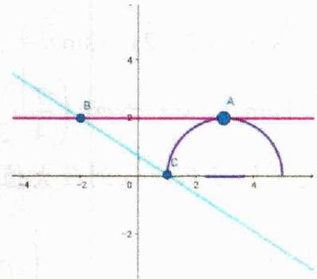

$f (x) = \frac {\sqrt {4 - (x - 3) ^ {2}} - 2}{x + 2} = \frac {y - 2}{x - (- 2)}$

（2） $\Rightarrow$ 令 $A(x,y)$ ，且A在半圆上， $B(-2,2)\left\{\begin{aligned}&\Rightarrow f(x)=k_{AB}\\ &k_{AB}=\frac{y_{A}-y_{B}}{x_{A}-x_{B}}\end{aligned}\right.$

最后作图分析求出 AB 斜率范围即可：

##### 2. 若是整式类型，常将问题转换两函数图像问题，比如 $f(x) = 3x - 1 - \sqrt{-x^2 + 4x - 3}$

（1） $\left\{\begin{aligned}f(x)&=3x-1-\sqrt{-x^{2}+4x-3}=3x-1-\sqrt{1-(x-2)^{2}},\\ 令 t=f(x)\Rightarrow\sqrt{1-(x-2)^{2}}&=3x-1-t\end{aligned}\right.$

（2） $\left\{\begin{aligned} 令 y_{1}&=\sqrt{1-(x-2)^{2}}\geq0\Rightarrow\left\{\begin{aligned} y&\geq0\\ (x-2)^{2}+y^{2}&=1\end{aligned}\right. \\ 令 y_{2}&=3x-1-t, 则 y_{1}=y_{2}\end{aligned}\right.$

$\Rightarrow y_{1}$ 和 $y_{2}$ 有交点时，求纵截距 -t 范围

最后作图分析即可求出-t范围，也就求出t范围；

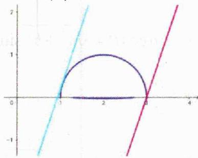

### 二、【典型例题】

##### 1. (2024·高三·河南·期中) 函数 $f(x) = \frac{1 + \sqrt{3 - x^2}}{x + 2}$ 的值域为（）

$\quad$A. $\left[2 - \sqrt{6}, 2 + \sqrt{3}\right]$

$\quad$B. $\left[-\sqrt{3},\sqrt{6}\right]$

$\quad$C. $\left[2-\sqrt{3},2+\sqrt{6}\right]$

$\quad$D. $\left[-\sqrt{6},\sqrt{3}\right]$

##### 2.（河南南阳·高三南阳中学校考阶段练习）函数 $f(x)=\frac{\sqrt{1-x^{2}}-1}{x-2}$ 的值域为（）

$\quad$A. $[- \frac{4}{3}, \frac{4}{3}]$

$\quad$B. $[- \frac{4}{3}, 0]$

$\quad$C. $[0,1]$

$\quad$D. $[0, \frac{4}{3}]$

##### 3.（全国·高三专题练习）函数 $y=\frac{\sqrt{1-x^{2}}}{x+2}$ 的值域是 \_\_\_\_.

### 三、【习题检测】

##### 1. (2024·上海徐汇·模拟预测) 函数 $y = \frac{\sqrt{-x^2 + 4x - 3} + 3}{x + 1}$ 的值域为 \_\_\_\_.

##### 2.（全国·高三专题练习）函数 $y=\frac{\sin x+2}{\cos x-2}$ 的值域为 \_\_\_\_.

##### 3. (2023·河北·三模) 函数 $y = \frac{2 - \sin x}{1 - \cos x}$ 的值域是 \_\_\_\_.

##### 4.（全国·高三专题练习）已知 $x \in [-\sqrt{3}, \sqrt{3}]$ ， $y \in R_{+}$ ，则 $(x - y)^{2} + (\sqrt{3 - x^{2}} - \frac{9}{y})^{2}$ 的最小值为 \_\_\_\_.

##### 5.（河南洛阳·高三洛阳市第一高级中学校考阶段练习）函数 $f(x)=2x-3-\sqrt{-x^{2}+6x-8}$ 的值域是 \_\_\_\_.

##### 6. (2023·陕西铜川·一模) 若 $x \in \left[0, \frac{\pi}{2}\right]$ , 则函数 $f(x) = \frac{\sin 2x - 2\sqrt{3} \sin^2 x + 3\sqrt{3}}{2 + \cos 2x}$ 的值域是 \_\_\_\_.

# 2.1.5 有界性法

### 一、【题型总结】

▲适用题型：

常用于分式中含 $\cos$ 或 $\sin$ 或 $x^{2}$ 或 $a^{x}$ 等有明显范围的题型；

▲方法原理：

##### 1. 利用 $\sin \theta \in [-1, 1]$ , $\cos \theta \in [-1, 1]$ , $x^2 \geq 0$ , $a^x > 0$

用 y 表达分式中的上述结构，再利用其范围解出答案，

比如求函数 $y=\frac{1-2x^{2}}{3+4x^{2}}$ 的值域：

$y = \frac {1 - 2 x ^ {2}}{3 + 4 x ^ {2}} \Rightarrow x ^ {2} = \frac {1 - 3 y}{2 + 4 y} \geq 0 \Rightarrow y \in \left(- \frac {1}{2}, \frac {1}{3} \right];$

##### 2. 对于含三角的分式，如果同时存在 sin 和 cos，还可考虑去分母后辅助角公式处理，

$\left\{ \begin{array}{l} a \sin \theta \pm b \cos \theta (a, b > 0) = \left\{ \begin{array}{l} \sqrt {a ^ {2} + b ^ {2}} \left(\frac {a}{\sqrt {a ^ {2} + b ^ {2}}} \sin \theta \pm \frac {b}{\sqrt {a ^ {2} + b ^ {2}}} \cos \theta\right) \\ \text {令} \cos \varphi = \frac {a}{\sqrt {a ^ {2} + b ^ {2}}} > 0, \text {令} \sin \varphi = \frac {b}{\sqrt {a ^ {2} + b ^ {2}}} > 0 \end{array} \right. \\ \Rightarrow \left\{ \begin{array}{l} a \sin \theta \pm b \cos \theta = \sqrt {a ^ {2} + b ^ {2}} \sin (\theta \pm \varphi), \varphi \in \left(0, \frac {\pi}{2}\right) \\ \tan \varphi = \frac {b}{a} \end{array} \right. \end{array} \right.$

比如求 $f(x) = \frac{1 + \sin x}{2 - 3\cos x}$ 的值域：

（1） $f(x)=\frac{1-\sin x}{2-3\cos x}=y\Rightarrow\left\{\begin{aligned}&1-2y=\sin x-3y\cos x=\sqrt{1+9y^{2}}\sin(x-\varphi)\\\tan\varphi=3y\end{aligned}\right.$

（2） $\Rightarrow \left|\frac{1 - 2y}{\sqrt{1 + 9y^2}}\right| = |\sin (x + \varphi)|\leq 1\Rightarrow y\geq 0$ 或 $y\leq -\frac{4}{5}$

### 二、【典型例题】

##### 1.（全国·高三专题练习）函数 $y = \frac{1 - x^2}{1 + x^2}$ 的值域为 \_\_\_\_.

##### 2.（河南·郑州励德双语学校高三阶段练习）函数 $y = \frac{\cos x + 1}{2\cos x - 1}$ 的值域是（）

$\quad$A. $(- \infty, 0] \cup [4, +\infty)$

$\quad$B. $(-∞,0]∪[2,+∞)$

$\quad$C. $[0,4]$

$\quad$D. $[0,2]$

##### 3.（全国·高三专题练习）函数 $y = \frac{2^{x + 1} + 3}{2^x + 1}$ 的值域为（）

$\quad$A. (0,2)

$\quad$B. $[2,+\infty)$

$\quad$C. (2,3)

$\quad$D. [1,2]

### 三、【习题检测】

##### 1.（全国·高三专题练习）函数 $y = \frac{\sin \theta}{2 - \sin \theta}$ 的值域为 \_\_\_\_.

##### 2.（全国·高三专题练习）函数 $y = \frac{2x^2}{x^2 + 3}$ 的值域为 \_\_\_\_.

##### 3.（全国·高三专题练习）函数 $f(x)=\frac{-1-2\sin x}{-3-\sqrt{5}\cos x}(x\in\mathbb{R})$ 的值域为 \_\_\_\_.

##### 4.（高三上·全国·专题练习）函数 $f(x) = \frac{\cos x}{2\cos x + 1}$ 的值域是

# 2.1.6 向量法之绝对值不等式

### 一、【题型总结】

▲适用题型：常见于双根号下有二次项，且能转化为 $\sqrt{(x-m)^{2}+n^{2}}+\sqrt{(x-p)^{2}+q^{2}}$ 这样形式的题型；
比如 $f(x)=\sqrt{x^{2}+9}+\sqrt{x^{2}-6x+10}$ ;

▲方法原理：对于 $f(x)=\sqrt{(x+m)^{2}+n^{2}}+\sqrt{(x+p)^{2}+q^{2}}$ 利用向量不等式 $\left\{\begin{aligned}|&\dot{a}-\vec{b}|\leq|\dot{a}|+|\vec{b}|\quad\text{反向取等}\end{aligned}\right.$

$\Rightarrow \left\{ \begin{array}{l} f (x) = \sqrt {(x + m) ^ {2} + n ^ {2}} + \sqrt {(x + p) ^ {2} + q ^ {2}} \\ \vec {a} = (x + m, n), \vec {b} = (x + p, q) (n \cdot q <   0) \end{array} \Rightarrow \left\{ \begin{array}{l} f (x) = | \vec {a} | + | \vec {b} | \geq | \vec {a} - \vec {b} | = \sqrt {(m - p) ^ {2} + (n - q) ^ {2}} \\ \vec {a}, \vec {b} \text {反向} \Leftrightarrow \frac {x + m}{x + p} = \frac {n}{q} \text {时取等} \end{array} \right. \right.$

比如：求 $f(x) = \sqrt{x^2 + 2x + 5} +\sqrt{x^2 - 8x + 25}$ 值域

$\begin{array}{l} \Rightarrow \left\{ \begin{array}{l} f (x) = \sqrt {(x + 1) ^ {2} + 2 ^ {2}} + \sqrt {(x - 4) ^ {2} + (- 3) ^ {2}} \\ \vec {a} = (x + 1, 2), \vec {b} = (x - 4, - 3) \end{array} \Rightarrow \left\{ \begin{array}{l} f (x) = | \vec {a} | + | \vec {b} | \geq | \vec {a} - \vec {b} | = \sqrt {(1 + 4) ^ {2} + (2 + 3) ^ {2}} = 5 \sqrt {2} \\ \vec {a}, \vec {b} \text {反向} \Leftrightarrow \frac {x + 1}{x - 4} = \frac {2}{- 3} \Rightarrow x = 1 \text {时取等} \end{array} \right. \right. \\ \Rightarrow f (x) \in [ 5 \sqrt {2}, + \infty) \\ \end{array}$

### 二、【典型例题】

##### 1.（全国·高三专题练习）求函数 $y = \sqrt{x^2 + 2x + 2} + \sqrt{x^2 - 2x + 2}$ 的最小值.

### 三、【习题检测】

##### 1.（辽宁实验中学高一期中）函数 $f(x) = \sqrt{x^2 + 9} + \sqrt{x^2 - 6x + 10}$ 的值域是（）

$\quad$A. $\left[3\sqrt{2}+1,+\infty\right)$

$\quad$B. $\left[3+\sqrt{10},+\infty\right)$

$\quad$C. $[5,+\infty)$

$\quad$D. $\left[4,+\infty\right)$

##### 2.（甘肃·民勤县第一中学高二期中）函数 $f(x) = \sqrt{x^2 + 2x + 5} + \sqrt{x^2 - 6x + 10}$ 的最小值是 \_\_\_\_.

##### 3.(河南·濮阳南乐一高高二阶段练习)函数 $f(x)=\sqrt{(x-1)^{2}+9}+\sqrt{(x-5)^{2}+4}$ 的最小值为 \_\_\_\_.

# 2.1.7 向量法之数形结合

### 一、【题型总结】

▲适用题型：常用于根式中有和为定值时，比如求 $f(x)=\sqrt{m(x+p)}+\sqrt{n(-x+q)}$ 值域；

▲方法原理：对于 $f(x)=\sqrt{m(x+p)}+\sqrt{n(-x+q)}$ :

$\Rightarrow \left\{ \begin{array}{l} {f (x) = \sqrt {m}   \sqrt {x + p} + \sqrt {n}   \sqrt {- x + q}} \\ {\vec {a} = (\sqrt {m}, \sqrt {n}), \vec {b} = (\sqrt {x + p}, \sqrt {- x + q})} \end{array} \right. \Rightarrow \left\{ \begin{array}{l} {f (x) = \vec {a} \cdot \vec {b}} \\ {\overrightarrow {O A} = \vec {a}, A (\sqrt {m}, \sqrt {n})} \\ {\overrightarrow {O B} = \vec {b} \Rightarrow \left\{ \begin{array}{l l} {x ^ {2} + y ^ {2} = p + q} \\ {B (x, y) \text {且} (x, y \geq 0)} \end{array} \right.} \end{array} \right.$

再数形结合处理

比如：求 $f(x) = \sqrt{2}\cdot \sqrt{x - 1} +\sqrt{3}\cdot \sqrt{2 - x}$ 值域

$\Rightarrow \left\{ \begin{array}{l} {f (x) = \sqrt {2} \cdot \sqrt {x - 1} + \sqrt {3} \cdot \sqrt {2 - x}} \\ {\vec {a} = (\sqrt {2}, \sqrt {3}), \vec {b} = (\sqrt {x - 1}, \sqrt {2 - x})} \end{array} \right. \Rightarrow \left\{ \begin{array}{l} {f (x) = \vec {a} \cdot \vec {b}} \\ {\overrightarrow {O A} = \vec {a}, A (\sqrt {2}, \sqrt {3})} \\ {\overrightarrow {O B} = \vec {b} \Rightarrow \left\{ \begin{array}{l l} {x ^ {2} + y ^ {2} = 1} \\ {B (x, y) \text {且} (x, y \geq 0)} \end{array} \right.} \end{array} \right.$

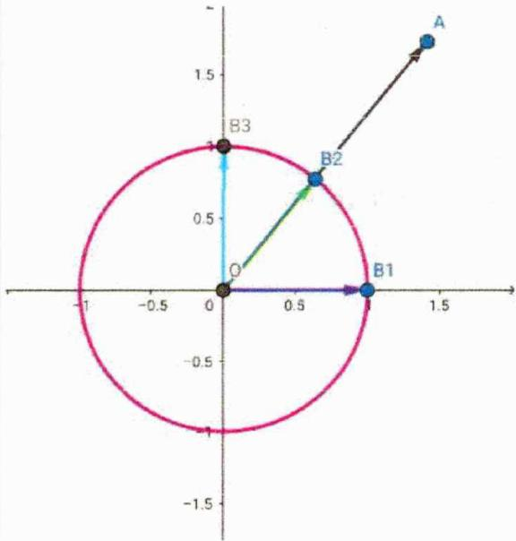

$\begin{array}{r} {\Rightarrow f (x) = \overrightarrow {O A} \cdot \overrightarrow {O B} = | \overrightarrow {O A} | \cdot | \overrightarrow {O B} | \cos \theta} \\ {\Rightarrow \left\{ \begin{array}{l l} {B \text {在} B 1 \text {处} \theta \text {最大}, f (x) _ {\min} = \sqrt {2}} & {\Rightarrow f (x) \in [ \sqrt {2}, \sqrt {5} ]} \\ {B \text {在} B 2 \text {处} \theta \text {最大}, f (x) _ {\max} = \sqrt {5}} & \end{array} \right.} \end{array}$

### 二、【典型例题】

##### 1. 函数 $f(x)=\sqrt{2x-1}+\sqrt{2-x}$ 的值域为 \_\_\_\_.

### 三、【习题检测】

##### 1. $f(x)=\sqrt{x}+\sqrt{4-2x}$ 的最大值为 \_\_\_\_.

# 2.1.8 柯西不等式法

### 一、【题型总结】

▲适用题型：常用于根式中有和为定值时，比如求 $f(x)=\sqrt{m(x+p)}+\sqrt{n(-x+q)}$ 最大值；

▲方法原理：

##### 1. 二维柯西不等式:

设 $a, b, c, d$ 均为实数，有 $(a^2 + b^2)(c^2 + d^2) \geq (ac + bd)^2$ 当且仅当 $\frac{a}{c} = \frac{b}{d}$ 时等号成立；

向量法证明： $\left\{ \begin{array}{l} \overrightarrow{m} = (a,b),\overrightarrow{n} = (c,d),|\cos \theta |\leq 1\\ \Rightarrow |\overrightarrow{m}\cdot \overrightarrow{n}| = |\overrightarrow{m} ||\overrightarrow{n} |\cos \theta |\leq |\overrightarrow{m} ||\overrightarrow{n} |\\ \Rightarrow |ac + bd|\leq \sqrt{a^2 + b^2}\sqrt{c^2 + d^2}\\ \Rightarrow (a^2 +b^2)(c^2 +d^2)\geq (ac + bd)^2 \end{array} \right.$ ；取等时向量共线，即 $\frac{a}{c} = \frac{b}{d};$

代数法证明： $\left\{ \begin{array}{l} \left(a^{2} + b^{2}\right)\left(c^{2} + d^{2}\right) - (ac + bd)^{2}\\ = a^{2}c^{2} + a^{2}d^{2} + b^{2}c^{2} + b^{2}d^{2} - \left(a^{2}c^{2} + 2acbd + b^{2}d^{2}\right)\\ = a^{2}d^{2} + b^{2}c^{2} - 2acbd\\ = (ad - bc)^{2}\geq 0 \end{array} \right.$

易知取等条件是ad=bc，解答题用到柯西不等式，即可证明；

##### 2. n 维柯西不等式:

$(a_{1}^{2}+a_{2}^{2}+a_{3}^{2}+\ldots+a_{n}^{2})(b_{1}^{2}+b_{2}^{2}+b_{3}^{2}+\ldots+b_{n}^{2})\geq(a_{1}b_{1}+a_{2}b_{2}+a_{3}b_{3}+\ldots+a_{n}b_{n})^{2}$ 字母均为 R，当且仅当 $\frac{a_{1}}{b_{1}}=\frac{a_{2}}{b_{2}}=\frac{a_{3}}{b_{3}}=\ldots=\frac{a_{n}}{b_{n}}$ 时等号成立，n 维向量证明；

比如求 $f(x) = \sqrt{m(x + p)} +\sqrt{n(-x + q)}$ 最大值：

$\Rightarrow \left\{ \begin{array}{l l} a = \sqrt {m}, b = \sqrt {n}, c = \sqrt {x + p}, d = \sqrt {- x + q} \\ \sqrt {m (x + p)} + \sqrt {n (- x + q)} \leq \sqrt {\left(\sqrt {m} ^ {2} + \sqrt {n} ^ {2}\right)} \sqrt {\left(\sqrt {x + p} ^ {2} + \sqrt {- x + q} ^ {2}\right)} = \sqrt {m + n} \sqrt {q + q} \\ \text {当且仅当} \frac {\sqrt {m}}{\sqrt {x + p}} = \frac {\sqrt {n}}{\sqrt {- x + q}} \text {时取等;} \end{array} \right.$

(柯西的拓展权方和见不等式章节的讲解)

### 二、【典型例题】

##### 1. 函数 $y=\sqrt{x-5}+2\sqrt{6-x}$ 的最大值是（）

$\quad$A. $\sqrt{3}$

$\quad$B. $\sqrt{5}$

$\quad$C. 3

$\quad$D. 5

##### 2. 函数 $f(x) = \sqrt{x - 1} + 2\sqrt{2 - x}$ 的最大值为（）

$\quad$A. 5

$\quad$B. $\sqrt{5}$

$\quad$C. 1

$\quad$D. 2

##### 3. 用柯西不等式求函数 $y = \sqrt{2x - 3} + \sqrt{2x} + \sqrt{7 - 3x}$ 的最大值为（）

$\quad$A. $\sqrt{22}$

$\quad$B. 3

$\quad$C. 4

$\quad$D. 5

##### 4. 函数 $y = 2\cos x + 3\sqrt{1 - \cos 2x}$ 的最大值为（）

$\quad$A. $\sqrt{22}$

$\quad$B. 5

$\quad$C. 4

$\quad$D. $\sqrt{13}$

### 三、【习题检测】

##### 1. 函数 $y=\sqrt{x^{2}-2x+3}+\sqrt{x^{2}-6x+14}$ 的最小值是（）

$\quad$A. $\sqrt{10}$

$\quad$B. $\sqrt{10} + 1$

$\quad$C. $11+2\sqrt{10}$

$\quad$D. $2\sqrt{10}$

##### 2. 函数 $y=3\sqrt{x-5}+4\sqrt{6-x}$ 的最大值为（）

$\quad$A. $\sqrt{5}$

$\quad$B. 5

$\quad$C. 7

$\quad$D. 11

##### 3. 函数 $y = 3\sqrt{2x - 2} + 4\sqrt{3 - x}$ 最大值为（）

$\quad$A. 36

$\quad$B. $2\sqrt{17}$

$\quad$C. 6

$\quad$D. 68

##### 4. 函数 $f(x)=\sqrt{(x-1)(20-x)}+\sqrt{(x-2)(17-x)}$ 的最大值 \_\_\_\_.

##### 5. 函数 $y=\frac{2}{x}+\frac{9}{1-2x}\left(x\in\left(0,\frac{1}{2}\right)\right)$ 的最小值为 \_\_\_\_.

##### 6. 函数 $f(x)=2\sqrt{x}+\sqrt{5-x}$ 的最大值为 \_\_\_\_.

# 2.1.9 反向柯西不等式法

### 一、【题型总结】

▲适用题型：平方中间是减号时可以考虑；

▲方法原理：

设 $a, b, c, d$ 均为实数，有 $(a^2 - b^2)(c^2 - d^2) \leq (ac - bd)^2$ 当且仅当 $\frac{a}{c} = \frac{b}{d}$ 时等号成立；

代数法证明： $\left\{ \begin{array}{l} \left(a^{2} - b^{2}\right)\left(c^{2} - d^{2}\right) - (ac - bd)^{2}\\ = a^{2}c^{2} - a^{2}d^{2} - b^{2}c^{2} + b^{2}d^{2} - \left(a^{2}c^{2} - 2acbd + b^{2}d^{2}\right)\\ = -a^{2}d^{2} - b^{2}c^{2} + 2acbd\\ = -(ad - bc)^{2}\leq 0 \end{array} \right.$

易知取等条件是 ad = bc，解答题用到即可证明；

### 二、【典型例题】

##### 1. 函数 $y=2\sqrt{x^{2}+9}+4-x$ 的最小值为 \_\_\_\_.

### 三、【习题检测】

##### 1. 若 $x$ 为正数，则 $\frac{4}{x + 1} - \frac{1}{x}$ 的最小值为 \_\_\_\_.

##### 2. 函数 $y=2\sqrt{x^{2}+1}-x$ 的最小值为 \_\_\_\_.

# 2.2 抽象函数

# 2.2.1 抽象函数模型归纳

### 一、【题型总结】

▲适用题型：抽象函数的常规题型.

▲方法原理：以下模型按照计算规则理解即可，无需记忆

##### 1. 模型整理：

一次函数

（1）对于正比例函数 $f(x) = kx (k \neq 0)$ ，与其对应的抽象函数为 $f(x \pm y) = f(x) \pm f(y)$ .  
（2） 对于一次函数 $f(x)=kx+b(k\neq0)$ ，与其对应的抽象函数为 $f(x\pm y)=f(x)\pm f(y)\mp b$ .

二次函数

（3）对于二次函数 $f(x)=ax^{2}+bx+c(a\neq0)$ ，与其对应的抽象函数为 $f(x+y)=f(x)+f(y)+2axy-c$ 幂函数

（4） 对于幂函数 $f(x)=x^{n}$ ，与其对应的抽象函数为 $f(xy)=f(x)f(y)$ .

（5） 对于幂函数 $f(x)=x^{n}$ ，其抽象函数还可以是 $f\left(\frac{x}{y}\right)=\frac{f(x)}{f(y)}$ .

指数函数

（6） 对于指数函数 $f(x)=a^{x}$ ，与其对应的抽象函数为 $f(x+y)=f(x)f(y)$ .

（7） 对于指数函数 $f(x)=a^{x}$ ，其抽象函数还可以是 $f(x-y)=\frac{f(x)}{f(y)}$ 。其中 $(a>0, a \neq 1)$

对数函数

（8） 对于对数函数 $f(x)=\log_{a}x$ ，与其对应的抽象函数为 $f(xy)=f(x)+f(y)$ .

（9） 对于对数函数 $f(x)=\log_{a}x$ ，其抽象函数还可以是 $f\left(\frac{x}{y}\right)=f(x)-f(y)$ .

（10）对于对数函数 $f(x)=\log_{a}x$ ，其抽象函数还可以是 $f'(x^{n})=nf'(x)$ 。其中 $(a>0,a\neq1)$ 三角函数

（11） 对于正弦函数 $f(x) = \sin x$ ，与其对应的抽象函数为 $f(x + y)f(x - y) = f^2 (x) - f^2 (y)$ 注：此抽象函数对应于正弦平方差公式： $\sin^2\alpha - \sin^2\beta = \sin (\alpha + \beta)\sin (\alpha - \beta)$

（12） 对于余弦函数 $f(x) = \cos x$ ，与其对应的抽象函数为 $f(x) + f(y) = 2f\left(\frac{x + y}{2}\right)f\left(\frac{x - y}{2}\right)$ 注：此抽象函数对应于余弦和差化积公式： $\cos \alpha + \cos \beta = 2\cos \frac{\alpha + \beta}{2}\cos \frac{\alpha - \beta}{2}$

（13） 对于余弦函数 $f(x) = \cos x$ ，其抽象函数还可以是 $f(x)f(y) = \frac{1}{2} [f(x + y) + f(x - y)]$ 注：此抽象函数对应于余弦积化和差公式： $\cos \alpha \cos \beta = \frac{\cos (\alpha + \beta) + \cos (\alpha - \beta)}{2}$

（14） 对于正切函数 $f(x)=\tan x$ ，与其对应的抽象函数为 $f(x\pm y)=\frac{f(x)\pm f(y)}{1\mp f(x)f(y)}$

注：此抽象函数对应于正切函数和差角公式： $\tan(\alpha\pm\beta)=\frac{\tan\alpha\pm\tan\beta}{1\mp\tan\alpha\tan\beta}$

##### 2. 解题时常用赋值法处理

比如：(2024·辽宁·二模)已知定义城为 R 的函数 $f(x)$ . 满足 $f(x+y)=f(x)f(y)-f(1-x)f(1-y)$ ,

且 $f(0) \neq 0$ ， $f(-1) = 0$ ，则（）

$\quad$A. $f(1) = 0$

$\quad$B. $f(x)$ 是偶函数

$\quad$C. $\left[f(x)\right]^2 +\left[f(1 + x)\right]^2 = 1$

$\quad$D. $\sum_{i}^{2024}f(i) = -1$

详解对于 A 项，由 $f(x+y)=f(x)f(y)-f(1-x)f(1-y)$ ,

令 $x = y = \frac{1}{2}$ ，则 $f(1) = \left[f\left(\frac{1}{2}\right)\right]^2 -\left[f\left(\frac{1}{2}\right)\right]^2 = 0$ ，故A项正确；

对于 B 项，令 x = y = 0，则 $f(0) = \left[f(0)\right]^{2} - \left[f(1)\right]^{2} = \left[f(0)\right]^{2}$

因 $f(0)\neq0$ ，故 $f(0)=1$ ，

令 $y = 1$ ，则 $f(x + 1) = f(x)f(1) - f(1 - x)f(0) = -f(1 - x)$ ①，

所以函数 $f(x)$ 关于点 $(1,0)$ 成中心对称，

令 $x = y = 1$ ，则 $f(2) = [f(1)]^2 - [f(0)]^2 = -1$

令 $y = 2$ ，则 $f(x + 2) = f(x)f(2) - f(1 - x)f(-1) = -f(x)$ ②，

由①可得： $f'(x+2)=-f(-x)$ ③，由②③可知： $f(-x)=f(x)$

且函数 $f(x)$ 的定义域为R，则函数 $f(x)$ 是偶函数，故B项正确；

对于 $\mathbb{C}$ 项，令 $y = -x$ ，则 $f(0) = f(x)f(-x) - f(1 - x)f(1 + x)$

因为 $f(0) = 1$ ， $f(-x) = f(x)$ ， $f(x + 1) = -f(1 - x)$ ，代入上式中得，

故得： $[f(x)]^2 +[f(1 + x)]^2 = 1$ ，故G项正确；

对于 D 项，由上可知： $f(x+2)=-f(x)$ ，则 $f(x+4)=-f(x+2)=f(x)$ ，

故函数 $f(x)$ 的一个周期为4，故 $f(4) = f(0) = 1$

令 $x = 2, y = 1$ ，则 $f(3) = f(2)f(1) - f(-1)f(0) = 0$ ，

所以 $f(1)+f(2)+f(3)+f(4)=0+(-1)+0+1=0$

则 $\sum_{i=1}^{2024} f(i) = 254 \times 0 = 0$ ，故 D 项错误。故选：ABC.

### 二、【典型例题】

##### 1. (2010·陕西·高考真题) 下列四类函数中, 具有性质 “对任意的 $x > 0, y > 0$ , 函数 $f(x)$ 满足 $f(x + y) = f(x)f(y)$ ” 的是 ( )

$\quad$A. 幂函数

$\quad$B. 对数函数

$\quad$C. 指数函数

$\quad$D. 余弦函数

##### 2. (2014·陕西·高考真题) 下列函数中, 满足 “ $f(x+y)=f(x)f(y)$ ” 的单调递增函数是 ( )

$\quad$A. $f(x)=x^{\frac{1}{2}}$

$\quad$B. $f(x) = x^{3}$

$\quad$C. $f(x)=\left(\frac{1}{2}\right)^{x}$

$\quad$D. $f(x) = 3^{x}$

##### 3. (2024·河南新乡·一模) 已知定义在 $\mathbf{R}$ 上的函数 $f(x)$ 满足 $\forall x, y \in \mathbf{R}$ ,

$f(2xy-1)=f(x)\cdot f(y)+f(y)+2x-3,\quad f(0)=-1$ ，则不等式 $f(x)>3-2^{x}$ 的解集为（）

$\quad$A. $(1,+\infty)$

$\quad$B. $(-1,+\infty)$

$\quad$C. $(-∞,1)$

$\quad$D. $(-∞,-1)$

##### 4. (2024·高三·河北保定·期末)已知函数 $f(x)$ 满足: $\forall x, y \in \mathbf{Z}, f(x+y)=f(x)+f(y)+2xy+1$ 成立, 且 $f(-2)=1$ , 则 $f(2n)(n \in \mathbf{N}^{*})=()$

$\quad$A. $4n + 6$

$\quad$B. $8n - 1$

$\quad$C. $4n^{2} + 2n - 1$

$\quad$D. $8n^{2} + 2n - 5$

##### 5.（多选题2024·辽宁·模拟预测）已知函数 $f(x)$ 的定义域为R，且

$f(x + y)f(x - y) = f^{2}(x) - f^{2}(y),f(1) = 2,f(2) = 0$ ，则下列说法中正确的是（）

$\quad$A. $f(x)$ 为偶函数 
$\quad$B. $f(3) = -2$ 
$\quad$C. $f(-1) = f(5)$ 
$\quad$D. $\sum_{k=2}^{2024} f(k) = -2$

### 三、【习题检测】

##### 1. (2024·陕西西安·模拟预测) 已知函数 $f(x)$ 的定义域为 $\mathbb{R}$ , 且满足 $f(x) + f(y) = f(x + y) - 2xy + 2, f(1) = 2$ , 则下列结论正确的是 ( )

$\quad$A. $f(4) = 12$

$\quad$B. 方程 $f(x) = x$ 有解

$\quad$C. $f\left(x+\frac{1}{2}\right)$ 是偶函数

$\quad$D. $f\left(x - \frac{1}{2}\right)$ 是偶函数

##### 2.(2024·浙江·二模)已知函数 $f(x)$ 满足对任意的 $x, y \in (1, +\infty)$ 且 x < y 都有 $f\left(\frac{x - y}{1 - xy}\right) = f\left(\frac{1}{x}\right) - f\left(\frac{1}{y}\right)$ ，若 $a_{n} = f\left(\frac{1}{n^{2} + 5n + 5}\right)$ ， $n \in N^{*}$ ，则 $a_{1} + a_{2} + a_{3} + \cdots + a_{2024} = (\quad)$

$\quad$A. $f\left(\frac{253}{385}\right)$

$\quad$B. $f\left(\frac{253}{380}\right)$

$\quad$C. $f\left(\frac{253}{765}\right)$

$\quad$D. $f\left(\frac{253}{760}\right)$

##### 3. (2001·北京·高考真题) 函数 $f(x) = a^{x} (a > 0, a \neq 1)$ 对于任意的实数 $x$ 、 $y$ 都有（）

$\quad$A. $f(xy)=f(x)f(y)$

$\quad$B. $f(x+y)=f(x)f(y)$

$\quad$C. $f(xy) = f(x) + f(y)$

$\quad$D. $f(x+y)=f(x)+f(y)$

##### 4.（2007·山东·高考真题）给出下列三个等式： $f(xy)=f(x)+f(y)$ ， $f(x+y)=f(x)f(y)$ ， $f(x+y)=\frac{f(x)+f(y)}{1-f(x)f(y)}$ ．下列函数中不满足其中任何一个等式的是（）

$\quad$A. $f(x) = 3^{x}$

$\quad$B. $f(x) = \sin x$

$\quad$C. $f(x)=\log_{2}x$

$\quad$D. $f(x) = \tan x$

##### 5. (2021·全国·高考真题) 写出一个同时具有下列性质①②③的函数 $f(x)$ : \_\_\_\_.

① $f(x_{1}x_{2})=f(x_{1})f(x_{2})$ ；②当 $x\in(0,+\infty)$ 时， $f'(x)>0$ ；③ $f'(x)$ 是奇函数.

##### 6. (2001·全国·高考真题) 设 $f(x)$ 是定义在 $\mathbb{R}$ 上的偶函数, 其图象关于直线 $x = 1$ 对称, 对任意 $x_{1}, x_{2} \in \left[0, \frac{1}{2}\right]$ , 都有 $f(x_{1} + x_{2}) = f(x_{1}) \cdot f(x_{2})$ , 且 $f(1) = a > 0$ .

（1） 求 $f\left(\frac{1}{2}\right)$ , $f\left(\frac{1}{4}\right)$ ;

（2） 证明设 $f(x)$ 是周期函数.

# 2.2.2 抽象函数利用周期性求值

### 一、【题型总结】

▲适用题型：抽象函数中涉及周期性的求值类型.

▲方法原理：

##### 1. 常用方法：赋值法，利用抽象函数模型法，

##### 2. 注意需要熟悉常见的周期模型.

比如：(2022·全国·高考真题)已知函数 $f(x)$ 的定义域为R，且 $f(x+y)+f(x-y)=f(x)f(y),f(1)=1$ ，则 $\sum_{k=1}^{22}f(k)=()$

$\quad$A. -3

$\quad$B. -2

$\quad$C. 0

$\quad$D. 1

详解[方法一]：赋值加性质

因为 $f(x + y) + f(x - y) = f(x)f(y)$ ，令 $x = 1, y = 0$ 可得， $2f(1) = f(1)f(0)$ ，所以 $f(0) = 2$ ，令 $x = 0$ 可得， $f(y) + f(-y) = 2f(y)$ ，即 $f(y) = f(-y)$ ，所以函数 $f(x)$ 为偶函数，令 $y = 1$ 得，

$f(x+1)+f(x-1)=f(x)f(1)=f(x)$ ，即有 $f(x+2)+f(x)=f(x+1)$ ，从而可知 $f(x+2)=-f(x-1)$ ， $f(x-1)=-f(x-4)$ ，故 $f(x+2)=f(x-4)$ ，即 $f(x)=f(x+6)$ ，所以函数 $f(x)$ 的一个周期为6．因为 $f(2)=f(1)-f(0)=1-2=-1$ ， $f(3)=f(2)-f(1)=-1-1=-2$ ， $f(4)=f(-2)=f(2)=-1$ ，

$f(5)=f(-1)=f(1)=1,\quad f(6)=f(0)=2$ ，所以

一个周期内的 $f(1)+f(2)+\cdots+f(6)=0$ 。由于 22 除以 6 余 4，

所以 $\sum_{k=1}^{22} f(k) = f(1) + f(2) + f(3) + f(4) = 1 - 1 - 2 - 1 = -3$ 。故选：A.

[方法二]：构造特殊函数

由 $f(x + y) + f(x - y) = f(x)f(y)$ ，联想到余弦函数和差化积公式

$\cos (x + y) + \cos (x - y) = 2\cos x\cos y$ ，可设 $f(x) = a\cos \omega x$ ，则由方法一中 $f(0) = 2, f(1) = 1$ 知 $a = 2, a\cos \omega = 1$ ，解得 $\cos \omega = \frac{1}{2}$ ，取 $\omega = \frac{\pi}{3}$ ，所以 $f(x) = 2\cos \frac{\pi}{3} x$ ，则

$f(x + y) + f(x - y) = 2\cos \left(\frac{\pi}{3} x + \frac{\pi}{3} y\right) + 2\cos \left(\frac{\pi}{3} x - \frac{\pi}{3} y\right) = 4\cos \frac{\pi}{3} x\cos \frac{\pi}{3} y = f(x)f(y)$ ，所以

$f(x) = 2\cos \frac{\pi}{3} x$ 符合条件，因此 $f(x)$ 的周期 $T = \frac{2\pi}{\frac{\pi}{3}} = 6$ ， $f(0) = 2, f(1) = 1$ ，且

$f(2)=-1,f(3)=-2,f(4)=-1,f(5)=1,f(6)=2$ ，所以 $f(1)+f(2)+f(3)+f(4)+f(5)+f(6)=0$ ，
由于 22 除以 6 余 4,

所以 $\sum_{k=1}^{22} f(k) = f(1) + f(2) + f(3) + f(4) = 1 - 1 - 2 - 1 = -3$ 。故选：A.

### 二、【典型例题】

##### 1. (2010·重庆·高考真题)已知函数 $f(x)$ 满足: $f(1) = \frac{1}{4}$ , $4f(x)f(y) = f(x + y) + f(x - y)(x, y \in \mathbb{R})$ , 则 $f(2010) =$ \_\_\_\_.

##### 2.（多选题 2024·浙江·模拟预测）已知函数 $f(x + 1)$ 为偶函数，对 $\forall x \in \mathbb{R}$ ， $f(x) > 0$ ，且 $f(x + 1) = f(x)f(x + 2)$ ，若 $f(1) = 2$ ，则以下结论正确的为（）

$\quad$A. $f(2)=\sqrt{2}$

$\quad$B. $f(3) = 1$

$\quad$C. $f(-1) = f(5)$

$\quad$D. $f\left(\frac{1}{2}\right)=f\left(\frac{15}{2}\right)$

##### 3.（2024·陕西铜川·模拟预测）设函数 $f(x)$ 的定义域为R，且 $2[f(x + y) + f(x - y)] = f(x)f(y)$ ，

$f(1) = 2\sqrt{3}$ 则 $f(2025) =$ （）

$\quad$A. $2\sqrt{3}$

$\quad$B. 0

$\quad$C. 4

$\quad$D. $-2\sqrt{3}$

##### 4. (2024·陕西铜川·模拟预测) 设函数 $f(x)$ 的定义域为 $\mathbf{R}$ ，且 $2[f(x + y) + f(x - y)] = f(x)f(y)$ ， $f(1) = 2\sqrt{3}$ ，则 $\sum_{2024}^{k=1} f(2k + 1) =$ \_\_\_\_.

### 三、【习题检测】

##### 1. (2024·青海海西·模拟预测) 已知 $f(x)$ 是定义在 $\mathbf{R}$ 上的奇函数，且满足 $f(x + 2) = -f(-x)$ ，则 $f(1000) =$ \_\_\_\_.

##### 2. (2024·宁夏银川·一模) 若定义在 $\mathbb{R}$ 上的函数 $f(x)$ 满足 $y = f(x + 1)$ 是奇函数, $f(4 + x) = f(-x)$ , $f(2) = 2$ , 则 $f(1) + f(2) + f(3) + \cdots + f(30) =$ \_\_\_\_.

##### 3.(2024·全国·模拟预测)已知函数 $f(x)$ 的定义域为R， $f(x+2)$ 是奇函数， $f(x-1)$ 是偶函数， $f(0)=1$ ，则 $f(726)=$ \_\_\_\_.

##### 4. (2023·四川成都·模拟预测) 已知定义在 $\mathbf{R}$ 上的函数 $f(x)$ 满足 $f(x + 3) = -f(x)$ , $g(x) = f(x) - 2$ 为奇函数, 则 $f(198) =$ \_\_\_\_.

##### 5. (2024·河南·模拟预测) 已知函数 $f(x)$ 的定义域为 $\mathbf{R}$ ，若 $f(x - y) = f(x)f(y) + f(1 + x)f(1 + y)$ ，且 $f(0) \neq f(2)$ ，则 $\sum_{n=1}^{102} f(n) =$ \_\_\_\_.

##### 6. 2024·陕西安康·模拟预测）已知函数 $f(x)$ 及其导函数 $f'(x)$ 的定义域均为 $\mathbb{R}$ ，若 $f(x)$ 是偶函数， $f(0) \neq 0$ ， $f\left(\frac{\pi}{2}\right) = 0$ ， $f'\left(\frac{\pi}{2}\right) = -1$ ，且 $\forall x, y \in \mathbb{R}, f(x + y) = f(x)f(y) - f'(x)f'(y)$ ，则下列结论正确的是 \_\_\_\_。（填所有正确结论的序号）① $f(0) = 2$ ；② $[f(x)]^2 + [f'(x)]^2 = 1$ ；③ $f(x + 2\pi) = f(x)$ ；④ $\sum_{k=0}^{2024} f'\left(\frac{\pi}{2} + 2k\pi\right) = -2024$ .

# 2.2.3 抽象函数综合性

### 一、【题型总结】

▲适用题型：抽象函数的选填压轴题目，常考察函数各种性质的综合；

▲方法原理：

##### 1. 对函数的各种性质要熟练运用.

##### 2. 比如：（多选题 2024·贵州贵阳·二模）定义在 R 上的函数 $f(x)$ 满足

$f(x+1)=g(x)-g(-x)+3=f(3-x)$ ，对 $\forall x_{1},x_{2}\in(1,2]$ ， $x_{1}\neq x_{2}$ ，恒有 $\frac{f(x_{1})-f(x_{2})}{x_{2}-x_{1}}<0$ ，则下列命题是真命题的有（）

$\quad$A. (2025,3) 是 $f(x)$ 图象的一个对称中心 
$\quad$B. $f(x)$ 在区间 (2024, 2026) 上单调递减

$\quad$C. 对 $\forall x \in \left(\frac{4051}{2}, \frac{4053}{2}\right)$ , 恒有 $f(x) > f(x + 1)$ 
$\quad$D. $\sum_{n=1}^{2026} f(n) > 6078$

详解令 $h(x) = f(x + 1) - 3$ ，由 $f(x + 1) = g(x) - g(-x) + 3$ ，得 $h(x) = f(x + 1) - 3 = g(x) - g(-x)$ 显然， $h(-x) = -h(x)$ ，所以 $h(x)$ 为奇函数，则 $h(x)$ 关于点 $(0,0)$ 中心对称，

所以点(1,3)是 $f(x)$ 的对称中心，所以 $f(x)=-f(2-x)+6$ ，

又因为 $f(x + 1) = f(3 - x)$ ，所以直线 $x = 2$ 是 $f(x)$ 的一条对称轴。所以 $f(x + 2) = f(2 - x)$ ，

又因为 $f(x) = -f(2 - x) + 6$ ， $f(2 - x) = 6 - f(x)$ ，所以 $f(x + 2) = 6 - f(x)$

即 $f(4 + x) = 6 - f(2 + x) = 6 - [6 - f(x)] = f(x)$ ，所以 $f(x)$ 是周期为4的函数，又因为对 $\forall x_{1},x_{2}\in (1,2]$ ， $x_{1}\neq x_{2}$ ，恒有 $\frac{f(x_1) - f(x_2)}{x_2 - x_1} < 0$ ，即 $\frac{f(x_1) - f(x_2)}{x_1 - x_2} >0$ ，所以 $f(x)$ 在区间(1,2]上单调递增，所以在[0,2]上单调递增，在[2,4]上单调递减.

对于A, 因为点(1,3)是 $f(x)$ 的对称中心,

由周期性可得(2025,3)是 $f(x)$ 图象的对称中心，故A正确；

对于B, $f(x)$ 是周期为4的函数，且在[0,2]上单调递增，

所以 $f(x)$ 在区间 (2024,2026) 上单调递增，故 B 错误；

对于 C， $f(x)$ 在 (2024,2026) 上单调递增，在 (2026,2028) 上单调递减，

且直线 x=2026 是 $f(x)$ 的一条对称轴，

对 $\forall x\in \left(\frac{4051}{2},\frac{4053}{2}\right)$ ，恒有 $|x - 2026|\prec |x + 1 - 2026|$

故恒有 $f(x) > f(x+1)$ ，故 C 正确；

对于D，根据 $f(x)$ 的对称性和单调性可得， $f(1)=3,f(3)=3,\quad f(2)+f(4)=6,f(2)>3$

故 $\sum_{n=1}^{2026}f(n)=506\times12+f(1)+f(2)>6078,$ 故 D 正确，故选：ACD.

### 二、【典型例题】

##### 1. (2024·山西吕梁·一模) 已知函数 $f(x)$ 满足 $f(x + y) + f(x - y) = \frac{2}{3} f(x)f(y)$ , $f(1) = \frac{3}{2}$ ，则下列结论不正确的是（）

$\quad$A. $f(0) = 3$

$\quad$B. 函数 $f(2x-1)$ 关于直线 $x=\frac{1}{2}$ 对称

$\quad$C. $f(x) + f(0) \geq 0$

$\quad$D. $f(x)$ 的周期为 3

##### 2.(多选题2023·全国·高考真题)已知函数 $f(x)$ 的定义域为R， $f(xy)=y^{2}f(x)+x^{2}f(y)$ ，则().

$\quad$A. $f(0)=0$

$\quad$B. $f(1)=0$

$\quad$C. $f(x)$ 是偶函数

$\quad$D. x=0 为 $f(x)$ 的极小值点

##### 3. (2024·四川泸州·二模) 已知 $f(x)$ , $g(x)$ 都是定义在 $\mathbb{R}$ 上的函数, 对任意 $x, y$ 满足 $f(x - y) = f(x)g(y) - g(x)f(y)$ , 且 $f(-2) = f(1) \neq 0$ , 则下列说法正确的是 ( )

$\quad$A. $g(0)=0$

$\quad$B. 若 $f(1) = 2024$ ，则 $\sum_{n=1}^{2024} f(n) = 2024$

$\quad$C. 函数 $f(2x - 1)$ 的图象关于直线 $x = \frac{1}{2}$ 对称

$\quad$D. $g(1)+g(-1)=-1$

##### 4. (多选题 2024 · 江西 · 模拟预测) 已知函数 $f(x)$ 对任意的 $x, y \in \mathbf{R}$ , 都有

$f(x+y)+f(x-y)=2f(x)f(y)$ ，且 $f(0)\neq0$ ， $f(2)=-1$ ，则（）

$\quad$A. $f(0) = 1$

$\quad$B. $f(x)$ 是奇函数

$\quad$C. $f(x)$ 的周期为

4 D. $\sum_{n=1}^{100} n^2 f(n) = 5100, n \in \mathbf{N}^*$

##### 5.（多选题2024·江西上饶·模拟预测）已知函数 $f(x)$ 的定义域为

$R,\forall x,y\in R,f(x+y)-f(x-y)=2f\left(\frac{1}{2}-x\right)f(y)$ ，且 $f\left(\frac{1}{2}\right)=1$ ，则（）

$\quad$A. $f(x)$ 为偶函数

$\quad$B. $f(x)=2f\left(\frac{x}{2}\right)f\left(\frac{1-x}{2}\right)$

$\quad$C. $f(x)$ 的周期为 2

$\quad$D. $[f(x)]^2 +\left[f\left(\frac{1}{2} -x\right)\right]^2 = 1$

### 三、【习题检测】

##### 1.(2024·全国·高考真题)已知函数 $f(x)$ 的定义域为R, $f(x)>f(x-1)+f(x-2)$ ，且当x<3时 $f(x)=x$ ，则下列结论中一定正确的是（）

$\quad$A. $f(10) > 100$

$\quad$B. $f(20)>1000$

$\quad$C. $f(10) < 1000$

$\quad$D. $f(20) < 10000$

##### 2.（多选题 2024·贵州·模拟预测）已知函数 $f(x)$ 的导函数为 $f'(x)$ ， $f(x)$ 与 $f'(x)$ 的定义域都是 R，且满足 $f'(2x) + f'(-2x) = 0$ ， $f(2 - x) - f'(x) = 1$ ，则下列结论正确的是（）

$\quad$A. $f(x)$ 的图象关于 $(2,1)$ 中心对称

$\quad$B. $f'(x)$ 为周期函数

$\quad$C. $\sum_{i=1}^{8095}f\left(\frac{i}{2024}\right)=\frac{8095}{2}$

$\quad$D. $y = f'(2 - x)$ 是偶函数

##### 3.（多选题2024·广东茂名·模拟预测）已知函数 $f(x)$ 的定义域为 $\mathbb{R}$ ，

$f(x + y) - f(x - y) = f\left(x + \frac{3}{2}\right)f\left(y + \frac{3}{2}\right),\quad f(0)\neq 0$ ，则（）

$\quad$A. $f\left(\frac{3}{2}\right)=0$

$\quad$B. 函数 $f(x)$ 是奇函数

$\quad$C. $f(0) = -2$

$\quad$D. $f(x)$ 的一个周期为3

##### 4.（多选题2024·全国·三模）已知函数 $f(x)$ 定义域为R且不恒为零，若函数 $y = f(2x - 1)$ 的图象关于直线 $x = 1$ 对称， $y = f'(2 - x) + 1$ 的图象关于点(0,1)对称，则（）

$\quad$A. $f(x+6)=f(x)$   
$\quad$B. $f(10)=0$   
$\quad$C. x=7 是 $f(x)$ 图象的一条对称轴  
$\quad$D. (56,0) 是 $f(x)$ 图象的一个对称中心

##### 5.（多选题2024·河南新乡·三模）已知定义在 $\mathbf{R}$ 上的函数 $f(x)$ 满足 $f(2x + 6) = f(-2x)$ ，且 $f(x - 1) + f(x + 1) = f(-2)$ ，若 $f\left(\frac{5}{2}\right) = 1$ ，则（）

$\quad$A. $f(2024)=1$

$\quad$B. $f(x)$ 的图象关于直线 x = -3 对称

$\quad$C. $f(x)$ 是周期函数

$\quad$D. $\sum_{k=1}^{2025}(-1)^{k}kf(k-\frac{1}{2})=2025$

##### 6.（多选题2024·山东临沂·二模）已知定义在 $\mathbf{R}$ 上的函数 $f(x)$ 满足 $f(x + 1) + f(x + 3) = f(2024)$ ， $f(-x) = f(x + 2)$ ，且 $f\left(\frac{1}{2}\right) = \frac{1}{4}$ ，则（）

$\quad$A. $f(x)$ 的最小正周期为 4

$\quad$B. $f(2)=0$

$\quad$C. 函数 $f(x - 1)$ 是奇函数

$\quad$D. $\sum_{k=1}^{2024}k\cdot f\left(k-\frac{1}{2}\right)=-2024$

##### 7.（多选题2024·贵州贵阳·模拟预测）已知非零函数 $f(x)$ 的定义域为R， $f(x+1)$ 为奇函数，且 $f(2+x)=f(2-x)$ ，则（）

$\quad$A. $f(1)=0$

$\quad$B. 4 是函数 $f(x)$ 的一个周期

$\quad$C. $f(x+1)=-f(-x-1)$

$\quad$D. $y = f(x)$ 在区间 $[0, 2024]$ 上至少有 1012 个零点

# 2.3 比大小拓展

# 2.3.1 同构比大小

### 一、【题型总结】

▲适用题型：能构造出相同的函数结构形式的比大小题目.

▲方法原理：

##### 1. 同构式：是指除了变量不同，其余地方均相同的表达式

##### 2. 同构式的应用：

（1） 在方程中的应用: 如果方程 $f(a) = 0$ 和 $f(b) = 0$ 呈现同构特征, 则 $a, b$ 可视为方程 $f(x) = 0$ 的两个根  
（2） 在不等式中的应用: 如果不等式的两侧呈现同构特征, 则可将相同的结构构造为一个函数, 进而和函数的单调性找到联系. 可比较大小或解不等式

##### 3. 常见变形：

（1） 学习指对数的运算性质时, 曾经提到过两个这样的恒等式, 大家想必是不陌生的:

① 当 $a > 0$ 且 $a \neq 1, x > 0$ 时，有 $a^{\log_a x} = x$   
② 当 $a > 0$ 且 $a \neq 1$ 时，有 $\log_a a^x = x$ ， $x = e^{\ln x}$ $x = \ln e^x$

（2） 五个常见变形: $x \mathrm{e}^{x} = \mathrm{e}^{x + \ln x}$ , $x + \ln x = \ln x e^{x}$ , $\frac{e^x}{x} = e^{x - \ln x}$ , $x - \ln x = \ln \frac{e^x}{x}$ $\frac{x}{e^x} = e^{\ln x - x}$ ,

拓展： $x^{2}\mathbf{e}^{x} = \mathbf{e}^{x + 2\ln x};x + 2\ln x = \ln (x^{2}\mathbf{e}^{x})$ ， $\frac{e^x}{x^2} = e^{x - 2\ln x},\frac{e^x}{x^2} = e^{x - 2\ln x}$

（3） 指对跨阶想同构, 同左同右取对数

三种基本模式：

①积型：

$a e ^ {a} \leq b \ln b \stackrel {\text {三种同构方式}} {\rightarrow} \left\{\begin{array}{l l}\text {同左:}&a e ^ {a} \leq (\ln b) e ^ {\ln b} - - - - - - f (x) = x e ^ {x}\\\text {同右:}&e ^ {a} \ln e ^ {a} \leq b \ln b - - - - - - f (x) = x \ln x\\\text {取对:}&a + \ln a \leq \ln b + \ln (\ln b) - - - f (x) = x + \ln x\end{array}\right.$

说明：在对“积型”同构时，取对数是最快捷的，同构出的函数，单调性一看便知.

②商型：

$\frac {e ^ {a}}{a} <   \frac {b}{\ln b} \xrightarrow {\text {三种同构方式}} \left\{ \begin{array}{l l} \text {同左:} \frac {e ^ {a}}{a} <   \frac {e ^ {\ln b}}{\ln b} - - - - - - - - - - f (x) = \frac {e ^ {x}}{x} \\ \text {同右:} \frac {e ^ {a}}{\ln e ^ {a}} <   \frac {b}{\ln b} - - - - - - - - - f (x) = \frac {x}{\ln x} \\ \text {取对:} a - \ln a <   \ln b - \ln (\ln b) - - - - f (x) = x - \ln x \end{array} \right.$

③和差型:

$e ^ {a} \pm a > b \pm \ln b \stackrel {\text {两种同构方式}} {\rightarrow} \left\{\begin{array}{l l}\text {同左:}&e ^ {a} \pm a > e ^ {\ln b} \pm \ln b - - - - - - f (x) = e ^ {x} \pm x\\\text {同右:}&e ^ {a} \pm \ln e ^ {a} > b \pm \ln b - - - - - - f (x) = x \pm \ln x\end{array}\right.$

如： $\mathrm{e}^{ax} + ax > \ln(x + 1) + x + 1 \Leftrightarrow \mathrm{e}^{ax} + ax > \mathrm{e}^{\ln(x + 1)} + \ln(x + 1) \Leftrightarrow ax > \ln(x + 1).$

### 二、【典型例题】

##### 1.（2020·全国·高考真题）若 $2^{x}-2^{y}<3^{-x}-3^{-y}$ ，则（）

$\quad$A. $\ln(y-x+1)>0$

$\quad$B. $\ln(y-x+1)<0$ 
$\quad$C. $\ln|x-y|>0$ 
$\quad$D. $\ln|x-y|<0$

##### 2.（2014·湖南·高考真题）若 $0 < x_{1} < x_{2} < 1$ ，则（）

$\quad$A. $e^{x_{2}} - e^{x_{1}} > \ln x_{2} - \ln x_{1}$

$\quad$B. $e^{x_{2}}-e^{-x_{1}}<\ln x_{2}-\ln x_{1}$

$\quad$C. $x_{2}e^{x_{1}}>x_{1}e^{x_{2}}$

$\quad$D. $x_{2}e^{x_{1}} < x_{1}e^{x_{2}}$

### 三、【习题检测】

##### 1.（陕西榆林·一模）若 $2^{a} + \log_{2}a < 2^{2b} + \log_{2}b + 1$ ，则（）

$\quad$A. $\ln(2b-a+1)<0$

$\quad$B. $\ln(2b-a+1)>0$

$\quad$C. $\ln|a-2b|>0$

$\quad$D. $\ln|a-2b|<0$

##### 2.（2023·辽宁葫芦岛·二模）若 $\mathbf{e}^x +\pi^y >\mathbf{e}^{-y} + \pi^{-x}$ ，则（）

$\quad$A. $\ln(y+x+e)>1$

$\quad$B. $\ln(y+x+e)<1$

$\quad$C. $\log_{\pi}|x+y|>0$

$\quad$D. $\log_{\pi}|x+y|<0$

##### 3.（2024·全国·模拟预测）设 $2^{a} = 3^{b} = 7^{c} < 1$ ，则（）

$\quad$A. 7c < 2a < 3b

$\quad$B. 3b < 2a < 7c

$\quad$C. 3b < 7c < 2a

$\quad$D. 7c < 3b < 2a

##### 4.（多选题2023·安徽·模拟预测）下列不等关系中判断正确的是（）

$\quad$A. $e^{0.01} > \ln 2$

$\quad$B. $e^{\pi} > \pi^{e}$

$\quad$C. $\log_{3}2 > \log_{5}3$

$\quad$D. 3 > e ln3

# 2.3.2 构造函数比大小

### 一、【题型总结】

▲适用题型：适合大部分有难度的比大小题目，注意观察相同结构.

▲方法原理：

（1） 最简单的比如: $\left(\frac{1}{2}\right)^{-1.01}, 4^{0.51}, \left(\frac{1}{8}\right)^{-0.33}$ 比大小时, 考虑转化为 $f(x) = 2^x$ ;

（2） 复杂一点的, 通过一些变形 (取对, 通分等) 可以转换为相同的结构, 如 $9^{8}, 8^{9}$ 通过取对变成 $8 \ln 9, 9 \ln 8$ , 考虑构造 $f(x) = (17 - x) \ln x$ , 即比较 $f(9), f(8)$ ;

（3） 同构的母函数也是经常构造使用的, 比如 $a^b, b^a$ , 左右取对 $b \ln a, a \ln b$ , 再左右同除以 $ab$ , 即 $\frac{\ln a}{a}, \frac{\ln b}{b}$ , 即需要同构母函数 $f(x) = \frac{\ln x}{x}$ ; 需要注意的是有些时候比较的数据不在同一单调区间, 这时还需要用到极值点偏移转换, 但是小题咱们建议直接对均处理更快!

（4） 最复杂的莫过于需要构造不同的函数, 再进行作差或作商构造新函数, 再求导判断单调性来处理了, 比如 22 年新 1 卷第 7 题 $a = 0.1 \mathrm{e}^{0.1}, b = \frac{1}{9}, c = -\ln 0.9$ , 把 0.1 看作 $x$ , 则需要构造三个函数分别为: $a = x e^{x}, b = \frac{x}{1 - x}, c = -\ln (1 - x)$ , 然后再作差求导处理, 难度极大, 相当于解答题了, 所以这种作法一般最后才考虑, 这道题可以放缩处理更为简单, 在后面小节详细介绍;

### 二、【典型例题】

##### 1. (2024·新疆喀什·三模) 已知 $a = \ln (\sin 1.02)$ , $b = \frac{\sqrt{1.02}}{51}$ , $c = \ln 1.02$ , 则 ( )

$\quad$A. $a < b < c$

$\quad$B. c < a < b

$\quad$C. a < c < b

$\quad$D. b < a < c

##### 2.（2007·江西·高考真题）若 $0<x<\frac{\pi}{2}$ ，则下列命题中正确的是（）

$\quad$A. $\sin x < \frac{3}{\pi}x$

$\quad$B. $\sin x > \frac{3}{\pi}x$

$\quad$C. $\sin x < \frac{4}{\pi^{2}}x^{2}$

$\quad$D. $\sin x > \frac{4}{\pi^{2}} x^{2}$

##### 3.（2022·全国·高考真题）已知 $9^{m} = 10, a = 10^{m} - 11, b = 8^{m} - 9$ ，则（）

$\quad$A. a > 0 > b

$\quad$B. a > b > 0

$\quad$C. b > a > 0

$\quad$D. b > 0 > a

##### 4.（2022·全国·高考真题）已知 $a=\frac{31}{32},b=\cos\frac{1}{4},c=4\sin\frac{1}{4}$ ，则（）

$\quad$A. $c > b > a$

$\quad$B. b > a > c

$\quad$C. a > b > c

$\quad$D. a > c > b

##### 5.（2022·全国·高考真题）设 $a = 0.1\mathrm{e}^{0.1}, b = \frac{1}{9}, c = -\ln 0.9$ ，则（）

$\quad$A. $a < b < c$

$\quad$B. c < b < a

$\quad$C. c<a<b

$\quad$D. $a < c < b$

### 三、【习题检测】

##### 1. (2024·湖北武汉·二模) 设 $a = \frac{1}{5}, b = 2 \ln \left( \sin \frac{1}{10} + \cos \frac{1}{10} \right), c = \frac{6}{5} \ln \frac{6}{5}$ , 则 $a, b, c$ 的大小关系是 ( )

$\quad$A. $a < b < c$

$\quad$B. $b < a < c$

$\quad$C. $b < c < a$

$\quad$D. $c < a < b$

##### 2. (2024·河北·三模) 已知 $a, b, c \in (1, +\infty)$ , $\frac{8}{a} = \frac{\ln a}{\ln 10}$ , $\frac{7}{b} = \frac{\ln b}{\ln 11}$ , $\frac{6}{c} = \frac{\ln c}{\ln 12}$ , 则下列大小关系正确的是 ( )

$\quad$A. $c > b > a$

$\quad$B. a > b > c

$\quad$C. $b > c > a$

$\quad$D. $c > a > b$

##### 3. (2007·江西·高考真题) 若 $0 < x < \frac{\pi}{2}$ , 则下列命题正确的是 ( )

$\quad$A. $\sin x < \frac{2}{\pi} x$

$\quad$B. $\sin x > \frac{2}{\pi}x$

$\quad$C. $\sin x < \frac{3}{\pi}x$

$\quad$D. $\sin x > \frac{3}{\pi}x$

##### 4.（2005·湖北·高考真题）若 $0 < x < \frac{\pi}{2}$ ，则 $2x$ 与 $3\sin x$ 的大小关系（）

$\quad$A. $2x > 3 \sin x$

$\quad$B. $2x < 3\sin x$

$\quad$C. $2x=3\sin x$

$\quad$D. 与 $\pmb{x}$ 的取值有关

##### 5.（2012·辽宁·高考真题）若 $x \in [0, +\infty)$ ，则下列不等式恒成立的是（）

$\quad$A. $e^{x} \leq 1 + x + x^{2}$

$\quad$B. $\frac{1}{\sqrt{1+x}}\leq1-\frac{1}{2}x+\frac{1}{4}x^{2}$

$\quad$C. $\cos x \geq 1 - \frac{1}{2}x^{2}$

$\quad$D. $\ln(1+x)\geq x-\frac{1}{8}x^{2}$

##### 6.（2021·全国·高考真题）设 $a = 2\ln 1.01$ ， $b = \ln 1.02$ ， $c = \sqrt{1.04} - 1$ ，则（）

$\quad$A. a < b < c

$\quad$B. b<c<a

$\quad$C. b < a < c

$\quad$D. $c < a < b$

# 2.3.3 放缩比大小

### 一、【题型总结】

▲适用题型：数据里面含有 $e,\ln,\sin,\cos,\tan$ 等结构都可以考虑相关的放缩进行比大小；

▲方法原理：

切线放缩的变形较多, 有的书上给了超级多的变形, 没有必要去记那么多, 我们掌握怎么变形的就行, 至于怎么变, 围绕题目给出的数据变即可; 由于在放缩版块已经证明过下列不等式, 所以这里不再证明, 另外注意取等条件;

精度问题：数据离取等条件越近放缩越精确，越远误差越大，曲线的放缩要比切线的放缩更精确，原理就是图像拟合，什么是拟合，通俗讲就是放缩后的这些直线曲线模仿原图，越像就拟合程度越高，也就是精度越高，这些常识必须要记在脑子里，指引我们变形放缩的方向；

（1） $e^{x}$ 相关的放缩:

粗略比较用切线放缩及其变形 $e^x \geq x + 1 \Rightarrow \left\{ \begin{array}{l} x + 1 > x \Rightarrow e^x > x \\ x \to x - 1 \Rightarrow e^x \geq ex \\ x \to -x \Rightarrow e^x < \frac{1}{1 - x} (x < 1) \end{array} \right.$ ;

需要更精确用泰勒二阶展开放缩 $e^{x}\geq1+x+\frac{1}{2}x^{2}(x\geq0)$ ,

（2） $\ln x$ 相关的放缩:

粗略比较用切线放缩及其变形 $\ln x\leq x - 1\Rightarrow \left\{ \begin{array}{l}x - 1 <   x\Rightarrow \ln x <   x\\ x\to \frac{x}{e}\Rightarrow \ln x\leq \frac{x}{e}\\ x\rightarrow \frac{1}{x}\Rightarrow \ln x\geq 1 - \frac{1}{x} \end{array} \right.$

需要更精确用飘带放缩 $\frac{2(x - 1)}{x + 1} \leq \ln x \leq \frac{1}{2}\left(x - \frac{1}{x}\right)(x \geq 1)$ ， $x \in (0,1)$ 时反一下就行；

（3） 与三角函数相关的放缩:

$\sin x \leq x \leq \tan x \left(0 \leq x <   \frac {\pi}{2}\right), x - \frac {x ^ {3}}{6} \leq \sin x \leq x (x \geq 0), 1 - \frac {1}{2} x ^ {2} \leq \cos x.$

### 二、【典型例题】

##### 1. (2024·湖北黄冈·模拟预测) 已知 $a = \ln \frac{7}{5}$ , $b = \cos \frac{2}{5}$ , $c = \frac{2}{5}$ , 则 $a, b, c$ 的大小关系为 ( )

$\quad$A. $a > b > c$

$\quad$B. b > c > a

$\quad$C. c > b > a

$\quad$D. c > a > b

##### 2.（上海·高三专题练习）设 $a = e^{0.2} - 1, b = \ln 1.2, c = \frac{1}{5}$ ，则 $a, b, c$ 的大小关系为 \_\_\_\_。（从小到大顺序排）

##### 3.（全国·高三专题练习）已知 $a = \frac{1}{100}, b = e^{-\frac{99}{100}}, c = \ln \frac{101}{100}$ ，则 $a, b, c$ 的大小关系为（ ）

$\quad$A. a < b < c

$\quad$B. a < c < b

$\quad$C. c < a < b

$\quad$D. b < a < c

##### 4.（全国·高三专题练习）已知 $\mathbf{e} \approx 2.71828$ 是自然对数的底数，设 $a = \sqrt{3} - \frac{3}{\mathbf{e}}, b = \sqrt{2} - \frac{2}{\mathbf{e}}, c = \mathbf{e}^{\sqrt{2} - 1} - \ln 2$ 则（）

$\quad$A. a < b < c

$\quad$B. $b < a < c$

$\quad$C. b<c<a

$\quad$D. $c < a < b$

### 三、【习题检测】

##### 1. (2024·河南郑州·模拟预测) 已知 $a = \frac{1}{10} + \frac{1}{11}$ , $b = \ln \frac{6}{5}$ , $c = (\log_6 7 - 1)\ln 5$ , 则 ( )

$\quad$A. a > b > c

$\quad$B. b > c > a

$\quad$C. a > c > b

$\quad$D. c > a > b

##### 2. (2024·湖南长沙·一模) 已知实数 $a, b$ 分别满足 $\mathbf{e}^a = 1.02$ , $\ln (b + 1) = 0.02$ , 且 $c = \frac{1}{51}$ , 则 ( )

$\quad$A. a < b < c

$\quad$B. b < a < c

$\quad$C. b<c<a

$\quad$D. c < a < b

##### 3.（2022·全国·高考真题）已知 $a = \frac{31}{32}, b = \cos \frac{1}{4}, c = 4\sin \frac{1}{4}$ ，则（）

$\quad$A. c > b > a

$\quad$B. b > a > c

$\quad$C. a > b > c

$\quad$D. a > c > b

##### 4. (2022·全国新高考1卷7题) 设 $a = 0.1\mathrm{e}^{0.1}, b = \frac{1}{9}, c = -\ln 0.9$ ，则（）

$\quad$A. a < b < c

$\quad$B. c < b < a

$\quad$C. c < a < b

$\quad$D. a < c < b

##### 5.（江苏苏州·高三阶段练习）已知 $a = 0.7\mathrm{e}^{0.4}, b = \mathrm{e}\ln 1.4, c = 0.98$ ，则 $a, b, c$ 的大小关系是（）

$\quad$A. a > c > b

$\quad$B. $b > a > c$

$\quad$C. b > c > a

$\quad$D. c > a > b

##### 6.（2023·新疆阿勒泰·三模）已知 $a = \frac{1}{99}, b = e^{-\frac{98}{99}}, c = \ln \frac{98}{99}$ ，则 $a, b, c$ 的大小关系是（）

$\quad$A. a < b < c

$\quad$B. $a < c < b$

$\quad$C. c < a < b

$\quad$D. b < a < c

##### 7.（2023·江苏·模拟预测）已知 $a = \mathbf{e}^{-0.1}$ ， $b = \ln \frac{10\mathrm{e}}{11}$ ， $c = 0.1^{0.1}$ ，则（）

$\quad$A. b < c < a

$\quad$B. $c < b < a$

$\quad$C. c < a < b

$\quad$D. a < c < b

# 2.3.4 泰勒估值比大小

### 一、【题型总结】

▲适用题型: 数据里面含有 $e, \ln, \sin, \cos$ 等结构且精度要求较高, 做题时先考虑放缩, 不行时再用此法;

▲方法原理：（1） $\frac{1}{1 - x} \approx 1 + x + x^2$ （2） $e^x \approx 1 + x + \frac{x^2}{2}$ （3） $\sin x \approx x - \frac{x^3}{3!} + \frac{x^5}{5!}$

（4） $\cos x \approx 1 - \frac{x^2}{2!} + \frac{x^4}{4!}$ （5） $\ln (x + 1) \approx x - \frac{x^2}{2} + \frac{x^3}{3}$

记不住考试临时推导即可，即 $f(x) \approx f(0) + \frac{f'（0）}{1!} x^{1} + \frac{f''（0）}{2!} x^{2} + \cdots + \frac{f^{n}（0）}{n!} x^{n}$ ，想用到几阶，n 就取几即可，注意规律记住开头和结尾；

### 二、【典型例题】

##### 1. (2022·全国新高考 1 卷 7 题) 设 $a = 0.1\mathrm{e}^{0.1}, b = \frac{1}{9}, c = -\ln 0.9$ ，则（）

$\quad$A. $a <   b <   c$ 
$\quad$B. $c <   b <   a$ 
$\quad$C. $c <   a <   b$ 
$\quad$D. $a <   c <   b$

##### 2.（全国·模拟预测）已知 $a = 0.9^9$ ， $b = 0.99^{99}$ ， $c = \sin 9$ 则（）

$\quad$A. $a > b > c$

$\quad$B. $b > a > c$

$\quad$C. c > a > b

$\quad$D. b > c > a

### 三、【习题检测】

##### 1. (2022·全国甲卷理 12) 已知 $a = \frac{31}{32}, b = \cos \frac{1}{4}, c = 4 \sin \frac{1}{4}$ , 则 ( )

$\quad$A. $c > b > a$ 
$\quad$B. $b > a > c$ 
$\quad$C. $a > b > c$ 
$\quad$D. $a > c > b$

##### 2.（2021·全国乙卷12）设 $a = 2\ln 1.01, b = \ln 1.02, c = \sqrt{1.04} - 1$ 。则（）

$\quad$A. $a < b < c$

$\quad$B. $b < c < a$

$\quad$C. $b < a < c$

$\quad$D. $c < a < b$

# 2.3.5 帕德逼近比大小

### 一、【题型总结】

▲适用题型: 数据里面含有 $e, \ln, \sin, \cos$ 等结构且精度要求较高, 做题时先考虑放缩, 不行时再用此法;

▲方法原理：常用帕德逼近式： $e^{x}\approx\frac{x^{2}+6x+12}{x^{2}-6x+12},(-2\leq x\leq2)$ ， $\ln(1+x)\approx\frac{3x^{2}+6x}{x^{2}+6x+6},(-1<x<1)$

$\sqrt {1 + x} \approx 1 + \frac {1}{2} x - \frac {1}{8} x ^ {2}, (- \frac {1}{2} \leq x \leq \frac {1}{2}), \sin x \approx \frac {6 x}{6 + x ^ {2}}, \cos x \approx \frac {1 2 - 5 x ^ {2}}{1 2 + x ^ {2}}, (- 1 <   x <   1)$

### 二、【典型例题】

##### 1. (2022·全国新高考 1 卷 7) 设 $a = 0.1\mathrm{e}^{0.1}, b = \frac{1}{9}, c = -\ln 0.9$ ，则（）

$\quad$A. $a < b < c$ 
$\quad$B. $c < b < a$ 
$\quad$C. $c < a < b$ 
$\quad$D. $a < c < b$

##### 2. (2021·全国乙卷理 12) 设 $a = 2 \ln 1.01, b = \ln 1.02, c = \sqrt{1.04} - 1$ . 则 ( )

$\quad$A. $a <   b <   c$ 
$\quad$B. $b <   c <   a$ 
$\quad$C. $b <   a <   c$ 
$\quad$D. $c <   a <   b$

### 三、【习题检测】

##### 1. (2022·全国甲卷理 12) 已知 $a = \frac{31}{32}, b = \cos \frac{1}{4}, c = 4 \sin \frac{1}{4}$ , 则 ( )

$\quad$A. $c > b > a$ 
$\quad$B. $b > a > c$ 
$\quad$C. $a > b > c$ 
$\quad$D. $a > c > b$

##### 2.（全国·高三专题练习）已知 $a = e^{1.3} - 2\sqrt{7}, b = 4\sqrt{1.1} - 4, c = 2 \ln 1.1$ ，则（）

$\quad$A. $a <   b <   c$ 
$\quad$B. $c <   b <   a$ 
$\quad$C. $c <   a <   b$ 
$\quad$D. $a <   c <   b$

##### 3.（全国·高三专题练习）设 $a = \frac{1}{1.01} \cdot b = \ln 1.01, c = e^{0.01} - 1$ 。则（）

$\quad$A. $a < b < c$ 
$\quad$B. $b < c < a$ 
$\quad$C. $b < a < c$ 
$\quad$D. $c < a < b$

# 2.4 函数零点

# 2.4.1 判断零点区间

### 一、【题型总结】

▲适用题型：判断函数零点区间；

▲方法原理：

如果函数 $y = f(x)$ 在区间 $[a, b]$ 上的图象是连续不断的一条曲线，并且有 $f(a) \cdot f(b) < 0$ 那么，函数 $y = f(x)$ 在区间 $(a, b)$ 内有零点，即至少存在一个 $c \in (a, b)$ ，使得 $f(c) = 0$ ，这个 c 也就是方程 $f(x) = 0$ 的根。

比如：(2024·陕西安康·模拟预测) 函数 $f(x)=\ln x+x^{2}-2$ 的零点所在区间是（）

$\quad$A. $\left(0,\frac{\sqrt{2}}{2}\right)$

$\quad$B. $\left(\frac{\sqrt{2}}{2},1\right)$

$\quad$C. $(1, \sqrt{2})$

$\quad$D. $(\sqrt{2},2)$

详解因为函数 $f(x)$ 的定义域为 $(0,+\infty)$ ，又 $f'(x)=\frac{1}{x}+2x>0$ ，易知函数 $f(x)$ 在 $(0,+\infty)$ 上单调递增，又 $f(1)=-1<0, f(\sqrt{2})=\ln\sqrt{2}=\frac{1}{2}\ln2>0$ ，所以在 $(1,\sqrt{2})$ 内存在一个零点 $x_{0}$ ，使 $f(x_{0})=0$ 。
故选：C.

### 二、【典型例题】

##### 1. (2010·天津·高考真题) 函数 $f(x) = 2^x + 3x$ 的零点所在的一个区间是 ( )

$\quad$A. $(-2,-1)$

$\quad$B. $(-1,0)$

$\quad$C. (0,1)

$\quad$D. (1,2)

##### 2. (2014·北京·高考真题) 已知函数 $f(x) = \frac{6}{x} - \log_2 x$ ，在下列区间中，包含 $f(x)$ 零点的区间是（）

$\quad$A. $(0,1)$

$\quad$B. $(1,2)$

$\quad$C. $(2,4)$

$\quad$D. $(4,+\infty)$

##### 3.（2011·全国·高考真题）在下列区间中，函数 $f(x) = e^{x} + 4x - 3$ 的零点所在的区间为（）

$\quad$A. $\left(-\frac{1}{4},0\right)$

$\quad$B. $\left(0,\frac{1}{4}\right)$

$\quad$C. $\left(\frac{1}{4},\frac{1}{2}\right)$

$\quad$D. $\left(\frac{1}{2},\frac{3}{4}\right)$

##### 4. (2007·山东·高考真题) 设函数 $y = x^3$ 与 $y = \left(\frac{1}{2}\right)^{x - 2}$ 的图象的交点为 $(x_0, y_0)$ , 则 $x_0$ 所在的区间是 ( )

$\quad$A. (0, 1)

$\quad$B. (1, 2)

$\quad$C. (2, 3)

$\quad$D. (3, 4)

### 三、【习题检测】

##### 1. (2010·浙江·高考真题) 已知 $x_0$ 是函数 $f(x) = 2^x + \frac{1}{1 - x}$ 的一个零点, 若 $x_1 \in (1, x_0), x_2 \in (x_0 + \infty)$ , 则 ( )

$\quad$A. $f(x_{1})<0,\quad f(x_{2})<0$

$\quad$B. $f(x_{1})<0,\quad f(x_{2})>0$

$\quad$C. $f(x_{1})>0$ , $f(x_{2})<0$

$\quad$D. $f(x_{1})>0$ , $f(x_{2})>0$

##### 2.（2013·重庆·高考真题）若 $a < b < c$ ，则函数 $f(x) = (x - a)(x - b) + (x - b)(x - c) + (x - c)(x - a)$ 的两个零点分别位于区间（）

$\quad$A. $(a,b)$ 和 $(b,c)$ 内

$\quad$B. $(- \infty, a)$ 和 $(a, b)$ 内

$\quad$C. $(b,c)$ 和 $(c, + \infty)$ 内

$\quad$D. $(- \infty, a)$ 和 $(c, +\infty)$ 内

##### 3. (2010·天津·高考真题) 函数 $f(x) = e^{x} + x - 2$ 的零点所在的一个区间是（）

$\quad$A. $(-2,-1)$

$\quad$B. $(-1,0)$

$\quad$C. $(0,1)$

$\quad$D. (1,2)

##### 4. (2011·山东·高考真题) 已知函数 $f(x) = \log_a x + x - b (a > 0, \text{且 } a \neq 1)$ . 当 $2 < a < 3 < b < 4$ 时, 函数 $f(x)$ 的零点为 $x_0 \in (n, n+1), n \in \mathbb{N}^*$ , 则 $n=$ \_\_\_\_.

# 2.4.2 零点个数之基础函数类

### 一、【题型总结】

▲适用题型：基础的求零点个数题型；

▲方法原理：

##### 1. 代数法：转化成方程问题，求根的个数即可；

比如: (2016·江苏·高考真题) 定义在区间 $[0, 3\pi]$ 上的函数 $y = \sin 2x$ 的图象与 $y = \cos x$ 的图象的交点个数是 \_\_\_\_.

详解由 $\sin 2x = \cos x \Rightarrow \cos x = 0$ 或 $\sin x = \frac{1}{2}$ ，因为 $x \in [0,3\pi]$ ，所以 $x = \frac{\pi}{2}, \frac{3\pi}{2}, \frac{5\pi}{2}, \frac{\pi}{6}, \frac{5\pi}{6}, \frac{13\pi}{6}, \frac{17\pi}{6}$ ，共7个

##### 2. 几何法：将函数零点问题转化成两函数图像交点，零点个数即交点个数，也就是数形结合；

比如：（2015·湖北·高考真题）函数 $f(x)=2\sin x\sin\left(x+\frac{\pi}{2}\right)-x^{2}$ 的零点个数为 \_\_\_\_.

详解函数 $f(x)=2\sin x\sin\left(x+\frac{\pi}{2}\right)-x^{2}$ 的零点个数等价于方程 $2\sin x\sin\left(x+\frac{\pi}{2}\right)-x^{2}=0$ 的根的个数，即函数 $g(x)=2\sin x\sin\left(x+\frac{\pi}{2}\right)=2\sin x\cos x=\sin2x$ 与 $h(x)=x^{2}$ 的图象交点个数.

于是，分别画出其函数图像如下图所示，由图可知，函数 $g(x)$ 与 $h(x)$ 的图象有 2 个交点.

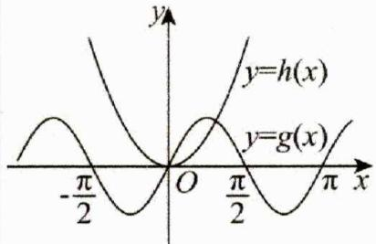

##### 3. 画图注意事项：

（1） 分段函数分开画，注意各自的区间；  
（2） 注意 “直线上升，对数增长，指数爆炸”

图形走势一定要知道：递增的直线 $x$ 系数再大最终也没递增的指数增长的快，对数的底数再大最终也没递增的直线增长的快，但是一定范围内可能会有交点；

（3） 适当取一些特殊点，确定两函数的图像高低；

比如：（2024高三上·湖北荆门·阶段练习） $f(x)=2e^{x}-5x^{2}$ 的零点的个数为（）

$\quad$A. 0

$\quad$B. 1

$\quad$C. 2

$\quad$D. 3

详解由 $2\mathrm{e}^{x} - 5x^{2} = 0$ 得 $\frac{x^2}{\mathbf{e}^x} = \frac{2}{5}$ ，构造函数 $g(x) = \frac{x^2}{\mathbf{e}^x}$ ，求导得 $g'(x) = \frac{x(2 - x)}{\mathbf{e}^x}$ ， $\mathbf{e}^x > 0$ ， $g(x)$ 在 $(- \infty, 0)$ 上单调递减，在 $(0, 2)$ 上单调递增， $(2, +\infty)$ 上单调递减，且 $g(0) = 0$ ， $g(2) = \frac{4}{\mathbf{e}^2} > \frac{2}{5}$ 及 $x \to +\infty$ 时 $g(x) \to 0$ ， $g(x)$ 的图像如图，得到 $g(x) = \frac{2}{5}$ 有3个解.

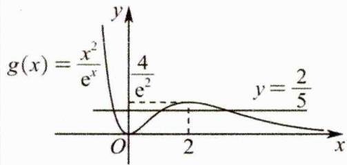

故选：D.

### 二、【典型例题】

##### 1. (2024·全国·高考真题) 当 $x \in [0, 2\pi]$ 时, 曲线 $y = \sin x$ 与 $y = 2\sin \left(3x - \frac{\pi}{6}\right)$ 的交点个数为 ( )

$\quad$A. 3

$\quad$B. 4

$\quad$C. 6

$\quad$D. 8

##### 2. (2024·广东·模拟预测) 函数 $f(x) = \sin 3x - \sin 2x$ 在开区间 $(- \pi, 2 \pi)$ 的零点个数为 ( )

$\quad$A. 5

$\quad$B. 6

$\quad$C. 7

$\quad$D. 8

##### 3.(2005·福建·高考真题) $f(x)$ 是定义在R上的以3为周期的奇函数,且 $f(2)=0$ .则方程在 $f(x)=0$ 在区间 $(0,6)$ 内解的个数的最小值是()

$\quad$A. 2

$\quad$B. 3

$\quad$C. 7

$\quad$D. 5

##### 4.（2012·天津·高考真题）函数 $f(x) = 2^{x} + x^{3} - 2$ 在区间(0,1)内的零点个数是（）

$\quad$A. 0

$\quad$B. 1

$\quad$C. 2

$\quad$D. 3

##### 5.(2003·全国·高考真题) $f(x)$ 是定义在区间 $[-c,c]$ 上的奇函数,其图象如图所示:令 $g(x)=af(x)+b$ ,则下列关于函数 $g(x)$ 的叙述正确的是()

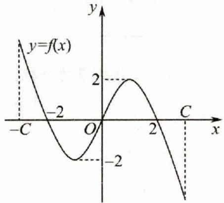

$\quad$A. 若 $a < 0$ ，则函数 $g(x)$ 的图象关于原点对称  
$\quad$B. 若 $a = -1$ ， $-2 < b < 0$ ，则方程 $g(x) = 0$ 有大于2的实根  
$\quad$C. 若 $a \neq 0, b = 2$ ，则方程 $g(x) = 0$ 有两个实根  
$\quad$D. 若 $a \geq 1$ , b < 2，则方程 $g(x) = 0$ 有三个实根

##### 6.（2019·全国·高考真题）函数 $f(x) = 2\sin x - \sin 2x$ 在 $[0, 2\pi]$ 的零点个数为（）

$\quad$A. 2

$\quad$B. 3

$\quad$C. 4

$\quad$D. 5

##### 7.（2014·福建·高考真题）函数 $f(x)=\left\{\begin{aligned}x^{2}-2,x&\leq0\\ 2x-6+\ln x,x&>0\end{aligned}\right.$ 的零点个数是 \_\_\_\_.

### 三、【习题检测】

##### 1.（2024·河北邢台·一模）函数 $f(x) = \sqrt{11}\cos \pi x - 2x + 1$ 零点的个数为（）

$\quad$A. 3

$\quad$B. 4

$\quad$C. 5

$\quad$D. 6

##### 2. (2013·湖南·高考真题) 函数 $f(x) = \ln x$ 的图象与函数 $g(x) = x^2 - 4x + 4$ 的图象的交点个数为 ( )

$\quad$A. 0

$\quad$B. 1

$\quad$C. 2

$\quad$D. 3

##### 3.(2013·湖南·高考真题)函数 $f(x)=2\ln x$ 的图象与函数 $g(x)=x^{2}-4x+5$ 的图象的交点个数为()

$\quad$A. 3

$\quad$B. 2

$\quad$C. 1

$\quad$D. 0

##### 4.（2011·陕西·高考真题）函数 $f(x) = \sqrt{x} - \cos x$ 在 $[0, +\infty)$ 内（）

$\quad$A. 没有零点

$\quad$B. 有且仅有一个零点

$\quad$C. 有且仅有两个零点

$\quad$D. 有无穷多个零点

##### 5.（2012·湖北·高考真题）函数 $f(x) = x\cos x^2$ 在区间[0,4]上的零点个数为（）

$\quad$A. 4

$\quad$B. 5

$\quad$C. 6

$\quad$D. 7

##### 6. (2012·北京·高考真题) 函数 $f(x) = x^{\frac{1}{2}} - \left(\frac{1}{2}\right)^x$ 的零点个数为（）

$\quad$A. 0

$\quad$B. 1

$\quad$C. 2

$\quad$D. 3

##### 7.（2010·福建·高考真题）函数 $f(x) = \begin{cases} x^2 + 2x - 3, & x \leq 0 \\ -2 + \ln x, & x > 0 \end{cases}$ 的零点个数为（）

$\quad$A. 3

$\quad$B. 2

$\quad$C. 1

$\quad$D. 0

##### 8. (2012·湖北·高考真题) 函数 $f(x) = x\cos 2x$ 在区间 $[0, 2\pi]$ 上的零点个数为 ( )

$\quad$A. 2

$\quad$B. 3

$\quad$C. 4

$\quad$D. 5

##### 9.（2010·浙江·高考真题）设函数 $f(x) = 4\sin (2x + 1) - x$ ，则在下列区间中函数 $f(x)$ 不存在零点的是（）

$\quad$A. $[-4, - 2]$

$\quad$B. $[-2,0]$

$\quad$C. $[0,2]$

$\quad$D. $[2,4]$

##### 10.（2007·湖南·高考真题）函数 $f(x) = \begin{cases} 4x - 4, & x \leq 1 \\ x^2 - 4x + 3, & x > 1 \end{cases}$ 的图象和函数 $g(x) = \log_2 x$ 的图象的交点个数是（）

$\quad$A. 1

$\quad$B. 2

$\quad$C. 3

$\quad$D. 4

##### 11. (2012·湖南·高考真题) 设定义在 $\mathbb{R}$ 上的函数 $f(x)$ 是最小正周期为 $2\pi$ 的偶函数, $f'(x)$ 是 $f(x)$ 的导函数, 当 $x \in [0, \pi]$ 时, $0 < f(x) < 1$ ; 当 $x \in (0, \pi)$ 且 $x \neq \frac{\pi}{2}$ 时, $\left(x - \frac{\pi}{2}\right)f'(x) > 0$ , 则函数 $y = f(x) - \sin x$ 在 $[-2\pi, 2\pi]$ 上的零点个数为 ( )

$\quad$A. 2

$\quad$B. 4

$\quad$C. 5

$\quad$D. 8

##### 12.（2024·四川成都·一模）函数 $f(x) = \log_{\frac{2}{5\pi}}x - \sin x$ 零点个数为（）

$\quad$A. 4

$\quad$B. 3

$\quad$C. 2

$\quad$D. 1

##### 13.（2018·全国·高考真题）函数 $f(x) = \cos \left( 3x + \frac{\pi}{6} \right)$ 在 $[0, \pi]$ 的零点个数为 \_\_\_\_.  
##### 14. (2013·安徽·高考真题) 函数 $y = f(x)$ 的图像如图所示, 在区间 $[a, b]$ 上可找到 $n (n \geq 2)$ 个不同的数 $x_1, x_2, \cdots, x_n$ , 使得 $\frac{f(x_1)}{x_1} = \frac{f(x_2)}{x_2} = \cdots = \frac{f(x_n)}{x_n}$ , 则 $n$ 的取值范围为 ( )

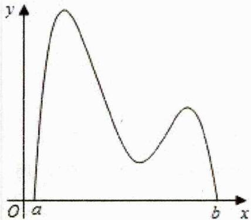

$\quad$A. $\{2,3\}$

$\quad$B. $\{2,3,4\}$

$\quad$C. $\{3,4\}$

$\quad$D. $\{3,4,5\}$

##### 15.（2008·湖北·高考真题）方程 $2^{-x}+x^{2}=3$ 的实数解的个数为 \_\_\_\_.  
##### 16.(2017·江苏·高考真题)设 $f(x)$ 是定义在R且周期为1的函数,在区间 $[0,1)$ 上, $f(x)=\left\{\begin{aligned}x^{2},&x\in D\\ x,&x\notin D\end{aligned}\right.$ 其中集合 $D=\left\{x\mid x=\frac{n-1}{n},n\in N^{*}\right\}$ ，则方程 $f(x)-\lg x=0$ 的解的个数是\_\_\_\_。

# 2.4.3 零点个数之图像翻折类

### 一、【题型总结】

▲适用题型：函数中含绝对值的求零点个数题型；

▲方法原理：

##### 1. 代数法：讨论正负去掉绝对值，转化成方程问题，求根的个数即可；

比如：（2015·天津·高考真题）已知函数 $f(x) = \begin{cases} 2 - |x|, & x \leq 2 \\ (x - 2)^2, & x > 2 \end{cases}$ ，函数 $g(x) = 3 - f(2 - x)$ ，则函数 $y = f(x) - g(x)$ 的零点的个数为（）

$\quad$A. 2

$\quad$B. 3

$\quad$C. 4

$\quad$D. 5

详解当 $x < 0$ 时 $2 - x > 2$ ，所以 $f(x) = 2 - |x| = 2 + x, f(2 - x) = x^2$ ，此时函数

$f(x)-g(x)=f(x)+f(2-x)-3=x^{2}+x-1$ 的小于零的零点为 $x=-\frac{1+\sqrt{5}}{2}$ ; 当 $0 \leq x \leq 2$ 时 $f(x)=2-|x|=2-x,\quad f(2-x)=2-|2-x|=x$ ，函数 $f(x)-g(x)=2-x+x-3=-1$ 无零点；当 x>2 时， $f(x)=(x-2)^{2}$ ， $f(2-x)=2-|2-x|=4-x$ ，函数 $f(x)-g(x)=(x-2)^{2}+4-x-3=x^{2}-5x+5$ 大于 2 的零点为 $x=\frac{5+\sqrt{5}}{2}$ ，综上可得函数 $y=f(x)-g(x)$ 的零点的个数为 2. 故选 A.

##### 2. 几何法：利用之前讲过的含绝对值图像，画图分析；

含绝对值： $\left\{ \begin{array}{l}f(x)\text{图右翻左，原左舍}\rightarrow f(|x|)\\ \text{原理：}f(|x|) = \left\{ \begin{array}{ll}f(-x), & x < 0\\ f(x), & x\geq 0 \end{array} \right.\end{array} \right.$ 由对称即得（2） $\left\{ \begin{array}{l}f(x)\text{图下翻上，原下舍}\rightarrow |f(x)|\\ \text{原理：}|f(x)| = \left\{ \begin{array}{ll} - f(x), & f(x) <   0\\ f(x), & f(x)\geq 0 \end{array} \right.\end{array} \right.$ 由对称即得

比如：（2011·陕西·高考真题）方程 $|x|=\cos x$ 在 $(-∞,+∞)$ 内（）

$\quad$A. 没有根

$\quad$B. 有且仅有一个根
$\quad$C. 有且仅有两个根
$\quad$D. 有无穷多个根

详解方程 $|x|=cos x$ 在 $(-∞,+∞)$ 内根的个数，就是函数 $y=|x|$ ， $y=cos x$ 在 $(-∞,+∞)$ 内交点的个数，

如图，可知只有2个交点，

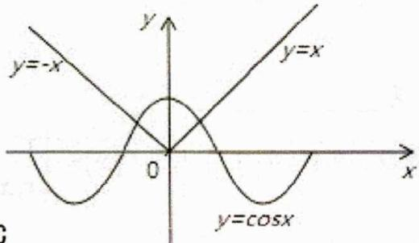

故选C

### 二、【典型例题】

##### 1.（2024·广东湛江·二模）已知函数 $f(x) = |2^x - 1| - a$ ， $g(x) = x^2 - 4|x| + 2 - a$ ，则（）

$\quad$A. 当 $g(x)$ 有 2 个零点时， $f(x)$ 只有 1 个零点

$\quad$B. 当 $g(x)$ 有 3 个零点时， $f(x)$ 有 2 个零点

$\quad$C. 当 $f(x)$ 有 2 个零点时， $g(x)$ 有 2 个零点

$\quad$D. 当 $f(x)$ 有 2 个零点时， $g(x)$ 有 4 个零点

##### 2.（2023·河南·模拟预测）函数 $f(x) = \left|\left(\frac{1}{2}\right)^x - 1\right| - \log_2 x$ 的零点个数为（）

$\quad$A. 0

$\quad$B. 1

$\quad$C. 2

$\quad$D. 3

##### 3. (2024·江苏盐城·模拟预测) 函数 $y = \cos x$ 与 $y = \lg |x|$ 的图象的交点个数是 ( )

$\quad$A. 2

$\quad$B. 3

$\quad$C. 4

$\quad$D. 6

##### 4. (2012·辽宁·高考真题) 设函数 $f(x) (x \in R)$ 满足 $f(-x) = f(x)$ , $f(x) = f(2 - x)$ ，且当 $x \in [0,1]$ 时， $f(x) = x^3$ . 又函数 $g(x) = |x \cos(\pi x)|$ ，则函数 $h(x) = g(x) - f(x)$ 在 $[- \frac{1}{2}, \frac{3}{2}]$ 上的零点个数为（）

$\quad$A. 5

$\quad$B. 6

$\quad$C. 7

$\quad$D. 8

### 三、【习题检测】

##### 1. (2024·广东·模拟预测) 函数 $f(x) = 2|\cos x| - \sqrt{3}$ 在 $\left[0, \frac{13\pi}{6}\right]$ 上的零点个数为（）

$\quad$A. 5

$\quad$B. 4

$\quad$C. 3

$\quad$D. 2

##### 2. (2013·天津·高考真题) $f(x) = 2^{x} \left| \log_{0.5} x \right| - 1$ 的零点个数为（）

$\quad$A. 1

$\quad$B. 2

$\quad$C. 3

$\quad$D. 4

##### 3. (2024·山西·模拟预测) 方程 $4 \mid \cos t \mid -\sqrt{t} = 0$ 的实数根的个数为 ( )

$\quad$A. 9

$\quad$B. 10

$\quad$C. 11

$\quad$D. 12

##### 4. (2011·全国·高考真题) 已知函数 $f(x)$ 的周期为 2, 当 $x \in [-1, 1]$ 时, $f(x) = x^{2}$ , 那么函数 $f(x)$ 的图像与 $y = |\lg x|$ 函数的图像的交点共有 ( )

$\quad$A. 10 个

$\quad$B. 9个

$\quad$C. 8个

$\quad$D. 1 个

##### 5. (2023·四川凉山·二模) 已知 $f(x)$ 是定义域为 $\{x \mid x \neq 0\}$ 的偶函数且 $f(x) = \left|\frac{\ln x}{x}\right| - \frac{1}{\mathrm{e}^2} (x > 0)$ ，则函数 $f(x)$ 零点个数是（）

$\quad$A. 6

$\quad$B. 5

$\quad$C. 4

$\quad$D. 3

##### 6. (2015·江苏·高考真题) 已知函数 $f(x) = |\ln x|$ , $g(x) = \begin{cases} 0, & 0 < x \leq 1 \\ |x^2 - 4| - 2, & x > 1 \end{cases}$ , 则方程 $|f(x) + g(x)| = 1$ 实根的个数为 \_\_\_\_.

##### 7. (2015 • 湖北 • 高考真题) 函数 $f(x) = 4\cos^{2}\frac{x}{2}\cos(\frac{\pi}{2} - x) - 2\sin x - |\ln(x + 1)|$ 的零点个数为 \_\_\_\_.

# 2.4.4 零点个数之复合函数类

### 一、【题型总结】

▲适用题型：复合函数求零点个数题型；

▲方法原理：

##### 1. 换元后：先外后内

若 $f(g(x))=0$ ，求零点个数

（1）换元，令 $g(x)=t$ （2）分析外函数零点， $f(t)=0$ ，求出零点 $t_{1},t_{2}\cdots t_{n}$ （3）分析内函数零点， $\left\{\begin{aligned}&g(x)=t_{1},\\ &g(x)=t_{2},\\ &\cdots\\ &g(x)=t_{n},\end{aligned}\right.\Rightarrow$ 零点个数 $=m_{1}+m_{2}+\cdots+m_{n}$

##### 2. 分析零点依然涉及到画图，所以对函数图像一定要掌握扎实；

若 $f(x)=|x-1|-2,f(x^{2}-4)=0,$ 求零点个数

##### 3. 简单举例： $\left\{\begin{aligned}&（1）换元，令x^{2}-4=t\\ &（2）分析外函数零点，f(t)=|t-1|-2=0,求出零点t_{1}=3,t_{2}=-1\\ &（3）分析内函数零点，\left\{\begin{aligned}&x^{2}-4=3,求出零点个数2\\&x^{2}-4=-1,求出零点个数2\end{aligned}\right.\Rightarrow 零点个数=4\end{aligned}\right.$

### 二、【典型例题】

##### 1.（宁夏石嘴山·一模）如图，偶函数 $f(x)$ 的图象形如字母 $M$ （图1），奇函数 $g(x)$ 的图象形如字母 $N$ （图2），若方程 $f(g(x)) = 0$ ， $g(f(x)) = 0$ 的实根个数分别为 $a, b$ ，则 $a + b =$ （）

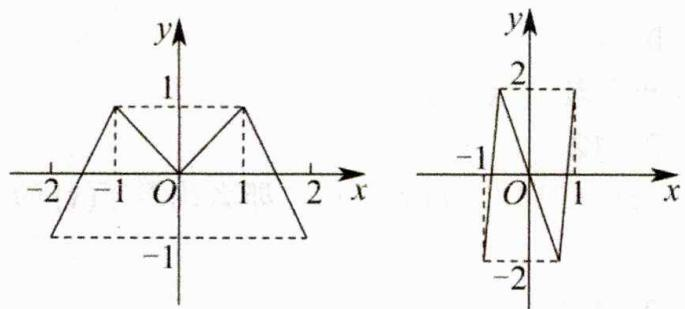

$\quad$A. 18

$\quad$B. 21

$\quad$C. 24

$\quad$D. 27

##### 2.（2024·福建漳州·模拟预测）已知函数 $f(x) = \begin{cases} \ln x - \frac{1}{x}, & x > 0 \\ - |x + 1| + 1, & x \leq 0 \end{cases}$ ，则函数 $g(x) = f(f(x) - 1)$ 的零点个数为（）

$\quad$A. 3

$\quad$B. 5

$\quad$C. 6

$\quad$D. 8

##### 3.（2013·安徽·高考真题）已知函数 $f(x) = x^{3} + ax^{2} + bx + c$ 有两个极值点 $x_{1}, x_{2}$ ，若 $f(x_{1}) = x_{1} < x_{2}$ ，则关于 $x$ 的方程 $3(f(x))^{2} + 2af(x) + b = 0$ 的不同实根个数为（）

$\quad$A. 3

$\quad$B. 4

$\quad$C. 5

$\quad$D. 6

### 三、【习题检测】

##### 1.(陕西咸阳·模拟预测)已知函数 $f(x)=\left\{\begin{aligned}-x\mathrm{e}^{x},&x<0\\ \ln(x+1),&x\geq0\end{aligned}\right.$ ，则函数 $g(x)=f(f(x))-1$ 的零点个数是()

$\quad$A. 1

$\quad$B. 0

$\quad$C. 2

$\quad$D. 3

##### 2.（全国·二模）已知函数 $f(x) = \begin{cases} \frac{1}{1 - x}, & x < 0 \\ |\ln x|, & x > 0 \end{cases}$ （e为自然对数的底数），则函数

$F(x)=f[f(x)]-\frac{1}{\mathrm{e}^{3}}f(x)-1$ 的零点个数为（）

$\quad$A. 3

$\quad$B. 5

$\quad$C. 7

$\quad$D. 9

##### 3.（陕西榆林·二模）已知函数 $f(x) = (x^2 + x - 5)e^x$ ，若函数 $g(x) = f(f(x)) - a (a > 0)$ ，则 $g(x)$ 的零点个数不可能是（）

$\quad$A. 1

$\quad$B. 3

$\quad$C. 5

$\quad$D. 7

# 2.4.5 多零点求零点范围问题

### 一、【题型总结】

▲适用题型：函数有多个零点求多个零点组合后的范围问题；

▲方法原理：

先作图，再找零点关系，最后统一变量分析范围；

##### 1. 常见零点关系：

（1）和定值：对称轴 $x = a$ $\left\{ \begin{array}{l}\text{二次函数} (x - a)^2, \text{绝对值} |x - a| \\ \text{偶函数} f(x + a), f(x) = f(2a - x) \Rightarrow \text{若} y = t \text{有两零点则} x_1 + x_2 = 2a \\ \text{符合对称的} \sin \text{和} \cos \end{array} \right.$

（2） 积定值: $\left\{ \begin{array}{l} \text { 若 } \left| \log_{a} x \right| = t \text { 有两零点则 } x_{1} x_{2} = 1 \\ \text { 原理: } \left\{ \begin{array}{l} \text { 易得 } \pm \log_{a} x = t \\ \text { 令 } \log_{a} x_{1} = t \\ \text { 令 } -\log_{a} x_{2} = t \end{array} \right\} \Rightarrow \log_{a} x_{1} = -\log_{a} x_{2} \Rightarrow x_{1} x_{2} = 1 \\ \text { 若 } x + \frac{k}{x} = t (k > 0) \text { 有两零点则 } x_{1} x_{2} = k \\ \text { 原理: } x + \frac{k}{x} = t \Rightarrow x^{2} - tx + k = 0 \Rightarrow x_{1} x_{2} = k \end{array} \right.$

##### 2. 统一变量分析范围：统一变量，再得相关函数，由图分析该变量范围，并求函数值域；

简单举例: 已知 $f(x)=\left\{\begin{aligned}|x+1|, &x \leq 0 \\ |\log_{2}x|, &x > 0\end{aligned}\right.$ ，且 $f(x)=a$ 有四个不同的解 $x_{1}<x_{2}<x_{3}<x_{4}$ ，则 $x_{1}+x_{2}+\frac{1}{x_{3}}+\frac{1}{x_{4}}$ 的取值范围是 \_\_\_\_.

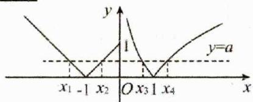

解：（1）作图：

（2） 找零点关系: $\left\{ \begin{array}{l} （1） \text{和定值: } |x + 1| \text{ 对称轴 } x = -1, \\ （2） \text{ 积定值: } |\log_2 x| \Rightarrow x_3 x_4 = 1 \Rightarrow x_3 = \frac{1}{x_4} \end{array} \right.$

（3） 统一变量分析范围:

$x_{1} + x_{2} + \frac{1}{x_{3}} +\frac{1}{x_{4}} = -2 + x_{4} + \frac{1}{x_{4}} = h(x_{4})$ 由图可知四个交点 $\Rightarrow a\in (0,1]$ $\Rightarrow x_4\in (1,2],$ 易知 $h(x_{4})$ 在 $(1,2]\uparrow$

### 二、【典型例题】

##### 1.(2024·四川·三模)已知关于x的方程 $e^{2x}-axe^{x}+9e^{2}x^{2}=0$ 有4个不同的实数根,分别记为 $x_{1},x_{2},x_{3},x_{4}$ ，则 $\left(\frac{e^{x_{1}}}{x_{1}}-e\right)\left(\frac{e^{x_{2}}}{x_{2}}-e\right)\left(\frac{e^{x_{3}}}{x_{3}}-e\right)\left(\frac{e^{x_{4}}}{x_{4}}-e\right)$ 的取值范围为()

$\quad$A. $(0,16\mathbf{e}^{4})$

$\quad$B. $(0,12\mathbf{e}^{4})$

$\quad$C. $(0,4\mathbf{e}^{4})$

$\quad$D. $(0,8\mathbf{e}^4)$

##### 2.（上海嘉定·三模）已知函数 $f(x) = \begin{cases} \sin \pi x, & x \in [0, 2] \\ \log_{2023}(x - 1), & x \in (2, +\infty) \end{cases}$ ，若满足 $f(a) = f(b) = f(c)$ （ $a$ 、 $b$ 、 $c$ 互不相等），则 $a + b + c$ 的取值范围是（）

$\quad$A. (3,2023.5)

$\quad$B. (3,2024)

$\quad$C. [3,2024)

$\quad$D. [3,2025)

##### 3. (2012·福建·高考真题) 对于实数 $a$ 和 $b$ , 定义运算 “\*”: $a*b=\begin{cases} a^2-ab, & a \leqslant b \\ b^2-ab, & a>b \end{cases}$ , 设 $f(x)=(2x-1)*(x-1)$ , 且关于 $x$ 的方程为 $f(x)=m(m \in R)$ 恰有三个互不相等的实数根 $x_1, x_2, x_3$ , 则 $x_1x_2x_3$ 的取值范围是 \_\_\_\_.

##### 4. (2010·全国·高考真题) 已知函数 $f(x) = \begin{cases} \lg x, & 0 < x \leq 10 \\ -\frac{1}{2}x + 6, & x > 10 \end{cases}$ 若 $a, b, c$ 均不相等，且 $f(a) = f(b) = f(c)$ ，则 abc 的取值范围是（）

$\quad$A. (1, 10)

$\quad$B. (5, 6)

$\quad$C. (10, 12)

$\quad$D. (20, 24)

### 三、【习题检测】

##### 1. (2024·四川成都·二模)已知函数 $f(x) = \begin{cases} (x + 1)^2, & x \leq 0 \\ |\log_2 x|, & x > 0 \end{cases}$ ，若方程 $f(x) = a$ 有四个不同的解 $x_1, x_2, x_3, x_4$ ，且 $x_1 < x_2 < x_3 < x_4$ ，则 $x_3 \cdot x_4^2 - \frac{1}{x_4(x_1 + x_2)}$ 的取值范围是（）

$\quad$A. $\left(\frac{3}{2},+\infty\right)$

$\quad$B. $\left[\sqrt{2},\frac{9}{4}\right)$

$\quad$C. $\left[\sqrt{2},\frac{7}{4}\right)$

$\quad$D. $\left(\frac{3}{2},\frac{9}{4}\right]$

##### 2.（多选题2024·江西宜春·模拟预测）已知函数 $f(x) = \begin{cases} 2 - \left|\log_{\frac{1}{2}}x\right|, & 0 < x \leq 2 \\ -x^2 + 8x - 11, & x > 2, \end{cases}$ ， $g(x) = f(x) - a$ ，则（）

$\quad$A. 若 $g(x)$ 有2个不同的零点，则 $2 < a < 5$   
$\quad$B. 当 a=2 时， $g(f(x))$ 有 5 个不同的零点  
$\quad$C. 若 $g(x)$ 有 4 个不同的零点 $x_{1}, x_{2}, x_{3}, x_{4} (x_{1} < x_{2} < x_{3} < x_{4})$ ，则 $x_{1}x_{2}x_{3}x_{4}$ 的取值范围是 (12,13)  
$\quad$D. 若 $g(x)$ 有 4 个不同的零点 $x_{1}, x_{2}, x_{3}, x_{4} \left( x_{1} < x_{2} < x_{3} < x_{4} \right)$ ，则 $ax_{1}x_{2} + \frac{x_{3} + x_{4}}{a}$ 的取值范围是 (6,9)

##### 3. (2012·湖南·高考真题) 已知两条直线 $l_{1}: y = m$ 和 $l_{2}: y = \frac{8}{2m + 1} (m > 0)$ , $l_{1}$ 与函数 $y = |\log_{2} x|$ 的图像从左至右相交于点 A, B, $l_{2}$ 与函数 $y = |\log_{2} x|$ 的图像从左至右相交于 C, D. 记线段 AC 和 BD 在 X 轴上的投影长度分别为 a, b, 当 m 变化时, $\frac{b}{a}$ 的最小值为 ( )

$\quad$A. $16\sqrt{2}$

$\quad$B. $8\sqrt{2}$

$\quad$C. $8 \sqrt{4}$

$\quad$D. $4\sqrt{4}$

##### 4. (2024·江西·二模) 已知函数 $f(x) = 2\sin (\omega x + \varphi)$ ( $\omega > 0$ , $0 \leq \varphi \leq \frac{\pi}{2}$ ) 的图象在 $y$ 轴上的截距为 $\sqrt{2}$ ，在 $y$ 轴右侧的第一个零点为 $\frac{3\pi}{8}$ ，当 $x \in \left[0, \frac{9\pi}{8}\right]$ 时，若方程 $f(x) = a$ 恰有三个不同的根，分别记为 $x_1$ , $x_2$ , $x_3$ ，则 $x_1 + x_2 + x_3$ 零点为的取值范围为 \_\_\_\_.

##### 5. (2024 高二下·福建厦门·阶段练习) 已知 $f(x) = \begin{cases} |\sin \pi x|, & 0 \leq x \leq 2 \\ \mathbf{e}^x, & x < 0 \end{cases}$ ，若存在实数 $x_i (i=1,2,3,4,5)$ ，当 $x_i < x_{i+1} (i=1,2,3,4)$ 时，满足 $f(x_1) = f(x_2) = f(x_3) = f(x_4) = f(x_5)$ ，则 $\sum_{i=1}^{5} x_i f(x_i)$ 的取值范围为 \_\_\_\_.

# 2.4.6 奇偶函数唯一零点模型

### 一、【题型总结】

▲适用题型：题目中的函数和奇偶函数有关，比如是奇偶函数的平移，且已知唯一零点；

▲方法原理：

奇偶函数唯一零点必定是0

##### 1. 奇函数 $f(x + m)$ ，则唯一零点就是 $m$ ，按照平移理解即可求解，比如：

$\left\{\begin{array}{l}{f (x) = a (x - m) ^ {3} + b (x - m) - \frac {c}{x - m} + d + 1 \text {有唯一零点}}\\{\Rightarrow f (x) \text {看作} a x ^ {3} + b x - \frac {c}{x} \text {这个奇函数右移} m \text {个单位再上移} (d + 1) \text {个单位}}\\{\Rightarrow \text {所以零点从} 0 \rightarrow m \Rightarrow f (m) = d + 1 = 0 \Rightarrow d = - 1}\end{array}\right.$

##### 2. 偶函数 $f(x + m)$ ，则唯一零点就是 $m$ ，按照平移理解即可求解，比如：

$\left\{\begin{array}{l l}f (x) = a \left(x - m\right) ^ {2} - \cos \left(x - m\right) + d + 1 \text {有唯一零点}\\\Rightarrow f (x) \text {看作} a x ^ {2} - \cos x + d + 1 \text {这个偶函数右移} m \text {个单位}\\\Rightarrow \text {所以零点从} 0 \rightarrow m \Rightarrow f (m) = d + 1 = 0 \Rightarrow d = - 1\end{array}\right.$

速算就是直接把上面例子中的 $x - m = 0$ ，即可求出唯一零点为 $m$ ，然后代入函数利用 $f(m) = 0$ 求参即可

### 二、【典型例题】

##### 1. (2024·全国·高考真题) 设函数 $f(x) = a(x + 1)^2 - 1$ , $g(x) = \cos x + 2ax$ , 当 $x \in (-1, 1)$ 时, 曲线 $y = f(x)$ 与 $y = g(x)$ 恰有一个交点, 则 $a =$ ( )

$\quad$A. -1

$\quad$B. $\frac{1}{2}$

$\quad$C. 1

$\quad$D. 2

##### 2.（山东·模拟预测）已知函数 $f(x) = |x + 2| + \mathrm{e}^{x + 2} + \mathrm{e}^{-2 - x} + a$ 有唯一零点，则实数 $a =$ （）

$\quad$A. 1

$\quad$B. -1

$\quad$C. 2

$\quad$D. -2

##### 3.（高三上·云南曲靖·阶段练习）已知函数 $f(x) = m\left(2^{x - \frac{1}{2}} + 2^{-x + \frac{1}{2}}\right) + x^2 - x$ 有唯一零点，则 $m$ 的值为（）

$\quad$A. $-\frac{1}{2}$

$\quad$B. $\frac{1}{3}$

$\quad$C. $\frac{1}{2}$

$\quad$D. $\frac{1}{8}$

### 三、【习题检测】

##### 1. (2017·全国·高考真题)已知函数 $f(x) = x^{2} - 2x + a(e^{x-1} + e^{-x+1})$ 有唯一零点, 则 $a =$ (   )

$\quad$A. $-\frac{1}{2}$

$\quad$B. $\frac{1}{3}$

$\quad$C. $\frac{1}{2}$

$\quad$D. 1

##### 2. (2023·贵州毕节·模拟预测) 若函数 $f(x) = x^{2} - 4x + a(e^{2x - 4} + e^{4 - 2x})$ 有唯一零点，则实数 $a =$ ( )

$\quad$A. 2

$\quad$B. $\frac{1}{2}$

$\quad$C. 4

$\quad$D. 1

##### 3. (2024·安徽芜湖·二模) 在数列 $\{a_{n}\}$ 中, $S_{n}$ 为其前 $n$ 项和, 首项 $a_{1} = 1$ , 且函数 $f(x) = x^{3} - a_{n+1} \sin x + (2a_{n} + 1)x + 1$ 的导函数有唯一零点, 则 $S_{5} = (\quad)$

$\quad$A. 26

$\quad$B. 63

$\quad$C. 57

$\quad$D. 25

##### 4.（全国·模拟预测）若函数 $f(x)=|x-3|+e^{x-3}+e^{3-x}+m$ 有唯一零点，则实数 m 的值为（）

$\quad$A. 0

$\quad$B. -2

$\quad$C. 2

$\quad$D. -1

##### 5. (2024·天津南开·一模) 已知函数 $f(x)$ , $g(x)$ 分别是定义在 $\mathbb{R}$ 上的偶函数和奇函数, 且 $f(x) + g(x) = e^{x} - x^{3}$ , 若函数 $h(x) = 3^{|x-2024|} - \lambda f(x-2024) - 2\lambda^{2}$ 有唯一零点, 则实数 $\lambda$ 的值为 \_\_\_\_.

# 2.4.7 零点求参之常规 3 种解法

### 一、【题型总结】

▲适用题型：已知函数零点个数求参数范围的问题；

▲方法原理：

类型 1: 直接求导讨论

比如：(2012·全国·高考真题)已知函数 $y = x^{3} - 3x + c$ 的图象与 $x$ 轴恰有两个公共点，则 $c =$

$\quad$A. -2 或 2

$\quad$B. -9 或 3

$\quad$C. -1或1

$\quad$D. -3 或 1

详解因为 $y' = 3x^{2} - 3 = 3(x + 1)(x - 1)$ ，所以 $f(x)$ 的增区间为 $(-∞, -1), (1, +∞)$ ，减区间为 $(-1, 1)$ ，所以 $f(x)$ 的极大值为 $f(-1)$ ，极小值为 $f(1)$ ，因为函数 $y = x^{3} - 3x + c$ 的图象与 x 轴恰有两个公共点，所以只须满足 $f(-1) = 0$ 或 $f(1) = 0$ ，即 c = -2 或 c = 2，故选 A.

类型 2: 分离参数再数形结合

比如：(2015·天津·高考真题)已知函数 $f(x)=\left\{\begin{aligned}&2-|x|,&x\leq2\\&(x-2)^{2},&x>2\end{aligned}\right.$ ，函数 $g(x)=b-f(2-x)$ ，其中 $b\in\mathbb{R}$ ，若函数 $y=f(x)-g(x)$ 恰有4个零点，则b的取值范围是（）

$\quad$A. $\left(\frac{7}{4},+\infty\right)$

$\quad$B. $\left(-\infty,\frac{7}{4}\right)$

$\quad$C. $\left(0,\frac{7}{4}\right)$

$\quad$D. $\left(\frac{7}{4},2\right)$

详解函数 $y = f(x) - g(x)$ 恰有 4 个零点，即方程 $f(x) - g(x) = 0$ ，
即 $b = f(x) + f(2 - x)$ 有 4 个不同的实数根，即直线 y = b 与函数 $y = f(x) + f(2 - x)$ 的图象有四个不同的交点。又 $y = f(x) + f(2 - x) = \begin{cases} x^{2} + x + 2, & x < 0 \\ 2, & 0 \leq x \leq 2 \\ x^{2} - 5x + 8, & x > 2 \end{cases}$ 。做出该函数的图象如图所示，

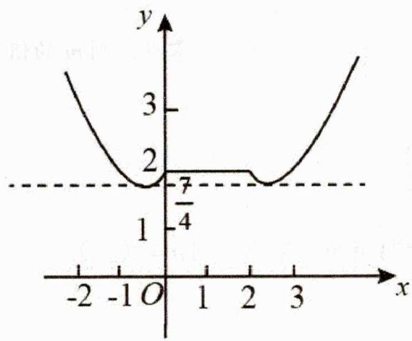

由图得，当 $\frac{7}{4} < b < 2$ 时，直线 $y = b$ 与函数 $y = f(x) + f(2 - x)$ 的图象有4个不同的交点，

故函数 $y = f(x) - g(x)$ 恰有 4 个零点时，b 的取值范围是 $\left(\frac{7}{4}, 2\right)$ 故选 D.

类型 3: 复合函数换元处理

比如:(多选题2023·河北·模拟预测)(多选)已知函数 $f(x)=\left\{\begin{aligned}&x^{2}-2x+t,x\leq0\\&2\ln(x+1)-1,x>0\end{aligned}\right.$ ，若函数 $y=f(f(x))$ 恰好有4个不同的零点，则实数t的取值可以是()

$\quad$A. -3

$\quad$B. -2

$\quad$C. 0

$\quad$D. 2

详解由题意可知，

当 $x \leq 0$ 时， $f(x)$ 在 $(- \infty, 0]$ 上单调递减，则 $f(x) \geq f(0) = t$ ；

当 $x > 0$ 时， $f(x)$ 在 $(0, +\infty)$ 上单调递增，则 $f(x) > 2\ln 1 - 1 = -1$ ；

若函数 $y = f(f(x))$ 恰好有4个不同的零点，

令 $u = f(x)$ ，则 $y = f(u)$ 有两个零点，可得，

当 $u > 0$ 时，则 $2\ln (u + 1) - 1 = 0$ ，解得 $u = \sqrt{\mathbf{e}} -1 > 0$

当 $u < 0$ 时，则 $u^2 - 2u + t = 0$ ，可得 $\left\{ \begin{array}{l} t \leq 0 \\ u = 1 - \sqrt{1 - t} \end{array} \right.$ ；

可得 $f(x) = \sqrt{\mathbf{e}} - 1$ 和 $f(x) = 1 - \sqrt{1 - t}$ 均有两个不同的实根，

即 $y = f(x)$ 与 $y = \sqrt{\mathbf{e}} - 1$ 、 $y = 1 - \sqrt{1 - t}$ 均有两个交点，

则 $\left\{ \begin{array}{l} \sqrt{\mathbf{e}} - 1 > -1 \\ \sqrt{\mathbf{e}} - 1 \geq t \end{array} \right.$ ，且 $\left\{ \begin{array}{l} 1 - \sqrt{1 - t} > -1 \\ 1 - \sqrt{1 - t} \geq t \end{array} \right.$ ，解得 $-3 < t \leq 0$ ，

综上所述：实数 t 的取值范围为 $(-3,0]$ .

且 $-3\notin (-3,0], - 2\in (-3,0],0\in (-3,0],2\notin (-3,0]$ ，故A、D错误，B、C正确.

故选：BC.

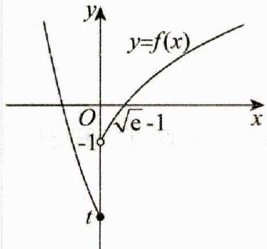

### 二、【典型例题】

##### 1. (2024·湖南长沙·三模) 已知函数 $f(x) = 2\sin x + 2\sqrt{3} |\cos x|$ ，若 $f(x) = \lambda$ 在 $[0, 2\pi]$ 上有且仅有四个不相等的实数根，则 $\lambda$ 的取值范围为（）

$\quad$A. $(2\sqrt{3},4)$

$\quad$B. $(2,2\sqrt{3})$

$\quad$C. (2,4)

$\quad$D. $(2,2\sqrt{3})\cup(2\sqrt{3},4)$

##### 2. (2023·全国·高考真题) 函数 $f(x) = x^3 + ax + 2$ 存在 3 个零点，则 $a$ 的取值范围是（）

$\quad$A. $(-∞,-2)$

$\quad$B. $(-∞,-3)$

$\quad$C. $(-4,-1)$

$\quad$D. $(-3,0)$

##### 3. (2011·天津·高考真题) 对实数 $a$ 和 $b$ , 定义运算 “ $\otimes$ ”: $a \otimes b = \begin{cases} a, & a - b \leq 1 \\ b, & a - b > 1 \end{cases}$ , 设函数

$f(x)=(x^{2}-2)\otimes(x-1)$ ， $x\in R$ ，若函数 $y=f(x)-c$ 的图象与x轴恰有两个公共点，则实数c的取值范围是（）

$\quad$A. $(-1,1]\cup[2,+\infty)$

$\quad$B. $(-2,-1]\cup(1,2]$

$\quad$C. $(-\infty,-2)\cup(1,2]$

$\quad$D. $[-2, - 1]$

##### 4. (2024·四川宜宾·模拟预测) 定义在 $(0, +\infty)$ 上的单调函数 $f(x)$ , 对任意的 $x \in (0, +\infty)$ 有 $f[f(x) - \ln x] = 1$ 恒成立, 若方程 $f(x) \cdot f'(x) = m$ 有两个不同的实数根, 则实数 $m$ 的取值范围为 ( )

$\quad$A. $(- \infty, 1)$

$\quad$B. $(0,1)$

$\quad$C. $(0,1]$

$\quad$D. $(-∞,1]$

##### 5. (2011·北京·高考真题) 已知函数 $f(x) = \begin{cases} \frac{2}{x}, & x \geq 2 \\ (x - 1)^3, & x < 2, \end{cases}$ ，若关于 $x$ 的方程 $f(x) = k$ 有两个不同的实根，则实数 $k$ 的取值范围是 \_\_\_\_.

##### 6. (2011·辽宁·高考真题) 已知函数 $f(x) = \mathrm{e}^{x} - 2x + a$ 有零点，则 $a$ 的取值范围是 \_\_\_\_.

##### 7. (2009·山东·高考真题) 若函数 $f(x) = a^x - x - a$ ( $a > 0$ 且 $a \neq 1$ ) 有两个零点，则实数 $a$ 的取值范围是 \_\_\_\_.

##### 8.（2014·全国·高考真题）已知函数 $f(x)=ax^{3}-3x^{2}+1$ ，若 $f(x)$ 存在唯一的零点 $x_{0}$ ，且 $x_{0}>0$ ，则 a 的取值范围是（）

$\quad$A. $(2, +\infty)$

$\quad$B. $(1,+\infty)$

$\quad$C. $(- \infty, -2)$

$\quad$D. $(-∞,-1)$

### 三、【习题检测】

##### 1. (2019·浙江·高考真题) 已知 $a, b \in R$ ，函数 $f(x) = \begin{cases} x, & x < 0 \\ \frac{1}{3}x^3 - \frac{1}{2}(a + 1)x^2 + ax, & x \geq 0 \end{cases}$ ，若函数 $y = f(x) - ax - b$ 恰有三个零点，则（）

$\quad$A. a<-1, b<0

$\quad$B. $a <   - 1,b > 0$

$\quad$C. a > -1, b < 0

$\quad$D. a > -1, b > 0

##### 2. (2014·湖南·高考真题) 已知函数 $f(x) = x^{2} + e^{x} - \frac{1}{2} (x < 0)$ 与 $g(x) = x^{2} + \ln (x + a)$ 图象上存在关于 $y$ 轴对称的点，则 $a$ 的取值范围是（）

$\quad$A. $(- \infty, \frac{1}{\sqrt{e}})$

$\quad$B. $(-\infty, \sqrt{e})$

$\quad$C. $(- \frac{1}{\sqrt{e}}, \sqrt{e})$

$\quad$D. $(- \sqrt{e}, \frac{1}{\sqrt{e}})$

##### 3.（2011·天津·高考真题）对实数 $a$ 与 $b$ ，定义新运算： $\otimes: a \otimes b = \begin{cases} a, & a - b \leq 1 \\ b, & a - b > 1 \end{cases}$ 设函数 $f(x) = (x^2 - 2) \otimes (x - x^2)$ 若函数 $y = f(x) - c$ 的图象与 $x$ 轴恰有两个公共点，则实数 $c$ 的取值范围是（）

$\quad$A. $(- \infty, -2] \cup \left(-1, \frac{3}{2}\right)$

$\quad$B. $(- \infty, -2] \cup \left(-1, -\frac{3}{4}\right)$

$\quad$C. $\left(-\infty,\frac{1}{4}\right)\cup\left(\frac{1}{4},+\infty\right)$

$\quad$D. $\left(-1,-\frac{3}{4}\right)\cup\left[\frac{1}{4},+\infty\right]$

##### 4. (2009·重庆·高考真题) 已知以 $T = 4$ 为周期的函数 $f(x) = \left\{ \begin{array}{l} m \sqrt{1 - x^2}, x \in (-1,1] \\ 1 - |x - 2|, x \in (1,3] \end{array} \right.$ , 其中 $m > 0$ . 若方程 $3f(x) = x$ 恰有 5 个实数解, 则实数 $m$ 的取值范围为 ( )

$\quad$A. $\left(\frac{\sqrt{15}}{3},\frac{8}{3}\right)$

$\quad$B. $\left(\frac{\sqrt{15}}{3},\sqrt{7}\right)$

$\quad$C. $\left(\frac{4}{3},\frac{8}{3}\right)$

$\quad$D. $\left(\frac{4}{3},\sqrt{7}\right)$

##### 5. (2024·全国·高考真题) 曲线 $y = x^{3} - 3x$ 与 $y = -(x - 1)^{2} + a$ 在 $(0, +\infty)$ 上有两个不同的交点，则 $a$ 的取值范围为 \_\_\_\_.

##### 6. (2018·江苏·高考真题) 若函数 $f(x) = 2x^{3} - ax^{2} + 1 (a \in R)$ 在 $(0, +\infty)$ 内有且只有一个零点，则 $f(x)$ 在 $[-1, 1]$ 上的最大值与最小值的和为 \_\_\_\_.

##### 7. (2018·浙江·高考真题) 已知 $\lambda \in \mathbb{R}$ , 函数 $f(x) = \begin{cases} x - 4, & x \geq \lambda \\ x^2 - 4x + 3, & x < \lambda \end{cases}$ , 当 $\lambda = 2$ 时, 不等式 $f(x) < 0$

的解集是\_\_\_\_。若函数 $f(x)$ 恰有 2 个零点，则 $\lambda$ 的取值范围是\_\_\_\_。

##### 8. (2018·天津·高考真题) 已知 $a > 0$ , 函数 $f(x) = \begin{cases} x^2 + 2ax + a, & x \leq 0, \\ -x^2 + 2ax - 2a, & x > 0. \end{cases}$ . 若关于 $x$ 的方程 $f(x) = ax$ 恰有 2 个互异的实数解, 则 $a$ 的取值范围是 \_\_\_\_.

##### 9. (2016·天津·高考真题) 已知函数 $f(x) = \begin{cases} x^2 + (4a - 3)x + 3a, & x < 0 \\ \log_a (x + 1) + 1, & x \geq 0 \end{cases}$ ( $a > 0$ 且 $a \neq 1$ ) 在 $R$ 上单调递减，且关于 $x$ 的方程 $|f(x)| = 2 - \frac{x}{3}$ 恰有两个不相等的实数解，则 $a$ 的取值范围是 \_\_\_\_.

##### 10. (2015·安徽·高考真题) 设 $x^{3} + ax + b = 0$ , 其中 $a, b$ 均为实数, 下列条件中, 使得该三次方程仅有一个实根的是 \_\_\_\_. (写出所有正确条件的编号)

① a = -3, b = -3 ; ② a = -3, b = 2 ; ③ a = -3, b > 2 ; ④ a = 0, b = 2 ; ⑤ a = 1, b = 2 .

##### 11.（2015·北京·高考真题）设函数 $f(x) = \left\{ \begin{array}{l} 2^x - a, x < 1 \\ 4(x - a)(x - 2a), x \geq 1. \end{array} \right.$

①若 a=1，则 $f(x)$ 的最小值为 \_\_\_\_.

②若 $f(x)$ 恰有 2 个零点，则实数 a 的取值范围是 \_\_\_\_.

# 2.4.8 零点求参之含绝对值类型

### 一、【题型总结】公众号→全科A+

▲适用题型：已知函数零点个数求参数范围中函数有绝对值时；

▲方法原理：

##### 1. 代数法：讨论正负去掉绝对值，转化成方程问题；

比如：(2004·湖南·高考真题) 若直线 $y = 2a$ 与函数 $y = |a^x - 1| (a > 0, a \neq 1)$ 的图象有两个公共点，则 $a$ 的取值范围是 \_\_\_\_.

详解直线 y=2a 与 $y=\left|a^{x}-1\right|(a>0,a\neq1)$ 的图象有两个公共点，故 $\left|a^{x}-1\right|=2a$ 有两个不同的解，故 $\left\{\begin{aligned}a^{x}&\geq1\\ a^{x}&=2a+1\end{aligned}\right.$ 和 $\left\{\begin{aligned}a^{x}&<1\\ a^{x}&=-2a+1\end{aligned}\right.$ 共有两个不同的解，因为 $2a+1>1$ ，故 $\left\{\begin{aligned}a^{x}&\geq1\\ a^{x}&=2a+1\end{aligned}\right.$ 有且只有一个实数解。若 a>1，则 1-2a<0，故 $\left\{\begin{aligned}a^{x}&<1\\ a^{x}&=-2a+1\end{aligned}\right.$ 无解，而 $\left\{\begin{aligned}a^{x}&\geq1\\ a^{x}&=2a+1\end{aligned}\right.$ 只有一个解，故 $\left|a^{x}-1\right|=2a$ 有且只有一个实数解，与题设矛盾，舍；

若 $0 < a < 1$ ，因为 $\left\{ \begin{array}{l} a^x \geq 1 \\ a^x = 2a + 1 \end{array} \right.$ 只有一个解，故 $\left\{ \begin{array}{l} a^x < 1 \\ a^x = -2a + 1 \end{array} \right.$ 需有一解，故 $0 < 1 - 2a < 1$ ，故 $0 < a < \frac{1}{2}$ . 故答案为： $0 < a < \frac{1}{2}$ .

##### 2. 几何法：利用之前讲过的含绝对值图像，画图分析；

含绝对值： $\left\{\begin{aligned}&（1）\left\{\begin{aligned}&f(x)图右翻左，原左舍 \rightarrow f(|x|)\\&原理：f(|x|)=\left\{\begin{aligned}&f(-x),&x<0\\&f(x),&x\geq0\end{aligned}\right. 由对称即得\end{aligned}\right.\\&（2）\left\{\begin{aligned}&f(x)图下翻上，原下舍 \rightarrow |f(x)|\\&原理：|f(x)|=\left\{\begin{aligned}&-f(x),&f(x)<0\\&f(x),&f(x)\geq0\end{aligned}\right. 由对称即得\end{aligned}\right.\end{aligned}\right.$

比如：(2014·天津·高考真题)已知函数 $f(x) = |x^2 + 3x|$ ， $x \in R$ 。若方程 $f(x) - a|x - 1| = 0$ 恰有 4

个互异的实数根，则实数 $a$ 的取值范围为

详解（方法一）在同一坐标系中画 $f(x)=\left|x^{2}+3x\right|$ 和 $g(x)=a\left|x-1\right|$ 的图象（如图），问题转化为

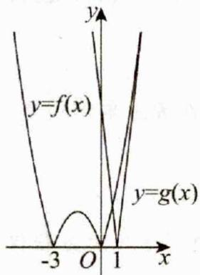

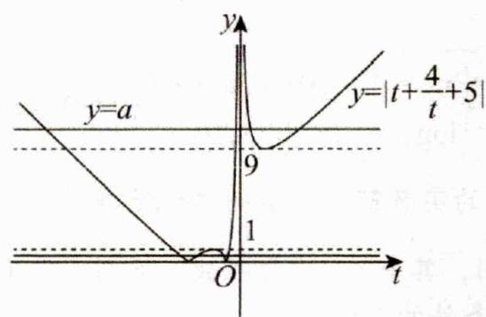

$f(x)$ 与 $g(x)$ 图象恰有四个交点. 当

$y=a(x-1)$ 与 $y=x^{2}+3x$ （或 $y=-a(x-1)$ 与 $y=-x^{2}-3x$ ）相切时， $f(x)$ 与 $g(x)$ 图象恰有三个交点。把 $y=a(x-1)$ 代入 $y=x^{2}+3x$ ，得 $x^{2}+3x=a(x-1)$ ，即 $x^{2}+(3-a)x+a=0$ ，由 $\Delta=0$ ，得 $(3-a)^{2}-4a=0$ ，解得 a=1 或 a=9。又当 a=0 时， $f(x)$ 与 $g(x)$ 仅两个交点，∴0<a<1 或 a>9。

（方法二）显然 $x \neq 1$ ， $\therefore a = \left| \frac{x^2 + 3x}{x - 1} \right|$ . 令 $t = x - 1$ ，则 $a = \left| t + \frac{4}{t} + 5 \right|$

$\because t + \frac{4}{t} \in (-\infty, -4] \cup [4, +\infty)$ ， $\therefore t + \frac{4}{t} + 5 \in (-\infty, 1] \cup [9, +\infty)$ 。结合图象可得 $0 < a < 1$ 或 $a > 9$ 。

### 二、【典型例题】

##### 1. (2024·天津·高考真题) 若函数 $f(x) = 2\sqrt{x^2 - ax} - |ax - 2| + 1$ 恰有一个零点，则 $a$ 的取值范围为 \_\_\_\_.

##### 2.（2024·安徽合肥·三模）设 $a \in \mathbb{R}$ ，函数 $f(x) = \begin{cases} 2^{|x-1|} - 1, & x \geq 0 \\ -x^2 + ax, & x < 0 \end{cases}$ ，若函数 $y = f(f(x))$ 恰有5个零点，则实数 $a$ 的取值范围为（）

$\quad$A. $(-2,2)$

$\quad$B. $(0,2)$

$\quad$C. $[-1,0)$

$\quad$D. $(-∞,-2)$

##### 3.（2017·天津·高考真题）已知函数 $f(x) = \begin{cases} |x| + 2, & x < 1 \\ x + \frac{2}{x}, & x \geq 1 \end{cases}$ . 设 $a \in R$ ，若关于 $x$ 的不等式 $f(x) \geq \left|\frac{x}{2} + a\right|$ 在 $R$ 上恒成立，则 $a$ 的取值范围是（）

$\quad$A. $[-2, 2]$

$\quad$B. $\left[-2\sqrt{3},2\right]$

$\quad$C. $\left[-2,2\sqrt{3}\right]$

$\quad$D. $\left[-2\sqrt{3},2\sqrt{3}\right]$

##### 4. (2014·天津·高考真题) 已知函数 $f(x) = \begin{cases} |x^x + 5x + 4|, & x \leq 0 \\ 2|x - 2|, & x > 0 \end{cases}$ ，若函数 $y = f(x) - a|x|$ 恰有 4 个零点，则实数 $a$ 的取值范围为 \_\_\_\_.

### 三、【习题检测】

##### 1. (2020·天津·高考真题) 已知函数 $f(x) = \begin{cases} x^3, & x \geqslant 0, \\ -x, & x < 0. \end{cases}$ 若函数 $g(x) = f(x) - |kx^2 - 2x| \quad (k \in \mathbf{R})$ 恰有 4 个零点，则 $k$ 的取值范围是（）

$\quad$A. $\left(-\infty,-\frac{1}{2}\right)\cup(2\sqrt{2},+\infty)$

$\quad$B. $\left(-\infty,-\frac{1}{2}\right)\cup(0,2\sqrt{2})$

$\quad$C. $(-\infty,0)\cup(0,2\sqrt{2})$

$\quad$D. $(-∞,0)∪(2\sqrt{2},+∞)$

##### 2. (2006·湖北·高考真题) 关于 $x$ 的方程 $\left(x^{2} - 1\right)^{2} - \left|x^{2} - 1\right| + k = 0$ , 给出下列四个命题:

①存在实数k，使得方程恰有2个不同的实根；  
②存在实数k，使得方程恰有4个不同的实根；  
③存在实数k，使得方程恰有5个不同的实根；  
④存在实数k，使得方程恰有8个不同的实根.

其中假命题的个数是（）

$\quad$A. 0

$\quad$B. 1

$\quad$C. 2

$\quad$D. 3

##### 3.(2006·上海·高考真题)若曲线 $|y|=2^{x}+1$ 与直线y=b没有公共点,则b的取值范围为\_\_\_\_.  
##### 4.（2024·天津·二模）设 $a \in \mathbb{R}$ ，函数 $f(x) = \begin{cases} 2|x + a|, & x < 0 \\ |x^2 - 5x + 4|, & x \geq 0 \end{cases}$ ，若函数 $y = f(x) - |ax|$ 恰有 4 个零点，则实数 $a$ 的取值范围为 \_\_\_\_.  
##### 5. (2024·全国·模拟预测) 若不等式 $f(x) > 0$ 或 $f(x) < 0$ 只有一个整数解, 则称不等式为单元集不等式. 已知不等式 $a(x+1)^{2} - |\log_{2}x| + 1 > 0$ 为单元集不等式, 则实数 $a$ 的取值范围是

# 2.4.9 零点求参之直线旋转平移型

### 一、【题型总结】

▲适用题型：已知函数 $f(x)=ax+b$ 零点个数求参数的范围问题；

▲方法原理：数形结合；

##### 1. 对于这种类型，如果分离参数 a 不好解决，还可如下处理：

（1） $f(x) = ax + b \Rightarrow \left\{ \begin{array}{l} y_{1} = f(x) \\ y_{2} = ax + b \end{array} \right.$

（2） 作图 $y_{1}=f(x)$ ，以及找到 $y_{2}=ax+b$ 所过的定点或者斜率固定；

##### 2. 直线斜率固定则平移：

比如：（2018·全国·高考真题）已知函数 $f(x) = \begin{cases} e^x, & x \leq 0, \\ \ln x, & x > 0, \end{cases}$ $g(x) = f(x) + x + a$ . 若 $g(x)$ 存在 2 个零点，则 $a$ 的取值范围是

$\quad$A. $[-1, 0)$

$\quad$B. $[0, +\infty)$

$\quad$C. $[-1, +\infty)$

$\quad$D. $[1, +\infty)$

答案C

详解画出函数 $f(x)$ 的图像， $y = e^{x}$ 在 $y$ 轴右侧的去掉，再画出直线 $y = -x$ ，之后上下移动，可以发现当直线过点 $A$ 时，直线与函数图像有两个交点，并且向下可以无限移动，都可以保证直线与函数的图像有两个交点，即方程 $f(x) = -x - a$ 有两个解，也就是函数 $g(x)$ 有两个零点，此时满足 $-a \leq 1$ ，即 $a \geq -1$ ，故选 C.

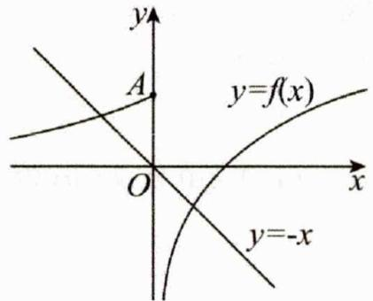

##### 3. 直线过定点则绕定点旋转：

比如：(2024·全国·模拟预测)已知方程 $\ln x=ax^{3}-x^{2}$ 恰有两个不同的根，则实数a的取值范围为()

$\quad$A. $(0,e^{2})$

$\quad$B. $(0,1)$

$\quad$C. $(1, e^{2})$

$\quad$D. $(1,+\infty)$

详解

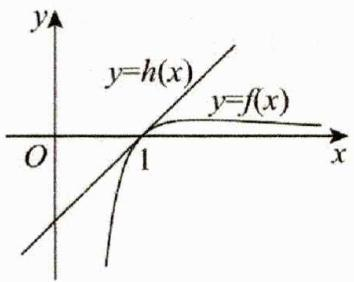

由题知 $x > 0$ ，故方程 $\frac{\ln x}{x^2} = ax - 1$ 恰有两个不同的根．设 $f(x) = \frac{\ln x}{x^2}$ ， $h(x) = ax - 1$

则 $f(x)$ 与 $h(x)$ 的图像有两个交点， $\therefore f'(x) = \frac{1 - 2\ln x}{x^3}$ ，令 $f'(x) = 0$ ，得 $x = \sqrt{\mathbf{e}}$

当 $0 < x < \sqrt{\mathbf{e}}$ 时， $f'(x) > 0$ ，当 $x > \sqrt{\mathbf{e}}$ 时， $f'(x) < 0$

$\therefore f(x)$ 在 $(0, \sqrt{\mathbf{e}})$ 上单调递增，在 $(\sqrt{\mathbf{e}}, +\infty)$ 上单调递减， $f(x)_{\max} = f(\sqrt{\mathbf{e}}) = \frac{1}{2\mathbf{e}}$

当 $x$ 趋近于 $0^{+}$ 时， $f(x)$ 趋近于 $-\infty$ ，当 $x$ 趋近于 $+\infty$ 时， $f(x)$ 趋近于 0，

$f(1)=0$ ，当x>1时， $f(x)>0$ ，在同一坐标系中做出 $f(x)$ 与 $h(x)$ 的大致图像如图所示，

设直线 y=ax-1 与 $f(x)$ 的图像相切时切点的横坐标为 $x_{0}$ ,

$\therefore a = f'(x_0) = \frac{1 - 2 \ln x_0}{x_0^3} = \frac{\frac{\ln x_0}{x_0^2} + 1}{x_0}$ ，即 $3 \ln x_0 + x_0^2 - 1 = 0$ 。设 $g(x) = 3 \ln x + x^2 - 1$ ，则 $g'(x) = \frac{3}{x} + 2x$ ，

易知 $g(x)$ 在 $(0, +\infty)$ 上单调递增， $g(1) = 0$ ， $\therefore x_0 = 1$ ， $\therefore a = f'(x_0) = f'（1） = 1$

由图可知，方程 $\ln x = ax^{3} - x^{2}$ 恰有两个不同的根，则实数a的取值范围为(0,1)，故选：B.

### 二、【典型例题】

##### 1. (2024·浙江温州·三模) 已知函数 $f(x) = \begin{cases} x^2 - 2x + 3, & x > 0 \\ 2^x, & x \leq 0 \end{cases}$ ，则关于 $x$ 方程 $f(x) = ax + 2$ 的根个数不可能是（）

$\quad$A. 0 个

$\quad$B. 1 个

$\quad$C. 2个

$\quad$D. 3 个

##### 2.（2019·天津·高考真题）已知函数 $f(x) = \begin{cases} 2\sqrt{x}, & 0 \leqslant x \leqslant 1, \\ \frac{1}{x}, & x > 1. \end{cases}$ 若关于 $x$ 的方程 $f(x) = -\frac{1}{4} x + a \quad (a \in R)$ 恰有两个互异的实数解，则 $a$ 的取值范围为（）

$\quad$A. $\left[\frac{5}{4},\frac{9}{4}\right]$

$\quad$B. $\left(\frac{5}{4},\frac{9}{4}\right]$

$\quad$C. $\left(\frac{5}{4},\frac{9}{4}\right]\cup\{1\}$

$\quad$D. $\left[\frac{5}{4},\frac{9}{4}\right]\cup\{1\}$

##### 3.（2021·北京·高考真题）已知函数 $f(x) = |\lg x| - kx - 2$ ，给出下列四个结论：

①若 k=0， $f(x)$ 恰有 2 个零点；②存在负数 k，使得 $f(x)$ 恰有 1 个零点；  
③存在负数k，使得 $f(x)$ 恰有3个零点；④存在正数k，使得 $f(x)$ 恰有3个零点.

其中所有正确结论的序号是\_\_\_\_。

##### 4. (2024·山东泰安·三模) 已知函数 $f(x) = \begin{cases} x^2 + 2x, & x \leq 0, \\ \ln(1 - x), & 0 < x < 1, \end{cases}$ 若曲线 $y = f(x)$ 与直线 $y = ax$ 恰有 2 个公共点，则 $a$ 的取值范围是 \_\_\_\_.

### 三、【习题检测】

##### 1. (2024·四川内江·三模) 若函数 $f(x) = \frac{\ln x}{x} - \frac{x}{m}$ 有两个零点，则实数 $m$ 的取值范围为（）

$\quad$A. $(0, e)$

$\quad$B. $(\mathbf{e}, + \infty)$

$\quad$C. $(0,2\mathbf{e})$

$\quad$D. $(2e,+\infty)$

##### 2. (2024·黑龙江·二模) 若关于 $x$ 的方程 $ax + 2a + \sqrt{4x - x^2} = 0$ 有两个不相等的实数根, 则实数 $a$ 的取值范围是 ( )

$\quad$A. $(- \sqrt{3}, 0]$

$\quad$B. $\left(-\frac{\sqrt{3}}{3},0\right]$

$\quad$C. $\left[0,\frac{\sqrt{3}}{3}\right)$

$\quad$D. $(-1,0]$

##### 3. (2014·重庆·高考真题) 已知函数 $f(x) = \begin{cases} \frac{1}{x+1} - 3, & x \in (-1,0] \\ x, & x \in (0,1] \end{cases}$ , 且 $g(x) = f(x) - mx - m$ 在 $(-1,1]$ 内有且仅有两个不同的零点，则实数 $^m$ 的取值范围是（）

$\quad$A. $(- \frac{9}{4}, -2] \cup (0, \frac{1}{2}]$

$\quad$B. $(- \frac{11}{4}, -2] \cup (0, \frac{1}{2}]$

$\quad$C. $(- \frac{9}{4}, -2] \cup (0, \frac{2}{3}]$

$\quad$D. $(- \frac{11}{4}, -2] \cup (0, \frac{2}{3}]$

##### 4. (2013·湖北·高考真题) 已知函数 $f(x) = x(\ln x - ax)$ 有两个极值点，则实数 $a$ 的取值范围是（）

$\quad$A. $(-\infty, 0)$

$\quad$B. $\left(0,\frac{1}{2}\right)$

$\quad$C. $(0,1)$

$\quad$D. $(0, +\infty)$

##### 5. (2012·山东·高考真题) 设函数 $f(x) = \frac{1}{x}, g(x) = ax^2 + bx (a, b \in R, a \neq 0)$ ，若 $y = f(x)$ 的图象与 $y = g(x)$ 图象有且仅有两个不同的公共点 $A(x_1, y_1), B(x_2, y_2)$ ，则下列判断正确的是（）

$\quad$A. 当 $a < 0$ 时, $x_{1} + x_{2} < 0, y_{1} + y_{2} > 0$

$\quad$B. 当 $a < 0$ 时， $x_{1} + x_{2} > 0, y_{1} + y_{2} < 0$

$\quad$C. 当 a > 0 时， $x_{1} + x_{2} < 0, y_{1} + y_{2} < 0$

$\quad$D. 当 a > 0 时， $x_{1} + x_{2} > 0, y_{1} + y_{2} > 0$

##### 6. (2012·天津·高考真题) 已知函数 $y = \frac{|x^2 - 1|}{x - 1}$ 的图象与函数 $y = kx - 2$ 的图象恰有两个交点，则实数 $k$ 的取值范围是 \_\_\_\_.

##### 7. (2024·上海青浦·二模) 对于函数 $y = f(x)$ ，其中 $f(x) = \begin{cases} (x - 1)^3, & 0 \leq x < 2, \\ \frac{2}{x}, & x \geq 2 \end{cases}$ ，若关于 $x$ 的方程 $f(x) = kx$ 有两个不同的根，则实数 $k$ 的取值范围是 \_\_\_\_.

##### 8. (2024·安徽黄山·二模) 若函数 $f(x) = \sqrt{1 - x^2} - k(x - 1) - 4$ 有两个零点, 则实数 $k$ 的取值范围是 \_\_\_\_.

# 2.4.10 零点求参之外层二次型

### 一、【题型总结】

▲适用题型:已知外层函数是二次函数的零点个数求参数的范围问题,比如 $\left[f(x)\right]^{2}+2af(x)+3=0$ ;

▲方法原理：数形结合；

先换元令 $t = f(x)$ ，得到关于 $\mathbf{t}$ 的一元二次方程 $at^2 + bt + c = 0$

##### 1. 类型一： $at^{2}+bt+c=0$ 容易因式分解求根时：

（1） 换元求根： $at^{2} + bt + c = 0 \Rightarrow t = t_{1}, t_{2}$ （2）作图分析： $\left\{\begin{aligned}f(x)&=t_{1}\Rightarrow\text{作图分析交点个数}\\ f(x)&=t_{2}\Rightarrow\text{作图分析交点个数}\end{aligned}\right.\Rightarrow$ 使得总交点个数符合题意；
（3）求解参数：解出此时参数范围即可

比如：已知函数 $f(x) = \begin{cases} \left|\mathrm{e}^x - 1\right|, x \leq 0 \\ x^2 - 8x + 12, x > 0 \end{cases}$ ，若关于 $x$ 的方程 $[f(x)]^2 - (2a + 1)f(x) + a^2 + a = 0$ 有5个

不同的实数根，则 $a$ 的取值范围为

解：（1）换元求根：令 $t = f(x)\Rightarrow \left\{ \begin{array}{l}t^{2} - (2a + 1)t + a^{2} + a = 0\\ \Rightarrow [t - a][t - (a + 1)] = 0 \end{array} \right.\Rightarrow t_{1} = a,t_{2} = a + 1$

（2） 作图分析 $\left\{ \begin{array}{l} f(x) = a \Rightarrow \text{作图分析交点个数} \\ f(x) = a + 1 \Rightarrow \text{作图分析交点个数} \end{array} \right. \Rightarrow$ 使得总交点个数符合题意；

作图可知：

情形一：当 $a \in (-4,0)$ 时， $y = a$ 与函数 $f(x)$ 有 2 个不同的交点，需满足 $y = a + 1$ 与函数 $f(x)$ 有 3 个不同的交点，所以 $a + 1 \in [0,1)$ ，解得 $a \in [-1,0)$

情形二：当 $a \in [0,1)$ 时， $y = a$ 与函数 $f(x)$ 有3个不同的交点，需满足 $y = a + 1$ 与函数 $f(x)$ 有2个不同的交点，所以 $a + 1 \in [1,12)$ ，解得 $a \in [0,1)$

（3） 综上可知: $a \in [-1, 1)$

##### 2. 类型二： $at^{2}+bt+c=0$ 不易因式分解求根时：

（1） 换元作图: $f(x)=t \Rightarrow$ 先作图分析交点个数情况;   
（2） 反推: 由图反推使得总交点个数符合题意的 t 范围, 以及需要几个 t;  
（3） 零点分布: 根据 t 范围结合二次函数零点分布求解答案;

比如：已知函数 $f(x)=\left\{\begin{aligned}&\left|2^{x}-1\right|,x<1\\ &2-x,x\geq1\end{aligned}\right.$ ，若关于 x 的函数 $y=(f(x))^{2}+2bf(x)+2b+1$ 有 6 个不同的零点，则实数 b 的取值范围是 \_\_\_\_.

解：（1）换元作图：令 $f(x)=t$ ，由题意画 $f(x)$ 图像如下：

$\begin{array}{r l} & y = f (x) \\ & \text {   而   } x \text {   且   } O \text {   有   } 1 \text {   个   } \end{array} \Rightarrow \left\{ \begin{array}{l l} t \in (1, + \infty) \longrightarrow 0 \text {   个   } \\ t = 1 \longrightarrow 1 \text {   个   } \\ t \in (0, 1) \longrightarrow 3 \text {   个   } \\ t = 0 \longrightarrow 2 \text {   个   } \\ t \in (- \infty , 0) \longrightarrow 1 \text {   个   } \end{array} \right.$

（2）反推:由图反推关于t的二次函数需要有两个零点,且 $t_{1},t_{2}$ 需各对应三个根,即 $t_{1},t_{2}$ 均需在(0,1)范围内;

（3） 零点分布：因为二次函数开口向上，所以有 $\left\{\begin{aligned} g(0)=2b+1>0, & g(1)=4b+2>0 \\ 0&<-\frac{2b}{2}<1 \\ \Delta=(2b)^{2}-4\times(2b+1)>0\end{aligned}\right.$

即 $\left\{ \begin{array}{l} b > -\frac{1}{2} \\ -1 < b < 0 \\ b^2 - 2b - 1 > 0 \end{array} \right.$ ，解得 $-\frac{1}{2} < b < 1 - \sqrt{2}$ ，故答案为： $\left(-\frac{1}{2}, 1 - \sqrt{2}\right)$ ；

### 二、【典型例题】

##### 1. (2024·辽宁葫芦岛·二模) 已知函数 $f(x) = \left| e^{x} - 1 \right|$ , $g(x) = f^{2}(x) - tf(x)(t \in \mathbb{R})$ , 若关于 $x$ 的方

程 $g(x) = 3 - t^2$ 有三个不同实数根，则实数 $t$ 的取值范围是（）

$\quad$A. $(-2, 2)$

$\quad$B. $(\sqrt{3},2)$

$\quad$C. $(-2,-\sqrt{3})$

$\quad$D. $(2,+\infty)$

##### 2. (2024·四川·模拟预测) 已知函数 $f(x) = \begin{cases} |3 - 2x| + 1, & x > 0, \\ \frac{(x + 2)^2}{\mathbf{e}^x}, & x \leq 0. \end{cases}$ 若函数 $y = [f(x)]^2 - af(x)$ 有 5 个不同的零点，则 $a$ 的取值范围是（）

$\quad$A. $(0,1]$

$\quad$B. $(1,4]$

$\quad$C. $(1,4)$

$\quad$D. $(1, +\infty)$

##### 3. (2005·上海·高考真题) 设定义域为 $R$ 的函数 $f(x) = \begin{cases} \left|\lg |x - 1\right|, & x \neq 1 \\ 0, & x = 1 \end{cases}$ , 则关于 $x$ 的方程 $f^2(x) + bf(x) + c = 0$ 有 7 个不同实数解的充要条件是 ( )

$\quad$A. b<0 且 c>0

$\quad$B. b>0 且 c<0

$\quad$C. b<0 且 c=0

$\quad$D. $b \geq 0$ 且 $c = 0$

### 三、【习题检测】

##### 1. (2024·黑龙江·模拟预测) 已知函数 $f(x) = \begin{cases} x e^x, & x \leq 0 \\ -|\ln x|, & x > 0 \end{cases}$ ，若关于 $x$ 的方程 $f^2(x) + af(x) + a - 1 = 0$ 的不同实数根的个数为 6，则 $a$ 的取值范围为（）.

$\quad$A. $\left(1-\frac{1}{e},1\right)$

$\quad$B. $\left(-1-\frac{1}{e},-1\right)$

$\quad$C. $\left(1,1+\frac{1}{e}\right)$

$\quad$D. $\left(1-\frac{1}{e},1+\frac{1}{e}\right)$

##### 2. (2024·全国·模拟预测) 已知函数 $f(x) = \begin{cases} (x - 1)e^x, & x < 1 \\ -x^2 + 4x - 3, & x \geq 1 \end{cases}$ , $g(x) = 2(f(x))^2 + af(x) + 1 + a$ . 若 $g(x)$ 有 5 个零点，则实数 $a$ 的取值范围为（）

$\quad$A. $\left(-\frac{3}{2},-1\right)$

$\quad$B. $\left(-\frac{3}{2},-1\right]$

$\quad$C. $\left[-\frac{3}{2},-1\right]$

$\quad$D. $\left[-\frac{3}{2},-1\right)$

##### 3.（多选题2023高三下·河北·阶段练习）已知函数 $f(x) = \begin{cases} x \ln x, & x > 0, \\ -x^2 - 2x + 1, & x \leq 0, \end{cases}$ 函数 $g(x) = [f(x)]^2 - (a - 1)f(x) - a$ ，则下列结论不正确的是（）

$\quad$A. 若 $a < -\frac{1}{e}$ , 则 $g(x)$ 恰有 2 个零点 
$\quad$B. 若 $1 \leq a < 2$ , 则 $g(x)$ 恰有 4 个零点

$\quad$C. 若 $g(x)$ 恰有 3 个零点，则 $a$ 的取值范围是 $[0,1)$

$\quad$D. 若 $g(x)$ 恰有 2 个零点，则 $a$ 的取值范围是 $\left(-\infty, -\frac{1}{e}\right) \cup (2, +\infty)$

##### 4. (2024·全国·模拟预测) 已知函数 $f(x) = \begin{cases} |4^x - 1|, & x \leq 1 \\ x^2 - 6x + 8, & x > 1 \end{cases}$ ，若方程 $2[f(x)]^2 - (a + 2) \cdot f(x) + a = 0$ 有 7 个不同的实数根，则实数 $a$ 的取值范围是 \_\_\_\_.

# 2.4.11 零点求参之周期函数型

### 一、【题型总结】

▲适用题型：已知或者可以求出周期的函数零点个数求参数的范围问题；

▲方法原理：核心是要找到周期再数形结合；

（1） 找周期，熟悉之前学过的求周期方法；  
（2） 作出图像, 分析参数范围, 这里可能会用到前面学的几种情况;

注意：偶有类周期函数，理解画图；

### 二、【典型例题】

##### 1. (2019·江苏·高考真题) 设 $f(x), g(x)$ 是定义在 $R$ 上的两个周期函数, $f(x)$ 的周期为 4, $g(x)$ 的周期为 2, 且 $f(x)$ 是奇函数. 当 $x \in (0,2]$ 时, $f(x) = \sqrt{1 - (x - 1)^2}$ , $g(x) = \begin{cases} k(x + 2), & 0 < x \leq 1 \\ -\frac{1}{2}, & 1 < x \leq 2 \end{cases}$ , 其中 $k > 0$ . 若在区间 $(0,9]$ 上, 关于 $x$ 的方程 $f(x) = g(x)$ 有 8 个不同的实数根, 则 $k$ 的取值范围是 \_\_\_\_.

##### 2. (2024·西藏林芝·模拟预测) 已知函数 $f(x)$ 的定义域为 $\mathbf{R}$ ， $f(x) = \begin{cases} -x^2, & x < 0 \\ x, & 0 \leq x \leq 1 \\ 2 - x, & 1 < x \leq 2 \\ f(x - 2), & x > 2 \end{cases}$ ，若函数 $g(x) = f(x) - mx$ 有三个零点，则实数 $m$ 的取值范围为 \_\_\_\_.

##### 3.（江西吉安·阶段练习）设函数 $f(x)$ 是定义在 $R$ 上的周期为 2 的函数，且对任意实数 $x$ 恒有 $f(x) - f(-x) = 0$ ，当 $x \in [-1,0]$ 时， $f(x) = x^2$ ，若 $g(x) = f(x) - \log_a^x$ 在 $x \in (0, +\infty)$ 上有三个零点，则 $a$ 的取值范围为 \_\_\_\_.

### 三、【习题检测】

##### 1. (2014·江苏·高考真题) 已知 $f(x)$ 是定义在 $R$ 上且周期为 3 的函数, 当 $x \in [0,3)$ 时, $f(x) = \left|x^{2} - 2x + \frac{1}{2}\right|$ , 若函数 $y = f(x) - a$ 在区间 $[-3,4]$ 上有 10 个零点 (互不相同), 则实数 $a$ 的取值范围是 \_\_\_\_.

##### 2.（高三上·天津和平·阶段练习）已知 $f(x)=k(x+1)$ ，其中 k>0。设 $g(x)$ 是定义在 R 上的周期函数，且 $g(x)$ 的周期为 2，当 $x\in(0,2]$ 时， $g(x)=\left\{\begin{aligned}&x^{2},0<x\leq1\\&\frac{2}{3},1<x\leq2\end{aligned}\right.$ 。若在区间 $(0,6]$ 上，关于 x 的方程 $f(x)=g(x)$ 恰有 4 个不同的实数根，则 k 的取值范围是（）

$\quad$A. $(\frac{2}{21}, \frac{1}{9}) \cup (\frac{2}{15}, \frac{1}{6})$   
$\quad$C. $\left[\frac{2}{21},\frac{1}{9}\right)\cup\left[\frac{2}{15},\frac{1}{6}\right)$

$\quad$B. $\left[\frac{2}{21},\frac{1}{9}\right)\cup\left(\frac{2}{15},\frac{1}{6}\right)$   
$\quad$D. $\left[\frac{2}{21},\frac{1}{9}\right]\cup\left[\frac{2}{15},\frac{1}{6}\right]$

##### 3.（高三上·广东珠海·期中）设 $f(x)$ 是定义在 $\mathbb{R}$ 上周期为 2 的函数，且对任意的实数 $x$ ，恒有 $f(x) - f(-x) = 0$ ，当 $x \in [0,1]$ 时， $f(x) = -\sqrt{1 - x^2}$ ，则函数 $g(x) = f(x) - e^x + 1$ 在区间 $[-2018, 2018]$ 上零点的个数为（）

$\quad$A. 2017

$\quad$B. 2018

$\quad$C. 4034

$\quad$D. 4036

##### 4.（江苏扬州·高三校联考期末）已知定义在 $\mathbb{R}$ 上的偶函数 $f(x)$ 满足下列两个条件：①当 $x \in [0,1)$ 时， $f(x) = 2^x - 1$ ；②当 $x \in [0, +\infty)$ 时， $f(x) + 2f(x + 1) = 0$ 。若函数 $g(x) = f(x) - m$ 有且仅有 2 个零点，则实数 $m$ 的取值范围是（）。

$\quad$A. $\left(-\frac{1}{2},-\frac{1}{8}\right]\cup\left[\frac{1}{4},1\right)$

$\quad$B. $\left(-1,-\frac{1}{4}\right]\cup\left[\frac{1}{4},1\right)$

$\quad$C. $\left(-\frac{1}{2},-\frac{1}{8}\right]\cup\left[\frac{1}{8},\frac{1}{2}\right)$ 
$\quad$D. $\left(-\frac{1}{2},-\frac{1}{4}\right]\cup\left[\frac{1}{2},1\right)$

##### 5.(全国·高三专题练习)已知偶函数 $f(x)$ 满足 $f(3+x)=f(3-x)$ ，且当 $x\in[0,3]$ 时， $f(x)=-x^{2}+2x+1$ ，若关于x的方程 $f^{2}(x)-tf(x)-3=0$ 在 $[-150,150]$ 上有300个解，则实数t的取值范围是（）

$\quad$A. $\left(-2,\frac{1}{2}\right)$

$\quad$B. $\left(-\frac{1}{2},\frac{1}{2}\right)$

$\quad$C. $(-2,+\infty)$

$\quad$D. $\left(-\infty,\frac{1}{2}\right)$

# 2.4.12 零点求参之分段函数分界点未知型

### 一、【题型总结】

▲适用题型：分段函数函数零点个数，且分界点未知求参数的范围问题，比如分段函数

$f (x) = \left\{ \begin{array}{l} 2, x > m \\ x ^ {2} + 4 x + 2, x \leq m \end{array} ; \right.$

▲方法原理：

法一：分类讨论，常见类型：

（1） 分段函数零点可求的, 一般考虑按照零点来讨论, 分析各自的图像进行求解;  
（2） 含有绝对值的可考虑以 0 分界讨论;  
（3） 分段函数本身自带未知数的, 需结合函数特性进行分析讨论了, 比如二次函数考虑对称轴之类的;

法二：画图分析

（1） 先模糊定位 $m$ ，画出两分段函数图像，不好定位 $m$ ，直接画两段函数的完整图像也可以；  
（2） 直接数形结合分析, 将横线或者斜线平移找到符合题意的情况, 并求出答案;

### 二、【典型例题】

##### 1.(2021·天津·高考真题)设 $a\in R$ ，函数 $f(x)=\left\{\begin{aligned}&\cos(2\pi x-2\pi a).&x<a\\&x^{2}-2(a+1)x+a^{2}+5,&x\geq a\end{aligned}\right.$ ，若 $f(x)$ 在区间 $(0,+\infty)$ 内恰有6个零点，则a的取值范围是（）

$\quad$A. $\left(2,\frac{9}{4}\right]\cup\left(\frac{5}{2},\frac{11}{4}\right]$

$\quad$B. $\left(\frac{7}{4},2\right)\cup\left(\frac{5}{2},\frac{11}{4}\right)$

$\quad$C. $\left(2,\frac{9}{4}\right]\cup\left[\frac{11}{4},3\right)$

$\quad$D. $\left(\frac{7}{4}, 2\right) \cup \left[\frac{11}{4}, 3\right)$

##### 2.（全国·高三专题练习）已知函数 $f(x) = \begin{cases} 2, & x > m \\ x^2 + 4x + 2, & x \leq m \end{cases}$ ，若方程 $f(x) - x = 0$ 恰有三个根，那么实数 $m$ 的取值范围是（）

$\quad$A. $\left[-1,2\right)$

$\quad$B. $\left[-1,2\right]$

$\quad$C. $[2,+\infty)$

$\quad$D. $(-∞,-1]$

##### 3.（全国·高三专题练习）已知函数 $f(x)=\left\{\begin{aligned}x^{2}-2mx+2+m^{2},&x\leq m,\\ \left|\log_{3}x\right|,&x>m,\end{aligned}\right.$ ，其中0<m<1，若存在实数a，使得关于x的方程 $f(x)=a$ 恰有三个互异的实数解，则实数m的取值范围是（）

$\quad$A. $\left(\frac{1}{4},1\right)$

$\quad$B. $\left(\frac{1}{9},1\right)$

$\quad$C. $\left(0,\frac{1}{4}\right)$

$\quad$D. $\left(0,\frac{1}{9}\right)$

### 三、【习题检测】

##### 1.（全国·高三专题练习）已知函数 $f(x) = \begin{cases} x^2 - x, & x \leq a \\ 9 - x, & x > a \end{cases}$ ，若函数 $g(x) = f(x) - 2|x|$ 有三个零点，则实数 $a$ 的取值范围是（）

$\quad$A. $[0, +\infty)$

$\quad$B. $[0,3)$

$\quad$C. $\left[-1,+\infty\right)$

$\quad$D. $\left[-1,3\right)$

##### 2.（四川绵阳·四川省绵阳南山中学校考一模）已知 $a > 0$ ，函数 $f(x) = \begin{cases} -x + 2, & x \leq a \\ x^2 - 4ax + 3, & x > a \end{cases}$ ，若 $f(x)$ 恰有2个零点，则 $a$ 的取值范围是（）

$\quad$A. $\left(\frac{\sqrt{3}}{2},1\right)\cup\left[2,+\infty\right)$

$\quad$B. $(0,1)\cup [2, + \infty)$

$\quad$C. $\left(\frac{\sqrt{3}}{2},\frac{7}{8}\right)\cup [2, + \infty)$

$\quad$D. $\left(\frac{\sqrt{3}}{2},1\right)\cup\left[\frac{7}{8},2\right]$

##### 3.（全国·高三专题练习）已知 $a > 0$ ，若函数 $f(x) = \begin{cases} x + a, & x \leq a \\ \ln x + 2, & x > a \end{cases}$ 有两个不同的零点，则 $a$ 的取值范围是（）

$\quad$A. $\left(0,\frac{1}{e^{2}}\right)$

$\quad$B. $(0,1)$

$\quad$C. $\left(\frac{1}{e^{2}},+\infty\right)$

$\quad$D. $[1, +\infty)$

##### 4. (2018·浙江·高考真题)已知 $\lambda \in \mathbb{R}$ , 函数 $f(x) = \begin{cases} x - 4, & x \geq \lambda \\ x^2 - 4x + 3, & x < \lambda \end{cases}$ , 当 $\lambda = 2$ 时, 不等式 $f(x) < 0$ 的解集是 \_\_\_\_. 若函数 $f(x)$ 恰有 2 个零点, 则 $\lambda$ 的取值范围是 \_\_\_\_.

# 2.4.13 零点求参之取大取小函数型

### 一、【题型总结】

▲适用题型：

含有 $\max\left\{f(x),g(x)\right\}$ 或 $\min\left\{f(x),g(x)\right\}$ 函数的零点个数求参数的范围问题；

▲方法原理：

##### 1. 取大函数： $\max\left\{f(x), g(x)\right\}=\begin{cases}f(x), f(x) \geq g(x) \\ g(x), f(x) < g(x)\end{cases}$ ，简单讲就是分界后，谁大取谁，图像上取上方那一段，舍掉下方那一段，

##### 2. 取小函数： $\min\left\{f(x), g(x)\right\}=\begin{cases}f(x), f(x) \leq g(x) \\ g(x), f(x) > g(x)\end{cases}$ ，简单讲就是分界后，谁小取谁，图像上取下方那一段，舍掉上方那一段，

##### 3. 做题时按照以上方式画图分析即可；

### 二、【典型例题】

##### 1. (2024·河北石家庄·三模) 给定函数 $f(x) = |x^2 + x|$ , $g(x) = x + \frac{1}{x}$ ，用 $M(x)$ 表示 $f(x)$ , $g(x)$ 中的较大者，记 $M(x) = \max \{f(x), g(x)\}$ . 若函数 $y = M(x)$ 的图象与 $y = a$ 有 3 个不同的交点，则实数 $a$ 的取值范围是 \_\_\_\_.

##### 2. (2022·天津·高考真题) 设 $a \in \mathbb{R}$ , 对任意实数 $x$ , 记 $f(x) = \min \left\{\left|x\right| - 2, x^2 - ax + 3a - 5\right\}$ . 若 $f(x)$ 至少有 3 个零点, 则实数 $a$ 的取值范围为 \_\_\_\_.

##### 3.（高三上·天津和平·阶段练习）记 $\max \{x, y\} = \begin{cases} x, & x \geq y, \\ y, & x < y. \end{cases}$ $f(x) = \begin{cases} -2x, & x < 0, \\ x^2 - 1, & x \geq 0. \end{cases}$ $g(x) = 2\sqrt{1 - x^2}$ ，若 $\max \{f(x), g(x)\} = ax + 2$ 有三个不等实根 $x_1 < x_2 < x_3$ ，若 $x_3 - x_2 = 2(x_2 - x_1)$ ，则实数 $a =$ \_\_\_\_.

### 三、【习题检测】

##### 1.（浙江·校联考模拟预测）定义函数 $\min \left\{f(x),g(x)\right\} = \left\{ \begin{array}{l}f(x),f(x)\leq g(x)\\ g(x),f(x) > g(x) \end{array} \right.$

$h(x)=\min\left\{|x|-1,x^{2}-2ax+a+2\right\}$ ，若 $h(x)=0$ 至少有3个不同的解，则实数a的取值范围是（）

$\quad$A. $[1,2]$

$\quad$B. $[2,3]$

$\quad$C. $[3,4]$

$\quad$D. $[4,5]$

##### 2.（新疆昌吉·模拟预测）记 $\max \{p, q\} = \begin{cases} p, & p \geq q \\ q, & q > p \end{cases}$ ，设函数 $f(x) = \max \left\{\mathbf{e}^{x - 2} - 1, -x^2 + mx - \frac{1}{2}\right\}$ ，若函数 $f(x)$ 恰有三个零点，则实数 $m$ 的取值范围的是（）

$\quad$A. $(- \sqrt{2}, \sqrt{2})$

$\quad$B. $(- \infty, -\sqrt{2}) \cup \left( \sqrt{2}, \frac{9}{4} \right)$

$\quad$C. $\left(-\infty,-\frac{9}{4}\right)\cup\left(\sqrt{2},\frac{9}{4}\right)$

$\quad$D. $(-∞,-\sqrt{2})∪(√2,+∞)$

##### 3.（全国·高三专题练习）记 $\max \{p, q\} = \begin{cases} p, & p \geq q \\ q, & q > p \end{cases}$ ，设函数 $f(x) = \max \left\{\mathbf{e}^{x - 2} - 1, -x^2 + mx - \frac{1}{2}\right\}$ ，若函数 $f(x)$ 恰有三个零点，则实数 $m$ 的取值范围的是（）

$\quad$A. $(- \sqrt{2}, \sqrt{2})$

$\quad$B. $(-∞,-\sqrt{2})∪( \sqrt{2},\frac{9}{4})$

$\quad$C. $\left(-\infty,-\frac{9}{4}\right)\cup\left(\sqrt{2},\frac{9}{4}\right)$

$\quad$D. $(-∞,-\sqrt{2})∪(√2,+∞)$

# 2.4.14 零点求参之整数解型

### 一、【题型总结】

▲适用题型：已知整数解个数求参数的范围问题；

▲方法原理：

##### 1. 数形结合：

（1） 画出函数图像, 直线和曲线各自作图;

（2）结合题干的整数解个数,确定最后一个零点的位置,从而解出答案,简单举例如下图:

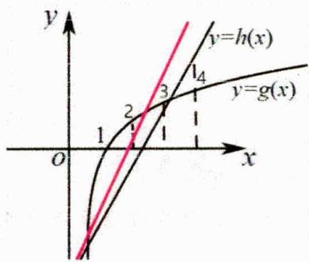

$h(x) < g(x)$ $h(x)$ 绕定点转动 $g(x)$ 图像定 $h(x)$ 直线； $g(x)$ 曲线 $\Rightarrow$ 若 $\left\{\begin{aligned}&\left\{（1）2\text{个整数解则解}x=1,2\\&\Rightarrow\text{直线必须介于}2\text{和}3\text{之间(红线)}\end{aligned}\right.\Rightarrow\left\{\begin{aligned}h(2)<g(2)\\h(3)\geq g(3)\end{aligned}\right.$ $\left\{\begin{aligned}（2）3\text{个整数解则解}x=1,2,3\\&\Rightarrow\text{直线必须介于}3\text{和}4\text{之间(黑线)}\end{aligned}\right.\Rightarrow\left\{\begin{aligned}h(3)<g(3)\\h(4)\geq g(4)\end{aligned}\right.$

同时也发现小规律，答案大多为半开半闭区间；

##### 2. 二次函数类型的还可考虑利用二次函数性质进行分析；

### 二、【典型例题】

##### 1. (2024·全国·模拟预测) 已知关于 $x$ 的不等式 $\ln x - kx^{4} + kx^{3} > 0$ 恰有一个整数解, 则实数 $k$ 的取值范围为 ( )

$\quad$A. $\left[\frac{\ln3}{54},\frac{1}{8}\right)$

$\quad$B. $\left[\frac{\ln3}{27},\frac{1}{8}\right)$

$\quad$C. $\left(-\infty,\frac{\ln2}{8}\right)$

$\quad$D. $\left[\frac{\ln3}{54},\frac{\ln2}{8}\right)$

##### 2.（2015·全国·高考真题）设函数 $f(x) = e^{x}(2x - 1) - ax + a$ ，其中 $a < 1$ ，若存在唯一的整数 $x_0$ ，使得 $f(x_0) < 0$ ，则 $a$ 的取值范围是（）

$\quad$A. $\left[-\frac{3}{2e}, 1\right)$

$\quad$B. $\left[-\frac{3}{2e},\frac{3}{4}\right)$

$\quad$C. $\left[\frac{3}{2e},\frac{3}{4}\right)$

$\quad$D. $\left[\frac{3}{2e},1\right)$

##### 3. (2024·高三·江西·期末) 若集合 $\left\{x \mid x \ln x + (k - \ln 4)x + k < 0\right\}$ 中仅有 2 个整数, 则实数 $k$ 的取值范围是 ( )

$\quad$A. $\left[\frac{3}{4}\ln\frac{4}{3},\frac{2}{3}\ln2\right)$

$\quad$B. $\left[\frac{2}{3}\ln2,\frac{3}{4}\ln3\right)$

$\quad$C. $\left[\frac{2}{3}\ln2,\frac{3}{2}\ln2\right)$

$\quad$D. $\left[\frac{3}{4}\ln\frac{2}{3},\frac{2}{3}\ln2\right)$

### 三、【习题检测】

##### 1.(2024·高三·广东揭阳·期末)已知函数 $f(x)=x-axe^{x}-ae^{x}$ ，且存在唯一的整数 $x_{0}$ ，使得 $f(x_{0})>0$ ，则实数a的可能取值为（）

$\quad$A. $\frac{2}{3e^{2}}$

$\quad$B. $\frac{1}{2e}$

$\quad$C. $\frac{3e+4}{12e^{2}}$

$\quad$D. $\frac{1}{e}$

##### 2. (2024·高三·福建泉州·期中) 关于 $x$ 的不等式 $a \frac{(x - 1)e^{x - 2}}{(x - 2)^2} - 1 < 0$ 的解集中有且仅有两个大于 2 的整数, 则实数 $a$ 的取值范围为 ( )

$\quad$A. $\left(\frac{16}{5e^{4}},\frac{1}{2e}\right]$

$\quad$B. $\left[\frac{9}{4e^{3}},\frac{1}{2e}\right)$

$\quad$C. $\left(\frac{16}{5e^{4}},\frac{4}{3e^{2}}\right]$

$\quad$D. $\left[\frac{9}{4e^{3}},\frac{4}{3e^{2}}\right)$

##### 3.（2024高三上·宁夏石嘴山·期末）已知关于 $x$ 的不等式 $kx(x + 1) - \ln x < 0$ 恰有2个不同的整数解，则 $k$ 的取值范围是

##### 4.（四川绵阳·期中）已知关于 $x$ 的不等式 $k(x + 1) > \mathrm{e}^x$ 恰有2个不同的整数解，则 $k$ 的取值范围是

# 2.4.15 零点之过点有多条切线问题

### 一、【题型总结】

▲适用题型：函数过点有多条切线的类型.

▲方法原理：

##### 1. 设切点为 $P(x_0, y_0)$ ，则斜率 $k = f'(x_0)$ ，过切点的切线方程为： $y - y_0 = f'(x_0)(x - x_0)$ ，又因为切线方程过点 $A(a, b)$ ，所以 $b - y_0 = f'(x_0)(a - x_0)$ 然后解出 $x_0$ 的值，有多少个解对应有多少条切线。

##### 2. 比如: (2022·全国·高考真题) 若曲线 $y = (x + a)e^{x}$ 有两条过坐标原点的切线, 则 $a$ 的取值范围是 \_\_\_\_.

详解 $\because y=(x+a)\mathbf{e}^{x}, \therefore y'=(x+1+a)\mathbf{e}^{x}$ , 设切点为 $(x_{0},y_{0})$ , 则 $y_{0}=(x_{0}+a)\mathbf{e}^{x_{0}}$ , 切线斜率 $k=(x_{0}+1+a)\mathbf{e}^{x_{0}}$ , 切线方程为: $y-(x_{0}+a)\mathbf{e}^{x_{0}}=(x_{0}+1+a)\mathbf{e}^{x_{0}}(x-x_{0})$ ,

∵切线过原点，∴ $-(x_{0}+a)e^{x_{0}}=(x_{0}+1+a)e^{x_{0}}(-x_{0})$ ，整理得： $x_{0}^{2}+ax_{0}-a=0$

∵切线有两条，∴ $\Delta=a^{2}+4a>0$ ，解得a<-4或a>0，

∴ a 的取值范围是 $(-∞, -4) ∪ (0, +∞)$ ，故答案为： $(-∞, -4) ∪ (0, +∞)$

### 二、【典型例题】

##### 1. (2021·全国·高考真题) 若过点 $(a, b)$ 可以作曲线 $y = e^{x}$ 的两条切线，则（）

$\quad$A. $e^{b} < a$

$\quad$B. $e^{a} < b$

$\quad$C. $0 < a < e^{b}$

$\quad$D. $0 < b < e^{a}$

##### 2. (2024·内蒙古·三模) 若过点 $(a, 2)$ 可以作曲线 $y = \ln x$ 的两条切线，则 $a$ 的取值范围为 ( )

$\quad$A. $(-∞,e^{2})$

$\quad$B. $(- \infty, \ln 2)$

$\quad$C. $(0, e^2)$

$\quad$D. $(0, \ln 2)$

##### 3. (2024·全国·二模) 若曲线 $f(x) = \frac{x}{\mathrm{e}^x}$ 有三条过点 $(0, a)$ 的切线，则实数 $a$ 的取值范围为（）

$\quad$A. $\left(0,\frac{1}{e^{2}}\right)$

$\quad$B. $\left(0,\frac{4}{e^{2}}\right)$

$\quad$C. $\left(0,\frac{1}{e}\right)$

$\quad$D. $\left(0,\frac{4}{e}\right)$

### 三、【习题检测】

##### 1. (2024·全国·模拟预测) 过坐标原点作曲线 $f(x) = \mathrm{e}^{x}(x^{2} - 2x + 2)$ 的切线, 则切线共有 ( )

$\quad$A. 1 条

$\quad$B. 2 条

$\quad$C. 3 条

$\quad$D. 4 条

##### 2. (2024·宁夏银川·二模) 已知点 $P(1, m)$ 不在函数 $f(x) = x^3 - 3mx$ 的图象上, 且过点 $P$ 仅有一条直线与 $f(x)$ 的图象相切, 则实数 $m$ 的取值范围为 ( )

$\quad$A. $\left(0,\frac{1}{4}\right)\cup\left(\frac{1}{4},\frac{1}{2}\right)$

$\quad$B. $(- \infty, 0) \cup (\frac{1}{4}, + \infty)$

$\quad$C. $\left(0,\frac{1}{4}\right)\cup\left(\frac{1}{4},+\infty\right)$

$\quad$D. $(-∞, \frac{1}{4}) ∪ (\frac{1}{2}, +∞)$

##### 3. (2024·高三·北京海淀·期末) 若关于 $x$ 的方程 $\log_a x - a^x = 0$ ( $a > 0$ 且 $a \neq 1$ ) 有实数解, 则 $a$ 的值可以为 ( )

$\quad$A. 10

$\quad$B. e

$\quad$C. 2

$\quad$D. $\frac{5}{4}$

##### 4.(2022·全国·高考真题)曲线 $y=\ln|x|$ 过坐标原点的两条切线的方程为\_\_\_\_，\_\_\_\_.

##### 5. (2024高三下·福建泉州·开学考试) 若过点(1,0)可以作曲线 $y = \ln (x + a)$ 的两条切线，则实数 $a$ 的取值范围为 \_\_\_\_.

##### 6. (2024·河南信阳·模拟预测) 若过点 $(1, a)$ 仅可作曲线 $y = x\mathrm{e}^{x}$ 的两条切线, 则 $a$ 的取值范围是 \_\_\_\_.

# 2.4.16 零点之多个极值点问题

### 一、【题型总结】

▲适用题型：函数有多个极值点的类型.

▲方法原理：

##### 1. 核心就是导数的零点问题，所以考虑常规讨论，分离参数，数形结合处理

##### 2. 比如: (2022·全国·高考真题) 已知 $x = x_{1}$ 和 $x = x_{2}$ 分别是函数 $f(x) = 2a^{x} - e x^{2}$ ( $a > 0$ 且 $a \neq 1$ ) 的极小值点和极大值点。若 $x_{1} < x_{2}$ , 则 $a$ 的取值范围是 \_\_\_\_.

详解[方法一]：转化法，零点的问题转为函数图象的交点

因为 $f'(x)=2\ln a\cdot a^{x}-2\mathrm{e}x$ ，所以方程 $2\ln a\cdot a^{x}-2\mathrm{e}x=0$ 的两个根为 $x_{1}, x_{2}$ ，即方程 $\ln a\cdot a^{x}=ex$ 的两个根为 $x_{1}, x_{2}$ ，即函数 $y=\ln a\cdot a^{x}$ 与函数 $y=\mathrm{e}x$ 的图象有两个不同的交点，

因为 $x_{1}, x_{2}$ 分别是函数 $f(x) = 2a^{x} - \mathbf{e}x^{2}$ 的极小值点和极大值点，

所以函数 $f(x)$ 在 $(-\infty, x_1)$ 和 $(x_2, +\infty)$ 上递减，在 $(x_1, x_2)$ 上递增，

所以当时 $\left(-\infty, x_1\right) (x_2, +\infty)$ ， $f'(x) < 0$ ，即 $y = \mathrm{e}x$ 图象在 $y = \ln a \cdot a^x$ 上方

当 $x \in (x_1, x_2)$ 时， $f'(x) > 0$ ，即 $y = \mathrm{e}x$ 图象在 $y = \ln a \cdot a^x$ 下方

$a > 1$ ，图象显然不符合题意，所以 $0 < a < 1$ 。令 $g(x) = \ln a \cdot a^x$ ，则 $g'(x) = \ln^2 a \cdot a^x, 0 < a < 1$

设过原点且与函数 $y = g(x)$ 的图象相切的直线的切点为 $(x_0, \ln a \cdot a^{x_0})$ ，

则切线的斜率为 $g'(x_0) = \ln^{2}a\cdot a^{x_0}$ ，故切线方程为 $y - \ln a\cdot a^{x_0} = \ln^2 a\cdot a^{x_0}(x - x_0)$

则有 $-\ln a \cdot a^{x_0} = -x_0 \ln^2 a \cdot a^{x_0}$ ，解得 $x_0 = \frac{1}{\ln a}$ ，则切线的斜率为 $\ln^2 a \cdot a^{\frac{1}{\ln a}} = e \ln^2 a$ ，

因为函数 $y = \ln a \cdot a^x$ 与函数 $y = e x$ 的图象有两个不同的交点，

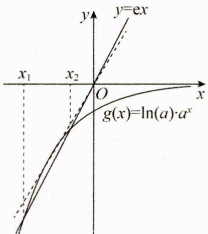

所以 $\mathrm{e}\ln^2 a < \mathrm{e}$ ，解得 $\frac{1}{\mathrm{e}} < a < \mathrm{e}$ ，又 $0 < a < 1$ ，所以 $\frac{1}{\mathrm{e}} < a < 1$ ，综上所述， $a$ 的取值范围为 $\left(\frac{1}{\mathrm{e}}, 1\right)$ .

[方法二]：构造新函数，二次求导

$f'(x)=2\ln a\cdot a^{x}-2\mathrm{e}x=0$ 的两个根为 $x_{1},x_{2}$ 因为 $x_{1},x_{2}$ 分别是函数 $f(x)=2a^{x}-\mathrm{e}x^{2}$ 的极小值点和极大值点，所以函数 $f(x)$ 在 $(-∞,x_{1})$ 和 $(x_{2},+∞)$ 上递减，在 $(x_{1},x_{2})$ 上递增，

设函数 $g(x)=f'(x)=2(a^{x}\ln a-ex)$ ，则 $f'(x)=2a^{x}(1\ln a)^{2}-2e$ ，若 a>1，则 $f'(x)$ 在 R 上单调递增，此时若 $f'(x_{0})=0$ ，则 $f'(x)$ 在 $(-∞, x_{0})$ 上单调递减，在 $(x_{0}, +∞)$ 上单调递增，此时若有 $x=x_{1}$ 和 $x=x_{2}$ 分别是函数 $f(x)=2a^{x}-ex^{2}(a>0$ 且 $a\neq1)$ 的极小值点和极大值点，则 $x_{1}>x_{2}$ ，不符合题意；

若 $0 < a < 1$ ，则 $'(x)$ 在 $\mathbb{R}$ 上单调递减，此时若 $'(x_0) = 0$ ，则 $f'(x)$ 在 $(- \infty, x_0)$ 上单调递增，在 $(x_0, +\infty)$ 上单调递减，令 $'(x_0) = 0$ ，则 $a^{x_0} = \frac{e}{(\ln a)^2}$ ，此时若有 $x = x_1$ 和 $x = x_2$ 分别是函数 $f'(x) = 2a^x - ex^2 (a > 0$ 且 $a \neq 1)$ 的极小值点和极大值点，且 $x_1 < x_2$ ，则需满足 $f'(x_0) > 0$ ，

$f'(x_0) = 2(a^{x_0} \ln a - ex_0) = 2\left(\frac{e}{\ln a} - ex_0\right) > 0$ ，即 $x_0 < \frac{1}{\ln a}$ ， $x_0 \ln a > 1$ 故 $\ln a^{x_0} = x_0 \ln a = \ln \frac{e}{(\ln a)^2} > 1$ ，所以 $\frac{1}{e} < a < 1$ .

### 二、【典型例题】

##### 1. (2024·陕西铜川·模拟预测) 已知函数 $f(x) = \mathrm{e}^{x} - \frac{1}{2} x^{2} - ax - a^{2}$ 恰有两个极值点, 则 $a$ 的取值范围是 ( )

$\quad$A. $[0,1]$

$\quad$B. $(0,1)$

$\quad$C. $[1,+\infty)$

$\quad$D. $(1,+\infty)$

##### 2. (2024·全国·模拟预测) 已知函数 $f(x) = \frac{a(\sin x + \cos x)}{\mathrm{e}^x} + x$ 在 $(0, \pi)$ 上恰有两个极值点，则实数 $a$ 的取值范围是（）

$\quad$A. $\left(0,\frac{\sqrt{2}}{2}\mathrm{e}^{\frac{\pi}{4}}\right)$

$\quad$B. $\left(-\infty,e^{\pi}\right)$

$\quad$C. $(0, e^{\pi})$

$\quad$D. $\left(\frac{\sqrt{2}}{2}\mathrm{e}^{\frac{\pi}{4}},+\infty\right)$

### 三、【习题检测】

##### 1. 若函数 $f(x) = x\mathrm{e}^{x} - (m - 1)\mathrm{e}^{2x}$ 存在唯一极值点，则实数 $m$ 的取值范围是 \_\_\_\_.

##### 2. (2024·四川绵阳·模拟预测) 若 $x_{1}, x_{2}$ 是函数 $f(x) = \frac{1}{2} ax^{2} - e^{x} + 1 (a \in \mathbb{R})$ 的两个极值点且 $x_{2} \geq 2x_{1}$ , 则实数 $a$ 的取值范围为 \_\_\_\_.

##### 3. (2024·陕西铜川·三模) 若函数 $f(x) = ax^2 + \frac{\ln x}{x}$ 有两个极值点, 则实数 $a$ 的取值范围为 \_\_\_\_.

# 第3章 导数

# 3.1 导数小题

# 3.1.1 公切线

### 一、【题型总结】

▲适用题型：求函数的公切线相关题型.

▲方法原理：

##### 1. 公切线问题应根据两个函数在切点处的斜率相等，并且切点不但在切线上而且在曲线上，罗列出有关切点横坐标的方程组，通过解方程组进行求解。  
##### 2. 比如：(2016·全国·高考真题) 若直线 $y = kx + b$ 是曲线 $y = \ln x + 2$ 的切线，也是曲线 $y = \ln (x + 1)$ 的切线，则 $b =$ \_\_\_\_.

详解对函数 $y=\ln x+2$ 求导得 $y'=\frac{1}{x}$ ，对 $y=\ln(x+1)$ 求导得 $y'=\frac{1}{x+1}$ ，设直线 $y=kx+b$ 与曲线 $y=\ln x+2$ 相切于点 $P_{1}(x_{1},y_{1})$ ，与曲线 $y=\ln(x+1)$ 相切于点 $P_{2}(x_{2},y_{2})$ ，则 $y_{1}=\ln x_{1}+2, y_{2}=\ln(x_{2}+1)$ ，由点 $P_{1}(x_{1},y_{1})$ 在切线上得 $y-\left(\ln x_{1}+2\right)=\frac{1}{x_{1}}(x-x_{1})$ ，由点 $P_{2}(x_{2},y_{2})$ 在切线上得

$y-\ln(x_{2}+1)=\frac{1}{x_{2}+1}(x-x_{2})$ ，这两条直线表示同一条直线，所以 $\left\{\begin{aligned}\frac{1}{x_{1}}&=\frac{1}{x_{2}+1}\\ \ln(x_{2}+1)&=\ln x_{1}+\frac{2x_{2}+1}{x_{2}+1}\end{aligned}\right.$ ，解得

$x _ {1} = \frac {1}{2}, \therefore k = \frac {1}{x _ {1}} = 2, b = \ln x _ {1} + 2 - 1 = 1 - \ln 2.$

### 二、【典型例题】

##### 1. (2024·全国·模拟预测)已知函数 $f(x) = \mathrm{e}^{x - 1}, g(x) = \frac{1}{4}\mathrm{e}x^2$ ，若直线 $l$ 是曲线 $y = f(x)$ 与曲线 $y = g(x)$ 的公切线，则 $l$ 的方程为（）

$\quad$A. ex-y=0

$\quad$B. $ex - y - e = 0$

$\quad$C. x - y = 0

$\quad$D. x - y - 1 = 0

##### 2. (2024·全国·高考真题) 若曲线 $y = \mathrm{e}^{x} + x$ 在点(0,1)处的切线也是曲线 $y = \ln (x + 1) + a$ 的切线, 则 $a =$ \_\_\_\_.  
##### 3. (2004·重庆·高考真题) 曲线 $y = 2 - \frac{1}{2} x^2$ 与 $y = \frac{1}{4} x^3 - 2$ 在交点处切线的夹角是 \_\_\_\_. (用弧度数作答)  
##### 4. (2015·全国·高考真题) 已知曲线 $y = x + \ln x$ 在点(1,1)处的切线与曲线 $y = ax^2 + (a + 2)x + 1$ 相切，则 $a =$ \_\_\_\_.

### 三、【习题检测】

##### 1.(2024·湖南长沙一模)若直线 $y=k_{1}(x+1)-1$ 与曲线 $y=e^{x}$ 相切, 直线 $y=k_{2}(x+1)-1$ 与曲线 $y=\ln x$ 相切, 则 $k_{1}k_{2}$ 的值为 ( )

$\quad$A. 1

$\quad$B. e

$\quad$C. $\sqrt{2}$

$\quad$D. $e^{-1}$

##### 2. (2024·广东茂名·一模) 曲线 $y = \ln x$ 与曲线 $y = x^{2} + 2ax$ 有公切线，则实数 $a$ 的取值范围是（）

$\quad$A. $\left(-\infty,-\frac{1}{2}\right]$

$\quad$B. $\left[-\frac{1}{2},+\infty\right)$

$\quad$C. $\left(-\infty,\frac{1}{2}\right]$

$\quad$D. $\left[\frac{1}{2},+\infty\right)$

##### 3. (2024·辽宁大连·一模) 斜率为 1 的直线 $l$ 与曲线 $y = \ln (x + a)$ 和圆 $x^{2} + y^{2} = \frac{1}{2}$ 都相切, 则实数 $a$ 的值为 ( )

$\quad$A. 0 或 2

$\quad$B. -2 或 0

$\quad$C. -1或0

$\quad$D. 0 或 1

##### 4.（2024·山东临沂·二模）若直线 $y = ax + 1$ 与曲线 $y = b + \ln x$ 相切，则 $ab$ 的取值范围为 \_\_\_\_.

# 3.1.2 切线相关的范围问题

### 一、【题型总结】

▲适用题型：切线相关的范围问题.

▲方法原理：

##### 1. 利用导数的几何意义，求出导函数的值域，从而求出切线斜率的取值范围问题.

##### 2. 比如：（2008·辽宁·高考真题）设 $P$ 为曲线 $C: y = x^2 + 2x + 3$ 上的点，且曲线 $C$ 在点 $P$ 处切线的倾斜角的取值范围为 $\left[0, \frac{\pi}{4}\right]$ ，则点 $P$ 横坐标的取值范围为（）

$\quad$A. $\left[-1,-\frac{1}{2}\right]$

$\quad$B. $[-1,0]$

$\quad$C. $[0,1]$

$\quad$D. $\left[\frac{1}{2},1\right]$

详解因为 $f'(x)=2x+2$ ，又因为曲线 C 在点 P 处切线的倾斜角的取值范围为 $\left[0,\frac{\pi}{4}\right]$ ，则切线的斜率 $0\leq k\leq1$ ，所以 $0\leq2x+2\leq1$ ，解得 $-1\leq x\leq-\frac{1}{2}$ ，故选 A.

### 二、【典型例题】

##### 1. （2024·广东广州·模拟预测）已知直线 $y = kx + b$ 恒在曲线 $y = \ln (x + 2)$ 的上方，则 $\frac{b}{k}$ 的取值范围是（）

$\quad$A. $(1, +\infty)$

$\quad$B. $\left(\frac{3}{4},+\infty\right)$

$\quad$C. $(0, +\infty)$

$\quad$D. $\left(\frac{4}{5},+\infty\right)$

##### 2. (2005·湖北·高考真题) 在函数 $y = x^3 - 8x$ 的图象上, 其切线的倾斜角小于 $\frac{\pi}{4}$ 的点中, 坐标为整数的点的个数是 ( )

$\quad$A. 3

$\quad$B. 2

$\quad$C. 1

$\quad$D. 0

##### 3. (2024·安徽合肥·模拟预测) 过 $M(0, p)$ 且倾斜角为 $\alpha\left(\alpha \in \left(\frac{\pi}{2}, \pi\right)\right)$ 的直线 $l$ 与曲线 $C: x^{2} = 2py$ 交于 $A, B$ 两点, 分别过 $A, B$ 作曲线 $C$ 的两条切线 $l_{1}, l_{2}$ , 若 $l_{1}, l_{2}$ 交于 $N$ , 若直线 $MN$ 的倾斜角为 $\beta$ . 则 $\tan(\alpha - \beta)$ 的最小值为 ( )

$\quad$A. $\frac{\sqrt{2}}{2}$

$\quad$B. $\sqrt{2}$

$\quad$C. $2\sqrt{2}$

$\quad$D. $4\sqrt{2}$

##### 4. (2009·福建·高考真题) 若曲线 $f(x) = ax^2 + \ln x$ 存在垂直于 $y$ 轴的切线，则实数 $a$ 的取值范围是 \_\_\_\_.

### 三、【习题检测】

##### 1. （2024·四川绵阳·一模）设函数 $f(x) = x - \mathrm{e}^{-x}$ ，直线 $y = ax + b$ 是曲线 $y = f(x)$ 的切线，则 $2a + b$ 的最小值为（）

$\quad$A. $2 - \frac{1}{\mathrm{e}}$

$\quad$B. $\frac{1}{e^{2}}-1$

$\quad$C. $2 - \frac{1}{e^{2}}$

$\quad$D. $2 + \frac{1}{e^{2}}$

##### 2. (2003·辽宁·高考真题) 设 $a > 0, f(x) = ax^2 + bx + c$ ，曲线 $y = f(x)$ 在 $P(x_0, y_0)$ 处切线的倾斜角的取值范围是 $[0, \frac{\pi}{4}]$ ，则 $P$ 到曲线 $y = f(x)$ 对称轴的距离的取值范围是（）

$\quad$A. $[0, \frac{1}{a}]$

$\quad$B. $[0, \frac{1}{2a}]$

$\quad$C. $[0,\left|\frac{b}{2a}\right|]$

$\quad$D. $[0, \left| \frac{b - 1}{2a} \right|]$

##### 3. 点 $P$ 在曲线 $y = x^{3} - x + \frac{2}{3}$ 上移动，设点 $P$ 处切线的倾斜角为 $\alpha$ ，则角 $\alpha$ 的范围是（）

$\quad$A. $[0, \frac{\pi}{2}]$

$\quad$B. $\left[0,\frac{\pi}{2}\right]\cup\left(-\frac{\pi}{2},0\right)
$\quad$C.\left[\frac{3\pi}{4},\pi\right]$

$\quad$D. $[0, \frac{\pi}{2}) \cup [\frac{3\pi}{4}, \pi)$

##### 4. (2016·四川·高考真题) 设直线 $I_{1}, I_{2}$ 分别是函数 $f(x)=\left\{\begin{array}{l}-\ln x, 0 < x < 1, \\ \ln x, x > 1,\end{array}\right.$ 图象上点 $P_{1}, P_{-2}$ 处的切线, $I_{1}$ 与 $I_{2}$ 垂直相交于点 $P$ , 且 $I_{1}, I_{2}$ 分别与 $y$ 轴相交于点 $A, B$ , 则 $\triangle PAB$ 的面积的取值范围是 ( )

$\quad$A. (0, 1)

$\quad$B. (0, 2)

$\quad$C. $(0,+\infty)$

$\quad$D. $(1,+\infty)$

##### 5. (2024·全国·模拟预测) 若直线 $y = kx + b$ 与函数 $f(x) = e^x$ 的图象相切, 则 $k - b$ 的最小值为 ( )

$\quad$A. e

$\quad$B. -e

$\quad$C. $-\frac{1}{e}$

$\quad$D. $\frac{1}{e}$

##### 6. (2022·全国·高考真题) 已知函数 $f(x) = x^3 - x, g(x) = x^2 + a$ ，曲线 $y = f(x)$ 在点 $(x_1, f(x_1))$ 处的切线也是曲线 $y = g(x)$ 的切线.

（1） 若 $x_{1} = -1$ ，求 a;

（2） 求 a 的取值范围.

# 3.1.3 切线与距离最值

### 一、【题型总结】

▲适用题型：一般是两条曲线上两点距离最值问题.

▲方法原理：

##### 1. 数形结合的思想方法解决，常用方法平移切线法.

##### 2. 比如：（2012·全国·高考真题）设点 $P$ 在曲线 $y = \frac{1}{2} e^{x}$ 上，点 $Q$ 在曲线 $y = \ln (2x)$ 上，则 $|PQ|$ 最小值为（）

$\quad$A. $1 - \ln 2$

$\quad$B. $\sqrt{2}(1-\ln2)$

$\quad$C. $1 + \ln 2$

$\quad$D. $\sqrt{2}(1+\ln2)$

详解由题意知函数 $y=\frac{1}{2}e^{x}$ 与 $y=\ln(2x)$ 互为反函数，其图象关于直线 y=x 对称，两曲线上点之间的最小距离就是 y=x 与 $y=\frac{1}{2}e^{x}$ 上点的最小距离的 2 倍。设 $y=\frac{1}{2}e^{x}$ 上点 $(x_{0},y_{0})$ 处的切线与直线 y=x 平行。则 $\frac{1}{2}e^{x_{0}}=1,\quad\therefore x_{0}=\ln2,y_{0}=1,\quad\therefore$ 点 $(x_{0},y_{0})$ 到 y=x 的距离为 $\frac{|\ln2-1|}{\sqrt{2}}=\frac{\sqrt{2}}{2}(1-\ln2)$ ，则 $|PQ|$ 的最小值为 $\frac{\sqrt{2}}{2}(1-\ln2)\times2=\sqrt{2}(1-\ln2)$ 。

### 二、【典型例题】

##### 1. （2024·陕西西安·二模）若 $2 \ln x_{1} - x_{1} - y_{1} + 3 = 0$ ， $x_{2} - y_{2} + 5 = 0$ ，则 $\left(x_{1} - x_{2}\right)^{2} + \left(y_{1} - y_{2}\right)^{2}$ 的最小值为（）

$\quad$A. $2\sqrt{2}$

$\quad$B. 6

$\quad$C. 8

$\quad$D. 12

##### 2. (2019·江苏·高考真题) 在平面直角坐标系 $xOy$ 中, $P$ 是曲线 $y = x + \frac{4}{x} (x > 0)$ 上的一个动点, 则点 $P$ 到直线 $x + y = 0$ 的距离的最小值是 \_\_\_\_.

##### 3. (2012·浙江·高考真题) 定义: 曲线 $\mathbb{C}$ 上的点到直线 $l$ 的距离的最小值称为曲线 $\mathbb{C}$ 到直线 $l$ 的距离。已知曲线 $\mathbb{C}_1: y = x^2 + a$ 到直线 $l: y = x$ 的距离等于 $\mathbb{C}_2: x^2 + (y + 4)^2 = 2$ 到直线 $l: y = x$ 的距离, 则实数 $a =$ \_\_\_\_.

##### 4. (2024·湖北·模拟预测) 设 $D = \sqrt{(x - a)^2 + (\mathbf{e}^x - 2\sqrt{a})^2} + a + 1$ ，其中 $\mathbf{e} \approx 2.71828$ ，则 $D$ 的最小值为（）

$\quad$A. $\sqrt{2}$

$\quad$B. $\sqrt{2} + 1$

$\quad$C. $\sqrt{3}$

$\quad$D. $\sqrt{3}+1$

### 三、【习题检测】

##### 1. (2024·辽宁辽阳·一模) 设曲线 $y = x^4$ 在点(1,1)处的切线为 1, P 为 1 上一点, Q 为圆 $C: (x - 5)^2 + y^2 = \frac{17}{4}$ 上一点, 则 $|PQ|$ 的最小值为 ( )

$\quad$A. $\frac{\sqrt{17}}{2}$

$\quad$B. $\frac{\sqrt{17}}{3}$

$\quad$C. $\frac{\sqrt{17}}{4}$

$\quad$D. $\frac{\sqrt{17}}{5}$

##### 2. (2024·宁夏银川·一模)已知实数 $x, y$ 满足 $2x^{2} - 5\ln x - y = 0, m \in \mathbb{R}$ , 则 $\sqrt{x^2 + y^2 - 2mx + 2my + 2m^2}$ 的最小值为（）

$\quad$A. $\frac{9}{2}$

$\quad$B. $\frac{3\sqrt{2}}{2}$

$\quad$C. $\frac{\sqrt{2}}{2}$

$\quad$D. $\frac{1}{2}$

##### 3. (2024·高三·山东青岛·期末)已知动点 $P, Q$ 分别在圆 $M: (x - \ln m)^{2} + (y - m)^{2} = \frac{1}{4}$ 和曲线 $y = \ln x$ 上, 则 $|PQ|$ 的最小值为 \_\_\_\_.

##### 4. (2024·全国·模拟预测) 若函数 $f(x) = x^2 + 3x - 4\ln x$ ，点 $P$ 是曲线 $y = f(x)$ 上任意一点，则点 $P$ 到直线 $l: x - y - 3 = 0$ 的距离的最小值为（）

$\quad$A. $4\sqrt{2}$

$\quad$B. $\frac{3\sqrt{2}}{2}$

$\quad$C. $3 \sqrt{2}$

$\quad$D. $\frac{\sqrt{6}}{2}$

##### 5. (2024·河南·一模) 记函数 $y = \mathrm{e}^{x}$ 的图象为 $C_{1}$ , 作 $C_{1}$ 关于直线 $y = \frac{1}{2} x$ 的对称曲线得到 $C_{2}$ , 则曲线 $C_{1}$ 上任意一点与曲线 $C_{2}$ 上任意一点之间距离的最小值为 \_\_\_\_.

# 3.1.4 导函数抽象函数不等式

### 一、【题型总结】

▲适用题型：含导函数的抽象函数涉及不等式类型.

▲方法原理：下列模型理解为主，无需记忆，核心是导数逆运算

##### 1. 模型整理：

（1） 对于 $xf'(x) + f(x) > 0$ (<0)，构造 $g(x) = x \cdot f(x)$ ,

（2） 对于 $xf'(x) + kf(x) > 0$ (<0)，构造 $g(x) = x^{k} \cdot f(x)$

（3） 对于 $x \cdot f'(x) - f(x) > 0 \quad (< 0)$ ，构造 $g(x) = \frac{f(x)}{x}$ ,

（4） 对于 $x \cdot f'(x) - kf(x) > 0$ (<0)，构造 $g(x) = \frac{f(x)}{x^{k}}$

（5） 对于 $f'(x) + f(x) > 0$ (<0)，构造 $g(x) = e^{x} \cdot f(x)$ ,

（6） 对于 $f'(x) + kf(x) > 0$ (<0)，构造 $g(x) = e^{kx} \cdot f(x)$

（7） 对于 $f'(x)-f(x)>0$ (<0)，构造 $g(x)=\frac{f(x)}{e^{x}}$ ,

（8） 对于 $f'(x)-kf(x)>0$ (<0)，构造 $g(x)=\frac{f(x)}{e^{bx}}$   
（9） 对于 $\sin x \cdot f'(x) + \cos x \cdot f(x) > 0$ (<0)，构造 $g(x) = f(x) \cdot \sin x$

（10） 对于 $\sin x \cdot f'(x) - \cos x \cdot f(x) > 0$ (<0)，构造 $g(x) = \frac{f(x)}{\sin x}$

（11） 对于 $\cos x \cdot f'(x) - \sin x \cdot f(x) > 0$ (<0)，构造 $g(x) = f(x) \cdot \cos x$ ，

（12） 对于 $\cos x \cdot f'(x) + \sin x \cdot f(x) > 0 \quad (< 0)$ ，构造 $g(x) = \frac{f(x)}{\cos x}$

（13） 对于 $f'(x)-f(x)>k$ (<0)，构造 $g(x)=e^{x}[f(x)-k]$

（14） 对于 $f'(x)\ln x + \frac{f(x)}{x} > 0$ (<0)，构造 $g(x) = \ln x \cdot f(x)$

（15） $f'(x) + c = [f(x) + cx]'$ ; $f'(x) + g'(x) = [f(x) + g(x)]'$ ; $f'(x) - g'(x) = [f(x) - g(x)]'$ ;

（16） $f'(x)g(x) + f'(x)g'(x) = [f'(x)g(x)]'$ ; $\frac{f'(x)g(x) - f(x)g'(x)}{g^2(x)} = \left[\frac{f(x)}{g(x)}\right]'$

##### 2. 比如：(2015·全国·高考真题) 设函数 $f'(x)$ 是奇函数 $f(x) (x \in R)$ 的导函数， $f(-1) = 0$ ，当 $x > 0$ 时， $xf'(x) - f(x) < 0$ ，则使得 $f(x) > 0$ 成立的 $x$ 的取值范围是（）

$\quad$A. $(- \infty, -1) \cup (0, 1)$

$\quad$B. $(-1,0)\cup(1,+\infty)$

$\quad$C. $(- \infty, -1) \cup (-1, 0)$

$\quad$D. $(0,1)\cup(1,+\infty)$

详解构造新函数 $g(x)=\frac{f'(x)}{x}$ ， $g'(x)=\frac{xf'(x)-f(x)}{x^{2}}$ ，当 x>0 时 $g'(x)<0$ 。所以在 $(0,+\infty)$ 上 $g(x)=\frac{f(x)}{x}$ 单减，又 $f(1)=0$ ，即 $g(1)=0$ 。所以 $g(x)=\frac{f(x)}{x}>0$ 可得 0<x<1，此时 $f(x)>0$ ，又 $f(x)$ 为奇函数，所以 $f(x)>0$ 在 $(-∞,0)∪(0,+∞)$ 上的解集为： $(-∞,-1)∪(0,1)$ 。故选 A.

### 二、【典型例题】

##### 1. （2024·全国·模拟预测）定义在 $\mathbf{R}$ 上的函数 $f(x)$ 的导函数是 $f'(x), 3f(x) + xf'(x) < 0$ ，函数 $y = f(x + 1) + 2022$ 为奇函数，则不等式 $x^3 f(x) + 2022 > 0$ 的解集为（）

$\quad$A. $(- \infty, 1)$

$\quad$B. $(-∞,-1)$

$\quad$C. $(1,+\infty)$

$\quad$D. $(-1,+\infty)$

##### 2. (2007·陕西·高考真题) $f'(x)$ 是定义在 $(0, +\infty)$ 上的非负可导函数，且满足 $xf'(x) + f'(x) \leq 0$ 。对任意正数 $a, b$ ，若 $a < b$ ，则必有（）

$\quad$A. $af(b) \leq bf(a)$

$\quad$B. $bf(a) \leq af(b)$

$\quad$C. $af(a) \leq f(b)$

$\quad$D. $bf(b) \leq f(a)$

##### 3. （2004·湖南·高考真题）设 $f(x)$ 、 $g(x)$ 分别是定义在 $\mathbf{R}$ 上的奇函数和偶函数，当 $x < 0$ 时， $f'(x)g(x) + f(x)g'(x) > 0$ 。且 $g(-3) = 0$ ，则不等式 $f(x)g(x) < 0$ 的解集是（）

$\quad$A. $(-3,0)\cup(3,+\infty)$

$\quad$B. $(-3,0)\cup(0,3)$

$\quad$C. $(-∞,-3)∪(3,+∞)$

$\quad$D. $(-∞,-3)∪(0,3)$

##### 4. (2024·四川成都·模拟预测) 已知函数 $f(x)$ 的定义域为 $\left(-\frac{\pi}{2}, \frac{\pi}{2}\right)$ ，其导函数是 $f'(x)$ . 有 $f'(x) \cos x + f(x) \sin x < 0$ ，则关于 $x$ 的不等式 $f(x) > 2f\left(\frac{\pi}{3}\right) \cos x$ 的解集为 \_\_\_\_.

### 三、【习题检测】

##### 1. （2024·云南楚雄·一模）已知 $f(x)$ 是 R 上的奇函数，且对任意的 $x \in R$ 均有 $f(x) + \frac{f'(x)}{\ln 3} > 0$ 成立。若 $f(-1) = -1$ ，则不等式 $f(x) < 3^{1-x}$ 的解集为（）

$\quad$A. $(-∞,-1)$

$\quad$B. $(-∞,1)$

$\quad$C. $(-1, +\infty)$

$\quad$D. $(1,+\infty)$

##### 2. (2024·辽宁鞍山·二模) 已知定义在 $(-2, 2)$ 上的函数 $f(x)$ 满足 $f(x) + e^{4x} f(-x) = 0$ ，且 $f(1) = e^2$

$f'(x)$ 为 $f(x)$ 的导函数，当 $x \in [0,2)$ 时， $f'(x) > 2f(x)$ ，则不等式 $e^{2x}f(2-x) < e^{4}$ 的解集为（）

$\quad$A. $(1, +\infty)$

$\quad$B. $(1,2)$

$\quad$C. $(0,1)$

$\quad$D. $(1,4)$

##### 3. (2006·江西·高考真题) 对于 $R$ 上可导的任意函数 $f(x)$ , 若满足 $(x - 1)f'(x) \geq 0$ 则必有 ( )

$\quad$A. $f(0)+f(2)<2f(1)$

$\quad$B. $f(0)+f(2)\leq2f(1)$

$\quad$C. $f(0)+f(2)\geq2f(1)$

$\quad$D. $f(0)+f(2)>2f(1)$

##### 4.(2015·福建·高考真题)若定义在R上的函数 $f(x)$ 满足 $f(0)=-1$ ，其导函数 $f'(x)$ 满足 $f'(x)>k>1$ ，则下列结论中一定错误的是（）

$\quad$A. $f\left(\frac{1}{k}\right) < \frac{1}{k}$

$\quad$B. $f\left(\frac{1}{k}\right) > \frac{1}{k-1}$

$\quad$C. $f\left(\frac{1}{k-1}\right)<\frac{1}{k-1}$

$\quad$D. $f\left(\frac{1}{k-1}\right) > \frac{k}{k-1}$

##### 5. （2011·辽宁·高考真题）函数 $f(x)$ 的定义域为 $R$ ， $f(-1) = 2$ ，对任意 $x \in R$ ， $f'(x) > 2$ ，则 $f(x) > 2x + 4$ 的解集为（）

$\quad$A. $(-1, 1)$

$\quad$B. $(-1,+\infty)$

$\quad$C. $(-∞,-1)$

$\quad$D. $(-∞,+∞)$

##### 6. （2024·安徽淮南·二模）定义在R上的函数 $f(x)$ 满足 $f(-x) + f(x) + 2\cos x = 0$ ，当 $x \geq 0$ 时， $f'(x) > \sin x$ ，则不等式 $f(x) + 2\cos x > f(\pi - x)$ 的解集为（）

$\quad$A. $\left(\frac{\pi}{2},+\infty\right)$

$\quad$B. $\left(-\infty,\frac{\pi}{2}\right)$

$\quad$C. $\left(-\frac{\pi}{2},\frac{\pi}{2}\right)$

$\quad$D. $(-∞,π)$

# 3.1.5 三次函数基本性质

### 一、【题型总结】

▲适用题型：涉及三次函数的题型.

▲方法原理：

##### 1. 基本性质

设三次函数为： $f(x)=ax^{3}+bx^{2}+cx+d$ （a、b、c、 $d\in R$ 且 $a\neq0$ ），其基本性质有：

性质 1:

①定义域为 $R$ ．②值域为 $R$ ，函数在整个定义域上没有最大值、最小值.

③单调性和图像：求导即证

<table><tr><td></td><td colspan="2">a&gt;0</td><td colspan="2">a&lt;0</td></tr><tr><td rowspan="2">图像</td><td>Δ&gt;0</td><td>Δ≤0</td><td>Δ&gt;0</td><td>Δ≤0</td></tr><tr><td>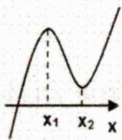</td><td>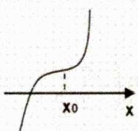</td><td>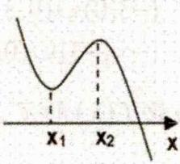</td><td>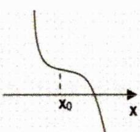</td></tr></table>

##### 2. 比如：（多选题 2024·全国·高考真题）设函数 $f(x)=(x-1)^{2}(x-4)$ ，则（）

$\quad$A. $x = 3$ 是 $f(x)$ 的极小值点

$\quad$B. 当 0 < x < 1 时， $f(x) < f(x^{2})$

$\quad$C. 当 $1 < x < 2$ 时， $-4 < f(2x - 1) < 0$

$\quad$D. 当 -1 < x < 0 时， $f(2 - x) > f(x)$

详解对 A，因为函数 $f(x)$ 的定义域为 R，而 $f'(x)=2(x-1)(x-4)+(x-1)^{2}=3(x-1)(x-3)$ ，
易知当 $x \in (1,3)$ 时， $f'(x) < 0$ ，当 $x \in (-\infty, 1)$ 或 $x \in (3, +\infty)$ 时， $f'(x) > 0$ 函数 $f(x)$ 在 $(-\infty,1)$ 上单调递增，在 $(1,3)$ 上单调递减，在 $(3,+\infty)$ 上单调递增，故 x=3 是函数 $f(x)$ 的

极小值点，正确；

对 B，当 0 < x < 1 时， $x - x^{2} = x(1 - x) > 0$ ，所以 $1 > x > x^{2} > 0$ ，

而由上可知，函数 $f(x)$ 在(0,1)上单调递增，所以 $f(x)>f(x^{2})$ ，错误；

对 C，当 1 < x < 2 时，1 < 2x - 1 < 3，而由上可知，函数 $f(x)$ 在 $(1,3)$ 上单调递减，

所以 $f(1) > f(2x - 1) > f(3)$ ，即 $-4 < f(2x - 1) < 0$ ，正确；

对 D，当 -1 < x < 0 时， $f(2 - x) - f(x) = (1 - x)^{2}(-2 - x) - (x - 1)^{2}(x - 4) = (x - 1)^{2}(2 - 2x) > 0$ ，

所以 $f(2-x)>f(x)$ ，正确；

故选：ACD.

### 二、【典型例题】

##### 1. (2024·全国·模拟预测)已知三次函数 $f(x) = 2x^{3} + ax^{2} + 6x + 1$ 的极小值点为 $b$ ，极大值点为 $2b$ ，则 $a + b$ 等于（）

$\quad$A. $4\sqrt{2}$

$\quad$B. $- 4\sqrt{2}$

$\quad$C. ±4√2

$\quad$D. ±5√2

##### 2. (2024·新疆乌鲁木齐·一模)已知函数 $f(x) = ax^3 + bx^2 + cx + d$ 在 $R$ 上是增函数，且存在垂直于 $y$ 轴的切线，则 $\frac{c}{a + b}$ 的取值范围是\_\_\_\_.

##### 3. (2024·江西新余·二模)已知三次函数的导函数 $f'(x) = 3x^{2} - 3ax$ , $f(0) = b$ , $a, b$ 为实数.

（1） 若曲线 $y = f(x)$ 在点 $(a + 1, f(a + 1))$ 处切线的斜率为 12，求 a 的值；  
（2） 若 $f(x)$ 在区间 $[-1, 1]$ 上的最小值，最大值分别为 -2，1，且 $1 < a < 2$ ，求函数 $f(x)$ 的解析式.

### 三、【习题检测】

##### 1. （2024·江苏·模拟预测）贝塞尔曲线（Beziercurve）是应用于二维图形应用程序的数学曲线，一般的矢量图形软件通过它来精确画出曲线。三次函数 $f(x)$ 的图象是可由 A, B, C, D 四点确定的贝塞尔曲线，其中 A, D 在 $f(x)$ 的图象上， $f(x)$ 在点 A, D 处的切线分别过点 B, C。若 $A(0,0)$ , $B(-1,-1)$ , $C(2,2)$ , $D(1,0)$ ，则 $f(x)=()$

$\quad$A. $5x^{3} - 4x^{2} - x$

$\quad$B. $3x^{3} - 3x$

$\quad$C. $3x^{3}-4x^{2}+x$

$\quad$D. $3x^{3}-2x^{2}-x$

##### 2. (2009·江苏·高考真题) 函数 $f(x) = x^3 - 15x^2 - 33x + 6$ 的单调减区间为 \_\_\_\_.

##### 3. (2005·福建·高考真题) 函数 $f(x) = x^3 - 3x^2 + 1$ 是减函数的区间为（）

$\quad$A. $(-∞,2)$

$\quad$B. $(0,2)$

$\quad$C. $(- \infty, 0)$

$\quad$D. $(2, +\infty)$

##### 4. 三次函数 $f(x) = mx^3 - x$ 在 $(- \infty, + \infty)$ 上是减函数，则 $m$ 的取值范围是（）

$\quad$A. $m <   0$

$\quad$B. $m <   1$

$\quad$C. $m \leq 0$

$\quad$D. $m \leq 1$

##### 5. (2024·江西景德镇·一模) 设三次函数 $f(x) = x^3 + bx^2 + cx$ ( $b, c$ 为实数) 的导数为 $f'(x)$ ，设 $g(x) = f(x) - f'(x)$ ，若 $y = g(x)$ 在 $R$ 上是增函数，则 $\frac{b^2}{c^2 + 9}$ 的最大值为 \_\_\_\_.

##### 6. (2024·广东深圳·一模) 已知函数 $f(x) = a(x - x_1)(x - x_2)(x - x_3)$ ( $a > 0$ ), 设曲线 $y = f(x)$ 在点$\left(x_{i},f\left(x_{i}\right)\right)$ 处切线的斜率为 $k_{i}(i = 1,2,3)$ ，若 $x_{1},x_{2},x_{3}$ 均不相等，且 $k_{2} = -2$ ，则 $k_{1} + 4k_{3}$ 的最小值为

##### 7. (2021·全国·高考真题) 已知函数 $f(x) = x^3 - x^2 + ax + 1$ .

（1） 讨论 $f(x)$ 的单调性;

（2） 求曲线 $y = f(x)$ 过坐标原点的切线与曲线 $y = f(x)$ 的公共点的坐标.

# 3.1.6 三次函数零点

### 一、【题型总结】

▲适用题型：三次函数零点相关的题型.

▲方法原理：

##### 1. 三次方程 $f(x) = 0$ 的实根个数

由于三次函数在高考中出现频率最高，且四次函数、分式函数等都可转化为三次函数来解决，故以三次函数为例来研究根的情况，设三次函数 $f(x)=ax^{3}+bx^{2}+cx+d(a\neq0)$

其导函数为二次函数： $f'(x)=3ax^{2}+2bx+c(a\neq0)$ ，

判别式为： $\triangle=4b^{2}-12ac=4(b^{2}-3ac)$ ，设 $f'(x)=0$ 的两根为 $x_{1}$ 、 $x_{2}$ ，结合函数草图易得：

（1） 若 $b^{2}-3ac \leq 0$ ，则 $f(x)=0$ 恰有一个实根；  
（2） 若 $b^{2}-3ac>0$ ，且 $f(x_{1})\cdot f(x_{2})>0$ ，则 $f(x)=0$ 恰有一个实根；  
（3） 若 $b^{2}-3ac>0$ ，且 $f(x_{1})\cdot f(x_{2})=0$ ，则 $f(x)=0$ 有两个不相等的实根；  
（4） 若 $b^{2}-3ac>0$ ，且 $f(x_{1})\cdot f(x_{2})<0$ ，则 $f(x)=0$ 有三个不相等的实根.

说明：（1）（2） $f(x)=0$ 含有一个实根的充要条件是曲线 $y=f(x)$ 与 x 轴只相交一次，即 $f(x)$ 在 R 上为单调函数（或两极值同号），所以 $b^{2}-3ac\leq0$ （或 $b^{2}-3ac>0$ ，且 $f(x_{1})\cdot f(x_{2})>0$ ）；

（5） $f(x) = 0$ 有两个相异实根的充要条件是曲线 $y = f(x)$ 与 $x$ 轴有两个公共点且其中之一为切点, 所以 $b^{2} - 3ac > 0$ , 且 $f(x_{1}) \cdot f(x_{2}) = 0$ ;  
（6） $f(x) = 0$ 有三个不相等的实根的充要条件是曲线 $y = f(x)$ 与 $x$ 轴有三个公共点, 即 $f(x)$ 有一个极大值, 一个极小值, 且两极值异号. 所以 $b^{2} - {3ac} > 0$ 且 $f\left( {x}_{1}\right)  \cdot  f\left( {x}_{2}\right)  < 0$ .

##### 2. 对三次函数 $f(x) = ax^3 + bx^2 + cx + d, a \neq 0$ ，如果其存在三个实根 $x_1, x_2, x_3$ ，则有

$x_{1} + x_{2} + x_{3} = -\frac{b}{a}, x_{1}x_{2} + x_{2}x_{3} + x_{3}x_{1} = \frac{c}{a}, x_{1}x_{2}x_{3} = -\frac{d}{a}$ . 称为三次方程根与系数关系.

证明： $ax^{3}+bx^{2}+cx+d=a(x-x_{1})(x-x_{2})(x-x_{3})=a\left[x^{2}-(x_{1}+x_{2})x+x_{1}x_{2}\right](x-x_{3})$

$= ax^{3} - a(x_{1} + x_{2} + x_{3})x^{2} + a(x_{1}x_{2} + x_{2}x_{3} + x_{1}x_{3})x - ax_{1}x_{2}x_{3}$ ，由待定系数法可得：

$x _ {1} + x _ {2} + x _ {3} = - \frac {b}{a}, x _ {1} x _ {2} + x _ {2} x _ {3} + x _ {1} x _ {3} = \frac {c}{a}, x _ {1} x _ {2} x _ {3} = - \frac {d}{a},$

### 二、【典型例题】

##### 1. (2021·全国·高考真题) 设 $a \neq 0$ , 若 $a$ 为函数 $f(x) = a(x - a)^{2}(x - b)$ 的极大值点, 则 ( )

$\quad$A. $a < b$

$\quad$B. $a > b$

$\quad$C. $ab < a^{2}$

$\quad$D. $ab > a^2$

##### 2. 已知 $f(x) = \begin{cases} |2x + 1|, & x < 1 \\ \log_2(x - 1), & x > 1 \end{cases}$ ， $g(x)$ 为三次函数，其图象如图所示。若 $y = f(g(x)) - m$ 有 9 个零点，则 $m$ 的取值范围是 \_\_\_\_.

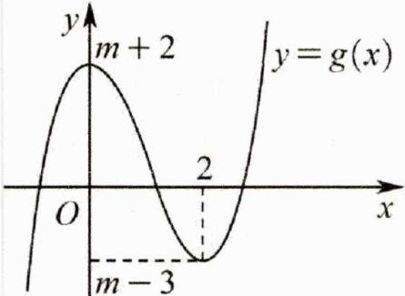

### 三、【习题检测】

##### 1. 一般地, 对于一元三次函数 $f(x)$ , 若 $f''(x_0) = 0$ , 则 $(x_0, f(x_0))$ 为三次函数 $f(x)$ 的对称中心, 已知函数 $f(x) = x^3 + ax^2 + 1$ 图象的对称中心的横坐标为 $x_0 (x_0 > 0)$ , 且 $f(x)$ 有三个零点, 则实数 $a$ 的取值范围是 ( )

$\quad$A. $\left(-\infty,-\frac{3\sqrt[3]{2}}{2}\right)$

$\quad$B. $(-∞,0)$

$\quad$C. $(-1,0)$

$\quad$D. $\left(-\frac{3\sqrt[3]{2}}{2},-1\right)$

##### 2. 已知 $m, n, p \in \mathbb{R}$ , 若三次函数 $f(x) = x^3 + mx^2 + nx + p$ 有三个零点 $a, b, c$ , 且满足 $f(-1) = f(1) < \frac{3}{2}, f(0) = f(2) > 2$ , 则 $\frac{1}{a} + \frac{1}{b} + \frac{1}{c}$ 的取值范围是 ( )

$\quad$A. $\left(\frac{1}{3},1\right)$

$\quad$B. $\left(\frac{1}{4},\frac{1}{3}\right)$

$\quad$C. $\left(\frac{1}{4},\frac{1}{2}\right)$

$\quad$D. $\left(\frac{1}{3},\frac{1}{2}\right)$

##### 3. （多选题）已知三次函数 $f(x)=ax^{3}+x^{2}+cx+\frac{1}{27}$ 有三个不同的零点 $x_{1}, x_{2}, x_{3} (x_{1}<x_{2}<x_{3})$ ，函数 $g(x)=f(x)-1$ 。则（）

$\quad$A. $3ac < 1$

$\quad$B. 若 $x_{1}, x_{2}, x_{3}$ 成等差数列，则 $a \in (-1, 0) \cup (0, 1)$

$\quad$C. 若 $g(x)$ 恰有两个不同的零点 $m, n (m < n)$ ，则 $2m + n = -\frac{1}{3a}$

$\quad$D. 若 $g(x)$ 有三个不同的零点 $t_1, t_2, t_3 (t_1 < t_2 < t_3)$ ，则 $x_1^2 + x_2^2 + x_3^2 = t_1^2 + t_2^2 + t_3^2$

# 3.1.7 三次函数对称性

### 一、【题型总结】

▲适用题型：涉及三次函数对称性的题型.

▲方法原理：

##### 1. 对称性：三次函数是中心对称曲线，且对称中心是； $(- \frac{b}{3a}, f(-\frac{b}{3a}))$ ；

（1） 原因: 奇函数的导数是偶函数, 偶函数的导数是奇函数, 周期函数的导数还是周期函数. 三次函数 $f(x)=ax^{3}+bx^{2}+cx+d(a \neq 0)$ , 其导函数为二次函数: $f'(x)=3ax^{2}+2bx+c(a \neq 0)$ , 易知导函数的对称轴即为三次函数对称中心横坐标

（2） $f''(x)$ 是函数 $f'(x)$ 的导数, 若方程 $f''(x)=0$ 有实数解, 则称点 $(x_0, f(x_0))$ 为函数 $y=f(x)$ 的“拐点”. 任何一个三次函数都有 “拐点” 且 “拐点” 就是三次函数图象的对称中心.

##### 2. 比如：（多选题 2024·全国·高考真题）设函数 $f(x) = 2x^{3} - 3ax^{2} + 1$ ，则（）

$\quad$A. 当 $a > 1$ 时, $f(x)$ 有三个零点

$\quad$B. 当 a<0 时，x=0 是 $f(x)$ 的极大值点

$\quad$C. 存在 $a, b$ , 使得 $x = b$ 为曲线 $y = f(x)$ 的对称轴

$\quad$D. 存在 $a$ ，使得点 $(1, f(1))$ 为曲线 $y = f(x)$ 的对称中心

详解A选项， $f'(x)=6x^{2}-6ax=6x(x-a)$ ，由于a>1，

故 $x \in (-\infty, 0) \cup (a, +\infty)$ 时 $f'(x) > 0$ ，故 $f(x)$ 在 $(- \infty, 0), (a, +\infty)$ 上单调递增，

$x\in(0,a)$ 时， $f'(x)<0$ ， $f(x)$ 单调递减，则 $f(x)$ 在x=0处取到极大值，在x=a处取到极小值，由 $f(0)=1>0$ ， $f(a)=1-a^{3}<0$ ，则 $f(0)f(a)<0$ ，根据零点存在定理 $f(x)$ 在 $(0,a)$ 上有一个零点，又 $f(-1)=-1-3a<0$ ， $f(2a)=4a^{3}+1>0$ ，则 $f(-1)f(0)<0,f(a)f(2a)<0$ ，

则 $f(x)$ 在 $(-1,0),(a,2a)$ 上各有一个零点，于是 a>1 时， $f(x)$ 有三个零点，A 选项正确；

B 选项， $f'(x)=6x(x-a)$ ，a<0 时， $x\in(a,0),f'(x)<0$ ， $f(x)$ 单调递减，

$x \in (0, +\infty)$ 时 $f'(x) > 0$ ， $f(x)$ 单调递增，此时 $f(x)$ 在 x = 0 处取到极小值，B 选项错误；

C 选项，假设存在这样的 a, b，使得 x = b 为 $f(x)$ 的对称轴，即存在这样的 a, b 使得 $f(x) = f(2b - x)$ ，即 $2x^{3} - 3ax^{2} + 1 = 2(2b - x)^{3} - 3a(2b - x)^{2} + 1$ ，根据二项式定理，等式右边 $(2b - x)^{3}$ 展开式含有 $x^{3}$ 的项为 $2C_{3}^{3}(2b)^{0}(-x)^{3} = -2x^{3}$ ，于是等式左右两边 $x^{3}$ 的系数都不相等，原等式不可能恒成立，

于是不存在这样的a,b，使得x=b为 $f(x)$ 的对称轴，C选项错误；

D选项，

方法一：利用对称中心的表达式化简

$f(1)=3-3a$ ，若存在这样的a，使得 $(1,3-3a)$ 为 $f(x)$ 的对称中心，

则 $f(x)+f(2-x)=6-6a$ ，事实上，

$f (x) + f (2 - x) = 2 x ^ {3} - 3 a x ^ {2} + 1 + 2 (2 - x) ^ {3} - 3 a (2 - x) ^ {2} + 1 = (1 2 - 6 a) x ^ {2} + (1 2 a - 2 4) x + 1 8 - 1 2 a,$

于是 $6 - 6a = (12 - 6a)x^{2} + (12a - 24)x + 18 - 12a$

即 $\left\{ \begin{array}{l} 12 - 6a = 0 \\ 12a - 24 = 0 \\ 18 - 12a = 6 - 6a \end{array} \right.$ ，解得 $a = 2$ ，即存在 $a = 2$ 使得 $(1, f(1))$ 是 $f(x)$ 的对称中心，D选项正确.

方法二：直接利用拐点结论

任何三次函数都有对称中心，对称中心的横坐标是二阶导数的零点，

$f(x)=2x^{3}-3ax^{2}+1,\quad f'(x)=6x^{2}-6ax,\quad f''(x)=12x-6a$ ，由 $f''(x)=0\Leftrightarrow x=\frac{a}{2}$ ，于是该三次函数的对称中心为 $\left(\frac{a}{2},f\left(\frac{a}{2}\right)\right)$ ，由题意 $(1,f(1))$ 也是对称中心，故 $\frac{a}{2}=1\Leftrightarrow a=2$ ，

即存在 $a = 2$ 使得 $(1, f(1))$ 是 $f(x)$ 的对称中心，D选项正确. 故选：AD

### 二、【典型例题】

##### 1. （多选题 2022·全国·高考真题）已知函数 $f(x)=x^{3}-x+1$ ，则（）

$\quad$A. $f(x)$ 有两个极值点

$\quad$B. $f(x)$ 有三个零点

$\quad$C. 点(0,1)是曲线 $y=f(x)$ 的对称中心 
$\quad$D. 直线 y=2x 是曲线 $y=f(x)$ 的切线

##### 2. (2024·全国·模拟预测) 对于三次函数 $f(x) = ax^3 + bx^2 + cx + d (a \neq 0)$ 给出定义: 设 $f'(x)$ 是函数 $y = f(x)$ 的导数, $f''(x)$ 是 $f'(x)$ 的导数, 若方程 $f''(x) = 0$ 有实数解 $x_0$ , 则称点 $(x_0, f(x_0))$ 为函数 $y = f(x)$ 的“拐点”, 同学经过探究发现: 任何一个三次函数都有“拐点”; 任何一个三次函数都有对称中心, 且拐点就是对称中心, 若 $f(x) = \frac{1}{3}x^3 - \frac{1}{2}x^2 + 3x - \frac{5}{12}$ , 请你根据这一发现计算:

$f \left(\frac {1}{2 0 2 4}\right) + f \left(\frac {2}{2 0 2 4}\right) + f \left(\frac {3}{2 0 2 4}\right) + \dots + f \left(\frac {2 0 2 3}{2 0 2 4}\right) = (\quad)$

$\quad$A. 2021

$\quad$B. 2022

$\quad$C. 2023

$\quad$D. 2024

### 三、【习题检测】公众号→全科A+

##### 1. (多选题 2024·江苏·模拟预测) 已知三次函数 $f(x) = ax^3 + bx^2 + cx - 1$ ，若函数 $g(x) = f(-x) + 1$ 的

图象关于点（1，0）对称，且 $g(-2) < 0$ ，则（）

$\quad$A. $a < 0$

$\quad$B. $g(x)$ 有3个零点

$\quad$C. $f(x)$ 的对称中心是 $(-1,0)$

$\quad$D. $12a - 4b + c < 0$

##### 2. （多选题 2025 • 四川内江 • 模拟预测）定义： $f''(x)$ 是函数 $f'(x)$ 的导数，若方程 $f''(x)=0$ 有实数解，则称点 $(x_{0}, f(x_{0}))$ 为函数 $y=f(x)$ 的“拐点”。经过探究发现：任何一个三次函数都有“拐点”且“拐点”就是三次函数图象的对称中心。已知函数 $f(x)=ax^{3}-bx^{2}+\frac{1}{3}(ab\neq0)$ 的对称中心为 $(-1,-1)$ 。则下列选项正确的有（）

$\quad$A. $a=\frac{1}{3},b=-1$

$\quad$B. $f(0)+f\left(-\frac{1}{10}\right)+f\left(-\frac{2}{10}\right)+\cdots+f\left(-\frac{19}{10}\right)+f(-2)$ 的值是 -21

$\quad$C. 函数 $f(x)$ 有一个零点

$\quad$D. 过 $\left(-3,\frac{1}{6}\right)$ 可以作三条直线与 $y=f(x)$ 图象相切

##### 3. 已知任意三次函数的图象必存在唯一的对称中心，若函数 $f(x) = x^3 + ax^2 + bx + c$ ，且 $M(x_0, f(x_0))$ 为曲线 $y = f(x)$ 的对称中心，则必有 $g'(x_0) = 0$ （其中函数 $g(x) = f'(x)$ ）。若实数 $m$ ， $n$ 满足

$\left\{ \begin{array}{l} m^{3} + 6m^{2} + 13m = 10 \\ n^{3} + 6n^{2} + 13n = -30 \end{array} \right.$ 则 $m + n =$ （）

$\quad$A. -4

$\quad$B. -3

$\quad$C.-2

$\quad$D. -1

##### 4. (2024·高三·广东珠海·开学考试)

设函数 $y = f''(x)$ 是 $y = f'(x)$ 的导函数. 某同学经过探究发现, 任意一个三次函数

$f(x)=ax^{3}+bx^{2}+cx+d(a\neq0)$ 的图像都有对称中心 $\left(x_{0},f\left(x_{0}\right)\right)$ ，其中 $x_{0}$ 满足 $f''\left(x_{0}\right)=0$ 。已知三次函数 $f'(x)=x^{3}+2x-1$ ，若 $x_{1}+x_{2}=0$ ，则 $f'(x_{1})+f'(x_{2})=$ \_\_\_\_.

# 3.1.8 恒成立求参

### 一、【题型总结】

▲适用题型：已知不等式恒成立（任意）求参数问题；

▲方法原理：

##### 1. 若 $a > f(x)$ 在 $[m, n]$ 上恒成立 $\Leftrightarrow a > f(x)$ 在 $[m, n]$ 上的最大值.

##### 2. 若 $a < f(x)$ 在 $[m, n]$ 上恒成立 $\Leftrightarrow a < f(x)$ 在 $[m, n]$ 上的最小值.

##### 3. $y = f(x)$ 满足 $\forall x_{1},x_{2}\in D,\left|f\left(x_{1}\right) - f\left(x_{2}\right)\right| <   m$ 则 $f(x)_{\max} - f(x)_{\min} <   m$

### 二、【典型例题】

##### 1. (2019·天津·高考真题)已知 $a \in R$ , 设函数 $f(x) = \begin{cases} x^2 - 2ax + 2a, & x \leqslant 1, \\ x - a \ln x, & x > 1, \end{cases}$ 若关于 $x$ 的不等式 $f(x) \geqslant 0$ 在 $R$ 上恒成立, 则 $a$ 的取值范围为 ( )

$\quad$A. $[0,1]$

$\quad$B. $[0,2]$

$\quad$C. $[0,e]$

$\quad$D. $[1, e]$

##### 2. （2014·辽宁·高考真题）当 $x \in [-2, 1]$ 时，不等式 $ax^3 - x^2 + 4x + 3 \geq 0$ 恒成立，则实数 $a$ 的取值范围是（）

$\quad$A. $[-5, - 3]$

$\quad$B. $[-6, -\frac{9}{8}]$

$\quad$C. $[-6, -2]$

$\quad$D. $[-4, - 3]$

##### 3. (2013·全国·高考真题) 若函数 $f(x) = x^{2} + ax + \frac{1}{x}$ 在 $(\frac{1}{2}, +\infty)$ 是增函数, 则 $a$ 的取值范围是 ( )

$\quad$A. $[-1,0]$

$\quad$B. $[-1, +\infty)$

$\quad$C. [0,3]

$\quad$D. $[3, +\infty)$

##### 4. （2007·江西·高考真题）设 $p: f(x) = \mathrm{e}^{x} + \ln x + 2x^{2} + mx + 1$ 在 $(0, +\infty)$ 内单调递增， $q: m \geq -5$ 则 $p$ 是 $q$ 的（）

$\quad$A. 必要不充分条件

$\quad$B. 充分不必要条件

$\quad$C. 充分必要条件

$\quad$D. 既不充分也不必要条件

##### 5. （2007·江西·高考真题）设 $p: f(x) = x^{3} + 2x^{2} + mx + 1$ 在 $(-∞, +∞)$ 内单调递增； $q: m ≥ \frac{4}{3}$ . 则 p 是 q 的（）

$\quad$A. 充分不必要条件

$\quad$B. 必要不充分条件

$\quad$C. 充分必要条件

$\quad$D. 既不充分也不必要条件

### 三、【习题检测】

##### 1. （2024·全国·高考真题）设函数 $f(x)=(x+a)\ln(x+b)$ ，若 $f(x)\geq0$ ，则 $a^{2}+b^{2}$ 的最小值为（）

$\quad$A. $\frac{1}{8}$

$\quad$B. $\frac{1}{4}$

$\quad$C. $\frac{1}{2}$

$\quad$D. 1

##### 2. (2014·重庆·高考真题) 若不等式 $|2x - 1| + |x + 2| \geq a^2 + \frac{1}{2} a + 2$ 对任意实数 $x$ 恒成立, 则实数 $a$ 的取值范围是 \_\_\_\_.

##### 3. (2008·江苏·高考真题) $f(x) = ax^3 - 3x + 1$ 对于 $x \in [-1, 1]$ 总有 $f(x) \geq 0$ 成立，则 $a =$ \_\_\_\_.

##### 4. (2019·浙江·高考真题) 已知 $a \in R$ , 函数 $f(x) = ax^3 - x$ , 若存在 $t \in R$ , 使得 $|f(t + 2) - f(t)| \leq \frac{2}{3}$ , 则实数 $a$ 的最大值是 \_\_\_\_.

##### 5. (2018·天津·高考真题) 已知 $a \in R$ , 函数 $f(x) = \begin{cases} x^2 + 2x + a - 2, & x \leq 0, \\ -x^2 + 2x - 2a, & x > 0. \end{cases}$ 若对任意 $x \in [-3, +\infty)$ , $f(x) \leqslant |x|$ 恒成立, 则 $a$ 的取值范围是 \_\_\_\_.

##### 6. (2012·北京·高考真题) 已知 $f(x) = m(x - 2m)(x + m + 3)$ ， $g(x) = 2^x - 2$ ，若 $\forall x \in \mathbb{R}$ ， $f(x) < 0$ 或 $g(x) < 0$ ，则 $m$ 的取值范围是 \_\_\_\_.

# 3.1.9 导数中的对称

### 一、【题型总结】

▲适用题型：导数中涉及对称的题型包括解答题.

▲方法原理：

##### 1. 对称性：

（1） 若函数 $y = f(x)$ 关于直线 x = a 对称，则 $f(a + x) = f(a - x)$ .  
（2） 若函数 $y = f(x)$ 关于点 $(a, b)$ 对称，则 $f(a + x) + f(a - x) = 2b$ .

注意：对称的函数其定义域也对称

##### 2. 比如：（2024·全国·高考真题）已知函数 $f(x)=\ln\frac{x}{2-x}+ax+b(x-1)^{3}$

证明：曲线 $y = f(x)$ 是中心对称图形；

详解 $f(x)=\ln\frac{x}{2-x}+ax+b(x-1)^{3}$ 的定义域为 $(0,2)$ ,

设 $P(m, n)$ 为 $y = f(x)$ 图象上任意一点， $P(m, n)$ 关于 $(1, a)$ 的对称点为 $Q(2 - m, 2a - n)$ ，

因为 $P(m,n)$ 在 $y = f(x)$ 图象上，故 $n = \ln \frac{m}{2 - m} + am + b(m - 1)^3$

而 $f(2 - m) = \ln \frac{2 - m}{m} + a(2 - m) + b(2 - m - 1)^3 = -\left[\ln \frac{m}{2 - m} + am + b(m - 1)^3\right] + 2a$

$= -n + 2a$ ，所以 $Q(2 - m,2a - n)$ 也在 $y = f(x)$ 图象上，

由 P 的任意性可得 $y = f(x)$ 图象为中心对称图形，且对称中心为 $(1, a)$ .

### 二、【典型例题】

##### 1. （贵州贵阳·模拟预测）关于函数 $f(x) = (x - 1)(\mathbf{e}^{x - 1} + a\mathbf{e}^{1 - x})$ ，有如下四个命题：

①若 a=1，则 $f(x)$ 的图象关于点 $(1,0)$ 对称；②若 $f(x)$ 的图象关于直线 x=1 对称，则 a=-1；

③当 a=0 时，函数 $f(x)$ 的极值为 $-\frac{1}{e}$ ; ④当 a<0 时，函数 $f(x)$ 有两个零点.

其中所有真命题的序号是

##### 2. (2023·全国·高考真题) 已知函数 $f(x) = \left(\frac{1}{x} + a\right) \ln(1 + x)$ . 是否存在 $a, b$ , 使得曲线 $y = f\left(\frac{1}{x}\right)$ 关于直线 $x = b$ 对称, 若存在, 求 $a, b$ 的值, 若不存在, 说明理由.

### 三、【习题检测】

##### 1. （北京·三模）对于函数 $f(x)=\ln\frac{x}{2x-1}$ 和 $g(x)=\ln x-\ln(2x-1)$ ，给出下列四个结论：

①设 $f(x)$ 的定义域为 M， $g(x)$ 的定义域为 N，则 N 是 M 的真子集.  
②函数 $g(x)$ 的图像在 x=1 处的切线斜率为 0. ③函数 $f(x)$ 的单调减区间是 $(-∞,0)$ ， $\left(\frac{1}{2},+∞\right)$ .  
④函数 $f(x)$ 的图像关于点 $\left(\frac{1}{4}, -\ln2\right)$ 对称. 其中所有正确结论的序号是 \_\_\_\_.

##### 2. (2024高三下·陕西西安·阶段练习) “拐点”又称“反曲点”, 是曲线上弯曲方向发生改变的点. 设 $\varphi'(x)$ 为函数 $\varphi(x)$ 的导数, 若 $\alpha$ 为 $\varphi'(x)$ 的极值点, 则 $(\alpha, \varphi(\alpha))$ 为曲线 $y = \varphi(x)$ 的拐点.

已知曲线 C: $y = x^{3} - 3x^{2} + 1$ .

（1） 求 C 的拐点坐标;  
（2） 证明：C 关于其拐点对称；  
（3） 设 $l$ 为 $\mathbb{C}$ 在其拐点处的切线, 证明: 所有平行于 $l$ 的直线都与 $\mathbb{C}$ 有且仅有一个公共点.

##### 3. （上海长宁·一模）设 $f(x)=x^{3}+ax^{2}-2x(x\in\mathbb{R})$ ，其中常数 $a\in R$ .

（1） 判断函数 $y = f(x)$ 的奇偶性，并说明理由；

（2） 若不等式 $f(x) > \frac{3}{2}x^{3}$ 在区间 $\left[\frac{1}{2}, 1\right]$ 上有解，求实数 a 的取值范围；

（3） 已知: 若对函数 $y = h(x)$ 定义域内的任意 $x$ , 都有 $h(x) + h(2m - x) = 2n$ , 则函数 $y = h(x)$ 的图象有对称中心 $(m, n)$ . 利用以上结论探究: 对于任意的实数 $a$ , 函数 $y = f(x)$ 是否都有对称中心? 若是, 求出对称中心的坐标 (用 $a$ 表示); 若不是, 证明你的结论.

# 3.1.10 函数与导数的对称关系

### 一、【题型总结】

▲适用题型：常用于函数与导数对称结合的选择或填空题型；

▲方法原理：

##### 1. 复合函数的奇偶对称性：（用换元思想最好证明和理解）

（1） $f(ax+b)+c$ 为奇函数则 $f(x)$ 关于 $(b,-c)$ 对称，x 能取 b 则 $f(b)=-c$ ；

证明： $\left\{ \begin{array}{l} \text{令} g(x) = f(ax + b) + c, \text{则} g(-x) = -g(x) \Rightarrow \left\{ \begin{array}{l} g(0) = 0 = f(b) + c \\ \Rightarrow f(b) = -c, x \text{能取} b \end{array} \right. \\ \Rightarrow f(-ax + b) + c = -f(ax + b) - c \\ \Rightarrow f(-ax + b) + f(ax + b) = -2c \\ \Rightarrow f(x) \text{关于}(b, -c) \text{对称} \end{array} \right.$

（2） $f(ax + b)$ 为偶函数则 $f(x)$ 关于 $x = b$ 对称；

证明： $\left\{ \begin{array}{ll}  & \text{令} g(x) = f(ax + b), \text{则} g(-x) = g(x) \\  & \Rightarrow f(-ax + b) = f(ax + b) \Rightarrow f(x) \text{关于} x = b \text{对称} \end{array} \right.$

设函数 $f(x)$ 的定义域为 $D, f(x)$ 在 $D$ 上可导， $f'(x)$ 是 $f(x)$ 的导函数.

##### 2. 函数与导数的对称关系：

奇函数的导数是偶函数；偶函数的导数是奇函数。

连续的奇函数其原函数都是偶函数；连续的偶函数其原函数之一是奇函数。

结论1: 若 $f(x)$ 的图象关于点 $(a,b)$ 对称, 则 $f'(x)$ 的图象关于直线 $x=a$ 对称.

即：（1） 若 $f(x)$ 的图象的对称中心在 y 轴上，则 $f'(x)$ 是偶函数.

（2） 若 $f(x)$ 是奇函数，则 $f'(x)$ 是偶函数.

证明： $\left\{ \begin{array}{l}\forall x\in D,f(x) + f(2a - x) = 2b\\ \Rightarrow f'(x) - f'(2a - x) = 0\\ \Rightarrow f'(x) = f'(2a - x) \end{array} \right.$ 即证.

结论2: 若 $f(x)$ 的图象关于直线 $x=a$ 对称, 则 $f'(x)$ 的图象关于点 $(a,0)$ 对称.

即：（1） 若 $f(x)$ 是偶函数，则 $f'(x)$ 是奇函数.

（2） 若 $f(x)$ 的图象关于直线 $x = a$ 对称，且 $f(x)$ 在 $x = a$ 处存在导数，则 $f'(a) = 0$ .

证明： $\left\{ \begin{array}{l}\forall x\in D,f(x) = f(2a - x)\\ \Rightarrow f'(x) = -f'(2a - x)\quad \text{即证}.\\ \Rightarrow f'(x) + f'(2a - x) = 0 \end{array} \right.$

结论 3: 若 $f'(x)$ 的图象关于点 $(a,0)$ 对称, 且 $\exists x_0 \in D$ , $f(x_0) = f(2a - x_0)$ , 则 $f(x)$ 的图象关于直线 $x = a$ 对称.

证明：令 $g(x)=f(x)-f(2a-x)$ $\left\{\begin{aligned}\forall x\in D,f'(x)+f'(2a-x)=0\\ \Rightarrow g'(x)=f'(x)+f'(2a-x)\\ \Rightarrow \forall x\in D,g'(x)=0\\ \Rightarrow \exists c\in\mathbf{R},\forall x\in D,g(x)=c\\ \Rightarrow f(x_{0})=f(2a-x_{0})\Rightarrow c=0\\ \Rightarrow \forall x\in D,f(x)=f(2a-x)\end{aligned}\right.$ . 即证.

注意：若 $f'(x)$ 是奇函数，则 $f(x)$ 不一定是偶函数，例如 $f(x)=\left\{\begin{aligned}x^{2}-1,x&<0,\\ x^{2}+1,x&>0,\end{aligned}\right.$ 则 $f'(x)=2x,x\neq0$ ， $f'(x)$ 是奇函数，但是 $f(x)$ 不是偶函数.

结论 4: 若 $f'(x)$ 的图象关于直线 x = a 对称，则 $\exists b \in \mathbb{R}, f(x)$ 的图象关于点 $(a, b)$ 对称.

即：

（1） 若 $f'(x)$ 的图象关于直线 $x = a$ 对称, 且 $f(x)$ 在 $x = a$ 处连续, 则 $f(x)$ 的图象关于点 $(a, f(a))$ 对称. （2） 若 $f'(x)$ 是偶函数, 则 $f(x)$ 的图象的对称中心在 $y$ 轴上, $f(x)$ 不一定是奇函数, 例如 $f(x) = 2x^3 - 1$ , 则 $f'(x) = 6x^2$ , $f'(x)$ 是偶函数, 但是 $f(x)$ 不是奇函数.

证明：令 $g(x)=f(x)+f(2a-x)$ $\left\{\begin{aligned}\forall x\in D,f'(x)=f'(2a-x)\\\Rightarrow f'(x)-f'(2a-x)=0\\\Rightarrow 令g'(x)=f'(x)-f'(2a-x).\\ \Rightarrow g(x)为常数，令g(x)=2b\\\Rightarrow f(x)+f(2a-x)=2b\end{aligned}\right.$ 即证.

### 二、【典型例题】

##### 1. (多选题 2022 • 全国 • 高考真题) 已知函数 $f(x)$ 及其导函数 $f'(x)$ 的定义域均为 $\mathbf{R}$ , 记 $g(x) = f'(x)$ , 若 $f\left(\frac{3}{2} - 2x\right)$ , $g(2 + x)$ 均为偶函数, 则 ( )

$\quad$A. $f(0) = 0$

$\quad$B. $g\left(-\frac{1}{2}\right)=0$

$\quad$C. $f(-1)=f(4)$

$\quad$D. $g(-1) = g(2)$

##### 2. (2008·四川·高考真题) 设 $f(x) = \sin (\omega x + \varphi)$ ，其中 $\omega > 0$ ，则 $f(x)$ 是偶函数的充要条件是

$\quad$A. $f(0) = 1$

$\quad$B. $f(0)=0$

$\quad$C. $f'（0）=1$

$\quad$D. $f'（0）=0$

##### 3. (2024·四川·模拟预测) 已知函数 $f'(x)$ 为定义在 $\mathbb{R}$ 上的函数 $f(x)$ 的导函数, $f(x - 1)$ 为奇函数, $f(x + 1)$ 为偶函数, 且 $f'（0） = 2$ , 则下列说法不正确的是 ( )

$\quad$A. $f(0)=f(2)$

$\quad$B. $f'(-1)+f'（3）=0$

$\quad$C. $f'（4）=2$

$\quad$D. $\sum_{i=1}^{10} if'(2i) = -22$

### 三、【习题检测】

##### 1. （多选题 2024·重庆九龙坡·三模）已知函数 $f(x)$ 及其导函数 $f'(x)$ 的定义域为 $\mathbb{R}$ ，若 $f(x)$ 为奇函数， $f(2) = -f(1) \neq 0$ ，且对任意 $x, y \in \mathbb{R}$ ， $f(x + y) = f(x)f'(y) + f'(x)f(y)$ ，则下列结论正确的是（）

$\quad$A. $f'（1） = -1$

$\quad$B. $f(12) = 0$

$\quad$C. $\sum_{k=1}^{2024}f(k)=0$

$\quad$D. $\sum_{k=1}^{2024}f'(k)=-1$

##### 2. （多选题 2024·河南三门峡·模拟预测）已知函数 $f(x)$ 及其导函数 $f'(x)$ ，且 $g(x)=f'(x)$ ，若 $\forall x\in\mathbb{R},f(x)=f(6-x),g(4+x)=g(4-x)$ ，则（）

$\quad$A. $f(-2)=f(8)$

$\quad$B. $g(-1)+g(3)=2$

$\quad$C. $\sum_{i=1}^{2025}g(i)=0$

$\quad$D. $f(0)+f(4)=2$

##### 3. （多选题 2024·黑龙江大庆·模拟预测）已知函数 $f(x)$ ， $g(x)$ 及其导函数 $f'(x)$ ， $g'(x)$ 的定义域均为 $\mathbf{R}$ ，若 $f(2x - 1)$ 的图象关于直线 $x = 1$ 对称， $f(x) + g(x + 1) = x + 1$ ， $f(x + 1) = g(-x) + x$ ，且 $g(2) = 1$ ，则（）

$\quad$A. $f(x)$ 为偶函数

$\quad$B. $g(x)$ 的图象关于点 $(3,3)$ 对称

$\quad$C. $g'（202）=1$

$\quad$D. $\sum_{i=1}^{99}g(i)=4950$

##### 4. （多选题 2024·湖南邵阳·二模）已知函数 $f(x)$ 在 R 上可导，且 $f(x)$ 的导函数为 $g(x)$ . 若 $f(x)=4-f(x+2), g(2x-1)$ 为奇函数，则下列说法正确的有（）

$\quad$A. $g(1)=0$

$\quad$B. $f(2)=0$

$\quad$C. $f(2)=f(8)$

$\quad$D. $\sum_{i=1}^{2024}f(i)=4048$

##### 5. (2024·江西鹰潭·一模) 已知函数 $f(x)$ , $g(x)$ 的定义域为 $\mathbb{R}$ , $g'(x)$ 为 $g(x)$ 的导函数, 且 $f(x) + g'(x) - 8 = 0$ , $f(x - 2) - g'(6 - x) - 8 = 0$ , 若 $g(x)$ 为偶函数, 求 $\sum_{n=1}^{2023} f(n) =$ \_\_\_\_.

# 3.2 极值点偏移

# 3.2.1 极值点偏移之对称构造

### 一、【题型总结】

▲适用题型：涉及两根和或积大于或小于某值的题型.

▲方法原理：

##### 1. 极值点偏移：

是指对于单极值函数，由于函数极值点左右的增减速度不同，使得函数图像没有对称性.

##### 2. 已知函数 $y = f(x)$ 是连续函数，在区间 $(x_{1}, x_{2})$ 内有且只有一个极值点 $x_{0}$ ，且 $f(x_{1}) = f(x_{2})$ ，若极值点左右的“增减速度”相同，常常有极值点 $x_{0} = \frac{x_{1} + x_{2}}{2}$ ，我们称这种状态为极值点不偏移（如二次函数）；若极值点左右的“增减速度”不同，函数的图象不具有对称性，常常有极值点 $x_{0} \neq \frac{x_{1} + x_{2}}{2}$ 的情况，我们称这种状态为“极值点偏移”。

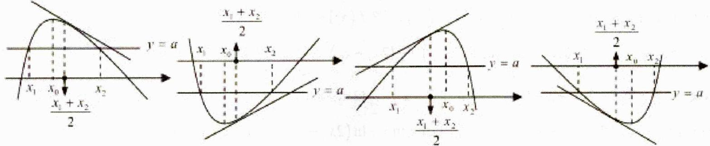

极值点左偏   
极值点右偏

##### 3. 极值点偏左: $x_{1} + x_{2} > 2x_{0}$ , $x = \frac{x_{1} + x_{2}}{2}$ 处切线与 $\mathbf{x}$ 轴不平行;

若 $f(x)$ 上凸 $(f'(x)$ 递减），则 $f'(\frac{x_1 + x_2}{2}) < f'(x_0) = 0$ ，若 $f(x)$ 下凸 $(f'(x)$ 递增），则 $f'(\frac{x_{1} + x_{2}}{2}) > f'(x_{0}) = 0.$

##### 4. 极值点偏右： $x_{1}+x_{2}<2x_{0}$ ， $x=\frac{x_{1}+x_{2}}{2}$ 处切线与x轴不平行；

若 $f(x)$ 上凸 $(f'(x)$ 递减），则 $f'(\frac{x_1 + x_2}{2}) > f'(x_0) = 0$ ，若 $f(x)$ 下凸 $(f'(x)$ 递增），则 $f'(\frac{x_1 + x_2}{2}) < f'(x_0) = 0$ 。

##### 5. 思路如下：如果需要判断 $x_{1} + x_{2}$ 与 $2x_{0}$ 的大小关系，则就需要判断 $x_{2}$ 与 $2x_{0} - x_{1}$ 的大小关系，也就需要判断 $f(x_{2})$ 与 $f(2x_{0} - x_{1})$ 的大小关系。而 $f(x_{1}) = f(x_{2})$ ，因此就需要判断 $f(x_{1}) - f(2x_{0} - x_{1})$ 与 0 的大小关系，于是就构建函数 $g(x) = f(x) - f(2x_{0} - x)$ ，再分析函数 $g(x)$ 的单调性即可。同理，要判断 $x_{1}x_{2}$ 与 $x_{0}^{2}$ 的大小关系，需要构建函数 $g(x) = f(x) - f\left(\frac{x_{0}^{2}}{x}\right)$ ，再分析函数 $g(x)$ 的单调性即可。

##### 6. 其解题要点如下:

（1）定函数(极值点为 $x_{0}$ ),即利用导函数符号的变化判断函数单调性,进而确定函数的极值点 $x_{0}$ .

（2）构造函数,即根据极值点构造对称函数 $F(x)=f(x)-f(2x_{0}-x)$ , 若证 $x_{1}x_{2}>x_{0}^{2}$ , 则令

$F (x) = f (x) - f \left(\frac {2 x _ {0}}{x}\right).$

（3） 判断单调性，即利用导数讨论 $F(x)$ 的单调性.

（4） 比较大小, 即判断函数 $F(x)$ 在某段区间上的正负, 并得出 $f(x)$ 与 $f(2x_0 - x)$ 的大小关系.  
（5） 转化, 即利用函数 $f(x)$ 的单调性, 将 $f(x)$ 与 $f(2x_{0} - x)$ 的大小关系转化为 $x$ 与 $2x_{0} - x$ 之间的关系, 进而得到所证或所求.

##### 7. 比如：(2024·甘肃酒泉·模拟预测) 已知函数 $f(x) = x \ln x + \frac{1}{2} x^2 - x$ .

（1） 求曲线 $y = f(x)$ 在点 $(1, f(1))$ 处的切线方程；  
（2） 若 $f'(x_0) = 0$ ( $f'(x)$ 为 $f(x)$ 的导函数), 方程 $f(x) = m$ 有两个不等实根 $x_1, x_2$ , 求证: $x_1 + x_2 > 2x_0$ .

详解（1）解：因为 $f(x)=x\ln x+\frac{1}{2}x^{2}-x$ ，则 $f'(x)=x+\ln x$ ，所以， $f(1)=-\frac{1}{2}$ ， $f'（1）=1$ ，

所以，曲线 $y = f(x)$ 在点 $(1, f(1))$ 处的切线方程为 $y + \frac{1}{2} = x - 1$ ，即 $y = x - \frac{3}{2}$ .

（2） 证明：因为 $f'(x)=x+\ln x$ ， $f'(x_{0})=0$ ，所以 $x_{0}+\ln x_{0}=0$ 。

因为 $f'(x)$ 为增函数，所以 $f(x)$ 在 $(0, x_{0})$ 上单调递减，在 $(x_{0}, +\infty)$ 上单调递增.

由方程 $f(x) = m$ 有两个不等实根 $x_{1}$ 、 $x_{2}$ ，则可设 $x_{1} < x_{0} < x_{2}$ ，欲证 $x_{1} + x_{2} > 2x_{0}$ ，即证 $x_{2} > 2x_{0} - x_{1} > x_{0}$ ，即证 $f(x_{2}) > f(2x_{0} - x_{1})$ ，而 $f(x_{2}) = f(x_{1})$ ，即 $f(x_{1}) - f(2x_{0} - x_{1}) > 0$ ，

即 $x_{1}\ln x_{1} + \frac{1}{2} x_{1}^{2} - x_{1} - (2x_{0} - x_{1})\ln (2x_{0} - x_{1}) - \frac{1}{2} (2x_{0} - x_{1})^{2} + (2x_{0} - x_{1}) > 0$

设 $g(x) = x\ln x + \frac{1}{2} x^2 -x - (2x_0 - x)\ln (2x_0 - x) - \frac{1}{2}\left(2x_0 - x\right)^2 +\left(2x_0 - x\right)$ ，其中 $0 <   x <   x_{0}$

则 $g'(x) = \ln x + \ln (2x_{0} - x) + 2x_{0}$ ，设 $h(x) = \ln x + \ln (2x_0 - x) + 2x_0(0 <   x <   x_0)$

则 $h'(x)=\frac{1}{x}-\frac{1}{2x_{0}-x}=\frac{2(x_{0}-x)}{x(2x_{0}-x)}>0$ ，所以，函数 $g'(x)$ 在 $(0,x_{0})$ 上单调递增，

所以 $g'(x) < g'(x_0) = 2 \ln x_0 + 2x_0 = 0$ ，所以 $g(x)$ 在 $(0, x_0)$ 上单调递减，

所以 $g(x) > g(x_0) = 0$ ，即 $f(x_{2}) > f(2x_{0} - x_{1})$ ，故 $x_{1} + x_{2} > 2x_{0}$ 得证.

### 二、【典型例题】

##### 1. (2022·全国·高考真题) 已知函数 $f(x) = \frac{e^x}{x} - \ln x + x - a$ .

（1） 若 $f(x) \geq 0$ ，求 a 的取值范围；  
（2） 证明：若 $f(x)$ 有两个零点 $x_{1}, x_{2}$ ，则 $x_{1} x_{2} < 1$ .

##### 2. (2024·河北保定·二模) 已知函数 $f(x) = ax - x \ln x, f'(x)$ 为其导函数.

（1） 若 $f(x) \leq 1$ 恒成立，求 a 的取值范围；  
（2） 若存在两个不同的正数 $x_{1}, x_{2}$ , 使得 $f(x_{1}) = f(x_{2})$ , 证明: $f'\left(\sqrt{x_1 x_2}\right) > 0$ .

##### 3. (2013·湖南·高考真题) 已知函数 $f(x) = \frac{1 - x}{1 + x^2} e^x$ .

（1） 求 $f(x)$ 的单调区间；  
(Ⅱ) 证明：当 $f(x_{1})=f(x_{2})(x_{1}\neq x_{2})$ 时， $x_{1}+x_{2}<0$ .

##### 4. (2016·全国·高考真题) 已知函数 $f(x) = (x - 2)e^{x} + a(x - 1)^{2}$ 有两个零点.

（1） 求 a 的取值范围;  
(Ⅱ) 设 $x_{1}$ ， $x_{2}$ 是 $f(x)$ 的两个零点，证明： $x_{1} + x_{2} < 2$ .

### 三、【习题检测】

##### 1. (2024·四川南充·一模)已知函数 $f(x) = x - \ln x - a$ 有两个不同的零点 $x_{1}, x_{2}$ .

（1） 求实数 a 的取值范围；  
（2） 求证: $x_{1} + x_{2} > 2$ .

##### 2.（2021·全国·高考真题）已知函数 $f(x) = x(1 - \ln x)$ .

（1） 讨论 $f(x)$ 的单调性;  
（2） 设 $a, b$ 为两个不相等的正数，且 $b \ln a - a \ln b = a - b$ ，证明： $2 < \frac{1}{a} + \frac{1}{b} < e$ .

##### 3.（2010·天津·高考真题）已知函数 $f(x) = xe^{-x} (x \in R)$

（1） 求函数 $f(x)$ 的单调区间和极值;  
(Ⅱ)已知函数 $y = g(x)$ 的图象与函数 $y = f(x)$ 的图象关于直线 $x = 1$ 对称，证明当 $x > 1$ 时， $f(x) > g(x)$   
（Ⅲ）如果 $x_{1} \neq x_{2}$ ，且 $f(x_{1}) = f(x_{2})$ ，证明 $x_{1} + x_{2} > 2$

##### 4. (2011·辽宁·高考真题) 已知函数 $f(x) = \ln x - ax^2 + (2 - a)x$ .

（1） 讨论 $f(x)$ 的单调性;  
（11）设 $a > 0$ ，证明：当 $0 < x < \frac{1}{a}$ 时， $f\left(\frac{1}{a} + x\right) > f\left(\frac{1}{a} - x\right)$   
（III）若函数 $y = f(x)$ 的图像与 $x$ 轴交于 $A, B$ 两点，线段 $AB$ 中点的横坐标为 $x_0$ ，证明： $f'(x_0) < 0$ .

# 3.2.2 极值点偏移之比值代换

### 一、【题型总结】

▲适用题型：涉及两根和或积大于或小于某值的题型.

▲方法原理：

##### 1. 通过代数变形将所证的双变量不等式通过代换 $t = \frac{x_1}{x_2}$ 化为单变量的函数不等式，利用函数单调性证明.

##### 2. 比如：(2024·山西·模拟预测) 已知函数 $f(x)=\frac{\ln x}{x}-ax$ .

（1） 若 $f(x) \leq -1$ ，求实数 a 的取值范围；  
（2） 若 $f(x)$ 有 2 个不同的零点 $x_{1}, x_{2}$ ( $x_{1} < x_{2}$ ), 求证: $2x_{1}^{2} + 3x_{2}^{2} > \frac{12}{5a}$ .

详解（1） 因为函数 $f(x)$ 的定义域为 $(0, +\infty)$ ，所以 $f(x) \leq -1$ 成立，等价于 $a \geq \frac{\ln x + x}{x^{2}}$ 成立.

令 $h(x) = \frac{\ln x + x}{x^2}$ ，则 $h'(x) = \frac{1 - x - 2\ln x}{x^3}$ ，令 $g(x) = 1 - x - 2\ln x$ ，则 $g'(x) = -1 - \frac{2}{x} < 0$ ，所以 $g(x)$ 在 $(0, +\infty)$ 内单调递减，又因为 $g(1) = 0$ ，所以当 $x \in (0,1)$ 时， $h'(x) > 0$ ， $h(x)$ 单调递增；当 $x \in (1, +\infty)$ 时， $h'(x) < 0$ ， $h(x)$ 单调递减，所以 $y = h(x)$ 在 $x = 1$ 处取极大值也是最大值。因此 $a \geq h(1) = 1$ ，即实数 $a$ 的取值范围为 $[1, +\infty)$ 。

（2） $f(x)$ 有 2 个不同的零点等价于 $a = \frac{\ln x}{x^2}$ 有 2 个不同的实数根.

令 $F(x) = \frac{\ln x}{x^2}$ ，则 $F'(x) = \frac{1 - 2\ln x}{x^3}$ ，当 $F'(x) = 0$ 时，解得 $x = \sqrt{\mathbf{e}}$ 。

所以当 $x \in (0, \sqrt{\mathbf{e}})$ 时， $F'(x) > 0$ ， $F(x)$ 单调递增，当 $x \in (\sqrt{\mathbf{e}}, +\infty)$ 时， $F'(x) < 0$ ， $F(x)$ 单调递减，所以 $y = F(x)$ 在 $x = \sqrt{\mathbf{e}}$ 处取极大值为 $F(\sqrt{\mathbf{e}}) = \frac{1}{2\mathbf{e}}$ 。又因为 $F(1) = 0$ ，当 $x \in (0, 1)$ 时， $F(x) < 0$ ，当 $x > 1$ 时， $F(x) > 0$ 。且 $x \to +\infty$ 时， $F(x) \to 0$ 。所以 $1 < x_1 < \sqrt{\mathbf{e}} < x_2$ ，且 $a \in \left(0, \frac{1}{2\mathbf{e}}\right)$ 。

因为 $x_{1}, x_{2}$ 是方程 $a = \frac{\ln x}{x^{2}}$ 的 2 个不同实数根，即 $\left\{ \begin{array}{l} \ln x_{1} = ax_{1}^{2} \\ \ln x_{2} = ax_{2}^{2} \end{array} \right.$ . 将两式相除得 $\frac{x_{2}^{2}}{x_{1}^{2}} = \frac{\ln x_{2}}{\ln x_{1}}$

令 $t = \frac{x_2}{x_1}$ ，则 $t > 1$ ， $t^2 = \frac{\ln x_2 t}{\ln x_1}$ ，变形得 $\ln x_1 = \frac{\ln t}{t^2 - 1}$ ， $\ln x_2 = \frac{t^2 \ln t}{t^2 - 1}$ .

又因为 $x_{1}^{2} = \frac{\ln x_{1}}{a}, x_{2}^{2} = \frac{\ln x_{2}}{a}$ ，因此要证 $2x_{1}^{2} + 3x_{2}^{2} > \frac{12}{5a}$ ，只需证 $\frac{2\ln x_1}{a} + \frac{3\ln x_2}{a} > \frac{12}{5a}$ .

因为 a > 0，所以只需证 $2 \ln x_{1} + 3 \ln x_{2} > \frac{12}{5}$ ，即证 $\frac{3t^{2} \ln t}{t^{2} - 1} + \frac{2 \ln t}{t^{2} - 1} > \frac{12}{5}$ .

因为 t > 1，即证 $\ln t - \frac{12(t^{2} - 1)}{5(3t^{2} + 2)} > 0$ 。令 $G(t) = \ln t - \frac{12(t^{2} - 1)}{5(3t^{2} + 2)} (t > 1)$ ，则 $G'(t) = \frac{(3t^{2} - 2)^{2}}{t(3t^{2} + 2)^{2}} \geqslant 0$ ，

所以 $G(t)$ 在 $(1,+\infty)$ 上单调递增， $G(t)>G(1)=0$ ，

即当 t > 1 时， $\ln t - \frac{12(t^{2} - 1)}{5(3t^{2} + 2)} > 0$ 成立，命题得证.

### 二、【典型例题】

##### 1. (2024·江西南昌·二模) 已知函数 $f(x) = x(\ln x - a)$ , $g(x) = \frac{f(x)}{x} + a - ax$ .

（1） 当 $x \geq 1$ 时, $f(x) \geqslant -\ln x - 2$ 恒成立, 求 $\pmb{a}$ 的取值范围.  
（2） 若 $g(x)$ 的两个相异零点为 $x_{1}$ ， $x_{2}$ ，求证： $x_{1}x_{2} > e^{2}$ .

##### 2. (2024·高三·重庆·期末)

已知函数 $f(x) = \ln x - ax + b (a, b \in \mathbb{R})$ 有两个不同的零点 $x_1, x_2$ .

（1） 求 $f(x)$ 的最值;  
（2） 证明: $x_{1} x_{2} < \frac{1}{a^{2}}$ .

### 三、【习题检测】

##### 1. (2024·河南新乡·三模)

已知函数 $f(x) = ax\ln x + \frac{3}{10} a(a\neq 0)$

（1） 讨论 $f(x)$ 的单调性.  
（2） 若函数 $f(x)$ 有两个零点 $x_1, x_2$ ，且 $x_1 < x_2$ ，证明： $x_1 + x_2 > \frac{3}{10}$ .

##### 2. (2024·全国·模拟预测) 已知函数 $f(x) = 1 - \ln x - \frac{a}{x} (a \in \mathbb{R})$ .

（1） 求 $f(x)$ 的单调区间；  
（2） 若 $f(x)$ 有两个零点 $x_1, x_2$ ，且 $x_1 < x_2$ ，求证： $x_1x_2^2 < e - a$ .

##### 3.（2021·全国·高考真题）已知函数 $f(x) = x(1 - \ln x)$ .

（1） 讨论 $f(x)$ 的单调性;

（2） 设 a, b 为两个不相等的正数，且 $b \ln a - a \ln b = a - b$ ，证明： $2 < \frac{1}{a} + \frac{1}{b} < e$ .

# 3.2.3 极值点偏移之对均不等式

### 一、【题型总结】

▲适用题型：涉及两根和或积大于或小于某值的题型.

▲方法原理：

##### 1. 对数平均不等式 $\sqrt{x_1x_2} < \frac{x_1 - x_2}{\ln x_1 - \ln x_2} < \frac{x_1 + x_2}{2}$ :

①由题中等式中产生对数；  
②将所得含对数的等式进行变形得到 $\frac{x_{1}-x_{2}}{\ln x_{1}-\ln x_{2}}$ ;  
③利用对数平均不等式来证明相应的问题.

（1） 证 $\frac{x_1 - x_2}{\ln x_1 - \ln x_2} > \sqrt{x_1x_2}$

证明：令 $0 < x_{1} < x_{2}$ ，等价于证明 $\ln \frac{x_1}{x_2} > \frac{\sqrt{x_1}}{\sqrt{x_2}} - \frac{\sqrt{x_2}}{\sqrt{x_1}}$ ，不妨令 $\frac{\sqrt{x_1}}{\sqrt{x_2}} = t (0 < t < 1)$ ，

建构新函数 $\varphi(t) = 2\ln t - t + \frac{1}{t}$ , $\varphi'(t) = \frac{2}{t} - 1 - \frac{1}{t^2} = \frac{-(t-1)^2}{t^2} < 0$ ，则 $\varphi(t)$ 在 (0,1) 上单调递减，

所以 $\varphi(t) > \varphi(1) = 0$ ，故 $\ln \frac{x_1}{x_2} > \frac{\sqrt{x_1}}{\sqrt{x_2}} - \frac{\sqrt{x_2}}{\sqrt{x_1}}$ 即 $\frac{x_1 - x_2}{\ln x_1 - \ln x_2} > \sqrt{x_1x_2} (0 < x_1 < x_2)$ 得证，

（2） 证 $\frac{x_{1} - x_{2}}{\ln x_{1} - \ln x_{2}} < \frac{x_{1} + x_{2}}{2}$

证明：令 $0<x_{1}<x_{2}$ ，只需证 $\frac{x_{2}-x_{1}}{x_{2}+x_{1}}<\frac{\ln x_{2}-\ln x_{1}}{2}$ ，只需证 $\frac{2(x-1)}{x+1}-\ln x<0\left(x=\frac{x_{2}}{x_{1}}>1\right)$

令 $\varphi(x)=\frac{2(x-1)}{x+1}-\ln x(x>1),\varphi'(x)=\frac{4}{(x+1)^{2}}-\frac{1}{x}=\frac{-(x-1)^{2}}{x(x+1)^{2}}<0$

所以 $\varphi(x)$ 在 $(1,+\infty)$ 上单调递减，所以 $\varphi(x)<\varphi(1)=0$ ，得证.

##### 2. 比如：已知函数 $f(x) = (x - 2)(\mathbf{e}^x - ax)(a \in \mathbb{R})$ .

（1） 若 $a = 2$ ，讨论 $f(x)$ 的单调性.  
（2）已知关于 $x$ 的方程 $f(x) = (x - 3)\mathrm{e}^x +2ax$ 恰有2个不同的正实数根 $x_{1},x_{2}$

(i) 求 a 的取值范围;

(ii) 求证： $x_{1} + x_{2} > 4$ .

详解（1） 当 $a = 2$ 时, $f(x) = (x - 2)(e^x - 2x)$ , 则 $f'(x) = e^x - 2x + (x - 2)(e^x - 2) = (x - 1)(e^x - 4)$ ; 令 $f'(x) = 0$ , 解得: $x = 1$ 或 $x = \ln 4 = 2 \ln 2$ , $\therefore$ 当 $x \in (-\infty, 1) \cup (2 \ln 2, +\infty)$ 时, $f'(x) > 0$ ; 当 $x \in (1, 2 \ln 2)$ 时, $f'(x) < 0$ ; $\therefore f(x)$ 在 $(- \infty, 1)$ , $(2 \ln 2, +\infty)$ 上单调递增, 在 $(1, 2 \ln 2)$ 上单调递减.

（2） (i) 由 $f(x) = (x - 3)e^x + 2ax$ 得: $e^x - ax^2 = 0$ , $\because f(x) = (x - 3)e^x + 2ax$ 恰有 2 个正实数根 $x_1, x_2$ , $\therefore e^x = ax^2$ 恰有 2 个正实数根 $x_1, x_2$ , 令 $g(x) = \frac{e^x}{x^2} (x > 0)$ , 则 $y = a$ 与 $g(x)$ 有两个不同交点,

$\because g'(x) = \frac{(x - 2)e^{x}}{x^{3}}$ ，∴当 $x\in (0,2)$ 时， $g'(x) <   0$ ；当 $x\in (2, + \infty)$ 时， $g'(x) > 0$

$\therefore g(x)$ 在 $(0,2)$ 上单调递减，在 $(2,+\infty)$ 上单调递增，又 $g(2)=\frac{e^{2}}{4}$ ，当 $x$ 从 0 的右侧无限趋近于 0 时， $g(x)$ 趋近于 $+\infty$ ；当 $x$ 无限趋近于 $+\infty$ 时， $e^{x}$ 的增速远大于 $x^{2}$ 的增速，则 $g(x)$ 趋近于 $+\infty$ ；则 $g(x)$ 图象如下图所示，

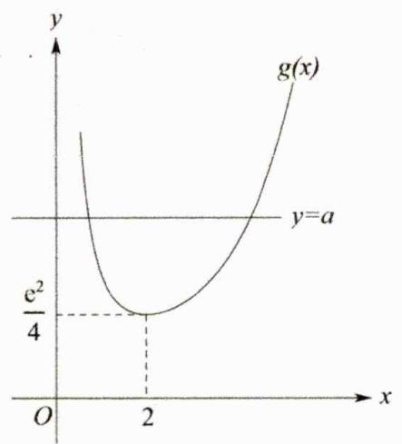

∴当 $a>\frac{e^{2}}{4}$ 时，y=a与 $g(x)$ 有两个不同交点，∴实数a的取值范围为 $\left(\frac{e^{2}}{4},+\infty\right)$ ;

（ii）由（i）知： $e^{x_{1}}=ax_{1}^{2},\quad e^{x_{2}}=ax_{2}^{2},\quad(x_{1}>0,x_{2}>0)\therefore x_{1}=\ln a+2\ln x_{1},\quad x_{2}=\ln a+2\ln x_{2},$ $\therefore x_{1}-x_{2}=2\ln x_{1}-2\ln x_{2}=2\ln\frac{x_{1}}{x_{2}}$ ，不妨设 $x_{2}>x_{1}>0$ ，则 $\frac{x_{1}-x_{2}}{\ln\frac{x_{1}}{x_{2}}}=2$ ，要证 $x_{1}+x_{2}>4$ ，只需证

$x_{1}+x_{2}>\frac{2(x_{1}-x_{2})}{\ln\frac{x_{1}}{x_{2}}}$ ， $\because x_{2}>x_{1}>0,\quad\therefore0<\frac{x_{1}}{x_{2}}<1,\quad\therefore\ln\frac{x_{1}}{x_{2}}<0$ ，则只需证 $\ln\frac{x_{1}}{x_{2}}<\frac{2(x_{1}-x_{2})}{x_{1}+x_{2}}=\frac{2(\frac{x_{1}}{x_{2}}-1)}{\frac{x_{1}}{x_{2}}+1}$ ，
令 $t=\frac{x_{1}}{x_{2}}\in(0,1)$ ，则只需证当 $t\in(0,1)$ 时， $\ln t<\frac{2(t-1)}{t+1}$ 恒成立，令 $h(t)=\ln t-\frac{2(t-1)}{t+1}(0<t<1)$ ∴ $h'(t)=\frac{1}{t}-\frac{2(t+1)-2(t-1)}{(t+1)^{2}}=\frac{(t+1)^{2}-4t}{t(t+1)^{2}}=\frac{(t-1)^{2}}{t(t+1)^{2}}>0$ ，∴ $h(t)$ 在 $(0,1)$ 上单调递增，∴ $h(t)<h(1)=0$ ∴当 $t\in(0,1)$ 时， $\ln t<\frac{2(t-1)}{t+1}$ 恒成立，∴原不等式 $x_{1}+x_{2}>4$ 得证.

### 二、【典型例题】

##### 1. (2022·全国·高考真题) 已知函数 $f(x) = \frac{e^x}{x} - \ln x + x - a$ .

（1） 若 $f(x) \geq 0$ ，求 a 的取值范围；  
（2） 证明：若 $f(x)$ 有两个零点 $x_{1}, x_{2}$ ，则 $x_{1}x_{2} < 1$ .

##### 2. (2024·北京通州·三模) 已知函数 $f(x) = ax - \frac{a}{x} - \ln x (a > 0)$

（1） 已知 $f(x)$ 在点 (1, $f(1)$ ) 处的切线方程为 $y = x - 1$ ，求实数 $a$ 的值；  
（2）已知 $f(x)$ 在定义域上是增函数，求实数 $a$ 的取值范围.  
（3） 已知 $g(x)=f(x)+\frac{a}{x}$ 有两个零点 $x_{1}, x_{2}$ ，求实数 a 的取值范围并证明 $x_{1}x_{2} > e^{2}$ .

### 三、【习题检测】

##### 1. (2024·湖北武汉·模拟预测) 已知 $f(x) = 2x - \sin x - \sqrt{a}\ln x$ .

（1） 当 a=1 时，讨论函数 $f(x)$ 的极值点个数；  
（2） 若存在 $x_{1}$ , $x_{2}(0 < x_{1} < x_{2})$ , 使 $f(x_{1}) = f(x_{2})$ , 求证: $x_{1}x_{2} < a$ .

##### 2. (2024·广东茂名·茂名市第一中学校考三模) 已知函数 $f(x) = ax + (a - 1)\ln x + \frac{1}{x}$ , $a \in \mathbb{R}$ .

（1） 讨论函数 $f(x)$ 的单调性；  
（2） 若关于 $x$ 的方程 $f(x) = x\mathrm{e}^{x} - \ln x + \frac{1}{x}$ 有两个不相等的实数根 $x_{1}, x_{2}$ ,

(i) 求实数 a 的取值范围;

(ii) 求证: $\frac{\mathrm{e}^{x_1}}{x_2} + \frac{\mathrm{e}^{x_2}}{x_1} > \frac{2a}{x_1x_2}$ .

##### 3.（2024·广东广州·模拟预测）已知函数 $f(x) = \ln x - ax^2$ .

（1） 讨论函数 $f(x)$ 的单调性：  
（2） 若 $x_{1}, x_{2}$ 是方程 $f(x) = 0$ 的两不等实根，求证： $x_{1}^{2} + x_{2}^{2} > 2\mathbf{e}$ ；

# 3.3 求参

# 3.3.1 恒成立求参之分类讨论

### 一、【题型总结】

▲适用题型：恒成立求参的题型.

▲方法原理：

##### 1. 分类讨论

（1） 由于参数、分段函数以及自变量 $x$ 的取值范围等的缘故, 造成问题需要分多种情况讨论.  
（2） 往往是基于单调性、极值点、零点等分类.

##### 2. 多重分类讨论

（1） 第一层大类分完之后, 大类里面还有小类需要分.  
（2） 把一个大类中所有小类全部讨论干净后, 再去讨论第二个大类. 优先考虑特殊情况, 做到不重不漏.

##### 3. 比如：设函数 $f(x)=\frac{1+a\ln x}{x}$ ，其中 $a \in R$ .

（1） 当 $a \geq 0$ 时, 求函数 $f(x)$ 的单调区间; （2） 若 $f(x) \leq x^2$ , 求实数 $a$ 的取值范围.

详解（1） $f(x)=\frac{1+a\ln x}{x}(x>0)$ ， $f'(x)=\frac{a-(1+a\ln x)}{x^{2}}=\frac{a-1-a\ln x}{x^{2}}$ .

当 $a = 0$ 时， $f'(x) = \frac{a - (1 + a\ln x)}{x^2} = -\frac{1}{x^2} < 0$ 恒成立，则 $f(x)$ 在 $(0, +\infty)$ 上为减函数，

当 $a > 0$ 时，令 $f'(x) > 0$ ，可得 $a - 1 - a\ln x > 0$ ，则 $\ln x <   \frac{a - 1}{a}$ ，解得 $0 <   x <   \mathbf{e}^{\frac{a - 1}{a}}$

令 $f'(x) < 0$ ，解得 $x > e^{\frac{a-1}{a}}$ ，综上，当 a = 0 时， $f(x)$ 的减区间为 $(0, +\infty)$ ;

当 $a > 0$ 时， $f(x)$ 的单调递增区间为 $\left(0, \mathbf{e}^{\frac{a-1}{a}}\right)$ ，单调递减区间为 $\left(\mathbf{e}^{\frac{a-1}{a}}, +\infty\right)$ .

（2） 由 $f(x) \leq x^2$ ，可得 $x^3 - a \ln x - 1 \geq 0$

设 $g(x)=x^{3}-a\ln x-1(x>0)$ ，则 $g'(x)=3x^{2}-\frac{a}{x}=\frac{3x^{3}-a}{x}$ .

①当 $a \leq 0$ 时， $g'(x) > 0$ ， $g(x)$ 单调递增，而 $g\left(\frac{1}{2}\right) = \frac{1}{8} - a \ln \frac{1}{2} - 1 = -\frac{7}{8} + a \ln 2 < 0$ ，所以不满足题意，  
②当 $a > 0$ 时，令 $g'(x) = \frac{3x^3 - a}{x} = 0$ ，解得 $x = \sqrt[3]{\frac{a}{3}}$

当 $x \in \left(0, \sqrt[3]{\frac{a}{3}}\right)$ 时， $g'(x) < 0$ ， $g(x)$ 为减函数，当 $x \in \left(\sqrt[3]{\frac{a}{3}}, +\infty\right)$ 时， $g'(x) > 0$ ， $g(x)$ 为增函数，

所以 $g(x) \geq g\left(\sqrt[3]{\frac{a}{3}}\right) = \left(\frac{1}{3} + \frac{1}{3}\ln 3\right)a - \frac{1}{3}a\ln a - 1$ 。令 $h(a) = \left(\frac{1}{3} + \frac{1}{3}\ln 3\right)a - \frac{1}{3}a\ln a - 1 (a > 0)$ ，

$h'(a)=\frac{1}{3}+\frac{1}{3}\ln3-\frac{1}{3}(\ln a+1)=\frac{1}{3}(\ln3-\ln a)$ ，当 $a\in(0,3)$ 时， $h'(a)>0$ ， $h(a)$ 为增函数，

当 $a \in (3, +\infty)$ 时， $h'(a) < 0$ ， $g(x)$ 为减函数，所以 $h(a) \leq h(3) = 0$ ，又 $g(x) \geq h(a) \geq 0$ 。

则 $h(a)=0$ ，解得 a=3，所以实数 a 的取值范围是 $\{3\}$ .

### 二、【典型例题】

##### 1. (2024年普通高等学校招生全国统一考试数学领航卷) 已知函数 $f(x) = x[(a-1)e^x - a] + e^x$ ，若对于任意的 $x \leq 0$ ，都有 $f(x) \geq 1$ ，则实数 $a$ 的取值范围是 \_\_\_\_.

##### 2. (2024 河南南阳地区摸底联考) 已知函数 $f(x) = a \ln x + \frac{1}{2} x^2 - (a + 1)x$

（1） 当 a = -1 时，求 $f(x)$ 的最小值；  
（2） 若关于 $x$ 的不等式 $f(x) \geq 0$ 恒成立，求 $a$ 的取值范围.

##### 3. (2024 陕西安康高新中学、安康中学高新分校“尖子生计划”考试) 已知函数 $f(x) = x^3 - 2ax + a^2$ , $a > 0$ .

（1） 讨论 $f(x)$ 的单调性；  
（2） 若当 $x \geq 0$ 时, $f(x) \leq 3\mathrm{e}^{x} + x^{3} - x^{2}$ , 求 $a$ 的取值范围.

### 三、【习题检测】

##### 1. (2024 安徽合肥一中二检)

已知关于 $x$ 的不等式 $2\mathrm{e}^{x} - \sin x + t\ln (x + 1) - 2 \geq 0$ 在 $[0, \pi]$ 上恒成立，则实数 $t$ 的取值范围是 \_\_\_\_.

##### 2. (2024 山东实验中学二诊)

设函数 $f(x)=(ax-m\mathrm{e}^{x})(ax-\ln x)$ （其中 e 为自然对数的底数），若存在实数 a 使得 $f(x)<0$ 恒成立，则实数 m 的取值范围是 \_\_\_\_.

##### 3.（浙江省长兴中学校联考期中）已知函数 $f(x) = a\ln x + x$ ， $a \in R$ .

（1） 讨论函数 $f(x)$ 的单调性；  
（2） 若存在 $x \in [\mathbf{e}, \mathbf{e}^2]$ ，使 $f(x) \leq \left( ax + \frac{1}{2} \right) \ln x$ 成立，求实数 $a$ 的取值范围.

注：e 为自然对数的底数.

##### 4. (2024 安徽合肥一六八中学名校名师测评卷) 已知函数 $f(x) = x\mathrm{e}^{x + 1}$ .

（1） 求 $f(x)$ 在原点处的切线方程;  
（2） 当 $0 \leqslant x \leqslant 2\pi$ 时，不等式 $f(x - 1) - ax + 1 \geq 2\sin x$ 恒成立，求实数 $a$ 的取值范围.

# 3.3.2 恒成立求参之分离参数

### 一、【题型总结】

▲适用题型：恒成立求参且常数容易分离的题型.

▲方法原理：

##### 1. 分离参数

对于一个含参问题，可以通过分离参数，将参数与变量彻底分离开来，从而把一个含参问题转化为一个非含参问题，进而通过导数研究分离后得到的函数的单调性，极值与最值，最终解决问题。

##### 2. 使用分离参数的要求

①参数与变量可以比较容易地分离开.  
②分离参数后得到的函数的形式不复杂，通过导数来研究单调性，极值以及最值比较容易.  
③分离参数后得到的函数的值域容易算，不会出现必须使用洛必达法则才能解决问题的情形。

##### 3. 比如：已知函数 $f(x)=\ln x-ax$ 。设 $g(x)=e^{x-1}+xf(x)$ ，若 $g(x)\geq0$ 恒成立，求 a 的取值范围。

解析 $g(x) = e^{x - 1} + x\ln x - ax^2$ ，令 $x = 1$ ，则 $g(1) = 1 - a\geq 0$ ，故 $a\leq 1$

以下证明： $a \leq 1$ 时符合题意，当 $a \leq 1$ 时， $g(x) = e^{x - 1} + x \ln x - ax^2 \geq e^{x - 1} + x \ln x - x^2$

以下证明： $e^{x - 1} + x\ln x - x^2\geq 0$ ，构造函数 $G(x) = \frac{e^{x - 1}}{x} +\ln x - x$ ，则

$G'(x)=\frac{e^{x-1}(x-1)}{x^2}+\frac{1}{x}-1=\frac{e^{x-1}(x-1)+x-x^2}{x^2}=\frac{(x-1)(e^{x-1}-x)}{x^2}$ ，令 $H(x)=e^{x-1}-x$ ，则 $H'(x)=e^{x-1}-1$ ，
由 $H'(x)>0$ 可得x>1，由 $H'(x)<0$ 可得0<x<1，

于是 $H(x)$ 在 $(0,1)$ 上单调递减，在 $(1, +\infty)$ 上单调递增，于是 $H(x) \geq H(1) = 0$ 。

于是当 0 < x < 1 时， $G'(x) < 0$ ，当 x > 1 时， $G'(x) > 0$ ，所以 $G(x)$ 在 $(0,1)$ 上单调递减，在 $(1,+\infty)$ 上单调递增，故 $G(x) \geq G(1) = 0$ ，符合题意。综上可知 $a \leq 1$ 。

### 二、【典型例题】

##### 1. (2020·全国·高考真题) 已知函数 $f(x) = \mathrm{e}^{x} + ax^{2} - x$ .

（1） 当 a=1 时，讨论 $f(x)$ 的单调性；  
（2） 当 $x \geqslant 0$ 时， $f(x) \geqslant \frac{1}{2}x^{3} + 1$ ，求 a 的取值范围.

##### 2. (2024 辽宁抚顺六校协作体期末) 已知函数 $f(x) = x^3 + ax + 16$ .

（1） 若 $a = -27$ ，求 $f(x)$ 的极值；（2） 若 $f(x) \geq 0$ 在 $(1,4)$ 上恒成立，求 $a$ 的取值范围。

##### 3. (2024高三核心模拟卷)已知关于 $x$ 的不等式 $2 \mathrm{e}^{x} - 2 x \ln x - m > 0$ 在 $\left(\frac{1}{2}, +\infty\right)$ 上恒成立, 则实数 $m$ 的取值范围是 \_\_\_\_.

### 三、【习题检测】

##### 1. (2024 重庆市巴蜀中学高考适应性月考) 若不等式 $\mathrm{e}^{\frac{x}{2}}(2m \ln x - x + 1) \leq x^{m}(m > 0)$ 对任意的 $x \in (0, +\infty)$ 恒成立, 则实数 $m$ 的最大值为 \_\_\_\_.

##### 2. (2024 四川内江高三一模) 已知函数 $f(x) = \frac{1}{2} ax^2 - \ln x$ .

（1） 当 $a = 1$ 时, 求 $f(x)$ 的极值; （2） 若不等式 $f(x) \geq x$ 恒成立, 求实数 $a$ 的取值范围.

##### 3.（河北省衡水中学上学期期末）已知函数 $f(x) = x\mathrm{e}^{kx - 1} - kx + \ln \frac{1}{x}$ .

（1） 求证: $f(x) \geq 0$ ; （2） 若 $\forall x \in (0, +\infty)$ , 都 $f(x) \geq \frac{1}{\mathbf{e}^2} + 1$ , 求 $k$ 满足的取值范围.

# 3.3.3 恒成立求参之端点效应

### 一、【题型总结】

▲适用题型：恒成立求参且区间端点代入后的不等式刚好取等的题型.

▲方法原理：

##### 1. 端点效应：若 $x \geq a$ ， $f(x) \geq 0$ ，求 $f(x)$ 中参数的取值范围。

特征为定义域的端点函数值为0即 $f(a)=0$ ，则 $f'(a)\geq0$ ，如果 $f(a)=0,f'(a)=0$ ，则必有 $f''(a)\geq0$ ，依此类推直到求出参数范围.

注意：定义域和不等式相反则导数小于等于0.

原理：粗略理解就是“猜”，函数端点值为0，我们就猜这个函数单调，则函数端点处的导数值就非正或者非负，从而求解答案，如果导数在端点处的导数值为0，相当于再来一次端点效应，依此类推.

##### 2. 端点效应失效：函数不单调，除了端点值满足函数值为0，还有其他极值点也满足，此时失效，改用其他方法，实际做题怎么规避呢？也很简单，草稿纸上算出答案，证不出成立就失效。

##### 3. 解题步骤：端点效应求出范围，证明成立，再证明矛盾

比如：设函数 $f(x) = e^{x} - 1 - x - ax^{2}$ 。若当 $x \geq 0$ 时 $f(x) \geq 0$ ，求 $a$ 的取值范围。

解析 $f(x)=e^{x}-1-x-ax^{2}\geq0$ 对于 $x\geq0$ 恒成立，又 $\left\{\begin{aligned}f(0)&=0\\ f'（0）&=0\end{aligned}\right.$ ， $f'(x)=e^{x}-1-2ax$ ， $f''(x)=e^{x}-2a$ ， $f''(x)$ 在 $[0,+\infty)$ 单调递增， $f''(x)\geq f''（0）=1-2a$

当 $1 - 2a \geq 0 \Rightarrow a \leq \frac{1}{2}$ 时， $f'(x)$ 单调递增，所以 $f'(x) \geq f'（0） = 0$

得 $f(x)$ 在 $[0, +\infty)$ 单调递增， $f(x) \geq f(0) = 0$ ，满足题意.

当 $1 - 2a < 0 \Rightarrow a > \frac{1}{2}$ 时，令 $f''(x_0) = 0$ ，则 $x \in (0, x_0)\ f'(x)$ 单调递减，

当 $x \in (0, x_0)$ $f'(x) < f'（0） = 0$ ， $f(x)$ 单调递减，则 $f(x_0) < f(0) = 0$ ，不满足题意。

综上 $a$ 的取值范围是 $\left(-\infty, \frac{1}{2}\right]$ .

### 二、【典型例题】

##### 1. (2024·全国·高考真题) 已知函数 $f(x) = \ln \frac{x}{2 - x} + ax + b(x - 1)^3$

若 $f(x) > -2$ 当且仅当 1 < x < 2，求 b 的取值范围.

##### 2. (2024·全国·高考真题) 已知函数 $f(x) = (1 - ax) \ln (1 + x) - x$ . 当 $x \geq 0$ 时, $f(x) \geq 0$ , 求 $a$ 的取值范围.

##### 3. (2023·全国·高考真题) 已知函数 $f(x) = \left(\frac{1}{x} + a\right) \ln(1 + x)$ . 若函数 $f(x)$ 在 $(0, +\infty)$ 单调递增，求 $a$ 的取值范围.

### 三、【习题检测】

##### 1. (2023·全国·高考真题) 已知函数 $f(x) = ax - \frac{\sin x}{\cos^3 x}, x \in \left(0, \frac{\pi}{2}\right)$ 若 $f(x) < \sin 2x$ 恒成立，求 $a$ 的取值范围.

##### 2.（2022·全国·高考真题）已知函数 $f(x) = x\mathrm{e}^{ax} - \mathrm{e}^x$ .

（1） 当 $a = 1$ 时, 讨论 $f(x)$ 的单调性; （2） 当 $x > 0$ 时, $f(x) < -1$ , 求 $a$ 的取值范围;

##### 3. (2023·全国·高考真题) 已知函数 $f(x) = ax - \frac{\sin x}{\cos^2 x}, x \in \left(0, \frac{\pi}{2}\right)$ . 若 $f(x) + \sin x < 0$ , 求 $a$ 的取值范围.

##### 4. (2019·全国·高考真题)已知函数 $f(x) = 2\sin x - x\cos x - x$ ， $f'(x)$ 为 $f(x)$ 的导数.

（1） 证明: $f'(x)$ 在区间 $(0, \pi)$ 存在唯一零点;  
（2） 若 $x \in [0, \pi]$ 时， $f(x) \geqslant ax$ ，求 a 的取值范围.

##### 5. (2008·全国·高考真题) 设函数 $f(x) = \frac{\sin x}{2 + \cos x}$ .

（1） 求 $f(x)$ 的单调区间；  
（Ⅱ）如果对任何 $x \geq 0$ ，都有 $f(x) \leq ax$ ，求 $a$ 的取值范围.

# 3.3.4 恒成立求参之必要性探路

### 一、【题型总结】

▲适用题型：恒成立求参的题型.

▲方法原理：

##### 1. 必要性探路

通过取一些特殊值（通常为0，1等特殊点）来缩小参数的取值范围，从而减少讨论参数取值范围时分析讨论的量，我们把这种处理问题的方法称为必要性探路。

##### 2. 基本步骤：

（1） 探究必要条件, 缩小参数范围: 选择的特殊值可以为端点值、极值点、不等式公共取等条件、常见特殊数 (如 $0.1, e, e^{2}$ 等).

（2） 证明充分性，求结果.

##### 3. 必要性探路的注意事项

必要性探路缩小的参数取值范围，不一定是参数的最终取值范围，还需进行如下操作：

第一步：如果可以使用主元法成功证明不等式，则缩小的参数取值范围就是参数的最终取值范围。

第二步：如果使用主元法无法证明不等式，则需要使用分类讨论或分离参数对缩小的取值范围作进一步分析。

##### 4. 比如：已知函数 $f(x) = \ln x - ax$ . 设 $g(x) = e^{x - 1} + xf(x)$ ，若 $g(x) \geq 0$ 恒成立，求 $a$ 的取值范围.

解析 $g(x)=e^{x-1}+x\ln x-ax^{2}$ ，令x=1，则 $g(1)=1-a\geq0$ ，故 $a\leq1$ ，

以下证明： $a \leq 1$ 时符合题意，当 $a \leq 1$ 时， $g(x) = e^{x - 1} + x \ln x - ax^2 \geq e^{x - 1} + x \ln x - x^2$

以下证明： $e^{x-1}+x\ln x-x^{2}\geq0$ ，构造函数 $G(x)=\frac{e^{x-1}}{x}+\ln x-x$ ，则

$G'(x)=\frac{e^{x-1}(x-1)}{x^2}+\frac{1}{x}-1=\frac{e^{x-1}(x-1)+x-x^2}{x^2}=\frac{(x-1)(e^{x-1}-x)}{x^2}$ ，令 $H(x)=e^{x-1}-x$ ，则 $H'(x)=e^{x-1}-1$ ，
由 $H'(x)>0$ 可得x>1，由 $H'(x)<0$ 可得0<x<1，

于是 $H(x)$ 在 $(0,1)$ 上单调递减，在 $(1,+\infty)$ 上单调递增，于是 $H(x)\geq H(1)=0$ .

于是当 0 < x < 1 时， $G'(x) < 0$ ，当 x > 1 时， $G'(x) > 0$ ，所以 $G(x)$ 在 $(0,1)$ 上单调递减，在 $(1,+\infty)$ 上单调递增，故 $G(x) \geq G(1) = 0$ ，符合题意。综上可知 $a \leq 1$ 。

### 二、【典型例题】

##### 1. (2020·全国·高考真题) 已知函数 $f(x) = \mathrm{e}^{x} + ax^{2} - x$ .

（1） 当 a=1 时，讨论 $f(x)$ 的单调性：

（2） 当 $x \geqslant 0$ 时， $f(x) \geqslant \frac{1}{2}x^{3} + 1$ ，求 a 的取值范围.

##### 2. (2024 河南部分名校阶段性测试) 已知函数 $f(x) = (x + m)e^{2x} - x^2$ .

（1） 若 $f(x)$ 在区间 $[0, +\infty)$ 上无零点，求实数 m 的取值范围；  
（2） 若对任意 $x \in [0, +\infty)$ ，不等式 $f(x) \geq (x + m) \ln (x + m)$ 恒成立，求实数 $m$ 的取值范围.

##### 3. 已知函数 $f(x)=me^{x}, g(x)=\ln x+1$ .

（1） 若函数 $f(x)$ 与 $g(x)$ 有公共点，求 m 的取值范围；  
（2） 若不等式 $f(x) > g(x) + 1$ 恒成立，求整数 m 的最小值.

### 三、【习题检测】

##### 1. (2024 重庆沙坪坝区南开中学校期中) 已知函数 $f(x) = x \ln x - ax + 2$ , $g(x) = (x - 4)e^{x - 2}$ , $a \in \mathbb{R}$ .

（1） 若曲线 $y = g(x)$ 在点 $(2, g(2))$ 处的切线与曲线 $y = f(x)$ 也相切，求实数 a 的值.  
（2） 若不等式 $f(x) + g(x) \geq 0$ 对任意的 $x \in (0, +\infty)$ 恒成立，求 $a$ 的取值范围。（ $e = 2.71828 \cdots$ 为自然对数的底数）

##### 2. (2019·浙江·高考真题) 已知实数 $a \neq 0$ , 设函数 $f(x) = a \ln x + \sqrt{x + 1}, x > 0$ .

（1） 当 $a = -\frac{3}{4}$ 时，求函数 $f(x)$ 的单调区间；  
（2） 对任意 $x \in \left[\frac{1}{\mathrm{e}^{2}}, +\infty\right)$ 均有 $f(x) \leq \frac{\sqrt{x}}{2a}$ ，求 a 的取值范围。注：e = 2.71828... 为自然对数的底数。

##### 3.（2024山西太原期中）已知函数 $f(x) = \ln (mx)$ ， $m > 0$ .

（1） 当 $m = 1$ 时，证明： $f(x) \leq x - 1$ ；  
（2） 当 $x \in (0, +\infty)$ ，若 $f(x) \leqslant (x - 1)e^{x - m}$ 恒成立，求实数 $m$ 的取值范围.

##### 4.（2024四川成都石室中学一模）已知函数 $f(x) = ax^{2} - x\cos x + \sin x - 1$ .

（1） 若 a=1 时，求曲线 $y=f(x)$ 在点 $(0,f(0))$ 处的切线方程；  
（2） 若 a=1 时，求函数 $f(x)$ 的零点个数；  
（3） 若对于任意 $x \in \left[0, \frac{\pi}{2}\right]$ , $f(x) \geq 1 - 2a$ 恒成立, 求 $a$ 的取值范围.

# 3.3.5 恒成立求参之对数单身狗，指数找朋友

### 一、【题型总结】

▲适用题型：恒成立求参且含指数型或对数型结构的题型.

▲方法原理：

##### 1. 指数找朋友: 对于复杂函数结构, 当把指数结构 $e^{x}$ 移项变成除法或乘法, 则求导后的结果分析正负更简单, 因为 $\left(e^{x} \cdot f\right)' = e^{x} \cdot \left(f + f'\right)$ , $\left(\frac{f}{e^{x}}\right)' = \frac{f' - f}{e^{x}}$ , 明显只需要分析除 $e^{x}$ 外的部分结构正负即可  
##### 2. 对数单身狗: 原理和指数找朋友一样, 遇到对数结构一般将其进行孤立, 之后求导计算更简单

### 二、【典型例题】

##### 1. (2020·全国·高考真题) 已知函数 $f(x) = e^{x} + ax^{2} - x$ .

（1） 当 a=1 时，讨论 $f(x)$ 的单调性；  
（2） 当 $x \geqslant 0$ 时， $f(x) \geqslant \frac{1}{2}x^{3} + 1$ ，求 a 的取值范围.

##### 2. 已知函数 $f(x) = \mathrm{e}^{x}\cos x$ ，当 $x > 0$ 时， $f(x) \geq \mathrm{e}^{x}(\cos x - 1) + x^{2} + (a - 1)x + 1$ 恒成立，求实数 $a$ 的取值范围.

### 三、【习题检测】

##### 1. (2010·全国·高考真题) 设函数 $f(x) = e^{x} - 1 - x - ax^{2}$ .

（1） 若 $a = 0$ ，求 $f(x)$ 的单调区间；（2） 若当 $x \geq 0$ 时 $f(x) \geq 0$ ，求 $a$ 的取值范围

##### 2. (2011·全国·高考真题) 已知函数 $f(x) = \frac{a\ln x}{x + 1} + \frac{b}{x}$ ，曲线 $y = f(x)$ 在点 $(1, f(1))$ 处的切线方程为 $x + 2y - 3 = 0$ . （1） 求 $a$ 、 $b$ 的值；（2） 如果当 $x > 0$ ，且 $x \neq 1$ 时， $f(x) > \frac{\ln x}{x - 1} + \frac{k}{x}$ ，求 $k$ 的取值范围.

##### 3. (2016·全国·高考真题) 已知函数 $f(x) = (x + 1)\ln x - a(x - 1)$ .

（1） 当 a=4 时，求曲线 $y=f(x)$ 在 $(1,f(1))$ 处的切线方程；

（11） 若当 $x \in (1, +\infty)$ 时， $f(x) > 0$ ，求 a 的取值范围.

# 3.3.6 恒成立求参之同构

### 一、【题型总结】

▲适用题型：恒成立求参且能够通过变形构造相同外层结构的题型.

▲方法原理：

##### 1. 同构法求参数范围：

通过对原函数进行适当的代换或者变换，可以得到一个与之相同（同构，结构相同，性质相同）的新函数，新函数更容易处理.

##### 2. 常见变形：结合指数运算和对数运算的法则，可以得到下述结论（其中 $x > 0$ ）

（1） $x\mathbf{e}^{x} = \mathbf{e}^{x + \ln x};x + \ln x = \ln (x\mathbf{e}^{x})$

（2） $\frac{e^x}{x} = e^{x - \ln x}: x - \ln x = \ln \frac{e^x}{x}$

（3） $x^{2}\mathbf{e}^{x} = \mathbf{e}^{x + 2\ln x};x + 2\ln x = \ln (x^{2}\mathbf{e}^{x})$

（4） $\frac{e^x}{x^2} = e^{x - 2\ln x}, \frac{e^x}{x^2} = e^{x - 2\ln x}$

（5） $a^x > \log_a x \Rightarrow e^{x\ln a} > \frac{\ln x}{\ln a} \Rightarrow x \ln a \cdot e^{x\ln a} > x \ln x = \ln x \cdot e^{\ln x} \Rightarrow x \ln a > \ln x \Rightarrow a > e^{\frac{1}{e}};$

（6） $e^{\lambda x} > \frac{\ln x}{\lambda} \Rightarrow \lambda e^{\lambda x} > \ln x \Rightarrow \lambda x \cdot e^{\lambda x} > x \ln x \Rightarrow \lambda x \cdot e^{\lambda x} > \ln x \cdot e^{\ln x} \Rightarrow \lambda x > \ln x \Rightarrow \lambda > \frac{1}{e}$ ;

（7） $e^{ax} + ax > \ln (x + 1) + x + 1 = e^{\ln (x + 1)} + \ln (x + 1) \Rightarrow ax > \ln (x + 1)$

（8） 乘法同构，即乘 x 同构，如 $\ln a \cdot e^{x \ln a} > \ln x \Leftrightarrow x \ln a \cdot e^{x \ln a} > \ln x \cdot e^{\ln x}$ ;

（9） 加法同构，即加 x 同构，如 $a^{x} > \log_{a} x \Leftrightarrow a^{x} + x > \log_{a} x + x = a^{\log_{a} x} + \log_{a} x$

##### 3. 结合常用的切线不等式 $\ln x \leq x - 1$ ， $\ln x \leq \frac{x}{e}$ ， $e^{x} \geq x + 1$ ， $e^{x} \geq e x$ 等，可以得到更多的结论，比如：

（1） $x\mathbf{e}^{x} = \mathbf{e}^{x + \ln x}\geq x + \ln x + 1;x + \ln x = \ln (x\mathbf{e}^{x})\leq x\mathbf{e}^{x} - 1$

（2） $x\mathbf{e}^{x} = \mathbf{e}^{x + \ln x}\geq \mathbf{e}(x + \ln x);\quad x + \ln x = \ln (xe^{x})\leq \frac{xe^{x}}{e} = xe^{x - 1}$

##### 4. 解题步骤：

（1） 寻找原函数及其特点

（2） 进行适当的变形方式.

（3） 对构造的新函数进行求导分析

（4） 根据新函数极值最值等得到参数范围

比如：(2024 广东广州广东实验中学冲刺)已知函数 $f(x) = \mathrm{e}^{x(\mathrm{e}^x - a)}$ ，当 $x \in (0, +\infty)$ 时， $f(x) \geq \mathrm{e}x$ ，则实数 $a$ 的取值范围为 \_\_\_\_.

详解根据题意可知，由 $f(x) \geq \mathbf{e}x$ 可得 $\mathbf{e}^{x(\mathbf{e}^x - a)} \geq \mathbf{e}x$ ，两边同时取对数可得 $x(\mathbf{e}^x - a) \geq 1 + \ln x$ ，即 $a \leq \frac{x\mathbf{e}^x - \ln x - 1}{x}$ 在 $x \in (0, +\infty)$ 上恒成立，令 $g(x) = \frac{x\mathbf{e}^x - \ln x - 1}{x}$ ，则只需 $a \leq g(x)_{\min}$ 即可；

又 $g(x) = \frac{x\mathbf{e}^x - \ln x - 1}{x} = \frac{\mathbf{e}^{\ln x}\cdot\mathbf{e}^x - \ln x - 1}{x} = \frac{\mathbf{e}^{x + \ln x} - \ln x - 1}{x}$ ，因为 $\mathbf{e}^x\geq x + 1$ ，当且仅当 $x = 0$ 时等号成立，利用 $\mathbf{e}^x\geq x + 1$ 可得 $\mathbf{e}^{x + \ln x}\geq x + \ln x + 1$ ，当且仅当 $x + \ln x = 0$ 时等号成立，所以

$g(x)=\frac{\mathrm{e}^{x+\ln x}-\ln x-1}{x}\geq\frac{x+\ln x+1-\ln x-1}{x}=1$ ，当 $x+\ln x=0$ 有解时等号成立；

令 $h(x) = x + \ln x (x > 0)$ ，则 $h'(x) = 1 + \frac{1}{x} > 0$ ，即 $h(x)$ 在 $(0, +\infty)$ 上单调递增，由

$h\left(\frac{1}{e}\right)=\frac{1}{e}-1<0, h(1)=1>0$ 可得 $\exists x_{0}\in(0,+\infty)$ 使得 $h(x_{0})=0$ ，所以可得 $g(x)_{\min}=1$ ，即 $a\leq1$ ，所以实数 a 的取值范围为 $(-∞,1]$ 。故答案为： $(-∞,1]$

### 二、【典型例题】

##### 1. (2024·陕西·模拟预测)

当 $x > 0$ 时， $x^{2} \cdot e^{4x} - 2\ln x \geq ax + 1$ 恒成立，则实数 $a$ 最大值为（）

$\quad$A. $\frac{4}{e}$

$\quad$B. 4

$\quad$C. $\frac{4}{\mathbf{e}^{2}}$

$\quad$D. 8

##### 2. (2024 河北保定部分重点高中期末) 已知函数 $f(x) = \mathrm{e}^{x} + a\ln \frac{1}{ax + a} - a (a > 0)$ ，若 $f(x) > 0$ 恒成立，则 $a$ 的取值范围是（）

$\quad$A. $(0,1)$

$\quad$B. $(1,+\infty)$

$\quad$C. $[1,+\infty)$

$\quad$D. $(0,1]$

##### 3. (2022·全国·高考真题) 已知函数 $f(x) = \frac{e^x}{x} - \ln x + x - a$ .

（1） 若 $f(x) \geq 0$ ，求 $a$ 的取值范围；

##### 4.（2024·全国·模拟预测）已知函数 $f(x) = \log_a x + \frac{m}{x} - \frac{1}{2}, m \in \mathbb{R}, a > 0$ 且 $a \neq 1$ .

（1） 当 a=2 时，讨论 $f(x)$ 的单调性；

（2） 当 $a = e$ 时, 若对任意的 $x_{1} > x_{2} > 0$ , 不等式 $\frac{x_{2} f(x_{1}) - x_{1} f(x_{2})}{x_{1} - x_{2}} < \frac{1}{2}$ 恒成立, 求实数 $m$ 的取值范围.

### 三、【习题检测】

##### 1. (2024·全国·模拟预测) 若不等式 $\frac{x^2}{\mathbf{e}^{x-1}} < a(1 + \ln x)$ 在 $x \in (1, +\infty)$ 上恒成立, 则实数 $a$ 的取值范围为 ( )

$\quad$A. $[1, +\infty)$

$\quad$B. $\left[\frac{3}{2},+\infty\right)$

$\quad$C. $[2,+\infty)$

$\quad$D. $[4, +\infty)$

##### 2. (2024 河北保定唐县一中期末) 已知 $a > 0$ , 若对任意的 $x \in \left[\frac{1}{e}, +\infty\right)$ , 不等式 $8e^{ax}\left(\ln 2 + \frac{ax}{2}\right) - x \ln x \geqslant 0$ 恒成立, 则 $a$ 的最小值为 \_\_\_\_.

##### 3. (2024 河南郑州一模)

$\forall x \in (0, +\infty)$ ，不等式 $e^x + 1 \geq 2\left(a^2 x + \frac{1}{x}\right) \ln(ax)$ 恒成立，则正实数 $a$ 的最大值是 \_\_\_\_.

##### 4.（2024·内蒙古·三模）已知函数 $f(x) = x^{2} - ax + 2\ln x$ .

（1） 讨论 $f(x)$ 的单调性；（2） 若 a > 0, $f(x) \leq e^{ax}$ 恒成立，求 a 的取值范围.

##### 5. (2024·安徽·三模) 设 $a \in R$ ，函数 $f(x) = a \ln (-x) + (a + 1)x^2 + 1$ .

（1） 讨论函数 $f(x)$ 在定义域上的单调性;

(Ⅱ)若函数 $f(x)$ 的图象在点 $(-1, f(-1))$ 处的切线与直线 $8x + y - 2 = 0$ 平行，且对任意 $x_{1}, x_{2} \in (-\infty, 0)$ ， $x_{1} \neq x_{2}$ ，不等式 $\left|\frac{f(x_{1}) - f(x_{2})}{x_{1} - x_{2}}\right| > m$ 恒成立，求实数 m 的取值范围.

# 3.3.7 恒成立求参之极点效应

### 一、【题型总结】

▲适用题型：常见于恒成立求参数值的题型.

▲方法原理：什么是极点效应？

如果函数 $f(x)$ 在某一点 $x_0$ 处的函数值 $f(x_0)$ 恰好为零，则当 $x > a$ 时（其中 $a < x_0$ ）， $f(x) > 0$ 成立的一个必要条件为 $x_0$ 处的导数值 $f'(x_0) = 0$ ，如图所示：

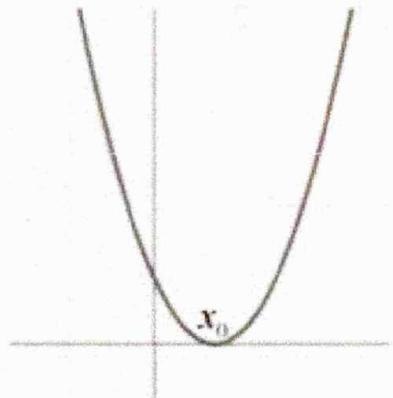

因为如果 $f'(x_0) > 0$ 或 $f'(x_0) < 0$ ，那么函数会在 $x_0$ 右侧的一个小区间内先递减，会出现如下两种情况：而这两种情况都不能保证函数值非负。

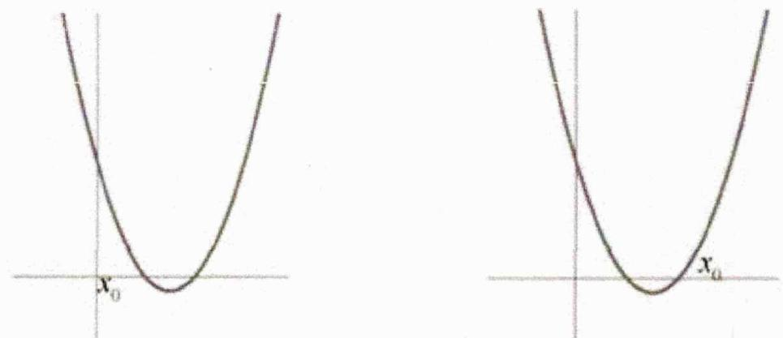

这个方法把某个区间上函数的恒成立问题转化为区间中某一点处的导数值为零，这就是极点效应.

### 二、【典型例题】

##### 1. (2024·天津·高考真题) 设函数 $f(x) = x \ln x$ .

若 $f(x) \geq a(x - \sqrt{x})$ 在 $x \in (0, +\infty)$ 时恒成立，求 $a$ 的值；

##### 2. 若 $f(x) = a{\mathrm{e}}^{x - 1} - x - \left( {a - 1}\right)$ ,且 $f\left( x\right)  \geq  0$ 在 $\mathbb{R}$ 上恒成立,求 $a$ 的值.

##### 3.（2024 河北保定部分重点高中期末）已知函数 $f(x)=x\ln x+a\left(x^{3}-x\right)$ .

（1） 讨论 $\frac{f(x)}{x}$ 的单调性;

（2） 已知 $g(x) = 2x - \mathrm{e}^{x - 1} - 1$ ，若 $f(x) \geq g(x)$ 恒成立，求 $a$ 的值.

### 三、【习题检测】

##### 1. (2024 四川甘孜藏族自治州一模) 已知函数 $f(x) = axe^x$ ，其中 $a \neq 0$ ，

（1） 求函数 $f(x)$ 的极值；  
（2） 当 $x \in \left(-\frac{\pi}{4}, +\infty\right)$ 时， $f(x) \geq \sin x + \cos x - 1$ 恒成立，求实数 $a$ 的取值范围.

##### 2. 已知函数 $f(x) = \ln x + \frac{a + x}{x} (a \in \mathbb{R})$ . 若 $f(x) \leq \frac{2x}{\mathrm{e}} + \frac{a}{\mathrm{e}}$ 恒成立，求 $a$ 的值.

##### 3. 是否存在正整数 $a$ ，使得 $\mathbf{e}^x - ax \geq x^2 \ln x$ 对一切 $x > 0$ 恒成立，试求出 $a$ 的最大值.

# 3.3.8 能成立和双变量求参

### 一、【题型总结】

▲适用题型：

已知不等式任意存在综合求参数问题；

▲方法原理：

##### 1. 能成立模型：

（1） 若 $a > f(x)$ 在 $[m, n]$ 上能成立 $\Leftrightarrow a > f(x)$ 在 $[m, n]$ 上的最小值.  
（2） 若 $a < f(x)$ 在 $[m, n]$ 上能成立 $\Leftrightarrow a < f(x)$ 在 $[m, n]$ 上的最大值.

##### 2. 双变量综合模型：一般地，已知函数 $y = f(x), x \in [a, b]$ ， $y = g(x), x \in [c, d]$

（1） 若 $\forall x_{1}\in[a,b]$ ， $\forall x_{2}\in[c,d]$ ，总有 $f(x_{1})<g(x_{2})$ 成立，故 $f(x)_{\max}<g(x)_{\min}$ ；  
（2） 若 $\forall x_{1} \in [a, b]$ ， $\exists x_{2} \in [c, d]$ ，有 $f(x_{1}) < g(x_{2})$ 成立，故 $f(x)_{\max} < g(x)_{\max}$ ;  
（3） 若 $\exists x_{1} \in [a, b]$ ， $\exists x_{2} \in [c, d]$ ，有 $f(x_{1}) < g(x_{2})$ 成立，故 $f(x)_{\min} < g(x)_{\max}$ ;  
（4） 若 $\exists x_{1} \in [a, b]$ ， $\forall x_{2} \in [c, d]$ ，有 $f(x_{1}) < g(x_{2})$ 成立，故 $f(x)_{\min} < g(x)_{\min}$ ;  
（5） 若 $\forall x_{1} \in [a, b]$ ， $\exists x_{2} \in [c, d]$ ，有 $f(x_{1}) = g(x_{2})$ 成立，故 $f(x)$ 值域 $\subseteq g(x)$ 值域；  
（6） 若 $\exists x_{1} \in [a, b]$ ， $\exists x_{2} \in [c, d]$ ，有 $f(x_{1}) = g(x_{2})$ 成立，故 $f(x)$ 值域 $\cap g(x)$ 值域 $\neq \varnothing$ ；

### 二、【典型例题】

##### 1. (2024·河北保定·二模) 已知函数 $f(x) = (x - 2\mathrm{e}^2) \ln x - ax - 2\mathrm{e}^2 (a \in \mathbb{R})$ .

（1） 若 $a = 1$ ，讨论 $f(x)$ 的单调性；  
（2） 已知存在 $x_0 \in (1, \mathbf{e}^2)$ , 使得 $f(x) \geq f(x_0)$ 在 $(0, +\infty)$ 上恒成立, 若方程 $f(x_0) = -\mathrm{e}^{k x_0} - 2 \mathrm{e}^2 k x_0$ 有解, 求实数 $k$ 的取值范围.

##### 2.（2021·天津·高考真题）已知 $a > 0$ ，函数 $f(x) = ax - xe^{x}$

（1） 求曲线 $y = f(x)$ 在点 $(0, f(0))$ 处的切线方程：  
（11） 证明 $f(x)$ 存在唯一的极值点  
(III) 若存在 a，使得 $f(x) \leq a + b$ 对任意 $x \in R$ 成立，求实数 b 的取值范围.

##### 3. (2006·湖北·高考真题) 设 $x = 3$ 是函数 $f(x) = (x^2 + ax + b)e^{3 - x} (x \in \mathbb{R})$ 的一个极值点.

（1） 求 a 与 b 的关系式（用 a 表示 b），并求 $f(x)$ 的单调区间；  
（2） 设 $a > 0, g(x) = \left(a^2 + \frac{25}{4}\right)\mathbf{e}^x$ 。若存在 $\xi_1, \xi_2 \in [0,4]$ 使得 $\left|f'(\xi_1) - g(\xi_2)\right| < 1$ 成立，求 $a$ 的取值范围。

### 三、【习题检测】

##### 1. (2024·全国·模拟预测) 已知函数 $f(x) = x^{2} - 2a\ln x - 2(a \in \mathbb{R})$ .

（1） 讨论 $f(x)$ 的单调性；  
（2） 若不等式 $f(x) \leq 2(\ln x)^2 + x^2 - 2x$ 在区间 $(1, +\infty)$ 上有解，求实数 $a$ 的取值范围.

##### 2. (2024·江苏·一模) 已知函数 $f(x) = \frac{4e^{x - 2}}{x} - 2x (x > 0)$ ，函数 $g(x) = -x^2 + 3ax - a^2 - 3a (a \in \mathbb{R})$ .

（1） 若过点 $O(0,0)$ 的直线 $l$ 与曲线 $y=f(x)$ 相切于点 $P$ , 与曲线 $y=g(x)$ 相切于点 $Q$ .

①求a的值；  
②当 P, Q 两点不重合时，求线段 PQ 的长；  
（2） 若 $\exists x_0 > 1$ ，使得不等式 $f(x_0) \leq g(x_0)$ 成立，求 $a$ 的最小值.

##### 3. (2024高三上·河南·阶段练习) 已知函数 $f(x) = \ln x + 2ax (a \in \mathbb{R})$ .

（1） 当 a = -1 时，求函数 $f(x)$ 的单调区间；  
（2） 若 $g(x) = f(x) - 2x^2$ ，不等式 $g(x) \geq -1$ 在 $[1, +\infty)$ 上存在实数解，求实数 $a$ 的取值范围.

##### 4.（2024高三上·江苏常州·期中）已知函数 $f(x) = \frac{a}{2} x^2 + (2a - 1)x - 2\ln x, a \in \mathbb{R}$ .

（1） 讨论 $f(x)$ 的单调性；  
（2） 对于 $\forall x \in [1, e], \exists b \in [2, +\infty)$ ，使得 $f(x) \geq b$ ，求实数 $a$ 的取值范围.

##### 5.（青海西宁·二模）设函数 $f(x) = x - \frac{1}{x} - a\ln x$ .

（1） 若函数 $f(x)$ 在其定义域上为增函数，求实数 a 的取值范围；  
（2） 当 $a \leq 2$ 时, 设函数 $g(x) = x - \ln x - \frac{1}{e}$ , 若在 $[1, e]$ 上存在 $x_1$ , $x_2$ 使 $f(x_1) > g(x_2)$ 成立, 求实数 $a$ 的取值范围.

# 3.3.9 已知极值点求参

### 一、【题型总结】

▲适用题型：已知极值点求参的题型.

▲方法原理：

##### 1. 此类题目难度较大，核心还是分类讨论参数求解，纯基本功。

##### 2. 比如：(2024高三·全国·专题练习)已知函数 $f(x) = \mathrm{e}^{x} - ax^{2} - x$ ， $f'(x)$ 为 $f(x)$ 的导数.

（1） 讨论 $f'(x)$ 的单调性；

（2） 若 $x = 0$ 是 $f(x)$ 的极大值点, 求 $a$ 的取值范围.

详解（1） 由题知 $f'(x) = \mathrm{e}^{x} - 2ax - 1$ ，

令 $g(x) = f'(x) = \mathbf{e}^x - 2ax - 1$ ，则 $g'(x) = \mathbf{e}^x - 2a$ ，

当 $a \leq 0$ 时， $g'(x) > 0, f'(x)$ 在区间 $(- \infty, +\infty)$ 单调递增，

当 $a > 0$ 时，令 $g'(x) = 0$ ，解得 $x = \ln 2a$

当 $x \in (-\infty, \ln 2a)$ 时， $g'(x) < 0$ ，当 $x \in (\ln 2a, +\infty)$ 时， $g'(x) > 0$

$\therefore f'(x)$ 在区间 $(-∞, \ln2a)$ 上单调递减，在区间 $(\ln2a, +∞)$ 上单调递增，

综上所述，当 $a \leq 0$ 时， $f'(x)$ 在区间 $(- \infty, +\infty)$ 上单调递增；

当 a > 0 时， $f'(x)$ 在区间 $(-∞, \ln 2a)$ 上单调递减，在区间 $(\ln 2a, +∞)$ 上单调递增.

（2） 当 $a \leq 0$ 时， $f'（0） = 0$ ，

由（1）知，当 $x \in (-\infty, 0)$ 时， $f'(x) < 0, f(x)$ 在 $(- \infty, 0)$ 上单调递减；

当 $x \in (0, +\infty)$ 时， $f'(x) > 0, f(x)$ 在 $(0, +\infty)$ 上单调递增；

∴ x=0 是函数 $f(x)$ 的极小值点，不符合题意；

当 $0 < a < \frac{1}{2}$ 时， $\ln 2a < 0$ ，且 $f'（0） = 0$ ，

由（1）知，当 $x \in (\ln 2a, 0)$ 时， $f'(x) < 0, f(x)$ 在 $(\ln 2a, 0)$ 上单调递减；

当 $x \in (0, +\infty)$ 时， $f'(x) > 0, f(x)$ 在 $(0, +\infty)$ 上单调递增；

∴ x=0 是函数 $f(x)$ 的极小值点，不符合题意；

当 $a = \frac{1}{2}$ 时， $\ln 2a = 0$ ，则当 $x \in (-\infty, +\infty)$ 时， $f'(x) \geq 0, f(x)$ 在 $(- \infty, +\infty)$ 上单调递增，

∴ $f(x)$ 无极值点，不合题意；

当 $a > \frac{1}{2}$ 时， $\ln 2a > 0$ ，且 $f'（0） = 0$ ；

当 $x \in (-\infty, 0)$ 时， $f'(x) > 0, f(x)$ 在 $(- \infty, 0)$ 上单调递增；

当 $x \in (0, \ln 2a)$ 时， $f'(x) < 0, f(x)$ 在 $(0, \ln 2a)$ 上单调递减；

∴ x=0 是函数 $f(x)$ 的极大值点，符合题意；

综上所述，a 的取值范围是 $a > \frac{1}{2}$ .

### 二、【典型例题】

##### 1. (2023·全国·高考真题) （1） 证明: 当 $0 < x < 1$ 时, $x - x^{2} < \sin x < x$ ;

（2） 已知函数 $f(x)=\cos ax-\ln\left(1-x^{2}\right)$ ，若 x=0 是 $f(x)$ 的极大值点，求 a 的取值范围.

##### 2. (2018·全国·高考真题) 已知函数 $f(x) = (2 + x + ax^2) \ln (1 + x) - 2x$ .

（1）若 $a = 0$ ，证明：当 $-1 < x < 0$ 时， $f(x) < 0$ ；当 $x > 0$ 时， $f(x) > 0$ ；

（2） 若 x=0 是 $f(x)$ 的极大值点，求 a.

### 三、【习题检测】

##### 1.（2024高三上·北京·阶段练习）已知函数 $f(x) = \frac{ax^2 + x - 1}{\mathrm{e}^x}$ .

（1） 求曲线 $y = f(x)$ 在点 $(0, -1)$ 处的切线方程；  
（2） 若函数 $f(x)$ 的极大值点为 2，求 a 的取值范围；  
（3） 证明：当 $a \geq 1$ 时， $f(x) + e \geq 0$ .

##### 2. (2024高三上·重庆·阶段练习) 已知函数 $f(x) = \cos ax + \frac{1}{2} x^2 - 1$ .

（1） 当 $a = 1$ 时，求 $f(x)$ 的单调区间；  
（2） 若 $x = 0$ 是 $f(x)$ 的极大值点，求 $a$ 的取值范围.

##### 3.（黑龙江大庆·二模）已知函数 $f(x) = \mathbf{e}^x -\frac{3 + 2x + ax^2}{3 - x}$

（1） 若 $a = 0$ ，证明：当 $x \in (-1, 0)$ 时， $f(x) > 0$ 恒成立；  
（2） 若 $x = 0$ 是函数 $y = f(x)$ 的极大值点，求实数 $\pmb{a}$ 的取值范围.

# 3.4 不等式证明

# 3.4.1 不等式证明之常规构造函数

### 一、【题型总结】

▲适用题型：证明不等式的题型.

▲方法原理：

##### 1. 证明不等式 $f(x) > g(x)$ （或 $f(x) < g(x)$ ）转化为证明 $f(x) - g(x) > 0$ （或 $f(x) - g(x) < 0$ ），进而构造辅助函数 $h(x) = f(x) - g(x)$ ;  
##### 2. 比如：(2023·天津·高考真题) 已知函数 $f(x)=\left(\frac{1}{x}+\frac{1}{2}\right)\ln(x+1)$ .

求证：当 $x > 0$ 时， $f(x) > 1$ ；

答案 $g(x)=\ln(x+1)-\frac{2x}{x+2}$ 且x>0，则 $g'(x)=\frac{1}{x+1}-\frac{4}{(x+2)^{2}}=\frac{x^{2}}{(x+1)(x+2)^{2}}>0$ ，

所以 $g(x)$ 在 $(0,+\infty)$ 上递增，则 $g(x)>g(0)=0$ ，即 $\ln(x+1)>\frac{2x}{x+2}$ .

所以 x > 0 时 $f(x) > 1$ .

### 二、【典型例题】

##### 1.（2023·全国·高考真题）证明：当 $0 < x < 1$ 时， $x - x^2 < \sin x < x$ ；

##### 2.（2023·全国·高考真题）已知函数 $f(x) = a(e^x + a) - x$ .

（1） 讨论 $f(x)$ 的单调性；（2） 证明：当 a > 0 时， $f(x) > 2 \ln a + \frac{3}{2}$ .

##### 3. (2013·北京·高考真题) 设 / 为曲线 C: $y = \frac{\ln x}{x}$ 在点 $(1, 0)$ 处的切线.

（1） 求 1 的方程;  
（11） 证明：除切点 $(1,0)$ 之外，曲线 $C$ 在直线 $I$ 的下方

### 三、【习题检测】

##### 1. (2024·湖北荆州·三模)

已知函数 $f(x) = \sqrt{x}\ln x$

（1） 求曲线 $y = f(x)$ 在点 $(1, f(1))$ 处的切线方程；  
（2） 求证：函数 $y = f(x)$ 的图象位于直线 y = x 的下方；

##### 2. 设 $f(x) = (1 + x)e^{-2x}$ ，当 $x \in [0,1]$ 时，求证： $1 - x \leq f(x) \leq \frac{1}{1 + x}$ .

##### 3. (2021·全国·高考真题) 设函数 $f(x) = \ln (a - x)$ ，已知 $x = 0$ 是函数 $y = xf(x)$ 的极值点.

（1） 求 a;

（2） 设函数 $g(x)=\frac{x+f(x)}{xf(x)}$ 。证明： $g(x)<1$

# 3.4.2 不等式证明之参数放缩

### 一、【题型总结】

▲适用题型：证明不等式且含参数及其范围的题型.

▲方法原理：

##### 1. 利用参数范围放缩法证明不等式，对于给定参数范围证明不等式问题，可观察不等式特征，结合参数范围先对函数进行合理放缩，进而消掉参数，再进行求解。  
##### 2. 比如：(2024·全国·高考真题) 已知函数 $f(x) = a(x - 1) - \ln x + 1$ ，当 $a \leq 2$ 时，证明：当 $x > 1$ 时， $f(x) < e^{x - 1}$ 恒成立。

答案 $a \leq 2$ ，且 $x > 1$ 时， $\mathbf{e}^{x - 1} - f(x) = \mathbf{e}^{x - 1} - a(x - 1) + \ln x - 1 \geq \mathbf{e}^{x - 1} - 2x + 1 + \ln x$

令 $g(x) = \mathfrak{e}^{x - 1} - 2x + 1 + \ln x(x > 1)$ ，下证 $g(x) > 0$ 即可.

$g'(x) = \mathbf{e}^{x - 1} - 2 + \frac{1}{x}$ ，再令 $h(x) = g'(x)$ ，则 $h^' (x) = \mathbf{e}^{x - 1} - \frac{1}{x^2},$

显然 $h'(x)$ 在 $(1, + \infty)$ 上递增，则 $h'(x) > h'（1） = \mathbf{e}^{0} - 1 = 0$

即 $g'(x) = h(x)$ 在 $(1, + \infty)$ 上递增，

故 $g'(x) > g'（1） = \mathsf{e}^{0} - 2 + 1 = 0$ ，即 $g(x)$ 在 $(1, + \infty)$ 上单调递增，

故 $g(x) > g(1) = \mathbf{e}^0 - 2 + 1 + \ln 1 = 0$ ，问题得证

### 二、【典型例题】

##### 1. (2024·江苏徐州·模拟预测)

已知函数 $f(x) = 2x^{2} + x - \ln (x + m)$ ， $m \in \mathbb{R}$ .

（1） 当 m=0 时，求曲线 $y=f(x)$ 在点 $(1,f(1))$ 处的切线方程；  
（2） 当 $m \leq 1$ 时，证明： $f(x) \geq 0$ .

##### 2. 已知函数 $f(x) = (ax^2 - 2x + 3)e^x - x - 3 (a \in \mathbb{R})$ ，当 $a \geq 1$ 时，证明： $f(x) + 1 \geq x$ .

##### 3.（2018·全国·高考真题）已知函数 $f(x) = \frac{ax^2 + x - 1}{\mathrm{e}^x}$ .

（1） 求曲线 $y=f(x)$ 在点 $(0,-1)$ 处的切线方程；  
（2） 证明：当 $a \geq 1$ 时， $f(x) + e \geq 0$ .

### 三、【习题检测】

##### 1.（2018·全国·高考真题）已知函数 $f(x) = ae^{x} - \ln x - 1$ .

（1） 设 x=2 是 $f(x)$ 的极值点. 求 a，并求 $f(x)$ 的单调区间；  
（2） 证明：当 $a \geq \frac{1}{e}$ 时， $f(x) \geq 0$ .

##### 2. 已知函数 $f(x) = m\mathrm{e}^{x} + x^{2} - 2(m \in \mathbb{R})$ , $g(x) = x \ln x$ .

（1） 若直线 y = x - 1 是函数 $f(x)$ 的图象的切线，求实数 m 的值；  
（2） 当 $m < -1$ 时, 证明: 对于任意的 $x \in (0, +\infty)$ , 不等式 $f(x) < g(x) + x - 2$ 恒成立.

##### 3. (2024·陕西安康·模拟预测) 已知函数 $f(x) = \ln x + \frac{m}{x} + 2x$ .

（1） 讨论函数 $f(x)$ 的单调性；（2） 若 $m \geq 1$ ，求证： $\left[2f(x) - 4x - 1\right] \cdot e^x > 2$ 。

##### 4. 已知函数 $f(x) = \mathbf{e}^x + ax^2 - 1$ .

（1） 讨论函数 $f(x)$ 的导函数的单调性；  
（2） 若 $a \geq \frac{7 - e^2}{4}$ , 求证: 对 $\forall x \geq 0$ , $f(x) \geqslant \frac{1}{2} x^3 + x$ 恒成立.

# 3.4.3 不等式证明之隐零点

### 一、【题型总结】

▲适用题型：证明不等式且求导后出现零点无法精确求解的题型.

▲方法原理：

##### 1. 隐零点: 若 $x_{0}$ 为函数 $y = f(x)$ 的零点, 但 $x_{0}$ 无法精确求解, 则称 $x_{0}$ 为隐藏的零点, 即 “隐零点”, 亦即能确定其存在, 但又无法用显性的代数进行表达.

##### 2. 处理方式：

（1） 整体代换: 把超越式子 (多为指数和对数式子) 转化为普通的 (如二次函数一次哈数等) 可解式子, 如比值代换等等.

（2） 反代消参: 反解参数代入, 构造单一变量的函数. 如果要求解 (或者要证明) 的结论与参数无关, 则可以通过反解参数, 用变量 (零点) 表示参数, 然后把函数变成关于零点的单一函数, 再对单一变量求导就可以解决相应的问题.

（3） 留参降次 (留参、消去指对等超越项): 如果要求解的与参数有关, 则可以通过消去超越项, 建立含参数的方程或者不等式. 恒等变形或者化简方向时保留参数, 通过 “降次” 变换, 一直降到不可再降为止, 再结合条件求证.

##### 3. 比如：(2018·全国·高考真题) 已知函数 $f(x)=ae^{x}-lnx-1$ .

（1） 设 x=2 是 $f(x)$ 的极值点. 求 a，并求 $f(x)$ 的单调区间；

（2） 证明：当 $a \geq \frac{1}{e}$ 时， $f(x) \geq 0$ .

详解（1） $f(x)$ 的定义域为 $(0, +\infty)$ , $f'(x) = a\mathrm{e}^2 - \frac{1}{x}$ , 则 $f'（2） = a\mathrm{e}^2 - \frac{1}{2} = 0$ , 解得: $a = \frac{1}{2e^2}$ , 故 $f'(x) = \frac{\mathrm{e}^x}{2\mathrm{e}^2} - \frac{1}{x}$ . 易知 $f'(x)$ 在区间 $(0, +\infty)$ 内单调递增, 且 $f'（2） = 0$ , 由 $\left\{ \begin{array}{l} f'(x) > 0 \\ x > 0 \end{array} \right.$ 解得: $x > 2$ ; 由 $\left\{ \begin{array}{l} f'(x) < 0 \\ x > 0 \end{array} \right.$ 解得: $0 < x < 2$ , 所以 $f(x)$ 的增区间为 $(2, +\infty)$ , 减区间为 $(0, 2)$ .

（2） 因为 $a \geq \frac{1}{\mathrm{e}}$ ，所以 $f'(x) = ae^x - \frac{1}{x}$ 在区间 $(0, +\infty)$ 内单调递增。设 $f'(x_0) = 0$ ，当 $x \to 0$ 时， $f'(x) \to -\infty$ ，当 $x = 1$ 时， $f'（1） = ae - 1 \geq 0$ ，所以 $x_0 \in (0, 1]$ ， $f(x)$ 在区间 $(0, x_0)$ 内单调递减，在区间 $(x_0, +\infty)$ 内单调递增，且 $f'(x_0) = ae^x - \frac{1}{x_0} = 0$ ，所以 $ae^{x_0} = \frac{1}{x_0}, f(x) \geq f(x_0) = ae^x - \ln x_0 - 1 = \frac{1}{x_0} - \ln x_0 - 1$ 。设 $g(x) = \frac{1}{x} - \ln x - 1$ ，则 $g'(x) = -\frac{1}{x^2} - \frac{1}{x} < 0$ 。所以 $g(x)$ 在区间 $(0, 1]$ 内单调递减，故 $g(x) \geq g(1) = 0$ ，即 $f'(x) \geq 0$ 成立。

### 二、【典型例题】

##### 1.（2015·全国·高考真题）设函数 $f(x) = e^{2x} - a\ln x$ .

（1） 讨论 $f(x)$ 的导函数 $f'(x)$ 的零点的个数；

（11） 证明：当 a > 0 时 $f(x) \geq 2a + a \ln \frac{2}{a}$ .

##### 2. (2017·全国·高考真题) 已知函数 $f(x) = ax^2 - ax - x \ln x$ , 且 $f(x) \geq 0$ .

（1） 求 $a$ ; （2） 证明: $f(x)$ 存在唯一的极大值点 $x_0$ , 且 $e^{-2} < f(x_0) < 2^{-2}$ .

##### 3. (2024·山东济南·二模) 已知函数 $f(x) = ax^2 - \ln x - 1, g(x) = x e^x - ax^2 (a \in \mathbb{R})$ .

（1） 讨论 $f(x)$ 的单调性；（2） 证明： $f(x) + g(x) \geq x$ .

### 三、【习题检测】

##### 1. (2024·全国·模拟预测) 已知函数 $f(x) = \mathrm{e}^{2x} - a\ln (x + 1)$ .

（1） 若 $a = 2$ ，讨论 $f'(x)$ 的单调性。（2）若 $x > 0, a > 1$ ，求证： $f(x) > \frac{1}{2} - a \ln a$ 。

##### 2.（2024·高三·辽宁丹东·开学考试）已知函数 $f(x) = x\mathrm{e}^{x - 1} - \ln x - x$ .

（1） 求函数 $f(x)$ 的最小值；（2） 求证： $e[f(x) + x] > e^x - (e - 1)\ln x - \frac{1}{2}$ .

##### 3.（2024·河北张家口·三模）已知函数 $f(x) = \ln x + 5x - 4$ .

（1） 求曲线 $y = f(x)$ 在点 $(1, f(1))$ 处的切线方程；（2） 证明： $f(x) > -\frac{3}{5x} - 2$ .

##### 4.（2024·山东威海·二模）已知函数 $f(x) = \ln x - ax + 1$ .

（1） 求 $f(x)$ 的极值；（2） 证明： $\ln x + x + 1 \leq x e^{x}$ .

# 3.4.4 不等式证明之数列

### 一、【题型总结】

▲适用题型：证明不等式且不等式可分解成数列和或积的题型.

▲方法原理：

##### 1. 解法核心：放缩不等式+累加法或累乘法，其中放缩不等式不需要记忆，一般前面的小问会有提示
##### 2. 比如：(2022·全国·高考真题) 已知函数 $f(x)=xe^{ax}-e^{x}$ .

（1） 当 a=1 时，讨论 $f(x)$ 的单调性；（2） 当 x>0 时， $f(x)<-1$ ，求 a 的取值范围；  
（3） 设 $n \in N^{*}$ ，证明： $\frac{1}{\sqrt{1^{2}+1}} + \frac{1}{\sqrt{2^{2}+2}} + \cdots + \frac{1}{\sqrt{n^{2}+n}} > \ln(n+1)$ .

详解（1） 当 $a = 1$ 时, $f(x) = (x - 1)e^x$ , 则 $f'(x) = xe^x$ , 当 $x < 0$ 时, $f'(x) < 0$ , 当 $x > 0$ 时, $f'(x) > 0$ , 故 $f(x)$ 的减区间为 $(- \infty, 0)$ , 增区间为 $(0, +\infty)$ .

（2） 设 $h(x) = x\mathrm{e}^{ax} - \mathrm{e}^x + 1$ ，则 $h(0) = 0$ ，又 $h'(x) = (1 + ax)\mathrm{e}^{ax} - \mathrm{e}^x$ ，设 $g(x) = (1 + ax)\mathrm{e}^{ax} - \mathrm{e}^x$ ，则 $g'(x) = (2a + a^2x)\mathrm{e}^{ax} - \mathrm{e}^x$ ，若 $a > \frac{1}{2}$ ，则 $g'（0） = 2a - 1 > 0$ ，因为 $g'(x)$ 为连续不间断函数，故存在 $x_0 \in (0, +\infty)$ ，使得 $\forall x \in (0, x_0)$ ，总有 $g'(x) > 0$ ，故 $g(x)$ 在 $(0, x_0)$ 为增函数，故 $g(x) > g(0) = 0$ ，故 $h(x)$ 在 $(0, x_0)$ 为增函数，故 $h(x) > h(0) = 0$ ，与题设矛盾。若 $0 < a \leq \frac{1}{2}$ ， $h'(x) = (1 + ax)\mathrm{e}^{ax} - \mathrm{e}^x = \mathrm{e}^{ax + \ln(1 + ax)} - \mathrm{e}^x$ ，下证：对任意 $x > 0$ ，总有 $\ln(1 + x) < x$ 成立，证明：设 $S(x) = \ln(1 + x) - x$ ，故 $S'(x) = \frac{1}{1 + x} - 1 = \frac{-x}{1 + x} < 0$ ，故 $S(x)$ 在 $(0, +\infty)$ 上为减函数，故 $S(x) < S(0) = 0$ 即 $\ln(1 + x) < x$ 成立。由上述不等式有

$e^{ax+\ln(1+ax)}-e^{x}<e^{ax+ax}-e^{x}=e^{2ax}-e^{x}\leq0$ ，故 $h'(x)\leq0$ 总成立，即 $h(x)$ 在 $(0,+\infty)$ 上为减函数，

所以 $h(x) < h(0) = 0$ . 当 $a \leq 0$ 时，有 $h'(x) = e^{ax} - e^x + axe^{ax} < 1 - 1 + 0 = 0$ ，所以 $h(x)$ 在 $(0, +\infty)$ 上为减函数，所以 $h(x) < h(0) = 0$ . 综上， $a \leq \frac{1}{2}$ .

（3） 取 $a = \frac{1}{2}$ , 则 $\forall x > 0$ , 总有 $x e^{\frac{1}{2} x} - e^x + 1 < 0$ 成立, 令 $t = e^{\frac{1}{2} x}$ , 则 $t > 1, t^2 = e^x, x = 2 \ln t$ , 故 $2t \ln t < t^2 - 1$ 即 $2 \ln t < t - \frac{1}{t}$ 对任意的 $t > 1$ 恒成立. 所以对任意的 $n \in \mathbb{N}^*$ , 有 $2 \ln \sqrt{\frac{n+1}{n}} < \sqrt{\frac{n+1}{n}} - \sqrt{\frac{n}{n+1}}$ , 整理得到: $\ln (n+1) - \ln n < \frac{1}{\sqrt{n^2 + n}}$ , 故 $\frac{1}{\sqrt{1^2 + 1}} + \frac{1}{\sqrt{2^2 + 2}} + \cdots + \frac{1}{\sqrt{n^2 + n}} > \ln 2 - \ln 1 + \ln 3 - \ln 2 + \cdots + \ln (n+1) - \ln n = \ln (n+1)$ , 故不等式成立.

### 二、【典型例题】

##### 1. (2023·天津·高考真题) 已知函数 $f(x) = \left(\frac{1}{x} + \frac{1}{2}\right) \ln (x + 1)$ . （1） 求曲线 $y = f(x)$ 在 $x = 2$ 处的切线斜率; （2） 求证: 当 $x > 0$ 时, $f(x) > 1$ ; （3） 证明: $\frac{5}{6} < \ln (n!) - \left(n + \frac{1}{2}\right) \ln n + n \leq 1$ .

##### 2.（2024·安徽马鞍山·模拟预测）已知函数 $f(x) = (x + 2)\ln (x + 1)$ .

（1） 证明： $x > 0$ 时， $f(x) > 2x$ ；（2） 证明： $\ln (n + 1) > \sum_{k=1}^{n} \frac{2}{2k + 1}$ .

### 三、【习题检测】

##### 1. (2024·陕西西安·模拟预测) 已知函数 $f(x) = 2\sin x - ax$

（1） 若函数在 $[0, \pi]$ 内点 A 处的切线斜率为 $-a (a \neq 0)$ ，求点 A 的坐标；

（2） ① 当 $a = 1$ 时，求 $g(x) = f(x) - \ln (x + 1)$ 在 $\left[0, \frac{\pi}{6}\right]$ 上的最小值；

②证明： $\sin\frac{1}{2}+\sin\frac{1}{3}+\cdots+\sin\frac{1}{n}>\ln\frac{n+1}{2}(n\in\mathbf{N},n\geq2)$

##### 2. (2024·河北·三模) 已知函数 $f(x) = x \ln x - ax^2 + (2a - 1)x - a + 1 (a \in \mathbb{R})$ .

（1） 若 $f(x) \leq 0$ 在 $[1, +\infty)$ 恒成立，求实数 a 的取值范围；  
（2） 证明： $\frac{1}{n+1}+\frac{1}{n+2}+\frac{1}{n+3}+\cdots+\frac{1}{n+n}+\frac{1}{4n}>\ln2$

##### 3.（2024·天津·模拟预测）已知函数 $f(x) = \sin x + \ln (1 + x) - ax, a \in \mathbb{R}$ .

（1） 求 $f(x)$ 在点 $(0, f(0))$ 处的切线方程；  
（2） 若 $f(x) \leq 0$ 恒成立，求 $a$ 的值；  
（3） 求证: $\sum_{i=n+1}^{2n} \sin\left(\frac{1}{i-1}\right) < 2 \ln \frac{2n-1}{n-1} - \ln 2, n \geq 2, n \in \mathbb{N}^*$ .

# 3.4.5 不等式证明之切线放缩

### 一、【题型总结】

▲适用题型：证明不等式且含有指对结构能尝试放缩的题型.

▲方法原理：最常用切线放缩，大题需证明

##### 1. $e^{x} \geq x + 1 (x \in R)$

证明：设 $f(x)=e^{x}-x-1$ ，则 $f'(x)=e^{x}-1$ ，当 x>0 时， $f'(x)>0$ ，当 x<0 时， $f'(x)<0$ ，

∴ $f(x)=e^{x}-x-1 \geq f(0)=0$ ，即 $e^{x} \geq x+1$ ，当且仅当 x=0 时取等号，得证.

图形表示：如图， $y=e^{x}$ 在(0,1)处的切线方程为 $y=x+1$ .

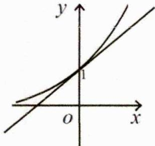

##### 2. $\ln x \leq x - 1 (x > 0)$

证明：设 $f(x)=\ln x-x+1$ ，则 $f'(x)=\frac{1}{x}-1=\frac{1-x}{x}$ ，当 0<x<1 时， $f'(x)>0$ ，当 x>1 时， $f'(x)<0$ ，
∴ $f(x) \leq f(1) = 0$ ，即 $\ln x \leq x - 1$ ，当且仅当 x = 1 时取等号，得证.

图形表示：如图， $y=\ln x$ 在 $(1,0)$ 处的切线方程为 y=x-1.

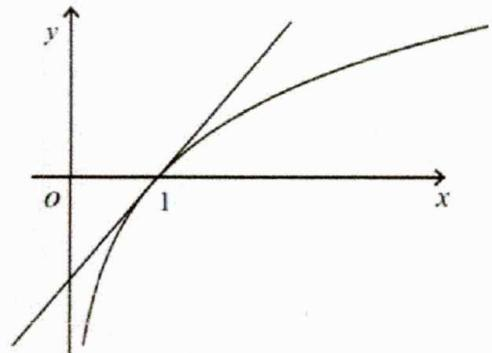

##### 3. 比如：(2021·全国·高考真题) 设函数 $f(x)=\ln(a-x)$ ，已知 x=0 是函数 $y=xf(x)$ 的极值点.

（1） 求 a;

（2） 设函数 $g(x)=\frac{x+f(x)}{xf(x)}$ 。证明： $g(x)<1$

详解（1）由 $f(x)=\ln(a-x)\Rightarrow f'(x)=\frac{1}{x-a}$ ， $y=xf(x)\Rightarrow y'=\ln(a-x)+\frac{x}{x-a}$

又 $x = 0$ 是函数 $y = xf(x)$ 的极值点，所以 $y'（0） = \ln a = 0$ ，解得 $a = 1$

（2） 令 $\varphi(x) = \ln x - (x - 1)$ , 因为 $\varphi'(x) = \frac{1}{x} - 1 = \frac{1 - x}{x}$ , 所以 $\varphi(x)$ 在区间 $(0,1)$ 内是增函数, 在区间 $(1, +\infty)$ 内是减函数, 所以 $\varphi(x) \leq \varphi(1) = 0$ , 即 $\ln x \leq x - 1$ (当且仅当 $x = 1$ 时取等号). 故当 $x < 1$ 且 $x \neq 0$ 时, $\frac{1}{1 - x} > 0$ 且 $\frac{1}{1 - x} \neq 1$ , $\ln \frac{1}{1 - x} < \frac{1}{1 - x} - 1$ , 即 $-\ln (1 - x) < \frac{x}{1 - x}$ , 所以 $\ln (1 - x) > \frac{x}{x - 1}$ .

（i）当 $x \in (0,1)$ 时， $0 > \ln(1-x) > \frac{x}{x-1}$ ，所以 $\frac{1}{\ln(1-x)} < \frac{x-1}{x} = 1 - \frac{1}{x}$ ，即 $\frac{1}{\ln(1-x)} + \frac{1}{x} < 1$ ，所以 $g(x) < 1$ 。

(ii）当 $x \in (-\infty,0)$ 时， $\ln(1-x) > \frac{x}{x-1} > 0$ ，同理可证得 $g(x) < 1$ 。

综合（i）（ii）得，当 $x < 1$ 且 $x \neq 0$ 时， $\frac{x + \ln(1 - x)}{x \ln(1 - x)} < 1$ ，即 $g(x) < 1$ .

### 二、【典型例题】

##### 1. (2023·全国·高考真题) 已知函数 $f(x) = a(\mathbf{e}^x + a) - x$ .

（1） 讨论 $f(x)$ 的单调性；（2） 证明：当 a > 0 时， $f(x) > 2 \ln a + \frac{3}{2}$ .

##### 2.（2024江苏南通如皋零模）已知函数 $f(x) = x - \ln x - \frac{\mathrm{e}^x}{x}$ .

（1） 求 $f(x)$ 的最大值；（2） 证明： $1 + x^{3} + \frac{e^{x}}{x} \geq 3x - f(x)$

##### 3. 已知函数 $f(x) = \mathrm{e}^x - x - 1$ .

（1） 证明： $f(x) \geq 0$ ; （2） 证明： $(1 + \frac{1}{2})(1 + \frac{1}{2^{2}}) \cdots (1 + \frac{1}{2^{n}}) < e$ .

### 三、【习题检测】

##### 1. 证明下列不等式

（1） $\mathbf{e}^{x - 1}\geq x$ （2） $\ln (x + 1)\leq x$ （3） $\frac{x}{1 + x} <  \ln (1 + x)(x > 0)$ （4） $\mathbf{e}^x -\ln (x + 2) > 0$

##### 2. (2016·全国·高考真题) 设函数 $f(x) = \ln x - x + 1$ .

（1） 讨论 $f(x)$ 的单调性；  
（Ⅱ）证明当 $x \in (1, +\infty)$ 时， $1 < \frac{x - 1}{\ln x} < x$ ；  
（Ⅲ）设 $c > 1$ ，证明当 $x\in (0,1)$ 时， $1 + (c - 1)x > c^x$

##### 3.（2022·天津·高考真题）已知 $a, b \in \mathbb{R}$ ，函数 $f(x) = e^x - a\sin x, g(x) = b\sqrt{x}$ 若 $y = f(x)$ 和 $y = g(x)$ 有公共点，求证： $a^2 + b^2 > \mathbf{e}$ .

# 3.4.6 不等式证明之同构

### 一、【题型总结】

▲适用题型：证明不等式且能构造相同结构的题型.

▲方法原理：最常用切线放缩，大题需证明

##### 1. 同构：结构或形式相同。在很多不等式问题中，经过同构变形使不等式两侧呈现相同结构，然后构造函数，结合复合函数的单调性进行证明，如 $F(x) \leq 0$ 能等价变形为 $f[g(x)] \leq [h(x)]$ ，然后利用外层函数 $f(x)$ 的单调性，转化为 $g(x) \leq h(x)$ 或 $g(x) \geq h(x)$ 。

##### 2. 比如：(2024·甘肃定西·一模) 设函数 $f(x)=\frac{x^{2}+3x+2}{e^{x+1}}, g(x)=x-\ln(x+1)$ ,

（1） 证明： $g(x) \geq 0$ . （2） 当 x > e - 1 时，证明： $f(x) < \ln(x + 2)$ .

详解（1）因为 $g(x)=x-\ln(x+1)$ ，其定义域为 $(-1,+\infty)$ ，则 $g'(x)=\frac{x}{x+1}$ ，

当 $x \in (-1,0)$ 时， $g'(x) < 0$ ；当 $x \in (0, +\infty)$ 时， $g'(x) > 0$ ，所以 $g(x)$ 在 $(-1,0)$ 上单调递减，在 $(0, +\infty)$ 上单调递增，所以 $g(x) \geq g(0) = 0$ ，证毕。

（2） 当 $x > \mathbf{e} - 1$ 时， $\ln (x + 2) > \ln (\mathbf{e} - 1 + 2) > \ln \mathbf{e} = 1$ ，而 $f(x) = \frac{x^2 + 3x + 2}{\mathbf{e}^{x + 1}} = \frac{(x + 1)(x + 2)}{\mathbf{e}^{x + 1}}$

要证 $f(x) < \ln (x + 2)$ ，即证 $\frac{(x + 1)(x + 2)}{\mathbf{e}^{x + 1}} < \ln (x + 2)$ ，即证 $\frac{\mathbf{e}^{x + 1}}{x + 1} > \frac{\mathbf{e}^{\ln(x + 2)}}{\ln(x + 2)}$

设 $h(x) = \frac{\mathbf{e}^x}{x}$ ，则 $h'(x) = \frac{(x - 1)\mathbf{e}^x}{x^2}$ ，当 $x > 1$ 时， $h'(x) > 0$ ，则 $h(x)$ 在 $(1, +\infty)$ 上单调递增，

且 $h(x + 1) = \frac{\mathbf{e}^{x + 1}}{x + 1}, h(\ln (x + 2)) = \frac{\mathbf{e}^{\ln(x + 2)}}{\ln(x + 2)}$ ，当 $x > \mathbf{e} - 1$ 时， $x + 1 > 1, \ln (x + 2) > 1$ ，故只需证明 $x + 1 > \ln (x + 2)$ ，由（1）知， $x \geq \ln (x + 1)$ 在 $(-1, +\infty)$ 上成立，故 $x + 1 > \ln (x + 2)$ ，即 $f(x) < \ln (x + 2)$ 成立.

### 二、【典型例题】

##### 1. (2022 高考北京卷·第 20 题) 已知函数 $f(x) = \mathrm{e}^{x}\ln (1 + x)$ .

（1） 求曲线 $y = f(x)$ 在点 $(0, f(0))$ 处的切线方程；  
（2） 设 $g(x) = f'(x)$ ，讨论函数 $g(x)$ 在 $[0, +\infty)$ 上的单调性；  
（3） 证明：对任意的 $s, t \in (0, +\infty)$ ，有 $f(s + t) > f(s) + f(t)$ .

##### 2. (2024·山东枣庄·模拟预测) 已知函数 $f(x) = \mathrm{e}^{x} - ax^{2} - x$ ， $f'(x)$ 为 $f(x)$ 的导数

（1） 讨论 $f'(x)$ 的单调性；（2） 若 x=0 是 $f(x)$ 的极大值点，求 a 的取值范围；  
（3） 若 $\theta \in \left(0, \frac{\pi}{2}\right)$ ，证明： $\mathbf{e}^{\sin \theta - 1} + \mathbf{e}^{\cos \theta - 1} + \ln (\sin \theta \cos \theta) < 1$ 。

### 三、【习题检测】

##### 1.（2024·广东广州·模拟预测）已知函数 $f(x) = x\mathrm{e}^{ax}$ （ $a > 0$ ）.

（1） 求 $f(x)$ 在区间 $[-1,1]$ 上的最大值与最小值；  
（2） 当 $a \geq 1$ 时，求证： $f(x) \geq \ln x + x + 1$ .

##### 2. (2024·甘肃白银·三模) 设函数 $f(x) = \frac{x^2 + 3x + 2}{e^{x + 1}}$ , $g(x) = x - \ln (x + 1)$ .

（1） 讨论 $f(x)$ 的单调性. （2） 证明: $g(x) \geq 0$ .  
（3） 当 $x > \mathbf{e} - 1$ 时，证明： $f(x) < \ln (x + 2)$ .

##### 3. (2024·天津·高考真题) 设函数 $f(x) = x \ln x$ . 若 $x_{1}, x_{2} \in (0,1)$ , 证明 $|f(x_{1}) - f(x_{2})| \leq |x_{1} - x_{2}|^{\frac{1}{2}}$ .

##### 4. (2018·浙江·高考真题) 已知函数 $f(x) = \sqrt{x} - \ln x$ .

若 $f(x)$ 在 $x = x_{1}, x_{2} (x_{1} \neq x_{2})$ 处导数相等，证明： $f(x_{1}) + f(x_{2}) > 8 - 8\ln 2$ ；

# 3.4.7 不等式证明之凹凸反转

### 一、【题型总结】

▲适用题型：常见于证明不等式且能分成两个凹凸性相反的题型.

▲方法原理：

##### 1. 凹凸反转：简单来讲就是把不等式分成左右两个函数，一个凹有最小值，一个凸有最大值，证明两个函数的最值存在大小关系即可，起到简化的作用，需要注意即使分成两个有最小最大函数值的函数也不一定能证明。

##### 2. 比如：(2024·全国·模拟预测) 已知函数 $f(x)=\frac{1}{2}\mathrm{e}^{2x}+(a-2)\mathrm{e}^{x}-2ax$ .

当 $a = 0$ 时，求证： $f(x) + 5\mathrm{e}^{x} - \frac{5}{2} > \frac{3}{2} x^{2} + x \ln x$ 。

详解当 $a = 0$ 时， $f(x) = \frac{1}{2}\mathbf{e}^{2x} - 2\mathbf{e}^x$ .

要证 $f(x) + 5\mathbf{e}^x -\frac{5}{2} >\frac{3}{2} x^2 +x\ln x$ ，即证 $\frac{1}{2}\mathbf{e}^{2x} + 2\mathbf{e}^x -\frac{3}{2} x^2 -\frac{5}{2} >x\ln x - \mathbf{e}^x$

只需证 $\frac{1}{2}\mathbf{e}^{2x} + 2\mathbf{e}^x - 2x^2 - \frac{5}{2} > x\ln x - \mathbf{e}^x - \frac{1}{2} x^2$

先证： $\frac{1}{2}\mathbf{e}^{2x} + 2\mathbf{e}^x -2x^2 -\frac{5}{2} >0$ ， $x > 0$

设 $h(x) = \frac{1}{2}\mathbf{e}^{2x} + 2\mathbf{e}^x - 2x^2 - \frac{5}{2}, x > 0$ ，则 $h'(x) = \mathbf{e}^{2x} + 2\mathbf{e}^x - 4x$ 。

设 $m(x) = \mathbf{e}^{2x} + 2\mathbf{e}^x -4x$ ， $x > 0$ ，则 $m'(x) = 2\mathbf{e}^{2x} + 2\mathbf{e}^x -4 = 2(\mathbf{e}^x -1)(\mathbf{e}^x +2) > 0$

所以函数 $m(x)$ 在 $(0, +\infty)$ 上单调递增，则 $m(x) > m(0) = 3 > 0$ ，即 $h'(x) > 0$

所以函数 $h(x)$ 在 $(0, +\infty)$ 上单调递增，则 $h(x) > h(0) = 0$ ，所以 $\frac{1}{2}\mathbf{e}^{2x} + 2\mathbf{e}^x - 2x^2 - \frac{5}{2} > 0$

再证： $x \ln x - e^{x} - \frac{1}{2} x^{2} < 0, \quad x > 0$ ，即证 $\frac{\ln x}{x} < \frac{e^{x}}{x^{2}} + \frac{1}{2}$ .

设 $t(x) = \frac{\ln x}{x}$ ，则 $t'(x) = \frac{1 - \ln x}{x^2}$ .

当 $x \in (0, e)$ 时， $t'(x) > 0$ ， $t(x)$ 单调递增；

当 $x \in (\mathbf{e}, +\infty)$ 时， $t'(x) < 0$ ， $t(x)$ 单调递减。所以 $t(x) \leq t(\mathbf{e}) = \frac{1}{\mathbf{e}}$ 。

设 $\varphi(x) = \frac{\mathbf{e}^x}{x^2} + \frac{1}{2}$ , $x > 0$ , 则 $\varphi'(x) = \frac{(x - 2)\mathbf{e}^x}{x^3}$ .

当 $x \in (0,2)$ 时， $\varphi'(x) < 0$ ， $\varphi(x)$ 单调递减；当 $x \in (2, +\infty)$ 时， $\varphi'(x) > 0$ ， $\varphi(x)$ 单调递增.

所以 $\varphi (x)\geq \varphi （2） = \frac{\mathbf{e}^2}{4} +\frac{1}{2}$ 所以 $\frac{\ln x}{x}\leq \frac{1}{\mathbf{e}} <  \frac{\mathbf{e}^2}{4} +\frac{1}{2}\leq \frac{\mathbf{e}^x}{x^2} +\frac{1}{2}$ 即 $\frac{\ln x}{x} <  \frac{\mathbf{e}^x}{x^2} +\frac{1}{2}$

综上， $\frac{1}{2}e^{2x}+2e^{x}-2x^{2}-\frac{5}{2}>x\ln x-e^{x}-\frac{1}{2}x^{2}$ 得证.

故 $f(x) + 5\mathrm{e}^{x} - \frac{5}{2} > \frac{3}{2} x^{2} + x \ln x$ .

### 二、【典型例题】

##### 1. (2014·全国·高考真题) 设函数 $f(x) = ae^{x} \ln x + \frac{be^{x-1}}{x}$ ，曲线 $y = f(x)$ 在点(1, $f(1)$ )处的切线方程为 $y = e(x - 1) + 2$ . （1） 求 $a, b$ （2） 证明： $f(x) > 1$

##### 2. (2024·陕西安康·模拟预测) 已知函数 $f(x) = \ln x + \frac{m}{x} + 2x$ .

（1） 讨论函数 $f(x)$ 的单调性；（2） 若 $m \geq 1$ ，求证： $\left[2f(x) - 4x - 1\right] \cdot e^x > 2$ 。

### 三、【习题检测】

##### 1. (2024·陕西西安·模拟预测) 已知函数 $f(x) = \frac{\ln x}{x} - \frac{1}{e}$ .

（1） 求 $f(x)$ 的最大值；（2） 证明：当 x > 0 时， $f(x) < x e^{x}$ .

##### 2.（2024·全国·模拟预测）已知函数 $f(x) = x\mathrm{e}^{x} + a$ ， $g(x) = x\ln x + a$ .

（1） 若函数 $f(x)$ 的最小值与 $g(x)$ 的最小值之和为 $-\frac{4}{e}$ ，求 $a$ 的值.  
（2） 若 $a = 0, x > 0$ ，证明： $f(x) > g'(x)$ .

##### 3. 已知函数 $f(x) = \frac{\mathrm{e}^x}{x^2 + x + 1}$ ，求证： $f(x) \geq \frac{\ln x}{\mathrm{e}^x}$ .

# 3.4.8 不等式证明之对数单身狗，指数找朋友

### 一、【题型总结】

▲适用题型：证明不等式且含有指数型或对数型结构的题型.

▲方法原理：

##### 1. 指数找朋友：对于复杂函数结构，当把指数结构 $e^{x}$ 移项变成除法或乘法，则求导后的结果分析正负更简单，因为 $(e^{x} \cdot f)' = e^{x} \cdot (f + f')$ ， $\left(\frac{f}{e^{x}}\right)' = \frac{f' - f}{e^{x}}$ ，明显只需要分析除 $e^{x}$ 外的部分结构正负即可  
##### 2. 对数单身狗：原理和指数找朋友一样，遇到对数结构一般将其进行孤立，之后求导计算更简单  
##### 3. 比如：(2018·全国·高考真题) 已知函数 $f(x)=e^{x}-ax^{2}$ .

（1） 若 a=1，证明：当 $x \geq 0$ 时， $f(x) \geq 1$ ;

详解（1）当 $a = 1$ 时， $f(x) \geq 1$ 等价于 $\left(x^{2} + 1\right)e^{-x} - 1 \leq 0$ 。

设函数 $g(x) = (x^2 + 1)e^{-x} - 1$ ，则 $g'(x) = -(x^2 - 2x + 1)e^{-x} = -(x - 1)^2e^{-x}$ .

$g'(x) \leq 0$ ，所以 $g(x)$ 在 $(0, +\infty)$ 单调递减.

而 $g(0) = 0$ ，故当 $x \geq 0$ 时， $g(x) \leq 0$ ，即 $f(x) \geq 1$ ：

### 二、【典型例题】

##### 1. (2021·全国·高考真题) 设函数 $f(x) = \ln (a - x)$ ，已知 $x = 0$ 是函数 $y = xf(x)$ 的极值点.

（1） 求 a; （2） 设函数 $g(x)=\frac{x+f(x)}{xf(x)}$ . 证明: $g(x)<1$ .

##### 2. (2024·陕西榆林·三模) 已知函数 $f(x) = m \ln x + x^2 - x, f(x)$ 的导函数为 $f'(x)$ .

（1） 讨论 $f(x)$ 的单调性；（2） 当 $m = 1$ 时，证明： $f'(x + 1) \leq \frac{2\mathrm{e}^x}{\sqrt{x + 1}} + \frac{1}{x + 1} + x - 1$ .

### 三、【习题检测】

##### 1. (2024·青海·模拟预测) 已知质数 $f(x) = m\mathrm{e}^{x} - x^{2} + mx - m$ ，且曲线 $y = f(x)$ 在点 $(2, f(2))$ 处的切线方程为 $4\mathrm{e}^{2}x - y - 4\mathrm{e}^{2} = 0$ .

（1） 求 $m$ 的值；（2） 证明：对一切 $x \geq 0$ ，都有 $f(x) \geq e^2 x^2$ .

##### 2. (2024·全国·模拟预测) 已知函数 $f(x) = \mathrm{e}^{mx} - 2x^3 + nx^2$ ，且曲线 $f(x)$ 在点 $(0, f(0))$ 处的切线方程为 $2x - y + 1 = 0$ （其中 $e$ 为自然对数的底数）.

（1） 求实数 $m$ 的值. （2） 当 $n = 3$ 时, 证明: 对 $\forall x \in [0, +\infty)$ , 都有 $f(x) \geq e^2 x^2 + 1$ .

# 3.5 零点类型

# 3.5.1 零点个数

### 一、【题型总结】

▲适用题型：零点个数的解答题类型.

▲方法原理：

##### 1. 利用导数确定零点的个数：

（1） 常规求导讨论分析零点个数  
（2） 分析函数图像与 x 轴交点个数  
（3） 拆分成两个函数，分析函数图像交点个数.

注意：不论哪种做法大题中都要找点说明

##### 2. 找点：核心就是放缩，所以需要熟悉一些放缩不等式，最常见的就是切线放缩，以及相关变形。  
##### 3. 关于找点：找点由于灵活性很强，即使熟练放缩后依然可能在考场上时间有限没有找点成功，所以最佳方式就是能找则找，条件不允许时考虑不完美做法极限说明。

### 二、【典型例题】

##### 1. (2023·北京·高考真题) 设函数 $f(x) = x - x^3 e^{ax + b}$ ，曲线 $y = f(x)$ 在点 $(1, f(1))$ 处的切线方程为 $y = -x + 1$ . （1） 求 $a, b$ 的值；（2） 求 $f(x)$ 的极值点个数.

##### 2.（2015·全国·高考真题）设函数 $f(x) = e^{2x} - a\ln x$ .

（1） 讨论 $f(x)$ 的导函数 $f'(x)$ 的零点的个数；

### 三、【习题检测】

##### 1. (2012·福建·高考真题) 已知函数 $f(x) = ax\sin x - \frac{3}{2} (a \in R)$ , 且在, $\left[0, \frac{\pi}{2}\right]$ 上的最大值为 $\frac{\pi - 3}{2}$ ,

（1） 求函数 $f(x)$ 的解析式；（2） 判断函数 $f(x)$ 在 $(0, \pi)$ 内的零点个数，并加以证明

##### 2. (2024·湖南长沙·三模)

已知函数 $f(x) = x\mathbf{e}^x -1,g(x) = \mathrm{i}\mathsf{n}x - mx,m\in \mathbb{R}$

（1） 求 $f(x)$ 的最小值；（2） 设函数 $h(x)=f(x)-g(x)$ ，讨论 $h(x)$ 零点的个数.

# 3.5.2 零点求参

### 一、【题型总结】

▲适用题型：零点相关的求参数问题；

▲方法原理：

##### 1. 零点求参：

一种方法是分离参数，构造不含参数的函数，研究其单调性、极值、最值，判断 y=a 与其交点的个数，从而求出 a 的取值范围；

另一种方法是直接对含参函数进行研究，研究其单调性、极值、最值.

这两种方法要完美得分都需要严格找点.

##### 2. 找点：核心就是放缩，所以需要熟悉一些放缩不等式，最常见的就是切线放缩，以及相关变形。
##### 3. 关于找点：找点由于灵活性很强，即使熟练放缩后依然可能在考场上时间有限没有找点成功，所以最佳方式就是能找则找，条件不允许时考虑不完美做法极限说明。

比如：（2023·全国·高考真题）已知函数 $f(x) = \left(\frac{1}{x} + a\right)\ln (1 + x)$ . 若 $f(x)$ 在 $(0, +\infty)$ 存在极值，求 $a$ 的取值范围.

详解由函数的解析式可得 $f'(x)=\left(-\frac{1}{x^{2}}\right)\ln(x+1)+\left(\frac{1}{x}+a\right)\frac{1}{x+1}$

由 $f(x)$ 在区间 $(0,+\infty)$ 存在极值点，则 $f'(x)$ 在区间 $(0,+\infty)$ 上存在变号零点；

令 $\left(-\frac{1}{x^{2}}\right)\ln(x+1)+\left(\frac{1}{x}+a\right)\frac{1}{x+1}=0$ ，则 $-\left(x+1\right)\ln(x+1)+\left(x+ax^{2}\right)=0$ ，

令 $g(x)=ax^{2}+x-(x+1)\ln(x+1)$ ， $f(x)$ 在区间 $(0,+\infty)$ 存在极值点，等价于 $g(x)$ 在区间 $(0,+\infty)$ 上存在变号零点， $g'(x)=2ax-\ln(x+1)$ ， $g''(x)=2a-\frac{1}{x+1}$ ，

当 $a \leq 0$ 时， $g'(x) < 0$ ， $g(x)$ 在区间 $(0, +\infty)$ 上单调递减，

此时 $g(x) < g(0) = 0$ ， $g(x)$ 在区间 $(0, +\infty)$ 上无零点，不合题意；

当 $a \geq \frac{1}{2}$ , $2a \geq 1$ 时, 由于 $\frac{1}{x + 1} < 1$ , 所以 $g''(x) > 0, g'(x)$ 在区间 $(0, +\infty)$ 上单调递增,

所以 $g'(x) > g'（0） = 0$ ， $g(x)$ 在区间 $(0, +\infty)$ 上单调递增， $g(x) > g(0) = 0$ ，

所以 $g(x)$ 在区间 $(0,+\infty)$ 上无零点，不符合题意；

当 $0 < a < \frac{1}{2}$ 时，由 $g''(x) = 2a - \frac{1}{x + 1} = 0$ 可得 $x = \frac{1}{2a} - 1$

当 $x \in \left(0, \frac{1}{2a} - 1\right)$ 时， $g''(x) < 0$ ， $g'(x)$ 单调递减，当 $x \in \left(\frac{1}{2a} - 1, +\infty\right)$ 时， $g''(x) > 0$ ， $g'(x)$ 单调递增，故 $g'(x)$ 的最小值为 $g'\left(\frac{1}{2a} - 1\right) = 1 - 2a + \ln 2a$ ，令 $m(x) = 1 - x + \ln x (0 < x < 1)$ ，则 $m'(x) = \frac{-x + 1}{x} > 0$ ，函数 $m(x)$ 在定义域内单调递增， $m(x) < m(1) = 0$ ，据此可得 $1 - x + \ln x < 0$ 恒成立，

则 $g'\left(\frac{1}{2a} - 1\right) = 1 - 2a + \ln 2a < 0$ ，由一次函数与对数函数的性质可得，当 $x \to +\infty$ 时，

$g'(x)=2ax-\ln(x+1)\rightarrow+\infty$ ，且注意到 $g'（0）=0$ ，

根据零点存在性定理可知： $g'(x)$ 在区间 $(0, +\infty)$ 上存在唯一零点 $x_{0}$ .

当 $x \in (0, x_0)$ 时， $g'(x) < 0$ ， $g(x)$ 单调减，当 $x \in (x_0, +\infty)$ 时， $g'(x) > 0$ ， $g(x)$ 单调递增，

所以 $g(x_0) < g(0) = 0$ 。令 $n(x) = \ln x - \sqrt{x}$ ，则 $n'(x) = \frac{1}{x} - \frac{1}{2\sqrt{x}} = \frac{2 - \sqrt{x}}{2x}$ ，则函数 $n(x) = \ln x - \sqrt{x}$ 在 $(0,4)$ 上单调递增，在 $(4, +\infty)$ 上单调递减，

所以 $n(x) \leq n(4) = \ln 4 - 2 < 0$ ，所以 $\ln x < \sqrt{x}$

所以 $g\left(\frac{4}{a^2}\right) = \left(\frac{4}{a^2} + 1\right)\left[a\left(\frac{4}{a^2} + 1\right) - \ln \left(\frac{4}{a^2} + 1\right) - \frac{1 - a}{\frac{4}{a^2} + 1} - 2a + 1\right]$

$> \left(\frac {4}{a ^ {2}} + 1\right) \left[ \frac {4}{a} + a - \ln \left(\frac {4}{a ^ {2}} + 1\right) + a - 1 - 2 a + 1 \right] = \left(\frac {4}{a ^ {2}} + 1\right) \left[ \frac {4}{a} - \ln \left(\frac {4}{a ^ {2}} + 1\right) \right] > \left(\frac {4}{a ^ {2}} + 1\right) \left(\frac {4}{a} - \sqrt {\frac {4}{a ^ {2}} + 1}\right)$

$>\left(\frac{4}{a^{2}}+1\right)\frac{\frac{16}{a^{2}}-\frac{4}{a^{2}}-1}{\frac{4}{a}+\sqrt{\frac{4}{a^{2}}+1}}=\left(\frac{4}{a^{2}}+1\right)\frac{\frac{12}{a^{2}}-1}{\frac{4}{a}+\sqrt{\frac{4}{a^{2}}+1}}>0$ ，所以函数 $g(x)$ 在区间 $(0,+\infty)$ 上存在变号零点，符合

题意. 综合上面可知: 实数 a 得取值范围是 $\left(0, \frac{1}{2}\right)$ .

### 二、【典型例题】

##### 1.（2021·全国·高考真题）设函数 $f(x) = a^{2}x^{2} + ax - 3\ln x + 1$ ，其中 $a > 0$ .

（1） 讨论 $f(x)$ 的单调性;  
（2） 若 $y = f(x)$ 的图象与 x 轴没有公共点，求 a 的取值范围.

##### 2.（2022·天津·高考真题）已知 $a, b \in \mathbb{R}$ ，函数 $f(x) = e^x - a\sin x, g(x) = b\sqrt{x}$

（1） 求函数 $y = f(x)$ 在 $(0, f(0))$ 处的切线方程；  
（2） 若 $y = f(x)$ 和 $y = g(x)$ 有公共点，

当 a=0 时，求 b 的取值范围；

##### 3. (2022·全国·高考真题) 已知函数 $f(x) = ax - \frac{1}{x} - (a + 1)\ln x$ .

（1） 当 a=0 时，求 $f(x)$ 的最大值；  
（2） 若 $f(x)$ 恰有一个零点，求 $a$ 的取值范围.

##### 4.（2016·全国·高考真题）已知函数 $f(x) = (x - 2)e^{x} + a(x - 1)^{2}$ .

(Ⅰ) 讨论 $f(x)$ 的单调性；(Ⅱ) 若 $f(x)$ 有两个零点，求 a 的取值范围.

### 三、【习题检测】

##### 1. (2022·全国·高考真题) 已知函数 $f(x) = \ln (1 + x) + ax\mathrm{e}^{-x}$

（1） 当 $a = 1$ 时，求曲线 $y = f(x)$ 在点 $(0, f(0))$ 处的切线方程；  
（2） 若 $f(x)$ 在区间 $(-1,0), (0, +\infty)$ 各恰有一个零点，求 $a$ 的取值范围.

##### 2.（2021·全国·高考真题）已知 $a > 0$ 且 $a \neq 1$ ，函数 $f(x) = \frac{x^a}{a^x} (x > 0)$ .

（1） 当 a=2 时，求 $f(x)$ 的单调区间；  
（2） 若曲线 $y = f(x)$ 与直线 y = 1 有且仅有两个交点，求 a 的取值范围.

##### 3.（2017·全国·高考真题）已知函数 $f(x) = ae^{2x} + (a - 2)e^x - x$

（1） 讨论 $f(x)$ 的单调性；  
（2） 若 $f(x)$ 有两个零点，求 a 的取值范围.

##### 4.（2016·江苏·高考真题）已知函数 $f(x) = a^{x} + b^{x} (a > 0, b > 0, a \neq 1, b \neq 1)$ .

（1） 设 $a = 2, b = \frac{1}{2}$ .

①求方程 $f(x)=2$ 的根；  
②若对任意 $x\in R$ ，不等式 $f(2x)\geq mf(x)-6$ 恒成立，求实数m的最大值；  
（2） 若 0 < a < 1, b > 1，函数 $g(x) = f(x) - 2$ 有且只有 1 个零点，求 ab 的值.

##### 5.（2016·北京·高考真题）设函数 $f(x) = x^{3} + ax^{2} + bx + c$ .

（1） 求曲线 $y = f(x)$ 在点 $(0, f(0))$ 处的切线方程；  
（Ⅱ）设a=b=4，若函数 $f(x)$ 有三个不同零点，求c的取值范围；  
（Ⅲ）求证： $a^{2}-3b>0$ 是 $f(x)$ 有三个不同零点的必要而不充分条件.

##### 6.（2014·四川·高考真题）已知函数 $f(x) = e^{x} - ax^{2} - bx - 1$ ，其中 $a, b \in R$ ， $e = 2.71828 \cdots$ 为自然对数的底数.

（1） 设 $g(x)$ 是函数 $f(x)$ 的导函数，求函数 $g(x)$ 在区间 [0,1] 上的最小值；  
(Ⅱ) 若 $f(1)=0$ ，函数 $f(x)$ 在区间 $(0,1)$ 内有零点，求 a 的取值范围

##### 7. (2018·全国·高考真题) 已知函数 $f(x) = e^{x} - ax^{2}$ . 若 $f(x)$ 在 $(0, +\infty)$ 只有一个零点，求 $a$ 的值.

# 3.5.3 零点证明之常规讨论

### 一、【题型总结】

▲适用题型：零点的证明题型；

▲方法原理：

##### 1. 讨论：常规分析进行分类讨论，基本功.

##### 2. 找点：核心就是放缩，所以需要熟悉一些放缩不等式，最常见的就是切线放缩，以及相关变形.

##### 3. 关于找点：找点由于灵活性很强，即使熟练放缩后依然可能在考场上时间有限没有找点成功，所以最佳方式就是能找则找，条件不允许时考虑不完美做法极限说明。

比如：（2024·陕西商洛·模拟预测）已知函数 $f(x) = (a - 1)x + \ln x$ ， $g(x) = \frac{1}{2} ax^2 (a \in \mathbf{R})$ .

当 $a > 2$ 时，证明：函数 $\varphi(x) = g(x) - f(x)$ 有两个不同的零点.

证明：由 $\varphi (x) = g(x) - f(x)$ 得 $\varphi (x) = \frac{1}{2} ax^2 -(a - 1)x - \ln x$

所以 $\varphi'(x)=ax-(a-1)-\frac{1}{x}=\frac{ax^{2}-(a-1)x-1}{x}=\frac{(ax+1)(x-1)}{x}$ ,

因为 a > 2，所以 $\frac{ax + 1}{x} > 0$ ，所以当 $x \in (0,1)$ 时， $\varphi'(x) < 0$ ， $\varphi(x)$ 单调递减；

当 $x \in (1, +\infty)$ 时， $\varphi'(x) > 0$ ， $\varphi(x)$ 单调递增，所以当 $x = 1$ 时， $\varphi(x)_{\min} = \varphi(1) = -\frac{1}{2}a + 1$ ，

因为 $a > 2$ ，所以 $\varphi （1） <   0$ ，下面证明 $\varphi (x)$ 在区间 $(0,1)$ 上与 $(1, + \infty)$ 上分别存在一个零点，

因为 $\varphi(2) = 2a - 2(a - 1) - \ln 2 = 2 - \ln 2 > 0$ ，所以在区间 $(1, +\infty)$ 上存在唯一零点 $x_1$ ，且 $\varphi(x_1) = 0$ 。

因为 $\varphi(x)=\frac{1}{2}a\left(x^{2}-2x\right)+x-\ln x$ ，当 $x\in(0,1)$ 时， $-1<x^{2}-2x<0$ ，所以 $\varphi(x)>-\frac{1}{2}a+x-\ln x$ ，

所以 $\varphi\left(\mathbf{e}^{-\frac{1}{2}a}\right) > -\frac{1}{2}a + \mathbf{e}^{-\frac{1}{2}a} - \ln\left(\mathbf{e}^{-\frac{1}{2}a}\right) = \mathbf{e}^{-\frac{1}{2}a} > 0$ ，所以 $\varphi(x)$ 在区间 $(0,1)$ 上存在唯一零点 $x_{2}$ ，且 $\varphi(x_{2}) = 0$ ，

所以当 $a > 2$ 时，函数 $\varphi(x) = g(x) - f(x)$ 有两个不同的零点.

### 二、【典型例题】

##### 1. (2021·全国·高考真题) 已知函数 $f(x) = (x - 1)e^x - ax^2 + b$ .

（1） 讨论 $f(x)$ 的单调性；（2） 从下面两个条件中选一个，证明： $f(x)$ 只有一个零点

① $\frac{1}{2}<a\leq\frac{e^{2}}{2},b>2a$ ; ② $0<a<\frac{1}{2},b\leq2a$ .

##### 2. (2019·全国·高考真题) 已知函数 $f(x) = \sin x - \ln (1 + x)$ ， $f'(x)$ 为 $f(x)$ 的导数。证明：

（1） $f'(x)$ 在区间 $(-1, \frac{\pi}{2})$ 存在唯一极大值点；

（2） $f(x)$ 有且仅有 2 个零点.

### 三、【习题检测】

##### 1. (2015·北京·高考真题) 设函数 $f(x) = \frac{x^2}{2} - k\ln x$ , $k > 0$ .

（1） 求 $f(x)$ 的单调区间和极值;  
（2） 证明: 若 $f(x)$ 存在零点, 则 $f(x)$ 在区间 $(1, \sqrt{e}]$ 上仅有一个零点.

##### 2. (2018·浙江·高考真题) 已知函数 $f(x) = \sqrt{x} - \ln x$ .

若 $a \leq 3 - 4\ln 2$ ，证明：对于任意 $k > 0$ ，直线 $y = kx + a$ 与曲线 $y = f(x)$ 有唯一公共点。

##### 3.（2018·全国·高考真题）已知函数 $f(x) = \frac{1}{3} x^3 - a(x^2 + x + 1)$ .

（1） 若 a=3，求 $f(x)$ 的单调区间；  
（2） 证明: $f(x)$ 只有一个零点.

# 3.5.4 零点证明之同构

### 一、【题型总结】

▲适用题型：涉及零点能构造相同结构的题型；

▲方法原理：

##### 1. 同构证明：对零点等式进行适当的代换或者变换，可以得到零点关系，更容易处理。

##### 2. 常见变形：结合指数运算和对数运算的法则，可以得到下述结论（其中 $x > 0$ ）

（1） $x\mathbf{e}^{x} = \mathbf{e}^{x + \ln x};x + \ln x = \ln (x\mathbf{e}^{x})$ （2） $\frac{e^x}{x} = e^{x - \ln x}:x - \ln x = \ln \frac{e^x}{x}$

（3） $x^{2}\mathbf{e}^{x} = \mathbf{e}^{x + 2\ln x};x + 2\ln x = \ln (x^{2}\mathbf{e}^{x})$ （4） $\frac{e^x}{x^2} = e^{x - 2\ln x},\frac{e^x}{x^2} = e^{x - 2\ln x}$

### 二、【典型例题】

##### 1. (2022·全国·高考真题) 已知函数 $f(x) = e^{x} - ax$ 和 $g(x) = ax - \ln x$ 有相同的最小值.

（1） 求 $a$ ; （2） 证明: 存在直线 $y = b$ , 其与两条曲线 $y = f(x)$ 和 $y = g(x)$ 共有三个不同的交点, 并且从左到右的三个交点的横坐标成等差数列.

##### 2. (2024·上海嘉定·一模) 已知 $f(x) = \frac{x}{\mathbf{e}^x}, g(x) = \frac{\ln x}{x}$ .

（1） 求函数 $y = f(x)$ 、 $y = g(x)$ 的单调区间和极值；（2） 请严格证明曲线 $y = f(x)$ 、 $y = g(x)$ 有唯一交点；（3） 对于常数 $a \in \left(0, \frac{1}{\mathbf{e}}\right)$ ，若直线 $y = a$ 和曲线 $y = f(x)$ 、 $y = g(x)$ 共有三个不同交点 $(x_1, a)$ 、 $(x_2, a)$ 、 $(x_3, a)$ ，其中 $x_1 < x_2 < x_3$ ，求证： $x_1$ 、 $x_2$ 、 $x_3$ 成等比数列。

### 三、【习题检测】

##### 1. (2024·四川·三模)

已知函数 $f(x) = \frac{ax}{\mathbf{e}^x}$ 和函数 $g(x) = \frac{\ln x}{x}$ ，且 $f(x)$ 有最大值为 $\frac{1}{ae}$ .

（1） 求实数 $a$ 的值；（2） 直线 $y = m$ 与两曲线 $y = f(x)$ 和 $y = g(x)$ 恰好有三个不同的交点，其横坐标分别为 $x_{1}, x_{2}, x_{3}$ ，且 $x_{1} < x_{2} < x_{3}$ ，证明： $x_{1}x_{3} = x_{2}^{2}$ .

##### 2. (2024·河北邯郸·二模)

已知函数 $f(x) = \mathbf{e}^x - mx, g(x) = x - m \ln x$

（1） 是否存在实数 $m$ ，使得 $f(x)$ 和 $g(x)$ 在 $(0, +\infty)$ 上的单调区间相同？若存在，求出 $m$ 的取值范围；若不存在，请说明理由。  
（2） 已知 $x_{1}, x_{2}$ 是 $f(x)$ 的零点， $x_{2}, x_{3}$ 是 $g(x)$ 的零点.

①证明：m > e.

②证明： $1 < x_{1}x_{2}x_{3} < e^{3}$

# 第4章 三角函数、解三角形

# 4.1 求 $\omega$

# 4.1.1 求 $\omega$ 方法说明

### 一、【题型总结】

▲适用题型： $y=\sin(wx+\varphi)$ （或者余弦和正切）求 $\omega$ 的范围或者最值的题目；  
▲方法原理：1. 卡根：根据题中条件，将含ω的式子卡在某个形式或者范围，继而求解答案，  
##### 2. 卡形式：以 $y = \sin(wx + \varphi)$ 为例

（1） $\left\{\begin{aligned}k\in Z\\w>0\end{aligned}\right.$ 对称轴 $x=a\xrightarrow{\quad}aw+\varphi=\frac{\pi}{2}+k\pi\Rightarrow w=\frac{\frac{\pi}{2}+k\pi-\varphi}{a}$ $y=1$ 时（极大值） $x=a\xrightarrow{\quad}aw+\varphi=\frac{\pi}{2}+2k\pi\Rightarrow w=\frac{\frac{\pi}{2}+2k\pi-\varphi}{a}$ $y=-1$ 时（极小值） $x=a\xrightarrow{\quad}aw+\varphi=-\frac{\pi}{2}+2k\pi\Rightarrow w=\frac{-\frac{\pi}{2}+2k\pi-\varphi}{a}$ 对称中心 $(a,0)\xrightarrow{\quad}aw+\varphi=k\pi\Rightarrow w=\frac{k\pi-\varphi}{a}$

（2） $\left\{\begin{aligned}n&\in N^{*}\\w&>0\end{aligned}\right.\\ &\left\{\begin{aligned}y&=1 时 x=a\\ y&=-1 时 x=b\end{aligned}\right\}\longrightarrow\left|b-a\right|=\frac{(2n-1)}{2}\cdot T\\ \text{轴}x=a,\text{心}(b,0)\longrightarrow\left|b-a\right|=\frac{(2n-1)T}{4}\end{aligned}\right\}\left\{\begin{aligned} & 分开表达时注意需要不同的k,比如:\\ & 对称轴x=a\\ & 对称中心(b,0)\end{aligned}\right\}\rightarrow\left\{\begin{aligned} & aw+\varphi=\frac{\pi}{2}+k_{1}\pi(k_{1}&\in Z)\\ & bw+\varphi=k_{2}\pi(k_{2}&\in Z)\end{aligned}\right.$

简单举例: (2022·全国·统考高考真题) 记函数 $f(x)=\cos(\omega x+\varphi)(\omega>0,0<\varphi<\pi)$ 的最小正周期为 $\mathrm{T}$ , 若 $f(T)=\frac{\sqrt{3}}{2}$ , $x=\frac{\pi}{9}$ 为 $f(x)$ 的零点, 则 $\omega$ 的最小值为 \_\_\_\_.

$\left\{ \begin{array}{l} T =  \frac {2 \pi}{\omega} \Rightarrow \left\{ \begin{array}{l l} {f (T) = \cos \left(\omega \cdot  \frac {2 \pi}{\omega} + \varphi\right)} \\ {= \cos \left(2 \pi + \varphi\right) = \cos \varphi =  \frac {\sqrt {3}}{2} \Rightarrow \varphi =  \frac {\pi}{6}} \\ {0 <   \varphi <   \pi} \\ {\text {零点} x =  \frac {\pi}{9} \Rightarrow  \frac {\pi}{9} \omega +  \frac {\pi}{6} =  \frac {\pi}{2} + k \pi , k \in Z} \\ {\omega > 0} \end{array} \right. \right\} \Rightarrow \left\{ \begin{array}{l l} {\omega = 3 + 9 k, k \in Z} \\ {k = 0   \text {时}   \omega_ {\min} = 3} \end{array} \right.$

##### 3. 卡范围：以 $y = \sin (wx + \varphi)$ 为例

$\begin{array}{r} {（1） \left\{ \begin{array}{l l} {\text {单调问题}} \\ {\sin (w x + \varphi)} \\ {k \in Z, w > 0} \\ {\text {区间的开闭}} \\ {\text {不影响结果}} \end{array} \right. \left\{ \begin{array}{l l} {(a, b) \text {单调} \uparrow \longrightarrow \left\{ \begin{array}{l l} {| b - a | \leq \frac {T}{2}} \\ {- \frac {\pi}{2} + 2 k \pi \leq a w + \varphi <   b w + \varphi \leq \frac {\pi}{2} + 2 k \pi} \end{array} \right.} \\ {(a, b) \text {单调} \downarrow \longrightarrow \left\{ \begin{array}{l l} {| b - a | \leq \frac {T}{2}} \\ {\frac {\pi}{2} + 2 k \pi \leq a w + \varphi <   b w + \varphi \leq \frac {3 \pi}{2} + 2 k \pi} \end{array} \right.} \\ {(a, b) \text {单调或无对称轴} \longrightarrow \left\{ \begin{array}{l l} {| b - a | \leq \frac {T}{2}} \\ {- \frac {\pi}{2} + k \pi \leq a w + \varphi <   b w + \varphi \leq \frac {\pi}{2} + k \pi} \end{array} \right.} \\ {(a, b) \text {不单调} \longrightarrow a w + \varphi <   \frac {\pi}{2} + k \pi <   b w + \varphi} \end{array} \right.} \end{array}$

$\begin{array}{r l} & {（2） \left\{ \begin{array}{l l} {\text {零点问题}} \\ {\sin (w x + \varphi)} \\ {k \in Z, w > 0} \\ {n \in N ^ {*}} \end{array} \right. \left\{ \begin{array}{l l} {(a, b) \text {无零点} \left\{ \begin{array}{l l} {| b - a | \leq \frac {T}{2}} \\ {k \pi \leq a w + \varphi <   b w + \varphi \leq (k + 1) \pi} \end{array} \right.} \\ {(a, b) n \text {零点} \left\{ \begin{array}{l l} {\frac {(n - 1) T}{2} <   | b - a | \leq \frac {(n + 1) T}{2}} \\ {k \pi \leq a w + \varphi <   (k + 1) \pi} \\ {(k + n) \pi <   b w + \varphi \leq (k + n + 1) \pi} \end{array} \right.} & {[ a, b ] n \text {零点} \left\{ \begin{array}{l l} {\frac {(n - 1) T}{2} \leq | b - a | <   \frac {(n + 1) T}{2}} \\ {k \pi <   a w + \varphi \leq (k + 1) \pi} \\ {(k + n) \pi \leq b w + \varphi <   (k + n + 1) \pi} \end{array} \right.} \\ {[ a, b) n \text {零点} \left\{ \begin{array}{l l} {\frac {(n - 1) T}{2} <   | b - a | <   \frac {(n + 1) T}{2}} \\ {k \pi <   a w + \varphi \leq (k + 1) \pi} \\ {(k + n) \pi <   b w + \varphi \leq (k + n + 1) \pi} \end{array} \right.} & {(a, b ] n \text {零点} \left\{ \begin{array}{l l} {\frac {(n - 1) T}{2} <   | b - a | <   \frac {(n + 1) T}{2}} \\ {k \pi \leq a w + \varphi <   (k + 1) \pi} \\ {(k + n) \pi \leq b w + \varphi <   (k + n + 1) \pi} \end{array} \right.} \\ {\text {规律:区间左端点和其对应不等式左的等号只能有一个;右也同理;}} & {} \end{array} \right.} \end{array}$

##### 4. 以上结论重在理解, 画图即知, 建议自己画图推导加深理解; 另外, 实际做题条件的描述多种多样, 核心还是需要会翻译题干条件, 结合图像来进行卡根求解;  
##### 5. cos 和 tan 类似的题目原理相同，这里不再赘述；

# 4.1.2 区间含 0 之单调类型

### 一、【题型总结】

▲适用题型: 函数在某个区间单调, 求 $\omega$ 范围的题目, 并且 (不论开闭) 区间含 0, 比如 $(0, \pi]$ , $[-\frac{\pi}{4}, \frac{\pi}{3}]$ ;
▲方法原理：大部分题目 $|\varphi|<\frac{\pi}{2}$

##### 1. $y = \sin(wx + \varphi)$ 出现 $\varphi \in \left(0, \frac{\pi}{2}\right)$ 时，如图 1；出现 $\varphi \in \left(-\frac{\pi}{2}, 0\right)$ 时，如图 2；

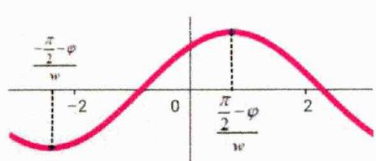

图 1

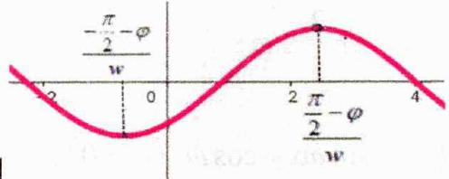

图 2

如图 y 轴右边第一条对称轴是固定的： $x=\frac{\frac{\pi}{2}-\varphi}{w}$ （左边也是），此时区间（不论开闭）含 0 时，后续做题我们可以直接画出上图分析，进行卡根，且有两种方式：

现图（ $\sin(wx+\varphi)$ ）卡根和原图（ $\sin x$ ）卡根，注意两图横坐标对应关系：

$\sin x$ 图横坐标 $x_0$ 减 $\varphi$ 再除以 $w$ 即 $\frac{x_0 - \varphi}{w}$ 就是 $\sin (wx + \varphi)$ 与其对应位置的横坐标；

##### 2. $y = \sin (wx + \varphi)$ 的单调性问题：

（1） 现图 $(\sin(wx+\varphi))$ :

$\left\{ \begin{array}{l} y = \sin (wx + \varphi) \\ k \in Z, w > 0, |\varphi| < \frac{\pi}{2} \end{array} \right.$ $\left\{ \begin{array}{l} (a,b)\text{单调}\uparrow \xrightarrow{-\frac{\pi}{2}-\varphi} \frac{-\pi}{2}-\varphi \\ (a,b)\text{不单调}\xrightarrow{-\frac{\pi}{2}-\varphi} a < b < \frac{\pi}{2}-\varphi, |b-a| \leq \frac{T}{2} \end{array} \right.$

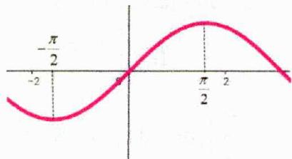

（2） 原图 ( $\sin x$ ) 卡根:

$\left\{ \begin{array}{l} y = \sin (wx + \varphi) \\ k \in Z, w > 0, |\varphi| < \frac{\pi}{2} \end{array} \right.$ $\left\{ \begin{array}{l} (a,b)\text{单调}\uparrow \longrightarrow -\frac{\pi}{2} \leq aw + \varphi < bw + \varphi \leq \frac{\pi}{2}, |b - a| \leq \frac{T}{2} \\ (a,b)\text{不单调}\longrightarrow aw + \varphi < \frac{\pi}{2}\left(\text{或} - \frac{\pi}{2}\right) < bw + \varphi (\text{视情况具体分析}) \end{array} \right.$

简单举例：函数 $f(x)=\sin(\omega x+\frac{\pi}{6})(\omega>0)$ 在区间 $\left[-\frac{5\pi}{6},\frac{2\pi}{3}\right]$ 上单调递增，且存在唯一 $x_{0}\in[0,\frac{5\pi}{6}]$ ，使得 $f(x_{0})=1$ ，则 $\omega$ 的取值范围为 \_\_\_\_.

$\omega x + \frac{\pi}{6} \in [\frac{\pi}{6}, \frac{5\pi\omega}{6} + \frac{\pi}{6}]$ $<1>$ 区间 $[- \frac{5\pi}{6}, \frac{2\pi}{3}]$ 单调增则 $2k\pi - \frac{\pi}{2} \leq -\frac{5\pi}{6}\omega + \frac{\pi}{6} < \frac{2\pi}{3}\omega + \frac{\pi}{6} \leq 2k\pi + \frac{\pi}{2}$ $\left|\frac{2\pi}{3} - \left(-\frac{5\pi}{6}\right)\right| \leq \frac{T}{2}, k \in Z$ $\Rightarrow \begin{cases} \omega \leq \frac{4 - 12k}{5} \\ \omega \leq \frac{6k + 1}{2} \\ 0 < \omega \leq \frac{2}{3} \end{cases} \Rightarrow 0 < \omega \leq \frac{1}{2}$

<2>存在唯一 $x_{0}\in[0,\frac{5\pi}{6}]$ ，使得 $f(x_{0})=1$ ，即 $\omega x+\frac{\pi}{6}\in[\frac{\pi}{6},\frac{5\pi\omega}{6}+\frac{\pi}{6}]$ 内有一条对称轴 $\therefore\frac{\pi}{2}\leq\frac{5\pi\omega}{6}+\frac{\pi}{6}<\frac{5\pi}{2}$ ，得 $\frac{2}{5}\leq\omega<3$ ，综上，有 $\frac{2}{5}\leq\omega\leq\frac{1}{2}$ .

### 二、【典型例题】

##### 1. (2015·天津·高考真题) 已知函数 $f(x) = \sin \omega x + \cos \omega x (\omega > 0), x \in \mathbb{R}$ ，若函数 $f(x)$ 在区间 $(- \omega, \omega)$ 内单调递增，且函数 $f(x)$ 的图像关于直线 $x = \omega$ 对称，则 $\omega$ 的值为 \_\_\_\_.

##### 2.（河南信阳·高三统考期末）已知函数 $f(x) = 2\sin \omega x \cos^2 \left( \frac{\omega x}{2} - \frac{\pi}{4} \right) - \sin^2 \omega x (\omega > 0)$ 在区间 $\left[ -\frac{2\pi}{3}, \frac{5\pi}{6} \right]$ 上是增函数，且在区间 $[0, \pi]$ 上恰好取得一次最大值，则 $\omega$ 的取值范围是（）

$\quad$A. $\left(0,\frac{3}{5}\right]$

$\quad$B. $\left[\frac{1}{2},\frac{3}{5}\right]$

$\quad$C. $\left[\frac{1}{2},\frac{5}{2}\right]$

$\quad$D. $\left(0,\frac{5}{2}\right)$

### 三、【习题检测】

##### 1. (全国·高三专题练习) 若直线 $x = \frac{\pi}{4}$ 是曲线 $y = \sin \left( \omega x - \frac{\pi}{4} \right) (\omega > 0)$ 的一条对称轴, 且函数 $y = \sin \left( \omega x - \frac{\pi}{4} \right)$ 在区间 $[0, \frac{\pi}{12}]$ 上不单调, 则 $\omega$ 的最小值为 ( )

$\quad$A. 9

$\quad$B. 7

$\quad$C. 11

$\quad$D. 3

##### 2.（江苏·南京大学附属中学高三阶段练习）已知函数 $f(x)=\sin\omega x(\omega>0)$ 在区间 $\left[-\frac{2\pi}{3},\frac{\pi}{3}\right]$ 上单调递增，且 $|f(x)|=1$ 在区间 $[0,\pi]$ 上有且仅有一个解，则 $\omega$ 的取值范围是（）

$\quad$A. $\left(0,\frac{3}{4}\right)$

$\quad$B. $\left[\frac{3}{4},\frac{3}{2}\right)$

$\quad$C. $\left[\frac{1}{2},\frac{3}{2}\right)$

$\quad$D. $\left[\frac{1}{2},\frac{3}{4}\right]$

##### 3.（全国·高三专题练习）已知函数 $f(x) = \sin \left( \omega x + \frac{\pi}{6} \right) (\omega > 0)$ ，对任意 $x \in \mathbb{R}$ ，都有 $f(x) \leq f\left( \frac{\pi}{3} \right)$ ，并且 $f(x)$ 在区间 $\left[ -\frac{\pi}{6}, \frac{\pi}{3} \right]$ 上不单调，则 $\omega$ 的最小值是（）

$\quad$A. 1

$\quad$B. 3

$\quad$C. 5

$\quad$D. 7

##### 4.（全国·高三专题练习）已知函数 $\overrightarrow{DQ}=(2\lambda+2,0,2-2\lambda)$ 在区间 $\left[-\frac{\pi}{2},\frac{\pi}{3}\right]$ 上是增函数，且在区间 $[0,\pi]$ 上存在唯一的 $x_{0}$ 使得 $f(x_{0})=2$ ，则 $\omega$ 的取值不可能为（）

$\quad$A. $\frac{1}{3}$

$\quad$B. $\frac{2}{3}$

$\quad$C. $\frac{4}{5}$

$\quad$D. 1

# 4.1.3 区间含 0 之对称轴心类型

### 一、【题型总结】

▲适用题型:已知对称轴或心数量,求ω范围的题目,并且(不论开闭)区间含0,比如 $(0,\pi]$ , $[-\frac{\pi}{4},\frac{\pi}{3}]$ ;  
▲方法原理：

##### 1. $y = \sin (wx + \varphi)$ 的对称轴心问题：

$\left\{ \begin{array}{l} \text { 区间含0时 } \\ \text { 画图判断 } \\ \text { 卡一侧端点即可 } \end{array} \right. \rightarrow \left\{ \begin{array}{l} \text { 原图卡根: } \left\{ \begin{array}{l} （1） \text { 作图 } y = \sin x, \text { 若 } (a, b) \Rightarrow wx + \varphi \in (aw + \varphi, bw + \varphi) \\ （2） \text { 由 } (aw + \varphi, bw + \varphi) \text { 判断图像的起始位置, } \\ \text { 根据题目要求对另一侧进行卡根; } \end{array} \right. \\ \text { 现图卡根: } \left\{ \begin{array}{l} （1） \text { 作图 } y = \sin (wx + \varphi) \\ （2） \text { 由 } (a, b) \text { 判断图像的起始位置, } \\ \text { 根据题目要求对另一侧进行卡根; } \end{array} \right. \end{array} \right.$

##### 2. 结论重在理解：

$\left(a,b\right)$ 无对称轴等同于 $(a,b)$ 单调 $\left(k\in Z,w > 0,n\in N^{*}\right)$

$(a,b)$ 无对称中心等同于 $(a,b)$ 无零点

$(a,b)n$ 个对称中心等同于 $(a,b)n$ 个零点

$(a,b)n$ 条对称轴 $\left\{ \begin{array}{l} \frac{(n - 1)T}{2} < |b - a| \leq \frac{(n + 1)T}{2} \\ \frac{\pi}{2} + k\pi \leq aw + \varphi < \frac{\pi}{2} + (k + 1)\pi \\ \frac{\pi}{2} + (k + n)\pi < bw + \varphi \leq \frac{\pi}{2} + (k + n + 1)\pi \end{array} \right\}$ 看作零点左移或右移 $\frac{\pi}{2}$ 直接在 $n$ 个零点结论 $\pm \frac{\pi}{2}$

$\left(a,b\right)1$ 个最大值点 $(y = 1)$ 1个最小值点 $(y = -1)$ $\left\{ \begin{array}{l} \frac{T}{2} <  |b - a| \leq \frac{3T}{2} \\ -\frac{3\pi}{2} + 2k\pi \leq aw + \varphi < -\frac{\pi}{2} + 2k\pi \\ \frac{\pi}{2} + 2k\pi < bw + \varphi \leq \frac{3\pi}{2} + 2k\pi \end{array} \right.$

$\left(a,b\right)$ 有最小值 $(y = -1)$ 无最大值 $(y = 1)$ $\left\{ \begin{array}{l} \left|b - a\right| \leq T \\ -\frac{3\pi}{2} + 2k\pi \leq aw + \varphi < -\frac{\pi}{2} + 2k\pi \\ -\frac{\pi}{2} + 2k\pi < bw + \varphi \leq \frac{\pi}{2} + 2k\pi \end{array} \right.$

简单举例: (全国·高三专题练习) 已知函数 $f(x)=\sin\left(\omega x+\frac{\pi}{3}\right)(\omega>0)$ , 在 $(- \pi,0)$ 上恰有 3 条对称轴, 3 个对称中心, 则 $\omega$ 的取值范围是 \_\_\_\_.

法一：原图（sin x）卡根：

当 $x \in (-\pi, 0)$ 时， $\omega x + \frac{\pi}{3} \in \left(-\pi \omega + \frac{\pi}{3}, \frac{\pi}{3}\right)$ ，画出 $y = \sin x$ 函数图象，

如图把 $-\pi \omega + \frac{\pi}{3}$ 卡在红色部分，刚好符合题意，即 $-\pi \omega + \frac{\pi}{3} \in \left[-3\pi, -\frac{5\pi}{2}\right) \Rightarrow \omega \in \left(\frac{17}{6}, \frac{10}{3}\right]$ ;

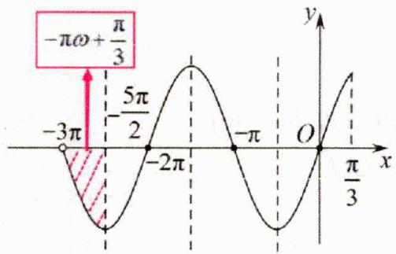

法二：现图（ $\sin(wx+\varphi)$ ）卡根：

当 $x \in (-\pi, 0)$ 时， $\omega x + \frac{\pi}{3} \in \left(-\pi \omega + \frac{\pi}{3}, \frac{\pi}{3}\right)$ ，画出 $f(x) = \sin \left(\omega x + \frac{\pi}{3}\right) (\omega > 0)$ 函数图象，

如图把 $-\pi$ 卡在红色部分，刚好符合题意，即 $-\frac{10\pi}{3w} \leq -\pi < -\frac{17\pi}{6w} \Rightarrow \omega \in \left(\frac{17}{6}, \frac{10}{3}\right]$ ;

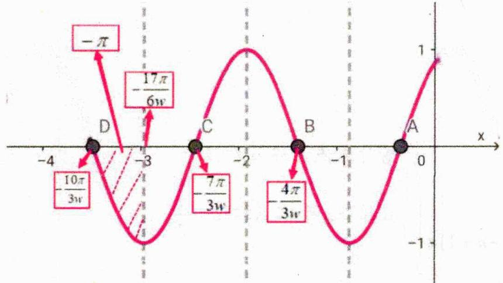

### 二、【典型例题】

##### 1.（全国·高三专题练习）已知函数 $f(x) = \cos \left( \omega x - \frac{\pi}{4} \right) (\omega > 0)$ 在区间

$[0, \pi]$ 上有且仅有3条对称轴，则 $\omega$ 的取值范围是（）

$\quad$A. $\left(\frac{13}{4},\frac{17}{4}\right]$

$\quad$B. $\left(\frac{9}{4},\frac{13}{4}\right]$

$\quad$C. $\left[\frac{9}{4},\frac{13}{4}\right)$

$\quad$D. $\left[\frac{13}{4},\frac{17}{4}\right)$

##### 2.（黑龙江哈尔滨·高三哈尔滨市第六中学校校考期中）若函数 $y = \cos \left( \omega x + \frac{\pi}{6} \right)$ ( $\omega > 0$ ) 在区间 $\left(-\frac{\pi}{3}, 0\right)$ 上恰有唯一对称轴，则 $\omega$ 的取值范围为（）

$\quad$A. $\left[\frac{1}{2},\frac{7}{2}\right)$

$\quad$B. $\left(\frac{1}{3},\frac{7}{6}\right]$

$\quad$C. $\left(\frac{1}{3},\frac{7}{3}\right]$

$\quad$D. $\left(\frac{1}{2},\frac{7}{2}\right]$

##### 3.（全国·高三专题练习）已知函数 $f(x) = 2\sin \left(\omega x + \frac{\pi}{6}\right)(\omega > 0)$ ，若方程 $|f(x)| = 1$ 在区间 $(0, 2\pi)$ 上恰有5个实根，则 $\omega$ 的取值范围是（）

$\quad$A. $\left(\frac{7}{6},\frac{5}{3}\right]$

$\quad$B. $\left(\frac{5}{3},\frac{13}{6}\right]$

$\quad$C. $\left(1,\frac{4}{3}\right]$

$\quad$D. $\left(\frac{4}{3},\frac{3}{2}\right]$

### 三、【习题检测】

##### 1.（全国·高三校联考阶段练习）设函数 $f(x) = \sin \left( \omega x + \frac{\pi}{6} \right)$ 在区间 $(0,5\pi)$ 上恰好有 5 条对称轴，则 $\omega$ 的取值范围是（）

$\quad$A. $\left[\frac{13}{15},\frac{16}{15}\right)$

$\quad$B. $\left(\frac{13}{15},\frac{16}{15}\right]$

$\quad$C. $\left(\frac{29}{30},\frac{7}{6}\right)$

$\quad$D. $\left(\frac{13}{6},\frac{19}{6}\right)$

##### 2.（全国·高三专题练习）已知函数 $f(x) = \sin \left( \omega x + \frac{\pi}{4} \right) (\omega > 0)$ 在区间 $[0, \pi]$ 上有且仅有 4 条对称轴，给出下列四个结论：① $f(x)$ 在区间 $(0, \pi)$ 上有且仅有 3 个不同的零点；② $f(x)$ 的最小正周期可能是 $\frac{\pi}{2}$ ；③ $\omega$ 的取值范围是 $\left[ \frac{13}{4}, \frac{17}{4} \right)$ ；④ $f(x)$ 在区间 $\left(0, \frac{\pi}{15} \right)$ 上单调递增。

其中所有正确结论的序号是（）

$\quad$A. ①④

$\quad$B. ②③

$\quad$C. ②④

$\quad$D. ②③④

##### 3.（全国·高三专题练习）已知函数 $f(x) = 2\sin (\omega x + \varphi)\left(\omega > 0, 0 < \varphi < \frac{\pi}{2}\right)$ 的图象既关于点 $\left(-\frac{\pi}{8}, 0\right)$ 中心对称，又关于直线 $x = \frac{\pi}{8}$ 对称，且函数 $g(x) = f(x) - \sqrt{2}$ 在 $\left(0, \frac{\pi}{6}\right)$ 上的零点不超过 2 个，现有如下三个数据：① $\omega = 3$ ；② $\omega = 10$ ；③ $\omega = 18$ ，则其中符合条件的数据个数为（）

$\quad$A. 0

$\quad$B. 1

$\quad$C. 2

$\quad$D. 3

##### 4.（全国·高三专题练习）已知函数 $f(x) = \sin (\omega x + \varphi)$ ，其中 $\omega > 0$ ， $|\varphi| \leq \frac{\pi}{2}, -\frac{\pi}{4}$ 为 $f(x)$ 的零点：且 $f(x) \leq \left|f\left(\frac{\pi}{4}\right)\right|$ 恒成立， $f(x)$ 在 $\left(-\frac{\pi}{12}, \frac{\pi}{24}\right)$ 区间上有最小值无最大值，则 $\omega$ 的最大值是（）

$\quad$A. 11

$\quad$B. 13

$\quad$C. 15

$\quad$D. 17

# 4.1.4 区间含 0 之零点个数类型

### 一、【题型总结】

▲适用题型：知零点个数，求ω范围，且（不论开闭）区间含0，比如 $(0,\pi]$ ， $[-\frac{\pi}{4},\frac{\pi}{3}]$ ；

▲方法原理：

##### 1. $y = \sin (wx + \varphi)$ 的零点问题（结论重在理解）：

区间含0时
画图判断
卡一侧端点即可
→
原图卡根：
（1）作图 $y=\sin x$ ，若 $(a,b)\Rightarrow wx+\varphi\in(aw+\varphi,bw+\varphi)$ （2）由 $(aw+\varphi,bw+\varphi)$ 判断图像的起始位置，
根据零点个数对另一侧进行卡根；
现图卡根：
（1）作图 $y=\sin(wx+\varphi)$ （2）由 $(a,b)$ 判断图像的起始位置，
根据零点个数对另一侧进行卡根；

简单举例: (山东·高三山东省实验中学校考阶段练习) 已知函数 $f(x) = \cos \omega x - \sqrt{3} \sin \omega x (\omega > 0)$ , 若 $f(x)$ 在区间 $[0, 2\pi]$ 上有且仅有 4 个零点和 1 个极大值点, 则 $\omega$ 的取值范围是 \_\_\_\_.

原图（ $\sin x$ ）卡根： $f(x) = \cos \omega x - \sqrt{3} \sin \omega x = 2 \cos \left( \omega x + \frac{\pi}{3} \right)$ ，由 $x \in [0, 2\pi]$ ，则 $\omega x + \frac{\pi}{3} \in \left[ \frac{\pi}{3}, 2\pi \omega + \frac{\pi}{3} \right]$ ；作 $y = 2 \cos x$ 图象，如图把 $2\pi \omega + \frac{\pi}{3}$ 卡在红色部分，刚好符合题意，即

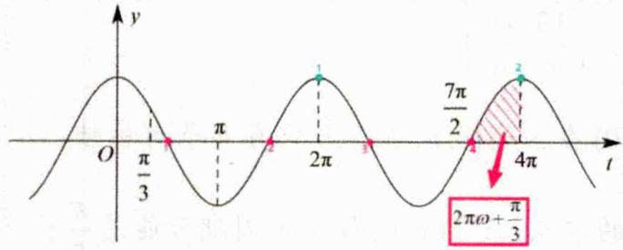

$\frac {7 \pi}{2} \leq 2 \pi \omega + \frac {\pi}{3} <   4 \pi \Rightarrow \frac {1 9}{1 2} \leq \omega <   \frac {1 1}{6};$

##### 2. $y = \sin(wx + \varphi) = t$ 的零点问题（结论重在理解）：

$\left\{ \begin{array}{l} \text { 区间含0时 } \\ \text { 画图判断 } \\ \text { 卡一侧端点即可 } \end{array} \right. \rightarrow \left\{ \begin{array}{l} （1） \text { 作图 } y = \sin x, \text { 并求 } w x + \varphi \text { 范围 } （2） \text { 作图 } y = t, \text { 并标记两图交点横坐标; } \\ （3） \text { 判断图像的起始位置，对另一侧进行卡根 } \\ \text { 注意：图像的起始位置和 } \varphi \text { 有关， } \\ \text { 比如 } \varphi = \frac {\pi}{1 2}, t = \frac {1}{2}, \text { 由图知 } y \text { 轴右侧第一个交点 } x = \frac {\pi}{6} \\ \text { 比如 } \varphi = \frac {\pi}{3}, t = \frac {1}{2}, \text { 由图知 } y \text { 轴右侧第一个交点 } x = \frac {5 \pi}{6} \\ \text { 如果 } \varphi \text { 不确定还需讨论； } \end{array} \right\}$ 重在理解，无需记忆；

另：找 $\sin x=t$ 的小技巧 $\left\{\begin{aligned}& 第一种：先找近y轴波峰两交点，如t=\frac{1}{2},x=\frac{\pi}{6}和\frac{5\pi}{6},\\ & 跟着加减2\pi 依次标注即可\\ & 第二种：结论记忆：k\pi+\left(-1\right)^{k}x_{0}\left(k\in Z,x_{0}一般取\sin x=t 交点靠近y轴的一个\right)\end{aligned}\right.$

简单举例: (全国·高三专题练习) 已知 $f(x)=2\sin\left(ax+\frac{\pi}{6}\right)-\sqrt{3}$ , $a>0$ , 若 $f(x)$ 在区间 $(0,2\pi)$ 上恰有 4 个零点, 则实数 a 的取值范围是 \_\_\_\_.

原图（sin x）卡根：

（1） $f(x)=2\sin\left(ax+\frac{\pi}{6}\right)-\sqrt{3}=0$ $x\in(0,2\pi)$ $\Rightarrow\left\{\begin{aligned}\sin\left(ax+\frac{\pi}{6}\right)&=\frac{\sqrt{3}}{2}\\ ax+\frac{\pi}{6}&\in\left(\frac{\pi}{6},2\pi a+\frac{\pi}{6}\right)\end{aligned}\right.$ $x=\frac{k\pi+(-1)^{k}\frac{\pi}{6}+\frac{\pi}{6}}{\omega}$

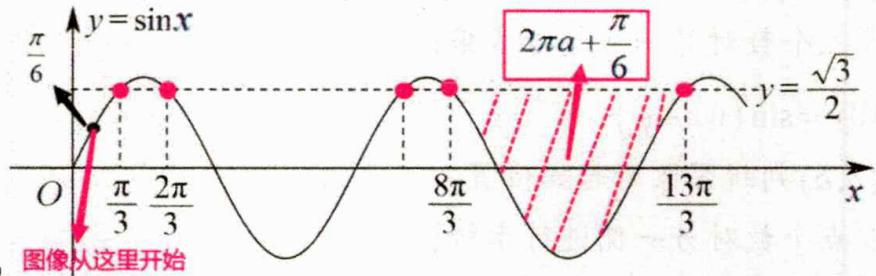

（2） 作图

如图把 $2\pi a+\frac{\pi}{6}$ 卡在红色部分，刚好符合题意，即 $\frac{8\pi}{3}<2\pi a+\frac{\pi}{6}\leqslant\frac{13\pi}{3}$ ，解得 $\frac{5}{4}<a\leq\frac{25}{12}$ .

### 二、【典型例题】

##### 1. (2022·全国甲卷·高考真题) 设函数 $f(x) = \sin \left( \omega x + \frac{\pi}{3} \right)$ 在区间 $(0, \pi)$ 恰有三个极值点、两个零点，则 $\omega$ 的取值范围是（）

$\quad$A. $\left[\frac{5}{3},\frac{13}{6}\right)$

$\quad$B. $\left[\frac{5}{3},\frac{19}{6}\right)$

$\quad$C. $\left(\frac{13}{6},\frac{8}{3}\right]$

$\quad$D. $\left(\frac{13}{6},\frac{19}{6}\right]$

##### 2. (2019·全国·高考真题) 设函数 $f(x) = \sin (\omega x + \frac{\pi}{5}) (\omega > 0)$ ，已知 $f(x)$ 在 $[0, 2\pi]$ 有且仅有 5 个零点，下述四个结论：

① $f(x)$ 在 $(0,2\pi)$ 有且仅有3个极大值点  
② $f(x)$ 在 $(0,2\pi)$ 有且仅有2个极小值点  
③ $f(x)$ 在 $(0,\frac{\pi}{10})$ 单调递增④ $\omega$ 的取值范围是 $\left[\frac{12}{5},\frac{29}{10}\right)$

其中所有正确结论的编号是（）

$\quad$A. ①④

$\quad$B. ②③

$\quad$C. ①②③

$\quad$D. ①③④

##### 3.（辽宁辽阳·高三统考期末）已知函数 $f(x) = 2\sqrt{2}\sin \left(\omega x + \frac{\pi}{12}\right)\sin \left(\omega x + \frac{\pi}{3}\right)(\omega >0)$ 在 $[0,\pi ]$ 上恰有3个零点，则 $\omega$ 的取值范围是（）

$\quad$A. $\left[\frac{10}{3},\frac{23}{6}\right)$

$\quad$B. $\left[\frac{5}{3},\frac{23}{12}\right)$

$\quad$C. $\left(\frac{10}{3},\frac{23}{6}\right]$

$\quad$D. $\left(\frac{5}{3},\frac{23}{12}\right]$

### 三、【习题检测】

##### 1.（江西·高三校联考期末）已知函数 $f(x) = 2\sin \left(\omega x + \frac{\pi}{6}\right)(\omega > 0)$ ，若方程 $f(x) = 1$ 在区间 $[0, 2\pi]$ 上恰有3个实根，则 $\omega$ 的取值范围是（）

$\quad$A. $\left[1,\frac{4}{3}\right)$

$\quad$B. $\left(1,\frac{4}{3}\right]$

$\quad$C. $\left(\frac{5}{6},1\right]$

$\quad$D. $\left(\frac{4}{3},\frac{3}{2}\right]$

##### 2.（全国·高三专题练习）已知函数 $f(x) = \cos (\omega x + \varphi)(\omega > 0, -\pi < \varphi < 0)$ ， $f(0) = \frac{\sqrt{3}}{2}$ ，且 $f(x)$ 在 $[0, 100\pi]$ 上恰有50个零点，则 $\omega$ 的取值范围是（）

$\quad$A. $\left[\frac{38}{75},\frac{31}{60}\right)$

$\quad$B. $\left(\frac{38}{75},\frac{31}{60}\right]$

$\quad$C. $\left[\frac{149}{300},\frac{38}{75}\right)$

$\quad$D. $\left(\frac{149}{300},\frac{38}{75}\right]$

##### 3.（辽宁沈阳·高三沈阳二中校考期末）已知 $\omega > 0$ ，函数 $f(x) = \sqrt{3} \sin \left(2\omega x + \frac{\pi}{6}\right) + 2\cos^2 \left(\omega x + \frac{\pi}{12}\right) - 1$ 在 $(0, \pi)$ 上恰有 3 个零点，则 $\omega$ 的取值范围为（）

$\quad$A. $\left[\frac{4}{3},\frac{11}{6}\right]$

$\quad$B. $\left(\frac{4}{3},\frac{11}{6}\right)$

$\quad$C. $\left[\frac{4}{3},\frac{11}{6}\right)$

$\quad$D. $\left(\frac{4}{3},\frac{11}{6}\right]$

##### 4.（全国·高三专题练习）把函数 $f(x) = \sin 2x$ 的图象向左平移 $\frac{\pi}{5}$ 个单位，再将得到的曲线上所有点的横坐标变为原来的 $\frac{1}{\omega} (\omega > 0)$ 倍，纵坐标不变，得到函数 $y = g(x)$ 的图象。若函数 $y = g(x)$ 在 $\left(0, \frac{\pi}{2}\right)$ 上恰有3个零点，则 $\omega$ 的取值范围是（）

$\quad$A. $\left(\frac{8}{5},\frac{13}{5}\right]$

$\quad$B. $\left(\frac{13}{5},\frac{18}{5}\right]$

$\quad$C. $\left(\frac{14}{5},\frac{19}{5}\right]$

$\quad$D. $\left(\frac{9}{5},\frac{14}{5}\right]$

##### 5.（全国·高三专题练习）已知 $f(x) = \sin^2\left(\omega x + \frac{\pi}{3}\right) - \cos^2\left(\omega x + \frac{\pi}{3}\right)$ （ $\omega > 0$ ）。给出下列判断：

①若 $f(x_{1}) = 1$ ， $f(x_{2}) = -1$ ，且 $\left|x_1 - x_2\right|_{\min} = \frac{\pi}{2}$ ，则 $\omega = 2$

②若 $f(x)$ 在 $[0,2\pi]$ 上恰有 9 个零点，则 $\omega$ 的取值范围为 $\left[\frac{53}{24},\frac{59}{24}\right)$ ;

③存在 $\omega\in(0,2)$ ，使得 $f(x)$ 的图象向右平移 $\frac{\pi}{6}$ 个单位长度后得到的图象关于 y 轴对称；④若 $f(x)$ 在 $\left[-\frac{\pi}{6},\frac{\pi}{3}\right]$ 上单调递增，则 $\omega$ 的取值范围为 $\left(0,\frac{1}{3}\right]$ .

其中，判断正确的个数为（）

$\quad$A. 1

$\quad$B. 2

$\quad$C. 3

$\quad$D. 4

# 4.1.5 区间不含 0 之单调类型

### 一、【题型总结】

▲适用题型：函数在某个区间单调，求 $\omega$ 范围的题目，并且（不论开闭）区间不含0，比如 $\left[\frac{\pi}{4},\frac{\pi}{3}\right]$ ;

▲方法原理：

##### 1. 熟悉以下常见模型：

$\left\{ \begin{array}{l} {\text {单调问题}} \\ {\sin (w x + \varphi)} \\ {k \in Z, w > 0} \\ {\text {区间的开闭}} \\ {\text {不影响结果}} \end{array} \right. \left\{ \begin{array}{l} {(a, b) \text {单调} \uparrow \longrightarrow \left\{ \begin{array}{l} {| b - a | \leq \frac {T}{2}} \\ {- \frac {\pi}{2} + 2 k \pi \leq a w + \varphi <   b w + \varphi \leq \frac {\pi}{2} + 2 k \pi} \end{array} \right.} \\ {(a, b) \text {单调} \downarrow \longrightarrow \left\{ \begin{array}{l} {| b - a | \leq \frac {T}{2}} \\ {\frac {\pi}{2} + 2 k \pi \leq a w + \varphi <   b w + \varphi \leq \frac {3 \pi}{2} + 2 k \pi} \end{array} \right.} \\ {(a, b) \text {单调或无对称轴} \longrightarrow \left\{ \begin{array}{l} {| b - a | \leq \frac {T}{2}} \\ {- \frac {\pi}{2} + k \pi \leq a w + \varphi <   b w + \varphi \leq \frac {\pi}{2} + k \pi} \end{array} \right.} \\ {(a, b) \text {不单调} \longrightarrow a w + \varphi <   \frac {\pi}{2} + k \pi <   b w + \varphi} \end{array} \right.$

##### 2. 由于此时区间（不论开闭）不含0，图像位置不能确定（含0时可以画出y轴确定位置），做题时除了卡范围，碰到轴心条件，还需要卡住形式；

比如：（全国·高三专题练习）已知函数 $y=\sin(\omega x+\varphi)(\omega>0,\varphi\in(0,2\pi))$ 的一条对称轴为 $x=-\frac{\pi}{6}$ ，且 $f(x)$ 在 $\left(\pi,\frac{4\pi}{3}\right)$ 上单调，则 $\omega$ 的最大值为 \_\_\_\_.

原图卡根：

对称轴 $x=-\frac{\pi}{6}$ $\left(\pi,\frac{4\pi}{3}\right)$ 单调 $\left\{\begin{aligned}-\frac{\pi}{6}w+\varphi=\frac{\pi}{2}+k_{1}\pi&\Rightarrow\varphi=\frac{\pi}{2}+k_{1}\pi+\frac{\pi}{6}w\\-\frac{\pi}{2}+k_{2}\pi&\leq\pi w+\varphi<\frac{4\pi}{3}w+\varphi\leq\frac{\pi}{2}+k_{2}\pi\\\frac{4\pi}{3}-\pi&\leq\frac{T}{2}=\frac{\pi}{w}(k_{1},k_{2}\in Z)\end{aligned}\right\}\Rightarrow\left\{\begin{aligned}\frac{6}{7}(k_{2}-k_{1}-1)&\leq w\leq\frac{2}{3}(k_{2}-k_{1})\\0<w<3\\令k_{2}-k_{1}=t则t\in Z\\当t=4时\frac{18}{7}\leq\omega\leq\frac{8}{3}\Rightarrow\omega最大\frac{8}{3}\end{aligned}\right.$

现图卡根：函数 $y=\sin(\omega x+\varphi)$ 的对称轴可表示为： $x=\frac{k\pi}{\omega}-\frac{\pi}{6}(k\in\mathbf{Z})$

$f(x)$ 在 $\left(\pi, \frac{4\pi}{3}\right)$ 上单调可得 $\exists k_0 \in \mathbf{Z}$ , 使得 $\left\{ \begin{array}{l} \frac{k_0\pi}{\omega} - \frac{\pi}{6} \leqslant \pi \\ \frac{(k_0 + 1)\pi}{\omega} - \frac{\pi}{6} \geqslant \frac{4\pi}{3} \end{array} \right. \Rightarrow \left\{ \begin{array}{l} \frac{6}{7}k_0 \leqslant \omega \leqslant \frac{2}{3}(k_0 + 1) \\ \because \omega > 0, \therefore k_0 = 0, 1, 2, 3 \end{array} \right. \Rightarrow \left\{ \begin{array}{l} k_0 = 3 \\ \omega \text{最大为} \frac{8}{3} \end{array} \right.$

### 二、【典型例题】

##### 1. (2012·全国·高考真题) 已知 $\omega > 0$ ，函数 $f(x) = \sin (\omega x + \frac{\pi}{4})$ 在 $(\frac{\pi}{2}, \pi)$ 上单调递减，则 $\omega$ 的取值范围是（）

$\quad$A. $\left[\frac{1}{2},\frac{5}{4}\right]$

$\quad$B. $\left[\frac{1}{2},\frac{3}{4}\right]$

$\quad$C. $(0, \frac{1}{2}]$

$\quad$D. (0,2]

##### 2.（全国·高三专题练习）已知 $f(x) = 2\sqrt{3}\sin wx\cos wx + 2\cos^2 wx$ ，（w > 0），若函数在区间 $\left(\frac{\pi}{2},\pi\right)$ 内不存在对称轴，则w的范围为（）

$\quad$A. $\left(0, \frac{1}{6}\right] \cup \left[\frac{1}{3}, \frac{3}{4}\right]$

$\quad$B. $\left(0, \frac{1}{3}\right] \cup \left[\frac{2}{3}, \frac{3}{4}\right]$

$\quad$C. $\left(0, \frac{1}{6}\right] \cup \left[\frac{1}{3}, \frac{2}{3}\right]$

$\quad$D. $\left(0,\frac{1}{3}\right]\cup\left[\frac{2}{3},\frac{5}{6}\right]$

##### 3.（全国·高三专题练习）已知函数 $f(x)=\sin(\omega x+\varphi)(0<\omega\leq12,\omega\in N,0<\varphi<\pi)$ 的图象关于 y 轴对称，且在区间 $\left[\frac{\pi}{4},\frac{\pi}{2}\right]$ 上不单调，则 $\omega$ 的可能值有（）

$\quad$A. 6个

$\quad$B. 7个

$\quad$C. 8个

$\quad$D. 9个

### 三、【习题检测】

##### 1.（全国·高三专题练习）已知 $\omega > 0$ ，函数 $f(x) = \sin (\omega x + \frac{\pi}{3})$ 在区间 $(\frac{\pi}{2}, \pi)$ 内单调递减，则 $\omega$ 的取值范围为（）

$\quad$A. $\left[\frac{1}{2},\frac{5}{4}\right]$

$\quad$B. $\left[\frac{1}{2}, \frac{7}{6}\right]$

$\quad$C. $\left[\frac{1}{3},\frac{7}{6}\right]$

$\quad$D. $[\frac{1}{3}, \frac{5}{4}]$

##### 2.（云南昆明·一模）已知函数 $f(x)=\sin\omega x+\cos\omega x(\omega>0)$ 在区间 $\left[\frac{\pi}{6},\frac{\pi}{4}\right]$ 单调递增，下面三个结论：

① $\omega$ 的取值范围为 $(0,1]$   
② $f(x)$ 在区间 $\left[\frac{\pi}{6},\frac{\pi}{4}\right]$ 可能有1个零点  
③存在 $\omega$ ，使 $f\left(x + \frac{\pi}{2}\right) = f(x)$

其中正确结论的个数是（）

$\quad$A. 0 个

$\quad$B. 1 个

$\quad$C. 2个

$\quad$D. 3 个

##### 3.（广东广州·高三广州市禺山高级中学校考阶段练习）已知函数 $f(x) = \cos (\omega x + \varphi)(\omega > 0)$ 的图象的一条对称轴为 $x = -\frac{\pi}{6}$ ， $f(x)$ 在区间 $\left(\frac{\pi}{3}, \frac{\pi}{2}\right)$ 上不单调，则 $\omega$ 的最小正整数值为（）

$\quad$A. 4

$\quad$B. 5

$\quad$C. 6

$\quad$D. 7

##### 4.（全国·高三专题练习）已知函数 $f(x) = \cos \left( \omega x - \frac{\pi}{3} \right) (\omega > 0)$ 在 $\left[\frac{\pi}{6}, \frac{\pi}{4}\right]$ 上单调递增，且当 $x \in \left[\frac{\pi}{4}, \frac{\pi}{3}\right]$ 时， $f(x) \geq 0$ 恒成立，则 $\omega$ 的取值范围为（）

$\quad$A. $\left(0,\frac{5}{2}\right]\cup\left[\frac{22}{3},\frac{17}{2}\right]$

$\quad$B. $\left(0,\frac{4}{3}\right]\cup\left[8,\frac{17}{2}\right]$

$\quad$C. $\left(0,\frac{4}{3}\right]\cup\left[8,\frac{28}{3}\right]$

$\quad$D. $\left(0,\frac{5}{2}\right]\cup\left[\frac{22}{3},8\right]$

# 4.1.6 区间不含 0 之零点个数类型

### 一、【题型总结】

▲适用题型：已知零点个数，求 $\omega$ 范围的题目，并且（不论开闭）区间不含0，比如 $\left[\frac{\pi}{4},\frac{\pi}{3}\right]$ ;

▲方法原理：

##### 1. $y = \sin(wx + \varphi)$ 的零点问题（结论重在理解）：

$\begin{array}{r l} & {\left\{ \begin{array}{l l} {(a, b) \text {无零点} \left\{ \begin{array}{l l} {| b - a | \leq \frac {T}{2}} & {\big (k \in Z, w > 0, n \in N ^ {*} \big)} \\ {k \pi \leq a w + \varphi <   b w + \varphi \leq (k + 1) \pi} & \end{array} \right.} \\ & {\left\{ \begin{array}{l l} {\frac {(n - 1) T}{2} <   | b - a | \leq \frac {(n + 1) T}{2}} & {\left\{ \begin{array}{l l} {\frac {(n - 1) T}{2} \leq | b - a | <   \frac {(n + 1) T}{2}} \\ {k \pi <   a w + \varphi <   (k + 1) \pi} & {[ a, b ] n} \\ {(k + n) \pi <   b w + \varphi \leq (k + n + 1) \pi} \end{array} \right.} \\ & {\left\{ \begin{array}{l l} {\frac {(n - 1) T}{2} <   | b - a | <   \frac {(n + 1) T}{2}} & {\left\{ \begin{array}{l l} {\frac {(n - 1) T}{2} <   | b - a | <   \frac {(n + 1) T}{2}} \\ {k \pi <   a w + \varphi \leq (k + 1) \pi} \\ {(k + n) \pi <   b w + \varphi <   (k + n + 1) \pi} \end{array} \right.} \\ & {\left\{ \begin{array}{l l} {[ a, b) n} & {\text {零点}} \\ {[ a, b) n} & {\text {零点}} \\ {[ a, b) n} & {\text {零点}} \\ {[ a, b) n} & {\text {零点}} \\ {[ a, b) n} & {\text {零点}} \\ {[ a, b) n} & {\text {零点}} \\ {[ a, b) n} & {\text {零点}} \\ {[ a, b) n} & {\left\{ \begin{array}{l l} {\frac {(n - 1) T}{2} <   | b - a | <   \frac {(n + 1) T}{2}} \\ {k \pi <   a w + \varphi \leq (k + 1) \pi} \\ {(k + n) \pi <   b w + \varphi \leq (k + n + 1) \pi} \end{array} \right.} \\ & {\left\{ \begin{array}{l l} {\frac {(n - 1) T}{2} <   | b - a | <   \frac {(n + 1) T}{2}} \\ {k \pi <   a w + \varphi \leq (k + 1) \pi} \\ {(k + n) \pi <   b w + \varphi \leq (k + n + 1) \cdot \pi} \end{array} \right.} \\ & {\left\{ \begin{array}{l l} {[ k, b ] n} & {\text {零点}} \\ {[ k, b ] n} & {\text {零点}} \\ {[ k, b ] n} & {\text {零点}} \\ {[ k, b ] n} & {\text {零点}} \\ {[ k, b ] n} & {\text {零点}} \\ {[ k, b ] n} & {\text {零点}} \\ {[ k, b ] n} & {\text {零点}} \\ {[ k, b ] n} & {\left\{ \begin{array}{l l} {\frac {(n - 1) T}{2} <   | b - a | <   \frac {(n + 1) T}{2}} \\ {k \pi <   a w + \varphi <   (k + 1) \pi} \\ {(k + n) \pi <   b w + \varphi <   (k + n + 1) \pi} \end{array} \right.} \\ & {\left\{ \begin{array}{l l} {[ k, b ] n} & {\text {区间不含0时图像初始位置不能确定故周期，两端点都要进行卡根}} \\ {[ k, b ] n} & {\text {区间不含0时图像初始位置不能确定故周期，两端点都要进行卡根}} \\ {[ k, b ] n} & {\text {区间不含0时图像初始位置不能确定故周期，两端点都要进行卡根}} \\ {[ k, b ] n} & {\text {区间不含0时图像初始位置不能确定故周期，两端点都要进行卡根}} \\ {[ k, c ] n} & {\text {区间不含0时图像初始位置不能确定故周期，两端点都要进行卡根}} \\ {[ k, c ] n} & {\text {区间不含0时图像初始位置不能确定故周期，两端点都要进行卡根}} \\ {[ k, c ] n} & {\text {区间不含0时图像初始位置不能确定故周期，两端点都要进行卡根}} \\ {[ k, c ] n}   & {\text {区间不含0时图像初始位置不能确定故周期，两端点都要进行卡根}} \\ {[ k, c ] n}   & {\text {区间不含0时图像初始位置不能确定故周期，两端点都要进行卡根}} \\ {[ k, c ] n}   & {\text {区间不含0时图像初始位置不能确定故周期，两端点都要进行卡根}} \\ {[ k, c ] n}   = [ k, c ] _ {n},    [ k, c ] _ {n}. } \\ & {\left\{ \begin{array}{l l} {[ k, c ] n},    [ k, c ] _ {n}. } \\ {[ k, c ] n},    [ k, c ] _ {n}. } \\ {[ k, c ] n},    [ k, c ] _ {n}. } \\ {[ k, c ] n},    [ k, c ] _ {n}. } \\ {[ k, c ] n},    [ k, c ] _ {n}. } \\ {[ k, c ] n},    [ k, c ] _ {n}. } \\ {[ k, c ].} \\ {[ k, c ].} \\ {[ k, c ].} \\ {[ k, c ].} \\ {[ k, c ].} \\ {[ k, c ].}. \\ {[ k, c ].}. \\ {[ k, c ].}. \\ {[ k, c ].}. \\ {[ k, c ].}. \\ {[ k, c ].}. \\ {[ k, c ].}. \\ {[ k, c ].}. \\ {[ k, c ].}. \\ {[ k, c ].}. \\ {[ k, c ].}. \\ {[ k, c ].}. \\ {[ k, c ].}. \\ {[ k, c ].}. \\ {[ k, c ].}. \\ [ k, c ].. \\ {[ k, c ].}. \\ {[ k, c ].}. \\ {[ k, c ].}. \\ {[ k, c ].}. \\ {[ k, c ].}. \\ {[ k, c ].}. \\ {[ k, c ].}. \\ {[ k, c ].}. \\ {[ k, c ].}. \\ {[ k, c ].}. \\ {[ k, c ].}. \\ {[ k, c ].}. \\ {[ k, c ].}. \\ {[ k , c ].}. \\ {[ k , c ].}. \\ {[ k , c ].}. \\ {[ k , c ].}. \\ {[ k , c ].}. \\ {[ k , c ].}. \\ {[ k , c ].}. \\ {[ k , c ].}. \\ {[ k , c ].}. \\ {[ k , c ].}. \\ {[ k , c ].}. \\ {[ k , c ].}. \\ {[ k , c ].}. \\ {[ k , c ].}. \\ {[ k , c .].}. \\ {[ k , c . ].}. \\ {[ k , c . ].}. \\ {[ k , c . ].}. \\ {[ k , c . ].}. \\ {[ k , c . ].}. \\ {[ k , c . ].}. \\ {[ k , c . ].}. \\ {[ k , c . ].}. \\ {[ k , c . ].}. \\ {[ k , c . ].}. \\ {[ k , c . ].}. \\ {[ k , c . ].}. \\ {[ k , c . ].}. \\ {[ K , C ], C ], C ], C ], C ], C ], C ], C ], C ], C ], C ], C ], C ], C ], C ], C ], C ], C ], C ], C ], C ], C ], C ], C ], C ], C ], C ], C ], C ], C ], C ], C ], C ], C ], C ], C ], C ], C ], C ], C ], C ], C ], C ], C ], C ], C ], C ], C ], C ], C ], C }, \\ & \left\{ \begin{array}{l l} {\left[ (a, b) a ^ {- 1 / 2}, a ^ {- 1 / 2}, a ^ {- 1 / 2}, a ^ {- 1 / 2}, a ^ {- 1 / 2}, a ^ {- 1 / 2}, a ^ {- 1 / 2}, a ^ {- 1 / 2}, a ^ {- 1 / 2}, a ^ {- 1 / 2}, a ^ {- 1 / 2}, a ^ {- 1 / 2}, b ^ {- 1 / 2}, a ^ {- 1 / 2}, a ^ {- 1 / 2}, a ^ {- 1 / 2}, a ^ {- 1 / 2}, a ^ {- 1 / 2}, a ^ {- 1 / 2}, a ^ {- 1 / 2}, a ^ {- 1 / 2}, a ^ {- 1 / 2}, a ^ {- 1 / 2}, a _ {i j}, a _ {i j}, a _ {i j}, a _ {i j}, a _ {i j}, a _ {i j}, a _ {i j}, a _ {i j}, a _ {i j}, a _ {i j}, a _ {i j}, a _ {i j}, a _ {i j}, a _ {i j}, a _ {i j}, a _ {i j}, a _ {i j}, a _ {{i j}}, a _ {{i j}}, a _ {{i j}}, a _ {{i j}}, a _ {{i j}}, a _ {{i j}}, a _ {{i j}}, a _ {{i j}}, a _ {{i j}}, a _ {{i j}}, a _ {{i j}}, a _ {{i j}}, a _ {{i j}}, a _ {{i j}}, a _ {{i j}}, a _ {{i j}}, a _ {{i j}}, a _ {{j i}}, a _ {{j i}}, a _ {{j i}}, a _ {{j i}}, a _ {{j i}}, a _ {{j i}}, a _ {{j i}}, a _ {{j i}}, a _ {{j i}}, a _ {{j i}}, a _ {{j i}}, a _ {{j i}}, a _ {{j i}}, a _ {{j i}}, a _ {{j i}}, a _ {{j i}}, a _ {{j i}}, a _ {} ^ {. . . . . . . . . . . . . . . . . . . . . . . . . . . . . . . . . . . . . . . . . . . . . . . . . . . . . . . . . . . . . . . . . . . . . . . . . . . . . . . . . . . . . . . . . . . .. } \\ & {\left\{ \begin{array}{l l} {\frac {(n - 1) T}{2}} <   | b - a | <   \frac {(n + 1) T}{2}} \\ {k \pi <   a w + \varphi <   (k + 1) \pi} & {\left\{ \begin{array}{l l} {\frac {(n - 1) T}{2}} <   | b - a | <   \frac {(n + 1) T}{2}} \\ {k \pi <   a w + \varphi <   (k + 1) \pi} & {\left\{ \begin{array}{l l} {\frac {(n - 1) T}{2}} <   | b w + \varphi <   (k + n + 1) \pi} & {\left\{ \begin{array}{l l} {\frac {(n - 1) T}{2}} <   | b w + \varphi <   (k + n + 1) \pi} & {\left\{ \begin{array}{l l} {\frac {(n - 1) T}{2}} <   | b w + \varphi <   (k + n + 1) \eta_ {i j}} & {\left\{ \begin{array}{l l} {\frac {(n - 1) T}{2}} <   | b w + \varphi <   (k + n + 1) \eta_ {i j}} & {\left\{ \begin{array}{l l} {\frac {(n - 1) T}{2}} <   | b w + \varphi <   (k + n + 1) \eta_ {j i}} & {\left\{ \begin{array}{l l} {\frac {(n - 1) T}{2}} <   | b w + \varphi <   (k + n + 1) \eta_ {j i}} & {\left\{ \begin{array}{l l} {\frac {(n - 1) T}{2}} <   | b w + \varphi <   (k + n + 1) \eta_ {\mathrm{c}}}} & {\left\{ \begin{array}{l l} {\frac {(n - 1) T}{2}} <   | b w + \varphi <   (k + n + 1) \eta_ {i j}} & \left\{ \begin{array}{l l} {\frac {(n - 1) T}{2}} <   | b w + \varphi <   (k + n + 1) \eta_ {\mathrm{i}} u v e r t h r e s t r o d t r o d t r o d t r o d t r o d t r o d t r o d t r o d t r o d t r o d t r o d t r o d t r o d t r o d t r o d t r o d t r o d t r o d t r o d t r o d t r o d t r o d t r o d t r o d t r o d t r o r e f f i l l l l l l l l l l l l l l l l l l l l l l l l l l l l l l l l l l l l l l l l l l l l l l l l l l l l l l l l l l l l l l l l l l l l l l l l l l l l l l l l l l l l l l l l l l l l l l l l l l l l | x | x | x | x | x | x | x | x | x | x | x | x | x | x | x | x | x | x | x | x | x | x | x | x | x | x | x | x | x | x | x | x | x | x | x | x | x | x | x | x | x | x | x | x | x | x | x | x | x | x | y | y | y | y | y | y | y | y | y | y | y | y | y | y | y | y | y | y | y | y | y | y | y | y | y | y | y | y | y | y | y | y | y | y | y | y | y | y | y | y | y | y | y | y | y | y |
| [a, b] = [a - b] = [b - b] = [c - b] = [d - b] = [e - b] = [f - e] = [g - e] = [h - e] = [i - h] = [j - j] = [k - j] = [l - m] = [m - m] = [n - m] = [o - o] = [p - p] = [q - q] = [r - r] = [s - s] = [t - t] = [u - u] = [v - v] = [w - w] = [x - x] = [y - y] = [z - z] = [u - u] = [w - w] = [x - x] = [y - y] = [z - z] = [u - u] = [w - w] = [x - x] = [y - y] = [z - z] = [u - u] = [w - w] = [x - x] = [y - y] = [z - z] = [u - u] = [w - w] = [y - y] = [z - z] = [u - u] = [w - w] = [x - x] = [y - y] = [z - z] = [u - u] = [w - w] = [x - x] = [y - y] = [z - z] = [u - u] = [w - w] = [x - x] = [y - y] = [Z - Z ] = A B D E F I G H I G H I G H I G H I G H I G H I G H I G H I G H I G H I G H I G H I G H I G H I G H I G H I G H I G H I G H I G H I G H I G H I G H I G H I G H I G H I G H I G H I G H I G H I G H I G H I G H I G H i g h i g h i g h i g h i g h i g h i g h i g h i g h i g h i g h i g h i g h i g h i g h i g h i g h i g h i g h i g h i g h i g h i g h i g h i g h i g h i g h i g h i g h i g h i g h i g h i g h i g h e f f i g h i g h i g h i g h i g h i g h i g h i g h i g h i g h i g h i g h i g h i g h i g h i g h i g h i g h i g h i g h i g h i g h i g h i g h i g h i g h i g h i g h i g h i g h i g h i g h i g h. f f f f f f f f f f f f f f f f f f f f f f f f f f f f f f f f f f f f f f f f f f f f f f f f f f f f f f f f f f f f f f f f f f f f f f f f f f f f f f f f f f f f f f f f f f f f f f f f f f f f w e r e d e r e d e r e d e r e d e r e d e r e d e r e d e r e d e r e d e r e d e r e d e r e d e r e d e r e d e r e d e r e d e r e d e r e d e r e d e r e d e r e d e r e d e r e d e r e d e r e d e r e. s. s. s. s. s. s. s. s. s. s. s. s. s. s. s. s. s. s. s. s. s. s. s. s. s. s. s. s. s. s. s. s. s. s. s. s. s. s. s. s. s. s. s. s. s. s. s. s. s. s. S. S. S. S. S. S. S. S. S. S. S. S. S. S. S. S. S. S. S. S. S. S. S. S. S. S. S. S. S. S. S. S. S. S. S. S. S. S. S. S. S. S. S. S. S. S. S. S. S. S. s.s.s.s.s.s.s.s.s.s.s.s.s.s.s.s.s.s.s.s.s.s.s.s.s.s.s.s.s.s.s.s.s.s.s.s.s.s.s.s.s.s.s.s.s.s.s.s.s.s.s.s.s.s.s.s.s.s.s.s.s.s.s.s.s.s.s.s.s.s.s.s.s.s.s.s.s.s.s.s.s.s.s.s.s.s.s.s.s.s.s.s.s.s.s.s.s.s.s.s.s.a.] s.l.t., s.l.t., s.l.t., s.l.t., s.l.t., s.l.t., s.l.t., s.l.t., s.l.t., s.l.t., s.l.t., s.l.t., s.l.t., s.l.t., s.l.t., s.l.t., s.l.t., s.l.t., s.l.t., s.l.t., s.l.t., s.l.t., s.l.t., s.l.t., s.l.t., s.l.t..s.l.t.,s.l.t.,s.l.t.,s.l.t.,s.l.t.,s.l.t.,s.l.t.,s.l.t.,s.l.t.,s.l.t.,s.l.t.,s.l.t.,s.l.t.,s.l.t.,s.l.t.,s.l.t.,s.l.t.,s.l.t.,s.l.t.,s.l.t.,s.l.t.,s.l.t.,s.l.t.,s.l.t.,s.l.t.,s.l.t..s.l.t.,s.l.t.,s.l.t.,s.l.t.,s.l.t.,s.l.t.,s.l.t.,s.l.t.,s.l.t.,s.l.t.,s.l.t.,s.l.t.,s.l.t.,s.l.t.,s.l.t.,s.l.t.,s.l.t.,s.l.t.,s.l.t.,s.l.t.,s.l.t.,s.l.t.,s.l.t.,s.l.t.,S.S.S.S.S.S.S.S.S.S.S.S.S.S.S.S.S.S.S.S.S.S.S.S.S.S.S.S.S.S.S.S.S.S.S.S.S.S.S.S.S.S.S.S.S.S.S.S.S.S.S.S.S.S.S.S.S.S.S.S.S.S.S.S.S.S.S.S.S.S.S.S.S.S.S.S.S.S.S.S.S.S.S.S.S.S.S.S.S.S.S.S.S.S.S.S.S.S.S.S.S,S.A.T.C.C.C.C.C.C.C.C.C.C.C.C.C.C.C.C.C.C.C.C.C.C.C.C.C.C.C.C.C.C.C.C.C.C.C.C.C.C.C.C.C.C.C.C.C.C.C.C.C.C.C.C.C.C.C.C.C.C.C.C.C.C.C.C.C.C.C.C.C.C.C.C.C.C.C.C.C.C.C.C.C.C.C.C.C.C.C.C.C.C.C.C.C.C.C.C.C.C.C.C/C.A.T.C.A.T.A.T.A.T.A.T.A.T.A.T.A.T.A.T.A.T.A.T.A.T.A.T.A.T.A.T.A.T.A.T.A.T.A.T.A.T.A.T.A.T.A.T.A.T.A.T.A.T.A.T.A.T.A.T.A.T.A.T.A.T.A.T.A.T.A.T.A.T.A.T.A.T.A.T.A.T.A.T.A.T.A.T.A.T.A.T.A.T.A.T.A.T.A.T.A.T.A.T.A,T.A.T.A.T.A.T.A.T.A.T.A.T.A.T.A.T.A.T.A.T.A.T.A.T.A.T.A.T.A.T.A.T.A.T.A.T.A.T.A.T.A.T.A.T.A.T.A.T.A.T.A.T.A.T.A.T.A.T.A.T.A.T.A.T.A.T.A.T.A.T.A.T.A.T.A.T.A.T.A.T.A.T.A.T.A.T.A.T.A.T.A.T.A.T.A.T.A.T.A T,A,T,A,T,A,T,A,T,A,T,A,T,A,T,A,T,A,T,A,T,A,T,A,T,A,T,A,T,A,T,A,T,A,T,A,T,A,T,A,T,A,T,A,T,A,T,A,T,A,T,A,T,A,T,A,T,A,T,A,T,A,T,A,T,A,T,A,T,A,T,A,T,A,T,A,T,A,T,A,T,A,T,A,T,A,T,A,T,A,T,A,T,A,T,A,T,A,T,A,T,A,t,a,t,a,t,a,t,a,t,a,t,a,t,a,t,a,t,a,t,a,t,a,t,a,t,a,t,a,t,a,t,a,t,a,t,a,t,a,t,a,t,a,t,a,t,a,t,a,t,a,t,a,t,a,t,a,t,a,t,a,t,a,t,a,t,a,t,a,t,a,t,a,t,a,t,a,t,a,t,a,t,a,t,a,t,a,t,a,t,a,t,a,t,a,t,a,t,a,t,a,t,u,w,w,w,w,w,w,w,w,w,w,w,w,w,w,w,w,w,w,w,w,w,w,w,w,w,w,w,w,w,w,w,w,w,w,w,w,w,w,w,w,w,w,w,w,w,w,w,w,w,w,w,w,w,w,w,w,w,w,w,w,w,w,w,w,w,w,w,w,w,w,w,w,w,w,w,w,w,w,w,w,w,w,w,w,w,w,w,w,w,w,w,w,w,w,w,w,w,w,w,w,n,s,s,s,s,s,s,s,s,s,s,s,s,s,s,s,s,s,s,s,s,s,s,s,s,s,s,s,s,s,s,s,s,s,s,s,s,s,s,s,s,s,s,s,s,s,s,s,s,s,s,s,s,s,s,s,s,s,s,s,s,s,s,s,s,s,s,s,s,s,s,s,s,s,s,s,s,s,s,s,s,s,s,s,s,s,s,s,s,s,s,s,s,s,s,s,s,s,s,s,s,S,S,S,S,S,S,S,S,S,S,S,S,S,S,S,S,S,S,S,S,S,S,S,S,S,S,S,S,S,S,S,S,S,S,S,S,S,S,S,S,S,S,S,S,S,S,S,S,S,S,S,S,S,S,S,S,S,S,S,S,S,S,S,S,S,S,S,S,S,S,S,S,S,S,S,S,S,S,S,S,S,S,S,S,S,S,S,S,S,S,S,S,S,S,S,S,S,S,S,S-S,S,S,S-S,S,S-S,S,S-S,S-S,S-S,S-S,S-S,S-S,S-S,S-S,S-S,S-S-S,S-S-S-S-S-S-S-S-S-S-S-S-S-S-S-S-S-S-S-S-S$

（1） 简单举例: (湖南长沙·高三长郡中学校考阶段练习) 已知函数 $f(x) = \sin \left(\omega x + \frac{\pi}{3}\right) (\omega > 0)$ 在 $\left[\frac{\pi}{3}, \pi\right]$ 上恰有 3 个零点, 则 $\omega$ 的取值范围是 \_\_\_\_.

原图卡根： $f(x)$ 在 $\left[\frac{\pi}{3},\pi \right]$ 上恰有3个零点，

$\Rightarrow \left\{ \begin{array}{l} T \leq \pi - \frac {\pi}{3} <   2 T \\ k \pi <   \frac {\pi}{3} \omega + \frac {\pi}{3} \leq (k + 1) \pi \\ (k + 3) \pi \leq \pi \omega + \frac {\pi}{3} <   (k + 4) \pi \end{array} \Rightarrow \left\{ \begin{array}{l} 3 \leq \omega <   6 \\ 3 k - 1 <   \omega \leq 3 k + 2 \\ k + \frac {8}{3} \leq \omega <   k + \frac {1 1}{3} \\ k \in Z \end{array} \Rightarrow \left\{ \begin{array}{l} k = 1 \text {时} \frac {1 1}{3} \leq \omega <   \frac {1 4}{3} \\ k = 2 \text {时} 5 <   \omega <   \frac {1 7}{3} \end{array} \right. \right. \right.$

（2） 简单举例: (浙江·高三专题练习) 函数 $g(x) = \sin(\omega x)(\omega > 0)$ 的图象向右平移 $\frac{\pi}{3\omega}$ 个单位得到函数 $f(x)$ , 且 $f(x)$ 在 $(\pi, 2\pi)$ 内没有零点, 则 $\omega$ 的取值范围是 \_\_\_\_.

现图卡根：根据题意得 $f(x) = g\left(x - \frac{\pi}{3\omega}\right) = \sin \left(\omega x - \frac{\pi}{3}\right)$ ， $f(x)$ 在 $(\pi, 2\pi)$ 内没有零点，

$\Rightarrow \left\{ \begin{array}{l} 2 \pi - \pi \leq \frac {T}{2} \\ \frac {k \pi + \pi}{\omega} \leq \pi <   2 \pi \leq \frac {k \pi + \pi + \frac {\pi}{3}}{\omega} \\ \omega > 0 \end{array} \Rightarrow \left\{ \begin{array}{l} 0 <   \omega \leq 1 \\ k + \frac {1}{3} \leq \omega \leq \frac {k}{2} + \frac {2}{3} \\ k \in Z \end{array} \Rightarrow \left\{ \begin{array}{l} k = - 1 \text {时} 0 <   \omega \leq \frac {1}{6} \\ k = 0 \text {时} \frac {1}{3} \leq \omega \leq \frac {2}{3} \end{array} \right. \right. \right.$

##### 2. $y = \sin(wx + \varphi) = t$ 的零点问题（结论重在理解）：

这类题目相对来说更为复杂，一般讨论两种情况，这里举例：

$\sin(wx+\varphi)=\frac{1}{2}$ 在 $(a,b)$ 有两个零点：

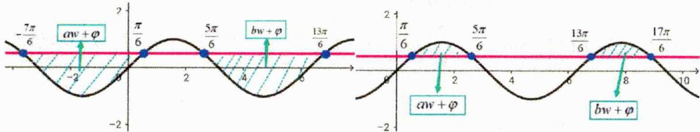

$\Rightarrow (\text{左图}) \left\{ \begin{array}{l} -\frac{7\pi}{6} + 2k\pi \leq aw + \varphi < \frac{\pi}{6} + 2k\pi \\ \frac{5\pi}{6} + 2k\pi < bw + \varphi \leq \frac{13\pi}{6} + 2k\pi \text{或} (\text{右图}) \\ \frac{T}{3} < b - a \leq \frac{5T}{3} \end{array} \right. \left\{ \begin{array}{l} \frac{\pi}{6} + 2k\pi \leq aw + \varphi < \frac{5\pi}{6} + 2k\pi \\ \frac{13\pi}{6} + 2k\pi < bw + \varphi \leq \frac{17\pi}{6} + 2k\pi \\ \frac{2T}{3} < b - a \leq \frac{4T}{3} \end{array} \right.$

### 二、【典型例题】

##### 1. (2016·天津·高考真题) 已知函数 $f(x) = \sin^2 \frac{\omega x}{2} + \frac{1}{2} \sin \omega x - \frac{1}{2} (\omega > 0), x \in R$ . 若 $f(x)$ 在区间 $(\pi, 2\pi)$ 内没有零点，则①的取值范围是（）

$\quad$A. $\left(0,\frac{1}{8}\right]$

$\quad$B. $\left(0, \frac{1}{4}\right] \cup \left[\frac{5}{8}, 1\right)$

$\quad$C. $\left(0,\frac{5}{8}\right]$

$\quad$D. $\left(0,\frac{1}{8}\right]\cup\left[\frac{1}{4},\frac{5}{8}\right]$

##### 2.（全国·高三专题练习）将函数 $f(x) = \cos x$ 的图象先向右平移 $\frac{5}{6}\pi$ 个单位长度，再把所得函数图象的横坐标变为原来的 $\frac{1}{\omega} (\omega > 0)$ 倍，纵坐标不变，得到函数 $g(x)$ 的图象，若函数 $g(x)$ 在 $\left(\frac{\pi}{2}, \frac{3\pi}{2}\right)$ 上没有零点，则 $\omega$ 的取值范围是（）

$\quad$A. $\left(0, \frac{2}{9}\right] \cup \left[\frac{2}{3}, \frac{8}{9}\right]$

$\quad$B. $\left(0,\frac{8}{9}\right]$

$\quad$C. $\left(0,\frac{2}{9}\right)\cup\left[\frac{8}{9},1\right]$

$\quad$D. $(0,1]$

##### 3.（多选题全国·高三专题练习）已知函数 $f(x) = \sin (\omega x + \varphi)(\omega > 0, \varphi \in \mathbb{R})$ 在区间 $\left(\frac{7\pi}{12}, \frac{5\pi}{6}\right)$ 上单调，且满足 $f\left(\frac{7\pi}{12}\right) = -f\left(\frac{3\pi}{4}\right)$ 有下列结论正确的有（）

$\quad$A. $f\left(\frac{2\pi}{3}\right)=0$

$\quad$B. 若 $f\left(\frac{5\pi}{6} - x\right) = f(x)$ ，则函数 $f(x)$ 的最小正周期为 $\pi$ ;

$\quad$C. 关于 $x$ 的方程 $f(x) = 1$ 在区间 $[0,2\pi)$ 上最多有4个不相等的实数解

$\quad$D. 若函数 $f(x)$ 在区间 $\left[\frac{2\pi}{3}, \frac{13\pi}{6}\right)$ 上恰有 5 个零点，则 $\omega$ 的取值范围为 $\left[\frac{8}{3}, 3\right]$

### 三、【习题检测】

##### 1.（辽宁葫芦岛·高三葫芦岛第一高级中学校考期末）已知函数

$f(x)=\cos^{2}\frac{\omega x}{2}+\frac{\sqrt{3}}{2}\sin\omega x-\frac{1}{2}(\omega>0,x\in\mathbb{R})$ . 若函数 $f(x)$ 在区间 $(\pi,2\pi)$ 内没有零点，则 $\omega$ 的取值范围是（）

$\quad$A. $\left(0,\frac{5}{12}\right]$

$\quad$B. $\left(0,\frac{5}{12}\right]\cup\left[\frac{5}{6},\frac{11}{12}\right)$

$\quad$C. $\left(0,\frac{5}{6}\right]$

$\quad$D. $\left(0,\frac{5}{12}\right]\cup\left[\frac{5}{6},\frac{11}{12}\right]$

##### 2.（江西·临川一中模拟预测）函数 $f(x) = \sin (\omega x - \frac{\pi}{6})(\omega > 0)$ 在 $\left(\frac{\pi}{2}, \frac{3\pi}{2}\right)$ 上没有零点，则 $\omega$ 的取值范围是（）

$\quad$A. $\left(0,\frac{1}{9}\right]$

$\quad$B. $(0,1]$

$\quad$C. $\left(0,\frac{1}{9}\right]\cup\left[\frac{1}{3},\frac{7}{9}\right]$

$\quad$D. $\left(0,\frac{1}{9}\right]\cup\left[\frac{7}{9},1\right]$

##### 3.（安徽·芜湖一中高三阶段练习）函数 $f(x) = \sin \left( {\omega x + \frac{\pi }{4}}\right) \left( {\omega  > 0}\right)$ 在 $\left( {\pi ,2\pi }\right)$ 上恰好有两个零点,则 $\omega$ 的取值范围是（）

$\quad$A. $\left(\frac{11}{8},\frac{7}{4}\right)\cup\left(\frac{15}{8},\frac{19}{8}\right]\cup\left[\frac{11}{4},\frac{23}{8}\right]$

$\quad$B. $\left(\frac{11}{8},\frac{7}{4}\right)\cup\left(\frac{15}{8},\frac{19}{8}\right]\cup\left[\frac{11}{4},\frac{25}{8}\right]$

$\quad$C. $\left(\frac{9}{8},\frac{7}{4}\right)\cup\left(\frac{15}{8},\frac{19}{8}\right)\cup\left[\frac{11}{4},\frac{23}{8}\right]$

$\quad$D. $\left(\frac{9}{8},\frac{7}{4}\right)\cup\left(\frac{15}{8},\frac{19}{8}\right]\cup\left[\frac{11}{4},\frac{25}{8}\right]$

##### 4.（四川泸州·高三四川省泸县第四中学校考期末）已知函数 $x_{1} = \frac{\pi}{6}$ 在区间 $\left(\frac{7\pi}{12}, \frac{5\pi}{6}\right)$ 上单调，且满足 $f\left(\frac{7\pi}{12}\right) = -f\left(\frac{3\pi}{4}\right)$ . 有下列结论：

① $f\left(\frac{2\pi}{3}\right)=0$ ;

②若 $f\left(\frac{5\pi}{6} - x\right) = f(x)$ ，则函数 $f(x)$ 的最小正周期为 $\pi$ ；

③关于x的方程 $f(x)=1$ 在区间 $\left[0,2\pi\right)$ 上最多有4个不相等的实数解；

④若函数 $f(x)$ 在区间 $\left[\frac{2\pi}{3}, \frac{13\pi}{6}\right)$ 上恰有 5 个零点，则 $\omega$ 的取值范围为 $\left(\frac{8}{3}, 3\right]$ . 其中所有正确结论的编号为 \_\_\_\_.

# 4.1.7 区间不含 0 之轴心加单调类型

### 一、【题型总结】

▲适用题型：已知对称轴和对称中心以及函数单调性，求ω范围的题目，并且（不论开闭）区间含0，比如 $\left[\frac{\pi}{4},\frac{\pi}{3}\right]$ ;

▲方法原理：

$y=\sin(wx+\varphi)$ 对称轴 x=p ，对称中心 $(t,0)$ ，在 $(a,b)$ 单调，则 w 范围：

##### 1. 法一：卡形式卡范围再讨论

（1）卡形式：轴 $x = p$ ，心 $(t,0)\Rightarrow \left\{ \begin{array}{l}\left|p - t\right| = \frac{(2n - 1)T}{4} = \frac{(2n - 1)}{4}\frac{2\pi}{w}\Bigg[\text{常写成}\frac{(2n + 1)T}{4},n\in N\Bigg]\\ \Rightarrow w = \frac{(2n - 1)\pi}{2|p - t|}\big(n\in N^{*}\big) \end{array} \right.$

（2） 卡范围: $\left|b-a\right|\leq\frac{T}{2}\Rightarrow\left|b-a\right|\leq\frac{1}{2}\cdot\frac{2\pi}{w}\Rightarrow w\leq\frac{\pi}{\left|b-a\right|}$

（3） 讨论验证: $\left\{ \begin{array}{l} w = \frac{(2n - 1)\pi}{2|p - t|} \\ w \leq \frac{\pi}{|b - a|} \end{array} \right. \Rightarrow$ 逐个讨论 $w \left\{ \begin{array}{l} \langle 1 \rangle w \text{取一个符合的值} \\ \langle 2 \rangle \text{对称中心} (t,0) \Rightarrow tw + \varphi = k\pi \\ \varphi \text{的范围} (k \in Z) \end{array} \right\} \Rightarrow \varphi$ $\langle 3 \rangle$ 验证单调性是否符合题意 $\langle 4 \rangle$ 按以上步骤循环讨论验证直至求出答案

注意:以上结论无需记忆,重在理解;

举例说明:(浙江·杭十四中期末) $f(x)=\sin(\omega x+\varphi)(\omega>0,|\varphi|\leq\frac{\pi}{2})$ ，若 $x=-\frac{\pi}{8}$ 是函数 $f(x)$ 的零点， $x=\frac{\pi}{8}$ 是函数 $f(x)$ 的对称轴， $f(x)$ 在区间 $(\frac{\pi}{5},\frac{\pi}{4})$ 上单调，则 $\omega$ 的最大值是\_\_\_\_.

（1） 卡形式：轴 $x=\frac{\pi}{8}$ ，心 $\left(-\frac{\pi}{8},0\right)\Rightarrow\left\{\begin{aligned}\left|\frac{\pi}{8}-\left(-\frac{\pi}{8}\right)\right|&=\frac{(2n+1)T}{4}=\frac{(2n+1)}{4}\frac{2\pi}{w}\\ \Rightarrow w=4n+2(n\in N)\end{aligned}\right.$

（2）卡范围: $\left|\frac{\pi}{4}-\frac{\pi}{5}\right|\leq\frac{T}{2}\Rightarrow\left\{\begin{aligned}\frac{\pi}{20}&\leq\frac{1}{2}\cdot\frac{2\pi}{w}\\ \Rightarrow w&\leq20\end{aligned}\right.$

（3） 讨论验证: $\left\{\begin{aligned}w &= 4n + 2(n \in N) \\ w &\leq 20\end{aligned}\right.$

$\int \left\langle 1\right\rangle \omega = 18$

$\langle 2\rangle$ 对称中心 $\left(-\frac{\pi}{8},0\right)\Rightarrow 18\times \left(-\frac{\pi}{8}\right) + \varphi = k\pi ,k\in Z,|\varphi |\leq \frac{\pi}{2}\Rightarrow \varphi = \frac{\pi}{4}$

$\langle 3\rangle$ 验证 $f(x) = \sin \left(18x + \frac{\pi}{4}\right)$ 在 $\left(\frac{\pi}{5},\frac{\pi}{4}\right)$ 不单调， $\omega = 18$ 舍

$\langle 4\rangle$ 同理 $\omega = 14$ ，算得 $\varphi = -\frac{\pi}{4}$ 验证 $f(x) = \sin \left(14x - \frac{\pi}{4}\right)$ 在 $\left(\frac{\pi}{5},\frac{\pi}{4}\right)$ 单调故 $\omega = 14$

##### 2. 法二：精确 w 范围后再验证（画图分析），适合求 w 最值的情况；

情形1: 对称中心和区间某端点重合 $|b-a|\leq\frac{T}{4}$

情形2:对称轴和区间某端点重合 $|b-a|\leq\frac{T}{2}$ （没有优化）

情形3:都不重合时 $\Rightarrow\left|\text{轴}-\text{近端点}\right|$ 或 $\left|\text{心}-\text{近端点}\right|$ $\Rightarrow\left\{\begin{aligned} 判断轴或心位置 \\  常在临近单调区间 \\  偶尔在本区间 \end{aligned}\right\}\Rightarrow 更精确的w$

最后再结合卡形式得出答案并验证(基本只需要验证一次)

情形3判断位置的原理：w最大则T最小，选靠近区间端点的轴或心，则轴或心与其接近的区间端点越远越好，但是又受周期的约束即 $|b-a|\leq\frac{T}{2}$ ，使得轴或心基本最远就在临近的区间或本区间，下面我们举例说明；（全国·高三专题练习）已知函数 $f(x)=A\sin(\omega x+\varphi)\left(A>0,\omega>0,|\varphi|<\frac{\pi}{2}\right)$ ， $x=-\frac{\pi}{4}$ 是函数的一个零点，且 $x=\frac{\pi}{4}$ 是其图象的一条对称轴。若 $\left(\frac{\pi}{9},\frac{\pi}{6}\right)$ 是 $f(x)$ 的一个单调区间，则 $\omega$ 的最大值为\_\_\_\_。

法二：精确 w 范围后再验证（画图分析）

$\left\{ \begin{array}{l} \frac{\pi}{6} - \frac{\pi}{9} = \frac{\pi}{18} \leq \frac{T}{2} \\ \frac{\pi}{4} - \frac{\pi}{6} = \frac{\pi}{12} \end{array} \right. \Rightarrow \left\{ \begin{array}{l} T > \frac{\pi}{12} > \frac{\pi}{18} \times 1 \\ w \text{最大} T \text{最小} \end{array} \right. \Rightarrow \text{对称轴} \frac{\pi}{4} \text{最远可以在} \left( \frac{\pi}{9}, \frac{\pi}{6} \right) \text{的下一个单调区间}$

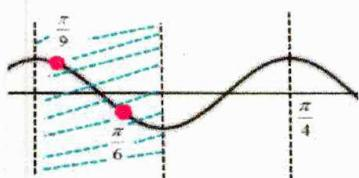

如图所示红点在绿色部分运动

$\Rightarrow \left\{ \begin{array}{l} \frac{\pi}{4} - \frac{\pi}{9} = \frac{5\pi}{36} \leq T \\ \frac{\pi}{4} - \frac{\pi}{6} = \frac{\pi}{12} \geq \frac{T}{2} \end{array} \right. \Rightarrow \left\{ \begin{array}{l} 12 \leq w \leq 14 \frac{2}{5} \\ \text{卡形式} \Rightarrow w = 13 \text{检验可知正确} \end{array} \right.$

### 二、【典型例题】

##### 1. （全国·高三专题练习）已知函数 $f(x)=A\sin(\omega x+\varphi)\left(A>0,\omega>0,|\varphi|<\frac{\pi}{2}\right)$ ，若函数 $f(x)$ 的一个零点为 $\frac{\pi}{6}$ 。其图像的一条对称轴为直线 $x=\frac{5\pi}{12}$ ，且 $f(x)$ 在 $\left(\frac{\pi}{6},\frac{\pi}{4}\right)$ 上单调，则 $\omega$ 的最大值为 \_\_\_\_.  
##### 2. (2016·全国·高考真题) 已知函数 $f(x) = \sin (\omega x + \varphi)(\omega > 0, |\varphi| \leq \frac{\pi}{2})$ , $x = -\frac{\pi}{4}$ 为 $f(x)$ 的零点， $x = \frac{\pi}{4}$ 为 $y = f(x)$ 图象的对称轴，且 $f(x)$ 在 $\theta_1$ 单调，则 $\omega$ 的最大值为（）

$\quad$A. 11

$\quad$B. 9

$\quad$C. 7

$\quad$D. 5

### 三、【习题检测】

##### 1.（全国·高三专题练习）已知函数 $f(x)=\sin(\omega x+\varphi)(\omega>0,|\varphi|\leqslant\frac{\pi}{2}),x=-\frac{\pi}{4}$ 为 $y=f(x)$ 图象的对称轴， $x=\frac{\pi}{4}$ 为 $f(x)$ 的零点，且 $f(x)$ 在区间 $(\frac{\pi}{12},\frac{\pi}{6})$ 上单调，则 $\omega$ 的最大值为（）

$\quad$A. 13

$\quad$B. 12

$\quad$C. 9

$\quad$D. 5

##### 2. (全国·高三专题练习) 函数 $f(x) = 3\sin (\omega x + \varphi)\left(\omega > 0, |\varphi| < \frac{\pi}{2}\right)$ ，已知 $\left|f\left(\frac{\pi}{3}\right)\right| = 3$ 且对于任意的 $x \in R$ 都有 $f\left(-\frac{\pi}{6} + x\right) + f\left(-\frac{\pi}{6} - x\right) = 0$ ，若 $f(x)$ 在 $\left(\frac{5\pi}{36}, \frac{2\pi}{9}\right)$ 上单调，则 $\omega$ 的最大值为 \_\_\_\_.  
##### 3.（全国·高三专题练习）已知函数 $f(x)=\cos(\omega x+\varphi)\left(\omega>0,|\varphi|\leq\frac{\pi}{2}\right)$ ， $x=-\frac{\pi}{4}$ 为 $f(x)$ 的零点， $x=\frac{\pi}{4}$ 为 $y=f(x)$ 图象的对称轴，且 $f(x)$ 在 $\left(\frac{\pi}{18},\frac{\pi}{6}\right)$ 上单调，则 $\omega$ 的最大值为（）

$\quad$A. 3

$\quad$B. 4

$\quad$C. 5

$\quad$D. 6

# 4.2 解三角形拓展

# 4.2.1 射影定理

### 一、【题型总结】

▲适用题型：解三角形中出现 $a\cos C+c\cos A$ 结构的相关问题；

▲方法原理：

##### 1. 射影定理： $\left\{\begin{aligned}a&=b\cos C+c\cos B\\ b&=a\cos C+c\cos A\\ c&=a\cos B+b\cos A\end{aligned}\right.$

##### 2. 证明：利用正弦定理，角化边即证；

$\Delta ABC$ 中 $A + B + C = \pi$ $\Rightarrow \left\{\begin{aligned}\sin A=\sin(B+C)=\sin B\cos C+\cos B\sin C\\ 正弦定理 \Rightarrow a=b\cos C+c\cos B\end{aligned}\right.$

简单举例：（2013·陕西·高考真题）设在 $\Delta ABC$ 中，角 $A, B, C$ 所对的边分别为 $a, b, c$ ，若 $b \cos C + c \cos B = a \sin A$ ，则 $\Delta ABC$ 的形状为（）

$\quad$A. 锐角三角形 
$\quad$B. 直角三角形 
$\quad$C. 钝角三角形 
$\quad$D. 不确定

解： $b\cos C + c\cos B = a\sin A = a\Rightarrow A = \frac{\pi}{2}$ ，故选B

##### 3. 几何证明：如图易知 $a = b \cos C + c \cos B$ ，同理可得另两个结论；

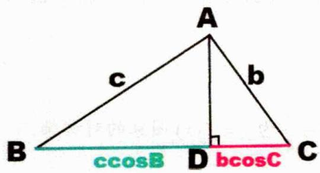

简单举例:(高一单元测试)在 $\Delta ABC$ 中 $b\cos C=2c\cos B$ ,且c=2,则 $\Delta ABC$ 的面积的最大值为\_\_\_\_.

解：上图可知 $\left\{ \begin{array}{l} a = b\cos C + c\cos B \\ = 3c\cos B = 6\cos B \\ AD = c\sin B = 2\sin B \end{array} \right. \Rightarrow S_{\triangle ABC} = \frac{1}{2}\cdot 6\cos B\cdot 2\sin B = 3\sin 2B\leq 3$

### 二、【典型例题】

##### 1. (2017·山东·高考真题) 在 $\triangle ABC$ 中, 角 $A, B, C$ 的对边分别为 $a, b, c$ . 若 $\triangle ABC$ 为锐角三角形, 且满足 $\sin B(1 + 2\cos C) = 2\sin A\cos C + \cos A\sin C$ , 则下列等式成立的是 ( )

$\quad$A. a = 2b

$\quad$B. b = 2a

$\quad$C. A = 2B

$\quad$D. B = 2A

##### 2.（2013·辽宁·高考真题）在 $\Delta ABC$ 中，内角 $A, B, C$ 的对边分别为 $a, b, c$ . 若 $a \sin B \cos C + c \sin B \cos A = \frac{1}{2} b$ ，且 $a > b$ ，则 $B = (\quad)$

$\quad$A. $\frac{\pi}{6}$

$\quad$B. $\frac{\pi}{3}$

c. $\frac{2\pi}{3}$

$\quad$D. $\frac{5\pi}{6}$

##### 3. (2008·山东·高考真题) 已知 $a, b, c$ 为 $\triangle ABC$ 的三个内角 $\mathbf{A}$ , $\mathbf{B}$ , $\mathbf{C}$ 的对边, 向量 $\bar{m} = (\sqrt{3}, -1)$ , $\vec{n} = (\cos A, \sin A)$ . 若 $\vec{m} \perp \vec{n}$ , 且 $a \cos B + b \cos A = c \sin C$ , 则 $\mathbf{B} =$ \_\_\_\_.

### 三、【习题检测】

##### 1. (2017·全国·高考真题) $\triangle ABC$ 的内角 $A, B, C$ 的对边分别为 $a, b, c$ , 若 $2b \cos B = a \cos C + c \cos A$ , 则 $B = \_$ .

##### 2. (2014·广东·高考真题) 在 $\Delta ABC$ 中, 角 $A 、 B 、 C$ 所对应的边分别为 $a 、 b 、 c$ , 已知 $b \cos C + c \cos B = 2b$ , 则 $\frac{a}{b} = \_$ .  
##### 3. (2013·全国·高考真题) $\triangle ABC$ 的内角 $A, B, C$ 的对边分别为 $a, b, c$ ，已知 $a = b \cos C + c \sin B$ . (Ⅰ) 求 $B$ ; (Ⅱ) 若 $b = 2$ ，求 $\triangle ABC$ 面积的最大值.

##### 4. (2016·全国·高考真题) $\triangle ABC$ 的内角 $A, B, C$ 的对边分别为 $a, b, c$ . 已知 $2 \cos C (a \cos B + b \cos A) = c$ .

（1） 求角 C; （2） 若 $c = \sqrt{7}$ ， $S_{\Delta ABC} = \frac{3\sqrt{3}}{2}$ ，求 $\Delta ABC$ 的周长.

##### 5. (2011·江西·高考真题) 在 $\triangle ABC$ 中, $A, B, C$ 的对边分别为 $a, b, c$ , 已知 $3a \cos A = c \cos B + b \cos C$ .

（1） 求 $\cos A$ 的值；（2） 若 $a = 1, \cos B + \cos C = \frac{2\sqrt{3}}{3}$ ，求边 c 的值

# 4.2.2 中线定理

### 一、【题型总结】

▲适用题型：三角形中出现中线时的相关问题；

▲方法原理：

##### 1. 中线定理： $b^{2}+c^{2}=2\left(x^{2}+t^{2}\right)$ （左右方=2倍中下方）

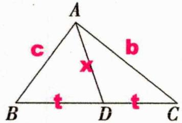

(D 为中点)

##### 2. 向量证明：

$\left. \begin{array}{l} \overrightarrow {A B} + \overrightarrow {A C} = 2 \overrightarrow {A D} （1） \\ \overrightarrow {A B} - \overrightarrow {A C} = 2 \overrightarrow {C D} （2） \end{array} \right\} \Rightarrow （1） ^ {2} + （2） ^ {2} \Rightarrow | \overrightarrow {A B} | ^ {2} + | \overrightarrow {A C} | ^ {2} = 2 (\left| \overrightarrow {A D} \right| ^ {2} + | \overrightarrow {C D} | ^ {2})$

##### 3. 余弦定理证明：

$\left. \begin{array}{l} \angle A D B + \angle A D C = \pi \\ \Rightarrow \cos \angle A D B + \cos \angle A D C = 0 \end{array} \right\} \Rightarrow \left\{ \begin{array}{l} \frac {x ^ {2} + t ^ {2} - c ^ {2}}{2 x t} + \frac {x ^ {2} + t ^ {2} - b ^ {2}}{2 x t} = 0 \\ \Rightarrow b ^ {2} + c ^ {2} = 2 (x ^ {2} + t ^ {2}) \end{array} \right.$

##### 4. 中线利用向量表达 $\overrightarrow{AD} = \frac{1}{2} \left( \overrightarrow{AB} + \overrightarrow{AC} \right)$ ，左右平方即可转化为模长；

### 二、【典型例题】

##### 1. (全国·高三专题练习) $\triangle ABC$ 的内角 $A, B, C$ 的对边分别为 $a, b, c$ , 若 $a=4$ , $b=3$ , $c=2$ , 则中线 $AD$ 的长为 ( )

$\quad$A. $\sqrt{5}$

$\quad$B. $\sqrt{10}$

$\quad$C. $\frac{\sqrt{5}}{2}$

$\quad$D. $\frac{\sqrt{10}}{2}$

##### 2.（全国·高三专题练习）在等腰△ABC中，AB=AC，若AC边上的中线BD的长为3，则△ABC的面积的最大值是（）

$\quad$A. 6

$\quad$B. 12

$\quad$C. 18

$\quad$D. 24

##### 3.（全国·高三专题练习）在△ABC中，若∠BAC=120°，点D为边BC的中点，AD=1，则 $\overrightarrow{AB}\cdot\overrightarrow{AC}$ 的最小值为\_\_\_\_。

##### 4.（全国·高三专题练习）在锐角 $\triangle ABC$ 中， $BC = 2$ ， $\sin B + \sin C = 2\sin A$ ，则中线 $AD$ 长的取值范围是 \_\_\_\_；

### 三、【习题检测】

##### 1.（全国·高三专题练习）在 $\triangle ABC$ 中，角 $A, B, C$ 所对的边分别为 $a, b, c$ ，且 $a \cos C, b \cos B, c \cos A$ 成等差数列，若 $a+c=4$ ，则 $AC$ 边上中线长的最小值\_\_\_\_。

##### 2.（全国·高三专题练习）在△ABC中，AB=4， $AC=2\sqrt{2}$ ， $\angle BAC=45^{\circ}$ ，D为边BC的中点，M为中线AD的中点，则向量 $\overrightarrow{BM}$ 的模为\_\_\_\_。

##### 3.（吉林长春·高三长春市第五中学校考期末）已知△ABC的内角A、B，C所对的边分别为a，b，c，若a=4，且 $4\cos B=c-\frac{1}{2}b$ ，（1）求A；（2）若AD是BC边上的中线，求AD长度的最大值

##### 4.（四川宜宾·高三宜宾市叙州区第一中学校校考期末）锐角三角形 ABC 中，角 A, B, C 所对的边分别为 a, b, c，且 $\frac{\sqrt{3}a}{c \cdot \cos B} = \tan B + \tan C$ .

（1） 求角 C 的值；（2） 若 $c = 2\sqrt{3}$ ，D 为 AB 的中点，求中线 CD 的范围.

##### 5.（全国·高三专题练习）在① $\frac{\sin A}{\sin B}+\frac{\sin B}{\sin A}+1=\frac{c^{2}}{ab}$ ；② $(a+2b)\cos C+c\cos A=0$ ；③

$\sqrt{3}a\sin\frac{A+B}{2}=c\sin A$ ，这三个条作中任选一个，补充在下面的横线上，并解答。在 $\triangle ABC$ 中，角A，B，C所对的边分别为a，b，c，且\_\_\_\_。

（1） 求角 C 的大小；（2） 若 c = 4，求 AB 的中线 CD 长度的最小值.

# 4.2.3 张角定理

### 一、【题型总结】

▲适用题型：三角形中出现如下图时的相关问题；

▲方法原理：

##### 1. 张角定理： $\frac{\sin(\alpha+\beta)}{l}=\frac{\sin\alpha}{b}+\frac{\sin\beta}{c}$

##### 2. 等面积证明：

$\left. \begin{array}{l} S _ {\triangle A B C} = S _ {\triangle A B D} + S _ {\triangle A C D} \\ \Rightarrow \frac {1}{2} b c \sin (\alpha + \beta) = \frac {1}{2} c l \sin \alpha + \frac {1}{2} b l \sin \beta \end{array} \right\} \Rightarrow \frac {\sin (\alpha + \beta)}{l} = \frac {\sin \alpha}{b} + \frac {\sin \beta}{c}$

##### 3. AD 为角平分线时， $\frac{2\cos\alpha}{l}=\frac{1}{b}+\frac{1}{c}$

$\frac {\sin (\alpha + \beta)}{l} = \frac {\sin \alpha}{b} + \frac {\sin \beta}{c} \Rightarrow \left\{ \begin{array}{l} \frac {2 \sin \alpha \cos \alpha}{l} = \frac {\sin \alpha}{b} + \frac {\sin \alpha}{c} \\ \Rightarrow \frac {2 \cos \alpha}{l} = \frac {1}{b} + \frac {1}{c} \end{array} \right.$

### 二、【典型例题】

##### 1.（全国·高三专题练习）在△ABC中，角A,B,C所对的边分别为a,b,c，∠ABC=120°，∠ABC的平分线交AC于点D，且BD=1，则2a+3c的最小值为（）

$\quad$A. $2\sqrt{5}$

$\quad$B. $5 + 2\sqrt{6}$

$\quad$C. 5

$\quad$D. $3 + 4\sqrt{2}$

##### 2.（全国·高三专题练习）在△ABC中，∠ABC的平分线交AC于点D， $\angle ABC=\frac{2\pi}{3}$ ，BD=4，则△ABC周长的最小值为（）

$\quad$A. $8 + 8\sqrt{3}$

$\quad$B. $8 + 2\sqrt{2}$

$\quad$C. $16+8\sqrt{3}$

$\quad$D. $16 + 4\sqrt{2}$

##### 3.（全国·高三专题练习）已知△ABC的内角A,B,C对应的边分别是a,b,c，内角A的角平分线交边BC于D点，且AD=4．若 $(2b+c)\cos A+a\cos C=0$ ，则△ABC面积的最小值是（）

$\quad$A. 16

$\quad$B. $16 \sqrt{3}$

$\quad$C. 64

$\quad$D. ${64}\sqrt{3}$

### 三、【习题检测】

##### 1. (2023·全国·高考真题) 在 $\triangle ABC$ 中, $\angle BAC = 60^{\circ}, AB = 2, BC = \sqrt{6}$ , $\angle BAC$ 的角平分线交 $BC$ 于 $D$ , 则 $AD =$   
##### 2.（全国·高三专题练习）已知 AD 是 $\triangle ABC$ 的内角 A 的平分线，AB = 3，AC = 5， $\angle BAC = 120^{\circ}$ ，则 AD 长为 \_\_\_\_。

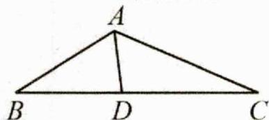

##### 3.（全国·高三专题练习）在△ABC中，已知AC=1，∠A的平分线交BC于D，且AD=1， $BD=\sqrt{2}$ ，则△ABC的面积为  
##### 4.（广西钦州·高三校考阶段练习）已知△ABC中，CD为∠C的角平分线交AB于点D，且BD=1，CD=2，AC=2√3，则BC的长为

##### 5.(全国·高三专题练习)在△ABC中,∠ABC的平分线交AC于点D,∠ABC= $\frac{2\pi}{3}$ ,BD=4,则AB+BC的最小值为\_\_\_\_.

##### 6. (2018·江苏·高考真题) 在 $\triangle ABC$ 中, 角 $A, B, C$ 所对的边分别为 $a, b, c$ , $\angle ABC = 120^{\circ}$ , $\angle ABC$ 的平分线交 $AC$ 于点 $D$ , 且 $BD = 1$ , 则 $4a + c$ 的最小值为 \_\_\_\_.

##### 7. (全国·高三专题练习) 在 $\triangle ABC$ 中, 角 $A, B, C$ 所对的边分别为 $a, b, c$ , 且 $\frac{\sin A + \sin B}{\sin C} = \frac{c + b}{a - b}$ . （1） 若 $a = 2\sqrt{3}, b = 2$ , 求角 $B$ ; （2） 设 $\angle BAC$ 的角平分线 $AD$ 交 $BC$ 于点 $D$ , 若 $\triangle ABC$ 面积为 $\sqrt{3}$ , 求 $AD$ 长的最大值.

# 4.2.4 倍角定理

### 一、【题型总结】

▲适用题型：三角形中出现两角二倍关系时的相关问题；

▲方法原理：

##### 1. 倍角定理： $\left\{\begin{aligned}A&=2B\Leftrightarrow a^{2}=b^{2}+bc\\ B&=2C\Leftrightarrow b^{2}=c^{2}+ca\\ C&=2A\Leftrightarrow c^{2}=a^{2}+ab\end{aligned}\right.$

##### 2. 证明：

$\left\{ \begin{array} { l } { A = 2 B \Rightarrow } \\ { \sin A = \sin 2 B = 2 \sin B \cos B } \end{array} \right\} \Rightarrow \left\{ \begin{array} { l } { a = 2 b \cdot \frac { a ^ { 2 } + c ^ { 2 } - b ^ { 2 } } { 2 a c } } \\ { \Rightarrow a ^ { 2 } c = a ^ { 2 } b + c ^ { 2 } b - b ^ { 3 } } \\ { \Rightarrow a ^ { 2 } ( c - b ) = b ( c + b ) ( c - b ) } \end{array} \right.$

$\Rightarrow \left\{ \begin{array}{l l} c = b \text {显然成立} a ^ {2} = b ^ {2} + b c = b ^ {2} + c ^ {2} \\ c \neq b \text {时} a ^ {2} = b ^ {2} + b c \end{array} \right.$

$\left\{ \begin{array}{l} a^{2} = b^{2} + bc \\ \text{逆向法一:} a^{2} = b^{2} + c^{2} - 2bc\cos A \\ c \neq 0 \end{array} \right\} \Rightarrow \left\{ \begin{array}{l} b = c - 2b\cos A \\ \Rightarrow \sin B = \sin C - 2\sin B\cos A \\ \Rightarrow \sin B = \sin (A + B) - 2\sin B\cos A \\ \Rightarrow \sin B = \sin (A - B) \end{array} \right. \Rightarrow A = 2B$

逆向法二： $a^{2}=b^{2}+bc$ $\Rightarrow a^{2}-b^{2}=bc$ $\Rightarrow\left\{\begin{aligned}\sin^{2}A-\sin^{2}B&=\sin B\sin C\left(\text{三角平方差}\right)\\\Rightarrow\sin(A+B)\sin(A-B)&=\sin B\sin C\quad\Rightarrow A=2B\\\Rightarrow\sin B&=\sin(A-B)\end{aligned}\right.$

法二还需证三角平方差公式；

##### 3. 小题直接结论处理，解答题时注意条件，不一定需要上述证明；

### 二、【典型例题】

##### 1. (2006·四川·高考真题) 设 $a$ 、 $b$ 、 $c$ 分别是 $\triangle ABC$ 的三个内角 $A$ 、 $B$ 、 $C$ 所对的边, 则 $a^2 = b(b + c)$ 是 $A = 2B$ 的 ( )

$\quad$A. 充要条件

$\quad$B. 充分而不必要条件

$\quad$C. 必要而不充分条件

$\quad$D. 既不充分也不必要条件

##### 2.（2013·山东·高考真题） $\Delta ABC$ 的内角 $A$ 、 $B$ 、 $C$ 的对边分别是 $a$ 、 $b$ 、 $c$ ，若 $B=2A$ ， $a=1$ ， $b=\sqrt{3}$ ，则 $c=$ （ ）

$\quad$A. $2\sqrt{3}$

$\quad$B. 2

$\quad$C. $\sqrt{2}$

$\quad$D. 1

### 三、【习题检测】

##### 1. (2008·四川·高考真题) 在 $\triangle ABC$ 中, 角 $A, B, C$ 的对边分别是 $a, b, c$ , 若 $a = \frac{\sqrt{5}}{2} b$ , $A = 2B$ , 则 $\cos B = (\quad)$

$\quad$A. $\frac{\sqrt{5}}{3}$

$\quad$B. $\frac{\sqrt{5}}{4}$

$\quad$C. $\frac{\sqrt{5}}{5}$

$\quad$D. $\frac{\sqrt{5}}{6}$

##### 2. (2013·北京·高考真题) 在 $\triangle ABC$ 中, $a = 3, b = 2\sqrt{6}$ , $B = 2A$ . （1） 求 $\cos A$ 的值; （2） 求 $c$ 的值.

##### 3.(山西太原·高三统考期末)在△ABC中,内角A,B,C所对的边分别为a,b,c,且满足 $b^{2}+bc=a^{2}$ .

（1） 求证: $A = 2B$ ;

（2） 求 $\frac{6b+2c}{b\cos B}$ 的取值范围.

# 4.2.5 斯特瓦尔特定理

### 一、【题型总结】

▲适用题型：如下图 $\Delta ABC$ 中 $BD = kBC (k \in (0,1))$ 产生的相关题型；

▲方法原理：

##### 1. 斯特瓦尔特定理： $xb^{2} + yc^{2} = a(t^{2} + xy)$

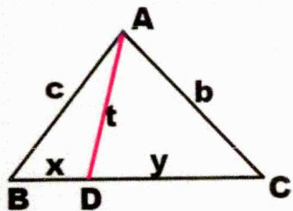

##### 2. 证明：

$\left. \begin{array}{l} \angle A D B + \angle A D C = \pi \\ \Rightarrow \cos \angle A D B + \cos \angle A D C = 0 \end{array} \right\} \Rightarrow \left\{ \begin{array}{l} \frac {x ^ {2} + t ^ {2} - c ^ {2}}{2 x t} + \frac {y ^ {2} + t ^ {2} - b ^ {2}}{2 y t} = 0 \\ \Rightarrow y x ^ {2} + y t ^ {2} - y c ^ {2} + x y ^ {2} + x t ^ {2} - x b ^ {2} = 0 \\ \Rightarrow x b ^ {2} + y c ^ {2} = t ^ {2} (x + y) + x y (x + y) = a (t ^ {2} + x y) \end{array} \right.$

##### 3. 推论：

（1） $AB = AC \Rightarrow b^2 = c^2 = t^2 + xy$

（2） $BD = CD \Rightarrow b^{2} + c^{2} = 2(t^{2} + xy)$ , 即中线定理

（3） AD平分 $\angle BAC \Rightarrow \left\{\begin{aligned} &xb^{2} + yc^{2} = a(t^{2} + xy) \\ &\frac{c}{b} = \frac{x}{y} \Rightarrow xb = yc \\ &\Rightarrow \frac{y}{a} = \frac{b}{b + c}\end{aligned}\right. \Rightarrow \left\{\begin{aligned} &\frac{yc(b + c)}{a} = bc = (t^{2} + xy) \\ &t^{2} = bc - xy, \text{即斯库顿定理}\end{aligned}\right.$

（4） $\left.\begin{aligned}A=2B\\AD平分\angle BAC\end{aligned}\right\}\Rightarrow\left\{\begin{aligned}x=t,t^{2}&=x^{2}=bc-xy\\ \Rightarrow ax&=bc\\ \frac{x}{a}&=\frac{c}{b+c}\end{aligned}\right\}\Rightarrow a^{2}=b^{2}+bc$ 即倍角定理

##### 4. 实际做题记住核心要点 $\cos\angle ADB + \cos\angle ADC = 0$ 解题即可；  
##### 5. 还可考虑 BDC 三点共线，利用向量三点共线定理处理，或者还可考虑延长 AD，利用相似处理；

### 二、【典型例题】

##### 1. (2022·全国·统考高考真题) 已知 $\triangle ABC$ 中, 点 $D$ 在边 $BC$ 上, $\angle ADB = 120^{\circ}, AD = 2, CD = 2BD$ . 当 $\frac{AC}{AB}$ 取得最小值时, $BD = \_$ .

##### 2. (2021·全国·统考高考真题) 记 $\triangle ABC$ 是内角 $A, B, C$ 的对边分别为 $a, b, c$ . 已知 $b^{2} = ac$ , 点 $D$ 在边 $AC$ 上, $BD \sin \angle ABC = a \sin C$ .

（1） 证明: BD = b ;   
（2） 若 AD = 2DC，求 $\cos \angle ABC$ .

##### 3. (2015·全国·高考真题) $\triangle ABC$ 中, D 是 BC 上的点, AD 平分 $\angle BAC$ , $\triangle ABD$ 面积是 $\triangle ADC$ 面积的 2 倍.

（1） 求 $\frac{\sin B}{\sin C}$ ; （2） 若 AD=1, DC= $\frac{\sqrt{2}}{2}$ ，求 BD 和 AC 的长.

### 三、【习题检测】

##### 1.(全国·高三专题练习)已知△ABC中,点D在BC边上,∠BAC=60°,AD=2,CD=2BD,当2AB+AC取最大值时,BD=\_\_\_\_.  
##### 2. (2023 春·云南昆明·高三云南省昆明市第十二中学校考阶段练习) 已知 $D$ 是 $\triangle ABC$ 边 $AC$ 上一点, 且 $CD = 3AD$ , $BD = \sqrt{2}$ , $\cos \angle ABC = \frac{1}{4}$ , 则 $3AB + BC$ 的最大值为 \_\_\_\_.  
##### 3.（全国·高三专题练习）如图，在△ABC中，点D在边AB上，CD垂直于BC，∠A=30°，BD=2AD，AC=5√3，则△ABC的面积为\_\_\_\_。

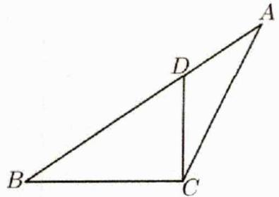

##### 4. (2020·江苏·统考高考真题)在 $\triangle ABC$ 中, 角 $A, B, C$ 的对边分别为 $a, b, c$ , 已知 $a=3, c=\sqrt{2}, B=45^{\circ}$ .

（1） 求 $\sin C$ 的值;  
（2） 在边 BC 上取一点 D，使得 $\cos \angle ADC = -\frac{4}{5}$ ，求 $\tan \angle DAC$ 的值.

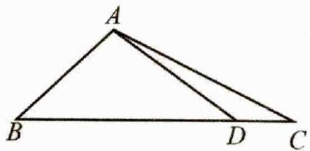

##### 5.（河南洛阳·洛阳市第三中学校联考一模）已知函数 $f(x) = 2\sqrt{3}\cos \left( x - \frac{\pi}{2} \right) \cos x + 2\sin^2 x$ ，在 $\triangle ABC$ 中，内角 $A, B, C$ 的对边分别为 $a, b, c$ ，且 $f(A) = 3$ 。（1）求角 $A$ ；（2） 若 $b=3, c=2$ ，点 $D$ 为 $BC$ 边上靠近点 $C$ 的三等分点，求 $AD$ 的长度。

# 4.2.6 阿氏圆

### 一、【题型总结】

▲适用题型：三角形中出现边长有倍数关系时的相关问题；  
▲方法原理：（阿氏圆即阿波罗尼斯圆或阿波罗尼奥斯圆）

##### 1. 阿氏圆： $\frac{\left|\overrightarrow{AB}\right|}{\left|\overrightarrow{AC}\right|}=k(k>1)$ ，则 A 点轨迹为圆，此圆即阿氏圆（圆 0）；

##### 2. 重要结论：若 $\left|\overrightarrow{BC}\right|=a$ ，则 $r=\frac{ak}{k^{2}-1},\left|CO\right|=\frac{a}{k^{2}-1}$ ;

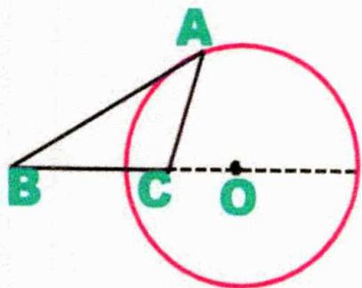

下面证明我们以此图为例；

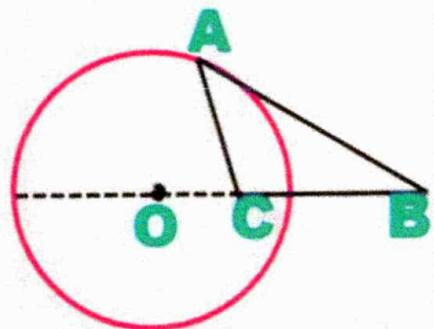

或

注意记这两个结论就可快速找半径和圆心，阿氏圆由于建系坐标选取不一样，所以推导出的结论圆心坐标就不一样，不方便记忆，这里我们记住CO长度以后，只需将C横坐标加上或减去CO长度即为圆心横坐标，以后不管怎么建系都能快速搞定圆心坐标；（建系基本B,C,O在x轴）；

##### 3. 建系证明：

$\begin{array}{r l} & {\text {令} \left\{ \begin{array}{l} {A (x, y), B (- a, 0)} \\ {C (0, 0)} \end{array} \right\}} \\ & {\frac {| \overrightarrow {A B} |}{| \overrightarrow {A C} |} = k (k \neq 1)} \end{array} \Rightarrow \frac {\sqrt {(x + a) ^ {2} + y ^ {2}}}{\sqrt {x ^ {2} + y ^ {2}}} = k \Rightarrow \left(x - \frac {a}{k ^ {2} - 1}\right) ^ {2} + y ^ {2} = \left(\frac {a k}{k ^ {2} - 1}\right) ^ {2}, \text {即证};$

##### 4. 用结论抓住两个要点, 一个是比值 $k (k > 1)$ , 一个是 BC 长度, 需要注意若 $k < 1$ , 则需 $\frac{|\overrightarrow{AB}|}{|\overrightarrow{AC}|}$ 上下颠倒; ;  
##### 5. 平时做题建系直接推导也很快，有些题目不转化为圆，向量条件翻译转换也是可以解决的；

### 二、【典型例题】

##### 1.（2008·江苏·高考真题）若 $AB = 2, AC = \sqrt{2} BC$ ，则 $S_{\triangle ABC}$ 的最大值是 \_\_\_\_.  
##### 2.（全国·高三专题练习） $\triangle ABC$ 中 $BC = 6, AB = 2AC$ , 点 $D$ 在边 $BC$ 上且 $CD = 2BD$ , 则 $\tan \angle ADC$ 的最大值为（）

$\quad$A. $\frac{4}{3}$

$\quad$B. $\frac{3}{4}$

$\quad$C. $\frac{2\sqrt{5}}{5}$

$\quad$D. $\frac{\sqrt{5}}{5}$

##### 3.（湖南长沙·高三雅礼中学校考阶段练习）在△ABC中， $AB=3,\sin B=m\cdot\sin A(m\geq2)$ ，则△ABC的面积最大值为\_\_\_\_。

### 三、【习题检测】

##### 1. (四川泸州·统考二模) 在三角形 $ABC$ 中, $BC = 2$ , $AB = 2AC$ , $D$ 为 $BC$ 的中点, 则 $\tan \angle ADC$ 的最大值为 \_\_\_\_.

##### 2.（全国·高三专题练习） $\triangle ABC$ 中，角 $A, B, C$ 所对的三边分别为 $a, b, c, c=2b$ ，若 $\triangle ABC$ 的面积为 1，则 $BC$ 的最小值是 \_\_\_\_。

##### 3.（全国·高三专题练习）在 $\triangle ABC$ 中，角 $A, B, C$ 的对边分别为 $a, b, c$ . 若 $a = 3b$ ，则 $\cos B$ 的最小值是

##### 4.（山东潍坊·高三统考期中）在△ABC中，点D是BC上的点，AD平分∠BAC,△ABD面积是△ADC面积的2倍，且AD=λAC，则实数λ的取值范围为\_\_\_\_；若△ABC的面积为1，当BC最短时， $\lambda=$ \_\_\_\_。

##### 5. (四川成都·高三成都七中校考阶段练习) $\triangle ABC$ 中, $D$ , $E$ 是边 $BC$ 上的点, $\angle BAD = \angle CAE$ , 且 $\frac{BD \cdot BE}{CD \cdot CE} = \frac{1}{3}$ .

（1） 若 BC = 3，求 $\triangle ABC$ 面积的取值范围；

# 4.2.7 建系处理解三角形

### 一、【题型总结】

▲适用题型：适合建系的解三角形类型；

▲方法原理：

解题步骤：

第一步：根据题目所给条件选取合适的位置建立坐标系.

第二步：找到重要点的坐标，未知的可以假设，并表达出题目的条件.

第三步：解出答案.

### 二、【典型例题】

##### 1. (2022·全国·统考高考真题)已知△ABC中, 点D在边BC上, ∠ADB=120°, AD=2, CD=2BD. 当 $\frac{AC}{AB}$ 取得最小值时, BD= \_\_\_\_.

##### 2. (2021·全国·统考高考真题) 记 $\triangle ABC$ 是内角 $A, B, C$ 的对边分别为 $a, b, c$ . 已知 $b^{2} = ac$ , 点 $D$ 在边 $AC$ 上, $BD \sin \angle ABC = a \sin C$ .

（1） 证明: $BD = b$ ; （2） 若 $AD = 2DC$ , 求 $\cos \angle ABC$ .

### 三、【习题检测】

##### 1. 在等边 $\triangle ABC$ 中, $M$ 为 $\triangle ABC$ 内一动点, $\angle BMC = 120^{\circ}$ , 则 $\frac{MA}{MC}$ 的最小值是 ( )

$\quad$A. 1

$\quad$B. $\frac{3}{4}$

$\quad$C. $\frac{\sqrt{3}}{2}$

$\quad$D. $\frac{\sqrt{3}}{3}$

##### 2.(2024·山东·二模)已知△ABC内角A,B,C的对边分别为a,b,c,点G是△ABC的重心,且 $\overrightarrow{AG}\cdot\overrightarrow{BG}=0$ 。

（1） 若 $\angle GAB = \frac{\pi}{6}$ ，求 $\tan \angle GAC$ 的值；

（2） 求 $\cos \angle ACB$ 的取值范围.

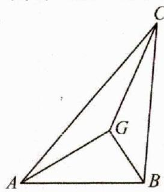

# 4.3 解三角形最值和范围问题

# 4.3.1 角最值和范围问题

# 4.3.1.1 余弦定理类型

### 一、【题型总结】

▲适用题型：基础的角度最值和范围问题，常见于单角度；

▲方法原理：

熟悉余弦定理及其推论： $a^2 = b^2 +c^2 -2bc\cos A,\cos A = \frac{b^2 + c^2 - a^2}{2bc}$

### 二、【典型例题】

##### 1. (2011·四川·高考真题) 在 $\triangle ABC$ 中, $\sin^2 A \leqslant \sin^2 B + \sin^2 C - \sin B \sin C$ . 则 $A$ 的取值范围是 ( )

$\quad$A. $(0, \frac{\pi}{6}]$

$\quad$B. $\left[\frac{\pi}{6}, \pi\right)$

$\quad$C. $(0, \frac{\pi}{3}]$

$\quad$D. $\left[\frac{\pi}{3},\pi\right)$

##### 2.（全国·高三课时练习）在△ABC中，角A, B, C的对边分别是a, b, c，若 $20a\overline{BC}+15b\overline{CA}+12c\overline{AB}=\overline{0}$ ，则△ABC最小角的正弦值等于（）

$\quad$A. $\frac{4}{5}$

$\quad$B. $\frac{3}{4}$

$\quad$C. $\frac{3}{5}$

$\quad$D. $\frac{\sqrt{7}}{4}$

##### 3.(全国·高三专题练习)在 $\Delta ABC$ 中，A、B、C的对边分别为a、b、c，其中 $b^{2}=ac$ ，且 $\sin C=\sqrt{2}\sin B$ ，则其最小角的余弦值为（）

$\quad$A. $- \frac{\sqrt{2}}{4}$

$\quad$B. $\frac{\sqrt{2}}{4}$

$\quad$C. $\frac{5\sqrt{2}}{8}$

$\quad$D. $\frac{3}{4}$

### 三、【习题检测】

##### 1. (全国·高三专题练习) 已知 $\triangle ABC$ 的三边长是三个连续的自然数, 且最大的内角是最小内角的 2 倍, 则最小角的余弦值为 ( )

$\quad$A. $\frac{3}{4}$

$\quad$B. $\frac{5}{6}$

$\quad$C. $\frac{7}{10}$

$\quad$D. $\frac{2}{3}$

##### 2. (2012·福建·高考真题)已知△ABC得三边长成公比为 $\sqrt{2}$ 的等比数列,则其最大角的余弦值为\_.

##### 3.（全国·高三专题练习）已知△ABC中，sinA，sinB，sinC成等比数列，则 $\frac{\sin2B+2}{\sin B+\cos B}$ 的取值范围是（）

$\quad$A. $\left(2,\frac{3\sqrt{2}}{2}\right]$

$\quad$B. $\left(0,\frac{\sqrt{2}}{2}\right]$

$\quad$C. $(2, +\infty)$

$\quad$D. $[2,+\infty)$

# 4.3.1.2 余弦定理+基本不等式类型

### 一、【题型总结】

▲适用题型：条件转化后可利用基本不等式处理的题型，常见于单角度最值或范围问题；

▲方法原理：

##### 1. 余弦定理及其推论： $a^2 = b^2 + c^2 - 2bc\cos A, \cos A = \frac{b^2 + c^2 - a^2}{2bc}$

##### 2. 基本不等式: $a + b \geq 2 \sqrt{ab} (a, b \in R^{+})(a = b$ 时取等, 一正二定三相等)

##### 3. 常见于平方关系替换，再基本不等式处理；

简单举例: (全国·高三专题练习) 在 $\triangle ABC$ 中, 内角 $A, B, C$ 的对边分别为 $a, b, c$ . 已知 $a = 2$ , $\sin^2 A + 3\sin^2 B = 2a\sin^2 C$ , 则 $\cos C$ 的最小值为 \_\_\_\_.

解： $a = 2$ ，则原等式为 $\sin^2 A + 3\sin^2 B = 4\sin^2 C$ ，由正弦定理得 $a^2 +3b^2 = 4c^2$

$\cos C = \frac{a^2 + b^2 - c^2}{2ab} = \frac{a^2 + b^2 - \frac{1}{4}(a^2 + 3b^2)}{2ab} = \frac{3a^2 + b^2}{8ab} \geq \frac{\sqrt{3}}{4}$ , 当且仅当 $b^2 = 3a^2$ 时取等号. 故答案为: $\frac{\sqrt{3}}{4}$ .

### 二、【典型例题】

##### 1.（2012·陕西·高考真题）在 $\Delta ABC$ 中，角 $A, B, C$ 所对边长分别为 $a, b, c$ ，若 $a^2 + b^2 = 2c^2$ ，则 $\cos C$ 的最小值为（）

$\quad$A. $\frac{\sqrt{3}}{2}$

$\quad$B. $\frac{\sqrt{2}}{2}$

$\quad$C. $\frac{1}{2}$

$\quad$D. $-\frac{1}{2}$

##### 2.（全国·高三专题练习）在 $\triangle ABC$ 中，角 $A, B, C$ 对应的边分别是 $a, b, c$ ，若 $3c \cos A + a \cos C = 0$ ，则 $B$ 的最大值为（）

$\quad$A. $\frac{\pi}{6}$

$\quad$B. $\frac{\pi}{3}$

$\quad$C. $\frac{2\pi}{3}$

$\quad$D. $\frac{5\pi}{6}$

##### 3.（全国·高三专题练习）若点 $G$ 为 $\triangle ABC$ 的重心，且 $AG \perp BG$ ，则 $\sin C$ 的最大值为

### 三、【习题检测】

##### 1. (2014·江苏·高考真题) 若 $\triangle ABC$ 的内角 $A, B, C$ 满足 $\sin A + \sqrt{2} \sin B = 2 \sin C$ , 则 $\cos C$ 的最小值是 \_\_\_\_.  
##### 2.（全国·高三专题练习）在△ABC中，角A,B,C对应的边分别是a,b,c，若 $2c\sin B=3a\tan A,a=2$ ；则当角A最大时，△ABC的面积为\_\_\_\_。  
##### 3. (2016·山东·高考真题) 在 $\triangle ABC$ 中, 角 $A, B, C$ 对应的边分别是 $a, b, c$ . 已知 $2(\tan A + \tan B) = \frac{\tan A}{\cos B} + \frac{\tan B}{\cos A}$ . （1） 证明: $a + b = 2c$ ; （2） 求 $\cos C$ 的最小值.

##### 4.（2014·陕西·高考真题） $\triangle ABC$ 中，角 $A, B, C$ 对应的边分别是 $a, b, c$ .

（1） 若 a, b, c 成等差数列，证明： $\sin A + \sin C = 2\sin(A + C)$   
（2） 若 a, b, c 成等比数列，求 $\cos B$ 的最小值.

# 4.3.1.3 统一角度类型

### 一、【题型总结】

▲适用题型：常见于求多个角度和差的最值和范围问题的题型；

▲方法原理：

##### 1. 解题步骤：先求出一个角度，再通过内角和统一角度，后续再通过辅助角公式或转化为函数求解答案；  
##### 2. 注意：题目已知三角形的形状时，一定要求出角度范围，这是易错点；比如锐角三角形则需要 $0 < A < \frac{\pi}{2}, 0 < B < \frac{\pi}{2}, 0 < C < \frac{\pi}{2}$

简单举例: (全国·高三专题练习) 在锐角三角形 $ABC$ 中, 角 $A$ , $B$ , $C$ 所对的边分别为 $a$ , $b$ , $c$ , 且满足 $a + 2a \cos B = c$ , 则 $\frac{\tan B - \tan A}{\tan A \cdot \tan B}$ 的取值范围是 \_\_\_\_.

解：因为 $a + 2a \cos B = c$ ，根据正弦定理得 $\sin A + 2\sin A \cos B = \sin C$ ，

由 $\sin C = \sin (A + B)$ ，即 $\sin A = \sin (B - A)$ ，又因为三角形为锐角三角形，可得 $A = B - A$ ，即 $B = 2A$ 所以 $\left\{ \begin{array}{l} 0 < B < \frac{\pi}{2} \\ 0 < \pi - A - B < \frac{\pi}{2} \end{array} \right.$ ，可得 $\frac{\pi}{3} < B < \frac{\pi}{2}$ ，可得 $\sin B \in (\frac{\sqrt{3}}{2}, 1)$ ，所以 $\frac{1}{\sin B} \in (1, \frac{2\sqrt{3}}{3})$ ，

则 $\frac{\tan B - \tan A}{\tan A\tan B} = \frac{\sin B\cos A - \cos B\sin A}{\sin A\sin B} = \frac{\sin(B - A)}{\sin A\sin B} = \frac{\sin A}{\sin A\sin B} = \frac{1}{\sin B},$

所以 $\frac{\tan B - \tan A}{\tan A\tan B}\in \left(1,\frac{2\sqrt{3}}{3}\right).$

##### 3. 若遇比值问题，则还可考虑角化边，再余弦定理处理；

### 二、【典型例题】

##### 1. (2024·山西·模拟预测) 钝角 $\triangle ABC$ 中, 角 $A, B, C$ 的对边分别为 $a$ , $b$ , $c$ , 若 $a \cos B = c \sin A$ , 则 $\sin A + \sqrt{2} \sin B$ 的最大值是 \_\_\_\_.  
##### 2.（全国·高三专题练习）在钝角 $\triangle ABC$ 中，角 $A, B, C$ 对应的边分别为 $a, b, c$ ，若 $c = b \tan C$ ，则 $\sin A - 3\cos C$ 的最小值为（）

$\quad$A. $-\frac{15}{8}$

$\quad$B. -2

$\quad$C. $-\frac{17}{8}$

$\quad$D. $-\sqrt{10}$

##### 3.(全国·高三专题练习)在钝角△ABC中,角A,B,C所对的边分别为a,b,c,B为钝角,若 $a\cos A=b\sin A$ ,则 $\sin A+\sin C$ 的最大值为\_\_\_\_.  
##### 4.（全国·高三专题练习）在锐角 $\triangle ABC$ 中， $a^{2} - b^{2} = bc$ ，则角 $B$ 的范围是 \_\_\_\_，

$\frac{5}{\tan B}-\frac{5}{\tan A}+6\sin A$ 的取值范围为\_\_\_\_.

### 三、【习题检测】

##### 1. (2010·辽宁·高考真题) 在 $\triangle ABC$ 中, $a, b, c$ 分别为内角 $A, B, C$ 的对边, 且 $2a\sin A = (2b + c)\sin B + (2c + b)\sin C$ .

(Ⅰ) 求 A 的大小；(Ⅱ) 求 $\sin B + \sin C$ 的最大值.

##### 2. (2010·浙江·高考真题) 在 $\triangle ABC$ 中, 角 $A, B, C$ 所对的边分别为 $a, b, c$ , 设 $S$ 为 $\triangle ABC$ 的面积, 满足 $S = \frac{\sqrt{3}}{4} (a^2 + b^2 - c^2)$ .

(Ⅰ) 求角 C 的大小；(Ⅱ) 求 $\sin A + \sin B$ 的最大值.

##### 3. (2016·北京·高考真题) 在 $\triangle ABC$ 中, $a^2 + c^2 = b^2 + \sqrt{2} ac$

（1） 求 B 的大小；（2） 求 $\sqrt{2} \cos A + \cos C$ 的最大值.

##### 4. (2020·浙江·统考高考真题) 在锐角 $\triangle ABC$ 中, 角 $A, B, C$ 的对边分别为 $a, b, c$ , 且 $2b \sin A - \sqrt{3} a = 0$ . （1） 求角 $B$ 的大小; (II) 求 $\cos A + \cos B + \cos C$ 的取值范围.

##### 5. (2007·全国·高考真题) 设锐角三角形 $ABC$ 的内角 $A, B, C$ 的对边分别为 $a, b, c, a = 2b \sin A$ （1） 求 $B$ 的大小; （2） 求 $\cos A + \sin C$ 的取值范围.

##### 6. (2011·湖南·高考真题) 在 $\triangle ABC$ 中, 角 $A, B, C$ 所对的边分别为 $a, b, c$ 且满足 $c \sin A = a \cos C$ . （1） 求角 $C$ 的大小;

（2） 求 $\sqrt{3}\sin A - \cos(B + \frac{\pi}{4})$ 的最大值，并求取得最大值时角 A, B 的大小.

##### 7.（2015·湖南·高考真题）设 $\triangle ABC$ 的内角 $A, B, C$ 的对边分别为 $a, b, c, a = b\tan A$ ，且 $B$ 为钝角.

（1） 证明: $B - A = \frac{\pi}{2}$ ; （2） 求 $\sin A + \sin C$ 的取值范围.

# 4.3.1.4 正切相关类型

### 一、【题型总结】

▲适用题型：常见于求正切相关的最值和范围问题的题型；

▲方法原理：

##### 1. 正切两角和公式：

$A + B + C = \pi \Rightarrow \tan C = - \tan (A + B) = - \frac {\tan A + \tan B}{1 - \tan A \tan B}$

##### 2. 正切恒等式：

$A + B + C = \pi \Rightarrow \tan A + \tan B + \tan C = \tan A \tan B \tan C$

##### 3. 注意：题目已知三角形的形状时，一定要求出角度范围。这是易错点：比如锐角三角形则需要

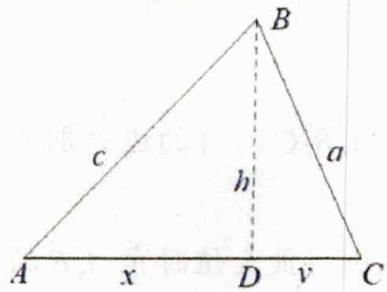

$0 <   A <   \frac {\pi}{2}, 0 <   B <   \frac {\pi}{2}, 0 <   C <   \frac {\pi}{2}$

##### 4. 解题方法：找出各角度正切间的关系，通过正切相关公式转化为函数求解范围或最值，部分题型还可考虑作图处理（作高方便翻译正切）

简单举例: (全国·高三专题练习) 在锐角三角形 ABC 中, 已知 $2 \sin^{2} A + \sin^{2} B = 2 \sin^{2} C$ , 则 $\frac{1}{\tan A} + \frac{1}{\tan B} + \frac{1}{\tan C}$ 的最小值为 \_\_\_\_.

解:由正弦定理得: $2a^{2}+b^{2}=2c^{2}$ ,如上图,作BD⊥AC于D,设AD=x,CD=y,BD=h,因为 $2a^{2}+b^{2}=2c^{2}$ ,所以 $2(y^{2}+h^{2})+(x+y)^{2}=2(x^{2}+h^{2})$ ,化简,得: $x^{2}-2xy-3y^{2}=0$ ,解得:x=3y, $\tan(A+C)=-\tan B$ , $\frac{\tan A+\tan C}{1-\tan A\tan C}=-\tan B$ , $\frac{1-\tan A\tan C}{\tan A+\tan C}=-\frac{1}{\tan B}$ , $\frac{1}{\tan A}+\frac{1}{\tan B}+\frac{1}{\tan C}=\frac{1}{\tan A}+\frac{1}{\tan C}+\frac{\tan A\tan C-1}{\tan A+\tan C}$ $=\frac{x}{h}+\frac{y}{h}+\frac{\frac{h^{2}}{xy}-1}{\frac{h}{x}+\frac{h}{y}}=\frac{4y}{h}+\frac{h^{2}-3y^{2}}{4yh}=\frac{13y}{4h}+\frac{h}{4y}\geq\frac{\sqrt{13}}{2}$ ,当且仅当 $h=\sqrt{13y}$ 时取得最小值 $\frac{\sqrt{13}}{2}$ .

### 二、【典型例题】

##### 1. (2024·河南·三模) 在 $\triangle ABC$ 中, 角 $A, B, C$ 所对的边分别为 $a, b, c$ . 若 $\frac{a}{\cos A} + \frac{b}{\cos B} = \frac{3c}{\cos C}$ , 则 $\tan A + \tan C$ 的最小值是 ( )

$\quad$A. $\frac{4}{3}$

$\quad$B. $\frac{8}{3}$

$\quad$C. $2\sqrt{3}$

$\quad$D. 4

##### 2.（全国·高三专题练习）在锐角 $\triangle ABC$ 中，角 $A, B, C$ 的对边分别为 $a, b, c, \triangle ABC$ 的面积为 $S$ , 若 $\sin (A + C) = \frac{2S}{b^2 - a^2}$ ，则 $\tan A + \frac{1}{3\tan(B - A)}$ 的取值范围为（）

$\quad$A. $\left[\frac{2\sqrt{3}}{3},+\infty\right)$

$\quad$B. $\left[\frac{2\sqrt{3}}{3},\frac{4}{3}\right]$

$\quad$C. $\left(\frac{2\sqrt{3}}{3},\frac{4}{3}\right)$

$\quad$D. $\left[\frac{2\sqrt{3}}{3},\frac{4}{3}\right)$

##### 3.（全国·高三专题练习）在锐角 $\triangle ABC$ 中，三内角 $A, B, C$ 的对边分别为 $a, b, c$ ，且 $a = 2b\sin C$ ，则 $\tan A + \tan B + \tan C$ 的最小值为（）

$\quad$A. 2

$\quad$B. 4

$\quad$C. 6

$\quad$D. 8

### 三、【习题检测】

##### 1. (全国·高三专题练习) 在 $\triangle ABC$ 中, 角 $A, B, C$ 的对边分别为 $a, b, c$ , 若 $3acos C + b = 0$ , 则 $\tan B$ 的最大值是  
##### 2. (2008·全国·高考真题) 设 $\triangle ABC$ 的内角 $A, B, C$ 所对的边长分别为 $a, b, c$ , 且 $a \cos B - b \cos A = \frac{3}{5} c$ . (Ⅰ) 求 $\frac{\tan A}{\tan B}$ 的值; (Ⅱ) 求 $\tan(A - B)$ 的最大值.

##### 3.（全国·高三专题练习）已知锐角△ABC的角A, B, C所对的边分别为a, b, c, 且 $4\sin B\sin C\cos^{2}A=\sin^{2}B+\sin^{2}C-\sin^{2}A$ . （1）求角A的值；（2）求 $\tan B\cdot\tan C$ 的最小值.

##### 4. (全国·高三专题练习) 在锐角 $\triangle ABC$ 中, $a, b, c$ 分别为角 $A, B, C$ 所对的边, $b = 2$ , 且 $\triangle ABC$ 的面积 $S = 2$ . （1） 若 $\sin A = \frac{4}{5}$ , 求 $a$ ; （2） 求 $\tan B$ 的最大值.

# 4.3.2 边最值和范围问题

# 4.3.2.1 余弦定理+基本不等式类型

### 一、【题型总结】

▲适用题型：常见于求边长和的最值和范围问题的题型；

▲方法原理：

##### 1. 余弦定理及其推论： $a^{2}=b^{2}+c^{2}-2bc\cos A,\cos A=\frac{b^{2}+c^{2}-a^{2}}{2bc}$   
##### 2. 基本不等式: $a + b \geq 2 \sqrt{ab} (a, b \in R^{+})(a = b$ 时取等, 一正二定三相等)  
##### 3. 注意最基本的三角形三边关系： $b-c<a<b+c$ ;

### 二、【典型例题】

##### 1. (2011·全国·高考真题) 在 $\triangle ABC$ 中, $B = 60^{\circ}, AC = \sqrt{3}$ , 则 $AB + BC$ 的最大值为  
##### 2.（全国·高三专题练习）△ABC中 $B=60^{\circ}$ ， $AC=\sqrt{3}$ ，则 $AB+2BC$ 最大值\_\_\_\_。  
##### 3. (2013·江西·高考真题) 在 $\triangle ABC$ 中, 角 $A, B, C$ 所对的边分别为 $a, b, c$ , 已知  
$\cos C + (\cos A - \sqrt{3}\sin A)\cos B = 0$ （1）求角 $B$ 的大小；（2）若 $a + c = 1$ ，求 $b$ 的取值范围.

### 三、【习题检测】

##### 1. (2004·浙江·高考真题) 在 $\triangle ABC$ 中, 角 $A 、 B 、 C$ 所对的边分别为 $a 、 b 、 c$ , 且 $\cos A = \frac{1}{3}$ . （1） 求 $\sin^2 \frac{B + C}{2} + \cos 2A$ 的值; （2） 若 $a = \sqrt{3}$ , 求 $bc$ 的最大值.

##### 2.（全国·高三专题练习）在① $2b\sin C=\sqrt{3}c\cos B+c\sin B$ ，② $\frac{\cos B}{\cos C}=\frac{b}{2a-c}$ 两个条件中任选一个，补充在下面的问题中，并解答该问题。在△ABC中，内角A,B,C所对的边分别是a,b,c，且\_\_\_\_。
（1） 求角 B；（2） 若点 D 满足 $\overrightarrow{BD}=2\overrightarrow{BC}$ ，且线段 AD=3，求 $2a+c$ 的最大值。

##### 3.(全国·高三专题练习)已知△ABC中,内角A,B,C所对边分别为a,b,c,若(2a-c)cosB-bcosC=0.
（1） 求角 B 的大小；（2） 若 b=2，求 $a+c$ 的最大值.

##### 4.（全国·高三专题练习）已知函数 $f(x)=\overrightarrow{m}\cdot\overrightarrow{n}$ ，向量 $\overrightarrow{n}=\left(\sin x+\cos x,\sqrt{3}\cos x\right)$ ， $\overrightarrow{m}=\left(\cos x-\sin x,2\sin x\right)$ ，在锐角△ABC中内角A,B,C的对边分别为a,b,c，（1）若 $f(A)=1$ ，求角A的大小；（2）在（1）的条件下， $a=\sqrt{3}$ ，求 $c+b$ 的最大值.

# 4.3.2.2 统一角度类型

### 一、【题型总结】

▲适用题型：常见于求边和差或比值最值和范围问题的题型；

▲方法原理：

##### 1. 注意：题目已知三角形的形状时，一定要求出角度范围，这是易错点；比如锐角三角形则需要 $0 < A < \frac{\pi}{2}, 0 < B < \frac{\pi}{2}, 0 < C < \frac{\pi}{2}$

##### 2. 比值类：正弦定理边化角，再统一角度处理；条件一般会给出角度关系，便于统一角度；

简单举例: (全国·高三专题练习) 在锐角 $\triangle ABC$ 中, 若 $A = 2B$ , 则 $\frac{a}{b}$ 的取值范围是

解：∵ A=2B ，根据正弦定理 $\frac{a}{\sin A}=\frac{b}{\sin B}$ ，得： $\frac{a}{b}=\frac{\sin A}{\sin B}=\frac{\sin 2B}{\sin B}=\frac{2\sin B\cos B}{\sin B}=2\cos B$ ，

$\because A + B + C = 180^{\circ}, \therefore 3B + C = 180^{\circ}$ , 即 $C = 180^{\circ} - 3B, \because C$ 为锐角, $\therefore 30^{\circ} < B < 60^{\circ}$ , 又 $\because 0 < A = 2B < 90^{\circ}, \therefore 30^{\circ} < B < 45^{\circ}$ ,

$\therefore \frac{\sqrt{2}}{2} < \cos B < \frac{\sqrt{3}}{2}$ ，即 $\sqrt{2} < 2\cos B < \sqrt{3}$ ，则 $\frac{a}{b}$ 的取值范围是 $(\sqrt{2}, \sqrt{3})$ 。

##### 3. 和差类: 利用正弦定理转化 $a = 2R \sin A, b = 2R \sin B, c = 2R \sin C$ , 在统一角度, 此时条件一般会给出一组已知边角, 方便计算 $2R$ ;

简单举例:(全国·高三专题练习)在 $\Delta ABC$ 中,a,b,c分别是角A,B,C的对边 $(a+b+c)(a+b-c)=3ab$ .

（1） 求角 C 的值;

（2） 若 c=2，且 $\Delta ABC$ 为锐角三角形，求 2a-b 的范围.

解：（1）由题意知 $(a+b+c)(a+b-c)=3ab$ ，∴ $a^{2}+b^{2}-c^{2}=ab$ ，

由余弦定理可知， $\cos C = \frac{a^2 + b^2 - c^2}{2ab} = \frac{1}{2}$ 又 $\because C\in (0,\pi)$ ， $\therefore C = \frac{\pi}{3}$

（2） 由正弦定理可知, $\frac{a}{\sin A} = \frac{b}{\sin B} = \frac{2}{\sin \frac{\pi}{3}} = \frac{4}{3} \sqrt{3}$ , 即 $a = \frac{4}{3} \sqrt{3} \sin A, b = \frac{4}{3} \sqrt{3} \sin B$ , $\therefore$

$\begin{array}{l} 2 a - b = \frac {8}{3} \sqrt {3} \sin A - \frac {4}{3} \sqrt {3} \sin B = \frac {8}{3} \sqrt {3} \sin A - \frac {4}{3} \sqrt {3} \sin (\frac {2 \pi}{3} - A) = \frac {8 \sqrt {3}}{3} \sin A - 2 \cos A - \frac {2 \sqrt {3}}{3} \sin A \\ = \frac {6 \sqrt {3}}{3} \sin A - 2 \cos A = 4 (\frac {\sqrt {3}}{2} \sin A - \frac {1}{2} \cos A) = 4 \sin (A - \frac {\pi}{6}), \\ \end{array}$

又∵ $\Delta ABC$ 为锐角三角形，∴ $\left\{\begin{aligned}&0<A<\frac{\pi}{2}\\ &0<B=\frac{2\pi}{3}-A<\frac{\pi}{2}\end{aligned}\right.$ ，则 $\frac{\pi}{6}<A<\frac{\pi}{2}$ 即 $0<A-\frac{\pi}{6}<\frac{\pi}{3}$

所以， $0 < \sin (A - \frac{\pi}{6}) < \frac{\sqrt{3}}{2}$ 即 $0 < 4\sin (A - \frac{\pi}{6}) < 2\sqrt{3}$ ，

综上2a-b的取值范围为 $(0,2\sqrt{3})$ .

### 二、【典型例题】

##### 1. (2005·辽宁·高考真题) 若钝角三角形三内角的度数成等差数列, 且最大边长与最小边长的比值为 $m$ , 则 $m$ 的范围是(   )

$\quad$A. (1, 2)

$\quad$B. $(2, +\infty)$

$\quad$C. $[3, +\infty)$

$\quad$D. $(3, +\infty)$

##### 2. (2022·全国·统考高考真题) 在 $\triangle ABC$ 中, 角 $A 、 B 、 C$ 的对边分别为 $a 、 b 、 c$ , 已知 $\frac{\cos A}{1 + \sin A} = \frac{\sin 2B}{1 + \cos 2B}$ . （1） 若 $C = \frac{2\pi}{3}$ , 求 $B$ ; （2） 求 $\frac{a^2 + b^2}{c^2}$ 的最小值.

##### 3.(全国·高三专题练习)在锐角△ABC中,角A、B、C的对边分别为a、b、c,且 $\frac{\sin B-\sin A}{b-c}=\frac{\sin C}{a+b}$ .

（1） 求角 A 的大小; （2） 当 $a = \sqrt{3}$ 时, 求 $\frac{b + c}{2}$ 的取值范围.

### 三、【习题检测】

##### 1. (2018·北京·高考真题) 若 $\triangle ABC$ 的面积为 $\frac{\sqrt{3}}{4} (a^2 + c^2 - b^2)$ , 且 $\angle C$ 为钝角, 则 $\angle B =$ \_\_\_\_; $\frac{c}{a}$ 的取值范围是 \_\_\_\_.

##### 2. (2007·福建·高考真题) 在 $\triangle ABC$ 中, $\tan A = \frac{1}{4}$ , $\tan B = \frac{3}{5}$ .

（1） 求角 $C$ 的大小; （2） 若 $\triangle ABC$ 最大边的边长为 $\sqrt{17}$ , 求最小边的边长.

##### 3. (2011·浙江·高考真题) 在 $\triangle ABC$ 中, 角 $A 、 B 、 C$ 的对边分别为 $a 、 b 、 c$ , 已知 $\sin A + \sin C = p \sin B (p \in R)$ . 且 $ac = \frac{1}{4} b^2$ . （1） 当 $p = \frac{5}{4}, b = 1$ 时, 求 $a 、 c$ 的值; （2） 若角 $B$ 为锐角, 求 $p$ 的取值范围.

##### 4.（全国·高三专题练习）在 $\triangle ABC$ 中，角 $A, B, C$ 的对边分别为 $a, b, c$ 且 $b = c(\cos A + \sin A)$ . （1） 求角 $C$ ; （2） 求 $\frac{a + \sqrt{2}b}{c}$ 的最大值.

##### 5.（全国·高三专题练习）已知 a, b, c 分别为 $\triangle ABC$ 三个内角 A, B, C 的对边，且 $b \cos C + \sqrt{3}b \sin C - a - c = 0$ .

（1） 求 $\tan B$ ; （2） 若 $b = \sqrt{6}$ ，求 $(\sqrt{3} - 1)a + 2c$ 最大值.

# 4.3.2.3 含倍长线段类型

### 一、【题型总结】

▲适用题型：如下图 $\Delta ABC$ 中 $BD = kBC (k \in (0,1))$ ，求边相关最值或范围；

▲方法原理：实际就是斯特瓦尔特定理类型题目

常见三种方式处理：

（1） 向量三点共线定理表达 $\overrightarrow{AD} = \lambda \overrightarrow{AB} + \mu \overrightarrow{AC}$ ，再左右平方处理：

（2） 利用邻补角互补，两次余弦定理找关系处理：

$\begin{array}{l} {\angle A D B + \angle A D C = \pi} \\ {\Delta A D B \text {中,} \cos \angle A D B =  \frac {A D ^ {2} + B D ^ {2} - A B ^ {2}}{2 \cdot A D \cdot B D}} \\ {\Delta A D C \text {中,} \cos \angle A D C =  \frac {A D ^ {2} + C D ^ {2} - A C ^ {2}}{2 \cdot A D \cdot C D}} \end{array} \Rightarrow \left\{ \begin{array}{l l} {\cos \angle A D B + \cos \angle C D B = 0} \\ { \frac {A D ^ {2} + B D ^ {2} - A B ^ {2}}{2 \cdot A D \cdot B D} +  \frac {A D ^ {2} + C D ^ {2} - A C ^ {2}}{2 \cdot A D \cdot C D} = 0} \end{array} \right.$

（3） 做辅助线转化: 如图延长 AD, 作 CE // AB, 再利用相似转化到三角形 ACE 中利用余弦定理进行分析;

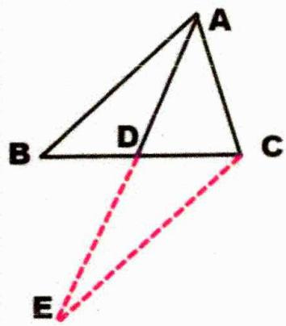

### 二、【典型例题】

##### 1. (2022·全国·统考高考真题)已知△ABC中, 点D在边BC上, ∠ADB=120°, AD=2, CD=2BD. 当 $\frac{AC}{AB}$ 取得最小值时, $BD=$ \_\_\_\_.

##### 2.(全国·高三专题练习)在△ABC中,角A,B,C所对的边分别是a,b,c,已知 $\frac{2\sin A-\sin C}{\sin C}=\frac{a^{2}+b^{2}-c^{2}}{a^{2}+c^{2}-b^{2}}$ ,则 $\sin^{2}A+\sin^{2}C$ 的最大值为\_\_\_\_;设D是AC上一点,且AD:DC=1:2,BD=1,则 $a+3c$ 的最大值为\_\_\_\_.

### 三、【习题检测】

##### 1. (2023 春·云南昆明·高三云南省昆明市第十二中学校考阶段练习) 已知 $D$ 是 $\triangle ABC$ 边 $AC$ 上一点, 且 $CD = 3AD$ , $BD = \sqrt{2}$ , $\cos \angle ABC = \frac{1}{4}$ , 则 $3AB + BC$ 的最大值为 \_\_\_\_.

##### 2.（全国·模拟预测）在① $\sqrt{3}c=\sqrt{3}a\cos B+b\sin A$ ，② $(b+a)(\sin B-\sin A)=c(\sin B-\sin C)$ ，③ $a^{2}-b^{2}=ac\cos B-\frac{1}{2}bc$ 这三个条件中任选一个，补充在下面的问题中，并解答问题.

在锐角 $\triangle ABC$ 中，内角 $A, B, C$ 的对边分别为 $a, b, c$ ，且 \_\_\_\_.

（1） 求 A；（2） 若 a=6， $2\overrightarrow{BD}=\overrightarrow{DC}$ ，求线段 AD 长的最大值.

注：如果选择多个条件分别解答，按第一个解答计分.

# 4.3.2.4 张角定理类型

### 一、【题型总结】

▲适用题型：常见于三角形有角平分线时的求边范围或最值问题；

▲方法原理：

##### 1. 张角定理： $\frac{\sin(\alpha+\beta)}{l}=\frac{\sin\alpha}{b}+\frac{\sin\beta}{c}$

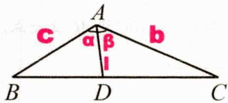

##### 2. AD 为角平分线时， $\frac{2\cos\alpha}{l}=\frac{1}{b}+\frac{1}{c}$

### 二、【典型例题】

##### 1. (2018·江苏·高考真题) 在 $\triangle ABC$ 中, 角 $A, B, C$ 所对的边分别为 $a, b, c$ , $\angle ABC = 120^{\circ}$ , $\angle ABC$ 的平分线交 $AC$ 于点 $D$ , 且 $BD = 1$ , 则 $4a + c$ 的最小值为 \_\_\_\_.

##### 2.（江苏泰州·统考一模）在 $\triangle ABC$ 中， $A, B, C$ 的对边分别为 $a, b, c, a \cos B - 2a \cos C = (2c - b) \cos A$ . （1） 若 $c = \sqrt{3} a$ ，求 $\cos B$ 的值；

（2） 若 $b = 1, \angle BAC$ 的平分线 $AD$ 交 $BC$ 于点 $D$ ，求 $AD$ 长度的取值范围.

##### 3. (2024·海南海口·期中) △ABC的内角A, B, C的对边分别为a, b, c, D为BC边上的一点.

（1） 若 $D$ 为 $BC$ 的中点, $c = \sqrt{3}$ , $AD = \frac{\sqrt{6}}{2}$ .  
①证明： $a=\sqrt{2}b$ ；②求角B的最大值；  
（2） 若 $\angle BAC = \frac{\pi}{3}$ , $a = \sqrt{3}$ , $AD$ 平分 $\angle BAC$ , 求 $AD$ 的取值范围.

### 三、【习题检测】

##### 1.(2024·四川内江·三模)在△ABC中,角A的平分线AD与BC边相交于点D,若 $\cos A=\frac{7}{9}$ ,则 $\frac{AB+AC}{AD}$ 的最小值为\_\_\_\_.

##### 2. (2024 江苏宿迁·期中) 已知 $\triangle ABC$ 中, $AB = 4$ , $AC = 2$ , $M$ 为 $BC$ 边上的点.

（1） 若 BC = 3，求 BC 边上的高；  
（2） 若 M 为 BC 的中点，且 $\angle BAC = 60^{\circ}$ ，求线段 AM 的长；  
（3） 若 AM 平分 $\angle BAC$ ，求线段 AM 长的取值范围.

##### 3. (全国·高三专题练习) 在 $\triangle ABC$ 中, 角 $A, B, C$ 所对的边分别为 $a, b, c$ , 且 $\frac{\sin A + \sin B}{\sin C} = \frac{c + b}{a - b}$ .

（1） 若 $a = 2\sqrt{3}$ ，b = 2，求角 B;  
（2） 设 $\angle BAC$ 的角平分线 $AD$ 交 $BC$ 于点 $D$ , 若 $\triangle ABC$ 面积为 $\sqrt{3}$ , 求 $AD$ 长的最大值.

##### 4.（浙江嘉兴·二模）已知△ABC中，AB=2，AC=1，D为BC边上的点.

（1） 若 D 为 BC 的中点，且 $\angle BAC = 120^{\circ}$ ，求线段 AD 的长；

(II) 若 AD 平分 $\angle BAC$ ，求线段 AD 长的取值范围.

# 4.3.2.5 图形分析类型

### 一、【题型总结】

▲适用题型：常见于需要分析图像的求边范围或最值问题；

▲方法原理：

##### 1. 常用到初中几何知识，比如相似，旋转，最短距离等等  
##### 2. 在图形中合理利用正余弦定理，这里需要对公式熟悉，以及公式在图形中的运用也要熟练；

### 二、【典型例题】

##### 1. (2015·全国·高考真题) 如图在平面四边形 $ABCD$ 中, $\angle A = \angle B = \angle C = 75^{\circ}$ , $BC = 2$ , 则 $AB$ 的取值范围是 \_\_\_\_.

##### 2. (辽宁大连·模拟预测) 在① $\frac{\cos B}{\cos(A+B)} = \frac{b}{2a+c}$ , ② $\frac{a}{b-c} = \frac{\sin B + \sin C}{\sin A + \sin C}$ , ③ $S = -\frac{\sqrt{3}}{2} \overrightarrow{BA} \cdot \overrightarrow{BC}$ 三个条件中任选一个补充在下面的横线上, 并加以解答.

在 $\triangle ABC$ 中, 角 $A, B, C$ 的对边分别为 $a, b, c$ 且 \_\_\_\_, 作 $AB \perp AD$ , 使得四边形 $ABCD$ 满足 $\angle ACD = \frac{\pi}{3}$ , $AD = \sqrt{3}$ .

（1） 求角 B 的值;  
（2） 求 BC 的取值范围.

### 三、【习题检测】

##### 1. (全国·高三专题练习) 如图, 在平面四边形 $ABCD$ 中, $\triangle BCD$ 的面积是 $\triangle ABD$ 的面积的 $2\sqrt{3}$ 倍. $\angle DBC = 2\angle ABD$ , $AB = 1$ , $BC = 2$ .

（1） 求 $\angle ABD$ 的大小;  
（2） 若点 $E, D$ 在直线 $AC$ 同侧， $\angle AEC = \frac{\pi}{3}$ ，求 $AE + EC$ 的取值范围.

##### 2.(全国·高三专题练习)如图所示,在平面五边形 ABCDE 中,已知 $\angle A=120^{\circ}$ , $\angle B=90^{\circ}$ , $\angle C=120^{\circ}$ , $\angle E=90^{\circ}$ , AB=AE=3.

（1） 当 $BC = \frac{3\sqrt{3}}{2}$ 时，求 CD；  
（2） 当五边形 $ABCD E$ 的面积 $S \in [6\sqrt{3}, 9\sqrt{3}]$ 时, 求 $BC$ 的取值范围.

##### 3. (辽宁·模拟预测) 如图, 在平面凸四边形 $ABCD$ 中, $CD \perp DB$ , $CD = 1$ , $DB = \sqrt{3}$ , $DA = 2$ . （1） 若 $\angle DAB = 60^{\circ}$ , 求 $\cos \angle ACB$ ; （2） 求 $AB^{2} + BC^{2} + AC^{2}$ 的取值范围.

# 4.3.2.6 周长之定边定角无限制类型

### 一、【题型总结】

▲适用题型：三角形中计算可知 aA、bB、cC 中任意一组值，且没有三角形形状的限制，求周长最值或范围；

▲方法原理：（结论：若已知aA，则 $L\in\left(2a,a+\frac{a}{\sin\frac{A}{2}}\right)$

##### 1. 余弦定理+基本不等式处理：

$a^2 = b^2 + c^2 - 2bc\cos A$ $= (b + c)^2 - 2bc(1 + \cos A)$ 证明： $\geq (b + c)^2 - \frac{(b + c)^2}{2}(1 + \cos A)$ $b = c$ 时取等 $\Rightarrow a < b + c \leq \sqrt{\frac{2a^2}{1 - \cos A}} = \frac{a}{\sin\frac{A}{2}} \Rightarrow L \in \left(2a, a + \frac{a}{\sin\frac{A}{2}}\right)$

##### 2. 正弦边化角处理：

证明：

$\frac{a}{\sin A} = \frac{b}{\sin B} = \frac{c}{\sin C} = 2R \Rightarrow b + c = 2R (\sin B + \sin C)$ 令 $B = \frac{\pi - A}{2} + \theta, C = \frac{\pi - A}{2} - \theta$ 则 $\theta \in \left(-\frac{\pi - A}{2}, \frac{\pi - A}{2}\right)$

$\Rightarrow \left\{ \begin{array} { l } { b + c = 2 R \left[ \sin \left( \frac { \pi - A } { 2 } + \theta \right) + \sin \left( \frac { \pi - A } { 2 } - \theta \right) \right] } \\ { = \frac { a } { \sin A } \cdot 2 \sin \left( \frac { \pi - A } { 2 } \right) \cos \theta \leq \frac { a } { \sin A } \cdot 2 \cos \frac { A } { 2 } } \\ { = \frac { a } { \sin \frac { A } { 2 } } ; \cos \theta = 1 , \text { 即 } B = C = \frac { \pi - A } { 2 } \text { 时取等 } } \end{array} \right. \Rightarrow L \in \left( 2 a , a + \frac { a } { \sin \frac { A } { 2 } } \right]$

##### 3. 余弦定理+三角换元处理：

证明：

$\begin{array}{r l} & {a ^ {2} = b ^ {2} + c ^ {2} - 2 b c \cos A} \\ & {= (b - c \cos A) ^ {2} + c ^ {2} \sin^ {2} A} \\ & {\text {令} \left\{ \begin{array}{l l} {b - c \cos A = a \cos \theta} \\ {c \sin A = a \sin \theta} \end{array} \right.} \\ & {\theta \in \left(0, \frac {\pi}{2}\right)} \end{array} \Rightarrow \left\{ \begin{array}{l l} {b + c = a \left(\frac {\cos \frac {A}{2}}{\sin \frac {A}{2}} \sin \theta + \cos \theta\right)} \\ {= \frac {a}{\sin \frac {A}{2}} \sin (\theta + \varphi) \leq \frac {a}{\sin \frac {A}{2}}} \\ {\tan \varphi = \tan \frac {A}{2}, \theta + \varphi = \frac {\pi}{2} \text {时取等}} \\ {\text {即} C = B = \frac {\pi - A}{2} \text {时取等}} \end{array} \right. \Rightarrow L \in \left(2 a, a + \frac {a}{\sin \frac {A}{2}} \right]$

##### 4. 数形结合证明：

定弦定角可知共圆，如图所示简单计算可知 $L \in \left(2a, a + \frac{a}{\sin \frac{A}{2}}\right]$

### 二、【典型例题】

##### 1. (全国·高三专题练习) 在 $\triangle ABC$ 中, 角 $A, B, C$ 所对的边分别为 $a, b, c$ , 若 $b \sin \frac{B + C}{2} = a \sin B$ , $a = \sqrt{2}$ , 则 $\triangle ABC$ 周长的最大值为 \_\_\_\_.

##### 2. (2020·全国·统考高考真题) $\triangle ABC$ 中, $\sin^2 A - \sin^2 B - \sin^2 C = \sin B\sin C$ .

（1） 求 A; （2） 若 BC=3，求 $\triangle ABC$ 周长的最大值.

##### 3. (2007·全国·高考真题) 在 $\triangle ABC$ 中, 已知内角 $A = \frac{\pi}{3}$ , 边 $BC = 2\sqrt{3}$ . 设内角 $B = x$ , 周长为 $y$ . （1） 求函数 $y = f(x)$ 的解析式和定义域; （2） 求 $y$ 的最大值.

### 三、【习题检测】

##### 1.（全国·高三专题练习） $\triangle ABC$ 三角形的内角 $A, B, C$ 的对边分别为 $a, b, c$ ，

$(2 a - b) \sin A + (2 b - a) \sin B = 2 c \sin C$

（1） 求 $\angle C$ ; （2） 已知 c = 6，求 $\triangle ABC$ 周长的最大值.

##### 2.(全国·高三专题练习)在△ABC中,角A,B,C所对的边分别为a,b,c.在① $b\cos A+a\cos B=2c\cos C$ ,
② $(a+b+c)(a+b-c)=3ab$ ，③ $\cos2C+\cos C=0$ 中任选一个，（1）求角C的大小；（2）若c=2，求△ABC周长的最大值.

##### 3. (全国·高三专题练习) 在 $\triangle ABC$ 中, 角 $A, B, C$ 的对边分别为 $a, b, c$ , 若 $a \sin A - b \sin B = c (\sin C - \sin B)$ . （1） 求角 $A$ 的大小; （2） 若 $a = \sqrt{3}$ , 求 $\triangle ABC$ 周长的最大值.

##### 4.（全国·高三专题练习）已知函数 $f(x)=\cos^{2}(\omega x)+\sqrt{3}\sin(\omega x)\cos(\omega x)-\frac{1}{2}$ ，其中 $\omega>0$ ，且函数 $f(x)$ 的两个相邻零点间的距离为 $\frac{\pi}{2}$ ，（1） 求 $\omega$ 的值及函数 $f(x)$ 的对称轴方程；

（2） 在 $\triangle ABC$ 中, $a, b, c$ 分别是角 $A, B, C$ 的对边, 若 $f(A) = -1, a = \sqrt{3}$ , 求 $\triangle ABC$ 周长的取值范围.

##### 5.（全国·高三专题练习）从① $a^{2}+c^{2}-b^{2}=ac$ ，② $2b\sin A=a\tan B$ ，③ $\sqrt{3}\sin B=\cos B+1$ 这三个条件中任选一个，补充在下列横线上，并解答.

在 $\triangle ABC$ 中，内角A，B，C所对的边长分别为a，b，c，且满足\_\_\_\_。

（1） 求角 B 的大小；（2） 若 b=2，求 $\triangle ABC$ 周长的取值范围.

# 4.3.3 面积最值和范围问题

# 4.3.3.1 定边定角类型

### 一、【题型总结】

▲适用题型：三角形中计算可知 aA、bB、cC 中任意一组值，求面积最值或范围；  
▲方法原理：
### 一、结论：若已知 aA，且三角形没有限制，则 $S \in \left(0, \frac{a^{2}}{4 \tan \frac{A}{2}}\right]$

##### 1. 余弦定理+基本不等式处理：

证明：

$\left. \begin{array}{l} {a ^ {2} = b ^ {2} + c ^ {2} - 2 b c \cos A \geq 2 b c - 2 b c \cos A} \\ {\Rightarrow b c \leq \frac {a ^ {2}}{2 (1 - \cos A)}, b = c \text {时取等}} \end{array} \right\} \Rightarrow \left\{ \begin{array}{l l} {S = \frac {1}{2} b c \sin A \leq \frac {1}{2} \cdot \frac {a ^ {2}}{2 (1 - \cos A)} \sin A} \\ {= \frac {a ^ {2}}{4} \frac {2 \sin \frac {A}{2} \cos \frac {A}{2}}{2 \sin^ {2} \frac {A}{2}} = \frac {a ^ {2}}{4 \tan \frac {A}{2}}} \end{array} \right. \Rightarrow S \in \left(0, \frac {a ^ {2}}{4 \tan \frac {A}{2}} \right]$

##### 2. 正弦边化角处理：

证明：

$\left. \begin{array}{l} {\frac {a}{\sin A} = \frac {b}{\sin B} = \frac {c}{\sin C} = 2 R} \\ {\Rightarrow b c = 4 R ^ {2} \sin B \sin C} \\ {= 4 R ^ {2} \sin B \sin (A + B)} \\ {= \frac {a ^ {2}}{\sin^ {2} A} \sin B \sin (A + B)} \end{array} \right\} \Rightarrow \left\{ \begin{array}{l} {\sin B \sin (A + B) = \sin B \sin A \cos B + \sin B \cos A \sin B} \\ {= \frac {\sin A}{2} \sin 2 B + \frac {\cos A}{2} - \frac {\cos A}{2} \cos 2 B} \\ {= \frac {1}{2} \sin (2 B - \theta) + \frac {\cos A}{2} \leq \frac {1 + \cos A}{2}} \\ {\tan \theta = \frac {1}{\tan A}, \text {即} 2 B + A = \pi \text {时取等, 即} C = B = \frac {\pi - A}{2} \text {时取等}} \end{array} \right.$

$\Rightarrow S = \frac {1}{2} b c \sin A \leq \frac {1}{2} \frac {a ^ {2}}{\sin^ {2} A} \frac {1 + \cos A}{2} \sin A = \frac {a ^ {2}}{4 \tan \frac {A}{2}} \Rightarrow S \in \left(0, \frac {a ^ {2}}{4 \tan \frac {A}{2}} \right]$

##### 3. 余弦定理+三角换元处理：

证明：

$\begin{array}{r l} & {a ^ {2} = b ^ {2} + c ^ {2} - 2 b c \cos A} \\ & {= (b - c \cos A) ^ {2} + c ^ {2} \sin^ {2} A} \\ & {\text {令} \left\{ \begin{array}{l l} {b - c \cos A = a \cos \theta} \\ {c \sin A = a \sin \theta} \end{array} \right.} \\ & {\theta \in \left(0, \frac {\pi}{2}\right)} \end{array} \Rightarrow \left\{ \begin{array}{l l} {S = \frac {1}{2} b c \sin A = \frac {a ^ {2}}{4 \sin A} (\sin A \sin 2 \theta - \cos A \cos 2 \theta + \cos A)} \\ {= \frac {a ^ {2}}{4 \sin A} [ \sin (2 \theta - \varphi) + \cos A ] \leq \frac {a ^ {2}}{4 \sin A} (1 + \cos A) = \frac {a ^ {2}}{4 \tan \frac {A}{2}}} \\ {\tan \varphi = \frac {1}{\tan A}, 2 \theta - \varphi = \frac {\pi}{2} \text {时取等，即} C = B = \frac {\pi - A}{2} \text {时取等}} \end{array} \right.$

$\Rightarrow S \in \left(0, \frac {a ^ {2}}{4 \tan \frac {A}{2}} \right]$

##### 4. 数形结合证明：定弦定角可知共圆，如图所示简单计算可知 $S \in \left(0, \frac{a^2}{4\tan\frac{A}{2}}\right]$

### 二、若已知 aA，且有锐角三角形限制，则考虑采取正弦边化角处理，注意角度范围的分析 $\left\{\begin{aligned}0&A<\frac{\pi}{2}\\ 0&B<\frac{\pi}{2}\\ 0&C<\frac{\pi}{2}\end{aligned}\right.$ ;

此时面积最大值依然符合结论，不过最小值则需要利用角度判断；

### 二、【典型例题】

##### 1.（全国·高三专题练习）在 $\triangle ABC$ 中，角 $A, B, C$ 的对边分别为 $a, b, c$ ，若 $a \sin \frac{A + C}{2} = b \sin A$ ， $b = 1$ ，则 $\triangle ABC$ 面积的最大值为（）

$\quad$A. $\frac{\sqrt{3}}{2}$

$\quad$B. $\frac{\sqrt{3}}{4}$

$\quad$C. $\frac{\sqrt{3}}{6}$

$\quad$D. $\frac{1}{2}$

##### 2. (2014·全国·高考真题) 已知在 $\triangle ABC$ 中, 角 $A, B, C$ 所对的边分别为 $a, b, c$ , $a = 2$ , 且 $(2 + b)(\sin A - \sin B) = (c - b)\sin C$ , 则 $\triangle ABC$ 面积的最大值为 \_\_\_\_.

##### 3.（全国·高三专题练习）在△ABC中，角A,B,C所对的边分别为a,b,c，且 $2\sin\left(\frac{\pi}{2}+C\right)=\frac{2\sin A+\sin\left(\pi+C\right)}{\sin B}$ . （1） 求 B；（2） 若 b=1，求 △ABC 的面积的最大值.

##### 4. (2024·四川德阳·模拟预测) 在 $\triangle ABC$ 中, 角 $A 、 B 、 C$ 所对的边分别为 $a 、 b 、 c$ , 且 $\sin C = \frac{c}{3} \cos \frac{B}{2}$ , $b = 3$ . （1） 求 $B$ ; （2） 若 $\triangle ABC$ 为锐角三角形, 求 $\triangle ABC$ 的面积范围.

### 三、【习题检测】

##### 1. (2013·全国·高考真题) △ABC 在内角 A、B、C 的对边分别为 a, b, c, 已知 $a=b\cos C + \csc B$ .

(Ⅰ) 求 B; (Ⅱ) 若 b=2，求 △ABC 面积的最大值.

##### 2. (2015·山东·高考真题) 设 $f(x) = \sin x \cos x - \cos^2 \left( x + \frac{\pi}{4} \right)$ .

（Ⅰ）求 $f(x)$ 的单调区间；（Ⅱ）在锐角 $\Delta ABC$ 中，角A,B,C的对边分别为a,b,c，若 $f\left(\frac{A}{2}\right)=0,a=1$ ，求 $\Delta ABC$ 面积的最大值.

##### 3. (2013·重庆·高考真题) 在 $\triangle ABC$ 中, 角 $A 、 B 、 C$ 所对的边分别为 $a 、 b 、 c$ , 且 $a^2 = b^2 + c^2 + \sqrt{3}bc$ . （1） 求 $A$ ; （2） 设 $a = \sqrt{3}$ , $S$ 为 $\triangle ABC$ 的面积, 求 $S + 3\cos B\cos C$ 的最大值, 并指出此时 $B$ 的值.

##### 4.（全国·高三专题练习）已知在 $\triangle ABC$ 中，角 $A, B, C$ 的对边分别为 $a, b, c, b = 4$ 且 $\frac{b}{2c + a} = \frac{\cos(\pi - B)}{\sin\left(\frac{\pi}{2} + A\right)}$ .

（1） 求 B；（2） 求 $\triangle ABC$ 面积的最大值.

# 4.3.3.2 非定边定角类型

### 一、【题型总结】

▲适用题型：三角形中已知条件为非定边定角，求面积最值或范围；

▲方法原理：

##### 1. 常见解题方式：

法一：余弦定理+基本不等式处理；

法二：正弦定理边化角处理（三角形有形状限制基本考虑此法）；

##### 2. 如果有锐角三角形注意范围的分析 $0 < A < \frac{\pi}{2}, 0 < B < \frac{\pi}{2}, 0 < C < \frac{\pi}{2}$ ;

简单举例: (全国·高一专题练习) 在 $\triangle ABC$ 中, 角 $A, B, C$ 的对边分别为 $a, b, c$ . 已知角 $C = \frac{\pi}{3}, AB$ 边上的高为 $2\sqrt{3}$ . 求 $\triangle ABC$ 面积的最小值.

法一：由题意可得 $a = \frac{2\sqrt{3}}{\sin B}, b = \frac{2\sqrt{3}}{\sin A}$ ，则 $ab = \frac{12}{\sin A\sin B}$ ，

又 $\sin A\sin B = \sin \left(\frac{2\pi}{3} -A\right)\sin A = \frac{\sqrt{3}}{2}\sin A\cos A + \frac{1}{2}\sin^2 A$

$= \frac{\sqrt{3}}{4}\sin 2A + \frac{1}{4}(1 - \cos 2A) = \frac{1}{4} +\frac{1}{2}\sin \left(2A - \frac{\pi}{6}\right)$ ，因为 $0 <   A <   \frac{2\pi}{3}$ ，所以当 $2A - \frac{\pi}{6} = \frac{\pi}{2}$ ，即 $A = \frac{\pi}{3}$ 时，

$\left(\sin A \sin B\right)_{\max} = \frac{3}{4}$ , 故 $ab \geq 16$ , 所以 $\triangle ABC$ 的面积为 $S_{\triangle ABC} = \frac{1}{2} ab \sin C = \frac{\sqrt{3}}{4} ab \geq 4\sqrt{3}$ , 所以 $\triangle ABC$ 面积的最小值为 $4\sqrt{3}$ .

法二：在 $\triangle ABC$ 中由余弦定理可得， $c^2 = a^2 +b^2 -2ab\cos C = a^2 +b^2 -ab$

又 $S_{\triangle ABC} = \frac{1}{2} ab\sin C = \frac{1}{2} c\cdot 2\sqrt{3}$ 可知 $ab = 4c$ ，即 $c = \frac{ab}{4}$

所以 $\frac{a^2b^2}{16} = a^2 + b^2 - ab \geq ab$ ，解得 $ab \geq 16$ ，当且仅当 $a = b = 4$ 时，等号成立.

所以 $S_{\triangle ABC} = \frac{1}{2} ab \sin C = \frac{\sqrt{3}}{4} ab \geq 4\sqrt{3}$ ，所以面积最小值为 $4\sqrt{3}$ .

### 二、【典型例题】

##### 1.(2024·全国模拟预测)已知在锐角△ABC中,内角A,B,C所对的边分别为a,b,c,且 $\overrightarrow{m}=\left(2\sin x,\sqrt{3}\right)$ , $\overrightarrow{n}=\left(\cos x,\cos 2x\right)$ , $f(x)=\overrightarrow{m}\cdot\overrightarrow{n}$ , $f(B+C)=0$ .

（1） 求角 A 的值；（2） 若 b=1，求 $\triangle ABC$ 面积的范围.

##### 2. (2019·全国·统考高考真题) $\Delta ABC$ 的内角 $A, B, C$ 的对边分别为 $a, b, c$ , 已知 $a \sin \frac{A + C}{2} = b \sin A$ . （1） 求 $B$ ; （2） 若 $\Delta ABC$ 为锐角三角形, 且 $c = 1$ , 求 $\Delta ABC$ 面积的取值范围.

##### 3. (全国·模拟预测)已知 $\triangle ABC$ 的内角 $A, B, C$ 的对边分别为 $a, b, c, \sqrt{3}b\sin C = \sin B(4a\sin C - \sqrt{3}c)$ . （1） 求 $A$ ; （2） 若 $O$ 是 $\triangle ABC$ 的内心, $a = 2$ , 且 $b^2 + c^2 > 4$ , 求 $\triangle OBC$ 面积的最大值.

### 三、【习题检测】

1（全国·深圳中学校联考模拟预测）在 $\triangle ABC$ 中，角 $A, B, C$ 所对的边分别为 $a, b, c$ ，且 $3a\sin B = 4b\cos A$ 。（1）求 $\cos \left(A + \frac{\pi}{2}\right)$ 的值；（2） 若 $D$ 为 $AB$ 中点，且 $CD = 3$ ，求 $\triangle ABC$ 面积的最大值。

##### 2. (全国·高三专题练习) 在 $\triangle ABC$ 中, 角 $A, B, C$ 所对的边分别为 $a, b, c$ , 其中 $C \neq \frac{\pi}{2}$ , 已知 $b - c \cos A = 2a \cos B \cos C$ . （1） 求角 $B$ 的大小;

（2） 若 $b^{2} + 3c^{2} = 12 - 5ac$ ，求 $\triangle ABC$ 面积的最大值.

##### 3.（全国·高三专题练习）在△ABC中，内角A，B，C所对的边分别为a，b，c．已知 $(3b-c)(b^{2}+c^{2}-a^{2})=2abc\cos C$ ．

（1） 求 $\cos A$ ; （2） 若 $b + c = 4\sqrt{2}$ ，求 $\triangle ABC$ 面积的最大值.

##### 4.（全国·高三专题练习）记△ABC的内角A、B、C的对边分别为a、b、c，已知 $\overrightarrow{AB}\cdot\overrightarrow{AC}+2\overrightarrow{BA}\cdot\overrightarrow{BC}=\overrightarrow{CA}\cdot\overrightarrow{CB}$

（1） 求 $\frac{\sin B}{\sin C}$ ; （2） 记 $\triangle ABC$ 的面积为 S，求 $\frac{S}{a^{2}}$ 的最大值.

##### 5.（全国·高三专题练习）在 $\triangle ABC$ 中，角 $A, B, C$ 的对边分别为 $a, b, c$ ，且 $a - b \cos C = \sqrt{3}c \sin B$ . （1） 求 $B$ ；

（2） 若 $a = 2$ ，且 $\triangle ABC$ 为锐角三角形，求 $\triangle ABC$ 的面积 $S$ 的取值范围.

# 4.3.3.3 图形分析类型

### 一、【题型总结】

▲适用题型：常见于需要分析图像的求面积范围或最值问题；

▲方法原理：

##### 1. 常用到初中几何知识，比如相似，旋转，最短距离等等  
##### 2. 在图形中合理利用正余弦定理，这里需要对公式熟悉，以及公式在图形中的运用也要熟练；

### 二、【典型例题】

##### 1. (2013·福建·高考真题) 如图, 在等腰直角 $\Delta OPQ$ 中, $\angle POQ = 90^{\circ}$ , $OP = 2\sqrt{2}$ , 点 $M$ 在线段 $PQ$ 上.  
(Ⅰ) 若 $OM = \sqrt{5}$ ，求 PM 的长；(Ⅱ) 若点 N 在线段 MQ 上，且 $\angle MON = 30^{\circ}$ ，问：当 $\angle POM$ 取何值时， $\Delta OMN$ 的面积最小？并求出面积的最小值.

##### 2.（全国·高三专题练习）如图，在 $\triangle ABC$ 中，角 $A, B, C$ 的对边分别为 $a, b, c$ ， $\triangle ABC$ 的面积为 $S$ ，且 $4S = a^{2} + c^{2} - b^{2}$ .

（1） 求角 B 的大小；（2） 若 $A = \frac{\pi}{2}$ ，D 为平面 ABC 上 $\triangle ABC$ 外一点，DB = 2，DC = 1，求四边形 ABDC 面积的最大值.

##### 3. (全国·高三校联考阶段练习) 如图, 在直角三角形 $ABC$ 中, $A = \frac{\pi}{2}$ , $AB = 3, AC = 4, D, E, F$ 分别在线段 $AC$ 、 $AB$ 、 $BC$ 上, 且 $D$ 为 $AC$ 的中点, $DE \perp DF$ , 设 $\angle ADE = \alpha$ .

（1） 求 $\sin \angle DFC$ （用 $\alpha$ 表示）;  
（2） 求三角形 DEF 面积的最小值.

### 三、【习题检测】

##### 1.（全国·高三专题练习）如图，P 为 $\triangle ABC$ 内的一点， $\angle BAP$ 记为 $\alpha$ ， $\angle ABP$ 记为 $\beta$ ，且 $\alpha$ ， $\beta$ 在 $\triangle ABP$ 中的对边分别记为 m，n， $(2m+n)\sin\beta=\sqrt{3}n\cos\beta$ ， $\alpha$ ， $\beta\in\left(0,\frac{\pi}{3}\right)$ 。（1） 求 $\angle APB$ ；（2） 若 $AB=2\sqrt{3}$ ，BP=2， $PC=\sqrt{3}$ ，记 $\angle APC=\theta$ ，求线段 AP 的长和 $\triangle ABC$ 面积的最大值。

##### 2.（全国·高三专题练习）在① $c(\sin A - \sin C) = (a - b)(\sin A + \sin B)$ ，② $2b\cos A + a = 2c$ ，③ $\frac{2\sqrt{3}}{3}ac\sin B = a^2 + c^2 - b^2$ 三个条件中任选一个，补充在下面问题中，并解答。（1）求角 $B$ 的大小；（2）如图所示，当 $\sin A + \sin C$ 取得最大值时，若在 $\triangle ABC$ 所在平面内取一点 $D$ （ $D$ 与 $B$ 在 $AC$ 两侧），使得线段 $DC = 2, DA = 1$ ，求 $\triangle BCD$ 面积的最大值。

##### 3. (全国·高三专题练习) 在 $\triangle ABC$ 中, 内角 $A, B, C$ 所对的边分别是 $a, b, c$ , 已知 $2c \cos B = 2a - b$ . （1） 求 $C$ ; （2） 若 $AB = AC$ , $D$ 是 $\triangle ABC$ 外的一点, 且 $AD = 2$ , $CD = 1$ , 则当 $\angle D$ 为多少时, 平面四边形 $ABCD$ 的面积 $S$ 最大, 并求 $S$ 的最大值.

##### 4. (全国·高三专题练习) 在平面四边形 $ABCD$ 中, $AB = 2, BC = 1, \triangle ACD$ 为等边三角形, 设 $\angle ABC = \alpha$ .

（1） 求四边形 ABCD 面积的最大值，以及相应 $\alpha$ 的值；  
（2）求四边形ABCD对角线BD长度的最大值，以及相应α的值.

# 第5章向量

# 5.1 向量等值线

# 5.1.1 三点共线定理解决求值或范围

### 一、【题型总结】

▲适用题型：向量中三点共线的相关问题；

▲方法原理：

##### 1. 平面向量基本定理：

如果 $\overrightarrow{e_{1}},\overrightarrow{e_{2}}$ 是同一平面内的两个不共线向量，那么对于这一平面内的任意向量 $\overrightarrow{a}$ ，有且只有一对实数 $\lambda_{1},\lambda_{2}$ ，使 $\overrightarrow{a}=\lambda_{1}\overrightarrow{e_{1}}+\lambda_{2}\overrightarrow{e_{2}}$

##### 2. 三点共线定理：

平面上A，B，C三点不共线，D在直线AB上，即B，D，C共线且 $\frac{BD}{CD} = \frac{m}{n}$

则 $\overrightarrow{AD}=\frac{n}{m+n}\overrightarrow{AB}+\frac{m}{m+n}\overrightarrow{AC}$ ，此时系数和为1，反过来系数和为1则三点共线；

##### 3. 证明：

$\frac {B D}{C D} = \frac {m}{n} \Rightarrow \left\{ \begin{array}{l} \overrightarrow {B D} = \frac {m}{m + n} \overrightarrow {B C} = \frac {m}{m + n} (\overrightarrow {A C} - \overrightarrow {A B}) \\ = \frac {m}{m + n} \overrightarrow {A C} - \frac {m}{m + n} \overrightarrow {A B} \end{array} \right. \Rightarrow \left\{ \begin{array}{l} \overrightarrow {A D} = \overrightarrow {A B} + \frac {m}{m + n} \overrightarrow {A C} - \frac {m}{m + n} \overrightarrow {A B} \\ = \frac {n}{m + n} \overrightarrow {A B} + \frac {m}{m + n} \overrightarrow {A C} \end{array} \right.$

##### 4. 注意写法的规律：先算线段各自占比，再系数交叉对应；  
##### 5. 还可反解： $\overrightarrow{AD}=\frac{n}{m+n}\overrightarrow{AB}+\frac{m}{m+n}\overrightarrow{AC}\Rightarrow\left\{\begin{aligned}&\overrightarrow{AB}=\frac{m+n}{n}\overrightarrow{AD}-\frac{m}{n}\overrightarrow{AC}\\&\overrightarrow{AC}=\frac{m+n}{m}\overrightarrow{AD}-\frac{n}{m}\overrightarrow{AC}\end{aligned}\right.$   
##### 6. 推论： $\left\{\begin{aligned}AD\text{为中线}\Rightarrow \text{则}\overrightarrow{AD}&=\frac{1}{2}\overrightarrow{AB}+\frac{1}{2}\overrightarrow{AC}\\ AD\text{为角平分线}\Rightarrow \overrightarrow{AD}&=\frac{AC}{AB+AC}\overrightarrow{AB}+\frac{AB}{AB+AC}\overrightarrow{AC}\end{aligned}\right.$

简单举例: (2023 秋·吉林长春·高三校考阶段练习) 在 $\triangle ABC$ 中, $D$ 为 $\triangle ABC$ 所在平面内一点, 且 $\overrightarrow{AD} = \frac{1}{3} \overrightarrow{AB} + \frac{1}{2} \overrightarrow{AC}$ , 则 $\frac{S_{\triangle BCD}}{S_{\triangle ABC}}$ 等于\_.

【法一：常规】如图，

过 $D$ 作 $DE \parallel AC$ ，因为 $\overrightarrow{AD} = \frac{1}{3}\overrightarrow{AB} + \frac{1}{2}\overrightarrow{AC}$ ，

所以 $AE=\frac{1}{3}AB$ ，所以 $\triangle ACD$ 在 AC 边上的高是 $\triangle ABC$ 在 AC 边上高的 $\frac{1}{3}$ ，

所以 $S_{\triangle ACD} = \frac{1}{3} S_{\triangle ABC}$ ，同理过 $D$ 作 $DM / / AB$ ，因为 $\overrightarrow{AD} = \frac{1}{3}\overrightarrow{AB} +\frac{1}{2}\overrightarrow{AC}$

所以 $AM = \frac{1}{2} AC$ ，所以 $\triangle ABD$ 在 AB 边上的高是 $\triangle ABC$ 在 AB 边上高的 $\frac{1}{2}$ ，

所以 $S_{\triangle ABD} = \frac{1}{2} S_{\triangle ABC}$ ，所以 $S_{\triangle BCD} = S_{\triangle ABC} - S_{\triangle ACD} - S_{\triangle ABD} = (1 - \frac{1}{2} -\frac{1}{3})S_{\triangle ABC} = \frac{1}{6} S_{\triangle ABC}$

【法二：三点共线】

$\left\{ \begin{array}{l} {\text { 令 } \overrightarrow {A E} = \lambda \overrightarrow {A D} \Rightarrow \overrightarrow {A E} = \lambda \overrightarrow {A D} = \frac {\lambda}{3} \overrightarrow {A B} + \frac {\lambda}{2} \overrightarrow {A C}} \\ {E, B, C \text { 共   线 } \Rightarrow \frac {\lambda}{3} + \frac {\lambda}{2} = 1 \Rightarrow \lambda = \frac {6}{5}} \end{array} \Rightarrow \frac {S _ {\triangle B C D}}{S _ {\triangle A B C}} = \frac {D E}{A E} = \frac {1}{6} \right.$

### 二、【典型例题】

##### 1. (2024·重庆·模拟预测)已知点 $G$ 是 $\triangle ABC$ 的重心, 点 $M$ 是线段 $AC$ 的中点, 若 $\overrightarrow{GM} = \lambda \overrightarrow{AB} + \mu \overrightarrow{AC}$ , 则 $\lambda + \mu = (\quad)$

$\quad$A. $\frac{1}{12}$

$\quad$B. $\frac{1}{6}$

$\quad$C. $-\frac{1}{6}$

$\quad$D. $-\frac{1}{12}$

##### 2. (2007·全国·高考真题) 在 $\triangle ABC$ 中, $D$ 是 $AB$ 边上一点. 若 $\overrightarrow{AD} = 2\overrightarrow{DB}, \overrightarrow{CD} = \frac{1}{3}\overrightarrow{CA} + \lambda \overrightarrow{CB}$ , 则 $\lambda$ 的值为 ( )

$\quad$A. $\frac{2}{3}$

$\quad$B. $\frac{1}{3}$

$\quad$C. $-\frac{1}{3}$

$\quad$D. $-\frac{2}{3}$

##### 3. (2015·全国·高考真题) 设 $D$ 为 $\triangle ABC$ 所在平面内一点, 若 $\overline{BC} = 3\overline{CD}$ , 则下列关系中正确的是 ( )

$\quad$A. $\overline{AD} = -\frac{1}{3}\overline{AB} +\frac{4}{3}\overline{AC}$

$\quad$B. $\overrightarrow{AD} = \frac{1}{3}\overrightarrow{AB} -\frac{4}{3}\overrightarrow{AC}$

$\quad$C. $\overrightarrow{AD} = \frac{4}{3}\overrightarrow{AB} +\frac{1}{3}\overrightarrow{AC}$

$\quad$D. $\overrightarrow{AD}=\frac{4}{3}\overrightarrow{AB}-\frac{1}{3}\overrightarrow{AC}$

##### 4. (辽宁高三二模) 在 $\triangle ABC$ 中, 点 $P$ 满足 $2\overrightarrow{BP}=\overrightarrow{PC}$ , 过点 $P$ 的直线与 $AB$ , $AC$ 所在的直线分别交于点 $M$ , $N$ , 若 $\overrightarrow{AM}=x\overrightarrow{AB}$ , $\overrightarrow{AN}=y\overrightarrow{AC}(x>0,y>0)$ , 则 $2x+y$ 的最小值为 ( )

$\quad$A. 3

$\quad$B. $3\sqrt{2}$

$\quad$C. 1

$\quad$D. $\frac{1}{3}$

### 三、【习题检测】

##### 1. (2010·全国·高考真题) $\triangle ABC$ 中, 点 $D$ 在 $AB$ 上, $CD$ 平分 $\angle ACB$ . 若 $\overline{CB} = \bar{a}$ , $\overline{CA} = \bar{b}$ , $\left|\overline{a}\right| = 1$ , $\left|\overline{b}\right| = 2$ , 则 $\overline{CD} = (\quad)$

$\quad$A. $\frac{1}{3}\overline{a}+\frac{2}{3}\overline{b}$

$\quad$B. $\frac{2}{3}\overline{a}+\frac{1}{3}\overline{b}$

$\quad$C. $\frac{3}{5}\bar{a}+\frac{4}{5}\bar{b}$

$\quad$D. $\frac{4}{5}\bar{a}+\frac{3}{5}\bar{b}$

##### 2. (2007·江西·高考真题) 如图, 在 $\triangle ABC$ 中, 点 $O$ 是 $BC$ 的中点, 过点 $O$ 的直线分别交直线 $AB$ 、 $AC$ 于不同的两点 $M$ 、 $N$ , 若 $\overrightarrow{AB} = m\overrightarrow{AM}, \overrightarrow{AC} = n\overrightarrow{AN}$ , 则 $m + n$ 的值为 \_\_\_\_.

##### 3. (2008·全国·高考真题) 在 $\triangle ABC$ 中, $\overline{AB} = \overline{c}$ , $\overline{AC} = \overline{b}$ . 若点 $D$ 满足 $\overline{BD} = 2\overline{DC}$ , 则 $\overline{AD} = (\quad)$

$\quad$A. $\frac{2}{3}\bar{b} +\frac{1}{3}\bar{c}$

$\quad$B. $\frac{5}{3}\bar{c}-\frac{2}{3}\bar{b}$

$\quad$C. $\frac{2}{3}\bar{b}-\frac{1}{3}\bar{c}$

$\quad$D. $\frac{1}{3}\bar{b}+\frac{2}{3}\bar{c}$

##### 4.（湖北·汉阳一中二模）已知 $O$ 在 $\triangle ABC$ 内，且 $S_{\triangle AOB}: S_{\triangle BOC}: S_{\triangle AOC} = 4:3:2$ ， $\overline{AO} = \lambda \overline{AB} + \mu \overline{AC}$ 则 $\lambda + \mu = \_$ .

##### 5.（全国·高三专题练习）在 $\triangle ABC$ 中， $\angle BAC = \frac{2\pi}{3}$ ，已知 $BC$ 边上的中线 $AD = 3$ ，则 $\triangle ABC$ 面积的最大值为 \_\_\_\_.

# 5.1.2 等和线之共起点解决求值或范围

### 一、【题型总结】

▲适用题型：向量中共起点的三点共线， $\lambda+\mu=k$ 的相关问题；

▲方法原理：

##### 1. 等和线： $\overline{PC}=m\overline{PA}+n\overline{PB}$ 中 $m+n=k=\frac{|PC|}{|PF|}=\Delta PDE$ 与 $\Delta PAB$ 的相似比；

证明：如图所示：A, F, B 共线，E, C, D 共线，由三点共线可知：

$\overline{PF} = \lambda \overline{PA} + \mu \overline{PB} (\lambda + \mu = 1)$ $\left. \begin{array}{l} \overline{PC} = k\overline{PF} = k\lambda \overline{PA} + k\mu \overline{PB} \\ \overline{PC} = k\overline{PF} \end{array} \right\} \Rightarrow \left\{ \begin{array}{l} \overline{PC} = k\overline{PF} = k\lambda \overline{PA} + k\mu \overline{PB} \\ \lambda + \mu = 1 \end{array} \right. \Rightarrow k\lambda + k\mu = k$ ，当 $DE \parallel AB$ 时，C 在 DE 上运动，则 $\overline{PC} = m\overline{PA} + n\overline{PB}$ 中 $m + n = k = \frac{|PC|}{|PF|} = \Delta PDE$ 与 $\Delta PAB$ 的相似比，将 DE 叫做等和线；

##### 2. 解题步骤：

（1） 找到让 $\lambda + \mu = 1$ 的直线 AB;

（2） 过 C 作 $DE \parallel AB$ ;

（3） 计算 $\frac{|PC|}{|PF|} = \Delta PAB$ 与 $\Delta PDE$ , 结果即为 $m + n$ (相似比不好计算时, 考虑尺子量, 前提图标准, 有一定风险)

##### 3. 平面向量等和线性质

（1） 当等和线恰为直线 AB 时，k=1；（2） 当等和线在点 P 和直线 AB 之间时， $k \in (0,1)$ ;  
（3） 当直线 AB 在点 P 和等和线之间时， $k \in (1, +\infty)$ ; （4） 当等和线过点 P 时，k = 0;  
（5） 若两等和线关于点 P 对称，则定值 k 互为相反数.

简单举例: (2023 秋 · 北京 · 高一校考期末) 根据毕达哥拉斯定理, 以直角三角形的三条边为边长作正方形, 从斜边上作出的正方形的面积正好等于在两直角边作出的正方形面积之和. 现在对直角三角形 $CDE$ 按上述操作作图后, 得如图所示的图形. 若 $\overrightarrow{AF} = x\overrightarrow{AB} + y\overrightarrow{AD}$ , 则 $x + y =$ \_\_\_\_.

【法一：常规】：如图，以 A 为原点，分别以 $\overline{AB}, \overline{AD}$ 为 x, y 轴建立平面直角坐标系，设正方形 ABCD 的边长为 2a，则正方形 DEHI 的边长为 $\sqrt{3}a$ ，正方形 EFGC 边长为 a 可知 $A(0,0)$ ， $B(2a,0)$ ， $D(0,2a)$ ， $DF = (\sqrt{3} + 1)a$ 则 $x_{F} = (\sqrt{3} + 1)a \cdot \cos 30^{\circ}$ ， $y_{F} = (\sqrt{3} + 1)a \cdot \sin 30^{\circ} + 2a$ ，即 $F\left(\frac{3 + \sqrt{3}}{2}a, \frac{5 + \sqrt{3}}{2}a\right)$ 又

$\overrightarrow{AF} = x\overrightarrow{AB} + y\overrightarrow{AD}, \therefore \left(\frac{3 + \sqrt{3}}{2} a, \frac{5 + \sqrt{3}}{2} a\right) = x(2a,0) + y(0,2a) = (2ax,2ay)$ 即 $\left\{ \begin{array}{l} 2ax = \frac{3 + \sqrt{3}}{2} a \\ 2ay = \frac{5 + \sqrt{3}}{2} a \end{array} \right.$ ,

即 $2ax + 2ay = \frac{3 + \sqrt{3}}{2} a + \frac{5 + \sqrt{3}}{2} a$ ，化简得 $x + y = \frac{4 + \sqrt{3}}{2}$

【法二：等和线】

$\begin{array}{l} \left| C N \right| = \left| C F \right| \cos 3 0 ^ {\circ} = \frac {\sqrt {6}}{2} t, \left| A N \right| = \left| A C \right| + \left| C N \right| = 2 \sqrt {2} t + \frac {\sqrt {6}}{2} t \\ \left(3\right) \frac {\left| A F \right|}{\left| A P \right|} = \frac {\left| A N \right|}{\left| A M \right|} = \frac {2 \sqrt {2} t + \frac {\sqrt {6}}{2} t}{\sqrt {2} t} = x + y = \frac {4 + \sqrt {3}}{2} \\ \end{array}$

（1）如图所示作出平行线 $\Rightarrow x + y = \frac{|AF|}{|AP|}$ , 此时数据不好计算

（2） 相似 $\Rightarrow \frac{|AF|}{|AP|} = \frac{|AN|}{|AM|}$ ，令 $|AB| = 2t \Rightarrow |AM| = \sqrt{2}t, \angle FCN = 30^{\circ}$

### 二、【典型例题】

##### 1. (2017·全国高考真题) 在矩形 $ABCD$ 中, $AB = 1$ , $AD = 2$ , 动点 $P$ 在以点 $C$ 为圆心且与 $BD$ 相切的圆上, 若 $\overrightarrow{AP} = m\overrightarrow{AB} + n\overrightarrow{AD}$ , 则 $m + n$ 的最大值为 ( )

$\quad$A. 3

$\quad$B. $2\sqrt{2}$

$\quad$C. $\sqrt{5}$

$\quad$D. 2

##### 2. (2020·江苏高考真题) 在 $\triangle ABC$ 中, $AB = 4$ , $AC = 3$ , $\angle BAC = 90^\circ$ , D 在边 BC 上, 延长 AD 到 P, 使得 AP = 9, 若 $\overrightarrow{PA} = m\overrightarrow{PB} + (\frac{3}{2} - m)\overrightarrow{PC}$ (m 为常数), 则 CD 的长度是 \_\_\_\_.

（2）

（3）

##### 3. (2017·江苏·高考真题) 在同一个平面内, 向量 $\overline{OA}, \overline{OB}, \overline{OC}$ 的模分别为 $1, 1, \sqrt{2}, \overline{OA}$ 与 $\overline{OC}$ 的夹角为 $\alpha$ , 且 $\tan \alpha = 7, \overline{OB}$ 与 $\overline{OC}$ 的夹角为 $45^{\circ}$ , 若 $\overline{OC} = m\overline{OA} + n\overline{OB}(m, n \in R)$ , 则 $m + n =$ \_\_\_\_.

### 三、【习题检测】

##### 1.（全国·高三专题练习）△ABC中，若AB=AC=5，BC=6，点E满足 $\overrightarrow{CE}=\frac{2}{15}\overrightarrow{CA}+\frac{1}{5}\overrightarrow{CB}$ ，直线CE与直线AB相交于点D，则 $\cos\angle ADE=$ （）

$\frac {\sqrt {1 0}}{1 0}$

$B \frac {3 \sqrt {1 0}}{1 0}$

$C - \frac {\sqrt {1 0}}{1 0}$

$D. - \frac {3 \sqrt {1 0}}{1 0}$

##### 2. (2007·陕西·高考真题) 如图, 平面内有三个向量 $\overrightarrow{OA}$ 、 $\overrightarrow{OB}$ 、 $\overrightarrow{OC}$ , 其中与 $\overrightarrow{OA}$ 与 $\overrightarrow{OB}$ 的夹角为 $120^{\circ}$ , $\overrightarrow{OA}$ 与 $\overrightarrow{OC}$ 的夹角为 $30^{\circ}$ , 且 $|\overrightarrow{OA}| = |\overrightarrow{OB} = 1$ , $|\overrightarrow{OC}| = 2\sqrt{3}$ , 若 $\overrightarrow{OC} = \lambda \overrightarrow{OA} + \mu \overrightarrow{OB} (\lambda, \mu \in \mathbb{R})$ , 则 $\lambda + \mu$ 的值为 \_\_\_\_.

##### 3.（全国·高三专题练习）在矩形ABCD中，已知E、F分别是BC、CD上的点，且满足 $\overrightarrow{BE}=2\overrightarrow{EC}$ ， $\overrightarrow{CF}=3\overrightarrow{FD}$ ．若 $\overrightarrow{AC}=\lambda\overrightarrow{AE}+\mu\overrightarrow{AF}\left(\lambda,\mu\in R\right)$ ，则 $\lambda+\mu$ 的值为\_\_\_\_.

##### 4.（全国·高三专题练习）如图，矩形ABCD中，AB=4，AD=3，以CD为直径的半圆上有一点P，若 $\overrightarrow{AP}=\lambda\overrightarrow{AB}+\mu\overrightarrow{AD}$ ，则 $\lambda+\mu$ 的最大值为\_\_\_\_。

##### 5.（全国·高三专题练习）正方形ABCD中，点P在以C为圆心且与直线BD相切的圆上运动，若 $\overrightarrow{AP}=\lambda\overrightarrow{AB}+\mu\overrightarrow{AD}$ （其中 $\lambda,\mu\in R$ ），则 $\lambda+\mu$ 的取值范围是\_\_\_\_.

# 5.1.3 等和线之异起点解决求值或范围

### 一、【题型总结】

▲适用题型：向量中异起点的三点共线， $\lambda+\mu=k$ 的相关问题；

▲方法原理：

利用平行四边形法则，将异起点的向量通过平移，转换成共起点向量再来利用等和线处理；（相似比不好计算时，考虑尺子量，前提图标准，有一定风险）

简单举例: (2023·全国·高三专题练习) 如图, 在正方形 $ABCD$ 中, $P$ 为 $DC$ 边上的动点, 设向量 $\overline{AC} = \lambda \overline{DB} + \mu \overline{AP}$ , 则 $\lambda + \mu$ 的最大值为\_.

# 【法一：常规建系】

以A为原点，以AB、AD分别为x，y轴建立直角坐标系，设正方形的边长为2，则C（2，2），B（2，0），D（0，2），P（x，2）， $x\in[0,2]\therefore\overline{AC}=(2,2)$ ， $\overline{DB}=(2,-2)$ ， $\overline{AP}=(x,2)$ ， $\overline{AC}=\lambda\overline{DB}+\mu\overline{AP}$

$\therefore \left\{ \begin{array}{l} 2 \lambda + x \mu = 2, \\ - 2 \lambda + 2 \mu = 2, \end{array} , \quad \therefore \left\{ \begin{array}{l} \lambda = \frac {2 - x}{2 + x} \\ \mu = \frac {4}{2 + x} \end{array} \right. \right.$

$\therefore \lambda + \mu = \frac{6 - x}{2 + x}$ ，令 $f(x) = \frac{6 - x}{2 + x}$ ， $(0 \leqslant x \leqslant 2)$

$\because f(x)$ 在 $[0, 2]$ 上单调递减，∴ $f(x)$ max=f(0)=3。故答案为 3

# 【法二：等和线】

（1） $\left.\frac{令\overrightarrow{AF}=\overrightarrow{DB}}{\overrightarrow{AC}=\lambda\overrightarrow{DB}+\mu\overrightarrow{AP}}\right\}\Rightarrow\overrightarrow{AC}=\lambda\overrightarrow{AF}+\mu\overrightarrow{AP}\Rightarrow\lambda+\mu$   
（2）由图知P与D重合时 $\left(\lambda+\mu\right)_{\max}=\frac{\left|AC\right|}{\left|AE\right|}$   
（3）易知M为AB中点，取CD中点N，连接BN   
$\Rightarrow$ 易知 $DM, BN$ 三等分 $AC \Rightarrow (\lambda + \mu)_{\max} = \frac{|AC|}{|AE|} = 3$

### 二、【典型例题】

##### 1. (2024·河北沧州·三模)

对称美是数学美的重要组成部分, 他普遍存在于初等数学和高等数学的各个分支中, 在数学史上, 数学美是数学发展的动力. 如图, 在等边 $\triangle ABC$ 中, $AB = 2$ , 以三条边为直径向外作三个半圆, $M$ 是三个半圆弧上的一动点, 若 $\overrightarrow{BM} = \lambda \overrightarrow{AB} + \mu \overrightarrow{AC}$ , 则 $\lambda + \mu$ 的最大值为 ( )

$\quad$A. $\frac{1}{2}$

$\quad$B. $\frac{\sqrt{3}}{3}$

$\quad$C. 1

$\quad$D. $\frac{3}{2}$

##### 2. (2013·江苏·高考真题) 设 $D$ 、 $E$ 分别是 $\Delta ABC$ 的边 $AB$ , $BC$ 上的点, $AD = \frac{1}{2} AB$ , $BE = \frac{2}{3} BC$ . 若 $\overline{DE} = \lambda_1 \overline{AB} + \lambda_2 \overline{AC}$ ( $\lambda_1, \lambda_2$ 为实数), 则 $\lambda_1 + \lambda_2$ 的值是 \_\_\_\_.

### 三、【习题检测】

##### 1. (全国·高三专题练习) 如图, 在正方形 $ABCD$ 中, $E$ 为 $AB$ 的中点, $P$ 为以 $A$ 为圆心, $AB$ 为半径的圆弧上的任意一点, 设向量 $\overline{AC} = \lambda \overline{DE} + \mu \overline{AP}$ , 则 $\lambda + \mu$ 最小值为 \_\_\_\_.

##### 2. (全国·高三专题练习) 如图, 正方形 $ABCD$ 的边长为 $2 \sqrt{5}, 0$ 是 $BC$ 的中点, $E$ 是正方形内一动点,且 $OE = 2$ , 将线段 $DE$ 绕点 $D$ 逆时针旋转 $90^{\circ}$ 至线段 $DF$ , 若 $\overrightarrow{OF} = x \overrightarrow{BA} + y \overrightarrow{BC}$ , 则 $x + y$ 的最小值为 \_\_\_\_.

# 5.2 向量极化恒等式

# 5.2.1 共起点数量积模型解决求值或范围

### 一、【题型总结】

▲适用题型：共起点向量数量积的相关问题；

▲方法原理：

##### 1. 平行四边形模型：以 AB，AD 为一组邻边构造平行四边形 ABCD， $\overrightarrow{AB} = \overrightarrow{a}, \overrightarrow{AD} = \overrightarrow{b}$ ，则 $\overrightarrow{AC} = \overrightarrow{a} + \overrightarrow{b}, \overrightarrow{BD} = \overrightarrow{b} - \overrightarrow{a}$ ，由 $\vec{a} \cdot \vec{b} = \frac{1}{4} \left[ (\vec{a} + \vec{b})^2 - (\vec{a} - \vec{b})^2 \right]$ ，得 $\overrightarrow{AB} \cdot \overrightarrow{AD} = \frac{1}{4} (AC^2 - BD^2)$ 。即“从平行四边形一个顶点出发的两个边向量的数量积是和对角线长与差对角线长平方差的 $\frac{1}{4}$ ”。

推论：即中线定理：

$\overrightarrow {A B} + \overrightarrow {A D} = \overrightarrow {A C} \Rightarrow (\overrightarrow {A B} + \overrightarrow {A D}) ^ {2} = \overrightarrow {A C} ^ {2} \Rightarrow A B ^ {2} + A D ^ {2} = 2 (A M ^ {2} + B M ^ {2})$

##### 2. 三角形模型（最常用）： $\overrightarrow{AB} \cdot \overrightarrow{AC} = AD^{2} - BD^{2}$ ，D 为 BC 中点，直接用平行四边形模型结论推导即可；不过平时这样证更简单： $\overrightarrow{AB} \cdot \overrightarrow{AC} = (\overrightarrow{AD} + \overrightarrow{DB})(\overrightarrow{AD} + \overrightarrow{DC}) = (\overrightarrow{AD} + \overrightarrow{DB})(\overrightarrow{AD} - \overrightarrow{DB}) = AD^{2} - BD^{2}$

##### 3. 解题步骤：

（1） 找出共起点向量数量积 （2） 作中线, 利用极化恒等式表达;

简单举例: (2022·北京·统考高考真题) 在 $\triangle ABC$ 中, $AC = 3, BC = 4, \angle C = 90^{\circ}$ . P 为 $\triangle ABC$ 所在平面内的动点, 且 $PC = 1$ , 则 $\overrightarrow{PA} \cdot \overrightarrow{PB}$ 的取值范围是 ( )

$\quad$A. $[-5,3]$

$\quad$B. $[-3,5]$

$\quad$C. $[-6,4]$

$\quad$D. $[-4,6]$

【法一：常规建系】依题意如图建立平面直角坐标系，则 $C(0,0)$ ， $A(3,0)$ ， $B(0,4)$ ，

因为 $PC = 1$ ，所以 $P$ 在以 $C$ 为圆心，1为半径的圆上运动，设 $P(\cos \theta, \sin \theta)$ ， $\theta \in [0, 2\pi]$ ，所以

$\overrightarrow {P A} = (3 - \cos \theta , - \sin \theta), \quad \overrightarrow {P B} = (- \cos \theta , 4 - \sin \theta),$

所以 $\overrightarrow{PA}\cdot\overrightarrow{PB}=(-\cos\theta)\times(3-\cos\theta)+(4-\sin\theta)\times(-\sin\theta)$

$= \cos^ {2} \theta - 3 \cos \theta - 4 \sin \theta + \sin^ {2} \theta = 1 - 3 \cos \theta - 4 \sin \theta = 1 - 5 \sin (\theta + \varphi),$

其中 $\sin\varphi=\frac{3}{5}$ ， $\cos\varphi=\frac{4}{5}$ ，因为 $-1\leq\sin(\theta+\varphi)\leq1$ ，所以 $-4\leq1-5\sin(\theta+\varphi)\leq6$ ，即 $\overrightarrow{PA}\cdot\overrightarrow{PB}\in[-4,6]$ ;

故选：D

【法二：极化恒等式】取 AB 中点 D，连接 PD，则

$\left. \begin{array}{l} \overrightarrow {P A} \cdot \overrightarrow {P B} = P D ^ {2} - A D ^ {2} = P D ^ {2} - \frac {2 5}{4} \\ P D _ {\min} = C D - 1 = \frac {3}{2} \\ P D _ {\max} = C D + 1 = \frac {7}{2} \end{array} \right\} \Rightarrow \overrightarrow {P A} \cdot \overrightarrow {P B} \in [ - 4, 6 ]$

### 二、【典型例题】

##### 1.（2014·全国高考真题）设向量 $\vec{a},\vec{b}$ 满足 $\left|\vec{a} +\vec{b}\right| = \sqrt{10}$ ， $\left|\vec{a} -\vec{b}\right| = \sqrt{6}$ ，则 $\vec{a}\cdot \vec{b} =$ （

$\quad$A. 1

$\quad$B. 2

$\quad$C. 3

$\quad$D. 5

##### 2. (2018·天津高考真题) 如图, 在平面四边形 ABCD 中, $AB \perp BC$ , $AD \perp CD$ , $\angle BAD = 120^{\circ}$ , $AB = AD = 1$ , 若点 E 为边 CD 上的动点, 则 $\overline{AE} \cdot \overline{BE}$ 的最小值为 ( )

$\quad$A. $\frac{21}{16}$

$\quad$B. $\frac{3}{2}$

$\quad$C. $\frac{25}{16}$

$\quad$D. 3

##### 3.(2017·全国高考真题)已知△ABC是边长为2的等边三角形,P为平面ABC内一点,则 $\overrightarrow{PA}\cdot(\overrightarrow{PB}+\overrightarrow{PC})$ 的最小值是()

$\quad$A. -2

$\quad$B. $-\frac{3}{2}$

$\quad$C. $-\frac{4}{3}$

$\quad$D.-1

### 三、【习题检测】

##### 1.（重庆一中高三月考）设 $\mathsf{G}$ 为 $\triangle ABC$ 的重心，若 $\overrightarrow{BG} \cdot \overrightarrow{AG} = 0, AB = 2$ ，则 $\left(\overrightarrow{CA}^2 + \overrightarrow{CB}^2\right)\overrightarrow{AB} \cdot \overrightarrow{AC}$ 的取值范围为（）

$\quad$A. $(-80, 160)$

$\quad$B. $(-80, 40)$

$\quad$C. $(-40, 80)$

$\quad$D. $(-160, 80)$

##### 2. (2016·江苏高考真题) 如图, 在 $\triangle ABC$ 中, $D$ 是 $BC$ 的中点, $E, F$ 是 $A, D$ 上的两个三等分点, $\overline{BA} \cdot \overline{CA} = 4$ , $\overline{BF} \cdot \overline{CF} = -1$ , 则 $\overline{BE} \cdot \overline{CE}$ 的值是 \_\_\_\_.

##### 3.（全国·高三专题练习）在 $\Delta ABC$ 中， $A = \frac{\pi}{3}, AC:BC = 2:3$ ，点 $D$ 为线段 $AB$ 上一动点，若 $\overline{DA} \cdot \overline{DC}$ 最小值为 $-\frac{3}{4}$ ，则 $\Delta ABC$ 的面积为 \_\_\_\_.

##### 4. (2020·天津·高考真题) 如图, 在四边形 $ABCD$ 中, $\angle B = 60^{\circ}$ , $AB = 3$ , $BC = 6$ , 且 $\overrightarrow{AD} = \lambda \overrightarrow{BC}$ , $\overrightarrow{AD} \cdot \overrightarrow{AB} = -\frac{3}{2}$ , 则实数 $\lambda$ 的值为 , 若 $M, N$ 是线段 $BC$ 上的动点, 且 $|\overrightarrow{MN}| = 1$ , 则 $\overrightarrow{DM} \cdot \overrightarrow{DN}$ 的最小值为 .

# 5.2.2 矩形大法解决求值或范围

### 一、【题型总结】

▲适用题型：向量中出现矩形结构的相关问题；

▲方法原理：

##### 1. 矩形大法：

如图, 在矩形 $ABCD$ 中, 若对角线 $AC$ 和 $BD$ 交于点 $O$ , $P$ 为平面内任意一点, 有以下两个重要的向量关系:

① $PA^{2} + PC^{2} = PB^{2} + PD^{2}$ ; ② $\overrightarrow{PA} \cdot \overrightarrow{PC} = \overrightarrow{PB} \cdot \overrightarrow{PD}.$

$PA^{2}+PC^{2}=2\left(PO^{2}+AO^{2}\right)$ ①证明：中线定理可知： $PB^{2}+PD^{2}=2\left(PO^{2}+BO^{2}\right)$ 矩形中AO=BO $\Rightarrow PA^{2}+PC^{2}=PB^{2}+PD^{2}$

②证明：极化恒等式可知： $\begin{array}{l}\overrightarrow{PA}\cdot \overrightarrow{PC} = PO^{2} - AO^{2}\\ \overrightarrow{PB}\cdot \overrightarrow{PD} = PO^{2} - BO^{2}\\ \text{矩形中} AO = BO \end{array}\Rightarrow \overrightarrow{PA}\cdot \overrightarrow{PC} = \overrightarrow{PB}\cdot \overrightarrow{PD}$

### 二、【典型例题】

##### 1. (2008·浙江·高考真题) 已知 $\vec{a}$ , $\vec{b}$ 是平面内两个互相垂直的单位向量, 若向量 $\vec{c}$ 满足 $(\vec{a} - \vec{c}) \cdot (\vec{b} - \vec{c}) = 0$ , 则 $|\vec{c}|$ 的最大值是 ( )

$\quad$A. 1 
$\quad$B. 2 
$\quad$C. $\sqrt{2}$ 
$\quad$D. $\frac{\sqrt{2}}{2}$

##### 2.（全国·高三专题练习）在△ABC中，AC=3,BC=4,∠C=90°。P为△ABC所在平面内的动点，且PC=1，则 $\overrightarrow{PA}\cdot\overrightarrow{PB}$ 的取值范围是（）

$\quad$A. $[-5,3]$ 
$\quad$B. $[-3,5]$ 
$\quad$C. $[-6,4]$ 
$\quad$D. $[-4,6]$

##### 3.(全国·高三专题练习)已知△ABC是边长为2正三角形,P为线段AB上一点(包含端点),则 $\overrightarrow{PB}\cdot\overrightarrow{PC}$ 的取值范围为()

$\quad$A. $\left[-\frac{1}{4},2\right]$

$\quad$B. $\left[-\frac{1}{4},4\right]$

$\quad$C. $[0,2]$

$\quad$D. $[0,4]$

### 三、【习题检测】

##### 1. (全国·高三专题练习)已知直角三角形 $ABC$ 中, $\angle A = 90^\circ$ , $AB = 2$ , $AC = 4$ , 点 $P$ 在以 $A$ 为圆心且与边 $BC$ 相切的圆上, 则 $\overrightarrow{PB} \cdot \overrightarrow{PC}$ 的最大值为 ( )

$\quad$A. $\frac{16+16\sqrt{5}}{5}$

$\quad$B. $\frac{16+8\sqrt{5}}{5}$

$\quad$C. $\frac{16}{5}$

$\quad$D. $\frac{56}{5}$

##### 2. (2012·江西·高考真题) 在直角三角形 ABC 中, 点 D 是斜边 AB 的中点, 点 P 为线段 CD 的中点, 则 $\frac{|PA|^2 + |PB|^2}{|PC|^2} = (\quad)$

$\quad$A. 2

$\quad$B. 4

$\quad$C. 5

$\quad$D. 10

##### 3.（2013·重庆·高考真题）在平面内， $\overrightarrow{AB_{1}}\perp\overrightarrow{AB_{2}}$ ， $\left|\overrightarrow{OB_{1}}\right|=\left|\overrightarrow{OB_{2}}\right|=1$ ， $\overrightarrow{AP}=\overrightarrow{AB_{1}}+\overrightarrow{AB_{2}}$ 若 $\left|\overrightarrow{OP}\right|<\frac{1}{2}$ ，则 $\left|\overrightarrow{OA}\right|$ 的取值范围是（）

$\quad$A. $\left[0,\frac{\sqrt{5}}{2}\right)$

$\quad$B. $\left(\frac{\sqrt{5}}{2},\frac{\sqrt{7}}{2}\right]$

c. $\left(\frac{\sqrt{5}}{2},\sqrt{2}\right]$

$\quad$D. $\left(\frac{\sqrt{7}}{2},\sqrt{2}\right]$

##### 4.（四川泸州·高三四川省泸县第一中学校考期末）已知向量 $\vec{a}$ ， $\vec{b}$ ， $\vec{c}$ 满足 $\vec{a} \cdot \vec{b} = 0$ ， $|\vec{c}| = 1$ ， $\left|\vec{a}-\vec{c}\right|=\left|\vec{b}-\vec{c}\right|=\sqrt{13}$ ，则 $\left|\vec{a}-\vec{b}\right|$ 的最大值是\_\_\_\_。

##### 5.（高三校联考阶段练习）如图，已知圆O半径为2，P是圆内一定点，OP=1，圆O上的两动点A,B满足PA⊥PB，存在点C使PACB构成矩形，则 $\overrightarrow{OC}\cdot\overrightarrow{OP}$ 的取值范围是：\_\_\_\_。

# 5.3 向量四心

# 5.3.1 向量四心之重心

### 一、【题型总结】

▲适用题型：向量中出现重心的相关问题；

▲方法原理：结论重在理解；

##### 1. 重心概念：中线的交点，重心将中线长度分成2:1.  
##### 2. 结论：已知△ABC 的顶点 $A(x_{1}, y_{1})$ ， $B(x_{2}, y_{2})$ ， $C(x_{3}, y_{3})$ ，重心 G

（1） $\overrightarrow{AG} = \frac{1}{3}\overrightarrow{AB} +\frac{1}{3}\overrightarrow{AC}$ ；证： $\begin{cases} D\text{为} BC\text{中点}\Rightarrow \overrightarrow{AD} = \frac{1}{2}\overrightarrow{AB} +\frac{1}{2}\overrightarrow{AC}\\ \Rightarrow \overrightarrow{AG} = \frac{2}{3}\overrightarrow{AD} = \frac{1}{3}\overrightarrow{AB} +\frac{1}{3}\overrightarrow{AC} \end{cases}$

（2） 用坐标表达 （1） 即可得 $G(\frac{x_1 + x_2 + x_3}{3}, \frac{y_1 + y_2 + y_3}{3})$

（3） $\overrightarrow{GA} + \overrightarrow{GB} + \overrightarrow{GC} = \overrightarrow{0}$ ; 证: 由（1） $\Rightarrow \left\{ \begin{array}{l} \overrightarrow{AG} = \frac{1}{3} \overrightarrow{AB} + \frac{1}{3} \overrightarrow{AC} \\ \overrightarrow{BG} = \frac{1}{3} \overrightarrow{BA} + \frac{1}{3} \overrightarrow{BC} \\ \overrightarrow{CG} = \frac{1}{3} \overrightarrow{CA} + \frac{1}{3} \overrightarrow{CB} \end{array} \right.$ 叠加即证

（4） $\overrightarrow{GA} + \overrightarrow{GB} + \overrightarrow{GC} = \overrightarrow{0}$ 奔驰定理可知： $S_{\triangle GBC}: S_{\triangle GAC}: S_{\triangle GAB} = 1: 1: 1$

（5） 平面内任意一点 0，则 $\overrightarrow{OG} = \frac{1}{3}\left(\overrightarrow{OA} + \overrightarrow{OB} + \overrightarrow{OC}\right)$ ；证：代坐标即证

（6） 动点 P 满足 $\overrightarrow{AP}=\left\{\begin{aligned}\lambda(\overrightarrow{AB}+\overrightarrow{AC})&\text{或}\\ \lambda(\frac{\overrightarrow{AB}}{|\overrightarrow{AB}|\sin B}+\frac{\overrightarrow{AC}}{|\overrightarrow{AC}|\sin C})\end{aligned}\right.$ ，则直线 AP 平分 BC，G 一定在满足条件的 P 点集合中；
D 为 BC 中点， $(\lambda > 0)$

（1） $\overrightarrow{AP} = \lambda (\overrightarrow{AB} +\overrightarrow{AC}) = 2\lambda \overrightarrow{AD}\Rightarrow A,P,D$ 共线或证：（2）作 $AE\perp BC\Rightarrow |\overrightarrow{AB} |\sin B = |\overrightarrow{AC} |\sin C = |AE|$ $\overrightarrow{AP} = \frac{\lambda}{|AE|} (\overrightarrow{AB} +\overrightarrow{AC}) = \frac{2\lambda}{|AE|}\overrightarrow{AD}\Rightarrow A,P,D$ 共线

简单举例：（2023·全国·高三专题练习）在△ABC中， $\overrightarrow{CB}=\overrightarrow{a}$ ， $\overrightarrow{CA}=\overrightarrow{b}$ ，且

$\overrightarrow{OP} = \overrightarrow{OC} + m\left(\frac{\overline{a}}{|\overline{a}|\sin B} +\frac{\overline{b}}{|\overline{b}|\sin A}\right),\quad m\in R$ ，则点 $P$ 的轨迹一定通过 $\triangle ABC$ 的（）

$\quad$A. 重心

$\quad$B. 内心

$\quad$C. 外心

$\quad$D. 垂心

解：结论（6）易知选A

### 二、【典型例题】

##### 1. (2010·湖北·高考真题) 已知 $\triangle ABC$ 和点 $M$ 满足 $\overrightarrow{MA} + \overrightarrow{MB} + \overrightarrow{MC} = \vec{0}$ . 若存在实数 $m$ 使得 $\overrightarrow{AB} + \overrightarrow{AC} = m\overrightarrow{AM}$ 成立, 则 $m =$

$\quad$A. 2

$\quad$B. 3

$\quad$C. 4

$\quad$D. 5

##### 2. (2024·高三·陕西渭南·期末) 如图所示, $\triangle ABC$ 中 $G$ 为重心, $PQ$ 过 $G$ 点, $\overline{AP} = m\overline{AB}$ , $\overline{AQ} = n\overline{AC}$ , 则 $\frac{1}{m} + \frac{1}{n} =$ \_\_\_\_.

##### 3.（四川南充·校考模拟预测）在平行四边形ABCD中，G为△BCD的重心， $\overrightarrow{AG}=x\overrightarrow{AB}+y\overrightarrow{AD}$ ，则 $3x+y=$ （）

$\quad$A. $\frac{7}{3}$

$\quad$B. 2

$\quad$C. $\frac{8}{3}$

$\quad$D. 3

### 三、【习题检测】

##### 1. (浙江绍兴·高三期末) 边长为 2 的正 $\triangle ABC$ 中, $G$ 为重心, $P$ 为线段 $BC$ 上一动点, 则 $\overline{AG} \cdot \overline{AP} = (\quad)$

$\quad$A. 1

$\quad$B. 2

$\quad$C. $(\overrightarrow{BG} -\overrightarrow{BA})\cdot (\overrightarrow{BA} -\overrightarrow{BP})$

$\quad$D. $\frac{2}{3} (\overrightarrow{AB} +\overrightarrow{AC})\cdot \overrightarrow{AP}$

##### 2. (河北衡水·高三河北衡水中学校考期末) 在 $\triangle ABC$ 中, $O$ 为重心, $D$ 为 $BC$ 边上近 $C$ 点四等分点, $\overrightarrow{DO} = m\overrightarrow{AB} + n\overrightarrow{AC}$ , 则 $m + n = (\quad)$

$\quad$A. $\frac{1}{3}$

$\quad$B. $-\frac{1}{3}$

$\quad$C. $\frac{5}{3}$

$\quad$D. $- \frac{5}{3}$

##### 3. (江苏南通·高三统考期末) 设 $G$ 为 $\triangle ABC$ 的重心, 则 $\overrightarrow{GA} + 2\overrightarrow{GB} + 3\overrightarrow{GC} = (\quad)$

$\quad$A. 0

$\quad$B. $\overrightarrow{AC}$

$\quad$C. $\overrightarrow{BC}$

$\quad$D. $\overline{AB}$

##### 4. (2024·高三·上海普陀·期中)

在 $\triangle ABC$ 中，过重心G的直线交边AB于点P，交边AC于点Q（P、Q为不同两点），且 $\overrightarrow{AP}=\lambda\overrightarrow{AB}$ ， $\overrightarrow{AQ}=\mu\overrightarrow{AC}$ ，则 $\lambda+\mu$ 的取值范围为\_\_\_\_.

# 5.3.2 向量四心之内心

### 一、【题型总结】

▲适用题型：向量中出现内心的相关问题；

▲方法原理：结论重在理解；

##### 1. 内心概念：角平分线的交点（内切圆的圆心），角平分线上的任意点到角两边的距离相等。  
##### 2. 结论：已知△ABC 内心 G，且 a, b, c 为 ∠A，∠B，∠C 所对边；

（1） 初中知识: $S_{\triangle ABC} = 2rC_{\triangle ABC}; S_{\triangle GBC}: S_{\triangle GAC}: S_{\triangle GAB} = a:b:c;$

（2） $\left\{ \begin{array}{l} a \cdot \overrightarrow{GA} + b \cdot \overrightarrow{GB} + c \cdot \overrightarrow{GC} = \overrightarrow{0} \\ \sin A \cdot \overrightarrow{GA} + \sin B \cdot \overrightarrow{GB} + \sin C \cdot \overrightarrow{GC} = \overrightarrow{0} \end{array} \right.$ ; 证: 奔驰定理和 （1） 即证;   
（3） 动点 P 满足 $\overrightarrow{AP} = \lambda \left( \frac{\overrightarrow{AB}}{\left| \overrightarrow{AB} \right|} + \frac{\overrightarrow{AC}}{\left| \overrightarrow{AC} \right|} \right)$ ，则直线 AP 平分 $\angle CAB$ ; ( $\lambda > 0$ )

证: 令 $\frac{\overrightarrow{AB}}{|\overrightarrow{AB}|}$ 和 $\frac{\overrightarrow{AC}}{|\overrightarrow{AC}|}$ 分别为 $\overrightarrow{AB}$ 和 $\overrightarrow{AC}$ 方向上的单位向量, $\frac{\overrightarrow{AB}}{|\overrightarrow{AB}|} + \frac{\overrightarrow{AC}}{|\overrightarrow{AC}|}$ 是以 $\frac{\overrightarrow{AB}}{|\overrightarrow{AB}|}$ 和 $\frac{\overrightarrow{AC}}{|\overrightarrow{AC}|}$ 为一组邻边的平行四边形且从 A 出发的一条对角线向量, 而此平行四边形为菱形, 故 $\frac{\overrightarrow{AB}}{|\overrightarrow{AB}|} + \frac{\overrightarrow{AC}}{|\overrightarrow{AC}|}$ 在 $\angle CAB$ 平分线上, 而 $\overrightarrow{AP} = \lambda (\frac{\overrightarrow{AB}}{|\overrightarrow{AB}|} + \frac{\overrightarrow{AC}}{|\overrightarrow{AC}|})(\lambda > 0)$ , 即 P 在 $\angle CAB$ 平分线上, 得证; 且易证 （4）

（4） 动点 P 满足 $\overrightarrow{AP} = \lambda \left( \frac{\overrightarrow{AB}}{\left| \overrightarrow{AB} \right|} - \frac{\overrightarrow{AC}}{\left| \overrightarrow{AC} \right|} \right)$ ，则直线 AP 平分 $\angle CAB$ 的邻补角； $(\lambda > 0)$   
（5） $\overrightarrow{GA} \cdot \left( \frac{\overrightarrow{AB}}{\left| \overrightarrow{AB} \right|} - \frac{\overrightarrow{AC}}{\left| \overrightarrow{AC} \right|} \right) = \overrightarrow{GB} \cdot \left( \frac{\overrightarrow{BC}}{\left| \overrightarrow{BC} \right|} - \frac{\overrightarrow{BA}}{\left| \overrightarrow{BA} \right|} \right) = \overrightarrow{GC} \cdot \left( \frac{\overrightarrow{CA}}{\left| \overrightarrow{CA} \right|} - \frac{\overrightarrow{CB}}{\left| \overrightarrow{CB} \right|} \right) = \overrightarrow{0}$ ;

证：由（4）易证；

（6） 平面内任意一点 0，则 $\overrightarrow{OG} = \frac{a \cdot \overrightarrow{OA} + b \cdot \overrightarrow{OB} + c \cdot \overrightarrow{OC}}{a + b + c}$ 证：

$\left\{ \begin{array}{l l} {\overrightarrow {O A} = \overrightarrow {O G} + \overrightarrow {G A};} \\ {\overrightarrow {O B} = \overrightarrow {O G} + \overrightarrow {G B}; \overrightarrow {O C} = \overrightarrow {O G} + \overrightarrow {G C}} \end{array} \right. \text {代入即证},$

易得 $G\left(\frac{a \cdot x_{A} + b \cdot x_{B} + c \cdot x_{C}}{a + b + c}, \frac{a \cdot y_{A} + b \cdot y_{B} + c \cdot y_{C}}{a + b + c}\right)$

### 二、【典型例题】

##### 1. (2003·天津·高考真题) $O$ 是平面上一定点, $A 、 B 、 C$ 是平面上不共线的三个点, 动点 $P$ 满足 $\overrightarrow{OP} = \overrightarrow{OA} + \lambda \left( \frac{\overrightarrow{AB}}{|\overrightarrow{AB}|} + \frac{\overrightarrow{AC}}{|\overrightarrow{AC}|} \right)$ , $\lambda \in [0, +\infty)$ , 则 $P$ 的轨迹一定通过 $\triangle ABC$ 的 ( )

$\quad$A. 外心

$\quad$B. 内心

$\quad$C. 重心

$\quad$D. 垂心

##### 2. (2006·陕西·高考真题) 已知非零向量 $\overrightarrow{AB}$ 和 $\overrightarrow{AC}$ 满足 $\left(\frac{\overrightarrow{AB}}{|\overrightarrow{AB}|} + \frac{\overrightarrow{AC}}{|\overrightarrow{AC}|}\right) \cdot \overrightarrow{BC} = 0$ , 且 $\frac{\overrightarrow{AB}}{|\overrightarrow{AB}|} \cdot \frac{\overrightarrow{AC}}{|\overrightarrow{AC}|} = \frac{1}{2}$ , 则 $\triangle ABC$ 为 ( )

$\quad$A. 等边三角形

$\quad$B. 直角三角形

$\quad$C. 等腰三角形

$\quad$D. 三边均不相等的三角形

##### 3. (2003·辽宁·高考真题) 已知四边形 $ABCD$ 是菱形, 点 $P$ 在对角线 $AC$ 上 (不包括端点 $A, C$ ), 则 $\overrightarrow{AP} =$

$\quad$A. $\lambda (\overrightarrow{AB} +\overrightarrow{AD})$ ， $\lambda \in (0,1)$

$\quad$B. $\lambda(\overrightarrow{AB}+\overrightarrow{BC})$ , $\lambda\in(0,\frac{\sqrt{2}}{2})$

$\quad$C. $\lambda (\overrightarrow{AB} -\overrightarrow{AD})$ ， $\lambda \in (0,1)$

$\quad$D. $\lambda(\overrightarrow{AB}-\overrightarrow{BC})$ , $\lambda\in(0,\frac{\sqrt{2}}{2})$

### 三、【习题检测】

##### 1.（全国·高三专题练习）若 $O$ 在 $\triangle ABC$ 所在的平面内， $a, b, c$ 是 $\triangle ABC$ 的三边，满足以下条件 $a \cdot \overrightarrow{OA} + b \cdot \overrightarrow{OB} + c \cdot \overrightarrow{OC} = \overrightarrow{0}$ ，则 $O$ 是 $\triangle ABC$ 的（）

$\quad$A. 垂心

$\quad$B. 重心

$\quad$C. 内心

$\quad$D. 外心

##### 2.（全国·高三专题练习）平面内△ABC及一点O满足 $\frac{\overrightarrow{AO}\cdot\overrightarrow{AB}}{\left|\overrightarrow{AB}\right|}=\frac{\overrightarrow{AO}\cdot\overrightarrow{AC}}{\left|\overrightarrow{AC}\right|},\frac{\overrightarrow{CO}\cdot\overrightarrow{CA}}{\left|\overrightarrow{CA}\right|}=\frac{\overrightarrow{CO}\cdot\overrightarrow{CB}}{\left|\overrightarrow{CB}\right|}$ ，则点O是△ABC的（）

$\quad$A. 重心

$\quad$B. 内心

$\quad$C. 外心

$\quad$D. 垂心

##### 3.（安徽淮南·统考一模）在 $\triangle ABC$ 中， $AB = 4, AC = 6$ ，点 $D, E$ 分别在线段 $AB, AC$ 上，且 $D$ 为 $AB$ 中点， $\overrightarrow{AE} = \frac{1}{2}\overrightarrow{EC}$ ，若 $\overrightarrow{AP} = \overrightarrow{AD} + \overrightarrow{AE}$ ，则直线 $AP$ 经过 $\triangle ABC$ 的（）.

$\quad$A. 内心

$\quad$B. 外心

$\quad$C. 重心

$\quad$D. 垂心

##### 4.（全国·高三专题练习）已知点O是平面上一定点，A,B,C是平面上不共线的三个点，动点P满足 $\overrightarrow{OP}=\overrightarrow{OA}+\lambda\left(\frac{\overrightarrow{AB}}{|\overrightarrow{AB}|}+\frac{\overrightarrow{AC}}{|\overrightarrow{AC}|}\right)$ ， $\lambda\in(0,+\infty)$ ，则点P的轨迹一定通过 $\triangle ABC$ 的（）

$\quad$A. 外心

$\quad$B. 内心

$\quad$C. 重心

$\quad$D. 垂心

##### 5. (2024·高三·山东聊城·期中) 已知 $O$ 是 $\triangle ABC$ 的内心, $AB = 9$ , $BC = 14$ , $CA = 13$ , 则 $\overrightarrow{AO} \cdot \overrightarrow{AB} =$ \_\_\_\_.

# 5.3.3 向量四心之外心

### 一、【题型总结】

▲适用题型：向量中出现外心的相关问题；

▲方法原理：结论重在理解；

##### 1. 外心概念：中垂线的交点（外接圆的圆心），外心到三角形各顶点的距离相等。  
##### 2. 结论：已知△ABC 外心 G

（1） $\left|\overrightarrow{GA}\right|=\left|\overrightarrow{GB}\right|=\left|\overrightarrow{GC}\right|$ ; 定义即证;

（2） $S_{\triangle BGC}: S_{\triangle AGC}: S_{\triangle AGB} \left\{ \begin{array}{l} = \sin \angle BGC: \sin \angle AGC: \sin \angle AGB \\ = \sin 2A: \sin 2B: \sin 2C \end{array} \right.$

证：第一行正弦定理即证，第二行利用圆心角和圆周角二倍关系即证；

（3） $\sin 2A \cdot \overrightarrow{GA} + \sin 2B \cdot \overrightarrow{GB} + \sin 2C \cdot \overrightarrow{GC} = \vec{0}$ ; 证: 奔驰定理和 （2） 即证;

（4） $\left(\overrightarrow{GA} +\overrightarrow{GB}\right)\overrightarrow{AB} = \left(\overrightarrow{GB} +\overrightarrow{GC}\right)\overrightarrow{BC} = \left(\overrightarrow{GA} +\overrightarrow{GC}\right)\overrightarrow{AC} = \overrightarrow{0}$ ；证：几何意义直接得出；

（5） 平面内任意一点 0，动点 P 满足 $\overrightarrow{OP} = \frac{\overrightarrow{OB} + \overrightarrow{OC}}{2} + \lambda \left(\frac{\overrightarrow{AB}}{| \overrightarrow{AB}| \cos B} + \frac{\overrightarrow{AC}}{| \overrightarrow{AC}| \cos C}\right)$ ，取 BC 中点 D，则直线 PD 垂直平分 BC； $(\lambda > 0)$

证：

$\left. \begin{array}{l} \frac {\overrightarrow {O B} + \overrightarrow {O C}}{2} = \overrightarrow {O D} \\ \Rightarrow \overrightarrow {D P} = \lambda (\frac {\overrightarrow {A B}}{| \overrightarrow {A B} | \cos B} + \frac {\overrightarrow {A C}}{| \overrightarrow {A C} | \cos C}) \end{array} \right\} \Rightarrow \begin{array}{l} \overrightarrow {D P} \cdot \overrightarrow {B C} = \lambda (\frac {\overrightarrow {A B} \cdot \overrightarrow {B C}}{| \overrightarrow {A B} | \cos B} + \frac {\overrightarrow {A C} \cdot \overrightarrow {B C}}{| \overrightarrow {A C} | \cos C}) \\ = \lambda (- \frac {| \overrightarrow {A B} | \cdot | \overrightarrow {C B} | \cdot \cos B}{| \overrightarrow {A B} | \cos B} + \frac {| \overrightarrow {A C} | \cdot | \overrightarrow {B C} | \cdot \cos C}{| \overrightarrow {A C} | \cos C}) = 0 \end{array}$

$\Rightarrow PD$ 垂直平分BC

### 二、【典型例题】公众号→全科A+

##### 1. (2024·天津北辰·三模)

在 $\triangle ABC$ 中， $\left|\overrightarrow{AB}\right| = 2\sqrt{2}$ ， $O$ 为 $\triangle ABC$ 外心，且 $\overrightarrow{AO} \cdot \overrightarrow{AC} = 1$ ，则 $\angle ABC$ 的最大值为（）

$\quad$A. ${30}^{ \circ  }$

$\quad$B. ${45}^{ \circ  }$

$\quad$C. ${60}^{ \circ  }$

$\quad$D. ${90}^{ \circ  }$

##### 2. (江苏·高三统考期末) $\triangle ABC$ 中, $AH$ 为 $BC$ 边上的高且 $\overrightarrow{BH} = 3\overrightarrow{HC}$ , 动点 $P$ 满足 $\overrightarrow{AP} \cdot \overrightarrow{BC} = -\frac{1}{4}\overrightarrow{BC}^2$ , 则点 $P$ 的轨迹一定过 $\triangle ABC$ 的 ( )

$\quad$A. 外心

$\quad$B. 内心

$\quad$C. 垂心

$\quad$D. 重心

##### 3. (河北邯郸·高三校联考开学考试) 已知 $O$ 是 $\triangle ABC$ 的外心, 且满足 $2\overrightarrow{AO} = \overrightarrow{AB} + \overrightarrow{AC}$ , 若 $\overrightarrow{BA}$ 在 $\overrightarrow{BC}$ 上的投影向量为 $\frac{9}{10}\overrightarrow{BC}$ , 则 $\cos \angle AOC = (\quad)$

$\quad$A. $\frac{3}{5}$

$\quad$B. $\frac{\sqrt{10}}{10}$

$\quad$C. $\frac{4}{5}$

$\quad$D. $\frac{3\sqrt{10}}{10}$

##### 4.（全国·高三专题练习）△ABC的外心O满足 $\overrightarrow{OA}+\overrightarrow{OB}+\sqrt{2OC}=\overrightarrow{0}$ ， $\left|\overrightarrow{AB}\right|=\sqrt{2}$ ，则△ABC的面积为（）

$\quad$A. $\frac{2 + \sqrt{2}}{2}$

$\quad$B. $\frac{1+\sqrt{2}}{2}$

$\quad$C. $\sqrt{2}$

$\quad$D. 2

### 三、【习题检测】

##### 1.（全国·高三专题练习）在△ABC中， $\angle ABC=\frac{\pi}{3}$ ，O为△ABC的外心， $\overrightarrow{BA}\cdot\overrightarrow{BO}=2$ ， $\overrightarrow{BC}\cdot\overrightarrow{BO}=4$ ，则 $\overrightarrow{BA}\cdot\overrightarrow{BC}=$ （）

$\quad$A. 2

$\quad$B. $2 \sqrt{2}$

$\quad$C. 4

$\quad$D. $4\sqrt{2}$

##### 2.（全国·高三专题练习）已知 $P$ 是 $\triangle ABC$ 的外心，且 $3\overrightarrow{PA} + 4\overrightarrow{PB} - 2\overrightarrow{PC} = \overrightarrow{0}$ ，则 $\cos C = (\quad)$

$\quad$A. $-\frac{\sqrt{15}}{4}$

$\quad$B. $-\frac{1}{4}$

$\quad$C. $\frac{\sqrt{15}}{4}$ 或 $-\frac{\sqrt{15}}{4}$

$\quad$D. $\frac{1}{4}$ 或 $-\frac{1}{4}$

##### 3.（全国·高三专题练习）已知 O 是平面上的一定点，A, B, C 是平面上不共线的三个点，动点 P 满足 $\overrightarrow{OP} = \frac{\overrightarrow{OB} + \overrightarrow{OC}}{2} + \lambda \left( \frac{\overrightarrow{AB}}{| \overrightarrow{AB}| \cos B} + \frac{\overrightarrow{AC}}{| \overrightarrow{AC}| \cos C} \right)$ ， $\lambda \in (0, +\infty)$ ，则动点 P 的轨迹一定通过 $\triangle ABC$ 的（）

$\quad$A. 重心

$\quad$B. 外心

$\quad$C. 内心

$\quad$D. 垂心

##### 4.（全国·高三专题练习）已知 0 为锐角三角形 ABC 的外心， $2\overrightarrow{OA}+3\overrightarrow{OB}+4\overrightarrow{OC}=\overrightarrow{0}$ ，则 $\cos\angle ACB$ 的值为（）

$\quad$A. $\frac{\sqrt{10}}{4}$

$\quad$B. $\frac{\sqrt{6}}{4}$

$\quad$C. $\frac{1}{4}$

$\quad$D. $\frac{3}{4}$

##### 5.（广西钦州·高三校考阶段练习）在△ABC中，设 $\overrightarrow{AC}^{2}-\overrightarrow{AB}^{2}=2\overrightarrow{AM}\cdot\overrightarrow{BC}$ ，那么动点M的轨迹必通过△ABC的（）

$\quad$A. 垂心

$\quad$B. 内心

$\quad$C. 外心

$\quad$D. 重心

# 5.3.4 向量四心之垂心

### 一、【题型总结】

▲适用题型：向量中出现垂心的相关问题；

▲方法原理：结论重在理解；

##### 1. 垂心概念：高线的交点，高线与对应边垂直。

##### 2. 结论：已知△ABC垂心G

（1） $\overrightarrow{GA} \cdot \overrightarrow{GB} = \overrightarrow{GB} \cdot \overrightarrow{GC} = \overrightarrow{GC} \cdot \overrightarrow{GA}$

证：垂心易知 $\left\{ \begin{array}{l} \overrightarrow{GA} \cdot \overrightarrow{BC} = 0 \\ \overrightarrow{GB} \cdot \overrightarrow{AC} = 0 \\ \overrightarrow{GC} \cdot \overrightarrow{AB} = 0 \end{array} \right. \Rightarrow \left\{ \begin{array}{l} \overrightarrow{GA} \cdot (\overrightarrow{GC} - \overrightarrow{GB}) = 0 \\ \overrightarrow{GB} \cdot (\overrightarrow{GC} - \overrightarrow{GA}) = 0 \\ \overrightarrow{GC} \cdot (\overrightarrow{GB} - \overrightarrow{GA}) = 0 \end{array} \right.$ 展开即证

（2） $S_{\triangle BGC}: S_{\triangle AGC}: S_{\triangle AGB} = \tan A: \tan B: \tan C$ ，证其中一组，其余同理：

作 $CF \perp AB \Rightarrow \left\{ \begin{aligned} & \frac{S_{\triangle BGC}}{S_{\triangle AGC}} = \frac{\frac{1}{2}CG \cdot BF}{\frac{1}{2}CG \cdot AF} = \frac{BF}{AF} \\ & \tan A = \frac{CF}{AF}, \tan B = \frac{CF}{BF} \end{aligned} \right. \Rightarrow S_{\triangle BGC}: S_{\triangle AGC} = \tan A: \tan B$

（3） $\tan A \cdot \overrightarrow{GA} + \tan B \cdot \overrightarrow{GB} + \tan C \cdot \overrightarrow{GC} = \vec{0}$ ，证：奔驰定理和（2）即证；

（4） $\overrightarrow{AB}^2 +\overrightarrow{CH}^2 = \overrightarrow{BC}^2 +\overrightarrow{AH}^2 = \overrightarrow{CA}^2 +\overrightarrow{BH}^2$ ，证其中一组，其余同理：

$\overrightarrow{AB}^2 + \overrightarrow{CG}^2 = \overrightarrow{BC}^2 + \overrightarrow{AG}^2 \Rightarrow \left\{ \begin{array}{l} \overrightarrow{AB}^2 - \overrightarrow{BC}^2 = \overrightarrow{AG}^2 - \overrightarrow{CG}^2 \\ \Rightarrow (\overrightarrow{AB} + \overrightarrow{BC})(\overrightarrow{AB} - \overrightarrow{BC}) = (\overrightarrow{AG} + \overrightarrow{CG})(\overrightarrow{AG} - \overrightarrow{CG}) \\ \Rightarrow \overrightarrow{AC}(\overrightarrow{AB} - \overrightarrow{BC}) = (\overrightarrow{AG} + \overrightarrow{CG})\overrightarrow{AC} \\ \Rightarrow \overrightarrow{AC}(\overrightarrow{AB} - \overrightarrow{BC} - \overrightarrow{AG} - \overrightarrow{CG}) = 0 \Rightarrow 2\overrightarrow{AC} \cdot \overrightarrow{GB} = 0 \end{array} \right.$ 得证；

（5） 动点 P 满足 $\overrightarrow{AP} = \lambda \left( \frac{\overrightarrow{AB}}{\left| \overrightarrow{AB} \right| \cos B} + \frac{\overrightarrow{AC}}{\left| \overrightarrow{AC} \right| \cos C} \right) (\lambda > 0)$ ，则直线 AP 垂直 BC；

证： $\overrightarrow{AP}\cdot\overrightarrow{BC}=\lambda(\frac{\overrightarrow{AB}\cdot\overrightarrow{BC}}{\left|\overrightarrow{AB}\right|\cos B}+\frac{\overrightarrow{AC}\cdot\overrightarrow{BC}}{\left|\overrightarrow{AC}\right|\cos C})=\lambda(-\frac{\left|\overrightarrow{AB}\right|\cdot\left|\overrightarrow{CB}\right|\cdot\cos B}{\left|\overrightarrow{AB}\right|\cos B}+\frac{\left|\overrightarrow{AC}\right|\cdot\left|\overrightarrow{BC}\right|\cdot\cos C}{\left|\overrightarrow{AC}\right|\cos C})=0$

（6） 外心 0, 垂心 G 则 $\overrightarrow{OG} = \overrightarrow{OA} + \overrightarrow{OB} + \overrightarrow{OC}$ 证：

$\left\{ \begin{array}{l} \text{外心} O \Rightarrow \overrightarrow{OB}^2 - \overrightarrow{OC}^2 = 0 \Rightarrow \\ (\overrightarrow{OB} + \overrightarrow{OC})(\overrightarrow{OB} - \overrightarrow{OC}) = (\overrightarrow{OB} + \overrightarrow{OC}) \cdot \overrightarrow{CB} = 0 \\ \text{垂心} G \Rightarrow \overrightarrow{AG} \cdot \overrightarrow{CB} = 0 \end{array} \right\} \Rightarrow \left\{ \begin{array}{l} \overrightarrow{AG} = \overrightarrow{OB} + \overrightarrow{OC} \\ = \overrightarrow{OG} - \overrightarrow{OA} \end{array} \right. \Rightarrow \overrightarrow{OG} = \overrightarrow{OA} + \overrightarrow{OB} + \overrightarrow{OC}$

（7） 外心 0, 重心 H, 垂心 G 则 0, H, G 共线; 且 $\overrightarrow{OG} = 3\overrightarrow{OH}$ , 证:

重心 $H \Rightarrow \left\{ \begin{array}{l} \overrightarrow{HA} + \overrightarrow{HB} + \overrightarrow{HC} = \overrightarrow{0} \\ \Rightarrow \overrightarrow{OA} - \overrightarrow{OH} + \overrightarrow{OB} - \overrightarrow{OH} + \overrightarrow{OC} - \overrightarrow{OH} = 0 \end{array} \right. \Rightarrow \left. \begin{array}{l} \overrightarrow{OH} = \frac{1}{3}\left(\overrightarrow{OA} + \overrightarrow{OB} + \overrightarrow{OC}\right) \\ \text{结论（6）}\overrightarrow{OG} = \overrightarrow{OA} + \overrightarrow{OB} + \overrightarrow{OC} \end{array} \right\}$ 得证；

$\Rightarrow \overrightarrow {O H} = \frac {1}{3} \overrightarrow {O G}$

### 二、【典型例题】

##### 1. (2005·湖南·高考真题) $P$ 是 $\triangle ABC$ 所在平面上一点, 若 $\overrightarrow{PA} \cdot \overrightarrow{PB} = \overrightarrow{PB} \cdot \overrightarrow{PC} = \overrightarrow{PC} \cdot \overrightarrow{PA}$ , 则 $P$ 是 $\triangle ABC$ 的 ( )

$\quad$A. 外心

$\quad$B. 内心

$\quad$C. 重心

$\quad$D. 垂心

##### 2. (2009·宁夏·高考真题) 已知 0, N, P 在 $\Delta ABC$ 所在平面内, 且 $|OA| = |OB| = |OC|$ , $\overline{NA} + \overline{NB} + \overline{NC} = 0$ , 且 $\overline{PA} \cdot \overline{PB} = \overline{PB} \cdot \overline{PC} = \overline{PC} \cdot \overline{PA}$ , 则点 0, N, P 依次是 $\Delta ABC$ 的

(注：三角形的三条高线交于一点，此点为三角型的垂心)

$\quad$A. 重心外心垂心

$\quad$B. 重心外心内心

$\quad$C. 外心重心垂心

$\quad$D. 外心重心内心

##### 3.（2023·全国·高三专题练习）若 $H$ 为 $\triangle ABC$ 所在平面内一点，且

$\left|\overrightarrow{HA}\right|^{2}+\left|\overrightarrow{BC}\right|^{2}=\left|\overrightarrow{HB}\right|^{2}+\left|\overrightarrow{CA}\right|^{2}=\left|\overrightarrow{HC}\right|^{2}+\left|\overrightarrow{AB}\right|^{2}$ 则点 H 是 $\triangle ABC$ 的（）

$\quad$A. 重心

$\quad$B. 外心

$\quad$C. 内心

$\quad$D. 垂心

### 三、【习题检测】

##### 1. (2023·全国·高三专题练习) 已知点 $P$ 是 $\triangle ABC$ 所在平面内一点, 且满足

$\overline{AP}=\lambda(\frac{\overline{AB}}{|\overline{AB}|\cos B}+\frac{\overline{AC}}{|\overline{AC}|\cos C})(\lambda\in R)$ ，则直线AP必经过 $\Delta ABC$ 的（）

$\quad$A. 外心

$\quad$B. 内心

$\quad$C. 重心

$\quad$D. 垂心

##### 2.（多选题 2023 · 全国 · 高三专题练习）点 O 在 $\triangle ABC$ 所在的平面内，则以下说法正确的有（）

$\quad$A. 若 $\overrightarrow{OA} + \overrightarrow{OB} + \overrightarrow{OC} = \overrightarrow{0}$ ，则点 O 为 $\triangle ABC$ 的重心

$\quad$B. 若 $\overrightarrow{OA}^2 = \overrightarrow{OB}^2 = \overrightarrow{OC}^2$ ，则点 $O$ 为 $\triangle ABC$ 的垂心

$\quad$C. 若 $\left(\overrightarrow{OA} +\overrightarrow{OB}\right)\cdot \overrightarrow{AB} = \left(\overrightarrow{OB} +\overrightarrow{OC}\right)\cdot \overrightarrow{BC} = \left(\overrightarrow{OC} +\overrightarrow{OA}\right)\cdot \overrightarrow{CA} = 0$ ，则点 $O$ 为 $\triangle ABC$ 的外心.

$\quad$D. 若 $\overrightarrow{OA} \cdot \overrightarrow{OB} = \overrightarrow{OB} \cdot \overrightarrow{OC} = \overrightarrow{OC} \cdot \overrightarrow{OA}$ ，则点 O 为 $\triangle ABC$ 的内心

##### 3.（多选题2023·全国·高三专题练习）对于给定的 $\triangle ABC$ ，其外心为 $O$ ，重心为 $G$ ，垂心为 $H$ ，内心为 $Q$ ，则下列结论正确的是（）

$\quad$A. $\overrightarrow{AC}\cdot\overrightarrow{AO}=\frac{1}{4}\left|\overrightarrow{AC}\right|^{2}$

$\quad$B. $\overrightarrow{HA} \cdot \overrightarrow{HB} = \overrightarrow{HA} \cdot \overrightarrow{HC} = \overrightarrow{HB} \cdot \overrightarrow{HC}$

$\quad$C. $\overrightarrow{AG} + \overrightarrow{BG} + \overrightarrow{CG} = \overrightarrow{0}$

$\quad$D. 若 A、P、Q 三点共线，则存在实数 $\lambda$ 使 $\overrightarrow{AP} = \lambda \left( \frac{\overrightarrow{AB}}{|\overrightarrow{AB}|} + \frac{\overrightarrow{AC}}{|\overrightarrow{AC}|} \right)$

##### 4.（多选题2023·全国·高三专题练习）点 $O$ 在 $\triangle ABC$ 所在的平面内，则以下说法正确的有（）

$\quad$A. 已知平面向量 $\overrightarrow{OA}$ 、 $\overrightarrow{OB}$ 、 $\overrightarrow{OC}$ 满足 $|\overrightarrow{OA}|=|\overrightarrow{OB}|=|\overrightarrow{OC}|$ ，且 $\overrightarrow{OA}+\overrightarrow{OB}+\overrightarrow{OC}=\overline{0}$ ，则 $\triangle ABC$ 是等边三角形

$\quad$B. 若 $\overrightarrow{OA}\cdot\left(\frac{\overrightarrow{AC}}{|\overrightarrow{AC}|}-\frac{\overrightarrow{AB}}{|\overrightarrow{AB}|}\right)=\overrightarrow{OB}\cdot\left(\frac{\overrightarrow{BC}}{|\overrightarrow{BC}|}-\frac{\overrightarrow{BA}}{|\overrightarrow{BA}|}\right)=0$ ，则点 O 为 $\triangle ABC$ 的垂心

$\quad$C. 若 $(\overrightarrow{OA} + \overrightarrow{OB}) \cdot \overrightarrow{AB} = (\overrightarrow{OB} + \overrightarrow{OC}) \cdot \overrightarrow{BC} = 0$ ，则点 $O$ 为 $\triangle ABC$ 的外心

$\quad$D. 若 $\overrightarrow{OA} \cdot \overrightarrow{OB} = \overrightarrow{OB} \cdot \overrightarrow{OC} = \overrightarrow{OC} \cdot \overrightarrow{OA}$ ，则点 O 为 $\triangle ABC$ 的内心

##### 5.4 向量建系和绝对值不等式

##### 5.4.1 向量建系之直角坐标系

# 5.4.1.1 特殊角度建系解决求值或范围

### 一、【题型总结】

▲适用题型：当题目较复杂，且有特殊角度适合建立直角坐标系时；

▲方法原理：

##### 1. 特殊角度：出现 $\frac{\pi}{6}, \frac{\pi}{4}, \frac{\pi}{3}, \frac{\pi}{2}, \frac{2\pi}{3}, \frac{3\pi}{4}, \frac{5\pi}{6}$ 等特殊角度或者已知角度的三角函数值时，此时可以由特殊角度正余弦求出坐标关系；

##### 2. 如何建系：一般以角度顶点为原点，角度一边为横轴，再作竖轴；

##### 3. 三种方式：

（1） 已知的角度建系:

比如：（2012·天津·高考真题） $\Delta ABC$ 中， $\angle A=90^{\circ}$ ， $AB=2,AC=3$ ，设点 $P,Q$ 满足 $\overline{AP}=\lambda\overline{AB},\overline{AQ}=(1-\lambda)\overline{AC}$ $\lambda\in R.$ 若 $\overline{BQ}\cdot\overline{CP}=1$ ，则 $\lambda=$ （）

$\quad$A. $\frac{1}{3}$

$\quad$B. $\frac{2}{3}$

$\quad$C. $\frac{4}{3}$

$\quad$D. 2

解：以 $A$ 为坐标原点， $AB, AC$ 分别为 $x, y$ 轴建立如图所示的直角坐标系，则 $A(0,0)$ ， $B(2,0)$ ， $C(0,3)$ ，则 $\overrightarrow{AP} = (2\lambda, 0)$ ， $\overrightarrow{AQ} = (0, 3(1 - \lambda))$ ，

$\overrightarrow {B Q} = \overrightarrow {A Q} - \overrightarrow {A B} = (- 2, 3 (1 - \lambda)), \quad \overrightarrow {C P} = \overrightarrow {A P} - \overrightarrow {A C} = (2 \lambda , - 3),$

所以 $\overrightarrow{BQ}\cdot\overrightarrow{CP}=-2\times2\lambda+3(1-\lambda)\times(-3)=1,\quad\lambda=2$ 。故选 D.

（2） 隐藏的角度建系:

比如:(2023·全国·高三专题练习)已知平面向量 $\vec{a}$ , $\vec{b}$ , $\vec{c}$ 满足 $|\vec{a}|=\left|\vec{b}\right|=\vec{a}\cdot\vec{b}=2$ , 且 $(\vec{b}-\vec{c})\cdot(3\vec{b}-\vec{c})=0$ , 则 $|\vec{c}-\vec{a}|$ 最小值为\_\_\_\_.

解：因为 $|\dot{a}| = |\dot{b}| = \dot{a} \cdot \dot{b} = 2$ ，所以 $\cos \langle a, \dot{b} \rangle = \frac{\vec{a} \cdot \vec{b}}{|\vec{a}| \cdot |\vec{b}|} = \frac{1}{2}$ ，又 $\langle \vec{a}, \vec{b} \rangle \in [0, \pi]$ ，

所以 $\left\langle \vec{a},\vec{b}\right\rangle = \frac{\pi}{3}$ ，如图所示：

不妨设 $A(1, \sqrt{3}), B(2, 0), C(x, y)$ ，则 $\vec{a} = \overrightarrow{OA} = (1, \sqrt{3}), \vec{b} = \overrightarrow{OB} = (2, 0), \vec{c} = \overrightarrow{OC} = (x, y)$ ，

所以 $\vec{b} -\vec{c} = (2 - x, - y),3\vec{b} -\vec{c} = (6 - x, - y)$ ，因为 $(\vec{b} -\vec{c})\cdot (3\vec{b} -\vec{c}) = 0$

所以 $(2 - x)(6 - x) + y^{2} = 0$ ，即 $(x - 4)^{2} + y^{2} = 4$

表示点 $\mathbf{C}$ 在以 $M(4,0)$ 为圆心，以2为半径的圆上，

所以 $\left|\overline{c}-\overline{a}\right|$ 最小值为 $|AM|-r=\sqrt{(1-4)^{2}+\left(\sqrt{3}\right)^{2}}-2=2\sqrt{3}-2$

# （3） 特殊化建系:

比如: (2015·北京·高考真题) 在 $\triangle ABC$ 中, 点 $M, N$ 满足 $\overrightarrow{AM} = 2\overrightarrow{MC}, \overrightarrow{BN} = \overrightarrow{NC}$ , 若 $\overrightarrow{MN} = x\overrightarrow{AB} + y\overrightarrow{AC}$ , 则 $x = \_$ , $y = \_$ .

解：特殊化，不妨设 $AC \perp AB, AB = 4, AC = 3$ ，利用坐标法，以 A 为原点，AB 为 x 轴，AC 为 y 轴，建立直角坐标系， $A(0,0), M(0,2), C(0,3), B(4,0), N(2, \frac{3}{2})$ ， $\overrightarrow{MN} = (2, -\frac{1}{2}), \overrightarrow{AB} = (4,0), \overrightarrow{AC} = (0,3)$ ，则 $(2, -\frac{1}{2}) = x(4,0) + y(0,3)$ ， $4x = 2, 3y = -\frac{1}{2}, \therefore x = \frac{1}{2}, y = -\frac{1}{6}$ .

### 二、【典型例题】

##### 1. (2022·北京·统考高考真题) 在 $\triangle ABC$ 中, $AC = 3, BC = 4, \angle C = 90^{\circ}$ . P 为 $\triangle ABC$ 所在平面内的动点, 且 $PC = 1$ , 则 $\overrightarrow{PA} \cdot \overrightarrow{PB}$ 的取值范围是 ( )

$\quad$A. $[-5,3]$

$\quad$B. $[-3,5]$

$\quad$C. $[-6,4]$

$\quad$D. $[-4, 6]$

##### 2. (2022·天津·统考高考真题) 在 $\triangle ABC$ 中, $\overrightarrow{CA} = \vec{a}, \overrightarrow{CB} = \vec{b}$ , D 是 AC 中点, $\overrightarrow{CB} = 2\overrightarrow{BE}$ , 试用 $\vec{a}, \vec{b}$ 表示 $\overrightarrow{DE}$ 为 , 若 $\overrightarrow{AB} \perp \overrightarrow{DE}$ , 则 $\angle ACB$ 的最大值为  
##### 3. (2020·天津·统考高考真题) 如图, 在四边形 $ABCD$ 中, $\angle B = 60^{\circ}$ , $AB = 3$ , $BC = 6$ , 且 $\overrightarrow{AD} = \lambda \overrightarrow{BC}$ , $\overrightarrow{AD} \cdot \overrightarrow{AB} = -\frac{3}{2}$ , 则实数 $\lambda$ 的值为 , 若 $M, N$ 是线段 $BC$ 上的动点, 且 $|\overrightarrow{MN}| = 1$ , 则 $\overrightarrow{DM} \cdot \overrightarrow{DN}$ 的最小值为 .

##### 4. (2018·浙江·高考真题) 已知 $\bar{a}$ 、 $\bar{b}$ 、 $\bar{e}$ 是平面向量, $\bar{e}$ 是单位向量. 若非零向量 $\bar{a}$ 与 $\bar{e}$ 的夹角为 $\frac{\pi}{3}$ , 向量 $\bar{b}$ 满足 $\bar{b}^{2}-4\bar{e}\cdot\bar{b}+3=0$ , 则 $|\bar{a}-\bar{b}|$ 的最小值是 ( )

$\quad$A. $\sqrt{3} - 1$

$\quad$B. $\sqrt{3} + 1$

$\quad$C. 2

$\quad$D. $2 - \sqrt{3}$

### 三、【习题检测】

##### 1. (2006·福建·高考真题) 已知 $|\overrightarrow{OA}| = 1, |\overrightarrow{OB}| = \sqrt{3}, \overrightarrow{OA} \cdot \overrightarrow{OB} = 0$ , 点 $\mathbb{C}$ 在 $\angle AOB$ 内, 且 $\angle AOC = 30^\circ$ . 设 $\overrightarrow{OC} = m\overrightarrow{OA} + n\overrightarrow{OB}(m, n \in \mathbb{R})$ , 则 $\frac{m}{n}$ 等于 ( )

$\quad$A. $\frac{1}{3}$

$\quad$B. 3

$\quad$C. $\frac{\sqrt{3}}{3}$

$\quad$D. $\sqrt{3}$

##### 2. (2008·浙江·高考真题) 已知 $\vec{a}$ , $\vec{b}$ 是平面内两个互相垂直的单位向量, 若向量 $\vec{c}$ 满足 $(\vec{a} - \vec{c}) \cdot (\vec{b} - \vec{c}) = 0$ , 则 $|\vec{c}|$ 的最大值是 ( )

$\quad$A. 1 
$\quad$B. 2 
$\quad$C. $\sqrt{2}$ 
$\quad$D. $\frac{\sqrt{2}}{2}$

##### 3. (2015·福建·高考真题)已知 $\overline{AB} \perp \overline{AC}$ , $|\overline{AB}| = \frac{1}{t}$ , $|\overline{AC}| = t$ , 若 $P$ 点是 $\triangle ABC$ 所在平面内一点, 且 $\overline{AP} = \frac{\overline{AB}}{|\overline{AB}|} + \frac{4\overline{AC}}{|\overline{AC}|}$ , 则 $\overline{PB} \cdot \overline{PC}$ 的最大值等于 ( ).

$\quad$A. 13

$\quad$B. 15

$\quad$C. 19

$\quad$D. 21

##### 4. (2017·江苏·高考真题) 在同一个平面内, 向量 $\overline{OA}, \overline{OB}, \overline{OC}$ 的模分别为 $1, 1, \sqrt{2}, \overline{OA}$ 与 $\overline{OC}$ 的夹角为 $\alpha$ , 且 $\tan \alpha = 7, \overline{OB}$ 与 $\overline{OC}$ 的夹角为 $45^{\circ}$ , 若 $\overline{OC} = m\overline{OA} + n\overline{OB}(m, n \in R)$ , 则 $m + n =$ \_\_\_\_.

##### 5. (2019·天津·高考真题) 在四边形 $ABCD$ 中, $AD \parallel BC$ , $AB = 2\sqrt{3}$ , $AD = 5$ , $\angle A = 30^{\circ}$ , 点 $E$ 在线段 $CB$ 的延长线上, 且 $AE = BE$ , 则 $\overline{BD} \cdot \overline{AE} =$ \_\_\_\_.

##### 6. (2017·山东·高考真题)已知 $\overrightarrow{e_1}$ , $\overrightarrow{e_2}$ 是互相垂直的单位向量, 若 $\sqrt{3} \overrightarrow{e_1} - \overrightarrow{e_2}$ 与 $\overrightarrow{e_1} + \lambda \overrightarrow{e_2}$ 的夹角为 $60^\circ$ , 则实数 $\lambda$ 的值是\_.

##### 7. (2016·浙江·高考真题) 已知平面向量 $\vec{a}$ , $\vec{b}$ , $|\vec{a}| = 1, |\vec{b}| = 2, \vec{a} \cdot \vec{b} = 1$ . 若 $\vec{e}$ 为平面单位向量, 则 $|\vec{a} \cdot \vec{e}| + |\vec{b} \cdot \vec{e}|$ 的最大值是 \_\_\_\_.

##### 8. (2021·浙江·统考高考真题) 已知平面向量 $\vec{a}, \vec{b}, \vec{c}, (\vec{c} \neq \vec{0})$ 满足 $|\vec{a}| = 1, |\vec{b}| = 2, \vec{a} \cdot \vec{b} = 0, (\vec{a} - \vec{b}) \cdot \vec{c} = 0$ . 记向量 $\vec{d}$ 在 $\vec{a}, \vec{b}$ 方向上的投影分别为 $x, y, \vec{d} - \vec{a}$ 在 $\vec{c}$ 方向上的投影为 $z$ , 则 $x^2 + y^2 + z^2$ 的最小值为 \_\_\_\_.

# 5.4.1.2 特殊图形建系解决求值或范围

### 一、【题型总结】

▲适用题型：当题目较复杂，且有特殊图形适合建立直角坐标系时；

▲方法原理：

##### 1. 特殊图形：出现直角三角形，等腰和等边三角形，正方形，矩形，菱形，直角梯形，正多边形，圆等特殊图形或者已知角度的三角函数值的图形时，此时可以由特殊图形内的特殊角度求出坐标关系；  
##### 2. 如何建系：一般以直角顶点为原点，角度一边为横轴，再作竖轴，实际做题灵活处理，怎么简单怎么建系：  
##### 3. 简单举例: (2023·全国·高三专题练习) 在菱形 $ABCD$ 中, $AB = AC = 2$ , 点 $P$ 在菱形 $ABCD$ 所在平面内, 则 $(\overrightarrow{PA} + \overrightarrow{PB}) \cdot \overrightarrow{PC}$ 的最小值为 ( )

$\quad$A. $- \sqrt{3}$

$\quad$B. -3

$\quad$C. $-\frac{3}{2}$

$\quad$D. $-\frac{7}{4}$

解：由菱形ABCD中， $AB = AC = 2$ ，可得 $AC\bot BD$ 且 $BD = 2\sqrt{3}$

设 AC, BD 交于点 O，以 O 为坐标原点，直线 AC, BD 分别为 x 轴，y 轴建立直角坐标系，如图，

取 $AB$ 中点 $E$ ，则 $C(1,0)$ ， $E\left(-\frac{1}{2},\frac{\sqrt{3}}{2}\right)$ ，设 $P(x,y)$ ，则

$\left(\overrightarrow {P A} + \overrightarrow {P B}\right) \cdot \overrightarrow {P C} = 2 \overrightarrow {P E} \cdot \overrightarrow {P C} = (- 1 - 2 x, \sqrt {3} - 2 y) \cdot (1 - x, - y)$

$= 2 x ^ {2} + 2 y ^ {2} - x - \sqrt {3} y - 1 = 2 \left(x - \frac {1}{4}\right) ^ {2} + 2 \left(y - \frac {\sqrt {3}}{4}\right) ^ {2} - \frac {3}{2},$

所以当 $x = \frac{1}{4}$ ， $y = \frac{\sqrt{3}}{4}$ 时， $\left(\overrightarrow{PA} +\overrightarrow{PB}\right)\cdot \overrightarrow{PC}$ 取得最小值- $\frac{3}{2}$ .故选：C.

### 二、【典型例题】

##### 1. (2024·天津·高考真题) 在边长为 1 的正方形 $ABCD$ 中, 点 $E$ 为线段 $CD$ 的三等分点,

$CE=\frac{1}{2}DE,\overline{BE}=\lambda\overline{BA}+\mu\overline{BC}$ ，则 $\lambda+\mu=$ \_\_\_\_；F 为线段 BE 上的动点，G 为 AF 中点，则 $\overrightarrow{AF}\cdot\overrightarrow{DG}$ 的最小值为 \_\_\_\_。

##### 2. (2022·浙江·统考高考真题) 设点 P 在单位圆的内接正八边形 $A_{1}A_{2}\cdots A_{8}$ 的边 $A_{1}A_{2}$ 上, 则 $\overrightarrow{PA}_{1}^{2} + \overrightarrow{PA}_{2}^{2} + \cdots + \overrightarrow{PA}_{8}^{2}$ 的取值范围是

##### 3. (2017·全国·高考真题) 已知 $\triangle ABC$ 是边长为 2 的等边三角形, $P$ 为平面 $ABC$ 内一点, 则 $\overrightarrow{PA} \cdot (\overrightarrow{PB} + \overrightarrow{PC})$ 的最小值是 ( )

$\quad$A. -2

$\quad$B. $-\frac{3}{2}$

$\quad$C. $-\frac{4}{3}$

$\quad$D. -1

##### 4.(2016·四川·高考真题)在平面内,定点A,B,C,D满足 $\left|\overrightarrow{DA}\right|=\left|\overrightarrow{DB}\right|=\left|\overrightarrow{DC}\right|$ , $\overrightarrow{DA}\cdot\overrightarrow{DB}=\overrightarrow{DB}\cdot\overrightarrow{DC}=\overrightarrow{DC}\cdot\overrightarrow{DA}=$ -2，动点P，M满足 $\left|\overrightarrow{AP}\right|=1,\quad\overrightarrow{PM}=\overrightarrow{MC}$ ，则 $\left|\overrightarrow{BM}\right|^{2}$ 的最大值是（）

$\quad$A. $\frac{43}{4}$

$\quad$B. $\frac{49}{4}$

$\quad$C. $\frac{37+6\sqrt{3}}{4}$

$\quad$D. $\frac{37 + 2\sqrt{33}}{4}$

### 三、【习题检测】

##### 1. (2023·全国·高考真题) 正方形 $ABCD$ 的边长是 2, $E$ 是 $AB$ 的中点, 则 $\overrightarrow{EC} \cdot \overrightarrow{ED} = (\quad)$

$\quad$A. $\sqrt{5}$

$\quad$B. 3

$\quad$C. $2\sqrt{5}$

$\quad$D. 5

##### 2. (2011·天津·高考真题)已知直角梯形ABCD中, AD//BC, $\angle ADC=90^{\circ}$ , AD=2, BC=1, P是腰DC上的动点, 则 $|\overrightarrow{PA}+3\overrightarrow{PB}|$ 的最小值为\_.

##### 3.（全国·高三专题练习）在直角 $\triangle ABC$ 中， $AB \perp AC$ ， $AB = AC = 2$ ，以 $BC$ 为直径的半圆上有一点 $M$ （包括端点），若 $\overrightarrow{AM} = \lambda \overrightarrow{AB} + \mu \overrightarrow{AC}$ ，则 $\lambda + \mu$ 的最大值为（）

$\quad$A. 4

$\quad$B. $\sqrt{3}$

$\quad$C. 2

$\quad$D. $\sqrt{2}$

##### 4.（全国·高三专题练习）已知 ABCD 是边长为 2 的正方形，P 为平面 ABCD 内一点，则 $\left(\overrightarrow{PA} + \overrightarrow{PB}\right) \cdot \overrightarrow{PC}$ 的最小值是（）

$\quad$A. -2

$\quad$B. $-\frac{5}{2}$

$\quad$C. -3

$\quad$D. -4

##### 5.（全国·高三专题练习）已知直角梯形 $ABCD, A=90^{\circ}, AB \parallel CD, AD=DC=\frac{1}{2}AB=1, P$ 是 $BC$ 边上的一点，则 $\overline{AP} \cdot \overline{PC}$ 的取值范围为（）

$\quad$A. $[-1, 1]$

$\quad$B. $[0,2]$

$\quad$C. $[-2,2]$

$\quad$D. $[-2,0]$

##### 6.(重庆璧山·高三校联考阶段练习)在 Rt△ABC 中,BC=1,斜边 AB=2,点 P 满足 $\overrightarrow{AB}=2\overrightarrow{PC}$ ,则 $\overrightarrow{PC}\cdot\overrightarrow{PA}=$ ()

$\quad$A. $-\frac{1}{2}$

$\quad$B. $\frac{1}{2}$

$\quad$C. $-\frac{\sqrt{3}}{2}$

$\quad$D. $\frac{\sqrt{3}}{2}$

##### 7.（全国·高三专题练习）已知边长为2的菱形ABCD中，点F为BD上一动点，点E满足 $\overrightarrow{BE}=2\overrightarrow{EC}$ ， $\overrightarrow{AE}\cdot\overrightarrow{BD}=-\frac{2}{3}$ ，则 $\overrightarrow{AF}\cdot\overrightarrow{BE}$ 的最小值为（）

$\quad$A. 0

$\quad$B. $\frac{2}{3}$

$\quad$C. $\frac{4}{3}$

$\quad$D. 2

# 5.4.2 向量建系之斜坐标系解决求值或范围

### 一、【题型总结】

▲适用题型：相对于直角坐标系，斜坐标系适用范围更广，有难度的题型常规方法不好思考时，都可考虑建斜坐标系；

▲方法原理：

##### 1. 向量在直角坐标系表示：（教材原话）

如图 6.3-8, 在平面直角坐标系中, 设与 $x$ 轴、 $y$ 轴方向相同的两个单位向量分别为 $i$ , $j$ , 取 $\{i, j\}$ 作为基底。对于平面内的任意一个向量 $a$ , 由平面向量基本定理可知, 有且只有一对实数 $x, y$ , 使得 $a = x_i + y_j$ 。这样, 平面内的任一向量 $a$ 都可由 $x, y$ 唯一确定, 我们把有序数对 $(x, y)$ 叫做向量 $a$ 的坐标, 记作 $a = (x, y)$ 。①

其中，x 叫做 a 在 x 轴上的坐标，y 叫做 a 在 y 轴上的坐标，①叫做向量 a 的坐标表示.

图6.3-8

$\Rightarrow \left\{ \begin{array}{l} \vec {a} = x \vec {i} + y \vec {j} \\ \vec {b} = m \vec {i} + n \vec {j} \end{array} \Rightarrow \left\{ \begin{array}{l} \vec {a} \cdot \vec {b} = x m \vec {i} ^ {2} + y n \vec {j} ^ {2} + (x n + y m) \vec {i} \cdot \vec {j} \\ \vec {i} ^ {2} = \vec {j} ^ {2} = 1, \vec {i} \perp \vec {j} = \vec {i} \cdot \vec {j} = 0 \end{array} \right. \Rightarrow \vec {a} \cdot \vec {b} = x m + y n \right.$

##### 2. 建斜坐标系：只需让与 x 轴、y 轴方向相同的两个单位向量 i，j 夹角为 $\theta$ 即可，注意作平行四边形， $\overrightarrow{OA} = \overrightarrow{OB} + \overrightarrow{OC}$ ，坐标的加减规则不变；

$\begin{array}{l} \Rightarrow \left\{ \begin{array}{l} \vec {a} = x \vec {i} + y \vec {j} \\ \vec {b} = m \vec {i} + n \vec {j} \end{array} \Rightarrow \left\{ \begin{array}{l} \vec {a} \cdot \vec {b} = x m \vec {i} ^ {2} + y n \vec {j} ^ {2} + (x n + y m) \vec {i} \cdot \vec {j} \\ \vec {i} ^ {2} = \vec {j} ^ {2} = 1, <   \vec {i}, \vec {j} > = \theta \end{array} \right. \right. \\ \Rightarrow \left\{ \begin{array}{l} \vec {a} \cdot \vec {b} = x m + y n + (x n + y m) \cos \theta \\ | \vec {a} | = \sqrt {(x \vec {i} + y \vec {j}) ^ {2}} = \sqrt {x ^ {2} + y ^ {2} + 2 x y \cos \theta} \end{array} \right. \\ \end{array}$

数量积就是多了个尾巴，叉乘 $\cos\theta$ ；

简单举例: (2022·天津·统考高考真题) 在 $\triangle ABC$ 中, $\overrightarrow{CA} = \vec{a}, \overrightarrow{CB} = \vec{b}$ , D 是 AC 中点, $\overrightarrow{CB} = 2\overrightarrow{BE}$ , 试用 $\vec{a}, \vec{b}$ 表示 $\overrightarrow{DE}$ 为 , 若 $\overrightarrow{AB} \perp \overrightarrow{DE}$ , 则 $\angle ACB$ 的最大值为 .

$\overrightarrow{DE}=\overrightarrow{CE}-\overrightarrow{CD}=\frac{3}{2}\vec{b}-\frac{1}{2}\vec{a}$ 如图建斜坐标系，

令 $\left\{ \begin{array}{l} B(2t,0) \\ E(3t,0) \\ D(0,n) \\ A(0,2n) \end{array} \right. \Rightarrow \left\{ \begin{array}{l} \overrightarrow{AB} = (2t, - 2n) \\ \overrightarrow{DE} = (3t, - n) \end{array} \right. \Rightarrow \left\{ \begin{array}{l} \overrightarrow{AB} \cdot \overrightarrow{DE} = 6t^2 + 2n^2 - 8tn\cos \theta = 0 \\ \Rightarrow \cos \theta = \frac{6t^2 + 2n^2}{8tn} \geq \frac{2\sqrt{6t^2 \cdot 2n^2}}{8tn} = \frac{\sqrt{3}}{2} \\ 0 < \theta < \pi \end{array} \right\} \Rightarrow$ 当 $n = \sqrt{3} t, \theta_{\max} = \frac{\pi}{6}$

### 二、【典型例题】

##### 1. (2007·天津·高考真题) 如图, 在 $\triangle ABC$ 中, $\angle BAC = 120^{\circ}$ , $AB = 2$ , $AC = 1$ , $D$ 是边 $BC$ 上一点, $DC = 2BD$ , 则 $\overrightarrow{AD} \cdot \overrightarrow{BC} =$ \_\_\_\_.

##### 2. (2013·江苏·高考真题) 设 $D$ 、 $E$ 分别是 $\triangle ABC$ 的边 $AB$ , $BC$ 上的点, $AD = \frac{1}{2} AB$ , $BE = \frac{2}{3} BC$ . 若 $\overrightarrow{DE} = \lambda_1 \overrightarrow{AB} + \lambda_2 \overrightarrow{AC}$ ( $\lambda_1, \lambda_2$ 为实数), 则 $\lambda_1 + \lambda_2$ 的值是 \_\_\_\_.

##### 3. (2015·天津·高考真题) 在等腰梯形 ABCD 中, 已知 $AB \parallel DC$ , $AB = 2$ , $BC = 1$ , $\angle ABC = 60^\circ$ , 点 E 和点 F 分别在线段 BC 和 CD 上, 且 $\overrightarrow{BE} = \frac{2}{3}\overrightarrow{BC}, \overrightarrow{DF} = \frac{1}{6}\overrightarrow{DC}$ , 则 $\overrightarrow{AE} \cdot \overrightarrow{AF}$ 的值为 \_\_\_\_.

### 三、【习题检测】公众号→全科A+

##### 1. (2012·上海·高考真题) 在平行四边形 ABCD 中, $\angle A = \frac{\pi}{3}$ , 边 AB、AD 的长分别为 2、1. 若 M、N 分别是边 BC、CD 上的点, 且满足 $\frac{|\overrightarrow{BM}|}{|\overrightarrow{BC}|} = \frac{|\overrightarrow{CN}|}{|\overrightarrow{CD}|}$ , 则 $\overrightarrow{AM} \cdot \overrightarrow{AN}$ 的取值范围是 \_\_\_\_.

##### 2. (2015·四川·高考真题) 设四边形 ABCD 为平行四边形, $|\overline{AB}| = 6$ , $|\overline{AD}| = 4$ . 若点 M, N 满足 $\overline{BM} = 3\overline{MC}, \overline{DN} = 2\overline{NC}$ , 则 $\overline{AM} \cdot \overline{NM} = (\quad)$

$\quad$A. 20

$\quad$B. 15

$\quad$C. 9

$\quad$D. 6

##### 3. (2014·天津·高考真题) 已知菱形 $ABCD$ 的边长为 2, $\angle BAD = 120^{\circ}$ , 点 $E, F$ 分别在边 $BC, DC$ 上, $BE = \lambda BC$ , $DF = \mu DC$ . 若 $\overline{AE} \cdot \overline{AF} = 1, \overline{CE} \cdot \overline{CF} = -\frac{2}{3}$ , 则 $\lambda + \mu$ 等于 ( )

$\quad$A. $\frac{1}{2}$

$\quad$B. $\frac{2}{3}$

$\quad$C. $\frac{5}{6}$

$\quad$D. $\frac{7}{12}$

##### 4. (2021·天津·高考真题) 在边长为 1 的等边三角形 ABC 中, D 为线段 BC 上的动点, $DE \perp AB$ 且交 AB 于点 E. $DF // AB$ 且交 AC 于点 F, 则 $|2\overrightarrow{BE} + \overrightarrow{DF}|$ 的值为 \_\_\_\_; $(\overrightarrow{DE} + \overrightarrow{DF}) \cdot \overrightarrow{DA}$ 的最小值为 \_\_\_\_.

##### 5. (2019·江苏·高考真题) 如图, 在 $\triangle ABC$ 中, $D$ 是 $BC$ 的中点, $E$ 在边 $AB$ 上, $BE=2EA$ , $AD$ 与 $CE$ 交于点 $O$ . 若 $\overline{AB} \cdot \overline{AC} = 6 \overline{AO} \cdot \overline{EC}$ , 则 $\frac{AB}{AC}$ 的值是 \_\_\_\_.

##### 6. (2016·江苏·高考真题) 如图, 在 $\triangle ABC$ 中, $D$ 是 $BC$ 的中点, $E, F$ 是 $A, D$ 上的两个三等分点, $\overrightarrow{BA} \cdot \overrightarrow{CA} = 4$ , $\overrightarrow{BF} \cdot \overrightarrow{CF} = -1$ , 则 $\overrightarrow{BE} \cdot \overrightarrow{CE}$ 的值是 \_\_\_\_.

##### 7. (2015·天津·高考真题) 在等腰梯形 $ABCD$ 中, 已知 $AB // DC$ , $AB = 2$ , $BC = 1$ , $\angle ABC = 60^\circ$ , 动点 $E$ 和 $F$ 分别在线段 $BC$ 和 $DC$ 上, 且, $\overrightarrow{BE} = \lambda \overrightarrow{BC}$ , $\overrightarrow{DF} = \frac{1}{9\lambda} \overrightarrow{DC}$ , 则 $\overrightarrow{AE} \cdot \overrightarrow{AF}$ 的最小值为 \_\_\_\_.

##### 8. (2014·江苏·高考真题) 如图在平行四边形 $ABCD$ 中, 已知 $AB = 8$ , $AD = 5$ , $\overrightarrow{CP} = 3\overrightarrow{PD}$ , $\overrightarrow{AP} \cdot \overrightarrow{BP} = 2$ , 则 $\overrightarrow{AB} \cdot \overrightarrow{AD}$ 的值是 \_\_\_\_.

##### 9.（2014·天津·高考真题）已知菱形ABCD的边长为2， $\angle BAD=120^{\circ}$ ，点E,F分别在边BC,DC上，BC=3BE，DC= $\lambda DF$ 。若 $\overline{AE}\cdot\overline{AF}=1$ ，则 $\lambda$ 的值为\_\_\_\_。

# 5.4.3 绝对值三角不等式解决求值或范围

### 一、【题型总结】

▲适用题型：向量中部分模长范围的相关问题；

▲方法原理：

##### 1. 绝对值三角不等式： $\left\{\begin{aligned}\left|\vec{a}\right|-\left|\vec{b}\right|\leq\left|\vec{a}+\vec{b}\right|\leq\left|\vec{a}\right|+\left|\vec{b}\right|\\\left|\vec{a}\right|-\left|\vec{b}\right|\leq\left|\vec{a}-\vec{b}\right|\leq\left|\vec{a}\right|+\left|\vec{b}\right|\end{aligned}\right.$

取等记忆方法：同则同向，异则反向；比如 $|\vec{a}| - |\vec{b}| = |\vec{a} +\vec{b} |$ 加减相异，则ab反向；

##### 2. 证明：

如图根据三角形三边关系易得： $\left|\vec{a}\right|-\left|\vec{b}\right|<\left|\vec{a}+\vec{b}\right|<\left|\vec{a}\right|+\left|\vec{b}\right|$

又向量可以共线，即 $\left\{ \begin{array}{l} \vec{a}, \vec{b}\text{反向则} \left| |\vec{a}| - |\vec{b}| \right| = |\vec{a} + \vec{b}| \\ \vec{a}, \vec{b}\text{同向则} |\vec{a} + \vec{b}| = |\vec{a}| + |\vec{b}| \end{array} \right.$ ，故

$\left|\left|\vec{a}\right| - \left|\vec{b}\right|\right| \leq \left|\vec{a} + \vec{b}\right| \leq \left|\vec{a}\right| + \left|\vec{b}\right|$ ；同理易知 $\left|\left|\vec{a}\right| - \left|\vec{b}\right|\right| \leq \left|\vec{a} - \vec{b}\right| \leq \left|\vec{a}\right| + \left|\vec{b}\right|$ ;

##### 3. 与不等式结合：

$\left(\frac {| \vec {a} | + | \vec {b} |}{2}\right) ^ {2} \leq \frac {| \vec {a} | ^ {2} + | \vec {b} | ^ {2}}{2} \Leftrightarrow | \vec {a} | + | \vec {b} | \leq \sqrt {2 \left(| \vec {a} | ^ {2} + | \vec {b} | ^ {2}\right)} \left(| \vec {a} | = | \vec {b} | \text {时取等}\right)$

##### 4. 绝对值三角不等式在函数值域中的使用：

对于 $f(x) = \sqrt{(x + m)^2 + n^2} +\sqrt{(x + p)^2 + q^2}$ 利用向量不等式 $\left\{ \begin{array}{ll}| \vec{a} -\vec{b} |\leq |\vec{a} | + |\vec{b} |\\ \vec{a},\vec{b}\text{反向取等} \end{array} \right.$

$\Rightarrow \left\{ \begin{array}{l} f (x) = \sqrt {(x + m) ^ {2} + n ^ {2}} + \sqrt {(x + p) ^ {2} + q ^ {2}} \\ \vec {a} = (x + m, n), \vec {b} = (x + p, q) (n \cdot q <   0) \end{array} \right.$

$\Rightarrow \left\{ \begin{array}{l} f (x) = | \vec {a} | + | \vec {b} | \geq | \vec {a} - \vec {b} | = \sqrt {(m - p) ^ {2} + (n - q) ^ {2}} \\ \vec {a}, \vec {b} \text {反向} \Leftrightarrow \frac {x + m}{x + p} = \frac {n}{q} \text {时取等} \end{array} \right.$

比如：求 $f(x) = \sqrt{x^2 + 2x + 5} +\sqrt{x^2 - 8x + 25}$ 值域

$\begin{array}{l} \Rightarrow \left\{ \begin{array}{l} f (x) = \sqrt {(x + 1) ^ {2} + 2 ^ {2}} + \sqrt {(x - 4) ^ {2} + (- 3) ^ {2}} \\ \vec {a} = (x + 1, 2), \vec {b} = (x - 4, - 3) \end{array} \right. \\ \Rightarrow \left\{ \begin{array}{l} f (x) = | \vec {a} | + | \vec {b} | \geq | \vec {a} - \vec {b} | = \sqrt {(1 + 4) ^ {2} + (2 + 3) ^ {2}} = 5 \sqrt {2} \\ \vec {a}, \vec {b} \text {反向} \Leftrightarrow \frac {x + 1}{x - 4} = \frac {2}{- 3} \Rightarrow x = 1 \text {时取等} \end{array} \right. \\ \Rightarrow f (x) \in [ 5 \sqrt {2}, + \infty) \\ \end{array}$

另：数量积不等式也要熟悉

$-\left|\overrightarrow{m}\right|\left|\overrightarrow{n}\right|\leq\overrightarrow{m}\cdot\overrightarrow{n}=\left|\overrightarrow{m}\right|\left|\overrightarrow{n}\right|\cos\theta\leq\left|\overrightarrow{m}\right|\left|\overrightarrow{n}\right|,\quad\theta=\pi$ 左等， $\theta=0$ 右等，

$f (x) = \sqrt {2 x - 2} + \sqrt {6 - 3 x}$

比如：求 值域

$\Rightarrow \left\{ \begin{array}{l l} f (x) = \sqrt {2} \cdot \sqrt {x - 1} + \sqrt {3} \cdot \sqrt {2 - x} \\ \vec {a} = (\sqrt {2}, \sqrt {3}), \vec {b} = (\sqrt {x - 1}, \sqrt {2 - x}) \\ \Rightarrow | \vec {a} | = \sqrt {5}, | \vec {b} | = 1 \end{array} \right. \Rightarrow \left\{ \begin{array}{l l} f (x) = \vec {a} \cdot \vec {b} \\ - | \vec {a} | | \vec {b} | \leq \vec {a} \cdot \vec {b} \leq | \vec {a} | | \vec {b} | \\ \Rightarrow f (x) \in [ - \sqrt {5}, \sqrt {5} ] \\ \text {验证右侧能取等} \Rightarrow f (x) _ {\max} = \sqrt {5} \\ f (x) _ {\min} \text {需数形结合确定，详见函数值域} \end{array} \right.$

##### 5. 绝对值三角不等式在求模长范围中的使用：核心是构造，遇到三向量时，合理拆分，方向是拆成定和动两部分；

简单举例: (2023·全国·高三专题练习) 已知单位向量 $\vec{a}$ 与向量 $\vec{b} = (0, 2)$ 垂直, 若向量 $\vec{c}$ 满足 $|\vec{a} + \vec{b} + \vec{c}| = 1$ , 则 $|\vec{c}|$ 的取值范围为 ( )

$\quad$A. $\left[1, \sqrt{5} - 1\right]$

$\quad$B. $\left[\frac{\sqrt{3}-1}{2},\frac{\sqrt{3}+1}{2}\right]$

$\quad$C. $\left[\sqrt{5} - 1, \sqrt{5} + 1\right]$

$\quad$D. $\left[\frac{\sqrt{3}+1}{2},3\right]$

法一建系：由题意不妨设 $\vec{a} = (1,0)$ ，设 $\vec{c} = (x,y)$ ，则 $\vec{a} + b + \vec{c} = (1,0) + (0,2) + (x,y) = (1 + x,2 + y)$ .

$\because \left|\bar{a} +\bar{b} +\bar{c}\right| = 1,\therefore (1 + x)^{2} + (2 + y)^{2} = 1$ ，即表示圆心为 $(-1, - 2)$ ，半径为1的圆，设圆心为P，∴ $|OP| = \sqrt{(-1)^2 + (-2)^2} = \sqrt{5}$

$\because \left|\vec{c}\right| = \sqrt{x^2 + y^2}$ 表示圆 $\mathsf{P}$ 上的点到坐标原点的距离， $\sqrt{5} - 1 \leq |\vec{c}| = \sqrt{x^2 + y^2} \leqslant \sqrt{5} + 1$ ， $\therefore |\vec{c}|$ 的取值范围为 $\left[\sqrt{5} - 1, \sqrt{5} + 1\right]$ ，故选：C.

法二：三角不等式

（1）拆成定和动 $\left|\bar{a}+\bar{b}+\bar{c}\right|=\left|\left(\bar{a}+\bar{b}\right)+\bar{c}\right|=1$ ，易知 $\left|\bar{a}+\bar{b}\right|=\sqrt{5}$ （2）三角不等式： $\left|\left|\bar{a}+\bar{b}\right|-\left|\bar{c}\right|\right|\leq\left|\left(\bar{a}+\bar{b}\right)+\bar{c}\right|\leq\left|\bar{a}+\bar{b}\right|+\left|\bar{c}\right|$ $\Rightarrow\left|\sqrt{5}-\left|\bar{c}\right|\right|\leq1\leq\sqrt{5}+\left|\bar{c}\right|$ 右边恒成立，解左边 $\Rightarrow-1\leq\sqrt{5}-\left|\bar{c}\right|\leq1\Rightarrow\sqrt{5}-1\leq\left|\bar{c}\right|\leq\sqrt{5}+1;\left(\bar{a}+\bar{b}\right)$ 与 $\bar{c}$ 反向时取等；

### 二、【典型例题】

##### 1. (2022 秋·河南驻马店·高三校联考期中) 已知向量 $\vec{a}$ , $\vec{b}$ 满足 $|\vec{a}| = 2$ , $|\vec{b}| = 3$ , 则 $|\vec{a} + \vec{b}| + |\vec{a} - \vec{b}|$ 的取值范围为 ( )

$\quad$A. $\left[4,2\sqrt{13}\right]$

$\quad$B. $[4,10]$

$\quad$C. [6,10]

$\quad$D. $\left[6,2\sqrt{13}\right]$

##### 2.（2023·全国·高三专题练习）已知向量 $\vec{a}, \vec{b}$ 满足 $\left|\vec{a}\right|=1$ ， $\left|\vec{b}\right|=2$ ， $\vec{a} \cdot \vec{b}=0$ ，若向量 $\vec{c}$ 满足 $\left|\vec{a} + \vec{b} - 2\vec{c}\right|=1$ ，则 $\left|\vec{c}\right|$ 的取值范围是（）

$\quad$A. $\left[1, \sqrt{5} - 1\right]$

$\quad$B. $\left[\frac{\sqrt{3}-1}{2},\frac{\sqrt{3}+1}{2}\right]$

$\quad$C. $\left[\frac{\sqrt{5}-1}{2},\frac{\sqrt{5}+1}{2}\right]$

$\quad$D. $\left[\frac{\sqrt{5}+1}{2},\frac{5}{2}\right]$

##### 3. (2021·浙江·模拟预测) 非零向量 $\vec{a}, \vec{b}$ 满足 $\vec{a} \cdot \vec{b} = 2, |\vec{a} + \vec{b}| = 4$ ，则 $|2\vec{a} - 3\vec{b}|$ 的取值范围是 \_\_\_\_.

### 三、【习题检测】

##### 1. (2023·全国·高三专题练习) 已知 $\vec{a}, \vec{b}$ 是单位向量, $\vec{a} \cdot \vec{b} = 0$ , 若向量 $\vec{c}$ 满足 $|\vec{c} - \vec{a} + \vec{b}| = 1$ , 则 $|\vec{c} - \vec{b}|$ 的取值范围是 ( )

$\quad$A. $[\sqrt{2} - 1, \sqrt{2} + 1]$

$\quad$B. $[1, \sqrt{2} + 1]$

$\quad$C. $[0,2]$

$\quad$D. $[\sqrt{5} - 1, \sqrt{5} + 1]$

##### 2. (2023·全国·高三专题练习) 已知平面向量 $\vec{a}$ , $\vec{b}$ , $\vec{c}$ 满足 $|\vec{a}| = |\vec{b}| = |\vec{a} + \vec{b}| = 2$ , 且 $|\vec{a} + \vec{b} - \vec{c}| = \frac{1}{2}$ , 则 $|\vec{c}|$ 的最大值为 \_\_\_\_.

##### 3. (2016·浙江·高考真题) 已知向量 $\vec{a}, \vec{b}, |\vec{a}| = 1, |\vec{b}| = 2$ ，若对任意单位向量 $\vec{e}$ ，均有 $|\vec{a} \cdot \vec{e}| + |\vec{b} \cdot \vec{e}| \leq \sqrt{6}$ ，则 $\vec{a} \cdot \vec{b}$ 的最大值是 \_\_\_\_.

##### 4. (2023·全国·高三专题练习) 已知平面向量 $\vec{a}$ , $\vec{b}$ , $\vec{c}$ 满足 $|\vec{a}| = |\vec{b}| = |\vec{a} + \vec{b}| = 2$ , 且 $|\vec{a} - 2\vec{b} - \vec{c}| = \sqrt{7}$ , 则 $|\vec{c}|$ 的最大值为 \_\_\_\_.

##### 5. (2023·全国·高三专题练习) 已知 $\vec{a}$ , $\vec{b}$ 满足 $|\vec{a}| = 1$ , $|\vec{b}| = \sqrt{2}$ , 则 $|\sqrt{2}\vec{a} + \vec{b}| + |\sqrt{2}\vec{a} - \vec{b}|$ 的最大值为 \_\_\_\_.

##### 6.（2017·浙江·高考真题）已知向量 $\vec{a}, \vec{b}$ 满足 $\left|\vec{a}\right|=1, \left|\vec{b}\right|=2$ ，则 $\left|\vec{a}+\vec{b}\right|+\left|\vec{a}-\vec{b}\right|$ 的最小值是 \_\_\_\_，最大值是 \_\_\_\_。

# 第6章 数列

# 6.1 数列放缩

# 6.1.1 放缩之裂项

### 一、【题型总结】

▲适用题型：涉及数列证明不等式类型时可以考虑.

▲方法原理：

常见的裂项放缩：

（1） $\frac{1}{n^2} < \frac{1}{n^2 - n} = \frac{1}{n - 1} - \frac{1}{n}, \quad \frac{1}{n^2} < \frac{1}{n^2 - 1} = \frac{1}{2}\left(\frac{1}{n - 1} - \frac{1}{n + 1}\right), \quad \frac{1}{n^2} < \frac{1}{n^2 - \frac{1}{4}} = 2\left(\frac{1}{2n - 1} - \frac{1}{2n + 1}\right);$

或 $\frac{1}{n^2} = \frac{4}{4n^2} < \frac{4}{4n^2 - 1} = 2\left(\frac{1}{2n - 1} -\frac{1}{2n + 1}\right),\quad \frac{1}{(2n + 1)^2} < \frac{1}{4n^2 + 4n} = \frac{1}{4n(n + 1)} = \frac{1}{4}\left(\frac{1}{n} -\frac{1}{n + 1}\right);$

或 $\frac{1}{(2n + 1)^2} = \frac{1}{4}\times \frac{1}{n^2 + n + \frac{1}{4}} < \frac{1}{4}\times \frac{1}{n^2 + n} = \frac{1}{4}\left(\frac{1}{n} -\frac{1}{n + 1}\right).$

（2） $\frac{1}{n^3} < \frac{1}{n(n + 1)(n - 1)} = \frac{1}{2}\left[\frac{1}{n(n - 1)} - \frac{1}{n(n + 1)}\right](n \geq 2)$ .   
（3） $\frac{2^n}{(2^n - 1)^2} = \frac{2^n}{(2^n - 1)(2^n - 1)} < \frac{2^n}{(2^n - 1)(2^n - 2)} = \frac{1}{2^{n-1} - 1} - \frac{1}{2^n - 1} (n \geq 2)$ .   
（4） $\frac{1}{\sqrt{n}} = \frac{2}{\sqrt{n} + \sqrt{n}} < \frac{2}{\sqrt{n} + \sqrt{n - 1}} = 2\left(\sqrt{n} - \sqrt{n - 1}\right)$ ,

$\frac {1}{\sqrt {n}} = \frac {2}{\sqrt {n} + \sqrt {n}} <   \frac {2}{\sqrt {n + \frac {1}{2}} + \sqrt {n - \frac {1}{2}}} = \sqrt {2} (\sqrt {2 n + 1} - \sqrt {2 n - 1}).$

（5） $\frac{1}{n + 1} + \frac{1}{n + 2} + \frac{1}{n + 3} + \cdots + \frac{1}{2n} \leq \frac{1}{n + 1} + \frac{1}{n + 1} + \cdots + \frac{1}{n + 1} = \frac{n}{n + 1} < 1,$

或 $\frac{1}{n + 1} +\frac{1}{n + 2} +\frac{1}{n + 3} +\dots +\frac{1}{2n}\geq \frac{1}{2n} +\frac{1}{2n} +\dots +\frac{1}{2n} = \frac{n}{2n} = \frac{1}{2}.$

（6） 指数型: $\frac{1}{a^n - b^n} \leq \frac{1}{a^{n-1}(a - b)} (a > b \geq 1)$ , $\frac{1}{a^n - b} \leq \frac{1}{a^{n-1}(a - b)} (a > b \geq 1)$ .  
（7） $\frac{\sqrt{n+1}-\sqrt{n}}{2}<\frac{1}{4\sqrt{n}}<\frac{\sqrt{n+\frac{1}{2}}-\sqrt{n-\frac{1}{2}}}{2}<\frac{\sqrt{n}-\sqrt{n-1}}{2}$ .   
（8） $\frac{1}{n\sqrt{n}} = \frac{2}{\sqrt{n} \times \sqrt{n} (\sqrt{n} + \sqrt{n})} < \frac{2}{\sqrt{n}\sqrt{n - 1} (\sqrt{n} + \sqrt{n - 1})} = 2\left(\frac{1}{\sqrt{n - 1}} - \frac{1}{\sqrt{n}}\right)(n \geq 2)$ ,

$\frac {1}{n \sqrt {n}} = \frac {2}{\sqrt {n} \times \sqrt {n} (\sqrt {n} + \sqrt {n})} <   \frac {2}{\sqrt {n + 1} \sqrt {n - 1} (\sqrt {n + 1} + \sqrt {n - 1})} = \frac {1}{\sqrt {n - 1}} \frac {1}{\sqrt {n + 1}},$

$\frac {1}{n \sqrt {n}} = \frac {2}{\sqrt {n} \times \sqrt {n} (\sqrt {n} + \sqrt {n})} <   \frac {2}{\sqrt {n + \frac {1}{2}} \sqrt {n - \frac {1}{2}} (\sqrt {n + \frac {1}{2}} + \sqrt {n - \frac {1}{2}})} = 2 \left(\frac {1}{\sqrt {n - \frac {1}{2}}} \frac {1}{\sqrt {n + \frac {1}{2}}}\right).$

### 二、【典型例题】

##### 1. (2013·广东·高考真题) 设各项均为正数的数列 $\{a_{n}\}$ 的前 n 项和为 $S_{n}$ ，满足 $4S_{n}=a_{n+1}^{2}-4n-1, n\in N^{*}$ ，且 $a_{2}, a_{5}, a_{14}$ 构成等比数列。（1）证明： $a_{2}=\sqrt{4a_{1}+5}$ ；（2）求数列 $\{a_{n}\}$ 的通项公式；

（3） 证明：对一切正整数 $n$ ，有 $\frac{1}{a_1 a_2} + \frac{1}{a_2 a_3} + \cdots + \frac{1}{a_n a_{n+1}} < \frac{1}{2}$ .

##### 2. (2008·江西·高考真题) 等差数列 $\{a_{n}\}$ 各项均为正数, $a_{1} = 3$ , 前 $n$ 项和为 $S_{n}$ , 等比数列 $\{b_{n}\}$ 中, $b_{1} = 1$ , 且 $b_{2} S_{2} = 64, b_{3} S_{3} = 960$ . （1） 求 $a_{n}$ 与 $b_{n}$ ; （2） 证明: $\frac{1}{S_{1}} + \frac{1}{S_{2}} + \cdots + \frac{1}{S_{n}} < \frac{3}{4}$ .

##### 3. (2016 高考数学天津理科·第 18 题) 已知 $\{a_{n}\}$ 是各项均为正数的等差数列, 公差为 $d$ , 对任意的 $n \in N^{*}, b_{n}$ 是 $a_{n}$ 和 $a_{n+1}$ 的等比中项.

（1） 设 $c_{n}=b_{n+1}^{2}-b_{n}^{2}, n\in N^{*}$ ，求证： $\left\{c_{n}\right\}$ 是等差数列；

(Ⅱ) 设 $a_{1}=d, T_{n}=\sum_{k=1}^{2n}\left(-1\right)^{k}b_{k}^{2}, n\in N^{*}$ ，求证： $\sum_{k=1}^{n}\frac{1}{T_{k}}<\frac{1}{2d^{2}}.$

##### 4. (2022 新高考全国 I 卷·第 17 题) 记 $S_{n}$ 为数列 $\{a_{n}\}$ 的前 $n$ 项和, 已知 $a_{1} = 1, \left\{\frac{S_{n}}{a_{n}}\right\}$ 是公差为 $\frac{1}{3}$ 的等差数列. （1） 求 $\{a_{n}\}$ 的通项公式; （2） 证明: $\frac{1}{a_{1}} + \frac{1}{a_{2}} + \cdots + \frac{1}{a_{n}} < 2$ .

##### 5. (2020年浙江省高考数学试卷·第20题)已知数列{an}, {bn}, {cn}中,

$a _ {1} = b _ {1} = c _ {1} = 1, c _ {n} = a _ {n + 1} - a _ {n}, c _ {n + 1} = \frac {b _ {n}}{b _ {n + 2}} \cdot c _ {n} (n \in \mathbf {N} ^ {*}).$

（1）若数列 $\{bn\}$ 为等比数列，且公比 $q > 0$ ，且 $b_{1} + b_{2} = 6b_{3}$ ，求 $q$ 与 $\{an\}$ 的通项公式；  
（Ⅱ）若数列 $\{bn\}$ 为等差数列，且公差d>0，证明： $c_{1}+c_{2}+\cdots+c_{n}<1+\frac{1}{d}$ . $(n\in N^{*})$

### 三、【习题检测】

##### 1. (2021年高考浙江卷·第10题)已知数列 $\left\{a_{n}\right\}$ 满足 $a_{1}=1, a_{n+1}=\frac{a_{n}}{1+\sqrt{a_{n}}}(n\in\mathbf{N}^{*})$ . 记数列 $\left\{a_{n}\right\}$ 的前n项和为 $S_{n}$ ，则（）

$\quad$A. $\frac{3}{2} < S_{100} < 3$

$\quad$B. $3 < S_{100} < 4$

$\quad$C. $4 < S_{100} < \frac{9}{2}$

$\quad$D. $\frac{9}{2} < S_{100} < 5$

##### 2. (2019·浙江·第20题) 设等差数列 $\{a_{n}\}$ 的前 $n$ 项和为 $S_{n}$ , $a_{3} = 4$ , $a_{4} = S_{3}$ , 数列 $\{b_{n}\}$ 满足: 对每 $n \in \mathbb{N}^{*}, S_{n} + b_{n}, S_{n+1} + b_{n}, S_{n+2} + b_{n}$ 成等比数列. （1） 求数列 $\{a_{n}\}, \{b_{n}\}$ 的通项公式;

（2） 记 $C_{n}=\sqrt{\frac{a_{n}}{2b_{n}}}$ , $n\in N^{*}$ ，证明： $C_{1}+C_{2}+\cdots+C_{n}<2\sqrt{n}$ , $n\in N^{*}$ .

##### 3. (2014 高考数学课标 2 理科·第 17 题) 已知数列 $\{a_{n}\}$ 满足 $a_{1} = 1, a_{n+1} = 3a_{n} + 1$ .

（1） 证明 $\left\{a_{n} + \frac{1}{2}\right\}$ 是等比数列，并求 $\{a_{n}\}$ 的通项公式；（2） 证明： $\frac{1}{a_1} + \frac{1}{a_2} + \ldots + \frac{1}{a_n} < \frac{3}{2}$ .

##### 4. (2006·湖北·高考真题)已知二次函数 $y = f(x)$ 的图像经过坐标原点, 其导函数为 ${f}^{' }\left( x\right)  = {6x} - 2$ , 数列的前 $n$ 项和为 ${S}_{n}$ ,点 $\left( {n,{S}_{n}}\right) \left( {n \in  {\mathbb{N}}^{ * }}\right)$ 均在函数 $y = f\left( x\right)$ 的图像上.

（1） 求数列 $\left\{a_{n}\right\}$ 的通项公式；  
（2） 设 $b_{n} = \frac{3}{a_{n} a_{n+1}}$ ， $T_{n}$ 是数列 $\{b_{n}\}$ 的前 $n$ 项和，求使得 $T_{n} < \frac{m}{20}$ 对所有 $n$ 都成立的最小正整数 $m$ .

##### 5. (2013·江西·高考真题) 正项数列 $\{a_{n}\}$ 的前 $n$ 项和 Sn 满足: $S_{n}^{2} - (n^{2} + n - 1)S_{n} - (n^{2} + n) = 0$

（1） 求数列 $\left\{a_{n}\right\}$ 的通项公式 $a_{n}$ ;  
（2） 令 $b_{n} = \frac{n + 1}{(n + 2)^{2}a_{n}^{2}}$ ，数列 $\{b_{n}\}$ 的前 $n$ 项和 $T_{n}$ ，证明：对于任意的 $n \in \mathbb{N}^*$ ，都有 $T_{n} < \frac{5}{64}$ .

##### 6. (2014·广东·高考真题) 已知各项均为正数的数列 $\{a_{n}\}$ 的前 $n$ 项和为 $S_{n}$ , 且满足 $S_{n}^{2} - (n^{2} + n - 3)S_{n} - 3(n^{2} + n) = 0, n \in N^{*}$ ,

（1） 求 $a_{1}$ 的值；（2） 求数列 $\{a_{n}\}$ 的通项公式；  
（3） 证明: 对一切的正整数 $n$ 都有 $\frac{1}{a_1(a_1 + 1)} + \frac{1}{a_2(a_2 + 1)} + \cdots + \frac{1}{a_n(a_n + 1)} < \frac{1}{3}$

##### 7. (2013·广东·高考真题) 设数列 $\{a_{n}\}$ 的前 $n$ 项和为 $S_{n}$ . 已知 $a_{1} = 1$ , $\frac{2S_{n}}{n} = a_{n+1} - \frac{1}{3} n^{2} - n - \frac{2}{3}$ , $n \in \mathbf{N}^{*}$ .

（1） 求 $a_{2}$ 的值;  
(Ⅱ) 求数列 $\{a_{n}\}$ 的通项公式；  
(Ⅲ) 证明: 对一切正整数 n, 有 $\frac{1}{a_{1}} + \frac{1}{a_{2}} + \cdots + \frac{1}{a_{n}} < \frac{7}{4}$ .

##### 8. (2008·辽宁·高考真题) 在数列 $\{a_{n}\}, \{b_{n}\}$ 中, $a_{i} = 2$ , $b_{i} = 4$ , 且 $a_{n}, b_{n}, a_{n+1}$ 成等差数列, $b_{n}, a_{n+1}, b_{n+1}$ 成等比数列 ( $n \in N^{*}$ )

（1） 求 $a_{2}, a_{3}, a_{4}$ 及 $b_{2}, b_{3}, b_{4}$ , 由此猜测 $\{a_{n}\}$ , $\{b_{n}\}$ 的通项公式, 并证明你的结论;

(II) 证明： $\frac{1}{a_{1}+b_{1}}+\frac{1}{a_{2}+b_{2}}+\cdots+\frac{1}{a_{n}+b_{n}}<\frac{5}{12}$

# 6.1.2 放缩之导数切线放缩

### 一、【题型总结】

▲适用题型：涉及数列证明不等式的部分题型.

▲方法原理：

##### 1. 构造函数对不等式进行放缩，进而限制参数取值范围，是一个有效方法。如 $x \geq \ln x + 1$ ， $\mathbf{e}^x \geq x + 1, \mathbf{e}^x \geq x^2 + 1 (x \geq 0)$ 。这些不等式移项作差构造函数求导即可证明。

##### 2. 比如证明不等式 $x \geq \ln x + 1$ .

证明：令 $f(x) = x - \ln x - 1$ ，则 $f'(x) = 1 - \frac{1}{x}$ ，令 $f'(x) = 0,$ 得 $x = 1$ ，所以当 $x > 1$ 时， $f'(x) > 0$ ，当 $0 <   x <   1$ 时， $f'(x) <   0$ ，因此 $f(x)\geq f(1) = 0,\therefore x\geq \ln x + 1$

##### 3. 数列题目中主要是找出需要证明的放缩不等式.

### 二、【典型例题】

##### 1.（2005·重庆·高考真题）数列 $\{a_{n}\}$ 满足 $a_1 = 1$ 且 $a_{n + 1} = \left(1 + \frac{1}{n^2 + n}\right)a_n + \frac{1}{2^n} (n\geq 1)$

（1） 用数学归纳法证明： $a_{n} \geq 2 (n \geq 2)$ ;  
（2） 已知不等式 $\ln(1+x)<x$ 对 x>0 成立，证明： $a_{n}<\mathrm{e}^{2}(n\geq1)$ ，其中无理数 $e=2.71828\cdots$

##### 2. 已知正项数列 $\{a_{n}\}$ , $a_{1} = 1$ , $a_{n+1} = \frac{1}{2} \ln (a_{n} + 1)$ , $n \in \mathbb{N}_{+}$ . 证明:

（1） $a_{n + 1} < a_n$ ;   
（2） $a_{n} - 2a_{n + 1} <   a_{n}\cdot a_{n + 1};$   
（3） $\frac{1}{2^n} < a_n \leq \frac{1}{2^{n-1}}$ .

### 三、【习题检测】

##### 1.（2018年高考数学浙江卷·第10题）已知 $a_1, a_2, a_3, a_4$ 成等比数列，且 $a_1 + a_2 + a_3 + a_4 = \ln (a_1 + a_2 + a_3)$ 。若 $a_1 > 1$ ，则（）

$\quad$A. $a_{1} < a_{3}, a_{2} < a_{4}$

$\quad$B. $a_{1} > a_{3}, a_{2} < a_{4}$

$\quad$C. $a_{1}<a_{3},a_{2}>a_{4}$

$\quad$D. $a_1 > a_3, a_2 > a_4$

##### 2. 已知数列 $\{a_{n}\}$ 满足: $a_{1} = 1$ , $a_{n+1} = \ln (1 + a_{n})(n \in \mathbf{N}^{*})$ , 设数列 $\left\{\frac{1}{a_{n}}\right\}$ 的前 $n$ 项和为 $T_{n}$ . 证明:

（1） $a_{n} > 0(n \in \mathbf{N}^{*})$ ;

(II) $a_{n + 1}\leq \frac{3a_n}{a_n + 3} (n\in \mathbf{N}^*)$

(Ⅲ) $\frac{n^2 + 5n}{6} \leq T_n \leq \frac{n^2 + 5n}{4} (n \in \mathbf{N}^*)$ .

# 6.2 奇偶数列

# 6.2.1 跳跃类型

### 一、【题型总结】

# ▲适用题型：

##### 1. 满足 $a_{n+2} - a_n = d$ 条件的数列 $\{a_n\}$ 为跳跃等差数列.

##### 2. 满足 $\frac{a_{n+2}}{a_n} = q$ 条件的数列 $\{a_n\}$ 为跳跃等比数列. $a_{n+2}$ 和 $a_n$ 不连续

▲方法原理：

##### 1. ①当 $n$ 为奇数时，可令 $n = 2k - 1 (k \in N^{*})$ ，得 $k = \frac{n + 1}{2}$ ，于是

$a _ {n} = a _ {2 k - 1} = a _ {1} + (k - 1) d = a _ {1} + (\frac {n + 1}{2} - 1) d = a _ {1} + \frac {n - 1}{2} d;$

②当 n 为偶数时, 可令 $n = 2k (k \in N^{*})$ , 得 $k = \frac{n}{2}$ , 于是 $a_{n} = a_{2k} = a_{2} + (k - 1)d = a_{2} + (\frac{n}{2} - 1)d = a_{2} + \frac{n - 2}{2}d$ .综上所述， $a_{n} = \left\{ \begin{array}{ll}a_{1} + \frac{n - 1}{2} d & n\text{为奇数}\\ a_{2} + \frac{n - 2}{2} d & n\text{为偶数} \end{array} \right.$

##### 2. ①当 $n$ 为奇数时, 可令 $n = 2k - 1 (k \in N^{*})$ , 得 $k = \frac{n + 1}{2}$ , 于是 $a_{n} = a_{2k - 1} = a_{1} \cdot q^{k - 1} = a_{1} \cdot q^{\frac{n + 1}{2} - 1} = a_{1} \cdot q^{\frac{n - 1}{2}}$ ;

②当 $n$ 为偶数时，可令 $n = 2k$ （ $k \in N^{*}$ ），得 $k = \frac{n}{2}$ ，于是

$a_{n} = a_{2k} = a_{2}\cdot q^{k - 1} = a_{2}\cdot q^{\frac{n}{2} -1} = a_{2}\cdot q^{\frac{n - 2}{2}}.$ 综上所述， $a_{n} = \left\{ \begin{array}{ll}a_{1}\cdot q^{\frac{n - 1}{2}} & n\text{为奇数}\\ a_{2}\cdot q^{\frac{n - 2}{2}} & n\text{为偶数} \end{array} \right.$

### 二、【典型例题】

##### 1. (2011·辽宁·高考真题) 若等比数列 $\{a_{n}\}$ 满足 $a_{n}a_{n+1}=16^{n}$ , 则公比为 ( )

$\quad$A. 2

$\quad$B. 4

$\quad$C. 8

$\quad$D. 16

##### 2. (河北唐山·一模) 已知数列 $\{a_{n}\}$ 的各项均不为零, $S_{n}$ 为其前 $\mathfrak{n}$ 项和, 且 $a_{n}a_{n+1}=2S_{n}-1$ .

（1） 证明： $a_{n+2}-a_{n}=2$ ;

（2） 若 $a_1 = -1$ ，数列 $\{b_n\}$ 为等比数列， $b_1 = a_1$ ， $b_2 = a_3$ 。求数列 $\{a_n b_n\}$ 的前 2022 项和 $T_{2022}$ 。

##### 3.（2015·天津·高考真题）已知数列 $\{a_{n}\}$ 满足 $a_{n + 2} = qa_{n}$ （ $q$ 为实数，且 $q \neq 1$ ）， $n \in N^{*}, a_{1} = 1, a_{2} = 2$ ，且 $a_{2} + a_{3}, a_{3} + a_{4}, a_{4} + a_{5}$ 成等差数列.

（1） 求 q 的值和 $\{a_{n}\}$ 的通项公式；  
（Ⅱ）设 $b_{n}=\frac{\log_{2}a_{2n}}{a_{2n-1}},n\in\mathbb{N}^{*}$ ，求数列 $\left\{b_{n}\right\}$ 的前n项和.

### 三、【习题检测】

##### 1.（福建·厦门一中阶段练习）已知正数数列 $\{a_{n}\}$ 满足 $a_{n} \cdot a_{n+1} = 3^{n}, n = 1,2,3,\cdots$ ，且 $a_{1} = 1$

（1） 求证：当 $n \geq 2$ 时，总有 $\frac{a_{n+1}}{a_{n-1}} = 3$ ，并求数列 $\{a_n\}$ 的通项公式；  
（2） 数列 $\{b_{n}\}$ 满足 $b_{n}=\left\{\begin{aligned}&\log_{3}a_{n},n\text{为奇数}\\&\frac{2}{a_{n}},n\text{为偶数}\end{aligned}\right.$ ，求 $\{b_{n}\}$ 的前 2n 项和 $S_{2n}$ .

##### 2.（安徽安庆·二模）已知数列 $\{a_{n}\}$ 中， $a_{1} = 1$ ， $a_{n} \cdot a_{n+1} = \left(\frac{1}{2}\right)^{n} (n \in \mathbb{N}^{*})$ 。若数列 $\{a_{n}\}$ 的前 $2n$ 项的和为 $T_{2n}$ ，令 $b_{n} = (3 - T_{2n}) \cdot n$ 。

（1） 求 $b_{n}$ ;   
（2） 求数列 $\left\{b_{n}\right\}$ 的前 n 项和 $S_{n}$ .

##### 3.（新疆·一模）在数列 $\{a_{n}\}$ 中， $a_1 = 1$ ， $a_2 = 2$ ，且 $a_{n + 2} = 3a_{n + 1} + 4a_n$

（1） 证明： $\left\{a_{n+1}+a_{n}\right\}$ 是等比数列；  
（2） 求数列 $\{a_{n}\}$ 的通项公式.

##### 4.（新疆·一模）已知数列 $\{a_{n}\}$ 满足 $a_2 = 2a_1 = 2$ ， $a_{n + 2} = a_n + 9\cdot 4^{n - 1}$

（1） 求数列 $\left\{a_{n}\right\}$ 的通项公式；  
（2） 若正项数列 $\{b_n\}$ 满足 $3b_{n}^{2} + 2 = 5a_{2n + 1}$ ，记 $T_{n} = \frac{3\sqrt{b_{n}}}{4^{n + 1} - 6\cdot 2^{n} + 2}$ ，求数列 $\{T_n\}$ 的前 $\mathsf{n}$ 项和.

##### 5.（湖南·高三阶段练习）已知数列 $\{a_{n}\}$ 中， $a_1 = 1$ ， $a_{n}a_{n + 1} = 2^{n}$ ，令 $b_{n} = a_{2n}$

（1） 求数列 $\left\{b_{n}\right\}$ 的通项公式；  
（2） 若 $c_{n} = \left\{ \begin{array}{l} \sqrt{\frac{b_{n}}{2}}, n \text{为奇数} \\ \frac{2}{\sqrt{\log_{2} b_{n}} + \sqrt{\log_{2} b_{n+2}}}, n \text{为偶数} \end{array} \right.$ ，求数列 $\{c_{n}\}$ 的前 14 项和.

# 6.2.2 含三角类型

### 一、【题型总结】

▲适用题型：

数列中含 cos 或者 sin 时；

▲方法原理：

$\sin k \pi = 0, \sin \frac {(4 k + 1) \pi}{2} = 1, \sin \frac {(4 k + 3) \pi}{2} = - 1, k \in Z.$

$\cos \frac {(2 k + 1) \pi}{2} = 0, \cos 2 k \pi = 1, \cos (2 k + 1) \pi = - 1$

▲解题步骤：

①确定数列中有 cos 或者 sin;  
②利用结论处理问题：  
③可能会用到分组求和法、并项求和法、裂项相消求和法等等进行处理；

### 二、【典型例题】

##### 1. (2012·福建·高考真题) 数列 $\{a_{n}\}$ 的通项公式 $a_{n}=n\cos\frac{n\pi}{2}+1$ ，, 前 n 项和为 $S_{n}$ ，则 $S_{2012}=$ \_\_\_\_  
##### 2.（陕西安康·二模）已知等差数列 $\{a_{n}\}$ 满足 $a_{n} + a_{n + 1} = 4n$

（1） 求 $\{a_{n}\}$ 的通项公式：  
（2） 若 $b_n = a_n \cos n\pi$ ，记 $\{b_n\}$ 的前 $n$ 项和为 $S_n$ ，求 $S_{2n}$ .

### 三、【习题检测】

##### 1. (江西赣州·一模) 设正项数列 $\{a_{n}\}$ 的前 $n$ 项和为 $S_{n}$ , 已知 $2S_{n} = a_{n}^{2} + a_{n}$ .

（1） 求 $\{a_{n}\}$ 的通项公式；  
（2） 记 $b_{n}=a_{n}^{2}\cos\frac{2a_{n}\pi}{3}$ ， $T_{n}$ 是数列 $\left\{b_{n}\right\}$ 的前n项和，求 $T_{3n}$ .

##### 2. (2008·湖南·高考真题) 数列 $\{a_{n}\}$ 满足 $a_{1} = 1, a_{2} = 2, a_{n+2} = (1 + \cos^{2} \frac{n\pi}{2})a_{n} + \sin^{2} \frac{n\pi}{2}, n = 1, 2, 3, \cdots$ .

（1） 求 $a_{3}, a_{4}$ ，并求数列 $\left\{a_{n}\right\}$ 的通项公式；  
(Ⅱ) 设 $b_{n}=\frac{a_{2n-1}}{a_{2n}}, S_{n}=b_{1}+b_{2}+\cdots+b_{n}$ . 证明：当 $n\geq6$ 时， $\left|S_{n}-2\right|<\frac{1}{n}$ .

# 6.2.3 含 $(-1)^{n}$ 类型

### 一、【题型总结】

▲适用题型：数列中含 $(-1)^{n}$ 时；

▲方法原理：

▲适用题型：数列中含（-1）"时；
▲方法原理：

$(- 1) ^ {\text {奇数}} = - 1, (- 1) ^ {\text {偶数数}} = 1,$

▲解题步骤：

①确定数列中含 $(-1)^{n}$ ;   
②利用结论处理问题；  
③可能会用到分组求和法、并项求和法、裂项相消求和法等等进行处理；

### 二、【典型例题】

##### 1. (2020·全国·高考真题) 数列 $\{a_{n}\}$ 满足 $a_{n+2} + (-1)^{n} a_{n} = 3 n - 1$ , 前 16 项和为 540, 则 $a_{1} =$

##### 2. (2012·全国·高考真题) 数列 $\{a_{n}\}$ 满足 $a_{n+1} + (-1)^{n} a_{n} = 2 n - 1$ , 则 $\{a_{n}\}$ 的前 60 项和为 \_\_\_\_
##### 3. (2020·海南·高考真题) 已知公比大于 1 的等比数列 $\{a_{n}\}$ 满足 $a_{2} + a_{4} = 20, a_{3} = 8$ .

（1） 求 $\{a_{n}\}$ 的通项公式;  
（2） 求 $a_{1}a_{2}-a_{2}a_{3}+\ldots+(-1)^{n-1}a_{n}a_{n+1}$

##### 4. (2014·山东·高考真题) 在等差数列 $\{a_{n}\}$ 中, 已知公差 $d = 2$ , $a_{2}$ 是 $a_{1}$ 与 $a_{4}$ 的等比中项.

（1） 求数列 $\{a_{n}\}$ 的通项公式;  
（2） 设 $b_{n}=a_{\frac{n(n+1)}{2}}$ ，记 $T_{n}=-b_{1}+b_{2}-b_{3}+b_{4}+\cdots+(-1)^{n}b_{n}$ ，求 $T_{n}$ .

### 三、【习题检测】

##### 1.（全国·高三专题练习）已知数列 $\{a_{n}\}$ 的前 $\mathsf{n}$ 项和 $S_{n}$ 满足： $S_{n} = 2a_{n} + (-1)^{n}, n \geqslant 1$

（1） 求数列 $\{a_{n}\}$ 的前 3 项 $a_{1}, a_{2}, a_{3}$ ;  
（2） 求证：数列 $\left\{a_{n}+\frac{2}{3}\cdot(-1)^{n}\right\}$ 是等比数列；  
（3） 求数列 $\left\{(6n-3)\cdot a_{n}\right\}$ 的前 n 项和 $T_{n}$ .

##### 2.（湖南师大附中高三阶段练习）在数列 $\{a_{n}\}$ 中，已知 $a_1 = 2$ ， $n(a_{n+1} - a_n) = a_n + 1$

（1） 求数列 $\left\{a_{n}\right\}$ 的通项公式；  
（2） 设 $b_{n} = (-1)^{n} a_{n}$ ， $S_{n}$ 为数列 $\{b_{n}\}$ 的前 $n$ 项和，求满足 $|S_{n}| > 100$ 的正整数 $n$ 的最小值.

##### 3.(江苏南通·高三阶段练习)已知正项数列 $\{a_{n}\}$ 中, $a_{1}=1$ , $S_{n}$ 是其前n项和,且满足 $S_{n+1}=\left(\sqrt{S_{n}}+S_{1}\right)^{2}$

（1） 求数列 $\{a_{n}\}$ 的通项公式：  
（2） 已知数列 $\{b_{0}\}$ 满足 $b_{n} = (-1)^{n+1} \frac{a_{n} + 1}{a_{n} a_{n+1}}$ , 设数列 $\{b_{n}\}$ 的前 $\mathfrak{n}$ 项和为 $T_{n}$ , 求 $T_{n}$ 的最小值.

# 6.2.4 含 $2n$ 、 $2n-1$ 类型

### 一、【题型总结】

▲适用题型：数列中含2n、2n-1时；

▲方法原理：

奇偶讨论时会造成总项数不同，从而导致求和有两种情况

▲解题步骤：

①确定数列中2n、2n-1:  
②利用结论处理问题：  
③可能会用到分组求和法、并项求和法、累加法等等进行处理；

### 二、【典型例题】

##### 1. 已知数列 $\{a_{n}\}$ 的前 $n$ 项和为 $S_{n}$ ，满足 $a_{1} = 1$ ， $a_{n+1} = \begin{cases} 2a_{n} + 1, & n = 2k - 1 \\ 3a_{n} + 2, & n = 2k \end{cases} (k \in \mathbf{N}^{*})$ .

（1） 若数列 $\{b_n\}$ 满足 $b_n = a_{2n-1}(n \in \mathbf{N}^*)$ ，求 $\{b_n\}$ 的通项公式；  
（2） 求数列 $\{a_{n}\}$ 的通项公式，并求 $S_{2n}$ .

##### 2. (2014 高考数学湖南理科·第 20 题) 已知数列 $\{a_{n}\}$ 满足 $a_{1} = 1, \left|a_{n+1} - a_{n}\right| = p^{n}, n \in \mathbf{N}^{*}$ .

（1） 若 $\{a_{n}\}$ 为递增数列, 且 $a_{1}, 2a_{2}, 3a_{3}$ 成等差数列, 求 P 的值;  
（2） 若 $p = \frac{1}{2}$ , 且 $\{a_{2n-1}\}$ 是递增数列, $\{a_{2n}\}$ 是递减数列, 求数列 $\{a_n\}$ 的通项公式.

### 三、【习题检测】

##### 1. (2024·河北石家庄·二模) 已知数列 $\{a_{n}\}$ 满足 $a_{1} = 7, a_{n+1} = \left\{\begin{array}{l} a_{n} - 3, n \text{为奇数}, \\ 2a_{n}, n \text{为偶数}. \end{array}\right.$

（1） 写出 $a_{2}, a_{3}, a_{4}$ ;  
（2） 证明: 数列 $\left\{a_{2n-1}-6\right\}$ 为等比数列;  
（3） 若 $b_{n}=a_{2n}$ ，求数列 $\left\{n\cdot(b_{n}-3)\right\}$ 的前 n 项和 $S_{n}$ .

##### 2.（山东·模拟预测）已知等差数列 $\{a_{n}\}$ 的前 $n$ 项和为 $S_{n}$ ， $c_{1} = a_{2} = 3$ 且 $S_{6} - S_{3} = 27$ ，数列 $\{c_{n}\}$ 满足 $c_{n+1} = \left\{ \begin{array}{l} 2c_{n}, n \text{是偶数,}\\ c_{n} - 1, n \text{是奇数,} \end{array} \right.$ ，设 $b_{n} = c_{2n} + c_{2n-1}$ .

（1） 求 $\{a_{n}\}$ 的通项公式，并证明： $b_{n+1}=2b_{n}-3$ ;

（2） 设 $t_n = a_n(b_n - 3)$ ，求数列 $\{t_n\}$ 的前 $n$ 项和 $Q_n$ .

##### 3.(2024·辽宁沈阳·模拟预测)已知数列 $\{a_{n}\}$ 是正项等比数列, $\{b_{n}\}$ 是等差数列,且 $a_{1}=2b_{1}=2,a_{2}=b_{4}$ , $a_{5}=4a_{3}$ ,

（1） 求数列 $\{a_{n}\}$ 和 $\{b_{n}\}$ 的通项公式；  
（2） $[x]$ 表示不超过 $x$ 的最大整数， $T_{4n}$ 表示数列 $\left\{(-1)^{\left[\frac{n}{2}\right]} \cdot b_n^2\right\}$ 的前 $4n$ 项和，集合 $A = \left\{n \mid \lambda \leq \frac{T_{4n} \cdot b_{n+2}}{a_{n+2}}, n \in \mathbb{N}^*\right\}$ 共有 4 个元素，求 $\lambda$ 范围；

（3） $c_{n} = \left\{ \begin{array}{l} \frac{4\sqrt{b_{n + 2}} - \sqrt{b_n}}{a_{n + 2}\cdot\sqrt{b_n^2 + 2b_n}}, n = 2k - 1, k \in \mathbb{N}^* \\ a_n \cdot b_n, n = 2k, k \in \mathbb{N}^* \end{array} \right.$ ，求数列 $\{c_n\}$ 的前 $2n$ 项和.

# 6.2.5 题目明确奇偶类型

### 一、【题型总结】

▲适用题型：数列中明确奇偶时；

▲方法原理：奇偶讨论时会造成总项数不同，从而导致求和有两种情况

▲解题步骤：

①确定数列中明确奇偶；  
②利用结论处理问题；  
③可能会用到分组求和法、并项求和法、累加法等等进行处理；

### 二、【典型例题】

##### 1. (2023年新课标全国II卷·第18题)已知 $\{a_{n}\}$ 为等差数列, $b_{n} = \begin{cases} a_{n} - 6, & n\text{为奇数}\\ 2a_{n}, & n\text{为偶数} \end{cases}$ , 记 $S_{n}$ , $T_{n}$ 分别为数列 $\{a_{n}\}$ , $\{b_{n}\}$ 的前 $n$ 项和, $S_{4} = 32$ , $T_{3} = 16$ .

（1） 求 $\{a_{n}\}$ 的通项公式；  
（2） 证明：当 $n > 5$ 时， $T_{n} > S_{n}$ .

##### 2.（重庆·高三阶段练习）已知数列 $\{a_{n}\}$ 满足 $a_1 = 2$ ， $a_{n + 1} = \left\{ \begin{array}{ll}a_n - 1, & n\\ 2a_n + 2, & n \end{array} \right.$ 为奇数。

（1） 记 $b_{n}=a_{2n-1}$ ，写出 $b_{1},b_{2}$ ，并求数列 $\{b_{n}\}$ 的通项公式；  
（2） 求数列 $\{a_{n}\}$ 的前 30 项和.

##### 3.(福建·莆田二中模拟预测)已知数列 $\left\{a_{n}\right\}$ 满足: $a_{1}=1$ , 且 $a_{n+1}=\begin{cases}a_{n}+1,n为奇数\\2a_{n},n为偶数\end{cases}(n\in\mathbb{N}^{*})$ . 设 $b_{n}=a_{2n-1}$ .

（1） 证明：数列 $\{b_{n} + 2\}$ 为等比数列，并求出 $\{b_{n}\}$ 的通项公式；  
（2） 求数列 $\{a_{n}\}$ 的前 $2n$ 项和.

##### 4.（天津滨海新·高三阶段练习）已知在各项均不相等的等差数列 $\{a_{n}\}$ 中， $a_{1} = 1$ ，且 $a_{1}, a_{2}, a_{5}$ 成等比数列，数列 $\{b_{n}\}$ 中， $b_{1} = \log_{2}(a_{2} + 1)$ ， $b_{n+1} = 4b_{n} + 2^{n+1}$ ， $n \in \mathbb{N}^{*}$ .

（1） 求 $\{a_{n}\}$ 的通项公式及其前 n 项和 $S_{n}$ ;  
（2） 求证： $\left\{b_{n}+2^{n}\right\}$ 是等比数列，并求 $\left\{b_{n}\right\}$ 的通项公式；  
（3） 设 $c_{n}=\left\{\begin{aligned}&\frac{a_{k}}{b_{k}+2^{k}},n=2k,k\in\mathbb{N}^{*}\\&\frac{3\times2^{k}}{4b_{k}-2^{k+1}+2},n=2k-1,k\in\mathbb{N}^{*}\end{aligned}\right.$ 求数列 $\left\{c_{n}\right\}$ 的前 2n 项的和 $T_{2n}$ .

### 三、【习题检测】

##### 1.（山东·潍坊一中模拟预测）已知数列 $\{a_{n}\}$ 满足 $\frac{a_1}{2} +\frac{a_2}{2^2} +\dots +\frac{a_n}{2^n} = \frac{n}{2^n}$

（1） 求数列 $\left\{a_{n}\right\}$ 的通项公式；  
（2） 对任意的 \(n \in \mathbb{N}^\*\)，令 \(b\_n = \begin{cases} 2 - n, & n\) 为奇数 \\ 2^{2-n}, & \text{为偶数} \end{cases}\)，求数列 \(\{b\_n\}\) 的前 \(n\) 项和 \(S\_n\).

##### 2.（江苏南通·模拟预测）已知数列 $\{a_{n}\}$ 满足 $a_1 = 0$ ， $a_{n + 1} = \left\{ \begin{array}{ll}a_n + 1,n\text{为奇数},\\ 2a_n,n\text{为偶数}. \end{array} \right.$ 记 $b_{n} = a_{2n}$

（1） 写出 $b_{1}, b_{2}$ , 并证明: 数列 $\{b_{n} + 1\}$ 是等比数列;  
（2） 若数列 $\{c_{n}\}$ 的前 $n$ 项和为 $b_{n}$ ，求数列 $\{c_{n}\}$ 的前20项的乘积 $T_{20}$ .

##### 3.（广东茂名·高三阶段练习）已知正项等比数列 $\{a_{n}\}$ 满足 $a_{2n+1} - a_{2n-1} = 3 \cdot 4^{n}$ ，数列 $\{b_{n}\}$ 满足 $b_{n} = \left\{ \begin{array}{l} \log_{2} a_{n}, n \text{为奇数,} \\ a_{n-1}, n \text{为偶数.} \end{array} \right.$ .

（1） 求数列 $\{a_{n}\}$ 的通项公式；  
（2） 求数列 $\left\{b_{n}\right\}$ 的前 2n 项和 $T_{2n}$ .

##### 4.(2019·天津·高考真题) 设 $\left\{a_{n}\right\}$ 是等差数列, $\left\{b_{n}\right\}$ 是等比数列, 公比大于 0 , 已知 $a_{1}=b_{1}=3$ , $b_{2}=a_{3}$ , $b_{3}=4a_{2}+3$ .

（1） 求 $\{a_{n}\}$ 和 $\{b_{n}\}$ 的通项公式；  
(Ⅱ) 设数列 $\left\{c_{n}\right\}$ 满足 $c_{n}=\left\{\begin{aligned}&1,&n\text{为奇数},\\&b_{\frac{n}{2}}&n\text{为偶数},\end{aligned}\right.$ 求 $a_{1}c_{1}+a_{2}c_{2}+\cdots+a_{2n}c_{2n}\quad(n\in N^{*})$ .

##### 5.（2021·全国·高考真题）已知数列 $\{a_{n}\}$ 满足 $a_1 = 1$ ， $a_{n + 1} = \left\{ \begin{array}{ll}a_n + 1,n\text{为奇数},\\ a_n + 2,n\text{为偶数}. \end{array} \right.$

（1） 记 $b_{n}=a_{2n}$ ，写出 $b_{1}$ ， $b_{2}$ ，并求数列 $\{b_{n}\}$ 的通项公式；  
（2） 求 $\{a_{n}\}$ 的前 20 项和.

##### 6. (2020·天津·高考真题) 已知 $\{a_{n}\}$ 为等差数列, $\{b_{n}\}$ 为等比数列,

$a _ {1} = b _ {1} = 1, a _ {5} = 5 \left(a _ {4} - a _ {3}\right), b _ {5} = 4 \left(b _ {4} - b _ {3}\right).$

（1） 求 $\{a_{n}\}$ 和 $\{b_{n}\}$ 的通项公式;  
（11） 记 $\{a_{n}\}$ 的前 $n$ 项和为 $S_{n}$ ，求证： $S_{n}S_{n+2} < S_{n+1}^{2}(n \in \mathbf{N}^{*})$ ；  
（Ⅲ）对任意的正整数 $n$ ，设 $c_{n} = \left\{ \begin{array}{ll}\frac{(3a_{n} - 2)b_{n}}{a_{n}a_{n + 2}}, & n\text{为奇数},\\ \frac{a_{n - 1}}{b_{n + 1}}, & n\text{为偶数}. \end{array} \right.$ 求数列 $\{c_n\}$ 的前 $2n$ 项和

# 第 7 章 立体几何与空间向量

# 7.1 外接球

# 7.1.1 三垂直模型

### 一、【题型总结】

▲适用题型：

锥体、柱体中出现三棱两两垂直时，涉及其外接球的题型；

▲方法原理：结论 $R_{外}=\frac{\sqrt{三棱平方和}}{2}$ （三棱即两两垂直的三棱，即长方体长宽高）

情形1: 如图1所示, $OA$ 、 $OB$ 、 $OC$ 两两垂直, 此球可看作三棱锥 $O-ABC$ 或长方体 $OBEA-CFGD$ 的外接球, 易知长方体对角线即为外接球直径, 即 $R_{\text{外}}=\frac{\sqrt{\text{三棱平方和}}}{2}$

(图 1)  

(图 2)

情形2: 如图2所示, $PC 、 BC 、 AB$ 两两垂直, 通过补形成长方体, 易知长方体对角线 $PA$ 即为外接球直径, 即 $R_{\text {外}} = \frac{\sqrt{\text {三棱平方和}}}{2}$

情形3：《九章算术》中的常考模型，通过补形成长方体，易知 $R_{\text{外}} = \frac{\sqrt{\text{三棱平方和}}}{2}$

壅堵(qiàndǔ): 直棱柱 ABD-EFH, 上下底面为直角三角形的直三棱柱, 也就是长方体斜切开的一半。

阳马：底面为矩形且一条侧棱和底面垂直的四棱锥 B-CGHD。

鳖臑(biē nào)：就是四个面都是直角三角形的三棱锥B-HFG（即情形2）。

### 二、【典型例题】

##### 1. (2024·湖南·二模) 如图, 在四面体 $P - ABC$ 中, $PA \perp$ 平面 $ABC, AC \perp CB, PA = AC = 2BC = 2$ , 则此四面体的外接球表面积为 ( )

$\quad$A. $3\pi$

$\quad$B. 9π

$\quad$C. $36\pi$

$\quad$D. $48 \pi$

##### 2. (2016·全国·高考真题) 体积为8的正方体的顶点都在同一球面上, 则该球面的表面积为

$\quad$A. $12 \pi$

$\quad$B. $\frac{32}{3}\pi$

$\quad$C. $8\pi$

$\quad$D. $4\pi$

##### 3. (2014 高考数学陕西理科·第 5 题) 已知底面边长为 1, 侧棱长为 $\sqrt{2}$ 的正四棱柱的各顶点均在同一个球面上, 则该球的体积为

$\quad$A.

$\quad$B. $4 \pi$

$\quad$C. $2\pi$

$\quad$D. $\frac{4\pi}{3}$

##### 4. (2006·山东·高考真题) 正方体的内切球和外接球的体积之比为（）

$\quad$A. $1:3\sqrt{3}$

$\quad$B. $1: 9$

$\quad$C. $1 : 3$

$\quad$D. $1:\sqrt{3}$

##### 5. (2006·福建·高考真题) 已知正方体外接球的体积是 $\frac{32}{3}\pi$ ，那么正方体的棱长等于

$\quad$A. $2\sqrt{2}$

$\quad$B. $\frac{2\sqrt{3}}{3}$

$\quad$C. $\frac{4\sqrt{2}}{3}$

$\quad$D. $\frac{4\sqrt{3}}{3}$

##### 6. (2014·陕西·高考真题) 已知底面边长为 1, 侧棱长为 $\sqrt{2}$ 的正四棱柱的各顶点均在同一个球面上, 则该球的体积为

$\quad$A. $\frac{32\pi}{3}$

$\quad$B. $4\pi$

$\quad$C. $2\pi$

$\quad$D. $\frac{4 \pi}{3}$

##### 7. (2010·全国·高考真题) 设长方体的长、宽、高分别为 $2a, a, a$ ，其顶点都在一个球面上，则该球的表面积为

$\quad$A. $3 \pi a^{2}$

$\quad$B. $6\pi a^{2}$

$\quad$C. $12\pi a^{2}$

$\quad$D. $24\pi a^{2}$

### 三、【习题检测】

##### 1. (2019·全国Ⅰ·理·第12题)已知三棱锥P-ABC的四个顶点在球O的球面上，PA=PB=PC，△ABC是边长为2的正三角形，E，F分别是PA，AB的中点，∠CEF=90°，则球O的体积为

$\quad$A. $8\sqrt{6}\pi$

$\quad$B. $4\sqrt{6}\pi$

$\quad$C. $2\sqrt{6}\pi$

$\quad$D. $\sqrt{6}\pi$

##### 2. (2023·全国·高考真题) 在正方体 $ABCD - A_{1}B_{1}C_{1}D_{1}$ 中, $AB = 4, O$ 为 $AC_{1}$ 的中点, 若该正方体的棱与球 $O$ 的球面有公共点, 则球 $O$ 的半径的取值范围是 \_\_\_\_.

##### 3. (2006·广东·高考真题) 棱长为 3 的正方体的顶点都在同一球面上, 则该球的表面积为 \_\_\_\_.

##### 4. (2008·福建·高考真题) 若三棱锥的三条侧棱两两垂直, 且侧棱长均为 $\sqrt{3}$ , 则其外接球的表面积是

##### 5.（2007·天津·高考真题）一个长方体的各顶点均在同一球的球面上，且一个顶点上的三条棱的长分别为1, 2, 3，则此球的表面积为\_\_\_\_。

##### 6. (2007·全国·高考真题) 一个正四棱柱的各个顶点在一个直径为 $2 \mathrm{~cm}$ 的球面上, 如果正四棱柱的底面边长为 $1 \mathrm{~cm}$ , 那么该棱柱的表面积为 $\mathrm{cm}^{2}$ .

##### 7. (2017·天津·高考真题) 已知一个正方体的所有顶点在一个球面上, 若这个正方体的表面积为 18 , 则这个球的体积为\_.

##### 8. (2017·全国·高考真题) 长方体的长, 宽, 高分别为 3, 2, 1, 其顶点都在球 0 的球面上, 则球 0 的表面积为 \_\_\_\_.

##### 9. (2012·辽宁·高考真题) 已知正三棱锥 $P-ABC$ , 点 $P, A, B, C$ 都在半径为 $\sqrt{3}$ 的球面上, 若 $PA, PB, PC$ 两两互相垂直, 则球心到截面 $ABC$ 的距离为 \_\_\_\_.

# 7.1.2 侧棱相等模型

### 一、【题型总结】

▲适用题型：侧棱相等的棱锥或圆锥，涉及其外接球的题型；

▲方法原理：1. 结论 $R_{外}=\frac{b^{2}}{2h}(b\rightarrow$ 侧棱, $h\rightarrow$ 高

##### 2. 证明：如图所示 PA=PB=PC，则 $r^{2}=R^{2}-(h-R)^{2}=b^{2}-h^{2}\Rightarrow R=\frac{b^{2}}{2h}$ ，r 为底面外接圆半径；

注意: （1） ABC 三点实际在圆 D 上运动, 即 P-ABC 外接球和圆锥 PD 外接球相同;

（2） 当三角形 ABC 为正三角形时, 此时 P-ABC 即为正三棱锥;

由上可知，此模型结论包含了正棱锥和圆锥的外接球在内；

圆锥时，若球心在锥体外，则 OD=R-h，代入证明过程中结论不变；

##### 3. 正四面体（a 为棱长）： $V = \frac{\sqrt{2} a^{3}}{12}$ , $R_{内} = \frac{\sqrt{6} a}{12}$ , $R_{棱} = \frac{\sqrt{2} a}{4}$ , $R_{外} = \frac{\sqrt{6} a}{4}$

证明：如上右图将正四面体放入正方体中 $R_{\text{棱}} = \frac{1}{2} \cdot \frac{\sqrt{2} a}{2} = \frac{\sqrt{2} a}{4}$ , $R_{\text{外}} = \frac{\sqrt{3 \cdot \left(\frac{\sqrt{2} a}{2}\right)^2}}{2} = \frac{\sqrt{6} a}{4}$ 即

$V = \left(\frac {\sqrt {2} a}{2}\right) ^ {3} - 4 \cdot \frac {1}{3} \cdot \frac {1}{2} \left(\frac {\sqrt {2} a}{2}\right) ^ {3} = \frac {\sqrt {2} a ^ {3}}{1 2}, R _ {\text {内}} = \frac {3 V}{S} = \frac {3 \cdot \frac {\sqrt {2} a ^ {3}}{1 2}}{4 \cdot \frac {1}{2} a ^ {2} \sin \frac {\pi}{3}} = \frac {\sqrt {6} a}{1 2},$

$R _ {\text {棱}} = \frac {1}{2} \cdot \frac {\sqrt {2} a}{2} = \frac {\sqrt {2} a}{4}, R _ {\text {外}} = \frac {\sqrt {3 \cdot \left(\frac {\sqrt {2} a}{2}\right) ^ {2}}}{2} = \frac {\sqrt {6} a}{4}$

记忆规律： $\frac{\sqrt{2}}{12}\times\sqrt{3}=\frac{\sqrt{6}}{12},\frac{\sqrt{6}}{12}\times\sqrt{3}=\frac{\sqrt{2}}{4},\frac{\sqrt{2}}{4}\times\sqrt{3}=\frac{\sqrt{6}}{4}$

### 二、【典型例题】

##### 1. (2024·江苏扬州·模拟预测) 已知某圆锥底面半径为 1, 高为 2, 则该圆锥的外接球表面积为 ( )

$\quad$A. $\frac{25}{8}\pi$

$\quad$B. $\frac{25}{6}\pi$

$\quad$C. $\frac{25}{4}\pi$

$\quad$D. $\frac{25}{2}\pi$

##### 2. (2014 高考数学大纲理科·第 8 题) 正四棱锥的顶点都在同一球面上, 若该棱锥的高为 4 , 底面边长为 2 , 则该球的表面积为 ( )

$\quad$A. $\frac{81\pi}{4}$

$\quad$B. $16\pi$

$\quad$C. $9\pi$

$\quad$D. $\frac{27\pi}{4}$

##### 3. (2024·全国·模拟预测) 在正三棱锥 $A - BCD$ 中, $BC = CD = DB = 2$ , $AB = AC = AD = \sqrt{3}$ , 则三棱锥 $A - BCD$ 的外接球表面积为 ( )

$\quad$A. $\frac{27\pi}{2}$

$\quad$B. $9 \pi$

$\quad$C. $\frac{27\pi}{5}$

$\quad$D. $\frac{27\pi}{4}$

### 三、【习题检测】

##### 1. (2024·黑龙江·二模) 已知正四棱锥 $P - ABCD$ 的侧棱长为 2 , 且二面角 $P - AB - C$ 的正切值为 $\sqrt{6}$ , 则它的外接球表面积为 ( )

$\quad$A. $\frac{16}{3}\pi$

$\quad$B. $6 \pi$

$\quad$C. $8 \pi$

$\quad$D. $\frac{28}{3}\pi$

##### 2. (2006·山东·高考真题) 如图, 在等腰梯形 $ABCD$ 中, $AB = 2DC = 2, \angle DAB = 60^\circ$ , $E$ 为 $AB$ 中点. 将 $\triangle ADE$ 与 $\triangle BEC$ 分别沿 $ED$ 、 $EC$ 折起, 使 $A$ 、 $B$ 重合于点 $P$ , 则三棱锥 $P - DCE$ 的外接球的体积为 ( )

$\quad$A. $\frac{4\sqrt{3}\pi}{27}$

$\quad$B. $\frac{\sqrt{6}\pi}{2}$

$\quad$C. $\frac{\sqrt{6}\pi}{8}$

$\quad$D. $\frac{\sqrt{6}\pi}{24}$

##### 3. (2003·广东·高考真题) 一个四面体各棱长都为 $\sqrt{2}$ , 四个顶点在同一球面上, 则此球的表面积为

$\quad$A. $3 \pi$

$\quad$B. $4 \pi$

$\quad$C. $3 \sqrt{3} \pi$

$\quad$D. $6 \pi$

##### 4. (2007·全国·高考真题) 正四棱锥 $S-ABCD$ 的底面边长和各侧棱长都为 $\sqrt{2}$ , 点 $S$ 、 $A$ 、 $B$ 、 $C$ 、 $D$ 都在同一个球面上, 则该球的体积为 \_\_\_\_.

# 7.1.3 侧棱垂直底面模型

### 一、【题型总结】

▲适用题型：

侧棱垂直底面的棱锥，圆柱，棱柱，涉及其外接球的题型；（三垂直属于其特殊情况）

▲方法原理：结论 $R_{外}=\sqrt{\frac{l^{2}}{4}+r^{2}}\left(l\rightarrow$ 侧棱、 $r\rightarrow$ 底面外接圆半径）

证明：以棱锥为例，如图 $PA \perp$ 平面 ABC

（1） 找出底面的外接圆圆心 D，则 D 到 ABC 三点距离相等，求出底面外接圆半径 r；
（2） 过 D 作底面的垂线，则此垂线上所有点到 ABC 距离相等，故外接球球心必在此直线上，又球心必在 PA 的中垂线上，如图所示，O 即为球心，且 $OD = \frac{PA}{2} = \frac{l}{2}$ ;  
（3） 直角三角形 AOD 中 $OA = R_{外} = \sqrt{OD^{2} + DA^{2}} = \sqrt{\frac{l^{2}}{4} + r^{2}}$ ( $l \rightarrow$ 侧棱、 $r \rightarrow$ 底面外接圆半径);

注：底面为三角形时可利用正弦定理求 r，即 $r=\frac{a}{2\sin A}=\frac{b}{2\sin B}=\frac{c}{2\sin C}$

### 二、【典型例题】

##### 1. (2024·四川凉山·二模)已知在三棱锥 $P - ABC$ 中, $PA = \sqrt{3}$ , $PB = PC = 2$ , 底面 $ABC$ 是边长为 1 的正三角形, 则该三棱锥的外接球表面积为 ( )

$\quad$A. $3 \pi$

$\quad$B. $\frac{13\pi}{3}$

$\quad$C. $4 \pi$

$\quad$D. 6π

##### 2. (2017 新课标全国Ⅲ理科) 已知圆柱的高为 1, 它的两个底面的圆周在直径为 2 的同一个球的球面上, 则该圆柱的体积为 ( )

$\quad$A. $\pi$

$\quad$B. $\frac{3 \pi}{4}$

$\quad$C. $\frac{\pi}{2}$

$\quad$D. $\frac{\pi}{4}$

##### 3.（2010·全国·高考真题）设三棱柱的侧棱垂直于底面，所有棱长都为 $a$ ，顶点都在一个球面上，则该球的表面积为（）

$\quad$A. $\pi a^{2}$

$\quad$B. $\frac{7}{3}\pi a^{2}$

$\quad$C. $\frac{11}{3}\pi a^{2}$

$\quad$D. $5 \pi a^{2}$

##### 4. (2023·全国·高考真题)已知点 $S, A, B, C$ 均在半径为 2 的球面上, $\triangle ABC$ 是边长为 3 的等边三角形, $SA \perp$ 平面 $ABC$ , 则 $SA =$ \_\_\_\_.

### 三、【习题检测】

##### 1. (2007·辽宁·高考真题) 若一个底面边长为 $\frac{\sqrt{6}}{2}$ , 侧棱长为 $\sqrt{6}$ 的正六棱柱的所有定点都在一个球的面上, 则此球的体积是 \_\_\_\_.  
##### 2. (2012·辽宁·高考真题)已知点P, A, B, C, D是球O表面上的点, PA⊥平面ABCD, 四边形ABCD是边长为 $2\sqrt{3}$ 正方形。若PA=2 $\sqrt{6}$ , 则△OAB的面积为\_\_\_\_.

##### 3. (2008·海南·高考真题) 一个六棱柱的底面是正六边形, 其侧棱垂直底面. 已知该六棱柱的顶点都在同一个球面上, 且该六棱柱的高为 $\sqrt{3}$ , 底面周长为 3 , 则这个球的体积为 \_\_\_\_.  
##### 4. (2007·辽宁·高考真题) 若一个底面边长为 $\frac{\sqrt{3}}{2}$ , 侧棱长为 $\sqrt{6}$ 的正六棱柱的所有顶点都在一个球面上, 则此球的体积为 \_\_\_\_.  
##### 5. (2008·浙江·高考真题) 如图, 已知球 $O$ 的面上四点 $A$ 、 $B$ 、 $C$ 、 $D$ , ${DA} \bot$ 平面 ${ABC}.{AB} \bot  {BC}$ , ${DA} = {AB} = {BC} = \sqrt{3}$ ,则球 $O$ 的体积等于

# 7.1.4 圆台和棱台模型

### 一、【题型总结】

▲适用题型：涉及圆台和棱台的外接球的题型；  
▲方法原理： $\sqrt{R_{外}^{2}-r_{上}^{2}}\pm\sqrt{R_{外}^{2}-r_{下}^{2}}=h$

$(r_{\text{上}}, r_{\text{下}} \rightarrow \text{上下底半径，即图中} BC, AD, h \rightarrow \text{台体高，即图中} AB, |OC| = |OD| = R_{\text{外}})$

方法：如图所示，求圆台外接球相关问题（以圆台为例，棱台方法一致）

由于不确定台体外接球球心在其内部还是外部，所以需要讨论：

（1） 如上左图时:

$\begin{array}{l} {R t \Delta O B C \text {中} \Rightarrow | O B | = \sqrt {| O C | ^ {2} - | B C | ^ {2}} = \sqrt {R _ {\text {外}} ^ {2} - r _ {\text {上}} ^ {2}}} \\ {R t \Delta O D A \text {中} \Rightarrow | O A | = \sqrt {| O D | ^ {2} - | A D | ^ {2}} = \sqrt {R _ {\text {外}} ^ {2} - r _ {\text {下}} ^ {2}}} \\ {\Rightarrow | A B | = | O B | - | O A | = \sqrt {R _ {\text {外}} ^ {2} - r _ {\text {上}} ^ {2}} - \sqrt {R _ {\text {外}} ^ {2} - r _ {\text {下}} ^ {2}}} \end{array} \Longrightarrow \begin{array}{l} {\sqrt {R _ {\text {外}} ^ {2} - r _ {\text {上}} ^ {2}} - \sqrt {R _ {\text {外}} ^ {2} - r _ {\text {下}} ^ {2}} = h \Rightarrow \text {解出} R _ {\text {外}} （2） \text {如上右}} \end{array}$

图时：

$\begin{array}{l} R t \Delta O B C \text {中} \Rightarrow | O B | = \sqrt {| O C | ^ {2} - | B C | ^ {2}} = \sqrt {R _ {\text {外}} ^ {2} - r _ {\text {上}} ^ {2}} \\ R t \Delta O D A \text {中} \Rightarrow | O A | = \sqrt {| O D | ^ {2} - | A D | ^ {2}} = \sqrt {R _ {\text {外}} ^ {2} - r _ {\text {下}} ^ {2}} \\ \Rightarrow | A B | = | O B | + | O A | = \sqrt {R _ {\text {外}} ^ {2} - r _ {\text {上}} ^ {2}} + \sqrt {R _ {\text {外}} ^ {2} - r _ {\text {下}} ^ {2}} \end{array} \Rightarrow \sqrt {R _ {\text {外}} ^ {2} - r _ {\text {上}} ^ {2}} + \sqrt {R _ {\text {外}} ^ {2} - r _ {\text {下}} ^ {2}} = h \Rightarrow \text {解出} R _ {\text {外}} （3） R _ {\text {外}} \text {为正}$

值即为所求，若为负值则舍去，即可解决外接球相关问题

### 二、【典型例题】

##### 1. (2024·安徽·三模)已知圆台 $O_{1}O_{2}$ 的上、下底面积分别为 $2\pi, 18\pi$ ，体积为 $\frac{104\pi}{3}$ ，线段AB，CD分别为圆台 $O_{1}O_{2}$ 上、下底面的两条直径，且A，B，C，D四点不共面，则四面体ABCD的外接球表面积为（）

$\quad$A. $48 \pi$

$\quad$B. ${72\pi }$

$\quad$C. $96 \pi$

$\quad$D. ${144\pi }$

##### 2.（全国·模拟预测）已知某圆台的上底面圆心为 $O_{1}$ ，半径为 $r$ ，下底面圆心为 $O_{2}$ ，半径为 $2r$ ，高为 $h$ ，若该圆台的外接球球心为 $O$ ，且 $\overrightarrow{O_1O} = 2\overrightarrow{OO_2}$ ，则 $\frac{h}{r} = (\quad)$

$\quad$A. $\sqrt{3}$

$\quad$B. 3

$\quad$C. $\sqrt{2}$

$\quad$D. 2

##### 3.（多选题广东韶关·期末）我国古代《九章算术》中将上、下两个面为平行矩形的六面体称为刍童。如图刍童 ABCD-EFGH 有外接球，且 $AB=5, AD=\sqrt{7}, EF=4, EH=2$ ，平面 ABCD 与平面 EFGH 的距离为 1，则下列结论正确的是（）

$\quad$A. 该刍童为棱台  
$\quad$B. 该刍童中 BD、HF 是异面直线  
$\quad$C. 该当童中二面角 A-BC-F 的余弦值为 $\frac{\sqrt{5}}{5}$   
$\quad$D. 该刍童外接球的表面积为 $36 \pi$

### 三、【习题检测】

##### 1. (2024·山东菏泽·模拟预测) 已知正三棱台的上、下底面边长分别为 $2 \sqrt{3}, 4 \sqrt{3}$ , 体积为 $42 \sqrt{3}$ , 则该正三棱台的外接球表面积为 ( )

$\quad$A. $20 \pi$

$\quad$B. $\frac{80}{3}\pi$

$\quad$C. 80π

$\quad$D. $\frac{160\sqrt{5}}{3}\pi$

##### 2. (2022·全国·高考真题) 已知正三棱台的高为 1, 上、下底面边长分别为 $3 \sqrt{3}$ 和 $4 \sqrt{3}$ , 其顶点都在同一球面上, 则该球的表面积为 ( )

$\quad$A. 100π

$\quad$B. $128\pi$

$\quad$C. $144\pi$

$\quad$D. ${192\pi }$

##### 3. (2024·全国·模拟预测) 正四棱台 $ABCD-EFGH$ , 其上、下底面的面积分别为 $2cm^{2}$ , $8cm^{2}$ , 该正四棱台的外接球表面积为 $20\pi cm^{2}$ , 则该正四棱台的侧面积为 \_\_\_\_.  
##### 4. (2024高三上·江苏扬州·期末)某圆台的上下底面半径分别为1和2, 若它的外接球表面积为 $16\pi$ , 则该圆台的高为\_\_\_\_.

# 7.2 截面类型

# 7.2.1 柱体截面

### 一、【题型总结】

▲适用题型：截面与柱体表面已产生两条交线时，涉及补全其截面的题型；

▲方法原理：

### 一、柱体截面补全之双交线模型

##### 1. 原理：推论3：经过两条平行直线，有且只有一个平面；（口诀：双交线找平行）

举例: 如图, $\mathsf{CC}_{1}$ 中点 $\mathsf{E}$ , 补全 $\mathsf{A}_{1} \mathsf{DE}$ 截面 (若 $\mathsf{E}$ 为 $\mathsf{D}_{1} \mathsf{C}_{1}$ 中点则直接连接 $\mathsf{A}_{1} \mathsf{E}$ 即可, 这种属于最简单题目,无需总结) (举例四棱柱为代表, 其他棱柱方法类似)

##### 2. 方法: （1） 寻找过 E 且平行于 $A_{1} D$ 的直线;

（2） 连接 B₁C，易知 $A_{1}D \parallel B_{1}C$ ，再取 B₁C₁ 中点 F，连接 EF，则易知 EF 为其中位线，即得 $A_{1}D \parallel B_{1}C \parallel EF$ ，由推论 3 即知 A₁、D、E、F 四点共面，则连接 A₁F 即补全截面成功；

注意：双交线模型若平行线不好找，也可采用单交线模型的方法处理，常见于非四棱柱；

### 二、柱体截面补全之单交线模型

##### 1. 原理：事实 3：如果两个不重合的平面有一个公共点，那么它们有且只有一条过该点的公共直线；（口诀：单交线去延长）（举例四棱柱为代表，其他棱柱方法类似）

##### 2. 举例1：如图， $D_{1}C_{1}$ 中点M， $B_{1}C_{1}$ 中点N，补全AMN截面；

（1）

（2）

方法：（1）线段 MN 两端延长；（注意图中延长后的直线处于上顶面，别受视觉影响）

（2） 延长 $A_{1}D_{1}$ 交直线 MN 于 E，连接 AE 交 $DD_{1}$ 于 F，则 AF 即为截面 $\alpha$ 与平面 $A_{1}D$ 交线，理由：

$A, E \in$ 平面 $\alpha$ $A, E \in$ 平面 $A_{1}D$ $\Rightarrow$ 平面 $\alpha \cap$ 平面 $A_{1}D = AE$ ，连接 FM，易知其为截面 $\alpha$ 与平面 $C_{1}D$ 交线；

（3）

（3）同理可知:延长 $A_{1}B_{1}$ 交直线MN于G,连接AG交 $BB_{1}$ 于H,则AH、HN即为截面α与平面 $A_{1}B$ 、平面 $B_{1}C$ 交线;则截面AFMNH即为所求;

##### 3. 举例2：如图， $D_{1}C_{1}$ 中点M， $CC_{1}$ 中点P，AB中点Q，补全PQM截面

方法：（1） 线段 PM 两端延长；(注意图中延长后的直线处于平面 $D_{1}C$ ，别受视觉影响)

（1）

（2）

（2） 延长 DC 交直线 PM 于 E，连接 QE 交 BC 于 F，则 QF 即为截面 $\alpha$ 与平面 $AC$ 交线，理由： $Q、E \in$ 平面 $\alpha$ $\Rightarrow$ 平面 $\alpha \cap$ 平面 $A_{1}D = QE$ ，连接 PF，易知其为截面 $\alpha$ 与平面 $BC_{1}$ 交线；

（3）

（3） 同理可知: 延长 $FQ$ 、 $DA$ 相交于 $J$ , 延长 $DD_{1}$ 交直线 $PM$ 于 $K$ , 连接 $JK$ 交 $AA_{1}$ 于 $H$ , 交 $A_{1}D_{1}$ 于 $G$ , 连接 $GM$ 、 $HQ$ , 则 $HG$ 、 $GM$ 、 $HQ$ 即为截面 $\alpha$ 与平面 $A_{1}D$ 、平面 $A_{1}C_{1}$ 、平面 $A_{1}B$ 交线; 则截面 HQFPMG 即为所求:

注意：单交线模型也可像双交线模型找平行线，所以具体看题目哪种合适；

### 三、柱体截面补全之零交线模型

##### 1. 原理：截面的边都在柱体内部，由于延长后不确定位置，所以不能直接延长，但可考虑作辅助面，从而转化为之前的模型处理；（口诀：零交线辅助面）

举例：如图， $D_{1}A_{1}$ 中点M， $CC_{1}$ 中点N，AB中点Q，补全QMN截面；

(举例四棱柱为代表，其他棱柱方法类似)

（1）

##### 2. 方法：

（1） 作辅助面: 取 $A_{1}B_{1}$ 线中点 $E$ , 连接 $QE$ , 易知 $QE \parallel C_{1}C$ , 即 $QN \subset$ 平面 $QEC_{1}C$ , 此时即确定了 $QN$ 位置; 现在我们可以理解成截面与棱柱 $AQCD - A_{1}EC_{1}D_{1}$ 表面交于 $QN$ , 即转化成单交线模型处理;

（2）延长 ${QN}$ 、 $E{C}_{1}$ 相交于 $P$ ,连接 ${PM}$ 交 ${C}_{1}{D}_{1}$ 于 $J$ ,则 ${PM}$ 即为截面 $\alpha$ 与平面 ${A}_{1}{C}_{1}$ 交线,理由：

$P, M \in \text{平面 } \alpha$ $P, M \in \text{平面 } A_{1}C_{1}$ $\Rightarrow$ 平面 $\alpha \cap$ 平面 $A_{1}C_{1} = PM$ ，连接 NJ，易知其为截面 $\alpha$ 与平面 $DC_{1}$ 交线；

（2）

（3）

（3） 此时 $M J 、 N J$ 均为交线, 即转化为双交线模型, 直接寻找平行线即可; 易证 $J$ 为 $D _ { 1 } C _ { 1 }$ 中点, 取 $A A _ { 1} 、 Q C$ 中点 $K 、 L$ , 连接 $K Q$ , $Q L$ , 易证 $K Q \parallel J N 、 Q L \parallel M J$ , 再连接 $K M 、 N L$ 即补全截面;

### 二、【典型例题】

##### 1.(2024·安徽安庆·三模)在正方体 $ABCD-A_{1}B_{1}C_{1}D_{1}$ 中, 点 E, F 分别为棱 AB, AD 的中点, 过点 E, F, $C_{1}$ 三点作该正方体的截面, 则（）

$\quad$A. 该截面多边形是四边形  
$\quad$B. 该截面多边形与棱 $BB_{1}$ 的交点是棱 $BB_{1}$ 的一个三等分点  
$\quad$C. $A_{1}C \perp$ 平面 $C_{1}EF$   
$\quad$D. 平面 $AB_{1}D_{1} //$ 平面 $C_{1}EF$

##### 2.(2004·天津·高考真题)如图,在长方体 $ABCD-A_{1}B_{1}C_{1}D_{1}$ 中, $AB=6$ , $AD=4$ , $AA_{1}=3$ . 分别过 $BC$ , $A_{1}D_{1}$ 的两个平行截面将长方体分成三部分, 其体积分别记为 $V_{1}=V_{AEA_{1}-DFD_{1}}$ , $V_{2}=V_{EBE_{1}A_{1}-FCF_{1}D_{1}}$ , $V_{3}=V_{B_{1}E_{1}B-C_{1}F_{1}C}$ , 若 $V_{1}:V_{2}:V_{3}=1:4:1$ , 则截面 $A_{1}EFD_{1}$ 的面积为 ( )

$\quad$A. $\sqrt{10}$

$\quad$B. $8\sqrt{3}$

$\quad$C. $4\sqrt{13}$

$\quad$D. 16

##### 3. (2024·四川泸州·三模)已知正方体 $ABCD - A_{1}B_{1}C_{1}D_{1}$ 的棱长为 2, $P$ 为 $DD_{1}$ 的中点, 过 $A, B, P$ 三点作平面 $\alpha$ , 则该正方体的外接球被平面 $\alpha$ 截得的截面圆的面积为 ( )

$\quad$A. $\frac{13\pi}{5}$

$\quad$B. $\frac{16\pi}{5}$

$\quad$C. $3 \pi$

$\quad$D. $\frac{14\pi}{5}$

##### 4. (2024·江苏南通·二模) 在棱长为 2 的正方体 $ABCD-A_{1}B_{1}C_{1}D_{1}$ 中, $P$ , $Q$ , $R$ 分别为棱 $BC$ , $CD$ , $CC_{1}$ 的中点, 平面 $PQR$ 截正方体 $ABCD-A_{1}B_{1}C_{1}D_{1}$ 外接球所得的截面面积为 ( )

$\quad$A. $\frac{5}{3}\pi$

$\quad$B. $\frac{8}{3}\pi$

$\quad$C. $\frac{35}{3}\pi$

$\quad$D. $\frac{2\sqrt{15}}{3}\pi$

### 三、【习题检测】

##### 1. (2024·四川绵阳·模拟预测) 在长方体 $ABCD - A_{1}B_{1}C_{1}D_{1}$ 中, $AB = 2AD = 2AA_{1}$ , 点 $M$ 是线段 $C_{1}D_{1}$ 上靠近 $D_{1}$ 的四等分点, 点 $N$ 是线段 $CC_{1}$ 的中点, 则平面 $AMN$ 截该长方体所得的截面图形为 ( )

$\quad$A. 三角形

$\quad$B. 四边形

$\quad$C. 五边形

$\quad$D. 六边形

##### 2. (2013·安徽·高考真题) 如图, 正方体 $ABCD-A_{1}B_{1}C_{1}D_{1}$ 的棱长为 1 , $P$ 为 $BC$ 的中点, $Q$ 为线段 $CC_{1}$ 上的动点, 过点 $A, P, Q$ 的平面截该正方体所得的截面记为 $S$ . 则下列命题正确的是\_\_\_\_（写出所有正确命题的编号）. ①当 $0 < CQ < \frac{1}{2}$ 时, $S$ 为四边形; ②当 $CQ = \frac{1}{2}$ 时, $S$ 为等腰梯形; ③当 $CQ = \frac{3}{4}$ 时, $S$ 与 $C_{1}D_{1}$ 的交点 $R$ 满足 $C_{1}R_{1} = \frac{1}{3}$ ; ④当 $\frac{3}{4} < CQ < 1$ 时, $S$ 为六边形; ⑤当 $CQ = 1$ 时, $S$ 的面积为 $\frac{\sqrt{6}}{2}$ .

##### 3. (2024·全国·模拟预测) 如图, 在棱长为 2 的正方体 $ABCD-A_{1}B_{1}C_{1}D_{1}$ 中, 已知 $M, N, P$ 分别是棱 $C_{1}D_{1}, AA_{1}, BC$ 的中点, 则平面 $PMN$ 截正方体所得的截面面积为 $\_ \_ \_ \_ \_ \_ \_ \_ \_ \_ \_ \_ \_ \_ \_ \_ \_ \_ \_ \_ \_ \_ \_ \_ \_ \_ \_ \_ \_ \_ \_ \_ \_ \_ \_ \_ \_ \_ \_ \_ \_ \_ \_ \_ \_ \_ \_ \_ \_ \_ \_$ ，若 $Q$ 为平面 $PMN$ 上的动点, 且直线 $QB_{1}$ 与直线 $DB_{1}$ 的夹角为 $30^{\circ}$ , 则点 $Q$ 的轨迹长度为 $\_ \_ \_ \_ \_ \_ \_ \_ \_ \_ \_ \_ \_ \_ \_ \_ \_ \_$ 。

##### 4. (2024·陕西安康·模拟预测) 在棱长为 1 的正方体 $ABCD - A_{1}B_{1}C_{1}D_{1}$ 中, 过面对角线 $AD_{1}$ 的平面记为 $\alpha$ , 以下四个命题:

①存在平面 $\alpha$ ，使 $B_{1}C\perp\alpha$ ；

②若平面 $\alpha$ 与平面 $BB_{1}C_{1}C$ 的交线为 l，则存在直线 l，使 $l // BC_{1}$ ;

③若平面 $\alpha$ 截正方体所得的截面为三角形，则该截面三角形面积的最大值为 $\frac{\sqrt{2}}{4}$ ；

④若平面 $\alpha$ 过点 $B_{1}$ ，点 P 在线段 $BC_{1}$ 上运动，则点 P 到平面 $AD_{1}B_{1}$ 的距离为 $\frac{\sqrt{3}}{3}$ . 其中真命题的序号为 \_\_\_\_.

# 7.2.2 锥体截面

### 一、【题型总结】

▲适用题型：锥体涉及补全其截面的题型；（举例四棱锥为代表，其他棱锥方法类似）

▲方法原理：方法和柱体截面补全一致，这里不再赘述；

举例: 如图, AQ 靠近 A 的三等分点 M, DQ 靠近 Q 的三等分点 N, CB 中点 P, 补全 PMN 截面;

方法：此例类似柱体的单交线模型，故先延长交线，再补全；

（1） 延长截面 $\alpha$ 与平面 AOD 的交线 NM;

（2） 延长 DA 交直线 MN 于 R，连接 PR 交 AB 于 L，则 PR 即为截面 $\alpha$ 与平面 $AC$ 交线，理由： $P、R \in \text{平面} \alpha$ $\Rightarrow$ 平面 $\alpha \cap \text{平面 } AC = PR$ ，连接 LM，易知其为截面 $\alpha$ 与平面 $QAB$ 交线； $P、R \in \text{平面 } AC$

（3） 同理可知: 延长 DC 交直线 PR 于 H, 连接 NH 交 QC 于 K, 连接 PK, 则 PK、NK 即为截面 $\alpha$ 与平面 QBC、平面 QDC 交线; 则截面 LPKNM 即为所求;

### 二、【典型例题】

##### 1. (2024·四川宜宾·三模)已知 $E, F$ 分别是棱长为 2 的正四面体 $ABCD$ 的对棱 $AD, BC$ 的中点. 过 $EF$ 的平面 $\alpha$ 与正四面体 $ABCD$ 相截, 得到一个截面多边形 $\tau$ , 则下列说法正确的是 ( )

$\quad$A. 截面多边形 $\tau$ 不可能是平行四边形

$\quad$B. 截面多边形 $\tau$ 的周长是定值

$\quad$C. 截面多边形 $\tau$ 的周长的最小值是 $\sqrt{2} + \sqrt{6}$

$\quad$D. 截面多边形 $\tau$ 的面积的取值范围是 $[1, \sqrt{2}]$

##### 2. (2018年高考数学课标卷Ⅰ（理）·第12题)已知正方体的棱长为1, 每条棱所在直线与平面α所成的角都相等, 则α截此正方体所得截面面积的最大值为（）

$\quad$A. $\frac{3\sqrt{3}}{4}$

$\quad$B. $\frac{2\sqrt{3}}{3}$

$\quad$C. $\frac{3\sqrt{2}}{4}$

$\quad$D. $\frac{\sqrt{3}}{2}$

##### 3. (2006·江西·高考真题) 如图, 在四面体 $ABCD$ 中, 截面 $AEF$ 经过四面体的内切球 (与四个面都相切的球) 球心 $O$ , 且与 $BC$ 、 $DC$ 分别截于 $E$ 、 $F$ . 如果截面将四面体分为体积相等的两部分, 设四棱锥 $A-BEFD$ 与三棱锥 $A-EFC$ 的表面积分别为 $S_1$ , $S_2$ , 则必有 ( )

$\quad$A. $S_{1} <   S_{2}$

$\quad$B. $S_{1} > S_{2}$

$\quad$C. $S_{1}=S_{2}$

$\quad$D. $S_{1}, S_{2}$ 的大小不能确定

### 三、【习题检测】

##### 1. (2024·河北邢台·期末) 一个棱长为 4 的正四面体木块如图所示, 点 $P$ 在棱 $V A$ 上, 且 $\overrightarrow{VP} = \frac{1}{4}\overrightarrow{VA}$ , 过点 $P$ 将木块锯开, 使截面平行于直线 $V B$ 和 $A C$ , 则截面图形的周长为 ( )

$\quad$A. 6

$\quad$B. 8

$\quad$C. 12

$\quad$D. 16

##### 2.（2024·湖南长沙·期末）在侧棱长为 $2\sqrt{3}$ 的正三棱锥S-ABC中， $\angle ASB=\angle BSC=\angle CSA=40^{\circ}$ ，过A作截面AEF，则截面的最小周长为（）

$\quad$A. $2\sqrt{2}$

$\quad$B. 4

$\quad$C. 6

$\quad$D. 10

##### 3.（多选题2024·浙江杭州·模拟预测）已知正四面体 $P - ABC$ ，过点 $P$ 的平面将四面体的体积平分，则下列命题正确的是（）

$\quad$A. 截面一定是锐角三角形

$\quad$B. 截面可以是等边三角形

$\quad$C. 截面可能为直角三角形

$\quad$D. 截面为等腰三角形的有6个

##### 4. (2010·江西·高考真题) 如图, 在三棱锥 $O-ABC$ 中, 三条棱 $OA$ , $OB$ , $OC$ 两两垂直, 且 $OA>OB>OC$ , 分别经过三条棱 $OA, OB, OC$ 作一个截面平分三棱锥的体积, 截面面积依次为 $S_{1}, S_{2}, S_{3}$ , 则 $S_{1}, S_{2}, S_{3}$ 的大小关系为 \_\_\_\_.

# 7.2.3 球截面

### 一、【题型总结】

▲适用题型：过点作球的截面并球截面最值的相关题目；  
▲方法原理：

### 一、过点作球截面最值类型

##### 1. 截面：易知过点作球的截面为圆   
##### 2. 方法：

设点为 N, 球心为 0, 过点 N 作球 O 的截面为 $\alpha$ , 球心到平面 $\alpha$ 的距离为 d, 截面圆的半径为 r, 则有 $R^{2} = r^{2} + d^{2}$ , 即 $r = \sqrt{R^{2} - d^{2}}$

（1） 最小: 当 $ON \perp$ 截面 $\alpha$ 时, $d$ 最大, 此时截面面积最小  
（2） 最大: 当截面 $\alpha$ 过球心 0 时, $d$ 最小为 0 , 此时截面面积最大为 $\pi R^{2}$ 。

### 二、过线段作球截面最值类型

##### 1. 截面：易知过线段作球的截面为圆

##### 2. 方法：

设线段为 MN, 球心为 0, 过线段 MN 作球 0 的截面为 $\alpha$ , 球心到平面 $\alpha$ 的距离为 $d$ , 截面圆的半径为 $r$ , 则有 $R^{2} = r^{2} + d^{2}$ , 即 $r = \sqrt{R^{2} - d^{2}}$

（1） 最小: 当 $MN$ 为截面 $\alpha$ 直径时, $d$ 最大, 此时截面面积最小  
（2） 最大: 当截面 $\alpha$ 过球心 0 时, $d$ 最小为 0 , 此时截面面积最大为 $\pi R^{2}$ 。

### 三、过平面作球截面定值类型

##### 1. 截面：平面截球易知此时截面为圆  
##### 2. 方法：

（1） 找截面圆心, 并连接此圆心和球心, 则连线即垂直截面 (或过球心作截面的垂线段, 则垂足即为截面圆圆心)

（2） 此时出现垂直后常利用勾股定理, 相似等方法解决。
### 四、球体截面之球心在顶点模型知识准备：（这里以正方体举例，设正方体棱长为a）

1、当 $0 < R \leq a$ 时，如图（1）（2）所示，将产生三个截面，截面半径即为球半径，且截面弧长易知为 $\frac{1}{4}$ 圆，则易求截面面积和交线周长，当 R = a 时截面最大，如图（3）；

（1）

（2）   

（3）

2、当 $a < R < \sqrt{2}a$ 时，如图（4）（5）所示，将产生 6 个截面，且交线分为图（4）中 1 和 2 两种类型，所以实际只需研究两种情况即可；

（4）   

（5）

（6）

（1） 交线为类型 1 时, 由图 （6） 易知截面圆弧为 $\frac{1}{4}$ 圆, 且半径 $AB = \sqrt{OB^{2} - OA^{2}} = \sqrt{R^{2} - a^{2}}$   
（2） 交线为类型 2 时, 由图 （7） 易知截面为 $Rt\Delta OAB +$ 扇形 $OBE + Rt\Delta ODE$ , 且

$Rt\Delta OAB \cong Rt\Delta ODE$ ，易知交线为圆弧 $\widehat{BE}$ ，（7）

故可得： $\left\{ \begin{array}{l}AB = \sqrt{R^2 - a^2}\\ \text{令}\angle BOE = \alpha ,\angle BOA = \beta \Rightarrow \\ \text{则}\alpha = \frac{\pi}{2} -2\beta \text{且}\cos \beta = \frac{a}{R} \end{array} \right.$ 交线 $BE = \alpha \cdot R$ 截面 $S = \frac{1}{2} aR\sin \beta \cdot 2 + \frac{1}{2}\alpha \cdot R^2$

（3） 最后求总的交线长和截面面积时只需将以上 （1） 和 （2） 的结果乘 3 即可;

3、当 $R=\sqrt{2}a$ 时，如图（8）（9）所示，将产生3个截面，易知截面弧长为 $\frac{1}{4}$ 圆，半径为 a

（8）

（9）

4、当 $\sqrt{2}a < R < \sqrt{3}a$ 时，如图（10）（11）所示，易知截面为 $Rt\Delta ABD + 扇形ADE + Rt\Delta ACE$ ，且 $Rt\Delta ABD \cong Rt\Delta ACE$ ，易知交线为圆弧 $\widehat{DE}$ ；（同样计算后的结果乘3即可）

（10）

（11）

（12）

故可得： $\left\{ \begin{array}{l}AD = \sqrt{R^2 - a^2}\\ \text{令}\angle DAE = \alpha ,\angle BAD = \beta \\ \text{则}\alpha = \frac{\pi}{2} -2\beta \text{且}\cos \beta = \frac{a}{\sqrt{R^2 - a^2}} \end{array} \right.\Rightarrow \left\{ \begin{array}{l}\text{交线}\widehat{DE} = \alpha \cdot \sqrt{R^2 - a^2}\\ \text{截面}S = \frac{1}{2} a\sqrt{R^2 - a^2}\sin \beta \cdot 2 + \frac{1}{2}\alpha \cdot (R^2 -a^2) \end{array} \right.$

### 五、球体截面之球心在非顶点模型知识准备：（设正方体棱长为a）

1、正方体内切球、棱切球、外接球半径： $\left\{\begin{aligned}R_{\text{内}}&=\frac{a}{2}=\frac{a}{2}\times\sqrt{1}\\ R_{\text{棱}}&=\frac{\sqrt{2}a}{2}=\frac{a}{2}\times\sqrt{2}\end{aligned}\right.$ ；注意规律记忆 $R_{内}=\frac{\sqrt{3}a}{2}=\frac{a}{2}\times\sqrt{3}$

2、常识易知（球半径R）： $0 < R < \frac{a}{2} \Rightarrow \text{球在正方体内部，无截面}$ $R=\frac{a}{2}\Rightarrow$ 球为正方体内切球，无截面 $R=\frac{\sqrt{3}a}{2}\Rightarrow$ 球为正方体外接球，无截面 $R>\frac{\sqrt{3}a}{2}\Rightarrow$ 正方体在球内部，无截面

3、球心在截面的投影即截面圆的圆心，继而建立直角三角形，使用勾股定理；

##### 4. 两种截面（球心在中心模型截面圆 $r = PM = \sqrt{PO^2 - OM^2} = \sqrt{R^2 - \left(\frac{a}{2}\right)^2}$ ，R 为球半径）

（1） 当 $\frac{a}{2} < R \leq \frac{\sqrt{2}a}{2}$ 时，此时球介于正方体内切球和棱切球之间；

如上左图所示，球与正方体六个表面产生截面圆（图中小圆），且由如上中图剖面图（沿四条对棱中点切开）可知此时截面圆的半径为 PM，且 $PM = \sqrt{PO^{2} - OM^{2}} = \sqrt{R^{2} - \left(\frac{a}{2}\right)^{2}}$ ，进而易求截面圆的周长或者面积；明显当 $R = \frac{\sqrt{2}a}{2}$ 时， $PM_{\max} = \frac{a}{2}$ （即如上右图，此时为棱切球），

（2） 当 $\frac{\sqrt{2}a}{2}<R<\frac{\sqrt{3}a}{2}$ 时，此时球介于正方体棱切球和外接球之间；

（1）

（2） (从上空俯视)

（3）

（4）

①如图（1）所示，球与正方体六个表面产生截面，而每个截面此时不是完整的一个圆，而是4段圆弧，且每段弧长相等，如图（2）图（4）所示可知截面产生的4段交线： $\widehat{HN}=\widehat{PQ}=\widehat{KJ}=\widehat{GL}$ ，且图（3）图（4）中圆M即为截面圆，注意观察理解，且 $r=NM=\sqrt{ON^{2}-OM^{2}}=\sqrt{R^{2}-\left(\frac{a}{2}\right)^{2}}$   
②球与正方体此时产生的6个面的交线长：（无需记忆，理解为主）

交线长 $= 6 \times 4\widehat{HN} = 24\left(\frac{\pi}{2} - 2\alpha\right)r$ ，且 $\left\{ \begin{array}{l} \text{易知} \angle NMT = \angle HMS, \text{令} \angle NMT = \alpha \\ \text{则} \cos \alpha = \frac{TM}{NM} = \frac{\frac{a}{2}}{r} = \frac{a}{2r} \end{array} \right.$

③球与正方体此时产生的6个截面的面积：（无需记忆，理解为主）

截面面积 $= 6 \times \left( \pi r^{2} - 4 S_{\text{弓形} NQ} \right)$ ，且 $\left\{ \begin{array}{l} \text{易知} S_{\text{弓形} NQ} = S_{\text{扇形} NMQ} - S_{\Delta MNQ} = \frac{1}{2} \times 2 \alpha \cdot r^{2} - \frac{1}{2} \cdot r^{2} \cdot \sin 2 \alpha \\ \text{则} \cos \alpha = \frac{TM}{NM} = \frac{\frac{a}{2}}{r} = \frac{a}{2r} \end{array} \right.$

### 二、【典型例题】

##### 1.（多选题2024·全国·模拟预测）在三棱锥 $P - ABC$ 中， $\triangle ABC$ 与 $\triangle PAC$ 是全等的等腰直角三角形，平面 $PAC \mid$ 平面 $ABC, AC = 2, D$ 为线段 $AC$ 的中点。过点 $D$ 作平面截该三棱锥的外接球所得的截面面积可能是（）

$\quad$A. $\pi$

$\quad$B. $2 \pi$

$\quad$C. $4 \pi$

$\quad$D. $5\pi$

##### 2. (2024·陕西西安·模拟预测) 已知三棱锥 $A - BCD, AB = BC = 2\sqrt{3}, E$ 为 $BC$ 中点, $A - BC - D$ 为直二面角, 且 $\angle AED$ 为二面角 $A - BC - D$ 的平面角, 三棱锥 $A - BCD$ 的外接球 $O$ 表面积为 $\frac{84\pi}{5}$ , 则平面 $BCD$ 被球 $O$ 截得的截面面积及直线 $AD$ 与平面 $BCD$ 所成角的正切值分别为 ( )

$\quad$A. $\frac{4\pi}{5}, \frac{2\sqrt{5}}{5}$

$\quad$B. $\frac{4\pi}{5},\frac{3\sqrt{5}}{5}$

$\quad$C. $\frac{16\pi}{5}, \frac{2\sqrt{5}}{5}$

$\quad$D. $\frac{16\pi}{5}, \frac{3\sqrt{5}}{5}$

##### 3. (2020年新高考全国1卷(山东)·第16题) 已知直四棱柱 $ABCD-A_{1}B_{1}C_{1}D_{1}$ 的棱长均为2,

$\angle BAD=60^{\circ}$ ．以 $D_{1}$ 为球心， $\sqrt{5}$ 为半径的球面与侧面 $BCC_{1}B_{1}$ 的交线长为\_\_\_\_.

##### 4. (2008·湖北·高考真题) 用与球心距离为 1 的平面去截面面积为 $\pi$ , 则球的体积为 ( )

$\quad$A. $\frac{32\pi}{3}$

$\quad$B. $\frac{8\pi}{3}$

$\quad$C. $8 \sqrt{2} \pi$

$\quad$D. $\frac{8\sqrt{2}\pi}{3}$

### 三、【习题检测】

##### 1.（多选题2024·湖南邵阳·一模）如图所示，四边形ABCD是长方形，AB=3,BC=4，半圆面APD⊥平面ABCD.点P为半圆弧 $\widehat{AD}$ 上一动点（点P不与点A,D重合）.下列说法正确的有（）

$\quad$A. 三棱锥 $P - ABD$ 的四个面都是直角三角形

$\quad$B. 三棱锥 $P - ABD$ 体积的最大值为 4

$\quad$C. 异面直线 $PA$ 与 $BC$ 的距离的取值范围为[4,5]

$\quad$D. 当直线 $PB$ 与平面 $ABCD$ 所成角最大时, 平面 $PAB$ 截四棱锥 $P-ABCD$ 外接球的截面面积为 $\frac{15\pi}{4}$

##### 2. (多选题 2024 · 湖南邵阳 · 一模) 如图所示, 已知正四棱柱 $ABCD - A_{1}B_{1}C_{1}D_{1}$ 中, $AA_{1} = 4$ , $AB = 2$ , $E$ 为 $AA_{1}$ 的中点, 则 ( )

$\quad$A. DE // 平面 $A_{1}CA$

$\quad$B. $DE \perp$ 平面 $D_{1}C_{1}E$

$\quad$C. P 为棱 $A_{1}B_{1}$ 上任一点，则三棱锥 C-PDE 的体积为定值

$\quad$D. 平面 DCE 截此四棱柱的外接球得到的截面面积为 $\frac{\pi}{8}$

##### 3. (2024·甘肃张掖·模拟预测) 已知正四棱柱 $ABCD - A_{1}B_{1}C_{1}D_{1}$ 中, $CC_{1} = 2, AD = 1, E$ 为 $AA_{1}$ 的中点, 则平面 $BCE$ 截此四棱柱的外接球所得的截面面积为 \_\_\_\_.  
##### 4. (2024·重庆·三模)在三棱锥 $A - BCD$ 中, $\triangle ABD$ 为正三角形, $\triangle BCD$ 为等腰直角三角形, $BC \perp CD$ 且 $BC = 1$ , $AC = \sqrt{3}$ , 则三棱锥 $A - BCD$ 的外接球 $O$ 的体积为\_\_\_\_; 若点 $E$ 满足 $\overline{BA} = 3\overline{BE}$ , 过点 $E$ 作球 $O$ 的截面, 当截面圆面积最小时, 其半径为\_\_\_\_.  
##### 5. (2024·陕西咸阳·模拟预测) 如图, 在棱长为 2 的正四面体 $ABCD$ 中, $M$ , $N$ 分别为棱 $AD$ , $BC$ 的中点, $O$ 为线段 $MN$ 的中点, 球 $O$ 的表面与线段 $AD$ 相切于点 $M$ , 则球 $O$ 被正四面体 $ABCD$ 表面截得的截面周长为 \_\_\_\_.

# 7.3 最值和范围类型

# 7.3.1 面积类型

### 一、【题型总结】

▲适用题型：立体几何中三角形相关的最值或者范围问题；

▲方法原理：

##### 1. 三角形面积公式： $S_{\triangle ABC} = \frac{1}{2}bc \sin A = \frac{1}{2}ac \sin B = \frac{1}{2}ab \sin C$ ，以及最基本的底乘高的一半，两者都经常用。

##### 2. 常考的侧面积:

（1） 柱体: 转化为矩形, 或者矩形面积之和. （2） 锥体: 棱锥为三角形面积之和, 圆锥为扇形面积 $\pi r l$ .  
##### 3. 表面积简单类型: 熟悉常见几何体的表面积计算, 将结果转化为不等式求最值或者函数求最值即可.  
##### 4. 表面积复杂类型：动点产生的表面积最值问题，解题思路依然是统一变量，转化为函数，利用函数单调性求最值。  
##### 5. 常用到之前学过的模型，比如外接球，所以熟悉结论解题更高效。  
##### 6. 思路: （1） 寻找角度范围 （2） 函数思想, 统一变量, 将面积结果转化为函数, 通过函数的单调性解决问题 （3） 注意变量的范围.

### 二、【典型例题】

##### 1. (2024·重庆渝中·模拟预测) 在三棱锥 $P - ABC$ 中, $AC = BC = PC = 2$ , 且 $AC \perp BC, PC \perp$ 平面 $ABC$ , 过点 $P$ 作截面分别交 $AC, BC$ 于点 $E, F$ , 且二面角 $P - EF - C$ 的平面角为 $60^\circ$ , 则所得截面 $PEF$ 的面积最小值为 ( )

$\quad$A. $\frac{4}{3}$

$\quad$B. $\frac{8}{3}$

$\quad$C. $\frac{2}{3}$

$\quad$D. 1

##### 2. (2011·四川·高考真题) 如图, 半径为 $R$ 的球 0 中有一内接圆柱. 当圆柱的侧面积最大时, 求球的表面积与该圆柱的侧面积之差是\_\_\_\_.

(例题 2)  

(习题2)

##### 3.（全国·模拟预测）已知圆柱内接于球，当圆柱的侧面积与球的表面积之比最大时，圆柱与球的体积之比为

### 三、【习题检测】

##### 1. (2018·全国·高考真题) 已知正方体的棱长为 1，每条棱所在直线与平面 $\alpha$ 所成的角都相等，则 $\alpha$ 截此正方体所得截面面积的最大值为（）

$\quad$A. $\frac{3\sqrt{3}}{4}$

$\quad$B. $\frac{2\sqrt{3}}{3}$

c. $\frac{3\sqrt{2}}{4}$

$\quad$D. $\frac{\sqrt{3}}{2}$

##### 2. (2024·安徽池州·模拟预测) 如图所示的 “升” 是我国古代测量粮食的一种容器, 从形状上可抽象成一个正四棱台。现有一个上、下底面边长分别为 $20 \mathrm{~cm}$ 和 $10 \mathrm{~cm}$ 的 “升”, 侧棱长为 $15 \mathrm{~cm}$ , 要做成一个该 “升” 的几何体, 其侧面所需板材的最小面积为 $\mathrm{cm}^{2}$ 。

##### 3. (2024·山东威海·二模) 已知圆锥的顶点与底面圆周都在半径为 3 的球面上, 当该圆锥的侧面积最大时, 它的体积为

##### 4. (2024·全国·模拟预测) 已知球 $O$ 是底面半径为 4、高为 $8 \sqrt{2}$ 的圆锥的内切球, 若球 $O$ 内有一个内接正三棱柱, 则当该正三棱柱的侧面积最大时, 正三棱柱的体积为 \_\_\_\_.

# 7.3.2 体积类型

# 7.3.2.1 外接球内切球类型

### 一、【题型总结】

▲适用题型：几何中外接球内切球相关的最值或者范围问题；

▲方法原理：

##### 1. 熟悉外接球内切球的相关结论。2. 最值常采用函数思想，基本不等式等解决。

### 二、【典型例题】

##### 1. (2022·全国·高考真题) 已知球 $O$ 的半径为 1, 四棱锥的顶点为 $O$ , 底面的四个顶点均在球 $O$ 的球面上, 则当该四棱锥的体积最大时, 其高为 ( )

$\quad$A. $\frac{1}{3}$

$\quad$B. $\frac{1}{2}$

c. $\frac{\sqrt{3}}{3}$

$\quad$D. $\frac{\sqrt{2}}{2}$

##### 2. (2022·全国·高考真题)已知正四棱锥的侧棱长为 $l$ , 其各顶点都在同一球面上. 若该球的体积为 $36 \pi$ , 且 $3 \leq l \leq 3 \sqrt{3}$ , 则该正四棱锥体积的取值范围是 ( )

$\quad$A. $\left[18,\frac{81}{4}\right]$

$\quad$B. $\left[\frac{27}{4},\frac{81}{4}\right]$

$\quad$C. $\left[\frac{27}{4},\frac{64}{3}\right]$

$\quad$D. [18,27]

##### 3. (2024·江西新余·二模)如图1, 在直角梯形 $ABCD$ 中, $AB \parallel CD$ , $AB \perp AD$ , $AB = 6\sqrt{3}$ , $CD = 8\sqrt{3}$ , $AD = 6$ , 点 $E$ , $F$ 分别为边 $AB$ , $CD$ 上的点, 且 $EF \parallel AD$ , $AE = 4\sqrt{3}$ . 将四边形 $AEFD$ 沿 $EF$ 折起, 如图2, 使得平面 $AEFD \perp$ 平面 $EBCF$ , 点 $M$ 是四边形 $AEFD$ 内 (含边界) 的动点, 且直线 $MB$ 与平面 $AEFD$ 所成的角和直线 $MC$ 与平面 $AEFD$ 所成的角相等, 则当三棱锥 $M - BEF$ 的体积最大时, 三棱锥 $M - BEF$ 的外接球的表面积为 \_\_\_\_.

图1  
图2

### 三、【习题检测】

##### 1. (河南·模拟预测) 点 $P$ 是棱长为 2 的正方体 $ABCD-A_{1}B_{1}C_{1}D_{1}$ 外接球球面上的任意一点, 则四棱锥 $P-ABCD$ 的体积的最大值为 ( )

$\quad$A. $\frac{4}{3}$

$\quad$B. $\frac{4(1 + \sqrt{3})}{3}$

$\quad$C. $\frac{4(\sqrt{3}-1)}{3}$

$\quad$D. $\frac{8}{3}$

##### 2. (2018年高考数学课标Ⅲ卷(理)·第10题)设 $A, B, C, D$ 是同一个半径为4的球的球面上四点， $\triangle ABC$ 为等边三角形且其面积为 $9 \sqrt{3}$ ，则三棱锥 $D-ABC$ 体积的最大值为（）

$\quad$A. ${12}\sqrt{3}$

$\quad$B. ${18}\sqrt{3}$

$\quad$C. $24 \sqrt{3}$

$\quad$D. ${54}\sqrt{3}$

##### 3. (2015 高考数学新课标 2 理科·第 9 题) 已知 $A, B$ 是球 $O$ 的球面上两点, 且 $\angle AOB = 90^{\circ}$ , $C$ 为该球面上的动点, 若三棱锥 $O - ABC$ 体积的最大值为 36 , 则球 $O$ 的表面积为 ( )

$\quad$A. $36\pi$

$\quad$B. $64\pi$

$\quad$C. $144\pi$

$\quad$D. 256π

##### 4.（2016高考数学课标Ⅲ卷理科·第10题）在封闭的直三棱柱 $ABC-A_{1}B_{1}C_{1}$ 内有一个体积为 V 的球，若 $AB \perp BC$ ，AB = 6，BC = 8， $AA_{1} = 3$ ，则该球体积 V 的最大值是（）

$\quad$A. $4\pi$ 
$\quad$B. $\frac{9}{2}\pi$

$\quad$C. $6\pi$

$\quad$D. $\frac{32}{3}\pi$

##### 5. (2024·山东·模拟预测) 如图, 正方形 $ABCD$ 和矩形 $ABEF$ 所在的平面互相垂直, 点 $P$ 在正方形 $ABCD$ 及其内部运动, 点 $Q$ 在矩形 $ABEF$ 及其内部运动. 设 $AB = 2$ , $AF = \sqrt{2}$ , 若 $PA \perp PE$ , 当四面体 $PAQE$ 体积最大时, 则该四面体的内切球半径为 \_\_\_\_.

##### 6. (2024·四川成都·三模) 在三棱柱 $ABC - A_{1}B_{1}C_{1}$ 中, $AA_{1} \perp$ 平面

$ABC, \angle ABC = 90^{\circ}, BA = BC = 1, BB_{1} = 2, P$ 是矩形 $BCC_{1}B_{1}$ 内一动点，满足 $PA^{2} + PC^{2} = 3$ ，则当三棱锥 $P - ABC$ 的体积最大时，三棱锥 $P - ABC$ 的外接球的表面积为 \_\_\_\_.

# 7.3.2.2 锥体类型

### 一、【题型总结】

▲适用题型：几何中锥体相关的最值或者范围问题；

▲方法原理：1. 翻折时：锥体有一面翻折时，当此面与底面垂直时，明显高最大，体积最大。  
##### 2. 锥体顶点在球上时：顶点运动到与球心连线垂直锥体底面时，锥体体积此时有最值  
##### 3. 锥体体积相关的数据和或者和的平方为定值，常采用基本不等式求最值.

### 二、【典型例题】

##### 1.(2024·陕西安康·模拟预测)在四棱锥P-ABCD中,底面四边形ABCD为正方形,四棱锥P-ABCD外接球的表面积为 $16\pi$ ,则当四棱锥P-ABCD的体积最大时,AB=()

$\quad$A. $\sqrt{3}$

$\quad$B. 2

$\quad$C. $\frac{8}{3}$

$\quad$D. 3

##### 2. (2024·安徽·三模) 如图, 在棱长为 2 的正方体 $ABCD-A_{1}B_{1}C_{1}D_{1}$ 中, 内部有一个底面垂直于 $A_{1}C$ 的圆锥, 当该圆锥底面积最大时, 圆锥体积最大为 ( )

$\quad$A. $\sqrt{3}\pi$

$\quad$B. $\frac{1}{2}\pi$

$\quad$C. $\frac{\sqrt{3}}{2}\pi$

$\quad$D. $\frac{\sqrt{3}}{6}\pi$

##### 3. (2014·江西·高考真题)如图,三棱柱 $ABC - A_{1}B_{1}C_{1}$ 中, $AA_{1} \perp BC$ , $A_{1}B \perp BB_{1}$ ,

（1） 求证: $A_{1} C \perp C C_{1}$ ;   
（2） 若 $AB = 2$ , $AC = \sqrt{3}$ , $BC = \sqrt{7}$ , 问 $AA_{1}$ 为何值时, 三棱柱 $ABC - A_{1}B_{1}C_{1}$ 体积最大, 并求此最大值.

### 三、【习题检测】

##### 1. (2010·全国·高考真题) 已知正四棱锥 $S - ABCD$ 中, $SA = 2\sqrt{3}$ , 那么当该棱锥的体积最大时, 它的高 ( )

$\quad$A. 1

$\quad$B. $\sqrt{3}$

$\quad$C. 2

$\quad$D. 3

##### 2. (2016 高考数学浙江理科·第 14 题) 如图, 在 $\triangle ABC$ 中, $AB=BC=2$ , $\angle ABC=120^{\circ}$ . 若平面 $ABC$ 外的点 $P$ 和线段 $AC$ 上的点 $D$ , 满足 $PD=DA$ , $PB=BA$ , 则四面体 $PBCD$ 的体积的最大值是 \_\_\_\_.

##### 3. (2016 高考数学江苏文理科·第 17 题) 现需要设计一个仓库, 它由上下两部分组成, 上部分的形状是正四棱锥 $P - A_{1}B_{1}C_{1}D_{1}$ , 下部分的形状是正四棱柱 $ABCD - A_{1}B_{1}C_{1}D_{1}$ (如图所示), 并要求正四棱柱的高 $OO_{1}$ 是正四棱锥的高 $PO_{1}$ 的 4 倍.

（1） 若 AB = 6m, $PO_{1} = 2m$ , 则仓库的容积是多少?

（2） 若正四棱锥的侧棱长为 $6 m$ , 则当 $P O_{1}$ 为多少时, 仓库的容积最大?

##### 4. (2001·上海·高考真题) 用一块钢锭烧铸一个厚度均匀, 且表面积为 $2 \mathrm{~m}^{2}$ 的正四棱锥形有盖容器 (如下图). 设容器高为 $h \mathrm{~m}$ , 盖子边长为 $a \mathrm{~m}$ ,

（1） 求 $a$ 关于 $h$ 的解析式; （2） 设容器的容积为 $\mathsf{V}\mathsf{m}^3$ , 则当 $h$ 为何值时, $\mathsf{V}$ 最大? 并求出 $\mathsf{V}$ 的最大值 (求解本题时, 不计容器厚度).

##### 5. (2006·江苏·高考真题) 请您设计一个帐篷。它下部的形状是高为 $1 \mathrm{~m}$ 的正六棱柱, 上部的形状是侧棱长为 $3 \mathrm{~m}$ 的正六棱锥 (如图所示)。试问当帐篷的顶点 $O$ 到底面中心 $O_{1}$ 的距离为多少时, 帐篷的体积最大?

# 7.3.2.3 体积最大时求角度类型

### 一、【题型总结】

▲适用题型：几何中锥体相关的最值或者范围问题；

▲方法原理：

##### 1. 翻折时：锥体有一面翻折时，当此面与底面垂直时，明显高最大，体积最大。  
##### 2. 锥体顶点在球上时：顶点运动到与球心连线垂直锥体底面时，锥体体积此时有最值  
##### 3. 锥体体积相关的数据和或者和的平方为定值，常采用基本不等式求最值。

### 二、【典型例题】

##### 1. (2004·湖南·高考真题) 把正方形 $ABCD$ 沿对角线 $AC$ 折起, 当以 $A$ , $B$ , $C$ , $D$ 四点为顶点的三棱锥体积最大时, 直线 $BD$ 和平面 $ABC$ 所成角的大小为 ( )

$\quad$A. ${90}^{ \circ  }$

$\quad$B. ${60}^{ \circ  }$

$\quad$C. ${45}^{ \circ  }$

$\quad$D. ${30}^{ \circ  }$

##### 2. (2024·贵州黔东南·二模) 如图, 在四棱台 $ABCD-A_{1}B_{1}C_{1}D_{1}$ 中, $O$ 为 $AC$ 的中点,

$A A _ {1} = A _ {1} C _ {1} = C _ {1} C = \frac {1}{2} A C = 2.$

（1） 证明: $OC_{1} //$ 平面 $AA_{1}D_{1}D$ ; （2） 若平面 $ABCD \perp$ 平面 $ACC_{1}A_{1}$ , $AB \perp BC$ , 当四棱锥 $B-AA_{1}C_{1}C$ 的体积最大时, 求 $CC_{1}$ 与平面 $AA_{1}B_{1}B$ 夹角的正弦值.

##### 3. (2018·全国·高考真题) 如图, 边长为 2 的正方形 $ABCD$ 所在的平面与半圆弧 $\widehat{CD}$ 所在平面垂直, $M$ 是 $\widehat{CD}$ 上异于 $C$ , $D$ 的点.

（1） 证明: 平面 $AMD \perp$ 平面 $BMC$ :  
（2）当三棱锥 $M - ABC$ 体积最大时, 求面 $MAB$ 与面 $MCD$ 所成二面角的正弦值.

### 三、【习题检测】

##### 1. (2014·江西·高考真题) 如图, 四棱锥 $P - ABCD$ 中, $ABCD$ 为矩形, 平面 $PAD \perp$ 平面 $ABCD$ . 求证: $AB \perp PD$ , 若 $\angle BPC = 90^{\circ}, PB = \sqrt{2}, PC = 2$ 问 $AB$ 为何值时, 四棱锥 $P - ABCD$ 的体积最大? 并求此时平面 $PBC$ 与平面 $DPC$ 夹角的余弦值.

##### 2. (2024·山东淄博·二模)已知直角梯形 $ABCD$ , $\angle ADC = 90^{\circ}$ , $AB // CD$ , $AB = 2CD = \sqrt{6}$ , $AD = \sqrt{3}$ , $M$ 为对角线 $AC$ 与 $BD$ 的交点. 现以 $AC$ 为折痕把 $\triangle ADC$ 折起, 使点 $D$ 到达点 $P$ 的位置, 点 $Q$ 为 $PB$ 的中点, 如图所示:

（1） 证明： $AC \perp$ 平面PBM；  
（2） 求三棱锥 P-ACQ 体积的最大值:  
（3） 当三棱锥 P-ACQ 的体积最大时，求直线 AB 与平面 PBC 所成角的正弦值.

##### 3. (2024·湖北黄冈·二模) 如图, $P$ 为圆锥的顶点, $O$ 是圆锥底面的圆心, $A C$ 为底面直径, $\triangle A B D$ 为底面圆 $O$ 的内接正三角形, 且边长为 $2 \sqrt {3}$ , 点 $E$ 在母线 $P C$ 上, 且 $A E = 2 \sqrt {3}, C E = 2$ .

（1） 求证: PO // 平面 BDE;  
（2） 若点 $M$ 为线段 $PO$ 上的动点. 当直线 $DM$ 与平面 $ABE$ 所成角的正弦值最大时, 求平面 $MBD$ 与平面 $ABD$ 所成角的大小.

##### 4. (2024·广东广州·模拟预测) 已知四棱锥 $P - ABCD$ 的底面 $ABCD$ 是正方形, 给出下列三个条件:

①PC=PD；②AC⊥PD；③BD⊥平面PAC.

（1）从①②③中选取两个作为条件，证明另一个成立；  
（2） 在 （1） 的条件下, 若 $PA = 1$ , 当四棱锥 $P - ABCD$ 体积最大时, 求二面角 $P - CD - B$ 的余弦值.

# 7.3.3 角度类型

# 7.3.3.1 异面直线夹角类型

### 一、【题型总结】

▲适用题型：立体几何中角度相关的最值或者范围问题；

▲方法原理：

##### 1. 解法：参照之前总结的异面直线夹角解法，区别在于最值等问题需要分析变量及其范围。  
##### 2. 几何思维：作出图形分析动点运动轨迹，找出最值时的取值解题。  
##### 3. 函数思维：明确变量，表达出题目所求的结果，通过函数单调性解决。

### 二、【典型例题】

##### 1. (2024·湖北武汉·模拟预测) 已知菱形 $ABCD$ , $\angle DAB = \frac{\pi}{3}$ , 将 $\triangle DAC$ 沿对角线 $AC$ 折起, 使以 $A, B, C, D$ 四点为顶点的三棱锥体积最大, 则异面直线 $AB$ 与 $CD$ 所成角的余弦值为 ( )

$\quad$A. $\frac{3}{5}$

$\quad$B. $\frac{\sqrt{3}}{2}$

$\quad$C. $\frac{3}{4}$

$\quad$D. $\frac{\sqrt{3}}{4}$

##### 2.（2024·安徽马鞍山·三模）已知点 A, B, C, D, P, Q 都在同一个球面上，ABCD 为正方形，若直线 PQ 经过球心，且 $PQ \perp$ 平面 ABCD．则异面直线 PA, QB 所成的角最小为（）

$\quad$A. $30^{\circ}$

$\quad$B. ${45}^{ \circ  }$

$\quad$C. $60^{\circ}$

$\quad$D. $75^{\circ}$

##### 3.（浙江温州·模拟预测）已知三棱锥 P-ABC 的体积为 $\frac{2}{3}$ ，外接球面积为 $9\pi$ ，且 AB=2，BC=1， $\angle ABC=60^{\circ}$ 。则直线 AB，AP 所成角的最小正弦值为（）

$\quad$A. $\frac{4}{\sqrt{6 + 4\sqrt{15} + 2\sqrt{12\sqrt{5}} - 13\sqrt{5}}}$

$\quad$B. $\frac{2}{3}$

$\quad$C. $\frac{\sqrt{5}}{3}$ 
$\quad$D. $\frac{3}{4}$

### 三、【习题检测】

##### 1. (江西鹰潭·模拟预测) 如图, 在四棱锥 $P - ABCD$ 中, 底面 $ABCD$ 是菱形, $PA \perp$ 平面 $ABCD$ , $\angle BAD = 120^{\circ}$ , $PA = AB$ , 点 $M$ 是 $BC$ 的中点, 点 $N$ 是 $PD$ 上不与端点重合的动点, 则异面直线 $AM$ 与 $CN$ 所成角的正切值最小为 ( )

$\quad$A. $\frac{\sqrt{2}}{2}$

$\quad$B. $\frac{\sqrt{3}}{3}$

$\quad$C. $\frac{\sqrt{6}}{6}$

$\quad$D. $\frac{\sqrt{3}}{9}$

##### 2. (吉林长春·模拟预测) 四棱柱 $ABCD - A_{1}B_{1}C_{1}D_{1}$ 中, 侧棱 $AA_{1} \perp$ 底面 $ABCD$ , $AB \parallel CD$ , $2AB = BC = CD$ , $BC \perp CD$ , 侧面 $A_{1}ABB_{1}$ 为正方形, 设点 $O$ 为四棱锥 $A_{1} - CC_{1}DD$ 外接球的球心, $E$ 为 $DD_{1}$ 上的动点, 则直线 $AE$ 与 $OB$ 所成的最小角的正弦值为 ( )

$\quad$A. $\frac{\sqrt{5}}{5}$

$\quad$B. $\frac{2\sqrt{5}}{5}$

$\quad$C. $\frac{2\sqrt{6}}{5}$

$\quad$D. $\frac{1}{5}$

##### 3. (2015 高考数学江苏文理·第 25 题) 如图, 在四棱锥 $P-ABCD$ 中, 已知 $PA \perp$ 平面 $ABCD$ , 且四边形 $ABCD$ 为直角梯形, $\angle ABC = \angle BAD = \frac{\pi}{2}$ , $PA = AD = 2$ , $AB = BC = 1$ .

（1） 求平面 PAB 与平面 PCD 所成锐二面角的余弦值;  
（2） 点 $Q$ 是线段 $BP$ 上的动点, 当直线 $CQ$ 与 $DP$ 所成的角最小时, 求线段 $BQ$ 的长.

# 7.3.3.2 线面角类型

### 一、【题型总结】

▲适用题型：立体几何中线面角相关的最值或者范围问题；

▲方法原理：

##### 1. 解法：参照之前总结的线面角解法，区别在于最值等问题需要分析变量及其范围。  
##### 2. 几何思维：作出图形分析动点运动轨迹，找出最值时的取值解题。  
##### 3. 函数思维：明确变量，表达出题目所求的结果，通过函数单调性解决.  
##### 4. 在求最值时除了函数思想，三角求最值，不等式求最值也要熟练。

### 二、【典型例题】

##### 1. (多选题 2024 · 甘肃酒泉 · 三模) 如图, 在正方体 $ABCD-A_{1}B_{1}C_{1}D_{1}$ 中, $P$ 为线段 $A_{1}C_{1}$ 的中点, $Q$ 为线段 $BC_{1}$ 上的动点. 则下列结论正确的是 ( )

$\quad$A. 若 $Q$ 为 $BC_{1}$ 中点，则 $PQ //$ 平面 $ABB_{1}A_{1}$

$\quad$B. 若 $Q$ 为 $BC_{1}$ 中点, 则 $PQ \perp$ 平面 $AB_{1}C_{1}D$

$\quad$C. 不存在点 $Q$ ，使得 $PQ \perp AC$

$\quad$D. PQ 与平面 $BCC_{1}B_{1}$ 所成角的正弦值最小为 $\frac{\sqrt{5}}{5}$

##### 2. (2024·山东烟台·三模) 如图, 在直三棱柱 $ABC - A_{1}B_{1}C_{1}$ 中, $AB = BC = BB_{1} = 2$ , $M$ , $N$ 分别为 $BB_{1}$ , $AC$ 中点, 且 $C_{1}M \perp AB$ . （1） 证明: $C_{1}M \perp A_{1}N$ ;

（2） 若 $D$ 为棱 ${A}_{1}{B}_{1}$ 上的动点,当 ${DN}$ 与平面 ${ABC}$ 所成角最大时,求二面角 $A - {DM} - N$ 的余弦值.

##### 3. (2024·浙江嘉兴·期中) 如图在四棱锥 $P - ABCD$ 中, 底面 $ABCD$ 为矩形, 侧棱 $PA \perp PD$ , 且 $AD = 4AB = 4$ , $PA = 2$ , $PC = \sqrt{13}$ , 点 $E$ 为 $AD$ 中点,

（1） 求证：平面 $PAD \perp$ 平面 ABCD；（2） 求二面角 B - PC - E 的余弦值；

（3） 点 $F$ 为对角线 $AC$ 上的点, 且 $FG \perp PB$ , 垂足为 $G$ , 求 $FG$ 与平面 $ABCD$ 所成的最大角的正弦值.

### 三、【习题检测】

##### 1. (多选题 2024 • 山东菏泽 • 一模) 如图, 在棱长为 2 的正方体 $ABCD-A_{1}B_{1}C_{1}D_{1}$ 中, $P$ 为侧面 $ADD_{1}A_{1}$ 上一点, $Q$ 为 $B_{1}C_{1}$ 的中点, 则下列说法正确的有 ( )

$\quad$A. 若点 $P$ 为 ${AD}$ 的中点,则过 $P$ 、 $Q$ 、 ${D}_{1}$ 三点的截面为四边形

$\quad$B. 若点 $P$ 为 $A_{1}D$ 的中点, 则 $PQ$ 与平面 $BDD_{1}B_{1}$ 所成角的正弦值为 $\frac{\sqrt{10}}{5}$

$\quad$C. 不存在点 $P$ , 使 $PQ \perp A_{1} C$ 
$\quad$D. $P Q$ 与平面 $A D D_{1} A_{1}$ 所成角的正切值最小为 $\frac{\sqrt{5}}{5}$

##### 2. (2024·河南周口·模拟预测) 已知点 S, A, B, C 均在半径为 4 的球 O 的表面上, 且 SA ⊥ 平面 ABC, SA = 4, $\angle BAC = \frac{2\pi}{3}$ , $AB = 2\sqrt{3}$ , 点 M 在 BC 上, 当直线 SM 与平面 ABC 所成的角最大时,

$A M = \underline {{\quad}}.$

##### 3. (2020年新高考全国Ⅰ卷(山东)·第20题)如图,四棱锥P-ABCD的底面为正方形,PD⊥底面ABCD.设平面PAD与平面PBC的交线为I.（1）证明：I⊥平面PDC:

（2）已知 ${PD} = {AD} = 1$ , $Q$ 为 $l$ 上的点,求 ${PB}$ 与平面 ${QCD}$ 所成角的正弦值的最大值.

##### 4. (2024 重庆江津·期末)如图, 已知四棱锥 $P - ABCD$ 的底面 $ABCD$ 是边长为 2 的正方形, $PA = PB = 3$ , E. $F$ 分别是 $AB$ 、 $CD$ 的中点. （1） 求证: 平面 $PCD \perp$ 平面 $PEF$ :

（2）当直线PA与平面PCD所成角的正弦值最大时,求此时二面角P-AB-C的余弦值.

# 7.3.3.3 二面角类型

### 一、【题型总结】

▲适用题型：求平面图形翻折后所形成的二面角最值；

▲方法原理：

##### 1. 翻折：通常翻折后还在同一平面上的元素之间的位置关系不发生变化，不在同一平面上的元素之间的位置关系发生变化。  
##### 2. 具体解法可参考之前的解题方法, 怎么简单怎么解决, 需要注意的是解答题如果用到课本里面没有
的结论, 需要详细证明, 才能全分.  
##### 3. 变量: 翻折时折叠的角度设为 $\theta$ , 则 $\theta \in (0, \pi)$ , 此时可将所求结果转换为关于 $\theta$ 的函数关系, 进而求解, 此时结果常转化为三角函数相关, 所以三角函数的相关公式务必熟练, 比如三角恒等, 万能公式等等.

### 二、【典型例题】

##### 1. (2024·安徽合肥·期末) 如图, 在矩形 $ABCD$ 中, $AB = 2, AD = 1, M$ 为 $AB$ 的中点, 将 $\triangle ADM$ 沿 $DM$ 翻折。在翻折过程中, 当二面角 $A - BC - D$ 的平面角最大时, 其正弦值为 ( )

$\quad$A. $\frac{1}{2}$

$\quad$B. $\frac{\sqrt{5}}{5}$   
$\quad$C. $\frac{\sqrt{2}}{3}$   
$\quad$D. $\frac{2\sqrt{5}}{5}$

##### 2. (多选题·福建三明·期末) 如图, 在正方体 $ABCD - A_{1}B_{1}C_{1}D_{1}$ 中, 点 $E$ 、 $F$ 分别是棱 $C_{1}D_{1}$ 、 $A_{1}D_{1}$ 上的动点、给出下面四个命题, 其中正确的是 ( )

$\quad$A. EF//AC

$\quad$B. 直线 $AF$ 与直线 $CE$ 所成角的最大值是 $\frac{\pi}{3}$

$\quad$C. 若直线 AF 与直线 CE 相交，则交点在直线 $DD_{1}$ 上

$\quad$D. 若直线 $AF$ 与直线 $CE$ 相交, 则二面角 $E - AC - D$ 的平面角的最小正切值为 $\sqrt{2}$

##### 3. (2021年高考全国甲卷理科·第19题)已知直三棱柱 $ABC - A_{1}B_{1}C_{1}$ 中, 侧面 $AA_{1}B_{1}B$ 为正方形, $AB = BC = 2$ , $E$ , $F$ 分别为 $AC$ 和 $CC_{1}$ 的中点, $D$ 为棱 $A_{1}B_{1}$ 上的点. $BF \perp A_{1}B_{1}$

（1） 证明: $BF \perp DE$ ; （2） 当 $B_{1}D$ 为何值时, 面 $BB_{1}C_{1}C$ 与面 $DFE$ 所成的二面角的正弦值最小?

### 三、【习题检测】

##### 1. (江苏·期末)已知在矩形 $ABCD$ 中, $AB = 2$ , $BC = \sqrt{2}$ , $P$ 为 $AB$ 的中点, 将 $\triangle ADP$ 沿 $DP$ 翻折,得到四棱锥 $A_{1} - BCDP$ , 则二面角 $A_{1} - DC - B$ 的余弦值最小是 \_\_\_\_.  
##### 2. (2015 高考数学浙江理科·第 8 题) 如图, 已知 $\triangle ABC$ , $D$ 是 $AB$ 的中点, 沿直线 $CD$ 将 $\triangle ACD$ 折成 $\triangle A'CD$ , 所成二面角 $A'-CD-B$ 的平面角为 $\alpha$ , 则

$\quad$A. $\angle A'DB\leq \alpha$

$\quad$B. $\angle A'DB\geq \alpha$

$\quad$C. $\angle A'CB\leq \alpha$

$\quad$D. $\angle A'CB\geq \alpha$

##### 3. (2024·浙江绍兴·三模) 如图, 在三棱锥 $A-BCD$ 中, $\triangle ABC$ 是正三角形, 平面 $ABC \perp$ 平面 $BCD$ , $BD \perp CD$ , 点 $E$ 是 $BC$ 的中点, $\overrightarrow{AO} = 2\overrightarrow{OE}$ .

（1） 求证：O 为三棱锥 A-BCD 外接球的球心；  
（2） 求直线 AD 与平面 BCD 所成角的正弦值;  
（3） 若 $\angle BCD = 60^{\circ}$ , $\overrightarrow{BG} = \lambda \overrightarrow{BD}$ , 求平面 $AEG$ 与平面 $ACD$ 所成锐二面角的余弦值最大时 $\lambda$ 的值.

##### 4. (江苏连云港·二模) 如图, 在三棱锥 $A - BCD$ 中, $\triangle ABC$ 是正三角形, 平面 $ABC \perp$ 平面 $BCD$ , $BD \perp CD$ , 点 $E$ , $F$ 分别是 $BC$ , $DC$ 的中点. （1） 证明: 平面 $ACD \perp$ 平面 $AEF$ ;  
（2） 若 $\angle BCD = 60^{\circ}$ ，点 G 是线段 BD 上的动点，问：点 G 运动到何处时，平面 AEG 与平面 ACD 所成的锐二面角最小.

##### 5.（重庆万州·模拟预测）如图，在三棱锥 $A - BCD$ 中， $\angle ABC = \angle ACB$ ，点 $E, F$ 分别是棱 $BC, DC$ 的中点， $CD \perp$ 平面 $AEF$ 。

（1） 证明：平面 $ABC \perp$ 平面 BCD；  
（2） 过点 B 作 CD 的平行线交 FE 的延长线于点 M， $\angle ABC = 2\angle BCD = 60^{\circ}$ ，点 G 是线段 BD 上的动点，问：点 G 在何处时，平面 AEG 与平面 ABM 夹角的正弦值最小，并求出该最小正弦值.

# 7.4 建系之解答题动态类型

# 7.4.1 求面面角动点类型

### 一、【题型总结】

▲适用题型：解答题中涉及未知点的求二面角或者面面角类型.

▲方法原理：

方法有以下两种：

（1） 根据题目的已知条件进行综合分析和观察猜想, 找出点或线的位置, 然后再加以证明, 得出结论;  
（2） 假设所求的点或线存在, 并设定参数表达已知条件, 根据题目进行求解, 若能求出参数的值且符合已知限定的范围, 则存在这样的点或线, 否则不存在.

### 二、【典型例题】

##### 1. (2023年新课标全国Ⅰ卷·第18题)如图, 在正四棱柱 $ABCD - A_1B_1C_1D_1$ 中, $AB = 2, AA_1 = 4$ . 点 $A_2, B_2, C_2, D_2$ 分别在棱 $AA_1, BB_1, CC_1, DD_1$ 上, $AA_2 = 1, BB_2 = DD_2 = 2, CC_2 = 3$ .

（1） 证明： $B_{2}C_{2}//A_{2}D_{2}$ ;  
（2） 点 P 在棱 $BB_{1}$ 上，当二面角 $P-A_{2}C_{2}-D_{2}$ 为 $150^{\circ}$ 时，求 $B_{2}P$ .

##### 2. (2021 高考北京·第 17 题) 如图: 在正方体 $ABCD-A_{1}B_{1}C_{1}D_{1}$ 中, $E$ 为 $A_{1}D_{1}$ 中点, $B_{1}C_{1}$ 与平面 $CDE$ 交于点 $F$ . （1） 求证: $F$ 为 $B_{1}C_{1}$ 的中点;

（2） 点 $M$ 是棱 $A_{1}B_{1}$ 上一点, 且二面角 $M - FC - E$ 的余弦值为 $\frac{\sqrt{5}}{3}$ , 求 $\frac{A_{1}M}{A_{1}B_{1}}$ 的值.

##### 3. (2018年高考数学天津(理)·第17题)如图, $AD \parallel BC$ 且 $AD = 2BC$ , $AD \perp CD$ , $EG \parallel AD$ 且 $EG = AD$ , $CD \parallel FG$ 且 $CD = 2FG$ , $DG \perp$ 平面ABCD, $DA = DC = DG = 2$ .

（1）若 M 为 CF 的中点，N 为 EG 的中点，求证：MN // 平面 CDE；  
（11） 求二面角 E-BC-F 的正弦值;  
(III) 若点 P 在线段 DG 上，且直线 BP 与平面 ADGE 所成的角为 $60^{\circ}$ ，求线段 DP 的长.

##### 4. (2015 高考数学湖北理科·第 19 题)《九章算术》中, 将底面为长方形且有一条侧棱与底面垂直的四棱锥称之为阳马, 将四个面都为直角三角形的四面体称之为鳖臑.

如图，在阳马 $P - ABCD$ 中，侧棱 $PD \perp$ 底面 $ABCD$ ，且 $PD = CD$ ，过棱 $PC$ 的中点 $E$ ，作 $EF \perp PB$ 交 $PB$ 于点 $F$ ，连接 $DE, DF, BD, BE$ .

（1） 证明: $PB \perp$ 平面 $DEF$ . 试判断四面体 $DBEF$ 是否为鳖臑, 若是, 写出其每个面的直角 (只需写出结论); 若不是, 说明理由;

(II) 若面 $DEF$ 与面 $ABCD$ 所成二面角的大小为 $\frac{\pi}{3}$ , 求 $\frac{DC}{BC}$ 的值.

### 三、【习题检测】

##### 1. (2017年高考数学天津理科·第17题)如图, 在三棱锥 $P - ABC$ 中, $PA \perp$ 底面 $ABC$ , $\angle BAC = 90^\circ$ . 点 $D$ , $E$ , $N$ 分别为棱 $PA$ , $PC$ , $BC$ 的中点, $M$ 是线段 $AD$ 的中点, $PA = AC = 4$ , $AB = 2$ .

（1） 求证: $MN \parallel$ 平面 $BDE$ ; （2） 求二面角 $C - EM - N$ 的正弦值;  
（3） 已知点 $H$ 在棱 $PA$ 上, 且直线 $NH$ 与直线 $BE$ 所成角的余弦值为 $\frac{\sqrt{7}}{21}$ , 求线段 $AH$ 的长.

##### 2. (2017年高考数学课标II卷理科·第19题)如图, 四棱锥P-ABCD中, 侧面PAD是边长为2的等边三角形且垂直于底面ABCD, $AB=BC=\frac{1}{2}AD,\angle BAD=\angle ABC=90^{\circ},E$ 是PD的中点.

（1） 证明：直线 CE // 平面 PAB；  
（2） 点 $M$ 在棱 $PC$ 上, 且直线 $BM$ 与底面 $ABCD$ 所成角为 $45^{\circ}$ , 求二面角 $M - AB - D$ 的余弦值.

##### 3. (2018年高考数学课标II卷(理)·第20题)如图, 在三棱锥 $P - ABC$ 中, $AB = BC = 2\sqrt{2}$ , $PA = PB = PC = AC = 4$ , $O$ 为 $AC$ 的中点.

（1） 证明: $PO \perp$ 平面 $ABC$ ;  
（2） 若点 $M$ 在棱 $BC$ 上, 且二面角 $M - PA - C$ 为 $30^{\circ}$ , 求 $PC$ 与平面 $PAM$ 所成角的正弦值.

##### 4. (2021·全国·高考真题) 如图, 在三棱锥 $A - BCD$ 中, 平面 $ABD \perp$ 平面 $BCD$ , $AB = AD$ , $O$ 为 $BD$ 的中点. （1） 证明: $OA \perp CD$ ;  
（2） 若 $\triangle OCD$ 是边长为 1 的等边三角形, 点 $E$ 在棱 $AD$ 上, $DE = 2EA$ , 且二面角 $E - BC - D$ 的大小为 $45^{\circ}$ , 求三棱锥 $A - BCD$ 的体积.

##### 5. (2014 高考数学课标 2 理科·第 18 题) 如图, 四棱锥 P-ABCD 中, 底面 ABCD 为矩形, PA⊥平面 ABCD, E 为 PD 的中点.

（1） 证明: $PB \parallel$ 平面 AEC  
（2） 设二面角 D-AE-C 为 $60^{\circ}$ ，AP=1， $AD=\sqrt{3}$ ，求三棱锥 E-ACD 的体积

# 7.4.2 解答压轴之是否存在点满足点线面关系

### 一、【题型总结】

▲适用题型：常见于解答题是否存在点满足点线面之间的位置关系时.

▲方法原理：

##### 1. 解题步骤：

第一步：合理建系，写出已知点坐标.

第二步：设未知量（利用动点在线段上，向量共线结论假设，注意参数范围）.

第三步：翻译条件，建立等量关系求解.

##### 2. 比如：如图所示， $\triangle ABC$ 是等腰直角三角形， $\angle ACB=90^{\circ}$ ，EA、FC都垂直平面ABC，且 $FC=2EA=2AC=2$ 。

（1） 证明: $EF \perp EB$ ; （2） 在平面 $EFB$ 内寻求一点 $M$ , 使得 $AM \perp$ 平面 $EFB$ , 求此时二面角 $M - AB - F$ 的平面角的正弦值.

解：（1）因为 $\angle ACB = 90^{\circ}$ ，EA、FC 都垂直平面 ABC，如图，以 C 为原点，CA, CB, CF 分别为 x, y, z 轴建立空间直角坐标系。

$FC = 2EA = 2AC = 2$ ，则 $C(0,0,0),A(1,0,0),B(0,1,0),E(1,0,1),F(0,0,2)$ ，所以

$\overrightarrow{EF} = (-1,0,1), \overrightarrow{EB} = (-1,1,-1)$ ，则 $\overrightarrow{EF} \cdot \overrightarrow{EB} = 1 + 0 + (-1) = 0$ ，故 $EF \perp EB$ ；

（2） 设平面 $EFB$ 的法向量为 $\vec{n} = (x, y, z)$ ，则 $\left\{ \begin{array}{l} \overrightarrow{EF} \cdot \vec{n} = 0 \\ \overrightarrow{EB} \cdot \vec{n} = 0 \end{array} \right. \Rightarrow \left\{ \begin{array}{l} -x + z = 0 \\ -x + y - z = 0 \end{array} \right. \Rightarrow \left\{ \begin{array}{l} x = z \\ y = 2z \end{array} \right.$ ，令 $z = 1$ ，则 $\vec{n} = (1, 2, 1)$ 设 $M(m, n, l)$ ，则 $\overrightarrow{AM} = (m - 1, n, l)$ ，由于 $AM \perp$ 平面 $EFB$ ，所以 $\overrightarrow{AM} // \vec{n}$ ，则 $\frac{m - 1}{1} = \frac{n}{2} = \frac{l}{1}$ ，所以 $m = l + 1, n = 2l$ ，即 $M(l + 1, 2l, l)$ ，又 $M \in$ 平面 $EFB$ ，故存在实数 $a, b, c$ ，且满足 $a + b + c = 1$ ，使得 $\overrightarrow{CM} = a\overrightarrow{CE} + b\overrightarrow{CF} + c\overrightarrow{CB} = (a, 0, a) + (0, 0, 2b) + (0, c, 0) = (a, c, a + 2b)$ ，

故 $\left\{\begin{aligned}l+1&=a\\ 2l&=c\\ l&a+2b\\ a+b+c&=1\end{aligned}\right.$ ，解得 $l=\frac{1}{6}$ ，所以 $M\left(\frac{7}{6},\frac{1}{3},\frac{1}{6}\right)$

设平面 $ABF$ 的法向量为 $\overrightarrow{m} = (x_1, y_1, z_1)$ ，又 $\overrightarrow{AF} = (-1, 0, 2), \overrightarrow{AB} = (-1, 1, 0)$

则 $\left\{ \begin{array}{l} \overrightarrow{AF} \cdot \vec{m} = 0 \\ \overrightarrow{AB} \cdot \vec{m} = 0 \end{array} \right. \Rightarrow \left\{ \begin{array}{l} -x_1 + 2z_1 = 0 \\ -x_1 + y_1 = 0 \end{array} \right. \Rightarrow \left\{ \begin{array}{l} x_1 = 2z_1 \\ x_1 = y_1 \end{array} \right.$ ，令 $z_1 = 1$ ，则 $\overrightarrow{m} = (2,2,1)$

设平面 $MAB$ 的法向量为 $\vec{t} = (x_2, y_2, z_2)$ ，又 $\overrightarrow{AM} = \left(\frac{1}{6}, \frac{1}{3}, \frac{1}{6}\right), \overrightarrow{AB} = (-1, 1, 0)$

则 $\left\{ \begin{array}{l} \overrightarrow{AM} \cdot \vec{t} = 0 \\ \overrightarrow{AB} \cdot \vec{t} = 0 \end{array} \right. \Rightarrow \left\{ \begin{array}{l} \frac{1}{6} x_2 + \frac{1}{3} y_2 + \frac{1}{6} z_2 = 0 \\ -x_2 + y_2 = 0 \end{array} \right. \Rightarrow \left\{ \begin{array}{l} z_2 = -3x_2 \\ x_2 = y_2 \end{array} \right.$ ，令 $x_2 = 1$ ，则 $\vec{t} = (1,1,-3)$ ，

所以 $\cos \vec{m},\vec{t} = \frac{\vec{m}\cdot\vec{t}}{|\vec{m}|\cdot|\vec{t}|} = \frac{2 + 2 - 3}{3\times\sqrt{11}} = \frac{\sqrt{11}}{33}$ 所以 $\sin \vec{m},\vec{t} = \sqrt{1 - \cos^2\vec{m},\vec{t}} = \frac{7\sqrt{22}}{33}$

则二面角 M-AB-F 的平面角的正弦值为 $\frac{7\sqrt{22}}{33}$ .

### 二、【典型例题】

##### 1. (2024·河北邢台·二模) 直三棱柱 $ABC - A_{1}B_{1}C_{1}$ 中, $\angle BAC = \frac{\pi}{2}$ , $AB = AC = 2$ , $AA_{1} = 3$ ,

（1）如图1, 点 $E$ 为棱 $C_{1}A$ 上的动点, 点 $F$ 为棱 $BC$ 上的动点, 且 $\frac{AE}{AC_1} = \frac{CF}{BC}$ , 求线段 $EF$ 长的最小值; （2）如图2, 点 $M$ 是棱 $AB$ 的中点, 点 $N$ 是棱 $B_{1}C_{1}$ 的中点, $P$ 是 $BC_{1}$ 与 $B_{1}C$ 的交点, 在线段 $A_{1}N$ 上是否存在点 $Q$ , 使得 $PQ//$ 面 $A_{1}CM$ ?

图1

图2

##### 2. (2004·湖南·高考真题) 如图所示, 在底面是菱形的四棱锥 $P - ABCD$ 中, $PA = AC = a$ , $PB = PD = \sqrt{2} a$ , $\angle ABC = 60^{\circ}$ , 点 $E$ 在 $PD$ 上, 且 $PE:ED = 2:1$ .

（1） 证明: $PA \perp$ 平面 $ABCD$ ;  
（2） 求二面角 E-AC-D 的大小;  
（3） 棱 PC 上是否存在一点 F，使 BF // 平面 AEC？证明你的结论.

##### 3. (2019·北京·高考真题) 如图, 在四棱锥 $P - ABCD$ 中, $PA \perp$ 平面 $ABCD$ , 底部 $ABCD$ 为菱形, $E$ 为 $CD$ 的中点.

（1） 求证: $BD \perp$ 平面 PAC;  
(II) 若 $\angle ABC=60^{\circ}$ ，求证：平面 $PAB \perp$ 平面 PAE;  
（Ⅲ）棱 PB 上是否存在点 F，使得 CF// 平面 PAE？说明理由.

##### 4. (2012·福建·高考真题) 如图, 在长方体 $ABCD - A_{1}B_{1}C_{1}D_{1}$ 中 $AA_{1} = AD = 1$ , $E$ 为 $CD$ 中点.

（1） 求证: $B_{1}E \perp AD_{1}$ ;   
(II) 在棱 $AA_{1}$ 上是否存在一点 $P$ , 使得 $DP \parallel$ 平面 $B_{1}AE$ , 若存在, 求 $AP$ 的长; 若不存在, 说明理由.  
（Ⅲ）若二面角 $A - B_{1}E - A_{1}$ 的大小为 $30^{\circ}$ ，求 $AB$ 的长.

### 三、【习题检测】

##### 1. (2018·全国·高考真题) 如图, 矩形 $ABCD$ 所在平面与半圆弧 $\widehat{CD}$ 所在平面垂直, $M$ 是 $\widehat{CD}$ 上异于 $C$ , $D$ 的点.

（1） 证明: 平面 $AMD \perp$ 平面 $BMC$ ;  
（2） 在线段 ${AM}$ 上是否存在点 $P$ ,使得 ${MC}//$ 平面 ${PBD}$ ？说明理由.

##### 2. (2009·宁夏·高考真题) 如图, 四棱锥 $S-ABCD$ 的底面是正方形, 每条侧棱的长都是底面边长的 $\sqrt{2}$ 倍, $P$ 为侧棱 $SD$ 上的点.

（1） 求证: $AC \perp SD;$   
(II) 若 $SD \perp$ 平面 PAC，求二面角 P-AC-D 的大小；  
（Ⅲ）在（Ⅱ）的条件下，侧棱 SC 上是否存在一点 E，使得 BE//平面 PAC。若存在，求 SE: EC 的值；若不存在，试说明理由。

##### 3. (2010·湖南·高考真题)如图所示,在正方体 $ABCD-A_{1}B_{1}C_{1}D_{1}$ 中, $E$ 是棱 $DD_{1}$ 的中点.

（1） 求直线 BE 与平面 $ABB_{1}A_{1}$ 所成的角的正弦值;  
(II) 在棱 $C_{1}D_{1}$ 上是否存在一点 $F$ , 使 $B_{1}F$ // 平面 $A_{1}BE$ ? 证明你的结论.

##### 4. (2009·北京·高考真题) 如图, 在三棱锥 $P - ABC$ 中, $PA \perp$ 底面

$ABC, PA = AB, \angle ABC = 60^{\circ}, \angle BCA = 90^{\circ}$ ，点 $D, E$ 分别在棱 $PB, PC$ 上，且 $DE \parallel BC$ .

（1） 求证: $BC \perp$ 平面 PAC;  
(II) 当 $D$ 为 $PB$ 的中点时, 求 $AD$ 与平面 $PAC$ 所成的角的大小:  
(Ⅲ) 是否存在点E使得二面角 A-DE-P为直二面角？并说明理由.

##### 5. (2016·北京·高考真题) 如图, 在四棱锥 $P - ABCD$ 中, $PC \perp$ 平面 $ABCD$ , $AB//DC, DC \perp AC$ .

（1） 求证: $DC \perp$ 平面 PAC;

（11） 求证: 平面 $PAB \perp$ 平面 $PAC$ ;  
(Ⅲ) 设点 E 为 AB 的中点，在棱 PB 上是否存在点 F，使得 PA // 平面 CEF? 说明理由.

##### 6. (2014·四川·高考真题) 在如图所示的多面体中, 四边形 $A{B}^{1}{A}_{1}$ 和 $A{C}^{1}{A}_{1}$ 都为矩形.

（1）若 $AC \perp BC$ ，证明：直线 $BC \perp$ 平面 $ACC_{1}A_{1}$ ;

(Ⅱ)设D,E分别是线段BC, $CC_{1}$ 的中点,在线段AB上是否存在一点M,使直线DE//平面 $A_{1}MC$ ?请证明你的结论.

##### 7. (2012·江西·高考真题) 在三棱柱 $ABC - A_{1}B_{1}C_{1}$ 中, 已知 $AB = AC = AA_{1} = \sqrt{5}, BC = 4$ , 点 $A_{1}$ 在底面 $ABC$ 的投影是线段 $BC$ 的中点 $O$ .

（1） 证明：在侧棱 $AA_{1}$ 上存在一点 $E$ ，使得 $OE \perp$ 平面 $BB_{1}C_{1}C$ ，并求出 $AE$ 的长；

（2） 求平面 $A_{1}B_{1}C$ 与平面 $BB_{1}C_{1}C$ 夹角的余弦值.

# 7.4.3 解答压轴之是否存在点满足角度关系

### 一、【题型总结】

▲适用题型：常见于解答题是否存在点满足角度关系关系时.

▲方法原理：

##### 1. 解题步骤：

第一步：合理建系，写出已知点坐标.

第二步：设未知量（利用动点在线段上，向量共线结论假设，注意参数范围）.

第三步：翻译条件，建立等量关系求解.

##### 2. 比如：如图甲，已知在长方形 ABCD 中，AB = 4，AD = 2，M 为 DC 的中点。将 $\triangle ADM$ 沿 AM 折起，如图乙，使得平面 ADM ⊥ 平面 ABCM。

（1） 求证: $AD \perp$ 平面 $BDM$ ;

（2） 若点 E 是线段 DB 上一动点，点 E 在何位置时，二面角 E - AM - D 的余弦值为 $\frac{2\sqrt{5}}{5}$ .

解：

（1） 证明: $\because AD = DM = 2$ , $\therefore AM = 2\sqrt{2}$ , $\because BC = CM = 2$ , $\therefore BM = 2\sqrt{2}$ ,

∵ AB = 4，∴ $AB^{2} = AM^{2} + BM^{2}$ ，∴ $BM \perp AM$ ，∵ 平面 ADM ⊥ 平面 ABCM，平面 ADM ∩ 平面 ABCM = AM，BM ⊂ 平面 ABCM，∴ BM ⊥ 平面 ADM，∵ AD ⊂ 平面 ADM，∴ BM ⊥ AD，∵ AD ⊥ DM 且 DM ∩ BM = M，DM，BM ⊂ 平面 BDM，∴ AD ⊥ 平面 BDM。

（2） 因为平面 $ADM \perp$ 平面 $ABCM$ , $AB = 4$ , $AD = 2$ , $M$ 是 $DC$ 的中点, $\therefore AD = DM$ , 取 $AM$ 的中点 $O$ , 连接 $OD$ , 则 $DO \perp$ 平面 $ABCM$ , 取 $AB$ 的中点 $N$ , 连接 $ON$ , 则 $ON \perp AM$ , 以 $O$ 为原点, 建立如图所示的空间直角坐标系.

则 $A\left(\sqrt{2},0,0\right)$ ， $B\left(-\sqrt{2},2\sqrt{2},0\right)$ ， $M\left(-\sqrt{2},0,0\right)$ ， $D\left(0,0,\sqrt{2}\right)$ ，设 $\overrightarrow{DE} = \lambda \overrightarrow{DB}$ ， $\lambda \in [0,1]$

因为平面 $AMD$ 的一个法向量 $\vec{n} = (0,1,0)$ ， $\overrightarrow{AE} = \overrightarrow{AD} + \overrightarrow{DE} = (-\sqrt{2} - \sqrt{2}\lambda, 2\sqrt{2}\lambda, \sqrt{2} - \sqrt{2}\lambda)$ ，

$\overrightarrow{AM} = (-2\sqrt{2}, 0, 0)$ ，设平面 $AME$ 的一个法向量为 $\vec{m} = (x, y, z)$ ，则

$\left\{ \begin{array}{l} \vec{m} \cdot \overrightarrow{AE} = (-\sqrt{2} - \sqrt{2}\lambda)x + (2\sqrt{2}\lambda)y + (\sqrt{2} - \sqrt{2}\lambda)z = 0 \\ \vec{m} \cdot \overrightarrow{AM} = -2\sqrt{2}x = 0 \end{array} \right.$ ，可得 $\vec{m} = (0, \lambda - 1, 2\lambda)$ 。再由

$\left|\cos \left\langle \vec{m},\vec{n}\right\rangle \right| = \frac{1 - \lambda}{\sqrt{(\lambda - 1)^2 + 4\lambda^2}} = \frac{2\sqrt{5}}{5}$ 则 $(5\lambda -1)(3\lambda +1) = 0$

∴ $\lambda=\frac{1}{5}$ 或 $\lambda=-\frac{1}{3}$ （舍），所以 E 为 BD 的靠近 D 点的五等分点.

### 二、【典型例题】

##### 1. (2006·江西·高考真题) 如图, 在三棱锥 $A-BCD$ 中, 侧面 $ABD, ACD$ 是全等的直角三角形, $AD$ 是公共的斜边, 且 $AD = \sqrt{3}, BD = CD = 1$ , 另一个侧面 $ABC$ 是正三角形.

（1） 求证: $AD \perp BC$ ;   
（2） 在直线 AC 上是否存在一点 F, 使 FD 与平面 BCD 成 $30^{\circ}$ 角? 若存在, 确定 F 的位置; 若不存在, 说明理由.

##### 2. (2024·河南濮阳·模拟预测) 如图所示, 在等腰梯形 $ABCD$ 中, $AB//CD$ , $AD=AB=BC=2$ , $CD=4$ , $E$ 为 $CD$ 中点, $AE$ 与 $BD$ 相交于点 $O$ , 将 $\triangle ADE$ 沿 $AE$ 折起, 使点 $D$ 到达点 $P$ 的位置 ( $P\notin$ 平面 $ABCE$ ).

（1） 求证: 平面 $POB \perp$ 平面 $PBC$ :  
（2） 若 $PB = \sqrt{6}$ ，试判断线段 PB 上是否存在一点 Q（不含端点），使得直线 PC 与平面 AEQ 所成角的正弦值为 $\frac{\sqrt{15}}{5}$ ，若存在，求 Q 在线段 PB 上的位置；若不存在，说明理由.

##### 3. (2024·四川南充·模拟预测) 如图, 四棱锥 $P - ABCD$ 中, 底面 $ABCD$ 为矩形, 点 $E$ 在线段 $PA$ 上, $PC//$ 平面 $BDE$ .

（1） 求证: $AE = PE$ ;   
（2） 若 $\triangle PAD$ 是等边三角形, $AB = 2AD$ , 平面 $PAD \perp$ 平面 $ABCD$ , 四棱锥 $P - ABCD$ 的体积为 $9\sqrt{3}$ , 试问在线段 $DE$ 上是否存在点 $Q$ , 使得直线 $BQ$ 与平面 $PCD$ 所成角的正弦值为 $\frac{\sqrt{33}}{22}$ ? 若存在, 求出此时 $DQ$ 的长; 若不存在, 请说明理由.

### 三、【习题检测】

##### 1. (2024·湖南·三模) 如图, 四棱锥 $P - ABCD$ 的底面 $ABCD$ 是梯形, $BC // AD$ , $PA = AB = BC = 1$ , $AD = 2$ , $PC = \sqrt{3}$ , $PA \perp$ 平面 $ABCD$ .

（1） 求证: 平面 $PBC \perp$ 平面 $PAB$ ; （2） 在棱 $PD$ 上是否存在一点 $E$ , 使得二面角 $E - AC - P$ 的余弦值为 $\frac{\sqrt{6}}{3}$ . 若存在, 求出 $PE:ED$ 的值; 若不存在, 请说明理由.

##### 2. (2024·贵州贵阳·二模) 由正棱锥截得的棱台称为正棱台. 如图, 正四棱台 $ABCD - A_{1}B_{1}C_{1}D_{1}$ 中, $E, F$ 分别为 $AD, AB$ 的中点, $AB = 2A_{1}B_{1} = 4$ , 侧面 $BB_{1}C_{1}C$ 与底面 $ABCD$ 所成角为 $45^{\circ}$ .

（1） 求证： $BD_{1}$ // 平面 $A_{1}EF$ ；  
（2） 线段 $AB$ 上是否存在点 $M$ ，使得直线 $D_{1} M$ 与平面 $A_{1} E F$ 所成的角的正弦值为 $\frac{3 \sqrt{5}}{10}$ ，若存在，求出线段 $A M$ 的长；若不存在，请说明理由。

##### 3.（2024·四川成都·模拟预测）如图，在三棱锥 $P - ABC$ 中， $AB = AC$ ， $D$ 为 $BC$ 的中点， $PO \perp AD$ 于 $O$ ， $AP \perp BC$ ，已知 $BC = 8$ ， $PO = 4$ ， $AO = 3$ ， $OD = 2$ 。

（1） 证明： $PO \perp$ 平面 ABC；  
（2） 在线段 $AP$ 上是否存在点 $M$ ，使得二面角 $A - MC - B$ 的大小为 $\frac{\pi}{4}$ ? 若存在，求出 $AM$ 的长；若不存在，请说明理由.

##### 4.（2024·安徽合肥·模拟预测）在底面ABCD为梯形的多面体

中． $AB \parallel CD, BC \perp CD, AB = 2CD = 2\sqrt{2}, \angle CBD = 45^{\circ}, BC = AE = DE$ ，且四边形 BDEN 为矩形．点 Q 在线段 EN 上.

（1） 点 $Q$ 是线段 $EN$ 中点时, 求证: $CQ //$ 平面 $ADE$ ; （2） 是否存在点 $Q$ , 使得直线 $BE$ 与平面 $QAD$ 所成的角为 $60^{\circ}$ ? 若存在, 求 $|EQ|$ . 若不存在, 请说明理由.

# 第8章 平面解析几何

# 8.1 小题归纳

# 8.1.1 圆锥中线定理

### 一、【题型总结】

▲适用题型：圆锥中有中线出现的计算类型.

▲方法原理：

##### 1. 中线定理： $b^{2}+c^{2}=2\left(x^{2}+t^{2}\right)$ （左右方=2 倍中下方）

(D 为中点)

##### 2. 向量证明：

$\left. \begin{array}{l} \overrightarrow {A B} + \overrightarrow {A C} = 2 \overrightarrow {A D} （1） \\ \overrightarrow {A B} - \overrightarrow {A C} = 2 \overrightarrow {C D} （2） \end{array} \right\} \Rightarrow （1） ^ {2} + （2） ^ {2} \Rightarrow | \overrightarrow {A B} | ^ {2} + | \overrightarrow {A C} | ^ {2} = 2 (\left| \overrightarrow {A D} \right| ^ {2} + | \overrightarrow {C D} | ^ {2})$

##### 3. 余弦定理证明：

$\left. \begin{array}{l} \angle A D B + \angle A D C = \pi \\ \Rightarrow \cos \angle A D B + \cos \angle A D C = 0 \end{array} \right\} \Rightarrow \left\{ \begin{array}{l} \frac {x ^ {2} + t ^ {2} - c ^ {2}}{2 x t} + \frac {x ^ {2} + t ^ {2} - b ^ {2}}{2 x t} = 0 \\ \Rightarrow b ^ {2} + c ^ {2} = 2 (x ^ {2} + t ^ {2}) \end{array} \right.$

##### 4. 中线利用向量表达 $\overline{AD} = \frac{1}{2} \left( \overline{AB} + \overline{AC} \right)$ ，左右平方即可转化为模长；

### 二、【典型例题】

##### 1. (2023·全国·高考真题) 设 $O$ 为坐标原点, $F_{1}, F_{2}$ 为椭圆 $C: \frac{x^{2}}{9} + \frac{y^{2}}{6} = 1$ 的两个焦点, 点 $P$ 在 $C$ 上, $\cos \angle F_{1}PF_{2} = \frac{3}{5}$ , 则 $|OP| = (\quad)$

$\quad$A. $\frac{13}{5}$

$\quad$B. $\frac{\sqrt{30}}{2}$

$\quad$C. $\frac{14}{5}$

$\quad$D. $\frac{\sqrt{35}}{2}$

##### 2.（浙江宁波·一模）设 O 为坐标原点， $F_{1}, F_{2}$ 为椭圆 C: $\frac{x^{2}}{4} + \frac{y^{2}}{2} = 1$ 的焦点，点 P 在 C 上， $|OP| = \sqrt{3}$ ，则 $\cos \angle F_{1}PF_{2} = (\quad)$

$\quad$A. $-\frac{1}{3}$

$\quad$B. 0

$\quad$C. $\frac{1}{3}$

$\quad$D. $\frac{2\sqrt{2}}{3}$

##### 3.（全国·模拟预测）双曲线 $C: \frac{x^2}{a^2} - \frac{y^2}{b^2} = 1 (a > 0, b > 0)$ 的左、右焦点分别为 $F_1$ ， $F_2$ ，点 $P$ 是其右支上一点。若 $\left|PF_1\right| = 3$ ， $|OP| = \frac{\sqrt{13}}{2}$ ， $\angle F_1PF_2 = \frac{\pi}{3}$ ，则双曲线 $C$ 的离心率为（）

$\quad$A. $\frac{\sqrt{5}}{2}$

$\quad$B. $\frac{\sqrt{7}}{2}$

$\quad$C. $\frac{\sqrt{13}}{2}$

$\quad$D. $\frac{\sqrt{17}}{2}$

### 三、【习题检测】

##### 1. (2024·安徽·阶段练习) 设 $O$ 为坐标原点, 双曲线 $\frac{x^{2}}{a^{2}} - \frac{y^{2}}{b^{2}} = 1 (a > 0, b > 0)$ 的焦距为 4 , 其左、右焦点分别为 $F_{1} 、 F_{2}$ , 点 $P$ 在 $C$ 上, $\angle F_{1}PF_{2} = \frac{\pi}{3}, |OP| = 2\sqrt{2}$ , 则双曲线的离心率为 ( )

$\quad$A. $\sqrt{2}$

$\quad$B. $\sqrt{3}$

$\quad$C. 2

$\quad$D. $2\sqrt{3}$

##### 2. (2010·浙江·高考真题) （10） 设 0 为坐标原点, $F_{1}, F_{2}$ 是双曲线 $\frac{x^{2}}{a^{2}} - \frac{y^{2}}{b^{2}} = 1$ ( $a > 0$ , $b > 0$ ) 的焦点, 若在双曲线上存在点 P, 满足 $\angle F_{1}PF_{2} = 60^{\circ}$ , $|OP| = \sqrt{7}a$ , 则该双曲线的渐近线方程为 ( )

$\quad$A. $x \pm \sqrt{3} y = "0"$

$\quad$B. $\sqrt{3}x\pm y=0$

$\quad$C. $x \pm \sqrt{2}y = "0"$

$\quad$D. $\sqrt{2}x \pm y=0$

##### 3.（新疆·三模） $F_{1}$ ， $F_{2}$ 是双曲线 $\frac{x^{2}}{a^{2}}-\frac{y^{2}}{b^{2}}=1(a>0,b>0)$ 的两个焦点，O 为坐标原点，若在双曲线上存在点 P，满足 $\angle F_{1}PF_{2}=60^{\circ}$ ，且 $\left|OP\right|=\sqrt{10}a$ ，则双曲线的渐近线方程为（）

$\quad$A. $x \pm \sqrt{3}y = 0$

$\quad$B. $\sqrt{3}x \pm y = 0$

$\quad$C. $x \pm \sqrt{2}y = 0$

$\quad$D. $\sqrt{2}x \pm y = 0$

##### 4. (2024·山东烟台·期末) 已知 $F_{1}$ , $F_{2}$ 分别为椭圆 $C: \frac{x^{2}}{12} + \frac{y^{2}}{3} = 1$ 的左、右焦点, $P$ 为 $C$ 上一点,且 $\angle F_{1}PF_{2} = 60^{\circ}$ , $O$ 为坐标原点, 则 $|OP|$ 的值为 \_\_\_\_.

# 8.1.2 椭圆中点弦

### 一、【题型总结】

▲适用题型：直线与椭圆相交的弦出现中点时的题目.

▲方法原理：

##### 1. 结论： $k_{PA}k_{PB}=-\frac{b^{2}}{a^{2}}$ （注意：焦点在y轴时，互换a,b位置）

已知 A, B 在椭圆 $\frac{x^{2}}{a^{2}} + \frac{y^{2}}{b^{2}} = 1 (a > 0, b > 0)$ 上，点 P 是 AB 的中点，当 AB 和 OP 斜率存在时。求证： $k_{AB} \cdot k_{OP}$ 为定值。

证明：设 $A(x_{1},y_{1})$ ， $B(x_{2},y_{2})$ ，则 $P\left(\frac{x_1 + x_2}{2},\frac{y_1 + y_2}{2}\right)$ 点A和点B在椭圆上，则有 $\left\{ \begin{array}{l} \frac{x_1^2}{a^2} +\frac{y_1^2}{b^2} = 1,\\ \frac{x_2^2}{a^2} +\frac{y_2^2}{b^2} = 1, \end{array} \right.$

作差得 $\frac{1}{a^2}\big(x_1 + x_2\big)(x_1 - x_2) + \frac{1}{b^2}\big(y_1 + y_2\big)(y_1 - y_2\big) = 0$ ， $\therefore \frac{(y_1 + y_2)(y_1 - y_2)}{(x_1 + x_2)(x_1 - x_2)} = -\frac{b^2}{a^2}$ ，即 $k_{OP}k_{AB} = -\frac{b^2}{a^2}$

##### 2. 比如：已知动点 $M(x, y)$ 满足： $\sqrt{(x - 1)^2 + y^2} + \sqrt{(x + 1)^2 + y^2} = 2\sqrt{2}$ .

（1） 指出动点 M 的轨迹 C 是何种曲线，并化简其方程；

（2） 若过点 $P\left(1, \frac{1}{2}\right)$ 的直线 $l$ 和曲线 $C$ 相交于 $A, B$ 两点，且 $P$ 为线段 $AB$ 的中点，求直线 $l$ 的方程.

解：（1）设 $F_{1}(-1,0)$ ， $F_{2}(1,0)$ ， $M(x,y)$ ，因为 $\sqrt{(x - 1)^2 + y^2} +\sqrt{(x + 1)^2 + y^2} = 2\sqrt{2}$

所以 $\left|MF_{2}\right|+\left|MF_{1}\right|=2\sqrt{2}$ ，且 $2\sqrt{2}>\left|F_{1}F_{2}\right|=2$ ，所以点M的轨迹C是以 $F_{1}(-1,0)$ ， $F_{2}(1,0)$ 为焦点，长轴长为 $2\sqrt{2}$ 的椭圆。设椭圆C的方程为 $\frac{x^{2}}{a^{2}}+\frac{y^{2}}{b^{2}}=1(a>b>0)$ ，记 $c=\sqrt{a^{2}-b^{2}}$ ，则 $2a=2\sqrt{2}$ ，c=1，所以 $a=\sqrt{2}$ ，c=1，所以 $b=\sqrt{a^{2}-c^{2}}=1$ ，所以C的标准方程为 $\frac{x^{2}}{2}+y^{2}=1$ 。

（2） 设点 $A(x_{1},y_{1}), B(x_{2},y_{2})$ ，则 $\left\{ \begin{array}{l} \frac{x_{1}^{2}}{2} + y_{1}^{2} = 1 \\ \frac{x_{2}^{2}}{2} + y_{2}^{2} = 1 \end{array} \right.$ ，作差得 $\frac{x_{1}^{2} - x_{2}^{2}}{2} + y_{1}^{2} - y_{2}^{2} = 0$ ，除以 $x_{1} - x_{2}$ 得

$\frac{x_{1}+x_{2}}{2}+(y_{1}+y_{2})\cdot\frac{y_{1}-y_{2}}{x_{1}-x_{2}}=0$ ，又由点 $P\left(1,\frac{1}{2}\right)$ 是AB的中点，则有 $x_{1}+x_{2}=2,y_{1}+y_{2}=1$ ，所以

$2(x_{1}-x_{2})+2(y_{1}-y_{2})=0$ ，变形可得 $k_{AB}=\frac{y_{1}-y_{2}}{x_{1}-x_{2}}=-1$ ，所以直线l的方程是 $y-\frac{1}{2}=-(x-1)$ 即 $y=-x+\frac{3}{2}$ ，
经检验符合题意，故直线l的方程为 $y=-x+\frac{3}{2}$ .

### 二、【典型例题】

##### 1. (2025高三上·贵州·开学考试)已知直线 $x - 4y + 9 = 0$ 与椭圆 $\frac{x^2}{16} + \frac{y^2}{b^2} = 1 (0 < b < 4)$ 相交于 $A, B$ 两点, 椭圆的两个焦点是 $F_1, F_2$ , 线段 $AB$ 的中点为 $C(-1, 2)$ , 则 $\triangle CF_1F_2$ 的面积为 ( )

$\quad$A. $2\sqrt{2}$

$\quad$B. $4\sqrt{2}$

$\quad$C. $2\sqrt{3}$

$\quad$D. $4\sqrt{3}$

##### 2. (2024·河北衡水·三模) 已知椭圆 $C: \frac{x^{2}}{a^{2}} + \frac{y^{2}}{b^{2}} = 1 (a > b > 0)$ 的左、右焦点分别为 $F_{1}, F_{2}$ , 焦距为 6, 点 $M(1,1)$ , 直线 $MF_{2}$ 与 $C$ 交于 $A, B$ 两点, 且 $M$ 为 $AB$ 中点, 则 $\triangle AF_{1}B$ 的周长为 \_\_\_\_.

##### 3. (2022·全国·高考真题) 已知直线 $l$ 与椭圆 $\frac{x^2}{6} + \frac{y^2}{3} = 1$ 在第一象限交于 $A, B$ 两点, $l$ 与 $x$ 轴, $y$ 轴分别交于 $M, N$ 两点, 且 $|MA| = |NB|, |MN| = 2\sqrt{3}$ , 则 $l$ 的方程为 \_\_\_\_.

### 三、【习题检测】

##### 1. (2025·甘肃张掖·模拟预测) 已知倾斜角为 $\frac{\pi}{4}$ 的直线 $l$ 与椭圆 $C: \frac{x^2}{4} + y^2 = 1$ 交于 $A, B$ 两点， $P$ 为 $AB$ 中点， $O$ 为坐标原点，则直线 $OP$ 的斜率为（）

$\quad$A. -1

$\quad$B. $-\frac{1}{2}$

$\quad$C. $-\frac{1}{3}$

$\quad$D. $-\frac{1}{4}$

##### 2. (2013·全国·高考真题) 已知椭圆 $E: \frac{x^{2}}{a^{2}} + \frac{y^{2}}{b^{2}} = 1 (a > b > 0)$ 的右焦点为 $F(3,0)$ , 过点 $F$ 的直线交椭圆于 $A 、 B$ 两点. 若 $AB$ 的中点坐标为 $(1, -1)$ , 则 $E$ 的方程为

$\quad$A. $\frac{x^2}{45} +\frac{y^2}{36} = 1$

$\quad$B. $\frac{x^{2}}{36} +\frac{y^{2}}{27} = 1$

$\quad$C. $\frac{x^{2}}{27}+\frac{y^{2}}{18}=1$

$\quad$D. $\frac{x^{2}}{18}+\frac{y^{2}}{9}=1$

##### 3. (2024·全国·模拟预测) 已知斜率为 $k(k > 0)$ 的直线 $l$ 与椭圆 $C: \frac{x^2}{16} + \frac{y^2}{2} = 1$ 交于 $A, B$ 两点, $O$ 为坐标原点, 以 $OA, OB$ 为邻边作平行四边形 $OAPB$ , 点 $P$ 恰好在 $C$ 上. 若线段 $AB$ 的中点 $M$ 在直线 $x = -1$ 上, 则直线 $l$ 的方程为 ( )

$\quad$A. $x - \sqrt{6}y + 2 = 0$

$\quad$B. $x - 2\sqrt{6}y + 4 = 0$

$\quad$C. $\sqrt{6}x - 2y + 1 = 0$

$\quad$D. $x - 4\sqrt{6}y + 5 = 0$

##### 4. (2024·甘肃张掖·一模) 已知 $O$ 为坐标原点 $A, B, C$ 为椭圆 $E: \frac{x^2}{a^2} + \frac{y^2}{b^2} = 1 (a > b > 0)$ 上三点, 且 $\overrightarrow{OA} + \overrightarrow{OB} = \overrightarrow{0}$ , $\overrightarrow{OA} \cdot \overrightarrow{AC} = 0$ , 直线 $BC$ 与 $x$ 轴交于点 $D$ , 若 $4\overrightarrow{OA} \cdot \overrightarrow{OD} = \overrightarrow{OD}^2$ , 则 $E$ 的离心率为

# 8.1.3 双曲线中点弦

### 一、【题型总结】

▲适用题型：直线与双曲线相交的弦出现中点时的题目.

▲方法原理：

##### 1. 双曲线结论： $k_{PA}k_{PB}=\frac{b^{2}}{a^{2}}$ （注意：焦点在y轴时，互换a,b位置）

已知 A, B 在双曲线 $\frac{x^{2}}{a^{2}} - \frac{y^{2}}{b^{2}} = 1 (a > 0, b > 0)$ 上，点 P 是 AB 的中点，当 AB 和 OP 斜率存在时。求证： $k_{AB} \cdot k_{OP}$ 为定值。

证明：设 $A(x_{1},y_{1})$ ， $B(x_{2},y_{2})$ ，则 $P\left(\frac{x_1 + x_2}{2},\frac{y_1 + y_2}{2}\right)$ 点A和点B在双曲线上，则有 $\left\{ \begin{array}{l} \frac{x_1^2}{a^2} -\frac{y_1^2}{b^2} = 1,\\ \frac{x_2^2}{a^2} -\frac{y_2^2}{b^2} = 1, \end{array} \right.$

作差得 $\frac{1}{a^2}\big(x_1 + x_2\big)(x_1 - x_2) - \frac{1}{b^2}\big(y_1 + y_2\big)(y_1 - y_2)$ = 0，∴ $\frac{(y_1 + y_2)(y_1 - y_2)}{(x_1 + x_2)(x_1 - x_2)} = \frac{b^2}{a^2}$ ，即 $k_{OP}k_{AB} = \frac{b^2}{a^2}$ .

注意双曲线拓展：若 $A, B$ 若双曲线渐近线上两点，则依然有上述结论，证明类似

### 二、【典型例题】

##### 1. (2023·全国·高考真题) 设 $A, B$ 为双曲线 $x^{2} - \frac{y^{2}}{9} = 1$ 上两点，下列四个点中，可为线段 $AB$ 中点的是（）

$\quad$A. $(1,1)$

$\quad$B. $(-1,2)$

$\quad$C. (1,3)

$\quad$D. $(-1,-4)$

##### 2. (2024·广东肇庆·一模) 已知直线 $l: x - y + 3 = 0$ 与双曲线 $C: \frac{x^2}{a^2} - \frac{y^2}{b^2} = 1 (a > 0, b > 0)$ 交于 $A$ , $B$ 两点, 点 $P(1,4)$ 是弦 $AB$ 的中点, 则双曲线 $C$ 的渐近线方程是 ( )

$\quad$A. $y=\frac{1}{4}x$

$\quad$B. y = 2x

$\quad$C. $y=\frac{1}{2}x$

$\quad$D. y = 4x

##### 3.（全国·模拟预测）已知双曲线 $C: \frac{x^2}{7} - \frac{y^2}{3} = 1$ ，直线 $l$ 与双曲线 $C$ 交于 $M, N$ 两点，且线段 $M, N$ 的中点坐标为 (5,1)，则直线 $l$ 的斜率为 \_\_\_\_.

### 三、【习题检测】

##### 1. (2003·全国·高考真题) 已知双曲线的中心在原点且一个焦点为 $F(\sqrt{7}, 0)$ , 直线 $y = x - 1$ 与其相交于 $M$ , $N$ 两点, 若 $MN$ 中点的横坐标为 $-\frac{2}{3}$ , 则此双曲线的方程是

$\quad$A. $\frac{x^{2}}{3} -\frac{y^{2}}{4} = 1$

$\quad$B. $\frac{x^{2}}{4}-\frac{y^{2}}{3}=1$

$\quad$C. $\frac{x^{2}}{5}-\frac{y^{2}}{2}=1$

$\quad$D. $\frac{x^{2}}{2}-\frac{y^{2}}{5}=1$

##### 2. (2024高三下·浙江宁波·阶段练习)已知双曲线 $E: \frac{x^{2}}{a^{2}} - \frac{y^{2}}{b^{2}} = 1 (a > 0, b > 0)$ , 斜率为 $-\frac{1}{9}$ 的直线与 $E$ 的左右两支分别交于 $A, B$ 两点, 点 $P$ 的坐标为 $(-1, 1)$ , 直线 $AP$ 交 $E$ 于另一点 $C$ , 直线 $BP$ 交 $E$ 于另一点 $D$ . 若直线 $CD$ 的斜率为 $-\frac{1}{9}$ , 则 $E$ 的离心率为 \_\_\_\_.

##### 3.（河南·模拟预测）已知 $O$ 为坐标原点，双曲线 $E: \frac{x^2}{a^2} - \frac{y^2}{b^2} = 1 (a > 0, b > 0)$ 的左，右焦点分别为 $F_1, F_2$ ，过左焦点 $F_1$ 作斜率为 $\frac{\sqrt{3}}{2}$ 的直线 $l$ 与双曲线交于 $A, B$ 两点（ $B$ 在第一象限）， $P$ 是 $AB$ 的中点，若 $\triangle ABF_2$ 是等边三角形，则直线 $OP$ 的斜率为 \_\_\_\_.

# 8.1.4 抛物线的中点弦

### 一、【题型总结】

▲适用题型：抛物线相交弦的中点相关的题目.

▲方法原理：1. 结论： $k_{AB}=\frac{p}{y_{P}}$

已知 A, B 在抛物线 $y^{2}=2px\left(p>0\right)$ 上，点 P 是 AB 的中点，当 AB 斜率存在时，求证： $k_{AB} \cdot y_{P}$ 为定值。

##### 2. 证明：设 $A(x_{1}, y_{1})$ ， $B(x_{2}, y_{2})$ ，则 $P\left(\frac{x_{1}+x_{2}}{2}, \frac{y_{1}+y_{2}}{2}\right)$ 。点 A 和点 B 在抛物线上，则有 $\left\{\begin{aligned}y_{1}^{2}&=2px_{1},\\ y_{2}^{2}&=2px_{2}\end{aligned}\right.$ 作差得 $(y_{1}+y_{2})(y_{1}-y_{2})=2p(x_{1}-x_{2})$ ，∴ $\frac{y_{1}-y_{2}}{x_{1}-x_{2}} \cdot \frac{y_{1}+y_{2}}{2}=p$ ，即 $k_{AB}=\frac{p}{y_{P}}$ 。

### 二、【典型例题】

##### 1. (2024·山西临汾·二模) 已知抛物线 $C: y^{2} = 4x$ ，过点 $M\left(\frac{3}{2}, -1\right)$ 的直线 $l$ 与 $C$ 相交于 $A, B$ 两点，且 $M$ 为弦 $AB$ 的中点，则直线 $l$ 的斜率为（）

$\quad$A. $-\frac{1}{2}$

$\quad$B. $-\frac{3}{4}$

$\quad$C. -1

$\quad$D. -2

##### 2.（2024 湖北·期中）若抛物线 $y^{2}=x$ 上两点 $A(x_{1},y_{1})$ ， $B(x_{2},y_{2})$ 关于直线 $y=x+b$ 对称，且 $y_{1}y_{2}=-1$ ，则 AB 中点坐标为（）

$\quad$A. $\left(-\frac{3}{2},-\frac{1}{2}\right)$

$\quad$B. $\left(\frac{3}{2},-\frac{1}{2}\right)$

$\quad$C. $\left(\frac{3}{2},\frac{1}{2}\right)$

$\quad$D. $\left(-\frac{3}{2},\frac{1}{2}\right)$

##### 3. (四川·三模) 若 $A, B$ 是抛物线 $y^{2} = 4x$ 上不同的两点, 斜率存在的线段 $AB$ 的垂直平分线交 $x$ 轴于点 $D(4,0)$ , 则 $|AB|$ 的最大值为 \_\_\_\_.

### 三、【习题检测】

##### 1. (2024·江西宜春·三模) 已知抛物线 $C: y^{2} = 4x$ 的焦点为 $F$ , 动直线 $I$ 与抛物线 $C$ 交于异于原点 $O$ 的 $A, B$ 两点, 以线段 $OA, OB$ 为邻边作平行四边形 $OAPB$ , 若点 $P(4, m) (m > 0)$ , 则当 $|AB|$ 取最大值时, $m = (\quad)$

$\quad$A. 2

$\quad$B. $2\sqrt{2}$

$\quad$C. 3

$\quad$D. $2\sqrt{3}$

##### 2. (2024·广东·模拟预测) 已知 $O$ 为坐标原点, 点 $A, B$ 在抛物线 $E: x^{2} = 4y$ 上, 且

$\overrightarrow{OA}\cdot\overrightarrow{OB}=0,\overrightarrow{OD}=\overrightarrow{OA}+\overrightarrow{OB}$ . 记点D的轨迹为曲线G，若直线l与曲线G交于M,N两点，且线段MN中点的横坐标为1，则直线MN的斜率为\_\_\_\_.

##### 3. (2024·全国·模拟预测) 已知直线 $I$ 过点 $M(3,2)$ , 且与抛物线 $y^{2}=4x$ 交于 $A, B$ 两点, 若 $M$ 为线段 $AB$ 的中点, 则 $\triangle AOB$ 的面积为 \_\_\_\_.

##### 4.（江西·模拟预测）已知抛物线 $C: y^{2} = 2px (p > 0)$ 的焦点为 $F$ ，过 $F$ 作斜率为 $\sqrt{5}$ 的直线 $l$ 与 $C$ 交于 $M, N$ 两点，若线段 $MN$ 中点的纵坐标为 $\sqrt{10}$ ，则 $F$ 到 $C$ 的准线的距离为 \_\_\_\_.

##### 5. (2018·全国·高考真题) 已知点 $M(-1, 1)$ 和抛物线 $C: y^{2} = 4x$ , 过 $C$ 的焦点且斜率为 $k$ 的直线与 $C$ 交于 $A$ , $B$ 两点. 若 $\angle AMB = 90^{\circ}$ , 则 $k = \_$ .

# 8.1.5 椭圆和双曲线焦半径

### 一、【题型总结】

▲适用题型：焦点和椭圆上一点连线时可考虑.

▲方法原理：

##### 1. 椭圆的焦半径公式：

若 $P(x_0, y_0)$ 为椭圆 $\frac{x^2}{a^2} + \frac{y^2}{b^2} = 1 (a > b > 0)$ 上任意一点， $F_1, F_2$ 分别为椭圆的左、右焦点，则 $\left|PF_1\right| = a + ex_0$ ， $\left|PF_2\right| = a - ex_0$ 。

##### 2. 证明：设 $p(x_0, y_0)$ 是椭圆上任意一点，则有 $\frac{x_0^2}{a^2} + \frac{y_0^2}{b^2} = 1$

从而焦半径 $\left|PF\right|=\sqrt{\left(x_{0}+c\right)^{2}+y_{0}^{2}}=\sqrt{\left(x_{0}+c\right)^{2}+b^{2}\left(1-\frac{x_{0}^{2}}{a^{2}}\right)}=\left|a+\frac{c}{a}x_{0}\right|$

而 $x \in [-a, a]$ ，所以 $PF = a + ex_0$ ，其中 $e = \frac{c}{a}$ 为椭圆离心率，再利用定义可证另外一半。

同理可计算双曲线焦半径公式，由于双曲线要区分左右两支，所以不建议记忆.

##### 3. 比如：已知椭圆 $\frac{x^{2}}{49} + \frac{y^{2}}{13} = 1$ ，若过左焦点的直线交椭圆于 A，B 两点，且 A，B 两点的横坐标之和是 -7，求 $|AB|$ .

解：由已知得 $a = 7$ ， $b = \sqrt{13}$ ， $c = \sqrt{a^2 - b^2} = \sqrt{49 - 13} = 6$ ，所以离心率 $e = \frac{c}{a} = \frac{6}{7}$

$\left| A B \right| = a + e x _ {1} + a + e x _ {2} = 2 a + e \left(x _ {1} + x _ {2}\right) = 2 a - 7 e = 2 \times 7 - 7 \times \frac {6}{7} = 8.$

### 二、【典型例题】

##### 1. (2021·北京·高考真题)已知抛物线 $y^{2} = 4x$ 的焦点为 $F$ ，点 $M$ 在抛物线上， $MN$ 垂直 $x$ 轴于点 $N$ 。若 $|MF| = 6$ ，则点 $M$ 的横坐标为 \_\_\_\_； $\triangle MNF$ 的面积为 \_\_\_\_.

##### 2. (2016·浙江·高考真题) 设双曲线 $x^{2} - \frac{y^{2}}{3} = 1$ 的左、右焦点分别为 $F_{1}, F_{2}$ . 若点 $\mathsf{P}$ 在双曲线上,且 $\triangle F_{1}PF_{2}$ 为锐角三角形, 则 $|\mathrm{PF}_{1}| + |\mathrm{PF}_{2}|$ 的取值范围是

##### 3.（全国·模拟预测）已知 $F_{1}$ ， $F_{2}$ 分别为椭圆 $C: \frac{x^{2}}{a^{2}} + \frac{y^{2}}{b^{2}} = 1 (a > b > 0)$ 的左、右焦点， $B$ 为椭圆 $C$ 的右顶点，过 $F_{2}$ 且倾斜角为 $\frac{\pi}{3}$ 的直线与椭圆 $C$ 交于 $P$ ， $Q$ 两点（ $P$ 在 $x$ 轴上方），若 $BP // F_{1}Q$ ，则椭圆 $C$ 的离心率为

### 三、【习题检测】

##### 1. (河南·二模) 已知动点 $P$ 在双曲线 $C: x^{2} - \frac{y^{2}}{3} = 1$ 上, 双曲线 $C$ 的左、右焦点分别为 $F_{1}, F_{2}$ , 则下列结论: ① $C$ 的离心率为 2; ② $C$ 的焦点弦最短为 6;

③动点P到两条渐近线的距离之积为定值：

④当动点 P 在双曲线 C 的左支上时， $\frac{|PF_{1}|}{|PF_{2}|^{2}}$ 的最大值为 $\frac{1}{4}$ .

其中正确的个数是（）

$\quad$A. 1 个

$\quad$B. 2 个

$\quad$C. 3个

$\quad$D. 4个

##### 2. (高三上·浙江绍兴·期末) 已知 $F_{1}, F_{2}$ 是双曲线 $C: \frac{x^{2}}{a^{2}} - \frac{y^{2}}{b^{2}} = 1 (a > 0, b > 0)$ . 左, 右焦点, 若 $C$ 上存在一点 $M$ , 使得 $\left|MF_{1}\right| + \left|MF_{2}\right| = 3 \left|MO\right|$ 成立, 其中 $O$ 是坐标原点, 则 $C$ 的离心率的取值范围是

##### 3. (浙江·模拟预测) 已知椭圆 C 的离心率 $e = \frac{1}{3}$ ，左右焦点分别为 $F_{1}, F_{2}$ ，P 为椭圆 C 上一动点，则 $\frac{|PF_{1}|}{|PF_{2}|}$ 的取值范围为

##### 4. (2013·全国·高考真题) 已知双曲线 C: $\frac{x^{2}}{a^{2}} - \frac{y^{2}}{b^{2}} = 1$ ( $a > 0, b > 0$ ) 的左、右焦点分别为 $F_{1}$ 、 $F_{2}$ , 离心率为 3, 直线 $y = 2$ 与 C 的两个交点间的距离为 $\sqrt{6}$ .

（1） 求 a, b;

（Ⅱ）设过 $F_{2}$ 的直线Ⅰ与C的左、右两支分别交于A、B两点，且 $\left|AF_{1}\right|=\left|BF_{1}\right|$ ，证明： $\left|AF_{2}\right|$ 、 $\left|AB\right|$ 、 $\left|BF_{2}\right|$ 成等比数列.

# 8.1.6 椭圆和双曲线焦三角形面积

### 一、【题型总结】

▲适用题型：求焦点三角形面积时考虑.

▲方法原理：

##### 1. 椭圆的焦点三角形面积公式： $S_{\triangle F_{1}PF_{2}} = b^{2}\tan \frac{\alpha}{2}$ ， $\angle F_{1}PF_{2} = \alpha$

证明：如图，由余弦定理知 $\left|F_{1}F_{2}\right|^{2}=\left|PF_{1}\right|^{2}+\left|PF_{2}\right|^{2}-2\left|PF_{1}\right|\cdot\left|PF_{2}\right|\cos\alpha=4c^{2}$ . ①

由椭圆定义知： $\left|PF_{1}\right|+\left|PF_{2}\right|=2\alpha$ ，②

则② $^{2}$ —①得 $\left|PF_{1}\right|\cdot\left|PF_{2}\right|=\frac{2b^{2}}{1+\cos\alpha}$ ， $\therefore S_{\triangle F_{1}PF_{2}}=\frac{1}{2}\left|PF_{1}\right|\cdot\left|PF_{2}\right|\sin\alpha=\frac{1}{2}\cdot\frac{2b^{2}}{1+\cos\alpha}\sin\alpha=b^{2}\tan\frac{\alpha}{2}$

当 $\alpha=90^{\circ}$ 时， $S_{\triangle F_{1}PF_{2}}=b^{2}\tan45^{\circ}=b^{2}$

##### 2. 双曲线的焦点三角形面积公式： $S_{\triangle F_{1}PF_{2}}=\frac{b^{2}}{\tan\frac{\alpha}{2}}$ ， $\angle F_{1}PF_{2}=\alpha$

证明：由余弦定理知 $2\left|PF_{1}\right|\left|PF_{2}\right|\cos \alpha = \left|PF_{1}\right|^{2} + \left|PF_{2}\right|^{2} - \left|F_{1}F_{2}\right|^{2},$

$2\left|PF_{1}\right|\left|PF_{2}\right|\cos \alpha = \left(\left|PF_{1}\right| - \left|PF_{2}\right|\right)^{2} + 2\left|PF_{1}\right|\left|PF_{2}\right| - \left|F_{1}F_{2}\right|^{2},\quad 2\left|PF_{1}\right|\left|PF_{2}\right|\cos \alpha = (2a)^{2} + 2\left|PF_{1}\right|\left|PF_{2}\right| - (2c)^{2},$

$2\left|PF_{1}\right|\left|PF_{2}\right|\left(\cos \alpha -1\right) = 4\left(a^{2} - c^{2}\right),\quad \left|PF_{1}\right|\left|PF_{2}\right| = \frac{2b^{2}}{1 - \cos\alpha} = \frac{b^{2}}{\sin^{2}\frac{\alpha}{2}},$

$\therefore S _ {\triangle F _ {1} P F _ {2}} = \frac {1}{2} | P F _ {1} | | P F _ {2} | \sin \alpha = \frac {b ^ {2}}{2 \sin^ {2} \frac {\alpha}{2}} \cdot 2 \sin \frac {\alpha}{2} \cos \frac {\alpha}{2} = \frac {b ^ {2}}{\tan \frac {\alpha}{2}}.$

当 $\alpha=90^{\circ}$ 时， $S_{\triangle F_{1}PF_{2}}=b^{2}\tan45^{\circ}=b^{2}$

### 二、【典型例题】

##### 1. (2024·天津·高考真题) 双曲线 $\frac{x^{2}}{a^{2}} - \frac{y^{2}}{b^{2}} = 1 (a > 0, b > 0)$ 的左、右焦点分别为 $F_{1}, F_{2}, P$ 是双曲线右支上一点，且直线 $PF_{2}$ 的斜率为 2。 $\triangle PF_{1}F_{2}$ 是面积为 8 的直角三角形，则双曲线的方程为（）

$\quad$A. $\frac{x^{2}}{8} -\frac{y^{2}}{2} = 1$

$\quad$B. $\frac{x^{2}}{8} -\frac{y^{2}}{4} = 1$

$\quad$C. $\frac{x^2}{2} -\frac{y^2}{8} = 1$

$\quad$D. $\frac{x^{2}}{4} -\frac{y^{2}}{8} = 1$

##### 2. (2023·全国·高考真题) 设 $F_{1}, F_{2}$ 为椭圆 $C: \frac{x^{2}}{5} + y^{2} = 1$ 的两个焦点, 点 $P$ 在 $C$ 上, 若 $\overrightarrow{PF_1} \cdot \overrightarrow{PF_2} = 0$ , 则 $\left|PF_{1}\right| \cdot \left|PF_{2}\right| = (\quad)$

$\quad$A. 1

$\quad$B. 2

$\quad$C. 4

$\quad$D. 5

##### 3. (2005·北京·高考真题) 已知双曲线的两个焦点 $F_{1}(-\sqrt{5}, 0)$ , $F_{2}(\sqrt{5}, 0)$ , $P$ 是双曲线上一点, 且 $PF_{1} \perp PF_{2}$ , $|PF_{1}| |PF_{2}| = 2$ , 则双曲线的标准方程是 ( )

$\quad$A. $\frac{x^{2}}{2} -\frac{y^{2}}{3} = 1$

$\quad$B. $\frac{x^{2}}{3}-\frac{y^{2}}{2}=1$

$\quad$C. $x^{2}-\frac{y^{2}}{4}=1$

$\quad$D. $\frac{x^{2}}{4}-y^{2}=1$

### 三、【习题检测】

##### 1. (2024·湖北·期末) 已知椭圆 $\frac{x^2}{a^2} + \frac{y^2}{2} = 1$ ( $a > \sqrt{2}$ ) 的两焦点分别为 $F_1$ 、 $F_2$ . 若椭圆上有一点 $P$ , 使 $\angle F_1PF_2 = 120^\circ$ , 则 $\triangle PF_1F_2$ 的面积为 ( )

$\quad$A. $\frac{\sqrt{3}}{2}$

$\quad$B. $\frac{4\sqrt{3}}{3}$

$\quad$C. $\sqrt{3}$

$\quad$D. $2\sqrt{3}$

##### 2. (2024·北京丰台·期末) 已知椭圆 $C: \frac{x^2}{9} + \frac{y^2}{4} = 1$ 的左、右焦点分别为 $F_1, F_2$ , 点 $P$ 在椭圆 $C$ 上. 若 $\angle F_1PF_2 = 90^\circ$ , 则 $\triangle F_1PF_2$ 的面积为 ( )

$\quad$A. 2

$\quad$B. 4

$\quad$C. 8

$\quad$D. 9

##### 3. (2007·辽宁·高考真题) 设 $P$ 为双曲线 $x^{2} - \frac{y^{2}}{12} = 1$ 上的一点, $F_{1}, F_{2}$ 是该双曲线的两个焦点, 若 $\left|PF_{1}\right|: \left|PF_{2}\right| = 3:2$ , 则 $\triangle PF_{1}F_{2}$ 的面积为

$\quad$A. $6 \sqrt{3}$

$\quad$B. 12

$\quad$C. $12\sqrt{3}$

$\quad$D. 24

##### 4. (2009·上海·高考真题) 已知 $F_{1} 、 F_{2}$ 是椭圆 $C: \frac{x^{2}}{a^{2}} + \frac{y^{2}}{b^{2}} = 1$ ( $a > b > 0$ ) 的两个焦点, $P$ 为椭圆 $C$ 上一点, 且 $\overrightarrow{PF_{1}} \perp \overrightarrow{PF_{2}}$ . 若 $\triangle PF_{1}F_{2}$ 的面积为 9 , 则 $b =$ \_\_\_\_.

##### 5.(2001·全国·高考真题)双曲线 $\frac{x^{2}}{9}-\frac{y^{2}}{16}=1$ 的两个焦点为 $F_{1}$ 、 $F_{2}$ ，点P在该双曲线上，且 $\angle F_{1}PF_{2}=\frac{\pi}{2}$ ，则点P到x轴的距离为\_\_\_\_.

# 8.1.7 椭圆焦三角形的内切圆

### 一、【题型总结】

▲适用题型：椭圆焦三角形内切圆相关的题目.

▲方法原理：结论理解为主，无需记忆

##### 1. 结论 1: $|PD| = |PE| = a - c$ .

(结论 3)

证明：由切线长定理得： $|PD| = |PE|, |F_1D| = |F_1H|, |F_2E| = |F_2H|$ ，则

$\left(\left| P F _ {1} \right| + \left| P F _ {2} \right|\right) - \left| F _ {1} F _ {2} \right| = \left(\left| P D \right| + \left| D F _ {1} \right| + \left| P E \right| + \left| E F _ {2} \right|\right) - \left(\left| F _ {1} H \right| + \left| F _ {2} H \right|\right) = \left| P D \right| + \left| P E \right| = 2 \left| P D \right| = 2 \left| P E \right|,$

又根据椭圆定义得 $\left(\left|PF_1\right| + \left|PF_2\right|\right) - \left|F_1F_2\right| = 2a - 2c$ ，因此 $|PD| = |PE| = a - c$

##### 2. 结论 2: $x_{1} = e x_{0}, y_{1} = \frac{e y_{0}}{1 + e}$ , 其中 $e = \frac{c}{a}$ 为椭圆的离心率.

证明：设 $\Delta PF_{1}F_{2}$ 的内切圆半径为 $r$ ，由内切圆性质得 $IH \perp x$ 轴，当点 $P$ 在第一象限时，则

$x_{I} = OII, y_{I} = r$ ．根据切线长定理， $\left|PF_{1}\right| - \left|PF_{2}\right| = \left|DF_{1}\right| - \left|EF_{2}\right| = \left|F_{1}H\right| - \left|F_{2}H\right| = (c + x_{I}) - (c - x_{I}) = 2x_{I}$ ①，

由焦半径公式： $\left|PF_{1}\right|=a+ex_{0},\left|PF_{2}\right|=a-ex_{0},\therefore\left|PF_{1}\right|-\left|PF_{2}\right|=\left(a+ex_{0}\right)-\left(a-ex_{0}\right)=2ex_{0}$ ②，

由①②得： $\left|PF_{1}\right|-\left|PF_{2}\right|=2x_{I}=2ex_{0},\therefore x_{I}=ex_{0}.\quad\because S_{\Delta PF_{1}F_{2}}=\frac{1}{2}\left|F_{1}F_{2}\right|\cdot y_{0}=\frac{1}{2}\left(\left|PF_{1}\right|+\left|PF_{2}\right|+\left|F_{1}F_{2}\right|\right)\cdot r$

$\therefore \frac{1}{2} \cdot 2c \cdot y_0 = \frac{1}{2} \cdot (2c + 2a) \cdot r, \therefore y_I = r = \frac{cy_0}{a + c} = \frac{ey_0}{1 + e}$ . 当 $x_0 \leq 0$ 时， $x_I \leq 0$

同理 $\left|PF_{1}\right|-\left|PF_{2}\right|=\left(c-\left|x_{I}\right|\right)-\left(c+\left|x_{I}\right|\right)=2ex_{0}$ ，由 $\left|x_{I}\right|=-x_{I}$ 得 $x_{I}=ex_{0}$ 。当 $y_{0}<0$ 时， $y_{I}<0$ ，

$S _ {\Delta P F _ {1} F _ {2}} = \frac {1}{2} \cdot 2 c \cdot (- y _ {0}) = \frac {1}{2} \cdot (2 c + 2 a) \cdot r, - y _ {I} = r = \frac {- c y _ {0}}{a + c}, y _ {I} = \frac {c y _ {0}}{a + c} = \frac {e y _ {0}}{1 + e}.$

综上，P 为椭圆上不与左右顶点重合的任意一点时性质 2 恒成立.

##### 3. 结论 3: 椭圆焦点三角形的旁切圆与 $F_{1} F_{2}$ 所在直线相切与顶点, 当 $\mathbf{P}$ 点位于左侧时, 旁切圆在左侧切点是左顶点, 在右侧时候, 切点是右顶点.

证明： $MP = NP$ ， $F_{2}N = AF_{2}$ ， $\therefore F_{1}M + F_{1}A = F_{1}P + F_{1}F_{2} + PN + NF_{2} = 2a + 2c$

$\therefore F_{1}M=F_{1}A=a+c$ ，因此 A 为切点.

##### 4. 比如：已知 $F_{1}, F_{2}$ 是椭圆 $\frac{x^{2}}{m} + \frac{y^{2}}{m - 1} = 1 (m > 1)$ 的左、右焦点，点 $A$ 是椭圆上的一个动点，若 $\triangle AF_{1}F_{2}$ 的内切圆半径的最大值是 $\frac{\sqrt{3}}{3}$ ，则椭圆的离心率为（）

$\quad$A. $\sqrt{2} - 1$ 
$\quad$B. $\frac{1}{2}$ 
$\quad$C. $\frac{\sqrt{2}}{2}$ 
$\quad$D. $\sqrt{3} - 1$

解：由椭圆 $\frac{x^2}{m} +\frac{y^2}{m - 1} = 1(m > 1)$ ，得 $a^2 = m$ ， $b^{2} = m - 1$ ， $\therefore c^2 = a^2 -b^2 = 1$ ，则 $c = 1$ ，如图，

设 $\triangle AF_1F_2$ 内切圆的半径为 $r$ ， $\because S_{\triangle AF_1F_2} = \frac{1}{2}|F_1F_2| \cdot |y_A| = \frac{1}{2} (|AF_1| + |AF_2| + |F_1F_2|) \cdot r$ ，

$\therefore 2c \cdot |y_A| = (2a + 2c) \cdot r$ ，则 $r = \frac{1}{\sqrt{m} + 1} |y_A|$ ，要使 $\triangle AF_1F_2$ 内切圆半径最大，则需 $|y_A|$ 最大，

$\because |y_{A}| \leqslant b = \sqrt{m - 1}$ , 又 $\triangle AF_{1}F_{2}$ 内切圆半径的最大值为 $\frac{\sqrt{3}}{3}$ , 即 $\frac{\sqrt{3}}{3} = \frac{\sqrt{m - 1}}{\sqrt{m} + 1}$ , 解得 $m = 4$ , 所以 $a = 2$ . 则椭圆的离心率 $e = \frac{c}{a} = \frac{1}{2}$ 故选: B.

### 二、【典型例题】

##### 1. (2024·山西太原·三模) 已知点 $F_{1}, F_{2}$ 分别是椭圆 $C$ 的左、右焦点, $P(4,3)$ 是 $C$ 上一点, $\triangle PF_{1}F_{2}$ 的内切圆的圆心为 $I(m,1)$ , 则椭圆 $C$ 的标准方程是 ( )

$\quad$A. $\frac{x^{2}}{24} +\frac{y^{2}}{27} = 1$

$\quad$B. $\frac{x^{2}}{28} +\frac{y^{2}}{21} = 1$

$\quad$C. $\frac{x^{2}}{52}+\frac{y^{2}}{13}=1$

$\quad$D. $\frac{x^{2}}{64}+\frac{y^{2}}{12}=1$

##### 2.（云南曲靖·期中）已知 $P$ 是椭圆 $\frac{x^2}{4} +\frac{y^2}{3} = 1$ 上的一点， $F_{1}, F_{2}$ 是该椭圆的左右焦点，若 $\triangle PF_{1}F_{2}$ 的内切圆的半径为 $\frac{1}{2}$ ，则 $\tan \angle F_{1}PF_{2} = (\quad)$

$\quad$A. $\frac{3}{4}$

$\quad$B. $\frac{4}{3}$

$\quad$C. $\frac{4\sqrt{7}}{7}$

$\quad$D. $\frac{3}{7}\sqrt{7}$

##### 3. (2024·陕西铜川·三模)已知 $F_{1} 、 F_{2}$ 为椭圆 $C: \frac{x^{2}}{a^{2}} + \frac{y^{2}}{b^{2}} = 1 (a > b > 0)$ 的左、右焦点, 点 $P$ 在 $C$ 上且位于第一象限, 圆 $O_{1}$ 与线段 $F_{1} P$ 的延长线、线段 $P F_{2}$ 以及 $x$ 轴均相切, $\triangle P F_{1} F_{2}$ 的内切圆的圆心为 $O_{2}$ . 若圆 $O_{1}$ 与圆 $O_{2}$ 外切, 且圆 $O_{1}$ 与圆 $O_{2}$ 的面积之比为 9 , 则椭圆 $C$ 的离心率为 ( )

$\quad$A. $\frac{1}{2}$

$\quad$B. $\frac{3}{5}$

c. $\frac{\sqrt{2}}{2}$

$\quad$D. $\frac{\sqrt{3}}{2}$

### 三、【习题检测】

##### 1. (高三下·全国·阶段练习) 已知点 $F_{1}$ 、 $F_{2}$ 是椭圆 $\frac{x^{2}}{a^{2}} + \frac{y^{2}}{b^{2}} = 1 (a > b > 0)$ 的左、右焦点, 点 $P$ 是椭圆上位于第一象限内的一点, 经过点 $P$ 与 $\triangle PF_{1}F_{2}$ 的内切圆圆心 $I$ 的直线交 $x$ 轴于点 $Q$ , 且 $\overrightarrow{PI} = 2\overrightarrow{IQ}$ , 则该椭圆的离心率为 ( )

$\quad$A. $\frac{1}{2}$

$\quad$B. $\frac{1}{3}$

$\quad$C. $\frac{1}{4}$

$\quad$D. $\frac{2}{3}$

##### 2.（陕西咸阳·模拟预测）已知椭圆 C: $\frac{x^{2}}{4}+\frac{y^{2}}{3}=1$ 的左、右焦点分别是 $F_{1}$ ， $F_{2}$ ， $M\left(\frac{4}{3},y_{0}\right)$ 为椭圆 C 上一点，则下列结论不正确的是（）

$\quad$A. $\triangle MF_{1}F_{2}$ 的周长为 6

$\quad$B. $\triangle MF_{1}F_{2}$ 的面积为 $\frac{\sqrt{15}}{3}$

$\quad$C. $\triangle MF_{1}F_{2}$ 的内切圆的半径为 $\frac{\sqrt{15}}{9}$

$\quad$D. $\triangle MF_{1}F_{2}$ 的外接圆的直径为 $\frac{32}{11}$

##### 3. (2024·江苏宿迁·三模) 若椭圆 $C: \frac{x^2}{a^2} + \frac{y^2}{b^2} = 1 (a > b > 0)$ 的左, 右焦点分别为 $F_1, F_2$ , 离心率为 $\frac{1}{3}$ , 点 $P(x_0, y_0)$ 在椭圆 $C$ 上, $\triangle PF_1F_2$ 的内切圆的半径为 1 , 则 $|y_0|$ 的值为 \_\_\_\_.

##### 4.（全国·模拟预测）设椭圆 $\frac{x^{2}}{a^{2}}+\frac{y^{2}}{b^{2}}=1(a>b>0)$ 的焦点为 $F_{1}$ ， $F_{2}$ ，P 是椭圆上一点，且 $\angle F_{1}PF_{2}=\frac{\pi}{3}$ ，若 $\triangle F_{1}PF_{2}$ 的外接圆和内切圆的半径分别为 R，r，当 R=3r 时，椭圆的离心率为 \_\_\_\_.

# 8.1.8 双曲线焦三角形的内切圆

### 一、【题型总结】

▲适用题型：双曲线焦三角形内切圆相关的题目.

▲方法原理：

##### 1. 结论1: 已知 $F_{1}, F_{2}$ 为双曲线 $C: \frac{x^{2}}{a^{2}} - \frac{y^{2}}{b^{2}} = 1 (a > 0, b > 0)$ 的左、右焦点, 则 $\triangle PF_{1}F_{2}$ 的内切圆与 $x$ 轴切于双曲线的顶点; 且当 $P$ 点为双曲线左支时, 切点为左顶点; 且当 $P$ 点为双曲线右支时, 切点为右顶点.

证明：设双曲线 $\frac{x^{2}}{a^{2}}-\frac{y^{2}}{b^{2}}=1$ 的焦点三角形的内切圆且三边 $F_{1}F_{2}$ ， $PF_{1}$ ， $PF_{2}$ 于点A，B，C，双曲线的两个顶点为 $A_{1}$ ， $A_{2}$ ， $\left\|PF_{1}\right|-\left|PF_{2}\right\|=\left\|CF_{1}\right|-\left|BF_{2}\right\|=\left\|AF_{1}\right|-\left|AF_{2}\right\|$ ， $\because\left\|PF_{1}\right|-\left|PF_{2}\right\|=2a$ ， $\therefore\left\|AF_{1}\right|-\left|AF_{2}\right\|=2a$ ，∴A在双曲线上，又∵A在 $F_{1}F_{2}$ 上，A是双曲线与x轴的交点即点 $A_{1}$ （或 $A_{2}$ ）.

##### 2. 结论 2: 双曲线 $C$ 的标准方程为 $\frac{x^{2}}{a^{2}} - \frac{y^{2}}{b^{2}} = 1 (a > 0, b > 0)$ , $F_{1}, F_{2}$ 为双曲线 $C$ 的左、右焦点, $P$ 为双曲线 $C$ 上异于实轴端点的任意一点, $\Delta PF_{1}F_{2}$ 的内切圆圆心为 $I$ , 且圆 $I$ 与 $\Delta PF_{1}F_{2}$ 三边相切于点 $D, E, H$ . 设 $P(x_{0}, y_{0}), I(x_{I}, y_{I})$ , 则 $\left|F_{1}D\right| = \left|F_{1}H\right| = a + c, x_{I} = a$ .

证明：由切线长定理得： $\left|PD\right|=\left|PE\right|,\left|F_{1}D\right|=\left|F_{1}H\right|,\left|F_{2}E\right|=\left|F_{2}H\right|$ ，则

$\left(\left| P F _ {1} \right| + \left| F _ {1} F _ {2} \right|\right) - \left| P F _ {2} \right| = \left(\left| P D \right| + \left| D F _ {1} \right| + \left| F _ {1} H \right| + \left| F _ {2} H \right|\right) - \left(\left| P E \right| + \left| E F _ {2} \right|\right) = \left| D F _ {1} \right| + \left| F _ {1} H \right| = 2 \left| D F _ {1} \right| = 2 \left| F _ {1} H \right|,$

又根据双曲线定义得 $\left(\left|PF_1\right| + \left|F_1F_2\right|\right) - \left|PF_2\right| = \left|PF_1\right| - \left|PF_2\right| + \left|F_1F_2\right| = 2a + 2c$ ，因此 $\left|F_1D\right| = \left|F_1H\right| = a + c$

$\because IH \perp x$ 轴， $\therefore |F_1H| = |F_1O| + |OH| = c + x_1$ ，又 $|F_1H| = a + c = c + x_1, \therefore x_1 = a$ 。

##### 3. 结论 3: 已知 $F_{1}, F_{2}$ 为双曲线 $C: \frac{x^{2}}{a^{2}} - \frac{y^{2}}{b^{2}} = 1 (a > 0, b > 0)$ 的左、右焦点, 过右焦点 $F_{2}$ 作倾斜角为 $\theta$ 的直线 $l$ 交双曲线于 $A, B$ 两点, 若 $\triangle AF_{1}F_{2}, \triangle BF_{1}F_{2}$ 的内切圆圆心分别为 $I_{1}, I_{2}$ , 半径分别为 $r_{1}, r_{2}$ , 则

（1） $I_{1}, I_{2}$ 在直线 $x = a$ 上；结论 2 即证

（2） $r_1r_2 = (c - a)^2$ ，证明： $Rt_{\triangle}O_1F_2O_2$ 中射影定理 $F_{2}A_{1}^{2} = O_{1}A_{1}\cdot O_{2}A_{1}$ 即证

（3） $\frac{r_1}{r_2} = \frac{1}{\tan^2\frac{\theta}{2}}$ ，证明： $\cos \angle RO_1O_2 = \frac{r_1 - r_2}{r_1 + r_2} = \cos \theta$ 化简即证

### 二、【典型例题】

##### 1. (2006·江西·高考真题) 已知 $F_{1}$ 、 $F_{2}$ 为双曲线 $\frac{x^{2}}{a^{2}} - \frac{y^{2}}{b^{2}} = 1 (a > 0, b > 0$ 且 $a \neq b$ ) 的两个焦点， $P$ 为双曲线右支上异于顶点的任意一点，点 $O$ 为坐标原点。下面四个命题：

① $\triangle PF_{1}F_{2}$ 的内切圆的圆心必在直线x=a上；  
② $\triangle PFE_{2}$ 的内切圆的圆心必在直线x=b上；  
③ $\triangle PF_{1}F_{2}$ 的内切圆的圆心必在直线OP上；  
④ $\triangle PF_{1}F_{2}$ 的内切圆必通过点 $(a,0)$ .

其中真命题的代号是\_\_\_\_。（写出所有真命题的代号）

##### 2. (海南海口·模拟预测) 已知点 $F_{1}$ , $F_{2}$ 分别是双曲线 $\frac{x^{2}}{4} - y^{2} = 1$ 的左右焦点, 过 $F_{2}$ 的直线 $l$ 与该双曲线交于 $P$ , $Q$ 两点 (点 $P$ 位于第一象限), 点 $M(x_{0}, y_{0})$ 是 $\triangle PF_{1}F_{2}$ 内切圆的圆心, 则 $x_{0} =$ \_\_\_\_; 若 $l$ 的倾斜角为 $\frac{\pi}{3}$ , $\triangle PF_{1}F_{2}$ 的内切圆面积为 $S_{1}$ , $\triangle QF_{1}F_{2}$ 的内切圆面积为 $S_{2}$ , 则 $\frac{S_{1}}{S_{2}}$ 为 \_\_\_\_.

### 三、【习题检测】

##### 1. (2024·安徽六安·模拟预测) 设 $F_{1}$ , $F_{2}$ 是双曲线 $C: \frac{x^{2}}{a^{2}} - \frac{y^{2}}{b^{2}} = 1 (a > 0, b > 0)$ 的左、右焦点, 点 $A$ 是双曲线 $C$ 右支上一点, 若 $\triangle AF_{1}F_{2}$ 的内切圆 $M$ 的半径为 $a$ ( $M$ 为圆心), 且 $\exists \lambda \in \mathbb{R}$ , 使得 $\overrightarrow{AM} + 3\overrightarrow{OM} = \lambda \overrightarrow{F_{1}F_{2}}$ , 则双曲线 $C$ 的离心率为 \_\_\_\_.

##### 2. (湖北武汉·三模) 已知 $F_{1}, F_{2}$ , 是双曲线 $\mathcal{C}: \frac{x^{2}}{3} - \frac{y^{2}}{b^{2}} = 1$ 的左右焦点, 过 $F_{1}$ 的直线与双曲线左支交于点 $A$ , 与右支交于点 $B$ , $\triangle AF_{1}F_{2}$ 与 $\triangle BF_{1}F_{2}$ 内切圆的圆心分别为 $I_{1}, I_{2}$ , 半径分别为 $r_{1}, r_{2}$ , 则 $I_{1}$ 的横坐标为 \_\_\_\_; 若 $r_{1}: r_{2} = 1:3$ , 则双曲线离心率为 \_\_\_\_.

##### 3. (河南·模拟预测) 已知双曲线 $C: \frac{x^{2}}{a^{2}} - \frac{y^{2}}{8} = 1 (a > 0), F_{1}, F_{2}$ 分别为其左、右焦点, 若点 $P$ 在双曲线的右支上, 且 $\triangle PF_{1}F_{2}$ 的内切圆圆心的横坐标为 1 , 则该双曲线的离心率为 \_\_\_\_.

##### 4.（甘肃张掖·三模）已知双曲线 $C: \frac{x^2}{a^2} - \frac{y^2}{b^2} = 1 (a > 0, b > 0)$ 的左、右焦点分别为 $F_1$ ， $F_2$ ，斜率大于 0 的直线 $l$ 经过点 $F_2$ 与 $C$ 的右支交于 $A$ ， $B$ 两点，若 $\triangle AF_1F_2$ 与 $\triangle BF_1F_2$ 的内切圆面积之比为 9，则直线 $l$ 的斜率为 \_\_\_\_.

# 8.1.9 椭圆和双曲线焦点弦长

### 一、【题型总结】

▲适用题型：过焦点的弦长相关问题.

▲方法原理：

##### 1. 椭圆结论： $\left|AF_{1}\right|=\frac{b^{2}}{a-c\cos\alpha}$ ， $\left|BF_{1}\right|=\frac{b^{2}}{a+c\cos\alpha}$ ， $\left|AB\right|=\frac{2ab^{2}}{a^{2}-c^{2}\cos^{2}\alpha}$ 。（焦点在y轴时， $\cos\alpha$ 和 $\sin\alpha$ 互换）

证明：设 $\left|AF_{1}\right|=m,\quad\left|BF_{1}\right|=n,\quad k_{AB}=\tan\alpha,$

$\triangle AF_{1}F_{2}$ 中由余弦定理得： $(2a - m)^{2} = m^{2} + (2c)^{2} - 2m\cdot (2c)\cos \alpha$ ，解得 $m = \frac{b^2}{a - c\cos\alpha}$

$\triangle BF_{1}F_{2}$ 中由余弦定理得： $(2a - n)^{2} = n^{2} + (2c)^{2} - 2n\cdot (2c)\cos (180^{\circ} - \alpha)$ ，解得 $n = \frac{b^2}{a + c\cos\alpha}$ 则 $m + n = \frac{b^2}{a - c\cos\alpha} +\frac{b^2}{a + c\cos\alpha} = \frac{2ab^2}{a^2 - c^2\cos^2\alpha}$ ，即证.

##### 2. 双曲线交于一支结论: $\left|A{F}_{1}\right| = \frac{{b}^{2}}{a - c\cos \alpha },\left|B{F}_{1}\right| = \frac{{b}^{2}}{a + c\cos \alpha },\left|A B\right| = \frac{2a{b}^{2}}{{a}^{2} - {c}^{2}\cos ^{2}\alpha }$ . (焦点在 $y$ 轴时, $\cos \alpha$ 和 $\sin \alpha$ 互换)

证明：设 $\left|F_{1}A\right|=m,\quad\left|F_{1}B\right|=n,\quad k_{AB}=\tan\alpha$ ，由双曲线定义可得 $\left|F_{2}A\right|=2a+m,\quad\left|F_{2}B\right|=2a+n$ ，
由余弦定理可得 $m^{2}+\left(2c\right)^{2}-2m\cdot2c\cdot\cos\theta=\left(2a+m\right)^{2}$ 整理可得 $m=\frac{b^{2}}{a+c\cos\alpha}$ ，同理 $n=\frac{b^{2}}{a-c\cos\alpha}$ ，则可求得弦长 $\left|AB\right|=m+n=\frac{b^{2}}{a+c\cos\alpha}+\frac{b^{2}}{a-c\cos\alpha}=\frac{2ab^{2}}{a^{2}-c^{2}\cos^{2}\alpha}$ .

##### 3. 双曲线交于两支结论: $\left|A{F}_{1}\right| = \frac{{b}^{2}}{a + c\cos \alpha },\left|B{F}_{1}\right| = \frac{{b}^{2}}{c\cos \alpha - a },\left|A B\right| = \frac{2a{b}^{2}}{{c}^{2}\cos ^{2}\alpha - {a}^{2}}$ . (焦点在 $y$ 轴时, $\cos \alpha$ 和 $\sin \alpha$ 互换)

##### 4. 证明：设 $|F_{1}A| = m$ ， $|F_{1}B| = n$ ，由双曲线定义可得 $|F_{2}A| = 2a + m$ ， $|F_{2}B| = n - 2a$ ，

由余弦定理可得 $m^2 + (2c)^2 - 2m \cdot 2c \cdot \cos \theta = (2a + m)^2$ 整理可得 $m = \frac{b^2}{a + c \cos \alpha}$ ,

同理 $n^2 + (2c)^2 - 2n \cdot 2c \cdot \cos (\pi - \theta) = (n - 2a)^2$ ， $n = \frac{b^2}{c \cos \alpha - a}$ ，

则可求得弦长 $\left|AB\right|=n-m=\frac{b^{2}}{c\cos\alpha-a}-\frac{b^{2}}{a+c\cos\alpha}=\frac{2ab^{2}}{c^{2}\cos^{2}\alpha-a^{2}}$

##### 5. 统一记忆：

焦半径= $\frac{b^{2}}{\left|a\pm c\cos\alpha\right|}$ ，焦点弦长 $\left|AB\right|=\frac{2ab^{2}}{\left|a^{2}-c^{2}\cos^{2}\alpha\right|}$ 。（焦点在y轴时， $\cos\alpha$ 和 $\sin\alpha$ 互换）

说明：特殊情形，当倾斜角为 $\theta = 90^{\circ}$ 时，即为通径，通径长 $|AB| = \frac{2b^2}{a}$

### 二、【典型例题】

##### 1.（全国·模拟预测）如图，椭圆 $C: \frac{x^2}{5} + \frac{y^2}{4} = 1$ 的左、右焦点分别为 $F_1, F_2$ ，过点 $F_1, F_2$ 分别作弦 $AB$ ， $CD$ . 若 $AB // CD$ ，则 $\left|AF_1\right| + \left|CF_2\right|$ 的取值范围为（）

$\quad$A. $\left[\frac{16\sqrt{5}}{5},4\sqrt{5}\right]$

$\quad$B. $\left[\frac{16\sqrt{5}}{5},4\sqrt{5}\right)$

$\quad$C. $\left[\frac{8\sqrt{5}}{5},2\sqrt{5}\right)$

$\quad$D. $\left[\frac{8\sqrt{5}}{5},4\sqrt{5}\right]$

##### 2. (2024·湖南长沙·三模) 已知椭圆 $C: \frac{x^2}{a^2} + \frac{y^2}{b^2} = 1 (a > b > 0)$ 的离心率为 $\frac{1}{2}$ , 过 $C$ 的左焦点且斜率为 1 的直线与 $C$ 交于 $A, B$ 两点. 若 $|AB| = 12$ , 则 $C$ 的焦距为 \_\_\_\_.  
##### 3.（高三下·河北唐山·阶段练习）已知椭圆 $C: \frac{x^2}{a^2} + y^2 = 1 (a > 1)$ 的左、右焦点分别为 $F_1, F_2$ ，点 $A$ 在椭圆 $C$ 上运动，直线 $AF_1, AF_2$ 与椭圆 $C$ 的另一个交点分别为 $M, N$ ，且当 $AF_1 \perp F_1F_2$ 时， $|AM| = \sqrt{2}$ ，则 $a = \_$ ，若 $\overrightarrow{MF_1} = m\overrightarrow{F_1A}, \overrightarrow{NF_2} = n\overrightarrow{F_2A}$ ，则 $m + n$ 的最小值为 $\_$ .

### 三、【习题检测】

##### 1. (2024·四川南充·二模) 已知椭圆 $C: \frac{x^2}{4} + \frac{y^2}{3} = 1$ 的左右焦点分别为 $F_1, F_2$ . 过点 $F_1$ 倾斜角为 $\theta$ 的直线 $l$ 与椭圆 $C$ 相交于 $A, B$ 两点 ( $A$ 在 $x$ 轴的上方), 则下列说法中正确的有 ( )个.

① $\left|AF_{1}\right|=\frac{3}{2+\cos\theta}$ ② $\frac{1}{\left|AF_{1}\right|}+\frac{1}{\left|BF_{1}\right|}=\frac{4}{3}$ ③若点M与点B关于x轴对称，则 $\triangle AMF_{1}$ 的面积为 $\frac{9\sin2\theta}{7-\cos2\theta}$

④当 $\theta=\frac{\pi}{3}$ 时， $\triangle ABF_{2}$ 内切圆的面积为 $\frac{12\pi}{25}$

$\quad$A. 1

$\quad$B. 2

$\quad$C. 3

$\quad$D. 4

##### 2.（河南·模拟预测）已知双曲线 $C: \frac{x^2}{a^2} - \frac{y^2}{b^2} = 1 (a > 0, b > 0)$ 的左、右焦点分别为 $F_1$ ， $F_2$ ，一条渐近线方程为 $y = \sqrt{2}x$ ，过双曲线 $C$ 的右焦点 $F_2$ 作倾斜角为 $\frac{\pi}{3}$ 的直线 $l$ 交双曲线的右支于 $A, B$ 两点，若 $\triangle AF_1B$ 的周长为 36，则双曲线 $C$ 的标准方程为（）

$\quad$A. $\frac{x^{2}}{2} -\frac{y^{2}}{4} = 1$

$\quad$B. $\frac{x^{2}}{4} -\frac{y^{2}}{2} = 1$

$\quad$C. $x^{2}-\frac{y^{2}}{2}=1$

$\quad$D. $\frac{x^{2}}{2} - y^{2} = 1$

##### 3. (浙江嘉兴·二模) 已知椭圆 $C: \frac{x^2}{a^2} + \frac{y^2}{b^2} = 1 (a > b > 0)$ 的左、右焦点分别为 $F_1, F_2$ ，离心率为 $e$ ，点 $P$ 在椭圆上，连接 $PF_1$ 并延长交 $C$ 于点 $Q$ ，连接 $QF_2$ ，若存在点 $P$ 使 $|PQ| = |QF_2|$ 成立，则 $e^2$ 的取值范围为 \_\_\_\_.

##### 4. (2022·全国·高考真题) 已知椭圆 $C: \frac{x^2}{a^2} + \frac{y^2}{b^2} = 1 (a > b > 0)$ , $C$ 的上顶点为 $A$ , 两个焦点为 $F_1, F_2$ , 离心率为 $\frac{1}{2}$ . 过 $F_1$ 且垂直于 $AF_2$ 的直线与 $C$ 交于 $D, E$ 两点, $|DE| = 6$ , 则 $\triangle ADE$ 的周长是 \_\_\_\_.

##### 5. (2012·江苏·高考真题) 如图, 在平面直角坐标系 $xoy$ 中, 椭圆 $\frac{x^2}{a^2} + \frac{y^2}{b^2} = 1 (a > b > 0)$ 的左、右焦点分别为 $F_1(-c, 0)$ , $F_2(c, 0)$ . 已知 $(1, e)$ 和 $\left(e, \frac{\sqrt{3}}{2}\right)$ 都在椭圆上, 其中 $e$ 为椭圆的离心率.

（1） 求椭圆的方程:   
（2） 设 $A, B$ 是椭圆上位于 $x$ 轴上方的两点，且直线 $AF_{1}$ 与直线 $BF_{2}$ 平行， $AF_{2}$ 与 $BF_{1}$ 交于点 $\mathbb{P}$ .  
(i) 若 $AF_{1}-BF_{2}=\frac{\sqrt{6}}{2}$ ，求直线 $AF_{1}$ 的斜率；(ii) 求证： $PF_{1}+PF_{2}$ 是定值.

# 8.1.10 椭圆焦点最大张角

### 一、【题型总结】

▲适用题型：需要分析椭圆上一点角度最大的情况时考虑.

▲方法原理：

##### 1. 结论 1: $P$ 为椭圆上任意一点, 则当点 $P$ 为椭圆短轴的端点时, $\angle F_{1}PF_{2}$ 最大, $e \in \left[\sin \frac{P}{2}, 1\right)$ .

证明： $\left|PF_{1}\right|+\left|PF_{2}\right|=2a,\quad\left|F_{1}F_{2}\right|=2c,\quad\therefore\left|PF_{1}\right|\left|PF_{2}\right|\leq\left(\frac{\left|PF_{1}\right|+\left|PF_{2}\right|}{2}\right)^{2}=a^{2}$ （当 $\left|PF_{1}\right|=\left|PF_{2}\right|$ 时取等号），

由余弦定理得： $\cos \angle F_{1}PF_{2} = \frac{\left|PF_{1}\right|^{2} + \left|PF_{2}\right|^{2} - \left|F_{1}F_{2}\right|^{2}}{2\left|PF_{1}\right|\left|PF_{2}\right|}$

$= \frac{\left(\left|PF_{1}\right| + \left|PF_{2}\right|\right)^{2} - 2\left|PF_{1}\right|\left|PF_{2}\right| - \left|F_{1}F_{2}\right|^{2}}{2\left|PF_{1}\right|\left|PF_{2}\right|} = \frac{4a^{2} - 4c^{2}}{2\left|PF_{1}PF_{2}\right|} -1 = \frac{4b^{2}}{2\left|PF_{1}\right|\left|PF_{2}\right|} -1\geq \frac{2b^{2}}{a^{2}} -1$ （当 $\left|PF_1\right| = \left|PF_2\right|$ 时取等号），∴当 $\left|PF_1\right| = \left|PF_2\right|$ 时，cos∠F1PF2的值最小，∵∠F1PF2∈(0,π)，∴此时∠F1PF2最大，

即点 P 为椭圆短轴的端点时 $\angle F_{1}PF_{2}$ 最大，此时离心率 $e \in \left[\sin \frac{P}{2}, 1\right)$ .

##### 2. 比如：已知 $F_{1}$ , $F_{2}$ 为椭圆的两个焦点, 若椭圆上存在点 $P$ 使得 $\angle F_{1}PF_{2}=60^{\circ}$ , 求椭圆离心率的取值范围.

解：方法1：由结论1知：当点 $P_{0}$ 为椭圆短轴的端点时， $\angle F_{1}PF_{2}$ 最大，

因此要最大角 $\angle F_{1}P_{0}F_{2}\geq 60^{\circ}$ ，即 $\frac{1}{2}\angle F_1PF_2\geq 30^\circ$ ，即 $\tan \angle F_1P_0O\geq \frac{\sqrt{3}}{3}$ ，也就是 $\frac{c}{b}\geq \frac{\sqrt{3}}{3}$

解不等式 $\frac{c}{\sqrt{a^2 - c^2}} \geq \frac{\sqrt{3}}{3}$ ，得 $e \geq \frac{1}{2}$ ，故椭圆的离心率 $e \in \left[\frac{1}{2}, 1\right)$ .

方法2：此时离心率 $e\in\left[\sin\frac{P}{2},1\right)$ ，故椭圆的离心率 $e\in\left[\frac{1}{2},1\right)$ .

##### 3. 结论 2: $Q$ 为椭圆上任意一点, 则当点 $Q$ 为椭圆短轴的端点时, $\angle AQB$ 最大.

证明：如图，不妨设 $Q(x,y)$ （ $0 \leq x < a$ ， $0 < y \leq b$ ），则 $AP = a + x$ ， $BP = a - x$ ， $PQ = y$ ，

$\therefore \tan \angle AQP = \frac{a + x}{y}, \tan \angle BQP = \frac{a - x}{y}$ , 则 $\tan \angle AQB = \frac{\tan \angle AQP + \tan \angle BQP}{1 - \tan \angle AQP \cdot \tan \angle BQP}$

$= \frac {\frac {2 a}{y}}{1 - \frac {a ^ {2} - x ^ {2}}{y ^ {2}}} = \frac {2 a y}{x ^ {2} + y ^ {2} - a ^ {2}}, \text {又} x ^ {2} = a ^ {2} - \frac {a ^ {2}}{b ^ {2}} y ^ {2}, \therefore \tan \angle A Q B = \frac {2 a}{\left(1 - \frac {a ^ {2}}{b ^ {2}}\right) y},$

$\because 1 - \frac{a^2}{b^2} < 0, \angle AQB \in \left(\frac{\pi}{2}, \pi\right), \therefore$ 当 $y = b$ 时， $\angle AQB$ 取得最大值，此时 $\angle AQB$ 最大，

∴当点Q为椭圆短轴的端点时， $\angle AQB$ 最大.

##### 4. 比如：设 A, B 是椭圆 $C: \frac{x^{2}}{4} + \frac{y^{2}}{k} = 1$ 的两个焦点，若 C 上存在点 P 满足 $\angle APB = 120^{\circ}$ ，则 k 的取值范围是（）

$\quad$A. $(0,1] \cup [16, +\infty)$

$\quad$B. $\left(0,\frac{1}{2}\right]\cup\left[8,+\infty\right)$

$\quad$C. $\left(0,\frac{1}{2}\right]\cup[16,+\infty)$

$\quad$D. $(0,1]\cup[8,+\infty)$

解：① $0 < k < 4$ 时， $C$ 上存在点 $P$ 满足 $\angle APB = 120^{\circ}$ ，设 $M$ 为椭圆短轴端点，

当 P 位于短轴的端点时， $\angle APB$ 取最大值，要使椭圆 C 上存在点 P 满足 $\angle APB = 120^{\circ}$ 则 $\angle AMB \geq 120^{\circ}$ ， $\angle AMO \geq 60^{\circ}$ ， $\therefore \cos \angle AMO = \frac{\sqrt{k}}{2} \leq \cos 60^{\circ} = \frac{1}{2}$ ，解得 $0 < k \leq 1$ ；

②当椭圆的焦点在 $y$ 轴上时， $k > 4$ ，同理可得 $k \geq 16$ ； $\therefore k$ 的取值范围是 $(0,1] \cup [16, +\infty)$ . 故选：A.

### 二、【典型例题】

##### 1.（内蒙古赤峰·模拟预测）椭圆 $C: \frac{x^2}{4} + y^2 = 1$ 的左右焦点分别为 $F_1, F_2, O$ 为坐标原点，给出以下四个命题：

①过点 $F_{2}$ 的直线与椭圆C交于A，B两点，则 $\triangle ABF_{1}$ 的周长为8；  
②椭圆 C 上存在点 P，使得 $\overrightarrow{PF_{1}}\cdot\overrightarrow{PF_{2}}=0$ ；  
③椭圆 C 的离心率为 $\frac{1}{2}$ ;  
④P为椭圆 $\frac{x^{2}}{4}+y^{2}=1$ 上一点，Q为圆 $x^{2}+y^{2}=1$ 上一点，则点P，Q的最大距离为3.

则以下选项正确的是（）

$\quad$A. ①②

$\quad$B. ①③

$\quad$C. ①②④

$\quad$D. ①②③④

##### 2.（上海闵行·模拟预测）已知椭圆 $\frac{x^2}{a^2} +\frac{y^2}{b^2} = 1(a > b > 0)$ 的左右焦点分别为 $F_{1},F_{2}$ ，椭圆存在一点 $P$ 若 $\angle F_1PF_2 = 120^\circ$ ，则椭圆的离心率取值范围为（）

$\quad$A. $\left[\frac{\sqrt{2}}{2},\frac{\sqrt{3}}{2}\right]$

$\quad$B. $\left[\frac{1}{2},1\right)$

$\quad$C. $\left[\frac{\sqrt{3}}{2},1\right)$

$\quad$D. $\left[\frac{1}{2},\frac{\sqrt{3}}{2}\right]$

##### 3.（河南南阳·阶段练习）设 $F_{1}$ ， $F_{2}$ 为椭圆C： $y^{2}+\frac{x^{2}}{m^{2}}=1(0<m<1)$ 的上、下焦点，若在椭圆C上存在一点P， $PF_{1}\perp PF_{2}$ ，则实数m的取值范围是（）

$\quad$A. $\left(0,\frac{1}{2}\right]$

$\quad$B. $\left[\frac{1}{2},1\right)$

$\quad$C. $\left(0,\frac{\sqrt{2}}{2}\right]$

$\quad$D. $\left[\frac{\sqrt{2}}{2},1\right)$

### 三、【习题检测】

##### 1.（江西九江·三模）已知椭圆 $C$ 的焦点分别为 $F_{1}$ 、 $F_{2}$ ， $\left|F_{1}F_{2}\right|=2$ ，若椭圆 $C$ 上存在点 $M$ ，使得 $\angle F_{1}MF_{2}=90^{\circ}$ ，则椭圆 $C$ 短轴长的取值范围是（）

$\quad$A. $(0,1]$

$\quad$B. $(2,2\sqrt{2}]$

$\quad$C. $[2, +\infty)$

$\quad$D. $(0,2]$

##### 2.(全国一模)设椭圆 $\frac{x^{2}}{a^{2}}+\frac{y^{2}}{b^{2}}=1(a>b>0)$ 的两焦点为 $F_{1},F_{2}$ ，若椭圆上存在点P，使 $\angle F_{1}PF_{2}=120^{\circ}$ ，则椭圆的离心率e的最小值为（）

$\quad$A. $\frac{1}{2}$

$\quad$B. $\frac{\sqrt{2}}{2}$

$\quad$C. $\frac{\sqrt{3}}{2}$

$\quad$D. $\frac{\sqrt{3}}{3}$

##### 3.（安徽池州·三模）已知椭圆 $E: \frac{x^2}{a^2} + \frac{y^2}{b^2} = 1 (a > b > 0)$ 的左右焦点分别为 $F_1, F_2$ ，若在椭圆 $E$ 上存在点 $P$ ，使得 $PF_1 \perp PF_2$ ，则椭圆 $E$ 的离心率的取值范围为（）

$\quad$A. $\left[\frac{\sqrt{2}}{2},1\right)$

$\quad$B. $\left(0,\frac{\sqrt{2}}{2}\right)$

$\quad$C. $\left[\frac{\sqrt{3}}{2},1\right)$

$\quad$D. $\left(\frac{1}{2},1\right)$

# 8.1.11 抛物线焦点结论

### 一、【题型总结】

▲适用题型：抛物线中直线过焦点时考虑.

▲方法原理：

抛物线方程为 $y^{2} = 2px(p > 0)$ ，过焦点 $F\left(\frac{p}{2},0\right)$ 的直线 $l$ 与抛物线相交于 $A(x_{1},y_{1}),B(x_{2},y_{2})$ 两点， $O$ 为原点， $\alpha$ 为 $AB$ 与对称轴正向所成的角（结论中焦点在 $y$ 轴时， $\cos \alpha$ 和 $\sin \alpha$ 互换）

##### 1. 结论 1: $x_{1} x_{2} = \frac{p^{2}}{4}, y_{1} y_{2} = -p^{2}$ .

证明：因为焦点坐标为 $F\left(\frac{p}{2},0\right)$ ，当AB不垂直于x轴时，可设直线AB的方程为： $y=k\left(x-\frac{p}{2}\right)$ ，由 $\left\{\begin{aligned}y &= k\left(x-\frac{p}{2}\right)\\ y^{2}&=2px\end{aligned}\right.$ 得： $ky^{2}-2py-kp^{2}=0$ ， $\therefore y_{1}+y_{2}=\frac{2p}{k},y_{1}y_{2}=-p^{2},x_{1}x_{2}=\frac{y_{1}^{2}}{2p}\cdot\frac{y_{2}^{2}}{2p}=\frac{p^{4}}{4p^{2}}=\frac{p^{2}}{4}.$

当 $AB \perp x$ 轴时，直线AB方程为 $x = \frac{p}{2}$ ，则 $y_{1} = p$ ， $y_{2} = -p$ ， $\therefore y_{1}y_{2} = -p^{2}$ ，同上也有： $x_{1}x_{2} = \frac{p^{2}}{4}$ 。

##### 2. 结论 2: 焦半径长公式: $\left| {AF}\right|  = {x}_{1} + \frac{p}{2},\left| {BF}\right|  = {x}_{2} + \frac{p}{2},\left| {AF}\right|  = \frac{p}{1 - \cos \alpha },\left| {BF}\right|  = \frac{p}{1 + \cos \alpha }$

证明：由抛物线的定义易得 $\left|AF\right|=\left|AA_{1}\right|=x_{1}+\frac{p}{2},\left|BF\right|=\left|BB_{1}\right|=x_{2}+\frac{p}{2}$ ．作 $AA_{1}\perp l$ ，垂足为 $A_{1}$ ，则 $\left|AF\right|=\left|AA_{1}\right|=p+\left(x_{A}-x_{F}\right)=p+\left|AF\right|\cos\alpha,\therefore\left|AF\right|=\frac{p}{1-\cos\alpha}$ ，同理可证 $\left|BF\right|=\frac{p}{1+\cos\alpha}$

##### 3. 结论 3: 焦比公式: $\frac{|AF|}{|BF|} = \lambda$ , 则 $|\cos \alpha| = \left| \frac{\lambda - 1}{\lambda + 1} \right|$ .

证明：由结论2可得 $\frac{|AF|}{|BF|} = \lambda = \frac{\frac{p}{1 - \cos\alpha}}{\frac{p}{1 + \cos\alpha}} = \frac{1 + \cos\alpha}{1 - \cos\alpha}\Rightarrow |\cos \alpha | = \left|\frac{\lambda - 1}{\lambda + 1}\right|$ .

当 $AB \perp x$ 轴时， $|AB| = \frac{2p}{\sin^2 \alpha} \geq 2p$ ，∴通径长公式： $|AB| = 2p$ （通径最短）.

##### 4. 结论 4: 焦点弦长公式: $\left|AB\right|=x_{1}+x_{2}+p,\left|AB\right|=\frac{2p}{\sin^{2}\alpha}$ .

证明：由结论2可得弦长：

$\left| A B \right| = \left| A F \right| + \left| B F \right| = x _ {1} + \frac {p}{2} + x _ {2} + \frac {p}{2} = x _ {1} + x _ {2} + p, \left| A B \right| = \left| A F \right| + \left| B F \right| = \frac {p}{1 - \cos \alpha} + \frac {p}{1 + \cos \alpha} = \frac {2 p}{\sin^ {2} \alpha}.$

当 $AB \perp x$ 轴时， $\left|AB\right| = \frac{2p}{\sin^2 \alpha} \geq 2p$ ，∴通径长公式： $\left|AB\right| = 2p$ （通径最短）.

由结论2和3可知： $\frac{1}{|AF|} +\frac{1}{|BF|} = \frac{2}{p},|AF|\cdot |BF| = \frac{p^2}{\sin^2\alpha} = \frac{p\cdot|AB|}{2}.$

##### 5. 结论 5: 三角形 AOB 的面积: $S_{\triangle AOB} = \frac{p^{2}}{2 \sin \alpha}$ .

证明：点 $O$ 到直线 $AB$ 的距离 $d$ 就是的 $\Delta AOB$ 高， $h = d = \frac{p\sin\alpha}{2}$ ，

$\therefore S _ {\triangle A O B} = \frac {1}{2} | A B | \cdot h = \frac {1}{2} \cdot \frac {2 p}{\sin^ {2} \alpha} \cdot \frac {p \sin \alpha}{2} = \frac {p ^ {2}}{2 \sin \alpha}.$

##### 6. 结论 6: $P$ 为准线与 $x$ 轴交点, 则直线 $PA, PB$ 的斜率之和为零 $k_{PA} + k_{PB} = 0$ , 即 $\angle APF = \angle BPF$ .

证明：∵ $A(x_{1}, y_{1}), B(x_{2}, y_{2}), P\left(-\frac{p}{2}, 0\right)$ ， $y = k\left(x - \frac{p}{2}\right)$ ,

$\therefore k _ {P A} + k _ {P B} = \frac {y _ {1}}{x _ {1} + \frac {p}{2}} + \frac {y _ {2}}{x _ {2} + \frac {p}{2}} = \frac {k \left(x _ {1} - \frac {p}{2}\right) \left(x _ {2} + \frac {p}{2}\right) + k \left(x _ {2} - \frac {p}{2}\right) \left(x _ {1} + \frac {p}{2}\right)}{\left(x _ {1} + \frac {p}{2}\right) \left(x _ {2} + \frac {p}{2}\right)},$

分子 $k\left(x_{1} - \frac{p}{2}\right)\left(x_{2} + \frac{p}{2}\right) + k\left(x_{2} - \frac{p}{2}\right)\left(x_{1} + \frac{p}{2}\right) = k\left(2x_{1}x_{2} - \frac{p^{2}}{2}\right) = k\left(2\times \frac{p^{2}}{4} -\frac{p^{2}}{2}\right) = 0$

∴ 直线 PA, PB 的斜率之和为零： $k_{PA} + k_{PB} = 0$ ，即 $\angle APF = \angle BPF$ .

##### 7. 结论 7: 若 $\angle AOB = 90^{\circ}$ , 则直线 AB 过定点 $(2p,0)$ .

证明：设 $A(2pt^2, 2pt), B(2ps^2, 2ps)$ ， $\because OA \perp OB, \therefore k_{OA} \cdot k_{OB} = -1, \therefore \frac{1}{t} \cdot \frac{1}{s} = -1, \therefore st = -1$ 。则 $k_{AB} = \frac{2p(s - t)}{2p(s^2 - t^2)} = \frac{1}{s + t}$ ，直线 $AB$ 方程为 $y - 2pt = \frac{1}{s + t}(x - 2pt^2)$ ，即 $y = \frac{x}{s + t} + 2pt - \frac{2pt^2}{s + t}$ ，

$\therefore y = \frac{x}{s + t} + \frac{2pst}{s + t}, \therefore y = \frac{x}{s + t} + \frac{-2p}{s + t}, \therefore y = \frac{1}{s + t}(x - 2p), \therefore$ 直线AB过定点(2p,0).

### 二、【典型例题】

##### 1. (2007·全国·高考真题) 设 $F$ 为抛物线 $y^{2} = 4x$ 的焦点, $A 、 B 、 C$ 为该抛物线上三点. 若 $\overrightarrow{FA} + \overrightarrow{FB} + \overrightarrow{FC} = \overrightarrow{0}$ , 则 $|FA| + |FB| + |FC| = (\quad)$

$\quad$A. 9

$\quad$B. 6

$\quad$C. 4

$\quad$D. 3

##### 2. (2017·全国·高考真题) 已知 $F$ 为抛物线 $C: y^{2} = 4x$ 的焦点, 过 $F$ 作两条互相垂直的直线 $I_{1}, I_{2}$ , 直线 $I_{1}$ 与 $C$ 交于 $A 、 B$ 两点, 直线 $I_{2}$ 与 $C$ 交于 $D 、 E$ 两点, 则 $\vert AB\vert + \vert DE\vert$ 的最小值为

$\quad$A. 16

$\quad$B. 14

$\quad$C. 12

$\quad$D. 10

##### 3.（2018·全国·高考真题）已知点 $M(-1,1)$ 和抛物线C: $y^{2}=4x$ ，过C的焦点且斜率为k的直线与C交于A，B两点．若 $\angle AMB=90^{\circ}$ ，则k= \_\_\_\_.

##### 4.（多选题2024·全国·高考真题）抛物线 C: $y^{2}=4x$ 的准线为 I, P 为 C 上的动点，过 P 作 $\odot A: x^{2}+(y-4)^{2}=1$ 的一条切线，Q 为切点，过 P 作 I 的垂线，垂足为 B，则（）

$\quad$A. 1与⊙A相切   
$\quad$B. 当 P, A, B 三点共线时， $|PQ|=\sqrt{15}$   
$\quad$C. 当 $\left|PB\right|=2$ 时， $PA \perp AB$   
$\quad$D. 满足 $|PA|=|PB|$ 的点P有且仅有2个

### 三、【习题检测】

##### 1.（多选题2022·全国·高考真题）已知 $O$ 为坐标原点，过抛物线 $C: y^{2} = 2px (p > 0)$ 焦点 $F$ 的直线与 $C$ 交于 $A, B$ 两点，其中 $A$ 在第一象限，点 $M(p,0)$ ，若 $|AF| = |AM|$ ，则（）

$\quad$A. 直线 AB 的斜率为 $2\sqrt{6}$

$\quad$B. $|OB|=|OF|$

$\quad$C. $|AB| > 4|OF|$

$\quad$D. $\angle OAM + \angle OBM < 180^{\circ}$

##### 2.（多选题 2022·全国·高考真题）已知 O 为坐标原点，点 A(1,1) 在抛物线 $C: x^{2} = 2py (p > 0)$ 上，过点 B(0,-1) 的直线交 C 于 P, Q 两点，则（）

$\quad$A. C的准线为y=-1

$\quad$B. 直线 AB 与 C 相切

$\quad$C. $\left|OP\right|\cdot\left|OQ\right|>\left|OA\right|^{2}$

$\quad$D. $\left|BP\right|\cdot\left|BQ\right|>\left|BA\right|^{2}$

##### 3.（多选题2023·全国·高考真题）设 $O$ 为坐标原点，直线 $y = -\sqrt{3}(x - 1)$ 过抛物线 $C: y^2 = 2px (p > 0)$ 的焦点，且与 $C$ 交于 $M, N$ 两点， $I$ 为 $C$ 的准线，则（）.

$\quad$A. $p = 2$

$\quad$B. $\left|MN\right|=\frac{8}{3}$

$\quad$C. 以 MN 为直径的圆与 / 相切

$\quad$D. $\triangle OMN$ 为等腰三角形

##### 4. (2016·天津·高考真题) 设抛物线 $\left\{ \begin{array}{l} x = 2pt^2 \\ y = 2pt \end{array} \right.$ ( $p > 0$ ) 的焦点为 $F$ , 准线为 $l$ , 过抛物线上一点 $A$ 作 $l$ 的垂线, 垂足为 $B$ , 设 $C(\frac{7}{2} p, 0)$ , $AF$ 与 $BC$ 相交于点 $E$ , 若 $|CF| = 2 | AF|$ , 且 $\Delta ACE$ 的面积为 $3\sqrt{2}$ , 则 $p$ 的值为 \_\_\_\_.

# 8.2 离心率系列

# 8.2.1 离心率速解之焦三角形

### 一、【题型总结】

▲适用题型：求焦三角形离心率问题.

▲方法原理：

##### 1. 椭圆焦三角形的离心率结论： $e=\frac{\sin(\alpha+\beta)}{\sin\alpha+\sin\beta}$

##### 2. 证明： $\angle PF_{1}F_{2}=\alpha, \angle PF_{2}F_{1}=\beta$ ，由正弦定理得： $\frac{\left|F_{1}F_{2}\right|}{\sin(180^{\circ}-\alpha-\beta)}=\frac{\left|PF_{2}\right|}{\sin\alpha}=\frac{\left|PF_{1}\right|}{\sin\beta}$

由等比定理得： $\frac{\left|F_{1}F_{2}\right|}{\sin(\alpha+\beta)}=\frac{\left|PF_{1}\right|+\left|PF_{2}\right|}{\sin\alpha+\sin\beta}$ ，即 $\frac{2c}{\sin(\alpha+\beta)}=\frac{2a}{\sin\alpha+\sin\beta}\therefore e=\frac{c}{a}=\frac{\sin(\alpha+\beta)}{\sin\alpha+\sin\beta}$

##### 3. 双曲线焦三角形的离心率结论: $e = \frac{\sin (\alpha + \beta)}{|\sin \alpha - \sin \beta|}$ ,

##### 4. 证明: $\angle PF_{1}F_{2} = \alpha, \angle PF_{2}F_{1} = \beta$ , 在 $\triangle PF_{1}F_{2}$ 中, $e = \frac{c}{a} = \frac{|F_{1}F_{2}|}{\|PF_{1}| - |PF_{2}||} = \frac{2R\sin(\alpha + \beta)}{2R|\sin\alpha - \sin\beta|} = \frac{\sin(\alpha + \beta)}{|\sin\alpha - \sin\beta|}$ .

### 二、【典型例题】

##### 1. (2018·全国·高考真题) 已知 $F_{1}$ , $F_{2}$ 是椭圆 $C: \frac{x^{2}}{a^{2}} + \frac{y^{2}}{b^{2}} = 1 (a > b > 0)$ 的左, 右焦点, $A$ 是 $C$ 的左顶点, 点 $P$ 在过 $A$ 且斜率为 $\frac{\sqrt{3}}{6}$ 的直线上, $\triangle PF_{1}F_{2}$ 为等腰三角形, $\angle F_{1}F_{2}P = 120^{\circ}$ , 则 $C$ 的离心率为

$\quad$A. $\frac{2}{3}$

$\quad$B. $\frac{1}{2}$

c. $\frac{1}{3}$

$\quad$D. $\frac{1}{4}$

##### 2. (2013·全国·高考真题) 设椭圆 $\mathbb{C}$ : $\frac{x^{2}}{a^{2}} + \frac{y^{2}}{b^{2}} = 1 (a > b > 0)$ 的左、右焦点分别为 $F_{1} 、 F_{2}$ , $\mathbb{P}$ 是 $\mathbb{C}$ 上的点, $PF_{2} \perp F_{1} F_{2}, \angle PF_{1} F_{2} = 30^{\circ}$ , 则 $\mathbb{C}$ 的离心率为

$\quad$A. $\frac{\sqrt{3}}{6}$

$\quad$B. $\frac{1}{3}$

$\quad$C. $\frac{1}{2}$

$\quad$D. $\frac{\sqrt{3}}{3}$

##### 3. (2013·福建·高考真题) 椭圆 $\Gamma: \frac{x^{2}}{a^{2}} + \frac{y^{2}}{b^{2}} = 1 (a > b > 0)$ 的左右焦点分别为 $F_{1}, F_{2}$ , 焦距为 $2c$ , 若直线 $y = \sqrt{3} (x + c)$ 与椭圆的一个交点满足 $\angle MF_{1}F_{2} = 2\angle MF_{2}F_{1}$ , 则该椭圆的离心率等于

### 三、【习题检测】

##### 1. (2014·江西·高考真题) 设椭圆 $C: \frac{x^2}{a^2} + \frac{y^2}{b^2} = 1 (a > b > 0)$ 的左右焦点为 $F_1, F_2$ , 作 $F_2$ 作 $x$ 轴的垂线与 $C$ 交于 $A, B$ 两点, $F_1B$ 与 $y$ 轴交于点 $D$ , 若 $AD \perp F_1B$ , 则椭圆 $C$ 的离心率等于 \_\_\_\_.

##### 2. (2013·湖南·高考真题) 设 $F_{1}, F_{2}$ 是双曲线 $\mathbf{C}$ , $\frac{x^{2}}{a^{2}} - \frac{y^{2}}{b^{2}} = 1 (a > 0, b > 0)$ 的两个焦点。若在 $\mathbf{C}$ 上存在一点 $\mathbf{P}$ ，使 $PF_{1} \perp PF_{2}$ ，且 $\angle PF_{1}F_{2} = 30^{\circ}$ ，则 $\mathbf{C}$ 的离心率为 \_\_\_\_.

##### 3. (2018·北京·高考真题) 已知椭圆 $M: \frac{x^2}{a^2} + \frac{y^2}{b^2} = 1 (a > b > 0)$ , 双曲线 $N: \frac{x^2}{m^2} - \frac{y^2}{n^2} = 1$ . 若双曲线 $N$ 的两条渐近线与椭圆 $M$ 的四个交点及椭圆 $M$ 的两个焦点恰为一个正六边形的顶点, 则椭圆 $M$ 的离心率为 \_\_\_\_; 双曲线 $N$ 的离心率为 \_\_\_\_.

# 8.2.2 离心率速解之焦比

### 一、【题型总结】

▲适用题型：出现过焦点的焦半径之比求离心率时考虑.

▲方法原理：

### 一、椭圆焦比

##### 1. 椭圆焦比结论： $\left|e\cos\alpha\right|=\left|\frac{\lambda-1}{\lambda+1}\right|\left(k_{AB}=\tan\alpha,\lambda=\frac{\left|AF_{1}\right|}{\left|F_{1}B\right|}\right)$ 或 $e=\sqrt{1+k^{2}}\left|\frac{\lambda-1}{\lambda+1}\right|$

(焦点在 y 轴时， $\cos\alpha\rightarrow\sin\alpha$ ，即 $\left|e\sin\alpha\right|=\left|\frac{\lambda-1}{\lambda+1}\right|$ 或 $e=\sqrt{1+\frac{1}{k^{2}}}\left|\frac{\lambda-1}{\lambda+1}\right|$ )

证明：设 $\left|AF_{1}\right|=m,\quad\left|BF_{1}\right|=n,\quad k_{AB}=\tan\alpha,\quad\lambda=\frac{\left|AF_{1}\right|}{\left|F_{1}B\right|}=\frac{m}{n},$

$\triangle AF_{1}F_{2}$ 中由余弦定理得： $(2a - m)^{2} = m^{2} + (2c)^{2} - 2m\cdot (2c)\cos \alpha$ ，解得 $m = \frac{b^2}{a - c\cos\alpha}$

$\triangle BF_{1}F_{2}$ 中由余弦定理得： $(2a - n)^{2} = n^{2} + (2c)^{2} - 2n\cdot (2c)\cos (180^{\circ} - \alpha)$ ，解得 $n = \frac{b^2}{a + c\cos\alpha}$ ，

则 $\frac{m}{n} = \frac{\frac{b^2}{a - c\cos\alpha}}{\frac{b^2}{a + c\cos\alpha}} = \frac{a + c\cos\alpha}{a - c\cos\alpha} = \frac{1 + e\cos\alpha}{1 - e\cos\alpha} = \lambda$ ，即 $e\cos \alpha = \frac{\lambda - 1}{\lambda + 1}$ ，

同理可证 AB 过右焦点时的结论 $e \cos \alpha = \frac{1 - \lambda}{1 + \lambda}$ ,

实际做题时为了方便记忆，公式 $e\cos\alpha=\frac{\lambda-1}{\lambda+1}$ 左右加上绝对值符号，就不用区分焦点在左或者右了，
只记忆 $\left|e\cos\alpha\right|=\left|\frac{\lambda-1}{\lambda+1}\right|$ 即可，利用 $\left|\frac{1}{\cos\alpha}\right|=\sqrt{1+\tan\alpha^{2}}=\sqrt{1+k^{2}}$ 可得 $e=\sqrt{1+k^{2}}\left|\frac{\lambda-1}{\lambda+1}\right|$ .

##### 2. 焦半径 $\left|AF_{1}\right|=\frac{b^{2}}{a-c\cos\alpha}=\frac{\frac{b^{2}}{a}}{1-e\cos\alpha}=\frac{\frac{b^{2}}{a}}{1-\frac{\lambda-1}{\lambda+1}}=\frac{\lambda+1}{2}\cdot\frac{b^{2}}{a}$ .

记忆技巧： $\lambda=\frac{上}{下}$ ，则上焦半径= $\frac{\lambda+1}{2}\cdot\frac{b^{2}}{a}$ ，（焦点在y轴时，也有这个规律，结论一样）

##### 3. 比如: 已知椭圆 $C_{1}: \frac{x^{2}}{a^{2}} + \frac{y^{2}}{b^{2}} = 1 (a > b > 0, c^{2} = a^{2} - b^{2})$ 的右焦点为 $F$ , 过点 $F$ 作圆 $C_{2}: x^{2} + y^{2} + 2cx = 0$ 的切线与椭圆 $C_{1}$ 相交于 $A, B$ 两点, 且 $\overrightarrow{FB} = 2\overrightarrow{AF}$ , 则椭圆 $C_{1}$ 的离心率是 ( )

$\quad$A. $\frac{\sqrt{3}}{9}$

$\quad$B. $\frac{\sqrt{3}}{6}$

$\quad$C. $\frac{2\sqrt{3}}{9}$

$\quad$D. $\frac{\sqrt{3}}{3}$

法一常规：如图，设切线方程为 $x = my + c, A(x_1, y_1), B(x_2, y_2)$ ，

$\left\{ \begin{array}{l} x = my + c \\ \frac{x^2}{a^2} + \frac{y^2}{b^2} = 1 \end{array} \right.$ ，消去 $x$ ，得 $(a^2 + b^2 m^2)y^2 + 2mcb^2y - b^4 = 0$ ，则 $\left\{ \begin{array}{l} y_1 + y_2 = \frac{-2mcb^2}{a^2 + b^2m^2} \\ y_1y_2 = \frac{-b^4}{a^2 + b^2m^2} \end{array} \right.$ ①，

又 $\overrightarrow{FB} = 2\overrightarrow{AF}$ ，所以 $y_{2} = -2y_{1}$ ，代入①，得 $\left\{ \begin{array}{l} -y_{1} = \frac{-2mcb^{2}}{a^{2} + b^{2}m^{2}}\\ -2y_{1}^{2} = \frac{-b^{4}}{a^{2} + b^{2}m^{2}} \end{array} \right.$ ，则 $(\frac{2mcb^2}{a^2 + b^2m^2})^2 = \frac{b^4}{2(a^2 + b^2m^2)}$ ，整理得 $8m^{2}c^{2}=a^{2}+b^{2}m^{2}$ ②. 又圆心 $C_{2}(-c,0)$ 到直线x-my-c=0的距离等于半径，半径r=c，
则 $d=\frac{|-c-c|}{\sqrt{1+m^{2}}}=c$ ，解得 $m^{2}=3$ ，代入②，整理得 $4a^{2}=27c^{2}$ ，

所以 $e^2 = \frac{c^2}{a^2} = \frac{4}{27}$ ，由 $0 < e < 1$ ，解得 $e = \frac{2\sqrt{3}}{9}$ 。故选：C

法二焦比：易知 $\sin \alpha = \frac{r}{C_2F} = \frac{1}{2} \Rightarrow \alpha = \frac{\pi}{6}, \lambda = \frac{|BF|}{|AF|} = 2 \Rightarrow |e\cos \frac{\pi}{6}| = |\frac{2 - 1}{2 + 1}| \Rightarrow e = \frac{2\sqrt{3}}{9}$

### 二、双曲线焦比

##### 1. 双曲线焦比结论交于一支时： $\left|e\cos\alpha\right|=\left|\frac{\lambda-1}{\lambda+1}\right|\left(k_{AB}=\tan\alpha,\lambda=\frac{\left|AF_{1}\right|}{\left|F_{1}B\right|}\right)$ 或 $e=\sqrt{1+k^{2}}\left|\frac{\lambda-1}{\lambda+1}\right|$

(焦点在 y 轴时， $\cos\alpha\rightarrow\sin\alpha$ ，即 $\left|e\sin\alpha\right|=\left|\frac{\lambda-1}{\lambda+1}\right|$ 或 $e=\sqrt{1+\frac{1}{k^{2}}}\left|\frac{\lambda-1}{\lambda+1}\right|$ )

证明：设 $\left|AF_{1}\right|=m,\quad\left|BF_{1}\right|=n,\quad k_{AB}=\tan\alpha,\quad\lambda=\frac{\left|AF_{1}\right|}{\left|F_{1}B\right|}=\frac{m}{n},$

$\triangle AF_{1}F_{2}$ 中由余弦定理得： $(2a + m)^{2} = m^{2} + (2c)^{2} - 2m\cdot (2c)\cos \alpha$ ，解得 $m = \frac{b^2}{a + c\cos\alpha}$

$\triangle BF_{1}F_{2}$ 中由余弦定理得： $(2a + n)^{2} = n^{2} + (2c)^{2} - 2n\cdot (2c)\cos (180^{\circ} - \alpha)$ ，解得 $n = \frac{b^2}{a - c\cos\alpha}$ ，

则 $\frac{m}{n} = \frac{\frac{b^2}{a + c\cos\alpha}}{\frac{b^2}{a - c\cos\alpha}} = \frac{a - c\cos\alpha}{a + c\cos\alpha} = \frac{1 - e\cos\alpha}{1 + e\cos\alpha} = \lambda$ ，即 $e\cos \alpha = \frac{1 - \lambda}{1 + \lambda}$ ，

同理可证 $AB$ 过右焦点时的结论 $e\cos \alpha = \frac{1 - \lambda}{1 + \lambda}$ ，实际做题时为了方便记忆，公式 $e\cos \alpha = \frac{\lambda - 1}{\lambda + 1}$ 左右加上绝对值符号，就不用区分焦点在左或者右了，只记忆 $\left|e\cos \alpha\right| = \left|\frac{\lambda - 1}{\lambda + 1}\right|$ 即可，利用 $\left|\frac{1}{\cos \alpha}\right| = \sqrt{1 + \tan \alpha^2} = \sqrt{1 + k^2}$ 可得 $e = \sqrt{1 + k^2}\left|\frac{\lambda - 1}{\lambda + 1}\right|$ .

##### 2. 焦半径 $\left|AF_{1}\right|=\frac{b^{2}}{a-c\cos\alpha}=\frac{\frac{b^{2}}{a}}{1-e\cos\alpha}=\frac{\frac{b^{2}}{a}}{1-\frac{\lambda-1}{\lambda+1}}=\frac{\lambda+1}{2}\cdot\frac{b^{2}}{a}$ .

记忆技巧： $\lambda=\frac{上}{下}$ ，则上焦半径= $\frac{\lambda+1}{2}\cdot\frac{b^{2}}{a}$ ，（焦点在y轴时，也有这个规律，结论一样）

##### 3. 同理可证 $AB$ 交于双曲线两支时, 焦比 $\left|e\cos \alpha \right| = \left|\frac{\lambda + 1}{\lambda - 1}\right|$ , 焦半径 $\left|BF_{1}\right| = \frac{\left|\lambda - 1\right|}{2} \cdot \frac{b^{2}}{a}$ , 上述两种情况焦半径记忆技巧也和交于一支时一样.

### 二、【典型例题】

##### 1. (2019·全国·高考真题) 已知椭圆 $\mathbb{C}$ 的焦点为 $F_{1}(-1,0)$ , $F_{2}(1,0)$ , 过 $F_{2}$ 的直线与 $\mathbb{C}$ 交于 $A$ , $B$ 两点. 若 $|AF_{2}| = 2|F_{2}B|$ , $|AB| = |BF_{1}|$ , 则 $\mathbb{C}$ 的方程为 ( )

$\quad$A. $\frac{x^{2}}{2} + y^{2} = 1$

$\quad$B. $\frac{x^{2}}{3} +\frac{y^{2}}{2} = 1$

$\quad$C. $\frac{x^{2}}{4}+\frac{y^{2}}{3}=1$

$\quad$D. $\frac{x^{2}}{5} +\frac{y^{2}}{4} = 1$

##### 2. (2010·全国·高考真题) 已知椭圆 $C: \frac{x^2}{a^2} + \frac{y^2}{b^2} = 1 (a > b > 0)$ 的离心率为 $\frac{\sqrt{3}}{2}$ , 过右焦点 $F$ 且斜率为 $k (k > 0)$ 的直线与 $C$ 相交于 $A$ 、 $B$ 两点. 若 $\overline{AF} = 3\overline{FB}$ , 则 $k = (\quad)$

$\quad$A. 1

$\quad$B. $\sqrt{2}$

$\quad$C. $\sqrt{3}$

$\quad$D. 2

##### 3. (2009·全国·高考真题) 已知双曲线 $C: \frac{\chi^2}{a^2} - \frac{y^2}{b^2} = 1 (a > 0, b > 0)$ 的右焦点为 $\mathsf{F}$ 且斜率为 $\sqrt{3}$ 的直线交 $\mathsf{C}$ 于 A、B 两点，若 $\overline{AF} = 4\overline{FB}$ ，则 $\mathsf{C}$ 的离心率为（）

$\quad$A. $\frac{6}{5}$

$\quad$B. $\frac{7}{5}$

$\quad$C. $\frac{8}{5}$

$\quad$D. $\frac{9}{5}$

##### 4. (湖南常德·模拟预测) 双曲线 $E$ 的方程为 $\frac{x^2}{a^2} - \frac{y^2}{b^2} = 1 (a > 0, b > 0)$ , 右焦点为 $F$ , 过点 $F$ 的直线 $I$ 与双曲线 $E$ 的右支交于 $B$ , $C$ 两点, 且 $|CF| = 3 |FB|$ , 点 $B$ 关于原点 $O$ 的对称点为点 $A$ , 若 $\overrightarrow{AF} \cdot \overrightarrow{BF} = 0$ , 则双曲线 $E$ 的离心率为 \_\_\_\_.

### 三、【习题检测】

##### 1. (湖北武汉·模拟预测)已知椭圆 $C: \frac{x^2}{a^2} + \frac{y^2}{b^2} = 1 (a > b > 0)$ 的左焦点为 $F$ , 离心率为 $e$ . 倾斜角为 $120^\circ$ 的直线与 $C$ 交于 $A, B$ 两点, 并且满足 $\frac{|AB|}{|AF| - |BF|} = \frac{1}{e^2}$ , 则 $C$ 的离心率为 ( )

$\quad$A. $\frac{1}{2}$

$\quad$B. $\frac{\sqrt{3}}{3}$

$\quad$C. $\frac{\sqrt{3}}{2}$

$\quad$D. $\frac{\sqrt{6}}{3}$

##### 2. (2024·河北沧州·二模) 已知 $F_{1}, F_{2}$ 为椭圆 $E: \frac{x^{2}}{a^{2}} + \frac{y^{2}}{b^{2}} = 1 (a > b > 0)$ 的左、右焦点, 过 $F_{1}$ 的直线与 $E$ 交于 $M, N$ 两点, 若 $\left|MF_{1}\right| = 3 \left|MF_{2}\right| = 4 \left|NF_{1}\right|$ , 则 $E$ 的离心率为 \_\_\_\_.

##### 3. (2024高三·全国·专题练习) 已知椭圆 $\frac{x^{2}}{a^{2}} + \frac{y^{2}}{b^{2}} = 1 (a > b > 0)$ 的离心率为 $\frac{\sqrt{2}}{2}$ . 设 $I$ 为过椭圆右焦点 $F$ 的直线, 交椭圆于 $M, N$ 两点, 且 $I$ 的倾斜角为 $60^{\circ}$ . 则 $\frac{|MF|}{|NF|} =$ \_\_\_\_.

##### 4. (2024·河北沧州·模拟预测) 已知椭圆 $C: \frac{x^2}{a^2} + \frac{y^2}{b^2} = 1 (a > b > 0)$ 的左、右焦点分别为 $F_1, F_2$ , 过点 $F_2$ 的直线 $I$ 与椭圆 $C$ 交于 $P, Q$ 两点. 若 $\left|F_1F_2\right| = \left|PF_1\right|$ , 且 $2\overrightarrow{PF_2} = 3\overrightarrow{F_2Q}$ , 则 $C$ 的离心率为 \_\_\_\_.

##### 5.（2010·辽宁·高考真题）设椭圆 C: $\frac{x^{2}}{a^{2}}+\frac{y^{2}}{b^{2}}=1(a>b>0)$ 的左焦点为 F，过点 F 的直线 l 与椭圆 C 相交于 A, B 两点，直线 l 的倾斜角为 $60^{\circ}$ ， $\overrightarrow{AF}=2\overrightarrow{FB}$ .

（1） 求椭圆 C 的离心率;

（2） 如果 $\left| AB \right| = \frac{15}{4}$ ，求椭圆 C 的方程.

##### 6. (2024·江苏泰州·模拟预测) 已知双曲线 $E: \frac{x^2}{a^2} - \frac{y^2}{b^2} = 1 (a > 0, b > 0)$ 的左焦点为 $F_1(-c, 0)$ , 直线 $y = \sqrt{3}(x + c)$ 与双曲线 $E$ 交于 $A, B$ 两点, 若 $\overrightarrow{F_1B} = 3\overrightarrow{F_1A}$ , 则双曲线 $E$ 的离心率为 \_\_\_\_.

# 8.2.3 离心率速解之椭圆第三定义

### 一、【题型总结】

▲适用题型：双曲线或椭圆上出现关于原点对称的两点时求离心率考虑.

▲方法原理：

### 一、椭圆第三定义

##### 1. 椭圆结论: $k_{PA} \cdot k_{PB} = -\frac{b^2}{a^2} = e^2 - 1$ (注意: 焦点在 $y$ 轴时, 互换 $a, b$ 位置, 离心率公式不变)

已知 A, B 是椭圆 $\frac{x^{2}}{a^{2}} + \frac{y^{2}}{b^{2}} = 1 (a > 0, b > 0)$ 上关于原点对称的两个点，点 P 在椭圆上。当 PA 和 PB 斜率存在时，求证： $k_{PA} \cdot k_{PB}$ 为定值。

证明：设 $P(x_{1},y_{1})$ ， $A(x_{2},y_{2})$ ，则 $B(-x_2, - y_2)$ ，点A和点P在椭圆上，则有 $\left\{ \begin{array}{l} \frac{x_1^2}{a^2} +\frac{y_1^2}{b^2} = 1\\ \frac{x_2^2}{a^2} +\frac{y_2^2}{b^2} = 1 \end{array} \right.$

作差得 $\frac{(x_1 + x_2)(x_1 - x_2)}{a^2} +\frac{(y_1 + y_2)(y_1 - y_2)}{b^2} = 0,\quad \therefore \frac{y_1 - y_2}{x_1 - x_2}\cdot \frac{y_1 + y_2}{x_1 + x_2} = -\frac{b^2}{a^2},\quad \therefore k_{PA}k_{PB} = -\frac{b^2}{a^2} = e^2 -1.$

##### 2. 比如：已知平行四边形 ABCD 内接于椭圆 $\Omega: \frac{x^{2}}{a^{2}} + \frac{y^{2}}{b^{2}} = 1 (a > b > 0)$ ，且 AB，AD 斜率之积的范围为 $\left(-\frac{3}{4}, -\frac{2}{3}\right)$ ，则椭圆 $\Omega$ 离心率的取值范围是（）

$\quad$A. $\left(\frac{1}{2},\frac{\sqrt{3}}{3}\right)$

$\quad$B. $\left(\frac{\sqrt{3}}{3},\frac{\sqrt{2}}{2}\right)$

$\quad$C. $\left(\frac{1}{4},\frac{\sqrt{3}}{3}\right)$

$\quad$D. $\left(\frac{1}{4},\frac{1}{3}\right)$

解：由题意， $D,B$ 关于原点对称，设 $D(x_0,y_0),B(-x_0, - y_0),A(x,y)$ ， $\therefore k_{AD}\cdot k_{AB} =$

$\frac {y - y _ {0}}{x - x _ {0}} \times \frac {y + y _ {0}}{x + x _ {0}} = \frac {y ^ {2} - y _ {0} ^ {2}}{x - x _ {0} ^ {2}} = \frac {b ^ {2} \left(1 - \frac {x ^ {2}}{a ^ {2}}\right) - b ^ {2} \left(1 - \frac {x _ {0} ^ {2}}{a ^ {2}}\right)}{x ^ {2} - x _ {0} ^ {2}} = - \frac {b ^ {2}}{a ^ {2}}, \quad \therefore - \frac {b ^ {2}}{a ^ {2}} = \frac {c ^ {2}}{a ^ {2}} - 1 \in \left(- \frac {3}{4}, - \frac {2}{3}\right),$

$\therefore \frac{c^2}{a^2} \in \left( \frac{1}{4}, \frac{1}{3} \right), \therefore e \in \left( \frac{1}{2}, \frac{\sqrt{3}}{3} \right)$ ，故选A.

### 二、双曲线第三定义

双曲线结论： $k_{PA} \cdot k_{PB} = \frac{b^{2}}{a^{2}} = e^{2} - 1$ （注意：焦点在 y 轴时，互换 a, b 位置，离心率公式不变）

已知 A, B 是双曲线 $\frac{x^{2}}{a^{2}} - \frac{y^{2}}{b^{2}} = 1 (a > 0, b > 0)$ 上关于原点对称的两个点，点 P 在双曲线上。当 PA 和 PB 斜率存在时，求证： $k_{PA} \cdot k_{PB}$ 为定值。

证明：设 $P(x_{1},y_{1})$ ， $A(x_{2},y_{2})$ ，则 $B(-x_2, - y_2)$ ，点 $A$ 和点 $\mathsf{P}$ 在双曲线上，则有 $\left\{ \begin{array}{l} \frac{x_1^2}{a^2} -\frac{y_1^2}{b^2} = 1\\ \frac{x_2^2}{a^2} -\frac{y_2^2}{b^2} = 1 \end{array} \right.$ ，两式作差得 $\frac{1}{a^2}\big(x_1 + x_2\big)(x_1 - x_2) - \frac{1}{b^2}\big(y_1 + y_2\big)(y_1 - y_2) = 0$ ，可得 $\frac{y_1 - y_2}{x_1 - x_2}\cdot \frac{y_1 + y_2}{x_1 + x_2} = \frac{b^2}{a^2}$ ，即 $k_{PA}k_{PB} = \frac{b^2}{a^2}$

### 二、【典型例题】

##### 1. (2024·四川达州·二模) 双曲线 $C: \frac{x^2}{a^2} - \frac{y^2}{b^2} = 1 (a > 0, b > 0)$ 的左、右顶点分别为 $A_1, A_2, P$ 为 $C$ 上一点, 若直线 $PA_1$ 与直线 $PA_2$ 斜率之积为 2 , 则 $C$ 的离心率为 ( )

$\quad$A. $\sqrt{2}$

$\quad$B. $\sqrt{3}$

$\quad$C. 2

$\quad$D. 3

##### 2. (陕西西安·二模)已知曲线 $C: \frac{x^{2}}{a^{2}} - \frac{y^{2}}{b^{2}} = 1 (a > 0, b > 0)$ 的左、右顶点分别为 $A_{1}, A_{2}$ , 点 $P$ 在双曲线 $C$ 上, 且直线 $PA_{1}$ 与 $PA_{2}$ 的斜率之积等于 2 , 则 $C$ 的离心率为 ( )

$\quad$A. $\sqrt{2}$

$\quad$B. $\sqrt{3}$

$\quad$C. $\sqrt{6}$

$\quad$D. $2\sqrt{3}$

##### 3. (2022·全国·高考真题) 椭圆 $C: \frac{x^2}{a^2} + \frac{y^2}{b^2} = 1 (a > b > 0)$ 的左顶点为 $A$ , 点 $P, Q$ 均在 $C$ 上, 且关于 $y$ 轴对称. 若直线 $AP, AQ$ 的斜率之积为 $\frac{1}{4}$ , 则 $C$ 的离心率为 ( )

$\quad$A. $\frac{\sqrt{3}}{2}$

$\quad$B. $\frac{\sqrt{2}}{2}$

$\quad$C. $\frac{1}{2}$

$\quad$D. $\frac{1}{3}$

### 三、【习题检测】

##### 1. (2024·四川成都·三模) 已知双曲线 $C: \frac{x^2}{a^2} - \frac{y^2}{b^2} = 1 (a > 0, b > 0)$ 的左、右焦点分别为 $F_1, F_2$ , 左、右顶点分别为 $A_1, A_2, P$ 为双曲线上一点, 且直线 $PA_1$ 与 $PA_2$ 的斜率之积等于 3 , 则下列说法正确的是 ( )

$\quad$A. 双曲线的渐近线方程为 $y = \pm \frac{\sqrt{3}}{3} x$

$\quad$B. 双曲线 $C$ 的离心率为 $\sqrt{2}$

$\quad$C. 若 $PF_{1} \perp PF_{2}$ , 则 $\triangle PF_{1}F_{2}$ 的面积为 $a^{2}$

$\quad$D. 以 ${F}_{1}$ 为圆心, $\sqrt{3}a$ 为半径的圆与渐近线相切

##### 2. (山西临汾·二模) 已知点 $P$ 是椭圆 $C: \frac{x^2}{a^2} + \frac{y^2}{b^2} = 1 (a > b > 0)$ 上一点, $P$ 与椭圆上、下顶点连线的斜率之积为 $-\frac{4}{9}$ , 则 $C$ 的离心率为 \_\_\_\_.

##### 3.（黑龙江哈尔滨·模拟预测）经过原点的直线交椭圆 $\frac{x^2}{a^2} +\frac{y^2}{b^2} = 1(a > b > 0)$ 于 $P,Q$ 两点（点 $P$ 在第一象限），若点 $P$ 关于 $x$ 轴的对称点称为 $M$ ，且 $\overrightarrow{PA} = \frac{1}{3}\overrightarrow{PM}$ ，直线 $QA$ 与椭圆交于点 $B$ ，且满足 $BP\bot PQ$ 则直线 $BP$ 和 $BQ$ 的斜率之积为\_\_\_\_，椭圆的离心率为\_\_\_\_。

# 8.2.4 离心率速解之椭圆中点弦

### 一、【题型总结】

▲适用题型：常见于椭圆中有中点，重心时求离心率可考虑.

▲方法原理：

##### 1. 椭圆结论: $k_{P A} k_{P B} = - \frac{b^{2}}{a^{2}} = e^{2} - 1$ (注意: 焦点在 $y$ 轴时, 互换 $a, b$ 位置, 离心率公式不变)

已知 A, B 在椭圆 $\frac{x^{2}}{a^{2}} + \frac{y^{2}}{b^{2}} = 1 (a > 0, b > 0)$ 上，点 P 是 AB 的中点，当 AB 和 OP 斜率存在时。求证： $k_{AB} \cdot k_{OP}$ 为定值。

证明：设 $A(x_{1},y_{1})$ ， $B(x_{2},y_{2})$ ，则 $P\left(\frac{x_1 + x_2}{2},\frac{y_1 + y_2}{2}\right)$ 点A和点B在椭圆上，则有 $\left\{ \begin{array}{l} \frac{x_1^2}{a^2} +\frac{y_1^2}{b^2} = 1,\\ \frac{x_2^2}{a^2} +\frac{y_2^2}{b^2} = 1, \end{array} \right.$ 作差

得 $\frac{1}{a^2}\big(x_1 + x_2\big)(x_1 - x_2) + \frac{1}{b^2}\big(y_1 + y_2\big)(y_1 - y_2\big) = 0$ ， $\therefore \frac{(y_1 + y_2)(y_1 - y_2)}{(x_1 + x_2)(x_1 - x_2)} = -\frac{b^2}{a^2}$ 即 $k_{OP}k_{AB} = -\frac{b^2}{a^2} = e^2 -1.$

##### 2. 比如：已知椭圆 $\frac{x^2}{a^2} + \frac{y^2}{b^2} = 1 (a > b > 0)$ 的右焦点为 $F(c, 0)(b > c)$ ，上顶点为 $B$ ，直线 $l$ ：

$3\sqrt{3}x-4y-21=0$ 交椭圆于 P，Q 两点，若 F 恰好为 $\triangle BPQ$ 的重心，则椭圆的离心率为（）

$\quad$A. $\frac{\sqrt{5}}{5}$

$\quad$B. $\frac{1}{2}$

$\quad$C. $\frac{\sqrt{2}}{2}$

$\quad$D. $\frac{\sqrt{3}}{2}$

解: 设 $P(x_{1}, y_{1}), Q(x_{2}, y_{2})$ ，线段 PQ 的中点为 $M(x_{0}, y_{0})$ ，又 P, Q 为椭圆上两点，则 $\frac{x_{1}^{2}}{a^{2}} + \frac{y_{1}^{2}}{b^{2}} = 1, \frac{x_{2}^{2}}{a^{2}} + \frac{y_{2}^{2}}{b^{2}} = 1$ ，以上两式相减得 $\frac{(x_{1} + x_{2})(x_{1} - x_{2})}{a^{2}} + \frac{(y_{1} + y_{2})(y_{1} - y_{2})}{b^{2}} = 0$ ，即 $\frac{2x_{0}(x_{1} - x_{2})}{a^{2}} + \frac{2y_{0}(y_{1} - y_{2})}{b^{2}} = 0$ ，所以

$\frac{2y_{0}(y_{1}-y_{2})}{2x_{0}(x_{1}-x_{2})}=-\frac{b^{2}}{a^{2}}$ ，即 $k_{OM}\cdot k_{PQ}=-\frac{b^{2}}{a^{2}}$ ，因为 $k_{PQ}=\frac{3\sqrt{3}}{4}$ ，所以 $k_{OM}=-\frac{4b^{2}}{3\sqrt{3}a^{2}}$ ，由三角形重心的性质知 $\overrightarrow{BF}=2\overrightarrow{FM}$ ，又 $F(c,0),B(0,b)$ ，则 $(c,-b)=2(x_{0}-c,y_{0})$ ，解得 $x_{0}=\frac{3c}{2},y_{0}=-\frac{b}{2}$ ，即 $M\left(\frac{3c}{2},-\frac{b}{2}\right)$

所以 $k_{OM} = \frac{-\frac{b}{2}}{\frac{3c}{2}} = -\frac{4b^2}{3\sqrt{3}a^2}$ ，化简得 $\sqrt{3} a^2 = 4bc$ ，即 $\sqrt{3}(b^2 + c^2) = 4bc$ ，即 $\sqrt{3}\left(\frac{b}{c}\right)^2 - 4\left(\frac{b}{c}\right) + \sqrt{3} = 0$ ，解

得 $\frac{b}{c} = \sqrt{3}$ 或 $\frac{b}{c} = \frac{\sqrt{3}}{3}$ ，又 $b > c$ ，所以 $\frac{b}{c} = \sqrt{3}$ ，即 $b = \sqrt{3} c$ ，从而 $a = \sqrt{b^2 + c^2} = 2c$ ，

则椭圆的离心率为 $e = \frac{c}{a} = \frac{1}{2}$ . 故选：B.

### 二、【典型例题】

##### 1. (2024·陕西安康·模拟预测) 已知椭圆 $C: \frac{x^2}{a^2} + \frac{y^2}{b^2} = 1 (a > b > 0)$ , 过点 $M(x_0, y_0)$ 作倾斜角为 $\frac{\pi}{4}$ 的直线与 $C$ 交于 $A$ , $B$ 两点, 当 $M$ 为线段 $AB$ 的中点时, 直线 $OM$ ( $O$ 为坐标原点) 的斜率为 $-\frac{1}{3}$ , 则 $C$ 的离心率为 ( )

$\quad$A. $\frac{\sqrt{2}}{3}$

$\quad$B. $\frac{2}{3}$

$\quad$C. $\frac{\sqrt{5}}{3}$

$\quad$D. $\frac{\sqrt{6}}{3}$

##### 2. (2024·陕西铜川·三模)已知原点为 $O$ , 椭圆 $C: \frac{x^{2}}{a^{2}} + \frac{y^{2}}{b^{2}} = 1 (a > b > 0)$ 与直线 $l: x - y + 1 = 0$ 交于 $A, B$ 两点, 线段 $AB$ 的中点为 $M$ , 若直线 $OM$ 的斜率为 $-\frac{1}{4}$ , 则椭圆 $C$ 的离心率为 ( )

$\quad$A. $\frac{1}{2}$

$\quad$B. $\frac{\sqrt{3}}{2}$

c. $\frac{\sqrt{5}-1}{2}$

$\quad$D. $\frac{\sqrt{6}}{3}$

##### 3. (2024·湖南邵阳·二模)已知直线 $l: x - 2y - 2 = 0$ 与椭圆 $\mathbb{C} : \frac{x^2}{a^2} + \frac{y^2}{b^2} = 1 (a > b > 0)$ 相交于 $A, B$ 两点. 若弦 ${AB}$ 被直线 $m : x + {2y} = 0$ 平分,则椭圆 $C$ 的离心率为(   )

$\quad$A. $\frac{1}{2}$

$\quad$B. $\frac{\sqrt{2}}{4}$

$\quad$C. $\frac{\sqrt{3}}{2}$

$\quad$D. $\frac{\sqrt{5}}{4}$

### 三、【习题检测】

##### 1. (河北石家庄·一模) 已知椭圆, 点 $F$ 为左焦点, 点 $P$ 为下顶点, 平行于 $FP$ 的直线 $l$ 交椭圆于 $A$ , $B$ 两点, 且 $AB$ 的中点为 $M \left(1, \frac{1}{2}\right)$ , 则椭圆的离心率为 ( )

$\quad$A. $\frac{\sqrt{2}}{2}$

$\quad$B. $\frac{1}{2}$

$\quad$C. $\frac{1}{4}$

$\quad$D. $\frac{\sqrt{3}}{2}$

##### 2. (2024·江西鹰潭·一模) 已知椭圆 $E: \frac{x^{2}}{a^{2}} + \frac{y^{2}}{b^{2}} = 1 (a > b > 0)$ 的左焦点为 $F$ , 如图, 过点 $F$ 作倾斜角为 $60^{\circ}$ 的直线与椭圆 $E$ 交于 $A, B$ 两点, $M$ 为线段 $AB$ 的中点, 若 $5|FM| = |OF|$ ( $O$ 为坐标原点), 则椭圆 $E$ 的离心率为 ( )

$\quad$A. $\frac{\sqrt{3}}{3}$

$\quad$B. $\frac{\sqrt{6}}{3}$

$\quad$C. $\frac{2\sqrt{2}}{3}$

$\quad$D. $\frac{2\sqrt{7}}{7}$

##### 3.(2024·吉林白山一模)不与坐标轴垂直的直线l过点 $N(x_{0},0)$ ， $x_{0}\neq0$ ，椭圆 $C:\frac{x^{2}}{a^{2}}+\frac{y^{2}}{b^{2}}=1(a>b>0)$ 上存在两点A,B关于l对称，线段AB的中点M的坐标为 $(x_{1},y_{1})$ 。若 $x_{1}=2x_{0}$ ，则C的离心率为（）

$\quad$A. $\frac{\sqrt{3}}{3}$

$\quad$B. $\frac{1}{2}$

$\quad$C. $\frac{\sqrt{2}}{2}$

$\quad$D. $\frac{\sqrt{3}}{2}$

##### 4. (2024·陕西安康·模拟预测) 已知椭圆 $C: \frac{x^2}{a^2} + \frac{y^2}{b^2} = 1 (a > b > 0)$ , 过点 $M(x_0, y_0)$ 作倾斜角为 $\frac{\pi}{4}$ 的

直线与 $C$ 交于 $A, B$ 两点，当 $M$ 为线段 $AB$ 的中点时，直线 $OM$ （ $O$ 为坐标原点）的斜率为 $-\frac{1}{3}$ ，则 $C$ 的离心率为（）

$\quad$A. $\frac{\sqrt{2}}{3}$

$\quad$B. $\frac{2}{3}$

$\quad$C. $\frac{\sqrt{5}}{3}$

$\quad$D. $\frac{\sqrt{6}}{3}$

##### 5. (2014·江西·高考真题) 过点 $M(1,1)$ 作斜率为 $-\frac{1}{2}$ 的直线与椭圆 $C: \frac{x^2}{a^2} + \frac{y^2}{b^2} = 1 (a > b > 0)$ 相交于 $A, B$ ，若 $M$ 是线段 $AB$ 的中点，则椭圆 $C$ 的离心率为 \_\_\_\_.

# 8.2.5 离心率速解之双曲线中点弦

### 一、【题型总结】

▲适用题型：常见于双曲线中有中点，重心时求离心率可考虑.

▲方法原理：

##### 1. 双曲线结论: $k_{PA} k_{PB} = \frac{b^2}{a^2} = e^2 - 1$ (注意: 焦点在 $y$ 轴时, 互换 $a, b$ 位置, 离心率公式不变)
已知 $A, B$ 在双曲线 $\frac{x^2}{a^2} - \frac{y^2}{b^2} = 1 (a > 0, b > 0)$ 上, 点 $P$ 是 $AB$ 的中点, 当 $AB$ 和 $OP$ 斜率存在时. 求证: $k_{AB} \cdot k_{OP}$ 为定值.
##### 2. 证明: 设 $A(x_1, y_1)$ , $B(x_2, y_2)$ , 则 $P\left(\frac{x_1 + x_2}{2}, \frac{y_1 + y_2}{2}\right)$ . 点 $A$ 和点 $B$ 在双曲线上, 则有 $\left\{\begin{array}{l} \frac{x_1^2}{a^2} - \frac{y_1^2}{b^2} = 1, \\ \frac{x_2^2}{a^2} - \frac{y_2^2}{b^2} = 1, \end{array}\right.$ 作差得 $\frac{1}{a^2}(x_1 + x_2)(x_1 - x_2) - \frac{1}{b^2}(y_1 + y_2)(y_1 - y_2) = 0$ , $\therefore \frac{(y_1 + y_2)(y_1 - y_2)}{(x_1 + x_2)(x_1 - x_2)} = \frac{b^2}{a^2}$ , 即 $k_{OP} k_{AB} = \frac{b^2}{a^2} = e^2 - 1$ .

##### 3. 注意双曲线拓展：若 $A, B$ 若双曲线渐近线上两点，则依然有上述结论，证明类似

### 二、【典型例题】

##### 1. (2024·陕西宝鸡·模拟预测) 已知直线 $l: y = x + 2$ 与双曲线 $C: \frac{x^2}{a^2} - \frac{y^2}{b^2} = 1 (a > 0, b > 0)$ 交于 $A$ 、 $B$ 两点，点 $M(1,3)$ 是弦 $AB$ 的中点，则双曲线 $C$ 的离心率为（）

$\quad$A. 2

$\quad$B. $\sqrt{2}$

$\quad$C. $\sqrt{3}$

$\quad$D. 3

##### 2.（河南·三模）已知直线 $l: 4x - 2y - 7 = 0$ 与双曲线 $C: \frac{x^2}{a^2} - \frac{y^2}{b^2} = 1 (a > 0, b > 0)$ 的两条渐近线分别交于点 $A, B$ （不重合）， $AB$ 的垂直平分线过点 $(3,0)$ ，则双曲线 $C$ 的离心率为（）

$\quad$A. $\frac{2\sqrt{3}}{3}$

$\quad$B. $\frac{\sqrt{5}-1}{2}$

$\quad$C. $\sqrt{3}$

$\quad$D. $\frac{\sqrt{6}}{2}$

##### 3.（贵州黔东南·一模）设双曲线 $E: \frac{x^2}{a^2} - \frac{y^2}{b^2} = 1 (a > 0, b > 0)$ 的右焦点为 $F$ ， $M(0,3b)$ ，若直线 $l$ 与 $E$ 的右支交于 $A, B$ 两点，且 $F$ 为 $\triangle MAB$ 的重心，则 $E$ 的离心率的取值范围为（）

$\quad$A. $\left(\frac{\sqrt{13}}{3},\sqrt{3}\right)\cup (\sqrt{3}, + \infty)$

$\quad$B. $\left(\frac{2\sqrt{13}}{7},\sqrt{3}\right)\cup\left(\sqrt{3},+\infty\right)$

$\quad$C. $\left(1,\frac{\sqrt{13}}{3}\right)$

$\quad$D. $\left(1,\frac{2\sqrt{13}}{7}\right)$

### 三、【习题检测】

##### 1. (2024高三下·浙江宁波·阶段练习)已知双曲线 $E: \frac{x^{2}}{a^{2}} - \frac{y^{2}}{b^{2}} = 1 (a > 0, b > 0)$ , 斜率为 $-\frac{1}{9}$ 的直线与 $E$ 的左右两支分别交于 $A, B$ 两点, 点 $P$ 的坐标为 $(-1, 1)$ , 直线 $AP$ 交 $E$ 于另一点 $C$ , 直线 $BP$ 交 $E$ 于另一点 $D$ . 若直线 $CD$ 的斜率为 $-\frac{1}{9}$ , 则 $E$ 的离心率为 \_\_\_\_.  
##### 2. (河北·模拟预测) 已知斜率为 -2 的直线 $l_{1}$ 与双曲线 $E: \frac{x^{2}}{a^{2}} - \frac{y^{2}}{b^{2}} = 1 (a > 0, b > 0)$ 的左、右两支分别交于点 $A, B, l_{2} // l_{1}$ , 直线 $l_{2}$ 与 $E$ 的左、右两支分别交于点 $D, C, AC$ 交 $BD$ 于点 $P$ , 若点 $P$ 恒在直线 $l: y = -3x$ 上, 则 $E$ 的离心率为 \_\_\_\_.  
##### 3.（全国·模拟预测）如图，已知斜率为-2的直线与双曲线 $\frac{x^{2}}{a^{2}}-\frac{y^{2}}{b^{2}}=1(a>0,b>0)$ 的右支交于A，B两点，点A关于坐标原点O对称的点为C，且 $\angle ABC=45^{\circ}$ ，则该双曲线的离心率为\_\_\_\_。

# 8.2.6 离心率速解之斯库顿定理

### 一、【题型总结】公众号→全科A+

▲适用题型：双曲线中出现过焦点的直线垂直于渐近线，求离心率时考虑.   
▲方法原理：

##### 1. 角平分线定理： $\frac{AB}{AC}=\frac{BD}{CD}$

证明：

$\frac {S _ {\triangle A B D}}{S _ {\triangle A C D}} = \frac {\frac {1}{2} \cdot A B \cdot d}{\frac {1}{2} \cdot A C \cdot d} = \frac {\frac {1}{2} \cdot B D \cdot h}{\frac {1}{2} \cdot C D \cdot h} \Rightarrow \frac {A B}{A C} = \frac {B D}{C D}$

##### 2. 斯库顿定理: $AD^{2} = AB \cdot AC - BD \cdot BC$ (中方=上积-下积)

证明：

张角定理: $\frac{2\cos\angle BAD}{AD} = \frac{1}{AC} + \frac{1}{AB}$ $\cos\angle BAD = \frac{AB^2 + AD^2 - BD^2}{2AB\cdot AD}$ $\Rightarrow \left\{ \begin{array}{l} AB^2AC - BD^2AC = AD^2AB \\ \Rightarrow AD^2 = AB\cdot AC - \frac{BD^2AC}{AB} \\ \frac{AB}{AC} = \frac{BD}{CD} \Rightarrow CD = \frac{AC\cdot BD}{AB} \end{array} \right\} \Rightarrow AD^2 = AB\cdot AC - BD\cdot BC$

##### 3. 双曲线渐近线相似三角形比值与离心率， $\frac{F_{2}N}{F_{2}M}=\lambda$

（1） 如上左图所示，双曲线离心率为 $e=\sqrt{\frac{2\lambda}{\lambda-1}}$

证明： $OF_{2}^{2} = PF_{2}\cdot NF_{2} - PO\cdot NO\Rightarrow c^{2} = \lambda b^{2} - \lambda a^{2}\Rightarrow c^{2} = \lambda (c^{2} - a^{2}) - \lambda a^{2}\Rightarrow e = \sqrt{\frac{2\lambda}{\lambda - 1}}$

（2） 如上右图所示，双曲线离心率为 $e=\sqrt{\frac{2\lambda}{\lambda+1}}$

证明： $OF_{2}^{2} = MO\cdot NO - MF_{2}\cdot NF_{2}\Rightarrow c^{2} = \lambda a^{2} - \lambda b^{2}\Rightarrow c^{2} = \lambda a^{2} - \lambda (c^{2} - a^{2})\Rightarrow e = \sqrt{\frac{2\lambda}{\lambda + 1}}$

### 二、【典型例题】

##### 1. (2024·四川遂宁·模拟预测) 设 $F_{1}, F_{2}$ 为双曲线 $C: \frac{x^{2}}{a^{2}} - \frac{y^{2}}{b^{2}} = 1 (a > 0, b > 0)$ 的左、右焦点, 直线 $l$ 过左焦点 $F_{1}$ 且垂直于一条渐近线, 直线 $l$ 与双曲线 $C$ 的渐近线分别交于点 $A, B$ , 点 $B$ 在第一象限, 且 $\overline{OF_{1}} + \overline{OB} - 2\overline{OA} = \overline{0}$ , 则双曲线 $C$ 的离心率为 ( )

$\quad$A. $\sqrt{5}$

$\quad$B. 2

$\quad$C. $\frac{\sqrt{5} + 1}{2}$

$\quad$D. $\frac{5}{3}$

##### 2. (2024·安徽·三模) 过双曲线 $C: \frac{y^2}{a^2} - \frac{x^2}{b^2} = 1 (a > b > 0)$ 的下顶点 $F$ 作某一条渐近线的垂线, 分别与两条渐近线相交于 $M, N$ 两点, 若 $\overrightarrow{NF} = 2\overrightarrow{FM}$ , 则 $C$ 的离心率为 ( )

$\quad$A. $\frac{2\sqrt{3}}{3}$

$\quad$B. $\sqrt{3}$

$\quad$C. $2\sqrt{3}$

$\quad$D. 3

### 三、【习题检测】

##### 1. (2019·全国·高考真题) 已知双曲线 $C: \frac{x^{2}}{a^{2}} - \frac{y^{2}}{b^{2}} = 1 (a > 0, b > 0)$ 的左、右焦点分别为 $F_{1}, F_{2}$ , 过 $F_{1}$ 的直线与 $C$ 的两条渐近线分别交于 $A, B$ 两点。若 $\overline{F_{1}A} = \overline{AB}$ , $\overline{F_{1}B} \cdot \overline{F_{2}B} = 0$ , 则 $C$ 的离心率为 \_\_\_\_.

##### 2. (2024·四川雅安·模拟预测) 已知双曲线 $C: \frac{x^{2}}{a^{2}} - \frac{y^{2}}{b^{2}} = 1 (a > 0, b > 0)$ 的右焦点为 $F$ , 过点 $F$ 作双曲线的一条渐近线的垂线 $I$ , 垂足为 $M$ , 若直线 $I$ 与双曲线 $C$ 的另一条渐近线交于点 $N$ , 且 $\overrightarrow{ON} + 3\overrightarrow{OM} = 4\overrightarrow{OF}$ ( $O$ 为坐标原点), 则双曲线 $C$ 的离心率为 \_\_\_\_.

##### 3. (2024·辽宁·模拟预测) 已知双曲线 $C: \frac{x^{2}}{a^{2}} - \frac{y^{2}}{b^{2}} = 1 (a > 0, b > 0)$ 的右焦点为 $F, O$ 为坐标原点, 以 $OF$ 为直径的圆与一条渐近线交于点 $P$ (异于点 $O$ ), 直线 $PF$ 与另一条渐近线交于点 $Q$ , 且 $\overrightarrow{FQ} = 2\overrightarrow{PF}$ , 则 $C$ 的离心率为 \_\_\_\_.

# 8.2.7 离心率速解之椭双共焦点

### 一、【题型总结】

▲适用题型：椭圆和双曲线共焦点求离心率的题目.

▲方法原理：

##### 1. 结论： $\frac{1 - \cos\theta}{e_1^2} + \frac{1 + \cos\theta}{e_2^2} = 2$

其中点 $F_{1}(-c,0), F_{2}(c,0)(c > 0)$ 是椭圆 $C_{1}: \frac{x^{2}}{a^{2}} + \frac{y^{2}}{b^{2}} = 1 (a > b > 0)$ 与双曲线

$C_{2}:\frac{x^{2}}{m^{2}}-\frac{y^{2}}{n^{2}}=1(m>0,n>0)$ 共同的焦点， $e_{1},e_{2}$ 分别为 $C_{1},C_{2}$ 的离心率，点 $P(x_{0},y_{0})$ 是 $C_{1}$ 与 $C_{2}$ 的一个公共点， $\angle F_{1}PF_{2}=\theta$ ，则 $\left(\frac{\sin\frac{\theta}{2}}{e_{1}}\right)^{2}+\left(\frac{\cos\frac{\theta}{2}}{e_{2}}\right)^{2}=1$ ，即 $\frac{1-\cos\theta}{e_{1}^{2}}+\frac{1+\cos\theta}{e_{2}^{2}}=2$ 。

证明：在 $\Delta PF_{1}F_{2}$ 中，由余弦定理得

$\left| P F _ {1} \right| ^ {2} + \left| P F _ {2} \right| ^ {2} - 2 \left| P F _ {1} \right| \cdot \left| P F _ {2} \right| \cos \theta = 4 c ^ {2}, \text {即} \left| P F _ {1} \right| ^ {2} + \left| P F _ {2} \right| ^ {2} - 2 \left| P F _ {1} \right| \cdot \left| P F _ {2} \right| \left(\cos^ {2} \frac {\theta}{2} - \sin^ {2} \frac {\theta}{2}\right) = 4 c ^ {2},$

$\therefore \sin^ {2} \frac {\theta}{2} \left(\left| P F _ {1} \right| + \left| P F _ {2} \right|\right) ^ {2} + \cos^ {2} \frac {\theta}{2} \left(\left| P F _ {1} \right| - \left| P F _ {2} \right|\right) ^ {2} = 4 c ^ {2}, \quad \therefore \sin^ {2} \frac {\theta}{2} \left(\frac {\left| P F _ {1} \right| + \left| P F _ {2} \right|}{2 c}\right) ^ {2} + \cos^ {2} \frac {\theta}{2} \left(\frac {\left| P F _ {1} \right| - \left| P F _ {2} \right|}{2 c}\right) ^ {2} = 1,$

即 $\left(\frac{\sin\frac{\theta}{2}}{e_1}\right)^2 +\left(\frac{\cos\frac{\theta}{2}}{e_2}\right)^2 = 1$ ，亦即 $\frac{1 - \cos\theta}{e_1^2} +\frac{1 + \cos\theta}{e_2^2} = 2.$

### 二、【典型例题】

##### 1.(2024·全国·模拟预测)已知 $F_{1}$ ， $F_{2}$ 为椭圆和双曲线的公共焦点，P是它们的公共点，且 $\angle F_{1}PF_{2}=\frac{\pi}{3}$ .设 $e_{1}$ ， $e_{2}$ 分别为椭圆和双曲线的离心率，则 $3e_{1}^{2}+e_{2}^{2}$ 的最小值为（）

$\quad$A. 1

$\quad$B. 2

$\quad$C. 3

$\quad$D. 4

##### 2. (2024·陕西宝鸡·一模) 设 $F_{1}, F_{2}$ 是椭圆 $C_{1} : \frac{x^{2}}{a^{2}} + \frac{y^{2}}{b^{2}} = 1 (a > b > 0)$ 与双曲线 $C_{2} : \frac{x^{2}}{m^{2}} - \frac{y^{2}}{n^{2}} = 1 (m > 0, n > 0)$ 的公共焦点, $P$ 为它们的一个交点, $e_{1}, e_{2}$ 分别为 $C_{1}, C_{2}$ 的离心率, 若 $\angle F_{1}PF_{2} = \frac{2\pi}{3}$ , 则 $2\left(\frac{1}{e_{1}} \cdot \frac{1}{e_{2}}\right)$ 的取值范围为 ( )

$\quad$A. (0,2)

$\quad$B. $(\sqrt{2},3)$

$\quad$C. $(1,\sqrt{3})$

$\quad$D. $(2,+\infty)$

##### 3. (2024 高三上·湖北荆州·阶段练习) 已知 $F_{1}, F_{2}$ 是椭圆和双曲线的公共焦点, $P$ 是它们的一个公共点, 且 $\angle F_{1}PF_{2} = \frac{\pi}{3}$ , 则椭圆和双曲线的离心率乘积的最小值为 ( )

$\quad$A. $\frac{\sqrt{3}}{2}$

$\quad$B. $\frac{\sqrt{2}}{2}$

$\quad$C. $\frac{\sqrt{6}}{2}$

$\quad$D. $\frac{\sqrt{3}}{3}$

### 三、【习题检测】

##### 1. (多选题 2024·山西吕梁·三模) 已知椭圆 $\frac{x^{2}}{a_{1}^{2}} + \frac{y^{2}}{b_{1}^{2}} = 1(a_{1} > b_{1} > 0)$ 的离心率为 $e_{1}$ , 双曲线 $\frac{x^{2}}{a_{2}^{2}} - \frac{y^{2}}{b_{2}^{2}} = 1(a_{2} > 0, b_{2} > 0)$ 的离心率为 $e_{2}$ , 两曲线有公共焦点 $F_{1}, F_{2}, P$ 是椭圆与双曲线的一个公共点, $\angle F_{1}PF_{2} = 60^{\circ}$ , 以下结论正确的是 ( )

$\quad$A. $a_{1}^{2}-a_{2}^{2}=b_{1}^{2}-b_{2}^{2}$

$\quad$B. $\frac{1}{4e_{1}^{2}}+\frac{3}{4e_{2}^{2}}=1$

$\quad$C. $b_{1}^{2}=3b_{2}^{2}$

$\quad$D. 若 $e_2 \in [\sqrt{3}, 2]$ ，则 $e_1 \in \left[\frac{2\sqrt{13}}{13}, \frac{\sqrt{3}}{3}\right]$

##### 2. (2013·浙江·高考真题) 如图 $F_{1}, F_{2}$ 是椭圆 $\mathbf{C}_{1}: \frac{x^{2}}{4} + y^{2} = 1$ 与双曲线 $C_{2}$ 的公共焦点 $A, B$ 分别是 $\mathbf{C}_{1}, C_{2}$ 在第二、四象限的公共点, 若四边形 $AF_{1}BF_{2}$ 为矩形, 则 $C_{2}$ 的离心率是 ( )

$\quad$A. $\sqrt{2}$

$\quad$B. $\sqrt{3}$

$\quad$C. $\frac{3}{2}$

$\quad$D. $\frac{\sqrt{6}}{2}$

##### 3. (2017·全国·高考真题) 已知双曲线 $C: \frac{x^2}{a^2} - \frac{y^2}{b^2} = 1 (a > 0, b > 0)$ 满足 $\frac{b}{a} = \frac{\sqrt{5}}{2}$ , 且与椭圆 $\frac{x^2}{12} + \frac{y^2}{3} = 1$ 有公共焦点, 则双曲线 $C$ 的方程为 ( )

$\quad$A. $\frac{x^{2}}{4}-\frac{y^{2}}{5}=1$

$\quad$B. $\frac{x^{2}}{8}-\frac{y^{2}}{10}=1$

$\quad$C. $\frac{x^{2}}{5}-\frac{y^{2}}{4}=1$

$\quad$D. $\frac{x^{2}}{4}-\frac{y^{2}}{3}=1$

##### 4.（2014·湖北·高考真题）已知 $F_{1}, F_{2}$ 是椭圆和双曲线的公共焦点， $P$ 是他们的一个公共点，且 $\angle F_{1}PF_{2} = \frac{\pi}{3}$ ，则椭圆和双曲线的离心率的倒数之和的最大值为（）

$\quad$A. $\frac{4\sqrt{3}}{3}$

$\quad$B. $\frac{2\sqrt{3}}{3}$

$\quad$C. 3

$\quad$D. 2

##### 5.（吉林·模拟预测）已知 $P$ 是椭圆 $C_{1}:\frac{x^{2}}{a_{1}^{2}} +\frac{y^{2}}{b_{1}^{2}} = 1(a_{1} > b_{1} > 0)$ 和双曲线 $C_2:\frac{x^2}{a_2^2} -\frac{y^2}{b_2^2} = 1(a_2 > 0,b_2 > 0)$ 的交点， $F_{1}$ ， $F_{2}$ 是 $C_1$ ， $C_2$ 的公共焦点， $e_1$ ， $e_2$ 分别为 $C_1$ ， $C_2$ 的离心率，若 $\cos \angle F_1PF_2 = \frac{1}{3}$ ，则 $e_1\cdot e_2$ 的最小值为

# 8.2.8 离心率之勾股定理

### 一、【题型总结】

▲适用题型：题目中有垂直时求离心率可考虑.

▲方法原理：1. 注意：常借助曲线定义，曲线对称性，曲线有界性综合求解.

##### 2. 比如：已知椭圆 $C: \frac{x^2}{a^2} + \frac{y^2}{b^2} = 1 (a > b > 0)$ 的两个焦点为 $F_1, F_2$ ，点 $P, Q$ 为 $C$ 上关于坐标原点对称的两点， $|OP| = c$ ， $\triangle PF_2Q$ 的面积记为 $S$ ，且 $4S \geq a^2$ ，则 $C$ 的离心率的取值范围为（）

$\quad$A. $\left[\frac{1}{2},\frac{\sqrt{2}}{2}\right]$

$\quad$B. $\left(0,\frac{\sqrt{3}}{2}\right]$

$\quad$C. $\left[\frac{\sqrt{2}}{2},\frac{\sqrt{3}}{2}\right]$

$\quad$D. $\left[\frac{\sqrt{3}}{2},1\right)$

解：连接 $QF_{1}$ ， $PF_{1}$ ，由题意得， $\left|OP\right|=\left|OQ\right|$ ， $\left|OF_{1}\right|=\left|OF_{2}\right|$ ，又 $\left|PQ\right|=\left|F_{1}F_{2}\right|$ ，

所以四边形 $PF_{2}QF_{1}$ 为矩形，故 $S_{\triangle PF_{2}Q}=S_{\triangle PF_{2}F_{1}}$ ，所以 $4\times\frac{1}{2}\left|PF_{1}\right|\cdot\left|PF_{2}\right|\geq a^{2}$ ，故 $\left|PF_{1}\right|\cdot\left|PF_{2}\right|\geq\frac{a^{2}}{2}$ ，又 $\left|PF_{1}\right|+\left|PF_{2}\right|=2a$ ，由勾股定理得 $\left|PF_{1}\right|^{2}+\left|PF_{2}\right|^{2}=\left|F_{1}F_{2}\right|^{2}$ ，

即 $\left(\left|PF_1\right| + \left|PF_2\right|\right)^2 - 2\left|PF_1\right| \cdot \left|PF_2\right| = 4c^2$ ，则 $\left|PF_1\right| \cdot \left|PF_2\right| = 2b^2$

故 $2b^{2}\geq\frac{a^{2}}{2}$ ，即 $4a^{2}-4c^{2}\geq a^{2}$ ，故 $3a^{2}\geq4c^{2}$ ， $\frac{c^{2}}{a^{2}}\leq\frac{3}{4}$ ，解得 $\frac{c}{a}\leq\frac{\sqrt{3}}{2}$ ，又C上存在关于坐标原点对称的两点P，Q，使得 $\left|PQ\right|=\left|F_{1}F_{2}\right|$ ，故 $2b\leq2c$ ，所以 $b\leq c$ ，即 $a^{2}-c^{2}\leq c^{2}$ ，所以 $a^{2}\leq2c^{2}$ ， $\frac{c^{2}}{a^{2}}\geq\frac{1}{2}$ ，解得 $\frac{c}{a}\geq\frac{\sqrt{2}}{2}$ ，综上，C的离心率的取值范围是 $\left[\frac{\sqrt{2}}{2},\frac{\sqrt{3}}{2}\right]$ 。故选：G.

### 二、【典型例题】

##### 1. (多选题 2022 · 全国 · 高考真题) 双曲线 $C$ 的两个焦点为 $F_{1}, F_{2}$ , 以 $C$ 的实轴为直径的圆记为 $D$ , 过 $F_{1}$ 作 $D$ 的切线与 $C$ 交于 $M, N$ 两点, 且 $\cos \angle F_{1} N F_{2} = \frac{3}{5}$ , 则 $C$ 的离心率为 ( )

$\quad$A. $\frac{\sqrt{5}}{2}$

$\quad$B. $\frac{3}{2}$

$\quad$C. $\frac{\sqrt{13}}{2}$

$\quad$D. $\frac{\sqrt{17}}{2}$

##### 2. (安徽·模拟预测) 已知双曲线 $E: \frac{x^{2}}{a^{2}} - \frac{y^{2}}{b^{2}} = 1 (a > 0, b > 0)$ 的左, 右焦点分别为 $F_{1}, F_{2}$ , 过左焦点 $F_{1}$ 作直线 $l$ 与双曲线交于 $A, B$ 两点 ( $B$ 在第一象限), 若线段 $AB$ 的中垂线经过点 $F_{2}$ , 且点 $F_{2}$ 到直线 $l$ 的距离为 $\sqrt{5} a$ , 则双曲线的离心率为

### 三、【习题检测】

##### 1. (2024·山西朔州·一模) 已知点 $F$ 是双曲线 $C: \frac{x^2}{a^2} - \frac{y^2}{b^2} = 1 (a > 0, b > 0)$ 的右焦点, 过 $F$ 的直线 $l$ 与 $C$ 交于 $M, N$ 两点, 点 $P$ 与点 $M$ 关于原点对称, $PF \perp MN$ . 若 $F$ 为线段 $MN$ 上靠近点 $M$ 的四等分点, 则 $C$ 的离心率为 \_\_\_\_.

##### 2. (2016·江苏·高考真题) 如图, 在平面直角坐标系 ${xOy}$ 中, $F$ 是椭圆 $\frac{{x}^{2}}{{a}^{2}} + \frac{{y}^{2}}{{b}^{2}} = 1\left( {a > b > 0}\right)$ 的右焦点, 直线 $y = \frac{b}{2}$ 与椭圆交于 $B,C$ 两点,且 $\angle {BFC} = {90}^{ \circ  }$ ,则该椭圆的离心率是

##### 3. (2015·重庆·高考真题) 如图, 椭圆 $\frac{x^{2}}{a^{2}} + \frac{y^{2}}{b^{2}} = 1 (a > b > 0)$ 的左右焦点分别为 $F_{1}, F_{2}$ , 且过 $F_{2}$ 的直线交椭圆于 $P, Q$ 两点, 且 $PQ \perp PF_{1}$ .

（1） 若 $\left|PF_{1}\right|=2+\sqrt{2}$ ， $\left|PF_{2}\right|=2-\sqrt{2}$ ，求椭圆的标准方程.

（2） 若 $\left|PQ\right|=\lambda\left|PF_{1}\right|$ ，且 $\frac{3}{4}\leq\lambda\leq\frac{4}{3}$ ，试确定椭圆离心率的取值范围.

# 8.2.9 离心率之余弦定理

### 一、【题型总结】

▲适用题型：常见于有三角形时求离心率.

▲方法原理：

##### 1. 解题核心：根据题意设未知量，在三角形中利用余弦定理构建齐次方程求解即可.  
##### 2. 比如：如图，已知椭圆 $C: \frac{x^{2}}{a^{2}} + \frac{y^{2}}{b^{2}} = 1 (a > b > 0)$ 的左、右焦点分别为 $F_{1}, F_{2}$ ，过椭圆左焦点 $F_{1}$ 的直线与椭圆 C 相交于 P, Q 两点， $\left|QF_{2}\right| = 2\left|PF_{2}\right|$ ， $\cos \angle PF_{2}Q = \frac{1}{4}$ ，则椭圆 C 的离心率为（）

$\quad$A. $\frac{\sqrt{5}}{5}$

$\quad$B. $\frac{\sqrt{10}}{5}$

$\quad$C. $\frac{\sqrt{2}}{2}$

$\quad$D. $\frac{3}{4}$

解：设椭圆 C 的焦距为 2c, $\left|PF_{2}\right|=t,\left|QF_{2}\right|=2t$ ，有 $\left|PF_{1}\right|=2a-t,\left|QF_{1}\right|=2a-2t,\left|PQ\right|=4a-3t$

在 $\triangle PQF_{2}$ 中，由余弦定理有 $(4a - 3t)^{2} = t^{2} + 4t^{2} - t^{2}$ ，有 $t = \frac{4}{5} a$ ，可得

$\left|QF_{2}\right|=\frac{8}{5}a,\left|PQ\right|=\frac{8}{5}a,\left|PF_{1}\right|=\frac{6}{5}a$ ，有 $\angle PF_{2}Q=\angle QPF_{2}$ 。在 $\triangle PF_{1}F_{2}$ 中，由余弦定理有

$2c=\sqrt{\left(\frac{6a}{5}\right)^{2}+\left(\frac{4a}{5}\right)^{2}-2\times\frac{6a}{5}\times\frac{4a}{5}\times\frac{1}{4}}=\frac{2\sqrt{10}a}{5}$ ，可得 $e=\frac{c}{a}=\frac{\sqrt{10}}{5}$ .故选：B.

### 二、【典型例题】

##### 1. (2021·全国·高考真题) 已知 $F_{1}, F_{2}$ 是双曲线 $\mathcal{C}$ 的两个焦点, $\mathcal{P}$ 为 $\mathcal{C}$ 上一点, 且 $\angle F_{1}PF_{2}=60^{\circ}, |PF_{1}|=3|PF_{2}|$ , 则 $\mathcal{C}$ 的离心率为 ( )

$\quad$A. $\frac{\sqrt{7}}{2}$

$\quad$B. $\frac{\sqrt{13}}{2}$

$\quad$C. $\sqrt{7}$

$\quad$D. $\sqrt{13}$

##### 2. (2018·全国·高考真题) 设 $F_{1}, F_{2}$ 是双曲线 $C: \frac{x^{2}}{a^{2}} - \frac{y^{2}}{b^{2}} = 1 (a > 0, b > 0)$ 的左、右焦点, $O$ 是坐标原点. 过 $F_{2}$ 作 $C$ 的一条渐近线的垂线, 垂足为 $P$ . 若 $\left|PF_{1}\right| = \sqrt{6} |OP|$ , 则 $C$ 的离心率为 ( )

$\quad$A. $\sqrt{5}$

$\quad$B. $\sqrt{3}$

$\quad$C. 2

$\quad$D. $\sqrt{2}$

##### 3. (2024·云南昆明·一模)已知双曲线 $C: \frac{x^{2}}{a^{2}} - \frac{y^{2}}{b^{2}} = 1 (a > 0, b > 0)$ 的左、右焦点分别为 $F_{1}, F_{2}, P$ 是 $C$ 右支上一点，线段 $PF_{1}$ 与 $C$ 的左支交于点 $M$ 。若 $\triangle PMF_{2}$ 为正三角形，则 $C$ 的离心率为 \_\_\_\_.  
##### 4. (2023·全国·高考真题) 已知双曲线 $C: \frac{x^{2}}{a^{2}} - \frac{y^{2}}{b^{2}} = 1 (a > 0, b > 0)$ 的左、右焦点分别为 $F_{1}, F_{2}$ . 点 $A$ 在 $C$ 上, 点 $B$ 在 $y$ 轴上, $\overrightarrow{F_{1} A} \perp \overrightarrow{F_{1} B}, \overrightarrow{F_{2} A} = -\frac{2}{3} \overrightarrow{F_{2} B}$ , 则 $C$ 的离心率为 \_\_\_\_.

### 三、【习题检测】

##### 1. (2024·河北秦皇岛·二模) 已知双曲线 $C: \frac{x^{2}}{a^{2}} - \frac{y^{2}}{b^{2}} = 1 (a > 0, b > 0)$ 的左焦点为 $F$ , 过坐标原点 $O$ 的直线与 $C$ 交于 $A, B$ 两点, 且 $|FA| = 2 |FB|$ , $\overrightarrow{FA} \cdot \overrightarrow{FB} = 3a^{2}$ , 则 $C$ 的离心率为 \_\_\_\_.

##### 2. (青海·模拟预测) 已知 $O$ 是坐标原点, $F$ 是双曲线 $E: \frac{x^{2}}{a^{2}} - \frac{y^{2}}{b^{2}} = 1 (a > 0, b > 0)$ 的左焦点, 平面内一点 $M$ 满足 $\triangle OMF$ 是等边三角形, 线段 $MF$ 与双曲线 $E$ 交于点 $N$ , 且 $|MN| = |NF|$ , 则双曲线 $E$ 的离心率为 \_\_\_\_.

##### 3. (2024·河南·模拟预测) 已知双曲线 $C: \frac{x^2}{a^2} - \frac{y^2}{b^2} = 1 (a > 0, b > 0)$ 的左、右焦点分别为 $F_1$ ， $F_2$ ，过点 $F_1$ 的直线与双曲线的左、右两支分别交于 $A, B$ 两点，若 $2\sin \angle ABF_2 = 3\sin \angle BAF_2$ ， $\cos \angle ABF_2 = -\frac{1}{8}$ ，则 $C$ 的离心率为 \_\_\_\_.

##### 4. (2013·辽宁·高考真题) 已知椭圆 $C: \frac{x^2}{a^2} + \frac{y^2}{b^2} = 1 (a > b > 0)$ 的左焦点为 $F, C$ 与过原点的直线相交于 $A, B$ 两点, 连接 $AF, BF$ . 若 $|AB| = 10, |AF| = 6, \cos \angle ABF = \frac{4}{5}$ , 则 $C$ 的离心率 $e = \_$ .

##### 5. (2014·安徽·高考真题) 设 $F_{1}, F_{2}$ 分别是椭圆 $E: \frac{x^{2}}{a^{2}} + \frac{y^{2}}{b^{2}} = 1 (a > b > 0)$ 的左、右焦点, 过点 $F_{1}$ 的直线交椭圆 $E$ 于 $A, B$ 两点, $\left|AF_{1}\right| = 3\left|BF_{1}\right|$

（1） 若 $\left|AB\right|=4,\Delta ABF_{2}$ 的周长为 16，求 $\left|AF_{2}\right|$ ;

（2） 若 $\cos\angle AF_{2}B=\frac{3}{5}$ ，求椭圆 E 的离心率.

# 8.2.10 离心率之代点计算

### 一、【题型总结】

▲适用题型：计算离心率时几何关系不易寻找，可考虑计算点坐标进行求解.

▲方法原理：

##### 1. 方法核心：设点计算，表达核心条件，最后转化为离心率。

##### 2. 比如: 已知点 $A$ 是椭圆 $C: \frac{x^{2}}{a^{2}} + \frac{y^{2}}{b^{2}} = 1 (a > b > 0)$ 的左顶点, 过点 $A$ 且斜率为 $\frac{1}{2}$ 的直线 $l$ 与椭圆 $C$ 交于另一点 $P$ (点 $P$ 在第一象限). 以原点 $O$ 为圆心, $|OP|$ 为半径的圆在点 $P$ 处的切线与 $x$ 轴交于点 $Q$ . 若 $|PA| \geq |PQ|$ , 则椭圆 $C$ 离心率的取值范围是 ( )

$\quad$A. $\left(0,\frac{1}{2}\right]$

$\quad$B. $\left(0,\frac{\sqrt{2}}{2}\right]$

$\quad$C. $\left[\frac{1}{2},1\right)$

$\quad$D. $\left[\frac{\sqrt{2}}{2},1\right)$

解：要使 $|PA|\geq|PQ|$ ，只要 $\angle PQA\geq\angle PAQ$ ，只要 $-k_{PQ}\geq k_{PA}$ ，因为直线l的斜率为 $\frac{1}{2}$ ，

即只要 $-k_{PQ}\geq\frac{1}{2}$ ，设直线AP方程为： $y=\frac{1}{2}(x+a)$ ，联立 $\left\{\begin{aligned}\frac{x^{2}}{a^{2}}+\frac{y^{2}}{b^{2}}=1\\ y=\frac{1}{2}(x+a)\end{aligned}\right.$ ，整理可得：

$\left(a^{2} + 4b^{2}\right)x^{2} + 2a^{3}x + a^{4} - 4a^{2}b^{2} = 0,$ 因为 $x_{1} = -a$ 为方程的一个根，故

$x_{2} = \frac{\overline{a^{4} - 4a^{2}b^{2}}}{-a} = \frac{-a^{3} + 4b^{2}a}{a^{2} + 4b^{2}},y_{2} = \frac{1}{2}(x_{2} + a) = \frac{4ab^{2}}{a^{2} + 4b^{2}}$ ，所以点 $P\left(\frac{-a^3 + 4b^2a}{a^2 + 4b^2},\frac{4ab^2}{a^2 + 4b^2}\right),$

可得 $k_{OP} = \frac{4ab^2}{-a^3 + 4ab^2} = \frac{4b^2}{4b^2 - a^2}$ ，由于 $OP \perp PQ$ ，故 $k_{PQ} = \frac{a^2 - 4b^2}{4b^2}$ ，令 $-k_{PQ} \geq \frac{1}{2}$ ，可得 $\frac{a^2 - 4b^2}{4b^2} \geq \frac{1}{2}$ ，可得 $b^2 < a^2 \leq 2b^2$ ，可得离心率 $e = \frac{c}{a} = \sqrt{1 - \frac{b^2}{a^2}} \leq \sqrt{1 - \frac{1}{2}} = \frac{\sqrt{2}}{2}$ ，

所以离心率的取值范围是 $\left(0,\frac{\sqrt{2}}{2}\right]$ .

### 二、【典型例题】

##### 1. (2021·全国·高考真题) 设 $B$ 是椭圆 $C: \frac{x^2}{a^2} + \frac{y^2}{b^2} = 1 (a > b > 0)$ 的上顶点, 若 $C$ 上的任意一点 $P$ 都满足 $|PB| \leq 2b$ , 则 $C$ 的离心率的取值范围是 ( )

$\quad$A. $\left[\frac{\sqrt{2}}{2},1\right)$

$\quad$B. $\left[\frac{1}{2},1\right)$

$\quad$C. $\left(0,\frac{\sqrt{2}}{2}\right]$

$\quad$D. $\left(0,\frac{1}{2}\right]$

##### 2. (2021·天津·高考真题) 已知双曲线 $\frac{x^2}{a^2} - \frac{y^2}{b^2} = 1 (a > 0, b > 0)$ 的右焦点与抛物线 $y^2 = 2px (p > 0)$ 的焦点重合, 抛物线的准线交双曲线于 $A, B$ 两点, 交双曲线的渐近线于 $C, D$ 两点, 若 $|CD| = \sqrt{2}|AB|$ . 则双曲线的离心率为 ( )

$\quad$A. $\sqrt{2}$

$\quad$B. $\sqrt{3}$

$\quad$C. 2

$\quad$D. 3

##### 3. (2021·全国·高考真题) 设 $B$ 是椭圆 $C: \frac{x^2}{a^2} + \frac{y^2}{b^2} = 1 (a > b > 0)$ 的上顶点, 若 $C$ 上的任意一点 $P$ 都满足 $|PB| \leq 2b$ , 则 $C$ 的离心率的取值范围是 ( )

$\quad$A. $\left[\frac{\sqrt{2}}{2},1\right)$

$\quad$B. $\left[\frac{1}{2},1\right)$

$\quad$C. $\left(0,\frac{\sqrt{2}}{2}\right]$

$\quad$D. $\left(0,\frac{1}{2}\right]$

##### 4. (2016·全国·高考真题) 已知 $O$ 为坐标原点, $F$ 是椭圆 $C$ : $\frac{x^2}{a^2} + \frac{y^2}{b^2} = 1 (a > b > 0)$ 的左焦点, $A$ , $B$ 分别为 $C$ 的左, 右顶点. $P$ 为 $C$ 上一点, 且 $PF \perp x$ 轴. 过点 $A$ 的直线 $I$ 与线段 $PF$ 交于点 $M$ , 与 $y$ 轴交于点 $E$ . 若直线 $BM$ 经过 $OE$ 的中点, 则 $C$ 的离心率为 ( )

$\quad$A. $\frac{1}{3}$

$\quad$B. $\frac{1}{2}$

$\quad$C. $\frac{2}{3}$

$\quad$D. $\frac{3}{4}$

### 三、【习题检测】

##### 1. (2015·山东·高考真题) 已知 $F_{1}$ 是双曲线 $\frac{x^{2}}{a^{2}} - \frac{y^{2}}{b^{2}} = 1$ ( $a > 0$ , $b > 0$ ) 的左焦点, 点 $P$ 在双曲线上, 直线 $PF_{1}$ 与 $x$ 轴垂直, 且 $\left|PF_{1}\right| = a$ , 那么双曲线的离心率是 ( )

$\quad$A. $\sqrt{2}$

$\quad$B. $\sqrt{3}$

$\quad$C. 2

$\quad$D. 3

##### 2. (2024·全国·高考真题) 设双曲线 $C: \frac{x^2}{a^2} - \frac{y^2}{b^2} = 1 (a > 0, b > 0)$ 的左右焦点分别为 $F_1$ 、 $F_2$ , 过 $F_2$ 作平行于 $y$ 轴的直线交 $C$ 于 $A$ , $B$ 两点, 若 $|F_1 A| = 13, |AB| = 10$ , 则 $C$ 的离心率为 \_\_\_\_.

##### 3. (2023·全国·高考真题) 已知双曲线 $C: \frac{x^2}{a^2} - \frac{y^2}{b^2} = 1 (a > 0, b > 0)$ 的左、右焦点分别为 $F_1, F_2$ 。点 $A$ 在 $C$ 上，点 $B$ 在 $y$ 轴上， $\overrightarrow{F_1A} \perp \overrightarrow{F_1B}, \overrightarrow{F_2A} = -\frac{2}{3}\overrightarrow{F_2B}$ ，则 $C$ 的离心率为 \_\_\_\_.

##### 4. (2022·浙江·高考真题)已知双曲线 $\frac{x^{2}}{a^{2}} - \frac{y^{2}}{b^{2}} = 1 (a > 0, b > 0)$ 的左焦点为 $F$ , 过 $F$ 且斜率为 $\frac{b}{4a}$ 的直线交双曲线于点 $A(x_{1}, y_{1})$ , 交双曲线的渐近线于点 $B(x_{2}, y_{2})$ 且 $x_{1} < 0 < x_{2}$ . 若 $|FB| = 3 |FA|$ , 则双曲线的离心率是 \_\_\_\_.

##### 5. (2015·浙江·高考真题) 椭圆 $\frac{x^2}{a^2} + \frac{y^2}{b^2} = 1 (a > b > 0)$ 的右焦点 $F(c,0)$ 关于直线 $y = \frac{b}{c} x$ 的对称点 $Q$ 在椭圆上, 则椭圆的离心率是 \_\_\_\_.

##### 6.(2014·江苏·高考真题)如图所示,在平面直角坐标系xOy中, $F_{1},F_{2}$ 分别是椭圆 $\frac{x^{2}}{a^{2}}+\frac{y^{2}}{b^{2}}=1(a>b>0)$ 的左、右焦点,顶点B的坐标为 $(0,b)$ ,连接 $BF_{2}$ 并延长交椭圆于点A,过点A作x轴的垂线交椭圆于另一点C,连接 $F_{1}C$ .

（1） 若点 C 的坐标为 $\left(\frac{4}{3}, \frac{1}{3}\right)$ ，且 $BF_{2} = \sqrt{2}$ ，求椭圆的方程；  
（2） 若 $F_{1}C \perp AB$ 求椭圆离心率 e 的值.

# 8.3 解答题的方法总结

# 8.3.1 椭圆双曲线的第三定义

### 一、【题型总结】

▲适用题型：双曲线或椭圆上出现关于原点对称的两点时考虑的题目.

▲方法原理：

##### 1. 椭圆结论： $k_{PA}k_{PB}=-\frac{b^{2}}{a^{2}}$ （注意：焦点在y轴时，互换a,b位置）

已知 A, B 是椭圆 $\frac{x^{2}}{a^{2}} + \frac{y^{2}}{b^{2}} = 1 (a > 0, b > 0)$ 上关于原点对称的两个点，点 P 在椭圆上。当 PA 和 PB 斜率存在时，求证： $k_{PA} \cdot k_{PB}$ 为定值。

证明：设 $P(x_{1},y_{1})$ ， $A(x_{2},y_{2})$ ，则 $B(-x_2, - y_2)$ ，点A和点P在椭圆上，则有 $\left\{ \begin{array}{l} \frac{x_1^2}{a^2} +\frac{y_1^2}{b^2} = 1\\ \frac{x_2^2}{a^2} +\frac{y_2^2}{b^2} = 1 \end{array} \right.$

作差得 $\frac{(x_1 + x_2)(x_1 - x_2)}{a^2} +\frac{(y_1 + y_2)(y_1 - y_2)}{b^2} = 0,\therefore \frac{y_1 - y_2}{x_1 - x_2}\cdot \frac{y_1 + y_2}{x_1 + x_2} = -\frac{b^2}{a^2},\therefore k_{PA}k_{PB} = -\frac{b^2}{a^2}.$

##### 2. 双曲线结论: $k_{P A} k_{P B} = \frac{b^{2}}{a^{2}}$ (注意: 焦点在 $y$ 轴时, 互换 $a, b$ 位置)

已知 A, B 是双曲线 $\frac{x^{2}}{a^{2}} - \frac{y^{2}}{b^{2}} = 1 (a > 0, b > 0)$ 上关于原点对称的两个点，点 P 在双曲线上。当 PA 和 PB 斜率存在时，求证： $k_{PA} \cdot k_{PB}$ 为定值。

证明：设 $P(x_{1},y_{1})$ ， $A(x_{2},y_{2})$ ，则 $B(-x_2, - y_2)$ ，点 $A$ 和点 $\mathsf{P}$ 在双曲线上，则有 $\left\{ \begin{array}{l} \frac{x_1^2}{a^2} -\frac{y_1^2}{b^2} = 1\\ \frac{x_2^2}{a^2} -\frac{y_2^2}{b^2} = 1 \end{array} \right.$ ，两式作

差得 $\frac{1}{a^2}\big(x_1 + x_2\big)(x_1 - x_2) - \frac{1}{b^2}\big(y_1 + y_2\big)(y_1 - y_2\big) = 0$ ，可得 $\frac{y_1 - y_2}{x_1 - x_2}\cdot \frac{y_1 + y_2}{x_1 + x_2} = \frac{b^2}{a^2}$ 即 $k_{PA}k_{PB} = \frac{b^2}{a^2}$

##### 3. 统一形式

已知点 $A, B$ 是椭圆 $E: \frac{x^2}{a^2} + \frac{y^2}{b^2} = 1 (a > b > 0)$ 或双曲线 $E: \frac{x^2}{a^2} - \frac{y^2}{b^2} = 1 (a > 0, b > 0)$ 上关于原点对称的两点， $P$ 是椭圆或双曲线上异于 $A, B$ 的一点，且 $k_{PA}, k_{PB}$ 存在，则 $k_{PA} \cdot k_{PB} = e^2 - 1$ （其中， $e$ 为椭圆或双曲线的离心率）.

### 二、【典型例题】

##### 1. (2012·湖北·高考真题) 设 $A$ 是单位圆 $x^{2} + y^{2} = 1$ 上的任意一点, $l$ 是过点 $A$ 与 $x$ 轴垂直的直线, $D$ 是直线 $l$ 与 $x$ 轴的交点, 点 $M$ 在直线 $l$ 上, 且满足 $|DM| = m |DA| (m > 0, m \neq 1)$ . 当点 $A$ 在圆上运动时, 记点 $M$ 的轨迹为曲线 $C$ .

（1） 求曲线 C 的方程，判断曲线 C 为何种圆锥曲线，并求焦点坐标；  
（2） 过原点且斜率为 $k$ 的直线交曲线 $C$ 于 $P$ 、 $Q$ 两点, 其中 $P$ 在第一象限, 它在 $y$ 轴上的射影为点 $N$ , 直线 $QN$ 交曲线 $C$ 于另一点 $H$ , 是否存在 $m$ , 使得对任意的 $k > 0$ , 都有 $PQ \perp PH$ ? 若存在, 求 $m$ 的值; 若不存在, 请说明理由.

##### 2.（山东淄博·一模）已知椭圆 $C: \frac{x^2}{a^2} + \frac{y^2}{b^2} = 1 (a > b > 0)$ 的短轴长为 $2\sqrt{3}$ ，左、右焦点分别为 $F_1$ 、 $F_2$ ，点 $B$ 是椭圆上位于第一象限的任一点，且当 $\overrightarrow{BF_2} \cdot \overrightarrow{F_1 F_2} = 0$ 时， $\left|\overrightarrow{BF_2}\right| = \frac{3}{2}$ .

（1） 求椭圆 C 的标准方程;  
（2） 若椭圆 $C$ 上点 $A$ 与点 $B$ 关于原点 $O$ 对称, 过点 $B$ 作 $BD$ 垂直于 $x$ 轴, 垂足为 $D$ , 连接 $AD$ 并延长交 $C$ 于另一点 $M$ , 交 $y$ 轴于点 $N$ .  
(i) 求 $\triangle ODN$ 面积最大值;  
(ii) 证明：直线 AB 与 BM 斜率之积为定值.

### 三、【习题检测】

##### 1. (2003·上海·高考真题) 设 $F_{1}, F_{2}$ 分别为椭圆 $C: \frac{x^{2}}{a^{2}} + \frac{y^{2}}{b^{2}} = 1 (a > 0, b > 0)$ 的左、右两个焦点.

（1） 若椭圆 C 上的点 $A\left(1, \frac{3}{2}\right)$ 到 $F_{1}$ 、 $F_{2}$ 两点的距离之和等于 4，写出椭圆 C 的方程；  
（2） 设 K 是（1）中所得椭圆上的动点，求线段 $F_{1}K$ 的中点的轨迹方程；  
（3）已知椭圆具有性质: 若 $M 、 N$ 是椭圆 $C$ 上关于原点对称的两个点, 点 $P$ 是椭圆上任意一点, 当直线 $P M 、 P N$ 的斜率都存在, 并记为 $k_{P M} 、 k_{P N}$ 时, 那么 $k_{P M}$ 与 $k_{P N}$ 之积是与点 $P$ 位置无关的定值. 试对双曲线 $\frac{x^{2}}{a^{2}} - \frac{y^{2}}{b^{2}} = 1$ 写出具有类似特性的性质, 并加以证明.

##### 2. (2019·全国·高考真题)

已知点 $A(-2,0)$ , $B(2,0)$ , 动点 $M(x,y)$ 满足直线 $AM$ 与 $BM$ 的斜率之积为 $-\frac{1}{2}$ . 记 $M$ 的轨迹为曲线 $C$ .

（1） 求 C 的方程，并说明 C 是什么曲线；  
（2） 过坐标原点的直线交 $C$ 于 $P, Q$ 两点，点 $P$ 在第一象限， $PE \perp x$ 轴，垂足为 $E$ ，连结 $QE$ 并延长交 $C$ 于点 $G$ .  
(i) 证明： $\triangle PQG$ 是直角三角形；  
(ii) 求 $\triangle PQG$ 面积的最大值.

##### 3.（江苏淮安·模拟预测）已知椭圆 $C: \frac{x^2}{a^2} + \frac{y^2}{b^2} = 1 (a > b > 0)$ 右焦点分别为 $F_2$ ， $A(2,1)$ 是 $C$ 上一点，点 $B$ 与 $A$ 关于原点 $O$ 对称， $\triangle ABF_2$ 的面积为 $\sqrt{6}$ .

（1） 求 C 的标准方程;  
（2） 直线 l//AB，且交 C 于点 D，E，直线 AD 与 BE 交于点 P.

证明：①直线 AD 与 BE 的斜率乘积为定值；

②P点在定直线上.

# 8.3.2 椭圆双曲线点差法中点弦

### 一、【题型总结】

▲适用题型：直线与椭圆相交的弦出现中点时的题目.

▲方法原理：

##### 1. 椭圆结论： $k_{pA}k_{PB}=-\frac{b^{2}}{a^{2}}$ （注意：焦点在y轴时，互换a,b位置）

已知 A, B 在椭圆 $\frac{x^{2}}{a^{2}} + \frac{y^{2}}{b^{2}} = 1 (a > 0, b > 0)$ 上，点 P 是 AB 的中点，当 AB 和 OP 斜率存在时。求证： $k_{AB} \cdot k_{OP}$ 为定值。

证明：设 $A(x_{1},y_{1})$ ， $B(x_{2},y_{2})$ ，则 $P\left(\frac{x_1 + x_2}{2},\frac{y_1 + y_2}{2}\right)$ 点A和点B在椭圆上，则有 $\left\{ \begin{array}{l} \frac{x_1^2}{a^2} +\frac{y_1^2}{b^2} = 1,\\ \frac{x_2^2}{a^2} +\frac{y_2^2}{b^2} = 1, \end{array} \right.$

作差得 $\frac{1}{a^2}\big(x_1 + x_2\big)(x_1 - x_2) + \frac{1}{b^2}\big(y_1 + y_2\big)(y_1 - y_2)$ = 0，∴ $\frac{(y_1 + y_2)(y_1 - y_2)}{(x_1 + x_2)(x_1 - x_2)} = -\frac{b^2}{a^2}$ ，即 $k_{OP}k_{AB} = -\frac{b^2}{a^2}$ .

##### 2. 比如：已知动点 $M(x, y)$ 满足： $\sqrt{(x - 1)^2 + y^2} + \sqrt{(x + 1)^2 + y^2} = 2\sqrt{2}$ .

（1） 指出动点 M 的轨迹 C 是何种曲线，并化简其方程；

（2） 若过点 $P\left(1, \frac{1}{2}\right)$ 的直线 $l$ 和曲线 $C$ 相交于 $A, B$ 两点，且 $P$ 为线段 $AB$ 的中点，求直线 $l$ 的方程.

解：（1）设 $F_{1}(-1,0)$ ， $F_{2}(1,0)$ ， $M(x,y)$ ，因为 $\sqrt{(x - 1)^2 + y^2} +\sqrt{(x + 1)^2 + y^2} = 2\sqrt{2}$

所以 $\left|MF_{2}\right|+\left|MF_{1}\right|=2\sqrt{2}$ ，且 $2\sqrt{2}>\left|F_{1}F_{2}\right|=2$ ，所以点M的轨迹C是以 $F_{1}(-1,0)$ ， $F_{2}(1,0)$ 为焦点，长轴长为 $2\sqrt{2}$ 的椭圆。设椭圆C的方程为 $\frac{x^{2}}{a^{2}}+\frac{y^{2}}{b^{2}}=1(a>b>0)$ ，记 $c=\sqrt{a^{2}-b^{2}}$ ，则 $2a=2\sqrt{2}$ ，c=1，所以 $a=\sqrt{2}$ ，c=1，所以 $b=\sqrt{a^{2}-c^{2}}=1$ ，所以C的标准方程为 $\frac{x^{2}}{2}+y^{2}=1$ 。

（2） 设点 $A(x_{1}, y_{1}), B(x_{2}, y_{2})$ ，则 $\left\{\begin{aligned}\frac{x_{1}^{2}}{2} + y_{1}^{2} &= 1 \\ \frac{x_{2}^{2}}{2} + y_{2}^{2} &= 1\end{aligned}\right.$

作差得 $\frac{x_1^2 - x_2^2}{2} + y_1^2 - y_2^2 = 0$ ，除以 $x_1 - x_2$ 得 $\frac{x_1 + x_2}{2} + (y_1 + y_2) \cdot \frac{y_1 - y_2}{x_1 - x_2} = 0$

又由点 $P\left(1, \frac{1}{2}\right)$ 是 $AB$ 的中点，则有 $x_{1} + x_{2} = 2, y_{1} + y_{2} = 1$ ，所以 $2(x_{1} - x_{2}) + 2(y_{1} - y_{2}) = 0$ ，

变形可得 $k_{AB} = \frac{y_1 - y_2}{x_1 - x_2} = -1$ ，所以直线 $l$ 的方程是 $y - \frac{1}{2} = -(x - 1)$ 即 $y = -x + \frac{3}{2}$

经检验符合题意，故直线l的方程为 $y=-x+\frac{3}{2}$ .

##### 3. 双曲线结论: $k_{P A} k_{P B} = \frac{b^{2}}{a^{2}}$ (注意: 焦点在 $y$ 轴时, 互换 $a, b$ 位置)

已知 A, B 在双曲线 $\frac{x^{2}}{a^{2}} - \frac{y^{2}}{b^{2}} = 1 (a > 0, b > 0)$ 上，点 P 是 AB 的中点，当 AB 和 OP 斜率存在时。求证： $k_{AB} \cdot k_{OP}$ 为定值。

证明：设 $A(x_{1},y_{1})$ ， $B(x_{2},y_{2})$ ，则 $P\left(\frac{x_1 + x_2}{2},\frac{y_1 + y_2}{2}\right)$ 点A和点B在双曲线上，则有 $\left\{ \begin{array}{l} \frac{x_1^2}{a^2} -\frac{y_1^2}{b^2} = 1,\\ \frac{x_2^2}{a^2} -\frac{y_2^2}{b^2} = 1, \end{array} \right.$ 作差得 $\frac{1}{a^2}\big(x_1 + x_2\big)(x_1 - x_2) - \frac{1}{b^2}\big(y_1 + y_2\big)(y_1 - y_2)$ = 0，∴ $\frac{(y_1 + y_2)(y_1 - y_2)}{(x_1 + x_2)(x_1 - x_2)} = \frac{b^2}{a^2}$ ，即 $k_{OP}k_{AB} = \frac{b^2}{a^2}$ .注意双曲线拓展：若 $A, B$ 若双曲线渐近线上两点，则依然有上述结论，证明类似

# 4. 两种特殊情形

图中，Q 为椭圆的切点，则 $k_{OQ} \cdot k_{切线} = e^{2} - 1$ ;

图中，Q 为线段 AB 的中点（A，B 分别在双曲线的两条渐近线上），则 $k_{OQ} \cdot k_{AB} = e^{2} - 1$ .

### 二、【典型例题】

##### 1. (2015·全国·高考真题) 已知椭圆 $C: \frac{x^2}{a^2} + \frac{y^2}{b^2} = 1 (a > b > 0)$ 的离心率为 $\frac{\sqrt{2}}{2}$ , 点 $(2, \sqrt{2})$ 在 $C$ 上 （1） 求 $C$ 的方程 （2） 直线 $l$ 不过原点 $O$ 且不平行于坐标轴, $l$ 与 $C$ 有两个交点 $A, B$ , 线段 $AB$ 的中点为 $M$ . 证明: 直线 $OM$ 的斜率与直线 $l$ 的斜率的乘积为定值.

##### 2. (2013·全国·高考真题) 平面直角坐标系 $xOy$ 中, 过椭圆 $M: \frac{x^2}{a^2} + \frac{y^2}{b^2} = 1 (a > b > 0)$ 右焦点的直线 $x + y - \sqrt{3} = 0$ 交 $M$ 于 $A$ , $B$ 两点, $P$ 为 $AB$ 的中点, 且 $OP$ 的斜率为 $\frac{1}{2}$ .

（1） 求椭圆 M 的方程;  
(II) C, D 为 M 上的两点，若四边形 ACBD 的对角线 CD⊥AB，求四边形 ACBD 面积的最大值.

##### 3. (2005·上海·高考真题) （1） 求右焦点坐标是 $(2,0)$ , 且经过点 $(-2, -\sqrt{2})$ 的椭圆的标准方程;

（2） 已知椭圆 $C$ 的方程是 $\frac{x^2}{a^2} + \frac{y^2}{b^2} = 1 (a > b > 0)$ . 设斜率为 $k$ 的直线 $l$ , 交椭圆 $C$ 于 $A, B$ 两点, $AB$ 的中点为 $M$ . 证明: 当直线 $l$ 平行移动时, 动点 $M$ 在一条过原点的定直线上;  
（3） 利用 （2） 所揭示的椭圆几何性质, 用作图方法找出下面给定椭圆的中心, 简要写出作图步骤, 并在图中标出椭圆的中心.

### 三、【习题检测】

##### 1. (2012·浙江·高考真题) 如图, 椭圆 $\mathbf{C}: \frac{x^{2}}{a^{2}} + \frac{y^{2}}{b^{2}} = 1 (a > b > 0)$ 的离心率为 $\frac{1}{2}$ , 其左焦点到点 $\mathsf{P}(2, 1)$ 的距离为 $\sqrt{10}$ . 不过原点 $\mathbf{O}$ 的直线 $I$ 与 $\mathbf{C}$ 相交于 $\mathbf{A}, \mathbf{B}$ 两点, 且线段 $\mathbf{AB}$ 被直线 $\mathbf{OP}$ 平分.

（1） 求椭圆 C 的方程;  
(Ⅱ) 求 $\Delta ABP$ 的面积取最大时直线 I 的方程.

##### 2. (2002·北京·高考真题) 如图, 已知某椭圆的焦点是 $F_{1}(-4, 0)$ 、 $F_{2}(4, 0)$ , 过点 $F_{2}$ 并垂直于 $x$ 轴的直线与椭圆的一个交点为 $B$ , 且 $\left|F_{1}B\right| + \left|F_{2}B\right| = 10$ , 椭圆上不同的两点 $A(x_{1}, y_{1}), C(x_{2}, y_{2})$ 满足条件: $\left|F_{2}A\right|$ 、 $\left|F_{2}B\right|$ 、 $\left|F_{2}C\right|$ 成等差数列.

（1） 求该椭圆的方程;   
（2） 求弦 AC 中点的横坐标;  
（3）设弦 AC 的垂直平分线的方程为 $y=kx+m$ ，求 m 的取值范围.

##### 3. (2007·湖南·高考真题) 已知双曲线 $x^{2} - y^{2} = 2$ 的右焦点为 $F$ , 过点 $F$ 的动直线与双曲线相交于 $A, B$ 两点, 点 $C$ 的坐标是 $(1,0)$ .

（1） 证明 $\overrightarrow{CA}\cdot\overrightarrow{CB}$ 为常数；  
（11） 若动点 M 满足 $\overrightarrow{CM} = \overrightarrow{CA} + \overrightarrow{CB} + \overrightarrow{CO}$ （其中 O 为坐标原点），求点 M 的轨迹方程.

##### 4.（2010·全国·高考真题）已知斜率为1的直线l与双曲线 $C:\frac{x^{2}}{a^{2}}-\frac{y^{2}}{b^{2}}=1(a>0,b>0)$ 相交于B、D两点，且BD的中点为 $M(1,3)$

（1） 求 C 的离心率;  
（Ⅱ）设 C 的右顶点为 A，右焦点为 F， $|DF|\cdot|BF|=17$ ，证明：过 A、B、D 三点的圆与 x 轴相切.

# 8.3.3 抛物线的点差法中点弦

### 一、【题型总结】

▲适用题型：抛物线相交弦的中点相关的题目.

▲方法原理：1. 结论： $k_{AB}=\frac{p}{y_{P}}$

已知 A, B 在抛物线 $y^{2} = 2px (p > 0)$ 上，点 P 是 AB 的中点，当 AB 斜率存在时，求证： $k_{AB} \cdot y_{P}$ 为定值.2. 证明：设 $A(x_{1}, y_{1})$ ， $B(x_{2}, y_{2})$ ，则 $P\left(\frac{x_{1} + x_{2}}{2}, \frac{y_{1} + y_{2}}{2}\right)$ .

点 A 和点 B 在抛物线上，则有 $\left\{\begin{aligned}y_{1}^{2}&=2px_{1},\\ y_{2}^{2}&=2px_{2},\end{aligned}\right.$

作差得 $\left(y_{1} + y_{2}\right)\left(y_{1} - y_{2}\right) = 2p\left(x_{1} - x_{2}\right),\therefore \frac{y_{1} - y_{2}}{x_{1} - x_{2}}\cdot \frac{y_{1} + y_{2}}{2} = p$ ，即 $k_{AB} = \frac{p}{y_P}$

### 二、【典型例题】

##### 1.(2024·陕西渭南·模拟预测)已知 O 为坐标原点, 抛物线 $C: y^{2} = 2px (p > 0)$ 的焦点为 F, 点 $A(x_{0}, 2p)$ 在 C 上, 且 $\sin\angle OAF = \frac{4\sqrt{2}}{5p}$ .

（1） 求 C 的标准方程:

（2）已知直线 / 交C于M，N两点，且MN的中点为(2,1)，求直线 / 的方程.

##### 2. (2004·北京·高考真题) 如下图, 过抛物线 $y^{2} = 2px (p > 0)$ 上一定点 $P(x_{0}, y_{0})(y_{0} > 0)$ , 作两条直线分别交抛物线于 $A(x_{1}, y_{1})$ , $B(x_{2}, y_{2})$ .

（1） 求该抛物线上纵坐标为 $\frac{p}{2}$ 的点到其焦点 F 的距离；  
（2） 当 $PA$ 与 $PB$ 的斜率存在且倾斜角互补时, 求 $\frac{y_1 + y_2}{y_0}$ 的值, 并证明直线 $AB$ 的斜率是非零常数.

##### 3. (2020·浙江·高考真题) 如图, 已知椭圆 $C_{1}: \frac{x^{2}}{2} + y^{2} = 1$ , 抛物线 $C_{2}: y^{2} = 2px (p > 0)$ , 点 $A$ 是椭圆 $C_{1}$ 与抛物线 $C_{2}$ 的交点, 过点 $A$ 的直线 / 交椭圆 $C_{1}$ 于点 $B$ , 交抛物线 $C_{2}$ 于 $M$ ( $B, M$ 不同于 $A$ ).

（1） 若 $p = \frac{1}{16}$ ，求抛物线 $C_{2}$ 的焦点坐标；  
（11） 若存在不过原点的直线 / 使 M 为线段 AB 的中点，求 p 的最大值.

### 三、【习题检测】

##### 1. (2004·北京·高考真题) 已知点 $A(2,8)$ 在抛物线 $y^{2} = 2px$ 上, $\Delta ABC$ 的重心与此抛物线的焦点 $F$ 重合 (如图). （1） 写出该抛物线的方程和焦点 $F$ 的坐标;  
（2） 求线段 BC 中点 M 的坐标; （3） 求 BC 所在直线的方程.

##### 2. (2024·贵州黔南·二模) 已知抛物线 $E: y^{2} = 2px$ ( $p > 0$ ) 的焦点为 $F$ , 过焦点 $F$ 作直线 $l$ 交抛物线 $E$ 于 $A, B$ 两点, $D$ 为抛物线 $E$ 上的动点, 且 $|DF|$ 的最小值为 1.

（1） 抛物线 E 的方程;  
（2） 若直线 l 交抛物线 E 的准线于点 $C(-1,-2)$ ，求线段 AB 的中点的坐标.

##### 3. (2024·全国·模拟预测) 在平面直角坐标系 $xOy$ 中, 已知圆心为点 $Q$ 的动圆恒过点 $F(1,0)$ , 且与直线 $x = -1$ 相切, 设动圆的圆心 $Q$ 的轨迹为曲线 $C$ .

（1） 求曲线 C 的方程;  
（2） 过 $y$ 轴上点 $P$ 的直线 $l$ 与 $C$ 相切于点 $A$ , 过 $P$ 且垂直于 $l$ 的直线交 $C$ 于 $M$ , $N$ 两点, $B$ 为线段 $MN$ 的中点, 证明: 直线 $AB$ 过定点.

# 8.3.4 椭圆和双曲线的硬解定理

### 一、【题型总结】

▲适用题型：适合椭圆和双曲线需要和直线联立计算难度较大时.

▲方法原理：

##### 1. 方法说明：计算能力强的同学不用学这个，计算容易粗心的同学可以学，下面有很多结论，看起来很复杂，实际只需要记忆两组就行，剩余的那些都可以推导，这里列出来只作了解  
##### 2. 椭圆的硬解定理：

$\frac{x^2}{a^2} + \frac{y^2}{b^2} = 1 (a > b > 0)$ 与直线 $Ax + By + C = 0$ 相交于 $E, F$ 两点，联立 $\left\{ \begin{array}{l} \frac{x^2}{a^2} + \frac{y^2}{b^2} = 1, \\ Ax + By + C = 0 \end{array} \right.$

（1） 二次方程:

消去 $y$ 得: $\left(A^{2}a^{2} + B^{2}b^{2}\right)x^{2} + 2ACa^{2}x + a^{2}\left(C^{2} - B^{2}b^{2}\right) = 0$ (记)

消去x得： $\left(A^{2}a^{2}+B^{2}b^{2}\right)y^{2}+2BCb^{2}y+b^{2}\left(C^{2}-A^{2}a^{2}\right)=0$ （不记）

（2） 判别式:

$\Delta_ {x} = 4 a ^ {2} b ^ {2} B ^ {2} \left(A ^ {2} a ^ {2} + B ^ {2} b ^ {2} - C ^ {2}\right) \quad (\text { 记 })$

$\Delta_ {y} = 4 a ^ {2} b ^ {2} A ^ {2} \left(A ^ {2} a ^ {2} + B ^ {2} b ^ {2} - C ^ {2}\right) (\text {不记})$

总结：（1）和（2）中不记的部分直接把记的部分中 A, B 互换， $a^{2}, b^{2}$ 互换，C 不变.

（3） 韦达定理 (不记) 直接由 （1） 可得

$\left\{ \begin{array}{l} x _ {1} + x _ {2} = \frac {- 2 A C a ^ {2}}{A ^ {2} a ^ {2} + B ^ {2} b ^ {2}} \\ x _ {1} x _ {2} = \frac {a ^ {2} (C ^ {2} - B ^ {2} b ^ {2})}{A ^ {2} a ^ {2} + B ^ {2} b ^ {2}} \end{array} , \quad \left\{ \begin{array}{l} y _ {1} + y _ {2} = \frac {- 2 B C b ^ {2}}{A ^ {2} a ^ {2} + B ^ {2} b ^ {2}} \\ y _ {1} y _ {2} = \frac {b ^ {2} (C ^ {2} - A ^ {2} a ^ {2})}{A ^ {2} a ^ {2} + B ^ {2} b ^ {2}} \end{array} \right. \right.$

（4） 弦中点公式: (不记) 直接由 （3） 可得

$\left(- \frac {C A a ^ {2}}{A ^ {2} a ^ {2} + B ^ {2} b ^ {2}}, - \frac {C B b ^ {2}}{A ^ {2} a ^ {2} + B ^ {2} b ^ {2}}\right)$

（5）弦长公式：(不记)直接由（1）和（2）可得

$\left| E F \right| = \frac {2 a b \sqrt {A ^ {2} + B ^ {2}} \sqrt {a ^ {2} A ^ {2} + b ^ {2} B ^ {2} - C ^ {2}}}{a ^ {2} A ^ {2} + b ^ {2} B ^ {2}}$

（6） 向量组: (不记) 展开成韦达后由 （1） 可得

第一组： $x_{1}y_{1} + x_{2}y_{2} = -\frac{2C(Aa^{2} + Bb^{2})}{A^{2}a^{2} + B^{2}b^{2}}$ ， $x_{1}y_{2} + x_{2}y_{1} = \frac{2ABa^{2}b^{2}}{A^{2}a^{2} + B^{2}b^{2}}$ ， $x_{1}y_{2} - x_{2}y_{1} = -\frac{C}{B}(x_{1} - x_{2})$

证明： $x_{1}y_{1} + x_{2}y_{2} = \frac{-2ACa^{2}}{A^{2}a^{2} + B^{2}b^{2}} +\frac{-2BCb^{2}}{A^{2}a^{2} + B^{2}b^{2}} = -\frac{2C(Aa^{2} + Bb^{2})}{A^{2}a^{2} + B^{2}b^{2}},$

$\begin{array}{l} x _ {1} y _ {2} + x _ {2} y _ {1} = x _ {1} \left(- \frac {A x _ {2} + C}{B}\right) + x _ {2} \left(- \frac {A x _ {1} + C}{B}\right) = - \frac {1}{B} \left[ 2 A x _ {1} x _ {2} + C \left(x _ {1} + x _ {2}\right) \right] \\ = - \frac {1}{B} \left(2 A \cdot \frac {a ^ {2} \left(C ^ {2} - B ^ {2} b ^ {2}\right)}{A ^ {2} a ^ {2} + B ^ {2} n} b ^ {2} + C \cdot \frac {- 2 A C a ^ {2}}{A ^ {2} a ^ {2} + B ^ {2} b ^ {2}}\right) = \frac {2 A B a ^ {2} b ^ {2}}{A ^ {2} a ^ {2} + B ^ {2} b ^ {2}}, \\ x _ {1} y _ {2} - x _ {2} y _ {1} = x _ {1} \left(- \frac {A x _ {2} + C}{B}\right) - x _ {2} \left(- \frac {A x _ {1} + C}{B}\right) = - \frac {C}{B} \left(x _ {1} - x _ {2}\right). \\ \end{array}$

说明：根据 $x_{1} + x_{2}, x_{1}x_{2}$ 写 $y_{1} + y_{2}, y_{1}y_{2}$ 的方法： $A, B$ 互换； $a^{2}, b^{2}$ 互换； $C$ 不变.

第二组：向量的数量积

$\left(x _ {0} - x _ {1}\right) \left(x _ {0} - x _ {2}\right) = \frac {a ^ {2} b ^ {2} B ^ {2}}{A ^ {2} a ^ {2} + B ^ {2} b ^ {2}} \cdot \left(\frac {x _ {0} ^ {2}}{a ^ {2}} + \frac {y _ {0} ^ {2}}{b ^ {2}} - 1\right), \quad \left(y _ {0} - y _ {1}\right) \left(y _ {0} - y _ {2}\right) = \frac {a ^ {2} b ^ {2} A ^ {2}}{A ^ {2} a ^ {2} + B ^ {2} b ^ {2}} \cdot \left(\frac {x _ {0} ^ {2}}{a ^ {2}} + \frac {y _ {0} ^ {2}}{b ^ {2}} - 1\right)$

说明：其中 $(x_0, y_0)$ 在直线 $Ax + By + C = 0$ 上，即 $Ax_0 + By_0 + C = 0$ ， $y_0 = -\frac{Ax_0 + C}{B}$ ，下同.

证明： $(x_0 - x_1)(x_0 - x_2) = x_0^2 - (x_1 + x_2)x_0 + x_1x_2 = x_0^2 - \frac{-2ACa^2}{\varepsilon} \cdot x_0 + \frac{a^2(C^2 - B^2b^2)}{\varepsilon}$

$\begin{array}{l} = x _ {0} ^ {2} - \frac {- 2 A C a ^ {2}}{\varepsilon} \cdot x _ {0} + \frac {a ^ {2} \left(C ^ {2} - B ^ {2} b ^ {2}\right)}{\varepsilon} = \frac {\varepsilon x _ {0} ^ {2} + 2 A C a ^ {2} x _ {0} + a ^ {2} \left(C ^ {2} - B ^ {2} b ^ {2}\right)}{\varepsilon} \\ = \frac {\left(A ^ {2} a ^ {2} + B ^ {2} b ^ {2}\right) x _ {0} ^ {2} + 2 A C a ^ {2} x _ {0} + a ^ {2} \left(C ^ {2} - B ^ {2} b ^ {2}\right)}{A ^ {2} a ^ {2} + B ^ {2} b ^ {2}} = \frac {a ^ {2} \left(A ^ {2} x _ {0} ^ {2} + 2 A C x _ {0} + C ^ {2}\right) + b ^ {2} \left(B x _ {0}\right) ^ {2} - a ^ {2} b ^ {2} B ^ {2}}{A ^ {2} a ^ {2} + B ^ {2} b ^ {2}} \\ = \frac {a ^ {2} (A x _ {0} + C) ^ {2} + b ^ {2} (B x _ {0}) ^ {2} - a ^ {2} b ^ {2} B ^ {2}}{A ^ {2} a ^ {2} + B ^ {2} b ^ {2}} = \frac {B ^ {2} \left[ a ^ {2} \left(- \frac {A x _ {0} + C}{B}\right) ^ {2} + b ^ {2} x _ {0} ^ {2} - a ^ {2} b ^ {2} \right]}{A ^ {2} a ^ {2} + B ^ {2} b ^ {2}} = \frac {a ^ {2} b ^ {2} B ^ {2}}{A ^ {2} a ^ {2} + B ^ {2} b ^ {2}} \cdot \left(\frac {x _ {0} ^ {2}}{a ^ {2}} + \frac {y _ {0} ^ {2}}{b ^ {2}} - 1\right). \\ \end{array}$

（7） 斜率组: 斜率和 (不记) 展开成韦达后由 （1） 可得

已知点 $P(x,y)$ ， $A(x_{1},y_{1})$ ， $B(x_{2},y_{2})$ ，直线 $AB$ 的方程为 $Ax + By + C = 0$ ：

则直线 $PA$ ， $PB$ 的斜率和 $k_{PA} + k_{PB} = \frac{2\left[xy + \frac{ABCa^2b^2}{(A^2a^2 + B^2b^2)}\left(\frac{x}{Aa^2} + \frac{y}{Bb^2} + \frac{1}{C}\right)\right]}{\frac{a^2b^2B^2}{A^2a^2 + B^2b^2}\cdot\left(\frac{x_0^2}{a^2} + \frac{y_0^2}{b^2} - 1\right)}$

证明： $k_{PA} + k_{PB} = \frac{y - y_1}{x - x_1} +\frac{y - y_2}{x - x_2} = \frac{(y - y_1)(x - x_2) + (y - y_2)(x - x_1)}{(x - x_1)(x - x_2)}$

$= \frac {2 x y - \left(y _ {1} + y _ {2}\right) x - \left(x _ {1} + x _ {2}\right) y + x _ {1} y _ {2} + x _ {2} y _ {1}}{\left(x - x _ {1}\right) \left(x - x _ {2}\right)}$

代入韦达定理和公式（6）得 $k_{PA}+k_{PB}=\frac{2xy-\frac{-2BCb^{2}}{\varepsilon}x-\frac{-2ACa^{2}}{\varepsilon}y+\frac{2ABa^{2}b^{2}}{\varepsilon}}{\frac{a^{2}b^{2}B^{2}}{\varepsilon}\cdot\left(\frac{x_{0}^{2}}{a^{2}}+\frac{y_{0}^{2}}{b^{2}}-1\right)}$

$= \frac {2 x y + \frac {1}{\varepsilon} \left(2 B C b ^ {2} x + 2 A C a ^ {2} y + 2 A B a ^ {2} b ^ {2}\right)}{\frac {a ^ {2} b ^ {2} B ^ {2}}{\varepsilon} \cdot \left(\frac {x _ {0} ^ {2}}{m} + \frac {y _ {0} ^ {2}}{n} - 1\right)} = \frac {2 \left[ x y + \frac {A B C a ^ {2} b ^ {2}}{\varepsilon} \left(\frac {x}{A a ^ {2}} + \frac {y}{B b ^ {2}} + \frac {1}{C}\right) \right]}{\frac {a ^ {2} b ^ {2} B ^ {2}}{\varepsilon} \cdot \left(\frac {x _ {0} ^ {2}}{a ^ {2}} + \frac {y _ {0} ^ {2}}{b ^ {2}} - 1\right)},$

即 $k_{PA} + k_{PB} = \frac{2\left[xy + \frac{ABCa^2b^2}{\left(A^2a^2 + B^2b^2\right)}\left(\frac{x}{Aa^2} + \frac{y}{Bb^2} + \frac{1}{C}\right)\right]}{\frac{a^2b^2B^2}{A^2a^2 + B^2b^2} \cdot \left(\frac{x_0^2}{a^2} + \frac{y_0^2}{b^2} - 1\right)}.$ （设 $\varepsilon = A^2a^2 + B^2b^2$ ）

##### 3. 硬解定理的进一步推广

以上我们就直线 $Ax + By + C = 0$ 与椭圆 $\frac{x^{2}}{a^{2}} + \frac{y^{2}}{b^{2}} = 1 (a > b > 0)$ 推导出相应的结论，以下几种情形：

①直线 $Ax + By + C = 0$ 与椭圆 $\frac{y^{2}}{a^{2}} + \frac{x^{2}}{b^{2}} = 1 (a > b > 0)$ ：只需把 a, b 互换即可得相应的公式；  
②直线 $Ax + By + C = 0$ 与双曲线 $\frac{x^{2}}{a^{2}} - \frac{y^{2}}{b^{2}} = 1 (a > 0, b > 0)$ ：只需用 $-b^{2}$ 替换 $b^{2}$ 即可得相应的公式；  
③直线 $Ax + By + C = 0$ 与双曲线 $\frac{y^{2}}{a^{2}} - \frac{x^{2}}{b^{2}} = 1 (a > 0, b > 0)$ ：只需用 $-b^{2}, a^{2}$ 分别替换 $a^{2}, b^{2}$ 即可得相应的公式.

### 二、【典型例题】

##### 1. (2024·全国·高考真题) 已知 $A(0,3)$ 和 $P\left(3, \frac{3}{2}\right)$ 为椭圆 $C: \frac{x^2}{a^2} + \frac{y^2}{b^2} = 1 (a > b > 0)$ 上两点.

（1） 求 C 的离心率:  
（2） 若过 $P$ 的直线 $l$ 交 $C$ 于另一点 $B$ , 且 $\triangle ABP$ 的面积为 9, 求 $l$ 的方程.

##### 2. (2022·浙江·高考真题) 如图, 已知椭圆 $\frac{x^{2}}{12} + y^{2} = 1$ . 设 $A, B$ 是椭圆上异于 $P(0,1)$ 的两点, 且点 $Q\left(0, \frac{1}{2}\right)$ 在线段 $AB$ 上, 直线 $PA, PB$ 分别交直线 $y = -\frac{1}{2} x + 3$ 于 $C, D$ 两点.

（1） 求点 P 到椭圆上点的距离的最大值;  
（2） 求 $\left| CD \right|$ 的最小值.

### 三、【习题检测】

##### 1. (2014·全国·高考真题) 已知点 $A(0, -2)$ , 椭圆 $E: \frac{x^{2}}{a^{2}} + \frac{y^{2}}{b^{2}} = 1 (a > b > 0)$ 的离心率为 $\frac{\sqrt{3}}{2}$ , $F$ 是椭圆 $E$ 的右焦点, 直线 $AF$ 的斜率为 $\frac{2\sqrt{3}}{3}$ , $O$ 为坐标原点.

（1） 求 E 的方程:  
（2） 设过点 $A$ 的动直线 $l$ 与 $E$ 相交于 $P, Q$ 两点. 当 $\triangle OPQ$ 的面积最大时, 求 $l$ 的方程.

##### 2. (2006·北京·高考真题). 已知点 $M(-2,0)$ , $N(2,0)$ , 动点 $P$ 满足条件 $\left|PM\right| - \left|PN\right| = 2\sqrt{2}$ . 记动点 $P$ 的轨迹为 $W$ .

（1） 求 W 的方程;  
（2） 若 A, B 是 W 上的不同两点，O 是坐标原点，求 $\overline{OA} \cdot \overline{OB}$ 的最小值.

# 8.3.5 椭圆和双曲线的切线技巧

### 一、【题型总结】

▲适用题型：涉及椭圆的切线问题时考虑.

▲方法原理：方便记忆，求切线和切点弦的方法，统一称为“代一留一”。

### 一、椭圆切线：

##### 1. 结论 1:

过椭圆 $\frac{x^2}{a^2} +\frac{y^2}{b^2} = 1(a > b > 0)$ 上一点 $M(x_0,y_0)$ 切线方程 $l$ 为 $\frac{x_0x}{a^2} +\frac{y_0y}{b^2} = 1,\quad k_{OM}\cdot k_l = -\frac{b^2}{a^2};$

证明方法一：

当点 $P(x_0, y_0)$ 位于第一或第二象限时， $y = b\sqrt{1 - \frac{x^2}{a^2}}$ ，求导得 $k = y' = \frac{b}{2} \cdot \frac{-\frac{2x}{a^2}}{\sqrt{1 - \frac{x^2}{a^2}}} = -\frac{bx}{a^2} \cdot \frac{1}{\sqrt{1 - \frac{x^2}{a^2}}}$ ，当 $x = x_0$ 时， $\sqrt{1 - \frac{x_0^2}{a^2}} = \frac{y_0}{b}$ ，故 $k = -\frac{b^2x_0}{a^2y_0}$ ，代入切线方程 $y - y_0 = k(x - x_0)$ 得： $\frac{xx_0}{a^2} + \frac{yy_0}{b^2} = 1$

当点 $P(x_0, y_0)$ 位于第三或第四象限时， $y = -b\sqrt{1 - \frac{x^2}{a^2}}$ ，求导得 $k = y' = -\frac{b}{2} \cdot \frac{-\frac{2x}{a^2}}{\sqrt{1 - \frac{x^2}{a^2}}} = \frac{bx}{a^2} \cdot \frac{1}{\sqrt{1 - \frac{x^2}{a^2}}}$ ，当 $x = x_0$ 时， $\sqrt{1 - \frac{x_0^2}{a^2}} = -\frac{y_0}{b}$ ，故 $k = -\frac{b^2x_0}{a^2y_0}$ ，代入切线方程 $y - y_0 = k(x - x_0)$ 得： $\frac{xx_0}{a^2} + \frac{yy_0}{b^2} = 1$ 。

证明方法二：在解答题时直接联立切线和曲线，证明判别式为0即可

##### 2. 结论 2: 当 $M(x_0, y_0)$ 在椭圆 $\frac{x^2}{a^2} + \frac{y^2}{b^2} = 1$ 的外部时, 过 $\mathbb{M}$ 引切线有两条, 过两切点的弦所在直线方程为 $\frac{x_0 x}{a^2} + \frac{y_0 y}{b^2} = 1$ .

证明: 设过椭圆 $\frac{x^{2}}{a^{2}} + \frac{y^{2}}{b^{2}} = 1 (a > b > 0)$ 外一点 $M(x_{0}, y_{0})$ 引两条切线, 切点分别为 $A(x_{1}, y_{1}), B(x_{2}, y_{2})$ . 由结论 1 可知过 A, B 两点的切线方程分别为: $\frac{x_{1}x}{a^{2}} + \frac{y_{1}y}{b^{2}} = 1$ , $\frac{x_{2}x}{a^{2}} + \frac{y_{2}y}{b^{2}} = 1$ . 又因 $M(x_{0}, y_{0})$ 是两条切线的交点, ∴有 $\frac{x_{1}x_{0}}{a^{2}} + \frac{y_{1}y_{0}}{b^{2}} = 1$ , $\frac{x_{2}x_{0}}{a^{2}} + \frac{y_{2}y_{0}}{b^{2}} = 1$ . 观察以上两个等式, 发现 $A(x_{1}, y_{1})$ , $B(x_{2}, y_{2})$ 满足直线 $\frac{x_{0}x}{a^{2}} + \frac{y_{0}y}{b^{2}} = 1$ , ∴过两切点 A, B 两点的直线方程为 $\frac{x_{0}x}{a^{2}} + \frac{y_{0}y}{b^{2}} = 1$ .

##### 3. 同理可得焦点在 y 轴上的情形：

（1） 过圆 $\frac{y^{2}}{a^{2}} + \frac{x^{2}}{b^{2}} = 1 (a > b > 0)$ 上一点 $M(x_{0}, y_{0})$ 切线方程为 $\frac{y_{0}y}{a^{2}} + \frac{x_{0}x}{b^{2}} = 1$ ;

（2） 当 $M(x_0, y_0)$ 在椭圆 $\frac{y^2}{a^2} + \frac{x^2}{b^2} = 1 (a > b > 0)$ 的外部时, 过 $\mathbb{M}$ 引切线有两条, 过两切点的弦所在直线方程为 $\frac{y_0 y}{a^2} + \frac{x_0 x}{b^2} = 1$ .

##### 4. 比如：若椭圆 $\frac{x^{2}}{a^{2}} + \frac{y^{2}}{b^{2}} = 1$ 的焦点在 x 轴上，过点 $\left(1, \frac{1}{2}\right)$ 作圆 $x^{2} + y^{2} = 1$ 的切线，切点分别为 A、B，直线 AB 恰好经过椭圆的右焦点和上顶点，则椭圆方程是（）

$\quad$A. $\frac{x^{2}}{9} +\frac{y^{2}}{4} = 1$

$\quad$B. $\frac{x^{2}}{4}+\frac{y^{2}}{5}=1$

$\quad$C. $\frac{x^{2}}{5}+\frac{y^{2}}{4}=1$

$\quad$D. $\frac{x^{2}}{9}+\frac{y^{2}}{5}=1$

解：

①当直线 l 与 x 轴垂直时，k 不存在，直线 l 方程为 x=1，恰好与圆 $x^{2}+y^{2}=1$ 相切于点 A（1，0）；

②当直线 1 与 x 轴不垂直时，设过点 $\left(1, \frac{1}{2}\right)$ 的圆 $x^{2} + y^{2} = 1$ 的切线为 1： $y - \frac{1}{2} = k(x - 1)$ ，即

$kx-y-k+\frac{1}{2}=0$ ，原点到直线 l 的距离为： $d=\frac{\left|-k+\frac{1}{2}\right|}{\sqrt{k^{2}+1}}=1$ ，解之得 $k=-\frac{3}{4}$ ，

此时直线 1 的方程为 $y = -\frac{3}{4}x + \frac{5}{4}$ ， $\left\{\begin{aligned}y &= -\frac{3}{4}x + \frac{5}{4}\\ x^{2} + y^{2} &= 1\end{aligned}\right. \Rightarrow \left\{\begin{aligned}x &= \frac{3}{5}\\ y &= \frac{4}{5}\end{aligned}\right.$ ，所以 1 切圆 $x^{2} + y^{2} = 1$ 相切于点 $B\left(\frac{3}{5}, \frac{4}{5}\right)$ ;

因此，直线 AB 斜率为 $k_{1}=\frac{0-\frac{4}{5}}{1-\frac{3}{5}}=-2$ ，直线 AB 方程为 $y=-2(x-1)=-2x+2$ ，

∴直线AB交x轴交于点A（1，0），交y轴于点C（0，2）。即椭圆 $\frac{x^{2}}{a^{2}}+\frac{y^{2}}{b^{2}}=1$ 的右焦点为（0，1），上顶点为（0，2），∴c=1，b=2，可得 $a^{2}=b^{2}+c^{2}=5$ ，椭圆方程为 $\frac{x^{2}}{5}+\frac{y^{2}}{4}=1$ 。

结论速解：由切点弦方程 $x_0 x + y_0 y = 1$ 可知AB方程： $x + \frac{1}{2} y = 1$ ，故右焦点为（1，0），上顶点为（0，2）。 $\therefore b = 2, c = 1, a = \sqrt{5}, \therefore$ 椭圆的方程 $\frac{x^2}{5} + \frac{y^2}{4} = 1$ 。故选：C

### 二、双曲线切线：

##### 1. 结论 1: 过双曲线 $\frac{x^{2}}{a^{2}} - \frac{y^{2}}{b^{2}} = 1 (a > 0, b > 0)$ 上一点 $M(x_{0}, y_{0})$ 切线方程 $l$ 为 $\frac{x_{0}x}{a^{2}} - \frac{y_{0}y}{b^{2}} = 1$ , $k_{OM} \cdot k_{l} = \frac{b^{2}}{a^{2}}$ ; 证明方法一:

当点 $P(x_0, y_0)$ 位于第一或第二象限时， $y = b\sqrt{\frac{x^2}{a^2} - 1}$ ，求导得 $k = y' = \frac{b}{2} \cdot \frac{\frac{2x}{a^2}}{\sqrt{\frac{x^2}{a^2} - 1}} = \frac{bx}{a^2} \cdot \frac{1}{\sqrt{\frac{x^2}{a^2} - 1}}$ ，当 $x = x_0$ 时， $\sqrt{\frac{x_0^2}{a^2} - 1} = \frac{y_0}{b}$ 故 $k = \frac{b^2x_0}{a^2y_0}$ ，代入切线方程 $y - y_0 = k(x - x_0)$ 得： $\frac{x_0x}{a^2} - \frac{y_0y}{b^2} = 1$

当点 $P(x_0, y_0)$ 位于第三或第四象限时， $y = -b\sqrt{\frac{x^2}{a^2} - 1}$ ，求导得 $k = y' = \frac{-b}{2} \cdot \frac{\frac{2x}{a^2}}{\sqrt{\frac{x^2}{a^2} - 1}} = \frac{-bx}{a^2} \cdot \frac{1}{\sqrt{\frac{x^2}{a^2} - 1}}$ ，当 $x = x_0$ 时， $\sqrt{\frac{x_0^2}{a^2} - 1} = -\frac{y_0}{b}$ ，故 $k = \frac{b^2x_0}{a^2y_0}$ ，代入切线方程 $y - y_0 = k(x - x_0)$ 得： $\frac{x_0x}{a^2} - \frac{y_0y}{b^2} = 1$ 。

证明方法二：在解答题时直接联立切线和曲线，证明判别式为0即可

##### 2. 结论 2: 当 $M(x_0, y_0)$ 在双曲线 $\frac{x^2}{a^2} - \frac{y^2}{b^2} = 1$ 的外部时, 过 $\mathbb{M}$ 引切线有两条, 过两切点的弦所在直线方程为 $\frac{x_0 x}{a^2} - \frac{y_0 y}{b^2} = 1$ .

证明：设过双曲线 $\frac{x^{2}}{a^{2}}-\frac{y^{2}}{b^{2}}=1(a>0,b>0)$ 外一点 $M(x_{0},y_{0})$ 引两条切线，切点分别为 $A(x_{1},y_{1})$ 、

$B(x_{2},y_{2})$ . 由（1）可知过A,B两点的切线方程分别为： $\frac{x_{1}x}{a^{2}}-\frac{y_{1}y}{b^{2}}=1,\frac{x_{2}x}{a^{2}}-\frac{y_{2}y}{b^{2}}=1$ ．又因 $M(x_{0},y_{0})$ 是两条切线的交点，∴有 $\frac{x_{1}x_{0}}{a^{2}}-\frac{y_{1}y_{0}}{b^{2}}=1,\frac{x_{2}x_{0}}{a^{2}}-\frac{y_{2}y_{0}}{b^{2}}=1$ ．观察以上两个等式，发现 $A(x_{1},y_{1}),B(x_{2},y_{2})$ 满足直线 $\frac{x_{0}x}{a^{2}}-\frac{y_{0}y}{b^{2}}=1$ ，∴过两切点A,B两点的直线方程为 $\frac{x_{0}x}{a^{2}}-\frac{y_{0}y}{b^{2}}=1$ ．

##### 3. 同理可得焦点在 y 轴上的情形：

（1） 过双曲线 $\frac{y^{2}}{a^{2}} - \frac{x^{2}}{b^{2}} = 1 (a > 0, b > 0)$ 上一点 $M(x_{0}, y_{0})$ 处的切线方程为 $\frac{y_{0}y}{a^{2}} - \frac{x_{0}x}{b^{2}} = 1$ ;

（2） 当 $M(x_0, y_0)$ 在双曲线 $\frac{y^2}{a^2} - \frac{x^2}{b^2} = 1 (a > 0, b > 0)$ 的外部时，过 $\mathbb{M}$ 引切线有两条，过两切点的弦所在直线方程为： $\frac{y_0 y}{a^2} - \frac{x_0 x}{b^2} = 1$ 。

##### 4. 比如：（1）求双曲线 $x^{2}-\frac{y^{2}}{2}=1$ 在点 $(\sqrt{2},\sqrt{2})$ 处的切线方程；（2）已知 $P(1,1)$ 是双曲线外一点，过 P 引双曲线 $x^{2}-\frac{y^{2}}{2}=1$ 的两条切线 PA, PB, A, B 为切点，求直线 AB 的方程.

解：结论速解（实际做题注意验证判别式为0）：

（1） 由双曲线 $\frac{x^2}{a^2} - \frac{y^2}{b^2} = 1 (a > 0, b > 0)$ 上一点 $P(x_0, y_0)$ 处的切线方程为 $\frac{xx_0}{a^2} - \frac{yy_0}{b^2} = 1$ ,

所以双曲线 $x^{2} - \frac{y^{2}}{2} = 1$ 在点 $(\sqrt{2},\sqrt{2})$ 处的切线方程为 $\sqrt{2} x - \frac{\sqrt{2}}{2} y = 1$

化简可得 $2x-y-\sqrt{2}=0$ .

（2） 设切点 $A(x_{1}, y_{1}), B(x_{2}, y_{2})$ ，则 $PA: xx_{1} - \frac{yy_{1}}{2} = 1$ ， $PB: xx_{2} - \frac{yy_{2}}{2} = 1$ ，又点 $P(1, 1)$ 在直线上，代入可得 $x_{1} - \frac{y_{1}}{2} = 1$ ， $x_{2} - \frac{y_{2}}{2} = 1$ ，所以点 $A(x_{1}, y_{1}), B(x_{2}, y_{2})$ 均在直线 $x - \frac{y}{2} = 1$ 上，

所以直线 AB 的方程为 $x - \frac{y}{2} = 1$ ，即 2x - y - 2 = 0。

### 二、【典型例题】

##### 1. (2022·天津·高考真题) 椭圆 $\frac{x^{2}}{a^{2}} + \frac{y^{2}}{b^{2}} = 1 (a > b > 0)$ 的右焦点为 $F$ 、右顶点为 $A$ ，上顶点为 $B$ ，且满足 $\frac{|BF|}{|AB|} = \frac{\sqrt{3}}{2}$ 。（1）求椭圆的离心率 $e$ ；（2）直线 $l$ 与椭圆有唯一公共点 $M$ ，与 $y$ 轴相交于 $N$ （ $N$ 异于 $M$ ）。记 $O$ 为坐标原点，若 $|OM| = |ON|$ ，且 $\triangle OMN$ 的面积为 $\sqrt{3}$ ，求椭圆的标准方程。

##### 2. (2021·天津·高考真题)已知椭圆 $\frac{x^2}{a^2} + \frac{y^2}{b^2} = 1 (a > b > 0)$ 的右焦点为 $F$ , 上顶点为 $B$ , 离心率为 $\frac{2\sqrt{5}}{5}$ , 且 $|BF| = \sqrt{5}$ . （1） 求椭圆的方程; （2） 直线 $l$ 与椭圆有唯一的公共点 $M$ , 与 $y$ 轴的正半轴交于点 $N$ , 过 $N$ 与 $BF$ 垂直的直线交 $x$ 轴于点 $P$ . 若 $MP // BF$ , 求直线 $l$ 的方程.

### 三、【习题检测】

##### 1. (2020·海南·高考真题) 已知椭圆 $C: \frac{x^{2}}{a^{2}} + \frac{y^{2}}{b^{2}} = 1 (a > b > 0)$ 过点 $M(2,3)$ , 点 $A$ 为其左顶点, 且 $AM$ 的斜率为 $\frac{1}{2}$ ,

（1） 求 C 的方程;  
（2） 点 N 为椭圆上任意一点，求 $\triangle AMN$ 的面积的最大值.

##### 2. (2024·陕西安康·模拟预测) 已知双曲线 $C: \frac{x^2}{a^2} - \frac{y^2}{b^2} = 1 (a > 0, b > 0)$ 的离心率为 $\frac{\sqrt{7}}{2}$ , 其左、右焦点分别为 $F_1, F_2$ , 过焦点且与 $x$ 轴垂直的直线交 $C$ 于 $A, B$ 两点, 且 $|AB| = 3$ .

（1） 求 C 的方程;  
（2）已知在 $C$ 上一点 $(x_0, y_0)$ 处的切线方程为 $\frac{x_0 x}{a^2} - \frac{y_0 y}{b^2} = 1$ . 过点 $G(m, 3)(-2 < m < 2)$ 分别作 $C$ 的左、右两支的切线，切点分别为 $P, Q$ ，连接 $PQ$ ，过线段 $PQ$ 的中点 $H$ 再分别作 $C$ 的左、右两支的切线，切点分别为 $D, E$ ，判断点 $G$ 与直线 $DE$ 的位置关系，并说明理由.

##### 3. (2024·河南周口·模拟预测) 已知双曲线 $C: \frac{x^2}{a^2} - \frac{y^2}{b^2} = 1 (a > 0, b > 0)$ 过点 $(- \sqrt{2}, \sqrt{3})$ ，(2,3).

（1） 求双曲线 C 的渐近线方程.  
（2） 若过双曲线 C 上的动点 $P(x_{0}, y_{0})$ 作一条切线 I，证明：直线 I 的方程为 $\frac{x_{0}x}{a^{2}} - \frac{y_{0}y}{b^{2}} = 1$ .  
（3） 若双曲线 C 在动点 Q 处的切线交 C 的两条渐近线于 A, B 两点，O 为坐标原点，求 $\triangle AOB$ 的面积.

# 8.3.6 抛物线的切线

### 一、【题型总结】

▲适用题型：涉及抛物线的切线问题时考虑.

▲方法原理：方便记忆，求切线和切点弦的方法，统一称为“代一留一”。

##### 1. 结论 1: 过抛物线 $y^{2} = 2px (p > 0)$ 上一点 $M(x_{0}, y_{0})$ 处的切线方程为 $y_{0}y = p(x + x_{0})$ ;

证明：焦点在 $v$ 轴时直接求导即证，焦点在 $x$ 轴时直接联立证明判别式为 0 更简单.

##### 2. 结论 2: 过抛物线 $y^{2}=2px(p>0)$ 的外部一点 $M(x_{0},y_{0})$ 引两条切线, 过两切点的弦所在直线方程为:

$y _ {0} y = p \left(x + x _ {0}\right);$

证明：

设过抛物线 $y^{2}=2px\left(p>0\right)$ 的外部一点 $M\left(x_{0},y_{0}\right)$ 引两条切线，切点分别为 $A\left(x_{1},y_{1}\right)$ ， $B\left(x_{2},y_{2}\right)$ .

由结论1可知过A,B两点的切线方程分别为： $y_{1}y=p(x+x_{1})$ ， $y_{2}y=p(x+x_{2})$ .

又因 $M(x_{0},y_{0})$ 是两条切线的交点，

∴有 $y_{0}y_{1}=p\left(x_{1}+x_{0}\right)$ ， $y_{0}y_{2}=p\left(x_{2}+x_{0}\right)$ .

观察以上两个等式，发现 $A(x_{1},y_{1})$ ， $B(x_{2},y_{2})$ 满足直线 $y_0y = p(x + x_0)$

∴过两切点A,B两点的直线方程为 $y_{0}y=p(x+x_{0})$ .

其他抛物线结论类似，这里不再赘述。

##### 3. 比如：过点 $P(4,-3)$ 作抛物线 $y=\frac{1}{4}x^{2}$ 的两切线，切点分别为 A, B，则直线 AB 的方程为（）

$\quad$A. 2x-y+3=0

$\quad$B. $2x + y + 3 = 0$

$\quad$C. 2x-y-3=0

$\quad$D. $2x + y - 3 = 0$

解:设切点为 $A(x_{1},y_{1})$ , $B(x_{2},y_{2})$ , 又 $y'=\frac{1}{2}x$ , 则切线 PA 的方程为: $y-y_{1}=\frac{1}{2}x_{1}(x-x_{1})$ , 即 $y=\frac{1}{2}x_{1}x-y_{1}$ , 切线 PB 的方程为: $y-y_{2}=\frac{1}{2}x_{2}(x-x_{2})$ , 即 $y=\frac{1}{2}x_{2}x-y_{2}$ , 由 $P(4,-3)$ 是 PA、PB 交点可知: $-3=2x_{1}-y_{1}$ , $-3=2x_{2}-y_{2}$ , 由两点确定一条直线, 可得过 A、B 的直线方程为 -3=2x-y, 即 $2x-y+3=0$ 故选: A

### 二、【典型例题】

##### 1. (2021·全国·高考真题) 已知抛物线 $C: x^{2} = 2py (p > 0)$ 的焦点为 $F$ ，且 $F$ 与圆 $M: x^{2} + (y + 4)^{2} = 1$ 上点的距离的最小值为 4。

（1） 求 p;

（2） 若点 $P$ 在 $M$ 上, $PA, PB$ 是 $C$ 的两条切线, $A, B$ 是切点, 求 $\triangle PAB$ 面积的最大值.

##### 2. (2021·全国·高考真题) 抛物线 $C$ 的顶点为坐标原点 $O$ . 焦点在 $x$ 轴上, 直线 $I: x=1$ 交 $C$ 于 $P$ , $Q$ 两点, 且 $OP \perp OQ$ . 已知点 $M(2,0)$ , 且 $\odot M$ 与 $I$ 相切.

（1） 求 C, $\odot M$ 的方程;  
（2） 设 $A_{1}, A_{2}, A_{3}$ 是 $\mathcal{C}$ 上的三个点, 直线 $A_{1}A_{2}, A_{1}A_{3}$ 均与 $\odot M$ 相切. 判断直线 $A_{2}A_{3}$ 与 $\odot M$ 的位置关系, 并说明理由.

### 三、【习题检测】

##### 1. (2004·福建·高考真题) 如图, $P$ 是抛物线 $C: y = \frac{1}{2} x^2$ 上一点, 直线 $I$ 过点 $P$ 且与抛物线 $C$ 交于另一点 $Q$ .

（1） 若直线 / 与过点 P 的切线垂直，求线段 PQ 中点 M 的轨迹方程；  
（2） 若直线 $I$ 不过原点且与 $x$ 轴交于点 $S$ , 与 $y$ 轴交于点 $T$ , 试求 $\frac{|ST|}{|SP|} + \frac{|ST|}{|SQ|}$ 的取值范围.

##### 2. (2013·辽宁·高考真题) 如图, 抛物线 $C_{1}: x^{2} = 4y, C_{2}: x^{2} = -2py (p > 0)$ , 点 $M(x_{0}, y_{0})$ 在抛物线 $C_{2}$ 上, 过 $M$ 作 $C_{1}$ 的切线, 切点为 $A$ , $B(M$ 为原点 $O$ 时, $A、B$ 重合与 $O$ ), 当 $x_{0} = 1 - \sqrt{2}$ 时切线 $MA$ 的斜率为 $-\frac{1}{2}$ , （1） 求 $P$ 的值;

（11）当 $M$ 在 ${C}_{2}$ 上运动时,求线段 ${AB}$ 中点 $N$ 的方程(A、B重合与O时,中点为O).

##### 3. (2024·辽宁·三模) 设抛物线 $C$ 的方程为 $y^{2} = 4x$ , $M$ 为直线 $l: x = -m (m > 0)$ 上任意一点; 过点 $M$ 作抛物线 $C$ 的两条切线 $MA, MB$ , 切点分别为 $A, B$ ( $A$ 点在第一象限).

（1） 当 $M$ 的坐标为 $\left(-1, \frac{3}{2}\right)$ 时，求过 $M, A, B$ 三点的圆的方程；

（2）求证：直线AB恒过定点：

（3） 当 m 变化时，试探究直线 / 上是否存在点 M，使 $\triangle MAB$ 为直角三角形，若存在，有几个这样的点，说明理由；若不存在，也请说明理由。

# 8.3.7 齐次化及其变形

### 一、【题型总结】

▲适用题型：大题中斜率和或积出现定值或证明定值的题目.  
▲方法原理：解题核心就是韦达定理，齐次化目的就是为了凑二次方程。方便韦达

### 一、齐次化解斜率和积定值问题

##### 1. 齐次化含义：

“齐次”即次数相等的意思，例如 $f(x) = ax^{2} + bxy + cy^{2}$ 称为二次齐式，即二次齐次式的意思，因为 $f(x)$ 中每一项都是关于 $x, y$ 的二次项.

##### 2. 平移齐次化 4 步法:

第一步平移公共点：

（1） 如果公共点在原点, 不需要平移. 如果不在原点, 先平移图形, 将公共点平移到原点, 无论如何平移, 直线斜率是不变的.  
（2） 注意平移口诀是 “左加右减, 上减下加”, 为什么 “上减下加”? 因为是在等式与 $y$ 同侧进行加减, 我们以往记的 “上加下减” 都是在等式与 $y$ 的异侧进行的.

比如： $y=kx+b$ 向上平移2个单位，变为 $y=kx+b+2$ ，即 $y-2=kx+b$ ，

$\frac{x^{2}}{a^{2}}+\frac{y^{2}}{b^{2}}=1$ 向上平移 1 个单位，变为 $\frac{x^{2}}{a^{2}}+\frac{(y-1)^{2}}{b^{2}}=1$ .

注意：还可以按向量平移，比如 $M(0,-1)$ ，将 $\frac{x^{2}}{a^{2}}+\frac{y^{2}}{b^{2}}=1$ 按照向量 $\overrightarrow{MO}$ 方向平移，得 $\frac{x^{2}}{a^{2}}+\frac{(y-1)^{2}}{b^{2}}=1$

（3） 设平移后的直线为 $mx + ny = 1$

(注意此直线不能表示过原点的直线, 为什么这样设? 方便后面进行齐次化)

第二步齐次化：

将平移后的圆方程展开，开始齐次化成二次齐式：

所以一次项乘以 $mx + ny$ ，常数项乘以 $(mx + ny)^2$ ，构造 $ay^{2} + bxy + cx^{2} = 0$

第三步同除以 $x^{2}$ （需说明 $x\neq0$ ）：

然后等式两边同时除以 $x^{2}$ ，得到 $a\cdot\left(\frac{y}{x}\right)^{2}+b\cdot\frac{y}{x}+c=0$

第四步韦达定理：

利用韦达定理得出斜率之和或者斜率之积， $\frac{y_{1}}{x_{1}}+\frac{y_{2}}{x_{2}}=-\frac{b}{a}$ ， $\frac{y_{1}}{x_{1}}\cdot\frac{y_{2}}{x_{2}}=\frac{c}{a}$ ，即可得出答案。如果是过定点题目，还需要还原，之前如何平移，现在反平移回去。

总结解法为：①平移；②联立并齐次化；③同除以 $x^{2}$ ；④韦达定理。证明完毕，若过定点，还需要还原。

优点：大大减小计算量，提高准确率！缺点： $mx + ny = 1$ 不能表示过原点的直线，少量题目需要讨论.

##### 3. 直线过定点的技巧：核心是将直线化成 ${mx} + {ny} = 1$ 的形式进行对照

比如：若 $m = {2n} + 1$ ,求直线 ${mx} + {nv} = 1$ 所过的定点

解：整理得 $m - 2n = 1$ ∴过定点(1,-2).

##### 4. 齐次化示例：

椭圆 $\frac{x^2}{4} +\frac{y^2}{3} = 1$ ，点 $P\left(1,\frac{3}{2}\right)$ ， $A,B$ 为椭圆上两点， $k_{P4} + k_{PB} = 0$ ：求证：直线 $AB$ 斜率为定值.

解法一平移齐次化：

第一步平移公共点：

公共点为 $P\left(1, \frac{3}{2}\right)$ , 将 $\frac{x^2}{4} + \frac{y^2}{3} = 1$ 按照向量 $\overline{PO}$ 方向平移, 得 $\frac{(x+1)^2}{4} + \frac{(y+\frac{3}{2})^2}{3} = 1$ , 设按照向量 $\overline{PO}$ 方向平移后的直线 $A'B'$ 为 $mx + ny = 1$ , $A'(x_1, y_1)$ , $B'(x_2, y_2)$ , $P'(0, 0)$ , 可知平移前后直线斜率不变. 第二步齐次化:

将 $\frac{(x + 1)^2}{4} +\frac{(y + \frac{3}{2})^2}{3} = 1$ 展开可得 $4y^{2} + 3x^{2} + 6x + 12y = 0$ ，进行齐次可得

$4y^{2}+3x^{2}+(6x+12y)(mx+ny)=0$ ，即 $(12n+4)y^{2}+6(2m+n)xy+(6m+3)x^{2}=0$

第三步同除以 $x^{2}$ （需说明 $x \neq 0$ ）： $\because x \neq 0 \therefore (12n + 4)\left(\frac{y}{x}\right)^{2} + 6(2m + n)\frac{y}{x} + (6m + 3) = 0$ 。

第四步韦达定理：由题可知 $k_{P'A'} + k_{P'B'} = \frac{y_1}{x_1} + \frac{y_2}{x_2} = \frac{-6(2m + n)}{12n + 4} = 0$ ，解得 $-6(2m + n) = 0$ ，则 $A'B'$ 为 $-\frac{m}{n} = \frac{1}{2}$

解法二不平移齐次化：

设 $A(x_{1},y_{1}),B(x_{2},y_{2}),k_{PA} + k_{PB} = 0$ 即化为 $\frac{y_1 - \frac{3}{2}}{x_1 - 1}\cdot \frac{y_2 - \frac{3}{2}}{x_2 - 1} = 0$ ，设 $x - 1 = s,y - \frac{3}{2} = t$ ，代入椭圆 $\frac{x^2}{4} +\frac{y^2}{3} = 1$ ，得 $3s^{2} + 4t^{2} + 6t + 12t = 0$ ，设直线 $ms + nt = 6$ ， $3s^{2} + 4t^{2} + t(ms + nt) + 2t(ms + nt) = 0$ ，化简得： $(4 + 2n)\left(\frac{t}{s}\right)^2 +(2m + n)\left(\frac{t}{s}\right) + (3 + m) = 0$ ， $\therefore \frac{y_1 - \frac{3}{2}}{x_1 - 1}\cdot \frac{y_2 - \frac{3}{2}}{x_2 - 1} = \frac{t_1}{s_1}\cdot \frac{t_2}{s_2} = \frac{2m + n}{4 + 2n} = 0,$ $x - 1 = s,y - \frac{3}{2} = t,n = -2m$ 代入 $ms + nt = 6$ ，得 $m(x - 1) - 2m(y - \frac{3}{2}) = 6$ ，∴直线 $AB$ 的斜率是 $\frac{1}{2}$

### 二、隐藏的齐次化之第三定义转换

比如：(2020·全国·高考真题新1卷) A, B分别是椭圆 $E: \frac{x^{2}}{9} + y^{2} = 1$ 左右顶点，P 是直线 x = 6 的动点，PA 交 E 于另一点 C，PB 交 E 于另一点 D．求证：直线 CD 过定点.

解：

先第三定义转化斜率积:

连接 $AD$ ，由 $\frac{x_D^2}{9} +y_D^2 = 1$ 得 $y_{D}^{2} = 1 - \frac{x_{D}^{2}}{9} = \frac{9 - x_{D}^{2}}{9}$

又 $A(-3,0)$ ， $B(3,0)$ ，则 $k_{DA}k_{DB} = \frac{y_D - 0}{x_D + 3}\cdot \frac{y_D - 0}{x_D - 3} = \frac{y_D^2}{x_D^2 - 9} = \frac{\frac{9 - x_D^2}{9}}{x_D^2 - 9} = -\frac{1}{9}$ ，设 $P(6,t)$ ， $k_{AC} = k_{AP} = \frac{t}{9}$ ， $k_{BD} = k_{BP} = \frac{t}{3}$ ，则 $k_{BD} = 3k_{CA}$

可得 $k_{DA}k_{DB} = 3k_{DA}k_{CA} = -\frac{1}{9}$ ，即 $k_{AC}\cdot k_{AD} = -\frac{1}{27}$

再平移齐次化：

第一步平移公共点：

公共点为 $B(3,0)$ , 将 $E: \frac{x^2}{9} + y^2 = 1$ 按照向量 $\overline{BO}$ 方向平移, 得 $\frac{(x-3)^2}{9} + y^2 = 1$ , 设按照向量 $\overline{BO}$ 方向平移后的直线 $C'D'$ 为 $mx + ny = 1$ , $C'(x_1, y_1)$ , $D'(x_2, y_2)$ , $B'(0,0)$ , 可知平移前后直线斜率不变.

第二步齐次化：

将 $\frac{(x - 3)^2}{9} + y^2 = 1$ 展开可得 $x^{2} - 6x + 9y^{2} = 0$ ，进行齐次可得 $x^{2} - 6x(mx + ny) + 9y^{2} = 0$ ，即

$9 y ^ {2} - 6 n x y + (1 - 6 m) x ^ {2} = 0.$

第三步同除以 $x^{2}$ （需说明 $x \neq 0$ ）： $\because x \neq 0 \therefore 9\left(\frac{y}{x}\right)^{2} - 6n\left(\frac{y}{x}\right) + 1 - 6m = 0$ 。

第四步韦达定理：由题可知 $k_{A'C'} \cdot k_{A'D'} = k_{AC} \cdot k_{AD} = \frac{1 - 6m}{9} = -\frac{1}{27}$ ，解得 $-6(2m + n) = 0$ ，解得 $m = \frac{2}{9}$ ，则直线过定点 $\left(\frac{9}{2}, 0\right)$ ，则平移前过 $\left(\frac{3}{2}, 0\right)$ .

### 三、隐藏的齐次化之中点弦转换

比如：已知椭圆 $E:\frac{x^{2}}{a^{2}}+\frac{y^{2}}{b^{2}}=1(a>b>0)$ 过点 $(0,1)$ ，且长轴长为 4.

（1） 求 E 的标准方程;  
（2） 过点 $S(1,0)$ 作两条互相垂直的弦 $AB, CD$ ，设弦 $AB, CD$ 的中点分别为 $M, N$ . 证明；直线 $MN$ 必过定点.

解：（1）依题意，2a=4，故a=2，而b=1，所以椭圆的方程为 $\frac{x^{2}}{4}+y^{2}=1$ 。

（2） 先中点弦结论转化斜率积: 设 $A(x_{1}, y_{1}), B(x_{2}, y_{2})$ 则 $\left\{ \begin{array}{l} \frac{x_{1}^{2}}{4} + y_{1}^{2} = 1 \\ \frac{x_{2}^{2}}{4} + y_{2}^{2} = 1 \end{array} \right.$ , 相减可得

$\frac {(x _ {1} + x _ {2}) (x _ {1} - x _ {2})}{4} + (y _ {1} + y _ {2}) (y _ {1} - y _ {2}) = 0, \quad \therefore \frac {(y _ {1} + y _ {2}) (y _ {1} - y _ {2})}{(x _ {1} + x _ {2}) (x _ {1} - x _ {2})} = - \frac {1}{4}, \text {即} k _ {O M} k _ {A B} = - \frac {1}{4},$

同理可知 $k_{ON}k_{CD} = -\frac{1}{4}$ ，且弦 $AB,CD$ 互相垂直，故 $k_{OM}k_{ON} = -\frac{1}{4k_{AB}}\cdot \left(-\frac{1}{4k_{CD}}\right) = -\frac{1}{16},$

设 $M(x, y)$ , $x \neq 1$ 时 $k_{OM} k_{AB} = k_{OM} k_{MS} = \frac{y}{x} \cdot \frac{y}{x - 1} = -\frac{1}{4}$ , 即 $4y^{2} + x^{2} - x = 0$ , $x = 1$ 时也满足曲线, 易知

M, N 在此曲线上.

再齐次化：第一步无需平移公共点：设直线 MN 为 $mx + ny = 1$ ， $M\left(x_{1}', y_{1}'\right)$ ， $N\left(x_{2}', y_{2}'\right)$ .

第二步齐次化：

将 $4y^{2} + x^{2} - x = 0$ ，进行齐次可得 $4y^{2} + x^{2} - x(mx + ny) = 0$ ，即 $4y^{2} - nxy + (1 - m)x^{2} = 0$

第三步同除以 $x^{2}$ （需说明 $x\neq0$ ）：∵ $x\neq0\therefore4\left(\frac{y}{x}\right)^{2}-n\left(\frac{y}{x}\right)+1-m=0$

第四步韦达定理：由题可知 $k_{OM}k_{ON}=\frac{1-m}{4}=-\frac{1}{16}$ ，解得 $m=\frac{5}{4}$ ，直线 MN 为 $\frac{5}{4}x+ny=1$ ，则直线过定点 $(\frac{4}{5},0)$ .

### 二、【典型例题】

##### 1. (2024·北京·高考真题) 已知椭圆 $E: \frac{x^{2}}{a^{2}} + \frac{y^{2}}{b^{2}} = 1 (a > b > 0)$ , 以椭圆 $E$ 的焦点和短轴端点为顶点的四边形是边长为 2 的正方形. 过点 $(0, t)(t > \sqrt{2})$ 且斜率存在的直线与椭圆 $E$ 交于不同的两点 $A, B$ , 过点 $A$ 和 $C(0,1)$ 的直线 $AC$ 与椭圆 $E$ 的另一个交点为 $D$ .

（1） 求椭圆 E 的方程及离心率;  
（2） 若直线 BD 的斜率为 0，求 t 的值.

##### 2. (2022·全国·高考真题) 已知点 $A(2,1)$ 在双曲线 $C: \frac{x^2}{a^2} - \frac{y^2}{a^2 - 1} = 1 (a > 1)$ 上, 直线 $I$ 交 $C$ 于 $P$ , $Q$ 两点, 直线 $AP, AQ$ 的斜率之和为 0.

（1） 求 / 的斜率;  
（2） 若 $\tan\angle PAQ=2\sqrt{2}$ ，求 $\triangle PAQ$ 的面积.

##### 3. (2020·山东·高考真题) 已知椭圆 C: $\frac{x^{2}}{a^{2}} + \frac{y^{2}}{b^{2}} = 1 (a > b > 0)$ 的离心率为 $\frac{\sqrt{2}}{2}$ ，且过点 A(2,1).

（1） 求 C 的方程:

（2） 点 $M, N$ 在 $C$ 上, 且 $AM \perp AN$ , $AD \perp MN$ , $D$ 为垂足. 证明: 存在定点 $Q$ , 使得 $|DQ|$ 为定值.

### 三、【习题检测】

##### 1. (2025·广东·一模) 设 $A, B$ 两点的坐标分别为 $(- \sqrt{3}, 0), (\sqrt{3}, 0)$ . 直线 $AH, BH$ 相交于点 $H$ , 且它们的斜率之积是 $-\frac{1}{3}$ . 设点 $H$ 的轨迹方程为 $C$ .

（1） 求 C ;   
（2） 不经过点 $A$ 的直线 $l$ 与曲线 $C$ 相交于 $E$ 、 $F$ 两点，且直线 $AE$ 与直线 $AF$ 的斜率之积是 $-\frac{1}{3}$ ，求证：直线 $l$ 恒过定点.

##### 2. (2007·山东·高考真题) 已知椭圆 $\mathbb{C}$ 的中心在坐标原点, 焦点在 $x$ 轴上, 椭圆 $\mathbb{C}$ 上的点到焦点的距离的最大值为 3, 最小值为 1.

（1） 求椭圆 C 的标准方程;  
（11） 若直线 $l: y = kx + m$ 与椭圆 $\mathbb{C}$ 相交于 $\mathbb{A}, \mathbb{B}$ 两点 (A, B 不是左右顶点), 且以 AB 为直径的圆过椭圆 $\mathbb{C}$ 的右顶点. 求证: 直线 $l$ 过定点, 并求出该定点的坐标.

##### 3. (2017·全国·高考真题) 已知椭圆 C: $\frac{x^{2}}{a^{2}} + \frac{y^{2}}{b^{2}} = 1$ (a > b > 0), 四点 P $_{1}$ (1, 1), P $_{2}$ (0, 1), P $_{3}$ (-1, $\frac{\sqrt{3}}{2}$ ), P $_{4}$ (1, $\frac{\sqrt{3}}{2}$ ) 中恰有三点在椭圆 C 上.

（1） 求 C 的方程;

(II) 设直线 I 不经过 $P_{2}$ 点且与 C 相交于 A, B 两点. 若直线 $P_{2}A$ 与直线 $P_{2}B$ 的斜率的和为 -1, 证明: I 过定点.

##### 4.（江西·统考模拟预测）已知椭圆 $E: \frac{x^2}{a^2} + \frac{y^2}{b^2} = 1 (a > b > 0)$ ，点 $M(\sqrt{2}, 1)$ 在椭圆上，椭圆 $E$ 上存在点 $N$ 与左焦点 $F$ 关于直线 $y = x$ 对称

（1） 求椭圆 E 的方程;

（2） 若 $A 、 B$ 为椭圆的左、右顶点, 过点 $T(4, m) (m \neq 0)$ 的直线 $T A$ , $T B$ 与椭圆相交于点 $P 、 Q$ 两点, 求证: 直线 $P Q$ 过定点, 并求出定点坐标.

##### 5.（江苏苏州·高三阶段练习）已知圆 $E: (x + 1)^2 + y^2 = 8$ ，点 $F(m,0)(m > 0)$ ，P 是圆 E 上一点，线段 PF 的垂直平分线 $l$ 与直线 EP 相交于点 Q.

（1） 若 m=2，点 P 在圆 E 上运动时，点 Q 的轨迹是什么？说明理由；

（2） 若 $m = 1$ , 点 $\mathsf{P}$ 在圆 $\mathsf{E}$ 上运动时, 点 $\mathsf{Q}$ 的轨迹记为曲线 $\mathsf{C}$ . 过 $\mathsf{E}$ 点作两条互相垂直的直线 $l_{1}, l_{2}, l_{1}$ 与曲线 $\mathsf{C}$ 交于两点 $\mathsf{A}, \mathsf{B}, l_{2}$ 与曲线 $\mathsf{C}$ 交于两点 $\mathsf{C}, \mathsf{D}, \mathsf{M}$ 为线段AB的中点, $\mathsf{N}$ 为线段CD的中点. 试问, 直线MN是否过定点? 若过定点, 并求出该定点的坐标, 若不过定点, 请说明理由.

# 8.3.8 非对称韦达结构的 4 种解决方法

### 一、【题型总结】

▲适用题型：非对称的韦达结构时的题目考虑.

▲方法原理：

##### 1. 非对称韦达的常见结构： $\frac{(y_{2}-\lambda)x_{1}}{(y_{1}+\lambda)x_{2}}$ 或 $\frac{(x_{2}-\lambda)y_{1}}{(x_{1}+\lambda)y_{2}}$ .

##### 2. 解题步骤：

①设直线方程，设交点坐标为 $A(x_{1},y_{1})$ ， $B(x_{2},y_{2})$ ;  
②联立直线与椭圆的方程，得到关于 $x$ （或 $y$ )的一元二次方程，必要时计算 $\Delta$ ；  
③找韦达的和积关系；  
④联立两直线方程，求出交点（实际做题看情况一般不用解出）；  
⑤代入韦达定理求解.

解决方法: 公众号 $\rightarrow$ 全科A+

# 方法一：和积互换

##### 1. 解题核心：注意观察韦达定理两根之和与两根之积的关系，进行替换  
##### 2. 简单的韦达定理和积互换直接有倍数关系：

$y _ {1} + y _ {2} = \frac {- 2 m}{m ^ {2} + 4}, \quad y _ {1} y _ {2} = \frac {- 3}{m ^ {2} + 4}. \text {则} m y _ {1} y _ {2} = \frac {3}{2} (y _ {1} + y _ {2})$

比如：已知椭圆 $C: \frac{x^2}{4} + y^2 = 1$ ，点 $P(1,0)$ ， $M$ 为椭圆上任意一点， $A, B$ 为椭圆的左，右顶点，当 $M$ 不与 $A, B$ 重合时，射线 $MP$ 交椭圆 $C$ 于点 $N$ ，直线 $AM, BN$ 交于点 $T$ ，求动点 $T$ 的轨迹方程。

解: 第一步设点设线: 由题知, MN 不与 x 轴重合, 设直线 MN 的方程为 $x = my + 1$ , $M(x_{1}, y_{1})$ 、 $N(x_{2}, y_{2})$ ,
第二步联立：联立 $\left\{\begin{aligned}\frac{x^{2}}{4}+y^{2}=1\\x=my+1\end{aligned}\right.$ ，消x整理得 $(m^{2}+4)y^{2}+2my-3=0,\quad\Delta=48(m^{2}+1)>0$

第三步非对称韦达定理的准备：则 $y_{1} + y_{2} = \frac{-2m}{m^{2} + 4}$ ， $y_{1}y_{2} = \frac{-3}{m^{2} + 4}$ 。则 $my_{1}y_{2} = \frac{3}{2}(y_{1} + y_{2})$

第四步联立两直线方程，求出交点：

因为 AM 的方程为 $y=\frac{y_{1}}{x_{1}+2}(x+2)$ ，AN 的方程为 $y=\frac{y_{2}}{x_{2}-2}(x-2)$

两直线方程联立得： $\frac{x-2}{x+2}=\frac{y_{1}(x_{2}-2)}{y_{2}(x_{1}+2)}=\frac{y_{1}(my_{2}+1-2)}{y_{2}(my_{1}+1+2)}=\frac{my_{1}y_{2}-y_{1}}{my_{1}y_{2}+3y_{2}}$

第五步代入韦达定理求解：因为 $my_{1}y_{2} = \frac{3}{2}(y_{1} + y_{2})$ 。所以 $\frac{x - 2}{x + 2} = \frac{\frac{3}{2}(y_{1} + y_{2}) - y_{1}}{\frac{3}{2}(y_{1} + y_{2}) + 3y_{2}} = \frac{\frac{1}{2}y_{1} + \frac{3}{2}y_{2}}{\frac{3}{2}y_{1} + \frac{9}{2}y_{2}} = \frac{1}{3}$ ，解得 $x = 4$ 。

所以动点 $T$ 的轨迹方程为 $x = 4 (y \neq 0)$ . 故答案为: $x = 4 (y \neq 0)$

##### 3. 复杂的韦达定理和积互换，没有直接的倍数关系，就先各自分离常数再进行配凑：

$x _ {1} + x _ {2} = - \frac {8 k ^ {2}}{3 + 4 k ^ {2}} = - 2 + \frac {6}{3 + 4 k ^ {2}}, \quad x _ {1} x _ {2} = \frac {4 k ^ {2} - 1 2}{3 + 4 k ^ {2}} = 1 - \frac {1 5}{3 + 4 k ^ {2}}, \text {   故   } x _ {1} x _ {2} = - \frac {5}{2} (x _ {1} + x _ {2}) - 4.$

比如：已知椭圆 $C: \frac{x^2}{a^2} + \frac{y^2}{b^2} = 1 (a > b > 0)$ 的右顶点为 $A_2(2,0)$ ，离心率为 $\frac{1}{2}$ .

（1） 求椭圆 C 的方程;  
（2）设椭圆的左焦点和左顶点分别为F和 $A_{1}$ ，过点F的直线与C交于M，N两点，直线 $MA_{1}$ 与 $NA_{2}$ 交于

点 $P$ , 证明: 点 $P$ 在定直线上.

解：（1）依题意可得： $e=\frac{c}{a}=\frac{1}{2}$ ．又 $A_{2}(2,0)$ ，则a=2，所以c=1，所以 $b=\sqrt{2^{2}-1^{1}}=\sqrt{3}$ ，
所以椭圆 C 的标准方程为 $\frac{x^{2}}{4}+\frac{y^{2}}{3}=1$ .

（2） 由 （1） 得 $F(-1,0)$ , 所以直线 $l$ 的方程为 $y = k(x + 1)(k \neq 0)$ ,

由 $\left\{ \begin{array}{l} \frac{x^2}{4} + \frac{y^2}{3} = 1 \\ y = k(x + 1) \end{array} \right.$ ，可得 $\left(3 + 4k^2\right)x^2 + 8k^2x + 4k^2 - 12 = 0$ ，设 $M(x_1, y_1)$ ， $N(x_2, y_2)$ ，显然 $\Delta > 0$ ，

所以 $x_{1} + x_{2} = -\frac{8k^{2}}{3 + 4k^{2}} = -2 + \frac{6}{3 + 4k^{2}},$ $x_{1}x_{2} = \frac{4k^{2} - 12}{3 + 4k^{2}} = 1 - \frac{15}{3 + 4k^{2}},$

故 $x_{1}x_{2} = -\frac{5}{2}\left(x_{1} + x_{2}\right) - 4$ 。由题意可得 $A_{1}(-2,0)$ ， $A_{2}(2,0)$ ，则直线 $A_{1}M$ 的方程为 $y = \frac{y_{1}}{x_{1} + 2}(x + 2)$ ，直线 $A_{2}N$ 的方程为 $y = \frac{y_{2}}{x_{2} - 2}(x - 2)$ 。设直线 $A_{1}M$ 与 $A_{2}N$ 的交点坐标为 $P(x_0,y_0)$ ，

则 $\frac{y_1}{x_1 + 2}(x_0 + 2) = \frac{y_2}{x_2 - 2}(x_0 - 2)$ ，故 $\frac{x_0 + 2}{x_0 - 2} = \frac{y_2(x_1 + 2)}{y_1(x_2 - 2)} = \frac{k(x_1 + 2)(x_2 + 1)}{k(x_2 - 2)(x_1 + 1)} = \frac{x_1x_2 + x_1 + 2x_2 + 2}{x_1x_2 - 2x_1 + x_2 - 2}$

$= \frac {- \frac {5}{2} \left(x _ {1} + x _ {2}\right) - 4 + x _ {1} + 2 x _ {2} + 2}{- \frac {5}{2} \left(x _ {1} + x _ {2}\right) - 4 - 2 x _ {1} + x _ {2} - 2} = \frac {- 3 x _ {1} - x _ {2} - 4}{- 9 x _ {1} - 3 x _ {2} - 1 2} = \frac {1}{3},$

解得 $x_0 = -4$ ，故直线 $A_{1}M$ 与 $A_{2}N$ 的交点在直线 $x = -4$ 上.

# 方法二：配凑代换

##### 1. 解题核心：一种是通过添项配凑成韦达处理，另一种是把多余的比如 $y_{2}$ 用韦达定理换成 $y_{1}$

##### 2. 配凑代换举例 1: $x = \frac{2my_{1}y_{2} + 2y_{1} + 6y_{2}}{3y_{2} - y_{1}} = \frac{2my_{1}y_{2} + 2(y_{1} + y_{2}) + 4y_{2}}{(y_{1} + y_{2}) + 4y_{2}}$

比如：已知 A, B 分别是双曲线 $C: \frac{x^{2}}{a^{2}} - \frac{y^{2}}{b^{2}} = 1 (a > 0, b > 0)$ 的左、右顶点，P 是 C 上异于 A, B 的一点，直线 PA, PB 的斜率分别为 $k_{1}, k_{2}$ ，且 $k_{1}k_{2} = |AB| = 4$ .

（1） 求双曲线 C 的方程;

（2） 已知过点 $(4,0)$ 的直线 l: x = my + 4，交 C 的左，右两支于 D，E 两点（异于 A，B）.

(i) 求 m 的取值范围；(ii) 设直线 AD 与直线 BE 交于点 Q，求证：点 Q 在定直线上.

解：（1）由题意可知 $A(-a,0)$ , $B(a,0)$ ，因为 $|AB|=2a=4$ ，所以 a=2。设 $P(m,n)$ ，则 $\frac{m^{2}}{4}-\frac{n^{2}}{b^{2}}=1$ ，所以 $n^{2}=\frac{b^{2}}{4}(m^{2}-4)$ ，又 $k_{1}k_{2}=\frac{n}{m+2}\cdot\frac{n}{m-2}=\frac{n^{2}}{m^{2}-4}=\frac{\frac{b^{2}}{4}(m^{2}-4)}{m^{2}-4}=\frac{b^{2}}{4}=4$ ，所以 $b^{2}=16$ 。

所以双曲线 C 的方程为 $\frac{x^{2}}{4}-\frac{y^{2}}{16}=1$ .

（2） (i) 由题意知直线 $l$ 的方程为 $x = my + 4, D(x_1, y_1), E(x_2, y_2)$ . 联立 $\left\{ \begin{array}{l} \frac{x^2}{4} - \frac{y^2}{16} = 1 \\ x = my + 4 \end{array} \right.$ ，化简得 $(4m^2 - 1)y^2 + 32my + 48 = 0$ ，因为直线 $l$ 与双曲线左右两支相交，所以 $y_1y_2 > 0$ ，即 $m$ 满足：

$\left\{ \begin{array}{l} 4m^{2} - 1 \neq 0 \\ (32m)^{2} - 192(4m^{2} - 1) > 0 \\ y_{1}y_{2} = \frac{48}{4m^{2} - 1} > 0 \end{array} \right.$ ，所以 $m < -\frac{1}{2}$ 或 $m > \frac{1}{2}$ ；

(i i) $y_{1} + y_{2} = \frac{-32m}{4m^{2} - 1}, y_{1}y_{2} = \frac{48}{4m^{2} - 1}$ ，直线 $AD$ 的方程为 $y = \frac{y_1}{x_1 + 2}(x + 2)$

直线 BE 的方程为 $y=\frac{y_{2}}{x_{2}-2}(x-2)$ . 联立直线 AD 与 BE 的方程，得 $\frac{y_{1}}{x_{1}+2}(x+2)=\frac{y_{2}}{x_{2}-2}(x-2)$ ，
所以 $\left(\frac{y_{2}}{my_{2}+2}-\frac{y_{1}}{my_{1}+6}\right)x=\frac{2y_{1}}{my_{1}+6}+\frac{2y_{2}}{my_{2}+2}$ ，所以 $(6y_{2}-2y_{1})x=4my_{1}y_{2}+4y_{1}+12y_{2}$

所以 $x = \frac{2my_1y_2 + 2y_1 + 6y_2}{3y_2 - y_1} = \frac{2my_1y_2 + 2(y_1 + y_2) + 4y_2}{-(y_1 + y_2) + 4y_2}$

$= \frac {2 m \cdot \frac {4 8}{4 m ^ {2} - 1} + 2 \left(\frac {- 3 2 m}{4 m ^ {2} - 1}\right) + 4 y _ {2}}{- \left(\frac {- 3 2 m}{4 m ^ {2} - 1}\right) + 4 y _ {2}} = \frac {\frac {3 2 m}{4 m ^ {2} - 1} + 4 y _ {2}}{\frac {3 2 m}{4 m ^ {2} - 1} + 4 y _ {2}} = 1.$

所以点 Q 的横坐标始终为 1，故点 Q 在定直线 x=1 上.

##### 3. 配凑代换举例 2: $\frac{x+1}{x-1}=\frac{y_{2}(x_{1}+1)}{y_{1}(x_{2}-1)}=\frac{y_{2}(my_{1}+3)}{y_{1}(my_{2}+1)}=\frac{my_{1}y_{2}+3y_{2}}{my_{1}y_{2}+y_{1}}$ , 把 $y_{2}$ 代换成 $y_{1}$ , 则

$= \frac{\frac{9m}{3m^2 - 1} + 3\left(-\frac{12m}{3m^2 - 1} - y_1\right)}{\frac{9m}{3m^2 - 1} + y_1} = \frac{-\frac{27m}{3m^2 - 1} - 3y_1}{\frac{9m}{3m^2 - 1} + y_1} = -3$ ，解得 $x = \frac{1}{2}$

比如：已知双曲线 $C: \frac{x^2}{a^2} - \frac{y^2}{b^2} = 1 (a > 0, b > 0)$ 实轴端点分别为 $A_1(-a, 0)$ 、 $A_2(a, 0)$ ，右焦点为 $F$ ，离心率为 2，过 $A_1$ 点的直线 $l$ 与双曲线 $C$ 交于另一点 $B(x, 3)$ ，已知 $\triangle A_1BF$ 的面积为 $\frac{9}{2}$ .

（1） 求双曲线的方程;

（2） 若过点 $F$ 的直线 $l'$ 与双曲线 $C$ 交于 $M$ 、 $N$ 两点，试探究直线 $A_{1} M$ 与直线 $A_{2} N$ 的交点 $Q$ 是否在某条定直线上？若在，请求出该定直线方程；若不在，请说明理由。

解：（1）因为双曲线 C 的离心率为 $e=\frac{c}{a}=2$ ，可得 c=2a，则 $\left|A_{1}F\right|=a+c=3a$ ，

则 $S_{\triangle A_1BF} = \frac{1}{2}\times 3a\times 3 = \frac{9}{2} a = \frac{9}{2}$ ，可得 $a = 1$ ，则 $c = 2$ ， $b = \sqrt{c^2 - a^2} = \sqrt{2^2 - 1^2} = \sqrt{3}$

因此，双曲线 C 的方程为 $x^{2}-\frac{y^{2}}{3}=1$ .

（2）证明: 若直线 $l'$ 与 $x$ 轴重合, 则点 $M$ 、 $N$ 为双曲线 $C$ 实轴的端点, 不合乎题意, 设直线 $l'$ 的方程为 $x = my + 2$ , 设点 $M(x_1, y_1)$ 、 $N(x_2, y_2)$ ,

联立 $\left\{\begin{aligned}x&=my+2\\ 3x^{2}-y^{2}&=3\end{aligned}\right.$ 可得 $(3m^{2}-1)y^{2}+12my+9=0$ ，

则 $\left\{ \begin{array}{l} 3m^{2} - 1 \neq 0 \\ \Delta = 144m^{2} - 36(3m^{2} - 1) = 36(m^{2} + 1) > 0 \end{array} \right.$ ，可得 $m \neq \pm \frac{\sqrt{3}}{3}$ ，

由韦达定理可得 $y_{1} + y_{2} = -\frac{12m}{3m^{2} - 1}, y_{1}y_{2} = \frac{9}{3m^{2} - 1}$ ，

直线 $A_{1}M$ 的方程为 $y = \frac{y_1}{x_1 + 1}(x + 1)$ ，直线 $A_{2}N$ 的方程为 $y = \frac{y_2}{x_2 - 1}(x - 1)$ ，

联立直线 $A_{1}M$ 与直线 $A_{2}N$ 的方程可得 $\frac{x + 1}{x - 1} = \frac{y_2(x_1 + 1)}{y_1(x_2 - 1)} = \frac{y_2(my_1 + 3)}{y_1(my_2 + 1)} = \frac{my_1y_2 + 3y_2}{my_1y_2 + y_1}$

$= \frac{\frac{9m}{3m^2 - 1} + 3\left(-\frac{12m}{3m^2 - 1} - y_1\right)}{\frac{9m}{3m^2 - 1} + y_1} = \frac{-\frac{27m}{3m^2 - 1} - 3y_1}{\frac{9m}{3m^2 - 1} + y_1} = -3,$ 解得 $x = \frac{1}{2}$

因此，点Q在定直线 $x=\frac{1}{2}$ 上.

# 方法三：平方代换

##### 1. 解题核心：通过对非对称韦达结构平方，然后利用曲线的解析式进行代换，统一变量转为韦达定理处理， $\frac{x+1}{x-1}=\frac{y_{2}(x_{1}+1)}{y_{1}(x_{2}-1)}$ ，两边平方得 $\left(\frac{x+1}{x-1}\right)^{2}=\frac{y_{2}^{2}(x_{1}+1)^{2}}{y_{1}^{2}(x_{2}-1)^{2}}$ ，再统一变量

##### 2. 比如：已知双曲线 $C: \frac{x^2}{a^2} - \frac{y^2}{b^2} = 1 (a > 0, b > 0)$ 实轴端点分别为 $A_1(-a,0), A_2(a,0)$ ，右焦点为 $F$ ，离心率为 2，过 $A_1$ 点且斜率 1 的直线 $l$ 与双曲线 $C$ 交于另一点 $B$ ，已知 $\triangle A_1BF$ 的面积为 $\frac{9}{2}$ .

（1） 求双曲线的方程;
（2） 若过 F 的直线 $l'$ 与双曲线 C 交于 M，N 两点，试探究直线 $A_{1}M$ 与直线 $A_{2}N$ 的交点 Q 是否在某条定直线上？若在，请求出该定直线方程；如不在，请说明理由。

解：（1）设直线 l 的方程为 $y = x + a$ ，联立 $\left\{\begin{aligned}y &= x + a \\ \frac{x^{2}}{a^{2}} - \frac{y^{2}}{b^{2}} &= 1\end{aligned}\right.$ ，得 $y = \frac{2ab^{2}}{b^{2} - a^{2}}$ ，

又 $e = \frac{c}{a} = 2$ ， $c^2 = a^2 +b^2$ ，代入上式得 $y = 3a$ ，即 $y_{B} = 3a$

$\therefore S_{\triangle A_1BF} = \frac{1}{2}(a + c) \cdot 3a = \frac{9}{2}$ ，解得 $a = 1$ ， $\therefore b = \sqrt{3}$ ， $c = 2$ ， $\therefore$ 双曲线的方程为 $x^2 - \frac{y^2}{3} = 1$ 。

（2）当直线 $l'$ 点的斜率不存在时， $M(2,3)$ ， $N(2,-3)$ ，直线 $A_{1}M$ 的方程为 $y=x+1$ ，直线 $A_{2}N$ 的方程为 $y=-3x+3$ ，联立直线 $A_{1}M$ 与直线 $A_{2}N$ 的方程可得的 $Q\left(\frac{1}{2},\frac{3}{2}\right)$ ,

当直线 $l'$ 的斜率存在时，设直线 $l'$ 的方程为 $y = k(x - 2)$ ， $M(x_1, y_1)$ ， $N(x_2, y_2)$ ，

联立 $\left\{ \begin{array}{l} y = k(x - 2) \\ x^2 - \frac{y^2}{3} = 1 \end{array} \right.$ 得 $(3 - k^2)x^2 + 4k^2x - 4k^2 - 3 = 0$ ， $\therefore x_1 + x_2 = \frac{4k^2}{k^2 - 3}$ ， $x_1x_2 = \frac{4k^2 + 3}{k^2 - 3}$ ，

∴直线 $A_{1}M$ 的方程为 $y=\frac{y_{1}}{x_{1}+1}(x+1)$ ，直线 $A_{2}N$ 的方程为 $y=\frac{y_{2}}{x_{2}-1}(x-1)$ ，

联立直线 $A_{1}M$ 与直线 $A_{2}N$ 的方程可得：

$\frac{x+1}{x-1}=\frac{y_{2}(x_{1}+1)}{y_{1}(x_{2}-1)}$ ，两边平方得 $\left(\frac{x+1}{x-1}\right)^{2}=\frac{y_{2}^{2}(x_{1}+1)^{2}}{y_{1}^{2}(x_{2}-1)^{2}}$

又 $M(x_{1},y_{1}), N(x_{2},y_{2})$ 满足 $x^{2} - \frac{y^{2}}{3} = 1$

$\therefore \frac {y _ {2} ^ {2} (x _ {1} + 1) ^ {2}}{y _ {1} ^ {2} (x _ {2} - 1) ^ {2}} = \frac {3 (x _ {2} ^ {2} - 1) (x _ {1} + 1) ^ {2}}{3 (x _ {1} ^ {2} - 1) (x _ {2} - 1) ^ {2}} = \frac {(x _ {2} + 1) (x _ {1} + 1)}{(x _ {1} - 1) (x _ {2} - 1)} = \frac {x _ {1} x _ {2} + (x _ {1} + x _ {2}) + 1}{x _ {1} x _ {2} - (x _ {1} + x _ {2}) + 1}$

$= \frac {\frac {4 k ^ {2} + 3}{k ^ {2} - 3} + \frac {4 k ^ {2}}{k ^ {2} - 3} + 1}{\frac {4 k ^ {2} + 3}{k ^ {2} - 3} - \frac {4 k ^ {2}}{k ^ {2} - 3} + 1} = \frac {4 k ^ {2} + 3 + 4 k ^ {2} + k ^ {2} - 3}{4 k ^ {2} + 3 - 4 k ^ {2} + k ^ {2} - 3} = 9,$

$\therefore\left(\frac{x+1}{x-1}\right)^{2}=9,\quad\therefore x=\frac{1}{2},\quad\text{或}x=2,(舍去)$

综上，Q 在定直线上，且定直线方程为 $x=\frac{1}{2}$ .

# 方法四：第三定义代换

##### 1. 解题核心：通过第三定义把非对称韦达结构里面的一部分结构进行转换，再转为韦达定理处理  
##### 2. 比如：已知椭圆 $C: \frac{x^2}{a^2} + \frac{y^2}{b^2} = 1 (a > b > 0)$ 的上、下顶点分别是 $A, B$ ，点 $P$ （异于 $A, B$ 两点），直线 $PA$ 与 $PB$ 的斜率之积为 $-\frac{4}{9}$ ，椭圆 $C$ 的长轴长为 6。

（1） 求 C 的标准方程;  
（2）已知 $T(0,1)$ ，直线PT与椭圆C的另一个交点为Q，且直线AP与BQ相交于点D，证明点D在定直线上.

解：（1）由题意可得 $A(0,b),B(0, - b)$ ，且 $2a = 6$ ，则 $a = 3$

设 $P(x_{1},y_{1})$

则 $k_{PA} = \frac{y_1 - b}{x_1}, k_{PB} = \frac{y_1 + b}{x_1}$ ，所以 $k_{PA} \cdot k_{PB} = \frac{y_1^2 - b^2}{x_1^2} *$

因为点 P 在椭圆 C 上，所以 $\frac{x_{1}^{2}}{a^{2}} + \frac{y_{1}^{2}}{b^{2}} = 1$ ，

所以 $x_{1}^{2} = \frac{\left(b^{2} - y_{1}^{2}\right)a^{2}}{b^{2}}$ ，代入\*式得

$k _ {P A} \cdot k _ {P B} = \frac {y _ {1} ^ {2} - b ^ {2}}{\frac {\left(b ^ {2} - y _ {1} ^ {2}\right) a ^ {2}}{b ^ {2}}} = - \frac {b ^ {2}}{a ^ {2}} = - \frac {4}{9},$

由 $a^2 = 9$ 代入得 $b^{2} = 4$

故椭圆 C 的标准方程为： $\frac{x^{2}}{9}+\frac{y^{2}}{4}=1$ ;

（2） 设 $Q(x_{2}, y_{2})$ ， $D(x_{0}, y_{0})$ ，显然直线 PT 不垂直于 x 轴，

故可设直线 PT 的方程为 $y = kx + 1$ ，

由 $\left\{\begin{aligned}y&=kx+1,\\ \frac{x^{2}}{9}&+\frac{y^{2}}{4}=1,\end{aligned}\right.$ 消去 y 得 $(4+9k^{2})x^{2}+18kx-27=0$

因为点 $T(0,1)$ 在椭圆C的内部，则直线PT与椭圆恒有两个交点，

所以 $x_{1} + x_{2} = \frac{-18k}{9k^{2} + 4}, x_{1}x_{2} = -\frac{27}{9k^{2} + 4}$

由（1）知， $A(0,2),B(0, - 2)$

所以直线 $AP$ 的方程为 $y = \frac{y_1 - 2}{x_1} x + 2$ ，直线 $BQ$ 的方程为 $y = \frac{y_2 + 2}{x_2} x - 2$ ，

由直线 $AP$ 与 $BQ$ 相交于点 $D(x_0, y_0)$ ，则 $\left\{ \begin{array}{l} y_0 = \frac{y_1 - 2}{x_1} x_0 + 2 \\ y_0 = \frac{y_2 + 2}{x_2} x_0 - 2 \end{array} \right.$ ，

消 $x_0$ 得 $y_0 + 2 = \frac{x_1(y_2 + 2)}{x_2(y_1 - 2)}\cdot (y_0 - 2)$ ①，

由（1）知 $\frac{y_1 - 2}{x_1} \cdot \frac{y_1 + 2}{x_1} = -\frac{4}{9}$ ，得 $\frac{y_1 - 2}{x_1} = -\frac{4x_1}{9(y_1 + 2)}$

可得 $\frac{x_1(y_2 + 2)}{x_2(y_1 - 2)} = -\frac{9(y_1 + 2)(y_2 + 2)}{4x_1x_2} = -\frac{9(kx_1 + 3)(kx_2 + 3)}{4x_1x_2}$

$= - \frac {9}{4} \cdot \frac {k ^ {2} x _ {1} x _ {2} + 3 k (x _ {1} + x _ {2}) + 9}{x _ {1} x _ {2}} = - \frac {9}{4} \times \frac {- \frac {2 7 k ^ {2}}{9 k ^ {2} + 4} + 3 k \cdot \frac {- 1 8 k}{9 k ^ {2} + 4} + 9}{- \frac {2 7}{9 k ^ {2} + 4}}$

$= - \frac {9}{4} \cdot \frac {- 2 7 k ^ {2} - 5 4 k ^ {2} + 9 (9 k ^ {2} + 4)}{- 2 7} = 3,$

将 $\frac{x_1(y_2 + 2)}{x_2(y_1 - 2)} = 3$ 代入①式得 $y_0 + 2 = 3(y_0 - 2)$ ，解得 $y_0 = 4$

即点 D 在直线 y=4 上.

### 二、【典型例题】

##### 1. (2023·全国·高考真题)已知双曲线 $\mathbb{C}$ 的中心为坐标原点, 左焦点为 $(-2\sqrt{5}, 0)$ , 离心率为 $\sqrt{5}$ .  
（1） 求 C 的方程;  
（2）记 $C$ 的左、右顶点分别为 $A_{1}$ , $A_{2}$ , 过点 $(-4,0)$ 的直线与 $C$ 的左支交于 $M$ , $N$ 两点, $M$ 在第二象限, 直线 $MA_{1}$ 与 $NA_{2}$ 交于点 $P$ . 证明: 点 $P$ 在定直线上.

##### 2. (2024·北京·三模) 已知椭圆 $E: \frac{x^2}{a^2} + \frac{y^2}{b^2} = 1 (a > b > 0)$ 的短轴长为 $2\sqrt{3}$ , 左、右顶点分别为 $C, D$ , 过右焦点 $F(1,0)$ 的直线 $l$ 交椭圆 $E$ 于 $A, B$ 两点（不与 $C, D$ 重合），直线 $AC$ 与直线 $BD$ 交于点 $T$ .

（1） 求椭圆 E 的方程;

（2） 求证：点 T 在定直线上.

### 三、【习题检测】

##### 1. (2024·北京·模拟预测) 已知椭圆 $C: \frac{x^2}{a^2} + \frac{y^2}{b^2} = 1 (a > b > 0)$ 的离心率为 $\frac{1}{2}$ , 且经过点 $\left(1, \frac{3}{2}\right)$ .

（1） 求椭圆 C 的方程;  
（2） 设过点 $P(0,1)$ 且不与坐标轴垂直的直线 $l$ 与椭圆 $C$ 交于 $A, B$ 两点，过 $A, B$ 分别作 $y$ 轴的垂线，垂足为点 $M, N$ ，求证：直线 $AN$ 与 $BM$ 的交点在某条定直线上，并求该定直线的方程.

##### 2. (2024·贵州遵义·一模) 已知双曲线 $C: \frac{x^2}{a^2} - \frac{y^2}{b^2} = 1 (a > 0, b > 0)$ 的左、右焦点分别为 $F_1, F_2$ , 直线 $y = 3$ 与 $C$ 的左、右两支分别交于 $M, N$ 两点, 四边形 $MF_1F_2N$ 为矩形, 且面积为 12.

（1） 求四边形 $MF_{1}F_{2}N$ 的外接圆方程；  
（2） 设 $A, B$ 为 $C$ 的左、右顶点，直线 $l$ 过点 $(-3,0)$ 与 $C$ 交于 $P, Q$ 两点（异于 $A, B$ ），直线 $AP$ 与 $BQ$ 交于点 $R$ ，证明：点 $R$ 在定直线上。

# 8.3.9 定比点差

### 一、【题型总结】

▲适用题型：线段积相等比如 $|AM|\cdot|BN|=|AN|\cdot|BM|$ 时，求定直线时考虑.

▲方法原理：

##### 1. 调和定比分点

若 $\overrightarrow{AM} = \lambda \overrightarrow{MB}$ 且 $\overrightarrow{AN} = -\lambda \overrightarrow{NB}$ ，则称 M, N 调和分割 A, B，根据定义，那么 A, B 也调和分割 M, N（其中 M 在线段 AB 内，称为内分点，N 在线段 AB 外，称为外分点）.

##### 2. 结论一: $\frac{x_{M}x_{N}}{a^{2}}\pm\frac{y_{M}y_{N}}{b^{2}}=1$

在椭圆或双曲线 $\frac{x^2}{a^2} \pm \frac{y^2}{b^2} = 1 (a > 0, b > 0)$ 中，设 $A, B$ 为椭圆或双曲线上的两点。若存在 $M, N$ 调和分割 $A, B$ ，即满足 $\overrightarrow{AM} = \lambda \overrightarrow{MB}$ ， $\overrightarrow{AN} = -\lambda \overrightarrow{NB}$ ，则一定有 $\frac{x_M x_N}{a^2} \pm \frac{y_M y_N}{b^2} = 1$ 。

证明：

由已知点 $A(x_{1},y_{1}),B(x_{2},y_{2})$ 在椭圆或双曲线 $\frac{x^2}{a^2}\pm \frac{y^2}{b^2} = 1(a > 0,b > 0)$ 上，

设 $M(x_{M},y_{M}),N(x_{N},y_{N})$ ，则

$\overrightarrow{AM}=\lambda\overrightarrow{MB}$ ，则由定比分点坐标公式可得 $\left\{\begin{aligned}x_{M}&=\frac{x_{1}+\lambda x_{2}}{1+\lambda},\\ y_{M}&=\frac{y_{1}+\lambda y_{2}}{1+\lambda},\end{aligned}\right.$

$\overrightarrow{AN}=-\lambda\overrightarrow{NB}$ ，则由定比分点坐标公式可得 $\left\{\begin{aligned}x_{N}&=\frac{x_{1}-\lambda x_{2}}{1-\lambda},\\ y_{N}&=\frac{y_{1}-\lambda y_{2}}{1-\lambda},\end{aligned}\right.$

当 $\lambda \neq \pm1$ 时，将 $A(x_{1}, y_{1}), B(x_{2}, y_{2})$ 代入曲线，有 $\left\{\begin{aligned}\frac{x_{1}^{2}}{a^{2}} \pm \frac{y_{1}^{2}}{b^{2}} &= 1 \\ \frac{\lambda^{2}x_{2}^{2}}{a^{2}} \pm \frac{\lambda^{2}y_{2}^{2}}{b^{2}} &= \lambda^{2}\end{aligned}\right.$

作差整理可得:

$\frac{(x_{1}+\lambda x_{2})(x_{1}-\lambda x_{2})}{a^{2}(1+\lambda)(1-\lambda)}\pm\frac{(y_{1}+\lambda y_{2})(y_{1}-\lambda y_{2})}{b^{2}(1+\lambda)(1-\lambda)}=1$ ，代入整理得 $\frac{x_{M}x_{N}}{a^{2}}\pm\frac{y_{M}y_{N}}{b^{2}}=1$ .

##### 3. 结论二： $y_{M}y_{N}=p(x_{M}+x_{N})$

在抛物线 $y^{2} = 2px$ 中，设 $A, B$ 为抛物线上的两点。若存在 $M, N$ 调和分割 $A, B$ ，即满足 $\overrightarrow{AM} = \lambda \overrightarrow{MB}$ ， $\overrightarrow{AN} = -\lambda \overrightarrow{NB}$ ，则一定有 $y_{M}y_{N} = p(x_{M} + x_{N})$ 。

证明：设 $A(x_{1},y_{1}),B(x_{2},y_{2})$ ，由 $\overrightarrow{AM} = \lambda \overrightarrow{MB}$ ，得 $M\left(\frac{x_1 + \lambda x_2}{1 + \lambda},\frac{y_1 + \lambda y_2}{1 + \lambda}\right)$

由 $\overrightarrow{AN} = -\lambda \overrightarrow{NB}$ ，得 $N\left(\frac{x_1 - \lambda x_2}{1 - \lambda},\frac{y_1 - \lambda y_2}{1 - \lambda}\right),$

又 $\left\{ \begin{array}{l} y_1^2 = 2px_1 \\ \lambda^2y_2^2 = 2\lambda^2px_2 \end{array} \right.$ ，作差整理可得： $y_1^2 - \lambda^2y_2^2 = p(x_1 + x_1 - \lambda^2x_2 - \lambda^2x_2)$ ，

即 $\left(y_{1} + \lambda y_{2}\right)\left(y_{1} - \lambda y_{2}\right) = p\left(x_{1} + \lambda x_{2} + x_{1} - \lambda x_{2} + \lambda x_{1} - \lambda^{2}x_{2} - \lambda x_{1} - \lambda^{2}x_{2}\right),$

$\frac {\left(y _ {1} + \lambda y _ {2}\right) \left(y _ {1} - \lambda y _ {2}\right)}{(1 + \lambda) (1 - \lambda)} = \frac {p \left(x _ {1} + \lambda x _ {2}\right) (1 - \lambda)}{(1 - \lambda) (1 + \lambda)} + \frac {p \left(x _ {1} - \lambda x _ {2}\right) (1 + \lambda)}{(1 - \lambda) (1 + \lambda)}, \therefore y _ {M} y _ {N} = p \left(x _ {M} + x _ {N}\right).$

##### 4. 结论三：坐标转换： $\left\{\begin{aligned}x_{1}&=\frac{x_{P}+x_{Q}}{2}+\frac{x_{P}-x_{Q}}{2}\cdot\lambda,\\ x_{2}&=\frac{x_{P}+x_{Q}}{2}+\frac{x_{P}-x_{Q}}{2\lambda}.\end{aligned}\right.$

在椭圆、双曲线或抛物线中，设 $A(x_{1},y_{1}),B(x_{2},y_{2})$ 为椭圆或双曲线上的两点．若存在 $P,Q$ 两点，

满足 $\overrightarrow{AP} = \lambda \overrightarrow{PB}$ ， $\overrightarrow{AQ} = -\lambda \overrightarrow{QB}$ ，则一定有 $\left\{ \begin{array}{l}x_{1} = \frac{x_{P} + x_{Q}}{2} +\frac{x_{P} - x_{Q}}{2}\cdot \lambda ,\\ x_{2} = \frac{x_{P} + x_{Q}}{2} +\frac{x_{P} - x_{Q}}{2\lambda}. \end{array} \right.$

证明： $\left\{ \begin{array}{l} \frac{x_1 + \lambda x_2}{1 + \lambda} = x_P, \\ \frac{x_1 - \lambda x_2}{1 - \lambda} = x_Q \end{array} \right. \Rightarrow \left\{ \begin{array}{l} x_1 + \lambda x_2 = (1 + \lambda)x_P, \\ x_1 - \lambda x_2 = (1 - \lambda)x_Q \end{array} \right. \Rightarrow \left\{ \begin{array}{l} x_1 = \frac{x_P + x_Q}{2} + \frac{x_P - x_Q}{2}\cdot \lambda, \\ x_2 = \frac{x_P + x_Q}{2} + \frac{x_P - x_Q}{2\lambda}. \end{array} \right.$

##### 5. 比如：已知椭圆 $C: \frac{x^2}{a^2} + \frac{y^2}{b^2} = 1 (a > b > 0)$ 过点 $P(\sqrt{2}, 1)$ ，离心率为 $e = \frac{\sqrt{2}}{2}$ .

（1） 求椭圆 C 的方程;

（2） 当过点 M (4, 1) 的动直线与椭圆 C 相交于不同的两点 A, B 时, 在线段 AB 上取点 N, 满足 $\overrightarrow{AM} = -\lambda \overrightarrow{MB}, \overrightarrow{AN} = \lambda \overrightarrow{NB}$ , 求线段 PN 长的最小值.

解：（1）根据题意， $\left\{\begin{aligned}\frac{c}{a}&=\frac{\sqrt{2}}{2},\\ \frac{2}{a^{2}}+\frac{1}{b^{2}}&=1\end{aligned}\right.$ 解得 $a^{2}=4,\ b^{2}=2$ ，椭圆 C 的方程为 $\frac{x^{2}}{4}+\frac{y^{2}}{2}=1$ .

（2） 设 $A(x_{1}, y_{1})$ , $B(x_{2}, y_{2})$ , $N(x, y)$ ,

由 $\overrightarrow{AM} = -\lambda \overrightarrow{MB}, \overrightarrow{AN} = \lambda \overrightarrow{NB}$ ，得 $\left\{\begin{aligned}&4=\frac{x_{1}-\lambda x_{2}}{1-\lambda}\\ &1=\frac{y_{1}-\lambda y_{2}}{1-\lambda}\end{aligned}\right.$ $\left\{\begin{aligned}&x=\frac{x_{1}+\lambda x_{2}}{1+\lambda}\\ &y=\frac{y_{1}+\lambda y_{2}}{1+\lambda}\end{aligned}\right.$

$\therefore 4 x = \frac {x _ {1} ^ {2} - \lambda^ {2} x _ {2} ^ {2}}{1 - \lambda^ {2}}, y = \frac {y _ {1} ^ {2} - \lambda^ {2} y _ {2} ^ {2}}{1 - \lambda^ {2}},$

又 $x_{1}^{2} + 2y_{1}^{2} = 4, x_{2}^{2} + 2y_{2}^{2} = 4$

∴ $4x + 2y = \frac{4 - 4\lambda^{2}}{1 - \lambda^{2}} = 4$ ，∴ 点 N 在直线 $2x + y - 2 = 0$ 上，

$\therefore P N _ {\mathrm{最小}} = \frac {\left| 2 \sqrt {2} + 1 - 2 \right|}{\sqrt {2 ^ {2} + 1}} = \frac {2 \sqrt {2} - 1}{\sqrt {5}} = \frac {2 \sqrt {1 0} - \sqrt {5}}{5}.$

### 二、【典型例题】

##### 1. (2008·安徽·高考真题) 设椭圆 $C: \frac{x^2}{a^2} + \frac{y^2}{b^2} = 1 (a > b > 0)$ 过点 $M(\sqrt{2}, 1)$ ，且左焦点为 $F_1(-\sqrt{2}, 0)$

（1） 求椭圆 C 的方程;  
（Ⅱ）当过点 $P(4,1)$ 的动直线 $l$ 与椭圆 $C$ 相交与两不同点 $A,B$ 时，在线段 $AB$ 上取点 $Q$ ，满足 $\left|\overrightarrow{AP}\right| \cdot \left|\overrightarrow{QB}\right| = \left|\overrightarrow{AQ}\right| \cdot \left|\overrightarrow{PB}\right|$ ，证明：点 $Q$ 总在某定直线上

##### 2. (2024·湖北·二模)已知椭圆 $C: \frac{x^2}{a^2} + \frac{y^2}{b^2} = 1$ 的离心率为 $\frac{\sqrt{2}}{2}$ , $F_1$ , $F_2$ 是 $\mathcal{G}$ 的左、右焦点, 直线 $l: x = 4$ 是其右准线, $P$ 是 $I$ 上的一动点, $\mathcal{Q}$ 点在 $\mathcal{G}$ 上.

（1） 求 C 的方程.  
（2） 若直线 $OQ$ 、 $PQ$ 的斜率之积为 $-\frac{1}{2}$ ，平面内是否存在定点 $T$ 满足 $PT \perp QT$ 恒成立。若存在求出 $T$ 的坐标，若不存在说明理由。  
（3） 若 $P(4,2)$ , 过 $P$ 的动直线与 $C$ 交于不同的两点 $M, N$ , 在线段 $MN$ 上取异于 $M, N$ 的点 $H$ , 满足 $\frac{|PM|}{|PN|} = \frac{|HM|}{|HN|}$ , 证明 $H$ 恒在一条直线上并求出这条直线的方程.

### 三、【习题检测】

##### 1. (2024·湖南长沙·三模) 已知抛物线 $C: y^{2} = 2px (p > 0)$ , 过点 $D(0,2)$ 的直线 $l$ 与 $C$ 交于不同的两点 $A, B$ . 当直线 $l$ 的倾斜角为 $135^{\circ}$ 时, $\vert AB \vert = 4\sqrt{30}$ .

（1） 求 C 的方程;  
（2） 在线段 $AB$ 上取异于点 $A, B$ 的点 $E$ , 且满足 $\frac{|DA|}{|DB|} = \frac{|AE|}{|EB|}$ , 试问是否存在一条定直线, 使得点 $E$ 恒在这条定直线上? 若存在, 求出该直线; 若不存在, 请说明理由.

##### 2. (2024·贵州毕节·三模) 在平面直角坐标系 $xoy$ 中, $\pmb{0}$ 为坐标原点, $A(-1,0), B(1,0)$ , 动点 $\pmb{P}$ 满足 $k_{PA} \cdot k_{PB} = 3$ , 设点 $\pmb{P}$ 的轨迹为曲线 $\Gamma$ .

（1） 求曲线 $\Gamma$ 的方程;  
（2） 过点 $C(1,1)$ 的直线 $I$ 与曲线 $\Gamma$ 在 $y$ 轴右侧交于不同的两点 $M, N$ , 在线段 $MN$ 上取异于点 $M, N$ 的点 $D$ , 满足 $|CM| \cdot |DN| = |MD| \cdot |CN|$ . 证明: 点 $D$ 在定直线上.

##### 3.（江西赣州·二模）已知椭圆 $C: \frac{x^2}{a^2} + \frac{y^2}{b^2} = 1 (a > b > 0)$ 过点 $Q\left(1, \frac{3}{2}\right)$ ，且离心率为 $\frac{1}{2}$ .

（1） 求椭圆 C 的方程;

（2） 过点 $P(1,2)$ 的直线 $l$ 交 $C$ 于 $A$ 、 $B$ 两点时，在线段 $AB$ 上取点 $M$ ，满足 $|AP| \cdot |MB| = |AM| \cdot |PB|$ ，证明：点 $M$ 总在某定直线上.

# 8.3.10 蒙日圓

### 一、【题型总结】

▲适用题型：圆锥曲线两条切线交点相关的题目.

▲方法原理：

##### 1. 在椭圆上, 任意两条相互垂直的切线的交点都在同一个圆上, 它的圆心是椭圆的中心, 半径等于椭圆长半轴短半轴平方和的几何平方根, 这个圆叫蒙日圆.

##### 2. 如图，设椭圆的方程为 $\frac{x^{2}}{a^{2}} + \frac{y^{2}}{b^{2}} = 1 (a > b > 0)$ ，则椭圆两条互相垂直的切线 PA, PB 交点 P 的轨迹是蒙日圆： $x^{2} + y^{2} = a^{2} + b^{2}$ .

证明：

（1） 当两条互相垂直的切线 $PA, PB$ 斜率均存在且不为 0 时, 可设 $P(x_0, y_0)$ ( $x_0 \neq \pm a$ 且 $y_0 \neq \pm b$ ),

过 $P$ 的椭圆的切线方程为 $y - y_0 = k(x - x_0)(k \neq 0)$ ，由 $\left\{ \begin{array}{l} y - y_0 = k(x - x_0), \\ \frac{x^2}{a^2} + \frac{y^2}{b^2} = 1, \end{array} \right.$ 得

$\left(a ^ {2} k ^ {2} + b ^ {2}\right) x ^ {2} - 2 k a ^ {2} \left(k x _ {0} - y _ {0}\right) x + a ^ {2} \left(k x _ {0} - y _ {0}\right) ^ {2} - a ^ {2} b ^ {2} = 0,$

由其判别式值为0，得 $\left(x_{0}^{2}-a^{2}\right)k^{2}-2x_{0}y_{0}k+y_{0}^{2}-b^{2}=0\left(x_{0}^{2}-a^{2}\neq0\right)$

$\because k_{PA}, k_{PB}$ 是这个关于k的一元二次方程的两个根，

$\therefore k_{PA} \cdot k_{PB} = \frac{y_0^2 - b^2}{x_0^2 - a^2}$ ，由已知 $PA \perp PB, \therefore k_{PA} \cdot k_{PB} = -1$

$\therefore \frac{y_0^2 - b^2}{x_0^2 - a^2} = -1, \therefore x_0^2 + y_0^2 = a^2 + b^2, \therefore$ 点 $P$ 的坐标满足方程 $x^2 + y^2 = a^2 + b^2$ .

（2） 当两条互相垂直的切线 $PA, PB$ 有斜率不存在或斜率为 0 时，可得点 $P$ 的坐标为 $(\pm a, b)$ 或 $(a, \pm b)$ ，此时点 $P$ 也在圆 $x^{2} + y^{2} = a^{2} + b^{2}$ 上.

综上所述：椭圆 $\frac{x^2}{a^2} +\frac{y^2}{b^2} = 1(a > b > 0)$ 两条互相垂直的切线 $PA, PB$ 交点 $P$ 的轨迹是蒙日圆：

$x ^ {2} + y ^ {2} = a ^ {2} + b ^ {2}.$

##### 3. 双曲线 $\frac{x^{2}}{a^{2}} - \frac{y^{2}}{b^{2}} = 1 (a > b > 0)$ 的两条互相垂直的切线 PA, PB 交点 P 的轨迹是蒙日圆：

$x^{2}+y^{2}=a^{2}-b^{2}$ ．注意：双曲线中只有当a>b时才有蒙日圆，此时离心率e满足 $1<e<\sqrt{2}$ ；

##### 4. 抛物线 $y^{2}=2px\left(p>0\right)$ 的两条互相垂直的切线 PA, PB 交点 P 的轨迹是该抛物线的准线： $x=-\frac{p}{2}$ （如图可以看作半径无穷大的圆）.

##### 3. 比如：画法几何的创始人——法国数学家加斯帕尔·蒙日发现：在椭圆中，任意两条互相垂直的切线的交点都在同一个圆上，它的圆心是椭圆的中心，半径等于长、短半轴的平方和的算术平方根，我们通常把这个圆称为该椭圆的蒙日圆。已知椭圆 $C: \frac{x^{2}}{4} + \frac{y^{2}}{3} = 1$ ，则其蒙日圆方程为 \_\_\_\_，若 $P$ 为蒙日圆上一个动点，过点 $P$ 作椭圆 $C$ 的两条切线，与蒙日圆分别交于 $A$ 、 $B$ 两点，则 $\triangle PAB$ 面积的最大值为 \_\_\_\_。

解：椭圆方程为： $C:\frac{x^{2}}{4}+\frac{y^{2}}{3}=1$ ，蒙日圆半径为r，由题可知 $r^{2}=a^{2}+b^{2}=4+3=7$ ，

所以蒙日圆方程为 $x^{2} + y^{2} = 7$

由于 $P$ 为其蒙日圆上一动点，过点 $P$ 作椭圆 $C$ 的两条切线，与蒙日圆分别交 $A, B$ 两点，根据蒙日圆定义可知 $PA \perp PB$ ，于是 $AB$ 为蒙日圆的直径，过点 $O$ ， $|AB| = 2r = 2\sqrt{7}$ ，

可知 $\left|PA\right|^{2}+\left|PB\right|^{2}=\left|AB\right|^{2}=28$ ，所以 $\triangle PAB$ 的面积为： $\frac{1}{2} \cdot |PA| \cdot |PB| \leq \frac{1}{2} \times \frac{|PA|^2 + |PB|^2}{2} = 7$

当且仅当 $|PA| = |PB| = \sqrt{14}$ 取等号，

故答案为： $x^{2}+y^{2}=7$ ，7.

### 二、【典型例题】

##### 1. (2014·广东·高考真题) 已知椭圆 $C: \frac{x^2}{a^2} + \frac{y^2}{b^2} = 1 (a > b > 0)$ 的一个焦点为 $(\sqrt{5}, 0)$ ，离心率为 $\frac{\sqrt{5}}{3}$ .

（1） 求椭圆 C 的标准方程;  
（2） 若动点 $P(x_0, y_0)$ 为椭圆外一点，且点 $P$ 到椭圆 $C$ 的两条切线相互垂直，求点 $P$ 的轨迹方程.

##### 2.（广西·模拟预测）在椭圆 $C: \frac{x^2}{a^2} + \frac{y^2}{b^2} = 1 (a > b > 0)$ 中，其所有外切矩形的顶点在一个定圆 $\Gamma: x^2 + y^2 = a^2 + b^2$ 上，称此圆为椭圆的蒙日圆。椭圆 $C$ 过 $A\left(\frac{\sqrt{2}}{2}, \frac{\sqrt{3}}{2}\right)$ ， $B\left(-\frac{\sqrt{6}}{3}, \frac{\sqrt{6}}{3}\right)$

（1） 求椭圆 C 的方程;  
（2） 过椭圆 $C$ 的蒙日圆上一点 $M$ ，作椭圆的一条切线，与蒙日圆交于另一点 $N$ ，若 $k_{OM}$ ， $k_{ON}$ 存在。证明： $k_{OM} \cdot k_{ON}$ 为定值。

### 三、【习题检测】

##### 1. (2024·上海·模拟预测) 日日新学习频道刘老师通过学习了解到: 法国著名数学家加斯帕尔·蒙日在研究圆锥曲线时发现: 椭圆的任意两条互相垂直的切线的交点 $Q$ 的轨迹是以椭圆的中心为圆心, $\sqrt{a^2 + b^2}$ ( $a$ 为椭圆的长半轴长, $b$ 为椭圆的短半轴长) 为半径的圆, 这个圆被称为蒙日圆. 已知椭圆 $C$ : $\frac{x^2}{3} + y^2 = 1$ . （1） 求椭圆 $C$ 的蒙日圆的方程; （2） 若斜率为 1 的直线 $l$ 与椭圆 $C$ 相切, 且与椭圆 $C$ 的蒙日圆相交于 $M$ , $N$ 两点, 求 $\triangle OMN$ 的面积 ( $O$ 为坐标原点); （3） 设 $P$ 为椭圆 $C$ 的蒙日圆上的任意一点, 过点 $P$ 作椭圆 $C$ 的两条切线, 切点分别为 $A$ , $B$ , 求 $\triangle PAB$ 面积的最小值.

##### 2. (陕西西安·一模) 数学家加斯帕尔·蒙日创立的《画法几何学》对世界各国科学技术的发展影响深远. 在双曲线 $C: \frac{x^2}{a^2} - \frac{y^2}{b^2} = 1 (a > 0, b > 0)$ 中, 任意两条互相垂直的切线的交点都在同一个圆上, 它的圆心是双曲线的中心, 半径等于实半轴长与虚半轴长的平方差的算术平方根, 这个圆被称为蒙日圆. 已知双曲线 $C$ 的实轴长为 $2\sqrt{6}$ , 其蒙日圆方程为 $x^2 + y^2 = 4$ . （1） 求双曲线 $C$ 的标准方程;

（2） 设点 $P(3,1)$ 关于坐标原点的对称点为 $Q$ , 不过点 $P$ 且斜率为 $\frac{1}{3}$ 的直线与双曲线 $C$ 相交于 $M, N$ 两点, 直线 $PM$ 与 $QN$ 交于点 $D(x_0, y_0)$ , 求直线 $OD$ 的斜率值.

# 8.3.11 内准圆

### 一、【题型总结】

▲适用题型：圆锥曲线出现原点两垂线时相关的题目.

▲方法原理：

##### 1. 椭圆内准圆：直线与椭圆交于 AB，且 $OA \perp OB$ ，过 O 作 AB 的垂线，垂足为 H，则 OH 为定值，H 的轨迹为圆，称为内准圆；

结论 1: $\frac{1}{OA^{2}}+\frac{1}{OB^{2}}=\frac{1}{a^{2}}+\frac{1}{b^{2}}$ ;

证明：设OA=m,OB=n, $\angle AOx=\theta\Rightarrow A(m\cos\theta,m\sin\theta)$ , $B(-n\sin\theta,n\cos\theta)$

$\left. \begin{array}{l} {{ {\frac {1}{m ^ {2}}} =  {\frac {\cos^ {2} \theta}{a ^ {2}}} +  {\frac {\sin^ {2} \theta}{b ^ {2}}}}} \\ {{ {\frac {1}{n ^ {2}}} =  {\frac {\sin^ {2} \theta}{a ^ {2}}} +  {\frac {\cos^ {2} \theta}{b ^ {2}}}}} \end{array} \right\} \Rightarrow \text {相加得}   {\frac {1}{O A ^ {2}}} +  {\frac {1}{O B ^ {2}}} =  {\frac {1}{a ^ {2}}} +  {\frac {1}{b ^ {2}}}$

结论2：垂足H的轨迹为 $x^{2} + y^{2} = \frac{a^{2}b^{2}}{a^{2} + b^{2}}$

证明： $S_{\triangle OAB}=\frac{OA\cdot OB}{2}=\frac{AB\cdot OH}{2}\left.\begin{aligned}&\frac{1}{m^{2}}=\frac{\cos^{2}\theta}{a^{2}}+\frac{\sin^{2}\theta}{b^{2}}\\&\frac{1}{n^{2}}=\frac{\sin^{2}\theta}{a^{2}}+\frac{\cos^{2}\theta}{b^{2}}\end{aligned}\right\}\Rightarrow 相加得 \frac{1}{OA^{2}}+\frac{1}{OB^{2}}=\frac{1}{a^{2}}+\frac{1}{b^{2}}$

结论3： $\frac{2ab}{\sqrt{a^2 + b^2}}\leq AB\leq \sqrt{a^2 + b^2};$

证明：

$\frac {1}{O A ^ {2}} + \frac {1}{O B ^ {2}} = \frac {1}{a ^ {2}} + \frac {1}{b ^ {2}} \Rightarrow \left(\frac {1}{O A ^ {2}} + \frac {1}{O B ^ {2}}\right) \frac {a ^ {2} b ^ {2}}{a ^ {2} + b ^ {2}} = 1, A B ^ {2} = O A ^ {2} + O B ^ {2} = (O A ^ {2} + O B ^ {2}) \left(\frac {1}{O A ^ {2}} + \frac {1}{O B ^ {2}}\right) \frac {a ^ {2} b ^ {2}}{a ^ {2} + b ^ {2}}$

$= \left(\frac {O B ^ {2}}{O A ^ {2}} + \frac {O A ^ {2}}{O B ^ {2}} + 2\right) \frac {a ^ {2} b ^ {2}}{a ^ {2} + b ^ {2}}; \text {令} \frac {O B ^ {2}}{O A ^ {2}} = t, A B ^ {2} = f (t) = \left(t + \frac {1}{t} + 2\right) \frac {a ^ {2} b ^ {2}}{a ^ {2} + b ^ {2}} \Rightarrow \left\{ \begin{array}{l l} t = 1, f (t) _ {\min} = \frac {4 a ^ {2} b ^ {2}}{a ^ {2} + b ^ {2}} \\ t = \frac {b ^ {2}}{a ^ {2}} \text {或} \frac {a ^ {2}}{b ^ {2}}, f (t) _ {\max} = a ^ {2} + b ^ {2} \end{array} \right.$

结论4： $\frac{a^2b^2}{a^2 + b^2}\leq S_{\triangle OAB}\leq \frac{ab}{2};$

证明：

$\frac {1}{O A ^ {2}} + \frac {1}{O B ^ {2}} = \frac {1}{a ^ {2}} + \frac {1}{b ^ {2}} \geq \frac {2}{O A \bullet O B} = \frac {1}{S _ {_ {\triangle O A B}}} \Rightarrow S _ {_ {\triangle O A B}} \geq \frac {a ^ {2} b ^ {2}}{a ^ {2} + b ^ {2}} (O A = O B \text {取等})$

$\begin{array}{l} \left. \begin{array}{l} A \left(x _ {1}, y _ {1}\right) \\ B \left(x _ {2}, y _ {2}\right) \end{array} \right\} \Rightarrow \left\{ \begin{array}{l} \frac {x _ {1} ^ {2}}{a ^ {2}} + \frac {y _ {1} ^ {2}}{b ^ {2}} = 1 \\ \frac {x _ {2} ^ {2}}{a ^ {2}} + \frac {y _ {2} ^ {2}}{b ^ {2}} = 1 \end{array} \Rightarrow \left(\frac {x _ {1} ^ {2}}{a ^ {2}} + \frac {y _ {1} ^ {2}}{b ^ {2}}\right) \left(\frac {y _ {2} ^ {2}}{b ^ {2}} + \left(- \frac {x _ {2}}{a}\right) ^ {2}\right) \geq \left(\frac {x _ {1} y _ {2}}{a b} - \frac {x _ {2} y _ {1}}{a b}\right) ^ {2} = \frac {4 S _ {\triangle O A B} ^ {2}}{a ^ {2} b ^ {2}} \right. \\ \Rightarrow 1 \geq \frac {4 S _ {\triangle O A B} ^ {2}}{a ^ {2} b ^ {2}} \Rightarrow S _ {\triangle O A B} \leq \frac {a b}{2} \\ \end{array}$

或者用结论2和3相乘即可

##### 2. 双曲线内准圆：直线与双曲线（ $e > \sqrt{2}$ 即 $b > a$ ）交于 AB，且 $OA \perp OB$ ，过 O 作 AB 的垂线，垂足为 H，则 OH 为定值，H 的轨迹为圆，称为内准圆；

结论 1: $\frac{1}{OA^{2}}+\frac{1}{OB^{2}}=\frac{1}{a^{2}}-\frac{1}{b^{2}}$ ;

证明：设 $OA = m, OB = n, \angle A O x = \theta \Rightarrow A(m\cos \theta, m\sin \theta), B(-n\sin \theta, n\cos \theta)$

$\left. \begin{array}{l} {{ \frac {1}{m ^ {2}} =  \frac {\cos^ {2} \theta}{a ^ {2}} -  \frac {\sin^ {2} \theta}{b ^ {2}}}} \\ {{ \frac {1}{n ^ {2}} =  \frac {\sin^ {2} \theta}{a ^ {2}} -  \frac {\cos^ {2} \theta}{b ^ {2}}}} \end{array} \right\} \Rightarrow \text {相加得}   \frac {1}{O A ^ {2}} + \frac {1}{O B ^ {2}} = \frac {1}{a ^ {2}} - \frac {1}{b ^ {2}}$

结论2：垂足H的轨迹为 $x^{2} + y^{2} = \frac{a^{2}b^{2}}{b^{2} - a^{2}}$

证明： $S_{\triangle OAB}=\frac{OA\cdot OB}{2}=\frac{AB\cdot OH}{2}$

$\Rightarrow O H ^ {2} = \frac {O A ^ {2} \cdot O B ^ {2}}{A B ^ {2}} = \frac {O A ^ {2} \cdot O B ^ {2}}{O A ^ {2} + O B ^ {2}} = \frac {1}{\frac {1}{O A ^ {2}} + \frac {1}{O B ^ {2}}} = \frac {1}{\frac {1}{a ^ {2}} - \frac {1}{b ^ {2}}} = \frac {a ^ {2} b ^ {2}}{b ^ {2} - a ^ {2}}$

结论 3: $\frac{2ab}{\sqrt{b^{2}-a^{2}}}\leq AB$ ;

证明：

$\begin{array}{l} \frac {1}{O A ^ {2}} + \frac {1}{O B ^ {2}} = \frac {1}{a ^ {2}} - \frac {1}{b ^ {2}} \Rightarrow \left(\frac {1}{O A ^ {2}} + \frac {1}{O B ^ {2}}\right) \frac {a ^ {2} b ^ {2}}{b ^ {2} - a ^ {2}} = 1, A B ^ {2} = O A ^ {2} + O B ^ {2} = (O A ^ {2} + O B ^ {2}) \left(\frac {1}{O A ^ {2}} + \frac {1}{O B ^ {2}}\right) \frac {a ^ {2} b ^ {2}}{b ^ {2} - a ^ {2}} \\ = \left(\frac {O B ^ {2}}{O A ^ {2}} + \frac {O A ^ {2}}{O B ^ {2}} + 2\right) \frac {a ^ {2} b ^ {2}}{b ^ {2} - a ^ {2}}; \text {令} \frac {O B ^ {2}}{O A ^ {2}} = t \in (0, + \infty), A B ^ {2} = f (t) = \left(t + \frac {1}{t} + 2\right) \frac {a ^ {2} b ^ {2}}{b ^ {2} - a ^ {2}} \Rightarrow t = 1, f (t) _ {\min} = \frac {4 a ^ {2} b ^ {2}}{b ^ {2} - a ^ {2}} \\ \end{array}$

结论4： $\frac{a^2b^2}{b^2 - a^2}\leq S_{\triangle OAB}$

证明： $\frac{1}{OA^2} +\frac{1}{OB^2} = \frac{1}{a^2} -\frac{1}{b^2}\geq \frac{2}{OA\cdot OB} = \frac{1}{S_{\triangle OAB}}\Rightarrow S_{\triangle OAB}\geq \frac{a^2b^2}{b^2 - a^2}\left(OA = OB\text{取等}\right)$

或者用结论 2 和 3 相乘即可

### 二、【典型例题】

##### 1. (2008·辽宁·高考真题) 在平面直角坐标系 $xOy$ 中, 点 $P$ 到两点 $(0, -\sqrt{3})$ , $(0, \sqrt{3})$ 的距离之和等于 4 , 设点 $P$ 的轨迹为 $C$ .

（1） 写出 C 的方程;  
(II) 设直线 $y = kx + 1$ 与 $C$ 交于 $A, B$ 两点. $k$ 为何值时 $\overrightarrow{OA} \perp \overrightarrow{OB}$ ? 此时 $|\overrightarrow{AB}|$ 的值是多少?

##### 2.（2010·陕西·高考真题）如图，椭圆 $C: \frac{x^2}{a^2} + \frac{y^2}{b^2} = 1$ 的顶点为 $A_1, A_2, B_1, B_2$ ，焦点为 $F_1, F_2$ ， $|A_1B_1| = \sqrt{7}, S_{\square B_1A_1B_2A_2} = 2S_{\square B_1F_1B_2F_2}$ .

（1） 求椭圆 C 的方程;

（2） 设 $n$ 为过原点的直线, $l$ 是与 $n$ 垂直相交于 $P$ 点, 与椭圆相交于 $A$ , $B$ 两点的直线, $\left|\overrightarrow{OP}\right|=1$ . 是否存在上述直线 $l$ 使 $\overrightarrow{OA} \cdot \overrightarrow{OB}=0$ 成立? 若存在, 求出直线 $l$ 的方程; 并说出; 若不存在, 请说明理由.

### 三、【习题检测】

##### 1. (2009·山东·高考真题) 设椭圆 E: $\frac{x^{2}}{a^{2}} + \frac{y^{2}}{b^{2}} = 1 \quad (a, b > 0)$ 过 $M(2, \sqrt{2}), N(\sqrt{6}, 1)$ 两点，0 为坐标原点，（1） 求椭圆 E 的方程；

（2） 是否存在圆心在原点的圆, 使得该圆的任意一条切线与椭圆 $\mathbf{E}$ 恒有两个交点 $\mathbf{A}, \mathbf{B}$ , 且 $\overrightarrow{OA} \perp \overrightarrow{OB}$ ? 若存在, 写出该圆的方程, 若不存在说明理由.

##### 2. (2014·福建·高考真题) 已知双曲线 $E: \frac{x^2}{a^2} - \frac{y^2}{b^2} = 1 (a > 0, b > 0)$ 的两条渐近线分别为 $l_1: y = 2x$ , $l_2: y = -2x$ .

（1） 求双曲线 $E$ 的离心率；  
（2） 如图， $O$ 为坐标原点，动直线 $l$ 分别交直线 $l_1, l_2$ 于 $A, B$ 两点（ $A, B$ 分别在第一，四象限），且 $\triangle OAB$ 的面积恒为 8，试探究：是否存在总与直线 $l$ 有且只有一个公共点的双曲线 $E$ ？若存在，求出双曲线 $E$ 的方程；若不存在，请说明理由。

##### 3. (2007·天津·高考真题) 设椭圆 $\frac{x^{2}}{a^{2}} + \frac{y^{2}}{b^{2}} = 1 (a > b > 0)$ 的左、右焦点分别为 $F_{1}, F_{2}, A$ 是椭圆上的一点, $AF_{2} \perp F_{1}F_{2}$ , 原点 $O$ 到直线 $AF_{1}$ 的距离为 $\frac{1}{3} |OF_{1}|$ .

（1） 证明 $a = \sqrt{2}b$ ;

(II) 设 $Q_{1}, Q_{2}$ 为椭圆上的两个动点, $OQ_{1} \perp OQ_{2}$ , 过原点 $O$ 作直线 $Q_{1}Q_{2}$ 的垂线 $OD$ , 垂足为 $D$ , 求点 $D$ 的轨迹方程.

# 8.4 解答题的题型总结

# 8.4.1 弦长类型

### 一、【题型总结】

▲适用题型：解答题中涉及弦长问题时.

▲方法原理：1. 椭圆的硬解定理：

$\frac{x^{2}}{a^{2}}+\frac{y^{2}}{b^{2}}=1(a>b>0)$ 与直线 Ax+By+C=0 相交于 E,F 两点，联立 $\left\{\begin{aligned}\frac{x^{2}}{a^{2}}+\frac{y^{2}}{b^{2}}=1,\\Ax+By+C=0\end{aligned}\right.$

核心两个结论：（1）二次方程：

消去 y 得： $\left(A^{2}a^{2}+B^{2}b^{2}\right)x^{2}+2ACa^{2}x+a^{2}\left(C^{2}-B^{2}b^{2}\right)=0$ （记）

消去 $x$ 得： $\left(A^2 a^2 + B^2 b^2\right)y^2 + 2BCb^2y + b^2\left(C^2 - A^2 a^2\right) = 0$ （不记）

（2） 判别式和弦长:

$\Delta_ {x} = 4 a ^ {2} b ^ {2} B ^ {2} \left(A ^ {2} a ^ {2} + B ^ {2} b ^ {2} - C ^ {2}\right) \quad (\text {记}) \quad \Delta_ {y} = 4 a ^ {2} b ^ {2} A ^ {2} \left(A ^ {2} a ^ {2} + B ^ {2} b ^ {2} - C ^ {2}\right) \quad (\text {不记})$

$\left| E F \right| = \frac {2 a b \sqrt {A ^ {2} + B ^ {2}} \sqrt {a ^ {2} A ^ {2} + b ^ {2} B ^ {2} - C ^ {2}}}{a ^ {2} A ^ {2} + b ^ {2} B ^ {2}}$

总结：（1）和（2）中不记的部分直接把记的部分中 A, B 互换， $a^{2}, b^{2}$ 互换，C 不变.

##### 2. 硬解定理的进一步推广

以上我们就直线 $Ax + By + C = 0$ 与椭圆 $\frac{x^{2}}{a^{2}} + \frac{y^{2}}{b^{2}} = 1 (a > b > 0)$ 推导出相应的结论，以下几种情形：

①直线 $Ax + By + C = 0$ 与椭圆 $\frac{y^{2}}{a^{2}} + \frac{x^{2}}{b^{2}} = 1 (a > b > 0)$ ：只需把 a, b 互换即可得相应的公式；  
②直线 $Ax + By + C = 0$ 与双曲线 $\frac{x^{2}}{a^{2}} - \frac{y^{2}}{b^{2}} = 1 (a > 0, b > 0)$ ：只需用 $-b^{2}$ 替换 $b^{2}$ 即可得相应的公式；  
③直线 $Ax + By + C = 0$ 与双曲线 $\frac{y^{2}}{a^{2}} - \frac{x^{2}}{b^{2}} = 1 (a > 0, b > 0)$ ：只需用 $-b^{2}, a^{2}$ 分别替换 $a^{2}, b^{2}$ 即可得相应的公式.

### 二、【典型例题】

##### 1. （2015·陕西·高考真题）已知椭圆E: $\frac{x^{2}}{a^{2}}+\frac{y^{2}}{b^{2}}=1$ (a>b>0) 的半焦距为c，原点O到经过两点(c,0)，(0,b)的直线的距离为 $\frac{1}{2}c$ ．（Ⅰ）求椭圆E的离心率；（Ⅱ）如图，AB是圆M：

$(x + 2)^{2} + (y - 1)^{2} = \frac{5}{2}$ 的一条直径，若椭圆E经过A，B两点，求椭圆E的方程.

##### 2. (2021·全国·高考真题) 已知椭圆 $C$ 的方程为 $\frac{x^2}{a^2} + \frac{y^2}{b^2} = 1 (a > b > 0)$ , 右焦点为 $F(\sqrt{2}, 0)$ , 且离心率为 $\frac{\sqrt{6}}{3}$ . （1） 求椭圆 $C$ 的方程; （2） 设 $M, N$ 是椭圆 $C$ 上的两点, 直线 $MN$ 与曲线 $x^2 + y^2 = b^2 (x > 0)$ 相切. 证明: $M, N, F$ 三点共线的充要条件是 $|MN| = \sqrt{3}$ .

##### 3. (2022·北京·高考真题)已知椭圆 $E: \frac{x^2}{a^2} + \frac{y^2}{b^2} = 1 (a > b > 0)$ 的一个顶点为 $A(0,1)$ , 焦距为 $2\sqrt{3}$ . （1）求椭圆 $E$ 的方程; （2）过点 $P(-2,1)$ 作斜率为 $k$ 的直线与椭圆 $E$ 交于不同的两点 $B, C$ , 直线 $AB, AC$ 分别与 $x$ 轴交于点 $M, N$ , 当 $|MN| = 2$ 时, 求 $k$ 的值.

### 三、【习题检测】

##### 1. （2021·北京·高考真题）已知椭圆 $E: \frac{x^2}{a^2} + \frac{y^2}{b^2} = 1 (a > b > 0)$ 一个顶点 $A(0, -2)$ ，以椭圆 $E$ 的四个顶点为顶点的四边形面积为 $4\sqrt{5}$ . （1）求椭圆 $E$ 的方程；

（2） 过点 $P\left( {0, - 3}\right)$ 的直线 $l$ 斜率为 $k$ 的直线与椭圆 $E$ 交于不同的两点 $B,C$ ,直线 ${AB}$ , ${AC}$ 分别与直线交 $y =  - 3$ 交于点 $M,N$ ,当 $\left| {PM}\right|  + \left| {PN}\right|  \leq  {15}$ 时,求 $k$ 的取值范围.

##### 2. (2016·四川·高考真题) 已知椭圆 $E: \frac{x^2}{a^2} + \frac{y^2}{b^2} = 1 (a > b > 0)$ 的两个焦点与短轴的一个端点是直角三角形的三个顶点, 直线 $l: y = -x + 3$ 与椭圆 $E$ 有且只有一个公共点 $\mathsf{T}$ .

（1） 求椭圆 E 的方程及点 T 的坐标;  
(II) 设 $O$ 是坐标原点, 直线 $l'$ 平行于 $OT$ , 与椭圆 $E$ 交于不同的两点 $A 、 B$ , 且与直线 $l$ 交于点 $P$ , 证明: 存在常数 $\lambda$ , 使得 $|PT|^2 = \lambda |PA| \cdot |PB|$ , 并求 $\lambda$ 的值.

##### 3. (2014·四川·高考真题) 已知椭圆 C: $\frac{x^{2}}{a^{2}} + \frac{y^{2}}{b^{2}} = 1 (a > b > 0)$ 的焦距为 4, 其短轴的两个端点与长轴的一个端点构成正三角形.

（1） 求椭圆 C 的标准方程;  
（2） 设 F 为椭圆 C 的左焦点, T 为直线 x = -3 上任意一点, 过 F 作 TF 的垂线交椭圆 C 于点 P, Q.  
(i) 证明：OT 平分线段 PQ（其中 O 为坐标原点）；  
(ii) 当 $\frac{|TF|}{|PQ|}$ 最小时，求点 T 的坐标.

##### 4. (2012·山东·高考真题) 如图, 椭圆 $M: \frac{x^{2}}{a^{2}} + \frac{y^{2}}{b^{2}} = 1 (a > b > 0)$ 的离心率为 $\frac{\sqrt{3}}{2}$ , 直线 $x = \pm a$ 和 $y = \pm b$ 所围成的矩形ABCD的面积为8.

（1） 求椭圆 M 的标准方程;  
(II) 设直线 $l: y = x + m (m \in \mathbb{R})$ 与椭圆 $\mathbb{M}$ 有两个不同的交点 $P, Q, l$ 与矩形ABCD有两个不同的交点 $S, T$ . 求 $\frac{|PQ|}{|ST|}$ 的最大值及取得最大值时 $\mathfrak{m}$ 的值.

##### 5. (2022·全国·高考真题)已知双曲线 $C: \frac{x^2}{a^2} - \frac{y^2}{b^2} = 1 (a > 0, b > 0)$ 的右焦点为 $F(2,0)$ , 渐近线方程为 $y = \pm \sqrt{3} x$ .

（1） 求 C 的方程;  
（2） 过 $F$ 的直线与 $C$ 的两条渐近线分别交于 $A, B$ 两点，点 $P(x_1, y_1), Q(x_2, y_2)$ 在 $C$ 上，且

$x_{1}>x_{2}>0,y_{1}>0$ . 过 P 且斜率为 $-\sqrt{3}$ 的直线与过 Q 且斜率为 $\sqrt{3}$ 的直线交于点 M. 从下面①②③中选取两个作为条件，证明另外一个成立：

①M在AB上；②PQ//AB；③ $|MA|=|MB|$ .

注：若选择不同的组合分别解答，则按第一个解答计分.

# 8.4.2 斜率类型

### 一、【题型总结】

▲适用题型：解答题中涉及斜率问题时.

▲方法原理：

##### 1. 常规解题步骤：

①设直线方程，设交点坐标为 $A(x_{1},y_{1})$ ， $B(x_{2},y_{2})$ ;  
②联立直线与椭圆的方程,得到关于 $x$ (或 $y$ )的一元二次方程,必要时计算 $\Delta$ ；  
③写出韦达定理：  
④表达斜率并翻译成两根和积：  
⑤代入韦达定理求解.

##### 2. 个别不常规的题型需要具体分析，建议从图像着手处理.

### 二、【典型例题】

##### 1. (2018·天津·高考真题) 设椭圆 $\frac{x^{2}}{a^{2}} + \frac{y^{2}}{b^{2}} = 1 (a > b > 0)$ 的左焦点为 $F$ , 上顶点为 $B$ . 已知椭圆的离心率为 $\frac{\sqrt{5}}{3}$ , 点 $A$ 的坐标为 $(b,0)$ , 且 $|FB| \cdot |AB| = 6\sqrt{2}$ .

（1） 求椭圆的方程:

（11） 设直线 $I: y = kx (k > 0)$ 与椭圆在第一象限的交点为 $P$ , 且 $I$ 与直线 $AB$ 交于点 $Q$ . 若 $\frac{|AQ|}{|PQ|} = \frac{5\sqrt{2}}{4}\sin \angle AOQ$ ( $O$ 为原点), 求 $k$ 的值.

##### 2. (2016·山东·高考真题) 已知椭圆 $C: \frac{x^2}{a^2} + \frac{y^2}{b^2} = 1 (a > b > 0)$ 的长轴长为 4，焦距为 $2\sqrt{2}$

（1） 求椭圆 C 的方程:

(Ⅱ) 过动点 $M(0, m) (m > 0)$ 的直线交 x 轴与点 N，交 C 于点 A, P （P 在第一象限），且 M 是线段 PN 的中点。过点 P 作 x 轴的垂线交 C 于另一点 O，延长 OM 交 C 于点 B。

（i）设直线PM, QM的斜率分别为 $k_{1}, k_{2}$ ，证明 $\frac{k_{2}}{k_{1}}$ 为定值；

(ii) 求直线 AB 的斜率的最小值.

##### 3. (2015·天津·高考真题) 已知椭圆 $\frac{x^{2}}{a^{2}} + \frac{y^{2}}{b^{2}} = 1 (a > b > 0)$ 的左焦点为 $F(-c, 0)$ , 离心率为 $\frac{\sqrt{3}}{3}$ , 点 M 在椭圆上且位于第一象限, 直线 $FM$ 被圆 $x^{2} + y^{2} = \frac{b^{2}}{4}$ 截得的线段的长为 c, $|FM| = \frac{4\sqrt{3}}{3}$ .

（1） 求直线 FM 的斜率:  
(Ⅱ) 求椭圆的方程:  
(Ⅲ) 设动点 $P$ 在椭圆上, 若直线 $FP$ 的斜率大于 $\sqrt{2}$ , 求直线 $OP$ ( $O$ 为原点) 的斜率的取值范围.

### 三、【习题检测】

##### 1. (2015·湖南·高考真题)已知抛物线 $C_{1}: x^{2} = 4y$ 的焦点 $\pmb{F}$ 也是椭圆 $C_{2}: \frac{y^{2}}{a^{2}} + \frac{x^{2}}{b^{2}} = 1 (a > b > 0)$ 的一个焦点, $C_{1}$ 与 $C_{2}$ 的公共弦长为 $2\sqrt{6}$ , 过点 $\pmb{F}$ 的直线 $l$ 与 $C_{1}$ 相交于 $A, B$ 两点, 与 $C_{2}$ 相交于 $C, D$ 两点, 且 $\overrightarrow{AC}$ 与 $\overrightarrow{BD}$ 同向.

（1） 求 $C_{0}$ 的方程:  
（11） 若 $\left|AC\right|=\left|BD\right|$ ，求直线 l 的斜率.

##### 2. (2013·陕西·高考真题) 已知动点 $M(x, y)$ 到直线 $l: x=4$ 的距离是它到点 $N(1,0)$ 的距离的 2 倍。（1） 求动点 $M$ 的轨迹 $C$ 的方程;  
（2） 过点 $P(0,3)$ 的直线 $m$ 与轨迹 $C$ 交于 $A, B$ 两点，若 $A$ 是 $PB$ 的中点，求直线 $m$ 的斜率.

##### 3. (2016·上海·高考真题) 双曲线 $x^{2} - \frac{y^{2}}{b^{2}} = 1 (b > 0)$ 的左、右焦点分别为 $F_{1}, F_{2}$ , 直线 $l$ 过 $F_{2}$ 且与双曲线交于 $A, B$ 两点.

（1） 若 l 的倾斜角为 $\frac{\pi}{2}$ ， $\triangle F_{1}AB$ 是等边三角形，求双曲线的渐近线方程；  
（2） 设 $b = \sqrt{3}$ ，若 l 的斜率存在，且 $(\overrightarrow{F_{1}A} + \overrightarrow{F_{1}B}) \cdot \overrightarrow{AB} = 0$ ，求 l 的斜率.

##### 4. (2023·北京·高考真题)已知椭圆 $E: \frac{x^2}{a^2} + \frac{y^2}{b^2} = 1 (a > b > 0)$ 的离心率为 $\frac{\sqrt{5}}{3}$ , $A$ 、 $C$ 分别是 $E$ 的上、下顶点, $B$ , $D$ 分别是 $E$ 的左、右顶点, $|AC| = 4$ . （1） 求 $E$ 的方程;

（2） 设 P 为第一象限内 E 上的动点, 直线 PD 与直线 BC 交于点 M, 直线 PA 与直线 y = -2 交于点 N. 求证: MN // CD.

# 8.4.3 面积类型

### 一、【题型总结】

▲适用题型：涉及面积时考虑.

▲方法原理：

##### 1. 解题步骤：

①设直线方程，设交点坐标为 $A(x_{1},y_{1})$ ， $B(x_{2},y_{2})$ ；  
②联立直线与椭圆的方程，得到关于x（或y）的一元二次方程，必要时计算 $\Delta$ ：  
③写出韦达定理：  
④表达面积，翻译成韦达定理，转成函数求解最值；

##### 2. 椭圆的硬解定理：

$\frac{x^{2}}{a^{2}}+\frac{y^{2}}{b^{2}}=1(a>b>0)$ 与直线 $Ax+By+C=0$ 相交于 E,F 两点，联立 $\left\{\begin{aligned}\frac{x^{2}}{a^{2}}+\frac{y^{2}}{b^{2}}=1,\\Ax+By+C=0\end{aligned}\right.$

核心两个结论：

（1） 二次方程:

消去 y 得： $\left(A^{2}a^{2}+B^{2}b^{2}\right)x^{2}+2ACa^{2}x+a^{2}\left(C^{2}-B^{2}b^{2}\right)=0$ （记）

消去 x 得： $\left(A^{2}a^{2}+B^{2}b^{2}\right)y^{2}+2BCb^{2}y+b^{2}\left(C^{2}-A^{2}a^{2}\right)=0$ （不记）

（2） 判别式:

$\Delta_ {x} = 4 a ^ {2} b ^ {2} B ^ {2} \left(A ^ {2} a ^ {2} + B ^ {2} b ^ {2} - C ^ {2}\right) \quad (\text { 记 })$

$\Delta_ {y} = 4 a ^ {2} b ^ {2} A ^ {2} \left(A ^ {2} a ^ {2} + B ^ {2} b ^ {2} - C ^ {2}\right) (\text {不记})$

总结：（1）和（2）中不记的部分直接把记的部分中 A, B 互换， $a^{2}, b^{2}$ 互换，C 不变.

##### 3. 直线 $Ax + By + C = 0$ 与椭圆 $\frac{y^{2}}{a^{2}} + \frac{x^{2}}{b^{2}} = 1 (a > b > 0)$ ：只需把 a, b 互换即可得相应的公式；

直线 $Ax + By + C = 0$ 与双曲线 $\frac{x^{2}}{a^{2}} - \frac{y^{2}}{b^{2}} = 1 (a > 0, b > 0)$ ：只需用 $-b^{2}$ 替换 $b^{2}$ 即可得相应的公式；

直线 $Ax + By + C = 0$ 与双曲线 $\frac{y^{2}}{a^{2}} - \frac{x^{2}}{b^{2}} = 1 (a > 0, b > 0)$ ：只需用 $-b^{2}, a^{2}$ 分别替换 $a^{2}, b^{2}$ 即可得相应的公式.

##### 4. 面积表达方式一: $\frac{1}{2}$ 弦长 $\times$ 弦长上的高

弦长公式：设 $M(x_{1},y_{1})$ ， $N(x_{2},y_{2})$ 根据两点距离公式 $|MN|=\sqrt{(x_{1}-x_{2})^{2}+(y_{1}-y_{2})^{2}}$ 。

（1） 若 M、N 在直线 $y = kx + m$ 上，代入化简，得 $\left| MN \right| = \sqrt{1 + k^{2}} \left| x_{1} - x_{2} \right|$ ;

（2） 若 M、N 所在直线方程为 $x = ty + m$ ，代入化简，得 $\left| MN \right| = \sqrt{1 + t^{2}} \left| y_{1} - y_{2} \right|$ .

（3） 构造直角三角形求解弦长, $|MN| = \frac{|x_2 - x_1|}{|\cos\alpha|} = \frac{|y_2 - y_1|}{|\sin\alpha|}$ . 其中 $k$ 为直线 $MN$ 斜率, $\alpha$ 为直线倾斜角.

比如：已知点 $M$ 到直线 $l: x = 2$ 的距离和它到定点 $F(1,0)$ 的距离之比为常数 $\sqrt{2}$ .

（1） 求点 M 的轨迹 E 的方程:

（2） 若点 $P$ 是直线 $l$ 上一点, 过 $P$ 作曲线 $E$ 的两条切线分别切于点 $A$ 与点 $B$ , 试求三角形 $PAB$ 面积的最小值. (二次曲线 $Ax^{2} + By^{2} + C = 0$ 在其上一点 $Q(x_{0}, y_{0})$ 处的切线为 $Ax_{0}x + By_{0}y + C = 0$ )

解：（1）设 $M(x,y)$ ，则 $\frac{|x - 2|}{\sqrt{(x - 1)^2 + y^2}} = \sqrt{2}$ ，化简得 $E:\frac{x^2}{2} +y^2 = 1$

所以点 M 的轨迹 E 的方程为 $\frac{x^{2}}{2} + y^{2} = 1$ .

（2） 设 $P(2, t)$ , $A(x_1, y_1)$ , $B(x_2, y_2)$ , 则切线 $AP$ 为 $\frac{x_1 x}{2} + y_1 y = 1$ , 切线 $BP$ 为 $\frac{x_2 x}{2} + y_2 y = 1$ , 将点 $P$ 分别代入得 $\left\{ \begin{array}{l} x_1 + ty_1 = 1 \\ x_2 + ty_2 = 1 \end{array} \right.$ , 所以直线 $AB$ 为 $m: x + ty = 1$ ,

点 $P$ 到 $m$ 的距离 $d = \frac{1 + t^2}{\sqrt{t^2 + 1}} = \sqrt{t^2 + 1}$ ，当 $t = 0$ 时， $d_{\min} = 1$ 。

另一方面，联立直线 $AB$ 与 $E\left\{ \begin{array}{l}x + ty = 1\\ \frac{x^2}{2} +y^2 = 1 \end{array} \right.$ 得 $\left(t^2 +2\right)y^2 -2ty - 1 = 0$

所以 $\left\{ \begin{array}{l} y_{1} + y_{2} = \frac{2t}{t^{2} + 2}\\ y_{1}y_{2} = \frac{-1}{t^{2} + 2} \end{array} \right|\boldsymbol {AB}\big| = \sqrt{1 + t^2}\cdot \big|y_1 - y_2\big| = \sqrt{1 + t^2}\cdot \sqrt{(y_1 + y_2)^2 - 4y_1y_2} = \frac{2\sqrt{2}(t^2 + 1)}{t^2 + 2} = 2\sqrt{2}\left(1 - \frac{1}{t^2 + 2}\right),$ 则，当 $t = 0$ 时， $\left|AB\right|_{\min} = \sqrt{2}$ ，所以 $S_{\triangle ABP} = \frac{1}{2}\bigl |AB\bigr |\cdot d\geq \frac{\sqrt{2}}{2}$ 故 t=0 时， $S_{\triangle ABP}$ 最小值为 $\frac{\sqrt{2}}{2}$ .

##### 5. 面积表达方式二：铅锤法表达三角形面积

$S_{\triangle}=\frac{1}{2}\cdot$ 水平宽·铅锤高= $\frac{1}{2}|AE|\cdot|y_{B}-y_{C}|=\frac{1}{2}|BD|\cdot|x_{A}-x_{C}|$

证明： $S_{\triangle ABC} = S_{\triangle ABE} + S_{\triangle ACE} = \frac{1}{2}|AE|\cdot |y_B - y_E| + \frac{1}{2}|AE|\cdot |y_C - y_E| = \frac{1}{2}|AE|\cdot |y_B - y_C|$

$S _ {\triangle A B C} = S _ {\triangle A B D} + S _ {\triangle C B D} = \frac {1}{2} | B D | \cdot | x _ {A} - x _ {D} | + \frac {1}{2} | B D | \cdot | x _ {C} - x _ {D} | = \frac {1}{2} | B D | \cdot | x _ {A} - x _ {C} |$

比如：已知椭圆 E: $\frac{x^{2}}{a^{2}}+\frac{y^{2}}{b^{2}}=1(a>b>0)$ 的长轴为双曲线 $\frac{x^{2}}{4}-\frac{y^{2}}{5}=1$ 的实轴，且离心率为 $\frac{1}{2}$ .

（1） 求椭圆 E 的标准方程;

（2）已知椭圆 $\frac{x^2}{a^2} +\frac{y^2}{b^2} = 1(a > b > 0)$ 在其上一点 $Q(x_0,y_0)$ 处的切线方程为 $\frac{xx_0}{a^2} +\frac{yy_0}{b^2} = 1.$ 过直线 $x = 4$ 上任意一点 $P$ 作椭圆 $E$ 的两条切线，切点分别为 $A,B,M$ 为椭圆的左顶点.

①证明：直线 ${AB}$ 过定点；②求 ${\Delta ABM}$ 面积的最大值.

解：（1）由条件可知 $a = 2$ ， $\mathbf{e} = \frac{c}{a} = \frac{1}{2}$ ，则 $c = 1$ ， $b = \sqrt{3}$ 则椭圆标准方程为 $\frac{x^2}{4} +\frac{y^2}{3} = 1$

（2） ①设切点 $A(x_{1}, y_{1})$ , $B(x_{2}, y_{2})$ , $P(4, t)$ , 又椭圆 $E$ 在点 $A$ 处的切线方程为 $\frac{x_{1}x}{4} + \frac{y_{1}y}{3} = 1$ , 在点 $B$ 处的切线方程 $\frac{x_{2}x}{4} + \frac{y_{2}y}{3} = 1$ , 由条件可知, 则直线 $PA$ 的方程为 $x_{1} + \frac{y_{1}t}{3} = 1$ , 直线 $PB$ 的方程为 $x_{2} + \frac{y_{2}t}{3} = 1$ , 则 $A$ 、 $B$ 两点都在直线 $x + \frac{yt}{3} = 1$ 上, 则切点弦 $AB$ 直线方程为 $x + \frac{yt}{3} = 1$ ,

直线 AB 过定点 $(1,0)$ .

② $M(-2,0)$ ，设直线过定点为 $K(1,0)$ ，显然直线AB不可能水平，故设直线AB方程为： $x=my+1$ ， $\left\{\begin{aligned}x&=my+1\\ \frac{x^{2}}{4}&+\frac{y^{2}}{3}=1\end{aligned}\right.$ ， $(3m^{2}+4)y^{2}+6my-9=0$ ，因为直线AB恒过椭圆内点，所以 $\Delta>0$ 恒成立，

$y _ {1} + y _ {2} = \frac {- 6 m}{3 m ^ {2} + 4}, \quad y _ {1} y _ {2} = \frac {- 9}{3 m ^ {2} + 4}, \quad S _ {\triangle M A B} = \frac {1}{2} | M K | \cdot | y _ {1} - y _ {2} | = \frac {1}{2} \times 3 \times \sqrt {(y _ {1} + y _ {2}) ^ {2} - 4 y _ {1} y _ {2}}$

$= \frac {3}{2} \times \sqrt {\left(\frac {- 6 m}{3 m ^ {2} + 4}\right) ^ {2} - 4 \times \frac {- 9}{3 m ^ {2} + 4}} = \frac {1 8 \sqrt {m ^ {2} + 1}}{3 m ^ {2} + 4}, \text {令} \sqrt {m ^ {2} + 1} = n, (n \geq 1), S _ {_ {\triangle M A B}} = \frac {1 8 n}{3 n ^ {2} + 1} = \frac {1 8}{3 n + \frac {1}{n}},$

当 $n \in [1, +\infty]$ ， $S_{\triangle MAB}$ 为增函数，所以当 $t = 1$ 时， $S_{\triangle MAB}$ 最大 $= \frac{9}{2}$ .

##### 6. 面积表达方式三：坐标表达 $\frac{1}{2}$ 叉乘相减

$\triangle OMN$ 的顶点分别为 $O(0, 0)$ , $M(x_{1}, y_{1})$ , $N(x_{2}, y_{2})$ , 则三角形的面积为 $S = \frac{1}{2} |x_{1}y_{2} - x_{2}y_{1}|$ .

证明法一：直线 $OM$ 的方程为 $y_{1}x - x_{1}y = 0$ ， $N(x_{2},y_{2})$ 到它的距离为 $d = \frac{|x_1y_2 - x_2y_1|}{\sqrt{x_1^2 + y_1^2}}$

则 $S = \frac{1}{2} |OM|d = \frac{1}{2}\sqrt{x_1^2 + y_1^2}\cdot d = \frac{1}{2}\left|x_1y_2 - x_2y_1\right|$

证明法二： $S_{\triangle MON}=\frac{1}{2}|OM||ON|\sin\angle MON=\frac{1}{2}\sqrt{|OM|^{2}\cdot|ON|^{2}}-(|OM||ON|\cos\angle MON)^{2}$

$= \frac {1}{2} \sqrt {\left| O M \right| ^ {2} \cdot \left| O N \right| ^ {2} - (\overrightarrow {O M} \cdot \overrightarrow {O N}) ^ {2}} = \frac {1}{2} \sqrt {(x _ {1} ^ {2} + y _ {1} ^ {2}) (x _ {2} ^ {2} + y _ {2} ^ {2}) - (x _ {1} x _ {2} + y _ {1} y _ {2}) ^ {2}} = \frac {1}{2} \left| x _ {1} y _ {2} - x _ {2} y _ {1} \right|$

比如：已知 $M(-2,0), N(2,0)$ ，圆 $M: (x + 2)^{2} + y^{2} = 48$ ， $P$ 是圆 $M$ 上任意一点，线段 $PN$ 的垂直平分线 $l$ 和半径 $PM$ 相交于点 $Q$ ，当 $P$ 点在圆 $M$ 上运动时，点 $Q$ 的轨迹是曲线 $E$ 。

（1） 求曲线 E 的方程；（2） 过 N 作一条不平行于坐标轴的直线交曲线 E 于 A, B 两点，过 B 点作 x 轴的垂线交 E 于点 D，求 $\triangle AOD$ 面积的最大值.

解：（1）连接QN，由线段PN的垂直平分线l和半径PM相交于点Q，得 $|QP|=|QN|$ ，而圆M的半径为 $4\sqrt{3}$ ，则 $|QM|+|QN|=|QM|+|QP|=|PM|=4\sqrt{3}>4=|MN|$ ，因此曲线E是以M,N为左右焦点，长轴长 $2a=4\sqrt{3}$ 的椭圆，显然焦距2c=4，则 $b^{2}=a^{2}-c^{2}=8$ ，所以曲线E的方程是 $\frac{x^{2}}{12}+\frac{y^{2}}{8}=1$ 。

（2） 设直线 AB 的方程为 $x = ty + 2, t \neq 0$ ， $A(x_{1}, y_{1}), B(x_{2}, y_{2})$ ，则 $D(x_{2}, -y_{2})$ ，

由 $\left\{ \begin{array}{l} x = ty + 2 \\ 2x^{2} + 3y^{2} = 24 \end{array} \right.$ 消去 $x$ 得 $(2t^{2} + 3)y^{2} + 8ty - 16 = 0$ ，显然 $\Delta > 0$ ，则 $y_{1} + y_{2} = \frac{-8t}{2t^{2} + 3}, y_{1}y_{2} = \frac{-16}{2t^{2} + 3}$ ，

于是 $\triangle AOD$ 的面积 $S_{\triangle AOD} = \frac{1}{2}|OA||OD|\sin \angle AOD = \frac{1}{2}\sqrt{|OA|^2\cdot|OD|^2 - (|OA||OD|\cos\angle AOD)^2}$

$= \frac {1}{2} \sqrt {\left| O A \right| ^ {2} \cdot \left| O D \right| ^ {2} - (\overrightarrow {O A} \cdot \overrightarrow {O D}) ^ {2}} = \frac {1}{2} \sqrt {(x _ {1} ^ {2} + y _ {1} ^ {2}) (x _ {2} ^ {2} + y _ {2} ^ {2}) - (x _ {1} x _ {2} - y _ {1} y _ {2}) ^ {2}}$

$= \frac {1}{2} \left| x _ {1} y _ {2} + x _ {2} y _ {1} \right| = \frac {1}{2} \left| (t y _ {1} + 2) y _ {2} + (t y _ {2} + 2) y _ {1} \right| = \left| t y _ {1} y _ {2} + (y _ {1} + y _ {2}) \right|$

$= \frac{24|t|}{2t^2 + 3}\leq \frac{24|t|}{2\sqrt{2t^2\cdot 3}} = 2\sqrt{6}$ ，当且仅当 $2t^{2} = 3$ ，即 $t = \pm \frac{\sqrt{6}}{2}$ 时取等号，

所以 $\triangle AOD$ 面积的最大值为 $2\sqrt{6}$ .

### 二、【典型例题】

##### 1. （2024·全国·高考真题）已知 $A(0,3)$ 和 $P\left(3,\frac{3}{2}\right)$ 为椭圆 $C:\frac{x^{2}}{a^{2}}+\frac{y^{2}}{b^{2}}=1(a>b>0)$ 上两点.

（1） 求 C 的离心率;  
（2） 若过 $P$ 的直线 $l$ 交 $C$ 于另一点 $B$ , 且 $\triangle ABP$ 的面积为 9, 求 $l$ 的方程.

##### 2. (2023·天津·高考真题) 已知椭圆 $\frac{x^{2}}{a^{2}} + \frac{y^{2}}{b^{2}} = 1 (a > b > 0)$ 的左右顶点分别为 $A_{1}, A_{2}$ , 右焦点为 $F$ , 已知 $\left|A_{1} F\right| = 3, \left|A_{2} F\right| = 1$ .

（1） 求椭圆的方程和离心率;   
（2） 点 P 在椭圆上（异于椭圆的顶点），直线 $A_{2}P$ 交 y 轴于点 Q，若三角形 $A_{1}PQ$ 的面积是三角形 $A_{2}PF$ 面积的二倍，求直线 $A_{2}P$ 的方程.

##### 3. (2022·天津·高考真题)椭圆 $\frac{x^{2}}{a^{2}} + \frac{y^{2}}{b^{2}} = 1 (a > b > 0)$ 的右焦点为 $F$ 、右顶点为 $A$ ，上顶点为 $B$ ，且满足 $\frac{|BF|}{|AB|} = \frac{\sqrt{3}}{2}$ .

（1） 求椭圆的离心率 e;   
（2） 直线 $I$ 与椭圆有唯一公共点 $M$ , 与 $y$ 轴相交于 $N$ ( $N$ 异于 $M$ ). 记 $O$ 为坐标原点, 若 $\left|OM\right| = \left|ON\right|$ , 且 $\triangle OMN$ 的面积为 $\sqrt{3}$ , 求椭圆的标准方程.

##### 4. (2022·全国·高考真题) 已知点 $A(2,1)$ 在双曲线 $C: \frac{x^2}{a^2} - \frac{y^2}{a^2 - 1} = 1 (a > 1)$ 上, 直线 $I$ 交 $C$ 于 $P$ , $Q$ 两点, 直线 $AP, AQ$ 的斜率之和为 0.

（1） 求 / 的斜率;  
（2） 若 $\tan\angle PAQ=2\sqrt{2}$ ，求 $\triangle PAQ$ 的面积.

### 三、【习题检测】

##### 1. （2020·海南·高考真题）已知椭圆 C: $\frac{x^{2}}{a^{2}} + \frac{y^{2}}{b^{2}} = 1 (a > b > 0)$ 过点 M（2，3），点 A 为其左顶点，且 AM 的斜率为 $\frac{1}{2}$ ，

（1） 求 C 的方程:  
（2） 点 N 为椭圆上任意一点，求 $\triangle AMN$ 的面积的最大值.

##### 2. (2018·江苏·高考真题) 在平面直角坐标系 $xOy$ 中, 椭圆 $\pmb{c}$ 过点 $(\sqrt{3}, \frac{1}{2})$ , 焦点 $F_{1}(-\sqrt{3}, 0), F_{2}(\sqrt{3}, 0)$ , 圆 $\pmb{o}$ 的直径为 $F_{1}F_{2}$ .

（1） 求椭圆 C 及圆 O 的方程;

（2） 设直线 / 与圆 O 相切于第一象限内的点 P.

①若直线 / 与椭圆 C 有且只有一个公共点，求点 P 的坐标；  
②直线 l 与椭圆 C 交于 A, B 两点. 若 $\triangle OAB$ 的面积为 $\frac{2\sqrt{6}}{7}$ ，求直线 l 的方程.

##### 3. (2016·山东·高考真题) 平面直角坐标系 $xOy$ 中, 椭圆 $\mathbb{C}: \frac{x^2}{a^2} + \frac{y^2}{b^2} = 1 (a > b > 0)$ 的离心率是 $\frac{\sqrt{3}}{2}$ , 抛物线 $\mathbb{E}: x^2 = 2y$ 的焦点 $\mathbb{F}$ 是 $\mathbb{C}$ 的一个顶点.

（1） 求椭圆 C 的方程;  
(II) 设 P 是 E 上的动点, 且位于第一象限, E 在点 P 处的切线 l 与 C 交与不同的两点 A, B, 线段 AB 的中点为 D, 直线 OD 与过 P 且垂直于 x 轴的直线交于点 M.  
(i) 求证：点 M 在定直线上；  
（ii）直线 $l$ 与 $\mathbf{y}$ 轴交于点 $\mathbf{G}$ ，记 $\triangle PFG$ 的面积为 $S_{1}$ ， $\triangle PDM$ 的面积为 $S_{2}$ ，求 $\frac{S_{1}}{S_{2}}$ 的最大值及取得最大值时点 $\mathbf{P}$ 的坐标.

##### 4. （2015·山东·高考真题）平面直角坐标系 $xOy$ 中，已知椭圆 $C: \frac{x^2}{\alpha^2} + \frac{y^2}{b^2} = 1 (\alpha > b > 0)$ 的离心率为 $\frac{\sqrt{3}}{2}$ ，且点（ $\sqrt{3}, \frac{1}{2}$ ）在椭圆 $C$ 上。（1）求椭圆 $C$ 的方程；

（Ⅱ）设椭圆 $E: \frac{x^2}{4a^2} + \frac{y^2}{4b^2} = 1$ ， $P$ 为椭圆 $C$ 上任意一点，过点 $P$ 的直线 $y = kx + m$ 交椭圆 $E$ 于 $A, B$ 两点，射线 $PO$ 交椭圆 $E$ 于点 $Q$ 。（i）求 $\frac{|OQ|}{|OP|}$ 的值；（ii）求 $\Delta ABQ$ 面积的最大值。

##### 5. (2014·全国·高考真题) 已知点 $A(0, -2)$ , 椭圆 $E$ : $\frac{x^{2}}{a^{2}} + \frac{y^{2}}{b^{2}} = 1$ ( $a > b > 0$ ) 的离心率为 $\frac{\sqrt{3}}{2}$ , $F$ 是椭圆 $E$ 的右焦点, 直线 $AF$ 的斜率为 $\frac{2\sqrt{3}}{3}$ , $O$ 为坐标原点. （1） 求 $E$ 的方程;

（2） 设过点 A 的动直线 I 与 E 相交于 P, Q 两点. 当 $\triangle OPQ$ 的面积最大时，求 I 的方程.

##### 6. (2014·湖南·高考真题)如图, $O$ 为坐标原点, 椭圆 $C_{1}: \frac{x^{2}}{a^{2}} + \frac{y^{2}}{b^{2}} = 1 (a > b > 0)$ 的左右焦点分别为 $F_{1}, F_{2}$ , 离心率为 $e_{1}$ ; 双曲线 $C_{2}: \frac{x^{2}}{a^{2}} - \frac{y^{2}}{b^{2}} = 1$ 的左右焦点分别为 $F_{3}, F_{4}$ , 离心率为 $e_{2}$ , 已知 $e_{1} e_{2} = \frac{\sqrt{3}}{2}$ , 且 $\left| F_{2} F_{4} \right| = \sqrt{3} - 1$ . （1） 求 $C_{1}, C_{2}$ 的方程;

（2） 过 $F_{1}$ 点作 $C_{1}$ 的不垂直于 $y$ 轴的弦 $AB, M$ 为 $AB$ 的中点, 当直线 $OM$ 与 $C_{2}$ 交于 $P, Q$ 两点时, 求四边形 $APBQ$ 面积的最小值.

# 8.4.4 斜率和积类型

### 一、【题型总结】

▲适用题型：涉及斜率和积问题时考虑.

▲方法原理：

##### 1. 解题步骤：

①设直线方程，设交点坐标为 $A(x_{1},y_{1})$ ， $B(x_{2},y_{2})$ ；  
②联立直线与椭圆的方程，得到关于x（或y）的一元二次方程，必要时计算 $\Delta$ ;  
③写出韦达定理；  
④表达斜率和积代数式，统一变量翻译成两根和积；  
⑤代入韦达定理求解.

##### 2. 椭圆的硬解定理：

$\frac{x^{2}}{a^{2}}+\frac{y^{2}}{b^{2}}=1(a>b>0)$ 与直线 Ax+By+C=0 相交于 E,F 两点，联立 $\left\{\begin{aligned}\frac{x^{2}}{a^{2}}+\frac{y^{2}}{b^{2}}=1,\\Ax+By+C=0\end{aligned}\right.$

核心两个结论：

（1） 二次方程:

消去 y 得： $\left(A^{2}a^{2}+B^{2}b^{2}\right)x^{2}+2ACa^{2}x+a^{2}\left(C^{2}-B^{2}b^{2}\right)=0$ （记）

消去x得： $\left(A^{2}a^{2}+B^{2}b^{2}\right)y^{2}+2BCb^{2}y+b^{2}\left(C^{2}-A^{2}a^{2}\right)=0$ （不记）

（2） 判别式:

$\Delta_ {x} = 4 a ^ {2} b ^ {2} B ^ {2} \left(A ^ {2} a ^ {2} + B ^ {2} b ^ {2} - C ^ {2}\right) \quad (\text { 记 })$

$\Delta_ {y} = 4 a ^ {2} b ^ {2} A ^ {2} \left(A ^ {2} a ^ {2} + B ^ {2} b ^ {2} - C ^ {2}\right) (\text {不记})$

总结：（1）和（2）中不记的部分直接把记的部分中 A, B 互换， $a^{2}, b^{2}$ 互换，C 不变.

##### 3. 直线 $Ax + By + C = 0$ 与椭圆 $\frac{y^2}{a^2} + \frac{x^2}{b^2} = 1 (a > b > 0)$ : 只需把 $a, b$ 互换即可得相应的公式;

直线 $Ax + By + C = 0$ 与双曲线 $\frac{x^{2}}{a^{2}} - \frac{y^{2}}{b^{2}} = 1 (a > 0, b > 0)$ ：只需用 $-b^{2}$ 替换 $b^{2}$ 即可得相应的公式；

直线 $Ax + By + C = 0$ 与双曲线 $\frac{y^{2}}{a^{2}} - \frac{x^{2}}{b^{2}} = 1 (a > 0, b > 0)$ ：只需用 $-b^{2}, a^{2}$ 分别替换 $a^{2}, b^{2}$ 即可得相应的公式.

##### 4. 比如：已知圆的方程 $x^{2} + y^{2} = 16, A(-2,0), B(2,0)$ ，抛物线过 $A, B$ 两点，且以圆的切线为准线。

（1） 求抛物线焦点的轨迹 C 的方程;  
（2）已知 $P(4,0)$ , 设 $x$ 轴上一定点 $T(t,0)(-4 < t < 4)$ , 过 $T$ 的直线交轨迹 $C$ 于 $M,N$ 两点（直线 $MN$ 与 $x$ 轴不重合），求证： $k_{MP} \cdot k_{NP}$ 为定值.

解：（1）如图，l 是圆 O 的切线，分别过 A, B, O 作直线 l 的垂直，垂足分别为 E, H, G，又 O 是 AB 中点，则 OG 是直角梯形 AEHB 的中位线， $\left|AE\right|+\left|BH\right|=2\left|OG\right|=8$ ，

设 F 是以 l 为准线的抛物线的焦点，则 $\left|AF\right|=\left|AE\right|$ ， $\left|BF\right|=\left|BH\right|$ ，

所以 $\left|AF\right|+\left|BF\right|=2\left|OG\right|=8>4=\left|AB\right|$

所以 F 点轨迹是以 A, B 为焦点的椭圆，椭圆长轴长为 8，

$2a = 8, 2c = 4$ ，则 $a = 4, c = 2$ ，因此 $b = \sqrt{4^2 - 2^2} = 2\sqrt{3}$ ，

所以抛物线的焦点轨迹方程为 $\frac{x^{2}}{16}+\frac{y^{2}}{12}=1$ ;

（2） 由题意设直线 MN 的方程为 $x = my + t$ ，设 $M(x_{1}, y_{1}), N(x_{2}, y_{2})$ ，

由 $\left\{ \begin{array}{l} \frac{x^2}{16} + \frac{y^2}{12} = 1 \\ x = my + t \end{array} \right.$ 得 $(3m^2 + 4)y^2 + 6mty + 3t^2 - 48 = 0$ ， $y_1 + y_2 = -\frac{6mt}{3m^2 + 4}$ ， $y_1y_2 = \frac{3t^2 - 48}{3m^2 + 4}$ ，

$k _ {P M} k _ {P N} = \frac {y _ {1}}{x _ {1} - 4} \cdot \frac {y _ {2}}{x _ {2} - 4} = \frac {y _ {1} y _ {2}}{(m y _ {1} + t - 4) (m y _ {2} + t - 4)} = \frac {y _ {1} y _ {2}}{m ^ {2} y _ {1} y _ {2} + m (t - 4) (y _ {1} + y _ {2}) + (t - 4) ^ {2}},$

代入 $y_{1}+y_{2}=-\frac{6mt}{3m^{2}+4},\quad y_{1}y_{2}=\frac{3t^{2}-48}{3m^{2}+4}$ ，得

$k_{PM}k_{PN}=\frac{\frac{3t^{2}-48}{3m^{2}+4}}{m^{2}\cdot\frac{3t^{2}-48}{3m^{2}+4}-\frac{6m^{2}t(t-4)}{3m^{2}+4}+(t-4)^{2}}=\frac{3t^{2}-48}{m^{2}(3t^{2}-48)-6m^{2}t(t-4)+(3m^{2}+4)(t-4)^{2}}=\frac{3t+12}{4t-16}$ 为常

数.

### 二、【典型例题】

##### 1. (2021·全国·高考真题)在平面直角坐标系 $xOy$ 中, 已知点 $F_{1}(-\sqrt{17},0)$ 、 $F_{2}(\sqrt{17},0),|MF_{1}|-|MF_{2}|=2$ , 点 $M$ 的轨迹为 $C$ . （1） 求 $C$ 的方程; （2） 设点 $T$ 在直线 $x=\frac{1}{2}$ 上, 过 $T$ 的两条直线分别交 $C$ 于 $A$ 、 $B$ 两点和 $P$ , $Q$ 两点, 且 $|TA|\cdot|TB|=|TP|\cdot|TQ|$ , 求直线 $AB$ 的斜率与直线 $PQ$ 的斜率之和.

##### 2. (2013·江西·高考真题) 椭圆 $C: \frac{x^2}{a^2} + \frac{y^2}{b^2} = 1 (a > b > 0)$ 的离心率 $e = \frac{\sqrt{3}}{2}, a + b = 3$ .

（1） 求椭圆 C 的方程;  
（Ⅱ）如图，A,B,D 是椭圆 C 的顶点，P 是椭圆 C 上除顶点外的任意一点，直线 DP 交 x 轴于点 N，直线 AD 交 BP 于点 M，设 MN 的斜率为 m，BP 的斜率为 n，试证明：2m-n 为定值.

### 三、【习题检测】

##### 1. (2024·广西·模拟预测) 已知椭圆 $C: \frac{x^2}{a^2} + \frac{y^2}{b^2} = 1 (a > b > 0)$ 的离心率为 $\frac{1}{2}$ , $A, B, O$ 分别为椭圆 $C$ 的左, 右顶点和坐标原点, 点 $D$ 为椭圆 $C$ 上异于 $A, B$ 的一动点, $\triangle DAB$ 面积的最大值为 $2\sqrt{3}$ .

（1） 求椭圆 C 的方程;  
（2） 过右焦点 $F$ 的直线交椭圆 $C$ 于 $M, N$ 两点，直线 $l: x = 4$ 交 $x$ 轴于 $P$ ，过 $M, N$ 分别作 $l$ 的垂线，交 $l$ 于 $S, T$ 两点， $H$ 为 $l$ 上除点 $P$ 的任一点.

(i) 证明： $S_{\triangle MPN}^{2}=4S_{\triangle MPS}\cdot S_{\triangle NPT}$ ;  
（ii）设直线 $HM$ 、 $HN$ 、 $HF$ 的斜率分别为 $k_{1}$ 、 $k_{2}$ 、 $k_{3}$ ，求 $\frac{k_1 + k_2}{k_3}$ 的值.

##### 2. (2024·河南郑州·模拟预测) 设抛物线 $C: y^{2} = 2px (p > 0)$ 的焦点为 $F$ , $P(x_{0}, y_{0})$ 是 $C$ 上一点且 $|PF|^{2} - |PF| = x_{0}^{2} + x_{0}$ , 直线 $l$ 经过点 $Q(-8, 0)$ .

（1） 求抛物线 C 的方程;  
（2）①若 $l$ 与 $C$ 相切，且切点在第一象限，求切点的坐标；  
②若 $l$ 与 $C$ 在第一象限内的两个不同交点为 $A, B$ , 且 $Q$ 关于原点 $O$ 的对称点为 $R$ , 证明: 直线 $AR, BR$ 的倾斜角之和为 $\pi$ .

##### 3. (2024·天津滨海新·三模) 已知椭圆 $M: \frac{x^{2}}{a^{2}} + \frac{y^{2}}{b^{2}} = 1 (a > b > 0)$ 的离心率为 $\frac{1}{2}$ , $A, B$ 分别为椭圆的左顶点和上顶点, $F_{1}$ 为左焦点, 且 $\triangle F_{1}AB$ 的面积为 $\frac{\sqrt{3}}{2}$ .

（1） 求椭圆 M 的标准方程;  
（2） 设椭圆 $M$ 的右顶点为 $C, P$ 是椭圆 $M$ 上不与顶点重合的动点.

①若点 $P(1, y_0)$ （ $y_0 > 0$ ），点 $D$ 在椭圆 $M$ 上且位于 $x$ 轴下方，设 $\triangle APC$ 和 $\triangle DPC$ 的面积分别为 $S_1$ ， $S_2$ 。若 $S_1 - S_2 = \frac{3}{2}$ ，求点 $D$ 的坐标；

②若直线 AB 与直线 CP 交于点 Q，直线 BP 交 x 轴于点 N，设直线 QN 和直线 QC 的斜率为 $k_{QN}$ ， $k_{QC}$ ，求证： $2k_{QN}-k_{QC}$ 为定值，并求出此定值.

# 8.4.5 定点问题

### 一、【题型总结】

▲适用题型：圆锥解答题求过定点类型；

▲方法原理：

##### 1. 求解直线过定点问题常用方法如下：

（1） “特殊探路, 一般证明”: 即先通过特殊情况确定定点, 再转化为有方向、有目的的一般性证明;  
（2） “一般推理, 特殊求解”: 即设出定点坐标, 根据题设条件选择参数, 建立一个直线系或曲线的方程, 再根据参数的任意性得到一个关于定点坐标的方程组, 以这个方程组的解为坐标的点即为所求点;  
（3） 求证直线过定点 $(x_{0}, y_{0})$ ，常利用直线的点斜式方程 $y - y_{0} = k(x - x_{0})$ 或截距式 $y = kx + b$ 来证明.

##### 2. 一般解题步骤：

①斜截式设直线方程： $y=kx+m$ ，此时引入了两个参数，需要消掉一个.  
②找关系：找到 $k$ 和 $m$ 的关系： $m = f(k)$ ，等式带入消参，消掉 $m$ 。  
③参数无关找定点：找到和k没有关系的点.

### 二、【典型例题】

##### 1. （2023·全国·高考真题）已知椭圆 $C: \frac{y^{2}}{a^{2}} + \frac{x^{2}}{b^{2}} = 1 (a > b > 0)$ 的离心率是 $\frac{\sqrt{5}}{3}$ ，点 $A(-2,0)$ 在 C 上.

（1） 求 C 的方程;  
（2） 过点 $(-2,3)$ 的直线交 $C$ 于 $P, Q$ 两点，直线 $AP, AQ$ 与 $y$ 轴的交点分别为 $M, N$ ，证明：线段 $MN$ 的中点为定点.

##### 2.(2022·全国·高考真题)已知椭圆 E 的中心为坐标原点, 对称轴为 x 轴、y 轴, 且过 $A(0,-2)$ , $B\left(\frac{3}{2},-1\right)$ 两点.

（1） 求 E 的方程;  
（2） 设过点 $P(1, -2)$ 的直线交 $E$ 于 $M, N$ 两点，过 $M$ 且平行于 $x$ 轴的直线与线段 $AB$ 交于点 $T$ ，点 $H$ 满足 $\overrightarrow{MT} = \overrightarrow{TH}$ 。证明：直线 $HN$ 过定点。

##### 3. (2005·山东·高考真题) 已知动圆过定点 $\left(\frac{p}{2}, 0\right)$ , 且与直线 $x = -\frac{p}{2}$ 相切, 其中 $p > 0$ .

（1） 求动圆圆心 C 的轨迹的方程;  
（2） 设 $A$ 、 $B$ 是轨迹 $\mathcal{C}$ 上异于原点 $\mathcal{O}$ 的两个不同点，直线 $OA$ 和 $OB$ 的倾斜角分别为 $\alpha$ 和 $\beta$ ，当 $\alpha, \beta$ 变化且 $\alpha + \beta$ 为定值 $\theta (0 < \theta < \pi)$ 时，证明直线 $AB$ 恒过定点，并求出该定点的坐标。

### 三、【习题检测】

##### 1. (2019·北京·高考真题)已知椭圆 $C: \frac{x^2}{a^2} + \frac{y^2}{b^2} = 1$ 的右焦点为 $(1,0)$ , 且经过点 $A(0,1)$ .

（1） 求椭圆 C 的方程:  
(II) 设 O 为原点，直线 $l: y = kx + t (t \neq \pm1)$ 与椭圆 C 交于两个不同点 P, Q，直线 AP 与 x 轴交于点 M，直线 AQ 与 x 轴交于点 N，若 $|OM| \cdot |ON| = 2$ ，求证：直线 I 经过定点.

##### 2. (2010·四川·高考真题) 已知定点 $A(-1, 0)$ , $F(2, 0)$ , 定直线 $l: x = \frac{1}{2}$ , 不在 $x$ 轴上的动点 $P$ 与点 $F$ 的距离是它到直线 $l$ 的距离的 2 倍. 设点 $P$ 的轨迹为 $E$ , 过点 $F$ 的直线交 $E$ 于 $B$ 、 $C$ 两点, 直线 $AB$ 、 $AC$ 分别交 $l$ 于点 $M$ 、 $N$

（1） 求 E 的方程;  
(II) 试判断以线段 MN 为直径的圆是否过点 F，并说明理由.

##### 3. (2014·辽宁·高考真题) 圆 $x^{2} + y^{2} = 4$ 的切线与 $x$ 轴正半轴, $y$ 轴正半轴围成一个三角形, 当该三角形面积最小时, 切点为 $P$ (如图), 双曲线 $C_{1}: \frac{x^{2}}{a^{2}} - \frac{y^{2}}{b^{2}} = 1$ 过点 $P$ 且离心率为 $\sqrt{3}$ .

（1） 求 $C_{1}$ 的方程;  
（2）椭圆 $C_2$ 过点 $P$ 且与 $C_1$ 有相同的焦点, 直线 $l$ 过 $C_2$ 的右焦点且与 $C_2$ 交于 $A, B$ 两点, 若以线段 $AB$ 为直径的圆心过点 $P$ , 求 $l$ 的方程.

##### 4. (2013·陕西·高考真题)已知动圆过定点A(4,0)，且在y轴上截得的弦MN的长为8.

（1） 求动圆圆心的轨迹 C 的方程;  
(II) 已知点 B(-1,0)，设不垂直于 x 轴的直线 I 与轨迹 C 交于不同的两点 P, Q，若 x 轴是 $\angle PBQ$ 的角平分线，证明直线 I 过定点.

# 8.4.6 定值类型

### 一、【题型总结】

▲适用题型：圆锥解答题求定值类型；

▲方法原理：

##### 1. 定值问题

解析几何中定值问题的证明可运用函数的思想方法来解决。证明过程可总结为“变量—函数—定值”，具体操作程序如下：

（1） 变量——选择适当的量为变量.  
（2） 函数----把要证明为定值的量表示成变量的函数.  
（3） 定值——化简得到的函数解析式，消去变量得到定值.

##### 2. 求定值问题常见的方法有两种：

（1） 从特殊情况入手, 求出定值, 再证明该定值与变量无关;  
（2） 直接推理、计算，并在计算推理过程中消去变量，从而得到定值.

常用消参方法：

①等式带用消参: 找到两个参数之间的等式关系 $F(k,m)=0$ ，用一个参数表示另外一个参数 $k=f(m)$ ，即可带用其他式子，消去参数 k.  
②分式相除消参：两个含参数的式子相除，消掉分子和分母所含参数，从而得到定值.  
③因式相减消参：两个含参数的因式相减，把两个因式所含参数消掉.   
④参数无关消参：当与参数相关的因式为0时，此时与参数的取值没什么关系，比如： $y-2+kg(x)=0$ ，只要因式 $g(x)=0$ ，就和参数k没什么关系了，或者说参数k不起作用.

### 二、【典型例题】

##### 1. （2019·全国·高考真题）已知点 A, B 关于坐标原点 O 对称， $|AB|=4$ ， $\odot M$ 过点 A, B 且与直线 $x+2=0$ 相切.

（1） 若 A 在直线 $x + y = 0$ 上，求 $\odot M$ 的半径.  
（2） 是否存在定点 P，使得当 A 运动时， $|MA| - |MP|$ 为定值？并说明理由.

##### 2. (2007·重庆·高考真题) 如图所示, 倾斜角为 $\alpha$ 的直线经过抛物线 $y^{2} = 8x$ 的焦点 $F$ , 且与抛物线交于 $A, B$ 两点. （1） 求抛物线的焦点 $F$ 的坐标及准线 $l$ 的方程;  
（2） 若 $\alpha$ 为锐角, 作线段 $AB$ 的垂直平分线 $m$ 交 $x$ 轴于点 $P$ . 证明 $|FP| - |FP| \cos 2\alpha$ 为定值, 并求此定值.

##### 3. (2018·北京·高考真题)已知抛物线 $C: y^{2} = 2px$ 经过点 $P(1, 2)$ . 过点 $Q(0, 1)$ 的直线 $I$ 与抛物线 $C$ 有两个不同的交点 $A, B$ , 且直线 $PA$ 交 $y$ 轴于 $M$ , 直线 $PB$ 交 $y$ 轴于 $N$ .

（1） 求直线 / 的斜率的取值范围;  
(Ⅱ) 设 O 为原点， $\overline{QM} = \lambda \overline{QO}$ ， $\overline{QN} = \mu \overline{QO}$ ，求证： $\frac{1}{\lambda} + \frac{1}{\mu}$ 为定值.

### 三、【习题检测】

##### 1. (2017·全国·高考真题) 在直角坐标系 $xOy$ 中, 曲线 $y = x^{2} + mx - 2$ 与 $x$ 轴交于 $A$ , $B$ 两点, 点 $\mathbb{C}$ 的坐标为 $(0,1)$ . 当 $m$ 变化时, 解答下列问题:

（1） 能否出现 $AC \perp BC$ 的情况？说明理由；  
（2） 证明过 A, B, C 三点的圆在 y 轴上截得的弦长为定值.

##### 2. (2004·北京·高考真题)如图所示, 抛物线关于 $x$ 轴对称, 它的顶点在坐标原点, 点 $P(1,2), A(x_1, y_1)$ , $B(x_2, y_2)$ 均在抛物线上.

（1） 写出该抛物线的方程及其准线方程;  
（2）当 ${PA}$ 与 ${PB}$ 的斜率存在且倾斜角互补时,求 ${y}_{1} + {y}_{2}$ 的值及直线 ${AB}$ 的斜率.

##### 3. (2015·四川·高考真题)椭圆 $E: \frac{x^2}{a^2} + \frac{y^2}{b^2} = 1 (a > b > 0)$ 的离心率是 $\frac{\sqrt{2}}{2}$ , 点 $P(0,1)$ 在短轴 $CD$ 上, 且 $\overline{PC} \cdot \overline{PD} = -1$ .

（1） 求椭圆 E 的方程;

（2）设O为坐标原点,过点P的动直线与椭圆交于A,B两点,是否存在常数 $\lambda$ ,使得 $\overline{OA}\cdot\overline{OB}+\lambda\overline{PA}\cdot\overline{PB}$ 为定值?若存在,求 $\lambda$ 的值;若不存在,请说明理由

##### 4. (2015·陕西·高考真题) 如图, 椭圆 $E: \frac{x^2}{a^2} + \frac{y^2}{b^2} = 1 (a > b > 0)$ 经过点 $A(0, -1)$ , 且离心率为 $\frac{\sqrt{2}}{2}$ .

（1） 求椭圆 E 的方程;

（11）经过点(1,1)，且斜率为k的直线与椭圆E交于不同两点P,Q（均异于点A），问：直线AP与AQ的斜率之和是否为定值？若是，求出此定值；若否，说明理由.

# 8.4.7 向量倍数类型

### 一、【题型总结】

▲适用题型：涉及向量倍数时考虑.

▲方法原理：

##### 1. 解题步骤：

①设直线方程，设交点坐标为 $A(x_{1},y_{1})$ ， $B(x_{2},y_{2})$ ；  
②联立直线与椭圆的方程，得到关于 x （或 y）的一元二次方程，必要时计算 $\Delta$ ;  
③写出韦达定理；  
④把向量倍数坐标表达，转成坐标倍数关系；  
⑤代入韦达定理求解.

##### 2. 椭圆的硬解定理：

$\frac{x^{2}}{a^{2}}+\frac{y^{2}}{b^{2}}=1(a>b>0)$ 与直线 Ax+By+C=0 相交于 E,F 两点，联立 $\left\{\begin{aligned}\frac{x^{2}}{a^{2}}+\frac{y^{2}}{b^{2}}=1,\\Ax+By+C=0\end{aligned}\right.$

核心两个结论：

（1） 二次方程:

消去 $y$ 得: $\left(A^{2}a^{2} + B^{2}b^{2}\right)x^{2} + 2ACa^{2}x + a^{2}\left(C^{2} - B^{2}b^{2}\right) = 0$ (记)

消去x得： $\left(A^{2}a^{2}+B^{2}b^{2}\right)y^{2}+2BCb^{2}y+b^{2}\left(C^{2}-A^{2}a^{2}\right)=0$ （不记）

（2） 判别式:

$\Delta_ {x} = 4 a ^ {2} b ^ {2} B ^ {2} \left(A ^ {2} a ^ {2} + B ^ {2} b ^ {2} - C ^ {2}\right) \quad (\text {记})$

$\Delta_ {y} = 4 a ^ {2} b ^ {2} A ^ {2} \left(A ^ {2} a ^ {2} + B ^ {2} b ^ {2} - C ^ {2}\right) (\text {不记})$

总结：（1）和（2）中不记的部分直接把记的部分中 A, B 互换， $a^{2}, b^{2}$ 互换，C 不变.

##### 3. 直线 $Ax + By + C = 0$ 与椭圆 $\frac{y^{2}}{a^{2}} + \frac{x^{2}}{b^{2}} = 1 (a > b > 0)$ ：只需把 a, b 互换即可得相应的公式；

直线 $Ax + By + C = 0$ 与双曲线 $\frac{x^{2}}{a^{2}} - \frac{y^{2}}{b^{2}} = 1 (a > 0, b > 0)$ ：只需用 $-b^{2}$ 替换 $b^{2}$ 即可得相应的公式；

直线 $Ax + By + C = 0$ 与双曲线 $\frac{y^{2}}{a^{2}} - \frac{x^{2}}{b^{2}} = 1 (a > 0, b > 0)$ ：只需用 $-b^{2}, a^{2}$ 分别替换 $a^{2}, b^{2}$ 即可得相应的公式.

##### 4. 比如：已知点 $A(2,1)$ 在椭圆 $E: \frac{x^2}{a^2} + \frac{y^2}{b^2} = 1 (a > b > 0)$ 上，椭圆 $E$ 的离心率为 $\frac{\sqrt{3}}{2}$ .

（1） 求椭圆 E 的方程；（2） 过点 $P(0,1)$ 的直线 l 交 E 于 M，N 两点，

①若 $\overrightarrow{NP}=5\overrightarrow{PM}$ ，求直线 l 的方程；

解：（1）因为点 $A(2,1)$ 在椭圆 $E:\frac{x^2}{a^2} +\frac{y^2}{b^2} = 1(a > b > 0)$ 上，所以 $\frac{4}{a^2} +\frac{1}{b^2} = 1(a > b > 0)$ ①，

因为椭圆 E 的离心率为 $\frac{\sqrt{3}}{2}$ ，所以 $\frac{c}{a} = \frac{\sqrt{3}}{2}$ ，因为 $c^{2} = a^{2} - b^{2}$ ，所以 $a^{2} = 4b^{2}$ ，②

由①②得， $a^{2}=8, b^{2}=2$ ，所以椭圆E的方程为 $\frac{x^{2}}{8}+\frac{y^{2}}{2}=1$ .

（2） 设过点 $P(0,1)$ 的直线 l 交 E 于 $M(x_{1},y_{1}), N(x_{2},y_{2})$ 两点，

①（i）当直线 $l\perp x$ 轴，则 $NP=1+\sqrt{2},PM=\sqrt{2}-1$ ，所以不满足题意；

(ii) 当直线 l 斜率存在，设直线方程为 $y = kx + 1$ ，

联立方程 $\left\{\begin{aligned}y&=kx+1\\ x^{2}&+4y^{2}=8\end{aligned}\right.$ ，化简得， $\left(1+4k^{2}\right)x^{2}+8kx-4=0$ ；因为 $\Delta=128k^{2}+16>0$ ，且 $\left\{\begin{aligned}x_{1}+x_{2}&=-\frac{8k}{1+4k^{2}}\\ x_{1}x_{2}&=-\frac{4}{1+4k^{2}}\end{aligned}\right.$

若 $\overrightarrow{NP}=5\overrightarrow{PM}$ ，则 $-x_{2}=5x_{1}$ ，所以 $\left\{\begin{aligned}x_{1}&=\frac{2k}{1+4k^{2}}\\ x_{2}&=-\frac{10k}{1+4k^{2}}\end{aligned}\right.$ ，代入 $x_{1}x_{2}=-\frac{4}{1+4k^{2}}$ ，化简得， $-\frac{20k^{2}}{(1+4k^{2})^{2}}=-\frac{4}{1+4k^{2}}$ ，解得 $k=\pm1$ ，所以直线 l 的方程为 $x-y+1=0$ 或 $x+y-1=0$ 。

### 二、【典型例题】

##### 1. （2006·山东·高考真题）双曲线 C 与椭圆 $\frac{x^{2}}{8} + \frac{y^{2}}{4} = 1$ 有相同的焦点，直线 $y = \sqrt{3}x$ 为双曲线 C 的一条渐近线。（1）求双曲线 C 的方程；

（2） 过点 $P(0,4)$ 的直线 $l$ 交双曲线 $C$ 于 $A$ 、 $B$ 两点，交 $x$ 轴于 $Q$ 点（ $Q$ 点与 $C$ 的顶点不重合），当 $\overline{PQ} = \lambda_1 \overline{QA} = \lambda_2 \overline{QB}$ ，且 $\lambda_1 + \lambda_2 = -\frac{8}{3}$ ，求 $Q$ 点的坐标.

##### 2. (2013·山东·高考真题) 在平面直角坐标系 $xOy$ 中, 已知椭圆 $C$ 的中心在原点 $O$ , 焦点在 $x$ 轴上, 短轴长为 2 , 离心率为 $\frac{\sqrt{2}}{2}$ .

（1） 求椭圆 C 的方程;  
（2） $A, B$ 为椭圆 $C$ 上满足 $\triangle AOB$ 的面积为 $\frac{\sqrt{6}}{4}$ 的任意两点, $E$ 为线段 $AB$ 的中点, 射线 $OE$ 交椭圆 $C$ 与点 $P$ , 设 $\overrightarrow{OP} = t\overrightarrow{OE}$ , 求实数 $t$ 的值.

### 三、【习题检测】

##### 1. (2024·贵州六盘水·期末) 已知双曲线 $C: \frac{x^2}{a^2} - \frac{y^2}{b^2} = 1$ 过点 $M(3,4)$ , 左、右顶点分别为 $A, B$ , 直线 $MA$ 与直线 $MB$ 的斜率之和为 3.

（1） 求双曲线的标准方程;  
（2） 过双曲线右焦点 $F_{2}$ 的直线 $l$ 交双曲线右支于 $P, Q$ （ $P$ 在第一象限）两点， $\overrightarrow{PF_{2}} = 3\overrightarrow{F_{2}Q}$ ， $E$ 是双曲线上一点， $\triangle PQE$ 的重心在 $x$ 轴上，求点 $E$ 的坐标。

##### 2. (2021·全国·高考真题) 已知抛物线 $C: y^{2} = 2px (p > 0)$ 的焦点 $F$ 到准线的距离为 2.

（1） 求 C 的方程;  
（2） 已知 O 为坐标原点，点 P 在 C 上，点 Q 满足 $\overrightarrow{PQ} = 9\overrightarrow{QF}$ ，求直线 OQ 斜率的最大值.

# 8.4.8 向量数量积范围类型

### 一、【题型总结】

▲适用题型：涉及向量数量积时考虑.

▲方法原理：

##### 1. 解题步骤：

①设直线方程，设交点坐标为 $A(x_{1},y_{1})$ ， $B(x_{2},y_{2})$ ；  
②联立直线与椭圆的方程，得到关于 $x$ （或 $y$ )的一元二次方程，必要时计算 $\Delta$ ；  
③写出韦达定理；④把向量数量积通过坐标表达成韦达定理；⑤代入韦达定理求解.

##### 2. 椭圆的硬解定理：

$\frac{x^2}{a^2} + \frac{y^2}{b^2} = 1 (a > b > 0)$ 与直线 $Ax + By + C = 0$ 相交于 $E, F$ 两点，联立 $\left\{ \begin{array}{l} \frac{x^2}{a^2} + \frac{y^2}{b^2} = 1, \\ Ax + By + C = 0 \end{array} \right.$

核心两个结论：

（1）二次方程:

消去 y 得： $\left(A^{2}a^{2}+B^{2}b^{2}\right)x^{2}+2ACa^{2}x+a^{2}\left(C^{2}-B^{2}b^{2}\right)=0$ （记）

消去 $x$ 得： $\left(A^{2}a^{2} + B^{2}b^{2}\right)y^{2} + 2BCb^{2}y + b^{2}\left(C^{2} - A^{2}a^{2}\right) = 0$ （不记）

（2） 判别式:

$\Delta_ {x} = 4 a ^ {2} b ^ {2} B ^ {2} \left(A ^ {2} a ^ {2} + B ^ {2} b ^ {2} - C ^ {2}\right) \quad (\text {记}) \quad \Delta_ {y} = 4 a ^ {2} b ^ {2} A ^ {2} \left(A ^ {2} a ^ {2} + B ^ {2} b ^ {2} - C ^ {2}\right) \quad (\text {不记})$

总结：（1）和（2）中不记的部分直接把记的部分中 A, B 互换， $a^{2}, b^{2}$ 互换，C 不变.

##### 3. 直线 $Ax + By + C = 0$ 与椭圆 $\frac{y^{2}}{a^{2}} + \frac{x^{2}}{b^{2}} = 1 (a > b > 0)$ ：只需把 a, b 互换即可得相应的公式；

直线 $Ax + By + C = 0$ 与双曲线 $\frac{x^{2}}{a^{2}} - \frac{y^{2}}{b^{2}} = 1 (a > 0, b > 0)$ ：只需用 $-b^{2}$ 替换 $b^{2}$ 即可得相应的公式；

直线 $Ax + By + C = 0$ 与双曲线 $\frac{y^{2}}{a^{2}} - \frac{x^{2}}{b^{2}} = 1 (a > 0, b > 0)$ ：只需用 $-b^{2}, a^{2}$ 分别替换 $a^{2}, b^{2}$ 即可得相应的公式.

##### 4. 比如：已知椭圆 $C: \frac{x^2}{4} + y^2 = 1$ 的左右焦点为 $F_1, F_2, M$ 为椭圆 $C$ 上一点.

（1） 若点 M 的坐标为 $(1, m)$ (m > 0)，求 $\triangle F_{1}MF_{2}$ 的面积；

（2） 若点 M 的坐标为 $(x_{0}, y_{0})$ ，且 $\angle F_{1}MF_{2}$ 是钝角，求横坐标 $x_{0}$ 的范围；

（3） 若点 $M$ 的坐标为 $(0,1)$ , 且直线 $y = kx - \frac{3}{5} (k \in \mathbb{R})$ 与椭圆 $\pmb{C}$ 交于两个不同的点 $A, B$ . 求证: $\overrightarrow{MA} \cdot \overrightarrow{MB}$ 为定值.

解：（1）因为点 $M(1,m)$ 在椭圆上，所以 $\frac{1}{4} + m^2 = 1$ ，因为 $m > 0$ ，所以 $m = \frac{\sqrt{3}}{2}$

因为 $a = 2$ ， $b = 1$ ，所以 $c = \sqrt{a^2 - b^2} = \sqrt{3}$ ， $F_{1}(-\sqrt{3},0)$ ， $F_{2}(\sqrt{3},0)$

所以 $S_{\triangle F_1MF_2} = \frac{1}{2}\left|F_1F_2\right|\cdot m = \frac{1}{2}\times 2\sqrt{3}\times \frac{\sqrt{3}}{2} = \frac{3}{2}.$

（2） 如图:

因为点 $M$ 在椭圆上，所以 $-2 \leq x_0 \leq 2$ ，由余弦定理得 $\cos \angle F_1MF_2 = \frac{\left|F_1M\right|^2 + \left|MF_2\right|^2 - \left|F_1F_2\right|^2}{2\left|F_1M\right| \times \left|MF_2\right|}$

$= \frac{\left(x_0 + \sqrt{3}\right)^2 + y_0^2 + \left(x_0 - \sqrt{3}\right)^2 + y_0^2 - 12}{2|F_1M|\times |MF_2|}$ ，因为 $\angle F_{1}MF_{2}$ 是钝角，所以

$\left(x_{0} + \sqrt{3}\right)^{2} + y_{0}^{2} + \left(x_{0} - \sqrt{3}\right)^{2} + y_{0}^{2} - 12 < 0$ ，又因为 $y_{0}^{2} = 1 - \frac{\left(x_{0}\right)^{2}}{4}$ ，所以 $x_{0}^{2} < \frac{8}{3}$ ，解得 $-\frac{2\sqrt{6}}{3} < x_{0} < \frac{2\sqrt{6}}{3}$ ， $x_{0}$ 的范围为 $-\frac{2\sqrt{6}}{3} < x_{0} < \frac{2\sqrt{6}}{3}$ .

（3） 如图:

设 $A(x_{1},y_{1}), B(x_{2},y_{2})$ ，由 $\left\{ \begin{array}{l} \frac{x^2}{4} + y^2 = 1 \\ y = kx - \frac{3}{5} \end{array} \right.$ 得 $(1 + 4k^2)x^2 - \frac{24}{5} kx - \frac{64}{25} = 0$ ，

$\Delta=64k^{2}+\frac{256}{25}>0,\quad x_{1}+x_{2}=\frac{24k}{5(4k^{2}+1)},\quad x_{1}x_{2}=-\frac{64}{25(4k^{2}+1)},\quad 又 y_{1}=kx_{1}-\frac{3}{5},\quad y_{2}=kx_{2}-\frac{3}{5},\quad 所以$

$\overrightarrow {M A} \cdot \overrightarrow {M B} = (x _ {1}, y _ {1} - 1) \cdot (x _ {2}, y _ {2} - 1) = (1 + k ^ {2}) x _ {1} x _ {2} - \frac {8}{5} k (x _ {1} + x _ {2}) + \frac {6 4}{2 5}$

$= (1 + k^2)\frac{-64}{25(4k^2 + 1)} - \frac{8k}{5} \times \frac{24k}{5(4k^2 + 1)} + \frac{64}{25} = \frac{64[-(1 + k^2) - 3k^2 + 4k^2 + 1]}{25(4k^2 + 1)} = 0$ ，即有 $\overrightarrow{MA} \cdot \overrightarrow{MB} = 0$ 为定值.

### 二、【典型例题】公众号→全科A+

##### 1. (2024·上海·高考真题) 已知双曲线 $\Gamma: x^{2} - \frac{y^{2}}{b^{2}} = 1, (b > 0)$ , 左右顶点分别为 $A_{1}, A_{2}$ , 过点 $M(-2,0)$ 的直线 $l$ 交双曲线 $\Gamma$ 于 $P, Q$ 两点.

（1） 若离心率 $e = 2$ 时, 求 $b$ 的值.  
（2） 若 $b=\frac{2\sqrt{6}}{3}$ ， $\triangle MA_{2}P$ 为等腰三角形时，且点 P 在第一象限，求点 P 的坐标.  
（3） 连接 $OQ$ 并延长, 交双曲线 $\Gamma$ 于点 $R$ , 若 $\overrightarrow{A_1R} \cdot \overrightarrow{A_2P} = 1$ , 求 $b$ 的取值范围.

##### 2. (2007·四川·高考真题) 设 $F_{1} 、 F_{2}$ 分别是椭圆 $\frac{x^{2}}{4} + y^{2} = 1$ 的左、右焦点.

（1） 若 $P$ 是该椭圆在第一象限上的一个动点, 若 $\overrightarrow{PF_1} \cdot \overrightarrow{PF_2} = -\frac{5}{4}$ , 求点 $P$ 的坐标;  
（2） 设过定点 $M(0,2)$ 的直线 $I$ 与椭圆交于不同的两点 $A$ 、 $B$ , 且 $\angle AOB$ 为锐角 (其中 $O$ 为坐标原点), 求直线 $I$ 的斜率 $k$ 的取值范围.

##### 3. (2005·重庆·高考真题) 已知中心在原点的双曲线 $C$ 的右焦点为 $(2,0)$ , 右顶点为 $(\sqrt{3},0)$ .

（1） 求双曲线 $C$ 的方程; （2） 若直线 $l: y = kx + \sqrt{2}$ 与双曲线 $C$ 恒有两个不同的交点 $A$ 和 $B$ , 且 $\overline{OA} \cdot \overline{OB} > 2$ (其中 $O$ 为坐标原点), 求实数 $k$ 取值范围.

### 三、【习题检测】

##### 1. (2024·天津·高考真题) 已知椭圆 $\frac{x^{2}}{a^{2}} + \frac{y^{2}}{b^{2}} = 1 (a > b > 0)$ 椭圆的离心率 $e = \frac{1}{2}$ . 左顶点为 $A$ , 下顶点为 $B$ , $C$ 是线段 $OB$ 的中点, 其中 $S_{\triangle ABC} = \frac{3\sqrt{3}}{2}$ . （1） 求椭圆方程.

（2） 过点 $\left(0, -\frac{3}{2}\right)$ 的动直线与椭圆有两个交点 $P, Q$ . 在 $y$ 轴上是否存在点 $T$ 使得 $\overline{TP} \cdot \overline{TQ} \leq 0$ . 若存在求出这个 $T$ 点纵坐标的取值范围, 若不存在请说明理由.

##### 2. (2010·湖北·高考真题) 已知一条曲线 C 在 y 轴右边, C 上每一点到点 F(1,0) 的距离减去它到 y 轴距离的差都是 1

（1） 求曲线 C 的方程.  
（2） 是否存在正数 $m$ , 对于过点 $M(m,0)$ 且与曲线 $C$ 有两个交点 $A,B$ 的任一直线, 都有 $\overrightarrow{FA\bullet FB}<0$ ? 若存在, 求出 $m$ 的取值范围, 若不存在, 请说明理由.

##### 3. （2006·北京·高考真题）. 已知点 $M(-2,0)$ , $N(2,0)$ , 动点 $P$ 满足条件 $\left|PM\right| - \left|PN\right| = 2\sqrt{2}$ . 记动点 $P$ 的轨迹为 $W$ .

（1） 求 W 的方程;  
（2） 若 A, B 是 W 上的不同两点，O 是坐标原点，求 $\overrightarrow{OA} \cdot \overrightarrow{OB}$ 的最小值.

# 8.4.9 坐标关系类型

### 一、【题型总结】

▲适用题型：涉及圆锥坐标关系时考虑.

▲方法原理：

##### 1. 常规解题步骤：

①设直线方程，设交点坐标为 $A(x_{1},y_{1})$ ， $B(x_{2},y_{2})$ ;  
②联立直线与曲线的方程，得到关于x（或y）的一元二次方程，必要时计算 $\Delta$ ;  
③写出韦达定理；  
④把题目的条件转换为坐标关系，再进行代换成韦达；  
⑤代入韦达定理求解.

##### 2. 个别不常规的题型需要具体分析，建议从图像着手处理.

### 二、【典型例题】

##### 1. （2024·全国·高考真题）已知椭圆 $C: \frac{x^2}{a^2} + \frac{y^2}{b^2} = 1 (a > b > 0)$ 的右焦点为 $F$ ，点 $M\left(1, \frac{3}{2}\right)$ 在 $C$ 上，且 $MF \perp x$ 轴。（1）求 $C$ 的方程；（2）过点 $P(4,0)$ 的直线交 $C$ 于 $A, B$ 两点， $N$ 为线段 $FP$ 的中点，直线 $NB$ 交直线 $MF$ 于点 $Q$ ，证明： $AQ \perp y$ 轴。

##### 2. (2012·湖南·高考真题) 在直角坐标系 $x0y$ 中, 曲线 $\mathbf{C}_1$ 的点均在 $\mathbf{C}_2$ : $(x-5)^2 + y^2 = 9$ 外, 且对 $\mathbf{C}_1$ 上任意一点 $\mathbf{M}$ , $\mathbf{M}$ 到直线 $x = -2$ 的距离等于该点与圆 $\mathbf{C}_2$ 上点的距离的最小值.

（1） 求曲线 $C_{1}$ 的方程;

（2） 设 $P(x_0, y_0) (y_0 \neq \pm 3)$ 为圆 $C_2$ 外一点, 过 $P$ 作圆 $C_2$ 的两条切线, 分别与曲线 $C_1$ 相交于点 $A, B$ 和 $C, D$ . 证明: 当 $P$ 在直线 $x = -4$ 上运动时, 四点 $A, B, C, D$ 的纵坐标之积为定值.

##### 3. (2003·全国·高考真题)已知动圆过定点 $P(1,0)$ ，且与定直线 $l: x = -1$ 相切，点 $C$ 在 $l$ 上.

（1） 求动圆圆心的轨迹 M 的方程;  
（2） 设过点 P 且斜率为 $-\sqrt{3}$ 的直线与曲线 M 相交于 A, B 两点.

①问：△ABC能否为正三角形？若能，求点C的坐标；若不能，说明理由；

②当 $\triangle ABC$ 为钝角三角形时，求这种点C的纵坐标的取值范围.

### 三、【习题检测】

##### 1. (2024·北京·高考真题)已知椭圆 $E: \frac{x^2}{a^2} + \frac{y^2}{b^2} = 1 (a > b > 0)$ , 以椭圆 $E$ 的焦点和短轴端点为顶点的四边形是边长为 2 的正方形. 过点 $(0, t)(t > \sqrt{2})$ 且斜率存在的直线与椭圆 $E$ 交于不同的两点 $A, B$ , 过点 $A$ 和 $C(0,1)$ 的直线 $AC$ 与椭圆 $E$ 的另一个交点为 $D$ .

（1） 求椭圆 E 的方程及离心率；  
（2） 若直线 BD 的斜率为 0，求 t 的值.

##### 2. (2017·北京·高考真题) 已知抛物线 $C: y^{2} = 2px$ 过点 $P(1,1)$ . 过点 $\left(0, \frac{1}{2}\right)$ 作直线 $I$ 与抛物线 $C$ 交于不同的两点 $M, N$ , 过点 $M$ 作 $x$ 轴的垂线分别与直线 $OP, ON$ 交于点 $A, B$ , 其中 $O$ 为原点.

（1） 求抛物线 C 的方程，并求其焦点坐标和准线方程；  
（2） 求证: $A$ 为线段 $B M$ 的中点.

##### 3. (2005·江西·高考真题) 如图, $M$ 是抛物线上 $y^{2} = x$ 上的一点, 动弦 $ME$ 、 $MF$ 分别交 $x$ 轴于 $A$ 、 $B$ 两点, 且 $MA = MB$ . （1） 若 $M$ 为定点, 证明: 直线 $EF$ 的斜率为定值;

（2）若 $M$ 为动点,且 $\angle {EMF} = {90}^{ \circ  }$ ,求 $\bigtriangleup  {EMF}$ 的重心 $G$ 的轨迹方程

##### 4. (2016·浙江·高考真题) 如图, 设抛物线 $y^{2} = 2px (p > 0)$ 的焦点为 $F$ , 抛物线上的点 $A$ 到 $y$ 轴的距离等于 $|AF| - 1$ . (I) 求 $p$ 的值; (II) 若直线 $AF$ 交抛物线于另一点 $B$ , 过 $B$ 与 $x$ 轴平行的直线和过 $F$ 与 $AB$ 垂直的直线交于点 $N$ , $AN$ 与 $x$ 轴交于点 $M$ . 求 $M$ 的横坐标的取值范围.

# 8.4.10 抛物线最值类型

### 一、【题型总结】

▲适用题型：涉及抛物线最值时考虑.

▲方法原理：

##### 1. 常规解题步骤：

①设直线方程，设交点坐标为 $A(x_{1},y_{1})$ ， $B(x_{2},y_{2})$ ；  
②联立直线与曲线的方程，得到关于x（或y）的一元二次方程，必要时计算 $\Delta$ ;  
③写出韦达定理；  
④把题目的条件转换成韦达定理；  
⑤代入韦达定理求解.

##### 2. 个别不常规的题型需要具体分析，建议从图像着手处理.

##### 3. 抛物线的设点方法还可以比如： $y^{2}=4x$ ，设 $M\left(\frac{y_{1}^{2}}{4},y_{1}\right)$ ，这样计算有些时候更为简便。

### 二、【典型例题】

##### 1. （2023·全国·高考真题）已知直线 $x-2y+1=0$ 与抛物线 $C: y^{2}=2px (p>0)$ 交于 A, B 两点，且 $|AB|=4\sqrt{15}$ . （1） 求 p;

（2） 设 $F$ 为 $C$ 的焦点, $M$ , $N$ 为 $C$ 上两点, $\overrightarrow{FM} \cdot \overrightarrow{FN} = 0$ , 求 $\triangle MFN$ 面积的最小值.

##### 2. (2023·全国·高考真题) 在直角坐标系 $xOy$ 中, 点 $P$ 到 $x$ 轴的距离等于点 $P$ 到点 $\left(0, \frac{1}{2}\right)$ 的距离, 记动点 $P$ 的轨迹为 $W$ . （1） 求 $W$ 的方程;

（2）已知矩形ABCD有三个顶点在W上，证明：矩形ABCD的周长大于 $3\sqrt{3}$ .

### 三、【习题检测】

##### 1. （2021·浙江·高考真题）如图，已知 F 是抛物线 $y^{2}=2px\left(p>0\right)$ 的焦点，M 是抛物线的准线与 x 轴的交点，且 $\left|MF\right|=2$ ，（1）求抛物线的方程；  
（2） 设过点 $F$ 的直线交抛物线与 $A, B$ 两点, 斜率为 2 的直线 $I$ 与直线 $M A, M B, A B$ , $x$ 轴依次交于点 $P, Q, R, N$ , 且 $\left|R N\right|^2 = \left|P N\right| \cdot \left|Q N\right|$ , 求直线 $I$ 在 $x$ 轴上截距的范围.

##### 2. (2022·全国·高考真题) 设抛物线 $C: y^{2} = 2px (p > 0)$ 的焦点为 $F$ , 点 $D(p,0)$ , 过 $F$ 的直线交 $C$ 于 $M, N$ 两点. 当直线 $MD$ 垂直于 $x$ 轴时, $\left|MF\right| = 3$ . （1） 求 $C$ 的方程;

（2） 设直线 MD, ND 与 C 的另一个交点分别为 A, B, 记直线 MN, AB 的倾斜角分别为 $\alpha, \beta$ . 当 $\alpha - \beta$ 取得最大值时，求直线 AB 的方程.

# 第9章 概率

# 9.1 数列综合之马尔科夫链

### 一、【题型总结】

▲适用题型：涉及概率和数列综合的题型.

▲方法原理：

##### 1. 马尔科夫链模型: 在多次随机试验中, 第 $n + 1$ 次试验成功与否的概率仅与第 $n$ 次试验结果有关.  
##### 2. 常涉及离散型随机变量分布列的求解、利用递推关系式证明等比数列、累加法求解数列通项公式和数列中的项的问题. 题目综合性较强, 要求学生能够熟练掌握数列通项求解、概率求解的相关知识,对学生分析和解决问题能力要求较高.

### 二、【典型例题】

##### 1. (2023·全国·高考真题) 甲、乙两人投篮, 每次由其中一人投篮, 规则如下: 若命中则此人继续投篮, 若末命中则换为对方投篮。无论之前投篮情况如何, 甲每次投篮的命中率均为 0.6 , 乙每次投篮的命中率均为 0.8 。由抽签确定第 1 次投篮的人选, 第 1 次投篮的人是甲、乙的概率各为 0.5。

（1） 求第 2 次投篮的人是乙的概率;  
（2） 求第 i 次投篮的人是甲的概率;  
（3）已知：若随机变量 $X_{i}$ 服从两点分布，且 $P(X_{i}=1)=1-P(X_{i}=0)=q_{i},i=1,2,\cdots,n$ ，则 $E\left(\sum_{i=1}^{n}X_{i}\right)=\sum_{i=1}^{n}q_{i}$ ．记前n次（即从第1次到第n次投篮）中甲投篮的次数为Y，求 $E(Y)$ .

##### 2. (2019·全国·高考真题)为了治疗某种疾病,研制了甲、乙两种新药,希望知道哪种新药更有效,为此进行动物试验。试验方案如下: 每一轮选取两只白鼠对药效进行对比试验。对于两只白鼠,随机选一只施以甲药,另一只施以乙药。一轮的治疗结果得出后,再安排下一轮试验。当其中一种药治愈的白鼠比另一种药治愈的白鼠多4只时,就停止试验,并认为治愈只数多的药更有效。为了方便描述问题,约定: 对于每轮试验,若施以甲药的白鼠治愈且施以乙药的白鼠未治愈则甲药得1分,乙药得-1分; 若施以乙药的白鼠治愈且施以甲药的白鼠未治愈则乙药得1分,甲药得-1分; 若都治愈或都未治愈则两种药均得0分。甲、乙两种药的治愈率分别记为 $\alpha$ 和 $\beta$ , 一轮试验中甲药的得分记为 $X$ 。

（1） 求 X 的分布列;

（2） 若甲药、乙药在试验开始时都赋予 4 分, $p_{i} (i = 0,1,\cdots,8)$ 表示 “甲药的累计得分为 $i$ 时, 最终认为甲药比乙药更有效”的概率, 则 $p_{0} = 0$ , $p_{8} = 1$ , $p_{i} = ap_{i-1} + bp_{i} + cp_{i+1}$ ( $i = 1,2,\cdots,7$ ), 其中 $a = P(X = -1)$ , $b = P(X = 0)$ , $c = P(X = 1)$ . 假设 $\alpha = 0.5$ , $\beta = 0.8$ .

(i) 证明： $\{p_{i+1}-p_{i}\}(i=0,1,2,\cdots,7)$ 为等比数列；

(ii) 求 $p_{4}$ ，并根据 $p_{4}$ 的值解释这种试验方案的合理性.

### 三、【习题检测】

##### 1. (2024·广西南宁·三模) 夏日天气炎热, 学校为高三备考的同学准备了绿豆汤和银耳羹两种凉饮, 某同学每天都会在两种凉饮中选择一种, 已知该同学第 1 天选择绿豆汤的概率是 $\frac{2}{3}$ , 若前一天选择绿豆汤, 后一天继续选择绿豆汤的概率为 $\frac{1}{3}$ , 而前一天选择银耳羹, 后一天继续选择银耳羹的概率为 $\frac{1}{2}$ , 如此往复.

（1） 求该同学第 2 天选择绿豆汤的概率;  
（2） 记该同学第 $n$ 天选择绿豆汤的概率为 $P_{n}$ ，证明： $\left\{P_{n} - \frac{3}{7}\right\}$ 为等比数列；  
（3） 求从第 1 天到第 10 天中，该同学选择绿豆汤的概率大于选择银耳羹概率的天数.

##### 2. (2024·云南·模拟预测) 材料一: 英国数学家贝叶斯(1701\~1763)在概率论研究方面成就显著,创立了贝叶斯统计理论,对于统计决策函数、统计推断等做出了重要贡献. 贝叶斯公式就是他的重大发现,它用来描述两个条件概率之间的关系. 该公式为: 设 $A_{1}, A_{2}, \cdots, A_{n}$ 是一组两两互斥的事件,

$A_{1}\bigcup A_{2}\bigcup\cdots\bigcup A_{n}=\Omega$ ，且 $P(A_{i})>0,i=1,\quad2,\cdots,n$ ，则对任意的事件 $B\subseteq\Omega,P(B)>0$ ，有

$P \left(A _ {i} \mid B\right) = \frac {P \left(A _ {i}\right) P \left(B \mid A _ {i}\right)}{P (B)} = \frac {P \left(A _ {i}\right) P \left(B \mid A _ {i}\right)}{\sum_ {k = 1} ^ {n} P \left(A _ {k}\right) P \left(B \mid A _ {k}\right)}, i = 1, 2, \dots , n.$

材料二: 马尔科夫链是概率统计中的一个重要模型, 也是机器学习和人工智能的基石, 在强化学习、自然语言处理、金融领域、天气预测等方面都有着极其广泛的应用. 其数学定义为: 假设我们的序列状态是..., $X_{t-2}, X_{t-1}, X_t, X_{t+1}, \cdots$ , 那么 $X_{t+1}$ 时刻的状态的条件概率仅依赖前一状态 $X_t$ , 即

$P \left(X _ {t + 1} | \dots , X _ {t - 2}, X _ {t - 1}, X _ {t}\right) = P \left(X _ {t + 1} | X _ {t}\right).$

请根据以上材料，回答下列问题.

（1）已知德国电车市场中,有 $10 \%$ 的车电池性能很好. $W$ 公司出口的电动汽车,在德国汽车市场中占比 $3 \% \text{,其中有} 25 \%$ 的汽车电池性能很好. 现有一名顾客在德国购买一辆电动汽车,已知他购买的汽车不是 $W$ 公司的,求该汽车电池性能很好的概率; (结果精确到0.001)

（2）为迅速抢占市场， $W$ 公司计划进行电动汽车推广活动。活动规则如下：有11个排成一行的格子，编号从左至右为0,1,…,10，有一个小球在格子中运动，每次小球有 $\frac{3}{4}$ 的概率向左移动一格；有 $\frac{1}{4}$ 的概率向右移动一格，规定小球移动到编号为0或者10的格子时，小球不再移动，一轮游戏结束。若小球最终停在10号格子，则赢得6百欧元的购车代金券；若小球最终停留在0号格子，则客户获得一个纪念品。记 $P_{i}$ 为以下事件发生的概率：小球开始位于第 $i$ 个格子，且最终停留在第10个格子。一名顾客在一次游戏中，小球开始位于第5个格子，求他获得代金券的概率。

##### 3. (2024·山西晋中·三模) 甲、乙两名同学玩掷骰子积分游戏, 规则如下: 每人的初始积分均为 0 分, 掷 1 枚骰子 1 次为一轮, 在每轮游戏中, 从甲、乙两人中随机选一人掷骰子, 且两人被选中的概率均为 $\frac{1}{2}$ , 当骰子朝上的点数不小于 3 时, 掷骰子的人积 2 分, 否则此人积 1 分, 未掷骰子的人本轮积 0 分, 然后进行下一轮游戏。已知每轮掷骰子的结果相互独立。

（1） 求经过 4 轮游戏，甲的累计积分为 4 分的概率

（2）经商议, 甲、乙决定修改游戏规则, 具体如下: 甲、乙轮流掷骰子, 谁掷谁积分, 第一次由甲掷. 当骰子朝上的点数不小于 3 时, 积 2 分, 否则积 1 分. 甲、乙分别在 $5 \sim 25$ 分之间选一个整数分数 (含 5 分和 25 分), 且两人所选的分数不同, 当两人累计积分之和首先等于其中一人所选分数时, 此人赢得游戏. 记两人累计积分之和为 $n$ 的概率为 $P(n)$ .

(i) 证明： $\left\{P(n+1)-P(n)\right\}$ 为等比数列.

(ii) 甲选哪个分数对自己最有利？请说明理由

# 9.2 与导数综合

### 一、【题型总结】

▲适用题型：涉及概率与导数综合的题目.

▲方法原理：

核心在于对概率和导数运算熟练掌握，充分理解题意进行求解+

### 二、【典型例题】

##### 1. (2021·全国·高考真题) 一种微生物群体可以经过自身繁殖不断生存下来, 设一个这种微生物为第 0 代, 经过一次繁殖后为第 1 代, 再经过一次繁殖后为第 2 代……, 该微生物每代繁殖的个数是相互独立的且有相同的分布列, 设 $X$ 表示 1 个微生物个体繁殖下一代的个数, $P(X = i) = p_{i} (i = 0,1,2,3)$ .

（1） 已知 $p_{0}=0.4, p_{1}=0.3, p_{2}=0.2, p_{3}=0.1$ ，求 $E(X)$ ;

（2） 设 $p$ 表示该种微生物经过多代繁殖后临近灭绝的概率, $p$ 是关于 $x$ 的方程:

$p_{0}+p_{1}x+p_{2}x^{2}+p_{3}x^{3}=x$ 的一个最小正实根，求证：当 $E(X)\leq1$ 时，p=1，当 $E(X)>1$ 时，p<1；

（3） 根据你的理解说明 （2） 问结论的实际含义.

##### 2. (2011·全国·高考真题) （1） 设函数 $f(x) = \ln (1 + x) - \frac{2x}{x + 2}$ ，证明：当 $x > 0$ 时， $f(x) > 0$ ;

（2） 从编号 1 到 100 的 100 张卡片中每次随机抽取一张, 然后放回, 用这种方式连续抽取 20 次, 设抽到的 20 个号码互不相同的概率为 $p$ , 证明: $p < \left(\frac{9}{10}\right)^{19} < \frac{1}{\mathrm{e}^{2}}$ .

### 三、【习题检测】

##### 1. (2024·辽宁沈阳·模拟预测) 某校举行篮球比赛, 规则如下: 甲、乙每人投 3 球, 进球多的一方获得胜利, 胜利 1 次, 则获得一个积分, 平局或者输方不得分. 已知甲和乙每次进球的概率分别是 $\frac{1}{2}$ 和 $p$ , 且每人进球与否互不影响.

（1） 若 $p=\frac{3}{4}$ ，求乙在一轮比赛中获得一个积分的概率；  
（2） 若 $\frac{1}{3} \leq p \leq \frac{3}{4}$ , 且每轮比赛互不影响, 乙要想至少获得 3 个积分且每轮比赛至少要超甲 2 个球, 从数学期望的角度分析, 理论上至少要进行多少轮比赛?

##### 2. (2024·河南濮阳·模拟预测) 现有一种不断分裂的 $X$ 细胞, 每个时间周期 $T$ 内分裂一次, 一个 $X$ 细胞每次分裂能生成一个或两个新的 $X$ 细胞, 每次分裂后原 $X$ 细胞消失. 设每次分裂成一个新 $X$ 细胞的概率为 $p$ , 分裂成两个新 $X$ 细胞的概率为 $1 - p$ ; 新细胞在下一个周期 $T$ 内可以继续分裂, 每个细胞间相互独立. 设有一个初始的 $X$ 细胞, 在第一个周期 $T$ 中开始分裂, 其中 $p \in \left(\frac{1}{2}, 1\right)$ .

（1）设2T结束后，X细胞的数量为ξ，求ξ的分布列和数学期望：

（2） 设 $nT(n \in \mathbb{N}^*)$ 结束后， $X$ 细胞数量为 $m$ 的概率为 $P_m(n)$ .

(i) 求 $P_{2}(n)$ ; (ii) 证明: $P_{3}(n)<\frac{64}{81}$ .

##### 3. (2007·辽宁·高考真题) 某企业准备投产一批特殊型号的产品, 已知该种产品的成本 $C$ 与产量 $q$ 的函数关系式为 $C = \frac{q^3}{3} - 3q^2 + 20q + 10 (q > 0)$

该种产品的市场前景无法确定，有三种可能出现的情况，各种情形发生的概率及产品价格 $p$ 与产量 $q$ 的函数关系式如下表所示：

<table><tr><td>市场情形</td><td>概率</td><td>价格p与产量q的函数关系式</td></tr><tr><td>好</td><td>0.4</td><td>p=164-3q</td></tr><tr><td>中</td><td>0.4</td><td>p=101-3q</td></tr><tr><td>差</td><td>0.2</td><td>p=70-3q</td></tr></table>

设 $L_{1}$ ， $L_{2}$ ， $L_{3}$ 分别表示市场情形好，中，差时的利润，随机变量 $\xi_{k}$ ，表示当产量为q，而市场前景无法确定的利润.

（1） 分别求利润 $L_{1}$ ， $L_{2}$ ， $L_{3}$ 与产量 q 的函数关系式；  
（11） 当产量 q 确定时，求期望 $E\xi_{q}$ ;  
(III) 试问产量 q 取何值时， $E\xi_{q}$ 取得最大值.

