# —高考数学—

# 题型大全

# 《2025培优版》

九大版块

184 个超全题型方法归纳

《答案》

第 1 章 不等式拓展....1

1.1 赫尔德不等式....1  
1.2 柯西不等式.....1

1.2.1 整式类型.....1   
1.2.2 分式类型....3  
1.2.3 待定系数类型.....4

1.3 权方和不等式.....5

1.3.1 分式类型 5  
1.3.2 合理配凑类型....6  
1.3.3 构造指数差 1 类型.....7

第2章 函数 8

2.1 值域拓展.....8

2.1.1 判别式法（万能 K 法）.....8  
2.1.2 换元法之整体换元和根式换元.....9  
2.1.3 换元法之三角换元.....10  
2.1.4 数形结合法之圆 ..... 11   
2.1.5 有界性法.....13  
2.1.6 向量法之绝对值不等式.....13  
2.1.7 向量法之数形结合 ..... 14  
2.1.8 柯西不等式法.....14   
2.1.9 反向柯西不等式法.....15

2.2 抽象函数.....16

2.2.1 抽象函数模型归纳.....16  
2.2.2 抽象函数利用周期性求值.....17  
2.2.3 抽象函数综合性....19

2.3 比大小拓展.....23

2.3.1 同构比大小.....23  
2.3.2 构造函数比大小 24  
2.3.3 放缩比大小.....26   
2.3.4 泰勒估值比大小.....27  
2.3.5 帕德逼近比大小.....28

2.4 函数零点.....29

2.4.1 判断零点区间.....29   
2.4.2 零点个数之基础函数类 ..... 29   
2.4.3 零点个数之图像翻折类.....32   
2.4.4 零点个数之复合函数类 ..... 34   
2.4.5 多零点求零点范围问题.....36  
2.4.6 奇偶函数唯一零点模型 38  
2.4.7 零点求参之常规 3 种解法.....39   
2.4.8 零点求参之含绝对值类型.....43   
2.4.9 零点求参之直线旋转平移型.....46   
2.4.10 零点求参之外层二次型.....49   
2.4.11 零点求参之周期函数型.....51   
2.4.12 零点求参之分段函数分界点未知型 53  
2.4.13 零点求参之取大取小函数型.....54   
2.4.14 零点求参之整数解型.....56   
2.4.15 零点之过点有多条切线问题.....58  
2.4.16 零点之多个极值点问题....61

第3章 导数....63

# 3.1 导数小题....63

3.1.1 公切线....63  
3.1.2 切线相关的范围问题....64  
3.1.3 切线与距离最值....66   
3.1.4 导函数抽象函数不等式.....67  
3.1.5 三次函数基本性质.....68  
3.1.6三次函数零点 70  
3.1.7 三次函数对称性 ..... 71  
3.1.8 恒成立求参 72  
3.1.9 导数中的对称 ..... 74  
3.1.10 函数与导数的对称关系 ..... 76

# 3.2极值点偏移 78

3.2.1 极值点偏移之对称构造....78   
3.2.2 极值点偏移之比值代换.....81   
3.2.3 极值点偏移之对均不等式.....84

# 3.3 求参 87

3.3.1 恒成立求参之分类讨论....87   
3.3.2 恒成立求参之分离参数.....89  
3.3.3 恒成立求参之端点效应 ..... 91  
3.3.4 恒成立求参之必要性探路....94  
3.3.5 恒成立求参之对数单身狗，指数找朋友....97   
3.3.6 恒成立求参之同构....99  
3.3.7 恒成立求参之极点效应 ..... 102  
3.3.8 能成立和双变量求参 ..... 103  
3.3.9 已知极值点求参 ..... 106

# 3.4 不等式证明 ..... 110

3.4.1 不等式证明之常规构造函数....110  
3.4.2 不等式证明之参数放缩....111  
3.4.3 不等式证明之隐零点 ..... 113  
3.4.4 不等式证明之数列 ..... 116  
3.4.5 不等式证明之切线放缩....118  
3.4.6 不等式证明之同构....120  
3.4.7 不等式证明之凹凸反转.....123   
3.4.8 不等式证明之对数单身狗，指数找朋友....124

# 3.5零点类型 127

3.5.1 零点个数 ..... 127  
3.5.2 零点求参.....128   
3.5.3 零点证明之常规讨论 ..... 133   
3.5.4 零点证明之同构....136

# 第4章 三角函数、解三角形....140

# 4.1 求 ω 140

4.1.2 区间含 0 之单调类型 ..... 140  
4.1.3 区间含 0 之对称轴心类型 ..... 141   
4.1.4 区间含 0 之零点个数类型.....142   
4.1.5 区间不含 0 之单调类型.....144   
4.1.6 区间不含 0 之零点个数类型 ..... 145  
4.1.7 区间不含 0 之轴心加单调类型 ..... 147

# 4.2 解三角形拓展.....150

4.2.1 射影定理.....150

4.2.2 中线定理.....150  
4.2.3 张角定理.....153  
4.2.4倍角定理 155  
4.2.5 斯特瓦尔特定理 ..... 156  
4.2.6 阿氏圆 159  
4.2.7 建系处理解三角形 ..... 163

# 4.3 解三角形最值和范围问题.....165

4.3.1 角最值和范围问题.....165

4.3.1.1 余弦定理类型.....165  
4.3.1.2 余弦定理+基本不等式类型.....165  
4.3.1.3 统一角度类型.....166   
4.3.1.4 正切相关类型.....169

# 4.3.2 边最值和范围问题.....170

4.3.2.1 余弦定理+基本不等式类型....170  
4.3.2.2 统一角度类型.....171   
4.3.2.3 含倍长线段类型 ..... 173  
4.3.2.4 张角定理类型.....175  
4.3.2.5 图形分析类型.....178  
4.3.2.6 周长之定边定角无限制类型.....179

# 4.3.3 面积最值和范围问题.....181

4.3.3.1 定边定角类型.....181  
4.3.3.2 非定边定角类型 ..... 183  
4.3.3.3 图形分析类型.....186

# 第5章向量 189

# 5.1 向量等值线.....189

5.1.1 三点共线定理解决求值或范围 ..... 189  
5.1.2 等和线之共起点解决求值或范围..... 190   
5.1.3 等和线之异起点解决求值或范围 192

# 5.2 向量极化恒等式....194

5.2.1 共起点数量积模型解决求值或范围 ..... 194   
5.2.2 矩形大法解决求值或范围 ..... 196

# 5.3 向量四心 197

5.3.1 向量四心之重心 ..... 197  
5.3.2 向量四心之内心 ..... 198  
5.3.3 向量四心之外心....199   
5.3.4 向量四心之垂心....201

# 5.4 向量建系和绝对值不等式.....202

5.4.1 向量建系之直角坐标系 ..... 202

5.4.1.1 特殊角度建系解决求值或范围 202   
5.4.1.2 特殊图形建系解决求值或范围 204

5.4.2 向量建系之斜坐标系解决求值或范围..... 207  
5.4.3 绝对值三角不等式解决求值或范围.....211

# 第6章 数列 214

# 6.1 数列放缩.....214

6.1.1 放缩之裂项.....214   
6.1.2 放缩之导数切线放缩.....217

# 6.2 奇偶数列.....219

6.2.1 跳跃类型.....219   
6.2.2 含三角类型.....220

6.2.3 含 $(-1)^{n}$ 类型 ..... 221  
6.2.4 含 2n、2n-1 类型 ..... 223  
6.2.5题目明确奇偶类型 225

# 第 7 章 立体几何与空间向量 ..... 228

# 7.1 外接球.....228

7.1.1 三垂直模型.....228  
7.1.2 侧棱相等模型.....229   
7.1.3 侧棱垂直底面模型.....230   
7.1.4 圆台和棱台模型.....232

# 7.2截面类型 235

7.2.1 柱体截面 ..... 235  
7.2.2 锥体截面 ..... 237  
7.2.3 球截面.....239

# 7.3 最值和范围类型.....243

7.3.1 面积类型.....243  
7.3.2 体积类型.....244

7.3.2.1 外接球内切球类型.....244  
7.3.2.2 锥体类型.....247  
7.3.2.3 体积最大时求角度类型.....249

# 7.3.3 角度类型.....253

7.3.3.1 异面直线夹角类型.....253   
7.3.3.2 线面角类型.....255   
7.3.3.3 二面角类型.....259

# 7.4 建系之解答题动态类型.....265

7.4.1 求面面角动点类型.....265   
7.4.2 解答压轴之是否存在点满足点线面关系 ..... 269  
7.4.3 解答压轴之是否存在点满足角度关系 ..... 273

# 第8章 平面解析几何 277

# 8.1 小题归纳.....277

8.1.1 圆锥中线定理.....277   
8.1.2椭圆中点弦 278   
8.1.3 双曲线中点弦 ..... 280  
8.1.4 抛物线的中点弦 ..... 282  
8.1.5 椭圆和双曲线焦半径.....283   
8.1.6椭圆和双曲线焦三角形面积 284  
8.1.7椭圆焦三角形的内切圆 286  
8.1.8 双曲线焦三角形的内切圆 ..... 287  
8.1.9 椭圆和双曲线焦点弦长 ..... 289  
8.1.10 椭圆焦点最大张角 ..... 291  
8.1.11 抛物线焦点结论 ..... 292

# 8.2 离心率系列.....295

8.2.1 离心率速解之焦三角形 ..... 295  
8.2.2 离心率速解之焦比 ..... 296  
8.2.3 离心率速解之椭圆第三定义.....299   
8.2.4 离心率速解之椭圆中点弦 ..... 300   
8.2.5 离心率速解之双曲线中点弦 302   
8.2.6 离心率速解之斯库顿定理....303   
8.2.7 离心率速解之椭双共焦点....304   
8.2.8 离心率之勾股定理.....306

8.2.9 离心率之余弦定理....308   
8.2.10 离心率之代点计算 ..... 310

# 8.3 解答题的方法总结....312

8.3.1 椭圆双曲线的第三定义 ..... 312  
8.3.2 椭圆双曲线点差法中点弦 ..... 314   
8.3.3 抛物线的点差法中点弦 ..... 317  
8.3.4椭圆和双曲线的硬解定理 319  
8.3.5椭圆和双曲线的切线技巧 321   
8.3.6 抛物线的切线.....324   
8.3.7 齐次化及其变形....327  
8.3.8 非对称韦达结构的 4 种解决方法.....332  
8.3.9 定比点差 ..... 333  
8.3.10 蒙日圆 336  
8.3.11 内准圆 ..... 338

# 8.4 解答题的题型总结....341

8.4.1 弦长类型....341   
8.4.2 斜率类型 344  
8.4.3 面积类型 ..... 347  
8.4.4 斜率和积类型 352  
8.4.5 定点问题.....355  
8.4.6 定值类型 ..... 357  
8.4.7 向量倍数类型 ..... 359  
8.4.8 向量数量积范围类型....361  
8.4.9 坐标关系类型.....364  
8.4.10 抛物线最值类型 ..... 366

# 第9章 概率 370

9.1 数列综合之马尔科夫链....370   
9.2 与导数综合 ..... 371

# 第1章 不等式拓展

# 1.1 赫尔德不等式

# 【二、典型例题】

1.【解析】

$$
\left\{ \begin{array}{l} {\left(\frac {1}{x ^ {2}} + \frac {8}{y ^ {2}}\right) (x + y) (x + y) \geq \left(\sqrt [ 3 ]{1} + \sqrt [ 3 ]{8}\right) ^ {3} = 2 7} \\ {\text {当且仅当} \left\{ \begin{array}{l l} {x + y = 1} \\ {\frac {1}{x ^ {2}}: x: x = \frac {8}{y ^ {2}}: y: y} \end{array} \right. \Rightarrow \left\{ \begin{array}{l l} {x = \frac {1}{3}} \\ {y = \frac {2}{3}} \end{array} \right. \text {时取等}} \end{array} \right.
$$

故答案为：27

2.【解析】

$$
\begin{array}{l} \left(\frac {1}{x} + \frac {8}{y}\right) \left(\frac {1}{x} + \frac {8}{y}\right) \left(x ^ {2} + y ^ {2}\right) \geq \left(\sqrt [ 3 ]{1} + \sqrt [ 3 ]{6 4}\right) ^ {3} = 1 2 5 \\ \Rightarrow \frac {1}{x} + \frac {8}{y} \geq 5 \sqrt {5} \text {当且仅当} \left\{ \begin{array}{l l} x ^ {2} + y ^ {2} = 1 \\ \frac {1}{x}: \frac {1}{x}: x ^ {2} = \frac {8}{y}: \frac {8}{y}: y ^ {2} \end{array} \right. \\ \Rightarrow \left\{ \begin{array}{l l} x = \frac {\sqrt {5}}{5} \\ y = \frac {2 \sqrt {5}}{5} \end{array} \text {   时取等故答案为:   } 5 \sqrt {5} \right. \\ \end{array}
$$

# 【三、习题检测】

1.【解析】

$$
\left(x ^ {2} + \frac {y ^ {2}}{2}\right) \left(\frac {1}{x} + \frac {4}{y}\right) \left(\frac {1}{x} + \frac {4}{y}\right)
$$

$$
\geq \left(\sqrt [ 3 ]{1} + \sqrt [ 3 ]{8}\right) ^ {3} = 2 7 \Rightarrow x ^ {2} + \frac {y ^ {2}}{2} \geq 3
$$

$$
\text {   当且仅当   } \left\{ \begin{array}{l} {{ \frac {1}{x} + \frac {4}{y} = 3}} \\ {{x ^ {2}: \frac {1}{x}: \frac {1}{x} = \frac {y ^ {2}}{2}: \frac {4}{y}: \frac {4}{y}}} \end{array} \right.
$$

$$
\Rightarrow \left\{ \begin{array}{l} x = 1 \\ y = 2 \end{array} \text {时取等,故答案为:} 3 \right.
$$

2.【解析】 $\left(a^{3}+8b^{3}\right)(1+1)(1+1)$

$$
\begin{array}{l} \geq \left(\sqrt [ 3 ]{a ^ {3}} + \sqrt [ 3 ]{8 b ^ {3}}\right) ^ {3} = (a + 2 b) ^ {3} \\ \Rightarrow \left\{ \begin{array}{l} a + 2 b \leq 2 \\ \text {当且仅当} \left\{ \begin{array}{l} a ^ {3} + 8 b ^ {3} = 2 \\ a ^ {3} = 8 b ^ {3} \end{array} \right. \end{array} \right. \\ \end{array}
$$

$$
\Rightarrow \left\{ \begin{array}{l} a = 1 \\ b = \frac {1}{2} \text {时取等,故答案为:} 2 \end{array} \right.
$$

3.【解析】

$$
\left(\frac {2 7}{\sin \alpha} + \frac {6 4}{\cos \alpha}\right) \left(\frac {2 7}{\sin \alpha} + \frac {6 4}{\cos \alpha}\right)
$$

$$
\left(\sin^ {2} \alpha + \cos^ {2} \alpha\right) \geq \left(\sqrt [ 3 ]{2 7 ^ {2}} + \sqrt [ 3 ]{6 4 ^ {2}}\right) ^ {3} = 2 5 ^ {3}
$$

$$
\begin{array}{l} \Rightarrow \frac {2 7}{\sin \alpha} + \frac {6 4}{\cos \alpha} \geq 1 2 5 \text {当且仅当} \left\{ \begin{array}{l} \frac {2 7}{\sin \alpha}: \frac {2 7}{\sin \alpha}: \sin^ {2} \alpha \\ = \frac {6 4}{\cos \alpha}: \frac {6 4}{\cos \alpha}: \cos^ {2} \alpha \\ \sin^ {2} \alpha + \cos^ {2} \alpha = 1 \end{array} \right. \\ \Rightarrow \left\{ \begin{array}{l} \sin \alpha = \frac {3}{5} \\ \cos \alpha = \frac {4}{5} \end{array} \text {时取等,故答案为:125} \right. \\ \end{array}
$$

# 1.2 柯西不等式

# 1.2.1 整式类型

# 【二、典型例题】

$$
1. \text {【解析】} \left\{ \begin{array}{l} 6 = a ^ {2} + 2 b ^ {2} = \frac {2}{3} \left(a ^ {2} + 2 b ^ {2}\right) \left(1 + \frac {1}{2}\right) \geq \frac {2}{3} (a + b) ^ {2} \\ \Rightarrow (a + b) ^ {2} \leq 9 \Rightarrow - 3 \leq a + b \leq 3 \\ \text {当且仅当} \left\{ \begin{array}{l} 6 = a ^ {2} + 2 b ^ {2} \\ \frac {a}{1} = \frac {\sqrt {2} b}{\frac {1}{\sqrt {2}}} \end{array} \Rightarrow \left\{ \begin{array}{l} a = \pm 2 \\ b = \pm 2 \end{array} \right. \text {时取等} \right. \end{array} \right.
$$

，故答案为：-3

2.【解析】由柯西不等式，得

$$
\left(x ^ {2} + y ^ {2} + z ^ {2}\right) \left(1 ^ {2} + 2 ^ {2} + 2 ^ {2}\right) \geq \left(x + 2 y + 2 z\right) ^ {2}. \text {因为}
$$

$x + 2y + 2z = 6$ ，所以 $x^{2} + y^{2} + z^{2}\geq 4$ ，当且仅当 $\frac{x}{1} = \frac{y}{2} = \frac{z}{2}$ 时，不等式取等号，此时 $x = \frac{2}{3},y = \frac{4}{3},z = \frac{4}{3}$ ，所以 $x^{2} + y^{2} + z^{2}$ 的最小值为4．故答案为：4

3.【解析】法一： $(x^{2}+\frac{1}{y^{2}})(\frac{1}{x^{2}}+4y^{2})=5+\frac{1}{x^{2}y^{2}}+4x^{2}y^{2}\geq5+2\sqrt{\frac{1}{x^{2}y^{2}}\cdot4x^{2}y^{2}}=9$ ，当且仅当 $x^{2}y^{2}=\frac{1}{2}$ 时，等号成立。法二：由柯西不等式可知

$$
(x ^ {2} + \frac {1}{y ^ {2}}) (\frac {1}{x ^ {2}} + 4 y ^ {2}) \geq (1 + 2) ^ {2} = 9,
$$

当且仅当 $x^{2}y^{2} = \frac{1}{2}$ 时，等号成立.．故答案为：9

4.【解析】由 $x^{2} + xy - x + 5y = 30$ 可得

$x^{2} - x - 30 + xy + 5y = 0$ ，即 $(x + 5)(x + y - 6) = 0$ .由 $x > 0$ 可知 $x + y = 6$ ，所以 $\sqrt{2 - x} +\sqrt{30 - 3y} = \sqrt{2 - x} +\sqrt{12 + 3x}$ $= \sqrt{2 - x} +\sqrt{3}\cdot \sqrt{4 + x}$

由 $x > 0$ ， $2 - x\geq 0$ 可得 $0 <   x\leq 2$

由柯西不等式得 $\left(\sqrt{2 - x} +\sqrt{3}\cdot \sqrt{4 + x}\right)^2\leq$

$$
\left[ 1 ^ {2} + (\sqrt {3}) ^ {2} \right] \cdot \left[ (\sqrt {2 - x}) ^ {2} + (\sqrt {4 + x}) ^ {2} \right] = 2 4,
$$

所以 $\sqrt{2 - x} +\sqrt{3}\cdot \sqrt{4 + x}\leq 2\sqrt{6}$ ，当 $\frac{\sqrt{4 + x}}{\sqrt{3}} = \frac{\sqrt{2 - x}}{1}$ 即

$x = \frac{1}{2}$ 时，取等号.所以 $\sqrt{2 - x} +\sqrt{30 - 3y}$ 的最大值为 $2\sqrt{6}$ 故选：C.

5.【解析】 $10=a^{2}+b^{2}=\frac{1}{2}(a^{2}+b^{2})\left[1^{2}+(-1)^{2}\right]\geq\frac{1}{2}(a-b)^{2}$ $\Rightarrow(a-b)^{2}\leq20\Rightarrow-2\sqrt{5}\leq a-b\leq2\sqrt{5}$

当且仅当 $\left\{\begin{aligned}&10=a^{2}+b^{2}\\ &\frac{a}{1}=\frac{b}{-1}\end{aligned}\right.\Rightarrow\left\{\begin{aligned}&a=\pm\sqrt{5}\\ &b=\mp\sqrt{5}\end{aligned}\right.$ 时取等故答案为： $\left[-2\sqrt{5},2\sqrt{5}\right]$

6.【解析】由柯西不等式得：

$$
\left(\sqrt {3 a + 1} + \sqrt {3 b + 1} + \sqrt {3 c + 1}\right) ^ {2} \leq \left(1 ^ {2} + 1 ^ {2} + 1 ^ {2}\right) \times
$$

$$
\left[ \left(\sqrt {3 a + 1}\right) ^ {2} + \left(\sqrt {3 b + 1}\right) ^ {2} + \left(\sqrt {3 c + 1}\right) ^ {2} \right]
$$

$$
= 3 \times \left[ 3 (a + b + c) + 3 \right] = 1 8, \text {   所以   }
$$

$\sqrt{3a+1}+\sqrt{3b+1}+\sqrt{3c+1}\leq3\sqrt{2}$ ，当且仅当 $a=b=c=\frac{1}{3}$ 时，等号成立，故选B.

7.【解析】由于 $\left(a^2 + b^2 + c^2\right)\left(x^2 + y^2 + z^2\right) \geq (ax + by + cz)^2$ 当且仅当 $\frac{a}{x} = \frac{b}{y} = \frac{c}{z} = t$ 时等号成立，则 $a = tx, b = ty, c = tz$ ， $t^2\left(x^2 + y^2 + z^2\right) = 10$ 所以由题知 $t = \frac{1}{2}$ ，又

$\frac{a}{x}=\frac{b}{y}=\frac{c}{z}=\frac{a+b+c}{x+y+z}$ ，所以 $\frac{a+b+c}{x+y+z}=t=\frac{1}{2}$ ，故答案选C.

# 【三、习题检测】

1.【解析】 $(x + 1)(y + 1)\geq (\sqrt{xy} +1)^2\Rightarrow \sqrt{xy}\leq 1$ ，故 $xy$ 的最大值是1．故答案为：1

2.【解析】由

$$
\left[ (x + 5) ^ {2} + (y - 1) ^ {2} + (z + 3) ^ {2} \right] \left[ (1 ^ {2} + (- 2) ^ {2} + 2 ^ {2}) \right] \geq
$$

$$
\left[ (x + 5) + (- 2) (y - 1) + 2 (z + 3) \right] ^ {2} = 3 2 4, \text {所以}
$$

$$
\left(x + 5\right) ^ {2} + \left(y - 1\right) ^ {2} + \left(z + 3\right) ^ {2} \geq 3 6, \text {当且仅当}
$$

$\frac{x+5}{1}=\frac{y-1}{-2}=\frac{z+3}{2}$ ，即 $\left\{\begin{aligned}x&=-3\\ y&=-3\\ z&=1\end{aligned}\right.$ 时取等号

3.【解析】由柯西不等式得：

$(a^{2} + b^{2})(m^{2} + n^{2}) \geq (ma + nb)^{2}$ ，当且仅当 $an = bm$ ，即 $a = m$ ， $n = b$ 时取等号，所以 $5(m^{2} + n^{2}) \geq 5^{2}$ ，得 $m^{2} + n^{2} \geq 5$ ，所以 $\sqrt{m^2 + n^2} \geq \sqrt{5}$ 故答案为： $\sqrt{5}$ .

4.【解析】根据柯西不等式得： $\left(2^{2} + 1^{2}\right)\left(x^{2} + 1\right) \geq (2x + 1)^{2}$ ， $\left(y^{2} + 2^{2}\right)\left(2^{2} + 4^{2}\right) \geq (2y + 8)^{2}$ ，当且仅当 $x = 2, y = 1$ 时，上述两不等式取等号，所以 $\sqrt{2^2 + 1^2}\sqrt{x^2 + 1} \geq 2x + 1$ ， $\sqrt{2^2 + 4^2}\sqrt{y^2 + 2^2} \geq 2y + 8$ 因为 $x + y = 3$ ，所以

$$
\begin{array}{l} \sqrt {x ^ {2} + 1} + 2 \sqrt {y ^ {2} + 4} = \frac {\sqrt {5} \sqrt {x ^ {2} + 1} + 2 \sqrt {5} \sqrt {y ^ {2} + 4}}{\sqrt {5}} \\ = \frac {\sqrt {2 ^ {2} + 1 ^ {2}} \sqrt {x ^ {2} + 1} + \sqrt {2 ^ {2} + 4 ^ {2}} \sqrt {y ^ {2} + 2 ^ {2}}}{\sqrt {5}} \geq \\ \end{array}
$$

$\frac{2x + 1 + 2y + 8}{\sqrt{5}} = \frac{2(x + y) + 9}{\sqrt{5}} = 3\sqrt{5}$ 当且仅当 $x = 2, y = 1$ 时，

等号成立. 故答案为： $3\sqrt{5}$ .

5.【解析】根据柯西不等式：

$(2x-y)^{2}+4y^{2}=1\geq\frac{(2x-y+2y)^{2}}{2}$ ，故 $2x+y\leq\sqrt{2}$ ，当2x-y=2y，即 $x=\frac{3\sqrt{2}}{8}$ ， $y=\frac{\sqrt{2}}{4}$ 时等号成立。故答案为： $\sqrt{2}$ 。

6.【解析】 $\left(\sqrt{x+1}+\sqrt{y+3}\right)^{2}\leq(x+1+y+3)(1+1)=18$

$$
\Rightarrow \sqrt {x + 1} + \sqrt {y + 3} \leq 3 \sqrt {2}
$$

当且仅当 $\left\{\begin{aligned}\frac{\sqrt{x+1}}{1}&=\frac{\sqrt{y+3}}{1}\\x+y&=5\end{aligned}\right.$ 即 $x=\frac{7}{2},\quad y=\frac{3}{2}$ 时取等，故答案为： $3\sqrt{2}$

7.【解析】因为 $a^2 - 2ab + 2b^2 = c$ ，所以 $c = (a - b)^2 + b^2$ ，由柯西不等式得，

$\left[(a-b)^{2}+b^{2}\right](1+4)\geq\left|a+b\right|^{2}$ ，故当 $|a+b|$ 取最大值时，
有 $a-b=\frac{b}{2}$ ，即 $a=\frac{3}{2}b$ ， $c=\frac{5}{4}b^{2}$ ，所以

$\frac{3}{a}-\frac{4}{b}+\frac{5}{c}=\frac{4}{b^{2}}-\frac{2}{b}=4(\frac{1}{b}-\frac{1}{4})^{2}-\frac{1}{4}$ ，所以当b=4时， $\frac{3}{a}-\frac{4}{b}+\frac{5}{c}$ 取得最小值为 $-\frac{1}{4}$ . 故答案为： $-\frac{1}{4}$

8.【答案】A

【详解】由 $\left\{\begin{aligned}4-3x&\geq0\\ 3x&-2\geq0\end{aligned}\right.$ ，解得 $\frac{2}{3}\leq x\leq\frac{4}{3}$

所以函数 $f(x)$ 的定义域为 $\left[\frac{2}{3},\frac{4}{3}\right]$

由柯西不等式得， $f(x)=3\sqrt{4-3x}+\sqrt{3x-2}\leq$

$\sqrt{\left(3^{2}+1^{2}\right)\left(4-3x+3x-2\right)}=2\sqrt{5}$ ，当且仅当 $\frac{3}{\sqrt{4-3x}}=\frac{1}{\sqrt{3x-2}}$ ，即 $x=\frac{11}{15}$ 时等号成立，

所以 $f(x)$ 的最大值为 $2\sqrt{5}$ . 故选：A.

9.【答案】C【详解】由 $x^{2} + xy - x + 5y = 30$ 可得 $x^{2} - x - 30 + xy + 5y = 0$ ，即 $(x + 5)(x + y - 6) = 0$

由 $x > 0$ 可知 $x + y = 6$ ，所以

$$
\sqrt {2 - x} + \sqrt {3 0 - 3 y} = \sqrt {2 - x} + \sqrt {1 2 + 3 x}
$$

$\sqrt{\left(3^{2}+1^{2}\right)\left(4-3x+3x-2\right)}=2\sqrt{5}$ ，由x>0， $2-x\geq0$ 可得 $0 < x \leq 2$ ，由柯西不等式得

$$
\left(\sqrt {2 - x} + \sqrt {3} \cdot \sqrt {4 + x}\right) ^ {2} \leq \left[ 1 ^ {2} + (\sqrt {3}) ^ {2} \right].
$$

$$
\left[ \left(\sqrt {2 - x}\right) ^ {2} + \left(\sqrt {4 + x}\right) ^ {2} \right] = 2 4, \text {所以}
$$

$\sqrt{2 - x} + \sqrt{3} \cdot \sqrt{4 + x} \leq 2\sqrt{6}$ ，当 $\frac{\sqrt{4 + x}}{\sqrt{3}} = \frac{\sqrt{2 - x}}{1}$ 即 $x = \frac{1}{2}$ 时，取等号. 所以 $\sqrt{2 - x} + \sqrt{30 - 3y}$ 的最大值为 $2\sqrt{6}$ .

10.【答案】2【详解】解法1、由 $4x^{2}+9y^{2}+6xy-3=0$ ，可得 $4x^{2}+9y^{2}+12xy=3+6xy$ ，由基本不等式得

$$
(2 x + 3 y) ^ {2} = 3 + 2 x \cdot 3 y \leq 3 + (\frac {2 x + 3 y}{2}) ^ {2}, \text { 可得 }
$$

$\frac{3}{4} (2x + 3y)^2 \leq 3$ ，所以 $2x + 3y \leq 2$ ，当且仅当 $2x = 3y$ 时

取等号，联立方程组 $\left\{ \begin{array}{l} 2x = 3y \\ 4x^2 + 9y^2 + 6xy - 3 = 0 \end{array} \right.$ ，解得 $x = \frac{1}{2}$ ， $y = \frac{1}{3}$ ，故 $2x + 3y$ 的最大值为2．解法2、由

$4x^{2}+9y^{2}+6xy-3=0$ ，可得 $(x^{2}+9y^{2}+6xy)+3x^{2}=3$ ，
因为 x>0, y>0，由权方和不等式得

$$
\frac {(x + 3 y) ^ {2}}{1} + \frac {x ^ {2}}{\frac {1}{3}} \geqslant \frac {(x + 3 y + x) ^ {2}}{1 + \frac {1}{3}}, \text {即} 4 \geqslant (2 x + 3 y) ^ {2},
$$

所以 $2x + 3y \leq 2$ ，当且仅当 $\frac{x + 3y}{1} = \frac{x}{\frac{1}{3}}$ ，即 $2x = 3y$ 时取

等号，联立方程组 $\left\{ \begin{array}{l} 2x = 3y \\ 4x^2 + 9y^2 + 6xy - 3 = 0 \end{array} \right.$ ，解得 $x = \frac{1}{2}$ ， $y = \frac{1}{3}$ ，故 $2x + 3y$ 的最大值为 2。故答案为：2。

# 1.2.2 分式类型

# 【二、典型例题】

1.【解析】 $x + 3y = 5xy\Rightarrow \frac{1}{y} +\frac{3}{x} = 5(x,y > 0)$

$$
\Rightarrow 3 x + 4 y = \frac {1}{5} (3 x + 4 y) (\frac {3}{x} + \frac {1}{y}) \geq \frac {1}{5} (\sqrt {3} \times \sqrt {3} + \sqrt {4}) ^ {2} = 5
$$

当且仅当 $x = 2y = 1$ 时取等故答案为：C

2.【解析】 $\left\{\begin{aligned}&(x+y)(\frac{1}{x}+\frac{4}{y})\geq\left(\sqrt{x}\cdot\frac{1}{\sqrt{x}}+\sqrt{y}\cdot\frac{2}{\sqrt{y}}\right)^{2}=9\\ &\text{当且仅当}x=\frac{y}{2}\text{时取等}\end{aligned}\right.$ 故答

案为：B

3.【解析】因为 $\frac{1}{a} +\frac{1}{b} +\frac{1}{c} = \left(\frac{1}{a} +\frac{1}{b} +\frac{1}{c}\right)(a + b + c)$

$$
= \left[ \left(\sqrt {\frac {1}{a}}\right) ^ {2} + \left(\sqrt {\frac {1}{b}}\right) ^ {2} + \left(\sqrt {\frac {1}{c}}\right) ^ {2} \right] \times \left[ (\sqrt {a}) ^ {2} + (\sqrt {b}) ^ {2} + (\sqrt {c}) ^ {2} \right]
$$

$$
\geq \left(\sqrt {\frac {1}{a}} \times \sqrt {a} + \sqrt {\frac {1}{b}} \times \sqrt {b} + \sqrt {\frac {1}{c}} \times \sqrt {c}\right) ^ {2} = 9
$$

当且仅当 $a = b = c = \frac{1}{3}$ 时等号成立，故所求最小值为9，

4.【解析】 $\because a + b + c = 1,\therefore \frac{2}{a + b} +\frac{2}{b + c} +\frac{2}{c + a}$

$$
= 2 (a + b + c) \cdot \left(\frac {1}{a + b} + \frac {1}{b + c} + \frac {1}{c + a}\right)
$$

$$
= [ (a + b) + (b + c) + (c + a) ] \times
$$

$$
\left(\frac {1}{a + b} + \frac {1}{b + c} + \frac {1}{c + a}\right) \geq (1 + 1 + 1) ^ {2} = 9,
$$

当且仅当 $a=b=c=\frac{1}{3}$ 时等号成立，故选 D.

5.【解析】由题设， $a = 1 - b$ ，则

$\frac{1}{a}+\frac{2a}{b+1}=\frac{1}{a}+\frac{2-2b}{b+1}=\frac{1}{a}+\frac{4}{b+1}-2$ ，又 $(a+b+1)(\frac{1}{a}+\frac{4}{b+1})=[\sqrt{a}\cdot\frac{1}{\sqrt{a}}+\sqrt{b+1}\cdot\frac{2}{\sqrt{b+1}}]^{2}=9$ ，∴ $\frac{1}{a}+\frac{4}{b+1}\geq\frac{9}{2}$ ，当且仅当 $a=\frac{b+1}{2}$ 时等号成立，∴ $\frac{1}{a}+\frac{2a}{b+1}\geq\frac{9}{2}-2=\frac{5}{2}$ ，当且仅当 $a=\frac{b+1}{2}=\frac{2}{3}$ 时等号成立。故答案为： $\frac{5}{2}$

6.【解析】由柯西不等式 $\frac{a^4}{b} +\frac{32b^4}{a} = (\frac{a^4}{b} +\frac{32b^4}{a})(2b + a)$

$$
\geq \left(\sqrt {2} a ^ {2} + 4 \sqrt {2} b ^ {2}\right) ^ {2} = 2 \left(a ^ {2} + 4 b ^ {2}\right) ^ {2}
$$

而 $a^2 + 4b^2 = \frac{1}{2} (a^2 + 4b^2)(1 + 1)$

$\geq \frac{1}{2} (a + 2b)^{2} = \frac{1}{2}$ 所以 $\frac{a^4}{b} +\frac{32b^4}{a}\geq 2(a^2 +4b^2)^2$

$\geq \frac{1}{2}, a = \frac{1}{2}, b = \frac{1}{4}$ 时等号成立，故答案为： $\frac{1}{2}$ .

# 【三、习题检测】

1.【解析】因为直线 $\frac{x}{a} +\frac{y}{b} = 1(a > 0,b > 0)$ 过点(1,2)，所以 $\frac{1}{a} +\frac{2}{b} = 1$ ，因为 $a > 0,b > 0$ 所以

$$
2 a + b = (2 a + b) \left(\frac {1}{a} + \frac {2}{b}\right) = 2 + \frac {4 a}{b} + \frac {b}{a} + 2 \geq 4 +
$$

$2\sqrt{\frac{4a}{b}\cdot\frac{b}{a}}=8$ ，当且仅当 $\frac{4a}{b}=\frac{b}{a}$ ，即a=2,b=4时取等号，
所以 $2a+b$ 的最小值为8；故答案为：8

2.【解析】因为 a, b, c 均为非负数，且 $a+4b+9c=4$ ，则 $(a+1)+4(b+1)+9(c+1)=18$ ，所以由柯西不等式可得： $\left[(a+1)+4(b+1)+9(c+1)\right]\times$

$$
\left(\frac {1}{a + 1} + \frac {1}{b + 1} + \frac {1}{c + 1}\right) \geq (1 + 2 + 3) ^ {2} = 3 6,
$$

所以 $\frac{1}{a + 1} +\frac{1}{b + 1} +\frac{1}{c + 1}\geq \frac{36}{18} = 2$ ；当且仅当

$$
\frac {\sqrt {a + 1}}{\sqrt {\frac {1}{a + 1}}} = \frac {\sqrt {4 (b + 1)}}{\sqrt {\frac {1}{b + 1}}} = \frac {\sqrt {9 (c + 1)}}{\sqrt {\frac {1}{c + 1}}},
$$

即 $a + 1 = 2b + 2 = 3c + 3$ ，由 $\left\{ \begin{array}{l}a + 1 = 2b + 2 = 3c + 3\\ a + 4b + 9c = 4 \end{array} \right.$ 解得：

$\left\{ \begin{array}{l}a = 2\\ b = \frac{1}{2},\text{即} a = 2,b = \frac{1}{2},c = 0\text{时，等号成立.}\\ c = 0 \end{array} \right.$

3.【解析】由柯西不等式知

$(x^{2} + 2y^{2} + z^{2})[2^{2} + (\frac{1}{\sqrt{2}})^{2} + (-1)^{2}] \geq (2x + y - z)^{2}$ ，所以

$\frac{(x+2y-z)^{2}}{x^{2}+2y^{2}+z^{2}}\leq\frac{11}{2}$ ，所以 $\frac{x+2y-z}{\sqrt{x^{2}+2y^{2}+z^{2}}}\leq\frac{\sqrt{22}}{2}$ ，当且仅当 $\frac{x}{2} = 2y = -z > 0$ 时等号成立，故答案为： $\frac{\sqrt{22}}{2}$

4.【解析】令 $u = x + y, v = x - y$ ，则 $x = \frac{u + v}{2}, y = \frac{u - v}{2}$ ，

$$
\because x ^ {2} + y ^ {2} = 2, \therefore (u + v) ^ {2} + (u - v) ^ {2} = 8, \therefore u ^ {2} + v ^ {2} = 4,
$$

由柯西不等式得： $(\frac{1}{u^2} +\frac{1}{v^2})(u^2 +v^2)\geq 4$ ，当且仅当

$u=v=\sqrt{2}$ ，即 $x=\pm\sqrt{2}$ ，y=0或x=0， $y=\pm\sqrt{2}$ 时，$\frac{1}{(x+y)^{2}}+\frac{1}{(x-y)^{2}}$ 的最小值是1,故填1.

5.【解析】 $\frac{4a}{a - 1} +\frac{3b}{b - 2} = \left(\frac{4}{1 - \frac{1}{a}} +\frac{3}{1 - \frac{2}{b}}\right)\times$

$$
\left(1 - \frac {1}{a} + 1 - \frac {2}{b}\right) \geq (2 + \sqrt {3}) ^ {2} = 7 + 4 \sqrt {3}
$$

当且仅当 $\left\{\begin{aligned}\frac{1}{a}+\frac{2}{b}=1\\\frac{2}{1-\frac{1}{a}}=\frac{\sqrt{3}}{1-\frac{2}{b}}\end{aligned}\right.\Rightarrow\left\{\begin{aligned}a=1+\frac{2\sqrt{3}}{3}\\b=\sqrt{3}+2\end{aligned}\right.$ 时取等，故答案为：

$$
7 + 4 \sqrt {3}
$$

6.【解析】 $\frac{x + 2y}{2y + 4z} +\frac{4}{x + 2y} = \frac{1 - (y + 2z)}{2y + 4z} +\frac{4}{x + 2y}$

$$
= - \frac {1}{2} + \frac {1}{2 y + 4 z} + \frac {2 \times 4}{2 (x + 2 y)}
$$

$$
\frac {x + 2 y}{2 y + 4 z} + \frac {4}{x + 2 y} = \frac {1 - (y + 2 z)}{2 y + 4 z} + \frac {4}{x + 2 y}
$$

$$
= - \frac {1}{2} + \frac {1}{2 y + 4 z} + \frac {2 \times 4}{2 (x + 2 y)}
$$

当且仅当 $\left\{\begin{aligned}x+3y+2z=1\\\frac{1}{\sqrt{2}(y+2z)}=\frac{2}{x+2y}\end{aligned}\right.$

$\Rightarrow x+2y=\frac{8-2\sqrt{2}}{7}$ 时取等，故答案为： $4+2\sqrt{2}$

7.【答案】 $\frac{5}{2}$ 【详解】由题设， $a = 1 - b$ ，则

$$
\frac {1}{a} + \frac {2 a}{b + 1} = \frac {1}{a} + \frac {2 - 2 b}{b + 1} = \frac {1}{a} + \frac {4}{b + 1} - 2,
$$

又 $(a + b + 1)(\frac{1}{a} +\frac{4}{b + 1}) = [\sqrt{a}\cdot \frac{1}{\sqrt{a}} +\sqrt{b + 1}\cdot \frac{2}{\sqrt{b + 1}} ]^2 = 9$

$\therefore \frac{1}{a} + \frac{4}{b + 1} \geq \frac{9}{2}$ ，当且仅当 $a = \frac{b + 1}{2}$ 时等号成立，

∴ $\frac{1}{a} + \frac{2a}{b+1} \geq \frac{9}{2} - 2 = \frac{5}{2}$ ，当且仅当 $a = \frac{b+1}{2} = \frac{2}{3}$ 时等号成

立. $\therefore \frac{1}{a} +\frac{2a}{b + 1}$ 的最小值为 $\frac{5}{2}$ 故答案为： $\frac{5}{2}$

# 1.2.3待定系数类型

# 【二、典型例题】

1.【解析】

$$
\left\{ \begin{array}{l} a + \sqrt {a ^ {2} + 1 6 b ^ {2}} = \\ a + \sqrt {\left[ m ^ {2} + \left(1 - m ^ {2}\right) \right] \left(a ^ {2} + 1 6 b ^ {2}\right)} (0 <   m <   1) \\ \geq a + \sqrt {\left[ m a + 4 \sqrt {1 - m ^ {2}} b \right] ^ {2}} = (1 + m) a + 4 \sqrt {1 - m ^ {2}} b \\ \text {对比系数} \Rightarrow \frac {1 + m}{4 \sqrt {1 - m ^ {2}}} = \frac {3}{4} \Rightarrow m = \frac {4}{5} \\ \Rightarrow a + \sqrt {a ^ {2} + 1 6 b ^ {2}} \geq \frac {3}{5} (3 a + 4 b) = \frac {3}{5} \\ \text {当且仅当} \left\{ \begin{array}{l} \frac {4}{5} = \frac {3}{5} \\ \frac {a}{a} = \frac {4 b}{4 b} \\ 3 a + 4 b = 1 \end{array} \Rightarrow a = \frac {4}{1 5}, b = \frac {1}{2 0} \text {时取等} \right. \end{array} \right.
$$

故答案为： $\frac{3}{5}$

2.【答案】A

【详解】解法一 根据题意，有

$$
\begin{array}{l} a (a + b + c) \leq a ^ {2} + \frac {\lambda a ^ {2} + \frac {1}{\lambda} b ^ {2}}{2} + \frac {\mu a ^ {2} + \frac {1}{\mu} c ^ {2}}{2} \\ = \left(1 + \frac {\lambda}{2} + \frac {\mu}{2}\right) a ^ {2} + \frac {1}{2 \lambda} b ^ {2} + \frac {1}{2 \mu} c ^ {2}, \\ \end{array}
$$

其中 $\lambda, \mu > 0$ ，令 $1 + \frac{\lambda}{2} + \frac{\mu}{2} = \frac{1}{2\lambda} = \frac{1}{2\mu}$ ，

解得 $\lambda = \mu = \frac{\sqrt{3} - 1}{2}$ ,

于是 $a(a + b + c) \leq \frac{1}{2\lambda} (a^2 + b^2 + c^2) = \frac{\sqrt{3} + 1}{2}$ ,

等号当 $a:b:c = (\sqrt{3} + 1):2:2$ 时取得，因此所求最大值为 $\frac{\sqrt{3} + 1}{2}$

解法二 根据题意，有

$$
\begin{array}{l} a (a + b + c) \leq a \left[ a + \sqrt {2 \left(b ^ {2} + c ^ {2}\right)} \right] \\ = a ^ {2} + \sqrt {2 a ^ {2} (1 - a ^ {2})} \\ = \sqrt {\left(a ^ {2} - \frac {1}{2}\right) ^ {2}} + \sqrt {2} \cdot \sqrt {\frac {1}{4} - \left(a ^ {2} - \frac {1}{2}\right) ^ {2}} + \frac {1}{2} \leq \frac {\sqrt {3} + 1}{2}, \\ \end{array}
$$

$$
\begin{array}{l} a (a + b + c) \leq a \left[ a + \sqrt {2 \left(b ^ {2} + c ^ {2}\right)} \right] \\ = a ^ {2} + \sqrt {2 a ^ {2} (1 - a ^ {2})} \\ = \sqrt {\left(a ^ {2} - \frac {1}{2}\right) ^ {2}} + \sqrt {2} \cdot \sqrt {\frac {1}{4} - \left(a ^ {2} - \frac {1}{2}\right) ^ {2}} + \frac {1}{2} \leq \frac {\sqrt {3} + 1}{2}, \\ \end{array}
$$

等号当 $b^{2}=c^{2}$ ，且 $\frac{1}{4}\left(a^{2}-\frac{1}{2}\right)^{2}=2\left(a^{2}-\frac{1}{2}\right)^{2}$ 即

$a:b:c = (\sqrt{3} +1):2:2$ 时取得，

因此所求最大值为 $\frac{\sqrt{3} + 1}{2}$ 。故选：A.

3.【答案】C【详解】由已知

$\sin x + \cos y + \sin x \cos y + \cos x \sin y = 2$ 整理得

$2-\sin x=(\sin x+1)\cos y+\cos x\sin y$ ，由柯西不等式得

$$
(\sin x + 1) \cos y + \cos x \sin y \leq \sqrt {(1 + \sin x) ^ {2} + \cos^ {2} x}.
$$

$$
\sqrt {\cos^ {2} y + \sin^ {2} y} = \sqrt {2 + 2 \sin x},
$$

当 $(\sin x+1)\sin y=\cos y\cos x$ 时取等号，

所以 $(2 - \sin x)^{2} \leq 2 + 2\sin x$ ，即 $\sin^2 x - 6\sin x + 2 \leq 0$ ，解得 $3 - \sqrt{7} \leq \sin x \leq 1$ ，所以 $\sin x$ 的最小值为 $3 - \sqrt{7}$ 。

# 【三、习题检测】

1.【解析】令 $\lambda, \mu > 0 \Rightarrow \begin{cases} (x^2 + 1)(1 + \lambda^2) \geq (x + \lambda)^2, \\ \text{取等条件: } \lambda x = 1(1) \\ (y^2 + 4)(1 + \mu^2) \geq (y + 2\mu)^2, \\ \text{取等条件: } \mu y = 2(2) \end{cases}$

$$
\Rightarrow \sqrt {x ^ {2} + 1} + 2 \sqrt {y ^ {2} + 4} \geq
$$

$$
\frac {x}{\sqrt {1 + \lambda^ {2}}} + \frac {2 y}{\sqrt {1 + \mu^ {2}}} + \frac {\lambda}{\sqrt {1 + \lambda^ {2}}} + \frac {4 \mu}{\sqrt {1 + \mu^ {2}}},
$$

当 $\frac{1}{\sqrt{1+\lambda^{2}}}=\frac{2}{\sqrt{1+\mu^{2}}}$ (3)时取等

联立(1)(2)(3)及 $x+y=3\Rightarrow$

$\left\{ \begin{array}{l} x = 2, y = 1 \\ \lambda = \frac{1}{2}, \mu = 2 \end{array} \right. \Rightarrow \sqrt{x^2 + 1} + 2\sqrt{y^2 + 4} \geq 3\sqrt{5}$ , 故答案为:

$$
3 \sqrt {5}
$$

2.【解析】 $8=a+\sqrt{a^{2}+b^{2}}=a+$

$$
\sqrt {\left[ m ^ {2} + \left(1 - m ^ {2}\right) \right] \left(a ^ {2} + b ^ {2}\right)} (0 <   m <   1)
$$

$$
\geq a + \sqrt {\left[ m a + \sqrt {1 - m ^ {2}} b \right] ^ {2}} = (1 + m) a + \sqrt {1 - m ^ {2}} b,
$$

对比系数 $\Rightarrow \frac{1 + m}{\sqrt{1 - m^2}} = \frac{3}{2} \Rightarrow m = \frac{5}{13}$

$$
\Rightarrow 8 \geq \frac {6}{1 3} (3 a + 2 b) \Rightarrow 3 a + 2 b \leq \frac {5 2}{3},
$$

当且仅当 $\left\{\begin{aligned}\frac{5}{13}&=\frac{12}{13}\\a&+\sqrt{a^{2}+b^{2}}=8\end{aligned}\right.$

$\Rightarrow a=\frac{20}{9},b=\frac{16}{3}$ 时取等，故答案为： $\frac{52}{3}$

3.【解析】 $a+b+\sqrt{a^{2}+b^{2}}=a+b+$

$$
\sqrt {\left[ m ^ {2} + \left(1 - m ^ {2}\right) \right] \left(a ^ {2} + b ^ {2}\right)} (0 <   m <   1)
$$

$\geq (1 + m)a + \left(1 + \sqrt{1 - m^2}\right)b,$ 当且仅当 $\frac{m}{a} = \frac{\sqrt{1 - m^2}}{b}$ 时取等，

$$
a + b + \sqrt {a ^ {2} + b ^ {2}} \geq \left[ (1 + m) a + \left(1 + \sqrt {1 - m ^ {2}}\right) b \right] \times
$$

$$
\left(\frac {1}{a} + \frac {2}{b}\right) \geq \left(\sqrt {1 + m} + \sqrt {2 + 2 \sqrt {1 - m ^ {2}}}\right) ^ {2},
$$

当且仅当 $\left\{\begin{aligned}\frac{m}{a}&=\frac{\sqrt{1-m^{2}}}{b}\\ \sqrt{2}\sqrt{1+m}a&=\sqrt{1+\sqrt{1-m^{2}}b}\end{aligned}\right.$

$\Rightarrow\left\{m=\frac{3}{5},\quad a=\frac{5}{2},\quad b=\frac{10}{3} \text{时取等}\Rightarrow a+b+\sqrt{a^{2}+b^{2}}\geq10\right.$

,故答案：10

4.【答案】B【详解】根据题意，有

$$
a b + b c + c d + d a = 1 \Rightarrow (a + c) (b + d) = 1,
$$

而 $\left(a^2 + 3c^2\right)\left(1 + \frac{1}{3}\right) \geq (a + c)^2$ ，当且仅从 $a = 3c$ 时等号成立。同理 $\left(2b^2 + 4d^2\right)\left(\frac{1}{2} + \frac{1}{4}\right) \geq (b + d)^2$ ，当且仅当 $2b = 4d$ 式等号成立，记题中代数式为 $M$ ，于是

$$
M = \left(a ^ {2} + 3 c ^ {2}\right) + \left(2 b ^ {2} + 4 d ^ {2}\right)
$$

$$
\geq \frac {(a + c) ^ {2}}{1 + \frac {1}{3}} + \frac {(b + d) ^ {2}}{\frac {1}{2} + \frac {1}{4}} = \frac {3}{4} (a + c) ^ {2} + \frac {4}{3} (b + d) ^ {2}
$$

$\geq 2(a + c)(b + d) = 2$ ，等号当

$\left\{ \begin{array}{l} \frac{a}{c} = 3, \\ \frac{b}{d} = 2, \Rightarrow a:b:c:d = 3:2:1:1 \text{时取得，因此所求代数式} \\ \frac{a + c}{b + d} = \frac{4}{3}, \end{array} \right.$

的最小值为2. 故选：B.

# 1.3 权方和不等式

# 1.3.1 分式类型

# 【二、典型例题】

1.【解析】解：因为直线 $\frac{x}{a} +\frac{y}{b} = 1(a > 0,b > 0)$ 过点(1,2)，所以 $\frac{1}{a} +\frac{2}{b} = 1$ ，因为 $a > 0,b > 0$ ，所以

$\left\{ \begin{array}{l} 1 = \frac{1}{a} + \frac{2}{b} = \frac{2}{2a} + \frac{2}{b} \geq \frac{\left(\sqrt{2} + \sqrt{2}\right)^2}{2a + b} = \frac{8}{2a + b}, \\ \Rightarrow 2a + b \geq 8 \end{array} \right.$ 当且仅当 $\frac{\sqrt{2}}{2a} = \frac{\sqrt{2}}{b}$ ，即 $a = 2, b = 4$ 时取等号，所以 $2a + b$ 的最小值为8，故答案为：8

2.【解析】 $x+3y=5xy\Rightarrow\frac{1}{y}+\frac{3}{x}=5$

$$
= \frac {4}{4 y} + \frac {9}{3 x} \geq \frac {(2 + 3) ^ {2}}{4 y + 3 x} \Rightarrow 4 y + 3 x \geq 5
$$

当且仅当 $\frac{2}{4y}=\frac{3}{3x}$ ，即x=2y=1时取等号，故答案为：C

# 【三、习题检测】

1.【答案】D【详解】因为 a, b, x, y，则 $\frac{a^{2}}{x} + \frac{b^{2}}{y} \geq \frac{(a + b)^{2}}{x + y}$ ，当且仅当 $\frac{a}{x} = \frac{b}{y}$ 时等号成立，又 $0 < x < \frac{1}{3}$ ，即 1 - 3x > 0，于是得 $f(x) = \frac{3^{2}}{3x} + \frac{4^{2}}{1 - 3x} \geqslant \frac{(3 + 4)^{2}}{3x + (1 - 3x)} = 49$ ，当且仅当 $\frac{1}{x} = \frac{4}{1 - 3x}$ ，即 $x = \frac{1}{7}$ 时取 “=”，所以函数的 $f(x)=\frac{3}{x}+\frac{16}{1-3x}\left(0<x<\frac{1}{3}\right)$ 最小值为49．故选：D

2.【答案】 $\sqrt{3} +\frac{1}{2}$ 【详解】解法一：设

$$
x + 2 y = \lambda_ {1} (2 x + y) + \lambda_ {2} (y + 1) + t, \text {可解得}
$$

$$
\begin{array}{l} \lambda_ {1} = \frac {1}{2}, \lambda_ {2} = \frac {3}{2}, t = - \frac {3}{2}, \text { 从   而 } \\ x + 2 y = \frac {1}{2} (2 x + y) + \frac {3}{2} (y + 1) - \frac {3}{2} \\ = \left[ \frac {1}{2} (2 x + y) + \frac {3}{2} (y + 1) \right] \left(\frac {1}{2 x + y} + \frac {1}{y + 1}\right) - \frac {3}{2} \geqslant \sqrt {3} + \frac {1}{2}, \\ \end{array}
$$

当且仅当 $x = \frac{1}{2} +\frac{\sqrt{3}}{3},y = \frac{\sqrt{3}}{3}$ 时取等号.

故答案为： $\sqrt{3} +\frac{1}{2}$ ，解法二：考虑直接使用柯西不等式的特殊形式，即权方和不等式： $\frac{a^2}{x} +\frac{b^2}{y}\geqslant \frac{(a + b)^2}{x + y},$

$$
1 = \frac {1}{2 x + y} + \frac {3}{3 y + 3} \geqslant \frac {(1 + \sqrt {3}) ^ {2}}{2 x + 4 y + 3} \Rightarrow 2 x + 4 y + 3 \geqslant 4 + 2 \sqrt {3},
$$

所以 $x + 2y \geqslant \sqrt{3} + \frac{1}{2}$ ，当且仅当 $x = \frac{1}{2} + \frac{\sqrt{3}}{3}, y = \frac{\sqrt{3}}{3}$ 时取等号。故答案为： $\sqrt{3} + \frac{1}{2}$ 。

3.【答案】8

【详解】令 $a + b - 2 = t > 0$ ，则

$$
\frac {a ^ {2}}{b - 1} + \frac {b ^ {2}}{a - 1} \geq \frac {(a + b) ^ {2}}{a + b - 2} = \frac {(t + 2) ^ {2}}{t} = t + \frac {4}{t} + 4 \geq 2 \sqrt {4} + 4 = 8,
$$

当 $\left\{ \begin{array}{l}a + b - 2 = 2\\ \frac{a}{b - 1} = \frac{b}{a - 1} \end{array} \right.$ 时，即 $a = 2,b = 2$ 时，两个等号同时成立，

原式取得最小值8. 故答案为：8

# 1.3.2 合理配凑类型

# 【二、典型例题】

1.【解析】当且仅当 $\left\{ \begin{array}{l} \frac{1}{a} + \frac{1}{b} = 1 \\ \frac{1}{1 - \frac{1}{a}} = \frac{2}{1 - \frac{1}{b}} \end{array} \right. \geq \frac{(x + 2y)^2}{x + 2y + 5} = \frac{1}{6}$

当且仅当 $\left\{\begin{aligned}x+2y=1\\ \frac{x}{x+1}&=\frac{2y}{2y+4}\end{aligned}\right.\Rightarrow\left\{\begin{aligned}x&=\frac{1}{5}\\ y&=\frac{2}{5}\end{aligned}\right.$ 时取等故答案为： $\frac{1}{6}$

2.【解析】 $\left\{\begin{aligned}&\frac{x+2y}{2y+4z}+\frac{4}{x+2y}=\frac{1-(y+2z)}{2y+4z}+\frac{4}{x+2y}\\&=-\frac{1}{2}+\frac{1}{2y+4z}+\frac{2\times4}{2(x+2y)}\\&\geq-\frac{1}{2}+\frac{(1+\sqrt{8})^{2}}{2(x+3y+2z)}=4+2\sqrt{2}\\&当且仅当\left\{\begin{aligned}&x+3y+2z=1\\&\frac{1}{(y+2z)}=\frac{2\sqrt{2}}{x+2y}\end{aligned}\right.\\&\Rightarrow x+2y=\frac{8-2\sqrt{2}}{7}时取等\end{aligned}\right.$

故答案为： $4+2\sqrt{2}$

3.【解析】 $\frac{a}{a - 1} +\frac{4b}{b - 1} = \frac{1}{1 - \frac{1}{a}} +\frac{4}{1 - \frac{1}{b}}$

$\frac{a}{a-1}+\frac{4b}{b-1}=\frac{1}{1-\frac{1}{a}}+\frac{4}{1-\frac{1}{b}}$ 当且仅当 $\left\{\begin{aligned}\frac{1}{a}+\frac{1}{b}&=1\\\frac{1}{1-\frac{1}{a}}&=\frac{2}{1-\frac{1}{b}}\end{aligned}\right.$

$\Rightarrow \left\{ \begin{array}{l}a = \frac{3}{2}\\ b = 3 \end{array} \right.$ 时取等故答案为：9

# 【三、习题检测】

1.【解析】 $\frac{x^2 + 3}{x} +\frac{y^2}{y + 1} = x + \frac{3}{x} +\frac{(y - 1)(y + 1) + 1}{y + 1}$

$$
= x + y - 1 + \frac {3}{x} + \frac {1}{y + 1} = \frac {3}{x} + \frac {1}{y + 1} \geq \frac {\left(\sqrt {3} + 1\right) ^ {2}}{x + y + 1} = 2 + \sqrt {3}
$$

当且仅当 $\left\{\begin{aligned}x+y=1\\\frac{\sqrt{3}}{x}&=\frac{1}{y+1}\end{aligned}\right.\Rightarrow\left\{\begin{aligned}x&=3-\sqrt{3}\\ y&=\sqrt{3}-2\end{aligned}\right.$ 时取等故答案为：

$$
2 + \sqrt {3}
$$

2.【解析】令 $a+b=x(a+3b)+y(2a+b)$

$$
\Rightarrow \left\{ \begin{array}{l} 1 = x + 2 y \\ 1 = 3 x + y \end{array} \Rightarrow \left\{ \begin{array}{l} x = \frac {1}{5} \\ y = \frac {2}{5} \end{array} \Rightarrow \frac {1}{5} (a + 3 b) + \frac {2}{5} (2 a + b) = 1 \right. \right.
$$

$$
\Rightarrow a + 3 b + 2 (2 a + b) = 5
$$

$$
\Rightarrow \frac {1}{a + 3 b} + \frac {1}{2 a + b} = \frac {1}{a + 3 b} + \frac {2}{2 (2 a + b)}
$$

$\geq \frac{\left(1 + \sqrt{2}\right)^2}{a + 3b + 2(2a + b)} = \frac{3 + 2\sqrt{2}}{5}$ 当且仅当 $\left\{ \begin{array}{l}a + b = 1\\ \frac{1}{a + 3b} = \frac{\sqrt{2}}{2(2a + b)} \end{array} \right.$

$\Rightarrow \left\{ \begin{array}{l} a = \frac{8 - 5\sqrt{2}}{2} \\ b = \frac{5\sqrt{2} - 6}{2} \end{array} \right.$ 时取等，故答案为： $\frac{3 + 2\sqrt{2}}{5}$

3.【解析】 $\frac{a^2}{b - 1} +\frac{b^2}{a - 1}\geq \frac{(a + b)^2}{a + b - 2} = \frac{(a + b)^2 - 4 + 4}{a + b - 2}$

$$
= 4 + a + b - 2 + \frac {4}{a + b - 2} \geq 8
$$

当且仅当 $\left\{\begin{aligned}a+b-2&=\frac{4}{a+b-2}\\ \frac{a}{b-1}&=\frac{b}{a-1}\end{aligned}\right.\Rightarrow\left\{\begin{aligned}a=2\\ b=2\end{aligned}\right.$ 时取等，故答案8

4.【解析】 $y\left(\frac{1}{xy+3}+\frac{1}{2xy+1}\right)=\frac{1}{x+\frac{3}{y}}+\frac{1}{2y+\frac{1}{y}}$

$$
\geq \frac {(1 + 1) ^ {2}}{x + \frac {3}{y} + 2 y + \frac {1}{y}} = 1 \text {当且仅当} \left\{ \begin{array}{l l} 3 x + \frac {4}{y} = 4 \\ \frac {1}{x + \frac {3}{y}} = \frac {1}{2 y + \frac {1}{y}} \end{array} \right.
$$

$$
\Rightarrow \left\{ \begin{array}{l l} x = \frac {4}{5} \\ y = \frac {5}{2} \end{array} \text {   时取等,   故答案为:   } 1 \right.
$$

# 1.3.3 构造指数差 1 类型

# 【二、典型例题】

1.【答案】C

【详解】由题意得， $\sin x>0,\cos x>0$ ，则

$$
\frac {3 \sqrt {3}}{\sin x} + \frac {1}{\cos x} = \frac {3 ^ {\frac {3}{2}}}{(\sin^ {2} x) ^ {\frac {1}{2}}} + \frac {1 ^ {\frac {3}{2}}}{(\cos^ {2} x) ^ {\frac {1}{2}}} \geq \frac {(3 + 1) ^ {\frac {3}{2}}}{(\sin^ {2} x + \cos^ {2} x) ^ {\frac {1}{2}}}
$$

$= 4^{\frac{3}{2}} = 8$ ，当且仅当 $\frac{3}{\sin^2x} = \frac{1}{\cos^2x}$ ，即 $\cos x = \frac{1}{2}$ 时等号成立，所以 $x = \frac{\pi}{3}$ 故选：C.

2.【解析】 $\left\{\begin{aligned}&\frac{1}{x^{2}}+\frac{8}{y^{2}}=\frac{1^{3}}{x^{2}}+\frac{2^{3}}{y^{2}}\geq\frac{(1+2)^{3}}{(x+y)^{2}}=27\\& 当且仅当 \left\{\begin{aligned}&x+y=1\\&\frac{1}{x}=\frac{2}{y}\end{aligned}\right.\Rightarrow\left\{\begin{aligned}&x=\frac{1}{3}\\&y=\frac{2}{3}\end{aligned}\right. 时取等\end{aligned}\right.$

故答案为：27

3.【解析】 $\frac{1}{x} +\frac{8}{y} = \frac{1^{\frac{3}{2}}}{(x^2)^{\frac{1}{2}}} +\frac{4^{\frac{3}{2}}}{(y^2)^{\frac{1}{2}}}\geq \frac{(1 + 4)^{\frac{3}{2}}}{(x^2 + y^2)^{\frac{1}{2}}} = 5\sqrt{5}$

当且仅当 $\left\{\begin{aligned}x^{2}+y^{2}&=1\\ \frac{1}{x^{2}}&=\frac{4}{y^{2}}\end{aligned}\right.\Rightarrow\left\{\begin{aligned}x&=\frac{\sqrt{5}}{5}\\ y&=\frac{2\sqrt{5}}{5}\end{aligned}\right.$ 时取等

故答案为： $5\sqrt{5}$

# 【三、习题检测】

1.【解析】 $x^{2}+\frac{y^{2}}{2}=\frac{1}{\frac{1}{x^{2}}}+\frac{1}{\frac{2}{y^{2}}}=\frac{1}{\frac{1}{x^{2}}}+\frac{8}{\frac{16}{y^{2}}}$

$$
= \frac {1 ^ {3}}{\left(\frac {1}{x}\right) ^ {2}} + \frac {2 ^ {3}}{\left(\frac {4}{y}\right) ^ {2}} \geq \frac {(1 + 2) ^ {3}}{\left(\frac {1}{x} + \frac {4}{y}\right) ^ {2}} = \frac {2 7}{9}
$$

当且仅当 $\left\{\begin{aligned}\frac{1}{x}+\frac{4}{y}&=3\\\frac{1}{\frac{1}{x}}=\frac{2}{\frac{4}{y}}\end{aligned}\right.\Rightarrow\left\{\begin{aligned}x&=1\\ y&=2\end{aligned}\right.$ 时取等，故答案为：3

2.【解析】 $a^3 + 8b^3 = 2 = \frac{a^3}{1^2} + \frac{(2b)^3}{1^2} \geq \frac{(a + 2b)^3}{(1 + 1)^2}$

$\Rightarrow \left\{ \begin{array}{l} a + 2b \leq 2 \\ \text{当且仅当} \left\{ \begin{array}{l} a^3 + 8b^3 = 2 \\ \frac{a}{1} = \frac{2b}{1} \end{array} \right. \end{array} \right. \Rightarrow \left\{ \begin{array}{l} a = 1 \\ b = \frac{1}{2} \end{array} \right.$ 时取等故答案为：2

3.【解析】 $\frac{27}{\sin\alpha} +\frac{64}{\cos\alpha} = \frac{9^{\frac{3}{2}}}{(\sin^2\alpha)^{\frac{1}{2}}} +\frac{16^{\frac{3}{2}}}{(\cos^2\alpha)^{\frac{1}{2}}}$

$$
\geq \frac {(9 + 1 6) ^ {\frac {3}{2}}}{(\sin^ {2} \alpha + \cos^ {2} \alpha) ^ {\frac {1}{2}}} = 1 2 5
$$

4.【答案】 $3\sqrt{3}$

【详解】由题意得，

$$
1 = \frac {1}{x} + \frac {2 \sqrt {2}}{y} = \frac {1 ^ {\frac {3}{2}}}{\left(x ^ {2}\right) ^ {\frac {1}{2}}} + \frac {2 ^ {\frac {3}{2}}}{\left(y ^ {2}\right) ^ {\frac {1}{2}}} \geq \frac {(1 + 2) ^ {\frac {3}{2}}}{\left(x ^ {2} + y ^ {2}\right) ^ {\frac {1}{2}}} = \frac {3 \sqrt {3}}{\sqrt {x ^ {2} + y ^ {2}}}.
$$

(权方和的一般形式为:

$$
\frac {a _ {1} ^ {m + 1}}{b _ {1} ^ {m}} + \frac {a _ {2} ^ {m + 1}}{b _ {2} ^ {m}} + \frac {a _ {3} ^ {m + 1}}{b _ {3} ^ {m}} + \dots + \frac {a _ {n} ^ {m + 1}}{b _ {n} ^ {m}} \geq \frac {\left(a _ {1} + a _ {2} + a _ {3} + \dots + a _ {n}\right) ^ {m + 1}}{\left(b _ {1} + b _ {2} + b _ {3} + \dots + b _ {n}\right) ^ {m}},
$$

$a_{i} > 0, b_{i} > 0$ ，当且仅当 $a_{i} = \lambda b_{i}$ 时等号成立）

当 $\left\{\begin{aligned}\frac{1}{x^{2}}&=\frac{2}{y^{2}}\\ \frac{1}{x}&+\frac{2\sqrt{2}}{y}=1\end{aligned}\right.$ ，即 $x=3,y=3\sqrt{2}$ 时， $\sqrt{x^{2}+y^{2}}$ 取得最

小值 $3\sqrt{3}$ ，故答案为： $3\sqrt{3}$

5.【答案】 $2\sqrt{2}$ 【详解】 $f(x) = \sqrt{x^2 - 3x + 2} +\sqrt{2 + 3x - x^2}$

$$
= \frac {\left(x ^ {2} - 3 x + 2\right) ^ {\frac {1}{2}}}{1 ^ {- \frac {1}{2}}} + \frac {\left(2 + 3 x - x ^ {2}\right) ^ {\frac {1}{2}}}{1 ^ {- \frac {1}{2}}}
$$

$\leq \frac{\left(x^{2} - 3x + 2 + 2 + 3x - x^{2}\right)^{1}}{(1 + 1)^{-\frac{1}{2}}} = 2\sqrt{2}$ 当且仅当

$x^{2}-3x+2=2+3x-x^{2}$ ，即x=0或x=3时取等号故答案为： $2\sqrt{2}$ .

# 第2章 函数

# 2.1 值域拓展

# 2.1.1 判别式法（万能 K 法）

# 二、【典型例题】

1.【答案】 $\left(-\infty , - \frac{\sqrt{2} + 2}{4}\right)\cup \left(-\frac{1}{7}, + \infty\right)$

【详解】因为 $y=\frac{x-1}{x^{2}-6x+7}$ ，整理得 $yx^{2}-(6y+1)x+7y+1=0$ ，可知关于x的方程 $yx^{2}-(6y+1)x+7y+1=0$ 有正根，若 y=0，则 $-x+1=0$ ，解得 x=1，符合题意；若 $y\neq0$ ，则

$x^{2} - \left(6 + \frac{1}{y}\right)x + 7 + \frac{1}{y} = 0$ ，可得 $\left\{ \begin{array}{l}6 + \frac{1}{y}\\ \frac{1}{2}\leq 0\\ 7 + \frac{1}{y} < 0 \end{array} \right.$ 或

$\left\{ \begin{array}{l} 6 + \frac{1}{y} \\ \frac{1}{2} > 0 \\ \Delta = \left(6 + \frac{1}{y}\right)^2 - 4\left(7 + \frac{1}{y}\right) \geq 0 \end{array} \right.$ ，解得 $\frac{1}{y} < -7$ 或 $\frac{1}{y} \geq 2\sqrt{2} - 4$

且 $\frac{1}{y} \neq 0$ ，则 $-\frac{1}{7} < y < 0$ 或 $y > 0$ 或 $y \leq -\frac{\sqrt{2} + 2}{4}$ ；

综上所述： $y > -\frac{1}{7}$ 或 $y < -\frac{\sqrt{2} + 2}{4}$ ,

即函数 $y=\frac{x-1}{x^{2}-6x+7}$ ，x>0 的值域为

$$
\left(- \infty , - \frac {\sqrt {2} + 2}{4} \right] \cup \left(- \frac {1}{7}, + \infty\right).
$$

2.【答案】 $\left[-\frac{3}{2}, - \frac{1}{2}\right]$

【详解】由题知函数的定义域为R，
所以，将 $y=\frac{-x^{2}+x-1}{x^{2}+1}$ 整理得 $(1+y)x^{2}-x+y+1=0$ 所以，当 y = -1 时，x = 0；当 $y \neq -1$ 时，

$\left\{ \begin{array}{l} \Delta = 1 - 4(y + 1)^2 \geq 0 \\ y \neq -1 \end{array} \right.$ ，解得 $y \in \left[-\frac{3}{2}, -1\right) \cup \left(-1, -\frac{1}{2}\right]$ ,

所以， $y \in \left[-\frac{3}{2}, -\frac{1}{2}\right]$ ，即函数 $f(x) = \frac{-x^{2} + x - 1}{x^{2} + 1}$ 的值域是 $\left[-\frac{3}{2}, -\frac{1}{2}\right]$ 故答案为： $\left[-\frac{3}{2}, -\frac{1}{2}\right]$

3.【答案】 $\left[-\frac{1}{3},1\right]$ 【详解】解：由函数 $f(x)=\frac{x+1}{x^{2}+x+1}$ 可知 $x \in R$ 所以 $f(x)(x^{2} + x + 1) = x + 1$ ，整理得：

$$
f (x) x ^ {2} + (f (x) - 1) x + f (x) - 1 = 0
$$

当 $f(x) = 0$ 时， $x = -1$ ，符合；当 $f(x) \neq 0$ 时，则关于 $x$ 的一元二次方程在 $x \in \mathbb{R}$ 有根，所以

$$
\Delta = (f (x) - 1) ^ {2} - 4 \cdot f (x) \cdot (f (x) - 1) \geq 0
$$

整理得： $3f^{2}(x) - 2\cdot f(x) - 1\leq 0$ 且 $f(x)\neq 0$

解得： $f(x)\in \left[-\frac{1}{3},0\right)\cup (0,1]$ ，综上得： $f(x)\in \left[-\frac{1}{3},1\right].$

# 三、【习题检测】

1.【答案】 $(- \infty, -2) \cup (-2, 1) \cup (1, +\infty)$

【详解】由 $x^{2} + 3x + 2\neq 0$ ，可得 $x\neq -1$ 且 $x\neq -2$ ，函数 $f(x)$ 的定义域为 $\{x|x\neq -1$ 且 $x\neq -2\}$

$$
f (x) = \frac {x ^ {2} - 1}{x ^ {2} + 3 x + 2} = \frac {(x - 1) (x + 1)}{(x + 1) (x + 2)} = \frac {x - 1}{x + 2} = 1 - \frac {3}{x + 2},
$$

所以 $f(x) \neq -2$ 且 $f(x) \neq 1$ ，所以函数 $f(x) = \frac{x^2 - 1}{x^2 + 3x + 2}$ 的值域为 $(- \infty, -2) \cup (-2, 1) \cup (1, +\infty)$ .

2.【答案】 $\left[-\frac{2\sqrt{3}}{3},\frac{2\sqrt{3}}{2}\right]$ 【详解】因为 $a^2 +b^2 +ab = 1$ 所以 $a^2 +ab + b^2 -1 = 0$ 又因为 $a,b\in R$

所以 $\Delta = b^{2} - 4(b^{2} - 1)\geq 0$ ，解得 $-\frac{2\sqrt{3}}{3}\leq b\leq \frac{2\sqrt{3}}{2}$

3.【答案】1

【详解】 $\because y = \sqrt{ax - x^2} +\sqrt{2x - x^2}$

$\therefore y - \sqrt{2x - x^2} = \sqrt{ax - x^2}$ ，两边平方得：

$$
y ^ {2} - 2 y \sqrt {2 x - x ^ {2}} + 2 x - x ^ {2} = a x - x ^ {2},
$$

即 $y^{2} + 2x - ax = 2y\sqrt{2x - x^{2}}$ ，再平方得：

$$
y ^ {4} + 4 x ^ {2} + a ^ {2} x ^ {2} + 4 x y ^ {2} - 2 a x y ^ {2} - 4 a x ^ {2} = 8 x y ^ {2} - 4 x ^ {2} y ^ {2},
$$

化简得： $(4y^{2} + 4 + a^{2} - 4a)x^{2} - (4y^{2} + 2ay^{2})x + y^{4} = 0$

当 $4y^{2} + 4 + a^{2} - 4a = 0$ ，即 $4y^{2} + (a - 2)^{2} = 0$ 时，

$a - 2, y = 0$ ，此时 $f(x) = 2\sqrt{2x - x^2} = 2\sqrt{-(x - 1)^2 + 1}$ 最大值为 2，不符题意. 所以 $4y^2 + 4 + a^2 - 4a \neq 0$ .

因为方程有解，所以 $\Delta \geq 0$ ，即

$$
\Delta = (4 y ^ {2} + 2 a y ^ {2}) ^ {2} - 4 y ^ {4} (4 y ^ {2} + 4 + a ^ {2} - 4 a) \geq 0,
$$

化简得： $y^{2} \leq 2a$ ，因为 $y \geq 0$ ，所以 $0 \leq y \leq \sqrt{2a}$ ，

又因为 $y$ 的最大值为 $\sqrt{2}$ ，所以 $\sqrt{2a} = \sqrt{2}$ ，

所以 $a = 1$ .故答案为：1.

4.【答案】 $\left[\frac{3}{7},1\right)$ 【详解】解： $f(x)=\frac{x^{2}-x+1}{x^{2}-x+2}$

因为 $x^{2}-x+2=\left(x-\frac{1}{2}\right)^{2}+\frac{7}{4}>0$ 所以函数 $f(x)$ 的定义域为 $x\in R$ 令 $y=\frac{x^{2}-x+1}{x^{2}-x+2}$ ，整理得方程：

$(y - 1)x^{2} + (1 - y)x + 2y - 1 = 0$ 当 $y = 1$ 时，方程无解；当 $y \neq 1$ 时， $\Delta = (1 - y)^{2} - 4 \times (y - 1)(2y - 1) \geq 0$

不等式整理得： $7y^{2}-10y+3\leq0$ 解得： $y\in\left[\frac{3}{7},1\right)$

所以函数 $f(x) = \frac{x^2 - x + 1}{x^2 - x + 2}$ 的值域为 $\left[\frac{3}{7}, 1\right)$ .

# 2.1.2 换元法之整体换元和根式换元

# 二、【典型例题】

1.【答案】B【详解】因为 $x + y = 1$ ，所以 $x + y = 1 \geq 2\sqrt{xy}$ 当且仅当 $x = y = \frac{1}{2}$ 时等号成立，所以 $0 < xy \leq \frac{1}{4}$ 因为

$$
\begin{array}{l} \frac {1}{1 + x ^ {2}} + \frac {1}{1 + y ^ {2}} = \frac {(1 + x ^ {2}) + (1 + y ^ {2})}{(1 + x ^ {2}) (1 + y ^ {2})} = \frac {2 + x ^ {2} + y ^ {2}}{1 + x ^ {2} + y ^ {2} + x ^ {2} y ^ {2}} \\ = \frac {2 + (x + y) ^ {2} - 2 x y}{1 + (x + y) ^ {2} - 2 x y + x ^ {2} y ^ {2}} = \frac {3 - 2 x y}{2 - 2 x y + x ^ {2} y ^ {2}}, \\ \end{array}
$$

令 $t = 3 - 2xy$ ，则 $t\in \left[\frac{5}{2},3\right)$ ， $xy = \frac{3 - t}{2}$ ，所以

$$
\frac {1}{1 + x ^ {2}} + \frac {1}{1 + y ^ {2}} = \frac {t}{2 - (3 - t) + \frac {(3 - t) ^ {2}}{4}} = \frac {4 t}{t ^ {2} - 2 t + 5} = \frac {4}{t - 2 + \frac {5}{t}},
$$

由对勾函数 $y = x + \frac{5}{x}$ 在 $[\frac{5}{2}, 3)$ 上单调递增，则当 $x = \frac{5}{2}$ 时函数取到最小值，所以当 $t = \frac{5}{2}$ 时，

$$
\frac {1}{1 + x ^ {2}} + \frac {1}{1 + y ^ {2}} \leq \frac {4}{\frac {5}{2} - 2 + \frac {5}{\frac {5}{2}}} = \frac {8}{5}, \text {   所以   }
$$

$$
\frac {x ^ {2}}{1 + x ^ {2}} + \frac {y ^ {2}}{1 + y ^ {2}} = \frac {(x ^ {2} + 1) - 1}{1 + x ^ {2}} + \frac {(y ^ {2} + 1) - 1}{1 + y ^ {2}} =
$$

$2-\left(\frac{1}{1+x^{2}}+\frac{1}{1+y^{2}}\right)\geq2-\frac{8}{5}=\frac{2}{5}$ . 故选：B.

2.【答案】G【详解】当 $x + 1 = 0$ 时， $f(x) = 0$ ；当 $x + 1 \neq 0$ 时，设 $t = x + 1$ ，则 $x = t - 1$ ，从而

$y=\frac{t}{(t-1)^{2}+(t-1)+4}=\frac{1}{t+\frac{4}{t}-1}$ ．令 $g(t)=t+\frac{4}{t},\quad t\neq0,$

则 $g^{\prime}(t) = 1 - \frac{4}{t^{2}}$ ，令 $g^{\prime}(t) > 0$ 得： $t > 2$ 或 $t < -2$ ，令

$g^{\prime}(t) < 0$ 得： $(-2,0)\cup (0,2)$ ，所以 $g(t) = t + \frac{4}{t}$ 在 $(2, + \infty)$ （ $-\infty , - 2)$ 上单调递增，在 $(-2,0),(0,2)$ 上单调递减，

又 $g(2) = 2 + 2 = 4, g(-2) = -4$ ，所以 $g(t) = t + \frac{4}{t}$ 的值域为 $(- \infty, -4] \cup [4, +\infty)$ ，所以 $y = \frac{1}{t + \frac{4}{t} - 1}$ 的值域为

$\left[-\frac{1}{5},0\right)\cup \left(0,\frac{1}{3}\right)$ .综上， $f(x)$ 的值域为 $\left[-\frac{1}{5},\frac{1}{3}\right]$

3.【答案】C【详解】因为 $x \in \left[0, \frac{\pi}{2}\right]$ ，所以 $0 \leq \sin x \leq 1$ ， $0 \leq \cos x \leq 1$ ，设 $y = \sqrt{\sin x} + \sqrt{\cos x}$ ，则

$y^{2} = \sin x + 2\sqrt{\sin x\cdot\cos x} +\cos x$ .再设

$t=\sin x+\cos x=\sqrt{2}\sin\left(x+\frac{\pi}{4}\right)$ ，因为 $x+\frac{\pi}{4}\in\left[\frac{\pi}{4},\frac{3\pi}{4}\right]$ ,

所以 $t \in \left[1, \sqrt{2}\right]$ ，且 $\sin x \cdot \cos x = \frac{t^2 - 1}{2}$ .

所以 $y^{2} = t + 2\sqrt{\frac{t^{2} - 1}{2}} = t + \sqrt{2}\sqrt{t^{2} - 1}, t\in [1,\sqrt{2} ].$

观察可知，在 $[1, \sqrt{2}]$ ， $y^2 = t + \sqrt{2}\sqrt{t^2 - 1}$ 为增函数，

又 t=1 时， $y^{2}=1$ ; $t=\sqrt{2}$ 时， $y^{2}=2\sqrt{2}$ ，所以 $1\leq y^{2}\leq2\sqrt{2}$ ，
又 y>0，所以 $1 \leq y \leq \sqrt{2\sqrt{2}} = \sqrt[4]{8}$ . 故选：G

# 三、【习题检测】

1.【答案】C【详解】解：令 $g(x) = \frac{1}{f(x)}$

$$
g (x) = \frac {x ^ {2} + 2 x + 1 0}{x + 1} = \frac {(x + 1) ^ {2} + 9}{x + 1} = (x + 1) + \frac {9}{x + 1},
$$

令 $t = x + 1$ ，则 $t\in [1,9]$ ，原函数化为 $y = t + \frac{9}{t}$ （ $1\leq t\leq 9$ ），该函数在[1,3]上为减函数，在[3,9]上为增函数，

又当 $t = 1$ 时， $y = 10$ ，当 $t = 3$ 时， $y = 6$ ，当 $t = 9$ 时， $y = 10$ .

∴函数 $g(x)=\frac{x^{2}+2x+10}{x+1},(0\leq x\leq8)$ 的值域为 [6,10]，

则函数 $f(x) = \frac{x + 1}{x^2 + 2x + 10} (0 \leq x \leq 8)$ 的值域为 $\left[\frac{1}{10}, \frac{1}{6}\right]$ .

2.【答案】C

【详解】由解析式易知 $f(x)$ 的定义域为 $[0,4]$ ,

令 $t = \sqrt{x} +\sqrt{4 - x}$ （ $t > 0$ ），所以 $t^2 = 4 + 2\sqrt{x(4 - x)}$ ，则 $\sqrt{x(4 - x)} = \frac{1}{2} t^2 -2$ ，由 $y = \sqrt{x(4 - x)}$ ， $0\leq x\leq 4$ 可知， $0\leq y\leq 2$ ，所以 $4\leqslant t^2\leqslant 8$ ，则 $2\leq t\leq 2\sqrt{2}$

所以 $f(x)=g(t)=t-\frac{2}{5}\left(\frac{1}{2}t^{2}-2\right)=-\frac{1}{5}t^{2}+t+\frac{4}{5}$

$(2 \leq t \leq 2\sqrt{2})$ ，则 $f(x) = g(t) = -\frac{1}{5}\left(t - \frac{5}{2}\right)^{2} + \frac{41}{20} \leqslant \frac{41}{20}$ ，
所以 $f(x)$ 的最大值为 $\frac{41}{20}$ . 故选：C.

3.【答案】 $\left[-\frac{3}{2},\frac{1}{4}\right]$

【详解】解：由题得函数的定义域为 R，

由于 $y=\frac{2\sin x-1}{\sin x+3}=\frac{2(\sin x+3)-7}{\sin x+3}=2-\frac{7}{\sin x+3}$ ,

而 $-1 \leq \sin x \leq 1$ ，可设 $t = \sin x, t \in [-1, 1]$ ，所以

$f(t)=2-\frac{7}{t+3},t\in[-1,1]$ ，由复合函数单调性得函数 $f(t)$ 在 $[-1,1]$ 上单调递增，所以

$$
f (t) _ {\min} = f (- 1) = 2 - \frac {7}{- 1 + 3} = - \frac {3}{2},
$$

$f(t)_{\max}=f(1)=2-\frac{7}{1+3}=\frac{1}{4}$ ，即 $-\frac{3}{2}\leq f(t)\leq\frac{1}{4}$ ，所以

$-\frac{3}{2} \leq y \leq \frac{1}{4}$ ，所以函数 $y = \frac{2\sin x - 1}{\sin x + 3}$ 的值域为 $\left[-\frac{3}{2}, \frac{1}{4}\right]$ .

故答案为： $\left[-\frac{3}{2},\frac{1}{4}\right]$ .

4.【答案】(1) [4,5]; (2) $-\frac{2}{3}<m<\frac{2}{3}$ .

【详解】（1）令 $2^{x} = t$ $\because x\in [-2,2]$

$\therefore t \in \left[\frac{1}{4}, 4\right]$ 原函数变为：

$g(t) = \frac{1}{4} t^2 -t + 5 = \frac{1}{4} (t - 2)^2 +4\quad \because t\in \left[\frac{1}{4},4\right]$

$\therefore g(t) \in [4,5] \therefore f(x)$ 的值域为 $[4,5]$ .

(2) $3m^{2} + am + 2 < f(x)_{\min} = 4$

即 $3m^{2} + am - 2 < 0$ 对于任意 $a \in [-1,1]$ 恒成立

∴ 令 $h(a)=3m^{2}+am-2, a \in [-1,1]$ ,

$\because h(a)$ 图象为线段，则 $\left\{ \begin{array}{l}h(-1) < 0\\ h(1) < 0 \end{array} \right.\Rightarrow \left\{ \begin{array}{l}3m^2 +m - 2 <   0\\ 3m^2 -m - 2 <   0 \end{array} \right.$

解得 $-\frac{2}{3}<m<\frac{2}{3}$ .

5.【答案】 $(-∞,1]$ 【详解】函数 $y=x+\sqrt{1-2x}$ ，定义域为 $\left(-∞,\frac{1}{2}\right]$ ，令 $t=\sqrt{1-2x}\geq0$ ，所以 $x=\frac{1-t^{2}}{2}$

所以 $y=\frac{1-t^{2}}{2}+t=-\frac{t^{2}}{2}+t+\frac{1}{2}$ ， $t\geq0$ ，

函数 $y=-\frac{t^{2}}{2}+t+\frac{1}{2}$ 的图象为开口向下，对称轴方程为 t=1 的抛物线，所以 t=1 时，函数 $y=-\frac{t^{2}}{2}+t+\frac{1}{2}, t\geq0$ 取最大值，最大值为 $-\frac{1}{2}+1+\frac{1}{2}=1$ ，

故函数 $y = x + \sqrt{1 - 2x}$ 的值域为 $(- \infty, 1]$

# 2.1.3 换元法之三角换元

# 二、【典型例题】

1.【答案】D【详解】函数 $f(x) = \sqrt{1 - x} + \sqrt{3x}$ 的定义域为[0,1]，令 $a = \sqrt{1 - x}, b = \sqrt{3x}$ ，则

$a^2 + \frac{b^2}{3} = 1(0 \leq a \leq 1, 0 \leq b \leq \sqrt{3})$ ，设

$a = \sin \theta, b = \sqrt{3} \cos \theta \left(0 \leq \theta \leq \frac{\pi}{2}\right)$ ，可得

$a+b=2\sin\left(\theta+\frac{\pi}{3}\right)$ ，当 $\theta=\frac{\pi}{6}$ 时， $a+b$ 有最大值为2，
所以函数 $f(x)=\sqrt{1-x}+\sqrt{3x}$ 的最大值为2. 故选：D.

2.【答案】C【详解】令 $t = \sqrt{5 + 4\cos x}$ $(1\leq t\leq 3)$ ，则：

$t^2 = 5 + 4\cos x$ ，即： $\cos x = \frac{t^2 - 5}{4}$ 分类讨论：当 $0\leq x\leq \pi$

时， $\sin x\geq0$ ，则： $\sin x=\sqrt{1-\left(\frac{t^{2}-5}{4}\right)^{2}}=\sqrt{\frac{-t^{4}+10t^{2}-9}{16}}$ 函数的解析式换元为：

$g(t) = \frac{1}{t}\times \sqrt{\frac{-t^4 + 10t^2 - 9}{16}} = \sqrt{\frac{-t^2 - \frac{9}{t^2} + 10}{16}}\leq$

$\sqrt{\frac{-2\sqrt{t^{2}\times\frac{9}{t^{2}}+10}}{16}}=\frac{1}{2}$ ，当且仅当 $t^{2}=3$ 时等号成立，此时函数的值域为 $\left[0,\frac{1}{2}\right]$ ；当 $\pi<x\leq2\pi$ 时， $\sin x\leq0$ ，则： $\sin x=-\sqrt{1-\left(\frac{t^{2}-5}{4}\right)^{2}}=-\sqrt{\frac{-t^{4}+10t^{2}-9}{16}}$ ，函数的解析式换元为：

$g(t) = \frac{1}{t}\times (-\sqrt{\frac{-t^4 + 10t^2 - 9}{16}}) = -\sqrt{\frac{-t^2 - \frac{9}{t^2} + 10}{16}}\geq$

$-\sqrt{\frac{-2\sqrt{t^{2}\times\frac{9}{t^{2}}}+10}{16}}=-\frac{1}{2}$ ，当且仅当 $t^{2}=3$ 时等号成立，
此时函数的值域为 $\left[-\frac{1}{2},0\right]$ ：综上可得：函数

$f(x)=\frac{\sin x}{\sqrt{5+4\cos x}}\quad(0\leq x\leq2\pi)$ 的值域是 $\left[-\frac{1}{2},\frac{1}{2}\right]$

3.【答案】 $\sqrt{6}$

【详解】由题意得： $\left\{\begin{aligned}x&\geq0\\ 2-x&\geq0\end{aligned}\right.$ ，解得： $0\leq x\leq2$ ，所以函数 $f(x)$ 的定义域为： $x\in[0,2]$ 。设 $x=2\cos^{2}t,t\in\left[0,\frac{\pi}{2}\right]$ ，则 $f(x)=\sqrt{x}+\sqrt{4-2x}=\sqrt{2}\cos t+2\sin t=\sqrt{6}\sin(t+\varphi)$ ，其中 $\tan\varphi=\frac{\sqrt{2}}{2},\varphi\in\left(0,\frac{\pi}{2}\right)$ ，显然当 $\sin(t+\varphi)=1$ 时， $f(x)$ 取得最大值为 $\sqrt{6}$ 。故答案为： $\sqrt{6}$ 。

# 三、【习题检测】

1.【答案】A

【详解】由 $\left\{\begin{aligned}x+2&\geq0\\ 2-x&\geq0\end{aligned}\right.$ 解得 $-2\leqslant x\leqslant2$ ，所以函数的定义域为 $[-2,2]$ 。因为 $\left(\sqrt{x+2}\right)^{2}+\left(\sqrt{2-x}\right)^{2}=4$ ，故可设 $\left\{\begin{aligned}\sqrt{x+2}&=2\sin\theta\\ \sqrt{2-x}&=2\cos\theta\end{aligned}\right.,\theta\in\left[0,\frac{\pi}{2}\right]$ ，则

$$
y = 3 \times 2 \sin \theta - 4 \times 2 \cos \theta = 6 \sin \theta - 8 \cos \theta = 1 0 \sin (\theta - \varphi),
$$

（其中有 $\varphi\in\left(0,\frac{\pi}{2}\right),\cos\varphi=\frac{3}{5},\sin\varphi=\frac{4}{5}$

因为 $\theta \in \left[0, \frac{\pi}{2}\right]$ ，所以 $\theta - \varphi \in \left[-\varphi, \frac{\pi}{2} - \varphi\right]$ .

所以当 $\theta=0$ 时，函数取得最小值 $10\sin(-\phi)=10\times\left(-\frac{4}{5}\right)=-8.$ 故选：A

2.【答案】 $\left[-2\sqrt{2},2\right]$ 【详解】由 $4 - x^{2}\geq 0$ 可得 $-2\leq x\leq 2$ 即函数的定义域为 $[-2,2]$ 所以设 $x = 2\cos \theta$ ， $\theta \in [0,\pi ]$ 则 $y = 2\cos \theta -\sqrt{4 - 4\cos^2\theta} = 2\cos \theta -2\sin \theta$

$$
= 2 \sqrt {2} \left(\frac {\sqrt {2}}{2} \cos \theta - \frac {\sqrt {2}}{2} \sin \theta\right) = 2 \sqrt {2} \cos \left(\theta + \frac {\pi}{4}\right),
$$

因为 $\theta \in [0,\pi]$ ，所以 $\theta +\frac{\pi}{4}\in \left[\frac{\pi}{4},\frac{5\pi}{4}\right]$ ，所以

$\cos \left( \theta + \frac{\pi}{4} \right) \in \left[ -1, \frac{\sqrt{2}}{2} \right]$ ，所以

$y=2\sqrt{2}\cos\left(\theta+\frac{\pi}{4}\right)\in\left[-2\sqrt{2},2\right]$ ，所以函数 $y=x-\sqrt{4-x^{2}}$ 的值域为 $\left[-2\sqrt{2},2\right]$ ，故答案为： $\left[-2\sqrt{2},2\right]$ .

3.【答案】 $[\sqrt{2}, 2\sqrt{2}]$

【详解】解：因为 $y = \sqrt{x - 4} + \sqrt{18 - 3x}$

所以 $\left\{ \begin{array}{l} x - 4 \geq 0 \\ 18 - 3x \geq 0 \end{array} \right.$ 解得 $4 \leq x \leq 6$ ，令 $x = 4 + 2\sin^2 t$ ，

$$
t \in \left[ 0, \frac {\pi}{2} \right] \text {则} y = \sqrt {4 + 2 \sin^ {2} t - 4} +
$$

$$
\sqrt {1 8 - 3 (4 + 2 \sin^ {2} t)} = \sqrt {2} \sin t + \sqrt {6} \cos t
$$

$$
= 2 \sqrt {2} \sin \left(t + \frac {\pi}{3}\right) \text {所以} y = 2 \sqrt {2} \sin \left(t + \frac {\pi}{3}\right),
$$

因为 $t \in \left[0, \frac{\pi}{2}\right]$ ，所以 $\left(t + \frac{\pi}{3}\right) \in \left[\frac{\pi}{3}, \frac{5\pi}{6}\right]$ ，所以

$$
\sin \left(t + {\frac {\pi}{3}}\right) \in \left[ {\frac {1}{2}}, 1 \right]   \text {所以}   y \in \left[ {\sqrt {2}}, 2 {\sqrt {2}} \right]
$$

故答案为： $\left[\sqrt{2}, 2\sqrt{2}\right]$

# 2.1.4 数形结合法之圆

# 二、【典型例题】

1.【答案】C【详解】依题意 $3-x^{2}\geq0$ 且 $x\neq-2$ ，所以函数 $f(x)$ 的定义域为 $\left[-\sqrt{3},\sqrt{3}\right]$ .

设 $x = \sqrt{3}\cos \theta ,\theta \in [0,\pi ]$ ，则 $y = \frac{1 + \sqrt{3}\sin\theta}{\sqrt{3}\cos\theta + 2},\theta \in [0,\pi ]$ 其几何含义表示点 $P\left(\sqrt{3}\cos \theta ,\sqrt{3}\sin \theta\right)$ 与 $A(-2, - 1)$ 的斜率， $P$ 为圆弧 $x^{2} + y^{2} = 3(y\geq 0)$ 上一动点，

如图，当 P 为圆弧为右端点 $B(\sqrt{3},0)$ 时，斜率最小，最小值为 $k_{AB}=\frac{1}{\sqrt{3}+2}=2-\sqrt{3}$ ，

当 $AP$ 与圆弧相切时，直线 $AP$ 的斜率存在且最大，设 $AP:y + 1 = k(x + 2)$ ，即 $kx - y + 2k - 1 = 0$

则圆心到直线 $AP$ 的距离 $d = \frac{|2k - 1|}{\sqrt{k^2 + 1}} = \sqrt{3}$ ，即

$k^{2}-4k-2=0$ ，如图，显然k>0，所以 $k=2+\sqrt{6}$

所以函数 $f(x)$ 的值域为 $\left[2 - \sqrt{3}, 2 + \sqrt{6}\right]$ .

故选：C.

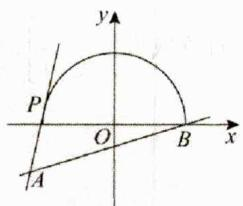

text_image

y
P
O
B
x
A

2.【答案】C【详解】令 $x = \cos \theta, \theta \in [0, \pi]$ ，则

$f(x) = g(\theta) = \frac{\sin\theta - 1}{\cos\theta - 2}$ 的几何意义是单位圆（在 $x$ 轴及其上方）上的动点 $M(\cos \theta, \sin \theta)$ 与点 $A(2,1)$ 连线的斜率 $k$ ，由图象，得 $0 \leq k \leq 1$ ，即函数 $f(x)$ 的值域为 $[0,1]$

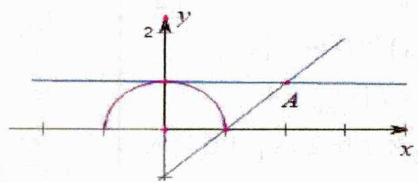

text_image

y
2
A
x

3.【答案】 $\left[0, \frac{\sqrt{3}}{3}\right]$

【详解】设函数 $f(x) = \frac{\sqrt{1 - x^2}}{x + 2}$ ，令 $y = \sqrt{1 - x^2}$ ，则点 $M(x, y)$ 位于一个单位圆 $x$ 轴的上半部分，如图所示。将函数 $f(x) = \frac{\sqrt{1 - x^2}}{x + 2}$ 改写为 $f(x) = \frac{y - 0}{x - (-2)}$ ，则表示定点 $A(-2,0)$ 与点 $M(x, y)$ 所连直线 $MA$ 的斜率。当直线 $MA$ 与上半单位圆相切时，在直角三角形 $MOA$ 中， $MO = 1, OA = 2, \therefore \angle MAO = 30^\circ$ ，所以

$k_{MA}=\tan30^{\circ}=\frac{\sqrt{3}}{3}$ . 又 $k_{AO}=0$ ，所以 $f(x)\in\left[0,\frac{\sqrt{3}}{3}\right]$ . 即函数 $y=\frac{\sqrt{1-x^{2}}}{x+2}$ 的值域为 $\left[0,\frac{\sqrt{3}}{3}\right]$ .

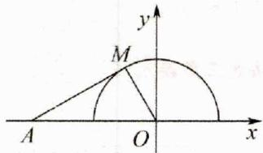

text_image

y
M
A O x

# 三、【习题检测】

1.【答案】 $\left[\frac{3}{4},\frac{9 + \sqrt{17}}{8}\right]$

【详解】 $\because -x^{2} + 4x - 3 = -(x - 2)^{2} + 1\geqslant 0\Rightarrow 1\leqslant x\leqslant 3.$

令 $x - 2 = \cos \theta$ 且 $\theta \in [0, \pi] \therefore y = \frac{\sqrt{-x^2 + 4x - 3} + 3}{x + 1} = \frac{\sin \theta + 3}{\cos \theta + 3}$ ，表示两点 $(-3, -3)$ 和 $(\cos \theta, \sin \theta)$ 的斜率， $\cos^2 \theta + \sin^2 \theta = 1 (\theta \in [0, \pi])$ ，故点 $(\cos \theta, \sin \theta)$ 在单位圆的上半部分。如图，斜率最小为 $\frac{-3 - 0}{-3 - 1} = \frac{3}{4}$ ，斜率最大值为直线与半圆相切时的斜率，

$\frac{\sin\theta-(-3)}{\cos\theta-(-3)}\cdot\frac{\sin\theta}{\cos\theta}=-1$ ，化简得 $\sin\theta+\cos\theta=-\frac{1}{3}$ ，由

$\left\{ \begin{array}{l} \sin \theta + \cos \theta = -\frac{1}{3} \\ \sin^2 \theta + \cos^2 \theta = 1 \\ -1 < \cos \theta < 0 \\ 0 < \sin \theta < 1 \end{array} \right.$ 解得 $\sin \theta = \frac{\sqrt{17} - 1}{6}, \cos \theta = \frac{-\sqrt{17} - 1}{6}$ ,

故切线的斜率为 $\frac{\sin\theta - (-3)}{\cos\theta - (-3)} = \frac{\frac{\sqrt{17} - 1}{6} + 3}{\frac{-\sqrt{17} - 1}{6} + 3} = \frac{9 + \sqrt{17}}{8}$ . 所

以斜率的取值范围，也即函数的值域为 $\left[\frac{3}{4},\frac{9+\sqrt{17}}{8}\right]$ .

故答案为： $\left[\frac{3}{4},\frac{9+\sqrt{17}}{8}\right]$

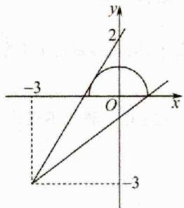

text_image

-3
O
x
y
2
-3

2.【答案】 $\left[\frac{-4-\sqrt{7}}{3},\frac{-4+\sqrt{7}}{3}\right]$ 【详解】 $y=\frac{\sin x+2}{\cos x-2}$ 表示点 $(\cos x,\sin x)$ 与点 $(2,-2)$ 连线的斜率， $\because(\cos x,\sin x)$ 的轨迹为圆 $x^{2}+y^{2}=1,\therefore y=\frac{\sin x+2}{\cos x-2}$ 表示圆 $x^{2}+y^{2}=1$ 上的点与点 $(2,-2)$ 连线的斜率，

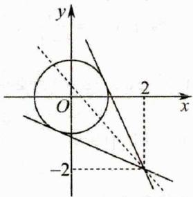

text_image

y
O
2
x
-2

由图象可知：过 $(2,-2)$ 作圆 $x^{2}+y^{2}=1$ 的切线，斜率必然存在，则设过 $(2,-2)$ 的圆 $x^{2}+y^{2}=1$ 的切线方程为 $y+2=k(x-2)$ ，即kx-y-2k-2=0，

∴ 圆心 $(0,0)$ 到切线的距离 $d=\frac{|-2k-2|}{\sqrt{k^{2}+1}}=1$ ，解得：

$k=\frac{-4\pm\sqrt{7}}{3}$ ，结合图象可知：圆 $x^{2}+y^{2}=1$ 上的点与点

(2,-2) 连线的斜率的取值范围为 $\left[\frac{-4-\sqrt{7}}{3},\frac{-4+\sqrt{7}}{3}\right]$ ,

即 $y = \frac{\sin x + 2}{\cos x - 2}$ 的值域为 $\left[\frac{-4 - \sqrt{7}}{3},\frac{-4 + \sqrt{7}}{3}\right]$ .

故答案为： $\left[\frac{-4-\sqrt{7}}{3},\frac{-4+\sqrt{7}}{3}\right]$ .

3.【答案】 $\left[\frac{3}{4}, + \infty\right)$

【详解】函数 $y = \frac{2 - \sin x}{1 - \cos x}$ 的几何意义是在直角坐标平面内定点 $A(1,2)$ 与动点 $M(\cos x, \sin x)$ 连线的斜率，

易知动点 $M$ 在以 $(0,0)$ 为圆心，1为半径的圆除(1,0)以外的点上，易知直线 $AM$ 的斜率存在，设为 $k$ ，则直线 $AM$ 为 $y - 2 = k(x - 1)$ 即 $kx - y + 2 - k = 0$

则 $\frac{|2 - k|}{\sqrt{k^2 + 1}} \leq 1$ ，解得 $k \geq \frac{3}{4}$ ，即值域为 $\left[\frac{3}{4}, +\infty\right)$ .

4.【答案】 $21 - 6\sqrt{6}\# \# -6\sqrt{6} +21$

【详解】解：分别作 $y=\sqrt{3-x^{2}}$ ， $y=\frac{9}{x}$ 的图象，

分别取点 $(x, \sqrt{3 - x^2})$ ， $(x, \frac{9}{x})$ ，原式视为两图象上各取一点的距离的平方，设 $P$ 为 $y = x$ 与 $y = \frac{9}{x}$ 的交点，

$\therefore PO^{2} = x^{2} + \frac{81}{x^{2}}\geqslant 2\sqrt{81} = 18$ ，即 $PO = 3\sqrt{2}$

当且仅当 $x = 3$ 时，取等号.故得的最小值为 $(OP - \sqrt{3})^{2} = 21 - 6\sqrt{6}$ .故答案为： $21 - 6\sqrt{6}$

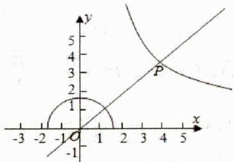

text_image

y
5
4
3
2
1
P
-1
O
-3 -2 -1 1 2 3 4 5 x

5.【答案】 $[3 - \sqrt{5}, 5]$

【详解】解：

$$
f (x) = 2 x - 3 - \sqrt {- x ^ {2} + 6 x - 8} = 2 x - 3 - \sqrt {1 - (x - 3) ^ {2}},
$$

由 $-x^{2} + 6x - 8\geq 0$ ，解得 $2\leq x\leq 4$

令 $t = 2x - 3 - \sqrt{1 - (x - 3)^2}$ ，即 $\sqrt{1 - (x - 3)^2} = 2x - 3 - t$

将函数 $f(x) = 2x - 3 - \sqrt{-x^2 + 6x - 8}$ 的值域转化为

$y=\sqrt{1-(x-3)^{2}}$ 与 y=2x-3-t 有交点时的 t 的取值范围，
在同一坐标系中作函数 $y=\sqrt{1-(x-3)^{2}}$ 与 y=2x-3-t
的图象如图所示：

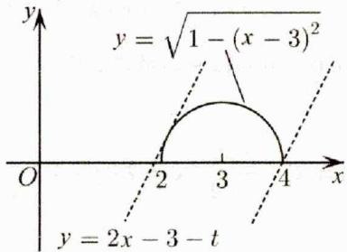

text_image

y
y = \u221a(1 - (x - 3)^2)
O
2
3
4
x
y = 2x - 3 - t

由图象知：当直线 $y = 2x - 3 - t$ 与半圆 $(x - 3)^2 + y^2 = 1$ 相切时， $t$ 最小，此时 $\frac{|3 - t|}{\sqrt{1 + 4}} = 1$ ，解得 $t = 3 \pm \sqrt{5}$ ，由图象知 $t = 3 - \sqrt{5}$ ，当直线 $y = 2x - 3 - t$ 过点 $A(4,0)$ 时， $t$ 最大，此时 $t = 5$ ，所以 $t\in [3 - \sqrt{5},5]$ ，即 $f(x)$ 的值域是 $[3 - \sqrt{5},5]$

6.【答案】 $\left[\sqrt{3},\frac{4\sqrt{3}}{3}\right]$

【详解】 $f(x)=\frac{\sin2x-2\sqrt{3}\sin^{2}x+3\sqrt{3}}{2+\cos2x}$

$$
= \frac {\sin 2 x + \sqrt {3} \cos 2 x + 2 \sqrt {3}}{2 + \cos 2 x} = \frac {\sin 2 x}{2 + \cos 2 x} + \sqrt {3},
$$

设 $v = \sin 2x$ ， $u = \cos 2x$ ，则 $\frac{\sin 2x}{2 + \cos 2x} = \frac{v}{u + 2}$ .

由于 $x \in \left[0, \frac{\pi}{2}\right]$ ，则 $u^2 + v^2 = 1$ ，且 $v \geq 0$ .

设 $k = \frac{v}{u + 2}$ ，由该式的几何意义得下面图形， $D(-2,0)$ 其中直线 $DA$ 为圆的切线，由图知 $k_{DB} \leq k \leq k_{DA}$

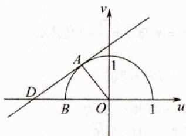

text_image

v
A
1
D
B
O
1
u

由图知 $k_{DB}=0$ ，

在 Rt△OAD 中，有 $\left|OA\right|=1,\quad\left|OD\right|=2$ ，所以

$\left|AD\right| = \sqrt{\left|OD\right|^2 - \left|OA\right|^2} = \sqrt{3}$ ，所以 $\tan \angle ADO = \frac{|AO|}{|DA|} = \frac{\sqrt{3}}{3},$

所以 $k_{DA} = \frac{\sqrt{3}}{3}$ . 所以, $0 \leq k \leq \frac{\sqrt{3}}{3}$ , 故所求值域为

$\left[\sqrt{3}, \frac{4\sqrt{3}}{3}\right]$ . 故答案为: $\left[\sqrt{3}, \frac{4\sqrt{3}}{3}\right]$ .

# 2.1.5 有界性法

# 二、【典型例题】

1.【答案】 $(-1,1]$

【详解】由题意，函数

$y=\frac{1-x^{2}}{1+x^{2}}\Rightarrow x^{2}=\frac{1-y}{1+y}\geq0\Rightarrow y\in(-1,1]$ 故答案为： $(-1,1]$ .

2.【答案】B

【详解】 $y=\frac{\cos x+1}{2\cos x-1}\Rightarrow\cos x=\frac{y+1}{2y-1}=\frac{1}{2}+\frac{3}{4y-2}\in[-1,1]$ $\Rightarrow\frac{3}{4y-2}\in\left[-\frac{3}{2},\frac{1}{2}\right]\Rightarrow y\in(-\infty,0]\cup[2,+\infty)$ 故选：B.

3.【答案】C

【详解】 $y=\frac{2^{x+1}+3}{2^{x}+1}\neq2\Rightarrow2^{x}=\frac{3-y}{y-2}>0\Rightarrow2<y<3$

# 三、【习题检测】

1.【答案】 $\left[-\frac{1}{3},1\right]$

$$
y = \frac {\sin \theta}{2 - \sin \theta} \Rightarrow \sin \theta = \frac {- 2 y}{y + 1} = - 2 + \frac {2}{y + 1} \in [ - 1, 1 ]
$$

$\Rightarrow \frac{2}{y + 1} \in [1,3] \Rightarrow y \in \left[-\frac{1}{3}, 1\right]$ 故答案为： $\left[-\frac{1}{3}, 1\right]$ .

2.【答案】[0,2)

【详解】解： $y=\frac{2x^{2}}{x^{2}+3}\Rightarrow x^{2}=\frac{-3y}{y-2}\geq0\Rightarrow y\in[0,2)$

3.【答案】 $\left[\frac{3 - \sqrt{21}}{4},\frac{3 + \sqrt{21}}{4}\right]$ 【详解】 $\because x\in R$

$\therefore 3 + \sqrt{5}\cos x > 0$ ，设 $y = f(x) = \frac{-1 - 2\sin x}{-3 - \sqrt{5}\cos x}$ 得：

$\left(-3 - \sqrt{5}\cos x\right)y = -1 - 2\sin x$ ，即

$\left(3+\sqrt{5}\cos x\right)y=1+2\sin x$ ，化得：

$3y - 1 = 2\sin x - \sqrt{5} y\cos x = \sqrt{4 + 5y^2}\cdot \sin (x + \varphi)$

即 $\frac{3y - 1}{\sqrt{4 + 5y^2}} = \sin (x + \varphi),\therefore \left|\frac{3y - 1}{\sqrt{4 + 5y^2}}\right| = |\sin (x + \varphi)|\leq 1$ （其中 $\tan \varphi = \frac{-\sqrt{5}y}{2}$ ）.化得： $4y^{2} - 6y - 3\leq 0$ ，解此不等式得： $\frac{3 - \sqrt{21}}{4}\leq y\leq \frac{3 + \sqrt{21}}{4}$

4.【答案】 $(- \infty, \frac{1}{3}] \cup [1, +\infty)$

【分析】将 $y = f(x) = \frac{\cos x}{2\cos x + 1}$ 化为 $\cos x = \frac{y}{1 - 2y}$ ，利用余弦函数的有界性，即 $|\cos x| \leq 1$ ，解不等式即可得答案.

【详解】由 $y = f(x) = \frac{\cos x}{2\cos x + 1}$ ，可得 $(1 - 2y)\cos x = y$ ，当 $y = \frac{1}{2}$ 时等式不成立，∴ $y \neq \frac{1}{2}$ ，则有 $\cos x = \frac{y}{1 - 2y}$ ，
∵ $\left|\cos x\right| \leq 1, \therefore \left|\frac{y}{1-2y}\right| \leq 1, 3y^{2}-4y+1 \geq 0, y \leq \frac{1}{3}$ 或 $y \geq 1$ ,
∴函数 $f(x)=\frac{\cos x}{2\cos x+1}$ 的值域是 $(-∞,\frac{1}{3}]∪[1,+∞)$ ,

# 2.1.6 向量法之绝对值不等式

# 二、【典型例题】

1.【答案】 $2\sqrt{2}$

$$
\Rightarrow \left\{ \begin{array}{l} f (x) = \sqrt {(x + 1) ^ {2} + 1 ^ {2}} + \sqrt {(x - 1) ^ {2} + (- 1) ^ {2}} \\ \vec {a} = (x + 1, 1), \vec {b} = (x - 1, - 1) \end{array} \right.
$$

$$
\Rightarrow \left\{ \begin{array}{l} f (x) = | \vec {a} | + | \vec {b} | \geq | \vec {a} - \vec {b} | = \sqrt {(1 + 1) ^ {2} + (1 + 1) ^ {2}} = 2 \sqrt {2} \\ \vec {a}, \vec {b} \text {反向} \Leftrightarrow \frac {x + 1}{x - 1} = \frac {1}{- 1} \Rightarrow x = 1 \text {时取等} \end{array} \right.
$$

$$
\therefore y _ {\min} = 2 \sqrt {2}.
$$

# 三、【习题检测】

1.【答案】C【详解】

$$
\begin{array}{l} \Rightarrow \left\{ \begin{array}{l} f (x) = \sqrt {x ^ {2} + 3 ^ {2}} + \sqrt {(x - 3) ^ {2} + (- 1) ^ {2}} \\ \vec {a} = (x, 3), \vec {b} = (x - 3, - 1) \end{array} \right. \\ \Rightarrow \left\{ \begin{array}{l} f (x) = | \vec {a} | + | \vec {b} | \geq | \vec {a} - \vec {b} | = \sqrt {3 ^ {2} + (3 + 1) ^ {2}} = 5 \\ \vec {a}, \vec {b} \text {反向} \Leftrightarrow \frac {x}{x - 3} = \frac {3}{- 1} \Rightarrow x = \frac {9}{4} \text {时取等} \end{array} \right. \\ \end{array}
$$

$$
\therefore f (x) _ {\min} = 5 \text {   故选:   } C
$$

2.【答案】5【详解】

$$
\begin{array}{l} \Rightarrow \left\{ \begin{array}{l} f (x) = \sqrt {(x + 1) ^ {2} + 2 ^ {2}} + \sqrt {(x - 3) ^ {2} + (- 1) ^ {2}} \\ \vec {a} = (x + 1, 2), \vec {b} = (x - 3, - 1) \end{array} \right. \\ \Rightarrow \left\{ \begin{array}{l} f (x) = | \vec {a} | + | \vec {b} | \geq | \vec {a} - \vec {b} | = \sqrt {(1 + 3) ^ {2} + (2 + 1) ^ {2}} = 5 \\ \vec {a}, \vec {b} \text {反向} \Leftrightarrow \frac {x + 1}{x - 3} = \frac {2}{- 1} \Rightarrow x = \frac {5}{3} \text {时取等} \end{array} \right. \\ \end{array}
$$

$$
\therefore f (x) _ {\min} = 5. \text {   故答案为:   } 5
$$

3.【答案】 $\sqrt{41}$ 【详解】

$$
\begin{array}{l} \Rightarrow \left\{ \begin{array}{l} f (x) = \sqrt {(x - 1) ^ {2} + 3 ^ {2}} + \sqrt {(x - 5) ^ {2} + (- 2) ^ {2}} \\ \vec {a} = (x - 1, 3), \vec {b} = (x - 5, - 2) \end{array} \right. \\ \Rightarrow \left\{ \begin{array}{l} f (x) = | \vec {a} | + | \vec {b} | \geq | \vec {a} - \vec {b} | = \sqrt {(- 1 + 5) ^ {2} + (3 + 2) ^ {2}} = \sqrt {4 1} \\ \vec {a}, \vec {b} \text {反向} \Leftrightarrow \frac {x - 1}{x - 5} = \frac {3}{- 2} \Rightarrow x = \frac {1 7}{5} \text {时取等} \end{array} \right. \\ \end{array}
$$

$$
\therefore f (x) _ {\min} = \sqrt {4 1}. \text {   故答案为:   } \sqrt {4 1}
$$

# 2.1.7 向量法之数形结合

# 二、【典型例题】

1.【答案】 $\left[\frac{\sqrt{6}}{2},\frac{3\sqrt{2}}{2}\right]$ 【详解】由已知得，

$$
f \left(x\right) = \sqrt {2} \cdot \sqrt {x - \frac {1}{2}} + 1 \cdot \sqrt {2 - x}    \text { 设 }   \overline {{O A}} = \vec {a} = (\sqrt {2}, 1)  ,
$$

令 $\overrightarrow{OB} = \vec{b} = (\sqrt{x - \frac{1}{2}},\sqrt{2 - x})\Rightarrow |\overrightarrow{OB}| = |\vec{b}| = \frac{3}{2}.$

则 $A(\sqrt{2},1)$ ，B轨迹为 $x^{2} + y^{2} = \frac{3}{2}\big(x,y\geq 0\big)$

$$
f (x) = \overrightarrow {O A} \cdot \overrightarrow {O B}
$$

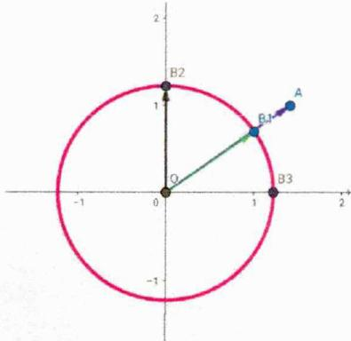

text_image

B2
1
O
B3
A
B4

如图所示， $\left\{\begin{aligned}f(x)_{\max}&=\overrightarrow{OA}\cdot\overrightarrow{OB_{1}}=\sqrt{3}\times\sqrt{\frac{3}{2}}=\frac{3\sqrt{2}}{2}\\ f(x)_{\min}&=\overrightarrow{OA}\cdot\overrightarrow{OB_{2}}=\sqrt{3}\times\sqrt{\frac{3}{2}}\times\frac{1}{\sqrt{3}}=\frac{\sqrt{6}}{2}\end{aligned}\right.$

所以 $f(x) \in \left[\frac{\sqrt{6}}{2}, \frac{3\sqrt{2}}{2}\right]$ 故答案为： $\left[\frac{\sqrt{6}}{2}, \frac{3\sqrt{2}}{2}\right]$

# 三、【习题检测】

1.【答案】 $\sqrt{6}$ 【详解】由己知得，

$$
f (x) = 1 \cdot \sqrt {x} + \sqrt {2} \cdot \sqrt {2 - x}
$$

设 $\overrightarrow{OA}=\vec{a}=(1,\sqrt{2})$ ,

$$
\text { 令 } \overrightarrow {O B} = \vec {b} = (\sqrt {x}, \sqrt {2 - x}) \Rightarrow | \overrightarrow {O B} | = | \vec {b} | = 2.
$$

则 $A(1, \sqrt{2})$ ，B 轨迹为 $x^2 + y^2 = 2(x, y \geq 0)$ ， $f'(x) = \overrightarrow{OA} \cdot \overrightarrow{OB}$

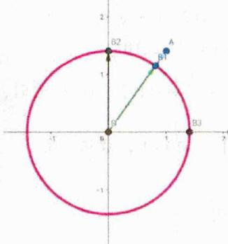

text_image

B2
A
B1
9
6
B3

如图所示， $\left\{\begin{aligned}f(x)_{\max}&=\overrightarrow{OA}\cdot\overrightarrow{OB_{1}}=\sqrt{3}\times\sqrt{2}=\sqrt{6}\\ f(x)_{\min}&=\overrightarrow{OA}\cdot\overrightarrow{OB_{3}}=\sqrt{3}\times\sqrt{2}\times\frac{1}{\sqrt{3}}=\sqrt{2}\end{aligned}\right.$

# 2.1.8 柯西不等式法

# 二、【典型例题】

1.【答案】B

【详解】因为

$$
y = \sqrt {x - 5} + 2 \sqrt {6 - x} \leq \sqrt {\left[ (\sqrt {x - 5}) ^ {2} + (\sqrt {6 - x}) ^ {2} \right] (1 ^ {2} + 2 ^ {2})} = \sqrt {5}
$$

当且仅当 $\sqrt{x - 5} = \frac{\sqrt{6 - x}}{2}$ ，即 $x = \frac{26}{5}$ 时，取等号.

2.【答案】B

【详解】由柯西不等式得

$$
(1 ^ {2} + 2 ^ {2}) (\sqrt {x - 1} ^ {2} + \sqrt {2 - x} ^ {2}) \geq (\sqrt {x - 1} + 2 \sqrt {2 - x}) ^ {2},
$$

所以 $\sqrt{x - 1} + 2\sqrt{2 - x} \leq \sqrt{5}$ （当且仅当 $\frac{1}{\sqrt{x - 1}} = \frac{2}{\sqrt{2 - x}}$ 即

$x=\frac{6}{5}$ 时取最大值）故选：B.

3.【答案】C

【详解】由柯西不等式可得，

函数 $y = \sqrt{2x - 3} + \sqrt{2x} + \sqrt{7 - 3x}$

$$
\leq \sqrt {1 ^ {2} + (\sqrt {2}) ^ {2} + 1 ^ {2}} \times \sqrt {(2 x - 3) + x + (7 - 3 x)} = 4
$$

当且仅当 $\frac{\sqrt{2x - 3}}{1} = \frac{\sqrt{x}}{\sqrt{2}} = \frac{\sqrt{7 - 3x}}{1}$ 时，即 $x = 2$ 时等号成立，

故该的最大值为4.故选：C.

4.【答案】A

$$
\begin{array}{l} \text {   【详解】   } y = 2 \cos x + 3 \sqrt {1 - \cos 2 x} = 2 \cos x + 3 \sqrt {2 \sin^ {2} x} \\ \leq \sqrt {\left(\cos^ {2} x + \sin^ {2} x\right) \left[ 2 ^ {2} + (3 \sqrt {2}) ^ {2} \right]} = \sqrt {2 2} \\ \end{array}
$$

当且仅当 $\frac{\cos x}{\sqrt{\sin^2 x}} = \frac{2}{3\sqrt{2}}$ ，即 $\tan x = \pm \frac{3\sqrt{2}}{2}$ 时，函数有最大值 $\sqrt{22}$ . 故选：A.

# 三、【习题检测】

1.【答案】B

【详解】 $y=\sqrt{x^{2}-2x+3}+\sqrt{x^{2}-6x+14}$

$$
= \sqrt {(x - 1) ^ {2} + 2} + \sqrt {(3 - x) ^ {2} + 5}
$$

根据柯西不等式，得

$$
\begin{array}{l} y ^ {2} = (x - 1) ^ {2} + 2 + (3 - x) ^ {2} + 5 + 2 \sqrt {\left[ (x - 1) ^ {2} + 2 \right] \left[ (3 - x) ^ {2} + 5 \right]} \\ \geq (x - 1) ^ {2} + 2 + (3 - x) ^ {2} + 5 + 2 [ (x - 1) (3 - x) + \sqrt {1 0} ] \\ = [ (x - 1) + (3 - x) ] ^ {2} + 2 + 5 + 2 \sqrt {1 0} = 1 1 + 2 \sqrt {1 0} \\ \end{array}
$$

当且仅当 $\frac{x - 1}{3 - x} = \frac{\sqrt{2}}{\sqrt{5}}$ ，即 $x = \frac{2\sqrt{10} - 1}{3}$ 时等号成立.此时，

$y_{\min}=\sqrt{11+2\sqrt{10}}=\sqrt{\left(\sqrt{10}+1\right)^{2}}=\sqrt{10}+1$ ，故选：B.

2.【答案】B

【详解】函数的定义域为[5,6]，且

$$
y > 0, y = 3 \times \sqrt {x - 5} + 4 \times \sqrt {6 - x}
$$

$\leq \sqrt{3^2 + 4^2} \times \sqrt{\left(\sqrt{x - 5}\right)^2 + \left(\sqrt{6 - x}\right)^2} = 5$ ，当且仅当

$\frac{\sqrt{x-5}}{3}=\frac{\sqrt{6-x}}{4}$ ，即 $x=\frac{134}{25}$ 时取等号，所以 $y_{max}=5$ .

3.【答案】B

【详解】因为函数 $y=3\sqrt{2x-2}+4\sqrt{3-x}$ ，

$\therefore \left\{ \begin{array}{l} 2x - 2 \geq 0 \\ 3 - x \geq 0 \end{array} \right.$ ，即 $1 \leq x \leq 3$ ，所以 $y = 3\sqrt{2}\sqrt{x - 1} + 4\sqrt{3 - x}$

$\leq \sqrt{\left(3\sqrt{2}\right)^2 + 4^2} \cdot \sqrt{\left(\sqrt{x - 1}\right)^2 + \left(\sqrt{3 - x}\right)^2} = 2\sqrt{17}$ ，当且仅当

$3\sqrt{2}\sqrt{3-x}=4\sqrt{x-1}$ ，即 $x=\frac{35}{17}$ 时取等号.故选：B.

4.【答案】 $12\sqrt{2}$

【详解】由柯西不等式 $(ac + bd)^2 \leq (a^2 + b^2)(c^2 + d^2)$ ，当且仅当 $ad = bc$ 时取等号，可得

$$
\left[ \sqrt {(x - 1) (2 0 - x)} + \sqrt {(x - 2) (1 7 - x)} \right] ^ {2}
$$

$$
= \left[ \sqrt {(x - 1) (2 0 - x)} + \sqrt {(1 7 - x) (x - 2)} \right] ^ {2}
$$

$$
\leq \left[ (\sqrt {x - 1}) ^ {2} + (\sqrt {1 7 - x}) ^ {2} \right] \left[ (\sqrt {2 0 - x}) ^ {2} + (\sqrt {x - 2}) ^ {2} \right] =
$$

$16 \times 18 = 288$ 当且仅当 $\sqrt{x - 1} \cdot \sqrt{x - 2} = \sqrt{17 - x} \cdot \sqrt{20 - x}$

即 $x = \frac{169}{17}$ 时等号成立，所以 $f(x)$ 的最大值 $\sqrt{288} = 12\sqrt{2}$ .

故答案为： $12\sqrt{2}$

5.【答案】25

【详解】法一：柯西不等式：

$$
y = \frac {2}{x} + \frac {9}{1 - 2 x} = \frac {2 ^ {2}}{2 x} + \frac {3 ^ {2}}{1 - 2 x} = \left(\frac {2 ^ {2}}{2 x} + \frac {3 ^ {2}}{1 - 2 x}\right) [ 2 x + (1 - 2 x) ],
$$

$\geq \left(\frac{2}{\sqrt{2x}} \times \sqrt{2x} + \frac{3}{\sqrt{1 - 2x}} \times \sqrt{1 - 2x}\right)^2 = 25$ ，当且仅当 $x = \frac{1}{5}$ 时，等号成立，所以函数 $y = \frac{2}{x} + \frac{9}{1 - 2x} \left(x \in \left(0, \frac{1}{2}\right)\right)$ 的最小值为 25，故答案为：25.

法二：权方和不等式：

$$
y = \frac {2}{x} + \frac {9}{1 - 2 x} = \frac {2 ^ {2}}{2 x} + \frac {3 ^ {2}}{1 - 2 x} \geq \frac {(2 + 3) ^ {2}}{2 x + 1 - 2 x} = 2 5
$$

当且仅当 $\frac{2}{2x} = \frac{3}{1 - 2x}, x = \frac{1}{5}$ 时取等

所以函数 $y = \frac{2}{x} + \frac{9}{1 - 2x} \left( x \in \left( 0, \frac{1}{2} \right) \right)$ 的最小值为 25，

6.【答案】5

【详解】由柯西不等式得

$$
\left(2 \sqrt {x} + \sqrt {5 - x}\right) ^ {2} \leq \left(2 ^ {2} + 1 ^ {2}\right) \cdot \left[ (\sqrt {x}) ^ {2} + (\sqrt {5 - x}) ^ {2} \right] = 2 5.
$$

$\therefore f'(x) = 2\sqrt{x} + \sqrt{5 - x} \leq 5$ ，当且仅当 $\frac{\sqrt{x}}{2} = \frac{\sqrt{5 - x}}{1}$ ，即 $x = 4$ 时，等号成立。故答案为：5

# 2.1.9 反向柯西不等式法

# 二、【典型例题】

1.【解析】 $2\cdot\sqrt{x^{2}+9}-1\cdot x\geqslant\sqrt{2^{2}-1^{2}}$

$\sqrt{x^{2}+9-x^{2}}=3\sqrt{3},x=\sqrt{3}$ 时取等，故答案为： $3\sqrt{3}+4$

# 三、【习题检测】

1.【解析】 $\left(\frac{4}{x + 1} -\frac{1}{x}\right)(x + 1 - x)$

$$
= \left[ \left(\frac {2}{\sqrt {x + 1}}\right) ^ {2} - \left(\frac {1}{\sqrt {x}}\right) ^ {2} \right] \left[ (\sqrt {x + 1}) ^ {2} - (\sqrt {x}) ^ {2} \right]
$$

$\leq \left(\frac{2}{\sqrt{x + 1}}\cdot \sqrt{x + 1} -\frac{1}{\sqrt{x}}\cdot \sqrt{x}\right)^{2}\leq (2 - 1)^{2} = 1$ ，故答案为：1.

2.【解析】

$2\cdot \sqrt{x^2 + 1} -1\cdot x\geqslant \sqrt{2^2 - 1^2}\cdot \sqrt{x^2 + 1 - x^2}$

$= \sqrt{3}, x = \frac{\sqrt{3}}{3}$ 时取等，故答案为： $\sqrt{3}$

# 2.2 抽象函数

# 2.2.1 抽象函数模型归纳

# 二、【典型例题】

1.【答案】C【详解】当函数为指数函数时，

$$
f (x) = a ^ {x} \Rightarrow a ^ {x + y} = a ^ {x} a ^ {y} \text {即} f (x + y) = f (x) f (y)
$$

2.【答案】D

【详解】试题分析：由于 $a^x \cdot a^y = a^{x + r}$ ，所以指数函数 $f(x) = a^x$ 满足 $f(x + y) = f'(x) + f(y)$ ，且当 $a > 1$ 时单调递增， $0 < x < 1$ 时单调递减，所以 $f(x) = 3^x$ 满足题意，

3.【答案】A【详解】令x=y=0，得

$$
f (- 1) = f (0) \cdot f (0) + f (0) - 3 = - 3.
$$

令 $y = 0$ ，得 $f(-1) = f(x)f(0) + f(0) + 2x - 3$ ，解得 $f(x) = 2x - 1$ ，则不等式 $f(x) > 3 - 2^{x}$ 转化为

$2x + 2^{x} - 4 > 0$ ，因为 $y = 2x + 2^{x} - 4$ 是增函数，且

$2 \times 1 + 2^{1} - 4 = 0$ ，所以不等式 $f(x) > 3 - 2^{x}$ 的解集为 $(1, +\infty)$ 。故选：A

4.【答案】C【详解】令 $x = y = 0$ ，则 $f(0) = f(0) + f(0) + 1$ 所以 $f(0) = -1$ ，令 $x = y = -1$ ，则

$$
f (- 2) = f (- 1) + f (- 1) + 2 + 1 = 2 f (- 1) + 3 = 1,
$$

所以 $f(-1) = -1$ ，

令 $x = 1, y = -1$ ，则

$f(0)=f(1)+f(-1)-2+1=f(1)-2=-1$ ，所以 $f(1)=1$ ，令x=n,y=1, $n\in N^{*}$ ，则

$$
f (n + 1) = f (n) + f (1) + 2 n + 1 = f (n) + 2 n + 2,
$$

所以 $f(n+1)-f(n)=2n+2$

则当 $n \geq 2$ 时， $f(n) - f(n - 1) = 2n$

$$
\text { 则 } f (n) = f (n) - f (n - 1) + f (n - 1) - f (n - 2) + \dots +
$$

$$
f (2) - f (1) + f (1)
$$

$$
= 2 n + (2 n - 2) + \dots + 4 + 1 = \frac {(2 n + 4) (n - 1)}{2} + 1 = n ^ {2} + n - 1,
$$

当 $n = 1$ 时，上式也成立，所以 $f(n) = n^2 + n - 1 (n \in \mathbf{N}^*)$ 所以 $f(2n) = 4n^2 + 2n - 1 (n \in \mathbf{N}^*)$ 故选：C.

5.【答案】BD【详解】令 $x = y = 0$ ，则 $f^{2}(0) = 0 \Rightarrow f(0) = 0$ 另令 $x = 0$ ，则 $f(y)f(-y) = -f^{2}(y)$ ，由 $f(1) = 2$ ，所以 $f(y)\equiv 0$ 不成立，所以 $f(-y) = -f(y)$ ，所以函数 $f(x)$ 为奇函数，故A错误；令 $x = 2$ ， $y = 1$ ，则

$f(3)f(1)=f^{2}(2)-f^{2}(1)\Rightarrow f(3)=-2$ ，故 B 正确；

令 $x = 3, y = 2$ ，则 $f(5)f(1) = f^2(3) - f^2(2) \Rightarrow f(5) = 2$ ，又 $f(-1) = -f(1) = -2$ ，所以 $f(-1) = -f(5)$ ，故 $\mathbf{G}$ 错；

令 $y = 2$ 得 $f(x + 2)f(x - 2) = f^2 (x) - f^2 (2) = f^2 (x)$ . 且 $f(1) = 2, f(3) = -2, f(5) = 2$ .

$$
\text { 所以 } f (7) f (3) = f ^ {2} (5) \Rightarrow f (7) = - 2; f (9) f (5) = f ^ {2} (7)
$$

$$
\Rightarrow f (9) = 2; f (1 1) f (7) = f ^ {2} (9) \Rightarrow f (1 1) = - 2 \dots
$$

所以 $f(2k + 1) = (-1)^{k}\times 2$ ，又 $f(0) = 0$ ， $f(2) = 2$

所以 $f(6)f(2)=f^{2}(4)\Rightarrow f(4)=0$ ; $f(8)f(4)=f^{2}(6)$

$\Rightarrow f(6)=0\cdots$ 所以 $f(2k)=0$ ；所以

$$
f (1) + f (2) + f (3) + f (4) = f (5) + f (6) + f (7) + f (8)
$$

$$
= \dots = f (4 k + 1) + f (4 k + 2) + f (4 k + 3) + f (4 k + 4) = 0
$$

所以 $\sum_{k=2}^{2024} f(k) = \sum_{k=1}^{2024} f(k) - f(1) = 0 - f(1) = -2$ ，故 D 正确.

# 三、【习题检测】

1.【答案】C【详解】对于A，因为函数 $f(x)$ 的定义域为R，且满足 $f(x)+f(y)=f(x+y)-2xy+2,f(1)=2$ ，取x=y=1，得 $f(1)+f(1)=f(2)-2+2$ ，则 $f(2)=4$ ，取x=y=2，得 $f(2)+f(2)=f(4)-8+2$ ，则 $f(4)=14$ ，故A错误；对于B，取y=1，得

$f(x)+f(1)=f(x+1)-2x+2$ ，则 $f(x+1)-f(x)=2x$ ，

所以 $f(x) - f(x - 1) = 2(x - 1), f(x - 1) - f(x - 2) =$

$2(x-2),\cdots,f(2)-f(1)=2$ ，以上各式相加得

$f(x) - f(1) = \frac{[2(x - 1) + 2]\cdot(x - 1)}{2} = x^2 -x$ ，所以

$f(x) = x^{2} - x + 2$ ，令 $f(x) = x^2 -x + 2 = x$ ，得

$x^{2} - 2x + 2 = 0$ ，此方程无解，故B错误.对于CD，由B知 $f(x) = x^{2} - x + 2$ ，所以

$f\left(x + \frac{1}{2}\right) = \left(x + \frac{1}{2}\right)^2 -\left(x + \frac{1}{2}\right) + 2 = x^2 +\frac{7}{4}$ 是偶函数，

$f\left(x - \frac{1}{2}\right) = \left(x - \frac{1}{2}\right)^2 -\left(x - \frac{1}{2}\right) + 2 = x^2 -2x + \frac{11}{4}$ 不是偶函

数，故C正确，D错误.故选：C.

2.【答案】D【详解】∵函数 $f(x)$ 满足对任意的

$x, y \in (1, +\infty)$ 且 $x < y$ 都有 $f\left(\frac{x - y}{1 - xy}\right) = f\left(\frac{1}{x}\right) - f\left(\frac{1}{y}\right)$ . 令 $x = n + 2, y = n + 3$ ，则

$$
\frac {x - y}{1 - x y} = \frac {(n + 2) - (n + 3)}{1 - (n + 2) (n + 3)} = \frac {1}{n ^ {2} + 5 n + 5}, \quad \therefore
$$

$$
a _ {n} = f \left(\frac {1}{n ^ {2} + 5 n + 5}\right) = f \left(\frac {1}{n + 2}\right) - f \left(\frac {1}{n + 3}\right) \therefore
$$

$$
\begin{array}{l} a _ {1} + a _ {2} + a _ {3} + \dots + a _ {2 0 2 4} = f \left(\frac {1}{3}\right) - f \left(\frac {1}{4}\right) + f \left(\frac {1}{4}\right) - \\ f \left(\frac {1}{5}\right) + \dots + f \left(\frac {1}{2 0 2 6}\right) - f \left(\frac {1}{2 0 2 7}\right) \\ = f \left(\frac {1}{3}\right) - f \left(\frac {1}{2 0 2 7}\right) = f \left(\frac {3 - 2 0 2 7}{1 - 3 \times 2 0 2 7}\right) = f \left(\frac {2 5 3}{7 6 0}\right). \\ \end{array}
$$

3.【答案】B【详解】解：由函数 $f(x) = a^{x}(a > 0, a \neq 1)$ ，得 $f(x + y) = a^{x + y} = a^{x} \cdot a^{y} = f(x) \cdot f(y)$ ，

所以函数 $f(x) = a^{x} (a > 0, a \neq 1)$ 对于任意的实数 $x$ 、 $y$ 都有 $f(x + y) = f(x)f(y)$ . 故选：B.

4.【答案】B【详解】对于 A，因 $3^{x+y}=3^{x}\cdot3^{y}$ ，则 $f(x)=3^{x}$ 满足 $f(x+y)=f(x)f(y)$ ，A 不是；

对于 $\mathbf{C}$ ，因 $\log_2(xy) = \log_2x + \log_2y$ ，则 $f(x) = \log_2x$ 满

足 $f(xy) = f(x) + f(y)$ ，C不是；

对于 D，因 $\tan(x+y)=\frac{\tan x+\tan y}{1-\tan x\tan y}$ ，则 $f(x)=\tan x$ 满足 $f(x+y)=\frac{f(x)+f(y)}{1-f'(x)f(y)}$ ，D不是；对于B，显然 $\sin(xy)$ 不能变形， $\sin(x+y)=\sin x\cos y+\cos x\sin y$ ，因此 $f(x)=\sin x$ 不满足三个等式中任一个，B是.故选：B

5.【答案】 $f(x)=x^{4}$ （答案不唯一， $f(x)=x^{2n}(n\in N^{*})$ 均满足）【详解】

取 $f'(x) = x^4$ ，则 $f(x_1x_2) = (x_1x_2)^4 = x_1^4x_2^4 = f(x_1)f(x_2)$ ，满足①， $f'(x) = 4x^3$ ， $x > 0$ 时有 $f'(x) > 0$ ，满足②， $f'(x) = 4x^3$ 的定义域为 $R$ ，又 $f'(-x) = -4x^3 = -f'(x)$ ，故 $f'(x)$ 是奇函数，满足③. 故答案为： $f(x) = x^4$ （答案不唯一， $f'(x) = x^{2n}(n \in N^*)$ 均满足）

6.【答案】(1) $f\left(\frac{1}{2}\right)=a^{\frac{1}{2}},f\left(\frac{1}{4}\right)=a^{\frac{1}{4}}$ ; (2)证明见解析.

【详解】（1）因为对任意 $x_{1}, x_{2} \in \left[0, \frac{1}{2}\right]$ ，都有

$f(x_{1} + x_{2}) = f(x_{1})\cdot f(x_{2})$ ，所以

$f(x)=f\left(\frac{x}{2}+\frac{x}{2}\right)=f\left(\frac{x}{2}\right)f\left(\frac{x}{2}\right)\geq0,\quad x\in[0,1]$ ，因为

$$
f (1) = f \left(\frac {1}{2} + \frac {1}{2}\right) = f \left(\frac {1}{2}\right) f \left(\frac {1}{2}\right) = \left[ f \left(\frac {1}{2}\right) \right] ^ {2},
$$

$$
f \left(\frac {1}{2}\right) = f \left(\frac {1}{4} + \frac {1}{4}\right) = f \left(\frac {1}{4}\right) f \left(\frac {1}{4}\right) = \left[ f \left(\frac {1}{4}\right) \right] ^ {2}, f (1) = a > 0,
$$

所以 $f\left(\frac{1}{2}\right)=a^{\frac{1}{2}},f\left(\frac{1}{4}\right)=a^{\frac{1}{4}}$ ;

(2) 因为 $f(x)$ 是定义在 R 上的偶函数，所以

$f(-x) = f(x)$ ，因为 $f(x)$ 图象关于直线 $x = 1$ 对称，所以 $f(x) = f(1 + 1 - x) = f(2 - x)$ ， $x \in \mathbf{R}$ ，

所以 $f(x)=f(2-x)=f(x-2)$ ，所以 $f(x+2)=f(x)$ ， $x\in R$ ，所以 $f(x)$ 是以 2 为周期的周期函数.

# 2.2.2 抽象函数利用周期性求值

# 二、【典型例题】

1.【答案】 $\frac{1}{2} / 0.5$ 【详解】因为

$4f(x)f(y)=f(x+y)+f(x-y)(x,y\in\mathbb{R}),\quad f(1)=\frac{1}{4}$ ，令y=1得， $4f(x)f(1)=f(x+1)+f(x-1)$ ，则

$$
f (x) = f (x + 1) + f (x - 1),
$$

所以 $f(x + 1) = f(x + 2) + f(x)$ ，则 $f(x + 2) + f(x - 1) = 0$ 即 $f(x + 3) + f(x) = 0$ ，所以 $f(x + 6) = -f(x + 3) = f(x)$

故函数为周期为6的函数，故 $f(2010) = f(6 \times 335) = f(0)$ ，令 $x = 1, y = 0$ ，得： $4f(1)f(0) = 2f(1)$ ，则 $f(0) = \frac{1}{2}$ ，故

$f(2010)=\frac{1}{2}$ . 故答案为： $\frac{1}{2}$ .

2.【答案】ACD【详解】由题意可知， $f(-x+1)=f(x+1)$ ，即函数 $f(x)$ 关于x=1对称，所以 $f(0)=f(2)$ ，

$f(x+1)=f(x)f(x+2)$ 中，令x=0，得

$f(1)=f(0)f(2)=f^{2}(2)=2$ ，又 $f(x)>0$ ，所以

$f(2)=\sqrt{2}$ ，故 A 正确；令 x=-1，得 $f(0)=f(-1)f(1)$ ，

即 $\sqrt{2} = f(-1) \times 2$ ，得 $f(-1) = \frac{\sqrt{2}}{2}$ ，而 $f(3) = f(-1) = \frac{\sqrt{2}}{2}$ ，

故 B 错误；由已知得 $f(x+2)=\frac{f(x+1)}{f'(x)}$ ，则

$f(x + 3) = \frac{f(x + 2)}{f(x + 1)}$ ，得 $f(x + 3) = \frac{1}{f(x)}$ ，那么

$f(x + 6) = \frac{1}{f(x + 3)} = f(x)$ ，所以函数 $f(x)$ 是周期为6

的函数, 故 $f(-1)=f(5)$ , 故 C 正确; 函数 $f(x)$ 关于 x=1 对称, 所以 $f\left(\frac{1}{2}\right)=f\left(\frac{3}{2}\right)$ , 函数的周期为 6, 所以

$f\left(\frac{3}{2}\right)=f\left(\frac{15}{2}\right)$ ，所以 $f\left(\frac{1}{2}\right)=f\left(\frac{15}{2}\right)$ ，故D正确.

3.【答案】B【详解】因为 $f(x + y) + f(x - y) = \frac{1}{2} f(x)f(y)$ ，

令 $x = y = 0$ ，有 $2f(0) = \frac{1}{2} f^2 (0)$ ，则 $f(0) = 0$ 或 $f(0) = 4$

若 $f(0) = 0$ ，则令 $x = 1, y = 0$ ，有 $2f(1) = \frac{1}{2} f(1)f(0)$ 得 $f(1) = 0$ ，与已知 $f(1) = 2\sqrt{3}$ 矛盾，所以 $f(0) = 4$ ：

令 $x = y = 1$ ，有 $f(2) + f(0) = \frac{1}{2} f^2 (1)$ ，则

$f(2) + 4 = \frac{1}{2} \times (2\sqrt{3})^2 = 6$ ，得 $f(2) = 2$ 。

令 $x = 2, y = 1$ ，有 $f(3) + f(1) = \frac{1}{2} f(2)f(1)$ ，得 $f(3) = 0$ 。

令 $x = 3$ ， $y = 2$ ，有 $f(5) + f(1) = \frac{1}{2} f(3)f(2)$ ，得 $f(5)$

$=-2\sqrt{3}$ . 令 x=5, y=2，有 $f(7)+f(3)=\frac{1}{2}f(5)f(2)$ ，得 $f(7)=-2\sqrt{3}$ .

令 $x = 7$ ， $y = 2$ ，有 $f(9) + f(5) = \frac{1}{2} f(7)f(2)$ ，得

$f(9) = 0$ .令 $x = 9$ ， $y = 2$ ，有 $f(11) + f(7) = \frac{1}{2} f(9)f(2)$

得 $f(11)=2\sqrt{3}$ . 令 x=0 ，有 $f(y)+f(-y)=\frac{1}{2}f(0)f(y)$ ,

得 $f(-y) = f(y)$ ，令 $x = 3$ ，有 $f(3 + y) + f(3 - y) = \frac{1}{2} f(3)f(y) = 0$ ，即 $f(3 + y) = -f(3 - y)$ ，

所以 $f(6 + y) = -f(-y) = -f(y)$ ，故 $f(12 + y) = -f(6 + y) = f(y)$ ，所以 $f(x)$ 的周期为12，

所以 $f(2025)=f(12\times168+9)=f(9)=0$ 。故选：B.

4.【答案】 $-2\sqrt{3}$

【详解】因为 $f(x + y) + f(x - y) = \frac{1}{2} f(x)f(y)$

令 $x = y = 0$ ，有 $2f(0) = \frac{1}{2} f^2 (0)$ ，则 $f(0) = 0$ 或 $f(0) = 4$

若 $f(0) = 0$ ，则令 $x = 1, y = 0$ ，有 $2f(1) = \frac{1}{2} f(1)f(0)$

得 $f(1)=0$ ，与已知 $f(1)=2\sqrt{3}$ 矛盾，所以 $f(0)=4$ 。

令 $x = y = 1$ ，有 $f(2) + f(0) = \frac{1}{2} f^2 (1)$ ，则

$f(2) + 4 = \frac{1}{2}\times (2\sqrt{3})^2 = 6$ ，得 $f(2) = 2$

令 $x = 2, y = 1$ ，有 $f(3) + f(1) = \frac{1}{2} f(2)f(1)$ ，得 $f(3) = 0$ 。

令 $x = 3, y = 2$ ，有 $f(5) + f(1) = \frac{1}{2} f(3)f(2)$ ，得

$f(5) = -2\sqrt{3}$ . 令 $x = 5, y = 2$ ，有

$f(7)+f(3)=\frac{1}{2}f(5)f(2)$ ，得 $f(7)=-2\sqrt{3}$

令 $x = 7, y = 2$ ，有 $f(9) + f(5) = \frac{1}{2} f(7)f(2)$ ，得 $f(9) = 0$ 。

令 $x = 9, y = 2$ ，有 $f(11) + f(7) = \frac{1}{2} f(9)f(2)$ ，得

$f(11) = 2\sqrt{3}$ . 令 $x = 0$ ，有 $f(y) + f(-y) = \frac{1}{2} f(0)f(y)$ ，

得 $f(-y)=f(y)$ ，令x=3，有

$f(3+y)+f(3-y)=\frac{1}{2}f(3)f(y)=0$ ，即

$f(3+y)=-f(3-y)$ ，所以 $f(6+y)=-f(-y)=-f(y)$ ，

故 $f(12+y)=-f(6+y)=f(y)$ ，所以 $f(x)$ 的周期为12.

又因为 $f(1)+f(3)+f(5)+f(7)+f(9)+f(11)=0$ ，

所以 $f(3)+f(5)+f(7)+f(9)+f(11)+f(13)=0$

所以 $\sum_{2024}^{k=1}f(2k+1)=f(3)+\cdots+f(4049)=f(3)+f(5)+$

$337 \times 0 = -2\sqrt{3}$ . 故答案为： $-2\sqrt{3}$ .

# 三、【习题检测】

1.【答案】0

【详解】函数 $f(x)$ 是定义在 R 上的奇函数，有 $f(0)=0$ ，又由 $f(x) = -f(-x)$ 和 $f(x + 2) = -f(-x)$ ，可得

$f(x+2)=f(x)$ ，可得函数 $f(x)$ 的周期为2，则

$f(1000)=f(0)=0$ ．故答案为：0

2.【答案】2

【详解】因为 $y = f(x + 1)$ 是奇函数，所以

$f(x + 1) = -f(-x + 1)$ ，用 $x - 1$ 替换上式中的 $x$ ，可得

$f(x) = -f(-x + 2)$ ，在 $f(4 + x) = f(-x)$ 中，用 $x - 2$ 替换 $x$ 可得 $f(x + 2) = f(-x + 2)$ ，所以 $f(x) = -f(x + 2)$ ，用 $x + 2$ 替换该式中的 $x$ ，可得 $f(x + 2) = -f(x + 4)$ ，

所以 $f(x) = (x + 4)$ ，所以函数 $f(x)$ 的周期为4，

在 $f(x + 1) = -f(-x + 1)$ 中，令 $x = 0$ ，得 $f(1) = 0$

在 $f(x) = -f(x + 2)$ 中，令 $x = 1$ ，得 $f(3) = -f(1) = 0$

在 $f(x + 2) = -f(x + 4)$ 中，令 $x = 0$ ，得 $f(4) = -f(2) = -2$

所以 $f(1)+f(2)+f(3)+f(4)=0$ ，

所以 $f(1)+f(2)+f(3)+\cdots+f(30)=f(1)+f(2)=2$

3.【答案】-1

【详解】解法一因为 $f(x + 2)$ 是奇函数，可得

$f(2-x)=-f(2+x)$ ，所以 $f(4-x)=-f(x)$ ，

又因为 $f(x - 1)$ 是偶函数，可得 $f(-1 - x) = f(-1 + x)$ ，即 $f(-2 - x) = f(x)$ ，所以

$$
f (x + 1 2) = f (4 - (- x - 8)) = - f (- 8 - x) =
$$

$$
- f (- 2 - (6 + x)) = - f (6 + x)
$$

$= -f(4 - (-2 - x)) = f(-2 - x) = f(x)$ ，所以 $f(x)$ 是周期为

12的周期函数，则

$f(726) = f(60 \times 12 + 6) = f(6) = -f(0) = -1$ .

解法二 因为 $f(x + 2)$ 是奇函数，可得 $f(x)$ 的图象关于点(2,0)对称，又因为 $f(x - 1)$ 是偶函数，可得 $f(x)$ 的图象关于直线 $x = -1$ 对称，所以 $f'(x)$ 是周期为

$4 \times |-1 - 2| = 12$ 的周期函数，所以

$f(726) = f(60 \times 12 + 6) = f(6) = -f(-2)$ ，因为 $f(x)$ 的图象关于直线 $x = -1$ 对称，所以 $f(-2) = f(0) = 1$ ，则

$f(726)=-f(-2)=-1$ ．故答案为：-1.

4.【答案】2

【详解】∵ $g(x)$ 为定义域为R的奇函数，

$\therefore g(0)=f(0)-2=0$ ，解得： $f(0)=2$ ；

由 $f(x + 3) = -f(x)$ 得： $f(x + 6) = -f(x + 3) = f(x)$ ，

∴ $f(x)$ 是周期为 6 的周期函数，

∴ $f(198)=f(33\times6)=f(0)=2$ ．故答案为：2．

5.【答案】-1

【详解】令 $x = y = 0$ ，得 $f(0) = [f(0)]^2 + [f(1)]^2$

再令 $x = y = 1$ ，得 $f(0) = [f(1)]^2 + [f(2)]^2$

所以 $\left[f(0)\right]^2 = \left[f(2)\right]^2$ ，因为 $f(0) \neq f(2)$ ，所以

$f(0)=-f(2)$ ，令x=1,y=0，得

$f(1)=f(1)f(0)+f(2)f(1)=0$ ，所以 $f(0)=\left[f(0)\right]^{2}$

即 $f(0) = 0$ 或1，若 $f(0) = 0$ ，则代入

$f(0)=\left[f(1)\right]^{2}+\left[f(2)\right]^{2}$ 中， $f(2)=0$ ，

由 $f(0) \neq f(2)$ ，所以 $f(0) \neq 0$ ，即 $f(0) = 1$ ，且 $f(2) = -1$ ，

令 $x = 0$ ，得 $f(-y) = f(0)f(y) + f(1)f(1 + y)$

由 $f(0) = 1$ ， $f(1) = 0$ ，所以 $f(-y) = f(y)$

所以 $f(x)$ 为偶函数，所以 $f(-1) = f(1) = 0$

$f(-2)=f(2)=-1$ ，令x=1，得

$f(1 - y) = f(1)f(y) + f(2)f(1 + y)$

所以 $f(1 - y) = -f(1 + y)$ ，即 $f(y) + f(2 - y) = 0$

因为 $f(-y) = f(y) = -f(y + 2)$ ，所以 $f(y + 4) = f(y)$ ，

所以 $f(x)$ 为周期函数，周期为4，所以

$f(1) = 0, f(2) = -1, f(3) = f(-1) = f(1) = 0, f(4) = f(0) = 1$

， $f(1) + f(2) + f(3) + f(4) = 0$ ，所以 $\sum_{n = 1}^{102}f(n) =$

25[f(1)+f(2)+f(3)+f(4)]+f(1)+f(2)=-1

故答案为：-1.

6.【答案】②③【详解】由题意可知 $f(-x)=f(x)$ ,

$-f^{\prime}(-x)=f^{\prime}(x)$ ，故 $f^{\prime}(x)$ 为R上奇函数，即

$f'(0)=0,f'(x)+f'(-x)=0$ ，由题令

$$
x = y = 0 \rightarrow f (0) = f (0) \cdot f (0) -
$$

$f'(0)f'(0)=f(0)\cdot f(0)\Rightarrow f(0)=1$ 或 0（舍去），故①错

误；令 $y = -x \Rightarrow f(0) = f(x)f(-x) - f'(x)f'(-x)$

$= [f(x)]^2 + [f'(x)]^2 = 1$ ，故②正确；

由条件可知 $f\left(x + \frac{\pi}{2}\right) = f(x)f\left(\frac{\pi}{2}\right) - f'(x)f'\left(\frac{\pi}{2}\right) = f'(x)$

$$
f \left(- x + \frac {\pi}{2}\right) = f (- x) f \left(\frac {\pi}{2}\right) - f ^ {\prime} (- x) f ^ {\prime} \left(\frac {\pi}{2}\right) = f ^ {\prime} (- x),
$$

则有 $f\left(x + \frac{\pi}{2}\right) = -f\left(-x + \frac{\pi}{2}\right)$

所以 $f(x + \pi) = -f(-x) = -f(x)$ ，则 $f(x + 2\pi) = f(x)$ ，

故③正确；由③可知， $f(x+2\pi)=f(x)\Rightarrow$

$f'(x+2\pi)=f'(x)$ ，即 $f'(x)$ 的一个周期为 $2\pi$ ，

所以 $\sum_{k=0}^{2024}f'\left(\frac{\pi}{2}+2k\pi\right)=2025f'\left(\frac{\pi}{2}\right)=-2025$ ，故④错误.

# 2.2.3 抽象函数综合性

# 二、【典型例题】

1.【答案】D【详解】解法一：

令 x=1，y=0，则 $2f(1)=\frac{2}{3}f(1)f(0)$ ，解得 $f(0)=3$ ，

A 正确；令 x=0，则 $f(y)+f(-y)=\frac{2}{3}f(0)f(y)=2f(y)$

所以 $f(y) = f(-y)$ ，即 $f(x)$ 是偶函数，

所以 $f(2x-1)=f(-2x+1)=f[2(1-x)-1]$ ，所以函数$f(2x-1)$ 关于直线 $x=\frac{1}{2}$ 对称，B 正确；

令 $y = x$ ，则 $f(2x) + f(0) = \frac{2}{3} f^2 (x)\geq 0$

令 $t = 2x$ ，则 $f(t) + f(0)\geq 0$ ，所以 $f(x) + f(0)\geq 0$ ，C正确；令 y=1，则 $f(x+1)+f(x-1)=f(x)$ ①，

所以 $f(x+2)+f(x)=f(x+1)$ ②,

①②联立得 $f(x+2)=-f(x-1)$ ,

所以 $f(x+3)=-f(x)$ ， $f(x+6)=-f(x+3)=f(x)$ ，即 $f(x)$ 的周期为 6，D 错误；

解法二：构造函数 $f(x)=3\cos\frac{\pi}{3}x$ ，满足 $f(1)=\frac{3}{2}$ ，且

$$
f (x + y) + f (x - y) = 3 \cos \frac {\pi}{3} (x + y) + 3 \cos \frac {\pi}{3} (x - y) =
$$

$6\cos\frac{\pi}{3}x\cos\frac{\pi}{3}y=\frac{2}{3}f(x)f(y)$ ， $f(0)=3\cos0=3$ ，A正确； $f(2x-1)-3\cos\frac{\pi}{3}(2x-1)=$

$$
3 \cos \left(\frac {2 \pi}{3} x - \frac {\pi}{3}\right) = 3 \cos \left[ \frac {2 \pi}{3} \left(x - \frac {1}{2}\right) \right],
$$

因为 $f(2x - 1)$ 表示 $y = 3\cos \frac{2\pi}{3} x$ 的图象向右平移 $\frac{1}{2}$ 个单位，且 $y - 3\cos \frac{2\pi}{3} x$ 的图象关于 $y$ 轴对称，

所以 $f(2x-1)$ 关于直线 $x=\frac{1}{2}$ 对称，B 正确；

由余弦函数的图象和性质可知

$f(x)+f(0)=3\cos\frac{\pi}{3}x+1\geq0$ ，C正确；

$f(x)$ 的周期 $T=\frac{2\pi}{\frac{\pi}{3}}=6$ ，D 错误；故选：D

# 2.【答案】ABC

【详解】方法一：

因为 $f(xy)=y^{2}f(x)+x^{2}f(y)$ ,

对于 A，令 x = y = 0， $f(0) = 0f(0) + 0f(0) = 0$ ，故 A 正确。对于 B，令 x = y = 1， $f(1) = 1f(1) + 1f(1)$ ，则 $f(1) = 0$ ，故 B 正确。对于 C，令 x = y = -1，

$f(1)=f(-1)+f(-1)=2f(-1)$ ，则 $f(-1)=0$ ，

令 $y = -1, f(-x) = f(x) + x^2 f(-1) = f(x)$ ，

又函数 $f(x)$ 的定义域为 $\mathbf{R}$ ，所以 $f(x)$ 为偶函数，故 $\mathbb{C}$ 正确，对于 $\mathbb{D}$ ，不妨令 $f(x) = 0$ ，显然符合题设条件，此时 $f(x)$ 无极值，故 $\mathbb{D}$ 错误.

方法二：因为 $f(xy)=y^{2}f(x)+x^{2}f(y)$ ,

对于 A，令 x = y = 0， $f(0) = 0f(0) + 0f(0) = 0$ ，故 A 正确。对于 B，令 x = y = 1， $f(1) = 1f(1) + 1f(1)$ ，则 $f(1) = 0$ ，故 B 正确。对于 C，令 x = y = -1，

$f(1)=f(-1)+f(-1)=2f(-1)$ ，则 $f(-1)=0$ ，

令 $y = -1, f(-x) = f(x) + x^2 f(-1) = f(x)$ ，

又函数 $f(x)$ 的定义域为 $\mathbf{R}$ ，所以 $f(x)$ 为偶函数，故 $\mathbb{C}$ 正确，对于 $\mathbb{D}$ ，当 $x^{2}y^{2} \neq 0$ 时，对 $f(xy) = y^{2}f(x) + x^{2}f(y)$ 两边同时除以 $x^{2}y^{2}$ ，得到 $\frac{f(xy)}{x^{2}y^{2}} = \frac{f(x)}{x^{2}} + \frac{f(y)}{y^{2}}$

故可以设 $\frac{f(x)}{x^2} = \ln |x| (x \neq 0)$ ，则 $f(x) = \begin{cases} x^2 \ln |x|, & x \neq 0 \\ 0, & x = 0 \end{cases}$ ,

当 $x > 0$ 时， $f(x) = x^2 \ln x$ ，则

$$
f ^ {\prime} (x) = 2 x \ln x + x ^ {2} \cdot \frac {1}{x} = x (2 \ln x + 1),
$$

令 $f'(x)<0$ ，得 $0<x<e^{-\frac{1}{2}}$ ；令 $f'(x)>0$ ，得 $x>e^{-\frac{1}{2}}$ ；
故 $f(x)$ 在 $\left(0, e^{-\frac{1}{2}}\right)$ 上单调递减，在 $\left(e^{-\frac{1}{2}}, +\infty\right)$ 上单调递增，
因为 $f(x)$ 为偶函数，所以 $f(x)$ 在 $\left(-e^{-\frac{1}{2}},0\right)$ 上单调递增，
在 $\left(-\infty,e^{-\frac{1}{2}}\right)$ 上单调递减，

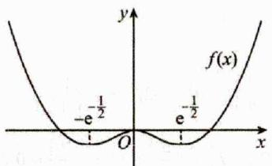

text_image

y
f(x)
-e^(-1/2)
e^(-1/2)
O
x

显然, 此时 x=0 是 $f(x)$ 的极大值, 故 D 错误. 故选: ABC.

3.【答案】D【详解】对于A，令x=y=0，可得

$$
f (0) = f ^ {\prime} (0) g (0) - g (0) f ^ {\prime} (0) = 0, \text {得} f ^ {\prime} (0) = 0,
$$

令 $y = 0$ ， $x = 1$ ，代入已知等式得

$$
f (1) = f (1) g (0) - g (1) f (0),
$$

可得 $f(1)[1 - g(0)] = -g(1)f(0) = 0$ ，结合 $f(1)\neq 0$ 得

$1-g(0)=0$ ，所以 $g(0)=1$ ，故A错误；

对于 D，因为 $g(0)=1$ ，令 x=0，代入已知等式得

$$
f (- y) = f (0) g (y) - g (0) f (y),
$$

将 $f(0) = 0$ ， $g(0) = 1$ 代入上式，得 $f(-y) = -f(y)$ ，所

以函数 $f(x)$ 为奇函数.

令 $x = 1$ ， $y = -1$ ，代入已知等式，得

$$
f (2) = f (1) g (- 1) - g (1). f (- 1),
$$

因为 $f(-1) = -f(1)$ ，所以 $f(2) = f(1)[g(-1) + g(1)]$ ，

又因为 $f(2) = -f(-2) = -f(1)$ ，所以

$$
- f (1) = f (1) \left[ g (- 1) + g (1) \right],
$$

因为 $f(1) \neq 0$ ，所以 $g(1) + g(-1) = -1$ ，故D正确；

对于 B，分别令 y = -1 和 y = 1，代入已知等式，得以下

两个等式： $f(x+1)=f(x)g(-1)-g(x)f(-1)$ ,

$$
f (x - 1) = f (x) g (1) - g (x) f (1),
$$

两式相加易得 $f(x + 1) + f(x - 1) = -f(x)$ ，所以有

$$
f (x + 2) + f (x) = - f (x + 1),
$$

即 $f(x)=-f(x+1)-f(x+2)$ ，有

$$
- f (x) + f (x) = f (x + 1) + f (x - 1) - f (x + 1) - f (x + 2) = 0,
$$

即 $f(x - 1) = f(x + 2)$ ，所以 $f(x)$ 为周期函数，且周期为

3，因为 $f(1) = 2024$ ，所以 $f(-2) = 2024$ ，所以

$$
f (2) = - f (- 2) = - 2 0 2 4, \quad f (3) = f (0) = 0,
$$

所以 $f(1) + f(2) + f(3) = 0$ ，所以

$$
\sum_ {n = 1} ^ {2 0 2 4} f (n) = f (1) + f (2) + f (3) + \dots + f (2 0 2 4)
$$

$= f(2023) + f(2024) = f(1) + f(2) = 0$ ，故B错误；

对于 C，取 $f(x)=\sin\frac{2\pi}{3}x$ ， $g(x)=\cos\frac{2\pi}{3}x$ ，满足

$$
f \left(x - y\right) = f \left(x\right) g \left(y\right) - g \left(x\right) f \left(y\right)   \text {及}   f \left(- 2\right) = f \left(1\right) \neq 0  ,
$$

所以 $f(2x - 1) = \sin \frac{2\pi}{3}(2x - 1)$ ，又 $f(0) = \sin 0 = 0$

所以函数 $f(2x-1)$ 的图像不关于直线 $x=\frac{1}{2}$ 对称，故 C 错误；故选：D.

4.【答案】ACD

【详解】由 $f(x+y)+f(x-y)=2f(x)f(y)$ ,

令 $x = y = 0$ ，则 $2f(0) = 2[f(0)]^2$

又 $f(0)\neq0$ ，所以 $f(0)=1$ ，故A正确；

令 x=0，则 $f(y)+f(-y)=2f(0)f(y)=2f(y)$

所以 $f(-y)=f(y)$ ，所以 $f(x)$ 是偶函数，故 B 错误；

令 x=y=1，则 $f(2)+f(0)=2\left[f(1)\right]^{2}=0$ ，所以 $f(1)=0$ ，

令 $y = 1$ ，则 $f(x + 1) + f(x - 1) = 2f(x)f(1) = 0$

所以 $f(x + 1) = -f(x - 1)$ ，即 $f(x + 2) = -f(x)$

所以 $f(x + 4) = -f(x + 2) = f(x)$ ，所以 $f(x)$ 的周期为4，

故 C 正确；由 $f(x+2)=-f(x)$ ，得

$$
f (3) = - f (1) = 0, f (4) = - f (2) = 1,
$$

所以 $\sum_{n=1}^{100} n^2 f(n) = -2^2 + 4^2 - 6^2 + 8^2 - \cdots - 98^2 + 100^2$

$$
= (2 + 4) (- 2 + 4) + (6 + 8) (- 6 + 8) + \dots
$$

$$
+ (9 8 + 1 0 0) (- 9 8 + 1 0 0)
$$

$$
= 2 \times (2 + 4 + 6 + \dots + 9 8 + 1 0 0)
$$

$= \frac{2\times(2 + 100)\times50}{2} = 5100$ ，故D正确.故选：ACD.

5.【答案】BCD【详解】因为 $f(x)$ 定义域为 R,

$\forall x,y\in \mathbb{R},f(x + y) - f(x - y) = 2f(\frac{1}{2} -x)f(y),f(\frac{1}{2}) = 1,$

A 选项，令 x=0，则 $f(y)-f(-y)=2f(\frac{1}{2})f(y)$ ，

即 $f(-y) = -f(y)$ ，所以 $f(x)$ 为奇函数，故 A 错误；

B 选项，用 $\frac{x}{2}$ 替换 x，用 $\frac{x}{2}$ 替换 y，

则 $f(\frac{x}{2}+\frac{x}{2})-f(\frac{x}{2}-\frac{x}{2})=2f(\frac{1}{2}-\frac{x}{2})f(\frac{x}{2})$ ，即

$$
f (x) - f (0) = 2 f \left(\frac {1 - x}{2}\right) f \left(\frac {x}{2}\right),
$$

又 $f(x)$ 为 $\mathbb{R}$ 上的奇函数，所以 $f(0) = 0$

因此 $f(x)=2f(\frac{1-x}{2})f(\frac{x}{2})$ ，故 B 正确；

C 选项，令 $x = \frac{1}{2}$ ，则 $f\left(\frac{1}{2} + y\right) - f\left(\frac{1}{2} - y\right) = 2f(0)f(y) = 0$

所以 $f(\frac{1}{2} + y) = f(\frac{1}{2} - y)$ ，即 $f(x + 1) = f(-x)$ ，

又 $f(-x) = -f(x)$ ，所以 $f(x + 1) = -f(x)$ ，

因此 $f(x + 2) = -f(x + 1) = -[-f(x)] = f(x)$ ，故 $\mathbb{C}$ 正确；

D 选项，令 $y=\frac{1}{2}-x$ ，则

$$
f (x + \frac {1}{2} - x) - f (x - \frac {1}{2} + x) = 2 \left[ f (\frac {1}{2} - x) \right] ^ {2},
$$

即 $1 - f(2x - \frac{1}{2}) = 2\left[f(\frac{1}{2} - x)\right]^2$ ①，

令 $x = \frac{1}{2} - y$ ，则 $f\left(\frac{1}{2} - y + y\right) - f\left(\frac{1}{2} - y - y\right) = 2[f(y)]^2$

即 $1 - f\left(\frac{1}{2} - 2y\right) = 2[f(y)]^2$ ，所以 $1 - f\left(\frac{1}{2} - 2x\right) = 2[f(x)]^2$

②，①+②整理得 $2 = 2\left[f(\frac{1}{2} - x)\right]^2 + 2[f'(x)]^2$

即 $[f(x)]^2 +\left[f(\frac{1}{2} -x)\right]^2 = 1$ ，所以D正确.故选：BCD.

# 三、【习题检测】

# 1.【答案】B

【详解】因为当 $x < 3$ 时 $f(x) = x$ ，所以 $f(1) = 1, f(2) = 2$ 又因为 $f(x) > f(x - 1) + f'(x - 2)$

则 $f(3) > f(2) + f(1) = 3, f(4) > f(3) + f(2) > 5$

$$
f (5) > f (4) + f (3) > 8, f (6) > f (5) + f (4) > 1 3,
$$

$$
f (7) > f (6) + f (5) > 2 1,
$$

$$
f (8) > f (7) + f (6) > 3 4, f (9) > f (8) + f (7) > 5 5,
$$

$$
f (1 0) > f (9) + f (8) > 8 9,
$$

$$
f (1 1) > f (1 0) + f (9) > 1 4 4, f (1 2) > f (1 1) + f (1 0) > 2 3 3,
$$

$$
f (1 3) > f (1 2) + f (1 1) > 3 7 7
$$

$$
f (1 4) > f (1 3) + f (1 2) > 6 1 0, f (1 5) > f (1 4) + f (1 3) > 9 8 7,
$$

$f(16) > f(15) + f(14) > 1597 > 1000$ ，则依次下去可知 $f(20) > 1000$ ，则B正确；

且无证据表明 ACD 一定正确. 故选: B.

2.【答案】ABD【详解】对于 AB，∵ $f'(2x) + f'(-2x) = 0$ ，∴ $f'(x)$ 为奇函数，∴ $f(x)$ 为偶函数；

$\because f(2 - x) - f'(x) = 1, \therefore f'(x) = f(2 - x) - 1,$ 故

$f^{\prime}(-x)=f(2+x)-1\therefore f(2-x)+f(2+x)=2,\therefore f(x)$ 关于 $(2,1)$ 中心对称，且 $f(x)+f(4-x)=2$

又 $f(x)$ 关于 $\gamma$ 轴对称，故 $f(x) = f(-x)$ ，

$f(-x)+f(4-x)=2$ ，所以 $f(4-x)+f(8-x)=2$ ，故

$f(x)=f(8-x)$ ，∴ $f(x)$ 的周期为 T=8，故 $f'(x)$ 的周期为 T=8，∴ A，B 正确.

对于D，对 $f(2 - x) + f(2 + x) = 2$ 两边同时求导得，

$-f^{\prime}(2 - x) + f^{\prime}(2 + x) = 0$ ，即 $f^{\prime}(2 + x) = f^{\prime}(2 - x)$

$f'(x)$ 的对称轴为直线 x=2，故 $y=f'(2-x)$ 为偶函数，故 D 正确。对于 C，∵ $f(x)$ 关于 (2,1) 中心对称，

所以 $f\left(\frac{1}{2024}\right)+f\left(\frac{8095}{2024}\right)=f\left(\frac{2}{2024}\right)+f\left(\frac{8094}{2024}\right)=\cdots=2$

$$
\therefore f \left(\frac {1}{2 0 2 4}\right) + \dots + f \left(\frac {8 0 9 5}{2 0 2 4}\right) = 2 \times 4 0 4 7 + 1 = 8 0 9 5,
$$

∴ C 错误. 故选: ABD.

3.【答案】AC【详解】令 x=y=0，则 $f(0)-f(0)=f^{2}\left(\frac{3}{2}\right)$ ,

所以 $f\left(\frac{3}{2}\right)=0$ ，A 选项正确；

令 $x = 0$ ，则 $f(y) - f(-y) = f\left(\frac{3}{2}\right)f\left(y + \frac{3}{2}\right) = 0$ ，即

$f(y)=f(-y)$ ，所以 $f(x)$ 是偶函数，B选项错误；

$f(3) = f(-3)$ ，令 $x = y = \frac{3}{2}$ ，则 $f(3) - f(0) = f^2(3)$ ，

令 $x = y = -\frac{3}{2}$ ，则 $f(-3) - f(0) = f^2 (0) = f(3) - f(0)$

所以 $f^2(0) = f^2(3)$ ，所以 $\left(f^2(0) + f(0)\right)^2 = f^2(0)$ ，因为 $f(0) \neq 0$ ，所以 $f(0) = -2$ ， $f(3) = 2$ ，G选项正确：

令 $y = -\frac{3}{2}$ ，则

$$
f \left(x - \frac {3}{2}\right) - f \left(x + \frac {3}{2}\right) = f \left(x + \frac {3}{2}\right) f (0) = - 2 f \left(x + \frac {3}{2}\right),
$$

所以 $f\left(x - \frac{3}{2}\right) + f\left(x + \frac{3}{2}\right) = 0$ ， $f\left(x + \frac{3}{2}\right) + f\left(x + \frac{9}{2}\right) = 0$

所以 $f\left(x - \frac{3}{2}\right) = f\left(x + \frac{9}{2}\right)$ ， $f(x)$ 的一个周期为 6，D 选项错误。故选：AC.

4.【答案】BCD【详解】因为 $y=f(2x-1)$ 的图象关于直线 x=1 对称，

所以 $f(2 + 2x - 1) = f(2 - 2x - 1)$ ，即 $f(1 + 2x) = f(1 - 2x)$ ，

所以 $f(1+x)=f(1-x)$ ,

所以 $f(x)$ 的图象关于直线 x=1 对称.

因为 $y = f(2 - x) + 1$ 的图象关于点(0,1)对称，

所以 $f(2 - x) + 1 + f(2 + x) + 1 = 2$ ，即

$$
f (2 - x) + f (2 + x) = 0,
$$

所以 $f(x)$ 的图象关于点 $(2,0)$ 对称.

所以 $f(x) = -f(4 - x)$ .

令 x=2 ，得 $f(2)=0$ .

由 $f(1 + x) = f(1 - x)$ ， $f(2 - x) + f(2 + x) = 0$ 可得

$$
f (x) = f (2 - x), f (x) = - f (4 - x),
$$

故 $f(2 - x) = -f(4 - x)$ 即 $f(x) = -f(2 + x)$ ，

所以 $f(x + 4) = -f(x + 2) = f(x)$

所以函数 $f(x)$ 的周期 $T = 4$

所以 $f(x + 6) = f(x + 2) = -f(x)$ ，又 $f(x)$ 不恒为零，

所以 $f(x + 6) = f(x)$ 错误，A错误，

$f(10)=f(2+2\times4)=f(2)=0$ ，B正确；

因为 $f(x)$ 的图象关于直线 $x = 1$ 对称， $f(x)$ 的图象关于点 $(2,0)$ 对称，

所以 $f(3+x)=f[2+(1+x)]=-f(1-x)=-f(1+x)$

$$
= - f [ 2 + (x - 1) ] = f (3 - x),
$$

所以 $x = 1, x = 3$ 为函数 $f(x)$ 的对称轴，

结合周期性可得， $x = 1 + 2k$ ， $k\in Z$ 为函数 $f(x)$ 的图象的对称轴，

所以 $x = 7$ 是函数 $f(x)$ 图象的一条对称轴，C正确；

因为 $f(1 + x) = f(1 - x)$ ， $f(2 - x) + f(2 + x) = 0$ ，

所以 $f(-x)=f\left[1-(1+x)\right]=f(2+x)=-f(2-x)$

$$
= - f (1 + 1 - x) = - f (x),
$$

所以原点为函数 $f(x)$ 的一个对称中心，

结合函数周期性可得点 $(2 + 2k,0)$ ， $k\in \mathbf{Z}$ ，为函数 $f(x)$ 图象的对称中心，所以点 $(56,0)$ 是函数 $f(x)$ 图象的一个对称中心，D正确.故选：BCD.

# 5.【答案】BCD

【详解】由 $f(x-1)+f(x+1)=f(-2)$ ，得

$f(x + 1) + f(x + 3) = f(-2)$

则 $f(x - 1) = f(x + 3)$ ，即 $f(x) = f(x + 4)$ ，因此 $f(x)$ 是周

期为 4 的周期函数，C 正确：

令 $x = -1$ ，得 $f(-2) + f(0) = f(-2)$ ，则 $f(0) = 0$ ，因此 $f(2024) = f(0) = 0$ ，A错误；

由 $f(2x + 6) = f(-2x)$ ，得 $f(x + 6) = f(-x)$ ，则

$$
f (- x) = f [ (x - 1 2) + 6 ] = f (x - 6),
$$

因此 $f(x)$ 的图象关于直线 x = -3 对称，B 正确；

由 $f(x + 6) = f(-x)$ ，得 $f(x)$ 的图象关于直线 $x = 3$ 对称，因此直线 $x = -3 + 4n$ 及 $x = 3 + 4n(n \subset \mathbf{Z})$ 均为 $f(x)$ 图象的对称轴，从而 $f(-2) = f(0) = 0, f(\frac{7}{2}) = f(\frac{5}{2}) = 1$ ，令 $x = \frac{3}{2}$ ，得 $f(\frac{3}{2} - 1) + f(\frac{3}{2} + 1) = 0$ ，即 $f(\frac{1}{2}) = -f(\frac{5}{2}) = -1$ ，则

$f(\frac{1}{2}) = f(\frac{3}{2}) = f(\frac{9}{2}) = -1$ ，故

$$
\sum_ {k = 1} ^ {2 0 2 5} (- 1) ^ {k} k f (k - \frac {1}{2}) = - f (\frac {1}{2}) + 2 f (\frac {3}{2}) - 3 f (\frac {5}{2}) + 4 f (\frac {7}{2}) - \dots
$$

$$
- 2 0 2 5 f \left(\frac {4 0 4 9}{2}\right)
$$

$$
= (1 - 2 - 3 + 4) + \dots + (2 0 2 1 - 2 0 2 2 - 2 0 2 3 + 2 0 2 4) + 2 0 2 5 = 2 0 2 5
$$

，D 正确. 故答案为：BCD

6.【答案】AB

【详解】对于 A，因为 $f(x+1)+f(x+3)=f(2024)$ ，

所以 $f(x)+f(x+2)=f(2024)$ ,

$$
f (x + 2) + f (x + 4) = f (2 0 2 4),
$$

所以 $f(x+4)=f(x)$ ，故 $f(x)$ 的最小正周期为 4，A 正

确：对于 B，因为 $f(x+1)+f(x+3)=f(2024)$ ，

令 x=2021，则 $f(2022)+f(2024)=f(2024)$ ,

所以 $f(2022) = 0$ ，由A可知，

$f(2022)=f(4\times505+2)=f(2)=0$ ，故 B 正确；

对于 C，因为 $f(-x)=f(x+2)$ ，①

令 x=0，则 $f(0)=f(2)=0$ ，

所以 $f(2024)=f(4\times506)=f(0)=0$

所以 $f(x)+f(x+2)=f(2024)=0$ ，②

由①②，所以 $f(x) + f(-x) = 0$ ，即 $f(-x) = -f(x)$ ，故 $f(x)$ 为奇函数，

若函数 $f(x - 1)$ 是奇函数，则 $f(-x - 1) = -f(x - 1)$ ，

所以 $f(-x - 1) = f[-(x + 1)] = -f(x + 1)$ ，即

$$
f (x - 1) = f (x + 1),
$$

所以 $f(x+2)=\left[f(x+1)+1\right]=f\left[(x+1)-1\right]=f(x)$ ,

所以 $f(x)$ 的最小正周期为 2，与选项 A 矛盾，故 C 错误；

对于D，因为 $f(x)$ 为奇函数，且 $f\left(\frac{1}{2}\right) = \frac{1}{4}$ ，所以

$f\left(-\frac{1}{2}\right) = -\frac{1}{4}$ ，又因为 $f(x)$ 的最小正周期为4，所以

$f\left(\frac{7}{2}\right) = f\left(-\frac{1}{2}\right) = -\frac{1}{4}$ ，因为 $f(-x) = f(x + 2)$

所以 $f\left(\frac{3}{2}\right) = f\left(-\frac{1}{2} + 2\right) = f\left(\frac{1}{2}\right) = \frac{1}{4}$ ,

$f\left(\frac{5}{2}\right) = f\left(-\frac{3}{2}\right) = -f\left(\frac{3}{2}\right) = -\frac{1}{4}$ ，所以

$$
\sum_ {k = 1} ^ {4} k \cdot f \left(k - \frac {1}{2}\right) = 1 \times f \left(\frac {1}{2}\right) + 2 \times f \left(\frac {3}{2}\right) + 3 \times f \left(\frac {5}{2}\right) + 4 \times f \left(\frac {7}{2}\right)
$$

$$
= 1 \times \frac {1}{4} + 2 \times \frac {1}{4} + 3 \times \left(- \frac {1}{4}\right) + 4 \times \left(- \frac {1}{4}\right) = - 1,
$$

$$
\sum_ {k = 5} ^ {8} k \cdot f \left(k - \frac {1}{2}\right) = 5 \times f \left(\frac {9}{2}\right) + 6 \times f \left(\frac {1 1}{2}\right) +
$$

$$
7 \times f \left(\frac {1 3}{2}\right) + 8 \times f \left(\frac {1 5}{2}\right)
$$

$$
= 5 \times f \left(\frac {1}{2}\right) + 6 \times f \left(\frac {3}{2}\right) + 7 \times f \left(\frac {5}{2}\right) + 8 \times f \left(\frac {7}{2}\right)
$$

$$
= 5 \times \frac {1}{4} + 6 \times \frac {1}{4} + 7 \times \left(- \frac {1}{4}\right) + 8 \times \left(- \frac {1}{4}\right) = - 1,
$$

以此类推，所以 $\sum_{k=1}^{2024} k \cdot f\left(k - \frac{1}{2}\right) = 506 \times (-1) = -506$ ，故 D

错误. 故选: AB

7.【答案】ABD

【详解】对于 A，因为函数 $f(x)$ 的定义域为 R， $f(x+1)$ 为奇函数，所以 $f(-x+1)=-f(x+1)$ ，则

$f(x + 2) = -f(-x)$ ，令 $x = -1$ ，则 $f(1) = -f(1),\therefore f(1) = 0$ 故A正确；对于B， $\because f(2 + x) = f(2 - x)$ ，所以

$f(x + 4) = f(-x)$ ，则 $f(x + 4) = -f(x + 2)$

所以 $f(x+2)=-f(x)$ ，故 $f(x+4)=-f(x+2)=f(x)$ ，故 B 正确；对于 C，假设 $f'(x+1)=-f(-x-1)$ ，则

$f(x)=-f(-x)$ ，又 $f(x+4)=f(-x)=f(x)$ ，函数 $f(x)$ 的定义域为R，所以 $f(x)$ 即是奇函数又是偶函数，则 $f(x)=0$ 恒成立，与题干矛盾，故C错误；

对于D，因为 $f(1) = 0$ ， $f(x + 2) = -f(x)$ ，所以

$f(3) = -f(1) = 0$ ，所以 $f(x)$ 在 $(0,4)$ 上至少有两个零点，又 $f(x + 4) = f(x)$ ，即 $f(x)$ 为周期为4的偶函数，而

$2024 = 4 \times 506$ ，所以 $f(x)$ 在区间[0,2024]上至少有

$2 \times 506 = 1012$ 个零点，故 D 正确. 故选：ABD.

# 2.3 比大小拓展

# 2.3.1 同构比大小

# 二、【典型例题】

1.【答案】A

【详解】由 $2^{x} - 2^{y} < 3^{-x} - 3^{-y}$ 得： $2^{x} - 3^{-x} < 2^{y} - 3^{-y}$ ，令 $f(t) = 2^{t} - 3^{-t}$ ， $\because y = 2^{x}$ 为 $R$ 上的增函数， $y = 3^{-x}$ 为 $R$ 上的减函数， $\therefore f(t)$ 为 $R$ 上的增函数， $\therefore x < y$ ， $\because y - x > 0$ ， $\therefore y - x + 1 > 1$ ， $\therefore \ln (y - x + 1) > 0$ ，则 $\mathsf{A}$ 正确， $\mathsf{B}$ 错误； $\because |x - y|$ 与 1 的大小不确定，故 $\mathsf{CD}$ 无法确定.

2.【答案】C

【详解】试题分析：对于 A，B 作出 $f(x)=e^{x}-\ln x$ 图象如图所示，可见 0<x<1 时，既有单调减函数区间，单调增函数区间，故都不正确；对于 C，设 $f(x)=\frac{e^{x}}{x}$ ，作如图所示，因 0<x<1, $f'(x)=\frac{e^{x}}{x}-\frac{e^{x}}{x^{2}}=\frac{e^{x}(x-1)}{x^{2}}<0$ ，此时， $f(x)$ 在 $(0,1)$ 上为减函数，故有

$f(x_{1}) = \frac{e^{x_{1}}}{x_{1}} > f(x_{2}) = \frac{e^{x_{2}}}{x_{2}}$ ，得 $x_{2}e^{x_{1}} > x_{1}e^{x_{2}}$ ，故C正确，D不正确，故选C.

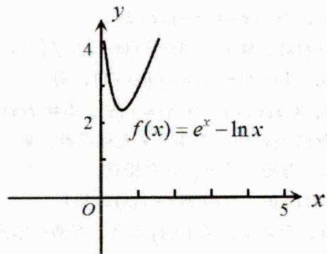

line

| x    | y     |
| ---- | ----- |
| 0    | 4     |
| 1.5  | 2     |
| 3    | 3     |
| 5    | 4     |

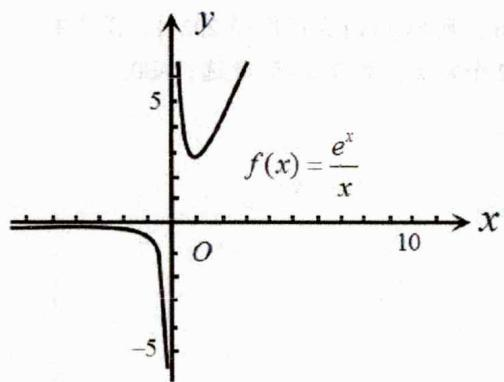

line

| x    | y      |
| ---- | ------ |
| 0    | 0      |
| 10   | 5      |
| 100  | -5     |

3.【答案】e,2（答案不唯一）

【详解】不妨取 $a > 1, b > 1$ ，由 $b^a < a^b$ ，得 $a \ln b < b \ln a \Leftrightarrow \frac{\ln b}{b} < \frac{\ln a}{a}$ ，令函数 $f(x) = \frac{\ln x}{x}, x > 1$ ，求导得 $f(x) = \frac{1 - \ln x}{x^2}$ ，当 $1 < x < e$ 时， $f'(x) > 0$ ，当 $x > e$ 时， $f'(x) < 0$ ，即函数 $f(x)$ 在 $(1, e)$ 上单调递增，在 $(e, +\infty)$ 上单调递减，

取 $a, b \in (1, \mathbf{e}]$ ，由 $f(b) < f(a)$ ，得 $1 < b < a \leq \mathbf{e}$ ，此时 $\log_a b < \log_a a = 1 = \log_b b < \log_b a$ ，取 $a = \mathbf{e}, b = 2$ 。故答案为：e, 2（答案不唯一）

# 三、【习题检测】

1.【答案】B

【详解】因为 $2^{a} + \log_{2}a < 2^{2b} + \log_{2}b + 1 = 2^{2b} + \log_{2}(2b)$ ，令 $f(x) = 2^{x} + \log_{2}x$ ，其中 $x > 0$

因为函数 $y = 2^x$ 、 $y = \log_2 x$ 在 $(0, +\infty)$ 上均为增函数，所以，函数 $f(x) = 2^x + \log_2 x$ 在 $(0, +\infty)$ 上为增函数，因为 $2^a + \log_2 a < 2^{2b} + \log_2 (2b)$ ，即 $f(a) < f(2b)$ ，故 $2b > a > 0$ ，则 $2b - a > 0$ ，

所以， $2b-a+1>1$ ，则 $\ln(2b-a+1)>\ln1=0$ ，A错B对；无法确定 $|a-2b|$ 与1的大小，故 $\ln|a-2b|$ 与0的大小无法确定，CD都错。故选：B.

2.【答案】A

【详解】不等式

$e^{x}+\pi^{y}>e^{-y}+\pi^{-x}\Leftrightarrow e^{x}-\pi^{-x}>e^{-y}-\pi^{(-y)}$ ，令函数 $f(x)=e^{x}-\pi^{-x},x\in\mathbb{R}$ ，因为函数 $y=e^{x},y=-\pi^{-x}$ 在R上都是增函数，因此函数 $f(x)$ 是R上的增函数，

又 $\mathbf{e}^x +\pi^y >\mathbf{e}^{-y} + \pi^{-x}\Leftrightarrow f(x) > f(-y)$ ，于是 $x > - y$ ，即 $x + y > 0$ ，则 $x + y + \mathbf{e} > \mathbf{e}$ ，从而 $\ln (x + y + \mathbf{e}) > \ln \mathbf{e} = 1$ ，A正确，B错误；给定条件不能比较 $x + y$ 与1的大小，当 $x + y = 1$ 时， $\log_{\pi}|x + y| = 0$ ，CD错误.故选：A

3.【答案】A

【详解】方法一：设 $2^{a} = 3^{b} = 7^{c} = t < 1$

则 $\frac{1}{a} = \log_t 2$ ， $\frac{1}{b} = \log_t 3$ ， $\frac{1}{c} = \log_t 7$ ，且 $a, b, c$ 为负数，

所以 $\frac{3}{a} = \log_t 8 > \log_t 9 = \frac{2}{b}$ ，由 $ab > 0$ 得 $2a < 3b$ 。

同理， $\frac{7}{a}=\log_{t}128<\log_{t}49=\frac{2}{c}$ ，由ac>0得7c<2a，
所以 $7c < 2a < 3b$ .

方法二：设 $2^{a} = 3^{b} = 7^{c} = t < 1$ ，则 $a = \log_2t = \frac{\ln t}{\ln 2}$

$$
b = \log_ {3} t = \frac {\ln t}{\ln 3}, \quad c = \log_ {7} t = \frac {\ln t}{\ln 7},
$$

所以 $2a=\frac{2\ln t}{\ln2}$ ， $3b=\frac{3\ln t}{\ln3}$ ， $7c=\frac{7\ln t}{\ln7}$ .

设 $f(x) = \frac{x}{\ln x}$ ，则 $f^{\prime}(x) = \frac{\ln x - 1}{\ln^{2}x}$

当 $x \in (\mathbf{e}, +\infty)$ 时， $f'(x) > 0$ ，所以 $f(x)$ 在 $(\mathbf{e}, +\infty)$ 上单调递增，因为 $f(2) = \frac{2}{\ln 2} = \frac{4}{2 \ln 2} = \frac{4}{\ln 4} = f(4)$ ，且

$f(7) > f(4) > f'(3) > 0$ ，即 $\frac{3}{\ln 3} < \frac{4}{\ln 4} = \frac{2}{\ln 2} < \frac{7}{\ln 7}$

又 $\ln t<0$ ，所以7c<2a<3b。故选：A

4.【答案】ABD

【详解】对于 A, $e^{0.01} > e^{0} = 1 = \ln e > \ln 2$ ，故选项 A 正确；对于 B， $e^{\pi} > \pi^{e} \Leftrightarrow \pi \ln e > e \ln \pi$ ，即证 $\frac{\ln e}{e} > \frac{\ln \pi}{\pi}$ ，

设 $h(x) = \frac{\ln x}{x}, h'(x) = \frac{1 - \ln x}{x^2}$ ，令 $h'(x) = 0$ ，得 $x = e$ ，

①当 $x \in (0, \mathbf{e})$ 时， $h'(x) > 0$ ，则函数 $h(x)$ 单调递增，

②当 $x \in (\mathbf{e}, +\infty)$ 时， $h'(x) < 0$ ，则函数 $h(x)$ 单调递减，
∴ $h(\pi) < h(\mathbf{e})$ ，故选项 B 正确；

对于 C，易知 $\log_{3}2=\log_{3}\sqrt[3]{8}<\log_{3}\sqrt[3]{9}=\frac{2}{3}$

$$
\log_ {5} 3 = \log_ {5} \sqrt [ 3 ]{2 7} > \log_ {5} \sqrt [ 3 ]{2 5} = \frac {2}{3},
$$

$\therefore \log_{3}2<\log_{5}3$ ，故选项C错误；

对于 D, $3 > e \ln 3 \Leftrightarrow \frac{1}{e} > \frac{\ln 3}{3} \Leftrightarrow \frac{\ln e}{e} > \frac{\ln 3}{3}$ ，由选项 B 可知 $h(3)<h(e)$ ，即 $\frac{\ln e}{e}>\frac{\ln3}{3}$ ，故选项D正确，故选：ABD.

# 2.3.2 构造函数比大小

# 二、【典型例题】

1.【答案】C

【详解】因为 $y=\sin x$ 在 $\left(0,\frac{\pi}{2}\right)$ 内单调递增，

则 $0 = \sin 0 < \sin 1.02 < \sin \frac{\pi}{2} = 1$ ，即 $\sin 1.02 \in (0,1)$ ，

又因为 $y=\ln x$ 在 $(0,+\infty)$ 内单调递增，

则 $a = \ln (\sin 1.02) < \ln 1 = 0$ ， $c = \ln 1.02 > \ln 1 = 0$ ，可得 $a < c$ ；令 $x = 0.02$ ，则 $b = \frac{x}{\sqrt{1 + x}}$ ， $c = \ln (1 + x)$ ，构建 $f(x) = \ln (1 + x) - \frac{x}{\sqrt{1 + x}},x > 0$ ，则

$$
f ^ {\prime} (x) = \frac {1}{1 + x} - \frac {\sqrt {1 + x} - \frac {x}{2 \sqrt {1 + x}}}{1 + x} = - \frac {(\sqrt {1 + x} - 1) ^ {2}}{2 (1 + x) \sqrt {1 + x}} <   0,
$$

可知 $f(x)$ 在 $(0,+\infty)$ 上递减，则 $f(0.02)<f(0)=0$ ，即 c<b；综上所述：a<c<b。故选：C.

2.【答案】D

【详解】对于 AB 选项，设 $f(x)=\sin x-\frac{3}{\pi}x$ ，因为 $f\left(\frac{\pi}{6}\right)=\frac{1}{2}-\frac{1}{2}=0$ ，故 AB 均错；

对于 CD 选项，设 $g(x)=\sin x-\frac{2}{\pi}x$ ，其中 $0<x<\frac{\pi}{2}$ ，则 $g'(x)=\cos x-\frac{2}{\pi}$ ,

因为 $g^{\prime}(0) = 1 - \frac{2}{\pi} >0$ ， $g^{\prime}\left(\frac{\pi}{2}\right) <   0$ ，故存在 $x_0\in \left(0,\frac{\pi}{2}\right)$ 使得 $g^{\prime}(x_0) = 0$

且当 $0 < x < x_0$ 时， $g'(x) > 0$ ，此时函数 $g(x)$ 单调递增，当 $x_0 < x < \frac{\pi}{2}$ 时， $g'(x) < 0$ ，此时函数 $g(x)$ 单调递减，因为 $g(0) = g\left(\frac{\pi}{2}\right) = 0$ ，所以，对任意的 $x \in \left(0, \frac{\pi}{2}\right)$ ， $g(x) > 0$ ，

当 $x \in \left(0, \frac{\pi}{2}\right)$ 时， $0 < \frac{2}{\pi} x < 1$ ，所以， $\sin x > \frac{2}{\pi} x > \left(\frac{2}{\pi} x\right)^2$ ，C 错 D 对. 故选：D.

3.【答案】A

【详解】

由 $9^{m} = 10$ ，可得 $m = \log_910\in (1,1.5)$

根据 a, b 的形式构造函数 $f(x) = x^{m} - x - 1 (x > 1)$ ，则 $f'(x)=mx^{m-1}-1$ ，令 $f'(x)=0$ ，解得 $x_{0}=m^{\frac{1}{1-m}}$ ，由 $m=\log_{9}10\in(1,1.5)$ 知 $x_{0}\in(0,1)$ 。

$f(x)$ 在 $(1, +\infty)$ 上单调递增，所以 $f(10) > f(8)$ ，即 $a > b$ ，又因为 $f(9) = 9^{\log_9 10} - 10 = 0$ ，所以 $a > 0 > b$ 。

4.【答案】A

【详解】

因为当 $x \in \left(0, \frac{\pi}{2}\right), x < \tan x$ 故 $\frac{c}{b} = 4\tan \frac{1}{4} > 1$ ，故 $\frac{c}{b} > 1$ ，所以 $c > b$ ；设 $f(x) = \cos x + \frac{1}{2} x^2 - 1, x \in (0, +\infty)$ ，

$f'(x)=-\sin x+x>0$ ，所以 $f(x)$ 在 $(0,+\infty)$ 单调递增，
故 $f\left(\frac{1}{4}\right)>f(0)=0$ ，所以 $\cos\frac{1}{4}-\frac{31}{32}>0$ ，

所以 $b > a$ ，所以 $c > b > a$ ，故选 $A$

5.【答案】C

【详解】方法一：构造法

设 $f(x)=\ln(1+x)-x(x>-1)$ ，因为

$f'(x)=\frac{1}{1+x}-1=-\frac{x}{1+x}$ ，当 $x\in(-1,0)$ 时， $f'(x)>0$ ，当 $x\in(0,+\infty)$ 时 $f'(x)<0$ ，所以函数 $f(x)=\ln(1+x)-x$ 在 $(0,+\infty)$ 单调递减，在 $(-1,0)$ 上单调递增，所以

$f(\frac{1}{9}) < f(0) = 0$ ，所以 $\ln \frac{10}{9} -\frac{1}{9} < 0$ ，故 $\frac{1}{9} >\ln \frac{10}{9} = -\ln 0.9$ 即 $b > c$ ，所以 $f(-\frac{1}{10}) <   f(0) = 0$ ，所以 $\ln \frac{9}{10} +\frac{1}{10} <  0$ 故 $\frac{9}{10} <  \mathbf{e}^{-\frac{1}{10}}$ ，所以 $\frac{1}{10}\mathbf{e}^{\frac{1}{10}} <   \frac{1}{9}$ ，故 $a <   b$

设 $g(x) = x\mathrm{e}^{x} + \ln (1 - x)(0 <   x <   1)$ ，则

$$
g ^ {\prime} (x) = (x + 1) \mathrm{e} ^ {x} + \frac {1}{x - 1} = \frac {(x ^ {2} - 1) \mathrm{e} ^ {x} + 1}{x - 1},
$$

令 $h(x)=\mathrm{e}^{x}(x^{2}-1)+1$ ， $h'(x)=\mathrm{e}^{x}(x^{2}+2x-1)$ ，

当 $0 < x < \sqrt{2} - 1$ 时， $h'(x) < 0$ ，函数 $h(x) = e^{x}(x^{2} - 1) + 1$ 单调递减，当 $\sqrt{2} - 1 < x < 1$ 时， $h'(x) > 0$ ，函数 $h(x)=\mathrm{e}^{x}(x^{2}-1)+1$ 单调递增，又 $h(0)=0$ ，

所以当 $0 < x < \sqrt{2} - 1$ 时， $h(x) < 0$ ，

所以当 $0 < x < \sqrt{2} - 1$ 时， $g'(x) > 0$ ，函数 $g(x)=xe^{x}+\ln(1-x)$ 单调递增，

所以 $g(0.1) > g(0) = 0$ ，即 $0.1e^{0.1} > -\ln 0.9$ ，所以 a > c
方法二：比较法

解： $a = 0.1e^{0.1}$ ， $b = \frac{0.1}{1 - 0.1}$ ， $c = -\ln (1 - 0.1)$ ，① $\ln a - \ln b = 0.1 + \ln (1 - 0.1)$

令 $f(x) = x + \ln (1 - x), x \in (0, 0.1]$ ,

则 $f^{\prime}(x) = 1 - \frac{1}{1 - x} = \frac{-x}{1 - x} < 0$

故 $f(x)$ 在 $(0,0.1]$ 上单调递减，

可得 $f(0.1) < f(0) = 0$ ，即 $\ln a - \ln b < 0$ ，所以

$a < b$ ; ② $a - c = 0.1e^{0.1} + \ln (1 - 0.1)$

令 $g(x) = xe^{x} + \ln (1 - x), x \in (0, 0.1]$ ,

则 $g^{\prime}(x) = xe^{x} + e^{x} - \frac{1}{1 - x} = \frac{(1 + x)(1 - x)e^{x} - 1}{1 - x}$

令 $k(x) = (1 + x)(1 - x)e^{x} - 1$ ，所以

$k'(x)=(1-x^{2}-2x)e^{x}>0$

所以 $k(x)$ 在 $(0,0.1]$ 上单调递增，可得

$k(x) > k(0) > 0$ ，即 $g'(x) > 0$ ，所以 $g(x)$ 在 $(0,0.1]$ 上单调递增，可得 $g(0.1) > g(0) = 0$ ，即 $a - c > 0$ ，所以 $a > c$ . 故 $c < a < b$ .

# 三、【习题检测】

1.【答案】B

【详解】由已知可得

$$
b = 2 \ln \left(\sin \frac {1}{1 0} + \cos \frac {1}{1 0}\right) = \ln \left(\sin \frac {1}{1 0} + \cos \frac {1}{1 0}\right) ^ {2} = \ln (1 + \sin \frac {1}{5})
$$

，设 $f(x) = x - \sin x$ ， $x\in (0,1)$ ，则 $f^{\prime}(x) = 1 - \cos x > 0$ 所以 $f(x) = x - \sin x$ 在(0,1)上单调递增，所以

$f\left(\frac{1}{5}\right) > f(0) = 0$ ，即 $\frac{1}{5} >\sin \frac{1}{5}$ ，所以

$b=\ln\left(1+\sin\frac{1}{5}\right)<\ln\left(1+\frac{1}{5}\right)$ ，设 $g(x)=x-\ln(x+1)$ ，

$x \in (0,1)$ ，则 $g'(x) = 1 - \frac{1}{x + 1} = \frac{x}{x + 1} > 0$ ，所以

$g(x) = x - \ln (x + 1)$ 在(0,1)上单调递增，所以

$g\left(\frac{1}{5}\right)>g(0)=0$ ，即 $\frac{1}{5}>\ln\left(1+\frac{1}{5}\right)>\ln\left(1+\sin\frac{1}{5}\right)$

综上 $a > b$ ，设 $h(x) = x - \frac{6}{5}\ln (x + 1)$ ， $x\in (0,1)$ ，则

$h'(x)=1-\frac{6}{5x+5}=\frac{5x-1}{x+1}$ ，当 $x\in\left(0,\frac{1}{5}\right)$ 时， $h'(x)<0$ ，当

$x \in \left(\frac{1}{5}, 1\right)$ 时， $h'(x) > 0$ ，所以 $h(x) = x - \frac{6}{5} \ln (x + 1)$ 在 $\left(0, \frac{1}{5}\right)$

上单调递减，在 $\left(\frac{1}{5}, 1\right)$ 上单调递增，

所以 $h\left(\frac{1}{5}\right) < h(0) = 0$ ，即 $\frac{1}{5} < \frac{6}{5}\ln \left(1 + \frac{1}{5}\right) = \frac{6}{5}\ln \frac{6}{5}$ ，所以 $a < c$ ，所以 $b < a < c$ 故选：B.

2.【答案】B

【详解】设 $f(x)=x\ln x(x>1)$ ， $g(x)=(18-x)\ln x(x\geq10)$ ，

因为 $\frac{8}{a} = \frac{\ln a}{\ln 10}$ ， $\frac{7}{b} = \frac{\ln b}{\ln 11}$ ， $\frac{6}{c} = \frac{\ln c}{\ln 12}$ ，所以

$a\ln a = 8\ln 10, b\ln b = 7\ln 11, c\ln c = 6\ln 12$

即 $f(a) = g(10), f(b) = g(11), f(c) = g(12)$ ，

$g'(x)=(18-x)'\ln x+(18-x)(\ln x)'=-\ln x+\frac{18}{x}-1$

显然 $g^{\prime}(x)$ 在 $[10, + \infty)$ 上单调递减，

$g^{\prime}(x)\leq g^{\prime}(10) <   0$ ，所以 $g(x)$ 在 $[10, + \infty)$ 上单调递减，所以 $g(10) > g(11) > g(12)$ ，即 $f(a) > f(b) > f(c)$

又 $f'(x) = \ln x + 1$ ，当 $x > 1$ 时， $f'(x) > 0$ ，所以 $f(x)$ 在 $(1, +\infty)$ 上单调递增，所以 $a > b > c$ ，故选：B.

3.【答案】B

【详解】设 $f(x) = \sin x - \frac{2}{\pi} x$ ，则 $f^{\prime}(x) = \cos x - \frac{2}{\pi}$

$0 < \frac{2}{\pi} < 1$ ，∴存在 $x_{0} \in (0, \frac{\pi}{2})$ ，使得 $f'(x_{0}) = 0$ ，

当 $x \in (0, x_0)$ 时， $f'(x) > 0$ ， $f(x)$ 递增，当 $x \in (x_0, \frac{\pi}{2})$ 时， $f'(x) < 0$ ， $f(x)$ 递减，又 $f(0) = 0$ ， $f(\frac{\pi}{2}) = 0$ ， $\therefore 0 < x < \frac{\pi}{2}$ 时， $f(x) > 0$ ，即 $\sin x > \frac{2}{\pi} x$ ，B 正确，A 错误；

设 $g(x) = \sin x - \frac{3}{\pi} x$ ，则 $g^{\prime}(x) = \cos x - \frac{3}{\pi}, 0 <   \frac{3}{\pi} <  1$

∴ 存在 $x_{1} \in (0, \frac{\pi}{2})$ ，使得 $g'(x_{1}) = 0$ ，当 $x \in (0, x_{1})$ 时，

$g^{\prime}(x) > 0$ ， $g(x)$ 递增，当 $x\in (x_1,\frac{\pi}{2})$ 时， $g^{\prime}(x) <   0$ ， $g(x)$ 递减，又 $g(0) = 0$ ， $\therefore g(x_{1}) > 0$ ， $g(\frac{\pi}{2}) = -\frac{1}{2} <  0$ ， $\therefore g(x)$ 在 $(x_{1},\frac{\pi}{2})$ 上存在零点 $x_{2}$ ，即 $\sin x_2 = \frac{3}{\pi} x_2$ ，CD均错.

4.【答案】D

【详解】令 $f(x)=2x-3\sin x$ ，则 $f'(x)=2-3\cos x$ ，当 $\cos x<\frac{2}{3}$ 时， $f'(x)>0$ ；当 $\cos x=\frac{2}{3}$ 时， $f'(x)=0$ ；当 $\cos x>\frac{2}{3}$ 时， $f'(x)<0$ ，即当 $0<x<\frac{\pi}{2}$ 时， $f(x)$ 先递减再递增，而 $f(0)=0, f\left(\frac{\pi}{2}\right)=\pi-3>0$ ，故 $f(x)$ 的符号与的 x 取值有关，即 2x 与 $\sin x$ 的大小关系与 x 的取值有关，故选 D.

5.【答案】C

【详解】对于 $e^x$ 与 $1 + x + x^2$ ，当 $x = 5$ 时， $e^x >32$ ，而 $1 + x + x^2 = 31$ ，所以A选项不正确；对于

$\frac{1}{\sqrt{1 + x}}$ 与 $1 - \frac{1}{2} x + \frac{1}{4} x^2$ ，当 $x = \frac{1}{4}$ 时，

$\frac{1}{\sqrt{1+x}}=\frac{2\sqrt{5}}{5},1-\frac{1}{2}x+\frac{1}{4}x^{2}=\frac{57}{64}<\frac{2\sqrt{5}}{5}$ ，所以B选项不正确；令 $f(x)=\cos x+\frac{1}{2}x^{2}-1$ ，则 $f'(x)=x-\sin x\geq0$ ，对 $x\in[0,+\infty)$ 恒成立， $f(x)$ 在 $[0,+\infty)$ 上为增函数，所以 $f(x)$ 的最小值为 $f(0)=0$ ，所以 $f(x)\geq0$ ，

$\cos x \geq 1 - \frac{1}{2} x^2$ ，故 $\mathbb{C}$ 正确；令 $g(x) = \ln (1 + x) - x + \frac{1}{8} x^2$ 则 $g'(x) = \frac{1}{x + 1} + \frac{1}{4} x - 1$ ，令 $g'(x) = 0$ ，得 $x = 0$ 或 $x = 3$ 。当 $x \in (0,3)$ 时， $g'(x) < 0$ ，当 $x \in (3,+\infty)$ 时， $g'(x) > 0$ 。

$g(x)$ 在 x=3 时取得最小值 $g(3)=\ln4-3+\frac{9}{8}<0$ ，所以 D 不正确。故选：C

6.【答案】B

【详解】 $a=2\ln1.01=\ln1.01^{2}=\ln(1+0.01)^{2}$

$$
= \ln \left(1 + 2 \times 0. 0 1 + 0. 0 1 ^ {2}\right) > \ln 1. 0 2 = b, \text {   所以   } b <   a;
$$

下面比较 $c$ 与 $a, b$ 的大小关系. 记

$$
f (x) = 2 \ln (1 + x) - \sqrt {1 + 4 x} + 1, \text {则} f (0) = 0,
$$

$$
f ^ {\prime} (x) = \frac {2}{1 + x} - \frac {2}{\sqrt {1 + 4 x}} = \frac {2 (\sqrt {1 + 4 x} - 1 - x)}{(1 + x) \sqrt {1 + 4 x}},
$$

由于 $1 + 4x - (1 + x)^2 = 2x - x^2 = x(2 - x)$

所以当 $0 < x < 2$ 时， $1 + 4x - (1 + x)^2 > 0$ ，即 $\sqrt{1 + 4x} > (1 + x)$ ， $f'(x) > 0$ ，所以 $f(x)$ 在 $[0, 2]$ 上单调递增，

所以 $f(0.01) > f(0) = 0$ ，即 $2\ln 1.01 > \sqrt{1.04} - 1$ ，即 $a > c$ ；令 $g(x) = \ln (1 + 2x) - \sqrt{1 + 4x} + 1$ ，则 $g(0) = 0$

$$
g ^ {\prime} (x) = \frac {2}{1 + 2 x} - \frac {2}{\sqrt {1 + 4 x}} = \frac {2 (\sqrt {1 + 4 x} - 1 - 2 x)}{(1 + x) \sqrt {1 + 4 x}},
$$

由于 $1 + 4x - (1 + 2x)^2 = -4x^2$ ，在 $x > 0$ 时，

$1+4x-(1+2x)^{2}<0$ ，所以 $g'(x)<0$ ，即函数 $g(x)$ 在 $[0,+\infty)$ 上单调递减，所以 $g(0.01)<g(0)=0$ ，即

$\ln1.02<\sqrt{1.04}-1$ ，即 b<c；综上，b<c<a，故选：B.

# 2.3.3 放缩比大小

# 二、【典型例题】

1.【答案】B

【详解】由 $\ln(1+x)\leq x$ ，当x=0时等号成立，知a<c， $\because 0<\frac{2}{5}<\frac{\pi}{3}<\frac{\pi}{2},\quad\therefore\cos\frac{2}{5}>\cos\frac{\pi}{3}=\frac{1}{2}>\frac{2}{5},\quad\therefore c<b.$

2.【解析】 $\ln x <   x - 1\Rightarrow \ln 1.2 <   1.2 - 1\Rightarrow b <   c$

$$
e ^ {x} > x + 1 \Rightarrow e ^ {0, 2} > 0. 2 + 1 \Rightarrow c <   a
$$

因此 $a > c > b$ .故答案为： $b <   c <   a$

3.【解析】 $\ln x <   x - 1\Rightarrow \ln \frac{101}{100} <  \frac{101}{100} -1\Rightarrow c <   a$

$$
e ^ {x} > x + 1 \Rightarrow e ^ {- \frac {9 9}{1 0 0}} > - \frac {9 9}{1 0 0} + 1 \Rightarrow b > a,
$$

因此 $c < a < b$ .故答案为：C

4.【解析】设 $f(x) = \sqrt{x} - \frac{x}{e}$ ， $f'(x) = \frac{1}{2\sqrt{x}} - \frac{1}{e}$ ，当

$0 \leq x < \frac{e^2}{4}$ 时， $f'(x) > 0$ ，函数单调递增，当 $x > \frac{e^2}{4}$ 时， $f'(x) < 0$ ，函数单调递减， $a = f(3), b = f(2), \frac{e^2}{4} < 2 < 3$ 时， $f(3) < f(2)$ ，即 $a < b$ ；又

$$
\left. \begin{array}{l} {e ^ {x} > x + 1 \Rightarrow e ^ {\sqrt {2} - 1} - \ln 2 > \sqrt {2} - \ln 2} \\ {\ln x <   \frac {x}{e} \Rightarrow \sqrt {2} - \ln 2 > \sqrt {2} - \frac {2}{e}} \end{array} \right\} \Rightarrow b <   c, \text {综上可知}
$$

$a < b < c$ 故选：A

# 三、【习题检测】

1.【答案】A

【详解】设 $f(x) = \ln (x + 1) - x$ （ $x > 0$ ），则 $f'(x) = \frac{1}{x + 1} - 1 < 0$ ，所以 $f(x)$ 在 $(0, +\infty)$ 上单调递减，所以 $f(x) < f(0) = 0$ ，即 $x > \ln (x + 1)$ ，所以

$$
\frac {1}{1 0} + \frac {1}{1 1} > \ln \frac {1 1}{1 0} + \ln \frac {1 2}{1 1} = \ln \frac {6}{5}, \quad \ln \frac {6}{5} = (\log_ {5} 6 - 1) \ln 5,
$$

$$
\log_ {5} 6 - \log_ {6} 7 = \frac {\lg 6}{\lg 5} - \frac {\lg 7}{\lg 6} = \frac {(\lg 6) ^ {2} - \lg 5 \lg 7}{\lg 5 \lg 6} >
$$

$$
\frac {\left(\lg 6\right) ^ {2} - \left(\frac {\lg 5 + \lg 7}{2}\right) ^ {2}}{\lg 5 \lg 6} = \frac {\left(\frac {1}{2} \lg 3 6\right) ^ {2} - \left(\frac {1}{2} \lg 3 5\right) ^ {2}}{\lg 5 \lg 6} > 0, \text {   所以   }
$$

a > b > c，故选：A.

2.【答案】D

【详解】由 $e^{a}=1.02$ ，则 $a=\ln1.02$ ，令

$$
f (x) = \ln x - \frac {2 (x - 1)}{x + 1}, \quad x > 1,
$$

则 $f'(x)=\frac{1}{x}-\frac{2(x+1)-2(x-1)}{(x+1)^{2}}=\frac{(x-1)^{2}}{x(x+1)^{2}}$

则当 $x > 1$ 时， $f'(x) > 0$ ，故 $f(x)$ 在 $(0, +\infty)$ 上单调递增，

故 $f(1.02) = \ln 1.02 - \frac{2(1.02 - 1)}{1.02 + 1} = \ln 1.02 - \frac{2}{101} > f(1) = 0$ ,

即 $a = \ln 1.02 > \frac{2}{101} > \frac{2}{102} = \frac{1}{51} = c$ ，即 $a > c$

由 $\ln(b+1)=0.02$ ，则 $b=e^{0.02}-1$ ，令

$g(x) = \mathbf{e}^{x} - \ln (1 + x) - 1, x > 0$ ，则 $g^{\prime}(x) = \mathbf{e}^{x} - \frac{1}{x + 1},$

令 $h(x) = \mathbf{e}^x -\frac{1}{x + 1}$ ，则当 $x > 0$ 时， $h^\prime (x) = \mathbf{e}^x +\frac{1}{(x + 1)^2} >0$

恒成立，故 $g^{\prime}(x)$ 在 $(0, + \infty)$ 上单调递增，又

$g'(0)=\mathbf{e}^{0}-\frac{1}{1}=0$ ，故 $g'(x)>0$ 恒成立，

故 $g(x)$ 在 $(0, +\infty)$ 上单调递增，故

$$
g (0. 0 2) = \mathrm{e} ^ {0. 0 2} - \ln (1 + 0. 0 2) - 1 > g (0) = 0,
$$

即 $e^{0.02}-1>\ln1.02$ ，即 b>a，故 c<a<b。故选：D.

3.【解析】因为 $\frac{c}{b} = 4\tan \frac{1}{4}$ ，因为当

$x \in \left(0, \frac{\pi}{2}\right), \sin x < x < \tan x$ ，所以 $\tan \frac{1}{4} > \frac{1}{4}$ ，即 $\frac{c}{b} > 1$ ，所以 $c > b$ ；因为当 $x \in \left(0, \frac{\pi}{2}\right), \sin x < x$ ，取 $x = \frac{1}{8}$ 得

$\cos\frac{1}{4}=1-2\sin^{2}\frac{1}{8}>1-2\left(\frac{1}{8}\right)^{2}=\frac{31}{32}$ ，故b>a，所以

$c > b > a$ ，故选：A.

4.【解析】

$$
x + 1 <   e ^ {x} <   \frac {1}{1 - x} (x <   1) \Rightarrow 0. 1 \times (0. 1 + 1) <   0. 1 e ^ {0. 1} <   0. 1 \times \frac {1}{1 - 0 . 1}
$$

，即 $0.11 < a < b$ ， $\ln x \leq \frac{1}{2}\left(x - \frac{1}{x}\right)(x \geq 1) \Rightarrow$ $c=\ln\frac{10}{9}<\frac{1}{2}\times\left(\frac{10}{9}-\frac{9}{10}\right)\approx0.106<a$ ，故选：C.

5.【解析】 $e^x > x + 1 \Rightarrow a = 0.7e^{0.4} > 0.7 \times 1.4 = 0.98 = c$

$$
\ln x \leq \frac {1}{2} \left(x - \frac {1}{x}\right) (x \geq 1) \Rightarrow b = e \ln 1. 4 <   \frac {2 . 7 3}{2} \times \left(\frac {7}{5} - \frac {5}{7}\right) \approx
$$

0.94<c．故选：A.

6.【答案】C

【详解】解：设 $f(x)=\ln x+x-1,\quad x\in(0,+\infty)$ ，所以 $f'(x)=\frac{1}{x}+1=\frac{1+x}{x},\quad f'(x)>0$ ，所以 $f(x)$ 单调递增，

则 $f\left(\frac{98}{99}\right) = \ln \frac{98}{99} +\frac{98}{99} -1 = \ln \frac{98}{99} -\frac{1}{99} <  f(1) = 0$

所以 $\ln \frac{98}{99} < \frac{1}{99}$ ，则 $c < a$ ； $g(x) = e^x - 1 - x$ ， $g'(x) = e^x - 1$ ，当 $x \in (0, +\infty)$ 时， $g'(x) > 0$ ，所以 $g(x)$ 在 $(0, +\infty)$ 上单调

递增，所以 $g\left(-\frac{98}{99}\right) = \mathbf{e}^{-\frac{98}{99}} - 1 + \frac{98}{99} = \mathbf{e}^{-\frac{98}{99}} - \frac{1}{99} > g(0) = 0$

所以 $e^{-\frac{98}{99}} > \frac{1}{99}$ ，故 $b > a$ ，故 $c < a < b$ 。故选：C.

7.【答案】B

【详解】由 $b=\ln\frac{10e}{11}=\ln\frac{1}{1+0.1}+1=-\ln(1+0.1)+1$

设 $f(x) = \mathrm{e}^{-x} + \ln (1 + x) - 1(x > 0)$

则 $f^{\prime}(x) = -\mathbf{e}^{-x} + \frac{1}{1 + x} = -\frac{1}{\mathbf{e}^{x}} +\frac{1}{1 + x},$

设 $g(x) = \mathbf{e}^x - 1 - x (x > 0)$ ,

则 $g^{\prime}(x) = \mathbf{e}^{x} - 1 > 0$

所以函数 $g(x) = \mathrm{e}^x - 1 - x$ 在 $(0, +\infty)$ 上单调递增，

所以 $g(x) > g(0) = 0$ ，即 $\mathbf{e}^x -1 - x > 0$

即 $\mathbf{e}^x > 1 + x > 0$ ，即 $\frac{1}{\mathbf{e}^x} < \frac{1}{1 + x}$ ，

所以 $f'(x)=-\frac{1}{\mathbf{e}^{x}}+\frac{1}{1+x}>0$

则函数 $f(x) = \mathrm{e}^{-x} + \ln (1 + x) - 1$ 在 $(0, +\infty)$ 上单调递增，

所以 $f(0.1) > f(0) = 0$ ，即 $\mathbf{e}^{-0.1} + \ln (1 + 0.1) - 1 > 0$

即 $\mathbf{e}^{-0.1} > -\ln (1 + 0.1) + 1^{\prime}$ , 即 $a > b$

设 $u(x) = \ln x - x + 1(x > 1)$

则 $u'(x)=\frac{1}{x}-1=\frac{1-x}{x}<0$

所以函数 $u(x) = \ln x - x + 1$ 在 $(1, +\infty)$ 上单调递减，

则 $u(x) < u(1) = 0$ ，即 $\ln x - x + 1 < 0$

即 $\ln x < x - 1 (x > 1)$ ，即 $\ln 1.1 < 1.1 - 1 = 0.1$ ，

所以 $b = -\ln 1.1 + 1 > 0.9$

又 $0.9^{10} = (0.9^2)^5 = 0.81^5 > 0.8^5 = 0.32768 > 0.1$

所以 $0.9 > 0.1^{0.1}$ ，即 $b > c$

所以 c < b < a .

故选：B.

# 2.3.4 泰勒估值比大小

# 二、【典型例题】

1.【答案】C

【解析】 $b=\frac{1}{9}\approx0.111$ ，

$$
a = x e ^ {x} = 0. 1 e ^ {0. 1} \approx 0. 1 \times \left(1 + 0. 1 + \frac {0 . 1 ^ {2}}{2}\right) = 0. 1 1 0 5 <   b
$$

$c=\ln\left(1+\frac{1}{9}\right)\approx\frac{1}{9}-\left(\frac{1}{9}\right)^{2}\times\frac{1}{2}\approx0.105<a$ ，故选：C.

2.【答案】C

【详解】由已知， $a = 0.9^{9} = \left(1 - \frac{1}{10}\right)^{10 - 1}$

$$
b = 0. 9 9 ^ {9 9} = \left(1 - \frac {1}{1 0 0}\right) ^ {1 0 0 - 1},
$$

设 $f(x) = (1 - x)^{\frac{1}{x} - 1} = \mathbf{e}^{\ln (1 - x)^{\frac{1}{x} - 1}} = \mathbf{e}^{\left(\frac{1}{x} - 1\right)\ln (1 - x)}$ ， $x\in (0,1)$

则 $f^{\prime}(x) = \mathsf{e}^{\left(\frac{1}{x} -1\right)\ln (1 - x)}\cdot \left[\left(\frac{1}{x} -1\right)\ln (1 - x)\right]^{\prime},$

其中 $\left[\left(\frac{1}{x} - 1\right) \ln (1 - x)\right]' = -\frac{1}{x^2} \ln (1 - x) + \left(\frac{1}{x} - 1\right) \cdot \frac{-1}{1 - x} =$

$-\frac{\ln(1-x)+x}{x^{2}}$ ，令 $g(x)=\ln(1-x)+x$ ，则

$g^{\prime}(x) = -\frac{1}{1 - x} + 1 = \frac{x}{x - 1}$ ，当 $x \in (0,1)$ 时， $g^{\prime}(x) < 0$ ，∴

$g(x)$ 在 $(0,1)$ 上单调递减， $g(x) <   g(0) = 0$ ，∴当 $x\in (0,1)$

时， $\left[\left(\frac{1}{x} -1\right)\ln (1 - x)\right]' > 0$ ， $f^{\prime}(x) > 0$ ， $f(x)$ 在 $(0,1)$ 上

单调递增，∴ $f\left(\frac{1}{10}\right) > f\left(\frac{1}{100}\right)$ ，即

$\left(1 - \frac{1}{10}\right)^{10 - 1} > \left(1 - \frac{1}{100}\right)^{100 - 1}$ ， $\therefore$ 有 $a > b$ 。对于 $c$ 与 $a$ ，

$c = \sin 9 = \sin (3\pi - 9) > \sin (9.42 - 9) > \sin 0.4$ ，将 $\sin 0.4$ 泰勒展开，得 $\sin0.4>0.4-\frac{0.4^{3}}{3!}>0.3893$

$$
a = (1 - 0. 1) ^ {9} <   C _ {9} ^ {0} (- 0. 1) ^ {0} + C _ {9} ^ {1} (- 0. 1) ^ {1} +
$$

$$
C _ {9} ^ {2} (- 0. 1) ^ {2} + C _ {9} ^ {3} (- 0. 1) ^ {3} + C _ {9} ^ {4} (- 0. 1) ^ {4}
$$

$$
= 1 - 0. 9 + 0. 3 6 - 0. 0 8 4 + 0. 0 1 2 6 = 0. 3 8 8 6 <   0. 3 8 9 3 <   c,
$$

∴ a < c. 综上所述，a, b, c 的大小关系为 c > a > b.
故选：C.

# 三、【习题检测】

1.【解析】 $b=\cos\frac{1}{4}\approx1-\frac{\left(\frac{1}{4}\right)^{2}}{2!}+\frac{\left(\frac{1}{4}\right)^{4}}{4!}=1-\frac{1}{32}+\frac{\left(\frac{1}{4}\right)^{4}}{4!}>a$

$$
c = 4 \sin \frac {1}{4} \approx 4 \times \left[ \frac {1}{4} - \frac {\left(\frac {1}{4}\right) ^ {3}}{3 !} + \frac {\left(\frac {1}{4}\right) ^ {5}}{5} \right] = 1 - \frac {\left(\frac {1}{4}\right) ^ {2}}{3 !} + \frac {\left(\frac {1}{4}\right) ^ {4}}{5} > b,
$$

故选：A.

2.【答案】 $a=2\ln1.01=\ln1.01^{2}=\ln1.0201>b$ ，答案在B、C选项中选择，再判断ac；

$$
a = 2 \ln (1 + x) \approx 2 \left(x - \frac {x ^ {2}}{2} + \frac {x ^ {3}}{3}\right) = 2 \left(0. 0 1 - \frac {0 . 0 1 ^ {2}}{2} + \frac {0 . 0 1 ^ {3}}{3}\right)
$$

$$
= 0. 0 2 - 0. 0 1 ^ {2} + 2 \times \frac {0 . 0 1 ^ {3}}{3},
$$

$$
c = \sqrt {1 + x} - 1 \approx f (0) + \frac {f ^ {\prime} (0)}{1 !} x + \frac {f ^ {\prime \prime} (0)}{2 !} x ^ {2} = 0. 0 2
$$

$-\frac{1}{8}\times(0.04)^{2}<a$ ，故选：B.

# 2.3.5 帕德逼近比大小

# 二、【典型例题】

1.【答案】C

【解析】 $a \approx 0.1 \cdot \frac{0.1^2 + 0.6 + 12}{0.01 - 0.6 + 12} = \frac{12.61}{11.41} \approx 0.1105$

$$
b = \frac {1}{9} \approx 0. 1 1 1 1 \quad c \approx - \frac {3 \cdot 0 . 9 ^ {2} - 3}{0 . 9 ^ {2} + 4 \cdot 0 . 9 + 1} \approx 0. 1 0 5 3
$$

2.【答案】B，帕德逼近

$$
a \approx 2 \times \frac {3 \cdot 0 . 0 1 ^ {2} + 0 . 0 6}{0 . 0 1 ^ {2} + 0 . 0 6 + 6} \approx 0. 0 1 9 9,
$$

$$
b \approx \frac {3 \cdot 0 . 0 2 ^ {2} + 0 . 1 2}{0 . 0 2 ^ {2} + 0 . 1 2 + 6} \approx 0. 0 1 9 8
$$

$c \approx 1 + \frac{1}{2} \cdot 0.04 - \frac{1}{8} \cdot 0.04^{2} - 1 = 0.0198$ , b 和 c 比较不出大小,

所以利用 $(0.0198+1)^{2}<1.04$ 可知b小于c

# 三、【习题检测】

1.【答案】A

【解析】帕德逼近

$$
a = \frac {3 1}{3 2} = 0. 9 6 8 7 5, b \approx \frac {1 2 - 5 \cdot 0 . 2 5 ^ {2}}{1 2 + 0 . 2 5 ^ {2}} \approx 0. 9 6 8 9 1,
$$

$$
c \approx \frac {2 4 \times \frac {1}{4}}{6 + 0 . 2 5 ^ {2}} \approx 0. 9 8 9 6 9
$$

2.【答案】D

【解析】

$$
a = e ^ {1. 3} - 2 \sqrt {7} = \frac {1 . 3 ^ {2} + 6 * 1 . 3 + 1 2}{1 . 3 ^ {2} - 6 * 1 . 3 + 1 2} - 2 \sqrt {7} \approx 3. 6 4 8 6 - 2 \sqrt {7} <   0
$$

$$
b = 4 \sqrt {1 . 1} - 4 = 4 (\sqrt {1 + 0 . 1} - 1) \approx 4 (1 + \frac {1}{2} * 0. 1 - \frac {1}{2} * 0. 1 ^ {2} - 1) = 0. 1 9 5
$$

$$
c = 2 \ln 1. 1 \approx 2 \frac {3 * 1 . 1 ^ {2} - 3}{1 . 1 ^ {2} + 4 * 1 . 1 + 1} = 2 * \frac {0 . 6 3}{6 . 6 1} \approx 0. 1 9 0 6
$$

$$
\therefore a <   c <   b
$$

3.【答案】B

【解析】设 $x = 1.01$ ，所以 $a = 1 - \frac{1}{x}, b = \ln x, c = e^{x - 1} - 1$

$$
a = \frac {1}{1 . 0 1} \approx 0. 9 9 0 0
$$

$$
b = \ln 1. 0 1 \approx \frac {3 * 1 . 0 1 ^ {2} - 3}{1 . 0 1 ^ {2} + 4 * 1 . 0 1 + 1} \approx 0. 0 0 9 9 5
$$

$$
c = e ^ {0. 0 1} - 1 \approx \frac {0 . 0 1 ^ {2} + 6 * 0 . 0 1 + 1 2}{0 . 0 1 ^ {2} - 6 * 0 . 0 1 + 1 2} - 1 = \frac {1 2 . 0 6 . 1}{1 1 . 9 4 0 1} - 1 \approx 0. 0 1 0 0 5
$$

$$
\therefore b <   c <   a
$$

# 2.4 函数零点

# 2.4.1 判断零点区间

# 二、【典型例题】

1.【答案】B

【详解】因为函数 $f(x)=2^{x}+3x$ 在其定义域内是递增的，那么根据 $f(-1)=\frac{1}{2}-3=-\frac{5}{2}<0$ ， $f(0)=1+0=1>0$ ，那么函数的零点存在性定理可知，函数的零点的区间为 $(-1,0)$ ，2.【答案】G

【详解】因为 $f(2)=3-1>0$ ， $f(4)=\frac{3}{2}-2<0$ ，所以由根的存在性定理可知：选 C.

3.【答案】C

【详解】因为函数 $f(x)=e^{x}+4x-3$ 在 R 上连续单调递增，

$$
\text {且} \left\{ \begin{array}{l l} f ^ {\prime} \left(\frac {1}{4}\right) = e ^ {\frac {1}{4}} + 4 \times \frac {1}{4} - 3 = e ^ {\frac {1}{4}} - 2 <   0 \\ f \left(\frac {1}{2}\right) = e ^ {\frac {1}{2}} + 4 \times \frac {1}{2} - 3 = e ^ {\frac {1}{2}} - 1 > 0 \end{array} , \right.
$$

所以函数的零点在区间 $\left(\frac{1}{4},\frac{1}{2}\right)$ 内，故选C.

4.【答案】B

【详解】设 $g(x) = x^3 -\left(\frac{1}{2}\right)^{x - 2}$ ，则 $g(x)$ 是增函数，又 $g(0) = -4 <   0,g(1) = -1 <   0,g(2) = 7 > 0$ .所以 $g(1)g(2) <   0$ 所以 $x_0$ 所在的区间是(1，2)故选：B

# 三、【习题检测】

1.【答案】B

【详解】因为 $x_{0}$ 是函数 $f(x)=2^{x}+\frac{1}{1-x}$ 的一个零点，则 $x_{0}$ 是函数 $y=2^{x}$ 与 $y=\frac{1}{x-1}$ 的交点的横坐标，画出函数图像，如图所示，

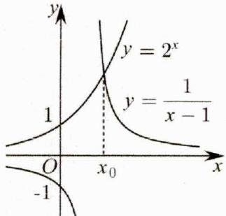

text_image

y
y = 2^x
y = \frac{1}{x - 1}
1
O
x_0
-1
x

则当 $x_{1} \in (1, x_{0})$ 时， $y = 2^{x}$ 在 $y = \frac{1}{x - 1}$ 下方，即 $f(x_{1}) < 0$ ；当 $x_{2} \in (x_{0}, +\infty)$ 时， $y = 2^{x}$ 在 $y = \frac{1}{x - 1}$ 上方，即 $f(x_{2}) > 0$ ，

2.【答案】A

【详解】如果函数 $y = f(x)$ 在区间 $[a, b]$ 上的图象是连续不断的一条曲线，且有 $f(a) \cdot f(b) < 0$ ，那么，函数 $y = f(x)$ 在区间 $(a, b)$ 内有零点，即存在 $c \in (a, b)$ 使

得 $f(c) = 0$ ，这个 $c$ 也就是方程 $f(x) = 0$ 的根.注意以下几点：①满足条件的零点可能不唯一；②不满足条件时，也可能有零点.③由函数 $y = f(x)$ 在闭区间 $[a,b]$ 上有零点不一定能推出 $f(a),f(b) <   0$ ，如图所示.所以 $f(a),f(b) <   0$ 是 $y = f(x)$ 在闭区间 $[a,b]$ 上有零点的充分不必要条件.

3.【答案】C

【详解】试题分析：

$$
\because f (- 2) = e ^ {- 2} - 2 - 2 <   0, f (- 1) = e ^ {- 1} - 1 - 2 <   0,
$$

$$
f (0) = e ^ {0} + 0 - 2 \left\langle 0, f (1) = e + 1 - 2 \right\rangle 0
$$

$\therefore f(1)f(0)<0$ ，所以零点在区间 $(0,1)$ 上

4.【答案】2

【详解】设函数 $y=\log_{a}x,\quad m=-x+b$

根据 2<a<3<b<4，对于函数 $y=\log_{a}x$ 在 x=2 时，一定得到一个值小于 1，而 b-2>1，x=3 时，对数值在 1 和 2 之间，b-3<1 在同一坐标系中画出两个函数的图象，判断两个函数的图形的交点在（2，3）之间，
∴ 函数 f(x) 的零点 $x_{0} \in (n, n+1)$ 时，n=2.

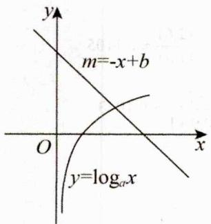

text_image

y
m=-x+b
O
x
y=logₐx

# 2.4.2 零点个数之基础函数类

# 二、【典型例题】公众号→全科A+

1.【答案】C

【详解】因为函数 $y=\sin x$ 的的最小正周期为 $T=2\pi$ ，函数 $y=2\sin\left(3x-\frac{\pi}{6}\right)$ 的最小正周期为 $T=\frac{2\pi}{3}$ ，

所以在 $x \in [0, 2\pi]$ 上函数 $y = 2\sin \left(3x - \frac{\pi}{6}\right)$ 有三个周期的图象，在坐标系中结合五点法画出两函数图象，如图所示：

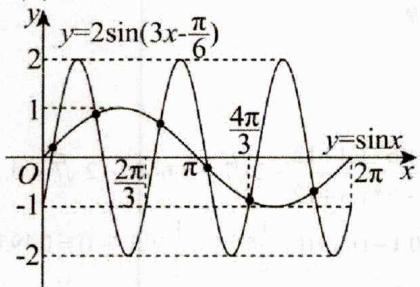

line

| x       | y=sin(x) | y=2sin(3x-π/6) |
| ------- | -------- | -------------- |
| 0       | 0        | 0              |
| π/3     | 2π/3     | 1              |
| π       | 4π/3     | 0              |
| 2π      | sin(x)   | -2             |

由图可知，两函数图象有6个交点.故选：C

2.【答案】D

【详解】解：法一：

$$
\because f (x) = \sin 2 x \cos x + \cos 2 x \sin x - \sin 2 x,
$$

$$
= 2 \sin x \cos^ {2} x + \cos 2 x \sin x - 2 \sin x \cos x,
$$

$= \sin x\left(2\cos^2 x + 2\cos^2 x - 1 - 2\cos x\right),$ $= \sin x\left(4\cos^2 x - 2\cos x - 1\right)$ ，令 $f(x) = 0$ ，则 $\sin x = 0$ 或 $4\cos^2 x - 2\cos x - 1 = 0$ ，即： $\sin x = 0$ 或 $\cos x = \frac{1 + \sqrt{5}}{4}$ 或 $\cos x = \frac{1 - \sqrt{5}}{4}$ ，如图所示：

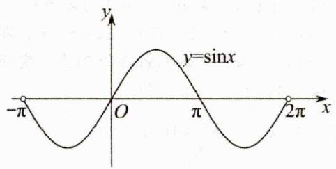

text_image

y=sinx
-π O π 2π x

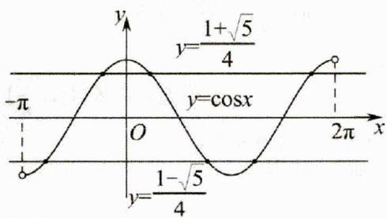

line

| x       | y          |
| ------- | ---------- |
| 0       | 0          |
| π/4     | 1+√5/4     |
| 2π      | cosx       |
| ∞       | 0          |

由图像可知，函数 $f(x)$ 共8个零点.

法二：因为

$$
f (x) = \sin \left(\frac {5}{2} x + \frac {1}{2} x\right) - \sin \left(\frac {5}{2} x - \frac {1}{2} x\right) = 2 \sin \frac {1}{2} x \cos \frac {5}{2} x,
$$

由 $f(x) = 0$ ，得 $\sin \frac{1}{2} x = 0$ ，或 $\cos \frac{5}{2} x = 0$

所以 $\frac{1}{2} x = k\pi$ ，或 $\frac{5}{2} x = \frac{\pi}{2} +k\pi$ ，即 $x = 2k\pi$ ，或

$x = \frac{\pi}{5} +\frac{2k\pi}{5}, k\in Z$ ，因为 $-\pi <  x <   2\pi$

所以 x=0，或 $x=-\frac{3}{5}\pi,-\frac{1}{5}\pi,\frac{1}{5}\pi,\frac{3}{5}\pi,\pi,\frac{7}{5}\pi,\frac{9}{5}\pi$ 共 8 个零点. 故选：D

3.【答案】C

【详解】∵ $f(x)$ 是定义在 R 上的奇函数，且周期是 3， $f(2)=0$ ，故 $f(-2)=-f(2)=0$ ， $f(1)=f(-2)=0$ ， $f(3)=f(0)=0$ ，∴ $f(5)=f(2)=0$ ， $f(4)=f(1)=0$ ，根据周期性， $f(-1.5)=f(-1.5+3)=f(1.5)$ ，再根据奇函数的性质可得 $f(1.5)=-f(1.5)$ ，∴ $f(1.5)=-f(1.5)=0$ 。

又 $f(4.5) = f(4.5 - 3) = f(1.5) = 0$ ，故在区间（0，6）内， $f(1) = 0$ ， $f(1.5) = 0$ ， $f(2) = 0$ ， $f(3)$ $= 0$ ， $f(4) = 0$ ， $f(4.5) = 0$ ， $f(5) = 0$ ，故选：C.

4.【答案】B

【详解】 $f'(x)=2^{x}\ln2+3x^{2}$ ，在 $(0,1)$ 上 $f'(x)>0$ 恒成立，所以 $f(x)$ 在 $(0,1)$ 上单调递增， $\because f(0)=-1<0,f(1)=1>0$ ，故函数在区间 $(0,1)$ 内的零点个数1个.

5.【答案】B

【详解】A. 若 a = -1, b = 1，则函数 $g(x)$ 不是奇函数，其图象不可能关于原点对称，故错误；

B. 当 $a = -1$ 时， $-f(x)$ 仍是奇函数，2仍是它的一个零点，

但单调性与 $f(x)$ 相反，若再加 $b, -2 < b < 0$ ，则图象又向下平移 $-b$ 个单位长度，所以 $g(x) = -f(x) + b = 0$ 有大于2的实根，故正确；

C. 若 $a=\frac{1}{2}$ ，b=2，则 $g(x)=\frac{1}{2}f(x)+2$ ，其图象由 $f(x)$ 的图象向上平移 2 个单位长度，那么 $g(x)$ 只有 1 个零点，所以 $g(x)=0$ 只有 1 个实根，故错误；

D. 若 a=1, b=-3，则 $g(x)$ 的图象由 $f(x)$ 的图象向下平移 3 个单位长度，它只有 1 个零点，即 $g(x)=0$ 只有一个实根，故错误。故选：B.

6.【答案】B

【详解】由 $f(x)=2\sin x-\sin 2x=2\sin x-$

$$
2 \sin x \cos x = 2 \sin x (1 - \cos x) = 0,
$$

得 $\sin x = 0$ 或 $\cos x = 1$ ， $\because x\in [0,2\pi ]$

∴ x = 0、π 或 $2\pi$ ．∴ $f(x)$ 在 $[0, 2\pi]$ 的零点个数是 3

7.【答案】2

【详解】试题分析：令 $x^{2}-2=0$ 得， $x=\pm\sqrt{2}$ ，只有 $x=-\sqrt{2}$ 符合题意；令 $2x-6+\ln x=0$ 得， $6-2x=\ln x$ ，在同一坐标系内，画出 $y=6-2x,y=\ln x$ 的图象，观察知交点有1，所以零点个数是2.

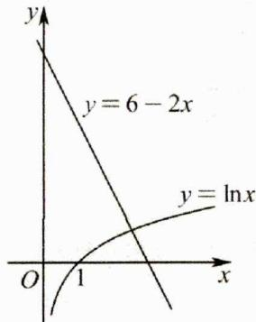

text_image

y
y = 6 - 2x
y = \ln x
O 1 x

# 三、【习题检测】

1.【答案】C

【详解】令 $f(x)=\sqrt{11}\cos\pi x-2x+1=0$ ，可得 $\sqrt{11}\cos\pi x=2x-1$ ，

则函数 $f(x)=\sqrt{11}\cos\pi x-2x+1$ 零点的个数为 $y=\sqrt{11}\cos\pi x$ 与 y=2x-1 的交点个数，

显然 $y = \sqrt{11}\cos \pi x$ 与 $y = 2x - 1$ 均关于 $(\frac{1}{2},0)$ 对称，

又当 $x = 2$ 时， $\sqrt{11}\cos 2\pi >2\times 2 - 1$ ，当 $x = 4$ 时， $\sqrt{11}\cos 4\pi <  2\times 4 - 1$ ，再结合两个函数的图象，可得 $y = \sqrt{11}\cos \pi x$ 与 $y = 2x - 1$ 有5个交点，

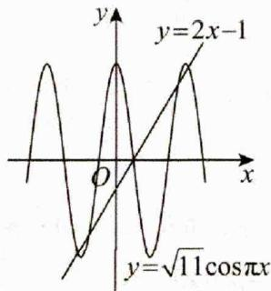

text_image

y
y=2x-1
O
x
y=√11cosπx

故函数 $f(x) = \sqrt{11}\cos \pi x - 2x + 1$ 零点的个数为5，故C正确.故选：C

2.【答案】C

【详解】在同一直角坐标系中分别作出两个函数的图像，可知有两个交点.

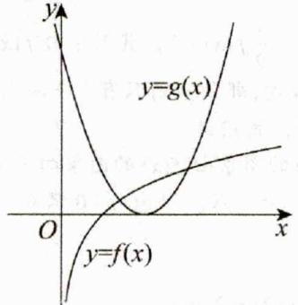

text_image

y
y=g(x)
O
x
y=f(x)

3.【答案】B

【详解】由已知 $g(x) = (x - 2)^2 + 1$ ，所以其顶点为 $(2,1)$ ，又 $f(2) = 2\ln 2 \in (1,2)$ ，可知点 $(2,1)$ 位于函数 $f(x) = 2\ln x$ 图象的下方，故函数 $f(x) = 2\ln x$ 的图象与函数 $g(x) = x^2 - 4x + 5$ 的图象有2个交点.

4.【答案】B

【详解】令 $y_{1}=\sqrt{x}$ ， $y_{2}=\cos x$ ，则它们的图像如图

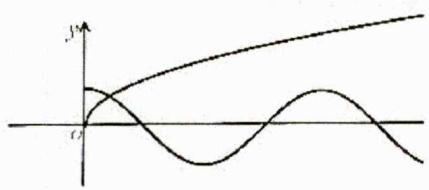

text_image

y
O

故选B

5.【答案】C

【详解】本题考查三角函数的周期性以及零点的概念.

$f(x)=0$ ，则 x=0 或 $\cos x^{2}=0$ ， $x^{2}=k\pi+\frac{\pi}{2}, k\in Z$ ，又 $x\in[0,4]$ ， $k=0,1,2,3,4$ 所以共有 6 个解。选 G.

6.【答案】B

【详解】函数 $f(x) = x^{\frac{1}{2}} - (\frac{1}{2})^x$ 的零点，即令 $f(x) = 0$ ，根据此题可得 $x^{\frac{1}{2}} = (\frac{1}{2})^x$ ，在平面直角坐标系中分别画出幂函数 $y = x^{\frac{1}{2}}$ 和指数函数 $y = (\frac{1}{2})^x$ 的图像，可得交点只有一个，所以零点只有一个，故选B

7.【答案】B

【详解】由 $\left\{\begin{aligned}x^{2}+2x-3=0\\ x\leq0\end{aligned}\right.\Rightarrow x=-3$ ，由

$\left\{ \begin{array}{l} x > 0 \\ -2 + \ln x = 0 \end{array} \right. \Rightarrow x = e^2$ ，所以函数 $f(x) = \left\{ \begin{array}{l} x^2 + 2x - 3, x \leq 0 \\ -2 + \ln x, x > 0 \end{array} \right.$

的零点个数为2，故选B.

8.【答案】D

【详解】由 $f(x)=x\cos2x=0$ ，得 x=0 或 $\cos2x=0$ ；其中，由 $\cos2x=0$ ，得 $2x=k\pi+\frac{\pi}{2}(k\in\mathbf{Z})$ ，故

$x = \frac{k\pi}{2} +\frac{\pi}{4}\big(k\in \mathbf{Z}\big)$ .又因为 $x\in [0,2\pi ]$ ，所以

$x = \frac{\pi}{4},\frac{3\pi}{4},\frac{5\pi}{4},\frac{7\pi}{4}$ 所以零点的个数为 $1 + 4 = 5$ 个.故选D.

9.【答案】A

【详解】 $f(-1) = 4\sin (-1) + 1 = -4\sin 1 + 1$ ，因为

$\sin 1 > \sin \frac{\pi}{4} = \frac{\sqrt{2}}{2}$ ，所以 $-4\sin 1 + 1 < 0$ ， $f(0) = 4\sin 1 > 0$ ，因此 $f(x)$ 在 $[-1,0]$ 上有零点，故在 $[-2,0]$ 上有零点；

$f(2) = 4\sin 5 - 2 = -4\sin (2\pi -5) - 2$ ，而 $0 <   2\pi -5 <   \pi$ ，即 $\sin (2\pi -5) > 0$ ，因此 $f(2) <   0$ ，故 $f(x)$ 在[0,2]上一定存在零点；虽然 $f(4) = 4\sin 17 - 4 <   0$ ，但

$f(\frac{9\pi}{8}) = 4\sin (\frac{9\pi}{4} +1) - \pi = 4\sin (\frac{\pi}{4} +1) - \pi$ ，又

$\frac{\pi}{2} < 1 + \frac{\pi}{4} < \frac{2\pi}{3}$ 即 $\sin (1 + \frac{\pi}{4}) > \frac{\sqrt{3}}{2}$ ，从而

$4\sin(\frac{\pi}{4}+1)-\pi>2\sqrt{3}-\pi>0$ ，于是 $f(x)$ 在区间 $[2,\frac{9\pi}{8}]$

上有零点，也即在[2,4]上有零点，

排除 B, C, D, 那么只能选 A.

10.【答案】C

【详解】试题分析：解：在同一坐标系中画出函数的图象和函数 $g(x)=\log_{2}x$ 的图象，如下图所示：

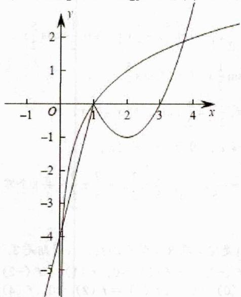

line

| x    | y     |
| ---- | ----- |
| -1   | -5    |
| 0    | 0     |
| 1    | -1    |
| 2    | -2    |
| 3    | -1    |
| 4    | 2     |

由函数图象得，两个函数图象共有3个交点，故选C.11.【答案】B

【详解】由当 $x \in (0, \pi)$ 且 $x \neq \frac{\pi}{2}$ 时， $\left(x - \frac{\pi}{2}\right)f'(x) > 0$ ，知 $x \in \left[0, \frac{\pi}{2}\right)$ 时， $f'(x) < 0, f(x)$ 为减函数，

$x \in \left(\frac{\pi}{2}, \pi\right]$ 时， $f'(x) > 0, f(x)$ 为增函数，

$x \in \left(\frac{\pi}{2}, \pi\right]$ 时， $f'(x) > 0, f(x)$ 为增函数，

又 $x \in [0, \pi]$ 时， $0 < f(x) < 1$ ，在 $\mathbb{R}$ 上的函数 $f(x)$ 是最小正周期为 $2\pi$ 的偶函数，在同一坐标系中作出 $y = \sin x$ 和 $y = f(x)$ 草图像如下，由图知 $y = f(x) - \sin x$ 在 $[-2\pi, 2\pi]$ 上的零点个数为 4 个.

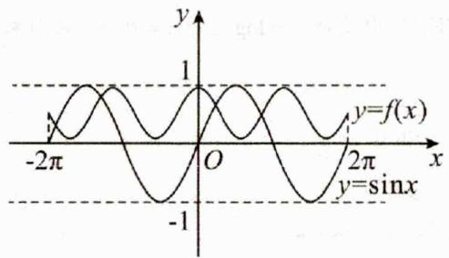

text_image

y
1
y=f(x)
-2π O 2π x
-1 y=sinx

故选：B.

12.【答案】B

【详解】令 $f(x)=0$ 可得 $\log_{\frac{2}{5\pi}}x=\sin x$ ，作出函数

$y=\log_{2}x$ 、 $y=\sin x$ 的图象如下图所示：

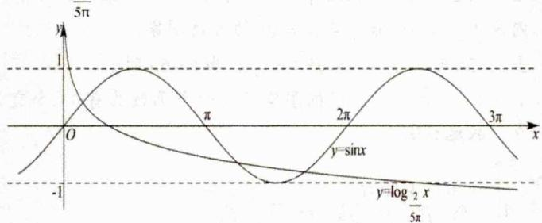

line

| x     | y=sinx |
|-------|--------|
| -1    | -1     |
| 0     | 0      |
| π/5   | 5π     |
| 2π/5  | 0      |
| 3π/5  | -5π    |

当 $x > \frac{5\pi}{2}$ 时， $\log_{\frac{2}{5\pi}}x <   \log_{\frac{2}{5\pi}}\frac{5\pi}{2} = -1$

又因为 $-1 \leq \sin x \leq 1$ ，所以，函数 $y = \log_{\frac{2}{5\pi}} x$ 、 $y = \sin x$ 在 $\left(\frac{5\pi}{2}, +\infty\right)$ 上的图象没有交点，观察图象可知，函数 $y = \log_{\frac{2}{5\pi}} x$ 、 $y = \sin x$ 的图象有三个交点，

因此，函数 $f(x)$ 的零点个数为 3. 故答案为：B.

13.【答案】3

【详解】∵0≤x≤π∴ $\frac{\pi}{6}\leq3x+\frac{\pi}{6}\leq\frac{19\pi}{6}$

由题可知 $3x + \frac{\pi}{6} = \frac{\pi}{2}, 3x + \frac{\pi}{6} = \frac{3\pi}{2}$ ，或 $3x + \frac{\pi}{6} = \frac{5\pi}{2}$

解得 $x=\frac{\pi}{9},\frac{4\pi}{9}$ ，或 $\frac{7\pi}{9}$ 故有 3 个零点。故答案为：3。

方法二：令 $f(x) = \cos \left(3x + \frac{\pi}{6}\right) = 0$ ，即

$3x+\frac{\pi}{6}=k\pi+\frac{\pi}{2},k\in\mathbf{Z}$ ，解得， $x=\frac{k}{3}\pi+\frac{\pi}{9},k\in\mathbf{Z}$ ，分别令k=0,1,2，得 $x=\frac{\pi}{9},x=\frac{4\pi}{9},x=\frac{7\pi}{9}$ ，所以函数

$f(x) = \cos \left(3x + \frac{\pi}{6}\right)$ 在 $[0, \pi]$ 的零点的个数为 3

14.【答案】B

【详解】 $\frac{f(x_{1})}{x_{1}}=\frac{f(x_{1})-0}{x_{1}-0}$ 表示 $(x_{1},f(x_{1}))$ 到原点的斜率；

$\frac{f(x_{1})}{x_{1}}=\frac{f(x_{2})}{x_{2}}=\cdots=\frac{f(x_{n})}{x_{n}}$ 表示

$(x_{1},f(x_{1})),(x_{2},f(x_{2})),\cdots,(x_{n},f(x_{n}))$ 与原点连线的斜率，

而 $(x_{1},f(x_{1})),(x_{2},f(x_{2})),\cdots,(x_{n},f(x_{n}))$ 在曲线图像上，

故只需考虑经过原点的直线与曲线的交点有几个，很明显分别有2、3、4个，故选B.

15.【答案】2

【详解】因为 $2^{-x} = 3 - x^2$ ，作出函数 $y = 2^{-x}, y = 3 - x^2$ 的图像，从图像可以观察到两函数的图像有两个公共点，所以方程 $2^{-x} + x^2 = 3$ 的实数解的个数为2.

16.【答案】8

【详解】由于 $f(x) \in [0,1)$ ，则需考虑 $1 \leq x < 10$ 的情况，在此范围内， $x \in \mathbf{Q}$ 且 $x \in D$ 时，设 $x = \frac{q}{p}, p, q \in \mathbb{N}^*, p \geq 2$ ，且 $p, q$ 互质，若 $\lg x \in Q$ ，则由 $\lg x \in (0,1)$ ，可设

$\lg x = \frac{n}{m}, m, n \in \mathbf{N}^*, m \geq 2$ ，且 $m, n$ 互质，因此 $10^{\frac{n}{m}} = \frac{q}{p}$ ，则 $10^{n} = (\frac{q}{p})^{m}$ ，此时左边为整数，右边为非整数，矛盾，因此 $\lg x \notin \mathbf{Q}$ ，因此 $\lg x$ 不可能与每个周期内 $x \in D$ 对应的部分相等，只需考虑 $\lg x$ 与每个周期 $x \notin D$ 的部分的交点，画出函数图象，图中交点除外(1,0)其他交点横坐标均为无理数，属于每个周期 $x \notin D$ 的部分，

且 $x = 1$ 处 $(\lg x)' = \frac{1}{x\ln 10} = \frac{1}{\ln 10} < 1$ ，则在 $x = 1$ 附近仅有一个交点，

因此方程 $f(x)-\lg x=0$ 的解的个数为 8.

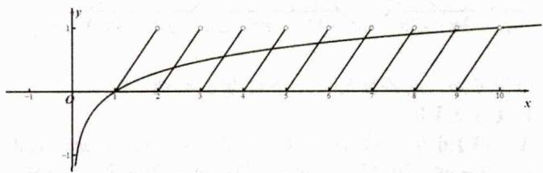

text_image

Graph showing a function with asymptotes and labeled points on the x-axis from -1 to 10

# 2.4.3 零点个数之图像翻折类

# 二、【典型例题】

1.【答案】D

【详解】两个函数的零点个数转化为图象与 y=a 的图象的公共点的个数，作出 $y=\left|2^{x}-1\right|$ ， $y=x^{2}-4|x|+2$ 的大致图象，如图所示。由图可知，当 $g(x)$ 有 2 个零点时， $f(x)$ 无零点或只有 1 个零点；

当 $g(x)$ 有3个零点时， $f(x)$ 只有1个零点；

当 $f(x)$ 有2个零点时， $g(x)$ 有4个零点.故选：D

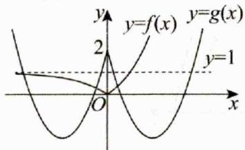

text_image

y
y=f(x)
y=g(x)
2
y=1
O
x

2.【答案】B

【详解】由 $f(x) = 0$ ，得 $\left|\left(\frac{1}{2}\right)^x -1\right| = \log_2x$ ，因此函数 $f(x)$ 的零点即为函数 $y = \log_2x$ 与 $y = \left|\left(\frac{1}{2}\right)^x -1\right|$ 的图象交点横坐标，

在同一坐标系内作出函数 $y = \log_2 x$ 与 $y = \left| \left( \frac{1}{2} \right)^x - 1 \right|$ 的图象，如图，

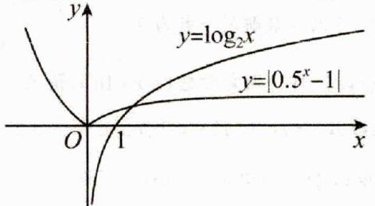

text_image

y
y=log₂x
y={0.5ˣ-1}
O
1
x

观察图象知，函数 $y = \log_2 x$ 与 $y = \left| \left( \frac{1}{2} \right)^x - 1 \right|$ 的图象有唯一公共点，所以函数 $f(x) = \left| \left( \frac{1}{2} \right)^x - 1 \right| - \log_2 x$ 的零点个数为1. 故选：B

# 3.【答案】D

【详解】函数 $y = \cos x$ 与 $y = \lg |x|$ 都是偶函数，其中 $\cos 2\pi = \cos 4\pi = 1$ ， $\lg 4\pi > \lg 10 = 1 > \lg 2\pi$ ，
在同一坐标系中，作出函数 $y = \cos x$ 与 $y = \lg |x|$ 的图象，如下图，

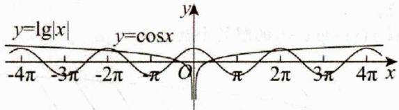

text_image

y=lg|x|
y=cosx
-4π -3π -2π -π O π 2π 3π 4π x

由图可知，两函数的交点个数为6.故选：D

# 4.【答案】B

【详解】因为当 $x \in [0,1]$ 时， $f(x) = x^3$ ，所以当 $x \in [1,2]$ 时， $2 - x \in [0,1]$ ， $f(x) = f(2 - x) = (2 - x)^3$ 。当 $x \in \left[0, \frac{1}{2}\right]$ 时， $g(x) = x \cos(\pi x)$ ；当 $x \in \left[\frac{1}{2}, \frac{3}{2}\right]$ 时， $g(x) = -x \cos(\pi x)$ ，注意到函数 $f(x)$ ， $g(x)$ 都是偶函数，且 $f(0) = g(0)$ ， $f(1) = g(1)$ ， $g\left(\frac{1}{2}\right) = g\left(\frac{3}{2}\right) = 0$ ，作出函数 $f(x)$ ， $g(x)$ 的大致图象，函数 $h(x)$ 除了 0,1 这两个零点之外，分别在区间 $\left[-\frac{1}{2}, 0\right], \left[0, \frac{1}{2}\right], \left[\frac{1}{2}, 1\right], \left[1, \frac{3}{2}\right]$ 上各有一个零点，共有 6 个零点，故选 B.

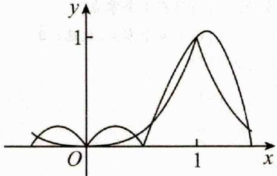

text_image

y
1
O
1
x

# 三、【习题检测】

# 1.【答案】A

【详解】令 $f(x)=0$ ，解得 $\cos x=\pm\frac{\sqrt{3}}{2}$ ，由于 $x\in\left[0,\frac{13\pi}{6}\right]$ ，则 $x=\frac{\pi}{6},\frac{5\pi}{6},\frac{7\pi}{6},\frac{11\pi}{6},\frac{13\pi}{6}$ ，共5个零点。故选：A.

# 2.【答案】B

【详解】令 $f(x) = 2^{x}\left|\log_{0.5}x\right| - 1 = 0,\therefore \left|\log_{0.5}x\right| = 0.5^{x},$

在同一坐标系下，作出函数 $y = |\log_{0.5}x|, y = (0.5)^x$ 的图象，如图所示，

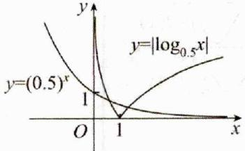

由于 $y=\left|\log_{0.5}x\right|$ , $y=(0.5)^{x}$ 的图象有两个交点，
所以 $f(x)=2^{x}\left|log_{0.5}x\right|-1$ 的零点个数为 2，故选：B

# 3.【答案】C

【详解】设 $y_{1} = 4|\cos t|$ ， $y_{2} = \sqrt{t}$ 。在同一直角坐标系内画出 $y_{1} = 4|\cos t|$ 与 $y_{2} = \sqrt{t}$ 的大致图象，当 $t = 5\pi$ 时， $y_{1} = 4 > \sqrt{5\pi} = y_{2}$ ；当 $t = 6\pi$ 时，

$y_{1}=4<\sqrt{6\pi}=y_{2}$ ．根据图象可得两个函数共有11个交点．故选：C.

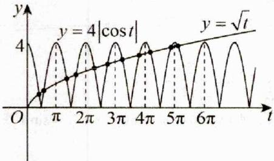

# 4.【答案】A

【详解】由题可知，如图所示：

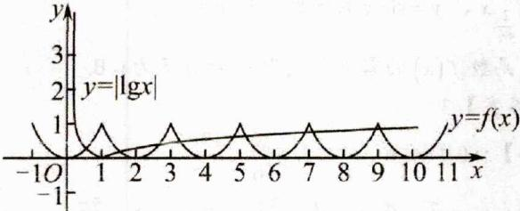

当 x=10 时，y=1，根据图像可知，交点个数为 10
故选：A

# 5.【答案】A

【详解】 $x > 0$ 时， $f(x) = \left|\frac{\ln x}{x}\right| - \frac{1}{\mathbf{e}^2}$ ，

当 0 < x < 1 时， $f(x) = -\frac{\ln x}{x} - \frac{1}{\mathbf{e}^2}$ ， $f'(x) = \frac{\ln x - 1}{x^2} < 0$ ，

当 $x > 1$ 时， $f(x) = \frac{\ln x}{x} - \frac{1}{\mathsf{e}^2}$ ， $f'(x) = \frac{1 - \ln x}{x^2}$ ，

$f'(x)>0$ ，有1<x<e； $f'(x)<0$ ，有x>e，

所以 $f(x)$ 在 $(0,1)$ 上单调递减，在 $(1,e)$ 上单调递增，在 $(e,+\infty)$ 上单调递减，

$$
\begin{array}{l} f \left(\frac {1}{\mathbf {e}}\right) = \mathbf {e} - \frac {1}{\mathbf {e} ^ {2}} > 0, f (1) = - \frac {1}{\mathbf {e} ^ {2}} <   0, f (\mathbf {e}) = \frac {1}{\mathbf {e}} - \frac {1}{\mathbf {e} ^ {2}} > 0, \\ f \left(\mathbf {e} ^ {4}\right) = \frac {4}{\mathbf {e} ^ {4}} - \frac {1}{\mathbf {e} ^ {2}} = \frac {4 - \mathbf {e} ^ {2}}{\mathbf {e} ^ {4}} <   0, \\ \end{array}
$$

$$
f \left(\frac {1}{\mathbf {e}}\right) \cdot f (1) <   0, f (1) \cdot f (\mathbf {e}) <   0, f (\mathbf {e}) \cdot f \left(\mathbf {e} ^ {4}\right) <   0,
$$

由零点存在定理，所以 $f(x)$ 在 $(0,1)$ ， $(1,\mathbf{e})$ ， $(\mathbf{e}, +\infty)$ 上各有一个零点，又 $f(x)$ 是定义域为 $\{x|x\neq 0\}$ 的偶函数，则函数 $f(x)$ 有6个零点.故选：A

6.【答案】4

【详解】试题分析：如图 $y = g(x)$ 与 $y = \pm 1 - f(x)$ 交点个数为4

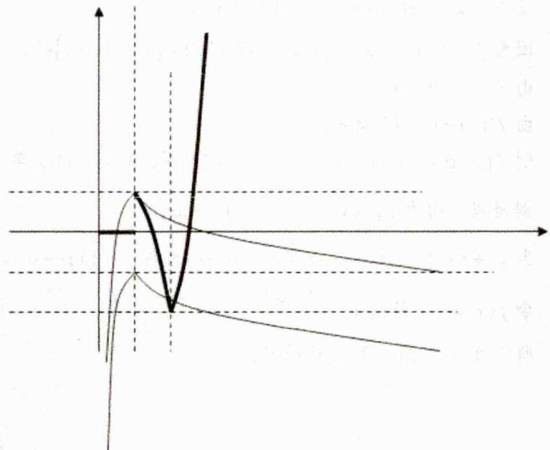

line

| X | Y |
|---|---|
| 0 | 0 |
| Peak | 1.0 |
| Low | -1.0 |
| High | 2.0 |

7.【答案】2

【详解】因为 $f(x) = 4\cos^2{\frac{x}{2}}\cos \left(\frac{\pi}{2} -x\right) - 2\sin x - |\ln (x + 1)|$

$$
\begin{array}{l} = 2 (1 + \cos x) \sin x - 2 \sin x - | \ln (x + 1) | \\ = \sin 2 x - | \ln (x + 1) | \\ \end{array}
$$

所以函数 $f(x)$ 的零点个数为函数 $y=\sin2x$ 与

$y=\left|\ln(x+1)\right|$ 图象的交点的个数，

函数 $y = \sin 2x$ 与 $y = |\ln (x + 1)|$ 图象如图，由图知，两函数图象有2个交点，

所以函数 $f(x)$ 有 2 个零点.

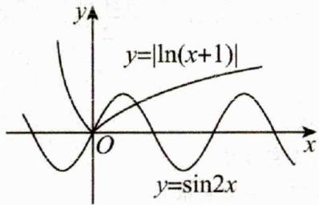

text_image

y=|ln(x+1)|
y=sin2x

# 2.4.4 零点个数之复合函数类

# 二、【典型例题】

1.【答案】A

【详解】解：由图象知， $f(x)=0$ 有3个根，0， $\pm m$ ，其中1<m<2， $g(x)=0$ 有3个根，0， $\pm n$ ，其中0<n<1，由 $f'(g(x))=0$ ，得 $g(x)=0$ 或 $\pm m$ ，

由图象可知 $g(x)$ 所对每一个值都能有3个根，因而 $a = 9$ ；由 $g(f(x)) = 0$ ，知 $f(x) = 0$ 或 $\pm n$

由图象可以看出， $f(x)=0$ 有3个根，

$f(x) = n, (0 < n < 1)$ 有4个根，

$f(x) = -n, (0 < n < 1)$ 有2个根，加在一起也是9个，即 $b = 9$ ， $\therefore a + b = 9 + 9 = 18$

故选：A.

2.【答案】B

【详解】依题意，函数 $g(x)=f(f(x)-1)$ 零点的个数，即为方程 $f(f(x)-1)=0$ 解的个数，

令 $f(x) - 1 = t$ ，则 $f(t) = 0$ ，当 $t > 0$ 时， $\ln t - \frac{1}{t} = 0$ ，令 $h(t) = \ln t - \frac{1}{t},\quad t > 0$ ，函数 $y = \ln t,y = -\frac{1}{t}$ 在 $(0, + \infty)$ 上单调递增，于是函数 $h(t)$ 在 $(0, + \infty)$ 上单调递增，

又 $h(1) = -1 < 0$ ， $h(\mathbf{e}) = 1 - \frac{1}{\mathbf{e}} >0$ ，则存在 $t_1\in (1,\mathbf{e})$ ，使得 $h(t_{1}) = 0$ ；当 $t\leq 0$ 时， $-|t + 1| + 1 = 0$ ，解得 $t = 0$ 或-2，作函数 $f(x) = \left\{ \begin{array}{ll}\ln x - \frac{1}{x},x > 0\\ -|x + 1| + 1,x\leq 0 \end{array} \right.$ 的大致图象，如图：

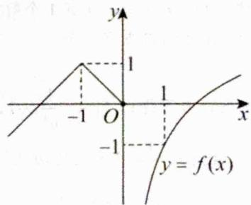

text_image

y
1
-1 O 1 x
-1
y = f(x)

又 $f(x) - 1 = t$ ，则 $f(x) = t + 1$

当 t=0 时， $f(x)=1$ ，由 $y=f(x)$ 的图象知，方程 $f(x)=1$ 有两个解；当 t=-2 时， $f(x)=-1$ ，由 $y=f(x)$ 的图象知，方程 $f(x)=-1$ 有两个解；

当 $t = t_1$ ， $t_1\in (1,\mathbf{e})$ 时， $f(x) = t_{1} + 1$ ，由 $y = f(x)$ 的图象知，方程 $f(x) = t_1 + 1$ 有一个解，综上所述，函数 $g(x) = f(f(x) - 1)$ 的零点个数为5.故选：B

3.【答案】A

【详解】试题分析：求导得 $f'(x) = 3x^2 + 2ax + b$ ，显然 $x_1, x_2$ 是方程 $3x^2 + 2ax + b = 0$ 的二不等实根，不妨设 $x_1 < x_2$ ，于是关于 $x$ 的方程 $3(f(x))^2 + 2af(x) + b = 0$ 的解就是 $f(x) = x_1$ 或 $f(x) = x_2$ ，根据题意画图：

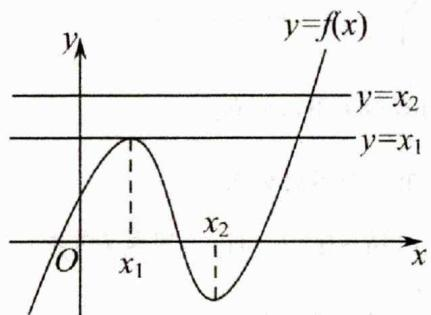

text_image

y
y=f(x)
y=x₂
y=x₁
O
x₁
x₂
x

所以 $f(x) = x_{1}$ 有两个不等实根， $f(x) = x_{2}$ 只有一个不等实根，故答案选A.

# 三、【习题检测】

1.【答案】A

【详解】函数 $f(x) = \begin{cases} -x\mathbf{e}^x, & x < 0 \\ \ln (x + 1), & x \geq 0 \end{cases}$ ，对 $y = -x e^{x} \Rightarrow y' = -(x + 1)e^{x}$ ，令 $y' > 0 \Rightarrow x < -1$ ，令 $y' < 0 \Rightarrow 0 > x > -1$ ，可知 $y = -x e^{x}$ 在 $(-∞, -1)$ 上单调递增，在 $(-1, 0)$ 上单调递减，且 x 趋向负无穷时，y > 0，x = -1 时， $y_{\max} = \frac{1}{e}$ ，故结合对数函数图象，可画出函数 $f(x)$ 图像如下图所示：

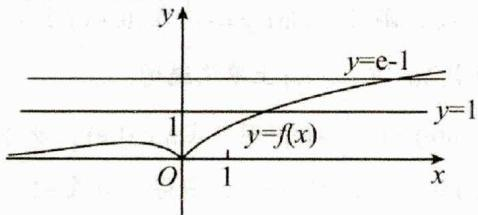

text_image

y
y=e-1
y=1
1
y=f(x)
O
1
x

函数 $g(x) = f(f(x)) - 1$ 的零点，即 $f(f(x)) = 1$ ，令 $t = f(x)$ 代入可得 $f(t) = 1 > \frac{1}{\mathbf{e}}$ ，由图像可知 $t = \mathbf{e} - 1$ ，即 $f(x) = \mathbf{e} - 1$ ，结合函数图像可知， $f(x) = \mathbf{e} - 1$ 有1个解，综合可知，函数 $g(x) = f(f(x)) - 1$ 的零点有1个

2.【答案】C

【详解】设 $f(x)=t$ ，令 $F(x)=0$ 可得： $f(t)=\frac{1}{e^{3}}t+1$ ，对于 $y=\frac{1}{1-x}$ ， $y'=\frac{1}{(1-x)^{2}}$ ，故 $y=\frac{1}{1-x}$ 在 $x_{x=0}$ 处切线的斜率值为 $k_{1}=1$ ，设 $y=k_{2}x+1$ 与 $y=\ln x$ 相切于点 $(x_{2},\ln x_{2})$ ，∵ $(\ln x)'=\frac{1}{x}$ ，∴ 切线斜率 $k_{2}=\frac{1}{x_{2}}$ ，则切线方程为： $y-\ln x_{2}=\frac{1}{x_{2}}(x-x_{2})$ ，即

$y=\frac{1}{x_{2}}\cdot x+\ln x_{2}-1,\therefore\left\{\begin{aligned}k_{2}&=\frac{1}{x_{2}}\\ \ln x_{2}&-1=1\end{aligned}\right.$ ，解得： $x_{2}=e^{2},k_{2}=\frac{1}{e^{2}}$ ；
由于 $\frac{1}{e^{3}}<\frac{1}{e^{2}}<1$ ，故作出 $f(x)$ 与 $y=\frac{1}{e^{3}}x+1$ 图象如下图所示，

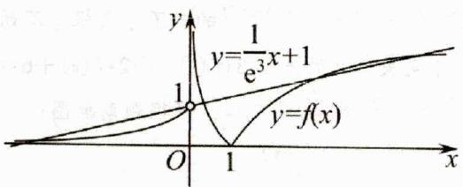

text_image

y
y=\frac{1}{e^3}x+1
1
y=f(x)
O 1 x

$\therefore y = \frac{1}{\mathbf{e}^3} x + 1$ 与 $f(x)$ 有四个不同交点，

即 $y = \frac{1}{\mathbf{e}^3} t + 1$ 与 $f(t)$ 有四个不同交点，

设三个交点为 $t_1, t_2, t_3, t_4 (t_1 < t_2 < t_3 < t_4)$ ，由图象可知： $t_1 < 0 < t_2 < 1 < t_3 < t_4$ ，

作出函数 $y = t, y = f(x)$ 的图象如图，

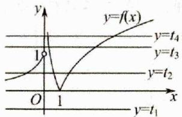

text_image

y
y=f(x)
y=t₄
y=t₃
y=t₂
O 1 x
y=t₁

由此可知 $f(x)$ 与 $y = t_1$ 无交点，与 $y = t_2$ 有三个不同交点，与 $y = t_3, y = t_4$ 各有两个不同交点，

$\therefore F(x) = f[f(x)] - \frac{1}{\mathbf{e}^2} f(x) - 1$ 的零点个数为7个

3.【答案】D

【详解】令 $g(x)=0$ ，即 $f(f(x))=a$ ，

因为 $f(x)=\left(x^{2}+x-5\right)\mathbf{e}^{x}$ ，所以 $f'(x)=\left(x^{2}+3x-4\right)\mathbf{e}^{x}$ ，
由 $f'(x)>0$ ，得 x<-4 或 x>1，

由 $f^{\prime}(x) < 0$ ，得 $-4 < x < 1$

则 $f(x)$ 在 $(-∞,-4)$ 和 $(1,+∞)$ 上单调递增，在 $(-4,1)$ 上单调递减，因为 $f(-4)=\frac{7}{e^{4}}$ ， $f(1)=-3e$ ，

当 $x \to +\infty$ 时， $f(x) \to +\infty$ ，当 $x \to -\infty$ 时， $f(x) \to 0$ ，令 $f(x) = 0$ ，解得 $x = \frac{-1 + \sqrt{21}}{2}$ 或 $x = \frac{-1 - \sqrt{21}}{2}$ ，

所以可画出 $f(x)$ 的大致图像，

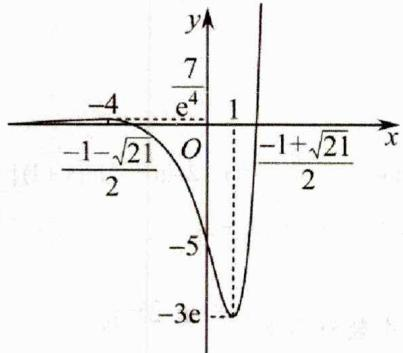

line

| x | y |
|---|---|
| -4 | 7 / e^4 |
| -1 - √21 / 2 | 0 |
| -5 | -3e |
| -1 + √21 / 2 | 0 |

设 $t = f(x)$ ，则 $f(t) = a$

第一种情况：

当 $0 < a < \frac{7}{\mathbf{e}^4}$ 时， $f(t) = a$ 有三个不同的零点 $t_1, t_2, t_3$ 不妨设 $t_1 < t_2 < t_3$ ，则 $t_1 < -4, -4 < t_2 < -\frac{\sqrt{21} + 1}{2}$ ，

$$
t _ {3} > \frac {- 1 + \sqrt {2 1}}{2},
$$

①讨论 $f(x)=t_{1}$ 根的情况：

当 $t_1 < -3\mathrm{e}$ 时， $f(x) = t_1$ 无实数根，

当 $t_1 = -3\mathbf{e}$ 时， $f(x) = t_1$ 有1个实数根，

当 $-3\mathbf{e} < t_{1} < -4$ 时， $f(x) = t_{1}$ 有2个实数根，

②讨论 $f(x)=t_{2}$ 根的情况：

因为 $-4 < t_{2} < -\frac{\sqrt{21} + 1}{2}$ ,

所以 $f(x) = t_2$ 有2个实数根，

③讨论 $f(x)=t_{3}$ 根的情况：

因为 $t_3 > \frac{-1 + \sqrt{21}}{2}$ ，且 $\frac{-1 + \sqrt{21}}{2} > \frac{7}{\mathrm{e}^4}$

所以 $f(x) = t_3$ 只有1个实数根，

第二种情况：

当 $a = \frac{7}{\mathbf{e}^4}$ 时， $f(t) = a$ 有2个实数根 $t_4 = -4$

$$
t _ {5} > \frac {- 1 + \sqrt {2 1}}{2},
$$

则 $f(x) = t_4$ 有2个实数根， $f(x) = t_5$ 有1个实数根，

故当 $a = \frac{7}{\mathbf{e}^4}$ 时， $f(f(x)) = a$ 有3个实数根；

第三种情况：

当 $a > \frac{7}{\mathbf{e}^4}$ 时， $f(t) = a$ 有一个实数根 $t_6 > \frac{-1 + \sqrt{21}}{2}$ ，则 $f(x) = t_6$ 有1个实数根，

综上，当 $0 < a < \frac{7}{\mathbf{e}^4}$ 时， $f(f(x)) = a$ 可能有3个或4个或5个实数根；

当 $a = \frac{7}{\mathbf{e}^4}$ 时， $f(f(x)) = a$ 有3实数根；

当 $a > \frac{7}{\mathbf{e}^4}$ 时， $f(f(x)) = a$ 有1个实数根；

综上， $g(x)$ 的零点个数可能是 1 或 3 或 4 或 5.

故选：D.

# 2.4.5 多零点求零点范围问题

# 二、【典型例题】

1.【答案】A

【详解】显然 $x = 0$ 不是方程 $\mathbf{e}^{2x} - ax\mathbf{e}^x +9\mathbf{e}^2 x^2 = 0$ 的根，则方程 $\mathbf{e}^{2x} - ax\mathbf{e}^x +9\mathbf{e}^2 x^2 = 0$ 的根即为方程

$\left(\frac{\mathbf{e}^{x}}{x}\right)^{2}-a\cdot\frac{\mathbf{e}^{x}}{x}+9\mathbf{e}^{2}=0$ 的根，

令 $t = \frac{\mathbf{e}^x}{x}$ ，得 $t^2 - at + 9\mathrm{e}^2 = 0$ ，设 $f(x) = \frac{\mathrm{e}^x}{x}$ ，求导得

$f'(x)=\frac{\mathrm{e}^{x}(x-1)}{x^{2}}$ ，由 $f'(x)<0$ ，得x<0或0<x<1，由 $f'(x)>0$ ，得x>1，即函数 $f(x)$ 在 $(-∞,0)$ 和 $(0,1)$ 上单调递减，在 $(1,+∞)$ 上单调递增， $f(1)=\mathbf{e}$ ，

作出 $f(x)$ 的大致图象，如图，

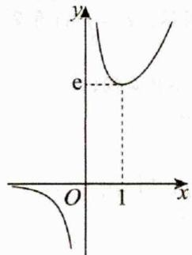

text_image

y
e
O
1
x

依题意，方程 $t^2 - at + 9\mathrm{e}^2 = 0$ 有两个不相等的实数根，设为 $t_1, t_2$ ，观察图象知，方程 $t^2 - at + 9\mathrm{e}^2 = 0$ 的每一个根，由 $t = \frac{\mathrm{e}^x}{x}$ 得两个不同的 $x$ 值，

于是 $t_1 + t_2 = a, t_1 t_2 = 9\mathrm{e}^2$ ，且 $t_1 > \mathbf{e}, t_2 > \mathbf{e}$ ，由

$$
\left\{ \begin{array}{l l} {\Delta = a ^ {2} - 3 6 \mathbf {e} ^ {2} > 0} \\ {\frac {- a}{- 2} > \mathbf {e}} \\ {\mathbf {e} ^ {2} - a \mathbf {e} + 9 \mathbf {e} ^ {2} > 0} \end{array} , \text {解得} 6 \mathbf {e} <   a <   1 0 \mathbf {e}, \right.
$$

不妨设 $t_1 = \frac{\mathbf{e}^{x_1}}{x_1} = \frac{\mathbf{e}^{x_4}}{x_4}, t_2 = \frac{\mathbf{e}^{x_2}}{x_2} = \frac{\mathbf{e}^{x_3}}{x_3}$

则 $(\frac{\mathbf{e}^{x_1}}{x_1} -\mathbf{e})(\frac{\mathbf{e}^{x_2}}{x_2} -\mathbf{e})(\frac{\mathbf{e}^{x_3}}{x_3} -\mathbf{e})(\frac{\mathbf{e}^{x_4}}{x_4} -\mathbf{e}) = (t_1 - \mathbf{e})^2 (t_2 - \mathbf{e})^2$

$$
= \left(t _ {1} t _ {2} - \mathrm{e} t _ {1} - \mathrm{e} t _ {2} + \mathrm{e} ^ {2}\right) ^ {2} = (1 0 \mathrm{e} ^ {2} - a \mathrm{e}) ^ {2},
$$

由 $6\mathrm{e} < a < 10\mathrm{e}$ ，得 $0 < (10\mathrm{e}^2 - a\mathrm{e})^2 < 16\mathrm{e}^4$

所以 $(\frac{\mathbf{e}^{x_1}}{x_1} -\mathbf{e})(\frac{\mathbf{e}^{x_2}}{x_2} -\mathbf{e})(\frac{\mathbf{e}^{x_3}}{x_3} -\mathbf{e})(\frac{\mathbf{e}^{x_4}}{x_4} -\mathbf{e})$ 的取值范围为

$(0,16e^{4})$ . 故选：A

2.【答案】D

【详解】解：作出函数 $f(x) = \left\{ \begin{array}{l} \sin \pi x, x \in [0,2] \\ \log_{2023}(x - 1), x \in (2, +\infty) \end{array} \right.$ 的图象，如图所示：

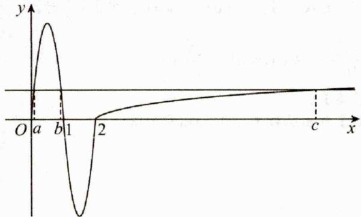

text_image

y
O a b 1 2 c x

不妨设 $a < b < c$ ，因为 $f(a) = f(b) = f(c)$

由函数的性质得 $a + b = 1$ ， $0 < \log_{2023}(c - 1) < 1$ ，即 $c\in [2,2024)$ ，所以 $a + b + c\in [3,2025)$ ，故选：D

3.【答案】 $\left(\frac{1-\sqrt{3}}{16},0\right)$

【详解】由定义运算“\*”可知

$$
f ^ {\prime} (x) = \left\{ \begin{array}{l l} (2 x - 1) ^ {2} - (2 x - 1) (x - 1) & x \leqslant 0 \\ (x - 1) ^ {2} - (2 x - 1) (x - 1) & x > 0 \end{array} \right.
$$

即 $f(x) = \left\{ \begin{array}{ll}2x^{2} - x & x\leqslant 0\\ -x^{2} + x & x > 0 \end{array} \right.$ ，该函数图像如下：

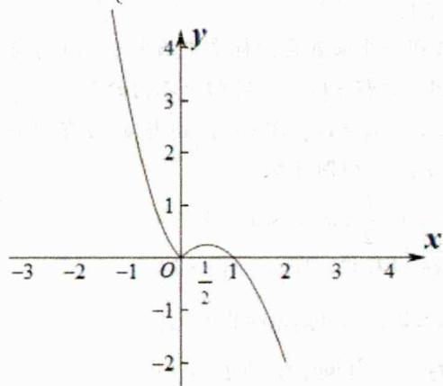

line

| x | y |
|---|---|
| -3 | 4 |
| -2 | 3 |
| -1 | 2 |
| 0 | 1 |
| 1/2 | 0.5 |
| 2 | -1 |
| 3 | -2 |
| 4 | -3 |

由 $f\left(\frac{1}{2}\right) = \frac{1}{4}$ ，假设 $x_{1} <   0 <   x_{2} <   x_{3}$

当关于 x 的方程为 $f(x)=m$ ( $m\in R$ ) 恰有三个互不相等的实数根时，m 的取值范围是 $\left(0,\frac{1}{4}\right)$ ，且 $x_{2},x_{3}$ 满足方程

$-x^{2}+x=m$ ，所以 $x_{2}x_{3}=m$

令 $2x^{2} - x = m$ 则 $x_{1} = \frac{1 - \sqrt{1 + 8m}}{4}$

所以 $x_{1}x_{2}x_{3} = m\cdot \frac{1 - \sqrt{1 + 8m}}{4} = \frac{m - m\sqrt{1 + 8m}}{4}$

令 $y=\frac{m-m\sqrt{1+8m}}{4}, m\in\left(0,\frac{1}{4}\right)$

所以 $y'=\frac{1}{4}\left(1-\sqrt{1+8m}-\frac{4m}{\sqrt{1+8m}}\right)$ ,

又 $h(m) = \sqrt{1 + 8m} +\frac{4m}{\sqrt{1 + 8m}}$ 在 $\left(0,\frac{1}{4}\right)$ 递增的函数，

所以 $h(m) > h(0) = 1$ ，所以 $y' < 0$ ，所以 $y = \frac{m - m\sqrt{1 + 8m}}{4}$

在 $\left(0,\frac{1}{4}\right)$ 递减，则当m=0时，y=0；当 $m=\frac{1}{4}$ 时，

$y=\frac{1-\sqrt{3}}{16}$ 所以 $x_{1}x_{2}x_{3}\in\left(\frac{1-\sqrt{3}}{16},0\right)$ .

# 4.【答案】C

【详解】作出函数 $f(x)$ 的图象如图，

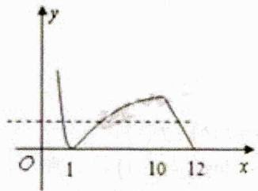

line

| x | y |
|---|---|
| 0 | 1 |
| 1 | 0 |
| 10 | 1 |
| 12 | 0 |

不妨设 $a < b < c$ ，则

$$
- \lg a = \lg b = - \frac {1}{2} c + 6 \in (0, 1), a b = 1, 0 <   - \frac {1}{2} c + 6 <   1
$$

则 $abc=c \in (10, 12)$

# 三、【习题检测】

1.【答案】D

【详解】因为 $f(x) = \begin{cases} (x + 1)^2, & x \leq 0 \\ |\log_2 x|, & x > 0 \end{cases}$ ，所以 $f(0) = 1$ ，

$f(-2)=1,\quad f\left(\frac{1}{2}\right)=1,\quad f(2)=1$ ，又函数 $y=(x+1)^{2}$ 对称轴为x=-1，在同一平面直角坐标系中画出 $y=f(x)$ 与y=a的图象，因为方程 $f(x)=a$ 有四个不同的解 $x_{1},x_{2},x_{3},x_{4}$ ，且 $x_{1}<x_{2}<x_{3}<x_{4}$ ，即 $y=f(x)$ 与y=a有四个交点，所以 $0<a\leq1$ ，由图可知

$$
- 2 \leq x _ {1} <   - 1 <   x _ {2} \leq 0 <   \frac {1}{2} \leq x _ {3} <   1 <   x _ {4} \leq 2,
$$

又 $x_{1}$ ， $x_{2}$ 关于 $x = -1$ 对称，即 $x_{1} + x_{2} = -2$

又 $\frac{1}{2} \leq x_3 < 1 < x_4 \leq 2$ ，且 $\left|\log_2 x_3\right| = \left|\log_2 x_4\right|$ ，

即 $-\log_2 x_3 = \log_2 x_4$ ，则 $\log_2 x_3 + \log_2 x_4 = 0$ ，

所以 $\log_2x_3x_4 = 0$ ，则 $x_{3}x_{4} = 1$

所以 $x_{3} \cdot x_{4}^{2} - \frac{1}{x_{4}(x_{1} + x_{2})} = x_{4} - \frac{1}{-2x_{4}} = x_{4} + \frac{1}{2x_{4}}$

令 $g(x) = x + \frac{1}{2x}$ , $(1 < x \leq 2)$ ,

由对勾函数的性质可知 $g(x)$ 在 $(1,2]$ 上单调递增，

又 $g(1) = \frac{3}{2}, g(2) = \frac{9}{4}$ ，所以 $g(x) \in \left(\frac{3}{2}, \frac{9}{4}\right]$ ，

即 $x_{3} \cdot x_{4}^{2} - \frac{1}{x_{4}(x_{1} + x_{2})} \in \left(\frac{3}{2}, \frac{9}{4}\right]$ . 故选：D.

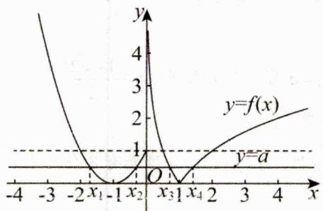

line

| x    | y=f(x) |
| ---- | ------ |
| -4   | 4      |
| -3   | 2      |
| -2   | 1      |
| -1   | 0.5    |
| 0    | 0      |
| 1    | 0.5    |
| 2    | 1      |
| 3    | 1.5    |
| 4    | 2      |

# 2.【答案】BCD

【详解】由函数 $f(x) = \begin{cases} 2 - |\log_2 x|, & 0 < x < 2 \\ -x^2 + 8x - 11, & x > 2 \end{cases}$ ，可得

$f(x) = \begin{cases} 2 + \log_2 x, & 0 < x \leq 1 \\ 2 - \log_2 x, & 1 < x \leq 2 \\ -x^2 + 8x - 11, & x > 2 \end{cases}$ , 作出 $f(x)$ 的图象，如图所

示.

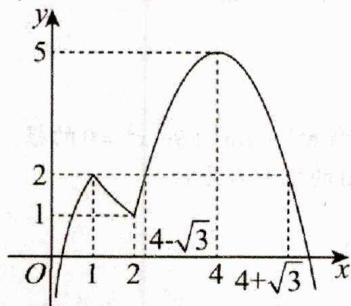

对于 A 中，由 $g(x)=f(x)-a=0$ ，可得 $f(x)=a$ ，若 $g(x)$ 有 2 个不同的零点，

结合图象知 a<1 或 2<a<5，所以 A 错误；

对于B中，当 $a = 2$ 时，由 $g(f(x)) = 0$ ，可得 $f(f(x)) = 2$ 令 $l = f(x)$ ，则有 $f(l) = 2$ ，可得

$$
t _ {1} = 1, t _ {2} = 4 - \sqrt {3}, t _ {3} = 4 + \sqrt {3},
$$

结合图像知， $t_1 = f(x)$ 有3个不等实根， $t_2 = f(x)$ 有2个不等实根， $t_3 = f(x)$ 没有实根，

所以 $g(f(x))$ 有 5 个不同的零点，所以 B 正确；

对于 $\mathbb{C}$ 中，若 $g(x)$ 有4个不同的零点

$$
x _ {1}, x _ {2}, x _ {3}, x _ {4} \left(x _ {1} <   x _ {2} <   x _ {3} <   x _ {4}\right),
$$

则 $1 < a < 2$ ，且 $2 + \log_2 x_1 = 2 - \log_2 x_2$ ，则 $x_1 x_2 = 1$

由二次函数的对称性得 $x_{3}+x_{4}=8$ ，则

$$
x _ {1} x _ {2} x _ {3} x _ {4} = x _ {3} x _ {4} = x _ {3} \left(8 - x _ {3}\right),
$$

结合 B 知 $x_{3} \in (2, 4 - \sqrt{3})$ ，所以 $x_{3}(8 - x_{3}) \in (12, 13)$ ，所以 $x_{1}x_{2}x_{3}x_{4}$ 的取值范围为 $(12, 13)$ ，所以 C 正确；

对于D中，由 $ax_{1}x_{2}+\frac{x_{3}+x_{4}}{a}=a+\frac{8}{a}$ ，其中1<a<2，

由对勾函数的性质, 可得 $h(a)=a+\frac{8}{a}$ 在 (1,2) 上为单调递减函数, 可得 $a+\frac{8}{a}\in(6,9)$ ,

所以 $ax_{1}x_{2}+\frac{x_{3}+x_{4}}{a}$ 的取值范围为 (6,9)，所以 D 正确.
故选：BCD.

3.【答案】B

【分析】在同一坐标系中作出 $y = m$ ， $y = \frac{8}{2m + 1} (m > 0)$ ， $y = |\log_2 x|$ 图像如下图，由 $|\log_2 x| = m$ ，得

$x_{1} = 2^{-m}, x_{2} = 2^{m}, \left|\log_{2}x\right| = \frac{8}{2m + 1}$ , 得

$x_{3} = 2^{-\frac{8}{2m + 1}}, x_{4} = 2^{\frac{8}{2m + 1}}$ 。依照题意得

$$
a = \left| 2 ^ {- m} - 2 ^ {- \frac {8}{2 m + 1}} \right|, b = \left| 2 ^ {m} - 2 ^ {\frac {8}{2 m + 1}} \right|, \frac {b}{a} = \frac {\left| 2 ^ {m} - 2 ^ {\frac {8}{2 m + 1}} \right|}{\left| 2 ^ {- m} - 2 ^ {- \frac {8}{2 m + 1}} \right|}
$$

$$
= 2 ^ {m} 2 ^ {\frac {8}{2 m + 1}} = 2 ^ {m + \frac {8}{2 m + 1}}.
$$

$$
\because m + \frac {8}{2 m + 1} = m + \frac {1}{2} + \frac {4}{m + \frac {1}{2}} - \frac {1}{2} \geq 4 - \frac {1}{2} = 3 \frac {1}{2},
$$

$$
\therefore \left(\frac {b}{a}\right) _ {\min} = 8 \sqrt {2}.
$$

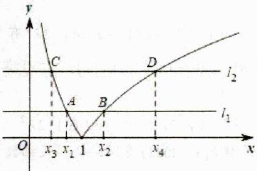

line

| Point | x | y |
|---|---|---|
| A | x₁ | 0 |
| B | x₂ | 1 |
| C | x₃ | 0 |
| D | x₄ | 1 |

4.【答案】 $\left[\frac{5\pi}{4},\frac{11\pi}{8}\right)$

【详解】

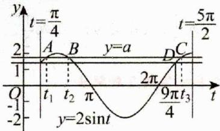

line

| Point | x-axis (t) | y-axis (y) | Label |
|---|---|---|---|
| A | t₁ | π/4 | t=π/4 |
| B | t₂ | π | y=a |
| C | t₃ | 2π | t=5π/2 |
| D | t₄ | π/4 | 9πt₃/4 |
| O | -1 | -2 | y=2sinθ |
| P | 1 | π | t₁ |
| Q | -1 | π | t₂ |
| R | 1 | π | y=a |
| S | 1 | π/4 | 9πt₃/4 |
The chart displays a sinusoidal waveform with labeled points and trigonometric functions.

将 $\left(0, \sqrt{2}\right)$ 代入得到 $\sin \varphi = \frac{\sqrt{2}}{2}$ ，又 $0 \leq \varphi \leq \frac{\pi}{2}$ ，所以 $\varphi = \frac{\pi}{4}$ ，因为在 $y$ 轴右侧的第一个零点为 $\frac{3\pi}{8}$ ，所以令

$\omega\times\frac{3\pi}{8}+\frac{\pi}{4}=\pi$ ，解得 $\omega=2$ ，所以 $f(x)=2\sin\left(2x+\frac{\pi}{4}\right)$ ;
令 $2x + \frac{\pi}{4} = t$ ，由 $x \in \left[0, \frac{9\pi}{8}\right]$ 可得： $t \in \left[\frac{\pi}{4}, \frac{5\pi}{2}\right]$ ,

依题可知方程 $2\sin t = a$ 在 $t \in \left[\frac{\pi}{4}, \frac{5\pi}{2}\right]$ 时恰有三个不同的根，记为 $t_1, t_2, t_3$ ，则 $t_i = 2x_i + \frac{\pi}{4} (i = 1, 2, 3)$ ，画出 $y = a$ 与 $y = 2\sin t$ 在 $\left[\frac{\pi}{4}, \frac{5\pi}{2}\right]$ 上的图象.

由图象易知 $t_1$ ， $t_2$ 关于直线 $t = \frac{\pi}{2}$ 对称，则 $t_1 + t_2 = \pi$ 又由图知 $t_3\in \left[\frac{9\pi}{4},\frac{5\pi}{2}\right)$ ，则 $t_1 + t_2 + t_3\in \left[\frac{13\pi}{4},\frac{7\pi}{2}\right),$

又 $t_1 + t_2 + t_3 = 2(x_1 + x_2 + x_3) + \frac{3\pi}{4}$ ，即

$\frac{13\pi}{4}\leq2(x_{1}+x_{2}+x_{3})+\frac{3\pi}{4}<\frac{7\pi}{2}$ ，解得

$\frac{5\pi}{4}\leq x_{1}+x_{2}+x_{3}<\frac{11\pi}{8}$ . 故答案为： $\left[\frac{5\pi}{4},\frac{11\pi}{8}\right)$

5.【答案】 $\left[-\frac{1}{e^{5}},4\right)$

【详解】作出 $f(x) = \begin{cases} |\sin \pi x|, & 0 \leq x \leq 2 \\ \mathbf{e}^x, & x < 0 \end{cases}$ 的图象如图，

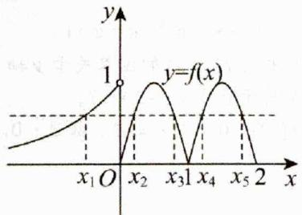

line

| x     | y (实线) | y (虚线) |
|-------|----------|----------|
| x₁O   | 0        | 0        |
| x₂    | 1        | 0        |
| x₃    | 0        | 1        |
| x₄    | 0        | 0        |
| x₅    | 1        | 1        |
| x₂    | 0        | 0        |
| x₃    | 0        | 0        |
| x₄    | 0        | 1        |
| x₅    | 1        | 0        |

可知： $x_{2} + x_{3} = 1$ ， $x_{4} + x_{5} = 3$ ， $x_{1} <   0$ ，所以

$$
\sum_ {i = 1} ^ {5} x _ {i} f \left(x _ {i}\right) = \left(x _ {1} + x _ {2} + x _ {3} + x _ {4} + x _ {5}\right) f \left(x _ {1}\right) =
$$

$(x_{1} + 4)f(x_{1}) = (x_{1} + 4)e^{x_{1}}$ ，令 $g(x) = (x + 4)\mathrm{e}^x,x <   0$ 当 $x <   - 4$ 时， $g(x) <   0$ ；当 $-4 <   x <   0$ 时， $g(x) > 0$

且 $g^{\prime}(x) = (x + 5)\mathbf{e}^{x}$ ，当 $x < -5$ 时， $g^{\prime}(x) < 0$ ， $g(x)$ 在 $(-\infty , - 5)$ 上单调递减；

当 $-5 < x < 0$ 时， $g'(x) > 0$ ， $g(x)$ 在 $(-5, 0)$ 上单调递增. 所以 $g(x)_{\min} = g(-5) = -\frac{1}{e^5}$ ，且 $g(x) < g(0) = 4$ ，

所以 $\sum_{i=1}^{5} x_i f(x_i)$ 的取值范围为 $\left[-\frac{1}{\mathbf{e}^5}, 4\right)$ .

# 2.4.6 奇偶函数唯一零点模型

# 二、【典型例题】

1.【答案】D

【详解】解法一：令 $f(x) = g(x)$ ，即

$a(x + 1)^{2} - 1 = \cos x + 2ax$ ，可得 $ax^{2} + a - 1 = \cos x$

令 $F(x) = ax^{2} + a - 1, G(x) = \cos x$

原题意等价于当 $x \in (-1, 1)$ 时，曲线 $y = F(x)$ 与 $y = G(x)$ 恰有一个交点，注意到 $F(x), G(x)$ 均为偶函数，可知该交点只能在 $y$ 轴上，可得 $F(0) = G(0)$ ，即 $a - 1 = 1$ ，解得 $a = 2$ ，若 $a = 2$ ，令 $F(x) = G(x)$ ，可得 $2x^2 + 1 - \cos x = 0$ 因为 $x \in (-1, 1)$ ，则 $2x^2 \geq 0, 1 - \cos x \geq 0$ ，当且仅当 $x = 0$ 时，等号成立，可得 $2x^2 + 1 - \cos x \geq 0$ ，当且仅当 $x = 0$ 时，等号成立，则方程 $2x^2 + 1 - \cos x = 0$ 有且仅有一个实根 0，即曲线 $y = F(x)$ 与 $y = G(x)$ 恰有一个交点，

所以 a=2 符合题意；综上所述：a=2。

解法二：令

$$
h (x) = f (x) - g (x) = a x ^ {2} + a - 1 - \cos x, x \in (- 1, 1),
$$

原题意等价于 $h(x)$ 有且仅有一个零点，因为

$h(-x)=a(-x)^{2}+a-1-\cos(-x)=ax^{2}+a-1-\cos x=h(x)$ ，则 $h(x)$ 为偶函数，根据偶函数的对称性可知 $h(x)$ 的零点只能为0，即 $h(0)=a-2=0$ ，解得a=2，

若 $a = 2$ ，则 $h(x) = 2x^{2} + 1 - \cos x, x \in (-1,1)$

又因为 $2x^{2} \geq 0, 1 - \cos x \geq 0$ 当且仅当 x = 0 时，等号成立，可得 $h(x) \geq 0$ ，当且仅当 x = 0 时，等号成立，即 $h(x)$ 有且仅有一个零点 0，所以 a = 2 符合题意；故选：D.

# 2.【答案】D

【详解】设 $g(x) = f(x - 2) = |x| + \mathbf{e}^x +\mathbf{e}^{-x} + a$ ，定义域为R，

$$
\therefore g (- x) = | - x | + \mathrm{e} ^ {- x} + \mathrm{e} ^ {x} + a = | x | + \mathrm{e} ^ {x} + \mathrm{e} ^ {- x} + a = g (x),
$$

故函数 $g(x)$ 为偶函数，则函数 $f(x - 2)$ 的图象关于 $\pmb{y}$ 轴对称，故函数 $f(x)$ 的图象关于直线 $x = -2$ 对称，

∵ $f(x)$ 有唯一零点，∴ $f(-2)=0$ ，即 a=-2。故选：D.

# 3.【答案】D

【详解】 $f(x)$ 有零点，则

$$
m \left(2 ^ {x - \frac {1}{2}} + 2 ^ {- x + \frac {1}{2}}\right) = - x ^ {2} + x = - \left(x - \frac {1}{2}\right) ^ {2} + \frac {1}{4},
$$

令 $t = x - \frac{1}{2}$ ，则上式可化为 $m\left(2^{t} + 2^{-t}\right) = -t^{2} + \frac{1}{4}$

因为 $2^{l} + 2^{-l} > 0$ 恒成立，所以 $m = \frac{-t^2 + \frac{1}{4}}{2^l + 2^{-l}}$

令 $h(t) = \frac{-t^2 + \frac{1}{4}}{2^t + 2^{-t}}$ ，则 $h(-t) = \frac{-(-t)^2 + \frac{1}{4}}{2^{-t} + 2^t} = \frac{-t^2 + \frac{1}{4}}{2^t + 2^{-t}} = h(t)$ ，故 $h(t)$ 为偶函数，因为 $f(x)$ 有唯一零点，所以函数 $h(t)$ 的图象与 $y = m$ 有唯一交点，结合 $h(t)$ 为偶函数，可得此交点的横坐标为0，故 $m = h(0) = \frac{\frac{1}{4}}{2^0 + 2^{-0}} = \frac{1}{8}$ . 故选：D

# 三、【习题检测】

# 1.【答案】C

【详解】因为

$f(x)=x^{2}-2x+a(e^{x-1}+e^{-x+1})=(x-1)^{2}+a(e^{x-1}+e^{-x+1})-1$ 设 t = x - 1，则

$f(x)=g(t)=t^{2}+a\left(e^{t}+e^{-t}\right)-1$ ，因为 $g(t)=g(-t)$ ，所以函数 $g(t)$ 为偶函数，若函数 $f(x)$ 有唯一零点，则函数 $g(t)$ 有唯一零点，根据偶函数的性质可知，只有当t=0时， $g(t)=0$ 才满足题意，即x=1是函数 $f(x)$ 的唯一零点，所以2a-1=0，解得 $a=\frac{1}{2}$ 。故选：C.

# 2.【答案】A

【详解】由

$$
f (4 - x) = (4 - x) ^ {2} - 4 (4 - x) + a \left(\mathrm{e} ^ {2 (4 - x) - 4} + \mathrm{e} ^ {4 - 2 (4 - x)}\right)
$$

$$
= x ^ {2} - 4 x + a \left(\mathrm{e} ^ {4 - 2 x} + \mathrm{e} ^ {2 x - 4}\right) = f (x),
$$

得 $f(4 - x) = f(x)$ ，即函数 $f(x)$ 的图象关于 $x = 2$ 对称，要使函数 $f'(x) = x^2 - 4x + a\left(\mathrm{e}^{2x - 4} + \mathrm{e}^{4 - 2x}\right)$ 有唯一的零点，则 $f(2) = 0$ ，即 $4 - 8 + 2a = 0$ ，得 $a = 2$ 。故选：A.

# 3.【答案】C

【详解】因为 $f(x)=x^{3}-a_{n+1}\sin x+(2a_{n}+1)x+1$

所以 $f'(x)=3x^{2}-a_{n+1}\cos x+(2a_{n}+1)$ ，由题意可知： $f'(x)=0$ 有唯一零点. 令

$g(x)=f'(x)=3x^{2}-a_{n+1}\cos x+(2a_{n}+1)$ ，可知 $g(x)$ 为偶函数且有唯一零点，则此零点只能为0，即 $g(0)=0$ ，代入化简可得： $a_{n+1}=2a_{n}+1$ ，又 $a_{1}=1$ ，所以 $a_{2}=3$ ， $a_{3}=7$ ， $a_{4}=15$ ， $a_{5}=31$ ，所以 $S_{5}=57$ 。故选：C

# 4.【答案】B

【详解】设 $g(x) = f(x + 3) = |x| + e^x +e^{-x} + m$

$$
\therefore g (- x) = | - x | + e ^ {- x} + e ^ {x} + m = | x | + e ^ {x} + e ^ {- x} + m = g (x)
$$

故函数 $g(x)$ 为偶函数，则函数 $f(x+3)$ 的图像关于 y 轴对称，故函数 $f(x)$ 的图像关于直线 x=3 对称，

$\because f(x)$ 有唯一零点 $\therefore f(3) = 0$ ，即 $m = -2$ ，经检验， $f(x) = |x - 3| + e^{x - 3} + e^{3 - x} - 2$ 仅有1个零点 $x = 3$ .故选：B.

5.【答案】-1或 $\frac{1}{2}$

【详解】因为函数 $h(x)=3^{|x-2024|}-\lambda f(x-2024)-2\lambda^{2}$ 有唯一零点，所以函数 $h(x+2024)=3^{|x|}-\lambda f(x)-2\lambda^{2}$ 有唯一零点，又 $f(-x)=f(x)$ ，

$\therefore h(-x + 2024) = 3^{| - x|} - \lambda f(-x) - 2\lambda^2 = 3^{|x|} - \lambda f(x) - 2\lambda^2$ $= h(x + 2024)$ ，所以函数 $h(x + 2024)$ 是偶函数，又函数 $h(x + 2024)$ 有唯一零点，则 $h(x + 2024)$ 的零点为0，所以 $1 - \lambda f(0) - 2\lambda^2 = 0$ ，因为 $g(x)$ 是R上的奇函数，所以 $g(0) = 0$ ，由 $f(0) + g(0) = 1$ ，解得 $f(0) = 1$ ，所以 $2\lambda^2 + \lambda - 1 = 0$ ，解得 $\lambda = -1$ 或 $\frac{1}{2}$ . 故答案为：-1或 $\frac{1}{2}$ .

# 2.4.7 零点求参之常规 3 种解法

# 二、【典型例题】

# 1.【答案】D

【详解】

$$
f (x) = 2 \sin x + 2 \sqrt {3} | \cos x | = \left\{ \begin{array}{l} 4 \sin \left(x + \frac {\pi}{3}\right), x \in [ 0, \frac {\pi}{2} ] \cup [ \frac {3 \pi}{2}, 2 \pi ] \\ 4 \sin \left(x - \frac {\pi}{3}\right), x \in [ \frac {\pi}{2}, \frac {3 \pi}{2} ] \end{array} \right.
$$

，作出 $f(x)$ 的图象，如图所示，结合图形可知，若 $f(x) = \lambda$ 在 $[0,2\pi]$ 上有且仅有4个不等的实数根，则 $2 < \lambda < 4$ 且 $\lambda \neq 2\sqrt{3}$ ，

line

| x       | y     |
| ------- | ----- |
| 0       | 4     |
| 0.5π    | 2     |
| 1π      | -2    |
| 2π      | 4     |

即 $\lambda$ 的取值范围为 $(2,2\sqrt{3})\cup(2\sqrt{3},4)$ . 故选：D

2.【答案】B

【详解】 $f(x)=x^{3}+ax+2$ ，则 $f'(x)=3x^{2}+a$ ，

若 $f(x)$ 要存在3个零点，则 $f(x)$ 要存在极大值和极小值，则 $a < 0$ ，令 $f^{\prime}(x) = 3x^{2} + a = 0$ ，解得 $x = -\sqrt{\frac{-a}{3}}$ 或 $\sqrt{\frac{-a}{3}}$ 且当 $x \in \left(-\infty, -\sqrt{\frac{-a}{3}}\right) \cup \left(\sqrt{\frac{-a}{3}}, +\infty\right)$ 时， $f'(x) > 0$

当 $x \in \left(-\sqrt{\frac{-a}{3}}, \sqrt{\frac{-a}{3}}\right)$ ， $f'(x) < 0$ ，故 $f(x)$ 的极大值为$f\left(-\sqrt{\frac{-a}{3}}\right)$ ，极小值为 $f\left(\sqrt{\frac{-a}{3}}\right)$ ，若 $f(x)$ 要存在3个零点，则 $\left\{ \begin{array}{l} f\left(-\sqrt{\frac{-a}{3}}\right) > 0 \\ f\left(\sqrt{\frac{-a}{3}}\right) < 0 \end{array} \right.$ ，即 $\left\{ \begin{array}{l} \frac{a}{3}\sqrt{\frac{-a}{3}} - a\sqrt{\frac{-a}{3}} + 2 > 0 \\ \frac{-a}{3}\sqrt{\frac{-a}{3}} + a\sqrt{\frac{-a}{3}} + 2 < 0 \end{array} \right.$ ，解

得 $a < -3$ ，故选：B.

3.【答案】B

【详解】由 $a \otimes b = \begin{cases} a, & a - b \leq 1 \\ b, & a - b > 1 \end{cases}$ ，得

$f(x) = (x^2 - 2) \otimes (x - 1) = \begin{cases} x^2 - 2, & -1 \leq x \leq 2 \\ x - 1, & x < -1 \text{或} x > 2 \end{cases}$ ，因为函数$y=f(x)-c$ 的图象与x轴恰有两个公共点，所以 $y=f(x),y=c$ 的图象有两个交点，如图：

line

| Point | x | y |
|---|---|---|
| -1 | -1 | -1 |
| -2 | 0 | -2 |
| 0 | 1 | -2 |
| 1 | 2 | 1 |
| 2 | 2 | 2 |

由图可知，当 $c \in (-2, -1] \cup (1, 2]$ 时，函数 $y = f(x), y = c$ 的图象有两个公共点，所以 $c$ 的取值范围是 $(-2, -1] \cup (1, 2]$ ，4.【答案】B

【详解】由于函数 $f(x)$ 为单调函数，则不妨设

$f(x) - \ln x = t$ ，则 $f(t) = 1$

且 $f(t) - \ln t = 1 - \ln t = t$ ，解得 $t = 1$ ，所以

$f(x)=\ln x+1,f'(x)=\frac{1}{x}$ . 设 $g(x)=f(x)\cdot f'(x)=\frac{\ln x+1}{x}$ ，则方程 $f(x)\cdot f'(x)=m$ 有两个不同的实数根等价于函数 $g(x)=\frac{\ln x+1}{x}$ 与 y=m 有两个不同的交点.

$g'(x)=\left(\frac{\ln x}{x}+\frac{1}{x}\right)'=\frac{1-\ln x}{x^{2}}-\frac{1}{x^{2}}=-\frac{\ln x}{x^{2}}$ ，易得当 $x\in(0,1)$ 时， $g'(x)>0$ ；当 $x\in(1,+\infty)$ 时， $g'(x)<0$ ，所以函数 $g(x)$ 在 $(0,1)$ 上单调递增，在 $(1,+\infty)$ 上单调递减，所以

$g(x)_{\max}=g(1)=0$ ．又 $g\left(\frac{1}{e}\right)=0$ ，且当 $x\to+\infty$ 时，

$g(x)\rightarrow0$ . 故函数 $g(x)=\frac{\ln x+1}{x}$ 与 y=m 有两个不同的交点则 $m\in(0,1)$ .

line

| x    | y     |
| ---- | ----- |
| -1   | -1.0  |
| 0    | 0.0   |
| 1    | 1.0   |
| 2    | 0.8   |
| 3    | 0.6   |
| 4    | 0.5   |
| 5    | 0.4   |
| 6    | 0.3   |
| 7    | 0.2   |

故选：B

5.【答案】(0,1)

$$
f (x) = \left\{ \begin{array}{l l} \frac {2}{x}, & x \geq 2 \\ (x - 1) ^ {3}, & x <   2 \end{array} \right.
$$

【详解】函数 $(x-1), x<2$ 的图象如下图所示：

line

| x    | y     |
| ---- | ----- |
| -2   | -5    |
| -1   | -3    |
| 0    | -1    |
| 1    | 0     |
| 2    | 1     |
| 3    | 0.5   |
| 4    | 0.3   |
| 5    | 0.2   |
| 6    | 0.1   |

由图可得：当 $k \in (0, 1)$ 时， $y = f(x)$ 与 $y = k$ 的图象有两个交点，即方程 $f(x) = k$ 有两个不同的实根

6.【答案】 $(-∞,2ln2-2]$

【详解】根据零点定义，则 $e^{x}-2x+a=0$

所以 $-a = e^{x} - 2x$ 令 $g(x) = e^{x} - 2x$ 则 $g'(x) = e^{x} - 2$ ，令 $g'(x) = e^x -2 = 0$ 解得 $x = \ln 2$

当 $x < \ln 2$ 时， $g'(x) < 0$ ，函数 $g(x) = e^{x} - 2x$ 单调递减。当 $x > \ln 2$ 时， $g'(x) > 0$ ，函数 $g(x) = e^{x} - 2x$ 单调递增。所以当 $x = \ln 2$ 时取得最小值，最小值为 $2 - 2\ln 2$

所以由零点的条件为 $-a \geq 2 - 2 \ln 2$

所以 $a \leq 2\ln 2 - 2$ ，即 $a$ 的取值范围为 $(- \infty, 2\ln 2 - 2]$

7.【答案】 $(1, + \infty)$

【详解】试题分析: 令 $f(x)=0$ ，则 $a^{x}=x+a$ ，当 0<a<1 时， $a^{x}$ 为减函数， $x+a$ 为增函数，至多只有一个交点，不符合题意。当 a>1 时， $y=a^{x}, y=x+a$ 的图像显然有两个交点，故 $a\in(1,+\infty)$ 。

考点：函数的单调性，函数图象与性质.

8.【答案】C

【详解】试题分析: 当 a=0 时, $f(x)=-3x^{2}+1$ , 函数 $f(x)$ 有两个零点 $\frac{\sqrt{3}}{3}$ 和 $-\frac{\sqrt{3}}{3}$ , 不满足题意, 舍去; 当 a>0 时, $f'(x)=3ax^{2}-6x$ , 令 $f'(x)=0$ , 得 x=0 或

$x = \frac{2}{a}$ . $x \in (-\infty, 0)$ 时， $f'(x) > 0$ ； $x \in (0, \frac{2}{a})$ 时， $f'(x) < 0$ ； $x \in (\frac{2}{a}, +\infty)$ 时， $f'(x) > 0$ ，且 $f(0) > 0$ ，此时在 $x \in (-\infty, 0)$

必有零点，故不满足题意，舍去；当 $a < 0$ 时， $x \in (-\infty, \frac{2}{a})$ 时， $f'(x) < 0$ ； $x \in (\frac{2}{a}, 0)$ 时， $f'(x) > 0$ ； $x \in (0, +\infty)$ 时， $f'(x) < 0$ ，且 $f(0) > 0$ ，要使得 $f(x)$ 存在唯一的零点 $x_0$ ，且 $x_0 > 0$ ，只需 $f(\frac{2}{a}) > 0$ ，即 $a^2 > 4$ ，则 $a < -2$ ，选 C.

# 三、【习题检测】

1.【答案】C

【详解】当 $x < 0$ 时，

$y=f(x)-ax-b=x-ax-b=(1-a)x-b=0$ ，得 $x=\frac{b}{1-a}$ ； $y=f(x)-ax-b$ 最多一个零点；当 $x\geq0$ 时，

$$
y = f (x) - a x - b = \frac {1}{3} x ^ {3} - \frac {1}{2} (a + 1) x ^ {2} + a x - a x - b =
$$

$$
\frac {1}{3} x ^ {3} - \frac {1}{2} (a + 1) x ^ {2} - b, y ^ {\prime} = x ^ {2} - (a + 1) x,
$$

当 $a + 1 \leq 0$ ，即 $a \leq -1$ 时， $y' \geq 0$ ， $y = f(x) - ax - b$ 在 $[0, +\infty)$ 上递增， $y = f(x) - ax - b$ 最多一个零点。不合题意；当 $a + 1 > 0$ ，即 $a > -1$ 时，令 $y' > 0$ 得 $x \in [a + 1, +\infty)$ ，函数递增，令 $y' < 0$ 得 $x \in [0, a + 1)$ ，函数递减；函数最多有2个零点；

根据题意函数 $y = f(x) - ax - b$ 恰有3个零点 $\Leftrightarrow$ 函数 $y = f(x) - ax - b$ 在 $(- \infty, 0)$ 上有一个零点，在 $[0, +\infty)$ 上有2个零点，如图：

$$
\therefore \frac {b}{1 - a} <   0 \text {且} \left\{ \begin{array}{l l} - b > 0 \\ \frac {1}{3} (a + 1) ^ {3} - \frac {1}{2} (a + 1) (a + 1) ^ {2} - b <   0 \end{array} \right.,
$$

解得 $b < 0$ ， $1 - a > 0$ ， $0 > b > -\frac{1}{6} (a + 1)^3, \therefore 1 > a > -1$ 故选 $C$ ：

2.【答案】B

【详解】由题可得存在 $x_0 \in (-\infty, 0)$ 满足 $f(x_0) = g(-x_0)$ $\therefore x_0^2 + e^{x_0} - \frac{1}{2} = (-x_0)^2 + \ln (-x_0 + a)$

$\therefore e^{x_0} - \ln (-x_0 + a) - \frac{1}{2} = 0$ ，令 $h(x) = e^x - \ln (-x + a) - \frac{1}{2}$ ，因为函数 $y = e^x$ 和 $y = -\ln (-x + a)$ 在定义域内都是单调递增的，所以函数 $h(x) = e^x - \ln (-x + a) - \frac{1}{2}$ 在定义域内是单调递增的，又因为 $x$ 趋近于 $-\infty$ 时，函数 $h(x) < 0$ 且 $h(x) = 0$ 在 $(- \infty, 0)$ 上有解（即函数 $h(x)$ 有零点），

所以 $h(0) = e^0 - \ln (0 + a) - \frac{1}{2} > 0 \Rightarrow \ln a < \ln \sqrt{e} \Rightarrow a < \sqrt{e}$ ,

3.【答案】B

【详解】令 $(x^{2}-2)-(x-x^{2})\leq1$ ，解得 $-1\leq x\leq\frac{3}{2}$

所以 $f(x)=\left\{\begin{aligned}x-x^{2},&x\left\langle-1或x\right\rangle\frac{3}{2}\\ x^{2}-2,-1&\leq x\leq\frac{3}{2}\end{aligned}\right.$ ，∞ 当 $x=\frac{3}{2}$ 时， $x-x^{2}=-\frac{3}{4}$

作出函数的图象，如图，

line

| x | y |
|---|---|
| -1 | -1 |
| 0 | -2 |
| 1 | 1 |
| 2 | 2 |
| 3 | -5 |

若 $y = f(x) - c$ 的图象与 $x$ 轴恰有两个公共点，及直线 $y = c$ 与函数 $f(x)$ 的图象有两个交点，数形结合可得 $(- \infty, -2] \cup \left(-1, -\frac{3}{4}\right)$ . 故选：B

4.【答案】B

【详解】因为当 $x \in (-1, 1]$ 时，将函数化为方程

$x^{2}+\frac{y^{2}}{m^{2}}=1(y\geq0)$ ，实质上为一个半椭圆，其图像如图所示，同时在坐标系中作出当 $x\in(1,3]$ 得图像，再根据周期性作出函数其它部分的图像，由图易知直线 $y=\frac{x}{3}$ 与第二个椭圆 $(x-4)^{2}+\frac{y^{2}}{m^{2}}=1(y\geq0)$ 相交，而与第三个半椭圆 $(x-8)^{2}+\frac{y^{2}}{m^{2}}=1(y\geq0)$ 无公共点时，方程恰有5个实数解，将 $y=\frac{x}{3}$ 代入 $(x-4)^{2}+\frac{y^{2}}{m^{2}}=1(y\geq0)$ 得

$$
(9 m ^ {2} + 1) x ^ {2} - 7 2 m ^ {2} x + 1 3 5 m ^ {2} = 0,
$$

令 $t = 9m^{2}(t > 0)$ ，则有 $(t + 1)x^{2} - 8tx + 15t = 0$

由 $\Delta=(8t)^{2}-4\times15t(t+1)>0,$ 得 t>15, 由 $9m^{2}>15,$ 且 $m > 0$ 得 $m > \frac{\sqrt{15}}{3}$ 同样由 $y = \frac{x}{3}$ 与第三个半椭圆

$(x - 8)^{2} + \frac{y^{2}}{m^{2}} = 1(y\geq 0)$ 无交点，由 $\Delta < 0$ 可计算得 $m < \sqrt{7}$ 综上知 $m\in (\frac{\sqrt{15}}{3},\sqrt{7})$

5.【答案】(-2,1)

【详解】令 $x^{3}-3x=-\left(x-1\right)^{2}+a$ ，即 $a=x^{3}+x^{2}-5x+1$ ，
令 $g(x)=x^{3}+x^{2}-5x+1(x>0)$ ,

则 $g'(x)=3x^{2}+2x-5=(3x+5)(x-1)$ ，令 $g'(x)=0(x>0)$ 得 $x = 1$ ，当 $x\in (0,1)$ 时， $g^{\prime}(x) <   0$ ， $g(x)$ 单调递减，当 $x \in (1, +\infty)$ 时， $g'(x) > 0$ ， $g(x)$ 单调递增，$g(0)=1,g(1)=-2$ ，因为曲线 $y=x^{3}-3x$ 与

$y=-\left(x-1\right)^{2}+a$ 在 $(0,+\infty)$ 上有两个不同的交点，所以等价于 y=a 与 $g(x)$ 有两个交点，所以 $a\in(-2,1)$ .

line

| x   | y=g(x) |
| --- | ------ |
| 0   | 1      |
| -2  | -2     |

故答案为： $(-2,1)$

6.【答案】-3

【详解】[方法一]:【通性通法】单调性法

求导得 $f'(x)=6x^{2}-2ax$ ，当 $a\leq0$ 时，函数 $f(x)$ 在区间 $(0,+\infty)$ 内单调递增，且 $f(x)>f(0)=1$ ，所以函数 $f(x)$ 在 $(0,+\infty)$ 内无零点；当 a>0 时，函数 $f(x)$ 在区间 $\left(0,\frac{a}{3}\right)$ 内单调递减，在区间 $\left(\frac{a}{3},+\infty\right)$ 内单调递增.当 $x = 0$ 时， $f(0) = 1$ ；当 $x \to +\infty$ 时， $f(x) \to +\infty$ 。

要使函数 $f(x)$ 在区间 $(0, +\infty)$ 内有且仅有一个零点，只需 $f\left(\frac{a}{3}\right) = 0$ ，解得 $a = 3$ 。于是函数 $f(x)$ 在区间[-1,0]上单调递增，在区间(0,1]上单调递减。

$[f(x)]_{\max}=f(0)=1,[f(x)]_{\min}=f(-1)=-4$ ，所以最大值与最小值之和为-3，故答案为：-3。

[方法二]: 等价转化

由条件知 $2{x}^{3} + 1 = a{x}^{2}$ 有唯一的正实根。于是

$a=\frac{2x^{3}+1}{x^{2}}=2x+\frac{1}{x^{2}}$ ．令 $g(x)=2x+\frac{1}{x^{2}},x>0$ ，则

$g'(x)=2-\frac{2}{x^{3}}=\frac{2(x^{3}-1)}{x^{3}}$ ，所以 $g(x)$ 在区间(0,1)内单调递减，在区间 $(1,+\infty)$ 内单调递增，且 $g(1)=3$ ，当 $x\to0$ 时， $g(x)\to+\infty$ ；当 $x\to+\infty$ 时， $g(x)\to+\infty$ 。

只需直线 y=a 与 $g(x)$ 的图像有一个交点，故 a=3，下同方法一.

[方法三]:【最优解】三元基本不等式

同方法二得， $a=2x+\frac{1}{x^{2}}=x+x+\frac{1}{x^{2}}\geq3\sqrt[3]{x\cdot x\cdot\frac{1}{x^{2}}}=3$ ，当且仅当x=1时取等号.

要满足条件只需a=3，下同方法一.

[方法四]: 等价转化

由条件知 $2{x}^{3} + 1 = a{x}^{2}$ 有唯一的正实根,即方程

$2x+\frac{1}{x^{2}}=a$ 有唯一的正实根，整理得 $\frac{1}{x^{2}}=-2x+a(x>0)$ ，即函数 $g(x)=\frac{1}{x^{2}}$ 与直线 $y=-2x+a$ 在第一象限内有唯一的交点。于是平移直线 $y=-2x+a$ 与曲线 $g(x)=\frac{1}{x^{2}}$ 相切时，满足题意，如图。

text_image

y
y=1/x²
y=-2x+3
O
x

设切点 $\left(x_{0},\frac{1}{x_{0}^{2}}\right)$ ，因为 $g'(x)=-\frac{2}{x^{3}}$ ，于是 $-\frac{2}{x_{0}^{3}}=-2$ ，解得 $x_{0}=1, a=3$ ，下同方法一.

7.【答案】(1,4) (1,3]∪(4,+∞)

【详解】由题意得 $\left\{\begin{aligned}x&\geq2\\ x&-4<0\end{aligned}\right.$ 或 $\left\{\begin{aligned}x&<2\\ x^{2}&-4x+3<0\end{aligned}\right.$ ，所以 $2\leq x<4$ 或1<x<2，即1<x<4，不等式 $f(x)<0$ 的解集是(1,4)，当 $\lambda>4$ 时， $f(x)=x-4>0$ ，此时

$f(x)=x^{2}-4x+3=0,x=1,3$ ，即在 $(-∞,λ)$ 上有两个零点；当 $λ≤4$ 时， $f(x)=x-4=0,x=4$ ，由 $f(x)=x^{2}-4x+3$ 在 $(-∞,λ)$ 上只能有一个零点得 $1<λ≤3$ 。综上， $λ$ 的取值范围为 $(1,3]∪(4,+∞)$ 。

8.【答案】(4,8)

【详解】分类讨论：当 $x \leq 0$ 时，方程 $f(x) = ax$ 即 $x^{2} + 2ax + a = ax$ ，整理可得： $x^{2} = -a(x + 1)$ ，

很明显 x=-1 不是方程的实数解，则 $a=-\frac{x^{2}}{x+1}$ ，

当 x > 0 时，方程 $f(x) = ax$ 即 $-x^{2} + 2ax - 2a = ax$ ，

整理可得： $x^{2} = a(x - 2)$ ，很明显 $x = 2$ 不是方程的实数

解，则 $a = \frac{x^2}{x - 2}$ ，令 $g(x) = \left\{ \begin{array}{l} -\frac{x^2}{x + 1},x\leq 0\\ \frac{x^2}{x - 2},x > 0 \end{array} \right.$

其中 $-\frac{x^2}{x + 1} = -\left(x + 1 + \frac{1}{x + 1} -2\right),\quad \frac{x^2}{x - 2} = x - 2 + \frac{4}{x - 2} +4$

原问题等价于函数 $g(x)$ 与函数 y=a 有两个不同的交点，求 a 的取值范围.

结合对勾函数和函数图象平移的规律绘制函数 $g(x)$ 的图象，同时绘制函数 $y = a$ 的图象如图所示，考查临界条件，结合 $a > 0$ 观察可得，实数 $a$ 的取值范围是(4,8).

text_image

y
8
4
O
x

9.【答案】 $\left[\frac{1}{3},\frac{2}{3}\right)$

【详解】试题分析：由函数 $f(x)$ 在 $\mathbb{R}$ 上单调递减得 $-\frac{4a - 3}{2} \geq 0, 0 < a < 1, 3a \geq 1 \Rightarrow \frac{1}{3} \leq a \leq \frac{3}{4}$ ，又方程 $\left|f(x)\right| = 2 - \frac{x}{3}$ 恰有两个不相等的实数解，所以 $3a < 2$ ，解得 $a < \frac{2}{3}$ ，因此 $a$ 的取值范围是 $[\frac{1}{3}, \frac{2}{3})$ 。

10.【答案】1, 3, 4, 5

【详解】令 $f(x) = x^3 + ax + b$ ，求导得 $f'(x) = 3x^2 + a$ ，当 $a \geq 0$ 时， $f'(x) \geq 0$ ，所以 $f(x)$ 单调递增，且至少存在一个数使 $f(x) < 0$ ，至少存在一个数使 $f(x) > 0$ ，所以 $f(x) = x^3 + ax + b$ 必有一个零点，即方程 $x^3 + ax + b = 0$ 仅有一根，故④⑤正确；当 $a < 0$ 时，若 $a = -3$ ，则 $f'(x) = 3x^2 - 3 = 3(x + 1)(x - 1)$ ，易知， $f(x)$ 在 $(-\infty, -1), (1, +\infty)$ 上单调递增，在 $[-1, 1]$ 上单调递减，所以 $f(x)_{\text{极大}} = f(-1) = -1 + 3 + b = b + 2$ ，

$f(x)_{\text{极小}} = f(1) = 1 - 3 + b = b - 2$ ，要使方程仅有一根，则 $f(x)_{\text{极大}} = f(-1) = -1 + 3 + b = b + 2 <   0$ 或者

$f(x)_{\text{极小}} = f(1) = 1 - 3 + b = b - 2 > 0$ ，解得 $b < -2$ 或 $b > 2$ 故①③正确.所以使得三次方程仅有一个实根的是①③④⑤.

11.【答案】(1)-1，(2) $\frac{1}{2}\leq a<1$ 或 $a\geq2$ .

【详解】① a=1 时， $f(x)=\left\{\begin{aligned}&2^{x}-a,x<1\\ &4(x-a)(x-2a),x\geq1.\end{aligned}\right.$ ，函数 $f(x)$ 在 $(-∞,1)$ 上为增函数且 $f(x)>-1$ ，函数 $f(x)$ 在 $[1,\frac{3}{2}]$ 为减函数，在 $[\frac{3}{2},+\infty)$ 为增函数，当 $x=\frac{3}{2}$ 时， $f(x)$ 取得最小值为 -1；

(2)①若函数 $g(x)=2^{x}-a$ 在 x<1 时与 x 轴有一个交点，则 a>0， $g(1)=2-a>0$ ，则 0<a<2，函数 $h(x)=4(x-a)(x-2a)$ 与 x 轴有一个交点，所以

$$
2 a \geq 1 \text {   且   } a <   1 \Rightarrow \frac {1}{2} \leq a <   1 ;
$$

②若函数 $g(x) = 2^{x} - a$ 与 $x$ 轴有无交点，则函数 $h(x) = 4(x - a)(x - 2a)$ 与 $x$ 轴有两个交点，当 $a\leq 0$ 时 $g(x)$

与 $x$ 轴有无交点， $h(x) = 4(x - a)(x - 2a)$ 在 $x \geq 1$ 与 $x$ 轴有无交点，不合题意；当当 $a \geq 2$ 时 $g(x)$ 与 $x$ 轴有无交点， $h(x)$ 与 $x$ 轴有两个交点， $x = a$ 和 $x = 2a$ ，由于 $a \geq 2$ ，两交点横坐标均满足 $x \geq 1$ ；综上所述 $a$ 的取值范围 $\frac{1}{2} \leq a < 1$ 或 $a \geq 2$ .

# 2.4.8 零点求参之含绝对值类型

# 二、【典型例题】

1.【答案】 $(- \sqrt{3}, - 1) \cup (1, \sqrt{3})$

【详解】令 $f(x) = 0$ ，即 $2\sqrt{x^2 - ax} = |ax - 2| - 1$ 由题可得 $x^{2} - ax\geq 0$ ，当 $a = 0$ 时， $x\in \mathbb{R}$ ，有 $2\sqrt{x^2} = |-2| - 1 = 1$ ，则 $x = \pm \frac{\sqrt{2}}{2}$ ，不符合要求，舍去；

当 $a > 0$ 时，则 $2\sqrt{x^2 - ax} = |ax - 2| - 1 = \left\{ \begin{array}{l} ax - 3, x \geq \frac{2}{a} \\ 1 - ax, x < \frac{2}{a} \end{array} \right.$

即函数 $g(x) = 2\sqrt{x^2 - ax}$ 与函数 $h(x) = \begin{cases} ax - 3, & x \geq \frac{2}{a} \\ 1 - ax, & x < \frac{2}{a} \end{cases}$ 有唯一交点，由 $x^2 - ax \geq 0$ ，可得 $x \geq a$ 或 $x \leq 0$ ，

当 $x \leq 0$ 时，则 $ax - 2 < 0$ ，则 $2\sqrt{x^2 - ax} = |ax - 2| - 1 = 1 - ax$ ，即 $4x^2 - 4ax = (1 - ax)^2$ ，整理得

$$
\left(4 - a ^ {2}\right) x ^ {2} - 2 a x - 1 = \left[ (2 + a) x + 1 \right] \left[ (2 - a) x - 1 \right] = 0,
$$

当 a=2 时，即 $4x+1=0$ ，即 $x=-\frac{1}{4}$ ，

当 $a \in (0,2)$ ， $x = -\frac{1}{2 + a}$ 或 $x = \frac{1}{2 - a} > 0$ （正值舍去），当 $a \in (2, +\infty)$ 时， $x = -\frac{1}{2 + a} < 0$ 或 $x = \frac{1}{2 - a} < 0$ ，有两解，舍去，即当 $a \in (0,2]$ 时， $2\sqrt{x^2 - ax} - |ax - 2| + 1 = 0$ 在 $x \leq 0$ 时有唯一解，

则当 $a \in (0,2]$ 时， $2\sqrt{x^2 - ax} - |ax - 2| + 1 = 0$ 在 $x \geq a$ 时需无解，当 $a \in (0,2]$ ，且 $x \geq a$ 时，

由函数 $h(x) = \left\{ \begin{array}{l} ax - 3, x \geq \frac{2}{a} \\ 1 - ax, x < \frac{2}{a} \end{array} \right.$ 关于 $x = \frac{2}{a}$ 对称，令 $h(x) = 0$ 可得 $x = \frac{1}{a}$ 或 $x = \frac{3}{a}$ ，且函数 $h(x)$ 在 $\left(\frac{1}{a}, \frac{2}{a}\right)$ 上单调递减，在 $\left(\frac{2}{a}, \frac{3}{a}\right)$ 上单调递增，令 $g(x) = y = 2\sqrt{x^2 - ax}$ ，即

$$
\frac {\left(x - \frac {a}{2}\right) ^ {2}}{\frac {a ^ {2}}{4}} - \frac {y ^ {2}}{a ^ {2}} = 1,
$$

故 $x \geq a$ 时， $g(x)$ 图象为双曲线 $\frac{(x)^2}{\frac{a^2}{4}} - \frac{y^2}{a^2} = 1$ 右支的 $x$ 轴

上方部分向右平移 $\frac{a}{2}$ 所得，由 $\frac{(x)^2}{\frac{a^2}{4}} - \frac{y^2}{a^2} = 1$ 的渐近线方

程为 $y=\pm\frac{a}{\frac{a}{2}}x=\pm2x$ ，即 $g(x)$ 部分的渐近线方程为

$y=2\left(x-\frac{a}{2}\right)$ ，其斜率为2，又 $a\in(0,2]$ ，即

$h(x)=\left\{\begin{aligned}ax-3,x&\geq\frac{2}{a}\\ 1-ax,x&<\frac{2}{a}\end{aligned}\right.$ 在 $x\geq\frac{2}{a}$ 时的斜率 $a\in(0,2]$ ,

令 $g(x) = 2\sqrt{x^2 - ax} = 0$ ，可得 $x = a$ 或 $x = 0$ （舍去），

且函数 $g(x)$ 在 $(a, +\infty)$ 上单调递增，故有 $\left\{ \begin{array}{l} \frac{1}{a} < a \\ \frac{3}{a} > a \end{array} \right.$ ，解得 $1 < a < \sqrt{3}$ ，故 $1 < a < \sqrt{3}$ 符合要求；

当 $a < 0$ 时，则 $2\sqrt{x^2 - ax} = |ax - 2| - 1 = \begin{cases} ax - 3, & x \leq \frac{2}{a} \\ 1 - ax, & x > \frac{2}{a} \end{cases}$

即函数 $g(x) = 2\sqrt{x^2 - ax}$ 与函数 $h(x) = \begin{cases} ax - 3, & x \leq \frac{2}{a} \\ 1 - ax, & x > \frac{2}{a} \end{cases}$ 有唯一交点，由 $x^2 - ax \geq 0$ ，可得 $x \geq 0$ 或 $x \leq a$ ，

当 $x \geq 0$ 时，则 $ax - 2 < 0$ ，则 $2\sqrt{x^2 - ax} = |ax - 2| - 1 = 1 - ax$ ，即 $4x^2 - 4ax = (1 - ax)^2$ ，整理得

$$
\left(4 - a ^ {2}\right) x ^ {2} - 2 a x - 1 = \left[ (2 + a) x + 1 \right] \left[ (2 - a) x - 1 \right] = 0,
$$

当 $a = -2$ 时，即 $4x - 1 = 0$ ，即 $x = \frac{1}{4}$

当 $a \in (-2,0)$ ， $x = -\frac{1}{2 + a} < 0$ （负值舍去）或 $x = \frac{1}{2 - a} 0$ ，当 $a \in (-\infty, 2)$ 时， $x = -\frac{1}{2 + a} > 0$ 或 $x = \frac{1}{2 - a} > 0$ ，有两解，

舍去，即当 $a \in [-2,0)$ 时， $2\sqrt{x^2 - ax} - |ax - 2| + 1 = 0$ 在 $x \geq 0$ 时有唯一解，则当 $a \in [-2,0)$ 时，

$2\sqrt{x^{2}-ax}-|ax-2|+1=0$ 在 $x \leq a$ 时需无解，当 $a \in [-2,0)$ ,

且 $x \leq a$ 时，由函数 $h(x) = \begin{cases} ax - 3, & x \leq \frac{2}{a} \\ 1 - ax, & x > \frac{2}{a} \end{cases}$ 关于 $x = \frac{2}{a}$ 对称，

令 $h(x) = 0$ ，可得 $x = \frac{1}{a}$ 或 $x = \frac{3}{a}$

且函数 $h(x)$ 在 $\left(\frac{2}{a},\frac{1}{a}\right)$ 上单调递减，在 $\left(\frac{3}{a},\frac{2}{a}\right)$ 上单调递

增, 同理可得: $x \leq a$ 时, $g(x)$ 图象为双曲线 $\frac{(x)^{2}}{\frac{a^{2}}{4}} - \frac{y^{2}}{a^{2}} = 1$ 左支的 x 轴上方部分向左平移 $\frac{a}{2}$ 所得，

$g(x)$ 部分的渐近线方程为 $y = -2\left(x + \frac{a}{2}\right)$ ，其斜率为 -2，

又 $a \in [-2,0)$ ，即 $h(x) = \begin{cases} ax - 3, & x \geq \frac{2}{a} \\ 1 - ax, & x < \frac{2}{a} \end{cases}$ 在 $x < \frac{2}{a}$ 时的斜率

$a \in [-2,0)$ ，令 $g(x) = 2\sqrt{x^{2} - ax} = 0$ ，可得 x = a 或 x = 0 （舍去），且函数 $g(x)$ 在 $(-∞,a)$ 上单调递减，故有

$\left\{\begin{aligned}\frac{1}{a}>a\\ \frac{3}{a}<a\end{aligned}\right.$ ，解得 $-\sqrt{3}<a<-1$ ，故 $-\sqrt{3}<a<-1$ 符合要求；

综上所述， $a\in (-\sqrt{3}, - 1)\cup (1,\sqrt{3})$

# 2.【答案】D

【详解】设 $t = f(x)$ ，当 $x \geq 0$ 时， $f(x) = 2^{|x-1|} - 1$ ，此时 $t \geq 0$ ，由 $f(t) = 0$ 得 t = 1，即 $f(x) = 2^{|x-1|} - 1 = 1$ ，解得 x = 0 或 x = 2，所以 $y = f(f(x))$ 在 $[0, +\infty)$ 上有 2 个零点；x < 0 时，若 $a \geq 0, f(x) = -x^{2} + ax$ ，对称轴为 $x = \frac{a}{2}$ ，函数 $y = f(x)$ 的大致图象如图：

text_image

y
y=f(x)
1
O
1
x

此时 $f(x) = -x^{2} + ax < 0$ ，即 t < 0，则 $f(t) < 0$ ，

所以 $f(t) = 0$ 无解，则 $t = f(x)$ 无零点， $y = f(f(x))$ 无零点，综上，此时 $y = f(f(x))$ 只有两个零点，不符合题意，若 $a < 0$ ，此时 $f(x)$ 的大致图象如下：

text_image

y
1
y=f(x)
a
a/2
O
1
2
x
y=a

令 $-t^{2}+at=0$ ，解得t=a<0（t=0舍去），

显然 $f(x)=a$ 在 $(-∞,0)$ 上存在唯一负解，

所以要使 $y = f(f(x))$ 恰有 5 个零点，

需 $f\left(\frac{a}{2}\right) > 1$ ，即 $-\frac{a^2}{4} + \frac{a^2}{2} > 1$ ，解得 $a < -2$ ，所以

$a \in (-\infty, -2)$ . 故选：D

3.【答案】A

【详解】满足题意时 $f(x)$ 的图象恒不在函数 $y = \left|\frac{x}{2} + a\right|$ 下方，当 $a = 2\sqrt{3}$ 时，函数图象如图所示，排除C,D选项；

text_image

y=f(x)
y=|x/2+2√3|
-7
O
x
y
2

当 $a = -2\sqrt{3}$ 时，函数图象如图所示，排除 B 选项，

text_image

y
y=f(x)
2
y=|x/2-2√3|
O
7
x

4.【答案】(1,2)

text_image

Mathematical graph showing a parabola and multiple dashed lines intersecting at origin, with x-axis labeled 'x' and y-axis labeled 'y'.

【详解】试题分析：

分别作出函数 $y = f(x)$ 与 $y = f(x)$ 的图像，由图知， $a < 0$ 时，函数 $y = f(x)$ 与 $y = f(x)$ 无交点， $a < 0$ 时，函数 $y = f(x)$ 与 $y = f(x)$ 有三个交点，故 $a = 0$ 当 $a = 0, a = 0$ 时，函数 $y = f(x)$ 与 $y = f(x)$ 有一个交点，当 $a = 0, y = f(x)$ 时，函数 $y = f(x)$ 与 $y = f(x)$ 有两个交点，当 $x > 0$ 时，若 $y = -ax$ 与 $y = -x^2 - 5x - 4, (-4 < x < -1)$ 相切，则由 $x < 0$ 得： $x < 0$ 或 $x < 0$ （舍），因此当 $x > 0, a = 1$ 时，函数 $y = f(x)$ 与 $y = f(x)$ 有两个交点，当 $x > 0, x < 0$ 时，函数 $y = f(x)$ 与 $y = f(x)$ 有三个交点，当 $x > 0, y = f(x)$ 时，函数 $y = f(x)$ 与 $y = f(x)$ 有四个交点，所以当且仅当 $y = a|x|$ 时，函数 $y = f(x)$ 与 $y = f(x)$ 恰有4个交点.

# 三、【习题检测】

1.【答案】D

【详解】注意到 $g(0)=0$ ，所以要使 $g(x)$ 恰有 4 个零点，只需方程 $\left|kx-2\right|=\frac{f(x)}{\left|x\right|}$ 恰有 3 个实根即可，令 $h(x)=\frac{f(x)}{\left|x\right|}$ ，即 $y=\left|kx-2\right|$ 与 $h(x)=\frac{f(x)}{\left|x\right|}$ 的图象有 3 个不同交点。因为 $h(x)=\frac{f(x)}{\left|x\right|}=\left\{\begin{aligned}&x^{2},&x>0\\ &1,&x<0\end{aligned}\right.$

当 $k = 0$ 时，此时 $y = 2$ ，如图1， $y = 2$ 与 $h(x) = \frac{f(x)}{|x|}$ 有1

个不同交点，不满足题意；当 $k < 0$ 时，如图2，此时 $y = |kx - 2|$ 与 $h(x) = \frac{f(x)}{|x|}$ 恒有3个不同交点，满足题意；当 $k > 0$ 时，如图3，当 $y = kx - 2$ 与 $y = x^2$ 相切时，联立方程得 $x^{2} - kx + 2 = 0$ ，令 $\Delta = 0$ 得 $k^2 -8 = 0$ ，解得 $k = 2\sqrt{2}$ （负值舍去），所以 $k > 2\sqrt{2}$ .综上， $k$ 的取值范围为 $(-\infty ,0)\cup (2\sqrt{2}, + \infty)$ .故选：D.

text_image

y
y=h(x)
y=2
O
x

图1

text_image

y
y=|kx-2|
2
y=h(x)
2
O
k
x

图2

text_image

y
y=h(x)
2
y=|kx-2|
O
2/k
x

图3

2.【答案】A

【详解】令 $t = |x^2 - 1|$ ，则 $k = -t^2 + t (t \geqslant 0)$ ，作出这两个函数的图象，如图：

line

| x | t |
|---|---|
| -2 | 3 |
| -1 | 0 |
| 0 | 1 |
| 1 | 0 |
| 2 | 3 |
| 3 | 4 |

line

| t | k |
|---|---|
| -2 | 0 |
| -1 | 0 |
| 0 | 0 |
| 1 | 0 |
| 2 | -1 |
| 3 | -2 |

由图可知，当 $k < 0$ 时， $k = -t^2 + t$ 只有一个大于1的根，则方程 $t = |x^2 - 1|$ 恰有两个实根；故①为真命题；

当 $k = 0$ 时，由 $k = -t^2 + t$ 得 $t = 0$ 或 $t = 1$

当 t=0 时， $x=\pm1$ ，当 t=1 时，x=0 或 $x=\pm\sqrt{2}$ ，此时原方程恰有 5 个实根，故③为真命题：

当 $0 < k < \frac{1}{4}$ 时， $k = -t^2 + t$ 有两个实根，两个实根在(0,1)内，此时原方程有8个实根，故④为真命题；当 $k = \frac{1}{4}$ 时，由 $k = -t^2 + t$ 得 $t = \frac{1}{2}$ ，则方程 $t = |x^2 - 1|$ 恰有4个实根；此时原方程恰有4个实根，故②为真命题.故选：A

3.【答案】[-1,1]

【详解】画出曲线 $|y| = 2^{x} + 1$ 与直线 $y = b$ 的图象如图所示

text_image

|y|=2^x+1
2
O
1
y=b
-1
-2

由图象可得 $|y| = 2^x + 1$ 与直线 $y = b$ 没有公共点，则 $b$ 应满足的条件是 $b \in [-1, 1]$ .

4.【答案】-1<a<0或1<a<2

【详解】因为函数 $y=f(x)-|ax|$ 恰有 4 个零点，所以 $y=f(x)$ 的图象与 $y=|ax|$ 的图象有四个交点，当 a=0 时，如图所示，

line

| x   | y=f(x) |
| --- | ------ |
| -3  | 5      |
| -1  | 1      |
| 0   | 0      |
| 1   | 1      |
| 2   | 2.5    |
| 3   | 1      |
| 4   | 0      |
| 5   | 5      |

$y = f(x)$ 的图象与

$y = |ax| = 0$ 的图象仅有两个交点，与题意不符；当 $a < 0$ 时，如图所示，

line

| x   | y=f(x) | y=ax |
| --- | ------ | ---- |
| -3  | 4      | 1    |
| -2  | 3      | 1.5  |
| -1  | 2      | 2    |
| 0   | 1      | 2.5  |
| 1   | 0      | 2    |
| 2   | 1      | 1.5  |
| 3   | 2      | 1    |
| 4   | 3      | 0.5  |
| 5   | 4      | 0    |

在 $x \in [1,4]$ 上，当 $f(x) = -x^2 + 5x - 4$ 与 $y = -ax$ 相切时，

联立 $\left\{\begin{aligned}y&=-x^{2}+5x-4\\ y&=-ax\end{aligned}\right.$ ，得 $-x^{2}+5x+ax-4=0$ ，

则 $\Delta=(5+a)^{2}-16=0$ ，得 a=-1 （舍去 a=-9），

由图可知，当 $a < -2$ 时， $y = |ax|$ 与 $y = f(x)$ 在 $(- \infty, 0)$ 有一个交点，在 $(0, +\infty)$ 有两个交点，与题意不符，

所以当 $-2 \leq a < -1$ 时， $y = |ax|$ 与 $y = f(x)$ 在 $(- \infty, 0)$ 无交点，在 $(0, +\infty)$ 有两个交点，与题意不符，

当 $a = -1$ 时， $y = |ax|$ 与 $y = f(x)$ 在 $(- \infty, 0)$ 无交点，在 $(0, +\infty)$ 有三个交点，与题意不符，

当 -1 < a < 0 时， $y = |ax|$ 与 $y = f(x)$ 在 $(-∞, 0)$ 无交点，在 $(0, +∞)$ 有四个交点，符合题意；

当 $a > 0$ 时，如图所示，

在 $x \in [1,4]$ 上，当 $f(x) = -x^2 + 5x - 4$ 与 $y = ax$ 相切时，

联立 $\left\{\begin{aligned}y&=-x^{2}+5x-4\\ y&=ax\end{aligned}\right.$ ，得 $-x^{2}+5x-ax-4=0$ ，

则 $\Delta=(5-a)^{2}-16=0$ ，得 a=1 （舍去 a=9），

由图可知，当 $0 < a < 1$ 时， $y = |ax|$ 与 $y = f(x)$ 在 $(- \infty, 0)$ 有两个交点，在 $(0, +\infty)$ 有四个交点，与题意不符，

当 $a = 1$ 时， $y = |ax|$ 与 $y = f(x)$ 在 $(- \infty, 0)$ 有两个交点，在 $(0, +\infty)$ 有三个交点，与题意不符，

当 $1 < a < 2$ 时， $y = |ax|$ 与 $y = f(x)$ 在 $(- \infty, 0)$ 有两个交点，在 $(0, +\infty)$ 有两个交点，符合题意，

当 $a \geq 2$ 时， $y = |ax|$ 与 $y = f(x)$ 在 $(- \infty, 0)$ 有一个交点，在 $(0, +\infty)$ 有两个交点，与题意不符.

综上所述，-1<a<0 或 1<a<2.

故答案为：-1<a<0 或 1<a<2.

5.【答案】 $\left(-\frac{1}{4},0\right]$

【详解】根据题意可转化为满足 $\left|\log_{2}x\right|<a(x+1)^{2}+1$ 的整数x的个数为1.

令 $f(x)=\left|\log_{2}x\right|$ ， $g(x)=a(x+1)^{2}+1$ ，

当 $a > 0$ 时，作出函数 $f(x) = \left|\log_2 x\right|$ 和 $g(x) = a(x + 1) - 1$ 的图象，如图所示，

text_image

g(x)=a(x+1)²+1
f(x)=|log₂x|
-1 O 1 x

数形结合得， $f(x) < g(x)$ 的解集中整数的个数有无数多个，不符合题意；

当 a=0 时， $g(x)=1$ ，所以 $\left|\log_{2}x\right|<1$ ，解得 $\frac{1}{2}<x<2$ ，只有一个整数解 x=1，

所以 a=0 符合题意；

当 $a < 0$ 时，作出函数 $f(x) = \left|\log_2 x\right|$ 和 $g(x) = a(x + 1) - 1$ 的图象，如图所示，

text_image

g(x)=a(x+1)²+1
f(x)=|log₂x|
-1 O 1 x

要使 $|\log_2 x| < a(x + 1)^2 + 1$ 的整数解只有一个，只需满足

$$
\left\{ \begin{array}{c} g (1) > 0 \\ f (2) \geq g (2) \end{array} , \right.
$$

即 $\left\{\begin{aligned}4a+1&>0\\ 1&\geq9a+1\end{aligned}\right.$ ，结合a<0可得 $-\frac{1}{4}<a<0$ .

综上所述，实数 a 的取值范围是 $\left(-\frac{1}{4},0\right]$ .

# 2.4.9 零点求参之直线旋转平移型

# 二、【典型例题】

1.【答案】C

【详解】作出函数 $y = f(x)$ 的图象，如图所示：

text_image

y
4
a>0
3
2
a=0
1
a<0
O
-1
x

将原问题转化为直线 $y = ax + 2$ （过定点(0,2)）与函数 $y = f(x)$ 的图象交点的个数，由图可知，当 $a = 0$ 时，直线 $y = 2$ 与函数 $y = f(x)$ 的图象只有一个交点；

当 $a < 0$ 时，直线 $y = ax + 2$ 与函数 $y = f(x)$ 的图象没有交点；当 $a > 0$ 时，直线 $y = ax + 2$ 与函数 $y = f(x)$ 的图象有三个交点；所以直线 $y = ax + 2$ 与函数 $y = f(x)$ 的图象不可能有两个交点。故选：C.

2.【答案】D

【详解】如图，当直线 $y=-\frac{1}{4}x+a$ 位于 B 点及其上方且位于 A 点及其下方，或者直线 $y=-\frac{1}{4}x+a$ 与曲线 $y=\frac{1}{x}$ 相切在第一象限时符合要求。即 $1\leq-\frac{1}{4}+a\leq2$ ，即 $\frac{5}{4}\leq a\leq\frac{9}{4}$ ，或者 $-\frac{1}{x^{2}}=-\frac{1}{4}$ ，得 x=2， $y=\frac{1}{2}$ ，即 $\frac{1}{2}=-\frac{1}{4}\times2+a$ ，得 a=1，所以 a 的取值范围是 $\left[\frac{5}{4},\frac{9}{4}\right]\cup\{1\}$ 。故选 D.

text_image

y
3
2
A
1
B
-1 0 1 2 3 4 5 6 x

3.【答案】①②④

【详解】对于①，当 $k = 0$ 时，由 $f(x) = |\lg x| - 2 = 0$ ，可得 $x = \frac{1}{100}$ 或 $x = 100$ ，①正确；对于②，考查直线 $y = kx + 2$ 与曲线 $y = -\lg x(0 <   x <   1)$ 相切于点 $P(t, - \lg t)$ 对函数 $y = -\lg x$ 求导得 $y^{\prime} = -\frac{1}{x\ln 10}$ ，由题意可得

$\left\{ \begin{array}{l} kt + 2 = -\lg t \\ k = -\frac{1}{t \ln 10} \end{array} \right.$ ，解得 $\left\{ \begin{array}{l} t = \frac{e}{100} \\ k = -\frac{100}{e} \lg e \end{array} \right.$ ，

所以，存在 $k = -\frac{100}{e}\lg e < 0$ ，使得 $f(x)$ 只有一个零点，②正确；对于③，当直线 $y = kx + 2$ 过点 $(1,0)$ 时， $k + 2 = 0$ 解得 $k = -2$ ，所以，当 $-\frac{100}{e}\lg e < k < -2$ 时，直线 $y = kx + 2$

与曲线 $y = -\lg x(0 < x < 1)$ 有两个交点，

若函数 $f(x)$ 有三个零点，则直线 $y = kx + 2$ 与曲线 $y = -\lg x(0 < x < 1)$ 有两个交点，

直线 $y = kx + 2$ 与曲线 $y = \lg x(x > 1)$ 有一个交点，所以， $\left\{ \begin{array}{l} -\frac{100}{e}\lg e < k < -2 \\ k + 2 > 0 \end{array} \right.$ ，此不等式无解，

因此，不存在 $k < 0$ ，使得函数 $f(x)$ 有三个零点，③错误；对于④，考查直线 $y = kx + 2$ 与曲线 $y = \lg x (x > 1)$ 相切于点 $P(t, \lg t)$ ，对函数 $y = \lg x$ 求导得 $y' = \frac{1}{x \ln 10}$ ，由题意可得 $\left\{ \begin{array}{l} kt + 2 = \lg t \\ k = \frac{1}{t \ln 10} \end{array} \right.$ ，解得 $\left\{ \begin{array}{l} t = 100e \\ k = \frac{\lg e}{100e} \end{array} \right.$ ，

所以，当 $0 < k < \frac{\lg e}{100e}$ 时，函数 $f(x)$ 有三个零点，④正确.

text_image

y = lg x
2
O
1
x
y=kx+2

故答案为：①②④.

4.【答案】 $[-1,2)$

【详解】当 $x \leq 0$ 时， $f(x) = x^2 + 2x$ ，其在 $(- \infty, -1)$ 上单调递减，在 $(-1, 0)$ 上单调递增，且 $f'(x) = 2x + 2$ ，则 $f'(0) = 2$ ；

当 $0 < x < 1$ 时， $f(x) = \ln (1 - x)$ ， $f'(x) = -\frac{1}{1 - x} < 0$ ，其在 $(0,1)$ 上单调递减，且 $f'(0) = -1$ 。

作出 $f(x)$ 的图像，如图，易知 $\pmb{a}$ 的取值范围是[-1,2).

line

| x    | y=f(x) |
| ---- | ------ |
| -4   | 3      |
| -3   | 2      |
| -2   | 1      |
| -1   | 0      |
| 0    | -1     |
| 1    | -2     |
| 2    | -3     |

故答案为： $[-1,2)$

# 三、【习题检测】

1.【答案】D

【详解】由题意知函数 $f(x)=\frac{\ln x}{x}-\frac{x}{m}$ 有两个零点，即 $\frac{\ln x}{x}-\frac{x}{m}=0$ 有两个不等实数根，

即函数 $y = \frac{\ln x}{x}, y = \frac{x}{m}$ 的图象有两个不同交点；

设 $h(x) = \frac{\ln x}{x}, x > 0$ ，则 $h'(x) = \frac{1 - \ln x}{x^2}, (x > 0)$ ，

当 0 < x < e 时， $h'(x) > 0$ ， $h(x)$ 在 $(0, e)$ 上单调递增；

当 $x > \mathbf{e}$ 时， $h'(x) < 0$ ， $h(x)$ 在 $(\mathbf{e}, +\infty)$ 上单调递减；

当 0 < x < 1 时， $h(x) < 0$ ，当 x > 1 时， $h(x) > 0$ ，

作出 $h(x)$ 的图象如图：

text_image

y
1/e
O
e
x
y=x/m
y=h(x)

当直线 $y = \frac{x}{m}$ 与 $h(x)$ 图象相切时，设切点为 $\left(x_0, \frac{\ln x_0}{x_0}\right)$ ，

此时 $\frac{1}{m} = \frac{1 - \ln x_0}{x_0^2} = \frac{\frac{\ln x_0}{x_0} - 0}{x_0 - 0}$ ，则 $\ln x_0 = \frac{1}{2}, \therefore x_0 = \sqrt{\mathbf{e}}$ ，

故此时 $\frac{1}{m} = \frac{1 - \ln\sqrt{\mathbf{e}}}{\mathbf{e}} = \frac{1}{2\mathbf{e}}$ ，结合图象可知，要使函数

$y=\frac{\ln x}{x},y=\frac{x}{m}$ 的图象有两个不同交点，需满足

$0 < \frac{1}{m} < \frac{1}{2\mathbf{e}}, \therefore m > 2\mathbf{e}$ ，故 $m \in (2\mathbf{e}, +\infty)$ ，故选：D

2.【答案】B

【详解】方程 $ax + 2a + \sqrt{4x - x^{2}} = 0$ 有两个不相等的实数根等价于 $\sqrt{4x - x^{2}} = -a(x + 2)$ 有两个实数根，

设 $y = \sqrt{4x - x^2}, y \geq 0, \quad y = -a(x + 2),$

故 $y=\sqrt{4x-x^{2}},y\geq0$ 的图象与 $y=-a(x+2)$ 的图象有两个不同的交点，

又 $y=\sqrt{4x-x^{2}}$ , $y\geq0$ 可化为 $(x-2)^{2}+y^{2}=4(y\geq0)$ ,

故 $y=\sqrt{4x-x^{2}},y\geq0$ 的图象为如图所示的半圆，

text_image

y=-a(x+2)
y=√(4x-x²)
-2 O 2 x

半圆的圆心为(2,0)，半径为2，故圆心到直线的距离 $\frac{|4a|}{\sqrt{a^{2}+1}}<2$ ，故 $-\frac{\sqrt{3}}{3}<a<\frac{\sqrt{3}}{3}$ ，

而直线 $y = -a(x + 2)$ 需在 x 轴的上方或与 x 轴重合，故 $-a \geq 0$ ，故 $-\frac{\sqrt{3}}{3} < a \leq 0$ ，故选：B.

3.【答案】A

【详解】令 $h(x)=m(x+1)$ ，分别作出 $f(x)$ 与 $g(x)$ 的图像如下，

text_image

A
-1
O
1
x
y
B
C (0,-2)

由图像知 $h(x) = m(x + 1)$ 是过定点 $(-1,0)$ 的一条直线，当直线绕着定点转动时，与 $f(x)$ 图像产生不同的交点.

当 $h(x)=m(x+1)$ 与 $y=\frac{1}{x+1}-3,\quad x\in(-1,0]$ 相切时，设切点为 $\left(x_{0},\frac{1}{x_{0}+1}-3\right)$ ，由 $y'=-\frac{1}{(x+1)^{2}}$ ，则切线方程为

$y-\frac{1}{x_{0}+1}+3=-\frac{1}{(x_{0}+1)^{2}}(x-x_{0})$ ，则

$-\frac{1}{x_{0}+1}+3=-\frac{1}{(x_{0}+1)^{2}}(-1-x_{0})$ ，解得 $x_{0}=-\frac{1}{3}$ ，此时$m=-\frac{9}{4}$ 当直线 $h(x)$ 在 x 轴和直线 AB 及切线和直线 AC 之间时，与 $f(x)$ 图像产生两个交点，此时 $-\frac{9}{4}<m\leq-2$ 或 $0<m\leq\frac{1}{2}$ 故答案选 A.

4.【答案】B

【详解】函数 $f(x)=x(\ln x-ax)$ ，则

$f^{\prime}(x) = \ln x - ax + x\left(\frac{1}{x} -a\right) = \ln x - 2ax + 1,$

令 $f^{\prime}(x) = \ln x - 2ax + 1 = 0$ 得 $\ln x = 2ax - 1$ ，函数 $f(x) = x(\ln x - ax)$ 有两个极值点，等价于

$f'(x)=\ln x-2ax+1$ 有两个零点，

等价于函数 $y=\ln x$ 与 y=2ax-1 的图象有两个交点，在同一个坐标系中作出它们的图象（如图）

当 $a = \frac{1}{2}$ 时，直线 $y = 2ax - 1$ 与 $y = \ln x$ 的图象相切，由图可知，当 $0 < a < \frac{1}{2}$ 时， $y = \ln x$ 与 $y = 2ax - 1$ 的图象有两个交点。则实数 $\mathbf{a}$ 的取值范围是 $\left(0, \frac{1}{2}\right)$ 。故选B.

text_image

y
y=x-1
y=2ax-1
y=lnx
1
O
x

5.【答案】B

【详解】令 $f(x) = g(x)$ ，可得 $\frac{1}{x^2} = ax + b$ 。

设 $F(x)=\frac{1}{x^{2}},y=ax+b$

根据题意 $F(x)$ 与直线 $y = ax + b$ 只有两个交点，

不妨设 $x_{1} < x_{2}$ ，结合图形可知，当 $a > 0$ 时如右图， $y = ax + b$ 与 $F(x)$ 左支双曲线相切，与右支双曲线有一个交点，根据对称性可得 $|x_{1}| > x_{2}$ ，即 $-x_{1} > x_{2} > 0$ ，此时 $x_{1} + x_{2} < 0$ ， $y_{2} = \frac{1}{x_{2}} > \frac{1}{-x_{1}} = -y_{1}, \therefore y_{1} + y_{2} > 0$

同理可得，当 $a < 0$ 时如左图， $x_{1} + x_{2} > 0$ ， $y_{1} + y_{2} < 0$ 故选：B.

text_image

y = ax + b(a < 0)
F(x) = \frac{1}{x^2}
x_1
O
x_2
x

text_image

F(x)=\frac{1}{x^2}
y=ax+b(a>0)
x_1
O
x_2
x

6.【答案】 $(0,1)\cup (1,4)$

【详解】 $y=\frac{\left|x^{2}-1\right|}{x-1}=\frac{\left|x+1\right|\left|x-1\right|}{x-1}=\begin{cases}x+1,x>1,\\- \left|x+1\right|,x<1,\end{cases}$ 函数
y=kx-2 过定点 $(0,-2)$ ，由数形结合：

text_image

C(1,2)
O
A(0,-2)
B(1,-2)

$k_{AB}<k<1$ 或 $1<k<k_{AC},\therefore0<k<1$ 或 $1<k<4.$

7.【答案】 $\left(0,\frac{1}{2}\right)$

【详解】将函数 $y = x^{3}$ 向右平移 1 个单位得到 $y = (x - 1)^{3}$ ，作出函数 $y = f(x)$ 的图象如下：要关于 x 的方程 $f(x)=kx$ 有两个不同的根，则函数 $y=f(x)$ 和函数
y=kx 有两个不同的交点，当 y=kx 过点 $(2,1)$ 时， $k=\frac{1}{2}$ ，
所以当函数 $y = f(x)$ 和函数 y = kx 有两个不同的交点时， $0 < k < \frac{1}{2}$ . 故答案为： $\left(0,\frac{1}{2}\right)$ .

line

| x    | y=kx | y=f(x) |
| ---- | ---- | ------ |
| 0    | -1   | -1     |
| 1    | 0    | 0      |
| 2    | 1    | 1      |

8.【答案】 $\left(\frac{15}{8},2\right]$ .

【详解】令 $f(x) = \sqrt{1 - x^2} - k(x - 1) - 4 = 0$ ，

则 $\sqrt{1 - x^2} - k(x - 1) - 4 = 0$ ，所以 $\sqrt{1 - x^2} = k(x - 1) + 4$ ，又因为 $y = \sqrt{1 - x^2} \geq 0$ ，即为 $x^2 + y^2 = 1 (y \geq 0)$ ，表示单位圆位于 $x$ 轴上及上方部分；而 $y = k(x - 1) + 4$ ，表示过点(1,4)且斜率为 $k$ 的直线，所以将问题转化为半圆 $x^2 + y^2 = 1 (y \geq 0)$ 与直线 $y = k(x - 1) + 4$ 有两个交点，

line

| Point | x-axis | y-axis |
|---|---|---|
| -1 | 0 | 1 |
| 0 | 1 | 2 |
| 1 | 1 | 4 |
| 2 | 0 | 4 |
| 3 | 1 | 4 |
| 4 | 0 | 4 |
| 5 | 1 | 4 |
| 6 | 0 | 4 |
| 7 | 1 | 4 |
| 8 | 0 | 4 |
| 9 | 1 | 4 |
| 10 | 0 | 4 |
| 11 | 1 | 4 |
| 12 | 0 | 4 |
| 13 | 1 | 4 |
| 14 | 0 | 4 |
| 15 | 1 | 4 |
| 16 | 0 | 4 |
| 17 | 1 | 4 |
| 18 | 0 | 4 |
| 19 | 1 | 4 |
| 20 | 0 | 4 |
| 21 | 1 | 4 |
| 22 | 0 | 4 |
| 23 | 1 | 4 |
| 24 | 0 | 4 |
| 25 | 1 | 4 |
| 26 | 0 | 4 |
| 27 | 1 | 4 |
| 28 | 0 | 4 |
| 29 | 1 | 4 |
| 30 | 0 | 4 |
| Note: The x-axis is labeled as 'x', and the y-axis is labeled as 'y'. The chart displays a line graph with a semicircular arc on the x-axis. The function's slope is defined by the equation y = (15/8 x + (17/8)) / (8/8).

当直线与半圆相切时； $\frac{|4-k|}{\sqrt{1+k^{2}}}=1$ ，解得 $k=\frac{15}{8}$ ，
当直线过点 $(-1,0)$ 时，则有 $-2k+4=0$ ，解得k=2，
综上， $k\in(\frac{15}{8},2]$ 。故答案为： $(\frac{15}{8},2]$ 。

# 2.4.10 零点求参之外层二次型

# 二、【典型例题】

1.【答案】B

【详解】如图，作出函数 $f(x)$ 的图象，

text_image

y
y=f(x)
1
y=m
O
x

令 $m = f(x)$ ，由图可知，当 $m\in (0,1)$ 时，关于 $x$ 的方程 $m = f'(x)$ 有2个不同的实数根，

当 $m = 0$ 或 $m \in [1, +\infty)$ 时，关于 $x$ 的方程 $t = f(x)$ 只有1个实数根，因为关于 $x$ 的方程 $g(x) = 3 - t^2$ 有三个不同实数根，所以关于 $m$ 的方程 $m^2 - tm + t^2 - 3 = 0$ 的一个根在(0,1)上，另一个根在 $[1, +\infty)$ 上，或方程的两个根一个为 $m = 0$ ，另一个在(0,1)上，若 $m = 0$ 为方程 $m^2 - tm + t^2 - 3 = 0$ 的根时，则 $t = \pm \sqrt{3}$

当 $t = \sqrt{3}$ 时，方程的另一个根为 $m = \sqrt{3}$ ，不符题意，当 $t = -\sqrt{3}$ 时，方程的另一个根为 $m = -\sqrt{3}$ ，不符题意，若 $m = 1$ 为方程 $m^2 - tm + t^2 - 3 = 0$ 的根时，则 $t = -1$ 或 $t = 2$ ，当 $t = -1$ 时，方程的另一个根为 $m = -2$ ，不符题意，当 $t = 2$ 时，方程只有一个根为 $m = 1$ ，不符题意，若关于 $m$ 的方程 $m^2 - tm + t^2 - 3 = 0$ 的一个根在 $(0,1)$ 上，另一个在 $[1, +\infty)$ 上时，令 $h(m) = m^2 - tm + t^2 - 3$ ，

则 $\left\{ \begin{array}{l} \Delta > 0 \\ h(0) > 0, \\ h(1) < 0 \end{array} \right.$ 即 $\left\{ \begin{array}{l} t^2 - 4(t^2 - 3) > 0 \\ t^2 - 3 > 0 \\ 1 - t + t^2 - 3 < 0 \end{array} \right.$ ，解得 $\sqrt{3} < t < 2$ ，

综上所述，实数 t 的取值范围是 $(\sqrt{3},2)$ . 故选：B.

2.【答案】C

【详解】当 $x \leq 0$ 时， $f(x) = \frac{(x + 2)^2}{\mathbf{e}^x}$ ，此时

$f'(x)=\frac{-x(x+2)}{e^{x}}$ ，则 x<-2 时， $f'(x)<0, f(x)$ 单调递减；-2<x<0 时， $f'(x)>0, f(x)$ 单调递增，

所以，当 $x = -2$ 是 $f(x)$ 的极小值点，作出如图所示的函数 $f(x)$ 的图象，函数 $y = [f(x)]^2 - af(x)$ 有5个不同的零点，则方程 $[f(x)]^2 - af(x) = 0$

即 $f(x)[f(x) - a] = 0$ 有5个不相等实数根，

也即是 $f(x) = 0$ 和 $f(x) - a = 0$ 共有5个不相等实数根，其中 $f(x) = 0$ 有唯一实数根 $x = -2$

只需 $f(x)-a=0$ 有 4 个且均不为 -2 的不相等实数根，由图可知 1<a<4，

即实数 a 的取值范围为 $(1,4)$ .

故选：C.

line

| x | y = f(x) |
|---|---|
| -2 | 0 |
| 0 | 4 |
| 3/2 | 1 |

3.【答案】C

【详解】令 $u=f(x)$ ，作出函数 $u=f(x)$ 的图象如下图所示：

text_image

u
u = f(x)
O
1
2
x

由于方程 $u^2 + bu + c = 0$ 至多两个实根，设为 $u = u_1$ 和 $u = u_2$ ，由图象可知，直线 $u = u_1$ 与函数 $u = f(x)$ 图象的交点个数可能为0、3、4，

由于关于 $x$ 的方程 $f^2 (x) + bf(x) + c = 0$ 有7个不同实数

解，则关于 u 的二次方程 $u^{2} + bu + c = 0$ 的一根为 $u_{1} = 0$ ，则 $0^{2} + b \times 0 + c = 0$ ，可得 c = 0，

则方程 $u^2 + bu = 0$ 的另一根为 $u_2 = -b$

直线 $u = u_{2}$ 与函数 $u = f(x)$ 图象的交点个数必为4，则 $-b > 0$ ，解得 $b <   0$ .因此， $b <   0$ 且 $c = 0$ .故选：C.

# 三、【习题检测】

1.【答案】C

【详解】当 $x \leq 0$ 时， $f'(x) = (x + 1)e^{x}$ ，由此可知 $f(x)$ 在 $(-\infty, -1)$ 单调递减，

且当 $x \to -\infty$ 时， $x \mathbf{e}^x \to 0$ ，在 $(-1,0]$ 上单调递增，

$$
f ^ {\prime} (x) _ {\min} = f ^ {\prime} (- 1) = - \frac {1}{\mathrm{e}};
$$

当 $x > 0$ 时， $f(x)$ 在 $(0,1]$ 单调递增，在 $(1, +\infty)$ 上单调递减， $f(x)_{\max} = f(1) = 0$ ，如图所示.

text_image

y
O
1
x
-1
y=f(x)

$f^2 (x) + af(x) + a - 1 = 0$ 得

$\left[f(x) + a - 1\right]\left[f(x) + 1\right] = 0$ ，即 $f(x) = 1 - a$ 或 $f(x) = -1$ 由 $f(x)$ 与 $y = -1$ 有两个交点，则 $f(x) = 1 - a$ 必有四个零点，即 $-\frac{1}{\mathbf{e}} < 1 - a < 0$ ，得 $a \in \left(1,1 + \frac{1}{\mathbf{e}}\right)$ . 故选：C

2.【答案】A

【详解】由题意可知当 x<1 时， $f'(x)=xe^{x}$

令 $f'(x) < 0$ 可得： $x < 0$ ；令 $f'(x) > 0$ 可得： $0 < x < 1$ ；故 $f(x)$ 在 $(-\infty, 0)$ 上单调递减， $f(x)$ 在 $(0, 1)$ 上单调递增， $f(x)_{\min} = f(0) = -1$ ，且当 $x < 1$ 时， $f(x) < 0$ ，

当 x 趋近于负无穷时， $f(x)$ 趋近于 0;

当 $x \geq 1$ 时， $f(x) = -x^2 + 4x - 3$ 图象的对称轴为直线 $x = 2$ ， $f(x)_{\max} = f(2) = 1$ 。

故作出 $f(x)$ 的大致图象如图所示.

line

| x    | y    |
| ---- | ---- |
| 0    | -1   |
| 1    | 0    |
| 2    | 1    |

令 $t = f(x)$ ，数形结合可知要使 $g(x)$ 有5个零点，

需使方程 $2t^{2} + at + 1 + a = 0$ 有2个不同的实数根 $t_1$ ， $t_2$ 且 $-1 < t_1 < 0$ ， $t_2 = -1$ 或 $0\leq t_2 < 1$

①若 $-1 < t_{1} < 0$ ， $t_{2} = -1$ ，则 $2 - a + 1 - a = 0$ ，不成立，

舍去．②若 $-1 < t_{1} < 0$ ， $0 \leq t_{2} < 1$ ，则 $\left\{ \begin{array}{l} 2 - a + 1 + a > 0 \\ 1 + a \leq 0 \\ 2 + a + 1 + a > 0 \end{array} \right.$

解得 $-\frac{3}{2} < a \leq -1$ 。当 $a = -1$ 时，方程为 $2t^2 - t = 0$ ，解得

t=0 或 $\frac{1}{2}$ ，不符合方程 2 个根的取值范围，舍去.

故实数 $a$ 的取值范围为 $\left(-\frac{3}{2}, -1\right)$ . 故选：A.

3.【答案】ACD

【详解】令 $g(x)=[f(x)]^{2}-(a-1)f(x)-a=0$

则 $[f(x) - a][f(x) + 1] = 0$ ，解得 $f(x) = -1$ 或 $f(x) = a$ 当 $x > 0$ 时， $f^{\prime}(x) = \ln x + 1.$ 由 $f^{\prime}(x) > 0$ ，得 $x > \frac{1}{\mathbf{e}}$ ；由 $f^{\prime}(x) <   0$ ，得 $0 <   x <   \frac{1}{\mathbf{e}}$ ，则 $f(x)$ 在 $\left(0,\frac{1}{\mathbf{e}}\right)$ 上单调递减，在 $\left(\frac{1}{\mathbf{e}}, + \infty\right)$ 上单调递增， $f\left(\frac{1}{\mathbf{e}}\right) = -\frac{1}{\mathbf{e}}.$

$f(x)=-x^{2}-2x+1,x\leq0$ ，当x=-1时， $f(x)$ 取最小值，最小值为 $f(-1)=2$ ，故 $f(x)$ 的大致图象如图所示。由图可知， $f(x)=-1$ 有且仅有1个实根。当a=-1时， $g(x)$ 恰有1个零点，故A错误；当 $1\leq a<2$ 时， $f(x)=a$ 有3个实根，则 $g(x)$ 恰有4个零点，故B正确；

由 $g(x)$ 恰有3个零点，得 $f(x) = a$ 恰有2个实根，则 $a = 2$ 或 $0\leq a <   1$ 或 $a = -\frac{1}{\mathbf{e}}$ ，则C错误；

由 $g(x)$ 恰有2个零点，得 $f(x) = a$ 恰有1个实根，且 $a\neq -1$ ，则 $a <   - 1$ 或 $-1 <   a <   - \frac{1}{\mathbf{e}}$ 或 $a > 2$ ，则D错误.

line

| x    | y    |
| ---- | ---- |
| -1   | 2    |
| 0    | 0    |
| 1    | 1    |

故选：ACD.

4.【答案】(0,2)

【详解】作出函数 $f(x)$ 的图象，如图所示.

由 $2\left[f(x)\right]^2 - (a + 2) \cdot f(x) + a = 0$ ，得

$\left[f(x) - 1\right]\left[f(x) - \frac{a}{2}\right] = 0$ ，解得 $f(x) = 1$ 或 $f(x) = \frac{a}{2}$

line

| x | y=f(x) |
|---|--------|
| 0 | 0      |
| 1 | 3      |
| 2 | -1     |
| 3 | 0      |
| 4 | 3      |

由图象易知，直线 $y = 1$ 与 $f(x)$ 的图象有3个交点，所以方程 $f(x) = 1$ 有3个不同的实数根，

因为方程 $2[f(x)]^2 - (a + 2) \cdot f(x) + a = 0$ 有7个不同的实

数根，所以直线 $y = \frac{a}{2}$ 与 $f(x)$ 的图象有4个交点，

故 $0 < \frac{a}{2} < 1$ ，解得 $0 < a < 2$ ，故实数 $a$ 的取值范围是 $(0,2)$

故答案为： $(0,2)$

# 2.4.11 零点求参之周期函数型

# 二、【典型例题】

1.【答案】 $\left[\frac{1}{3},\frac{\sqrt{2}}{4}\right)$ .

【详解】当 $x \in (0,2]$ 时， $f(x) = \sqrt{1 - (x - 1)^2}$ ，即

$$
(x - 1) ^ {2} + y ^ {2} = 1, y \geq 0.
$$

又 $f(x)$ 为奇函数，其图象关于原点对称，其周期为4，如图，函数 $f(x)$ 与 $g(x)$ 的图象，要使 $f(x) = g(x)$ 在 $[0,9]$ 上有8个实根，只需二者图象有8个交点即可.

text_image

y
1
-2 O -1/2 2 -4 6 8 9 x

当 $g(x) = -\frac{1}{2}$ 时，函数 $f(x)$ 与 $g(x)$ 的图象有2个交点；当 $g(x) = k(x + 2)$ 时， $g(x)$ 的图象为恒过点 $(-2,0)$ 的直线，只需函数 $f(x)$ 与 $g(x)$ 的图象有6个交点。当 $f(x)$ 与 $g(x)$ 图象相切时，圆心 $(1,0)$ 到直线 $kx - y + 2k = 0$ 的距离为1，即 $\frac{|k + 2k|}{\sqrt{1 + k^2}} = 1$ ，得 $k = \frac{\sqrt{2}}{4}$ ，函数 $f(x)$ 与 $g(x)$ 的图象有3个交点；当 $g(x) = k(x + 2)$ 过点(1,1)时，函数 $f(x)$ 与 $g(x)$ 的图象有6个交点，此时 $1 = 3k$ ，得 $k = \frac{1}{3}$ 。

综上可知，满足 $f(x) = g(x)$ 在 $(0,9]$ 上有8个实根的 $k$ 的取值范围为 $\left[\frac{1}{3},\frac{\sqrt{2}}{4}\right)$ .

2.【答案】 $\left(\frac{1}{3},1\right)$

【详解】函数 $g(x)=f(x)-mx$ 有三个零点，则方程 $f'(x)-mx=0$ 即 $f'(x)=mx$ 有三个根，

所以函数 $y = f(x)$ 与函数 y = mx 有三个交点，

由 $f(x)=\left\{\begin{aligned}-x^{2},&x<0\\ x,&0\leq x\leq1\\ 2-x,&1<x\leq2\\ f(x-2),&x>2\end{aligned}\right.$ 作出函数 $f(x)$ 的图象如图：

line

| x | y = f(x) |
|---|---|
| -1 | 0 |
| 0 | 0 |
| 1 | 1 |
| 2 | 0 |
| 3 | 1 |
| 4 | 0 |
| 5 | 1 |
| 6 | 0 |
| 7 | 0 |
| 8 | 0 |
| 9 | 0 |
| 10 | 0 |
| 11 | 0 |
| 12 | 0 |
| 13 | 0 |
| 14 | 0 |
| 15 | 0 |
| 16 | 0 |
| 17 | 0 |
| 18 | 0 |
| 19 | 0 |
| 20 | 0 |
| 21 | 0 |
| 22 | 0 |
| 23 | 0 |
| 24 | 0 |
| 25 | 0 |
| 26 | 0 |
| 27 | 0 |
| 28 | 0 |
| 29 | 0 |
| 30 | 0 |
| 31 | 0 |
| 32 | 0 |
| 33 | 0 |
| 34 | 0 |
| 35 | 0 |
| 36 | 0 |
| 37 | 0 |
| 38 | 0 |
| 39 | 0 |
| 40 | 0 |
| 41 | 0 |
| 42 | 0 |
| 43 | 0 |
| 44 | 0 |
| 45 | 0 |
| 46 | 0 |
| 47 | 0 |
| 48 | 0 |
| 49 | 0 |
| 50 | 0 |
| 51 | 0 |
| 52 | 0 |
| 53 | 0 |
| 54 | 0 |
| 55 | 0 |
| 56 | 0 |
| 57 | 0 |
| 58 | 0 |
| 59 | 0 |
| 60 | 0 |
| 61 | 0 |
| 62 | 0 |
| 63 | 0 |
| 64 | 0 |
| 65 | 0 |
| 66 | 0 |
| 67 | 0 |
| 68 | 0 |
| 69 | 0 |
| 70 | 0 |
| 71 | 0 |
| 72 | 0 |
| 73 | 0 |
| 74 | 0 |
| 75 | 0 |
| 76 | 0 |
| 77 | 0 |
| 78 | 0 |
| 79 | 0 |
| 80 | 0 |
| 81 | 0 |
| 82 | 0 |
| 83 | 0 |
| 84 | 0 |
| 85 | 0 |
| 86 | 0 |
| 87 | 0 |
| 88 | 0 |
| 89 | 0 |
| 90 | 0 |
| 91 | 0 |
| 92 | 0 |
| 93 | 0 |
| 94 | 0 |
| 95 | 0 |
| 96 | 0 |
| 97 | 0 |
| 98 | 0 |
| 99 | 0 |
|100 | -1 |

The chart plots the function y=f(x) against x for each integer value of the number of squares in the first quadrant (x). The values are explicitly labeled on the graph.

若函数 $y = f(x)$ 与过原点直线 y = mx 有三个交点，如图：

line

| x | y=f(x) | y=mx |
|---|--------|------|
| 0 | 0      | 0    |
| 1 | 1      | 1    |
| 2 | 0      | 0    |
| 3 | 1      | 1    |
| 4 | 0      | 0    |
| 5 | 1      | 1    |
| 6 | 0      | 0    |
| 7 | 1      | 1    |
| 8 | 0      | 0    |
| 9 | 1      | 1    |
| 10| 0      | 0    |
| 11| 1      | 1    |
| 12| 0      | 0    |
| 13| 1      | 1    |
| 14| 0      | 0    |
| 15| 1      | 1    |
| 16| 0      | 0    |
| 17| 1      | 1    |
| 18| 0      | 0    |
| 19| 1      | 1    |
| 20| 0      | 0    |
| 21| 1      | 1    |
| 22| 0      | 0    |
| 23| 1      | 1    |
| 24| 0      | 0    |
| 25| 1      | 1    |
| 26| 0      | 0    |
| 27| 1      | 1    |
| 28| 0      | 0    |
| 29| 1      | 1    |
| 30| 0      | 0    |
| 31| 1      | 1    |
| 32| 0      | 0    |
| 33| 1      | 1    |
| 34| 0      | 0    |
| 35| 1      | 1    |
| 36| 0      | 0    |
| 37| 1      | 1    |
| 38| 0      | 0    |
| 39| 1      | 1    |
| 40| 0      | 0    |
| 41| 1      | 1    |
| 42| 0      | 0    |
| 43| 1      | 1    |
| 44| 0      | 0    |
| 45| 1      | 1    |
| 46| 0      | 0    |
| 47| 1      | 1    |
| 48| 0      | 0    |
| 49| 1      | 1    |
| 50| 0      | 0    |
| Note: The y-axis values are estimated based on the provided code. The x-axis labels are integers from -1 to +5. The y-axis labels are 'y' and 'x'. There is no additional data series in this case. The y-axis label 'f(x)' is not explicitly shown in the plot. The y-axis label 'mx' is not explicitly shown in the plot but mentioned in the legend. The y-axis label 'y' is not explicitly shown in the plot. The x-axis label 'x' is also labeled 'O'.

则 $\left\{ \begin{array}{l} 0 < m < 1 \\ 3m > 1 \end{array} \right.$ ，解得 $\frac{1}{3} < m < 1$ ，即实数 $m$ 的取值范围为 $\left(\frac{1}{3}, 1\right)$ . 故答案为： $\left(\frac{1}{3}, 1\right)$

3.【答案】(3,5)

【详解】解： $\because f(x) - f(-x) = 0, \therefore f(x) = f(-x), \therefore f(x)$ 是偶函数，根据函数的周期和奇偶性作出 $f(x)$ 的图象如图所示：

line

| x | y = log₂x | y = f(x) |
|---|-----------|----------|
| 0 | 0         | 0        |
| 1 | 1         | 1        |
| 2 | 0         | 0        |
| 3 | 1         | 1        |
| 4 | 0         | 0        |
| 5 | 1         | 1        |
| 6 | 0         | 0        |

$\because g(x) = f(x) - \log_a x$ 在 $x \in (0, +\infty)$ 上有且仅有三个零点， $\therefore y = f(x)$ 和 $y = \log_a x$ 的图象在 $(0, +\infty)$ 上只有三个交点， $\therefore \left\{ \begin{array}{l} \log_a 3 < 1 \\ \log_a 5 > 1, \\ a > 1 \end{array} \right.$ ，解得 $3 < a < 5$ 即 $a \in (3, 5)$ 故答案为： $(3, 5)$ .

# 三、【习题检测】

1.【答案】 $(0,\frac{1}{2})$

【详解】作出函数 $f(x) = \left|x^{2} - 2x + \frac{1}{2}\right|, x \in [0,3)$ 的图象，可见 $f(0) = \frac{1}{2}$ ，当 $x = 1$ 时， $f(x)_{\text{极大}} = \frac{1}{2}$ ， $f(3) = \frac{7}{2}$ ，方程 $f(x) - a = 0$ 在 $x \in [-3,4]$ 上有 10 个零点，即函数 $y = f(x)$ 和图象与直线 $y = a$ 在 $[-3,4]$ 上有 10 个交点，由于函数 $f(x)$ 的周期为 3，因此直线 $y = a$ 与函数 $f(x) = \left|x^{2} - 2x + \frac{1}{2}\right|, x \in [0,3)$ 的应该是 4 个交点，则有 $a \in (0, \frac{1}{2})$ .

line

| x   | y=f(x) |
| --- | ------ |
| 0   | 0      |
| 1   | 0      |
| 2   | 0      |
| 3   | >0     |

2.【答案】C

【详解】方程 $f(x)=g(x)$ 有 4 个解，即函数 $f(x)$ 和 $g(x)$ 的图象有 4 个交点，作出两函数图象， $g(x)$ 是周期为 2的周期函数， $y = f(x)$ 的图象是过点 $P(-1,0)$ 的直线，如图，

text_image

P O 1 2 3 4 5 6
y
x

分别计算直线 $y=k(x+1)$ 过 $(5,1),(4,\frac{2}{3}),(5,\frac{2}{3}),(6,\frac{2}{3})$ 时的斜率依次为： $\frac{1}{6},\frac{2}{15},\frac{1}{9},\frac{2}{21}$ ，当 $y=k(x+1)$ 过点 $(5,1)$ 时，又过点 $(3,\frac{2}{3})$ ，∴ $\frac{2}{21}\leq k<\frac{1}{9}$ 或 $\frac{2}{15}\leq k<\frac{1}{6}$ 。故选：C.

3.【答案】B

【详解】

line

| x | y = e^x - 1 |
|---|---|
| -5 | |
| -4 | |
| -3 | |
| -2 | |
| -1 | |
| 0 | o |
| 1 | |
| 2 | |
| 3 | |
| 4 | |
| 5 | |

∵对任意的实数x，恒有 $f(x)-f(-x)=0,\therefore$ 函数 $f(x)$ 是周期为2的偶函数，∵当 $x\in[0,1]$ 时， $f(x)=-\sqrt{1-x^{2}}$ ，∴当 $x\in[-1,1]$ 时， $f(x)=-\sqrt{1-x^{2}}$ ，

在 $[-2018,0]$ 上图象由最左面一个 $\frac{1}{4}$ 圆弧，最右面一个 $\frac{1}{4}$ 圆弧及中间1008个半圆弧及，

∴ 函数 $g(x)=f(x)-\mathrm{e}^{x}+1$ 在区间 $[-2018,2018]$ 上零点的个数就是 $f(x)$ 的图象与 $y=e^{x}-1$ 的图象交点个数，画出两函数图象，如图，由图知，两图象交点都在 y 轴左边， $y=f(x)$ 在 $[-2018,0]$ 上图象由最左面一个 $\frac{1}{4}$ 圆弧，最右面一个 $\frac{1}{4}$ 圆弧及中间 1008 个半圆弧组成，交点个数为 $1+1008\times2+1=2018$ ，∴ 函数 $g(x)=f(x)-\mathrm{e}^{x}+1$ 在区间 $[-2018,2018]$ 上零点的个数为 $1009\times2+1=2018$ 。

故选：B.

4. A

【详解】因为 $x \in [0,1)$ 时， $f(x) = 2^x - 1$ ；又当 $x \in [0, +\infty)$ 时， $f(x) + 2f(x + 1) = 0$ ，则 $f(x) = -\frac{1}{2} f(x - 1)(x \geq 1)$ 所以当 $x \in [1,2)$ 时，

$f(x) = -\frac{1}{2} f(x - 1) = -\frac{1}{2} (2^{x - 1} - 1) = -2^{x - 2} + \frac{1}{2};$ 当 $x\in [2,3)$ 时，

$f(x) = -\frac{1}{2} f(x - 1) = -\frac{1}{2} (-2^{x - 3} + \frac{1}{2}) = 2^{x - 4} - \frac{1}{4};$ 当 $x\in [3,4)$ 时，

$$
f (x) = - \frac {1}{2} f (x - 1) = - \frac {1}{2} (2 ^ {x - 5} - \frac {1}{4}) = - 2 ^ {x - 6} + \frac {1}{8};
$$

作出函数 $f(x)$ 在[0,4)上图象，利用函数为偶函数，作出对应区间上的图象，如下所示：

line

| x | y = -1/2 | y = 1 | y = m |
|---|---|---|---|
| -4 | -1/2 | -1/2 | -1/2 |
| -3 | -1/2 | 0 | 0 |
| -2 | -1/2 | 1/4 | 1/4 |
| -1 | -1/2 | 1 | 1 |
| 0 | 0 | 0 | 0 |
| 1 | -1/2 | -1/2 | -1/2 |
| 2 | -1/2 | 0 | 0 |
| 3 | -1/2 | 1/4 | 1/4 |
| 4 | -1/2 | 1 | 1 |

要使函数 $g(x) = f(x) - m$ 有且仅有2个零点，也即函数 $y = f(x)$ 与 $y = m$ 有两个不同的交点，结合图象可知： $-\frac{1}{2} < m \leq -\frac{1}{8}$ 或 $\frac{1}{4} \leq m < 1$ ，所以实数 $m$ 的取值范围是 $(- \frac{1}{2}, - \frac{1}{8}] \cup [\frac{1}{4}, 1)$ ，故选：A.

5. B

【详解】因为偶函数 $f(x)$ 满足 $f(3+x)=f(3-x)$ ，所以 $f(3+x)=f(x-3)$ ，

所以函数 $f(x)$ 是周期为6的周期函数，

因为当 $x \in [0,3]$ 时， $f(x) = -x^2 + 2x + 1$

所以当 $x \in [-3,0]$ 时， $-x \in [0,3]$ ，所以

$$
f (x) = f (- x) = - (- x) ^ {2} + 2 (- x) + 1 = - x ^ {2} - 2 x + 1,
$$

即当 $x \in [-3,0]$ 时， $f(x) = -x^2 - 2x + 1$

作出函数在一个周期[-3,3]内的图象如图：

line

| x   | y   |
| --- | --- |
| -4  | -2  |
| -3  | -1  |
| -2  | 1   |
| -1  | 2   |
| 0   | 1   |
| 1   | 2   |
| 2   | 1   |
| 3   | -1  |
| 4   | -2  |

因为关于 $x$ 的方程 $f^2 (x) - tf(x) - 3 = 0$ 在[-150,150]上有300个解，所以关于 $x$ 的方程 $f^2 (x) - tf(x) - 3 = 0$ 在[-3,3]上有6个解，结合图象可知 $f(x)$ 必有两个值，一个大于1小于2，另一个大于-2且小于1，等价于关于 $x$ 的方程 $x^{2} - tx - 3 = 0$ 在区间(-2,1)和(1,2)内各有一个实根，

令 $g(x) = x^{2} - tx - 3$ ，则 $\left\{ \begin{array}{l} g(-2) > 0 \\ g(1) < 0 \\ g(2) > 0 \end{array} \right.$ ，所以 $\left\{ \begin{array}{l} 4 + 2t - 3 > 0 \\ 1 - t - 3 < 0 \\ 4 - 2t - 3 > 0 \end{array} \right.$

解得 $-\frac{1}{2}<t<\frac{1}{2}$ . 故选：B.

# 2.4.12 零点求参之分段函数分界点未知型

# 二、【典型例题】

1.【答案】A

【详解】∵ $x^{2}-2(a+1)x+a^{2}+5=0$ 最多有2个根，所以 $\cos(2\pi x-2\pi a)=0$ 至少有4个根，

由 $2\pi x - 2\pi a = \frac{\pi}{2} + k\pi, k \in Z$ 可得 $x = \frac{k}{2} + \frac{1}{4} + a, k \in Z$

由 $0 < \frac{k}{2} + \frac{1}{4} + a < a$ 可得 $-2a - \frac{1}{2} < k < -\frac{1}{2}$

(1) x < a 时，当 $-5 \leq -2a - \frac{1}{2} < -4$ 时， $f(x)$ 有 4 个零点，即 $\frac{7}{4} < a \leq \frac{9}{4}$ ;

当 $-6 \leq -2a - \frac{1}{2} < -5$ ， $f(x)$ 有 5 个零点，即 $\frac{9}{4} < a \leq \frac{11}{4}$ ；

当 $-7 \leq -2a - \frac{1}{2} < -6$ ， $f(x)$ 有 6 个零点，即 $\frac{11}{4} < a \leq \frac{13}{4}$ ;

(2) 当 $x \geq a$ 时， $f(x) = x^{2} - 2(a + 1)x + a^{2} + 5$ ，

$$
\Delta = 4 (a + 1) ^ {2} - 4 \left(a ^ {2} + 5\right) = 8 (a - 2),
$$

当 $a < 2$ 时， $\Delta < 0$ ， $f(x)$ 无零点；

当 $a = 2$ 时， $\Delta = 0$ ， $f(x)$ 有1个零点；

当 $a > 2$ 时，令 $f(a) = a^2 - 2a(a + 1) + a^2 + 5 = -2a + 5 \geq 0$

则 $2 < a \leq \frac{5}{2}$ ，此时 $f(x)$ 有2个零点；

所以若 $a > \frac{5}{2}$ 时， $f(x)$ 有1个零点.

综上，要使 $f(x)$ 在区间 $(0, +\infty)$ 内恰有6个零点，则应满足

$$
\left\{ \begin{array}{l l} \frac {7}{4} <   a \leq \frac {9}{4} \\ 2 <   a \leq \frac {5}{2} \end{array} \text {或} \left\{ \begin{array}{l l} \frac {9}{4} <   a \leq \frac {1 1}{4} \\ a = 2 \text {或} a > \frac {5}{2} \end{array} \right. \text {或} \left\{ \begin{array}{l l} \frac {1 1}{4} <   a \leq \frac {1 3}{4} \\ a <   2 \end{array} \right., \right.
$$

则可解得 a 的取值范围是 $\left(2, \frac{9}{4}\right] \cup \left(\frac{5}{2}, \frac{11}{4}\right]$ .

2. A

【详解】解：由题意可得，直线 $y = x$ 与函数 $f(x) = 2(x > m)$ 至多有一个交点，

而直线 $y = x$ 与函数 $f(x) = x^2 + 4x + 2(x \leq m)$ 至多两个交点，

函数 $y = f(x)$ 与函数 $y = x$ 有三个不同的交点，

则只需要满足直线 $y = x$ 与函数 $f(x) = 2(x > m)$ 有一个交点

直线 $y = x$ 与函数 $f(x) = x^{2} + 4x + 2(x \leq m)$ 有两个交点即可，

如图所示， $y = x$ 与函数 $f(x) = x^{2} + 4x + 2$ 的图象交点为 $A(-2, - 2)$ ， $B(-1, - 1)$

故有 $m \geq -1$ .

而当 $m \geq 2$ 时，直线 $y = x$ 和射线 $y = 2(x > m)$ 无交点，故实数 $m$ 的取值范围是 $[-1, 2)$ .

故选：A.

line

| Point | x | y |
|---|---|---|
| A | -2 | -2 |
| B | -1 | 0 |
| C | 1 | 2 |
| D | 4 | 4 |

3. D

【详解】解：因为 $0 < m < 1$ 所以 $f(x)$ 的大致图象，如图所示：

text_image

y
y=f(x)
2
O m 1 x

当 $x \leq m$ 时， $f(x) = (x - m)^2 + 2 \geq 2$ ，
因为存在实数 $a$ ，使得关于 $x$ 的方程 $f(x) = a$ 恰有三个互异的实数解，所以 $\left|\log_3 m\right| > 2$ ，又 $0 < m < 1$ ，
解得 $0 < m < \frac{1}{9}$ ，故选：D

# 三、【习题检测】

1. A

【详解】(1) 当 a<0 时， $g(x)=f(x)-2|x=\left\{\begin{aligned}x^{2}+x,x&\leq a\\ 9+x,a&<x<0\\ 9-3x,x&\geq0\end{aligned}\right.$

令 $x^{2} + x = 0$ ，得 $x = -1$ ，或 $x = 0$ （舍去），  
令 $9 + x = 0$ ，得 $x = -9$ ，令 $9 - 3x = 0$ ，得 $x = 3$

若函数 $g(x)=f(x)-2|x|$ 有三个零点，则 $\left\{\begin{aligned}-1&\leq a\\ a&<-9\end{aligned}\right.$ ，无解，即不可能有三个零点；

(2) 当 a=0 时， $g(x)=f(x)-2|x=\left\{\begin{aligned}x^{2}+x,x&<0\\ 0,x&=0\\ 9-3x,x&>0\end{aligned}\right.$ ，由(1)
知有 x=-1，或 x=0，x=3 三个零点，满足题意；

(3) 当 a>0 时， $g(x)=f(x)-2|x|=\left\{\begin{aligned}x^{2}+x,x&<0\\ x^{2}-3x, &0\leq x\leq a\\ 9-3x,x&>a\end{aligned}\right.$

当 $x < 0$ 时有一个零点 $-1$ ， $x = 0$ 是函数的一个零点，所以当 $x > 0$ 时函数只有一个零点，

令 $x^{2} - 3x = 0$ ，得 $x = 3$ ，或 $x = 0$ （舍去），  
令 $9 - 3x = 0$ ，得 $x = 3$ ，即不论 $\pmb{a}$ 取大于0的何值， $x = 3$ 是函数的一个零点，故有三个零点，

综上，实数 a 的取值范围是 $[0, +\infty)$ 故选：A

2. A

【详解】①若 x=2 是一个零点，则需要

$f(x) = x^{2} - 4ax + 3(x > a)$ 只有一个零点，

即有 $a \geq 2$ ，且此时当 $x > a$ 时，需要 $x^{2} - 4ax + 3 = 0 (x > a)$ 只有一个实根，

而 $\Delta=16a^{2}-12\geq16\times2^{2}-12>0$

解方程根得 $x = 2a \pm \sqrt{4a^2 - 3}$ ，

易得 $2a - \sqrt{4a^2 - 3} < 2 < a < 2a + \sqrt{4a^2 - 3}$ .

即当 $a \geq 2$ 时， $f(x)$ 恰有2个零点，

$$
x _ {1} = 2, x _ {2} = 2 a + \sqrt {4 a ^ {2} - 3}.
$$

②若 x=2 不是函数的零点，则 $x=2a\pm\sqrt{4a^{2}-3}$ 为函数的 2 个零点，于是 $\left\{\begin{aligned}&a<2\\ &\Delta=16a^{2}-12>0\\ &a<2a-\sqrt{4a^{2}-3}\end{aligned}\right.$

解得： $\frac{\sqrt{3}}{2}<a<1$ . 综上： $a\in\left(\frac{\sqrt{3}}{2},1\right)\cup\left[2,+\infty\right)$ . 故选：A.

3. A

【详解】 $x + a = 0, x = -a < a$ ，则 $x = -a$ 是函数 $f(x)$ 的一个零点由 $\ln x + 2 = 0$ ，解得 $x = \frac{1}{\mathbf{e}^2}$

要使得 $f(x)$ 有两个不同的零点，则 $a \in \left(0, \frac{1}{\mathbf{e}^2}\right)$ 故选：A  
4.【答案】 (1,4) $(1,3] \cup (4, +\infty)$

【详解】由题意得 $\left\{ \begin{array}{l} x \geq 2 \\ x - 4 < 0 \end{array} \right.$ 或 $\left\{ \begin{array}{l} x < 2 \\ x^2 - 4x + 3 < 0 \end{array} \right.$ ，所以 $2 \leq x < 4$ 或 $1 < x < 2$ ，即 $1 < x < 4$ ，不等式 $f(x) < 0$ 的解集是(1,4)，当 $\lambda > 4$ 时， $f(x) = x - 4 > 0$ ，此时

$f(x) = x^{2} - 4x + 3 = 0, x = 1,3$ ，即在 $(- \infty, \lambda)$ 上有两个零点；当 $\lambda \leq 4$ 时， $f(x) = x - 4 = 0, x = 4$ ，由 $f(x) = x^{2} - 4x + 3$ 在 $(- \infty, \lambda)$ 上只能有一个零点得 $1 < \lambda \leq 3$ 。综上， $\lambda$ 的取值范围为 $(1,3] \cup (4, +\infty)$ 。

# 2.4.13 零点求参之取大取小函数型

# 二、【典型例题】

1.【答案】 $\left(0,\frac{1}{4}\right)\cup (2, + \infty)$

【详解】

text_image

y
y=f(x)
-1 O
x
y=g(x)

由 $f(x) = \left|x^{2} + x\right| = \begin{cases} x^{2} + x (x \leq -1 \text{或} x \geq 0) \\ -x^{2} - x (-1 < x < 0) \end{cases}$ , $g(x) = x + \frac{1}{x}$ ,

因为 $M(x)=\max\left\{f(x),g(x)\right\}$ ,

所以图象变为：

text_image

y
y=M(x)
-1 O x

其中 $\left(\left|x^2 + x\right|\right)_{\max} = \frac{1}{4} (-1 \leq x \leq 0)$ ，当且仅当 $x = -\frac{1}{2}$ 时取最大值；

且设两函数在第一象限的交点为 P，即当 x > 0, y > 0， $\left\{\begin{aligned}f(x)&= \left|x^{2}+x\right|\\ g(x)&=x+\frac{1}{x}\end{aligned}\right.$ ，解得： $P(1,2)$ ，由题意 y=a 与函数

$y=M(x)$ 的图象有3个不同的交点，由数形结合易知： $0 < a < \frac{1}{4}$ ，或a > 2，故答案为： $\left(0,\frac{1}{4}\right)\cup\left(2,+\infty\right)$ .

2.【答案】 $a \geq 10$

【详解】设 $g(x)=x^{2}-ax+3a-5$ ， $h(x)=|x|-2$ ，由 $|x|-2=0$ 可得 $x=\pm2$ .

要使得函数 $f(x)$ 至少有3个零点，则函数 $g(x)$ 至少有一个零点，则 $\Delta = a^2 - 12a + 20 \geq 0$ ，解得 $a \leq 2$ 或 $a \geq 10$ 。

①当 a=2 时， $g(x)=x^{2}-2x+1$ ，作出函数 $g(x)$ 、 $h(x)$ 的图象如下图所示：

text_image

y
y=g(x)
-2 O 1 2 x
y=h(x)

此时函数 $f(x)$ 只有两个零点，不合乎题意；

②当 $a < 2$ 时，设函数 $g(x)$ 的两个零点分别为 $x_{1}$ 、 $x_{2}(x_{1} < x_{2})$ ，要使得函数 $f(x)$ 至少有3个零点，则

$x_{2} \leq -2$ ，所以， $\left\{\begin{array}{l}\frac{a}{2} < -2\\ g(-2) = 4 + 5a - 5 \geq 0\end{array}\right.$ ，解得 $a \in \varnothing$ ；

③当 a=10 时， $g(x)=x^{2}-10x+25$ ，作出函数 $g(x)$ 、 $h(x)$ 的图象如下图所示：

text_image

y
y=h(x)
y=g(x)
-2 O 1 2 5 x
-2

由图可知，函数 $f(x)$ 的零点个数为 3，合乎题意；

④当 a>10 时，设函数 $g(x)$ 的两个零点分别为 $x_{3}$ 、 $x_{4}(x_{3}<x_{4})$ ，要使得函数 $f(x)$ 至少有3个零点，则 $x_{3}\geq2$ 可得 $\left\{\begin{aligned}\frac{a}{2}&>2\\ g(2)&=4+a-5\geq0\end{aligned}\right.$ ，解得a>4，此时a>10.

综上所述，实数 $a$ 的取值范围是 $[10, +\infty)$

故答案为： $[10, + \infty)$

3.【答案】 $\frac{-3 + \sqrt{17}}{2}$

【详解】令 $y = 2\sqrt{1 - x^2}$ ，两边平方后得

$x^{2} + \frac{y^{2}}{4} = 1(-1\leq x\leq 1,y\geq 0)$ ，令 $h(x) = \max \{f(x),g(x)\}$ ，定义域为 $[-1,1]$ ， $y = ax + 2$ 恒过点(0,2)，联立

$\left\{ \begin{array}{l} y = -2x \\ y = 2\sqrt{1 - x^2}, \\ x < 0 \end{array} \right.$ 解得： $x = -\frac{\sqrt{2}}{2}, y = \sqrt{2}$

所以 $A\left(-\frac{\sqrt{2}}{2}, \sqrt{2}\right)$ , 画出函数 $h(x)$ 的图象,

text_image

y
y=ax+2
y=h(x)
-1x₁√2x₂ O x₃=0 1 x

$(x_{1},y_{1})$ 在 y=-2x 上， $(x_{2},y_{2})$ 在 $y=2\sqrt{1-x^{2}}$ 上， $x_{3}=0$ ， $x_{1}<x_{2}<x_{3}$ ，联立 $\left\{\begin{aligned}y&=-2x\\ y&=ax+2\end{aligned}\right.$ ，解得： $x_{1}=-\frac{2}{a+2}$

联立 $\left\{ \begin{array}{l} y = ax + 2 \\ y = 2\sqrt{1 - x^2} \end{array} \right.$ ，得 $\left(a^2 + 4\right)x^2 + 4ax = 0$ ，解得：

$$
x _ {2} = - \frac {4 a}{a ^ {2} + 4}, x _ {3} = 0,
$$

$$
x _ {3} - x _ {2} = 2 \left(x _ {2} - x _ {1}\right), \quad 3 x _ {2} = 2 x _ {1},
$$

$\frac{-12a}{a^2 + 4} = \frac{-4}{a + 2}$ ，解得： $a = \frac{-3 \pm \sqrt{17}}{2}$ ，因为 $a > 0$ ，所以 $a = \frac{-3 + \sqrt{17}}{2}$ 。故答案为： $\frac{-3 + \sqrt{17}}{2}$

# 三、【习题检测】

1. B

【详解】解：由题知 $h(x) = \min \left\{\left|x\right| - 1, x^2 - 2ax + a + 2\right\}$ ，

记 $f(x) = |x| - 1, g(x) = x^2 - 2ax + a + 2$

所以 $h(x)$ 图象为 $f(x), g(x)$ 图象靠下的位置，

因为 $f(x)=0$ ，有两个根，分别为 x=-1 或 x=1，

若 $h(x) = 0$ 至少有3个不同的解，则 $g(x) = 0$ 有一个解或者两个解，即 $\Delta = 4a^2 - 4(a + 2) \geq 0$

解得 $a \geq 2$ 或 $a \leq -1$ , 当 $a \geq 2$ 时, $g(x) = x^2 - 2ax + a + 2$ ,

所以对称轴为 $x = a \geq 2 \neq 1$ ，若 $h(x) = 0$ 至少有3个不同的解，画 $h(x)$ 大致图象如下：

text_image

y
y=f(x)
-1 O 1 x
-1
y=g(x)

根据图象则需满足 $g(1) \geq 0$ ，即 $3 - a \geq 0$

解得 $2 \leq a \leq 3$ ；当 $a \leq -1$ 时， $g(x) = x^2 - 2ax + a + 2$

所以对称轴为 $x = a \leq -1$ ，此时 $h(x)$ 大致图象如下：

text_image

y=g(x)
y=f(x)
-1 O 1 x
-1

根据图象则需满足 $g(-1) \geq 0$ ，即 $3 + 3a \geq 0$ ，

解得 $a \geq -1$ ，又因为 $a \leq -1$ ，故a=-1，

当 a = -1 时， $g(x) = x^{2} + 2x + 1 = 0$ ，

解得根为-1, 因为 $f(x)=0$ 的根为-1, 1,

此时 $h(x)=0$ 的根为 -1, 1, 不满足有三个根, 故舍去,

综上： $2 \leq a \leq 3$ . 故选：B

2.【答案】B

【详解】设 $g(x) = \mathrm{e}^{x - 2} - 1$ ， $h(x) = -x^{2} + mx - \frac{1}{2}$

则函数 $g(x)$ 在 $(-\infty, +\infty)$ 上递增，且 $g(2) = 0$ ，且函数 $h(x)$ 至多有两个零点，当 $x > 2$ 时， $g(x) > 0$ 若函数 $f(x)$ 在 $(2, +\infty)$ 上有零点，则 $h(x)$ 在 $(2, +\infty)$ 上有零点，不妨设零点为 $x_0$ ，则 $x_0 > 2$ 此时 $g(x_0) > h(x_0) = 0$ ，则

$f(x_{0})=\max\left\{g(x_{0}),h(x_{0})\right\}=g(x_{0})>0$ ，与题意矛盾，
故函数 $f(x)$ 在 $(2,+\infty)$ 上无零点.

二次函数 $h(x)$ 图象的对称轴为直线 $x=\frac{m}{2}$ ,

若 $m \leq 0$ ，当 $\Delta = m^2 - 2 > 0$ ，解得 $m < -\sqrt{2}$ 时，设函数 $h(x)$ 的两个零点为 $x_1$ 、 $x_2$ ，则 $\left\{ \begin{array}{l} x_1 + x_2 = m < 0 \\ x_1x_2 = \frac{1}{2} > 0 \end{array} \right.$ ，则 $x_1 < 0$ ， $x_2 < 0$ ，函数 $h(x)$ 有两个负零点，符合题意；若 $m > 0$ ，且需符合题意时，函数 $h(x)$ 在 $(0,2)$

上有两个零点，所以 $\left\{ \begin{array}{l} \frac{m}{2} < 2 \\ \Delta = m^2 - 2 > 0 \\ h(2) = 2m - \frac{9}{2} < 0 \end{array} \right.$ ，

解得 $\sqrt{2}<m<\frac{9}{4}$ ，综上， $m\in(-\infty,-\sqrt{2})\cup(\sqrt{2},\frac{9}{4})$ .
故选：B.

3. B【详解】设 $g(x)=\mathrm{e}^{x-2}-1$ ， $h(x)=-x^{2}+mx-\frac{1}{2}$ ，
则函数 $g(x)$ 在 $(-∞,+∞)$ 上递增，且 $g(2)=0$ ，且函数 $h(x)$ 至多有两个零点，当 x>2 时， $g(x)>0$ ，
若函数 $f(x)$ 在 $(2,+\infty)$ 上有零点，则 $h(x)$ 在 $(2,+\infty)$ 上有零点，不妨设零点为 $x_{0}$ ，则 $x_{0}>2$ ，此时 $g(x_{0})>h(x_{0})=0$ ，则 $f(x_{0})=\max\left\{g(x_{0}),h(x_{0})\right\}=g(x_{0})>0$ ，与题意矛盾，故函数 $f(x)$ 在 $(2,+\infty)$ 上无零点。二次函数 $h(x)$ 图象的对称轴为直线 $x=\frac{m}{2}$ ，若 $m\leq0$ ，当 $\Delta=m^{2}-2>0$ ，解得 $m<-\sqrt{2}$ 时，设函数 $h(x)$ 的两个零点为 $x_{1}$ 、 $x_{2}$ ，

则 $\left\{ \begin{array}{l} x_{1} + x_{2} = m < 0 \\ x_{1}x_{2} = \frac{1}{2} >0 \end{array} \right.$ ，则 $x_{1} < 0$ ， $x_{2} < 0$ ，函数 $h(x)$ 有两个负零点，符合题意；若 $m > 0$ ，且需符合题意时，函数 $h(x)$

在 $(0,2)$ 上有两个零点，所以 $\left\{\begin{aligned}\frac{m}{2}<2\\ \Delta=m^{2}-2>0\\ h(2)=2m-\frac{9}{2}<0\end{aligned}\right.$ ，

解得 $\sqrt{2} < m < \frac{9}{4}$ ，综上， $m \in (-\infty, -\sqrt{2}) \cup (\sqrt{2}, \frac{9}{4})$ 。

# 2.4.14 零点求参之整数解型

# 二、【典型例题】

1.【答案】D

【详解】设 $f(x)=\frac{\ln x}{x^{3}}$ ， $y=k(x-1)$ ，则 $f'(x)=\frac{1-3\ln x}{x^{4}}$ ，
当 $0 < x < e^{\frac{1}{3}}$ 时， $f'(x) > 0$ ，当 $x > e^{\frac{1}{3}}$ 时， $f''(x) < 0$ ，$\therefore f(x)$ 在区间 $\left(0, \mathbf{e}^{\frac{1}{3}}\right)$ 上单调递增，在区间 $\left(\mathbf{e}^{\frac{1}{3}}, +\infty\right)$ 上单调递减。当 $x > 1$ 时， $f(x) > 0$ ，当 $x$ 趋近于 $+\infty$ 时， $f(x)$ 趋近于 0， $f(1) = 0$ ，直线 $y = k(x - 1)$ 过点 $(1,0)$ ，在同一坐标系中作出直线 $y = k(x - 1)$ 和函数 $f(x)$ 的图象如图所示。

text_image

y
1
O
y=k(x-1)
1
2
x
y=f(x)

由图象知，要使关于 $x$ 的不等式 $\frac{\ln x}{x^3} > k(x - 1)$ 恰有一个

整数解，则 $\left\{ \begin{array}{l} f(2) = \frac{\ln 2}{2^3} > k(2 - 1) \\ f(3) = \frac{\ln 3}{3^3} \leq k(3 - 1) \end{array} \right.$ ，解得 $\frac{\ln 3}{54} \leq k < \frac{\ln 2}{8}$ ，

故选：D.

# 2.【答案】D

【详解】设 $g(x)=e^{x}(2x-1)$ ， $y=a(x-1)$ ，

由题意知，函数 $y = g(x)$ 在直线 $y = ax - a$ 下方的图象中只有一个点的横坐标为整数，

text_image

y
y=ax-a
O
x
y=e^x(2x-1)

$g^{\prime}(x) = e^{x}(2x + 1)$ ，当 $x < -\frac{1}{2}$ 时， $g^{\prime}(x) < 0$ ；当 $x > -\frac{1}{2}$ 时， $g^{\prime}(x) > 0$ .所以，函数 $y = g(x)$ 的最小值为

$$
g \left(- \frac {1}{2}\right) = - 2 e ^ {- \frac {1}{2}}. \text {又} g (0) = - 1, g (1) = e > 0.
$$

直线 $y = ax - a$ 恒过定点 $(1,0)$ 且斜率为 $a$ ，故

$-a > g(0) = -1$ 且 $g(-1) = -\frac{3}{e} \geq -a - a$ ，解得 $\frac{3}{2e} \leq a < 1$ 故选D.

# 3.【答案】A

【详解】原不等式等价于 $k(x + 1) < x\ln 4 - x\ln x$ ，设 $g(x) = k(x + 1)$ ， $f^{\prime}(x) = x\ln 4 - x\ln x$ ，则 $f^{\prime}(x) = \ln 4-$ $(1 + \ln x) = \ln \frac{4}{x} -1$ ，令 $f^{\prime}(x) = 0$ ，得 $x = \frac{4}{\mathbf{e}}$

当 $0 < x < \frac{4}{\mathbf{e}}$ 时， $f'(x) > 0$ ， $f(x)$ 单调递增；

当 $x > \frac{4}{e}$ 时， $f'(x) < 0$ ， $f(x)$ 单调递减.

又 $f(4) = 0$ ， $x\to 0$ 时， $f(x)\rightarrow 0$

因此 $y = f(x)$ 与 $y = g(x)$ 的图象如图，

text_image

y
y=g(x)
-1 O 4 x
y=f(x)

当 $k \leq 0$ 时，显然不满足题意；

当 $k > 0$ 时，当且仅当 $\left\{ \begin{array}{l} g(1) < f(1) \\ g(2) < f(2), \\ g(3) \geq f(3) \end{array} \right.$ 或 $\left\{ \begin{array}{l} g(1) \geq f(1) \\ g(2) < f(2). \\ g(3) < f(3) \end{array} \right.$

由第一个不等式组，得 $\left\{ \begin{array}{l} 2k < \ln 4 \\ 3k < 2\ln 4 - 2\ln 2 \\ 4k \geq 3\ln 4 - 3\ln 3 \end{array} \right.$ ，即

$\frac{3}{4}\ln \frac{4}{3}\leq k <   \frac{2}{3}\ln 2$ ，由第二个不等式组，得

$2k\geq \ln 4$ $3k <   2\ln 4 - 2\ln 2$ ，该不等式组无解.综上所述， $4k <   3\ln 4 - 3\ln 3$

$\frac{3}{4}\ln\frac{4}{3}\leq k<\frac{2}{3}\ln2$ . 故选：A.

# 三、【习题检测】

# 1.【答案】AC

【详解】令 $f(x) = x - ax\mathrm{e}^x - a\mathrm{e}^x > 0$ ，得 $\frac{x}{\mathrm{e}^x} > a(x + 1)$ .

令 $F(x) = \frac{x}{\mathbf{e}^x}$ ，则 $F'(x) = \frac{1 - x}{\mathbf{e}^x}$ ，

当 x<1 时， $F'(x)>0$ ， $F(x)$ 单调递增；当 x>1 时， $F'(x)<0$ ， $F(x)$ 单调递减.

如图，分别作出函数 $F(x) = \frac{x}{\mathrm{e}^x}$ 与 $y = a(x + 1)$ 的图象，其中直线 $y = a(x + 1)$ 恒过定点 $P(-1,0)$ .

text_image

y
P
-1 O 1 2 x
A
B

由图可知， $A\left(1,\frac{1}{\mathbf{e}}\right),B\left(2,\frac{2}{\mathbf{e}^2}\right)$ ，存在唯一的整数 $x_0$ 使得 $\frac{x}{\mathbf{e}^x} >a(x + 1)$ ，则需 $k_{PB}\leq a < k_{PA}$

故实数 a 的取值范围是 $\left[\frac{2}{3e^{2}},\frac{1}{2e}\right)$ ,

其中 $\frac{2}{3\mathrm{e}^2}\in \left[\frac{2}{3\mathrm{e}^2},\frac{1}{2\mathrm{e}}\right),\frac{3\mathrm{e} + 4}{12\mathrm{e}^2} = \frac{1}{2}\left(\frac{2}{3\mathrm{e}^2} +\frac{1}{2\mathrm{e}}\right)\in \left[\frac{2}{3\mathrm{e}^2},\frac{1}{2\mathrm{e}}\right),$ 而 $\frac{1}{\mathbf{e}}\notin \left[\frac{2}{3\mathrm{e}^2},\frac{1}{2\mathrm{e}}\right),\frac{1}{2\mathrm{e}}\notin \left[\frac{2}{3\mathrm{e}^2},\frac{1}{2\mathrm{e}}\right)$ ，故选：AC.

# 2.【答案】D

【详解】依题意，关于 $x$ 的不等式 $a\frac{(x - 1)\mathrm{e}^{x - 2}}{(x - 2)^2} -1 <   0$ 的

解集中有且仅有两个大于2的整数，

即 $\mathbf{e}^2 (x - 2)^2 >a(x - 1)\cdot \mathbf{e}^x$ 的解集中有且仅有两个大于2的整数，构造函数 $f(x) = \mathbf{e}^2 (x - 2)^2,g(x) = a(x - 1)\cdot \mathbf{e}^x$ 即 $f(x) > g(x)$ 的解集中有且仅有两个大于2的整数，当 $a\leq 0$ 时，对于 $\forall x > 2$ ， $f(x) > 0,g(x)\leq 0$

即 $f(x) > g(x)$ 的解集中有无数个大于2的整数，不符合题意.所以 $a > 0$

$$
f (2) = 0, g (2) = a \mathrm{e} ^ {2} > 0, f (2) <   g (2).
$$

若 $f(3) \leq g(3)$ ，即 $\mathbf{e}^2 \leq 2a\mathbf{e}^3, a \geq \frac{1}{2\mathbf{e}}$

设 $h(x) = f(x) - g(x) = \mathbf{e}^2 (x - 2)^2 -a(x - 1)\cdot \mathbf{e}^x (x\geq 4),$

$$
h ^ {\prime} (x) = 2 \mathrm{e} ^ {2} (x - 2) - a x \mathrm{e} ^ {x} \leq 2 \mathrm{e} ^ {2} (x - 2) - \frac {x \mathrm{e} ^ {x}}{2 \mathrm{e}} (x \geq 4),
$$

设 $m(x) = 2\mathrm{e}^2 (x - 2) - \frac{x\mathrm{e}^x}{2\mathrm{e}} (x\geq 3)$

$$
m ^ {\prime} (x) = 2 \mathrm{e} ^ {2} - \frac {(x + 1) \mathrm{e} ^ {x}}{2 \mathrm{e}},
$$

$m'(x)$ 在 $[3,+\infty)$ 上递减，且 $m'(3)=2\mathrm{e}^{2}-2\mathrm{e}^{2}=0$ ，
所以当 $x \geq 4$ 时， $m'(x) < 0$ ， $m(x)$ 递减，

由于 $m(4) = 4\mathrm{e}^2 -\frac{4\mathrm{e}^4}{2\mathrm{e}} = 4\mathrm{e}^2 -2\mathrm{e}^3 = 2\mathrm{e}^2 (2 - \mathrm{e}) <   0$ ，

所以当 $x \geq 4$ 时， $m(x) < 0$

所以当 $x \geq 4$ 时， $h'(x) < 0, h(x)$ 递减，

所以 $h(x) \leq h(4) = 4\mathrm{e}^2 - 3a\mathrm{e}^4 \leq 4\mathrm{e}^2 - \frac{3\mathrm{e}^3}{2} = \mathrm{e}^2\left(4 - \frac{3\mathrm{e}}{2}\right) < 0$

所以当 $x \geq 4$ 时， $f(x) < g(x)$ 恒成立，

即 $f(x) > g(x)$ 的解集中有无数个大于 2 的整数, 不符合题意.

所以 $\left\{ \begin{array}{l} f(3) > g(3) \\ f(4) > g(4), \\ f(5) \leq g(5) \end{array} \right.$ 即 $\left\{ \begin{array}{l} e^2 > 2ae^3 \\ 4e^2 > 3ae^4 \\ 9e^2 \leq 4ae^5 \end{array} \right.$ ，解得 $\frac{9}{4e^3} \leq a < \frac{4}{3e^2}$ ，

所以 $a$ 的取值范围是 $\left[\frac{9}{4\mathrm{e}^3},\frac{4}{3\mathrm{e}^2}\right)$ . 故选：D

3.【答案】 $\left[\frac{\ln2}{10},\frac{\ln3}{12}\right)$

【详解】由不等式 $kx(x + 1) - \ln x < 0$ ，可得化为

$k(x+1)<\frac{\ln x}{x}$ ，令 $y=k(x+1)$ 且 $f(x)=\frac{\ln x}{x},x>0$ ，则

$$
f ^ {\prime} (x) = \frac {1 - \ln x}{x ^ {2}},
$$

当 0 < x < e 时， $f'(x) > 0$ ， $f(x)$ 单调递增；

当 $x > \mathbf{e}$ 时， $f'(x) < 0$ ， $f(x)$ 单调递减，

所以当 $x = \mathbf{e}$ 时， $f(x)$ 取得极大值，也为最大值 $f(\mathbf{e}) = \frac{1}{\mathbf{e}}$ 且当 $x > 1$ 时， $f(x) > 0$

画出函数 $f(x) = \frac{\ln x}{x}, x > 0$ 的图象，如图所示，

又由直线 $y=k(x+1)$ 恒过定点 $(-1,0)$ ,

当直线位于如图所示的两条直线 $l_{1}:y=k_{1}(x+1)$ 和 $l_{2}:y=k_{2}(x+1)$ 之间，

其中包含 $l_{2}$ ，不包含 $l_{1}$ 时，满足恰有两个整数解，

则 $k_{1}=\frac{\frac{\ln3}{3}}{3+1}=\frac{\ln3}{12}, k_{2}=\frac{\frac{\ln2}{2}}{4+1}=\frac{\ln2}{10}$ ，所以实数 k 的取值范围为 $\left[\frac{\ln2}{10},\frac{\ln3}{12}\right)$ 。故答案为： $\left[\frac{\ln2}{10},\frac{\ln3}{12}\right)$ 。

line

| x    | y=k₁(x+1) | y=k₂(x+1) |
| ---- | --------- | --------- |
| 3    | ln3       | ln2       |
| 4    | ln2       | lnx       |

4.【答案】 $\left(\frac{1}{2}\mathbf{e},\frac{1}{3}\mathbf{e}^{2}\right]$

【详解】当 k=0 时，不等式 $0 > e^{x}$ 无解，不满足题意；当 k<0 时，不等式 $k(x+1) > e^{x}$ 有无数个不同的整数解，不满足题意；

当 k > 0 时， $y = k(x + 1)$ 表示经过 $(-1, 0)$ 的直线，

作图分析可知，2个整数解恰好是 $x = 0$ 和 $x = 1$

故只需满足以下条件： $\left\{\begin{aligned}k(0+1)>\mathbf{e}^{0}\\ k(1+1)>\mathbf{e}^{1}\\ k(2+1)\leq\mathbf{e}^{2}\end{aligned}\right.$ ，解得 $\frac{1}{2}\mathbf{e}<k\leq\frac{1}{3}\mathbf{e}^{2}$

text_image

y
y=k(x+1)
y=e^x
-1 O 1 x

则 $k$ 的取值范围是 $\left(\frac{1}{2}\mathbf{e},\frac{1}{3}\mathbf{e}^2\right]$ . 故答案为： $\left(\frac{1}{2}\mathbf{e},\frac{1}{3}\mathbf{e}^2\right]$

# 2.4.15 零点之过点有多条切线问题

# 二、【典型例题】

1.【答案】D

【详解】在曲线 $y=e^{x}$ 上任取一点 $P(t,e^{t})$ ，对函数 $y=e^{x}$ 求导得 $y'=e^{x}$ ，所以，曲线 $y=e^{x}$ 在点 P 处的切线方程为 $y-e^{t}=e^{t}(x-t)$ ，即 $y=e^{t}x+(1-t)e^{t}$ ，

由题意可知，点 $(a,b)$ 在直线 $y = e^{t}x + (1 - t)e^{t}$ 上，可得 $b = ae^{t} + (1 - t)e^{t} = (a + 1 - t)e^{t}$ ，令 $f(t) = (a + 1 - t)e^t$ ，则 $f^{\prime}(t) = (a - t)e^{t}$ .当 $t <   a$ 时， $f^{\prime}(t) > 0$ ，此时函数 $f(t)$ 单调递增，当 $t > a$ 时， $f^{\prime}(t) <   0$ ，此时函数 $f(t)$ 单调递减，所以， $f(t)_{\mathrm{max}} = f(a) = e^a$ ，由题意可知，直线 $y = b$ 与曲线 $y = f(t)$ 的图象有两个交点，则 $b < f(t)_{\max} = e^a$ 当 $t < a + 1$ 时， $f(t) > 0$ ，当 $t > a + 1$ 时， $f(t) < 0$ ，作出函数 $f(t)$ 的图象如下图所示：

line

| t     | y = b |
|-------|-------|
| a     | Peak  |
| a+1   | Decreasing from peak |

由图可知，当 $0 < b < e^{a}$ 时，直线 $y = b$ 与曲线 $y = f(t)$ 的图象有两个交点. 故选：D.

解法二：画出函数曲线 $y = e^{x}$ 的图象如图所示，根据直观即可判定点 $(a, b)$ 在曲线下方和 $x$ 轴上方时才可以作出两条切线。由此可知 $0 < b < e^{a}$ 。

text_image

y
P(a,b)
O
x

故选：D.

2.【答案】C

【详解】在曲线 $y=\ln x$ 上任取一点 $P(t,\ln t)$ ，对函数 $y=\ln x$ 求导，得 $y'=\frac{1}{x}$ ，所以曲线 $y=\ln x$ 在点 P 处的切线方程为 $y-\ln t=\frac{1}{t}(x-t)$ 。由题意可知，点 $(a,2)$ 在直线 $y-\ln t=\frac{1}{t}(x-t)$ 上，可得 $a=3t-t\ln t$ 。令

$f(t)=3t-t\ln t,t\in(0,+\infty)$ ，则 $f'(t)=3-\ln t-1=2-\ln t$ 。
当 $t\in\left(\mathbf{e}^{2},+\infty\right)$ 时， $f'(t)<0,f(t)$ 单调递减，当 $t\in\left(0,\mathbf{e}^{2}\right)$ 时， $f'(t)>0,f(t)$ 单调递增，所以 $f(t)_{\max}=f\left(\mathbf{e}^{2}\right)=\mathbf{e}^{2}$ ，且当 $t\in\left(0,\mathbf{e}^{3}\right)$ 时， $f(t)>0$ ，当 $t\in\left(\mathbf{e}^{3},+\infty\right)$ 时， $f(t)<0$ 又直线 y=a 与曲线 $y=f(t)$ 的图象有两个交点，
所以 a 的取值范围为 $\left(0,\mathbf{e}^{2}\right)$ . 故选：C

3.【答案】B

【详解】设该切线的切点为 $(x_0, \frac{x_0}{\mathbf{e}^{x_0}})$ ，则切线的斜率为 $k = f'(x_0) = \frac{1 - x_0}{\mathbf{e}^{x_0}}$ ，所以切线方程为

$y - \frac{x_0}{\mathsf{e}^{x_0}} = \frac{1 - x_0}{\mathsf{e}^{x_0}} (x - x_0)$ ，又切线过点 $(0,a)$ ，则

$a - \frac{x_0}{\mathbf{e}^{x_0}} = \frac{1 - x_0}{\mathbf{e}^{x_0}} (0 - x_0)$ ，整理得 $a = \frac{x_0^2}{\mathbf{e}^{x_0}}$ .要使过点 $(0,a)$ 的切线有3条，需方程 $a = \frac{x_0^2}{\mathbf{e}^{x_0}}$ 有3个不同的解，即函数

$y=\frac{x_{0}^{2}}{e^{x_{0}}}$ 图象与直线 y=a 在 R 上有 3 个交点，设

$g(x)=\frac{x^{2}}{\mathbf{e}^{x}}$ ，则 $g'(x)=\frac{x(2-x)}{\mathbf{e}^{x}}$

令 $g'(x) > 0 \Rightarrow 0 < x < 2$ ，令 $g'(x) < 0 \Rightarrow x < 0$ 或 $x > 2$ ，所以函数 $g(x)$ 在 $(0,2)$ 上单调递增，在 $(- \infty, 0)$ 和 $(2, +\infty)$ 上单调递减，且极小值、极大值分别为

$g(0)=0, g(2)=\frac{4}{\mathbf{e}^{2}}$ ，如图，

text_image

y=\frac{x^2}{e^x}
\frac{4}{e^2}
O
2
x
y=a

由图可知，当 $0 < a < \frac{4}{\mathbf{e}^2}$ 时，函数 $y = \frac{x_0^2}{\mathbf{e}^{x_0}}$ 图象与直线 $y = a$ 在 $\mathbb{R}$ 上有3个交点，即过点 $(0, a)$ 的切线有3条. 所以实数 $a$ 的取值范围为 $0 < a < \frac{4}{\mathbf{e}^2}$ . 故选：B.

# 三、【习题检测】

1.【答案】A

【详解】设切点为 $\left(x_0, \mathbf{e}^{x_0}\left(x_0^2 - 2x_0 + 2\right)\right)$ ，

由 $f(x) = \mathbf{e}^x (x^2 - 2x + 2)$ 可得 $f'(x) = x^2\mathbf{e}^x$

则过坐标原点的切线的斜率 $k = \frac{\mathbf{e}^{x_0}\left(x_0^2 - 2x_0 + 2\right)}{x_0} = x_0^2\mathbf{e}^{x_0}$ 故 $x_0^3 - x_0^2 + 2(x_0 - 1) = 0$ ，即 $(x_0 - 1)(x_0^2 + 2) = 0$ ，

解得 $x_0 = 1$ ，故过坐标原点的切线共有1条．故选：A.

2.【答案】B

【详解】点 $P(1,m)$ 不在函数 $f(x) = x^3 - 3mx$ 的图象上，则 $f(1) = 1 - 3m \neq m$ ，即 $m \neq \frac{1}{4}$ ，

设过点 P 的直线与 $f'(x)=x^{3}-3mx$ 的图象相切于 $Q(t,t^{3}-3mt)$ ，则切线的斜率

$k=f^{\prime}(t)=3t^{2}-3m=\frac{t^{3}-3mt-m}{t-1}$ ，整理可得

$2t^{3}-3t^{2}+4m=0$ ，则问题可转化为 $g(t)=2t^{3}-3t^{2}+4m$ 只有一个零点，且 $g'(t)=6t^{2}-6t$ ，

令 $g^{\prime}(t) = 0$ ，可得 $t = 0$ 或 $t = 1$

当 $t \in (-\infty, 0)$ 时， $g'(t) > 0$ ，则 $g(t)$ 单调递增，

当 $t \in (0,1)$ 时， $g'(t) < 0$ ，则 $g(t)$ 单调递减，

当 $t \in (1, +\infty)$ 时， $g'(t) > 0$ ，则 $g(t)$ 单调递增，

即当 t=0 时， $g(t)$ 有极大值，当 t=1 时， $g(t)$ 有极小值，
要使 $g(t)=2t^{3}-3t^{2}+4m$ 仅有一个零点，

$g(0)\cdot g(1)>0\Rightarrow m<0$ 或 $m>\frac{1}{4}$ 故选：B

3.【答案】D

【详解】对比选项可知我们只需要讨论 $a > 1$ 时，关于 $x$

的方程 $\log_a x - a^x = 0$ 的解的情况，

若关于 $x$ 的方程 $\log_a x - a^x = 0 (a > 0$ 且 $a \neq 1)$ 有实数解，即 $f(x) = a^x$ 与 $g(x) = \log_a x$ 的图像有交点，

因为 $f(x) = a^x$ 与 $g(x) = \log_a x$ 互为反函数，

所以 $f(x) = a^x$ 与 $g(x) = \log_a x$ 的图像关于直线对称，如图所示：

text_image

f(x)=a^x
P
y=x
1
O
x
y

设函数 $f(x) = a^{x}$ 与直线 $y = x$ 相切，切点为 $P(x_0,y_0)$

$f^{\prime}(x) = a^{x}\ln a$ ，则有 $\left\{ \begin{array}{l}a^{x_0}\ln a = 1\\ a^{x_0} = x_0 \end{array} \right.$ ，解得： $\left\{ \begin{array}{l}x_0 = \mathbf{e}\\ a = \sqrt[6]{\mathbf{e}} \end{array} \right.$

由图像可知，当 $a \in \left(1, \sqrt[e]{e}\right]$ 时，曲线 $f(x) = a^x$ 与直线

y = x 有交点，即 $f(x) = a^{x}$ 与 $g(x) = \log_{a} x$ 的图像有交点，即方程 $\log_{a} x - a^{x} = 0$ 有解。故选：D.

4.【答案】 $y=\frac{1}{e}x$ $y=-\frac{1}{e}x$

# 【详解】[方法一]：化为分段函数，分段求

分 x>0 和 x<0 两种情况，当 x>0 时设切点为 $(x_{0},\ln x_{0})$ ，求出函数的导函数，即可求出切线的斜率，从而表示出切线方程，再根据切线过坐标原点求出 $x_{0}$ ，即可求出切线方程，当 x<0 时同理可得；

解：因为 $y = \ln |x|$ ,

当 $x > 0$ 时 $y = \ln x$ ，设切点为 $(x_0, \ln x_0)$ ，由 $y' = \frac{1}{x}$ 所以 $y'|_{x=x_0} = \frac{1}{x_0}$ ，所以切线方程为 $y - \ln x_0 = \frac{1}{x_0}(x - x_0)$

又切线过坐标原点，所以 $-\ln x_0 = \frac{1}{x_0} (-x_0)$ ，解得 $x_0 = \mathbf{e}$ 所以切线方程为 $y - 1 = \frac{1}{\mathbf{e}} (x - \mathbf{e})$ ，即 $y = \frac{1}{\mathbf{e}} x$

当 x<0 时 $y=\ln(-x)$ ，设切点为 $(x_{1},\ln(-x_{1}))$ ，由 $y'=\frac{1}{x}$ ，
所以 $y'\big|_{x=x_{1}}=\frac{1}{x_{1}}$ ，所以切线方程为 $y-\ln(-x_{1})=\frac{1}{x_{1}}(x-x_{1})$

又切线过坐标原点，所以 $-\ln (-x_1) = \frac{1}{x_1} (-x_1)$ ，解得

$x_{1}=-e$ ，所以切线方程为 $y-1=\frac{1}{-e}(x+e)$ ，即 $y=-\frac{1}{e}x$ ；
故答案为： $y=\frac{1}{e}x$ ; $y=-\frac{1}{e}x$

# [方法二]：根据函数的对称性，数形结合

当 $x > 0$ 时 $y = \ln x$ ，设切点为 $\left(x_0, \ln x_0\right)$ ，由 $y' = \frac{1}{x}$ ，所

以 $y^{\prime}|_{x = x_0} = \frac{1}{x_0}$ ，所以切线方程为 $y - \ln x_0 = \frac{1}{x_0}(x - x_0)$ 又切线过坐标原点，所以 $-\ln x_0 = \frac{1}{x_0} (-x_0)$ ，解得 $x_0 = \mathbf{e}$ 所以切线方程为 $y - 1 = \frac{1}{\mathbf{e}} (x - \mathbf{e})$ ，即 $y = \frac{1}{\mathbf{e}} x$

因为 $y = \ln |x|$ 是偶函数，图象为：

text_image

y
y=1/e x
O
x
y=ln|x|
y=-1/e x

所以当 x<0 时的切线，只需找到 $y=\frac{1}{e}x$ 关于 y 轴的对称直线 $y=-\frac{1}{e}x$ 即可.

# [方法三]:

因为 $y = \ln |x|$ ,

当 $x > 0$ 时 $y = \ln x$ ，设切点为 $(x_0, \ln x_0)$ ，由 $y' = \frac{1}{x}$ 所以 $y'|_{x=x_0} = \frac{1}{x_0}$ ，所以切线方程为 $y - \ln x_0 = \frac{1}{x_0}(x - x_0)$

又切线过坐标原点，所以 $-\ln x_0 = \frac{1}{x_0} (-x_0)$ ，解得 $x_0 = \mathbf{e}$ 所以切线方程为 $y - 1 = \frac{1}{\mathbf{e}} (x - \mathbf{e})$ ，即 $y = \frac{1}{\mathbf{e}} x$

当 x<0 时 $y=\ln(-x)$ ，设切点为 $(x_{1},\ln(-x_{1}))$ ，由 $y'=\frac{1}{x}$ ，
所以 $y'\big|_{x=x_1}=\frac{1}{x_1}$ ，所以切线方程为 $y-\ln(-x_{1})=\frac{1}{x_{1}}(x-x_{1})$ ，
又切线过坐标原点，所以 $-\ln(-x_{1})=\frac{1}{x_{1}}(-x_{1})$ ，解得

$x_{1}=-e$ ，所以切线方程为 $y-1=\frac{1}{-e}(x+e)$ ，即 $y=-\frac{1}{e}x$ ；
故答案为： $y=\frac{1}{e}x$ ; $y=-\frac{1}{e}x$ .

# 5.【答案】 $(-1,0)$

【详解】由题意 $y'=\frac{1}{x+a}$ ，设切点为

$$
\left(x _ {0}, \ln \left(x _ {0} + a\right)\right), \left(x _ {0} > - a\right),
$$

则切线斜率满足 $\frac{\ln(x_0 + a) - 0}{x_0 - 1} = \frac{1}{x_0 + a}$ ,

整理得 $(x_{0}+a)\ln(x_{0}+a)-x_{0}+1=0$ ，由题意该方程在 $(-a,+\infty)$ 有两个根，

所以函数 $g(x) = (x + a)\ln (x + a) - x + 1$ 在 $(-a, +\infty)$ 有两个零点，

$g'(x)=\ln(x+a)+1-1=\ln(x+a)$ ，令 $g'(x)=0$ 得x=1-a，
当 -a<x<1-a 时， $g'(x)<0$ ， $g(x)$ 单调递减，当 x>1-a 时， $g'(x)>0$ ， $g(x)$ 单调递增，

所以首先有 $g(x)_{\min}=g(1-a)=-(1-a)+1=a<0$ （否则 $g(x)$ 不可能有零点，矛盾），

其次当 $x \to +\infty$ 时， $g(x) \to +\infty$ ，所以 $g(x)$ 在 $(1 - a, +\infty)$ 上，有且仅有一个零点，

所以还需保证 $g(x)$ 在 $(-a, 1 - a)$ 上有1个零点，

现在来说明 $x$ 趋于 $-a$ （ $x > -a$ ）时，

$g(x) \rightarrow a + 1, (g(x) < a + 1)$ ，令 $x + a = \frac{1}{t}$ ，则当 x 趋于 -a （x > -a）时， $t \rightarrow +\infty$ ，所以

$$
g (x) = (x + a) \ln (x + a) - x + 1 = - \frac {\ln t}{t} - \left(\frac {1}{t} - a\right) + 1 \rightarrow a + 1,
$$

所以只需保证 $a + 1 > 0$ ，解得 $a > -1$ ，综上所述，实数 $a$ 的取值范围为 $(-1,0)$ .故答案为： $(-1,0)$

6.【答案】 $\left\{-\frac{5}{\mathbf{e}^2}\right\} \cup [0,\mathbf{e})$

【详解】设切点为： $P(x_{0},y_{0})$ ,

$y'=(x+1)e^{x}$ ，所以切线方程为

$y - x_0\mathbf{e}^{x_0} = (x_0 + 1)\mathbf{e}^{x_0}(x - x_0)$ ，又因为切线过点 $(1,a)$

所以 $a - x_0\mathbf{e}^{x_0} = (x_0 + 1)\mathbf{e}^{x_0}(1 - x_0)$ ，即 $a = (-x_0^2 +x_0 + 1)\mathbf{e}^{x_0}$ 令 $g(x) = (-x^2 +x + 1)\mathbf{e}^x$ ，则

$$
g ^ {\prime} (x) = - \left(x ^ {2} + x - 2\right) \mathrm{e} ^ {x} = - (x + 2) (x - 1) \mathrm{e} ^ {x},
$$

令 $g^{\prime}(x) = 0$ ，得 $x = -2$ 或 $x = 1$ ，当 $x < -2$ 或 $x > 1$ 时，

$g^{\prime}(x) < 0$ ，当 $-2 < x < 1$ 时， $g^{\prime}(x) > 0$ ， $g(1) = e, g(-2) = -\frac{5}{e^{2}}$

当 $x \to -\infty$ 时，则 $g(x) < 0$ ，且 $g(x) \to 0$ ；

当 $x \to +\infty$ 时，则 $g(x) \to -\infty$

所以 $g(x)$ 的图象如图所示：

line

| x    | y=0   | y=g(x) |
| ---- | ----- | ------ |
| -2   | -5/e² | -2     |
| 0    | 1     | 1      |
| 0    | 0     | 0      |

因为过点 $(1, a)$ 仅可作曲线 $y = x\mathbf{e}^x$ 的两条切线，

所以 y=a 与 $y=g(x)$ 的图象有两个交点，

则 $0 \leq a < e$ 或 $a = -\frac{5}{e^2}$ . 故答案为: $\left\{-\frac{5}{e^2}\right\} \cup [0, e)$ .

# 2.4.16 零点之多个极值点问题

# 二、【典型例题】

1.【答案】D

【详解】 $f(x)$ 的定义域是 R， $f'(x)=\mathrm{e}^{x}-x-a$ ，令 $h(x)=\mathrm{e}^{x}-x-a$ ，

所以 $h'(x)=\mathrm{e}^{x}-1$ ，令 $h'(x)<0$ ，解得 x<0 ；令 $h'(x)>0$ ，解得 x>0 ，

所以 $h(x)$ 在 $(-\infty,0)$ 上单调递减，在 $(0,+\infty)$ 上单调递增.

要使 $f(x)$ 恰有两个极值点，则 $f'(0) = h(0) = 1 - a < 0$ 解得 $a > 1$

此时 $f'(-a)=\mathrm{e}^{-a}-(-a)-a=\mathrm{e}^{-a}>0$

所以 $f'(x)$ 在 $(-∞,0)$ 上有唯一的零点，

令 $g(x) = x - \ln x - \ln 2(x > 1)$ ，所以 $g'(x) = 1 - \frac{1}{x} = \frac{x - 1}{x}$ ，

所以 $g(x)$ 在 $(1,+\infty)$ 上单调递增，所以 $g(x)>1-\ln2>0$ ，
所以 $x-\ln x-\ln2>0(x>1)$ ,

所以 $f'(\ln 2a)=\mathrm{e}^{\ln 2a}-\ln 2a-a=a-\ln a-\ln 2>0$

所以 $f'(x)$ 在 $(0,+\infty)$ 上有唯一的零点，

综上，当 $a > 1$ 时， $f'(x)$ 在 $\mathbb{R}$ 上有两个不同的零点，且零点两侧的函数异号，

所以 a 的取值范围是 $(1, +\infty)$ .

故选：D.

2.【答案】D

【详解】解法一：由题意可得 $f'(x) = \frac{-2a\sin x}{e^x} + 1$ ，因为函数 $f'(x)$ 在 $(0, \pi)$ 上恰有两个极值点，所以 $f'(x)$ 在 $(0, \pi)$ 上有两个变号零点.

令 $f^{\prime}(x) = \frac{-2a\sin x}{\mathbf{e}^{x}} +1 = 0$ ，可得 $a = \frac{\mathbf{e}^x}{2\sin x}$ ，令

$g(x)=\frac{\mathrm{e}^{x}}{2\sin x},x\in(0,\pi)$ ，则直线y=a与函数 $y=g(x)$ ， $x\in(0,\pi)$ 的图象有两个不同的交点，

$$
g ^ {\prime} (x) = \frac {2 e ^ {x} (\sin x - \cos x)}{(2 \sin x) ^ {2}} = \frac {2 \sqrt {2} e ^ {x} \sin \left(x - \frac {\pi}{4}\right)}{(2 \sin x) ^ {2}},
$$

当 $x \in \left(\frac{\pi}{4}, \pi\right)$ 时， $g'(x) > 0$ ，所以 $g(x)$ 在 $\left(\frac{\pi}{4}, \pi\right)$ 上单调递增，当 $x \in \left(0, \frac{\pi}{4}\right)$ 时， $g'(x) < 0$ ，所以 $g(x)$ 在 $\left(0, \frac{\pi}{4}\right)$ 上单调递减，又 $g\left(\frac{\pi}{4}\right) = \frac{\sqrt{2}}{2} e^{\frac{\pi}{4}}$ ，当 $x$ 趋近于 0 时， $g(x)$ 趋近于 $+\infty$ ，当 $x$ 趋近于 $\pi$ 时， $g(x)$ 趋近于 $+\infty$ ，

所以可作出 $g(x)$ 的图象如图所示，数形结合可知

$a > \frac{\sqrt{2}}{2}\mathsf{e}^{\frac{\pi}{4}}$ ，即实数 $a$ 的取值范围是 $\left(\frac{\sqrt{2}}{2}\mathsf{e}^{\frac{\pi}{4}}, + \infty\right)$

line

| x | y |
|---|---|
| π/4 | 0 |
| √2/2 | e^(2/4) |

解法二 由题意可得 $f'(x) = \frac{-2a\sin x}{e^x} + 1$ . 因为函数 $f(x)$ 在 $(0, \pi)$ 上恰有两个极值点，所以 $f'(x)$ 在 $(0, \pi)$ 上有两个变号零点.

当 $a \leq 0$ 时， $f'(x) > 0$ 在 $(0, \pi)$ 上恒成立，不符合题意。

当 $a > 0$ 时，令 $h(x) = f'(x) = \frac{-2a\sin x}{e^x} + 1$ ，则

$$
h ^ {\prime} (x) = \frac {2 \sqrt {2} a \sin \left(x - \frac {\pi}{4}\right)}{\mathrm{e} ^ {x}},
$$

当 $x \in \left(\frac{\pi}{4}, \pi\right)$ 时， $h'(x) > 0$ ， $h(x)$ 单调递增，当 $x \in \left(0, \frac{\pi}{4}\right)$ 时， $h'(x) < 0$ ， $h(x)$ 单调递减，因为 $h(0) = h(\pi) = 1$ ， $h\left(\frac{\pi}{4}\right) = 1 - \frac{\sqrt{2}a}{e^{\frac{\pi}{4}}}$ ，所以 $h\left(\frac{\pi}{4}\right) = 1 - \frac{\sqrt{2}a}{e^{\frac{\pi}{4}}} < 0$ ，则 $a > \frac{\sqrt{2}}{2} e^{\frac{\pi}{4}}$ ，即实数 $a$ 的取值范围是 $\left(\frac{\sqrt{2}}{2} e^{\frac{\pi}{4}}, +\infty\right)$ ，故选：D.

# 三、【习题检测】

1.【答案】 $(- \infty, 1]$

【详解】 $f(x) = x\mathbf{e}^{x} - (m - 1)\mathbf{e}^{2x},x\in \mathsf{R}$ ，则

$$
f ^ {\prime} (x) = (x + 1) \mathrm{e} ^ {x} - 2 (m - 1) \mathrm{e} ^ {2 x} = [ x + 1 - 2 (m - 1) \mathrm{e} ^ {x} ] \mathrm{e} ^ {x},
$$

若函数 $f(x) = x\mathbf{e}^{x} - (m - 1)\mathbf{e}^{2x}$ 存在唯一极值点，

则 $f^{\prime}(x) = 0$ 在 $x\in \mathbf{R}$ 上有唯一的根，

所以由 $f^{\prime}(x) = 0$ 可得 $x + 1 - 2(m - 1)\mathbf{e}^{x} = 0$ ，则

$2m - 2 = \frac{x + 1}{\mathrm{e}^x}$ 有唯一的根，直线 $y = 2m - 2$ 与函数

$g(x)=\frac{x+1}{e^{x}}$ 的图象有一个交点（非切点），又

$g^{\prime}(x) = \frac{\mathrm{e}^{x} - \mathrm{e}^{x}(x + 1)}{\mathrm{e}^{2x}} = -\frac{x}{\mathrm{e}^{x}}$ ，所以当 $x\in (-\infty ,0)$ 时，

$g'(x)>0$ ， $g(x)$ 单调递增，当 $x\in(0,+\infty)$ 时， $g'(x)<0$ ， $g(x)$ 单调递减，所以，函数 $g(x)$ 的极大值为 $g(0)=1$ ，且当 x<-1 时， $g(x)<0$ ，当 x>-1 时， $g(x)>0$ ，

则函数 $g(x)$ 得图象如下图所示：

line

| x    | y=g(x) |
| ---- | ------ |
| 0    | 1      |
| -1   | 0      |
| 0    | 1      |
| 1    | 0      |

所以，当 $2m - 2 \leq 0$ 时，即当 $m \leq 1$ 时，直线 $y = 2m - 2$ 与函数 $g(x) = \frac{x + 1}{\mathrm{e}^x}$ 的图象有一个交点（非切点），

因此，实数 $m$ 的取值范围是 $(- \infty, 1]$ 。故答案为： $(- \infty, 1]$ 。

2.【答案】 $\left[\frac{2}{\ln2},+\infty\right)$

【详解】因为 $f(x)=\frac{1}{2}ax^{2}-\mathrm{e}^{x}+1$ ，所以 $f'(x)=ax-\mathrm{e}^{x}$ .

因为函数 $f(x) = \frac{1}{2} ax^2 -\mathbf{e}^x +1$ 有两个极值点 $x_{1},x_{2}$

所以 $x_{1}, x_{2}$ 是方程 $ax - e^{x} = 0$ 的两个根，则有 $ax_{1} = e^{x_{1}}$ 所以 $\ln a + \ln x_{1} = x_{1}$ ，同理可得 $\ln a + \ln x_{2} = x_{2}$ .

设 $\frac{x_2}{x_1} = t(t\geq 2)$ ，则 $x_{2} = tx_{1}$

由 $\ln a + \ln x_2 = x_2$ ，则 $\ln a + \ln tx_{1} = tx_{1}$ ，即

$$
\ln a + \ln t + \ln x _ {1} = t x _ {1},
$$

由 $\ln a + \ln x_{1} = x_{1}$ ，则 $\ln a + \ln t + x_1 - \ln a = tx_1$ ，即

$\ln t + x_{1} = tx_{1}$ ，所以 $x_{1} = \frac{\ln t}{t - 1}(t\geq 2)$ ，令 $g(t) = \frac{\ln t}{t - 1}(t\geq 2)$

则 $g^{\prime}(t) = \frac{\frac{1}{t} (t - 1) - \ln t}{(t - 1)^{2}} = \frac{1 - \frac{1}{t} - \ln t}{(t - 1)^{2}}$ ，令

$h(t)=1-\frac{1}{t}-\ln t(t\geq2)$ ，则 $h'(t)=\frac{1}{t^{2}}-\frac{1}{t}=\frac{1-t}{t^{2}}<0$ 在

$[2, + \infty)$ 上恒成立，所以 $h(t)$ 在 $[2, + \infty)$ 上单调递减，所以 $h(t)\leq h(2) = 1 - \frac{1}{2} -\ln 2 = \frac{1}{2} -\ln 2 <   0$ ，所以 $g^{\prime}(t) <   0$ 在 $[2, + \infty)$ 上恒成立，所以函数 $g(t)$ 在 $[2, + \infty)$ 上单调递减，所以 $g(t)\leq g(2) = \ln 2$ ，又 $g(t) > 0$ ，所以 $0 <   g(t)\leq \ln 2$ 又 $x_{1} = \frac{\ln t}{t - 1}\big(t\geq 2\big)$ ，所以 $0 <   x_{1}\leq \ln 2$ ：

由 $\ln a + \ln x_{1} = x_{1}$ ，则 $\ln a = x_{1} - \ln x_{1}(0 <   x_{1}\leq \ln 2)$ ，令 $F(x) = x - \ln x(0 <   x\leq \ln 2),$

则 $F^{\prime}(x) = 1 - \frac{1}{x} = \frac{x - 1}{x} < 0$ 在 $(0, \ln 2]$ 上恒成立，所以函数 $F(x)$ 在 $(0, \ln 2]$ 上单调递减，

所以 $F(x) \geq F(\ln 2) = \ln 2 - \ln (\ln 2)$ ，即 $\ln a \geq \ln 2 - \ln (\ln 2)$ ，所以 $a \geq e^{\ln 2 - \ln (\ln 2)} = \frac{e^{\ln 2}}{e^{\ln (\ln 2)}} = \frac{2}{\ln 2}$ ，即实数 $a$ 的取值范围为 $\left[\frac{2}{\ln 2}, +\infty\right)$ . 故答案为： $\left[\frac{2}{\ln 2}, +\infty\right)$ .

3.【答案】 $\left(0,\frac{1}{6\mathrm{e}^4}\right)$

【详解】 $f(x)$ 的定义域为 $(0, +\infty)$ ,

$f'(x)=2ax+\frac{1-\ln x}{x^{2}}$ ，令 $f'(x)=0$ ，得 $a=\frac{\ln x-1}{2x^{3}}$ .

令 $g(x)=\frac{\ln x-1}{2x^{3}}$ ，则 $g'(x)=\frac{4-3\ln x}{2x^{4}}$ .

令 $g^{\prime}(x_0) = 0$ ，则 $3\ln x_0 = 4$ ，即 $\ln x_0 = \frac{4}{3}$ ，即 $x_0^3 = \mathbf{e}^4$

当 $0 < x < x_0$ 时， $g'(x) > 0, g(x)$ 单调递增；当 $x > x_0$ 时， $g'(x) < 0, g(x)$ 单调递减.

$$
\therefore g (x) _ {\max} = g \left(x _ {0}\right) = \frac {\ln x _ {0} - 1}{2 x _ {0} ^ {3}} = \frac {\frac {4}{3} - 1}{2 e ^ {4}} = \frac {1}{6 e ^ {4}},
$$

又当 $x$ 趋近于0时， $g(x)$ 趋近于 $-\infty$ ；当 $x$ 趋近于 $+\infty$ 时， $g(x)$ 趋近于0，作出 $g(x)$ 的草图如图，

line

| x     | y=g(x) |
|-------|--------|
| 0     | 0      |
| a     | 1      |

由图可知, 当 $0 < a < \frac{1}{6e^{4}}$ 时, 方程 $a = \frac{\ln x - 1}{2x^{3}}$ 有两个正根, 从而函数 $f(x)$ 有两个极值点.

# 3.1 导数小题

# 3.1.1 公切线

# 二、【典型例题】

1.【答案】B

【详解】设 $l: y = kx + m$ 与曲线 $y = f(x)$ 相切于点

$A(x_{0},y_{0})$ ，与 $y=g(x)$ 相切于点 $B(x_{1},y_{1})$ ，

由 $f^{\prime}(x) = \mathbf{e}^{x - 1}$ ，可得 $l$ 的斜率 $k = \mathbf{e}^{x_0 - 1}$ ，所以

$e^{x_{0}-1}x_{0}+m=e^{x_{0}-1}$ ①，又由 $g'(x)=\frac{1}{2}ex$ ，可得 $k=\frac{1}{2}ex_{1}$

所以 $\frac{1}{2}\mathbf{e}x_1x_1 + m = \frac{\mathbf{e}}{4} x_1^2$ ，即 $m = -\frac{\mathbf{e}}{4} x_1^2$ ②，又因为

$e^{x_{0}-1}=\frac{1}{2}ex_{1}③$ ，将②③代入①中，可得

$\frac{1}{2}\mathbf{e}x_{1}x_{0}-\frac{\mathbf{e}}{4}x_{1}^{2}=\frac{\mathbf{e}}{2}x_{1}$ ，由③易知， $x_{1}>0$ ，则 $x_{0}-1=\frac{1}{2}x_{1}$ ④，

将④代入③，可得 $e^{\frac{x_1}{2}} = \frac{e}{2} x_1$ ，则 $\frac{1}{2} x_1 - 1 - \ln\left(\frac{1}{2} x_1\right) = 0$ ，

令 $h(x) = x - 1 - \ln x$ ，则 $h^{\prime}(x) = \frac{x - 1}{x}$ ，当 $0 <   x <   1$ 时，

$h'(x)<0,h(x)$ 单调递减；当 x>1 时， $h'(x)>0,h(x)$ 单调递增．所以 $h(x)\geq h(1)=0$ ，当且仅当 x=1 时取等号，

故 $\frac{1}{2} x_{1} = 1$ ，可得 $x_{1} = 2$ ，所以

$m=-\frac{e}{4}\times2^{2}=-e,k=\frac{e}{2}\times2=e$ ，所以l的方程为

$y=e(x-1)$ ，即ex-y-e=0。故选：B.

2.【答案】ln2

【详解】由 $y=e^{x}+x$ 得 $y'=\mathbf{e}^{x}+1,\quad y'\big|_{x=0}=\mathbf{e}^{0}+1=2$

故曲线 $v=e^{x}+x$ 在 $(0,1)$ 处的切线方程为 $y=2x+1$ ;

由 $y=\ln(x+1)+a$ 得 $y'=\frac{1}{x+1}$ ，设切线与曲线

$y=\ln(x+1)+a$ 相切的切点为 $(x_{0},\ln(x_{0}+1)+a)$ ,

由两曲线有公切线得 $y' = \frac{1}{x_0 + 1} = 2$ ，解得 $x_0 = -\frac{1}{2}$ ，则

切点为 $\left(-\frac{1}{2},a+\ln\frac{1}{2}\right)$ ，切线方程为

$y=2\left(x+\frac{1}{2}\right)+a+\ln\frac{1}{2}=2x+1+a-\ln2$ ，根据两切线重合，

所以 $a - \ln 2 = 0$ ，解得 $a = \ln 2$ 。故答案为： $\ln 2$

3.【答案】 $\frac{\pi}{4}$

【详解】由 $\left\{\begin{aligned}y&=2-\frac{1}{2}x^{2}\\ y&=\frac{1}{4}x^{3}-2\end{aligned}\right.$ 消元可得， $(x-2)(x^{2}+4x+8)=0$ ，

解得 x=2，所以两曲线只有一个交点 $P(2,0)$ ，

由 $y = 2 - \frac{1}{2} x^2$ 可得 $y' = -x$ ，所以 $k_1 = y' |_{x=2} = -2$ ，

由 $y = \frac{1}{4} x^3 - 2$ 可得 $y' = \frac{3}{4} x^2$ ，所以 $k_2 = y'|_{x=2} = 3$ ，

由直线的夹角公式可得 $\tan\alpha=\left|\frac{-2-3}{1+(-6)}\right|=1$

由 $\alpha\in[0,\frac{\pi}{2}]$ 知， $\alpha=\frac{\pi}{4}$ . 故答案为： $\frac{\pi}{4}$

4.【答案】8

【详解】函数 $y = x + \ln x$ 在 $(1,1)$ 处的导数为

$y^{\prime}|_{x=1}=1+\frac{1}{x}|_{x=1}=2$ ，所以切线方程为l:y=2x-1；曲线 $y=ax^{2}+(a+2)x+1$ 的导函数的为 $y^{\prime}=2\alpha x+a+2$ ，因l与该曲线相切，可令 $y^{\prime}=2ax+a+2=2\Rightarrow x_{1}=-\frac{1}{2},a=0$ ，当a=0时，曲线为直线，与直线l平行，不符合题意；当 $x=-\frac{1}{2}$ 时，代入曲线方程可求得切点 $\left(-\frac{1}{2},-\frac{a}{4}\right)$ ，代入切线方程即可求得a=8.

# 三、【习题检测】

1.【答案】A

【详解】设直线 $y = k_{1}(x + 1) - 1$ 与曲线 $y = e^{x}$ 相切于点 $(x_{1}, e^{x_{1}})$ ，因为直线 $y = k_{1}(x + 1) - 1$ 与曲线 $y = \ln x$ 相切于点 $(x_{2}, \ln x_{2})$ ，设 $h(x) = e^{x}$ ， $h'(x) = e^{x}$ ，且直线

$y=k_{1}(x+1)-1$ 过定点 $(-1,-1)$ ，则 $k_{1}=e^{x_{1}}$ ，且 $k_{1}=\frac{e^{x_{1}}+1}{x_{1}+1}$ ，

所以 $x_{1}e^{x_{1}}=1$ ，设 $g(x)=\ln x$ ，则 $g'(x)=\frac{1}{x}$ ，则 $k_{2}=\frac{1}{x_{2}}$ ，且直线 $y=k_{2}(x+1)-1$ 过定点 $(-1,-1)$ ，

则 $k_{2}=\frac{\ln x_{2}+1}{x_{2}+1}$ ，所以 $x_{2}\ln x_{2}=1$ ，

令 $f(x)=x\ln x$ ，则 $f'(x)=1+\ln x$ ，

当 $x \in \left(0, \frac{1}{\mathbf{e}}\right)$ 时， $f'(x) < 0$ ， $f(x)$ 单调递减，当

$x \in \left( \frac{1}{\mathbf{e}}, +\infty \right)$ 时， $f'(x) > 0$ ， $f(x)$ 单调递增，则

$f(x)_{\min}=f\left(\frac{1}{e}\right)=-\frac{1}{e}$ ，且 $f(1)=0$ ，

当 $x \to 0$ 时， $f(x) \to 0$ ，且 $f(x) < 0$ ，所以当 $x \in (0,1)$ 时， $f(x) < 0$ ，因为 $f(x_2) = x_2 \ln x_2 = 1$ ， $f(\mathbf{e}^{x_1}) = x_1 \mathbf{e}^{x_1} = 1$ ，即 $f(x_2) = f(\mathbf{e}^{x_1}) = 1 > 0$ ，所以 $x_2 \in (1, +\infty)$ ， $\mathbf{e}^{x_1} \in (1, +\infty)$ ，所以 $x_2 = \mathbf{e}^{x_1}$ ，故 $k_1 k_2 = \mathbf{e}^{x_1} \cdot \frac{1}{x_2} = 1$ 。故选：A.

2.【答案】B

【详解】两个函数求导分别为 $y'=\frac{1}{x}, y'=2x+2a$ ，

设 $y = \ln x$ ， $y = x^{2} + 2ax$ 图象上的切点分别为 $(x_{1},\ln x_{1})$ ， $\left(x_{2},x_{2}^{2} + 2ax_{2}\right)$ ，则过这两点处的切线方程分别为

$$
y = \frac {x}{x _ {1}} + \ln x _ {1} - 1, \quad y = (2 x _ {2} + 2 a) x - x _ {2} ^ {2},
$$

则 $\frac{1}{x_1} = 2x_2 + 2a$ ， $\ln x_{1} - 1 = -x_{2}^{2}$ ，所以 $2a = \mathbf{e}^{x_2^2 -1} - 2x_2$

设 $f(x) = \mathbf{e}^{x^2 - 1} - 2x$ ， $f^{\prime}(x) = 2\left(x\mathbf{e}^{x^2 - 1} - 1\right),\quad f^{\prime}(1) = 0,$

令 $g(x) = f'(x) = 2\left(x\mathrm{e}^{x^2 -1} - 1\right)$ ，所以

$g'(x)=2(2x^{2}+1)e^{x^{2}-1}>0$ ，所以 $g(x)$ 在R上单调递增，

且 $f^{\prime}(1) = 0$ ，则 $f(x)$ 在 $(-\infty ,1)$ 上单调递减，在 $(1, + \infty)$ 上单调递增，所以 $2a\geq f(1) = -1$ ， $a\geq -\frac{1}{2}$ .故选：B.

# 3.【答案】A

【详解】依题意得，设直线 l 的方程为 $y = x + b$ ，

由直线和圆 $x^{2} + y^{2} = \frac{1}{2}$ 相切可得， $\frac{|b|}{\sqrt{1^2 + (-1)^2}} = \frac{\sqrt{2}}{2}$ ，解得 $b = \pm 1$ ，当 $b = 1$ 时， $y = x + 1$ 和 $y = \ln (x + a)$ 相切，

设切点为 $(m,n)$ ，根据导数的几何意义， $\frac{1}{m + a} = 1$

又切点同时在直线和曲线上，即 $\left\{ \begin{array}{l} n = m + 1 \\ n = \ln (m + a) \end{array} \right.$ ，解得

$n = 0$ $m = -1$ ，即 $y = x + 1$ 和 $y = \ln (x + 2)$ 相切，此时将直线和 $a = 2$

曲线同时向右平移两个单位，

y=x-1 和 $y=\ln x$ 仍会保持相切状态, 即 b=-1 时, a=0,
综上所述，a=2 或 a=0. 故选：A

4.【答案】 $\left[-\frac{1}{\mathbf{e}^3}, + \infty\right)$

【详解】函数 $y = b + \ln x$ 的导数为 $y' = \frac{1}{x}$ ，设切点为

$(x_0, ax_0 + 1)$ ，所以 $\frac{1}{x_0} = a$ ，则 $ax_0 = 1$ ，即 $\frac{1}{a} = x_0$

又因为 $(x_0, ax_0 + 1)$ 在 $y = b + \ln x$ 上，所以 $ax_0 + 1 = b + \ln x_0$ 所以 $b + \ln x_0 = 2$ ，即 $b - \ln a = 2$ ，所以 $b = 2 + \ln a$

所以 $ab = a(2 + \ln a) = 2a + a \ln a (a > 0)$ ,

令 $g(a) = 2a + a\ln a$ ， $g^{\prime}(a) = 2 + \ln a + a\cdot \frac{1}{a} = \ln a + 3$

令 $g^{\prime}(a) > 0$ ，可得 $a > \frac{1}{\mathbf{e}^{3}}$ ，令 $g^{\prime}(a) < 0$ ，可得 $0 < a < \frac{1}{\mathbf{e}^{3}}$

所以 $g(a)$ 在 $\left(0, \frac{1}{\mathbf{e}^3}\right)$ 上单调递减，在 $\left(\frac{1}{\mathbf{e}^3}, +\infty\right)$ 上单调递增，

所以 $g(a)_{\min}=g\left(\frac{1}{\mathbf{e}^{3}}\right)=\frac{2}{\mathbf{e}^{3}}+\frac{1}{\mathbf{e}^{3}}\ln\frac{1}{\mathbf{e}^{3}}=\frac{2}{\mathbf{e}^{3}}-\frac{3}{\mathbf{e}^{3}}=-\frac{1}{\mathbf{e}^{3}}$

当 a 趋近正无穷时， $g(a)$ 趋近正无穷.

所以 $ab$ 的取值范围为： $\left[-\frac{1}{\mathbf{e}^3}, + \infty\right)$

故答案为： $\left[-\frac{1}{e^{3}},+\infty\right)$ .

# 3.1.2 切线相关的范围问题

# 二、【典型例题】

# 1.【答案】A

【详解】解：设直线 $y = kx + t$ 与曲线切于点 $(x_0, \ln (x_0 + 2))$ ，则 $y' = \frac{1}{x + 2}$ ，

所以切线方程为 $y = \frac{1}{x_0 + 2} x + \ln (x_0 + 2) - \frac{x_0}{x_0 + 2}$ ，

所以 $k = \frac{1}{x_0 + 2} > 0$ ， $t = \ln (x_0 + 2) - \frac{x_0}{x_0 + 2}$ ，

所以 $\frac{b}{k} >\frac{t}{k} = (x_0 + 2)\ln (x_0 + 2) - (x_0 + 2) + 2$ ，设

$g(x)=x\ln x-x+2$ , $g'(x)=\ln x$ , 当 0<x<1 时, $g'(x)<0$ , 当 x>1 时, $g'(x)>0$ , 即 $g(x)$ 在 $(0,1)$ 上单调递减, 在 $(1,+\infty)$ 上单调递增, 所以 $g(x)\geq g(1)=1$ , 所以 $\frac{b}{k}>1$ .

# 2.【答案】D

【详解】 $\because y = x^{3} - 8x\therefore y^{\prime} = 3x^{2} - 8\in [0,\tan \frac{\pi}{4})$

$$
\therefore - \sqrt {3} <   x \leq - \sqrt {\frac {8}{3}} \text {或} \sqrt {\frac {8}{3}} \leq x <   \sqrt {3} \because x \in Z \therefore x \in \emptyset
$$

# 3.【答案】C

【详解】如图，设 $N(x_{0},y_{0})$ ， $A(x_{1},y_{1}),B(x_{2},y_{2})$ ，

由于曲线 $C: y = \frac{x^{2}}{2p}$ ，则 $y' = \frac{x}{p}$ ，所以在 A 点的切线方

程为 $y - y_{1} = \frac{x_{1}}{p} (x - x_{1})$ ，同理在 $\pmb{B}$ 点的切线方程为

$y-y_{2}=\frac{x_{2}}{p}(x-x_{2})$ ，由于N点是两切线的交点，所以

$\left\{ \begin{array}{l} y_{0} - y_{1} = \frac{x_{1}}{p}(x_{0} - x_{1}) \\ y_{0} - y_{2} = \frac{x_{2}}{p}(x_{0} - x_{2}) \end{array} \right.$ 则 $l_{AB}$ 为

$y_{0} - y = \frac{x}{p} (x_{0} - x)\Rightarrow y_{0} - y = \frac{xx_{0}}{p} -2y\Rightarrow x_{0}x = p(y + y_{0})$

且过 $M(0,p)$ ， $\therefore y_0 = -p$ 且 $k = \tan \alpha = \frac{x_0}{p}$ ，设

$$
k ^ {\prime} = \tan \beta = - \frac {2 p}{x _ {0}}, \therefore k \cdot k ^ {\prime} = - 2,
$$

$$
\therefore \tan (\alpha - \beta) = \frac {\tan \alpha - \tan \beta}{1 + \tan \alpha \tan \beta}
$$

$= \frac{k - k^{\prime}}{1 + k\cdot k^{\prime}} = (-k) + \left(-\frac{2}{k}\right)\geq 2\sqrt{2}$ ，当且仅当 $k = -\sqrt{2}$ 时“ $=$ ”

成立，故选：C.

text_image

y
B
M
A
O
x
N

# 4.【答案】 $(- \infty, 0)$

【详解】由题意该函数的定义域 $x > 0$ ，由$f'(x)=2ax+\frac{1}{x}$ . 因为存在垂直于 y 轴的切线，故此时斜率为 0，问题转化为 x>0 范围内导函数 $f'(x)=2ax+\frac{1}{x}$ 存在零点.

解法1（图像法）再将之转化为 $g(x) = -2ax$ 与 $h(x) = \frac{1}{x}$ 存在交点．当 $a = 0$ 不符合题意，当 $a > 0$ 时，如图1，数形结合可得显然没有交点，当 $a < 0$ 如图2，此时正好有一个交点，故有 $a < 0$ 应填 $(- \infty, 0)$

text_image

Graph showing two curves on a Cartesian coordinate system with x and y axes, one decreasing and the other increasing.

图1

line

| x | y |
|---|---|
| 0 | 0 |
| 1 | -1 |
| 2 | -2 |

图2

解法2（分离变量法）上述也可等价于方程 $2ax+\frac{1}{x}=0$ 在 $(0,+\infty)$ 内有解，显然可得 $a=-\frac{1}{2x^{2}}\in(-\infty,0)$

# 三、【习题检测】

1.【答案】C

【详解】令 $f(x)$ 的切点为 $\left(x_{0}, x_{0} - e^{-x_{0}}\right)$ ，因为 $f'(x)=1+e^{-x}$ ，所以过切点的切线方程为 $y-\left(x_{0}-e^{-x_{0}}\right)=\left(1+e^{-x_{0}}\right)\left(x-x_{0}\right)$

即 $y=\left(1+\mathbf{e}^{-x_{0}}\right)x-\mathbf{e}^{-x_{0}}\left(x_{0}+1\right)$ ，所以 $\left\{\begin{aligned}a&=1+\mathbf{e}^{-x_{0}}\\ b&=-\mathbf{e}^{-x_{0}}\left(x_{0}+1\right)\end{aligned}\right.$

所以 $2a + b = -\mathrm{e}^{-x_0}x_0 + \mathrm{e}^{-x_0} + 2$ ，令 $g(x) = -\mathrm{e}^{-x}x + \mathrm{e}^{-x} + 2$ 则 $g^{\prime}(x) = -\mathrm{e}^{-x} + x\mathrm{e}^{-x} - \mathrm{e}^{-x} = \mathrm{e}^{-x}(x - 2)$ ，所以当

$x\in (-\infty ,2)$ 时 $g^{\prime}(x) <   0$ 恒成立，此时 $g(x)$ 单调递减，当 $x\in (2, + \infty)$ 时 $g^{\prime}(x) > 0$ 恒成立，此时 $g(x)$ 单调递增，所以 $g(x)_{\mathrm{min}} = g(2) = 2 - \mathbf{e}^{-2}$ ，所以

$\left(2a + b\right)_{\min} = 2 - \mathrm{e}^{-2} = 2 - \frac{1}{\mathrm{e}^2}$ 故选：C

2.【答案】B

【详解】∵a>0，则f（x）开口向上，对称轴 $x=-\frac{b}{2a}$ ，∴点 $P(x_{0},y_{0})$ 处切线的倾斜角的取值范围为 $[0,\frac{\pi}{4}]$ ，∴切线的斜率的取值范围为[0,1]，则 $x_{0}$ 一定在 $x=-\frac{b}{2a}$ 的右侧，且切线的斜率 $f'(x_{0})=2ax_{0}+b$ ，∴ $0\leqslant2ax_{0}+b\leqslant1$ ，∴P到对称轴距离 $=x_{0}-(-\frac{b}{2a})=\frac{2ax_{0}+b}{2a}$

∴P 到对称轴距离的取值范围为 $\left[0,\frac{1}{2a}\right]$ ，故选 B

3.【答案】D

【详解】由 $y = x^{3} - x + \frac{2}{3}$ 可得 $y' = 3x^{2} - 1$ ,

$\therefore y' \in [-1, +\infty)$ ，即 $k = \tan \alpha \in [-1, +\infty), \alpha \in [0, \pi)$ ，

当 $\tan \alpha \in [0, +\infty)$ 时， $\alpha \in \left[0, \frac{\pi}{2}\right)$ ；当 $\tan \alpha \in [-1, 0)$ 时，

$\alpha \in \left[\frac{3\pi}{4},\pi\right). \therefore \alpha \in \left[0,\frac{\pi}{2}\right) \cup \left[\frac{3\pi}{4},\pi\right)$ ，故选：D.

4.【答案】A

【详解】设 $P_{1}(x_{1},\ln x_{1}),P_{2}(x_{2}, - \ln x_{2})$ （不妨设 $x_{1} > 1,0 <   x_{2} <   1)$ ，则由导数的几何意义易得切线 $l_{1},l_{2}$ 的斜率分别为 $k_{1} = \frac{1}{x_{1}},k_{2} = -\frac{1}{x_{2}}.$ 由已知得

$k_{1}k_{2}=-1,\therefore x_{1}x_{2}=1,\therefore x_{2}=\frac{1}{x_{1}}\therefore$ 切线 $l_{1}$ 的方程分别为

$y - \ln x_{1} = \frac{1}{x_{1}} (x - x_{1})$ ，切线 $I_{2}$ 的方程为

$y+\ln x_{2}=-\frac{1}{x_{2}}(x-x_{2})$ ，即 $y-\ln x_{1}=-x_{1}\left(x-\frac{1}{x_{1}}\right)$ 。分别令x=0得 $A(0,-1+\ln x_{1}),B(0,1+\ln x_{1})$ 。又 $l_{1}$ 与 $l_{2}$ 的交点为 $P\left(\frac{2x_{1}}{1+x_{1}^{2}},\ln x_{1}+\frac{1-x_{1}^{2}}{1+x_{1}^{2}}\right)\therefore x_{1}>1$ ，

$$
\therefore S _ {\Delta P A B} = \frac {1}{2} \left| y _ {A} - y _ {B} \right| \cdot \left| x _ {P} \right| = \frac {2 x _ {1}}{1 + x _ {1} ^ {2}} <   \frac {1 + x _ {1} ^ {2}}{1 + x _ {1} ^ {2}} = 1; \therefore 0 <   S _ {\Delta P A B} <   1
$$

5.【答案】C

【详解】由 $f(x) = \mathbf{e}^x$ 可得 $f'(x) = \mathbf{e}^x$ ，设切点为 $(x_0, \mathbf{e}^{x_0})$ 则切线方程为 $y - \mathbf{e}^{x_0} = \mathbf{e}^{x_0}(x - x_0)$ ，即

$y=e^{x_{0}}x+(1-x_{0})e^{x_{0}}$ ，依题意， $k=e^{x_{0}},b=(1-x_{0})e^{x_{0}}$ ，故 $k-b=x_{0}e^{x_{0}}$ ．设 $g(x)=xe^{x}$ ，则 $g'(x)=(x+1)e^{x}$ ，当 x<-1 时， $g'(x)<0$ ， $g(x)$ 单调递减，当 x>-1 时， $g'(x)>0$ ， $g(x)$ 单调递增，故 $g(x)$ 的极小值为 $g(-1)=-\frac{1}{e}$ ，也是最小值，即k-b的最小值为 $-\frac{1}{e}$ .

6.【答案】(1)3(2) $\left[-1,+\infty\right)$

【详解】（1）由题意知， $f(-1)=-1-(-1)=0$ ，

$f'(x)=3x^{2}-1,\quad f'(-1)=3-1=2$ ，则 $y=f(x)$ 在点 $(-1,0)$ 处的切线方程为 $y=2(x+1)$ ，即 $y=2x+2$ ，设该切线与 $g(x)$ 切于点 $(x_{2},g(x_{2}))$ ， $g'(x)=2x$ ，则 $g'(x_{2})=2x_{2}=2$ ，解得 $x_{2}=1$ ，则 $g(1)=1+a=2+2$ ，解得 a=3；

(2) $f'(x) = 3x^2 - 1$ ，则 $y = f(x)$ 在点 $(x_1, f(x_1))$ 处的切线方程为 $y - (x_1^3 - x_1) = (3x_1^2 - 1)(x - x_1)$ ，整理得

$y=\left(3x_{1}^{2}-1\right)x-2x_{1}^{3}$ ，设该切线与 $g(x)$ 切于点 $\left(x_{2},g(x_{2})\right)$ ， $g'(x)=2x$ ，则 $g'(x_{2})=2x_{2}$ ，则切线方程为 $y-\left(x_{2}^{2}+a\right)=2x_{2}(x-x_{2})$ ，整理得 $y=2x_{2}x-x_{2}^{2}+a$ ，

则 $\left\{ \begin{array}{l}3x_1^2 - 1 = 2x_2\\ -2x_1^3 = -x_2^2 +a \end{array} \right.$ ，整理得

$$
a = x _ {2} ^ {2} - 2 x _ {1} ^ {3} = \left(\frac {3 x _ {1} ^ {2}}{2} - \frac {1}{2}\right) ^ {2} - 2 x _ {1} ^ {3} = \frac {9}{4} x _ {1} ^ {4} - 2 x _ {1} ^ {3} - \frac {3}{2} x _ {1} ^ {2} + \frac {1}{4},
$$

令 $h(x) = \frac{9}{4} x^4 - 2x^3 - \frac{3}{2} x^2 + \frac{1}{4}$ ，则

$h'(x)=9x^{3}-6x^{2}-3x=3x(3x+1)(x-1)$ ，令 $h'(x)>0$ ，解得 $-\frac{1}{3}<x<0$ 或x>1，令 $h'(x)<0$ ，解得 $x<-\frac{1}{3}$ 或0<x<1，

则 $x$ 变化时， $h'(x), h(x)$ 的变化情况如下表：

<table><tr><td> $x$ </td><td> $\left( {-\infty , - \frac{1}{3}}\right)$ </td><td> $- \frac{1}{3}$ </td><td> $\left( {-\frac{1}{3},0}\right)$ </td><td>0</td><td>(0,1)</td><td>1</td><td> $(1, + \infty )$ </td></tr><tr><td> $h'(x)$ </td><td>-</td><td>0</td><td>+</td><td>0</td><td>-</td><td>0</td><td>+</td></tr><tr><td> $h(x)$ </td><td>↘</td><td> $\frac{5}{27}$ </td><td>↗</td><td> $\frac{1}{4}$ </td><td>↘</td><td>-1</td><td>↗</td></tr></table>

则 $h(x)$ 的值域为 $\left[-1, +\infty\right)$ ，故 $a$ 的取值范围为 $\left[-1, +\infty\right)$ .

# 3.1.3 切线与距离最值

# 二、【典型例题】

1.【答案】C

【详解】由题意，设函数 $f(x) = 2\ln x - x + 3, x > 0$ ，直线 $y = x + 5$ ，设直线 $y = x + b$ 与函数 $y = f(x)$ 的切点为 $P(x_0, y_0)$ 可得 $f'(x) = \frac{2}{x} - 1$ ，可得，解得 $x_0 = 1$ ，可得 $y_0 = 2$ ，即切点坐标为 $P(1, 2)f'(x_0) = \frac{2}{x_0} - 1 = 1$ ，则切点到直线 $x - y + 5 = 0$ 的距离为 $d = \frac{|1 - 2 + 5|}{\sqrt{2}} = 2\sqrt{2}$ ，又因为 $(x_1 - x_2)^2 + (y_1 - y_2)^2$ 表示点 $P$ 到直线 $x - y + 5 = 0$ 的距离为平方，所以 $(x_1 - x_2)^2 + (y_1 - y_2)^2$ 的最小值为 $d^2 = 8$ . 故选：C.

2.【答案】4.

【详解】当直线 $x + y = 0$ 平移到与曲线 $y = x + \frac{4}{x}$ 相切位置时，切点 $Q$ 即为点 $P$ 到直线 $x + y = 0$ 的距离最小.由 $y' = 1 - \frac{4}{x^2} = -1$ ，得 $x = \sqrt{2} (-\sqrt{2}$ 舍）， $y = 3\sqrt{2}$ ，即切点 $Q(\sqrt{2},3\sqrt{2})$ ，则切点 $Q$ 到直线 $x + y = 0$ 的距离为 $\frac{\left|\sqrt{2} + 3\sqrt{2}\right|}{\sqrt{1^2 + 1^2}} = 4$ ，故答案为4.

3.【答案】 $\frac{9}{4}$

【详解】由新定义可知，直线 l 与曲线 C 相离，圆 $C_{2}$ 的圆心到直线 l 的距离为 $\frac{|0-(-4)|}{\sqrt{1^{2}+(-1)^{2}}}=2\sqrt{2}>\sqrt{2}$ ，此时直线 l 与圆 $C_{2}$ 相离，根据新定义可知，曲线

$C_{2}: x^{2} + (y + 4)^{2} = 2$ 到直线 $l: y = x$ 的距离为 $2\sqrt{2} - \sqrt{2} = \sqrt{2}$ ，对函数 $y = x^{2} + a$ 求导得 $y' = 2x$ ，令 $y' = 1 \Rightarrow 2x = 1 \Rightarrow x = \frac{1}{2}$ ，故曲线 $C_{1}$ 在 $x = \frac{1}{2}$ 处的切线方程为 $y - \left(\frac{1}{4} + a^{2}\right) = x - \frac{1}{2}$ ，即 $x - y + a^{2} - \frac{1}{4} = 0$ ，

于是曲线 $C_1: y = x^2 + a$ 到直线 $l: y = x$ 的距离为

$\frac{\left|a - \frac{1}{4}\right|}{\sqrt{1^2 + (-1)^2}} = \sqrt{2}$ ，则有 $\left|a - \frac{1}{4}\right| = 2.$ ，解得 $a = \frac{9}{4}$ 或 $a = -\frac{7}{4}$ 当 $a = -\frac{7}{4}$ 时，直线 $l$ 与曲线 $C_1$ 相交，不合乎题意；当 $a = \frac{9}{4}$ 时，直线 $l$ 与曲线 $C_1$ 相离，合乎题意.

4.【答案】A

【详解】令 $Q(x, \mathbf{e}^x)$ , $P(a, 2\sqrt{a})$ , 则点 $Q$ 在函数 $f(x) = \mathbf{e}^x$ 图象上, $P$ 在函数 $g(x) = 2\sqrt{x}$ 的图象上, 容易知道 $g(x) = 2\sqrt{x}$ 图象是抛物线 $y^2 = 4x$ 图象的上半部分, 记抛物线焦点为 $F(1,0)$ , 过 $P$ 作抛物线的准线 $l: x = -1$ 的垂线, 垂足为 $M$ , 如图所示:

text_image

y
M
y=g(x)
P
Q
y=f(x)
O
F
x
l

则 $D = \sqrt{(x - a)^2 + (\mathbf{e}^x - 2\sqrt{a})^2} + a + 1 =$

$$
\left| P Q \right| + \left| P M \right| = \left| P Q \right| + \left| P F \right| \geq \left| F Q \right|,
$$

当且仅当 P 在线段 FQ 上时，取最小值.

设这时 Q 点坐标为 $Q(x_{0}, e^{x_{0}})$ ，又 $f'(x) = e^{x}$ ，

所以有 $\mathbf{e}^{x_0}\cdot \frac{\mathbf{e}^{x_0} - 0}{x_0 - 1} = -1\Rightarrow \mathbf{e}^{2x_0} = 1 - x_0$ ，解得 $x_0 = 0$ ，即该点为(0,1)，所以 $\left|FQ\right|\geq \sqrt{(1 - 0)^2 + (0 - 1)^2} = \sqrt{2}$ ，因此 $D_{\min} = \sqrt{2}$ .故选：A.

# 三、【习题检测】

1.【答案】A

【详解】 $y' = 4x^{3}$ ， $y'\big|_{x=1} = 4$ ，则 I 的方程为 $y - 1 = 4(x - 1)$ ，即 y = 4x - 3，因为圆心 $C(5,0)$ 到 I 的距离为 $\sqrt{17}$ ，
所以 $\left|PQ\right|$ 的最小值为 $\sqrt{17}-\sqrt{\frac{17}{4}}=\frac{\sqrt{17}}{2}$ . 故选：A

2.【答案】B

【详解】

$\because \sqrt{x^2 + y^2 - 2mx + 2my + 2m^2} = \sqrt{(x - m)^2 + (y + m)^2}$ 又 $y = 2x^{2} - 5\ln x$ ， $\therefore \sqrt{x^2 + y^2 - 2mx + 2my + 2m^2}$ 表示点 $(m, - m)$ 与曲线 $y = 2x^{2} - 5\ln x$ 上的点之间的距离； $\because$ 点 $(m, - m)$ 的轨迹为 $y = -x$

$\therefore \sqrt{x^2 + y^2 - 2mx + 2my + 2m^2}$ 表示直线 $y = -x$ 上的点与曲线 $y = 2x^{2} - 5\ln x$ 上的点之间的距离；令

$f(x)=2x^{2}-5\ln x$ ，则 $f'(x)=4x-\frac{5}{x}$ ，令 $f'(x)=-1$ ，即 $4x-\frac{5}{x}=-1$ ，解得：x=1 或 $x=-\frac{5}{4}$ （舍），又

$$
f (1) = 2 - 5 \ln 1 = 2,
$$

$\therefore \sqrt{x^2 + y^2 - 2mx + 2my + 2m^2}$ 的最小值即为点(1,2)到直线 $y = -x$ 的距离 $d \because d = \frac{1 + 2}{\sqrt{2}} = \frac{3\sqrt{2}}{2}$ ,

$\therefore\sqrt{x^{2}+y^{2}-2mx+2my+2m^{2}}$ 的最小值为 $\frac{3\sqrt{2}}{2}$ . 故选：B.

3.【答案】 $\sqrt{2} -\frac{1}{2}$

【详解】由题意得 $M(\ln m, m)$ ，即圆心 $M$ 在 $y = \mathbf{e}^x$ 上，半径为 $\frac{1}{2}$ ，故 $|PQ|$ 的最小值等于 $|MQ|$ 的最小值减去半径 $\frac{1}{2}$ ，设 $Q(n, \ln n)$ ，由于 $y = \mathbf{e}^x$ 与 $y = \ln x$ 关于 $y = x$ 对称， $|MQ|$ 的最小值等于 $Q$ 到直线 $y = x$ 的距离的最小值的 2 倍，由 $y = \ln x$ ，可得 $y' = \frac{1}{x}$ ，令 $\frac{1}{n} = 1$ ，解得 $n = 1$ ，故 $y = \ln x$ 在点 $Q(1,0)$ 处的切线与 $y = x$ 平行，此时 $Q(1,0)$ 到 $y = x$ 的距离最小，最小值为 $\frac{|1 - 0|}{\sqrt{1 + 1}} = \frac{\sqrt{2}}{2}$ ，故 $|MQ|$ 的最小值为 $\frac{\sqrt{2}}{2} \times 2 = \sqrt{2}$ ，则 $|PQ|$ 的最小值等于 $\sqrt{2} - \frac{1}{2}$ .

text_image

y
y=e^x
y=x
M
Q
y=lnx
O
x

4.【答案】C

【详解】 $f(x)=x^{2}+3x-4\ln x$ 的定义域为 $(0,+\infty)$ ，
由函数 $f(x)=x^{2}+3x-4\ln x$ ，可得 $f'(x)=2x+3-\frac{4}{x}$ ，
令 $2x+3-\frac{4}{x}=1$ ，可得 x=1，负值舍去，又 $f(1)=4$ ，所以平行于直线 l 且与曲线 $y=f(x)$ 相切的直线与曲线 $y=f(x)$ 的切点坐标为 $(1,4)$ 。点 $(1,4)$ 到直线 l 的距离 $d=\frac{|1-4-3|}{\sqrt{2}}=3\sqrt{2}$ ，即点 P 到直线 l 的距离的最小值为 $3\sqrt{2}$ 。故选：C.

5.【答案】 $\frac{2\sqrt{5}\ln2e}{5}$

【详解】由题意可知： $y' = e^{x}$ ，设 $A(a, e^{a})$ 为曲线 $C_{1}$ 上

的一点,令过点A的切线斜率为 $k=e^{a}=\frac{1}{2}$ ，解得 $a=-\ln2$ ，
所以 $A\left(-\ln2,\frac{1}{2}\right)$ ，所以点 A 到直线 $y=\frac{1}{2}x$ 的距离为

$d=\frac{\left|\frac{1}{2}\times(-\ln2)-\frac{1}{2}\right|}{\sqrt{1+\left(\frac{1}{2}\right)^{2}}}=\frac{\sqrt{5}\ln2e}{5}$ ，所以曲线 $C_{1}$ 上任意一点与

曲线 $C_2$ 上任意一点之间距离的最小值为 $2d = \frac{2\sqrt{5}\ln 2e}{5}$ .

# 3.1.4 导函数抽象函数不等式

# 二、【典型例题】

1.【答案】A

【详解】由题意知 $3f(x) + xf'(x) < 0$ ，设

$$
g (x) = x ^ {3} f (x) + 2 0 2 2, \text {则}
$$

$$
g ^ {\prime} (x) = 3 x ^ {2} f (x) + x ^ {3} f ^ {\prime} (x) = x ^ {2} [ 3 f (x) + x f ^ {\prime} (x) ] \leq 0,
$$

仅当 $x = 0$ 时，等号成立，所以 $g(x)$ 单调递减.

又因为函数 $y = f(x + 1) + 2022$ 为奇函数，所以

$f(1)+2022=0$ ，即 $g(1)=0$ ，故由 $g(x)>g(1)$ 可得 x<1，所以不等式 $x^{3}f(x)+2022>0$ 的解集为 $(-∞,1)$ ，故选：A

2.【答案】A

【详解】解：令 $g(x)=xf(x)$ ， $g'(x)=f(x)+xf'(x)\leq0$ ，
所以 $g(x)$ 在 $(0, +\infty)$ 上为常函数或递减，

$1^{\circ}$ 若 $\mathbf{g}(x)$ 在 $(0, +\infty)$ 上为单调递减，所以 $g(a) > g(b)$ ，

即 $af(a) > bf(b) \geq 0$ ①， $\frac{1}{a^2} > \frac{1}{b^2} > 0$ ②

①②两式相乘得：所以 $\frac{f(a)}{a} >\frac{f(b)}{b}\Rightarrow bf(a) > af(b)$

$2^{\circ}$ 若 $\mathbf{g}(x)$ 在 $(0, +\infty)$ 上为常函数，且 $f(x) = 0$ ，则

$g(a)=g(b)=0$ ，即 $af(a)=bf(b)=0③,\quad\frac{1}{a^{2}}>\frac{1}{b^{2}}>0④,$

③④两式相乘得：所以 $\frac{f(a)}{a} = \frac{f(b)}{b} \Rightarrow bf(a) = af(b)$ ，

综上所述， $bf(a)\geq af(b)$ 故选：A

3.【答案】D

【详解】令 $h(x) = f(x)g(x)$ ，则

$h(-x)=f(-x)g(-x)=-f(x)g(x)=-h(x)$ ，因此函数 $h(x)$ 在R上是奇函数。①∵当x<0时， $h'(x)=f'(x)g(x)+f(x)g'(x)>0$ ，∴ $h(x)$ 在x<0时单调递增，故函数 $h(x)$ 在R上单调递增。

$\therefore h(-3) = f(-3)g(-3) = 0, \therefore h(x) = f(x)g(x) < 0 = h(-3), \therefore x < -3.$ ②当 $x > 0$ 时，函数 $h(x)$ 在 $\mathbb{R}$ 上是奇函数，可知： $h(x)$ 在 $(0, +\infty)$ 上单调递增，且 $h(3) = -h(-3) = 0, \therefore h(x) < 0$ ，的解集为 $(0,3)$ . ③当 $x = 0$ 时， $h(0) = 0$ ，不符合要求∴不等式 $f(x)g(x) < 0$ 的解集是 $(- \infty, -3) \cup (0, 3)$ .

4.【答案】 $\left(-\frac{\pi}{2},\frac{\pi}{3}\right)$

【详解】依题意令 $F(x)=\frac{f(x)}{\cos x}$ ， $x\in\left(-\frac{\pi}{2},\frac{\pi}{2}\right)$

则 $F^{\prime}(x) = \frac{f^{\prime}(x)\cos x + f(x)\sin x}{\cos^{2}x}$ ，因为当 $-\frac{\pi}{2} < x < \frac{\pi}{2}$ 时，

$f^{\prime}(x)\cos x + f(x)\sin x < 0$ ，所以当 $x\in \left(-\frac{\pi}{2},\frac{\pi}{2}\right)$ 时，

$F^{\prime}(x) < 0$ ， $\therefore F(x)$ 在 $\left(-\frac{\pi}{2},\frac{\pi}{2}\right)$ 上单调递减，

则 $f(x) > 2f\left(\frac{\pi}{3}\right)\cos x$ 等价于 $\frac{f(x)}{\cos x} >\frac{f\left(\frac{\pi}{3}\right)}{\cos\frac{\pi}{3}}$ ，即

$F(x)>F\left(\frac{\pi}{3}\right),\quad\therefore\left\{\begin{aligned}x&< \frac{\pi}{3}\\ -\frac{\pi}{2}&< x< \frac{\pi}{2}\end{aligned}\right.$ ，解得 $-\frac{\pi}{2}<x<\frac{\pi}{3}$ ，所以

所求不等式的解集为 $\left(-\frac{\pi}{2},\frac{\pi}{3}\right)$ . 故答案为： $\left(-\frac{\pi}{2},\frac{\pi}{3}\right)$

# 三、【习题检测】

1.【答案】B

【详解】由 $f(x)+\frac{f'(x)}{\ln3}>0$ 得 $f'(x)+f(x)\ln3>0$ .

令 $g(x) = 3^{x}f(x)$ ，则 $g^{\prime}(x) = 3^{x}\left(\ln 3\cdot f(x) + f^{\prime}(x)\right) > 0$

所以 $g(x)$ 在 $\mathbb{R}$ 上单调递增，又 $f(-1) = -1$ ， $f(x)$ 为奇函数，所以 $f(1) = 1$ ， $g(1) = 3f'(1) = 3$ ，则

$$
f (x) <   3 ^ {1 - x} \Leftrightarrow 3 ^ {x} f (x) <   3 \Leftrightarrow g (x) <   g (1) \Leftrightarrow x <   1.
$$

故选：B.

2.【答案】D

【详解】设 $g(x)=\frac{f(x)}{\mathrm{e}^{2x}},2<x<2$

$g(x) + g(-x) = \frac{f(x)}{\mathbf{e}^{2x}} +\frac{f(-x)}{\mathbf{e}^{-2x}} = \frac{1}{\mathbf{e}^{2x}}\left[f(x) + \mathbf{e}^{4x}f(-x)\right] = 0$

，所以 $g(x)$ 是奇函数.当 $x\in [0,2)$ 时， $f^{\prime}(x) > 2f(x)$

则 $g^{\prime}(x) = \frac{f^{\prime}(x)\cdot\mathrm{e}^{2x} - f(x)\cdot 2\mathrm{e}^{2x}}{\mathrm{e}^{4x}} = \frac{f^{\prime}(x) - 2f(x)}{\mathrm{e}^{2x}} >0$

所以 $g(x)$ 在 $[0,2)$ 上单调递增，则 $g(x)$ 在 $(-2,2)$ 上单调递增，不等式 $\mathbf{e}^{2x}f(2 - x) <   \mathbf{e}^4$ 即 $\frac{f(2 - x)}{\mathbf{e}^{4 - 2x}} <  1 = \frac{f(1)}{\mathbf{e}^2}$

所以 $\left\{ \begin{array}{l} -2 < 2 - x < 2 \\ 2 - x < 1 \end{array} \right. \Rightarrow 1 < x < 4$ ，所以不等式

$e^{2x}f(2-x)<e^{4}$ 的解集为 $(1,4)$ . 故选：D

3.【答案】C

【详解】∵(x-1)f'(x)≥0

若 $f'(x) = 0$ ，则 $f(x)$ 为常数函数， $f(0) + f(2) = 2f(1)$ 若 $f'(x) = 0$ 不恒成立， $\therefore$ 当 $x > 1$ 时， $f'(x)\geq 0$ ， $f(x)$ 递增，当 $x <   1$ 时， $f^{\prime}(x)\leq 0$ ， $f(x)$ 递减.

$$
\therefore f (0) > f (1), f (2) > f (1), \therefore f (0) + f (2) > 2 f (1).
$$

故选：C.

4.【答案】C

【详解】令 $g(x)=f'(x)-kx$ ，则 $g'(x)=f'(x)-k>0$ ，因

此 $\mathbf{g}(\frac{1}{k - 1}) > g(0) \Rightarrow f\left(\frac{1}{k - 1}\right) - \frac{k}{k - 1} > f(0)$

$\Rightarrow f\left(\frac{1}{k-1}\right)>\frac{k}{k-1}-1=\frac{1}{k-1}$ ，所以选C.

5.【答案】B

【详解】依题意可设 $g(x)=f(x)-2x-4$ ，所以

$g^{\prime}(x) = f^{\prime}(x) - 2 > 0$ .所以函数 $y = g(x)$ 在 $\pmb{R}$ 上单调递增，又因为 $g(-1) = f(-1) + 2 - 4 = 0$ .所以要使

$g(x) = f(x) - 2x - 4 > 0$ ，即 $g(x) > g(-1)$ ，只需要 $x > -1$ 故选B.

6.【答案】A

【详解】∵ $f(-x) + f(x) + 2\cos x = 0$ ，∴

$f(-x) = -f(x) - 2\cos x$ ，令 $g(x) = f(x) + \cos x$ ，则

$$
g (- x) = f (- x) + \cos (- x) =
$$

$$
- f (x) - 2 \cos x + \cos x = - f (x) - \cos x = - g (x),
$$

∴ $g(x)$ 在 R 上为奇函数，又∵当 $x \geq 0$ 时， $f'(x) > \sin x$ ，∴当 $x \geq 0$ 时， $g'(x) = f'(x) - \sin x > 0$ ，∴ $g(x)$ 在 $[0, +\infty)$ 上单调递增，又∵ $g(x)$ 在 R 上为奇函数，

∴ $g(x)$ 在 R 上单调递增，又∵ $f(x)+2\cos x>f(\pi-x)$ ,

$$
\therefore f (x) + \cos x > f (\pi - x) - \cos x, \text {又} \because
$$

$$
f (\pi - x) - \cos x = f (\pi - x) + \cos (\pi - x), \quad \therefore g (x) > g (\pi - x),
$$

$\because g(x)$ 在 R 上单调递增， $\therefore x > \pi - x$ ，解得： $x > \frac{\pi}{2}$

# 3.1.5 三次函数基本性质

# 二、【典型例题】

1.【答案】A

【详解】由题意，得 $f'(x) = 6x^{2} + 2ax + 6$ ，关于 $x$ 的一元二次方程 $6x^{2} + 2ax + 6 = 0$ 的两根为 $b, 2b$ ，

又极小值点为 $h$ ，极大值点为 $2b$ ，所以 $2b < h$ ，即 $b < 0$ 由韦达定理得到 $\left\{ \begin{array}{l}3b = -\frac{a}{3}\\ 2b^{2} = 1 \end{array} \right.$ 所以 $b = -\frac{\sqrt{2}}{2}, a = -9b$ ，得到 $a + b = -8b = 4\sqrt{2}$ .故选：A.

2.【答案】 $\left(-\infty , - \frac{4}{3}\right]\cup [0, + \infty)$

【详解】由已知得： $f'(x)=3ax^{2}+2bx+c\geqslant0$ 恒成立且 $f'(x)=3ax^{2}+2bx+c=0$ 有解， $\therefore\left\{\begin{aligned}&a>0\\ &b^{2}=3ac\end{aligned}\right.$

①当 $b = 0$ 时，可得 $c = 0, \therefore \frac{c}{a + b} = 0,$   
②当 $b > 0$ 时， $b = \sqrt{3ac}$ ，且 $a > 0, c > 0$

$$
\frac {c}{a + b} = \frac {c}{a + \sqrt {3 a c}} = \frac {1}{\frac {a}{c} + \sqrt {3} \cdot \sqrt {\frac {a}{c}}} \in (0, + \infty),
$$

③当 b<0 时， $b=-\sqrt{3ac}$ ，且 a>0, c>0，

$$
\frac {c}{a + b} = \frac {c}{a - \sqrt {3 a c}} = \frac {1}{\frac {a}{c} - \sqrt {3} \cdot \sqrt {\frac {a}{c}}}  ,   \text { 令 }   \sqrt {\frac {a}{c}} = t \in (0, + \infty)  ,
$$

$$
\frac {a}{c} - \sqrt {3} \cdot \sqrt {\frac {a}{c}} = t ^ {2} - \sqrt {3} t \in \left[ - \frac {3}{4}, + \infty\right), t ^ {2} - \sqrt {3} t \neq 0,
$$

$\therefore \frac{c}{a + b} \in \left(-\infty, -\frac{4}{3}\right] \cup (0, +\infty)$ , 综上,

$\frac{c}{a+b}\in\left(-\infty,-\frac{4}{3}\right]\cup\left[0,+\infty\right)$ ，故答案为： $\left(-\infty,-\frac{4}{3}\right]\cup\left[0,+\infty\right)$

3.【答案】(1)3；(2) $f(x)=x^{3}-2x^{2}+1$

【详解】(1)由已知,三次函数的导函数 $f'(x)=3x^{2}-3ax$ , 曲线 $y=f(x)$ 在点 $(a+1,f(a+1))$ 处切线的斜率为 12,
由导数的几何意义 $f'(a+1)=12,\therefore$

$$
3 (a + 1) ^ {2} - 3 a (a + 1) = 1 2 \quad \therefore 3 a = 9, \therefore a = 3.
$$

(2) $\because f'(x)=3x^{2}-3ax, f(0)=b$

∴ $f(x)=x^{3}-\frac{3}{2}ax^{2}+b$ ，由 $f'(x)=3x(x-a)=0$ 得

$x_{1} = 0, x_{2} = a, \because x \in [-1,1], 1 < a < 2,$

∴当 $x \in [-1,0)$ 时， $f'(x) > 0$ ， $f(x)$ 递增；

当 $x \in (0,1]$ 时， $f'(x) < 0$ ， $f(x)$ 递减。∴ $f(x)$ 在区间 $[-1,1]$ 上的最大值为 $f(0)$ ，∵ $f(0) = b$ ，∴ b = 1，

$$
\because f (1) = 1 - \frac {3}{2} a + 1 = 2 - \frac {3}{2} a, f (- 1) = - 1 - \frac {3}{2} a + 1 = - \frac {3}{2} a,
$$

∴ $f(-1) < f(1)$ , ∴ $f(-1)$ 是函数 $f(x)$ 的最小值,

$$
\therefore - \frac {3}{2} a = - 2, \therefore a = \frac {4}{3}, \therefore f (x) = x ^ {3} - 2 x ^ {2} + 1.
$$

# 三、【习题检测】

1.【答案】C

【详解】设 $f(x) = ax^3 + bx^2 + cx + d$ ，则

$f'(x)=3ax^{2}+2bx+c$ ，由题意

$\left\{ \begin{array}{l} f(0) = d = 0 \\ f(1) = a + b + c + d = 0 \\ f'(0) = c = \frac{-1 - 0}{-1 - 0} = k_{AB} \\ f'(1) = 3a + 2b + c = \frac{2 - 0}{2 - 1} = k_{DC} \end{array} \right.$ ，解得 $\left\{ \begin{array}{l} a = 3 \\ b = -4 \\ c = 1 \\ d = 0 \end{array} \right.$ ，所以

$f(x)=3x^{3}-4x^{2}+x$ . 故选：C.

2.【答案】(-1,11)

【详解】 $f'(x)=3x^{2}-30x-33=3(x-11)(x+1)$ ，令 $f'(x)<0$ ，得-1<x<11，所以单调减区间为 $(-1,11)$ .

3.【答案】B

【详解】 $f'(x)=3x^{3}-6x=3x(x-2)$ ，令 $f'(x)<0$ ，则0<x<2，故函数的减区间为 $(0,2)$ ，故选：B.

4.【答案】A

【详解】对函数 $f(x) = mx^3 - x$ 求导，得 $f'(x) = 3mx^2 - 1$ 因为函数 $f(x)$ 在 $(- \infty, +\infty)$ 上是减函数，则 $f'(x) \leq 0$ 在 $\mathbf{R}$ 上恒成立，即 $3mx^2 - 1 \leq 0$ 恒成立，

当 $x^{2} = 0$ ，即 $x = 0$ 时， $3mx^{2} - 1\leq 0$ 恒成立；

当 $x^{2} \neq 0$ ，即 $x \neq 0$ 时， $x^{2} \geq 0$ ，则 $3m \leq \frac{1}{x^2}$ ，即

$3m \leq \left( \frac{1}{x^{2}} \right)_{\min}$ ，因为 $\frac{1}{x^{2}} \geq 0$ ，所以 $3m \leq 0$ ，即 $m \leq 0$ ；

又因为当 $m = 0$ 时， $f(x) = -x$ 不是三次函数，不满足题

意，所以 $m < 0$ .故选：A.

5.【答案】 $\frac{\sqrt{2} - 1}{2}$

【详解】∵ $f(x)=x^{3}+bx^{2}+cx,\therefore f'(x)=3x^{2}+2bx+c$

$$
\therefore g (x) = f (x) - f ^ {\prime} (x) = x ^ {3} + (b - 3) x ^ {2} + (c - 2 b) x - c,
$$

$\therefore g^{\prime}(x) = 3x^{2} + 2(b - 3)x + c - 2b \geq 0$ 恒成立

$\therefore \Delta = 4(b - 3)^{2} - 12(c - 2b)\leq 0$ ，故 $b^{2}\leq 3c - 9$

$\therefore\frac{b^{2}}{c^{2}+9}\leq\frac{3c-9}{c^{2}+9}$ ，令c-3=t，

$\therefore \frac{3c - 9}{c^2 + 9} = \frac{3t}{(t + 3)^2 + 9} = \frac{3}{t + \frac{18}{t} + 6} \leq \frac{3}{6\sqrt{2} + 6} = \frac{\sqrt{2} - 1}{2}$ ，当且

仅当 $t=\frac{18}{t}$ ，即 $t=3\sqrt{2}$ 时等号成立，故答案为： $\frac{\sqrt{2}-1}{2}$

6.【答案】18

【详解】由于 $f(x)=a(x-x_{1})(x-x_{2})(x-x_{3})(a>0)$ ,

故

$$
f ^ {\prime} (x) = a \left[ \left(x - x _ {1}\right) \left(x - x _ {2}\right) + \left(x - x _ {2}\right) \left(x - x _ {3}\right) + \left(x - x _ {3}\right) \left(x - x _ {1}\right) \right]
$$

，故 $k_{1} = a(x_{1} - x_{2})(x_{1} - x_{3}), k_{2} = a(x_{2} - x_{3})(x_{2} - x_{1})$

$k_{3}=a(x_{3}-x_{1})(x_{3}-x_{2})$ ，则

$$
\frac {1}{k _ {1}} + \frac {1}{k _ {2}} + \frac {1}{k _ {3}} = \frac {1}{a (x _ {1} - x _ {2}) (x _ {1} - x _ {3})} + \frac {1}{a (x _ {2} - x _ {3}) (x _ {2} - x _ {1})}
$$

$$
+ \frac {1}{a \left(x _ {3} - x _ {1}\right) \left(x _ {3} - x _ {2}\right)}
$$

$= \frac{(x_3 - x_2) + (x_1 - x_3) + (x_2 - x_1)}{a(x_1 - x_2)(x_2 - x_3)(x_3 - x_1)} = 0$ ，由 $k_{2} = -2$ ，得

$\frac{1}{k_{1}}+\frac{1}{k_{3}}=\frac{1}{2}$ ，由 $k_{2}=-2$ ，即 $k_{2}=a(x_{2}-x_{3})(x_{2}-x_{1})<0$ ，

知 $x_{2}$ 位于 $x_{1}, x_{3}$ 之间，不妨设 $x_{1} < x_{2} < x_{3}$ ，则 $k_{1} > 0, k_{3} > 0$

故 $k_{1} + 4k_{3} = 2(k_{1} + 4k_{3})\left(\frac{1}{k_{1}} +\frac{1}{k_{3}}\right) = 2\left(5 + \frac{k_{1}}{k_{3}} +\frac{4k_{3}}{k_{1}}\right)$

$\geq2\left(5+2\sqrt{\frac{k_{1}}{k_{3}}\cdot\frac{4k_{3}}{k_{1}}}\right)=18$ ，当且仅当 $\left\{\begin{aligned}\frac{k_{1}}{k_{3}}&=\frac{4k_{3}}{k_{1}}\\ \frac{1}{k_{1}}&+\frac{1}{k_{3}}=\frac{1}{2}\end{aligned}\right.$ ，即

$k_{1}=6,k_{3}=3$ 时等号成立，故则 $k_{1}+4k_{3}$ 的最小值为18，

7.【答案】(1) 答案见解析；(2) $(1, a+1)$ 和 $(-1, -1-a)$ .

【详解】(1)由函数的解析式可得： $f'(x)=3x^{2}-2x+a$ ，导函数的判别式 $\Delta=4-12a$ ，当 $\Delta=4-12a\leq0,a\geq\frac{1}{3}$ 时，

$f^{\prime}(x)\geq 0,f(x)$ 在 $\mathsf{R}$ 上单调递增，当 $\Delta = 4 - 12a > 0,a <   \frac{1}{3}$

时， $f^{\prime}(x) = 0$ 的解为： $x_{1} = \frac{1 - \sqrt{1 - 3a}}{3}, x_{2} = \frac{1 + \sqrt{1 - 3a}}{3}$

当 $x \in \left(-\infty, \frac{1 - \sqrt{1 - 3a}}{3}\right)$ 时， $f'(x) > 0, f(x)$ 单调递增；

当 $x \in \left(\frac{1 - \sqrt{1 - 3a}}{3}, \frac{1 + \sqrt{1 - 3a}}{3}\right)$ 时， $f'(x) < 0, f(x)$ 单调递

减；当 $x \in \left(\frac{1 + \sqrt{1 - 3a}}{3}, +\infty\right)$ 时， $f'(x) > 0, f(x)$ 单调递增；

综上可得：当 $a \geq \frac{1}{3}$ 时， $f(x)$ 在 $\mathbb{R}$ 上单调递增，

当 $a < \frac{1}{3}$ 时， $f(x)$ 在 $\left(-\infty, \frac{1 - \sqrt{1 - 3a}}{3}\right), \left(\frac{1 + \sqrt{1 - 3a}}{3}, +\infty\right)$ 上

单调递增，在 $\left[\frac{1 - \sqrt{1 - 3a}}{3},\frac{1 + \sqrt{1 - 3a}}{3}\right]$ 上单调递减.

(2)由题意可得： $f(x_{0})=x_{0}^{3}-x_{0}^{2}+ax_{0}+1$

$f^{\prime}(x_{0}) = 3x_{0}^{2} - 2x_{0} + a$ ，则切线方程为：

$$
y - \left(x _ {0} ^ {3} - x _ {0} ^ {2} + a x _ {0} + 1\right) = \left(3 x _ {0} ^ {2} - 2 x _ {0} + a\right) \left(x - x _ {0}\right),
$$

切线过坐标原点，则：

$$
0 - \left(x _ {0} ^ {3} - x _ {0} ^ {2} + a x _ {0} + 1\right) = \left(3 x _ {0} ^ {2} - 2 x _ {0} + a\right) \left(0 - x _ {0}\right),
$$

整理可得： $2x_{0}^{3}-x_{0}^{2}-1=0$ ，即： $(x_{0}-1)(2x_{0}^{2}+x_{0}+1)=0$ ，

解得： $x_0 = 1$ ，则 $f(x_0) = f(1) = 1 - 1 + a + 1 = a + 1.$

$$
f ^ {\prime} \left(x _ {0}\right) = f ^ {\prime} (1) = 1 + a
$$

切线方程为： $y=(a+1)x$ ，

与 $f(x) = x^{3} - x^{2} + ax + 1$ 联立得 $x^{3} - x^{2} + ax + 1 = (a + 1)x$ 化简得 $x^{3} - x^{2} - x + 1 = 0$ ，由于切点的横坐标1必然是该方程的一个根， $\therefore (x - 1)$ 是 $x^{3} - x^{2} - x + 1$ 的一个因式，∴该方程可以分解因式为 $(x - 1)(x^2 -1) = 0,$

解得 $x_{1} = 1, x_{2} = -1$ ， $f(-1) = -1 - a$ ，

综上，曲线 $y = f(x)$ 过坐标原点的切线与曲线 $y = f(x)$ 的公共点的坐标为 $(1, a + 1)$ 和 $(-1, -1 - a)$ .

# 3.1.6 三次函数零点

# 二、【典型例题】

1.【答案】D

【详解】若 a=b，则 $f(x)=a(x-a)^{3}$ 为单调函数，无极值点，不符合题意，故 $a\neq b$ .

$\therefore f(x)$ 有 $a$ 和 $b$ 两个不同零点，且在 $x = a$ 左右附近是不变号，在 $x = b$ 左右附近是变号的.依题意， $\pmb{a}$ 为函数

$f(x) = a(x - a)^2 (x - b)$ 的极大值点， $\therefore$ 在 $x = a$ 左右附近都是小于零的. 当 $a < 0$ 时，由 $x > b$ ， $f(x) \leq 0$ ，画出 $f(x)$ 的图象如下图所示：

text_image

y
b	a	O	x

由图可知 b < a，a < 0，故 $ab > a^{2}$ .

当 $a > 0$ 时，由 $x > b$ 时， $f(x) > 0$ ，画出 $f(x)$ 的图象如下图所示：

text_image

y
O a b x

由图可知 b > a，a > 0，故 $ab > a^{2}$ .

综上所述， $ab > a^{2}$ 成立. 故选：D

2.【答案】 $0 < m < 1$

【详解】由题设 $f(x) = \left\{ \begin{array}{l} -2x - 1, x \leq -\frac{1}{2} \\ 2x + 1, -\frac{1}{2} < x < 1, \\ \log_2(x - 1), x > 1 \end{array} \right.$ 其图象如下，

text_image

y
y = |2x + 1|
x = 1
-1/2 O x
y = log₂(x - 1)

当 $m \in (-\infty, 0)$ ， $y = m$ 与 $f(x)$ 只有一个交点且 $x \in (1, 2)$ ；当 $m = 0$ ， $y = m$ 与 $f(x)$ 有两个交点且 $x = -\frac{1}{2}$ 或 $x = 2$ ；当 $m \in (0, 3)$ ， $y = m$ 与 $f(x)$ 有三个交点且

$x\in(-2,-\frac{1}{2})\cup(-\frac{1}{2},1)\cup(2,9)$ ；当 $m\in[3,+\infty)$ ，y=m与 $f(x)$ 有两个交点且 $x\in(-\infty,-2]\cup[9,+\infty)$ ；由题图，要使 $t=g(x)$ ， $y=f(t)-m$ 有9个零点，则 $m\in(0,3)$ ， $t\in(m-3,m+2)$ ，且 $f(t)=m$ 有 $-2<t_{1}<-\frac{1}{2}<t_{2}<1<2<t_{3}<9$ ，根据 $f(x)$ 解析式：

$t_{1}=-\frac{m+1}{2},t_{2}=\frac{m-1}{2},t_{3}=2^{m}+1$ ，综上，

$\left\{ \begin{array}{l}m - 3 <   - \frac{m + 1}{2} <  m + 2\\ m - 3 <   \frac{m - 1}{2} <  m + 2\\ m - 3 <   2^{m} + 1 <   m + 2\\ 0 <   m <   3 \end{array} \right.$ ，可得 $\left\{ \begin{array}{l} - \frac{5}{3} <  m <   \frac{5}{3}\\ -5 <   m <   5\\ 0 <   m <   1\\ 0 <   m <   3 \end{array} \right.$ 故 $0 <   m <   1$

# 三、【习题检测】

1.【答案】A

【详解】由函数 $f(x)=x^{3}+ax^{2}+1$ 求导得：

$f'(x)=3x^{2}+2ax$ ，则 $f''(x)=6x+2a$ ，

由 $f''(x_0) = 6x_0 + 2a = 0$ 解得 $x_0 = -\frac{a}{3} > 0$ ，则有 $a < 0$ ，

$f'(x)=3x(x+\frac{2a}{3})$ ，当 x<0 或 $x>-\frac{2a}{3}$ 时， $f'(x)>0$ ，

当 $0 < x < -\frac{2a}{3}$ 时， $f'(x) < 0$ ，

则 $f(x)$ 在 $(-\infty, 0)$ ， $\left(-\frac{2a}{3}, +\infty\right)$ 上单调递增，在 $\left(0, -\frac{2a}{3}\right)$ 上单调递减，因此，当 $x = 0$ 时， $f(x)$ 取得极大值 $f(0) = 1$

当 $x = -\frac{2a}{3}$ 时， $f(x)$ 取得极小值 $f(-\frac{2a}{3}) = \frac{4a^3}{27} + 1$

因函数 $f(x)$ 有三个零点，即函数 $y = f(x)$ 的图象与 $x$ 轴有三个公共点，由三次函数图象与性质知，

$\left\{\begin{aligned}f(0)>0\\ f(-\frac{2a}{3})<0\end{aligned}\right.$ ，于是得 $\frac{4a^{3}}{27}+1<0$ ，解得 $a<-\frac{3\sqrt[3]{2}}{2}$ ，综

上得： $a < -\frac{3\sqrt[3]{2}}{2}$ ，实数 $\pmb{a}$ 的取值范围是 $\left(-\infty, -\frac{3\sqrt[3]{2}}{2}\right)$

2.【答案】D

【详解】∵ $f(-1)=f(1)<\frac{3}{2}$ ， $f(0)=f(2)>2$

$\therefore \left\{ \begin{array}{l} -1 + m - n + p = 1 + m + n + p \\ p = 8 + 4m + 2n + p \end{array} \right.$ 即 $\left\{ \begin{array}{l} n + 1 = 0 \\ 2m + n + 4 = 0 \end{array} \right.$

得 $\left\{\begin{aligned}m&=-\frac{3}{2}\\ n&=-1\end{aligned}\right.$ ，代入得 $f(x)=x^{3}-\frac{3}{2}x^{2}-x+p$ ，

$$
\because f (- 1) <   \frac {3}{2}, f (0) > 2
$$

∴ $\left\{\begin{aligned}-1-\frac{3}{2}+1+p<\frac{3}{2}\\ p>2\end{aligned}\right.$ ，解得 2<p<3，

设三次函数的零点式为 $f(x)=(x-a)(x-b)(x-c)$ ，
比较系数得 $ab + bc + ca = -1$ ，abc = -p，

故 $\frac{1}{a} +\frac{1}{b} +\frac{1}{c} = \frac{ab + bc + ca}{abc} = \frac{1}{p}\in \left(\frac{1}{3},\frac{1}{2}\right)$ 故选：D.

3.【答案】ABD

【详解】 $f(x)=ax^{3}+x^{2}+cx+\frac{1}{27}$ ， $f'(x)=3ax^{2}+2x+c$ ， $a\neq0$ ，对称中心为 $\left(-\frac{1}{3a},f\left(-\frac{1}{3a}\right)\right)$ ，对A：因为 $f(x)$ 有三个零点，所以 $f(x)$ 必有两个极值点，所以

$\Delta=4-12ac>0,\quad3ac<1,\quad A$ 正确；

对 B，由 $x_{1}, x_{2}, x_{3}$ 成等差数列，及三次函数的中心对称性可知 $x_{2} = -\frac{1}{3a}$ ，所以 $f(x_{2}) = f\left(-\frac{1}{3a}\right) = \frac{2 + a^{2} - 9ac}{27a^{2}} = 0$ ，

又 $ac < \frac{1}{3}$ ，故 $2 + a^2 = 9ac < 3$ ，所以 $a^2 < 1$ ，所以 $a \in (-1,0) \cup (0,1)$ ，故 B 正确；

对 C: $g(x)=0$ ，即 $ax^{3}+x^{2}+cx-\frac{26}{27}=0$ ，

若 $g(x)$ 恰有两个零点，则 $m$ 或 $n$ 必为极值点：

若 m 为极值点，则该方程的三个根为 m，m，n，由一元三次方程的韦达定理可知： $2m+n=-\frac{1}{a}$ ;

若 n 为极值点，同理可得 $m + 2n = -\frac{1}{a}$ ，故 C 错；

对D：由韦达定理 $\left\{ \begin{array}{l}x_{1} + x_{2} + x_{3} = t_{1} + t_{2} + t_{3} = -\frac{1}{a}\\ x_{1}x_{2} + x_{2}x_{3} + x_{3}x_{1} = t_{1}t_{2} + t_{2}t_{3} + t_{3}t_{1} = \frac{c}{a} \end{array} \right.$

得 $\left(x_{1} + x_{2} + x_{3}\right)^{2} - 2\left(x_{1}x_{2} + x_{2}x_{3} + x_{3}x_{1}\right) =$

$\left(t_{1} + t_{2} + t_{3}\right)^{2} - 2\left(t_{1}t_{2} + t_{2}t_{3} + t_{3}t_{1}\right)$ ，即

$x_{1}^{2}+x_{2}^{2}+x_{3}^{2}=t_{1}^{2}+t_{2}^{2}+t_{3}^{2}$ ，故D正确.故选：ABD.

# 3.1.7 三次函数对称性

# 二、【典型例题】

1.【答案】AC

【详解】由题， $f'(x)=3x^{2}-1$ ，令 $f'(x)>0$ 得 $x>\frac{\sqrt{3}}{3}$ 或 $x<-\frac{\sqrt{3}}{3}$ ，令 $f'(x)<0$ 得 $-\frac{\sqrt{3}}{3}<x<\frac{\sqrt{3}}{3}$ ，所以 $f(x)$ 在 $(-∞,-\frac{\sqrt{3}}{3})$ ， $(\frac{\sqrt{3}}{3},+∞)$ 上单调递增， $(-∞,∞,3)$ 上单调递减，所以 $x=\pm\frac{\sqrt{3}}{3}$ 是极值点，故A正确；

因 $f(-\frac{\sqrt{3}}{3}) = 1 + \frac{2\sqrt{3}}{9} >0$ ， $f(\frac{\sqrt{3}}{3}) = 1 - \frac{2\sqrt{3}}{9} >0$

$f(-2)=-5<0$ ，所以，函数 $f(x)$ 在 $\left(-\infty,-\frac{\sqrt{3}}{3}\right)$ 上有一个零点，当 $x\geq\frac{\sqrt{3}}{3}$ 时， $f(x)\geq f\left(\frac{\sqrt{3}}{3}\right)>0$ ，即函数 $f(x)$ 在 $\left(\frac{\sqrt{3}}{3},+\infty\right)$ 上无零点，综上所述，函数 $f(x)$ 有一个零点，故B错误；令 $h(x)=x^{3}-x$ ，该函数的定义域为R， $h(-x)=(-x)^{3}-(-x)=-x^{3}+x=-h(x)$ ，

则 $h(x)$ 是奇函数， $(0,0)$ 是 $h(x)$ 的对称中心，

将 $h(x)$ 的图象向上移动一个单位得到 $f(x)$ 的图象，

所以点(0,1)是曲线 $y=f(x)$ 的对称中心，故C正确；

令 $f'(x) = 3x^2 - 1 = 2$ ，可得 $x = \pm 1$ ，又 $f(1) = f(-1) = 1$ ，当切点为 (1,1) 时，切线方程为 $y = 2x - 1$ ，当切点为 (-1,1) 时，切线方程为 $y = 2x + 3$ ，故 D 错误。故选：AC.

2.【答案】C

【详解】由题意可知 $f'(x)=x^{2}-x+3$ ，所以

$f''(x)=2x-1$ ，令 $f'^{(x)}=2x-1=0$ ，则 $x=\frac{1}{2}$

所以 $f\left(\frac{1}{2}\right) = \frac{1}{3}\left(\frac{1}{2}\right)^3 -\frac{1}{2}\left(\frac{1}{2}\right)^2 +3\left(\frac{1}{2}\right) - \frac{5}{12} = 1$ ，由题意可知函数 $f(x)$ 的对称中心为 $\left(\frac{1}{2},1\right)$ ，所以

$f\left(\frac{1}{2}+x\right)+f\left(\frac{1}{2}-x\right)=2$ ，即 $f(x)+f(1-x)=2$ ，所以

$f\left(\frac{1}{2024}\right)+f\left(\frac{2023}{2024}\right)=f\left(\frac{2}{2024}\right)+f\left(\frac{2022}{2024}\right)=\cdots=$

$$
f \left(\frac {2 0 2 3}{2 0 2 4}\right) + f \left(\frac {1}{2 0 2 4}\right) = 2, \text {所以}
$$

$$
2 \left[ f \left(\frac {1}{2 0 2 4}\right) + f \left(\frac {2}{2 0 2 4}\right) + f \left(\frac {3}{2 0 2 4}\right) + \dots + f \left(\frac {2 0 2 3}{2 0 2 4}\right) \right]
$$

$$
= \left[ f \left(\frac {1}{2 0 2 4}\right) + f ^ {\prime} \left(\frac {2 0 2 3}{2 0 2 4}\right) \right] + \left[ f \left(\frac {2}{2 0 2 4}\right) + f \left(\frac {2 0 2 2}{2 0 2 4}\right) \right] + \dots
$$

$$
+ \left[ f \left(\frac {2 0 2 3}{2 0 2 4}\right) + f \left(\frac {1}{2 0 2 4}\right) \right] = 2 \times 2 0 2 3 = 4 0 4 6, \text {   所以   }
$$

$$
f \left(\frac {1}{2 0 2 4}\right) + f \left(\frac {2}{2 0 2 4}\right) + f \left(\frac {3}{2 0 2 4}\right) + \dots + f \left(\frac {2 0 2 3}{2 0 2 4}\right) =
$$

$4046 \times \frac{1}{2} = 2023$ . 故选：C

# 三、【习题检测】

1.【答案】ABD

【详解】由题设， $g(x)=-ax^{3}+bx^{2}-cx$ ，且

$$
g (x) + g (2 - x) = 0, \text {所以}
$$

$ax^3 - bx^2 + cx + a(2 - x)^3 - b(2 - x)^2 + c(2 - x) = 0$ ，整理得

$$
(3 a - b) x ^ {2} + 2 (b - 3 a) x + 4 a - 2 b + c = 0, \text {故} \left\{ \begin{array}{l l} 3 a = b \\ 4 a + c = 2 b \end{array} \right.,
$$

可得 $b = 3a, c = 2a$ ，故 $g(x) = -ax(x - 1)(x - 2)$ ，

又 $g(-2) = 24a < 0$ ，即 $a < 0$ ，A正确； $g(x)$ 有3个零点，

B 正确；由 $g(x)+g(2-x)=f(-x)+1+f(x-2)+1=0$ ，则 $f(-x)+f(x-2)=-2$ ，所以 $f(x)$ 关于 $(-1,-1)$ 对称，C 错误； $12a-4b+c=12a-12a+2a=2a<0$ ，D 正确.

故选：ABD

2.【答案】BD

【详解】由 $f(x)=ax^{3}-bx^{2}+\frac{1}{3}$ ，所以 $f'(x)=3ax^{2}-2bx$ ，

$f''(x) = 6ax - 2b$ ，令 $f''(x) = 0$ ，得 $x - \frac{b}{3a}$ ，由函数

$f(x) = ax^{3} - bx^{2} + \frac{1}{3}$ 的对称中心为 $(-1, - 1)$

所以 $\frac{b}{3a} = -1$ 且 $f(-1) = -a - b + \frac{1}{3} = -1$ ，解得

$a=-\frac{2}{3},b=2$ ，故A错误；

因为 $f(x) = ax^3 - bx^2 + \frac{1}{3}$ 的对称中心为 $(-1, -1)$ ,

即 $f(x) + f(-2 - x) = -2$

令 $S = f(0) + f\left(-\frac{1}{10}\right) + f\left(-\frac{2}{10}\right) + \cdots + f\left(-\frac{19}{10}\right) + f(-2)$ ,

则 $S = f(-2) + f\left(-\frac{19}{10}\right) + \cdots + f\left(-\frac{1}{10}\right) + f(0)$ ,

所以 $2S=\left[f(0)+f(-2)\right]+\left[f\left(-\frac{1}{10}\right)+f\left(-\frac{19}{10}\right)\right]+\cdots$

$+\left[f(-2)+f(0)\right]=-2\times21=-42$ ，所以S=-21，故B正

确；因为 $f(x) = -\frac{2}{3} x^3 - 2x^2 + \frac{1}{3}$ ，则

$$
f ^ {\prime} (x) = - 2 x ^ {2} - 4 x = - 2 x (x + 2),
$$

所以当 $-2 < x < 0$ 时， $f'(x) > 0$ ，当 $x < -2$ 或 $x > 0$ 时，

$f'(x)<0$ ，所以函数 $f(x)$ 在 $(-∞,-2)$ ， $(0,+∞)$ 上单调递减，在 $(-2,0)$ 上单调递增，因此函数 $f(x)$ 的极大值为 $f(0)=\frac{1}{3}$ ，极小值为 $f(-2)=-\frac{7}{3}$ ；

又 $f(1) = -\frac{7}{3}, f(-3) = \frac{1}{3}$ ，即 $f(-2)f(0) < 0$ ，

$$
f (0) f (1) <   0, f (- 3) f (- 2) <   0,
$$

所以 $f(x)$ 在 $(-3, -2), (-2, 0)$ 和 $(0, 1)$ 上存在零点，所以函数 $f(x)$ 有三个零点，故 $\mathbb{C}$ 错误；

设切点为 $T(x_0,y_0)$ ，则切线方程为

$y - \left(-\frac{2}{3} x_0^3 - 2x_0^2 + \frac{1}{3}\right) = -2(x_0^2 + 2x_0)(x - x_0)$ ，又切线过

$$
\left(- 3, \frac {1}{6}\right), \text {则} \frac {1}{6} - \left(- \frac {2}{3} x _ {0} ^ {3} - 2 x _ {0} ^ {2} + \frac {1}{3}\right) = - 2 \left(x _ {0} ^ {2} + 2 x _ {0}\right) \left(- 3 - x _ {0}\right),
$$

化简得 $8x_0^3 + 48x_0^2 + 72x_0 + 1 = 0$ ，令

$$
g (x) = 8 x ^ {3} + 4 8 x ^ {2} + 7 2 x + 1,
$$

则 $g'(x)=24x^{2}+96x+72=24(x+1)(x+3)$

当 $x < -3$ 或 $x > -1$ 时， $g'(x) > 0$ ， $g(x)$ 单调递增，当

-3 < x < -1 时， $g'(x) < 0$ ， $g(x)$ 单调递减，而 $g(-3) = 1 > 0$ ，

$$
g (- 1) = - 3 1 <   0, x \rightarrow - \infty , g (x) \rightarrow - \infty , x \rightarrow + \infty , g (x) \rightarrow + \infty ,
$$

所以 $g(x)$ 有 3 个零点，即方程 $8x_{0}^{3} + 48x_{0}^{2} + 72x_{0} + 1 = 0$ 有

3个不等实根，所以过 $\left(-3, \frac{1}{6}\right)$ 可以作三条直线与

$y=f(x)$ 图象相切，故 D 正确. 故选：BD

3.【答案】A

【详解】令 $f(x)=x^{3}+6x^{2}+13x$ ，则 $f'(x)=3x^{2}+12x+13$ ，
令 $h(x)=3x^{2}+12x+13\ h'(x)=6x+12=0$ ，解得 x=-2，
又 $f(-2)=(-2)^{3}+6\times(-2)^{2}+13\times(-2)=-10$

∴函数 $f(x)$ 的图象关于点 $(-2,-10)$ 成中心对称.

因为 $\left\{\begin{aligned}m^{3}+6m^{2}+13m=10\\ n^{3}+6n^{2}+13n=-30\end{aligned}\right.$ ，所以 $f(m)+f(n)=-20$ ，

又 $f^{\prime}(x) = 3x^{2} + 12x + 13 = 3(x + 2)^{2} + 1 > 0$

所以函数 $f(x) = x^3 + 6x^2 + 13x$ 在 $\mathbb{R}$ 上单调递增，

所以 $m+n=2\times(-2)=-4$ 。故选：A.

4.【答案】-2

【详解】由题意， $f'(x)=3x^{2}+2$ ， $f''(x)=6x$ ，令 $f''(x)=6x=0$ 解得x=0，又 $f(0)=-1$ ，故

$f(x) = x^3 + 2x - 1$ 的对称中心为 $(0, -1)$ . 故当 $x_1 + x_2 = 0$ 时， $f(x_1) + f'(x_2) = 2 \times (-1) = -2$ . 故答案为：-2

# 3.1.8 恒成立求参

# 二、【典型例题】

1.【答案】C

【详解】∵ $f(0) \geq 0$ ，即 $a \geq 0$ ，

(1) 当 $0 \leq a \leq 1$ 时，

$$
f (x) = x ^ {2} - 2 a x + 2 a = (x - a) ^ {2} + 2 a - a ^ {2} \geq
$$

$2a-a^{2}=a(2-a)>0$ ，当a>1时， $f(1)=1>0$ ，

故当 $a \geq 0$ 时， $x^{2} - 2ax + 2a \geq 0$ 在 $(- \infty, 1]$ 上恒成立；

若 $x - a\ln x\geq 0$ 在 $(1, + \infty)$ 上恒成立，即 $a\leq \frac{x}{\ln x}$ 在 $(1, + \infty)$ 上恒成立，令 $g(x) = \frac{x}{\ln x}$ ，则 $g^{\prime}(x) = \frac{\ln x - 1}{(\ln x)^{2}}$

当 $x > e$ ，函数单增，当 $0 < x < e$ ，函数单减，

故 $g(x)_{min} = g(e) = e$ ，所以 $a\leq e$ .当 $a\geq 0$ 时，

$x^{2} - 2ax + 2a\geq 0$ 在 $(-\infty ,1]$ 上恒成立；

综上可知， $a$ 的取值范围是 $[0,e]$ ，故选C.

# 2.【答案】C

【详解】当 x=0 时，原式恒成立；

当 $x \in (0,1]$ 时，原式等价于 $a \geq \left(\frac{x^2 - 4x - 3}{x^3}\right)_{\max}$ 恒成立；

当 $x \in [-2,0)$ 时，原式等价于 $a \leq \left(\frac{x^2 - 4x - 3}{x^3}\right)_{\min}$ 恒成立；

令 $f(x) = \frac{x^2 - 4x - 3}{x^3}, x \in [-2,0) \cup (0,1]$ ，

$\because f(x) = \frac{x^2 - 4x - 3}{x^3} = \frac{1}{x} - \frac{4}{x^2} - \frac{3}{x^3}$ ，令 $t = \frac{1}{x}$ ，即

$y = -3t^{3} - 4t^{2} + t, \therefore y' = -9t^{2} - 8t + 1$ ，可知 $(-1, \frac{1}{9})$ 为y的增区间， $(-∞, -1), (1/9, +∞)$ 为y的减区间，所以当 $x ∈ (0,1]$ 时，即 $t ∈ [1, +∞)$ 时，t=1时 $y_{\max} = -6$ ，即

$f(x)_{\max} = -6 \therefore a \geq -6$ ；当 $x \in [-2,0)$ 时，即 $t \in (-\infty, -\frac{1}{2})$ 时，y 在 $(- \infty, -1)$ 上递减，在 $(-1, -\frac{1}{2}]$ 上递增，所以 $t = -1$ 时 $y_{\min} = -2$ ，即 $f(x)_{\min} = -2 \therefore a \leq -2$ ；综上，可知 a 的取值范围是 $[-6, -2]$ ，故选 C.

# 3.【答案】D

【详解】由条件知 $f'(x) = 2x + a - \frac{1}{x^2} \geq 0$ 在 $\left(\frac{1}{2}, +\infty\right)$ 上恒

成立，即 $a \geq \frac{1}{x^2} - 2x$ 在 $\left(\frac{1}{2}, +\infty\right)$ 上恒成立。 $\because$ 函数

$y=\frac{1}{x^{2}}-2x$ 在 $\left(\frac{1}{2},+\infty\right)$ 上为减函数，∴

$y_{\mathrm{max}} < \frac{1}{\left(\frac{1}{2}\right)^2} - 2 \times \frac{1}{2} = 3, \therefore a \geq 3$ 故选D.

# 4.【答案】A

【详解】 $p:f(x) = \mathrm{e}^{x} + \ln x + 2x^{2} + mx + 1$ 在内单调递增，则 $f^{\prime}(x) = e^{x} + \frac{1}{x} +4x + m\geq 0$ ，即 $m\geq -e^{x} - \frac{1}{x} -4x$ 在

$(0, + \infty)$ 上恒成立，令 $g(x) = -e^{x} - \frac{1}{x} -4x = -\left(e^{x} + 4x + \frac{1}{x}\right),$ 由于 $x > 0$ ，则 $e^x >1$

$4x+\frac{1}{x}\geq2\sqrt{4x\cdot\frac{1}{x}}=4$ ，则 $e^{x}+4x+\frac{1}{x}>5$ ，则 $g(x)<-5$ ，设 $g(x)$ 的最大值为N，则必有N<-5，则m的取值范围

是 $m \geq N$ ，所以 $p$ 是 $q$ 的必要不充分条件.

# 5.【答案】C

【详解】由 $f(x)=x^{3}+2x^{2}+mx+1$ 在 $(-∞,+∞)$ 内单调递增，得 $f'(x)=3x^{2}+4x+m\geq0$ 在 R 上恒成立，只需 $\Delta=16-12m\leq0$ ，即 $m\geq\frac{4}{3}$ ，∴命题 p 等价于命题： $m\geq\frac{4}{3}$ ，∴ p 是 q 的充分必要条件，故选 C．

# 三、【习题检测】

# 1.【答案】C

【详解】解法一：由题意可知： $f(x)$ 的定义域为 $(-b, +\infty)$ ，令 $x + a = 0$ 解得 x = -a；令 $\ln(x + b) = 0$ 解得 x = 1 - b；

若 $-a \leq -b$ ，当 $x \in (-b, 1 - b)$ 时，可知 $x + a > 0, \ln (x + b) < 0$ ，此时 $f(x) < 0$ ，不合题意；

若 $-b < -a < 1 - b$ ，当 $x \in (-a, 1 - b)$ 时，可知

$x+a>0,\ln(x+b)<0$ ，此时 $f(x)<0$ ，不合题意；

若 $-a = 1 - b$ ，当 $x\in (-b,1 - b)$ 时，可知

$x + a < 0, \ln (x + b) < 0$ ，此时 $f(x) > 0$

当 $x \in [1 - b, +\infty)$ 时，可知 $x + a \geq 0, \ln (x + b) \geq 0$ ，此时 $f(x) \geq 0$ ；可知若 $-a = 1 - b$ ，符合题意；

若 $-a > 1 - b$ ，当 $x \in (1 - b, -a)$ 时，可知 $x + a \left\langle 0, \ln (x + b) \right\rangle 0$ 此时 $f(x) < 0$ ，不合题意；综上所述： $-a = 1 - b$ ，即 $b = a + 1$ ，则 $a^2 + b^2 = a^2 + (a + 1)^2 = 2\left(a + \frac{1}{2}\right)^2 + \frac{1}{2} \geq \frac{1}{2}$ ，

当且仅当 $a = -\frac{1}{2}, b = \frac{1}{2}$ 时，等号成立，所以 $a^2 + b^2$ 的最小值为 $\frac{1}{2}$ ；解法二：由题意可知： $f(x)$ 的定义域为 $(-b, +\infty)$ ，令 $x + a = 0$ 解得 $x = -a$ ；令 $\ln (x + b) = 0$ 解得 $x = 1 - b$ ；则当 $x \in (-b, 1 - b)$ 时， $\ln (x + b) < 0$ ，故 $x + a \leq 0$ ，所以 $1 - b + a \leq 0$ ； $x \in (1 - b, +\infty)$ 时， $\ln (x + b) > 0$ ，故 $x + a \geq 0$ ，所以 $1 - b + a \geq 0$ ；故 $1 - b + a = 0$ ，则

$a^2 + b^2 = a^2 + (a + 1)^2 = 2\left(a + \frac{1}{2}\right)^2 + \frac{1}{2} \geq \frac{1}{2}$ ，当且仅当

$a = -\frac{1}{2}, b = \frac{1}{2}$ 时，等号成立，所以 $a^2 + b^2$ 的最小值为 $\frac{1}{2}$ .

2.【答案】 $\left[-1, \frac{1}{2}\right]$

【详解】令 $f(x)=|2x-1|+|x+2|=\left\{\begin{aligned}-3x-1 & (x\leq-2)\\3-x & (-2<x\leq\frac{1}{2})\\3x+1 & (x>\frac{1}{2})\end{aligned}\right.$

其图象如下所示（图中的实线部分）

text_image

y
f(x)
2.5
O
0.5
x

由图可知： $f(x)_{\min}=f\left(\frac{1}{2}\right)=\frac{5}{2}$ 由题意得：

$a^2 + \frac{1}{2} a + 2 \leq \frac{5}{2}$ , 解这得: $-1 \leq a \leq \frac{1}{2}$ ,

3.【答案】4

【详解】要使 $f(x)\geq 0$ 恒成立，只要 $f(x)_{\mathrm{min}}\geq 0$ 在

$x \in [-1, 1]$ 上恒成立. $f'(x) = 3ax^2 - 3 = 3(ax^2 - 1)$

$1^{0}$ 当 $a = 0$ 时， $f(x) = -3x + \frac{1}{2}$ ，所以 $f(x)_{\min} = -2 < 0$ ，不符合题意，舍去。

$2^{0}$ 当 $a < 0$ 时 $f'(x) = 3ax^2 - 3 = 3(ax^2 - 1) < 0$ ，即 $f(x)$ 单调递减， $f(x)_{\min} = f(1) = a - 2 \geq 0 \Rightarrow a \geq 2$ ，舍去.

$3^{0}$ 当 $a > 0$ 时 $f^{\prime}(x) = 0 \Rightarrow x = \pm \sqrt{\frac{1}{a}}$

① 若 $\sqrt{\frac{1}{a}} \leq 1 \Rightarrow a \geq 1$ 时 $f(x)$ 在 $\left[-1, -\sqrt{\frac{1}{a}}\right]$ 和 $\left[\sqrt{\frac{1}{a}}, 1\right]$ 上单调递增，在 $\left(-\sqrt{\frac{1}{a}}, \sqrt{\frac{1}{a}}\right)$ 上单调递减。所以

$$
f (x) _ {\min} = \min \left\{f (- 1), f (\sqrt {\frac {1}{a}}) \right\}
$$

$$
\begin{array}{r l} & f (- 1) = - a + 4 \geq 0 \\ & \geq 0 \Rightarrow \left\{f (\sqrt {\frac {1}{a}}) = 1 - 2 \sqrt {\frac {1}{a}} \geq 0 \right. \Rightarrow a = 4 \end{array}
$$

② 当 $\sqrt{\frac{1}{a}} > 1 \Rightarrow a < 1$ 时 $f(x)$ 在 $x \in [-1, 1]$ 上单调递减，

$f(x)_{\min} = f(1) = a - 2 \geq 0 \Rightarrow a \geq 2$ ，不符合题意，舍去。综上可知 $a = 4$ 。

4.【答案】 $\frac{4}{3}$

【详解】使得

$$
f (t + 2) - f (t) = a \{2 \bullet [ (t + 2) ^ {2} + t (t + 2) + t ^ {2} ] \} - 2
$$

$= 2a(3t^{2} + 6t + 4) - 2$ ，使得令 $m = 3t^2 +6t + 4\in [1, + \infty)$ ，则原不等式转化为存在 $m\geq 1$ ， $|am - 1|\leq \frac{1}{3}$ ，要求实数 $a$ 的最大值，不妨令 $a > 0,$ 则 $(am - 1)_{\min}\leq \frac{1}{3}$ ，即 $a - 1\leq \frac{1}{3}$ $a\leq \frac{4}{3}$ ，即 $a$ 的最大值是 $\frac{4}{3}$

5.【答案】 $\left[\frac{1}{8},2\right]$

【详解】分类讨论：①当 x > 0 时， $f(x) \leq |x|$ 即：

$-x^{2}+2x-2a\leq x$ ，整理可得： $a\geq-\frac{1}{2}x^{2}+\frac{1}{2}x$

由恒成立的条件可知： $a\geq \left(-\frac{1}{2} x^2 +\frac{1}{2} x\right)_{\max}\left(x > 0\right),$

结合二次函数的性质可知：

当 $x = \frac{1}{2}$ 时， $\left(-\frac{1}{2} x^2 +\frac{1}{2} x\right)_{\max} = -\frac{1}{8} +\frac{1}{4} = \frac{1}{8},$ 则 $a\geq \frac{1}{8}$

②当 $-3 \leq x \leq 0$ 时， $f(x) \leq |x|$ 即： $x^{2} + 2x + a - 2 \leq -x$ ，整理可得： $a \leq -x^{2} - 3x + 2$ ，由恒成立的条件可知：

$a \leq \left(-x^{2}-3x+2\right)_{\min} (-3 \leq x \leq 0)$ ，结合二次函数的性质可知：当 x = -3 或 x = 0 时， $\left(-x^{2}-3x+2\right)_{\min} = 2$ ，则 $a \leq 2$ ；
综合①②可得a的取值范围是 $\left[\frac{1}{8},2\right]$ ，故答案为 $\left[\frac{1}{8},2\right]$ .

6.【答案】(-4,0)

【详解】首先看 $g(x)=2^{x}-2$ 没有参数，从 $g(x)=2^{x}-2$ 入手，显然 x<1 时， $g(x)<0$ ；

当 $x \geq 1$ 时， $g(x) \geq 0$ ，而对 $\forall x \in \mathbb{R}$ ， $f(x) < 0$ 或 $g(x) < 0$ 成立即可，故只要 $\forall x \geq 1$ 时， $f(x) < 0$ （\*）恒成立即可，当 $m = 0$ 时， $f(x) = 0$ ，不符合（\*）式，舍去；

当 $m > 0$ 时，由 $f(x) = m(x - 2m)(x + m + 3) < 0$ 得

-m-3<x<2m，并不对 $\forall x\geq1$ 成立，舍去；

当 $m < 0$ 时，由 $f(x) = m(x - 2m)(x + m + 3) < 0$ ，注意

-2m>0,x≥1，故x-2m>0，

所以 $x + m + 3 > 0$ ，即 $m > -(x + 3)$ ，又 $x \geq 1$ ，故

$-(x+3)\in(-\infty,-4]$ ，所以m>-4又m<0，故 $m\in(-4,0)$ ，综上，m的取值范围是 $(-4,0)$ ，故答案为： $(-4,0)$ .

# 3.1.9 导数中的对称

# 二、【典型例题】

1.【答案】①②③

【详解】对于①，当 $a = 1$ 时， $f(x) = (x - 1)\left(\mathrm{e}^{x - 1} + \mathrm{e}^{1 - x}\right)$ ，则

$$
f (2 - x) = (2 - x - 1) \left(e ^ {2 - x - 1} + e ^ {1 - (2 - x)}\right) = (1 - x) \left(e ^ {1 - x} + e ^ {x - 1}\right)
$$

$= -(x - 1)\left(\mathbf{e}^{x - 1} + \mathbf{e}^{1 - x}\right) = -f(x)$ ，所以，当 $a = 1$ 时， $f(x)$ 的图象关于点 $(1,0)$ 对称，①对；对于②，若 $f(x)$ 的图象关于直线 $x = 1$ 对称，则对任意的 $x \in \mathbb{R}$ ， $f(2 - x) = f(x)$ 即 $(2 - x - 1)\left(\mathbf{e}^{2 - x - 1} + a\mathbf{e}^{1 - (2 - x)}\right) = (x - 1)\left(\mathbf{e}^{x - 1} + a\mathbf{e}^{1 - x}\right)$ ，

即 $e^{1-x} + ae^{x-1} = -e^{x-1} - ae^{1-x}$ ，即 $(a+1)(e^{x-1} + e^{1-x}) = 0$ ，
解得 a = -1，②对；对于③，当 a = 0 时， $f(x) = (x - 1)e^{x - 1}$ ，该函数的定义域为 R，所以， $f'(x) = xe^{x - 1}$ ，令 $f'(x) < 0$ ，可得 x < 0；令 $f'(x) > 0$ ，可得 x > 0。

所以，函数 $f(x)$ 的减区间为 $(- \infty, 0)$ ，增区间为 $(0, +\infty)$ ，所以，函数 $f(x)$ 的极小值为 $f(0) = -\frac{1}{e}$ ，③对；

对于④，当 $a = -1$ 时，由 $f(x) = (x - 1)(\mathbf{e}^{x - 1} - \mathbf{e}^{1 - x}) = 0$ 可得 $x = 1$ ，此时函数 $f(x)$ 只有一个零点，④错.

2.【答案】存在 $a = \frac{1}{2}, b = -\frac{1}{2}$ 满足题意，理由见解析.

【详解】令 $g(x) = f\left(\frac{1}{x}\right) = (x + a)\ln \left(\frac{1}{x} + 1\right)$ ，

函数的定义域满足 $\frac{1}{x} + 1 = \frac{x + 1}{x} > 0$ ，即函数的定义域为 $(- \infty, -1) \cup (0, +\infty)$ ，定义域关于直线 $x = -\frac{1}{2}$ 对称，由题意可得 $b = -\frac{1}{2}$ ，由对称性可知

$g\left(-\frac{1}{2}+m\right)=g\left(-\frac{1}{2}-m\right)\left(m>\frac{1}{2}\right)$ ，取 $m=\frac{3}{2}$ 可得

$g(1)=g(-2)$ ，即 $(a+1)\ln 2=(a-2)\ln\frac{1}{2}$ ，则 $a+1=2-a$ ，
解得 $a=\frac{1}{2}$ ，经检验 $a=\frac{1}{2},b=-\frac{1}{2}$ 满足题意，故 $a=\frac{1}{2},b=-\frac{1}{2}$ . 即存在 $a=\frac{1}{2}, b=-\frac{1}{2}$ 满足题意.

# 三、【习题检测】

1.【答案】①③④

【详解】对于①，由题意得，函数 $f(x)$ 的定义域

$$
M = \left\{x \left| \frac {x}{2 x - 1} \right\rangle 0 \right\} = (- \infty , 0) \cup \left(\frac {1}{2}, + \infty\right),
$$

函数 $g(x)$ 的定义域 $N=\left\{x\left|x\right\rangle\frac{1}{2}\right\}$ . 所以 N 是 M 的真子集, 则①正确. 对于②, $g'(x)=\frac{1}{x}-\frac{2}{2x-1}$ , 则在 x=1 处的切线斜率 $k=g'(1)=\frac{1}{1}-\frac{2}{2-1}=-1$ , 则②错误.

对于③， $f(x)$ 的定义域是 $(-\infty,0)\cup \left(\frac{1}{2}, + \infty\right)$ ，而函数

$y=\frac{x}{2x-1}=\frac{\frac{1}{2}(2x-1)+\frac{1}{2}}{2x-1}=\frac{1}{2}+\frac{1}{2(2x-1)}$ 在区间 $(-∞,0)$ ,

$\left(\frac{1}{2}, + \infty\right)$ 上都是单调递减且值为正，又因为函数 $y = \ln x$ 在其定义域上单调递增，因此复合后得到的

$f(x)=\ln\frac{x}{2x-1}$ 在这两个区间上也是单调递减，则③正确.④只需验证：当 $x_{1}+x_{2}=\frac{1}{2}$ 时，

$$
f \left(x _ {1}\right) + f \left(x _ {2}\right) = \ln \frac {x _ {1}}{2 x _ {1} - 1} + \ln \frac {x _ {2}}{2 x _ {2} - 1} =
$$

$\ln\frac{x_{1}x_{2}}{4x_{1}x_{2}-2(x_{1}+x_{2})+1}=-2\ln2$ ，则④正确.

故答案为：①③④.

2.【答案】(1)(1,-1)；(2)证明见解析；(3)证明见解析

【详解】（1）设 $f(x) = x^3 - 3x^2 + 1$ ，则 $f'(x) = 3x^2 - 6x$ 。设 $g(x) = f'(x)$ ，则 $g'(x) = 6x - 6$ ，

当 $x < 1$ 时， $g'(x) < 0$ ， $g(x)$ 单调递减，

当 $x > 1$ 时， $g'(x) > 0$ ， $g(x)$ 单调递增，

故 $x = 1$ 是 $f^{\prime}(x) = g(x)$ 的极小值点，且为唯一极值点.

所以曲线 $C: y = f(x)$ 的拐点为 $(1, f(1))$ ，即 $(1, -1)$ .

(2) 因为

$f(x)+f(2-x)=x^{3}-3x^{2}+1+(2-x)^{3}-3(2-x)^{2}+1=-2$ 所以 C: $y = f(x)$ 关于其拐点 $(1, -1)$ 对称.

(3) 因为 C 在拐点 $(1, -1)$ 处的切线方程 l 为: $y = -3x + 2$ . 设平行于 l 的直线方程为 $y = -3x + b (b \neq 2)$ ,

并与 C 的方程联立有 $x^{3}-3x^{2}+1=-3x+b$ .

设 $h(x) = x^3 - 3x^2 + 3x + 1 - b$ ，则

$h'(x)=3x^{2}-6x+3=3(x-1)^{2}\geq0$ ，则 $h(x)$ 在R上单调递增.因为 $h(b-1)=(b-1)(b-2)(b-3)$ ,

故当 $b = 1,2,3$ 时， $l$ 与 $\mathcal{C}$ 有唯一公共点.

当 $b < 1$ 时， $b - 1 < 0$ ，且 $h(b - 1) < 0$ ， $h(0) = 1 - b > 0$ ，故存在唯一 $x_1 \in (b - 1, 0)$ ，使得 $h(x_1) = 0$ ，

此时 l 与 C 有唯一公共点.

同理, 当 $b > 3$ 时, $b - 1 > 2$ , 且 $h(b - 1) > 0$ , $h(2) = 3 - b < 0$ , 故存在唯一 $x_{2} \in (2, b - 1)$ , 使得 $h(x_{2}) = 0$ , 此时 $l$ 与 $\mathcal{C}$ 有唯一公共点. 当 $1 < b < 2$ 时, $h(0) = 1 - b < 0$ , 且

$h(1) = 2 - b > 0$ ，故存在唯一 $x_{3}\in (0,1)$ ，使得 $h(x_{3}) = 0$ 此时 $l$ 与 $\mathcal{G}$ 有唯一公共点.同理，当 $2 < b < 3$ 时，

$h(2) = 3 - b > 0$ ，且 $h(1) = 2 - b < 0$ ，故存在唯一 $x_{4} \in (1,2)$ ，使得 $h(x_{4}) = 0$ ，此时 $l$ 与 $\mathcal{C}$ 有唯一公共点.综上，所有平行于 $l$ 的直线都与 $\mathcal{C}$ 有且仅有一个公共点.

3.【答案】(1) 答案见解析；(2) $\left(\frac{5}{2},+\infty\right)$ ; (3) 有对称中心，对称中心为 $\left(-\frac{a}{3},\frac{2a^{3}}{27}+\frac{2a}{3}\right)$ .

【详解】(1) 当 a=0 时， $f(x)=x^{3}-2x$ ， $f(-x)=-x^{3}+2x$ 所以 $f(x)=-f(-x)$ ， $y=f(x)$ 为奇函数。当 $a\neq0$ 时， $f(1)=a-1$ ， $f(-1)=a+1$ ，因为 $f(-1)\neq\pm f(1)$ ，所以 $f(x)$ 既不是奇函数也不是偶函数。

（2）原问题可化为 $a > \frac{1}{2} x + \frac{2}{x}$ 在区间 $\left[\frac{1}{2}, 1\right]$ 有解，则 $a > \left(\frac{1}{2} x + \frac{2}{x}\right)_{\min}$ ，因为函数 $y = \frac{1}{2} x + \frac{2}{x}$ 在区间 $\left[\frac{1}{2}, 1\right]$ 单调递减，所以 $y_{\min} = \frac{5}{2}$ ，所以 $a > \frac{5}{2}$ ，所以 $a$ 的取值范围是 $(\frac{5}{2}, +\infty)$ . （3）假设存在对称中心 $(m, n)$ ，则

$x^{3}+ax^{2}-2x+(2m-x)^{3}+a(2m-x)^{2}-2(2m-x)=2n$ 恒成立，得

$(6m + 2a)x^{2} - (12m^{2} + 4am)x + 8m^{3} + 4am^{2} - 4m = 2n$ 恒成

立, 所以 $\left\{\begin{aligned}6m+2a=0\\ 12m^{2}+4am=0\\ 8m^{3}+4am^{2}-4m=2n\end{aligned}\right.$ ，得 $m=-\frac{a}{3}$ ， $n=\frac{2a^{3}}{27}+\frac{2a}{3}$ ，

所以函数 $y = f(x)$ 有对称中心 $\left(-\frac{a}{3}, \frac{2a^3}{27} + \frac{2a}{3}\right)$ .

# 3.1.10 函数与导数的对称关系

# 二、【典型例题】

1.【答案】BC

【详解】[方法一]：对称性和周期性的关系研究对于 $f(x)$ ，因为 $f\left(\frac{3}{2}-2x\right)$ 为偶函数，所以

$f\left(\frac{3}{2}-2x\right)=f\left(\frac{3}{2}+2x\right)$ 即 $f\left(\frac{3}{2}-x\right)=f\left(\frac{3}{2}+x\right)$ ①，所以 $f(3-x)=f(x)$ ，所以 $f(x)$ 关于 $x=\frac{3}{2}$ 对称，则 $f(-1)=f(4)$ ，故C正确；

对于 $g(x)$ ，因为 $g(2+x)$ 为偶函数， $g(2+x)=g(2-x)$ ， $g(4-x)=g(x)$ ，所以 $g(x)$ 关于 x=2 对称，由①求导，和 $g(x)=f'(x)$ ，得

$$
\begin{array}{r l} & {\left[ f \left(\frac {3}{2} - x\right) \right] ^ {\prime} = \left[ f \left(\frac {3}{2} + x\right) \right] ^ {\prime} \Leftrightarrow - f ^ {\prime} \left(\frac {3}{2} - x\right) =} \\ & {f ^ {\prime} \left(\frac {3}{2} + x\right) \Leftrightarrow - g \left(\frac {3}{2} - x\right) = g \left(\frac {3}{2} + x\right), \text {所以}} \end{array}
$$

$g(3-x)+g(x)=0$ ，所以 $g(x)$ 关于 $(\frac{3}{2},0)$ 对称，因为其定义域为R，所以 $g\left(\frac{3}{2}\right)=0$ ，结合 $g(x)$ 关于x=2对称，从而周期 $T=4\times\left(2-\frac{3}{2}\right)=2$ ，所以 $g\left(-\frac{1}{2}\right)=g\left(\frac{3}{2}\right)=0$ ， $g(-1)=g(1)=-g(2)$ ，故B正确，D错误；

若函数 $f(x)$ 满足题设条件，则函数 $f(x) + C$ （C为常数）也满足题设条件，所以无法确定 $f(x)$ 的函数值，故A错误.

故选：BC.

[方法二]:【最优解】特殊值,构造函数法.

由方法一知 $g(x)$ 周期为 2，关于 x=2 对称，故可设

$g(x)=\cos(\pi x)$ ，则 $f(x)=\frac{1}{\pi}\sin(\pi x)+c$ ，显然A，D错误，选BC.故选：BC.

[方法三]: 因为 $f\left(\frac{3}{2}-2x\right)$ ， $g(2+x)$ 均为偶函数，

所以 $f\left(\frac{3}{2} - 2x\right) = f\left(\frac{3}{2} + 2x\right)$ 即 $f\left(\frac{3}{2} - x\right) = f\left(\frac{3}{2} + x\right)$ ,

$g(2+x)=g(2-x)$ ，所以 $f(3-x)=f(x)$ ， $g(4-x)=g(x)$ ，则 $f(-1)=f(4)$ ，故G正确；函数 $f(x)$ ， $g(x)$ 的图象分别关于直线 $x=\frac{3}{2}$ ，x=2对称，又 $g(x)=f'(x)$ ，且函数 $f(x)$ 可导，所以 $g\left(\frac{3}{2}\right)=0$ ， $g(3-x)=-g(x)$ ，

所以 $g(4 - x) = g(x) = -g(3 - x)$ ，所以

$g(x+2)=-g(x+1)=g(x)$ ，所以 $g\left(-\frac{1}{2}\right)=g\left(\frac{3}{2}\right)=0$ ，

$g(-1)=g(1)=-g(2)$ ，故 B 正确，D 错误；

若函数 $f(x)$ 满足题设条件，则函数 $f(x)+C$ （C 为常数）也满足题设条件，所以无法确定 $f(x)$ 的函数值，故 A 错

误. 故选: BC.

2.【答案】D

【详解】 $\because f(x)=\sin(\omega x+\varphi)$ 是偶函数 $\therefore$ 由函数 $f(x)=\sin(\omega x+\varphi)$ 图象特征可知 $x=0$ 必是 $f(x)$ 的极值点， $\therefore f'(0)=0$ 故选 D

3.【答案】C

【详解】因为 $f(x-1)$ 为奇函数，所以

$$
f (- x - 1) = - f (x - 1), \quad ①
$$

因为 $f(x + 1)$ 为偶函数，所以 $f(-x + 1) = f(x + 1)$ ，②

对①两边求导可得 $-f'(-x-1)=-f'(x-1)$ ，即

$$
f ^ {\prime} (- x - 1) = f ^ {\prime} (x - 1), \tag {③}
$$

对②两边求导可得 $-f'(-x+1)=f'(x+1)$ ，即

$$
f ^ {\prime} (- x + 1) + f ^ {\prime} (x + 1) = 0, \quad ④
$$

对于 A 项，将 x=1 代入②可得 $f(0)=f(2)$ ，故 A 项正确；对于 B 项，将 x=2 代入④可得 $f'(-1)+f'(3)=0$ ，故 B 项正确；对于 C 项，将 x=3 代入④可得 $f'(-2)+f'(4)=0$ ，将 x=1 代入③可得 $f'(-2)=f'(0)=2$ ，所以 $f'(4)=-2$ ，故 C 项错误；对于 D 项，由③可得

$f^{\prime}(-(x - 2) - 1) = f^{\prime}((x - 2) - 1)$ ，即 $f^{\prime}(-x + 1) = f^{\prime}(x - 3)$

⑤所以由④⑤可得 $f'(x-3)=-f'(x+1)$ ，⑥

所以由⑥可得 $f^{\prime}((x+3)-3)=-f^{\prime}((x+3)+1)$ ，即

$f'(x)=-f'(x+4)$ ，⑦由⑦可得 $f'(x+4)=-f'(x+8)$ ，⑧

所以由⑦⑧可得 $f'(x) = f'(x + 8)$ ，故8是 $f'(x)$ 的一个周期.所以 $f'(8) = f'(0) = 2$ ，

将 $x = 1$ 代入④可得 $f^{\prime}(0) + f^{\prime}(2) = 0$ ，即 $f^{\prime}(2) = -2$ 由C项知， $f^{\prime}(4) = -2$

将 x=2 代入⑦可得 $f'(2)=-f'(6)$ ，即 $f'(6)=2$ ，

所以 $\sum_{i=1}^{10}if'(2i)=$

$$
f ^ {\prime} (2) + 2 f ^ {\prime} (4) + 3 f ^ {\prime} (6) + 4 f ^ {\prime} (8) + \dots + 9 f ^ {\prime} (1 8) +
$$

$$
1 0 f ^ {\prime} (2 0) = (- 1 - 2 + 3 + 4 - 5 - 6 + 7 + 8 - 9 - 1 0) \times 2 = - 2 2,
$$

故 D 项正确. 故选: C.

# 三、【习题检测】

1.【答案】BCD

【详解】由 $f(x+y)=f(x)f'(y)+f'(x)f(y)$ ,

令 x=y=1，则 $f(2)=2f(1)f'(1)$ ，

因为 $f(2) = -f(1)\neq 0$ ，所以 $f^{\prime}(1) = -\frac{1}{2}$ ，故A错误；

令 y=1，则 $f(x+1)=f(x)f'(1)+f'(x)f(1)$ ，①

所以 $f(1-x)=f(-x)f'(1)+f'(-x)f(1)$ ,

因为 $f(x)$ 为奇函数，所以 $f^{\prime}(x)$ 为偶函数， $f(0) = 0$

所以 $f(1-x)=-f(x)f'(1)+f'(x)f(1)$ ，②

由①-②并整理得

$$
f (x + 1) = 2 f (x) f ^ {\prime} (1) + f (1 - x) = - f (x) - f (x - 1),
$$

即 $f(x + 2) = -f(x + 1) - f(x)$ ，所以

$$
f (x + 3) = - f (x + 2) - f (x + 1) =
$$

$$
f (x + 1) + f (x) - f (x + 1) = f (x),
$$

所以 $f(x), f'(x)$ 是周期为3的周期函数，故$f(12) = f(0) = 0$ ，故B正确；因为 $f(3) = f(0) = 0$ ，所以 $\sum_{k=1}^{2024}f(k) = [f(1) + f(2) + f(3)]\times 674 + [f(1) + f(2)] = 0$

故 $\mathbb{C}$ 正确；由上知 $f^{\prime}(2) = f^{\prime}(-1) = f(1) = -\frac{1}{2}$ ，

在①中，令 $x = 0$ ，得 $f(1) = f(0)f'(1) + f'(0)f(1)$ ，所以 $f'(0) = 1$ ，所以 $f'(3) = f'(0) = 1$ ，所以

$$
\sum_ {k = 1} ^ {2 0 2 4} f ^ {\prime} (k) = \left[ f ^ {\prime} (1) + f ^ {\prime} (2) + f ^ {\prime} (3) \right] \times 6 7 4 + \left[ f ^ {\prime} (1) + f ^ {\prime} (2) \right] = - 1
$$

，故 D 正确. 故选：BCD.

# 2.【答案】AC

【详解】因为 $f(x)=f(6-x)$ ，所以 $f(x)$ 的图像关于直线 x=3 对称。令 x=-2，得 $f(-2)=f(8)$ ，故 A 项正确；因为 $f(x)=f(6-x)$ 。所以 $f'(x)=-f'(6-x)$ ，即 $g(x)=-g(6-x)$ ，所以 $g(4+x)=-g(2-x)$ ，因为 $g(4+x)=g(4-x)$ ，所以 $g(4-x)=-g(2-x)$ ，

即 $g(x + 2) = -g(x)$ ，所以 $g(x + 4) = -g(x + 2) = g(x)$ ，则 $g(x)$ 的一个周期为4.因为 $f(x)$ 的图像关于直线 $x = 3$ 对称，所以 $x = 3$ 是 $f(x)$ 的一个极值点，

所以 $g(3)=f'(3)=0$ ，所以 $g(-1)=g(3)=0$ ，则 $g(-1)+g(3)=0$ 。故 B 项错误；

由 $g(x + 2) = -g(x)$ ，得 $g(1) + g(3) = 0, g(2) + g(4) = 0$ ，即 $g(1) + g(2) + g(3) + g(4) = 0$ 。所以

$$
\sum_ {i = 1} ^ {2 0 2 5} g (i) = 5 0 6 [ g (1) + g (2) + g (3) + g (4) ] + g (1) = g (1) = 0 , \text { 故 }
$$

C项正确；

设 $h(x) = f(x) + c$ （c为常数），定义域为R，则

$$
h ^ {\prime} (x) = f ^ {\prime} (x) = g (x), h (3 + x) = f (3 + x) + c,
$$

$h(3 - x) - f(3 - x) + c$ ，又 $f(3 + x) - f(3 - x)$ ，所以

$h(3+x)=h(3-x)$ ，显然 $h(x)=f(x)+c$ 也满足题设，

即 $f(x)$ 上、下平移均满足题设，显然 $f(0)+f(4)$ 的值不确定，故 D 项错误. 故选：AC

# 3.【答案】BC

【详解】由 $f(2x - 1)$ 的图象关于直线 $x = 1$ 对称，可得 $f(x - 1)$ 的图象关于直线 $x = 2$ 对称，

即 $f(x)$ 的图象关于直线 $x = 1$ 对称，则 $f(2 + x) = f(-x)$ 由 $f(x) + g(x + 1) = x + 1$ ，可得 $f(-x - 1) + g(-x) = -x$ ，又 $f(x + 1) = g(-x) + x$ ，所以 $f(-x - 1) + f(x + 1) = 0$ ，所以 $f(x)$ 的图象关于点(0,0)对称，即 $f(x)$ 为奇函数，

所以 $f(2 + x) = f(-x) = -f(x)$ ，即 $f(4 + x) = f(x)$ ，即函数 $f(x)$ 的周期为4，由 $f(x) + g(x + 1) = x + 1$ ，可得 $f(x + 5) + g(x + 6) = x + 6$ ，因为 $f(x)$ 的周期为4，

所以 $f(x + 5) = f(x + 1)$ ，则 $g(-x) + x + g(x + 6) = x + 6$ ，即 $g(-x) + g(x + 6) = 6$ ，所以 $g(x)$ 的图象关于点(3,3)对称，故B正确；因为 $f(x)$ 的图象关于直线 $x = 1$ 对称，则 $f(2 - x) = f(x)$ ，所以 $-f'(2 - x) = f'(x)$ ，所以 $f'(1) = 0$ ，因为 $f(x)$ 的周期为4，所以 $f'(x)$ 的周期也为4.由

$f(x)+g(x+1)=x+1$ ，可得 $f'(x)+g'(x+1)=1$ ，所以 $g'(202)=1-f'(201)=1-f'(1)=1$ ，故C正确；

由 $f(x) + g(x + 1) = x + 1$ ，可得 $g(x) = x - f(x - 1)$ ，所以 $g(2) = 2 - f(1)$ ，即 $f(1) = 1,f(2) = f(0) = 0,f(3) = -1,$

$$
\sum_ {i = 1} ^ {9 9} g (i) = (1 + 2 + 3 + \dots + 9 9) - [ f (0) + f (1) + \dots + f (9 8) ]
$$

$= 4950 - f(0) - f(1) - f(2) = 4949$ ，故D错误.故选：BC

# 4.【答案】ACD

【详解】对于D，由 $f(x)+f(x+2)=4$ ，所以

$f(x + 2) + f(x + 4) = 4$ ，即 $f(x) = f(x + 4)$ ，所以 $y = f(x)$ 的周期为4，且

$$
f (1) + f (2) + f (3) + f (4) = [ f (1) + f (3) ] + [ f (2) + f (4) ]
$$

$= 8$ ，所以 $\sum_{i = 1}^{2024}f(i) = 506\sum_{i = 1}^{4}f(i) = 4048$ ，故D正确；

对于 A，由 $g(2x-1)$ 为奇函数知 $g(x)$ 关于 $(-1,0)$ 对称，
所以 $g(-1)=0$ ，由 $f(x)+f(x+2)=4$ 得

$$
f ^ {\prime} (x) + f ^ {\prime} (x + 2) = 0, \text {即} g (x) + g (x + 2) = 0,
$$

故 $g(x)$ 的周期为4且 $g(-1) + g(1) = 0$ ，可得 $g(1) = 0$

故 A 正确；对于 BC，由上知 $g(x)$ 的周期为 4 且 $g(x)$ 关于 $(-1,0)$ 对称，所以 $g(x)$ 关于 $(3,0)$ 对称，

则有 $g(x) + g(6 - x) = 0$ ，即 $f^{\prime}(x) + f^{\prime}(6 - x) = 0$ ，所以 $f(x) - f(6 - x) = c$ ，令 $x = 3$ ，得 $c = 0$ ，故 $f(x) - f(6 - x) = 0$ ，所以 $f(x)$ 关于 $x = 3$ 对称，

又 $f(2) + f(4) = 4$ ，所以 $f(2) = f(4) = 2$ ，故B错误；  
又 $f(4) = f(8)$ ，所以 $f(2) = f(8)$ ，故C正确.

故选：ACD.

# 5.【答案】16184

【详解】因为 $g(x)$ 是偶函数，则 $g(-x)=g(x)$ ，

两边求导得 $-g'(-x)=g'(x)$ ，所以 $g'(x)$ 是奇函数，故 $g'(0)=0$ ，由

$$
\begin{array}{l} {f (x) + g ^ {\prime} (x) - 8 = 0 \Rightarrow f (x - 2) + g ^ {\prime} (x - 2) - 8 = 0 \Rightarrow f (x - 2) = 8 - g ^ {\prime} (x} \\ {, \text {代入} f (x - 2) - g ^ {\prime} (6 - x) - 8 = 0 , \text {得}} \end{array}
$$

$8 - g'(x - 2) - g'(6 - x) - 8 = 0$ ，则 $g^{\prime}(x - 2) + g^{\prime}(6 - x) = 0$ 所以 $g^{\prime}(x + 4) + g^{\prime}(-x) = 0$ ，又 $g^{\prime}(x)$ 是奇函数，所以

$g^{\prime}(x + 4) = -g^{\prime}(-x) = g^{\prime}(x)$ ，所以 $g^{\prime}(x)$ 是周期函数，且周期为4，又 $f(x) + g'(x) - 8 = 0$ ，可知 $f(x)$ 也是以4为周期的周期函数，令 $x = 4$ ，得

$f(4) + g'(4) - 8 = f(4) + g'(0) - 8 = 0$ ，故 $f(4) = 8$

而 $g^{\prime}(2) = g^{\prime}(2 - 4) = g^{\prime}(-2) = -g^{\prime}(2)$ 所以 $g^{\prime}(2) = 0$

令 $x = 2$ ，得 $f(2) + g'(2) - 8 = 0$ ，则 $f(2) = 8$

而 $f(1) + g'(1) - 8 = 0$ ， $f(3) + g'(3) - 8 = 0$ ，又

$$
g ^ {\prime} (3) = g ^ {\prime} (- 1) = - g ^ {\prime} (1), \text {则} f (1) + f (3) = 1 6,
$$

$$
\sum_ {n = 1} ^ {2 0 2 3} f (n) = 5 0 5 [ f (1) + f (2) + f (3) + f (4) ] + f (1) + f (2) + f (3)
$$

$$
= 5 0 5 \times (8 + 1 6 + 8) + (8 + 1 6) = 1 6 1 8 4, \text { 故答案为: } 1 6 1 8 4.
$$

# 3.2 极值点偏移

# 3.2.1 极值点偏移之对称构造

# 二、【典型例题】

1.【答案】(1) $(-∞,e+1]$ (2)证明见的解析

【详解】(1) [方法一]: 常规求导

$f(x)$ 的定义域为 $(0, +\infty)$ ，则

$$
f ^ {\prime} (x) = \left(\frac {1}{x} - \frac {1}{x ^ {2}}\right) e ^ {x} - \frac {1}{x} + 1
$$

$$
= \frac {1}{x} \left(1 - \frac {1}{x}\right) e ^ {x} + \left(1 - \frac {1}{x}\right) = \frac {x - 1}{x} \left(\frac {e ^ {x}}{x} + 1\right)
$$

令 $f^{\prime}(x) = 0$ ，得 $x = 1$

当 $x \in (0,1), f'(x) < 0, f(x)$ 单调递减

当 $x \in (1, +\infty), f'(x) > 0, f(x)$ 单调递增

$$
f (x) \geq f (1) = e + 1 - a,
$$

若 $f(x)\geq 0$ ，则 $e + 1 - a\geq 0$ ，即 $a\leq \mathsf{e} + 1$

所以 $a$ 的取值范围为 $(- \infty, e + 1]$

[方法二]: 同构处理

由 $f(x)\geq 0$ 得： $e^{-\ln x + x} + x - \ln x - a\geq 0$

令 $t = x - \ln x, t \geq 1$ ，则 $f(t) = e^t + t - a \geq 0$ 即 $a \leq e^t + t$

令 $g(t) = e^t + t, t \in [1, +\infty)$ ，则 $g'(t) = e^t + 1 > 0$

故 $g(t) = e^{t} + t$ 在区间 $[1, +\infty)$ 上是增函数

故 $g(t)_{\min} = g(1) = e + 1$ ，即 $a \leq \mathbf{e} + 1$

所以 $a$ 的取值范围为 $(- \infty, e + 1]$

(2)

由题知， $f(x)$ 一个零点小于1，一个零点大于1，不妨设 $x_{1} <   1 <   x_{2}$

要证 $x_{1}x_{2} < 1$ ，即证 $x_{1} < \frac{1}{x_{2}}$

因为 $x_{1}, \frac{1}{x_{2}} \in (0,1)$ ，即证 $f(x_{1}) > f\left(\frac{1}{x_{2}}\right)$

又因为 $f(x_{1})=f(x_{2})$ ，故只需证 $f(x_{2})>f\left(\frac{1}{x_{2}}\right)$

即证 $\frac{e^x}{x} -\ln x + x - xe^{\frac{1}{x}} - \ln x - \frac{1}{x} >0,x\in (1, + \infty)$

即证 $\frac{e^x}{x} - xe^{\frac{1}{x}} - 2\left[\ln x - \frac{1}{2}\left(x - \frac{1}{x}\right)\right] > 0$

下面证明 $x > 1$ 时， $\frac{e^x}{x} -xe^{\frac{1}{x}} > 0,\ln x - \frac{1}{2}\left(x - \frac{1}{x}\right) <   0$

设 $g(x)=\frac{e^{x}}{x}-xe^{\frac{1}{x}},x>1$

则

$$
g ^ {\prime} (x) = \left(\frac {1}{x} - \frac {1}{x ^ {2}}\right) e ^ {x} - \left(e ^ {\frac {1}{x}} + x e ^ {\frac {1}{x}} \cdot \left(- \frac {1}{x ^ {2}}\right)\right) = \frac {1}{x} \left(1 - \frac {1}{x}\right) e ^ {x} - e ^ {\frac {1}{x}} \left(1 - \frac {1}{x}\right)
$$

$$
= \left(1 - \frac {1}{x}\right) \left(\frac {e ^ {x}}{x} - e ^ {\frac {1}{x}}\right) = \frac {x - 1}{x} \left(\frac {e ^ {x}}{x} - e ^ {\frac {1}{x}}\right)
$$

设 $\varphi (x) = \frac{e^x}{x} (x > 1),\varphi '(x) = \left(\frac{1}{x} -\frac{1}{x^2}\right)e^x = \frac{x - 1}{x^2} e^x >0$

所以 $\varphi (x) > \varphi (1) = e$ ，而 $e^{\frac{1}{x}} <   e$

所以 $\frac{e^x}{x} - e^{\frac{1}{x}} > 0$ ，所以 $g'(x) > 0$

所以 $g(x)$ 在 $(1, +\infty)$ 单调递增

即 $g(x) > g(1) = 0$ ，所以 $\frac{e^x}{x} - xe^{\frac{1}{x}} > 0$

令 $h(x) = \ln x - \frac{1}{2}\left(x - \frac{1}{x}\right), x > 1$

$$
h ^ {\prime} (x) = \frac {1}{x} - \frac {1}{2} \left(1 + \frac {1}{x ^ {2}}\right) = \frac {2 x - x ^ {2} - 1}{2 x ^ {2}} = \frac {- (x - 1) ^ {2}}{2 x ^ {2}} <   0
$$

所以 $h(x)$ 在 $(1, +\infty)$ 单调递减

即 $h(x) < h(1) = 0$ ，所以 $\ln x - \frac{1}{2}\left(x - \frac{1}{x}\right) < 0$ ；

综上， $\frac{e^x}{x} -xe^{\frac{1}{x}} - 2\left[\ln x - \frac{1}{2}\left(x - \frac{1}{x}\right)\right] > 0$ ，所以 $x_{1}x_{2} <   1$

2.【答案】(1) $(-∞,1]$ (2)证明见解析.

【详解】(1) $f'(x)=a-1-\ln x$ ，当 $0<x<\mathrm{e}^{a-1}$ 时， $f'(x)>0, f(x)$ 单调递增；

当 $x > \mathbf{e}^{a - 1}$ 时， $f'(x) < 0, f(x)$ 单调递减。所以

$$
f (x) _ {\max} = f \left(\mathrm{e} ^ {a - 1}\right) = \mathrm{e} ^ {a - 1} \leq 1,
$$

解得 $a \leq 1$ ，即 $a$ 的取值范围为 $(- \infty, 1]$ .

(2) 证明：不妨设 $x_{1} < x_{2}$ ，则 $0 < x_{1} < \mathbf{e}^{a - 1} < x_{2} < \mathbf{e}^{a}$ ，要证 $f^{\prime}\left(\sqrt{x_1x_2}\right) > 0$ ，

即证 $\sqrt{x_1x_2} < \mathbf{e}^{a - 1}$ ，则证 $x_{1}x_{2} <   \mathbf{e}^{2a - 2}$ ，则证

$$
x _ {1} <   \frac {\mathrm{e} ^ {2 a - 2}}{x _ {2}} <   \mathrm{e} ^ {a - 1},
$$

所以只需证 $f(x_{1}) < f\left(\frac{\mathsf{e}^{2a - 2}}{x_{2}}\right)$ ，即 $f(x_{2}) < f\left(\frac{\mathsf{e}^{2a - 2}}{x_{2}}\right)$ .

令 $g(x) = f(x) - f\left(\frac{\mathbf{e}^{2a - 2}}{x}\right), x \in \left(\mathbf{e}^{a - 1}, \mathbf{e}^a\right)$ ，则 $g\left(\mathbf{e}^{a - 1}\right) = 0$ ，

$$
g ^ {\prime} (x) = \frac {(a - 1 - \ln x) (x ^ {2} - e ^ {2 a - 2})}{x ^ {2}}.
$$

当 $x > \mathbf{e}^{a - 1}$ 时， $a - 1 - \ln x < 0, x^2 - \mathbf{e}^{2a - 2} > 0$ ，则 $g'(x) < 0$ ，所以 $g(x)$ 在 $(\mathbf{e}^{a - 1}, \mathbf{e}^a)$ 上单调递减，则

$g(x) < g(\mathbf{e}^{a - 1}) = 0$ ，所以 $f(x_{1}) < f\left(\frac{\mathbf{e}^{2a - 2}}{x_{2}}\right)$

由（1）知 $f(x)$ 在 $\left(0, \mathbf{e}^{a - 1}\right)$ 上单调递增，所以 $x_{1} < \frac{\mathbf{e}^{2a - 2}}{x_{2}}$ 从而 $f^{\prime}\left(\sqrt{x_1x_2}\right) > 0$ 成立.

3.【答案】（1）单调增区间为 $(- \infty, 0)$ ，单调减区间为

$(0,+\infty)$ （Ⅱ）见解析

【详解】（1）函数的定义域为 $(-∞,+∞)$ ，

$f'(x)=\frac{-x[(x-1)^{2}+2]}{(1+x^{2})^{2}}e^{x}$ ，当x<0时， $f'(x)>0$ ；当x>0时， $f'(x)<0$ ；所以单调增区间为 $(-∞,0)$ ，单调减区间为 $(0,+∞)$ ；

(2) 当 x<1 时，由于 $\frac{1-x}{1+x^{2}}>0,\quad e^{x}<0$ ，故 $f(x)>0$ ；
同理当 x>1 时， $f(x)<0$ ；

当 $f(x_{1}) = f(x_{2})(x_{1}\neq x_{2})$ 时，不妨设 $x_{1} <   x_{2}$ ，由（1） $x_{1}\in (-\infty ,0)$ ， $x_{2}\in (0,1)$

下面证明： $\forall x\in (0,1)$ ， $f(x) <   f(-x)$ ，即证

$\frac{1-x}{1+x^{2}}e^{x}<\frac{1+x}{1+x^{2}}e^{-x}$ ，此不等式等价于 $(1-x)e^{x}-\frac{1+x}{e^{x}}<0$ ，

令 $g(x) = (1 - x)e^{x} - \frac{1 + x}{e^{x}}$ ，则 $g^{\prime}(x) = -xe^{-x}(e^{2x} - 1)$

当 $x \in (0,1)$ 时， $f(x) < f(-x)$ ；而 $x_2 \in (0,1)$ ，

$f(x_{2}) < f(-x_{2})$ ，从而 $f(x_{1}) < f(-x_{1})$ ，由于

$x_{1}, - x_{2}\in (-\infty ,0)$ ， $f(x)$ 在 $(-\infty ,0)$ 上单调递增，所以 $x_{1} <   - x_{2}$ ，即 $x_{1} + x_{2} <   0$

4.【答案】(Ⅰ) $(0,+\infty)$ ;（Ⅱ）见解析

【详解】试题分析：（Ⅰ）求导，根据导函数的符号来确定（主要要根据导函数零点来分类）；（Ⅱ）借助（Ⅰ）的结论来证明，由单调性可知 $x_{1}+x_{2}<2$ 等价于

$f(x_{1}) > f(2 - x_{2})$ ，即 $f(2 - x_2) < 0$ ：设

$g(x)=-xe^{2-x}-(x-2)e^{x}$ ，则 $g'(x)=(x-1)(e^{2-x}-e^{x})$ ．则当x>1时， $g'(x)<0$ ，而 $g(1)=0$ ，故当x>1时，

$g(x) < 0$ ，从而 $g(x_{2}) = f(2 - x_{2}) < 0$ ，故 $x_{1} + x_{2} < 2$

试题解析：（1）

$$
f ^ {\prime} (x) = (x - 1) e ^ {x} + 2 a (x - 1) = (x - 1) \left(e ^ {x} + 2 a\right).
$$

(1) 设 $a = 0$ ，则 $f(x) = (x - 2)e^x$ ， $f(x)$ 只有一个零点.
(2) 设 $a > 0$ ，则当 $x \in (-\infty, 1)$ 时， $f'(x) < 0$ ；当 $x \in (1, +\infty)$ 时， $f'(x) > 0$ 。所以 $f(x)$ 在 $(- \infty, 1)$ 单调递减，在 $(1, +\infty)$ 单调递增.

又 $f(1) = -e$ ， $f(2) = a$ ，取 $b$ 满足 $b < 0$ 且 $b < \ln \frac{a}{2}$ ，则

$$
f (b) > \frac {a}{2} (b - 2) + a (b - 1) ^ {2} = a (b ^ {2} - \frac {3}{2} b) > 0,
$$

故 $f(x)$ 存在两个零点.

(3) 设 a<0，由 $f'(x)=0$ 得 x=1 或 $x=\ln(-2a)$ .

若 $a \geq -\frac{e}{2}$ ，则 $\ln(-2a) \leq 1$ ，故当 $x \in (1, +\infty)$ 时， $f'(x) > 0$ ，因此 $f(x)$ 在 $(1, +\infty)$ 单调递增。又当 $x \leq 1$ 时 $f(x) < 0$ ，所以 $f(x)$ 不存在两个零点。

若 $a < -\frac{e}{2}$ ，则 $\ln (-2a) > 1$ ，故当 $x \in (1, \ln (-2a))$ 时，

$f'(x)<0$ ；当 $x\in(\ln(-2a),+\infty)$ 时， $f'(x)>0$ 。因此 $f(x)$ 在 $(1,\ln(-2a))$ 单调递减，在 $(\ln(-2a),+\infty)$ 单调递增。又当 $x\leq1$ 时， $f(x)<0$ ，所以 $f(x)$ 不存在两个零点。

综上，a 的取值范围为 $(0, +\infty)$ .

（Ⅱ）不妨设 $x_{1} < x_{2}$ ，由（Ⅰ）知 $x_{1} \in (-\infty, 1), x_{2} \in (1, +\infty)$ ， $2 - x_{2} \in (-\infty, 1)$ ， $f(x)$ 在 $(- \infty, 1)$ 单调递减，所以 $x_{1} + x_{2} < 2$ 等价于 $f(x_{1}) > f(2 - x_{2})$ ，即 $f(2 - x_{2}) < 0$ 。

由于 $f(2 - x_2) = -x_2e^{2 - x_2} + a(x_2 - 1)^2$ ，而

$f(x_{2}) = (x_{2} - 2)e^{x_{2}} + a(x_{2} - 1)^{2} = 0$ ，所以

$$
f (2 - x _ {2}) = - x _ {2} e ^ {2 - x _ {2}} - (x _ {2} - 2) e ^ {x _ {2}}.
$$

设 $g(x) = -xe^{2 - x} - (x - 2)e^x$ ，则 $g'(x) = (x - 1)(e^{2 - x} - e^x)$

所以当 $x > 1$ 时， $g'(x) < 0$ ，而 $g(1) = 0$ ，故当 $x > 1$ 时， $g(x) < 0$ .

从而 $g(x_{2}) = f(2 - x_{2}) < 0$ ，故 $x_{1} + x_{2} < 2$

# 三、【习题检测】

1.【答案】(1) $(1,+\infty)$ (2)证明见详解

【详解】(1) $f(x)$ 的定义域为 $(0, +\infty)$ ,

因为 $f'(x)=1-\frac{1}{x}=\frac{x-1}{x}$ ，所以当 0<x<1 时， $f'(x)<0$ ，
当 x>1 时， $f'(x)>0$ ，

所以 $f(x)$ 在 $(0,1)$ 上单调递减，在 $(1, +\infty)$ 上单调递增，所以当 $x = 1$ 时， $f(x)$ 取得最小值 $1 - a$ 。

又当 $x$ 趋近于0或 $+\infty$ 时， $f(x)$ 趋于 $+\infty$

所以，要使 $f(x)$ 有两个不同的零点 $x_{1}, x_{2}$ ，只需满足 $1 - a < 0$ ，即 $a > 1$ 。

所以实数 a 的取值范围为 $(1, +\infty)$ .

line

| x    | f(x) |
| ---- | ---- |
| 0    | 1    |
| 1    | 1-a  |

(2) 不妨设 $x_{1}<x_{2}$ ，由（1）可知， $0<x_{1}<1, x_{2}>1$ ，则 $2-x_{1}>1$ ，

要证 $x_{1} + x_{2} > 2$ ，只需证 $2 - x_{1} <   x_{2}$

又 $f(x)$ 在 $(1,+\infty)$ 上单调递增，所以只需证

$f(2-x_{1})<f(x_{2})$ ，即证 $f(2-x_{1})<f(x_{1})$ .

记 $g(x) = f(2 - x) - f(x) = 2 - 2x - \ln (2 - x) + \ln x, x \in (0,1)$ ,

则 $g'(x)=\frac{1}{x}+\frac{1}{2-x}-2=-\frac{2(x-1)^{2}}{x(x-2)}$ ,

当 0 < x < 1 时， $g'(x) > 0$ ， $g(x)$ 单调递增，

又 $g(1)=f(2-1)-f(1)=0$

所以 $g(x_{1}) = f(2 - x_{1}) - f(x_{1}) < 0$ ，即 $f(2 - x_1) < f(x_1)$

所以 $x_{1}+x_{2}>2$ .

2.【答案】(1) $f(x)$ 的递增区间为 $(0,1)$ ，递减区间为 $(1, +\infty)$ ；(2) 证明见解析.

【详解】(1) $f(x)$ 的定义域为 $(0,+\infty)$ .

由 $f(x) = x(1 - \ln x)$ 得， $f'(x) = -\ln x$

当 $x = 1$ 时， $f'(x) = 0$ ；当 $x \in (0,1)$ 时 $f'(x) > 0$ ；当 $x \in (1, +\infty)$ 时， $f'(x) < 0$ 。

故 $f(x)$ 在区间 $(0,1]$ 内为增函数，在区间 $[1, +\infty)$ 内为减函数，

(2)[方法一]：等价转化

由 $b\ln a - a\ln b = a - b$ 得 $\frac{1}{a} (1 - \ln \frac{1}{a}) = \frac{1}{b} (1 - \ln \frac{1}{b})$ ，即

$$
f (\frac {1}{a}) = f (\frac {1}{b}).
$$

由 $a \neq b$ ，得 $\frac{1}{a} \neq \frac{1}{b}$

由（1）不妨设 $\frac{1}{a} \in (0,1), \frac{1}{b} \in (1, +\infty)$ ，则 $f(\frac{1}{a}) > 0$ ，从而 $f(\frac{1}{b}) > 0$ ，得 $\frac{1}{b} \in (1, e)$ ，

①令 $g(x)=f(2-x)-f(x)$ ,

则 $g^{\prime}(x) = \ln (2 - x) + \ln x = \ln (2x - x^{2}) = \ln [1 - (x - 1)^{2}]$

当 $x \in (0,1)$ 时， $g'(x) < 0$ ， $g(x)$ 在区间 $(0,1)$ 内为减函数， $g(x) > g(1) = 0$ ，

从而 $f(2 - x) > f(x)$ ，所以 $f(2 - \frac{1}{a}) > f(\frac{1}{a}) = f(\frac{1}{b})$

由（1）得 $2 - \frac{1}{a} < \frac{1}{b}$ 即 $2 < \frac{1}{a} + \frac{1}{b}$ . ①

令 $h(x) = x + f(x)$ ，则 $h'(x) = 1 + f'(x) = 1 - \ln x$ ，

当 $x \in (1, e)$ 时， $h'(x) > 0$ ， $h(x)$ 在区间 $(1, e)$ 内为增函数， $h(x) < h(e) = e$ ，

从而 $x + f(x) < e$ ，所以 $\frac{1}{b} + f\left(\frac{1}{b}\right) < e$

又由 $\frac{1}{a} \in (0,1)$ ，可得 $\frac{1}{a} < \frac{1}{a} (1 - \ln \frac{1}{a}) = f(\frac{1}{a}) = f(\frac{1}{b})$

所以 $\frac{1}{a} +\frac{1}{b} <  f(\frac{1}{b}) + \frac{1}{b} = e$ ②

由①②得 $2 < \frac{1}{a} + \frac{1}{b} < e$

[方法二]【最优解】： $b \ln a - a \ln b = a - b$ 变形为

$\frac{\ln a}{a}-\frac{\ln b}{b}=\frac{1}{b}-\frac{1}{a}$ ，所以 $\frac{\ln a+1}{a}=\frac{\ln b+1}{b}$ .

令 $\frac{1}{a} = m, \frac{1}{b} = n$ 。则上式变为 $m(1 - \ln m) - n(1 - \ln n)$ ，

于是命题转换为证明： $2<m+n<e$

令 $f(x) = x(1 - \ln x)$ ，则有 $f(m) = f(n)$ ，不妨设 $m < n$ 。

由（1）知 $0 < m < 1, 1 < n < e$ ，先证 $m + n > 2$ 。

要证：

$$
m + n > 2 \Leftrightarrow n > 2 - m \Leftrightarrow f (n) <   f (2 - m) \Leftrightarrow f (m) <   f (2 - m)
$$

$$
\Leftrightarrow f (m) - f (2 - m) <   0.
$$

令 $g(x) = f(x) - f(2 - x), x \in (0,1)$ ,

则 $g^{\prime}(x) = -\ln x - \ln (2 - x) = -\ln [x(2 - x)]\geq -\ln 1 = 0$

∴ $g(x)$ 在区间 $(0,1)$ 内单调递增，所以 $g(x) < g(1) = 0$ ，

即 $m + n > 2$

再证 $m + n < e$

因为 $m(1 - \ln m) = n \cdot (1 - \ln n) > m$ ，所以需证

$$
n (1 - \ln n) + n <   e \Rightarrow m + n <   e.
$$

令 $h(x) = x(1 - \ln x) + x, x \in (1, e)$ ,

所以 $h'(x)=1-\ln x>0$ ，故 $h(x)$ 在区间 $(1,e)$ 内单调递增.
所以 $h(x)<h(e)=e$ 。故 $h(n)<e$ ，即 $m+n<e$ 。

综合可知 $2 < \frac{1}{a} + \frac{1}{b} < e$

[方法三]：比值代换

证明 $\frac{1}{a} +\frac{1}{b} >2$ 同证法2．以下证明 $x_{1} + x_{2} <   e$

不妨设 $x_{2} = tx_{1}$ ，则 $t = \frac{x_2}{x_1} >1$

由 $x_{1}(1 - \ln x_{1}) = x_{2}(1 - \ln x_{2})$ 得 $x_{1}(1 - \ln x_{1}) = tx_{1}[1 - \ln (tx_{1})]$

$$
\ln x _ {1} = 1 - \frac {t \ln t}{t - 1},
$$

要证 $x_{1} + x_{2} < e$ ，只需证 $(1 + t)x_{1} < e$ ，两边取对数得 $\ln (1 + t) + \ln x_1 <   1$

即 $\ln(1+t)+1-\frac{t\ln t}{t-1}<1$

即证 $\frac{\ln(1+t)}{t}<\frac{\ln t}{t-1}$ .

记 $g(s) = \frac{\ln(1 + s)}{s}, s \in (0, +\infty)$ ，则 $g'(s) = \frac{\frac{s}{1 + s} - \ln(1 + s)}{s^2}$ .

记 $h(s) = \frac{s}{1 + s} -\ln (1 + s)$ ，则 $h^{\prime}(s) = \frac{1}{(1 + s)^{2}} -\frac{1}{1 + s} < 0$

所以， $h(s)$ 在区间 $(0, + \infty)$ 内单调递减． $h(s) <   h(0) = 0$ 则 $g^{\prime}(s) <   0$

所以 $g(s)$ 在区间 $(0,+\infty)$ 内单调递减.

由 $t \in (1, +\infty)$ 得 $t - 1 \in (0, +\infty)$ ，所以 $g(t) < g(t - 1)$ ，

即 $\frac{\ln(1+t)}{t}<\frac{\ln t}{t-1}$ .

[方法四]：构造函数法

由已知得 $\frac{\ln a}{a} -\frac{\ln b}{b} = \frac{1}{b} -\frac{1}{a}$ ，令 $\frac{1}{a} = x_1,\frac{1}{b} = x_2$

不妨设 $x_{1}<x_{2}$ ，所以 $f(x_{1})=f(x_{2})$ .

由（1）知， $0 < x_{1} < 1 < x_{2} < e$ ，只需证 $2 < x_{1} + x_{2} < e$ .
证明 $x_{1}+x_{2}>2$ 同证法2.

再证明 $x_{1} + x_{2} < e$ ，令

$$
h (x) = \frac {1 - \ln x}{x - e} (0 <   x <   e), h ^ {\prime} (x) = \frac {- 2 + \frac {e}{x} + \ln x}{(x - e) ^ {2}}.
$$

令 $\varphi(x) = \ln x + \frac{e}{x} - 2(0 < x < e)$ ，则

$$
\varphi^ {\prime} (x) = \frac {1}{x} - \frac {e}{x ^ {2}} = \frac {x - e}{x ^ {2}} <   0.
$$

所以 $\varphi(x) > \varphi(e) = 0, h'(x) > 0, h(x)$ 在区间 $(0, e)$ 内单调递增.

因为 $0 < x_{1} < x_{2} < e$ ，所以 $\frac{1 - \ln x_1}{x_1 - e} < \frac{1 - \ln x_2}{x_2 - e}$ ，即

$$
\frac {1 - \ln x _ {1}}{1 - \ln x _ {2}} > \frac {x _ {1} - e}{x _ {2} - e}
$$

又因为 $f(x_{1}) = f(x_{2})$ ，所以 $\frac{1 - \ln x_1}{1 - \ln x_2} = \frac{x_2}{x_1},\frac{x_2}{x_1} >\frac{x_1 - e}{x_2 - e},$

即 $x_{2}^{2} - ex_{2} < x_{1}^{2} - ex_{1}, (x_{1} - x_{2})(x_{1} + x_{2} - e) > 0$

因为 $x_{1} < x_{2}$ ，所以 $x_{1} + x_{2} < e$ ，即 $\frac{1}{a} +\frac{1}{b} <  e$

综上，有 $2 < \frac{1}{a} + \frac{1}{b} < e$ 结论得证.

3.【答案】(1) $f(x)$ 在 $(-∞,1)$ 内是增函数，在 $(1,+∞)$

内是减函数．函数 $f(x)$ 在 x=1 处取得极大值 $f(1)$ 且

$f(1)=\frac{1}{e}$ （Ⅱ）见解析（Ⅲ）见解析

【详解】（1）解： $f'(x)=(1-x)e^{-x}$

令 $f'(x)=0$ , 解得 x=1

当 x 变化时， $f'(x)$ ， $f(x)$ 的变化情况如下表

<table><tr><td>X</td><td>(-∞,1)</td><td>1</td><td>(1,+∞)</td></tr><tr><td>f&#x27;(x)</td><td>+</td><td>0</td><td>-</td></tr><tr><td>f(x)</td><td>↗</td><td>极大值</td><td>↗</td></tr></table>

所以 $f(x)$ 在 $(-∞,1)$ 内是增函数，在 $(1,+∞)$ 内是减函数.

函数 $f(x)$ 在 $x = 1$ 处取得极大值 $f(1)$ 且 $f(1) = \frac{1}{e}$

(Ⅱ) 证明：由题意可知 $g(x)=f(2-x)$ ，得

$$
g (x) = (2 - x) e ^ {x - 2}
$$

令 $F(x)=f(x)-g(x)$ ，即 $F(x)=xe^{-x}+(x-2)e^{x-2}$

于是 $F^{\prime}(x) = (x - 1)(e^{2x - 2} - 1)e^{-x}$

当 $x > 1$ 时， $2x - 2 > 0$ ，从而 $\mathbf{e}^{2x - 2} - 1 > 0$ ，又 $e^{-x} > 0$ ，所以F'

(x)>0, 从而函数 F (x) 在 $[1,+\infty)$ 是增函数.

又 $F(1)=0$ ，所以 x>1 时，有 $F(x)>F(1)=0$ ，即 $f(x)>g(x)$ .

(Ⅲ) 证明：(1)

若

$$
(x _ {1} - 1) (x _ {2} - 1) = 0, \text {由} (\mathrm{I}) \text {及} f (x _ {1}) = f (x _ {2}), \text {则} x _ {1} = x _ {2} = 1. \text {与} x _ {1} \neq x _ {2}
$$

(2) 若

$(x_{1} - 1)(x_{2} - 1) > 0$ ，由（I）及 $f(x_{1}) = f(x_{2})$ ，得 $x_{1} = x_{2}$ .与 $x_{1}\neq x_{2}$ 矛

根据（1）（2）得 $(x_{1} - 1)(x_{2} - 1) < 0$ ，不妨设 $x_{1}\left\langle 1,x_{2}\right\rangle 1.$

由（11）可知， $f(x_{2})>g(x_{2})$ ，则 $g(x_{2})=f(2-x_{2})$ ，所以 $f(x_{2})>f(2-x_{2})$ ，从而 $f(x_{1})>f(2-x_{2})$ 。因为 $x_{2}>1$ ，所以 $2-x_{2}<1$ ，又由（1）可知函数 $f(x)$ 在区间 $(-∞,1)$ 内事增函数，所以 $x_{1}>2-x_{2}$ ，即 $x_{1}+x_{2}>2$ 。

4.【答案】(1) $f(x)$ 在 $\left(0, \frac{1}{a}\right)$ 单调增加，在 $\left(\frac{1}{a} + \infty\right)$ 单调减少。（2）当 $0 < x < \frac{1}{a}$ 时 $f\left(\frac{1}{a} + x\right) > f\left(\frac{1}{a} - x\right)$ .

(3) 见解析.

【详解】(1) $f(x)$ 的定义域为 $(0, +\infty)$ ,

$f^{\prime}(x) = \frac{1}{x} - 2ax + (2 - a) = -\frac{(2x + 1)(ax - 1)}{x}$ （i）若 $a \leq 0$

则 $f^{\prime}(x) > 0$ ，所以 $f(x)$ 在 $(0, + \infty)$ 单调增加.

(ii) 若 $a > 0$ . 则由 $f'(x) = 0$ 得 $x = \frac{1}{a}$ , 且当

$x \in \left(0, \frac{1}{a}\right)$ 时， $f'(x) > 0$ 。当 $x > \frac{1}{a}$ 时 $f'(x) < 0$ 。

所以 $f(x)$ 在 $\left(0, \frac{1}{a}\right)$ 单调增加，在 $\left(\frac{1}{a} + \infty\right)$ 单调减少.

(11) 设函数 $g(x)=f\left(\frac{1}{a}+x\right)-f\left(\frac{1}{a}-x\right)$ ，则

$$
g (x) = \ln (1 + a x) - \ln (1 - a x) - 2 a x
$$

$$
g ^ {\prime} (x) = \frac {a}{1 + a x} + \frac {a}{1 - a x} - 2 a = \frac {2 a ^ {3} x ^ {2}}{1 - a ^ {2} x ^ {2}}.
$$

当 $0 < x < \frac{1}{a}$ 时 $g'(x) > 0$ 。而 $g(0) = 0$ 。所以 $g(x) > 0$

故当 $0 < x < \frac{1}{a}$ 时 $f\left(\frac{1}{a} + x\right) > f\left(\frac{1}{a} - x\right)$ .

（111）由（1）可得，当 $a \leq 0$ 时函数 $y = f(x)$ 的图像与 $\mathbf{x}$ 轴至多有一个交点，

故 $a > 0$ ，从而 $f(x)$ 的最大值为 $f\left(\frac{1}{a}\right)$ .且 $f\left(\frac{1}{a}\right) > 0.$

不妨设 $A(x_{1},0),B(x_{2},0),0 <   x_{1} <   x_{2}$ ，则

$$
0 <   x _ {1} <   \frac {1}{a} <   x _ {2} \therefore \frac {2}{a} - x _ {1} > \frac {2}{a} - \frac {1}{a} = \frac {1}{a}
$$

由（11）得 $f\left(\frac{2}{a} - x_1\right) = f\left(\frac{1}{a} + \frac{1}{a} - x_1\right) > f(x_1) = 0.$ 从而

$x_{2} > \frac{2}{a} - x_{1}$ . 于是 $x_{0} = \frac{x_{1} + x_{2}}{2} > \frac{1}{a}$ .

由（1）知， $f'(x_{0})<0.$

# 3.2.2 极值点偏移之比值代换

# 二、【典型例题】

1.【答案】(1) $(-∞,2]$ (2)证明见解析

【详解】（1）当 $x \geq 1$ 时， $f(x) \geq -\ln x - 2$ 恒成立，即当 $x \geq 1$ 时， $(x + 1)\ln x - ax + 2 \geq 0$ 恒成立，

设 $F(x) = (x + 1)\ln x - ax + 2$ ，所以 $F(1) = 2 - a\geq 0$ ，即 $a\leq 2$ ， $F^{\prime}(x) = \ln x + \frac{1}{x} +1 - a$ ，设 $r(x) = \ln x + \frac{1}{x} +1 - a$

则 $r'(x) = \frac{1}{x} -\frac{1}{x^2} = \frac{x - 1}{x^2}$ ，所以，当 $x\geq 1$ 时， $r^{\prime}(x)\geq 0$ 即 $r(x)$ 在 $[1, + \infty)$ 上单调递增，所以 $r(x)\geq r(1) = 2 - a\geqslant 0$ 所以当 $x\geq 1$ 时， $F^{\prime}(x) = r(x)\geq 0$ ，即 $F(x)$ 在 $[1, + \infty)$ 上单调递增，所以 $F(x)\geq F(1) = 2 - a$ ，若 $F(x)\geq 0$ 恒成立，则 $a\leq 2$ .所以 $x\geq 1$ 时， $f(x)\geqslant -\ln x - 2$ 恒成立， $\pmb{a}$ 的取值范围为 $(-\infty ,2]$

(2) 由题意知， $g(x)=\ln x-ax$ ，

不妨设 $x_{1} > x_{2} > 0$ ，由 $\left\{ \begin{array}{l} \ln x_1 = ax_1 \\ \ln x_2 = ax_2 \end{array} \right.$ 得

$$
\left\{ \begin{array}{l l} {\ln \left(x _ {1} x _ {2}\right) = a \left(x _ {1} + x _ {2}\right)} \\ {\ln \frac {x _ {1}}{x _ {2}} = a \left(x _ {1} - x _ {2}\right)} \end{array} \right., \text {则} \frac {\ln \left(x _ {1} x _ {2}\right)}{\ln \frac {x _ {1}}{x _ {2}}} = \frac {x _ {1} + x _ {2}}{x _ {1} - x _ {2}} = \frac {\frac {x _ {1}}{x _ {2}} + 1}{\frac {x _ {1}}{x _ {2}} - 1},
$$

令 $t = \frac{x_1}{x_2} > 1$ ，则 $\frac{\ln(x_1 x_2)}{\ln t} = \frac{t + 1}{t - 1}$ ，即： $\ln (x_1 x_2) = \frac{t + 1}{t - 1} \ln t$ 。要证 $x_1 x_2 > e^2$ ，只需证 $\ln (x_1 x_2) > 2$ ，

只需证 $\frac{t + 1}{t - 1}\ln t > 2$ ，即证 $\ln t > \frac{2(t - 1)}{t + 1}(t > 1)$

即证 $\ln t - \frac{2(t - 1)}{t + 1} >0$ （ $t > 1$ ），令 $m(t) = \ln t - \frac{2(t - 1)}{t + 1}$

$(t>1)$ ，因为 $m'(t)=\frac{(t-1)^{2}}{t(t+1)^{2}}>0$ ，所以 $m(t)$ 在 $(1,+\infty)$ 上

单调递增，当 $t \in (1, +\infty)$ 时， $m(t) > m(1) = 0$

所以 $\ln t - \frac{2(t - 1)}{t + 1} >0$ 成立，故 $x_{1}x_{2} > \mathbf{e}^{2}$

2.【答案】(1) $f(x)_{\max} = -\ln a - 1 + b$ ，无最小值(2)见解析

【详解】（1） $f'(x)=\frac{1}{x}-a$ ， $f(x)$ 有两个不同的零点，

∴ $f(x)$ 在 $(0,+\infty)$ 内必不单调，故 a>0，

令 $f'(x)>0$ ，解得 $x<\frac{1}{a}$

∴ $f(x)$ 在 $\left(0, \frac{1}{a}\right)$ 上单增， $\left(\frac{1}{a}, +\infty\right)$ 上单减，

$\therefore f(x)_{\max} = f\left(\frac{1}{a}\right) = -\ln a - 1 + b$ ，无最小值.

(2) 由题知 $\left\{\begin{aligned}\ln x_{1}-ax_{1}+b=0,\\ \ln x_{2}-ax_{2}+b=0,\end{aligned}\right.$ 两式相减得

$\ln\frac{x_{1}}{x_{2}}-a(x_{1}-x_{2})=0$ ，即 $a=\frac{\ln x_{1}}{x_{2}}$

故要证 $x_{1}x_{2} < \frac{1}{a^{2}}$ ，即证 $x_{1}x_{2} < \frac{\left(x_{1} - x_{2}\right)^{2}}{\ln^{2}\frac{x_{1}}{x_{2}}}$ ，即证

$\ln^{2}\frac{x_{1}}{x_{2}}<\frac{(x_{1}-x_{2})^{2}}{x_{1}x_{2}}=\frac{x_{1}}{x_{2}}-2+\frac{x_{2}}{x_{1}}$

不妨设 $x_{1} < x_{2}$ ，令 $\frac{x_1}{x_2} = t \in (0,1)$ ，则只需证 $\ln^2 t < t - 2 + \frac{1}{t}$ ，

设 $g(t) = \ln^2 t - t - \frac{1}{t} + 2$ ，则

$g^{\prime}(t) = 2\frac{1}{t}\ln t - 1 + \frac{1}{t^{2}} = \frac{2\ln t - t + \frac{1}{t}}{t},$

设 $h(t) = 2\ln t - t + \frac{1}{t}$ ，则 $h'(t) = -\frac{(t - 1)^2}{t^2} < 0$ ， $\therefore h(t)$ 在

(0,1)上单减，∴ $h(t)>h(1)=0$ ，∴ $g(t)$ 在 (0,1) 上单增，
∴ $g(t) < g(1) = 0$ ，即 $\ln^{2}t < t - 2 + \frac{1}{t}$ 在 $t \in (0,1)$ 时恒成立，
原不等式得证.

# 三、【习题检测】

1.【答案】(1) 答案见解析 (2) 证明见解析

【详解】(1) 解：函数 $f(x)$ 的定义域为 $(0, +\infty)$ ,

$$
f ^ {\prime} (x) = a \ln x + a = a (\ln x + 1).
$$

①当 a > 0 时，令 $f'(x) < 0$ ，得 $0 < x < \frac{1}{e}$ ，则 $f(x)$ 在 $\left(0, \frac{1}{e}\right)$ 上单调递减；令 $f'(x) > 0$ ，得 $x > \frac{1}{e}$ ，则 $f(x)$ 在 $\left(\frac{1}{e}, +\infty\right)$ 上单调递增.

②当 $a < 0$ 时，令 $f'(x) < 0$ ，得 $x > \frac{1}{e}$ ，则 $f(x)$ 在 $\left(\frac{1}{e}, +\infty\right)$ 上单调递减；令 $f'(x) > 0$ ，得 $0 < x < \frac{1}{e}$ ，则 $f(x)$ 在 $\left(0, \frac{1}{e}\right)$ 上单调递增. 综上所述，当 $a > 0$ 时， $f(x)$ 在 $\left(0, \frac{1}{e}\right)$ 上单调递减，在 $\left(\frac{1}{e}, +\infty\right)$ 上单调递增；当 $a < 0$ 时， $f(x)$ 在 $\left(\frac{1}{e}, +\infty\right)$ 上单调递减，在 $\left(0, \frac{1}{e}\right)$ 上单调递增.

(2) 证明：因为 $x_{1}, x_{2}$ 为 $f(x)$ 的两个零点，所以 $\ln x_{1} + \frac{3}{10x_{1}} = 0, \ln x_{2} + \frac{3}{10x_{2}} = 0$

两式相减，可得 $\ln x_{1} - \ln x_{2} + \frac{3}{10x_1} -\frac{3}{10x_2} = 0$ ，即

$\ln \frac{x_1}{x_2} = \frac{3}{10}\cdot \frac{x_1 - x_2}{x_1x_2},\quad x_1x_2 = \frac{3}{10}\cdot \frac{x_1 - x_2}{\ln\frac{x_1}{x_2}},$

因此， $x_{1} = \frac{3}{10}\cdot \frac{\frac{x_{1}}{x_{2}} - 1}{\ln\frac{x_{1}}{x_{2}}}, x_{2} = \frac{3}{10}\cdot \frac{1 - \frac{x_2}{x_1}}{\ln\frac{x_1}{x_2}}.$

令 $t = \frac{x_1}{x_2}$ ，则 $x_{1} + x_{2} = \frac{3}{10}\cdot \frac{5 - 1}{\ln t} +\frac{3}{10}\cdot \frac{1 - \frac{1}{t}}{\ln t} = \frac{3}{10}\cdot \frac{t - \frac{1}{t}}{\ln t},$ 令 $h(t) = t - \frac{1}{t} -\ln t(0 <   t <   1)$ ，则

$h'(t)=1+\frac{1}{t^{2}}-\frac{1}{t}=\frac{t^{2}-t+1}{t^{2}}>0$ ，所以函数 $h(t)$ 在 $(0,1)$ 上单调递增，所以 $h(t)<h(1)=0$ ，即 $t-\frac{1}{t}-\ln t<0$ 。

因为 0 < t < 1，所以 $\frac{t - \frac{1}{t}}{\ln t} > 1$ ，故 $x_{1} + x_{2} > \frac{3}{10}$ 得证.

2.【答案】(1)答案见解析(2)证明见解析

【详解】(1) 因为函数 $f(x)$ 的定义域是 $(0, +\infty)$ ， $f'(x) = \frac{a - x}{x^2}$ ，当 $a \leq 0$ 时， $f'(x) < 0$ ，所以 $f(x)$ 在 $(0, +\infty)$ 上单调递减；当 $a > 0$ 时，令 $f'(x) = 0$ ，解得 $x = a$ ，当 $x \in (0, a)$ 时， $f'(x) > 0$ ， $f(x)$ 单调递增；当 $x \in (a, +\infty)$ 时， $f'(x) < 0$ ， $f(x)$ 单调递减。综上所述，当 $a \leq 0$ 时， $f(x)$ 的减区间为 $(0, +\infty)$ ，无增区间；

当 $a > 0$ 时， $f(x)$ 的增区间为 $(0, a)$ ，减区间为 $(a, +\infty)$ 。（2）因为 $x_1, x_2$ 是函 $f(x)$ 的两个零点，由（1）知 $a > 0$ ，因为 $f(x) = 0 \Leftrightarrow x - x \ln x = a$ ，设 $g(x) = x - x \ln x$ ，则 $g'(x) = -\ln x$ ，

当 $x \in (0,1)$ , $g'(x) > 0$ , 当 $x \in (1, +\infty)$ , $g'(x) < 0$ ,

所以 $g(x)$ 在 $(0,1)$ 上单调递增，在 $(1, +\infty)$ 上单调递减，

$g(x)_{\max} = g(1) = 1$ ，又因为 $g(x_{1}) = g(x_{2}) = a$ ，且 $g(\mathbf{e}) = 0$

所以 $0 < a < 1$ ， $0 < x_{1} < 1 < x_{2} < \mathbf{e}$ ：首先证明： $x_{1}x_{2} < 1$

由题意，得 $\left\{ \begin{array}{l} x_{1} - x_{1} \ln x_{1} = a \\ x_{2} - x_{2} \ln x_{2} = a \end{array} \right.$ ，设 $\frac{x_2}{x_1} = t > 1$ ，则

$\left\{ \begin{array}{l} x_{1}(1 - \ln x_{1}) = a, \\ x_{1}t(1 - \ln x_{1} - \ln t) = a. \end{array} \right.$ 两式相除，得 $\ln x_{1} = 1 - \frac{t\ln t}{t - 1}$ .

要证 $x_{1}x_{2} < 1$ ，只要证 $\ln x_{1} + \ln x_{2} < 0$ ，即证 $2\ln x_{1} + \ln t < 0$

只要证 $2 - \frac{2t\ln t}{t - 1} +\ln t <   0$ ，即证 $\ln t - 2 + \frac{4}{t + 1} >0$

设 $h(t) = \ln t - 2 + \frac{4}{t + 1},\quad t > 1$ ，因为

$h'(t)=\frac{1}{t}-\frac{4}{(t+1)^{2}}=\frac{(t-1)^{2}}{t(t+1)^{2}}>0$ ，所以 $h(t)$ 在 $(1,+\infty)$ 上单

调递增．所以 $h(t)>h(1)=0$ ，即证得 $x_{1}x_{2}<1①$ .

其次证明： $x_{2} <   \mathbf{e} - a$ ，设

$$
\varphi (x) = (\mathrm{e} - x) - (x - x \ln x) = \mathrm{e} - 2 x + x \ln x, 1 <   x <   \mathrm{e}.
$$

因为 $\varphi'(x)=\ln x-1<0$ ，所以 $\varphi(x)$ 在 $(1,e)$ 上单调递减.

所以 $\varphi(x_2) > \varphi(e) = 0$ ，即 $\varphi(x_2) = e - 2x_2 + x_2\ln x_2 =$

$e-x_{2}-(x_{2}-x_{2}\ln x_{2})=e-x_{2}-a>0$ ．所以 $x_{2}<e-a②$

由①②可证得 $x_{1}x_{2}^{2}<e-a$ .

3.【答案】(1) $f(x)$ 的递增区间为 $(0,1)$ ，递减区间为 $(1,+\infty)$ ; (2) 证明见解析.

【详解】(1) $f(x)$ 的定义域为 $(0,+\infty)$ .

由 $f(x) = x(1 - \ln x)$ 得， $f'(x) = -\ln x$

当 $x = 1$ 时， $f'(x) = 0$ ；当 $x \in (0,1)$ 时 $f'(x) > 0$ ；当

$x \in (1, +\infty)$ 时， $f'(x) < 0$ 。故 $f(x)$ 在区间 $(0, 1]$ 内为增函数，在区间 $[1, +\infty)$ 内为减函数，

(2)[方法一]：等价转化

由 $b\ln a - a\ln b = a - b$ 得 $\frac{1}{a} (1 - \ln \frac{1}{a}) = \frac{1}{b} (1 - \ln \frac{1}{b})$ ，即

$f(\frac{1}{a}) = f(\frac{1}{b})$ 由 $a \neq b$ ，得 $\frac{1}{a} \neq \frac{1}{b}$

由（1）不妨设 $\frac{1}{a} \in (0,1), \frac{1}{b} \in (1, +\infty)$ ，则 $f(\frac{1}{a}) > 0$ ，从而

$f(\frac{1}{b}) > 0$ ，得 $\frac{1}{b} \in (1, e)$ ，①令 $g(x) = f(2 - x) - f(x)$ ，

则 $g^{\prime}(x) = \ln (2 - x) + \ln x = \ln (2x - x^{2}) = \ln [1 - (x - 1)^{2}]$

当 $x \in (0,1)$ 时， $g'(x) < 0$ ， $g(x)$ 在区间 $(0,1)$ 内为减函数， $g(x) > g(1) = 0$ ，从而 $f(2 - x) > f(x)$ ，所以

$$
f (2 - \frac {1}{a}) > f (\frac {1}{a}) = f (\frac {1}{b}),
$$

由（1）得 $2 - \frac{1}{a} < \frac{1}{b}$ 即 $2 < \frac{1}{a} + \frac{1}{b}$ . ①令 $h(x) = x + f(x)$ ，

则 $h^{\prime}(x) = 1 + f^{\prime}(x) = 1 - \ln x$ ，当 $x\in (1,e)$ 时， $h^\prime (x) > 0$

$h(x)$ 在区间 $(1, e)$ 内为增函数， $h(x) < h(e) = e$ ，

从而 $x + f(x) < e$ ，所以 $\frac{1}{b} + f\left(\frac{1}{b}\right) < e$

又由 $\frac{1}{a} \in (0,1)$ ，可得 $\frac{1}{a} < \frac{1}{a} (1 - \ln \frac{1}{a}) = f(\frac{1}{a}) = f(\frac{1}{b})$

所以 $\frac{1}{a} +\frac{1}{b} <  f(\frac{1}{b}) + \frac{1}{b} = e$ ②

由①②得 $2 < \frac{1}{a} + \frac{1}{b} < e$ .

[方法二]【最优解】： $b \ln a - a \ln b = a - b$ 变形为

$\frac{\ln a}{a}-\frac{\ln b}{b}=\frac{1}{b}-\frac{1}{a}$ ，所以 $\frac{\ln a+1}{a}=\frac{\ln b+1}{b}$ .

令 $\frac{1}{a} = m, \frac{1}{b} = n$ 。则上式变为 $m(1 - \ln m) = n(1 - \ln n)$ ，

于是命题转换为证明： $2<m+n<e$

令 $f(x) = x(1 - \ln x)$ ，则有 $f(m) = f(n)$ ，不妨设 $m < n$ .

由（1）知 $0 < m < 1, 1 < n < e$ ，先证 $m + n > 2$ 。要证：

$$
m + n > 2 \Leftrightarrow n > 2 - m \Leftrightarrow f (n) <   f (2 - m)
$$

$$
\Leftrightarrow f (m) <   f (2 - m)
$$

$\Leftrightarrow f(m) - f(2 - m) < 0$ ，令

$$
g (x) = f (x) - f (2 - x), x \in (0, 1),
$$

则 $g^{\prime}(x) = -\ln x - \ln (2 - x) = -\ln [x(2 - x)]\geq -\ln 1 = 0$

∴ $g(x)$ 在区间 $(0,1)$ 内单调递增，所以 $g(x) < g(1) = 0$ ，

即 $m + n > 2$ ，再证 $m + n < e$

因为 $m(1 - \ln m) = n \cdot (1 - \ln n) > m$ ，所以需证

$$
n (1 - \ln n) + n <   e \Rightarrow m + n <   e.
$$

令 $h(x)=x(1-\ln x)+x,x\in(1,e)$ ,

所以 $h'(x)=1-\ln x>0$ ，故 $h(x)$ 在区间 $(1,e)$ 内单调递增.

所以 $h(x) < h(e) = e$ 。故 $h(n) < e$ ，即 $m + n < e$ 。

综合可知 $2 < \frac{1}{a} + \frac{1}{b} < e$ .

[方法三]：比值代换

证明 $\frac{1}{a} +\frac{1}{b} >2$ 同证法2．以下证明 $x_{1} + x_{2} <   e$

不妨设 $x_{2} = tx_{1}$ ，则 $t = \frac{x_2}{x_1} >1$

由 $x_{1}(1 - \ln x_{1}) = x_{2}(1 - \ln x_{2})$ 得 $x_{1}(1 - \ln x_{1}) = tx_{1}[1 - \ln (tx_{1})]$

$$
\ln x _ {1} = 1 - \frac {t \ln t}{t - 1},
$$

要证 $x_{1} + x_{2} < e$ ，只需证 $(1 + t)x_{1} < e$ ，两边取对数得

$$
\ln (1 + t) + \ln x _ {1} <   1,
$$

即 $\ln(1+t)+1-\frac{t\ln t}{t-1}<1$

即证 $\frac{\ln(1 + t)}{t} < \frac{\ln t}{t - 1}$ .

记 $g(s) = \frac{\ln(1 + s)}{s}, s \in (0, +\infty)$ ，则 $g'(s) = \frac{\frac{s}{1 + s} - \ln(1 + s)}{s^2}$ .

记 $h(s) = \frac{s}{1 + s} -\ln (1 + s)$ ，则 $h^{\prime}(s) = \frac{1}{(1 + s)^{2}} -\frac{1}{1 + s} < 0$

所以， $h(s)$ 在区间 $(0, + \infty)$ 内单调递减． $h(s) < h(0) = 0$ 则 $g^{\prime}(s) < 0$

所以 $g(s)$ 在区间 $(0,+\infty)$ 内单调递减.

由 $t \in (1, +\infty)$ 得 $t - 1 \in (0, +\infty)$ ，所以 $g(t) < g(t - 1)$ ，

即 $\frac{\ln(1+t)}{t}<\frac{\ln t}{t-1}$ .

# [方法四]：构造函数法

由已知得 $\frac{\ln a}{a} -\frac{\ln b}{b} = \frac{1}{b} -\frac{1}{a}$ ，令 $\frac{1}{a} = x_1,\frac{1}{b} = x_2$

不妨设 $x_{1}<x_{2}$ ，所以 $f(x_{1})=f(x_{2})$ 。

由（1）知， $0 < x_{1} < 1 < x_{2} < e$ ，只需证 $2 < x_{1} + x_{2} < e$ 。

证明 $x_{1} + x_{2} > 2$ 同证法2.再证明 $x_{1} + x_{2} < e$ ，令

$$
h (x) = \frac {1 - \ln x}{x - e} (0 <   x <   e), h ^ {\prime} (x) = \frac {- 2 + \frac {e}{x} + \ln x}{(x - e) ^ {2}}.
$$

令 $\varphi (x) = \ln x + \frac{e}{x} -2(0 <   x <   e)$ ，则

$\varphi'(x)=\frac{1}{x}-\frac{e}{x^{2}}=\frac{x-e}{x^{2}}<0$ ．所以 $\varphi(x)>\varphi(e)=0,h'(x)>0$

$h(x)$ 在区间 $(0, e)$ 内单调递增，因为 $0 < x_{1} < x_{2} < e$ ，所以

$$
\frac {1 - \ln x _ {1}}{x _ {1} - e} <   \frac {1 - \ln x _ {2}}{x _ {2} - e}, \text {即} \frac {1 - \ln x _ {1}}{1 - \ln x _ {2}} > \frac {x _ {1} - e}{x _ {2} - e}
$$

又因为 $f(x_{1}) = f(x_{2})$ ，所以 $\frac{1 - \ln x_1}{1 - \ln x_2} = \frac{x_2}{x_1},\frac{x_2}{x_1} >\frac{x_1 - e}{x_2 - e},$

即 $x_{2}^{2} - ex_{2} < x_{1}^{2} - ex_{1}, (x_{1} - x_{2})(x_{1} + x_{2} - e) > 0$

因为 $x_{1}<x_{2}$ ，所以 $x_{1}+x_{2}<e$ ，即 $\frac{1}{a}+\frac{1}{b}<e$ 。

综上，有 $2 < \frac{1}{a} + \frac{1}{b} < e$ 结论得证.

# 3.2.3 极值点偏移之对均不等式

# 二、【典型例题】

1.【答案】(1) $(-∞,e+1]$ (2)证明见的解析

【详解】(1) [方法一]: 常规求导

$f(x)$ 的定义域为 $(0, +\infty)$ ，则

$$
f ^ {\prime} (x) = \left(\frac {1}{x} - \frac {1}{x ^ {2}}\right) e ^ {x} - \frac {1}{x} + 1
$$

$$
= \frac {1}{x} \left(1 - \frac {1}{x}\right) e ^ {x} + \left(1 - \frac {1}{x}\right) = \frac {x - 1}{x} \left(\frac {e ^ {x}}{x} + 1\right)
$$

令 $f'(x)=0$ ，得 x=1

当 $x \in (0,1)$ , $f'(x) < 0$ , $f(x)$ 单调递减

当 $x \in (1, +\infty)$ , $f'(x) > 0$ , $f(x)$ 单调递增

$$
f (x) \geq f (1) = e + 1 - a,
$$

若 $f(x)\geq 0$ ，则 $e + 1 - a\geq 0$ ，即 $a\leq \mathbf{e} + 1$

所以 a 的取值范围为 $(-∞, e+1]$

# [方法二]：同构处理

由 $f(x)\geq 0$ 得： $e^{-\ln x + x} + x - \ln x - a\geq 0$

令 $t = x - \ln x, t \geq 1$ ，则 $f(t) = e^t + t - a \geq 0$ 即 $a \leq e^t + t$

令 $g(t)=e^{t}+t,t\in\left[1,+\infty\right)$ ，则 $g'(t)=e^{t}+1>0$

故 $g(t) = e^{t} + t$ 在区间 $[1, +\infty)$ 上是增函数

故 $g(t)_{\min} = g(1) = e + 1$ ，即 $a \leq e + 1$

所以 a 的取值范围为 $(-∞, e+1]$

(2)

由题意得： $f(x)=\frac{e^{x}}{x}+\ln\frac{e^{x}}{x}-a$

令 $t = \frac{e^x}{x} > 1$ ，则 $f(t) = t + \ln t - a$ ， $f'(t) = 1 + \frac{1}{t} > 0$

所以 $g(t)=t+\ln t-a$ 在 $(1,+\infty)$ 上单调递增，故 $g(t)=0$ 只

有1个解，又因为 $f(x) = \frac{e^x}{x} +\ln \frac{e^x}{x} -a$ 有两个零点 $x_{1},x_{2}$

故 $t = \frac{e^{x_1}}{x_1} = \frac{e^{x_2}}{x_2}$ ，两边取对数得： $x_{1} - \ln x_{1} = x_{2} - \ln x_{2}$

即 $\frac{x_1 - x_2}{\ln x_1 - \ln x_2} = 1$ ，又因为 $\sqrt{x_1x_2} < \frac{x_1 - x_2}{\ln x_1 - \ln x_2} (*)$ ，故

$\sqrt{x_{1}x_{2}}<1$ ，即 $x_{1}x_{2}<1$ ，下证 $\sqrt{x_{1}x_{2}}<\frac{x_{1}-x_{2}}{\ln x_{1}-\ln x_{2}}(*)$

因为 $\sqrt{x_{1}x_{2}}<\frac{x_{1}-x_{2}}{\ln x_{1}-\ln x_{2}}\Leftrightarrow\ln x_{1}-\ln x_{2}<\frac{x_{1}-x_{2}}{\sqrt{x_{1}x_{2}}}$

$\Leftrightarrow \ln \frac{x_1}{x_2} < \sqrt{\frac{x_1}{x_2}} - \sqrt{\frac{x_2}{x_1}}$ ，不妨设 $t = \sqrt{\frac{x_1}{x_2}} > 1$ ，则只需证

$2\ln t<t-\frac{1}{t}$ ，构造 $h(t)=2\ln t-t+\frac{1}{t},t>1$ ，则

$h'(t)=\frac{2}{t}-1-\frac{1}{t^{2}}=-\left(1-\frac{1}{t}\right)^{2}<0$ ，故 $h(t)=2\ln t-t+\frac{1}{t}$ 在

$(1,+\infty)$ 上单调递减，故 $h(t)<h(1)=0$ ，即 $2\ln t<t-\frac{1}{t}$ 得证

2.【答案】(1) $a = 1$ (2) $a \geq \frac{1}{2}$ (3) $0 < a < \frac{1}{\mathbf{e}}$ , 证明见解析

【详解】（1）因为 $f(x)=ax-\frac{a}{x}-\ln x$ ，所以

$f'(x)=a+\frac{a}{x^{2}}-\frac{1}{x}$ . 所以 $f'(1)=2a-1$ ，又 $f(x)$ 在点 $(1, f(1))$ 处的切线方程为 y=x-1，所以 $f'(1)=2a-1=1$ ，解得 a=1.

(2) $f(x)$ 的定义域为 $(0, +\infty)$ , 因为 $f(x)$ 在定义域上为增函数, 所以 $f'(x) = a + \frac{a}{x^2} - \frac{1}{x} \geq 0$ 在 $(0, +\infty)$

上恒成立. 即 $\frac{ax^{2}-x+a}{x^{2}}\geq0$ 恒成立. $a(x^{2}+1)\geq x$ ，即 $a\geq\frac{x}{x^{2}+1}$ ，令 $g(x)=\frac{x}{x^{2}+1}$ ，所以

$g'(x)=\frac{1-x^{2}}{(x^{2}+1)^{2}}=\frac{(1+x)(1-x)}{(x^{2}+1)^{2}},\quad x\in(0,1)$ 时 $g'(x)>0$

$x \in (1, +\infty)$ 时 $g'(x) < 0$ ，所以 $g(x)$ 在 $(0,1)$ 上单调递增，在 $(1, +\infty)$ 上单调递减，所以 $g(x)_{\min} = g(1) = \frac{1}{2}$ ，即 $a \geq \frac{1}{2}$ .

(3) $g(x)=ax-\ln x$ 定义域为

$(0, +\infty)$ , $g'(x) = a - \frac{1}{x} = \frac{ax - 1}{x}$ 当 $a \leq 0$ 时, $g'(x) < 0$ , 所以 $g(x)$ 在 $(0, +\infty)$ 上单调递减, 不合题意.

当 $a > 0$ 时， $g'(x) = a - \frac{1}{x} = \frac{ax - 1}{x}$

$g(x)$ 在 $(0, \frac{1}{a})$ 上单调递减，在 $\left(\frac{1}{a}, +\infty\right)$ 上单调递增，

所以 $g(x)$ 的最小值为 $g\left(\frac{1}{a}\right) = 1 - \ln \frac{1}{a}$ ，函数 $g(x)$ 存在两

个零点的必要条件是 $g\left(\frac{1}{a}\right) = 1 - \ln \frac{1}{a} < 0$ ，即 $0 < a < \frac{1}{\mathbf{e}}$

又 $g(1) = a > 0$ ，所以 $g(x)$ 在 $(1, \frac{1}{a})$ 上存在一个零点

$(\frac{1}{a} > 1)$ . 当 $x \to +\infty$ 时, $g(x) \to +\infty$ , 所以 $g(x)$ 在 $(\frac{1}{a},$

+∞）上存在一个零点，综上函数 $g(x)$ 有两个零点，实数 a 的取值范围是 $0 < a < \frac{1}{e}$ . 不妨设两个零点 $x_{2} > x_{1} > 0$

由 $g(x_{1}) = g(x_{2}) = 0$ ，所以 $\ln x_{1} = ax_{1},\ln x_{2} = ax_{2}$

所以 $\ln x_{1} - \ln x_{2} = a(x_{1} - x_{2})$ ，所以 $a = \frac{\ln x_1 - \ln x_2}{x_1 - x_2}$

要证 $x_{1}x_{2} > \mathbf{e}^{2}$ ，只需证 $\ln (x_1x_2) > 2$ ，只需证

$\ln x_{1}+\ln x_{2}>2$ ，由

$$
\ln x _ {1} + \ln x _ {2} = a x _ {1} + a x _ {2} = a (x _ {1} + x _ {2}) = (x _ {1} + x _ {2}) \frac {\ln x _ {1} - \ln x _ {2}}{x _ {1} - x _ {2}},
$$

只需证 $\frac{\ln x_1 - \ln x_2}{x_1 - x_2} >\frac{2}{x_1 + x_2}$ ，只需证

$\ln x_{1}-\ln x_{2}<\frac{2(x_{1}-x_{2})}{x_{1}+x_{2}}$ ，只需证 $\ln\frac{x_{1}}{x_{2}}<\frac{2\left(\frac{x_{1}}{x_{2}}-1\right)}{\frac{x_{1}}{x_{2}}+1}$

令 $\frac{x_1}{x_2} = t(0 < t < 1)$ ，只需证 $\ln t < \frac{2(t - 1)}{t + 1}$ ，令

$$
H (t) = \ln t - \frac {2 (t - 1)}{t + 1},
$$

$$
H ^ {\prime} (t) = \frac {1}{t} - \frac {4}{(t + 1) ^ {2}} = \frac {(t + 1) ^ {2} - 4 t}{t (t + 1) ^ {2}} = \frac {(t - 1) ^ {2}}{t (t + 1) ^ {2}} > 0,
$$

∴H(t) 在 $(0,1)$ 上单调递增，∴ $H(t)<H(1)=0$ ，

即 $\ln t < \frac{2(t - 1)}{t + 1}$ 成立，所以 $x_{1}x_{2} > e^{2}$ 成立.

# 三、【习题检测】

1.【答案】(1) 函数 $f(x)$ 的极值点有且仅有一个 (2) 证明见解析

【详解】（1）当 $a = 1$ 时， $f(x) = 2x - \sin x - \ln x$ ，则

$f'(x)=2-\cos x-\frac{1}{x}$ ，当 $x\geq1$ 时， $f'(x)\geq1-\cos x\geq0$ ，

故 $f(x)$ 在 $[1, +\infty)$ 上单调递增，不存在极值点；

当 $0 < x < 1$ 时，令 $h(x) = 2 - \cos x - \frac{1}{x}$ ，则

$h'(x)=\sin x+\frac{1}{x^{2}}>0$ 总成立，

故函数 $h(x)$ 即 $f'(x)$ 在 $(0,1)$ 上单调递增，

且 $f^{\prime}(1) = 1 - \cos 1 > 0$ ， $f^{\prime}\left(\frac{1}{4}\right) = -\cos \frac{1}{4} -2 <   0$ ，所以存在 $x_0\in \left(\frac{1}{4},1\right)$ ，使得 $f^{\prime}\big(x_{0}\big) = 0$ ，所以当 $0 <   x <   x_0$ 时，

$f'(x)<0,\quad f(x)$ 单调递减；当 $x_{0}<x<1$ 时， $f'(x)>0$ ， $f(x)$ 单调递增：故在 $(0,1)$ 上存在唯一极值点，

综上，当 $a = 1$ 时，函数 $f(x)$ 的极值点有且仅有一个.

(2) 由 $f(x_{1}) = f(x_{2})$ 知

$2x_{1}-\sin x_{1}-\sqrt{a}\ln x_{1}=2x_{2}-\sin x_{2}-\sqrt{a}\ln x_{2}$

整理得， $2(x_{1}-x_{2})-(\sin x_{1}-\sin x_{2})=\sqrt{a}(\ln x_{1}-\ln x_{2})$ (\*), 不妨令 $g(x)=x-\sin x(x>0)$ ，则 $g'(x)=1-\cos x\geqslant0$ ，故 $g(x)$ 在 $(0,+\infty)$ 上单调递增，

当 $0 < x_{1} < x_{2}$ 时，有 $g(x_{1}) < g(x_{2})$ ，即 $x_{1} - \sin x_{1} < x_{2} - \sin x_{2}$ 那么 $\sin x_{1} - \sin x_{2} > x_{1} - x_{2}$ ，因此，（\*）即转化为

$\sqrt{a}>\frac{x_{1}-x_{2}}{\ln x_{1}-\ln x_{2}}$ ，接下来证明

$\frac{x_{1}-x_{2}}{\ln x_{1}-\ln x_{2}}>\sqrt{x_{1}x_{2}}(0<x_{1}<x_{2})$ ，等价于证明

$\ln\frac{x_{1}}{x_{2}}>\frac{\sqrt{x_{1}}}{\sqrt{x_{2}}}-\frac{\sqrt{x_{2}}}{\sqrt{x_{1}}}$ ，不妨令 $\frac{\sqrt{x_{1}}}{\sqrt{x_{2}}}=t\quad(0<t<1)$ ,

建构新函数 $\varphi(t)=2\ln t-t+\frac{1}{t}$ ,

$\varphi'(t)=\frac{2}{t}-1-\frac{1}{t^{2}}=\frac{-(t-1)^{2}}{t^{2}}<0$ ，则 $\varphi(t)$ 在 $(0,1)$ 上单调递

减，所以 $\varphi(t) > \varphi(1) = 0$ ，故 $\ln \frac{x_{1}}{x_{2}} > \frac{\sqrt{x_{1}}}{\sqrt{x_{2}}} - \frac{\sqrt{x_{2}}}{\sqrt{x_{1}}}$ 即

$\frac{x_{1}-x_{2}}{\ln x_{1}-\ln x_{2}}>\sqrt{x_{1}x_{2}}(0<x_{1}<x_{2})$ 得证，

由不等式的传递性知 $\sqrt{x_{1}x_{2}} < \sqrt{a}$ ，即 $x_{1}x_{2} < a$ 。

2.【答案】(1) 答案见解析 (2) (i) $(\mathbf{e}, +\infty)$ ; (ii) 证明见解析

【详解】（1）解：因为 $f(x)=ax+(a-1)\ln x+\frac{1}{x}$ ，所以

$$
f ^ {\prime} (x) = a + \frac {a - 1}{x} - \frac {1}{x ^ {2}} = \frac {a x ^ {2} + (a - 1) x - 1}{x ^ {2}} = \frac {(x + 1) (a x - 1)}{x ^ {2}},
$$

其中 $x > 0$ .①当 $a\leq 0$ 时， $f^{\prime}(x) <   0$ ，所以函数 $f(x)$ 的减区间为 $(0, + \infty)$ ，无增区间；②当 $a > 0$ 时，由 $f^{\prime}(x) > 0$ 得 $x > \frac{1}{a}$ ，由 $f^{\prime}(x) <   0$ 可得 $0 <   x <   \frac{1}{a}$ .所以函数 $f(x)$ 的

增区间为 $\left(\frac{1}{a}, +\infty\right)$ ，减区间为 $\left(0, \frac{1}{a}\right)$ 。综上：当 $a \leq 0$ 时，

函数 $f(x)$ 的减区间为 $(0, +\infty)$ ，无增区间；当 $a > 0$ 时，函数 $f(x)$ 的增区间为 $\left(\frac{1}{a}, +\infty\right)$ ，减区间为 $\left(0, \frac{1}{a}\right)$ .

(2) 解：(i) 方程 $f(x)=xe^{x}-\ln x+\frac{1}{x}$ 可化为

$x\mathrm{e}^{x}=ax+a\ln x$ ，即 $\mathrm{e}^{x+\ln x}=a(x+\ln x)$ .

令 $t(x) = x + \ln x$ ，因为函数 $t(x)$ 在 $(0, + \infty)$ 上单调递增，

易知函数 $t(x)=x+\ln x$ 的值域为 R，

结合题意，关于 $t$ 的方程 $\mathbf{e}^t = at$ (\*)有两个不等的实根。又因为 $t = 0$ 不是方程（\*）的实根，所以方程（\*）可化为 $\frac{\mathbf{e}^t}{t} = a$ 。令 $g(t) = \frac{\mathbf{e}^t}{t}$ ，其中 $t \neq 0$ ，则 $g'(t) = \frac{\mathbf{e}^t(t - 1)}{t^2}$ 。由 $g'(t) < 0$ 可得 $t < 0$ 或 $0 < t < 1$ ，由 $g'(t) > 0$ 可得 $t > 1$ ，所以，函数 $g(t)$ 在 $(- \infty, 0)$ 和 $(0, 1)$ 上单调递减，在 $(1, +\infty)$ 上单调递增。所以，函数 $g(t)$ 的极小值为 $g(1) = \mathbf{e}$ ，且当 $t < 0$ 时， $g(t) = \frac{\mathbf{e}^t}{t} < 0$ ；当 $t > 0$ 时，则 $g(t) = \frac{\mathbf{e}^t}{t} > 0$ 。作出函数 $g(t)$ 和 $y = a$ 的图象如下图所示：

text_image

y
y=g(t)
y=a
e
O
1
t

由图可知，当 $a > \mathbf{e}$ 时，函数 $y = a$ 与 $g(t)$ 的图象有两个交点，所以，实数 $a$ 的取值范围是 $(\mathbf{e}, +\infty)$ .

（ii）要证 $\frac{\mathbf{e}^{x_1}}{x_2} +\frac{\mathbf{e}^{x_2}}{x_1} >\frac{2a}{x_1x_2}$ ，只需证 $x_{1}\mathbf{e}^{x_{1}} + x_{2}\mathbf{e}^{x_{2}} > 2a$ 即证 $\mathbf{e}^{t_1} + \mathbf{e}^{t_2} > 2a$ ，因为 $\mathbf{e}^t = at$ ，所以只需证 $t_1 + t_2 > 2$ 由（i）知，不妨设 $0 <   t_{1} <   1 <   t_{2}$

因为 $e' = at$ ，所以 $t = \ln a + \ln t$ ，即 $\left\{\begin{aligned} t_{1} &= \ln a + \ln t_{1} \\ t_{2} &= \ln a + \ln t_{2} \end{aligned}\right.$ ，作差可得 $t_{2} - t_{1} = \ln \frac{t_{2}}{t_{1}}$ 。所以只需证 $\frac{t_{2} + t_{1}}{t_{2} - t_{1}} > \frac{2}{\ln \frac{t_{2}}{t_{1}}}$ ，即只需证 $\frac{\frac{t_{2}}{t_{1}} + 1}{\frac{t_{2}}{t_{1}} - 1} > \frac{2}{\ln \frac{t_{2}}{t_{1}}}$ 。令 $p = \frac{t_{2}}{t_{1}} (t > 1)$ ，只需证 $\ln p > \frac{2(p - 1)}{p + 1}$ 。

令 $h(p) = \ln p - \frac{2(p - 1)}{p + 1}$ ，其中 $p > 1$ ，则

$$
h ^ {\prime} (p) = \frac {1}{p} - \frac {4}{(p + 1) ^ {2}} = \frac {(p - 1) ^ {2}}{p (p + 1) ^ {2}} > 0,
$$

所以 $h(p)$ 在 $(1, +\infty)$ 上单调递增，故 $h(p) > h(1) = 0$ ，即 $h(p) > 0$ 在 $(1, +\infty)$ 上恒成立.

所以原不等式得证.

3.【答案】(1) 答案见解析 (2) 证明见解析

【详解】(1) 由题意得，函数 $f(x)$ 的定义域为 $(0, +\infty)$ .

由 $f(x) = \ln x - ax^2$ 得： $f'(x) = \frac{1}{x} - 2ax = \frac{1 - 2ax^2}{x}$ ，

当 $a \leq 0$ 时， $f'(x) > 0, f(x)$ 在 $(0, +\infty)$ 上单调递增；

当 $a > 0$ 时，由 $f^{\prime}(x) > 0$ 得 $0 < x < \frac{\sqrt{2a}}{2a}$ ，由 $f^{\prime}(x) < 0$ 得

$$
x > \frac {\sqrt {2 a}}{2 a},
$$

所以 $f(x)$ 在 $\left(0, \frac{\sqrt{2a}}{2a}\right)$ 上单调递增，在 $\left(\frac{\sqrt{2a}}{2a}, +\infty\right)$ 上单调递减.

(2) 因为 $x_{1}, x_{2}$ 是方程 $\ln x - ax^{2} = 0$ 的两不等实根，

$$
\ln x - a x ^ {2} = 0 \Leftrightarrow 2 \ln x - 2 a x ^ {2} = 0,
$$

即 $x_{1}, x_{2}$ 是方程 $\ln x^{2} - 2ax^{2} = 0$ 的两不等实根，

令 $t = x^{2}(t > 0)$ ，则 $t_1 = x_1^2, t_2 = x_2^2$ ，即 $t_1, t_2$ 是方程 $2a = \frac{\ln t}{t}$ 的两不等实根.

令 $g(t) = \frac{\ln t}{t}$ ，则 $g'(t) = \frac{1 - \ln t}{t^2}$ ，所以 $g(t)$ 在 $(0, \mathbf{e})$ 上递增，在 $(\mathbf{e}, +\infty)$ 上递减， $g(\mathbf{e}) = \frac{1}{\mathbf{e}}$

当 $t \to 0$ 时， $g(t) \to -\infty$ ：当 $t \to +\infty$ 时， $g(t) > 0$ 且 $g(t) \to 0$ .

所以 $0 < 2a < \frac{1}{e}$ ，即 $0 < a < \frac{1}{2e}$ .

令 $1 < t_{1} < \mathbf{e} < t_{2}$ ，要证 $x_{1}^{2} + x_{2}^{2} > 2\mathbf{e}$ ，只需证 $t_{1} + t_{2} > 2\mathbf{e}$ ，解法1（对称化构造）：令 $h(t) = g(t) - g(2\mathbf{e} - t), t \in (1, \mathbf{e})$ ，

则 $h(t) = g(t) - g(2e - t) = \frac{\ln t}{t} -\frac{\ln(2e - t)}{2e - t} =$

$\frac{(2e-t)\ln t-t\ln(2e-t)}{t(2e-t)}$ ，令 $\varphi(t)=(2e-t)\ln t-t\ln(2e-t)$ ，

则 $\varphi^{\prime}(t)=\frac{2e}{t}-1-\ln t-\ln(2e-t)+\frac{t}{2e-t}=$

$$
\frac {2 e - t}{t} + \frac {t}{2 e - t} - \ln (- t ^ {2} + 2 e t) > \frac {2 e - t}{t} + \frac {t}{2 e - t} - 2 > 0,
$$

所以 $\varphi(t)$ 在 $(1,\mathbf{e})$ 上递增， $\varphi(t)<\varphi(\mathbf{e})=0$ ，

所以 $h(t)=g(t)-g(2\mathbf{e}-t)<0$ ，所以 $g(t)<g(2\mathbf{e}-t)$

所以 $g(t_{2})=g(t_{1})<g(2e-t_{1})$ ，所以 $t_{2}>2e-t_{1}$ ，

即 $t_1 + t_2 > 2\mathbf{e}$ ，所以 $x_{1}^{2} + x_{2}^{2} > 2\mathbf{e}$

解法 2（对数均值不等式）：先证 $\frac{x_{1}-x_{2}}{\ln x_{1}-\ln x_{2}}<\frac{x_{1}+x_{2}}{2}$

令 $0 < x_{1} < x_{2}$ ，只需证 $\frac{x_2 - x_1}{x_2 + x_1} < \frac{\ln x_2 - \ln x_1}{2}$ ，只需证

$$
\frac {2 (x - 1)}{x + 1} - \ln x <   0 \left(x = \frac {x _ {2}}{x _ {1}} > 1\right),
$$

令

$$
\varphi (x) = \frac {2 (x - 1)}{x + 1} - \ln x (x > 1), \varphi^ {\prime} (x) = \frac {4}{(x + 1) ^ {2}} - \frac {1}{x} = \frac {- (x - 1) ^ {2}}{x (x + 1) ^ {2}} <   0
$$

所以 $\varphi(x)$ 在 $(1,+\infty)$ 上单调递减，所以 $\varphi(x)<\varphi(1)=0$ .

因为 $\frac{t_1}{\ln t_1} = \frac{t_2}{\ln t_2}$ 所以 $\frac{t_1 + t_2}{\ln t_1 + \ln t_2} = \frac{t_1 - t_2}{\ln t_1 - \ln t_2} < \frac{t_1 + t_2}{2}$

所以 $\ln t_1 + \ln t_2 > 2$ ，即 $t_1t_2 > \mathbf{e}^2$ ，所以 $t_1 + t_2 > 2\sqrt{t_1t_2} > 2\mathbf{e}$

# 3.3 求参

# 3.3.1 恒成立求参之分类讨论

# 二、【典型例题】

1.【答案】 $\left[\frac{1}{2},+\infty\right)$

【详解】对于任意的 $x \leq 0$ ，都有 $f(x) \geq 1$ ，即

$$
x \left[ (a - 1) \mathbf {e} ^ {x} - a \right] + \mathbf {e} ^ {x} - 1 \geq 0,
$$

令 $g(x) = x[(a - 1)\mathrm{e}^x - a] + \mathrm{e}^x - 1$

则 $g'(x) = (a - 1)x\mathbf{e}^x + a(\mathbf{e}^x - 1)$ ，且对于任意的 $x \leq 0$ ，都有 $g(x) \geq 0$ 。

①当 $a \geq 1, x \leq 0$ 时， $(a - 1)x\mathrm{e}^{x} \leq 0$ ， $a(\mathrm{e}^{x} - 1) \leq 0$ ，所以 $g'(x) \leq 0$ ，

所以 $g(x)$ 在 $(-∞,0]$ 上单调递减，所以 $g(x) \geq g(0) = 0$ ，符合题意；

②当 $a < 1, x \leq 0$ 时，令 $h(x) = (a - 1)x\mathrm{e}^x + a(\mathrm{e}^x - 1)$ ，则 $h'(x) = \mathrm{e}^x[(a - 1)x + 2a - 1]$ ，令 $h'(x) = 0$ ，得 $x = \frac{1 - 2a}{a - 1}$ . 当 $a < \frac{1}{2}$ 时，则 $\frac{1 - 2a}{a - 1} < 0$

所以当 $\frac{1 - 2a}{a - 1} < x < 0$ 时， $h'(x) < 0, h(x)$ 在 $\left(\frac{1 - 2a}{a - 1}, 0\right)$ 上单调递减，

所以当 $\frac{1 - 2a}{a - 1} < x < 0$ 时， $h(x) > h(0) = 0$ ，即 $g'(x) > 0$ ，所以 $g(x)$ 在 $\left(\frac{1 - 2a}{a - 1}, 0\right)$ 上单调递增，所以

$g(x)<g(0)=0$ ，这与 $g(x)\geq0$ 矛盾，不符合题意；

当 $\frac{1}{2} \leq a < 1$ 时，则 $\frac{1 - 2a}{a - 1} \geq 0$

所以当 $x \leq 0$ 时， $h'(x) \geq 0$ ， $h(x)$ 在 $(- \infty, 0]$ 上单调递增，所以 $h(x) \leq h(0) = 0$ ，即 $g'(x) \leq 0$ ，

所以 $g(x)$ 在 $(- \infty, 0]$ 上单调递减， $g(x) \geq g(0) = 0$ ，符合题意.

综上，实数 $a$ 的取值范围是 $\left[\frac{1}{2}, +\infty\right)$ .

故答案为： $\left[\frac{1}{2},+\infty\right)$ .

2.【答案】(1) $f(x)_{\mathrm{min}} = \frac{1}{2}$ (2) $\left(-\infty , - \frac{1}{2}\right]$

【详解】（1）当 $a = -1$ 时， $f(x) = -\ln x + \frac{1}{2} x^2$ ，则

$$
f ^ {\prime} (x) = - \frac {1}{x} + x = \frac {x ^ {2} - 1}{x}
$$

由 $f^{\prime}(x) > 0$ ，得 $x > 1$ ，由 $f^{\prime}(x) < 0$ ，得 $0 < x < 1$ 则 $f(x)$ 在(0,1)上单调递减，在 $(1, + \infty)$ 上单调递增，

故 $f(x)_{\min} = f(1) = \frac{1}{2}$ .

(2) 由题意可得 $f'(x)=\frac{a}{x}+x-(a+1)=\frac{(x-1)(x-a)}{x}$ .

当 $a \leq 0$ 时，由 $f'(x) > 0$ ，得 $x > 1$ ，由 $f'(x) < 0$ ，得 $0 < x < 1$ 则 $f(x)$ 在(0,1)上单调递减，在 $(1, +\infty)$ 上单调递增，

故 $f(x)_{\min} = f(1) = \frac{1}{2} -(a + 1) = -\frac{1}{2} - a$

因为不等式 $f(x) \geq 0$ 恒成立，所以 $-\frac{1}{2} - a \geq 0$ ，解得

$$
a \leq - \frac {1}{2}.
$$

当 $a > 0$ 时， $f(1) = \frac{1}{2} - a - 1 = -\frac{1}{2} - a < 0$ ，不符合题意。

综上，a 的取值范围是 $\left(-\infty, -\frac{1}{2}\right]$ .

3.【答案】(1) 答案见解析 (2) $(0, \sqrt{3}]$

【详解】(1)

由题意可得： $f'(x)=3x^{2}-2a$ ，

因为 $a > 0$ ，令 $f^{\prime}(x) <   0$ ，得 $-\frac{\sqrt{6a}}{3} <  x <   \frac{\sqrt{6a}}{3}$ ，令 $f^{\prime}(x) > 0$ ，得 $x <   - \frac{\sqrt{6a}}{3}$ 或 $x > \frac{\sqrt{6a}}{3}$

所以 $f(x)$ 在 $\left(-\frac{\sqrt{6a}}{3}, \frac{\sqrt{6a}}{3}\right)$ 上单调递减，在 $\left(-\infty, -\frac{\sqrt{6a}}{3}\right)$ 和 $\left(\frac{\sqrt{6a}}{3}, +\infty\right)$ 上单调递增.

(2)

当 $x \geq 0$ 时， $f(x) \leq 3\mathbf{e}^x + x^3 - x^2$ ，即

$$
x ^ {3} - 2 a x + a ^ {2} \leq 3 e ^ {x} + x ^ {3} - x ^ {2},
$$

整理得 $3\mathrm{e}^{x}\geq x^{2} - 2ax + a^{2} = (x - a)^{2}$ ，即 $\frac{(x - a)^2}{3\mathrm{e}^x}\leq 1$

令 $g(x) = \frac{(x - a)^2}{3\mathbf{e}^x} (x\geq 0)$ ，则 $g(x)_{\max}\leq 1$ 即可.

求导得 $g^{\prime}(x) = -\frac{(x - a)(x - a - 2)}{3\mathbf{e}^{x}}$

令 $g^{\prime}(x) = 0$ ，得 $x_{1} = a$ ， $x_{2} = a + 2$ ，显然 $a + 2 > a$

令 $g'(x)>0$ ，解得 a<x<a+2；令 $g'(x)<0$ ，令 $0\leq x<a$ 或 $x>a+2$ ，

所以 $g(x)$ 在 $[0, a)$ 上单调递减，在 $(a, a + 2)$ 上单调递增，在 $(a + 2, +\infty)$ 上单调递减，

则 $g(x)_{\max} = g(0)$ 或 $g(a + 2)$ .

所以 $\left\{\begin{aligned}g(0)=\frac{a^{2}}{3}\leq1\\ g(a+2)=\frac{4}{3e^{a+2}}\leq1\end{aligned}\right.$ ，解得 $0<a\leq\sqrt{3}$ ，

所以 a 的取值范围是 $(0, \sqrt{3}]$ .

# 三、【习题检测】

1.【答案】 $[-1, + \infty)$

【详解】令 $f(x) = 2\mathbf{e}^{x} - \sin x + t\ln (x + 1) - 2, x \in [0, \pi]$ ，则 $f(0) = 0$ ，

由题意知， $\forall x\in [0,\pi ]$ ， $f(x)\geq f(0)$

$$
f ^ {\prime} (x) = 2 \mathrm{e} ^ {x} - \cos x + \frac {t}{x + 1},
$$

设 $g(x) = 2\mathbf{e}^x -\cos x + \frac{t}{x + 1},$

$$
g ^ {\prime} (x) = 2 \mathrm{e} ^ {x} + \sin x - \frac {t}{(x + 1) ^ {2}}
$$

①当 $t \geq 0$ 时，对任意的 $x \in [0, \pi]$ ，

$\cos x\in[-1,1]$ ， $2e^{x}\geq2$ ，则 $f'(x)>0$ ，此时函数 $f(x)$ 在 $[0,\pi]$ 上单调递增，故 $f(x)\geq f(0)$ ，符合题意；

②当 t<0 时， $g'(x)>0$ 对任意的 $x\in[0,\pi]$ 恒成立，所以 $f'(x)$ 在 $[0,\pi]$ 上单调递增，

因为 $f^{\prime}(0) = t + 1$ ， $f^{\prime}(\pi) = 2\mathrm{e}^{\pi} + 1 + \frac{t}{\pi + 1}$

（i）当 $t + 1\geq 0$ ，即当 $-1\leq t <   0$ 时，对任意的 $x\in [0,\pi ]$ $f^{\prime}(x)\geq 0$ 且 $f^{\prime}(x)$ 不恒为零，

此时函数 $f(x)$ 在 $[0, \pi]$ 上单调递增，则 $f(x) \geq f(0)$ ，符合题意；

(ii) 当 $f'(0) < 0$ 且 $f'(\pi) > 0$ ，即当

$-\left(\pi+1\right)\left(2e^{\pi}+1\right)<t<-1$ 时，

由零点存在定理可知，存在 $x_0 \in (0, \pi)$ ，使得 $f'(x_0) = 0$ ，且当 $x \in [0, x_0)$ 时， $f'(x) < 0$ ，则函数 $f(x)$ 在 $[0, x_0)$ 上单调递减，所以 $f(x_0) < f(0)$ ，不合题意；

（iii）当 $f^{\prime}(\pi)\leq 0$ ，即当 $t\leq -(\pi +1)(2\mathbf{e}^{\pi} + 1)$ 时，对任意的 $x\in [0,\pi ]$ ， $f^{\prime}(x)\leq 0$ 且 $f^{\prime}(x)$ 不恒为零，

此时，函数 $f(x)$ 在 $[0, \pi]$ 上单调递减，则 $f(x) < f(0)$ ，不合题意。

综上所述， $t \geq -1$ ，故实数 t 的取值范围是 $[-1, +\infty)$ .

2.【答案】 $\left(\frac{1}{\mathbf{e}^{2}},+\infty\right)$

【详解】函数 $f(x)$ 的定义域为 $(0,+\infty)$ ,

由 $f(x) < 0$ ，得 $(ax - m\mathbf{e}^x)(ax - \ln x) < 0$ ，所以

$$
(a - \frac {m e ^ {x}}{x}) (a - \frac {\ln x}{x}) <   0,
$$

令 $g(x) = \frac{\ln x}{x}, h(x) = \frac{me^x}{x}$ ,

由题意知，函数 $y = g(x)$ 和函数 $y = h(x)$ 的图象，一个在直线 $y = a$ 上方，一个在直 $y = a$ 下方，等价于一个函数的最小值大于另一个函数的最大值，

由 $g(x) = \frac{\ln x}{x} (x > 0)$ ，得 $g^{\prime}(x) = \frac{1 - \ln x}{x^{2}}$

所以当 $x \in (0, \mathbf{e})$ 时， $g'(x) > 0, g(x)$ 单调递增，

当 $x \in (\mathbf{e}, +\infty)$ 时， $g'(x) < 0, g(x)$ 单调递减，

所以 $g(x)_{\max} = g(e) = \frac{\ln e}{e} = \frac{1}{e}$ ， $g(x)$ 没有最小值，

由 $h(x) = \frac{me^x}{x} (x > 0)$ ，得 $h^\prime (x) = \frac{m\mathbf{e}^x\cdot x - m\mathbf{e}^x}{x^2} = \frac{m\mathbf{e}^x(x - 1)}{x^2},$

当 m<0 时，在 $x\in(0,1)$ 上 $h'(x)>0,h(x)$ 单调递增，

在 $x \in (1, +\infty)$ 上 $h'(x) < 0, h(x)$ 单调递减，

所以 $h(x)$ 有最大值，无最小值，不合题意，

当 $m > 0$ 时，在 $x \in (0,1)$ 上 $h'(x) < 0, h(x)$ 单调递减，

在 $x \in (1, +\infty)$ 上 $h'(x) > 0, h(x)$ 单调递增，

所以 $h(x)_{\min} = h(1) = m\mathbf{e}$

所以 $h(1) > g(\mathbf{e})$ 即 $me > \frac{1}{e}$ ,

所以 $m > \frac{1}{\mathbf{e}^2}$ ，即 $m$ 的取值范围为 $\left(\frac{1}{\mathbf{e}^2}, + \infty\right)$

故答案为： $\left(\frac{1}{\mathbf{e}^{2}},+\infty\right)$ .

3.【答案】(1) 答案见解析 (2) $a \geq \frac{1}{2}$

【详解】(1) $\because f(x)=a\ln x+x$ ，定义域为 $(0,+\infty)$ ， $\therefore f'(x)=\frac{a}{x}+1=\frac{x+a}{x}$ ，

当 $a \geq 0$ 时， $\therefore f'(x) \geq 0, \therefore f(x)$ 的递增区间是 $(0, +\infty)$ ；当 $a < 0$ 时，由 $f'(x) = \frac{x + a}{x} > 0$ ，得 $x > -a, \therefore f(x)$ 的递增区间是 $(-a, +\infty)$ ，

$f'(x)=\frac{x+a}{x}<0$ ，得x<-a，递减区间是 $(0,-a)$ ；

(2) $\because f(x) \leq \left(ax + \frac{1}{2}\right) \ln x$

$$
\therefore a \ln x + x \leq \left(a x + \frac {1}{2}\right) \ln x, \quad \therefore \frac {x}{\ln x} - a x + a \leq \frac {1}{2},
$$

设 $g(x)=\frac{x}{\ln x}-ax+a$

$$
\therefore g ^ {\prime} (x) = \frac {\ln x - 1}{\ln^ {2} x} - a = - \left(\frac {1}{\ln x} - \frac {1}{2}\right) ^ {2} + \frac {1}{4} - a,
$$

当 $a \leq 0$ ， $g'(x) \geq 0$ ， $g(x)$ 在 $x \in [\mathbf{e}, \mathbf{e}^2]$ 上单调递增，

$\therefore g(x)_{\min} = g(e) = e - ae + a \leq \frac{1}{2}, a \geq \frac{e - \frac{1}{2}}{e - 1}$ ，不符合题意，

当 $0 < a < \frac{1}{4}$ ，则存在唯一的 $x_0 \in [\mathbf{e}, \mathbf{e}^2]$ ，使得 $g'(x_0) = 0$ 。当 $x \in [\mathbf{e}, x_0]$ ，使得 $g'(x_0) < 0$ ，当 $x \in [x_0, \mathbf{e}^2]$ ，使得 $g'(x_0) > 0$ 。

当 $x \in [\mathbf{e}, x_0]$ ， $g(x)$ 单调递减，当 $x \in [x_0, \mathbf{e}^2]$ ， $g(x)$ 单调递增，

$$
\therefore g (x) _ {\min} = g \left(x _ {0}\right) = \frac {x _ {0}}{\ln x _ {0}} - a x _ {0} + a \leq \frac {1}{2},
$$

:

$$
a \geq \frac {1}{x _ {0} - 1} \left(\frac {x _ {0}}{\ln x _ {0}} - \frac {1}{2}\right) > \frac {1}{x _ {0} - 1} \left(\frac {x _ {0}}{\ln e ^ {2}} - \frac {1}{2}\right) = \frac {1}{x _ {0} - 1} \left(\frac {x _ {0}}{2} - \frac {1}{2}\right) = \frac {1}{2}
$$

，这与 $0 < a < \frac{1}{4}$ 矛盾.

当 $a \geq \frac{1}{4}$ , $g'(x) \leq 0$ , $g(x)$ 在 $x \in [e, e^2]$ 上单调递减,

$$
\therefore g (x) = g \left(\mathbf {e} ^ {2}\right) = \frac {\mathbf {e} ^ {2}}{2} - a \mathbf {e} ^ {2} + a \leq \frac {1}{2}, \quad \therefore a \geq \frac {1}{2},
$$

综上， $a\geq \frac{1}{2}$

4.【答案】(1) $y = \mathbf{ex}(2)(-\infty, - 2]$

【详解】（1）因为 $f(x) = x\mathbf{e}^{x + 1}$

所以 $x \in \mathbf{R}$ , $f'(x) = (x + 1)\mathrm{e}^{x + 1}$ , $f'(0) = \mathbf{e}$ , $f(0) = 0$ ,

故切线方程为 $y-0=\mathbf{e}(x-0)$ 即 y=ex ;

(2) 令

$$
\begin{array}{l} g (x) = f (x - 1) - a x + 1 - 2 \sin x = (x - 1) e ^ {x} - a x - 2 \sin x + 1, \\ x \in [ 0, 2 \pi ], \\ \end{array}
$$

则原不等式即为 $g(x) \geq 0$ ，显然 $g(0) = 0$

又 $g^{\prime}(x) = x\mathrm{e}^{x} - a - 2\cos x$ ，且 $g^{\prime}(0) = -a - 2$

再令 $h(x) = x\mathrm{e}^x -a - 2\cos x$ ，则 $h^\prime (x) = (x + 1)\mathrm{e}^x +2\sin x$

当 $0 \leq x < \pi$ 时， $(x + 1)e^{x} > 0$ ， $2\sin x \geq 0$ ，所以 $h'(x) > 0$ 恒成立，

当 $\pi \leq x\leq 2\pi$ 时，

$$
h ^ {\prime} (x) = (x + 1) e ^ {x} + 2 \sin x \geq (\pi + 1) e ^ {\pi} + 2 \sin x > (\pi + 1) e ^ {\pi} - 2 > 0
$$

所以当 $0 \leqslant x \leqslant 2\pi$ 时，恒有 $h'(x) > 0$ ，所以 $h(x)$ 在区间 $[0, 2\pi]$ 上单调递增，

即 $g^{\prime}(x) = x\mathrm{e}^{x} - a - 2\cos x$ 在区间 $[0,2\pi]$ 上单调递增，

①当 $-a-2 \geq 0$ ，即 $a \leq -2$ 时， $g'(x) \geq g'(0) = -a - 2 \geq 0$ ，

所以 $g(x)$ 在区间 $[0,2\pi]$ 上单调递增，所以

$$
g (x) _ {\min} = g (0) = 0,
$$

$\therefore g(x) \geq 0$ ，不等式成立；

②当 -a-2<0，即 a>-2 时， $g'(0)=-a-2<0$ ，

所以存在 $x_0 \in (0, 2\pi]$ 使得当 $x \in (0, x_0)$ 时， $g'(x) < 0$

所以 $g(x)$ 在区间 $(0, x_{0})$ 上单调递减，且 $g(x) < g(0) = 0$ ，与题设不符，

综上所述，实数 a 的取值范围为 $(-∞,-2]$ .

# 3.3.2 恒成立求参之分离参数

# 二、【典型例题】

1.【答案】（1）当 $x \in (-\infty, 0)$ 时， $f'(x) < 0, f(x)$ 单调递减，当 $x \in (0, +\infty)$ 时， $f'(x) > 0, f(x)$ 单调递增。（2）

$$
\left[ \frac {7 - e ^ {2}}{4}, + \infty\right)
$$

【详解】(1) 当 a=1 时， $f(x)=\mathrm{e}^{x}+x^{2}-x$ ，

$$
f ^ {\prime} (x) = \mathrm{e} ^ {x} + 2 x - 1,
$$

由于 $f''(x)=\mathbf{e}^{x}+2>0$ ，故 $f'(x)$ 单调递增，注意到 $f'(0)=0$ ，故：

当 $x \in (-\infty, 0)$ 时， $f'(x) < 0, f(x)$ 单调递减，

当 $x \in (0, +\infty)$ 时， $f'(x) > 0, f(x)$ 单调递增.

(2) 由 $f(x) \geq \frac{1}{2} x^3 + 1$ 得， $e^x + ax^2 - x \geqslant \frac{1}{2} x^3 + 1$ ，其中 $x \geq 0$ ，

①. 当 x=0 时，不等式为： $1 \geq 1$ ，显然成立，符合题意；

②. 当 $x > 0$ 时，分离参数 $\pmb{a}$ 得， $a \geqslant -\frac{\mathrm{e}^x - \frac{1}{2} x^3 - x - 1}{x^2}$ ，

记 $g(x) = -\frac{\mathrm{e}^x - \frac{1}{2} x^3 - x - 1}{x^2}$

$$
g ^ {\prime} (x) = - \frac {(x - 2) \left(\mathrm{e} ^ {x} - \frac {1}{2} x ^ {2} - x - 1\right)}{x ^ {3}},
$$

令 $h(x) = \mathbf{e}^{x} - \frac{1}{2} x^{2} - x - 1(x\geq 0)$

则 $h^{\prime}(x) = \mathsf{e}^{x} - x - 1$ ， $h''(x) = \mathsf{e}^x -1\geq 0$

故 $h^{\prime}(x)$ 单调递增， $h^\prime (x)\geq h^\prime (0) = 0$

故函数 $h(x)$ 单调递增， $h(x) \geq h(0) = 0$

由 $h(x)\geq 0$ 可得： $\mathsf{e}^x -\frac{1}{2} x^2 -x - 1\geqslant 0$ 恒成立，

故当 $x \in (0,2)$ 时， $g'(x) > 0$ ， $g(x)$ 单调递增；

当 $x \in (2, +\infty)$ 时， $g'(x) < 0$ ， $g(x)$ 单调递减；

因此， $\left[g(x)\right]_{\max} = g(2) = \frac{7 - e^2}{4}$

综上可得，实数 a 的取值范围是 $\left[\frac{7-e^{2}}{4},+\infty\right)$ .

2.【答案】(1)极大值为 $f(-3)=70$ ，极小值为 $f(3)=-38$ ；(2) $[-12,+\infty)$ .

【详解】（1）当 a = -27 时，函数 $f(x) = x^{3} - 27x + 16$ 定义域为 R，求导得 $f'(x) = 3x^{2} - 27$ ，

当 $x \in (-\infty, -3) \cup (3, +\infty)$ 时， $f'(x) > 0$ ；当 $x \in (-3, 3)$ 时， $f'(x) < 0$ ，

函数 $f(x)$ 的单调递增区间为 $(- \infty, -3)$ 和 $(3, +\infty)$ ，单调递减区间为 $(-3, 3)$ ，

所以 $f(x)$ 的极大值为 $f(-3) = 70$ ， $f(x)$ 的极小值为 $f(3) = -38$ ：

(2) 由 $f(x) \geq 0$ 在 (1,4) 上恒成立等价于 $a \geq -x^2 - \frac{16}{x}$ 在 (1,4) 上恒成立，

令 $g(x) = -x^{2} - \frac{16}{x} (1 < x < 4)$ ，求导得

$$
g ^ {\prime} (x) = - 2 x + \frac {1 6}{x ^ {2}} = \frac {- 2 x ^ {3} + 1 6}{x ^ {2}},
$$

当 $x \in (1,2)$ 时， $g'(x) > 0$ ， $g(x)$ 单调递增；当 $x \in (2,4)$ 时， $g'(x) < 0$ ， $g(x)$ 单调递减，

$g(x)_{\max}=g(2)=-12$ ，于是 $a\geq-12$ ，

所以 $a$ 的取值范围为 $[-12, +\infty)$ .

3.【答案】 $(- \infty, 2\sqrt{\mathbf{e}} + \ln 2]$

【详解】因为关于 x 的不等式 $2e^{x}-2x\ln x-m>0$ 在 $\left(\frac{1}{2},+\infty\right)$ 上恒成立，

即 $\frac{m}{2} < e^x - x\ln x$ 在 $x \in \left(\frac{1}{2}, +\infty\right)$ 上恒成立.

令 $f(x) = \mathrm{e}^{x} - x\ln x$ ，则 $f^{\prime}(x) = \mathrm{e}^{x} - \ln x - 1$

令 $g(x) = \mathbf{e}^x -\ln x - 1$ ，则 $g^{\prime}(x) = \mathbf{e}^{x} - \frac{1}{x},$

易得 $g^{\prime}(x)$ 在 $\left(\frac{1}{2}, +\infty\right)$ 上单调递增，

又 $g^{\prime}\left(\frac{1}{2}\right) = \sqrt{\mathbf{e}} -2 <   0,g^{\prime}(1) = \mathbf{e} - 1 > 0$ ，

所以存在 $x_0 \in \left(\frac{1}{2}, 1\right)$ ，使得 $g'(x_0) = 0$ ，即 $\mathbf{e}^{x_0} - \frac{1}{x_0} = 0$ ，则 $x_0 = -\ln x_0$ ，

所以当 $x \in \left(\frac{1}{2}, x_0\right)$ 时， $g'(x_0) < 0$ ， $g(x)$ 在 $\left(\frac{1}{2}, x_0\right)$ 上单调递减，

当 $x \in (x_0, +\infty)$ 时， $g'(x_0) > 0$ ， $g(x)$ 在 $(x_0, +\infty)$ 上单调递增，

故 $g(x)_{\min} = g(x_0) = \mathrm{e}^{x_0} - \ln x_0 - 1 = \frac{1}{x_0} + x_0 - 1 > 2 - 1 = 1 > 0$

所以 $f^{\prime}(x) > 0$ 在 $\left(\frac{1}{2}, + \infty\right)$ 上恒成立，

所以 $f(x)$ 在区间 $\left(\frac{1}{2}, +\infty\right)$ 上单调递增，

所以 $\frac{m}{2} \leq f\left(\frac{1}{2}\right) = \sqrt{\mathbf{e}} - \frac{1}{2} \ln \frac{1}{2} = \sqrt{\mathbf{e}} + \frac{1}{2} \ln 2$

所以 $m \leq 2\sqrt{e} + \ln 2$ ，即实数 $m$ 的取值范围是

$$
\left(- \infty , 2 \sqrt {e} + \ln 2 \right].
$$

故答案为： $\left(-\infty,2\sqrt{e}+\ln2\right]$

# 三、【习题检测】

1.【答案】 $\frac{e}{2}$

【详解】因为 $\mathbf{e}^{\frac{x}{2}}(2m\ln x - x + 1)\leq x^{m}$ ，则 $2m\ln x - x + 1\leq \frac{x^m}{\mathbf{e}^{\frac{x}{2}}}$

整理得 $2\ln \left(\frac{x^{m}}{\mathsf{e}^{\frac{x}{2}}}\right) + 1\leq \frac{x^{m}}{\mathsf{e}^{\frac{x}{2}}}$

令 $t = \frac{x^m}{\mathbf{e}^{\frac{x}{2}}} >0$ ，可得 $2\ln t + 1\leq t$ ，即 $t - 2\ln t - 1\geq 0$

令 $g(t) = t - 2\ln t - 1, t > 0$ ，则 $g'(t) = 1 - \frac{2}{t} = \frac{t - 2}{t}$ ，

令 $g'(t)>0$ ，解得 t>2 ；令 $g'(t)<0$ ，解得 0<t<2 ；

则 $g(t)$ 在 $(0,2)$ 上单调递减，在 $(2, +\infty)$ 上单调递增，则 $g(t) \geq g(2) = 1 - 2\ln 2 < 0$ ，且

$$
g (1) = 0, g (4) = 3 - 2 \ln 4 > 0,
$$

可知 $g(t)$ 有且仅有两个零点 $1, t_0 \in (2,4)$ ，

若 $g(t)\geq 0$ ，则 $0 <   t\leq 1$ 或 $t\geq t_0$

对于 $t = \frac{x^m}{\mathbf{e}^{\frac{x}{2}}}$ 可知，当 $x$ 趋近于 $+\infty$ 时， $t = \frac{x^m}{\mathbf{e}^{\frac{x}{2}}}$ 趋近于0，故 $t \geq t_0$ 不合题意：

所以 $0 < t \leq 1$ ，即 $0 < \frac{x^m}{\mathrm{e}^{\frac{x}{2}}} \leq 1$ ，整理得 $m \ln x - \frac{x}{2} \leq 0$ 对任意的 $x \in (0, +\infty)$ 恒成立，

令 $h(x) = m\ln x - \frac{x}{2}, x > 0$ ，则 $h'(x) = \frac{m}{x} - \frac{1}{2} = \frac{2m - x}{2x}$ ，

且 m > 0，令 $h'(x) > 0$ ，解得 0 < x < 2m；令 $h'(x) < 0$ ，解得 x > 2m；

则 $h(x)$ 在 $(0,2m)$ 上单调递增，在 $(2m, +\infty)$ 上单调递减，可得 $h(x) \leq h(2m) = m \ln 2m - m \leq 0$ ，结合 $m > 0$ 解得

$$
0 <   m \leq \frac {\mathrm{e}}{2},
$$

所以实数 m 的最大值为 $\frac{e}{2}$ .

故答案为： $\frac{e}{2}$ .

2.【答案】(1)极小值为 $\frac{1}{2}$ ，无极大值(2) $a\geq2$

【详解】（1）当 $a = 1$ 时， $f(x) = \frac{1}{2} x^2 - \ln x$ ，则

$$
f ^ {\prime} (x) = x - \frac {1}{x} = \frac {x ^ {2} - 1}{x} = \frac {(x - 1) (x + 1)}{x},
$$

由 $f'(x)=0$ ，得到 x=1 ，又 x>0 ，当 $x\in(0,1)$ 时， $f'(x)<0$ ， $x\in(1,+\infty)$ 时， $f'(x)>0$

所以 $f(x) = \frac{1}{2} x^2 -\ln x$ 在 $x = 1$ 处取到极小值，极小值为 $\frac{1}{2}$ 无极大值.

(2) 由 $f(x) \geq x$ 恒成立，得到 $\frac{1}{2} ax^2 - \ln x \geq x$ 恒成立，即 $\frac{1}{2} ax^2 \geq x + \ln x$ 恒成立，

又 $x > 0$ ，所以 $\frac{1}{2} a\geq \frac{x + \ln x}{x^2} = \frac{1}{x} +\frac{\ln x}{x^2}$ 恒成立，

令 $g(x) = \frac{1}{x} +\frac{\ln x}{x^2} (x > 0)$ ，则

$$
g ^ {\prime} (x) = - \frac {1}{x ^ {2}} + \frac {x - 2 x \ln x}{x ^ {4}} = - \frac {1}{x ^ {2}} + \frac {1 - 2 \ln x}{x ^ {3}} = \frac {- x + 1 - 2 \ln x}{x ^ {3}},
$$

令 $h(x) = -2\ln x - x + 1(x > 0)$ ，则 $h'(x) = -\frac{2}{x} - 1 < 0$ 恒成立，即 $h(x) = -2\ln x - x + 1$ 在区间 $(0, +\infty)$ 上单调递减，

又 $h(1) = -2\ln 1 - 1 + 1 = 0$ ，所以当 $x\in (0,1)$ 时， $h(x) > 0$ $x\in (1, + \infty)$ 时， $h(x) <   0$

即 $x \in (0,1)$ 时， $g'(x) > 0$ ， $x \in (1, +\infty)$ 时， $g'(x) < 0$ ，

所以 $g(x)=\frac{1}{x}+\frac{\ln x}{x^{2}}(x>0)$ 在区间 $(0,1)$ 上单调递增，在区间 $(1,+\infty)$ 上单调递减，

故 $g(x)\leq g(1) = 1$ ，所以 $\frac{1}{2} a\geq 1$ ，即 $a\geq 2$

所以，实数 $a$ 的取值范围为 $a \geq 2$ .

3.【答案】(1)证明见解析；(2) $(-∞,-1]$

【详解】（1）函数 $f(x)=xe^{kx-1}-kx+\ln\frac{1}{x}$ 的定义域为 $(0,+\infty)$ .

$$
\begin{array}{l} f (x) = x \mathrm{e} ^ {k x - 1} - k x + \ln \frac {1}{x} = \frac {1}{\mathrm{e}} x \mathrm{e} ^ {k x} - k x - \ln x \\ = \frac {1}{\mathrm{e}} x \mathrm{e} ^ {k x} - \ln \left(x \mathrm{e} ^ {k x}\right). \\ \end{array}
$$

令 $t = x\mathrm{e}^{kx},(t > 0)$ ，则 $y = \frac{1}{\mathbf{e}} t - \ln t$

因为 $y' = \frac{1}{\mathbf{e}} - \frac{1}{t} = \frac{t - \mathbf{e}}{\mathbf{e}t}$ ，所以当 $0 < t < \mathbf{e}$ 时， $y' < 0$ ，

$y=\frac{1}{e}t-\ln t$ 单减；当 t>e 时， $y^{\prime}>0$ ， $y=\frac{1}{e}t-\ln t$ 单增.

所以 $y \geq \frac{1}{\mathbf{e}} \times \mathbf{e} - \ln \mathbf{e} = 0$ ，即 $y \geq 0$ ，所以 $f(x) \geq 0$ 成立.

(2) $f(x) \geq \frac{1}{\mathrm{e}^2} + 1$ 即为 $x \mathrm{e}^{kx - 1} - kx + \ln \frac{1}{x} \geq \mathrm{e}^{-2} + 1$ ，亦即为 $\mathrm{e}^{\ln x} \mathrm{e}^{kx - 1} - kx - \ln x + 1 \geq \mathrm{e}^{-2} + 2$ ，

可化为 $\mathbf{e}^{\ln x + kx - 1} - (kx + \ln x - 1) \geq \mathbf{e}^{-2} - (-2)$ 对 $\forall x \in (0, +\infty)$ 恒成立. 不妨设 $g(m) = \mathbf{e}^{m} - m$ ，则 $g'(m) = \mathbf{e}^{m} - 1$ .

当 m<0 时， $g'(m)<0$ ， $g(m)=\mathrm{e}^{m}-m$ 单减；当 m>0 时， $g'(m)>0$ ， $g(m)=\mathrm{e}^{m}-m$ 单增.

所以当 $kx + \ln x - 1 < 0$ 时，有 $kx + \ln x - 1 \leq -2$ 对 $\forall x \in (0, +\infty)$ 恒成立.

即 $k \leq \frac{-1 - \ln x}{x}$ .

令 $h(x) = \frac{-1 - \ln x}{x}, (x > 0)$ ，则 $h'(x) = \frac{\ln x}{x^2}$ .

所以当 0 < x < 1 时， $h'(x) < 0$ ， $h(x)$ 单减；当 x > 1 时， $h'(x) > 0$ ， $h(x)$ 单增

所以 $h(x)_{\min} = h(1) = -1$ 即 $k \leq -1$

综上所述： $k$ 的取值范围为 $(- \infty, -1]$

# 3.3.3 恒成立求参之端点效应

# 二、【典型例题】

1.【答案】 $b \geq -\frac{2}{3}$

【详解】因为 $f(x) > -2$ 当且仅当 1 < x < 2，故 x = 1 为 $f'(x) = -2$ 的一个解，

所以 $f(1) = -2$ 即 $a = -2$

先考虑1<x<2时， $f(x)>-2$ 恒成立.

此时 $f(x) > -2$ 即为 $\ln \frac{x}{2 - x} + 2(1 - x) + b(x - 1)^3 > 0$ 在

(1,2)上恒成立，

设 $t = x - 1 \in (0,1)$ ，则 $\ln \frac{t + 1}{1 - t} - 2t + bt^3 > 0$ 在 $(0,1)$ 上恒成立，

设 $g(t) = \ln \frac{t + 1}{1 - t} -2t + bt^3,t\in (0,1)$

则 $g^{\prime}(t) = \frac{2}{1 - t^{2}} - 2 + 3bt^{2} = \frac{t^{2}(-3bt^{2} + 2 + 3b)}{1 - t^{2}}$

当 $b \geq 0$ ， $-3bt^{2} + 2 + 3b \geq -3b + 2 + 3b = 2 > 0$

故 $g^{\prime}(t) > 0$ 恒成立，故 $g(t)$ 在 $(0,1)$ 上为增函数，

故 $g(t) > g(0) = 0$ 即 $f(x) > -2$ 在 $(1,2)$ 上恒成立.

当 $-\frac{2}{3} \leq b < 0$ 时， $-3bt^2 + 2 + 3b \geq 2 + 3b \geq 0$

故 $g^{\prime}(t)\geq 0$ 恒成立，故 $g(t)$ 在 $(0,1)$ 上为增函数，

故 $g(t) > g(0) = 0$ 即 $f(x) > -2$ 在 $(1,2)$ 上恒成立.

当 $b < -\frac{2}{3}$ ，则当 $0 < t < \sqrt{1 + \frac{2}{3b}} < 1$ 时， $g'(t) < 0$

故在 $\left(0, \sqrt{1 + \frac{2}{3b}}\right)$ 上 $g(t)$ 为减函数，故 $g(t) < g(0) = 0$

不合题意，舍：

综上， $f(x) > -2$ 在 $(1,2)$ 上恒成立时 $b\geq -\frac{2}{3}$

而当 $b \geq -\frac{2}{3}$ 时，

而 $b \geq -\frac{2}{3}$ 时，由上述过程可得 $g(t)$ 在 $(0,1)$ 递增，故 $g(t) > 0$ 的解为 $(0,1)$ ，

即 $f(x) > -2$ 的解为 $(1,2)$ .

综上， $b \geq -\frac{2}{3}$ .

2.【答案】 $a \leq -\frac{1}{2}$

【详解】

$$
f ^ {\prime} (x) = - a \ln (1 + x) + \frac {1 - a x}{1 + x} - 1 = - a \ln (1 + x) - \frac {(a + 1) x}{1 + x}, x > 0
$$

，设 $s(x) = -a\ln (1 + x) - \frac{(a + 1)x}{1 + x},x > 0$

则 $s'(x)=\frac{-a}{x+1}-\frac{(a+1)}{(1+x)^{2}}=-\frac{a(x+1)+a+1}{(1+x)^{2}}=-\frac{ax+2a+1}{(1+x)^{2}}$

当 $a \leq -\frac{1}{2}$ 时， $s'(x) > 0$ ，故 $s(x)$ 在 $(0, +\infty)$ 上为增函数，故 $s(x) > s(0) = 0$ ，即 $f'(x) > 0$ ，

所以 $f(x)$ 在 $[0, +\infty)$ 上为增函数，故 $f(x) \geq f(0) = 0$

当 $-\frac{1}{2} < a < 0$ 时，当 $0 < x < -\frac{2a + 1}{a}$ 时， $s'(x) < 0$

故 $s(x)$ 在 $\left(0, -\frac{2a + 1}{a}\right)$ 上为减函数，故在 $\left(0, -\frac{2a + 1}{a}\right)$ 上 $s(x) < s(0)$ ，

即在 $\left(0,-\frac{2a+1}{a}\right)$ 上 $f'(x)<0$ 即 $f(x)$ 为减函数，

故在 $\left(0,-\frac{2a+1}{a}\right)$ 上 $f(x)<f(0)=0$ ，不合题意，舍.

当 $a \geq 0$ ，此时 $s'(x) < 0$ 在 $(0, +\infty)$ 上恒成立，

同理可得在 $(0, +\infty)$ 上 $f(x) < f(0) = 0$ 恒成立，不合题意，舍：

综上， $a\leq -\frac{1}{2}.$

3.【答案】 $\left\{a\mid a\geq \frac{1}{2}\right\} .$

【详解】由函数的解析式可得

$$
f ^ {\prime} (x) = \left(- \frac {1}{x ^ {2}}\right) \ln (x + 1) + \left(\frac {1}{x} + a\right) \times \frac {1}{x + 1} (x > - 1),
$$

满足题意时 $f'(x) \geq 0$ 在区间 $(0, +\infty)$ 上恒成立.

令 $\left(-\frac{1}{x^{2}}\right)\ln(x+1)+\left(\frac{1}{x}+a\right)\frac{1}{x+1}\geq0$ ，则

$$
- (x + 1) \ln (x + 1) + (x + a x ^ {2}) \geq 0,
$$

令 $g(x) = ax^{2} + x - (x + 1)\ln (x + 1)$ ，原问题等价于 $g(x)\geq 0$ 在区间 $(0, + \infty)$ 上恒成立，

则 $g'(x)=2ax-\ln(x+1)$ ,

当 $a \leq 0$ 时，由于 $2ax \leq 0, \ln (x + 1) > 0$ ，故 $g'(x) < 0, g(x)$ 在区间 $(0, +\infty)$ 上单调递减，

此时 $g(x) < g(0) = 0$ ，不合题意；

令 $h(x) = g'(x) = 2ax - \ln (x + 1)$ ，则 $h'(x) = 2a - \frac{1}{x + 1}$ ，

当 $a \geq \frac{1}{2}$ , $2a \geq 1$ 时, 由于 $\frac{1}{x + 1} < 1$ , 所以 $h'(x) > 0, h(x)$ 在区间 $(0, +\infty)$ 上单调递增,

即 $g^{\prime}(x)$ 在区间 $(0, + \infty)$ 上单调递增，

所以 $g'(x) > g'(0) = 0$ ， $g(x)$ 在区间 $(0, +\infty)$ 上单调递增， $g(x)>g(0)=0$ ，满足题意.

当 $0 < a < \frac{1}{2}$ 时，由 $h'(x) = 2a - \frac{1}{x + 1} = 0$ 可得 $x = \frac{1}{2a} - 1$

当 $x \in \left(0, \frac{1}{2a} - 1\right)$ 时， $h'(x) < 0, h(x)$ 在区间 $\left(0, \frac{1}{2a} - 1\right)$ 上单调递减，即 $g'(x)$ 单调递减，

注意到 $g^{\prime}(0) = 0$ ，故当 $x\in \left(0,\frac{1}{2a} -1\right)$ 时， $g^{\prime}(x) <   g^{\prime}(0) = 0$ $g(x)$ 单调递减，

由于 $g(0) = 0$ ，故当 $x\in \left(0,\frac{1}{2a} -1\right)$ 时， $g(x) <   g(0) = 0$ 不合题意.

综上可知：实数 $a$ 得取值范围是 $\left\{a \mid a \geq \frac{1}{2}\right\}$ .

# 三、【习题检测】

1.【答案】 $(- \infty, 3]$

【详解】设 $g(x) = f(x) - \sin 2x$

$$
g ^ {\prime} (x) = f ^ {\prime} (x) - 2 \cos 2 x = g (t) - 2 \left(2 \cos^ {2} x - 1\right) = \frac {a t ^ {2} + 2 t - 3}{t ^ {2}} - 2 (
$$

设 $\varphi (t) = a + 2 - 4t + \frac{2}{t} -\frac{3}{t^2}$

$$
\varphi^ {\prime} (t) = - 4 - \frac {2}{t ^ {2}} + \frac {6}{t ^ {3}} = \frac {- 4 t ^ {3} - 2 t + 6}{t ^ {3}} = - \frac {2 (t - 1) (2 t ^ {2} + 2 t + 3)}{t ^ {3}} > 0
$$

所以 $\varphi (t) <   \varphi (1) = a - 3$

$1^{\circ}$ 若 $a\in (-\infty ,3],g^{\prime}(x) = \varphi (t) <   a - 3\leq 0$

即 $g(x)$ 在 $\left(0, \frac{\pi}{2}\right)$ 上单调递减，所以 $g(x) < g(0) = 0$ 。

所以当 $a \in (-\infty, 3], f(x) < \sin 2x$ ，符合题意.

$2^{\circ}$ 若 $a \in (3, +\infty)$

当 $t \to 0, \frac{2}{t} - \frac{3}{t^2} = -3\left(\frac{1}{t} - \frac{1}{3}\right)^2 + \frac{1}{3} \to -\infty$ ，所以 $\varphi(t) \to -\infty$ 。

$\varphi(1) = a - 3 > 0$ .所以 $\exists t_0\in (0,1)$ ，使得 $\varphi(t_0) = 0$ ，即

$\exists x_{0}\in\left(0,\frac{\pi}{2}\right)$ ，使得 $g^{\prime}(x_{0})=0$ 。

当 $t \in (t_0, 1), \varphi(t) > 0$ ，即当 $x \in (0, x_0), g'(x) > 0, g(x)$ 单调递增.

所以当 $x \in (0, x_0), g(x) > g(0) = 0$ ，不合题意。

综上，a 的取值范围为 $(-∞,3]$ .

2.【答案】(1) $f(x)$ 的减区间为 $(- \infty, 0)$ ，增区间为

$(0, + \infty)$ . (2) $a \leq \frac{1}{2}$

【详解】(1) 当 a=1 时， $f(x)=(x-1)\mathrm{e}^{x}$ ，则 $f'(x)=xe^{x}$ ，当 x<0 时， $f'(x)<0$ ，当 x>0 时， $f'(x)>0$ ，

故 $f(x)$ 的减区间为 $(- \infty, 0)$ ，增区间为 $(0, +\infty)$ .

(2) 设 $h(x)=xe^{ax}-e^{x}+1$ ，则 $h(0)=0$ ，

又 $h^{\prime}(x) = (1 + ax)\mathbf{e}^{ax} - \mathbf{e}^{x}$ ，设 $g(x) = (1 + ax)\mathbf{e}^{ax} - \mathbf{e}^{x}$ 则 $g^{\prime}(x) = (2a + a^{2}x)\mathbf{e}^{ax} - \mathbf{e}^{x}$

若 $a > \frac{1}{2}$ ，则 $g^{\prime}(0) = 2a - 1 > 0$

因为 $g^{\prime}(x)$ 为连续不间断函数，

故存在 $x_0 \in (0, +\infty)$ ，使得 $\forall x \in (0, x_0)$ ，总有 $g'(x) > 0$ ，故 $g(x)$ 在 $(0, x_0)$ 为增函数，故 $g(x) > g(0) = 0$ ，

故 $h(x)$ 在 $(0, x_0)$ 为增函数，故 $h(x) > h(0) = 0$ ，与题设矛盾.

若 $0 < a \leq \frac{1}{2}$ , 则 $h'(x) = (1 + ax)e^{ax} - e^x = e^{ax + \ln(1 + ax)} - e^x$ ,

下证：对任意 $x > 0$ ，总有 $\ln (1 + x) <   x$ 成立，

证明：设 $S(x) = \ln (1 + x) - x$ ，故 $S^{\prime}(x) = \frac{1}{1 + x} -1 = \frac{-x}{1 + x} < 0$

故 $S(x)$ 在 $(0, +\infty)$ 上为减函数，故 $S(x) < S(0) = 0$ 即 $\ln (1 + x) < x$ 成立.

由上述不等式有

$$
\mathrm{e} ^ {a x + \ln (1 + a x)} - \mathrm{e} ^ {x} <   \mathrm{e} ^ {a x + a x} - \mathrm{e} ^ {x} = \mathrm{e} ^ {2 a x} - \mathrm{e} ^ {x} \leq 0,
$$

故 $h'(x) \leq 0$ 总成立，即 $h(x)$ 在 $(0, +\infty)$ 上为减函数，所以 $h(x) < h(0) = 0$

当 $a \leq 0$ 时，有 $h'(x) = e^{ax} - e^x + axe^{ax} < 1 - 1 + 0 = 0$

所以 $h(x)$ 在 $(0, +\infty)$ 上为减函数，所以 $h(x) < h(0) = 0$

综上， $a\leq \frac{1}{2}.$

3.【答案】 $a \leq 0$

【详解】法一：

构建 $g(x) = f(x) + \sin x = ax - \frac{\sin x}{\cos^2 x} + \sin x\left(0 < x < \frac{\pi}{2}\right)$ ,

则 $g^{\prime}(x) = a - \frac{1 + \sin^{2}x}{\cos^{3}x} +\cos x\left(0 <   x <   \frac{\pi}{2}\right),$

若 $g(x) = f(x) + \sin x < 0$ ，且 $g(0) = f(0) + \sin 0 = 0$

则 $g'(0)=a-1+1=a\leq0$ ，解得 $a\leq0$ ，

当 $a = 0$ 时，因为 $\sin x - \frac{\sin x}{\cos^2 x} = \sin x\left(1 - \frac{1}{\cos^2 x}\right)$

又 $x \in \left(0, \frac{\pi}{2}\right)$ , 所以 $0 < \sin x < 1$ , $0 < \cos x < 1$ , 则 $\frac{1}{\cos^2 x} > 1$ ,

所以 $f(x) + \sin x = \sin x - \frac{\sin x}{\cos^2 x} < 0$ ，满足题意；

当 $a < 0$ 时，由于 $0 < x < \frac{\pi}{2}$ ，显然 $ax < 0$

所以 $f(x)+\sin x=ax-\frac{\sin x}{\cos^{2}x}+\sin x<\sin x-\frac{\sin x}{\cos^{2}x}<0$ ，满足题意；

综上所述：若 $f(x) + \sin x < 0$ ，等价于 $a \leq 0$

所以 $a$ 的取值范围为 $(- \infty, 0]$ .

法二：

因为 $\sin x - \frac{\sin x}{\cos^2 x} = \frac{\sin x \cos^2 x - \sin x}{\cos^2 x} = \frac{\sin x (\cos^2 x - 1)}{\cos^2 x} =$

$-\frac{\sin^{3}x}{\cos^{2}x}$ ，因为 $x\in\left(0,\frac{\pi}{2}\right)$ ，所以 $0<\sin x<1$ ， $0<\cos x<1$ ，

故 $\sin x - \frac{\sin x}{\cos^2 x} < 0$ 在 $\left(0, \frac{\pi}{2}\right)$ 上恒成立，

所以当 a=0 时， $f(x)+\sin x=\sin x-\frac{\sin x}{\cos^{2}x}<0$ ，满足题意；

当 $a < 0$ 时，由于 $0 < x < \frac{\pi}{2}$ ，显然 $ax < 0$ ，所以

$f(x) + \sin x = ax - \frac{\sin x}{\cos^2 x} + \sin x < \sin x - \frac{\sin x}{\cos^2 x} < 0$ ，满足题意；当 $a > 0$ 时，因为

$$
f (x) + \sin x = a x - \frac {\sin x}{\cos^ {2} x} + \sin x = a x - \frac {\sin^ {3} x}{\cos^ {2} x},
$$

令 $g(x) = ax - \frac{\sin^3x}{\cos^2x}\left(0 < x < \frac{\pi}{2}\right)$ ，则

$$
g ^ {\prime} (x) = a - \frac {3 \sin^ {2} x \cos^ {2} x + 2 \sin^ {4} x}{\cos^ {3} x},
$$

注意到 $g^{\prime}(0) = a - \frac{3\sin^{2}0\cos^{2}0 + 2\sin^{4}0}{\cos^{3}0} = a > 0$

若 $\forall 0 < x < \frac{\pi}{2}$ , $g'(x) > 0$ , 则 $g(x)$ 在 $\left(0, \frac{\pi}{2}\right)$ 上单调递增,

注意到 $g(0)=0$ ，所以 $g(x)>g(0)=0$ ，即 $f(x)+\sin x>0$ ，不满足题意；

若 $\exists 0 < x_0 < \frac{\pi}{2}$ ， $g'(x_0) < 0$ ，则 $g'(0)g'(x_0) < 0$ ，

所以在 $\left(0,\frac{\pi}{2}\right)$ 上最靠近x=0处必存在零点 $x_{1}\in\left(0,\frac{\pi}{2}\right)$ ，使得 $g^{\prime}(x_{1})=0$ ，

此时 $g^{\prime}(x)$ 在 $(0,x_{1})$ 上有 $g^{\prime}(x) > 0$ ，所以 $g(x)$ 在 $(0,x_1)$ 上单调递增，

则在 $(0,x_{1})$ 上有 $g(x)>g(0)=0$ ，即 $f(x)+\sin x>0$ ，不满足题意；

综上： $a\leq 0$

4.【答案】(1) 见解析；(2) $a \in (-\infty, 0]$ .

【详解】(1)

$$
f ^ {\prime} (x) = 2 \cos x - \cos x + x \sin x - 1 = \cos x + x \sin x - 1
$$

令 $g(x) = \cos x + x\sin x - 1$ ，则

$$
g ^ {\prime} (x) = - \sin x + \sin x + x \cos x = x \cos x
$$

当 $x \in (0, \pi)$ 时，令 $g'(x) = 0$ ，解得： $x = \frac{\pi}{2}$

∴ 当 $x \in \left(0, \frac{\pi}{2}\right)$ 时， $g'(x) > 0$ ；当 $x \in \left(\frac{\pi}{2}, \pi\right)$ 时， $g'(x) < 0$

$\therefore g(x)$ 在 $\left(0, \frac{\pi}{2}\right)$ 上单调递增；在 $\left(\frac{\pi}{2}, \pi\right)$ 上单调递减

又 $g(0) = 1 - 1 = 0$ ， $g\left(\frac{\pi}{2}\right) = \frac{\pi}{2} -1 > 0$ ， $g(\pi) = -1 - 1 = -2$

即当 $x \in \left(0, \frac{\pi}{2}\right)$ 时， $g(x) > 0$ ，此时 $g(x)$ 无零点，即 $f'(x)$ 无零点

$\because g\left(\frac{\pi}{2}\right) \cdot g(\pi) < 0 \quad \therefore \exists x_0 \in \left(\frac{\pi}{2}, \pi\right)$ ，使得 $g(x_0) = 0$

又 $g(x)$ 在 $\left(\frac{\pi}{2},\pi\right)$ 上单调递减 $\therefore x = x_0$ 为 $g(x)$ ，即

$f'(x)$ 在 $\left(\frac{\pi}{2},\pi\right)$ 上的唯一零点

综上所述： $f'(x)$ 在区间 $(0,\pi)$ 存在唯一零点

(2) 若 $x \in [0, \pi]$ 时， $f(x) \geq ax$ ，即 $f(x) - ax \geq 0$ 恒成立

令 $h(x) = f(x) - ax = 2\sin x - x\cos x - (a + 1)x$

则 $h^{\prime}(x) = \cos x + x\sin x - 1 - a$ ， $h''(x) = x\cos x = g'(x)$

由（1）可知， $h'(x)$ 在 $\left(0, \frac{\pi}{2}\right)$ 上单调递增；在 $\left(\frac{\pi}{2}, \pi\right)$ 上单调递减

且 $h'(0) = -a$ ， $h'\left(\frac{\pi}{2}\right) = \frac{\pi - 2}{2} - a$ ， $h'(\pi) = -2 - a$

$$
\therefore h ^ {\prime} (x) _ {\min} = h ^ {\prime} (\pi) = - 2 - a, \quad h ^ {\prime} (x) _ {\max} = h ^ {\prime} \left(\frac {\pi}{2}\right) = \frac {\pi - 2}{2} - a
$$

①当 $a \leq -2$ 时， $h'(x)_{\min} = h'(\pi) = -2 - a \geq 0$ ，即 $h'(x) \geq 0$ 在 $[0, \pi]$ 上恒成立

∴ $h(x)$ 在 $[0, \pi]$ 上单调递增

∴ $h(x) \geq h(0) = 0$ ，即 $f(x) - ax \geq 0$ ，此时 $f(x) \geq ax$ 恒成立

②当 $-2 < a \leqslant 0$ 时， $h'(0) \geq 0$ ， $h'\left(\frac{\pi}{2}\right) > 0$ ， $h'(\pi) < 0$

$\therefore \exists x_{1}\in \left(\frac{\pi}{2},\pi\right)$ ，使得 $h^\prime (x_1) = 0$

$\therefore h(x)$ 在 $[0, x_1)$ 上单调递增，在 $(x_1, \pi]$ 上单调递减

又 $h(0) - 0$ ， $h(\pi) = 2\sin \pi -\pi \cos \pi -(a + 1)\pi = -a\pi \geq 0$

∴ $h(x) \geq 0$ 在 $[0, \pi]$ 上恒成立，即 $f(x) \geq ax$ 恒成立

③当 $0 < a < \frac{\pi - 2}{2}$ 时， $h'(0) < 0$ ， $h'\left(\frac{\pi}{2}\right) = \frac{\pi - 2}{2} - a > 0$ $\therefore \exists x_2 \in \left(0, \frac{\pi}{2}\right)$ ，使得 $h'(x_2) = 0$

∴ $h(x)$ 在 $[0, x_{2})$ 上单调递减，在 $\left(x_{2}, \frac{\pi}{2}\right)$ 上单调递增

$\therefore x \in (0, x_2)$ 时， $h(x) < h(0) = 0$ ，可知 $f(x) \geq ax$ 不恒成立

④当 $a \geq \frac{\pi - 2}{2}$ 时， $h'\left(x\right)_{\max} = h'\left(\frac{\pi}{2}\right) = \frac{\pi - 2}{2} - a \leq 0$

$\therefore h(x)$ 在 $\left(0, \frac{\pi}{2}\right)$ 上单调递减 $\therefore h(x) < h(0) = 0$

可知 $f(x)\geq ax$ 不恒成立

综上所述： $a\in (-\infty ,0]$

5.【答案】(1) $f(x)$ 在每一个区间 $\left(2k\pi -\frac{2\pi}{3},2k\pi +\frac{2\pi}{3}\right)$ （ $k\in \mathbf{Z}$ ）是增函数，

$f(x)$ 在每一个区间 $\left(2k\pi +\frac{2\pi}{3},2k\pi +\frac{4\pi}{3}\right)$ （ $k\in \mathbf{Z}$ ）是减函数．（11） $\left[\frac{1}{3}, + \infty\right)$

【详解】(1)

$$
f ^ {\prime} (x) = \frac {(2 + \cos x) \cos x - \sin x (- \sin x)}{(2 + \cos x) ^ {2}} = \frac {2 \cos x + 1}{(2 + \cos x) ^ {2}}.
$$

当 $2k\pi - \frac{2\pi}{3} < x < 2k\pi + \frac{2\pi}{3}$ （ $k \in \mathbf{Z}$ ）时， $\cos x > -\frac{1}{2}$ ，即 $f'(x) > 0$ ；

当 $2k\pi + \frac{2\pi}{3} < x < 2k\pi + \frac{4\pi}{3}$ （ $k \in \mathbf{Z}$ ）时， $\cos x < -\frac{1}{2}$ ，即 $f'(x) < 0$ 。

因此 $f(x)$ 在每一个区间 $\left(2k\pi -\frac{2\pi}{3},2k\pi +\frac{2\pi}{3}\right)$ （ $k\in \mathbf{Z}$ ）是增函数，

$f(x)$ 在每一个区间 $\left(2k\pi+\frac{2\pi}{3},2k\pi+\frac{4\pi}{3}\right)$ （ $k\in Z$ ）是减函数.

(Ⅱ) 令 $g(x) = ax - f(x)$ ，则

$$
\begin{array}{l} g ^ {\prime} (x) = a - \frac {2 \cos x + 1}{(2 + \cos x) ^ {2}} = a - \frac {2}{2 + \cos x} + \frac {3}{(2 + \cos x) ^ {2}} \\ = 3 \left(\frac {1}{2 + \cos x} - \frac {1}{3}\right) ^ {2} + a - \frac {1}{3}. \\ \end{array}
$$

故当 $a \geq \frac{1}{3}$ 时， $g'(x) \geq 0$ 。

又 $g(0) = 0$ ，所以当 $x\geq 0$ 时， $g(x)\geq g(0) = 0$ ，即 $f(x)\leq ax$ ：

当 $0 < a < \frac{1}{3}$ 时，令 $h(x) = \sin x - 3ax$ ，则 $h'(x) = \cos x - 3a$ ：

故当 $x \in [0, \arccos 3a)$ 时， $h'(x) > 0$ 。

因此 $h(x)$ 在 $[0, \arccos 3a)$ 上单调增加.

故当 $x \in (0, \arccos 3a)$ 时， $h(x) > h(0) = 0$

即 $\sin x > 3ax$

于是，当 $x \in (0, \arccos 3a)$ 时， $f(x) = \frac{\sin x}{2 + \cos x} > \frac{\sin x}{3} > ax$ 。

当 $a \leq 0$ 时，有 $f\left(\frac{\pi}{2}\right) = \frac{1}{2} > 0 \geq a \cdot \frac{\pi}{2}$ .

因此， $a$ 的取值范围是 $\left[\frac{1}{3}, +\infty\right)$

# 3.3.4 恒成立求参之必要性探路

# 二、【典型例题】

1.【答案】（1）当 $x \in (-\infty, 0)$ 时， $f'(x) < 0, f(x)$ 单调递减，当 $x \in (0, +\infty)$ 时， $f'(x) > 0, f(x)$ 单调递增。（2）

$$
\left[ \frac {7 - e ^ {2}}{4}, + \infty\right)
$$

【详解】(1) 当 a=1 时， $f(x)=\mathrm{e}^{x}+x^{2}-x$ ，

$$
f ^ {\prime} (x) = \mathrm{e} ^ {x} + 2 x - 1,
$$

由于 $f''(x)=\mathrm{e}^{x}+2>0$ ，故 $f'(x)$ 单调递增，注意到 $f'(0)=0$ ，故：

当 $x \in (-\infty, 0)$ 时， $f'(x) < 0, f(x)$ 单调递减，

当 $x \in (0, +\infty)$ 时， $f'(x) > 0, f(x)$ 单调递增.

(2) 当 $x \geq 0$ 时， $f(x) \geq \frac{1}{2}x^{3} + 1$ 恒成立

$$
\Rightarrow f (2) \geqslant 5 \Rightarrow a \geqslant \frac {7 - e ^ {2}}{4}.
$$

只需证当 $a \geq \frac{7 - e^2}{4}$ 时， $f(x) \geq \frac{1}{2} x^3 + 1$ 恒成立.

当 $a \geq \frac{7 - \mathbf{e}^2}{4}$ 时， $f(x) = \mathbf{e}^x + ax^2 - x \geq \mathbf{e}^x + \frac{7 - \mathbf{e}^2}{4} \cdot x^2 - x$ 。

只需证明 $\mathbf{e}^x +\frac{7 - \mathbf{e}^2}{4} x^2 -x\geq \frac{1}{2} x^3 +1(x\geq 0)$ ⑤式成立.

⑤式 $\Leftrightarrow \frac{\left(\mathbf{e}^2 - 7\right)x^2 + 4x + 2x^3 + 4}{\mathbf{e}^x}\leq 4$

令 $h(x) = \frac{\left(\mathbf{e}^2 - 7\right)x^2 + 4x + 2x^3 + 4}{\mathbf{e}^x} (x \geq 0)$ ，

则 $h'(x)=\frac{\left(13-e^{2}\right)x^{2}+2\left(e^{2}-9\right)x-2x^{3}}{e^{x}}=$

$$
\frac {- x \left[ 2 x ^ {2} - (1 3 - e ^ {2}) x - 2 (e ^ {2} - 9) \right]}{e ^ {x}} = \frac {- x (x - 2) [ 2 x + (e ^ {2} - 9) ]}{e ^ {x}},
$$

所以当 $x \in \left[0, \frac{9 - e^2}{2}\right]$ 时， $h'(x) < 0, h(x)$ 单调递减；

当 $x \in \left(\frac{9 - e^2}{2}, 2\right), h'(x) > 0, h(x)$ 单调递增；

当 $x \in (2, +\infty), h'(x) < 0, h(x)$ 单调递减.

从而 $[h(x)]_{\max} = \max \{h(0), h(2)\} = 4$ ，即 $h(x) \leq 4$ ，⑤式成立.

所以当 $a \geq \frac{7 - e^2}{4}$ 时， $f(x) \geq \frac{1}{2} x^3 + 1$ 恒成立.

综上 $a \geq \frac{7 - e^2}{4}$ .

2.【答案】(1) $(0,+\infty)$ (2) $(0,e]$

【详解】(1)令 $f(x)=0$ ，得 $m=\frac{x^{2}}{e^{2x}}-x$ ，令 $\varphi(x)=\frac{x^{2}}{e^{2x}}-x$ ，

则 $\varphi^{\prime}(x) = \frac{2x - 2x^{2}}{\mathbf{e}^{2x}} -1 = \frac{2x - 2x^{2} - \mathbf{e}^{2x}}{\mathbf{e}^{2x}}$

当 $x \geq 0$ 时， $2x - 2x^2 = -2\left(x - \frac{1}{2}\right)^2 + \frac{1}{2} \leq \frac{1}{2}, \mathrm{e}^{2x} \geq 1$ ，故 $\varphi'(x) < 0$ ，

则 $\varphi(x)$ 在区间 $[0, +\infty)$ 上单调递减，

因为 $\varphi(0) = 0$ ，当 $x \to +\infty$ 时， $\varphi(x) \to -\infty$ ，

故实数 m 的取值范围为 $(0, +\infty)$ .

(2) 依题意 $(x + m)e^{2x} - x^2 \geq (x + m)\ln (x + m)$ 在 $x \in [0, +\infty)$ 时恒成立，

令 $x = 0$ ，解得 $0 < m \leq \mathbf{e}$

下证当 $0 < m \leq e$ 时，不等式 $\mathbf{e}^{2x} \geq \frac{x^2}{x + m} + \ln (x + m)$ 在 $x \in [0, +\infty)$ 时恒成立.

先证明：当 $x \in [0, +\infty)$ 时， $\mathbf{e}^{2x} \geq 1 + 2x + 2x^2$ 。

令 $g(x) = \mathbf{e}^{2x} - 1 - 2x - 2x^2 (x\geq 0)$ ，则 $g^{\prime}(x) = 2\mathrm{e}^{2x} - 2 - 4x$

令 $h(x) = 2\mathrm{e}^{2x} - 2 - 4x(x\geq 0)$ ，则 $h^{\prime}(x) = 4\mathrm{e}^{2x} - 4(x\geq 0)$

易知 $h'(x) \geq 0$ ，所以 $h(x)$ 在 $[0, +\infty)$ 上单调递增，

$h(x) \geq h(0) = 0$ ，即 $g'(x) \geq 0$ ，

所以 $g(x)$ 在 $[0, +\infty)$ 上单调递增，得 $g(x) \geq g(0) = 0$ ，即当 $x \geq 0$ 时， $\mathbf{e}^{2x} \geq 1 + 2x + 2x^2$ 。

再证明：当 $x \in [0, +\infty)$ 时， $1 + 2x + 2x^2 \geq \ln (x + m) + \frac{x^2}{x + m}$ ，

$(*)$ 因为当 $0 < m \leq e$ 时， $x \geq \frac{x^2}{x + m}$ ，故只需证明

$$
1 + x + 2 x ^ {2} - \ln (x + m) \geq 0.
$$

令 $p(x) = 1 + x + 2x^{2} - \ln (x + m)(x\geq 0)$

则 $p^{\prime}(x) = 1 + 4x - \frac{1}{x + m} = \frac{4x^{2} + (4m + 1)x + m - 1}{x + m}$

①当 $1 \leq m \leq e$ 时， $p'(x) \geq 0$ ， $p(x)$ 在 $[0, +\infty)$ 上单调递增， $p(x) \geq p(0) = 1 - \ln m \geq 0$ ；

②当 $0 < m < 1$ 时，由 $\ln x \leq x - 1$ 知 $\ln (x + m) \leq x + m - 1$

所以 $p(x)\geq 1 + x + 2x^{2} - (x + m - 1) = 2 - m + 2x^{2} > 0$

所以 (\*) 成立.

综上所述，实数 $m$ 的取值范围为 $(0, e]$ .

3.【答案】(1) $m \leqslant \frac{1}{e}$ ; (2) 最小值为1.

【详解】解：（1）令 $f(x) = g(x)$ ，即 $m\mathrm{e}^x = \ln x + 1$ ，则 $m = \frac{\ln x + 1}{e^x}$ ，

函数 $f(x)$ 与 $g(x)$ 有公共点，即 $m = \frac{\ln x + 1}{e^x}$ 有解.

令 $h(x) = \frac{\ln x + 1}{\mathrm{e}^x}$ ，则 $h'(x) = \frac{\frac{1}{x} - \ln x - 1}{\mathrm{e}^x}$ .

令 $k(x) = \frac{1}{x} -\ln x - 1 = \left(\frac{1}{x} -1\right) - \ln x$

当 $x > 1$ 时， $\frac{1}{x} -1 <   0,\ln x > 0$ ，所以 $k(x) <   0$ ，当 $0 <   x <   1$ 时， $\frac{1}{x} -1 > 0,\ln x <   0$ ，所以 $k(x) > 0$

所以 $h(x)$ 在 $(0,1)$ 上单调递增，在 $(1, +\infty)$ 上单调递减，

所以 $h(x) \leq h(1) = \frac{1}{e}$ 且当 $x \to 0$ 时， $f(x) \to -\infty$

所以 $m \leqslant \frac{1}{e}$ .

(2) 不等式 $f(x) > g(x) + 1$ 恒成立, 即 $me^{x} - \ln x - 1 > 0$ 恒成立.

则 $x = 1$ 时， $m\mathbf{e} > \ln 1 + 2$ 成立，解得 $m > \frac{2}{\mathbf{e}}$

由题意求满足条件的整数 m 最小值, 下面验证 m=1 是否满足题意.

当 $m = 1$ 时，令 $m(x) = \mathbf{e}^x - \ln x - 2, m'(x) = \mathbf{e}^x - \frac{1}{x}$ ，且 $m'(x)$ 在 $(0, +\infty)$ 上单调递增.

又 $m^{\prime}(1) > 0, m^{\prime}\left(\frac{1}{2}\right) < 0$ ，可知存在唯一的正数 $x_0 \in \left(\frac{1}{2}, 1\right)$ ，使得 $m^{\prime}(x_0) = 0$ ，

即 $\mathbf{e}^{x_0} - \frac{1}{x_0} = 0$

则 $m(x)$ 在 $(0, x_{0})$ 上单调递减，在 $(x_{0}, +\infty)$ 上单调递增.

所以 $m(x)_{\min} = m(x_0) = \mathrm{e}^{x_0} - \ln x_0 - 2 = \frac{1}{x_0} + x_0 - 2 > 0$

即当 $m = 1$ 时，不等式 $f(x) > g(x) + 1$ 成立.

故整数 $m$ 的最小值为1.

# 三、【习题检测】

1.【答案】(1) $a = \ln 2 + 2$ (2) $(- \infty, \ln 2]$

【详解】(1) 函数 $f(x)=x\ln x-ax+2$ ， $g(x)=(x-4)\mathrm{e}^{x-2}$ ， $g'(x)=(x-3)\mathrm{e}^{x-2}$ ， $f'(x)=\ln x+1-a$ ， $g'(2)=-1$ ， $g(2)=-2$

故曲线 $y = g(x)$ 在点 $(2, g(2))$ 处的切线方程为

$y = -(x - 2) - 2$ ，即 y = -x。

设切线与曲线 $y = f(x)$ 切于点 $\left(x_0, f(x_0)\right)$ ，则

$$
\left\{ \begin{array}{l} \ln x _ {0} + 1 - a = - 1 \\ x _ {0} \ln x _ {0} - a x _ {0} + 2 = - x _ {0} \end{array} , \right.
$$

解得 $x_0 = 2$ ， $a = \ln 2 + 2$

(2) 法一：函数 $f(x)=x\ln x-ax+2$ ，定义域为 $(0,+\infty)$ ，故 $f(x)+g(x)\geq0$ 等价于 $a\leq\frac{(x-4)e^{x-2}}{x}+\ln x+\frac{2}{x}$ ，

记 $F(x) = \frac{(x - 4)\mathrm{e}^{x - 2}}{x} +\ln x + \frac{2}{x},$

$$
F ^ {\prime} (x) = \frac {(x - 2) [ (x - 2) e ^ {x - 2} + 1 ]}{x ^ {2}},
$$

令 $h(x) = (x - 2)\mathrm{e}^{x - 2} + 1(x > 0)$ ， $h^{\prime}(x) = (x - 1)\mathrm{e}^{x - 2}$

$h'(x)<0$ 解得 0<x<1， $h'(x)>0$ ，解得 x>1，

故 $h(x)$ 在 $(0,1)$ 上单调递减，在 $(1, +\infty)$ 上单调递增，所以当 $x > 0$ 时， $h(x) \geq h(1) = 1 - \frac{1}{e} > 0$ 。

所以 $F'(x) < 0$ 解得 0 < x < 2， $F'(x) > 0$ 解得 x > 2，

故 $F(x)$ 在 $(0,2)$ 单调递减，在 $(2, +\infty)$ 单调递增，有

$$
F _ {\min} (x) = F (2) = \ln 2,
$$

所以 a 的取值范围为 $(-∞, \ln 2]$ .

法二：取 $x = 2$ ，由 $f(2) + g(2) = 2\ln 2 - 2a\geq 0$ ，得 $a\leq \ln 2$

下证：当 $a \leq \ln 2$ 时， $f(x) + g(x) \geq 0$ 恒成立.

$$
\text {记} G (a) = f (x) + g (x) = (- x) \cdot a + x \ln x + 2 + (x - 4) \mathsf {e} ^ {x - 2},
$$

因 $x > 0$ ，函数 $G(a)$ 在 $(-\infty, \ln 2]$ 单调递减，

所以 $G(a)\geq G(\ln 2) = x\ln x - x\ln 2 + 2 + (x - 4)\mathsf{e}^{x - 2}$

$$
\text { 记 } h (x) = x \ln x - x \ln 2 + 2 + (x - 4) \mathbf {e} ^ {x - 2},
$$

$$
h ^ {\prime} (x) = \ln x + 1 - \ln 2 + (x - 3) e ^ {x - 2},
$$

$$
\varphi (x) = \ln x + 1 - \ln 2 + (x - 3) e ^ {x - 2},
$$

$$
\varphi^ {\prime} (x) = \frac {1}{x} + (x - 2) e ^ {x - 2} = \frac {(x ^ {2} - 2 x) e ^ {x - 2} + 1}{x},
$$

记 $m(x) = (x^2 - 2x)\mathrm{e}^{x - 2} + 1$ ， $x > 0$ ， $m'(x) = (x^2 - 2)\mathrm{e}^{x - 2}$

$m'(x)<0$ ，解得 $0<x<\sqrt{2}$ ， $m'(x)>0$ ，解得 $x>\sqrt{2}$ ，故 $m(x)$ 在 $(0,\sqrt{2})$ 单调递减，在 $(\sqrt{2},+\infty)$ 单调递增，

故 $m(x)\geq m(\sqrt{2}) = \frac{2 - 2\sqrt{2}}{\mathbf{e}^{2 - \sqrt{2}}} +1 = \frac{2 - 2\sqrt{2} + e^{2 - \sqrt{2}}}{\mathbf{e}^{2 - \sqrt{2}}} >$

$$
\frac {2 - 2 \sqrt {2} + 3 - \sqrt {2}}{\mathrm{e} ^ {2 - \sqrt {2}}} = \frac {5 - 3 \sqrt {2}}{\mathrm{e} ^ {2 - \sqrt {2}}} > 0,
$$

故 $\varphi'(x) > 0$ ， $\varphi(x)$ 单调递增，即 $h'(x)$ 单调递增，又 $h'(2) = 0$

$h^{\prime}(x) < 0$ 在 $(0,2)$ 上恒成立，所以 $h(x)$ 在 $(0,2)$ 单调递减，在 $(2, + \infty)$ 单调递增，

所以 $h(x)\geq h(2) = 0$ ，得证.

综上知，a 的取值范围为 $(-∞, ln2]$ .

2.【答案】(1) $f(x)$ 的单调递增区间是 $(3, +\infty)$ , 单调递减区间是 $(0, 3)$ ; (2) $0 < a \leq \frac{\sqrt{2}}{4}$ .

【详解】(1) 当 $a = -\frac{3}{4}$ 时， $f(x) = -\frac{3}{4} \ln x + \sqrt{x + 1}$ ，函数的定义域为 $(0, +\infty)$ ，且：

$$
f ^ {\prime} (x) = - \frac {3}{4 x} + \frac {1}{2 \sqrt {x + 1}} = \frac {- 3 \sqrt {x + 1} + 2 x}{4 x \sqrt {x + 1}} =
$$

$\frac{(x - 3)(4x + 3)}{4x\sqrt{x + 1}(3\sqrt{x + 1} + 2x)}$ ，因此函数 $f(x)$ 的单调递增区间是 $(3, + \infty)$ ，单调递减区间是 $(0,3)$

(2) 由 $f(1) \leq \frac{1}{2a}$ ，得 $0 < a \leq \frac{\sqrt{2}}{4}$ ，

当 $0 < a \leq \frac{\sqrt{2}}{4}$ 时， $f(x) \leq \frac{\sqrt{x}}{2a}$ ，等价于

$$
\frac {\sqrt {x}}{a ^ {2}} - \frac {2 \sqrt {1 + x}}{a} - 2 \ln x \geq 0,
$$

令 $t = \frac{1}{a}$ ，则 $t\geq 2\sqrt{2}$

设 $g(t) = t^2\sqrt{x} - 2t\sqrt{1 + x} - 2\ln x$ ， $t \geq 2\sqrt{2}$

则 $g(t) = \sqrt{x}\left(t - \sqrt{1 + \frac{1}{x}}\right)^2 -\frac{1 + x}{\sqrt{x}} -2\ln x,$

(i) 当 $x \in \left[\frac{1}{7}, +\infty\right)$ 时， $\sqrt{1 + \frac{1}{x}} \leq 2\sqrt{2}$ ，

则 $g(x)\geqslant g(2\sqrt{2}) = 8\sqrt{x} -4\sqrt{2}\sqrt{1 + x} -2\ln x$

记 $p(x) = 4\sqrt{x} - 2\sqrt{2}\sqrt{1 + x} - \ln x, \quad x \geq \frac{1}{7}$ ,

则 $p^{\prime}(x) = \frac{2}{\sqrt{x}} -\frac{\sqrt{2}}{\sqrt{x + 1}} -\frac{1}{x} = \frac{2\sqrt{x}\sqrt{x + 1} - \sqrt{2}x - \sqrt{x + 1}}{x\sqrt{x + 1}} =$

$$
\frac {(x - 1) [ 1 + \sqrt {x} (\sqrt {2 x + 2} - 1) ]}{x \sqrt {x + 1} (\sqrt {x} + 1) (\sqrt {x + 1} + \sqrt {2 x})}
$$

列表讨论：

<table><tr><td>x</td><td> $\frac{1}{7}$ </td><td> $(\frac{1}{7},1)$ </td><td>1</td><td> $(1,+\infty)$ </td></tr><tr><td>p&#x27;(x)</td><td></td><td>-</td><td>0</td><td>+</td></tr><tr><td>P(x)</td><td> $p$  $(\frac{1}{7})$ </td><td>单调递减</td><td>极小值p(1)</td><td>单调递增</td></tr></table>

$$
\therefore p (x) \geqslant p (1) = 0, \therefore g (t) \geqslant g (2 \sqrt {2}) = 2 p (x) \geqslant 0
$$

(ii) 当 $x \in \left[\frac{1}{e^2}, \frac{1}{7}\right)$ 时，

$g(t)\geq g\left(\sqrt{1 + \frac{1}{x}}\right) = \frac{-2\sqrt{x}\ln x - (x + 1)}{2\sqrt{x}}$

令 $q(x) = 2\sqrt{x}\ln x + (x + 1),x\in \left[\frac{1}{e^2},\frac{1}{7}\right],$

则 $q^{\prime}(x) = \frac{\ln x + 2}{\sqrt{x}} +1 > 0$

故 $q(x)$ 在 $\left[\frac{1}{e^2},\frac{1}{7}\right]$ 上单调递增， $\therefore q(x)\leq q\left(\frac{1}{7}\right),$

由（i）得 $q\left(\frac{1}{7}\right) = -\frac{2\sqrt{7}}{7} p\left(\frac{1}{7}\right) < -\frac{2\sqrt{7}}{7} p(1) = 0$

$$
\therefore q (x) <   0, \therefore g (t) \geq g \left(\sqrt {1 + \frac {1}{x}}\right) = - \frac {q (x)}{2 \sqrt {x}} > 0,
$$

由（i）（ii）知对任意

$x\in \left[\frac{1}{e^2}, + \infty\right),\quad t\in [2\sqrt{2}, + \infty),\quad g(t)\geq 0,$

即对任意 $x \in \left[\frac{1}{e^2}, +\infty\right)$ ，均有 $f(x) \leq \frac{\sqrt{x}}{2a}$ ，

综上所述，所求的 $a$ 的取值范围是 $\left(0, \frac{\sqrt{2}}{4}\right]$ .

3.【答案】(1)证明见解析(2)(0,1]

【详解】（1）解：当 $m = 1$ 时，令 $g(x) = f(x) - x + 1 = \ln x - x + 1$ ， $x > 0$

则 $g'(x)=f'(x)-1=\frac{1-x}{x}$ ，令 $g'(x)>0$ ，则 0<x<1；令 $g'(x)<0$ ，则 x>1；

∴ $g(x)$ 在 $(0,1)$ 上单调递增，在 $(1,+\infty)$ 上单调递减，

$$
\therefore g (x) \leq g (1) = 0,
$$

$$
\therefore f (x) \leq x - 1;
$$

(2) 令 $h(x) = (x - 1)\mathrm{e}^{x - m}$ , $x > 0$ , 原不等式等价于 $f(x) \leq h(x)$ 恒成立,

由题意可得 $f(1) \leqslant h(1)$ 成立，即 $\ln m \leq 0$

$$
\therefore 0 <   m \leq 1,
$$

下证：当 $0 < m \leq 1$ 时，不等式 $f(x) \leq h(x)$ 恒成立，

①当 x > 1 时，

$$
\begin{array}{l} h (x) = (x - 1) \mathrm{e} ^ {x - m} \geqslant (x - 1) \mathrm{e} ^ {x - 1} \geqslant x - 1 \geqslant \ln x \geqslant \ln (m x) \\ = f (x), \\ \end{array}
$$

②当 $m \leq x \leq 1$ 时， $h'(x) = x\mathrm{e}^{x - m} > 0$

∴ $h(x)$ 在 $[m,1]$ 上单调递增，

$$
\therefore h (x) \geqslant h (m) = m - 1 \geqslant \ln m \geqslant \ln m + \ln x = \ln (m x) = f (x);
$$

③当 0 < x < m 时，

$$
h (x) = (x - 1) \mathrm{e} ^ {x - m} \geqslant x - 1 \geqslant \ln x \geqslant \ln (m x) = f (x);
$$

综上，实数 m 的取值范围是 $(0,1]$ .

【点睛】方法点睛：对于恒成立问题，可通过具体得到参数的范围，然后论证对于一般性成立.

4.【答案】(1) $y = -1$ (2)两个(3)[1, +∞)

【详解】(1) 当 a=1 时，函数 $f(x)=x^{2}-x\cos x+\sin x-1$ ，因为 $f(0)=-1$ ，所以切点为 $(0,-1)$ ，

由 $f'(x)=2x-\cos x+x\sin x+\cos x=x(2+\sin x)$ ， $x\in R$ ，得 $f'(0)=0$ ，

所以曲线在点 $(0, f(0))$ 处的切线斜率为 0，

所以曲线 $y = f(x)$ 在点 $(0, f(0))$ 处的切线方程为 y = -1.

(2) 由 (1) 可知

$$
f ^ {\prime} (x) = 2 x - \cos x + x \sin x + \cos x = x (2 + \sin x), x \in R,
$$

因为 $\sin x \in [-1,1]$ ，所以 $2 + \sin x > 0$ ，令 $f'(x) = 0$ ，则 x = 0，

当 $x \in (-\infty, 0)$ 时， $f'(x) < 0$ ， $f(x)$ 单调递减；

当 $x \in (0, +\infty)$ 时， $f'(x) > 0$ ， $f(x)$ 单调递增；

又因为 $f(0) = -1 < 0$ ，

$$
f \left(\frac {\pi}{2}\right) = \frac {\pi^ {2}}{4} > 0, f \left(- \frac {\pi}{2}\right) = \frac {\pi^ {2}}{4} - 2 > 0,
$$

所以，由零点存在定理可知，存在唯一的 $x_{1} \in \left(-\frac{\pi}{2}, 0\right)$ 使

得 $f(x_{1})=0$ ，存在唯一的 $x_{2}\in\left(0,\frac{\pi}{2}\right)$ 使得 $f(x_{2})=0$ 。
故函数 $f(x)$ 有且仅有两个零点.

（3）因为 $x \in \left[0, \frac{\pi}{2}\right]$ ，当 $x = 0$ 时，由 $f(0) = -1 \geq 1 - 2a$ 得 $a \geq 1$ ，

下面证明：当 $a \geq 1$ 时，对于任意 $x \in \left[0, \frac{\pi}{2}\right]$ ， $f(x) \geq 1 - 2a$ 恒成立，

即证 $ax^2 - x\cos x + \sin x - 1 \geq 1 - 2a$ ，即证

$$
\left(x ^ {2} + 2\right) a - x \cos x + \sin x - 2 \geq 0;
$$

而当 $a \geq 1$ 时，

$$
\begin{array}{l} \left(x ^ {2} + 2\right) a - x \cos x + \sin x - 2 \geq x ^ {2} + 2 - x \cos x + \sin x - 2 = \\ x ^ {2} - x \cos x + \sin x, \end{array}
$$

由（2）知， $x^{2}-x\cos x+\sin x\geq0$ ；所以 $a\geq1$ 时， $(x^{2}+2)a-x\cos x+\sin x-2\geq0$ 恒成立；

综上所述， $a \in [1, +\infty)$ .

# 3.3.5 恒成立求参之对数单身狗，指数找朋友

# 二、【典型例题】

1.【答案】（1）当 $x \in (-\infty, 0)$ 时， $f'(x) < 0, f(x)$ 单调递减，当 $x \in (0, +\infty)$ 时， $f'(x) > 0, f(x)$ 单调递增。（2）

$$
\left[ \frac {7 - e ^ {2}}{4}, + \infty\right)
$$

【详解】(1) 当 a=1 时， $f(x)=\mathrm{e}^{x}+x^{2}-x$ ，

$$
f ^ {\prime} (x) = \mathrm{e} ^ {x} + 2 x - 1,
$$

由于 $f''(x)=\mathrm{e}^{x}+2>0$ ，故 $f'(x)$ 单调递增，注意到 $f'(0)=0$ ，故：

当 $x \in (-\infty, 0)$ 时， $f'(x) < 0, f'(x)$ 单调递减，当 $x \in (0, +\infty)$ 时， $f'(x) > 0, f(x)$ 单调递增.

(2) 当 $x \geq 0$ 时， $f(x) \geq \frac{1}{2} x^3 + 1$ 恒成立

$$
\Rightarrow \mathrm{e} ^ {x} \geqslant \frac {1}{2} x ^ {3} + 1 - a x ^ {2} + x \Rightarrow (\frac {1}{2} x ^ {3} - a x ^ {2} + x + 1) \mathrm{e} ^ {- x} \leq 1,
$$

记 $g(x) = \left(\frac{1}{2} x^3 - ax^2 + x + 1\right)\mathrm{e}^{-x}(x \geq 0)$ ，

$$
g ^ {\prime} (x) = - \left(\frac {1}{2} x ^ {3} - a x ^ {2} + x + 1 - \frac {3}{2} x ^ {2} + 2 a x - 1\right) e ^ {- x}
$$

$$
= - \frac {1}{2} x \left[ x ^ {2} - (2 a + 3) x + 4 a + 2 \right] e ^ {- x} =
$$

$$
- \frac {1}{2} x (x - 2 a - 1) (x - 2) e ^ {- x},
$$

①. 当 $2a + 1 \leq 0$ 即 $a \leq -\frac{1}{2}$ 时， $g'(x) = 0 \Rightarrow x = 2$ ，则当 $x \in (0,2)$ 时， $g'(x) > 0$ ， $g(x)$ 单调递增，又 $g(0) = 1$ ，所以当 $x \in (0,2)$ 时， $g(x) > 1$ ，不合题意；

②. 若 $0 < 2a + 1 < 2$ 即 $-\frac{1}{2} < a < \frac{1}{2}$ 时，则当

$x \in (0, 2a + 1) \cup (2, +\infty)$ 时， $g'(x) < 0$ ， $g(x)$ 单调递减，当 $x \in (2a + 1, 2)$ 时， $g'(x) > 0$ ， $g(x)$ 单调递增，又 $g(0) = 1$ ，所以若满足 $g(x) \leq 1$ ，只需 $g(2) \leq 1$ ，即

$g(2)=(7-4a)e^{-2}\leq1\rightarrow a\geqslant\frac{7-e^{2}}{4}$ ，所以当

$$
\Rightarrow \frac {7 - \mathbf {e} ^ {2}}{4} \leq a <   \frac {1}{2} \text {   时,   } g (x) \leq 1 \text {   成立;   }
$$

③当 $2a+1 \geq 2$ 即 $a \geq \frac{1}{2}$ 时，

$g(x)=\left(\frac{1}{2}x^{3}-ax^{2}+x+1\right)e^{-x}\leq\left(\frac{1}{2}x^{3}+x+1\right)e^{-x}$ ，又由②可

知 $\frac{7 - e^2}{4} \leq a < \frac{1}{2}$ 时， $g(x) \leq 1$ 成立，所以 $a = 0$ 时，

$g(x)=\left(\frac{1}{2}x^{3}+x+1\right)e^{-x}\leq1$ 恒成立，

所以 $a \geq \frac{1}{2}$ 时，满足题意.

综上， $a \geqslant \frac{7 - e^{2}}{4}$ .

2.【答案】 $a \leq e - 1$

【详解】

问题等价于 $\frac{1 + (a - 1)x + x^2}{\mathbf{e}^x}\leq 1$

令 $h(x) = \frac{1 + (a - 1)x + x^2}{\mathbf{e}^x}$ ，则 $h'(x) = \frac{(-x + 1)(x + a - 2)}{\mathbf{e}^x}$ ，

(i) 当 $a = 1$ 时， $h'(x) = \frac{(-x + 1)(x - 1)}{\mathbf{e}^x} = \frac{-(x - 1)^2}{\mathbf{e}^x}$ ，

因为 $(x - 1)^2 \geq 0, \mathbf{e}^x > 0$

所以 $h'(x) \leq 0$ ， $h(x) = \frac{1 + (a - 1)x + x^{2}}{\mathrm{e}^{x}}$ 在 x > 0 时单调递减， $h(x) \leq h(0) = 1$ 成立，

(ii) 当 $a < 1$ 时， $1 < 2 - a$ ，此时，当 $x \in (0,1)$ 和

$x \in (2 - a, +\infty)$ 时， $h'(x) < 0$ ；当 $x \in (1, 2 - a)$ 时， $h'(x) > 0$ ；所以 $h(x)$ 在 $x = 2 - a$ 处取得极大值，

则由 $\left\{ \begin{array}{l} h(0) = 1 \\ h(2 - a) \leq 1 \end{array} \right.$ ，由方法一知， $e^{2 - a} > 3 - a$ ，即

$h(2-a)=\frac{3-a}{e^{2-a}}<1$ ，因此a<1成立，

（iii）当 $1 < a < 2$ 时，此时，当 $x \in (0, 2 - a)$ 和 $x \in (1, +\infty)$ 时， $h'(x) < 0$ ；当 $x \in (2 - a, 1)$ 时， $h'(x) > 0$ ；所以 $h(x)$ 在 $x = 1$ 处取得极大值，

则由 $\left\{\begin{aligned}h(0)=1\\ h(1)\leq1\end{aligned}\right.\Rightarrow1<a\leq e-1$

(iv) 当 $2 \leq a$ 时， $h(1) = \frac{a + 1}{\mathbf{e}} \geq \frac{3}{\mathbf{e}} > 1$ 矛盾，

综上所述， $a \leq e - 1$ 符合题意.

# 三、【习题检测】

1.【答案】 $f(x)$ 在 $(- \infty, 0)$ 单调减少，在 $(0, +\infty)$ 单调增加， $(- \infty, \frac{1}{2}]$

【详解】(1) $a = 0$ 时， $f(x) = e^x - 1 - x$ ， $f'(x) = e^x - 1$ 。当 $x \in (-\infty, 0)$ 时， $f'(x) < 0$ ；当 $x \in (0, +\infty)$ 时，

$f^{\prime}(x) > 0$ 故 $f(x)$ 在 $(- \infty, 0)$ 单调减少，在 $(0, +\infty)$ 单调增加

(11) $f'(x) = e^x - 1 - 2ax$ 由 (1) 知 $e^x \geq 1 + x$ ，当且仅当 $x = 0$ 时等号成立. 故

$f'(x) \geq x - 2ax = (1 - 2a)x$ ，从而当 $1 - 2a \geq 0$ ，即 $a \leq \frac{1}{2}$ 时， $f'(x) \geq 0 (x \geq 0)$ ，而 $f(0) = 0$ ，

于是当 $x \geq 0$ 时， $f(x) \geq 0$ 。由 $e^x > 1 + x (x \neq 0)$ 可得

$e^{-x} > 1 - x (x \neq 0)$ . 从而当 $a > \frac{1}{2}$ 时,

$f^{\prime}(x) < e^{x} - 1 + 2a(e^{-x} - 1) = e^{-x}(e^{x} - 1)(e^{x} - 2a)$

故当 $x \in (0, \ln 2a)$ 时， $f'(x) < 0$ ，而 $f(0) = 0$ ，于是当 $x \in (0, \ln 2a)$ 时， $f(x) < 0$ 。综合得 $a$ 的取值范围为 $(- \infty, \frac{1}{2}]$

2.【答案】(1) a=1, b=1 (2) $(-∞, 0]$

【详解】(1) $f'(x)=\frac{\alpha(\frac{x+1}{x}-\ln x)}{(x+1)^{2}}-\frac{b}{x^{2}}$

由于直线 $x+2y-3=0$ 的斜率为 $-\frac{1}{2}$ ，且过点 $(1,1)$ ，故 $f(1)=1,\quad b=1,$

$\{f'(1) = -\frac{1}{2}, \text{即} \frac{a}{2} - b = -\frac{1}{2},$

解得 a=1，b=1。

(2) 由 (1) 知 $f(x) = \frac{\ln x}{x + 1} + \frac{1}{x}$ ，所以

$f(x) - \left(\frac{\ln x}{x - 1} +\frac{k}{x}\right) = \frac{1}{1 - x^2} (2\ln x + \frac{(k - 1)(x^2 - 1)}{x})$

考虑函数 $h(x) = 2\ln x + \frac{(k - 1)(x^2 - 1)}{x} (x > 0)$ ，则

$h'(x) = \frac{(k - 1)(x^2 + 1) + 2x}{x^2}$ .

(i) 设 $k \leq 0$ ，由 $h'(x) = \frac{k(x^2 + 1) - (x - 1)^2}{x^2}$ 知，当 $x \neq 1$ 时， $h'(x) < 0, h(x)$ 递减。而 $h(1) = 0$ 故当 $x \in (0, 1)$ 时， $h(x) > 0$ ，可得 $\frac{1}{1 - x^2} h(x) > 0$ ；

当 $x \in (1, +\infty)$ 时， $h(x) < 0$ ，可得 $\frac{1}{1 - x^2} h(x) > 0$

从而当 $x > 0$ ，且 $x \neq 1$ 时， $f(x) - \left(\frac{\ln x}{x - 1} + \frac{k}{x}\right) > 0$ ，即

$f(x) > \frac{\ln x}{x - 1} +\frac{k}{x}.$

text_image

y
x

(ii) 设 0 < k < 1. 由于

$(k - 1)(x^{2} + 1) + 2x = (k - 1)x^{2} + 2x + k - 1$ 的图像开口向下，且 $(k - 1)x^{2} + 2x + k - 1$ ，对称轴 $x = \frac{1}{1 - k} >1$ 当 $x\in \left(1,\frac{1}{1 - k}\right)$ 时， $(k - 1)(x^2 +1) + 2x > 0,$ ，故 $h^{\prime}(x) > 0$ ，而 $h(1) = 0$ ，故当 $x\in \left(1,\frac{1}{1 - k}\right)$ 时， $h(x) > 0$ ，可得 $\frac{1}{1 - x^2} h(x) <   0$ ，与题设矛盾.

(iii) 设 $k \geq 1$ . 此时 $x^{2} + 1 \geq 2x$ , $(k - 1)(x^{2} + 1) + 2x > 0 \Rightarrow h'(x) > 0$ , 而 $h(1) = 0$ , 故当 $x \in (1, +\infty)$ 时, $h(x) > 0$ , 可得 $\frac{1}{1 - x^2} h(x) < 0$ , 与题设矛盾.

综合得， $k$ 的取值范围为 $(- \infty, 0]$

3.【答案】(1) $2x + y - 2 = 0$ (2) $(- \infty, 2]$ .

【详解】试题分析：(Ⅰ)先求 $f(x)$ 的定义域，再求 $f'(x)$ ， $f'(1)$ ， $f(1)$ ，由直线方程的点斜式可求曲线 $y = f(x)$ 在 $(1, f(1))$ 处的切线方程为 $2x + y - 2 = 0$ 。（Ⅱ）构造新函数 $g(x) = \ln x - \frac{a(x - 1)}{x + 1}$ ，对实数 $a$ 分类讨论，用导数法求解.

试题解析：（1） $f(x)$ 的定义域为 $(0, +\infty)$ 。当 $a = 4$ 时，

$$
f (x) = (x + 1) \ln x - 4 (x - 1), f ^ {\prime} (x) = \ln x + \frac {1}{x} - 3,
$$

$$
f ^ {\prime} (1) = - 2, f (1) = 0.
$$

曲线 $y = f(x)$ 在 $(1, f(1))$ 处的切线方程为 $2x + y - 2 = 0$ .

（11）当 $x \in (1, +\infty)$ 时， $f(x) > 0$ 等价于 $\ln x - \frac{a(x - 1)}{x + 1} > 0.$ 设 $g(x) = \ln x - \frac{a(x - 1)}{x + 1}$ ，则

$$
g ^ {\prime} (x) = \frac {1}{x} - \frac {2 a}{(x + 1) ^ {2}} = \frac {x ^ {2} + 2 (1 - a) x + 1}{x (x + 1) ^ {2}}, g (1) = 0,
$$

(i) 当 $a \leq 2$ , $x \in (1, +\infty)$ 时,

$x^{2}+2(1-a)x+1\geq x^{2}-2x+1>0$ ，故 $g'(x)>0, g(x)$ 在 $(1,+\infty)$ 上单调递增，因此 $g(x)>0$ ；

(ii) 当 a > 2 时，令 $g'(x) = 0$ 得

$$
x _ {1} = a - 1 - \sqrt {(a - 1) ^ {2} - 1}, x _ {2} = a - 1 + \sqrt {(a - 1) ^ {2} - 1}.
$$

由 $x_{2} > 1$ 和 $x_{1}x_{2} = 1$ 得 $x_{1} < 1$ ，故当 $x\in (1,x_2)$ 时， $g^{\prime}(x) <   0$ ， $g(x)$ 在 $(1,x_2)$ 单调递减，因此 $g(x) <   0$

综上，a 的取值范围是 $(-∞,2]$ .

# 3.3.6 恒成立求参之同构

# 二、【典型例题】

1.【答案】B

【详解】因为 $x > 0$ ，由 $x^{2}\cdot \mathbf{e}^{4x} - 2\ln x\geq ax + 1$ ，得

$a \leq \frac{x^2 \cdot e^{4x} - 2\ln x - 1}{x}$ . 令

$$
f (x) = \frac {x ^ {2} \cdot e ^ {4 x} - 2 \ln x - 1}{x} = \frac {e ^ {2 \ln x + 4 x} - 2 \ln x - 1}{x} (x > 0)
$$

令 $g(x) = e^{x} - x - 1, x \in [0, +\infty)$ ，则 $g'(x) = e^{x} - 1 \geq 0$ 在 $[0, +\infty)$ 上恒成立，

故函数 $g(x) = e^{x} - x - 1, x \in [0, +\infty)$ 在 $[0, +\infty)$ 上单调递增，所以 $g(x) \geq g(0) = 0$ 即 $\mathbf{e}^x \geq x + 1$

由 $\mathbf{e}^x\geq x + 1$ ，得 $\mathbf{e}^{2\ln x + 4x}\geq 2\ln x + 4x + 1$ ，所以

$$
f (x) \geq \frac {2 \ln x + 4 x + 1 - 2 \ln x - 1}{x} = 4.
$$

当且仅当 $2\ln x + 4x = 0$ 时，取“=”，

此时 $\ln x = -2x$ ，由 $y = \ln x$ 与 $y = -2x$ 图象可知 $\exists x_0\in (0, + \infty)$ 使 $\ln x_0 = -2x_0$ ，此时 $f(x)_{\min} = 4$

所以 $a \leq 4$ ，即 $a$ 有最大值为4.

故选：B.

2.【解析】 $f(x) = \mathbf{e}^{x} + a\ln \frac{1}{ax + a} -a = \mathbf{e}^{x} - a\ln a(x + 1) - a$ $= \mathbf{e}^x -a\ln a - a\ln (x + 1) - a,$

则 $f(x) > 0$ ，即 $\mathbf{e}^x - a\ln a - a\ln (x + 1) - a > 0$ ，即

$e^{x}>a\ln a+a\ln(x+1)+a$ ，即 $\frac{e^{x}}{a}>\ln a+\ln(x+1)+1$ ，

则 $e^{x-\ln a} > \ln a + \ln(x+1)+1$ ，等价于

$$
\mathrm{e} ^ {x - \ln a} + x - \ln a > x + \ln (x + 1) + 1 = \mathrm{e} ^ {\ln (x + 1)} + \ln (x + 1),
$$

令 $g(x) = \mathbf{e}^x + x$ ，因为 $y = \mathbf{e}^x, y = x$ 都是增函数，所以函数 $g(x) = \mathbf{e}^x + x$ 是增函数，

则 $\mathbf{e}^{x - \ln a} + x - \ln a > \mathbf{e}^{\ln (x + 1)} + \ln (x + 1)$ ，即为

$g(x-\ln a)>g(\ln(x+1))$ ，所以 $x-\ln a>\ln(x+1)$ ，

所以 $\ln a < x - \ln(x + 1)$ ，令 $h(x) = x - \ln(x + 1)(x > -1)$ ，则 $h'(x)=1-\frac{1}{x+1}=\frac{x}{x+1}$

当 -1 < x < 0 时， $h'(x) < 0$ ，当 x > 0 时， $h'(x) > 0$ ，

所以函数 $h(x)$ 在 $(-1,0)$ 上单调递减，在 $(0, +\infty)$ 上单调递增，所以 $h(x)_{\min} = h(0) = 0$

所以 $\ln a < 0$ ，所以 0 < a < 1，所以 a 的取值范围是 $(0,1)$ .
故选：A.

3.【答案】(1) $(-∞,e+1]$

【详解】(1) [方法一]: 常规求导

$f(x)$ 的定义域为 $(0, +\infty)$ ，则

$$
f ^ {\prime} (x) = \left(\frac {1}{x} - \frac {1}{x ^ {2}}\right) e ^ {x} - \frac {1}{x} + 1
$$

$$
= \frac {1}{x} \left(1 - \frac {1}{x}\right) e ^ {x} + \left(1 - \frac {1}{x}\right) = \frac {x - 1}{x} \left(\frac {e ^ {x}}{x} + 1\right)
$$

令 $f'(x)=0$ , 得 x=1

当 $x\in (0,1),f'(x) <   0,f(x)$ 单调递减

当 $x\in (1, + \infty),f'(x) > 0,f(x)$ 单调递增

$$
f (x) \geq f (1) = e + 1 - a,
$$

若 $f(x)\geq 0$ ，则 $e + 1 - a\geq 0$ ，即 $a\leq \mathbf{e} + 1$

所以 $a$ 的取值范围为 $(- \infty, e + 1]$

# [方法二]：同构处理

由 $f(x)\geq 0$ 得： $e^{-\ln x + x} + x - \ln x - a\geq 0$

令 $t = x - \ln x, t \geq 1$ ，则 $f(t) = e^t + t - a \geq 0$ 即 $a \leq e^t + t$

令 $g(t) = e^t + t, t \in [1, +\infty)$ ，则 $g'(t) = e^t + 1 > 0$

故 $g(t) = e^{t} + t$ 在区间 $[1, +\infty)$ 上是增函数

故 $g(t)_{\min} = g(1) = e + 1$ ，即 $a \leq \mathbf{e} + 1$

所以 $a$ 的取值范围为 $(- \infty, e + 1]$

4.【答案】(1) 当 $m \leq 0$ 时， $f(x)$ 在 $(0, +\infty)$ 上单调递增；当 m > 0 时， $f(x)$ 在区间 $(0, m \ln 2)$ 上单调递减，在区间 $(m \ln 2, +\infty)$ 上单调递增；(2) $\left[\frac{1}{2}, +\infty\right)$ .

【详解】解：（1）函数 $f(x)$ 的定义域为 $(0, +\infty)$ ，

将 $a = 2$ 代入 $f(x)$ 的解析式，得 $f(x) = \log_2x + \frac{m}{x} -\frac{1}{2}$

求导得 $f'(x)=\frac{1}{x\ln2}-\frac{m}{x^{2}}=\frac{x-m\ln2}{x^{2}\ln2}$

当 $m \leq 0$ 时， $f'(x) > 0$ ，故 $f(x)$ 在 $(0, +\infty)$ 上单调递增；
当 m > 0 时，令 $f'(x) = 0$ ，得 $x = m \ln 2$ 。

所以当 $x \in (0, m \ln 2)$ 时， $f'(x) < 0$ ，当 $x \in (m \ln 2, +\infty)$ 时， $f'(x) > 0$ ，于是 $f(x)$ 在区间 $(0, m \ln 2)$ 上单调递减，在区间 $(m \ln 2, +\infty)$ 上单调递增.

综上，当 $m \leq 0$ 时， $f(x)$ 在 $(0, +\infty)$ 上单调递增；当 $m > 0$ 时， $f(x)$ 在区间 $(0, m \ln 2)$ 上单调递减，在区间 $(m \ln 2, +\infty)$ 上单调递增.

(2) 当 a = e 时， $f(x) = \ln x + \frac{m}{x} - \frac{1}{2}$ .

因为 $x_{1} > x_{2} > 0$ ，所以不等式 $\frac{x_2f(x_1) - x_1f(x_2)}{x_1 - x_2} < \frac{1}{2}$ 可化为 $\frac{f(x_1)}{x_1} +\frac{1}{2x_1} < \frac{f(x_2)}{x_2} +\frac{1}{2x_2},$

所以 $\frac{\ln x_1}{x_1} +\frac{m}{x_1^2} <  \frac{\ln x_2}{x_2} +\frac{m}{x_2^2}$ 对任意的 $x_{1} > x_{2} > 0$ 恒成立，

所以函数 $g(t) = \frac{\ln t}{t} +\frac{m}{t^2}$ 为 $(0, + \infty)$ 上的减函数，

所以 $g'(t)=\frac{1-\ln t}{t^{2}}-\frac{2m}{t^{3}}\leq0$ 在 $(0,+\infty)$ 上恒成立，可得 $2m \geq t - t \ln t$ 在 $(0, +\infty)$ 上恒成立，

设 $h(t) = t - t\ln t$ ，则 $h^{\prime}(t) = -\ln t$ ，令 $h^{\prime}(t) = 0$ ，得 $t = 1$ 所以当 $t\in (0,1)$ 上单调递增，在区间 $(1, + \infty)$ 上单调递减，所以 $h(t)_{\mathrm{max}} = h(1) = 1$ ，得 $m\geq \frac{1}{2}$

所以实数 m 的取值范围为 $\left[\frac{1}{2}, +\infty\right)$ .

# 三、【习题检测】

1.【答案】A

【详解】当 x > 1 时， $\frac{x^{2}}{e^{x-1}} < a(1 + \ln x)$ 可化为

$$
\frac {x}{\mathrm{e} ^ {x}} <   a \cdot \frac {1 + \ln x}{\mathrm{e} x} = a \cdot \frac {1 + \ln x}{\mathrm{e} ^ {1 + \ln x}},
$$

令 $f(x) = \frac{x}{\mathrm{e}^x} (x > 1)$ ，则 $f'(x) = \frac{1 - x}{\mathrm{e}^x} < 0$ ，所以 $f(x)$ 在 $(1, +\infty)$ 上单调递减.

令 $g(x) = x - 1 - \ln x(x > 1)$ ，则 $g'(x) = 1 - \frac{1}{x} = \frac{x - 1}{x} > 0$ ，所以 $g(x)$ 在 $(1, +\infty)$ 上单调递增，

所以 $g(x)>1-1-\ln1=0$ ，因此当 x>1 时， $x>1+\ln x>1$ 。
所以 $0 < f(x) < f(1 + \ln x)$ ，即 $0 < \frac{f(x)}{f(1 + \ln x)} < 1$ 。则不等式 $\frac{x}{e^{x}} < a \cdot \frac{1 + \ln x}{e^{1 + \ln x}}$ 可化为 $f(x) < af(1 + \ln x)$ ，

所以 $a > \frac{f(x)}{f(1 + \ln x)}$ 在 $x\in (1, + \infty)$ 上恒成立，因此 $a\geq 1$ 即实数 $a$ 的取值范围为 $[1, + \infty)$ ，故选：A.

2.【答案】 $\frac{1}{4e}$

【详解】 $\forall x\in \left[\frac{1}{\mathbf{e}}, + \infty\right),8\mathrm{e}^{ax}\left(\ln 2 + \frac{ax}{2}\right) - x\ln x\geq 0$ 恒成立，等价于 $\forall x\in \left[\frac{1}{\mathbf{e}}, + \infty\right),4\mathrm{e}^{ax}\cdot \ln \left(4\mathrm{e}^{ax}\right) - x\ln x\geq 0.$

令 $g(x) = x \ln x$ ，则 $\forall x \in \left[\frac{1}{\mathbf{e}}, +\infty\right), g(4\mathbf{e}^{ax}) \geq g(x)$ ，

$g'(x)=1+\ln x$ ，当 $x\geq\frac{1}{e}$ 时都有 $g'(x)\geq0$ ，则 $g(x)$ 在 $\left[\frac{1}{e},+\infty\right)$ 上单调递增。所以不等式转化为 $4e^{ax}\geq x$ ，即 $\ln e^{ax}\geq\ln\frac{x}{4}$ ，得 $ax\geq\ln\frac{x}{4}$ ，即 $a\geq\frac{\ln x-\ln4}{x}$ 在 $\left[\frac{1}{e},+\infty\right)$ 上恒成立。令 $h(x)=\frac{\ln x-\ln4}{x}$ ， $x\in\left[\frac{1}{e},+\infty\right)$ ，则

$$
h ^ {\prime} (x) = \frac {1 - \ln x + \ln 4}{x ^ {2}} = \frac {\ln 4 e - \ln x}{x ^ {2}}.
$$

当 $x \in \left[\frac{1}{\mathbf{e}}, 4\mathbf{e}\right)$ , $h'(x) > 0$ , $h(x)$ 单调递增; 当 $x \in (4\mathbf{e}, +\infty)$ 时, $h'(x) < 0$ , $h(x)$ 单调递减.

所以 $h(x)_{\max} = h(4\mathbf{e}) = \frac{\ln 4\mathbf{e} - \ln 4}{4\mathbf{e}} = \frac{\ln \mathbf{e}}{4\mathbf{e}} = \frac{1}{4\mathbf{e}}$ ，得 $a\geq \frac{1}{4\mathbf{e}}$ 即 $a$ 的最小值为 $\frac{1}{4\mathbf{e}}$ .故答案为： $\frac{1}{4\mathbf{e}}$

3.【答案】 $\frac{e}{2}$

【详解】将不等式 $\mathbf{e}^x + 1 \geq 2\left(a^2 x + \frac{1}{x}\right) \ln(ax)$ 变形可得 $x\left(\mathbf{e}^x + 1\right) \geq \left(a^2 x^2 + 1\right) \ln(ax)^2$

即 $\left(\mathbf{e}^x + 1\right)\ln \mathbf{e}^x \geq \left[\left(ax\right)^2 + 1\right]\ln \left(ax\right)^2$

构造函数 $f(x) = (x + 1)\ln x$ ，可得

$$
f ^ {\prime} (x) = \ln x + (x + 1) \cdot \frac {1}{x} = \ln x + \frac {1}{x} + 1;
$$

令 $g(x) = f'(x) = \ln x + \frac{1}{x} + 1$ ，则 $g'(x) = \frac{1}{x} - \frac{1}{x^2} = \frac{x - 1}{x^2}$ ；

所以当 $x \in (0,1)$ 时， $g'(x) = \frac{x - 1}{x^2} < 0$ ，即 $g(x)$ 在 $(0,1)$ 上单调递减；

当当 $x \in (1, +\infty)$ 时， $g'(x) = \frac{x - 1}{x^2} > 0$ ，即 $g(x)$ 在 $(1, +\infty)$ 上单调递增，

所以 $g(x) \geq g(1) = 2$ ，即 $f'(x) \geq 2$ ，所以函数 $f(x)$ 在 $(0, +\infty)$ 上单调递增，

利用单调性并根据 $\left(\mathbf{e}^x + 1\right)\ln \mathbf{e}^x \geq \left[(ax)^2 + 1\right]\ln (ax)^2$ 可得 $\mathbf{e}^x \geq (ax)^2$

即可得 $\mathbf{e}^{\frac{x}{2}}\geq ax$ ，即 $a\leq \frac{\mathbf{e}^{\frac{x}{2}}}{x}$ 对 $\forall x\in (0, + \infty)$ 恒成立，因此 $a\leq \left(\frac{\mathbf{e}^{\frac{x}{2}}}{x}\right)_{\min}$ 即可；令 $h(x) = \frac{\mathbf{e}^{\frac{x}{2}}}{x},x\in (0, + \infty)$ ，则

$$
h ^ {\prime} (x) = \frac {\frac {1}{2} x \mathrm{e} ^ {\frac {x}{2}} - \mathrm{e} ^ {\frac {x}{2}}}{x ^ {2}} = \frac {\mathrm{e} ^ {\frac {x}{2}} \left(\frac {1}{2} x - 1\right)}{x ^ {2}},
$$

显然当 $x \in (0,2)$ 时， $h'(x) < 0$ ，即函数 $h(x)$ 在 $(0,2)$ 上单调递减，当 $x \in (2, +\infty)$ 时， $h'(x) > 0$ ，即函数 $h(x)$ 在

$(2, + \infty)$ 上单调递增，所以 $h(x)_{\min} = h(2) = \frac{\mathbf{e}}{2}$ ，即

$a \leq \left( \frac{\mathrm{e}^{\frac{x}{2}}}{x} \right)_{\min} = \frac{\mathrm{e}}{2}$ ，因此正实数 $a$ 的最大值是 $\frac{\mathrm{e}}{2}$ .

故答案为： $\frac{\mathbf{e}}{2}$

4.【答案】(1) 答案见解析 (2) $\left[\frac{2}{e}, +\infty\right)$

【详解】(1) $f(x)$ 的定义域为

$$
(0, + \infty), f ^ {\prime} (x) = 2 x - a + \frac {2}{x} = \frac {2 x ^ {2} - a x + 2}{x}.
$$

关于 x 的方程 $2x^{2}-ax+2=0,\Delta=a^{2}-16$

当 $-4 \leq a \leq 4$ 时， $\Delta \leq 0$ ， $f'(x) \geq 0$ ，所以 $f(x)$ 在 $(0, +\infty)$ 上单调递增.

当 $a < -4$ 时， $\Delta > 0$ ，此时 $\left\{ \begin{array}{l} x_1 + x_2 = \frac{a}{2} < 0 \\ x_1x_2 = 1 > 0 \end{array} \right. \Rightarrow x_1 < 0, x_2 < 0$ ， $f'(x) \geq 0$ ，所以 $f(x)$ 在 $(0, +\infty)$ 上单调递增.

当 $a > 4$ 时，则 $x_{1} = \frac{a - \sqrt{a^{2} - 16}}{4}, x_{2} = \frac{a + \sqrt{a^{2} - 16}}{4}$ 是方程 $2x^{2} - ax + 2 = 0$ 的两根.

又 $x_{1}x_{2} = 1, x_{1} + x_{2} = \frac{a}{2} > 0$ ，所以 $0 < x_{1} < x_{2}$ ，

令 $f^{\prime}(x) > 0$ ，解得 $x < \frac{a - \sqrt{a^2 - 16}}{4}$ 或 $x > \frac{a + \sqrt{a^2 - 16}}{4}$

令 $f^{\prime}(x) < 0$ ，解得 $\frac{a - \sqrt{a^2 - 16}}{4} < x < \frac{a + \sqrt{a^2 - 16}}{4}$

所以 $f(x)$ 在 $\left(0, \frac{a - \sqrt{a^2 - 16}}{4}\right)$ 和 $\left(\frac{a + \sqrt{a^2 - 16}}{4}, +\infty\right)$ 上单

调递增，在 $\left(\frac{a - \sqrt{a^2 - 16}}{4},\frac{a + \sqrt{a^2 - 16}}{4}\right)$ 上单调递减.

(2) 由 $f(x) \leq \mathbf{e}^{ax}$ , 可得 $x^2 + 2\ln x \leq \mathbf{e}^{ax} + ax$ , 即 $\mathbf{e}^{\ln x^2} + \ln x^2 \leq \mathbf{e}^{ax} + ax$ .

令 $g(x) = \mathbf{e}^x + x$ ，易知 $g(x)$ 单调递增.

由 $\mathbf{e}^{\ln x^2} + \ln x^2 \leq \mathbf{e}^{ax} + ax$ ，可得 $g(\ln x^2) \leq g(ax)$ ，则

$$
\ln x ^ {2} \leq a x, \text {即} \frac {\ln x}{x} \leq \frac {a}{2}.
$$

设 $h(x) = \frac{\ln x}{x}$ ，则 $h'(x) = \frac{1 - \ln x}{x^2}$ ，当 $x > e$ 时，

$h'(x)<0,h(x)$ 单调递减，

当 $0 < x < \mathsf{e}$ 时， $h'(x) > 0, h(x)$ 单调递增，所以

$$
h (x) _ {\max} = \frac {\ln e}{e} = \frac {1}{e},
$$

所以 $\frac{a}{2} \geq \frac{1}{\mathbf{e}}$ ，则 $a$ 的取值范围为 $\left[\frac{2}{\mathbf{e}}, +\infty\right)$ .

5.【答案】（Ⅰ）分类讨论，见解析（Ⅱ） $(-∞,4√3]$

【详解】(1) $f(x)$ 的定义域是 $(-∞,0)$ .

$$
f ^ {\prime} (x) = \frac {a}{x} + 2 (a + 1) x = \frac {2 (a + 1) x ^ {2} + a}{x}.
$$

（1）当 $a \leq -1$ 时， $f'(x) > 0$ ， $f(x)$ 的定义域 $(- \infty, 0)$ 内单增；

(2) 当 -1 < a < 0 时，由 $2(a + 1)x^{2} + a = 0$ 得，

$$
x = - \sqrt {- \frac {a}{2 (a + 1)}}.
$$

此时 $f(x)$ 在 $\left(-\infty, -\sqrt{-\frac{a}{2(a + 1)}}\right)$ 内单增，在

$\left(-\sqrt{-\frac{a}{2(a+1)}},0\right)$ 内单减；

(3) 当 $a \geq 0$ 时， $f'(x) < 0$ ， $f(x)$ 的定义域 $(-∞, 0)$ 内单减.

（Ⅱ）因为 $f'(-1) = -8$ ，所以 $\frac{2(a+1)+a}{-1} = -8$ ，a = 2。
此时 $f(x)=2\ln(-x)+3x^{2}+1$ .

由（1）知， $a = 2$ 时， $f(x)$ 的定义域 $(- \infty, 0)$ 内单减. 不妨设 $x_{2} < x_{1} < 0$

则 $\left|\frac{f(x_1) - f(x_2)}{x_1 - x_2}\right| > m$ ，即 $\left|f(x_1) - f(x_2)\right| > m\left|x_1 - x_2\right|$

即 $f(x_{2}) + mx_{2} > f(x_{1}) + mx_{1}$ 恒成立.

令 $g(x) = f(x) + mx$ ， $x < 0$ ，则 $g(x)$ 在 $(-\infty, 0)$ 内单减，即 $g'(x) \leq 0$ ：

$$
g ^ {\prime} (x) = f ^ {\prime} (x) + m = \frac {2}{x} + 6 x + m \leq 0, \quad m \leq - \frac {2}{x} - 6 x, \quad x <   0.
$$

而 $-\frac{2}{x} - 6x \geq 4\sqrt{3}$ ，当且仅当 $x = -\frac{\sqrt{3}}{3}$ 时， $-\frac{2}{x} - 6x$ 取得最小值 $4\sqrt{3}$ ，

所以 $m \leq 4\sqrt{3}$ ，故实数 $m$ 的取值范围是 $\left(-\infty, 4\sqrt{3}\right]$ .

# 3.3.7 恒成立求参之极点效应

# 二、【典型例题】

1.【答案】2

【详解】设 $h(t) = t - 1 - \ln t$ ，则 $h^{\prime}(t) = 1 - \frac{1}{t} = \frac{t - 1}{t}$ ，从而当 $0 < t < 1$ 时 $h^{\prime}(t) < 0$ ，当 $t > 1$ 时 $h^{\prime}(t) > 0$ ：

所以 $h(t)$ 在 $(0,1]$ 上递减，在 $[1, +\infty)$ 上递增，这就说明 $h(t)\geq h(1)$ ，即 $t - 1\geq \ln t$ ，且等号成立当且仅当 $t = 1$ 设 $g(t) = a(t - 1) - 2\ln t$ ，则

$$
f (x) - a (x - \sqrt {x}) = x \ln x - a (x - \sqrt {x}) =
$$

$$
x \left(a \left(\frac {1}{\sqrt {x}} - 1\right) - 2 \ln \frac {1}{\sqrt {x}}\right) = x \cdot g \left(\frac {1}{\sqrt {x}}\right).
$$

当 $x \in (0, +\infty)$ 时， $\frac{1}{\sqrt{x}}$ 的取值范围是 $(0, +\infty)$ ，所以命题等价于对任意 $t \in (0, +\infty)$ ，都有 $g(t) \geq 0$ 。

一方面，若对任意 $t \in (0, +\infty)$ ，都有 $g(t) \geq 0$ ，则对 $t \in (0, +\infty)$ 有

$$
0 \leq g (t) = a (t - 1) - 2 \ln t = a (t - 1) + 2 \ln \frac {1}{t} \leq a (t - 1) +
$$

$2\left(\frac{1}{t}-1\right)=at+\frac{2}{t}-a-2$ ，取t=2，得 $0\leq a-1$ ，故 $a\geq1>0$ 。

再取 $t = \sqrt{\frac{2}{a}}$ ，得

$0 \leq a \cdot \sqrt{\frac{2}{a}} + 2\sqrt{\frac{a}{2}} - a - 2 = 2\sqrt{2a} - a - 2 = -\left(\sqrt{a} - \sqrt{2}\right)^{2}$ , 所以 $a = 2$ .

另一方面，若 $a = 2$ ，则对任意 $t\in (0, + \infty)$ 都有

$g(t)=2(t-1)-2\ln t=2h(t)\geq0$ ，满足条件.

综合以上两个方面，知 $a$ 的值是2.

2.【答案】1

【详解】 $f'(x)=ae^{x-1}-1$ ，

注意到 $f(1) = a - 1 - (a - 1) = 0$ ，则当 $x = 1$ 时，函数 $f(x)$ 取得最小值，同时取得极小值，

所以 $f'(1)=a-1=0$ ，所以 a=1，

而当 $a = 1$ 时， $f(x) = \mathbf{e}^{x - 1} - x$ ， $f'(x) = \mathbf{e}^{x - 1} - 1$

当 $x < 1$ 时， $f'(x) < 0$ ， $f(x)$ 单调递减，此时 $f(x) > f(1) = 0$ ，

当 $x \geq 1$ 时， $f'(x) > 0$ ， $f(x)$ 单调递增，此时 $f(x) \geq f(1) = 0$ ，

所以 $f(x)\geq 0$

所以 a 的值为 1.

3.【答案】(1) 见解析 (2) a = 0

【详解】（1）令 $F(x)=\frac{f(x)}{x}=\ln x+a(x^{2}-1)$ ，其定义域为 $(0,+\infty)$ ， $F'(x)=\frac{1}{x}+2ax=\frac{1+2ax^{2}}{x}$ .

当 $a \geq 0$ 时， $F'(x) = \frac{1 + 2ax^2}{x} > 0$ 恒成立， $F(x)$ 在 $(0, +\infty)$ 上单调递增；

当 $a < 0$ 时，令 $1 + 2ax^{2} = 0$ ，得 $x = \sqrt{-\frac{1}{2a}}$ ， $F(x)$ 在

$\left(0,\sqrt{-\frac{1}{2a}}\right)$ 上 $F'(x)>0$ ，则 $F(x)$ 单调递增，在

$\left(\sqrt{-\frac{1}{2a}},+\infty\right)$ 上 $F'(x)<0$ ，则 $F(x)$ 单调递减；

综上所述，当 $a \geq 0$ 时， $F(x) = \frac{f(x)}{x}$ 在 $(0, +\infty)$ 上单调递增；当 $a < 0$ 时， $F(x) = \frac{f(x)}{x}$ 在 $\left(0, \sqrt{-\frac{1}{2a}}\right)$ 上单调递增，在 $\left(\sqrt{-\frac{1}{2a}}, +\infty\right)$ 上单调递减.

(2) 若 $f(x) \geq g(x)$ 恒成立，则

$f(x) - g(x) = x\ln x + a\left(x^3 -x\right) - \left(2x - \mathbf{e}^{x - 1} - 1\right)\geq 0$ 恒成立.

令 $G(x) = x\ln x + a(x^3 -x) - (2x - \mathrm{e}^{x - 1} - 1)$ ，其定义域为 $(0, + \infty)$ .易得 $G(1) = 0$ ，而 $G(x)\geq 0 = G(1)$ ，所以 $x = 1$ 是 $G(x)$ 的极小值点，即 $G^{\prime}(1) = 0$

$$
G ^ {\prime} (x) = \ln x + 1 + a \left(3 x ^ {2} - 1\right) - \left(2 - \mathrm{e} ^ {x - 1}\right),
$$

$$
G ^ {\prime} (1) = \ln 1 + 1 + a \left(3 \times 1 ^ {2} - 1\right) - \left(2 - e ^ {1 - 1}\right) = 0,
$$

所以 $G'(1)=2a=0$ ，即 a=0 .

现证明 $a = 0$ 时， $G(x) \geq 0$ 恒成立.

当 $a = 0$ 时， $G(x) = x \ln x - (2x - e^{x-1} - 1)$ ，

$$
G ^ {\prime} (x) = \ln x + e ^ {x - 1} - 1,
$$

令 $h(x) = G'(x) = \ln x + \mathbf{e}^{x - 1} - 1$ ，易知 $h(1) = \ln 1 + \mathbf{e}^{1 - 1} - 1 = 0$ 因为 $x\in (0, + \infty)$ 时， $h^{\prime}(x) = \frac{1}{x} +\mathbf{e}^{x - 1} > 0$ ，所以 $h(x)$ 在 $(0, + \infty)$ 上单调递增，

所以 $x \in (0,1)$ 时， $h(x) = G'(x) < 0$ ，则 $G(x)$ 在 $(0,1)$ 上单调递减，

$x \in (1, +\infty)$ 时， $h(x) = G'(x) > 0$ ，则 $G(x)$ 在 $(1, +\infty)$ 上单调递增，

因此， $G(x)$ 在 $x = 1$ 处取得最小值，即最小值为 $G(1) = 0$ 所以 $G(x)\geq 0$ 恒成立，即 $a = 0$ 也满足题意.

综上所述， $f(x) \geq g(x)$ 恒成立时 a = 0.

# 三、【习题检测】

1.【答案】(1) 答案见解析 (2) $a = 1$

【详解】(1) $f'(x)=ae^{x}+axe^{x}=a(x+1)e^{x}$ ,

当 $a > 0$ 时，令 $f^{\prime}(x) > 0$ ，得 $x > -1$ ；令 $f^{\prime}(x) < 0$ ，得

$$
x <   - 1;
$$

所以 $f(x)$ 在 $(- \infty, -1)$ 上单调递减，在 $(-1, +\infty)$ 上单调递增， $\therefore f(x)_{\text{极小值}} = f(-1) = -\frac{a}{e}$ .

当 $a < 0$ 时，令 $f'(x) > 0$ 得 $x < -1$ ；令 $f'(x) < 0$ 得 $x > -1$ ， $\therefore f(x)$ 在 $(- \infty, -1)$ 上单调递增，在 $(-1, +\infty)$ 上单调递减， $\therefore f(x)_{\text{极大值}} = f(-1) = -\frac{a}{e}$ .

(2) 记

$$
g (x) = f (x) - \sin x - \cos x + 1 = a x e ^ {x} - \sin x - \cos x + 1,
$$

即 $g(x) \geq 0$ 在 $\left(-\frac{\pi}{4}, +\infty\right)$ 上恒成立，

$$
g ^ {\prime} (x) = a (x + 1) e ^ {x} - \cos x + \sin x,
$$

必要性：由于 $g(0) = 0$ ，又 $g(x)\geq 0$ 恒成立，那么说明 $g(0)$ 是 $g(x)$ 的一个最小值，

又 $x \in \left(-\frac{\pi}{4}, +\infty\right)$ ，则 $g(x)$ 在 $x = 0$ 处取得极小值，故 $g'(0) = 0$ ，得 $a = 1$

充分性：下面证 $a = 1$ 时原式恒成立，即证

$$
g (x) = x e ^ {x} + 1 - (\sin x + \cos x) \geq 0,
$$

$$
g ^ {\prime} (x) = (x + 1) e ^ {x} - \cos x + \sin x, g ^ {\prime} (0) = 0, g ^ {\prime \prime} (x) =
$$

$$
(x + 2) e ^ {x} + \cos x + \sin x,
$$

当 $x \geq 0$ 时，

$$
g ^ {\prime \prime} (x) = (x + 2) e ^ {x} + \cos x + \sin x \geq 2 + \cos x + \sin x > 0,
$$

$\therefore g^{\prime}(x)$ 单调递增， $\therefore g^{\prime}(x)\geq g^{\prime}(0) = 0$

$\therefore g(x)$ 在 $[0, +\infty)$ 上单调递增， $\therefore g(x) \geq g(0) = 0$ 成立；

当 $x \in \left(-\frac{\pi}{4}, 0\right)$ 时， $g''(x) = (x + 2)e^x + \sqrt{2}\sin \left(x + \frac{\pi}{4}\right) > 0$

$\therefore g^{\prime}(x)$ 在 $x \in \left(-\frac{\pi}{4}, 0\right)$ 上单调递增， $\therefore g^{\prime}(x) < g^{\prime}(x) = 0$

∴ $g(x)$ 在 $\left(-\frac{\pi}{4},0\right)$ 上单调递减，∴ $g(x)>g(0)=0$ 成立

综上：当 $a = 1$ 时 $g(x) = xe^{x} + 1 - (\sin x + \cos x)\geq 0$ 成立 $\therefore a$ 的取值范围为 $a = 1$

2.【答案】 $a = -\mathbf{e}$

【详解】函数 $f(x)=\ln x+\frac{a+x}{x}(a\in\mathbb{R})$ 的定义域为 $(0,+\infty)$ ，
令 $g(x)=f(x)-\frac{2x}{e}-\frac{a}{e}$ ,

依题意， $\forall x > 0$ ， $g(x) = f(x) - \frac{2x}{\mathbf{e}} -\frac{a}{\mathbf{e}}\leq 0$ 恒成立，而 $g(\mathbf{e}) = 0$ ，即 $g(x)\leq g(\mathbf{e})$ 对 $x\in (0, + \infty)$ 恒成立，

因此 $x = \mathbf{e}$ 为 $g(x)$ 的最大值点，也是 $g(x)$ 的极大值点，求导得 $g'(x) = f'(x) - \frac{2}{\mathbf{e}} = \frac{1}{x} - \frac{a}{x^2} - \frac{2}{\mathbf{e}}$

由 $g^{\prime}(\mathbf{e}) = 0$ ，得 $\frac{1}{\mathbf{e}} -\frac{2}{\mathbf{e}} = \frac{a}{\mathbf{e}^2}$ ，解得 $a = -\mathbf{e}$

当 $a = -\mathbf{e}$ 时， $g'(x) = f'(x) - \frac{2}{\mathbf{e}} = \frac{1}{x} - \frac{a}{x^2} - \frac{2}{\mathbf{e}} = \frac{\mathbf{e}x + \mathbf{e}^2 - 2x^2}{\mathbf{e}x^2}$

$$
= \frac {- (2 x + e) (x - e)}{e x ^ {2}},
$$

当 $0 < x < \mathbf{e}$ 时， $g'(x) > 0$ ，当 $x > \mathbf{e}$ 时， $g'(x) < 0$ ，于是函数 $g(x)$ 在 $(0, \mathbf{e})$ 上递增，在 $(\mathbf{e}, +\infty)$ 上递减， $g(x) \leq g(\mathbf{e}) = 0$ 恒成立，

所以 a = -e .

3.【答案】存在，2.

【详解】解：易知 $e^{x}-ax\geq x^{2}\ln x$ 对一切 x>0 恒成立，当 x=1 可得 $a\leq e$ ，而 a 为正整数，则 a 仅可取 1, 2，当 a=2 时， $e^{x}-2x\geq x^{2}\ln x$ ，即 $\frac{e^{x}}{x^{2}}-\frac{2}{x}-\ln x\geq0$ ，

下面证明当 a=2 时不等式 $\frac{e^{x}}{x^{2}}-\frac{2}{x}-\ln x\geq0$ 对一切 x>0 恒成立，

设 $g(x) = \frac{\mathrm{e}^x}{x^2} -\frac{2}{x} -\ln x,x > 0$ ，则 $g^{\prime}(x) = \frac{(x - 2)(\mathrm{e}^{x} - x)}{x^{3}}$

对于函数 $y=e^{x}-x$ ，则 $y' = e^{x} - 1$ ，当 x > 0 时， $y' = e^{x} - 1 > 0$

所以 $y = \mathbf{e}^{x} - x$ 在 $(0, +\infty)$ 单调递增，故

$y=e^{x}-x>e^{0}-1=0$ ，则 $e^{x}>x$ ，

所以 $g(x)$ 在 $(0,2)$ 单调递减， $(2,+\infty)$ 单调递增，

所以 $g(x)\geq g(2) = \frac{1}{4}\Big(\mathsf{e}^2 -4 - 4\ln 2\Big) > 0$

当 a=2 时，不等式恒成立，所以 a 最大值为 2.

# 3.3.8 能成立和双变量求参

# 二、【典型例题】

1.【答案】(1) $f(x)$ 在 $(0, e^{2})$ 上单调递减，在 $(e^{2}, +\infty)$ 上单调递增；(2) $\left(0, \frac{1}{e}\right]$ .

【详解】(1) 函数 $f(x)$ 的定义域为 $(0, +\infty)$ ,

当 $a = 1$ 时， $f(x) = (x - 2\mathrm{e}^2)\ln x - x - 2\mathrm{e}^2$ ，所以

$f'(x)=-\frac{2e^{2}}{x}+\ln x$ ，设 $g(x)=f'(x)=-\frac{2e^{2}}{x}+\ln x$ ，因为 $y=-\frac{2e^{2}}{x}$ 、 $y=\ln x$ 都在 $(0,+\infty)$ 上单调递增，

所以 $g(x)$ 在 $(0, +\infty)$ 上单调递增，且 $g(e^2) = 0$

所以 $x \in (0, \mathbf{e}^2)$ 时， $g(x) < 0, f'(x) < 0, f(x)$ 单调递减； $x \in (\mathbf{e}^2, +\infty)$ 时， $g(x) > 0, f'(x) > 0, f(x)$ 单调递增.

所以 $f(x)$ 在 $(0, e^2)$ 上单调递减，在 $(e^2, +\infty)$ 上单调递增.

(2) 由 $f(x) = (x - 2\mathrm{e}^2)\ln x - ax - 2\mathrm{e}^2$ ， $x \in (0, +\infty)$ ，

得 $f'(x) = -\frac{2e^2}{x} + \ln x + 1 - a$ ,

因为 $y=-\frac{2e^{2}}{x}$ ， $y=\ln x$ 都在 $(0,+\infty)$ 上单调递增，所以 $f'(x)$ 在 $(0,+\infty)$ 上单调递增，

已知存在 $x_0 \in (1, e^2)$ ，使得 $f(x) \geq f(x_0)$ 在 $(0, +\infty)$ 上恒成

立，所以 $f(x_0)$ 是 $f(x)$ 的最小值，所以 $f'(x_0) = 0$

即 $f^{\prime}\left(x_{0}\right) = -\frac{2\mathrm{e}^{2}}{x_{0}} +\ln x_{0} + 1 - a = 0$ ，所以 $a = \ln x_0 + 1 - \frac{2\mathrm{e}^2}{x_0},$

所以 $f(x_0) = (x_0 - 2\mathbf{e}^2)\ln x_0 - ax_0 - 2\mathbf{e}^2$

$$
= \left(x _ {0} - 2 \mathrm{e} ^ {2}\right) \ln x _ {0} - \left(\ln x _ {0} + 1 - \frac {2 \mathrm{e} ^ {2}}{x _ {0}}\right) x _ {0} - 2 \mathrm{e} ^ {2} = - 2 \mathrm{e} ^ {2} \ln x _ {0} - x _ {0},
$$

设 $h(x) = -2\mathrm{e}^2\ln x - x$ ，由方程 $f(x_0) = -\mathrm{e}^{kx_0} - 2\mathrm{e}^2 kx_0$ 有解，得 $-2\mathrm{e}^2\ln x_0 - x_0 = -\mathrm{e}^{kx_0} - 2\mathrm{e}^2 kx_0$ 有解，即 $h(x_0) = h(\mathrm{e}^{kx_0})$ 有解，因为 $h'(x) = -\frac{2\mathrm{e}^2}{x} -1 < 0$ 在 $(0, + \infty)$ 上恒成立，所以 $h(x)$ 在 $(0, + \infty)$ 上单调递减，所以 $x_0 = \mathbf{e}^{kx_0}$ ，则 $k = \frac{\ln x_0}{x_0}$ 设 $m(x) = \frac{\ln x}{x}\left(1 < x < \mathbf{e}^2\right)$ ，则 $m^{\prime}(x) = \frac{1 - \ln x}{x^{2}}$

所以 $x \in (1, \mathbf{e})$ 时， $m'(x) > 0, m(x)$ 单调递增， $x \in (\mathbf{e}, \mathbf{e}^2)$ 时， $m'(x) < 0, m(x)$ 单调递减，

又 $m(1) = 0, m(\mathbf{e}) = \frac{1}{\mathbf{e}}, m(\mathbf{e}^2) = \frac{2}{\mathbf{e}^2}$ ,

所以 $0 < k \leq \frac{1}{\mathbf{e}}$ ，即 $k$ 的取值范围是 $\left(0, \frac{1}{\mathbf{e}}\right]$ .

2.【答案】(1) $y=(a-1)x,(a>0)$ ; (11) 证明见解析;

(111) $[-e, +\infty)$

【详解】(1) $f^{\prime}(x) = a - (x + 1)e^{x}$ ，则 $f^{\prime}(0) = a - 1$ 又 $f(0) = 0$ ，则切线方程为 $y = (a - 1)x, (a > 0)$ ；

（11）令 $f'(x) = a - (x + 1)e^x = 0$ ，则 $a = (x + 1)e^x$ ，令 $g(x) = (x + 1)e^x$ ，则 $g'(x) = (x + 2)e^x$ ，

当 $x \in (-\infty, -2)$ 时， $g'(x) < 0$ ， $g(x)$ 单调递减；当 $x \in (-2, +\infty)$ 时， $g'(x) > 0$ ， $g(x)$ 单调递增，

当 $x \to -\infty$ 时， $g(x) < 0$ ， $g(-1) = 0$ ，当 $x \to +\infty$ 时， $g(x) > 0$ ，画出 $g(x)$ 大致图像如下：

text_image

g(x) = (x + 1)e^x
y = a
-3 -2 -1 O m 1 x

所以当 $a > 0$ 时， $y = a$ 与 $y = g(x)$ 仅有一个交点，令 $g(m) = a$ ，则 $m > -1$ ，且 $f'(m) = a - g(m) = 0$ ，

当 $x \in (-\infty, m)$ 时， $a > g(x)$ ，则 $f'(x) > 0$ ， $f(x)$ 单调递增，当 $x \in (m, +\infty)$ 时， $a < g(x)$ ，则 $f'(x) < 0$ ， $f(x)$ 单调递减，

x=m 为 $f(x)$ 的极大值点，故 $f(x)$ 存在唯一的极值点；
（Ⅲ）由（Ⅱ）知 $f(x)_{\max}=f(m)$ ，此时

$$
a = (1 + m) e ^ {m}, m > - 1,
$$

所以 $\{f(x) - a\}_{\max} = f(m) - a = (m^2 - m - 1)e^m, (m > -1)$ ，

令 $h(x) = (x^2 - x - 1)e^x, (x > -1)$ ，

若存在 $a$ ，使得 $f(x) \leq a + b$ 对任意 $x \in \mathbb{R}$ 成立，等价于存在 $x \in (-1, +\infty)$ ，使得 $h(x) \leq b$ ，即 $b \geq h(x)_{\min}$ ，

$$
h ^ {\prime} (x) = \left(x ^ {2} + x - 2\right) e ^ {x} = (x - 1) (x + 2) e ^ {x}, \quad x > - 1,
$$

当 $x \in (-1, 1)$ 时， $h'(x) < 0$ ， $h(x)$ 单调递减，当 $x \in (1, +\infty)$ 时， $h'(x) > 0$ ， $h(x)$ 单调递增，

所以 $h(x)_{\min} = h(1) = -e$ ，故 $b\geq -e$

所以实数 b 的取值范围 $\left[-e,+\infty\right)$ .

3.【答案】(1) 见解析(2) $(0, \frac{3}{2})$

【详解】（1）由题知 $f(x) = (x^2 + ax + b)\mathrm{e}^{3 - x}(x \in \mathbf{R})$

$$
\therefore f ^ {\prime} (x) = - [ x ^ {2} + (a - 2) x + b - a ] e ^ {3 - x},
$$

由 $f^{\prime}(3) = 0$ ，得 $-\left[3^{2} + (a - 2)3 + b - a\right]e^{3 - 3} = 0$

化简得： $b = -3 - 2a$

$$
\therefore f ^ {\prime} (x) = - \left[ x ^ {2} + (a - 2) x - 3 - 2 a - a \right] e ^ {3 - x}
$$

$$
= - \left[ x ^ {2} + (a - 2) x - 3 - 3 a \right] e ^ {3 - x}
$$

$$
= - (x - 3) (x + a + 1) e ^ {3 - x}
$$

令 $f'(x)=0$ ，得 $x_{1}=3$ 或 $x_{2}=-a-1$ ，

由于 x=3 是极值点，

$\therefore x + a + 1 \neq 0$ ，那么 $a \neq -4$ ，

当 $a < -4$ 时， $x_{2} > 3 = x_{1}$ 则

在区间 $(-∞,3)$ 上， $f'(x)<0,f(x)$ 为减函数；

在区间 $(3,-a-1)$ 上， $f'(x)>0,f(x)$ 为增函数；

在区间 $(-a - 1, +\infty)$ 上， $f'(x) < 0, f(x)$ 为减函数；

当 $a > -4$ 时， $x_{2} < 3 = x_{1}$ 则

在区间 $(-∞,-a-1)$ 上， $f'(x)<0,f(x)$ 为减函数；

在区间 $(-a-1,3)$ 上， $f'(x)>0,f(x)$ 为增函数；

在区间 $(3, +\infty)$ 上， $f'(x) < 0, f(x)$ 为减函数；

(2) 由 (1) 知, 当 $a > 0$ 时,

$f(x)$ 在区间 $(0,3)$ 上单调递增，

在区间(3,4)上单调递减，

那么 $f(x)$ 在区间 $[0,4]$ 上的值域是

$$
\left[ \min (f (0), f (4)), f (3) \right],
$$

而 $f(0) = -(2a + 3)\mathbf{e}^3\left\langle 0,f(4) = (2a + 13)\mathbf{e}^{-1}\right\rangle 0$

$$
f (3) = a + 6,
$$

那么在区间 $[0,4]$ 上的值域是 $\left[-(2a + 3)\mathbf{e}^3,a + 6\right]$

又 $g(x) = \left(a^2 +\frac{25}{4}\right)\mathbf{e}^x$ 在区间(0,4）上是增函数，

且它在区间 $[0,4]$ 上的值域是 $\left[a^2 +\frac{25}{4},(a^2 +\frac{25}{4})e^4\right]$

由于 $(a^2 +\frac{25}{4}) - (a + 6) = a^2 -a + \frac{1}{4} = (a - \frac{1}{2})^2\geq 0$

∴ 只要 $(a^{2}+\frac{25}{4})-(a+6)<1$ 且a>0，

解得 $0 < a < \frac{3}{2}$ ,故 $a$ 的取值范围是 $(0, \frac{3}{2})$ .

# 三、【习题检测】

1.【答案】(1) 答案见解析；(2) $[e-2,+\infty)$ .

【详解】（1）由题意知函数 $f(x)$ 的定义域为 $(0,+\infty)$ ，

而 $f^{\prime}(x) = 2x - \frac{2a}{x} = \frac{2(x^{2} - a)}{x}$

当 $a \leq 0$ 时， $f'(x) > 0$ 恒成立，函数 $f(x)$ 在 $(0, +\infty)$ 上单调递增；

当 $a > 0$ 时，由 $f^{\prime}(x) < 0$ ，得 $0 < x < \sqrt{a}$

由 $f^{\prime}(x) > 0$ ，得 $x > \sqrt{a}$

所以 $f(x)$ 在 $(0, \sqrt{a})$ 上单调递减，在 $(\sqrt{a}, +\infty)$ 上单调递增. 综上，当 $a \leq 0$ 时， $f(x)$ 在 $(0, +\infty)$ 上单调递增；

当 $a > 0$ 时， $f(x)$ 在 $(0, \sqrt{a})$ 上单调递减，在 $(\sqrt{a}, +\infty)$ 上单调递增.

(2) 因为不等式 $f'(x) \leq 2(\ln x)^{2} + x^{2} - 2x$ 在区间 $(1, +\infty)$ 上有解，

所以 $(\ln x)^2 + a\ln x - x + 1 \geq 0$ 在区间 $(1, +\infty)$ 上有解，此时 $\ln x > 0$

即 $a \geq \frac{x - 1}{\ln x} - \ln x$ 在区间 $(1, +\infty)$ 上有解，

令 $g(x) = \frac{x - 1}{\ln x} -\ln x(x > 1)$ ，则

$$
g ^ {\prime} (x) = \frac {\ln x - 1 + \frac {1}{x}}{(\ln x) ^ {2}} - \frac {1}{x} = \frac {(\ln x - 1) (x - \ln x - 1)}{x (\ln x) ^ {2}}.
$$

令 $h(x) = x - \ln x - 1(x > 1)$ ，则 $h'(x) = 1 - \frac{1}{x} = \frac{x - 1}{x} > 0$ ，

所以函数 $h(x)$ 在 $(1, +\infty)$ 上单调递增，所以

$$
h (x) > h (1) = 0.
$$

当 $1 < x < \mathbf{e}$ 时 $g'(x) < 0$ ；当 $x > \mathbf{e}$ 时 $g'(x) > 0$ ，

所以 $g(x)$ 在 $(1, \mathbf{e})$ 上单调递减，在 $(\mathbf{e}, +\infty)$ 上单调递增，

所以 $g(x)_{\min} = g(\mathbf{e}) = \mathbf{e} - 2$ ，所以 $a \geq \mathbf{e} - 2$

综上可知，实数 a 的取值范围是 $[e-2,+\infty)$ .

2.【答案】(1)① $\frac{1}{5}$ 或1；② $\frac{6}{5}\sqrt{2}$ (2)1

【详解】（1）① $f'(x)=4\cdot\frac{e^{x-2}\cdot x-e^{x-2}}{x^{2}}-2$ ，设

$$
P \left(x _ {0}, \frac {4 \mathrm{e} ^ {x _ {0} - 2}}{x _ {0}} - 2 x _ {0}\right)
$$

$$
\therefore k _ {O P} = \frac {\frac {4 \mathrm{e} ^ {x _ {0} - 2}}{x _ {0}} - 2 x _ {0}}{x _ {0}} = f ^ {\prime} (x _ {0}) = 4 \cdot \frac {\mathrm{e} ^ {x _ {0} - 2} (x _ {0} - 1)}{x _ {0} ^ {2}} - 2 \Rightarrow x _ {0} = 2
$$

，∴切点 $P(2,-2),k=-1$ .

∴ l 方程 $y + 2 = -(x - 2)$ ，即 y = -x，

联立 $\left\{ \begin{array}{l} y = -x \\ y = -x^2 + 3ax - a^2 - 3a \end{array} \right. \Rightarrow x^2 - (1 + 3a)x + a^2 + 3a = 0$

由 $\Delta=(1+3a)^{2}-4(a^{2}+3a)=0\Rightarrow(5a-1)(a-1)=0$ ，可得 $a=\frac{1}{5}$ 或 1；

②当 a=1 时， $x_{Q}=2$ ，此时 $Q(2,-2)$ , P, Q 重合，舍去.

当 $a = \frac{1}{5}$ 时， $x_{Q} = \frac{4}{5}$ ，此时 $Q\left(\frac{4}{5}, -\frac{4}{5}\right)$ ，

此时 $\left|PQ\right|=\sqrt{\left(2-\frac{4}{5}\right)^{2}+\left(-2+\frac{4}{5}\right)^{2}}=\frac{6}{5}\sqrt{2}$

(2) 令

$$
F (x) = f (x) - g (x) = \frac {4 e ^ {x - 2}}{x} - 2 x + x ^ {2} - 3 a x + a ^ {2} + 3 a,
$$

$F'(x)=\frac{4e^{x-2}(x-1)}{x^{2}}-2+2x-3a=\phi(x)$ ，则

$\phi^{\prime}(x) = 4\cdot \frac{\mathrm{e}^{x - 2}\left(x^{2} - 2x + 2\right)}{x^{3}} +2 > 0,$

所以 $F^{\prime}(x)$ 在 $(1, + \infty)$ 上单调递增，

若对 $\forall x > 1$ ，均有 $f(x) - g(x) > 0$ 成立，即 $F(x) > 0$ 恒成立，

$\therefore F(2) = 2 - 4 + 4 - 6a + a^2 +3a > 0 \Rightarrow a^2 -3a + 2 > 0 \Rightarrow a < 1$ 或 $a > 2$

对 $\forall x > 1$ ，当 $a < 1$ 时，设

$$
\frac {4 \mathrm{e} ^ {x - 2}}{x} - 2 x + x ^ {2} - 3 a x + a ^ {2} + 3 a = a ^ {2} + (3 - 3 x) a +
$$

$$
\frac {4 \mathrm{e} ^ {x - 2}}{x} - 2 x + x ^ {2} = h (a),
$$

若 $\frac{3x - 3}{2} < 1$ ，即 $1 < x < \frac{5}{3}$ 时，

$$
h (\alpha) \geq \frac {- (3 - 3 x) ^ {2}}{4} + \frac {4 e ^ {x - 2}}{x} - 2 x + x ^ {2}
$$

$$
= \frac {4 \mathrm{e} ^ {x - 2}}{x} + \frac {- 5 x ^ {2} + 1 0 x - 9}{4} > 0,
$$

若 $\frac{3x - 3}{2} \geq 1$ ，即 $x \geq \frac{5}{3}$ 时，

$$
h (a) > 1 + 3 - 3 x + \frac {4 e ^ {x - 2}}{x} - 2 x + x ^ {2} = \frac {4 e ^ {x - 2}}{x} + x ^ {2} - 5 x + 4 \geq 0,
$$

$\therefore \forall x > 1, a < 1$ 均有 $F(x) > 0$ .

因为 $\forall x > 1$ ，均有 $f(x) - g(x) > 0$ 的否定为 $\exists x_0 > 1$ ，使得不等式 $f(x_0) \leq g(x_0)$ 成立，

所以由 $\exists x_0 > 1$ ，使得不等式 $f(x_0) \leq g(x_0)$ 成立，可得 $a \geq 1$ ，其中包含 $a > 2$ 情况，

而 a=1 时， $F'(x)=\frac{4e^{x-2}(x-1)}{x^{2}}-2+2x-3, F'(x)$ 单调递增，注意到 $F'(2)=0$

$\therefore F(x)$ 在 $(1,2)$ 上递减，在 $(2, + \infty)$ 上递增，

$F(x)_{\min}=F(2)=0\leq0$ 成立，符合.

综上： $a$ 的最小值为1.

3.【答案】(1)单调增区间为 $\left(0,\frac{1}{2}\right]$ ，单调减区间为

$$
\left(\frac {1}{2}, + \infty\right) (2) a \geq \frac {1}{2}
$$

【详解】（1）当 $a = -1$ 时， $f(x) = \ln x - 2x, (x > 0)$ ，

∴ $f'(x)=\frac{1}{x}-2$ ，由 $f'(x)>0$ ，得 $0<x<\frac{1}{2}$ ，由 $f'(x)<0$ ，得 $x>\frac{1}{2}$ ，

所以函数 $f(x)$ 的单调增区间为 $\left(0, \frac{1}{2}\right]$ ，单调减区间为 $\left(\frac{1}{2}, +\infty\right)$ ;

(2) 原条件等价于: $g(x) = \ln x - 2x^2 + 2ax \geq -1$ 在 $[1, +\infty)$ 上存在实数解.

化为 $a \geq \frac{-\ln x + 2x^2 - 1}{2x}$ 在 $[1, +\infty)$ 上存在实数解，

令 $h(x) = \frac{-\ln x + 2x^2 - 1}{2x}$ ,

则 $h^{\prime}(x) = \frac{x\left(-\frac{1}{x} + 4x\right) - \left(-\ln x + 2x^{2} - 1\right)}{2x^{2}} = \frac{2x^{2} + \ln x}{2x^{2}}$

∴ 在 $\left[1,+\infty\right)$ 上， $2x^{2}+\ln x>0$ ，得 $h'(x)=\frac{2x^{2}+\ln x}{2x^{2}}>0$ ，故 $h(x)$ 在 $[1,+\infty)$ 上单调递增，

∴ $h(x)$ 的最小值为 $h(1)=\frac{1}{2}$ ,

∴ $a \geq \frac{1}{2}$ 时，不等式 $g(x) \geq -1$ 在 $[1, +\infty)$ 上存在实数解.

4.【答案】(1) 答案见解析；(2) $a \geq \frac{6}{5}$ .

【详解】(1) 由题设

$$
f ^ {\prime} (x) = a x + 2 a - 1 - \frac {2}{x} = \frac {a x ^ {2} + (2 a - 1) x - 2}{x} = \frac {(a x - 1) (x + 2)}{x}
$$

且 $x \in (0, +\infty)$

当 $a \leq 0$ 时 $f'(x) < 0, f(x)$ 在 $(0, +\infty)$ 上递减；

当 $a > 0$ 时，令 $f^{\prime}(x) = 0\Rightarrow x = \frac{1}{a}$

当 $0 < x < \frac{1}{a}$ 时 $f'(x) < 0, f(x)$ 在区间 $\left(0, \frac{1}{a}\right)$ 上递减；

当 $x > \frac{1}{a}$ 时 $f^{\prime}(x) > 0, f(x)$ 在 $\left(\frac{1}{a}, +\infty\right)$ 上递增.

所以当 $a \leq 0$ 时， $f(x)$ 的减区间为 $(0, +\infty)$ ，无增区间；

当 $a > 0$ 时， $f(x)$ 的增区间为 $\left(\frac{1}{a}, +\infty\right)$ ，减区间为 $\left(0, \frac{1}{a}\right)$ .

(2) 由题设知 $f(x) \geq b_{\min} = 2$ 对 $\forall x \in [1, e]$ 恒成立.

当 a<1 时，此时 $f(1)=\frac{5a}{2}-1<2$ ，不合题设，舍去.

当 $a \geq 1$ 时， $f'(x) \geq 0, f(x)$ 在 $[1, e]$ 上递增，只需

$f(1) = \frac{5a}{2} - 1 \geq 2 \Rightarrow a \geq \frac{6}{5}$ 符合.

综上： $a \geq \frac{6}{5}$ .

5.【答案】(1) $(-∞,2]$ (2) $(-∞,e-1)$

【详解】(1) 因为函数 $f(x)$ 在其定义域上为增函数，即 $f'(x) \geq 0$ 在 $(0, +\infty)$ 上恒成立，

所以 $1 + \frac{1}{x^2} -\frac{a}{x}\geq 0$ 在 $(0, + \infty)$ 上恒成立，即 $a\leq x + \frac{1}{x}$ 在 $(0, + \infty)$ 上恒成立，

又 $x + \frac{1}{x} \geq 2\sqrt{x \cdot \frac{1}{x}} = 2$ （仅当 $x = 1$ 时取等号），故 $a$ 的取值范围为 $(- \infty, 2]$ ；

(2) 在 $[1, \mathbf{e}]$ 上存在 $x_{1}, x_{2}$ , 使 $f(x_{1}) > g(x_{2})$ 成立, 即当 $x \in [1, \mathbf{e}]$ 时 $f(x)_{\max} > g(x)_{\min}$ ,

又 $g^{\prime}(x) = 1 - \frac{1}{x}$ ，所以当 $x\in [1,\mathbf{e}]$ 时， $g^{\prime}(x)\geq 0$

即函数 $g(x)$ 在区间 $[1, \mathbf{e}]$ 上单调递增，故

$$
g (x) _ {\min} = g (1) = 1 - \ln 1 - \frac {1}{e} = 1 - \frac {1}{e},
$$

由（1）知 $f^{\prime}(x) = \frac{x^{2} - ax + 1}{x^{2}}$

因为 $x^{2} > 0$ ，又 $y = x^{2} - ax + 1$ 的判别式

$$
\Delta = (- a) ^ {2} - 4 \times 1 \times 1 = a ^ {2} - 4,
$$

①当 $a \in [-2, 2]$ 时 $\Delta \leq 0$ ，则 $f'(x) \geq 0$ 恒成立，即 $f(x)$ 在区间 $[1, e]$ 上单调递增，

故 $f(x)_{\max} = f(\mathbf{e}) = \mathbf{e} - \frac{1}{\mathbf{e}} - a$ ，故 $f(\mathbf{e}) > g(1)$ ，即

$e-\frac{1}{e}-a>1-\frac{1}{e}$ ，得 a<e-1，

又 $a \in [-2, 2]$ ，所以 $a \in [-2, e-1)$ ；

②当 $a \in (-\infty, -2)$ 时 $\Delta > 0$ ， $f'(x) = 0$ 的两根为

$$
x _ {1} = \frac {a - \sqrt {a ^ {2} - 4}}{2}, x _ {2} = \frac {a + \sqrt {a ^ {2} - 4}}{2},
$$

此时 $x_{1} < 0$ ， $x_{2} < 0$ ，故函数 $f(x)$ 在区间 $[1, e]$ 上是单调递增．由①知 $a < e - 1$ ，所以 $a < -2$

综上，a 的取值范围为 $(-∞, e-1)$ .

# 3.3.9 已知极值点求参

# 二、【典型例题】

1.【答案】(1) 证明见详解 (2) $\left(-\infty, -\sqrt{2}\right) \cup \left(\sqrt{2}, +\infty\right)$

【详解】（1）构建 $F(x)=x-\sin x,x\in(0,1)$ ，则 $F'(x)=1-\cos x>0$ 对 $\forall x\in(0,1)$ 恒成立，

则 $F(x)$ 在 $(0,1)$ 上单调递增，可得 $F(x) > F(0) = 0$ ，
所以 $x > \sin x, x \in (0,1)$ ;

构建 $G(x) = \sin x - (x - x^2) = x^2 - x + \sin x, x \in (0,1)$ ,

则 $G'(x)=2x-1+\cos x, x\in(0,1)$ ,

构建 $g(x)=G'(x), x\in(0,1)$ ，则 $g'(x)=2-\sin x>0$ 对 $\forall x\in(0,1)$ 恒成立，

则 $g(x)$ 在 $(0,1)$ 上单调递增，可得 $g(x) > g(0) = 0$ 即 $G'(x) > 0$ 对 $\forall x\in (0,1)$ 恒成立，

则 $G(x)$ 在 $(0,1)$ 上单调递增，可得 $G(x) > G(0) = 0$

所以 $\sin x > x - x^{2}, x \in (0,1)$ ;

综上所述： $x-x^{2}<\sin x<x$

(2) 令 $1 - x^{2} > 0$ ，解得 $-1 < x < 1$ ，即函数 $f(x)$ 的定义域为 $(-1, 1)$ ，

若 a=0，则 $f'(x)=1-\ln\left(1-x^{2}\right), x\in(-1,1)$ ,

因为 $y = -\ln u$ 在定义域内单调递减， $y = 1 - x^{2}$ 在 $(-1,0)$ 上单调递增，在 $(0,1)$ 上单调递减，

则 $f(x) = 1 - \ln (1 - x^2)$ 在 $(-1,0)$ 上单调递减，在 $(0,1)$ 上单调递增，

故 $x = 0$ 是 $f(x)$ 的极小值点，不合题意，所以 $a \neq 0$

当 $a \neq 0$ 时，令 $b = |a| > 0$

因为 $f(x) = \cos ax - \ln (1 - x^2) = \cos (|a|x) - \ln (1 - x^2) =$ $\cos bx - \ln (1 - x^2)$ ，且

$f(-x) = \cos (-bx) - \ln \left[1 - (-x)^2\right] = \cos bx - \ln (1 - x^2) = f(x)$ 所以函数 $f(x)$ 在定义域内为偶函数，由题意可得：

$$
f ^ {\prime} (x) = - b \sin b x - \frac {2 x}{x ^ {2} - 1}, x \in (- 1, 1),
$$

(i) 当 $0 < b^{2} \leq 2$ 时，取 $m = \min \left\{\frac{1}{b}, 1\right\}$ ， $x \in (0, m)$ ，则 $bx \in (0, 1)$ ，由（1）可得

$f'(x)=-b\sin(bx)-\frac{2x}{x^{2}-1}>-b^{2}x-\frac{2x}{x^{2}-1}=\frac{x(b^{2}x^{2}+2-b^{2})}{1-x^{2}}$ ，且 $b^{2}x^{2}>0,2-b^{2}\geq0,1-x^{2}>0$ ，所以

$$
f ^ {\prime} (x) > \frac {x \left(b ^ {2} x ^ {2} + 2 - b ^ {2}\right)}{1 - x ^ {2}} > 0,
$$

即当 $x \in (0, m) \subseteq (0, 1)$ 时， $f'(x) > 0$ ，则 $f(x)$ 在 $(0, m)$ 上单调递增，结合偶函数的对称性可知： $f(x)$ 在 $(-m, 0)$ 上单调递减，所以 $x = 0$ 是 $f(x)$ 的极小值点，不合题意；

（ii）当 $b^2 > 2$ 时，取 $x \in \left(0, \frac{1}{b}\right) \subseteq (0,1)$ ，则 $bx \in (0,1)$ ，由（1）可得

$$
f ^ {\prime} (x) = - b \sin b x - \frac {2 x}{x ^ {2} - 1} <   - b (b x - b ^ {2} x ^ {2}) - \frac {2 x}{x ^ {2} - 1} =
$$

$$
\frac {x}{1 - x ^ {2}} \left(- b ^ {3} x ^ {3} + b ^ {2} x ^ {2} + b ^ {3} x + 2 - b ^ {2}\right),
$$

构建 $h(x) = -b^3 x^3 + b^2 x^2 + b^3 x + 2 - b^2, x \in \left(0, \frac{1}{b}\right)$ ，则

$$
h ^ {\prime} (x) = - 3 b ^ {3} x ^ {2} + 2 b ^ {2} x + b ^ {3}, x \in \left(0, \frac {1}{b}\right),
$$

且 $h^{\prime}(0) = b^{3} > 0, h^{\prime}\left(\frac{1}{b}\right) = b^{3} - b > 0$ ，则 $h^{\prime}(x) > 0$ 对

$\forall x \in \left(0, \frac{1}{b}\right)$ 恒成立，可知 $h(x)$ 在 $\left(0, \frac{1}{b}\right)$ 上单调递增，且 $h(0) = 2 - b^2 < 0, h\left(\frac{1}{b}\right) = 2 > 0$

所以 $h(x)$ 在 $\left(0, \frac{1}{b}\right)$ 内存在唯一的零点 $n \in \left(0, \frac{1}{b}\right)$ ,

当 $x \in (0, n)$ 时，则 $h(x) < 0$ ，且 $x > 0, 1 - x^2 > 0$ ，则

$$
f ^ {\prime} (x) <   \frac {x}{1 - x ^ {2}} \left(- b ^ {3} x ^ {3} + b ^ {2} x ^ {2} + b ^ {3} x + 2 - b ^ {2}\right) <   0,
$$

即当 $x \in (0, n) \subseteq (0, 1)$ 时， $f'(x) < 0$ ，则 $f(x)$ 在 $(0, n)$ 上单调递减，

结合偶函数的对称性可知： $f(x)$ 在 $(-n,0)$ 上单调递增，所以 x=0 是 $f(x)$ 的极大值点，符合题意；

综上所述： $b^{2}>2$ ，即 $a^{2}>2$ ，解得 $a>\sqrt{2}$ 或 $a<-\sqrt{2}$ ，故a的取值范围为 $(-∞,-\sqrt{2})∪(√2,+∞)$ .

2.【答案】(1) 见解析 (2) $a = -\frac{1}{6}$

【详解】（1）当 a=0 时， $f(x)=(2+x)\ln(1+x)-2x$ ， $f'(x)=\ln(1+x)-\frac{x}{1+x}$ 。设函数

$g(x)=f'(x)=\ln(1+x)-\frac{x}{1+x}$ ，则 $g'(x)=\frac{x}{(1+x)^{2}}$ .

当 $-1 < x < 0$ 时， $g'(x) < 0$ ；当 $x > 0$ 时， $g'(x) > 0$ 。故当 $x > -1$ 时， $g(x) \geq g(0) = 0$ ，且仅当 $x = 0$ 时， $g(x) = 0$ ，从而 $f'(x) \geq 0$ ，且仅当 $x = 0$ 时， $f'(x) = 0$ 。

所以 $f(x)$ 在 $(-1, +\infty)$ 单调递增.

又 $f(0) = 0$ ，故当 $-1 < x < 0$ 时， $f(x) < 0$ ；当 $x > 0$ 时， $f(x) > 0$ .

(2) (i) 若 $a \geq 0$ ，由 (1) 知，当 $x > 0$ 时，

$f(x) \geq (2 + x) \ln(1 + x) - 2x > 0 = f(0)$ ，这与 x = 0 是 $f(x)$ 的极大值点矛盾.

(ii) 若 $a < 0$ ，设函数

$$
h (x) = \frac {f (x)}{2 + x + a x ^ {2}} = \ln (1 + x) - \frac {2 x}{2 + x + a x ^ {2}}.
$$

由于当 $|x| < \min\{1, \sqrt{\frac{1}{|a|}}\}$ 时， $2 + x + ax^2 > 0$ ，故 $h(x)$ 与

$f(x)$ 符号相同. 又 $h(0)=f(0)=0$ ，故 x=0 是 $f(x)$ 的极大值点当且仅当 x=0 是 $h(x)$ 的极大值点.

$$
h ^ {\prime} (x) = \frac {1}{1 + x} - \frac {2 (2 + x + a x ^ {2}) - 2 x (1 + 2 a x)}{(2 + x + a x ^ {2}) ^ {2}} =
$$

$\frac{x^{2}\left(a^{2}x^{2}+4ax+6a+1\right)}{(x+1)\left(ax^{2}+x+2\right)^{2}}$ . 如果 $6a+1>0$ ，则当

$0 < x < -\frac{6a + 1}{4a}$ , 且 $|x| < \min \{1, \sqrt{\frac{1}{|a|}}\}$ 时, $h'(x) > 0$ , 故 $x = 0$ 不是 $h(x)$ 的极大值点. 如果 $6a + 1 < 0$ , 则

$a^{2}x^{2}+4ax+6a+1=0$ 存在根 $x_{1}<0$ ，故当 $x\in(x_{1},0)$ ，且 $\left|x\right|<\min\{1,\sqrt{\frac{1}{\left|a\right|}}\}$ 时， $h'(x)<0$ ，所以 x=0 不是 $h(x)$ 的极大值点.

如果 $6a + 1 = 0$ ，则 $h^{\prime}(x) = \frac{x^{3}(x - 24)}{(x + 1)(x^{2} - 6x - 12)^{2}}.$ 则当

$x \in (-1,0)$ 时， $h'(x) > 0$ ；当 $x \in (0,1)$ 时， $h'(x) < 0$ 。所以 $x = 0$ 是 $h(x)$ 的极大值点，从而 $x = 0$ 是 $f(x)$ 的极大值点综上， $a = -\frac{1}{6}$ 。

# 三、【习题检测】

1.【答案】(1) 2x-y-1=0 (2) $\left(-\frac{1}{2},+\infty\right)$ (3)证明见解析

【详解】（1）由题意得 $f'(x) = \frac{-ax^2 + (2a - 1)x + 2}{\mathrm{e}^x}$ ，则 $f'(0) = 2$ ，因此曲线 $y = f(x)$ 在点 $(0, -1)$ 处的切线方程是 $y = 2x - 1$ ，即 $2x - y - 1 = 0$ ：

(2) 由题意 $f'(x) = \frac{-ax^2 + (2a - 1)x + 2}{\mathbf{e}^x} = \frac{(x - 2)(-ax - 1)}{\mathbf{e}^x}$ ，设 $g(x) = (x - 2)(-ax - 1)$ ，

①当 a=0 时， $g(x)=2-x$ ，令 $g(x)>0$ 有 x<2，令 $g(x)<0$ 有 x>2，

故 $f(x)$ 在 $(-∞,2)$ 上单调递增，在 $(2,+∞)$ 上单调递减，满足 $f(x)$ 的极大值点为2；

②当 a > 0 时，令 $g(x) = (x - 2)(-ax - 1) = 0$ 有 $x_{1} = 2$ ， $x_{2}=-\frac{1}{a}$ ， $g(x)$ 开口向下；

令 $g(x)>0$ 有 $-\frac{1}{a}<x<2$ ，令 $g(x)<0$ 有 $x<-\frac{1}{a}$ 或 x>2，
故 $f(x)$ 在 $\left(-\infty,-\frac{1}{a}\right)$ 上单调递减，在 $\left(-\frac{1}{a},2\right)$ 上单调递增，
在 $(2,+\infty)$ 上单调递减，满足 $f(x)$ 的极大值点为2；

③当 $a < 0$ 时，令 $g(x) = (x - 2)(-ax - 1) = 0$ 有 $x_{1} = 2$ ， $x_{2} = -\frac{1}{a}$ ， $g(x)$ 开口向上；

i. 当 $-\frac{1}{a} = 2$ ，即 $a = -\frac{1}{2}$ 时， $g(x) = (x - 2)(-ax - 1) \geq 0$ ， $f(x)$ 在 $\mathbb{R}$ 上单调递增，无极大值点；

ii. 当 $-\frac{1}{a} > 2$ ，即 $-\frac{1}{2} < a < 0$ 时，令 $g(x) < 0$ 有 $2 < x < -\frac{1}{a}$ ，令 $g(x) > 0$ 有 $x > -\frac{1}{a}$ 或 $x < 2$ ，

故 $f(x)$ 在 $(-∞,2)$ 上单调递增，在 $\left(2,-\frac{1}{a}\right)$ 上单调递减，
在 $\left(-\frac{1}{a},+\infty\right)$ 上单调递增，满足 $f(x)$ 的极大值点为2；

iii. 当 $-\frac{1}{a} < 2$ ，即 $a < -\frac{1}{2}$ 时，令 $g(x) < 0$ 有 $-\frac{1}{a} < x < 2$ ，令 $g(x) > 0$ 有 $x < -\frac{1}{a}$ 或 $x > 2$ ，

故 $f(x)$ 在 $\left(-\infty, -\frac{1}{a}\right)$ 上单调递增，在 $\left(-\frac{1}{a}, 2\right)$ 上单调递减，在 $(2, +\infty)$ 上单调递增，不满足 $f(x)$ 的极大值点为2；

综上有当 $f(x)$ 的极大值点为2时， $a$ 的取值范围为 $\left(-\frac{1}{2}, +\infty\right)$

（3）证明：当 $a \geq 1$ 时， $f(x) = \frac{ax^2 + x - 1}{\mathbf{e}^x} \geq \frac{x^2 + x - 1}{\mathbf{e}^x}$ ，则 $f(x) + \mathbf{e} \geq (x^2 + x - 1 + \mathbf{e}^{x + 1})\mathbf{e}^{-x}$ ，

令 $g(x) = x^2 + x - 1 + \mathbf{e}^{x + 1}$ ,

则 $g'(x)=2x+1+e^{x+1}$ ，易得 $g'(x)$ 在 R 上单调递增，
且 $g'(-1)=-2+1+e^{0}=0$

故当 x<-1 时， $g'(x)<0, g(x)$ 单调递减；

当 $x > -1$ 时， $g'(x) > 0, g(x)$ 单调递增，

所以 $g(x)$ 在 x=-1 处取到极小值，也即最小值，

所以 $g(x) \geq g(-1) = 0$ ，因此 $f(x) + e \geq 0$ 。

2.【答案】(1) $f(x)$ 的单调递减区间为 $(- \infty, 0)$ ，单调递增区间为 $(0, +\infty)$ (2) $(- \infty, -1) \cup (1, +\infty)$ .

【详解】（1）当 a=1 时， $f(x)=\cos x+\frac{1}{2}x^{2}-1,\quad x\in\mathbf{R}$ ，则 $f'(x)=x-\sin x$ .

令函数 $g(x)=x-\sin x$ ，则 $g'(x)=1-\cos x\geqslant0$ ，可得 $g(x)$ 单调递增.

又 $g(0) = 0$ ，所以当 $x\in (0, + \infty)$ 时， $g(x) > 0$ ，当 $x\in (-\infty ,0)$ 时， $g(x) <   0$

所以 $f(x)$ 的单调递减区间为 $(-∞,0)$ ，单调递增区间为 $(0,+∞)$ .

(2) 若 a=0，则 $f(x)=\frac{1}{2}x^{2}$ ，此时 x=0 是 $f(x)$ 的极小值点，故 $a\neq0$ 。

$f'(x)=x-a\sin ax$ ，令函数 $h(x)=x-a\sin ax$ ，则

$$
h ^ {\prime} (x) = 1 - a ^ {2} \cos a x = 1 - a ^ {2} \cos | a | x.
$$

令函数 $\varphi(x)=1-a^{2}\cos|a|x(a\neq0)$ ，可知 $\varphi(x)$ 在区间 $\left[0,\frac{\pi}{|a|}\right)$ 上单调递增.

①当 $\varphi(0)=1-a^{2}\geq0$ 且 $a\neq0$ ，即 $-1\leq a\leq1$ 且 $a\neq0$ 时， $\varphi(x)\geq\varphi(0)\geq0$

此时 $h(x)$ 在区间 $\left[0, \frac{\pi}{|a|}\right)$ 上单调递增，则 $h(x) \geq h(0) = 0$ ，此时 $x = 0$ 不可能是 $f(x)$ 的极大值点.

②当 $\varphi(0)=1-a^{2}<0$ ，即 a<-1 或 a>1 时，由 $\varphi(x)$ 在区间 $\left[0,\frac{\pi}{|a|}\right)$ 上单调递增，

可知存在 $m \in \left(0, \frac{\pi}{|a|}\right)$ ，使得当 $x \in [0, m)$ 时， $\varphi(x) < 0$ ，则 $h(x)$ 在 $[0, m)$ 上单调递减，从而 $h(x) \leq h(0) = 0$ ，即 $f'(x) \leq 0$ ， $f(x)$ 在 $[0, m)$ 上单调递减。

由 $f(-x) = \cos (-ax) + \frac{1}{2} (-x)^2 - 1 = \cos ax + \frac{1}{2} x^2 - 1 = f(x)$ ，可得 $f(x)$ 为偶函数，

$f(x)$ 的图象关于 y 轴对称，此时 x=0 是 $f(x)$ 的极大值点.

综上， $a$ 的取值范围为 $(-\infty, -1) \cup (1, +\infty)$ .

3.【答案】(1)证明见解析(2) $\left[\frac{1}{2},+\infty\right)$

【详解】(1) 证明： $f(x)=\mathrm{e}^{x}-\frac{3+2x}{3-x}=\frac{\mathrm{e}^{x}(3-x)-(3+2x)}{3-x}$ ，因为 $x\in(-1,0)$ ，所以 3-x>0，

要证 $f(x) > 0$ 恒成立，即证 $\mathbf{e}^x (3 - x) - (3 + 2x) > 0$ 恒成立，令 $g(x) = \mathbf{e}^x (3 - x) - (3 + 2x)$ ，则 $g'(x) = \mathbf{e}^x (2 - x) - 2$

令 $h(x) = g'(x)$ ，则 $h'(x) = \mathrm{e}^x (1 - x)$ ，

因为 -1 < x < 0，所以 $h'(x) > 0$ ，所以 $y = h(x) = g'(x)$ 在 $(-1, 0)$ 上单调递增，

所以 $g'(x) < g'(0) = 0$ ，所以 $y = g(x)$ 在 $(-1, 0)$ 上单调递减，所以 $g(x) > g(0) = 0$ ，

故当 $x \in (-1,0)$ 时， $f(x) > 0$ 恒成立.

(2) $f'(x)=\mathrm{e}^{x}-\frac{-ax^{2}+6ax+9}{(3-x)^{2}}=$

$$
\frac {1}{(3 - x) ^ {2}} \left[ \mathrm{e} ^ {x} (3 - x) ^ {2} - (9 + 6 a x - a x ^ {2}) \right],
$$

令 $k(x) = \mathbf{e}^x (3 - x)^2 - (9 + 6ax - ax^2)$ ，有 $k(0) = 0$

$$
k ^ {\prime} (x) = (x - 3) \left[ \mathrm{e} ^ {x} (x - 1) + 2 a \right],
$$

设 $p(x) = \mathbf{e}^x (x - 1) + 2a$ ，则 $p^{\prime}(x) = x\mathbf{e}^{x}$ ，所以在 $(-\infty ,0)$ 上 $p^{\prime}(x) <   0$ ， $p(x)$ 单调递减，

在 $(0,3)$ 上 $p'(x)>0,\quad p(x)$ 单调递增，又 $p(0)=2a-1$ ，

①当 $a \geq \frac{1}{2}$ 时， $y = p(x)$ 在 $(- \infty, 3)$ 上的最小值为

$$
p (0) = 2 a - 1 \geq 0,
$$

所以 $p(x) \geq 0$ 在 $(- \infty, 3)$ 上恒成立，在 $(- \infty, 3)$ 上， $x - 3 < 0$ 所以 $k'(x) = (x - 3)p(x) \leq 0$ ，所以 $y = k(x)$ 在 $(- \infty, 3)$ 上单调递减，

又 $k(0) = 0$ ，所以在 $(- \infty, 0)$ 上， $k(x) > 0$ ，即 $f'(x) > 0$ ，在 $(0,3)$ 上， $k(x) < 0$ ，即 $f'(x) < 0$

所以当 $a \geq \frac{1}{2}$ 时， $x = 0$ 是函数 $y = f(x)$ 的极大值点.

②当 $0 < a < \frac{1}{2}$ 时，因为 $p(0) = 2a - 1 < 0$ ， $p(1) = 2a > 0$ ，
所以 $p(0)\cdot p(1)<0$

所以存在 $x_{1} \in (0,1)$ ，使得 $p(x_{1}) = 0$ ，因为 $y = p(x)$ 在 $(0,3)$ 上单调递增，

所以当 $x \in (0, x_1)$ 时， $p(x) < 0$ ， $x - 3 < 0$ ，所以

$$
k ^ {\prime} (x) = (x - 3) p (x) > 0,
$$

所以 $y = k(x)$ 在 $(0, x_{1})$ 上单调递增，所以 $k(x) > k(0) = 0$ ，即 $x \in (0, x_{1})$ 时， $f'(x) > 0$ ，

这与 $x = 0$ 是函数 $y = f(x)$ 的极大值点不符合，所以这种情况不成立，

③当 $a \leq 0$ 时，当 $x \in (0,3)$ 时， $p'(x) = x e^x > 0$ ，所以 $y = p(x)$ 在 $(0,3)$ 上单调递增，

又 $p(0) < 0$ ， $p(1) = 2a \leq 0$ ，当 $x \in (0,1)$ 时， $p(x) < 0$ ， $x - 3 < 0$ ，

所以 $p'(x)=(x-3)p(x)>0$ ，所以 $y=k(x)$ 在 $(0,1)$ 上单调递增，

所以 $k(x) > k(0) = 0$ ，所以 $x \in (0,1)$ 时， $f'(x) > 0$ ，

这与 $x = 0$ 是函数 $y = f(x)$ 的极大值点不符合，所以这种情况不成立，

综上所述，实数 $a$ 的取值范围为 $\left[\frac{1}{2}, +\infty\right)$

# 3.4 不等式证明

# 3.4.1 不等式证明之常规构造函数

# 二、【典型例题】

1.【详解】构建 $F(x)=x-\sin x,x\in(0,1)$ ，则

$F'(x)=1-\cos x>0$ 对 $\forall x\in(0,1)$ 恒成立，

则 $F(x)$ 在 $(0,1)$ 上单调递增，可得 $F(x) > F(0) = 0$

所以 $x > \sin x, x \in (0,1)$ ;

构建 $G(x)=\sin x-(x-x^{2})=x^{2}-x+\sin x,x\in(0,1)$ ,

则 $G'(x)=2x-1+\cos x, x\in(0,1)$ ,

构建 $g(x)=G'(x), x\in(0,1)$ ，则 $g'(x)=2-\sin x>0$ 对 $\forall x\in(0,1)$ 恒成立，

则 $g(x)$ 在 $(0,1)$ 上单调递增，可得 $g(x) > g(0) = 0$ ，

即 $G'(x)>0$ 对 $\forall x\in(0,1)$ 恒成立，

则 $G(x)$ 在 $(0,1)$ 上单调递增，可得 $G(x) > G(0) = 0$ ，

所以 $\sin x > x - x^{2}, x \in (0,1)$ ;

综上所述： $x-x^{2}<\sin x<x$

2.【答案】(1) 答案见解析 (2) 证明见解析

【详解】（1）因为 $f(x)=a\left(\mathbf{e}^{x}+a\right)-x$ ，定义域为 R，所以 $f'(x)=ae^{x}-1$ ，

当 $a \leq 0$ 时，由于 $\mathbf{e}^x > 0$ ，则 $a\mathbf{e}^x \leq 0$ ，故 $f'(x) = a\mathbf{e}^x - 1 < 0$ 恒成立，

所以 $f(x)$ 在 R 上单调递减；

当 $a > 0$ 时，令 $f^{\prime}(x) = ae^{x} - 1 = 0$ ，解得 $x = -\ln a$

当 $x < -\ln a$ 时， $f'(x) < 0$ ，则 $f(x)$ 在 $(- \infty, -\ln a)$ 上单调递减；

当 $x > -\ln a$ 时， $f'(x) > 0$ ，则 $f(x)$ 在 $(- \ln a, +\infty)$ 上单调递增；

综上：当 $a \leq 0$ 时， $f(x)$ 在 $\mathbb{R}$ 上单调递减；

当 $a > 0$ 时， $f(x)$ 在 $(- \infty, -\ln a)$ 上单调递减， $f(x)$ 在 $(- \ln a, +\infty)$ 上单调递增.

(2) 方法一:

由（1）得，

$$
f (x) _ {\min} = f (- \ln a) = a \left(\mathrm{e} ^ {- \ln a} + a\right) + \ln a = 1 + a ^ {2} + \ln a,
$$

要证 $f(x) > 2\ln a + \frac{3}{2}$ ，即证 $1 + a^2 + \ln a > 2\ln a + \frac{3}{2}$ ，即证 $a^2 - \frac{1}{2} - \ln a > 0$ 恒成立，

令 $g(a) = a^2 - \frac{1}{2} - \ln a (a > 0)$ ，则 $g'(a) = 2a - \frac{1}{a} = \frac{2a^2 - 1}{a}$ ，

令 $g^{\prime}(a) < 0$ ，则 $0 < a < \frac{\sqrt{2}}{2}$ ；令 $g^{\prime}(a) > 0$ ，则 $a > \frac{\sqrt{2}}{2}$

所以 $g(a)$ 在 $\left(0, \frac{\sqrt{2}}{2}\right)$ 上单调递减，在 $\left(\frac{\sqrt{2}}{2}, +\infty\right)$ 上单调递增，

所以 $g(a)_{\min} = g\left(\frac{\sqrt{2}}{2}\right) = \left(\frac{\sqrt{2}}{2}\right)^2 -\frac{1}{2} -\ln \frac{\sqrt{2}}{2} = \ln \sqrt{2} >0$

则 $g(a) > 0$ 恒成立，

所以当 $a > 0$ 时， $f(x) > 2\ln a + \frac{3}{2}$ 恒成立，证毕.

3.【答案】(Ⅰ) y = x - 1 (Ⅱ) 见解析

【详解】(1) 设 $f(x)=\frac{\ln x}{x}$ ，则 $f'(x)=\frac{1-\ln x}{x^{2}}$

所以 $f'(1)=1$ ，所以 L 的方程为 y=x-1.

(2) 证明：令 $g(x) = x - 1 - f(x)$ ，则除切点之外，曲线 $C$ 在直线下方等价于 $g(x) > 0 (\forall x > 0, x \neq 1)$ .

$g(x)$ 满足 $g(1) = 0$ ，且

$$
\mathrm{g} ^ {\prime} (\mathrm{x}) = 1 - f ^ {\prime} (x) = \frac {x ^ {2} - 1 + \ln x}{x ^ {2}}.
$$

当 0 < x < 1 时， $x^{2} - 1 < 0$ ， $\ln x < 0$ ，所以 $g'(x) < 0$ ，故 $g(x)$ 单调递减；

当 $x > 1$ 时， $x^2 - 1 > 0$ ， $\ln x > 0$ ，所以 $\mathrm{g}'(x) > 0$ ，故 $\mathrm{g}(x)$ 单调递增.

所以， $g(x) > g(1) = 0 (\forall x > 0, x \neq 1)$ .

所以除切点之外，曲线 C 在直线下方.

# 三、【习题检测】

1.【答案】(1) y = x - 1 (2) 证明见解析

【详解】(1) $f'(x)=\frac{\ln x}{2\sqrt{x}}+\frac{\sqrt{x}}{x}$ ，则 $f'(1)=1$ ，

又 $f(1)=0$ ，

所以曲线在点 $(1,f(1))$ 处的切线方程为y=x-1；

（2）因为 $x > 0$ ，所以 $\sqrt{x} >0$ ，要证明 $f(x) <   x$ ，只需要证明 $\ln x <   \sqrt{x}$ ，即证 $\ln x - \sqrt{x} <  0$

令 $h(x) = \ln x - \sqrt{x}$ ，则 $h^{\prime}(x) = \frac{1}{x} -\frac{1}{2\sqrt{x}} = \frac{2 - \sqrt{x}}{2x},$

当 $0 < x < 4$ 时， $h'(x) > 0$ ，此时 $h(x)$ 在 $(0,4)$ 上单调递增，当 $x > 4$ 时， $h'(x) < 0$ ，此时 $h(x)$ 在 $(4, +\infty)$ 上单调递减，故 $h(x)$ 在 $x = 4$ 取极大值也是最大值，故

$$
h (x) \leq h (4) = \ln 4 - 2 <   0,
$$

所以 $\ln x - \sqrt{x} < 0$ 恒成立，即原不等式成立，

所以函数 $y = f(x)$ 的图象位于直线 $y = x$ 的下方.

2.【答案】证明见解析

【详解】要证 $x \in [0,1]$ 时， $(1 + x)\mathbf{e}^{-2x} \geq 1 - x$ ，只需证 $(1 + x)\mathbf{e}^{-x} \geq (1 - x)\mathbf{e}^x$ ，

记 $h(x) = (1 + x)\mathrm{e}^{-x} - (1 - x)\mathrm{e}^x$ ，则 $h^\prime (x) = x\left(\mathrm{e}^x -\mathrm{e}^{-x}\right),$

当 $x \in [0,1]$ 时， $h'(x) > 0$ ，所以 $h(x)$ 在 $x \in [0,1]$ 上单调递增，故 $h(x) \geq h(0) = 0$ ，

所以 $f(x)\geq 1 - x,x\in [0,1]$

要证 $x \in [0,1]$ 时， $(1 + x)e^{-2x} \leq \frac{1}{1 + x}$ ，只需证 $e^x \geq x + 1$

记 $K(x) = \mathbf{e}^x - x - 1$ ，则 $K'(x) = \mathbf{e}^x - 1$

当 $x \in [0,1]$ 时， $K'(x) > 0$

所以 $K(x)$ 在 $x \in [0,1]$ 上单调递增，故 $K(x) \geq K(0) = 0$

所以 $f(x)\leq \frac{1}{1 + x},x\in [0,1]$

综上， $1 - x\leq f(x)\leq \frac{1}{1 + x},\quad x\in [0,1]$

3.【答案】(1) $a = 1$ ；(2)证明见详解

(2) 由 (1) 得 $g(x) = \frac{x + \ln(1 - x)}{x\ln(1 - x)}$ ， $x < 1$ 且 $x \neq 0$ ，分类讨论 $x \in (0,1)$ 和 $x \in (-\infty,0)$ ，可等价转化为要证 $g(x) < 1$ ，即证 $x + \ln(1 - x) > x\ln(1 - x)$ 在 $x \in (0,1)$ 和 $x \in (-\infty,0)$ 上恒成立，结合导数和换元法即可求解

【详解】（1）由 $f(x) = \ln (a - x)\Rightarrow f'(x) = \frac{1}{x - a},$

$$
y = x f (x) \Rightarrow y ^ {\prime} = \ln (a - x) + \frac {x}{x - a},
$$

又 x=0 是函数 $y=xf(x)$ 的极值点，所以 $y'(0)=\ln a=0$ ，解得 a=1；

(2) 由 (1) 知, $g(x) = \frac{x + \ln(1 - x)}{x \ln(1 - x)} = \frac{1}{\ln(1 - x)} + \frac{1}{x}$ , 其定义域为 $(- \infty, 0) \cup (0, 1)$ .

要证 $g(x) < 1$ ，即证 $\frac{1}{\ln(1 - x)} + \frac{1}{x} < 1$ ，即证

$$
\frac {1}{\ln (1 - x)} <   1 - \frac {1}{x} = \frac {x - 1}{x}.
$$

（i）当 $x \in (0,1)$ 时， $\frac{1}{\ln(1-x)} < 0$ ， $\frac{x-1}{x} < 0$ ，即证 $\ln(1-x) > \frac{x}{x-1}$ . 令 $F(x) = \ln(1-x) - \frac{x}{x-1}$ ，因为

$F'(x)=\frac{-1}{1-x}-\frac{-1}{(x-1)^{2}}=\frac{x}{(x-1)^{2}}>0$ ，所以 $F(x)$ 在区间

(0,1) 内为增函数，所以 $F'(x) > F'(0) = 0$ .

（ii）当 $x \in (-\infty, 0)$ 时， $\frac{1}{\ln(1 - x)} > 0$ ， $\frac{x - 1}{x} > 0$ ，即证 $\ln(1 - x) > \frac{x}{x - 1}$ ，由（i）分析知 $F(x)$ 在区间 $(- \infty, 0)$ 内为减函数，所以 $F(x) > F(0) = 0$ 。

综合（i）（ii）有 $g(x) < 1$

# 3.4.2 不等式证明之参数放缩

# 二、【典型例题】

1.【答案】(1) $4x - y - 1 = 0$ (2)证明见解析

【详解】（1）当 $m = 0$ 时， $f(x) = 2x^2 + x - \ln x$ ， $f'(x) = 4x + 1 - \frac{1}{x}$ ，

则 $f'(1)=4$ ，又因为 $f(1)=3$ ，

所以曲线 $y = f(x)$ 在点 $(1, f(1))$ 处的切线方程为 $y - 3 = 4(x - 1)$ ，即 4x - y - 1 = 0。

(2) 当 $m \leq 1$ 时，有 $\ln(x + m) \leq \ln(x + 1)$ ，所以 $-\ln(x + m) \geq -\ln(x + 1)$ ，

因为 $f(x) = 2x^{2} + x - \ln (x + m)$

所以 $f(x) \geq 2x^{2} + x - \ln(x + 1)$ .

令 $g(x)=2x^{2}+x-\ln(x+1)(x>-1)$ ,

则 $g'(x)=4x+1-\frac{1}{x+1}=\frac{4x^{2}+5x}{x+1}=\frac{x(4x+5)}{x+1}$ ,

当 -1 < x < 0 时， $g'(x) < 0$ ， $g(x)$ 在 $(-1, 0)$ 上单调递减；
当 x > 0 时， $g'(x) > 0$ ， $g(x)$ 在 $(0, +\infty)$ 上单调递增.

所以 $g(x) \geq g(0) = 0$ .

故 $f(x)\geq g(x)\geq 0$

2.【答案】证明见解析

【详解】当 $a \geq 1$ 时，有

$$
a x ^ {2} - 2 x + 3 \geq x ^ {2} - 2 x + 3 = (x - 1) ^ {2} + 2 \geq 2,
$$

所以，要证 $f(x) + 1 \geq x$ ，只需证

$$
f (x) + 1 = \left(a x ^ {2} - 2 x + 3\right) e ^ {x} - x - 2 \geq 2 e ^ {x} - x - 2 \geq x,
$$

即证 $2\mathbf{e}^{x} - 2x - 2\geq 0$ ， $\mathbf{e}^x -x - 1\geq 0$

设 $g(x) = \mathbf{e}^{x} - x - 1$ ，则 $g^{\prime}(x) = \mathbf{e}^{x} - 1$ ，令 $g^{\prime}(x) = 0$ ，则 $x = 0$ 当 $x > 0$ 时， $g^{\prime}(x) > 0$ ，当 $x <   0$ 时， $g^{\prime}(x) <   0$

故 $g(x)$ 在 $(0, +\infty)$ 上单调递增， $g(x)$ 在 $(- \infty, 0)$ 上单调递减，所以 $g(x) \geq g(0) = \mathbf{e}^0 - 1 = 0$ ，即 $\mathbf{e}^x - x - 1 \geq 0$

所以 $f(x)+1=\left(ax^{2}-2x+3\right)\mathrm{e}^{x}-x-2\geq2\mathrm{e}^{x}-x-2\geq x$ ，得证.

3.【答案】(1) 切线方程是 $2x - y - 1 = 0$ ；(2) 证明见解析.【详解】(1) $f'(x) = \frac{-ax^2 + (2a - 1)x + 2}{e^x}$ ， $f'(0) = 2$ .

因此曲线 $y=f(x)$ 在点 $(0,-1)$ 处的切线方程是

$$
2 x - y - 1 = 0.
$$

(2) 当 $a \geq 1$ 时， $f(x) + e \geq (e^{x+1} + x^{2} + x - 1)e^{-x}$ .

令 $g(x) = x^2 + x - 1 + \mathbf{e}^{x + 1}$ ，则 $g'(x) = 2x + 1 + \mathbf{e}^{x + 1}$ ，

$$
g ^ {\prime \prime} (x) = 2 + e ^ {x + 1} > 0
$$

当 $x < -1$ 时， $g'(x) < g'(-1) = 0$ ， $g(x)$ 单调递减；当 $x > -1$ 时， $g'(x) > g'(-1) = 0$ ， $g(x)$ 单调递增，所以 $g(x) \geq g(-1) = 0$ 。因此 $f(x) + e \geq 0$ 。

# 三、【习题检测】

1.【答案】(1) $a=\frac{1}{2e^{2}}$ ；增区间为 $(2,+\infty)$ ，减区间为(0,2). (2)证明见解析.

【详解】(1) $f(x)$ 的定义域为 $(0,+\infty)$ ， $f'(x)=ae^{2}-\frac{1}{x}$ ，
则 $f'(2)=ae^{2}-\frac{1}{2}=0$ ，解得： $a=\frac{1}{2e^{2}}$ ，故

$f'(x)=\frac{e^{x}}{2e^{2}}-\frac{1}{x}$ ．易知 $f'(x)$ 在区间 $(0,+\infty)$ 内单调递增，且 $f'(2)=0$ ，

由 $\left\{\begin{aligned}f'(x)>0\\ x>0\end{aligned}\right.$ 解得：x>2；由 $\left\{\begin{aligned}f'(x)<0\\ x>0\end{aligned}\right.$ 解得：0<x<2，
所以 $f(x)$ 的增区间为 $(2,+\infty)$ ，减区间为 $(0,2)$ .

(2) 当 $a \geq \frac{1}{e}$ 时， $f(x) \geq \frac{e^{x}}{e} - \ln x - 1$ .

设 $g(x) = \frac{\mathrm{e}^x}{\mathrm{e}} -\ln x - 1$ ，则 $g^{\prime}(x) = \frac{\mathrm{e}^{x}}{\mathrm{e}} -\frac{1}{x}$

当 0 < x < 1 时， $g'(x) < 0$ ;

当 $x > 1$ 时， $g'(x) > 0$ 。所以 $x = 1$ 是 $g(x)$ 的最小值点。

故当 $x > 0$ 时， $g(x) \geq g(1) = 0$ 。因此，当 $a \geq \frac{1}{e}$ 时，

$$
f (x) \geq 0.
$$

2.【答案】(1)1或 $-\frac{5}{\mathbf{e}^3}$ (2)证明见解析

【详解】(1) ∵ 直线 y = x - 1 是函数 $f(x)$ 的图象的切线，
∴设切点为 $(x_{0},x_{0}-1)$ ,

$\because f^{\prime}(x) = m\mathbf{e}^{x} + 2x, \therefore m\mathbf{e}^{x_0} + 2x_0 = 1,$ 得 $\mathbf{e}^{x_0} = \frac{1 - 2x_0}{m}$ .

∵切点在函数 $f(x)=me^{x}+x^{2}-2$ 的图象上，∴

$$
m \mathrm{e} ^ {x _ {0}} + x _ {0} ^ {2} - 2 = x _ {0} - 1,
$$

代入 $e^{x_0} = \frac{1 - 2x_0}{m}$ 得 $x_0^2 - 3x_0 = 0$ ，解得 $x_0 = 0$ 或 $x_0 = 3$ ：

再代入 $\mathbf{e}^{x_0} = \frac{1 - 2x_0}{m}$ 解得 $m = 1$ 或 $m = -\frac{5}{\mathbf{e}^3}$ ，

∴实数 m 的值为 1 或 $-\frac{5}{e^{3}}$ .

(2) 证明：要证 $f(x) < g(x) + x - 2$ ，即

$$
x \ln x - x ^ {2} + x - m e ^ {x} > 0,
$$

$\because \mathbf{e}^{x} > 0, \therefore m < \frac{x \ln x - x(x - 1)}{\mathbf{e}^{x}}$ ，又由 $m < -1$ 知即证

$$
\frac {x \ln x - x (x - 1)}{\mathrm{e} ^ {x}} \geq - 1,
$$

设 $h(x) = \frac{x\ln x - x(x - 1)}{\mathbf{e}^x}$ ，则 $h(x) = \frac{x}{\mathbf{e}^x}\cdot \left(\ln \frac{x}{\mathbf{e}^x} +1\right)$ .

令 $\varphi(x) = \frac{x}{\mathbf{e}^x}$ ，则 $\varphi'(x) = \frac{1 - x}{\mathbf{e}^x}$ ，由 $\varphi'(x) = \frac{1 - x}{\mathbf{e}^x} = 0$ ，得 $x = 1$ ，

∴ 当 $x \in (0,1)$ 时， $\varphi'(x) > 0$ ；当 $x \in (1,+\infty)$ 时， $\varphi'(x) < 0$ ，
∴ $\varphi(x)$ 在 $(0,1)$ 单调递增，在 $(1,+\infty)$ 单调递减，

∴ 在 $(0,+\infty)$ 上， $\varphi(x)_{\max}=\varphi(1)=\frac{1}{\mathbf{e}}$ ，即 $\varphi(x)\in\left(0,\frac{1}{\mathbf{e}}\right]$ ,

令 $\varphi(x) = t$ ，则 $\frac{x}{\mathbf{e}^x} \cdot \left( \ln \frac{x}{\mathbf{e}^x} + 1 \right) = t (\ln t + 1)$ ，设

$k(t)=t(\ln t+1)$ ，则 $k'(t)=\ln t+2$ 。

令 $k^{\prime}(t) = 0$ ，得 $t = \frac{1}{\mathbf{e}^{2}}$ ，∴当 $t\in \left(0,\frac{1}{\mathbf{e}^2}\right)$ 时， $k^{\prime}(t) <   0$

当 $t \in \left(\frac{1}{\mathbf{e}^2}, \frac{1}{\mathbf{e}}\right)$ 时， $k'(t) > 0$

∴ $k(t)$ 在 $\left(0, \frac{1}{\mathbf{e}^{2}}\right)$ 单调递减，在 $\left(\frac{1}{\mathbf{e}^{2}}, \frac{1}{\mathbf{e}}\right)$ 单调递增，∴ $k(t)$

在 $t \in \left(0, \frac{1}{\mathbf{e}}\right]$ 上有最小值，为 $k\left(\frac{1}{\mathbf{e}^2}\right) = -\frac{1}{\mathbf{e}^2}$ .

∴ $h(x)=\frac{x\ln x-x(x-1)}{\mathrm{e}^{x}}$ 的最小值为 $-\frac{1}{\mathrm{e}^{2}}>-1$ ，原不等式得证.

3.【答案】(1) 答案见解析 (2) 证明见解析

【详解】（1）因为 $f(x)=\ln x+\frac{m}{x}+2x$ ，所以

$$
f ^ {\prime} (x) = \frac {1}{x} - \frac {m}{x ^ {2}} + 2 = \frac {2 x ^ {2} + x - m}{x ^ {2}} (x > 0),
$$

当 $m \leq 0$ 时， $-m \geq 0, x > 0$ ，则 $f'(x) > 0$ 恒成立，所以 $f(x)$ 在 $(0, +\infty)$ 上单调递增；

当 $m > 0$ 时， $\Delta = 1 + 8m > 0$

令 $f^{\prime}(x) = 0$ ，解得 $x = \frac{-1 + \sqrt{1 + 8m}}{4} >0$ 或

$x = \frac{-1 - \sqrt{1 + 8m}}{4} < 0$ （舍去），

令 $f'(x)>0$ ，解得 $x>\frac{-1+\sqrt{1+8m}}{4}$ ；令 $f'(x)<0$ ，解得 $0<x<\frac{-1+\sqrt{1+8m}}{4}$ ；

故 $f(x)$ 在 $\left(\frac{-1 + \sqrt{1 + 8m}}{4}, +\infty\right)$ 上单调递增，在

$\left(0,\frac{-1+\sqrt{1+8m}}{4}\right)$ 上单调递减；

综上所述：当 $m \leq 0$ 时， $f(x)$ 在 $(0, +\infty)$ 上单调递增；

当 $m > 0$ 时， $f(x)$ 在 $\left(\frac{-1 + \sqrt{1 + 8m}}{4}, +\infty\right)$ 上单调递增，在 $\left(0, \frac{-1 + \sqrt{1 + 8m}}{4}\right)$ 上单调递减；

(2) $\left[2f(x) - 4x - 1\right] \cdot \mathbf{e}^x > 2$ 即 $\left(2\ln x + \frac{2m}{x} - 1\right) \cdot \mathbf{e}^x > 2$

也即 $\left(x\ln x - \frac{1}{2} x + m\right)\cdot \mathbf{e}^x >x$ ，也即 $x\ln x - \frac{1}{2} x + m > \frac{x}{\mathbf{e}^x}$

设 $g(x) = x\ln x - \frac{1}{2} x + 1$ ，则 $g^{\prime}(x) = \ln x + \frac{1}{2}$ ，令 $g^{\prime}(x) = 0$ 解得 $x = \mathbf{e}^{-\frac{1}{2}} = \frac{1}{\sqrt{\mathbf{e}}}$

又 $g^{\prime}(x) = \ln x + \frac{1}{2}$ 在 $(0, + \infty)$ 上单调递增，所以当

$0 < x < \frac{1}{\sqrt{\mathbf{e}}}$ 时， $g^{\prime}(x) < 0$ ，当 $x > \frac{1}{\sqrt{\mathbf{e}}}$ 时， $g^{\prime}(x) > 0$ ，所以 $g(x)$ 在 $\left(\frac{1}{\sqrt{\mathbf{e}}}, + \infty\right)$ 上单调递增，在 $\left(0, \frac{1}{\sqrt{\mathbf{e}}}\right)$ 上单调递减，

所以 $g(x)_{\min}=g\left(\frac{1}{\sqrt{e}}\right)=\frac{1}{\sqrt{e}}\ln\frac{1}{\sqrt{e}}-\frac{1}{2\sqrt{e}}+1=1-\frac{1}{\sqrt{e}}$

设 $h(x) = \frac{x}{\mathbf{e}^x}$ ，则 $h'(x) = \frac{1 - x}{\mathbf{e}^x}$ ，当 $0 < x < 1$ 时， $h'(x) > 0$ ，当 $x > 1$ 时， $h'(x) < 0$ ，

所以 $h(x)$ 在 $(0,1)$ 上单调递增，在 $(1, +\infty)$ 上单调递减，

所以 $h(x)_{\max} = h(1) = \frac{1}{e}$ ，又 $1 - \frac{1}{\sqrt{e}} - \frac{1}{e} = \frac{e - \sqrt{e} - 1}{e} > 0$ ，所以 $g(x)_{\min} > h(x)_{\max}$ ，

所以 $x \ln x - \frac{1}{2}x + 1 > \frac{x}{e^{x}}$ ,

由题意 $m \geq 1$ ，所以 $x \ln x - \frac{1}{2} x + m \geq x \ln x - \frac{1}{2} x + 1 > \frac{x}{\mathbf{e}^x}$ ，所以 $[2f(x) - 4x - 1] \cdot \mathbf{e}^x > 2$ ，得证.

4.【答案】(1) 答案见解析 (2) 证明见解析

【详解】（1）由已知可得， $f'(x) = \mathrm{e}^x + 2ax$ ，设 $g(x) = f'(x) = \mathrm{e}^x + 2ax$ ，

则 $g'(x)=\mathbf{e}^{x}+2a$

当 $a \geq 0$ 时，有 $g'(x) = e^x + 2a > 0$ 恒成立，所以 $g(x)$ ，即 $f'(x)$ 在 $\mathbb{R}$ 上单调递增；

当 $a < 0$ 时，由 $g'(x) = \mathbf{e}^x + 2a = 0$ 可得， $x = \ln (-2a)$ .

由 $g'(x) < 0$ 可得， $x < \ln(-2a)$ ，所以 $g(x)$ ，即 $f'(x)$ 在 $(-∞, \ln(-2a))$ 上单调递减；

由 $g'(x)>0$ 可得， $x>\ln(-2a)$ ，所以 $g(x)$ ，即 $f'(x)$ 在 $(\ln(-2a),+\infty)$ 上单调递增.

综上所述，当 $a \geq 0$ 时， $f'(x)$ 在 $\mathbb{R}$ 上单调递增；当 $a > 0$ 时， $f'(x)$ 在 $(- \infty, \ln(-2a))$ 上单调递减，在 $(\ln(-2a), +\infty)$ 上单调递增.

(2) 因为 $a \geq \frac{7 - e^{2}}{4}$ ，所以对 $\forall x \geq 0$ ，有

$$
\mathbf {e} ^ {x} + a x ^ {2} - 1 \geq \mathbf {e} ^ {x} + \frac {7 - \mathbf {e} ^ {2}}{4} x ^ {2} - 1.
$$

设 $h(x) = \frac{2x^3 + (\mathbf{e}^2 - 7)x^2 + 4x + 4}{\mathbf{e}^x}$ ，则 $h'(x) =$

$$
\begin{array}{l} \frac {\left[ 6 x ^ {2} + (2 \mathrm{e} ^ {2} - 1 4) x + 4 \right] \mathrm{e} ^ {x} - \left[ 2 x ^ {3} + (\mathrm{e} ^ {2} - 7) x ^ {2} + 4 x + 4 \right] \mathrm{e} ^ {x}}{\mathrm{e} ^ {2 x}} \\ = \frac {- x (x - 2) (2 x + e ^ {2} - 9)}{e ^ {x}}. \\ \end{array}
$$

解 $h^{\prime}(x) = 0$ 可得， $x = 0$ 或 $x = 2$ 或 $x = \frac{9 - e^2}{2}$

由 $h'(x) > 0$ 可得， $\frac{9 - \mathrm{e}^2}{2} < x < 2$ ，所以，函数 $h(x)$ 在 $\left(\frac{9 - \mathrm{e}^2}{2},2\right)$ 上单调递增；

由 $h'(x) < 0$ 可得， $x < \frac{9 - e^2}{2}$ 或 $x > 2$ ，所以，函数 $h(x)$ 在 $\left[0, \frac{9 - e^2}{2}\right)$ 上单调递减，在 $(2, +\infty)$ 上单调递减.

所以， $h(x)$ 在 $x = 2$ 处取得极大值，在 $x = \frac{9 - e^2}{2}$ 处取得极小值.

又 $h(0) = h(2) = 4$ ，所以 $h(x)_{\max} = h(0) = h(2) = 4$ ，即 $h(x)\leq 4$

所以，有 $\frac{2x^3 + (\mathbf{e}^2 - 7)x^2 + 4x + 4}{\mathbf{e}^x}\leq 4$

整理可得， $e^{x}+\frac{7-e^{2}}{4}x^{2}-1\geq\frac{1}{2}x^{3}+x$

所以，有 $\forall x\geq 0$ ， $f(x)\geqslant \frac{1}{2} x^3 +x$ 恒成立.

# 3.4.3 不等式证明之隐零点

# 二、【典型例题】

1.【答案】(Ⅰ) 当 $a \leq 0$ 时， $f'(x)$ 没有零点；当 a > 0 时， $f'(x)$ 存在唯一零点。（Ⅱ）见解析

【详解】(1) $f(x)$ 的定义域为 $(0, +\infty)$ ,

$$
f ^ {\prime} (x) = 2 e ^ {2 x} - \frac {a}{x} (x > 0).
$$

当 $a \leq 0$ 时， $f'(x) > 0$ ， $f'(x)$ 没有零点；

当 $a > 0$ 时，因为 $e^{2x}$ 单调递增， $-\frac{a}{x}$ 单调递增，所以 $f^{\prime}(x)$ 在 $(0, +\infty)$ 单调递增. 又 $f'(a) > 0$ ，当 $\mathsf{b}$ 满足 $0 < b < \frac{a}{4}$ 且$b<\frac{1}{4}$ 时， $f'(b)<0$ ，故当a>0时， $f'(x)$ 存在唯一零点.

（Ⅱ）由（Ⅰ），可设 $f'(x)$ 在 $(0,+\infty)$ 的唯一零点为 $x_{0}$ ，当 $x\in(0,x_{0})$ 时， $f'(x)<0$ ；

当 $x \in (x_0, +\infty)$ 时， $f'(x) > 0$ 。

故 $f(x)$ 在 $(0, x_0)$ 单调递减，在 $(x_0, +\infty)$ 单调递增，所以当 $x = x_0$ 时， $f(x)$ 取得最小值，最小值为 $f(x_0)$ .

由于 $2e^{2x_0} - \frac{a}{x_0} = 0$ ，所以

$$
f (x _ {0}) = \frac {a}{2 x _ {0}} + 2 a x _ {0} + a \ln \frac {2}{a} \geq 2 a + a \ln \frac {2}{a}.
$$

故当 $a > 0$ 时， $f(x) \geq 2a + a\ln \frac{2}{a}$ .

2.【答案】(1) a=1; (2) 见解析.

【详解】(1) 解：因为 $f(x)=ax^{2}-ax-x/nx=x(ax-a/-lnx)(x>0)$ ,

则 $f(x) \geqslant 0$ 等价于 $h(x) = ax - a - \ln x \geqslant 0$ ，求导可知 $h'(x) = a - \frac{1}{x}$ .

则当 $a \leqslant 0$ 时 $h'(x) < 0$ ，即 $y = h(x)$ 在 $(0, +\infty)$ 上单调递减，

所以当 $x_0 > 1$ 时， $h(x_0) < h(1) = 0$ ，矛盾，故 $a > 0$ .

因为当 $0 < x < \frac{1}{a}$ 时 $h'$ (x) < 0，当 $x > \frac{1}{a}$ 时 $h'$ (x) > 0，所以 $h(x) \min = h\left(\frac{1}{a}\right)$ ,

又因为 $h(1)=a-a/-ln1=0$ ，所以 $\frac{1}{a}=1$ ，解得 a=1；

另解：因为 $f(1) = 0$ ，所以 $f(x) \geqslant 0$ 等价于 $f(x)$ 在 $x > 0$ 时的最小值为 $f(1)$

所以等价于 $f(x)$ 在 x=1 处是极小值，

所以解得 a=1；（2）证明：由（1）可知 $f(x)=x^{2}-x-x/lnx$ ， $f'(x)=2x-2/-lnx$ ，

令 $f'(x)=0$ ，可得 2x-2-lnx=0，记 $t(x)=2x$ -2 - ln x, 则 $t^{\prime}(x) = 2 - \frac{1}{x}$ , 令 $t^{\prime}(x) = 0$ , 解得: $x = \frac{1}{2}$ , 所以 $t(x)$ 在区间 $(0, \frac{1}{2})$ 上单调递减, 在 $(\frac{1}{2}, +\infty)$ 上单调递增, 所以 $t(x) \min = t(\frac{1}{2}) = ln2 - 1 < 0$ , 从而 $t(x) = 0$ 有解, 即 $f^{\prime}(x) = 0$ 存在两根 $x_0, x_2$ , 且不妨设 $f^{\prime}(x)$ 在 $(0, x_0)$ 上为正、在 $(x_0, x_2)$ 上为负、在 $(x_2, +\infty)$ 上为正, 所以 $f(x)$ 必存在唯一极大值点 $x_0$ , 且 $2x_0 - 2 - ln x_0 = 0$ ,

所以 $f(x_0) = x_0^2 - x_0 - x_0 / n x_0 = x_0^2 - x_0 + 2x_0 -$

$$
2 x _ {0} ^ {2} = x _ {o} - x _ {0} ^ {2},
$$

由 $x_{0} < \frac{1}{2}$ 可知 $f(x_{0}) < (x_{0} - x_{0}^{2})\max = -\frac{1}{2^{2}} + \frac{1}{2} = \frac{1}{4}$ ;

由 $f^{\prime}$ $\left(\frac{1}{e}\right) < 0$ 可知 $x_0 < \frac{1}{e} < \frac{1}{2}$ ,

所以 $f(x)$ 在 $(0, x_{0})$ 上单调递增，在 $(x_{0}, \frac{1}{e})$ 上单调递减，

所以 $f(x_{0}) > f\left(\frac{1}{e}\right) = \frac{1}{e^{2}}$ ;

综上所述， $f(x)$ 存在唯一的极大值点 $x_{0}$ ，且 $e^{-2}<f(x_{0})<2^{-2}$ .

3.【答案】(1) 答案见详解 (2) 证明见详解

【详解】(1) 由题意可得: $f(x)$ 的定义域为 $(0, +\infty)$ ,

$$
f ^ {\prime} (x) = 2 a x - \frac {1}{x} = \frac {2 a x ^ {2} - 1}{x},
$$

当 $a \leq 0$ 时，则 $2ax^{2} - 1 < 0$ 在 $(0, +\infty)$ 上恒成立，

可知 $f(x)$ 在 $(0, +\infty)$ 上单调递减；

当 a > 0 时，令 $f'(x) > 0$ ，解得 $x > \sqrt{\frac{1}{2a}}$ ；令 $f'(x) < 0$ ，
解得 $0 < x < \sqrt{\frac{1}{2a}}$ ;

可知 $f(x)$ 在 $\left(0, \sqrt{\frac{1}{2a}}\right)$ 上单调递减，在 $\left(\sqrt{\frac{1}{2a}}, +\infty\right)$ 上单调递增；

综上所述：当 $a \leq 0$ 时， $f(x)$ 在 $(0, +\infty)$ 上单调递减；

当 $a > 0$ 时， $f(x)$ 在 $\left(0, \sqrt{\frac{1}{2a}}\right)$ 上单调递减，在 $\left(\sqrt{\frac{1}{2a}}, +\infty\right)$ 上单调递增.

(2) 构建 $F(x)=f(x)+g(x)-x=xe^{x}-\ln x-x-1, x>0$ ，
则 $F'(x)=(x+1)e^{x}-\frac{1}{x}-1=(x+1)\left(e^{x}-\frac{1}{x}\right)$ ，由 x>0 可知 $x+1>0$ ，构建 $h(x)=e^{x}-\frac{1}{x}, x>0$ ，

因为 $y=e^{x},y=-\frac{1}{x}$ 在 $(0,+\infty)$ 上单调递增，则 $h(x)$ 在 $(0,+\infty)$ 上单调递增，

且 $h\left(\frac{1}{2}\right) = \sqrt{\mathbf{e}} - 2\left\langle 0, h(1) = \mathbf{e} - 1 \right\rangle 0$ ，可知 $h(x)$ 在 $(0, +\infty)$ 上

存在唯一零点 $x_0 \in \left(\frac{1}{2}, 1\right)$ ,

当 $0 < x < x_{0}$ ，则 $h(x) < 0$ ，即 $F'(x) < 0$ ；当 $x > x_{0}$ ，则 $h(x) > 0$ ，即 $F'(x) > 0$ ；

可知 $F(x)$ 在 $(0,x_0)$ 上单调递减，在 $(x_0, + \infty)$ 上单调递增，则 $F(x)\geq F(x_0) = x_0\mathrm{e}^{x_0} - \ln x_0 - x_0 - 1$

又因为 $\mathbf{e}^{x_0} - \frac{1}{x_0} = 0$ ，则 $\mathbf{e}^{x_0} = \frac{1}{x_0}, x_0 = \mathbf{e}^{-x_0}$ ， $x_0 \in \left(\frac{1}{2}, 1\right)$

可得 $F(x_0) = x_0 \times \frac{1}{x_0} - \ln e^{-x_0} - x_0 - 1 = 0$

即 $F(x)\geq 0$ ，所以 $f(x) + g(x)\geq x$

# 三、【习题检测】

1.【答案】(1) 答案见解析；(2) 证明见解析.

【详解】（1）当 a=2 时， $f(x)=\mathrm{e}^{2x}-2\ln(x+1)$ ，定义域为 $(-1,+\infty)$ ，

则 $f'(x)=2\mathrm{e}^{2x}-\frac{2}{x+1}$ .

设 $g(x) = f'(x)$ ，则 $g'(x) = 4\mathrm{e}^{2x} + \frac{2}{(x + 1)^2} >0$

所以 $f'(x)$ 在 $(-1, +\infty)$ 上单调递增，且 $f'(0) = 0$ ，

所以，当 $x \in (-1,0)$ 时， $f'(x) < f'(0) = 0$ ， $f(x)$ 单调递减，

当 $x \in (0, +\infty)$ 时， $f'(x) > f'(0) = 0$ ， $f(x)$ 单调递增，所以 $f(x)$ 在 $(-1, 0)$ 上单调递减，在 $(0, +\infty)$ 上单调递增.

(2) 因为 $f(x)=\mathrm{e}^{2x}-a\ln(x+1)$ ,

所以 $f'(x)=2\mathrm{e}^{2x}-\frac{a}{x+1}$ .

因为 a > 1，所以 $f'(x)$ 在 $(0, +\infty)$ 上单调递增，且

$$
f ^ {\prime} (0) = 2 - a.
$$

①若 $1<a\leq2$ ，则 $f'(0)\geq0$ ，

所以当 x > 0 时， $f'(x) > 0$ 恒成立， $f(x)$ 单调递增。
又 $a \ln a > 0$ ，

所以 $f(x) > f(0) = 1 > \frac{1}{2} - a \ln a$ ;

②若 a > 2，则 $f'(0) = 2 - a < 0$ ， $f'(a - 1) = 2\mathrm{e}^{2(a - 1)} - 1 > 0$ ，
所以存在 $x_{0}\in(0,a-1)$ ，使得 $f'(x_{0})=0$ ，即 $e^{2x_{0}}=\frac{a}{2x_{0}+2}$ .
当 $x \in (0, x_{0})$ 时， $f'(x) < 0$ ， $f(x)$ 单调递减，

当 $x \in (x_0, +\infty)$ 时， $f'(x) > 0$ ， $f(x)$ 单调递增，所以

$$
f (x) \geq f (x _ {0}) = e ^ {2 x _ {0}} - a \ln (x _ {0} + 1) = \frac {a}{2 x _ {0} + 2} - a \ln (x _ {0} + 1).
$$

因为 $y = \frac{a}{2x + 2} - a\ln (x + 1)$ 在 $(0, a - 1)$ 上单调递减，

所以 $\frac{a}{2x_0 + 2} - a\ln (x_0 + 1) > \frac{a}{2(a - 1) + 2} - a\ln a = \frac{1}{2} - a\ln a$

所以 $f(x) > \frac{1}{2} - a \ln a$ .

综上所述，当 $x > 0$ ， $a > 1$ 时， $f(x) > \frac{1}{2} - a\ln a$

2.【答案】(1)0(2)证明见解析

【详解】（1）因为函数 $f(x) = x\mathrm{e}^{x - 1} - \ln x - x$ ，所以

$$
f ^ {\prime} (x) = (x + 1) \mathrm{e} ^ {x - 1} - \frac {1}{x} - 1 = (x + 1) \left(\mathrm{e} ^ {x - 1} - \frac {1}{x}\right),
$$

记 $h(x) = \mathbf{e}^{x - 1} - \frac{1}{x}, x > 0$ ， $h'(x) = \mathbf{e}^{x - 1} + \frac{1}{x^2} > 0$

所以 $h(x)$ 在 $(0, +\infty)$ 上单调递增，且 $h(1) = 0$

所以当 0 < x < 1 时， $h(x) < 0$ ，即 $f'(x) < 0$ ，所以 $f(x)$ 在 $(0,1)$ 单调递减；

当 x>1 时， $h(x)>0$ ，即 $f'(x)>0$ ，所以 $f(x)$ 在 $(1,+\infty)$ 单调递增，且 $f'(1)=0$ ，

所以 $f(x)_{\min} = f(1) = 0$

(2) 要证 $\mathrm{e}\left[f(x)+x\right]> \mathrm{e}^{x}-(\mathrm{e}-1)\ln x-\frac{1}{2}$ ,

只需证明： $(x - 1)\mathrm{e}^{x} - \ln x + \frac{1}{2} >0$ 对于 $x > 0$ 恒成立，

令 $g(x) = (x - 1)\mathbf{e}^x -\ln x + \frac{1}{2}$ ，则 $g^{\prime}(x) = x\mathbf{e}^{x} - \frac{1}{x}\big(x > 0\big)$

当 $x > 0$ 时，令 $m(x) = g'(x) = x\mathrm{e}^x -\frac{1}{x}$

则 $m^{\prime}(x) = (x + 1)\mathbf{e}^{x} + \frac{1}{x^{2}} >0$ ， $m(x)$ 在 $(0, + \infty)$ 上单调递增，即 $g^{\prime}(x) = x\mathbf{e}^{x} - \frac{1}{x}$ 在 $(0, + \infty)$ 上为增函数，

又因为 $g^{\prime}\left(\frac{2}{3}\right) = \frac{2}{3}\mathbf{e}^{\frac{2}{3}} - \frac{3}{2} = \frac{2}{3}\left[\mathbf{e}^{\frac{2}{3}} - \left(\frac{27}{8}\right)^{\frac{2}{3}}\right] < 0$

$$
g ^ {\prime} (1) = \mathrm{e} - 1 > 0,
$$

所以存在 $x_0 \in \left(\frac{2}{3}, 1\right)$ 使得 $g'(x_0) = 0$ ，由

$$
g ^ {\prime} \left(x _ {0}\right) = x _ {0} \mathbf {e} ^ {x _ {0}} - \frac {1}{x _ {0}} = \frac {x _ {0} ^ {2} \mathbf {e} ^ {x _ {0}} - 1}{x _ {0}} = 0,
$$

得 $x_0^2\mathrm{e}^{x_0} = 1$ 即 $\mathbf{e}^{x_0} = \frac{1}{x_0^2}$ 即 $\mathbf{e}^{x_0} = \frac{1}{x_0^2}$ 即 $-2\ln x_0 = x_0$

所以当 $x \in (0, x_0)$ 时， $g'(x) = x e^x - \frac{1}{x} < 0$ ， $g(x)$ 单调递减，

当 $x \in (x_0, +\infty)$ 时， $g'(x) = x e^x - \frac{1}{x} > 0$ ， $g(x)$ 单调递增，所以

$$
\begin{array}{l} g (x) _ {\min} = g (x _ {0}) = (x _ {0} - 1) \mathrm{e} ^ {x _ {0}} - \ln x _ {0} + \frac {1}{2} = \frac {x _ {0} - 1}{x _ {0} ^ {2}} + \frac {x _ {0}}{2} + \frac {1}{2} \\ = \frac {x _ {0} ^ {3} + x _ {0} ^ {2} + 2 x _ {0} - 2}{2 x _ {0} ^ {2}}, \\ \end{array}
$$

令 $\varphi(x) = x^3 + x^2 + 2x - 2\left(\frac{2}{3} < x < 1\right)$ ，则

$$
\varphi^ {\prime} (x) = 3 x ^ {2} + 2 x + 2 = 3 \left(x + \frac {1}{3}\right) ^ {2} + \frac {5}{3} > 0,
$$

所以 $\varphi(x)$ 在 $\left(\frac{2}{3}, 1\right)$ 上单调递增，所以

$$
\varphi \left(x _ {0}\right) > \varphi \left(\frac {2}{3}\right) = \frac {2}{2 7} > 0,
$$

所以 $g(x) \geq g(x_0) = \frac{\varphi(x_0)}{2x_0^2} > 0$ ，所以

$$
(x - 1) \mathrm{e} ^ {x} - \ln x + \frac {1}{2} > 0,
$$

即 $\mathbf{e}\Big[f(x) + x\Big] > \mathbf{e}^x - (\mathbf{e} - 1)\ln x - \frac{1}{2}$ .

3.【答案】(1) $6x - y - 5 = 0$ ；(2)证明见详解.

【详解】(1) $f(x)$ 的定义域为 $(0, +\infty)$ ,

因为 $f'(x)=\frac{1}{x}+5$ ，所以曲线 $y=f(x)$ 在点 $(1,f(1))$ 处的切线斜率为 $k=f'(1)=6$ ，

又 $f(1) = \ln 1 + 5 - 4 = 1$ ，所以切线方程为 $y - 1 = 6(x - 1)$ 即 $6x - y - 5 = 0$

(2) $f(x) > -\frac{3}{5x} - 2 \Leftrightarrow x \ln x + 5x^2 - 2x > -\frac{3}{5}$ ,

令 $g(x) = x\ln x + 5x^2 -2x,x > 0$ ，则 $g^{\prime}(x) = \ln x + 10x - 1$

因为 $g^{\prime}\left(\mathbf{e}^{-2}\right) = \ln \mathbf{e}^{-2} + 10\times \mathbf{e}^{-2} - 1 = \frac{10}{\mathbf{e}^{2}} -3 <   0$

$$
g ^ {\prime} \left(\frac {1}{4}\right) = \ln \frac {1}{4} + 1 0 \times \frac {1}{4} - 1 = \frac {3}{2} - \ln 4 = \frac {1}{2} (\ln e ^ {3} - \ln 1 6) > 0
$$

所以存在 $x_0 \in \left(\mathbf{e}^{-2}, \frac{1}{4}\right)$ ，使得 $g'(x_0) = \ln x_0 + 10x_0 - 1 = 0$ ，即 $\ln x_0 = 1 - 10x_0$ ，

易知 $g'(x)$ 在 $(0,+\infty)$ 上单调递增，

所以，当 $x \in (0, x_0)$ 时， $g'(x) < 0$ ， $g(x)$ 在 $(0, x_0)$ 上单调递减：

当 $x \in (x_0, +\infty)$ 时， $g'(x) > 0$ ， $g(x)$ 在 $(x_0, +\infty)$ 上单调递增.

所以当 $x = x_0$ 时， $g(x)$ 取得最小值：

$$
g \left(x _ {0}\right) = x _ {0} \ln x _ {0} + 5 x _ {0} ^ {2} - 2 x _ {0} = x _ {0} (1 - 1 0 x _ {0}) +
$$

$5x_{0}^{2} - 2x_{0} = -5x_{0}^{2} - x_{0}$ ，由二次函数性质可知，

$g(x_{0})=-5x_{0}^{2}-x_{0}$ 在 $\left(\mathbf{e}^{-2},\frac{1}{4}\right)$ 上单调递减，

所以 $g(x_0) > g\left(\frac{1}{4}\right) = -\frac{9}{16} > -\frac{3}{5}$ ，即

$g(x)=x\ln x+5x^{2}-2x>-\frac{3}{5}$ ，所以 $f(x)>-\frac{3}{5x}-2$ 。

4.【答案】(1)答案见解析(2)证明见解析

【详解】（1）由题意得 $f(x) = \ln x - ax + 1$ 的定义域为 $(0, +\infty)$ ，则 $f'(x) = \frac{1}{x} - a = \frac{1 - ax}{x}$ ，当 $a \leq 0$ 时， $f'(x) > 0$ ， $f(x)$ 在 $(0, +\infty)$ 上单调递增，无极值；

当 $a > 0$ 时，令 $f^{\prime}(x) < 0$ ，则 $x > \frac{1}{a}$ ，令 $f^{\prime}(x) > 0$ ，则 $0 <   x <   \frac{1}{a}$ ，即 $f(x)$ 在 $(0,\frac{1}{a})$ 上单调递增，在 $(\frac{1}{a}, + \infty)$ 上单调递减，故 $x=\frac{1}{a}$ 为函数的极大值点，函数极大值为 $f\left(\frac{1}{a}\right)=-\ln a$ ，无极小值；

(2) 证明：设 $g(x)=xe^{x}-\ln x-x-1, x>0$

$g^{\prime}(x) = (x + 1)\mathbf{e}^{x} - \frac{1}{x} -1$ ，令 $h(x) = (x + 1)\mathbf{e}^x -\frac{1}{x} -1$

则 $h'(x) = (x + 2)e^x + \frac{1}{x^2} > 0, (x > 0)$ ，即 $h(x)$ 在 $(0, +\infty)$ 上单调递增，

$$
h \left(\frac {1}{2}\right) = \frac {3}{2} e ^ {\frac {1}{2}} - 3 <   0, h (e) = (e + 1) e ^ {e} - \frac {1}{e} - 1 > 0,
$$

故 $\exists x_0\in \left(\frac{1}{2},\mathbf{e}\right)$ ，使得 $h(x_0) = 0$ ，即 $x_0\mathrm{e}^{x_0} = 1$

当 $x \in (0, x_0)$ 时， $h(x) < 0$ ， $g(x)$ 在 $(0, x_0)$ 上单调递减，当 $x \in (x_0, +\infty)$ 时， $h(x) > 0$ ， $g(x)$ 在 $(x_0, +\infty)$ 上单调递增，

故 $g(x)_{\min} = g(x_0) = x_0\mathrm{e}^{x_0} - \ln \frac{1}{\mathrm{e}^{x_0}} -x_0 - 1 = 0$

即 $g(x) \geq 0$ ，即 $x\mathbf{e}^x \geq \ln x + x + 1$ ，则 $\ln x + x + 1 \leq x\mathbf{e}^x$ .

# 3.4.4 不等式证明之数列

# 二、【典型例题】

1.【答案】(1) $\frac{1}{3}-\frac{\ln3}{4}$ (2)证明见解析(3)证明见解析

【详解】（1） $f(x) = \frac{\ln(x + 1)}{x} +\frac{\ln(x + 1)}{2}$ ，则

$$
f ^ {\prime} (x) = \frac {1}{x (x + 1)} + \frac {1}{2 (x + 1)} - \frac {\ln (x + 1)}{x ^ {2}},
$$

所以 $f'(2)=\frac{1}{3}-\frac{\ln3}{4}$ ，故 x=2 处的切线斜率为 $\frac{1}{3}-\frac{\ln3}{4}$ ;

(2) 要证 x > 0 时 $f(x) = \left(\frac{1}{x} + \frac{1}{2}\right) \ln(x + 1) > 1$ ，即证

$$
\ln (x + 1) > \frac {2 x}{x + 2},
$$

令 $g(x) = \ln (x + 1) - \frac{2x}{x + 2}$ 且 $x > 0$ ，则

$$
g ^ {\prime} (x) = \frac {1}{x + 1} - \frac {4}{(x + 2) ^ {2}} = \frac {x ^ {2}}{(x + 1) (x + 2) ^ {2}} > 0,
$$

所以 $g(x)$ 在 $(0, +\infty)$ 上递增，则 $g(x) > g(0) = 0$ ，即

$$
\ln (x + 1) > \frac {2 x}{x + 2}.
$$

所以 x > 0 时 $f(x) > 1$ .

(3) 设 $h(n)=\ln(n!)-\left(n+\frac{1}{2}\right)\ln n+n$ ， $n\in N^{*}$

则 $h(n + 1) - h(n) = 1 + \left(n + \frac{1}{2}\right)\ln n - \left(n + \frac{1}{2}\right)\ln (n + 1) =$

$$
1 - \left(n + \frac {1}{2}\right) \ln \left(1 + \frac {1}{n}\right),
$$

由（2）知： $x = \frac{1}{n}\in (0,1]$ ，则 $f(\frac{1}{n}) = (n + \frac{1}{2})\ln (1 + \frac{1}{n}) > 1$

所以 $h(n+1)-h(n)<0$ ，故 $h(n)$ 在 $n\in N^{*}$ 上递减，故 $h(n)\leq h(1)=1$ ；

下证 $\ln (n!) - \left(n + \frac{1}{2}\right)\ln n + n > \frac{5}{6}$

令 $\varphi (x) = \ln x - \frac{(x + 5)(x - 1)}{4x + 2}$ 且 $x > 0$ ，则

$$
\varphi^ {\prime} (x) = \frac {(x - 1) ^ {2} (1 - x)}{x (2 x + 1) ^ {2}},
$$

当 $0 < x < 1$ 时 $\varphi'(x) > 0$ ， $\varphi(x)$ 递增，当 $x > 1$ 时 $\varphi'(x) < 0$ ， $\varphi(x)$ 递减，所以 $\varphi(x) \leq \varphi(1) = 0$ ，故在 $x \in (0, +\infty)$ 上

$\ln x \leq \frac{(x+5)(x-1)}{4x+2}$ 恒成立，则

$h(n) - h(n + 1) = (n + \frac{1}{2})\ln (1 + \frac{1}{n}) - 1\leq$

$(n + \frac{1}{2})\cdot \frac{(6 + \frac{1}{n})(\frac{1}{n})}{2(3 + \frac{2}{n})} -1 = \frac{1}{4n(3n + 2)} <   \frac{1}{12} (\frac{1}{n - 1} -\frac{1}{n}),$

所以 $h(2)-h(3)<\frac{1}{12}(1-\frac{1}{2})$ ， $h(3)-h(4)<\frac{1}{12}(\frac{1}{2}-\frac{1}{3})$ ， $\cdots$ ，

$h(n-1)-h(n)<\frac{1}{12}\left(\frac{1}{n-2}-\frac{1}{n-1}\right)$ ，累加得：

$h(2)-h(n)<\frac{1}{12}(1-\frac{1}{n-1})$ ，而 $h(2)=2-\frac{3}{2}\ln2$ ， $h(1)=1$

因为 $\frac{7}{9} >\frac{3}{4} >\ln 2$ ，所以 $h(2) = 2 - \frac{3}{2}\ln 2 > \frac{5}{6}$

则 $-h(n)<\frac{1}{12}(1-\frac{1}{n-1})-2+\frac{3}{2}\ln2(n\geq3)$ ,

所以

$h(1)-h(n)<\frac{3}{2}\ln2-1+\frac{1}{12}(1-\frac{1}{n-1})<\frac{3}{2}\ln2-1+\frac{1}{12}<\frac{1}{6}$ ，故

$h(n)>\frac{5}{6}(n\geq3)$ ;

综上， $\frac{5}{6} < h(n) \leq 1$ ，即 $\frac{5}{6} < \ln (n!) - \left(n + \frac{1}{2}\right)\ln n + n \leq 1$

2.【答案】(1)证明见解析(2)证明见解析

【详解】（1）证明：要证 $f(x) > 2x (x > 0)$ ，只要证 $(x + 2)\ln(x + 1) > 2x (x > 0)$ ，

即证 x > 0 时， $\ln(x + 1) > \frac{2x}{x + 2}$ ,

令 $h(x) = \ln (x + 1) - \frac{2x}{x + 2} (x > 0)$

则 $h'(x)=\frac{1}{x+1}-\frac{4}{(x+2)^{2}}=\frac{x^{2}}{(x+1)(x+2)^{2}}>0$

所以 $h(x)$ 在 $(0,+\infty)$ 上单调递增，

所以 $h(x) > h(0) = 0$ ，所以 x > 0 时， $\ln(x + 1) > \frac{2x}{x + 2}$ ，

所以 x > 0 时， $f(x) > 2x$ .

(2) 证明：由（1）知 $\ln(x+1) > \frac{2x}{x+2}(x>0)$ ,

令 $x = \frac{1}{n}$ 得 $\ln (1 + \frac{1}{n}) > \frac{\frac{2}{n}}{\frac{1}{n} + 2}$ ，即 $\ln (n + 1) - \ln n > \frac{2}{2n + 1}$ ，

所以 $\ln 2 - \ln 1 > \frac{2}{2 \times 1 + 1}$ ,

$$
\ln 3 - \ln 2 > \frac {2}{2 \times 2 + 1},
$$

$$
\ln 4 - \ln 3 > \frac {2}{2 \times 3 + 1},
$$

$$
\dots ,
$$

$$
\ln (n + 1) - \ln n > \frac {2}{2 n + 1},
$$

所以

$$
(\ln 2 - \ln 1) + (\ln 3 - \ln 2) + (\ln 4 - \ln 3) + \dots + [ \ln (n + 1) - \ln n ] >
$$

$$
\frac {2}{2 \times 1 + 1} + \frac {2}{2 \times 2 + 1} + \frac {2}{2 \times 3 + 1} + \dots + \frac {2}{2 n + 1},
$$

即 $\ln (n + 1) > \sum_{k = 1}^{n}\frac{2}{2k + 1}$

# 三、【习题检测】

1.【答案】(1) $A\left(\frac{\pi}{2}, 2 - \frac{\pi}{2} a\right)$ (2)①最小值是0；②证明见解析.

【详解】（1）设点 $A\left(x_0, f\left(x_0\right)\right), x_0 \in [0, \pi]$ .

由于 $f'(x)=2\cos x-a$ ，则 $f'(x_{0})=2\cos x_{0}-a=-a$ ，得 $\cos x_{0}=0$ ，则 $x_{0}=\frac{\pi}{2}$ ，且 $f\left(\frac{\pi}{2}\right)=2-\frac{\pi}{2}a$ ，所以点 A 的坐标为 $\left(\frac{\pi}{2},2-\frac{\pi}{2}a\right)$ .

(2) ① $g(x)=2\sin x-x-\ln(x+1)$ ,

则 $g^{\prime}(x) = 2\cos x - 1 - \frac{1}{x + 1}$ 记 $h(x) = 2\cos x - 1 - \frac{1}{x + 1}$

则 $h'(x) = -2\sin x + \frac{1}{(x + 1)^2}$ 易知 $h'(x)$ 在 $\left[0, \frac{\pi}{6}\right]$ 上单调递

减，且 $h^{\prime}(0) = 1 > 0,h^{\prime}\left(\frac{\pi}{6}\right) = \frac{1}{\left(\frac{\pi}{6} + 1\right)^{2}} -1 <   0$

$\therefore \exists x_0 \in \left(0, \frac{\pi}{6}\right), h'(x_0) = 0$ ，即 $-2\sin x_0 + \frac{1}{(x_0 + 1)^2} = 0$

所以，当 $x \in (0, x_0)$ 时， $h'(x) > 0$ ， $h(x)$ 在 $(0, x_0)$ 上单调递增；

当 $x \in \left(x_0, \frac{\pi}{6}\right)$ 时， $h'(x) < 0$ ， $h(x)$ 在 $\left(x_0, \frac{\pi}{6}\right)$ 上单调递减。因为

$$
h (0) = 0, h \left(\frac {\pi}{6}\right) = \sqrt {3} - 1 - \frac {1}{\frac {\pi}{6} + 1} > \sqrt {3} - 1 - \frac {1}{\frac {1}{2} + 1} = \sqrt {3} - \frac {5}{3} > 0,
$$

所以 $x \in \left(0, \frac{\pi}{6}\right)$ 时， $h(x) > 0$ ， $g(x)$ 在 $\left[0, \frac{\pi}{6}\right]$ 单调递增，所以，当 $x = 0$ 时， $g(x)$ 取得最小值 $g(0) = 0$ 。

②由①可知 $x \in \left(0, \frac{\pi}{6}\right)$ ，时 $g(x) > 0$ 恒成立，即

$2\sin x > \ln(x+1) + x$ 恒成立.

设 $s(x) = x - \ln (x + 1)$ ，则 $s^{\prime}(x) = 1 - \frac{1}{x + 1} = \frac{x}{x + 1}$

当 $x \in \left(0, \frac{\pi}{6}\right)$ 时， $s'(x) > 0$ ， $s(x)$ 在 $\left(0, \frac{\pi}{6}\right)$ 上单调递增，

所以 $s(x) > s(0) = 0$ ，所以 $x > \ln(x + 1)$ ，

又 $2\sin x > \ln (x + 1) + x > 2\ln (x + 1)$ ，所以 $\sin x > \ln (x + 1)$ ，

取 $x = \frac{1}{n}\big(n\in \mathbf{N},n\geq 2\big)$ ，则 $\sin \frac{1}{n} >\ln \left(\frac{1}{n} +1\right) = \ln (n + 1) - \ln n$

$$
\therefore \sin \frac {1}{2} + \sin \frac {1}{3} + \dots + \sin \frac {1}{n} >
$$

$$
\ln 3 - \ln 2 + \ln 4 - \ln 3 + \dots + \ln (n + 1) - \ln n
$$

$= \ln (n + 1) - \ln 2 = \ln \frac{n + 1}{2}$ 得证.

2.【答案】(1) $\left[\frac{1}{2},+\infty\right)$ (2)证明见解析

【详解】(1) $f(x) \leq 0 \Leftrightarrow \ln x - ax - \frac{a - 1}{x} + 2a - 1 \leq 0$ 在 $[1, +\infty)$ 恒成立.

构造函数 $g(x) = \ln x - ax - \frac{a - 1}{x} + 2a - 1 (x \geq 1)$ ，则

$g(x)\leq 0$ 在 $[1, + \infty)$ 恒成立.

$$
g ^ {\prime} (x) = \frac {1}{x} - a + \frac {a - 1}{x ^ {2}} = \frac {(x - 1) [ 1 - a (x + 1) ]}{x ^ {2}}
$$

当 $a \leq 0$ 时， $g'(x) \geq 0$ ，所以 $g(x)$ 在 $[1, +\infty)$ 上单调递增，所以 $g(x) \geq g(1) = 0$ ，矛盾，故舍去

当 $0 < a < \frac{1}{2}$ 时，由 $g'(x) \geq 0$ 得 $1 < x < \frac{1}{a} - 1$ ，所以 $g(x)$ 在 $\left(1, \frac{1}{a} - 1\right)$ 上单调递增，故 $\forall x \in \left(1, \frac{1}{a} - 1\right)$ ，均有

$g(x)\geq g(1) = 0$ ，矛盾，故舍去

当 $a \geq \frac{1}{2}$ 时， $g'(x) \leq 0$ ，所以 $g(x)$ 在 $[1, +\infty)$ 上单调递减，所以 $g(x) \leq g(1) = 0$ ，满足题意；

综上，实数 $a$ 的取值范围为 $\left[\frac{1}{2}, +\infty\right)$

(2) 由 (1) 知当 $a = \frac{1}{2}$ 时, $f(x) \leq 0$ 恒成立,

即 $\ln x \leq \frac{1}{2}\left(x - \frac{1}{x}\right)$ 在 $[1, +\infty)$ 上恒成立，当且仅当 $x = 1$ 时取等号．所以当 $x = \frac{n + 1}{n}$ 时，可得

$$
\ln \frac {n + 1}{n} <   \frac {1}{2} \left(\frac {n + 1}{n} - \frac {n}{n + 1}\right) = \frac {1}{2} \left(\frac {1}{n} + \frac {1}{n + 1}\right)
$$

同理 $\ln \frac{n + 2}{n + 1} < \frac{1}{2}\left(\frac{1}{n + 1} +\frac{1}{n + 2}\right),$

$\ln\frac{n+3}{n+2}<\frac{1}{2}\left(\frac{1}{n+2}+\frac{1}{n+3}\right),\cdots,$

$$
\ln \frac {n + n}{n + (n - 1)} <   \frac {1}{2} \left(\frac {1}{n + (n - 1)} + \frac {1}{n + n}\right)
$$

两边分别累加得:

$$
\begin{array}{l} \ln \frac {n + 1}{n} + \ln \frac {n + 2}{n + 1} + \dots + \ln \frac {n + n}{n + (n - 1)} \\ <   \frac {1}{2} \left[ \left(\frac {1}{n} + \frac {1}{n + 1}\right) + \left(\frac {1}{n + 1} + \frac {1}{n + 2}\right) + \dots + \left(\frac {1}{n + (n - 1)} + \frac {1}{n + n}\right) \right] \\ \end{array}
$$

即 $\ln\left(\frac{n+1}{n}\times\frac{n+2}{n+1}\times\cdots\times\frac{n+n}{n+(n-1)}\right)<\frac{1}{2n}+\frac{1}{n+1}+\frac{1}{n+2}+\cdots$

$$
+ \frac {1}{n + (n - 1)} + \frac {1}{4 n}
$$

即 $\frac{1}{n + 1} +\frac{1}{n + 2} +\frac{1}{n + 3} +\dots +\frac{1}{n + n} +\frac{1}{4n} >\ln 2$

3.【答案】(1) $y=(2-a)x$ (2)2(3)证明见解析

【详解】（1） $f(x)=\sin x+\ln(1+x)-ax$ ，有 $f(0)=0$ ，因为 $f^{\prime}(x) = \cos x + \frac{1}{1 + x} -a$ ，所以 $f^{\prime}(0) = 2 - a$

则曲线 $f(x)$ 在点 $(0, f(0))$ 处的切线方程为 $y = (2 - a)x$ .

(2) 因为 $f(0)=0, f(x)\leq0$ ， $f(x)$ 的定义域为 $(-1,+\infty)$ ，所以 x=0 是 $f(x)$ 的极大值点，因为

$f'(x)=\cos x+\frac{1}{1+x}-a$ ，所以 $f'(0)=2-a=0$ ，所以a=2，
需验证，当 a=2 时， $f(x)=\sin x+\ln(1+x)-2x\leq0$ 恒成立即可，因为 $f'(x)=\cos x+\frac{1}{1+x}-2$ ，

令 $\varphi(x)=f'(x)=\cos x+\frac{1}{1+x}-2$ ，则

$$
\varphi^ {\prime} (x) = - \sin x - \frac {1}{(1 + x) ^ {2}},
$$

①当 $x \in (-1,0)$ 时， $\frac{1}{(1 + x)^2} > 1, \varphi'(x) < 0$ ，则 $\varphi(x)$ 在 $(-1,0)$ 上单调递减，

所以 $f'(x) > f'(0) = 0, f(x)$ 在 $(-1, 0)$ 上单调递增，

$$
f (x) <   f (0) = 0,
$$

②当 $x \in [0, +\infty)$ 时， $f'(x) \leq 0$ ，则 $f(x)$ 在 $[0, +\infty)$ 上单调递减，所以 $f(x) \leq f(0) = 0$ ，

综上，a=2 符合题意.

所以 $f(x) \leq 0$ 恒成立时，a = 2。

（3）由（2）可知， $\sin x\leq2x-\ln(1+x)$ ，当且仅当x=0时取等号，

当 $n \geq 2$ 时， $\frac{1}{i - 1} \neq 0$ ，所以

$$
\sum_ {i = n + 1} ^ {2 n} \sin \left(\frac {1}{i - 1}\right) <   2 \sum_ {i = n + 1} ^ {2 n} \frac {1}{i - 1} - \sum_ {i = n + 1} ^ {2 n} \ln \left(1 + \frac {1}{i - 1}\right),
$$

$$
\sum_ {i = n + 1} ^ {2 n} \ln \left(1 + \frac {1}{i - 1}\right) = \sum_ {i = n + 1} ^ {2 n} \ln \left(\frac {i}{i - 1}\right) = \ln \frac {n + 1}{n} + \ln \frac {n + 2}{n + 1} + \dots
$$

$$
+ \ln \frac {2 n}{2 n - 1} = \ln 2,
$$

因为 $\ln \frac{2n - 1}{n - 1} = \ln \left(\frac{2n - 1}{2n - 2} \cdot \frac{2n - 2}{2n - 3} \cdots \frac{n}{n - 1}\right)$

$$
= \ln \frac {2 n - 1}{2 n - 2} + \ln \frac {2 n - 2}{2 n - 3} + \dots + \ln \frac {n}{n - 1} = \sum_ {i = n + 1} ^ {2 n} \ln \left(\frac {n - 1}{n - 2}\right),
$$

所以即证 $\frac{1}{i - 1} < \ln \left(\frac{i - 1}{i - 2}\right)$ ，令 $x = \frac{i - 1}{i - 2} = 1 + \frac{1}{i - 2}$ ，则 $\frac{1}{i - 1} = 1 - \frac{1}{x}$ ，当 $n \geq 2$ 时， $i \geq 3$ ， $x \in (1,2]$ ，

所以即证： $1-\frac{1}{x}<\ln x,x\in(1,2]$ ,

令 $m(x) = 1 - \frac{1}{x} -\ln x$ ，则 $m^{\prime}(x) = \frac{1}{x^{2}} -\frac{1}{x} = \frac{1 - x}{x^{2}},$

所以 $x \in (1,2]$ 时， $m'(x) < 0, m(x)$ 单调递减，

所以 $m(x) < m(1) = 0$ ，即 $1 - \frac{1}{x} < \ln x, x \in (1, 2]$ ，

综上， $\sum_{i = n + 1}^{2n}\sin \left(\frac{1}{i - 1}\right) <   2\ln \frac{2n - 1}{n - 1} -\ln 2,n\geq 2,n\in \mathbb{N}^{*}$

# 3.4.5 不等式证明之切线放缩

# 二、【典型例题】

1.【答案】(1) 答案见解析 (2) 证明见解析

【详解】（1）因为 $f(x)=a\left(\mathrm{e}^{x}+a\right)-x$ ，定义域为 R，所以 $f'(x)=ae^{x}-1$ ，

当 $a \leq 0$ 时，由于 $\mathbf{e}^x > 0$ ，则 $a\mathbf{e}^x \leq 0$ ，故 $f'(x) = a\mathbf{e}^x - 1 < 0$ 恒成立，

所以 $f(x)$ 在 R 上单调递减：

当 $a > 0$ 时，令 $f^{\prime}(x) = ae^{x} - 1 = 0$ ，解得 $x = -\ln a$

当 $x < -\ln a$ 时， $f'(x) < 0$ ，则 $f(x)$ 在 $(-∞, -\ln a)$ 上单调递减：

当 $x > -\ln a$ 时， $f'(x) > 0$ ，则 $f(x)$ 在 $(- \ln a, +\infty)$ 上单调递增；

综上：当 $a \leq 0$ 时， $f(x)$ 在 $\mathbb{R}$ 上单调递减；

当 $a > 0$ 时， $f(x)$ 在 $(- \infty, -\ln a)$ 上单调递减， $f(x)$ 在 $(- \ln a, +\infty)$ 上单调递增.

(2) 令 $h(x) = \mathbf{e}^x - x - 1$ ，则 $h'(x) = \mathbf{e}^x - 1$

由于 $y=e^{x}$ 在 R 上单调递增，所以 $h'(x)=e^{x}-1$ 在 R 上单调递增，又 $h'(0)=e^{0}-1=0$ ，

所以当 x<0 时， $h'(x)<0$ ；当 x>0 时， $h'(x)>0$ ；

所以 $h(x)$ 在 $(- \infty, 0)$ 上单调递减，在 $(0, +\infty)$ 上单调递增，故 $h(x) \geq h(0) = 0$ ，则 $\mathbf{e}^x \geq x + 1$ ，当且仅当 $x = 0$ 时，等号成立，因为

$$
f (x) = a \left(\mathrm{e} ^ {x} + a\right) - x = a \mathrm{e} ^ {x} + a ^ {2} - x = \mathrm{e} ^ {x + \ln a} + a ^ {2} - x \geq
$$

$$
x + \ln a + 1 + a ^ {2} - x,
$$

当且仅当 $x + \ln a = 0$ ，即 $x = -\ln a$ 时，等号成立，

所以要证 $f(x)>2\ln a+\frac{3}{2}$ ，即证

$$
x + \ln a + 1 + a ^ {2} - x > 2 \ln a + {\frac {3}{2}}, \text {   即证   } a ^ {2} - {\frac {1}{2}} - \ln a > 0 ,
$$

令 $g(a) = a^2 - \frac{1}{2} - \ln a (a > 0)$ ，则 $g'(a) = 2a - \frac{1}{a} = \frac{2a^2 - 1}{a}$ ，令 $g'(a) < 0$ ，则 $0 < a < \frac{\sqrt{2}}{2}$ ；令 $g'(a) > 0$ ，则 $a > \frac{\sqrt{2}}{2}$ ；所以 $g(a)$ 在 $\left(0, \frac{\sqrt{2}}{2}\right)$ 上单调递减，在 $\left(\frac{\sqrt{2}}{2}, +\infty\right)$ 上单调递增，所以

$g(a)_{\min}=g\left(\frac{\sqrt{2}}{2}\right)=\left(\frac{\sqrt{2}}{2}\right)^{2}-\frac{1}{2}-\ln\frac{\sqrt{2}}{2}=\ln\sqrt{2}>0$ ，则 $g(a)>0$ 恒成立，

所以当 a > 0 时， $f(x) > 2 \ln a + \frac{3}{2}$ 恒成立，证毕.

2.【答案】(1) $f(x)_{\mathrm{max}} = 1 - \mathbf{e}$ (2)证明见解析

【详解】（1） $f(x)=x-\ln x-\frac{e^{x}}{x}$ ，定义域为 $(0,+\infty)$ ，

则 $f^{\prime}(x) = 1 - \frac{1}{x} -\frac{\mathbf{e}^{x}(x - 1)}{x^{2}} = \frac{(x - 1)(x - \mathbf{e}^{x})}{x^{2}},$

令 $g(x) = \mathbf{e}^x - x - 1, g'(x) = \mathbf{e}^x - 1$

因为 $x \in (0, +\infty), g'(x) > 0$ 恒成立，所以 $g(x)$ 在 $(0, +\infty)$ 上单调递增，

所以 $g(x) > g(0) = 0$ ，即当 $x > 0$ 时， $\mathbf{e}^x >x + 1 > x$

令 $f'(x) \geq 0$ ，可得 $0 < x \leq 1$ ，得 $f'(x)$ 在 $(0,1]$ 上单调递增，在 $(1,+\infty)$ 上单调递减，

所以 $f(x)_{\max}=f(1)=1-\mathbf{e}$ .

(2) 要证 $1 + x^{3} + \frac{e^{x}}{x} \geq 3x - f(x)$ ，即证 $x^{3} - 2x + 1 \geq \ln x$ ，

令 $h(x) = x - 1 - \ln x, h'(x) = 1 - \frac{1}{x}$

令 $h'(x) \geq 0$ 得 $x \geq 1$ ，即 $h(x)$ 在 $(0,1)$ 上单调递减，在 $(1, +\infty)$ 上单调递增，

$h(x) \geq h(1) = 0$ ，即 $x - 1 \geq \ln x$ ，

即欲证 $x^{3} - 2x + 1\geq \ln x$ ，只需证 $x^{3} - 2x + 1\geq x - 1.$ 也就是证明 $x^{3} - 3x + 2\geq 0.$ (\*)

设 $\varphi(x) = x^3 - 3x + 2(x > 0)$ ，则 $\varphi'(x) = 3x^2 - 3$ ，令 $\varphi'(x) = 0$ ，得 $x = 1$ .

当 $x \in (0,1)$ 时， $\varphi'(x) < 0$ ；当 $x \in (1, +\infty)$ 时， $\varphi'(x) > 0$ .

∴ 当 x=1 时， $\varphi(x)$ 取到最小值 $\varphi(1)=0$ .

故 (\*) 式成立，从而 $1 + x^{3} + \frac{e^{x}}{x} \geq 3x - f(x)$ 成立.

3.【答案】(1)证明见解析(2)证明见解析

【详解】(1) $f'(x)=\mathrm{e}^{x}-1$ ,

令 $f'(x)>0$ ，得x>0；令 $f'(x)<0$ ，得x<0，

所以 $f(x)$ 在 $(- \infty, 0)$ 上单调递减，在 $(0, +\infty)$ 上单调递增，所 $f(x)$ 的最小值为 $f(0) = 0$ ，所以 $f(x) \geq 0$ ：

(2) 由（1）知，当 $x \in (0, +\infty)$ 时， $f(x) > f(0) = 0$ ，即 $\mathbf{e}^x - x - 1 > 0$ ，即 $\mathbf{e}^x > x + 1$ ，即 $x > \ln (x + 1)$ ，

令 $x = \frac{1}{2^n}$ ，得 $\ln \left(1 + \frac{1}{2^n}\right) <   \frac{1}{2^n},$

所以 $\ln \left(\left(1 + \frac{1}{2}\right)\left(1 + \frac{1}{2^2}\right) \cdots \left(1 + \frac{1}{2^n}\right)\right)$

$$
= \ln \left(1 + \frac {1}{2}\right) + \ln \left(1 + \frac {1}{2 ^ {2}}\right) + \dots + \ln \left(1 + \frac {1}{2 ^ {n}}\right)
$$

$$
<   \frac {1}{2} + \frac {1}{2 ^ {2}} + \dots + \frac {1}{2 ^ {n}} = \frac {\frac {1}{2} \left(1 - \frac {1}{2 ^ {n}}\right)}{1 - \frac {1}{2}} = 1 - \frac {1}{2 ^ {n}} <   1,
$$

故 $\left(1+\frac{1}{2}\right)\left(1+\frac{1}{2^{2}}\right)\cdots\left(1+\frac{1}{2^{n}}\right)<e.$

# 三、【习题检测】

1.【答案】(1)证明见解析(2)证明见解析(3)证明见解析(4)证明见解析

【详解】（1）设 $n(x) = \mathbf{e}^x - x - 1$ ，则 $n'(x) = \mathbf{e}^x - 1$

当 $x > 0, n'(x) > 0, n(x)$ 单调递增，当 $x < 0, n'(x) < 0, n(x)$ 单调递减，

所以 $n(x)\geq n(0) = 0$ ，故 $\mathbf{e}^x\geq x + 1$

故由 $\mathbf{e}^x\geq x + 1$ 得 $\mathbf{e}^{x - 1}\geq x$ ，得证.

(2) 设 $m(x)=\ln x-x+1$ ，则 $m'(x)=\frac{1}{x}-1$ ，

则当 $x > 1$ 时， $m'(x) < 0, m(x)$ 单调递减，当 $0 < x < 1$ 时， $m'(x) > 0, m(x)$ 单调递增，

故 $m(x)\leq m(1) = 0$ ，故 $\ln x\leq x - 1,$

故由 $\ln x \leq x - 1$ , 可得 $\ln (x + 1) \leq x$ .

(3) $g(x) = \ln (x + 1) - \frac{x}{1 + x} (x > 0)$ ，则

$$
g ^ {\prime} (x) = \frac {1}{x + 1} - \frac {1}{(1 + x) ^ {2}} = \frac {x}{(1 + x) ^ {2}} > 0,
$$

故 $g(x)$ 在 $x \in (0, +\infty)$ 上单调递增， $\therefore$ 当 $x \in (0, +\infty)$ 时， $g(x) > g(0) = 0$ ，

即 $\ln (x + 1) > \frac{x}{1 + x} (x > 0)$ 成立.

(4) 由于 $e^{x}-x-1\geq0$ （当且仅当 x=0 时，等号成立）。①令 $h(x)=x+1-\ln(x+2)$ ，则

$$
h ^ {\prime} (x) = 1 - \frac {1}{x + 2} = \frac {x + 1}{x + 2} (x > - 2),
$$

则当 $-2 < x < -1$ 时， $h'(x) < 0$ ；当 $x > -1$ 时， $h'(x) > 0$ ，所以 $h(x)$ 在 $(-2, -1)$ 上单调递减，在 $(-1, +\infty)$ 单调递增， $\therefore h(x) \geq h(-1) = 0$ ，即 $x + 1 - \ln (x + 2) \geq 0$ ，即 $x + 1 \geq \ln (x + 2)$ （当且仅当 $x = -1$ 时，等号成立）。②

∵①和②中的等号不能同时成立，∴由①和②得 $e^{x}>\ln(x+2)$ ，即 $e^{x}-\ln(x+2)>0$ 。

2.【答案】（Ⅰ）当0<x<1时， $f(x)$ 单调递增；当x>1时， $f(x)$ 单调递减；（Ⅱ）见解析；（Ⅲ）见解析.

【详解】

（1）由题设， $f(x)$ 的定义域为 $(0,+\infty)$ ， $f'(x)=\frac{1}{x}-1$ ，令 $f'(x)=0$ ，解得 x=1。

当 0 < x < 1 时， $f'(x) > 0$ ， $f(x)$ 单调递增；当 x > 1 时， $f'(x) < 0$ ， $f(x)$ 单调递减.

（Ⅱ）由（Ⅰ）知， $f(x)$ 在 x=1 处取得最大值，最大值为 $f(1)=0$ .

所以当 $x \neq 1$ 时， $\ln x < x - 1$ 。

故当 $x \in (1, +\infty)$ 时， $\ln x < x - 1$ ， $\ln \frac{1}{x} < \frac{1}{x} - 1$ ，即

$$
1 <   \frac {x - 1}{\ln x} <   x.
$$

（Ⅲ）由题设 $c > 1$ ，设 $g(x) = 1 + (c - 1)x - c^x$ ，则 $g^{\prime}(x) = c - 1 - c^{x}\ln c$ ，令 $g^{\prime}(x) = 0$

解得 $x_0 = \frac{\ln\frac{c - 1}{\ln c}}{\ln c}$ 当 $x < x_0$ 时， $g'(x) > 0$ ， $g(x)$ 单调递增；当 $x > x_0$ 时， $g'(x) < 0$ ， $g(x)$ 单调递减.

由（Ⅱ）知， $1 < \frac{c - 1}{\ln c} < c$ ，故 $0 < x_{0} < 1$ ，又 $g(0) = g(1) = 0$ ，
故当0<x<1时， $g(x)>0$ 。

所以当 $x \in (0,1)$ 时， $1 + (c - 1)x > c^x$ .

3.【答案】证明见解析

【详解】因为曲线 $y = f(x)$ 和 $y = g(x)$ 有公共点，

所以 $\mathbf{e}^x - a\sin x = b\sqrt{x}$ 有解 $x_0$ ，其中 $x_0 \geq 0$

若 $x_0 = 0$ ，则 $1 - a \times 0 = b \times 0$ ，该式不成立，故 $x_0 > 0$ ：

故 $a\sin x_0 + b\sqrt{x_0} - \mathbf{e}^{x_0} = 0$ ，考虑直线

$$
a \sin x _ {0} + b \sqrt {x _ {0}} - e ^ {x _ {0}} = 0,
$$

$\sqrt{a^{2}+b^{2}}$ 表示原点与直线 $a\sin x_{0}+b\sqrt{x_{0}}-e^{x_{0}}=0$ 上的动点 $(a,b)$ 之间的距离，

故 $\sqrt{a^2 + b^2} \geq \frac{\mathbf{e}^{x_0}}{\sqrt{\sin^2 x_0 + x_0}}$ ，所以 $a^2 + b^2 \geq \frac{\mathbf{e}^{2x_0}}{\sin^2 x_0 + x_0}$ ，

下证：对任意 $x > 0$ ，总有 $\left|\sin x\right| <   x$

证明：当 $x \geq \frac{\pi}{2}$ 时，有 $|\sin x| \leq 1 < \frac{\pi}{2} \leq x$ ，故 $|\sin x| < x$ 成立. 当 $0 < x < \frac{\pi}{2}$ 时，即证 $\sin x < x$ ，

设 $p(x) = \sin x - x$ ，则 $p^{\prime}(x) = \cos x - 1\leq 0$ （不恒为零），

故 $p(x) = \sin x - x$ 在 $[0, +\infty)$ 上为减函数，故

$$
p \left(x\right) <   p \left(0\right) = 0   \text { 即 }   \sin <   x   \text { 成立 }.
$$

综上， $|\sin x| < x$ 成立.

下证：当 x > 0 时， $e^{x} > x + 1$ 恒成立，

$q(x)=\mathrm{e}^{x}-1-x,x>0$ ，则 $q'(x)=\mathrm{e}^{x}-1>0$ ，

故 $q(x)$ 在 $(0, +\infty)$ 上为增函数，故 $q(x) > q(0) = 0$ 即 $\mathrm{e}^x > x + 1$ 恒成立.

下证： $\frac{\mathbf{e}^{2x}}{\sin^2x + x} >\mathbf{e}$ 在 $(0, + \infty)$ 上恒成立，即证：

$$
\mathrm{e} ^ {2 x - 1} > \sin^ {2} x + x,
$$

即证： $2x-1+1\geq\sin^{2}x+x$ ，即证： $x\geq\sin^{2}x$ ，

而 $x > |\sin x| \geq \sin^2 x$ ，故 $x \geq \sin^2 x$ 成立.

故 $\frac{\mathbf{e}^{x_0}}{\sqrt{\sin^2 x_0 + x_0}} >\mathbf{e}$ ，即 $a^2 +b^2 >\mathbf{e}$ 成立.

# 3.4.6 不等式证明之同构

# 二、【典型例题】

1.【答案】(1) $y = x$ (2) $g(x)$ 在 $[0, +\infty)$ 上单调递增.(3)证明见解析

【详解】(1) 解：因为 $f(x)=\mathrm{e}^{x}\ln(1+x)$ ，所以 $f(0)=0$ ，即切点坐标为 $(0,0)$ ，

又 $f^{\prime}(x) = \mathbf{e}^{x}(\ln (1 + x) + \frac{1}{1 + x})$

∴切线斜率 $k=f'(0)=1$

∴切线方程为：y = x

(2) 解：因为 $g(x)=f'(x)=\mathrm{e}^{x}(\ln(1+x)+\frac{1}{1+x})$ ,

所以 $g'(x)=\mathrm{e}^{x}(\ln(1+x)+\frac{2}{1+x}-\frac{1}{(1+x)^{2}})$ ,

令 $h(x) = \ln (1 + x) + \frac{2}{1 + x} -\frac{1}{(1 + x)^2},$

则 $h'(x)=\frac{1}{1+x}-\frac{2}{(1+x)^{2}}+\frac{2}{(1+x)^{3}}=\frac{x^{2}+1}{(1+x)^{3}}>0$

∴ $h(x)$ 在 $[0, +\infty)$ 上单调递增，

$$
\therefore h (x) \geq h (0) = 1 > 0
$$

∴ $g'(x) > 0$ 在 $[0, +\infty)$ 上恒成立，

∴ $g(x)$ 在 $[0, +\infty)$ 上单调递增.

（3）解：原不等式等价于 $f(s + t) - f(s) > f(t) - f(0)$ ，令 $m(x) = f(x + t) - f(x)$ ， $(x, t > 0)$ ，

即证 $m(x) > m(0)$

$$
\because m (x) = f (x + t) - f (x) = \mathrm{e} ^ {x + t} \ln (1 + x + t) - \mathrm{e} ^ {x} \ln (1 + x),
$$

$$
m ^ {\prime} (x) = \mathrm{e} ^ {x + t} \ln (1 + x + t) + \frac {\mathrm{e} ^ {x + t}}{1 + x + t} - \mathrm{e} ^ {x} \ln (1 + x) - \frac {\mathrm{e} ^ {x}}{1 + x} =
$$

$$
g (x + t) - g (x),
$$

由（2）知 $g(x)=f'(x)=\mathrm{e}^{x}(\ln(1+x)+\frac{1}{1+x})$ 在 $[0,+\infty)$ 上单调递增，∴ $g(x+t)>g(x)$ ，∴ $m'(x)>0$

∴ $m(x)$ 在 $(0,+\infty)$ 上单调递增，又因为 x, t > 0，

∴ $m(x) > m(0)$ ，所以命题得证.

2.【答案】(1) 答案见解析 (2) $a > \frac{1}{2}$ (3) 证明见解析

【详解】（1）由题知 $f'(x)=\mathrm{e}^{x}-2ax-1$ ，

令 $g(x) = f'(x) = \mathbf{e}^x - 2ax - 1$ ，则 $g'(x) = \mathbf{e}^x - 2a$ ，

当 $a \leq 0$ 时， $g'(x) > 0, f'(x)$ 在区间 $(- \infty, +\infty)$ 单调递增，当 $a > 0$ 时，令 $g'(x) = 0$ ，解得 $x = \ln 2a$ ，

当 $x \in (-\infty, \ln 2a)$ 时， $g'(x) < 0$ ，当 $x \in (\ln 2a, +\infty)$ 时， $g'(x) > 0$ ，

所以 $f'(x)$ 在区间 $(-∞, ln2a)$ 上单调递减，在区间 $(ln2a, +∞)$ 上单调递增，

综上所述，当 $a \leq 0$ 时， $f'(x)$ 在区间 $(-∞, +∞)$ 上单调递增；

当 a > 0 时， $f'(x)$ 在区间 $(-∞, ln2a)$ 上单调递减，在区间 $(ln2a, +∞)$ 上单调递增.

(2) 当 $a \leq 0$ 时， $f'(0) = 0$ ，

由（1）知，当 $x \in (-\infty, 0)$ 时， $f'(x) < 0, f(x)$ 在 $(-∞, 0)$ 上单调递减：

当 $x \in (0, +\infty)$ 时， $f'(x) > 0, f(x)$ 在 $(0, +\infty)$ 上单调递增；
所以 x = 0 是函数 $f(x)$ 的极小值点，不符合题意；

当 $0 < a < \frac{1}{2}$ 时， $\ln 2a < 0$ ，且 $f'(0) = 0$ ，

由（1）知，当 $x \in (\ln 2a,0)$ 时， $f'(x) < 0, f(x)$ 在 $(\ln 2a,0)$ 上单调递减：

当 $x \in (0, +\infty)$ 时， $f'(x) > 0, f(x)$ 在 $(0, +\infty)$ 上单调递增；
所以 x = 0 是函数 $f(x)$ 的极小值点，不符合题意；

当 $a = \frac{1}{2}$ 时， $\ln 2a = 0$ ，则当 $x \in (-\infty, +\infty)$ 时，

$f^{\prime}(x)\geq 0,f(x)$ 在 $(-\infty , + \infty)$ 上单调递增，

所以 $f(x)$ 无极值点，不合题意；

当 $a > \frac{1}{2}$ 时， $\ln 2a > 0$ ，且 $f'(0) = 0$ ；

当 $x \in (-\infty, 0)$ 时， $f'(x) > 0, f(x)$ 在 $(- \infty, 0)$ 上单调递增；当 $x \in (0, \ln 2a)$ 时， $f'(x) < 0, f(x)$ 在 $(0, \ln 2a)$ 上单调递减；所以 $x = 0$ 是函数 $f(x)$ 的极大值点，符合题意；

综上所述，a 的取值范围是 $a > \frac{1}{2}$ .

(3) 要证 $e^{\sin\theta-1} + e^{\cos\theta-1} + \ln(\sin\theta\cos\theta) < 1$ ,

只要证

$$
\mathrm{e} ^ {\sin \theta - 1} + \mathrm{e} ^ {\cos \theta - 1} + \ln (\sin \theta) + \ln (\cos \theta) <   \sin^ {2} \theta + \cos^ {2} \theta ,
$$

只要证 $\mathbf{e}^{\sin \theta -1} + \ln \sin \theta <  \sin^2\theta ,\mathbf{e}^{\cos \theta -1} + \ln \cos \theta <  \cos^2\theta$ 因为 $\theta \in \left(0,\frac{\pi}{2}\right)$ ，则 $\sin \theta \in (0,1),\cos \theta \in (0,1)$

所以只要证对任意 0 < x < 1，有 $e^{x-1} + \ln x < x^{2}$ ，

只要证对任意 $-1 < x < 0$ ，有 $\mathbf{e}^x + \ln(1 + x) < (1 + x)^2$ （※），因为由（2）知：当 $a = 1$ 时，若 $x < 0$ ，则 $f(x) < f(0) = 1$ ，所以 $\mathbf{e}^x - x^2 - x < 1$ ，即 $\mathbf{e}^x < x^2 + x + 1$ ①，

令函数 $h(x)=\ln(1+x)-x(-1<x<0)$ ，则

$$
h ^ {\prime} (x) = \frac {1}{1 + x} - 1 = \frac {- x}{1 + x},
$$

所以当 $-1 < x < 0$ 时 $h'(x) > 0$ ，所以 $h(x)$ 在 $(-1,0)$ 单调递增；则 $h(x) < h(0) = 0$ ，即 $\ln (1 + x) < x(-1 < x < 0)$ ，

由①+②得 $e^{x}+\ln(1+x)<x^{2}+2x+1=(x+1)^{2}$ ，

所以（※）成立，

所以 $e^{\sin\theta-1} + e^{\cos\theta-1} + \ln(\sin\theta\cos\theta) < 1$ 成立.

# 三、【习题检测】

1.【答案】(1) 答案见解析 (2) 证明见解析

【详解】（1）解： $f'(x) = \mathrm{e}^{ax}(1 + ax) \quad (x > 0) \quad (a > 0)$ ，令 $f'(x) = 0$ ，则 $x = -\frac{1}{a}$ ，

当 $0 < a \leq 1$ 时， $-\frac{1}{a} \leq -1$ ，所以 $f'(x) \geq 0$ 在区间 $[-1, 1]$ 上恒成立， $f(x)$ 在区间 $[-1, 1]$ 上单调递增，

所以 $f(x)_{\min} = f(-1) = -\mathrm{e}^{-a}$ , $f(x)_{\max} = f(1) = \mathrm{e}^a$ .

当 $a > 1$ 时， $-1 < -\frac{1}{a} < 1$ ，则当 $x \in \left[-1, -\frac{1}{a}\right)$ 时， $f'(x) < 0$ ， $f(x)$ 在区间 $\left[-1, -\frac{1}{a}\right)$ 上单调递减；

当 $x \in \left(-\frac{1}{a}, 1\right]$ 时， $f'(x) > 0$ ， $f(x)$ 在区间 $\left(-\frac{1}{a}, 1\right]$ 上单调递增，所以 $f(x)_{\min} - f\left(-\frac{1}{a}\right) - \frac{1}{ae}$ ，

而 $f(-1) = -\mathbf{e}^{-a} < 0$ ， $f(1) = \mathbf{e}^a >0$ .所以

$$
f (x) _ {\max} = f (1) = \mathrm{e} ^ {a}
$$

综上所述，当 $0 < a \leq 1$ 时， $f(x)_{\min} = -\mathrm{e}^{-a}$ ， $f(x)_{\max} = \mathrm{e}^a$ ；当 $a > 1$ 时，所以 $f(x)_{\min} = -\frac{1}{a\mathrm{e}}$ ， $f(x)_{\max} = \mathrm{e}^a$ 。

(2) 方法一: 隐零点法

因为 $x > 0, a \geq 1$ ，所以 $x\mathrm{e}^{ax} \geq x\mathrm{e}^x$ ，欲证 $x\mathrm{e}^{ax} \geq \ln x + x + 1$ ，只需证明 $x\mathrm{e}^x \geq \ln x + x + 1$ ，

设 $g(x) = x\mathrm{e}^{x} - \ln x - x - 1$ ，（ $x > 0$ ），

$$
g ^ {\prime} (x) = (x + 1) \left(\mathrm{e} ^ {x} - \frac {1}{x}\right),
$$

令 $\phi (x) = \mathbf{e}^{x} - \frac{1}{x}$ ，易知 $\phi (x)$ 在 $(0, + \infty)$ 上单调递增，

而 $\phi \left(\frac{1}{2}\right) = \sqrt{\mathbf{e}} - 2 < 0$ ， $\phi(1) = \mathbf{e} - 1 > 0$

所以由零点的存在性定理可知，存在唯一的 $x_0 \in \left(\frac{1}{2}, 1\right)$ 使得 $\phi(x_0) = 0$ ，

即 $\mathbf{e}^{x_0} - \frac{1}{x_0} = 0$ ，因此 $\mathbf{e}^{x_0} = \frac{1}{x_0}, x_0 = -\ln x_0,$

当 $x \in (0, x_{0})$ 时， $\phi'(x) < 0$ ， $g'(x) < 0$ ， $g(x)$ 在 $(0, x_{0})$ 上单调递减；

当 $x \in (x_0, +\infty)$ 时， $\phi'(x) > 0$ ， $g'(x) > 0$ ， $g(x)$ 在 $(x_0, +\infty)$ 上单调递增；

所以 $g(x)_{\min} = g(x_0) = \mathbf{e}^{x_0}x_0 - \ln x_0 - x_0 - 1 =$

$$
\frac {1}{x _ {0}} x _ {0} - - \ln x _ {0} - x _ {0} - 1 = 0
$$

所以 $g(x) \geq 0$ ，因此 $f(x) \geq \ln x + x + 1$

方法二：（同构）

因为 $x > 0, a \geq 1$ ，所以 $x\mathrm{e}^{ax} \geq x\mathrm{e}^x$ ，欲证 $x\mathrm{e}^{ax} \geq \ln x + x + 1$ ，只需证明 $x\mathrm{e}^x \geq \ln x + x + 1$ ，

只需证明 $x\mathrm{e}^{x} = \mathrm{e}^{\ln x}\mathrm{e}^{x} = \mathrm{e}^{x\ln x + x}\geq \ln x + x + 1$

因此构造函数 $h(x) = \mathrm{e}^{x} - x - 1$ （ $x \in \mathbb{R}$ ）， $h'(x) = \mathrm{e}^x - 1$ ，当 $x \in (-\infty, 0)$ 时， $h'(x) < 0$ ， $h(x)$ 在 $(- \infty, 0)$ 上单调递减；当 $x \in (0, +\infty)$ 时， $h'(x) > 0$ ， $h(x)$ 在 $(0, +\infty)$ 上单调递增：所以 $h(x) \geq h(0) = 0$ ，所以 $\mathbf{e}^x \geq x + 1$ ，

所以 $x\mathrm{e}^x\geq \ln x + x + 1$ ，因此 $f(x)\geq \ln x + x + 1$

2.【答案】(1) $f(x)$ 的增区间为 $\left(-\frac{\sqrt{5} + 1}{2},\frac{\sqrt{5} - 1}{2}\right)$ ，减区

间为 $\left(-\infty,-\frac{\sqrt{5}+1}{2}\right)$ ， $\left(\frac{\sqrt{5}-1}{2},+\infty\right)$

(2) 证明见解析 (3) 证明见解析

【详解】（1）因为 $f(x)=\frac{x^{2}+3x+2}{\mathbf{e}^{x+1}}$ ，易知定义域为 R， $f'(x)=\frac{-x^{2}-x+1}{\mathbf{e}^{x+1}}$ ，由 $f'(x)>0$ ，得到

$-\frac{\sqrt{5}+1}{2}<x<\frac{\sqrt{5}-1}{2}$ ，由 $f'(x)<0$ ，得到 $x<-\frac{\sqrt{5}+1}{2}$ 或 $x>\frac{\sqrt{5}-1}{2}$ ，所以 $f(x)$ 的增区间为 $\left(-\frac{\sqrt{5}+1}{2},\frac{\sqrt{5}-1}{2}\right)$ ，减区间为 $\left(-\infty,-\frac{\sqrt{5}+1}{2}\right)$ ， $\left(\frac{\sqrt{5}-1}{2},+\infty\right)$ .

(2) 因为 $g(x)=x-\ln(x+1)$ ，易知定义域为 $(-1,+\infty)$ ， $g'(x)=1-\frac{1}{x+1}=\frac{x}{x+1}$ ,

当 $-1 < x < 0$ 时， $g'(x) < 0$ ，当 $x > 0$ 时， $g'(x) > 0$ ，即 $g(x) = x - \ln (x + 1)$ 在区间 $(-1, 0)$ 上单调递减，在区间 $(0, +\infty)$ 上单调递增，所以 $g(x) \geq g(0) = 0$ 。

（3）由（2）知 $x \geq \ln (x + 1)$ ，当且仅当 $x = 0$ 时取等号，所以 $x + 1 \geq \ln (x + 2)$ ，当且仅当 $x = -1$ 时取等号，

要证明 $\frac{x^2 + 3x + 2}{\mathsf{e}^{x + 1}} < \ln (x + 2)$ ，即证明

$\frac{x+1}{e^{x+1}}<\frac{\ln(x+2)}{x+2}=\frac{\ln(x+2)}{e^{\ln(x+2)}}$ ，令 $y=\frac{x}{e^{x}}$ ，则 $y'=\frac{1-x}{e^{x}}<0$ 在区间 $(1,+\infty)$ 上恒成立，

又 $x > \mathbf{e} - 1$ ，所以 $x + 1 > \ln (x + 2) > 1$ ，所以

$\frac{x+1}{e^{x+1}}<\frac{\ln(x+2)}{e^{\ln(x+2)}}=\frac{\ln(x+2)}{x+2}$ ，命题得证.

3. 证明：不妨设 $0 < x \leq x_{2} < 1$ ，证明

$$
\begin{array}{l} \left| f \left(x _ {1}\right) - f \left(x _ {2}\right) \right| \leq \left| x _ {1} - x _ {2} \right| ^ {\frac {1}{2}}, \text {即证} \\ - \sqrt {x _ {2} - x _ {1}} \leq f (x _ {1}) - f (x _ {2}) \leq \sqrt {x _ {2} - x _ {1}} \\ \end{array}
$$

下面证明右边：

$$
\because \left(\sqrt {x _ {2}} - \sqrt {x _ {1}}\right) ^ {2} - \sqrt {x _ {2} - x _ {1}} ^ {2} = x _ {2} + x _ {1} - 2 \sqrt {x _ {1} x _ {2}} - x _ {2} + x _ {1} =
$$

$$
2 \sqrt {x _ {1}} \left(\sqrt {x _ {1}} - \sqrt {x _ {2}}\right) \leq 0, \therefore \left(\sqrt {x _ {2}} - \sqrt {x _ {1}}\right) ^ {2} \leq \sqrt {x _ {2} - x _ {1}} ^ {2},
$$

$$
\therefore \sqrt {x _ {2}} - \sqrt {x _ {1}} \leq \sqrt {x _ {2} - x _ {1}}, \text {要证} f (x _ {1}) - f (x _ {2}) \leq \sqrt {x _ {2} - x _ {1}},
$$

即证 $f(x_{1}) - f(x_{2})\leq \sqrt{x_{2}} -\sqrt{x_{1}}$ ，即证

$$
f \left(x _ {1}\right) + \sqrt {x _ {1}} \leq f \left(x _ {2}\right) + \sqrt {x _ {2}},
$$

令 $h(x) = x\ln x + \sqrt{x} (0 <   x <   1)$ ，此时

$$
h ^ {\prime} (x) = 1 + \ln x + \frac {1}{2 \sqrt {x}}, h ^ {\prime \prime} (x) = \frac {4 \sqrt {x} - 1}{4 x \sqrt {x}},
$$

易知 $x \in \left(0, \frac{1}{16}\right), h''(x) < 0, h'(x)$ 单调递减，

$x \in \left(\frac{1}{16}, 1\right), h''(x) > 0, h'(x)$ 单调递增，

$\therefore h'(x) \geq h'\left(\frac{1}{16}\right) = 3 - \ln 16 = \ln \frac{e^3}{16} > \ln \frac{2.7^3}{16} > \ln \frac{19}{16} > 0$ ，即 $h(x)$ 单调递增，则 $h(x_1) \leq h(x_2)$ ，则

$f(x_{1})+\sqrt{x_{1}}\leq f(x_{2})+\sqrt{x_{2}}$ ，得证

下面证明左边：

令 $0 \leq t < 1$ ，则 $t - \sqrt{t} = \sqrt{t} (\sqrt{t} - 1) \leq 0$ ，

$$
f \left(x _ {1}\right) + \sqrt {x _ {1}} \leq f \left(x _ {2}\right) + \sqrt {x _ {2}}, \because 0 <   x _ {1} \leq x _ {2} <   1,
$$

$$
\therefore 0 \leq x _ {2} - x _ {1} <   1, \quad \therefore x _ {2} - x _ {1} \leq \sqrt {x _ {2} - x _ {1}},
$$

$\therefore -\sqrt{x_2 - x_1} \leq x_1 - x_2$ ，要证 $-\sqrt{x_2 - x_1} \leq f(x_1) - f(x_2)$ ，即证 $x_1 - x_2 \leq f(x_1) - f(x_2)$ ，

即证 $f(x_{2}) - x_{2}\leq f(x_{1}) - x_{1}$ 令 $g(x) = x\ln x - x(0 <   x <   1)$ 此时 $g^{\prime}(x) = \ln x <   0$ ，即 $g(x)$ 单调递减，

则 $g(x_{2})\leq g(x_{1})$ ，则 $f(x_{2}) - x_{2}\leq f(x_{1}) - x_{1}$ ，得证，综上，结论成立.

# 4.【详解】(1) [方法一]: 基本不等式+函数思想

函数 $f(x)$ 的导函数 $f^{\prime}(x) = \frac{1}{2\sqrt{x}} -\frac{1}{x}$ ，由 $f^{\prime}(x_1) = f^{\prime}(x_2)$

得 $\frac{1}{2\sqrt{x_1}} -\frac{1}{x_1} = \frac{1}{2\sqrt{x_2}} -\frac{1}{x_2}$ ，因为 $x_{1}\neq x_{2}$ ，所以

$\frac{1}{\sqrt{x_{1}}}+\frac{1}{\sqrt{x_{2}}}=\frac{1}{2}$ ．由基本不等式得

$\frac{1}{2}\sqrt{x_{1}x_{2}}=\sqrt{x_{1}}+\sqrt{x_{2}}\geq2\sqrt[4]{x_{1}x_{2}}$ ．因为 $x_{1}\neq x_{2}$ ，所以 $x_{1}x_{2}>256$ ．由题意得

$$
f \left(x _ {1}\right) + f \left(x _ {2}\right) = \sqrt {x _ {1}} - \ln x _ {1} + \sqrt {x _ {2}} - \ln x _ {2} =
$$

$\frac{1}{2}\sqrt{x_1x_2} - \ln (x_1x_2)$ . 设 $g(x) = \frac{1}{2}\sqrt{x} - \ln x$ ，则

$g'(x)=\frac{1}{4x}\left(\sqrt{x}-4\right)$ ，所以 $g(x)$ 在 $(0,16)$ 上递减，在 $(16,+\infty)$ 上递增，故 $g(x_{1}x_{2})>g(256)=8-8\ln2$ ，

即 $f(x_{1}) + f(x_{2}) > 8 - 8\ln 2$

# [方法二]: 换元+同构+函数思想

$f'(x)=\frac{1}{2\sqrt{x}}-\frac{1}{x}=\frac{\sqrt{x}-2}{2x}$ . 令 $f'(x_{1})=f'(x_{2})=t$ ，即关于 $\sqrt{x}$ 的二次方程 $2t(\sqrt{x})^{2}-\sqrt{x}+2=0$ 的两个相异根分别为 $\sqrt{x_{1}},\sqrt{x_{2}}$ ,

则 $\left\{\begin{aligned}\sqrt{x_{1}}\cdot\sqrt{x_{2}}&=\frac{1}{t}\\ \sqrt{x_{1}}+\sqrt{x_{2}}&=\frac{1}{2t}\end{aligned}\right.$ ，解得 $0<t<\frac{1}{16}$ 。所以 $\Delta=(-1)^{2}-4\times2t\times2>0$

$$
f (x _ {1}) + f (x _ {2}) = (\sqrt {x _ {1}} - \ln x _ {1}) + (\sqrt {x _ {2}} - \ln x _ {2}) = \sqrt {x _ {1}} + \sqrt {x _ {2}} -
$$

$\ln\left(x_{1}x_{2}\right)=\frac{1}{2t}+2\ln t$ ．令 $g(t)=\frac{1}{2t}+2\ln t,0<t<\frac{1}{16}$ ，则

$g'(t)=\frac{4t-1}{2t^{2}}<0$ 在区间 $\left(0,\frac{1}{16}\right)$ 上恒成立.

所以 $g(t) = \frac{1}{2t} + 2\ln t$ 在区间 $\left(0, \frac{1}{16}\right)$ 内单调递减，因此 $g(t) > g\left(\frac{1}{16}\right) = 8 - 8\ln 2$ ，得证.

# 3.4.7 不等式证明之凹凸反转

# 二、【典型例题】

1.【答案】(1) a=1, b=2；(2) 详见解析.

【详解】(1) 函数 $f(x)$ 的定义域为 $(0, +\infty)$ ,

$$
f ^ {\prime} (x) = a e ^ {x} \ln x + \frac {a}{x} e ^ {x} - \frac {b}{x ^ {2}} e ^ {x - 1} + \frac {b}{x} e ^ {x - 1}.
$$

由题意可得 $f(1) = 2$ ， $f^{\prime}(1) = e$ .故 $a = 1$ ， $b = 2$

(2) 证明：由（1）知， $f(x)=e^{x}\ln x+\frac{2}{x}e^{x-1}$

从而 $f(x) > 1$ 等价于 $x\ln x > xe^{-x} - \frac{2}{e}$ .

设函数 $g(x)=x\ln x$ ，则 $g'(x)=1+\ln x$ 。

所以当 $x \in \left(0, \frac{1}{e}\right)$ , $g'(x) < 0$ ;

当 $x \in \left(\frac{1}{e}, +\infty\right)$ 时， $g'(x) > 0$ 。

故 $g(x)$ 在 $\left(0, \frac{1}{e}\right)$ 上单调递减， $\left(\frac{1}{e}, +\infty\right)$ 上单调递增，从而 $g(x)$ 在 $(0, +\infty)$ 上的最小值为 $g(\frac{1}{e}) = -\frac{1}{e}$ .

设函数 $h(x) = xe^{-x} - \frac{2}{e}$ ，则 $h'(x) = e^{-x}(1 - x)$ .

所以当 $x \in (0,1)$ 时， $h'(x) > 0$ ；当 $x \in (1,+\infty)$ 时， $h'(x) < 0$ 。故 $h(x)$ 在 $(0,1)$ 上单调递增，在 $(1,+\infty)$ 上单调递减，从而 $h(x)$ 在 $(0,+\infty)$ 上的最大值为 $h(1) = -\frac{1}{e}$ 。

综上，当 $x > 0$ 时， $g(x) > h(x)$ ，即 $f(x) > 1$ 。

2.【答案】(1) 答案见解析(2) 证明见解析

【详解】（1）因为 $f(x) = \ln x + \frac{m}{x} + 2x$ ，所以

$$
f ^ {\prime} (x) = \frac {1}{x} - \frac {m}{x ^ {2}} + 2 = \frac {2 x ^ {2} + x - m}{x ^ {2}} (x > 0),
$$

当 $m \leq 0$ 时， $-m \geq 0, x > 0$ ，则 $f'(x) > 0$ 恒成立，所以 $f(x)$ 在 $(0, +\infty)$ 上单调递增；

当 m > 0 时， $\Delta = 1 + 8m > 0$ ，

令 $f'(x)=0$ ，解得 $x=\frac{-1+\sqrt{1+8m}}{4}>0$ 或

$$
x = \frac {- 1 - \sqrt {1 + 8 m}}{4} <   0 (\text {舍去}),
$$

令 $f'(x)>0$ ，解得 $x>\frac{-1+\sqrt{1+8m}}{4}$ ；令 $f'(x)<0$ ，解得 $0 < x < \frac{-1 + \sqrt{1 + 8m}}{4}$ ;

故 $f(x)$ 在 $\left(\frac{-1 + \sqrt{1 + 8m}}{4}, +\infty\right)$ 上单调递增，在

$\left(0,\frac{-1+\sqrt{1+8m}}{4}\right)$ 上单调递减；

综上所述：当 $m \leq 0$ 时， $f(x)$ 在 $(0, +\infty)$ 上单调递增；

当 m > 0 时， $f(x)$ 在 $\left(\frac{-1 + \sqrt{1 + 8m}}{4}, +\infty\right)$ 上单调递增，在 $\left(0, \frac{-1 + \sqrt{1 + 8m}}{4}\right)$ 上单调递减；

(2) $\left[2f(x) - 4x - 1\right] \cdot \mathbf{e}^x > 2$ 即 $\left(2\ln x + \frac{2m}{x} - 1\right) \cdot \mathbf{e}^x > 2$

也即 $\left(x\ln x - \frac{1}{2} x + m\right)\cdot \mathbf{e}^x >x$ ，也即 $x\ln x - \frac{1}{2} x + m > \frac{x}{\mathbf{e}^x}$

设 $g(x) = x\ln x - \frac{1}{2} x + 1$ ，则 $g^{\prime}(x) = \ln x + \frac{1}{2}$ ，令 $g^{\prime}(x) = 0$ 解得 $x = \mathbf{e}^{-\frac{1}{2}} = \frac{1}{\sqrt{\mathbf{e}}}$

又 $g^{\prime}(x) = \ln x + \frac{1}{2}$ 在 $(0, + \infty)$ 上单调递增，所以当

$0 < x < \frac{1}{\sqrt{\mathbf{e}}}$ 时， $g^{\prime}(x) < 0$ ，当 $x > \frac{1}{\sqrt{\mathbf{e}}}$ 时， $g^{\prime}(x) > 0$ ，所以 $g(x)$ 在 $\left(\frac{1}{\sqrt{\mathbf{e}}}, + \infty\right)$ 上单调递增，在 $\left(0, \frac{1}{\sqrt{\mathbf{e}}}\right)$ 上单调递减，所以 $g(x)_{\min} = g\left(\frac{1}{\sqrt{\mathbf{e}}}\right) = \frac{1}{\sqrt{\mathbf{e}}} \ln \frac{1}{\sqrt{\mathbf{e}}} - \frac{1}{2\sqrt{\mathbf{e}}} + 1 = 1 - \frac{1}{\sqrt{\mathbf{e}}}$ ，

设 $h(x)=\frac{x}{\mathbf{e}^{x}}$ ，则 $h'(x)=\frac{1-x}{\mathbf{e}^{x}}$ ，当 0<x<1 时， $h'(x)>0$ ，当 x>1 时， $h'(x)<0$ ，

所以 $h(x)$ 在 $(0,1)$ 上单调递增，在 $(1, +\infty)$ 上单调递减，

所以 $h(x)_{\max} = h(1) = \frac{1}{e}$ ，又 $1 - \frac{1}{\sqrt{e}} - \frac{1}{e} = \frac{e - \sqrt{e} - 1}{e} > 0$ ，所以 $g(x)_{\min} > h(x)_{\max}$ ，

所以 $x\ln x - \frac{1}{2} x + 1 > \frac{x}{\mathbf{e}^x}$

由题意 $m \geq 1$ ，所以 $x \ln x - \frac{1}{2} x + m \geq x \ln x - \frac{1}{2} x + 1 > \frac{x}{\mathbf{e}^x}$ ，所以 $[2f(x) - 4x - 1] \cdot \mathbf{e}^x > 2$ ，得证.

# 三、【习题检测】

1.【答案】(1)0；(2)证明见解析.

【详解】(1) 函数 $f(x)=\frac{\ln x}{x}-\frac{1}{e}$ 的定义域为 $(0,+\infty)$ ，求导得 $f'(x)=\frac{1-\ln x}{x^{2}}$ ，

当 $0 < x < e$ 时， $f'(x) > 0$ ，函数 $f(x)$ 递增，当 $x > e$ 时， $f'(x) < 0$ ，函数 $f(x)$ 递减，

所以当 $x = \mathbf{e}$ 时，函数 $f(x)$ 取得最大值 $f(\mathbf{e}) = 0$

(2) 令函数 $g(x) = x\mathrm{e}^x, x > 0$ ，求导得 $g'(x) = (x + 1)\mathrm{e}^x > 0$ ，即函数 $g(x)$ 在 $(0, +\infty)$ 上单调递增，

因此 $\forall x\in (0, + \infty)$ ， $g(x) > g(0) = 0$ ，由（1）知， $f(x)\leq 0$ 恒成立，

所以 $f(x) < g(x)$ ，即当 $x > 0$ 时， $f(x) < x\mathbf{e}^x$ .

2.【答案】(1) $a=-\frac{1}{e}$ ; (2)证明见解析.

【详解】(1) 因为 $f(x)=xe^{x}+a$ ，所以 $f'(x)=(1+x)e^{x}$ 。令 $f'(x)=0$ ，解得 x=-1。

所以当 $x \in (-\infty, -1)$ 时， $f'(x) < 0$ ， $f(x)$ 单调递减；当 $x \in (-1, +\infty)$ 时， $f'(x) > 0$ ， $f(x)$ 单调递增.

所以 $f(x)_{\min} = f(-1) = -\frac{1}{\mathbf{e}} + a$

因为 $g(x)=x\ln x+a$ ，x>0，所以 $g'(x)=\ln x+1$ 。

令 $g'(x)=0$ ，解得 $x=\frac{1}{e}$

所以当 $x \in \left(0, \frac{1}{\mathbf{e}}\right)$ 时， $g'(x) < 0$ ， $g(x)$ 单调递减；

当 $x \in \left(\frac{1}{\mathsf{e}}, +\infty\right)$ 时， $g'(x) > 0$ ， $g(x)$ 单调递增，

所以 $g(x)_{\min} = g\left(\frac{1}{\mathbf{e}}\right) = -\frac{1}{\mathbf{e}} + a$

由题意可得 $-\frac{1}{e} + a - \frac{1}{e} + a = -\frac{4}{e}$ ，解得 $a = -\frac{1}{e}$ 。

(2) 证明：要证 $f(x) > g'(x)$ ，即证 $x\mathrm{e}^x > \ln x + 1$ ，即证 $\frac{\mathrm{e}^x}{x} > \frac{\ln x + 1}{x^2}$ .

令 $h(x) = \frac{\mathrm{e}^x}{x}$ , $x > 0$ , $\varphi (x) = \frac{\ln x + 1}{x^2}$ , $x > 0$

易得 $h'(x)=\frac{\mathrm{e}^{x}(x-1)}{x^{2}}$ ，则令 $h'(x)<0$ ，得 0<x<1；令 $h'(x)>0$ ，得 x>1。

所以 $h(x)$ 在 $(0,1)$ 上单调递减，在 $(1, +\infty)$ 上单调递增. 所以 $h(x) \geq h(1) = e$ .

易得 $\varphi^{\prime}(x) = \frac{\frac{1}{x} \cdot x^{2} - 2x(\ln x + 1)}{x^{4}} = \frac{-2\ln x - 1}{x^{3}}.$

令 $\varphi'(x) > 0$ ，得 $0 < x < \mathbf{e}^{-\frac{1}{2}}$ ；令 $\varphi'(x) < 0$ ，得 $x > \mathbf{e}^{-\frac{1}{2}}$ 。

所以 $\varphi(x)$ 在 $\left(0, e^{-\frac{1}{2}}\right)$ 上单调递增，在 $\left(e^{-\frac{1}{2}}, +\infty\right)$ 上单调递减，

所以 $\varphi(x) \leq \varphi\left(e^{-\frac{1}{2}}\right) = \frac{e}{2} < e$ ，

所以 $h(x) > \varphi(x)$ ，故 $f(x) > g'(x)$ .

3.【答案】证明见解析

【详解】由题意，当 x > 0 时，由 $f(x) = \frac{e^{x}}{x^{2} + x + 1}$ ，

则 $f^{\prime}(x) = \frac{\mathbf{e}^{x}(x^{2} + x + 1) - \mathbf{e}^{x}(2x + 1)}{(x^{2} + x + 1)^{2}} = \frac{(x^{2} - x)\mathbf{e}^{x}}{(x^{2} + x + 1)^{2}}$

当 $x > 1$ 时， $f'(x) > 0$ ，当 $0 < x < 1$ 时， $f'(x) < 0$

所以 $f(x)$ 在 $(0,1)$ 上单调递减，在 $(1,+\infty)$ 上单调递增，所以 $f(x)_{\min}=f(1)=\frac{e}{3}$ .

设 $h(x) = \frac{\ln x}{\mathbf{e}^x}$ ，当 $0 < x \leq 1$ 时， $h(x) \leq 0 < f(x)$ ，

当 $x > 1$ 时，设 $p(x) = \mathbf{e}^x - 2\ln x$ ，则

$$
p ^ {\prime} (x) = \mathrm{e} ^ {x} - \frac {2}{x} > \mathrm{e} - 2 > 0,
$$

所以 $p(x)$ 在 $(1,+\infty)$ 上是增函数，

所以 $p(x) > p(1) = e > 0$ ，即 $e^{x} - 2\ln x > 0$ ， $e^{x} > 2\ln x$ ，所以 $\frac{\ln x}{e^{x}} < \frac{1}{2}$ ，

而 $f(x)_{\min} = \frac{e}{3} >\frac{1}{2}$ ，所以 $h(x) <   f(x)$

综上，当 $x > 0$ 时， $f(x) \geq \frac{\ln x}{\mathbf{e}^x}$ .

# 3.4.8 不等式证明之对数单身狗，指数找朋友

# 二、【典型例题】

1.【答案】(1) a=1；(2) 证明见详解

【详解】（1）由 $f(x) = \ln (a - x) \Rightarrow f'(x) = \frac{1}{x - a}$ ，

$$
y = x f (x) \Rightarrow y ^ {\prime} = \ln (a - x) + \frac {x}{x - a},
$$

又 x=0 是函数 $y=xf(x)$ 的极值点，所以 $y'(0)=\ln a=0$ ，解得 a=1；

(2) [方法一]: 转化为有分母的函数

由（1）知， $g(x)=\frac{x+\ln(1-x)}{x\ln(1-x)}=\frac{1}{\ln(1-x)}+\frac{1}{x}$ ，其定义域为 $(-∞,0)∪(0,1)$ .

要证 $g(x) < 1$ ，即证 $\frac{1}{\ln(1 - x)} + \frac{1}{x} < 1$ ，即证

$$
\frac {1}{\ln (1 - x)} <   1 - \frac {1}{x} = \frac {x - 1}{x}.
$$

（i）当 $x \in (0,1)$ 时， $\frac{1}{\ln(1-x)} < 0$ ， $\frac{x-1}{x} < 0$ ，即证 $\ln(1-x) > \frac{x}{x-1}$ . 令 $F(x) = \ln(1-x) - \frac{x}{x-1}$ ，因为

$F'(x)=\frac{-1}{1-x}-\frac{-1}{(x-1)^{2}}=\frac{x}{(x-1)^{2}}>0$ ，所以 $F(x)$ 在区间(0,1)内为增函数，所以 $F(x)>F(0)=0$ 。

（ii）当 $x \in (-\infty, 0)$ 时， $\frac{1}{\ln(1 - x)} > 0$ ， $\frac{x - 1}{x} > 0$ ，即证 $\ln(1 - x) > \frac{x}{x - 1}$ ，由（i）分析知 $F(x)$ 在区间 $(- \infty, 0)$ 内为减函数，所以 $F(x) > F(0) = 0$ 。

综合（i）（ii）有 $g(x) < 1$ .

# [方法二] 【最优解】：转化为无分母函数

由（1）得 $f(x) = \ln (1 - x)$ ， $g(x) = \frac{x + f(x)}{xf(x)} = \frac{x + \ln(1 - x)}{x\ln(1 - x)}$ $x <   1$ 且 $x\neq 0$

当 $x \in (0,1)$ 时，要证 $g(x) = \frac{x + \ln(1 - x)}{x\ln(1 - x)} < 1$

$\because x>0,\ln(1-x)<0,\quad\therefore x\ln(1-x)<0,$ 即证

$x+\ln(1-x)>x\ln(1-x)$ ，化简得 $x+(1-x)\ln(1-x)>0$ ；

同理，当 $x \in (-\infty, 0)$ 时，要证 $g(x) = \frac{x + \ln(1 - x)}{x \ln(1 - x)} < 1$

$\because x<0,\ln(1-x)>0,\quad\therefore x\ln(1-x)<0,$ 即证

$x+\ln(1-x)>x\ln(1-x)$ ，化简得 $x+(1-x)\ln(1-x)>0$ ；

令 $h(x) = x + (1 - x)\ln (1 - x)$ ，再令 $t = 1 - x$ ，则

$t\in (0,1)\cup (1, + \infty),\quad x = 1 - t,$

令 $\varphi(t)=1-t+t\ln t,\quad\varphi'(t)=-1+\ln t+1=\ln t$

当 $t \in (0,1)$ 时， $\varphi'(t) < 0$ ， $\varphi(t)$ 单减，故 $\varphi(t) > \varphi(1) = 0$ ；

当 $t \in (1, +\infty)$ 时， $\varphi'(t) > 0$ ， $\varphi(t)$ 单增，故 $\varphi(t) > \varphi(1) = 0$ ；

综上所述， $g(x)=\frac{x+\ln(1-x)}{x\ln(1-x)}<1$ 在 $x\in(-\infty,0)\cup(0,1)$ 恒成立.

# [方法三]：利用导数不等式中的常见结论证明

令 $\varphi(x)=\ln x-(x-1)$ ，因为 $\varphi'(x)=\frac{1}{x}-1=\frac{1-x}{x}$ ，所以 $\varphi(x)$ 在区间 $(0,1)$ 内是增函数，在区间 $(1,+\infty)$ 内是减函数，所以 $\varphi(x)\leq\varphi(1)=0$ ，即 $\ln x\leq x-1$ （当且仅当 x=1 时取等号）。故当 x<1 且 $x\neq0$ 时， $\frac{1}{1-x}>0$ 且 $\frac{1}{1-x}\neq1$ ，

$\ln\frac{1}{1-x}<\frac{1}{1-x}-1$ ，即 $-\ln(1-x)<\frac{x}{1-x}$ ，所以

$\ln(1-x)>\frac{x}{x-1}$

(i) 当 $x \in (0,1)$ 时， $0 > \ln(1 - x) > \frac{x}{x - 1}$ ，所以

$\frac{1}{\ln(1-x)}<\frac{x-1}{x}=1-\frac{1}{x}$ ，即 $\frac{1}{\ln(1-x)}+\frac{1}{x}<1$ ，所以 $g(x)<1$ 。

（ii）当 $x \in (-\infty, 0)$ 时， $\ln(1 - x) > \frac{x}{x - 1} > 0$ ，同理可证得 $g(x) < 1$ 。

综合（i）（ii）得，当 $x < 1$ 且 $x \neq 0$ 时， $\frac{x + \ln(1 - x)}{x \ln(1 - x)} < 1$ 即 $g(x) < 1$ 。

2.【答案】(1) 答案见解析 (2) 证明见解析

【详解】（1） $f'(x)=\frac{m}{x}+2x-1=\frac{2x^{2}-x+m}{x}(x>0)$ ，

当 $\Delta=1-8m\leq0$ ，即 $m\geq\frac{1}{8}$ 时，此时， $f'(x)\geq0$ ，故 $f(x)$ 在 $(0,+\infty)$ 上单调递增.

当 $\Delta=1-8m>0$ ，即 $m<\frac{1}{8}$ 时，令 $f'(x)=0$ ，

则 $x_{1} = \frac{1 - \sqrt{1 - 8m}}{4}, x_{2} = \frac{1 + \sqrt{1 - 8m}}{4}$ .

①当 $0 < m < \frac{1}{8}$ 时， $x_{2} > x_{1} > 0, f(x)$ 在

$\left(0,\frac{1-\sqrt{1-8m}}{4}\right),\left(\frac{1+\sqrt{1-8m}}{4},+\infty\right)$ 上单调递增，在

$\left(\frac{1-\sqrt{1-8m}}{4},\frac{1+\sqrt{1-8m}}{4}\right)$ 上单调递减.

②当 $m \leq 0$ 时， $x_{1} \leq 0 < x_{2}$ ， $f(x)$ 在 $\left(0, \frac{1 + \sqrt{1 - 8m}}{4}\right)$ 上单调递减，在 $\left(\frac{1 + \sqrt{1 - 8m}}{4}, +\infty\right)$ 上单调递增.

(2) 证明：当 m=1 时， $f'(x+1)=\frac{1}{x+1}+2x+1$ ，

证原不等式等价于证 $(x + 2)\sqrt{x + 1} < 2\mathrm{e}^{x}$ ，令 $\sqrt{x + 1} = t$ ，则 $t > 0$ ，且 $x = t^2 - 1$ ，故只需证 $t(t^2 + 1) \leq 2\mathrm{e}^{t^2 - 1}$ ，即证 $\frac{t^3 + t}{\mathrm{e}^{t^2 - 1}} \leq 2,$

令 $s(t) = \frac{t^3 + t}{\mathbf{e}^{t^2 - 1}}$ ，则 $s'(t) = \frac{t^2 + 1 - 2t^4}{\mathbf{e}^{t^2 - 1}}$

令 $\varphi(t) = t^2 + 1 - 2t^4$ ，则 $\varphi'(t) = 2t - 8t^3 = 2t(1 - 4t^2)$

$$
= 2 t (1 + 2 t) (1 - 2 t),
$$

由于 t > 0，令 $\varphi'(t) > 0$ ，则 $0 < t < \frac{1}{2}$ ，

$\therefore \varphi (t)$ 在 $\left(0,\frac{1}{2}\right)$ 上单调递增，在 $\left(\frac{1}{2}, + \infty\right)$ 上单调递减.又 $\varphi (0) = 1,\varphi (1) = 0$

∴ 当 $t \in (0,1)$ 时， $\varphi(t) > 0$ ，即 $s'(t) > 0$ ，当 $t \in (1, +\infty)$ 时， $\varphi(t) < 0$ ，即 $s'(t) < 0$ ，

$\therefore s(t)$ 在 $(0,1)$ 上单调递增，在 $(1, + \infty)$ 上单调递减，

$$
\therefore s (t) _ {\max} = s (1) = 2, \therefore \frac {t ^ {3} + t}{\mathbf {e} ^ {t ^ {2} - 1}} \leq 2,
$$

所以，当 $m = 1$ 时， $f'(x + 1) \leq \frac{2\mathrm{e}^x}{\sqrt{x + 1}} + \frac{1}{x + 1} + x - 1.$

# 三、【习题检测】

1.【答案】(1)4(2)证明见解析

【详解】(1) $f'(x)=me^{x}-2x+m$ ， $f'(2)=me^{2}-4+m$ ， $f(2)=me^{2}-4+m$ ，

则有 $4\mathbf{e}^2 = m\mathbf{e}^2 - 4 + m$ ， $4\mathbf{e}^2 \times 2 - (m\mathbf{e}^2 - 4 + m) - 4\mathbf{e}^2 = 0$ ，解得 $m = 4$ ；

(2) 由 m=4，故 $f(x)=4\mathrm{e}^{x}-x^{2}+4x-4$ ，

要证对一切 $x \geq 0$ ，都有 $f(x) \geq e^2 x^2$

即证 $4\mathbf{e}^{x}\geq \left(\mathbf{e}^{2} + 1\right)x^{2} - 4x + 4$ 对一切 $x\geq 0$ 恒成立，

即证 $\frac{\left(\mathbf{e}^2 + 1\right)x^2 - 4x + 4}{\mathbf{e}^x} \leq 4$ 对一切 $x \geq 0$ 恒成立，

令 $g(x)=\frac{\left(\mathbf{e}^{2}+1\right)x^{2}-4x+4}{\mathbf{e}^{x}}$ ,

$$
g ^ {\prime} (x) = \frac {2 (\mathrm{e} ^ {2} + 1) x - 4 - (\mathrm{e} ^ {2} + 1) x ^ {2} + 4 x - 4}{\mathrm{e} ^ {x}} =
$$

$$
\frac {- \left(\mathrm{e} ^ {2} + 1\right) x ^ {2} + 2 \left(\mathrm{e} ^ {2} + 3\right) x - 8}{\mathrm{e} ^ {x}} = - \frac {\left[ \left(\mathrm{e} ^ {2} + 1\right) x - 4 \right] (x - 2)}{\mathrm{e} ^ {x}},
$$

则当 $x \in \left(0, \frac{4}{\mathsf{e}^2 + 1}\right) \cup (2, +\infty)$ 时， $g'(x) < 0$ ，则当

$x \in \left( \frac{4}{\mathbf{e}^2 + 1}, 2 \right)$ 时， $g'(x) > 0$

即 $g(x)$ 在 $\left(0, \frac{4}{\mathbf{e}^2 + 1}\right)$ 、 $(2, +\infty)$ 上单调递减，在 $\left(\frac{4}{\mathbf{e}^2 + 1}, 2\right)$ 上单调递增，又 $g(0) = \frac{4}{\mathbf{e}^0} = 4$ ，

$$
g (2) = \frac {4 (\mathrm{e} ^ {2} + 1) - 4 \times 2 + 4}{\mathrm{e} ^ {2}} = \frac {4 \mathrm{e} ^ {2} + 4 - 8 + 4}{\mathrm{e} ^ {2}} = 4,
$$

故 $g(x) \leq 4$ 对一切 $x \geq 0$ 恒成立，即得证.

2.【详解】（1）由 $f(x) = \mathrm{e}^{mx} - 2x^3 +nx^2$ ，得

$f'(x)=me^{mx}-6x^{2}+2nx$ ．所以 $f'(0)=m$ ．又 $f(0)=1$ ，所以曲线 $f(x)$ 在点 $(0,f(0))$ 处的切线方程为

$y = mx + 1$ ，由切线方程为 $2x - y + 1 = 0$ ，得 $m = 2$

(2) 方法一

当 n=3 时，设

$F(x)=f(x)-\mathrm{e}^{2}x^{2}-1=\mathrm{e}^{2x}-2x^{3}-(\mathrm{e}^{2}-3)x^{2}-1,x\geq0$ ，则 $F'(x)=2\mathrm{e}^{2x}-6x^{2}-2(\mathrm{e}^{2}-3)x$

设 $G(x) = 2\mathrm{e}^{2x} - 6x^2 -2(\mathrm{e}^2 -3)x,x\geq 0$ ，则

$G^{\prime}(x) = 4\mathrm{e}^{2x} - 12x - 2(\mathrm{e}^{2} - 3)$ . 设

$H(x) = 4\mathrm{e}^{2x} - 12x - 2(\mathrm{e}^2 -3),x\geq 0$ ，则

$H'(x)=8e^{2x}-12$ ．令 $H'(x)=0$ ，则 $x=\frac{1}{2}\ln\frac{3}{2}$ ．当

$x \in \left[0, \frac{1}{2} \ln \frac{3}{2}\right)$ 时， $H'(x) < 0$ ；当 $x \in \left(\frac{1}{2} \ln \frac{3}{2}, +\infty\right)$ 时， $H'(x) > 0$ 。

所以函数 $H(x)$ 即 $G'(x)$ 在 $\left[0, \frac{1}{2} \ln \frac{3}{2}\right)$ 上单调递减，在 $\left(\frac{1}{2} \ln \frac{3}{2}, +\infty\right)$ 上单调递增。又

$G^{\prime}(0) = 10 - 2\mathrm{e}^{2} < 0, G^{\prime}(1) = 2\mathrm{e}^{2} - 6 > 0$ ，所以存在唯一的 $x_0\in \left(\frac{1}{2}\ln \frac{3}{2},1\right)$ ，使 $G^{\prime}(x_0) = 0$ ，且当 $x\in (0,x_0)$ 时，

$$
G ^ {\prime} (x) <   0,
$$

当 $x \in (x_0, +\infty)$ 时， $G'(x) > 0$ ，故函数 $G(x)$ 即 $F'(x)$ 在 $(0, x_0)$ 上单调递减，在 $(x_0, +\infty)$ 上单调递增.

又 $F^{\prime}(0) = 2 > 0, F^{\prime}(1) = 0$ ，所以 $F^{\prime}(x_0) < 0$ ，所以存在唯一的 $x_1 \in (0, x_0)$ ，使 $F^{\prime}(x_1) = 0$ ，且当 $x \in (0, x_1) \cup (1, +\infty)$ 时， $F^{\prime}(x) > 0$ ，当 $x \in (x_1, 1)$ 时， $F^{\prime}(x) < 0$ ，故函数 $F(x)$ 在 $(0, x_1), (1, +\infty)$ 上分别单调递增，在 $(x_1, 1)$ 上单调递减。因为 $F(0) = 0, F(1) = 0$ ，所以 $F(x) \geq 0$ 在 $[0, +\infty)$ 上恒成立，当且仅当 $x = 0$ 或 $x = 1$ 时取等号，

即对 $\forall x\in[0,+\infty)$ ，都有 $f(x)\geq e^{2}x^{2}+1$ .

方法二 当 n=3 时，记

$F(x)=f(x)-\mathrm{e}^{2}x^{2}-1=\mathrm{e}^{2x}-2x^{3}-(\mathrm{e}^{2}-3)x^{2}-1,x\geq0$ ，则

要证 $F(x)\geq 0$ ，即证 $\frac{2x^3 + (e^2 - 3)x^2 + 1}{e^{2x}}\leq 1$ 。记

$$
G (x) = \frac {2 x ^ {3} + (\mathrm{e} ^ {2} - 3) x ^ {2} + 1}{\mathrm{e} ^ {2 x}}, x \geq 0,
$$

则 $G'(x)=\frac{-4x^{3}+2(6-e^{2})x^{2}+2(e^{2}-3)x-2}{e^{2x}}=$

$\frac{-2(x-1)\left[2x^{2}-\left(4-\mathrm{e}^{2}\right)x-1\right]}{\mathrm{e}^{2x}}$ ．令 $G'(x)=0$ ，得

$$
x _ {1} = \frac {4 - e ^ {2} - \sqrt {\left(4 - e ^ {2}\right) ^ {2} + 8}}{4}, x _ {2} = \frac {4 - e ^ {2} + \sqrt {\left(4 - e ^ {2}\right) ^ {2} + 8}}{4},
$$

$x_{3} = 1$ .因为 $x_{1} <   0,0 <   x_{2} <   1$ ，所以当 $x\in [0,x_2)\bigcup (1, + \infty)$ 时， $G^{\prime}(x) <   0$ ，当 $x\in (x_2,1)$ 时， $G^{\prime}(x) > 0$ ：

所以 $G(x)$ 在 $[0, x_{2})$ , $(1, +\infty)$ 上分别单调递减，在 $(x_{2}, 1)$ 上单调递增.

又 $G(0) = 1, G(1) = 1$ ，所以 $G(x) \leq 1$ 在 $[0, +\infty)$ 上恒成立，当且仅当 $x = 0$ 或 $x = 1$ 时取等号，

即对 $\forall x\in [0, + \infty)$ ，都有 $f(x)\geq \mathbf{e}^2 x^2 +1$

# 3.5 零点类型

# 3.5.1 零点个数

# 二、【典型例题】

1.【答案】(1) $a = -1, b = 1$ (2)3个

【详解】（1）因为 $f(x)=x-x^{3}e^{ax+b}, x \in \mathbb{R}$ ，所以

$$
f ^ {\prime} (x) = 1 - \left(3 x ^ {2} + a x ^ {3}\right) e ^ {a x + b},
$$

因为 $f(x)$ 在 $(1, f(1))$ 处的切线方程为 $y = -x + 1$ ,

所以 $f(1) = -1 + 1 = 0$ ， $f'(1) = -1$ ，

则 $\left\{ \begin{array}{l} 1 - 1^3 \times \mathbf{e}^{a + b} = 0 \\ 1 - (3 + a)\mathbf{e}^{a + b} = -1 \end{array} \right.$ ，解得 $\left\{ \begin{array}{l} a = -1 \\ b = 1 \end{array} \right.$ ，

所以 a = -1, b = 1.

(2) 由 (1) 得 $f(x) = x - x^3 \mathrm{e}^{-x + 1} (x \in \mathbb{R})$ ,

$$
f ^ {\prime} (x) = 1 - \left(3 x ^ {2} - x ^ {3}\right) e ^ {- x + 1},
$$

由(2)知 $f'(x)$ 在 $(0,x_{1})$ ， $(x_{2},+\infty)$ 上单调递减，在 $(-∞,0)$ ， $(x_{1},x_{2})$ 上单调递增，

当 $x < 0$ 时， $f'(-1) = 1 - 4\mathrm{e}^2 < 0$ ， $f'(0) = 1 > 0$ ，即

$$
f ^ {\prime} (- 1) f ^ {\prime} (0) <   0
$$

所以 $f'(x)$ 在 $(-∞,0)$ 上存在唯一零点，不妨设为 $x_{3}$ ，则 $-1 < x_{3} < 0$ ，

此时，当 $x < x_3$ 时， $f'(x) < 0$ ，则 $f(x)$ 单调递减；当

$x_{3}<x<0$ 时， $f'(x)>0$ ，则 $f(x)$ 单调递增；

所以 $f(x)$ 在 $(- \infty, 0)$ 上有一个极小值点；

当 $x \in (0, x_{1})$ 时， $f'(x)$ 在 $(0, x_{1})$ 上单调递减，

则 $f^{\prime}(x_{1}) = f^{\prime}\left(3 - \sqrt{3}\right) <   f^{\prime}(1) = 1 - 2 <   0$ ，故

$$
f ^ {\prime} (0) f ^ {\prime} \left(x _ {1}\right) <   0,
$$

所以 $f'(x)$ 在 $(0, x_{1})$ 上存在唯一零点，不妨设为 $x_{4}$ ，则 $0 < x_{4} < x_{1}$ ，

此时，当 $0 < x < x_{4}$ 时， $f'(x) > 0$ ，则 $f(x)$ 单调递增；

当 $x_{4}<x<x_{1}$ 时， $f'(x)<0$ ，则 $f(x)$ 单调递减；

所以 $f(x)$ 在 $(0, x_1)$ 上有一个极大值点；

当 $x \in (x_1, x_2)$ 时， $f'(x)$ 在 $(x_1, x_2)$ 上单调递增，

则 $f^{\prime}(x_{2}) = f^{\prime}\left(3 + \sqrt{3}\right) > f^{\prime}(3) = 1 > 0$ ，故 $f^{\prime}(x_1)f^{\prime}(x_2) <   0$

所以 $f'(x)$ 在 $(x_{1}, x_{2})$ 上存在唯一零点，不妨设为 $x_{5}$ ，则 $x_{1} < x_{5} < x_{2}$ ，

此时，当 $x_{1}<x<x_{5}$ 时， $f'(x)<0$ ，则 $f(x)$ 单调递减；

当 $x_{5}<x<x_{2}$ 时， $f'(x)<0$ ，则 $f(x)$ 单调递增；

所以 $f(x)$ 在 $(x_{1}, x_{2})$ 上有一个极小值点；

当 $x > x_{2} = 3 + \sqrt{3} >3$ 时， $3x^{2} - x^{3} = x^{2}(3 - x) <   0$

所以 $f^{\prime}(x) = 1 - \left(3x^{2} - x^{3}\right)\mathbf{e}^{-x + 1} > 0$ ，则 $f(x)$ 单调递增，

所以 $f(x)$ 在 $(x_{2}, + \infty)$ 上无极值点；

综上： $f(x)$ 在 $(-\infty ,0)$ 和 $(x_{1},x_{2})$ 上各有一个极小值点，

在 $(0,x_{1})$ 上有一个极大值点，共有3个极值点.

2.【答案】(Ⅰ) 当 $a \leq 0$ 时， $f'(x)$ 没有零点；当 a > 0 时， $f'(x)$ 存在唯一零点。（Ⅱ）见解析

【详解】(1) $f(x)$ 的定义域为 $(0, +\infty)$ ,

$$
f ^ {\prime} (x) = 2 e ^ {2 x} - \frac {a}{x} (x > 0).
$$

当 $a \leq 0$ 时， $f'(x) > 0$ ， $f'(x)$ 没有零点；

当 $a > 0$ 时，因为 $e^{2x}$ 单调递增， $-\frac{a}{x}$ 单调递增，所以 $f'(x)$ 在 $(0, +\infty)$ 单调递增。又 $f'(a) > 0$ ，当 $\mathfrak{b}$ 满足 $0 < b < \frac{a}{4}$ 且 $b < \frac{1}{4}$ 时， $f'(b) < 0$ ，故当 $a > 0$ 时， $f'(x)$ 存在唯一零点。

# 三、【习题检测】

1.【答案】(1) $f(x)=x\sin x-\frac{3}{2}$ ; (2) 2个零点.

【详解】(1)由已知得 $f'(x)=a(sinx+xcosx)$ ，对于任意的 $x\in(0,\frac{\pi}{2})$ ，

有 $\sin x + x\cos x > 0$ ，当 a = 0 时， $f(x) = -\frac{3}{2}$ ，不合题意；

当 $a < 0$ 时， $x \in (0, \frac{\pi}{2})$ ， $f'(x) < 0$ ，从而 $f(x)$ 在 $(0, \frac{\pi}{2})$ 单调递减，又函数 $f(x) = ax\sin x - \frac{3}{2}$ ( $a \in R$ ) 在 $[0, \frac{\pi}{2}]$ 上图象是连续不断的，故函数在 $[0, \frac{\pi}{2}]$ 上的最大值为 $f(0)$ ，不合题意；

当 $a > 0$ 时， $x \in (0, \frac{\pi}{2})$ ， $f'(x) > 0$ ，从而 $f(x)$ 在 $(0, \frac{\pi}{2})$

单调递增，又函数 $f(x) = ax \sin x - \frac{3}{2} (a \in R)$ 在 $[0, \frac{\pi}{2}]$

上图象是连续不断的，故函数在 $[0, \frac{\pi}{2}]$ 上上的最大值为 $f\left(\frac{\pi}{2}\right) = \frac{\pi}{2} a - \frac{3}{2} = \frac{\pi - 3}{2}$ ，解得 $a = 1$

综上所述, 得 $f(x)=x\sin x-\frac{3}{2}(a\in R)$ ;

(2) 函数 $f(x)$ 在 $(0, \pi)$ 内有且仅有两个零点。证明如下：由 (1) 知， $f(x) = x \sin x - \frac{3}{2}$ ，从而有 $f(0) = -\frac{3}{2} < 0$ ， $f(\frac{\pi}{2}) = \pi - 32 > 0$ ，又函数在 $[0, \frac{\pi}{2}]$ 上图象是连续不断的，所以函数 $f(x)$ 在 $(0, \frac{\pi}{2})$ 内至少存在一个零点，

又由(1)知 $f(x)$ 在 $(0, \frac{\pi}{2})$ 单调递增，故函数 $f(x)$ 在 $(0, \frac{\pi}{2})$ 内仅有一个零点。当 $x \in [\frac{\pi}{2}, \pi]$ 时，令 $g(x) = f'$ $(x) = \sin x + x \cos x,$

由 $g(\frac{\pi}{2}) = 1 > 0, g(\pi) = -\pi < 0$ ，且 $g(x)$ 在 $[\frac{\pi}{2}, \pi]$ 上的图象是连续不断的，故存在 $m \in \frac{\pi}{2}, \pi)$ ，使得 $g(m) = 0$ .

由 $g^{\prime}(x) = 2\cos x - xs\sin x,$ 知 $x\in (\frac{\pi}{2},\pi)$ 时，有 $g^{\prime}(x) <   0$ 从而 $g(x)$ 在 $[\frac{\pi}{2},\pi ]$ 上单调递减。

当 $x \in \frac{\pi}{2}, m), g(x) > g(m) = 0$ ，即 $f'(x) > 0$

从而 $f(x)$ 在 $(\frac{\pi}{2}, m)$ 内单调递增

故当 $x \in (\frac{\pi}{2}, m)$ 时， $f(x) > f(\pi 2) = \pi - 32 > 0$

从而 $(x)$ 在 $(\frac{\pi}{2}, m)$ 内无零点；

当 $x \in (m, \pi)$ 时，有 $g(x) < g(m) = 0$ ，即 $f'(x) < 0$

从而 $f(x)$ 在 $(\frac{\pi}{2}, m)$ 内单调递减。

又 $f(m) > 0, f(\pi) < 0$ 且 $f(x)$ 在 $[m, \pi]$ 上的图象是连续不断的，

从而 $f(x)$ 在 $[m, \pi]$ 内有且仅有一个零点。

综上所述, 函数 $f(x)$ 在 $(0, \pi)$ 内有且仅有两个零点。

2.【答案】(1)最小值 $-\frac{1}{e}-1$ (2)答案见解析

【详解】(1) $f(x)$ 的定义域为 R, $f'(x) = (x + 1)e^{x}$ ,

则当 $x < -1$ 时， $f'(x) < 0$ ；当 $x > -1$ 时， $f'(x) > 0$ ，

所以 $f(x)$ 在区间 $(-∞,-1)$ 上单调递减，在区间 $(-1,+∞)$ 上单调递增，

因此 $f(x)$ 的最小值为 $f(-1)=-\frac{1}{e}-1$ ;

(2) $h(x) = x\mathrm{e}^{x} - \ln x + mx - 1$ ，且 $x\in (0, + \infty)$

令 $h(x) = 0$ ，得 $\mathbf{e}^x -\frac{\ln x + 1}{x} +m = 0$

令 $k(x) = \mathbf{e}^x -\frac{\ln x + 1}{x} +m$ ，则 $h(x)$ 与 $k(x)$ 有相同的零点，

且 $k^{\prime}(x) = \mathbf{e}^{x} - \frac{1 - (\ln x + 1)}{x^{2}} = \frac{x^{2}\mathbf{e}^{x} + \ln x}{x^{2}}$

令 $r(x) = x^2\mathbf{e}^x +\ln x$ ，则 $r^\prime (x) = (x^2 +2x)\mathbf{e}^x +\frac{1}{x},$

因为当 x > 0 时，则 $r'(x) > 0$ ，所以 $r(x)$ 在区间 $(0, +\infty)$ 上单调递增。

又 $r\left(\frac{1}{\mathbf{e}}\right) = \mathbf{e}^{\frac{1}{\mathbf{e}} - 2} - 1\left\langle 0, r(1) = \mathbf{e}\right\rangle 0$ ，所以 $\exists x_0 \in \left(\frac{1}{\mathbf{e}}, 1\right)$ ，使

$$
r \left(x _ {0}\right) = 0,
$$

且当 $x \in (0, x_0)$ 时， $r(x) < 0$ ，即 $k'(x) < 0$ ；当 $x \in (x_0, +\infty)$ 时， $r(x) > 0$ ，即 $k'(x) > 0$ ，

所以 $k(x)$ 在区间 $(0, x_{0})$ 上单调递减，在区间 $(x_{0}, +\infty)$ 上单调递增，

因此 $k(x)$ 的最小值为 $k(x_0) = \mathbf{e}^{x_0} - \frac{\ln x_0 + 1}{x_0} + m$

由 $r(x_0) = 0$ ，得 $x_0^2\mathbf{e}^{x_0} + \ln x_0 = 0$ ，即 $x_0\mathbf{e}^{x_0} = \ln \frac{1}{x_0}\mathbf{e}^{\ln \frac{1}{x_0}}$

令 $\varphi(x)=f(x)+1$ ，则 $\varphi(x)$ 在区间 $(0,+\infty)$ 上单调递增，

因为 $\frac{1}{\mathsf{e}} < x_0 < 1$ ，所以 $\ln \frac{1}{x_0} > 0$ ，则 $\varphi(x_0) = \varphi\left(\ln \frac{1}{x_0}\right)$

所以 $x_0 = -\ln x_0$ ，从而 $\ln x_0 = -x_0$ ，即 $\mathbf{e}^{x_0} = \frac{1}{x_0}$

所以 $k(x)$ 的最小值 $k(x_0) = \mathbf{e}^{x_0} - \frac{\ln x_0 + 1}{x_0} + m = m + 1$

所以当 m > -1 时， $k(x)$ 没有零点：

当 m = -1 时， $k(x)$ 有一个零点：

当 m<-1 时，因为 $k(x_{0})<0$ ，

当 $x$ 趋近于0时， $k(x)$ 趋近于 $+\infty$ ；当 $x$ 趋近于 $+\infty$ 时， $k(x)$ 趋近于 $+\infty$ ，

所以 $k(x)$ 有两个零点.

综上，当 m > -1 时， $h(x)$ 的零点个数为 0；

当 m = -1 时， $h(x)$ 的零点个数为 1；

当 m<-1 时， $h(x)$ 的零点个数为 2.

# 3.5.2 零点求参

# 二、【典型例题】

1.【答案】(1) $f(x)$ 的减区间为 $\left(0,\frac{1}{a}\right)$ ，增区间为 $\left(\frac{1}{a},+\infty\right)$ ;

(2) $a > \frac{1}{e}$ .

【详解】(1) 函数的定义域为 $(0, +\infty)$ ,

又 $f^{\prime}(x) = \frac{(2ax + 3)(ax - 1)}{x}$ ，因为 $a > 0, x > 0$ ，故

$2ax+3>0$ ，当 $0<x<\frac{1}{a}$ 时， $f'(x)<0$ ；当 $x>\frac{1}{a}$ 时，

$f'(x)>0$ ；所以 $f(x)$ 的减区间为 $\left(0,\frac{1}{a}\right)$ ，增区间为

$$
\left(\frac {1}{a}, + \infty\right).
$$

(2) 因为 $f(1)=a^{2}+a+1>0$ 且 $y=f(x)$ 的图与 x 轴没有公共点，所以 $y=f(x)$ 的图象在 x 轴的上方，

由（1）中函数的单调性可得

$$
f (x) _ {\min} = f \left(\frac {1}{a}\right) = 3 - 3 \ln \frac {1}{a} = 3 + 3 \ln a,
$$

故 $3+3\ln a>0$ 即 $a>\frac{1}{e}$ .

2.【答案】(1) $y=(1-a)x+1$ (2) $b\in\left[\sqrt{2e},+\infty\right)$ ;

【详解】(1) $f^{\prime}(x) = \mathbf{e}^{x} - a\cos x$ ，故 $f^{\prime}(0) = 1 - a$ ，而 $f(0) = 1$ ，曲线 $f(x)$ 在点 $(0,f(0))$ 处的切线方程为 $y = (1 - a)(x - 0) + 1$ 即 $y = (1 - a)x + 1$

(2) (i) 当 a=0 时，

因为曲线 $y = f(x)$ 和 $y = g(x)$ 有公共点，故 $\mathbf{e}^x = b\sqrt{x}$ 有解，设 $t = \sqrt{x}$ ，故 $x = t^2$ ，故 $\mathbf{e}^{t^2} = bt$ 在 $[0, +\infty)$ 上有解，

设 $s(t) = \mathbf{e}^{t^2} - bt, t \geq 0$ ，故 $s(t)$ 在 $[0, +\infty)$ 上有零点，而 $s'(t) = 2te^{t^2} - b, t > 0$ ，

若 b=0，则 $s(t)=\mathrm{e}^{t^{2}}>0$ 恒成立，此时 $s(t)$ 在 $[0,+\infty)$ 上无零点，

若 b<0，则 $s'(t)>0$ 在 $(0,+\infty)$ 上恒成立，故 $s(t)$ 在 $[0,+\infty)$ 上为增函数，

而 $s(0)=1>0$ ， $s(t)\geq s(0)=1$ ，故 $s(t)$ 在 $[0,+\infty)$ 上无零点，故 b>0，

设 $u(t) = 2t\mathrm{e}^{t^2} - b, t > 0$ ，则 $u'(t) = (2 + 4t^2)\mathrm{e}^{t^2} > 0$

故 $u(t)$ 在 $(0,+\infty)$ 上为增函数，

而 $u(0) = -b < 0$ ， $u(b) = b(2\mathbf{e}^{b^2} - 1) > 0$

故 $u(t)$ 在 $(0,+\infty)$ 上存在唯一零点 $t_{0}$ ，

且 $0 < t < t_0$ 时， $u(t) < 0$ ； $t > t_0$ 时， $u(t) > 0$ ；

故 $0 < t < t_{0}$ 时， $s^{t}(t) < 0$ ； $t > t_{0}$ 时， $s^{t}(t) > 0$ ；

所以 $s(t)$ 在 $(0, t_0)$ 上为减函数，在 $(t_0, +\infty)$ 上为增函数，故 $s(t)_{\min} = s(t_0)$ ，

因为 $s(t)$ 在 $[0, +\infty)$ 上有零点，故 $s(t_0) \leq 0$ ，故 $\mathbf{e}^{t_0^2} - bt_0 \leq 0$ 而 $2t_0\mathrm{e}^{t_0^2} - b = 0$ ，故 $\mathbf{e}^{t_0^2} - 2t_0^2\mathbf{e}^{t_0^2} \leq 0$ 即 $t_0 \geq \frac{\sqrt{2}}{2}$ ，

设 $v(t)=2t\mathrm{e}^{t^{2}}, t>0$ ，则 $v'(t)=(2+4t^{2})\mathrm{e}^{t^{2}}>0$

故 $v(t)$ 在 $(0,+\infty)$ 上为增函数，

而 $b = 2t_0\mathrm{e}^{t_0^2}$ ，故 $b\geq \sqrt{2}\mathrm{e}^{\frac{1}{2}} = \sqrt{2\mathrm{e}}$

3.【答案】(1)-1 (2) $(0,+\infty)$

【详解】（1）当 a=0 时， $f(x)=-\frac{1}{x}-\ln x,x>0$ ，则 $f'(x)=\frac{1}{x^{2}}-\frac{1}{x}=\frac{1-x}{x^{2}}$

当 $x \in (0,1)$ 时， $f'(x) > 0$ ， $f(x)$ 单调递增；

当 $x \in (1, +\infty)$ 时， $f'(x) < 0$ ， $f(x)$ 单调递减；

所以 $f(x)_{\max}=f(1)=-1$ ;

(2) $f(x) = ax - \frac{1}{x} - (a + 1)\ln x, x > 0$ ，则

$$
f ^ {\prime} (x) = a + \frac {1}{x ^ {2}} - \frac {a + 1}{x} = \frac {(a x - 1) (x - 1)}{x ^ {2}},
$$

当 $a \leq 0$ 时， $ax - 1 < 0$ ，所以当 $x \in (0,1)$ 时， $f'(x) > 0$ ， $f(x)$ 单调递增；

当 $x \in (1, +\infty)$ 时， $f'(x) < 0$ ， $f(x)$ 单调递减；

所以 $f(x)_{\max}=f(1)=a-1<0$ ，此时函数无零点，不合题意：

当 0 < a < 1 时， $\frac{1}{a} > 1$ ，在 $(0,1), \left(\frac{1}{a}, +\infty\right)$ 上， $f'(x) > 0$ ， $f(x)$ 单调递增；

在 $\left(1,\frac{1}{a}\right)$ 上， $f'(x)<0$ ， $f(x)$ 单调递减；又 $f(1)=a-1<0$ ，

由（1）得 $\frac{1}{x} +\ln x\geq 1$ ，即 $\ln \frac{1}{x}\geq 1 - x$ ，所以

$\ln x <   x,\ln \sqrt{x} <  \sqrt{x},\ln x <   2\sqrt{x}$

当 x > 1 时， $f(x) = ax - \frac{1}{x} - (a + 1)\ln x >$

$$
a x - \frac {1}{x} - 2 (a + 1) \sqrt {x} > a x - (2 a + 3) \sqrt {x},
$$

则存在 $m = \left(\frac{3}{a} + 2\right)^2 > \frac{1}{a}$ ，使得 $f(m) > 0$

所以 $f(x)$ 仅在 $\left(\frac{1}{a}, +\infty\right)$ 有唯一零点，符合题意；

当 $a = 1$ 时， $f'(x) = \frac{(x - 1)^2}{x^2} \geq 0$ ，所以 $f(x)$ 单调递增，又 $f(1) = a - 1 = 0$ ，所以 $f(x)$ 有唯一零点，符合题意；

当 $a > 1$ 时， $\frac{1}{a} < 1$ ，在 $\left(0, \frac{1}{a}\right), (1, +\infty)$ 上， $f'(x) > 0$ ， $f(x)$

单调递增；在 $\left(\frac{1}{a},1\right)$ 上， $f'(x)<0$ ， $f(x)$ 单调递减；此时 $f(1)=a-1>0$ ，

由（1）得当 $0 < x < 1$ 时， $\ln x > 1 - \frac{1}{x}$ ， $\ln \sqrt{x} > 1 - \frac{1}{\sqrt{x}}$ 所以 $\ln x > 2\left(1 - \frac{1}{\sqrt{x}}\right)$ ，

此时 $f(x) = ax - \frac{1}{x} -(a + 1)\ln x < ax - \frac{1}{x} -2(a + 1)\left(1 - \frac{1}{\sqrt{x}}\right) < -\frac{1}{x} +\frac{2(a + 1)}{\sqrt{x}}$ ，存在 $n = \frac{1}{4(a + 1)^2} <\frac{1}{a}$ ，使得 $f(n) <   0$

所以 $f(x)$ 在 $\left(0, \frac{1}{a}\right)$ 有一个零点，在 $\left(\frac{1}{a}, +\infty\right)$ 无零点，所以 $f(x)$ 有唯一零点，符合题意；

综上，a 的取值范围为 $(0,+\infty)$ .

4.【答案】(Ⅰ) 见解析；(Ⅱ) $(0,+\infty)$ .

【详解】(1)

$$
f ^ {\prime \prime} (x) = (x - 1) e ^ {x} + 2 a (x - 1) = (x - 1) \left(e ^ {x} + 2 a\right).
$$

当 $a \geq 0$ ，则当 $x \in (-\infty, 1)$ 时， $f'(x) < 0$ ；当 $x \in (1, +\infty)$ 时， $f'(x) > 0$ 。

所以 $f(x)$ 在 $(- \infty, 1)$ 单调递减，在 $(1, +\infty)$ 单调递增. 当 $a < 0$ ，由 $f'(x) = 0$ 得 $x = 1$ 或 $x = \ln (-2a)$ .

①若 $a=-\frac{e}{2}$ ，则 $f'(x)=(x-1)(e^{x}-e)$ ，所以 $f'(x)$ 在 $(-∞,+∞)$ 单调递增.

②若 $a > -\frac{e}{2}$ ，则 $\ln (-2a) < 1$ ，故当

$x\in(-\infty,\ln(-2a))\cup(1,+\infty)$ 时， $f'(x)>0$ ；

当 $x \in (\ln(-2a), 1)$ 时， $f'(x) < 0$ ，所以 $f(x)$ 在

$\left(-\infty, \ln (-2a)\right), (1, +\infty)$ 单调递增，在 $(\ln (-2a), 1)$ 单调递减.

③若 $a < -\frac{e}{2}$ ，则 $\ln(-2a) > 1$ ，故当

$x\in(-\infty,1)\cup(\ln(-2a),+\infty)$ 时， $f'(x)>0$ ，

当 $x \in (1, \ln(-2a))$ 时， $f'(x) < 0$ ，所以 $f(x)$ 在

$(-\infty,1),(\ln(-2a),+\infty)$ 单调递增，在 $(1,\ln(-2a))$ 单调递减.（Ⅱ）当 $a > 0$ ，则由（Ⅰ）知， $f(x)$ 在 $(- \infty,1)$ 单调递

减，在 $(1,+\infty)$ 单调递增.

又 $f(1) = -e, f(2) = a$ ，取 $b$ 满足 $b < 0$ 且 $b < \ln \frac{a}{2}$ ，

则 $f(b) > \frac{a}{2} (b - 2) + a(b - 1)^2 = a\left(b^2 -\frac{3}{2} b\right) > 0$ ，所以 $f(x)$

有两个零点.

当 $a = 0$ ，则 $f(x) = (x - 2)e^x$ ，所以 $f(x)$ 只有一个零点.

当 a<0，若 $a \geq -\frac{e}{2}$ ，则由（1）知， $f(x)$ 在 $(1,+\infty)$ 单调递增.

又当 $x \leq 1$ 时， $f(x) < 0$ ，故 $f(x)$ 不存在两个零点；

若 $a < -\frac{e}{2}$ ，则由（1）知， $f(x)$ 在 $(1, \ln (-2a))$ 单调递减，在 $(\ln (-2a), +\infty)$ 单调递增。又当 $x \leq 1$ 时 $f(x) < 0$ ，故 $f(x)$ 不存在两个零点。

综上，a 的取值范围为 $(0, +\infty)$ .

# 三、【习题检测】

1.【答案】(1) y = 2x (2) (-∞,-1)

【详解】(1) $f(x)$ 的定义域为 $(-1, +\infty)$

当 $a = 1$ 时， $f(x) = \ln (1 + x) + \frac{x}{e^x}, f(0) = 0$ ，所以切点为

(0,0) $f'(x)=\frac{1}{1+x}+\frac{1-x}{e^{x}},f'(0)=2$ ，所以切线斜率为2

所以曲线 $y = f(x)$ 在点 $(0, f(0))$ 处的切线方程为 y = 2x

(2) $f(x) = \ln (1 + x) + \frac{ax}{\mathbf{e}^x}$

$$
f ^ {\prime} (x) = \frac {1}{1 + x} + \frac {a (1 - x)}{\mathrm{e} ^ {x}} = \frac {\mathrm{e} ^ {x} + a \left(1 - x ^ {2}\right)}{(1 + x) \mathrm{e} ^ {x}}
$$

设 $g(x) = \mathbf{e}^{x} + a(1 - x^{2})$

$1^{\circ}$ 若 $a > 0$ ，当 $x\in (-1,0),g(x) = \mathbf{e}^{x} + a(1 - x^{2}) > 0$ ，即

$f'(x)>0$ ，所以 $f(x)$ 在 $(-1,0)$ 上单调递

增， $f(x) < f(0) = 0$

故 $f(x)$ 在 $(-1,0)$ 上没有零点，不合题意

$2^{\circ}$ 若 $-1\leq a\leq 0$ ，当 $x\in (0, + \infty)$ ，则 $g^{\prime}(x) = e^{x} - 2ax > 0$

所以 $g(x)$ 在 $(0,+\infty)$ 上单调递增所以

$g(x)>g(0)=1+a\geq0$ , 即 $f'(x)>0$

所以 $f(x)$ 在 $(0,+\infty)$ 上单调递增， $f(x)>f(0)=0$

故 $f(x)$ 在 $(0, +\infty)$ 上没有零点，不合题意

$3^{\circ}$ 若 $a < -1$

(1) 当 $x \in (0, +\infty)$ , 则 $g'(x) = e^x - 2ax > 0$ , 所以 $g(x)$ 在 $(0, +\infty)$ 上单调递增

$$
g (0) = 1 + a <   0, g (1) = \mathrm{e} > 0
$$

所以存在 $m \in (0,1)$ ，使得 $g(m) = 0$ ，即 $f'(m) = 0$

当 $x \in (0, m)$ , $f'(x) < 0$ , $f(x)$ 单调递减

当 $x \in (m, +\infty)$ , $f'(x) > 0$ , $f(x)$ 单调递增

所以当 $x \in (0, m)$ , $f(x) < f(0) = 0$ .

令 $h(x) = \frac{x}{\mathbf{e}^x}, x > -1$ ，则 $h'(x) = \frac{1 - x}{\mathbf{e}^x}, x > -1,$

所以 $h(x)=\frac{x}{\mathrm{e}^{x}}$ 在 $(-1,1)$ 上单调递增，在 $(1,+\infty)$ 上单调递减，所以 $h(x)\leq h(1)=\frac{1}{\mathrm{e}}$ ,

又 $\mathbf{e}^{-\frac{a}{\mathbf{e}}} - 1 > 0$ ， $f\left(\mathbf{e}^{-\frac{a}{\mathbf{e}}} - 1\right) \geq -\frac{a}{\mathbf{e}} + a \cdot \frac{1}{\mathbf{e}} = 0$

所以 $f(x)$ 在 $(m,+\infty)$ 上有唯一零点

又 $(0, m)$ 没有零点，即 $f(x)$ 在 $(0, +\infty)$ 上有唯一零点

(2) 当 $x \in (-1,0), g(x) = \mathrm{e}^x + a(1 - x^2)$

设 $h(x)=g'(x)=\mathrm{e}^{x}-2ax$

$$
h ^ {\prime} (x) = e ^ {x} - 2 a > 0
$$

所以 $g'(x)$ 在 $(-1,0)$ 单调递增

$$
g ^ {\prime} (- 1) = \frac {1}{e} + 2 a <   0, g ^ {\prime} (0) = 1 > 0
$$

所以存在 $n \in (-1,0)$ ，使得 $g'(n) = 0$

当 $x \in (-1, n)$ , $g'(x) < 0$ , $g(x)$ 单调递减

当 $x \in (n,0), g'(x) > 0, g(x)$ 单调递

增， $g(x) < g(0) = 1 + a < 0$

又 $g(-1)=\frac{1}{e}>0$

所以存在 $t \in (-1, n)$ ，使得 $g(t) = 0$ ，即 $f'(t) = 0$

当 $x \in (-1, t)$ , $f(x)$ 单调递增, 当 $x \in (t, 0)$ , $f(x)$ 单调递减,
当 $x \in (-1, 0)$ ， $h(x) > h(-1) = -e$ ，

又 $-1 < e^{ae} - 1 < 0$ ， $f\left(e^{ae} - 1\right) < ae - ae = 0$

而 $f(0) = 0$ ，所以当 $x\in (t,0),f(x) > 0$

所以 $f(x)$ 在 $(-1,t)$ 上有唯一零点， $(t,0)$ 上无零点

即 $f(x)$ 在 $(-1,0)$ 上有唯一零点

所以a<-1，符合题意

所以若 $f(x)$ 在区间 $(-1,0),(0,+\infty)$ 各恰有一个零点，求 a 的取值范围为 $(-∞,-1)$

text_image

y
y = f(x)
m
t O x

2.【答案】(1) $\left(0,\frac{2}{\ln2}\right]$ 上单调递增； $\left[\frac{2}{\ln2},+\infty\right)$ 上单调递减；(2) $(1,e)\cup(e,+\infty)$ .

【详解】(1) 当 a=2 时，

$$
f ^ {\prime} (x) = \frac {x ^ {2}}{2 ^ {x}}, f ^ {\prime \prime} (x) = \frac {2 x \cdot 2 ^ {x} - x ^ {2} \cdot 2 ^ {x} \ln 2}{\left(2 ^ {x}\right) ^ {2}} = \frac {x \cdot 2 ^ {x} (2 - x \ln 2)}{4 ^ {x}},
$$

令 $f'(x)=0$ 得 $x=\frac{2}{\ln2}$ ，当 $0<x<\frac{2}{\ln2}$ 时， $f'(x)>0$ ，当 $x>\frac{2}{\ln2}$ 时， $f'(x)<0$ ，

∴函数 $f(x)$ 在 $\left(0, \frac{2}{\ln 2}\right]$ 上单调递增； $\left[\frac{2}{\ln 2}, +\infty\right)$ 上单调递减；

(2) [方法一]【最优解】: 分离参数

$f(x)=\frac{x^{a}}{a^{x}}=1\Leftrightarrow a^{x}=x^{a}\Leftrightarrow x\ln a=a\ln x\Leftrightarrow\frac{\ln x}{x}=\frac{\ln a}{a}$ ，设
函数 $g(x)=\frac{\ln x}{x}$ ，则 $g'(x)=\frac{1-\ln x}{x^{2}}$ ，令 $g'(x)=0$ ，得 x=e，
在 $(0,e)$ 内 $g'(x)>0$ ， $g(x)$ 单调递增；

在 $(e, +\infty)$ 上 $g'(x) < 0$ ， $g(x)$ 单调递减；

$\therefore g(x)_{max} = g(e) = \frac{1}{e}$ , 又 $g(1) = 0$ , 当 $x$ 趋近于 $+\infty$ 时, $g(x)$ 趋近于 0 , 所以曲线 $y = f(x)$ 与直线 $y = 1$ 有且仅有两个交点, 即曲线 $y = g(x)$ 与直线 $y = \frac{\ln a}{a}$ 有两个交点的充分必要条件是 $0 < \frac{\ln a}{a} < \frac{1}{e}$ , 这即是 $0 < g(a) < g(e)$ , 所以 $a$ 的取值范围是 $(1, e) \cup (e, +\infty)$ .

[方法二]：构造差函数

由 $y = f(x)$ 与直线 $y = 1$ 有且仅有两个交点知 $f(x) = 1$ 即 $x^{a} = a^{x}$ 在区间 $(0, +\infty)$ 内有两个解，取对数得方程 $a\ln x = x\ln a$ 在区间 $(0, +\infty)$ 内有两个解.

构造函数 $g(x) = a\ln x - x\ln a, x \in (0, +\infty)$ ，求导数得 $g'(x) = \frac{a}{x} - \ln a = \frac{a - x\ln a}{x}$ . 当 $0 < a < 1$ 时，

$\ln a < 0, x \in (0, +\infty), a - x \ln a > 0, g'(x) > 0, g(x)$ 在区间 $(0, +\infty)$ 内单调递增，所以， $g(x)$ 在 $(0, +\infty)$ 内最多只有一个零点，不符合题意：

当 $a > 1$ 时， $\ln a > 0$ ，令 $g^{\prime}(x) = 0$ 得 $x = \frac{a}{\ln a}$ ，当 $x\in \left(0,\frac{a}{\ln a}\right)$ 时， $g^{\prime}(x) > 0$ ；当 $x\in \left(\frac{a}{\ln a}, + \infty\right)$ 时， $g^{\prime}(x) <   0$

所以，函数 $g(x)$ 的递增区间为 $\left(0, \frac{a}{\ln a}\right)$ ，递减区间为 $\left(\frac{a}{\ln a}, +\infty\right)$ .

由于 $0 < \mathbf{e}^{-\frac{1}{a}} < 1 < \frac{a}{\ln a}, g(\mathbf{e}^{-\frac{1}{a}}) = -1 - \mathbf{e}^{-\frac{1}{a}}\ln a < 0$

当 $x \to +\infty$ 时，有 $a \ln x < x \ln a$ ，即 $g(x) < 0$ ，由函数 $g(x) = a \ln x - x \ln a$ 在 $(0, +\infty)$ 内有两个零点知

$g\left(\frac{a}{\ln a}\right)=a\left(\ln\frac{a}{\ln a}-1\right)>0$ ，所以 $\frac{a}{\ln a}>\mathbf{e}$ ，即 $a-\mathbf{e}\ln a>0$ 。

构造函数 $h(a) = a - \mathrm{e}\ln a$ ，则 $h^{\prime}(a) = 1 - \frac{\mathbf{e}}{a} = \frac{a - \mathbf{e}}{a}$ ，所以 $h(a)$ 的递减区间为(1,e)，递增区间为 $(\mathbf{e}, + \infty)$ ，所以 $h(a)\geq h(\mathbf{e}) = 0$ ，当且仅当 $a = \mathbf{e}$ 时取等号，故 $h(a) > 0$ 的解为 $a > 1$ 且 $a\neq \mathbf{e}$

所以，实数 $a$ 的取值范围为 $(1, e) \cup (e, +\infty)$ .

3.【答案】(1) 见解析；(2) (0,1).

【详解】(1) $f(x)$ 的定义域为 $(-\infty, +\infty)$ ,

$f^{\prime}(x) = 2ae^{2x} + (a - 2)e^{x} - 1 = (ae^{x} - 1)(2e^{x} + 1)$ ，（i）若 $a \leq 0$ ，则 $f^{\prime}(x) < 0$ ，所以 $f(x)$ 在 $(- \infty, + \infty)$ 单调递减.  
(ii）若 $a > 0$ ，则由 $f^{\prime}(x) = 0$ 得 $x = -\ln a$ .

当 $x \in (-\infty, -\ln a)$ 时， $f'(x) < 0$ ；当 $x \in (-\ln a, +\infty)$ 时， $f'(x) > 0$ ，所以 $f(x)$ 在 $(- \infty, -\ln a)$ 单调递减，在 $(- \ln a, +\infty)$ 单调递增.

(2) (i) 若 $a \leq 0$ ，由 (1) 知， $f(x)$ 至多有一个零点.  
(ii) 若 $a > 0$ ，由 (1) 知，当 $x = -\ln a$ 时， $f(x)$ 取得最小值，最小值为 $f(-\ln a) = 1 - \frac{1}{a} + \ln a$ .

①当 a=1 时，由于 $f(-\ln a)=0$ ，故 $f(x)$ 只有一个零点；
②当 $a \in (1, +\infty)$ 时，由于 $1 - \frac{1}{a} + \ln a > 0$ ，即 $f(-\ln a) > 0$ ，故 $f(x)$ 没有零点；

③当 $a \in (0,1)$ 时， $1 - \frac{1}{a} + \ln a < 0$ ，即 $f(-\ln a) < 0$ 。又 $f(-2) = ae^{-4} + (a - 2)e^{-2} + 2 > -2e^{-2} + 2 > 0$ ，故 $f(x)$ 在 $(- \infty, -\ln a)$ 有一个零点。设正整数 $n_0$ 满足 $n_0 > \ln \left(\frac{3}{a} - 1\right)$ ，则 $f(n_0) = e^{n_0}\left(a e^{n_0} + a - 2\right) - n_0 > e^{n_0} - n_0 > 2^{n_0} - n_0 > 0$ 。

由于 $\ln\left(\frac{3}{a}-1\right)>-\ln a$ ，因此 $f(x)$ 在 $(- \ln a, +\infty)$ 有一个零点。综上，a的取值范围为(0,1).

4.【答案】(1) ①0 ②4 (2) 1

【详解】（1）因为 $a = 2, b = \frac{1}{2}$ ，所以 $f(x) = 2^x + 2^{-x}$ .

①方程 $f(x)=2$ ，即 $2^{x}+2^{-x}=2$ ，亦即 $(2^{x})^{2}-2\times2^{x}+1=0$ ，
所以 $(2^{x}-1)^{2}=0$ ，于是 $2^{x}=1$ ，解得 x=0.
②由条件知

$f(2x) = 2^{2x} + 2^{-2x} = (2^x + 2^{-x})^2 - 2 = (f(x))^2 - 2$

因为 $f(2x) \geq mf(x) - 6$ 对于 $x \in R$ 恒成立，且 $f(x) > 0$ 所以 $m \leq \frac{(f(x))^2 + 4}{f(x)}$ 对于 $x \in R$ 恒成立.

而 $\frac{(f(x))^2 + 4}{f(x)} = f(x) + \frac{4}{f(x)}\geq 2\sqrt{f(x)\cdot\frac{4}{f(x)}} = 4$ ，且 $\frac{(f(0))^2 + 4}{f(0)} = 4,$

所以 $m \leq 4$ ，故实数 $m$ 的最大值为 4.

(2) 因为函数 $g(x)=f(x)-2$ 只有 1 个零点，而 $g(0)=f(0)-2=a^{0}+b^{0}-2=0$ ，

所以0是函数 $g(x)$ 的唯一零点.

因为 $g'(x)=a^{x}\ln a+b^{x}\ln b$ ，又由 $0<a\langle1,b\rangle1$ 知 $\ln a\langle0,\ln b\rangle0$ ，

所以 $g'(x)=0$ 有唯一解 $x_{0}=\log_{\frac{b}{a}}(-\frac{\ln a}{\ln b})$ .

令 $h(x) = g'(x)$ ，则

$$
h ^ {\prime} (x) = \left(a ^ {x} \ln a + b ^ {x} \ln b\right) ^ {\prime} = a ^ {x} (\ln a) ^ {2} + b ^ {x} (\ln b) ^ {2},
$$

从而对任意 $x \in R$ ， $h'(x) > 0$ ，所以 $g'(x) = h(x)$ 是 $(- \infty, +\infty)$ 上的单调增函数，

于是当 $x \in (-\infty, x_0)$ ， $g'(x) < g'(x_0) = 0$ ；当 $x \in (x_0, +\infty)$ 时， $g'(x) > g'(x_0) = 0$ 。因而函数 $g(x)$ 在 $(- \infty, x_0)$ 上是单调减函数，在 $(x_0, +\infty)$ 上是单调增函数。

下证 $x_0 = 0$

若 $x_0 < 0$ ，则 $x_0 < \frac{x_0}{2} < 0$ ，于是 $g(\frac{x_0}{2}) < g(0) = 0$ ，

又 $g(\log_a 2) = a^{\log_a 2} + b^{\log_a 2} - 2 > a^{\log_a 2} - 2 = 0$ ，且函数

$g(x)$ 在以 $\frac{x_0}{2}$ 和 $\log_a 2$ 为端点的闭区间上的图象不间断，

所以在 $\frac{x_0}{2}$ 和 $\log_a 2$ 之间存在 $g(x)$ 的零点，记为 $x_1$ 。因为 $0 < a < 1$ ，所以 $\log_a 2 < 0$ ，又 $\frac{x_0}{2} < 0$ ，所以 $x_1 < 0$ 与“0是函数 $g(x)$ 的唯一零点”矛盾。

若 $x_0 > 0$ ，同理可得，在 $\frac{x_0}{2}$ 和 $\log_a 2$ 之间存在 $g(x)$ 的非0的零点，矛盾.

因此， $x_0 = 0$

于是 $-\frac{\ln a}{\ln b} = 1$ ，故 $\ln a + \ln b = 0$ ，所以 $ab = 1$

5.【答案】(Ⅰ) $y = bx + c$ ; (Ⅱ) $\left(0, \frac{32}{27}\right)$ ; (Ⅲ) 见解

析.【详解】（1）由 $f(x) = x^3 + ax^2 + bx + c$ ，得 $f'(x) = 3x^2 + 2ax + b$ 。因为 $f(0) = c$ ， $f'(0) = b$ ，所以曲线 $y = f(x)$ 在点 $(0, f(0))$ 处的切线方程为 $y = bx + c$ 。

(11) 当 $a = b = 4$ 时， $f(x) = x^3 + 4x^2 + 4x + c$

所以 $f'(x)=3x^{2}+8x+4$

令 $f'(x)=0$ ，得 $3x^{2}+8x+4=0$ ，解得x=-2或 $x=-\frac{2}{3}$ . $f(x)$ 与 $f'(x)$ 在区间 $(-∞,+∞)$ 上的情况如下：

<table><tr><td>x</td><td>(-∞,-2)</td><td>-2</td><td>(-2,- $\frac{2}{3}$ )</td><td> $-\frac{2}{3}$ </td><td>(- $\frac{2}{3}$ ,+∞)</td></tr><tr><td>f&#x27;(x)</td><td>+</td><td>0</td><td>-</td><td>0</td><td>+</td></tr><tr><td>f(x)</td><td>↗</td><td>c</td><td>↗</td><td>c- $\frac{32}{27}$ </td><td>↗</td></tr></table>

所以，当 $c > 0$ 且 $c - \frac{32}{27} < 0$ 时，存在 $x_{1}\in (-4, - 2)$

$x_{2}\in \left(-2, - \frac{2}{3}\right),\quad x_{3}\in \left(-\frac{2}{3},0\right),$ 使得

$$
f \left(x _ {1}\right) = f \left(x _ {2}\right) = f \left(x _ {3}\right) = 0.
$$

由 $f(x)$ 的单调性知，当且仅当 $c \in \left(0, \frac{32}{27}\right)$ 时，函数 $f(x) = x^3 + 4x^2 + 4x + c$ 有三个不同零点.

（Ⅲ）当 $\Delta = 4a^{2} - 12b < 0$ 时， $f'(x) = 3x^{2} + 2ax + b > 0$ ， $x \in (-\infty, +\infty)$ ，

此时函数 $f(x)$ 在区间 $(- \infty, + \infty)$ 上单调递增，所以 $f(x)$ 不可能有三个不同零点.

当 $\Delta = 4a^{2} - 12b = 0$ 时， $f'(x) = 3x^{2} + 2ax + b$ 只有一个零点，记作 $x_{0}$ .

当 $x \in (-\infty, x_{0})$ 时， $f'(x) > 0$ ， $f(x)$ 在区间 $(-∞, x_{0})$ 上单调递增；

当 $x \in (x_0, +\infty)$ 时， $f'(x) > 0$ ， $f(x)$ 在区间 $(x_0, +\infty)$ 上单调递增.

所以 $f(x)$ 不可能有三个不同零点.

综上所述，若函数 $f(x)$ 有三个不同零点，则必有 $\Delta = 4a^{2} - 12b > 0$ .

故 $a^2 - 3b > 0$ 是 $f(x)$ 有三个不同零点的必要条件.

当 $a = b = 4$ ， $c = 0$ 时， $a^2 -3b > 0$

$f'(x)=x^{3}+4x^{2}+4x=x(x+2)^{2}$ 只有两个不同零点，所以 $a^{2}-3b>0$ 不是 $f(x)$ 有三个不同零点的充分条件.

因此 $a^2 - 3b > 0$ 是 $f(x)$ 有三个不同零点的必要而不充分条件.

6.【答案】（1）当 $a \leq \frac{1}{2}$ 时， $g(x) \geq g(0) = 1 - b$ ；当 $\frac{1}{2} < a \leq \frac{e}{2}$ 时， $g(x) \geq 2a - 2a\ln (2a) - b$ ；

当 $a > \frac{e}{2}$ 时， $g(x) \geq e - 2a - b$ 。（Ⅱ） $a$ 的范围为 $(e - 2,1)$ .

【详解】（1） $g(x)-e^{x}-2ax-b, g'(x)-e^{x}-2a$

①当 $a \leq 0$ 时， $g'(x) = e^{x} - 2a > 0$ ，所以 $g(x) \geq g(0) = 1 - b$ .
②当 a > 0 时，由 $g'(x) = e^{x} - 2a > 0$ 得 $e^{x} > 2a, x > \ln(2a)$ .
若 $a > \frac{1}{2}$ ，则 $\ln(2a) > 0$ ；若 $a > \frac{e}{2}$ ，则 $\ln(2a) > 1$ 。

所以当 $0 < a \leq \frac{1}{2}$ 时， $g(x)$ 在 $[0,1]$ 上单调递增，所以 $g(x) \geq g(0) = 1 - b$ 。

当 $\frac{1}{2} < a \leq \frac{e}{2}$ 时， $g(x)$ 在 $[0, \ln 2a]$ 上单调递减，在 $[\ln 2a, 1]$ 上单调递增，所以 $g(x) \geq g(\ln 2a) = 2a - 2a \ln 2a - b$ 。

当 $a > \frac{e}{2}$ 时， $g(x)$ 在[0,1]上单调递减，所以

$$
g (x) \geq g (1) = e - 2 a - b.
$$

（Ⅱ）设 $x_0$ 为 $f(x)$ 在区间 $(0,1)$ 内的一个零点，则由 $f(0) = f(x_0) = 0$ 可知，

$f(x)$ 在区间 $(0, x_0)$ 上不可能单调递增，也不可能单调递减.

则 $g(x)$ 不可能恒为正，也不可能恒为负.

故 $g(x)$ 在区间 $(0, x_{0})$ 内存在零点 $x_{1}$ .

同理 $g(x)$ 在区间 $(x_{0},1)$ 内存在零点 $x_{2}$ .

所以 $g(x)$ 在区间 $(0,1)$ 内至少有两个零点.

由（1）知，当 $a \leq \frac{1}{2}$ 时， $g(x)$ 在 $[0,1]$ 上单调递增，故 $g(x)$ 在 $(0,1)$ 内至多有一个零点.

当 $a \geq \frac{e}{2}$ 时， $g(x)$ 在 $[0,1]$ 上单调递减，故 $g(x)$ 在 $(0,1)$ 内至多有一个零点.

所以 $\frac{1}{2}<a<\frac{e}{2}$ .

此时， $g(x)$ 在 $[0,\ln2a]$ 上单调递减，在 $[\ln2a,1]$ 上单调递增，

因此 $x_{1}\in (0,\ln (2a)],x_{2}\in (\ln (2a),1)$ ，必有

$$
g (0) = 1 - b > 0, g (1) = e - 2 a - b > 0.
$$

由 $f(1) = e - a - b - 1 = 0$ 得： $a + b = e - 1 <   2$ ，有

$$
g (0) = 1 - b = a - e + 2 > 0, g (1) = e - 2 a - b = 1 - a > 0.
$$

解得 e-2<a<1.

当 $e - 2 < a < 1$ 时， $g(x)$ 在区间 $[0,1]$ 内有最小值

$$
g (\ln (2 a)).
$$

若 $g(\ln (2a))\geq 0$ ，则 $g(x)\geq 0(x\in [0,1])$

从而 $f(x)$ 在区间 $[0,1]$ 上单调递增，这与 $f(0) = f(1) = 0$ 矛盾，所以 $g(\ln (2a)) < 0$ ：

又 $g(0) = a - e + 2 > 0, g(1) = 1 - a > 0$

故此时 $g(x)$ 在 $(0,\ln(2a))$ 和 $(\ln(2a),1)$ 内各只有一个零点 $x_{1}$ 和 $x_{2}$ .

由此可知 $f(x)$ 在 $[0, x_1]$ 上单调递增，在 $(x_1, x_2)$ 上单调递减，在 $[x_2, 1]$ 上单调递增.

所以 $f(x_{1}) > f(0) = 0$ ， $f(x_{2}) < f(1) = 0$ ，

故 $f(x)$ 在 $(x_{1}, x_{2})$ 内有零点.

综上可知，a 的取值范围是 $(e-2,1)$ .

7.【答案】 $a=\frac{e^{2}}{4}$ .

【详解】[方法一]：指数找朋友

设函数 $h(x)=1-ax^{2}e^{-x}$ ,

$f(x)$ 在 $(0,+\infty)$ 只有一个零点当且仅当 $h(x)$ 在 $(0,+\infty)$ 只有一个零点.

(i) 当 $a \leq 0$ 时， $h(x) > 0$ ， $h(x)$ 没有零点；

(ii) 当 a > 0 时， $h'(x) = ax(x - 2)e^{-x}$ .

当 $x \in (0,2)$ 时， $h'(x) < 0$ ；当 $x \in (2, +\infty)$ 时， $h'(x) > 0$ 。所以 $h(x)$ 在 $(0,2)$ 单调递减，在 $(2, +\infty)$ 单调递增。

故 $h(2) = 1 - \frac{4a}{e^2}$ 是 $h(x)$ 在 $[0, +\infty)$ 的最小值.

①若 $h(2)>0$ ，即 $a<\frac{e^{2}}{4}$ ， $h(x)$ 在 $(0,+\infty)$ 没有零点；

②若 $h(2) = 0$ ，即 $a = \frac{e^2}{4}$ ， $h(x)$ 在 $(0, +\infty)$ 只有一个零点；

③若 $h(2) < 0$ ，即 $a > \frac{e^2}{4}$ ，由于 $h(0) = 1$ ，所以 $h(x)$ 在 $(0,2)$ 有一个零点，

由（1）知，当 $x > 0$ 时， $e^x > x^2$ ，所以

$$
h (4 a) = 1 - \frac {1 6 a ^ {3}}{e ^ {4 a}} = 1 - \frac {1 6 a ^ {3}}{\left(e ^ {2 a}\right) ^ {2}} > 1 - \frac {1 6 a ^ {3}}{(2 a) ^ {4}} = 1 - \frac {1}{a} > 0.
$$

故 $h(x)$ 在 $(2,4a)$ 有一个零点，因此 $h(x)$ 在 $(0, +\infty)$ 有两个零点.

综上， $f(x)$ 在 $(0,+\infty)$ 只有一个零点时， $a=\frac{e^{2}}{4}$ .

[方法二]:【通性通法】含参讨论

因为 $f'(x)=\mathrm{e}^{x}-2ax,\quad x\in(0,+\infty)$ ,

当 $a \leq 0$ 时， $f(x)$ 在区间 $(0, +\infty)$ 内单调递增，又 $f(0) = 1 > 0$ ，故 $f(x)$ 无零点；

当 $a > 0$ 时， $f''(x) = \mathbf{e}^x - 2a$ 。

①当 $0 < a \leq \frac{1}{2}$ 时， $f''(x) = \mathbf{e}^x - 2a \geq 0, y = f'(x)$ 在区间 $(0, +\infty)$ 内单调递增，有 $f'(x) > f'(0) = 1, f(x)$ 在区间 $(0, +\infty)$ 内单调递增，又 $f(0) = 1 > 0$ ，故 $f(x)$ 无零点；

②当 $\frac{1}{2} < a \leq \frac{\mathrm{e}}{2}$ 时，令 $f''(x) = 0$ ，得 $x = \ln 2a$ ，故函数 $y = f'(x)$ 在区间 $(0, \ln 2a)$ 内单调递减，在区间 $(\ln 2a, +\infty)$ 内单调递增。 $[f'(x)]_{\min} = f'(\ln 2a) = 2a(1 - \ln 2a) \geq 0$ ，从而 $y = f(x)$ 单调递增。又 $f(0) = 1$ ，所以 $f(x)$ 无零点。

③当 $a > \frac{\mathrm{e}}{2}$ 时， $\left[f'(x)\right]_{\min} < 0$ ，又 $f'(0) = 1$ ，所以存在 $x_1 \in (0, \ln 2a), x_2 \in (\ln 2a, +\infty)$ ，使得 $f'(x) = 0$ ，则函数 $y = f(x)$ 在区间 $(0, x_1)$ 内单调递增，在区间 $(x_1, x_2)$ 内单调递减，在区间 $(x_2, +\infty)$ 内单调递增，且 $f(0) = 1$ ，则 $x_2$ 为函数 $y = f(x)$ 的唯一零点，且 $x_2$ 满足 $\mathbf{e}^{x_1} = 2ax_2$ 。所以 $f(x_2) = \mathbf{e}^{x_1} - ax_2^2 = 2ax_2 - ax_2^2 = ax_2(2 - x_2) = 0$ ，解得 $x_2 = 2$ ，则 $a = \frac{\mathbf{e}^2}{4}$ 。

[方法六]: 等价变形+含参讨论

当 $a \leq 0$ 时， $f(x) = \mathbf{e}^x - ax^2 > 0$ ，无零点；

当 $a > 0$ 时， $f(x) = 0 \Leftrightarrow \mathbf{e}^{\frac{x}{2}} - \sqrt{a} x = 0$ ，记 $\varphi(x) = \mathbf{e}^{\frac{x}{2}} - \sqrt{a} x$ ，则 $\varphi'(x) = \frac{1}{2}\mathbf{e}^{\frac{x}{2}} - \sqrt{a}$ ；

当 $0 < a \leq \frac{1}{4}$ 时， $\varphi'(x) \geq 0$ ，函数 $y = \varphi(x)$ 在区间 $(0, +\infty)$ 内单调递增，则有 $\varphi(x) > \varphi(0) = 1$ ，故 $\varphi(x)$ 无零点；

当 $a > \frac{1}{4}$ 时，当 $x < 2\ln 2\sqrt{a}$ 时， $\varphi'(x) < 0, \varphi(x)$ 单调递诚，当 $x > 2\ln 2\sqrt{a}$ 时， $\varphi'(x) > 0, \varphi(x)$ 单调递增，当 $x \to 0$ 时， $\varphi(x) \to 1$ ，当 $x \to +\infty$ 时， $\varphi(x) \to +\infty$ ，

故 $[\varphi (x)]_{\min} = \varphi (2\ln 2\sqrt{a}) = 2\sqrt{a} -2\sqrt{a}\ln 2\sqrt{a} = 0$ ，得 $a = \frac{\mathbf{e}^2}{4}$

# 3.5.3 零点证明之常规讨论

# 二、【典型例题】

1.【答案】(1) 答案见解析；(2) 证明见解析.

【详解】(1)由函数的解析式可得： $f'(x)=x\left(e^{x}-2a\right)$ ，当 $a\leq0$ 时，若 $x\in(-\infty,0)$ ，则 $f'(x)<0,f(x)$ 单调递减，若 $x\in(0,+\infty)$ ，则 $f'(x)>0,f(x)$ 单调递增；

当 $0 < a < \frac{1}{2}$ 时，若 $x \in (-\infty, \ln(2a))$ ，则 $f'(x) > 0, f(x)$ 单调递增，

若 $x \in (\ln (2a), 0)$ ，则 $f'(x) < 0, f(x)$ 单调递减，

若 $x \in (0, +\infty)$ ，则 $f'(x) > 0, f(x)$ 单调递增；

当 $a = \frac{1}{2}$ 时， $f'(x) \geq 0, f(x)$ 在 $R$ 上单调递增；

当 $a > \frac{1}{2}$ 时，若 $x \in (-\infty, 0)$ ，则 $f'(x) > 0, f(x)$ 单调递增，若 $x \in (0, \ln(2a))$ ，则 $f'(x) < 0, f(x)$ 单调递减，

若 $x \in (\ln (2a), +\infty)$ ，则 $f'(x) > 0, f(x)$ 单调递增；

(2) 若选择条件①:

由于 $\frac{1}{2} < a \leq \frac{e^2}{2}$ ，故 $1 < 2a \leq e^2$ ，则

$$
b > 2 a > 1, f (0) = b - 1 > 0,
$$

而 $f\left(-\sqrt{\frac{b}{a}}\right) = \left(-1 - \sqrt{\frac{b}{a}}\right)e^{-\sqrt{\frac{b}{a}}} - b + b < 0$

而函数在区间 $(- \infty, 0)$ 上单调递增，故函数在区间 $(- \infty, 0)$ 上有一个零点.

$$
\begin{array}{l} f (\ln (2 a)) = 2 a [ \ln (2 a) - 1 ] - a [ \ln (2 a) ] ^ {2} + b \\ > 2 a \left[ \ln (2 a) - 1 \right] - a \left[ \ln (2 a) \right] ^ {2} + 2 a \\ = 2 a \ln (2 a) - a [ \ln (2 a) ] ^ {2} \\ = a \ln (2 a) [ 2 - \ln (2 a) ], \\ \end{array}
$$

由于 $\frac{1}{2} < a \leq \frac{e^2}{2}$ ， $1 < 2a \leq e^2$ ，故 $a \ln (2a)[2 - \ln (2a)] \geq 0$

结合函数的单调性可知函数在区间 $(0, +\infty)$ 上没有零点. 综上可得，题中的结论成立.

若选择条件②:

由于 $0 < a < \frac{1}{2}$ ，故 $2a < 1$ ，则 $f(0) = b - 1 \leq 2a - 1 < 0$ ，

当 $b \geq 0$ 时， $e^2 > 4, 4a < 2$ ， $f(2) = e^2 - 4a + b > 0$

而函数在区间 $(0, +\infty)$ 上单调递增，故函数在区间 $(0, +\infty)$ 上有一个零点.

当 $b < 0$ 时，构造函数 $H(x) = e^{x} - x - 1$ ，则 $H'(x) = e^x - 1$ 当 $x \in (-\infty, 0)$ 时， $H'(x) < 0, H(x)$ 单调递减，

当 $x \in (0, +\infty)$ 时， $H'(x) > 0, H(x)$ 单调递增，

注意到 $H(0) = 0$ ，故 $H(x)\geq 0$ 恒成立，从而有： $e^x\geq x + 1$

此时： $f(x) = (x - 1)e^{x} - ax^{2} + b\geq (x - 1)(x + 1) - ax^{2} + b$

$$
= (1 - a) x ^ {2} + (b - 1),
$$

当 $x > \sqrt{\frac{1 - b}{1 - a}}$ 时， $(1 - a)x^{2} + (b - 1) > 0$

取 $x_0 = \sqrt{\frac{1 - b}{1 - a}} + 1$ ，则 $f(x_0) > 0$

即： $f(0) <   0,f\left(\sqrt{\frac{1 - b}{1 - a}} +1\right) > 0$

而函数在区间 $(0, +\infty)$ 上单调递增，故函数在区间 $(0, +\infty)$ 上有一个零点.

$$
f (\ln (2 a)) = 2 a [ \ln (2 a) - 1 ] - a [ \ln (2 a) ] ^ {2} + b
$$

$$
\leq 2 a \left[ \ln (2 a) - 1 \right] - a \left[ \ln (2 a) \right] ^ {2} + 2 a
$$

$$
= 2 a \ln (2 a) - a [ \ln (2 a) ] ^ {2}
$$

$$
= a \ln (2 a) [ 2 - \ln (2 a) ],
$$

由于 $0 < a < \frac{1}{2}$ ， $0 < 2a < 1$ ，故 $a \ln (2a)[2 - \ln (2a)] < 0$ ，结合函数的单调性可知函数在区间 $(- \infty, 0)$ 上没有零点。综上可得，题中的结论成立。

2.【答案】(1) 见解析；(2) 见解析

【详解】(1) 由题意知： $f(x)$ 定义域为： $(-1,+\infty)$ 且 $f'(x)=\cos x-\frac{1}{x+1}$

令 $g(x) = \cos x - \frac{1}{x + 1},\quad x\in \left(-1,\frac{\pi}{2}\right)$

$$
\therefore g ^ {\prime} (x) = - \sin x + \frac {1}{(x + 1) ^ {2}}, \quad x \in \left(- 1, \frac {\pi}{2}\right)
$$

$\because \frac{1}{(x + 1)^2}$ 在 $\left(-1, \frac{\pi}{2}\right)$ 上单调递减， $-\sin x$ ，在 $\left(-1, \frac{\pi}{2}\right)$ 上单调递减

$\therefore g^{\prime}(x)$ 在 $\left(-1,\frac{\pi}{2}\right)$ 上单调递减

又 $g^{\prime}(0) = -\sin 0 + 1 = 1 > 0$

$$
g ^ {\prime} \left(\frac {\pi}{2}\right) = - \sin \frac {\pi}{2} + \frac {4}{(\pi + 2) ^ {2}} = \frac {4}{(\pi + 2) ^ {2}} - 1 <   0
$$

$\therefore \exists x_{0} \in \left(0, \frac{\pi}{2}\right)$ ，使得 $g'(x_{0}) = 0$

∴ 当 $x \in (-1, x_{0})$ 时， $g'(x) > 0$ ; $x \in \left(x_{0}, \frac{\pi}{2}\right)$ 时， $g'(x) < 0$ 即 $g(x)$ 在 $(-1, x_{0})$ 上单调递增；在 $\left(x_{0}, \frac{\pi}{2}\right)$ 上单调递减
则 $x = x_{0}$ 为 $g(x)$ 唯一的极大值点

即： $f^{\prime}(x)$ 在区间 $\left(-1,\frac{\pi}{2}\right)$ 上存在唯一的极大值点 $x_0$

(2) 由 (1) 知: $f'(x) = \cos x - \frac{1}{x + 1}, x \in (-1, +\infty)$

①当 $x \in (-1,0]$ 时，由（1）可知 $f'(x)$ 在 $(-1,0]$ 上单调递增 $\therefore f'(x) \leq f'(0) = 0 \quad \therefore f(x)$ 在 $(-1,0]$ 上单调递减又 $f(0) = 0 \therefore x = 0$ 为 $f(x)$ 在 $(-1,0]$ 上的唯一零点

②当 $x \in \left(0, \frac{\pi}{2}\right]$ 时， $f'(x)$ 在 $(0, x_0)$ 上单调递增，在 $\left(x_0, \frac{\pi}{2}\right)$ 上单调递减，又 $f'(0) = 0 \quad \therefore f'(x_0) > 0$

$\therefore f(x)$ 在 $(0, x_0)$ 上单调递增，此时 $f(x) > f(0) = 0$ ，不存在零点，又 $f^{\prime}\left(\frac{\pi}{2}\right) = \cos \frac{\pi}{2} -\frac{2}{\pi + 2} = -\frac{2}{\pi + 2} < 0$

$\therefore \exists x_{1} \in \left(x_{0}, \frac{\pi}{2}\right)$ ，使得 $f^{\prime}(x_{1}) = 0$

∴ $f(x)$ 在 $(x_{0}, x_{1})$ 上单调递增，在 $\left(x_{1}, \frac{\pi}{2}\right)$ 上单调递减
又 $f(x_{0}) > f(0) = 0$

$$
f \left(\frac {\pi}{2}\right) = \sin \frac {\pi}{2} - \ln \left(1 + \frac {\pi}{2}\right) = \ln \frac {2 e}{\pi + 2} > \ln 1 = 0
$$

∴ $f(x) > 0$ 在 $\left(x_{0}, \frac{\pi}{2}\right)$ 上恒成立，此时不存在零点

③当 $x \in \left[\frac{\pi}{2}, \pi\right]$ 时， $\sin x$ 单调递减， $-\ln (x + 1)$ 单调递减 $\therefore f(x)$ 在 $\left[\frac{\pi}{2}, \pi\right]$ 上单调递减

又 $f\left(\frac{\pi}{2}\right) > 0$ ， $f(\pi) = \sin \pi -\ln (\pi +1) = -\ln (\pi +1) <   0$

即 $f(\pi) \cdot f\left(\frac{\pi}{2}\right) < 0$ ，又 $f(x)$ 在 $\left[\frac{\pi}{2}, \pi\right]$ 上单调递减

∴ $f(x)$ 在 $\left[\frac{\pi}{2},\pi\right]$ 上存在唯一零点

④当 $x \in (\pi, +\infty)$ 时， $\sin x \in [-1, 1]$ ，

$$
\ln (x + 1) > \ln (\pi + 1) > \ln e = 1
$$

$\therefore \sin x - \ln (x + 1) < 0$ 即 $f(x)$ 在 $(\pi, +\infty)$ 上不存在零点综上所述： $f(x)$ 有且仅有2个零点

# 三、【习题检测】

1.【答案】(1) 单调递减区间是 $\left(0,\sqrt{k}\right)$ ，单调递增区间是 $\left(\sqrt{k},+\infty\right)$ ；极小值 $f\left(\sqrt{k}\right)=\frac{k(1-\ln k)}{2}$ ；(2) 证明详见解析.

【详解】（1）由 $f(x)=\frac{x^{2}}{2}-k\ln x$ ， $(k>0)$ 得

$$
f ^ {\prime} (x) = x - \frac {k}{x} = \frac {x ^ {2} - k}{x}.
$$

由 $f'(x)=0$ 解得 $x=\sqrt{k}$ .

$f(x)$ 与 $f'(x)$ 在区间 $(0, +\infty)$ 上的情况如下：

<table><tr><td>x</td><td> $(0,\sqrt{k})$ </td><td> $\sqrt{k}$ </td><td> $(\sqrt{k},+\infty)$ </td></tr><tr><td>f&#x27;(x)</td><td>-</td><td></td><td>+</td></tr><tr><td>f(x)</td><td>↘</td><td> $\frac{k(1-\ln k)}{2}$ </td><td>↗</td></tr></table>

所以， $f(x)$ 的单调递减区间是 $(0, \sqrt{k})$ ，单调递增区间是 $(\sqrt{k}, +\infty)$ ;

$f(x)$ 在 $x = \sqrt{k}$ 处取得极小值 $f(\sqrt{k}) = \frac{k(1 - \ln k)}{2}$ .

（Ⅱ）由（Ⅰ）知， $f(x)$ 在区间 $(0,+\infty)$ 上的最小值为 $f(\sqrt{k})=\frac{k(1-\ln k)}{2}$

因为 $f(x)$ 存在零点，所以 $\frac{k(1 - \ln k)}{2} \leq 0$ ，从而 $k \geq e$

当 $k = e$ 时， $f(x)$ 在区间 $(1, \sqrt{e})$ 上单调递减，且 $f(\sqrt{e}) = 0$ ，所以 $x = \sqrt{e}$ 是 $f(x)$ 在区间 $(1, \sqrt{e}]$ 上的唯一零点.

当 $k > e$ 时， $f(x)$ 在区间 $(0, \sqrt{e})$ 上单调递减，且

$$
f (1) = \frac {1}{2} > 0, f (\sqrt {e}) = \frac {e - k}{2} <   0,
$$

所以 $f(x)$ 在区间 $(1,\sqrt{e}]$ 上仅有一个零点.

综上可知，若 $f(x)$ 存在零点，则 $f(x)$ 在区间 $(1, \sqrt{e}]$ 上仅有一个零点.

2.【详解】 $f'(x)=\frac{1}{2\sqrt{x}}-\frac{1}{x}=\frac{\sqrt{x}-2}{2x}$ . 令 $f'(x_{1})=f'(x_{2})=t$ ，即关于 $\sqrt{x}$ 的二次方程 $2t(\sqrt{x})^{2}-\sqrt{x}+2=0$ 的两个相异

根分别为 $\sqrt{x_{1}},\sqrt{x_{2}}$ ，则 $\left\{\begin{aligned}\sqrt{x_{1}}\cdot\sqrt{x_{2}}&=\frac{1}{t}\\ \sqrt{x_{1}}+\sqrt{x_{2}}&=\frac{1}{2t}\\ \Delta&=(-1)^{2}-4\times2t\times2>0\end{aligned}\right.$ ，解得

$0 < t < \frac{1}{16}$ . 所以

$$
f \left(x _ {1}\right) + f \left(x _ {2}\right) = \left(\sqrt {x _ {1}} - \ln x _ {1}\right) + \left(\sqrt {x _ {2}} - \ln x _ {2}\right) =
$$

$\sqrt{x_{1}}+\sqrt{x_{2}}-\ln(x_{1}x_{2})=\frac{1}{2t}+2\ln t$ ．令

$g(t)=\frac{1}{2t}+2\ln t,0<t<\frac{1}{16}$ ，则 $g'(t)=\frac{4t-1}{2t^{2}}<0$ 在区间 $\left(0,\frac{1}{16}\right)$ 上恒成立.

所以 $g(t)=\frac{1}{2t}+2\ln t$ 在区间 $\left(0,\frac{1}{16}\right)$ 内单调递减，因此 $g(t)>g\left(\frac{1}{16}\right)=8-8\ln2$ ，得证.

(2) 设 $t(x)=f(x)-kx-a=\sqrt{x}-\ln x-kx-a$ ，令

$m = \mathrm{e}^{-(|a| + k)} < 1, n = \left(\frac{|a| + 1}{k}\right)^2 + 1 > 1$ ，则

$$
f (m) - k m - a > | a | + k - k - a \geq 0,
$$

$$
f (n) - k n - a <   n \left(\frac {1}{\sqrt {n}} - \frac {a}{n} - k\right) \leq n \left(\frac {| a | + 1}{\sqrt {n}} - k\right) <   0
$$

所以， $t(m)t(n) < 0$ ，即存在 $x_0 \in (m, n)$ 使 $f(x_0) = kx_0 + a$ 所以，对于任意的 $a \in \mathbb{R}$ 及 $k \in (0, +\infty)$ ，直线 $y = kx + a$ 与曲线 $y = f(x)$ 有公共点。由 $f(x) = kx + a$ 得 $k = \frac{\sqrt{x} - \ln x - a}{x}$ 设

$$
h (x) = \frac {\sqrt {x} - \ln x - a}{x},
$$

$h'(x)=\frac{\ln x-\frac{\sqrt{x}}{2}-1+a}{x^{2}}=\frac{-g(x)-1+a}{x^{2}}$ ，其中

$$
g (x) = \frac {\sqrt {x}}{2} - \ln x.
$$

由（1）可知 $g(x)\geq g(16) = 2 - 4\ln 2$ ，又 $a\leq 3 - 4\ln 2$

故 $-g(x) - 1 + a\leq -g(16) - 1 + a = -3 + 4\ln 2 + a\leq 0$

所以 $h'(x) \leq 0$ ，即函数 $h(x)$ 在 $(0, +\infty)$ 上单调递减，因此方程 $f(x) - kx - a = 0$ 至多1

个实根. 综上, 当 $a \leq 3 - 4\ln 2$ 时, 对于任意 $k > 0$ , 直线 $y = kx + a$ 与曲线 $y = f(x)$ 有唯一公共点.

3.【答案】(1) 增区间是 $(- \infty, 3 - 2\sqrt{3})$ ， $(3 + 2\sqrt{3}, + \infty)$ ，减区间是 $(3 - 2\sqrt{3}, 3 + 2\sqrt{3})$ ；(2) 证明见解析.

【详解】（1）当 $a = 3$ 时， $f(x) = \frac{1}{3} x^3 - 3x^2 - 3x - 3$

$$
f ^ {\prime} (x) = x ^ {2} - 6 x - 3.
$$

令 $f'(x)=0$ 解得 $x=3-2\sqrt{3}$ 或 $x=3+2\sqrt{3}$ .

由 $f^{\prime}(x) > 0$ 解得： $x\in (-\infty ,3 - 2\sqrt{3})\cup (3 + 2\sqrt{3}, + \infty)$

由 $f'(x)<0$ 解得： $x\in(3-2\sqrt{3},3+2\sqrt{3})$ .

故函数的增区间是 $(-∞, 3-2\sqrt{3})$ ， $(3+2\sqrt{3}, +∞)$ ，减区间是 $(3-2\sqrt{3}, 3+2\sqrt{3})$ .

# (2) [方法一]:

由于 $x^{2} + x + 1 > 0$ ，所以 $f(x) = 0$ 等价于 $\frac{x^3}{x^2 + x + 1} - 3a = 0$

设 $g(x) = \frac{x^3}{x^2 + x + 1} - 3a$ ，则

$g'(x)=\frac{x^{2}(x^{2}+2x+3)}{(x^{2}+x+1)^{2}}=\frac{x^{2}\left[(x+1)^{2}+2\right]}{(x^{2}+x+1)^{2}}\geq0$ ，仅当x=0时

$g^{\prime}(x) = 0$ ，所以 $g(x)$ 在 $(-\infty, +\infty)$ 单调递增.故 $g(x)$ 至多有一个零点，从而 $f(x)$ 至多有一个零点.又

$$
f (3 a - 1) = - 6 a ^ {2} + 2 a - \frac {1}{3} = - 6 \left(a - \frac {1}{6}\right) ^ {2} - \frac {1}{6} <   0, f (3 a + 1) = \frac {1}{3} > 0,
$$

故 $f(x)$ 有一个零点. 综上, $f(x)$ 只有一个零点.

# [方法二]:

因为 $x^{2} + x + 1 > 0$ ，所以 $f(x) = 0$ 等价于 $3a = \frac{x^3}{x^2 + x + 1}$

令 $g(x) = \frac{x^3}{x^2 + x + 1}$ ，则 $g'(x) = \frac{x^2(x^2 + 2x + 3)}{(x^2 + x + 1)^2}$ . 因为

$x^{2} + 2x + 3 > 0$ ，则 $g^{\prime}(x)\geq 0$ ，当且仅当 $x = 0$ 时，等号成立，所以 $g(x)$ 在区间 $(-\infty , + \infty)$ 内单调递增，

当 $x \to -\infty$ 时， $g(x) \to -\infty$ ；当 $x \to +\infty$ 时， $g(x) \to +\infty$ 。所以直线 $y = 3a$ 与 $g(x)$ 的图像只有一个交点，即 $f(x)$ 只有一个零点。

$$
f ^ {\prime} (x) = x ^ {2} - 2 a x - a, \Delta = 4 a ^ {2} + 4 a.
$$

①当 $-1 \leq a \leq 0$ 时， $\Delta \leq 0, f'(x) \geq 0, f(x)$ 单调递增，

$f(0) = -a \geq 0, f(-3) = -9 - 7a < 0, f(x)$ 只有一个零点.

②当 a > 0 与 a < -1 时，

$f^{\prime}(x) = 0\Rightarrow x_{1} = a - \sqrt{a^{2} + a},x_{2} = a + \sqrt{a^{2} + a}$ ，再令 $t = x_{1}$

或 $x_{2}$ ，则有 $a = \frac{t^2}{2t + 1}$ .当 $x <   x_{1}$ 与 $x > x_{2}$ 时， $f^{\prime}(x) > 0,f(x)$ 单调递增，当 $x_{1} <   x <   x_{2}$ 时， $f^{\prime}(x) <   0,f(x)$ 单调递减.

因为 $f(t) = \frac{1}{3} t^3 -\frac{t^2}{2t + 1}\Big(t^2 +t + 1\Big) = -\frac{t^2\left(t^2 + 2t + 3\right)}{3(2t + 1)}$

$$
(2 x _ {1} + 1) (2 x _ {2} + 1) = 4 x _ {1} x _ {2} + 2 (x _ {1} + x _ {2}) + 1 = - 4 a + 2 \times 2 a + 1 = 1,
$$

所以 $f(x_{1})f(x_{2})=\frac{x_{1}^{2}x_{2}^{2}(x_{1}^{2}+2x_{1}+3)(x_{2}^{2}+2x_{2}+3)}{9(2x_{1}+1)(2x_{2}+1)}>0$

极大值与极小值同正同负，故 $f(x)$ 只有一个零点.

# [方法三]:

由于 $x^{2} + x + 1 > 0$ ，所以 $f(x) = 0$ ，等价于 $\frac{x^3}{3(x^2 + x + 1)} - a = 0$

设 $g(x) = \frac{x^3}{3(x^2 + x + 1)} - a$ ，则 $g'(x) = \frac{x^2(x^2 + 2x + 3)}{3(x^2 + x + 1)^2} \geq 0$ ，仅当x=0 时， $g'(x)=0$ ，所以 $g(x)$ 在区间 $(-∞,+∞)$ 内单调递增。故 $g(x)$ 至多有一个零点，从而 $f(x)$ 至多有一个零点。结合函数与方程的关系，根据零点存在性定理，取$x = \min \{9a,1\}$ ，则有 $g(x) > \frac{x^3}{9x^2} - a = \frac{x}{9} - a \geq 0$ ，取

$x = \max \{9a, - 1\}$ ，则有 $g(x) <   \frac{x^3}{9x^2} -a = \frac{x}{9} -a\leq 0$ ，所以 $g(x)$ 在 $(\max \{9a, - 1\} ,\min \{9a,1\})$ 内有一个零点，故 $f(x)$ 有一个零点．综上， $f(x)$ 只有一个零点.

# 3.5.4 零点证明之同构

# 二、【典型例题】

1.【答案】(1) a = 1 (2) 见解析

【详解】（1） $f(x) = \mathbf{e}^{x} - ax$ 的定义域为 $R$ ，而

$$
f ^ {\prime} (x) = \mathrm{e} ^ {x} - a,
$$

若 $a \leq 0$ ，则 $f'(x) > 0$ ，此时 $f(x)$ 无最小值，故 $a > 0$ . $g(x) = ax - \ln x$ 的定义域为 $(0, +\infty)$ ，而

$g'(x)=a-\frac{1}{x}=\frac{ax-1}{x}$ . 当 $x<\ln a$ 时， $f'(x)<0$ ，故 $f(x)$ 在 $(-∞, \ln a)$ 上为减函数，当 $x>∞a$ 时， $f'(x)>0$ ，故 $f(x)$ 在 $(\ln a, +∞)$ 上为增函数，故 $f(x)_{\min}=f(\ln a)=a-a\ln a$ .
当 $0 < x < \frac{1}{a}$ 时， $g'(x) < 0$ ，故 $g(x)$ 在 $\left(0, \frac{1}{a}\right)$ 上为减函数，
当 $x > \frac{1}{a}$ 时， $g'(x) > 0$ ，故 $g(x)$ 在 $\left(\frac{1}{a}, +\infty\right)$ 上为增函数，
故 $g(x)_{\min}=g\left(\frac{1}{a}\right)=1-\ln\frac{1}{a}$

因为 $f(x) = \mathbf{e}^x - ax$ 和 $g(x) = ax - \ln x$ 有相同的最小值，故 $1 - \ln \frac{1}{a} = a - a\ln a$ ，整理得到 $\frac{a - 1}{1 + a} = \ln a$ ，其中 $a > 0$ 设 $g(a) = \frac{a - 1}{1 + a} - \ln a, a > 0$ ，则

$$
g ^ {\prime} (a) = \frac {2}{(1 + a) ^ {2}} - \frac {1}{a} = \frac {- a ^ {2} - 1}{a (1 + a) ^ {2}} \leq 0,
$$

故 $g(a)$ 为 $(0, +\infty)$ 上的减函数，而 $g(1) = 0$ 故 $g(a) = 0$ 的唯一解为 $a = 1$ ，故 $\frac{1 - a}{1 + a} = \ln a$ 的解为 $a = 1$ 综上， $a = 1$

# (2) [方法一]:

由（1）可得 $f(x) = \mathbf{e}^x - x$ 和 $g(x) = x - \ln x$ 的最小值为 $1 - \ln 1 = 1 - \ln \frac{1}{1} = 1$ .

当 $b > 1$ 时，考虑 $\mathbf{e}^x - x = b$ 的解的个数、 $x - \ln x = b$ 的解的个数.

设 $S(x) = \mathbf{e}^x - x - b$ ， $S'(x) = \mathbf{e}^x - 1$

当 $x < 0$ 时， $S'(x) < 0$ ，当 $x > 0$ 时， $S'(x) > 0$ ，

故 $S(x)$ 在 $(- \infty, 0)$ 上为减函数，在 $(0, +\infty)$ 上为增函数，所以 $S(x)_{\min} = S(0) = 1 - b < 0$

而 $S(-b) = \mathbf{e}^{-b} > 0$ ， $S(b) = \mathbf{e}^b -2b$

设 $u(b) = \mathbf{e}^b - 2b$ ，其中 $b > 1$ ，则 $u'(b) = \mathbf{e}^b - 2 > 0$ ，

故 $u(b)$ 在 $(1, +\infty)$ 上为增函数，故 $u(b) > u(1) = e - 2 > 0$ 故 $S(b) > 0$ ，故 $S(x) = e^x - x - b$ 有两个不同的零点，即 $e^x - x = b$ 的解的个数为2.

设 $T(x) = x - \ln x - b$ ， $T^{\prime}(x) = \frac{x - 1}{x}$

当 $0 < x < 1$ 时， $T'(x) < 0$ ，当 $x > 1$ 时， $T'(x) > 0$ ，

故 $T(x)$ 在 $(0,1)$ 上为减函数，在 $(1,+\infty)$ 上为增函数，所以 $T(x)_{\min}=T(1)=1-b<0$ ，

而 $T\left(\mathbf{e}^{-b}\right) = \mathbf{e}^{-b} > 0$ ， $T\left(\mathbf{e}^{b}\right) = \mathbf{e}^{b} - 2b > 0$

$T(x)=x-\ln x-b$ 有两个不同的零点即 $x-\ln x=b$ 的解的个数为 2. 当 b=1，由 (1) 讨论可得 $x-\ln x=b$ 、 $e^{x}-x=b$ 仅有一个解，当 b<1 时，由 (1) 讨论可得 $x-\ln x=b$ 、 $e^{x}-x=b$ 均无根，故若存在直线 y=b 与曲线 $y=f(x)$ 、 $y=g(x)$ 有三个不同的交点，则 b>1.

设 $h(x) = \mathbf{e}^x +\ln x - 2x$ ，其中 $x > 0$ ，故 $h^\prime (x) = \mathbf{e}^x +\frac{1}{x} -2$ 设 $s(x) = \mathbf{e}^x -x - 1$ ， $x > 0$ ，则 $s^{\prime}(x) = \mathbf{e}^{x} - 1 > 0$ 故 $s(x)$ 在 $(0, + \infty)$ 上为增函数，故 $s(x) > s(0) = 0$ 即 $\mathrm{e}^x >x + 1$

所以 $h'(x) > x + \frac{1}{x} - 1 \geq 2 - 1 > 0$ ，所以 $h(x)$ 在 $(0, +\infty)$ 上为增函数，

而 $h(1) = \mathbf{e} - 2 > 0$ ， $h(\frac{1}{\mathbf{e}^3}) = \mathbf{e}^{\frac{1}{\mathbf{e}^3}} - 3 - \frac{2}{\mathbf{e}^3} <   \mathbf{e} - 3 - \frac{2}{\mathbf{e}^3} <  0$

故 $h(x)$ 在 $(0, +\infty)$ 上有且只有一个零点 $x_0, \frac{1}{\mathbf{e}^3} < x_0 < 1$ 且：当 $0 < x < x_0$ 时， $h(x) < 0$ 即 $\mathbf{e}^x - x < x - \ln x$ 即 $f(x) < g(x)$ ，当 $x > x_0$ 时， $h(x) > 0$ 即 $\mathbf{e}^x - x > x - \ln x$ 即 $f(x) > g(x)$ ，因此若存在直线 $y = b$ 与曲线 $y = f(x)$ 、 $y = g(x)$ 有三个不同的交点，

故 $b = f(x_0) = g(x_0) > 1$

此时 $\mathbf{e}^x - x = b$ 有两个不同的根 $x_1, x_0 (x_1 < 0 < x_0)$ ，此时 $x - \ln x = b$ 有两个不同的根 $x_0, x_4 (0 < x_0 < 1 < x_4)$ ，

故 $\mathbf{e}^{x_1} - x_1 = b$ ， $\mathbf{e}^{x_0} - x_0 = b$ ， $x_{4} - \ln x_{4} - b = 0$

$$
x _ {0} - \ln x _ {0} - b = 0
$$

所以 $x_{4} - b = \ln x_{4}$ 即 $\mathbf{e}^{x_4 - b} = x_4$ 即 $\mathbf{e}^{x_4 - b} - (x_4 - b) - b = 0$ 故 $x_{4} - b$ 为方程 $\mathbf{e}^x - x = b$ 的解，同理 $x_0 - b$ 也为方程 $\mathbf{e}^x -x = b$ 的解

又 $\mathbf{e}^{x_1} - x_1 = b$ 可化为 $\mathbf{e}^{x_1} = x_1 + b$ 即 $x_{1} - \ln (x_{1} + b) = 0$ 即 $(x_{1} + b) - \ln (x_{1} + b) - b = 0$ ，

故 $x_{1} + b$ 为方程 $x - \ln x = b$ 的解，同理 $x_0 + b$ 也为方程 $x - \ln x = b$ 的解，

所以 $\{x_1, x_0\} = \{x_0 - b, x_4 - b\}$ ，而 $b > 1$ ，

故 $\left\{ \begin{array}{l} x_0 = x_4 - b \\ x_1 = x_0 - b \end{array} \right.$ 即 $x_{1} + x_{4} = 2x_{0}$ .

# [方法二]:

由(1)知， $f(x) = e^{x} - x$ ， $g(x) = x - \ln x$

且 $f(x)$ 在 $(- \infty, 0)$ 上单调递减，在 $(0, +\infty)$ 上单调递增； $g(x)$ 在 $(0, 1)$ 上单调递减，在 $(1, +\infty)$ 上单调递增，且 $f(x)_{\min} = g(x)_{\min} = 1$ .

① b<1 时，此时 $f(x)_{\min}=g(x)_{\min}=1>b$ ，显然 y=b 与两条曲线 $y=f(x)$ 和 $y=g(x)$

共有0个交点，不符合题意；

② b=1 时，此时 $f(x)_{\min}=g(x)_{\min}=1=b$

故 $y = b$ 与两条曲线 $y = f(x)$ 和 $y = g(x)$ 共有2个交点，交点的横坐标分别为0和1：

③b>1时，首先，证明y=b与曲线 $y=f(x)$ 有2个交点，即证明 $F(x)=f(x)-b$ 有2个零点， $F'(x)=f'(x)=e^{x}-1$ ，所以 $F(x)$ 在 $(-∞,0)$ 上单调递减，在 $(0,+∞)$ 上单调递增，又因为 $F(-b)=e^{-b}>0$ ， $F(0)=1-b<0$ ，

$F(b) = e^{b} - 2b > 0$

(令 $t(b)=e^{b}-2b$ ，则 $t'(b)=e^{b}-2>0$ ，

$$
t (b) > t (1) = e - 2 > 0)
$$

所以 $F(x) = f(x) - b$ 在 $(- \infty, 0)$ 上存在且只存在1个零点，设为 $x_{1}$ ，在 $(0, +\infty)$ 上存在且只存在1个零点，设为 $x_{2}$ . 其次，证明 $y = b$ 与曲线和 $y = g(x)$ 有2个交点，

即证明 $G(x)=g(x)-b$ 有 2 个零点， $G'(x)=g'(x)=1-\frac{1}{x}$ ，
所以 $G(x)(0,1)$ 上单调递减，在 $(1,+\infty)$ 上单调递增，

又因为 $G(e^{-b}) = e^{-b} > 0$ ， $G(1) = 1 - b <   0$

$$
G (2 b) = b - \ln 2 b > 0,
$$

(令 $\mu(b)=b-\ln2b$ ，则 $\mu'(b)=1-\frac{1}{b}>0$ ，

$$
\mu (b) > \mu (1) = 1 - \ln 2 > 0)
$$

所以 $G(x) = g(x) - b$ 在(0,1)上存在且只存在1个零点，设为 $x_{3}$ ，在 $(1, +\infty)$ 上存在且只存在1个零点，设为 $x_{4}$ . 再次，证明存在 $b$ ，使得 $x_{2} = x_{3}$ :

因为 $F(x_{2}) = G(x_{3}) = 0$ ，所以 $b = e^{x_2} - x_2 = x_3 - \ln x_3$

若 $x_{2} = x_{3}$ ，则 $e^{x_2} - x_2 = x_2 - \ln x_2$ ，即 $e^{x_2} - 2x_2 + \ln x_2 = 0$ 所以只需证明 $e^x - 2x + \ln x = 0$ 在(0,1)上有解即可，

即 $\varphi (x) = e^{x} - 2x + \ln x$ 在(0,1)上有零点，

因为 $\varphi (\frac{1}{e^3}) = e^{\frac{1}{e^3}} - \frac{2}{e^3} - 3 < 0$ ， $\varphi (1) = e - 2 > 0$

所以 $\varphi(x) = e^x - 2x + \ln x$ 在 $(0,1)$ 上存在零点，取一零点为 $x_0$ ，令 $x_2 = x_3 = x_0$ 即可，

此时取 $b = e^{x_0} - x_0$

则此时存在直线 y=b ，其与两条曲线 $y=f(x)$ 和

$y=g(x)$ 共有三个不同的交点，

最后证明 $x_{1} + x_{4} = 2x_{0}$ ，即从左到右的三个交点的横坐标成等差数列，

因为 $F(x_{1}) = F(x_{2}) = F(x_{0}) = 0 = G(x_{3}) = G(x_{0}) = G(x_{4})$

所以 $F(x_{1}) = G(x_{0}) = F(\ln x_{0})$

又因为 $F(x)$ 在 $(-\infty,0)$ 上单调递减， $x_{1} < 0$ ， $0 < x_{0} < 1$ 即 $\ln x_0 < 0$ ，所以 $x_{1} = \ln x_{0}$ ，

同理，因为 $F(x_0) = G(e^{x_0}) = G(x_4)$

又因为 $G(x)$ 在 $(1,+\infty)$ 上单调递增， $x_{0}>0$ 即 $e^{x_{0}}>1$ ， $x_{1}>1$ ，所以 $x_{4}=e^{x_{0}}$ ，

又因为 $e^{x_0} - 2x_0 + \ln x_0 = 0$ ，所以 $x_{1} + x_{4} = e^{x_{0}} + \ln x_{0} = 2x_{0}$ 即直线 $y = b$ 与两条曲线 $y = f(x)$ 和 $y = g(x)$ 从左到右的三个交点的横坐标成等差数列.

text_image

y
y=f(x)
y=g(x)
x₁
O
x₀
x₂
y=b
x

2.【答案】(1) 答案见解析 (2) 证明过程见解析 (3) 证明过程见解析

【详解】(1) 由题意可知： $f(x)$ 的定义域为 R， $g(x)$ 的定义域为 $(0, +\infty)$ ，

$$
f ^ {\prime} (x) = \frac {1 - x}{\mathrm{e} ^ {x}}, g ^ {\prime} (x) = \frac {1 - \ln x}{x ^ {2}},
$$

当 $f'(x)>0$ 时，得 x<1，此时函数 $y=f(x)$ 单调递增，
当 $f'(x)<0$ 时，得 x>1，此时函数 $y=f(x)$ 单调递减，
因此函数 $y = f(x)$ 极大值为 $f(1) = \frac{1}{\mathrm{e}}$ ,

单调递增区间为 $(- \infty, 1)$ ，单调递减区间为 $(1, +\infty)$ ；

当 $g'(x)>0$ 时，得 0<x<e，此时函数 $y=g(x)$ 单调递增，当 $g'(x)<0$ 时，得 x>e，此时函数 $y=g(x)$ 单调递减，因此函数 $y=g(x)$ 极大值为 $g(\mathbf{e})=\frac{1}{\mathbf{e}}$ ，

单调递增区间为 $(0,e)$ ，单调递减区间为 $(e,+\infty)$ ，

所以函数 $y = f(x)$ 极大值为 $\frac{1}{e}$ ，单调递增区间为 $(-∞, 1)$ ，单调递减区间为 $(1, +∞)$ ;

函数 $y = g(x)$ 极大值为 $\frac{1}{\mathbf{e}}$ ，单调递增区间为 $(0, \mathbf{e})$ ，单调递减区间为 $(\mathbf{e}, +\infty)$ .

(2) 设

$$
m (x) = f (x) - g (x) = \frac {x}{\mathrm{e} ^ {x}} - \frac {\ln x}{x} = \frac {x ^ {2} - \mathrm{e} ^ {x} \ln x}{x \mathrm{e} ^ {x}}, x \in (0, + \infty),
$$

设 $h(x) = x^2 -\mathrm{e}^x\ln x\Rightarrow h'(x) = 2x - \mathrm{e}^x\left(\ln x + \frac{1}{x}\right),$

设 $\varphi(x) = \ln x + \frac{1}{x} \Rightarrow \varphi'(x) = \frac{x - 1}{x^2}$ ,

当 $x \in (0,1)$ 时， $\varphi'(x) < 0, \varphi(x)$ 单调递减，

当 $x \in (1, +\infty)$ 时， $\varphi'(x) > 0, \varphi(x)$ 单调递增，

所以 $\varphi (x)_{\min} = \varphi (1) = 1\Rightarrow \ln x + \frac{1}{x}\geq 1$

设 $n(x) = \mathbf{e}^x -\mathbf{e}x\Rightarrow n'(x) = \mathbf{e}^x -\mathbf{e}$

当 $x \in (0,1)$ 时， $n'(x) < 0, n(x)$ 单调递减，

当 $x \in (1, +\infty)$ 时， $n'(x) > 0, n(x)$ 单调递增，

所以 $n(x)_{\min} = n(1) = 0 \Rightarrow e^x \geq ex$

因此有 $\mathbf{e}^x\left(\ln x + \frac{1}{x}\right) \geq \mathbf{e}x$ ，当 $x = 1$ 时取等号，

于是有 $h^{\prime}(x) = 2x - \mathbf{e}^{x}\left(\ln x + \frac{1}{x}\right)\leq 2x - \mathbf{e}x = x(2 - \mathbf{e}) <   0$ ，

因此 $h(x)$ 单调递减，而

$$
h (1) = 1, h (\mathbf {e}) = \mathrm{e} ^ {2} - \mathrm{e} ^ {\mathrm{e}} <   0 \Rightarrow h (1) h (\mathbf {e}) <   0,
$$

根据函数零点存在原理，当 $x \in (0, +\infty)$ 时，函数 $h(x)$ 在 $(1, e)$ 内有唯一零点，

因此 $m(x) = f(x) - g(x) = 0$ 有唯一实根，因此曲线 $y = f(x),y = g(x)$ 有唯一交点.

(3) 由（1）可知两个函数的最大值均为 $\frac{1}{e}$ ，

且函数 $y = f(x)$ 单调递增区间为 $(-∞, 1)$ ，单调递减区间为 $(1, +∞)$ ;

函数 $y = g(x)$ 单调递增区间为 $(0, \mathbf{e})$ ，单调递减区间为 $(\mathbf{e}, +\infty)$ ，

由（2）可知曲线 $y = f(x), y = g(x)$ 有唯一交点，且交点在 $(1, \mathbf{e})$ 内，

因为直线 $y = a$ 和曲线 $y = f(x), y = g(x)$ 共有三个不同交点 $(x_{1}, a), (x_{2}, a), (x_{3}, a)$ ，其中 $x_{1} < x_{2} < x_{3}$ ，

因此两条曲线必过两个曲线的交点，
所以有 $0 < x_{1} < 1 < x_{2} < e < x_{3}$ ,

因此有 $\frac{x_1}{\mathbf{e}^{x_1}} = \frac{x_2}{\mathbf{e}^{x_2}} = \frac{\ln x_2}{x_2} = \frac{\ln x_3}{x_3} = a \Rightarrow x_1 x_3 = \mathbf{e}^{x_1} \ln x_3$

因为 $\frac{x_1}{\mathsf{e}^{x_1}} = \frac{\ln\mathsf{e}^{x_1}}{\mathsf{e}^{x_1}} = \frac{\ln x_2}{x_2},\mathsf{e}^{x_1},x_2\in (0,\mathsf{e}),y = g(x)$ 在 $(0,\mathsf{e})$

上单调递增，所以有 $\mathbf{e}^{x_1} = x_2$

同理 $\frac{x_2}{\mathbf{e}^{x_2}} = \frac{\ln\mathbf{e}^{x_2}}{\mathbf{e}^{x_2}} = \frac{\ln x_3}{x_3}$ ， $\mathbf{e}^{x_2},x_3\in (\mathbf{e}, + \infty)$ ，而函数

$y = g(x)$ 在 $(e, +\infty)$ 单调递减，

所以有 $e^{x_{2}} = x_{3}$ ，而 $x_{1}x_{3} = e^{x_{1}} \ln x_{3}$ ，所以 $x_{1}x_{3} = x_{2} \cdot x_{2} = x_{2}^{2}$ ，因此 $x_{1}$ 、 $x_{2}$ 、 $x_{3}$ 成等比数列.

# 三、【习题检测】

1.【答案】(1)1(2)证明见解析

【详解】(1) $f(x)=\frac{ax}{e^{x}}$ 的定义域为R,且 $f'(x)=\frac{a(1-x)}{e^{x}}$ ,

a>0，当x<1时， $f'(x)>0$ ， $f(x)$ 递增；当x>1时， $f'(x)<0,\quad f(x)$ 递减；所以 $f(x)_{\max}=f(1)=\frac{a}{e}$ 所以 $\frac{a}{e}=\frac{1}{ae}$ ，解得 $a=\pm1$ ，又a>0，所以a=1.

（2）证明：由（1）可知： $f(x)=\frac{x}{e^{x}}$ 在 $(-∞,1)$ 递增，在 $(1,+∞)$ 递减，

又 $g^{\prime}(x) = \frac{1 - \ln x}{x^{2}}$ ，所以 $g(x) = \frac{\ln x}{x}$ 在 $(0,\mathbf{e})$ 递增，在 $\left(\mathbf{e}, + \infty\right)$ 递减，

$f(x)=\frac{x}{e^{x}}$ 和 $g(x)=\frac{\ln x}{x}$ 的图象如图所示：

line

| x    | f(x)        | g(x)        |
| ---- | ----------- | ----------- |
| x₁   | 1/e         | 0           |
| x₂   | 1/e         | ln(x)/x     |
| e    | 1/e         | ln(x)/x     |
| x₃   | 1/e         | ln(x)/x     |

设 $f(x)$ 和 $g(x)$ 的图象交于点 $A$ ，则当直线 $y = m$ 经过点 $A$ 时，直线 $y = m$ 与两条曲线 $y = f(x)$ 和 $y = g(x)$ 共有三个不同的交点，则 $0 < x_{1} < 1 < x_{2} < \mathbf{e} < x_{3}$ ，且，

$\frac{x_{2}}{\mathrm{e}^{x_{2}}}=\frac{\ln x_{2}}{x_{2}}=m,\quad\frac{\ln x_{3}}{x_{3}}=m,$ 因为 $m=\frac{x_{1}}{\mathrm{e}^{x_{1}}}=\frac{\ln x_{2}}{x_{2}}$ ，所以 $\frac{x_{1}}{e^{x_{1}}}=\frac{\ln x_{2}}{e^{\ln x_{2}}}$ ，即 $f(x_{1})=f(\ln x_{2})$

因为 $x_{1} < 1$ ， $\ln x_2 < \ln e = 1$ ，且 $f(x) = \frac{x}{e^x}$ 在 $(- \infty, 1)$ 递增，所以 $x_{1} = \ln x_{2}$ ，所以 $\frac{x_2}{x_1} = \frac{x_2}{\ln x_2} = \frac{1}{m}$

因为 $m = \frac{x_2}{\mathrm{e}^{x_2}} = \frac{\ln x_3}{x_3}$ ，所以 $\frac{x_2}{\mathbf{e}^{x_2}} = \frac{\ln x_3}{\mathbf{e}^{\ln x_3}}$ ，即

$f(x_{2}) = f(\ln x_{3})$ ，因为 $x_{2} > 1$ ， $\ln x_3 > \ln e = 1$ ，且 $f(x) = \frac{x}{\mathbf{e}^x}$ 在 $(1, + \infty)$ 递减，

所以 $x_{2} = \ln x_{3}$ ，所以 $\frac{x_3}{x_2} = \frac{x_3}{\ln x_3} = \frac{1}{m}$

所以 $\frac{x_{2}}{x_{1}}=\frac{x_{3}}{x_{2}}=\frac{1}{m}$ ，即 $x_{1}x_{3}=x_{2}^{2}$ .

2.【答案】(1) 存在，且 $m \in (-\infty, 0]$

(2)①证明见解析 ②证明见解析

【详解】(1) 由题意得

$$
x \in (0, + \infty), f ^ {\prime} (x) = e ^ {x} - m, g ^ {\prime} (x) = 1 - \frac {m}{x} = \frac {x - m}{x},
$$

当 $m \leq 0$ 时， $f'(x) \geq 0, g'(x) \geq 0$ ，所以 $f(x)$ 和 $g(x)$ 在 $(0, +\infty)$ 上都单调递增，符合题意；

当 $m > 0$ 时，若 $f(x)$ 和 $g(x)$ 在 $(0, +\infty)$ 上的单调区间相同，则 $f(x)$ 和 $g(x)$ 有相同的极值点，即 $\ln m = m$

令 $h(m) = \ln m - m$ ，则 $h^{\prime}(m) = \frac{1}{m} -1 = \frac{1 - m}{m}$

当 $m \in (0,1)$ 时， $h'(m) > 0$ ，当 $m \in (1, +\infty)$ 时， $h'(m) < 0$ ，所以 $h(m)$ 在 $(0,1)$ 上单调递增，在 $(1, +\infty)$ 上单调递减，则 $h(m) \leq h(1) = -1$ ，所以 $\ln m = m$ 无解，

综上，当 $m \in (-\infty, 0]$ 时， $f(x)$ 和 $g(x)$ 在 $(0, +\infty)$ 上的单调区间相同；

(2) ①由题意, $f(x)$ 有两个零点, $f'(x) = e^x - m$ , 若 $m \leq 0$ , 则 $f'(x) \geq 0$ , 所以 $f(x)$ 在 $\mathbf{R}$ 上单调递增, 不符合题意, 若 $m > 0$ , 则当 $x \in (-\infty, \ln m)$ 时,

$f^{\prime}(x) < 0, f(x)$ 单调递减，当 $x \in (\ln m, +\infty)$ 时， $f^{\prime}(x) > 0, f(x)$ 单调递增，

且当 $x \to -\infty$ 时， $f(x) \to -\infty$ ，当 $x \to +\infty$ 时， $f(x) \to +\infty$ ，所以 $f(\ln m) = m - m \ln m < 0$ ，解得 $m > e$ ，得证；

②令 $f(x) = 0, g(x) = 0$ ，得 $\mathbf{e}^x = mx, x = m\ln x$ ，即

$$
\frac {\mathrm{e} ^ {x}}{x} = m > 0, \frac {x}{\ln x} = m > 0,
$$

令 $m(x) = \frac{\mathrm{e}^x}{x} (x > 0), n(x) = \frac{x}{\ln x} (x > 1)$ ，则

$$
m ^ {\prime} (x) = \frac {\mathrm{e} ^ {x} (x - 1)}{x ^ {2}}, n ^ {\prime} (x) = \frac {\ln x - 1}{(\ln x) ^ {2}},
$$

当 $x \in (0,1)$ 时， $m'(x) < 0, m(x)$ 单调递减，

当 $x \in (1, +\infty)$ 时， $m'(x) > 0, m(x)$ 单调递增，

当 $x \in (1, \mathbf{e})$ 时， $n'(x) < 0, n(x)$ 单调递减，

当 $x \in (\mathbf{e}, +\infty)$ 时， $n'(x) > 0, n(x)$ 单调递增，

在同一坐标平面内作出函数 $m(x) = \frac{\mathrm{e}^x}{x} (x > 0)$ 与函数 $n(x) = \frac{x}{\ln x} (x > 1)$ 的图象，

它们有公共点 $A(x_{2},y_{2})$ ，如图，

text_image

y
y=m(x)
B
A
C
y=n(x)
y=m
O
x₁
x₂
x₃
x

故 $0 < x_{1} < 1 < x_{2} < \mathbf{e} < x_{3}$ ，且有 $\frac{\mathbf{e}^{x_1}}{x_1} = \frac{\mathbf{e}^{x_2}}{x_2} = \frac{x_2}{\ln x_2} = \frac{x_3}{\ln x_3}$ ，由 $\frac{\mathbf{e}^{x_1}}{x_1} = \frac{x_2}{\ln x_2}$ ，得 $\frac{\mathbf{e}^{x_1}}{x_1} = \frac{\mathbf{e}^{\ln x_2}}{\ln x_2}$ ，即 $m(x_1) = m(\ln x_2)$ ，又 $0 < \ln x_2 < 1$ ，所以 $x_1 = \ln x_2$ ，

由 $\frac{\mathbf{e}^{x_2}}{x_2} = \frac{x_3}{\ln x_3}$ 得 $\frac{\mathbf{e}^{x_2}}{\ln \mathbf{e}^{x_2}} = \frac{x_3}{\ln x_3}$ 即 $n\left(\mathbf{e}^{x_2}\right) = n(x_3)$ ，又 $\mathbf{e}^{x_2} > \mathbf{e}$ ，所以 $x_3 = \mathbf{e}^{x_2}$ ，

由 $\frac{\mathbf{e}^{x_2}}{x_2} = \frac{x_2}{\ln x_2}$ ，得 $x_{2}^{2} = \mathbf{e}^{x_{2}}\cdot \ln x_{2} = x_{3}x_{1}$ ，即 $x_{1}x_{3} = x_{2}^{2}$ 故 $x_{1}x_{2}x_{3} = x_{2}^{3}\in (1,\mathbf{e}^{3})$

# 第 4 章 三角函数、解三角形

# 4.1.2 区间含 0 之单调类型

# 二、【典型例题】公众号→全科A+

1.【答案】 $\frac{\sqrt{\pi}}{2}$

【详解】由 $f(x)$ 在区间 $(- \omega, \omega)$ 内单调递增，且 $f(x)$ 的图像关于直线 $x = \omega$ 对称，可得 $2\omega \leq \frac{\pi}{\omega}$ ，且

$$
f \left(\omega\right) = \sin \omega^ {2} + \cos \omega^ {2} = \sqrt {2} \Rightarrow \sin \left(\omega^ {2} + \frac {\pi}{4}\right) = 1, \text {所以}
$$

$$
\omega^ {2} + \frac {\pi}{4} = \frac {\pi}{2} \Rightarrow \omega = \frac {\sqrt {\pi}}{2}.
$$

2.【答案】B

【详解】 $f(x) = 2\sin \omega x\cos^2\left(\frac{\omega x}{2} -\frac{\pi}{4}\right) - \sin^2\omega x =$

$$
\sin \omega x \left[ 2 \cos^ {2} \left(\frac {\omega x}{2} - \frac {\pi}{4}\right) - \sin \omega x \right]
$$

$$
= \sin \omega x \left[ \cos \left(\omega x - \frac {\pi}{2}\right) + 1 - \sin \omega x \right] =
$$

$$
\sin \omega x (\sin \omega x + 1 - \sin \omega x) = \sin \omega x
$$

由 $\omega x = \frac{\pi}{2} + 2k\pi$ ，可得 $x = \frac{\pi}{2\omega} + \frac{2k\pi}{\omega}, k \in \mathbb{Z}$

由 $f(x)$ 在区间 $[0, \pi]$ 上恰好取得一次最大值，可得

$\left\{ \begin{array}{l} 0 \leq \frac{\pi}{2\omega} \leq \pi \\ \frac{\pi}{2\omega} + \frac{2\pi}{\omega} > \pi \end{array} \right.$ ，解之得 $\frac{1}{2} \leq \omega < \frac{5}{2}$ ，又 $f(x)$ 在区间

$\left[-\frac{2\pi}{3}, \frac{5\pi}{6}\right]$ 上是增函数，则 $\left\{ \begin{array}{l} \frac{5}{6}\pi \leq \frac{\pi}{2\omega} \\ -\frac{2}{3}\pi \geq -\frac{\pi}{2\omega} \end{array} \right.$ ，解之得 $\omega \leq \frac{3}{5}$ ，

综上， $\omega$ 的取值范围是 $\frac{1}{2} \leq \omega \leq \frac{3}{5}$ 故选：B

# 三、【习题检测】

1. C

【详解】因直线 $x = \frac{\pi}{4}$ 是曲线 $y = \sin \left(\omega x - \frac{\pi}{4}\right)(\omega >0)$ 的一条对称轴，则 $\frac{\pi}{4}\omega -\frac{\pi}{4} = k\pi +\frac{\pi}{2},k\in \mathbb{N}$ ，即 $\omega = 4k + 3,k\in \mathbb{N}$ 由 $-\frac{\pi}{2}\leq \omega x - \frac{\pi}{4}\leq \frac{\pi}{2}$ 得 $-\frac{\pi}{4\omega}\leq x\leq \frac{3\pi}{4\omega}$ ，则函数

$y=\sin(\omega x-\frac{\pi}{4})$ 在 $\left[-\frac{\pi}{4\omega},\frac{3\pi}{4\omega}\right]$ 上单调递增，

而函数 $y = \sin (\omega x - \frac{\pi}{4})$ 在区间 $[0, \frac{\pi}{12}]$ 上不单调，则

$\frac{3\pi}{4\omega}<\frac{\pi}{12}$ ，解得 $\omega>9$ ，

所以 $\omega$ 的最小值为11.

故选：C

2.【答案】D

【详解】令 $\omega x\in \left[2k\pi -\frac{\pi}{2},2k\pi +\frac{\pi}{2}\right]$ ，解得

$$
x \in \left[ \frac {2 k \pi}{\omega} - \frac {\pi}{2 \omega}, \frac {2 k \pi}{\omega} + \frac {\pi}{2 \omega} \right], \quad k \in Z,
$$

而函数 $f(x) = \sin \omega x(\omega >0)$ 在区间 $\left[-\frac{2\pi}{3},\frac{\pi}{3}\right]$ 上单调递增，

所以 $\left\{ \begin{array}{l} -\frac{\pi}{2\omega} \leq -\frac{2}{3}\pi \\ \frac{\pi}{2\omega} \geq \frac{\pi}{3} \\ \omega > 0 \end{array} \right.$ ，解得 $0 < \omega \leq \frac{3}{4}$ ，

当 $x \in [0, \pi]$ 时， $\omega x \in [0, \omega \pi]$ ，因为 $|f(x)| = 1$ 在区间 $[0, \pi]$ 上有且仅有一个解，

所以 $\left\{\begin{aligned}\omega\pi\geq\frac{\pi}{2}\\ \omega\pi<\frac{3\pi}{2}\end{aligned}\right.$ ，解得 $\frac{1}{2}\leq\omega<\frac{3}{2}$ . 综上所述， $\omega$ 的取值范围是 $\frac{1}{2}\leq\omega\leq\frac{3}{4}$ . 故选：D.

3.【详解】由题意， $f\left(\frac{\pi}{3}\right)$ 是函数 $f(x)$ 的最大值，

$\therefore \frac{\omega\pi}{3}+\frac{\pi}{6}=2k\pi+\frac{\pi}{2}$ ，即 $\omega=6k+1, k\in Z$ .

$\because \omega > 0, \therefore k \in \mathbf{N}$ . 当 $k = 0$ 时, $\omega = 1$ , $f(x) = \sin \left(x + \frac{\pi}{6}\right)$ 在 $\left[-\frac{\pi}{6}, \frac{\pi}{3}\right]$ 上单调递增, 不符合题意;

当 k=1 时， $\omega=7,\quad f(x)=\sin\left(7x+\frac{\pi}{6}\right)$ 符合题意.∴ $\omega$ 的最小值为 7. 故选：D.

4.【详解】函数 $f(x) = 2\sin \omega x (\omega > 0)$ 在区间 $\left[-\frac{\pi}{2}, \frac{\pi}{3}\right]$ 上是增函数，又因为 $f(x) = 2\sin \omega x$ 是 $R$ 上奇函数，根据对称性可知函数 $f(x)$ 在 $\left[-\frac{\pi}{2}, \frac{\pi}{2}\right]$ 上是增函数，则

$\frac{\pi}{2}-\left(-\frac{\pi}{2}\right)\leq\frac{T}{2}=\frac{\pi}{\omega}$ ，解得 $\omega\leq1$ ，

因为 $x_0 \in [0, \pi]$ ，所以 $\omega x_0 \in [0, \pi \omega]$ ，

因为函数 $f(x)$ 在区间 $[0, \pi]$ 上存在唯一的 $x_0$ 使得 $f(x_0) = 2$

所以 $f(x_0) = 2\sin \omega x_0 = 2$ ，则 $\omega x_0 = 2k\pi +\frac{\pi}{2} (k\in \mathbf{Z})$ ，则

$0 \leq 2k\pi + \frac{\pi}{2} \leq \pi\omega$ ，解得 $0 \leq 2k + \frac{1}{2} \leq \omega$ ，只有当 $k = 0$ 时，满足题意，故 $\frac{1}{2} \leq \omega \leq 1$ ，所以只有选项 A 不可能取到。

# 4.1.3 区间含 0 之对称轴心类型

# 二、【典型例题】

1. C

【详解】解： $f(x)=\cos\left(\omega x-\frac{\pi}{4}\right)(\omega>0)$ ，令 $\omega x-\frac{\pi}{4}=k\pi$ ， $k\in Z$ ，则 $x=\frac{(1+4k)\pi}{4\omega}$ ， $k\in Z$ ，函数 $f(x)$ 在区间 $[0,\pi]$ 上有且仅有 3 条对称轴，即 $0\leq\frac{(1+4k)\pi}{4\omega}\leq\pi$ 有 3 个整数 k 符合， $0\leq\frac{(1+4k)\pi}{4\omega}\leq\pi$ ，得

$$
0 \leq \frac {1 + 4 k}{4 \omega} \leq 1 \Rightarrow 0 \leq 1 + 4 k \leq 4 \omega , \text {则} k = 0, 1, 2, \text {即}
$$

$$
1 + 4 \times 2 \leq 4 \omega <   1 + 4 \times 3, \therefore \frac {9}{4} \leq \omega <   \frac {1 3}{4}. \text {   故选:   } G.
$$

2. D

【详解】依题意

$$
\cos \left(\omega x + \frac {\pi}{6}\right) = \pm 1, \therefore \omega x + \frac {\pi}{6} = k \pi , \therefore x = \frac {\left(k - \frac {1}{6}\right) \pi}{\omega}, k \in Z
$$

在区间 $\left(-\frac{\pi}{3},0\right)$ 上恰有唯一对称轴，

$\therefore \left\{ \begin{array}{l} \frac{\left(k - \frac{1}{6}\right)\pi}{\omega} \in \left(-\frac{\pi}{3}, 0\right) \\ \frac{\left(k + 1 - \frac{1}{6}\right)\pi}{\omega} \geq 0 \\ \frac{\left(k - 1 - \frac{1}{6}\right)\pi}{\omega} \leq -\frac{\pi}{3} \\ k \in \mathbb{Z} \end{array} \right.$ ，解之： $k = 0, \omega \in \left(\frac{1}{2}, \frac{7}{2}\right]$ . 故选：D

3. D

【详解】由方程 $|f(x)|=\left|2\sin\left(\omega x+\frac{\pi}{6}\right)\right|=1$ ，可得 $\sin\left(\omega x+\frac{\pi}{6}\right)=\pm\frac{1}{2}$

所以 $\omega x + \frac{\pi}{6} = k\pi \pm \frac{\pi}{6}(k \in Z)$ ,

当 $x \in (0, 2\pi)$ 时， $\omega x + \frac{\pi}{6} \in \left(\frac{\pi}{6}, 2\omega \pi + \frac{\pi}{6}\right)$ ，

所以 $\omega x + \frac{\pi}{6}$ 的可能取值为 $\frac{5\pi}{6}$ ， $\frac{7\pi}{6}$ ， $\frac{11\pi}{6}$ ， $\frac{13\pi}{6}$ ， $\frac{17\pi}{6}$ ，

$$
\frac {1 9 \pi}{6}, \dots ,
$$

因为原方程在区间 $(0,2\pi)$ 上恰有5个实根，所以

$\frac{17\pi}{6}<2\omega\pi+\frac{\pi}{6}\leq\frac{19\pi}{6}$ ，解得 $\frac{4}{3}<\omega\leq\frac{3}{2}$ ，即 $\omega$ 的取值范围是 $\left(\frac{4}{3},\frac{3}{2}\right]$ .故选：D.

# 三、【习题检测】

1. B

【详解】当 $0 < x < 5\pi$ 时， $\frac{\pi}{6} < \omega x + \frac{\pi}{6} < 5\omega\pi + \frac{\pi}{6}$ ,

因为函数 $f(x) = \sin \left(\omega x + \frac{\pi}{6}\right)$ 在区间 $(0,5\pi)$ 上恰好有5

条对称轴，所以 $\frac{9\pi}{2} < 5\omega \pi +\frac{\pi}{6}\leq \frac{11\pi}{2}$ ，解得 $\omega \in \left(\frac{13}{15},\frac{16}{15}\right]$ 故选：B.

2.【答案】B

【详解】由函数 $f(x)=\sin\left(\omega x+\frac{\pi}{4}\right)(\omega>0)$ ，令

$$
\omega x + \frac {\pi}{4} = \frac {\pi}{2} + k \pi , k \in Z, \text {则} x = \frac {(1 + 4 k) \pi}{4 \omega}, k \in Z
$$

函数 $f(x)$ 在区间 $[0, \pi]$ 上有且仅有4条对称轴，即 $0 \leq \frac{(1 + 4k)\pi}{4\omega} \leq \pi$ 有4个整数 $k$ 符合，

由 $0 \leq \frac{(1 + 4k)\pi}{4\omega} \leq \pi$ ，得 $0 \leq \frac{1 + 4k}{4\omega} \leq 1 \Rightarrow 0 \leq 1 + 4k \leq 4\omega$

则 $k = 0,1,2,3$ ，即 $1 + 4\times 3\leq 4\omega <  1 + 4\times 4$ ， $\therefore \frac{13}{4}\leq \omega <  \frac{17}{4},$

故③正确；对于①，∵ $x\in(0,\pi)$ ，∴ $\omega x+\frac{\pi}{4}\in\left[\frac{\pi}{4},\omega\pi+\frac{\pi}{4}\right)$ ，
∴ $\omega\pi + \frac{\pi}{4} \in \left( \frac{7\pi}{2}, \frac{9\pi}{2} \right)$

当 $\omega x + \frac{\pi}{4} \in \left[\frac{\pi}{4}, \frac{7\pi}{2}\right)$ 时， $f(x)$ 在区间 $(0, \pi)$ 上有且仅有3个不同的零点；

当 $\omega x + \frac{\pi}{4} \in \left[\frac{\pi}{4}, \frac{9\pi}{2}\right)$ 时， $f(x)$ 在区间 $(0, \pi)$ 上有且仅有 4 个不同的零点；故①错误；

对于②，周期 $T=\frac{2\pi}{\omega}$ ，由 $\frac{13}{4}\leq\omega<\frac{17}{4}$ ，则 $\frac{4}{17}<\frac{1}{\omega}\leq\frac{4}{13}$ ， $\therefore \frac{8\pi}{17}<T\leq\frac{8\pi}{13}$ ，又 $\frac{\pi}{2}\in\left(\frac{8\pi}{17},\frac{8\pi}{13}\right]$ ，所以 $f(x)$ 的最小正周期可能是 $\frac{\pi}{2}$ ，故②正确；对于④， $\because x\in\left(0,\frac{\pi}{15}\right)$

$\therefore \omega x + \frac{\pi}{4} \in \left( \frac{\pi}{4}, \frac{\omega \pi}{15} + \frac{\pi}{4} \right)$ ，又 $\omega \in \left[ \frac{13}{4}, \frac{17}{4} \right)$ ，

$$
\therefore \frac {\omega \pi}{1 5} + \frac {\pi}{4} \in \left(\frac {7 \pi}{1 5}, \frac {8 \pi}{1 5}\right)
$$

又 $\frac{8\pi}{15} > \frac{\pi}{2}$ , 所以 $f(x)$ 在区间 $\left(0, \frac{\pi}{15}\right)$ 上不一定单调递增, 故④错误.

故正确结论的序号是：②③故选：B

3.【答案】B

【详解】

由题意得， $\left\{\begin{aligned}-\frac{\pi}{8}\omega+\varphi=k_{1}\pi\\ \frac{\pi}{8}\omega+\varphi=\frac{\pi}{2}+k_{2}\pi\end{aligned}\right.$ ， $k_{1},k_{2}\in Z$ ，两式相加得

$$
\varphi = \frac {\pi}{4} + \frac {k _ {1} + k _ {2}}{2} \pi ,
$$

又因为 $0 < \varphi < \frac{\pi}{2}$ , $\therefore \varphi = \frac{\pi}{4}$ , 代入 $\frac{\pi}{8} \omega + \varphi = \frac{\pi}{2} + k_2\pi$ 中,

得 $\omega = 8k_{2} + 2(k_{2}\in \mathbf{Z})$ .当 $x\in \left(0,\frac{\pi}{6}\right)$ 时，记

$$
t = \omega x + \frac {\pi}{4} \in \left(\frac {\pi}{4}, \frac {\pi}{6} \omega + \frac {\pi}{4}\right),
$$

令 $g(x) = 0$ ，得 $2\sin t = \sqrt{2}$

则 $\sin t = \frac{\sqrt{2}}{2},\quad t\in \left(\frac{\pi}{4},\frac{\pi}{6}\omega +\frac{\pi}{4}\right)$ 至多有2个实数根，

$\therefore \frac{\pi}{6}\omega +\frac{\pi}{4}\leqslant \frac{11\pi}{4}$ ，解得 $0 <   \omega \leqslant 15$ ，结合 $\omega = 8k_{2} + 2(k_{2}\in \mathbf{Z})$

观察可知， $\omega=10$ 符合条件. 故选：B.

4. C

【详解】由题意， $x=\frac{\pi}{4}$ 是 $f(x)$ 的一条对称轴，所以

$f\left(\frac{\pi}{4}\right)=\pm 1$ ，即 $\frac{\pi}{4}\omega+\varphi=k_1\pi+\frac{\pi}{2},k_1\in Z$ ①

又 $f\left(-\frac{\pi}{4}\right) = 0$ ，所以 $-\frac{\pi}{4}\omega +\varphi = k_2\pi ,k_2\in Z$ ②

由①②，得 $\omega = 2(k_{1} - k_{2}) + 1$ ， $k_{1}, k_{2} \in Z$

又 $f(x)$ 在 $\left(-\frac{\pi}{12},\frac{\pi}{24}\right)$ 区间上有最小值无最大值，所以

$$
T \geq \frac {\pi}{2 4} - \left(- \frac {\pi}{1 2}\right) = \frac {\pi}{8}
$$

即 $\frac{2\pi}{\omega} \geq \frac{\pi}{8}$ ，解得 $\omega \leq 16$ ，要求 $\omega$ 最大，结合选项，先检验 $\omega = 15$

当 $\omega = 15$ 时，由①得 $\frac{\pi}{4} \times 15 + \varphi = k_{1}\pi + \frac{\pi}{2}, k_{1} \in Z$ ，即

$$
\varphi = k _ {1} \pi - \frac {1 3 \pi}{4}, k _ {1} \in Z, \text {又} | \varphi | \leq \frac {\pi}{2}
$$

所以 $\varphi = -\frac{\pi}{4}$ ，此时 $f(x) = \sin \left(15x - \frac{\pi}{4}\right)$ ，当 $x\in \left(-\frac{\pi}{12},\frac{\pi}{24}\right)$

时， $15x-\frac{\pi}{4}\in\left(-\frac{3\pi}{2},\frac{3\pi}{8}\right)$

当 $15x - \frac{\pi}{4} = -\frac{\pi}{2}$ 即 $x = -\frac{\pi}{60}$ 时， $f(x)$ 取最小值，无最大值，满足题意.故选：C

# 4.1.4 区间含 0 之零点个数类型

# 二、【典型例题】

1.【答案】C

【详解】依题意可得 $\omega > 0$ ，因为 $x \in (0, \pi)$ ，所以

$$
\omega x + \frac {\pi}{3} \in \left(\frac {\pi}{3}, \omega \pi + \frac {\pi}{3}\right),
$$

要使函数在区间 $(0, \pi)$ 恰有三个极值点、两个零点，又 $y = \sin x$ ， $x \in \left(\frac{\pi}{3}, 3\pi\right)$ 的图象如下所示：

line

| x | y |
|---|---|
| -1/2π | 1 |
| 0 | 1 |
| 1/2π | 1 |
| 3/2π | -1 |
| 5/2π | 1 |
| 3π | 0 |

则 $\frac{5\pi}{2} < \omega \pi + \frac{\pi}{3} \leq 3\pi$ ，解得 $\frac{13}{6} < \omega \leq \frac{8}{3}$ ，即 $\omega \in \left(\frac{13}{6}, \frac{8}{3}\right]$ . 故选：C.

2.【答案】D

【详解】当 $x \in [0, 2\pi]$ 时， $\omega x + \frac{\pi}{5} \in \left[\frac{\pi}{5}, 2\pi \omega + \frac{\pi}{5}\right]$ ， $\because f(x)$ 在 $[0, 2\pi]$ 有且仅有 5 个零点，

$\therefore 5\pi \leq 2\pi \omega + \frac{\pi}{5} < 6\pi$ ， $\therefore \frac{12}{5} \leq \omega < \frac{29}{10}$ ，故④正确，由 $5\pi \leq 2\pi \omega + \frac{\pi}{5} < 6\pi$ ，知 $\omega x + \frac{\pi}{5} \in \left[\frac{\pi}{5}, 2\pi \omega + \frac{\pi}{5}\right]$ 时，

令 $\omega x + \frac{\pi}{5} = \frac{\pi}{2}, \frac{5\pi}{2}, \frac{9\pi}{2}$ 时取得极大值，①正确；极小值点不确定，可能是 2 个也可能是 3 个，②不正确；

因此由选项可知只需判断③是否正确即可得到答案，当 $x\in\left(0,\frac{\pi}{10}\right)$ 时， $\omega x+\frac{\pi}{5}\in\left[\frac{\pi}{5},\frac{(\omega+2)\pi}{10}\right]$ ，

若 $f(x)$ 在 $\left(0, \frac{\pi}{10}\right)$ 单调递增，则 $\frac{(\omega + 2)\pi}{10} < \frac{\pi}{2}$ ，即 $\varpi < 3$ ， $\because \frac{12}{5} \leq \omega < \frac{29}{10}$ ，故③正确。故选 $D$ 。

3. B

【详解】因为

$$
\sin \left(\omega x + \frac {\pi}{3}\right) = \sin \left(\omega x + \frac {\pi}{1 2} + \frac {\pi}{4}\right) = \frac {\sqrt {2}}{2} \sin \left(\omega x + \frac {\pi}{1 2}\right) +
$$

$$
\frac {\sqrt {2}}{2} \cos \left(\omega x + \frac {\pi}{1 2}\right), \text {所以}
$$

$$
\begin{array}{l} f (x) = 2 \sqrt {2} \sin \left(\omega x + \frac {\pi}{1 2}\right) \left[ \frac {\sqrt {2}}{2} \sin \left(\omega x + \frac {\pi}{1 2}\right) + \frac {\sqrt {2}}{2} \cos \left(\omega x + \frac {\pi}{1 2}\right) \right. \\ = 2 \sin^ {2} \left(\omega x + \frac {\pi}{1 2}\right) + 2 \sin \left(\omega x + \frac {\pi}{1 2}\right) \cos \left(\omega x + \frac {\pi}{1 2}\right) \\ = \sin \left(2 \omega x + \frac {\pi}{6}\right) - \cos \left(2 \omega x + \frac {\pi}{6}\right) + 1 = \sqrt {2} \sin \left(2 \omega x - \frac {\pi}{1 2}\right) + 1, \\ \end{array}
$$

因为 $0 \leq x \leq \pi, \omega > 0$ ，所以 $-\frac{\pi}{12} \leq 2\omega x - \frac{\pi}{12} \leq 2\pi \omega - \frac{\pi}{12}$ ，

因为 $f(x)$ 在 $[0, \pi]$ 上恰有3个零点，所以

$\frac{13\pi}{4}\leq2\pi\omega-\frac{\pi}{12}<\frac{15\pi}{4}$ ，解得 $\frac{5}{3}\leq\omega<\frac{23}{12}$ ．故选：B.

# 三、【习题检测】

1.【详解】若方程 $f(x)=2\sin\left(\omega x+\frac{\pi}{6}\right)=1$

则 $\sin\left(\omega x+\frac{\pi}{6}\right)=\frac{1}{2}$ ，即 $\omega x+\frac{\pi}{6}=2k\pi+\frac{\pi}{6}$ 或

$$
2 k \pi + \frac {5 \pi}{6} (k \in \mathbf {Z}),
$$

当 $x \in [0, 2\pi]$ 时， $\omega x + \frac{\pi}{6} \in \left[\frac{\pi}{6}, 2\omega \pi + \frac{\pi}{6}\right]$ ，

则 $\omega x + \frac{\pi}{6}$ 的可能取值为 $\frac{\pi}{6}, \frac{5\pi}{6}, \frac{13\pi}{6}, \frac{17\pi}{6}, \cdots,$

因为原方程在区间 $[0,2\pi]$ 上恰有3个实根，

所以 $\frac{13\pi}{6} \leq 2\omega\pi + \frac{\pi}{6} < \frac{17\pi}{6}$ ,

解得 $1 \leq \omega < \frac{4}{3}$ ，即 $\omega$ 的取值范围是 $\left[1, \frac{4}{3}\right)$ ，

故选：A.

2. C

【详解】因为函数 $f(x)=\cos(\omega x+\varphi)(\omega>0,-\pi<\varphi<0)$ ,

$f(0) = \cos \varphi = \frac{\sqrt{3}}{2} \Rightarrow \varphi = -\frac{\pi}{6}$ ，所以 $f(x) = \cos \left(\omega x - \frac{\pi}{6}\right)$ ，

$$
f (x) = \cos \left(\omega x - \frac {\pi}{6}\right) = 0 \Rightarrow \omega x - \frac {\pi}{6} = \frac {\pi}{2} + k \pi \Rightarrow x = \frac {\frac {2}{3} \pi + k \pi}{\omega},
$$

$k \in \mathbb{Z}$ . 所以

$$
\left\{ \begin{array}{l} \frac {2}{3} \pi + 4 9 \pi \\ \frac {\omega}{\omega} \leq 1 0 0 \pi \\ \frac {2}{3} \pi + 5 0 \pi \\ \frac {3}{\omega} > 1 0 0 \pi \end{array} \Rightarrow \left\{ \begin{array}{l} \omega \geq \frac {1 4 9}{3 0 0} \\ \omega <   \frac {3 8}{7 5} \end{array} \Rightarrow \frac {1 4 9}{3 0 0} \leq \omega <   \frac {3 8}{7 5}, \text {所以} \omega \right. \right.
$$

的取值范围是 $\left[\frac{149}{300},\frac{38}{75}\right)$ . 故选：C.

3..D

【详解】 $f'(x)=\sqrt{3}\sin\left(2\omega x+\frac{\pi}{6}\right)+2\cos^{2}\left(\omega x+\frac{\pi}{12}\right)-1=$

$$
\sqrt {3} \sin \left(2 \omega x + \frac {\pi}{6}\right) + \cos \left(2 \omega x + \frac {\pi}{6}\right) = 2 \sin \left(2 \omega x + \frac {\pi}{3}\right).
$$

$x\in(0,\pi)$ 时， $2\omega x+\frac{\pi}{3}\in\left(\frac{\pi}{3},2\pi\omega+\frac{\pi}{3}\right)$ ， $f(x)$ 有3个零点，故 $3\pi<2\pi\omega+\frac{\pi}{3}\leq4\pi$ ，解得 $\frac{4}{3}<\omega\leq\frac{11}{6}$ .

故选：D

4. B

【详解】函数 $f(x)=\sin2x$ 的图象向左平移 $\frac{\pi}{5}$ 个单位，得到函数 $y=\sin2\left(x+\frac{\pi}{5}\right)=\sin\left(2x+\frac{2\pi}{5}\right)$ ，再将得到的曲线上所有点的横坐标变为原来的 $\frac{1}{\omega}(\omega>0)$ 倍，纵坐标不变，得到函数 $g(x)=\sin\left(2\omega x+\frac{2\pi}{5}\right)$ ，

$x\in \left(0,\frac{\pi}{2}\right), 2\omega x + \frac{2\pi}{5}\in \left(\frac{2\pi}{5},\omega \pi +\frac{2\pi}{5}\right)$ ，若函数 $y = g(x)$

在 $\left(0,\frac{\pi}{2}\right)$ 上恰有3个零点，则 $\left\{\begin{aligned}\omega\pi+\frac{2\pi}{5}&\leq4\pi\\ \omega\pi+\frac{2\pi}{5}&>3\pi\end{aligned}\right.$ ，解得：

$\frac{13}{5}<\omega\leq\frac{18}{5}$ . 故选：B

5. A

【详解】依题意 $f(x) = -\cos \left(2\omega x + \frac{2\pi}{3}\right), \quad \omega > 0$ ，

对于①：由题意得 $T=\pi$ ， $T=\frac{2\pi}{2\omega}=\pi\Rightarrow\omega=1$ ，故①错；

对于②：由题意得 $x\in[0,2\pi],\frac{2\pi}{3}\leq2\omega x+\frac{2\pi}{3}\leq4\omega\pi+\frac{2\pi}{3}$ ， $f(x)$ 在 $[0,2\pi]$ 上恰有9个零点，

则 $\frac{19\pi}{2} \leq 4\omega\pi + \frac{2\pi}{3} < \frac{21\pi}{2}, \frac{53}{24} \leq \omega < \frac{59}{24}$ ，故②正确；

对于③：由题意得 $f(x)$ 的图象向右平移 $\frac{\pi}{6}$ 个单位长度后得到的图象 $g(x) = -\cos \left(2\omega x - \frac{\pi\omega}{3} + \frac{2\pi}{3}\right)$ ，又 $\omega \in (0,2)$ ，

所以 $0 < -\frac{\pi\omega}{3} + \frac{2\pi}{3} < \frac{2\pi}{3}$ ，不能得出 $g(x)$ 关于 y 轴对称，
故③错误；

对于④： $x \in \left[-\frac{\pi}{6}, \frac{\pi}{3}\right], -\frac{\pi\omega}{3} + \frac{2\pi}{3} \leq 2\omega x + \frac{2\pi}{3} \leq \frac{2\pi\omega}{3} + \frac{2\pi}{3}$

若 $f(x)$ 在 $\left[-\frac{\pi}{6},\frac{\pi}{3}\right]$ 上单调递增，则 $\left\{\begin{aligned}-\frac{\pi\omega}{3}+\frac{2\pi}{3}&\geq2k\pi\\ \frac{2\pi\omega}{3}+\frac{2\pi}{3}&\leq2k\pi+\pi\end{aligned}\right.$

即 $\left\{ \begin{array}{l} \omega \leq -6k + 2 \\ \omega \leq 3k + \frac{1}{2} \end{array} \right.$ ，由于 $k \in Z, \omega > 0$ ，

故 $k = 0,0 < \omega \leq \frac{1}{2}$ . 故④错误. 故选：A.

# 4.1.5 区间不含 0 之单调类型

# 二、【典型例题】

1.【答案】A

【详解】由题意可

得， $\frac{\pi}{2} + 2k\pi \leq \frac{\pi}{2}\omega + \frac{\pi}{4} < \pi \omega + \frac{\pi}{4} \leq \frac{3\pi}{2} + 2k\pi, k \in Z$

$$
\therefore \frac {1}{2} + 4 k \leq \omega \leq \frac {5}{4} + 2 k, k \in Z,
$$

$\because \omega > 0, \therefore \frac{1}{2} \leq \omega \leq \frac{5}{4}.$ 故 A 正确.

2. C

【详解】函数化简得

$f(x) = \sqrt{3}\sin 2wx + \cos 2wx + 1 = 2\sin \left(2wx + \frac{\pi}{6}\right) + 1$ ，由

$$
2 w x + \frac {\pi}{6} = k \pi + \frac {\pi}{2} (k \in \mathbf {Z}),
$$

可得函数的对称轴为 $x = \frac{k\pi + \frac{\pi}{3}}{2w} (k \in \mathbf{Z})$

由题意知， $\frac{k\pi + \frac{\pi}{3}}{2w} \leqslant \frac{\pi}{2}$ 且 $\frac{(k + 1)\pi + \frac{\pi}{3}}{2w} \geqslant \pi$

即 $k + \frac{1}{3} \leqslant w \leqslant \frac{3k + 4}{6}$ , $k \in \mathbf{Z}$ , 若使该不等式组有解,

则需满足 $k + \frac{1}{3} \leqslant \frac{3k + 4}{6}$ ，即 $k \leq \frac{2}{3}$ ，又 $w > 0$ ，

故 $0 \leqslant \frac{3k + 4}{6}$ ，即 $k > -\frac{4}{3}$ ，所以 $-\frac{4}{3} < k \leqslant \frac{2}{3}$ ，又 $k \in \mathbf{Z}$ ，

所以 $k = 0$ 或 $k = 1$ ，所以 $w\in \left(0,\frac{1}{6}\right]\cup \left[\frac{1}{3},\frac{2}{3}\right].$

3.【答案】D

【详解】

已知函数的图象关于 $y$ 轴对称，根据正弦函数的图象性质，则 $f(0) = \sin \varphi = \pm 1$ ，又 $\because 0 < \varphi < \pi$ ， $\therefore \varphi = \frac{\pi}{2}$

∴ $f(x)=\sin\left(\omega x+\frac{\pi}{2}\right)=\cos\omega x$ ，根据题意，可知

$f(x) = \cos \omega x$ 在区间 $\left[\frac{\pi}{4},\frac{\pi}{2}\right]$ 上不单调，

则 $\exists x_0\in \left(\frac{\pi}{4},\frac{\pi}{2}\right)$ ， $f(x_0) = \pm 1$ ，即 $\omega x_0 = k\pi (k\in Z)$ ，∴

$\frac{\pi}{4}<x_{0}=\frac{k\pi}{\omega}<\frac{\pi}{2}\quad\because0<\omega\leq12,\omega\in N,\quad\therefore k\in N^{*}$ 且k<6，

当 k=1 时， $\omega$ 可以为 3；当 k=2 时， $\omega$ 可以为 7，6，5；

当 k=3 时， $\omega$ 可以为 11, 10, 9, 8, 7, ;

当 k=4 时， $\omega$ 可以为 12, 11, 10, 9；当 k=5 时， $\omega$ 可以为 12, 11；综上所述， $\omega$ 可以为 3, 5, 6, 7, 8, 9, 10, 11, 12，共 9 个故选 D.

# 三、【习题检测】

1.【答案】C

【详解】由 $2k\pi + \frac{\pi}{2} \leq \omega x + \frac{\pi}{3} \leq 2k\pi + \frac{3\pi}{2}$ ，即

$2k\pi + \frac{\pi}{6} \leq \omega x \leq 2k\pi + \frac{7\pi}{6}$ , 由 $\frac{\pi}{2} < x < \pi$ , 得 $\frac{\pi}{2}\omega < \omega x < \pi\omega$ ,

故 $\left\{ \begin{array}{l}2k\pi +\frac{\pi}{6}\leq \frac{\pi}{2}\omega \\ 2k\pi +\frac{7\pi}{6}\geq \pi \omega \end{array} \right.$ ，令 $k = 0$ ，解得 $\frac{1}{3}\leq \omega \leq \frac{7}{6}$

2.【答案】C

【详解】 $f(x)=\sin\omega x+\cos\omega x=\sqrt{2}\sin\left(\omega x+\frac{\pi}{4}\right)(\omega>0)$

$$
\frac {\pi}{6} \leq x \leq \frac {\pi}{4}, \frac {\pi}{6} \omega \leq \omega x \leq \frac {\pi}{4} \omega , \frac {\pi}{6} \omega + \frac {\pi}{4} \leq \omega x + \frac {\pi}{4} \leq \frac {\pi}{4} \omega + \frac {\pi}{4},
$$

$f(x)$ 在 $\left[\frac{\pi}{6},\frac{\pi}{4}\right]$ 单调递增，所以 $\left\{ \begin{array}{l} \frac{\pi}{6}\omega + \frac{\pi}{4} \geq 2k\pi - \frac{\pi}{2}\\  \frac{\pi}{4}\omega +\frac{\pi}{4}\leq 2k\pi +\frac{\pi}{2} \end{array} \right.$

$\left\{ \begin{array}{l} \omega \geq 12k - \frac{9}{2} \Rightarrow 12k - \frac{9}{2} \leq \omega \leq 8k + 1, \\ \omega \leq 8k + 1 \end{array} \right.$ 由于

$\left\{ \begin{array}{l} \omega > 0 \\ 12k - \frac{9}{2} \leq 8k + 1 \Rightarrow \left\{ \begin{array}{l} \omega > 0 \\ k \leq \frac{11}{8} \\ k \in \mathbb{Z} \end{array} \right. \end{array} \right.$ 则 $k = 0$ 或 $k = 1$

$k = 0$ ，则 $0 < \omega \leq 1$ ， $k = 1$ ，则 $\frac{15}{2} \leq \omega \leq 9$ 。所以①选项错误。

$$
\left\{ \begin{array}{l} \frac {\pi}{6} \leq x \leq \frac {\pi}{4} \Rightarrow 0 <   \omega x \leq \frac {\pi}{4}, \frac {\pi}{4} <   \omega x + \frac {\pi}{4} \leq \frac {\pi}{2}, f (x) \neq 0, \\ 0 <   \omega \leq 1 \end{array} \right.
$$

$$
\left\{ \begin{array}{l} \frac {\pi}{6} \leq x \leq \frac {\pi}{4} \\ \frac {1 5}{2} \leq \omega \leq 9 \end{array} \Rightarrow \frac {5 \pi}{4} \leq \omega x \leq \frac {9 \pi}{4}, \frac {3 \pi}{2} \leq \omega x + \frac {\pi}{4} \leq \frac {5 \pi}{2}, \right.
$$

则当 $\omega x + \frac{\pi}{4} = 2\pi$ 时， $f(x) = 0$ ，所以②正确.

当 $\omega=8$ 时， $f(x)$ 的最小正周期为 $\frac{2\pi}{8}=\frac{\pi}{4}$ ，则 $\frac{\pi}{2}$ 是 $f(x)$ 的一个周期，所以③正确，所以正确的有 2 个.

故选：C

3. B

【详解】法一：

对称轴 $x = -\frac{\pi}{6} \Rightarrow -\frac{\pi}{6}\omega + \varphi = k_1\pi \Rightarrow \varphi = k_1\pi + \frac{\pi}{6}\omega$ $\left(\frac{\pi}{3}, \frac{\pi}{2}\right)$ 不单调 $\Rightarrow \frac{\pi}{3}\omega + \varphi < k_2\pi < \frac{\pi}{2}\omega + \varphi$ $k_1, k_2 \in Z$

$\left\{ \begin{array} { l } { \frac { 3 } { 2 } ( k _ { 2 } - k _ { 1 } ) < \omega < 2 ( k _ { 2 } - k _ { 1 } ) } \\ { \text { 令 } k _ { 2 } - k _ { 1 } = t \text { 则 } t \in Z } \\ { \text { 当 } t = 3 \text { 时 } 4 . 5 < \omega < 6 \Rightarrow \omega \text { 最小为 } 5 } \end{array} \right.$

法二：求导

由函数 $f(x) = \cos (\omega x + \varphi)(\omega >0)$ 的一条对称轴为

$x = -\frac{\pi}{6}$ ，可得 $f\left(-\frac{\pi}{6}\right) = \cos \left(-\frac{\pi}{6}\omega +\varphi\right) = \pm 1$

所以 $-\frac{\pi}{6}\omega + \varphi = k_1\pi, k_1 \in \mathbb{Z}, \varphi = \frac{\pi}{6}\omega + k_1\pi, k_1 \in \mathbb{Z}$ ,

$$
f ^ {\prime} (x) = - \omega \sin (\omega x + \varphi),
$$

由 $f(x)$ 在区间 $\left(\frac{\pi}{3},\frac{\pi}{2}\right)$ 上不单调，所以

$f^{\prime}(x) = -\omega \sin (\omega x + \varphi) = 0$ 在区间 $\left(\frac{\pi}{3},\frac{\pi}{2}\right)$ 上有解，

所以 $\omega x + \varphi = k_{2}\pi (k_{2}\in Z)$ ，在区间 $\left(\frac{\pi}{3},\frac{\pi}{2}\right)$ 上有解，所以

$\omega x + \frac{\pi}{6}\omega + k_{1}\pi = k_{2}\pi (k_{2} \in \mathbb{Z})$ ，所以 $\omega = \frac{k\pi}{x + \frac{\pi}{6}}$

$k=k_{2}-k_{1}\in Z$ ，又 $x\in\left(\frac{\pi}{3},\frac{\pi}{2}\right)$ ，所以 $x+\frac{\pi}{6}\in\left(\frac{\pi}{2},\frac{2\pi}{3}\right)$ ，所

以 $\omega = \frac{k\pi}{x + \frac{\pi}{6}}\in \left(\frac{3k}{2},2k\right)$ ，当 $k = 3$ 时， $\omega \in \left(\frac{9}{2},6\right)$ ，此时 $\omega$

的最小正整数为5. 故选：B

4.【详解】由已知，函数 $f(x) = \cos \left(\omega x - \frac{\pi}{3}\right)(\omega >0)$ 在

$\left[\frac{\pi}{6}, \frac{\pi}{4}\right]$ 上单调递增，所以 $2k_{1}\pi - \pi \leq \omega x - \frac{\pi}{3} \leq 2k_{1}\pi (k_{1} \in Z)$ ，

解得： $\frac{2k_1\pi}{\omega} -\frac{2\pi}{3\omega}\leq x\leq \frac{2k_1\pi}{\omega} +\frac{\pi}{3\omega}\big(k_1\in Z\big),$

由于 $\left[\frac{\pi}{6},\frac{\pi}{4}\right]\subseteq \left[\frac{2k_1\pi}{\omega} -\frac{2\pi}{3\omega},\frac{2k_1\pi}{\omega} +\frac{\pi}{3\omega}\right](k_1\in Z)$ ，所以

$\left\{ \begin{array}{l} \frac{\pi}{6} \geq \frac{2k_1\pi}{\omega} - \frac{2\pi}{3\omega} \\ \frac{\pi}{4} \leq \frac{2k_1\pi}{\omega} + \frac{\pi}{3\omega} \end{array} \right.$ ，解得： $12k_1 - 4 \leq \omega \leq 8k_1 + \frac{4}{3}(k_1 \in Z)$ ①

又因为函数 $f(x) = \cos \left(\omega x - \frac{\pi}{3}\right)(\omega > 0)$ 在 $x \in \left[\frac{\pi}{4}, \frac{\pi}{3}\right]$ 上 $f(x) \geq 0$ 恒成立，

所以 $2k_{2}\pi -\frac{\pi}{2}\leq \omega x - \frac{\pi}{3}\leq 2k_{2}\pi +\frac{\pi}{2}\big(k_{2}\in Z\big)$ ，解得：

$$
\frac {2 k _ {2} \pi}{\omega} - \frac {\pi}{6 \omega} \leq x \leq \frac {2 k _ {2} \pi}{\omega} + \frac {5 \pi}{6 \omega} (k _ {2} \in Z),
$$

由于 $\left[\frac{\pi}{4},\frac{\pi}{3}\right]\subseteq\left[\frac{2k_{2}\pi}{\omega}-\frac{\pi}{6\omega},\frac{2k_{2}\pi}{\omega}+\frac{5\pi}{6\omega}\right](k_{2}\in Z)$ ，所以

$\left\{ \begin{array}{l} \frac{\pi}{4} \geq \frac{2k_2\pi}{\omega} - \frac{\pi}{6\omega} \\ \frac{\pi}{3} \leq \frac{2k_2\pi}{\omega} + \frac{5\pi}{6\omega} \end{array} \right.$ ，解得： $8k_2 - \frac{2}{3} \leq \omega \leq 6k_2 + \frac{5}{2}(k_2 \in Z)$ ②

又因为 $\omega > 0$ ，当 $k_{1} = k_{2} = 0$ 时，由①②可知： $\left\{ \begin{array}{l} \omega > 0 \\ -4 \leq \omega \leq \frac{4}{3} \\ -\frac{2}{3} \leq \omega \leq \frac{5}{2} \end{array} \right.$ ，

解得 $\omega \in \left(0, \frac{4}{3}\right]$ ；当 $k_{1} = k_{2} = 1$ 时，由①②可知：

$\left\{ \begin{array}{l} \omega > 0 \\ 8 \leq \omega \leq \frac{28}{3} \\ \frac{22}{3} \leq \omega \leq \frac{17}{2} \end{array} \right.$ ，解得 $\omega \in \left[8, \frac{17}{2}\right]$ . 所以 $\omega$ 的取值范围为

$\left(0, \frac{4}{3}\right] \cup \left[8, \frac{17}{2}\right]$ . 故选：B.

# 4.1.6 区间不含 0 之零点个数类型

# 二、【典型例题】

1.【答案】D

【详解】 $f(x)=\frac{1-\cos\omega x}{2}+\frac{\sin\omega x}{2}-\frac{1}{2}=\frac{\sqrt{2}}{2}\sin(\omega x-\frac{\pi}{4})$

$f(x) = 0 \Rightarrow \sin (\omega x - \frac{\pi}{4}) = 0$ ，所以

$x = \frac{k\pi + \frac{\pi}{4}}{\omega} \notin (\pi, 2\pi) (k \in Z)$ ，因此

$$
\omega \notin (\frac {1}{8}, \frac {1}{4}) \cup (\frac {5}{8}, \frac {5}{4}) \cup (\frac {9}{8}, \frac {9}{4}) \cup \dots = (\frac {1}{8}, \frac {1}{4}) \cup (\frac {5}{8}, + \infty)
$$

$\Rightarrow \omega \in (0, \frac{1}{8}] \cup [\frac{1}{4}, \frac{5}{8}]$ ，选D.

2.【答案】A

【详解】将函数 $f(x)=\cos x$ 的图象先向右平移 $\frac{5}{6}\pi$ 个单位长度，得到 $y=\cos(x-\frac{5\pi}{6})$ 的图象，再把所得函数图象的横坐标变为原来的 $\frac{1}{\omega}(\omega>0)$ 倍，纵坐标不变，得到函

数 $g(x) = \cos \left(\omega x - \frac{5\pi}{6}\right)(\omega >0)$ ，周期 $T = \frac{2\pi}{\omega}$

因为函数 $g(x)$ 在 $\left(\frac{\pi}{2},\frac{3\pi}{2}\right)$ 上没有零点，所以 $\frac{3\pi}{2} -\frac{\pi}{2}\leq \frac{T}{2}$ 得 $T\geq 2\pi$ ，得 $\frac{2\pi}{\omega}\geq 2\pi$ ，得 $0 <   \omega \leq 1$

假设函数 $g(x)$ 在 $\left(\frac{\pi}{2},\frac{3\pi}{2}\right)$ 上有零点，

令 $g(x) = 0$ ，得 $\omega x - \frac{5\pi}{6} = k\pi +\frac{\pi}{2},k\in Z$ ，得 $x = \frac{k\pi}{\omega} +\frac{4\pi}{3\omega}$

$k \in Z$ ，则 $\frac{\pi}{2} < \frac{k\pi}{\omega} + \frac{4\pi}{3\omega} < \frac{3\pi}{2}$ ，得 $\frac{8}{9} + \frac{2k}{3} < \omega < \frac{8}{3} + 2k$ ， $k \in Z,$

又 $0 < \omega \leq 1$ ，所以 $\frac{2}{9} < \omega < \frac{2}{3}$ 或 $\frac{8}{9} < \omega \leq 1$

又函数 $g(x)$ 在 $\left(\frac{\pi}{2},\frac{3\pi}{2}\right)$ 上有零点，且 $0 < \omega \leq 1$

所以 $0 < \omega \leq \frac{2}{9}$ 或 $\frac{2}{3} \leq \omega \leq \frac{8}{9}$ .

故选：A

3. ABD

【详解】A, $\because\left(\frac{7\pi}{12},\frac{3\pi}{4}\right)\subseteq\left(\frac{7\pi}{12},\frac{5\pi}{6}\right)$ , $\therefore f(x)$ 在

$\left(\frac{7\pi}{12},\frac{3\pi}{4}\right)$ 上单调，又 $f\left(\frac{7\pi}{12}\right)=-f\left(\frac{3\pi}{4}\right),\frac{\frac{7\pi}{12}+\frac{3\pi}{4}}{2}=\frac{2\pi}{3},$ ∴ $f\left(\frac{2\pi}{3}\right)=0$ ，故 A 正确；

B，区间 $\left(\frac{7\pi}{12},\frac{5\pi}{6}\right)$ 右端点 $x = \frac{5\pi}{6}$ 关于 $x = \frac{2\pi}{3}$ 的对称点为 $x = \frac{\pi}{2}$ ， $\because f\left(\frac{2\pi}{3}\right) = 0$ ， $f(x)$ 在 $\left(\frac{7\pi}{12},\frac{5\pi}{6}\right)$ 上单调，∴根据正弦函数图像特征可知 $f(x)$ 在 $\left(\frac{\pi}{2},\frac{5\pi}{6}\right)$ 上单调，∴

$\frac{5\pi}{6} - \frac{\pi}{2} = \frac{\pi}{3} \leqslant \frac{T}{2} = \frac{1}{2} \cdot \frac{2\pi}{|\omega|}$ ( $T$ 为 $f(x)$ 的最小正周期)，即 $|\omega| \leqslant 3$ ，又 $\omega > 0$ ， $\therefore 0 < \omega \leqslant 3$ 。若 $f\left(\frac{5\pi}{6} - x\right) = f(x)$ ，则 $f(x)$ 的图象关于直线 $x = \frac{5\pi}{12}$ 对称，结合 $f\left(\frac{2\pi}{3}\right) = 0$ ，得 $\frac{2\pi}{3} - \frac{5\pi}{12} = \frac{\pi}{4} = \frac{2k + 1}{4} T = \frac{2k + 1}{2} \cdot \frac{\pi}{\omega}(k \in \mathbf{Z})$ ，即

$\omega=4k+2(k\in\mathbf{Z})$ ，故 k=0， $\omega=2,T=\pi$ ，故 B 正确.

C，由 $0 < \omega \leqslant 3$ ，得 $T \geqslant \frac{2\pi}{3}$ ， $\therefore f(x)$ 在区间 $[0, 2\pi)$ 上最多有3个完整的周期，而 $f(x) = 1$ 在1个完整周期内只有1个解，故关于 $x$ 的方程 $f(x) = 1$ 在区间 $[0, 2\pi)$ 上最多有3

个不相等的实数解，故 C 错误.

D, 由 $f\left(\frac{2\pi}{3}\right)=0$ 知， $\frac{2\pi}{3}$ 是函数 $f(x)$ 在区间 $\left[\frac{2\pi}{3}, \frac{13\pi}{6}\right)$ 上的第1个零点，而 $f(x)$ 在区间 $\left[\frac{2\pi}{3}, \frac{13\pi}{6}\right)$ 上恰有5个零点，则 $2T < \frac{13\pi}{6} - \frac{2\pi}{3} \leqslant \frac{5T}{2}$ ，结合 $T = \frac{2\pi}{\omega}$ ，得 $\frac{8}{3} < \omega \leqslant \frac{10}{3}$ ，又 $0 < \omega \leqslant 3$ ，∴ $\omega$ 的取值范围为 $\left(\frac{8}{3}, 3\right]$ ，故D正确.

故选：ABD.

# 三、【习题检测】

1. D

【详解】

$$
\begin{array}{l} f ^ {\prime} (x) = \frac {1 + \cos \omega x}{2} + \frac {\sqrt {3}}{2} \sin \omega x - \frac {1}{2} = \frac {\sqrt {3}}{2} \sin \omega x + \frac {1}{2} \cos \omega x \\ = \sin (\omega x + \frac {\pi}{6}), \\ \end{array}
$$

$$
\because \pi <   x <   2 \pi , \therefore \omega \pi <   \omega x <   2 \omega \pi , \omega \pi + \frac {\pi}{6} <   \omega x + \frac {\pi}{6} <   2 \omega \pi + \frac {\pi}{6}
$$

，函数 $f(x)$ 在区间 $(\pi, 2\pi)$ 内没有零点

(1) $(\omega \pi + \frac{\pi}{6}, 2\omega \pi + \frac{\pi}{6}) \subseteq (2k\pi, 2k\pi + \pi), k \in Z$ ，则

$\omega x + \frac{\pi}{6} \geq 2k\pi$ $\omega \geq 2k - \frac{1}{6}$ 则 $\left\{\begin{array}{l}\omega\geq2k-\frac{1}{6}\\2\omega\pi+\frac{\pi}{6}\leq2k\pi+\pi\end{array}\right.$ $\omega\leq k+\frac{5}{12}$ ，取 k=0， $\because\omega>0,$

$$
\therefore 0 <   k \leq \frac {5}{1 2};
$$

(2) $(\omega \pi + \frac{\pi}{6}, 2\omega \pi + \frac{\pi}{6}) \subseteq (2k\pi + \pi, 2k\pi + 2\pi), k \in Z$ ，则

$\omega\pi+\frac{\pi}{6}\geq2k\pi+\pi$ $\omega\geq2k+\frac{5}{6}$ $2\omega\pi+\frac{\pi}{6}\leq2k\pi+2\pi$ $\omega\leq k+\frac{11}{12}$ ，取k=0，

$$
\therefore \frac {5}{6} \leq k \leq \frac {1 1}{1 2};
$$

综上可知： $k$ 的取值范围是 $(0,\frac{5}{12} ]\cup [\frac{5}{6},\frac{11}{12} ]$ ，选 $D$

2.【答案】C

【详解】因为函数 $x \in \left(\frac{\pi}{2}, \frac{3\pi}{2}\right), \omega x \in \left(\frac{\omega\pi}{2}, \frac{3\omega\pi}{2}\right), \omega x - \frac{\pi}{6} \in \left(\frac{\omega\pi}{2} - \frac{\pi}{6}, \frac{3\omega\pi}{2} - \frac{\pi}{6}\right)$ ， $f(x) = \sin (\omega x - \frac{\pi}{6})(\omega > 0)$ 在上没有

零点，所以 $\left\{ \begin{array}{l} \frac{\omega\pi}{2} - \frac{\pi}{6} \geq k\pi \\ \frac{3\omega\pi}{2} - \frac{\pi}{6} \leq (k + 1)\pi (k \in Z) \end{array} \right.$ ，所以

$\frac{1}{3}+2k\leq\omega\leq\frac{1}{9}+\frac{2}{3}(k+1),(k\in Z)$ ，即

$$
\frac {1}{3} + 2 k \leq \omega \leq \frac {7}{9} + \frac {2}{3} k, (k \in Z),
$$

因为 $\frac{7}{9} +\frac{2}{3} k\geq \frac{1}{3} +2k$ ，所以 $k\leq \frac{1}{3}$ ，又因为 $\omega >0$ ，所以 $\frac{7}{9} +\frac{2}{3} k > 0$ ，所以 $k > - \frac{7}{6}$ ，所以 $-\frac{7}{6} < k\leq \frac{1}{3}$ ，因为 $k\in Z$ 所以 $k = -1$ 或 $k = 0$ ，当 $k = -1$ 时， $-\frac{5}{3}\leq \omega \leq \frac{1}{9}$

当 $k = 0$ 时， $\frac{1}{3} \leq \omega \leq \frac{7}{9}$ ，又因为 $\omega > 0$ ，所以 $\omega$ 的取值范围是： $\left(0, \frac{1}{9}\right] \cup \left[\frac{1}{3}, \frac{7}{9}\right]$ . 故选：C.

3.【答案】A

【详解】 $\because x \in (\pi, 2\pi)$ ， $\therefore \omega x + \frac{\pi}{4} \in \left( \pi \omega + \frac{\pi}{4}, 2\pi \omega + \frac{\pi}{4} \right)$ ， $\because f(x)$ 在 $(\pi, 2\pi)$ 上恰好有两个零点，

$$
\therefore \left\{ \begin{array}{l l} (k - 1) \pi \leqslant \pi \omega + \frac {\pi}{4} <   k \pi , \\ (k + 1) \pi <   2 \pi \omega + \frac {\pi}{4} \leqslant (k + 2) \pi \end{array} \right. \text {   得   } \left\{ \begin{array}{l l} k - \frac {5}{4} \leqslant \omega <   k - \frac {1}{4} \\ \frac {k}{2} + \frac {3}{8} <   \omega \leqslant \frac {k}{2} + \frac {7}{8} \end{array} \right. \text {   所以   }
$$

$\left\{ \begin{array}{l} k - \frac{5}{4} \leqslant \frac{k}{2} + \frac{7}{8} \\ \frac{k}{2} + \frac{3}{8} < k - \frac{1}{4} \end{array} \right.$ 得 $\frac{5}{4} < k \leqslant \frac{17}{4}$ , 又 $k \in \mathbf{Z}$ , $\therefore k = 2, 3, 4$ . $k = 2$

时， $\frac{11}{8}<\omega<\frac{7}{4}$ ; k=3 时， $\frac{15}{8}<\omega\leqslant\frac{19}{8}$ ; k=4 时，

$\frac{11}{4}\leqslant\omega\leqslant\frac{23}{8}$ . 故 $\omega\in\left(\frac{11}{8},\frac{7}{4}\right)\cup\left(\frac{15}{8},\frac{19}{8}\right]\cup\left[\frac{11}{4},\frac{23}{8}\right]$ . 故选：A.

4. ①②④.

【详解】①因为 $f\left(\frac{7\pi}{12}\right)=-f\left(\frac{3\pi}{4}\right)$ 且 $\frac{\frac{7\pi}{12}+\frac{3\pi}{4}}{2}=\frac{2\pi}{3}$ ，所以 $f\left(\frac{2\pi}{3}\right)=0$ 。①正确。

②因为 $f\left(\frac{5\pi}{6} - x\right) = f(x)$ ，所以 $f(x)$ 的对称轴为

$x = \frac{\frac{5\pi}{6}}{2} = \frac{5\pi}{12}, \frac{2\pi}{3} - \frac{5\pi}{12} = \frac{\pi}{4} = \frac{T}{4} \Rightarrow T = \pi.$ ②正确.

③在一个周期内 $f(x)=1$ 只有一个实数解，函数 $f(x)$ 在区间 $\left(\frac{7\pi}{12},\frac{5\pi}{6}\right)$ 上单调且 $f\left(\frac{2\pi}{3}\right)=0$ ，

$T \geq 4\left(\frac{5\pi}{6}-\frac{2\pi}{3}\right)=\frac{2\pi}{3}$ . 当 $T=\frac{2\pi}{3}$ 时， $f(x)=\sin3x$ ，

$f(x) = 1$ 在区间 $[0,2\pi)$ 上实数解最多为 $\frac{\pi}{6},\frac{5\pi}{6},\frac{3\pi}{2}$ 共3个.

③错误，④函数 $f(x)$ 在区间 $\left[\frac{2\pi}{3},\frac{13\pi}{6}\right)$ 上恰有5个零点，

$2T < \frac{13\pi}{6} - \frac{2\pi}{3} \leq \frac{5T}{2} \Rightarrow 2 \cdot \frac{2\pi}{w} < \frac{13\pi}{6} - \frac{2\pi}{3} \leq \frac{5}{2} \cdot \frac{2\pi}{w}$ ，解得 $\frac{8}{3}<w\leq\frac{10}{3}$ ; 又因为函数 $f(x)$ 在区间 $\left(\frac{7\pi}{12},\frac{5\pi}{6}\right)$ 上单调且 $f\left(\frac{2\pi}{3}\right)=0,\quad T\geq4\left(\frac{5\pi}{6}-\frac{2\pi}{3}\right)=\frac{2\pi}{3}$ ，即 $\frac{2\pi}{w}\geq\frac{2\pi}{3}\Rightarrow w\leq3$ 所以 $w\in\left(\frac{8}{3},3\right]$ . ④正确，故填：①②④.

# 4.1.7 区间不含 0 之轴心加单调类型

# 二、【典型例题】

1.【详解】先观察数据，比如此题我们发现零点为 $\frac{\pi}{6}$ 和区间一个端点重合：

text_image

π/6
π/4

那顺势画个草图

则 $\frac{\pi}{4}$ 只能在红

色部分，也就是 $\frac{\pi}{4} -\frac{\pi}{6}\leq \frac{T}{4}\Rightarrow 0 <   w\leq 6$ ，明显比卡一个周期更精确，这个时候再来卡形式

$\frac{5\pi}{12}-\frac{\pi}{6}=\frac{(2n+1)}{4}T,n\in Z\Rightarrow w=4n+2$ ，综上

$0 < w \leq 6$ $w = 4n + 2\}\Rightarrow w = 6$ 经验证可知正确, 所以 $\omega$ 的最大值为 6;

2【答案】B 全科A+

法一：∵ $x=-\frac{\pi}{4}$ 为 $f(x)$ 的零点， $x=\frac{\pi}{4}$ 为 $y=f(x)$ 图象的对称轴，

$\therefore \frac{2n+1}{4} \cdot T = \frac{\pi}{2}$ ，即 $\frac{2n+1}{4} \cdot \frac{2\pi}{\omega} = \frac{\pi}{2}$ ， $(n \in \mathbb{N})$ 即 $\omega = 2n+1$ ， $(n\in\mathbb{N})$ 即 $\omega$ 为正奇数，

$\because f(x)$ 在 $(\frac{\pi}{18}, \frac{5\pi}{36})$ 上单调，则 $\frac{5\pi}{36} - \frac{\pi}{18} = \frac{\pi}{12} \leq \frac{T}{2}$ ，即 $T = \frac{2\pi}{\omega} \geq \frac{\pi}{6}$ ，解得： $\omega \leqslant 12$ ，

①当 $\omega = 11$ 时， $-\frac{11\pi}{4} +\phi = k\pi ,k\in \mathbb{Z},$

$\because|\phi|\leq\frac{\pi}{2},\quad\therefore\phi=-\frac{\pi}{4}$ ，此时 $f(x)$ 在 $(\frac{\pi}{18},\frac{5\pi}{36})$ 不单调，不满足题意；

②当 $\omega=9$ 时， $-\frac{9\pi}{4}+\phi=k\pi,\quad k\in\mathbb{Z},\quad\because|\phi|\leq\frac{\pi}{2},\quad\therefore\quad\phi=\frac{\pi}{4}$ ，此时 $f(x)$ 在 $(\frac{\pi}{18},\frac{5\pi}{36})$ 单调，满足题意；故 $\omega$ 的最大值为 9，故选 B.
法二：

$$
\left\{ \begin{array}{l l} \frac {5 \pi}{3 6} - \frac {\pi}{1 8} = \frac {\pi}{1 2} \leq \frac {T}{2} \\ \frac {\pi}{4} - \frac {5 \pi}{3 6} = \frac {\pi}{9} \end{array} \right. \Rightarrow \left\{ \begin{array}{l l} \frac {\pi}{9} > \frac {\pi}{1 2} \times 1 \\ w \text {   最大   } T \text {   最小   } \end{array} \right. \Rightarrow
$$

对称轴 $\frac{\pi}{4}$ 最远可以在 $\left(\frac{\pi}{18}, \frac{5\pi}{36}\right)$ 的下一个单调区间

text_image

π/18
5π/36
π/4

如图所示红点在绿色部分运动

$$
\Rightarrow \left\{ \begin{array}{l l} \frac {\pi}{4} - \frac {\pi}{1 8} = \frac {7 \pi}{3 6} \leq T \\ \frac {\pi}{4} - \frac {5 \pi}{3 6} = \frac {\pi}{9} \geq \frac {T}{2} \end{array} \right. \Rightarrow \left\{ \begin{array}{l l} 9 \leq w \leq 1 0 \frac {2}{7} \\ \text {法} 1 \Rightarrow w = 2 n + 1 \end{array} \right.
$$

$\Rightarrow w=9$ 检验可知正确

# 三、【习题检测】

1.【答案】C

法一：【详解】

∵ 函数 $f(x)=\sin(\omega x+\varphi)(\omega>0,|\varphi|\leqslant\frac{\pi}{2}),x=-\frac{\pi}{4}$ 为

$y = f(x)$ 图象的对称轴， $x = \frac{\pi}{4}$ 为 $f(x)$ 的零点，

$f(x)$ 在区间 $(\frac{\pi}{12},\frac{\pi}{6})$ 上单调，∴周期 $T\geqslant 2\times (\frac{\pi}{6} -\frac{\pi}{12}) = \frac{\pi}{6}$ 即 $\frac{2\pi}{\omega}\geqslant \frac{\pi}{6}$ ，∴ $\omega \leqslant 12$ ：

$\because x = -\frac{\pi}{4}$ 为 $y = f(x)$ 图象的对称轴， $x = \frac{\pi}{4}$ 为 $f(x)$ 的零点， $\therefore \frac{2n + 1}{4} \cdot \frac{2\pi}{\omega} = \frac{\pi}{2}, n \in Z, \therefore \omega = 2n + 1.$

①当 $\omega = 11$ 时，由题意可得 $\frac{\pi}{4} \times 11 + \varphi = k\pi$ ， $\varphi = \frac{\pi}{4}$ ，函数为 $y = f(x) = \sin (11x + \frac{\pi}{4})$ ，

在区间 $(\frac{\pi}{12}, \frac{\pi}{6})$ 上， $11x + \frac{\pi}{4} \in (\frac{7\pi}{6}, \frac{25\pi}{12})$ ， $f(x)$ 在区间 $(\frac{\pi}{12}, \frac{\pi}{6})$ 上不单调， $\therefore \omega \neq 11$ 。

②当 $\omega = 9$ 时，由题意可得 $\frac{\pi}{4} \times 9 + \varphi = k\pi$ ， $\varphi = -\frac{\pi}{4}$ ，函数为 $y = f(x) = \sin (9x - \frac{\pi}{4})$ ，在区间 $(\frac{\pi}{12}, \frac{\pi}{6})$ 上，

$9x-\frac{\pi}{4}\in(\frac{\pi}{2},\quad\frac{5\pi}{4})$ ， $f(x)$ 在区间 $(\frac{\pi}{12},\frac{\pi}{6})$ 上单调，满足条件，

则 $\omega$ 的最大值为 9,

故选：C

法二：

$$
\left\{ \begin{array}{l} {\frac {\pi}{6} - \frac {\pi}{1 2} = \frac {\pi}{1 2} \leq \frac {T}{2}} \\ {\frac {\pi}{4} - \frac {\pi}{6} = \frac {\pi}{1 2}} \end{array} \Rightarrow \left\{ \begin{array}{l} {\frac {\pi}{1 2} = \frac {\pi}{1 2} \times 1} \\ {w \text {   最大   } T \text {   最小   }} \end{array} \right. \Rightarrow \right.
$$

对称中心 $\left(\frac{\pi}{4}, 0\right)$ 最远可以在 $\left(\frac{\pi}{6}, \frac{\pi}{4}\right)$ 的下一个单调区间

text_image

π/12
π/6
π/4

如图所示红点在绿色部分运动

$\Rightarrow \left\{ \begin{array}{l} \frac{\pi}{4} - \frac{\pi}{12} = \frac{\pi}{6} \leq \frac{3}{4} T \\ \frac{\pi}{4} - \frac{\pi}{6} = \frac{\pi}{12} \geq \frac{T}{4} \end{array} \right. \Rightarrow \left\{ \begin{array}{l} 6 \leq w \leq 9 \\ \text{法} 1 \Rightarrow w = 2n + 1 \end{array} \right. \Rightarrow w = 9$ 检验可知正确

2.5

法一：【详解】因为函数

$f(x) = 3\sin (\omega x + \varphi)\left(\omega >0,|\varphi | <   \frac{\pi}{2}\right),\left|f\left(\frac{\pi}{3}\right)\right| = 3$ ，即 $x = \frac{\pi}{3}$

为对称轴， $f\left(-\frac{\pi}{6} + x\right) + f\left(-\frac{\pi}{6} - x\right) = 0$ ，即 $\left(-\frac{\pi}{6},0\right)$ 为对

称中心，由题意可得 $\frac{\pi}{3} -\left(-\frac{\pi}{6}\right) = \frac{nT}{2} +\frac{T}{4}\big(n\in \mathbf{N}\big)$ ，即

$\frac{\pi}{2}=\frac{2n+1}{4}\cdot\frac{2\pi}{\omega},\quad n\in\mathbf{N},\quad$ 所以 $\omega=2n+1,\quad n\in\mathbf{N},$

又 $f(x)$ 在 $\left(\frac{5\pi}{36}, \frac{2\pi}{9}\right)$ 上单调，所以 $\frac{2\pi}{9} - \frac{5\pi}{36} = \frac{\pi}{12} \leq \frac{T}{2} = \frac{\pi}{\omega}$ ，

所以 $\omega \leq 12$ ，而 $\omega = 2n + 1$ ， $n\in \mathbf{N}$

当 $\omega=11,\quad\varphi=-\frac{\pi}{6}$ ，所以 $f(x)=3\sin\left(11x-\frac{\pi}{6}\right)$ ，函数在 $\left(\frac{5\pi}{36},\frac{2\pi}{9}\right)$ 不单调，舍去；

当 $\omega = 9$ ， $\varphi = \frac{3\pi}{2} +k\pi (k\in Z)$ ，舍去；

当 $\omega=7,\quad\varphi=\frac{\pi}{6}$ ，所以 $f(x)=3\sin\left(7x+\frac{\pi}{6}\right)$ ，函数在 $\left(\frac{5\pi}{36},\frac{2\pi}{9}\right)$ 不单调，舍去；

当 $\omega=5,\quad\varphi=-\frac{\pi}{6}$ ，所以 $f(x)=3\sin\left(5x-\frac{\pi}{6}\right)$ ，函数在 $\left(\frac{5\pi}{36},\frac{2\pi}{9}\right)$ 单调，所以 $\omega$ 的最大值为 5.

故答案为：5. 法二：

$$
\left\{ \begin{array}{l} \frac {2 \pi}{9} - \frac {5 \pi}{3 6} = \frac {\pi}{1 2} \leq \frac {T}{2} \\ \frac {\pi}{3} - \frac {2 \pi}{9} = \frac {\pi}{9} \end{array} \Rightarrow \left\{ \begin{array}{l} \frac {\pi}{9} > \frac {\pi}{1 2} \times 1 \\ w \text {最大} T \text {最小} \end{array} \right. \Rightarrow \right.
$$

对称轴 $\frac{\pi}{3}$ 最远可以在 $\left(\frac{5\pi}{36}, \frac{2\pi}{9}\right)$ 的下一个单调区间

text_image

5π/36
2π/9
π/3

如图所示红点在绿色部分运动

$$
\Rightarrow \left\{ \begin{array}{l} \frac {\pi}{3} - \frac {5 \pi}{3 6} = \frac {7 \pi}{3 6} \leq T \\ \frac {\pi}{3} - \frac {2 \pi}{9} = \frac {\pi}{9} \geq \frac {T}{2} \end{array} \Rightarrow \left\{ \begin{array}{l} 9 \leq w \leq 1 0 \frac {2}{7} \\ \text {法} 1 \Rightarrow w = 2 n + 1 \end{array} \right. \right.
$$

$\Rightarrow w=9$ 检验可知不正确

$\Rightarrow$ 说明轴 $\frac{\pi}{3}$ 在绿色区间内 $\frac{\pi}{3} - \frac{5\pi}{36} = \frac{7\pi}{36} \leq \frac{T}{2} \Rightarrow w \leq 5\frac{1}{7} \Rightarrow$

w=5 检验可知正确

3. C

法一:【详解】由 $f(x)$ 在 $\left(\frac{\pi}{18},\frac{\pi}{6}\right)$ 上单调, 即 $\frac{1}{2}T \geq \frac{\pi}{6} - \frac{\pi}{18}$ ,
可得 $T \geq \frac{2\pi}{9}$ ，则 $\omega \leqslant 9$ ;

$\because x=-\frac{\pi}{4}$ 为 $f(x)$ 的零点， $x=\frac{\pi}{4}$ 为 $y=f(x)$ 图象的对称轴，根据三角函数的图象可知，零点与对称轴之间距离为： $\frac{1}{4}T\times(2k-1)$ ， $k\in N^{*}$ .

要求 $\omega$ 最大，则周期最小， $\therefore (2k - 1) \times \frac{1}{4} T = \frac{\pi}{2}$ ，则 $T = \frac{2\pi}{2k - 1}$ ； $\therefore \omega = 2k - 1$ ；

当 $\omega = 9$ 时，由 $|\varphi| \leq \frac{\pi}{2}$ ，则 $\varphi = -\frac{\pi}{4}$ ，可得

$f(x)=\cos\left(9x-\frac{\pi}{4}\right)$ ，易知 $f(x)$ 在 $\left(\frac{\pi}{18},\frac{5\pi}{36}\right)$ 上单减，在 $\left(\frac{5\pi}{36},\frac{\pi}{6}\right)$ 上递增，不合题意；

当 $\omega = 7$ 时，由 $|\varphi| \leq \frac{\pi}{2}$ ，则 $\varphi = \frac{\pi}{4}$ ，可得

$f(x)=\cos\left(7x+\frac{\pi}{4}\right)$ ，易知 $f(x)$ 在 $\left(\frac{\pi}{18},\frac{3\pi}{28}\right)$ 上单减，在 $\left(\frac{3\pi}{28},\frac{\pi}{6}\right)$ 上递增，不合题意；

当 $\omega = 5$ 时，由 $|\varphi| \leq \frac{\pi}{2}$ ，则 $\varphi = -\frac{\pi}{4}$ ，可得

$$
f (x) = \cos \left(5 x - \frac {\pi}{4}\right),
$$

易知 $f(x)$ 在 $\left(\frac{\pi}{18},\frac{\pi}{6}\right)$ 上单减，符合题意；

故选：C. 故答案为：5

法二：

$$
\left\{ \begin{array}{l} \frac {\pi}{6} - \frac {\pi}{1 8} = \frac {\pi}{9} \leq \frac {T}{2} \\ \frac {\pi}{4} - \frac {\pi}{6} = \frac {\pi}{1 2} \end{array} \Rightarrow \left\{ \begin{array}{l} \frac {\pi}{1 2} <   \frac {\pi}{9} \\ w \text {最大} T \text {最小} \end{array} \right. \Rightarrow \right.
$$

对称轴 $\frac{\pi}{4}$ 最远只能在 $\left(\frac{\pi}{18},\frac{\pi}{6}\right)$ 本区间

line

| x | y |
|---|---|
| π/18 | π/18 |
| π/6 | π/6 |
| π/4 | π/4 |

如图所示红点在绿色部分运动

$\Rightarrow\frac{\pi}{4}-\frac{\pi}{18}=\frac{7\pi}{36}\leq\frac{T}{2}\Rightarrow\left\{\begin{aligned}&0<w\leq5\frac{1}{7}\\ &法1\Rightarrow w=2n+1\end{aligned}\right.\Rightarrow w=5 检验可知正确$

# 4.2 解三角形拓展定理

# 4.2.1 射影定理

# 二、【典型例题】

1. A

【详解】 $\sin (A + C) + 2\sin B\cos C$

$$
= 2 \sin A \cos C + \cos A \sin C \quad \text { 所   以 }
$$

$2\sin B\cos C = \sin A\cos C\Rightarrow 2\sin B = \sin A\Rightarrow 2b = a$ ，选A.2.A

【详解】边换角后约去 $\sin B$ ，得 $\sin(A+C)=\frac{1}{2}$ ，所以 $\sin B=\frac{1}{2}$ ，但 $\angle B$ 非最大角，所以 $\angle B=\frac{\pi}{6}$ .

3. $\frac{\pi}{6}$

【详解】根据题意, $\vec{m}\perp\vec{n}\Rightarrow$

$$
\sqrt {3} \cos A - \sin A = 0 \Rightarrow A = \frac {\pi}{3}
$$

由正弦定理可得 $\sin A\cos B + \sin B\cos A = \sin^2 C$

$$
\Rightarrow \sin (A + B) = \sin^ {2} C \Rightarrow \sin C = \sin^ {2} C \Rightarrow \sin C = 1
$$

$\Rightarrow C=\frac{\pi}{2}$ 则 $B=\pi-A-C=\frac{\pi}{6}$ 所以答案为 $\frac{\pi}{6}$ 。

# 三、【习题检测】

1. $\frac{\pi}{3}$

【详解】解法一:由 $2b\cos B = a\cos C + c\cos A$ 及正弦定理, 得 $2\sin B\cos B = \sin A\cos C + \sin C\cos A$ . $\therefore 2\sin B\cos B = \sin(A + C)$ . 又 $A + B + C = \pi$ , $\therefore A + C = \pi - B$ .

$2\sin B\cos B=\sin(\pi-B)=\sin B.$ 又 $\sin B\neq0,\therefore\cos B=\frac{1}{2}.$ $\therefore B=\frac{\pi}{3}.$

解法二：∵在△ABC中， $a\cos C + c\cos A = b$ ，∴条件等式变为 $2b\cos B = b$ ，∴ $\cos B = \frac{1}{2}$ 。又 $0 < B < \pi$ ，∴ $B = \frac{\pi}{3}$ 。

2. 2.

【详解】试题分析：∵ $b \cos C + c \cos B = 2b$ ，由边角互化得 $\sin B \cos C + \sin C \cos B = 2 \sin B$ ，即 $\sin(B + C) = 2 \sin B$ ，即 $\sin A = 2 \sin B$ ，所以 $a = 2b \Rightarrow \frac{a}{b} = 2$ 。

3. (Ⅰ) $B=\frac{\pi}{4}$ (Ⅱ) $\sqrt{2}+1$

【详解】(1) $\because a=b\cos C+c\sin B.\therefore$ 由正弦定理知

sinA=sinBcosC+sinCsinB ①

在三角形 ABC 中， $A=\pi-(B+C)$ ∴

sinA=sin(B+C)=sinBcosC+cosBsinC ②

由①和②得 $\sin B\sin C=\cos B\sin C$ 而 $C\in(0,\pi)$ ，∴ $\sin C \neq 0$ ，∴ $\sin B=\cos B$

又 $B(0, \pi)$ ， $\therefore B = \frac{\pi}{4}$

(2) $S \triangle ABC = \frac{1}{2} ac \sin B = \frac{\sqrt{2}}{4} ac$ ，由已知及余弦定理得：

$4=a^{2}+c^{2}-2ac\cos\frac{\pi}{4}\geq2ac-2ac\times\frac{\sqrt{2}}{2}$ ，整理得：

$ac \leq \frac{4}{2 - \sqrt{2}}$ ，当且仅当 a = c 时，等号成立，则 $\triangle ABC$ 面积的最大值为 $\frac{1}{2} \times \frac{\sqrt{2}}{2} \times \frac{4}{2 - \sqrt{2}} = \frac{1}{2} \times \sqrt{2} \times (2 + \sqrt{2})$

$$
= \sqrt {2} + 1.
$$

4. (1) $C = \frac{\pi}{3}$ (2) $5 + \sqrt{7}$

【详解】(1) 由已知可得

$2\cos C(\sin A\cos B+\sin B\cos A)=\sin C$

∴ $2\cos C\sin(A+B)=\sin C \Rightarrow \cos C=\frac{1}{2} \Rightarrow C=\frac{\pi}{3}$

(2) $S_{\triangle ABC} = \frac{1}{2} ab\sin C\Rightarrow \frac{3}{2}\sqrt{3} = \frac{1}{2} ab\cdot \frac{\sqrt{3}}{2}\Rightarrow ab = 6$ 又

$$
\because a ^ {2} + b ^ {2} - 2 a b \cos C = c ^ {2}
$$

$\therefore a^{2} + b^{2} = 13, \therefore (a + b)^{2} = 25 \Rightarrow a + b = 5 \therefore \Delta ABC$ 的周长为 $5 + \sqrt{7}$

5. 解：（1）由 $3a \cos A = c \cos B + b \cos C$ 正弦定理得：

$3\sin A\cos A=\sin C\cos B+\sin B\cos C=\sin(B+C)$

及： $3\sin A\cos A=\sin A$ 所以 $\cos A=\frac{1}{3}$ .

(2) 由 $\cos B + \cos C = \frac{2\sqrt{3}}{3}$

$\cos(\pi-A-C)+\cos C=\frac{2\sqrt{3}}{3}$ 展开易得：

$\cos C + \sqrt{2} \sin C = \sqrt{3} \Rightarrow \sin C = \frac{\sqrt{6}}{3}$ 正弦定理：

$$
\frac {a}{\sin A} = \frac {c}{\sin C} \Rightarrow c = \frac {\sqrt {3}}{2}
$$

# 4.2.2 中线定理

# 二、【典型例题】

1. D

【详解】如图，由余弦定理得 $AB^{2}=DA^{2}+DB^{2}-2DA\cdot DB\cos\angle ADB$ ， $AC^{2}=DA^{2}+DC^{2}-2DA\cdot DC\cos\angle ADC$ ，又 $\cos\angle ADB=-\cos\angle ADC$

两式相加得 $AB^{2}+AC^{2}=2DA^{2}+DB^{2}+DC^{2}$ ，即 $2^{2}+3^{2}=2DA^{2}+2^{2}+2^{2}$ ，
∴ $2DA^{2}=5,\quad\therefore DA=\frac{\sqrt{10}}{2}$ . 故选：D

2. A

【详解】设 AB = AC = 2m，BC = 2n，由于 $\angle ADB = \pi - \angle CDB$ ，

text_image

A
D
B
C

在 $\triangle ABD$ 和 $\triangle BCD$ 中应用余弦定理可得:

$\frac{m^{2}+9-4m^{2}}{6m}=-\frac{m^{2}+9-4n^{2}}{6m}$ ，整理可得： $m^{2}=9-2n^{2}$ ，
结合勾股定理可得 $\triangle ABC$ 的面积：

$$
S = \frac {1}{2} B C \times \sqrt {A C ^ {2} - (\frac {1}{2} B C) ^ {2}} = \frac {1}{2} \times 2 n \times \sqrt {4 m ^ {2} - n ^ {2}}
$$

$= 3n\sqrt{4 - n^2} = 3\sqrt{n^2(4 - n^2)}\leq 3\times \frac{n^2 + 4 - n^2}{2} = 6$ ，当且仅当 $n^2 = 2$ 时等号成立．则△ABC面积的最大值为6．故选：A.

3.-2

【详解】 $\overrightarrow{AB} \cdot \overrightarrow{AC} = (\overrightarrow{AD} + \overrightarrow{DB}) \cdot (\overrightarrow{AD} + \overrightarrow{DC})$

$= \overrightarrow{AD}^2 +\overrightarrow{AD}\cdot (\overrightarrow{DC} +\overrightarrow{DB}) + \overrightarrow{DB}\cdot \overrightarrow{DC}$ ，因为 $D$ 为边 $BC$ 的中点， $AD = 1$ ，故 $\overrightarrow{AB}\cdot \overrightarrow{AC} = 1 - \overrightarrow{DB}^2$ ，故求 $\left|\overrightarrow{DB}\right|$ 的最大值.设 $\left|\overrightarrow{DB}\right| = \left|\overrightarrow{DC}\right| = x$ ， $AC = a,AB = c$ ，则由余弦定理，

$\cos \angle BDA = \frac{x^2 + 1^2 - c^2}{2x}$ ， $\cos \angle CDA = \frac{x^2 + 1^2 - b^2}{2x}$ ，因为

$\angle BDA + \angle CDA = 180^{\circ}$ ，故 $\frac{x^{2} + 1^{2} - c^{2}}{2x} + \frac{x^{2} + 1^{2} - b^{2}}{2x} = 0$ ，

即 $2x^{2} + 2 = b^{2} + c^{2}$ ，又 $(2x)^{2} = b^{2} + c^{2} + bc\geq 3bc$ ，故

$2x^{2}+2=4x^{2}-bc$ ，即 $2x^{2}=2+bc\leq2+\frac{4}{3}x^{2}$ ，此时 $x^{2}\leq3$ ，故 $\overrightarrow{AB}\cdot\overrightarrow{AC}=1-x^{2}\geq-2$ ，当且仅当b=c时取等号。即 $\overrightarrow{AB}\cdot\overrightarrow{AC}$ 的最小值为-2

text_image

B
D
A
C

故答案为：-2

4. $\left[\sqrt{3},\frac{\sqrt{13}}{2}\right)$

【详解】设 $AB = c, AC = b$ ， $BC = a = 2$ ，对

$\sin B + \sin C = 2\sin A$ 运用正弦定理，得到 $b + c = 2a = 4$ 解得 $c = 4 - b$ ，结合该三角形为锐角三角形，得到不等

式组 $\left\{ \begin{array}{l} b^{2} + c^{2} = b^{2} + (4 - b)^{2} > 4 \\ c^{2} + 4 = (4 - b)^{2} + 4 > b^{2} \\ b^{2} + 4 > c^{2} = (4 - b)^{2} \end{array} \right.$ ，解得 $\frac{3}{2} < b < \frac{5}{2}$ ，故

$bc=b(4-b)=-b^{2}+4b$ ，结合二次函数性质，得到

$\frac{15}{4}<bc\leq4$ ，运用向量得到 $\overline{AD}=\frac{1}{2}\left(\overline{AB}+\overline{AC}\right)$ ,

所以 $\left|\overrightarrow{AD}\right| = \frac{1}{2}\sqrt{\overrightarrow{AB}^2 + \overrightarrow{AC}^2 + 2\left|\overrightarrow{AB}\right| \cdot \left|\overrightarrow{AC}\right| \cdot \cos \theta}$

$$
= \frac {1}{2} \sqrt {b ^ {2} + c ^ {2} + 2 b c \cdot \frac {b ^ {2} + c ^ {2} - 4}{2 b c}}
$$

$= \frac{1}{2}\sqrt{2b^2 + 2c^2 - 4} = \frac{1}{2}\sqrt{28 - 4bc}$ ，结合bc的范围，代入，

得到 $\left|\overline{AD}\right|$ 的范围为 $\left[\sqrt{3},\frac{\sqrt{13}}{2}\right)$

# 三、【习题检测】

1. $\sqrt{3}$

【详解】∵acosC, bcosB, ccosA 成等差数列,

∴2bcosB=ccosA+acosC，利用正弦定理得：

2sinBcosB=sinCcosA+sinAcosC,

整理得： $2\sin B\cos B=\sin(A+C)$ ，即 $2\sin B\cos B=\sin B$ ， $\because 0 < B < \pi, \therefore \sin B \neq 0, \therefore \cos B = \frac{1}{2}$ ，则 $B = \frac{\pi}{3}$ 。如图：
设 AC 边上的中点为 E

在 $\triangle BAE$ 中，由余弦定理得： $BE^{2} = c^{2} + (\frac{b}{2})^{2} - 2c(\frac{b}{2})$ cosA，又 $\cos A = \frac{b^2 + c^2 - a^2}{2bc}$ ，由

$\cos B = \frac{1}{2} \Rightarrow a^2 + c^2 - b^2 = ac$ 代入上式，并整理得：

$$
B E ^ {2} = \frac {a ^ {2} + c ^ {2} + a c}{4} = \frac {(a + c) ^ {2} - a c}{4} = \frac {1 6 - a c}{4}
$$

$\geq\frac{16-\left(\frac{a+c}{2}\right)^{2}}{4}=3$ ，当 a=c=2 时取到“=”，所以 AC 边上中线长的最小值为 $\sqrt{3}$ ．故答案为： $\sqrt{3}$ ．

2. $\frac{\sqrt{26}}{2}$

【详解】如图所示：

text_image

Geometric diagram of triangle ABC with internal points D and M, showing segments AD and AM

因为 AB = 4， $AC = 2\sqrt{2}$ ， $\angle BAC = 45^{\circ}$ ，所以

$BC^{2} = 16 + 8 - 2\cdot 4\cdot 2\sqrt{2}\cdot \frac{\sqrt{2}}{2} = 8$ ，所以 $BC = 2\sqrt{2}$ ，从而 $BD = \sqrt{2}$ .因为 $M$ 是 $AD$ 的中点，

所以 $2\overrightarrow{BM} = \overrightarrow{BA} + \overrightarrow{BD}$ . 因为 BC = AC，所以 $\angle ABC = 45^{\circ}$ ，所以 $4\overrightarrow{BM}^{2} = (\overrightarrow{BA} + \overrightarrow{BD})^{2} = \overrightarrow{BA}^{2} + \overrightarrow{BD}^{2}$

$+2\left|\overrightarrow{BA}\right|\cdot\left|\overrightarrow{BD}\right|\cdot\cos\angle ABD=26$ ，所以 $\left|\overrightarrow{BM}\right|^{2}=\overrightarrow{BM}^{2}=\frac{26}{4}$

所以 $\left|\overline{BM}\right|=\frac{\sqrt{26}}{2}$ . 故答案为： $\frac{\sqrt{26}}{2}$

3. (1) $\frac{\pi}{3}$ (2) $2\sqrt{3}$

【详解】（1）因为 $a = 4$ ，且 $4\cos B = c - \frac{1}{2} b$ ，故

$a\cos B = c - \frac{1}{2}b$ ，所以 $\sin A\cos B = \sin C - \frac{1}{2}\sin B$ ，即

$\sin A\cos B = \sin (A + B) - \frac{1}{2}\sin B$ ，所以 $\cos A\sin B = \frac{1}{2}\sin B$ 而 $B \in (0, \pi), \therefore \sin B \neq 0$ ，故 $\cos A = \frac{1}{2}$ ，因为

$A\in(0,\pi),\therefore A=\frac{\pi}{3};$

(2) 由题意 a=4 可得 $a^{2}=b^{2}+c^{2}-2bc\cos A$ ，即

$16 = b^{2} + c^{2} - bc, \therefore b^{2} + c^{2} - 16 = bc \leq \frac{b^{2} + c^{2}}{2}$ 即

$b^{2} + c^{2}\leq 32$ ，当且仅当 $b = c = 4$ 时取等号；又 $AD$ 是 $BC$ 边上的中线，故 $\overrightarrow{AD} = \frac{1}{2} (\overrightarrow{AB} +\overrightarrow{AC})$ ，所以

$\overrightarrow{AD}^2 = \frac{1}{4} (c^2 + b^2 + bc) \leq \frac{3}{8} (c^2 + b^2) \leq \frac{3}{8} \times 32 = 12$ ，即

$|\overrightarrow{AD}|\leq2\sqrt{3}$ ，所以AD长度的最大值为 $2\sqrt{3}$ .

4. (1) $C = \frac{\pi}{3}$ (2) $CD\in (\sqrt{7},3]$

【详解】（1）由 $\frac{\sqrt{3}a}{c\cdot\cos B} = \tan B + \tan C$

$$
\frac {\sqrt {3} \sin A}{\sin C \cdot \cos B} = \frac {\sin B}{\cos B} + \frac {\sin C}{\cos C}
$$

$$
= \frac {\sin B \cdot \cos C + \cos B \cdot \sin C}{\cos B \cdot \cos C} = \frac {\sin (B + C)}{\cos B \cdot \cos C} = \frac {\sin A}{\cos B \cdot \cos C},
$$

$\sin C = \sqrt{3}\cos C, C\in (0,\pi), \tan C = \sqrt{3}, C = \frac{\pi}{3}.$

(2) $\overrightarrow{CD} = \frac{1}{2}\left(\overrightarrow{CA} +\overrightarrow{CB}\right)$ ， $\overrightarrow{CD}^2 = \frac{1}{4}\left(\overrightarrow{CA} +\overrightarrow{CB}\right)^2$

$CD^{2}=\frac{1}{4}\left(a^{2}+b^{2}+ab\right)$ ，由余弦定理有： $c^{2}=a^{2}+b^{2}-ab$ ，

$12 = a^{2} + b^{2} - ab$ ，所以 $CD^{2} = \frac{1}{4}\left(a^{2} + b^{2} + ab\right)$

$CD^{2}=\frac{1}{4}(12+2ab)=3+\frac{1}{2}ab$ ，由正弦定理

$$
\frac {a}{\sin A} = \frac {b}{\sin B} = \frac {c}{\sin C}, \frac {a}{\sin A} = \frac {b}{\sin B} = \frac {2 \sqrt {3}}{\frac {\sqrt {3}}{2}} = 4, a = 4 \sin A,
$$

$$
b = 4 \sin B,
$$

$$
C D ^ {2} = 3 + \frac {1}{2} a b = 3 + 8 \sin A \sin B = 3 + 8 \sin A \sin \left(\frac {2 \pi}{3} - A\right),
$$

$$
= 3 + 8 \sin A \left(\sin \frac {2 \pi}{3} \cos A - \cos \frac {2 \pi}{3} \sin A\right)
$$

$$
= 3 + 8 \sin A \left(\frac {\sqrt {3}}{2} \cos A + \frac {1}{2} \sin A\right)
$$

$$
\begin{array}{l} = 3 + 4 \sqrt {3} \sin A \cos A + 4 \sin^ {2} A \\ = 3 + 2 \sqrt {3} \sin 2 A + 2 (1 - \cos 2 A) \\ = 5 + 4 \left(\frac {\sqrt {3}}{2} \sin 2 A - \frac {1}{2} \cos 2 A\right) = 5 + 4 \sin \left(2 A - \frac {\pi}{6}\right) \\ \end{array}
$$

$CD^{2} = 5 + 4\sin \left(2A - \frac{\pi}{6}\right)$ ，因为 $\triangle ABC$ 为锐角三角形，所

以 $0 < A < \frac{\pi}{2}$ 且 $A + C > \frac{\pi}{2}$ ，则 $A \in \left(\frac{\pi}{6}, \frac{\pi}{2}\right)$ ，

$\frac{\pi}{6}<2A-\frac{\pi}{6}<\frac{5\pi}{6}$ ，则 $CD^{2}\in(7,9]$ ， $CD\in(\sqrt{7},3]$ .

5. (1) 答案见解析 (2) $\frac{2\sqrt{3}}{3}$

(1) 选择条件①: 由 $\frac{\sin A}{\sin B} + \frac{\sin B}{\sin A} + 1 = \frac{c^2}{ab}$ 及正弦定理, 得:

$\frac{a}{b}+\frac{b}{a}+1=\frac{c^{2}}{ab}$ ，即 $a^{2}+b^{2}-c^{2}=-ab$ ，由余弦定理，得

$$
\cos C = \frac {a ^ {2} + b ^ {2} - c ^ {2}}{2 a b} = \frac {- a b}{2 a b} = - \frac {1}{2},
$$

因为 $0 < C < \pi$ ，所以 $C = \frac{2\pi}{3}$ ；选择条件②：由

$(a+2b)\cos C+c\cos A=0$ 及正弦定理，得：

$(\sin A + 2\sin B)\cos C + \sin C\cos A = 0$

即 $\sin A\cos C + \cos A\sin C = -2\sin B\cos C$ .即

$\sin(A+C)=-2\sin B\cos C$ . 在 $\triangle ABC$ 中， $A+B+C=\pi$ ，所以 $\sin(A+C)=\sin(\pi-B)=\sin B$ ，

即 $\sin B = -2\cos C\sin B$ ，因为 $0 < B < \pi$ ，所以 $\sin B \neq 0$ 所以 $\cos C = -\frac{1}{2}$ ，因为 $0 < C < \pi$ ，所以 $C = \frac{2\pi}{3}$ ；选择条

件③：由 $\sqrt{3} a\sin \frac{A + B}{2} = c\sin A$ 及正弦定理，得：

$\sqrt{3}\sin A\sin \frac{A + B}{2} = \sin C\sin A$ ，因为 $0 < A < \pi$ ， $\sin A\neq 0$

所以 $\sqrt{3}\sin \frac{A + B}{2} = \sin C$ .在 $\triangle ABC$ 中， $A + B + C = \pi$ ，则

$\sin \frac{A + B}{2} = \cos \frac{C}{2}$ 故 $\sqrt{3}\cos \frac{C}{2} = 2\sin \frac{C}{2}\cos \frac{C}{2}$ . 因为

$0 < C < \pi$ ，所以 $\cos \frac{C}{2} \neq 0$ ，则 $\sin \frac{C}{2} = \frac{\sqrt{3}}{2}$ ，故 $C = \frac{2\pi}{3}$

(2) 因为 $\angle ADC + \angle BDC = \pi$ ，所以

$\frac{4+CD^{2}-b^{2}}{2\times2\times CD}+\frac{4+CD^{2}-a^{2}}{2\times2\times CD}=0$ ，整理得

$2CD^{2} = a^{2} + b^{2} - 8$ ，在三角形 $ABC$ 中，由余弦定理得

$4^{2} = a^{2} + b^{2} - 2ab\cos \frac{2\pi}{3} = a^{2} + b^{2} + ab$ .因为 $ab\leq \frac{a^2 + b^2}{2}$

当且仅当 $a = b$ 时取等号，所以

$16 = a^{2} + b^{2} + ab \leq a^{2} + b^{2} + \frac{1}{2}\left(a^{2} + b^{2}\right) = \frac{3}{2}\left(a^{2} + b^{2}\right)$ ，即

$a^2 + b^2 \geq \frac{32}{3}$ ，所以 $2CD^2 = a^2 + b^2 - 8 \geq \frac{32}{3} - 8 = \frac{8}{3}$ ，即

$CD \geq \frac{2\sqrt{3}}{3}$ , 即 $CD$ 长度的最小值为 $\frac{2\sqrt{3}}{3}$ .

# 4.2.3 张角定理

# 二、【典型例题】

1. B

【详解】由题意得 $\frac{1}{2}ac\sin120^{\circ}=\frac{1}{2}as\sin60^{\circ}+\frac{1}{2}cs\sin60^{\circ}$ ，即 $ac=a+c$ ，得 $\frac{1}{a}+\frac{1}{c}=1$ 。

$$
\therefore 2 a + 3 c = (2 a + 3 c) \left(\frac {1}{a} + \frac {1}{c}\right) = \frac {3 c}{a} + \frac {2 a}{c} + 5 + 5
$$

$\geq 2\sqrt{\frac{3c}{a} \cdot \frac{2a}{c}} + 5 = 2\sqrt{6} + 5$ ，当且仅当 $\frac{3c}{a} = \frac{2a}{c}$ ，即 $\sqrt{3} c = \sqrt{2} a$ 时，取等号，故选B.

2. C

【详解】根据题意，设 AB = c, BC = a, AC = b，因为

$$
S _ {\triangle A B C} = S _ {\triangle A B D} + S _ {\triangle C B D}, \angle A B C = \frac {2 \pi}{3}, B D = 4,
$$

$\angle ABD = \angle CBD$ ，所以 $\frac{1}{2}AB \cdot BC \cdot \sin \angle ABC$

$= \frac{1}{2} AB\cdot BD\cdot \sin \angle ABD + \frac{1}{2} CB\cdot BD\cdot \sin \angle CBD$ ，即

$\frac{\sqrt{3}}{4} ac = \sqrt{3} c + \sqrt{3} a$ ，所以 $a + c = \frac{ac}{4}$ ，因为根据基本不等式有 $ac \leq \left(\frac{a + c}{2}\right)^2$ ， $a + c \geq 2\sqrt{ac}$ 所以 $a + c \geq 16$ ， $ac \geq 64$ 当且仅当 $a = c = 8$ 时等号成立，由余弦定理得

$$
b = \sqrt {a ^ {2} + c ^ {2} - 2 a c \cos B} = \sqrt {a ^ {2} + c ^ {2} + a c}
$$

$= \frac{1}{2} AB\cdot BD\cdot \sin \angle ABD + \frac{1}{2} CB\cdot BD\cdot \sin \angle CBD$ ，当且仅当 $a = c = 8$ 时等号成立，所以 $a + b + c\geq 16 + 8\sqrt{3}$ ，当且仅当 $a = c = 8$ 时等号成立.所以△ABC周长的最小值为 $16 + 8\sqrt{3}$ .故选：0

3. B

【详解】∵ $(2b+c)\cos A+a\cos C=0$ ，

∴ $2\sin B\cos A + \sin C\cos A + \sin A\cos C = 0$ ，即

$2\sin B\cos A + \sin (C + A) = 2\sin B\cos A + \sin B = 0$ ，又

$B \in (0, \pi)$ , $\sin B > 0$ , $\therefore 2 \cos A + 1 = 0$ , 即 $\cos A = -\frac{1}{2}$ ,

又 $A \in (0, \pi)$ , $\therefore A = \frac{2\pi}{3}$ , 由题可知 $S_{\triangle ABC} = S_{\triangle ABD} + S_{\triangle ACD}$ ,

AD=4，所以 $\frac{1}{2}bc\sin\frac{2\pi}{3}=\frac{1}{2}\times4c\sin\frac{\pi}{3}+\frac{1}{2}\times4b\sin\frac{\pi}{3}$ ，即 $bc=4(b+c)$ ，又 $bc=4(b+c)\geq8\sqrt{bc}$ ，即 $bc\geq64$ ，当且仅当b=c取等号，所以

$S_{\triangle ABC}=\frac{1}{2}bc\sin\frac{2\pi}{3}\geq\frac{1}{2}\times64\times\frac{\sqrt{3}}{2}=16\sqrt{3}$ . 故选：B.

# 三、【习题检测】

1.【答案】2

【详解】

text_image

A
B
D
C

如图所示：记 $AB = c, AC = b, BC = a$

方法一：由余弦定理可得， $2^{2}+b^{2}-2\times2\times b\times\cos60^{\circ}=6$ ，
因为 b>0 ，解得： $b=1+\sqrt{3}$

由 $S_{\triangle ABC} = S_{\triangle ABD} + S_{\triangle ACD}$ 可得，

$$
\frac {1}{2} \times 2 \times b \times \sin 6 0 ^ {\circ} = \frac {1}{2} \times 2 \times A D \times \sin 3 0 ^ {\circ} + \frac {1}{2} \times A D \times b \times \sin 3 0 ^ {\circ},
$$

解得： $AD = \frac{\sqrt{3}b}{1 + \frac{b}{2}} = \frac{2\sqrt{3}\left(1 + \sqrt{3}\right)}{3 + \sqrt{3}} = 2.$

故答案为：2.

方法二：由余弦定理可得， $2^{2}+b^{2}-2\times2\times b\times\cos60^{\circ}=6$ ，
因为 b>0 ，解得： $b=1+\sqrt{3}$

由正弦定理可得， $\frac{\sqrt{6}}{\sin60^{\circ}}=\frac{b}{\sin B}=\frac{2}{\sin C}$ ，解得：

$$
\sin B = \frac {\sqrt {6} + \sqrt {2}}{4}, \quad \sin C = \frac {\sqrt {2}}{2},
$$

因为 $1 + \sqrt{3} >\sqrt{6} >\sqrt{2}$ ，所以 $C = 45^{\circ}$

$$
B = 1 8 0 ^ {\circ} - 6 0 ^ {\circ} - 4 5 ^ {\circ} = 7 5 ^ {\circ},
$$

又 $\angle BAD = 30^{\circ}$ ，所以 $\angle ADB = 75^{\circ}$ ，即 $AD = AB = 2$ 故答案为：2.

2. $\frac{15}{8}$

【详解】∵AD 是 $\triangle ABC$ 的内角 A 的平分线，且 $\angle BAC = 120^{\circ}$ ，

$$
\therefore \angle B A D = \angle C A D = 6 0 ^ {\circ}, \because S _ {\triangle A B D} + S _ {\triangle C A D} = S _ {\triangle A B C},
$$

$$
\therefore \frac {1}{2} A B \cdot A D \sin \angle B A D + \frac {1}{2} A C \cdot A D \sin \angle C A D
$$

$$
= \frac {1}{2} A B \cdot A C \sin \angle B A C, \text {   即   }
$$

$\frac{1}{2}\times3AD\times\frac{\sqrt{3}}{2}+\frac{1}{2}\times5AD\times\frac{\sqrt{3}}{2}=\frac{1}{2}\times3\times5\times\frac{\sqrt{3}}{2}$ ，解得：

$AD=\frac{15}{8}$ . 故答案为： $\frac{15}{8}$

3. $\frac{3\sqrt{7}}{8}$

【详解】因为 $AD$ 平分 $\angle BAC$ ，所以

$$
\angle B A D = \angle C A D = \frac {1}{2} \angle B A C,
$$

设 $\angle BAD = \theta$ ，则 $\angle CAD = \theta$ ， $\angle BAC = 2\theta$ ，因为 $S_{\triangle BAD} + S_{\triangle CAD} = S_{\triangle ABC}$ ，设 $AB = x$ ，所以

$\frac{1}{2}x\sin\theta+\frac{1}{2}\sin\theta=\frac{1}{2}x\sin2\theta$ ，所以，

$x\sin\theta+\sin\theta=2x\sin\theta\cos\theta$ ，因为 $\sin\theta\neq0$ ，所以 $x+1=2x\cos\theta$ ，即 $\cos\theta=\frac{x+1}{2x}$ ，在 $\triangle ABD$ 中，

$\cos \theta = \frac{x^2 + 1 - 2}{2x}$ 所以 $\frac{x^2 - 1}{2x} = \frac{x + 1}{2x}$ 可得 $x^{2} - x - 2 = 0$

解得： $x = 2$ ，所以 $\cos \angle BAD = \cos \theta = \frac{3}{4}$ ，所以

$\sin \angle BAD = \sqrt{1 - \cos^2\angle BAD} = \frac{\sqrt{7}}{4},$

$\sin\angle BAC=2\sin\theta\cos\theta=2\times\frac{\sqrt{7}}{4}\times\frac{3}{4}=\frac{3\sqrt{7}}{8}$ ，所以

$S_{\triangle ABC}=\frac{1}{2}AC\cdot AB\sin\angle BAC=\frac{3\sqrt{7}}{8}$ ，故答案为： $\frac{3\sqrt{7}}{8}$

4. $\sqrt{3}$

【详解】由角平分线的定义可得 $\angle ACD = \angle DCB$ ，∵ $S_{\triangle ACD} + S_{\triangle BCD} = S_{\triangle ABC}$ ，∴

$$
\frac {1}{2} A C \times C D \times \sin \angle A C D + \frac {1}{2} C D \times C B \times \sin \angle D C B
$$

$$
= \frac {1}{2} A B \cdot A C \sin \angle B A C,
$$

又∵∠ACB=2∠ACD=2∠DCB，

$$
\therefore \sin \angle A C B = 2 \sin \angle A C D \cos \angle A C D
$$

$$
= 2 \sin \angle D C B \cos \angle D C B,
$$

$$
\therefore A C \times C D + C D \times C B = 2 A C \times C B \times \cos \angle D C B
$$

$$
= 2 A C \times C B \times \frac {C D ^ {2} + C B ^ {2} - B D ^ {2}}{2 C D \times C B}
$$

$$
= A C \times \frac {C D ^ {2} + C B ^ {2} - B D ^ {2}}{C D}, \text {   又   } \because
$$

$$
A C = 2 \sqrt {3}, C D = 2, B D = 1,
$$

∴ $2\sqrt{3} \times 2 + 2 \times CB = 2\sqrt{3} \times \frac{4 + CB^{2} - 1}{2}$ ，整理得：

$\sqrt{3}a^{2}-2a-\sqrt{3}=0$ ，即： $(\sqrt{3}a+1)(a-\sqrt{3})=0$ ，∵a>0，

$\therefore \sqrt{3} a + 1 \neq 0, \therefore a = \sqrt{3}$ , 故答案为: $\sqrt{3}$

text_image

C
A D B

5. 16

【详解】设 $AB = c, BC = a, AC = b$ ，因为

$$
S _ {\triangle A B C} = S _ {\triangle A B D} + S _ {\triangle C B D}, \angle A B C = \frac {2 \pi}{3}, B D = 4,
$$

$\angle ABD = \angle CBD$ ，所以

$$
\frac {1}{2} A B \cdot B C \cdot \sin \angle A B C = \frac {1}{2} A B \cdot B D \cdot \sin \angle A B D
$$

$+\frac{1}{2}CB\cdot BD\cdot\sin\angle CBD$ ，即 $\frac{\sqrt{3}}{4}ac=\sqrt{3}c+\sqrt{3}a$ ，所以

$a+c=\frac{ac}{4}$ ，因为根据基本不等式有 $ac\leq\left(\frac{a+c}{2}\right)^{2}$ ，

$a+c\leq\frac{(a+c)^{2}}{16}$ ，所以 $a+c\geq16$ ，当且仅当a=c=8时等号成立.故答案为：16.

6.9

【详解】由题意可知， $S_{\triangle ABC}=S_{\triangle ABD}+S_{\triangle BCD}$ ，由角平分线定义和三角形面积公式得

$\frac{1}{2}ac\sin120^{\circ}=\frac{1}{2}a\times1\times\sin60^{\circ}+\frac{1}{2}c\times1\times\sin60^{\circ}$ ，化简得

$ac = a + c$ ，即 $\frac{1}{a} + \frac{1}{c} = 1$ ，因此

$4a+c=(4a+c)(\frac{1}{a}+\frac{1}{c})=5+\frac{c}{a}+\frac{4a}{c}\geq5+2\sqrt{\frac{c}{a}\cdot\frac{4a}{c}}=9,$ 当

且仅当 $c = 2a = 3$ 时取等号，则 $4a + c$ 的最小值为9.故答案为：9.

7. (1) $B = \frac{\pi}{6}$ (2) 1

【详解】（1）解：因为 $\frac{\sin A + \sin B}{\sin C} = \frac{c + b}{a - b}$ ，依据正弦定理 $\frac{a}{\sin A} = \frac{b}{\sin B} = \frac{c}{\sin C}$ ，所以

$\frac{a+b}{c}=\frac{c+b}{a-b}\Rightarrow a^{2}-b^{2}=bc+c^{2}$ ，即 $b^{2}+c^{2}-a^{2}=-bc$ ，由

余弦定理变形知 $\cos A = \frac{b^2 + c^2 - a^2}{2bc} = \frac{-bc}{2bc} = -\frac{1}{2}$ ，因为

$A \in (0, \pi)$ ，所以 $A = \frac{2\pi}{3}$ 。因为 $a = 2\sqrt{3}$ ， $b = 2$ ，则在 $\triangle ABC$ 中，由正弦定理得：

又 $\frac{a}{\sin A} = \frac{b}{\sin B} \Leftrightarrow \frac{2\sqrt{3}}{\frac{\sqrt{3}}{2}} = \frac{2}{\sin B} \Rightarrow \sin B = \frac{1}{2}$ ，因为

$b < a \Leftrightarrow B < A$ ，所以 $B = \frac{\pi}{6}$

(2) 法一：因为

$S_{\triangle ABC} = \frac{1}{2} bc\sin \angle BAC = \frac{\sqrt{3}}{4} bc = \sqrt{3}\Rightarrow bc = 4,$

AD 是 $\angle BAC = \frac{2\pi}{3}$ 的角平分线，而 $S_{\triangle ABC} = S_{\triangle ABD} + S_{\triangle ACD}$ ，
所以 $\frac{1}{2}\times AB\times AD\times\sin\frac{\pi}{3}+\frac{1}{2}\times AC\times AD\times\sin\frac{\pi}{3}$

$= \frac{1}{2}\times AB\times AC\times \frac{2\pi}{3}$ ，即 $(b + c)AD = bc$ ，所以 $AD = \frac{bc}{b + c}$ 因为 $b > 0$ ， $c > 0$ ， $b + c\geq 2\sqrt{bc}$ ，且 $bc = 4$ ，故

$AD=\frac{bc}{b+c}\leq\frac{bc}{2\sqrt{bc}}=1;$ 当且仅当 b=c=2 取等, 所以 AD 最大值为 1.

答：当 $b = c = 2$ 时， $AD$ 最大值为1.

法二：因为 $S_{\triangle ABC} = \frac{1}{2}bc \sin \angle BAC = \frac{\sqrt{3}}{4}bc = \sqrt{3} \Rightarrow bc = 4$ ，设 $\angle ABD = \theta, \theta \in \left(0, \frac{\pi}{3}\right)$ ，在 $\triangle ABD, \triangle ACD$ 中由正弦定理知：

$\frac{AD}{\sin\theta} = \frac{c}{\sin\angle ADB}\Leftrightarrow \frac{AD}{\sin\theta} = \frac{c}{\sin\left(\theta + \frac{\pi}{3}\right)}$ ①,

$\frac{AD}{\sin\left(\frac{\pi}{3}-\theta\right)}=\frac{b}{\sin\angle ADC}\Leftrightarrow\frac{AD}{\sin\left(\frac{\pi}{3}-\theta\right)}$

$= \frac{1}{2}\times AB\times AC\times \frac{2\pi}{3}$ ②，因为 $bc = 4$ ，所以①·②得，

$$
\begin{array}{l} A D ^ {2} = \frac {b c \sin \theta \sin (\frac {\pi}{3} - \theta)}{\sin^ {2} (\frac {\pi}{3} + \theta)} = \frac {8 \sin \theta \sin \left(\frac {\pi}{3} - \theta\right)}{1 + \cos \left(2 \theta - \frac {\pi}{3}\right)} \\ = \frac {1}{2} \times A B \times A C \times \frac {2 \pi}{3} \\ = \frac {4 \sin \left(2 \theta + \frac {\pi}{6}\right) - 2}{1 + \cos \left(2 \theta - \frac {\pi}{3}\right)} = \frac {4 \cos \left(2 \theta - \frac {\pi}{3}\right) - 2}{1 + \cos \left(2 \theta - \frac {\pi}{3}\right)} \\ = 4 - \frac {6}{1 + \cos \left(2 \theta - \frac {\pi}{3}\right)}, \\ \end{array}
$$

令 $t = 1 + \cos \left(2\theta -\frac{\pi}{3}\right),\theta \in \left(0,\frac{\pi}{3}\right)$ ，由于

$2\theta-\frac{\pi}{3}\in\left(-\frac{\pi}{3},\frac{\pi}{3}\right)\Rightarrow t\in\left(\frac{3}{2},2\right]$ ，所以 $AD^{2}=4-\frac{6}{t}$ ，易得
此函数在 $t\in\left(\frac{3}{2},2\right]$ 为单调递增函数，所以当 $t=2\Leftrightarrow\theta=\frac{\pi}{6}$ 时，AD最大值为1.

# 4.2.4 倍角定理

# 二、【典型例题】

1. A

【详解】因为 $a^2 = b(b + c)$ ，所以 $a^2 - b^2 = bc$ ，又 $c^2 + b^2 - a^2 = 2bc\cos A$ ，即 $c^2 - 2bc\cos A = a^2 - b^2$ ，所以 $c^2 - 2bc\cos A = bc$ ，所以 $c - 2b\cos A = b$ ，由正弦定理得 $\sin C - 2\sin B\cos A = \sin B$ ，所以 $\sin (A + B) - 2\sin B\cos A = \sin B$ ，所以

$\sin A\cos B - \sin B\cos A = \sin B$ ，所以 $\sin (A - B) = \sin B$ 因为 $A - B\in (-\pi ,\pi)$ ， $A,B\in (0,\pi)$ 所以 $A - B = B$ ，故 $A = 2B$ 即充分性成立；因为 $A = 2B$ ，所以 $A - B = B$ ，所以 $\sin (A - B) = \sin B$ ，所以 $\sin A\cos B - \sin B\cos A = \sin B$ $\sin A\cos B + \cos A\sin B - 2\sin B\cos A = \sin B$ 所以 $\sin (A + B) - 2\sin B\cos A = \sin B$ ，所以

$\sin C - 2\sin B\cos A = \sin B$ ，所以 $c - 2b\cos A = b$ ，故 $c^2 -2bc\cos A = bc$ ，又 $c^2 +b^2 -a^2 = 2bc\cos A$ ，所以 $a^2 -b^2 = bc$ ， $a^2 = b(b + c)$ 即必要性成立所以 $a^2 = b(b + c)$ 是 $A = 2B$ 的充要条件故选：A.

2. B

【详解】 $\frac{1}{\sin A}=\frac{\sqrt{3}}{\sin B}=\frac{\sqrt{3}}{\sin 2A}=\frac{\sqrt{3}}{2\sin A\cos A},\cos A=\frac{\sqrt{3}}{2},$ 所以 $1^{2}=\left(\sqrt{3}\right)^{2}+c^{2}-2c\times\sqrt{3}\times\frac{\sqrt{3}}{2}$ ，整理得 $c^{2}-3c+2=0$ ，
求得 c=1 或 c=2 。若 c=1，则三角形为等腰三角形， $A=C=30^{0},B=60^{0}$ 不满足内角和定理，排除.

# 三、【习题检测】

1. B

【详解】∵在△ABC中 $a=\frac{\sqrt{5}}{2}b$ ，∴由正弦定理可得 $\sin A=\frac{\sqrt{5}}{2}\sin B①$ ，又∵A=2B，∴

$\sin A = \sin 2B = 2\sin B\cos B$ ②，由①②可得 $\frac{\sqrt{5}}{2}\sin B = 2\sin B\cos B$ ，可得 $\cos B = \frac{\sqrt{5}}{4}$ ，故选B.

2. (1) $\frac{\sqrt{6}}{3}$ ; (2) 5.

【详解】(1) 因为 $a=3,\ b=2\sqrt{6},\ \angle B=2\angle A$ ，所以在 $\triangle ABC$ 中，由正弦定理得 $\frac{a}{\sin A}=\frac{2\sqrt{6}}{\sin 2A}$ . 所以 $\frac{2\sin A\cos A}{\sin A}=\frac{2\sqrt{6}}{3}$ . 故 $\cos A=\frac{\sqrt{6}}{3}$ .

(2)由(1)知 $\cos A = \frac{\sqrt{6}}{3}$ , 所以 $\sin A = \sqrt{1 - \cos^2 A} = \frac{\sqrt{3}}{3}$ . 又因为 $\angle B = 2\angle A$ , 所以 $\cos B = 2\cos^2 A - 1 = \frac{1}{3}$ . 所以 $\sin B = \sqrt{1 - \cos^2 B} = \frac{2\sqrt{2}}{3}$ . 在 $\triangle ABC$ 中, $\sin C = \sin (A + B) = \sin A\cos B + \cos A\sin B = \frac{5\sqrt{3}}{9}$ . 所以 $c = \frac{a\sin C}{\sin A} = 5$ .

3. (1) 证明见解析(2) $\left[8\sqrt{2},12\right)$ .

【详解】（1）由余弦定理得 $a^2 = b^2 + c^2 - 2bc\cos A$

$$
\begin{array}{l} a ^ {2} - b ^ {2} = c ^ {2} - 2 b c \cos A \because b ^ {2} + b c = a ^ {2}, \therefore a ^ {2} - b ^ {2} = b c \therefore \\ c ^ {2} - 2 b c \cos A = b c \end{array}
$$

∴ $b(1+2\cos A)=c$ ，由正弦定理得 $\frac{b}{\sin B}=\frac{c}{\sin C}$ ,

$$
\therefore \sin B (1 + 2 \cos A) = \sin C = \sin (A + B), \quad \therefore
$$

$$
\begin{array}{l} \sin B = \sin (A - B), \quad \because 0 <   A, B <   \pi , \quad \therefore 0 <   B <   A <   \pi , \quad \therefore \\ B = A - B, \quad \therefore A = 2 B \end{array}
$$

(2) 由 (1) 得 $A = 2B, c = b(1 + 2\cos A)$ ,

$$
\therefore \frac {6 b + 2 c}{b \cos B} = \frac {6 + 2 (4 \cos^ {2} B - 1)}{\cos B} = 8 \cos B + \frac {4}{\cos B},
$$

$$
\because A = 2 B, \text {又} 0 <   A + B <   1 8 0 ^ {\circ}, \therefore 0 <   B <   \frac {\pi}{3}, \therefore
$$

$\frac{1}{2}<\cos B<1$ ，函数 $f(x)=8x+\frac{4}{x}$ 在 $\left(\frac{1}{2},\frac{\sqrt{2}}{2}\right)$ 上单调递减，
在 $\left(\frac{\sqrt{2}}{2},1\right)$ 上单调递增

$$
f \left(\frac {1}{2}\right) = f (1) = 1 2, f ^ {\prime} \left(\frac {\sqrt {2}}{2}\right) = 8 \sqrt {2} \therefore
$$

$$
8 \sqrt {2} \leq 8 \cos B + \frac {4}{\cos B} <   1 2,
$$

∴ $\frac{6b+2c}{b\cos B}$ 的取值范围为 $\left[8\sqrt{2},12\right)$ .

# 4.2.5 斯特瓦尔特定理

# 二、【典型例题】

1. $\sqrt{3} - 1$

【详解】[方法1]：余弦定理设 $CD = 2BD = 2m > 0$ ，则在 $\triangle ABD$ 中， $AB^{2} = BD^{2} + AD^{2} - 2BD\cdot AD\cos \angle ADB$

$$
= \left(b + 2 c\right) ^ {2} - \frac {3}{2} \cdot b \cdot 2 c \geq , \text {   在   } \triangle A C D \text {   中   },
$$

$$
A C ^ {2} = C D ^ {2} + A D ^ {2} - 2 C D \cdot A D \cos \angle A D C = 4 m ^ {2} + 4 - 4 m,
$$

所以 $\frac{AC^2}{AB^2} = \frac{4m^2 + 4 - 4m}{m^2 + 4 + 2m} = \frac{4(m^2 + 4 + 2m) - 12(1 + m)}{m^2 + 4 + 2m}$

$$
= 4 - \frac {1 2}{(m + 1) + \frac {3}{m + 1}} \geq 4 - \frac {1 2}{2 \sqrt {(m + 1) \cdot \frac {3}{m + 1}}} = 4 - 2 \sqrt {3} , \text { 当且 }
$$

仅当 $m + 1 = \frac{3}{m + 1}$ 即 $m = \sqrt{3} - 1$ 时，等号成立，所以当 $\frac{AC}{AB}$ 取最小值时， $m = \sqrt{3} - 1$ 。故答案为： $\sqrt{3} - 1$ 。

text_image

A
B D C

[方法 2]: 余弦定理

设 BD=x, CD=2x. 由余弦定理得

$$
\left\{ \begin{array}{l l} c ^ {2} = x ^ {2} + 4 + 2 x \\ b ^ {2} = 4 + 4 x ^ {2} - 4 x \end{array} \right., \therefore 2 c ^ {2} + b ^ {2} = 1 2 + 6 x ^ {2}, \text {令} \frac {A C}{A B} = t, \text {则}
$$

$$
2 c ^ {2} + t ^ {2} c ^ {2} = 1 2 + 6 x ^ {2}, \therefore t ^ {2} + 2 = \frac {1 2 + 6 x ^ {2}}{c ^ {2}} = \frac {1 2 + 6 x ^ {2}}{x ^ {2} + 2 x + 4}
$$

$$
= 6 \left(1 - \frac {2}{(x + 1) + \frac {3}{x + 1}}\right) \geq 6 - 2 \sqrt {3}, \therefore t ^ {2} \geq 4 - 2 \sqrt {3}, \text {当且仅}
$$

当 $x + 1 = \frac{3}{x + 1}$ ，即 $x = \sqrt{3} +1$ 时等号成立.

[方法 3]: 判别式法

设 $BD = x$ ，则 $CD = 2x$ 在 $\triangle ABD$ 中，

$$
A B ^ {2} = B D ^ {2} + A D ^ {2} - 2 B D \cdot A D \cos \angle A D B = x ^ {2} + 4 + 2 x, \text {   在   }
$$

$$
\triangle A C D \text {   中,   } A C ^ {2} = C D ^ {2} + A D ^ {2} - 2 C D \cdot A D \cos \angle A D C
$$

$$
= 4 x ^ {2} + 4 - 4 x, \text {   所以   } \frac {A C ^ {2}}{A B ^ {2}} = \frac {4 x ^ {2} + 4 - 4 x}{x ^ {2} + 4 + 2 x}, \text {   记   }
$$

$$
t = \frac {4 x ^ {2} + 4 - 4 x}{x ^ {2} + 4 + 2 x}, \text {则} (4 - t) x ^ {2} - (4 + 2 t) x + (4 - 4 t) = 0
$$

由方程有解得： $\Delta = (4 + 2t)^{2} - 4(4 - t)(4 - 4t)\geq 0$ 即

$t^2 - 8t + 4 \leq 0$ ，解得： $4 - 2\sqrt{3} \leq t \leq 4 + 2\sqrt{3}$ 所以

$$
t _ {\mathrm{min}} = 4 - 2 \sqrt {3} , \text { 此时 } x = \frac {2 + t}{4 - t} = \sqrt {3} - 1
$$

所以当 $\frac{AC}{AB}$ 取最小值时， $x = \sqrt{3} -1$ ，即 $BD = \sqrt{3} -1$

2. (1) 证明见解析; (2) $\cos \angle ABC = \frac{7}{12}$ .

【详解】(1) 设 $\triangle ABC$ 的外接圆半径为 R，由正弦定理，

得 $\sin\angle ABC=\frac{b}{2R},\sin C=\frac{c}{2R}$ ，因为 $BD\sin\angle ABC=a\sin C$ ，
所以 $BD \cdot \frac{b}{2R} = a \cdot \frac{c}{2R}$ ，即 $BD \cdot b = ac$ 。又因为 $b^{2} = ac$ ，
所以 BD = b.

(2) [方法 1]【最优解】: 两次应用余弦定理

因为 AD = 2DC，如图，在 $\triangle ABC$ 中， $\cos C = \frac{a^{2} + b^{2} - c^{2}}{2ab}$ ，①

text_image

A
2b/3
c
b
D
b/3
B
a
C

在 $\triangle BCD$ 中， $\cos C = \frac{a^2 + (\frac{b}{3})^2 - b^2}{2a \cdot \frac{b}{3}}$ 。②

由①②得 $a^2 + b^2 - c^2 = 3\left[a^2 + \left(\frac{b}{3}\right)^2 - b^2\right]$ ，整理得

$2a^{2} - \frac{11}{3} b^{2} + c^{2} = 0$ ，又因为 $b^{2} = ac$ ，所以

$6a^{2} - 11ac + 3c^{2} = 0$ ，解得 $a = \frac{c}{3}$ 或 $a = \frac{3c}{2}$

当 $a = \frac{c}{3}, b^2 = ac = \frac{c^2}{3}$ 时， $a + b = \frac{c}{3} + \frac{\sqrt{3}c}{3} < c$ （舍去）. 当

$$
a = \frac {3 c}{2}, b ^ {2} = a c = \frac {3 c ^ {2}}{2} \text {   时   },
$$

$\cos \angle ABC = \frac{\left(\frac{3c}{2}\right)^2 + c^2 - \frac{3c^2}{2}}{2 \cdot \frac{3c}{2} \cdot c} = \frac{7}{12}$ . 所以 $\cos \angle ABC = \frac{7}{12}$ .

[方法2]: 等面积法和三角形相似如图, 已知 AD = 2DC, 则 $S_{\triangle ABD} = \frac{2}{3} S_{\triangle ABC}$ ,

即 $\frac{1}{2} \times \frac{2}{3} b^2 \sin \angle ADB = \frac{2}{3} \times \frac{1}{2} ac \times \sin \angle ABC$

text_image

A
B
C
D

而 $b^{2}=ac$ ，即 $\sin\angle ADB=\sin\angle ABC$ ，故有 $\angle ADB=\angle ABC$ ，从而 $\angle ABD=\angle C$ 。

由 $b^{2}=ac$ ，即 $\frac{b}{a}=\frac{c}{b}$ ，即 $\frac{CA}{CB}=\frac{BA}{BD}$ ，即 $\triangle ACB\sim\triangle ABD$ ，

故 $\frac{AD}{AB} = \frac{AB}{AC}$ 即 $\frac{\frac{2b}{3}}{c} = \frac{c}{b}$

又 $b^{2} = ac$ ，所以 $c = \frac{2}{3} a$ ，则 $\cos \angle ABC = \frac{c^2 + a^2 - b^2}{2ac} = \frac{7}{12}$

[方法 3]：正弦定理、余弦定理相结合

由（1）知 $BD = b = AC$ ，再由 $AD = 2DC$ 得

$AD=\frac{2}{3}b,CD=\frac{1}{3}b$ ．在 $\triangle ADB$ 中，由正弦定理得

$\frac{AD}{\sin\angle ABD}=\frac{BD}{\sin A}$ . 又 $\angle ABD=\angle C$ , 所以 $\frac{\frac{2}{3}b}{\sin C}=\frac{b}{\sin A}$ ,

化简得 $\sin C = \frac{2}{3}\sin A$ 。在 $\triangle ABC$ 中，由正弦定理知 $c = \frac{2}{3} a$ ，又由 $b^2 = ac$ ，所以 $b^2 = \frac{2}{3} a^2$ 。在 $\triangle ABC$ 中，由余弦定理，

得 $\cos \angle ABC = \frac{a^2 + c^2 - b^2}{2ac} = \frac{a^2 + \frac{4}{9}a^2 - \frac{2}{3}a^2}{2\times\frac{2}{3}a^2} = \frac{7}{12}$

故 $\cos\angle ABC=\frac{7}{12}$ .

[方法 4]：构造辅助线利用相似的性质

如图，作 $DE \parallel AB$ ，交 $BC$ 于点 $\mathsf{E}$ ，则 $\triangle DEC \sim \triangle ABC$ ：

text_image

A
2b/3
c
b
D b/3
c/3
B 2a/3 E a/3 C

由 AD = 2DC，得 $DE = \frac{c}{3}$ ， $EC = \frac{a}{3}$ ， $BE = \frac{2a}{3}$ 。在 $\triangle BED$ 中，

$$
\cos \angle B E D = \frac {(\frac {2 a}{3}) ^ {2} + (\frac {c}{3}) ^ {2} - b ^ {2}}{2 \cdot \frac {2 a}{3} \cdot \frac {c}{3}}.
$$

在 $\triangle ABC$ 中 $\cos \angle ABC = \frac{a^2 + c^2 - b^2}{2ac}$ . 因为

$\cos \angle ABC = -\cos \angle BED$ ，所以

$\frac{a^{2}+c^{2}-b^{2}}{2ac}=-\frac{\left(\frac{2a}{3}\right)^{2}+\left(\frac{c}{3}\right)^{2}-b^{2}}{2\cdot\frac{2a}{3}\cdot\frac{c}{3}}$ ，整理得

$6a^{2} - 11b^{2} + 3c^{2} = 0$ ，又因为 $b^{2} = ac$ ，所以

$6a^{2}-11ac+3c^{2}=0$ ，即 $a=\frac{c}{3}$ 或 $a=\frac{3}{2}c$ 。下同解法1。

[方法5]：平面向量基本定理因为 $AD = 2DC$ ，所以 $\overrightarrow{AD} = 2\overrightarrow{DC}$ ．以向量 $\overrightarrow{BA},\overrightarrow{BC}$ 为基底，有

$$
\overrightarrow {B D} = \frac {2}{3} \overrightarrow {B C} + \frac {1}{3} \overrightarrow {B A}. \text {所以} \overrightarrow {B D} ^ {2} = \frac {4}{9} \overrightarrow {B C} ^ {2} + \frac {4}{9} \overrightarrow {B A} \cdot \overrightarrow {B C} + \frac {1}{9} \overrightarrow {B A} ^ {2},
$$

即 $b^{2}=\frac{4}{9}a^{2}+\frac{4}{9}ac\cos\angle ABC+\frac{1}{9}c^{2}$ ，又因为 $b^{2}=ac$ ，所以 $9ac=4a^{2}+4ac\cdot\cos\angle ABC+c^{2}$ 。③由余弦定理得

$b^{2}=a^{2}+c^{2}-2ac\cos\angle ABC$ ，所以

$ac=a^{2}+c^{2}-2ac\cos\angle ABC$ ④联立③④，得

$6a^{2}-11ac+3c^{2}=0$ ．所以 $a=\frac{3}{2}c$ 或 $a=\frac{1}{3}c$ ．下同解法1.

3. (1) $\frac{1}{2}$ ; (2) 1

$$
S _ {\triangle A B D} = \frac {1}{2} A B \cdot A D \cdot \sin \angle B A D
$$

【详解】(1)

$$
S _ {\triangle A C D} = \frac {1}{2} A C \cdot A D \cdot \sin \angle C A D,
$$

$\because S_{\triangle ABD}=2S_{\triangle ACD},\quad\angle BAD=\angle CAD,\quad\therefore AB=2AC.$ 由正弦定理可知 $\frac{\sin\angle B}{\sin\angle C}=\frac{AC}{AB}=\frac{1}{2}.$

(2) $\because BD:DC = S_{\triangle ABD}:S_{\triangle ACD} = 2:1, DC = \frac{\sqrt{2}}{2}, \therefore$

$BD=\sqrt{2}$ . 设 AC=x，则 AB=2x，在 $\triangle ABD$ 与 $\triangle ACD$ 中，由余弦定理可知，

$$
\cos \angle A D B = \frac {A D ^ {2} + B D ^ {2} - A B ^ {2}}{2 A D \cdot B D} = \frac {3 - 4 x ^ {2}}{2 \sqrt {2}},
$$

$$
\cos \angle A D C = \frac {A D ^ {2} + C D ^ {2} - A C ^ {2}}{2 A D \cdot C D} = \frac {\frac {3}{2} - x ^ {2}}{\sqrt {2}},
$$

$$
\because \angle A D B + \angle A D C = \pi , \therefore \cos \angle A D B = - \cos \angle A D C, \therefore
$$

$\frac{3-4x^{2}}{2\sqrt{2}}=-\frac{\frac{3}{2}-x^{2}}{\sqrt{2}}$ ，解得x=1，即AC=1。

# 三、【习题检测】

1.1

text_image

A
B D C

【详解】

设 $AB = c$ ， $AC = b$ ， $BD = t$ ，则 $CD = 2t$ ， $AC = 3t$

在 $\triangle ABD$ 中，由余弦定理，有 $\cos \angle ADB = \frac{t^2 + 4 - c^2}{2\times 2t}$

在 $\triangle ACD$ 中，由余弦定理，有 $\cos \angle ADC = \frac{4t^2 + 4 - b^2}{2\times 2\times 2t}$ 由 $\angle ADB$ 和 $\angle ADC$ 互补，所以 $\cos \angle ADB = -\cos \angle ADC$ 即 $\frac{t^2 + 4 - c^2}{2\times 2t} = -\frac{4t^2 + 4 - b^2}{2\times 2\times 2t}$ ，化简得 $6t^{2} = 2c^{2} + b^{2} - 12$ 在 $\triangle ABC$ 中，由余弦定理，有

$BC^{2} = b^{2} + c^{2} - 2bc\cos \angle BAC$ ，即 $9t^{2} = b^{2} + c^{2} - bc$ 两式消去 $\mathbf{t}$ ，得 $4c^{2} + b^{2} + 2bc = 36$ ，即 $(2c + b)^{2} - 2bc = 36$ ，由基本不等式 $2c + b\geq 2\sqrt{2bc}$ ， $2bc\leq \frac{(2c + b)^{2}}{4}$

$\therefore (2c+b)^{2}-\frac{(2c+b)^{2}}{4}\leq(2c+b)^{2}-2bc=36$ ，即

$\frac{3(2c+b)^{2}}{4}\leq36,\quad2c+b\leq4\sqrt{3}$ ，当且仅当2c=b，即

$c=\sqrt{3}$ ， $b=2\sqrt{3}$ 时等号成立. $\therefore2AB+AC$ 的最大值为 $4\sqrt{3}$ ，由 $9t^{2}=b^{2}+c^{2}-bc$ ，解得此时t=1，即BD=1。故答案为：1

2. $\frac{16\sqrt{5}}{5}$

【详解】设 $a = BC$ ， $c = AB$ ，设 $AD = t$ ，则 $CD = 3t$ ， $AC = 4t$ ，如下图所示：

text_image

B
A D C

在 $\triangle ABD$ 中， $\cos \angle ADB = \frac{t^2 + 2 - c^2}{2\sqrt{2}t}$ ；在 $\triangle BCD$ 中，

$$
\cos \angle B D C = \frac {9 t ^ {2} + 2 - a ^ {2}}{6 \sqrt {2} t}. \because \angle A D B = \pi - \angle B D C,
$$

$$
\therefore \cos \angle A D B = \cos (\pi - \angle B D C) = - \cos \angle B D C,
$$

所以， $\frac{t^{2}+2-c^{2}}{2\sqrt{2}t}=-\frac{9t^{2}+2-a^{2}}{6\sqrt{2}t}$ ，整理得

$a^{2}+3c^{2}=12t^{2}+8$ ，①在 $\triangle ABC$ 中，

$AC^2 = 16t^2 = a^2 + c^2 - 2ac\cos \angle ABC = a^2 + c^2 - \frac{1}{2} ac$ ，②由

①②可得 $a^2 + 9c^2 + \frac{3}{2} ac = 32$ ，由基本不等式可得

$$
3 2 = a ^ {2} + 9 c ^ {2} + \frac {3}{2} a c = (a + 3 c) ^ {2} - \frac {9}{2} a c
$$

$$
= (a + 3 c) ^ {2} - \frac {3}{2} \cdot a \cdot 3 c \geq (a + 3 c) ^ {2} - \frac {3}{2} \cdot \left(\frac {a + 3 c}{2}\right) ^ {2} = \frac {5}{8} (a + 3 c) ^ {2},
$$

$\therefore (a + 3c)^2 \leq \frac{256}{5}$ ，因此， $a + 3c \leq \frac{16\sqrt{5}}{5}$ ，当且仅当 $a = 3c$ 时，等号成立，因此， $3AB + BC$ 的最大值为 $\frac{16\sqrt{5}}{5}$ 。故答案为： $\frac{16\sqrt{5}}{5}$ 。

3. $\frac{75\sqrt{3}}{4}$

【详解】因为 BD=2AD，设 AD=m，则 BD=2m，在 $\triangle ACD$ 中，由余弦定理得

$CD^{2}=AD^{2}+AC^{2}-2AD\cdot AC\cos A=m^{2}+75-15m$ ，在 $\triangle ABC$ 中，由余弦定理得

$BC^{2}=AB^{2}+AC^{2}-2AB\cdot AC\cos A=9m^{2}+75-45m$ ，因为 $CD\perp BC$ ，即 $BD^{2}=BC^{2}+CD^{2}$ ，于是得

$10m^{2} - 60m + 150 = 4m^{2}$ ，解得 $m = 5$ ，则 $AB = 15$ ，所以 $\triangle ABC$ 的面积

$$
S = \frac {1}{2} A B \cdot A C \sin A = \frac {1}{2} \times 1 5 \times 5 \sqrt {3} \sin 3 0 ^ {\circ} = \frac {7 5 \sqrt {3}}{4}.
$$

故答案为： $\frac{75\sqrt{3}}{4}$

4. (1) $\sin C = \frac{\sqrt{5}}{5}$ ; (2) $\tan \angle DAC = \frac{2}{11}$ .

【详解】(1) [方法一]：正余弦定理综合法  
由余弦定理得

$b^{2}=a^{2}+c^{2}-2ac\cos B=9+2-2\times3\times\sqrt{2}\times\frac{\sqrt{2}}{2}=5$ ，所以 $b=\sqrt{5}$ . 由正弦定理得

$$
\frac {c}{\sin C} = \frac {b}{\sin B} \Rightarrow \sin C = \frac {c \sin B}{b} = \frac {\sqrt {5}}{5}.
$$

[方法二]【最优解】：几何法

过点 A 作 $AE \perp BC$ ，垂足为 E。在 Rt△ABE 中，由 $c = \sqrt{2}, B = 45^{\circ}$ ，可得 AE = BE = 1，又 a = 3，所以

$EC = 2$ ，在 $\mathbb{R}\mathrm{t}\triangle ACE$ 中， $AC = \sqrt{AE^2 + EC^2} = \sqrt{5}$ ，因此 $\sin C = \frac{1}{\sqrt{5}} = \frac{\sqrt{5}}{5}.$

text_image

A
B E D C

(2) [方法一]: 两角和的正弦公式法

由于 $\cos \angle ADC = -\frac{4}{5}$ ， $\angle ADC\in \left(\frac{\pi}{2},\pi\right)$ ，所以

$$
\sin \angle A D C = \sqrt {1 - \cos^ {2} \angle A D C} = \frac {3}{5}.
$$

由于 $\angle ADC\in \left(\frac{\pi}{2},\pi\right)$ ，所以 $C\in \left(0,\frac{\pi}{2}\right)$ ，所以

$\cos C = \sqrt{1 - \sin^2 C} = \frac{2\sqrt{5}}{5}$ . 所以

$$
\sin \angle D A C = \sin (\pi - \angle D A C) = \sin (\angle A D C + \angle C)
$$

$$
= \sin \angle A D C \cdot \cos C + \cos \angle A D C \cdot \sin C
$$

$= \frac{3}{5}\times \frac{2\sqrt{5}}{5} +\left(-\frac{4}{5}\right)\times \frac{\sqrt{5}}{5} = \frac{2\sqrt{5}}{25}.$ 由于 $\angle DAC\in \left(0,\frac{\pi}{2}\right)$ ，所

以 $\cos \angle DAC = \sqrt{1 - \sin^2\angle DAC} = \frac{11\sqrt{5}}{25}$

所以 $\tan \angle DAC = \frac{\sin\angle DAC}{\cos\angle DAC} = \frac{2}{11}$

[方法二]【最优解】：几何法+两角差的正切公式法在（1）的方法二的图中，由 $\cos\angle ADC=-\frac{4}{5}$ ，可得

$\cos \angle ADE = \cos (\pi -\angle ADC) = -\cos \angle ADC = \frac{4}{5}$ ，从而

$$
\sin \angle D A E = \cos \angle A D E = \frac {4}{5}, \tan \angle D A E = \frac {\sin \angle D A E}{\cos \angle D A E} = \frac {4}{3}.
$$

又由（1）可得 $\tan \angle EAC = \frac{EC}{AE} = 2$ ，所以

$$
\tan \angle D A C - \tan (\angle E A C - \angle E A D)
$$

$$
= \frac {\tan \angle E A C - \tan \angle E A D}{1 + \tan \angle E A C \cdot \tan \angle E A D} = \frac {2}{1 1}.
$$

[方法三]：几何法+正弦定理法

在（1）的方法二中可得 $AE = 1, CE = 2, AC = \sqrt{5}$ 。在 Rt△ADE 中，

$$
A D = \frac {A E}{\sin \angle A D E} = \sqrt {5}, E D = A D \cos \angle A D E = \frac {4}{3},
$$

所以 $CD = CE - DE = \frac{2}{3}$ 。在 $\triangle ACD$ 中，由正弦定理可得 $\sin \angle DAC = \frac{CD}{AD} \cdot \sin C = \frac{2\sqrt{5}}{25}$ ，由此可得 $\tan \angle DAC = \frac{2}{11}$ 。

[方法四]：构造直角三角形法如图，作 $AE \perp BC$ ，垂足为E，作 $DG \perp AC$ ，垂足为点G.

text_image

A
B E D C
G

在（1）的方法二中可得 $AE = 1, CE = 2, AC = \sqrt{5}$

由 $\cos\angle ADC=-\frac{4}{5}$ ，可得

$$
\cos \angle A D E = \frac {4}{5}, \sin \angle A D E = \sqrt {1 - \cos^ {2} \angle A D E} = \frac {3}{5}.
$$

在 $Rt\triangle ADE$ 中， $AD = \frac{AE}{\sin\angle ADE} = \frac{5}{3}, DE = \sqrt{AD^2 - AE^2}$

$$
= \frac {4}{3}, C D = C E - D E = \frac {2}{3}.
$$

由（1）知 $\sin C = \frac{\sqrt{5}}{5}$ ，所以在 Rt△CDG 中，

$DG = CD \cdot \sin C = \frac{2\sqrt{5}}{15}, CG = \sqrt{CD^{2} - DG^{2}} = \frac{4\sqrt{5}}{15}$ ，从而

$$
A G = A C - C G = \frac {1 1 \sqrt {5}}{1 5}.
$$

在 $Rt_{\triangle ADG}$ 中， $\tan \angle DAG = \frac{DG}{AG} = \frac{2}{11}$ 所以

$$
\tan \angle D A C = \frac {2}{1 1}.
$$

5. (1) $A = \frac{\pi}{3}$ . (2) $AD = \frac{2\sqrt{13}}{3}$ .

【详解】（1）因为 $f(x)=2\sqrt{3}\cos\left(x-\frac{\pi}{2}\right)\cos x+2\sin^{2}x$

$$
\begin{array}{l} = 2 \sqrt {3} \sin x \cos x + 2 \sin^ {2} x = \sqrt {3} \sin 2 x + (1 - \cos 2 x) \\ = \sqrt {3} \sin 2 x - \cos 2 x + 1 = 2 \sin \left(2 x - \frac {\pi}{6}\right) + 1, \\ \end{array}
$$

所以 $f(A) = 2\sin \left(2A - \frac{\pi}{6}\right) + 1 = 3$ ，所以

$\sin\left(2A-\frac{\pi}{6}\right)=1$ ．所以 $2A-\frac{\pi}{6}=\frac{\pi}{2}+2k\pi,k\in Z$ ，即

$A=\frac{\pi}{3}+k\pi,k\in Z$ ．又0<A< $\pi$ ，所以 $A=\frac{\pi}{3}$

(2) 如图所示,

text_image

A
B
D
C

方法一：在 $\triangle ABC$ 中，由余弦定理可得

$BC^{2} = a^{2} = b^{2} + c^{2} - 2bc\cos \angle BAC = 9 + 4 - 12\times \frac{1}{2} = 7$ ，则 $BC = \sqrt{7}$ .又点D为BC边上靠近点C的三等分点，所以 $BD = \frac{2\sqrt{7}}{3}$ .又在△ABC中，

$\cos B = \frac{a^2 + c^2 - b^2}{2ac} = \frac{7 + 4 - 9}{4\sqrt{7}} = \frac{\sqrt{7}}{14}$ ，在 $\triangle ABD$ 中，由余

弦定理可得 $AD^{2}=BA^{2}+BD^{2}-2BA\times BD\times\cos B$

$= 9 + 4 - 12 \times \frac{1}{2} = 7$ ，所以 $AD = \frac{2\sqrt{13}}{3}$ .

方法二：因为点D为BC边上靠近点C的三等分点，所以 $\overrightarrow{AD}=\frac{2}{3}\overrightarrow{AC}+\frac{1}{3}\overrightarrow{AB}$ 。等式两边同时平方可得

$$
\vert \overrightarrow {A D} \vert^ {2} = \frac {4}{9} \vert \overrightarrow {A C} \vert^ {2} + \frac {1}{9} \vert \overrightarrow {A B} \vert^ {2} + \frac {4}{9} \overrightarrow {A C} \cdot \overrightarrow {A B}
$$

$= 4 + \frac{4}{9} +\frac{4}{9}\times 3\times 2\times \frac{1}{2} = \frac{52}{9}$ 所以 $|\overrightarrow{AD}| = \frac{2\sqrt{13}}{3}$ 即

$$
A D = \frac {2 \sqrt {1 3}}{3}.
$$

# 4.2.6 阿氏圆

# 二、【典型例题】

1. $2\sqrt{2}$

法一：【详解】解法1：设 $BC = x$ ，则 $AC = \sqrt{2} x$ ，根据面积公式得 $S_{\triangle ABC} = \frac{1}{2} AB\cdot BC\sin B = x\sqrt{1 - \cos^2B}$ ，由余

弦定理得 $\cos B = \frac{AB^{2} + BC^{2} - AC^{2}}{2AB \times BC} = \frac{4 + x^{2} - 2x^{2}}{4x}$

$= \frac{4 - x^2}{4x}$ ，代入上式得

$S_{\triangle ABC} = x\sqrt{1 - \left(\frac{4 - x^2}{4x}\right)^2} = \sqrt{\frac{128 - (x^2 - 12)^2}{16}}$ ，由三角形三

边关系有 $\left\{ \begin{array}{l} \sqrt{2} x + x > 2 \\ x + 2 > \sqrt{2} x \end{array} \right.$ ，解得 $2\sqrt{2} - 2 < x < 2\sqrt{2} + 2$ ，故当$x^{2} = 12, x = 2\sqrt{3}$ 时 $S_{\triangle ABC}$ 取最大值 $\sqrt{\frac{128}{16}} = 2\sqrt{2}$ . 故答案为： $2\sqrt{2}$ .

法二阿氏圆：以 AB 所在的直线为 x 轴，AB 的中垂线为 y 轴建立如图平面直角坐标系，则 $A(-1,0)$ ， $B(1,0)$ ，设 $C(x,y)$ ，由 $AC=\sqrt{2}BC$ ，得 $AC^{2}=2BC^{2}$ ，所以

$(x+1)^{2}+y^{2}=2\left[(x-1)^{2}+y^{2}\right]$ ，化简得 $(x-3)^{2}+y^{2}=8$ ，

故点 C 的轨迹方程为 $(x-3)^{2}+y^{2}=8(y\neq0)$ ，当点 C 到直线 AB 距离最大，即为半径时， $\triangle ABC$ 的面积最大为 $2\sqrt{2}$ 。故答案为： $2\sqrt{2}$ 。

text_image

y
C
A O B x

2. C

法一：【详解】设 $AD = m$ ， $AB = 2AC = 2n$ ，由 $\left\{ \begin{array}{l}3n > 6\\ n <   6 \end{array} \right.$ 得 $2 <   n <   6$ ，因为 $BC = 6$ ， $CD = 2BD$ ，所以 $BD = 2,DC = 4$ 且 $B$ 、∠ADC为锐角，可得cos∠ADB=-cos∠ADC，在 $\triangle ABD,\triangle ADC$ 中由余弦定理可得

$$
\frac {A D ^ {2} + B D ^ {2} - A B ^ {2}}{2 A D \cdot B D} = - \frac {A D ^ {2} + D C ^ {2} - A C ^ {2}}{2 A D \cdot D C}, \text {   即   }
$$

$\frac{m^{2}+4-4n^{2}}{4m}=-\frac{m^{2}+16-n^{2}}{8m},\quad m^{2}=3n^{2}-8,$ 所以

$$
\cos \angle A D C = \frac {m ^ {2} + 1 6 - n ^ {2}}{8 m} = \frac {m ^ {2} + 1 6 - n ^ {2}}{8 m} = \frac {n ^ {2} + 4}{4 \sqrt {3 n ^ {2} - 8}},
$$

$\sin \angle ADC = \sqrt{1 - \left(\frac{n^2 + 4}{4\sqrt{3n^2 - 8}}\right)^2} = \frac{\sqrt{-n^4 + 40n^2 - 144}}{4\sqrt{3n^2 - 8}}$ ，所以

$$
\tan \angle A D C = \frac {\sqrt {- n ^ {4} + 4 0 n ^ {2} - 1 4 4}}{n ^ {2} + 4}
$$

$$
= \sqrt {- 3 2 0 \left(\frac {1}{n ^ {2} + 4} - \frac {3}{4 0}\right) ^ {2} + \frac {4}{5}} \geq \frac {2 \sqrt {5}}{5},
$$

当且仅当 $\frac{1}{n^2 + 4} = \frac{3}{40}$ 即 $n = \frac{2\sqrt{21}}{3}$ 等号成立.故选：C.

text_image

A
B D C

text_image

Geometric diagram showing triangle ABC with points D, E, F and a circle, including tangent line and secant line

法二阿氏圆：

$$
\left. \begin{array}{l} {B C = 6} \\ {A B = 2 A C} \\ {C \text {为原点建系}} \end{array} \right\} \Rightarrow \left\{ \begin{array}{l l} {A \text {轨迹阿氏圆} (y \neq 0)} \\ {D F \text {相切} \odot E \text {时} \tan \angle A D C _ {\max}} \\ {r = \frac {2 \times 6}{2 ^ {2} - 1} = 4 = E F} \\ {D E = D C + C E = 4 + \frac {6}{2 ^ {2} - 1} = 6} \end{array} \right.
$$

$$
\Rightarrow \left\{ \begin{array}{l} \tan \angle A D C _ {\max} = \frac {E F}{D F} \\ = \frac {4}{\sqrt {6 ^ {2} - 4 ^ {2}}} = \frac {2 \sqrt {5}}{5} \end{array} \right.
$$

3.3

【详解】因为 $\sin B = m \cdot \sin A$ ，所以由正弦定理得 b = ma，即 $AC = m \cdot BC$ ，

以线段 $AB$ 所在直线为 $x$ 轴，以 $AB$ 的中点 $O$ 为坐标原点建立平面直角坐标系，

则 $A\left(-\frac{3}{2},0\right),B\left(\frac{3}{2},0\right),C(x,y)$ ，由 $AC = m\cdot BC$ 得

$\sqrt{\left(x+\frac{3}{2}\right)^{2}+y^{2}}=m\cdot\sqrt{\left(x-\frac{3}{2}\right)^{2}+y^{2}}$ ，因为 $m\geq2$ ，所以整理得 $x^{2}+y^{2}-\frac{3m^{2}+3}{m^{2}-1}x+\frac{9}{4}=0$ ，由此可知点C的轨迹是以 $\left(\frac{3m^{2}+3}{2(m^{2}-1)},0\right)$ 为圆心，以 $r=\frac{3m}{m^{2}-1}$ 为半径的圆，所以当点C在圆上运动时，点C到x轴的最大距离为半径 $r=\frac{3m}{m^{2}-1}$ ，所以△ABC的面积

$S=\frac{1}{2}\times3\times\frac{3m}{m^{2}-1}=\frac{9}{2}\times\frac{1}{m-\frac{1}{m}}$ 在 $m\in[2,+\infty)$ 上单调递减，

所以 $S_{\max} = \frac{9}{2} \times \frac{1}{2 - \frac{1}{2}} = 3$ 。故答案为：3。

# 三、【习题检测】

1. $\frac{4}{3}$

【详解】法一：设 AC = x，则 AB = 2x，因为 D 为 BC 的中点，BC = 2，

所以 BD = DC = 1，由三角形三边关系可知： $2x + x > 2$ 且 2x - x < 2，解得： $\frac{2}{3} < x < 2$ ，在三角形 ABD 中，由余弦

定理得： $\cos \angle ADB = \frac{AD^2 + 1 - (2x)^2}{2AD}$

在三角形 ACD 中，由余弦定理得：

$$
\cos \angle A D C = \frac {A D ^ {2} + 1 - x ^ {2}}{2 A D},
$$

因为 $\angle ADB + \angle ADC = \pi$ ，所以

$$
\cos \angle A D B + \cos \angle A D C = \frac {A D ^ {2} + 1 - (2 x) ^ {2}}{2 A D}
$$

$+\frac{AD^{2}+1-x^{2}}{2AD}=0$ ，解得： $AD^{2}=\frac{5}{2}x^{2}-1$ ，

由余弦定理得： $\cos \angle ADC = \frac{\frac{5}{2}x^2 - 1 + 1 - x^2}{2\sqrt{\frac{5}{2}x^2 - 1}} = \frac{3}{4}\sqrt{\frac{x^4}{\frac{5}{2}x^2 - 1}}$ $\frac{2}{3} < x < 2$ ，令 $\frac{5}{2} x^{2} - 1 = t\in \left(\frac{1}{9},9\right),$

则 $\cos\angle ADC=\frac{3}{10}\sqrt{\frac{t^{2}+2t+1}{t}}=\frac{3}{10}\sqrt{t+\frac{1}{t}+2}$

$\geq \frac{3}{10}\sqrt{2\sqrt{t\cdot\frac{1}{t}} + 2} = \frac{3}{5}$ ，当且仅当 $t = \frac{1}{t}$ ，即 $t = 1$ 时，等号成立，此时 $\frac{5}{2} x^2 -1 = 1$ ，解得： $x = \frac{2\sqrt{5}}{5}$

因为 $\cos \angle ADC \geq \frac{3}{5} > 0$ ，故 $\angle ADC \in \left(0, \frac{\pi}{2}\right)$ ，由于

$f(x) = \cos x$ 在 $\left(0, \frac{\pi}{2}\right)$ 上单调递减， $g(x) = \tan x$ 在 $\left(0, \frac{\pi}{2}\right)$

单调递增，故当 $\cos \angle ADC$ 取得最小值时， $\tan \angle ADC$ 取得最大值，此时 $\sin \angle ADC = \sqrt{1 - \cos^2 \angle ADC} = \frac{4}{5}$ ，

$\tan\angle ADC=\frac{4}{3}.$

text_image

A
B D C

故答案为： $\frac{4}{3}$ .

法二阿氏圆：（同例题1）

$$
\begin{array}{l} \left. \begin{array}{l} {B C = 2} \\ {A B = 2 A C} \\ {C \text {为原点建系}} \end{array} \right\} \Rightarrow \left\{ \begin{array}{l l} {A \text {轨迹阿氏圆} (y \neq 0)} \\ {D F \text {相切} \odot E \text {时} \tan \angle A D C _ {\max}} \\ {r = \frac {2 \times 2}{2 ^ {2} - 1} = \frac {4}{3} = E F} \\ {D E = D C + C E = 1 + \frac {2}{2 ^ {2} - 1} = \frac {5}{3}} \end{array} \right. \\ \Rightarrow \left\{ \begin{array}{l} \tan \angle A D C _ {\max} = \frac {E F}{D F} \\ = \frac {\frac {4}{3}}{\sqrt {\left(\frac {5}{3}\right) ^ {2} - \left(\frac {4}{3}\right) ^ {2}}} = \frac {4}{3} \end{array} \right. \\ \end{array}
$$

2. $\sqrt{3}$

法一：【详解】因为 $\triangle ABC$ 的面积为1，所

$\frac{1}{2}bc\sin A=\frac{1}{2}b\times2b\sin A=b^{2}\sin A=1$ ，可得 $b^{2}=\frac{1}{\sin A}$ ，
由 $\overrightarrow{BC} = \overrightarrow{AC} - \overrightarrow{AB}$ ，可得 $\left|\overrightarrow{BC}\right|^{2} = \left|\overrightarrow{AC}\right|^{2} + \left|\overrightarrow{AB}\right|^{2} - 2\overrightarrow{AC} \cdot \overrightarrow{AB}$

$$
\begin{array}{l} = b ^ {2} + c ^ {2} - 2 b c \cos A = b ^ {2} + \\ (2 b) ^ {2} - 2 b \times 2 b \cos A = 5 b ^ {2} - 4 b ^ {2} \cos A \\ = \frac {5}{\sin A} - \frac {4 \cos A}{\sin A} = \frac {5 - 4 \cos A}{\sin A}, \\ \end{array}
$$

设 $m = \frac{\sin A}{-4\cos A + 5} = -\frac{1}{4}\times \left[\frac{\sin A}{\cos A - \frac{5}{4}}\right]$ ，其中 $A\in (0,\pi)$ ，因

为 $\frac{\sin A}{\cos A - \frac{5}{4}} = \frac{\sin A - 0}{\cos A - \frac{5}{4}}$ 表示点 $P\left(\frac{5}{4}, 0\right)$ 与点 $(\cos A, \sin A)$

连线的斜率，如图所示，当过点 $P$ 的直线与半圆相切时，此时斜率最小，

text_image

y
O
P
x
A

在直角 $\triangle OAP$ 中， $OA = 1, OP = \frac{5}{4}$ ，可得 $PA = \frac{3}{4}$ ，所以斜率的最小值为 $k_{PA} = -\tan \angle APO = -\frac{4}{3}$ ，所以 $m$ 的最大值为 $-\frac{1}{4} \times \left(-\frac{4}{3}\right) = \frac{1}{3}$ ，所以 $|\overrightarrow{BC}|^2 \geqslant 3$ ，所以 $|\overrightarrow{BC}| \geqslant \sqrt{3}$ ，即 $BC$ 的最小值为 $\sqrt{3}$ ，故答案为： $\sqrt{3}$ .

法二阿氏圆：

$$
\begin{array}{l} \left. \begin{array}{l} c = 2 b \\ A B = 2 A C \end{array} \right\} \Rightarrow \left\{ \begin{array}{l} A \text {轨迹为阿氏圆(与} B C \text {不共线)} \\ r = \frac {2 a}{2 ^ {2} - 1} = \frac {2 a}{3} \\ S = \frac {1}{2} a \cdot h = 1 \end{array} \right. \\ \Rightarrow \left\{ \begin{array}{l l} h = \frac {2}{a}, a _ {\min} \text {则} h _ {\max}, \text {而} h \leq r \\ \Rightarrow \frac {2}{a} \leq \frac {2 a}{3} \Rightarrow a _ {\min} = \sqrt {3} \end{array} \right. \\ \end{array}
$$

3. $\frac{2\sqrt{2}}{3}$

法一：【详解】解：由余弦定理得

$\cos B=\frac{a^{2}+c^{2}-b^{2}}{2ac}$ ，又 a=3b，所以

$\cos B = \frac{(3b)^2 + c^2 - b^2}{2 \cdot (3b)c} = \frac{8b^2 + c^2}{6bc}$ ，因为

$8b^{2}+c^{2}\geq2\sqrt{8b^{2}\cdot c^{2}}=4\sqrt{2}bc$ ，当且仅当 $c=2\sqrt{2}b$ 时取等号，所以 $\cos B=\frac{8b^{2}+c^{2}}{6bc}\geq\frac{4\sqrt{2}bc}{6bc}=\frac{2\sqrt{2}}{3}$ ，

所以 $\cos B$ 的最小值是 $\frac{2\sqrt{2}}{3}$ ，故答案为： $\frac{2\sqrt{2}}{3}$ .

法二阿氏圆：（同例题1）

$$
\left. \begin{array}{l} {a = 3 b} \\ {B C = 3 A C} \end{array} \right\} \Rightarrow \left\{ \begin{array}{l l} {C \text {轨迹为阿氏圆} (y \neq 0)} \\ {B F \text {相切} \odot E \text {时} \cos B _ {\min}} \\ {r = \frac {3 c}{3 ^ {2} - 1} = \frac {3 c}{8} = E F} \\ {B E = B A + A E = c + \frac {c}{3 ^ {2} - 1} = \frac {9 c}{8}} \end{array} \right.
$$

$$
\Rightarrow \left\{ \begin{array}{l} \cos B _ {\min} = \frac {B F}{B E} \\ = \frac {\sqrt {\left(\frac {9 c}{8}\right) ^ {2} - \left(\frac {3 c}{8}\right) ^ {2}}}{\frac {9 c}{8}} = \frac {2 \sqrt {2}}{3} \end{array} \right.
$$

text_image

Geometric diagram showing triangle ABC inscribed in a circle with points E, F, and C labeled

4. $\left(0, \frac{4}{3}\right) \frac{2\sqrt{10}}{5}$

【详解】由 $\triangle ABD$ 面积是 $\triangle ADC$ 面积的2倍，即 $BD = 2DC$ ，

text_image

A
B
D
C
E

如上图，过 $C$ 作 $CE \parallel AB$ 交 $AD$ 延长线于 $E$ ，又 $AD$ 平分 $\angle BAC$ ，

所以 $\angle BAE = \angle CAE = \angle AEC$ ，即 $AC = EC$ ，且

$\triangle ADB \sim \triangle EDC$ ，故 $\frac{ED}{AD} = \frac{CD}{BD} = \frac{1}{2}$

若 $AC = EC = b$ ，又 $AD = \lambda AC$ ，则 $AD = \lambda b$ 且 $\lambda >0$

$$
E D = \frac {\lambda b}{2},
$$

△ACE中， $AC + EC = 2b > AE = \frac{3\lambda b}{2}$ ，可得 $\lambda < \frac{4}{3}$ ，故

$$
0 <   \lambda <   \frac {4}{3};
$$

由角平分线性质知： $\frac{S_{\triangle ABD}}{S_{\triangle ACD}}=\frac{AB}{AC}=2$ ，则 AB=2AC=2b，

若 $\angle BAD = \angle CAD = \theta \in (0, \frac{\pi}{2})$ ，则

$S_{\triangle ABC} = \frac{1}{2} AB\cdot AC\sin 2\theta = b^2\sin 2\theta = 1$

又 $AE = 2AC\cdot \cos \theta$ ，即 $\frac{3\lambda b}{2} = 2b\cos \theta$ ，则 $\cos \theta = \frac{3\lambda}{4}$ 故 $\sin \theta = \frac{\sqrt{16 - 9\lambda^2}}{4},$

所以 $b^{2}\sin 2\theta = 2b^{2}\sin \theta \cos \theta = \frac{3\lambda b^{2}\sqrt{16 - 9\lambda}}{8} = 1$ ，可得

$$
b ^ {2} = \frac {8}{3 \lambda \sqrt {1 6 - 9 \lambda^ {2}}}  ,   \text { 由 }
$$

$$
\begin{array}{l} B C ^ {2} = 5 b ^ {2} - 4 b ^ {2} \cos 2 \theta = 9 b ^ {2} - 8 b ^ {2} \cos^ {2} \theta \\ = \frac {1 2 (2 - \lambda^ {2})}{\lambda \sqrt {1 6 - 9 \lambda^ {2}}} = 1 2 \cdot \sqrt {\frac {(\lambda^ {2} - 2) ^ {2}}{- 9 (\lambda^ {2} - 2) ^ {2} - 2 0 (\lambda^ {2} - 2) - 4}}, \\ \end{array}
$$

令 $t = \frac{1}{\lambda^2 - 2} \in (-\frac{9}{2}, -\frac{1}{2})$ ，则

$$
B C ^ {2} = 1 2 \cdot \sqrt {\frac {1}{- 9 - \frac {2 0}{t} - \frac {4}{t ^ {2}}}} = 1 2 \sqrt {- \frac {1}{4 (\frac {1}{t} + \frac {5}{2}) ^ {2} - 1 6}},
$$

所以 $t = -\frac{5}{2}$ 时 $BC_{\mathrm{min}}^2 = 12 \times \frac{1}{4} = 3$ ，即 $BC_{\mathrm{min}} = \sqrt{3}$ ，此时 $\lambda^2 = \frac{8}{5}$ ，即 $\lambda = \frac{2\sqrt{10}}{5}$ .

故答案为： $0 < \lambda < \frac{4}{3}$ ， $\frac{2\sqrt{10}}{5}$ .

text_image

A
B D C

法二第二空阿氏圆：

$AB = 2AC$ $C$ 为原点建系 $\left\{ \begin{array}{l}A\text{轨迹为阿氏圆}\left(y\neq 0\right)\\ r = \frac{2a}{2^2 - 1} = \frac{2a}{3},S = \frac{1}{2} a\cdot h = 1 \end{array} \right.$

$$
\begin{array}{r l} & {\left\{ \begin{array}{l l} {h = \frac {2}{a}, a _ {\min} \text {则} h _ {\max}, \text {而} h \leq r} \\ {\Rightarrow \frac {2}{a} \leq \frac {2 a}{3} \Rightarrow B C _ {\min} = a _ {\min} = \sqrt {3}} \\ {\Rightarrow C E = \frac {\sqrt {3}}{2 ^ {2} - 1} = \frac {\sqrt {3}}{3}, E F = \frac {2 \sqrt {3}}{3}} \\ {\Rightarrow \left\{ \begin{array}{l l} {B F = 2 F C = \frac {2 \sqrt {1 5}}{3}, D F = \frac {\sqrt {1 5} \lambda}{3}} \\ {B D = 2 C D = \frac {2 \sqrt {3}}{3}} \end{array} \right.} \end{array} \right.} \end{array}
$$

斯库顿定理 $\Rightarrow DF^{2} = BF\cdot CF - BD\cdot CD\Rightarrow$

$$
\left(\frac {\sqrt {1 5} \lambda}{3}\right) ^ {2} = \frac {2 \sqrt {1 5}}{3} \times \frac {\sqrt {1 5}}{3} - \frac {2 \sqrt {3}}{3} \times \frac {\sqrt {3}}{3} \Rightarrow \lambda = \frac {2 \sqrt {1 0}}{5}
$$

text_image

Geometric diagram showing triangle ABC inscribed in a circle with points D, E, F and labeled segments

5. (1) $\left(0, \frac{9\sqrt{3}}{4}\right]$ ;

【详解】(1) 由面积公式可得:

$$
\frac {S _ {\triangle A B D}}{S _ {\triangle A D C}} = \frac {B D}{C D} = \frac {\frac {1}{2} \times A D \times A B \times \sin \angle B A D}{\frac {1}{2} \times A D \times A C \times \sin \angle C A D} = \frac {A B \times \sin \angle B A D}{A C \times \sin \angle C A D},
$$

$$
\frac {S _ {\triangle A B E}}{S _ {\triangle A F C}} = \frac {B E}{C E} = \frac {\frac {1}{2} \times A E \times A B \times \sin \angle B A E}{\frac {1}{2} \times A E \times A C \times \sin \angle C A E} = \frac {A B \times \sin \angle B A E}{A C \times \sin \angle C A E},
$$

因为 $\angle BAD = \angle CAE$ ，故 $\angle CAD = \angle BAE$

由 $\frac{BD\cdot BE}{CD\cdot CE} = \frac{1}{3}$ 可得 $\frac{AB\times\sin\angle BAD}{AC\times\sin\angle CAD}\times \frac{AB\times\sin\angle BAE}{AC\times\sin\angle CAE} = \frac{1}{3}$

即 $\frac{AB}{AC} = \frac{1}{\sqrt{3}}$

建立如图所示的平面直角坐标系，则 $B(0,0), C(3,0)$ ，则 $A(x,y)$ ，

text_image

y
A
B D E C x

则 $\sqrt{(x - 3)^2 + y^2} = \sqrt{3}\times \sqrt{x^2 + y^2}$ ，整理得到：

$$
\left(x + \frac {3}{2}\right) ^ {2} + y ^ {2} = \frac {2 7}{4},
$$

故 $\triangle ABC$ 的 $BC$ 边上的高的范围为 $\left(0, \frac{3\sqrt{3}}{2}\right)$ , 故其面积的

取值范围为： $\left(0,\frac{9\sqrt{3}}{4}\right]$

# 4.2.7 建系处理解三角形

# 二、【典型例题】

1. $\sqrt{3} - 1$

【详解】

text_image

y
A
B
D
C
x

令 BD=t，以 D 为原点，OC 为 x 轴，建立平面直角坐标系.

则 C (2t,0), A (1, $\sqrt{3}$ ), B (-t,0)

$$
\therefore \frac {A C ^ {2}}{A B ^ {2}} = \frac {(2 t - 1) ^ {2} + 3}{(t + 1) ^ {2} + 3} = \frac {4 t ^ {2} - 4 t + 4}{t ^ {2} + 2 t + 4}
$$

$$
= 4 - \frac {1 2}{(t + 1) + \frac {3}{t + 1}} \geq 4 - 2 \sqrt {3}
$$

当且仅当 $t + 1 = \sqrt{3}$ 即 $BD = \sqrt{3} - 1$ 时等号成立。

2. (1) 证明见解析；(2) $\cos \angle ABC = \frac{7}{12}$ .

【详解】(1) 设 $\triangle ABC$ 的外接圆半径为 R，由正弦定理，得 $\sin\angle ABC=\frac{b}{2R},\sin C=\frac{c}{2R}$ ，因为 $BD\sin\angle ABC=a\sin C$ ，

所以 $BD \cdot \frac{b}{2R} = a \cdot \frac{c}{2R}$ ，即 $BD \cdot b = ac$ 。又因为 $b^2 = ac$ ，所以 $BD = b$ 。

(2) 以 D 为坐标原点, AC 所在直线为 x 轴, 过点 D 垂直于 AC 的直线为 y 轴,

DC 长为单位长度建立直角坐标系，如图所示，则 $D(0,0), A(-2,0), C(1,0)$ .

text_image

y
B
A D C x

由（1）知， $BD = b = AC = 3$ ，所以点 B 在以 D 为圆心，3 为半径的圆上运动.

设 $B(x,y)(-3 < x < 3)$ ，则 $x^{2} + y^{2} = 9$ 。⑤由 $b^{2} = ac$ 知， $|BA| \cdot |BC| = |AC|^{2}$ ，

即 $\sqrt{(x+2)^{2}+y^{2}}\cdot\sqrt{(x-1)^{2}+y^{2}}=9$ 。⑥联立⑤⑥解得 $x=-\frac{7}{4}$ 或 $x=\frac{7}{2}\geq3$ （舍去）， $y^{2}=\frac{95}{16}$ ，代入⑥式得

$a = |BC| = \frac{3\sqrt{6}}{2}, c = |BA| = \sqrt{6}, b = 3$ ，由余弦定理得

$$
\cos \angle A B C = \frac {a ^ {2} + c ^ {2} - b ^ {2}}{2 a c} = \frac {7}{1 2}.
$$

# 三、【习题检测】

1.【答案】C

【分析】首先对“ $\triangle ABC$ 内一点 $M$ , 并且 $\angle BMC = 120^{\circ}$ ”做出几何解释, 是在 $\triangle ABC$ 翻折后的三角形外接圆的劣弧上, 建立坐标系, 运用圆的参数方程求解.

【详解】如图所示，

text_image

y
A
B
M
O
C
x
Q
D

以 $\triangle ABC$ 的 $BC$ 边的中点 $O$ 为原点， $BC$ 为 $x$ 轴，过 $O$ 点垂直于 BC 的直线为 y 轴，建立建立直角坐标系如图，再将 $\triangle ABC$ 延 x 轴翻折得 $\triangle DBC$ ，求得 $\triangle DBC$ 的外接圆的圆心为 Q， $\because \angle BMC = 120^{\circ}$ ，∴ M 点 $\odot Q$ 的劣弧 $\widehat{BC}$ 上，

不妨设等边 $\triangle ABC$ 的边长为2，可得： $Q(0, - \frac{\sqrt{3}}{3})$

$A(0,\sqrt{3})$ , $C(1,0)$ , $M(x,y)$ ,

点 M 所在圆的方程为： $x^{2}+(y+\frac{\sqrt{3}}{3})^{2}=\frac{4}{3}$ .

设参数方程为： $\left\{\begin{aligned}x&=\frac{2\sqrt{3}}{3}\cos\theta\\ y&=-\frac{\sqrt{3}}{3}+\frac{2\sqrt{3}}{3}\sin\theta\end{aligned}\right.$

$$
\therefore \frac {| M A | ^ {2}}{| M C | ^ {2}} = \frac {x ^ {2} + (y - \sqrt {3}) ^ {2}}{(x - 1) ^ {2} + y ^ {2}} =
$$

$$
\frac {\frac {4}{3} \cos^ {2} \theta + (- \frac {4 \sqrt {3}}{3} + \frac {2 \sqrt {3}}{3} \sin \theta) ^ {2}}{(\frac {2 \sqrt {3}}{3} \cos \theta - 1) ^ {2} + (- \frac {\sqrt {3}}{3} + \frac {2 \sqrt {3}}{3} \sin \theta) ^ {2}} = \frac {5 - 4 \sin \theta}{2 - \sqrt {3} \cos \theta - \sin \theta} = t,
$$

$$
5 - 2 t = - \sqrt {3} t \cos \theta + (4 - t) \sin \theta = \sqrt {(4 - t) ^ {2} + (\sqrt {3} t) ^ {2}} \sin (\theta + \beta), \text {其中}
$$

$$
\sin \beta = - \frac {\sqrt {3} t}{\sqrt {(4 - t) ^ {2} + (\sqrt {3} t) ^ {2}}}, \cos \beta = \frac {4 - t}{\sqrt {(4 - t) ^ {2} + (\sqrt {3} t) ^ {2}}} \quad ,
$$

即 $\sin (\theta +\beta) = \frac{5 - 2t}{\sqrt{(4 - t)^2 + (\sqrt{3}t)^2}}\leq 1$ ，解得 $t\geq \frac{3}{4}$

$\frac{|MA|}{|MC|}\geq\frac{\sqrt{3}}{2}$ ；故选：C.

2.【详解】(1) 以 A 为原点，AB 所在的直线为 x 轴建立如图所示的平面直角坐标系，

设 AB 的中点为 D，则 D, G, C 共线且 $\left|DG\right| = \frac{1}{2} \left|GC\right|$ ,

text_image

y
C
G
A
D
B
x

设 $|AB|=2$ ，则 $B(2,0)$ ， $G\left(\frac{3}{2},\frac{\sqrt{3}}{2}\right)$ ， $\overrightarrow{GA}=\left(-\frac{3}{2},-\frac{\sqrt{3}}{2}\right)$

$$
\overline {{{G B}}} = \left(\frac {1}{2}, - \frac {\sqrt {3}}{2}\right),
$$

故 $\overrightarrow{GC} = -\overrightarrow{GB} -\overrightarrow{GA} = (1,\sqrt{3})$ ，故 $C\left(\frac{5}{2},\frac{3\sqrt{3}}{2}\right)$ ，故

$$
\tan \angle B A C = \frac {3 \sqrt {3}}{5},
$$

所以

$$
\tan \angle G A C = \tan \left(\angle G A B - \frac {\pi}{6}\right) = \frac {\frac {3 \sqrt {3}}{5} - \frac {\sqrt {3}}{3}}{1 + \frac {3 \sqrt {3}}{5} \times \frac {\sqrt {3}}{3}} = \frac {4 \sqrt {3}}{2 4} = \frac {\sqrt {3}}{6}.
$$

(2) 设 $\angle GAB = \theta, \theta \in \left(0, \frac{\pi}{2}\right)$ ，则 $G\left(2\cos^{2}\theta, 2\cos\theta\sin\theta\right)$ ,

故 $\overrightarrow{GA} = (-2\cos^2\theta , - 2\cos \theta \sin \theta)$

$$
\overline {{{G B}}} = \left(2 \sin^ {2} \theta , - 2 \sin \theta \cos \theta\right),
$$

故 $\overrightarrow{GC} = -\overrightarrow{GB} -\overrightarrow{GA} = (2\cos^2\theta -2\sin^2\theta ,4\sin \theta \cos \theta)$

故 $\overrightarrow{GC}=(2\cos2\theta,2\sin2\theta)$ ，所以

$$
C \left(2 \cos 2 \theta + 2 \cos^ {2} \theta , 3 \sin 2 \theta\right),
$$

故 $C(3\cos 2\theta + 1, 3\sin 2\theta)$ ，而 $\overrightarrow{CA} = (-3\cos 2\theta - 1, -3\sin 2\theta)$ ，

$$
\overrightarrow {C B} = (1 - 3 \cos 2 \theta , - 3 \sin 2 \theta),
$$

故 $\cos\left\langle\overrightarrow{CA},\overrightarrow{CB}\right\rangle=$

$$
\begin{array}{l} \frac {8}{\sqrt {(1 - 3 \cos 2 \theta) ^ {2} + 9 \sin^ {2} 2 \theta} \times \sqrt {(1 + 3 \cos 2 \theta) ^ {2} + 9 \sin^ {2} 2 \theta}} \\ = \frac {8}{\sqrt {1 0 0 - 3 6 \cos^ {2} 2 \theta}}, \\ \end{array}
$$

而 $\theta \in \left(0, \frac{\pi}{2}\right)$ ，故 $2\theta \in (0, \pi)$ ，故 $-1 < \cos 2\theta < 1$

所以 $\frac{4}{5} \leq \frac{8}{\sqrt{100 - 36\cos^2 2\theta}} < 1$ ， $\cos \angle BAC \in \left[\frac{4}{5}, 1\right)$ .

# 4.3 解三角形最值和范围问题

# 4.3.1 角最值和范围问题

# 4.3.1.1 余弦定理类型

# 二、【典型例题】

1. C

【详解】由于 $\sin^2 A \leqslant \sin^2 B + \sin^2 C - \sin B\sin C$ ，根据正弦定理可知 $a^2 \leqslant b^2 + c^2 - bc$ ，故

$\cos A = \frac{b^2 + c^2 - a^2}{2bc} \geq \frac{1}{2}$ . 又 $A \in (0, \pi)$ , 则 $A$ 的范围为 $\left(0, \frac{\pi}{3}\right]$ . 故本题正确答案为 $\mathbb{C}$ .

2. C

【详解】试题分析：∵ $20a\overrightarrow{BC} + 15b\overrightarrow{CA} + 12c\overrightarrow{AB} = \vec{0}$ ，∴ $20a(\overrightarrow{AC} - \overrightarrow{AB}) + 15b\overrightarrow{CA} + 12c\overrightarrow{AB} = \vec{0}$ ，∴

$(20a - 15b)\overrightarrow{AC} + (12c - 20a)\overrightarrow{AB} = \overrightarrow{0}$ , $\because \overrightarrow{AC}$ 与 $\overrightarrow{AB}$ 不共线 $\therefore$ $\left\{ \begin{array}{l}20a - 15b = 0\\ 12c - 20a = 0 \end{array} \right.\Rightarrow \left\{ \begin{array}{l}b = \frac{4}{3} a\\ c = \frac{5}{4} a \end{array} \right.,\therefore \triangle ABC$ 最小角为角 $A$ ，所以

$$
\cos A = \frac {b ^ {2} + c ^ {2} - a ^ {2}}{2 b c} = \frac {\frac {1 6}{9} a ^ {2} + \frac {2 5}{1 6} a ^ {2} - a ^ {2}}{2 \times \frac {4}{3} \times \frac {5}{4} a ^ {2}} = \frac {4}{5}
$$

∴ $\sin A = \frac{3}{5}$ ，故选 C.

3. C

【详解】 $\because \sin C = \sqrt{2} \sin B$ ， $\therefore c = \sqrt{2} b$ ，则 $b^{2} = ac = \sqrt{2} ba$ ，得 $b = \sqrt{2} a$ ，即 $c = \sqrt{2} b = \sqrt{2} \cdot \sqrt{2} a = 2a \therefore c > b > a$ ，即 $a$ 最小，则 $A$ 最小，
则 $\cos A = \frac{b^{2} + c^{2} - a^{2}}{2bc} = \frac{2a^{2} + 4a^{2} - a^{2}}{2\sqrt{2}a \cdot 2a} = \frac{5}{4\sqrt{2}} = \frac{5\sqrt{2}}{8}$ ，故选：
C.

# 三、【习题检测】

1. A

【详解】设三边依次是 $x - 1, x, x + 1$ ，其中 $x$ 是自然数，且 $x \geq 2$ ，令三角形的最小角为 $A$ ，则最大角为 $2A$ ，由正弦定理可得： $\frac{x - 1}{\sin A} = \frac{x + 1}{\sin 2A} = \frac{x + 1}{2\sin A\cos A}$ ，

$\therefore \cos A = \frac{x + 1}{2(x - 1)}$ ，由余弦定理可得：

$\cos A = \frac{x^2 + (x + 1)^2 - (x - 1)^2}{2x(x + 1)}$ ，即 $\frac{x + 1}{x - 1} = \frac{x^2 + 4x}{x^2 + x} = \frac{x + 4}{x + 1}$ ，整理得： $(x + 1)^2 = (x - 1)(x + 4)$ ，解得： $x = 5$ ，三边长为 $4,5,6$ ，则 $\cos A = \frac{5^2 + 6^2 - 4^2}{2 \times 5 \times 6} = \frac{3}{4}$ . 故选：A

2. $-\frac{\sqrt{2}}{4}$

【详解】根据题意设三角形的三边长分别设为为

$a, \sqrt{2} a, 2a$ ， $\because 2a > \sqrt{2} a > a$ ， $\therefore 2a$ 所对的角为最大角，设为 $\theta$ ，则根据余弦定理得

$$
\cos \theta = \frac {a ^ {2} + (\sqrt {2} a) ^ {2} - (2 a) ^ {2}}{2 \sqrt {2} a ^ {2}} = - \frac {\sqrt {2}}{4}, \text {   故答案为   } - \frac {\sqrt {2}}{4}.
$$

3. A

【详解】由 $\sin A$ ， $\sin B$ ， $\sin C$ 成等比数列，得 $\sin^2 B = \sin A\cdot \sin C$ ，由正弦定理可得 $b^{2} = a\cdot c$ .由余弦定理可得 $\cos B = \frac{a^2 + c^2 - b^2}{2ac} = \frac{a^2 + c^2 - ac}{2ac} = \frac{a^2 + c^2}{2ac} -\frac{1}{2}$ $\geq \frac{2ac}{2ac} -\frac{1}{2} = \frac{1}{2}.$ 所以 $B\in \left(0,\frac{\pi}{3}\right]$ .令

$$
\mathsf {t} = \sin B + \cos B = \sqrt {2} \sin \left(B + \frac {\pi}{4}\right). \quad \mathsf {B} \in \left(0, \frac {\pi}{3} \right],
$$

$B + \frac{\pi}{4}\in \left(\frac{\pi}{4},\frac{7\pi}{12}\right].$ 所以

$$
\sqrt {2} \sin \left(B + \frac {\pi}{4}\right) \in (1, \sqrt {2} ].
$$

$$
\frac {\sin 2 B + 2}{\sin B + \cos B} = \frac {2 \sin B \cos B + 2}{\sin B + \cos B} = \frac {(\sin B + \cos B) ^ {2} + 1}{\sin B + \cos B}
$$

$= \sin B + \cos B + \frac{1}{\sin B + \cos B} = t + \frac{1}{t}\in \left(2,\frac{3\sqrt{2}}{2}\right].$ 故选A.

# 4.3.1.2 余弦定理+基本不等式类型

# 二、【典型例题】

1. C

【详解】 $\because c^{2}=\frac{1}{2}(a^{2}+b^{2})$ ，由余弦定理

得， $\cos C = \frac{a^2 + b^2 - c^2}{2ab} = \frac{a^2 + b^2}{4ab} \geq \frac{1}{2}$ 当且仅当 $a = b$ 时取“=”， $\therefore \cos C$ 的最小值为 $\frac{1}{2}$ ，选6.

2. A

【详解】由正弦定理，可得 $3\sin C\cos A + \sin A\cos C = 0$ 即 $\sin (A + C) + 2\sin C\cos A = 0$ ，即 $\sin B + 2\sin C\cos A = 0$ 进一步由正弦定理，可得 $b + 2c\cos A = 0$ ，再由余弦定理，可得 $b + 2c\cdot \frac{b^2 + c^2 - a^2}{2bc} = 0$ ，即 $2b^{2} = a^{2} - c^{2}$ ，所以

$$
\cos B = \frac {a ^ {2} + c ^ {2} - b ^ {2}}{2 a c}
$$

$= \frac{a^2 + c^2 - \frac{a^2 - c^2}{2}}{2ac} = \frac{a^2 + 3c^2}{4ac} \geq \frac{2\sqrt{3}ac}{4ac} = \frac{\sqrt{3}}{2}$ ，当且仅当 $c^2 = \frac{4\sqrt{3}}{3}, b^2 = \frac{4\sqrt{3}}{3}, a^2 = 4\sqrt{3}$ 时取等号，又因为

$0 < B < \pi$ ，所以 $B \in \left(0, \frac{\pi}{6}\right]$ ，所以 $B$ 的最大值为 $\frac{\pi}{6}$ . 故选A.

3. $\frac{3}{5}$

【详解】设 AB 中点为 D，连接 CD，角 A、B、C 的对边为 a、b、c，

text_image

Geometric diagram of triangle ABC with internal points D and G, showing intersecting lines and segments

$$
\begin{array}{l} \overrightarrow {C D} = \overrightarrow {C A} + \overrightarrow {A D} = \overrightarrow {C A} + \frac {1}{2} \overrightarrow {A B} = \overrightarrow {C A} + \frac {1}{2} (\overrightarrow {C B} - \overrightarrow {C A}) \\ = \frac {1}{2} \Big (\overrightarrow {C A} + \overrightarrow {C B} \Big), \text {即} 2 \overrightarrow {C D} = \overrightarrow {C A} + \overrightarrow {C B}, \\ \end{array}
$$

∵ $AG \perp BG$ ，D 为 AB 的中点，所以 $DG = \frac{c}{2}$ ， $CD = \frac{3c}{2}$ ，

$$
\because \overrightarrow {A B} = \overrightarrow {C B} - \overrightarrow {C A},
$$

$$
\therefore \left(2 \overrightarrow {C D}\right) ^ {2} + \overrightarrow {A B} ^ {2} = \left(\overrightarrow {C A} + \overrightarrow {C B}\right) ^ {2} + \left(\overrightarrow {C B} - \overrightarrow {C A}\right) ^ {2}
$$

$$
\Rightarrow \tan C = \sqrt {3} \Rightarrow C = \frac {\pi}{3}, \text {可得} \left(3 c\right) ^ {2} + c ^ {2} = 2 \left(a ^ {2} + b ^ {2}\right),
$$

$\therefore a^{2} + b^{2} = 5c^{2}$ ，由余弦定理得

$$
\cos C = \frac {a ^ {2} + b ^ {2} - c ^ {2}}{2 a b} = \frac {a ^ {2} + b ^ {2} - \frac {a ^ {2} + b ^ {2}}{5}}{2 a b}
$$

$$
= \frac {2 (a ^ {2} + b ^ {2})}{5 a b} = \frac {2}{5} \left(\frac {a}{b} + \frac {b}{a}\right) \geq \frac {2}{5} \times 2 \sqrt {\frac {a}{b} \cdot \frac {b}{a}} = \frac {4}{5}, \text {当且仅当}
$$

a=b 时，等号成立，所以， $\sin C=\sqrt{1-\cos^{2}C}\leq\frac{3}{5}$ . 因此， $\sin C$ 的最大值为 $\frac{3}{5}$ . 故答案为： $\frac{3}{5}$ .

# 三、【习题检测】

1. $\frac{\sqrt{6} - \sqrt{2}}{4}$

【详解】由正弦定理有 $a + \sqrt{2}b = 2c$ ，所以 $c = \frac{a + \sqrt{2}b}{2}$ ，

$$
\cos C = \frac {a ^ {2} + b ^ {2} - c ^ {2}}{2 a b} = \frac {\frac {3}{4} a ^ {2} + \frac {1}{2} b ^ {2} - \frac {\sqrt {2}}{2} a b}{2 a b}, \text {   由于   }
$$

$\frac{3}{4}a^{2}+\frac{1}{2}b^{2}\geq2\sqrt{\frac{3}{4}a^{2}\cdot\frac{1}{2}b^{2}}=\frac{\sqrt{6}}{2}ab$ ，故 $\cos C\geq\frac{\sqrt{6}-\sqrt{2}}{4}$ ，所以 $\cos C$ 的最小值是 $\frac{\sqrt{6}-\sqrt{2}}{4}$ .

2. $\sqrt{7}$

【详解】由 $2c \sin B = 3a \tan A$ ， $2c \sin B = 3a \frac{\sin A}{\cos A}$ ，根据正弦定理以及余弦定理，则可得 $2cb = 3a \frac{a}{\frac{b^{2} + c^{2} - a^{2}}{2bc}}$ ，

整理可得 $b^{2}+c^{2}=4a^{2}$ ，即 $b^{2}+c^{2}=16$ ，根据余弦定理，可得 $\cos A=\frac{b^{2}+c^{2}-a^{2}}{2bc}=\frac{12}{2bc}=\frac{6}{bc}$ ，由 $bc\leq\frac{b^{2}+c^{2}}{2}=8$ ，当且仅当 $b=c=2\sqrt{2}$ 等号成立，可得 $\cos A\geq\frac{6}{8}=\frac{3}{4}$ ，由函数 $y=\cos x$ 在 $(0,\pi)$ 上单调递减，则当 $\cos A=\frac{3}{4}$ 时，A取最大，故 $\sin A=\sqrt{1-\cos^{2}A}=\frac{\sqrt{7}}{4}$ ，则

$S_{\triangle ABC}=\frac{1}{2}bc\sin A=\frac{1}{2}\times2\sqrt{2}\times2\sqrt{2}\times\frac{\sqrt{7}}{4}=\sqrt{7}$ . 故答案为： $\sqrt{7}$

3. (1) 见解析; (2) $\frac{1}{2}$ .

【详解】（1）根据三角函数的基本关系式，可化简得 $2(\sin A\cos B+\sin B\cos A)=\sin A+\sin B$ ，再根据 $A+B+C=\pi$ ，即可得到 $\sin A+\sin B=2\sin C$ ，利用正弦定理，可作出证明；（2）由（1） $c=\frac{a+b}{2}$ ，利用余弦定理列出方程，再利用基本不等式，可得 $\cos C$ 的最小值。试题解析：（1）由题意知，

$$
2 \left(\frac {\sin A}{\cos A} + \frac {\sin B}{\cos B}\right) = \frac {\sin A}{\cos A \cos B} + \frac {\sin B}{\cos A \cos B},
$$

化简得： $2(\sin A\cos B+\sin B\cos A)=\sin A+\sin B$ 即

$2\sin(A+B)=\sin A+\sin B$ ，因为 $A+B+C=\pi$ ，所以 $\sin(A+B)=\sin(\pi-C)=\sin C$ ，从而 $\sin A+\sin B=2\sin C$ 由正弦定理得 $a+b=2c$ .

(2) 由 (1) 知, $c = \frac{a + b}{2}$ , 所以

$$
\cos C = \frac {a ^ {2} + b ^ {2} - c ^ {2}}{2 a b} = \frac {a ^ {2} + b ^ {2} - (\frac {a + b}{2}) ^ {2}}{2 a b}
$$

$= \frac{5a^2 + 3c^2}{8ac}\geq \frac{2\sqrt{15c^2a^2}}{8ac} = \frac{\sqrt{15}}{4}$ ，当且仅当 $a = b$ 时，等号成立，故 $\cos C$ 的最小值为 $\frac{1}{2}$

4. (1) 证明见解析; (2) $\frac{1}{2}$ .

【详解】(1) $\because a, b, c$ 成等差数列 $\therefore a + c = 2b$ 由正弦定理得 $\sin A + \sin C = 2\sin B$

$$
\because \sin B = \sin [ \pi - (A + C) ] = \sin (A + C)
$$

$$
\therefore \sin A + \sin C = 2 \sin (A + C)
$$

(2) $\because a, b, c$ 成等比数列 $\therefore b^{2} = ac$

由余弦定理得

$$
\cos B = \frac {a ^ {2} + c ^ {2} - b ^ {2}}{2 a c} = \frac {a ^ {2} + c ^ {2} - a c}{2 a c} = \frac {a ^ {2} + c ^ {2}}{2 a c} - \frac {1}{2}
$$

$\because a^{2} + c^{2}\geq 2ac$ （当且仅当 $a = c$ 时等号成立） $\therefore \frac{a^2 + c^2}{2ac}\geq 1$ （当且仅当 $a = c$ 时等号成立） $\therefore \frac{a^2 + c^2}{2ac} -\frac{1}{2}\geq 1 - \frac{1}{2} = \frac{1}{2}$

（当且仅当 $a = c$ 时等号成立）即 $\cos B \geq \frac{1}{2}$ 所以 $\cos B$ 的最小值为 $\frac{1}{2}$

# 4.3.1.3 统一角度类型

# 二、【典型例题】

1.【答案】 $\frac{5}{4}$

【分析】根据题意，得到 $\sin C = \cos B$ ，结合 $\triangle ABC$ 是钝角三角形矛盾，得到 $C = \frac{\pi}{2} + B$ ，化简

$=\sin A+\sqrt{2}\sin B=-2\left(\sin B-\frac{\sqrt{2}}{4}\right)^{2}+\frac{5}{4}$ ，结合三角函数的性质，即可求解.

【详解】因为 $a \cos B = c \sin A$ ，由正弦定理得

$$
\sin A \cos B = \sin C \sin A,
$$

又因为 $A \in (0, \pi)$ ，可得 $\sin A \neq 0$ ，所以 $\sin C = \cos B$ ，则 $C = \frac{\pi}{2} - B$ 或 $C = \frac{\pi}{2} + B$ .

当 $C=\frac{\pi}{2}-B$ 时，可得 $A=\frac{\pi}{2}$ ，与 $\triangle ABC$ 是钝角三角形矛

盾，所以 $C = \frac{\pi}{2} + B$ ，由 $\left\{ \begin{array}{l}0 < A < \frac{\pi}{2}\\ 0 < B < \frac{\pi}{2}\\ A + B + C = \pi \end{array} \right.$ ，则 $A = \frac{\pi}{2} -2B > 0$

可得 $0 < B < \frac{\pi}{4}$ ，所以

$$
\begin{array}{l} \sin A + \sqrt {2} \sin B = \sin (B + C) + \sqrt {2} \sin B = \cos 2 B + \sqrt {2} \sin B \\ = - 2 \sin^ {2} B + \sqrt {2} \sin B + 1 = - 2 \left(\sin B - \frac {\sqrt {2}}{4}\right) ^ {2} + \frac {5}{4}, \\ \end{array}
$$

所以当 $\sin B=\frac{\sqrt{2}}{4}$ 时， $\sin A+\sqrt{2}\sin B$ 的最大值为 $\frac{5}{4}$ .

故答案为： $\frac{5}{4}$ .

2. C

【详解】因为 $c = b \tan C$ ，由正弦定理得 $\sin C = \sin B \frac{\sin C}{\cos C}$ ， $\triangle ABC$ 中， $\sin C \neq 0$ ，所以 $\sin B = \cos C$ ，又因为 $\triangle ABC$ 为钝角三角形，所以由诱导公式得 $B = \frac{\pi}{2} + C (B = \frac{\pi}{2} - C$ 时为直角三角形，舍去），即 B 为钝角，从而 $\sin A - 3 \cos C = \sin (B + C) - 3 \cos C$

$$
\begin{array}{l} - \frac {5 a ^ {2} + 3 c ^ {2}}{8 a c} \geq \frac {2 \sqrt {1 5 c ^ {2} a ^ {2}}}{8 a c} - \frac {\sqrt {1 5}}{4} \\ = 2 \cos^ {2} C - 3 \cos C - 1 = 2 (\cos C - \frac {3}{4}) ^ {2} - \frac {1 7}{8}, \text {   由   } \\ \left\{ \begin{array}{l l} 0 <   C <   \frac {\pi}{2} \\ 0 <   A = \pi - (C + \frac {\pi}{2} + C) <   \frac {\pi}{2} \end{array} , \text {解得} 0 <   C <   \frac {\pi}{4}, \right. \text {则} \\ \end{array}
$$

$\frac{\sqrt{2}}{2} < \cos C < 1$ ，当 $\cos C = \frac{3}{4}$ 时， $2(\cos C - \frac{3}{4})^2 - \frac{17}{8}$ 取得最小值 $-\frac{17}{8}$ ，即 $\sin A - 3\cos C$ 的最小值为 $-\frac{17}{8}$ ，故选：C.

3. $\frac{9}{8}$

【详解】∵ $a \cos A = b \sin A$ ，由正弦定理可得，

$\sin A\cos A=\sin B\sin A,\quad\because\sin A\neq0,\quad\therefore\cos A=\sin B,$ 又B为钝角， $\therefore B=A+\frac{\pi}{2},$

$$
\begin{array}{l} \sin A + \sin C = \sin A + \sin (A + B) = \sin A + \cos 2 A \\ = \sin A + 1 - 2 \sin^ {2} A = - 2 \left(\sin A - \frac {1}{4}\right) ^ {2} + \frac {9}{8}, \therefore \sin A + \sin C \text {   的   } \\ \end{array}
$$

最大值为 $\frac{9}{8}$ 。故答案为： $\frac{9}{8}$ 。

4. $\frac{\pi}{6} < B < \frac{\pi}{4}$ $\left[2\sqrt{30},11\right)$

【详解】解：因为 $a^{2}-b^{2}=bc$ 及 $a^{2}=b^{2}+c^{2}-2bc\cos A$ ，所以 $c-2b\cos A=b$ ，由正弦定理得

$$
\sin C - 2 \sin B \cos A = \sin B,
$$

所以 $\sin (A + B) - 2\sin B\cos A = \sin B$ ，整理得

$$
\sin A \cos B - \sin B \cos A = \sin B,
$$

即 $\sin(A-B)=\sin B$ ，所以 A-B=B ，即 A=2B ，

又 $\triangle ABC$ 为锐角三角形，所以 $\left\{ \begin{array}{l}0 < B < \frac{\pi}{2}\\ 0 < 2B < \frac{\pi}{2}\\ 0 < \pi -3B < \frac{\pi}{2} \end{array} \right.$ ，解得

$$
\frac {\pi}{6} <   B <   \frac {\pi}{4}, \text {   故   } \frac {\pi}{3} <   A <   \frac {\pi}{2}, \frac {\sqrt {3}}{2} <   \sin A <   1, \text {   则   }
$$

$$
\frac {5}{\tan B} - \frac {5}{\tan A} + 6 \sin A = 5 \left(\frac {\cos B}{\sin B} - \frac {\cos A}{\sin A}\right) + 6 \sin A
$$

$$
= 5 \cdot \frac {\sin (A - B)}{\sin B \sin A} + 6 \sin A = \frac {5 \sin B}{\sin B \sin A} + 6 \sin A
$$

$= 6\sin A + \frac{5}{\sin A}$ ，令 $t = \sin A$ ，则 $t\in \left(\frac{\sqrt{3}}{2},1\right)$ ， $f(t) = \frac{5}{t} +6t$ 在 $\left[\frac{\sqrt{30}}{6},1\right)$ 上单调递增，在 $\left(\frac{\sqrt{3}}{2},\frac{\sqrt{30}}{6}\right)$ 上单调递减，又

$$
f (1) = 1 1, \quad f \left(\frac {\sqrt {3}}{2}\right) = \frac {1 9 \sqrt {3}}{3}, \quad f \left(\frac {\sqrt {3 0}}{6}\right) = 2 \sqrt {3 0}
$$

故 $f(t)\in \left[2\sqrt{30},11\right)$ ，故答案为： $\frac{\pi}{6} <  B <   \frac{\pi}{4};\left[2\sqrt{30},11\right).$

# 三、【习题检测】

1. (Ⅰ) $120^{\circ}$ ; (Ⅱ)1.

【详解】（1）∵ $2a\sin A = (2b + c)\sin B + (2c + b)\sin C$ ，
∴ $2a^{2}=(2b+c)b+(2c+b)c$ ，即 $a^{2}=b^{2}+c^{2}+bc$ .

$$
\therefore \cos A = \frac {b ^ {2} + c ^ {2} - a ^ {2}}{2 b c} = - \frac {1}{2}, \quad \therefore A = 1 2 0 ^ {\circ}.
$$

$$
\text {   (  |   |  )   } \sin B + \sin C = \sin B + \sin (6 0 ^ {\circ} - B)
$$

$$
= \frac {\sqrt {3}}{2} \cos B + \frac {1}{2} \sin B = \sin (6 0 ^ {\circ} + B),
$$

$\because 0^{\circ} < B < 60^{\circ}$ ， $\therefore$ 当 $60^{\circ} + B = 90^{\circ}$ 即 $B = 30^{\circ}$ 时， $\sin B + \sin C$ 取得最大值1.

2. (Ⅰ) $\frac{\pi}{3}$ , (Ⅱ) $\sqrt{3}$

【详解】解：（1）由题意可知，

$$
S = \frac {1}{2} a b \sin C = \frac {\sqrt {3}}{4} \times 2 a b \cos C \Rightarrow \tan C = \sqrt {3} \Rightarrow C = \frac {\pi}{3};
$$

$$
\sin A + \sin B = \sin A + \sin (\pi - C - A) \tag {2}
$$

$$
= \sin A + \sin \left(\frac {2 \pi}{3} - A\right)
$$

$= \sin A + \frac{\sqrt{3}}{2}\cos A + \frac{1}{2}\sin A = \sqrt{3}\sin (A + \frac{\pi}{6})\leq \sqrt{3}$ 当 $\triangle ABC$ 为等边三角形的时候 $\sin A + \sin B$ 取得最大值 $\sqrt{3}$

3. (1) $\frac{\pi}{4}$ (2) 1

【详解】(1) 由余弦定理及题设得

$$
\cos B = \frac {a ^ {2} + c ^ {2} - b ^ {2}}{2 a c} = \frac {\sqrt {2} a c}{2 a c} = \frac {\sqrt {2}}{2},
$$

又 $\because 0 < \angle B < \pi, \therefore \angle B = \frac{\pi}{4}$ ; (2) 由 (1) 知 $\angle A + \angle C = \frac{3\pi}{4}$ ,

$$
\frac {A}{2} = \sqrt {2} \cos A - \frac {\sqrt {2}}{2} \cos A + \frac {\sqrt {2}}{2} \sin A
$$

$\frac{A}{2}$ , 因为 $0 < \angle A < \frac{3\pi}{4}$ , 所以当 $\angle A = \frac{\pi}{4}$ 时, $\sqrt{2} \cos A + \cos C$ 取得最大值1.

4. (Ⅰ) $B=\frac{\pi}{3}$ ; (Ⅱ) $\left(\frac{\sqrt{3}+1}{2},\frac{3}{2}\right]$

【详解】(!)

# [方法一]：余弦定理

由 $2b\sin A = \sqrt{3} a$ ，得 $\sin^2 A = \left(\frac{\sqrt{3}a}{2b}\right)^2 = \frac{3a^2}{4b^2}$ ，即

$$
1 - \cos^ {2} A = \frac {3 a ^ {2}}{4 b ^ {2}}.
$$

结合余弦定 $\cos A=\frac{b^{2}+c^{2}-a^{2}}{2bc}$ ，∴

$1 - \left(\frac{b^{2} + c^{2} - a^{2}}{2bc}\right)^{2} = \frac{3a^{2}}{4b^{2}}$ ，即

$4b^{2}c^{2} - b^{4} - c^{4} - a^{4} - 2b^{2}c^{2} + 2b^{2}a^{2} + 2c^{2}a^{2} = 3a^{2}c^{2}$

即 $a^4 + b^4 + c^4 + a^2 c^2 - 2a^2 b^2 - 2b^2 c^2 = 0$ ，即

$a^4 + b^4 + c^4 + 2a^2c^2 - 2a^2b^2 - 2b^2c^2 = a^2c^2$ ，即

$\left(a^{2}+c^{2}-b^{2}\right)^{2}=\left(ac\right)^{2},\quad\because\triangle ABC$ 为锐角三角形，∴

$$
a ^ {2} + c ^ {2} - b ^ {2} > 0, \quad \therefore a ^ {2} + c ^ {2} - b ^ {2} = a c,
$$

所以 $\cos B = \frac{a^{2} + c^{2} - b^{2}}{2ac} = \frac{1}{2}$ ，又 B 为 $\triangle ABC$ 的一个内角，

故 $B=\frac{\pi}{3}$ .

# [方法二]【最优解】：正弦定理边化角

由 $2b\sin A=\sqrt{3}a$ ，结合正弦定理可得：

$2\sin B\sin A = \sqrt{3}\sin A,\therefore \sin B = \frac{\sqrt{3}}{2}$

△ABC 为锐角三角形，故 $B=\frac{\pi}{3}$ .

# (11) [方法一]: 余弦定理基本不等式

因为 $B = \frac{\pi}{3}$ ，并利用余弦定理整理得 $b^{2} = a^{2} + c^{2} - ac$

即 $3ac = (a + c)^2 - b^2$ 。结合 $ac \leq \left(\frac{a + c}{2}\right)^2$ ，得 $\frac{a + c}{b} \leq 2$ 。

由临界状态（不妨取 $A = \frac{\pi}{2}$ ）可知 $\frac{a + c}{b} = \sqrt{3}$ . 而 $\triangle ABC$ 为锐角三角形，所以 $\frac{a + c}{b} > \sqrt{3}$ . 由余弦定理得

$$
\cos A + \cos B + \cos C = \frac {b ^ {2} + c ^ {2} - a ^ {2}}{2 b c} + \frac {1}{2} + \frac {a ^ {2} + b ^ {2} - c ^ {2}}{2 a b},
$$

$b^{2}=a^{2}+c^{2}-ac$ ，代入化简得

$$
\cos A + \cos B + \cos C = \frac {1}{2} \left(\frac {a + c}{b} + 1\right)
$$

故 $\cos A + \cos B + \cos C$ 的取值范围是 $\left(\frac{\sqrt{3} + 1}{2},\frac{3}{2}\right]$ .

# [方法二]【最优解】：恒等变换三角函数性质

结合(1)的结论有：

$$
\cos A + \cos B + \cos C = \cos A + \frac {1}{2} + \cos \left(\frac {2 \pi}{3} - A\right)
$$

$$
= \cos A - \frac {1}{2} \cos A + \frac {\sqrt {3}}{2} \sin A + \frac {1}{2} = \frac {\sqrt {3}}{2} \sin A + \frac {1}{2} \cos A + \frac {1}{2}
$$

$$
= \sin \left(A + \frac {\pi}{6}\right) + \frac {1}{2}. \text {由} \left\{ \begin{array}{c} 0 <   \frac {2}{3} \pi - A <   \frac {\pi}{2} \\ 0 <   A <   \frac {\pi}{2} \end{array} \right. \text {可得:} \frac {\pi}{6} <   A <   \frac {\pi}{2},
$$

$$
\frac {\pi}{3} <   A + \frac {\pi}{6} <   \frac {2 \pi}{3}, \text {则} \sin \left(A + \frac {\pi}{6}\right) \in \left(\frac {\sqrt {3}}{2}, 1 \right],
$$

$$
\sin \left(A + \frac {\pi}{6}\right) + \frac {1}{2} \in \left(\frac {\sqrt {3} + 1}{2}, \frac {3}{2} \right].
$$

即 $\cos A + \cos B + \cos C$ 的取值范围是 $\left(\frac{\sqrt{3} + 1}{2}, \frac{3}{2}\right]$ .

5. (1) $B = \frac{\pi}{6}$ ; (2) $\left(\frac{\sqrt{3}}{2}, \frac{3}{2}\right)$

【详解】（1）由 $a = 2b\sin A$ ，根据正弦定理得

$\sin A = 2\sin B\sin A$ ，所以 $\sin B = \frac{1}{2}$ ，由 $\triangle ABC$ 为锐角的三角形得 $B = \frac{\pi}{6}$

(2) $\cos A + \sin C = \cos A + \sin\left(\pi - \frac{\pi}{6} - A\right)$

$$
= \cos A + \sin \left(\frac {\pi}{6} + A\right)
$$

$$
= \cos A + \frac {1}{2} \cos A + \frac {\sqrt {3}}{2} \sin A
$$

$$
= \sqrt {3} \sin \left(A + \frac {\pi}{3}\right)
$$

由 $\triangle ABC$ 为锐角的三角形知，

$$
\frac {\pi}{2} > A > \frac {\pi}{2} - B, \frac {\pi}{2} - B = \frac {\pi}{2} - \frac {\pi}{6} = \frac {\pi}{3}
$$

所以， $\frac{2\pi}{3}<A+\frac{\pi}{3}<\frac{5\pi}{6}$ ， $\frac{1}{2}<\sin\left(A+\frac{\pi}{3}\right)<\frac{\sqrt{3}}{2}$ ，由此有 $\frac{\sqrt{3}}{2}<\sqrt{3}\sin\left(A+\frac{\pi}{3}\right)<\frac{\sqrt{3}}{2}\times\sqrt{3}$ ，所以， $\cos A+\sin C$ 的取值范围为 $\left(\frac{\sqrt{3}}{2},\frac{3}{2}\right)$

6. (1) $C = \frac{\pi}{4}$ ; (2) 最大值为 2, 此时 $A = \frac{\pi}{3}, B = \frac{5\pi}{12}$ .

【详解】(1) 由正弦定理得 $\sin C \sin A = \sin A \cos C$ . 因为 $0 < A < \pi$ , 所以

$$
\sin A > 0. \text {从而} \sin C = \cos C. \text {又} \cos C \neq 0,
$$

所以 $\tan C = 1$ ，则 $C = \frac{\pi}{4}$

(2) 由 (1) 知 $B = \frac{3\pi}{4} - A$ . 于是

$$
\sqrt {3} \sin A - \cos (B + \frac {\pi}{4}) = \sqrt {3} \sin A - \cos (\pi - A)
$$

$$
= \sqrt {3} \sin A + \cos A = 2 \sin \left(A + \frac {\pi}{6}\right).
$$

$$
\because 0 <   A <   \frac {3 \pi}{4}, \therefore \frac {\pi}{6} <   A + \frac {\pi}{6} <   \frac {1 1 \pi}{1 2},
$$

从而当 $A+\frac{\pi}{6}=\frac{\pi}{2}$ ，即 $A=\frac{\pi}{3}$ 时，

$2\sin(A+\frac{\pi}{6})$ 取最大值2. 综上所述， $\sqrt{3}\sin A-\cos(B+\frac{\pi}{4})$ 的最大值为2，此时 $A=\frac{\pi}{3},B=\frac{5\pi}{12}$ .

7. (1) 见解析; (2) $\left(\frac{\sqrt{2}}{2},\frac{9}{8}\right]$ .

【详解】（1）由 $a = b\tan A$ 及正弦定理，得

$$
\frac {\sin A}{\cos A} = \frac {a}{b} = \frac {\sin A}{\sin B}, \quad \therefore \sin B = \cos A,
$$

即 $\sin B = \sin (\frac{\pi}{2} + A)$ ，又 $B$ 为钝角，因此 $\frac{\pi}{2} + A \in (\frac{\pi}{2}, \pi)$ 故 $B = \frac{\pi}{2} + A$ ，即 $B - A = \frac{\pi}{2}$

(Ⅱ)由(1)知， $C=\pi-(A+B)$ ， $\pi-(2A+\frac{\pi}{2})=\frac{\pi}{2}-2A>0$ ∴ $A \in (0, \frac{\pi}{4})$ ,

于是 $\sin A + \sin C = \sin A + \sin (\frac{\pi}{2} - 2A)$

$$
= \sin A + \cos 2 A = - 2 \sin^ {2} A + \sin A + 1 = - 2 (\sin A - \frac {1}{4}) ^ {2} + \frac {9}{8},
$$

$\because 0 < A < \frac{\pi}{4}, \therefore 0 < \sin A < \frac{\sqrt{2}}{2}$ ，因此

$\frac{\sqrt{2}}{2} < -2 (\sin A - \frac{1}{4})^2 + \frac{9}{8} \leq \frac{9}{8}$ ，由此可知 $\sin A + \sin C$ 的取值范围是 $(\frac{\sqrt{2}}{2}, \frac{9}{8}]$ .

# 4.3.1.4 正切相关类型

# 二、【典型例题】

1.【答案】B

【详解】因为 $\frac{a}{\cos A} + \frac{b}{\cos B} = \frac{3c}{\cos C}$ ,

由正弦定理得 $\frac{\sin A}{\cos A} + \frac{\sin B}{\cos B} = \frac{3\sin C}{\cos C}$

所以 $\tan A + \tan B = 3 \tan C$

又因为 $C=\pi-(A+B)$ ,

所以 $\tan A + \tan B = -3\frac{\tan A + \tan B}{1 - \tan A\tan B}$

所以 $1=\frac{3}{\tan A\tan B-1}$ ，

即 $\tan A \tan B = 4$ .

所以

$$
\tan B = \frac {4}{\tan A}, \tan C = \frac {1}{3} (\tan A + \tan B) = \frac {1}{3} \left(\tan A + \frac {4}{\tan A}\right),
$$

显然 $\tan A$ 必为正（否则 $\tan A$ 和 $\tan C$ 都为负，就两个钝角），

所以 $\tan A + \tan C = \frac{4}{3}\tan A + \frac{4}{3\tan A}\geq 2\sqrt{\frac{16}{9}} = \frac{8}{3},$

当且仅当 $\frac{4}{3}\tan A = \frac{4}{3\tan A}$ ，即 $\tan A = 1,A = \frac{\pi}{4}$ 取等号.

所以 $\tan A + \tan C \geq \frac{8}{3}$ .

故选：B.

2. C

【详解】在 $\triangle ABC$ 中， $\sin (A + C) = \sin B, S = \frac{1}{2} ac\sin B$

故题干条件可化为 $b^{2} - a^{2} = ac$ ，由余弦定理得

$b^{2}=a^{2}+c^{2}-2ac\cos B$ ，故 $c=2a\cos B+a$ ，又由正弦定理化简得：

$\sin C = 2\sin A\cos B + \sin A = \sin A\cos B + \cos A\sin B$ ，整理得 $\sin (B - A) = \sin A$ ，故 $B - A = A$ 或 $B - A = \pi -A$ （舍去），得 $B = 2A$

△ABC 为锐角三角形, 故 $\left\{\begin{aligned}0 &< A < \frac{\pi}{2}\\ 0 &< 2A < \frac{\pi}{2}\\ 0 &< \pi -3A < \frac{\pi}{2}\end{aligned}\right.$ ，解得 $\frac{\pi}{6} < A < \frac{\pi}{4}$ ,

故 $\frac{\sqrt{3}}{3} < \tan A < 1$

$\tan A + \frac{1}{3\tan(B - A)} = \tan A + \frac{1}{3\tan A}\in (\frac{2\sqrt{3}}{3},\frac{4}{3})$ 故选：C

3. D

【详解】由正弦定理可知

$2R\sin A=2\times2R\times\sin B\sin C\Leftrightarrow\sin A=2\sin B\sin C$ ，又因为 $\sin A=\sin(B+C)=\sin B\cos C+\cos B\sin C$ ，

所以 $\sin B\cos C + \cos B\sin C = 2\sin B\sin C$ ，因为 $\triangle ABC$ 是锐角三角形，所以 $\cos B\cos C > 0$ ，上式两边同时除以 $\cos B\cos C$ ，可得 $\tan B + \tan C = 2\tan B\tan C$ ，①又因为

$$
\tan A = - \tan (B + C) = \frac {\tan B + \tan C}{\tan B \tan C - 1} > 0,
$$

$$
\begin{array}{l} \therefore \tan B + \tan C = \tan A (\tan B \tan C - 1), \\ \therefore \tan A + \tan B + \tan C = \tan A \tan B \tan C \\ = \frac {\tan B + \tan C}{\tan B \tan C - 1} \cdot \tan B \tan C, \\ \end{array}
$$

令 $\tan B\tan C - 1 = m > 0$ ，由①可知 $\tan B + \tan C = 2(m + 1)$

所有 $\tan A + \tan B + \tan C = \frac{2(m + 1)}{m}\cdot (m + 1) = \frac{2(m + 1)^2}{m}$

$= 4 + 2m + \frac{2}{m}\geq 4 + 2\sqrt{2m\times\frac{2}{m}} = 8$ ，当且仅当 $2m = \frac{2}{m}$ 时，

即 $m = 1$ 时，取等号，此时 $\tan B\tan C = 2$ ，所以 $\tan A + \tan B + \tan C$ 的最小值是8.故选：D

# 三、【习题检测】

1. (Ⅰ) 4 (Ⅱ) $\frac{3}{4}$

【详解】（1）在 $\triangle ABC$ 中，由正弦定理及 $a\cos B-b\cos A=\frac{3}{5}c$ 可得

$$
\begin{array}{l} \sin A \cos B - \sin B \cos A = \frac {3}{5} \sin C = \frac {3}{5} \sin (A + B) \\ = \frac {3}{5} \sin A \cos B + \frac {3}{5} \cos A \sin B \\ \end{array}
$$

即 $\sin A\cos B = 4\cos A\sin B$ ，则 $\frac{\tan A}{\tan B} = 4$

(11) 由 $\frac{\tan A}{\tan B}=4$ 得 $\tan A=4\tan B>0$

$$
\tan (A - B) = \frac {\tan A - \tan B}{1 + \tan A \tan B} = \frac {3 \tan B}{1 + 4 \tan^ {2} B}
$$

$$
= \frac {3}{\frac {1}{\tan B} + 4 \tan B} \leq \frac {3}{4} \text {当且仅当}
$$

$4\tan B=\frac{1}{\tan B},\tan B=\frac{1}{2},\tan A=2$ 时，等号成立，

故当 $\tan A = 2, \tan B = \frac{1}{2}$ 时， $\tan (A - B)$ 的最大值为 $\frac{3}{4}$ .

2. $\frac{3}{4}$

【详解】在 $\triangle ABC$ 中，因为 $3a\cos C + b = 0$ ，

所以 C 为钝角，由正弦定理得 $3\sin A\cos C + \sin(A + C) = 0$ .

$3\sin A\cos C + \sin A\cos C + \cos A\sin C = 0$ ，所以 $4\sin A\cos C = -\cos A\cdot \sin C$ ，即 $\tan C = -4\tan A.$ 因为 $\tan A > 0$ ，所以 $\tan B = -\tan (A + C) = -\frac{\tan A + \tan C}{1 - \tan A\tan C}$

$$
= \frac {\tan A + \tan C}{\tan A \tan C - 1} = \frac {- 3 \tan A}{- 4 \tan^ {2} A - 1} = \frac {3}{4 \tan A + \frac {1}{\tan A}} \leqslant \frac {3}{2 \sqrt {4}}
$$

$= \frac{3}{4}$ ，当且仅当 $\tan A = \frac{1}{2}$ 时取等号，故 $\tan B$ 的最大值是 $\frac{3}{4}$ . 故答案为： $\frac{3}{4}$

3. (1) $A = \frac{\pi}{3}$ ; (2) 3.

【详解】（1）由正弦定理知： $4bc\cos^{2}A=b^{2}+c^{2}-a^{2}$ ，则 $2\cos^{2}A=\frac{b^{2}+c^{2}-a^{2}}{2bc}=\cos A$ ，因为△ABC为锐角三角形，故 $\cos A>0$ ，所以 $\cos A=\frac{1}{2}$ ，可得 $A=\frac{\pi}{3}$ .

(2) 由 $\tan (B + C) = \frac{\tan B + \tan C}{1 - \tan B\tan C} = \tan (\pi -A)$

$= -\tan A = -\sqrt{3}$ ，又 $\tan B, \tan C > 0$

所以 $\frac{\tan B + \tan C}{1 - \tan B\tan C} = -\sqrt{3}$ ，则

$\tan B + \tan C = \sqrt{3} (\tan B\tan C - 1)\geq 2\sqrt{\tan B\tan C}$ ，当且仅当 $\tan B = \tan C$ 时等号成立，令 $t = \sqrt{\tan B\tan C} >0$ ，则 $\sqrt{3} (t^2 -1)\geq 2t$ ，即 $\sqrt{3} t^2 -2t - \sqrt{3} = (\sqrt{3} t + 1)(t - \sqrt{3})\geq 0$ ，解得 $t\geq \sqrt{3}$ ，即 $\tan B\tan C\geq 3$ ，当 $\tan B = \tan C = \sqrt{3}$ 时等号成立.所以 $\tan B\cdot \tan C$ 的最小值为3.

4. (1) $a = \frac{\sqrt{17}}{2}$ (2) $\frac{4}{3}$

【详解】（1）∵ $S=\frac{1}{2}bc\sin A=\frac{4}{5}c=2$ ，解得： $c=\frac{5}{2}$ ;
∵ $A \in \left(0, \frac{\pi}{2}\right)$ ， $\sin A = \frac{4}{5}$ ，∴ $\cos A = \frac{3}{5}$ ，由余弦定理得： $a^{2}=b^{2}+c^{2}-2bc\cos A=4+\frac{25}{4}-10\times\frac{3}{5}=\frac{17}{4}$ ，解得：

$$
a = \frac {\sqrt {1 7}}{2}.
$$

(2) $\because S = \frac{1}{2} ab\sin C = a\sin C = 2$ ，即 $a\sin C = b$ ，由正弦定理得： $\sin B = \sin A\sin C$ ，

$$
\because \sin B = \sin A \sin (A + B) = \sin A (\sin A \cos B + \cos A \sin B)
$$

$$
= \sin^ {2} A \cos B + \sin A \cos A \sin B,
$$

$$
\therefore \tan B = \sin^ {2} A + \sin A \cos A \tan B,
$$

$$
\therefore \tan B = \frac {\sin^ {2} A}{1 - \sin A \cos A}
$$

$$
= \frac {\sin^ {2} A}{\sin^ {2} A + \cos^ {2} A - \sin A \cos A} = \frac {\tan^ {2} A}{\tan^ {2} A - \tan A + 1}
$$

$$
= \frac {1}{\frac {1}{\tan^ {2} A} - \frac {1}{\tan A} + 1}; \because A \in \left(0, \frac {\pi}{2}\right), \therefore \tan A \in (0, + \infty),
$$

$$
\therefore \frac {1}{\tan A} \in (0, + \infty),
$$

则当 $\frac{1}{\tan A} = \frac{1}{2}$ 时， $\frac{1}{\tan^2 A} - \frac{1}{\tan A} + 1$ 取得最小值 $\frac{3}{4}$ ， $\therefore \tan B$ 的最大值为 $\frac{4}{3}$ .

# 4.3.2 边最值和范围问题

# 4.3.2.1 余弦定理+基本不等式类型

# 二、【典型例题】

1. $2\sqrt{3}$

【详解】由余弦定理： $\cos B=\frac{a^{2}+c^{2}-b^{2}}{2ac}$ ，即：

$\frac{1}{2}=\frac{a^{2}+c^{2}-3}{2ac}$ ，整理可得：

$(a+c)^{2}=3+3ac\leq3+3\times\left(\frac{a+c}{2}\right)^{2}$ ，解得： $a+c\leqslant2\sqrt{3}$ ，
当且仅当 $a = c = \sqrt{3}$ 时等号成立，则 $AB + BC$ ，即 $a + c$ 的最大值为 $2\sqrt{3}$ .

2. $2 \sqrt{7}$

【详解】设 AB = c，AC = b，BC = a，由余弦定理： $\cos B=\frac{a^{2}+c^{2}-b^{2}}{2ac}$ ，所以 $a^{2}+c^{2}-ac=b^{2}=3$ ，设

$c+2a=m$ ，则c=m-2a，

代入上式得 $7a^{2} - 5am + m^{2} - 3 = 0$ ，方程有解，所以 $\Delta = 84 - 3m^2\geq 0$ ，故 $m\leq 2\sqrt{7}$

当 $m = 2\sqrt{7}$ 时，此时 $a = \frac{5\sqrt{7}}{7}, c = \frac{4\sqrt{7}}{7}$ ，符合题意，因

此最大值为 $2\sqrt{7}$ .故答案为： $2\sqrt{7}$

3. (1) $B = \frac{\pi}{3}$ ; (2) $\left[\frac{1}{2}, 1\right)$

【详解】（1）∵ $\cos C + (\cos A - \sqrt{3} \sin A) \cos B = 0$ ，
∴ $-\cos(A+B)+\cos A\cos B-\sqrt{3}\sin A\cos B=0$ ，即 $-\cos A\cos B+\sin A\sin B+\cos A\cos B-\sqrt{3}\sin A\cos B=0$ ∵ $\sin A \neq 0$ , ∴ $\tan B = \sqrt{3}$ , ∴ $B = \frac{\pi}{3}$ .

(2) 由余弦定理可知 $b^{2}=a^{2}+c^{2}-2ac\cos B$ , 代入可得 $b^{2}=a^{2}+c^{2}-ac=(a+c)^{2}-3ac\geq1-3\times\left(\frac{a+c}{2}\right)^{2}=1-3\times\left(\frac{1}{2}\right)^{2}=\frac{1}{4}$ , 当且仅当 $a=c=\frac{1}{2}$ 时取等号, $\therefore b\geq\frac{1}{2}$ , 又 $b<a+c=1$ , $\therefore b$ 的取值范围是 $\left[\frac{1}{2},1\right)$ .

# 三、【习题检测】

1. (1) $-\frac{1}{9}$ (2) $\frac{9}{4}$

【详解】（1）解：因为 $\sin^{2}\frac{B+C}{2}+\cos2A$

$$
\begin{array}{l} = \frac {1}{2} [ 1 - \cos (B + C) ] + (2 \cos^ {2} A - 1) \\ = \frac {1}{2} (1 + \cos A) + (2 \cos^ {2} A - 1) \\ = \frac {1}{2} (1 + \frac {1}{3}) + (\frac {2}{9} - 1) = - \frac {1}{9}; \\ \end{array}
$$

(2) 解：根据余弦定理可知： $\frac{b^{2}+c^{2}-a^{2}}{2bc}=\cos A=\frac{1}{3}$ ∴ $\frac{2}{3}bc = b^{2} + c^{2} - a^{2} \geq 2bc - a^{2}$ ，又∵ $a = \sqrt{3}$ ，即

$\frac{2}{3}bc\geq2bc-3,\therefore bc\leq\frac{9}{4}$ ，当且仅当 $b=c=\frac{3}{2}$ 时， $bc=\frac{9}{4}$ ，故bc的最大值是 $\frac{9}{4}$ .

2. (1) $B = \frac{\pi}{3}$ . (2) 6.

【详解】（1）选①，由 $2b\sin C = \sqrt{3} c\cos B + c\sin B$ 及正弦定理可得：

$2\sin B\sin C=\sqrt{3}\sin C\cos B+\sin C\sin B$ ，所以， $\sin C\sin B=\sqrt{3}\sin C\cos B$

因为 $B, C \in (0, \pi)$ ，所以 $\sin C > 0$ ，则 $\sin B = \sqrt{3} \cos B > 0$ ，所以 $\tan B = \sqrt{3}$ ，故 $B = \frac{\pi}{3}$ ；

选②，由 $\frac{\cos B}{\cos C} = \frac{b}{2a - c}$ 及正弦定理可得

$$
\sin B \cos C = (2 \sin A - \sin C) \cos B,
$$

所以， $2\sin A\cos B=\sin B\cos C+\cos B\sin C$

$= \sin (B + C) = \sin A$ ， $\because A,B\in (0,\pi),\therefore \sin A > 0$ ，所以 $\cos B = \frac{1}{2}$ ，则 $B = \frac{\pi}{3}.$

(2) 如图:

text_image

A
B C D

点 $D$ 满足 $\overrightarrow{BD} = 2\overrightarrow{BC}$ ，则 $BC = CD$ ，故 $BD = 2a$ ，又 $AD = 3$ ，故

$AD^{2}=c^{2}+(2a)^{2}-2c\cdot2a\cdot\cos\frac{\pi}{3}=c^{2}+4a^{2}-2ac=9$ ，即 $c^{2}+4a^{2}-9=2ac$ ，即 $(c+2a)^{2}-9=6ac$ ，

又 $a, c > 0$ ，所以 $(c + 2a)^2 - 9 = 3 \times (2a) \cdot c \leq 3 \times \frac{(2a + c)^2}{4}$ ，当其仅当 $c = 2a = 3$ 时取等号，即 $(2a + c)^2 \leq 36$ ，故 $2a + c \leq 6$ ，即 $2a + c$ 得最大值为6.

3. (1) $B = \frac{\pi}{3}$ (2) 4

【详解】（1）因为 $(2a-c)\cos B-b\cos C=0$ ，A,B,C是三角形内角，根据正弦定理

$(2\sin A-\sin C)\cos B-\sin B\cos C=0$ $2\sin A\cos B=\sin B\cos C+\sin C\cos B=\sin(B+C)=\sin A$ 又因为 $A, B \in (0, \pi)$ ，所以 $\sin A \neq 0$ ，所以 $\cos B = \frac{1}{2}$ ， $B=\frac{\pi}{3}.$

(2) 因为 $b^{2}=a^{2}+c^{2}-2ac\cos B,\quad b=2,B=\frac{\pi}{3}$ 所以 $a^{2}+c^{2}-ac=4$ ，配方可得 $(a+c)^{2}-3ac=4$

又因为 $a, c > 0$ ，所以 $ac \leq \frac{(a + c)^2}{4}$ ，当且仅当 $a = c$ 时等号成立。所以 $(a + c)^2 - 3ac = 4 \geq \frac{(a + c)^2}{4}$ ，解得 $a + c \leq 4$ 。故 $a + c$ 的最大值为 4。

4. (1) $A = \frac{\pi}{3}$ (2) $2\sqrt{3}$

（1）由题 $f(x) = \overline{m} \cdot \overline{n} = \cos^2 x - \sin^2 x + 2\sqrt{3}\sin x\cos x$ $= 2\sin \left(2x + \frac{\pi}{6}\right)$ 所以 $f(A) = 2\sin \left(2A + \frac{\pi}{6}\right) = 1$ ，即 $\sin \left(2A + \frac{\pi}{6}\right) = \frac{1}{2}$ 又因为 $A \in \left(0, \frac{\pi}{2}\right)$ ，所以 $2A + \frac{\pi}{6} = \frac{5\pi}{6}$ ， $A = \frac{\pi}{3}$ .

（2）由余弦定理 $a^2 = b^2 + c^2 - 2bc\cos A$ ，代入数据得： $3 = b^2 + c^2 - bc$ ，整理得到

$3=(b+c)^{2}-3bc\geq(b+c)^{2}-3\times\left(\frac{b+c}{2}\right)^{2}=\frac{1}{4}(b+c)^{2}$ 解得 $b+c\leq2\sqrt{3}$ ，当且仅当 $b=c=\sqrt{3}$ 时，等号成立。故 $c+b$ 的最大值为 $2\sqrt{3}$ 。

# 4.3.2.2 统一角度类型

# 二、【典型例题】

1. B

【详解】设三角形中最大、最小角分别为 A, C，则

$A+C=2B$ ，且 $B=60^{\circ}$ ，由假设，最大边长为a，
最小边长为c，所以

$$
m = \frac {a}{c} = \frac {\sin A}{\sin C} = \frac {\sin (1 2 0 ^ {\circ} - C)}{\sin C} = \frac {\frac {\sqrt {3}}{2} \cos C + \frac {1}{2} \sin C}{\sin C}
$$

$= \frac{\sqrt{3}}{2} \cdot \frac{1}{\tan C} + \frac{1}{2}$ ，因为 $0^{\circ} < C < 30^{\circ}$ ，所以 $\tan C \in (0, \frac{\sqrt{3}}{3})$ ，则 $\frac{\sqrt{3}}{2} \cdot \frac{1}{\tan C} + \frac{1}{2} > \frac{\sqrt{3}}{2} \cdot \sqrt{3} + \frac{1}{2} = 2$ ，所以 $m \in (2, +\infty)$ .

2. (1) $\frac{\pi}{6}$ ; (2) $4\sqrt{2} - 5$ .

【详解】(1) 因为

$$
\frac {\cos A}{1 + \sin A} = \frac {\sin 2 B}{1 + \cos 2 B} = \frac {2 \sin B \cos B}{2 \cos^ {2} B} = \frac {\sin B}{\cos B}, \text {   即   }
$$

$\sin B = \cos A\cos B - \sin A\sin B = \cos (A + B) = -\cos C = \frac{1}{2},$

而 $0 < B < \frac{\pi}{2}$ ，所以 $B = \frac{\pi}{6}$ ；

(2) 由 (1) 知, $\sin B = -\cos C > 0$ , 所以

$\frac{\pi}{2}<C<\pi,0<B<\frac{\pi}{2}$ ，而 $\sin B=-\cos C=\sin\left(C-\frac{\pi}{2}\right)$ ，所

以 $C = \frac{\pi}{2} + B$ ，即有 $A = \frac{\pi}{2} - 2B$ ，所以

$B\in \left(0,\frac{\pi}{4}\right),C\in \left(\frac{\pi}{2},\frac{3\pi}{4}\right)$ 所以

$$
\frac {a ^ {2} + b ^ {2}}{c ^ {2}} = \frac {\sin^ {2} A + \sin^ {2} B}{\sin^ {2} C} = \frac {\cos^ {2} 2 B + 1 - \cos^ {2} B}{\cos^ {2} B}
$$

$$
= \frac {(2 \cos^ {2} B - 1) ^ {2} + 1 - \cos^ {2} B}{\cos^ {2} B} = 4 \cos^ {2} B + \frac {2}{\cos^ {2} B} - 5
$$

$\geq 2\sqrt{8} - 5 = 4\sqrt{2} - 5$ 。当且仅当 $\cos^2 B = \frac{\sqrt{2}}{2}$ 时取等号，所以 $\frac{a^2 + b^2}{c^2}$ 的最小值为 $4\sqrt{2} - 5$ 。

3. (1) $A = \frac{\pi}{3}$ ; (2) $\left(\frac{3}{2},\sqrt{3}\right]$ .

【详解】解：（1）由 $\frac{\sin B - \sin A}{b - c} = \frac{\sin C}{a + b}$ 及正弦定理得 $(b - a)(b + a) = (b - c)c$ ，所以 $b^{2} + c^{2} - a^{2} = bc$ ，所以

$$
\cos A = \frac {b ^ {2} + c ^ {2} - a ^ {2}}{2 b c} = \frac {1}{2},
$$

所以，由 $A \in \left(0, \frac{\pi}{2}\right)$ ，可得 $A = \frac{\pi}{3}$ ；

(2) $a=\sqrt{3}$ ， $A=\frac{\pi}{3}$ ，所以 $\frac{a}{\sin A}=\frac{b}{\sin B}=\frac{c}{\sin C}=\frac{\sqrt{3}}{\sin\frac{\pi}{3}}=2$ ，

所以： $\frac{b + c}{2} = \sin B + \sin C = \sin B + \sin \left(\frac{2\pi}{3} -B\right)$

$$
= \sin B + \frac {\sqrt {3}}{2} \cos B + \frac {1}{2} \sin B
$$

$= \frac{3}{2}\sin B + \frac{\sqrt{3}}{2}\cos B = \sqrt{3}\sin \left(B + \frac{\pi}{6}\right)$ ，因为 $\triangle ABC$ 为锐角

三角形，则 $\left\{ \begin{array}{l} 0 < B < \frac{\pi}{2} \\ A + B > \frac{\pi}{2} \end{array} \right.$ ，解得 $\frac{\pi}{6} < B < \frac{\pi}{2}$ ，所以，

$\frac{\pi}{3}<B+\frac{\pi}{6}<\frac{2\pi}{3}$ ，则 $\frac{\sqrt{3}}{2}<\sin\left(B+\frac{\pi}{6}\right)\leq1$ ，所以，

$$
\frac {b + c}{2} = \sqrt {3} \sin \left(B + \frac {\pi}{6}\right) \in \left(\frac {3}{2}, \sqrt {3} \right].
$$

# 三、【习题检测】

1. $60^{\circ}$ $(2,+\infty)$

【详解】 $\because S_{\triangle ABC} = \frac{\sqrt{3}}{4}\left(a^2 + c^2 - b^2\right) = \frac{1}{2} ac\sin B$

$\therefore \frac{a^2 + c^2 - b^2}{2ac} = \frac{\sin B}{\sqrt{3}}$ 即 $\cos B = \frac{\sin B}{\sqrt{3}}$

$\therefore \frac{\sin B}{\cos B} = \sqrt{3}, \angle B = \frac{\pi}{3}$ ，则 $\frac{c}{a} = \frac{\sin C}{\sin A} = \frac{\sin\left(\frac{2\pi}{3} - A\right)}{\sin A}$

$$
= \frac {\frac {\sqrt {3}}{2} \cdot \cos A - \left(- \frac {1}{2}\right) \cdot \sin A}{\sin A} = \frac {\sqrt {3}}{2} \cdot \frac {1}{\tan A} + \frac {1}{2},
$$

∴∠C为钝角， $\angle B=\frac{\pi}{3},\therefore0<\angle A<\frac{\pi}{6}$

$\therefore \tan A \in \left(0, \frac{\sqrt{3}}{3}\right), \frac{1}{\tan A} \in (\sqrt{3}, +\infty)$ ，故 $\frac{c}{a} \in (2, +\infty)$ . 故答案为 $\frac{\pi}{3}, (2, +\infty)$ .

2. (1) $C = \frac{3}{4}\pi$ (2) 最小边 $BC = \sqrt{2}$ .

试题解析：（1）∵ $C = \pi - (A + B)$ ,

$$
\therefore \tan C = - \tan (A + B) = - \frac {\frac {1}{4} + \frac {3}{5}}{1 - \frac {1}{4} \times \frac {3}{5}} = - 1.
$$

又∵0<C<π，∴C= $\frac{3}{4}\pi$ .

(2) $\because C = \frac{3}{4}\pi, \therefore AB$ 边最大，即 $AB = \sqrt{17}$

又 $\tan A < \tan B, A, B \in (0, \frac{\pi}{2})$ ，所以 $\angle A$ 最小， $BC$ 边为最小边。由 $\left\{ \begin{array}{l} \tan A = \frac{\sin A}{\cos A} = \frac{1}{4}, \\ \sin^2 A + \cos^2 A = 1, \end{array} \right.$ 且 $A \in \left(0, \frac{\pi}{2}\right)$ ，得

$\sin A = \frac{\sqrt{17}}{17}$ 由 $\frac{AB}{\sin C} = \frac{BC}{\sin A}$ 得： $BC = \frac{AB\sin A}{\sin C} = \sqrt{2}$ 所以，最小边 $BC = \sqrt{2}$

3. (1) $a = 1$ , $c = \frac{1}{4}$ 或 $a = \frac{1}{4}$ , $c = 1$ (2) $\frac{\sqrt{6}}{2} < p < \sqrt{2}$

【详解】(1) 解：由题设并利用正弦定理得 $\left\{\begin{aligned}a+c&=\frac{5}{4}\\ ac&=\frac{1}{4}\end{aligned}\right.$

故可知 a, c 为方程 $x^{2}-\frac{5}{4}x+\frac{1}{4}=0$ 的两根，进而求得 a=1，

$$
\frac {1}{4} \text {或} a = \frac {1}{4}, c = 1
$$

(2) 解：由余弦定理得 $b^{2}=a^{2}+c^{2}-2ac\cos B=(a+c)^{2}-$

$2ac - 2accosB = p^{2}b^{2} - \frac{1}{2}b^{2}\cos B - \frac{1}{2}b^{2}$ ，即 $p^{2} = \frac{3}{2} + \frac{1}{2}\cos B$ 因为 $0 < \cos B < 1$ ，所以 $p^2 \in (\frac{3}{2}, 2)$ ，由题设知 $p \in R$ ，所以 $\frac{\sqrt{6}}{2} < p < \sqrt{2}$ 或 $-\sqrt{2} < p < -\frac{\sqrt{6}}{2}$ 又由$\sin A+\sin C=psinB$ 知，p 是正数

故 $\frac{\sqrt{6}}{2} < p < \sqrt{2}$ 即为所求

4. (1) $\frac{\pi}{4}$ (2) $\sqrt{10}$

【详解】(1) 在 $\triangle ABC$ 中，由正弦定理得，

$$
\sin B = \sin C (\cos A + \sin A),
$$

$$
\sin (A + C) = \sin C \cos A + \sin C \sin A,
$$

$$
\Rightarrow \sin A \cos C = \sin C \sin A.
$$

$\because \sin A \neq 0, \therefore \cos C = \sin C$ ，即

$$
\tan C = 1, \because 0 <   C <   \pi , \therefore C = \frac {\pi}{4}.
$$

(2) 由正弦定理得:

$$
\frac {a + \sqrt {2} b}{c} = \frac {\sin A + \sqrt {2} \sin B}{\sin C} = \sqrt {2} \left(\sin A + \sqrt {2} \sin \left(A + \frac {\pi}{4}\right)\right)
$$

$= \sqrt{2} (2\sin A + \cos A) = \sqrt{10}\sin (A + \varphi)$ ，其中

$\sin \varphi = \frac{1}{\sqrt{5}}, \cos \varphi = \frac{2}{\sqrt{5}}$ ，又 $A \in \left(0, \frac{3\pi}{4}\right)$ ，故

$$
A + \varphi \in \left(\varphi , \frac {3 \pi}{4} + \varphi\right), \quad \therefore \sin (A + \varphi) _ {\max} = 1, \quad \therefore
$$

$\sqrt{10}\sin (A + \varphi)_{\max} = \sqrt{10}$ ，故 $\frac{a + \sqrt{2}b}{c}$ 的最大值为 $\sqrt{10}$

5. (1) $\sqrt{3}$ ; (2) $4\sqrt{3}$ .

【详解】(1) 在 $\triangle ABC$ 中，由 $b\cos C + \sqrt{3}b\sin C - a - c = 0$ 及正弦定理得：

$\sin B \cos C + \sqrt{3} \sin B \sin C - \sin A - \sin C = 0$

$\sin B \cos C + \sqrt{3} \sin B \sin C - \sin (B + C) - \sin C = 0$

$\sin B \cos C + \sqrt{3} \sin B \sin C -$

$(\sin B \cos C + \cos B \sin C) - \sin C = 0$

则 $\sqrt{3}\sin B\sin C - \cos B\sin C - \sin C = 0$ ，而 $\sin C > 0$ ，有 $\sqrt{3}\sin B = 1 + \cos B$

于是得 $3\sin^2 B = (1 + \cos B)^2$ ，即 $3(1 - \cos^2 B) = (1 + \cos B)^2$ 又 $0 < B < \pi$ ， $1 + \cos B > 0$ ，因此 $3(1 - \cos B) = 1 + \cos B$ 解得 $\cos B = \frac{1}{2}$ ，则 $B = \frac{\pi}{3}$ ，所以 $\tan B = \sqrt{3}$ 。

(2) 由 (1) 知, $B = \frac{\pi}{3}$ , 由正弦定理得:

$$
\frac {a}{\sin A} = \frac {c}{\sin C} = \frac {b}{\sin B} = \frac {\sqrt {6}}{\sin \frac {\pi}{3}} = 2 \sqrt {2},
$$

则 $a = 2\sqrt{2}\sin A, c = 2\sqrt{2}\sin C = 2\sqrt{2}\sin (A + \frac{\pi}{3})$

$$
\begin{array}{l} (\sqrt {3} - 1) a + 2 c = 2 \sqrt {2} [ (\sqrt {3} - 1) \sin A + 2 \sin (A + \frac {\pi}{3}) ] \\ = 2 \sqrt {2} [ (\sqrt {3} - 1) \sin A + \sin A + \sqrt {3} \cos A ] \\ = 2 \sqrt {6} (\sin A + \cos A) = 4 \sqrt {3} \sin \left(A + \frac {\pi}{4}\right), \\ \end{array}
$$

显然 $0 < A < \frac{2\pi}{3}$ ，即 $\frac{\pi}{4} < A + \frac{\pi}{4} < \frac{11\pi}{12}$ ，因此当 $A + \frac{\pi}{4} = \frac{\pi}{2}$ ，即 $A = \frac{\pi}{4}$ 时， $\sin (A + \frac{\pi}{4}) = 1$ ，所以 $(\sqrt{3} - 1)a + 2c$ 的最大值是 $4\sqrt{3}$ .

# 4.3.2.3 含倍长线段类型

# 二、【典型例题】

1. $\sqrt{3} - 1$

【详解】[方法一]：余弦定理

设 $CD = 2BD = 2m > 0$ ，则在 $\triangle ABD$ 中，

$AB^{2} = BD^{2} + AD^{2} - 2BD\cdot AD\cos \angle ADB = m^{2} + 4 + 2m$ ，在 $\triangle ACD$ 中，

$AC^{2} = CD^{2} + AD^{2} - 2CD\cdot AD\cos \angle ADC = 4m^{2} + 4 - 4m$ ，所

以 $\frac{AC^2}{AB^2} = \frac{4m^2 + 4 - 4m}{m^2 + 4 + 2m} = \frac{4(m^2 + 4 + 2m) - 12(1 + m)}{m^2 + 4 + 2m}$

$$
= 4 - \frac {1 2}{(m + 1) + \frac {3}{m + 1}}
$$

$\geq 4 - \frac{12}{2\sqrt{(m + 1)\cdot\frac{3}{m + 1}}} = 4 - 2\sqrt{3}$ ，当且仅当 $m + 1 = \frac{3}{m + 1}$ 即

$m=\sqrt{3}-1$ 时，等号成立，

所以当 $\frac{AC}{AB}$ 取最小值时， $m = \sqrt{3} - 1$ 。故答案为： $\sqrt{3} - 1$ 。

text_image

Geometric diagram of triangle ABC with point D on base BC, showing segments AD and AC

text_image

y
A
B
D
C
x

[方法二]: 建系法

令 BD=t，以 D 为原点，OC 为 x 轴，建立平面直角坐标系。则 C（2t,0），A（1， $\sqrt{3}$ ），B（-t,0）

$$
\therefore \frac {A C ^ {2}}{A B ^ {2}} = \frac {(2 t - 1) ^ {2} + 3}{(t + 1) ^ {2} + 3} = \frac {4 t ^ {2} - 4 t + 4}{t ^ {2} + 2 t + 4}
$$

$$
= 4 - \frac {1 2}{(t + 1) + \frac {3}{t + 1}} \geq 4 - 2 \sqrt {3}
$$

当且仅当 $t+1=\sqrt{3}$ ，即 $BD=\sqrt{3}-1$ 时等号成立。

# [方法三]：余弦定理

设 BD=x, CD=2x. 由余弦定理得

$\left\{ \begin{array}{l} c^{2} = x^{2} + 4 + 2x \\ b^{2} = 4 + 4x^{2} - 4x \end{array} \right.$ ， $\therefore 2c^{2} + b^{2} = 12 + 6x^{2}$ ，令 $\frac{AC}{AB} = t$ ，则

$$
2 c ^ {2} + t ^ {2} c ^ {2} = 1 2 + 6 x ^ {2},
$$

$$
\therefore t ^ {2} + 2 = \frac {1 2 + 6 x ^ {2}}{c ^ {2}} = \frac {1 2 + 6 x ^ {2}}{x ^ {2} + 2 x + 4}
$$

$$
= 6 \left(1 - \frac {2}{(x + 1) + \frac {3}{x + 1}}\right) \geq 6 - 2 \sqrt {3},
$$

$\therefore t^{2} \geq 4 - 2\sqrt{3}$ ，当且仅当 $x + 1 = \frac{3}{x + 1}$ ，即 $x = \sqrt{3} + 1$ 时等号成立.

# [方法四]：判别式法

设 $BD = x$ ，则 $CD = 2x$ 在 $\triangle ABD$ 中，

$AB^{2} = BD^{2} + AD^{2} - 2BD\cdot AD\cos \angle ADB = x^{2} + 4 + 2x$ ，在

△ACD中， $AC^{2}=CD^{2}+AD^{2}-2CD\cdot AD\cos\angle ADC$

$= 4x^{2} + 4 - 4x$ ，所以 $\frac{AC^2}{AB^2} = \frac{4x^2 + 4 - 4x}{x^2 + 4 + 2x}$ 记

$t=\frac{4x^{2}+4-4x}{x^{2}+4+2x}$ ，则 $(4-t)x^{2}-(4+2t)x+(4-4t)=0$ 由方

程有解得： $\Delta = (4 + 2t)^{2} - 4(4 - t)(4 - 4t)\geq 0$ 即

$t^2 - 8t + 4 \leq 0$ ，解得： $4 - 2\sqrt{3} \leq t \leq 4 + 2\sqrt{3}$ 所以

$t_{\min}=4-2\sqrt{3}$ ，此时 $x=\frac{2+t}{4-t}=\sqrt{3}-1$ 所以当 $\frac{AC}{AB}$ 取最小值时， $x=\sqrt{3}-1$ ，即 $BD=\sqrt{3}-1$ 。

2. $\frac{3}{2}$ $\sqrt{21}$

【详解】(1) 由余弦定理知:

$a^2 + b^2 - c^2 = 2ab\cos C, a^2 + c^2 - b^2 = 2ac\cos B$

又由正弦定理化简得：

$\frac{2\sin A-\sin C}{\sin C}=\frac{b\cos C}{c\cos B}=\frac{\sin B\cos C}{\sin C\cos B},A,B\in(0,\pi)$ ，即

$2\sin A\cos B - \sin C\cos B = \sin B\cos C$ ，即

$2\sin A\cos B=\sin(B+C)=\sin(\pi-A)=\sin A$ ，又

$A, B \in (0, \pi)$ ，化简得 $\cos B = \frac{1}{2}, B = \frac{\pi}{3}$ ，则 $A + C = \frac{2}{3} \pi$

$$
y = \sin^ {2} A + \sin^ {2} C = \sin^ {2} A + \sin^ {2} (\frac {2 \pi}{3} - A)
$$

$$
= \sin^ {2} A + (\frac {\sqrt {3}}{2} \cos A + \frac {1}{2} \sin A) ^ {2}
$$

$$
y = \frac {5}{4} \sin^ {2} A + \frac {3}{4} \cos^ {2} A + \frac {\sqrt {3}}{2} \sin A \cos A
$$

$$
y = \frac {\sqrt {3}}{4} \sin 2 A - \frac {1}{4} \cos 2 A + 1 = \frac {1}{2} \sin (2 A - \frac {\pi}{6}) + 1
$$

又 $A \in (0, \frac{2}{3}\pi)$ ， $2A - \frac{\pi}{6} \in (-\frac{\pi}{6}, \frac{7\pi}{6})$ ，故当 $2A - \frac{\pi}{6} = \frac{\pi}{2}$ 时， $\sin^2 A + \sin^2 C$ 取最大值为 $\frac{3}{2}$ .

(2) 由题意得 $AD = \frac{1}{3}b, DC = \frac{2}{3}b, BD = 1$

在 $\triangle ADB$ 与 $\triangle CDB$ 中，分别有 $\cos \angle ADB = \frac{1 + \frac{1}{9} b^2 - c^2}{\frac{2}{3} b}$

$\cos \angle CDB = \frac{1 + \frac{4}{9} b^2 - a^2}{\frac{4}{3} b}$ 又 $\cos \angle ADB = -\cos \angle CDB$ ，化简

得 $a^2 + 2c^2 - 3 = \frac{2}{3} b^2 = \frac{2}{3} (a^2 + c^2 - ac)$ 整理得：

$a^{2}+4c^{2}+2ac=9=(a+c)^{2}+3c^{2}$ 令 $\left\{\begin{aligned}&a+c=3\cos\theta\\&\sqrt{3}c=3\sin\theta\end{aligned}\right.$ ，结合辅

助角公式有

$a + 3c = 2\sqrt{3}\sin \theta +3\cos \theta \leq \sqrt{\left(2\sqrt{3}\right)^2 + 3^2} = \sqrt{21}$ ，所以

$a+3c$ 的最大值为 $\sqrt{21}$ 故答案为： $\frac{3}{2}$ ; $\sqrt{21}$

# 三、【习题检测】

1. $\frac{16\sqrt{5}}{5}$

【详解】设 a = BC，c = AB，设 AD = t，则 CD = 3t，AC = 4t，如下图所示：

text_image

B
A D C

在 $\triangle ABD$ 中， $\cos \angle ADB = \frac{t^2 + 2 - c^2}{2\sqrt{2}t}$ ；在 $\triangle BCD$ 中，

$$
\cos \angle B D C = \frac {9 t ^ {2} + 2 - a ^ {2}}{6 \sqrt {2} t}. \because \angle A D B = \pi - \angle B D C,
$$

$$
\therefore \cos \angle A D B = \cos (\pi - \angle B D C) = - \cos \angle B D C,
$$

所以， $\frac{t^2 + 2 - c^2}{2\sqrt{2}t} = -\frac{9t^2 + 2 - a^2}{6\sqrt{2}t}$ 整理得 $a^2 +3c^2 = 12t^2 +8$

①在 $\triangle ABC$ 中，

$AC^{2}=16t^{2}=a^{2}+c^{2}-2ac\cos\angle ABC=a^{2}+c^{2}-\frac{1}{2}ac$ ，②由

①②可得 $a^2 + 9c^2 + \frac{3}{2} ac = 32$ ，由基本不等式可得

$$
3 2 = a ^ {2} + 9 c ^ {2} + \frac {3}{2} a c = (a + 3 c) ^ {2} - \frac {9}{2} a c
$$

$$
= (a + 3 c) ^ {2} - \frac {3}{2} \cdot a \cdot 3 c \geq (a + 3 c) ^ {2} - \frac {3}{2} \cdot \left(\frac {a + 3 c}{2}\right) ^ {2} = \frac {5}{8} (a + 3 c) ^ {2},
$$

$\therefore (a + 3c)^2 \leq \frac{256}{5}$ ，因此， $a + 3c \leq \frac{16\sqrt{5}}{5}$ ，当且仅当 $a = 3c$ 时，等号成立，因此， $3AB + BC$ 的最大值为 $\frac{16\sqrt{5}}{5}$ 。故答案为： $\frac{16\sqrt{5}}{5}$ 。

2. (1) $A = \frac{\pi}{3}$ (2) $2 + 2\sqrt{3}$

【详解】(1) 方案一: 选条件①. 由正弦定理得

$$
\sqrt {3} \sin C = \sqrt {3} \sin (A + B) = \sqrt {3} \sin A \cos B + \sin B \sin A,
$$

$$
\therefore \sqrt {3} \cos A \sin B = \sin B \sin A, \quad \because \sin B > 0, \quad \therefore
$$

$\sin A=\sqrt{3}\cos A$ ，即 $\tan A=\sqrt{3}$ ， $\because 0<A<\frac{\pi}{2}$ ， $\therefore A=\frac{\pi}{3}$

方案二：选条件②.

由正弦定理得 $(b + a)(b - a) = c(b - c)$ ，即 $b^2 + c^2 - a^2 = bc$

$$
\therefore \cos A = \frac {b ^ {2} + c ^ {2} - a ^ {2}}{2 b c} = \frac {1}{2}, \because 0 <   A <   \frac {\pi}{2}, \therefore A = \frac {\pi}{3}.
$$

方案三：选条件③.

由余弦定理得 $a^2 - b^2 = ac \cdot \frac{a^2 + c^2 - b^2}{2ac} - \frac{1}{2} bc$

$$
\therefore b ^ {2} + c ^ {2} - a ^ {2} = b c, \quad \therefore \cos A = \frac {b ^ {2} + c ^ {2} - a ^ {2}}{2 b c} = \frac {1}{2}, \quad \because
$$

$$
0 <   A <   \frac {\pi}{2}, \quad \therefore A = \frac {\pi}{3}.
$$

(2) 由 $a^2 = b^2 + c^2 - 2bc\cos A$ ，得 $36 = b^2 + c^2 - bc$ ， $\because 2\overrightarrow{BD} = \overrightarrow{DC}$ ， $\therefore 2\overrightarrow{AD} - 2\overrightarrow{AB} = \overrightarrow{AC} - \overrightarrow{AD}$ ，即 $3\overrightarrow{AD} = 2\overrightarrow{AB} + \overrightarrow{AC}$ ，两边同时平方得

$$
9 \overrightarrow {A D} ^ {2} = 4 \overrightarrow {A B} ^ {2} + \overrightarrow {A C} ^ {2} + 4 \overrightarrow {A B} \cdot \overrightarrow {A C} = 4 c ^ {2} + b ^ {2} + 2 b c,
$$

$$
\because 3 6 = b ^ {2} + c ^ {2} - b c \therefore
$$

$$
\overrightarrow {A D} ^ {2} = \frac {1}{9} \left(b ^ {2} + 4 c ^ {2} + 2 b c\right) = 4 \times \frac {b ^ {2} + 4 c ^ {2} + 2 b c}{b ^ {2} + c ^ {2} - b c}.
$$

令 $\frac{b}{c} = t$ ，则 $t > 0$ ， $\overline{AD}^2 = \frac{4(t^2 + 2t + 4)}{t^2 - t + 1} = 4 + \frac{12(t + 1)}{t^2 - t + 1}$

令 $t + 1 = u$ ，则 $u > 1$ ， $\overrightarrow{AD}^2 = 4 + \frac{12}{u^2 - 3u + 3} = 4 + \frac{12}{u + \frac{3}{u} - 3}$

在锐角 $\triangle ABC$ 中

$$
\left\{ \begin{array}{l} a ^ {2} + b ^ {2} > c ^ {2} \\ a ^ {2} + c ^ {2} > b ^ {2} \\ b ^ {2} + c ^ {2} > a ^ {2} \end{array} \Rightarrow \left\{ \begin{array}{l} b ^ {2} + c ^ {2} - b c + b ^ {2} > c ^ {2} \\ b ^ {2} + c ^ {2} - b c + c ^ {2} > b ^ {2} \\ b ^ {2} + c ^ {2} > b ^ {2} + c ^ {2} - b c \end{array} \Rightarrow \left\{ \begin{array}{l} 2 b ^ {2} > b c \\ 2 c ^ {2} > b c \end{array} , \right. \right. \right.
$$

$$
\therefore \frac {1}{2} <   \frac {b}{c} <   2, \quad \therefore u = \frac {b}{c} + 1 \in \left(\frac {3}{2}, 3\right), \quad \therefore
$$

$$
\overrightarrow {A D} ^ {2} \leq 4 + \frac {1 2}{2 \sqrt {3} - 3} = 1 6 + 8 \sqrt {3},
$$

$\therefore \left|\overrightarrow{AD}\right| \leq 2 + 2\sqrt{3}$ ，当且仅当 $u = \sqrt{3}$ 时取等号，

∴线段 AD 长的最大值为 $2+2\sqrt{3}$ .

# 4.3.2.4 张角定理类型

# 二、【典型例题】

1.9

【详解】由题意可知， $S_{\triangle ABC}=S_{\triangle ABD}+S_{\triangle BCD}$ ，由角平分线定义和三角形面积公式得

$\frac{1}{2}ac\sin120^{\circ}=\frac{1}{2}a\times1\times\sin60^{\circ}+\frac{1}{2}c\times1\times\sin60^{\circ}$ ，化简得

$ac = a + c$ ，即 $\frac{1}{a} + \frac{1}{c} = 1$ ，因此

$4a+c=(4a+c)(\frac{1}{a}+\frac{1}{c})=5+\frac{c}{a}+\frac{4a}{c}\geq5+2\sqrt{\frac{c}{a}\cdot\frac{4a}{c}}=9$ , 当且仅当 c=2a=3 时取等号，则 $4a+c$ 的最小值为 9. 故答案

为：9.

2. (1) $\frac{13\sqrt{3}}{24}$ (2) $\left(0, \frac{4}{3}\right)$

【详解】(1) 已知 $a \cos B - 2a \cos C = (2c - b) \cos A$ ，由正弦定理可得

$$
\sin A \cos B - 2 \sin A \cos C = (2 \sin C - \sin B) \cos A,
$$

$$
\therefore \sin A \cos B + \cos A \sin B = 2 \sin A \cos C + 2 \cos A \sin C,
$$

$$
\therefore \sin (A + B) = 2 \sin (A + C), \quad \therefore \sin C = 2 \sin B,
$$

$\therefore c = 2b, c = \sqrt{3}a$ ，即 $b = \frac{\sqrt{3}a}{2}$ ，

$$
\therefore \cos B = \frac {a ^ {2} + c ^ {2} - b ^ {2}}{2 a c} = \frac {a ^ {2} + 3 a ^ {2} - \frac {3}{4} a ^ {2}}{2 a \cdot \sqrt {3} a} = \frac {1 3 \sqrt {3}}{2 4}.
$$

(2) 由（1）知 c=2b，由 b=1，则 c=2。设 $\angle BAD=\theta$ ，

$$
S _ {\triangle A R C} = \frac {1}{2} \cdot 2 \cdot \sin 2 \theta = \frac {1}{2} \cdot 2 \cdot A D \cdot \sin \theta + \frac {1}{2} \cdot 1 \cdot A D \cdot \sin \theta ,
$$

$$
\therefore A D = \frac {4}{3} \cos \theta , \quad \theta \in \left(0, \frac {\pi}{2}\right), \quad \therefore A D \in \left(0, \frac {4}{3}\right).
$$

text_image

A
θ
2
1
B
D
C

3.【答案】(1)①证明见解析；② $\frac{\pi}{4}$ (2) $\left(0,\frac{3}{2}\right]$

【详解】(1)①证明: 若 D 为 BC 的中点, $c = \sqrt{3}$ , $AD = \frac{\sqrt{6}}{2}$ .
则在 $\triangle ABD$ 中，

$$
\cos \angle A D B = \frac {A D ^ {2} + B D ^ {2} - A B ^ {2}}{2 A D \cdot B D} = \frac {\frac {3}{2} + \frac {1}{4} a ^ {2} - 3}{2 A D \cdot B D},
$$

在 $\triangle ACD$ 中，

$$
\cos \angle A D C = \frac {A D ^ {2} + C D ^ {2} - A C ^ {2}}{2 A D \cdot C D} = \frac {\frac {3}{2} + \frac {1}{4} a ^ {2} - b ^ {2}}{2 A D \cdot C D},
$$

由 $\angle ADB + \angle ADC = \pi$ ，可得 $\cos \angle ADB = -\cos \angle ADC$

即 $\frac{\frac{3}{2} + \frac{1}{4}a^2 - 3}{2AD\cdot BD} = -\frac{\frac{3}{2} + \frac{1}{4}a^2 - b^2}{2AD\cdot CD}$ ，可得

$$
\frac {3}{2} + \frac {1}{4} a ^ {2} - 3 = - \left(\frac {3}{2} + \frac {1}{4} a ^ {2} - b ^ {2}\right),
$$

即 $\frac{1}{4} a^2 -\frac{3}{2} = -\frac{3}{2} -\frac{1}{4} a^2 +b^2$ ，所以 $a^2 = 2b^2$ ，即 $a = \sqrt{2} b$

②解：由余弦定理，得

$$
\cos B = \frac {a ^ {2} + c ^ {2} - b ^ {2}}{2 a c} = \frac {a ^ {2} + 3 - \frac {1}{2} a ^ {2}}{2 \sqrt {3} a} = \frac {a ^ {2} + 6}{4 \sqrt {3} a} \geq \frac {2 \sqrt {6} a}{4 \sqrt {3} a} = \frac {\sqrt {2}}{2},
$$

当且仅当 $a = \sqrt{6}$ 时，等号成立.

因为 $B \in (0, \pi)$ ，所以 $0 < B \leq \frac{\pi}{4}$ ，当 $a = \sqrt{6}, b = c = \sqrt{3}$ 时，角 $B$ 的最大值为 $\frac{\pi}{4}$ .

(2) 若 $\angle BAC = \frac{\pi}{3}$ , AD 平分 $\angle BAC$ ，则

$$
\angle B A D = \angle D A C = \frac {\pi}{6},
$$

由 $S_{\wedge ABD} + S_{\wedge ACD} = S_{\wedge ABC}$ ，得

$\frac{1}{2}AB\cdot AD\sin\frac{\pi}{6}+\frac{1}{2}AC\cdot AD\sin\frac{\pi}{6}=\frac{1}{2}AB\cdot AC\sin\frac{\pi}{3}$ ，即

$\frac{1}{4} (c \cdot AD + b \cdot AD) = \frac{\sqrt{3}}{4} bc$ ，整理得 $AD = \frac{\sqrt{3}bc}{b + c}$ ，

因为 $\angle BAC = \frac{\pi}{3}, a = \sqrt{3}$ ，所以

$$
a ^ {2} = b ^ {2} + c ^ {2} - 2 b c \cos \frac {\pi}{3} = (b + c) ^ {2} - 3 b c = 3,
$$

可得 $bc = \frac{1}{3}\left[(b + c)^2 - 3\right]$ ，

所以 $AD = \frac{\frac{\sqrt{3}}{3}\left[(b + c)^2 - 3\right]}{b + c} = \frac{\sqrt{3}}{3}(b + c) - \frac{\sqrt{3}}{b + c}$ ,

根据 $bc = \frac{1}{3}\left[(b + c)^2 - 3\right] \leq \left(\frac{b + c}{2}\right)^2$ ，解得 $\sqrt{3} < b + c \leq 2\sqrt{3}$ ，

因为 $f(x) = \frac{\sqrt{3}}{3} x - \frac{\sqrt{3}}{x}$ 在 $(0, +\infty)$ 上为增函数，

所以 AD 的最大值为 $\frac{\sqrt{3}}{3} \times 2\sqrt{3} - \frac{\sqrt{3}}{2\sqrt{3}} = \frac{3}{2}$ ，最小值大于 $\frac{\sqrt{3}}{3} \times \sqrt{3} - \frac{\sqrt{3}}{\sqrt{3}} = 0$ ，

即 $AD$ 的取值范围是 $\left(0, \frac{3}{2}\right]$ .

# 三、【习题检测】

1.【答案】 $\frac{3\sqrt{2}}{2} / \frac{3}{2}\sqrt{2}$

【详解】依题意，AB=c,AC=b，设AD=m，
依题意AD是角A的角平分线，

$\cos A = \frac{7}{9} = 2\cos^2\frac{A}{2} -1,\cos \frac{A}{2} = \frac{2\sqrt{2}}{3},$

所以 $\sin A = \frac{4\sqrt{2}}{9}$ ， $\sin \frac{A}{2} = \frac{1}{3}$

text_image

A
B D C

由三角形的面积公式得

$$
\frac {1}{2} \times m \times c \times \sin \frac {A}{2} + \frac {1}{2} \times m \times b \times \sin \frac {A}{2} = \frac {1}{2} \times b c \times \sin A,
$$

整理得 $mc + mb = \frac{4\sqrt{2}}{3} bc$ ，则 $\frac{1}{b} +\frac{1}{c} = \frac{4\sqrt{2}}{3m}$

所以

$$
\frac {A B + A C}{A D} = \frac {c + b}{m} = (c + b) \frac {3}{4 \sqrt {2}} \left(\frac {1}{b} + \frac {1}{c}\right) = \frac {3}{4 \sqrt {2}} \left(2 + \frac {c}{b} + \frac {b}{c}\right)
$$

$$
\geq \frac {3}{4 \sqrt {2}} \left(2 + 2 \sqrt {\frac {c}{b} \cdot \frac {b}{c}}\right) = \frac {3}{\sqrt {2}} = \frac {3 \sqrt {2}}{2}.
$$

当且仅当 $\frac{c}{b} = \frac{b}{c}$ ，即 $c = b$ 时，等号成立.

故答案为： $\frac{3\sqrt{2}}{2}$ .

2.【答案】(1) $\frac{\sqrt{15}}{2}$ (2) $\sqrt{7}$ (3) $(0,\frac{8}{3})$

【详解】(1)如图, 在 $\triangle ABC$ 中, $\sin B > 0$ , 作高 $AG \perp BC$ ,

text_image

A
B M G C

由余弦定理得 $\cos B = \frac{AB^2 + BC^2 - AC^2}{2AB\cdot BC} = \frac{4^2 + 3^2 - 2^2}{2\times 4\times 3} = \frac{7}{8},$

$\sin B = \sqrt{1 - \cos^2 B} = \sqrt{1 - (\frac{7}{8})^2} = \frac{\sqrt{15}}{8}$ （负值舍去），

所以 BC 边上的高为 $AB \sin B = \frac{\sqrt{15}}{2}$

(2) 因为 M 是 BC 的中点，所以 $\overrightarrow{AM} = \frac{1}{2} \overrightarrow{AB} + \frac{1}{2} \overrightarrow{AC}$ ,

平方得 $\overrightarrow{AM}^2 = \frac{1}{4} (\overrightarrow{AB}^2 +\overrightarrow{AC}^2 +2\overrightarrow{AB}\cdot \overrightarrow{AC})$

$$
= \frac {1}{4} (1 6 + 4 + 2 \times 4 \times 2 \times \cos \frac {\pi}{3}) = 7,
$$

所以 $AM = \left|\overrightarrow{AM}\right| = \sqrt{7}$ （负值舍去），

(3) 设 $\angle BAC = 2\alpha, \alpha \in (0, \frac{\pi}{2})$ ,

因为 AM 平分 $\angle BAC$ ，所以 $\angle BAM = \angle CAM = \alpha$ ，
因为 $S_{\triangle BAC}=S_{\triangle BAM}+S_{\triangle CAM}$

所以 $\frac{1}{2} AB\cdot AC\sin 2\alpha = \frac{1}{2} AM\cdot AB\sin \alpha +\frac{1}{2} AM\cdot AC\sin \alpha$

即 $\frac{1}{2} \times 4 \times 2 \sin 2\alpha = \frac{1}{2} AM \cdot 4 \times \sin \alpha + \frac{1}{2} AM \times 2 \times \sin \alpha$

整理得 $AM = \frac{8}{3}\cos \alpha \in (0,\frac{8}{3})$ ，因为 $\cos \alpha \in (0,1)$

所以 $\frac{8}{3}\cos \alpha \in (0,\frac{8}{3})$ ，即线段 $AM$ 长的范围是 $(0,\frac{8}{3})$

3. (1) $B = \frac{\pi}{6}$ (2) 1

【详解】（1）解：因为 $\frac{\sin A + \sin B}{\sin C} = \frac{c + b}{a - b}$ ，依据正弦定理 $\frac{a}{\sin A} = \frac{b}{\sin B} = \frac{c}{\sin C}$ ，

所以 $\frac{a + b}{c} = \frac{c + b}{a - b} \Rightarrow a^2 - b^2 = bc + c^2$ ，即 $b^2 + c^2 - a^2 = -bc$

由余弦定理变形知 $\cos A = \frac{b^{2} + c^{2} - a^{2}}{2bc} = \frac{-bc}{2bc} = -\frac{1}{2}$ ，因为 $A \in (0, \pi)$ ，所以 $A = \frac{2\pi}{3}$ 。因为 $a = 2\sqrt{3}$ ，b = 2，则在 $\triangle ABC$ 中，由正弦定理得：

又 $\frac{a}{\sin A} = \frac{b}{\sin B} \Leftrightarrow \frac{2\sqrt{3}}{\frac{\sqrt{3}}{2}} = \frac{2}{\sin B} \Rightarrow \sin B = \frac{1}{2}$ ，因为

$$
b <   a \Leftrightarrow B <   A, \text {所以} B = \frac {\pi}{6}.
$$

(2) 法一: 因为

$$
S _ {\triangle A B C} = \frac {1}{2} b c \sin \angle B A C = \frac {\sqrt {3}}{4} b c = \sqrt {3} \Rightarrow b c = 4,
$$

AD 是 $\angle BAC = \frac{2\pi}{3}$ 的角平分线，而 $S_{\triangle ABC} = S_{\triangle ABD} + S_{\triangle ACD}$ ，

所以 $\frac{1}{2} \times AB \times AD \times \sin \frac{\pi}{3} + \frac{1}{2} \times AC \times AD \times \sin \frac{\pi}{3}$

$= \frac{1}{2}\times AB\times AC\times \frac{2\pi}{3}$ ，即 $(b + c)AD = bc$ ，所以 $AD = \frac{bc}{b + c}$

因为 $b > 0$ ， $c > 0$ ， $b + c\geq 2\sqrt{bc}$ ，且 $bc = 4$ ，故

$AD=\frac{bc}{b+c}\leq\frac{bc}{2\sqrt{bc}}=1;$ 当且仅当 b=c=2 取等, 所以 AD 最大值为 1.

答：当 $b = c = 2$ 时， $AD$ 最大值为1.

法二：因为 $S_{\triangle ABC} = \frac{1}{2} bc\sin \angle BAC = \frac{\sqrt{3}}{4} bc = \sqrt{3}\Rightarrow bc = 4$

设 $\angle ABD = \theta$ ， $\theta \in \left(0, \frac{\pi}{3}\right)$ ，在 $\triangle ABD$ ， $\triangle ACD$ 中由正弦定理知：

$$
\frac {A D}{\sin \theta} = \frac {c}{\sin \angle A D B} \Leftrightarrow \frac {A D}{\sin \theta} = \frac {c}{\sin \left(\theta + \frac {\pi}{3}\right)} ①,
$$

$$
\frac {A D}{\sin \left(\frac {\pi}{3} - \theta\right)} = \frac {b}{\sin \angle A D C} \Leftrightarrow \frac {A D}{\sin \left(\frac {\pi}{3} - \theta\right)} = \frac {b}{\sin \left(\theta + \frac {\pi}{3}\right)} ②,
$$

因为 bc = 4 ，所以①·②得，

$$
\begin{array}{l} A D ^ {2} = \frac {b c \sin \theta \sin (\frac {\pi}{3} - \theta)}{\sin^ {2} (\frac {\pi}{3} + \theta)} = \frac {8 \sin \theta \sin \left(\frac {\pi}{3} - \theta\right)}{1 + \cos \left(2 \theta - \frac {\pi}{3}\right)} \\ = \frac {2 \sqrt {3} \sin 2 \theta + 2 \cos 2 \theta - 2}{1 + \cos \left(2 \theta - \frac {\pi}{3}\right)} \\ = \frac {4 \sin \left(2 \theta + \frac {\pi}{6}\right) - 2}{1 + \cos \left(2 \theta - \frac {\pi}{3}\right)} = \frac {4 \cos \left(2 \theta - \frac {\pi}{3}\right) - 2}{1 + \cos \left(2 \theta - \frac {\pi}{3}\right)} \\ = 4 - \frac {6}{1 + \cos \left(2 \theta - \frac {\pi}{3}\right)}, \\ \end{array}
$$

令 $t = 1 + \cos \left(2\theta -\frac{\pi}{3}\right),\quad \theta \in \left(0,\frac{\pi}{3}\right)$ ，由于

$$
2 \theta - \frac {\pi}{3} \in \left(- \frac {\pi}{3}, \frac {\pi}{3}\right) \Rightarrow t \in \left(\frac {3}{2}, 2 \right],
$$

所以 $AD^2 = 4 - \frac{6}{t}$ ，易得此函数在 $t \in \left(\frac{3}{2}, 2\right]$ 为单调递增函数，所以当 $t = 2 \Leftrightarrow \theta = \frac{\pi}{6}$ 时， $AD$ 最大值为1.

4.【答案】（Ⅰ） $AD = \frac{\sqrt{3}}{2}$ ；（Ⅱ） $AD\in \left(0,\frac{4}{3}\right)$ .

【详解】（1）由余弦定理得

$$
a ^ {2} = b ^ {2} + c ^ {2} - 2 b c \cdot \cos A = 4 + 1 - 2 \times 2 \times 1 \times \left(- \frac {1}{2}\right) = 7,
$$

所以 $a = \sqrt{7}$ ，所以 $\cos C = \frac{a^2 + b^2 - c^2}{2ab} = \frac{7 + 1 - 4}{2\times\sqrt{7}\times 1} = \frac{2}{\sqrt{7}}$

在 $\triangle ADC$ 中， $AD^{2} = \left(\frac{\sqrt{7}}{2}\right)^{2} + 1 - 2\times \frac{\sqrt{7}}{2}\times 1\times \frac{2}{\sqrt{7}} = \frac{3}{4},$

所以 $AD=\frac{\sqrt{3}}{2}$ .

（Ⅱ）解法1：设 $\angle CAD = \angle BAD = \alpha$ ，设 $AD = k$ 因为 $S_{\triangle ACD} + S_{\triangle ABD} = S_{\triangle ABC}$

所以 $\frac{1}{2} \times 1 \times k \times \sin \alpha + \frac{1}{2} \times 2 \times k \times \sin \alpha = \frac{1}{2} \times 1 \times 2 \times \sin 2\alpha$

所以 $3k\cdot \sin \alpha = 2\sin 2\alpha$ ，即 $k = \frac{4}{3}\cos \alpha$

因为 $\alpha \in \left(0, \frac{\pi}{2}\right)$ ，所以 $k = \frac{4}{3} \cos \alpha \in \left(0, \frac{4}{3}\right)$ ，

即 k 的取值范围 $\left(0, \frac{4}{3}\right)$ .

解法 2: ∵ AD 为 ∠BAC 的平分线，且 AC = 1，AB = 2，

$$
\therefore \frac {B D}{D C} = \frac {A B}{A C} = 2,
$$

设 $AD = k$ ， $CD = m$ ，则 $BD = 2m$

由余弦定理得 $\cos\angle BDA=\frac{4m^{2}+k^{2}-4}{2\cdot2m\cdot k}$

$$
\cos \angle C D A = \frac {m ^ {2} + k ^ {2} - 1}{2 \cdot m \cdot k},
$$

又由于 $\angle BDA + \angle CDA = \pi$ ，所以

$$
\cos \angle B D A + \cos \angle C D A = 0,
$$

$$
\therefore \frac {4 m ^ {2} + k ^ {2} - 4}{2 \cdot 2 m \cdot k} + \frac {m ^ {2} + k ^ {2} - 1}{2 \cdot m \cdot k} = 0, \quad \therefore k ^ {2} = 2 - 2 m ^ {2},
$$

在 $\triangle ABC$ 中， $1 < 3m < 3$ ，即 $\frac{1}{3} < m < 1$

$\therefore k^{2}\in \left(0,\frac{16}{9}\right),\quad \therefore k\in \left(0,\frac{4}{3}\right),\quad \text{即} AD\in \left(0,\frac{4}{3}\right).$

解法 3（平面向量解法）：

（Ⅰ）因为 D 为 BC 的中点，所以 $\overrightarrow{AD} = \frac{1}{2} \left( \overrightarrow{AB} + \overrightarrow{AC} \right)$ ,

所以 $\left|\overrightarrow{AD}\right|=\frac{1}{2}\sqrt{\left(\overrightarrow{AB}+\overrightarrow{AC}\right)^{2}}=\frac{1}{2}\sqrt{\overrightarrow{AB}^{2}+\overrightarrow{AC}^{2}+2\overrightarrow{AB}\cdot\overrightarrow{AC}}$

$$
= \frac {1}{2} \sqrt {4 + 1 + 2 \times 1 \times 2 \cdot \left(- \frac {1}{2}\right)} = \frac {\sqrt {3}}{2}.
$$

(Ⅱ) $\because AD$ 为 $\angle BAC$ 的平分是 BC 线，且 AC = 1，AB = 2，

$\therefore \frac{BD}{DC}=\frac{AB}{AC}=2,$ $\therefore D$ 是得三等分点，

$$
\therefore \overrightarrow {A D} = \frac {1}{3} \overrightarrow {A B} + \frac {2}{3} \overrightarrow {A C},
$$

$$
\therefore \left| \overrightarrow {A D} \right| = \left| \frac {1}{3} \overrightarrow {A B} + \frac {2}{3} \overrightarrow {A C} \right| = \frac {1}{3} \sqrt {\left(\overrightarrow {A B} + 2 \overrightarrow {A C}\right) ^ {2}} =
$$

$\frac{2\sqrt{2}}{3}\sqrt{1+\cos\angle BAC}$ ，显然 $\sqrt{1+\cos\angle BAC}\in(0,\sqrt{2})$

所以 $AD \in \left(0, \frac{4}{3}\right)$ .

# 4.3.2.5 图形分析类型

# 二、【典型例题】

1. $(\sqrt{6} - \sqrt{2}, \sqrt{6} + \sqrt{2})$

【详解】如图所示，延长BA，CD交于E，平移AD，当A与D重合与E点时，AB最长，在△BCE中，∠B=∠C=75°，∠E=30°，BC=2，由正弦定理可得 $\frac{BC}{\sin\angle E}=\frac{BE}{\sin\angle C}$ ，即 $\frac{2}{\sin30^{\circ}}=\frac{BE}{\sin75^{\circ}}$ ，解得 $BE=\sqrt{6}+\sqrt{2}$ ，平移AD，当D与C重合时，AB最短，此时与AB交于F，在△BCF中，∠B=∠BFC=75°，∠FCB=30°，由正弦定理知，

$\frac{BF}{\sin\angle FCB} = \frac{BC}{\sin\angle BFC}$ 即 $\frac{BF}{\sin 30^\circ} = \frac{2}{\sin 75^\circ}$ 解得 $BF = \sqrt{6} -\sqrt{2}$ ，所以AB的取值范围为（ $\sqrt{6} -\sqrt{2},\sqrt{6} +\sqrt{2})$

text_image

Geometric diagram with labeled points A, B, C, D, E, F and solid/dashed lines forming triangles and a dashed line

2.【答案】(1) 条件选择见解析， $\frac{2\pi}{3}$ (2) (0,2)

【详解】(1) 选①: $\frac{\cos B}{\cos(A+B)}=\frac{b}{2a+c}$ , 即

$\frac{\cos B}{\cos C}=-\frac{b}{2a+c}$ ，由正弦定理可得：

$\frac{\cos B}{\cos C}=-\frac{\sin B}{2\sin A+\sin C}$ ，整理得

$-\sin B \cos C = 2 \sin A \cos B + \sin C \cos B$

所以 $-\sin B \cos C - \sin C \cos B = 2 \sin A \cos B$ ，即

$-\sin (B + C) = -\sin A = 2\sin A\cos B$

又 $A \in (0, \pi)$ ，所以 $\sin A \neq 0$ ，得到 $\cos B = -\frac{1}{2}$ ，又 $B \in (0, \pi)$ ，所以 $B = \frac{2\pi}{3}$ .

选②： $\frac{a}{b-c}=\frac{\sin B+\sin C}{\sin A+\sin C}$ ，由正弦定理可得：

$\frac{a}{b-c}=\frac{b+c}{a+c}$ ，整理得 $a^{2}+c^{2}-b^{2}=-ac$ ，即

$b^{2}=a^{2}+c^{2}+ac$

又由余弦定理 $b^{2}=a^{2}+c^{2}-2ac\cos B$ ，所以 $\cos B=-\frac{1}{2}$ ，
又 $B \in (0, \pi)$ ，所以 $B = \frac{2\pi}{3}$ .

选③： $S=-\frac{\sqrt{3}}{2}\overrightarrow{BA}\cdot\overrightarrow{BC}$ ，根据条件得

$\frac{1}{2}ac\sin B=-\frac{\sqrt{3}}{2}ac\cos B$ ，得到 $\tan B=-\sqrt{3}$ ，

又 $B \in (0, \pi)$ ，所以 $B = \frac{2\pi}{3}$ .

综上，无论选择哪个条件， $\angle B=\frac{2\pi}{3}$

(2) 设 $\angle BAC = \theta$ ，则 $\angle CAD = \frac{\pi}{2} - \theta, \angle CDA = \theta + \frac{\pi}{6}$ ,

在 $\triangle ACD$ 中，由正弦定理得 $\frac{AC}{\sin\angle ADC} = \frac{AD}{\sin\angle ACD}$

可得 $AC=\frac{AD\sin\angle ADC}{\sin\angle ACD}=\frac{\sqrt{3}\cdot\sin(\theta+\frac{\pi}{6})}{\sin\frac{\pi}{3}}=2\sin(\theta+\frac{\pi}{6})$

在 $\triangle ABC$ 中，由正弦定理得 $\frac{AC}{\sin B} = \frac{BC}{\sin\theta}$

可得

$$
\begin{array}{l} B C = \frac {A C \cdot \sin \theta}{\sin B} = \frac {2 \sin (\theta + \frac {\pi}{6}) \cdot \sin \theta}{\sin \frac {2 \pi}{3}} = \frac {4}{\sqrt {3}} \sin (\theta + \frac {\pi}{6}) \cdot \sin \theta \\ = \frac {4}{\sqrt {3}} (\frac {\sqrt {3}}{2} \sin \theta + \frac {1}{2} \cos \theta) \sin \theta = \frac {4}{\sqrt {3}} (\frac {\sqrt {3}}{2} \sin^ {2} \theta + \frac {1}{2} \sin \theta \cos \theta) \\ = \frac {1}{\sqrt {3}} (2 \sqrt {3} \sin^ {2} \theta + 2 \sin \theta \cos \theta) = \frac {1}{\sqrt {3}} (2 \sqrt {3} \times \frac {1 - \cos 2 \theta}{2} + \sin 2 \theta) \\ = \frac {1}{\sqrt {3}} (\sin 2 \theta - \sqrt {3} \cos 2 \theta) + 1 = \frac {2 \sqrt {3}}{3} \sin (2 \theta - \frac {\pi}{3}) + 1, \\ \end{array}
$$

因为 $0 < \theta < \frac{\pi}{3}$ ，可得 $-\frac{\pi}{3} < 2\theta - \frac{\pi}{3} < \frac{\pi}{3}$ ，

当 $2\theta - \frac{\pi}{3} = \frac{\pi}{3}$ 时，即 $\theta = \frac{\pi}{3}$ ，可得 $\frac{2\sqrt{3}}{3}\sin \frac{\pi}{3} + 1 = 2$

当 $2\theta - \frac{\pi}{3} = -\frac{\pi}{3}$ 时，即 $\theta = 0$ ，可得 $\frac{2\sqrt{3}}{3}\sin\left(-\frac{\pi}{3}\right) + 1 - 0$ ，
所以 BC 的取值范围是 $(0,2)$ .

# 三、【习题检测】

1. (1) $\frac{\pi}{6}$ ; (2) $(\sqrt{5}, 2\sqrt{5}]$ .

【详解】（1）设 $\angle ABD = \alpha$ ，则 $\angle DBC = 2\alpha$ ，因

$$
S _ {\triangle B C D} = 2 \sqrt {3} S _ {\triangle A B D}, \quad S _ {\triangle B C D} = \frac {1}{2} B C \cdot B D \sin 2 \alpha ,
$$

$$
S _ {\triangle A B D} = \frac {1}{2} A B \cdot B D \sin \alpha ,
$$

则 $\frac{1}{2} BC\cdot BD\sin 2\alpha = 2\sqrt{3}\cdot \frac{1}{2} AB\cdot BD\sin \alpha$ ，而 $AB = 1$ $BC = 2$

则有 $\sin2\alpha=\sqrt{3}\sin\alpha$ ，即 $2\sin\alpha\cos\alpha=\sqrt{3}\sin\alpha$ ，又 $0<\alpha<\pi,\quad\sin\alpha>0$ ，因此 $\cos\alpha=\frac{\sqrt{3}}{2},\quad\alpha=\frac{\pi}{6}$ ，所以 $\angle ABD=\frac{\pi}{6}$ .

(2) 由 (1) 知 $\angle DBC = \frac{\pi}{3}$ , $\angle ABC = \frac{\pi}{2}$ , 连 $AG$ , 有

$AC^{2} = AB^{2} + BC^{2} = 5$ ，则 $AC = \sqrt{5}$

natural_image

Geometric diagram of a quadrilateral ABCD with diagonals and point E on side DE (no labels or text)

而 $\angle AEC = \frac{\pi}{3}$ ， $\triangle AEC$ 中，由正弦定理有

$$
\frac {A E}{\sin \angle A C E} = \frac {E C}{\sin \angle E A C} = \frac {\sqrt {5}}{\sin \frac {\pi}{3}} = \frac {2}{3} \sqrt {1 5},
$$

$$
A E = \frac {2}{3} \sqrt {1 5} \sin \angle A C E, E C = \frac {2}{3} \sqrt {1 5} \sin \angle E A C,
$$

$$
A E + E C = \frac {2}{3} \sqrt {1 5} \sin \angle A C E + \frac {2}{3} \sqrt {1 5} \sin \angle E A C,
$$

又 $\angle ACE + \angle EAC = \frac{2\pi}{3}$ ，令 $\angle ACE = \theta$ ，则 $\angle EAC = \frac{2\pi}{3} -\theta$ $0 <   \theta <  \frac{2\pi}{3},$

因此 $AE + EC = \frac{2}{3}\sqrt{15}\sin \theta +\frac{2}{3}\sqrt{15}\sin (\frac{2\pi}{3} -\theta)$

$$
= \frac {2}{3} \sqrt {1 5} (\frac {3}{2} \sin \theta + \frac {\sqrt {3}}{2} \cos \theta) = 2 \sqrt {5} \sin (\theta + \frac {\pi}{6}), \text {因}
$$

$0 < \theta < \frac{2\pi}{3}$ ，则 $\frac{\pi}{6} < \theta + \frac{\pi}{6} < \frac{5\pi}{6}$ ，有 $\frac{1}{2} < \sin (\theta + \frac{\pi}{6}) \leq 1$ ，

即 $\sqrt{5} < 2\sqrt{5}\sin (\theta +\frac{\pi}{6})\leq 2\sqrt{5},\quad \sqrt{5} < AE + EC\leq 2\sqrt{5},$

所以 $AE + EC$ 的取值范围为 $\left(\sqrt{5}, 2\sqrt{5}\right]$ .

2. (1) $\frac{3\sqrt{3}}{2}$ ; (2) $\left[\sqrt{3},3\sqrt{3}\right)$ .

【详解】（1）连接 $EB$ ，由五边形内角和得：

$$
\angle D = \angle C = 1 2 0 ^ {\circ},
$$

∴ BE // CD，则四边形 BCDE 为等腰梯形，则

$$
\angle D E B = \angle C B E,
$$

又 $\angle B = \angle E = 90^{\circ}$ ， $\angle A = 120^{\circ}$ ，故 $\angle AEB = \angle ABE = 30^{\circ}$

$$
\angle D E B = \angle C B E = 6 0 ^ {\circ},
$$

所以在 $\triangle ABE$ 中 $AB = AE = 3$

由余弦定理得 $BE^{2}=AE^{2}+AB^{2}-2AE\cdot AB\cos120^{\circ}=27$ ∴ $BE = 3\sqrt{3}$ ,

过 $C$ 点作 $CM \perp BE$ 于 $M$ , 可得 $BM = BC \cdot \cos 60^{\circ} = \frac{3\sqrt{3}}{4}$ ,

$$
\therefore C D = B E - 2 B M = \frac {3 \sqrt {3}}{2};
$$

text_image

Geometric diagram of a quadrilateral with labeled vertices A, B, C, D, E and internal point M, showing diagonals and segments.

(2) 由 $S_{\triangle ABE} = \frac{1}{2} \cdot AB \cdot AE \cdot \sin 120^{\circ} = \frac{9\sqrt{3}}{4}$ ，又五边形

$ABCDE$ 的面积 $S \in \left[6\sqrt{3}, 9\sqrt{3}\right]$ ， $\therefore S_{BCDE} \in \left[\frac{15\sqrt{3}}{4}, \frac{27\sqrt{3}}{4}\right)$ ，

设 BC = x，则 $S_{BCDE} = \frac{1}{2} \times (BE + CD) \times CM$

$$
= \frac {1}{2} \times (3 \sqrt {3} + 3 \sqrt {3} - x) \times \frac {\sqrt {3}}{2} x,
$$

整理得 $15 \leq 6\sqrt{3}x - x^{2} < 27$ ，解得 $\sqrt{3} \leq x < 3\sqrt{3}$ 或 $3\sqrt{3} < x \leq 5\sqrt{3}$ ，

又 $DC = BE - 2BM = 3\sqrt{3} - x > 0$ ，即 $x <   3\sqrt{3}$

∴ BC 的取值范围是 $\left[\sqrt{3}, 3\sqrt{3}\right)$ .

3.【答案】(1) $\cos \angle ACB = \frac{5\sqrt{7}}{14}$ (2) $(16 - 4\sqrt{3}, 20)$

【详解】(1)

在 $\triangle ABD$ 中，因为 $DB=\sqrt{3}$ ， $DA=2$ ， $\angle DAB=60^{\circ}$ ，由余弦定理得 $\left(\sqrt{3}\right)^{2}=2^{2}+AB^{2}-2\times2\times AB\cos60^{\circ}$ ，解得 $AB=1$ ，由 $AB^{2}+DB^{2}=DA^{2}$ ，得 $AB\perp DB$ ，此时 $Rt\triangle CDB\cong Rt\triangle ABD$ ，可得 $\angle ABC=120^{\circ}$ 。

在 $\triangle ABC$ 中， $AB = 1$ ， $BC = 2$ ，由余弦定理得 $AC^2 = 1^2 +2^2 -2\times 1\times 2\times \cos 120^\circ = 7$ ，解得 $AC = \sqrt{7}$ ，所以 $\cos \angle ACB = \frac{2^2 + 7 - 1^2}{2\times 2\times\sqrt{7}} = \frac{5\sqrt{7}}{14}.$

(2) 设 $\angle ADB = \theta$ ，由题意可知 $0 < \theta < \frac{\pi}{2}$ ，

在 $\triangle ABD$ 中，由余弦定理得

$AB^{2}=2^{2}+\left(\sqrt{3}\right)^{2}-2\times2\times\sqrt{3}\cos\theta=7-4\sqrt{3}\cos\theta$ ，在 $\triangle ACD$ 中， $\angle ADC = \theta + \frac{\pi}{2}$ ，由余弦定理得

$AC^{2}=2^{2}+1^{2}-2\times2\times1\times\cos\left(\theta+\frac{\pi}{2}\right)=5+4\sin\theta$ ，在

$\triangle BCD$ 中，因为 $CD \perp DB$ ，所以 $BC = \sqrt{CD^2 + BD^2} = 2$ 所以 $AB^2 + BC^2 + AC^2 = 7 - 4\sqrt{3}\cos \theta + 5 + 4\sin \theta + 2^2 =$

$16 + 8\sin \left(\theta -\frac{\pi}{3}\right)$ ，因为 $0 <   \theta <  \frac{\pi}{2}$ ，所以 $-\frac{\pi}{3} <  \theta -\frac{\pi}{3} <  \frac{\pi}{6}$

$$
- \frac {\sqrt {3}}{2} <   \sin \left(\theta - \frac {\pi}{3}\right) <   \frac {1}{2},
$$

所以 $AB^{2} + BC^{2} + AC^{2}$ 的取值范围是 $(16 - 4\sqrt{3}, 20)$ .

# 4.3.2.6 周长之定边定角无限制类型

# 二、【典型例题】

1. $3\sqrt{2}$

【详解】由正弦定理， $b\sin\frac{B+C}{2}=a\sin B$ 即

$\sin B\sin\left(\frac{\pi}{2}-\frac{A}{2}\right)=\sin A\sin B$ ，又 $\sin B\neq0$ ，故

$\sin\left(\frac{\pi}{2}-\frac{A}{2}\right)=\sin A$ ，即 $\cos\frac{A}{2}=\sin A$ .

由二倍角公式有 $\cos \frac{A}{2} = 2\sin \frac{A}{2}\cos \frac{A}{2}$ ，因为 $\frac{A}{2} \in \left(0, \frac{\pi}{2}\right)$ ，

故 $\cos \frac{A}{2} \neq 0$ ，所以 $\sin \frac{A}{2} = \frac{1}{2}$ ，所以 $\frac{A}{2} = \frac{\pi}{6}$ ，即 $A = \frac{\pi}{3}$ 。由余弦定理 $\sqrt{2}^2 = b^2 + c^2 - 2bc\cos \frac{\pi}{3}$ ，结合基本不等式有 $2 = (b + c)^2 - 3bc \geq (b + c)^2 - 3 \times \left(\frac{b + c}{2}\right)^2$ ，即 $\frac{1}{4}(b + c)^2 \leq 2$ ， $(b + c)^2 \leq 8$ ，故 $b + c \leq 2\sqrt{2}$ ，当且仅当 $b = c = \sqrt{2}$ 时取等号。故 $\triangle ABC$ 周长的最大值为 $a + b + c$ 的最大值为 $\sqrt{2} + 2\sqrt{2} = 3\sqrt{2}$ 。故答案为： $3\sqrt{2}$

2. (1) $\frac{2\pi}{3}$ ; (2) $3 + 2\sqrt{3}$ .

【详解】(1)由正弦定理可得： $BC^{2}-AC^{2}-AB^{2}=AC\cdot AB$ ∴ $\cos A = \frac{AC^{2} + AB^{2} - BC^{2}}{2AC \cdot AB} = -\frac{1}{2}, \because A \in (0, \pi), \therefore A = \frac{2\pi}{3}.$

# (2) [方法一]【最优解】: 余弦+不等式

$$
\begin{array}{l} = A C ^ {2} + A B ^ {2} + A C \cdot A B = 9, \text {即} (A C + A B) ^ {2} - A C \cdot A B = 9. \\ \therefore 9 = (A C + A B) ^ {2} - A C \cdot A B \\ \geq (A C + A B) ^ {2} - \left(\frac {A C + A B}{2}\right) ^ {2} = \frac {3}{4} (A C + A B) ^ {2}, \\ \end{array}
$$

由余弦定理得： $BC^{2} = AC^{2} + AB^{2} - 2AC\cdot AB\cos A$

$$
\begin{array}{l} \therefore 9 = (A C + A B) ^ {2} - A C \cdot A B \\ \geq (A C + A B) ^ {2} - \left(\frac {A C + A B}{2}\right) ^ {2} = \frac {3}{4} (A C + A B) ^ {2}, \\ \end{array}
$$

$\because AC \cdot AB \leq \left( \frac{AC + AB}{2} \right)^{2}$ （当且仅当 $AC = AB$ 时取等号），

解得： $AC + AB \leq 2\sqrt{3}$ （当且仅当 $AC = AB$ 时取等号）， $\therefore \triangle ABC$ 周长 $L = AC + AB + BC \leq 3 + 2\sqrt{3}$ ， $\therefore \triangle ABC$ 周长的最大值为 $3 + 2\sqrt{3}$ .

# [方法二]：正弦化角（通性通法）

设 $B = \frac{\pi}{6} +\alpha ,C = \frac{\pi}{6} -\alpha$ ，则 $-\frac{\pi}{6} <  \alpha <  \frac{\pi}{6}$ 根据正弦定理可知 $\frac{a}{\sin A} = \frac{b}{\sin B} = \frac{c}{\sin C} = 2\sqrt{3}$ ，所以

$$
b + c = 2 \sqrt {3} (\sin B + \sin C) = 2 \sqrt {3} \left[ \sin \left(\frac {\pi}{6} + \alpha\right) + \sin \left(\frac {\pi}{6} - \alpha\right) \right]
$$

$=2\sqrt{3}\cos\alpha\leq2\sqrt{3}$ ，当且仅当 $\alpha=0$ ，即 $B=C=\frac{\pi}{6}$ 时，等号成立．此时 $\triangle ABC$ 周长的最大值为 $3+2\sqrt{3}$ .

# [方法三]：余弦与三角换元结合

在 $\triangle ABC$ 中，角 $A, B, C$ 所对的边分别为 $a, b, c$ 。由余弦定理得 $9 = b^2 + c^2 + bc$ ，即 $\left(b + \frac{1}{2}c\right)^2 + \frac{3}{4}c^2 = 9$ 。令 $\begin{cases} b + \frac{1}{2}c = 3\sin \theta, \\ c = 2\sqrt{3}\cos \theta \end{cases}$ $\theta \in \left(0, \frac{\pi}{2}\right)$ ，得 $b + c = 3\sin \theta + \sqrt{3}\cos \theta$ $= 2\sqrt{3}\sin \left(\theta + \frac{\pi}{6}\right) \leq 2\sqrt{3}$ ，易知当 $C = \frac{\pi}{6}$ 时， $(b + c)_{\max} = 2\sqrt{3}$ 所以 $\triangle ABC$ 周长的最大值为 $3 + 2\sqrt{3}$ 。

3. (1) $y = 4\sqrt{3}\sin \left(x + \frac{\pi}{6}\right) + 2\sqrt{3} \left(0 < x < \frac{2\pi}{3}\right)$ ，(2) 最大值 $6\sqrt{3}$ .

【详解】（1）因为 $A = \frac{\pi}{3}$ ，且 $A + B + C = \pi$ ，所以 $B + C = \frac{2\pi}{3}$

由 $B > 0, C > 0$ ，得 $0 < B < \frac{2\pi}{3}$ ，即 $0 < x < \frac{2\pi}{3}$ 。由正弦定理得： $\frac{BC}{\sin A} = \frac{AB}{\sin C} = \frac{AC}{\sin B} = \frac{2\sqrt{3}}{\sin \frac{\pi}{3}} = 4$ ，所以

$$
A C = 4 \sin x, A B = 4 \sin \left(\frac {2 \pi}{3} - x\right),
$$

所以 $y = 4\sin \left(\frac{2\pi}{3} -x\right) + 4\sin x + 2\sqrt{3}$

$$
= 2 \sqrt {3} \cos x + 2 \sin x + 4 \sin x + 2 \sqrt {3}
$$

$= 6\sin x + 2\sqrt{3}\cos x + 2\sqrt{3} = 4\sqrt{3}\sin (x + \frac{\pi}{6}) + 2\sqrt{3}$ ，所以

$$
y = 4 \sqrt {3} \sin (x + \frac {\pi}{6}) + 2 \sqrt {3} (0 <   x <   \frac {2 \pi}{3}).
$$

(2) 由 (1) 得 $y = 4\sqrt{3}\sin \left(x + \frac{\pi}{6}\right) + 2\sqrt{3} \left(0 < x < \frac{2\pi}{3}\right)$ ，因为 $0 < x < \frac{2\pi}{3}$ ，所以 $\frac{\pi}{6} < x + \frac{\pi}{6} < \frac{5\pi}{6}$ ，所以当

$x + \frac{\pi}{6} = \frac{\pi}{2}, x = \frac{\pi}{3}$ 时， $y$ 取得最大值为 $4\sqrt{3} + 2\sqrt{3} = 6\sqrt{3}$ .

# 三、【习题检测】

1. (1) $\angle C = \frac{\pi}{3}$ (2) 18

【详解】（1）由 $(2a - b)\sin A + (2b - a)\sin B = 2c\sin C$ ，根据正弦定理，可得 $(2a - b)a + (2b - a)b = 2c\cdot c$ ，整理可得 $a^2 +b^2 -c^2 = ab$ ，

由余弦定理， $\cos C = \frac{a^2 + b^2 - c^2}{2ab} = \frac{ab}{2ab} = \frac{1}{2}$ ，由 $C\in (0,\pi)$ 则 $C = \frac{\pi}{3}$

(2) 由 (1) 可知, $a^2 + b^2 - 36 = ab$ , $(a + b)^2 = 3ab + 36$ , 由 $a^2 + b^2 \geq 2ab$ , 当且仅当 $a = b$ 时, 等号成立, 则 $ab + 36 \geq 2ab$ , 即 $ab \leq 36$ ,

故 $\triangle ABC$ 周长

$a+b+c=\sqrt{3ab+36}+6\leq\sqrt{3\times36+36}+6=18$ . 当 a=b=6 时等号成立

2. (1) $C = \frac{\pi}{3}$ (2) 6

(1) 选① $b \cos A + a \cos B = 2c \cos C$ ，得

$$
\sin B \cos A + \sin A \cos B = 2 \sin C \cos C
$$

$$
\therefore \sin (A + B) = \sin C = 2 \sin C \cos C \because C \in (0, \pi)
$$

$$
\therefore \sin C \neq 0 \therefore \cos C = \frac {1}{2} (0 <   C <   \pi) \Rightarrow C = \frac {\pi}{3}
$$

选② $(a + b + c)(a + b - c) = 3ab$

$$
\Rightarrow (a + b) ^ {2} - c ^ {2} = 3 a b \Rightarrow c ^ {2} = a ^ {2} + b ^ {2} - a b
$$

$$
\because c ^ {2} = a ^ {2} + b ^ {2} - 2 a b \cos C \therefore \cos C = \frac {1}{2} (0 <   C <   \pi) \Rightarrow C = \frac {\pi}{3}
$$

选③ $\cos 2C + \cos C = 0\Rightarrow 2\cos^2 C + \cos C - 1 = 0$

$$
\Rightarrow (2 \cos C - 1) (\cos C + 1) = 0
$$

又 $0 < C < \pi$ 所以 $\cos C = \frac{1}{2}$ ，所以 $C = \frac{\pi}{3}$

(2)由余弦定理知：

$$
c ^ {2} = a ^ {2} + b ^ {2} - 2 a b \cdot \cos C = a ^ {2} + b ^ {2} - a b = (a + b) ^ {2} - 3 a b
$$

由基本不等式知： $ab\leq \left(\frac{a + b}{2}\right)^2$

所以 $c^2 = (a + b)^2 - 3ab \geq (a + b)^2 - \frac{3}{4}(a + b)^2 = \frac{1}{4}(a + b)^2$

所以： $a + b\leq 2c = 4$ （当且仅当 $a = b$ 时，等号成立），所以 $a + b + c\leq 6$ 综上： $\triangle ABC$ 的周长的最大值为6.

3. (1) $\frac{\pi}{3}$ ; (2) $3\sqrt{3}$

(1) 因为 $a \sin A - b \sin B = c (\sin C - \sin B)$

所以由正弦定理可得 $a^2 - b^2 = c^2 - bc$ ，即 $b^2 + c^2 - a^2 = bc$ ，由余弦定理知， $\cos A = \frac{b^2 + c^2 - a^2}{2bc} = \frac{1}{2}$ ，因为 $0 < A < \pi$ ，所以 $A = \frac{\pi}{3}$ .

(2) 由 $a = \sqrt{3}$ 和 (1) 可知 $b^{2} + c^{2} - bc = 3$

则 $3 = (b + c)^2 - 3bc \geq (b + c)^2 - \frac{3(b + c)^2}{4} = \frac{(b + c)^2}{4}$ ，得

$12 \geq (b + c)^{2}$ , 即 $b + c \leq 2\sqrt{3}$ ,

所以 $a + b + c \leq 2\sqrt{3} + \sqrt{3} = 3\sqrt{3}$ （当且仅当 $b = c = \sqrt{3}$ 时，取得等号），

所以 $\triangle ABC$ 周长的最大值为 $3\sqrt{3}$ .

4. (1) $\omega = 1$ ，对称轴方程为： $x = \frac{k\pi}{2} +\frac{\pi}{6}\big(k\in Z\big)$

(2) $(2\sqrt{3},2+\sqrt{3}]$ .

【详解】（1） $f(x) = \cos^2 (\omega x) + \sqrt{3}\sin (\omega x)\cos (\omega x) - \frac{1}{2}$ $= \frac{1 + \cos(2\omega x)}{2} +\frac{\sqrt{3}\sin(2\omega x)}{2} -\frac{1}{2},$

$f(x) = \sin \left(2\omega x + \frac{\pi}{6}\right)$ ，因为函数 $f(x)$ 的两个相邻零点间的距离为 $\frac{\pi}{2}$ ，所以函数 $f(x)$ 的最小正周期为 $2 \times \frac{\pi}{2} = \pi$ ，因为 $\omega > 0$ ，

所以 $\frac{2\pi}{2\omega} = \pi \Rightarrow \omega = 1$ ，即 $f(x) = \sin \left(2x + \frac{\pi}{6}\right)$

令 $2x + \frac{\pi}{6} = k\pi +\frac{\pi}{2} (k\in Z)\Rightarrow x = \frac{k\pi}{2} +\frac{\pi}{6} (k\in Z)$ ，所以对称轴为 $x = \frac{k\pi}{2} +\frac{\pi}{6} (k\in Z)$

(2) 由 $f(A) = -1 \Rightarrow \sin\left(2A + \frac{\pi}{6}\right) = -1$ ，因为 $A \in (0, \pi)$ ，所以 $2A + \frac{\pi}{6} \in (\frac{\pi}{6}, \frac{13\pi}{6}) \Rightarrow 2A + \frac{\pi}{6} = \frac{3\pi}{2} \Rightarrow A = \frac{2\pi}{3}$ ，因为 $a = \sqrt{3}$ ，所以由正弦定理可知：

$\frac{a}{\sin A}=\frac{b}{\sin B}=\frac{c}{\sin C}=\frac{\sqrt{3}}{\frac{\sqrt{3}}{2}}=2\Rightarrow b=2\sin B,\ c=2\sin C,$ 所

以三角形的周长为

$$
\sqrt {3} + 2 \sin B + 2 \sin C = \sqrt {3} + 2 \sin B + 2 \sin \left(\frac {\pi}{3} - B\right),
$$

$$
= \sqrt {3} + 2 \sin B + 2 \left(\frac {\sqrt {3}}{2} \cos B - \frac {1}{2} \sin B\right)
$$

$$
= \sqrt {3} \cos B + \sin B + \sqrt {3} = 2 \sin \left(B + \frac {\pi}{3}\right) + \sqrt {3},
$$

因为 $B \in (0, \frac{\pi}{3})$ ，所以 $B + \frac{\pi}{3} \in (\frac{\pi}{3}, \frac{2\pi}{3})$ ，因此

$\sin \left(B + \frac{\pi}{3}\right) \in (\frac{\sqrt{3}}{2}, 1] \Rightarrow 2 \sin \left(B + \frac{\pi}{3}\right) + \sqrt{3} \in (2\sqrt{3}, 2 + \sqrt{3}]$ ，

所以 $\triangle ABC$ 周长的取值范围为 $(2\sqrt{3}, 2 + \sqrt{3}]$ .

5. (1) 条件选择见解析, $B = \frac{\pi}{3}$ ; (2) (4,6].

【详解】（1）选择①，在△ABC中， $a^{2}+c^{2}-b^{2}=ac$ ，
由余弦定理知 $\cos B=\frac{a^{2}+c^{2}-b^{2}}{2ac}=\frac{1}{2}$ ，而 $B\in(0,\pi)$ ，所以 $B=\frac{\pi}{3}$ .

选择②，在 $\triangle ABC$ 中，由正弦定理及 $2b\sin A = a\tan B$ 得 $2\sin B\sin A = \sin A\cdot \frac{\sin B}{\cos B}$

而 $\sin B\sin A > 0$ ，因此 $\cos B = \frac{1}{2}$ 又 $B\in (0,\pi)$

所以 $B = \frac{\pi}{3}$ . 选择③, $\sqrt{3} \sin B = \cos B + 1$ , 两边平方得:

$3\sin^{2}B = (\cos B + 1)^{2}$ ，即 $3(1 - \cos^2 B) = (\cos B + 1)^2$ ，在 $\triangle ABC$ 中， $B\in (0,\pi)$ ， $\cos B + 1 > 0$ ，解得 $\cos B = \frac{1}{2}$

所以 $B = \frac{\pi}{3}$

(2) 在 $\triangle ABC$ 中，b=2， $B=\frac{\pi}{3}$ ，由余弦定理

$b^{2} = a^{2} + c^{2} - 2ac\cos B$ ，得 $4 = a^2 +c^2 -ac$ ，即有

$4=(a+c)^{2}-3ac\geq(a+c)^{2}-\frac{3(a+c)^{2}}{4}=\frac{(a+c)^{2}}{4}$ ，当且仅当a=c=2时取等号，因此 $a+c\leq4$ ，又 $a+c>b=2$ ，于是得 $4<a+b+c\leq6$ ，

所以 $\triangle ABC$ 周长的取值范围为(4,6].

# 4.3.3 面积最值和范围问题

# 4.3.3.1 定边定角类型

# 二、【典型例题】

1. B

【详解】由正弦定理得： $\sin A\sin \frac{A + C}{2} = \sin B\sin A$

$$
\therefore \sin A \sin \frac {\pi - B}{2} = \sin A \cos \frac {B}{2} = 2 \sin \frac {B}{2} \cos \frac {B}{2} \sin A,
$$

$$
\because A \in (0, \pi), \quad \frac {B}{2} \in \left(0, \frac {\pi}{2}\right), \quad \therefore \sin A \neq 0, \quad \cos \frac {B}{2} \neq 0,
$$

$$
\therefore \sin \frac {B}{2} = \frac {1}{2},
$$

$\therefore \frac{B}{2} = \frac{\pi}{6}$ ，解得： $B = \frac{\pi}{3}$ ；由余弦定理得：

$$
b ^ {2} = a ^ {2} + c ^ {2} - 2 a c \cos B = a ^ {2} + c ^ {2} - a c = 1,
$$

$\because a^{2} + c^{2}\geq 2ac$ （当且仅当 $a = c$ 时取等号），

$$
\therefore 1 \geq 2 a c - a c = a c,
$$

$\therefore\left(S_{\triangle ABC}\right)_{\max}=\frac{1}{2}\times1\times\frac{\sqrt{3}}{2}=\frac{\sqrt{3}}{4}.$ 故选：B.

2. $\sqrt{3}$

【详解】试题分析：由a=2，且

$(2+b)(\sin A-\sin B)=(c-b)\sin C$ ，故

$(a + b)(\sin A - \sin B) = (c - b)\sin C$ ，又根据正弦定理，得 $(a + b)(a - b) = (c - b)c$ ，化简得， $b^{2} + c^{2} - a^{2} = bc$ ，故 $\cos A = \frac{b^2 + c^2 - a^2}{2bc} = \frac{1}{2}$ ，所以 $A = 60^0$ ，又

$b^{2}+c^{2}-bc=4\geq bc$ ，故 $S_{ABAC}=\frac{1}{2}bcsinA\leq\sqrt{3}$

3. (1) $B = \frac{\pi}{3}$ (2) $\frac{\sqrt{3}}{4}$

【详解】（1）由 $2\sin \left(\frac{\pi}{2} + C\right) = \frac{2\sin A + \sin (\pi + C)}{\sin B}$ 得

$2\cos C=\frac{2\sin A-\sin C}{\sin B}$

因为 $\triangle ABC$ 中 $\sin A = \sin (B + C)$ ，所以

$2\sin B\cos C=2\sin(B+C)-\sin C=$

$2\sin B\cos C+2\cos B\sin C-\sin C$

所以 $2\cos B\sin C = \sin C$ ，又在 $\triangle ABC$ 中 $\sin C\neq 0$

$0 < B < \pi$ ，所以 $\cos B = \frac{1}{2}$ ，所以 $B = \frac{\pi}{3}$

(2) 在 $\triangle ABC$ 中由余弦定理得 $b^{2}=a^{2}+c^{2}-2ac\cos B$ ,

即 $1 = a^{2} + c^{2} - ac$ ，因为 $a^2 +c^2\geq 2ac$ ，所以 $ac\leq 1$ ，当且仅当 $a = c$ 时等号成立，

所以 $\triangle ABC$ 的面积 $S = \frac{1}{2} ac\sin B = \frac{\sqrt{3}}{4} ac\leq \frac{\sqrt{3}}{4},$

所以 $\triangle ABC$ 的面积 $S$ 的最大值为 $\frac{\sqrt{3}}{4}$ .

4.【答案】(1) $\frac{\pi}{3}$

(2) $\left(\frac{3\sqrt{3}}{2},\frac{9\sqrt{3}}{4}\right]$

【详解】（1）因为 $\sin C = \frac{c}{3} \cos \frac{B}{2}$ ，b = 3，

所以 $\sin B\sin C = \sin C\cos \frac{B}{2}$ ，因为 $\sin C\neq 0$

所以 $\sin B = \cos \frac{B}{2}$ ，则 $2\sin \frac{B}{2}\cos \frac{B}{2} = \cos \frac{B}{2}$ ，因为

$\cos \frac{B}{2} \neq 0$ ，所以 $\sin \frac{B}{2} = \frac{1}{2}$ ，又 $\frac{B}{2} \in \left(0, \frac{\pi}{2}\right)$ ，则 $\frac{B}{2} = \frac{\pi}{6}$ ，

所以 $B=\frac{\pi}{3}$ .

(2) 设 $\triangle ABC$ 的外接圆半径为 R，则 $2R = \frac{b}{\sin B} = 2\sqrt{3}$ ，

所以 $S_{\triangle ABC} = \frac{1}{2} ac\sin B = \frac{1}{2} 2R\sin A2R\sin C\sin B =$

$3\sqrt{3}\sin A\sin\left(\frac{2\pi}{3}-A\right)$ ,

$$
\begin{array}{l} = 3 \sqrt {3} \sin A \left(\frac {\sqrt {3}}{2} \cos A + \frac {1}{2} \sin A\right), \\ = \frac {9}{2} \sin A \cos A + \frac {3 \sqrt {3}}{2} \sin^ {2} A = \frac {9}{4} \sin 2 A + \frac {3 \sqrt {3}}{2} \cdot \frac {1 - \cos 2 A}{2}, \\ = \frac {9}{4} \sin 2 A - \frac {3 \sqrt {3}}{4} \cos 2 A + \frac {3 \sqrt {3}}{4}, \\ = \frac {3 \sqrt {3}}{2} \sin \left(2 A - \frac {\pi}{6}\right) + \frac {3 \sqrt {3}}{4}, \\ \end{array}
$$

因为 $\triangle ABC$ 为锐角三角形，所以 $\left\{ \begin{array}{l}0 < A < \frac{\pi}{2}\\ 0 < \frac{2\pi}{3} -A < \frac{\pi}{2} \end{array} \right.$ ，解得

$\frac{\pi}{6}<A<\frac{\pi}{2}$ ，则 $\frac{\pi}{6}<2A-\frac{\pi}{6}<\frac{5\pi}{6}$ ，

则 $\frac{1}{2} < \sin \left(2A - \frac{\pi}{6}\right) \leq 1$ ，所以 $\frac{3\sqrt{3}}{2} < S_{\triangle ABC} \leq \frac{9\sqrt{3}}{4}$ ，

所以 $\triangle ABC$ 的面积范围 $(\frac{3\sqrt{3}}{2}, \frac{9\sqrt{3}}{4}]$ .

# 三、【习题检测】

1. (Ⅰ) $B=\frac{\pi}{4}$ (Ⅱ) $\sqrt{2}+1$

【详解】(1) $\because a=b\cos C+csin B$

∴由正弦定理知 $\sin A=\sin B\cos C+\sin C\sin B$ ①

在三角形 ABC 中， $A=\pi-(B+C)$

∴ $\sin A = \sin(B + C) = \sin B \cos C + \cos B \sin C$ ②

由①和②得 $\sin B \sin C = \cos B \sin C$ 而 $C \in (0, \pi)$ ，∴ $\sin C \neq 0$ ，∴ $\sin B = \cos B$

又 $B(0, \pi)$ ， $\therefore B = \frac{\pi}{4}$

(2) $S \triangle ABC = \frac{1}{2} ac \sin B = \frac{\sqrt{2}}{4} ac,$

由已知及余弦定理得： $4=a^{2}+c^{2}-2ac\cos\frac{\pi}{4}\geq2ac-$

$2ac\times\frac{\sqrt{2}}{2}$ ，整理得： $ac\leq\frac{4}{2-\sqrt{2}}$ ，当且仅当a=c时，等号成立，

则 $\triangle ABC$ 面积的最大值为 $\frac{1}{2} \times \frac{\sqrt{2}}{2} \times \frac{4}{2 - \sqrt{2}} = \frac{1}{2} \times \sqrt{2} \times$

$$
(2 + \sqrt {2}) = \sqrt {2} + 1.
$$

2.（1）单调递增区间是 $\left[-\frac{\pi}{4} + k\pi, \frac{\pi}{4} + k\pi\right](k \in Z)$ ；

单调递减区间是 $\left[\frac{\pi}{4}+k\pi,\frac{3\pi}{4}+k\pi\right](k\in Z)$ （Ⅱ） $\Delta ABC$ 面积的最大值为 $\frac{2+\sqrt{3}}{4}$

【详解】（1）由题意知 $f(x) = \frac{\sin 2x}{2} - \frac{1 + \cos\left(2x + \frac{\pi}{2}\right)}{2} = \frac{\sin 2x}{2} - \frac{1 - \sin 2x}{2} = \sin 2x - \frac{1}{2}$ 由 $-\frac{\pi}{2}+2k\pi\leq2x\leq\frac{\pi}{2}+2k\pi,k\in Z$ 可得

$$
- \frac {\pi}{4} + k \pi \leq x \leq \frac {\pi}{4} + k \pi , k \in Z \text {由}
$$

$$
\frac {\pi}{2} + 2 k \pi \leq 2 x \leq \frac {3 \pi}{2} + 2 k \pi , k \in Z \quad \text {可得}
$$

$\frac{\pi}{4} + k\pi \leq x \leq \frac{3\pi}{4} + k\pi, k \in \mathbb{Z}$ 所以函数 $f(x)$ 的单调递增

区间是 $\left[-\frac{\pi}{4} + k\pi, \frac{\pi}{4} + k\pi\right](k \in Z)$ ；单调递减区间是

$$
\left[ \frac {\pi}{4} + k \pi , \frac {3 \pi}{4} + k \pi \right] (k \in Z)
$$

(Ⅱ)由 $f\left(\frac{A}{2}\right) = \sin A - \frac{1}{2} = 0$ ，得 $\sin A = \frac{1}{2}$ 由题意知 $A$ 为锐角，所以 $\cos A = \frac{\sqrt{3}}{2}$ 由余弦定理： $a^2 = b^2 +c^2 -2bc\cos A$ 可得： $1 + \sqrt{3} bc = b^{2} + c^{2}\geq 2bc$ 即： $bc\leq 2 + \sqrt{3}$ 当且仅当 $b = c$ 时等号成立.因此 $\frac{1}{2} bc\sin A\leq \frac{2 + \sqrt{3}}{4}$

所以 $\Delta ABC$ 面积的最大值为 $\frac{2 + \sqrt{3}}{4}$

3. (1) $\frac{5\pi}{6}$ (2) 3

【详解】(1) 由余弦定理得:

$$
\cos A = \frac {b ^ {2} + c ^ {2} - a ^ {2}}{2 b c} = \frac {- \sqrt {3} b c}{2 b c} = - \frac {\sqrt {3}}{2},
$$

∵A为三角形的内角，∴ $A=\frac{5\pi}{6}$ ;

(2) 由 (1) 得 $\sin A = \frac{1}{2}$ , 由正弦定理得: $b = \sin A$ , $\cos A = \sin C$ 及 $a = \sqrt{3}$ 得:

$$
S = \frac {1}{2} b c \sin A = \frac {1}{2} \cdot \frac {a \sin B}{\sin A} \cdot a \sin C = 3 \sin B \sin C,
$$

则 $S+3\cos B\cos C=3\left(\sin B\sin C+\cos B\cos C\right)=3\cos(B-C)$ ,

则当 B-C=0，即 $B=C=\frac{\pi-A}{2}=\frac{\pi}{12}$ 时， $S+3\cos B\cos C$ 取最大值 3.

4. (1) $B = \frac{2\pi}{3}$ (2) $\frac{4\sqrt{3}}{3}$

【详解】(1)由已知可得 $b\sin\left(\frac{\pi}{2}+A\right)=(2c+a)\cos(\pi-B)$ ，
所以 $b \cos A = (2c + a)(- \cos B)$ ，由正弦定理可得

$\sin B \cos A = -(2 \sin C + \sin A) \cos B$ ，即

$\sin B \cos A + \sin A \cos B = -2 \sin C \cos B$ ，则

$\sin(A+B)=-2\sin C\cos B$

因为 $\sin(A+B)=\sin(\pi-C)=\sin C$ ，又 $\sin C>0$ ，所以 $\cos B=-\frac{1}{2}$ ，又 $B\in(0,\pi)$ ，所以 $B=\frac{2\pi}{3}$ .

(2) 由余弦定理可得 $b^{2}=a^{2}+c^{2}-2ac\cos B$ ，即 $b^{2}=a^{2}+c^{2}+ac$ ，

又 $b = 4$ ，所以 $16 = a^2 + c^2 + ac \geq 2ac + ac = 3ac$ ，即 $ac \leq \frac{16}{3}$ 当且仅当 $a = c = \frac{4\sqrt{3}}{3}$ 时，等号成立，所以

$S_{\triangle ABC}=\frac{1}{2}ac\sin B\leq\frac{1}{2}\times\frac{16}{3}\times\frac{\sqrt{3}}{2}=\frac{4\sqrt{3}}{3}$ ，即 $\triangle ABC'$ 面积的最大值为 $\frac{4\sqrt{3}}{3}$ .

# 4.3.3.2 非定边定角类型

# 二、【典型例题】

1.【答案】(1) $A = \frac{\pi}{6}$ (2) $\left(\frac{\sqrt{3}}{8},\frac{\sqrt{3}}{6}\right)$

【详解】（1）∵ $\overrightarrow{m}=\left(2\sin x,\sqrt{3}\right)$ ， $\overrightarrow{n}=\left(\cos x,\cos 2x\right)$

$$
\begin{array}{l} f (x) = \overrightarrow {m} \cdot \overrightarrow {n}, \quad \therefore f (x) = 2 \sin x \cos x + \sqrt {3} \cos 2 x \\ = \sin 2 x + \sqrt {3} \cos 2 x = 2 \sin \left(2 x + \frac {\pi}{3}\right). \\ \end{array}
$$

又 $f(B + C) = 0$ ， $\therefore \sin \left[2(B + C) + \frac{\pi}{3}\right] = 0$ 又 $\triangle ABC$ 为锐

角三角形， $\therefore 2(B + C) + \frac{\pi}{3} = 2\pi$ 或 $\pi$ $\therefore B + C = \frac{5\pi}{6}$ 或 $\frac{\pi}{3}$

(舍去)，∴ $A=\frac{\pi}{6}$ .

(2) 由正弦定理知 $\frac{a}{\sin A} = \frac{b}{\sin B} = \frac{c}{\sin C}$ ,

又 $\because b = 1, A = \frac{\pi}{6}, \therefore a = \frac{1}{2\sin B}$ ,

$$
\begin{array}{l} \therefore S = \frac {1}{2} a b \sin C = \frac {\sin \left(\frac {\pi}{6} + B\right)}{4 \sin B} \\ = \frac {\sqrt {3}}{8} + \frac {1}{8} \cdot \frac {\cos B}{\sin B} = \frac {\sqrt {3}}{8} + \frac {1}{8} \cdot \frac {1}{\tan B}. \\ \end{array}
$$

$\left\{ \begin{array}{l} B \in \left(0, \frac{\pi}{2}\right) \\ \frac{5}{6}\pi - B \in \left(0, \frac{\pi}{2}\right) \end{array} \right.$ 故得到： $\frac{\pi}{3} < B < \frac{\pi}{2}, \therefore \frac{\sqrt{3}}{8} < S < \frac{\sqrt{3}}{6},$

∴ $\triangle ABC$ 面积的范围为 $\left(\frac{\sqrt{3}}{8},\frac{\sqrt{3}}{6}\right)$

2. (1) $B = \frac{\pi}{3}$ ; (2) $(\frac{\sqrt{3}}{8}, \frac{\sqrt{3}}{2})$ .

【详解】(1)

# [方法一]【最优解：利用三角形内角和为 $\pi$ 结合正弦定理求角度】

由三角形的内角和定理得 $\frac{A + C}{2} = \frac{\pi}{2} -\frac{B}{2}$

此时 $a\sin \frac{A + C}{2} = b\sin A$ 就变为 $a\sin \left(\frac{\pi}{2} -\frac{B}{2}\right) = b\sin A$

由诱导公式得 $\sin\left(\frac{\pi}{2}-\frac{B}{2}\right)=\cos\frac{B}{2}$ ，所以 $a\cos\frac{B}{2}=b\sin A$ 。

在 $\triangle ABC$ 中，由正弦定理知 $a = 2R\sin A, b = 2R\sin B$ 此时就有 $\sin A\cos \frac{B}{2} = \sin A\sin B$ ，即 $\cos \frac{B}{2} = \sin B$

再由二倍角的正弦公式得 $\sin \frac{B}{2} = 2\sin \frac{B}{2}\cos \frac{B}{2}$ ，解得

$$
B = \frac {\pi}{3}.
$$

# [方法二]【利用正弦定理解方程求得 $\cos B$ 的值可得 $\angle B$ 的值】

由解法1得 $\sin \frac{A + C}{2} = \sin B$ ，两边平方得

$\sin^2\frac{A + C}{2} = \sin^2 B$ ，即 $\frac{1 - \cos(A + C)}{2} = \sin^2 B$ ．又

$A + B + C = 180^{\circ}$ ，即 $\cos (A + C) = -\cos B$ ，所以

$1+\cos B=2\sin^{2}B$ ，进一步整理得 $2\cos^{2}B+\cos B-1=0$ ，

解得 $\cos B = \frac{1}{2}$ ，因此 $B = \frac{\pi}{3}$ 。

# [方法三]【利用正弦定理结合三角形内角和为 $\pi$ 求得 $A, B, C$ 的比例关系】

根据题意 $a\sin \frac{A + C}{2} = b\sin A$ ，由正弦定理得

$\sin A\sin\frac{A+C}{2}=\sin B\sin A$

因为 $0 < A < \pi$ ，故 $\sin A > 0$ ，消去 $\sin A$ 得 $\sin \frac{A + C}{2} = \sin B$

$0 < B < \pi, 0 < \frac{A + C}{2} < \pi$ ，因为故 $\frac{A + C}{2} = B$ 或者

$\frac{A + C}{2} + B = \pi$ ，而根据题意 $A + B + C = \pi$ ，故

$\frac{A+C}{2}+B=\pi$ 不成立，所以 $\frac{A+C}{2}=B$ ，

又因为 $A + B + C = \pi$ ，代入得 $3B = \pi$ ，所以 $B = \frac{\pi}{3}$ .

# (2) [方法一]【最优解：利用锐角三角形求得 C 的范围，然后由面积函数求面积的取值范围】

因为 $\triangle ABC$ 是锐角三角形，又 $B = \frac{\pi}{3}$ ，所以

$$
\frac {\pi}{6} <   A <   \frac {\pi}{2}, \frac {\pi}{6} <   C <   \frac {\pi}{2},
$$

则 $S_{\triangle ABC} = \frac{1}{2} ac\sin B =$

$$
\frac {1}{2} c ^ {2} \cdot \frac {a}{c} \cdot \sin B = \frac {\sqrt {3}}{4} \cdot \frac {\sin A}{\sin C} = \frac {\sqrt {3}}{4} \cdot \frac {\sin \left(\frac {2 \pi}{3} - C\right)}{\sin C} =
$$

$$
\frac {\sqrt {3}}{4} \cdot \frac {\sin \frac {2 \pi}{3} \cos C - \cos \frac {2 \pi}{3} \sin C}{\sin C} = \frac {3}{8 \tan C} + \frac {\sqrt {3}}{8}.
$$

因为 $C \in \left(\frac{\pi}{6}, \frac{\pi}{2}\right)$ ，所以 $\tan C \in \left(\frac{\sqrt{3}}{3}, +\infty\right)$ ，则

$\frac{1}{\tan C} \in (0, \sqrt{3})$ ，从而 $S_{\triangle ABC} \in \left(\frac{\sqrt{3}}{8}, \frac{\sqrt{3}}{2}\right)$ ，故 $\triangle ABC$ 面积的取值范围是 $\left(\frac{\sqrt{3}}{8}, \frac{\sqrt{3}}{2}\right)$ .

# [方法二]【由题意求得边 $a$ 的取值范围，然后结合面积公式求面积的取值范围】

由题设及（1）知 $\triangle ABC$ 的面积 $S_{\triangle ABC} = \frac{\sqrt{3}}{4} a$ 。因为 $\triangle ABC$ 为锐角三角形，且 $c = 1, B = \frac{\pi}{3}$ ，所以

$$
\left\{ \begin{array}{l l} {\cos A =  \frac {b ^ {2} + 1 - a ^ {2}}{2 b} > 0,} \\ {\cos C =  \frac {b ^ {2} + a ^ {2} - 1}{2 a b} > 0,} \end{array} \right. \text {即} \left\{ \begin{array}{l l} {b ^ {2} + 1 - a ^ {2} > 0,} \\ {b ^ {2} + a ^ {2} - 1 > 0.} \end{array} \right.
$$

又由余弦定理得 $b^{2}=a^{2}+1-a$ ，所以 $\left\{\begin{aligned}&2-a>0,\\ &2a^{2}-a>0,\end{aligned}\right.$ 即 $\frac{1}{2}<a<2$ ，所以 $\frac{\sqrt{3}}{8}<S_{\triangle ABC}<\frac{\sqrt{3}}{2}$ ，故 $\triangle ABC$ 面积的取值范围是 $\left(\frac{\sqrt{3}}{8},\frac{\sqrt{3}}{2}\right)$ .

# [方法三]【数形结合，利用极限的思想求解三角形面积的取值范围】

如图1，在 $\triangle ABC$ 中，过点 $A$ 作 $AC_{1} \perp BC$ ，垂足为 $C_{1}$ 作 $AC_{2} \perp AB$ 与 $BC$ 交于点 $C_{2}$ 。由题设及（1）知 $\triangle ABC$ 的面积 $S_{\triangle ABC} = \frac{\sqrt{3}}{4} a$ ，因为 $\triangle ABC$ 为锐角三角形，且

$c = 1, B = \frac{\pi}{3}$ ，所以点 $C$ 位于在线段 $C_{1}C_{2}$ 上且不含端点，

从而 $c \cdot \cos B < a < \frac{c}{\cos B}$ ,

即 $\cos \frac{\pi}{3} < a < \frac{1}{\cos \frac{\pi}{3}}$ ，即 $\frac{1}{2} < a < 2$ ，所以 $\frac{\sqrt{3}}{8} < S_{\triangle ABC} < \frac{\sqrt{3}}{2}$ ，

故 $\triangle ABC$ 面积的取值范围是

  
图1

$\left(\frac{\sqrt{3}}{8},\frac{\sqrt{3}}{2}\right)$ .

3. (1) $\frac{\pi}{3}$ 或 $\frac{2\pi}{3}$ (2) $\frac{\sqrt{3}}{3}$

【详解】（1）因为 $\sqrt{3}b\sin C=\sin B\left(4a\sin C-\sqrt{3}c\right)$ ，所以 $\sqrt{3}b\sin C+\sqrt{3}c\sin B=4a\sin B\sin C$ ，由正弦定理得 $\sqrt{3}\left(\sin B\sin C+\sin C\sin B\right)=4\sin A\sin B\sin C$ ，

所以 $\sqrt{3}\sin B\sin C=2\sin A\sin B\sin C$ ，因为 $\sin B\sin C\neq0$ ，
所以 $\sin A=\frac{\sqrt{3}}{2}$ ，因为 $A\in(0,\pi)$ ，所以 $A=\frac{\pi}{3}$ 或 $A=\frac{2\pi}{3}$

(2) 因为 a=2，且 $b^{2}+c^{2}>4$ ，所以由余弦定理得 $\cos A=\frac{b^{2}+c^{2}-a^{2}}{2bc}=\frac{b^{2}+c^{2}-4}{2bc}>0$ ，所以A为锐角，由(1)
知 $A=\frac{\pi}{3}$ . 因为 O 是 $\triangle ABC$ 的内心，所以

$$
\angle B O C = \pi - \frac {1}{2} (\angle A B C + \angle A C B) = \pi - \frac {1}{2} (\pi - A) = \frac {2 \pi}{3},
$$

在 $\triangle OBC$ 中，由余弦定理得

$BC^{2} = OB^{2} + OC^{2} - 2OB\cdot OC\cos \angle BOC$ ，所以

$$
4 = O B ^ {2} + O C ^ {2} - 2 O B \cdot O C \cos \frac {2 \pi}{3} = O B ^ {2} + O C ^ {2} + O B \cdot O C
$$

$\geq2OB\cdot OC+OB\cdot OC=3OB\cdot OC$ ，当且仅当

$OB = OC = \frac{2\sqrt{3}}{3}$ 时等号成立，

所以 $OB\cdot OC\leq \frac{4}{3}$ ，所以

$$
S _ {\triangle O B C} = \frac {1}{2} O B \cdot O C \sin \angle B O C \leq \frac {1}{2} \times \frac {4}{3} \sin \frac {2 \pi}{3} = \frac {\sqrt {3}}{3},
$$

所以 $\triangle OBC$ 面积的最大值为 $\frac{\sqrt{3}}{3}$ .

# 三、【习题检测】

1. (1) $-\frac{4}{5}$ (2) 9

【详解】（1）在 $\triangle ABC$ 中，对于 $3a\sin B = 4b\cos A$ ，利用正弦定理得： $3\sin A\cdot \sin B = 4\sin B\cdot \cos A\because \sin B\neq 0,\therefore$ $\tan A = \frac{4}{3}.$

$$
\begin{array}{r l} & {\therefore \sin^ {2} A + \cos^ {2} A = 1, \text {且} A \in (0, \pi) \therefore \sin A = \frac {4}{5}, \cos A = \frac {3}{5}} \\ & {\therefore \cos \left(A + \frac {\pi}{2}\right) = - \sin A = - \frac {4}{5}.} \end{array}
$$

(2) 由 (1) $\cos A = \frac{3}{5}$ . 在 $\triangle ACD$ 中,

$$
C D ^ {2} = A C ^ {2} + A D ^ {2} - 2 A C \cdot A D \cdot \cos A
$$

$$
\therefore 9 = b ^ {2} + \frac {c ^ {2}}{4} - 2 \times b \times \frac {c}{2} \times \frac {3}{5} \therefore
$$

$\frac{3}{5}bc+9=b^{2}+\frac{c^{2}}{4}\geq2\times\sqrt{\frac{b^{2}c^{2}}{4}}=bc$ （当且仅当 $b=\frac{c}{2}$ 时取等号，此时 $b=\frac{3\sqrt{5}}{2}$ ， $c=3\sqrt{5}$ ）∴ $\frac{2}{5}bc\leq9\Rightarrow bc\leq\frac{45}{2}$

$$
\therefore S _ {\triangle A B C} = \frac {1}{2} b \cdot c \cdot \sin A = \frac {1}{2} \times \frac {4}{5} b c = \frac {2}{5} b c \leq \frac {2}{5} \times \frac {4 5}{2} = 9
$$

2. (1) $\frac{\pi}{3}$ (2) $\frac{3\sqrt{3}}{8}$

【详解】(1) 方法一：由 $b - c\cos A = 2a\cos B\cos C$ 根据正弦定理边化角得： $\sin B - \sin C\cos A = 2\sin A\cos B\cos C$ ，即 $\sin (A + C) - \sin C\cos A = 2\sin A\cos B\cos C$ ，所以 $\sin A\cos C = 2\sin A\cos B\cos C$ ，

因为 $C \neq \frac{\pi}{2}$ , 所以 $\cos C \neq 0$ , 又 $\sin A > 0$ , 所以 $\cos B = \frac{1}{2}$ , 又 $0 < B < \pi$ , 所以 $B = \frac{\pi}{3}$ .

方法二：由 $b - c\cos A = 2a\cos B\cos C$ 根据余弦定理：

得 $b - c\frac{b^2 + c^2 - a^2}{2bc} = 2a\cos B\cdot \frac{a^2 + b^2 - c^2}{2ab}$ ，即

$$
\frac {b ^ {2} - c ^ {2} + a ^ {2}}{2 b} = 2 \cos B \cdot \frac {a ^ {2} + b ^ {2} - c ^ {2}}{2 b},
$$

因为 $C \neq \frac{\pi}{2}$ ，所以 $\frac{a^2 + b^2 - c^2}{2b} \neq 0$ ，所以 $\cos B = \frac{1}{2}$ ，又 $0 < B < \pi$ ，得 $B = \frac{\pi}{3}$ .

(2) 方法一: 由 (1) 及余弦定理知 $\cos B = \frac{a^2 + c^2 - b^2}{2ac} = \frac{1}{2}$ , 所以 $a^2 + c^2 - b^2 = ac$ , 因为 $b^2 + 3c^2 = 12 - 5ac$ , 所以 $a^2 + c^2 - (12 - 3c^2 - 5ac) = ac$ , 化简得 $a^2 + 4ac + 4c^2 = 12$ ,

因为 $a > 0, c > 0$ ，所以 $a^2 + 4c^2 = 12 - 4ac \geq 2 \cdot a \cdot 2c$

所以 $ac \leq \frac{3}{2}$ ，当且仅当 $a = 2c = \sqrt{3}$ ，即 $a = \sqrt{3}, c = \frac{\sqrt{3}}{2}$ 时取等号，

所以 $\triangle ABC$ 的面积 $S = \frac{1}{2} ac\sin B = \frac{\sqrt{3}}{4} ac\leq \frac{3\sqrt{3}}{8}$

所以 $\triangle ABC$ 面积的最大值为 $\frac{3\sqrt{3}}{8}$ .

方法二：由（1）及余弦定理知 $\cos B = \frac{a^2 + c^2 - b^2}{2ac} = \frac{1}{2}$

所以 $a^2 + c^2 - b^2 = ac$ 。因为 $b^2 + 3c^2 = 12 - 5ac$ ，所以 $a^2 + c^2 - (12 - 3c^2 - 5ac) = ac$ ，化简得

$a^2 + 4ac + 4c^2 = 12$ ，即 $(a + 2c)^2 = 12$

所以 $\triangle ABC$ 的面积

$$
S = \frac {1}{2} a c \sin B = \frac {\sqrt {3}}{4} a c = \frac {\sqrt {3}}{8} a \cdot 2 c \leq \frac {\sqrt {3}}{8} \left(\frac {a + 2 c}{2}\right) ^ {2} = \frac {3 \sqrt {3}}{8},
$$

当且仅当 $a = 2c = \sqrt{3}$ ，即 $a = \sqrt{3}, c = \frac{\sqrt{3}}{2}$ 时取等号，

所以 $\triangle ABC$ 面积的最大值为 $\frac{3\sqrt{3}}{8}$

3. (1) $2\sqrt{2}$ ; (2) $\frac{8\sqrt{2}}{3}$ .

【详解】(1) 在 $\triangle ABC$ 中， $(3b-c)(b^{2}+c^{2}-a^{2})=2abc\cos C$ ，
由余弦定理 $b^{2}+c^{2}-a^{2}=2bc\cos A$ 得，

$(3b - c) \cdot 2bc \cos A = 2abc \cos C$ ，整理得

$3b\cos A = a\cos C + c\cos A$ ，由正弦定理得：

$3\sin B\cos A=\sin A\cos C+\sin C\cos A=\sin(A+C)=\sin B$ 而 $\sin B > 0$ ，解得 $\cos A = \frac{1}{3}$

(2) 由 (1) 知 $\sin A = \frac{2\sqrt{2}}{3}$ , 而 $b + c = 4\sqrt{2}$ , 则

$bc \leq (\frac{b+c}{2})^{2} = 8$ ，当且仅当 $b = c = 2\sqrt{2}$ 时取等号，于是得 $S_{\triangle ABC} = \frac{1}{2}bc\sin A \leq \frac{1}{2} \times 8 \times \frac{2\sqrt{2}}{3} = \frac{8\sqrt{2}}{3}$ ，

所以当 $b = c = 2\sqrt{2}$ 时， $\triangle ABC$ 面积取得最大值 $\frac{8\sqrt{2}}{3}$

4. (1) $\frac{\sin B}{\sin C} = \sqrt{2}$ (2) $\frac{S}{a^2}$ 的最大值为 $\frac{\sqrt{2}}{2}$

【详解】（1）解：因为 $\overrightarrow{AB} \cdot \overrightarrow{AC} + 2\overrightarrow{BA} \cdot \overrightarrow{BC} = \overrightarrow{CA} \cdot \overrightarrow{CB}$ ，由平面向量数量积的定义可得

$$
c b \cos A + 2 c a \cos B = b a \cos C,
$$

即 $bc \cdot \frac{b^2 + c^2 - a^2}{2bc} + 2ac \cdot \frac{a^2 + c^2 - b^2}{2ac} = ab \cdot \frac{a^2 + b^2 - c^2}{2ab}$ ，整理可得 $b = \sqrt{2}c$ ，

由正弦定理可得 $\frac{\sin B}{\sin C} = \frac{b}{c} = \sqrt{2}$

(2) 解: $S = \frac{1}{2} bc \sin A = \frac{\sqrt{2}}{2} c^2 \sin A$ , 由余弦定理可得 $a^2 = b^2 + c^2 - 2bc \cos A = 3c^2 - 2\sqrt{2} c^2 \cos A$ ,

所以， $\frac{S}{a^{2}}=\frac{\frac{\sqrt{2}}{2}c^{2}\sin A}{3c^{2}-2\sqrt{2}c^{2}\cos A}=\frac{\sin A}{3\sqrt{2}-4\cos A}$ ，令 $\frac{S}{a^{2}}=t>0$ ，
即 $\frac{\sin A}{3\sqrt{2}-4\cos A}=t$ ，可得

$3\sqrt{2}t = \sin A + 4t\cos A = \sqrt{1 + 16t^2}\sin (A + \varphi)\leq \sqrt{1 + 16t^2},\varphi$ 为锐角，且 $\tan \varphi = 4t$ ，所以， $18t^{2}\leq 1 + 16t^{2}$ ，解得 $0 <   t\leq \frac{\sqrt{2}}{2}$ ，此时 $\tan \varphi = 2\sqrt{2}$ ，当 $A = \frac{\pi}{2} -\varphi$ 时， $t$ 取得最大值 $\frac{\sqrt{2}}{2}$ .故 $\frac{S}{a^2}$ 的最大值为 $\frac{\sqrt{2}}{2}$

5. (1) $B = \frac{\pi}{6}$ (2) $\left(\frac{\sqrt{3}}{2},\frac{2\sqrt{3}}{3}\right)$

(1) 解: $\because a - b \cos C = \sqrt{3} c \sin B$ ,

由正弦定理可得： $\sin A=\sqrt{3}\sin C\sin B+\sin B\cos C$ ，
又 $\because \sin A = \sin(B + C) = \sin B \cos C + \cos B \sin C$

∴ $\sqrt{3}\sin C\sin B+\sin B\cos C=\sin B\cos C+\cos B\sin C$ ，即： $\sqrt{3}\sin C\sin B=\sin C\cos B,\quad\because B,C\in(0,\pi),\sin C\neq0,\quad\therefore$

$\tan B = \frac{\sqrt{3}}{3}$ ，即 $B = \frac{\pi}{6}$

(2) 解: $\triangle ABC$ 为锐角三角形, 所以 $\left\{ \begin{array}{l} B = \frac{\pi}{6} \\ 0 < C < \frac{\pi}{2} \\ 0 < \frac{5\pi}{6} - C < \frac{\pi}{2} \end{array} \right.$ ,

解得 $\frac{\pi}{3} < C < \frac{\pi}{2}$ ， $\because a = 2$ ，由正弦定理得

$$
\frac {2}{\sin A} = \frac {b}{\sin B} = \frac {c}{\sin C}, \text {即} \frac {2}{\sin (\frac {5}{6} \pi - C)} = \frac {b}{\frac {1}{2}} = \frac {c}{\sin C},
$$

$$
\therefore b = \frac {1}{\sin \left(\frac {5 \pi}{6} - C\right)}, c = \frac {2 \sin C}{\sin \left(\frac {5 \pi}{6} - C\right)},
$$

$$
\therefore S = \frac {1}{2} b c \sin A = \frac {1}{2} b c \sin \left(\frac {5 \pi}{6} - C\right) = \frac {\sin C}{\sin \left(\frac {5 \pi}{6} - C\right)} =
$$

$$
\frac {\sin C}{\frac {1}{2} \cos C + \frac {\sqrt {3}}{2} \sin C} = \frac {\tan C}{\frac {1}{2} + \frac {\sqrt {3}}{2} \tan C} = \frac {1}{\frac {1}{2 \tan C} + \frac {\sqrt {3}}{2}}, \quad \because
$$

$$
\tan C > \tan \frac {\pi}{3} = \sqrt {3},
$$

$$
\therefore \frac {1}{2 \tan C} + \frac {\sqrt {3}}{2} \in (\frac {\sqrt {3}}{2}, \frac {2}{\sqrt {3}}), \quad \therefore \frac {1}{\frac {1}{2 \tan C} + \frac {\sqrt {3}}{2}} \in (\frac {\sqrt {3}}{2}, \frac {2 \sqrt {3}}{3}).
$$

∴ $\triangle ABC$ 的面积 S 的取值范围为 $\left(\frac{\sqrt{3}}{2}, \frac{2\sqrt{3}}{3}\right)$ .

# 4.3.3.3 图形分析类型

# 二、【典型例题】

1. (1) $MP = 1$ 或 $MP = 3$

（Ⅱ）当 $\angle POM = 30^{\circ}$ 时， $\Delta OMN$ 的面积的最小值为 $8 - 4\sqrt{3}$

【详解】解:(1)在 $\triangle OMP$ 中, $\angle$

$$
O P M = 4 5 ^ {\circ}, O M = \sqrt {5}, O P = 2 \sqrt {5},
$$

由余弦定理得, $OM^2 = OP^2 + MP^2 - 20P \cdot MP \cdot \cos 45^\circ$ 得 $MP^2 - 4MP + 3 = 0$ , 解得 $MP = 1$ 或 $MP = 3$ .

(2) 设 $\angle POM = \alpha, 0^{\circ} \leqslant \alpha \leqslant 60^{\circ}$ , 在 $\triangle OMP$ 中, 由正弦定理, 得 $\frac{OM}{\sin \angle OPM} = \frac{OM}{\sin \angle OPM}$ , 所以 $OM = \frac{OP \sin 45^{\circ}}{\sin (45^{\circ} + \alpha)}$ ,

同理 $ON = \frac{OP\sin 45^\circ}{\sin(45^\circ + \alpha)}$ 故 $S_{\triangle OMN} = \frac{1}{2} OM \cdot ON \cdot \sin \angle MON = \frac{1}{2} \times$

$$
\frac {O P ^ {2} \sin^ {2} 4 5 ^ {\circ}}{\sin (4 5 ^ {\circ} + \alpha) \sin (7 5 ^ {\circ} + \alpha)} = \frac {1}{\sin (4 5 ^ {\circ} + \alpha) \sin (4 5 ^ {\circ} + \alpha + 3 0 ^ {\circ})} =
$$

$$
\frac {1}{\sin (4 5 ^ {\circ} + \alpha) \left[ \frac {\sqrt {3}}{2} \sin (4 5 ^ {\circ} + \alpha) + \frac {1}{2} \cos (4 5 ^ {\circ} + \alpha) \right]}
$$

$$
= \frac {1}{\frac {\sqrt {3}}{2} \sin^ {2} (4 5 ^ {\circ} + \alpha) + \frac {1}{2} \sin (4 5 ^ {\circ} + \alpha) \cos (4 5 ^ {\circ} + \alpha)}
$$

$$
= \frac {1}{\frac {\sqrt {3}}{4} \left[ 1 - \cos (9 0 ^ {\circ} + 2 \alpha) \right] + \frac {1}{4} \sin (9 0 ^ {\circ} + 2 \alpha)} =
$$

$$
\frac {1}{\frac {\sqrt {3}}{4} + \frac {\sqrt {3}}{4} \sin 2 \alpha + \frac {1}{4} \cos 2 \alpha}
$$

$= \frac{1}{\frac{\sqrt{3}}{4} + \frac{1}{2}\sin(2\alpha + 30^{\circ})}$ . 因为 $0^{\circ} \leqslant a \leqslant 60^{\circ}, 30^{\circ} \leqslant 2a$

$+30^{\circ} \leqslant 150^{\circ}$ ，所以当 $a=30^{\circ}$ 时， $\sin(2a+30^{\circ})$ 的最大值为 1，此时 $\triangle OMN$ 的面积取到最小值.

即 $\angle POM=30^{\circ}$ 时， $\triangle OMN$ 的面积的最小值为 $8-4\sqrt{3}$ .

2. (1) $B = \frac{\pi}{4}$ (2) $\frac{5}{4} + \sqrt{2}$

【详解】（1）解：在 $\triangle ABC$ 中，由 $4S = a^2 + c^2 - b^2$ 有 $4 \times \frac{1}{2} \times ac \sin B = a^2 + c^2 - b^2$ ，则

$$
\sin B = \frac {a ^ {2} + c ^ {2} - b ^ {2}}{2 a c} = \cos B,
$$

即 $\tan B = 1$ ， $\because B\in (0,\pi)$ ，所以 $B = \frac{\pi}{4}$

(2) 解：在 $\triangle BCD$ 中，BD = 2, DC = 1，

∴ $BC^{2}=1^{2}+2^{2}-2\times1\times2\times\cos D=5-4\cos D$ ，又 $A=\frac{\pi}{2}$ ，则 $\triangle ABC$ 为等腰直角三角形，

$$
S _ {\triangle A B C} = \frac {1}{2} \times B C \times \frac {1}{2} \times B C = \frac {1}{4} B C ^ {2} = \frac {5}{4} - \cos D,
$$

又 $S_{\triangle BDC} = \frac{1}{2}\times BD\times DC\sin D = \sin D$ ，

$S_{ABDC} = \frac{5}{4} -\cos D + \sin D = \frac{5}{4} +\sqrt{2}\sin \left(D - \frac{\pi}{4}\right)$ 当 $D = \frac{3\pi}{4}$ 时，四边形ABDC的面积最大值，最大值为 $\frac{5}{4} +\sqrt{2}$

3. (1) $\frac{4}{5} \cos \alpha + \frac{3}{5} \sin \alpha$ (2) $\frac{4}{3}$

【详解】（1）解：在直角三角形 $ABC$ 中， $A = \frac{\pi}{2}$ ，

$$
A B = 3, A C = 4
$$

所以 $BC = \sqrt{AB^2 + AC^2} = 5$

$$
\sin C = \frac {A B}{B C} = \frac {3}{5}, \cos C = \frac {A C}{B C} = \frac {4}{5};
$$

因为 $DE \perp DF$ ，所以 $\angle FDC = \frac{\pi}{2} - \alpha$ ，即

$$
\sin \angle F D C = \sin \left(\frac {\pi}{2} - \alpha\right) = \cos \alpha , \cos \angle F D C =
$$

$\cos \left(\frac{\pi}{2} - \alpha\right) = \sin \alpha$ ；在 $\triangle DFC$ 中，因为

$$
\begin{array}{l} \sin \angle D F C = \sin (\pi - \angle F D C - \angle C) = \sin (\angle F D C + \angle C) \\ = \sin \angle F D C \cos C + \cos \angle F D C \sin C = \frac {4}{5} \cos \alpha + \frac {3}{5} \sin \alpha \\ \end{array}
$$

(2) 在直角三角形 ADE 中，因为 AD = 2，所以

$DE=\frac{2}{\cos\alpha}$ ；在 $\triangle DFC$ 中，因为DC=2，所以由正弦定

理得， $\frac{DC}{\sin\angle DFC} = \frac{DF}{\sin C}$ ，即

$$
D F = \frac {D C \cdot \sin C}{\sin \angle D F C} = \frac {6}{3 \sin \alpha + 4 \cos \alpha}; \text {   在直角三角形   } D E F \text {   中,   }
$$

$$
S _ {\triangle D E F} = \frac {1}{2} D E \cdot D F = \frac {1}{2} \cdot \frac {2}{\cos \alpha} \cdot \frac {6}{3 \sin \alpha + 4 \cos \alpha} =
$$

$$
\frac {6}{3 \sin \alpha \cos \alpha + 4 \cos^ {2} \alpha} = \frac {1 2}{3 \sin 2 \alpha + 4 \cos 2 \alpha + 4}
$$

$= \frac{12}{5\sin(2\alpha + \varphi) + 4}$ ，其中 $\tan \varphi = \frac{4}{3}$ ，且 $\varphi \in \left(\frac{\pi}{4}, \frac{\pi}{3}\right)$ ；又因

为 $E$ 在线段 $AB$ 上，所以 $0 \leq \tan \alpha \leq \frac{3}{2}$ ，且 $\alpha \in \left(0, \frac{\pi}{3}\right)$ ；

故当 $2\alpha + \varphi = \frac{\pi}{2}$ 时， $\left(S_{\triangle DEF}\right)_{\min} = \frac{4}{3}$ .

# 三、【习题检测】

1. (1) $\frac{2\pi}{3}$ ; (2) 答案见解析.

【详解】(1) 已知 $(2m+n)\sin\beta=\sqrt{3}n\cos\beta$ ，由正弦定理可得

$(2\sin \alpha + \sin \beta)\sin \beta = \sqrt{3}\sin \beta \cos \beta$ ，由 $\sin \beta \neq 0$ ，所以

$2\sin\alpha+\sin\beta=\sqrt{3}\cos\beta$ ，即 $\sin\alpha=\frac{\sqrt{3}}{2}\cos\beta-\frac{1}{2}\sin\beta$ ，

所以 $\sin \alpha = \sin \left(\frac{\pi}{3} -\beta\right)$ 因为 $\alpha$ ， $\beta \in \left(0,\frac{\pi}{3}\right),$

$\frac{\pi}{3} - \beta \in \left(0, \frac{\pi}{3}\right)$ ，所以 $\alpha = \frac{\pi}{3} - \beta$ ，则 $\alpha + \beta = \frac{\pi}{3}$ ，所以

$$
\angle A P B = \pi - (\alpha + \beta) = \frac {2 \pi}{3}.
$$

(2) 在 $\triangle APB$ 中，由余弦定理得知：

$$
A B ^ {2} = A P ^ {2} + B P ^ {2} - 2 A P \cdot B P \cdot \cos \angle A P B, \text {即}
$$

$12 = AP^{2} + 4 + 2AP$ ，因为 $AP > 0$ ，所以 $AP = 2$ .因为

$$
\angle A P B + \angle B P C + \angle A P C = 2 \pi , \text {   所以   }
$$

$$
\angle B P C = 2 \pi - \frac {2 \pi}{3} - \theta = \frac {4 \pi}{3} - \theta .
$$

$$
S _ {\triangle A B C} = S _ {\triangle A P B} + S _ {\triangle A P C} + S _ {\triangle B P C}
$$

$$
= \frac {1}{2} \times A P \times B P \times \sin \angle A P B + \frac {1}{2} \times A P \times C P \times \sin \angle A P C +
$$

$$
\frac {1}{2} \times B P \times C P \times \sin \angle B P C
$$

$$
= \frac {1}{2} \times 2 \times 2 \times \sin \frac {2 \pi}{3} + \frac {1}{2} \times 2 \times \sqrt {3} \times \sin \theta +
$$

$$
\frac {1}{2} \times 2 \times \sqrt {3} \times \sin \left(\frac {4 \pi}{3} - \theta\right) = \sqrt {3} + \sqrt {3} \left[ \sin \theta + \sin \left(\frac {4 \pi}{3} - \theta\right) \right]
$$

$$
= \sqrt {3} + \sqrt {3} \left(\sin \theta + \sin \frac {4 \pi}{3} \cos \theta - \cos \frac {4 \pi}{3} \sin \theta\right)
$$

$$
= \sqrt {3} + \sqrt {3} \left(\sin \theta - \frac {\sqrt {3}}{2} \cos \theta + \frac {1}{2} \sin \theta\right)
$$

$$
= \sqrt {3} + \sqrt {3} \left(\frac {3}{2} \sin \theta - \frac {\sqrt {3}}{2} \cos \theta\right)
$$

$= \sqrt{3} + 3\sin \left(\theta - \frac{\pi}{6}\right), 0 < \theta < \pi.$ 因为， $-\frac{\pi}{6} < \theta - \frac{\pi}{6} < \frac{5\pi}{6},$

所以，当 $\theta -\frac{\pi}{6} = \frac{\pi}{2}$ ，即 $\theta = \frac{2\pi}{3}$ 时， $\triangle ABC$ 面积有最大值 $\sqrt{3} +3.$

2. (1) $B = \frac{\pi}{3}$ ; (2) $\sqrt{3} + 1$ .

【详解】(1) 若选① $c(\sin A - \sin C) = (a - b)(\sin A + \sin B)$ ，由正弦定理得， $c(a - c) = (a - b)(a + b)$ ，整理得

$a^2 + c^2 - b^2 = ac$ ，所以 $\cos B = \frac{a^2 + c^2 - b^2}{2ac} = \frac{ac}{2ac} = \frac{1}{2}$ ，又 $0 < B < \pi$ ，所以 $B = \frac{\pi}{3}$ ；

若选② $2b\cos A + a = 2c$ ，由余弦定理得

$2b\frac{b^{2}+c^{2}-a^{2}}{2bc}+a=2c$ ，化简得 $a^2 + c^2 - b^2 = ac$ 所以

$\cos B = \frac{a^2 + c^2 - b^2}{2ac} = \frac{ac}{2ac} = \frac{1}{2}$ 又 $0 < B < \pi$ ，所以 $B = \frac{\pi}{3}$

若选③ $\frac{2\sqrt{3}}{3} ac\sin B = a^2 +c^2 -b^2$ ，由余弦定理得，

$$
\frac {2 \sqrt {3}}{3} a c \sin B = 2 a c \cos B,
$$

化简得 $\tan B = \sqrt{3}$ ，又 $0 < B < \pi$ ，所以 $B = \frac{\pi}{3}$

(2) 由 (1) 得 $A + C = \frac{2\pi}{3}$ , 故 $0 < A < \frac{2\pi}{3}$ , 所以

$$
\sin A + \sin C = \sin A + \sin \left(\frac {2 \pi}{3} - A\right) = \frac {3}{2} \sin A + \frac {\sqrt {3}}{2} \cos A
$$

$= \sqrt{3}\sin \left(A + \frac{\pi}{6}\right)$ 由 $\frac{\pi}{6} < A + \frac{\pi}{6} < \frac{5\pi}{6}$ ，所以当 $A + \frac{\pi}{6} = \frac{\pi}{2}$ 即

$A=\frac{\pi}{3}$ 时， $\sin A+\sin C$ 取得最大值 $\sqrt{3}$ ，

令 $\angle ACD = \theta, \angle ADC = \alpha$ ， $AB = AC = BC = a$ ，

在 $\triangle ACD$ 中由正弦定理可得， $\frac{a}{\sin\alpha} = \frac{1}{\sin\theta}$ ，所以

$\sin \alpha = a\sin \theta$ ，由余弦定理可得

$$
a ^ {2} = 2 ^ {2} + 1 ^ {2} - 2 \times 2 \times 1 \times \cos \alpha = 5 - 4 \cos \alpha ,
$$

所以 $a^2\cos^2\theta = a^2(1 - \sin^2\theta) = a^2 - a^2\sin^2\theta$

$$
= 5 - 4 \cos \alpha - \sin^ {2} \alpha = \cos^ {2} \alpha - 4 \cos \alpha + 4 = (2 - \cos \alpha) ^ {2},
$$

因为 $DA = 1, DC = 2$ ，可得 $0 < \theta < \frac{\pi}{2}$ ，所以

$$
a \cos \theta = 2 - \cos \alpha ,
$$

$$
\begin{array}{l} S _ {\triangle B C D} = \frac {1}{2} \times a \times 2 \times \sin \left(\frac {\pi}{3} + \theta\right) = \frac {\sqrt {3}}{2} a \cos \theta + \frac {1}{2} a \sin \theta \\ = \frac {\sqrt {3}}{2} (2 - \cos \alpha) + \frac {1}{2} \sin \alpha = \sin \left(\alpha - \frac {\pi}{3}\right) + \sqrt {3} \leq 1 + \sqrt {3}, \\ \end{array}
$$

当且仅当 $\alpha - \frac{\pi}{3} = \frac{\pi}{2}$ 即 $\alpha = \frac{5\pi}{6}$ 时，等号成立，所以 $\triangle BCD$ 面积的最大值为 $\sqrt{3} + 1$ .

3. (1) $C = \frac{\pi}{3}$ (2) $\angle D = \frac{5\pi}{6}$ 时， $S$ 最大值为 $\frac{5\sqrt{3}}{4} + 2$

(1)∵在△ABC中，内角A,B,C所对的边分别是a,b,c，已知 $2c\cos B=2a-b$ .

∴由正弦定理得： $2\sin C\cos B=2\sin A-\sin B$ ，又

$$
A = \pi - (B + C), \therefore 2 \sin C \cdot \cos B = 2 \sin (B + C) - \sin B =
$$

$$
2 \sin B \cos C + 2 \cos B \sin C - \sin B,
$$

$$
2 \sin B \cos C = \sin B, \because \sin B \neq 0, \therefore \cos C = \frac {1}{2}, \because 0 <   C <   \pi ,
$$

$$
\therefore C = \frac {\pi}{3}.
$$

(2) $\because AB = AC, \angle ACB = \frac{\pi}{3}, \therefore \triangle ABC$ 是等边三角形，设 $AC = x, \angle D = \theta,$

$$
\because A D = 2, \quad C D = 1, \quad \therefore S _ {\triangle A B C} = \frac {\sqrt {3}}{4} x ^ {2},
$$

$$
S _ {\triangle A D C} = \frac {1}{2} \times A D \times C D \times \sin D = \sin \theta ,
$$

由余弦定理得 $AC^{2}=x^{2}=1+4-4\cos\theta=5-4\cos\theta$

$$
\therefore S = S _ {\triangle A B C} + S _ {\triangle A D C} = \frac {\sqrt {3}}{4} x ^ {2} + \sin \theta = \frac {\sqrt {3}}{4} (5 - 4 \cos \theta) + \sin \theta
$$

$$
= \frac {5 \sqrt {3}}{4} + \sin \theta - \sqrt {3} \cos \theta = \frac {5 \sqrt {3}}{4} + 2 \sin \left(\theta - \frac {\pi}{3}\right),
$$

$\because 0 < \theta < \pi, \therefore -\frac{\pi}{3} < \theta - \frac{\pi}{3} < \frac{2\pi}{3}, \therefore$ 当 $\sin \left( \theta - \frac{\pi}{3} \right) = 1,$

即 $\theta=\frac{5\pi}{6}$ 时，平面四边形 ABCD 的面积 S 取最大值

$$
S _ {m a x} = \frac {5 \sqrt {3}}{4} + 2.
$$

4. (1) $\frac{5\sqrt{3}}{4} + 2: \alpha = \frac{5\pi}{6}$ ; (2) $3: \alpha = \frac{2\pi}{3}$

【详解】(1) 由题意, $\triangle ACD$ 为等边三角形, $\therefore$

$$
S _ {\triangle A C D} = \frac {1}{2} \cdot A C \cdot A D \cdot \sin \frac {\pi}{3} = \frac {\sqrt {3}}{4} A C ^ {2},
$$

在 $\triangle ABC$ 中， $\cos \alpha = \frac{2^2 + 1^2 - AC^2}{2 \times 2 \times 1} = \frac{5 - AC^2}{4}$ ，

$$
\therefore A C ^ {2} = 5 - 4 \cos \alpha , S _ {\triangle A B C} = \frac {1}{2} \times 2 \times 1 \times \sin \alpha = \sin \alpha ,
$$

∴四边形 ABCD 面积为 $S = S_{\triangle ACD} + S_{\triangle ABC} = \frac{\sqrt{3}}{4} AC^{2} + \sin \alpha$

$$
= \frac {\sqrt {3}}{4} (5 - 4 \cos \alpha) + \sin \alpha = \frac {5 \sqrt {3}}{4} + 2 \sin \left(\alpha - \frac {\pi}{3}\right),
$$

因为 $\alpha \in (0, \pi)$ ， $\therefore \alpha - \frac{\pi}{3} = \frac{\pi}{2}$ ，即 $\alpha = \frac{5\pi}{6}$ 时，

四边形ABCD面积最大，此时 $S = \frac{5\sqrt{3}}{4} + 2$

(2) 设 $\angle DAB = \theta$ ，由正弦定理得

$$
\frac {1}{\sin \theta} = \frac {A C}{\sin \alpha} \Rightarrow \sin \alpha = A C \cdot \sin \theta ,
$$

由余弦定理得， $1=2^{2}+AC^{2}-4AC\cdot\cos\theta$

$$
\therefore 4 A C \cdot \cos \theta = A C ^ {2} + 3,
$$

$$
\begin{array}{l} B D ^ {2} = 2 ^ {2} + A C ^ {2} - 4 A C \cdot \cos \left(\theta + \frac {\pi}{3}\right), \\ = 4 + A C ^ {2} - 2 A C \cdot \cos \theta + 2 \sqrt {3} A C \cdot \sin \theta \\ = 4 + A C ^ {2} - \frac {A C ^ {2} + 3}{2} + 2 \sqrt {3} \sin \alpha = \frac {5}{2} + \frac {A C ^ {2}}{2} + 2 \sqrt {3} \sin \alpha \\ = \frac {5}{2} + \frac {5 - 4 \cos \alpha}{2} + 2 \sqrt {3} \sin \alpha = 5 + 4 \sin \left(\alpha - \frac {\pi}{6}\right) \\ \end{array}
$$

当 $\alpha -\frac{\pi}{6} = \frac{\pi}{2}$ ，即 $\alpha = \frac{2\pi}{3}$ 时， $BD^{2} = 5 + 4 = 9$ ，即 $BD$ 的最大值为3.

# 第5章向量

# 5.1 向量等值线

# 5.1.1 三点共线定理解决求值或范围

# 二、【典型例题】

1.【答案】C

【详解】 $\overrightarrow{GM} = \frac{1}{3}\overrightarrow{BM} = \frac{1}{3}\left(\overrightarrow{AM} -\overrightarrow{AB}\right) = \frac{1}{3}\left(\frac{1}{2}\overrightarrow{AC} -\overrightarrow{AB}\right)$ $= -\frac{1}{3}\overrightarrow{AB} +\frac{1}{6}\overrightarrow{AC}$ ，所以 $\lambda = -\frac{1}{3},\mu = \frac{1}{6},\lambda +\mu = -\frac{1}{6}.$

故选：C

text_image

A
M
G
B
C

2.【答案】A

【详解】解：∵ $\overrightarrow{AD}=2\overrightarrow{DB},\overrightarrow{CD}=\frac{1}{3}\overrightarrow{CA}+\lambda\overrightarrow{CB}$

$$
\overrightarrow {C D} = \overrightarrow {C A} + \overrightarrow {A D} = \overrightarrow {C A} + \frac {2}{3} \overrightarrow {A B} = \overrightarrow {C A} + \frac {2}{3} (\overrightarrow {C B} - \overrightarrow {C A})
$$

$= \frac{1}{3}\overrightarrow{CA} +\frac{2}{3}\overrightarrow{CB},\quad \therefore \lambda = \frac{2}{3},$ 故选：A.

3.【答案】A

【详解】∵ $\overline{BC}=3\overline{CD}$ ∴ $\overline{AC}-\overline{AB}=3(\overline{AD}-\overline{AC})$ ;

∴ $\overline{AD}=\frac{4}{3}\overline{AC}-\frac{1}{3}\overline{AB}$ . 故选 A.

4. A

【详解】由题设，如下图示：

$$
\overline {{{A P}}} = \overline {{{A B}}} + \overline {{{B P}}} = \overline {{{A B}}} + \frac {\overline {{{B C}}}}{3} = \overline {{{A B}}} + \frac {\overline {{{A C}}} - \overline {{{A B}}}}{3} = \frac {2 \overline {{{A B}}}}{3} + \frac {\overline {{{A C}}}}{3},
$$

又 $\overrightarrow{AM} = x\overrightarrow{AB}$ ， $\overrightarrow{AN} = y\overrightarrow{AC}(x > 0,y > 0)$

text_image

Geometric diagram with labeled points A, B, C, M, N, and P, showing triangles and line segments

∴ $\overrightarrow{AP} = \frac{2\overrightarrow{AM}}{3x} + \frac{\overrightarrow{AN}}{3y}$ ，由 M, P, N 三点共线，有 $\frac{2}{3x} + \frac{1}{3y} = 1$ ，

$$
\therefore 2 x + y = (2 x + y) \left(\frac {2}{3 x} + \frac {1}{3 y}\right) = \frac {5}{3} + \frac {2 x}{3 y} + \frac {2 y}{3 x} \geq \frac {5}{3} +
$$

$2\sqrt{\frac{2x}{3y}\cdot\frac{2y}{3x}}=3$ ，当且仅当x=y时等号成立.故选：A

# 三、【习题检测】

1.【答案】B

【详解】如图所示，由题设条件知 $\angle1=\angle2$ ，

$$
\therefore \frac {| B D |}{| D A |} = \frac {| C B |}{| C A |} = \frac {1}{2},
$$

$$
\therefore \overrightarrow {B D} = \frac {1}{3} \overrightarrow {B A} = \frac {1}{3} (\overrightarrow {C A} - \overrightarrow {C B}) = \frac {1}{3} \mathbf {b} - \frac {1}{3} \mathbf {a},
$$

$$
\therefore \overrightarrow {C D} = \overrightarrow {C B} + \overrightarrow {B D} = a + \frac {1}{3} b - \frac {1}{3} a = \frac {2}{3} a + \frac {1}{3} b.
$$

2.2

【详解】

$$
\left\{ \begin{array}{l} {O \text {为} B C \text {中点}} \\ {B, O, C \text {共线}} \end{array} \Rightarrow \left\{ \begin{array}{l} {\overrightarrow {A O} = \frac {1}{2} \overrightarrow {A B} + \frac {1}{2} \overrightarrow {A C}} \\ {\overrightarrow {A B} = m \overrightarrow {A M}} \\ {\overrightarrow {A C} = n \overrightarrow {A N}} \end{array} \right. \Rightarrow \left\{ \begin{array}{l} {\overrightarrow {A O} = \frac {m}{2} \overrightarrow {A B} + \frac {n}{2} \overrightarrow {A C}} \\ {M, O, N \text {共线}} \\ {\Rightarrow \frac {m}{2} + \frac {n}{2} = 1} \\ {\Rightarrow m + n = 2} \end{array} \right. \right.
$$

3.【答案】A

【详解】试题分析：

$$
\overrightarrow {A D} = \overrightarrow {A B} + \overrightarrow {B D} = \vec {c} + \frac {2}{3} \overrightarrow {B C} = \vec {c} + \frac {2}{3} (\overrightarrow {A C} - \overrightarrow {A B}) = \vec {c} + \frac {2}{3} (\vec {b} - \vec {c}) = \frac {2}{3} \vec {b} + \frac {1}{3} \vec {c}
$$

，故选A.

4. $\frac{2}{3}$

【详解】法一：如图，

text_image

A
2
E
4
D
3
O
3
B
C

设 BO 与 AC 相交于 D，则由 $S_{\Delta AOB}:S_{\Delta BOC}=4:3$ ，可得 AD:DC=4:3，设 CO 与 AB 相交于 E，则由

$S_{\Delta COB}:S_{\Delta AOC}=3:2$ ，可得AE:EB=3:2，

因 B, O, D 三点共线，故存在实数 m，使

$$
\overrightarrow {A O} = m \overrightarrow {A B} + (1 - m) \overrightarrow {A D} = m \overrightarrow {A B} + \frac {4}{7} (1 - m) \overrightarrow {A C},
$$

因 C, O, E 三点共线，故存在实数 n，使得

$$
\overrightarrow {A O} = n \overrightarrow {A C} + (1 - n) \overrightarrow {A E} = \frac {2}{5} (1 - n) \overrightarrow {A B} + n \overrightarrow {A C},
$$

所以 $m = \frac{2}{5} (1 - n),\frac{4}{7} (1 - m) = n$ ，解得 $m = \frac{2}{9},n = \frac{4}{9}$

$\overrightarrow{AO}=\lambda\overrightarrow{AB}+\mu\overrightarrow{AC}$ ，所以 $\lambda=\frac{2}{9},\mu=\frac{4}{9},\quad\lambda+\mu=\frac{2}{3}$

5. $9\sqrt{3}$ .

【详解 在 $\triangle ABC$ 中， $\angle BAC = \frac{2\pi}{3}$ ，BC 边上的中线 AD = 3，

$\overrightarrow{AD}=\frac{1}{2}\left(\overrightarrow{AB}+\overrightarrow{AC}\right)$ ，设 AB=c，AC=b，平方可得 9=

$$
\frac {1}{4} \left(c ^ {2} + b ^ {2} + 2 \overrightarrow {A B} \cdot \overrightarrow {A C}\right) = \frac {1}{4} \left(c ^ {2} + b ^ {2} + 2 c b \cdot \cos \frac {2 \pi}{3}\right).
$$

化简可得， $c^2 + b^2 - bc = 36 \geq 2bc - bc = bc$ ， $\therefore bc \leqslant 36$ 当且仅当 $b = c$ 时成立，

故 $\triangle ABC$ 的面积 $S = \frac{1}{2} bc \cdot \sin \frac{2\pi}{3} \leqslant \frac{1}{2} \times 36 \times \frac{\sqrt{3}}{2} = 9\sqrt{3}$ . 故答案为 $9\sqrt{3}$

text_image

A
B D C

# 5.1.2 等和线之共起点解决求值或范围

# 二、【典型例题】

1. A

法一：【详解】如图所示，建立平面直角坐标系.

text_image

y
A
D
P
B
C
x

设 $A(0,1), B(0,0), C(2,0), D(2,1), P(x,y)$ ,

易得圆的半径 $r = \frac{2}{\sqrt{5}}$ ，即圆 $\mathcal{C}$ 的方程是 $(x - 2)^2 + y^2 = \frac{4}{5}$ $\overrightarrow{AP} = (x, y - 1), \overrightarrow{AB} = (0, -1), \overrightarrow{AD} = (2, 0)$ ，若满足

$\overline{AP} = \lambda \overline{AB} + \mu \overline{AD}$ ，则 $\left\{ \begin{array}{l} x = 2\mu \\ y - 1 = -\lambda \end{array} \right.$ ， $\mu = \frac{x}{2}, \lambda = 1 - y$ ，所以 $\lambda + \mu = \frac{x}{2} - y + 1$ ，设 $z = \frac{x}{2} - y + 1$ ，即 $\frac{x}{2} - y + 1 - z = 0$ ，点 $P(x, y)$ 在圆 $(x - 2)^2 + y^2 = \frac{4}{5}$ 上，所以圆心(2,0)到直线 $\frac{x}{2} - y + 1 - z = 0$ 的距离 $d \leq r$ ，即 $\frac{|2 - z|}{\sqrt{\frac{1}{4} + 1}} \leq \frac{2}{\sqrt{5}}$ ，解得

$1 \leq z \leq 3$ ，所以 $z$ 的最大值是 3，即 $\lambda + \mu$ 的最大值是 3，故选 A.

法二：等和线，如图所示易知

$$
\left(\lambda + \mu\right) _ {\mathrm{min}} = \frac {M N}{M N} = 1, \left(\lambda + \mu\right) _ {\mathrm{max}} = \frac {M Q}{M N} = 3
$$

text_image

y
A
M
D
N
P
B
C
x
Q

2. $\frac{18}{5}$ 或 0

【详解】∵ A, D, P 三点共线，∴ 可设 $\overrightarrow{PA} = \lambda \overrightarrow{PD} (\lambda > 0)$ ， $\because \overrightarrow{PA}=m\overrightarrow{PB}+\left(\frac{3}{2}-m\right)\overrightarrow{PC}$

$\therefore \lambda \overrightarrow{PD} = m \overrightarrow{PB} + \left( \frac{3}{2} - m \right) \overrightarrow{PC}$ ，即 $\overrightarrow{PD} = \frac{m}{\lambda} \overrightarrow{PB} + \frac{\left( \frac{3}{2} - m \right)}{\lambda} \overrightarrow{PC}$ ，若 $m \neq 0$ 且 $m \neq \frac{3}{2}$ ，则 $B, D, C$ 三点共线，∴

$\frac{m}{\lambda}+\frac{\left(\frac{3}{2}-m\right)}{\lambda}=1$ ，即 $\lambda=\frac{3}{2}$ ，∵ AP=9，∴ AD=3，∵ AB=4，AC=3， $\angle BAC=90^{\circ}$ ，∴ BC=5，设 CD=x， $\angle CDA=\theta$ ，则 BD=5-x， $\angle BDA=\pi-\theta$ 。

∴根据余弦定理可得 $\cos\theta=\frac{AD^{2}+CD^{2}-AC^{2}}{2AD\cdot CD}=\frac{x}{6}$ ,

$$
\cos (\pi - \theta) = \frac {A D ^ {2} + B D ^ {2} - A B ^ {2}}{2 A D \cdot B D} = \frac {(5 - x) ^ {2} - 7}{6 (5 - x)}, \quad \because
$$

$$
\cos \theta + \cos (\pi - \theta) = 0,
$$

$\therefore \frac{x}{6} + \frac{(5 - x)^2 - 7}{6(5 - x)} = 0$ ，解得 $x = \frac{18}{5}$ ， $\therefore CD$ 的长度为 $\frac{18}{5}$ 。当 $m = 0$ 时， $\overrightarrow{PA} = \frac{3}{2}\overrightarrow{PC}$ ， $C, D$ 重合，此时 $CD$ 的长度为 $0$ ，当 $m = \frac{3}{2}$ 时， $\overrightarrow{PA} = \frac{3}{2}\overrightarrow{PB}$ ， $B, D$ 重合，此时 $PA = 12$ ，不合题意，舍去。故答案为： $0$ 或 $\frac{18}{5}$ 。

3. 3

【详解】以 $OA$ 为 $x$ 轴，建立直角坐标系，则 $A(1,0)$ ，由 $\overline{OC}$ 的模为 $\sqrt{2}$ 与 $\overline{OA}$ 与 $\overline{OC}$ 的夹角为 $\alpha$ ，且 $\tan \alpha = 7$ 知， $\cos \alpha = \frac{\sqrt{2}}{10}, \sin \alpha = \frac{7\sqrt{2}}{10}$ ，可得 $C\left(\frac{1}{5}, \frac{7}{5}\right)$ ，

$B\left(\cos \left(\alpha + 45^{\circ}\right), \sin \left(\alpha + 45^{\circ}\right)\right), \therefore B\left(-\frac{3}{5}, \frac{4}{5}\right)$ ，由

$\overline{OC} = m\overline{OA} + n\overline{OB}$ 可得 $\left(\frac{1}{5},\frac{7}{5}\right) = \left(m - \frac{3}{5} n,\frac{4}{5} n\right),$ $\left\{ \begin{array}{l} \frac{1}{5} = m - \frac{3}{5} n\\ \frac{7}{5} = \frac{4}{5} n \end{array} \right.$

$m=\frac{5}{4},n=\frac{7}{4},\quad\therefore m+n=3$ ，故答案为3.此题等和线计算比较复杂；

# 三、【习题检测】

1. A

【详解】如图所示，以 B 点为原点，BC 为 x 轴构建直角坐标系，

text_image

y
A
D
E
B
C
x

因为 $AB = AC = 5, BC = 6$ ，所以 $B(0,0), C(6,0), A(3,4)$ ，设 $\overline{CD} = x\overline{CA} + y\overline{CB}$ ，因为 $A, B, D$ 三点共线，所以 $x > 0, y > 0, x + y = 1$ ，因为 $\overline{CE} = \frac{2}{15}\overline{CA} + \frac{1}{5}\overline{CB}, C, E, D$ 三点共线，所以 $\frac{\frac{2}{15}}{x} = \frac{1}{y}$ 联立 $\left\{ \begin{array}{l} \frac{2}{15} = \frac{1}{y} \\ x + y = 1 \end{array} \right.$ ，解得 $x = \frac{2}{5}, y = \frac{3}{5}$ $\overline{CD}=\frac{2}{5}\overline{CA}+\frac{3}{5}\overline{CB}$ ，因为 $\overline{CB}=(-6,0)$ ， $\overline{CA}=(-3,4)$ ，所以 $\overline{CD}=\left(-\frac{24}{5},\frac{8}{5}\right)$ ， $\overrightarrow{DC}=\left(\frac{24}{5},-\frac{8}{5}\right)$ ，因为 $\overrightarrow{BA}=(3,4)$ ，所以 $\cos\angle ADE=\frac{\overline{BA}\cdot\overline{DC}}{\left|\overline{BA}\right|\cdot\left|\overline{DC}\right|}=\frac{\frac{72}{5}-\frac{32}{5}}{5\times\sqrt{\left(\frac{24}{5}\right)^{2}+\left(-\frac{8}{5}\right)^{2}}}$

$\frac{8}{5\times\sqrt{\frac{640}{25}}}=\frac{\sqrt{10}}{10}$ ，故选：A.

2.6

法一：【详解】

$$
\because \overrightarrow {O C} = \lambda \overrightarrow {O A} + \mu \overrightarrow {O B}: \overrightarrow {O C} \cdot \overrightarrow {O A} = \lambda \overrightarrow {O A} ^ {2} + \mu \overrightarrow {O B} \cdot \overrightarrow {O A}
$$

$$
\therefore \overline {{O C}} \cdot \overline {{O B}} = \lambda \overline {{O A}} \cdot \overline {{O B}} + \mu \overline {{O B}} ^ {2}
$$

$\therefore \left\{ \begin{array}{l} 2\sqrt{3} \times \frac{\sqrt{3}}{2} = \lambda + \mu \left( -\frac{1}{2} \right) \\ 0 = -\frac{1}{2}\lambda + \mu \end{array} \right. \therefore \left\{ \begin{array}{l} \lambda = 4, \\ \mu = 2 \end{array} \right., \lambda + \mu = 6$ 故答案为：6

法二：等和线，如图所示易知

text_image

B
O
A
D
C

张角定理: $\frac{\sin120^{\circ}}{OD}=\frac{\sin30^{\circ}}{OB}+\frac{\sin90^{\circ}}{OA}\Rightarrow OD=\frac{\sqrt{3}}{3}$

$$
\Rightarrow \lambda + \mu = \frac {O C}{O D} = \frac {2 \sqrt {3}}{\frac {\sqrt {3}}{3}} = 6
$$

3. $\frac{13}{10}$

【详解】法一：如图，结合题意绘出图像：

text_image

A
D
F
B
E
C

因为 $\overrightarrow{BE}=2\overrightarrow{EC}$ ， $\overrightarrow{CF}=3\overrightarrow{FD}$ ，

所以 $\overrightarrow{BE} = \frac{2}{3}\overrightarrow{BC} = \frac{2}{3}\overrightarrow{AD}$ ， $\overrightarrow{DF} = \frac{1}{4}\overrightarrow{DC} = \frac{1}{4}\overrightarrow{AB}$

则 $\overrightarrow{AE} = \overrightarrow{AB} + \overrightarrow{BE} = \overrightarrow{AB} + \frac{2}{3}\overrightarrow{AD}$ ,

$$
\overrightarrow {A F} = \overrightarrow {A D} + \overrightarrow {D F} = \overrightarrow {A D} + \frac {1}{4} \overrightarrow {A B},
$$

故 $\overrightarrow{AC} = \lambda \overrightarrow{AE} + \mu \overrightarrow{AF} = \lambda \left( \overrightarrow{AB} + \frac{2}{3} \overrightarrow{AD} \right) + \mu \left( \overrightarrow{A}\overrightarrow{D} + \frac{1}{4} \overrightarrow{AB} \right)$

$= \left(\lambda +\frac{1}{4}\mu\right)\overrightarrow{AB} +\left(\frac{2}{3}\lambda +\mu\right)\overrightarrow{AD}$ ，因为 $\overrightarrow{AC} = \overrightarrow{AB} +\overrightarrow{AD}$

所以 $\left\{\begin{aligned}\lambda+\frac{1}{4}\mu=1\\ \frac{2}{3}\lambda+\mu=1\end{aligned}\right.$ ，解得 $\lambda=\frac{9}{10}$ ， $\mu=\frac{2}{5}$ ， $\lambda+\mu=\frac{13}{10}$ ，故

答案为： $\frac{13}{10}$ .

法二：等和线，如图所示易知

text_image

A
D
P
F
O
B
E
C

$$
\left. \begin{array}{l} {\overline {{{C F}}} = 3 \overline {{{F D}}}} \\ {\text {令} E C = t} \\ {\Delta E F C \sim \Delta P F D} \\ {\overline {{{B E}}} = 2 \overline {{{E C}}}} \end{array} \right\} \Rightarrow \left\{ \begin{array}{l} {\frac {D P}{E C} = \frac {1}{3}} \\ {\Rightarrow D P = \frac {t}{3}} \\ {A D = 3 t} \\ {\Delta A O P \sim \Delta C O E} \end{array} \right.
$$

$$
\Rightarrow \frac {A O}{O C} = \frac {A P}{E C} = \frac {1 0}{3} \Rightarrow \lambda + \mu = \frac {A C}{A O} = \frac {1 3}{1 0}
$$

4. $\frac{7}{3}$

法一：【详解】以点 A 为坐标原点，建立平面直角坐标系如图所示，

text_image

y
P
D
M
C
A
B
x

因为在矩形 ABCD 中，AB = 4，AD = 3，所以圆 M 的半径为 r = 2，

所以 $A(0,0)$ ， $B(4,0)$ ， $C(4,3)$ ， $D(0,3)$ ， $M(2,3)$ ，圆 $M$ 的方程为 $(x - 2)^2 + (y - 3)^2 = 4$ ，设 $P(x,y)$ ，又 $\overline{AP} = \lambda \overline{AB} + \mu \overline{AD}$ ，所以 $(x,y) = \lambda (4,0) + \mu (0,3)$ ，解得 $\left\{ \begin{array}{l} \lambda = \frac{x}{4} \\ \mu = \frac{y}{3} \end{array} \right.$ ，又点 $P$ 是圆 $M$ 上的点，所以 $\left\{ \begin{array}{l} x = 2 + 2\cos \theta \\ y = 3 + 2\sin \theta \end{array} \right.$

(θ为参数)，所以

$\lambda+\mu=\frac{x}{4}+\frac{y}{3}=\frac{2+2\sin\theta}{4}+\frac{3+2\cos\theta}{3}=\frac{5}{6}\sin(\theta+\varphi)+\frac{3}{2}$ ，其中 $\tan\varphi=\frac{4}{3}$ ，所以，当 $\sin(\theta+\varphi)=1$ 时， $\lambda+\mu$ 取得最大值 $\frac{7}{3}$ ，故答案为： $\frac{7}{3}$ .

法二：等和线，如图所示，

text_image

P
N
D
C
Q
M
A
B

由图 $\Rightarrow \left\{ \begin{array}{l} \frac{OM}{OD} = \frac{BC}{BD} \Rightarrow \frac{OM}{2} = \frac{3}{5} \Rightarrow OM = \frac{6}{5} \\ \frac{AQ}{AD} = \frac{AB}{BD} \Rightarrow \frac{AQ}{3} = \frac{4}{5} \Rightarrow AQ = \frac{12}{5} \\ ON = \frac{1}{2} CD = 2 \end{array} \right.$

$$
\Rightarrow (\lambda + \mu) _ {\max} = \frac {A Q + M N}{A Q} = \frac {7}{3}
$$

5. [1,3]

法一：【详解】设正方形ABCD的边长为2，以点A为坐标原点，AB、AD所在直线分别为x,y轴建立如下图所示平面直角坐标系，

text_image

y
P
D
C
A
B
x

则点 $A(0,0)$ 、 $B(2,0)$ 、 $C(2,2)$ 、 $D(0,2)$ ，直线 $BD$ 的方程为 $\frac{x}{2} +\frac{y}{2} = 1$ ，即 $x + y - 2 = 0$ ，点 $C$ 到直线 $BD$ 的距离为 $d = \frac{2}{\sqrt{1^2 + 1^2}} = \sqrt{2}$ ，则以点 $C$ 为圆心且与直线 $BD$ 相切的圆 $C'$ 的方程为 $(x - 2)^2 +(y - 2)^2 = 2$ ，

设点 $P$ 的坐标为 $\left(2 + \sqrt{2}\cos \theta ,2 + \sqrt{2}\sin \theta\right)$ ，由

$$
\overrightarrow {A P} = \lambda \overrightarrow {A B} + \mu \overrightarrow {A D}, \text {   得   }
$$

$$
\left(2 + \sqrt {2} \cos \theta , 2 + \sqrt {2} \sin \theta\right) = \lambda (2, 0) + \mu (0, 2) = (2 \lambda , 2 \mu),
$$

$\therefore \left\{ \begin{array}{l} \lambda = 1 + \frac{\sqrt{2}}{2}\cos \theta \\ \mu = 1 + \frac{\sqrt{2}}{2}\sin \theta \end{array} \right.$ 所以，

$$
\lambda + \mu = \frac {\sqrt {2}}{2} \sin \theta + \frac {\sqrt {2}}{2} \cos \theta + 2 = \sin \left(\theta + \frac {\pi}{4}\right) + 2,
$$

所以 $\lambda + \mu$ 的取值范围是 [1,3]. 故答案为：[1,3]

法二：等和线，如图所示，切点P时 $(x+y)_{\max}=\frac{AP}{AE}=3$

text_image

y
P
D
C
E
A
B
x

# 5.1.3 等和线之异起点解决求值或范围

# 二、【典型例题】

1.【答案】B

【分析】过点 M 作 MP//BC，设 $\overrightarrow{AP}=k\overrightarrow{AB}$ ， $\overrightarrow{AQ}=k\overrightarrow{AC}$ ，得到 $\overrightarrow{BM}=(kx-1)\overrightarrow{AB}+ky\overrightarrow{AC}$ ，再由 $\overrightarrow{BM}=\lambda\overrightarrow{AB}+\mu\overrightarrow{AC}$ ，求得 $\lambda+\mu=k-1$ ，结合圆的性质，当 PM 与半圆 BC 相切时，k 最大，分别求得 AB, AE 的长，即可求解.

【详解】如图所示，过点 M 作 MP//BC，交直线 AB, AC 于点 P, Q，设 $\overline{AM} = x\overline{AP} + y\overline{AQ}$ ，可得 $x + y = 1$ .

设 $\overrightarrow{AP} = k\overrightarrow{AB}$ ， $\overrightarrow{AQ} = k\overrightarrow{AC}$ ，则

$\overrightarrow{BM}=\overrightarrow{AM}-\overrightarrow{AB}=(kx-1)\overrightarrow{AB}+ky\overrightarrow{AC}$ ，因为

$\overrightarrow{BM}=\lambda\overrightarrow{AB}+\mu\overrightarrow{AC}$ ，所以 $\lambda+\mu=kx-1+ky=k-1$ ，

由图可知，当 PM 与半圆 BC 相切时，k 最大，

又由 AB = 2， $BE = \frac{1}{\sin \frac{\pi}{3}} = \frac{2\sqrt{3}}{3}$ ，可得

$AE = 2 + \frac{2\sqrt{3}}{3} = \frac{6 + 2\sqrt{3}}{3}$ ，所以 $k = \frac{AE}{AB} = \frac{3 + \sqrt{3}}{3}$ ，即 $k$ 最大为 $\frac{3 + \sqrt{3}}{3}$ ，所以 $\lambda +\mu$ 的最大值为 $\frac{\sqrt{3}}{3}$ .故选：B.

text_image

Geometric diagram showing two intersecting circles with labeled points and lines, including triangle ABC and auxiliary constructions.

2. $\frac{1}{2}$

法一：【详解】依题意，

$$
\overrightarrow {D E} = \overrightarrow {D B} + \overrightarrow {B E} = \frac {1}{2} \overrightarrow {A B} + \frac {2}{3} \overrightarrow {B C} = \frac {1}{2} \overrightarrow {A B} + \frac {2}{3} (\overrightarrow {A C} - \overrightarrow {A B}) =
$$

$$
- \frac {1}{6} \overrightarrow {A B} + \frac {2}{3} \overrightarrow {A C}, \therefore - \frac {1}{6} \overrightarrow {A B} + \frac {2}{3} \overrightarrow {A C} = \lambda_ {1} \overrightarrow {A B} + \lambda_ {2} \overrightarrow {A C}, \therefore
$$

$\lambda_{1}=-\frac{1}{6},\quad\lambda_{2}=\frac{2}{3},\quad 故 \lambda_{1}+\lambda_{2}=-\frac{1}{6}+\frac{2}{3}=\frac{1}{2}.$

text_image

C
E
A
D
B

法二等和线：如图所示，取AC中点F，连接DF，作 $\overrightarrow{AH} = \overrightarrow{DE}$ ，若 $\overrightarrow{AM} = x\overrightarrow{AB} +y\overrightarrow{AC}$ 易知M在BC时， $x + y = 1$ $\overline{DE} = \overline{AH} = \lambda_1\overline{AB} +\lambda_2\overline{AC}\Rightarrow \lambda_1 + \lambda_2 = \frac{AF}{AC} = \frac{1}{2}$

text_image

C
H
E
F
A
D
B

# 三、【习题检测】

1. $\frac{1}{2}$

法一：【详解】以 A 为原点，以 AB 所在直线为 x 轴，建立平面直角坐标系。设正方形 ABCD 的边长为 1，则

$E\left(\frac{1}{2},0\right)$ ， $C(1,1)$ ， $D(0,1)$ ， $A(0,0)$ 。设

$P(\cos\theta,\sin\theta),\therefore\overline{AC}=(1,1)$ . 又向量

$\overrightarrow{AC}=\lambda\overrightarrow{DE}+\mu\overrightarrow{AP},$ 所以， $\lambda(\frac{1}{2},-1)+\mu(\cos\theta,\sin\theta)=$

$$
\left(\frac {\lambda}{2} + \mu \cos \theta , - \lambda + \mu \sin \theta\right), \therefore \left\{ \begin{array}{l l} \frac {\lambda}{2} + \mu \cos \theta = 1 \\ - \lambda + \mu \sin \theta = 1 \end{array} , \quad \theta \in [ 0, \frac {\pi}{2} ] \right.
$$

$$
\therefore \left\{ \begin{array}{l} \lambda = \frac {2 \sin \theta - 2 \cos \theta}{2 \cos \theta + \sin \theta}, \\ \mu = \frac {3}{2 \cos \theta + \sin \theta} \end{array} , \right. \therefore
$$

$$
\lambda + \mu = \frac {3 + 2 \sin \theta - 2 \cos \theta}{2 \cos \theta + \sin \theta} = \frac {(- 2 \cos \theta - \sin \theta) + 3 \sin \theta + 3}{2 \cos \theta + \sin \theta} =
$$

$-1+\frac{3\sin\theta+3}{2\cos\theta+\sin\theta}$ ．令 $f(\theta)=\frac{\sin\theta+1}{2\cos\theta+\sin\theta},\theta\in[0,\frac{\pi}{2}]$ ，则

$$
f ^ {\prime} (\theta) = \frac {2 - \cos \theta + 2 \sin \theta}{(2 \cos \theta + \sin \theta) ^ {2}} > 0
$$

所以当 $\theta=0$ 时， $\lambda+\mu$ 取最小值为 $\frac{1}{2}$ .

法二等和线：如图所示，

令 $\overrightarrow{AF} = \overrightarrow{DE} \Rightarrow \overrightarrow{AC} = \lambda \overrightarrow{AF} + \mu \overrightarrow{AP}$ 易知 $P$ 与 $B$ 重合时 $(\lambda + \mu)_{\min} = \frac{AE}{AP} = \frac{1}{2}$

text_image

D
P
C
A
E
B (P)
F

2. $2 - \frac{\sqrt{10}}{5}$

法一：【详解】以点 B 为坐标原点，BC, BA 所在直线分别为 x, y 轴，建立如图所示的平面直角坐标系，则

$B(0,0), A(0,2\sqrt{5}), O(\sqrt{5},0), C(2\sqrt{5},0), \overrightarrow{BA} = (0,2\sqrt{5}), \overrightarrow{BC} = (2\sqrt{5},0)$ . 设 $\angle BOE = \theta$ ，则 $E(\sqrt{5} - 2\cos \theta, 2\sin \theta)$ .

又 $DE = DF$ ， $\angle EDF = 90^{\circ}$ ，所以

$$
_ {F} = 2 \sqrt {5} + \quad \cdot \sin \angle C D F = 2 \sqrt {5} + \quad \cdot \cos \angle \quad C
$$

$$
= 2 \sqrt {5} + 2 \sqrt {5} - y _ {E} = 4 \sqrt {5} - 2 \sin \theta ,
$$

$$
y _ {F} = 2 \sqrt {5} - D F \cdot \cos \angle C D F = 2 \sqrt {5} - D E \cdot \sin \angle E D C =
$$

$2\sqrt{5}-(2\sqrt{5}-x_{E})=\sqrt{5}-2\cos\theta$ 所以

$F\left(4\sqrt{5}-2\sin\theta,\sqrt{5}-2\cos\theta\right)$ ，所以

$$
\overrightarrow {O F} = \left(3 \sqrt {5} - 2 \sin \theta , \sqrt {5} - 2 \cos \theta\right).
$$

又 $\overrightarrow{OF} = x\overrightarrow{BA} +y\overrightarrow{BC}$ ，所以 $\left\{ \begin{array}{l}2\sqrt{5} y = 3\sqrt{5} -2\sin \theta \\ 2\sqrt{5} x = \sqrt{5} -2\cos \theta \end{array} \right.$ ，从而

$$
2 \sqrt {5} (x + y) = 4 \sqrt {5} - 2 \sin \theta - 2 \cos \theta = 4 \sqrt {5} - 2 \sqrt {2} \sin \left(\theta + \frac {\pi}{4}\right).
$$

因为点 E 是正方形 ABCD 内一动点, 所以 $\theta \in (0, \pi)$ , 所以当 $\theta = \frac{\pi}{4}$ 时, $x + y$ 取最小值, 为 $2 - \frac{\sqrt{10}}{5}$ .

text_image

y
A
D
E
B
O
C
x
F

故答案为： $2-\frac{\sqrt{10}}{5}$

法二等和线：如图所示，

$$
\left. \begin{array}{l} {\text {令} \left\{ \begin{array}{l} {\overrightarrow {O M} = \overrightarrow {B A}} \\ {\overrightarrow {O N} = \overrightarrow {B C}} \end{array} \Rightarrow \overrightarrow {O F} = x \overrightarrow {O M} + y \overrightarrow {O N} \right.} \\ {\left\{ \begin{array}{l} {O E = 2 \Rightarrow E \text {轨迹为} \odot O} \\ {D E \perp D F} \end{array} \right.} \\ {\Rightarrow \left\{ \begin{array}{l} {F \text {轨迹为} \odot Q} \\ {\left(x - 4 \sqrt {5}\right) ^ {2} + \left(y - \sqrt {5}\right) ^ {2} = 4} \\ {\text {(图不标准)}} \end{array} \right.} \end{array} \right\} \Rightarrow \left\{ \begin{array}{l} {\left(x + y\right) _ {\min} = \frac {O H}{O G} = \frac {O K}{O N}} \\ {\text {令} H K: y = - x + t} \\ {\text {相切} d = \frac {\left| 5 \sqrt {5} - t \right|}{\sqrt {2}} = r = 2} \\ {\Rightarrow H K: y = - x + 5 \sqrt {5} - 2 \sqrt {2}} \\ {\Rightarrow O K = 4 \sqrt {5} - 2 \sqrt {2}} \end{array} \right.
$$

$$
\Rightarrow \left\{ \begin{array}{l} (x + y) _ {\max} = \frac {O K}{O N} = \frac {4 \sqrt {5} - 2 \sqrt {2}}{2 \sqrt {5}} \\ = 2 - \frac {\sqrt {1 0}}{5} \end{array} \right.
$$

text_image

y
M
A
D
E
G
H
Q
B
O
C
N
F
K

# 5.2 向量极化恒等式

# 5.2.1 共起点数量积模型

# 二、【典型例题】

1. A

【详解】因为 $|\vec{a} +\overline{b}|^2 = (\vec{a} +\vec{b})^2 = \vec{a}^2 +\vec{b}^2 +2\vec{a}\cdot \vec{b} = 10$

$$
\left| \vec {a} - \overrightarrow {b} \right| ^ {2} = (\vec {a} - \vec {b}) ^ {2} = \vec {a} ^ {2} + \vec {b} ^ {2} - 2 \vec {a} \cdot \vec {b} = 6,
$$

$\Rightarrow \vec{a} \cdot \vec{b} = \frac{1}{4} \left[ (\vec{a} + \vec{b})^2 - (\vec{a} - \vec{b})^2 \right] = 1$ 故选A.

2. A

法一：详解：连接BD,取AD中点为0,可知△ABD为等腰三角形，而 $AB\perp BC,AD\perp CD$ ，所以△BCD为等边三角形， $BD=\sqrt{3}$ 。设 $\overline{DE}=t\overline{DC}(0\leq t\leq1)\overline{AE}\cdot\overline{BE}$

$$
= (\overline {{A D}} + \overline {{D E}}) \cdot (\overline {{B D}} + \overline {{D E}}) = \overline {{A D}} \cdot \overline {{B D}} + \overline {{D E}} \cdot (\overline {{A D}} + \overline {{B D}}) + \overline {{D E}} ^ {2} =
$$

$\frac{3}{2}+\overline{BD}\cdot\overline{DE}+\overline{DE}^{2}=3t^{2}-\frac{3}{2}t+\frac{3}{2}(0\leq t\leq1)$ 所以当 $t=\frac{1}{4}$ 时，

上式取最小值 $\frac{21}{16}$ ，选A.

法二：极化恒等式，取 AB 中点 F，则

$$
\begin{array}{r l} & {\overline {{{A E}}} \cdot \overline {{{B E}}} = E F ^ {2} - A F ^ {2}} \\ & {= E F ^ {2} - \frac {1}{4}} \\ & {\text {当} E F \perp C D \text {时,} E F _ {\min}} \\ & {\text {由梯形} A D E F \text {易计算}} \\ & {E F _ {\min} = \frac {5}{4}} \end{array} \Rightarrow \left(\overline {{{A E}}} \cdot \overline {{{B E}}}\right) _ {\min} = \left(\frac {5}{4}\right) ^ {2} - \frac {1}{4} = \frac {2 1}{1 6}
$$

3. B

法一：【详解】建立如图所示的坐标系，以 BC 中点为坐标原点，

则 $A(0, \sqrt{3})$ ， $B(-1, 0)$ ， $C(1, 0)$ ，

设 $P(x,y)$ ，则 $\overrightarrow{PA} = (-x,\sqrt{3} -y)$ ， $\overrightarrow{PB} = (-1 - x, - y)$

$$
\overrightarrow {P C} = (1 - x, - y)  , \quad \text { 则 }
$$

$$
\overrightarrow {P A} \cdot (\overrightarrow {P B} + \overrightarrow {P C}) = 2 x ^ {2} - 2 \sqrt {3} y + 2 y ^ {2} = 2 [ x ^ {2} + (y - \frac {\sqrt {3}}{2}) ^ {2} - \frac {3}{4} ]
$$

∴ 当 x=0, $y=\frac{\sqrt{3}}{2}$ 时，取得最小值 $2\times(-\frac{3}{4})=-\frac{3}{2}$ ，故选：B.

text_image

y
A
P(x,y)
B
D
C
x

法二：极化恒等式，取 CB 中点 O，取 AO 中点 E，则

$$
\left. \begin{array}{l} {\overline {{{P A}}} \bullet (\overline {{{P B}}} + \overline {{{P C}}}) = \overline {{{P A}}} \bullet 2 \overline {{{P O}}}} \\ {= 2 \left(P E ^ {2} - A E ^ {2}\right)} \\ {\text {等边} \Delta A B C \Rightarrow A O = \sqrt {3}} \\ {\Rightarrow A E = \frac {1}{2} A O = \frac {\sqrt {3}}{2}} \\ {P \text {为动点} \Rightarrow P E _ {\min} = 0} \end{array} \right\} \Rightarrow \left[ \overline {{{P A}}} \bullet (\overline {{{P B}}} + \overline {{{P C}}}) \right] _ {\min} =
$$

$$
2 \left(0 ^ {2} - \left(\frac {\sqrt {3}}{2}\right) ^ {2}\right) = - \frac {3}{2}
$$

# 三、【习题检测】

1. A

text_image

Geometric diagram of triangle ABC with internal points D, G and connecting lines forming smaller triangles

法一：【详解】

$\because \overrightarrow{BG} \cdot \overrightarrow{AG} = 0, \therefore BG \perp AG$ ，连接CG并延长交AB于D，则D为AB的中点，且CG = 2GD，在Rt△AGB中，

$GD=\frac{AB}{2}=1$ ，则 CD=3，∵

$$
4 \overrightarrow {C A} \cdot \overrightarrow {C B} = (\overrightarrow {C A} + \overrightarrow {C B}) ^ {2} - (\overrightarrow {C A} - \overrightarrow {C B}) ^ {2} = 4 \overrightarrow {C D} ^ {2} - 4 \overrightarrow {A D} ^ {2} = 3 2,
$$

$$
\therefore \overrightarrow {C A} \cdot \overrightarrow {C B} = 8, (\overrightarrow {C A} ^ {2} + \overrightarrow {C B} ^ {2}) \overrightarrow {A B} \cdot \overrightarrow {A C} = [ (\overrightarrow {C A} + \overrightarrow {C B}) ^ {2} -
$$

$$
2 \overrightarrow {C A} \cdot \overrightarrow {C B} ] (\overrightarrow {A C} - \overrightarrow {B C}) \cdot \overrightarrow {A C} = (3 6 - 1 6) (\overrightarrow {A C} ^ {2} - 8) = 2 0 (\overrightarrow {A C} ^ {2} - 8),
$$

$\because CD+AD>AC>CD-AD$ ，即4>AC>2，

$\therefore \left(\overrightarrow{CA}^{2} + \overrightarrow{CB}^{2}\right)\overrightarrow{AB}\cdot \overrightarrow{AC}\in (-80,160)$ .故选：A

法二：极化恒等式，延长 AG 交 BC 于 E，则

$$
\begin{array}{l} \left. \begin{array}{l} C A ^ {2} + C B ^ {2} = 2 (C D ^ {2} + A D ^ {2}) \\ C D = 3 G D = 3, A D = 1 \end{array} \right\} \Rightarrow C A ^ {2} + C B ^ {2} = 2 0 \\ \left. \begin{array}{l} \overrightarrow {A B} \cdot \overrightarrow {A C} = A E ^ {2} - C E ^ {2} \\ \text {易知} G \text {在以} A B \text {为直径的圆上} \\ \text {且与} A B \text {不重合} \\ \Rightarrow G \text {在} A \text {时} A E _ {\min} = 0, C E _ {\max} = 2 \\ \Rightarrow G \text {在} B \text {时} A E _ {\max} - 3, C E _ {\max} - 1 \end{array} \right\} \Rightarrow (\overrightarrow {A B} \cdot \overrightarrow {A C}) \in (- 4, 8) \\ \Rightarrow \left(C A ^ {2} + C B ^ {2}\right) \left(\overrightarrow {A B} \cdot \overrightarrow {A C}\right) \in (- 8 0, 1 6 0) \\ \end{array}
$$

2. B

法一：【详解】以 A 为原点，AB 所在的直线为 x 轴，AB 所在的直线为 y 轴建立平面直角坐标系 xOy，设

$$
\angle C N M = \theta , \theta \in \left(0, \frac {\pi}{2}\right), \text {则}
$$

$$
M (4, 3 - 2 \sin \theta), N = (4 - 2 \cos \theta , 3)
$$

$$
\overrightarrow {A M} \cdot \overrightarrow {A N} = (4, 3 - 2 \sin \theta) \cdot (4 - 2 \cos \theta , 3) = 2 5 - 6 \sin \theta - 8 \cos \theta
$$

即 $\overrightarrow{AM} \cdot \overrightarrow{AN} = 25 - 10\sin (\theta + \varphi)$ ，其中

$$
\sin \varphi = \frac {4}{5}, \cos \varphi = \frac {3}{5}, \therefore \overrightarrow {A M} \cdot \overrightarrow {A N} \geq 1 5.
$$

$\theta+\varphi=\frac{\pi}{2}$ 时取“=”，所以 $\overrightarrow{AM}\cdot\overrightarrow{AN}$ 的最小值为15，故答案为：15.

法二：极化恒等式，取 MN 中点 P，则

$$
\left. \begin{array}{l} {\overline {{{A M}}} \cdot \overline {{{A N}}} = A P ^ {2} - P M ^ {2} = A P ^ {2} - 1} \\ {\text {由} M N \text {易知} P \text {在圆} C \text {的一部分圆弧上，半径为} 1} \\ {\Rightarrow A P _ {\min} = A C - r = 4} \end{array} \right\} \Rightarrow
$$

$$
\left(\overline {{A M}} \cdot \overline {{A N}}\right) _ {\min} = (4) ^ {2} - 1 = 1 5
$$

3. $\frac{3\sqrt{3}+9\sqrt{2}}{2}$

法一：【详解】由题，设 AC = 2m, BC = 3m，在三角形 ABC 中，由余弦定理变形可得：

$\cos A=\frac{AC^{2}+AB^{2}-BC^{2}}{2AC\cdot AB}\Rightarrow AB=(\sqrt{6}+1)m$ ，因为点D为线段AB上一动点，再设 $\overrightarrow{DA}=n\overrightarrow{BA}$ ，此时

$$
\overrightarrow {D C} = \overrightarrow {D A} + \overrightarrow {A C} = n \overrightarrow {B A} + \overrightarrow {A C}
$$

即 $\overrightarrow{DA} \cdot \overrightarrow{DC} = n\overrightarrow{BA} \cdot (n\overrightarrow{BA} + \overrightarrow{AC}) = n^2\overrightarrow{BA}^2 + n\overrightarrow{BA} \cdot \overrightarrow{AC}$

因为 $\overrightarrow{BA}^2 = (7 + 2\sqrt{6})m^2,\overrightarrow{AC}\cdot \overrightarrow{BA} = |\overrightarrow{AC}||\overrightarrow{BA} |\cos (\pi -A) =$

$$
- (\sqrt {6} + 1) m ^ {2} \text { 所以 }
$$

$\overrightarrow{DA} \cdot \overrightarrow{DC} = (7 + 2\sqrt{6})m^2 \times n^2 - (\sqrt{6} + 1)m^2 \times n$ 令

$f(n) = (7 + 2\sqrt{6})m^{2}\times n^{2} - (\sqrt{6} +1)m^{2}\times n$ 关于 $\mathbf{n}$ 的二次函数所以其最小值为： $f(n)_{\mathrm{min}} = -\frac{(7 + 2\sqrt{6})m^4}{4(7 + 2\sqrt{6})m^2} = -\frac{3}{4}$ 解得

$m=\sqrt{3}$ 所以 $AC=2\sqrt{3}, AB=3\sqrt{2}+\sqrt{3}$ ，三角形 ABC 的面积：

$$
S = \frac {1}{2} A C \cdot A B \sin A = \frac {1}{2} \cdot 2 \sqrt {3} (3 \sqrt {2} + \sqrt {3}) \cdot \frac {\sqrt {3}}{2} = \frac {3 \sqrt {3} + 9 \sqrt {2}}{2},
$$

故答案为 $\frac{3\sqrt{3}+9\sqrt{2}}{2}$

法二：极化恒等式，取 AC 中点 E，则

$$
\left. \begin{array}{l} {\text {   令   } A C = 2 t, B C = 3 t} \\ {\overline {{D A}} \cdot \overline {{D C}} = D E ^ {2} - A E ^ {2} = D E ^ {2} - t ^ {2}} \\ {\angle A = \frac {\pi}{3}, D E \perp A B \text {   时   }} \\ {D E _ {\min} = A E \cos \frac {\pi}{3} = \frac {\sqrt {3}}{2} t} \end{array} \right\}
$$

$$
\begin{array}{l} \Rightarrow \left\{ \begin{array}{l} {\left(\overline {{D A}} \cdot \overline {{D C}}\right) _ {\min} = \left(\frac {\sqrt {3}}{2} t\right) ^ {2} - t ^ {2} = - \frac {3}{4}} \\ {\Rightarrow t = \sqrt {3}, \text {作} C F \perp A B \Rightarrow C F = 3, A F = \sqrt {3}} \\ {\Rightarrow B F = \sqrt {B C ^ {2} - C F ^ {2}} = 3 \sqrt {2}} \end{array} \right. \\ \Rightarrow S = \frac {1}{2} A B \cdot C F = \frac {1}{2} \times (3 \sqrt {2} + \sqrt {3}) \times 3 = \frac {3 \sqrt {3} + 9 \sqrt {2}}{2} \\ \end{array}
$$

4. $\frac{1}{6}$ $\frac{13}{2}$

法一：【详解】∵ $\overrightarrow{AD}=\lambda\overrightarrow{BC}$ ，∴AD//BC，

$$
\therefore \angle B A D = 1 8 0 ^ {\circ} - \angle B = 1 2 0 ^ {\circ},
$$

$$
\overrightarrow {A B} \cdot \overrightarrow {A D} = \lambda \overrightarrow {B C} \cdot \overrightarrow {A B} = \lambda | \overrightarrow {B C} | \cdot | \overrightarrow {A B} | \cos 1 2 0 ^ {\circ}
$$

$=\lambda\times6\times3\times\left(-\frac{1}{2}\right)=-9\lambda=-\frac{3}{2}$ ，解得 $\lambda=\frac{1}{6}$ ，以点B为坐标原点，BC所在直线为x轴建立如下图所示的平面直角坐标系xBy，

text_image

y
A
D
B
M
N
C
x

$\because BC=6,\therefore C(6,0),\because\left|AB\right|=3,\angle ABC=60^{\circ},\therefore A$ 的坐标为 $A\left(\frac{3}{2},\frac{3\sqrt{3}}{2}\right)$ ,

$\because$ 又 $\because \overrightarrow{AD} = \frac{1}{6}\overrightarrow{BC}$ ，则 $D\left(\frac{5}{2},\frac{3\sqrt{3}}{2}\right)$ ，设 $M(x,0)$ ，则 $N(x + 1,0)$ （其中 $0\leq x\leq 5$ ），

$$
\overrightarrow {D M} = \left(x - \frac {5}{2}, - \frac {3 \sqrt {3}}{2}\right), \quad \overrightarrow {D N} = \left(x - \frac {3}{2}, - \frac {3 \sqrt {3}}{2}\right),
$$

$$
\overrightarrow {D M} \cdot \overrightarrow {D N} = \left(x - \frac {5}{2}\right) \left(x - \frac {3}{2}\right) + \left(\frac {3 \sqrt {3}}{2}\right) ^ {2} = x ^ {2} - 4 x + \frac {2 1}{2}
$$

$= (x - 2)^{2} + \frac{13}{2}$ ，所以，当 $x = 2$ 时， $\overline{DM} \cdot \overline{DN}$ 取得最小值 $\frac{13}{2}$ . 故答案为： $\frac{1}{6}$ ； $\frac{13}{2}$ .

第二空法二：极化恒等式，取 MN 中点 P，则

$$
\left. \begin{array}{l} {\overline {{{D M}}} \cdot \overline {{{D N}}} = D P ^ {2} - P M ^ {2} = D P ^ {2} - \frac {1}{4}} \\ {D P \perp C B \text {时} D P _ {\min}} \\ {\overline {{{A D}}} \cdot \overline {{{A B}}} = - \frac {3}{1} \Rightarrow | A D | = 1} \\ {\text {作} A Q \perp C B \text {易求} D P _ {\min} = A Q = \frac {3 \sqrt {3}}{2}} \end{array} \right\} \Rightarrow
$$

$$
\left(\overline {{D M}} \cdot \overline {{D N}}\right) _ {\min} = \left(\frac {3 \sqrt {3}}{2}\right) ^ {2} - \frac {1}{4} = \frac {1 3}{2}
$$

# 5.2.2 矩形大法

# 二、【典型例题】

1. C

法一：【详解】由于 $\vec{a},\vec{b}$ 垂直，不妨设 $\vec{a} = (1,0)$ ， $\vec{b} = (0,1)$

$$
\vec {c} = (x, y) \text {, 则} \vec {a} - \vec {c} = (x - 1, y) \text {,} \vec {b} - \vec {c} = (x, y - 1)
$$

$$
\left(\overrightarrow {a} - \overrightarrow {c}\right) \cdot \left(\overrightarrow {b} - \overrightarrow {c}\right) = x ^ {2} + y ^ {2} - x - y = 0, \quad \left| \overrightarrow {c} \right| = \sqrt {x ^ {2} + y ^ {2}}
$$

示 $(x,y)$ 到原点 $(0,0)$ 的距离， $x^{2} + y^{2} - x - y = 0$ 表示

圆心 $\left(\frac{1}{2}:\frac{1}{2}\right)$ ， $\frac{\sqrt{2}}{2}$ 为半径的圆，因此 $\left|\dot{c}\right|$ 的最大值 $\sqrt{2}$ 故答案为C.

法二:如图所示构造矩形CADB,令 $\vec{a}=\overrightarrow{OA},\vec{b}=\overrightarrow{OB},\vec{c}=\overrightarrow{OC}$ ，矩形大法可知

$$
O C ^ {2} + O D ^ {2} = O A ^ {2} + O B ^ {2} = 2 \Rightarrow O C ^ {2} \leq 2 \Rightarrow O C \leq \sqrt {2}
$$

text_image

B
D
O
A
C

2. D

法一：【详解】解：依题意如图建立平面直角坐标系，则 $C(0,0)$ ， $A(3,0)$ ， $B(0,4)$ ，

text_image

y
5
4
B
3
2
1
P
-1
C
1
2
3
4
x
-2
-1
-2

因为 $PC = 1$ ，所以 $P$ 在以 $C$ 为圆心，1为半径的圆上运动，

设 $P(\cos \theta, \sin \theta)$ ， $\theta \in [0, 2\pi]$ ，所以 $\overrightarrow{PA} = (3 - \cos \theta, -\sin \theta)$ ， $\overrightarrow{PB} = (-\cos \theta, 4 - \sin \theta)$ ，

所以 $\overrightarrow{PA} \cdot \overrightarrow{PB} = (-\cos \theta) \times (3 - \cos \theta) + (4 - \sin \theta) \times (-\sin \theta)$

$$
= \cos^ {2} \theta - 3 \cos \theta - 4 \sin \theta + \sin^ {2} \theta = 1 - 3 \cos \theta - 4 \sin \theta
$$

$= 1 - 5\sin (\theta +\varphi)$ ，其中 $\sin \varphi = \frac{3}{5}$ ， $\cos \varphi = \frac{4}{5}$ 因为

$-1 \leq \sin (\theta + \varphi) \leq 1$ ，所以 $-4 \leq 1 - 5 \sin (\theta + \varphi) \leq 6$ ，即

$\overrightarrow{PA} \cdot \overrightarrow{PB} \in [-4, 6]$ ; 故选: D

法二：以AC,BC为邻边构造矩形CADB，矩形大法可知 $\overrightarrow{PA}\cdot \overrightarrow{PB} = \overrightarrow{PC}\cdot \overrightarrow{PD}$ 由图易知P,C,D共线时取到最值，简单计算可知 $\overrightarrow{PA}\cdot \overrightarrow{PB} = \overrightarrow{PC}\cdot \overrightarrow{PD}\in [-4,6]$

3. A

法一：【详解】以 $AB$ 中点 $O$ 为坐标原点， $\overrightarrow{OB}, \overrightarrow{OC}$ 正方向为 $x, y$ 轴可建立如图所示平面直角坐标系，

text_image

y
C
A P O B x

则 $A(-1,0)$ ， $B(1,0)$ ， $C(0,\sqrt{3})$ ，设 $P(m,0)(-1\leq m\leq 1)$

$$
\therefore \overrightarrow {P B} = (1 - m, 0), \quad \overrightarrow {P C} = (- m, \sqrt {3}),
$$

$$
\therefore \overrightarrow {P B} \cdot \overrightarrow {P C} = m ^ {2} - m = \left(m - \frac {1}{2}\right) ^ {2} - \frac {1}{4},
$$

则当 $m = \frac{1}{2}$ 时， $\left(\overrightarrow{PB} \cdot \overrightarrow{PC}\right)_{\min} = -\frac{1}{4}$ ；当 $m = -1$ 时，

$$
\left(\overrightarrow {P B} \cdot \overrightarrow {P C}\right) _ {\max} = 2;
$$

∴ $\overline{PB} \cdot \overline{PC}$ 的取值范围为 $\left[-\frac{1}{4}, 2\right]$ . 故选：A.

法二：以OC,OB为邻边构造矩形COBD，矩形大法可知 $\overrightarrow{PB}\cdot \overrightarrow{PC} = \overrightarrow{PO}\cdot \overrightarrow{PD}$

由图易知 $\mathsf{P}$ 在 $\mathsf{A}$ 时取到最大值为2， $\mathsf{P}$ 在OB中点时取到最小值为 $-\frac{1}{4}$ ， $\therefore \overrightarrow{PB} \cdot \overrightarrow{PC}$ 的取值范围为 $\left[-\frac{1}{4}, 2\right]$ .

# 三、【习题检测】

1. D

法一：【详解】以 $A$ 为原点建系， $B(0,2), C(4,0)$ ，

text_image

y
B
P
D
A
C x

$BC:\frac{x}{4} +\frac{y}{2} = 1$ ，即 $x + 2y - 4 = 0$ ，故圆的半径为 $r = \frac{4}{\sqrt{5}}$

∴圆 $A: x^{2} + y^{2} = \frac{16}{5}$ ，设 BC 中点为 $D(2,1)$ ，

$$
\overrightarrow {P B} \cdot \overrightarrow {P C} = \overrightarrow {P D} ^ {2} - \frac {1}{4} \overrightarrow {B C} ^ {2} = \left| \overrightarrow {P D} \right| ^ {2} - \frac {1}{4} \times 2 0 = \left| \overrightarrow {P D} \right| ^ {2} - 5,
$$

$$
\left| P D \right| _ {\max} = \left| A D \right| + r = \sqrt {5} + \frac {4}{\sqrt {5}} = \frac {9}{\sqrt {5}}, \quad \therefore
$$

$\left(\overrightarrow{PB}\cdot\overrightarrow{PC}\right)_{\max}=\frac{81}{5}-5=\frac{56}{5}$ ，故选：D.

法二：以 AC, BC 为邻边构造矩形 CABD，矩形大法可知 $\overrightarrow{PB} \cdot \overrightarrow{PC} = \overrightarrow{PA} \cdot \overrightarrow{PD}$

由图易知 P, A, D 共线时取到最值，简单计算可知 $\overrightarrow{PA} \cdot \overrightarrow{PB} = \overrightarrow{PC} \cdot \overrightarrow{PD} \leq \frac{56}{5}$

2. D

法一:【详解】试题分析：将直角三角形的直角顶点C与原点重合，设 $B(a,0)$ ， $A(0,b)$ ，那么 $D\left(\frac{a}{2},\frac{b}{2}\right)$ ， $P\left(\frac{a}{4},\frac{b}{4}\right)$

那么 $\frac{|PA|^{2}+|PB|^{2}}{|PC|^{2}}=\frac{\frac{a^{2}}{16}+\frac{9b^{2}}{16}+\frac{9}{16}a^{2}+\frac{b^{2}}{16}}{\frac{a^{2}}{16}+\frac{b^{2}}{16}}=10$ ，故选 D.

法二：如图所示构造矩形 ACBE，矩形大法可知

$$
\frac {| P A | ^ {2} + | P B | ^ {2}}{| P C | ^ {2}} = \frac {| P C | ^ {2} + | P E | ^ {2}}{| P C | ^ {2}} = \frac {| P C | ^ {2} + 9 | P C | ^ {2}}{| P C | ^ {2}} = 1 0
$$

text_image

A
E
O
P
C
B

3. D

法一：【详解】根据条件知 A, $B_{1}$ , P, $B_{2}$ 构成一个矩形 A, $B_{1}PB_{2}$ ，以 $AB_{1}$ ， $AB_{2}$ 所在直线为坐标轴建立直角坐标系，设 $|AB_{1}| = a$ ， $|AB_{2}| = b$ ，点 O 的坐标为 $(x, y)$ ，则点 P 的坐标为 $(a, b)$ ，由 $\left|\overline{0B_{1}}\right| = \left|\overline{0B_{2}}\right| = 1$ ，得 $\left\{\begin{aligned}(x - a)^{2} + y^{2} &= 1 \\ x^{2} + (y - b)^{2} &= 1,\end{aligned}\right.$

则 $\left\{\begin{aligned}(x-a)^{2}&=1-y^{2}\\ (y-b)^{2}&=1-x^{2}\end{aligned}\right.$ $\because\overrightarrow{OP}|<\frac{1}{2},\therefore(x-a)^{2}+(y-b)^{2}<\frac{1}{4}.$

$$
1 - x ^ {2} + 1 - y ^ {2} <   \frac {1}{4} \therefore x ^ {2} + y ^ {2} > \frac {7}{4} \quad ①
$$

$$
\because (x - a) ^ {2} + y ^ {2} = 1, \therefore y ^ {2} = 1 - (x - a) ^ {2} \leqslant 1,
$$

$\therefore y^{2} \leqslant 1$ 同理 $x^{2} \leqslant 1 \therefore x^{2} + y^{2} \leqslant 2$ ②由①②知

$\frac{7}{4}<x^{2}+y^{2}\leqslant2,\because|\overrightarrow{OA}|=\sqrt{x^{2}+y^{2}},\therefore\frac{\sqrt{7}}{2}<|\overrightarrow{OA}|\leqslant\sqrt{2}$ 故选D.

text_image

B₂
y
P
O
A
B₁
x

法二：如图矩形大法可知

$$
\left\{ \begin{array}{l} | O B _ {1} | ^ {2} + | O B _ {2} | ^ {2} = | O A | ^ {2} + | O P | ^ {2} = 2 \\ \Rightarrow \left\{ \begin{array}{l} | O P | ^ {2} = 2 - | O A | ^ {2} \\ | O P | <   \frac {1}{2} \end{array} \right. \Rightarrow 0 \leq 2 - | O A | ^ {2} <   \frac {1}{2} \Rightarrow | O A | \in \left(\frac {\sqrt {7}}{2}, \sqrt {2} \right] \end{array} \right.
$$

4.6

法一：【详解】设 $A(a,0)$ ， $B(0,b)$ ， $C(\cos \theta ,\sin \theta)$ ， $\overline{OA} = \overline{a}$

$\overrightarrow{OB} = \vec{b}$ ， $\overrightarrow{OC} = \vec{c}$ ，则 $\left|\overrightarrow{CA}\right| = \left|\vec{a} -\vec{c}\right| = (a - \cos \theta)^2 +\sin^2\theta = 13$

$$
\left| \overrightarrow {C B} \right| = \left| \vec {b} - \vec {c} \right| = \cos^ {2} \theta + (b - \sin \theta) ^ {2} = 1 3,
$$

整理得： $a^2 + b^2 - 2a\cos \theta - 2b\sin \theta = 24$ ，所以

$$
a ^ {2} + b ^ {2} - 2 4 = 2 \sqrt {a ^ {2} + b ^ {2}} \sin (\theta + \varphi),
$$

则 $a^2 + b^2 - 24 \leq 2\sqrt{a^2 + b^2}$ ，解得： $-4 \leq \sqrt{a^2 + b^2} \leq 6$ ，

所以 $\left|\vec{a}-\vec{b}\right|_{\max}=\left(\sqrt{a^{2}+b^{2}}\right)_{\max}=6$ ，故答案为：6.

法二:如图所示构造矩形 OADB, 令 $\vec{a} = \overrightarrow{OA}, \vec{b} = \overrightarrow{OB}, \vec{c} = \overrightarrow{OC}$ ,
矩形大法可知

$$
\left\{ \begin{array}{l} C B ^ {2} + C A ^ {2} = C O ^ {2} + C D ^ {2} \Rightarrow 1 3 + 1 3 = 1 + C D ^ {2} \Rightarrow C D = 5 \\ \Rightarrow \left\{ \begin{array}{l} | A B | \leq | C B | + | C A | \\ | O D | \leq | C D | + | C O | \end{array} \right. \Rightarrow \left| \vec {a} - \vec {b} \right| \leq 6 \end{array} \right.
$$

text_image

Geometric diagram of rectangle ABCD with diagonals and extended lines, labeled with points O, A, B, C, D

5. $\left[-\sqrt{7},\sqrt{7}\right]$

【详解】首先证明在 M 为矩形 EFGH 平面内的任意一点，则 $\left|\overrightarrow{ME}\right|^{2}+\left|\overrightarrow{MG}\right|^{2}=\left|\overrightarrow{MF}\right|^{2}+\left|\overrightarrow{MH}\right|^{2}$ ，如图所示：设 EF=a，EH=b， $M(m,n)$ ，则

$$
\left| \overrightarrow {M E} \right| ^ {2} + \left| \overrightarrow {M G} \right| ^ {2} = m ^ {2} + n ^ {2} + (m - a) ^ {2} + (n - b) ^ {2},
$$

$\left|\overrightarrow{MF}\right|^2 +\left|\overrightarrow{MH}\right|^2 = (m - a)^2 +n^2 +m^2 +(n - b)^2$ ，故

$$
\left| \overrightarrow {M E} \right| ^ {2} + \left| \overrightarrow {M G} \right| ^ {2} = \left| \overrightarrow {M F} \right| ^ {2} + \left| \overrightarrow {M H} \right| ^ {2}.
$$

故 $\left|\overrightarrow{OP}\right|^{2}+\left|\overrightarrow{OC}\right|^{2}=\left|\overrightarrow{OA}\right|^{2}+\left|\overrightarrow{OB}\right|^{2}$ ，故 $\left|\overrightarrow{OC}\right|=\sqrt{7}$

设 $\left\langle \overrightarrow{OC},\overrightarrow{OP}\right\rangle = \theta$ ，故 $\overrightarrow{OC}\cdot \overrightarrow{OP} = \sqrt{7}\cos \theta \in \left[-\sqrt{7},\sqrt{7}\right]$ .故答案为： $\left[-\sqrt{7},\sqrt{7}\right]$

# 5.3 向量四心

# 5.3.1 向量四心之重心

# 二、【典型例题】

1.【答案】B

【详解】试题分析：因为△ABC和点M满足

$\overrightarrow{MA}+\overrightarrow{MB}+\overrightarrow{MC}=\overrightarrow{0}$ ，所以

$\overrightarrow{MA}+\overrightarrow{MA}+\overrightarrow{AC}+\overrightarrow{MA}+\overrightarrow{AB}=\overrightarrow{0},\overrightarrow{AB}+\overrightarrow{AC}=-3\overrightarrow{MA}=3\overrightarrow{AM}$ ，又 $\overrightarrow{AB}+\overrightarrow{AC}=m\overrightarrow{AM}$ ，故m=3，选B.

2.【答案】3

【详解】设 $\overrightarrow{AB} = \vec{a}, \overrightarrow{AC} = \vec{b}$

根据题意， $\overrightarrow{AG} = \frac{2}{3}\overrightarrow{AD} = \frac{2}{3} (\frac{1}{2}\overrightarrow{AB} +\frac{1}{2}\overrightarrow{AC}) = \frac{1}{3}\overrightarrow{a} +\frac{1}{3}\overrightarrow{b};$

$\because \overrightarrow{AP} = m\overrightarrow{AB},\overrightarrow{AQ} = n\overrightarrow{AC}$ ， $P$ ， $G$ ， $Q$ 三点共线，则存在 $\lambda$ ，使得 $\overrightarrow{PQ} = \lambda \overrightarrow{PG}$ ，即 $\overrightarrow{AQ} -\overrightarrow{AP} = \lambda (\overrightarrow{AG} -\overrightarrow{AP})$ ，即

$$
n \vec {b} - m \vec {a} = \lambda (\frac {1}{3} \vec {a} + \frac {1}{3} \vec {b} - m \vec {a}) = (\frac {\lambda}{3} - m \lambda) \vec {a} + \frac {\lambda \vec {b}}{3},
$$

∴ $\left\{\begin{aligned}-m&=\frac{\lambda}{3}-m\lambda\\n&=\frac{\lambda}{3}\end{aligned}\right.$ ，整理得 $3mn=m+n$ ，所以 $\frac{1}{m}+\frac{1}{n}=3$ ;

故答案为：3

3. C

【详解】如图，设 AC 与 BD 相交于点 O，由 G 为 $\triangle BCD$ 的重心，可得 O 为 BD 的中点，

text_image

D
C
G
O
A
B

$CG = 2GO$ ，则

$$
\overrightarrow {A G} = \overrightarrow {A O} + \overrightarrow {O G} = \overrightarrow {A O} + \frac {1}{3} \overrightarrow {O C} = \frac {4}{3} \overrightarrow {A O} = \frac {4}{3} \times \frac {1}{2} (\overrightarrow {A B} + \overrightarrow {A D}) =
$$

$\frac{2}{3}\overrightarrow{AB}+\frac{2}{3}\overrightarrow{AD}$ ，可得 $x=y=\frac{2}{3}$ ，故 $3x+y=\frac{8}{3}$ 。故选：G.

# 三、【习题检测】

1. B

【详解】如图：以 BC 所在直线为 x 轴，线段 BC 的垂直平分线所在直线为 y 轴，建立如图所示直角坐标系，由题意可知： $A(0,\sqrt{3}), C(-1,0), B(1,0)$ ，

因为 G 为 $\triangle ABC$ 的重心，所以 $G(0, \frac{\sqrt{3}}{3})$ ，因为点 P 为线段 BC 上一动点，设点 $P(x, 0)(-1 \leq x \leq 1)$ ，所以

$$
\overrightarrow {A G} = (0, - \frac {2 \sqrt {3}}{3}) , \quad \overrightarrow {A P} = (x, - \sqrt {3}) , \text {则}
$$

$$
\overrightarrow {A G} \cdot \overrightarrow {A P} = 0 \cdot x + (- \frac {2 \sqrt {3}}{3}) \times (- \sqrt {3}) = 2,
$$

text_image

y
A
G
C P O B x

故选：B.

2. B

【详解】连接 AO 延长交 BC 于 E 点，则 E 点为 BC 的中点，连接 AD、OD，

$$
\text {   所以   } \overrightarrow {D O} = \overrightarrow {D A} + \overrightarrow {A O} = \overrightarrow {D B} + \overrightarrow {B A} + \frac {2}{3} \overrightarrow {A E} = \frac {3}{4} \overrightarrow {C B} - \overrightarrow {A B} +
$$

$$
\begin{array}{l} \frac {2}{3} \times \frac {1}{2} (\overrightarrow {A B} + \overrightarrow {A C}) \\ = \frac {3}{4} (\overrightarrow {A B} - \overrightarrow {A C}) - \overrightarrow {A B} + \frac {1}{3} (\overrightarrow {A B} + \overrightarrow {A C}) = \frac {1}{1 2} \overrightarrow {A B} - \frac {5}{1 2} \overrightarrow {A C}, \\ \end{array}
$$

所以 $m=\frac{1}{12}, n=-\frac{5}{12}, \quad m+n=\frac{1}{12}-\frac{5}{12}=-\frac{1}{3}$ . 故选：B.

text_image

A
O
B
E
D
C

3. B

【详解】因为 G 为 $\triangle ABC$ 重心，所以 $\overrightarrow{GA} + \overrightarrow{GB} + \overrightarrow{GC} = \overrightarrow{0}$ ，所以 $\overrightarrow{GA} + 2\overrightarrow{GB} + 3\overrightarrow{GC} = 2\overrightarrow{GA} + 2\overrightarrow{GB} + 2\overrightarrow{GC} + \overrightarrow{AG} + \overrightarrow{GC} = \overrightarrow{AC}$ ，故选：B.

4.【答案】 $\left[\frac{4}{3},\frac{3}{2}\right]$

【详解】由题意 $\frac{1}{2}\leq\lambda\leq1,\quad\frac{1}{2}\leq\mu\leq1$

延长 AG 交 BC 于 D，则 D 是 BC 中点，

$$
\overrightarrow {A G} = \frac {2}{3} \overrightarrow {A D} = \frac {2}{3} \times \frac {1}{2} (\overrightarrow {A B} + \overrightarrow {A C}) = \frac {1}{3} \overrightarrow {A B} + \frac {1}{3} \overrightarrow {A C},
$$

又 $\overrightarrow{AP} = \lambda \overrightarrow{AB}$ ， $\overrightarrow{AQ} = \mu \overrightarrow{AC}$ ，所以 $\overrightarrow{AG} = \frac{1}{3\lambda}\overrightarrow{AP} +\frac{1}{3\mu}\overrightarrow{AQ}$

又 $P, G, Q$ 三点共线，所以 $\frac{1}{3\lambda} + \frac{1}{3\mu} = 1$ ， $\mu = \frac{\lambda}{3\lambda - 1}$ ，

$\lambda + \mu = \lambda + \frac{\lambda}{3\lambda - 1}$ ，设 $f(\lambda) = \lambda + \frac{\lambda}{3\lambda - 1}$ ，则

$$
f ^ {\prime} (\lambda) = 1 + \frac {3 \lambda - 1 - 3 \lambda}{(3 \lambda - 1) ^ {2}} = \frac {3 \lambda (3 \lambda - 2)}{(3 \lambda - 1) ^ {2}},
$$

$\frac{1}{2}<\lambda<\frac{2}{3}$ 时， $f'(\lambda)<0,\quad f(\lambda)$ 递减， $\frac{2}{3}<\lambda<1$ 时，

$f'(\lambda)>0,\quad f(\lambda)$ 递增，

$f(\lambda)_{\min} = f(\frac{2}{3}) = \frac{4}{3}$ ，又 $f(\frac{1}{2}) = f(1) = \frac{3}{2}$ ，即 $f(\lambda)_{\max} = \frac{3}{2}$ ，所以 $\lambda + \mu$ 的取值范围是 $[\frac{4}{3}, \frac{3}{2}]$ ，故答案为： $[\frac{4}{3}, \frac{3}{2}]$ ，

text_image

A
P
G
Q
B
D
C

# 5.3.2 向量四心之内心

# 二、【典型例题】

1.【答案】B

【详解】 $\because \overrightarrow{OP}-\overrightarrow{OA}=\overrightarrow{AP}$ ， $\therefore \overrightarrow{AP}=\lambda(\frac{\overrightarrow{AB}}{|\overrightarrow{AB}|}+\frac{\overrightarrow{AC}}{|\overrightarrow{AC}|})$

令 $\frac{\overrightarrow{AB}}{|\overrightarrow{AB}|} +\frac{\overrightarrow{AC}}{|\overrightarrow{AC}|} = \overrightarrow{AM}$ ，则 $\overrightarrow{AM}$ 是以 $A$ 为始点，向量 $\frac{\overrightarrow{AB}}{|\overrightarrow{AB}|}$ 与 $\frac{\overrightarrow{AC}}{|\overrightarrow{AC}|}$ 为邻边的菱形的对角线对应的向量，即 $\overrightarrow{AM}$ 在 $\angle BAC$ 的平分线上， $\because \overrightarrow{AP} = \lambda \overrightarrow{AM}$ ， $\therefore \overrightarrow{AP},\overrightarrow{AM}$ 共线，故点 $P$ 的轨迹一定通过△ABC的内心，故选：B

2.【答案】A

【详解】 $\frac{\overrightarrow{AB}}{\left|\overrightarrow{AB}\right|}$ 即 $\overrightarrow{AB}$ 方向上的单位向量， $\frac{\overrightarrow{AC}}{\left|\overrightarrow{AC}\right|}$ 即 $\overrightarrow{AC}$ 方向上的单位向量，∴ 向量 $\frac{\overrightarrow{AB}}{\left|\overrightarrow{AB}\right|} + \frac{\overrightarrow{AC}}{\left|\overrightarrow{AC}\right|}$ 与 $\angle BAC$ 的平分线共线，又由 $\left(\frac{\overrightarrow{AB}}{\left|\overrightarrow{AB}\right|} + \frac{\overrightarrow{AC}}{\left|\overrightarrow{AC}\right|}\right) \cdot \overrightarrow{BC} = 0$ 可知 $\angle BAC$ 的平分线与 $\angle BAC$ 对边垂直，则 $\triangle ABC$ 是等腰三角形，即 AB = AC， $\frac{\overrightarrow{AB}}{\left|\overrightarrow{AB}\right|} \cdot \frac{\overrightarrow{AC}}{\left|\overrightarrow{AC}\right|} = 1 \cdot 1 \cdot \cos \angle BAC = \frac{1}{2}$ ，∴ $\cos \angle BAC = \frac{1}{2}$ ，

$\because \angle BAC \in (0, \pi), \therefore \angle BAC = \frac{\pi}{3}, \therefore \triangle ABC$ 为等边三角形.

3.【答案】A

【详解】根据向量的平行四边形法则， $\overrightarrow{AC}=\overrightarrow{AB}+\overrightarrow{AD}$ ，点P在对角线AC上（不包括端点A,C），则 $\overrightarrow{AP}$ 和 $\overrightarrow{AC}$ 共线，所以 $\overrightarrow{AP}=\lambda\overrightarrow{AC}$ ， $\lambda\in(0,1)$ ，故选A.

# 三、【习题检测】

1. C

【详解】∵ $\overrightarrow{OB}=\overrightarrow{OA}+\overrightarrow{AB},\overrightarrow{OC}=\overrightarrow{OA}+\overrightarrow{AC}$ 且

$$
a \cdot \overline {{{O A}}} + b \cdot \overline {{{O B}}} + c \cdot \overline {{{O C}}} = \bar {0},
$$

$\therefore (a + b + c) \cdot \overline{OA} + b \cdot \overline{AB} + c \cdot \overline{AC} = \overline{0}$ ，化简得

$\overrightarrow{AO} = \frac{bc}{a + b + c}\left(\frac{\overrightarrow{AB}}{\left|\overrightarrow{AB}\right|} +\frac{\overrightarrow{AC}}{\left|\overrightarrow{AC}\right|}\right)$ 设 $\overrightarrow{AP} = \frac{\overrightarrow{AB}}{\left|\overrightarrow{AB}\right|} +\frac{\overrightarrow{AC}}{\left|\overrightarrow{AC}\right|}$ 又 $\frac{\overrightarrow{AB}}{\left|\overrightarrow{AB}\right|}$ 与 $\frac{\overrightarrow{AC}}{|\overrightarrow{AC}|}$ 分别为 $\overrightarrow{AB}$ 和 $\overrightarrow{AC}$ 方向上的单位向量，

∴ AP 平分 $\angle BAC$ ，又 $\overrightarrow{AO}, \overrightarrow{AP}$ 共线，故 AO 平分 $\angle BAC$ ，同理可得 BO 平分 $\angle ABC$ ，CO 平分 $\angle ACB$ ，故 O 是 $\triangle ABC$ 的内心。故选：C.

2. B

【详解】解：由 $\frac{\overrightarrow{AO}\cdot\overrightarrow{AB}}{\left|\overrightarrow{AB}\right|}=\frac{\overrightarrow{AO}\cdot\overrightarrow{AC}}{\left|\overrightarrow{AC}\right|}$ 知，

$$
\frac {\left| \overrightarrow {A O} \right| \left| \overrightarrow {A B} \right| \cos \left\langle \overrightarrow {A O} , \overrightarrow {A B} \right\rangle}{\left| \overrightarrow {A B} \right|} = \frac {\left| \overrightarrow {A O} \right| \left| \overrightarrow {A C} \right| \cos \left\langle \overrightarrow {A O} , \overrightarrow {A C} \right\rangle}{\left| \overrightarrow {A C} \right|},
$$

即 $\cos\left\langle\overrightarrow{AO},\overrightarrow{AB}\right\rangle=\cos\left\langle\overrightarrow{AO},\overrightarrow{AC}\right\rangle$ ，即 $\angle BAO=\angle CAO$ ，则 AO 是 $\angle BAC$ 的角平分线，同理

$\cos \left\langle \overline{CO},\overline{CA}\right\rangle = \cos \left\langle \overline{CO},\overline{CB}\right\rangle$ ，即 $\angle ACO = \angle BCO$ ，则CO是 $\angle ACB$ 的角平分线，则点 $O$ 是 $\triangle ABC$ 的内心.故选：B.

3. A

text_image

Geometric diagram of triangle ABC with internal points D, E, P and connecting segments

【详解】

因为 AB=4, AC=6，且 D 为 AB 中点， $\overrightarrow{AE}=\frac{1}{2}\overrightarrow{EC}$ ，则 $\left|\overrightarrow{AD}\right|=\left|\overrightarrow{AE}\right|=2$ ，又因为 $\overrightarrow{AP}=\overrightarrow{AD}+\overrightarrow{AE}$ ，则可得四边形 ADPE 为菱形，即 AP 为菱形 ADPE 的对角线，所以 AP 平分 $\angle BAC$ ，即直线 AP 经过 $\triangle ABC$ 的内心故选：A

4. B

【详解】 $\frac{\overrightarrow{AB}}{\left|\overrightarrow{AB}\right|},\frac{\overrightarrow{AC}}{\left|\overrightarrow{AC}\right|}$ 分别表示 $\overrightarrow{AB},\overrightarrow{AC}$ 方向的单位向量，

令 $\frac{\overrightarrow{AB}}{|\overrightarrow{AB}|} = \overline{e_1},\frac{\overrightarrow{AC}}{|\overrightarrow{AC}|} = \overline{e_2}$ ， $|\overrightarrow{e_1}| = |\overrightarrow{e_2}| = 1$ ，则

$\overrightarrow{OP} = \overrightarrow{OA} +\lambda (\overrightarrow{e_1} +\overrightarrow{e_2})$ ，即 $\overrightarrow{AP} = \lambda (\overrightarrow{e_1} +\overrightarrow{e_2})$

又 $\left|\overline{e_{1}}\right|=\left|\overline{e_{2}}\right|$ ，以 $\overline{e_{1}},\overline{e_{2}}$ 为一组邻边作一个菱形 $AB_{1}C_{1}D_{1}$ ，则点P在该菱形的对角线 $AD_{1}$ 上，所以点P在 $\angle C_{1}AB_{1}$ ，即 $\angle CAB$ 的平分线上，故动点P的轨迹一定通过 $\triangle ABC$ 的内心.故选：B.

text_image

C₁
D₁
A
B₁

5.【答案】36

【详解】如图所示：

text_image

Geometric diagram showing a triangle with an inscribed circle and labeled points A, B, C, D, E, F, and center O.

以 O 为圆心作 $\triangle ABC$ 的内切圆，分别与 BC、CA、AB 相切于点 D、E、F，设 AF = x，根据切线长定理得 AE = x，BD = BF = 9 - x，CD = CE = CA - AE = 13 - x，

所以 $BC = BD + DC = 9 - x + 13 - x = 14$ ，即 $22 - 2x = 14$ 解得 $x = 4$ ，即 $AF = 4$ ，由题意可得 $OF \perp AB$ ，所以

$$
A F = A O \cos \angle O A B, \text {   所以   }
$$

$$
\overrightarrow {A O} \cdot \overrightarrow {A B} = \left| \overrightarrow {A O} \right| \left| \overrightarrow {A B} \right| \cos \angle O A B = \left| \overrightarrow {A B} \right| \left| \overrightarrow {A O} \right| \cos \angle O A B,
$$

$$
= \left| \overrightarrow {A B} \right| A F = 9 \times 4 = 3 6. \text {   故答案为:   } 3 6.
$$

# 5.3.3 向量四心之外心

# 三、【典型例题】

1.【答案】A

【详解】由 O 为 $\triangle ABC$ 外心，可得 $\overrightarrow{AO}$ 在 $\overrightarrow{AC}$ 方向上的投影向量为 $\frac{1}{2}\overrightarrow{AC}$ ，则 $\overrightarrow{AO} \cdot \overrightarrow{AC} = \frac{1}{2}\overrightarrow{AC}^2 = 1$ ，故 $\left|\overrightarrow{AC}\right| = \sqrt{2}$ 又 $\left|\overrightarrow{AB}\right| = 2\sqrt{2}$ ，设 $\left|\overrightarrow{BC}\right| = a$ ，则

$$
\cos \angle A B C = \frac {(2 \sqrt {2}) ^ {2} + a ^ {2} - (\sqrt {2}) ^ {2}}{2 \times 2 \sqrt {2} a} = \frac {6 + a ^ {2}}{4 \sqrt {2} a}
$$

$= \frac{3}{2\sqrt{2}a} +\frac{a}{4\sqrt{2}}\geq 2\sqrt{\frac{3}{2\sqrt{2}a}\times\frac{a}{4\sqrt{2}}} = \frac{\sqrt{3}}{2},$ 当且仅当 $a = \sqrt{6}$

时等号成立，由 $0^{\circ} < \angle ABC < 180^{\circ}$ 可知， $0^{\circ} < \angle ABC \leq 30^{\circ}$ ，故 $\angle ABC$ 的最大值为 $30^{\circ}$ 。故选：A.

2. A

【详解】设 $|BC|=4a$ ， $|AH|=b$ ，以H为原点， $\overrightarrow{HC}$ 、 $\overrightarrow{HA}$ 方向为x、y轴正方向如图建立空间直角坐标系，

text_image

y
A
B H C x

$\because \overrightarrow{BH} = 3\overrightarrow{HC}$ ， $\therefore |BH| = 3a$ ， $|HC| = a$ ，则 $H(0,0)$

$B(-3a,0)$ , $C(a,0)$ , $A(0,b)$ , 则 $\overrightarrow{BC}=(4a,0)$ , 设 $P(x,y)$ ,
则 $\overrightarrow{AP}=(x,y-b)$ ，∵ $\overrightarrow{AP}\cdot\overrightarrow{BC}=-\frac{1}{4}\overrightarrow{BC}^{2}$

$\therefore 4ax=-\frac{1}{4}(4a)^{2}$ ，即x=-a，即点P的轨迹方程为x=-a，
而直线 x = -a 平分线段 BC，即点 P 的轨迹为线段 BC 的垂直平分线，根据三角形外心的性质可得点 P 的轨迹一定过 $\triangle ABC$ 的外心，故选：A.

3. C

【详解】解:由题知, $2\overrightarrow{AO}=\overrightarrow{AB}+\overrightarrow{AC}$ ,所以

$2\overrightarrow{AO}=\overrightarrow{AO}+\overrightarrow{OB}+\overrightarrow{AO}+\overrightarrow{OC}$ ，即 $\overrightarrow{OB}=-\overrightarrow{OC}$ ，所以B,O,C三点共线，且O是BC的中点，因为O是 $\triangle ABC$ 的外心，所以BC是圆的直径，故 $\triangle ABC$ 是以A为直角顶点的直角三角形，过A向BC作垂线，垂足为N，连接AN，如图所示：

text_image

A
B O N C

因为 $\overrightarrow{BA}$ 在 $\overrightarrow{BC}$ 上的投影向量为 $\overrightarrow{BN} = \frac{9}{10} \overrightarrow{BC}$ ，所以 $\overrightarrow{OA}$ 在 $\overrightarrow{BC}$ 上的投影向量为：

$$
\overrightarrow {O N} = \overline {{-}} - \overline {{-}} = \frac {9}{1 0} \overline {{B}} - \frac {1}{2} \overline {{-}} = \frac {2}{5} \overline {{C}}, \text {而} | \overrightarrow {O A} | = \frac {1}{2} | \overrightarrow {B C} |,
$$

则 $\cos\angle AOC=\frac{\left|\overrightarrow{ON}\right|}{\left|\overrightarrow{OA}\right|}=\frac{\left|\frac{2}{5}\overrightarrow{BC}\right|}{\frac{1}{2}\left|\overrightarrow{BC}\right|}=\frac{4}{5}$ . 故选: G.

4. B

【详解】设 $AB$ 的中点为 $D$ ，则 $\overrightarrow{OA} + \overrightarrow{OB} + \sqrt{2OC} = \vec{0}$ 可化为 $2\overrightarrow{OD} + \sqrt{2OC} = \vec{0}$ ，即为 $\overrightarrow{OC} = -\sqrt{2OD}$ ， $\therefore O, D, C$ 三点共线且 $CD \perp AB$ ， $\triangle ABC$ 为等腰三角形，

由垂径定理得 $\left|\overrightarrow{OA}\right|^{2}=\left|\overrightarrow{OD}\right|^{2}+\left|\overrightarrow{AD}\right|^{2}$ ，代入数据得

$R^2 = \frac{R^2}{2} +\left(\frac{\sqrt{2}}{2}\right)^2$ ，解之： $R = 1$ $CD = 1 + \frac{\sqrt{2}}{2},$

$\therefore S_{\triangle ABC} = \frac{1}{2}|AB||CD| = \frac{1}{2}\times \sqrt{2}\times \left(1 + \frac{\sqrt{2}}{2}\right) = \frac{\sqrt{2} + 1}{2}.$ 故选：B.

# 三、【习题检测】

1. B

【详解】如图，设 AB, BC 的中点为 D, E，连接 OD, OE，则 $OD \perp AB, OE \perp BC$ ，

text_image

C
O
E
A
D
B

故 $\overrightarrow{BA}\cdot\overrightarrow{BO}=2$ ，即

$2\overrightarrow{BD}\cdot\overrightarrow{BO}=2\left|\overrightarrow{BD}\right|\cdot\left|\overrightarrow{BO}\right|\cos\angle OBD=2$ ，即

$\left|\overrightarrow{BD}\right|^{2}=1,\left|\overrightarrow{BD}\right|=1$ ，故 $\left|\overrightarrow{BA}\right|=2,\overrightarrow{BC}\cdot\overrightarrow{BO}=4$ ，即

$2\overrightarrow{BE}\cdot \overrightarrow{BO} = 2|\overrightarrow{BE} |\cdot |\overrightarrow{BO} |\cos \angle OBE = 4$

即 $|\overrightarrow{BE}|^2 = 2, |\overrightarrow{BE}| = \sqrt{2}$ ，故 $|\overrightarrow{BC}| = 2\sqrt{2}$ ，故

$\overrightarrow{BA}\cdot\overrightarrow{BC}=\left|\overrightarrow{BA}\right|\cdot\left|\overrightarrow{BC}\right|\cos\angle ABC=2\times2\sqrt{2}\times\frac{1}{2}=2\sqrt{2}$ ，故选：B

2. B

【详解】因为 P 是 $\triangle ABC$ 的外心，所以 $\left|\overrightarrow{PA}\right|=\left|\overrightarrow{PB}\right|=\left|\overrightarrow{PC}\right|$ ，由题知 $2\overrightarrow{PC}=3\overrightarrow{PA}+4\overrightarrow{PB}$ ，两边平方得

$$
4 \left| \overrightarrow {P C} \right| ^ {2} = 9 \left| \overrightarrow {P A} \right| ^ {2} + 1 6 \left| \overrightarrow {P B} \right| ^ {2} + 2 4 \overrightarrow {P A} \cdot \overrightarrow {P B}
$$

即 $4\left|\overrightarrow{PC}\right|^2 = 9\left|\overrightarrow{PA}\right|^2 + 16\left|\overrightarrow{PB}\right|^2 + 24\left|\overrightarrow{PA}\right| \cdot |\overrightarrow{PB}|\cos 2C$ ，即

$4=9+16+24\cos2C$ ，所以 $-\frac{21}{24}=\cos2C=2\cos^{2}C-1$ ，则

$\cos C = \pm \frac{1}{4}$ 又由 $2\overrightarrow{PC} = 3\overrightarrow{PA} + 4\overrightarrow{PB} = 3\overrightarrow{PC} + 3\overrightarrow{CA}+$

$4\overrightarrow{PC}+4\overrightarrow{CB}$ ，得 $\overrightarrow{PC}=\frac{3}{5}\overrightarrow{AC}+\frac{4}{5}\overrightarrow{BC}$ ，

因为 $\frac{3}{5} + \frac{4}{5} > 1$ ，则 $C$ 与外心 $P$ 在 $AB$ 的异侧，即 $C$ 在劣弧上，所以 $C$ 为钝角，即 $\cos C = -\frac{1}{4}$ . 故选：B

3. B

【详解】设 BC 的中点为 D，因为

$$
\overrightarrow {O P} = \frac {\overrightarrow {O B} + \overrightarrow {O C}}{2} + \lambda \left(\frac {\overrightarrow {A B}}{| \overrightarrow {A B} | \cos B} + \frac {\overrightarrow {A C}}{| \overrightarrow {A C} | \cos C}\right),
$$

所以 $\overrightarrow{OP} = \overrightarrow{OD} + \lambda \left( \frac{\overrightarrow{AB}}{\left| \overrightarrow{AB} \right| \cos B} + \frac{\overrightarrow{AC}}{\left| \overrightarrow{AC} \right| \cos C} \right)$ ，即

$\overrightarrow{DP}=\lambda\left(\frac{\overrightarrow{AB}}{\left|\overrightarrow{AB}\right|\cos B}+\frac{\overrightarrow{AC}}{\left|\overrightarrow{AC}\right|\cos C}\right)$ ，两端同时点乘 $\overrightarrow{BC}$ ，

所以 $\overrightarrow{DP} \cdot \overrightarrow{BC} = \lambda \left( \frac{\overrightarrow{AB} \cdot \overrightarrow{BC}}{\left| \overrightarrow{AB} \right| \cos B} + \frac{\overrightarrow{AC} \cdot \overrightarrow{BC}}{\left| \overrightarrow{AC} \right| \cos C} \right)$

$$
= \lambda \left(\frac {\left| \overrightarrow {A B} \right| \cdot \left| \overrightarrow {B C} \right| \cos (\pi - B)}{\left| \overrightarrow {A B} \right| \cos B} + \frac {\left| \overrightarrow {A C} \right| \cdot \left| \overrightarrow {B C} \right| \cos C}{\left| \overrightarrow {A C} \right| \cos C}\right) =
$$

$\lambda\left(-\left|\overrightarrow{BC}\right|+\left|\overrightarrow{BC}\right|\right)=0$ ，所以 $DP\perp BC$ ，所以点P在BC的垂直平分线上，即P经过 $\triangle ABC$ 的外心.故选：B.

4. A

【详解】设锐角三角形 ABC 的外接圆的半径为 R，即 OA = OB = OC = R，

$$
2 \overrightarrow {O A} + 3 \overrightarrow {O B} + 4 \overrightarrow {O C} = \vec {0} \Rightarrow 4 \overrightarrow {O C} = - (2 \overrightarrow {O A} + 3 \overrightarrow {O B}) \Rightarrow
$$

$$
\begin{array}{l} 1 6 \overrightarrow {O C} ^ {2} = 4 \overrightarrow {O A} ^ {2} + 9 \overrightarrow {O B} ^ {2} + 1 2 \overrightarrow {O A} \cdot \overrightarrow {O B}, \\ \Rightarrow 1 6 R ^ {2} = 4 R ^ {2} + 9 R ^ {2} + 1 2 \cdot R \cdot R \cdot \cos \angle A O B \Rightarrow \\ \end{array}
$$

$\cos\angle AOB=\frac{1}{4}>0$ ，显然 $\angle AOB$ 是锐角，因为O为锐角三角形ABC的外心，所以O在锐角三角形ABC内部，由圆的性质可知： $\angle ACB=\frac{1}{2}\angle AOB$ ，显然 $\angle ACB$ 是锐角，

$\cos \angle AOB = \frac{1}{4} \Rightarrow 2\cos^2 \angle ACB - 1 = \frac{1}{4} \Rightarrow \cos \angle ACB = \frac{\sqrt{10}}{4}$ , 或 $-\frac{\sqrt{10}}{4}$ 舍去，故选：A

5. C

【详解】设 BC 的中点是 O，

$$
\overrightarrow {A C} ^ {2} - \overrightarrow {A B} ^ {2} = (\overrightarrow {A C} + \overrightarrow {A B}) \cdot (\overrightarrow {A C} - \overrightarrow {A B}) =
$$

$2\overrightarrow{AO}\cdot\overrightarrow{BC}=2\overrightarrow{AM}\cdot\overrightarrow{BC}$ ，即 $(\overrightarrow{AO}-\overrightarrow{AM})\cdot\overrightarrow{BC}=\overrightarrow{MO}\cdot\overrightarrow{BC}=0$ ，所以 $\overrightarrow{MO}\perp\overrightarrow{BC}$ ，所以动点M在线段BC的中垂线上，故动点M的轨迹必通过 $\triangle ABC$ 的外心，故选：C.

text_image

A
B O C

# 5.3.4 向量四心之垂心

# 二、【典型例题】

1.【答案】D

【分析】利用平面向量数量积的性质推导出 $PB \perp AC$ ，进一步可得出 $PA \perp BC$ ， $PC \perp AB$ ，即可得出结论.

【详解】因为 $\overrightarrow{PA} \cdot \overrightarrow{PB} = \overrightarrow{PB} \cdot \overrightarrow{PC}$ ，则

$\overrightarrow{PB}\cdot\left(\overrightarrow{PC}-\overrightarrow{PA}\right)=\overrightarrow{PB}\cdot\overrightarrow{AC}=0$ ，所以， $PB\perp AC$ ，同理可得 $PA\perp BC$ ， $PC\perp AB$ ，故P是 $\triangle ABC$ 的垂心。故选：D.
2.【答案】G

【详解】因为 $|\overrightarrow{OA}| = |\overrightarrow{OB}| = |\overrightarrow{OC}|$ ，所以 $O$ 到定点 $A, B, C$ 的距离相等，所以 $O$ 为 $\Delta ABC$ 的外心，由 $\overrightarrow{NA} + \overrightarrow{NB} + \overrightarrow{NC} = 0$ ，则 $\overrightarrow{NA} + \overrightarrow{NB} = -\overrightarrow{NC}$ ，取 $AB$ 的中点 $E$ ，则

$\overline{NA}+\overline{NB}=-\overline{2NE}=\overline{CN}$ ，所以 $2\left|\overline{NE}\right|=\left|\overline{CN}\right|$ ，所以N是 $\Delta ABC$ 的重心；由 $\overline{PA}\cdot\overline{PB}=\overline{PB}\cdot\overline{PC}=\overline{PC}\cdot\overline{PA}$ ，得

$(\overrightarrow{PA} - \overrightarrow{PC}) \cdot \overrightarrow{PB} = 0$ ，即 $\overrightarrow{AC} \cdot \overrightarrow{PB} = 0$ ，所以 $AC \perp PB$ ，同理 $AB \perp PC$ ，所以点 $P$ 为 $\Delta ABC$ 的垂心，故选6.

text_image

A
P
B
E
C

3. D

【详解】

$$
\begin{array}{l} \left| \overrightarrow {H A} \right| ^ {2} + \left| \overrightarrow {B C} \right| ^ {2} = \left| \overrightarrow {H B} \right| ^ {2} + \left| \overrightarrow {C A} \right| ^ {2} \Rightarrow \left| \overrightarrow {H A} \right| ^ {2} + (\overrightarrow {B H} + \overrightarrow {H C}) ^ {2} = \\ \left| \overrightarrow {H B} \right| ^ {2} + \left(\overrightarrow {C H} + \overrightarrow {H A}\right) ^ {2}, \\ \end{array}
$$

得 $\overrightarrow{BH} \cdot \overrightarrow{HC} = \overrightarrow{CH} \cdot \overrightarrow{HA} \Rightarrow \overrightarrow{HC} \cdot \overrightarrow{BA} = 0$ ，即 $\overrightarrow{HC} \perp \overrightarrow{BA}$ ；

$$
\left| \overline {{H A}} \right| ^ {2} + \left| \overline {{B C}} \right| ^ {2} = \left| \overline {{H C}} \right| ^ {2} + \left| \overline {{A B}} \right| ^ {2} \Rightarrow \left| \overline {{H A}} \right| ^ {2} + (\overline {{B H}} + \overline {{H C}}) ^ {2} =
$$

$\left|\overrightarrow{HC}\right|^2 +\left(\overrightarrow{AH} +\overrightarrow{HB}\right)^2$ ，得 $\overrightarrow{BH}\cdot \overrightarrow{HC} = \overrightarrow{AH}\cdot \overrightarrow{HB}\Rightarrow \overrightarrow{BH}\cdot \overrightarrow{AC} = 0$

即 $\overrightarrow{BH} \perp \overrightarrow{AC}$ ;

$$
\left| \overrightarrow {H B} \right| ^ {2} + \left| \overrightarrow {C A} \right| ^ {2} = \left| \overrightarrow {H C} \right| ^ {2} + \left| \overrightarrow {A B} \right| ^ {2} \Rightarrow \left| \overrightarrow {H B} \right| ^ {2} + (\overrightarrow {C H} + \overrightarrow {H A}) ^ {2} =
$$

$$
\left| \overrightarrow {H C} \right| ^ {2} + \left(\overrightarrow {A H} + \overrightarrow {H B}\right) ^ {2},
$$

$\overline{CH}\cdot\overline{HA}=\overline{AH}\cdot\overline{HB}\Rightarrow\overline{HA}\cdot\overline{CB}=0$ ，即 $\overline{HA}\perp\overline{CB}$ ，所以H为 $\triangle ABC$ 的垂心。故选：D.

# 三、【习题检测】

1. D

【详解】∵ $\overline{AP}=\lambda\left(\frac{\overline{AB}}{\left|\overline{AB}\right|\cos B}+\frac{\overline{AC}}{\left|\overline{AC}\right|\cos C}\right)(\lambda\in R)$ 两边

同乘以向量 $\overline{BC}$ , 得: $\overline{AP} \perp \overline{BC}, t \in (1, \sqrt{2}]$ , 即点 $P$ 在 BC 边的高线上, 所以 $P$ 的轨迹过 $\triangle ABC$ 的垂心, 故选 D.

2. AC

【详解】对于 A，设边 BC、AC、AB 的中点分别为 D、E、F， $\overrightarrow{OB}+\overrightarrow{OC}=2\overrightarrow{OD}$ ，则 $\overrightarrow{OA}+2\overrightarrow{OD}=\overline{0}$ ，所以 $\overrightarrow{OA}=-2\overrightarrow{OD}$ ，所以 A、O、D 三点共线，即点 O 在中线 AD 上，同理点 O 在中线 BE、CF 上，则 O 是 $\triangle ABC$ 的重心。故 A 正确

对于 B，若 $\overrightarrow{OA}^{2}=\overrightarrow{OB}^{2}=\overrightarrow{OC}^{2}$ ，则 $\left|\overrightarrow{OA}\right|^{2}=\left|\overrightarrow{OB}\right|^{2}=\left|\overrightarrow{OC}\right|^{2}$ ，所以 $\left|\overrightarrow{OA}\right|=\left|\overrightarrow{OB}\right|=\left|\overrightarrow{OC}\right|$ 所以 O 为 $\triangle ABC$ 的外心，故 B 错误对于 C，设边 AB、BC、CA 的中点分别为点 D、E、F，则 $(\overrightarrow{OA}+\overrightarrow{OB})\cdot\overrightarrow{AB}=2\overrightarrow{OD}\cdot\overrightarrow{AB}=0$ ，所以 OD 为线段 AB 的中垂线，同理 OE、OF 分别为线段 BC、CA 的中垂线，所以 O 是 $\triangle ABC$ 的外心，故 C 正确，对于 D，由已知， $\overrightarrow{OA}\cdot\overrightarrow{OB}-\overrightarrow{OB}\cdot\overrightarrow{OC}=\overrightarrow{OB}\cdot(\overrightarrow{OA}-\overrightarrow{OC})=\overrightarrow{OB}\cdot\overrightarrow{CA}=0$ ，

即 OB 垂直 CA，也即点 O 在边 AC 的高上；同理，点 O 也在边 AB、BC 的高上，所以则 O 是 $\triangle ABC$ 的垂心，故 D 错误。故选：AC

3. BCD

【详解】解：对于 A：给定的 $\triangle ABC$ ，其外心为 O，所以 $\overrightarrow{AC} \cdot \overrightarrow{AO} = \overrightarrow{AC} \cdot (\overrightarrow{AD} + \overrightarrow{DO}) = \frac{1}{2} \overrightarrow{AC}^{2} + \overrightarrow{AC} \cdot \overrightarrow{DO} = \frac{1}{2} \overrightarrow{AC}^{2}$ ，

故 A 不正确:

对于 B: 因为 H 为给定的 $\triangle ABC$ 的垂心，故

$\overrightarrow{AB}\cdot\overrightarrow{HC}=0,\overrightarrow{AC}\cdot\overrightarrow{HB}=0,\overrightarrow{BC}\cdot\overrightarrow{HA}=0$ ，即

$$
(\overrightarrow {A H} + \overrightarrow {H B}) \cdot \overrightarrow {H C} = 0, (\overrightarrow {A H} + \overrightarrow {H C}) \cdot \overrightarrow {H B} = 0, (\overrightarrow {B H} + \overrightarrow {H C}) \cdot \overrightarrow {H A} = 0
$$

, 解得: $\overrightarrow{HA} \cdot \overrightarrow{HC} = \overrightarrow{HB} \cdot \overrightarrow{HC} = \overrightarrow{HA} \cdot \overrightarrow{HB}$ , 故 B 正确;

对于 C: 因为重心为 G, 则有

$$
\overrightarrow {A G} = \frac {1}{3} (\overrightarrow {A B} + \overrightarrow {A C}), \overrightarrow {B G} = \frac {1}{3} (\overrightarrow {B A} + \overrightarrow {B C}), \quad \overrightarrow {C G} = \frac {1}{3} (\overrightarrow {C A} + \overrightarrow {C B}),
$$

所以 $\overrightarrow{AG} +\overrightarrow{BG} +\overrightarrow{CG} = \overrightarrow{0}$ ，故C正确；

对于 D: 由于点 P 在 $\angle A$ 的平分线上， $\frac{\overrightarrow{AB}}{\left|\overrightarrow{AB}\right|}$ 和 $\frac{\overrightarrow{AC}}{\left|\overrightarrow{AC}\right|}$ 为单位向量, 所以 $\frac{\overrightarrow{AB}}{|\overrightarrow{AB}|} + \frac{\overrightarrow{AC}}{|\overrightarrow{AC}|}$ 与 $\angle A$ 的平分线对应向量共线,所以存在实数 $\lambda$ 使 $\overrightarrow{AP} = \lambda \left( \frac{\overrightarrow{AB}}{|\overrightarrow{AB}|} + \frac{\overrightarrow{AC}}{|\overrightarrow{AC}|} \right)$ ，故 D 正确。故选：BCD.

4. AC

【详解】解：选项 A，平面向量 $\overline{OA}$ 、 $\overline{OB}$ 、 $\overline{OC}$ 满足

$$
\mid \overrightarrow {O A} \mid = \mid \overrightarrow {O B} \mid = \overrightarrow {O C} \mid = r (r > 0),
$$

且 $\overrightarrow{OA} +\overrightarrow{OB} +\overrightarrow{OC} = \overrightarrow{0}$ ，∴ $\overrightarrow{OA} +\overrightarrow{OB} = -\overrightarrow{OC}$

$\therefore \left|\overrightarrow{OA}\right|^2 + 2\overrightarrow{OA} \cdot \overrightarrow{OB} + \left|\overrightarrow{OB}\right|^2 = \left|\overrightarrow{OC}\right|^2$ ，即

$$
r ^ {2} + 2 r ^ {2} \cdot \cos \left\langle \overrightarrow {O A}, \overrightarrow {O B} \right\rangle + r ^ {2} = r ^ {2}, \quad \therefore \cos (\overrightarrow {O A}, \overrightarrow {O B}) = - \frac {1}{2},
$$

$\therefore \overrightarrow{OA}$ ， $\overrightarrow{OB}$ 的夹角为 $120^{\circ}$ ，同理 $\overrightarrow{OA}$ 、 $\overrightarrow{OC}$ 的夹角也为 $120^{\circ}$ ， $\therefore \triangle ABC$ 是等边三角形，故A正确；选项B，向量 $\frac{\overrightarrow{AC}}{|\overrightarrow{AC}|},\frac{\overrightarrow{AB}}{|\overrightarrow{AB}|}$ 分别表示在边 $AC$ 和 $AB$ 上的单位向量，设为 $\overrightarrow{AC'}$ 和 $\overrightarrow{AB'}$ ，则它们的差是向量 $\overline{B'C'}$ ，则当$\overrightarrow{OA}\cdot\left(\frac{\overrightarrow{AC}}{|\overrightarrow{AC}|}-\frac{\overrightarrow{AB}}{|\overrightarrow{AB}|}\right)=0$ ，即 $\overrightarrow{OA}\perp\overrightarrow{B'C'}$ 时，点O在 $\angle BAC$ 的平分线上，同理由 $\overrightarrow{OB} \cdot \left( \frac{\overrightarrow{BC}}{|\overrightarrow{BC}|} - \frac{\overrightarrow{BA}}{|\overrightarrow{BA}|} \right) = 0$ ，知点 $O$ 在 $\angle ABC$ 的平分线上，故 $O$ 为 $\triangle ABC$ 的内心而不一定是垂心，故 B 错误；选项 C， $\overrightarrow{OA} + \overrightarrow{OB}$ 是以 $\overrightarrow{OA}$ ， $\overrightarrow{OB}$ 为邻边的平行四边形的一条对角线，而 $|\overrightarrow{AB}|$ 是该平行四边形的另一条对角线， $\overrightarrow{AB} \cdot (\overrightarrow{OA} + \overrightarrow{OB}) = 0$ 表示对角线垂直，从而这个平行四边形是菱形，即 $|\overrightarrow{OA}| = |\overrightarrow{OB}|$ ，

同理有 $|\overrightarrow{OB}| = |\overrightarrow{OC}|$ ，于是 $O$ 为 $\triangle ABC$ 的外心，故 $\mathbb{C}$ 正确；选项 $\mathbb{D}$ ，由 $\overrightarrow{OA} \cdot \overrightarrow{OB} = \overrightarrow{OB} \cdot \overrightarrow{OC}$ 得 $\overrightarrow{OA} \cdot \overrightarrow{OB} - \overrightarrow{OB} \cdot \overrightarrow{OC} = 0$ ，$\therefore \overrightarrow{OB} \cdot (\overrightarrow{OA} - \overrightarrow{OC}) = 0$ ，即 $\overrightarrow{OB} \cdot \overrightarrow{CA} = 0$ ， $\therefore \overrightarrow{OB} \perp \overrightarrow{CA}$ ，同理可证 $\overrightarrow{OA} \perp \overrightarrow{CB}$ ， $\overrightarrow{OC} \perp \overrightarrow{AB}$ ， $\therefore OB \perp CA$ ， $OA \perp CB$ ，$OC \perp AB$ ，即点 $O$ 是 $\triangle ABC$ 的垂心而不一定时内心，故 $D$ 错误。故选：AC.

# 5.4 向量建系

# 5.4.1 向量建系之直角坐标系

# 5.4.1.1 特殊角度建系

# 二、【典型例题】

1. D

【详解】解:依题意如图建立平面直角坐标系,则 $C(0,0)$ , $A(3,0)$ , $B(0,4)$ ,

text_image

y
5
4
B
3
2
1
P
-1 C 1 2 3 4 5
x
-1

因为 $PC = 1$ ，所以 $P$ 在以 $C$ 为圆心，1为半径的圆上运动，设 $P(\cos \theta ,\sin \theta)$ ， $\theta \in [0,2\pi ]$ ，所以

$$
\overrightarrow {P A} = (3 - \cos \theta , - \sin \theta), \quad \overrightarrow {P B} = (- \cos \theta , 4 - \sin \theta),
$$

所以 $\overrightarrow{PA}\cdot\overrightarrow{PB}=(-\cos\theta)\times(3-\cos\theta)+(4-\sin\theta)\times(-\sin\theta)$

$$
= \cos^ {2} \theta - 3 \cos \theta - 4 \sin \theta + \sin^ {2} \theta = 1 - 3 \cos \theta - 4 \sin \theta
$$

$= 1 - 5\sin (\theta +\varphi)$ ，其中 $\sin \varphi = \frac{3}{5}$ ， $\cos \varphi = \frac{4}{5}$ ，因为

$-1 \leq \sin (\theta + \varphi) \leq 1$ ，所以 $-4 \leq 1 - 5 \sin (\theta + \varphi) \leq 6$ ，即 $\overrightarrow{PA} \cdot \overrightarrow{PB} \in [-4, 6]$ ；故选：D

2. $\frac{3}{2}\vec{b} -\frac{1}{2}\vec{a}$ $\frac{\pi}{6}$

【详解】方法一：

text_image

A
D
E B C

$$
\overrightarrow {D E} = \overrightarrow {C E} - \overrightarrow {C D} = \frac {3}{2} \vec {b} - \frac {1}{2} \vec {a},
$$

$$
\overrightarrow {A B} = \overrightarrow {C B} - \overrightarrow {C A} = \vec {b} - \vec {a}, \overrightarrow {A B} \perp \overrightarrow {D E} \Rightarrow (3 \vec {b} - \vec {a}) \cdot (\vec {b} - \vec {a}) = 0,
$$

$$
3 \vec {b} ^ {2} + \vec {a} ^ {2} = 4 \vec {a} \cdot \vec {b}
$$

$\Rightarrow \cos \angle ACB = \frac{\vec{a} \cdot \vec{b}}{|\vec{a}| |\vec{b}|} = \frac{3\vec{b}^2 + \vec{a}^2}{4|\vec{a}| |\vec{b}|} \geq \frac{2\sqrt{3}|\vec{a}| |\vec{b}|}{4|\vec{a}| |\vec{b}|} = \frac{\sqrt{3}}{2}$ ，当且仅

当 $|\vec{a}| = \sqrt{3} |\vec{b}|$ 时取等号，而 $0 < \angle ACB < \pi$ ，所以

$\angle ACB \in (0, \frac{\pi}{6}]$ . 故答案为: $\frac{3}{2}\vec{b} - \frac{1}{2}\vec{a}$ ; $\frac{\pi}{6}$ .

方法二：如图所示，建立坐标系：

text_image

y
A
D
M
E
B
C
x

$E(0,0),B(1,0),C(3,0),A(x,y)$

$$
\overrightarrow {D E} = \left(- \frac {x + 3}{2}, - \frac {y}{2}\right), \overrightarrow {A B} = (1 - x, - y),
$$

$\overline{DE} \perp \overline{AB} \Rightarrow (\frac{x + 3}{2})(x - 1) + \frac{y^2}{2} = 0 \Rightarrow (x + 1)^2 + y^2 = 4$ ，所以点 $A$ 的轨迹是以 $M(-1,0)$ 为圆心，以 $r = 2$ 为半径的圆，当且仅当 $CA$ 与 $\odot M$ 相切时， $\angle C$ 最大，此时$\sin C = \frac{r}{CM} = \frac{2}{4} = \frac{1}{2}, \angle C = \frac{\pi}{6}$ . 故答案为: $\frac{3}{2}\vec{b} - \frac{1}{2}\vec{a}$ ; $\frac{\pi}{6}$ .3. $\frac{1}{6} -\frac{1}{21}$

【详解】在四边形 ABCD 中， $\overrightarrow{AD}=\lambda\overrightarrow{BC}$ ，∴ $AD//BC$ ， $\because \angle B = 60^{\circ}, \therefore \angle DAB = 120^{\circ}$ ，又 AB = 3, BC = 6, ∴ $\overrightarrow{AD} \cdot \overrightarrow{AB} = 6\lambda \cdot 3 \cdot \cos 120^{\circ} = -\frac{3}{2}$ ，∴ $\lambda = \frac{1}{6}$ ；如图以 B 为原点建立平面直角坐标系，设 $\frac{|BM|}{|BC|} = \frac{|DN|}{|DC|} = t, t \in [0,1]$ ,

text_image

y
A D
N
B M C x

则 $C(6,0), D\left(\frac{5}{2}, \frac{3\sqrt{3}}{2}\right), M(6t,0)$ ，所以

$$
\overrightarrow {D C} = \left(\frac {7}{2}, - \frac {3 \sqrt {3}}{2}\right), \overrightarrow {D M} = \left(6 t - \frac {5}{2}, - \frac {3 \sqrt {3}}{2}\right),
$$

所以 $\overrightarrow{DN} = t\overrightarrow{DC} = \left(\frac{7}{2} t, -\frac{3\sqrt{3}}{2} t\right)$ ，所以

$$
\overline {{{D M}}} \cdot \overline {{{D N}}} = \left(6 t - \frac {5}{2}\right) \cdot \frac {7}{2} t + \frac {2 7}{4} t = 2 1 t ^ {2} - 2 t =
$$

$21\left(t-\frac{1}{21}\right)^{2}-\frac{1}{21}\geq-\frac{1}{21}$ ，所以当 $t=\frac{1}{21}$ 时， $\overrightarrow{DM}\cdot\overrightarrow{DN}$ 取得最小值 $-\frac{1}{21}$ 。故答案为： $\frac{1}{6}$ ; $-\frac{1}{21}$ .

4. A

【详解】设 $\vec{a} = (x, y), \vec{e} = (1, 0), \vec{b} = (m, n)$ ，则由 $\left\langle \vec{a}, \vec{e} \right\rangle = \frac{\pi}{3}$ 得 $\vec{a} \cdot \vec{e} = |\vec{a}| \cdot |\vec{e}|\cos \frac{\pi}{3}, x = \frac{1}{2}\sqrt{x^2 + y^2}, \therefore y = \pm \sqrt{3}x$

由 $\vec{b}^2 - 4\vec{e} \cdot \vec{b} + 3 = 0$ 得 $m^2 + n^2 - 4m + 3 = 0, (m - 2)^2 + n^2 = 1,$ 因此， $\left|\vec{a} - \vec{b}\right|$ 的最小值为圆心 $(2,0)$ 到直线 $y = \pm \sqrt{3} x$ 的距

离 $\frac{2\sqrt{3}}{2}=\sqrt{3}$ 减去半径1，为 $\sqrt{3}-1$ .选A.

# 三、【习题检测】

1. B

【详解】解：因为 $|\overrightarrow{OA}| = 1, |\overrightarrow{OB}| = \sqrt{3}, \overrightarrow{OA} \cdot \overrightarrow{OB} = 0$ ，所以 $\overrightarrow{OA} \perp \overrightarrow{OB}$ ，又因为点 $C$ 在 $\angle AOB$ 内，且 $\angle AOC = 30^\circ$ ，建立如图所示的坐标系：

text_image

y
√3n
C
30°
O
m
x

则 $\overrightarrow{OA} = (1,0)$ ， $\overrightarrow{OB} = (0,\sqrt{3})$ ，又因为

$\overrightarrow{OC} = m\overrightarrow{OA} + n\overrightarrow{OB}(m, n \in \mathbb{R})$ ，所以 $\overrightarrow{OC} = (m, \sqrt{3}n)$ ，所以 $\tan 30^\circ = \frac{\sqrt{3}n}{m} = \frac{\sqrt{3}}{3}$ ，所以 $\frac{m}{n} = 3$ 。故选：B.

2. C

【详解】试题分析：由于 $\vec{a},\vec{b}$ 垂直，不妨设 $\vec{a} = (1,0)$ ， $\vec{b} = (0,1)$ ， $\vec{c} = (x,y)$ ，则 $\vec{a} -\vec{c} = (x - 1,y)$ ，

$$
\vec {b} - \vec {c} = (x, y - 1) (\vec {a} - \vec {c}) \cdot (\vec {b} - \vec {c}) = x ^ {2} + y ^ {2} - x - y = 0,
$$

$$
\left| \dot {c} \right| = \sqrt {x ^ {2} + y ^ {2}} _ {\text { 表示 }} (x, y) _ {\text { 到原点 }} (0, 0) _ {\text { 的距离 }},
$$

$x^{2} + y^{2} - x - y = 0$ 表示圆心 $\left(\frac{1}{2},\frac{1}{2}\right)$ ， $\frac{\sqrt{2}}{2}$ 为半径的圆，因此 $\left|\overline{c}\right|$ 的最大值 $\sqrt{2}$ ，故答案为C.

3. A

【详解】以 A 为坐标原点，建立平面直角坐标系，如图所示，则 $B(\frac{1}{t},0)$ ， $C(0,t)$ ， $\overrightarrow{AP}=(1,0)+4(0,1)=(1,4)$ ，即 $P(1,4)$ ，所以 $\overrightarrow{PB}=(\frac{1}{t}-1,-4)$ ， $\overrightarrow{PC}=(-1,t-4)$ ，因此 $\overrightarrow{PB}\cdot\overrightarrow{PC}=1-\frac{1}{t}-4t+16=17-(\frac{1}{t}+4t)$ ，因为

$\frac{1}{t} + 4t \geq 2\sqrt{\frac{1}{t} \cdot 4t} = 4$ ，所以 $\overline{PB} \cdot \overline{PC}$ 的最大值等于13，当 $\frac{1}{t} = 4t$ ，即 $t = \frac{1}{2}$ 时取等号.

text_image

(0,t)
C
P
A
B
(1/t,0)
x
y

4.3

【详解】以 OA 为 x 轴，建立直角坐标系，则 $A(1,0)$ ，由 $\overline{OC}$ 的模为 $\sqrt{2}$ 与 $\overline{OA}$ 与 $\overline{OC}$ 的夹角为 $\alpha$ ，且 $\tan \alpha = 7$ 知， $\cos \alpha = \frac{\sqrt{2}}{10}, \sin \alpha = \frac{7\sqrt{2}}{10}$ ，可得 $C\left(\frac{1}{5}, \frac{7}{5}\right)$ ，

$B\left(\cos \left(\alpha + 45^{\circ}\right), \sin \left(\alpha + 45^{\circ}\right)\right), \therefore B\left(-\frac{3}{5}, \frac{4}{5}\right)$ ，由

$\overline{OC} = m\overline{OA} + n\overline{OB}$ 可得 $\left(\frac{1}{5},\frac{7}{5}\right) = \left(m - \frac{3}{5} n,\frac{4}{5} n\right),\left\{ \begin{array}{l} \frac{1}{5} = m - \frac{3}{5} n\\ \frac{7}{5} = \frac{4}{5} n \end{array} \right.$

$m=\frac{5}{4},n=\frac{7}{4},\quad\therefore m+n=3,$ 故答案为3.

5. -1.

【详解】建立如图所示的直角坐标系，则 $B(2\sqrt{3},0)$ ，

$D(\frac{5\sqrt{3}}{2},\frac{5}{2})$ ．因为 AD // BC， $\angle BAD=30^{\circ}$ ，所以

$\angle CBA = 150^{\circ}$ ，因为 $AE = BE$ ，所以 $\angle BAE = \angle ABE = 30^{\circ}$ 所以直线 $BE$ 的斜率为 $\frac{\sqrt{3}}{3}$ ，其方程为 $y = \frac{\sqrt{3}}{3} (x - 2\sqrt{3})$ 直线 $AE$ 的斜率为 $-\frac{\sqrt{3}}{3}$ ，其方程为 $y = -\frac{\sqrt{3}}{3} x$ ．由

$\left\{ \begin{array}{l} y = \frac{\sqrt{3}}{3} (x - 2\sqrt{3}), \\ y = -\frac{\sqrt{3}}{3} x \end{array} \right.$ 得 $x = \sqrt{3}$ , $y = -1$ , 所以 $E(\sqrt{3}, -1)$ . 所

以 $\overrightarrow{BD} \cdot \overrightarrow{AE} = (\frac{\sqrt{3}}{2}, \frac{5}{2}) \cdot (\sqrt{3}, -1) = -1$ 。

text_image

y
D
C
A
B
x
E

6. $\frac{\sqrt{3}}{3}$

【详解】解：由题意，设 $\overrightarrow{e_1} = (1,0),\overrightarrow{e_2} = (0,1)$ 则 $\sqrt{3}\overrightarrow{e_1} -\overrightarrow{e_2} = (\sqrt{3}, - 1),\overrightarrow{e_1} +\lambda \overrightarrow{e_2} = (1,\lambda)$ ；又夹角为 $60^{\circ}$ ， $\therefore (\sqrt{3}\overrightarrow{e_1} -\overrightarrow{e_2})\cdot (\overrightarrow{e_1} +\lambda \overrightarrow{e_2}) = \sqrt{3} -\lambda =$ $2\times \sqrt{1 + \lambda^2}\times \cos 60^\circ$ ，即 $\sqrt{3} -\lambda = \sqrt{1 + \lambda^2}$ ，解得 $\lambda = \frac{\sqrt{3}}{3}$ .7. $\sqrt{7}$

【详解】由已知得 $\left\langle \vec{a},\vec{b}\right\rangle = 60^{\circ}$ ，不妨取 $\vec{a} = (1,0)$ $\vec{b} = (1,\sqrt{3})$ ，设 $\vec{e} = (\cos \alpha ,\sin \alpha)$ ，则

$$
\left| \vec {a} \cdot \vec {e} \right| + \left| \vec {b} \cdot \vec {e} \right| = | \cos \alpha | + | \cos \alpha + \sqrt {3} \sin \alpha |
$$

$$
\leq | \cos \alpha | + | \cos \alpha | + \sqrt {3} | \sin \alpha |
$$

$= 2|\cos \alpha | + \sqrt{3} |\sin \alpha |$ ，取等号时 $\cos \alpha$ 与 $\sin \alpha$ 同号.

所以 $2|\cos\alpha|+\sqrt{3}|\sin\alpha|=\left|2\cos\alpha+\sqrt{3}\sin\alpha\right|$

$= \sqrt{7}\left|\frac{2}{\sqrt{7}}\cos \alpha +\frac{\sqrt{3}}{\sqrt{7}}\sin \alpha \right| = \sqrt{7}\left|\sin (\alpha +\theta)\right|$ （其中

$\sin\theta=\frac{2}{\sqrt{7}},\cos\theta=\frac{\sqrt{3}}{\sqrt{7}}$ ，取 $\theta$ 为锐角）. 显然

$\sqrt{7}\left|\sin(\alpha+\theta)\right|\leq\sqrt{7}$ ，易知当 $\alpha+\theta-\frac{\pi}{2}$ 时， $\left|\sin(\alpha+\theta)\right|$ 取最大值1，此时 $\alpha$ 为锐角， $\sin\alpha,\cos\alpha$ 同为正，

因此上述不等式中等号能同时取到，故所求最大值为 $\sqrt{7}$ .

8. $\frac{2}{5}$

【详解】由题意，设 $\vec{a}=(1,0),\vec{b}=(0,2),\vec{c}=(m,n)$

则 $\left(\vec{a} -\vec{b}\right)\cdot \vec{c} = m - 2n = 0$ ，即 $m = 2n$ ，又向量 $\overline{d}$ 在 $\vec{a},\vec{b}$ 方  
向上的投影分别为 $x,y$ ，所以 $\overline{d} = (x,y)$ ，所以 $\overline{d} -\overline{a}$ 在 $\vec{c}$ 方向上的投影 $z = \frac{(\vec{d} - \vec{a})\cdot\vec{c}}{|\vec{c}|} = \frac{m(x - 1) + ny}{\sqrt{m^2 + n^2}} = \frac{2x - 2 + y}{\pm\sqrt{5}}$

即 $2x + y \mp \sqrt{5}z = 2$ ，所以

$$
x ^ {2} + y ^ {2} + z ^ {2} = \frac {1}{1 0} \left[ 2 ^ {2} + 1 ^ {2} + (\pm \sqrt {5}) ^ {2} \right] (x ^ {2} + y ^ {2} + z ^ {2})
$$

$\geq \frac{1}{10}\left(2x + y \mp \sqrt{5}z\right)^2 = \frac{2}{5}$ ，当且仅当 $\left\{ \begin{array}{l} \frac{x}{2} = \frac{y}{1} = \frac{z}{\mp\sqrt{5}} \\ 2x + y \mp \sqrt{5}z = 2 \end{array} \right.$ 即

$\left\{ \begin{array}{l} x = \frac{2}{5} \\ y = \frac{1}{5} \text{时，等号成立，所以} x^{2} + y^{2} + z^{2} \text{的最小值为} \frac{2}{5}. \\ z = \mp \frac{\sqrt{5}}{5} \end{array} \right.$

故答案为： $\frac{2}{5}$ .

# 5.4.1.2 特殊图形建系

# 二、【典型例题】

1.【答案】 $\frac{4}{3} -\frac{5}{18}$

【分析】解法一：以 $\{\overline{BA},\overline{BC}\}$ 为基底向量，根据向量的线性运算求 $\overline{BE}$ ，即可得 $\lambda +\mu$ ，设 $\overline{BF} = k\overline{BE}$ ，求 $\overline{AF},\overline{DG}$ ，结合数量积的运算律求 $\overline{AF}\cdot \overline{DG}$ 的最小值；解法二：建系标点，根据向量的坐标运算求 $\overline{BE}$ ，即可得 $\lambda +\mu$ ，设 $F(a, - 3a),a\in \left[-\frac{1}{3},0\right]$ ，求 $\overline{AF},\overline{DG}$ ，结合数量积的坐标运算求 $\overline{AF}\cdot \overline{DG}$ 的最小值.

【详解】解法一：因为 $CE=\frac{1}{2}DE$ ，即 $\overrightarrow{CE}=\frac{1}{3}\overrightarrow{BA}$ ，则 $\overrightarrow{BE}=\overrightarrow{BC}+\overrightarrow{CE}=\frac{1}{3}\overrightarrow{BA}+\overrightarrow{BC}$ ，

可得 $\lambda=\frac{1}{3},\mu=1$ ，所以 $\lambda+\mu=\frac{4}{3}$ ;

由题意可知： $\left|\overrightarrow{BC}\right|=\left|\overrightarrow{BA}\right|=1,\overrightarrow{BA}\cdot\overrightarrow{BC}=0$ ，

因为 F 为线段 BE 上的动点，设

$$
\overrightarrow {B F} = k \overrightarrow {B E} = \frac {1}{3} k \overrightarrow {B A} + k \overrightarrow {B C}, k \in [ 0, 1 ],
$$

则 $\overrightarrow{AF} = \overrightarrow{AB} +\overrightarrow{BF} = \overrightarrow{AB} +k\overrightarrow{BE} = \left(\frac{1}{3} k - 1\right)\overrightarrow{BA} +k\overrightarrow{BC}$

又因为 $G$ 为 $AF$ 中点，则

$$
\overrightarrow {D G} = \overrightarrow {D A} + \overrightarrow {A G} = - \overrightarrow {B C} + \frac {1}{2} \overrightarrow {A F} = \frac {1}{2} \left(\frac {1}{3} k - 1\right) \overrightarrow {B A} + \left(\frac {1}{2} k - 1\right) \overrightarrow {B C}
$$

，可得 $\overrightarrow{AF} \cdot \overrightarrow{DG} =$

$$
\begin{array}{l} \left[ \left(\frac {1}{3} k - 1\right) \overrightarrow {B A} + k \overrightarrow {B C} \right] \cdot \left[ \frac {1}{2} \left(\frac {1}{3} k - 1\right) \overrightarrow {B A} + \left(\frac {1}{2} k - 1\right) \overrightarrow {B C} \right] \\ = \frac {1}{2} \left(\frac {1}{3} k - 1\right) ^ {2} + k \left(\frac {1}{2} k - 1\right) = \frac {5}{9} \left(k - \frac {6}{5}\right) ^ {2} - \frac {3}{1 0}, \\ \end{array}
$$

又因为 $k \in [0,1]$ ，可知：当 k = 1 时， $\overrightarrow{AF} \cdot \overrightarrow{DG}$ 取到最小值 $-\frac{5}{18}$ ;

解法二：以 B 为坐标原点建立平面直角坐标系，如图所示，

text_image

D
E
C
F
G
A
B
x
y

则 $A(-1,0)$ , $B(0,0)$ , $C(0,1)$ , $D(-1,1)$ , $E\left(-\frac{1}{3},1\right)$ ,

可得 $\overrightarrow{BA} = (-1,0),\overrightarrow{BC} = (0,1),\overrightarrow{BE} = \left(-\frac{1}{3},1\right)$

因为 $\overline{BE} = \lambda \overline{BA} + \mu \overline{BC} = (-\lambda, \mu)$ ，则 $\left\{\begin{aligned}-\lambda &= -\frac{1}{3}\\ \mu &= 1\end{aligned}\right.$ ，所以

$$
\lambda + \mu = \frac {4}{3}:
$$

因为点 $F$ 在线段 $BE:y = -3x,x\in \left[-\frac{1}{3},0\right]$ 上，设

$$
F (a, - 3 a), a \in \left[ - \frac {1}{3}, 0 \right],
$$

且 $G$ 为 $AF$ 中点，则 $G\left(\frac{a - 1}{2}, - \frac{3}{2} a\right)$

可得 $\overrightarrow{AF} = (a + 1, -3a),\overrightarrow{DG} = \left(\frac{a + 1}{2}, -\frac{3}{2} a - 1\right),$

则 $\overrightarrow{AF} \cdot \overrightarrow{DG} = \frac{(a + 1)^2}{2} + (-3a)\left(-\frac{3}{2} a - 1\right) = 5\left(a + \frac{2}{5}\right)^2 - \frac{3}{10}$ ,

且 $a \in \left[-\frac{1}{3}, 0\right]$ ，所以当 $a = -\frac{1}{3}$ 时， $\overrightarrow{AF} \cdot \overrightarrow{DG}$ 取到最小值为 $-\frac{5}{18}$ ；

故答案为： $\frac{4}{3}$ ; $-\frac{5}{18}$ .

2. $[12+2\sqrt{2},16]$

【详解】以圆心为原点， $A_{7}A_{3}$ 所在直线为x轴， $A_{5}A_{1}$ 所在直线为y轴建立平面直角坐标系，如图所示：

text_image

y
A₁
A₂
P
A₈
A₇
O
A₃
x
A₆
A₄
A₅

则 $A_{1}(0,1), A_{2}\left(\frac{\sqrt{2}}{2}, \frac{\sqrt{2}}{2}\right), A_{3}(1,0), A_{4}\left(\frac{\sqrt{2}}{2}, -\frac{\sqrt{2}}{2}\right)$ ,

$A_{5}(0,-1),A_{6}\left(-\frac{\sqrt{2}}{2},-\frac{\sqrt{2}}{2}\right),A_{7}(-1,0)$ ， $A_{8}\left(-\frac{\sqrt{2}}{2},\frac{\sqrt{2}}{2}\right)$ ，设 $P(x,y)$ ，于是 $\overrightarrow{PA}_{1}^{2}+\overrightarrow{PA}_{2}^{2}+\cdots+\overrightarrow{PA}_{8}^{2}=8(x^{2}+y^{2})+8$

因为 $\cos22.5^{\circ}\leq|OP|\leq1$ ，所以 $\frac{1+\cos45^{\circ}}{2}\leq x^{2}+y^{2}\leq1$ ，故 $\overline{PA_{1}^{2}}+\overline{PA_{2}^{2}}+\cdots+\overline{PA_{8}^{2}}$ 的取值范围是 $[12+2\sqrt{2},16]$ 。故答案为： $[12+2\sqrt{2},16]$ 。

3. B

【详解】建立如图所示的坐标系，以 $BC$ 中点为坐标原点，

则 $A(0, \sqrt{3})$ ， $B(-1, 0)$ ， $C(1, 0)$ ，设 $P(x, y)$ ，则

$$
\overrightarrow {P A} = (- x, \sqrt {3} - y), \quad \overrightarrow {P B} = (- 1 - x, - y), \quad \overrightarrow {P C} = (1 - x, - y),
$$

则 $\overrightarrow{PA} \cdot (\overrightarrow{PB} + \overrightarrow{PC}) = 2x^2 - 2\sqrt{3}y + 2y^2 = 2[x^2 + (y - \frac{\sqrt{3}}{2})^2 - \frac{3}{4}]$

∴ 当 x=0, $y=\frac{\sqrt{3}}{2}$ 时，取得最小值 $2\times(-\frac{3}{4})=-\frac{3}{2}$ ，故选：B.

text_image

y
P(x,y)
B
D
C
x

4. B

【详解】试题分析：由已知易得

$\angle ADC = \angle ADB = \angle BDC = 120^{\circ}, |\overrightarrow{DA}| = |\overrightarrow{DB}| = |\overrightarrow{DC}| = 2.$ 以 $D$ 为原点，直线 $DA$ 为 $x$ 轴建立平面直角坐标系，如图所示，则 $A(2,0), B(-1, -\sqrt{3}), C(-1, \sqrt{3})$ 。设 $P(x, y)$ ，由已知 $\left|\overline{AP}\right| = 1$ ，得 $(x - 2)^2 + y^2 = 1$ ，又

$$
\overline {{{P M}}} = \overline {{{M C}}}, \therefore M \left(\frac {x - 1}{2}, \frac {y + \sqrt {3}}{2}\right), \therefore \overline {{{B M}}} = \left(\frac {x + 1}{2}, \frac {y + 3 \sqrt {3}}{2}\right),
$$

$\therefore \left|\overline{BM}\right|^2 = \frac{(x + 1)^2 + (y + 3\sqrt{3})^2}{4}$ 它表示圆 $(x - 2)^2 + y^2 = 1$ 上的点 $(x, y)$ 与点 $(-1, -3\sqrt{3})$ 的距离的平方的 $\frac{1}{4}$ ,

$\therefore \left(\left|\overrightarrow{BM}\right|\right)^2_{\max} = \frac{1}{4}\left(\sqrt{3^2 + \left(3\sqrt{3}\right)^2} + 1\right)^2 = \frac{49}{4}$ ，故选B.

text_image

C
y
M
P
D
A
x
B

# 三、【习题检测】

1.【答案】B

【分析】方法一：以 $\left\{\overline{AB},\overline{AD}\right\}$ 为基底向量表示 $\overline{EC},\overline{ED}$ ，再结合数量积的运算律运算求解；方法二：建系，利用平面向量的坐标运算求解；方法三：利用余弦定理求 $\cos\angle DEC$ ，进而根据数量积的定义运算求解.

【详解】方法一：以 $\left\{\overrightarrow{AB},\overrightarrow{AD}\right\}$ 为基底向量，可知 $\left|\overrightarrow{AB}\right|=\left|\overrightarrow{AD}\right|=2,\overrightarrow{AB}\cdot\overrightarrow{AD}=0$ ，

则

$$
\overrightarrow {E C} = \overrightarrow {E B} + \overrightarrow {B C} = \frac {1}{2} \overrightarrow {A B} + \overrightarrow {A D}, \overrightarrow {E D} = \overrightarrow {E A} + \overrightarrow {A D} = - \frac {1}{2} \overrightarrow {A B} + \overrightarrow {A D},
$$

所以 $\overrightarrow{EC} \cdot \overrightarrow{ED} = \left( \frac{1}{2} \overrightarrow{AB} + \overrightarrow{AD} \right) \cdot \left( -\frac{1}{2} \overrightarrow{AB} + \overrightarrow{AD} \right) =$

$$
- \frac {1}{4} \overrightarrow {A B} ^ {2} + \overrightarrow {A D} ^ {2} = - 1 + 4 = 3;
$$

方法二：如图，以 A 为坐标原点建立平面直角坐标系，则 $E(1,0)$ , $C(2,2)$ , $D(0,2)$ ，可得 $\overrightarrow{EC} = (1,2)$ , $\overrightarrow{ED} = (-1,2)$ ，所以 $\overrightarrow{EC} \cdot \overrightarrow{ED} = -1 + 4 = 3$ ;

方法三：由题意可得： $ED = EC = \sqrt{5}, CD = 2$ ，在 $\triangle CDE$ 中，由余弦定理可得

$$
\cos \angle D E C = \frac {D E ^ {2} + C E ^ {2} - D C ^ {2}}{2 D E \cdot C E} = \frac {5 + 5 - 4}{2 \times \sqrt {5} \times \sqrt {5}} = \frac {3}{5},
$$

所以 $\overrightarrow{EC}\cdot\overrightarrow{ED}=\left|\overrightarrow{EC}\right|\left|\overrightarrow{ED}\right|\cos\angle DEC=\sqrt{5}\times\sqrt{5}\times\frac{3}{5}=3$

故选：B.

text_image

y
D C
A E B x

2.5

【详解】试题分析：以D为原点建系，设CD长为a， $P(0,y):\overline{PA}+3\overline{PB}=(2,-y)+3(1,a-y)=(5,3a-4y)$

$\therefore \left|\overrightarrow{PA} + 3\overrightarrow{PB}\right| = \sqrt{25 + (3a - 4y)^2}$ ，最小为5

3. C

【详解】依题意在直角 $\triangle ABC$ 中， $AB \perp AC, AB = AC = 2$ ，以 A 为原点建立如图所示平面直角坐标系，

$C(0,2), B(2,0)$ ，设 D 是 BC 的中点，则

$D(1,1)$ . $|BC|=2\sqrt{2}$ ，所以 $M(x,y)$ 满足

$$
(x - 1) ^ {2} + (y - 1) ^ {2} = (\sqrt {2}) ^ {2},
$$

设 $\left\{ \begin{array}{l} x = 1 + \sqrt{2}\cos \alpha \\ y = 1 + \sqrt{2}\sin \alpha \end{array} \right.$ （ $\alpha$ 为参数， $-\frac{\pi}{4} \leq \alpha \leq \frac{3\pi}{4}$ ），依题意 $\overline{AM} = \lambda \overline{AB} + \mu \overline{AC}$ ，即

$$
\left(1 + \sqrt {2} \cos \alpha , 1 + \sqrt {2} \sin \alpha\right) = \lambda (2, 0) + \mu (0, 2),
$$

$$
\left(1 + \sqrt {2} \cos \alpha , 1 + \sqrt {2} \sin \alpha\right) = (2 \lambda , 2 \mu), \quad \left\{ \begin{array}{l l} \lambda = \frac {1 + \sqrt {2} \cos \alpha}{2} \\ \mu = \frac {1 + \sqrt {2} \sin \alpha}{2} \end{array} \right.,
$$

$$
\lambda + \mu = \frac {1 + \sqrt {2} \cos \alpha}{2} + \frac {1 + \sqrt {2} \sin \alpha}{2} = \frac {2 + 2 \sin \left(\alpha + \frac {\pi}{4}\right)}{2}
$$

$= \sin \left(\alpha +\frac{\pi}{4}\right) + 1$ ，所以当 $\alpha +\frac{\pi}{4} = \frac{\pi}{2},\alpha = \frac{\pi}{4}$ 时， $\lambda +\mu$ 取得最大值为2.故选：C

text_image

y
M
C
D
A
B
x

4. B

【详解】ABCD 是边长为 2 的正方形，则以点 A 为原点，直线 AB，AD 分别为 x 轴，y 轴建立平面直角坐标系，如图：

text_image

y
D
C
P
O(A)
B
x

则 $A(0,0), B(2,0), C(2,2)$ ，设点 $P(x,y)$ ，

$\overrightarrow{PA} = (-x, - y), \overrightarrow{PB} = (2 - x, - y), \overrightarrow{PC} = (2 - x, 2 - y)$ ，于是得：

$$
(\overrightarrow {P A} + \overrightarrow {P B}) \cdot \overrightarrow {P C} = (2 - 2 x, - 2 y) \cdot (2 - x, 2 - y) =
$$

$2(x - 1)(x - 2) + 2y(y - 2) = 2(x - \frac{3}{2})^2 + 2(y - 1)^2 - \frac{5}{2}$ ，当

$x = \frac{3}{2}, y = 1$ 时， $(\overrightarrow{PA} + \overrightarrow{PB}) \cdot \overrightarrow{PC}$ 取得最小值 $-\frac{5}{2}$ ，

所以 $(\overline{PA} +\overline{PB})\cdot \overline{PC}$ 的最小值是 $-\frac{5}{2}$ 故选：B

5. D

【详解】法一：因为 P 在 BC 上，不妨设 $\overline{BP} = \lambda \overline{BC}$ ，则 $\overline{PC} = (1 - \lambda) \overline{BC}$ （其中 $0 \leqslant \lambda \leqslant 1$ ），所以

$$
\begin{array}{l} \overrightarrow {A P} \cdot \overrightarrow {P C} = (\overrightarrow {A B} + \overrightarrow {B P}) \cdot \overrightarrow {P C} \\ = \overrightarrow {A B} \cdot \overrightarrow {P C} + \overrightarrow {B P} \cdot \overrightarrow {P C} = (1 - \lambda) \overrightarrow {A B} \cdot \overrightarrow {B C} + \lambda \overrightarrow {B C} \cdot \overrightarrow {P C} \\ = (1 - \lambda) \overrightarrow {A B} \cdot \overrightarrow {B C} + \lambda \overrightarrow {B C} \cdot (1 - \lambda) \overrightarrow {B C} \\ = (1 - \lambda) \times 2 \times \sqrt {2} \times \cos 1 3 5 ^ {\circ} + \lambda (1 - \lambda) \times (\sqrt {2}) ^ {2} \\ = - 2 (1 - \lambda) + 2 \lambda (1 - \lambda) = - 2 \lambda^ {2} + 4 \lambda - 2 = - 2 (\lambda - 1) ^ {2}, \\ \end{array}
$$

因为 $0 \leqslant \lambda \leqslant 1$ ，所以 $-2(\lambda - 1)^{2} \in [-2, 0]$

法二：如图，以点 $A$ 为坐标原点， $AB$ 所在直线为 $x$ 轴， $AD$ 所在直线为 $y$ 轴建立直角坐标系。则 $A(0,0), B(2,0), D(0,1), C(1,1)$ ，其中 $\angle ABC = 45^\circ$ ，设点 $P(1 + m, 1 - m)$ ，其中 $0 \leq m \leq 1$ ， $\overrightarrow{AP} = (1 + m, 1 - m)$ ， $\overrightarrow{PC} = (-m, m)$

$$
\therefore \overrightarrow {A P} \cdot \overrightarrow {P C} = - m (1 + m) + m (1 - m) = - 2 m ^ {2} \because 0 \leq m \leq 1 \therefore
$$

$$
\overrightarrow {A P} \cdot \overrightarrow {P C} = - 2 m ^ {2} \in [ - 2, 0 ]
$$

text_image

y
D	C
P
A	B	x

故选：D.

6. A

【详解】如图建立直角坐标系，则 $A(0, \sqrt{3}), B(1, 0), C(0, 0)$ ，所以 $\overrightarrow{AB} = (1, -\sqrt{3})$ ，设 $P(x, y)$ ，则 $\overrightarrow{PC} = (-x, -y)$ ，因为 $\overrightarrow{AB} = 2\overrightarrow{PC}$ ，所以 $(1, -\sqrt{3}) = 2(-x, -y)$ ，解得

$x = -\frac{1}{2}, y = \frac{\sqrt{3}}{2}$ ，所以 $P\left(-\frac{1}{2}, \frac{\sqrt{3}}{2}\right)$ ，所以

$$
\overrightarrow {P C} = \left(\frac {1}{2}, - \frac {\sqrt {3}}{2}\right), \overrightarrow {P A} = \left(\frac {1}{2}, \frac {\sqrt {3}}{2}\right),
$$

所以 $\overrightarrow{PC} \cdot \overrightarrow{PA} = \frac{1}{4} - \frac{3}{4} = -\frac{1}{2}$ ，故选：A

text_image

y
A
P
C
B
x

7. C

【详解】由题意知： $\overline{BE}=\frac{2}{3}\overline{BC}$ ，设 $\angle DAB=\theta$ ，

$$
\begin{array}{l} \therefore \overrightarrow {A E} \cdot \overrightarrow {B D} = (\overrightarrow {A B} + \overrightarrow {B E}) \cdot (\overrightarrow {A D} - \overrightarrow {A B}) = \\ \overrightarrow {A B} \cdot \overrightarrow {A D} - \overrightarrow {A B} ^ {2} + \frac {2}{3} \overrightarrow {B C} \cdot \overrightarrow {A D} - \frac {2}{3} \overrightarrow {B C} \cdot \overrightarrow {A B} \\ = 4 \cos \theta - 4 + \frac {8}{3} - \frac {8}{3} \cos \theta = - \frac {2}{3}, \quad \therefore \cos \theta = \frac {1}{2} \Rightarrow \theta = \frac {\pi}{3}, \\ \end{array}
$$

以 AC 与 BD 交点为原点，AC 为 x 轴，BD 为 y 轴建立如下图所示的平面直角坐标系： $\therefore A(-\sqrt{3},0)$ ,

$E\left(\frac{2\sqrt{3}}{3}, - \frac{1}{3}\right),\quad B(0, - 1)$ ，设 $F(0,t)$ ，且 $-1\leq t\leq 1$

则 $\overline{AF} = (\sqrt{3}, t)$ ， $\overline{BE} = \left(\frac{2\sqrt{3}}{3}, \frac{2}{3}\right)$ ， $\therefore \overline{AF} \cdot \overline{BE} = 2 + \frac{2}{3} t$

当 t = -1 时， $\left(\overrightarrow{AF} \cdot \overrightarrow{BE}\right)_{\min} = 2 - \frac{2}{3} = \frac{4}{3}$ 故选：C.

text_image

y
D
F
A
O
C
x
E
B

# 5.4.2 向量建系之斜坐标系

# 二、【典型例题】

1. $-\frac{8}{3}$

法一：【详解】由图及题意

得 $\overline{BC} = \overline{AC} -\overline{AB},$ $\overline{AD} = \overline{AB} +\frac{1}{3}\overline{BC} = \frac{1}{3}\overline{AC} +\frac{2}{3}\overline{AB}$

$$
\therefore \overline {{A D}} \cdot \overline {{B C}} = (\overline {{A C}} - \overline {{A B}}) (\frac {1}{3} \overline {{A C}} + \frac {2}{3} \overline {{A B}}) =
$$

$$
\frac {1}{3} \overline {{A C}} ^ {2} - \frac {2}{3} \overline {{A B}} ^ {2} + \frac {1}{3} \overline {{A C}} \cdot \overline {{A B}} =
$$

$$
\frac {1}{3} \times 1 - \frac {2}{3} \times 4 + \frac {1}{3} \times 1 \times 2 \times \left(- \frac {1}{2}\right) = - \frac {8}{3}.
$$

text_image

A
B D C
x y

法二斜坐标系：

$$
\Rightarrow \left\{ \begin{array}{l} A (0, 0) \\ C (0, 1) \\ B (2, 0) \\ D \left(\frac {4}{3}, \frac {1}{3}\right) \end{array} \Rightarrow \left\{ \begin{array}{l} \overrightarrow {A D} = \left(\frac {4}{3}, \frac {1}{3}\right) \\ \overline {{B C}} = (- 2, 1) \end{array} \Rightarrow \overrightarrow {A D} \cdot \overrightarrow {B C} = \right. \right.
$$

$$
\frac {4}{3} \times (- 2) + \frac {1}{3} \times 1 + \left(\frac {4}{3} \times 1 - 2 \times \frac {1}{3}\right) \cos 1 2 0 ^ {\circ} = - \frac {8}{3}
$$

2. $\frac{1}{2}$

法一：【详解】依题意，

$$
\overrightarrow {D E} = \overrightarrow {D B} + \overrightarrow {B E} = \frac {1}{2} \overrightarrow {A B} + \frac {2}{3} \overrightarrow {B C} = \frac {1}{2} \overrightarrow {A B} +
$$

$$
\frac {2}{3} (\overrightarrow {A C} - \overrightarrow {A B}) = - \frac {1}{6} \overrightarrow {A B} + \frac {2}{3} \overrightarrow {A C}, \quad \therefore
$$

$$
- \frac {1}{6} \overrightarrow {A B} + \frac {2}{3} \overrightarrow {A C} = \lambda_ {1} \overrightarrow {A B} + \lambda_ {2} \overrightarrow {A C}, \quad \therefore \lambda_ {1} = - \frac {1}{6}, \quad \lambda_ {2} = \frac {2}{3}, \text {   故   }
$$

$$
\lambda_ {1} + \lambda_ {2} = - \frac {1}{6} + \frac {2}{3} = \frac {1}{2}.
$$

text_image

C
E
A
D
B

text_image

C
x
E
A
y
D
B

法二斜坐标系：

$$
\Rightarrow \left\{ \begin{array}{l} D (0, 3) \\ E (4, 0) \\ A (0, 6) \Rightarrow \left\{ \begin{array}{l} \lambda_ {1} \overline {{A B}} = (0 \lambda_ {1}, - 6 \lambda_ {1}) \\ \lambda_ {2} \overline {{A C}} = (6 \lambda_ {2}, - 6 \lambda_ {2}) \\ \overrightarrow {D E} = (4, - 3) \\ \overrightarrow {D E} = \lambda_ {1} \overline {{A B}} + \lambda_ {2} \overline {{C}} \end{array} \right. \Rightarrow \left\{ \begin{array}{l} 4 = 0 \lambda_ {1} + 6 \lambda_ {2} \\ - 3 = - 6 \lambda_ {1} - 6 \lambda_ {2} \end{array} \right. \Rightarrow \\ B (0, 0) \\ C (6, 0) \end{array} \right.
$$

$$
\left\{ \begin{array}{l} \lambda_ {1} = - \frac {1}{6} \\ \lambda_ {2} = \frac {2}{3} \end{array} \Rightarrow \lambda_ {1} + \lambda_ {2} = - \frac {1}{6} + \frac {2}{3} = \frac {1}{2} \right.
$$

3. $\frac{29}{18}$

法一：【详解】在等腰梯形ABCD中，由

$AB \parallel DC, AB = 2, BC = 1, \angle ABC = 60^{\circ}$ , 得

$\overrightarrow{AD}\cdot\overrightarrow{BC}=\frac{1}{2},\overrightarrow{AB}\cdot\overrightarrow{AD}=1,\overrightarrow{DC}=\frac{1}{2}\overrightarrow{AB}$ ，所以

$$
\overrightarrow {A E} \cdot \overrightarrow {A F} = (\overrightarrow {A B} + \overrightarrow {B E}) \cdot (\overrightarrow {A D} + \overrightarrow {D F})
$$

$$
= \left(\overrightarrow {A B} + \frac {2}{3} \overrightarrow {B C}\right) \cdot \left(\overrightarrow {A D} + \frac {1}{1 2} \overrightarrow {A B}\right) = \overrightarrow {A B} \cdot \overrightarrow {A D} + \frac {2}{3} \overrightarrow {B C} \cdot \overrightarrow {A D} +
$$

$\frac{1}{12}\overline{AB}^{2}+\frac{1}{18}\overline{BC}\cdot\overline{AB}=1+\frac{1}{3}+\frac{1}{3}-\frac{1}{18}=\frac{29}{18}$ . 考点：平面向量的数量积.

法二斜坐标系：作图，以 AB 为 x 轴，AD 为 y 轴；则夹角为 $60^{\circ}$

$$
\Rightarrow \left\{ \begin{array}{l} A (0, 0) B (2, 0) \\ C (1, 1) D (0, 1) \\ \overline {{B E}} = \frac {2}{3} \overline {{B C}} \\ \overline {{D F}} = \frac {1}{6} \overline {{D C}} \end{array} \right. \Rightarrow \left\{ \begin{array}{l} E \left(\frac {4}{3}, \frac {2}{3}\right) \\ F \left(\frac {1}{6}, 1\right) \\ \overline {{A E}} = \left(\frac {4}{3}, \frac {2}{3}\right) \\ \overrightarrow {A F} = \left(\frac {1}{6}, 1\right) \end{array} \right.
$$

$$
\Rightarrow \overrightarrow {A E} \cdot \overrightarrow {A F} = \frac {4}{3} \times \frac {1}{6} + \frac {2}{3} \times 1 + \left(\frac {4}{3} \times 1 + \frac {2}{3} \times \frac {1}{6}\right) \cos 6 0 ^ {\circ} = \frac {2 9}{1 8}
$$

# 三、【习题检测】

1. [2, 5]

法一：【详解】 $\overrightarrow{AB}\cdot \overrightarrow{AD} = |\overrightarrow{AB} |\cdot |\overrightarrow{AD} |\cdot \cos \frac{\pi}{3} = 2\times 1\times \frac{1}{2} = 1$

设 $\frac{\left|\overrightarrow{BM}\right|}{\left|\overrightarrow{BC}\right|}=\frac{\left|\overrightarrow{CN}\right|}{\left|\overrightarrow{CD}\right|}=t(0\leq t\leq1)$ ，则

$$
\overrightarrow {A M} = \overrightarrow {A B} + \overrightarrow {B M} = \overrightarrow {A B} + t \overrightarrow {A D}, \overrightarrow {A N} = \overrightarrow {A D} + \overrightarrow {D N}
$$

$$
= (1 - t) \overrightarrow {A B} + \overrightarrow {A D},
$$

$$
\overrightarrow {A M} \cdot \overrightarrow {A N} = (\overrightarrow {A B} + t \overrightarrow {A D}) \cdot ((1 - t) \overrightarrow {A B} + \overrightarrow {A D}) =
$$

$$
= (1 - t) \left(\overrightarrow {A B}\right) ^ {2} + t \left(\overrightarrow {A D}\right) ^ {2} + (- t ^ {2} + t + 1) (\overrightarrow {A B} \cdot \overrightarrow {A D})
$$

$= -t^{2} - 2t + 5 = -(t + 1)^{2} + 6$ 因为函数

$y=-\left(t+1\right)^{2}+6$ 在 $[0,1]$ 上单调递减，所以当 t=0 时取最大值 5，当 t=1 时取最小值 2．所以

$2 \leq \overrightarrow{AM} \cdot \overrightarrow{AN} \leq 5$ ，故答案为 $[2,5]$ .

法二斜坐标系：作图，以 AB 为 x 轴，AD 为 y 轴；则夹角为 $60^{\circ}$ ，设 BM=t

$$
\Rightarrow \left\{ \begin{array}{l} A (0, 0) M (2, t) \\ \frac {\left| \overline {{B M}} \right|}{\left| \overline {{B C}} \right|} = \frac {\left| \overline {{C N}} \right|}{\left| \overline {{C D}} \right|} \end{array} \Rightarrow \left\{ \begin{array}{l} N (2 - 2 t, 1) \\ \overrightarrow {A M} = (2, t) \\ \overrightarrow {A N} = (2 - 2 t, 1) \end{array} \right. \right.
$$

$$
\Rightarrow \left\{ \begin{array}{l} \overrightarrow {A M} \cdot \overrightarrow {A N} = 2 (2 - 2 t) \\ + t \times 1 + [ 2 \times 1 + t (2 - 2 t) ] \cos 6 0 ^ {\circ} \\ = - t ^ {2} - 2 t + 5 = - (t + 1) ^ {2} + 6 \\ t \in [ 0, 1 ] \\ \Rightarrow \overrightarrow {A M} \cdot \overrightarrow {A N} \in [ 2, 5 ] \end{array} \right\}
$$

2. C

text_image

Geometric diagram of parallelogram ABCD with internal points M and N, showing diagonals and segments

法一：【详解】

因为四边形 ABCD 为平行四边形, 点 M、N 满足

$$
\overrightarrow {B M} = 3 \overrightarrow {M C}, \overrightarrow {D N} = 2 \overrightarrow {N C},
$$

∴根据图形可得： $\overrightarrow{AM}=\overrightarrow{AB}+\frac{3}{4}\overrightarrow{BC}=\overrightarrow{AB}+\frac{3}{4}\overrightarrow{AD}$

$$
\overrightarrow {A N} = \overrightarrow {A D} + \frac {2}{3} \overrightarrow {D C} = \overrightarrow {A D} + \frac {2}{3} \overrightarrow {A B}, \therefore \overrightarrow {N M} = \overrightarrow {A M} - \overrightarrow {A N},
$$

$$
\because \overline {{A M}} \cdot \overline {{N M}} = \overline {{A M}} \cdot (\overline {{A M}} - \overline {{A N}}) = \overline {{A M}} ^ {2} - \overline {{A M}} \cdot \overline {{A N}},
$$

$$
\overrightarrow {A M} ^ {2} = \overrightarrow {A B} ^ {2} + \frac {3}{2} \overrightarrow {A B} \cdot \overrightarrow {A D} + \frac {9}{1 6} \overrightarrow {A D} ^ {2},
$$

$\overrightarrow{AM} \cdot \overrightarrow{AN} = \frac{2}{3}\overrightarrow{AB}^2 + \frac{3}{4}\overrightarrow{AD}^2 + \frac{3}{2}\overrightarrow{AB} \cdot \overrightarrow{AD}$ ,

$$
\left| \overline {{{A B}}} \right| = 6, \left| \overline {{{A D}}} \right| = 4, \therefore \overline {{{A M}}} \cdot \overline {{{N M}}} = \frac {1}{3} \overline {{{A B}}} ^ {2} - \frac {3}{1 6} \overline {{{A D}}} ^ {2} = 1 2 - 3 = 9,
$$

故选 C.

法二斜坐标系：以 AB 为 x 轴，AD 为 y 轴；设夹角为 $\theta^{\circ}$

$$
\Rightarrow \left\{ \begin{array}{l} \left| \overline {{A B}} \right| = 6 \\ \left| \overline {{A D}} \right| = 4 \\ \overline {{B M}} = 3 \overline {{M C}} \\ \overline {{D N}} = 2 \overline {{N C}} \end{array} \Rightarrow \left\{ \begin{array}{l} A (0, 0) \\ M (6, 3) \\ N (4, 4) \\ \overline {{A M}} = (6, 3) \\ \overline {{N M}} = (- 2, 1) \end{array} \right. \right.
$$

$$
\Rightarrow \overrightarrow {A M} \cdot \overrightarrow {N M} = 6 \times (- 2) + 3 \times 1 + [ 6 \times 1 + 3 \times (- 2) ] \cos \theta = 9
$$

3. C

法一：【详解】试题分析：

$$
\because \angle B A D = 1 2 0 ^ {\circ}, \therefore \overrightarrow {A B} \cdot \overrightarrow {A D} = | \overrightarrow {A B} | \cdot | \overrightarrow {A D} | \cdot \cos 1 2 0 ^ {\circ} =
$$

$$
\because = - 2. \because \overrightarrow {B E} = \lambda \overrightarrow {B C},
$$

$$
\therefore \overrightarrow {A E} = \overrightarrow {A B} + \lambda \overrightarrow {A D}, \overrightarrow {A F} = \mu \overrightarrow {A B} + \overrightarrow {A D}: \because \overrightarrow {A E} \cdot \overrightarrow {A F} = 1.
$$

$$
\therefore \left(\overrightarrow {A B} + \lambda \overrightarrow {A D}\right) \cdot \left(\mu \overrightarrow {A B} + \overrightarrow {A D}\right) = 1, \text {即}
$$

$$
2 \lambda + 2 \mu - \lambda \mu = \frac {3}{2} \quad \text {   ①,   同理可得   } \quad \lambda \mu - \lambda - \mu = - \frac {2}{3} \quad \text {   ②,   }
$$

$\lambda+\mu=\frac{5}{6}$ ，故选C.
①+②得

法二斜坐标系：作图，以BA为x轴，BC为y轴；则夹角为 $60^{\circ}$ ，设BM=t

$$
\Rightarrow \left\{ \begin{array}{l} B E = \lambda B C \\ D F = \mu D C \end{array} , A (2, 0) C (0, 2), E (0, 2 \lambda) F (2 - 2 \mu , 2) \right.
$$

$$
\left. \begin{array}{l} \Rightarrow \overrightarrow {A E} = (- 2, 2 \lambda) \overrightarrow {A F} = (- 2 \mu , 2), \overrightarrow {A E} \cdot \overrightarrow {A F} = 1 \\ \Rightarrow 4 \mu + 4 \lambda - 2 \lambda \mu = 3 \\ \overline {{C E}} = (0, 2 \lambda - 2) \overline {{C F}} = (2 - 2 \mu , 0) \\ \overline {{C E}} \cdot \overline {{C F}} = - \frac {2}{3} \end{array} \right\} \Rightarrow \mu + \lambda - \lambda \mu = \frac {2}{3}
$$

$$
\Rightarrow \mu + \lambda = \frac {5}{6}
$$

4. 1 $\frac{11}{20}$

法一：【详解】设 $BE = x$ ， $x\in \left(0,\frac{1}{2}\right)$ ， $\because \triangle ABC$ 为边长为1的等边三角形， $DE\bot AB$

$$
\therefore \angle B D E = 3 0 ^ {\circ}, B D = 2 x, D E = \sqrt {3} x, D C = 1 - 2 x,
$$

∵ DF//AB，∴△DFC 为边长为 1-2x 的等边三角形，

$$
D E \perp D F,
$$

$$
\therefore (2 \overrightarrow {B E} + \overrightarrow {D F}) ^ {2} = 4 \overrightarrow {B E} ^ {2} + 4 \overrightarrow {B E} \cdot \overrightarrow {D F} + \overrightarrow {D F} ^ {2}
$$

$$
= 4 x ^ {2} + 4 x (1 - 2 x) \times \cos 0 ^ {\circ} + (1 - 2 x) ^ {2} = 1,
$$

$$
\therefore | 2 \overrightarrow {B E} + \overrightarrow {D F} | = 1, \because (\overrightarrow {D E} + \overrightarrow {D F}) \cdot \overrightarrow {D A}
$$

$$
= (\overrightarrow {D E} + \overrightarrow {D F}) \cdot (\overrightarrow {D E} + \overrightarrow {E A}) = \overrightarrow {D E} ^ {2} + \overrightarrow {D F} \cdot \overrightarrow {E A}
$$

$$
= (\sqrt {3} x) ^ {2} + (1 - 2 x) \times (1 - x) = 5 x ^ {2} - 3 x + 1 = 5 \left(x - \frac {3}{1 0}\right) ^ {2} + \frac {1 1}{2 0},
$$

所以当 $x = \frac{3}{10}$ 时， $(\overline{DE} +\overline{DF})\cdot \overline{DA}$ 的最小值为 $\frac{11}{20}$

故答案为：1； $\frac{11}{20}$ .

text_image

A
F
E
B
D
C

法二斜坐标系: 以 BC 为 x 轴, BA 为 y 轴; 则夹角为 $60^{\circ}$ , 设 BD=t

$$
\Rightarrow \left\{ \begin{array}{l l} A (0, 1) D (t, 0) \\ \text {平行垂直得} \\ E \left(0, \frac {t}{2}\right) \\ F (t, 1 - t) \end{array} \right. \Rightarrow \left\{ \begin{array}{l l} \overrightarrow {B E} \left(0, \frac {t}{2}\right) \\ \overrightarrow {D E} = \left(- t, \frac {t}{2}\right) \\ \overrightarrow {D F} = (0, 1 - t) \end{array} \right. \Rightarrow
$$

$$
\left\{ \begin{array}{l} | 2 \overrightarrow {B E} + \overrightarrow {D F} | = | (0, 1) | = 1 \\ (\overrightarrow {D E} + \overrightarrow {D F}) \cdot \overrightarrow {D A} = t ^ {2} + 1 - \frac {t}{2} + \left(- t - t + \frac {t ^ {2}}{2}\right) \cos 6 0 \\ = \frac {5}{4} t ^ {2} - \frac {3}{2} t + 1 = \frac {5}{4} \left(t - \frac {3}{5}\right) ^ {2} + \frac {1 1}{2 0} \\ t \in [ 0, 1 ] \\ \Rightarrow t = \frac {3}{5} \text {时最小值} \frac {1 1}{2 0} \end{array} \right.
$$

5. $\sqrt{3}$ .

法一：

【详解】如图, 过点 D 作 DF//CE, 交 AB 于点 F, 由 BE=2EA, D 为 BC 中点, 知 BF=FE=EA, AO=OD.

text_image

Geometric diagram of triangle ABC with internal points D, E, F, O and dashed line DE

$$
\begin{array}{l} 6 \overrightarrow {A O} \cdot \overrightarrow {E C} = 3 \overrightarrow {A D} \cdot (\overrightarrow {A C} - \overrightarrow {A E}) \\ = \frac {3}{2} (\overrightarrow {A B} + \overrightarrow {A C}) \cdot (\overrightarrow {A C} - \overrightarrow {A E}) \\ = \frac {3}{2} (\overrightarrow {A B} + \overrightarrow {A C}) \cdot (\overrightarrow {A C} - \frac {1}{3} \overrightarrow {A B}) \\ = \frac {3}{2} \left(\overrightarrow {A B} \cdot \overrightarrow {A C} - \frac {1}{3} \overrightarrow {A B} ^ {2} + \overrightarrow {A C} ^ {2} - \frac {1}{3} \overrightarrow {A B} \cdot \overrightarrow {A C}\right) \\ = \frac {3}{2} \left(\frac {2}{3} \overrightarrow {A B} \cdot \overrightarrow {A C} - \frac {1}{3} \overrightarrow {A B} ^ {2} + \overrightarrow {A C} ^ {2}\right) \\ = \overrightarrow {A B} \cdot \overrightarrow {A C} - \frac {1}{2} \overrightarrow {A B} ^ {2} + \frac {3}{2} \overrightarrow {A C} ^ {2} = \overrightarrow {A B} \cdot \overrightarrow {A C} \\ \end{array}
$$

得 $\frac{1}{2}\overrightarrow{AB}^2 = \frac{3}{2}\overrightarrow{AC}^2$ ，即 $\left|\overrightarrow{AB}\right| = \sqrt{3}\left|\overrightarrow{AC}\right|$ 故 $\frac{AB}{AC} = \sqrt{3}$

法二斜坐标系: 以 AB 为 x 轴, AC 为 y 轴; 设夹角为 $\theta^{\circ}$ , 设 AC=1, AB=t

$$
\begin{array}{l} \Rightarrow \left\{\begin{array}{l}A (0, 0) B (t, 0) C (0, 1)\\D \text {是} B C \text {中点} \rightarrow D \left(\frac {t}{2}, \frac {1}{2}\right), B E = 2 E A \rightarrow E \left(\frac {t}{3}, 0\right)\\\text {过} O \text {作直线} \| E C \text {易知} O \text {是} A D \text {中点} \rightarrow O \left(\frac {t}{4}, \frac {1}{4}\right)\end{array}\right. \\ \Rightarrow \left\{ \begin{array}{l} \overline {{{A B}}} = (t, 0), \overline {{{A C}}} = (0, 1) \\ \overline {{{A O}}} = \left(\frac {t}{4}, \frac {1}{4}\right), \overline {{{E C}}} = \left(- \frac {t}{3}, 1\right) \end{array} \right. \\ \Rightarrow \left\{ \begin{array}{l} \overline {{A B}} \cdot \overline {{A C}} = t \cos \theta \\ 6 \overline {{A O}} \cdot \overline {{E C}} = 6 \left[ - \frac {t ^ {2}}{1 2} + \frac {1}{4} + \left(\frac {t}{4} - \frac {t}{1 2}\right) \cos \theta \right] \\ \overline {{A B}} \cdot \overline {{A C}} = 6 \overline {{A O}} \cdot \overline {{E C}} \end{array} \right\} \\ \Rightarrow t = \frac {A B}{A C} = \sqrt {3} \\ \end{array}
$$

6. $\frac{7}{8}$

$$
\overrightarrow {B A} \cdot \overrightarrow {C A} = (\frac {1}{2} \overrightarrow {B C} - \overrightarrow {A D}) \cdot (- \frac {1}{2} \overrightarrow {B C} - \overrightarrow {A D})
$$

法一:【详解】因为

$$
= \frac {4 \overrightarrow {A D} ^ {2} - \overrightarrow {B C} ^ {2}}{4} = \frac {3 6 \overrightarrow {F D} ^ {2} - \overrightarrow {B C} ^ {2}}{4} = 4
$$

$$
\begin{array}{l} \overrightarrow {B F} \cdot \overrightarrow {C F} = \left(\frac {1}{2} \overrightarrow {B C} - \frac {1}{3} \overrightarrow {A D}\right) \cdot \left(- \frac {1}{2} \overrightarrow {B C} - \frac {1}{3} \overrightarrow {A D}\right) \\ = \frac {4 \overrightarrow {F D} ^ {2} - \overrightarrow {B C} ^ {2}}{4} = - 1, \text {因此} \overrightarrow {F D} ^ {2} = \frac {5}{8}, \overrightarrow {B C} ^ {2} = \frac {1 3}{2}, \\ \overrightarrow {B E} \cdot \overrightarrow {C E} = (\frac {1}{2} \overrightarrow {B C} - \overrightarrow {E D}) \cdot (- \frac {1}{2} \overrightarrow {B C} - \overrightarrow {E D}) \\ = \frac {4 \overrightarrow {E D} ^ {2} - \overrightarrow {B C} ^ {2}}{4} = \frac {1 6 \overrightarrow {F D} ^ {2} - \overrightarrow {B C} ^ {2}}{4} = \frac {7}{8}. \\ \end{array}
$$

法二斜坐标系：作图，以 DC 为 x 轴，DA 为 y 轴；设夹角为 $\theta^{\circ}$ ，设 DF=n, DC=t

$$
\begin{array}{l} \Rightarrow \left\{ \begin{array}{l} A (0, 3 n) B (- t, 0) \\ C (t, 0) \\ E (0, 2 n) F (0, n) \end{array} \Rightarrow \left\{ \begin{array}{l} \overline {{B A}} = (t, 3 n) \\ \overline {{C A}} = (- t, 3 n) \\ \overline {{B F}} = (t, n) \\ \overline {{C F}} = (- t, n) \\ \overline {{B E}} = (t, 2 n) \\ \overline {{C E}} = (- t, 2 n) \end{array} \right. \right. \\ \Rightarrow \left\{ \begin{array}{l} \overline {{B A}} \cdot \overline {{C A}} = 4 \\ \overline {{B F}} \cdot \overline {{C F}} = - 1 \end{array} \right. \Rightarrow \left\{ \begin{array}{l} - t ^ {2} + 9 n ^ {2} = 4 \\ - t ^ {2} + n ^ {2} = - 1 \end{array} \text {解得} \right\} \left\{ \begin{array}{l} t ^ {2} = \frac {1 3}{8} \\ n ^ {2} = \frac {5}{8} \end{array} \right. \\ \Rightarrow \overrightarrow {B E} \cdot \overrightarrow {C E} = - t ^ {2} + 4 n ^ {2} = \frac {7}{8} \\ \end{array}
$$

7. $\frac{29}{18}$

法一：【详解】因为 $\overrightarrow{DF} = \frac{1}{9\lambda}\overrightarrow{DC},\overrightarrow{DC} = \frac{1}{2}\overrightarrow{AB}$

$$
\begin{array}{l} \overrightarrow {C F} = \overrightarrow {D F} - \overrightarrow {D C} = \frac {1}{9 \lambda} \overrightarrow {D C} - \overrightarrow {D C} = \frac {1 - 9 \lambda}{9 \lambda} \overrightarrow {D C} = \frac {1 - 9 \lambda}{1 8 \lambda} \overrightarrow {A B}, \\ \overrightarrow {A E} = \overrightarrow {A B} + \overrightarrow {B E} = \overrightarrow {A B} + \lambda \overrightarrow {B C}, \\ \overrightarrow {A F} = \overrightarrow {A B} + \overrightarrow {B C} + \overrightarrow {C F} = \overrightarrow {A B} + \overrightarrow {B C} + \frac {1 - 9 \lambda}{1 8 \lambda} \overrightarrow {A B} \\ = \frac {1 + 9 \lambda}{1 8 \lambda} \overline {{{A B}}} + \overline {{{B C}}}, \\ \overline {{{A E}}} \cdot \overline {{{A F}}} = (\overline {{{A B}}} + \lambda \overline {{{B C}}}) \cdot \left(\frac {1 + 9 \lambda}{1 8 \lambda} \overline {{{A B}}} + \overline {{{B C}}}\right) \\ = \frac {1 + 9 \lambda}{1 8 \lambda} \overrightarrow {A B} ^ {2} + \lambda \overrightarrow {B C} ^ {2} + \left(1 + \lambda \cdot \frac {1 + 9 \lambda}{1 8 \lambda}\right) \overrightarrow {A B} \cdot \overrightarrow {B C} \\ = \frac {1 + 9 \lambda}{1 8 \lambda} \times 4 + \lambda + \frac {1 9 + 9 \lambda}{1 8} \times 2 \times 1 \times \cos 1 2 0 ^ {\circ} \\ = \frac {2}{9 \lambda} + \frac {1}{2} \lambda + \frac {1 7}{1 8} \geq 2 \sqrt {\frac {2}{9 \lambda} \cdot \frac {1}{2} \lambda} + \frac {1 7}{1 8} = \frac {2 9}{1 8} \\ \end{array}
$$

当且仅当 $\frac{2}{9\lambda} = \frac{1}{2}\lambda$ 即 $\lambda = \frac{2}{3}$ 时 $\overrightarrow{AE} \cdot \overrightarrow{AF}$ 的最小值为 $\frac{29}{18}$ .

text_image

D F C
A E B

法二斜坐标系：作图，以 AB 为 x 轴，AD 为 y 轴；则夹角为 $60^{\circ}$

$$
\begin{array}{l} \Rightarrow \left\{ \begin{array}{l} A (0, 0) B (2, 0), C (1, 1) D (0, 1) \\ \overrightarrow {B E} = \lambda \overrightarrow {B C}, \overrightarrow {D F} = \frac {1}{9 \lambda} \overrightarrow {D C} \end{array} \right. \\ \Rightarrow \left\{ \begin{array}{l} E (2 - \lambda , \lambda), F \left(\frac {1}{9 \lambda}, 1\right) \\ \text {即} \overline {{A E}} = (2 - \lambda , \lambda), \overrightarrow {A F} = \left(\frac {1}{9 \lambda}, 1\right) \end{array} \right. \\ \end{array}
$$

$$
\Rightarrow \left\{ \begin{array}{l} \lambda \in [ 0, 1 ], \overrightarrow {A E} \cdot \overrightarrow {A F} = \frac {2}{9 \lambda} + \frac {\lambda}{2} + \frac {1 7}{1 8} \\ \geq 2 \sqrt {\frac {2}{9 \lambda} + \frac {\lambda}{2}} + \frac {1 7}{1 8} = \frac {2 9}{1 8} \\ \text {当且仅当} \lambda = \frac {2}{3} \text {时取等} \end{array} \right.
$$

8. 22

法一：【详解】由题意， $\overrightarrow{AP}=\overrightarrow{AD}+\overrightarrow{DP}=\overrightarrow{AD}+\frac{1}{4}\overrightarrow{AB}$

$$
\overrightarrow {B P} = \overrightarrow {B C} + \overrightarrow {C P} = \overrightarrow {B C} + \frac {3}{4} \overrightarrow {C D} = \overrightarrow {A D} - \frac {3}{4} \overrightarrow {A B},
$$

所以 $\overrightarrow{AP} \cdot \overrightarrow{BP} = (\overrightarrow{AD} + \frac{1}{4}\overrightarrow{AB}) \cdot (\overrightarrow{AD} - \frac{3}{4}\overrightarrow{AB})$

$$
= \overrightarrow {A D} ^ {2} - \frac {1}{2} \overrightarrow {A D} \cdot \overrightarrow {A B} - \frac {3}{1 6} \overrightarrow {A B} ^ {2},
$$

即 $2 = 25 - \frac{1}{2} \overrightarrow{AD} \cdot \overrightarrow{AB} - \frac{3}{16} \times 64$ ，解得 $\overrightarrow{AD} \cdot \overrightarrow{AB} = 22$ 。

法二斜坐标系：作图，以 AB 为 x 轴，AD 为 y 轴；设夹角为 $\theta^{\circ}$

$$
\Rightarrow \left\{\begin{array}{l}A (0, 0) B (8, 0)\\C (8, 5) D (0, 5)\\\overline {{{C P}}} = 3 \overline {{{P D}}} \rightarrow P (2, 5)\end{array}\Rightarrow \left\{\begin{array}{l}\overline {{{A P}}} = (2, 5)\\\overline {{{B P}}} = (- 6, 5)\\\overline {{{A B}}} = (8, 0)\\\overline {{{A D}}} = (0, 5)\end{array}\right. \right.
$$

$$
\Rightarrow \left\{ \begin{array}{l} \overrightarrow {A P} \cdot \overrightarrow {A P} = 2 \\ \Rightarrow - 1 2 + 2 5 - 2 \cos \theta = 2 \Rightarrow \cos \theta = \frac {1 1}{2 0} \\ \Rightarrow \overrightarrow {A B} \cdot \overrightarrow {A D} = 4 0 \cos \theta = 2 2 \end{array} \right.
$$

9.2

法一：【详解】∵BC=3BE, DC=λDF,

$$
\therefore \overrightarrow {B E} = \frac {1}{3} \overrightarrow {B C}, \quad \overrightarrow {D F} = \frac {1}{\lambda} \overrightarrow {D C},
$$

$$
\overrightarrow {A E} = \overrightarrow {A B} + \overrightarrow {B E} = \overrightarrow {A B} + \frac {1}{3} \overrightarrow {B C} = \overrightarrow {A B} + \frac {1}{3} \overrightarrow {A D},
$$

$$
\overrightarrow {A F} = \overrightarrow {A D} + \overrightarrow {D F} = \overrightarrow {A D} + \frac {1}{\lambda} \overrightarrow {D C} = \overrightarrow {A D} + \frac {1}{\lambda} \overrightarrow {A B},
$$

∵菱形 ABCD 的边长为 2， $\angle BAD=120^{\circ}$ ，

$$
\therefore | \overrightarrow {A B} | = | \overrightarrow {A D} | = 2, \overrightarrow {A B} \cdot \overrightarrow {A D} = 2 \times 2 \times \cos 1 2 0 ^ {\circ} = - 2,
$$

$$
\because \overrightarrow {A E} \cdot \overrightarrow {A F} = 1, \therefore (\overrightarrow {A B} + \frac {1}{3} \overrightarrow {A D}) \cdot (\overrightarrow {A D} + \frac {1}{\lambda} \overrightarrow {A B})
$$

$$
= \frac {1}{3} \overrightarrow {A D} ^ {2} + \frac {1}{\lambda} \overrightarrow {A B} ^ {2} + (1 + \frac {1}{3 \lambda}) \overrightarrow {A B} \cdot \overrightarrow {A D} = 1, \text {即} \frac {1}{3} \times 4 + \frac {1}{\lambda} \times 4
$$

$$
- 2 \left(1 + \frac {1}{3 \lambda}\right) = 1,
$$

整理得 $\frac{10}{3\lambda} = \frac{5}{3}$ ，解得 $\lambda = 2$ ，故答案为2.

法二斜坐标系：以BA为x轴，BC为y轴；则夹角为 $60^{\circ}$

$$
\Rightarrow \left\{ \begin{array}{l} A (2, 0) B (0, 0) \\ C (0, 2) D (2, 2) \\ B C = 3 B E \Rightarrow E \left(0, \frac {2}{3}\right) \\ D C = \lambda D F \Rightarrow F \left(2 - \frac {2}{\lambda}, 2\right) \end{array} \Rightarrow \left\{ \begin{array}{l} \overline {{A E}} _ {1} \left(- 2, \frac {2}{3}\right) \\ \overline {{A F}} = \left(- \frac {2}{\lambda}, 2\right) \end{array} \right. \right.
$$

$$
\Rightarrow \overrightarrow {A E} \cdot \overrightarrow {A F} = \frac {4}{\lambda} + \frac {4}{3} + \left(- 4 - \frac {4}{3 \lambda}\right) = 1 \Rightarrow \lambda = 2
$$

# 5.4.3 绝对值三角不等式

# 二、【典型例题】

1. D

法一：【详解】设向量 $\vec{a}$ ， $\vec{b}$ 的夹角为 $\theta$ ，则

$$
\left| \vec {a} + \vec {b} \right| = \sqrt {(\vec {a} + \vec {b}) ^ {2}} = \sqrt {1 3 + 1 2 \cos \theta}
$$

$$
\because | \vec {a} - \vec {b} | = \sqrt {(\vec {a} - \vec {b}) ^ {2}} = \sqrt {1 3 - 1 2 \cos \theta} \therefore
$$

$$
\left| \vec {a} + \vec {b} \right| + \left| \vec {a} - \vec {b} \right| = \sqrt {1 3 + 1 2 \cos \theta} + \sqrt {1 3 - 1 2 \cos \theta}
$$

令 $y = |\vec{a} +\vec{b}| + |\vec{a} -\vec{b} |$ ，则 $y^{2} = 26 + 2\sqrt{169 - 144\cos^{2}\theta}$

$$
\cos^ {2} \theta \in [ 0, 1 ]
$$

$\therefore y^{2} \in [36,52]$ ，又 $y > 0$ ， $\therefore y \in [6,2\sqrt{13}]$ 故选：D

$$
\left\{ \begin{array}{l} \left| (\vec {a} + \vec {b}) + (\vec {a} - \vec {b}) \right| \leq | \vec {a} + \vec {b} | \\ + | \vec {a} - \vec {b} | \leq \sqrt {2 \left(| \vec {a} + \vec {b} | ^ {2} + | \vec {a} - \vec {b} | ^ {2}\right)} \\ \left| (\vec {a} + \vec {b}) - (\vec {a} - \vec {b}) \right| \leq | \vec {a} + \vec {b} | \\ + | \vec {a} - \vec {b} | <   \sqrt {2 \left(| \vec {a} + \vec {b} | ^ {2} + | \vec {a} - \vec {b} | ^ {2}\right)} \end{array} \right.
$$

$$
\Rightarrow \left\{ \begin{array}{l} 4 = | 2 \vec {a} | \leq | \vec {a} + \vec {b} | + | \vec {a} - \vec {b} | \leq \sqrt {4 (| \vec {a} | ^ {2} + | \vec {b} | ^ {2})} = 2 \sqrt {1 3} \\ 6 = | 2 \vec {b} | \leq | \vec {a} + \vec {b} | + | \vec {a} - \vec {b} | \leq \sqrt {4 (| \vec {a} | ^ {2} + | \vec {b} | ^ {2})} = 2 \sqrt {1 3} \end{array} \right.
$$

$$
\Rightarrow \left\{ \begin{array}{l l} {\left| \vec {a} + \vec {b} \right| + \left| \vec {a} - \vec {b} \right| \in \left[ 6, 2 \sqrt {1 3} \right]} \\ {\left(\vec {a} + \vec {b}\right) \text {和} \left(\vec {a} - \vec {b}\right) \text {反向时最小}} \\ {\left| \vec {a} + \vec {b} \right| = \left| \vec {a} - \vec {b} \right| \text {时最大}} \end{array} \right.
$$

2. C

法一：【详解】解： $\left|\vec{a}\right|=1,\quad\left|\vec{b}\right|=2,\quad\vec{a}\cdot\vec{b}=0$ ，以 $\vec{a}$ 为y轴，b为x轴，建立直角坐标系设 $\overrightarrow{OA}=\vec{a}=(0,1)$ ，

$\overrightarrow{OB} = \vec{b} = (2,0)$ ， $\overrightarrow{OC} = \vec{c} = (x,y)$ ，所以

$\vec{a} + \vec{b} - 2\vec{c} = (2 - 2x, 1 - 2y)$ ，由 $|\vec{a} + \vec{b} - 2\vec{c}| = 1$ ，可得

$$
(2 - 2 x) ^ {2} + (1 - 2 y) ^ {2} = 1,
$$

化简可得 $(x - 1)^2 + \left(y - \frac{1}{2}\right)^2 = \left(\frac{1}{2}\right)^2$ ，所以 $C$ 点的轨迹为以 $\left(1, \frac{1}{2}\right)$ 为圆心，以 $r = \frac{1}{2}$ 为半径的圆，原点 $(0,0)$ 到 $\left(1, \frac{1}{2}\right)$

的距离为 $d = \sqrt{1^2 + \left(\frac{1}{2}\right)^2} = \frac{\sqrt{5}}{2}$

所以 $|\vec{c}| = \sqrt{x^2 + y^2}$ 的取值范围是 $[d - r, d + r]$ ，即 $\left[\frac{\sqrt{5} - 1}{2}, \frac{\sqrt{5} + 1}{2}\right]$ . 故选：C.

法二： $\left\{\begin{aligned}&(1)\text{拆成定和动}\left|\vec{a}+\vec{b}-2\vec{c}\right|=\left|\left(\bar{a}+\bar{b}\right)-2\vec{c}\right|=1,\\&\text{易知}\left|\bar{a}+\bar{b}\right|=\sqrt{5}\\&(2)\text{三角不等式:}\left\|\bar{a}+\bar{b}\right|-\left|2\bar{c}\right|\leq\left|\left(\bar{a}+\bar{b}\right)-2\vec{c}\right|\\\leq\left|\bar{a}+\bar{b}\right|+ \left|2\bar{c}\right|\Rightarrow\left|\sqrt{5}-\left|2\bar{c}\right|\leq1\leq\sqrt{5}+\left|2\bar{c}\right|\right.\\&\text{右边恒成立，解左边}\\&\Rightarrow-1\leq\sqrt{5}-\left|2\bar{c}\right|\leq1\\&\Rightarrow\sqrt{5}-1\leq\left|2\bar{c}\right|\leq\sqrt{5}+1\Rightarrow\left|\bar{c}\right|\in\left[\frac{\sqrt{5}-1}{2},\frac{\sqrt{5}+1}{2}\right].\\&(\bar{a}+\bar{b})\text{与}2\bar{c}\text{同向时取等；\end{aligned}\right.$

3. $[5\sqrt{2} - 2, 5\sqrt{2} + 2]$

【详解】解析：因为 $\vec{a} \cdot \vec{b} = 2, |\vec{a} + \vec{b}| = 4$ ，所以

$\left|\vec{a} -\vec{b}\right|^2 = \left|\vec{a} +\vec{b}\right|^2 -4\vec{a}\cdot \vec{b} = 16 - 8 = 8$ ，所以 $\left|\vec{a} -\vec{b}\right| = 2\sqrt{2}$ ，所以 $\left|2\vec{a} -3\vec{b}\right| =$

$$
\left| - \frac {1}{2} (\vec {a} + \vec {b}) + \frac {5}{2} (\vec {a} - \vec {b}) \right| \leq \frac {1}{2} | \vec {a} + \vec {b} | + \frac {5}{2} | \vec {a} - \vec {b} | = 2 + 5 \sqrt {2},
$$

$$
\left| 2 \vec {a} - 3 \vec {b} \right| = \left| - \frac {1}{2} (\vec {a} + \vec {b}) + \frac {5}{2} (\vec {a} - \vec {b}) \right|
$$

$$
\geq \frac {5}{2} | \vec {a} - \vec {b} | - \frac {1}{2} | \vec {a} + \vec {b} | = 5 \sqrt {2} - 2.
$$

所以 $\left|2\vec{a} - 3\vec{b}\right| \in [5\sqrt{2} - 2, 5\sqrt{2} + 2]$ 。故答案为：

$$
[ 5 \sqrt {2} - 2, 5 \sqrt {2} + 2 ]
$$

# 三、【习题检测】

1. D

法一：【详解】单位向量 $\vec{a},\vec{b}$ 满足 $\vec{a}\cdot \vec{b} = 0$ ，即 $\vec{a}\perp \vec{b}$ ，作 $\overrightarrow{OA} = \overrightarrow{a},\overrightarrow{OB} = \overrightarrow{b}$ ，以射线OA，OB分别作为 $x,y$ 轴非负半轴建立平面直角坐标系，如图，

text_image

y
B
O
A
x
C

$\vec{a} = (1,0),\vec{b} = (0,1)$ ，设 $\vec{c} = (x,y)$ ，则 $\vec{c} -\vec{a} +\vec{b} = (x - 1,y + 1)$ 由 $|\vec{c} -\vec{a} +\vec{b}| = 1$ 得： $(x - 1)^2 +(y + 1)^2 = 1$ ，令

$$
\left\{ \begin{array}{l l} {x = 1 + \cos \theta} \\ {y = - 1 + \sin \theta} \end{array} \right. (0 \leq \theta <   2 \pi) , \text {即} \vec {c} = (1 + \cos \theta , - 1 + \sin \theta) ,
$$

$$
| \vec {c} - \vec {b} | = \sqrt {(1 + \cos \theta) ^ {2} + (- 2 + \sin \theta) ^ {2}}
$$

$$
= \sqrt {6 - 2 (2 \sin \theta - \cos \theta)} = \sqrt {6 - 2 \sqrt {5} \sin (\theta - \varphi)}, \text {   其中锐角   } \varphi
$$

满足 $\left\{ \begin{array}{l} \sin \varphi = \frac{1}{\sqrt{5}} \\ \cos \varphi = \frac{2}{\sqrt{5}} \end{array} \right.$ ，因此，当 $\sin (\theta - \varphi) = -1$ 时，

$\left|\vec{c}-\vec{b}\right|_{\max}=\sqrt{6+2\sqrt{5}}=\sqrt{5}+1$ ，当 $\sin(\theta-\varphi)=1$ 时，

$|\vec{c}-\vec{b}|_{\min}=\sqrt{6-2\sqrt{5}}=\sqrt{5}-1$ ，所以 $|\vec{c}-\vec{b}|$ 的取值范围是 $[\sqrt{5}-1,\sqrt{5}+1]$ 。故选：D

法二： $\left\{\begin{aligned}&(1)\text{拆成定和动}|\vec{c}-\vec{a}+\vec{b}|=\left|\left(\vec{c}-\vec{b}\right)+\left(2\vec{b}-\vec{a}\right)\right|=1,\\&\text{易知}\left|2\vec{b}-\vec{a}\right|=\sqrt{5}\\&(2)\text{三角不等式:}\left|\left|\vec{c}-\vec{b}\right|-\left|2\vec{b}-\vec{a}\right|\right|\\\leq\left|\left(\vec{c}-\vec{b}\right)+\left(2\vec{b}-\vec{a}\right)\right|\leq\left|\vec{c}-\vec{b}\right|+\left|2\vec{b}-\vec{a}\right|\\\Rightarrow\left|\left|\vec{c}-\vec{b}\right|-\sqrt{5}\right|\leq1\leq\left|\vec{c}-\vec{b}\right|+\sqrt{5}\\&\text{右边恒成立，解左边}\\&\Rightarrow-1\leq\left|\vec{c}-\vec{b}\right|-\sqrt{5}\leq1\Rightarrow\sqrt{5}-1\leq\left|\vec{c}-\vec{b}\right|\leq\sqrt{5}+1,\\&\left(\vec{c}-\vec{b}\right)\text{与}\left(2\vec{b}-\vec{a}\right)\text{反向时取等；}\end{aligned}\right.$

2. $\frac{5}{2}$

【详解】由题意， $(\vec{a}+\vec{b})^{2}=\vec{a}^{2}+2\vec{a}\cdot\vec{b}+\vec{b}^{2}=4$ ，又 $\left|\vec{a}\right|=\left|\vec{b}\right|=2$ ，故 $\vec{a}\cdot\vec{b}=-2$ ，故 $\left|\vec{a}+\vec{b}\right|=\sqrt{\vec{a}^{2}+2\vec{a}\cdot\vec{b}+\vec{b}^{2}}=2$ 由向量模长的三角不等式，

$$
\left| \left| \vec {a} - \vec {b} \right| - | \vec {c c c c c c c c c c c c c c c c c c c c c c c c c c c c c c c c c c c c c c c c c c c c c c c c c c c c c c c c c c c c c c c c c c c c c c c c c c c c c c c c c c c c c c c c c c c c} \right|
$$

即 $\left|2-\left|\vec{c}\right|\right|\leq\frac{1}{2}\leq2+\left|\vec{c}\right|$ ，解得： $\frac{3}{2}\leq\left|\vec{c}\right|\leq\frac{5}{2}$ ，则 $\left|\vec{c}\right|$ 的最大值为 $\frac{5}{2}$ . 故答案为： $\frac{5}{2}$

3. $\frac{1}{2}$

【详解】试题分析：

$$
\left| (\vec {a} + \vec {b}) \cdot \vec {e} \right| \leq \left| \vec {a} \cdot \vec {e} \right| + \left| \vec {b} \cdot \vec {e} \right| \leq \sqrt {6} \Rightarrow \left| \vec {a} + \vec {b} \right| \leq \sqrt {6} \Rightarrow \left| \vec {a} \right| ^ {2}
$$

$+|\vec{b}|^{2}+2\vec{a}\cdot\vec{b}\leq6\Rightarrow\vec{a}\cdot\vec{b}\leq\frac{1}{2}$ ，即最大值为 $\frac{1}{2}$ .

4. $3\sqrt{7}$

【详解】由题意， $(\vec{a}+\vec{b})^{2}=\vec{a}^{2}+2\vec{a}\cdot\vec{b}+\vec{b}^{2}=4$ ，又

$$
\left| \vec {a} \right| = \left| \vec {b} \right| = 2, \text {故} \vec {a} \cdot \vec {b} = - 2, \text {故}
$$

$$
\left| \vec {a} - 2 \vec {b} \right| = \sqrt {(\vec {a} - 2 \vec {b}) ^ {2}} = \sqrt {\vec {a} ^ {2} - 4 \vec {a} \cdot \vec {b} + 4 \vec {b} ^ {2}} = \sqrt {4 + 8 + 1 6} = 2 \sqrt {7},
$$

由向量模长的三角不等式，

$$
\left\| \left| \vec {a} - 2 \vec {b} \right| - | \vec {c} | \right| \leq \left| \vec {a} - 2 \vec {b} - \vec {c} \right| \leq \left| \vec {a} - 2 \vec {b} \right| + | \vec {c} |,
$$

即 $\left|2\sqrt{7} -\left|\vec{c}\right|\right|\leq \sqrt{7}\leq 2\sqrt{7} +\left|\vec{c}\right|$ ，解得： $\sqrt{7}\leq |\vec{c} |\leq 3\sqrt{7}$ ，则 $|\vec{c} |$ 的最大值为 $3\sqrt{7}$ .故答案为： $3\sqrt{7}$

5.4

法一：【详解】因为 $|\vec{a}| = 1$ ， $\left|\vec{b}\right| = \sqrt{2}$ ，如图，圆 O 的半径为 $\sqrt{2}$ ，点 A，B 在圆上，以 OA，OB 为邻边作平行四边形 OACB.

text_image

y
B
C
A
O
x

设 $\overrightarrow{OA} = \sqrt{2}\vec{a}$ ， $\overrightarrow{OB} = \vec{b}$ ，则 $\left|\overrightarrow{BA}\right| = \left|\sqrt{2}\vec{a} -\vec{b}\right|$

$\left|\overrightarrow{OC}\right| = \left|\sqrt{2}\vec{a} +\vec{b}\right|$ 设 $\angle AOC = \theta \left(0\leq \theta \leq \frac{\pi}{2}\right)$ ，则

$$
\begin{array}{l} \left| \sqrt {2} \vec {a} + \vec {b} \right| + \left| \sqrt {2} \vec {a} - \vec {b} \right| = \left| \overrightarrow {O C} \right| + \left| \overrightarrow {B A} \right| \\ = 2 \sqrt {2} \cos \theta + 2 \sqrt {2} \sin \theta = 4 \sin \left(\theta + \frac {\pi}{4}\right), \\ \end{array}
$$

当 $\theta = \frac{\pi}{4}$ 时， $4\sin \left(\theta + \frac{\pi}{4}\right)$ 有最大值，最大值为4，此时， $\left|\sqrt{2}\overline{a} + \overline{b}\right| + \left|\sqrt{2}\overline{a} - \overline{b}\right|$ 的最大值为4．故答案为：4.

法二： $\left|\sqrt{2}\vec{a}+\vec{b}\right|+\left|\sqrt{2}\vec{a}-\vec{b}\right|\leq\sqrt{2\left(\left|\sqrt{2}\vec{a}+\vec{b}\right|^{2}+\left|\sqrt{2}\vec{a}-\vec{b}\right|^{2}\right)}$   
$= \sqrt{4\left(2\left|\vec{a}\right|^{2} + \left|\vec{b}\right|^{2}\right)} = 4$ ， $\left|\sqrt{2}\vec{a} +\vec{b}\right| = \left|\sqrt{2}\vec{a} -\vec{b}\right|$ 时取等

6. 4 $2\sqrt{5}$

法一：【详解】设向量 $\vec{a},\vec{b}$ 的夹角为 $\theta$ ，由余弦定理有：

$$
\left| \vec {a} - \vec {b} \right| = \sqrt {1 ^ {2} + 2 ^ {2} - 2 \times 1 \times 2 \times \cos \theta} = \sqrt {5 - 4 \cos \theta},
$$

$\left|\vec{a} + \vec{b}\right| - \sqrt{1^2 + 2^2 - 2 \times 1 \times 2 \times \cos (\pi - \theta)} - \sqrt{5 + 4 \cos \theta}$ ，则：

$$
\left| \vec {a} + \vec {b} \right| + \left| \vec {a} - \vec {b} \right| = \sqrt {5 + 4 \cos \theta} + \sqrt {5 - 4 \cos \theta},
$$

令 $y = \sqrt{5 + 4\cos\theta} +\sqrt{5 - 4\cos\theta}$ ，则

$y^{2} = 10 + 2\sqrt{25 - 16\cos^{2}\theta}\in [16,20]$ ，据此可得：

$$
\left(\left| \vec {a} + \vec {b} \right| + \left| \vec {a} - \vec {b} \right|\right) _ {\max} = \sqrt {2 0} = 2 \sqrt {5}, \left(\left| \vec {a} + \vec {b} \right| + \left| \vec {a} - \vec {b} \right|\right) _ {\min}
$$

$= \sqrt{1^2 + 2 \times \frac{1}{2} + 1^2} = \sqrt{3}$ ，即 $\left|\vec{a} + \vec{b}\right| + \left|\vec{a} - \vec{b}\right|$ 的最小值是4，最大值是 $2\sqrt{5}$ .

法二：

$$
\begin{array}{l} \left| \left(\vec {a} + \vec {b}\right) + (\vec {a} - \vec {b}) \right| \leq | \vec {a} + \vec {b} | + \\ \left| \left| \vec {a} - \vec {b} \right| \leq \sqrt {2 \left(\left| \vec {a} + \vec {b} \right| ^ {2} + \left| \vec {a} - \vec {b} \right| ^ {2}\right)} \right. \\ \left| \left| (\vec {a} + \vec {b}) - (\vec {a} - \vec {b}) \right| \leq | \vec {a} + \vec {b} | + \right. \\ \left| \left| \vec {a} - \vec {b} \right| \leq \sqrt {2 \left(\left| \vec {a} + \vec {b} \right| ^ {2} + \left| \vec {a} - \vec {b} \right| ^ {2}\right)} \right. \\ \end{array}
$$

$$
\Rightarrow \left\{ \begin{array}{l} 2 = | 2 \vec {a} | \leq | \vec {a} + \vec {b} | + | \vec {a} - \vec {b} | \leq \sqrt {4 (| \vec {a} | ^ {2} + | \vec {b} | ^ {2})} = 2 \sqrt {5} \\ 4 = | 2 \vec {b} | \leq | \vec {a} + \vec {b} | + | \vec {a} - \vec {b} | \leq \sqrt {4 (| \vec {a} | ^ {2} + | \vec {b} | ^ {2})} = 2 \sqrt {5} \end{array} \right.
$$

$$
\Rightarrow \left\{ \begin{array}{l l} {\left| \vec {a} + \vec {b} \right| + \left| \vec {a} - \vec {b} \right| \in \left[ 4, 2 \sqrt {5} \right]} \\ {\left(\vec {a} + \vec {b}\right) \text {和} \left(\vec {a} - \vec {b}\right) \text {反向时最小}} \\ {\left| \vec {a} + \vec {b} \right| = \left| \vec {a} - \vec {b} \right| \text {时最大}} \end{array} \right.
$$

# 第6章 数列

# 6.1 数列放缩

# 6.1.1 放缩之裂项

# 二、【典型例题】

1.【答案】(1) 见解析 (2) $a_{n} = 2n - 1$ (3) 见解析

【详解】（1）令 $n = 1$ ， $4a_{1} = a_{2}^{2} - 5$ ， $\therefore a_{2} = \sqrt{4a_{1} + 5}$

(2) $4S_{n} = a_{n + 1}^{2} - 4n - 1$ ，①

$n \geq 2$ 时， $4S_{n-1} = a_n^2 - 4(n-1) - 1$ ，②

①-②： $4a_{n}=a_{n+1}^{2}-a_{n}^{2}-4$ ，整理得 $(a_{n}+2)^{2}=a_{n+1}^{2}$ ，即 $a_{n+1}-a_{n}=2$ ，

$a_{5}^{2} = a_{2}\cdot a_{14},\quad \therefore (a_{2} + 3d)^{2} = a_{2}(a_{2} + 12d)$ ，即

$(a_{2} + 6)^{2} = a_{2}(a_{2} + 24)$ ，解得 $a_2 = 3$

$n \geq 2$ ， $a_{n} = 2n - 1$ ，又 $a_{2} = \sqrt{4a_{1} + 5}$ ，可得 $a_{1} = 1$

综上： $a_{n} = 2n - 1$

(3) $\sum_{i=1}^{n} \frac{1}{a_i a_{i+1}} = \sum_{i=1}^{n} \frac{1}{(2i-1)(2i+1)}$

$$
= \frac {1}{2} \sum_ {i = 1} ^ {n} \left(\frac {1}{2 i - 1} - \frac {1}{2 i + 1}\right) = \frac {1}{2} \left(1 - \frac {1}{2 n + 1}\right) <   \frac {1}{2}.
$$

2.【答案】(1) $a_{n} = 2n + 1, b_{n} = 8^{n - 1}$ ; (2)证明见详解.

【详解】（1）设公差为 $d(d > 0)$ ，公比为 $q$

则 $\left\{\begin{aligned}b_{2}S_{2}&=q(6+d)=64\\ b_{3}S_{3}&=q^{2}(9+3d)=960\end{aligned}\right.$

解得 $\left\{\begin{aligned}d&=2\\ q&=8\end{aligned}\right.$ 或 $\left\{\begin{aligned}d&=-\frac{6}{5}\\ q&=\frac{40}{3}\end{aligned}\right.$ （舍去），

则 $a_{n} = 3 + 2(n - 1) = 2n + 1, b_{n} = 8^{n - 1}$ ;

(2) 由 (1) 得 $a_{n} = 2n + 1$ ,

则 $S_{n}=3n+\frac{n(n-1)}{2}\times2=n(n+2)$ ,

则 $\frac{1}{S_n} = \frac{1}{n(n + 2)} = \frac{1}{2}\left(\frac{1}{n} -\frac{1}{n + 2}\right),$

则 $\frac{1}{S_{1}}+\frac{1}{S_{2}}+\cdots+\frac{1}{S_{n}}$

$$
= \frac {1}{2} \left(1 - \frac {1}{3} + \frac {1}{2} - \frac {1}{4} + \frac {1}{3} - \frac {1}{5} + \dots + \frac {1}{n - 1} - \frac {1}{n + 1} + \frac {1}{n} - \frac {1}{n + 2}\right)
$$

$$
= \frac {1}{2} \left(\frac {3}{2} - \frac {1}{n + 1} - \frac {1}{n + 2}\right) <   \frac {1}{2} \times \frac {3}{2} = \frac {3}{4}.
$$

3.【答案】(Ⅰ) 详见解析 (Ⅱ) 详见解析

【详解】（1）证明：由题意得 $b_{n}^{2}=a_{n}a_{n+1}$ ，有

$c_{n} = b_{n + 1}^{2} - b_{n}^{2} = a_{n + 1}a_{n + 2} - a_{n}a_{n + 1} = 2da_{n + 1}$ ，因此

$c_{n + 1} - c_n = 2d(a_{n + 2} - a_{n + 1}) = 2d^2$ ，所以 $\{c_n\}$ 是等差数列.

(Ⅱ) 证明： $T_{n}=\left(-b_{1}^{2}+b_{2}^{2}\right)+\left(-b_{3}^{2}+b_{4}^{2}\right)+\left(-b_{2n-1}^{2}+b_{2n}^{2}\right)$

$$
= 2 d \left(a _ {2} + a _ {4} + \dots + a _ {2 n}\right) = 2 d \cdot \frac {n \left(a _ {2} + a _ {2 n}\right)}{2} = 2 d ^ {2} n (n + 1)
$$

所以 $\sum_{k=1}^{n}\frac{1}{T_k} = \frac{1}{2d^2}\sum_{k=1}^{n}\frac{1}{k(k+1)} =$

$$
\frac {1}{2 d ^ {2}} \sum_ {k = 1} ^ {n} \left(\frac {1}{k} - \frac {1}{k + 1}\right) = \frac {1}{2 d ^ {2}} \cdot \left(1 - \frac {1}{n + 1}\right) <   \frac {1}{2 d ^ {2}}.
$$

4.【答案】(1) $a_{n}=\frac{n(n+1)}{2}$ (2)见解析

【详解】（1）∵ $a_{1}=1,\quad\therefore S_{1}=a_{1}=1,\quad\therefore\frac{S_{1}}{a_{1}}=1,$

又 $\because \left\{\frac{S_n}{a_n}\right\}$ 是公差为 $\frac{1}{3}$ 的等差数列，

$$
\therefore \frac {S _ {n}}{a _ {n}} = 1 + \frac {1}{3} (n - 1) = \frac {n + 2}{3}, \therefore S _ {n} = \frac {(n + 2) a _ {n}}{3},
$$

∴当 $n \geq 2$ 时， $S_{n-1} = \frac{(n+1)a_{n-1}}{3}$ ,

$$
\therefore a _ {n} = S _ {n} - S _ {n - 1} = \frac {(n + 2) a _ {n}}{3} - \frac {(n + 1) a _ {n - 1}}{3},
$$

整理得： $(n - 1)a_{n} = (n + 1)a_{n - 1}$ ，即 $\frac{a_n}{a_{n - 1}} = \frac{n + 1}{n - 1},$

$$
\therefore a _ {n} = a _ {1} \times \frac {a _ {2}}{a _ {1}} \times \frac {a _ {3}}{a _ {2}} \times \dots \times \frac {a _ {n - 1}}{a _ {n - 2}} \times \frac {a _ {n}}{a _ {n - 1}}
$$

$= 1 \times \frac{3}{1} \times \frac{4}{2} \times \ldots \times \frac{n}{n - 2} \times \frac{n + 1}{n - 1} = \frac{n(n + 1)}{2}$ , 显然对于 $n = 1$ 也成立, $\therefore \{a_n\}$ 的通项公式 $a_n = \frac{n(n + 1)}{2}$ ;

(2) $\frac{1}{a_n} = \frac{2}{n(n + 1)} = 2\left(\frac{1}{n} - \frac{1}{n + 1}\right)$ ,

$$
\begin{array}{l} \therefore \frac {1}{a _ {1}} + \frac {1}{a _ {2}} + \dots + \frac {1}{a _ {n}} \\ = 2 \left[ \left(1 - \frac {1}{2}\right) + \left(\frac {1}{2} - \frac {1}{3}\right) + \dots \left(\frac {1}{n} - \frac {1}{n + 1}\right) \right] = 2 \left(1 - \frac {1}{n + 1}\right) <   2 \\ \end{array}
$$

5.【答案】(1) $q = \frac{1}{2}, a_n = \frac{4^{n-1} + 2}{3}$ ; (11) 证明见解析.

【详解】(1) 依题意 $b_{1} = 1, b_{2} = q, b_{3} = q^{2}$ ，而 $b_{1} + b_{2} = 6b_{3}$ ，即 $1 + q = 6q^{2}$ ，由于 $q > 0$ ，所以解得 $q = \frac{1}{2}$ ，所以 $b_{n} = \frac{1}{2^{n-1}}$ .

所以 $b_{n+2}=\frac{1}{2^{n+1}}$ ，故 $c_{n+1}=\frac{\frac{1}{2^{n-1}}}{\frac{1}{2^{n+1}}}\cdot c_{n}=4\cdot c_{n}$ ，所以数列 $\left\{c_{n}\right\}$ 是

首项为1，公比为4的等比数列，所以 $c_{n}=4^{n-1}$ .

所以 $a_{n + 1} - a_n = c_n = 4^{n - 1}$ （ $n \geq 2, n \in N^*$ ）.

所以 $a_{n}=a_{1}+1+4+\cdots+4^{n-2}=\frac{4^{n-1}+2}{3}$ ，又 n=1， $a_{1}=1$ 符合，故 $a_{n}=\frac{4^{n-1}+2}{3}$ .

(11) 依题意设 $b_n = 1 + (n - 1)d = dn + 1 - d$ ，由于

$\frac{c_{n+1}}{c_{n}}=\frac{b_{n}}{b_{n+2}}$ ，所以 $\frac{c_{n}}{c_{n-1}}=\frac{b_{n-1}}{b_{n+1}}\left(n\geq2,n\in N^{*}\right)$

故 $c_{n} = \frac{c_{n}}{c_{n - 1}}\cdot \frac{c_{n - 1}}{c_{n - 2}}\cdot \dots \cdot \frac{c_{3}}{c_{2}}\cdot \frac{c_{2}}{c_{1}}\cdot c_{1} = \frac{b_{n - 1}}{b_{n + 1}}\cdot \frac{b_{n - 2}}{b_{n}}\cdot \frac{b_{n - 3}}{b_{n - 1}}\cdot \dots \frac{b_2}{b_4}\cdot \frac{b_1}{b_3}\cdot c_1$

$$
= \frac {b _ {1} b _ {2}}{b _ {n} b _ {n + 1}} = \frac {1 + d}{d} \left(\frac {1}{b _ {n}} - \frac {1}{b _ {n + 1}}\right) = \left(1 + \frac {1}{d}\right) \left(\frac {1}{b _ {n}} - \frac {1}{b _ {n + 1}}\right) (n \geq 2).
$$

又 $c_{1} = 1$ ，而

$$
\left(1 + \frac {1}{d}\right) \left(\frac {1}{b _ {1}} - \frac {1}{b _ {2}}\right) = \frac {d + 1}{d} \times \frac {d}{b _ {1} b _ {2}} = \frac {d + 1}{d} \times \frac {d}{1 \times (d + 1)} = 1,
$$

故 $c_{n} = \left(1 + \frac{1}{d}\right)\left(\frac{1}{b_{n}} -\frac{1}{b_{n + 1}}\right)(n\geq 1)$

所以 $c_{1}+c_{2}+\cdots+c_{n}=$

$$
\left(1 + \frac {1}{d}\right) \left[ \left(\frac {1}{b _ {1}} - \frac {1}{b _ {2}}\right) + \left(\frac {1}{b _ {2}} - \frac {1}{b _ {3}}\right) + \dots + \left(\frac {1}{b _ {n}} - \frac {1}{b _ {n + 1}}\right) \right]
$$

$= \left(1 + \frac{1}{d}\right)\left(1 - \frac{1}{b_{n + 1}}\right).$ 由于 $d > 0,b_{1} = 1$ ，所以 $b_{n + 1} > 0$ ，所以

$$
\left(1 + \frac {1}{d}\right) \left(1 - \frac {1}{b _ {n + 1}}\right) <   1 + \frac {1}{d}  .   \text { 即 }   c _ {1} + c _ {2} + \ldots + c _ {n} <   1 + \frac {1}{d}  ,
$$

$n\in \mathbf{N}^*$

# 三、【习题检测】

1.【答案】A

【详解】因为 $a_{1} = 1, a_{n + 1} = \frac{a_n}{1 + \sqrt{a_n}} (n \in \mathbf{N}^*)$ ，所以 $a_{n} > 0$

故 $S_{100} > a_1 + a_2 = 1 + \frac{1}{1 + \sqrt{1}} = \frac{3}{2}$

由 $a_{n + 1} = \frac{a_n}{1 + \sqrt{a_n}}$ 得 $\frac{1}{a_{n + 1}} = \frac{1}{a_n} +\frac{1}{\sqrt{a_n}} = \left(\frac{1}{\sqrt{a_n}} +\frac{1}{2}\right)^2 -\frac{1}{4},$

所以 $\frac{1}{a_{n + 1}} < \left(\frac{1}{\sqrt{a_n}} +\frac{1}{2}\right)^2$ ，所以 $\frac{1}{\sqrt{a_{n + 1}}} < \frac{1}{\sqrt{a_n}} +\frac{1}{2}$ ，即

$\frac{1}{\sqrt{a_{n+1}}}-\frac{1}{\sqrt{a_{n}}}<\frac{1}{2}$ ，根据累加法可得，

$$
\frac {1}{\sqrt {a _ {n}}} = \left(\frac {1}{\sqrt {a _ {n}}} - \frac {1}{\sqrt {a _ {n - 1}}}\right) + \left(\frac {1}{\sqrt {a _ {n - 1}}} - \frac {1}{\sqrt {a _ {n - 2}}}\right) + \dots +
$$

$$
\left(\frac {1}{\sqrt {a _ {2}}} - \frac {1}{\sqrt {a _ {1}}}\right) + \frac {1}{\sqrt {a _ {1}}} \leq 1 + \frac {n - 1}{2} = \frac {n + 1}{2},
$$

当且仅当 $n = 1$ 时取等号，所以 $a_{n}\geq \frac{4}{(n + 1)^{2}}$ ，所以

$$
a _ {n + 1} = \frac {a _ {n}}{1 + \sqrt {a _ {n}}} \leq \frac {a _ {n}}{1 + \frac {2}{n + 1}} = \frac {n + 1}{n + 3} a _ {n},
$$

所以 $\frac{a_{n + 1}}{a_n}\leq \frac{n + 1}{n + 3}$ ，由累乘法可得

$$
a _ {n} = \frac {a _ {n}}{a _ {n - 1}} \times \frac {a _ {n - 1}}{a _ {n - 2}} \times \dots \times \frac {a _ {2}}{a _ {1}} \times a _ {1} \leq \left(\frac {n}{n + 2}\right) \times \left(\frac {n - 1}{n + 1}\right) \times
$$

$$
\left(\frac {n - 2}{n}\right) \times \dots \times \frac {3}{5} \times \frac {2}{4} \times 1 = \frac {6}{(n + 1) (n + 2)}, (n \geq 2),
$$

且 $a_1 = \frac{6}{(1 + 1)(1 + 2)}$ ，则 $a_{n}\leq \frac{6}{(n + 1)(n + 2)} = 6\left(\frac{1}{n + 1} -\frac{1}{n + 2}\right),$

当且仅当 $n = 1$ 时取等号，

由裂项求和法得：

$$
S _ {1 0 0} \leq 6 \left(\frac {1}{2} - \frac {1}{3} + \frac {1}{3} - \frac {1}{4} + \frac {1}{4} - \frac {1}{5} + \dots + \frac {1}{1 0 1} - \frac {1}{1 0 2}\right) =
$$

$6\left(\frac{1}{2}-\frac{1}{102}\right)<3$ ，所以 $\frac{3}{2}<S_{100}<3$ 。故选：A.

2.【答案】(1) $a_{n} = 2(n - 1)$ , $b_{n} = n(n + 1)$ ; (2) 证明见解析.

【详解】(1)由题意可得： $\left\{\begin{aligned}a_{1}+2d&=4\\ a_{1}+3d&=3a_{1}+\frac{3\times2}{2}d\end{aligned}\right.$ ，解得： $\left\{\begin{aligned}a_{1}&=0\\ d&=2\end{aligned}\right.$ ，则数列 $\left\{a_{n}\right\}$ 的通项公式为 $a_{n}=2n-2$ 。

其前 $n$ 项和 $S_{n} = \frac{(0 + 2n - 2)\times n}{2} = n(n - 1)$ .则

$n(n - 1) + b_n, n(n + 1) + b_n, (n + 1)(n + 2) + b_n$ 成等比数列，即： $\left[n(n + 1) + b_n\right]^2 = \left[n(n - 1) + b_n\right] \times \left[(n + 1)(n + 2) + b_n\right]$ ，据此有：

$$
n ^ {2} (n + 1) ^ {2} + 2 n (n + 1) b _ {n} + b _ {n} ^ {2} = n (n - 1) (n + 1) (n + 2) +
$$

$$
(n + 1) (n + 2) b _ {n} + n (n - 1) b _ {n} + b _ {n} ^ {2},
$$

故 $b_{n}=\frac{n^{2}(n+1)^{2}-n(n-1)(n+1)(n+2)}{(n+1)(n+2)+n(n-1)-2n(n+1)}=n(n+1)$ .

(2) 结合 (1) 中的通项公式可得:

$$
C _ {n} = \sqrt {\frac {a _ {n}}{2 b _ {n}}} = \sqrt {\frac {n - 1}{n (n + 1)}} <   \sqrt {\frac {1}{n}} = \frac {2}{\sqrt {n} + \sqrt {n}} <   \frac {2}{\sqrt {n} + \sqrt {n - 1}}
$$

$$
= 2 \left(\sqrt {n} - \sqrt {n - 1}\right), \text {则}
$$

$$
C _ {1} + C _ {2} + \dots + C _ {n} <   2 (\sqrt {1} - 0) + 2 (\sqrt {2} - \sqrt {1}) + \dots +
$$

$$
2 (\sqrt {n} - \sqrt {n - 1}) = 2 \sqrt {n}.
$$

3.【答案】（1）证明见解析， $a_{n}+\frac{1}{2}=\frac{3}{2}3^{n-1}$ ；（2）证明见解析.

【详解】(1) 证明：由 $a_{n+1} = 3a_n + 1$ 得 $a_{n+1} + \frac{1}{2} = 3(a_n + \frac{1}{2})$ 所以 $\frac{a_{n+1} + \frac{1}{2}}{a_n + \frac{1}{2}} = 3$ ，所以 $\left\{a_n + \frac{1}{2}\right\}$ 是等比数列，首项为

$a_{1}+\frac{1}{2}=\frac{3}{2}$ ，公比为3，所以 $a_{n}+\frac{1}{2}=\frac{3}{2}\cdot3^{n-1}$ ，解得 $a_{n}=\frac{3^{n}-1}{2}$ .

(2) 由 (1) 知: $a_{n} = \frac{3^{n} - 1}{2}$ , 所以 $\frac{1}{a_{n}} = \frac{2}{3^{n} - 1}$ ,

因为当 $n \geq 1$ 时， $3^n - 1 \geq 2 \cdot 3^{n-1}$ ，所以 $\frac{1}{3^n - 1} \leq \frac{1}{2 \cdot 3^{n-1}}$ ，于是 $\frac{1}{a_1} + \frac{1}{a_2} + \cdots + \frac{1}{a_n} \leq 1 + \frac{1}{3} + \cdots + \frac{1}{3^{n-1}} = \frac{3}{2}(1 - \frac{1}{3^n}) < \frac{3}{2}$ ，

所以 $\frac{1}{a_{1}}+\frac{1}{a_{2}}+\cdots\frac{1}{a_{n}}<\frac{3}{2}$ .

4.【答案】(1) $a_{n} = 6n - 5(n\in \mathbb{N}^{*})$ (2) $m = 10$

【详解】（1）由题意设二次函数 $f(x) = ax^{2} + bx$ ，则 $f'(x) = 2ax + b$ ，由于 $f'(x) = 6x - 2$ ，所以 $a = 3, b = -2$ ，所以 $f(x) = 3x^{2} - 2x$ ，

又因为点 $(n, S_n)(n \in \mathbb{N}^*)$ 均在函数 $y = f(x)$ 的图像上，所

以 $S_{n} = 3n^{2} - 2n$

当 $n \geq 2$ 时， $a_{n} = S_{n} - S_{n-1} = 6n - 5$

当 n=1 时， $a_{1}=S_{1}=1$ ，也适合 $a_{n}=6n-5$ 。

所以， $a_{n} = 6n - 5(n\in \mathbb{N}^{*})$

(2) 由 (1) 得

$$
b _ {n} = \frac {3}{a _ {n} a _ {n + 1}} = \frac {3}{(6 n - 5) (6 n + 1)} = \frac {1}{2} (\frac {1}{6 n - 5} - \frac {1}{6 n + 1}) \text {故}
$$

$$
T _ {n} = \sum_ {i = 1} ^ {n} b _ {i} = \frac {1}{2} \left[ \left(1 - \frac {1}{7}\right) + \left(\frac {1}{7} - \frac {1}{1 3}\right) + \dots + \left(\frac {1}{6 n - 5} - \frac {1}{6 n + 1}\right) \right] =
$$

$$
\frac {1}{2} \left(1 - \frac {1}{6 n + 1}\right)
$$

随着 $n$ 的增大， $T_{n}$ 单调递增，故 $T_{n} < \frac{1}{2}$

对所有 $n \in \mathbb{N}^*$ 都成立，只要 $\frac{1}{2} \leq \frac{m}{20}$ 即可，即只要 $m \geq 10$

故使得 $T_{n} < \frac{m}{20}$ 对所有 $n \in \mathbb{N}^{*}$ 都成立的最小正整数

$$
m = 1 0.
$$

5.【答案】(1) $a_{n}=2n$ ; (2) 见解析

【详解】（1）因为数列 $\{a_{n}\}$ 的前 $n$ 项和 $S_{n}$ 满足：

$$
S _ {n} ^ {2} - (n ^ {2} + n - 1) S _ {n} - (n ^ {2} + n) = 0,
$$

所以当 $n = 1$ 时， $S_{1}^{2} - (1^{2} + 1 - 1)S_{1} - (1^{2} + 1) = 0$

即 $S_{1}^{2} - S_{1} - 2 = 0$

解得 $S_{1}=2$ 或 $S_{1}=-1$ ，

因为数列 $\{a_{n}\}$ 都是正项，

所以 $S_{1} = 2$

因为 $S_{n}^{2} - (n^{2} + n - 1)S_{n} - (n^{2} + n) = 0$

所以 $\left[S_n - (n^2 + n)\right](S_n + 1) = 0$

解得 $S_{n} = n^{2} + n$ 或 $S_{n} = -1$

因为数列 $\{a_{n}\}$ 都是正项，

所以 $S_{n} = n^{2} + n$

当 $n \geq 2$ 时，有 $a_{n} = S_{n} - S_{n-1} = n^{2} + n - (n - 1)^{2} - (n - 1)$ ，

解得 $a_{n} = 2n$

当 $n = 1$ 时， $a_{1} = S_{1} = 2$ ，符合 $a_{n} = 2n$

所以数列 $\{a_{n}\}$ 的通项公式 $a_{n} = 2n$ ， $n\in \mathbb{N}^*$

(2) 因为 $b_{n}=\frac{n+1}{(n+2)^{2}a_{n}^{2}}$ ,

$$
\mathrm{所以} b _ {n} = \frac {n + 1}{\left(n + 2\right) ^ {2} \cdot \left(2 n\right) ^ {2}} = \frac {n + 1}{4 n ^ {2} \left(n + 2\right) ^ {2}}
$$

$$
= \frac {1}{1 6} \left[ \frac {1}{n ^ {2}} - \frac {1}{(n + 2) ^ {2}} \right],
$$

所以数列 $\{b_n\}$ 的前 $n$ 项和 $T_{n}$ 为：

$$
T _ {n} = \frac {1}{1 6} \left[ 1 - \frac {1}{3 ^ {2}} + \frac {1}{2 ^ {2}} - \frac {1}{4 ^ {2}} + \frac {1}{3 ^ {2}} - \frac {1}{5 ^ {2}} + \dots + \frac {1}{n ^ {2}} - \frac {1}{(n + 2) ^ {2}} \right]
$$

$$
= \frac {1}{1 6} \left[ 1 + \frac {1}{2 ^ {2}} - \frac {1}{(n + 1) ^ {2}} - \frac {1}{(n + 2) ^ {2}} \right]
$$

$$
= \frac {5}{6 4} - \frac {1}{1 6} \left[ \frac {1}{(n + 1) ^ {2}} + \frac {1}{(n + 2) ^ {2}} \right]
$$

当 $n \in \mathbb{N}^*$ 时，

有 $\frac{5}{64} -\frac{1}{16}\left[\frac{1}{(n + 1)^2} +\frac{1}{(n + 2)^2}\right] <   \frac{5}{64},$

所以 $T_{n}<\frac{5}{64}$ ,

6.【答案】(1) $a_{1} = 2$ ；(2) $a_{n} = 2n$ ；(3) 详见解析.

【详解】（1）令 $n = 1$ 得： $S_{1}^{2} - (-1)S_{1} - 3\times 2 = 0$ ，即

$$
S _ {1} ^ {2} + S _ {1} - 6 = 0, \quad \therefore (S _ {1} + 3) (S _ {1} - 2) = 0,
$$

$\because S_{1}>0,\quad\therefore S_{1}=2,$ 即 $a_{1}=2;$

(2) 由 $S_{n}^{2} - (n^{2} + n - 3)S_{n} - 3(n^{2} + n)$ ，得

$$
\left(S _ {n} + 3\right) \left[ S _ {n} - \left(n ^ {2} + n\right) \right] = 0,
$$

$\because a_{n} > 0(n \in N^{*}), \therefore S_{n} > 0$ ，从而 $S_{n} + 3 > 0, \therefore S_{n} = n^{2} + n$ ，所以当 $n \geq 2$ 时，

$$
a _ {n} = S _ {n} - S _ {n - 1} = (n ^ {2} + n) - [ (n - 1) ^ {2} + (n - 1) ] = 2 n,
$$

又 $a_1 = 2 = 2 \times 1$ ， $\therefore a_n = 2n(n \in N^*)$ ；

(3) 解法一：当 $k \in N^{*}$ 时，

$$
k ^ {2} + \frac {k}{2} > k ^ {2} + \frac {k}{2} - \frac {3}{1 6} = \left(k - \frac {1}{4}\right) \left(k + \frac {3}{4}\right),
$$

$$
\therefore \frac {1}{a _ {k} (a _ {k} + 1)} = \frac {1}{2 k (2 k + 1)} = \frac {1}{4} \cdot \frac {1}{k \cdot \left(k + \frac {1}{2}\right)} <
$$

$$
\frac {1}{4} \cdot \frac {1}{\left(k - \frac {1}{4}\right) \left(k + \frac {3}{4}\right)}
$$

$$
= \frac {1}{4} \cdot \frac {1}{\left(k - \frac {1}{4}\right) \cdot \left[ (k + 1) - \frac {1}{4} \right]} = \frac {1}{4} \cdot \left[ \frac {1}{k - \frac {1}{4}} - \frac {1}{(k + 1) - \frac {1}{4}} \right]
$$

$$
\therefore \frac {1}{a _ {1} (a _ {1} + 1)} + \frac {1}{a _ {2} (a _ {2} + 1)} + \dots + \frac {1}{a _ {n} (a _ {n} + 1)}
$$

$$
<   \frac {1}{4} \cdot \left[ \left(\frac {1}{1 - \frac {1}{4}} - \frac {1}{2 - \frac {1}{4}}\right) + \left(\frac {1}{2 - \frac {1}{4}} - \frac {1}{3 - \frac {1}{4}}\right) + \dots + \frac {1}{n - \frac {1}{4}} \frac {1}{(n + 1) - \frac {1}{4}} \right]
$$

$$
= \frac {1}{4} \left[ \frac {1}{1 - \frac {1}{4}} - \frac {1}{(n + 1) - \frac {1}{4}} \right] = \frac {1}{3} - \frac {1}{4 n + 3} <   \frac {1}{3}.
$$

证法二：当 $n = 1$ 时， $\frac{1}{a_1(a_1 + 1)} = \frac{1}{2\times 3} = \frac{1}{6} <  \frac{1}{3}$ 成立，

当 $n \geq 2$ 时， $\frac{1}{a_n(a_n + 1)} = \frac{1}{2n(2n + 1)} < \frac{1}{(2n - 1)(2n + 1)} =$

$\frac{1}{2}\left(\frac{1}{2n - 1} -\frac{1}{2n + 1}\right)$ ，则

$$
\frac {1}{a _ {1} (a _ {1} + 1)} + \frac {1}{a _ {2} (a _ {2} + 1)} + \frac {1}{a _ {3} (a _ {3} + 1)} + \dots + \frac {1}{a _ {n} (a _ {n} + 1)}
$$

$$
<   \frac {1}{6} + \frac {1}{2} \left(\frac {1}{3} - \frac {1}{5}\right) + \frac {1}{2} \left(\frac {1}{5} - \frac {1}{7}\right) + \dots + \frac {1}{2} \left(\frac {1}{2 n - 1} - \frac {1}{2 n + 1}\right)
$$

$$
= \frac {1}{6} + \frac {1}{2} \left(\frac {1}{3} - \frac {1}{2 n + 1}\right) = \frac {1}{3} - \frac {1}{4 n + 2} <   \frac {1}{3}.
$$

7.【答案】(Ⅰ) 4(Ⅱ) $a_{n} = n^{2}$ (Ⅲ) 见解析

【详解】（1）依题意， $2S_{1}=a_{2}-\frac{1}{3}-1-\frac{2}{3}$ ，又 $S_{1}=a_{1}=1$ ，所以 $a_{2}=4$ ；

(II) 当 $n \geq 2$ 时, $2S_{n} = na_{n+1} - \frac{1}{3} n^{3} - n^{2} - \frac{2}{3} n$ ,

$$
2 S _ {n - 1} = (n - 1) a _ {n} - \frac {1}{3} (n - 1) ^ {3} - (n - 1) ^ {2} - \frac {2}{3} (n - 1)
$$

两式相减得

$$
2 a _ {n} = n a _ {n + 1} - (n - 1) a _ {n} - \frac {1}{3} (3 n ^ {2} - 3 n + 1) - (2 n - 1) - \frac {2}{3}
$$

整理得 $(n + 1)a_{n} = na_{n + 1} - n(n + 1)$ ，即 $\frac{a_{n + 1}}{n + 1} -\frac{a_n}{n} = 1$ ，又

$$
\frac {a _ {2}}{2} - \frac {a _ {1}}{1} = 1
$$

故数列 $\left\{\frac{a_n}{n}\right\}$ 是首项为 $\frac{a_1}{1} = 1$ ，公差为1的等差数列，

所以 $\frac{a_n}{n} = 1 + (n - 1) \times 1 = n$ ，所以 $a_n = n^2$ .

(Ⅲ) 当 n=1 时， $\frac{1}{a_{1}}=1<\frac{7}{4}$ ; 当 n=2

时， $\frac{1}{a_{1}}+\frac{1}{a_{2}}=1+\frac{1}{4}=\frac{5}{4}<\frac{7}{4}$ ;

当 $n \geq 3$ 时， $\frac{1}{a_n} = \frac{1}{n^2} < \frac{1}{(n - 1)n} = \frac{1}{n - 1} - \frac{1}{n}$ ，此时

$$
\frac {1}{a _ {1}} + \frac {1}{a _ {2}} + \dots + \frac {1}{a _ {n}} = 1 + \frac {1}{4} + \frac {1}{3 ^ {2}} + \frac {1}{4 ^ {2}} + \dots + \frac {1}{n ^ {2}} <
$$

$$
1 + \frac {1}{4} + \left(\frac {1}{2} - \frac {1}{3}\right) + \left(\frac {1}{3} - \frac {1}{4}\right) + \dots + \left(\frac {1}{n - 1} - \frac {1}{n}\right)
$$

$$
- 1 + \frac {1}{4} + \frac {1}{2} - \frac {1}{n} - \frac {7}{4} - \frac {1}{n} <   \frac {7}{4}
$$

综上, 对一切正整数 n, 有 $\frac{1}{a_{1}} + \frac{1}{a_{2}} + \cdots + \frac{1}{a_{n}} < \frac{7}{4}$ .

8.【答案】(1)

$$
a _ {2} = 6, b _ {2} = 9, a _ {3} = 1 2, b _ {3} = 1 6, a _ {4} = 2 0, b _ {4} = 2 5,
$$

$$
a _ {n} = n (n + 1), \quad b _ {n} = (n + 1) ^ {2}
$$

(Ⅱ) 略.

【详解】（1）由条件得 $2b_{n} = a_{n} + a_{n + 1}, a_{n + 1}^{2} = b_{n}b_{n + 1}$ 由此可得

$$
a _ {2} = 6, b _ {2} = 9, a _ {3} = 1 2, b _ {3} = 1 6, a _ {4} = 2 0, b _ {4} = 2 5.
$$

猜测 $a_{n} = n(n + 1), b_{n} = (n + 1)^{2}$ .

用数学归纳法证明：

①当 n=1 时，由上可得结论成立.  
②假设当 $n = k$ 时，结论成立，即

$$
a _ {k} = k (k + 1), \quad b _ {k} = (k + 1) ^ {2},
$$

那么当 $n = k + 1$ 时，

$$
a _ {k + 1} = 2 b _ {k} - a _ {k} = 2 (k + 1) ^ {2} - k (k + 1) = (k + 1) (k + 2),
$$

$$
b _ {k + 1} = \frac {a _ {k + 2} ^ {2}}{b _ {k}} = (k + 2) ^ {2}.
$$

所以当 $n = k + 1$ 时，结论也成立.

由①②，可知 $a_{n} = n(n + 1), b_{n}(n + 1)^{2}$ 对一切正整数都成立.

(II) $\frac{1}{a_1 + b_1} = \frac{1}{6} < \frac{5}{12}$ .

$n \geqslant 2$ 时，由（1）知 $a_{n} + b_{n} = (n + 1)(2n + 1) > 2(n + 1)n$ 。故

$$
\frac {1}{a _ {1} + b _ {1}} + \frac {1}{a _ {2} + b _ {2}} + \dots + \frac {1}{a _ {n} + b _ {n}} <   \frac {1}{6} +
$$

$$
\begin{array}{l} \frac {1}{2} \left(\frac {1}{2 \times 3} + \frac {1}{3 \times 4} + \dots + \frac {1}{n (n + 1)}\right) \\ = \frac {1}{6} + \frac {1}{2} \left(\frac {1}{2} - \frac {1}{3} + \frac {1}{3} - \frac {1}{4} + \dots + \frac {1}{n} - \frac {1}{n + 1}\right) \\ = \frac {1}{6} + \frac {1}{2} \left(\frac {1}{2} - \frac {1}{n + 1}\right) <   \frac {1}{6} + \frac {1}{4} = \frac {5}{1 2} \\ \end{array}
$$

综上，原不等式成立.

# 6.1.2 放缩之导数切线放缩

# 二、【典型例题】

1.【答案】(1)证明见解析(2)证明见解析

【详解】（1）证明：将 $n = 1$ 代入

$a_{n + 1} = \left(1 + \frac{1}{n^2 + n}\right)a_n + \frac{1}{2^n}\big(n\geq 1\big)$ 可得 $a_2 = 2$

①当 n=2 时， $a_{2}=2$ ，满足 $a_{n}\geq2(n\geq2)$ ，  
②假设当 $n = k(k \geq 2)$ 时满足 $a_{k} \geq 2$   
③当 $n = k + 1$ 时，有 $a_{k + 1} = \left(1 + \frac{1}{k^2 + k}\right)a_k + \frac{1}{2^k}$   
$= a_{k} + \frac{a_{k}}{k^{2} + k} +\frac{1}{2^{k}}\geq 2 + \frac{2}{k^{2} + k} +\frac{1}{2^{k}}\geq 2$ 成立，

故得证 $a_{n} \geq 2(n \geq 2)$

(2) 证明：由（1）知 $a_{n} \geq 2 (n \geq 2)$ ，

$$
\begin{array}{l} \therefore a _ {n} \geq 1 (n \geq 1) \\ \therefore a _ {n + 1} = \left(1 + \frac {1}{n ^ {2} + n}\right) a _ {n} + \frac {1}{2 ^ {n}} \leq \left(1 + \frac {1}{n ^ {2} + n} + \frac {1}{2 ^ {n}}\right) a _ {n} (n \geq 1), \\ \end{array}
$$

两边取对数可得：

$$
\therefore \ln a _ {n + 1} \leq \ln \left(1 + \frac {1}{n ^ {2} + n} + \frac {1}{2 ^ {n}}\right) + \ln a _ {n},
$$

$$
\therefore \ln a _ {n + 1} - \ln a _ {n} \leq \ln \left(1 + \frac {1}{n ^ {2} + n} + \frac {1}{2 ^ {n}}\right),
$$

$$
\because \ln (1 + x) <   x,
$$

$$
\therefore \ln \left(1 + \frac {1}{n ^ {2} + n} + \frac {1}{2 ^ {n}}\right) \leq \frac {1}{n ^ {2} + n} + \frac {1}{2 ^ {n}} = \frac {1}{n} - \frac {1}{n + 1} + \frac {1}{2 ^ {n}},
$$

$$
\therefore \ln a _ {n + 1} - \ln a _ {n} \leq \frac {1}{n} - \frac {1}{n + 1} + \frac {1}{2 ^ {n}},
$$

$$
\therefore \ln a _ {n} - \ln a _ {n - 1} \leq \frac {1}{n - 1} - \frac {1}{n} + \frac {1}{2 ^ {n - 1}}
$$

$$
\ln a _ {n - 1} - \ln a _ {n - 2} \leq \frac {1}{n - 2} - \frac {1}{n - 1} + \frac {1}{2 ^ {n - 2}}
$$

:

$$
\ln a _ {3} - \ln a _ {2} \leq \frac {1}{2} - \frac {1}{3} + \frac {1}{2 ^ {2}}
$$

$$
\ln a _ {2} - \ln a _ {1} \leq \frac {1}{1} - \frac {1}{2} + \frac {1}{2}
$$

将上式相加可得：

$$
\ln a _ {n} - \ln a _ {1} \leq 1 - \frac {1}{2} + \frac {1}{2} - \frac {1}{3} + \dots + \frac {1}{n - 1} + \frac {1}{n} + \frac {1}{2} + \dots + \frac {1}{2 ^ {n - 1}},
$$

$$
\ln a _ {n} - \ln a _ {1} \leq 1 - \frac {1}{n} + \frac {\frac {1}{2} \left(1 - \frac {1}{2 ^ {n - 1}}\right)}{1 - \frac {1}{2}} = 1 - \frac {1}{n} + 1 - \frac {1}{2 ^ {n - 1}} <   2,
$$

$\because a_{1}=1,\quad\therefore\ln a_{n}<2,\quad\therefore a_{n}<e^{2}(n\geq1)$ 得证.

2.【答案】(1) 证明见解析；(2) 证明见解析；(3) 证明见解析.

【详解】（1）先证明 $\ln(x+1)<x$ 对 $x\in(0,+\infty)$ 恒成立，

记 $f(x) = \ln (x + 1) - x$ ，则 $f^{\prime}(x) = \frac{1}{x + 1} -1 = \frac{-x}{x + 1} < 0$

所以 $f(x)$ 在 $(0, +\infty)$ 上单调递减，所以 $x > 0$ 时，

$f(x)<f(0)=0$ ，所以 $x\in(0,+\infty)$ 时， $\ln(x+1)<x$ .

又 $a_{n} > 0$ ，所以 $a_{n + 1} = \frac{1}{2}\ln (a_n + 1) <   \frac{1}{2} a_n$ ，即 $a_{n} > 2a_{n + 1} > a_{n + 1}$ 即 $a_{n + 1} <   a_n$ ，得证.

(2) 要证 $a_{n}-2a_{n+1}<a_{n}\cdot a_{n+1}$ 成立，

只需证 $a_{n} - \ln (a_{n} + 1) <   \frac{1}{2}\cdot a_{n}\cdot \ln (a_{n} + 1)$ 成立，即证

$\ln\left(a_{n}+1\right)>\frac{2a_{n}}{a_{n}+2}$ 成立；记 $g(x)=\ln(x+1)-\frac{2x}{x+2}$

$x \in (0, +\infty)$ ，则 $g'(x) = \frac{1}{x + 1} - \frac{4}{(x + 2)^2} = \frac{x^2}{(x + 1)(x + 2)^2} > 0$ ，

所以 $g(x)$ 在 $(0, +\infty)$ 上单调递增，所以 $x > 0$ 时，

$g(x)>g(0)=0$ ，所以 $x\in(0,+\infty)$ 时， $\ln(x+1)>\frac{2x}{x+2}$

又 $a_{n} > 0$ ，所以 $\ln (a_n + 1) > \frac{2a_n}{a_n + 2}$ ，得证.

(3) 由 (2) 知 $a_{n} - 2a_{n+1} < a_{n} \cdot a_{n+1}$ , 即 $\frac{1}{a_{n+1}} < \frac{2}{a_n} + 1$ ,

则 $\frac{1}{a_{n + 1}} + 1 <   \frac{2}{a_n} +2 = 2\left(\frac{1}{a_n} +1\right)$ ，即 $\frac{\frac{1}{a_{n + 1}} + 1}{\frac{1}{a_n} + 1} <  2$

又 $\frac{1}{a_1} + 1 = 2$ ，所以 $\frac{1}{a_n} + 1 \leq 2 \cdot 2^{n-1} = 2^n$

所以 $a_{n} \geq \frac{1}{2^{n} - 1} > \frac{1}{2^{n}}$ ；由（1）知 $a_{n} > 2a_{n + 1}$ ，所以 $\frac{a_{n + 1}}{a_n} < \frac{1}{2}$ ，

又 $a_1 = 1$ ，则 $a_{n}\leq 1\cdot \left(\frac{1}{2}\right)^{n - 1} = \left(\frac{1}{2}\right)^{n - 1}$ .综上 $\frac{1}{2^n} < a_n\leq \frac{1}{2^{n - 1}}.$

# 三、【习题检测】

1.【答案】B

【详解】令 $f(x)=x-\ln x-1$ ，则 $f'(x)=1-\frac{1}{x}$ ，令 $f'(x)=0$ ，得 x=1，所以当 x>1 时， $f'(x)>0$ ，当 0<x<1 时， $f'(x)<0$ ，因此 $f(x)\geq f(1)=0,\therefore x\geq\ln x+1$ ，

若公比 $q > 0$ ，则

$a_{1}+a_{2}+a_{3}+a_{4}>a_{1}+a_{2}+a_{3}>\ln(a_{1}+a_{2}+a_{3})$ ，不合题意；

若公比 $q \leq -1$ ，则 $a_1 + a_2 + a_3 + a_4 = a_1(1 + q)(1 + q^2) \leq 0$ ,

但 $\ln (a_{1} + a_{2} + a_{3}) = \ln [a_{1}(1 + q + q^{2})] > \ln a_{1} > 0$

即 $a_1 + a_2 + a_3 + a_4 \leq 0 < \ln (a_1 + a_2 + a_3)$ ，不合题意；

因此 $-1 < q < 0, q^2 \in (0,1)$

$\therefore a_{1}>a_{1}q^{2}=a_{3},a_{2}<a_{2}q^{2}=a_{4}<0$ ，选B.

2.【答案】(Ⅰ) 见解析；（Ⅱ）见解析；（Ⅲ）见解析.

【详解】（1）当 n=1 时， $a_{1}=1>0$ ，所以 n=1 命题成立；假设 n=k 时命题成立，即. $a_{k}>0$ 则 $1+a_{k}>1$

当 $n = k + 1$ 时，有 $a_{k + 1} = \ln (1 + a_k) > \ln 1 = 0$ ，所以 $a_{k + 1} > 0$ 故对于 $n\in N^{*}$ 都有 $\mathsf{a}_{\mathfrak{n}} > 0$

(Ⅱ) 令 $m(x) = \ln (1 + x) - x, (x \geq 0)$ ，即

$$
m ^ {\prime} (x) = \frac {1}{1 + x} - 1 = \frac {- x}{1 + x} \leq 0
$$

所以 $m(x)$ 在 $[0, +\infty)$ 上单调递减，则

$$
m (x) \leq m (0) \Rightarrow \ln (1 + x) - x \leq 0 \Rightarrow \ln (1 + x) \leq x
$$

所以 $\ln (1 + a_n)\leq a_n$ ，即 $a_{n + 1}\leq a_n$ ，所以数列 $\{a_{n}\}$ 是递减数列故 $a_{n}\leq 1$ ，因此 $0 <   a_{n}\leq 1$

要证明 $a_{n + 1}\leq \frac{3a_n}{a_n + 3}$ ，即证 $\ln (1 + a_n)\leq \frac{3a_n}{a_n + 3}$

构造函数 $h(x) = \ln (1 + x) - \frac{3x}{x + 3} (0 < x \leq 1)$ .

$h'(x)=\frac{1}{1+x}-\frac{9}{(x+3)^{2}}=\frac{x(x-3)}{(1+x)(x+2)^{2}}<0$ ，所以 $h(x)$ 在

(0,1] 单调递减. 故 $h(x) = \ln (1 + x) - \frac{3x}{x + 3} < h(0) = 0$ ，因此 $\ln \left(1 + a_n\right) \leq \frac{3a_n}{a_n + 3}$ .

(Ⅲ) 由 (Ⅱ) 可知

$a_{n + 1}\leq \frac{3a_n}{a_n + 3}\Rightarrow \frac{1}{a_{n + 1}}\geq \frac{a_n + 3}{3a_n} = \frac{1}{3} +\frac{1}{a_n}\Rightarrow \frac{1}{a_{n + 1}} -\frac{1}{a_n}\geq \frac{1}{3}$ 成立，

则由递推关系累加法可得 $\frac{1}{a_n} \geq \frac{n + 2}{3} = \frac{2}{3} + \frac{n}{3}$ ，故数列

$\left\{\frac{1}{a_{n}}\right\}$ 的前 n 项和

$$
T _ {n} = \frac {1}{a _ {1}} + \frac {1}{a _ {2}} + \dots + \frac {1}{a _ {n}} \geq \left(\frac {2}{3} + \frac {1}{3}\right) + \left(\frac {2}{3} + \frac {2}{3}\right) + \dots +
$$

$$
\left(\frac {2}{3} + \frac {n}{3}\right) = \frac {2}{3} \cdot n + \frac {1 + 2 + \cdots + n}{3} = \frac {n ^ {2} + 5 n}{6} \text {即} \frac {n ^ {2} + 5 n}{6} \leq T _ {n}
$$

构造函数 $g(x) = \ln (1 + x) - \frac{2x}{x + 2} (0\leq x\leq 1)$

$g'(x)=\frac{1}{1+x}-\frac{4}{(x+2)^{2}}=\frac{x^{2}}{(1+x)(x+2)^{2}}\geq0$ ，所以 $g(x)$ 在

[0,1] 单调递增. 故 $g(x) \geq g(0) = \ln (1 + 0) - \frac{2 \times 0}{0 + 2} = 0$ ，得

$\ln (1 + a_{n})\geq \frac{2a_{n}}{a_{n} + 2}$ 所以有 $a_{n + 1}\geq \frac{2a_n}{a_n + 2}$ ，同前推理有

$\frac{1}{a_{n+1}}-\frac{1}{a_{n}}\leq\frac{1}{2}$ ，则同前由累加法可得 $\frac{1}{a_{n}}\leq\frac{n+2}{2}=1+\frac{n}{2}$

故同前分组求和的方式得 $T_{n}\leq\frac{n^{2}+5n}{4}$ .

因此得证 $\frac{n^2 + 5n}{6} \leq T_n \leq \frac{n^2 + 5n}{4} (n \in \mathbf{N}^*)$

# 6.2.1 跳跃类型

# 二、【典型例题】

1. B

【详解】当 n=1 时， $a_{1}a_{2}=16①$ ；当 n=2 时， $a_{2}a_{3}=256②$ ， $\underline{a_{3}}$

②÷①得： $a_{1}=16$ ，即 $q^{2}=16$ ，解得 q=4 或 q=-4，
当 q=-4 时，由①得： $a_{1}^{2}\times(-4)=16$ ，即 $a_{1}^{2}=-4$ ，无解，所以 q=-4 舍去，则公比 q=4。故选 B
2. (1) 证明见解析；(2) 4044.

【详解】(1) 因为 $a_{n}a_{n+1}=2S_{n}-1$ ④，则 $a_{n+1}a_{n+2}=2S_{n+1}-1$

②，②-①得： $a_{n + 1}(a_{n + 2} - a_n) = 2a_{n + 1}$ ，又 $a_{n + 1}\neq 0$

所以 $a_{n + 2} - a_n = 2$

(2) 由 $a_1 = -1$ 得: $a_3 = 1$ , 于是 $b_2 = a_3 = 1$ ,

由 $b_{1} = -1$ 得： $\{b_n\}$ 的公比 $q = -1$ 所以 $b_{n} = (-1)^{n}$

$a_{n}b_{n} = (-1)^{n}a_{n}$ .由 $a_1a_2 = 2a_1 - 1$ 得： $a_2 = 3$

由 $a_{n + 2} - a_n = 2$ 得：

$$
a _ {2 0 2 2} - a _ {2 0 2 1} = a _ {2 0 2 0} - a _ {2 0 1 9} = \dots = a _ {2} - a _ {1} = 4,
$$

因此 $T_{2022} = -a_{1} + a_{2} - a_{3} + a_{4} \cdots - a_{2021} + a_{2022}$

$$
= \left(a _ {2} - a _ {1}\right) + \left(a _ {4} - a _ {3}\right) + \dots + \left(a _ {2 0 2 2} - a _ {2 0 2 1}\right) = 1 0 1 1 \times \left(a _ {2} - a _ {1}\right)
$$

$$
= 1 0 1 1 \times 4 = 4 0 4 4.
$$

3. (Ⅰ) $a_{n}=\left\{\begin{aligned}&2^{\frac{n-1}{2}},n\text{为奇数,}\\ &2^{\frac{n}{2}},n\text{为偶数.}\end{aligned}\right.$ ; (Ⅱ) $S_{n}=4-\frac{n+2}{2^{n-1}}$ .

【详解】（1）由已知，有

$\left(a_{3}+a_{4}\right)-\left(a_{2}+a_{3}\right)=\left(a_{4}+a_{5}\right)-\left(a_{3}+a_{4}\right)$ ，即

$a_4 - a_2 = a_5 - a_3$ ，所以 $a_2(q - 1) = a_3(q - 1)$ ，又因为 $q \neq 1$ 故 $a_3 = a_2 = 2$ ，由 $a_3 = a_1q$ ，得 $q = 2$

当 $n = 2k - 1 (n \in N^{*})$ 时， $a_{n} = a_{2k-1} = 2^{k-1} = 2^{\frac{n-1}{2}}$

当 $n = 2k(n\in N^{*})$ 时， $a_{n} = a_{2k} = 2^{k} = 2^{\frac{n}{2}}$

所以 $\{a_{n}\}$ 的通项公式为 $a_{n} = \left\{ \begin{array}{l}2^{\frac{n - 1}{2}},n\text{为奇数},\\ 2^{\frac{n}{2}},n\text{为偶数}. \end{array} \right.$

（Ⅱ）由（Ⅰ）得 $b_{n}=\frac{\log_{2}a_{2n}}{a_{2n-1}}=\frac{n}{2^{n-1}}$ ，设数列 $\{b_{n}\}$ 的前n项和为 $S_{n}$ ，则

$$
S _ {n} = 1 \times \frac {1}{2 ^ {0}} + 2 \times \frac {1}{2 ^ {1}} + 3 \times \frac {1}{2 ^ {2}} + \dots + n \times \frac {1}{2 ^ {n - 1}},
$$

$\frac{1}{2}S_{n}=1\times\frac{1}{2^{1}}+2\times\frac{1}{2^{2}}+3\times\frac{1}{2^{3}}+\cdots+n\times\frac{1}{2^{n}}$ 两式相减得

$$
\frac {1}{2} S _ {n} = 1 + \frac {1}{2} + \frac {1}{2 ^ {2}} + \frac {1}{2 ^ {3}} + \dots + \frac {1}{2 ^ {n - 1}} - \frac {n}{2 ^ {n}} = \frac {1 - \frac {1}{2 ^ {n}}}{1 - \frac {1}{2}} - \frac {n}{2 ^ {n}}
$$

$= 2 - \frac{2}{2^n} -\frac{n}{2^n}$ ，整理得 $S_{n} = 4 - \frac{n + 2}{2^{n - 1}}$

所以数列 $\{b_n\}$ 的前 $n$ 项和为 $4 - \frac{n + 2}{2^{n - 1}}, n \in N^*$ .

# 三、【习题检测】

1. (1) 证明见解析, $a_{n} = \begin{cases} 3^{k-1}, & n = 2k - 1, k \in \mathbb{N}^{*} \\ 3^{k}, & n = 2k, k \in \mathbb{N}^{*} \end{cases}$

(2) $S_{2n} = \frac{n(n - 1)}{2} +1 - \frac{1}{3^n}$

【详解】(1)依题意正数数列 $\{a_{n}\}$ 满足

$a_{n}\cdot a_{n+1}=3^{n},n=1,2,3,\cdots$ ，且 $a_{1}=1$ ，

当 $n = 1$ 时， $a_{1} \cdot a_{2} = 3, a_{2} = 3$

当 $n \geq 2$ 时， $a_{n} \cdot a_{n+1} = 3^{n}, a_{n-1} \cdot a_{n} = 3^{n-1}$ ，

两式相除得 $\frac{a_{n + 1}}{a_{n - 1}} = 3$ 所以数列 $\{a_{n}\}$ 的奇数项、偶数项分别构成公比为3的等比数列，即

$a_{2n - 1} = a_1\cdot q^{n - 1} = 3^{n - 1},a_{2n} = a_2\cdot q^{n - 1} = 3^n$

所以 $a_{n} = \left\{ \begin{array}{ll}3^{k - 1},n = 2k - 1,k\in \mathbb{N}^{*}\\ 3^{k},n = 2k,k\in \mathbb{N}^{*} \end{array} \right.$

(2) 由 (1) 得 $a_{2n-1} = 3^{n-1}, a_{2n} = 3^n$ ,

所以 $b_{2n - 1} = \log_3a_{2n - 1} = n - 1,b_{2n} = \frac{2}{a_{2n}} = \frac{2}{3^n}$

所以 $S_{2n}=(b_{1}+b_{3}+\cdots+b_{2n-1})+(b_{2}+b_{4}+\cdots+b_{2n})$

$$
= [ 0 + 1 + \dots + (n - 1) ] + 2 \left(\frac {1}{3} + \frac {1}{3 ^ {2}} + \dots + \frac {1}{3 ^ {n}}\right)
$$

$$
= \frac {(n - 1) \cdot n}{2} + 2 \cdot \frac {\frac {1}{3} \left(1 - \frac {1}{3 ^ {n}}\right)}{1 - \frac {1}{3}} = \frac {n (n - 1)}{2} + 1 - \frac {1}{3 ^ {n}}.
$$

2. (1) $b_{n} = \frac{3n}{2^{n}}$ (2) $S_{n} = 6 - \frac{3n + 6}{2^{n}}$ , $n \in \mathbb{N}^{*}$

【解析】(1) 由 $a_{n} \cdot a_{n+1} = \left(\frac{1}{2}\right)^{n}$ 得， $a_{n+1} \cdot a_{n+2} = \left(\frac{1}{2}\right)^{n+1}$ .

将此式除以 $a_{n} \cdot a_{n+1} = \left(\frac{1}{2}\right)^{n}$ 得， $\frac{a_{n+2}}{a_n} = \frac{1}{2}$ .

又因为 $a_1 = 1, a_1 \cdot a_2 = (\frac{1}{2})^1, a_2 = \frac{1}{2}$ , 所以 $\{a_{2n-1}\}$ 是以 $a_1 = 1$

为首项，公比为 $\frac{1}{2}$ 的等比数列； $\{a_{2n}\}$ 是以 $a_2 = \frac{1}{2}$ 为首项，公比为 $\frac{1}{2}$ 的等比数列.因此

$$
T _ {2 n} = \frac {1 - (\frac {1}{2}) ^ {n}}{1 - \frac {1}{2}} + \frac {\frac {1}{2} \left[ 1 - (\frac {1}{2}) ^ {n} \right]}{1 - \frac {1}{2}} = 3 - \frac {3}{2 ^ {n}}. b _ {n} = (3 - T _ {2 n}) \cdot n = \frac {3 n}{2 ^ {n}}.
$$

(2) 由（1）知， $b_{n}=(3-T_{2n})\cdot n=\frac{3n}{2^{n}}=3n\times\frac{1}{2^{n}}.$

$$
S _ {n} = 3 \times \left(\frac {1}{2} + \frac {2}{2 ^ {2}} + \frac {3}{2 ^ {3}} + \dots + \frac {n}{2 ^ {n}}\right) ①,
$$

$$
\frac {1}{2} S _ {n} = 3 \times \left(\frac {1}{2 ^ {2}} + \frac {2}{2 ^ {3}} + \dots + \frac {n - 1}{2 ^ {n}} + \frac {n}{2 ^ {n + 1}}\right) \tag {②}
$$

①-②得： $\frac{1}{2}S_{n}=3\times\left(\frac{1}{2}+\frac{1}{2^{2}}+\frac{1}{2^{3}}+\cdots+\frac{1}{2^{n}}-\frac{n}{2^{n+1}}\right)$

$$
= 3 \times \left(\frac {\frac {1}{2} \left(1 - \frac {1}{2 ^ {n}}\right)}{1 - \frac {1}{2}} - \frac {n}{2 ^ {n + 1}}\right) = 3 \times \left(1 - \frac {1}{2 ^ {n}} - \frac {n}{2 ^ {n + 1}}\right),
$$

所以 $S_{n} = 6\times \left(1 - \frac{n + 2}{2^{n + 1}}\right) = 6 - \frac{3n + 6}{2^{n}}$ ， $n\in \mathbb{N}^*$

3. (1) 证明见解析；(2) $a_{n} = \frac{3}{5} \cdot 4^{n-1} + (-1)^{n+1} \cdot \frac{2}{5}$ .

【解析】(1)由 $a_{n+2}=3a_{n+1}+4a_{n}$ 得：

$$
a _ {n + 2} + a _ {n + 1} = 4 \left(a _ {n + 1} + a _ {n}\right), \text {且} a _ {n + 1} + a _ {n} \neq 0,
$$

则 $\frac{a_{n + 2} + a_{n + 1}}{a_{n + 1} + a_n} = 4$ ，又 $a_2 + a_1 = 3$

所以数列 $\{a_{n + 1} + a_n\}$ 是首项为3，公比为4的等比数列.

(2) 由（1）知： $a_{n+1} + a_n = (a_2 + a_1) \times 4^{n-1} = 3 \cdot 4^{n-1}$ ，又 $a_{n+2} + a_{n+1} = 3 \cdot 4^n$ ，则 $a_{n+2} - a_n = 9 \cdot 4^{n-1}$ ，

当 n 为奇数时， $a_{n}=a_{1}+(a_{3}-a_{1})+\cdots+(a_{n}-a_{n-2})$

$$
= 1 + 9 \cdot \left(1 + 4 ^ {2} + \dots + 4 ^ {n - 3}\right) = 1 + 9 \cdot \frac {1 - 4 ^ {n - 3} \cdot 4 ^ {2}}{1 - 4 ^ {2}} = \frac {3}{5} \cdot 4 ^ {n - 1} + \frac {2}{5},
$$

当 n 为偶数时， $a_{n}=3\cdot4^{n-1}-a_{n+1}=\frac{3}{5}\cdot4^{n-1}-\frac{2}{5}$

综上， $a_{n} = \frac{3}{5}\cdot 4^{n - 1} + (-1)^{n + 1}\cdot \frac{2}{5}$

4. (1) $a_{n} = \frac{3}{5} \cdot 4^{n - 1} + (-1)^{n + 1} \cdot \frac{2}{5} (n \in \mathbb{N}^{*})$ ;

(2) $\frac{3}{2} - \frac{3}{2^{n+2} - 2} (n \in \mathbb{N}^*)$ .

【解析】(1)依题意， $a_{1}=1,a_{2}=2$ ，由 $a_{n+2}=a_{n}+9\cdot4^{n-1}$ 得：

$a_{n + 2} - a_n = 9\cdot 4^{n - 1}$ ，则当 $n$ 为奇数， $n\geq 3$ 时，

$$
a _ {n} = a _ {1} + \left(a _ {3} - a _ {1}\right) + \left(a _ {5} - a _ {3}\right) + \dots + \left(a _ {n} - a _ {n - 2}\right)
$$

$$
= 1 + 9 \left(1 + 4 ^ {2} + \dots + 4 ^ {n - 3}\right) = 1 + 9 \cdot \frac {1 - 4 ^ {n - 3} \cdot 4 ^ {2}}{1 - 4 ^ {2}} = \frac {3}{5} \cdot 4 ^ {n - 1} + \frac {2}{5},
$$

$a_{1} = 1$ 满足上式，

当 $n$ 为偶数， $n \geq 4$ 时，

$$
a _ {n} = a _ {2} + \left(a _ {4} - a _ {2}\right) + \left(a _ {6} - a _ {4}\right) + \dots + \left(a _ {n} - a _ {n - 2}\right)
$$

$$
= 2 + 9 \left(4 + 4 ^ {3} + \dots + 4 ^ {n - 3}\right) = 2 + 9 \cdot \frac {4 - 4 ^ {n - 3} \cdot 4 ^ {2}}{1 - 4 ^ {2}} = \frac {3}{5} \cdot 4 ^ {n - 1} - \frac {2}{5},
$$

$a_{2}=2$ 满足上式，

即当 $n$ 为奇数时， $a_{n} = \frac{3}{5} \cdot 4^{n-1} + \frac{2}{5}$ ，当 $n$ 为偶数时，

$a_{n} = \frac{3}{5}\cdot 4^{n - 1} - \frac{2}{5},$ 所以 $a_{n} = \frac{3}{5}\cdot 4^{n - 1} + (-1)^{n + 1}\cdot \frac{2}{5}\big(n\in \mathbb{N}^{*}\big).$

(2) 因为正项数列 $\left\{b_{n}\right\}$ 满足 $3b_{n}^{2} + 2 = 5a_{2n+1}$ ，即

$3b_{n}^{2} + 2 = 3 \times 4^{2n} + 2$ ，解得 $b_{n} = 4^{n}$ ，则 $\sqrt{b_n} = 2^n$

于是得 $T_{n} = \frac{3\sqrt{b_{n}}}{4^{n + 1} - 6\cdot 2^{n} + 2} = \frac{3\cdot 2^{n}}{2(2^{n + 1} - 1)(2^{n} - 1)}$

$$
\begin{array}{l} = \frac {3}{2} \left(\frac {1}{2 ^ {n} - 1} - \frac {1}{2 ^ {n + 1} - 1}\right), \text {则} T _ {1} + T _ {2} + \dots + T _ {n} \\ = \frac {3}{2} \left[ \left(1 - \frac {1}{2 ^ {2} - 1}\right) + \left(\frac {1}{2 ^ {2} - 1} - \frac {1}{2 ^ {3} - 1}\right) + \dots + \left(\frac {1}{2 ^ {n} - 1} - \frac {1}{2 ^ {n + 1} - 1}\right) \right] \\ = \frac {3}{2} \left(1 - \frac {1}{2 ^ {n + 1} - 1}\right) = \frac {3}{2} - \frac {3}{2 ^ {n + 2} - 2}, \\ \end{array}
$$

所以数列 $\{T_{n}\}$ 的前 $n$ 项和是 $\frac{3}{2} -\frac{3}{2^{n + 2} - 2}\Big(n\in \mathbb{N}^*\Big)$

5. (1) $b_{n}=2^{n}$

(2) $131 - \sqrt{2}$

【解析】(1) 当 $n = 1$ 时, $a_{1}a_{2} = 2$ , 又 $a_{1} = 1$ , 得 $a_{2} = 2$ , 由 $a_{n}a_{n+1} = 2^{n}$ ①得 $a_{n+1}a_{n+2} = 2^{n+1}$ ②, ①②两式相除可得 $\frac{a_{n+2}}{a_n} = 2$ , 则 $\frac{b_{n+1}}{b_n} = \frac{a_{2n+2}}{a_{2n}} = 2$ , 且 $b_{1} = a_{2} = 2$ , 所以数列 $\{b_n\}$ 是以 2 为首项, 2 为公比的等比数列, 故 $b_{n} = 2^{n}$ .

(2) 当 $n$ 为奇数时， $c_{n} = \sqrt{\frac{b_{n}}{2}} = 2^{\frac{n - 1}{2}}$ ;

当 $n$ 为偶数时， $\sqrt{\log_2b_n} = \sqrt{n}$

$$
c _ {n} = \frac {2}{\sqrt {\log_ {2} b _ {n}} + \sqrt {\log_ {2} b _ {n + 2}}} = \frac {2}{\sqrt {n} + \sqrt {n + 2}} = \sqrt {n + 2} - \sqrt {n}.
$$

所以数列 $\{c_n\}$ 的前14项和为

$$
\begin{array}{l} c _ {1} + c _ {2} + \dots + c _ {1 4} = \left(c _ {1} + c _ {3} + \dots + c _ {1 3}\right) + \left(c _ {2} + c _ {4} + \dots + c _ {1 4}\right) \\ = (1 + 2 + 2 ^ {2} + \dots + 2 ^ {6}) + \\ \left[ (\sqrt {4} - \sqrt {2}) + (\sqrt {6} - \sqrt {4}) + \dots + (\sqrt {1 6} - \sqrt {1 4}) \right] \\ = 2 ^ {7} - 1 + 4 - \sqrt {2} = 1 3 1 - \sqrt {2}. \\ \end{array}
$$

# 6.2.2 含三角类型

# 二、【典型例题】

1. 3018

【详解】

$$
\begin{array}{l} \because a _ {n} = n \cos \frac {n \pi}{2} + 1, \\ \therefore S _ {2 0 1 2} = (1 \times 0 - 2 \times 1 + 3 \times 0 + 4 \times 1 + \dots + 2 0 1 2 \times 1) + 2 0 1 2 \\ = (- 2 + 4 - 6 + \dots - 2 0 1 0 + 2 0 1 2) + 2 0 1 2 \\ = 2 \times 5 0 3 + 2 0 1 2 = 3 0 1 8. \\ \end{array}
$$

2. (1) $a_{n} = 2n - 1$ (2) $S_{2n} = 2n$

【解析】(1) 设等差数列 $\{a_{n}\}$ 的公差为 d，所以

$$
a _ {n} = a _ {1} + (n - 1) d = n d + a _ {1} - d, \text {所以}
$$

$a_{n} + a_{n + 1} = 2dn + 2a_{1} - d = 4n$ ，所以 $\left\{ \begin{array}{l}2d = 4\\ 2a_1 - d = 0 \end{array} \right.$ ，解得 $\left\{ \begin{array}{l}d = 2\\ a_1 = 1 \end{array} \right.$ ，则 $a_{n} = 2n - 1$

(2) 解：因为 $a_{n} = 2n - 1$ 且 $b_{n} = a_{n}\cos n\pi$ ，所以

$$
b _ {n} = (2 n - 1) \cos n \pi = \left\{ \begin{array}{l l} 2 n - 1, n \text {为偶数} \\ - (2 n - 1), n \text {为奇数} \end{array} \right.,
$$

所以 $b_{2k-1} + b_{2k} = -(4k - 3) + (4k - 1) = 2$ ,

所以 $S_{2n}=(b_{1}+b_{2})+(b_{3}+b_{4})+\cdots+(b_{2n-1}+b_{2n})=2n$

# 三、【习题检测】

1. (1) $a_{n} = n$ (2) $T_{3n} = \frac{9n^{2} + 4n}{2}$

【解析】(1) 当 n=1 时， $2S_{1}=a_{1}^{2}+a_{1}$ ，所以 $a_{1}^{2}=a_{1}$ ，又 $a_{1}>0$ ，故 $a_{1}=1$ ；

当 $n \geq 2$ 时， $2S_{n-1} = a_{n-1}^2 + a_{n-1}$ ，而 $2S_n = a_n^2 + a_n$ ，两式相减得 $2a_n = a_n^2 - a_{n-1}^2 + a_n - a_{n-1}$ ，

整理得 $\left(a_{n} + a_{n - 1}\right)\left(a_{n} - a_{n - 1} - 1\right) = 0$ ，因为 $a_{n} + a_{n - 1} > 0$ ，所以 $a_{n} - a_{n - 1} = 1$ ，故 $\{a_n\}$ 是以1为公差的等差数列，从而 $a_{n} = a_{1} + (n - 1)\times 1 = n$ ：

(2) $b_{n}=n^{2}\cos\frac{2n\pi}{3}$ ，设

$$
c _ {k} = b _ {3 k - 2} + b _ {3 k - 1} + b _ {3 k} = (3 k - 2) ^ {2} \cos \left(2 k \pi - \frac {4 \pi}{3}\right) +
$$

$(3k - 1)^{2}\cos \left(2k\pi -\frac{2\pi}{3}\right) + (3k)^{2}\cos 2k\pi$

$$
= - \frac {1}{2} (3 k - 2) ^ {2} - \frac {1}{2} (3 k - 1) ^ {2} + 9 k ^ {2} = 9 k - \frac {5}{2}, \text {其中} k \in \mathbb {N} ^ {*},
$$

所以 $T_{3n} = c_1 + c_2 + \dots +c_n = \frac{n\left(9 - \frac{5}{2} + 9n - \frac{5}{2}\right)}{2} = \frac{9n^2 + 4n}{2}.$

2. (1) $a_{3} = 2, a_{4} = 4, a_{n} = \begin{cases} \frac{n + 1}{2}, & n = 2k - 1 (k \in \mathbb{N}^{*}), \\ 2^{\frac{n}{2}}, & n = 2k (k \in \mathbb{N}^{*}). \end{cases}$ .

(Ⅱ) 证明见解析.

【详解】（1）因为 $a_1 = 1, a_2 = 2$ ，所以

$$
a _ {3} = (1 + \cos^ {2} \frac {\pi}{2}) a _ {1} + \sin^ {2} \frac {\pi}{2} = a _ {1} + 1 = 2,
$$

$$
a _ {4} = (1 + \cos^ {2} \pi) a _ {2} + \sin^ {2} \pi = 2 a _ {2} = 4.
$$

一般地，当 $n = 2k - 1(k\in \mathbb{N}^*)$ 时，

$$
\begin{array}{l} a _ {2 k + 1} = [ 1 + \cos^ {2} \frac {(2 k - 1) \pi}{2} ] a _ {2 k - 1} + \sin^ {2} \frac {2 k - 1}{2} \pi \\ = a _ {2 k - 1} + 1, \text {即} a _ {2 k + 1} - a _ {2 k - 1} = 1. \\ \end{array}
$$

所以数列 $\{a_{2k - 1}\}$ 是首项为1、公差为1的等差数列，因此 $a_{2k - 1} = k.$ 当 $n = 2k(k\in \mathbb{N}^*)$ 时，

$$
a _ {2 k + 2} = (1 + \cos^ {2} \frac {2 k \pi}{2}) a _ {2 k} + \sin^ {2} \frac {2 k \pi}{2} = 2 a _ {2 k}.
$$

所以数列 $\{a_{2k}\}$ 是首项为2、公比为2的等比数列，因此 $a_{2k} = 2^{k}$ 故数列 $\{a_n\}$ 的通项公式为

$$
a _ {n} = \left\{ \begin{array}{l} \frac {n + 1}{2}, n = 2 k - 1 (k \in \mathbb {N} ^ {*}), \\ 2 ^ {\frac {n}{2}}, n = 2 k (k \in \mathbb {N} ^ {*}). \end{array} \right.
$$

(Ⅱ)由(Ⅰ)知， $b_{n}=\frac{a_{2n-1}}{a_{2n}}=\frac{n}{2^{2}},\quad S_{n}=\frac{1}{2}+\frac{2}{2^{2}}+\frac{3}{2^{3}}+\cdots+\frac{n}{2^{n}},$

① $\frac{1}{2}S_{n}=\frac{1}{2^{2}}+\frac{2}{2^{2}}+\frac{3}{2^{4}}+\cdots+\frac{n}{2^{n+1}}$ ②

①-②得， $\frac{1}{2}S_{n}=\frac{1}{2}+\frac{1}{2^{2}}+\frac{1}{2^{3}}+\cdots+\frac{1}{2^{n}}-\frac{n}{2^{n+1}}.$

$$
= \frac {\frac {1}{2} [ 1 - (\frac {1}{2}) ^ {2} ]}{1 - \frac {1}{2}} - \frac {n}{2 ^ {n + 1}} = 1 - \frac {1}{2 ^ {n}} - \frac {n}{2 ^ {n + 1}}.
$$

所以 $S_{n} = 2 - \frac{1}{2^{x - 1}} -\frac{n}{2^{n}} = 2 - \frac{n + 2}{2^{n}}.$

要证明当 $n \geq 6$ 时， $\left|S_n - 2\right| < \frac{1}{n}$ 成立，只需证明当 $n \geq 6$ 时， $\frac{n(n + 2)}{2^n} < 1$ 成立.

下面用数学归纳法证明：

(1) 当 $n = 6$ 时， $\frac{6 \times (6 + 2)}{2^6} = \frac{48}{64} = \frac{3}{4} < 1$ 成立.  
(2) 假设当 $n = k (k \geq 6)$ 时不等式成立，即 $\frac{k(k + 2)}{2^k} < 1$ .

则当 $n = k + 1$ 时，

$$
\frac {(k + 1) (k + 3)}{2 ^ {k + 1}} = \frac {k (k + 2)}{2 ^ {k}} \times \frac {(k + 1) (k + 3)}{2 k (k + 2)} <   \frac {(k + 1) (k + 3)}{(k + 2) \cdot 2 k} <   1.
$$

由(1)、(2)所述，当 $n \geqslant 6$ 时， $\frac{n(n + 1)}{2^2} < 1$ 。即当 $n \geqslant 6$ 时， $|S_n - 2| < \frac{1}{n}$ 。

# 6.2.3 含（-1）"类型

# 二、【典型例题】

1.7

【详解】 $a_{n + 2} + (-1)^{n}a_{n} = 3n - 1$

当 $n$ 为奇数时， $a_{n+2} = a_n + 3n - 1$ ；当 $n$ 为偶数时， $a_{n+2} + a_n = 3n - 1$ 。设数列 $\{a_n\}$ 的前 $n$ 项和为 $S_n$ ，

$$
\begin{array}{l} S _ {1 6} = a _ {1} + a _ {2} + a _ {3} + a _ {4} + \dots + a _ {1 6} \\ = a _ {1} + a _ {3} + a _ {5} \dots + a _ {1 5} + \left(a _ {2} + a _ {4}\right) + \dots \left(a _ {1 4} + a _ {1 6}\right) \\ = a _ {1} + \left(a _ {1} + 2\right) + \left(a _ {1} + 1 0\right) + \left(a _ {1} + 2 4\right) + \left(a _ {1} + 4 4\right) + \left(a _ {1} + 7 0\right) \\ + \left(a _ {1} + 1 0 2\right) + \left(a _ {1} + 1 4 0\right) + (5 + 1 7 + 2 9 + 4 1) \\ = 8 a _ {1} + 3 9 2 + 9 2 = 8 a _ {1} + 4 8 4 = 5 4 0, \\ \end{array}
$$

$\therefore a_{1}=7$ . 故答案为: 7.

2. 1830

【详解】 $\because a_{n + 1} + (-1)^{n}a_{n} = 2n - 1,\therefore a_{n + 1} = 2n - 1 - (-1)^{n}a_{n}$

令 $b_{n + 1} = a_{4n + 1} + a_{4n + 2} + a_{4n + 3} + a_{4n + 4}, a_{4n + 1} + a_{4n + 3} =$

$$
a _ {4 n + 3} + a _ {4 n + 2} - \left(a _ {4 n + 2} - a _ {4 n + 1}\right) = 2,
$$

$$
a _ {4 n + 2} + a _ {4 n + 4} = a _ {4 n + 4} - a _ {4 n + 3} + a _ {4 n + 3} + a _ {4 n + 2} = 1 6 n + 8, \text {则}
$$

$$
b _ {n + 1} = a _ {4 n + 1} + a _ {4 n + 2} + a _ {4 n + 3} + a _ {4 n + 4} = a _ {4 n - 3} + a _ {4 n - 2} + a _ {4 n - 1}
$$

$+a_{4n}+16=b_{n}+16$ ，即数列 $\{b_{n}\}$ 是以16为公差的等差数列， $\{a_{n}\}$ 的前60项和为即为数列 $\{b_{n}\}$ 的前15项和

$$
\because b _ {1} = a _ {1} + a _ {2} + a _ {3} + a _ {4} = 1 0 \therefore S = 1 0 \times 1 5 + \frac {1 5 \times 1 4}{2} \times 1 6 = 1 8 3 0
$$

3. (1) $a_{n} = 2^{n}$ ; (2) $\frac{8}{5} - (-1)^{n}\frac{2^{2n + 3}}{5}$

【详解】(1) 设等比数列 $\{a_{n}\}$ 的公比为 $q(q > 1)$ ，则

$\left\{ \begin{array}{l}a_{2} + a_{4} = a_{1}q + a_{1}q^{3} = 20\\ a_{3} = a_{1}q^{2} = 8 \end{array} \right.$ ，整理可得： $2q^{2} - 5q + 2 = 0$

$\because q > 1, q = 2, a_{1} = 2$ ，数列的通项公式为： $a_{n} = 2 \cdot 2^{n-1} = 2^{n}$ .

(2) 由于： $(-1)^{n-1}a_{n}a_{n+1}=(-1)^{n-1}\times2^{n}\times2^{n+1}=(-1)^{n-1}2^{2n+1}$

故： $a_1a_2 - a_2a_3 + \ldots +(-1)^{n - 1}a_na_{n + 1}$

$$
\begin{array}{l} = 2 ^ {3} - 2 ^ {5} + 2 ^ {7} - 2 ^ {9} + \dots + (- 1) ^ {n - 1} \cdot 2 ^ {2 n + 1} \\ = \frac {2 ^ {3} \left[ 1 - \left(- 2 ^ {2}\right) ^ {n} \right]}{1 - \left(- 2 ^ {2}\right)} = \frac {8}{5} - (- 1) ^ {n} \frac {2 ^ {2 n + 3}}{5}. \\ \end{array}
$$

$-\frac{(n+1)^{2}}{2},n$ 为奇数

4. (1) $a_{n} = 2n$ . (2) $T_{n} = \left\{ \begin{array}{l}2\\ \frac{n(n + 2)}{2}, n\text{为偶数} \end{array} \right.$

【详解】（1）由题意知 $(a_{1}+d)^{2}=a_{1}(a_{1}+3d)$ ，

即 $(a_{1} + 2)^{2} = a_{1}(a_{1} + 6)$ ，解得 $a_1 = 2$

所以数列 $\{a_{n}\}$ 的通项公式为 $a_{n} = 2n$

(2) 由题意知 $b_{n}=a_{\frac{n(n+1)}{2}}=n(n+1)$ .

所以 $T_{n} = -1 \times 2 + 2 \times 3 - 3 \times 4 + \cdots + (-1)^{n} n \times (n + 1)$ .

因为 $b_{n + 1} - b_n = 2(n + 1)$

可得，当 $n$ 为偶数时，

$$
T _ {n} = \left(- b _ {1} + b _ {2}\right) + \left(- b _ {3} + b _ {4}\right) + \dots + \left(- b _ {n - 1} + b _ {n}\right)
$$

$$
= 4 + 8 + 1 2 + \dots + 2 n = \frac {\frac {n}{2} (4 + 2 n)}{2} = \frac {n (n + 2)}{2}
$$

当 $n$ 为奇数时，

$$
T _ {n} = T _ {n - 1} + (- b _ {n}) = \frac {(n - 1) (n + 1)}{2} - n (n + 1) = - \frac {(n + 1) ^ {2}}{2}
$$

所以 $T_{n}=\left\{\begin{aligned}-\frac{(n+1)^{2}}{2},&n\text{为奇数}\\ \frac{n(n+2)}{2},&n\text{为偶数}\end{aligned}\right.$

# 三、【习题检测】

1. (1) $a_{1} = 1, a_{2} = 0, a_{3} = 2$ ;

(2) 证明见解析；

(3) $T_{n}=\left\{\begin{aligned}&3+(2n-3)\cdot2^{n}-2n,n\text{为偶数}\\ &3+(2n-3)\times2^{n}+2n,n\text{为奇数}\end{aligned}\right.$

【解析】(1) 当 n=1 时，有： $S_{1}=a_{1}=2a_{1}+(-1)\Rightarrow a_{1}=1$ ;

当 n=2 时，有： $S_{2}=a_{1}+a_{2}=2a_{2}+(-1)^{2}\Rightarrow a_{2}=0$ ；

当 n=3 时，有： $S_{3}=a_{1}+a_{2}+a_{3}=2a_{3}+(-1)^{3}\Rightarrow a_{3}=2$ ;

综上可知 $a_1 = 1, a_2 = 0, a_3 = 2$ ；

(2)由已知得： $n \geq 2$ 时，

$$
a _ {n} = S _ {n} - S _ {n - 1} = 2 a _ {n} + (- 1) ^ {n} - 2 a _ {n - 1} - (- 1) ^ {n - 1},
$$

化简得： $a_{n} = 2a_{n - 1} + 2(-1)^{n - 1}$

上式可化为： $a_{n} + \frac{2}{3} (-1)^{n} = 2[a_{n - 1} + \frac{2}{3} (-1)^{n - 1}]$

故数列 $\{a_{n} + \frac{2}{3} (-1)^{n}\}$ 是以 $a_1 + \frac{2}{3} (-1)^1 = \frac{1}{3}$ 为首项，公比为2的等比数列.

(3) 由 (2) 知 $a_{n} + \frac{2}{3} (-1)^{n} = \frac{1}{3} \times 2^{n-1}$ , $\therefore$

$$
a _ {n} = \frac {1}{3} \times 2 ^ {n - 1} - \frac {2}{3} \times (- 1) ^ {n},
$$

$$
\therefore (6 n - 3) \cdot a _ {n} = (2 n - 1) \left[ 2 ^ {n - 1} - 2 \cdot (- 1) ^ {n} \right] = (2 n - 1) \cdot 2 ^ {n - 1} -
$$

$2\cdot(-1)^{n}\cdot(2n-1)$ 当 n 为偶数时，

$$
T _ {n} = \left[ 1 \times 2 ^ {0} + 3 \times 2 ^ {1} + \dots + (2 n - 1) \times 2 ^ {n - 1} \right] -
$$

$$
2 \left[ - 1 + 3 - 5 + \dots - (2 n - 3) + (2 n - 1) \right]
$$

令 $A_{n}=1\times2^{0}+3\times2^{1}+\cdots+(2n-1)\times2^{n-1}$

$$
B _ {n} = 2 \left[ - 1 + 3 - 5 + \dots - (2 n - 3) + (2 n - 1) \right]
$$

$$
A _ {n} = 1 \times 2 ^ {0} + 3 \times 2 ^ {1} + 5 \times 2 ^ {2} + \dots + (2 n - 3) \times 2 ^ {n - 2} + (2 n - 1) \times 2 ^ {n - 1}
$$

①, $2A_{n}=1\times2^{1}+3\times2^{2}+\cdots+(2n-3)\times2^{n-1}+(2n-1)\times2^{n}$ ②

则①-②得

$$
- A _ {n} = 2 ^ {0} + 2 \times 2 ^ {1} + 2 \times 2 ^ {2} \dots + 2 \times 2 ^ {n - 1} - (2 n - 1) \times 2 ^ {n}
$$

$$
= 1 + 2 \left(2 ^ {1} + 2 ^ {2} \dots + 2 ^ {n - 1}\right) - (2 n - 1) \times 2 ^ {n}
$$

$$
= 1 + 2 \times \frac {2 (1 - 2 ^ {n - 1})}{1 - 2} - (2 n - 1) \times 2 ^ {n}
$$

$$
= - 3 + (3 - 2 n) \times 2 ^ {n},
$$

$$
\therefore A _ {n} = 3 + (2 n - 3) \times 2 ^ {n},
$$

$$
B _ {n} = 2 \left[ - 1 + 3 - 5 + \dots - (2 n - 3) + (2 n - 1) \right] = 2 \times n = 2 n,
$$

所以 $T_{n} = A_{n} - B_{n} = 3 + (2n - 3)\times 2^{n} - 2n$

当 n 为奇数时， $A_{n}=3+(2n-3)\times2^{n}$ ，

$$
B _ {n} = 2 \left[ - 1 + 3 - 5 + \dots - (2 n - 5) + (2 n - 3) - (2 n - 1) \right] =
$$

$$
2 \left[ \frac {n - 1}{2} \times 2 - 2 n + 1 \right] = - 2 n,
$$

所以 $T_{n} = A_{n} - B_{n} = 3 + (2n - 3)\times 2^{n} + 2n$

综上， $T_{n}=\left\{\begin{aligned}&3+(2n-3)\cdot2^{n}-2n,n\\&3+(2n-3)\times2^{n}+2n,n\end{aligned}\right.$ 为偶数.

2. (1) $a_{n} = 3n - 1$ (2)67

【解析】(1)

解法一：因为 $n(a_{n + 1} - a_n) = a_n + 1$ ，则 $na_{n + 1} = (n + 1)a_n + 1$ 即 $n(a_{n + 1} + 1) = (n + 1)(a_n + 1)$

即 $\frac{a_{n + 1} + 1}{n + 1} = \frac{a_n + 1}{n}$ ，所以数列 $\left\{\frac{a_n + 1}{n}\right\}$ 为常数列.

因为 $a_{1} = 2$ ，则 $\frac{a_n + 1}{n} = \frac{a_1 + 1}{1} = 3$

所以数列 $\{a_{n}\}$ 的通项公式是 $a_{n} = 3n - 1$

解法二：因为 $n(a_{n + 1} - a_n) = a_n + 1$ ，则 $na_{n + 1} = (n + 1)a_n + 1$

即 $\frac{a_{n + 1}}{n + 1} -\frac{a_n}{n} = \frac{1}{n(n + 1)}.$

当 $n \geq 2$ 时，

$$
\frac {a _ {n}}{n} = a _ {1} + \left(\frac {a _ {2}}{2} - a _ {1}\right) + \left(\frac {a _ {3}}{3} - \frac {a _ {2}}{2}\right) + \dots + \left(\frac {a _ {n}}{n} - \frac {a _ {n - 1}}{n - 1}\right) =
$$

$$
2 + \frac {1}{1 \cdot 2} + \frac {1}{2 \cdot 3} + \dots + \frac {1}{(n - 1) n},
$$

$= 2 + \left(1 - \frac{1}{2}\right) + \left(\frac{1}{2} -\frac{1}{3}\right) + \dots +\left(\frac{1}{n - 1} -\frac{1}{n}\right) = 3 - \frac{1}{n},$ 得

$a_{n} = 3n - 1$ ，又 $a_1 = 2$ 满足上式，所以数列 $\{a_n\}$ 的通项公式是 $a_{n} = 3n - 1$

(2)由题设， $b_{n}=(-1)^{n}\cdot(3n-1)$ ，设k为奇数，则 $b_{k}+b_{k+1}=-(3k-1)+(3k+2)=3$

当 $n$ 为奇数时，

$$
S _ {n} = \left(b _ {1} + b _ {2}\right) + \left(b _ {3} + b _ {4}\right) + \dots + \left(b _ {n - 2} + b _ {n - 1}\right) + b _ {n} =
$$

$$
\frac {n - 1}{2} \times 3 - (3 n - 1) = - \frac {3 n + 1}{2}.
$$

由 $\frac{3n + 1}{2} > 100$ ，得 $n > \frac{199}{3} = 66\frac{1}{3}$ ，则 $n \geq 67$ 。

当 $n$ 为偶数时，

$$
S _ {n} = \left(b _ {1} + b _ {2}\right) + \left(b _ {3} + b _ {4}\right) + \dots + \left(b _ {n - 1} + b _ {n}\right) = \frac {n}{2} \times 3 = \frac {3 n}{2}.
$$

由 $\frac{3n}{2} > 100$ ，得 $n > \frac{200}{3} = 66\frac{2}{3}$ ，则 $n \geq 68$ 。

综上分析， $n$ 的最小值为67

3. (1) $a_{n} = 2n - 1(n\in \mathbb{N}^{*})$ (2) $\frac{2}{5}$

【解析】(1) 正项数列 $\{a_{n}\}$ ， $a_{1}=1$ ，满足 $S_{n+1}=\left(\sqrt{S_{n}}+S_{1}\right)^{2}$ 所以 $\sqrt{S_{n + 1}} -\sqrt{S_n} = 1$ ，所以数列 $\{\sqrt{S_n}\}$ 是以1为首项1为公差的等差数列，所以 $\sqrt{S_n} = 1 + (n - 1)\times 1 = n$ ，所以 $S_{n} = n^{2}$ ，当 $n\geq 2$ 时，

$a_{n} = S_{n} - S_{n - 1} = n^{2} - (n - 1)^{2} = 2n - 1(n\in \mathbb{N}^{*})$ ，当 $n = 1$ 时也成立，所以 $a_{n} = 2n - 1(n\in \mathbb{N}^{*})$

(2) 因为 $b_n = (-1)^{n+1} \frac{a_n + 1}{a_n a_{n+1}}$

$$
= (- 1) ^ {n + 1} \frac {2 n}{(2 n - 1) (2 n + 1)} = \frac {(- 1) ^ {n + 1}}{2} \left(\frac {1}{2 n - 1} + \frac {1}{2 n + 1}\right) \text {所以}
$$

$$
T _ {n} = \frac {1}{2} \left[ (1 + \frac {1}{3}) - (\frac {1}{3} + \frac {1}{5}) + \dots + (- 1) ^ {n + 1} (\frac {1}{2 n - 1} + \frac {1}{2 n + 1}) \right] =
$$

$\frac{1}{2}\left[1+(-1)^{n+1}\frac{1}{2n+1}\right]$ ，所以当n为奇数时，

$T_{n}=\frac{1}{2}(1+\frac{1}{2n+1})>\frac{1}{2}$ ; 当 n 为偶数时,

$T_{n} = \frac{1}{2} (1 - \frac{1}{2n + 1})$ ，由 $\{T_n\}$ 递增，得 $T_{n}\geq T_{2} = \frac{2}{5}$

所以 $T_{n}$ 的最小值为 $\frac{2}{5}$ .

# 6.2.4 含 $2n$ 、 $2n-1$ 类型

# 二、【典型例题】

1.【答案】(1) $b_{n}=2\cdot6^{n-1}-1$

(2) $a_{n} = \left\{ \begin{array}{l} 2 \cdot 6^{\frac{n - 1}{2}} - 1, n = 2k - 1 \\ 4 \cdot 6^{\frac{n}{2} - 1} - 1, n = 2k \end{array} \right.$ （ $k \in \mathbf{N}^{*}$ ）， $S_{2n} = \frac{6(6^n - 1)}{5} - 2n$

【详解】（1）解：因为数列 $\{a_{n}\}$ 满足 $a_1 = 1$

$a_{n + 1} = \left\{ \begin{array}{ll}2a_{n} + 1,n = 2k - 1\\ 3a_{n} + 2,n = 2k \end{array} \right.\left(k\in \mathbb{N}^{*}\right),$ 则

$$
b _ {n + 1} = a _ {2 n + 1} = 3 a _ {2 n} + 2 = 3 (2 a _ {2 n - 1} + 1) + 2 = 6 a _ {2 n - 1} + 5 = 6 b _ {n} + 5,
$$

因为 $b_{1} + 1 = a_{1} + 1 = 2 \neq 0$ ，且 $b_{n+1} + 1 = 6(b_{n} + 1)$ ，

所以，数列 $\{b_n + 1\}$ 是首项为2，公比为6的等比数列，所以， $b_{n} + 1 = 2\cdot 6^{n - 1}$ ，则 $b_{n} = 2\cdot 6^{n - 1} - 1$

(2) 解：由（1）可得 $a_{2n-1}=2\cdot6^{n-1}-1$ ，

所以， $a_{2n} = 2a_{2n - 1} + 1 = 2(2\cdot 6^{n - 1} - 1) + 1 = 4\cdot 6^{n - 1} - 1$

当 $n$ 为奇数时，设 $n = 2k - 1(k \in \mathbf{N}^*)$ ，则 $k = \frac{n + 1}{2}$

则 $a_{n} = a_{2k - 1} = 2\cdot 6^{k - 1} - 1 = 2\cdot 6^{\frac{n + 1}{2} -1} - 1 = 2\cdot 6^{\frac{n - 1}{2}} - 1$

当 $n$ 为偶数时，设 $n = 2k\left(k \in \mathbf{N}^*\right)$ ，则 $k = \frac{n}{2}$ ，则

$$
a _ {n} = a _ {2 k} = 4 \cdot 6 ^ {k - 1} - 1 = 4 \cdot 6 ^ {\frac {n}{2} - 1} - 1.
$$

综上所述， $a_{n} = \left\{ \begin{array}{ll}2\cdot 6^{\frac{n - 1}{2}} - 1,n = 2k - 1\\ 4\cdot 6^{\frac{n}{2} -1} - 1,n = 2k \end{array} \right.$ （ $k\in \mathbf{N}^{\circ}$ ）.

因为 $S_{\text{奇}} = (2 \cdot 6^{0} - 1) + (2 \cdot 6^{1} - 1) + \cdots (2 \cdot 6^{n-1} - 1) =$

$$
2 \left(6 ^ {0} + 6 ^ {1} + \dots + 6 ^ {n - 1}\right) - n
$$

$$
= \frac {2 (1 - 6 ^ {n})}{1 - 6} - n = \frac {2 (6 ^ {n} - 1)}{5} - n,
$$

$$
S _ {\text { 偶 }} = \left(4 \cdot 6 ^ {0} - 1\right) + \left(4 \cdot 6 ^ {1} - 1\right) + \dots + \left(4 \cdot 6 ^ {n - 1} - 1\right) =
$$

$$
4 \left(6 ^ {0} + 6 ^ {1} + \dots + 6 ^ {n - 1}\right) - n = \frac {4 (1 - 6 ^ {n})}{1 - 6} - n = \frac {4 (6 ^ {n} - 1)}{5} - n,
$$

所以， $S_{2n} = S_{\text{奇}} + S_{\text{偶}} = \frac{6(6^n - 1)}{5} - 2n$

2.【答案】(1) $p=\frac{1}{3}$ (2) $a_{n}=\left\{\begin{aligned}\frac{4}{3}-\frac{1}{3\cdot2^{n-1}},&n为奇数\\ \frac{4}{3}+\frac{1}{3\cdot2^{n-1}},&n为偶数\end{aligned}\right.$ 或

$$
a _ {n} = \frac {4}{3} + \frac {(- 1) ^ {n}}{3 \cdot 2 ^ {n - 1}}
$$

【详解】(1) 因为数列 $\left\{a_{n}\right\}$ 为递增数列，所以 $a_{n+1}-a_{n}\geq0$ ，则 $\left|a_{n+1}-a_{n}\right|=p^{n}\Rightarrow a_{n+1}-a_{n}=p^{n}$ ，分别令 n=1,2 可得 $a_{2}-a_{1}=p,a_{3}-a_{2}=p^{2}\Rightarrow a_{2}=1+p,a_{3}=p^{2}+p+1$ ，因为 $a_{1},2a_{2},3a_{3}$ 成等差数列，所以 $4a_{2}=a_{1}+3a_{3}$

$\Rightarrow 4(1 + p) = 1 + 3(p^2 + p + 1) \Rightarrow 3p^2 - p = 0 \Rightarrow p = \frac{1}{3}$ 或 $0$ 当 $p = 0$ 时，数列 $a_n$ 为常数数列不符合数列 $\{a_n\}$ 是递增数列，所以 $p = \frac{1}{3}$ .

(2)由题可得

$$
\left| a _ {n + 1} - a _ {n} \right| = \frac {1}{2 ^ {n}} \Rightarrow \left| a _ {2 n} - a _ {2 n - 1} \right| = \frac {1}{2 ^ {2 n - 1}}, \left| a _ {2 n + 2} - a _ {2 n + 1} \right| = \frac {1}{2 ^ {2 n + 1}},
$$

因为 $\{a_{2n - 1}\}$ 是递增数列且 $\{a_{2n}\}$ 是递减数列，所以

$a_{2n + 1} - a_{2n - 1} > 0$ 且 $a_{2n + 2} - a_{2n} < 0 \Rightarrow -(a_{2n + 2} - a_{2n}) > 0$ ，两不等式相加可得 $a_{2n + 1} - a_{2n - 1} - (a_{2n + 2} - a_{2n}) > 0$

$$
\Rightarrow a _ {2 n} - a _ {2 n - 1} > a _ {2 n + 2} - a _ {2 n + 1},
$$

又因为 $\left|a_{2n} - a_{2n - 1}\right| = \frac{1}{2^{2n - 1}} >\left|a_{2n + 2} - a_{2n + 1}\right| = \frac{1}{2^{2n + 1}}$ ，所以

$a_{2n} - a_{2n - 1} > 0$ ，即 $a_{2n} - a_{2n - 1} = \frac{1}{2^{2n - 1}}$

同理可得 $a_{2n + 3} - a_{2n + 2} > a_{2n + 1} - a_{2n}$ 且

$$
\left| a _ {2 n + 3} - a _ {2 n + 2} \right| <   \left| a _ {2 n + 1} - a _ {2 n} \right|, \text {所以} a _ {2 n + 1} - a _ {2 n} = - \frac {1}{2 ^ {2 n}},
$$

则当 $n = 2m$ $(m\in N^{*})$ 时，

$$
a _ {2} - a _ {1} = \frac {1}{2}, a _ {3} - a _ {2} = - \frac {1}{2 ^ {2}}, a _ {4} - a _ {3} = \frac {1}{2 ^ {3}}, \dots , a _ {2 m} - a _ {2 m - 1} = \frac {1}{2 ^ {2 m - 1}}
$$

, 这 2m-1 个等式相加可得

$$
a _ {2 m} - a _ {1} = \left(\frac {1}{2 ^ {1}} + \frac {1}{2 ^ {3}} + \dots + \frac {1}{2 ^ {2 m - 1}}\right) - \left(\frac {1}{2 ^ {2}} + \frac {1}{2 ^ {4}} + \dots + \frac {1}{2 ^ {2 m - 2}}\right)
$$

$$
= \frac {\frac {1}{2} - \frac {1}{2 ^ {2 m - 1}} \cdot \frac {1}{4}}{1 - \frac {1}{4}} - \frac {\frac {1}{2 ^ {2}} - \frac {1}{2 ^ {2 m - 2}} \cdot \frac {1}{4}}{1 - \frac {1}{4}} = \frac {1}{3} + \frac {1}{3 \cdot 2 ^ {2 m - 1}}
$$

$$
\Rightarrow a _ {2 m} = \frac {4}{3} + \frac {1}{3 \cdot 2 ^ {2 m - 1}}.
$$

当 $n = 2m + 1$ 时，

$$
a _ {2} - a _ {1} = \frac {1}{2}, a _ {3} - a _ {2} = - \frac {1}{2 ^ {2}}, a _ {4} - a _ {3} = \frac {1}{2 ^ {3}}, \dots , a _ {2 m + 1} - a _ {2 m} = - \frac {1}{2 ^ {2 m}}
$$

, 这 $2m$ 个等式相加可得

$$
\begin{array}{l} a _ {2 m + 1} - a _ {1} = \left(\frac {1}{2 ^ {1}} + \frac {1}{2 ^ {3}} + \dots + \frac {1}{2 ^ {2 m - 1}}\right) - \left(\frac {1}{2 ^ {2}} + \frac {1}{2 ^ {4}} + \dots + \frac {1}{2 ^ {2 m}}\right) \\ = \frac {\frac {1}{2} - \frac {1}{2 ^ {2 m - 1}} \cdot \frac {1}{4}}{1 - \frac {1}{4}} - \frac {\frac {1}{2 ^ {2}} - \frac {1}{2 ^ {2 m}} \cdot \frac {1}{4}}{1 - \frac {1}{4}} = \frac {1}{3} - \frac {1}{3 \cdot 2 ^ {2 m}} \\ \end{array}
$$

$a_{2m+1}=\frac{4}{3}-\frac{1}{3\cdot2^{2m}}$ ，当 m=0 时， $a_{1}=1$ 符合，故

$$
a _ {2 m - 1} = \frac {4}{3} - \frac {1}{3 \cdot 2 ^ {2 m - 2}}
$$

综上 $a_{n} = \left\{ \begin{array}{l} \frac{4}{3} - \frac{1}{3 \cdot 2^{n-1}}, n \text{为奇数} \\ \frac{4}{3} + \frac{1}{3 \cdot 2^{n-1}}, n \text{为偶数} \end{array} \right.$

# 三、【习题检测】

1.【答案】(1) $a_{2}=4,\quad a_{3}=8,\quad a_{4}=5$

(2) 证明见解析 (3) $S_{n} = 1 + (n - 1) \cdot 2^{n}$

【详解】（1）由 $a_1 = 7, a_{n+1} = \begin{cases} a_n - 3, & n \text{为奇数}, \\ 2a_n, & n \text{为偶数}. \end{cases}$

可得 $a_2 = a_1 - 3 = 4$ ； $a_3 = 2a_2 = 8$ ； $a_4 = a_3 - 3 = 5$ ；

(2) 证明：由题可得

$$
a _ {2 n + 1} - 6 = 2 a _ {2 n} - 6 = 2 a _ {2 n - 1} - 6 - 6 = 2 \left(a _ {2 n - 1} - 6\right),
$$

则数列 $\{a_{2n - 1} - 6\}$ 是首项为1，公比为2的等比数列；

(3) 由 (2) 可得 $a_{2n-1} - 6 = 2^{n-1}$ , 即 $a_{2n-1} = 6 + 2^{n-1}$ ,

$$
b _ {n} = a _ {2 n} = a _ {2 n - 1} - 3 = 3 + 2 ^ {n - 1}, \quad n \cdot (b _ {n} - 3) = n \cdot 2 ^ {n - 1},
$$

前 $n$ 项和 $S_{n} = 1\cdot 2^{0} + 2\cdot 2^{1} + 3\cdot 2^{2} + \ldots +n\cdot 2^{n - 1}$

$2S_{n} = 1\cdot 2 + 2\cdot 2^{2} + 3\cdot 2^{3} + \ldots + n\cdot 2^{n}$ ，两式相减可得

$$
- S _ {n} = 1 + 2 ^ {1} + 2 ^ {2} + \dots + 2 ^ {n - 1} - n \cdot 2 ^ {n} = \frac {1 - 2 ^ {n}}{1 - 2} - n \cdot 2 ^ {n},
$$

化简可得 $S_{n} = 1 + (n - 1)\cdot 2^{n}$

2.【答案】(1) $a_{n}=2n-1$ ；证明见解析

(2) $(2n-3)\times2^{n+1}+6$

【详解】（1）设等差数列 $\{a_{n}\}$ 的公差为 $d$

因为 $S_{6} - S_{3} = 27$ ，可得 $a_4 + a_5 + a_6 = 27$ ，即 $3a_{5} = 27$ ，解得 $a_5 = 9$ ，又因为 $a_2 = 3$ ，可得 $d = \frac{a_5 - a_2}{5 - 2} = 2$ ，所以

$$
a _ {n} = a _ {2} + (n - 2) d = 3 + (n - 2) \times 2 = 2 n - 1,
$$

由数列 $\{c_n\}$ 满足 $c_{n + 1} = \left\{ \begin{array}{ll}2c_n,n\text{是偶数},\\ c_n - 1,n\text{是奇数}, \end{array} \right.$ ，可得 $c_{2n} = c_{2n - 1} - 1$

$$
c _ {2 n + 1} = 2 c _ {2 n}, \quad c _ {2 n + 2} = c _ {2 n + 1} - 1,
$$

所以 $b_{n}=c_{2n}+c_{2n-1}=2c_{2n}+1$ ，

因为 $b_{n + 1} = c_{2n + 2} + c_{2n + 1} = 4(c_{2n} + 1) - 3$ ，所以 $b_{n + 1} = 2b_n - 3$

(2) 解：由（1）可知 $b_{n+1}-3=2(b_{n}-3)$ ,

因为 $b_{1} - 3 = c_{1} + c_{2} - 3 = c_{1} + c_{1} - 1 - 3 = 2 \neq 0$

所以数列 $\{b_n - 3\}$ 是以2为首项，2为公比的等比数列，

所以 $b_{n}-3=2\times2^{n-1}=2^{n}$ ，所以 $t_{n}=(2n-1)\times2^{n}$

所以 $Q_{n}=1\times2+3\times2^{2}+5\times2^{3}+\cdots+(2n-1)\times2^{n}$

则 $2Q_{n}=1\times2^{2}+3\times2^{3}+5\times2^{4}+\cdots+(2n-1)\times2^{n+1}$ ，两式相减，

可得 $-Q_{n}=1\times2+2\left(2^{2}+2^{3}+\cdots+2^{n}\right)-(2n-1)\times2^{n+1}$

$$
= 2 + \frac {8 (1 - 2 ^ {n - 1})}{1 - 2} - (2 n - 1) \times 2 ^ {n + 1} = 2 + 2 ^ {n + 2} - 8 -
$$

$$
(2 n - 1) \times 2 ^ {n + 1} = (3 - 2 n) \times 2 ^ {n + 1} - 6,
$$

所以 $Q_{n} = (2n - 3)\times 2^{n + 1} + 6$

3.【答案】(1) $a_{n}=2^{n}$ ， $b_{n}=n$

(2) $\frac{35}{32} < \lambda \leq \frac{3}{2}$ (3) $S_{2n} = \frac{25}{18} + \left(\frac{2}{3} n - \frac{2}{9}\right) \cdot 4^{n+1} - \frac{1}{2^{2n+1}\sqrt{2n+1}}$

【详解】（1）设数列 $\{a_{n}\}$ 首项 $a_{1}=2$ ，设公比 $q(q>0)$ ，设数列 $\{b_{n}\}$ 首项 $b_{1}=1$ ，设公差d，

$\because \left\{ \begin{array}{l}a_{5} = 4a_{3}\\ a_{2} = b_{4} \end{array} \right.$ ，即 $\left\{ \begin{array}{ll}q^4 = 4q^2\\ 2q = 1 + 3d \end{array} \right.,\therefore q = 2,\quad q = -2$ （舍去），

$$
d = 1, \quad \therefore a _ {n} = 2 ^ {n}. \quad b _ {n} = n;
$$

(2) $T_{4n}=\left(b_{1}^{2}-b_{2}^{2}-b_{3}^{2}+b_{4}^{2}\right)+\left(b_{5}^{2}-b_{6}^{2}-b_{7}^{2}+b_{8}^{2}\right)+\cdots$

$+\left(b_{4n-3}^{2}-b_{4n-2}^{2}-b_{4n-1}^{2}+b_{4n}^{2}\right)$ ，其中

$b_{4n - 3}^{2} - b_{4n - 2}^{2} - b_{4n - 1}^{2} + b_{4n}^{2} = (4n - 3)^{2}-$

$$
(4 n - 2) ^ {2} - (4 n - 1) ^ {2} + (4 n) ^ {2} = 4,
$$

$$
\therefore T _ {4 n} = 4 n, \frac {T _ {4 n} \cdot b _ {n + 2}}{a _ {n + 2}} = \frac {n (n + 2)}{2 ^ {n}},
$$

集合 $A = \left\{n\middle |\lambda \leq \frac{n(n + 2)}{2^n},n\in \mathbb{N}^*\right\}$ ，设 $D_{n} = \frac{n(n + 2)}{2^{n}}$

$$
D _ {n + 1} - D _ {n} = \frac {(n + 1) (n + 3)}{2 ^ {n + 1}} - \frac {n (n + 2)}{2 ^ {n}} = \frac {- n ^ {2} + 3}{2 ^ {n + 1}},
$$

所以当 n=1 时， $D_{2}>D_{1}$ ，当 $n\geq2$ 时， $D_{2}>D_{3}>D_{4}>\cdots$

计算可得 $D_{1} = \frac{3}{2}$ ， $D_{2} = 2$ ， $D_{3} = \frac{15}{8}$ ， $D_{4} = \frac{3}{2}$ ， $D_{5} = \frac{35}{32}$

因为集合有4个元素， $\frac{35}{32}<\lambda\leq\frac{3}{2}$ ;

$$
c _ {n} = \left\{ \begin{array}{l l} \frac {4 \sqrt {b _ {n + 2}} - \sqrt {b _ {n}}}{a _ {n + 2} \cdot \sqrt {b _ {n} ^ {2} + 2 b _ {n}}}, n = 2 k - 1, k \in \mathbb {N} ^ {*} \\ a _ {n} \cdot b _ {n}, n = 2 k, k \in \mathbb {N} ^ {*} \end{array} , \right. \tag {3}
$$

$S_{2n}=C_{1}+C_{2}+C_{3}+\cdots+C_{2n}$ ，设

$$
A _ {n} = C _ {2} + C _ {4} + C _ {6} + \dots + C _ {2 n} = 2 \cdot 2 ^ {2} + 4 \cdot 2 ^ {4} + 6 \cdot 2 ^ {6} + \dots + 2 n \cdot 2 ^ {2 n}
$$

， $4A_{n} = 2\cdot 2^{4} + 4\cdot 2^{6} + \dots +(2n - 2)\cdot 2^{2n} + 2n\cdot 2^{2n + 2}$ ，则

$$
- 3 A _ {n} = 8 + 2 \left(2 ^ {4} + 2 ^ {6} + 2 ^ {8} + \dots + 2 ^ {2 n}\right) - 2 n \cdot 2 ^ {2 n + 2} =
$$

$$
\begin{array}{l} 8 + 2 \frac {2 ^ {4} - 2 ^ {2 n} \cdot 4}{1 - 4} - 2 n \cdot 2 ^ {2 n + 2} \\ = 8 - \frac {3 2}{3} + \frac {2 \cdot 2 ^ {2 n + 2}}{3} - 2 n \cdot 2 ^ {2 n + 2} = - \frac {8}{3} + \left(\frac {2}{3} - 2 n\right) \cdot 2 ^ {2 n + 2}, \\ \end{array}
$$

所以 $A_{n} = \frac{8}{9} +\left(\frac{2}{3} n - \frac{2}{9}\right)\cdot 2^{2n + 2},$

当 $n$ 为奇数时，

$$
C _ {n} = \frac {4 \sqrt {n + 2} - \sqrt {n}}{2 ^ {n + 2} \cdot \sqrt {n (n + 2)}} = \frac {1}{2 ^ {n} \cdot \sqrt {n}} - \frac {1}{2 ^ {n + 2} \cdot \sqrt {n + 2}},
$$

设 $B_{n}=C_{1}+C_{3}+C_{5}+\cdots+C_{2n-1}$

$$
= \left(\frac {1}{2} - \frac {1}{2 ^ {3} \cdot \sqrt {3}}\right) + \left(\frac {1}{2 ^ {3} \cdot \sqrt {3}} - \frac {1}{2 ^ {5} \cdot \sqrt {5}}\right) + \dots +
$$

$$
\left(\frac {1}{2 ^ {2 n - 1} \cdot \sqrt {2 n - 1}} - \frac {1}{2 ^ {2 n + 1} \cdot \sqrt {2 n + 1}}\right)
$$

$$
= \frac {1}{2} - \frac {1}{2 ^ {2 n + 1} \cdot \sqrt {2 n + 1}},
$$

所以 $S_{2n} = A_n + B_n = \frac{25}{18} +\left(\frac{2}{3} n - \frac{2}{9}\right)\cdot 4^{n + 1} - \frac{1}{2^{2n + 1}\sqrt{2n + 1}}.$

# 6.2.5题目明确奇偶类型

# 二、【典型例题】

1.【答案】(1) $a_{n} = 2n + 3$ ；(2)证明见解析.

【详解】（1）设等差数列 $\{a_{n}\}$ 的公差为 $d$ ，而

$$
b _ {n} = \left\{ \begin{array}{l l} a _ {n} - 6, n = 2 k - 1 \\ 2 a _ {n}, n = 2 k \end{array} , k \in \mathbb {N} ^ {*}, \right.
$$

则 $b_{1} = a_{1} - 6, b_{2} = 2a_{2} = 2a_{1} + 2d, b_{3} = a_{3} - 6 = a_{1} + 2d - 6$

于是 $\left\{ \begin{array}{l} S_{4} = 4a_{1} + 6d = 32 \\ T_{3} = 4a_{1} + 4d - 12 = 16 \end{array} \right.$ ，解得 $a_{1} = 5, d = 2$ ，

$a_{n} = a_{1} + (n - 1)d = 2n + 3$ ，所以数列 $\{a_{n}\}$ 的通项公式是 $a_{n} = 2n + 3$

(2) 方法1: 由 (1) 知, $S_{n} = \frac{n(5 + 2n + 3)}{2} = n^{2} + 4n$ ,

$$
b _ {n} = \left\{ \begin{array}{l} 2 n - 3, n = 2 k - 1 \\ 4 n + 6, n = 2 k \end{array} , k \in \mathbb {N} ^ {*}, \right.
$$

当 $n$ 为偶数时， $b_{n-1} + b_n = 2(n-1) - 3 + 4n + 6 = 6n + 1$

$$
T _ {n} = \frac {1 3 + (6 n + 1)}{2} \cdot \frac {n}{2} = \frac {3}{2} n ^ {2} + \frac {7}{2} n,
$$

当 n > 5 时， $T_{n} - S_{n} = \left(\frac{3}{2} n^{2} + \frac{7}{2} n\right) - (n^{2} + 4n) = \frac{1}{2} n(n - 1) > 0$ ，
因此 $T_{n}>S_{n}$ ，当n为奇数时，

$$
T _ {n} = T _ {n + 1} - b _ {n + 1} = \frac {3}{2} (n + 1) ^ {2} + \frac {7}{2} (n + 1) - [ 4 (n + 1) + 6 ] =
$$

$\frac{3}{2}n^{2}+\frac{5}{2}n-5$ ，当 n>5 时，

$T_{n}-S_{n}=(\frac{3}{2}n^{2}+\frac{5}{2}n-5)-(n^{2}+4n)=\frac{1}{2}(n+2)(n-5)>0$ ，因此 $T_{n}>S_{n}$ ，所以当n>5时， $T_{n}>S_{n}$ .

方法2：由（1）知， $S_{n} = \frac{n(5 + 2n + 3)}{2} = n^{2} + 4n$

$$
b _ {n} = \left\{ \begin{array}{l} 2 n - 3, n = 2 k - 1 \\ 4 n + 6, n = 2 k \end{array} , k \in \mathbb {N} ^ {*}, \right.
$$

当 n 为偶数时， $T_{n}=(b_{1}+b_{3}+\cdots+b_{n-1})+(b_{2}+b_{4}+\cdots+b_{n})=$ $\frac{-1+2(n-1)-3}{2}\cdot\frac{n}{2}+\frac{14+4n+6}{2}\cdot\frac{n}{2}=\frac{3}{2}n^{2}+\frac{7}{2}n$

当 $n > 5$ 时， $T_{n} - S_{n} = \left(\frac{3}{2} n^{2} + \frac{7}{2} n\right) - (n^{2} + 4n) = \frac{1}{2} n(n - 1) > 0$ ，因此 $T_{n} > S_{n}$ ，当 $n$ 为奇数时，若 $n \geq 3$ ，则

$$
\begin{array}{l} T _ {n} = \left(b _ {1} + b _ {3} + \dots + b _ {n}\right) + \left(b _ {2} + b _ {4} + \dots + b _ {n - 1}\right) = \\ \frac {- 1 + 2 n - 3}{2} \cdot \frac {n + 1}{2} + \frac {1 4 + 4 (n - 1) + 6}{2} \cdot \frac {n - 1}{2} \\ \end{array}
$$

$= \frac{3}{2} n^{2} + \frac{5}{2} n - 5$ ，显然 $T_{1} = b_{1} = -1$ 满足上式，因此当 $n$ 为奇数时， $T_{n} = \frac{3}{2} n^{2} + \frac{5}{2} n - 5$ ，当 $n > 5$ 时，

$T_{n} - S_{n} = (\frac{3}{2} n^{2} + \frac{5}{2} n - 5) - (n^{2} + 4n) = \frac{1}{2} (n + 2)(n - 5) > 0$ ，因

此 $T_{n}>S_{n}$ ，所以当n>5时， $T_{n}>S_{n}$

2. (1) $b_{1} = 2$ , $b_{2} = 4$ , $b_{n} = 2^{n}, n \in N_{+}$ (2) $2^{17} - 19$

【解析】(1) 因为 $a_{1}=2$ ， $a_{n+1}=\left\{\begin{aligned}&a_{n}-1&n\text{为奇数}\\ &2a_{n}+2&n\text{为偶数}\end{aligned}\right.$ 且

$b_{n}=a_{2n-1}$ ，所以 $a_{2}=a_{1}-1=1$ ， $b_{1}=a_{1}=2$ ，

$b_{2}=a_{3}=2a_{2}+2=4$ ，所以

$$
b _ {n + 1} = a _ {2 n + 1} = 2 a _ {2 n} + 2 = 2 a _ {2 n - 1} - 2 + 2 = 2 a _ {2 n - 1} = 2 b _ {n},
$$

$\therefore\frac{b_{n+1}}{b_{n}}=2,\quad\therefore\left\{b_{n}\right\}$ 为以2为首项，2为公等比的等比数列，所以 $b_{n}=2^{n},n\in N_{+}$ ;

(2) $a_{1}+a_{3}+\cdots+a_{29}=b_{1}+b_{2}+\cdots+b_{15}=\frac{2\left(1-2^{15}\right)}{1-2}=2^{16}-2$

$$
a _ {2} + a _ {4} + \dots + a _ {3 0} = (a _ {1} - 1) + (a _ {3} - 1) + \dots + (a _ {2 9} - 1) =
$$

$$
b _ {1} + b _ {2} + \dots + b _ {1 5} - 1 5 = 2 ^ {1 6} - 1 7,
$$

$$
\therefore a _ {1} + a _ {2} + \dots + a _ {3 0} = 2 ^ {1 6} - 2 + 2 ^ {1 6} - 1 7 = 2 ^ {1 7} - 1 9
$$

∴数列 $\{a_{n}\}$ 的前30项和为 $2^{17}-19$ .

3. (1) $b_{n} = 3 \cdot 2^{n-1} - 2, n \in \mathbb{N}^{*}$

(2) 数列 $\{a_{n}\}$ 的前 $2n$ 项和为 $6(2^{n} - 1) - 3n$

【解析】(1)由题意可知： $b_{1}=a_{1}=1$ ，

$$
b _ {n + 1} = a _ {2 n + 1} = 2 a _ {2 n} = 2 \left(a _ {2 n - 1} + 1\right) = 2 a _ {2 n - 1} + 2 = 2 b _ {n} + 2,
$$

故 $b_{n+1} + 2 = 2(b_n + 2)$ ，即 $\frac{b_{n+1} + 2}{b_n + 2} = 2$ ，

故 $\{b_n + 2\}$ 是以 $b_{1} + 2 = 3$ 为首项，以 $q = 2$ 为公比的等比数列，且 $b_{n} + 2 = 3 \cdot 2^{n - 1}, n \in \mathbb{N}^*$ ，故 $b_{n} = 3 \cdot 2^{n - 1} - 2, n \in \mathbb{N}^*$

(2) 由 (1) 知, $b_{n} = 3 \cdot 2^{n-1} - 2, n \in \mathbb{N}^{*}$ , 即

$a_{2n - 1} = 3\cdot 2^{n - 1} - 2,n\in \mathbb{N}^*$ ，由题意知：

$a_{n + 1} = \left\{ \begin{array}{l}a_n + 1,n = 2k - 1\\ 2a_n,n = 2k \end{array} \right.\left(k\in \mathbb{N}^*\right)$ ，故 $a_{2n} = a_{2n - 1} + 1,n\in N^{*}$

故数列 $\{a_{n}\}$ 的前 $2n$ 项和

$$
\begin{array}{l} S _ {2 n} = \left(a _ {1} + a _ {3} + a _ {5} + \dots + a _ {2 n - 1}\right) + \left(a _ {2} + a _ {4} + a _ {6} + \dots + a _ {2 n}\right) \\ = 2 \left(a _ {1} + a _ {3} + a _ {5} + \dots + a _ {2 n - 1}\right) + n \\ = 2 \left[ 3 \left(2 ^ {0} + 2 ^ {1} + 2 ^ {2} + \dots + 2 ^ {n - 1}\right) - 2 n \right] + n \\ = 6 \times \frac {1 - 2 ^ {n}}{1 - 2} - 3 n = 6 \left(2 ^ {n} - 1\right) - 3 n. \\ \end{array}
$$

4. (1) $a_{n} = 2n - 1$ ， $S_{n} = n^{2}$

(2) 证明见解析， $b_{n}=4^{n}-2^{n}$   
(3) $T_{2n}=\frac{5}{9}-\frac{6n+5}{9\cdot4^{n}}+\frac{3(2^{n}-1)}{2^{n+1}-1}$

【解析】(1) 设等差数列 $\left\{a_{n}\right\}$ 的公差为 d，则 $d \neq 0$ ，

由已知可得 $a_2^2 = a_1a_5$ ，即 $(d + 1)^2 = 1 + 4d$ ，解得 $d = 2$

故 $a_{n} = a_{1} + (n - 1)d = 2n - 1$ ， $S_{n} = \frac{n(a_{1} + a_{n})}{2} = n^{2}$

(2) 证明：因为 $b_{1} = \log_{2}(a_{2} + 1) = 2$ ， $b_{n+1} = 4b_{n} + 2^{n+1}$ ，则 $b_{n+1} + 2^{n+1} = 4b_{n} + 2^{n+2} = 4(b_{n} + 2^{n})$ ，

因为 $b_{1} + 2 = 4$ ，故数列 $\{b_n + 2^n\}$ 是以4为首项和公比的等比数列，因此， $b_{n} + 2^{n} = 4\times 4^{n - 1} = 4^{n}$ ，因此， $b_{n} = 4^{n} - 2^{n}$

(3) 设数列 $\{c_{n}\}$ 的前 $2n$ 项和中，奇数项的和记为 $A$ ，偶数项的和记为 $B$ .

当 $n = 2k(k \in \mathbb{N}^*)$ ， $c_n = \frac{2k - 1}{4^k}$

则 $A=\frac{1}{4}+\frac{3}{4^{2}}+\frac{5}{4^{3}}+\cdots+\frac{2n-1}{4^{n}}$

$$
\frac {1}{4} A = \quad \frac {1}{4 ^ {2}} + \frac {3}{4 ^ {3}} + \dots + \frac {2 n - 3}{4 ^ {n}} + \frac {2 n - 1}{4 ^ {n + 1}},
$$

上式-下式得 $\frac{3}{4} A = \frac{1}{4} +\left(\frac{2}{4^2} +\frac{2}{4^3} +\dots +\frac{2}{4^n}\right) - \frac{2n - 1}{4^{n + 1}} = \frac{1}{4} +$

$\frac{\frac{1}{8}\left(1-\frac{1}{4^{n-1}}\right)}{1-\frac{1}{4}}-\frac{2n-1}{4^{n+1}}=\frac{5}{12}-\frac{6n+5}{3\cdot4^{n+1}}$ ，故 $A=\frac{5}{9}-\frac{6n+5}{9\cdot4^{n}}$ .

当 $n = 2k - 1(k\in \mathbb{N}^*)$ 时，

$$
c _ {n} = \frac {3 \times 2 ^ {k}}{4 (4 ^ {k} - 2 ^ {k}) - 2 ^ {k + 1} + 2} = \frac {3 \times 2 ^ {k}}{4 ^ {k + 1} - 3 \cdot 2 ^ {k + 1} + 2}
$$

$$
= \frac {3 \times 2 ^ {k}}{(2 ^ {k + 1} - 1) (2 ^ {k + 1} - 2)} = \frac {3 \times 2 ^ {k - 1}}{(2 ^ {k + 1} - 1) (2 ^ {k} - 1)} = \frac {3}{2} \left(\frac {1}{2 ^ {k} - 1} - \frac {1}{2 ^ {k + 1} - 1}\right)
$$

，所以，

$$
B = \frac {3}{2} \left[ \left(\frac {1}{2 - 1} - \frac {1}{2 ^ {2} - 1}\right) + \left(\frac {1}{2 ^ {2} - 1} - \frac {1}{2 ^ {3} - 1}\right) + \dots + \left(\frac {1}{2 ^ {n} - 1} - \frac {1}{2 ^ {n + 1} - 1}\right) \right]
$$

$= \frac{3}{2}\left(1 - \frac{1}{2^{n + 1} - 1}\right) = \frac{3(2^n - 1)}{2^{n + 1} - 1}$ ，因此，

$T_{2n} = \frac{5}{9} -\frac{6n + 5}{9\cdot 4^n} +\frac{3(2^n - 1)}{2^{n + 1} - 1}.$

# 三、【习题检测】

1. (1) $a_{n} = 2 - n$

(2) $S_{n} = \left\{ \begin{array}{l} \frac{-3n^{2} + 6n + 25}{12} - \frac{4}{3 \times 2^{n-1}}, n \text{为奇数} \\ \frac{-3n^{2} + 12n + 16}{12} - \frac{1}{3 \times 2^{n-2}}, n \text{为偶数} \end{array} \right.$

【解析】(1) 当 n=1 时，得 $\frac{a_{1}}{2}=\frac{1}{2}$ ，解得 $a_{1}=1$ ;

当 $n \geq 2$ 时，可得 $\frac{a_{1}}{2} + \frac{a_{2}}{2^{2}} + \cdots + \frac{a_{n}}{2^{n}} = \frac{n}{2^{n}}$ ①

$\frac{a_{1}}{2}+\frac{a_{2}}{2^{2}}+\cdots+\frac{a_{n-1}}{2^{n-1}}=\frac{n-1}{2^{n-1}}②$ ，由①-②，得

$\frac{a_{n}}{2^{n}}=\frac{n}{2^{n}}-\frac{n-1}{2^{n-1}}=\frac{2-n}{2^{n}}$ ， $a_{n}=2-n$ ，当n=1时， $a_{1}=2-1=1$

也符合，所以数列 $\{a_{n}\}$ 的通项公式为 $a_{n} = 2 - n$ ：

(2) 由 (1) 知 $b_{n} = \begin{cases} 2 - n, & n \text{为奇数} \\ 2^{2 - n}, & \text{为偶数} \end{cases}$ . 当 $n$ 为偶数时,

$$
S _ {n} = \left[ 1 + (- 1) + (- 3) + \dots + 2 - (n - 1) \right] + \left(2 ^ {0} + 2 ^ {- 2} + \dots + 2 ^ {2 - n}\right)
$$

$$
= \frac {(1 + 3 - n) \frac {n}{2}}{2} + \frac {1 - \left(\frac {1}{4}\right) ^ {\frac {n}{2}}}{1 - \frac {1}{4}} = \frac {(4 - n) n}{4} + \frac {4}{3} \left(1 - \frac {1}{2 ^ {n}}\right)
$$

$= \frac{-3n^2 + 12n + 16}{12} -\frac{1}{3\times 2^{n - 2}}$ ；当 $n$ 为奇数时，

$$
S _ {n} = S _ {n + 1} - b _ {n + 1} = \frac {- 3 (n + 1) ^ {2} + 1 2 (n + 1) + 1 6}{1 2} \frac {1}{3 \times 2 ^ {n - 1}} 2 ^ {1 - n}
$$

$$
= \frac {- 3 n ^ {2} + 6 n + 2 5}{1 2} - \frac {4}{3 \times 2 ^ {n - 1}}.
$$

综上所述， $S_{n} = \left\{ \begin{array}{l} \frac{-3n^{2} + 6n + 25}{12} -\frac{4}{3\times 2^{n - 1}},n\text{为奇数}\\ \frac{-3n^{2} + 12n + 16}{12} -\frac{1}{3\times 2^{n - 2}},n\text{为偶数} \end{array} \right.$

2. (1) $b_{1} = 1$ , $b_{2} = 3$ ; 证明见解析(2) $2^{190}$

【解析】(1) 因为 $a_{1}=0$ ，所以 $b_{1}=a_{2}=a_{1}+1=1$ ，

$b_{2}=a_{4}=a_{3}+1=2a_{2}+1=3$ ．因为 $b_{n}=a_{2n}$ ，

所以 $b_{n + 1} = a_{2n + 2} = a_{[(2n + 1) + 1]} = a_{2n + 1} + 1 = 2a_{2n} + 1 = 2b_n + 1.$

所以 $b_{n + 1} + 1 = 2b_n + 2 = 2(b_n + 1)$ ，又因为 $b_{1} + 1 = 2$ ，所以 $\frac{b_{n + 1} + 1}{b_n + 1} = 2$ ，所以数列 $\{b_n + 1\}$ 是首项为2公比为2的等比数列.

(2) 因为 $b_{n} + 1 = 2 \times 2^{n-1} = 2^{n}$ ，所以 $b_{n} = 2^{n} - 1$ ，

当 $n = 1$ 时， $c_{1} = b_{1} = 1$ ，当 $n\geq 2$ 时，

$c_{n} = b_{n} - b_{n - 1} = (2^{n} - 1) - (2^{n - 1} - 1) = 2^{n - 1}$ 综上可知 $c_{n} = 2^{n - 1}$

所以 $T_{20}=2^{0}\times2^{1}\times2^{2}\times2^{3}\times\cdots\times2^{19}=2^{0+1+2+3+\cdots+19}=2^{190}$

3. (1) $a_{n} = 2^{n + 1}$ ; (2) $n^2 + n - \frac{4}{3} + \frac{4^{n + 1}}{3}$ .

【解析】(1) 设数列 $\{a_{n}\}$ 的公比为 q, q > 0,

∵ 正项等比数列 $\left\{a_{n}\right\}$ 满足 $a_{2n+1}-a_{2n-1}=3\cdot4^{n}$

$\therefore \left\{ \begin{array}{l}a_{3} - a_{1} = 12\\ a_{5} - a_{3} = 48 \end{array} \right.$ ，两式相除可得 $q^{2} = 4$

$$
\therefore q = 2, \quad a _ {1} = 4, \quad \therefore a _ {n} = a _ {1} q ^ {n - 1} = 2 ^ {n + 1}.
$$

(2) 当 $n$ 为奇数时， $b_{n} = \log_{2} a_{n} = n + 1$ ，当 $n$ 为偶数时， $b_{n} = a_{n-1} = 2^{n}$ ， $\therefore$

$$
T _ {2 n} = \quad_ {1} + \quad_ {2} + \quad_ {3} + \quad_ {4} + \dots + b _ {2 n - 1} + \quad_ {2 n} = \quad_ {1} + \quad_ {3} + \dots +
$$

$$
b _ {2 n - 1} + b _ {2} + b _ {4} + \dots + b _ {2 n}
$$

$$
= 2 + 4 + \dots + 2 n + 2 ^ {2} + 2 ^ {4} + \dots + 2 ^ {2 n}
$$

$$
= \frac {(2 + 2 n) n}{2} + \frac {2 ^ {2} (1 - 4 ^ {n})}{1 - 4} = n ^ {2} + n - \frac {4}{3} + \frac {4 ^ {n + 1}}{3},
$$

$$
\therefore T _ {2 n} = n ^ {2} + n - \frac {4}{3} + \frac {4 ^ {n + 1}}{3}.
$$

4. (1) $a_{n} = 3n$ ， $b_{n} = 3^{n}$

(11) $\frac{(2n-1)3^{n+2}+6n^{2}+9}{2}(n\in\mathbf{N}^{*})$

【详解】(1) 解：设等差数列 $\left\{a_{n}\right\}$ 的公差为 d，等比数列 $\left\{b_{n}\right\}$ 的公比为 q，依题意，得 $\left\{\begin{aligned}&3q=3+2d\\&3q^{2}=15+4d\end{aligned}\right.$ ，解得

$\left\{ \begin{array}{l} d = 3 \\ q = 3 \end{array} \right.$ 故 $a_{n} = 3 + 3(n - 1) = 3n$ ， $b_{n} = 3 \times 3^{n - 1} = 3^{n}$

所以， $\{a_{n}\}$ 的通项公式为 $a_{n} = 3n$ ， $\{b_n\}$ 的通项公式为 $b_{n} = 3^{n}$ ：

$$
\begin{array}{l} = \left(a _ {1} + a _ {3} + a _ {5} + \dots + a _ {2 n - 1}\right) + \left(a _ {2} b _ {1} + a _ {4} b _ {2} + a _ {6} b _ {3} + \dots + a _ {2 n} b _ {n}\right) \\ = [ n \times 3 + \frac {n (n - 1)}{2} \times 6 ] + (6 \times 3 ^ {1} + 1 2 \times 3 ^ {2} + 1 8 \times 3 ^ {3} + \dots + 6 n \times 3 ^ {n}) \\ = 3 n ^ {2} + 6 \times (1 \times 3 ^ {1} + 2 \times 3 ^ {2} + \dots + n \times 3 ^ {n}), \\ \end{array}
$$

(11) $a_{1}c_{1} + a_{2}c_{2} + \cdots + a_{2n}c_{2n}$ 记 $T_{n}=1\times3^{1}+2\times3^{2}+\cdots+n\times3^{n}$ ①

则 $3T_{n}=1\times3^{2}+2\times3^{3}+\cdots+n\times3^{n+1}$ ②

②-①得， $2T_{n}=-3-3^{2}-3^{3}-\cdots-3^{n}+n\times3^{n+1}$

$$
= - \frac {3 (1 - 3 ^ {n})}{1 - 3} + n \times 3 ^ {n + 1} = \frac {(2 n - 1) 3 ^ {n + 1} + 3}{2}, \text {   所以   }
$$

$$
\begin{array}{l} a _ {1} c _ {1} + a _ {2} c _ {2} + \dots + a _ {2 n} c _ {2 n} = 3 n ^ {2} + 6 T _ {n} = 3 n ^ {2} + 3 \times \frac {(2 n - 1) 3 ^ {n + 1} + 3}{2} \\ = \frac {(2 n - 1) 3 ^ {n + 2} + 6 n ^ {2} + 9}{2} (n \in N ^ {*}). \\ \end{array}
$$

5. (1) $b_{1} = 2, b_{2} = 5, b_{n} = 3n - 1$ ; (2) 300.

# 【详解】(1) [方法一] 【最优解】:

显然 $2n$ 为偶数，则 $a_{2n + 1} = a_{2n} + 2, a_{2n + 2} = a_{2n + 1} + 1$

所以 $a_{2n + 2} = a_{2n} + 3$ ，即 $b_{n + 1} = b_n + 3$ ，且 $b_{1} = a_{2} = a_{1} + 1 = 2$ 所以 $\{b_n\}$ 是以2为首项，3为公差的等差数列，

于是 $b_{1}=2,b_{2}=5,b_{n}=3n-1$ .

# [方法二]：奇偶分类讨论

由题意知 $a_1 = 1, a_2 = 2, a_3 = 4$ ，所以

$$
b _ {1} = a _ {2} = 2, b _ {2} = a _ {4} = a _ {3} + 1 = 5.
$$

由 $a_{n + 1} - a_n = 1$ （ $n$ 为奇数）及 $a_{n + 1} - a_n = 2$ （ $n$ 为偶数）可知，数列从第一项起，

若 $n$ 为奇数，则其后一项减去该项的差为1，

若 n 为偶数，则其后一项减去该项的差为 2.

所以 $a_{n + 2} - a_n = 3(n\in N^*)$ ，则 $b_{n} = b_{1} + (n - 1)\times 3 = 3n - 1$

# [方法三]：累加法

由题意知数列 $\{a_{n}\}$ 满足

$$
a _ {1} = 1, a _ {n + 1} = a _ {n} + \frac {3}{2} + \frac {(- 1) ^ {n}}{2} (n \in \mathbf {N} ^ {*}).
$$

所以 $b_{1}=a_{2}=a_{1}+\frac{3}{2}+\frac{(-1)^{1}}{2}=1+1=2$ ，

$$
b _ {2} = a _ {4} = a _ {3} + \frac {3}{2} + \frac {(- 1) ^ {3}}{2} = a _ {3} + 1 = a _ {2} + \frac {3}{2} + \frac {(- 1) ^ {2}}{2} + 1 =
$$

$a_{2}+2+1=2+3=5$ ，则

$$
\begin{array}{l} b _ {n} = a _ {2 n} = \left(a _ {2 n} - a _ {2 n - 1}\right) + \left(a _ {2 n - 1} - a _ {2 n - 2}\right) + \dots + \\ \left(a _ {2} - a _ {1}\right) + a _ {1} = 1 + 2 + 1 + 2 + \dots + 2 + 1 + a _ {1} \\ = n \times 1 + 2 (n - 1) + 1 = 3 n - 1. \\ \end{array}
$$

所以 $b_{1}=2,b_{2}=5$ ，数列 $\{b_{n}\}$ 的通项公式 $b_{n}=3n-1$ 。

# (2) [方法一]: 奇偶分类讨论

$$
\begin{array}{l} S _ {2 0} = a _ {1} + a _ {2} + a _ {3} + \dots + a _ {2 0} = (a _ {1} + a _ {3} + a _ {5} + \dots a _ {1 9}) \\ + \left(a _ {2} + a _ {4} + a _ {6} + \dots + a _ {2 0}\right) \\ = \left(b _ {1} - 1 + b _ {2} - 1 + b _ {3} - 1 + \dots + b _ {1 0} - 1\right) + b _ {1} + b _ {2} + b _ {3} + \dots + b _ {1 0} \\ = 2 \times \frac {(b _ {1} + b _ {1 0}) \times 1 0}{2} - 1 0 = 3 0 0. \\ \end{array}
$$

# [方法二]：分组求和

由题意知数列 $\{a_{n}\}$ 满足 $a_1 = 1, a_{2n} = a_{2n-1} + 1, a_{2n+1} = a_{2n} + 2$ ，所以 $a_{2n+1} = a_{2n} + 2 = a_{2n-1} + 3$ .

所以数列 $\{a_{n}\}$ 的奇数项是以1为首项，3为公差的等差数列；同理，由 $a_{2n + 2} = a_{2n + 1} + 1 = a_{2n} + 3$ 知数列 $\{a_{n}\}$ 的偶数项是以2为首项，3为公差的等差数列.

从而数列 $\{a_{n}\}$ 的前20项和为：

$$
S _ {2 0} = (a _ {1} + a _ {3} + a _ {5} + \dots + a _ {1 9}) + (a _ {2} + a _ {4} + a _ {6} + \dots + a _ {2 0})
$$

$$
= 1 0 \times 1 + \frac {1 0 \times 9}{2} \times 3 + 1 0 \times 2 + \frac {1 0 \times 9}{2} \times 3 = 3 0 0.
$$

6. (Ⅰ) $a_{n} = n$ ， $b_{n} = 2^{n - 1}$ ；(Ⅱ)证明见解析；(Ⅲ)

$$
\frac {4 ^ {n}}{2 n + 1} - \frac {6 n + 5}{9 \times 4 ^ {n}} - \frac {4}{9}.
$$

# 【详解】

(1) 设等差数列 $\left\{a_{n}\right\}$ 的公差为 d，等比数列 $\left\{b_{n}\right\}$ 的公比为 q。由 $a_{1}=1,\quad a_{5}=5(a_{4}-a_{3})$ ，可得 $d=1$ 。

从而 $\{a_{n}\}$ 的通项公式为 $a_{n} = n$

由 $b_{1}=1,b_{5}=4(b_{4}-b_{3})$ ,

又 $q \neq 0$ ，可得 $q^2 - 4q + 4 = 0$ ，解得 $q = 2$

从而 $\{b_n\}$ 的通项公式为 $b_{n} = 2^{n - 1}$

(Ⅱ) 证明：由（Ⅰ）可得 $S_{n} = \frac{n(n + 1)}{2}$ ，

故 $S_{n}S_{n + 2} = \frac{1}{4} n(n + 1)(n + 2)(n + 3)$ ， $S_{n + 1}^{2} = \frac{1}{4}\big(n + 1\big)^{2}\big(n + 2\big)^{2},$

从而 $S_{n}S_{n + 2} - S_{n + 1}^{2} = -\frac{1}{2} (n + 1)(n + 2) <   0$ ，所以

$$
S _ {n} S _ {n + 2} <   S _ {n + 1} ^ {2}.
$$

(Ⅲ) 当 n 为奇数时，

$$
c _ {n} = \frac {(3 a _ {n} - 2) b _ {n}}{a _ {n} a _ {n + 2}} = \frac {(3 n - 2) 2 ^ {n - 1}}{n (n + 2)} = \frac {2 ^ {n + 1}}{n + 2} - \frac {2 ^ {n - 1}}{n},
$$

当 n 为偶数时， $c_{n}=\frac{a_{n-1}}{b_{n+1}}=\frac{n-1}{2^{n}}$ ，对任意的正整数 n，有

$$
\sum_ {k = 1} ^ {n} c _ {2 k - 1} = \sum_ {k = 1} ^ {n} \left(\frac {2 ^ {2 k}}{2 k + 1} - \frac {2 ^ {2 k - 2}}{2 k - 1}\right) = \frac {2 ^ {2 n}}{2 n + 1} - 1,
$$

和 $\sum_{k=1}^{n} c_{2k} = \sum_{k=1}^{n} \frac{2k - 1}{4^k} = \frac{1}{4} + \frac{3}{4^2} + \frac{5}{4^3} + \cdots + \frac{2n - 3}{4^{n-1}} + \frac{2n - 1}{4^n}$ ①

由①得 $\frac{1}{4}\sum_{k=1}^{n}c_{2k}-\frac{1}{4^2}+\frac{3}{4^3}+\frac{5}{4^4}+\cdots+\frac{2n-3}{4^n}+\frac{2n-1}{4^{n+1}}$ ②

由①②得

$$
\frac {3}{4} \sum_ {k = 1} ^ {n} c _ {2 k} = \frac {1}{4} + \frac {2}{4 ^ {2}} + \dots + \frac {2}{4 ^ {n}} - \frac {2 n - 1}{4 ^ {n + 1}} = \frac {\frac {2}{4} \left(1 - \frac {1}{4 ^ {n}}\right)}{1 - \frac {1}{4}} - \frac {1}{4} - \frac {2 n - 1}{4 ^ {n + 1}},
$$

由于 $\frac{\frac{2}{4}\left(1 - \frac{1}{4^n}\right)}{1 - \frac{1}{4}} -\frac{1}{4} -\frac{2n - 1}{4^{n + 1}} = \frac{2}{3} -\frac{2}{3}\times \frac{1}{4^n} -\frac{1}{4} -\frac{2n - 1}{4^n}\times \frac{1}{4}$

$= \frac{5}{12} -\frac{6n + 5}{3\times 4^{n + 1}}$ ，从而得： $\sum_{k = 1}^{n}c_{2k} = \frac{5}{9} -\frac{6n + 5}{9\times 4^n}$

因此， $\sum_{k = 1}^{2n}c_k = \sum_{k = 1}^n c_{2k - 1} + \sum_{k = 1}^n c_{2k} = \frac{4^n}{2n + 1} -\frac{6n + 5}{9\times 4^n} -\frac{4}{9}.$

所以，数列 $\{c_n\}$ 的前 $2n$ 项和为 $\frac{4^n}{2n + 1} -\frac{6n + 5}{9\times 4^n} -\frac{4}{9}.$

# 第 7 章 立体几何与空间向量

# 7.1 外接球

# 7.1.1 三垂直模型

# 二、【典型例题】

1.【答案】B

【详解】将四面体 P-ABC 补形成长方体，长方体的长、宽、高分别为 2、1、2，

text_image

P
A
B
C

四面体 $P - ABC$ 的外接球即为长方体的外接球，而长方体的外接球的直径等于长方体的体对角线长，设外接球的半径为 $R$ ，故 $2R = \sqrt{2^2 + 1^2 + 2^2} = 3$ ，所以外接球表面积为 $S = 4\pi R^2 = 9\pi .$ 故选：B.

2.【答案】A

【详解】因为正方体的体积为8，所以棱长为2，所以正方体的体对角线长为 $2\sqrt{3}$ ，所以正方体的外接球的半径为 $\sqrt{3}$ ，所以该球的表面积为 $4\pi\cdot(\sqrt{3})^{2}=12\pi$ ，故选A.

3.【答案】D

【详解】根据正四棱柱的几何特征得：该球的直径为正四棱柱的体对角线，故 $2R=\sqrt{1^{2}+1^{2}+(\sqrt{2})^{2}}=2$ ，即得R=1，所以该球的体积 $V=\frac{4}{3}\pi R^{2}=\frac{4}{3}\pi l^{2}=\frac{4\pi}{3}$ ，故选D.

4.【答案】A

【详解】设正方体的棱长为 $a$ ，因为正方体的内切球的直径即正方体的棱长，所以内切球的半径 $r_1 = \frac{a}{2}$ ，体积 $V_{1} = \frac{4}{3}\times \pi \times \left(\frac{a}{2}\right)^{3} = \frac{\pi a^{3}}{6}$ 因为正方体的外接球的直径即正方体的体对角线，所以外接球的半径 $r_2 = \frac{\sqrt{a^2 + a^2 + a^2}}{2} = \frac{\sqrt{3}}{2} a$ ，体积 $V_{2} = \frac{4}{3}\times \pi \times \left(\frac{\sqrt{3}a}{2}\right)^{3} = \frac{\sqrt{3}\pi a^{3}}{2}$ ，则内切球和外接球的体积之比为 $\frac{\pi a^3}{6}:\frac{\sqrt{3}\pi a^3}{2} = 1:3\sqrt{3}$ ，故选：A.

5.【答案】D

【详解】正方体外接球的体积是 $\frac{32\pi}{3}$ ，则外接球的半径r=2，设正方体棱长为a，正方体的体对角线 $\sqrt{3}a=2r=4$ ，则棱长 $a=\frac{4}{\sqrt{3}}=\frac{4\sqrt{3}}{3}$ 故选：D

6.【答案】D

【详解】根据正四棱柱的几何特征得：该球的直径为正四棱柱的体对角线，故 $2R=\sqrt{1^{2}+1^{2}+(\sqrt{2})^{2}}=2$ ，即得

R=1，所以该球的体积 $V=\frac{4}{3}\pi R^{2}=\frac{4}{3}\pi l^{2}=\frac{4\pi}{3}$ ，故选D.
7.【答案】B

【详解】方体的长、宽、高分别为2a,a,a，其顶点都在一个球面上，长方体的对角线的长就是外接球的直径，所以球直径为： $\sqrt{6}a$ ，所以球的半径为 $\frac{\sqrt{6}}{2}a$ ，所以球的表面积是 $4\pi\left(\frac{\sqrt{6}}{2}a\right)^{2}=6a^{2}\pi$ ，故选B

# 三、【习题检测】

1.【答案】D

【详解】解法一：∵ PA = PB = PC，△ABC 为边长为 2 的等边三角形，∴ P - ABC 为正三棱锥，
∴ PB ⊥ AC，又 E，F 分别为 PA、AB 中点，
∴ EF // PB，∴ EF ⊥ AC，又 EF ⊥ CE，
CE ∩ AC = C，∴ EF ⊥ 平面 PAC，PB ⊥ 平面 PAC，
∴ ∠APB = 90°, ∴ PA = PB = PC = √2，∴ P - ABC 为正方体一部分，2R = √(2 + 2 + 2) = √6，即 $R=\frac{\sqrt{6}}{2}$ ，∴ $V=\frac{4}{3}\pi R^{3}=\frac{4}{3}\pi \times \frac{6\sqrt{6}}{8}=\sqrt{6}\pi$ ，故选 D.

text_image

Geometric diagram showing two 3D pyramid structures with labeled vertices and auxiliary lines, including angle annotations.

解法二：

设 $PA = PB = PC = 2x$ ， $E,F$ 分别为 $PA,AB$ 中点， $\therefore EF / / PB$ ，且 $EF = \frac{1}{2} PB = x$ ， $\because \Delta ABC$ 为边长为2的等边三角形， $\therefore CF = \sqrt{3}$ 又 $\angle CEF = 90^{\circ}$

$$
\therefore C E = \sqrt {3 - x ^ {2}} \quad , \quad A E = \frac {1}{2} P A = x
$$

$\Delta AEC$ 中余弦定理 $\cos\angle EAC=\frac{x^{2}+4-(3-x^{2})}{2\times2\times x}$ ，作 $PD \perp AC$ 于 D，∵ PA = PC，
∵ D 为 AC 中点， $\cos\angle EAC=\frac{AD}{PA}=\frac{1}{2x}$

$\therefore \frac{x^2 + 4 - 3 + x^2}{4x} = \frac{1}{2x}, \therefore 2x^2 + 1 = 2 \therefore x^2 = \frac{1}{2} x = \frac{\sqrt{2}}{2},$ $\therefore PA = PB = PC = \sqrt{2}$ ，又 $AB = BC = AC = 2$ ， $\therefore PA, PB, PC$ 两两垂直， $\therefore 2R = \sqrt{2 + 2 + 2} = \sqrt{6}$ ， $\therefore R = \frac{\sqrt{6}}{2}$ ， $\therefore V = \frac{4}{3}\pi R^3 = \frac{4}{3}\pi \times \frac{6\sqrt{6}}{8} = \sqrt{6}\pi$ ，故选D.

2.【答案】 $[2\sqrt{2}, 2\sqrt{3}]$

【详解】设球的半径为 R.

当球是正方体的外接球时，恰好经过正方体的每个顶点，所求的球的半径最大，若半径变得更大，球会包含正方体，导致球面和棱没有交点，正方体的外接球直径 $2R'$ 为体对角线长 $AC_{1}=\sqrt{4^{2}+4^{2}+4^{2}}=4\sqrt{3}$ ，即 $2R'=4\sqrt{3}, R'=2\sqrt{3}$ ，故 $R_{max}=2\sqrt{3}$ ；

text_image

D₁
C₁
A₁
N
B₁
G
M
O
H
D
C
A
B

分别取侧棱 $AA_{1}, BB_{1}, CC_{1}, DD_{1}$ 的中点 $M, H, G, N$ ，显然四边形 MNGH 是边长为 4 的正方形，且 $O$ 为正方形

MNGH 的对角线交点，连接 MG，则 $MG = 4\sqrt{2}$ ，当球的一个大圆恰好是四边形 MNGH 的外接圆，球的半径达到最小，即 R 的最小值为 $2\sqrt{2}$ 。综上， $R \in [2\sqrt{2}, 2\sqrt{3}]$ 。故答案为： $[2\sqrt{2}, 2\sqrt{3}]$

3.【答案】 $27\pi$

【详解】解：正方体的体对角线就是球的直径，设其体对角线的长为 l，则 $l=\sqrt{3^{2}+3^{2}+3^{2}}=3\sqrt{3}$ ，

所以 $d=3\sqrt{3}$ ，所以 $R=\frac{3\sqrt{3}}{2}$ ，所以 $S=4\pi R^{2}=27\pi$ .

故答案为： $27\pi$ .

4.【答案】 $9\pi$

【详解】依题可以构造一个正方体，其体对角线就是外接球的直径.

$$
2 r = \sqrt {3 + 3 + 3} = 3, s = 4 \pi r ^ {2} = 9 \pi .
$$

5.【答案】 $14\pi$

【详解】球的直径为长方体的对角线，即 $2R=\sqrt{1+2^{2}+3^{2}}=\sqrt{14}$ ，因此球的表面积为 $4\pi R^{2}=14\pi$ .

6.【答案】 $(2 + 4\sqrt{2})$

【详解】设正四棱柱的高为 h，因为球的直径等于四棱柱的对角线，所以 $\sqrt{h^{2}+1^{2}+1^{2}}=2^{2}\Rightarrow h=\sqrt{2}$ ，
所以该棱柱的表面积为 $(2+4\sqrt{2})$ ，故答案为 $(2+4\sqrt{2})$ .

7.【答案】 $\frac{9\pi}{2}$

【详解】设正方体边长为 a，则 $6a^{2}=18 \Rightarrow a^{2}=3$ ，外接球直径为 $2R=\sqrt{3}a=3, V=\frac{4}{3}\pi R^{3}=\frac{4}{3}\pi \times \frac{27}{8}=\frac{9}{2}\pi.$

8.【答案】 $14\pi$

【详解】长方体的体对角线长为球的直径，则 $2R=\sqrt{3^{2}+2^{2}+1^{2}}=\sqrt{14}$ ， $R=\frac{\sqrt{14}}{2}$ ，则球O的表面积为 $4\pi(\frac{\sqrt{14}}{2})^{2}=14\pi$ .

9.【答案】 $\frac{\sqrt{3}}{3}$

【详解】正三棱锥 P-ABC 可看作由正方体 PADC-BEFG 截得，如图所示，

text_image

G
F
C
D
B
E
P
A

PF 为三棱锥 P-ABC 的外接球的直径, 且 PF ⊥ 平面 ABC, 设正方体棱长为 a, 则 $3a^{2}=12, a=2, AB=AC=BC=2\sqrt{2}$ , $S_{\triangle tBC}=\frac{1}{2}\times2\sqrt{2}\times2\sqrt{2}\times\frac{\sqrt{3}}{2}=2\sqrt{3}$

由 $V_{P - ABC} = V_{B - PAC}$ ，得 $\frac{1}{3}\cdot h\cdot S_{\triangle ABC} = \frac{1}{3}\times \frac{1}{2}\times 2\times 2\times 2$ ，所以 $h = \frac{2\sqrt{3}}{3}$ ，因为球心到平面ABC的距离为 $\frac{\sqrt{3}}{3}$

# 7.1.2 侧棱相等模型

# 二、【典型例题】

1.【答案】C

【详解】根据题意，设圆锥外接球的半径为 R，
则有 $R^{2}=1+(2-R)^{2}$ ，解得 $R=\frac{5}{4}$ ，则该圆锥的外接球表面积 $S=4\pi R^{2}=\frac{25\pi}{4}$ 。故选：C.

2.【答案】A

【详解】正四棱锥 P-ABCD 的外接球的球心在它的高 $PO_{1}$ 上，记为 0， $PO=A0=R,\quad PO_{1}=4,\quad OO_{1}=4-R,$ 在 Rt△AOO₁ 中， $AO_{1}=\sqrt{2}$ ，由勾股定理 $R^{2}-2+(4-R)^{2}$ 得 $R=\frac{9}{4}$ ，∴ 球的表面积 $S=\frac{81}{4}\pi$ ，故选 A.

text_image

P
O₁
D
A
O₁
B
C

3..【答案】C

【详解】方法一：如图，取正三角形 $BCD$ 的中心为 $P$ 连接 $AP, PC$ ，则三棱锥 $A - BCD$ 的外接球球心 $O$ 在 $AP$ 上，连接 $OC$ 。在正三角形 $BCD$ 中， $BC = 2$ ，所以 $PC = \frac{2}{3} \times BC \sin \frac{\pi}{3} = \frac{2\sqrt{3}}{3}$ 。在 Rt△APC 中， $AC = \sqrt{3}$ ，所以 $AP = \sqrt{AC^2 - PC^2} = \sqrt{3 - \frac{4}{3}} = \frac{\sqrt{15}}{3}$ 。设外接球的半径为 $R$ ，由 $OC^2 = OA^2$

$OP^{2} + PC^{2} = OC^{2}\Rightarrow \left(\frac{\sqrt{15}}{3} -R\right)^{2} + \left(\frac{2\sqrt{3}}{3}\right)^{2} = R^{2}$ ，解得

$R = \frac{9}{2\sqrt{15}}$ ，所以三棱锥 $A - BCD$ 的外接球表面积 $S = 4\pi R^2 = \frac{27\pi}{5}$ 故选：C.

text_image

A
O
D
P
B
C

方法二：在正三棱锥 $A - BCD$ 中，过点 $A$ 作 $AF \perp$ 底面 $BCD$ 于点 $F$ ，则 $F$ 为底面正三角形 $BCD$ 的中心，因为正三角形 $BCD$ 的边长为2，所以

$BF=\frac{2}{3}\times BC\sin\frac{\pi}{3}=\frac{2\sqrt{3}}{3}$ . 因为 $AB=\sqrt{3}$ ，所以

$AF=\sqrt{AB^{2}-BF^{2}}=\frac{\sqrt{15}}{3}$ . 如图，以 F 为坐标原点建立空间直角坐标系，

text_image

z
A
O
D
F
B
C
y
x

则 $A\left(0,0,\frac{\sqrt{15}}{3}\right), C\left(0,\frac{2\sqrt{3}}{3},0\right)$ . 设三棱锥 $A-BCD$ 的外接球球心为 $O(0,0,h)$ ，半径为 $R$ .

由 $OC^2 = OA^2$ ，得 $\frac{4}{3} + h^2 = \left(h - \frac{\sqrt{15}}{3}\right)^2$ ，解得 $h = \frac{1}{2\sqrt{15}}$

所以 $R^{2}=\frac{4}{3}+h^{2}=\frac{27}{20}$ ，则三棱锥 A-BCD 的外接球表面积 $S=4\pi R^{2}=\frac{27\pi}{5}$ 。故选：C.

# 三、【习题检测】

1.【答案】A

【详解】设正方形 ABCD 中心为 O，取 AB 中点 H，连接 PO、PH、OH，则 $PH \perp AB$ ， $OH \perp AB$ ， $PO \perp$ 平面 ABCD，所以 $\angle PHO$ 为二面角 P-AB-C 的平面角，即 $\tan \angle PHO = \frac{PO}{OH} = \sqrt{6}$ ，设正方形 ABCD 的边长为

$a(a > 0)$ ，则 $PO = \frac{\sqrt{6}}{2} a$ ，又

$AO=\frac{1}{2}AC=\frac{1}{2}\sqrt{a^{2}+a^{2}}=\frac{\sqrt{2}}{2}a,\quad PA=2$ ，所以

$PO^{2}+AO^{2}=PA^{2}$ ，即 $\left(\frac{\sqrt{6}}{2}a\right)^{2}+\left(\frac{\sqrt{2}}{2}a\right)^{2}=4$ ，解得 $a=\sqrt{2}$

（负值已舍去），则 $PO = \sqrt{3}$ ， $AO = 1$ ，设球心为 $G$ ，则球心在直线 $PO$ 上，设球的半径为 $R$ ，

则 $R^2 = 1^2 +\left(\sqrt{3} -R\right)^2$ ，解得 $R = \frac{2\sqrt{3}}{3}$

所以外接球的表面积 $S = 4\pi R^{2} = 4\pi \times \left( \frac{2\sqrt{3}}{3} \right)^{2} = \frac{16}{3}\pi$ .

故选：A

text_image

P
G
D
C
A
H
O
B

2.【答案】C

【详解】解：易证所得三棱锥为正四面体，它的棱长为1，故其外接球与棱长为 $\frac{\sqrt{2}}{2}$ 的正方体的外接球一直，又正方体外接球半径为 $R=\frac{\sqrt{\frac{1}{2}+\frac{1}{2}+\frac{1}{2}}}{2}=\frac{\sqrt{6}}{4}$

故外接球的体积为 $\frac{4}{3}\pi (\frac{\sqrt{6}}{3})^3 = \frac{\sqrt{6}}{8}\pi$ 故选C.

3.【答案】A

【详解】由于正四面体扩展为正方体，二者有相同的外接球，所以正方体的棱长为：1，所以正方体的对角线的长度就是外接球的直径，所以球的半径为 $\frac{\sqrt{3}}{2}$ ，所以球的表面积为： $4\pi R^{2}=4\pi\times(\frac{\sqrt{3}}{2})^{2}=3\pi$ ，故选A.

4.【答案】 $\frac{4}{3}\pi$

【详解】如图，过 S 作 $SO_{1}$ ⊥ 平面 ABCD，由已知 $O_{1}C = \frac{1}{2}AC_{1} = 1$ 。在 Rt△SO₁C 中，

text_image

S
D
O₁
C
A
B

$\because \mathsf{SC} = \sqrt{2}$ ， $\therefore SO_{1} = \sqrt{SC^{2} - O_{1}C^{2}} = 1$ ， $\therefore 0_{1}\mathsf{S} = 0_{1}\mathsf{A} = 0_{1}\mathsf{B} = 0_{1}\mathsf{C} = 0_{1}\mathsf{D}$ ，故 $0_{1}$ 是过 $\mathsf{S},\mathsf{A},\mathsf{B},\mathsf{C},\mathsf{D}$ 点的球的球心，∴球的半径为 $r = 1$ ，∴球的体积为 $\frac{4}{3}\pi r^3 = \frac{4}{3}\pi .$

# 7.1.3 侧棱垂直底面模型

# 二、【典型例题】

1.【答案】B

【详解】在三棱锥 P-ABC 中， $PA=\sqrt{3}$ ，PB=PC=2，正 $\triangle ABC$ 的边长为 1，

则 $PA^{2} + AB^{2} = 4 = PB^{2}$ ，即有 $PA \perp AB$ ，同理 $PA \perp AC$ ，而 $AB \cap AC = A, AB, AC \subset$ 平面 ABC，

于是 $PA \perp$ 平面 ABC，令正 $\triangle ABC$ 的外心为 $O_{1}$ ，三棱锥 P-ABC 外接球球心为 O，

则 $OO_{1}\perp$ 平面ABC，显然球心O在线段PA的中垂面上，取PA的中点D，则 $OD\perp PA$ ，

而 $OO_{1}$ //PA，则四边形 $ADOO_{1}$ 是矩形，

$OD = O_{1}A = \frac{2}{3}\times AB\sin 60^{\circ} = \frac{\sqrt{3}}{3}$ ，所以球半径

$R = OP = \sqrt{OD^2 + PD^2} = \sqrt{\left(\frac{\sqrt{3}}{3}\right)^2 + \left(\frac{\sqrt{3}}{2}\right)^2} = \frac{\sqrt{13}}{2\sqrt{3}}$ ，表面积 $S = 4\pi R^{2} = \frac{13\pi}{3}$ 故选：B

text_image

Geometric diagram of a pyramid with labeled vertices and internal points, used in spatial geometry problems.

2.【答案】B

【详解】绘制圆柱的轴截面如图所示，由题意可得：

$AC = 1,AB = \frac{1}{2}$ ，结合勾股定理，底面半径

$r=\sqrt{1^{2}-\left(\frac{1}{2}\right)^{2}}=\frac{\sqrt{3}}{2}$ ，由圆柱的体积公式，可得圆柱的体积是 $V=\pi r^{2}h=\pi\times\left(\frac{\sqrt{3}}{2}\right)^{2}\times1=\frac{3}{4}\pi$ ，故选

text_image

C
B
A

B.

3.【答案】B

【详解】试题分析：根据题意条件可知三棱柱是棱长都为 a 的正三棱柱，上下底面中心连线的中点就是球心，如图：

text_image

B₁
O
A₁
R
O₁
C₁
B
O₁
C
A

则其外接球的半径为 $R=\sqrt{\left(\frac{a}{2}\right)^{2}+\left(\frac{a}{2\sin60^{\circ}}\right)^{2}}=\sqrt{\frac{7}{12}a^{2}}$ 球的表面积为 $S_{球}=4\pi\times\frac{7a^{2}}{12}=\frac{7}{3}\pi a^{2}$ ; 故选 B.

4.【答案】2

【详解】如图，将三棱锥 S-ABC 转化为正三棱柱 SMN-ABC，设 $\triangle ABC$ 的外接圆圆心为 $O_{1}$ ，半径为 r，则 $2r = \frac{AB}{\sin \angle ACB} = \frac{3}{\frac{\sqrt{3}}{2}} = 2\sqrt{3}$ ，可得 $r = \sqrt{3}$ ，

设三棱锥 S-ABC 的外接球球心为 O，连接 $OA, OO_{1}$ ，则 $OA = 2, OO_{1} = \frac{1}{2}SA$ ，因为 $OA^{2} = OO_{1}^{2} + O_{1}A^{2}$ ，即 $4 = 3 + \frac{1}{4}SA^{2}$ ，解得 SA = 2。故答案为：2。

text_image

S
M
N
O
A
B
C
O₁

# 三、【习题检测】

1.【答案】 $4\sqrt{3}\pi$

【详解】如下图所示：

text_image

O₁
2r
h
O
2R
O₂

圆柱 $O_{1}O_{2}$ 的底面圆直径为 $2r$ ，母线长为 $h$ ，则 $O_{1}O_{2}$ 的中点 $O$ 到圆柱底面圆上每点的距离都相等，则 $O$ 为圆柱 $O_{1}O_{2}$ 外接球的球心，设球 $O$ 的半径为 $R$ ，则

$2R=\sqrt{(2r)^{2}+h^{2}}$ ，可作出正六棱柱

$ABCDEF-A_{1}B_{1}C_{1}D_{1}E_{1}F_{1}$ 的外接圆，可将正六棱柱

$ABCDEF-A_{1}B_{1}C_{1}D_{1}E_{1}F_{1}$ 放在圆柱 $O_{1}O_{2}$ 中，如下图所示：

text_image

F₁ E₁
A₁ O₁ C₁ D₁
B₁ 2R
h
O
E E₂ 2r
A B C D

连接 $O_{1}A_{1}$ 、 $O_{1}B_{1}$ ，则 $\angle A_{1}O_{1}B_{1}=60^{\circ}$ ，且 $O_{1}A_{1}=O_{1}B_{1}$ ，则 $\triangle O_{1}A_{1}B_{1}$ 为等边三角形，

则圆 $O_{1}$ 的半径为 $r = O_{1}A_{1} = A_{1}B_{1} = \frac{\sqrt{6}}{2}$

正六棱柱 $ABCDEF - A_{1}B_{1}C_{1}D_{1}E_{1}F_{1}$ 的侧棱长为 $h = \sqrt{6}$ ，设正六棱柱 $ABCDEF - A_{1}B_{1}C_{1}D_{1}E_{1}F_{1}$ 的外接球的半径为 $R$ ，则 $2R = \sqrt{(2r)^2 + h^2} = 2\sqrt{3}$ ，所以， $R = \sqrt{3}$ ，因此，正六棱柱的外接球体积为 $V = \frac{4}{3}\pi R^3 = \frac{4}{3}\pi \times (\sqrt{3})^3 = 4\sqrt{3}\pi$ 。故答案为： $4\sqrt{3}\pi$ 。

2.【答案】 $3\sqrt{3}$

【详解】如图所示，∵ PA⊥平面ABCD ∴ PA⊥AC．可知PC为球0直径，取PC的中点为0，取AC的中点为 $O'$ ，则 $OO'=\frac{1}{2}PA=\sqrt{6}$ ，又∵

$$
\begin{array}{l} {A C = \sqrt {(2 \sqrt {3}) ^ {2} + (2 \sqrt {3}) ^ {2}} = 2 \sqrt {6}, \quad P A = 2 \sqrt {6},} \\ {\therefore P C = \sqrt {(2 \sqrt {6}) ^ {2} + (2 \sqrt {6}) ^ {2}} = 4 \sqrt {3}} \end{array}
$$

∴球半径R=OC=OA=OB=AB= $2\sqrt{3}$ .

∴ $\Delta OAB$ 为等边三角形.

$$
\therefore S _ {\triangle O A B} = \frac {1}{2} \times 2 \sqrt {3} \times 2 \sqrt {3} \times \sin 6 0 ^ {0} = 3 \sqrt {3}.
$$

text_image

P
O
A
B
O'
C
D

3.【答案】 $\frac{4}{3}\pi$

【详解】解：∵正六边形周长为3，得边长为 $\frac{1}{2}$ ，故其主对角线为1，从而球的直径 $2R=\sqrt{(\sqrt{3})^{2}+1^{2}}=2$ ，
∴R=1，∴球的体积 $V=\frac{4}{3}\pi$ 故答案为 $\frac{4}{3}\pi$ .

4.【答案】 $\frac{9\pi}{2}$

text_image

O₂
O
A
O₁

【详解】

作出六棱柱的最大对角面与外截球的截面, 如右图, 则该截面矩形分别以底面外接圆直径和六棱柱高为两边, 设球心为 0, 正六棱柱的上下底面中心分别为 $O_{1}, O_{2}$ , 则球心 0 是 $O_{1}O_{2}$ 的中点.

∴正六棱柱底面边长为 $\frac{\sqrt{3}}{2}$ ，侧棱长为 $\sqrt{6}$

∴ $Rt_{\triangle AO_{1}O}$ 中， $AO_{1}=\frac{\sqrt{3}}{2}, O_{1}O=\frac{\sqrt{6}}{2}$

, 可得 $AO = \sqrt{AO_{1}^{2} + O_{1}O^{2}} = \frac{3}{2}$ 因此, 该球的体积为

$V = \frac{4}{3}\pi \cdot \left(\frac{3}{2}\right)^{3} = \frac{9\pi}{2}$ 故答案为 $\frac{9\pi}{2}$ .

5.【答案】 $\frac{9\pi}{2}$

【详解】由题意，三角形 DAC, 三角形 DBC 都是直角三角形，且有公共斜边，所以 DC 边的中点就是球心（到 D、A、C、B 四点距离相等），所以球的半径就是线段 DC 长度的一半，

即 $R=\frac{1}{2}DC=\frac{1}{2}\sqrt{AB^{2}+BC^{2}+AD^{2}}=\frac{1}{2}\sqrt{3+3+3}=\frac{3}{2}$

所以球的体积 $V = \frac{4}{3}\pi R^3 = \frac{9}{2}\pi$ .故答案为： $\frac{9}{2}\pi$

# 7.1.4 圆台和棱台模型

# 二、【典型例题】

1.【答案】B

【详解】依题意，设圆台 $O_{1}O_{2}$ 的高为h，则 $\frac{1}{3}\times(2\pi+18\pi+\sqrt{2\pi\times18\pi})\cdot h=\frac{104\pi}{3}$ ，解得h=4；四面体ABCD的外接球即为圆台 $O_{1}O_{2}$ 的外接球

text_image

A
O₁
B
O′
C
O₂
D

设其半径为 R，球心为， $OO_{1}=d$ ，

由已知易得圆台 $O_{1}O_{2}$ 的上、下底面圆半径分别为 $r_1 = \sqrt{2}$ ， $r_2 = 3\sqrt{2}$ ，球心 $O$ 在圆台的轴 $OO_{1}$ 所在直线上，则 $OO_{2} = |4 - d|$ ，故 $R^2 = 2 + d^2 = 18 + (4 - d)^2$ ，解得 $d = 4$ ，故 $R^2 = 18$ ，故四面体 $ABCD$ 的外接球表面积为 $72\pi$ 。故选：B.

2.【答案】B

【详解】由圆台的上底面圆心为 $O_{1}$ ，半径为 $r$ ，下底面圆心为 $O_{2}$ ，半径为 $2r$ ，高为 $h$ ，
如图所示，因为 $\overline{O_1O} = 2\overline{OO_2}$ ，所以 $OO_{1} = \frac{2h}{3}, OO_{2} = \frac{h}{3}$ ，所以 $r^{2} + \left(\frac{2h}{3}\right)^{2} = (2r)^{2} + \left(\frac{h}{3}\right)^{2}$ ，解得 $3r^{2} = \frac{h^{2}}{3}$ ，所以 $\frac{h}{r} = 3$ 。
故选：B.

text_image

O₁
r₁
O
O₂
r₂

3.【答案】BCD

【详解】对于 A, 假若该刍童为棱台，根据题意，结合棱

台的性质可知， $\frac{EH}{AD}=\frac{EF}{AB}$ ，

而根据题中数据可知， $\frac{EH}{AD}=\frac{2}{\sqrt{7}}$ ， $\frac{EF}{AB}=\frac{4}{5}$ ，显然地二者不等，故A错误；

对于 B，若 BD、HF 在一个平面内，则有 BD//HF，由于 EF//AB，所以 $\angle HFE = \angle DBA$ ，则

$\tan\angle HFE=\frac{EH}{EF}=\frac{1}{2}\neq\tan\angle DBA=\frac{AD}{AB}=\frac{\sqrt{7}}{5}$ ，故BD、HF不在同一平面，故B正确；

text_image

Geometric diagram of a 3D polyhedron with labeled vertices and internal diagonals

根据题意，作图如下：

text_image

Geometric diagram of a polyhedron with labeled vertices and internal points, used in spatial geometry problems.

设球心为 $O$ ，上下底面的中

心 $O_{2}$ ， $O_{1}$ ，则在 $\triangle OAO_{1}$ 中， $OA^{2}=AO_{1}^{2}+OO_{1}^{2}$ ，即 $R^{2}=(2\sqrt{2})^{2}+OO_{1}^{2}$ ①；在 $\triangle OEO_{2}$ 中，

$OE^{2} = EO_{2}^{2} + (OO_{1} + 1)^{2}$ ，即 $R^2 = (\sqrt{5})^2 +(OO_1 + 1)^2$ ②；

由①②可得， $OO_{1}=1$ ，从而可得R=3，则体积即为

$V=\frac{4}{3}\pi R^{3}=36\pi$ ，故D正确；过点F作 $FM\perp$ 平面ABCD，

$FN \perp BC$ ，连接 $MN$ ，则 $\angle FNM$ 为二面角的平面角，

根据题意可知， $FM = 1$ ， $MN = \frac{1}{2}$ ， $FN = \frac{\sqrt{5}}{2}$

所以 $\cos\angle FNM=\frac{MN}{FN}=\frac{\sqrt{5}}{5}$ ，故 C 正确．故选：BCD

# 三、【习题检测】

1.【答案】C

【详解】令给定的正三棱台为正三棱台 $ABC-A_{1}B_{1}C_{1}$ ， $A_{1}B_{1}=2\sqrt{3}, AB=4\sqrt{3}$ ，令正 $\triangle A_{1}B_{1}C_{1}, \triangle ABC$ 的中心分别为 $O_{1}, O_{2}$ ，而

$$
S _ {\triangle A _ {1} B _ {1} C _ {1}} = \frac {\sqrt {3}}{4} \times (2 \sqrt {3}) ^ {2} = 3 \sqrt {3}, S _ {\triangle A B C} = \frac {\sqrt {3}}{4} \times (4 \sqrt {3}) ^ {2} = 1 2 \sqrt {3},
$$

则 $V=\frac{1}{3}(3\sqrt{3}+\sqrt{3\sqrt{3}\times12\sqrt{3}}+12\sqrt{3})\cdot O_{1}O_{2}=42\sqrt{3}$ ，解得

$O_{1}O_{2}=6$ ， $\triangle A_{1}B_{1}C_{1}$ 的外接圆半径 $r_{1}=2\sqrt{3}\times\frac{\sqrt{3}}{2}\times\frac{2}{3}=2$ ，

$\triangle ABC$ 的外接圆半径 $r = 4$ ，显然正三棱台的外接球球心在直线 $O_{1}O$ ，设外接球半径为 $R, OO_{1} = x$ ，则

$|OO_{2}|=|6-x|$ ，因此 $R^{2}=x^{2}+2^{2}=(6-x)^{2}+4^{2}$ ，解得x=4, $R^{2}=20$ ，所以该正三棱台的外接球表面积为

$S=4\pi R^{2}=80\pi$ . 故选：C

text_image

A₁
C₁
r₁ O₁
B₁
O
A
r
O₂
B
C

2.【答案】A

【详解】设正三棱台上下底面所在圆面的半径 $r_{1},r_{2}$ ，所以 $2r_{1}=\frac{3\sqrt{3}}{\sin60^{\circ}},2r_{2}=\frac{4\sqrt{3}}{\sin60^{\circ}}$ ，即 $r_{1}=3,r_{2}=4$ ，设球心到上下底面的距离分别为 $d_{1},d_{2}$ ，球的半径为R，所以

$d_{1}=\sqrt{R^{2}-9}$ ， $d_{2}=\sqrt{R^{2}-16}$ ，故 $\left|d_{1}-d_{2}\right|=1$ 或 $d_{1}+d_{2}=1$ ，即 $\left|\sqrt{R^{2}-9}-\sqrt{R^{2}-16}\right|=1$ 或 $\sqrt{R^{2}-9}+\sqrt{R^{2}-16}=1$ ，解得 $R^{2}=25$ 符合题意，所以球的表面积为 $S=4\pi R^{2}=100\pi$ 。故选：A.

text_image

C₁
O₁
A₁
B₁
C₂ O₂
A₂
B₂
O

3.【答案】 $6\sqrt{19}cm^{2}$ 或 $6\sqrt{3}cm^{2}$

【详解】设正四棱台的高为 $h\mathrm{cm}$ ，外接球的半径为 $r\mathrm{cm}$ ，则 $4\pi r^2 = 20\pi$ ，解得 $r = \sqrt{5}$ 。取正方形EFGH的中心为 $M$ ，正方形ABCD的中心为 $N$ ，连接 $MN$ ，则 $MN = h\mathrm{cm}$ ，设 $EF$ 的中点为 $T$ ， $AB$ 的中点为 $S$ ，连接 $ST$ ，则 $ST \perp AB$ ，设 $ST = h'\mathrm{cm}$ 。可知该几何体的外接球的球心 $O$ 在 $MN$ 上，连接 $ME$ ， $NA$ ， $OE$ ， $OA$ ， $MT$ ， $SN$ 。

text_image

Geometric diagram of a 3D prism with labeled vertices and internal points, used for spatial geometry problems.

设上、下底面正方形的边长分别为 $a\mathrm{cm}$ ， $b\mathrm{cm}$ ，

则 $a^2 = 2$ ， $b^{2} = 8$ ，解得 $a = \sqrt{2}$ ， $b = 2\sqrt{2}$

故 EM = 1cm， NA = 2cm．设 ON = ycm，

当 O 在线段 MN 上时，则 $MO = (h - y) \, \text{cm}$ ，

由勾股定理得 $\left\{\begin{aligned}EO^{2}&=OM^{2}+EM^{2}=(h-y)^{2}+1=5\\ AO^{2}&=ON^{2}+AN^{2}=y^{2}+4=5\end{aligned}\right.$ ，解得

$$
\left\{ \begin{array}{l l} y = 1 \\ h = 3 \end{array} \right., \text {则} A E ^ {2} = h ^ {2} + (A N - E M) ^ {2} = 1 0,
$$

$$
h ^ {\prime} = \sqrt {A E ^ {2} - \left(\frac {b - a}{2}\right) ^ {2}} = \sqrt {\frac {1 9}{2}}, \text { 可得 }
$$

$$
S _ {\mathrm{四边形} A B F E} = \frac {1}{2} (a + b) h ^ {\prime} = \frac {1}{2} (\sqrt {2} + 2 \sqrt {2}) \times \sqrt {\frac {1 9}{2}} = \frac {3}{2} \sqrt {1 9} (\mathbf {c m} ^ {2}),
$$

所以 $S_{侧}=4S_{四边形ABFE}=6\sqrt{19}cm^{2}$ ；当 O 在 MN 的延长线上时， $MO=(h+y)cm$ ，由勾股定理得

$$
\left\{ \begin{array}{l l} E O ^ {2} = O M ^ {2} + E M ^ {2} = (h + y) ^ {2} + 1 = 5 \\ A O ^ {2} = O N ^ {2} + A N ^ {2} = y ^ {2} + 4 = 5 \end{array} \right., \text {解得} \left\{ \begin{array}{l l} y = 1 \\ h = 1 \end{array} \right.,
$$

则 $AE^2 = h^2 + (AN - EM)^2 = 2$ ， $h' = \sqrt{AE^2 - \left(\frac{b - a}{2}\right)^2} = \sqrt{\frac{3}{2}}$

可得 $S_{\text{四边形}ABFE} = \frac{1}{2}(a + b)h' = \frac{1}{2}\left(\sqrt{2} + 2\sqrt{2}\right)\sqrt{\frac{3}{2}} = \frac{3\sqrt{3}}{2}\left(\mathrm{cm}^2\right)$ ,

所以 $S_{侧} = 4S_{四边形ABFE} = 6\sqrt{3}cm^{2}$ .

综上所述：该正四棱台的侧面积为 $6\sqrt{19}cm^{2}$ 或 $6\sqrt{3}cm^{2}$ .

故答案为： $6\sqrt{19}cm^{2}$ 或 $6\sqrt{3}cm^{2}$

4.【答案】 $\sqrt{3}$

【详解】若外接球半径 R，则 $4\pi R^{2}=16\pi$ ，可得 R=2，由圆台轴截面外接圆为外接球最大截面圆，如下图 $BE \perp AD$ 于 E，

text_image

C
B
D
O
E
A

所以 $OA = OB = \frac{1}{2}AD = 2, OE = \frac{1}{2}BC = 1$ ，则该圆台的高 $BE = \sqrt{3}$ 。故答案为： $\sqrt{3}$

# 7.2 截面类型

# 7.2.1 柱体截面

# 二、【典型例题】

1.【答案】B

【详解】对于 A，将线段 EF 向两边延长，分别与棱 CB 的延长线，棱 CD 的延长线交于 G,H，

连 $C_1G, C_1H$ 分别与棱 $BB_1, DD_1$ 交于 $P, Q$ ，得到截面多边形 $C_1PEFQ$ 是五边形，A 错误：

对于 B，易知 $\triangle AEF$ 和 $\triangle BEG$ 全等且都是等腰直角三角形，所以 $GB = AF = \frac{1}{2} BC$ ，

所以 $\frac{BP}{CC_1} = \frac{BG}{GC} = \frac{1}{3}$ ，即 $\frac{BP}{BB_1} = \frac{1}{3}$ ，点 $P$ 是棱 $BB_{1}$ 的一个三等分点，B 正确；

text_image

Geometric diagram of a cube with labeled vertices and internal points, used for spatial geometry problems.

对于 $\mathbb{G}$ ，因为 $A_{1}B_{1} \perp$ 平面 $BCC_{1}B_{1}$ ， $BC_{1} \subset$ 平面 $BCC_{1}B_{1}$ ，所以 $A_{1}B_{1} \perp BC_{1}$ ，

又 $BC_{1} \perp B_{1}C$ ， $A_{1}B_{1} \cap B_{1}C = B_{1}, A_{1}B_{1}, B_{1}C \subset$ 平面 $A_{1}B_{1}C$ ，所以 $BC_{1} \perp$ 平面 $A_{1}B_{1}C$

因为 $A_{1}C \subset$ 平面 $A_{1}B_{1}C$ ，所以 $A_{1}C \perp BC_{1}$ ，同理可证 $A_{1}C \perp BD$ ，

因为 $BD \cap BC_{1} = B, BD, BC_{1} \subset$ 平面 $BC_{1}D$ ，所以 $A_{1}C \perp$ 平面 $BC_{1}D$ ，

因为平面 $BC_{1}D$ 与平面 $C_{1}EF$ 相交，所以 $A_{1}C$ 与平面 $C_{1}EF$ 不垂直，C 错误；

对于 D，易知 $BC_{1}//AD_{1}, BD//B_{1}D_{1}$ ，所以

$$
A _ {1} C \perp A D _ {1}, A _ {1} C \perp B _ {1} D _ {1},
$$

又 $AD_{1} \cap B_{1}D_{1} = D_{1}, AD_{1}, B_{1}D_{1} \subset AB_{1}D_{1}$ ，所以 $A_{1}C \perp$ 平面 $AB_{1}D_{1}$ ，

结合 C 结论，所以平面 $C_{1}EF$ 与平面 $AB_{1}D_{1}$ 不平行，D 错误。故选：B.

text_image

Geometric diagram of a cube with labeled vertices and internal points, used for spatial geometry problems.

2.【答案】C

【详解】因为长方体 $ABCD-A_{1}B_{1}C_{1}D_{1}$ 平面 $A_{1}EFD_{1} \parallel$ 平面 $E_{1}F_{1}CB$ ，

平面 $A_{1}EFD_{1}\cap$ 平面 $ABCD = EF$ ，平面 $E_{1}F_{1}CB\cap$ 平面 $ABCD = CB$ ，

所以 $EF \parallel CB$ ，同理可得

$$
A _ {1} D _ {1} / / E _ {1} F _ {1}, A _ {1} E / / E _ {1} B, D _ {1} F / / F _ {1} C,
$$

所以 $V_{1}=S_{\triangle A_{1}AE}\times AD$ ， $V_{2}=S_{\square A_{1}EBF_{1}}\times AD$ ， $V_{3}=S_{\triangle BB_{1}E_{1}}\times AD$ ，

所以 $V_{1}:V_{2}:V_{3} = S_{\triangle A_{1}AE}:S_{\square A_{1}EBE_{1}}:S_{\triangle BB_{1}E_{1}} =$

$$
\frac {1}{2} \times A E \times A A _ {1}: E B \times A A _ {1}: \frac {1}{2} \times E _ {1} B _ {1} \times A A _ {1} = 1: 4: 1,
$$

又因为 $AE = E_{1}B_{1}, AE + EB = 6$ ，所以 AE = 2，

所以 $A_{1}E=\sqrt{AA_{1}^{2}+AE^{2}}=\sqrt{9+4}=\sqrt{13}$

因为 $A_{1}D_{1}\perp$ 平面 $ABB_{1}A_{1}$ ， $A_{1}E\subset$ 平面 $ABB_{1}A_{1}$ ，所以

$A_{1}D_{1}\perp A_{1}E$ ，所以 $S_{A_{1}FFD_{1}}=A_{1}D_{1}\times A_{1}E=4\sqrt{13}$ ，故选：C.

3.【答案】D

【详解】正方体 $ABCD-A_{1}B_{1}C_{1}D_{1}$ 的外接球球心是 $BD_{1}$ 的中点 O，而 $BD_{1} \cap \alpha = B$ ，则点 O 到平面 $\alpha$ 的距离 h 等于点 $D_{1}$ 到平面 $\alpha$ 的距离的一半，又平面 $\alpha$ 过线段 $DD_{1}$ 的中点 P，因此点 $D_{1}$ 与点 D 到平面 $\alpha$ 的距离相等，由 $AB \perp$ 平面 $ADD_{1}A_{1}$ ， $AB \subset \alpha$ ，得 $\alpha \perp$ 平面 $ADD_{1}A_{1}$ ，

在平面 $ADD_{1}A_{1}$ 内过 $D$ 作 $DE \perp AP$ 于 $E$ ，而 $\alpha \cap$ 平面 $ADD_{1}A_{1} = AP$ ，于是 $DE \perp \alpha$ ，

又 $AP = \sqrt{2^2 + 1^2} = \sqrt{5}$ ，从而 $h = \frac{1}{2} DE = \frac{1}{2} \times \frac{AD \cdot DP}{AP} = \frac{1}{\sqrt{5}}$

又球 O 的半径 $R=\frac{1}{2}BD_{1}=\sqrt{3}$ ,

则正方体的外接球被平面 $\alpha$ 截得的截面圆半径 r，有 $r^{2}=R^{2}-h^{2}=3-\frac{1}{5}=\frac{14}{5}$ ,

所以正方体的外接球被平面 $\alpha$ 截得的截面圆的面积 $S = \pi r^{2} = \frac{14\pi}{5}$ . 故选：D

text_image

Geometric diagram of a cube with labeled vertices and internal points, used for spatial geometry problems.

4.【答案】A

【详解】取正方体的中心为 O，连接 OP, OQ, OR，

text_image

Geometric diagram of a cube with labeled vertices and internal points, used for spatial geometry problems.

由于正方体的棱长为2，所以正方体的面对角线长为 $2\sqrt{2}$ ，体对角线长为 $2\sqrt{3}$ ，

正方体外接球球心为点 O，半径 $R=\frac{1}{2}\times2\sqrt{3}=\sqrt{3}$ ，

又易得 OP = OQ = OR = $\frac{1}{2} \times 2\sqrt{2} = \sqrt{2}$ ，且

$$
P Q = P R = Q R = \frac {1}{2} \times 2 \sqrt {2} = \sqrt {2},
$$

所以三棱锥 $O - PQR$ 为正四面体，如图所示，取底面正三角形 $PQR$ 的中心为 $M$ ，

text_image

O
R
M
P
Q

即点 $O$ 到平面 $PQR$ 的距离为 $OM$ ，又正三角形 $PQR$ 的外接圆半径为 $MQ$ ，由正弦定理可得

$2MQ = \frac{PQ}{\sin 60^{\circ}} = \frac{\sqrt{2}}{\frac{\sqrt{3}}{2}} = \frac{2\sqrt{6}}{3}$ ，即 $MQ = \frac{\sqrt{6}}{3}$ ，所以

$$
O M = \sqrt {O Q ^ {2} - M Q ^ {2}} = \sqrt {\left(\sqrt {2}\right) ^ {2} - \left(\frac {\sqrt {6}}{3}\right) ^ {2}} = \frac {2 \sqrt {3}}{3},
$$

即正方体 $ABCD - A_{1}B_{1}C_{1}D_{1}$ 外接球的球心 $O$ 到截面 $PQR$ 的距离为 $OM = \frac{2\sqrt{3}}{3}$ ，所以截面 $PQR$ 被球 $O$ 所截圆的半

径 $r = \sqrt{R^2 - OM^2} = \sqrt{\left(\sqrt{3}\right)^2 - \left(\frac{2\sqrt{3}}{3}\right)^2} = \sqrt{\frac{5}{3}}$ ，则截面圆的

面积为 $\pi r^2 = \frac{5}{3}\pi$ 故选：A.

# 三、【习题检测】

1.【答案】C

【详解】延长 $MN$ 交 $DC$ 的延长线于点 $F$ ，连接 $AF$ 交 $BC$ 于点 $H$ ，连接 $NH$ ，延长 $NM$ 交 $DD_{1}$ 的延长线于点 $E$ ，连接 $AE$ 交 $A_{1}D_{1}$ 于点 $G$ ，连接 $GM$ ，则五边形 $AHNMG$ 为平面 $AMN$ 截该长方体所得的截面图形，

不妨设 $AB = 2AD = 2AA_{1} = 4$ ，又点 $M$ 是线段 $C_1D_1$ 上靠近 $D_{1}$ 的四等分点，点 $N$ 是线段 $CC_{1}$ 的中点，所以 $C_1M = 3$ $D_{1}M = 1$ ， $C_1N = NC = 1$ ，所以 $CF = 3$ ，又 $CF / / AB$

所以 $\frac{AB}{CF} = \frac{BH}{CH} = \frac{4}{3}$ 又 $BH + CH = 2$ ，所以 $CH = \frac{6}{7}$

又 $\frac{D_1M}{DF} = \frac{ED_1}{ED}$ 即 $\frac{1}{7} = \frac{ED_1}{ED_1 + 2}$ 解得 $ED_{1} = \frac{1}{3}$

又 $\frac{GD_1}{AD} = \frac{ED_1}{ED}$ ，即 $\frac{GD_1}{2} = \frac{\frac{1}{3}}{2 + \frac{1}{3}}$ ，解得 $GD_{1} = \frac{2}{7}$ ，符合题

意，即五边形AHNMG为平面AMN截该长方体所得的截面图形.故选：C

text_image

Geometric diagram of a cube with labeled vertices and internal points, used in spatial geometry problems.

2.【答案】①②③⑤

【详解】①由如图当点Q向C移动时，满足 $0<CQ<\frac{1}{2}$ ，只需在 $DD_{1}$ 上取点T满足 $AT//PQ$ ，即可得截面为四边

形 $APQT$ ，如图所示， $S$ 是四边形，故①正确；

text_image

D₁
C₁
A₁
B₁
T
Q
D
C
P
A
B

②当 $CQ = \frac{1}{2}$ 时，即 Q 为 $CC_{1}$ 中点，此时可得 $PQ \parallel AC_{1}$ ， $AP=QC_{1}=\sqrt{1^{2}+(\frac{1}{2})^{2}}=\frac{\sqrt{5}}{2}$ ，故可得截面APQC1为等腰梯形，S等腰梯形，故②正确；

text_image

D₁
A₁
B₁
C₁
Q
D
C
A
B
P

③当 $CQ = \frac{3}{4}$ 时，如图，延长 $DD_{1}$ 至 $T$ ，使 $DT = \frac{1}{2}$ ，连接 $AT$ 交 $A_{1}D_{1}$ 于 $N$ ，连接 $TQ$ 交 $C_1D_1$ 于 $R$ ，连接 $NR$ ，可证 $AT / / PQ$ ，由 $\triangle TRD_{1} \sim \triangle QRC_{1}$ ，可得

$C_{1}R:D_{1}R = C_{1}Q:D_{1}T = 1:2$ ，故可得 $C_1R = \frac{1}{3}$ ，故③正确；

text_image

T
N
D₁
R
C₁
A₁
B₁
Q
D
C
A
B
P

④由③可知当时，只需点Q上移即可，此时的截面形状仍然如图所示的APQRM，如图S是五边形，故④不正确；

text_image

T
M
D₁
R
C₁
A₁
B₁
Q
D
C
A
B
P

⑤当 CQ=1 时，Q 与 $C_{1}$ 重合，取 $A_{1}D_{1}$ 的中点 M，连接 AM，可证 $PC_{1}//AM$ ，且 $PC_{1}=AM$ ，可知截面为 $APC_{1}M$ 为菱形，故其面积为 $\frac{1}{2}AC_{1}\cdot PM=\frac{1}{2}\cdot\sqrt{3}\cdot\sqrt{2}=\frac{\sqrt{6}}{2}$ ，如图 S 是菱形，面积为 $\frac{\sqrt{6}}{2}$ ，故⑤正确，

text_image

M
D₁
C₁(Q)
A₁
B₁
√2
√3
E
D
C
A
B
P

故答案为①②③⑤.

3.【答案】 $3\sqrt{3}$ $2\pi$

【详解】如图1，扩展过M,N,P三点的平面，

text_image

Geometric diagram of a cube with labeled vertices and internal points, used for spatial geometry problems.

图1

可知平面 PMN 与正方体相交的截面即为正六边形 MENFPG，其边长为 $\sqrt{2}$ ，

因此面积为 $S = 6 \left[ \frac{1}{2} \times \left( \sqrt{2} \right)^{2} \times \frac{\sqrt{3}}{2} \right] = 3 \sqrt{3}$ .

由上可知， $DB_{1} \perp$ 平面MNP，且垂足H为 $DB_{1}$ 的中点，如图2，动直线 $B_{1}Q$ 是以 $DB_{1}$ 为轴、直线 $B_{1}Q$ 与直线 $B_{1}D$ 的夹角为 $30^{\circ}$ 的圆锥的母线，点Q的轨迹为圆锥底面圆.

text_image

D₁ M C₁
A₁ B₁
Q
H'
N D C
A B P

图2  
图 2

因为 $B_{1}H=\frac{1}{2}B_{1}D=\sqrt{3},\angle QB_{1}H=30^{\circ}$ ，所以底面圆的半径 HQ=1，所以点 Q 的轨迹长度为 $2\pi$ 。

故答案为： $3\sqrt{3}$ ； $2\pi$

4.【答案】①②④

【详解】对于①：取平面 $\alpha$ 为平面 $ABC_{1}D_{1}$

text_image

D₁
A₁
B₁
C₁
D
A
B
C

因为 $BB_{1}C_{1}C$ 为正方形，则 $BC_{1} \perp B_{1}C$ ，

又因为 $AB \perp$ 平面 $BB_{1}C_{1}C$ ， $B_{1}C \subset$ 平面 $BB_{1}C_{1}C$ ，则 $AB \perp B_{1}C$ ，

且 $BC_{1} \cap AB = B$ ， $BC_{1}, AB \subset$ 平面 $ABC_{1}D_{1}$ ，

可得 $B_{1}C \perp$ 平面 $ABC_{1}D_{1}$ ，即 $B_{1}C \perp \alpha$ ，故①为真命题；

对于②：显然此时平面 $\alpha$ 与平面 $AA_{1}D_{1}D$ 不重合，

因为平面 $BB_{1}C_{1}C \parallel$ 平面 $AA_{1}D_{1}D$ ，

且平面 $\alpha\cap$ 平面 $BB_{1}C_{1}C=l$ ，平面 $\alpha\cap$ 平面 $AA_{1}D_{1}D=AD_{1}$ ，可得 $AD_{1}\parallel l$ ，

又因为 $AB \parallel C_{1}D_{1}$ ， $AB = C_{1}D_{1}$ ，可知 $ABC_{1}D_{1}$ 为平行四边形，则 $AD_{1} \parallel BC_{1}$ ，

可知当 l 不与 $BC_{1}$ 重合时， $l \parallel BC_{1}$ ，故②为真命题；

对于③：例如截面 $AB_{1}D_{1}$ ，可知截面为边长为 $\sqrt{2}$ 的等边三角形，符合题意。

且 $S_{\triangle iB_iD_1} = \frac{1}{2}\times \sqrt{2}\times \sqrt{2}\times \frac{\sqrt{3}}{2} = \frac{\sqrt{3}}{2} >\frac{\sqrt{2}}{4}$ ，故③为假命题；

对于④：由②可知： $AD_{1} \parallel BC_{1}$ ，

且 $AD_{i} \subset$ 平面 $AB_{i}D_{i}$ ， $BC_{i} \not\subset$ 平面 $AB_{i}D_{i}$ ，则 $BC_{i} \parallel$ 平面 $AB_{i}D_{i}$ ，因为点 P 在线段 $BC_{i}$ 上运动，则点 P 到平面 $AB_{i}D_{i}$ 的距离相等，

text_image

D₁
A₁
B₁
C₁
D
A
B
C

不妨取点 $P$ 为点 $B$ ，设点 $B$ 到平面 $AB_{1}D_{1}$ 的距离为 $h$

因为 $V_{B-AB_{1}D_{1}} = V_{D_{1}-ABB_{1}}$ ，则 $\frac{1}{3} \times h \times \frac{\sqrt{3}}{2} = \frac{1}{3} \times 1 \times \frac{1}{2} \times 1 \times 1$ ，解得 $h = \frac{\sqrt{3}}{3}$ ，所以点 P 到平面 $AD_{1}B_{1}$ 的距离为 $\frac{\sqrt{3}}{3}$ ，故④为真命题；故答案为：①②④.

# 7.2.2 锥体截面

# 二、【典型例题】

1.【答案】D

【详解】对于 A，当平面 $\alpha$ 过 AD 或 BC 时，截面为三角形。易知正四面体关于平面 ADF 对称，将平面 $\alpha$ 从平面 ADF 开始旋转与 AB 交于点 G 时。

由对称性可知，此时平面 $\alpha$ 与 CD 交于点 H，且

AG = DH，此时截面为四边形 EGFH，且注意到当 G, H 分别为 AB, CD 的中点时，此时满足 AG = DH，

且 $GF \parallel AC, AC \parallel EH, GF = EH = \frac{1}{2}AC$ ，即此时截面四边形 EGFH 是平行四边形，故 A 错误；

text_image

Geometric diagram of a tetrahedron with labeled vertices and internal points, used for spatial geometry problems.

对于BC，设 $AG = m(0\leq m\leq 2)$ ，由余弦定理得

$$
G E = \sqrt {m ^ {2} + 1 - m} = \sqrt {\left(m - \frac {1}{2}\right) ^ {2} + \frac {3}{4}},
$$

$GF = \sqrt{(2 - m)^2 + 1 - (2 - m)} = \sqrt{\left(m - \frac{3}{2}\right)^2 + \frac{3}{4}}$ ，由两点间距离公式知， $GE+GF$ 表示动点 $(m,0)$ 到定点 $\left(\frac{1}{2},\frac{\sqrt{3}}{2}\right)$ 和$\left(\frac{3}{2}, - \frac{\sqrt{3}}{2}\right)$ 的距离之和，当三点共线时取得最小值

$\sqrt{\left(\frac{1}{2}-\frac{3}{2}\right)^{2}+\left(\frac{\sqrt{3}}{2}+\frac{\sqrt{3}}{2}\right)^{2}}=2$ ，由二次函数单调性可知，

当 m=0 或 m=2 时， $GE+GF$ 取得最大值 $1+\sqrt{3}$ ，

所以截面多边形 $\tau$ 周长的取值范围是 $\left[4,2+2\sqrt{3}\right]$ ，故 BC 错误；

对于 D，记 GH 与 EF 的交点为 O，由对称性

$$
\angle E F G = \angle E F H, F G = F H,
$$

所以 $EF \perp GH$ ， $S_{EGFH} = \frac{1}{2} EF \cdot GH$ ，

因为 $AF = \sqrt{AB^2 - BF^2} = \sqrt{3}$

所以 $EF = \sqrt{AF^{2} - AE^{2}} = \sqrt{2}$ ，所以 $S_{EGFH} = \frac{\sqrt{2}}{2} GH$ ，

记 $\overrightarrow{AB} = \vec{a},\overrightarrow{AC} = \vec{b},\overrightarrow{AD} = \vec{c}$ ，则

$$
\overrightarrow {G H} = \overrightarrow {G A} + \overrightarrow {A D} + \overrightarrow {D H} = - \frac {m}{2} \vec {a} + \vec {c} + \frac {m}{2} (\vec {b} - \vec {c}) =
$$

$-\frac{m}{2}\vec{a}+\frac{m}{2}\vec{b}+\left(1-\frac{m}{2}\right)\vec{c}$ ，因为

$\vec{a}\cdot\vec{b}=\vec{a}\cdot\vec{c}=\vec{b}\cdot\vec{c}=2\times2\cos\frac{\pi}{3}=2,\left|\vec{a}\right|=\left|\vec{b}\right|=\left|\vec{c}\right|=2$ ，所以

$$
\overline {{G H}} ^ {2} - \frac {m ^ {2}}{4} \vec {a} ^ {2} + \frac {m ^ {2}}{4} \vec {b} ^ {2} + \left(1 - \frac {m}{2}\right) ^ {2} \vec {c} ^ {2} - \frac {m}{2} \vec {a} \cdot \vec {b} -
$$

$$
m \left(1 - \frac {m}{2}\right) \vec {a} \cdot \vec {c} + m \left(1 - \frac {m}{2}\right) \vec {b} \cdot \vec {c}
$$

$$
= m ^ {2} + m ^ {2} + 4 \left(1 - \frac {m}{2}\right) ^ {2} - m ^ {2} - 2 m \left(1 - \frac {m}{2}\right) + 2 m \left(1 - \frac {m}{2}\right)
$$

$= 2(m - 1)^{2} + 2$ ，由二次函数性质可知， $2\leq \overline{GH}^2\leq 4$ ，即 $\sqrt{2}\leq GH\leq 2$ ，所以 $1\leq S_{EGFH}\leq \sqrt{2}$ ，故D正确；

故选：D.

# 2.【答案】A

【详解】根据相互平行的直线与平面所成的角是相等的，所以在正方体 $ABCD-A_{1}B_{1}C_{1}D_{1}$ 中，

平面 $AB_{1}D_{1}$ 与线 $AA_{1}, A_{1}B_{1}, A_{1}D_{1}$ 所成的角是相等的，

所以平面 $AB_{1}D_{1}$ 与正方体的每条棱所在的直线所成角都是相等的，同理平面 $C_{1}BD$ 也满足与正方体的每条棱所在的直线所成角都是相等，要求截面面积最大，则截面的位置为夹在两个面 $AB_{1}D_{1}$ 与 $C_{1}BD$ 中间的，

且过棱的中点的正六边形，且边长为 $\frac{\sqrt{2}}{2}$

所以其面积为 $S = 6 \times \frac{\sqrt{3}}{4} \cdot \left( \frac{\sqrt{2}}{2} \right)^{2} = \frac{3\sqrt{3}}{4}$ ，故选 A.

# 3.【答案】C

【详解】解：连接 OA 、 OB 、 OC 、 OD ， OE ， OF ，

text_image

A
O
D
F
B E C

则 $V_{A - BEFD} = V_{O - ABD} + V_{O - ABE} + V_{O - BEFD} + V_{O - AFD}$

$$
V _ {A - E F C} = V _ {O - A F C} + V _ {O - A E C} + V _ {O - E F C},
$$

又 $V_{A-BEFD}=V_{A-EFC}$ ，而以上等式右边的每个三（四）棱锥的高都是原四面体的内切球的半径，又面AEF公共，故 $S_{\triangle ABD}+S_{\triangle ABE}+S_{BEFD}+S_{\triangle ADF}=S_{\triangle AFC}+S_{\triangle AEC}+S_{\triangle EFC}$ ，即 $S_{1}=S_{2}$ 。故选：C.

# 三、【习题检测】

# 1.【答案】B

【详解】如图所示，

分别在 $BA$ ， $BC$ ， $VC$ 上取点 $D$ ， $E$ ， $F$ ，且满足

$\frac{BD}{BA}=\frac{BE}{BC}=\frac{VF}{VC}=\frac{1}{4}$ ，易得PD//VB//FE，PF//AC//DE，
所以四边形 PFED 为平行四边形，可得 PD = EF = 3，
PF = DE = 1，因为 VB ≠ 平面 PFED，FE ⊂ 平面 PFED，
所以 VB // 平面 PFED，AC ≠ 平面 PFED，PF ⊂ 平面
PFED，所以 AC // 平面 PFED，所以四边形 PFED 即为截面，故截面图形的周长为8.

text_image

Geometric diagram of a pyramid with labeled vertices and internal points, used for spatial geometry problems.

故选：B.

# 2.【答案】C

【详解】如图三棱锥以及侧面展开图，要求截面 AEF 的周长最小，连接 AG 交 SB、SC 于点 E、F，则侧面展开图中线段 AG 的长度即为截面的最小周长，

因为侧棱长为 $2\sqrt{3}$ 的正三棱锥 $S - ABC$

$$
\angle A S B = \angle B S C = \angle C S A = 4 0 ^ {\circ},
$$

所以 $\angle ASG = 120^{\circ}$ ,

由余弦定理可得 $AG^{2}=SA^{2}+SG^{2}-2SA\cdot SG\cos120^{\circ}$

$$
= (2 \sqrt {3}) ^ {2} + (2 \sqrt {3}) ^ {2} - 2 \times 2 \sqrt {3} \times 2 \sqrt {3} \times \left(- \frac {1}{2}\right) = 3 6,
$$

∴ AG = 6，所以截面的最小周长为 6。

故选：C.

text_image

Geometric diagram of a tetrahedron with labeled vertices A, B, C, S and internal points E, F, showing solid and dashed edges.

text_image

Geometric diagram with labeled points A, B, C, E, F, S, G forming interconnected triangles and quadrilaterals

3.【答案】AD

【详解】如图所示，设过点 P 的截面交底面 AB, AC 于点 E, F，且 AE = a, AF = b，因为过点 P 的平面将正四面体的体积平分，即 EF 平分 $\triangle ABC$ 的面积，可设正四面体 P - ABC 的棱长为 2，可得

$\frac{1}{2} ab\sin \frac{\pi}{3} = \frac{1}{2}\times \frac{1}{2}\times 2\times 2\times \sin \frac{\pi}{3}$ ，解得 $ab = 2$ ，且

0 < a < 2, 0 < b < 2，对于 A 中，在 $\triangle AEF$ 中，可得

$$
E F ^ {2} = a ^ {2} + b ^ {2} - 2 a b \cos \frac {\pi}{3} = a ^ {2} + b ^ {2} - 2,
$$

在 $\triangle PAE$ 中，可得 $PE^2 = a^2 + 2^2 - 2a \times 2\cos \frac{\pi}{3} = a^2 - 2a + 4$ ，  
在 $\triangle PAF$ 中，可得 $PF^2 = b^2 + 2^2 - 2b \times 2\cos \frac{\pi}{3} = b^2 - 2b + 4$ 则 $PE^2 + PF^2 - EF^2 = 10 - 2(a + b) > 0$ ，即

$PE^{2}+PF^{2}>EF^{2}$ ，同理可得 $PE^{2}+EF^{2}>PF^{2}$ ， $PF^{2} + EF^{2} > PE^{2}$ ，即在 $\triangle PEF$ 中，任意的两边的平方和大于第三边，所以 $\triangle PEF$ 为锐角三角形，所以A正确；

text_image

Geometric diagram of a pyramid with labeled vertices and internal points, including dashed lines for hidden edges.

text_image

A
E
F
B
C

对于 B 中，若截面 $\triangle PEF$ 为等边三角形，则满足 $EF^{2} = PE^{2} = PF^{2}$ ，

若 $PE^{2}=PF^{2}$ ，即 $a^{2}-2a+4=b^{2}-2b+4$ ，可得 $a=b=\sqrt{2}$ ，此时 $EF^{2}=2,PE^{2}=PF^{2}=6-2\sqrt{2}$ ，可得

$EF^{2}\neq PE^{2}=PF^{2}$ ，所以截面 $\triangle PEF$ 不是等边三角形，所以B错误；对于C中，当点E与点B重合时，要使得平面PEF平分三棱锥P-ABC的体积，即EF平分 $\triangle ABC$ 的面积，此时F为AC的中点，此时 $PF\perp AC,BE\perp AC$ ，则 $\triangle PEF$ 中，边PF,BF取得最小值，且 $BF=PF=\sqrt{3}$ ，且PB=2，可得 $\cos\angle PBF=\frac{3+3-4}{2\times\sqrt{3}\times\sqrt{3}}=\frac{1}{3}$ ，此时 $\triangle PEF$ 的最大角为锐角，所以 $\triangle PEF$ 不能为直角三角形，所以C错误；

text_image

P
A
F
C
B(E)

对于D中，当过点P截面过底面△ABC的一个顶点和对边的中点时，如图（1）所示，得到截面△PBE，
△PCD, △PAF, 此时 BE = PE = CD = PD = AF = PF,
此时三个三角形都为等腰三角形，且满足把正四面体
P-ABC 的体积平分；

如图(2)所示, 在 $\triangle ABC$ 的边长上分别取 D, E, F, M, N, H,

使得 $AE = AN, BM = BD, CF = CH$ ，连接 $EH, DM, FH$ ，使得 $EH, DM, FH$ 恰好平分 $\triangle ABC$ 的面积，此时截面 $\triangle PDM, \triangle PEN, \triangle PFH$ 恰好平分正四面体 $P - ABC$ 的体积，且 $\triangle PDM, \triangle PEN, \triangle PFH$ 为等腰三角形，

综上可得，截面为等腰三角形的有6个，所以D正确.故选：AD.

text_image

Geometric diagram of a pyramid with labeled vertices and internal points, used in spatial geometry problems.

图（1）B

text_image

Geometric diagram of a pyramid with labeled vertices and internal points, used for spatial geometry problems.

图（2）

4.【答案】 $S_{3} <   S_{2} <   S_{1}$

【详解】取 BC 的中点 M，连接 OM, AM，

可知点 B, C 到平面 OAM 的距离相等，所以平面 OAM 平分三棱锥的体积，因为

$OA \perp OB, OA \perp OC, OB \cap OC = O, OB, OC \subset$ 平面 $OBC$ ，所以 $OA \perp$ 平面 $OBC$ ，且 $OM \subset$ 平面 $OBC$ ，则 $OA \perp OM$ ，设 $OA = a, OB = b, OC = c, a > b > c$ ，则 $BC = \sqrt{b^2 + c^2}$ ，

因为 $\triangle OBC$ 为直角三角形，则 $OM = \frac{1}{2} BC = \frac{1}{2} \sqrt{b^{2} + c^{2}}$ ，
所以 $S_{1}=\frac{1}{2}OA\cdot OM=\frac{1}{2}a\times\frac{1}{2}\sqrt{b^{2}+c^{2}}=\frac{\sqrt{a^{2}b^{2}+a^{2}c^{2}}}{4}$

同理可得： $S_{2}=\frac{\sqrt{a^{2}b^{2}+b^{2}c^{2}}}{4},S_{3}=\frac{\sqrt{a^{2}c^{2}+b^{2}c^{2}}}{4}$

因为 $a > b > c$ ，则 $a^2 b^2 + a^2 c^2 > a^2 b^2 + b^2 c^2 > a^2 c^2 + b^2 c^2$ 所以 $S_3 < S_2 < S_1$ .故答案为： $S_{3} <   S_{2} <   S_{1}$

text_image

O
A
B
C
M

# 7.2. 球截面

# 二、【典型例题】

1.【答案】AB

【详解】由题意可知，满足条件的三棱锥有五种情况，如图．由于图（1）（2）（3）（4）将三棱锥P-ABC补成正方体，其外接球球心为正方体中心，

点D到球心O的距离相等，因此只考虑一种情况.

以图（1）为例，其外接球半径 $R=\sqrt{3}, OD=\sqrt{2}$ . 当 OD 垂直于截面时，截面圆的半径取最小值

$r=\sqrt{R^{2}-OD^{2}}=1$ ，此时其面积为 $\pi$ ；

当截面过球心时，截面圆的半径取最大值 $r=\sqrt{3}$ ，此时其面积为 $3\pi$ 。

因此截面圆的面积的取值范围为 $\left[\pi,3\pi\right]$ .

若三棱锥为图(5)， $\angle APC = \angle ABC = 90^{\circ}$ 时，则球心 $O$ 与 $D$ 重合，此时 $r = 1$ ，截面圆的面积为 $\pi$ 。故选：AB.

text_image

P
O
D
A
B
C

图(1)

  
图(2)

  
图(3)

  
图(4)

  
图(5)

# 2.【答案】D

【详解】依题知 $AE \perp$ 平面 BCD，又 $BC \subset$ 面 BCD，所以 $AE \perp BC$ ，又 E 为 BC 中点，所以 $AB = AC = BC = 2\sqrt{3}$ ，取 AC 中点为 G，连接 BG 交 AE 于 H，则 H 是 $\triangle ABC$ 外心，又 $AE = 2\sqrt{3}\sin\frac{\pi}{3} = 3$ ，所以 HE = 1, AH = 2，连接 ED，在 ED 上取 F 为 $\triangle BCD$ 外心，

text_image

A
G
H0
C
E
F
B
D

过 F 作平面 BCD 的垂线，过 H 作平面 ABC 的垂线，两垂线的交点即为三棱锥 A-BCD 外接球球心 O，则四边形 OHEF 是矩形，OF=HE=1，

连接 OB, BF，设 $\triangle BCD$ 外接圆半径 FD = BF = r，设球 O 半径为 OB = R，因为球 O 的表面积为 $\frac{84\pi}{5}$ ，所以 $4\pi R^{2} = \frac{84\pi}{5}$ ，得到 $R^{2} = \frac{21}{5}$ ，所以在 Rt△OBF 中，

$r^{2}=DF^{2}=R^{2}-OF^{2}=\frac{21}{5}-1=\frac{16}{5}$ ，所以平面BCD截球O的截面面积 $\pi r^{2}=\frac{16\pi}{5}$ ，在 $Rt_{\triangle AOH}$ 中，

$OH = \sqrt{R^{2} - 4} = \frac{\sqrt{5}}{5}$ ，所以

$ED = EF + FD = OH + r = \frac{\sqrt{5}}{5} + \frac{4\sqrt{5}}{5} = \sqrt{5}$ ，又 $\angle ADE$ 为直线 AD 与平面 BCD 所成角，所以

$\tan\angle ADE=\frac{AE}{ED}=\frac{3}{\sqrt{5}}=\frac{3\sqrt{5}}{5}$ ，故选：D.

3.【答案】 $\frac{\sqrt{2}}{2}\pi$ .

【详解】如图：

text_image

Geometric diagram of a cube with labeled vertices and internal points, used for spatial geometry problems.

取 $B_{1}C_{1}$ 的中点为E， $BB_{1}$ 的中点为F， $CC_{1}$ 的中点为G，因为 $\angle BAD=60^{\circ}$ ，直四棱柱 $ABCD-A_{1}B_{1}C_{1}D_{1}$ 的棱长均为2，所以 $\triangle D_{1}B_{1}C_{1}$ 为等边三角形，所以 $D_{1}E=\sqrt{3}$ ， $D_{1}E\perp B_{1}C_{1}$ ，又四棱柱 $ABCD-A_{1}B_{1}C_{1}D_{1}$ 为直四棱柱，所以 $BB_{1}\perp$ 平面 $A_{1}B_{1}C_{1}D_{1}$ ，所以 $BB_{1}\perp B_{1}C_{1}$ ，

因为 $BB_{1} \cap B_{1}C_{1} = B_{1}$ ，所以 $D_{1}E \perp$ 侧面 $B_{1}C_{1}CB$ ，

设 P 为侧面 $B_{1}C_{1}CB$ 与球面的交线上的点，则 $D_{1}E \perp EP$ ，因为球的半径为 $\sqrt{5}$ ， $D_{1}E = \sqrt{3}$ ，所以

$$
\mid E P \mid = \sqrt {\mid D _ {1} P \mid^ {2} - \mid D _ {1} E \mid^ {2}} = \sqrt {5 - 3} = \sqrt {2},
$$

所以侧面 $B_{1}C_{1}CB$ 与球面的交线上的点到 $E$ 的距离为 $\sqrt{2}$ 因为 $|EF| = |EG| = \sqrt{2}$ ，所以侧面 $B_{1}C_{1}CB$ 与球面的交线是扇形 $EFG$ 的弧 $\widehat{FG}$ ，因为 $\angle B_{1}EF = \angle C_{1}EG = \frac{\pi}{4}$ ，所以 $\angle FEG = \frac{\pi}{2}$ ，所以根据弧长公式可得 $\widehat{FG} = \frac{\pi}{2} \times \sqrt{2} = \frac{\sqrt{2}}{2}\pi$ 故答案为： $\frac{\sqrt{2}}{2}\pi$ 。

# 4.【答案】D

【详解】截面半径 r=1，所以 $R=\sqrt{1^{2}+1^{2}}=\sqrt{2}$ ，所以体积 $V=\frac{4}{3}\pi R^{3}=\frac{8\sqrt{2}\pi}{3}$ ，故选 D.

# 三、【习题检测】

# 1.【答案】ABD

【详解】对于 A 项，因为 AD 是圆的直径，所以 $\triangle PAD$ 为直角三角形， $AP^{2} + PD^{2} = AD^{2}$ .

由已知四边形 ABCD 是长方形，所以 $\triangle BAD$ 为直角三角形，且 $AB \perp AD, AB^{2} + AD^{2} = BD^{2}$ .

因为半圆面 $APD \perp$ 平面 ABCD，半圆面 $APD \cap$ 平面 ABCD = AD， $AB \subset$ 平面 ABCD，

所以， $AB \perp$ 平面 APD.

又 $AP, DP \subset$ 平面 $APD$ ，所以 $AB \perp AP$ ， $AB \perp DP$ ，

所以， $\triangle BAP$ 为直角三角形， $PB^{2}=AB^{2}+AP^{2}$

所以， $PB^{2} + PD^{2} = AB^{2} + AP^{2} + PD^{2} = AB^{2} + AD^{2} = BD^{2}$ 所以， $\triangle BPD$ 为直角三角形.

所以，三棱锥 $P - ABD$ 的四个面都是直角三角形. 故 $\mathbf{A}$ 正确；对于 $\mathbf{B}$ 项，由 $\mathbf{A}$ 知， $AB \perp$ 平面 $APD$ .

设 $\triangle APD$ 底边 AD 边上的高为 h，

则 $V_{P-ABD}=\frac{1}{3}\times AB\times\frac{1}{2}AD\cdot h=\frac{1}{6}\times AB\times AD\cdot h$

显然，当 $h$ 最大时，体积最大.

当点 P 为半圆弧 $\widehat{AD}$ 上的中点时，h 最大为 $\frac{1}{2}AD$ .

所以，体积最大值为 $\frac{1}{6}\times AB\times AD\times\frac{1}{2}AD=\frac{1}{12}\times3\times4\times4=4$ .
故 B 正确；

对于 C 项，由 A 知 $AB \perp AP$ ，又 $BC \perp AB$ ，

所以，线段 AB 为异面直线 AP 与 BC 的公垂线段，

所以，异面直线 $AP$ 与 $BC$ 的距离为 $\vert AB\vert = 3$ ，故 $\mathbf{G}$ 错误；

对于 D 项，过点 P 作 $PF \perp AD$ 于点 F，

因为半圆面 $APD \perp$ 平面 ABCD，半圆面 $APD \cap$ 平面

ABCD = AD, PF ⊂ 平面 APD, 所以, PF ⊥ 平面 ABCD,

所以， $\angle PBF$ 为直线 PB 与平面 ABCD 所成角.

设 $AF = x$ ，则 $DF = 4 - x$ ， $PF = \sqrt{x(4 - x)}$ ， $PD = 2\sqrt{4 - x}$

text_image

Geometric diagram showing triangle ABC with points P, D, F and auxiliary lines, likely for a math problem or proof.

易知 BD=5， $PB^{2}=BD^{2}-PD^{2}=9+4x$ ，

所以， $\sin^2\angle PBF = \frac{PF^2}{PB^2} = \frac{4x - x^2}{9 + 4x}$

设 $f(x)=\frac{4x-x^{2}}{9+4x}(0<x<4)$ ,

则 $f^{\prime}(x) = \frac{-4x^{2} - 18x + 36}{(9 + 4x)^{2}} = \frac{-2(x + 6)(2x - 3)}{(9 + 4x)^{2}}.$

当 $x \in \left(0, \frac{3}{2}\right)$ 时， $f'(x) > 0$ ， $f(x)$ 单调递增；当 $x \in \left(\frac{3}{2}, 4\right)$

时， $f'(x) < 0$ ， $f(x)$ 单调递减；

所以， $f(x)_{\mathrm{max}} = f\left(\frac{3}{2}\right) = \frac{1}{4},$ $\sin \angle PBF$ 的最大值为 $\frac{1}{2}$

此时 $\angle PBF$ 最大， $PB = \sqrt{9 + 4\times\frac{3}{2}} = \sqrt{15}$

易知 PB 为 Rt△PAB 的斜边，

又平面 PAB 截四棱锥 P-ABCD 的外接球的截面为 $\triangle PAB$ 的外接圆，所以，截面圆的直径为 PB，

$S=\pi\times\left(\frac{\sqrt{15}}{2}\right)^{2}=\frac{15\pi}{4}$ ，故D正确.故选：ABD.

# 2.【答案】BC

【详解】A：由 E 为 $AA_{1}$ 的中点，所以 A 错；

B: $\because C_{1}D_{1}\perp\text{平面}AA_{1}D_{1}D,DE\subset\text{平面}AA_{1}D_{1}D$

$$
\therefore C _ {1} D _ {1} \perp D E, \text {又} D E \perp D _ {1} E,
$$

$C_{1}D_{1}\subset$ 平面 $D_{1}C_{1}E$ ， $D_{1}E\subset$ 平面 $D_{1}C_{1}E$ ，

$\therefore DE \perp$ 平面 $D_{1}C_{1}E$ , B 对;

C:∵ $A_{1}B_{1} \parallel CD, CD \subset$ 平面 CDE， $A_{1}B_{1} \not\subset$ 平面 CDE，

$\therefore A_{1}B_{1} // 平面 CDE, P \in A_{1}B_{1}, \therefore V_{P-CDE}$ 为定值，C 对；

D：设外接球球心为O，即为对角线AC中点.

O 到平面 DCE 距离为 $A_{1}$ 到平面 DCE 距离的一半，

$A_{1}$ 到平面 CDE 距离等于 A 到平面 CDE 距离，设为 d，

由 $V_{A - CDE} = V_{C - ADE}$ ，即 $\frac{1}{3} S_{\triangle CDE}\cdot d = \frac{1}{3} S_{\triangle ADE}\cdot CD$

$d=\frac{\frac{1}{2}\times2\times2\times2}{\frac{1}{2}\times2\times2\sqrt{2}}=\sqrt{2}$ ，则O到平面CDE距离为 $\frac{\sqrt{2}}{2}$ ，

正四棱柱外接球半径为 $\frac{\sqrt{2^2 + 2^2 + 4^2}}{2} = \sqrt{6}$

所以截面圆半径 $r=\sqrt{6-\frac{1}{2}}=\frac{\sqrt{22}}{2},\therefore S=\pi r^{2}=\frac{11\pi}{2}.\therefore D$ 错.
故选：BC

3.【答案】 $\frac{11\pi}{8}$

【详解】由正四棱柱可知底面 ABCD 为正方形，由正四棱柱的外接球特征可知，

外接球直径等于正四棱柱的体对角线长，所以

$2R=\sqrt{2^{2}+1^{2}+1^{2}}$ ，所以 $R=\frac{\sqrt{6}}{2}$ 。如图，取长方形 $ABB_{1}A_{1}$ 的中心M，连结OM，

则 $OM \parallel BC$ ，而 $BC \subset$ 平面 $BCE$ ， $OM \nsubseteq$ 平面 $BCE$ ，故 $OM \parallel$ 平面 $BCE$ ，

所以球心 O 到平面 BCE 的距离等于点 M 到平面 BCE 的距离.

过点 M 作 $MH \perp BE$ 交 BE 于点 H，则球心 O 到平面 BCE 的距离等于 MH 的长.

在长方形 $ABB_{1}A_{1}$ 中，连结 ME，则 $ME=\frac{1}{2},\angle MEH=45^{\circ}$

所以 $MH = \frac{\sqrt{2}}{4}$ ，又平面 BCE 截此四棱柱的外接球所得的截面为圆面，所以此圆的半径为

$$
r = \sqrt {R ^ {2} - M H ^ {2}} = \sqrt {\left(\frac {\sqrt {6}}{2}\right) ^ {2} - \left(\frac {\sqrt {2}}{4}\right) ^ {2}} = \sqrt {\frac {1 1}{8}} = \frac {\sqrt {2 2}}{4},
$$

故截面面积为 $\pi r^2 = \pi (\frac{\sqrt{22}}{4})^2 = \frac{11\pi}{8}$

故答案为： $\frac{11\pi}{8}$

text_image

D₁
C₁
A₁
B₁
O
E
M
H
D
C
A
B

4.【答案】 $\frac{\sqrt{3}}{2}\pi /\frac{\sqrt{3}\pi}{2}$ $\frac{2}{3}$

【详解】由题意知， $AB = AD = \sqrt{2}$ ， $BC = CD = 1$ ， $AC = \sqrt{3}$ ，由勾股定理可知， $AB^{2} + BC^{2} = AC^{2}$ ， $AD^{2} + CD^{2} = AC^{2}$ ，

所以 $AB \perp BC$ ， $AD \perp AC$ ，取 AC 的中点 O，所以 OB = OC = OD = OA，

所以 O 为三棱锥 A-BCD 的外接球的球心，则三棱锥 A-BCD 的外接球 O 的半径 $R=\frac{1}{2}AC=\frac{\sqrt{3}}{2}$ ,

故外接球 O 的体积 $V = \frac{4}{3} \pi R^{3} = \frac{\sqrt{3}}{2} \pi$ .

过点 E 作球 O 的截面，若要所得的截面圆中面积最小，只需截面圆半径最小，

设球 O 到截面的距离 d，只需球心到截面的距离 d 最大即可，

当且仅当 OE 与截面垂直时，球心到截面的距离 d 最大，
即 $d_{max}=OE$ ，取 BA 的中点 F， $EF=\frac{1}{6}BA=\frac{\sqrt{2}}{6}$

所以 $OE^{2}=OF^{2}+EF^{2}=\left(\frac{1}{2}\right)^{2}+\left(\frac{\sqrt{2}}{6}\right)^{2}=\frac{11}{36}$

所以截面圆的半径为 $r=\sqrt{R^{2}-OE^{2}}=\frac{2}{3}$ .

故答案为： $\frac{\sqrt{3}}{2}\pi;\quad\frac{2}{3}$

text_image

A
O
F
C
E
D
B

5.【答案】 $\frac{8\sqrt{3}}{3}\pi$

【详解】

text_image

Geometric diagram of a tetrahedron with labeled vertices and internal points, used for spatial geometry problems.

在棱长为2的正四面体ABCD中，连接AN, DN，过O作 $OE \perp DN$ 于E，如图，

由 $M, N$ 分别为棱 $AD, BC$ 的中点，得 $AN \perp BC, DN \perp BC$ 而 $AN \cap DN = N, AN, DN \subset$ 平面AND，

则 $BC \perp$ 平面 $AND$ ，又 $BC \subset$ 平面 $BCD$ ，于是平面 $AND \perp$ 平面 $BCD$ ，

而平面 $AND \cap$ 平面 BCD = DN，

因此 $OE \perp$ 平面 $BCD$ ，而 $AN = DN = \sqrt{3}$ ， $DM = 1$ ， $MN \perp AD$ ，则 $MN = \sqrt{2}$ ，

球 O 半径 ON = $\frac{1}{2}MN = \frac{\sqrt{2}}{2}$ ， $\sin\angle DNM = \frac{DM}{DN} = \frac{1}{\sqrt{3}}$ ，从

而 $OE = ON \cdot \sin \angle DNM = \frac{\sqrt{2}}{2} \times \frac{1}{\sqrt{3}} = \frac{1}{\sqrt{6}}$ ,

球 O 被平面 BCD 截得的截面圆半径

$$
r = \sqrt {O N ^ {2} - O E ^ {2}} = \frac {1}{\sqrt {3}} = \frac {\sqrt {3}}{3},
$$

所以球 O 被平面 BCD 截得的截面周长 $2\pi r = \frac{2\sqrt{3}}{3}\pi$ .

又 ABCD 为正四面体，所以球 O 被正四面体 ABCD 的每个面截得的截面都为圆，

且圆的半径为 $\frac{\sqrt{3}}{3}$

所以球 O 被正四面体 ABCD 表面截得的截面周长为

$$
4 \times \frac {2 \sqrt {3}}{3} \pi = \frac {8 \sqrt {3}}{3} \pi .
$$

故答案为： $\frac{8\sqrt{3}}{3}\pi$

# 7.3 最值和范围类型

# 7.3.1 面积类型

# 二、【典型例题】

1.【答案】B

【详解】过 P 作 $PG \perp EF$ ，垂足为 G，连接 CG，则由三垂线定理可得 $EF \perp CG$ ，

∴∠PGC即为二面角P-EF-C的平面角，

text_image

Geometric diagram of a pyramid with labeled vertices and internal points, used in spatial geometry problems.

∴ $PGC = 60^{\circ}$ ，PC = 2，所以 $PG = \frac{4\sqrt{3}}{3}$ ， $CG = \frac{2\sqrt{3}}{3}$ ，

设 $CE = a, CF = b$ ，则 $EF = \sqrt{a^2 + b^2}$ ，

在三角形 CEF 中， $ab=\frac{2\sqrt{3}}{3}\sqrt{a^{2}+b^{2}}$ ，

又 $\sqrt{a^2 + b^2} \geq \sqrt{2ab}$ ，所以 $ab \geq \frac{2\sqrt{3}}{3}\sqrt{2ab} = \frac{2\sqrt{6ab}}{3}$ ，

所以 $ab \geq \frac{8}{3}$ , $a = b = \frac{2\sqrt{6}}{3}$ 时等号成立, 所以三角形PEF的面积为 $\frac{1}{2} \times \frac{4\sqrt{3}}{3} \times \sqrt{a^2 + b^2} = ab \geq \frac{8}{3}$ , 故截面PEF面积的最小值为 $\frac{8}{3}$ . 故选: B.

2.【答案】 $2\pi R^{2}$

【详解】 $S_{\text{圆柱侧}} = 2\pi r \cdot 2\sqrt{R^2 - r^2} = 4\pi \sqrt{r^2(R^2 - r^2)}$

当侧面积最大时，

$$
r ^ {2} = R ^ {2} - r ^ {2} \Rightarrow r ^ {2} = \frac {R ^ {2}}{2} \Rightarrow r = \frac {\sqrt {2}}{2} R,
$$

则 $4\pi R^{2} - 2\pi R^{2} = 2\pi R^{2}$

text_image

R
O
r

3.【答案】 $\frac{3\sqrt{2}}{8}$

【详解】设圆柱的底面半径为 $r$ ，球的半径为 $R$ ，则圆柱的高为 $2\sqrt{R^2 - r^2}$ ，所以圆柱的侧面积 $S_{1}$ 与球的表面

积 $S_{2}$ 之比 $\frac{S_1}{S_2} = \frac{2\pi r\cdot 2\sqrt{R^2 - r^2}}{4\pi R^2} = \sqrt{\left(\frac{r}{R}\right)^2\left[1 - \left(\frac{r}{R}\right)^2\right]}\leq$

$\frac{1}{2}\cdot\left[\left(\frac{r}{R}\right)^{2}+1-\left(\frac{r}{R}\right)^{2}\right]=\frac{1}{2}$ ，当且仅当 $\frac{r}{R}=\frac{\sqrt{2}}{2}$ 时取等号，

故 $\frac{S_1}{S_2}$ 取最大值 $\frac{1}{2}$ 时，圆柱与球的体积之比

$$
\frac {V _ {1}}{V _ {2}} = \frac {3 \pi r ^ {2} \cdot 2 \sqrt {R ^ {2} - r ^ {2}}}{4 \pi R ^ {3}} = \frac {3}{2} \left(\frac {r}{R}\right) ^ {2} \sqrt {1 - \left(\frac {r}{R}\right) ^ {2}} = \frac {3 \sqrt {2}}{8}.
$$

故答案为： $\frac{3\sqrt{2}}{8}$ .

# 三、【习题检测】

1.【答案】A

【详解】根据相互平行的直线与平面所成的角是相等的，所以在正方体 $ABCD-A_{1}B_{1}C_{1}D_{1}$ 中，平面 $AB_{1}D_{1}$ 与线

$AA_{1}, A_{1}B_{1}, A_{1}D_{1}$ 所成的角是相等的，所以平面 $AB_{1}D_{1}$ 与正方体的每条棱所在的直线所成角都是相等的，

同理平面 $C_1BD$ 也满足与正方体的每条棱所在的直线所成角都是相等，要求截面面积最大，则截面的位置为夹在两个面 $AB_{1}D_{1}$ 与 $C_1BD$ 中间的，且过棱的中点的正六边形，且边长为 $\frac{\sqrt{2}}{2}$ ，所以其面积为 $S = 6 \times \frac{\sqrt{3}}{4} \cdot (\frac{\sqrt{2}}{2})^{2} = \frac{3\sqrt{3}}{4}$ ，故选A.

2.【答案】 $600\sqrt{2}$

text_image

Geometric diagram of a frustum with labeled vertices and internal points, used in spatial geometry problems.

【详解】

如图，由题意知该“升”的各侧面为上底、下底长分别为 $AB = 20cm, A_{1}B_{1} = 10cm$ ，腰长为 $AA_{1} = 15cm$ 的等腰梯形，取 $AB, A_{1}B_{1}$ 中点为 F, E，所以其侧面的高为

$$
E F - \sqrt {A A _ {1} ^ {2} - \left(\frac {A B - A _ {1} B _ {1}}{2}\right) ^ {2}} - \sqrt {1 5 ^ {2} - \left(\frac {2 0 - 1 0}{2}\right) ^ {2}} - 1 0 \sqrt {2} (\mathrm{cm})
$$

若将各侧面展开，可拼接成一个一条边长为60cm，另一条边长为15cm的平行四边形，

text_image

60cm
15cm

该平行四边形的高为 $10\sqrt{2}\mathrm{cm}$ ，所以所求面积为 $10\sqrt{2} \times 60 = 600\sqrt{2}\left(\mathrm{cm}^2\right)$ 。故答案为： $600\sqrt{2}$ 。

3.【答案】 $\frac{32}{3}\pi /\frac{32\pi}{3}$

【详解】

text_image

P
O C A

如图，圆锥顶点为 $P$ ，底面圆心为 $C$ ，底面圆周与顶点均在球心为 $O$ 的球面上，

$$
O A = O P = 3, \text {记} P A = l, C A = r,
$$

则圆锥侧面积为 $S=\frac{1}{2}\times l\times2\pi\times r=\pi lr$ ，若 r 相同时，l 较大才能取得最大值，由截面圆的对称性知，圆锥侧面积最大时 P, C 两点位于球心 O 两侧，此时

$$
l ^ {2} = r ^ {2} + (3 + O C) ^ {2}, r ^ {2} + O C ^ {2} = 9, \therefore O C = \frac {l ^ {2}}{6} - 3,
$$

$$
\therefore r ^ {2} + \left(\frac {l ^ {2}}{6} - 3\right) ^ {2} = 9,
$$

$$
\therefore r ^ {2} = l ^ {2} - \frac {l ^ {4}}{3 6}, \text {而} \frac {l ^ {2}}{6} - 3 \geq 0, l \geq 3 \sqrt {2}, \text {又} l <   O P + O A = 6,
$$

故 $l^2 r^2 = l^2\left(l^2 -\frac{l^4}{36}\right),(3\sqrt{2}\leq l <   6)$

令 $t = l^2\in (0,36),f(t) = l^2 r^2 = t^2 -\frac{1}{36} t^3$

$$
f ^ {\prime} (t) = 2 t - \frac {1}{1 2} t ^ {2} = 0, t = 2 4,
$$

当 18 < t < 24 时， $f'(t) > 0, f(t)$ 单调递增；

当 24 < t < 36 时， $f'(t) < 0, f(t)$ 单调递减，

故当 $t = 24$ 时， $f(t)$ 最大，圆锥侧面积最大，此时

$l=2\sqrt{6},r=2\sqrt{2}$ ，此时圆锥体积

$$
V = \frac {1}{3} \cdot \pi \cdot r ^ {2} \cdot \sqrt {l ^ {2} - r ^ {2}} = \frac {1}{3} \cdot \pi \cdot (2 \sqrt {2}) ^ {2} \cdot \sqrt {2 4 - 8} = \frac {3 2}{3} \pi ,
$$

故答案为： $\frac{32}{3}\pi$ .

4.【答案】 $12\sqrt{3}$

【详解】圆锥与球 O 的轴截面如图所示，S 为圆锥的顶点，AB 为圆锥的底面直径，D, E 为切点，连接 OE, SD，则 $OE \perp SB$ ， $SD \perp AB$ ，且 SD 过点 O，设球 O 的半径为 r，由题意可得 $\triangle SDB \sim \triangle SEO$ ，故 $\frac{SD}{SE} = \frac{BD}{EO}$ ，即$\frac{8\sqrt{2}}{\sqrt{(8\sqrt{2}-r)^{2}-r^{2}}}=\frac{4}{r}$ ，整理得 $r^{2}+2\sqrt{2}r-16=0$ ，得

$r=2\sqrt{2}$ . 设正三棱柱的底面边长为 a，正三棱柱的高为 h，则 $\left(\frac{\sqrt{3}}{3}a\right)^{2}+\left(\frac{h}{2}\right)^{2}=r^{2}=8$ ，即 $\frac{1}{3}a^{2}+\frac{1}{4}h^{2}=8$ ，正三棱柱的侧面积

$$
S _ {\text {侧}} = 3 a h = 6 \sqrt {3} \cdot \left(\frac {\sqrt {3}}{3} a\right) \cdot \left(\frac {1}{2} h\right) \leq 6 \sqrt {3} \cdot \frac {\frac {1}{3} a ^ {2} + \frac {1}{4} h ^ {2}}{2} = 2 4 \sqrt {3},
$$

当且仅当 $\frac{\sqrt{3}}{3} a = \frac{1}{2} h$ ，且 $\frac{1}{3} a^2 +\frac{1}{4} h^2 = 8$ ，即 $a = 2\sqrt{3},h = 4$ 时取等号，此时该正三棱柱的侧面积最大，故此时正三棱柱的体积 $V = \frac{\sqrt{3}}{4} a^2 h = 12\sqrt{3}$ .故答案为： $12\sqrt{3}$

text_image

S
E
O
B
D
A

# 7.3.2 体积类型

# 7.3.2.1 外接球内切球类型

# 二、【典型例题】

1.【答案】C

【详解】[方法一]:【最优解】基本不等式

设该四棱锥底面为四边形 ABCD，四边形 ABCD 所在小圆半径为 r，设四边形 ABCD 对角线夹角为 $\alpha$ ，

则 $S_{ABCD}=\frac{1}{2}\cdot AC\cdot BD\cdot \sin\alpha\leq\frac{1}{2}\cdot AC\cdot BD\leq\frac{1}{2}\cdot 2r\cdot 2r=2r^{2}$

(当且仅当四边形 ABCD 为正方形时等号成立)

即当四棱锥的顶点 O 到底面 ABCD 所在小圆距离一定时，底面 ABCD 面积最大值为 $2r^{2}$

又设四棱锥的高为 h，则 $r^{2} + h^{2} = 1$ ，

$$
V _ {O - A B C D} = \frac {1}{3} \cdot 2 r ^ {2} \cdot h = \frac {\sqrt {2}}{3} \sqrt {r ^ {2} \cdot r ^ {2} \cdot 2 h ^ {2}} \leq
$$

$\frac{\sqrt{2}}{3}\sqrt{\left(\frac{r^{2}+r^{2}+2h^{2}}{3}\right)^{3}}=\frac{4\sqrt{3}}{27}$ ，当且仅当 $r^{2}=2h^{2}$ 即 $h=\frac{\sqrt{3}}{3}$ 时等号成立. 故选：C

[方法二]：统一变量+基本不等式

由题意可知，当四棱锥为正四棱锥时，其体积最大，设底面边长为 $a$ ，底面所在圆的半径为 $r$ ，则 $r = \frac{\sqrt{2}}{2} a$ ，所以该四棱锥的高 $h = \sqrt{1 - \frac{a^2}{2}}$

$$
V = \frac {1}{3} a ^ {2} \sqrt {1 - \frac {a ^ {2}}{2}} = \frac {4}{3} \sqrt {\frac {a ^ {2}}{4} \cdot \frac {a ^ {2}}{4} \cdot (1 - \frac {a ^ {2}}{2})} \leq
$$

$$
\frac {4}{3} \sqrt {\left(\frac {\frac {a ^ {2}}{4} + \frac {a ^ {2}}{4} + 1 - \frac {a ^ {2}}{2}}{3}\right) ^ {3}} = \frac {4}{3} \sqrt {\left(\frac {1}{3}\right) ^ {3}} = \frac {4 \sqrt {3}}{2 7}
$$

(当且仅当 $\frac{a^{2}}{4}=1-\frac{a^{2}}{2}$ ，即 $a^{2}=\frac{4}{3}$ 时，等号成立)所以该四棱锥的体积最大时，其高 $h=\sqrt{1-\frac{a^{2}}{2}}=\sqrt{1-\frac{2}{3}}=\frac{\sqrt{3}}{3}$ .

故选：C.

[方法三]：利用导数求最值

由题意可知，当四棱锥为正四棱锥时，其体积最大，设底面边长为 $a$ ，底面所在圆的半径为 $r$ ，则 $r = \frac{\sqrt{2}}{2} a$ ，所以该四棱锥的高 $h = \sqrt{1 - \frac{a^2}{2}}$ ， $V = \frac{1}{3} a^2\sqrt{1 - \frac{a^2}{2}}$ ，令

$a^{2}=t(0<t<2)$ ， $V=\frac{1}{3}\sqrt{t^{2}-\frac{t^{3}}{2}}$ ，设 $f(t)=t^{2}-\frac{t^{3}}{2}$ ，则 $f'(t)=2t-\frac{3t^{2}}{2},\quad0<t<\frac{4}{3},\quad f'(t)>0$ ，单调递增， $\frac{4}{3}<t<2,\quad f'(t)<0$ ，单调递减，所以当 $t=\frac{4}{3}$ 时，V最大，此时 $h=\sqrt{1-\frac{a^{2}}{2}}=\frac{\sqrt{3}}{3}$ 。故选：C.

2.【答案】C

【详解】∵球的体积为 $36\pi$ ，所以球的半径R=3，

text_image

l
h
R
2a
2a

# [方法一]：导数法

设正四棱锥的底面边长为2a，高为h，

则 $l^{2}=2a^{2}+h^{2}$ ， $3^{2}=2a^{2}+(3-h)^{2}$ ，所以 $6h=l^{2}$ ， $2a^{2}=l^{2}-h^{2}$ ，所以正四棱锥的体积

$$
V = \frac {1}{3} S h = \frac {1}{3} \times 4 a ^ {2} \times h = \frac {2}{3} \times (l ^ {2} - \frac {l ^ {4}}{3 6}) \times \frac {l ^ {2}}{6} = \frac {1}{9} \left(l ^ {4} - \frac {l ^ {6}}{3 6}\right),
$$

所以 $V'=\frac{1}{9}\left(4l^{3}-\frac{l^{5}}{6}\right)=\frac{1}{9}l^{3}\left(\frac{24-l^{2}}{6}\right)$ ，当 $3\leq l\leq2\sqrt{6}$ 时，

$V'>0$ ，当 $2\sqrt{6}<l\leq3\sqrt{3}$ 时， $V'<0$ ，所以当 $l=2\sqrt{6}$ 时，
正四棱锥的体积V取最大值，最大值为 $\frac{64}{3}$

又 $l = 3$ 时， $V = \frac{27}{4}$ ， $l = 3\sqrt{3}$ 时， $V = \frac{81}{4}$

所以正四棱锥的体积 $V$ 的最小值为 $\frac{27}{4}$ ，所以该正四棱锥体积的取值范围是 $\left[\frac{27}{4}, \frac{64}{3}\right]$ . 故选：C.

# [方法二]：基本不等式法

由方法一故所以

$$
V = \frac {4}{3} a ^ {2} h = \frac {2}{3} (6 h - h ^ {2}) h = \frac {1}{3} (1 2 - 2 h) h \times h \leqslant
$$

$\frac{1}{3}\times\left[\frac{(12-2h)+h+h}{3}\right]^{3}=\frac{64}{3}$ （当且仅当h=4取到），

当 $h - \frac{3}{2}$ 时，得 $a = \frac{3\sqrt{3}}{\sqrt{2}}$ ，则

$$
V _ {\mathrm{min}} = \frac {1}{3} a ^ {2} h = \frac {1}{3} (\frac {3 \sqrt {3}}{\sqrt {2}}) ^ {2} \times \frac {3}{2} = \frac {2 7}{4};
$$

当 $l = 3\sqrt{3}$ 时，球心在正四棱锥高线上，此时 $h = \frac{3}{2} + 3 = \frac{9}{2}$ ， $\frac{\sqrt{2}}{2} a = \frac{3\sqrt{3}}{2} \Rightarrow a = \frac{3\sqrt{3}}{\sqrt{2}}$ ，正四棱锥体积

$V_{1}=\frac{1}{3}a^{2}h=\frac{1}{3}\left(\frac{3\sqrt{3}}{\sqrt{2}}\right)^{2}\times\frac{9}{2}=\frac{81}{4}<\frac{64}{3}$ ，故该正四棱锥体积的取值范围是 $\left[\frac{27}{4},\frac{64}{3}\right]$ .

# 3.【答案】 $60\pi$

【详解】翻折前， $BE \perp EF$ ，

因为平面 $AEFD \perp$ 平面 $EBCF$ ，平面 $AEFD \cap$ 平面 $EBCF = EF$ ， $BE \subset$ 平面 $EBCF$ ，所以 $BE \perp$ 平面 $AEFD$ ，所以 $\angle BME$ 即为直线 $MB$ 与平面 $AEFD$ 所成的角，同理可得， $\angle CMF$ 即为直线 $MC$ 与平面 $AEFD$ 所成的角，因为直线 $MB$ 与平面 $AEFD$ 所成的角和直线 $MC$ 与平面 $AEFD$ 所成的角相等，

所以 $\angle BME = \angle CMF$ ，

而 $\tan \angle BME = \frac{BE}{EM} = \frac{2\sqrt{3}}{EM}, \tan \angle CMF = \frac{EF}{MF} = \frac{4\sqrt{3}}{MF},$

所以 $\frac{2\sqrt{3}}{EM} = \frac{4\sqrt{3}}{MF}$ ，即 $MF = 2EM$ ，设 $EM = x$ ，则 $MF = 2x$ ，过点 $M$ 作 $MN \perp EF$ 于点 $N$ ，因为平面 $AEFD \perp$ 平面 $EBCF$ ，平面 $AEFD \cap$ 平面 $EBCF = EF$ ， $MN \subset$ 平面 $AEFD$ ，所以 $MN \perp$ 平面 $EBCF$ ，即点 $M$ 到平面 $EBCF$ 的距离为 $MN$ ，因为三棱锥 $M - REF$ 的体积

$V=\frac{1}{3}S_{\triangle BEF}\cdot MN$ ，且 $S_{\triangle BEF}$ 为定值，所以要使三棱锥

$M - BEF$ 的体积取得最大值，则需 $MN$ 取得最大值，设 $MN = h$ ， $EN = y$ ，则 $FN = EF - EN = 6 - y$

由勾股定理知， $EM^{2}=EN^{2}+MN^{2}$ ， $MF^{2}=MN^{2}+FN^{2}$ ，
所以 $x^{2}=y^{2}+h^{2}$ ， $4x^{2}=h^{2}+(6-y)^{2}$

消去 $x$ 整理得， $h^2 = -y^2 - 4y + 12 = -(y + 2)^2 + 16$ ， $y \in [0, 6]$ ，当 $y = 0$ 时， $h^2$ 取得最大值12，即 $h$ 取得最大值 $2\sqrt{3}$ ，此时点 $M$ 在线段 $AE$ 上，且 $EM = h = 2\sqrt{3}$ ，

所以 $EB$ ， $EF$ ， $EM$ 两两垂直，

所以三棱锥 $M - BEF$ 的外接球就是以 $EB$ ， $EF$ ， $EM$ 为邻边构成的长方体的外接球，所以

$2R=\sqrt{EB^{2}+EF^{2}+EM^{2}}=\sqrt{(2\sqrt{3})^{2}+6^{2}+(2\sqrt{3})^{2}}=2\sqrt{15}$ ，
所以外接球的半径 $R=\sqrt{15}$ ，

所以当三棱锥 M-BEF 的体积最大时，三棱锥 M-BEF 的外接球的表面积为 $4\pi R^{2}=4\pi\cdot(\sqrt{15})^{2}=60\pi$ .

故答案为： $60\pi$

text_image

Geometric diagram of a polyhedron with labeled vertices and internal points, used in spatial geometry problems.

# 三、【习题检测】

# 1.【答案】B

【详解】由正方体棱长 a 与其外接球半径 R 的关系知： $2R = \sqrt{3}a = 2\sqrt{3}$ ，即 $R = \sqrt{3}$ ，则四棱锥 P-ABCD 的高的最大值为 $\sqrt{3} + 1$ ，所以四棱锥 P-ABCD 的体积的最大值为 $V = \frac{1}{3}Sh = \frac{1}{3} \times 4 \times (\sqrt{3} + 1) = \frac{4(1 + \sqrt{3})}{3}$ ，故选：B.

# 2.【答案】B

【详解】如图所示，

text_image

D
O
A
E
B
M
C

点 M 为三角形 ABC 的中心，E 为 AC 中点，
当 DM ⊥ 平面 ABC 时，三棱锥 D-ABC 体积最大
此时，OD = OB = R = 4

$$
\because S _ {\triangle A B C} = \frac {\sqrt {3}}{4} A B ^ {2} = 9 \sqrt {3} \therefore A B = 6,
$$

∵点M为三角形ABC的中心∴BM= $\frac{2}{3}$ BE= $2\sqrt{3}$

$\therefore Rt_{\triangle OMB}$ 中，有 $\mathsf{OM} = \sqrt{OB^2 - BM^2} = 2$

$$
\therefore \mathbf {D M} = \mathbf {O D} + \mathbf {O M} = 4 + 2 = 6
$$

$\therefore\left(V_{D-ABC}\right)_{\max}=\frac{1}{3}\times9\sqrt{3}\times6=18\sqrt{3}$ 故选 B.

3.【答案】C

【详解】设球的半径为 R，因 $\angle AOB = 90^{\circ}$ ，则 $\triangle AOB$ 的面积 $S_{\triangle AOB} = \frac{1}{2} R^{2}$ ，而 $V_{O-ABC} = V_{C-AOB}$ ，且 $\triangle AOB$ 面积为定值，则当点 C 到平面 AOB 的距离最大时， $V_{O-ABC}$ 最大，于是，当 C 是与球的大圆面 AOB 垂直的直径的端点时，三棱锥 O-ABC 体积最大，最大值为 $\frac{1}{3} \times \frac{1}{2} R^{3} = 36$ ，解得 R = 6，所以球 O 的表面积为 $4\pi R^{2} = 4\pi \times 6^{2} = 144\pi$ 。故选：G.

4.【答案】B

【详解】设 $\triangle ABC$ 的内切圆半径为 r，则

$$
\frac {1}{2} (6 + 8 + 1 0) r = \frac {1}{2} \times 6 \times 8 \Rightarrow r = 2 > \frac {3}{2} = \frac {A A _ {i}}{2}, \text {   故   }
$$

球的最大半径为 $\frac{3}{2} \Rightarrow V_{\text{max}} = \frac{4}{3} \pi \left( \frac{3}{2} \right)^{3} = \frac{9}{2} \pi$ ，故选 B.

5.【答案】 $\frac{2-\sqrt{2}}{2}$ 或 $\frac{8+4\sqrt{3}-5\sqrt{2}-3\sqrt{6}}{2}$

【详解】如图：

text_image

Geometric diagram with labeled points and lines, likely from a math problem or proof

因为平面 $ABCD \perp$ 平面 $ABEF$ ，平面 $ABCD \cap$ 平面 $ABEF = AB$ ， $BE \subset$ 平面 $ABEF$ ，且 $BE \perp AB$ ，所以 $BE \perp$ 平面 $ABCD$ 。

$AP \subset$ 平面 ABCD，所以 $BE \perp AP$ ,

又 $PE \perp AP$ ， $PE, BE \subset$ 平面 $PBE$ ，所以 $AP \perp$ 平面 $PBE$ ， $PB \subset$ 平面 $PBE$ ，所以 $AP \perp PB$ .

又 $P$ 在正方形 $ABCD$ 及其内部，所以 $P$ 点轨迹是如图所示的以 $AB$ 为直径的半圆，作 $PH \perp AB$ 于 $H$ ，则 $PH$ 是三棱锥 $P - AQE$ 的高. 所以当 $\triangle AQE$ 的面积和 $PH$ 都取得最大值时，四面体 $PAQE$ 的体积最大. 此时 $Q$ 点应该与 $B$ 或 $F$ 重合， $P$ 为正方形 $ABCD$ 的中心. 如图：

text_image

D
C
P
A
H
Q(B)
F
E

当 Q 点与 B 重合，P 为正方形 ABCD 的中心时：

$$
V _ {P - A Q E} = \frac {1}{3} S _ {\triangle A Q E} \cdot P H = \frac {1}{3} \times \sqrt {2} \times 1 = \frac {\sqrt {2}}{3}, \quad S _ {\triangle A Q E} = \sqrt {2},
$$

$$
S _ {\triangle P E Q} = 1, \quad S _ {\triangle P A Q} = 1,
$$

$\triangle APE$ 中，因为 $AP \perp PE$ ， $AP = \sqrt{2}$ ， $PE = 2$ ，所以 $S_{\triangle APE} = \sqrt{2}$ .设内切球半径为 $r$ ，由

$V_{P - AQE} = \frac{1}{3}\left(S_{\triangle AQE} + S_{\triangle APE} + S_{\triangle IPB} + S_{\triangle PQE}\right)\cdot r$ 得：

$r=\frac{\sqrt{2}}{2\sqrt{2}+2}=\frac{2-\sqrt{2}}{2}$ . 如图：

text_image

D
C
P
A
H
B
Q(F)
E

当 Q 点与 F 重合，P 为正方形 ABCD 的中心时：

$$
V _ {P - A Q E} = \frac {1}{3} S _ {\triangle A Q E} \cdot P H = \frac {1}{3} \times \sqrt {2} \times 1 = \frac {\sqrt {2}}{3}, \quad S _ {\triangle A Q E} = \sqrt {2},
$$

$$
S _ {\triangle P E Q} = \sqrt {3}, S _ {\triangle P A Q} = 1,
$$

$S_{\triangle APE}=\sqrt{2}$ . 设内切球半径为 r，由

$V_{P - AQE} = \frac{1}{3}\left(S_{\triangle AQE} + S_{\triangle APE} + S_{\triangle IPB} + S_{\triangle PQE}\right)\cdot r$ 得：

$$
r = \frac {\sqrt {2}}{2 \sqrt {2} + \sqrt {3} + 1} = \frac {8 + 4 \sqrt {3} - 5 \sqrt {2} - 3 \sqrt {6}}{2}.
$$

综上可知，当四面体 PAQE 的体积最大时，其内切球半径为： $\frac{2-\sqrt{2}}{2}$ 或 $\frac{8+4\sqrt{3}-5\sqrt{2}-3\sqrt{6}}{2}$ .

故答案为： $\frac{2-\sqrt{2}}{2}$ 或 $\frac{8+4\sqrt{3}-5\sqrt{2}-3\sqrt{6}}{2}$

6.【答案】 $\frac{7\pi}{3}/\frac{7}{3}\pi$

【详解】显然三棱柱 $ABC-A_{1}B_{1}C_{1}$ 为直三棱柱，过 P 作 $PQ \parallel AA_{1}$ 交 BC 于 Q，连接 AQ，

text_image

A₁
B₁
C₁
P
O
O₂
A
O₁
Q
B
C

令 $PQ = x, CQ = y$ ，显然 $PQ \perp$ 平面 $ABC$ ， $AQ, BC \subset$ 平面 $ABC$ ，则 $PQ \perp AQ, PQ \perp BC$ ，

而 $\angle ABC = 90^{\circ}$ ，则

$$
P A ^ {2} = P Q ^ {2} + A Q ^ {2} = x ^ {2} + 1 + (1 - y) ^ {2}, P C ^ {2} = x ^ {2} + y ^ {2}, \text { 又 }
$$

$$
P A ^ {2} + P C ^ {2} = 3,
$$

于是 $2x^{2} + 1 + (1 - y)^{2} + y^{2} = 3$ ，整理得 $x^{2} = -(y - \frac{1}{2})^{2} + \frac{3}{4}$ 当 $y = \frac{1}{2}$ 时， $x_{\max} = \frac{\sqrt{3}}{2}$ ，三棱锥 $P - ABC$ 的底面 $\triangle ABC$ 面积为 $\frac{1}{2}$ ，要其体积最大，当且仅当 $x$ 最大，因此 $PQ = \frac{\sqrt{3}}{2}$ 即 $PC = PB = BC = 1$ 时，三棱锥 $P - ABC$ 的体积最大， $\triangle PBC$ 的外接圆圆心 $O_{2}$ 为正 $\triangle PBC$ 的中心，令三棱锥 $P - ABC$ 的外接球球心为 $O$ ，半径为 $R$

则 $OO_{2}\perp$ 平面PBC，显然AC的中点 $O_{1}$ 是△ABC的外接圆圆心，则 $OO_{1}\perp$ 平面ABC，由 $AB\perp BC$ 可得 $AB\perp$ 平面PBC，于是 $O_{2}Q//OO_{1}$ ，而 $O_{1}Q//AB$ ，则 $O_{1}Q\perp$ 平面PBC， $OO_{2}//O_{1}Q$ ，四边形 $OO_{1}QO_{2}$ 是平行四边形，

因此 $OO_{1}=O_{2}Q=\frac{1}{3}PQ=\frac{\sqrt{3}}{6}$ ，而 $O_{1}C=\frac{1}{2}AC=\frac{\sqrt{2}}{2}$ ，则 $R^{2}=OO_{1}^{2}+O_{1}C^{2}=\frac{7}{12}$ ，所以三棱锥P-ABC的外接球的表面积 $S=4\pi R^{2}=\frac{7\pi}{3}$ 。故答案为： $\frac{7\pi}{3}$

# 7.3.2.2 锥体类型

# 二、【典型例题】

1.【答案】C

【详解】因为四棱锥 $P - ABCD$ 的底面为正方形，所以当点 $P$ 在底面的射影为底面正方形的中心 $O'$ ，且球心 $O$ 在线段 $PO'$ 上时，四棱锥 $P - ABCD$ 的体积最大。设四棱锥 $P - ABCD$ 外接球的半径为 $R$ ，

则 $4\pi R^{2} = 16\pi$ ，得 $R = 2$ ，设 $AB = x$ ，则 $AO' = \frac{\sqrt{2}}{2} x$

由 $OA = OP = 2$ ，得 $OO^{\prime} = \sqrt{4 - \frac{x^{2}}{2}} = \frac{\sqrt{16 - 2\cdot x^{2}}}{2}$ ，所以

$$
P O ^ {\prime} = \frac {\sqrt {1 6 - 2 x ^ {2}}}{2} + 2, \text { 则 }
$$

$$
V _ {P - A B C D} = \frac {1}{3} x ^ {2} \left(\frac {\sqrt {1 6 - 2 x ^ {2}}}{2} + 2\right) = \frac {1}{1 2} \left(\sqrt {1 6 - 2 x ^ {2}} + 4\right) \times 2 x ^ {2},
$$

令 $\sqrt{16 - 2x^2} = t$ ，则 $2x^{2} = 16 - t^{2}$ ，所以

$$
V _ {P - A B C D} = \frac {1}{1 2} (t + 4) (1 6 - t ^ {2}) = \frac {1}{2 4} (t + 4) (8 - 2 t) (t + 4) \leq
$$

$$
\frac {1}{2 4} \left[ \frac {(t + 4) + (8 - 2 t) + (t + 4)}{3} \right] ^ {3} = \frac {1}{2 4} \times \left(\frac {1 6}{3}\right) ^ {3} = \frac {5 1 2}{8 1},
$$

当且仅当 $t=\frac{4}{3}$ 时取等号，此时 $x=\frac{8}{3}$ ，即 $AB=\frac{8}{3}$ .

故选：C.

text_image

P
O
A
O'
B
D
C

2.【答案】C

【详解】如图所示，取 $AB, AD, DD_1, D_1C_1, C_1B_1, B_1B$ 的中点，记为 $M, N, E, F, P, G$ ，

易知六边形 MNEFPG 为正六边形，此时 $A_{1}C$ 的中点 O 在正六边形的中心，当圆锥底面内切于正六边形 MNEFPG 时该圆锥的底面积最大，设此时圆锥底面圆半径为 r，

因为 $MN = \sqrt{2}$ ，所以 $r = \frac{\sqrt{3}}{2} MN = \frac{\sqrt{6}}{2}$ ，

圆锥底面积为 $S = \pi r^{2} = \frac{3}{2}\pi$ ，圆锥顶点为 $A_{1}$ （或 C）处，此时圆锥体积最大，此时

$V = \frac{1}{3} S\cdot A_{1}O = \frac{1}{3}\times \frac{3}{2}\pi \times \frac{\sqrt{2^{2} + 2^{2} + 2^{2}}}{2} = \frac{\sqrt{3}}{2}\pi .$ 故选：C.

text_image

Geometric diagram of a cube with labeled vertices and internal points, used for spatial geometry problems.

3.【答案】(1) 见解析 (2) $AA_{1}=\frac{\sqrt{42}}{7}$ 时棱柱的体积最大，最大值为： $\frac{3\sqrt{7}}{7}$ .

【详解】解：（1）∵三棱柱 ABC-A₁B₁C₁ 中，

$$
\therefore A _ {1} A \parallel C C _ {1} \parallel B B _ {1}, \quad \because A A _ {1} \perp B C, \quad \therefore C C _ {1} \perp B C,
$$

∵ $A_{1}B \perp BB_{1}$ ，∴ $A_{1}B \perp CC_{1}$ ，∵ $BC \cap BA_{1} = B$ ，BC， $BA_{1} \subset$ 平面 $BA_{1}C$ ，∴ $CC_{1} \perp$ 平面 $BA_{1}C$ ， $A_{1}C \subset$ 平面 $BA_{1}C$ 。∴ $A_{1}C \perp CC_{1}$ ;

(2)作 $AO \perp BC$ 于0, 连结 $A_{1}O$ , 由(1)可知 $\angle AA_{1}O = 90^{\circ}$ , $\because AB = 2, AC = \sqrt{3}, BC = \sqrt{7}, \therefore AB \perp AC,$

$\therefore A0 = \frac{2\sqrt{3}}{\sqrt{7}}$ 设 $A_{1}A = h$ ， $A_{1}0 = \sqrt{\left(\frac{2\sqrt{3}}{\sqrt{7}}\right)^{2} - h^{2}} = \sqrt{\frac{12}{7} - h^{2}}$

∴三棱柱 ABC-A₁B₁C₁ 体积

$$
V = S _ {\triangle A, B C} \cdot h = \frac {1}{2} \times \sqrt {7} \times \sqrt {\frac {1 2}{7} - h ^ {2}} \cdot h = \frac {1}{2} \sqrt {1 2 h ^ {2} - 7 h ^ {4}},
$$

当 $h^{2}=\frac{6}{7}$ ，即 $h=\frac{\sqrt{42}}{7}$ 时，即 $AA_{1}=\frac{\sqrt{42}}{7}$ 时棱柱的体积最大，最大值为： $\frac{3\sqrt{7}}{7}$ .

text_image

A
A₁
C
C₁
B
O
B₁

# 三、【习题检测】

1.【答案】C

【详解】如图所示，设正四棱锥高为 $h$ ，底面边长为 $a$ 则 $\frac{\sqrt{2}}{2} a = \sqrt{12 - h^2}$ ，即 $a^2 = 2(12 - h^2)$ ， $\therefore 0 < h < 2\sqrt{3}$

所以 $V=\frac{1}{3}\times a^{2}\times h=\frac{2}{3}h\left(12-h^{2}\right)=-\frac{2}{3}\left(h^{3}-12h\right)$ ,

令 $f(h) = h^3 - 12h$ ，则

$$
f ^ {\prime} (h) = 3 h ^ {2} - 1 2 = 3 (h - 2) (h + 2) (0 <   h <   2 \sqrt {3}),
$$

令 $f^{\prime}(h) = 0,h = 2$ ，当 $h\in (0,2)$ 时， $f^{\prime}(h) <   0,f(h)$ 单调递减，当 $h\in (2,2\sqrt{3})$ 时， $f^{\prime}(h) > 0,f(h)$ 单调递增，

所以 $h = 2, f(h)$ 取得极小值，也是最小值， $V$ 有最大值. 故选：G.

text_image

S
D
O
A
B
C

2.【答案】 $\frac{1}{2}$

【详解】 $\Delta ABC$ 中，因为 AB = BC = 2, $\angle ABC = 120^{\circ}$ ,

所以 $\angle BAD = BCA = 30^{\circ}$ .由余弦定理可得

$$
A C ^ {2} = A B ^ {2} + B C ^ {2} - 2 A B \cdot B C \cos B
$$

$$
= 2 ^ {2} + 2 ^ {2} - 2 \times 2 \times 2 \cos 1 2 0 ^ {\circ} = 1 2, \text {   所以   } A C = 2 \sqrt {3}.
$$

设 AD = x，则 $0 < t < 2\sqrt{3}$ ， $DC = 2\sqrt{3} - x$ 。在 $\Delta ABD$ 中，由余弦定理可得 $BD^{2} = AD^{2} + AB^{2} - 2AD \cdot AB \cos A$

$$
= x ^ {2} + 2 ^ {2} - 2 x \cdot 2 \cos 3 0 ^ {\circ} = x ^ {2} - 2 \sqrt {3} x + 4. \text {   故   }
$$

$BD=\sqrt{x^{2}-2\sqrt{3}x+4}$ . 在 $\Delta PBD$ 中，PD=AD=x，

$PB = BA = 2$ .由余弦定理可得

$$
\cos \angle B P D = \frac {P D ^ {2} + P B ^ {2} - B D ^ {2}}{2 P D \cdot P B} = \frac {x ^ {2} + 2 ^ {2} - (x ^ {2} - 2 \sqrt {3} x + 4)}{2 \cdot x \cdot 2} =
$$

$\frac{\sqrt{3}}{2}$ ，所以 $\angle BPD=30^{\circ}$ .

text_image

Geometric diagram of a pyramid with labeled vertices and internal points, including dashed lines indicating hidden edges.

过 $P$ 作直线 $BD$ 的垂线，垂足为 $O$ . 设 $PO = d$

则 $S_{\Delta PBD} = \frac{1}{2} BD \times d = \frac{1}{2} PD \cdot PB \sin \angle BPD$

即 $\frac{1}{2}\sqrt{x^2 - 2\sqrt{3}x + 4}\times d = \frac{1}{2} x\cdot 2\sin 30^\circ$ ，解得

$d = \frac{x}{\sqrt{x^2 - 2\sqrt{3}x + 4}}$ .而 $\Delta BCD$ 的面积

$$
S = \frac {1}{2} C D \cdot B C \sin \angle B C D = \frac {1}{2} (2 \sqrt {3} - x) \cdot 2 \sin 3 0 ^ {\circ} =
$$

$\frac{1}{2} (2\sqrt{3} - x)$ . 设 $PO$ 与平面 $ABC$ 所成角为 $\theta$ , 则点 $P$ 到平面 $ABC$ 的距离 $h = d\sin \theta$ . 故四面体 $PBCD$ 的体积

$$
V = \frac {1}{3} S _ {\triangle B c D} \times h = \frac {1}{3} S _ {\triangle B c D} d \sin \theta \leq \frac {1}{3} S _ {\triangle B c D} \cdot d = \frac {1}{3} \times \frac {1}{2} (2 \sqrt {3} - x)
$$

$\frac{x}{\sqrt{x^2 - 2\sqrt{3}x + 4}} = \frac{1}{6}\frac{x(2\sqrt{3} - x)}{\sqrt{x^2 - 2\sqrt{3}x + 4}}.$ 设

$t=\sqrt{x^{2}-2\sqrt{3}x+4}=\sqrt{(x-\sqrt{3})^{2}+1}$ ，因为 $0\leq x\leq2\sqrt{3}$ ，所以 $1\leq t\leq2$ 。则 $\left|x-\sqrt{3}\right|=\sqrt{t^{2}-1}$ 。

（1）当 $0 \leq x \leq \sqrt{3}$ 时，有 $\left|x - \sqrt{3}\right| = \sqrt{3} - x = \sqrt{t^2 - 1}$ ，

故 $x = \sqrt{3} -\sqrt{t^2 - 1}$

此时， $V = \frac{1}{6}\frac{(\sqrt{3} - \sqrt{t^2 - 1})[2\sqrt{3} - (\sqrt{3} - \sqrt{t^2 - 1})]}{t}$

$= \frac{1}{6}\cdot \frac{4 - t^2}{t} = \frac{1}{6} (\frac{4}{t} -t).V'(t) = \frac{1}{6} (-\frac{4}{t^2} -1)$ ，因为 $1\leq t\leq 2$ 所以 $V^{\prime}(t) <   0$ ，函数 $V(t)$ 在[1,2]上单调递减，故

$$
V (t) \leq V (1) = \frac {1}{6} (\frac {4}{1} - 1) = \frac {1}{2}.
$$

(2) 当 $\sqrt{3} < x \leq 2\sqrt{3}$ 时，有 $\left|x - \sqrt{3}\right| = x - \sqrt{3} = \sqrt{t^{2} - 1}$ ，故 $x = \sqrt{3} + \sqrt{t^{2} - 1}$ 。此时，

$$
V = \frac {1}{6} \frac {(\sqrt {3} + \sqrt {t ^ {2} - 1}) [ 2 \sqrt {3} - (\sqrt {3} + \sqrt {t ^ {2} - 1}) ]}{t}
$$

$= \frac{1}{6}\cdot \frac{4 - t^2}{t} = \frac{1}{6} (\frac{4}{t} -t)$ .由（1）可知，函数 $V(t)$ 在(1,2]单调递减，故 $V(t) <   V(1) = \frac{1}{6} (\frac{4}{1} -1) = \frac{1}{2}$

综上，四面体 PBCD 的体积的最大值为 $\frac{1}{2}$ .

3.【答案】(1) 312 (2) $PO_{1} = 2\sqrt{3}$

【详解】(1) 由 $P0_{1}=2$ 知 $00_{1}=4P0_{1}=8$ .

因为 $A_{1}B_{1}=AB=6$ ，所以正四棱锥 $P-A_{1}B_{1}C_{1}D_{1}$ 的体积

$V_{锥}=\frac{1}{3}\cdot A_{1}B_{1}^{2}\cdot PO_{1}=\frac{1}{3}\times6^{2}\times2=24(m^{3});$ 正四棱柱

ABCD-A₁B₁C₁D₁的体积 $V_{\text{柱}} = AB^{2} \cdot OO_{1} = 6^{2} \times 8 = 288(m^{3})$ .

所以仓库的容积 $V=V_{锥}+V_{柱}=24+288=312\ (m^{3})$ .

(2) 设 $A_{1}B_{1}=a$ (m)， $PO_{1}=h$ (m)，则 0<h<6， $OO_{1}=4h$ 。连结 $O_{1}B_{1}$ 。因为在 $Rt\triangle PO_{1}B_{1}$ 中， $O_{1}B_{1}^{2}+PO_{1}^{2}=PB_{1}^{2}$ ，

所以 $\left(\frac{\sqrt{2}a}{2}\right)^{2}+h^{2}=36$ ，即 $a^{2}=2\left(36-h^{2}\right)$ 。于是仓库的容积 $V=V_{柱}+V_{锥}=a^{2}\cdot4h+\frac{1}{3}a^{2}\cdot h=\frac{13}{3}a^{2}h=$

$\frac{26}{3} (36h - h^3)(0 <   h <   6)$ ，从而

$V'=\frac{26}{3}(36-3h^{2})=26(12-h^{2})$ . 令 $V'=0$ ，得 $h=2\sqrt{3}$ 或 $h=-2\sqrt{3}$ （舍）. 当 $0<h<2\sqrt{3}$ 时， $V'>0$ ，V 是单调增函数；当 $2\sqrt{3}<h<6$ 时， $V'<0$ ，V 是单调减函数.

故 $h=2\sqrt{3}$ 时，V取得极大值，也是最大值.

因此，当 $PO_{1}=2\sqrt{3}m$ 时，仓库的容积最大.

4.【答案】(1) $a = \frac{1}{\sqrt{h^2 + 1}} (h > 0)$ ; (2)

当 $h = 1$ $m$ 时， $V$ 有最大值，且 $V$ 的最大值为 $\frac{1}{6} m^3$ .

【详解】(1) 由题意知侧面三角形的高为 $\sqrt{h^{2}+\frac{a}{4}}$ ,

$$
\therefore a ^ {2} + 4 \times \frac {1}{2} \times a \times \sqrt {h ^ {2} + \frac {a}{4}} = 2, \therefore a = \frac {1}{\sqrt {h ^ {2} + 1}} (h > 0).
$$

(2) 由 (1) 知 $V = \frac{1}{3} \cdot a^2 \cdot h = \frac{1}{3} \cdot \frac{h}{h^2 + 1}$ , 则

$\frac{1}{V}=3\times\frac{h^{2}+1}{h}=3(h+\frac{1}{h})\geq6$ ，当且仅当 $h=\frac{1}{h}$ 即h=1时， $\frac{1}{V}$ 有最小值，即

当 $h = 1$ $m$ 时， $V$ 有最大值，且 $V$ 的最大值为 $\frac{1}{6} m^3$ .

5.【答案】 $OO_{1}$ 为 2m 时，帐篷的体积最大

【详解】设 $OO_{1}$ 为x m，则1<x<4，

由题设可得正六棱锥底面边长为（单位：m）

$$
\sqrt {3 ^ {2} - (x - 1) ^ {2}} = \sqrt {8 + 2 x - x ^ {2}},
$$

于是底面正六边形的面积为（单位： $m^{2}$ ）

$$
6 \times \frac {\sqrt {3}}{4} \times \left(\sqrt {8 + 2 x - x ^ {2}}\right) ^ {2} = \frac {3 \sqrt {3}}{2} (8 + 2 x - x ^ {2}).
$$

帐篷的体积为（单位： $m^{3}$ ）

$$
V (x) = \frac {3 \sqrt {3}}{2} (8 + 2 x - x ^ {2}) \left[ \frac {1}{3} (x - 1) + 1 \right] = \frac {\sqrt {3}}{2} (1 6 + 1 2 x - x ^ {3}).
$$

求导数，得 $V'(x)=\frac{\sqrt{3}}{2}(12-3x^{2})$ .

令 $V'(x)=0$ ，解得 x=-2（不合题意，舍去），x=2。

当 1 < x < 2 时， $V'(x) > 0, V(x)$ 为增函数；

当 2 < x < 4 时， $V'(x) < 0, V(x)$ 为减函数.

所以当 $x = 2$ 时， $V(x)$ 最大，

答：当 $OO_{1}$ 为 2m 时，帐篷的体积最大.

# 7.3.2.3 体积最大时求角度类型

# 二、【典型例题】公众号→全科A+

1.【答案】C

【详解】解：如图，当平面 $BAC \perp$ 平面 DAC 时，三棱锥体积最大，取 AC 的中点 E，则 $BE \perp$ 平面 DAC，故直线 BD 和平面 ABC 所成的角为 $\angle DBE$

$$
\cos \angle D B E = \frac {B E}{B D} = \frac {\sqrt {2}}{2}, \therefore \angle D B E = \frac {\pi}{4}.
$$

故选：C.

text_image

Geometric diagram of a tetrahedron with labeled vertices A, B, C, D and point E on edge AC

2.【答案】(1)证明见解析(2) $\frac{\sqrt{21}}{7}$

【详解】（1）由棱台定义，可得 $AA_{1}, BB_{1}, CC_{1}, DD_{1}$ 的延长线必定交于一点 Q，在 $\triangle AQC$ 中，因为 $A_{1}C_{1} = \frac{1}{2}AC$ ，所以 $A_{1}C_{1}$ 为 $\triangle AQC$ 的中位线，所以 $A_{1}C_{1} // AC$ 。

又因为 $AA_{1}=A_{1}C_{1}=C_{1}C=\frac{1}{2}AC=2$ ，则 $A_{1}C_{1}//AO$ ，且 $A_{1}C_{1}=AO$ ，所以四边形 $AOC_{1}A_{1}$ 为平行四边形，可得 $OC_{1}//AA_{1}$ ，

因为 $OC_{1} \not\subset$ 平面 $AA_{1}D_{1}D$ ，且 $AA_{1} \subset$ 平面 $AA_{1}D_{1}D$ ，所以 $OC_{1} //$ 平面 $AA_{1}D_{1}D$ 。

(2) 解: 由平面 $ABCD \perp$ 平面 $AA_{1}C_{1}C$ , 过点 $B$ 作 $BO' \perp AC$ , 因为平面 $ABCD \cap$ 平面 $AA_{1}C_{1}C = AC$ , $BO' \subset$ 平面 $ABCD$ , 所以 $BO' \perp$ 平面 $AA_{1}C_{1}C$ , 即 $BO'$ 为四棱锥 $B - AA_{1}C_{1}C$ 的高, 由 $AB \perp BC$ , 则在直角 $\triangle ABC$ 中,

$$
B O ^ {\prime} = \frac {B A \cdot B C}{A C} \leq \frac {B A ^ {2} + B C ^ {2}}{2 A C} = \frac {A C ^ {2}}{2 A C} = 2,
$$

当且仅当 $BA = BC = 2\sqrt{2}$ 时成立，

此时点 $O'$ 与 $O$ 重合，此时 $BO = 2$ ，四棱锥

$V_{B-AA_{1}C_{1}C}=\frac{1}{3}S_{AA_{1}C_{1}C}\cdot OB$ 取最大值.

如图所示，以 $O$ 为原点，以 $OB, OC, OQ$ 所在的直线分别为 $x, y, z$ 轴，建立空间直角坐标系，如图所示，

可得 $A(2,0,0)$ ， $B(0,2,0)$ ， $C(-2,0,0)$ ， $C_1\left(-1,0,\sqrt{3}\right)$

$A_{1}(1,0,\sqrt{3})$ ，则 $\overline{CC_1} = (1,0,\sqrt{3})$ ， $\overline{AB} = (-2,2,0)$

$\overrightarrow{AA_1} = (-1,0,\sqrt{3})$ ，设平面 $AA_{1}B_{1}B$ 的一个法向量为 $\vec{n} =$

$(x,y,z)$ ，则 $\left\{ \begin{array}{l} \vec{n} \cdot \overrightarrow{AB} = -2x + 2y = 0 \\ \vec{n} \cdot \overrightarrow{AA_1} = -x + \sqrt{3} z = 0 \end{array} \right.$

取 $z = \sqrt{3}$ ，可得 $x = y = 3$ ，所以 $\vec{n} = (3,3,\sqrt{3})$

设直线 $CC_{1}$ 与平面 $AA_{1}B_{1}B$ 所成的角为 $\alpha$

则 $\sin \alpha = |\cos \vec{n},\overline{CC_1} | = \frac{|\vec{n}\cdot\overline{CC_1}|}{|\vec{n}|\cdot|\overline{CC_1}|} = \frac{6}{2\times\sqrt{21}} = \frac{\sqrt{21}}{7},$

所以 $CC_{1}$ 与平面 $AA_{1}B_{1}B$ 夹角的正弦值为 $\frac{\sqrt{21}}{7}$ .

text_image

z
Q
A₁
D₁
C₁
B
D
A
O
C
B
y
x

3.【答案】(1) 证明见解析；(2) $\frac{2\sqrt{5}}{5}$ .

【详解】(1) [方法一]: 【最优解】判定定理由题设知, 平面 $CMD \perp$ 平面 $ABCD$ , 交线为 $CD$ . 因为 $BC \perp CD$ , $BC \subset$ 平面 $ABCD$ , 所以 $BC \perp$ 平面 $CMD$ , 故 $BC \perp DM$ . 因为 $M$ 为 $\overline{CD}$ 上异于 $C$ , $D$ 的点, 且 $DC$ 为直径, 所以 $DM \perp CM$ . 又 $BC \cap CM = C$ , 所以 $DM \perp$ 平面 $BMC$ . 而 $DM \subset$ 平面 $AMD$ , 故平面 $AMD \perp$ 平面 $BMC$ .

[方法二]: 判定定理

由题设知, 平面 $CMD \perp$ 平面 $ABCD$ , 交线为 $CD$ . 因为 $AD \perp CD$ , $AD \subset$ 平面 $ABCD$ , 所以 $AD \perp$ 平面 $MCD$ , 而 $CM \subset$ 平面 $MCD$ , 所以 $AD \perp CM$ , 因为 $M$ 为 $\overline{CD}$ 上异于 $C, D$ 的点, 且 $DC$ 为直径, 所以 $DM \perp CM$ . 又 $AD \cap DM = D$ , 所以, $CM \perp$ 平面 $AMD$ , 而 $CM \subset$ 平面 $BMC$ , 所以平

面 $AMD \perp$ 平面 $BMC$ .

[方法三]: 向量法

建立直角坐标系，如图2，设 $M(0,a,b)$ ，

$$
D (0, 0, 0), A (2, 0, 0), B (2, 2, 0), C (0, 2, 0),
$$

所以 $\overrightarrow{DA}=(2,0,0),\overrightarrow{DM}=(0,a,b)$ ,

设平面 AMD 的一个法向量为 $\overrightarrow{m} = (x_{1}, y_{1}, z_{1})$ ，所以

$$
\left\{ \begin{array}{l} {\vec {n} \cdot \overrightarrow {D A} = 0} \\ {\vec {n} \cdot \overrightarrow {D M} = 0} \end{array} , \right. \text {即} \left\{ \begin{array}{l} 2 x _ {1} = 0 \\ a y _ {1} + b z _ {1} = 0 \end{array} , \right.
$$

取平面 AMD 的一个法向量 $\overline{m}=(0,b,-a)$ ,

同理可得，平面 $BMC$ 的一个法向量 $\vec{n} = (0, b, 2 - a)$ ，因为点 $M$ 在以 $(0, 1, 0)$ 为圆心，半径为 1 的圆上，所以，

$(a-1)^{2}+b^{2}=1$ ，即 $a^{2}+b^{2}-2a=0$ ，而

$\overline{m}\cdot\overline{n}=a^{2}+b^{2}-2a=0$ ，所以平面AMD⊥平面BMC.

text_image

z
M
D
A
C
y
x
B

图2

(2) [方法一]: 【通性通法】向量法

以 D 为坐标原点, $\overline{DA}$ 的方向为 x 轴正方向, 建立如图所示的空间直角坐标系 D-xyz.

text_image

z
M
D
A
C
y
x
B

当三棱锥 M-ABC 体积最大时，M 为 $\overline{CD}$ 的中点.
由题设得

$$
D (0, 0, 0), A (2, 0, 0), B (2, 2, 0), C (0, 2, 0), M (0, 1, 1),
$$

$$
\overrightarrow {A M} = (- 2, 1, 1), \overrightarrow {A B} = (0, 2, 0), \overrightarrow {D A} = (2, 0, 0)
$$

设 $\vec{n} = (x,y,z)$ 是平面 $MAB$ 的法向量，则

$$
\left\{ \begin{array}{l l} {\vec {n} \cdot \overrightarrow {A M} = 0} \\ {\vec {n} \cdot \overrightarrow {A B} = 0} \end{array} \right. \text {即} \left\{ \begin{array}{l l} {- 2 x + y + z = 0} \\ {2 y = 0} \end{array} \right., \text {可取} \vec {n} = (1, 0, 2)  .
$$

$\overline{DA}$ 是平面 $MCD$ 的一个法向量, 因此

$$
\cos \langle \vec {n}, \overrightarrow {D A} \rangle = \frac {\vec {n} \cdot \overrightarrow {D A}}{| \vec {n} | | \overrightarrow {D A} |} = \frac {\sqrt {5}}{5}, \quad \sin \langle \vec {n}, \overrightarrow {D A} \rangle = \frac {2 \sqrt {5}}{5},
$$

所以面 MAB 与面 MCD 所成二面角的正弦值是 $\frac{2\sqrt{5}}{5}$ .

[方法二]: 几何法（作平行线找公共棱）

如图3，当点 $M$ 与圆心 $\pmb{0}$ 连线 $MO\bot DC$ 时，三棱锥 $M - ABC$ 体积最大．过点 $M$ 作

$EF \parallel DC, ED \perp DC, FC \perp DC$ ，易证 $\angle BFC$ 为所求二面角的平面角。在 Rt $\triangle BCF$ 中， $\sin \angle BFC = \frac{BC}{BF} = \frac{2\sqrt{5}}{5}$ ，即

面 MAB 与面 MCD 所成二面角的正弦值是 $\frac{2\sqrt{5}}{5}$ .

text_image

Geometric diagram with labeled points and lines, likely from a math problem or proof

图3

[方法三]:【最优解】面积射影法

设平面 $MAB$ 与平面 $MCD$ 所成二面角的平面角为 $\theta$ . 由题可得 $\triangle MAB$ 在 $\triangle MCD$ 平面上的射影图形正好是 $\triangle MCD$ . 取 $AB$ 和 $CD$ 的中点分别为 $N$ 和 $O$ , 则可得 $OM = 1$ , $MN = \sqrt{5}$ , 所以由射影面积公式有

$\cos\theta=\frac{S_{\triangle MCD}}{S_{\triangle MAR}}=\frac{1}{\sqrt{5}}$ ，所以 $\sin\theta=\frac{2\sqrt{5}}{5}$ ，即面MAB与面MCD所成二面角的正弦值是 $\frac{2\sqrt{5}}{5}$ .

[方法四]: 定义法

如图4，可知平面 $MAB$ 与平面 $MCD$ 的交线 $l$ 过点 $M$ 可以证明 $l // AB, l // CD$ 。分别取 $CD, AB$ 的中点 $O, E$ ，联结 $OE, MO, ME$ ，可证得直线 $CD \perp$ 平面 $OME$ ，于是 $l \perp$ 平面 $OME$ ，所以 $l \perp MO, l \perp ME$ ，故 $\angle OME$ 是面 $MAB$ 与面 $MCD$ 所成二面角的平面角。

text_image

Geometric diagram with labeled points and lines, including a circle, triangle, and auxiliary lines

图4

在 $\triangle OME$ 中， $MO \perp OE, MO = 1, OE = 2$ ，则 $ME = \sqrt{5}$ ，所以 $\sin \angle OME = \frac{2\sqrt{5}}{5}$ ，即面 $MAB$ 与面 $MCD$ 所成二面角的正弦值为 $\frac{2\sqrt{5}}{5}$ .

# 三、【习题检测】

1.【答案】(1) 详见解析, (2) $AB = \frac{\sqrt{6}}{3}$ 时, 四棱锥的体积 P-ABCD 最大. 平面 BPC 与平面 DPC 夹角的余弦值为 $\frac{\sqrt{10}}{5}$ .

【详解】(1) 证明: ABCD 为矩形, 故 AB⊥AD,

又平面 PAD⊥平面 ABCD，平面 PAD∩平面 ABCD=AD 所以 AB⊥平面 PAD，因为 PD⊂平面 PAD，故 AB⊥PD （2）解：过 P 作 AD 的垂线，垂足为 O，过 O 作 BC 的垂线，垂足为 G，连接 PG.

故 PO⊥平面 ABCD, BC ⊥ 平面 POG, BC ⊥ PG

在直角三角形 BPC 中， $PG=\frac{2\sqrt{3}}{3},GC=\frac{2\sqrt{6}}{3},BG=\frac{\sqrt{6}}{3},$

设 $AB = m$ ，则 $DP = \sqrt{PG^2 - OG^2} = \sqrt{\frac{4}{3} - m^2}$ ，故四棱

锥 P-ABCD 的体积为

$$
V = \frac {1}{3} \cdot \sqrt {6} \cdot m \cdot \sqrt {\frac {4}{3} - m ^ {2}} = \frac {m}{3} \sqrt {8 - 6 m ^ {2}}.
$$

因为 $m\sqrt{8 - 6m^2} = \sqrt{-6(m^2 - \frac{2}{3})^2 + \frac{8}{3}}$

故当 $m=\frac{\sqrt{6}}{3}$ 时，即 $AB=\frac{\sqrt{6}}{3}$ 时，四棱锥的体积 P-ABCD 最大.

text_image

z
P
y
D
C
O
G
x
A
B

建立如图所示的空间直角坐标系，

$$
O (0, 0, 0), B (\frac {\sqrt {6}}{3}, - \frac {\sqrt {6}}{3}, 0), C (\frac {\sqrt {6}}{3}, \frac {2 \sqrt {6}}{3}, 0),
$$

$D(0,\frac{2\sqrt{6}}{3},0),P(0,0,\frac{\sqrt{6}}{3})$ 故

$$
\overline {{P C}} = \left(\frac {\sqrt {6}}{3}, \frac {2 \sqrt {6}}{3}, - \frac {\sqrt {6}}{3}\right), \overline {{B C}} = (0, \sqrt {6}, 0), \overline {{C D}} = (- \frac {\sqrt {6}}{3}, 0, 0)
$$

设平面 BPC 的法向量 $\mathbf{n}_{1}=(x,y,1)$ ，则由

$n_{1} \perp \overrightarrow{PC}, n_{1} \perp \overrightarrow{BC}$ 得 $\left\{\begin{aligned}\frac{\sqrt{6}}{3}x+\frac{2\sqrt{6}}{3}y-\frac{\sqrt{6}}{3}&=0\\\sqrt{6}y&=0\end{aligned}\right.$

解得 $x = 1, y = 0$ , $\mathbf{n}_1 = (1, 0, 1)$ , 同理可求出平面 DPC 的法向量 $\mathbf{n}_2 = (0, \frac{1}{2}, 1)$ , 从而平面 BPC 与平面 DPC 夹角 $\theta$ 的余

弦值为 $\cos \theta = \frac{\mathbf{n}_1\cdot\mathbf{n}_2}{|\mathbf{n}_1| \cdot |\mathbf{n}_2|} = \frac{1}{\sqrt{2}\cdot\sqrt{\frac{1}{4} + 1}} = \frac{\sqrt{10}}{5}.$

2.【答案】(1)证明见解析(2) $\frac{\sqrt{2}}{4}$ (3) $\frac{\sqrt{78}}{13}$

【详解】(1) 直角梯形 ABCD 中,

由相似可得， $\frac{DC}{AB}=\frac{DM}{MB}=\frac{CM}{AM}=\frac{1}{2}$

因为 $AB = 2CD = \sqrt{6}$ ， $AD = \sqrt{3}$ ，可得 $AC = \frac{3\sqrt{2}}{2}$ ， $BD = 3$

故可得 $AM = 2MC = \sqrt{2}$ ，BM = 2DM = 2，

由 $AM^{2} + BM^{2} = AB^{2}$ ，则由勾股定理逆定理得，

$AM \perp BM$ ，即 $AC \perp BD$ ，

$AC \perp DM$ ，翻折后可得， $AC \perp BM$ ， $AC \perp PM$

又因为 $PM \cap BM = M$ ，PM, BM 在平面 PBM 内，

故 $AC \perp$ 平面 $PBM$

(2) 因为点 Q 为边 PB 的中点,

所以 $V_{Q-PAC} = \frac{1}{2} V_{B-PAC}$ ，又 $V_{Q-PAC} = V_{P-ACQ}, V_{B-PAC} = V_{P-ABC}$ ，

所以 $V_{P-ACQ}=\frac{1}{2}V_{P-ABC}$ ，

因为 $AC \subset$ 平面 $ABC$ ，所以平面 $ABC \perp$ 平面 $PBM$ ，

所以点 P 到平面 ABC 的距离，即为点 P 到 BM 的距离，设为 h，因为

$S_{\triangle ABC}=\frac{1}{2}AB\cdot AC\cdot\sin\angle CAB=\frac{1}{2}\sqrt{6}\cdot\frac{3\sqrt{2}}{2}\cdot\frac{\sqrt{6}}{3}=\frac{3\sqrt{2}}{2}$ 为定值，当h最大时，三棱锥P-ACQ的体积最大，

而 $PM = \frac{PA\cdot PC}{AC} = 1$ ，则 $h\leq PM = 1$ ，当 $h = 1$ 时，

$$
\left(V _ {P - A C Q}\right) _ {\max} = \frac {1}{2} \left(V _ {P - A B C}\right) _ {\max} = \frac {1}{2} \times \frac {1}{3} \times \frac {3 \sqrt {2}}{2} \times 1 = \frac {\sqrt {2}}{4}.
$$

（3）由（2）得，当三棱锥 P-ACQ 的体积最大时，点 P 到平面 ABC 的距离为 PM=1，即 $PM \perp$ 平面 ABC。故 $PM \perp AC$ ， $PM \perp MB$ ，

又因为 $AC \perp BM$ ，

故 MA，MB，MP 两两垂直.

故可以 $M$ 为原点，

直线 MA, MB, MP 分别为 x, y, z 轴建立空间直角坐标系，

text_image

z
P
C
M
O
A
B
x
y

由题可得， $A(\sqrt{2},0,0),B(0,2,0),P(0,0,1),C(-\frac{\sqrt{2}}{2},0,0)$

则 $\overrightarrow{AB} = (-\sqrt{2}, 2, 0)$ ， $\overrightarrow{PB} = (0, 2, -1)$ ， $\overrightarrow{CB} = (\frac{\sqrt{2}}{2}, 2, 0)$ ，

设平面 PBC 的法向量为 $\vec{n}=(x,y,z)$ ,

则 $\left\{\begin{aligned}\vec{n}\cdot\overrightarrow{PB}&=2y-z=0\\\vec{n}\cdot\overrightarrow{CB}&=\frac{\sqrt{2}}{2}x+2y=0\end{aligned}\right.$ ，令 y=1，得 $\vec{n}=(-2\sqrt{2},1,2)$ ，

设直线 AB 与平面 PBC 所成角为 $\theta$ ，则

$$
\sin \theta = | \cos \langle \overrightarrow {A B}, \overrightarrow {n} \rangle | = \frac {| \overrightarrow {A B} \cdot \overrightarrow {n} |}{| \overrightarrow {A B} | | \overrightarrow {n} |} = \frac {6}{\sqrt {6} \cdot \sqrt {1 3}} = \frac {\sqrt {7 8}}{1 3},
$$

所以直线 $AB$ 与平面 $PBC$ 所成角的正弦值为 $\frac{\sqrt{78}}{13}$ .

3.【答案】(1)证明见解析(2) $60^{\circ}$

【详解】(1) 如图, 设 $AC$ 交 $BD$ 于点 $F$ , 连接 $EF$ , 由圆锥的性质可知 $PO \perp$ 底面 $ABD$ ,

因为 $AC \subset$ 平面 ABD，所以 $PO \perp AC$ ，又因为 $\triangle ABD$ 是底面圆的内接正三角形，

由 $AD = 2\sqrt{3}$ ，AC 为直径，则 $AF \perp BD$ ，可得 AF = 3，
而 $\frac{AD}{\sin60^{\circ}} = AC$ ，解得 AC = 4，

又 $AE = 2\sqrt{3}, CE = 2$ ,

所以 $AC^{2}=AE^{2}+CE^{2}$ ，即 $\angle AEC=90^{\circ}, AE\perp PC$ ，又因为 $\frac{AE}{AC} = \frac{AF}{AE} = \frac{\sqrt{3}}{2}$ ，所以 $\triangle ACE$ 与 $\triangle AFE$ 相似，所以 $\angle AFE = \angle AEC = 90^{\circ}$ ，即 $EF \perp AC$ ，

text_image

P
E
D
O
A
F
C
B

又 $PO, AC, EF \subset$ 平面 $PAC$ ，直线 $EF // PO, PO \not\subset$ 平面 $BDE, EF \subset$ 平面 $BDE$ ，

所以直线 PO // 平面 BDE.

(2) 因为 $PO \parallel EF, PO \perp$ 平面 $ABD$ , 所以 $EF \perp$ 平面 $ABD$ ,

又 $EF \subset$ 平面 BED，所以平面 $BED \perp$ 平面 ABD；

由于 AF = 3，则 OF = FC = 1，即 F 为 OC 的中点，

知 $PO = 2EF = 2\sqrt{3}$ ，以点 $F$ 为坐标原点， $FA, FB, FE$ 所在直线分别为 $x$ 轴， $y$ 轴， $z$ 轴，建立如图所示的空间直角坐标系，

text_image

P
z
E
A
O
D
F
C
B
x
y

则 $A(3,0,0), B(0,\sqrt{3},0), D(0,-\sqrt{3},0), E(0,0,\sqrt{3})$

$P(1,0,2\sqrt{3}), O(1,0,0)$ ，所以

$$
\overrightarrow {A B} = (- 3, \sqrt {3}, 0), \overrightarrow {A E} = (- 3, 0, \sqrt {3}), \overrightarrow {D O} = (1, \sqrt {3}, 0),
$$

$\overrightarrow{OP} = (0,0,2\sqrt{3})$ ，设平面ABE的法向量为 $\vec{n} = (x,y,z)$

则 $\left\{ \begin{array}{l} \overrightarrow{AB} \cdot \vec{n} = -3x + \sqrt{3}y = 0 \\ \overrightarrow{AE} \cdot \vec{n} = -3x + \sqrt{3}z = 0 \end{array} \right.$ ，令 $x = 1$ ，则 $\vec{n} = (1, \sqrt{3}, \sqrt{3})$ ，

设 $\overrightarrow{OM} = \lambda \overrightarrow{OP}(0\leq \lambda \leq 1)$ ，可得

$\overrightarrow{DM}=\overrightarrow{DO}+\overrightarrow{OM}=\left(1,\sqrt{3},2\sqrt{3}\lambda\right)$ ，设直线DM与平面ABE所成的角为 $\theta$ ，则

$$
\sin \theta = \left| \cos \vec {n}, \overline {{D M}} \right| = \frac {\left| \vec {n} \cdot \overline {{D M}} \right|}{\left| \vec {n} \right| \left| \overline {{D M}} \right|} = \frac {\left| 6 \lambda + 4 \right|}{\sqrt {7} \times \sqrt {1 2 \lambda^ {2} + 4}} =
$$

$\frac{\left|3\lambda+2\right|}{\sqrt{7}\times\sqrt{3\lambda^{2}+1}}$ ，即 $\sin^{2}\theta=\frac{9\lambda^{2}+12\lambda+4}{7(3\lambda^{2}+1)}=\frac{1}{7}\left(3+\frac{12\lambda+1}{3\lambda^{2}+1}\right)$

令 $y = \frac{12x + 1}{3x^2 + 1}, x \in [0,1]$ ，则

$$
\begin{array}{l} y = \frac {1 2 x + 1}{3 x ^ {2} + 1} = 4 \left(\frac {x + \frac {1}{1 2}}{x ^ {2} + \frac {1}{3}}\right) = 4 \left[ \frac {x + \frac {1}{1 2}}{\left(x + \frac {1}{1 2} - \frac {1}{1 2}\right) ^ {2} + \frac {1}{3}} \right] \\ = \frac {4}{x + \frac {1}{1 2} + \frac {\frac {4 9}{1 4 4}}{x + \frac {1}{1 2}} - \frac {1}{6}} \leq \frac {4}{2 \sqrt {\left(x + \frac {1}{1 2}\right) \left(\frac {\frac {4 9}{1 4 4}}{x + \frac {1}{1 2}}\right)} - \frac {1}{6}} = 4, \\ \end{array}
$$

当且仅当 $x = \frac{1}{2}$ 时，等号成立，所以当 $x = \frac{1}{2}$ 时，

$y=\frac{12x+1}{3x^{2}+1}$ 有最大值 4,

即当 $\lambda=\frac{1}{2}$ 时， $\sin\theta$ 的最大值为 1，此时点 $M(1,0,\sqrt{3})$ ，
所以 $MO = \sqrt{3}$ ,

易知 $\angle MFO$ 即为平面 MBD 与平面 ABD 所成的角，又 FO = 1，所以 $\angle MFO = 60^{\circ}$ ，

故当直线 DM 与平面 ABE 所成角的正弦值最大时, 平面 MBD 与平面 ABD 所成角为 $60^{\circ}$ .

4.【答案】(1) 答案见解析 (2) $\frac{\sqrt{2}}{2}$

【详解】(1) ①②⇒③,

连接 AC，BD 相交于 O，连接 OP，由于底面 ABCD 是正方形，所以 $AC \perp BD$ ，

又 $AC \perp PD$ ， $PD \cap BD = D$ ， $PD$ ， $BD \subset$ 平面 $PBD$ 故 $AC \perp$ 平面 $PBD$ ， $OP \subset$ 平面 $PBD$ 故 $AC \perp OP$ 由于 $OP = OP$ ， $OD = OC$ ， $PD = PC$ 故 $\triangle POD \cong \triangle POC$ 因此 $OD \perp OP$ ， $OC \cap OD = O$ ， $OC$ ， $OD \subset$ 平面 $ABCD$ 故 $PO \perp$ 平面 $ABCD$ （可得四棱锥 $ABCD$ 是正四棱锥）

text_image

P
A
B
O
C
D

$BD \subset$ 平面 ABCD，故 $PO \perp BD$ ，

又 $AC \perp BD$ ， $AC \cap PO = O$ ， $AC$ ， $PO \subset$ 平面 $PAC$ ，故 $BD \perp$ 平面 $PAC$ . ②③ $\Rightarrow$ ①

连接 AC，BD 相交于 O，连接 OP，由于底面 ABCD 是正方形，所以 $AC \perp BD$ ，

又 $AC \perp PD$ ， $PD \cap BD = D$ ， $PD$ ， $BD \subset$ 平面 $PBD$

故 $AC \perp$ 平面 $PBD$ , $OP \subset$ 平面 $PBD$ , 故 $AC \perp OP$ , 又 $BD \perp$ 平面 $PAC$ , $OP \subset$ 平面 $PAC$ , 故 $BD \perp OP$ ,

$AC \cap BD = O$ ， $AC$ ， $BD \subset$ 平面ABCD，故 $OP \perp$ 平面ABCD，结合底面ABCD是正方形， $O$ 是正方形的中心，所以四棱锥ABCD是正四棱锥，故 $PC = PD$

①③⇒②连接 AC，BD 相交于 O，连接 OP， $BD \perp$ 平面 PAC， $OP \subset$ 平面 PAC，故 $BD \perp OP$ ，

由于 OP = OP，OD = OB，故 $\triangle POD \cong \triangle POB$ ，又 OP = OP，OD = OC，PD = PC，故 $\triangle POD \cong \triangle POC$ ，

故 $\angle POD = \angle POC = \angle POB = \frac{\pi}{2}$

因此 $PO \perp OB$ ， $PO \perp OC$ ， $OC \cap OB = O$ ， $OC$ ， $OB \subset$ 平面ABCD，故 $OP \perp$ 平面ABCD，

故四棱锥 ABCD 是正四棱锥，

由于 $AC \perp BD$ ，又 $AC \perp OP$ ， $OP \cap BD = D$ ，OP， $BD \subset$ 平面 PBD，

故 $AC \perp$ 平面 $PBD$ , $PD \subset$ 平面 $PBD$ , 故 $AC \perp PD$ ,

(2) 无论选择哪两个条件, 都可以推出四棱锥 ABCD 是正四棱锥, 设四棱锥的底边边长为 a, 则四 $AO = \frac{\sqrt{2}}{2}a$ ,

所以 $PO = \sqrt{PA^2 - AO^2} = \sqrt{1 - \left(\frac{\sqrt{2}}{2}a\right)^2} = \sqrt{1 - \frac{1}{2}a^2}$ ，故

$$
V _ {P - A B C D} = \frac {1}{3} S _ {A B C D} \cdot P O = \frac {1}{3} a ^ {2} \sqrt {1 - \frac {1}{2} a ^ {2}} = \frac {1}{3} \sqrt {a ^ {4} \left(1 - \frac {1}{2} a ^ {2}\right)} =
$$

$\frac{4}{3}\sqrt{\frac{1}{4}a^{2}\cdot\frac{1}{4}a^{2}\left(1-\frac{1}{2}a^{2}\right)}$ ，由于

$$
\frac {1}{4} a ^ {2} \cdot \frac {1}{4} a ^ {2} \left(1 - \frac {1}{2} a ^ {2}\right) \leq \left[ \frac {\frac {1}{4} a ^ {2} + \frac {1}{4} a ^ {2} + \left(1 - \frac {1}{2} a ^ {2}\right)}{3} \right] ^ {3} = \frac {1}{2 7},
$$

当且仅当 $\frac{1}{4} a^2 = \left(1 - \frac{1}{2} a^2\right)$ ，即 $a^2 = \frac{4}{3}$ 时取等号，

故当四棱锥的底边边长为 $a = AB = \frac{2\sqrt{3}}{3}$ 时，四棱锥

P-ABCD 体积的最大值为 $\frac{4\sqrt{3}}{27}$ .

（法一）因为 $PO \perp$ 底面 ABCD，由点 O 向 CD 作垂线，垂足为 E，连接 PE，

又因为 $CD \subset$ 底面 ABCD，∴ $PO \perp CD$ ，

所以 $\angle PEO$ 为二面角 P-CD-A 的平面角，

$$
O E = \frac {\sqrt {3}}{3}, P O = \frac {\sqrt {3}}{3}, \therefore \tan \angle P E O = \frac {P O}{O E} = 1,
$$

$\therefore \cos \angle PEO = \frac{\sqrt{2}}{2}$ 即二面角 $P - CD - A$ 的余弦值为 $\frac{\sqrt{2}}{2}$ .

（法二）以O点为坐标原点建立如图空间直角坐标系，

则 $P\left(0,0,\frac{\sqrt{3}}{3}\right), C\left(\frac{\sqrt{6}}{3},0,0\right), D\left(0,\frac{\sqrt{6}}{3},0\right)$

所以 $\overrightarrow{PC}=\left(\frac{\sqrt{6}}{3},0,-\frac{\sqrt{3}}{3}\right)$ ， $\overrightarrow{PD}=\left(0,\frac{\sqrt{6}}{3},-\frac{\sqrt{3}}{3}\right)$ ,

设面 PCD 的法向量为 $\overrightarrow{m} = (x, y, z)$ ,

则 $\left\{\begin{aligned}\bar{m}\cdot\overrightarrow{PC}&=0\\\bar{m}\cdot\overrightarrow{PD}&=0\end{aligned}\right.$ 即 $\left\{\begin{aligned}\frac{\sqrt{6}}{3}x-\frac{\sqrt{3}}{3}z&=0\\\frac{\sqrt{6}}{3}y-\frac{\sqrt{3}}{3}z&=0\end{aligned}\right.$

不妨取 $x = 1$ ，则 $y = 1$ ， $z = \sqrt{2}$ ，所以 $\vec{m} = (1,1,\sqrt{2})$

易得平面 ABCD 的法向量 $\vec{n}=(0,0,1)$ ,

设二面角 P-CD-A 的平面角为 $\theta$ ， $\left|\cos\theta\right|=\frac{\vec{m}\cdot\vec{n}}{\left|\vec{m}\right|\left|\vec{n}\right|}=\frac{\sqrt{2}}{2}$

即二面角 P-CD-A 的余弦值为 $\frac{\sqrt{2}}{2}$ .

text_image

z
P
A
O
B
C
D
y
x

# 7.3.3 角度类型

# 7.3.3.1 异面直线夹角类型

# 二、【典型例题】

1.【答案】C

【详解】记 AC 的中点分别为 E，因为 AD = CD，所以 $DE \perp AC$ ，同理， $BE \perp AC$ ，记 AB = 2a，

因为 $\angle DAB = \frac{\pi}{3}$ ，所以 DAC = BAC = $\frac{\pi}{6}$ ，

所以 BE = DE = a， $AE = CE = \sqrt{3}a$ ，

易知，当平面 $ACD \perp$ 平面 $ABC$ 时，三棱锥 $D - ABC$ 的体积最大，此时 $\angle BED = \frac{\pi}{2}$ ，以 $E$ 为原点， $\overline{EB}, \overline{EC}, \overline{ED}$ 分别为 $x, y, z$ 轴的正方向建立空间直角坐标系，

则 $A(0, -\sqrt{3} a, 0), B(a, 0, 0), C(0, \sqrt{3} a, 0), D(0, 0, a)$

所以 $\overrightarrow{AB} = (a, \sqrt{3} a, 0), \overrightarrow{CD} = (0, -\sqrt{3} a, a)$ ，

所以 $\cos\overline{AB},\overline{CD}=\frac{-3a^{2}}{2a\times2a}=-\frac{3}{4}$ ，所以异面直线 AB 与 CD 所成角的余弦值为 $\frac{3}{4}$ . 故选：C

text_image

z
D
A
E
C y
B
x

2.【答案】C

【详解】设球的半径为 $R(R > 0)$ ，记ABCD中心为 $O$ ，因为ABCD为正方形，直线 $PQ$ 经过球心，且 $PQ \perp$ 平面ABCD，所以 $PQ$ 过点 $O$ 且 $PQ$ 的中点为球心，设球心为 $G$ ，以 $O$ 为原点， $OB$ 、 $OC$ 、 $OP$ 分别为 $x, y, z$ 轴正半轴，建立空间直角坐标系 $O - xyz$ ，

设 $OA = OB = OC = OD = r(r > 0), G(0,0,t)(-R < t < R)$ 则 $A(0, - r,0), B(r,0,0), P(0,0,R + t), Q(0,0,R - t)$ 所以 $\overline{PA} = (0, - r, - R - t), \overline{QB} = (r,0,t - R)$ ，

所以 $\overrightarrow{PA}\cdot\overrightarrow{QB}=-\left(t+R\right)\left(t-R\right)=R^{2}-t^{2}$

所以 $|\overrightarrow{PA}| = \sqrt{r^2 + (R + t)^2}$ ， $|\overrightarrow{QB}| = \sqrt{r^2 + (R - t)^2}$

又 $OG^{2} + OB^{2} = R^{2}$ ，即 $t^2 +r^2 = R^2$

所以 $\cos \overrightarrow{PA},\overrightarrow{QB} = \frac{\overrightarrow{PA}\cdot\overrightarrow{QB}}{\left|\overrightarrow{PA}\right|\cdot\left|\overrightarrow{QB}\right|} = \frac{R^2 - t^2}{\sqrt{r^2 + (R + t)^2}\times\sqrt{r^2 + (R - t)^2}}$

$= \frac{R^2 - t^2}{2R\sqrt{R^2 - t^2}} = \frac{\sqrt{R^2 - t^2}}{2R}\leq \frac{R}{2R} = \frac{1}{2}$ ，当且仅当 $t = 0$ 时等号成立，设直线 $PA$ ， $QB$ 所成的角为 $\alpha$ ，则

$\cos \alpha = |\cos \overrightarrow{PA}, \overrightarrow{QB}| \leq \frac{1}{2}$ ，又 $0^{\circ} \leq \alpha \leq 90^{\circ}$ ，所以 $\alpha_{\min} = 60^{\circ}$ 。故选：C

text_image

z
P
A
G
Q
B
C
D
x
y
Q

3.【答案】A

【详解】直线 AB，AP 所成角的最小正弦值即 AP 与平面 ABC 所成角的最小正弦值，由 AB = 2，BC = 1， $\angle ABC = 60^{\circ}$ ，由余弦定理可得：

$AC^{2}=AB^{2}+BC^{2}-2AB\cdot BC\cos60^{\circ}=4+1-2\times2\times1\times\frac{1}{2}=3$ ，故 $AC=\sqrt{3}$ ，则 $AC\perp BC$ ，又因为外接球面积为9π，设外接球的半径为R，所以 $S=4\pi R^{2}=9\pi$ ，解得： $R=\frac{3}{2}$ ，设O是球心， $O_{1}$ 是△ABC的外心，H是P在平面ABC的投影，

$V_{P-ABC}=\frac{1}{3}S_{\triangle ABC}\cdot h=\frac{1}{3}\times\frac{1}{2}\times1\times\sqrt{3}\cdot PH=\frac{2}{3}$ ，解得：

$$
P H = \frac {4 \sqrt {3}}{3},
$$

text_image

P
O
A
O₁
H
C
B

则 $OA = OP = R = \frac{2}{3}, O_{1}A = \frac{1}{2} AB = 1$ ，由

$$
O A ^ {2} = O _ {1} A ^ {2} + O O _ {1} ^ {2} \Rightarrow O O _ {1} = \frac {\sqrt {5}}{2},
$$

由 $OP^2 = O_1H^2 + (PH - OO_1)^2 \Rightarrow O_1H = \sqrt{\frac{4\sqrt{15} - 13}{3}}$ 当 $AH = AO_{1} + O_{1}H$ 时， $\angle PAB$ 最小，此时

$$
\tan \angle P A B = \frac {P H}{A H} = \frac {\frac {4 \sqrt {3}}{3}}{\sqrt {\frac {4 \sqrt {1 5} - 1 3}{3}} + 1} = \frac {4}{\sqrt {4 \sqrt {1 5} - 1 3} + \sqrt {3}},
$$

则 $\sin \angle PAB = \frac{4}{\sqrt{6 + 4\sqrt{15} + 2\sqrt{12\sqrt{5}} - 13\sqrt{5}}}$ . 故选：A.

# 三、【习题检测】

1.【答案】C

【详解】如图所示，连接 AC．由题得 $\angle ABC = 60^{\circ}$ ，所以 $\triangle ABC$ 是等边三角形，所以 $AM \perp BC$ 。
因为 $PA \perp$ 平面 ABCD，所以 $PA \perp AB, PA \perp AD$ 。以 A 为空间直角坐标系的原点，建立如图所示的空间直角坐标

系. 设 $PA = AB = 2$ . 则

$$
M (\sqrt {3}, 0, 0), A (0, 0, 0), \therefore \overrightarrow {A M} = (\sqrt {3}, 0, 0).
$$

由题得 $C(\sqrt{3},1,0)$ , $D(0,2,0)$ , $\therefore \overrightarrow{CD}=(-\sqrt{3},1,0)$ ,

$$
D (0, 2, 0), P (0, 0, 2), \therefore \overrightarrow {D P} = (0, - 2, 2).
$$

设 $\overrightarrow{DN} = \lambda \overrightarrow{DP} = \lambda (0, -2, 2) = (0, -2\lambda, 2\lambda)$ . （ $0 < \lambda < 1$ ）

所以 $\overrightarrow{CN} = \overrightarrow{CD} + \overrightarrow{DN} = (-\sqrt{3}, 1 - 2\lambda, 2\lambda)$ .

设异面直线 AM 与 CN 所成角为 $\theta$ ，

则 $\cos \theta = \frac{|\overrightarrow{AM}\cdot\overrightarrow{CN}|}{|\overrightarrow{AM}||\overrightarrow{CN}|} = \frac{3}{\sqrt{3}\cdot\sqrt{3 + (1 - 2\lambda)^2 + 4\lambda^2}}$

$= \frac{\sqrt{3}}{2\sqrt{2\lambda^2 - \lambda + 1}}$ .当 $\lambda = \frac{1}{4}$ 时， $\cos \theta$ 最大为 $\frac{\sqrt{42}}{7}$ ，此时 $\theta$ 最小， $\tan \theta$ 最小值为 $\frac{\sqrt{6}}{6}$ 故选：C

text_image

z
P
N
A
B
M
C
D
y
x

2.【答案】D

【详解】如图所示：以 CD, CB, CC 分别为 x, y, z 轴建立空间直角坐标系，

text_image

D₁
E
x
D
H
O
C
A₁
B₁
A
B
z
C₁
y

设 $AB = 1$ ，则 $A(1,2,0)$ ， $C(0,0,0)$ ， $B(0,2,0)$

球心 O 在平面 $CDD_{1}C_{1}$ 的投影坐标为 $\left(1,0,\frac{1}{2}\right)$ ，则设球心 $O\left(1,h,\frac{1}{2}\right)$ ，则 OA=OC，即

$\sqrt{(1-1)^{2}+(h-2)^{2}+\left(\frac{1}{2}\right)^{2}}=\sqrt{1^{2}+h^{2}+\left(\frac{1}{2}\right)^{2}}$ ，解得 $h=\frac{3}{4}$ ，
则 $O\left(1,\frac{3}{4},\frac{1}{2}\right)$ . 设 $E(2,0,a)$ , $a \in [0,1]$ , $\overline{EA}=(-1,2,-a)$ ,

$$
\overline {{{O B}}} = \left(- 1, \frac {5}{4}, - \frac {1}{2}\right), \quad \left| \cos \left\langle \overline {{{E A}}}, \overline {{{O B}}} \right\rangle \right| = \frac {\left| \overline {{{E A}}} \cdot \overline {{{O B}}} \right|}{\left| \overline {{{E A}}} \right| \cdot \left| \overline {{{O B}}} \right|} =
$$

$$
\frac {1 + \frac {5}{2} + \frac {1}{2} a}{\sqrt {a ^ {2} + 5} \cdot \frac {3 \sqrt {5}}{5}} = \frac {\frac {7}{2} + \frac {1}{2} a}{\sqrt {a ^ {2} + 5} \cdot \frac {3 \sqrt {5}}{4}} = \frac {1 4 + 2 a}{3 \sqrt {5} \times \sqrt {a ^ {2} + 5}}
$$

设 $7 + a = t$ ，则 $a = 7 - t$ ， $t\in [7,8]$ ，则

$$
\frac {1 4 + 2 a}{3 \sqrt {5} \times \sqrt {a ^ {2} + 5}} = \frac {2 t}{3 \sqrt {5} \times \sqrt {t ^ {2} - 1 4 t + 5 4}} =
$$

$\frac{2}{3\sqrt{5}\times\sqrt{54\left(\frac{1}{t}-\frac{7}{54}\right)^{2}+\frac{5}{54}}}$ 当 $t = \frac{54}{7}$ 时，有最大值为

$\frac{2}{3\sqrt{5}\times\sqrt{\frac{5}{54}}}=\frac{2\sqrt{6}}{5}$ ，此时直线AE与OB所成的角最小，

对应的正弦值为 $\sqrt{1 - \left(\frac{2\sqrt{6}}{5}\right)^2} = \frac{1}{5}$ . 故选：D

3.【答案】(1) $\frac{\sqrt{3}}{3}$ (2) $\frac{2\sqrt{5}}{5}$

【详解】试题分析：以 $\left\{\overline{AB},\overline{AD},\overline{AP}\right\}$ 为正交基底建立如图所示的空间直角坐标系 $Axyz$ ，则各点的坐标为 $B(1,0,0),C(1,1,0),D(0,2,0),P(0,0,2)$ ：

text_image

z
P
Q
A
B
C
D
y
x

(1) 因为 $AD \perp$ 平面 PAB，所以 $\overline{AD}$ 是平面 PAB 的一个法向量， $\overline{AD} = (0, 2, 0)$ 。因为

$\overrightarrow{PC} = (1,1, - 2),\overrightarrow{PD} = (0,2, - 2)$ ，设平面 $PCD$ 的法向量为 $\vec{m} = (x,y,z)$ ，则 $m\cdot \overrightarrow{PC} = 0,m\cdot \overrightarrow{PD} = 0$

即 $\left\{ \begin{array}{l}x + y - 2z = 0\\ 2y - 2z = 0 \end{array} \right.$ ，令 $y = 1$ ，解得 $z = 1,x = 1$

所以 $\overline{m}=(1,1,1)$ 是平面 PCD 的一个法向量，从而

$\cos\langle\overrightarrow{AD},\overline{m}\rangle=\frac{\overrightarrow{AD}\cdot\overline{m}}{|\overrightarrow{AD}||\overline{m}|}=\frac{\sqrt{3}}{3}$ ，所以平面PAB与平面PCD所成二面角的余弦值为 $\frac{\sqrt{3}}{3}$ .

(2) 因为 $\overrightarrow{BP}=(-1,0,2)$ ，设

$\overline{BQ} = \lambda \overline{BP} = (-\lambda, 0, 2\lambda) (0 \leq \lambda \leq 1)$ ，又 $\overline{CB} = (0, -1, 0)$ ，则 $\overline{CQ} = \overline{CB} + \overline{BQ} = (-\lambda, -1, 2\lambda)$ ，又 $\overline{DP} = (0, -2, 2)$ ，

从而 $\cos\langle\overrightarrow{CQ},\overrightarrow{DP}\rangle=\frac{\overrightarrow{CQ}\cdot\overrightarrow{DP}}{|\overrightarrow{CQ}||\overrightarrow{DP}|}=\frac{1+2\lambda}{\sqrt{10\lambda^{2}+2}}$

设 $1 + 2\lambda = t, t \in [1,3]$

则 $\cos^2\langle \overline{CQ},\overline{DP}\rangle = \frac{2t^2}{5t^2 - 10t + 9} = \frac{2}{9\left(\frac{1}{t} - \frac{5}{9}\right)^2 + \frac{20}{9}}\leq \frac{9}{10},$

当且仅当 $t = \frac{9}{5}$ ，即 $\lambda = \frac{2}{5}$ 时， $|\cos \langle \overline{CQ}, \overline{DP} \rangle|$ 的最大值为 $\frac{3\sqrt{10}}{10}$ . 因为 $y = \cos x$ 在 $\left(0, \frac{\pi}{2}\right)$ 上是减函数，此时直线 $CQ$ 与 $DP$ 所成角取得最小值. 又因为 $BP = \sqrt{1^2 + 2^2} = \sqrt{5}$ ，所以 $BQ = \frac{2}{5} BP = \frac{2\sqrt{5}}{5}$ .

# 7.3.3.2 线面角类型

# 二、【典型例题】

1.【答案】AB

【详解】对于A，连结 $A_{1}B$ ，由P为线段 $A_{1}C_{1}$ 的中点，Q为 $BC_{1}$ 中点，在 $\triangle C_{1}A_{1}B$ 中，PQ为 $\triangle C_{1}A_{1}B$ 的中位线，所以 $PQ//A_{1}B$ ，

$PQ \not\subset$ 平面 $ABB_{1}A_{1}$ ， $A_{1}B \subset$ 平面 $ABB_{1}A_{1}$ ，所以 $PQ //$ 平面 $ABB_{1}A_{1}$ ，故选项 A 正确；

对于 B，连结 $AB_{1}, DC_{1}$ ，由 Q 为 $BC_{1}$ 中点，由 A 的证明可知 $PQ // A_{1}B$ ，

text_image

D₁
P
A₁
B₁
C₁
Q
D
A
B
C

由 $ABCD - A_{1}B_{1}C_{1}D_{1}$ 为正方体，所以四边形 $AA_{1}B_{1}B$ 为正方形，所以 $A_{1}B \perp AB_{1}$ ，又 $B_{1}C_{1} \perp$ 平面 $ABB_{1}A_{1}$ ， $A_{1}B \subset$ 平面 $ABB_{1}A_{1}$ ，所以 $A_{1}B \perp B_{1}C_{1}$ ，由 $AB_{1} \cap B_{1}C_{1} = B_{1}$ ，所以 $A_{1}B \perp$ 平面 $AB_{1}C_{1}D$ ，再由 $PQ // A_{1}B$ ，所以 $PQ \perp$ 平面 $AB_{1}C_{1}D$ ，所以选项 B 正确；

对于 C，由 $ABCD-A_{1}B_{1}C_{1}D_{1}$ 为正方体，设棱长为 2a，

text_image

D₁
P
A₁
B₁
C₁
D
C
A
B(Q)

所以 $A_{1}C_{1} = A_{1}B = BC_{1} = 2\sqrt{2} a$ ， $P$ 为线段 $A_{1}C_{1}$ 的中点，所以 $BP \perp A_{1}C_{1}$ ，又因为 $A_{1}A // C_{1}C$ 且 $A_{1}A = C_{1}C$

所以四边形 $A_{1}ACC_{1}$ 为平行四边形，故 $A_{1}C_{1}//AC$ ，

所以 $BP \perp AC$ ，所以当点 $Q$ 与点 $B$ 重合时， $PQ \perp AC$ ，故 $C$ 错误；

对于 D，取 $B_{1}C_{1}$ 中点 H，连结 PB，设正方体棱长为 2a，则在 $\triangle A_{1}B_{1}C_{1}$ 中， $P$ 为线段 $A_{1}C_{1}$ 的中点， $H$ 为 $B_{1}C_{1}$ 中点，所以 $PH$ 为 $\triangle A_{1}B_{1}C_{1}$ 中位线，所以 $PH / / A_{1}B_{1}$

text_image

D₁
P
H
C₁
A₁
B₁
Q
D
C
A
B

又因为 $A_{1}B_{1} \perp$ 平面 $BCC_{1}B_{1}$ ，所以 $PH \perp$ 平面 $BCC_{1}B_{1}$ ，PQ 与平面 $BCC_{1}B_{1}$ 所成角为 $\theta\left(\theta\in\left(0,\frac{\pi}{2}\right)\right)$ ，则

$\tan \theta = \frac{|PH|}{|QH|}$ ，由 $|PH| = \frac{1}{2}|A_1B_1| = a$ ，即 $\tan \theta = \frac{a}{|QH|}$

所以欲使 PQ 与平面 $BCC_{1}B_{1}$ 所成角的正弦值最小，即 $\tan\theta$ 最小，可知当 P 与点 B 重合时， $|QH|$ 最大， $\tan\theta$ 最小，可知 $\sin\theta$ 最小，此时， $|QH|=\sqrt{5}a,|PQ|=\sqrt{6}a$ ，所以 $(\sin\theta)_{\min}=\frac{a}{\sqrt{6}a}=\frac{\sqrt{6}}{6}$ ，故选项D错误；

故选：A B.

2.【答案】(1)证明过程见解析(2) $\frac{\sqrt{6}}{3}$

【详解】（1）在直三棱柱 $ABC - A_{1}B_{1}C_{1}$ 中， $BB_{1} \perp$ 平面 $ABC$ ，而 $AB \subset$ 平面 $ABC$ ， $BC \subset$ 平面 $ABC$ ，所以 $BB_{1} \perp AB$ ， $BB_{1} \perp BC$ ，

因为 $C_{1}M \perp AB$ ， $C_{1}M \cap BB_{1} = M$ ， $C_{1}M \subset$ 平面 $B_{1}BCC_{1}$ ， $BB_{1} \subset$ 平面 $B_{1}BCC_{1}$ ，所以 $AB \perp$ 平面 $B_{1}BCC_{1}$ ，

因为 $BC \subset$ 平面 $B_{1}BCC_{1}$ ，所以 $AB \perp BC$ ，

因为 $BB_{1} \perp AB$ ， $BB_{1} \perp BC$ ，所以 $BC, BA, BB_{1}$ 两两互相垂直，以点 $B$ 为坐标原点， $BC, BA, BB_{1}$ 所在直线分别为 $x, y, z$ 轴建立如图所示的空间直角坐标系，

text_image

z
A₁
D
B₁
C₁
M
A
y
N
B
C
x

因为 $AB = BC = BB_{1} = 2$ ， $M,N$ 分别为 $BB_{1}$ ， $AC$ 中点，所以 $B(0,0,0),C(2,0,0),A(0,2,0),B_{1}(0,0,2)$

$$
C _ {1} (0, 2, 2), A _ {1} (0, 2, 2), M (0, 0, 1), N (1, 1, 0),
$$

所以 $\overrightarrow{C_1M} = (-2,0,-1),\overrightarrow{A_1N} = (1,-1,-2)$

所以 $\overline{C_{1}M}\cdot\overline{A_{1}N}=-2+2=0$

所以 $\overline{C_1M} \perp \overline{A_1N}$ ，即 $C_1M \perp A_1N$ ；

(2)

text_image

z
A₁
D
B₁
C₁
M
A
y
N
B
C
x

由（1）得 $B(0,0,0),C(2,0,0),A(0,2,0),B_{1}(0,0,2)$

$C_{1}(0,2,2),A_{1}(0,2,2),M(0,0,1),N(1,1,0)$ ，设

$D(0,d,2),(0\leq d\leq 2)$ ，所以 $\overline{DN} = (1,1 - d, - 2)$

因为 $BB_{1} \perp$ 平面 $ABC$ ，所以取平面 $ABC$ 的一个法向量为 $\vec{n} = \frac{\overrightarrow{BB_1}}{|\overrightarrow{BB_1}|} = (0,0,1)$ ，设 $DN$ 与平面 $ABC$ 所成角为

$\theta, \left( \theta \in \left[0, \frac{\pi}{2}\right] \right)$ ，所以 $DN$ 与平面 $ABC$ 所成角的正弦值为

$\sin \theta = |\cos \vec{n}, \overrightarrow{DN}| = \frac{|\vec{n} \cdot \overrightarrow{DN}|}{|\vec{n}| |\overrightarrow{DN}|} = \frac{2}{\sqrt{5 + (1 - d)^2}}$

若要 $DN$ 与平面 $ABC$ 所成角最大，则当且仅当

$\sin \theta = \frac{2}{\sqrt{5 + (1 - d)^2}}$ 最大，所以当且仅当 $d = 1$ 时，

$\sin\theta=\frac{2}{\sqrt{5+(1-d)^{2}}}$ 最大，此时 $D(0,1,2)$ ，

因为 $BC \perp BA, BC \perp BB_{1}, BA \cap BB_{1} = B, BA \subset$ 平面 $BAA_{1}B_{1}, BB_{1} \subset$ 平面 $BAA_{1}B_{1}$ ,

所以 $BC \perp$ 平面 $BAA_{1}B_{1}$ ,

因为 $D \in$ 平面 $BAA_{1}B_{1}, M \in$ 平面 $BAA_{1}B_{1}, A \in$ 平面 $BAA_{1}B_{1}$ , 所以平面 $DMA$ 和平面 $BAA_{1}B_{1}$ 是同一个平面,

所以 $BC \perp$ 平面 $DMA$ ，所以可取平面 $DMA$ 的一个法向量为 $\overline{n_1} = \frac{\overline{BC}}{|\overline{BC}|} = (1,0,0)$ ，若 $D$ 的坐标为 $(0,1,2)$ ，且注意到 $M(0,0,1), N(1,1,0)$ ，所以

$\overline{DM} = (0, -1, -1), \overline{DN} = (1, 0, -2)$ ，设平面 $DMN$ 的法向量为 $\overline{n_2} = (x_2, y_2, z_2)$ ，由 $\left\{ \begin{array}{l} \overline{DM} \cdot \overline{n_2} = 0 \\ \overline{DN} \cdot \overline{n_2} = 0 \end{array} \right.$ ，可得 $\left\{ \begin{array}{l} -y_2 - z_2 = 0 \\ x_2 - 2z_2 = 0 \end{array} \right.$ ，令 $z_2 = 1$ ，解得 $x_2 = 2, y_2 = -1$ ，

所以取平面 DMN 的一个法向量为 $\overrightarrow{n_{2}}=(2,-1,1)$ ,

由图可知二面角 A-DM-N 是锐角，

所以二面角 $A - DM - N$ 的余弦值为

$$
\left| \cos \overline {{n _ {1}}}, \overline {{n _ {2}}} \right| = \frac {\left| \overline {{n _ {1}}} \cdot \overline {{n _ {2}}} \right|}{\left| \overline {{n _ {1}}} \right| \left| \overline {{n _ {2}}} \right|} = \frac {2}{\sqrt {4 + 1 + 1}} = \frac {\sqrt {6}}{3},
$$

综上所述，二面角 $A - DM - N$ 的余弦值为 $\frac{\sqrt{6}}{3}$

3.【答案】(1)证明见解析(2) $\frac{5}{8}$ (3) $\frac{\sqrt{10}}{5}$

【详解】(1) $\because PA \perp PD, \therefore PD = 2\sqrt{3}$ ,

则 $PC^{2}=PD^{2}+CD^{2}=13$ ，∴ $CD \perp PD$ ，

又∵CD⊥AD，PD∩AD=D，PD、AD⊂平面PAD，
∴CD⊥平面 PAD，CD⊂平面 ABCD，

∴ 平面 PAD ⊥ 平面 ABCD；

(2) 侧棱 $PA \perp PD$ ，点 $E$ 为 $AD$ 中点， $AE = PE = 2$ ， $PA = 2$ ， $\therefore \triangle PAE$ 为正三角形，取 $AE$ 中点 $H$ ，则 $PH \perp AD$ ， $AH = 1$ ，因为平面 $PAD \perp$ 平面 $ABCD$ ，平面 $PAD \cap$ 平面 $ABCD = AD$ ，

$PH \subset$ 平面 PAD，所以 $PH \perp$ 平面 ABCD，

$HK \subset$ 平面 ABCD，所以 $PH \perp HK$ ， $PH = \sqrt{3}$ ，

在 BC 边上取 BK=1，连接 HK，可得四边形 ABKH 是长方形，可得 $HK \perp AD$ ，又 $PH \cap HK = H$ ，PH、 $HK \subset$ 平面 PHK，所以 $AD \perp$ 平面 PHK，作 $HM \perp PK$ ，垂足为 M， $HM \subset$ 平面 PHK，

∵ $AD \perp HM$ , ∴ $BC \perp HM$ ,

又 $BC \cap PK = K$ ，BC、 $PK \subset$ 平面 PBC，

∴ $HM \perp$ 平面 PBC，且 $HM = \frac{\sqrt{3}}{2}$ ，

又∵AD//BC，∵AD∉平面PBC，BC⊂平面PBC，
∴AD//平面PBC，

所以点 $E$ 到平面 $PBC$ 的距离 $d = \frac{\sqrt{3}}{2}$ ，且点 $E$ 的投影在 $\triangle PBC$ 内，在 $\triangle PCE$ 中， $PE = 2$ ， $EC = \sqrt{5}$ ，由余弦定理得 $\cos \angle PEC = -\frac{1}{\sqrt{5}}$ ，作 $EN \perp PC$ 垂足为 $N$ ，由等面积法得 $EN = 2\sqrt{5} \cdot \frac{2}{\sqrt{5}} \div \sqrt{13} = \frac{4}{\sqrt{13}}$ ，

所以二面角 B-PC-E 的大小 $\alpha$ 的正弦值

$$
\sin \alpha = \frac {d}{E N} = \frac {\sqrt {3 9}}{8}, \quad \cos \alpha = \frac {5}{8};
$$

text_image

Geometric diagram of a pyramid with labeled vertices and internal points, used for spatial geometry problems.

(3) 作 $GI \perp$ 平面 $ABCD$ ,

则 $GI // PH$ ，BH为PB在平面ABCD内的射影，所以点B，I，H共线，再在平面PAB作 $GJ \perp PB$ 交AB于点J，又∵ $FG \perp PB$ ，∵ $FG \cap GJ = G$ ，FG、 $GJ \subset$ 平面GFJ，∴ $PB \perp$ 平面GFJ，设线FJ交线BH于点L，则 $BG \perp FJ$ ，又∵ $GI \perp FJ$ ， $GI \cap BG = G$ ，GI、 $BG \subset$ 平面BGL，∴ $FJ \perp$ 平面BGL， $BL \subset$ 平面BGL，得 $FJ \perp BL$ ，∴ $IL \leq IF$ ，∴ $\angle GFI \leq \angle GLI = 90^{\circ} - \angle GBL$

又因为 $\cos \angle GBL = \frac{BH}{BP} = \frac{\sqrt{2}}{\sqrt{5}} = \frac{\sqrt{10}}{5}$ ，所以 $FG$ 与平面

ABCD 所成的最大角的正弦值为 $\frac{\sqrt{10}}{5}$ ，当点 F 为线 BH 与 AC 的交点时取到最大角.

text_image

Geometric diagram of a pyramid with labeled vertices and internal points, used for spatial geometry problems.

# 三、【习题检测】

1.【答案】AB

【详解】

text_image

z
D₁
C₁
A₁
B₁
Q
D
P
A
x
y
C
B

如图，以 DA 为 x 轴，DC 为 y 轴， $DD_{1}$ 为 z 轴，建立 D-xyz 空间直角坐标系，

对于 A 项，连接 P、B、Q、 $D_{1}$ 四点，当 P 为 AD 的中点时， $P(1,0,0)$ ， $D_{1}(0,0,2)$ ， $B(2,2,0)$ ， $Q(1,2,2)$ ，

$\overline{PB}=(1,2,0)$ ， $\overline{D_{1}Q}=(1,2,0)$ ， $\overline{PB}=\overline{D_{1}Q}$ ，所以 $PBQD_{1}$ 为平行四边形，A正确；

text_image

z
D₁
C₁
A₁
Q
B₁
P
D
C
y
全称 A+
x
B

对 B，当点 P 为 $A_{1}D$ 的中点， $P(1,0,1)$ ，

$$
\overrightarrow {D B} = (2, 2, 0), \overrightarrow {D D _ {1}} = (0, 0, 2),
$$

$\overline{PQ}=(0,2,1)$ ，设平面 $BDD_{1}B_{1}$ 的法向量为 $\vec{n}=(x,y,z)$ ，
则 $\left\{\begin{aligned}\vec{n}\cdot\overrightarrow{DB}&=0\\ \vec{n}\cdot\overrightarrow{DD_{1}}&=0\end{aligned}\right.$ ，即 $\left\{\begin{aligned}x+y&=0\\ z&=0\end{aligned}\right.$ ，令x=-1，则y=1，

$\vec{n}=(-1,1,0)$ ，则 PQ 与平面 $BDD_{1}B_{1}$ 所成角的正弦值为

$$
\left| \cos \overrightarrow {P Q} \cdot \vec {n} \right| = \left| \frac {\overrightarrow {P Q} \cdot \vec {n}}{\left| \overrightarrow {P Q} \right| \cdot | \vec {n} |} \right| = \frac {2}{\sqrt {5} \cdot \sqrt {2}} = \frac {\sqrt {1 0}}{5},
$$

故 B 正确；

对 $\mathbb{C}$ , 可设 $P(x_1, 0, z_1)$ , $x_1, z_1 \in [0, 2]$ , $\overline{PQ} = (1 - x_1, 2, 2 - z_1)$ ,

$$
A _ {1} (2, 0, 2), C (0, 2, 0), \overline {{{{A _ {1} C}}}} = (- 2, 2, - 2),
$$

$\overrightarrow{PQ} \cdot \overrightarrow{A_1C} = -2(1 - x_1) + 4 - 2(2 - z_1) = 2x_1 + 2z_1 - 2$ ，令

$$
2 x _ {1} + 2 z _ {1} - 2 = 0,
$$

即 $x_{1} + z_{1} = 1$ ，显然能取到，故C错误；

对 D，当 PQ 与平面 $ADD_{1}A_{1}$ 所成角的正切值最小时，PQ 与平面 $ADD_{1}A_{1}$ 所成角的正弦值也最小，

$\overline{PQ} = (1 - x_1, 2, 2 - z_1)$ ，设 $ADD_{1}A_{1}$ 的法向量为 $\vec{m} = (0, 1, 0)$ ，则 $PQ$ 与平面 $ADD_{1}A_{1}$ 所成角的正弦值为

$$
\left| \cos {\overrightarrow {P Q}} \cdot {\vec {m}} \right| = \left| \frac {\overrightarrow {P Q} \cdot {\vec {m}}}{\left| \overrightarrow {P Q} \right| \cdot \left| {\vec {m}} \right|} \right| = \frac {2}{\sqrt {\left(1 - x _ {1}\right) ^ {2} + 2 ^ {2} + \left(2 - z _ {1}\right) ^ {2}}}  ,    \text {当}
$$

$x_{1}=0$ 或 2， $z_{1}=0$ 时，

$\left|\cos \overline{PQ} \cdot \bar{m}\right| = \frac{2}{\sqrt{1^2 + 2^2 + 2^2}} = \frac{2}{3}$ ，由三角函数可得 $PQ$ 与平面 $ADD_{1}A_{1}$ 所成角的正切值最小为 $\frac{2}{\sqrt{5}}$ ，故 D 错误.

故选：AB

2.【答案】 $\sqrt{3}$

【详解】

text_image

Geometric diagram of a polyhedron with labeled vertices and internal points, used in spatial geometry problems.

设 $\triangle ABC$ 的外接圆的圆心为 $H$ ，半径为 $R$ ，设 $SA$ 的中点为 $E$ ，外接球的球心为 $O$ ，连接 $OE, OH, AM, AH$ ，则 $OH \perp$ 平面 $ABC$ ， $OE \perp SA$

因为 $SA \perp$ 平面 $ABC$ ，故 $OH // SA$ ，故 $E, A, O, H$ 四点共面，而 $AH \subset$ 平面 $ABC$ ，故 $SA \perp AH$ ，故 $AH // EO$ ，

故四边形 EAOH 为矩形. 而 $R = \frac{1}{2} \times \frac{BC}{\frac{\sqrt{3}}{2}} = \frac{BC}{\sqrt{3}}$ ，故

$\left(\frac{BC}{\sqrt{3}}\right)^{2}+\left(\frac{1}{2}\times4\right)^{2}=16$ ，故 BC=6。

在 $\triangle ABC$ 中， $BC^{2} = AB^{2} + AC^{2} - 2AB\times AC\times \left(-\frac{1}{2}\right),$

故 $36 = 12 + AC^2 + 2\sqrt{3}AC$ ，故 $AC = 2\sqrt{3}$ ，故 $AC = AB$ ，故 $\angle CBA = \angle ACB = 30^\circ$ ，因为 $SA \perp$ 平面 $ABC$ ，故 $\angle SMA$ 为直线 $SM$ 与平面 $ABC$ 所成的角，

当 $AM$ 长度最小时， $\angle SMA$ 最大值，此时 $AM \perp BC$ ，故 $AM = 2\sqrt{3} \times \frac{1}{2} = \sqrt{3}$ . 故答案为： $\sqrt{3}$

3.【答案】(1) 证明见解析；(2) $\frac{\sqrt{6}}{3}$ .

【详解】（1）证明：在正方形 ABCD 中，AD//BC，因为 $AD \not\subset$ 平面 PBC， $BC \subset$ 平面 PBC，

所以 $AD / /$ 平面 $PBC$ ，又因为 $AD \subset$ 平面 $PAD$ ，平面 $PAD \cap$ 平面 $PBC = l$ ，所以 $AD / / l$ ，因为在四棱锥 $P - ABCD$ 中，底面 $ABCD$ 是正方形，所以

$AD \perp DC, \therefore l \perp DC,$ 且 $PD \perp$ 平面ABCD，所以 $AD \perp PD, \therefore l \perp PD,$

因为 $CD \cap PD = D$ ，所以 $l \perp$ 平面 $PDC$ ：

(2) [方法一]【最优解】: 通性通法

因为 DP, DA, DC 两两垂直, 建立空间直角坐标系 D-xyz, 如图所示:

text_image

z
P
l
Q
D
C
y
A
B
x

因为 $PD = AD = 1$ ，设

$$
D (0, 0, 0), C (0, 1, 0), A (1, 0, 0), P (0, 0, 1), B (1, 1, 0),
$$

设 $Q(m,0,1)$ ，则有 $\overrightarrow{DC} = (0,1,0),\overrightarrow{DQ} = (m,0,1),\overrightarrow{PB} = (1,1, - 1)$ 设平面 $QCD$ 的法向量为 $\vec{n} = (x,y,z)$

则 $\left\{ \begin{array}{l} \overline{DC} \cdot \bar{n} = 0 \\ \overline{DQ} \cdot \bar{n} = 0 \end{array} \right.$ ，即 $\left\{ \begin{array}{l} y = 0 \\ mx + z = 0 \end{array} \right.$ ，

令 $x = 1$ ，则 $z = -m$ ，所以平面QCD的一个法向量为 $\vec{n} = (1,0, - m)$ ，则

$$
\cos <   \overrightarrow {n}, \overrightarrow {P B} > = \frac {\overrightarrow {n} \cdot \overrightarrow {P B}}{| \overrightarrow {n} | | \overrightarrow {P B} |} = \frac {1 + 0 + m}{\sqrt {3} \cdot \sqrt {m ^ {2} + 1}}
$$

根据直线的方向向量与平面法向量所成角的余弦值的绝对值即为直线与平面所成角的正弦值，所以直线 PB 与平面 QCD 所成角的正弦值等于

$$
| \cos <   \overrightarrow {n}, \overrightarrow {P B} > | = \frac {| 1 + m |}{\sqrt {3} \cdot \sqrt {m ^ {2} + 1}} = \frac {\sqrt {3}}{3} \cdot \sqrt {\frac {1 + 2 m + m ^ {2}}{m ^ {2} + 1}}
$$

$$
= \frac {\sqrt {3}}{3} \cdot \sqrt {1 + \frac {2 m}{m ^ {2} + 1}} \leq \frac {\sqrt {3}}{3} \cdot \sqrt {1 + \frac {2 | m |}{m ^ {2} + 1}} \leq \frac {\sqrt {3}}{3} \cdot \sqrt {1 + 1} = \frac {\sqrt {6}}{3}, \text {当}
$$

且仅当 $m = 1$ 时取等号，所以直线 $PB$ 与平面 $QCD$ 所成角的正弦值的最大值为 $\frac{\sqrt{6}}{3}$ .

[方法二]: 定义法

如图2，因为 $l \subset$ 平面 $PBC, Q \in l$ ，所以 $Q \in$ 平面 $PBC$ ：

text_image

Geometric diagram of a polyhedron with labeled vertices and internal points, used for spatial geometry problems.

图2

在平面 PQC 中，设 $PB \cap QC = E$ .

在平面 PAD 中，过 P 点作 $PF \perp QD$ ，交 QD 于 F，连接 EF。因为 $PD \perp$ 平面 ABCD, DC ⊂ 平面 ABCD，所以 $DC \perp PD$ 。又由 $DC \perp AD, AD \cap PD = D, PD \subset$ 平面 PAD， $AD \subset$ 平面 PAD，所以 $DC \perp$ 平面 PAD。又 $PF \subset$ 平面 PAD，所以 $DC \perp PF$ 。又由 $PF \perp QD, QD \cap DC = D, QD \subset$ 平面 QOC, DC ⊂ 平面 QDC，所以 $PF \perp$ 平面 QDC，从而 $\angle FEP$ 即为 PB 与平面 QCD 所成角。设 PQ = a，在 $\triangle PQD$ 中，易求 $PF = \frac{a}{\sqrt{a^{2} + 1}}$ 。由 $\triangle PQE$ 与 $\triangle BEC$ 相似，

得 $\frac{PE}{EB} = \frac{PQ}{BC} = \frac{a}{1}$ ，可得 $PE = \frac{\sqrt{3}a}{a + 1}$ 。所以

$\sin \angle FEP = \sqrt{\left(\frac{a + 1}{\sqrt{3a^2 + 3}}\right)^2} = \sqrt{\frac{1}{3}\left(1 + \frac{2a}{a^2 + 1}\right)} \leq \sqrt{\frac{2}{3}} = \frac{\sqrt{6}}{3}$ ，当且仅当 $a = 1$ 时等号成立.

# [方法三]: 等体积法

如图3，延长CB至G，使得BG=PQ，连接GQ，GD，则PB//QG，过G点作GM⊥平面QDC，交平面QDC于M，连接QM，则∠GQM即为所求.

text_image

Geometric diagram with labeled points and lines, likely from a math problem or proof

图3

设 $PQ = x$ ，在三棱锥 $Q - DCG$ 中，

$$
V _ {Q - D C G} = \frac {1}{3} P D \cdot \frac {1}{2} C D \cdot (C B + B G) = \frac {1}{6} (1 + x).
$$

在三棱锥 $G - QDC$ 中，

$$
V _ {G - Q D C} = \frac {1}{3} G M \cdot \frac {1}{2} C D \cdot Q D = \frac {1}{3} G M \cdot \frac {1}{2} \sqrt {1 + x ^ {2}}.
$$

由 $V_{Q - DCG} = V_{G - QDC}$ 得 $\frac{1}{6} (1 + x) = \frac{1}{3} GM\cdot \frac{1}{2}\sqrt{1 + x^2}$

解得 $GM = \frac{1 + x}{\sqrt{1 + x^2}} = \sqrt{\frac{1 + 2x + x^2}{1 + x^2}} = \sqrt{1 + \frac{2x}{1 + x^2}} \leq \sqrt{2}$

当且仅当 x=1 时等号成立.

在 $Rt\triangle PDB$ 中，易求 $PB = \sqrt{3} = QG$ ，所以直线 $PB$ 与平面 $QCD$ 所成角的正弦值的最大值为 $\sin \angle MQG = \frac{\sqrt{2}}{\sqrt{3}} = \frac{\sqrt{6}}{3}$

4.【答案】(1)证明见解析(2) $\frac{\sqrt{2}}{2}$

【详解】(1)(1)∵CD⊥EF，又∵PE⊥AB,AB∥CD，
∴CD⊥PE，又EF∩PE=E，EF⊂平面PEF,PE⊂平面PEF，∴CD⊥平面PEF，

又 $CD \subset$ 平面 $PCD$ , $\therefore$ 平面 $PCD \perp$ 平面 $PEF$ .

(2) $\because PE \perp AB, EF \perp AB, \therefore \angle PEF$ 为二面角 $P - AB - C$ 的平面角. 又因为 $AB \parallel CD$ , $AB \not\subset$ 平面 $PCD$ , $CD \subset$ 平面 $PCD$ , 所以 $AB \parallel$ 平面 $PCD$ ,

所以点 $A$ 到平面PCD的距离等于点 $\pmb{E}$ 到平面PCD的距离，设 $\angle PEF = \alpha$ ，在 $\wedge PEF$ 中，由余弦定理可得

$$
P F ^ {2} = 4 + 8 - 2 \times 2 \times 2 \sqrt {2} \cos \alpha = 1 2 - 8 \sqrt {2} \cos \alpha ,
$$

所以 $PF = 2\sqrt{3 - 2\sqrt{2}\cos\alpha}$ ，在 $\triangle PEF$ 中，作 $EG\bot PF$ ∴ $CD\bot$ 平面 $PEF$ ， $EG\subset$ 平面 $PEF$ ，∴ $EG\bot CD$

$\because PF \cap CD = F, PF, CD \subset$ 平面 $PCD, \therefore EG \perp$ 平面 $PCD,$

text_image

P
A
G
E
B
C
D
F

由等面积法可得：

$$
E G = \frac {2 S _ {\triangle P E F}}{P F} = \frac {2 \times \frac {1}{2} P E \times E F \sin \alpha}{P F} = \frac {2 \sqrt {2} \sin \alpha}{\sqrt {3 - 2 \sqrt {2} \cos \alpha}},
$$

设 $PA$ 与平面 $PCD$ 所成的角为 $\theta$ ，则

$$
\sin \theta = \frac {E G}{P A} = \frac {2 \sqrt {2} \sin \alpha}{3 \sqrt {3 - 2 \sqrt {2} \cos \alpha}} \Rightarrow \sin^ {2} \theta = \frac {8 \sin^ {2} \alpha}{9 (3 - 2 \sqrt {2} \cos \alpha)},
$$

令 $3 - 2\sqrt{2}\cos \alpha = t\Rightarrow \cos \alpha = \frac{3 - t}{2\sqrt{2}},0 <   t\leq 3 + 2\sqrt{2}$ ，则

$$
\sin^ {2} \theta = \frac {8}{9} \cdot \frac {1 - \frac {t ^ {2} - 6 t + 9}{8}}{t} = - \frac {1}{9} \cdot (t + \frac {1}{t} - 6) \leq
$$

$-\frac{1}{9} \cdot (2\sqrt{t \cdot \frac{1}{t}} - 6) = \frac{4}{9}$ ，当且仅当 $t = 1$ 时，即 $\cos \alpha = \frac{\sqrt{2}}{2}$ ，

等号成立， $\sin \theta$ 取最大值 $\frac{2}{3}$

所以: PA 与平面 PCD 所成的角最大时, 二面角 P-AB-C 的平面角的余弦值为 $\frac{\sqrt{2}}{2}$ .

# 7.3.3.3 二面角类型

# 二、【典型例题】

1.【答案】B

【详解】

text_image

Geometric diagram of rectangle ABCD with diagonals and labeled points E, F, M, G

图1

text_image

Geometric diagram with labeled points and lines, likely from a math problem or proof

图2

在图1中，过 $A$ 作 $DM$ 的垂线，垂足为 $E$ ，交 $CD$ 于 $F$ ，交 $BC$ 于 $G$ .在图2中，设 $A$ 在平面 $BCD$ 内的射影为 $O$ 则 $O$ 在直线 $EG$ 上，过 $O$ 作 $BC$ 的垂线，垂足为 $H$ ，连接 $AH$ ，因为 $AO \perp$ 平面MBCD， $BC \subset$ 平面MBCD，所以 $BC \perp AO$ ，又因为 $BC \perp OH$ ， $AO \cap OH = O$ ， $AO \subset$ 平面 $AOH$ ， $OH \subset$ 平面 $AOH$ ，所以 $BC \perp$ 平面 $AOH$ ，因为 $AH \subset$ 平面 $AOH$ ，所以 $BC \perp AH$

因为 $OH \perp BC$ ， $OH \subset$ 平面 BCD， $AH \subset$ 平面 BCA，平面 $BCD \cap$ 平面 BCA = BC，所以 $\angle AHO$ 为二面角

$A - BC - D$ 的平面角. 设

$$
\angle A E O = \theta , (0 <   \theta <   \pi), A E = \frac {\sqrt {2}}{2}.
$$

$AO = AE\sin\theta = \frac{\sqrt{2}}{2}\sin\theta$ ，由 $\angle GAB = 45^{\circ}$ ，可得

$$
A G = 2 \sqrt {2}, O G = 2 \sqrt {2} - \frac {\sqrt {2}}{2} - \frac {\sqrt {2}}{2} \cos \theta = 2 \sqrt {2} -
$$

$\frac{\sqrt{2}}{2} (1 + \cos \theta), OH = \frac{\sqrt{2}}{2} OG = 2 - \frac{1}{2} (1 + \cos \theta)$ . 即有

$$
\tan \angle A H O = \frac {A O}{O H} = \frac {\frac {\sqrt {2}}{2} \sin \theta}{2 - \frac {1}{2} (1 + \cos \theta)} = \sqrt {2} \cdot \frac {\sin \theta}{3 - \cos \theta} (0 <   \theta <   \pi)
$$

，令 $t = \frac{\sin\theta}{3 - \cos\theta},0 <   \theta <  \pi$ ，可得

$\sin \theta + t \cos \theta = 3t = \sqrt{t^2 + 1} \sin (\theta + \varphi) \leq \sqrt{t^2 + 1}$ ，其中

$\cos \varphi = \frac{1}{\sqrt{t^2 + 1}}, \sin \varphi = \frac{t}{\sqrt{t^2 + 1}}$ ，解得 $0 < t \leq \frac{\sqrt{2}}{4}$ ，则

$\tan \angle AHO \leq \frac{1}{2}$ ，等号成立当且仅当 $\sin (\theta + \varphi) = 1$ 。

∴当二面角 A-BC-D 的平面角最大时，其正切值为 $\frac{1}{2}$ ，此时它的正弦值为 $\frac{\sqrt{5}}{5}$ 。故选：B.

# 2.【答案】BCD

【详解】对于 A 选项，连接 $A_{1}C_{1}$ ，如下图所示：

因为 $AA_{1} // CC_{1}$ 且 $AA_{1} = CC_{1}$ ，所以，四边形 $AA_{1} C_{1} C$ 为平行四边形，故 $AC // A_{1} C_{1}$ ，

若 $EF // AC$ ，则 $EF // A_1C_1$ ，但 $EF$ 与 $A_{1}C_{1}$ 不一定平行，A错；对于B选项，分别在棱 $A_{1}B_{1}$ 、 $B_{1}C_{1}$ 上取点 $G$ 、 $H$ ，使得 $B_{1}G = C_{1}E$ ， $B_{1}H = A_{1}F$ ，

连接 BH、GH、BG、EG、FH，

因为 $A_{1}B_{1} // C_{1}D_{1}$ ，则 $B_{1}G // C_{1}E$ ，因为 $B_{1}G = C_{1}E$ ，故四边形 $B_{1}C_{1}EG$ 为平行四边形，

所以， $EG//B_{1}C_{1}$ 且 $EG=B_{1}C_{1}$ ，因为 $BC//B_{1}C_{1}$ 且

$BC = B_{1}C_{1}$ ，所以，EG//BC 且 EG = BC，故四边形 BCEG 为平行四边形，所以，BG//CE，

同理可证 BH//AF，故异面直线 AF、CE 所成角为 $\angle HBG$ 或其补角，

设正方体 $ABCD-A_{1}B_{1}C_{1}D_{1}$ 的棱长为 1，

设 $B_{1}H = m$ ， $B_{1}G = n$ ，其中 $0\leq m\leq 1$ 且 $0\leq n\leq 1$

所以， $BH=\sqrt{1+m^{2}}$ ， $BG=\sqrt{1+n^{2}}$ ， $GH=\sqrt{m^{2}+n^{2}}$ ，
由余弦定理可得

$$
\cos \angle H B G = \frac {B H ^ {2} + B G ^ {2} - G H ^ {2}}{2 B G \cdot B H} = \frac {1}{\sqrt {(1 + m ^ {2}) (1 + n ^ {2})}} > 0,
$$

故 $\angle HBG$ 为锐角，当 $m = n = 1$ 时， $\cos \angle HBG$ 取得最小值 $\frac{1}{2}$ ，此时， $\angle HBG$ 取得最大值 $\frac{\pi}{3}$ ，B 对；

对于 C 选项，若直线 AF 与直线 CE 相交，设交点为 P，
∵ $P \in AF$ ， $AF \subset$ 平面 $AA_{1}D_{1}D$ ，∴ $P \in$ 平面 $AA_{1}D_{1}D$ ，同理可知 $P \in$ 平面 $CC_{1}D_{1}D$ ，

因为平面 $AA_{1}D_{1}D\cap$ 平面 $CC_{1}D_{1}D = DD_{1}$ ，所以， $P\in DD_{1}$ C对；对于D选项，过点 $F$ 作 $FM / / AA_{1}$ 交 $AD$ 于点 $M$ 过点 $M$ 在平面ABCD内作

$MN \perp AC$ ，垂足为点N，连接FN，

text_image

A₁
F
D₁
G
B₁
H
C
E
A
N
M
B
C

∵ $AA_{1} \perp$ 平面 ABCD， $FM \parallel AA_{1}$ ，则 $FM \perp$ 平面 ABCD，
∵ $AC \subset$ 平面 ABCD，∴ $AC \perp FM$ ，

∵MN⊥AC，FM∩MN=M，∴AC⊥平面FMN，

∵ FN ⊂ 平面 FMN, ∴ FN ⊥ AC, 故二面角 E-AC-D 的平面角为 ∠FNM,

设正方体 $ABCD - A_{1}B_{1}C_{1}D_{1}$ 的棱长为1，设 $AM = t$ ，则 $0 < t\leq 1$ ，因为 $FM / / AA_{1}$ ， $AM / / A_1F$ ，则四边形 $AA_{1}FM$ 为平行四边形，则 $FM = AA_{1} = 1$

$\because MN \perp AC, \angle MAN = \frac{\pi}{4}$ , 则 $\triangle AMN$ 是等腰直角三角形, 故 $MN = AM \sin \frac{\pi}{4} = \frac{\sqrt{2}}{2} t$ ,

所以， $\tan \angle FNM = \frac{FM}{MN} = \frac{1}{\frac{\sqrt{2}}{2}t} = \frac{\sqrt{2}}{t}\geq \sqrt{2}$ ，当且仅当 $t = 1$

时，等号成立，D 对. 故选：BCD.

3.【答案】（1）证明见解析；（2） $B_{1}D=\frac{1}{2}$

【详解】(1) [方法一]: 几何法

因为 $BF \perp A_{1}B_{1}, A_{1}B_{1} // AB$ ，所以 $BF \perp AB$ 。

又因为 $AB \perp BB_{1}$ ， $BF \cap BB_{1} = B$ ，所以 $AB \perp$ 平面 $BCC_{1}B_{1}$ 。又因为 $AB = BC = 2$ ，构造正方体 $ABCG - A_{1}B_{1}C_{1}G_{1}$ ，如图所示，

text_image

A₁
D
B₁
G₁
C₁
F
A
M
E
N
G
C

过 E 作 AB 的平行线分别与 AG, BC 交于其中点 M, N，
连接 $A_{1}M, B_{1}N$ ,

因为 $E, F$ 分别为 $AC$ 和 $CC_{1}$ 的中点，所以 $N$ 是 $BC$ 的中点，易证 $\mathsf{Rt}_{\triangle}BCF \cong \mathsf{Rt}_{\triangle}B_{1}BN$ ，则 $\angle CBF = \angle BB_{1}N$ ：

又因为 $\angle BB_{1}N + \angle B_{1}NB = 90^{\circ}$ ，所以

$$
\angle C B F + \angle B _ {1} N B = 9 0 ^ {\circ}, B F \perp B _ {1} N.
$$

又因为 $BF \perp A_{1}B_{1}, B_{1}N \cap A_{1}B_{1} = B_{1}$ ，所以 $BF \perp$ 平面

$A_{1}MNB_{1}$ . 又因为 $ED \subset$ 平面 $A_{1}MNB_{1}$ ，所以 $BF \perp DE$ .

# [方法二] 【最优解】：向量法

因为三棱柱 $ABC - A_{1}B_{1}C_{1}$ 是直三棱柱， $\therefore BB_{1} \perp$ 底面 $ABC$ ， $\therefore BB_{1} \perp AB \because A_{1}B_{1} // AB$ ， $BF \perp A_{1}B_{1}$ ， $\therefore BF \perp AB$ ，又 $BB_{1} \cap BF = B$ ， $\therefore AB \perp$ 平面 $BCC_{1}B_{1}$ 。所以 $BA, BC, BB_{1}$ 两两垂直。以 $B$ 为坐标原点，分别以 $BA, BC, BB_{1}$ 所在直线为 $x, y, z$ 轴建立空间直角坐标系，如图。

text_image

A₁
D
B₁
C₁
F
A
B
E
C
y
z

$$
\therefore B (0, 0, 0), A (2, 0, 0), C (0, 2, 0),
$$

$B_{1}(0,0,2),A_{1}(2,0,2),C_{1}(0,2,2),E(1,1,0),F(0,2,1).$

由题设 $D(a,0,2)$ （ $0 \leq a \leq 2$ ）。因为

$\overrightarrow{BF}=(0,2,1),\overrightarrow{DE}=(1-a,1,-2)$ ，所以

$\overrightarrow{BF} \cdot \overrightarrow{DE} = 0 \times (1 - a) + 2 \times 1 + 1 \times (-2) = 0$ ，所以 $BF \perp DE$ 。

[方法三]: 因为 $BF \perp A_{1}B_{1}$ ， $A_{1}B_{1} // AB$ ，所以 $BF \perp AB$ ，故 $\overline{BF} \cdot \overline{A_{1}B_{1}} = 0$ ， $\overline{BF} \cdot \overline{AB} = 0$ ，所以

$$
\overrightarrow {B F} \cdot \overrightarrow {E D} = \overrightarrow {B F} \cdot \left(\overrightarrow {E B} + \overrightarrow {B B _ {1}} + \overrightarrow {B _ {1} D}\right)
$$

$$
\overline {{= B F}} \cdot \overrightarrow {B _ {1} D} + \overrightarrow {B F} \cdot (\overrightarrow {E B} + \overrightarrow {B B _ {1}}) = \overrightarrow {B F} \cdot \overrightarrow {E B} + \overrightarrow {B F} \cdot \overrightarrow {B B _ {1}}
$$

$$
= \overrightarrow {B F} \left(- \frac {1}{2} \overrightarrow {B A} - \frac {1}{2} \overrightarrow {B C}\right) + \overrightarrow {B F} \cdot \overrightarrow {B B _ {1}}
$$

$$
= - \frac {1}{2} \overrightarrow {B F} \cdot \overrightarrow {B A} - \frac {1}{2} \overrightarrow {B F} \cdot \overrightarrow {B C} + \overrightarrow {B F} \cdot \overrightarrow {B B _ {1}}
$$

$$
= - \frac {1}{2} \overrightarrow {B F} \cdot \overrightarrow {B C} + \overrightarrow {B F} \cdot \overrightarrow {B B _ {1}}
$$

$$
= - \frac {1}{2} | \overrightarrow {B F} | \cdot | \overrightarrow {B C} | \cos \angle F B C + | \overrightarrow {B F} | \cdot | \overrightarrow {B B _ {1}} | \cos \angle F B B _ {1}
$$

$= -\frac{1}{2} \times \sqrt{5} \times 2 \times \frac{2}{\sqrt{5}} + \sqrt{5} \times 2 \times \frac{1}{\sqrt{5}} = 0$ ，所以 $BF \perp ED$ .

# (2) [方法一]【最优解】: 向量法

设平面 DFE 的法向量为 $\overline{m}=(x,y,z)$ ,

因为 $\overrightarrow{EF} = (-1, 1, 1)$ , $\overrightarrow{DE} = (1 - a, 1, -2)$ ,

所以 $\left\{\begin{aligned}\vec{m}\cdot\overrightarrow{EF}&=0\\ \vec{m}\cdot\overrightarrow{DE}&=0\end{aligned}\right.$ ，即 $\left\{\begin{aligned}-x+y+z&=0\\ (1-a)x+y-2z&=0\end{aligned}\right.$

令 $z = 2 - a$ ，则 $\vec{m} = (3,1 + a,2 - a)$ 因为平面 $BCC_{1}B_{1}$ 的法向量为 $\overline{BA} = (2,0,0)$ ，设平面 $BCC_{1}B_{1}$ 与平面DEF的二面角

的平面角为 $\theta$ ，则 $|\cos \theta | = \frac{|\vec{m}\cdot\overline{BA}|}{|\vec{m} |\cdot|\overline{BA}|} = \frac{6}{2\times\sqrt{2a^2 - 2a + 14}}$

$= \frac{3}{\sqrt{2a^2 - 2a + 14}}$ 当 $a = \frac{1}{2}$ 时， $2a^{2} - 2a + 14$ 取最小值为

$\frac{27}{2}$ ，此时 $\cos\theta$ 取最大值为 $\frac{3}{\sqrt{\frac{27}{2}}}=\frac{\sqrt{6}}{3}$ .

所以 $(\sin \theta)_{\min} = \sqrt{1 - \left(\frac{\sqrt{6}}{3}\right)^2} = \frac{\sqrt{3}}{3}$ ，此时 $B_{1}D = \frac{1}{2}$ .

# [方法二]：几何法

如图所示，延长 EF 交 $A_{1}C_{1}$ 的延长线于点 S，联结 DS 交 $B_{1}C_{1}$ 于点 T，则平面 DFE∩平面 $BB_{1}C_{1}C=FT$ 。

text_image

A₁
H
D
B₁
T
G
C₁
S
F
A
E
C
B

作 $B_{1}H \perp FT$ ，垂足为 $H$ ，因为 $DB_{1} \perp$ 平面 $BB_{1}C_{1}C$ ，联结 $DH$ ，则 $\angle DHB_{1}$ 为平面 $BB_{1}C_{1}C$ 与平面 $DFE$ 所成二面角的平面角。设 $B_{1}D = t, t \in [0,2], B_{1}T = s$ ，过 $C_{1}$ 作

$C_{1}G // A_{1}B_{1}$ 交 DS 于点 G. 由 $\frac{C_{1}S}{SA_{1}} = \frac{1}{3} = \frac{C_{1}G}{A_{1}D}$ 得

$C_{1}G=\frac{1}{3}(2-t)$ ．又 $\frac{B_{1}D}{C_{1}G}=\frac{B_{1}T}{C_{1}T}$ ，即 $\frac{t}{\frac{1}{3}(2-t)}=\frac{s}{2-s}$ ，所以

$s=\frac{3t}{t+1}$ . 又 $\frac{B_{1}H}{C_{1}F}=\frac{B_{1}T}{FT}$ ，即 $\frac{B_{1}H}{1}=\frac{s}{\sqrt{1+(2-s)^{2}}}$ ，所以

$B_{1}H = \frac{s}{\sqrt{1 + (2 - s)^{2}}}  .$ 所以 $DH = \sqrt{B_1H^2 + B_1D^2}$

$= \sqrt{\frac{s^2}{1 + (2 - s)^2} + t^2} = \sqrt{\frac{9t^2}{2t^2 - 2t + 5} + t^2}$ 则

$$
\sin \angle D H B _ {1} = \frac {B _ {1} D}{D H} = \frac {t}{\sqrt {\frac {9 t ^ {2}}{2 t ^ {2} - 2 t + 5} + t ^ {2}}} = \frac {1}{\sqrt {\frac {9}{2 \left(t - \frac {1}{2}\right) ^ {2} + \frac {9}{2}}} + 1},
$$

所以，当 $t = \frac{1}{2}$ 时， $\left(\sin \angle DHB_{1}\right)_{\min} = \frac{\sqrt{3}}{3}$

# [方法三]：投影法

如图，联结 $FB_{1}, FN$

text_image

A₁
D
B₁
C
F
A
E
Q
N
B
C

$\triangle DEF$ 在平面 $BB_{1}C_{1}C$ 的投影为 $\triangle B_{1}NF$ ，记面 $BB_{1}C_{1}C$ 与面DFE所成的二面角的平面角为 $\theta$ ，则 $\cos \theta = \frac{S_{\triangle B_1NF}}{S_{\triangle DEF}}$

设 $B_{1}D = t(0\leq t\leq 2)$ ，在 $\mathsf{Rt}_{\triangle}DB_{1}F$ 中，

$DF = \sqrt{B_1D^2 + B_1F^2} = \sqrt{t^2 + 5}$ 在 Rt△ECF 中，

$EF=\sqrt{EC^{2}+FC^{2}}=\sqrt{3}$ ，过D作 $B_{1}N$ 的平行线交EN于点Q。在Rt△DEQ中， $DE=\sqrt{QD^{2}+EQ^{2}}=\sqrt{5+(1-t)^{2}}$ 。在△DEF中，由余弦定理得

$$
\cos \angle D F E = \frac {D F ^ {2} + E F ^ {2} - D E ^ {2}}{2 D F \cdot E F} = \frac {\sqrt {3 t ^ {2} + 1 5} (t + 1)}{3 (t ^ {2} + 5)},
$$

$$
\sin \angle D F E = \sqrt {\frac {2 t ^ {2} - 2 t + 1 4}{3 (t ^ {2} + 5)}}, S _ {\triangle D F E} = \frac {1}{2} D F \cdot E F \sin \angle D F E
$$

$$
= \frac {1}{2} \sqrt {2 t ^ {2} - 2 t + 1 4}, S _ {\triangle B _ {1} N F} = \frac {3}{2},
$$

$$
\cos \theta = \frac {S _ {\triangle B _ {1} N F}}{S _ {\triangle D F E}} = \frac {3}{\sqrt {2 t ^ {2} - 2 t + 1 4}}, \sin \theta = \sqrt {1 - \frac {9}{2 (t ^ {2} - t + 7)}},
$$

当 $t = \frac{1}{2}$ ，即 $B_{1}D = \frac{1}{2}$ ，面 $BB_{1}C_{1}C$ 与面DFE所成的二面角的正弦值最小，最小值为 $\frac{\sqrt{3}}{3}$

# 三、【习题检测】

1.【答案】 $\frac{\sqrt{2}}{2}$

【详解】矩形 ABCD，连接 AC，与 DP 相交于点 Q，

因为 AB = 2， $BC = \sqrt{2}$ ，P 为 AB 的中点，

所以 $\frac{AP}{AD} = \frac{AD}{CD}$ ，则 $\triangle ADP\sim \triangle DCA$ ，所以

$\angle ADP = \angle DCA$ ，则

$\angle ADP + \angle DAC = \angle DCA + \angle DAC = 90^{\circ}$ ，故 $AC \perp DP$ ，

将将 $\triangle ADP$ 沿 $DP$ 翻折，则由 $AQ \perp DP$ ， $CQ \perp DP$

因为 $AQ \cap CQ = Q$ ，AQ, $CQ \subset$ 平面 ACQ，所以 DP ⊥ 平面 ACQ，过点 $A_{1}$ 作 $A_{1}H \perp CQ$ 于点 H，则 DP ⊥ $A_{1}H$ ，又 $CQ \cap DP = Q$ ， $CQ, DP \subset$ 平面 BCDP，所以 $A_{1}H \perp$ 平面 BCDP，过点 H 作 HF ⊥ CD 于点 F，连接 $A_{1}F$ ，

因为 $CD \subset$ 平面 $BCDP$ ，所以 $A_{1}H \perp CD$ ，

因为 $A_{1}H \cap FH = H$ ， $A_{1}H, FH \subset$ 平面 $A_{1}FH$

所以 $CD \perp$ 平面 $A_{1}FH$ ,

因为 $A_{1}F \subset$ 平面 $A_{1}FH$ ，所以 $CD \perp A_{1}F$

故 $\angle A_{1}FH$ 即为二面角 $A_{1} - DC - B$ 的平面角，显然为锐角，在矩形ABCD中， $AC = \sqrt{AD^2 + DC^2} = \sqrt{6}$ ，故

$$
A _ {1} Q = \frac {1}{3} A C = \frac {\sqrt {6}}{3}, Q C = \frac {2 \sqrt {6}}{3},
$$

设 $\angle A_{1}QH = \theta, \theta \in (0, \pi)$ ，则 $A_{1}H = A_{1}Q\sin \theta = \frac{\sqrt{6}}{3}\sin \theta$

$$
Q H = A _ {1} Q \cos \theta = \frac {\sqrt {6}}{3} \cos \theta ,
$$

故 $HC = CQ - QH = \frac{2\sqrt{6}}{3} -\frac{\sqrt{6}}{3}\cos \theta$

因为 $\frac{HF}{HC} = \frac{AD}{AC} = \frac{\sqrt{2}}{\sqrt{6}}$ ，所以 $HF = \frac{2\sqrt{2}}{3} - \frac{\sqrt{2}}{3}\cos \theta$

text_image

A
P
B
Q
D
C

text_image

A₁
P
Q
H
B
D
F
C

则 $\tan \angle A_{1}FH = \frac{A_{1}H}{HF} = \frac{\frac{\sqrt{6}}{3}\sin\theta}{\frac{2\sqrt{2}}{3} - \frac{\sqrt{2}}{3}\cos\theta} = \frac{\sqrt{3}\sin\theta}{2 - \cos\theta},$

设 $y = \frac{\sqrt{3}\sin\theta}{2 - \cos\theta},\quad \theta \in (0,\pi)$ ，则 $\sqrt{3}\sin \theta +y\cos \theta = 2y$

所以 $\sqrt{3 + y^2}\sin (\theta +\varphi) = 2y$ ，即 $\sin (\theta +\varphi) = \frac{2y}{\sqrt{3 + y^2}}\leq 1$

解得 $0 < y \leq 1$ ，即 $\tan \angle A_{1}FH \in (0,1]$ ，

因为 $\angle A_{1}FH\in \left(0,\frac{\pi}{2}\right)$ ，所以 $0 <   \angle A_{1}FH\leq \frac{\pi}{4},$

当 $\angle A_{1}FH = \frac{\pi}{4}$ 时， $\sqrt{3}\sin \theta + \cos \theta = 2\sin \left(\theta + \frac{\pi}{6}\right) = 2$

因为 $\theta \in (0, \pi)$ ，所以 $\theta = \frac{\pi}{3}$ ，故 $\varphi = \frac{\pi}{6} + 2k\pi$ ， $k \in \mathbb{Z}$ 时，

等号成立，因为 $y = \cos x$ 在 $x\in \left(0,\frac{\pi}{4}\right]$ 上单调递减，

所以二面角 $A_{1}-DC-B$ 的余弦值最小值为 $\frac{\sqrt{2}}{2}$ .

故答案为： $\frac{\sqrt{2}}{2}$

2.【答案】B

【详解】设 $\angle ADC = \theta$ ，设 AB = 2，则由题意 AD = BD = 1，在空间图形中，设 $A'B = t$ ，

在 $\Delta A^{\prime}DB$ 中，

$$
\cos \angle A ^ {\prime} D B = \frac {A ^ {\prime} D ^ {2} + D B ^ {2} - A B ^ {2}}{2 A ^ {\prime} D \times D B} = \frac {1 ^ {2} + 1 ^ {2} - t ^ {2}}{2 \times 1 \times 1} = \frac {2 - t ^ {2}}{2},
$$

在空间图形中，过 $A'$ 作 $AN \perp DC$ ，过 $B$ 作 $BM \perp DC$ ，垂足分别为 $N$ ， $M$ ，

过 N 作 $NP \parallel MB$ ，连结 $A'P$ ，∴ $NP \perp DC$ ，

则 $\angle A^{\prime}NP$ 就是二面角 $A^{\prime} - CD - B$ 的平面角，∴

$$
\angle A ^ {\prime} N P = \alpha ,
$$

在 $Rt\Delta A'ND$ 中， $DN = A'D\cos \angle A'DC = \cos \theta$

$$
A ^ {\prime} N = A ^ {\prime} D \sin \angle A ^ {\prime} D C = \sin \theta ,
$$

同理， $BM = PN = \sin \theta$ ， $DM = \cos \theta$ ，故

$$
B P = M N = 2 \cos \theta ,
$$

显然 $BP \perp$ 面 $A'NP$ ，故 $BP \perp A'P$ ，

在 $Rt\Delta A^{\prime}BP$ 中，

$$
A ^ {\prime} P ^ {2} = A ^ {\prime} B ^ {2} - B P ^ {2} = t ^ {2} - (2 \cos \theta) ^ {2} = t ^ {2} - 4 \cos^ {2} \theta ,
$$

在 $\Delta A'NP$ 中， $\cos \alpha = \cos \angle A'NP = \frac{A'N^2 + NP^2 - A'P^2}{2A'N \times NP}$

$$
= \frac {\sin^ {2} \theta + \sin^ {2} \theta - (t ^ {2} - 4 \cos^ {2} \theta)}{2 \sin \theta \times \sin \theta}
$$

$$
= \frac {2 + 2 \cos^ {2} \theta - t ^ {2}}{2 \sin^ {2} \theta} = \frac {2 - t ^ {2}}{2 \sin^ {2} \theta} + \frac {\cos^ {2} \theta}{\sin^ {2} \theta} =
$$

$$
\frac {1}{\sin^ {2} \theta} \cos \angle A ^ {\prime} D B + \frac {\cos^ {2} \theta}{\sin^ {2} \theta}, \because \frac {1}{\sin^ {2} \theta} > 0, \frac {\cos^ {2} \theta}{\sin^ {2} \theta} \geq 0, \therefore
$$

$\cos\alpha\geq\cos\angle A^{\prime}DB$ （当 $\theta=\frac{\pi}{2}$ 时取等号），

$\because \alpha, \angle A^{\prime}DB \in [0,\pi]$ ，而 $y = \cos x$ 在 $[0,\pi]$ 上为递减函数， $\therefore \alpha \leq \angle A^{\prime}DB$ ，故选 B.

3.【答案】(1)证明见解析(2) $\frac{\sqrt{3}}{2}$ (3) $\lambda=\frac{1}{2}$ 【详解】(1) $\because AE$ 为 $\triangle ABC$ 的中线，且 $\overrightarrow{AO} = 2\overrightarrow{OE}$ ，则 $O$ 为正 $\triangle ABC$ 的中心， $\therefore OA = OB = OC$ 又 $\because Rt\triangle BCD$ 中， $ED = EC$ ， $\therefore OD^2 = OE^2 + ED^2 = OE^2 + EC^2 = OC^2$ $\therefore OA = OB = OC = OD$ ，即 $O$ 为三棱锥 $A - BCD$ 外接球的球心

(2) $\because \triangle ABC$ 是正三角形，点 $E$ 是 $BC$ 的中点， $\therefore AE \perp BC$ 。又 $\because$ 平面 $ABC \perp$ 平面 $BCD$ ，平面 $ABC \cap$ 平面 $BCD = BC$ ， $AE \subset$ 平面 $ABC$ ， $\therefore AE \perp$ 平面 $BCD$ $\therefore \angle ADE$ 为直线 $AD$ 与平面 $BCD$ 所成的角

又∵ $AE=\frac{\sqrt{3}}{2}BC$ ， $ED=\frac{1}{2}BC$ ，

$\therefore \tan \angle ADE = \frac{AE}{ED} = \sqrt{3}, \angle ADE = \frac{\pi}{3}$

即直线 $AD$ 与平面 $BCD$ 所成角的正弦值为 $\frac{\sqrt{3}}{2}$

text_image

Geometric diagram of a tetrahedron with labeled vertices and internal points, used for spatial geometry problems.

text_image

z
A
O
C
E
B
G H D
F y
x

(3) 在平面 BCD 中，过点 E 作 $EH \perp BD$ ， $EF \perp CD$ ，垂足分别为 H，F，

设 BC = 4，则 DF = FC = 1， $EA = 2\sqrt{3}$ ， $EF = \sqrt{3}$ 。
建立如图所示的空间直角坐标系 E-xyz，

则 $E(0,0,0)$ ， $A(0,0,2\sqrt{3})$ ， $C(-1,\sqrt{3},0)$ ， $D(1,\sqrt{3},0)$ 设 $G(1,y,0)$ ，则 $\overrightarrow{EA} = (0,0,2\sqrt{3})$ ， $\overrightarrow{AD} = (1,\sqrt{3}, - 2\sqrt{3})$ $\overrightarrow{CD} = (2,0,0)$ ， $\overrightarrow{EG} = (1,y,0)$ ：

设平面 $AEG$ 的法向量为 $\overrightarrow{n_1} = (x_1, y_1, z_1)$ , 由 $\left\{ \begin{array}{l} \overrightarrow{n_1} \cdot \overrightarrow{EA} = 0 \\ \overrightarrow{n_1} \cdot \overrightarrow{EG} = 0 \end{array} \right.$ , 得 $\left\{ \begin{array}{l} 2\sqrt{3}z_1 = 0 \\ x_1 + yy_1 = 0 \end{array} \right.$ , 令 $y_1 = -1$ , 故 $\overrightarrow{n_1} = (y, -1, 0)$ , 设平面 $ACD$ 的法向量为 $\overrightarrow{n_2} = (x_2, y_2, z_2)$ , 则 $\left\{ \begin{array}{l} \overrightarrow{n_2} \cdot \overrightarrow{CD} = 0 \\ \overrightarrow{n_2} \cdot \overrightarrow{AD} = 0 \end{array} \right.$ , 即 $\left\{ \begin{array}{l} 2x_2 = 0 \\ x_2 + \sqrt{3}y_2 - 2\sqrt{3}z_2 = 0 \end{array} \right.$ , 令 $z_2 = 1$ , 则 $\overrightarrow{n_2} = (0, 2, 1)$ .

设平面 AEG 与平面 ACD 所成锐二面角的平面角为 $\theta$ ，

$$
\therefore \cos \theta = \left| \cos \overline {{n _ {1}}}, \overline {{n _ {2}}} \right| = \left| \frac {- 2}{\sqrt {5} \cdot \sqrt {y ^ {2} + 1}} \right| = \frac {2}{\sqrt {5} \cdot \sqrt {y ^ {2} + 1}},
$$

当 $y = 0$ 时， $\cos \theta = \frac{2\sqrt{5}}{5}$ ，此时余弦值最大，

即当 $\lambda=\frac{1}{2}$ 时，平面 AEG 与平面 ACD 所成锐二面角的余弦值最大.

4.【答案】(1)证明见解析(2)点G为BD的中点

【详解】（1）因为 $\triangle ABC$ 是正三角形，点 E 是 BC 中点，所以 $AE \perp BC$ ，又因为平面 $ABC \perp$ 平面 BCD，平面 $ABC \cap$ 平面 BCD = BC， $AE \subset$ 平面 ABC，
所以 $AE \perp$ 平面 BCD，
又因为 $CD \subset$ 平面 BCD，所以 $AE \perp CD$ ，

因为点 E, F 分别是 BC, CD 的中点，所以 $EF \parallel BC$ ，又因为 $BD \perp CD$ ，所以 $EF \perp CD$ ，

又因为 $AE \perp CD$ ， $AE \cap EF = E, AE, FE \subset$ 平面 AEF，所以 $CD \perp$ 平面 AEF，

又因为 $CD \subset$ 平面 ACD，所以平面 $ACD \perp$ 平面 AEF；
(2) 在平面 BCD 中，过点 E 作 $EH \perp BD$ ，垂足为 H,

设 BC = 4，则 $AE = \sqrt{4^{2} - \left(4 \times \frac{1}{2}\right)^{2}} = 2\sqrt{3}$ ，

$\angle BCD=60^{\circ}$ ，E，F分别是BC，DC的中点，

所以 $DF = FC = 1$ ， $EF = \frac{1}{2} BD = \frac{1}{2}\times \sqrt{4^2 - 2^2} = \sqrt{3}$

建立如图空间直角坐标系 E-xyz，

则 $E(0,0,0)$ , $A(0,0,2\sqrt{3})$ , $C(-1,\sqrt{3},0)$ , $D(1,\sqrt{3},0)$ ,

设 $G(1,y,0)$ ，则 $\overrightarrow{EA} = (0,0,2\sqrt{3}),\overrightarrow{AD} = (1,\sqrt{3}, - 2\sqrt{3})$ $\overline{CD} = (2,0,0),\overline{EG} = (1,y,0)$

设平面 AEG 的法向量 $\overline{m}=(x_{1},y_{1},z_{1})$ ,

则 $\left\{ \begin{array}{l} \vec{m} \cdot \overrightarrow{EA} = 2\sqrt{3} z_1 = 0 \\ \vec{m} \cdot \overrightarrow{EG} = x_1 + yy_1 = 0 \end{array} \right. \Rightarrow \vec{m} = (y, -1, 0)$

设平面 ACD 的法向量为 $\vec{n}=(x_{2},y_{2},z_{2})$ ,

则 $\left\{ \begin{array}{l} \vec{n} \cdot \overrightarrow{CD} = 2x_{2} = 0 \\ \vec{n} \cdot \overrightarrow{AD} = x_{2} + \sqrt{3}y_{2} - 2\sqrt{3}z_{2} = 0 \end{array} \right. \Rightarrow \vec{n} = (0,2,1)$

平面 AEG 与平面 ACD 所成的锐二面角 $\theta\left(\theta\in\left(0,\frac{\pi}{2}\right)\right)$ ,

$$
\cos \theta = \left| \cos \left\langle \overrightarrow {m}, \overrightarrow {n} \right\rangle \right| = \frac {\left| \overrightarrow {m} \cdot \overrightarrow {n} \right|}{\left| \overrightarrow {m} \right| \cdot \left| \overrightarrow {n} \right|} = \frac {2}{\sqrt {5} \cdot \sqrt {y ^ {2} + 1}},
$$

当 y=0 时， $\cos\theta$ 最大， $\theta$ 最小，故当点 G 为 BD 的中点时，平面 AEG 与平面 ACD 所成的锐二面角最小.

text_image

z
A
E
C
B
G
H
D
F
y
x

5.【答案】(1)证明见解析

(2) $\frac{\sqrt{13}}{13}$

【详解】(1)由 $\angle ABC = \angle ACB$ 可知 AB = AC，又 BE = CE，故 $AE \perp BC$ （三线合一），

又 $CD \perp$ 平面 $AEF$ , $AE \subset$ 平面 $AEF$ , 故 $CD \perp AE$ , 又 $BC \cap CD = C$ , $BC, CD \subset$ 平面 $BCD$ , 故 $AE \perp$ 平面 $BCD$ , 又 $AE \subset$ 平面 $ABC$ , 故平面 $ABC \perp$ 平面 $BCD$

text_image

z
A
M
B
G H D
F
C
y
x

(2)

在平面 BCD 中，过 E 作 $EH \perp BD$ ，垂足为 H，不妨设 BC = 4，由于 $\angle ABC = 2\angle BCD = 60^{\circ}$ ，

则 $DF = FC = \sqrt{3}, EA = 2\sqrt{3}, EF = 1$

以 $EH, EF, EA$ 所在直线为坐标轴建立如图所示的空间直角坐标系 $E - xyz$ . 则

$$
E (0, 0, 0), A (0, 0, 2 \sqrt {3}), C (- \sqrt {3}, 1, 0), D (\sqrt {3}, 1, 0),
$$

$M(0, - 1,0),B(\sqrt{3}, - 1,0)$ ，设 $G(\sqrt{3},m,0)(-1\leq m\leq 1)$ ，则

$$
\overrightarrow {E A} = (0, 0, 2 \sqrt {3}), \quad \overrightarrow {E G} = (\sqrt {3}, m, 0), \quad \overrightarrow {M B} = (\sqrt {3}, 0, 0),
$$

$\overrightarrow{MA} = (0,1,2\sqrt{3})$ .设平面 $AEG$ 的法向量 $\vec{n} = (x,y,z)$ ，由

$\left\{ \begin{array}{l} \vec{n} \cdot \overrightarrow{EA} = 0 \\ \vec{n} \cdot \overrightarrow{EG} = 0 \end{array} \right.$ ，即 $\left\{ \begin{array}{l} 2\sqrt{3}z = 0 \\ \sqrt{3}x + my = 0 \end{array} \right.$ ，则 $\vec{n} = (m, -\sqrt{3}, 0)$ 是其中

一条法向量；设平面 $ABM$ 的法向量 $\vec{l} = (a, b, c)$ ，由

$\left\{ \begin{array}{l} \vec{l} \cdot \overrightarrow{MB} = 0 \\ \vec{l} \cdot \overrightarrow{MA} = 0 \end{array} \right.$ 即 $\left\{ \begin{array}{l} \sqrt{3} a = 0 \\ b + 2\sqrt{3} c = 0 \end{array} \right.$ ，则 $\vec{l} = (0, -2\sqrt{3}, 1)$ 是其中一

条法向量. 设平面 $AEG$ 与平面 $ABM$ 夹角为 $\theta$ , 则

$$
\cos \theta = | \cos \vec {m}, \vec {n} | = \frac {6}{\sqrt {m ^ {2} + 3} \cdot \sqrt {1 3}},
$$

当 m=0 时， $\cos\theta$ 取到最大值 $\frac{6}{\sqrt{39}}$ ，此时正弦值取到最小值为 $\sqrt{1-\left(\frac{6}{\sqrt{39}}\right)^{2}}=\frac{\sqrt{13}}{13}$ .

# 7.4 建系之解答题动态类型

# 7.4.1 求面面角动点类型

# 二、【典型例题】

1.【答案】(1)证明见解析；(2)1

【详解】(1) 以 C 为坐标原点， $CD, CB, CC_{1}$ 所在直线为 x, y, z 轴建立空间直角坐标系，如图，

text_image

z
C₁
B₁
D₁
A₁
C₂
P
B₂
D₂
A₂
C
y
x
D
A

则 $C(0,0,0), C_2(0,0,3), B_2(0,2,2), D_2(2,0,2), A_2(2,2,1)$

$$
\therefore \overrightarrow {B _ {2} C _ {2}} = (0, - 2, 1), \overrightarrow {A _ {2} D _ {2}} = (0, - 2, 1),
$$

$$
\therefore \overline {{B _ {2} C _ {2}}} / / \overline {{A _ {2} D _ {2}}},
$$

又 $B_{2}C_{2}$ ， $A_{2}D_{2}$ 不在同一条直线上，

$$
\therefore B _ {2} C _ {2} / / A _ {2} D _ {2}.
$$

(2) 设 $P(0,2,\lambda)(0 \leq \lambda \leq 4)$ ,

则 $\overrightarrow{A_2C_2} = (-2, - 2,2),\overrightarrow{PC_2} = (0, - 2,3 - \lambda),\overrightarrow{D_2C_2} = (-2,0,1)$

设平面 $PA_{2}C_{2}$ 的法向量 $\vec{n}=(x,y,z)$ ,

则 $\left\{\begin{aligned}\vec{n}\cdot\overrightarrow{A_{2}C_{2}}&=-2x-2y+2z=0\\\vec{n}\cdot\overrightarrow{PC_{2}}&=-2y+(3-\lambda)z=0\end{aligned}\right.$

令 $z = 2$ ，得 $y = 3 - \lambda ,x = \lambda -1$ ，∴ $\vec{n} = (\lambda -1,3 - \lambda ,2)$

设平面 $A_{2}C_{2}D_{2}$ 的法向量 $\overline{m}=(a,b,c)$ ,

则 $\left\{\begin{aligned}\tilde{m}\cdot\overline{A_{2}C_{2}}&=-2a-2b+2c=0\\\vec{m}\cdot\overline{D_{2}C_{2}}&=-2a+c=0\end{aligned}\right.$ ，令 a=1，得 b=1, c=2，

$$
\therefore \overrightarrow {m} = (1, 1, 2),
$$

$$
\therefore \left| \cos \left\langle \vec {n}, \overrightarrow {m} \right\rangle \right| = \frac {\left| \vec {n} \cdot \overrightarrow {m} \right|}{\left| \vec {n} \right| \left| \overrightarrow {m} \right|} = \frac {6}{\sqrt {6} \sqrt {4 + (\lambda - 1) ^ {2} + (3 - \lambda) ^ {2}}} =
$$

$\left|\cos150^{\circ}\right|=\frac{\sqrt{3}}{2}$ ，化简可得， $\lambda^{2}-4\lambda+3=0$ ，

解得 $\lambda=1$ 或 $\lambda=3$ ，∴ $P(0,2,1)$ 或 $P(0,2,3)$ ，

$$
\therefore B _ {2} P = 1.
$$

2.【答案】(1) 证明见解析；(2) $\frac{A_{1}M}{A_{1}B_{1}} = \frac{1}{2}$ .

【详解】(1)如图所示，取 $B_{1}C_{1}$ 的中点 $F'$ ，连结DE,EF',F'C，

由于 $ABCD-A_{1}B_{1}C_{1}D_{1}$ 为正方体， $E,F'$ 为中点，故 $EF'\parallel CD$ ，从而 $E,F',C,D$ 四点共面，即平面 CDE 即平面 CDEF'，据此可得：直线 $B_{1}C_{1}$ 交平面 CDE 于点 $F'$ ，当直线与平面相交时只有唯一的交点，故点 F 与点 $F'$ 重合，即点 F 为 $B_{1}C_{1}$ 中点.

text_image

D₁
E
F(F')
C₁
A₁
M
B₁
D
C
A
B

(2) 以点 D 为坐标原点, DA, DC, $DD_{1}$ 方向分别为 x 轴, y 轴, z 轴正方向, 建立空间直角坐标系 D-xyz,

text_image

z
D₁
E
F
C₁
A₁
M
B₁
D
C
y
A
B
x

不妨设正方体的棱长为2，设 $\frac{A_1M}{A_1B_1} = \lambda (0\leq \lambda \leq 1)$

则： $M(2,2\lambda ,2),C(0,2,0),F(1,2,2),E(1,0,2)$

从而： $\overrightarrow{MC} = (-2,2 - 2\lambda , - 2),\overrightarrow{CF} = (1,0,2),\overrightarrow{FE} = (0, - 2,0)$

设平面 MCF 的法向量为： $\overrightarrow{m}=(x_{1},y_{1},z_{1})$ ，则：

$$
\left\{ \begin{array}{c} \bar {m} \cdot \overline {{M C}} = - 2 x _ {1} + (2 - 2 \lambda) y _ {1} - 2 z _ {1} = 0 \\ \bar {m} \cdot \overline {{C F}} = x _ {1} + 2 z _ {1} = 0 \end{array} , \right.
$$

令 $z_{1} = -1$ 可得： $\overline{m} = \left(2,\frac{1}{1 - \lambda}, - 1\right),$

设平面 CFE 的法向量为： $\vec{n}=(x_{2},y_{2},z_{2})$ ，则：

$$
\left\{ \begin{array}{l} \bar {n} \cdot \overline {{F E}} = - 2 y _ {2} = 0 \\ \bar {n} \cdot \overline {{C F}} = x _ {2} + 2 z _ {2} = 0 \end{array} , \right.
$$

令 $z_{1} = -1$ 可得： $\vec{n} = (2,0, - 1)$

从而： $\overrightarrow{m}\cdot \overrightarrow{n} = 5,\left|\overrightarrow{m}\right| = \sqrt{5 + \left(\frac{1}{1 - \lambda}\right)^2},\left|\overrightarrow{n}\right| = \sqrt{5}$

则： $\cos \left\langle \overline{m},\overline{n}\right\rangle = \frac{\overline{m}\cdot\overline{n}}{\left|\overline{m}\right|\times\left|\overline{n}\right|} = \frac{5}{\sqrt{5 + \left(\frac{1}{1 - \lambda}\right)^2}\times\sqrt{5}} = \frac{\sqrt{5}}{3},$

整理可得： $(\lambda-1)^{2}=\frac{1}{4}$ ，故 $\lambda=\frac{1}{2}$ （ $\lambda=\frac{3}{2}$ 舍去）.

3.【答案】(I) 证明见解析；(II) $\frac{\sqrt{10}}{10}$ ; (III) $\frac{\sqrt{3}}{3}$ .

【详解】依题可知，以 D 为原点，分别以 $\overrightarrow{DA}$ ， $\overrightarrow{DC}$ ， $\overrightarrow{DG}$ 为 x 轴，y 轴，z 轴的正方向的空间直角坐标系（如图所示），可得 $D(0,0,0)$ ， $A(2,0,0)$ ， $B(1,2,0)$ ， $C(0,2,0)$ ， $E(2,0,2)$ ， $F(0,1,2)$ ， $G(0,0,2)$ ， $M(0,\frac{3}{2},1)$ ， $N(1,0,2)$ 。

text_image

z
G
N
F
E
M
D
A
B
C
y
x

(1) [方法一]: 向量法

依题意得 $\overrightarrow{DC} = (0, 2, 0)$ ， $\overrightarrow{DE} = (2, 0, 2)$ .

设 $\overline{n_0} = (x, y, z)$ 为平面 CDE 的法向量，

则 $\left\{ \begin{array}{l} \overrightarrow{n_0} \cdot \overrightarrow{DC} = 0 \\ \overrightarrow{n_0} \cdot \overrightarrow{DE} = 0 \end{array} \right.$ 即 $\left\{ \begin{array}{l} 2y = 0 \\ 2x + 2z = 0 \end{array} \right.$ ，不妨令 $z = -1$ ，可得 $\overline{n_{0}} = (1, 0, -1)$ .

又 $\overline{MN} = (1, -\frac{3}{2}, 1)$ ，可得 $\overline{MN} \cdot \overrightarrow{n_0} = 0$

又因为直线 $MN \not\subset$ 平面 CDE，所以 MN// 平面 CDE.

[方法二]: 几何法

如图2，取DG的中点K，联结NK,KM，根据题意，得NK//ED,KM//DC.

text_image

Geometric diagram of a polyhedron with labeled vertices and internal points, used for spatial geometry problems.

图2

所以 NK // 平面 CDE，KM // 平面 CDE。

而 $NK \cap KM = K, NK \subset$ 平面 NKM, KM $\subset$ 平面 NKM，所以平面 NKM // 平面 CDE.

而 $MN \subset$ 平面 $NKM$ ，所以 $MN \parallel$ 平面 $CDE$ .

(Ⅱ) [方法一]: 【通性通法】向量法

依题意，可得 $\overrightarrow{BC}=(-1,0,0)$ ， $\overrightarrow{BE}=(1,-2,2)$ ， $\overrightarrow{CF}=(0,-1,2)$ .

设 $\vec{n}=(x,y,z)$ 为平面 BCE 的法向量，

则 $\left\{ \begin{array}{l} \vec{n} \cdot \overrightarrow{BC} = 0 \\ \vec{n} \cdot \overrightarrow{BE} = 0 \end{array} \right.$ 即 $\left\{ \begin{array}{l} -x = 0 \\ x - 2y + 2z = 0 \end{array} \right.$ ，不妨令 $z = 1$ ，可得 $\vec{n} = (0, 1, 1)$ .

设 $\overrightarrow{m} = (x, y, z)$ 为平面 $BCF$ 的法向量，

则 $\left\{ \begin{array}{l} \vec{m} \cdot \overrightarrow{BC} = 0 \\ \vec{m} \cdot \overrightarrow{CF} = 0 \end{array} \right.$ 即 $\left\{ \begin{array}{l} -x = 0 \\ -y + 2z = 0 \end{array} \right.$ ，不妨令 $z = 1$ ，可得 $\vec{m} = (0, 2, 1)$ .

因此有 $\cos \langle \overline{m},\overline{n}\rangle = \frac{\overline{m}\cdot\overline{n}}{\left|\overline{m}\right|\left|\overline{n}\right|} = \frac{3\sqrt{10}}{10}$ ，于是 $\sin \langle \overline{m},\overline{n}\rangle = \frac{\sqrt{10}}{10}$

所以，二面角 E-BC-F 的正弦值为 $\frac{\sqrt{10}}{10}$ .

[方法二]: 等积法十二面角的定义

如图2，联结 $CG$ ，因为 $EG / / BC$ ，所以 $E, B, C, G$ 四点共面，下面求点 $F$ 到平面 $EBCG$ 的距离 $h$ .

在三棱锥 F-ECG 中，利用等积法 $V_{F-ECG}=V_{G-EGF}$ ，不难求得 $h=\frac{\sqrt{2}}{2}$ .

而 $AD \perp$ 平面 $GDCF$ ，所以 $AD \perp CF$ 。又 $BC \parallel AD$ ，所以 $CF \perp BC$ 。

所以点 F 到 BC 的距离 $d = CF = \sqrt{5}$ , CF 的值在直角梯形 GDCF 中求得.

设二面角 $E - BC - F$ 的平面角为 $\theta$ ，则

$$
\sin \theta = \frac {h}{d} = \frac {\frac {\sqrt {2}}{2}}{\sqrt {5}} = \frac {\sqrt {1 0}}{1 0}.
$$

[方法三]: 【最优解】补形+定义法

如图3，将几何体补成正方体， $S$ 是棱中点，联结 $SQ, SF, EQ$ ，所求二面角为 $E - QC - F$ ，因为

$EQ \perp QC, SQ \perp QC$ ，则 $\angle EQS$ 为二面角 E-QC-F 的平面角。 $SQ = \sqrt{5}, EQ = 2\sqrt{2}, ES = 1$ ，求得 $\sin \angle EQS = \frac{\sqrt{10}}{10}$ .

text_image

Geometric diagram of a cube with labeled vertices and internal points, showing solid and dashed edges for spatial relationships.

图3

(Ⅲ) [方法一]: 【通性通法】向量法

设线段 DP 的长为 $h (h \in [0, 2])$ ，则点 P 的坐标为 $(0, 0, h)$ ，

可得 $\overrightarrow{BP}=(-1,-2,\ h)$ .

易知， $\overrightarrow{DC}=(0,2,0)$ 为平面 ADGE 的一个法向量，

故 $\left|\cos\left\langle\overrightarrow{BP}\cdot\overrightarrow{DC}\right\rangle\right|=\frac{\left|\overrightarrow{BP}\cdot\overrightarrow{DC}\right|}{\left|\overrightarrow{BP}\right|\left|\overrightarrow{DC}\right|}=\frac{2}{\sqrt{h^{2}+5}}$ ，由题意，可得

$\frac{2}{\sqrt{h^{2}+5}}=sin60^{\circ}=\frac{\sqrt{3}}{2}$ ，解得 $h=\frac{\sqrt{3}}{3}\in[0,2]$ 。所以线

段 DP 的长为 $\frac{\sqrt{3}}{3}$ .

[方法二]:【最优解】定义法

如图3, 过点 $B$ 作 $BK \perp AD$ , 垂足为 $K$ , 联结 $KP$ , 则 $BK \perp$ 平面 $ADGE, \angle BPK = 60^\circ, PK = \frac{2\sqrt{3}}{3}, PD = \frac{\sqrt{3}}{3}$ .

[方法三]: 定义法

如图4，取AD的中点Q，联结BQ,PQ，则 $BQ\perp AD$ ， $BQ\perp$ 平面ADGE，所以 $\angle BPQ=60^{\circ}$ .

设 DP = a，则 $PQ = \sqrt{a^{2} + 1}$ ，而 $\tan \angle BPQ = \frac{BQ}{PQ}$ ，所以

$$
\frac {2}{\sqrt {a ^ {2} + 1}} = \sqrt {3}.
$$

text_image

Geometric diagram of a polyhedron with labeled vertices and internal points, used for spatial geometry problems.

图4

解之得 $a = \frac{\sqrt{3}}{3}$ ，即线段 $DP$ 的长为 $\frac{\sqrt{3}}{3}$ .

4.【答案】（Ⅰ）详见解析；（Ⅱ） $\frac{\sqrt{2}}{2}$

【详解】(解法1)(Ⅰ) 因为 $PD \perp$ 底面 ABCD，所以 $PD \perp BC$ ，由底面 ABCD 为长方形，有 $BC \perp CD$ ，而 $PD \cap CD = D$ ，所以 $BC \perp$ 平面 PCD。而 $DE \subset$ 平面 PCD，所以 $BC \perp DE$ 。又因为 PD = CD，点 E 是 PC 的中点，所以 $DE \perp PC$ 。而 $PC \cap BC = C$ ，所以 $DE \perp$ 平面 PBC 。而 $PB \subset$ 平面 PBC ，所以 $PB \perp DE$ 。

又 $PB \perp EF$ ， $DE \cap EF = E$ ，所以 $PB \perp$ 平面 $DEF$ 由 $DE \perp$ 平面 $PBC$ ， $PB \perp$ 平面 $DEF$ ，可知四面体 $BDEF$ 的四个面都是直角三角形，

即四面体 BDEF 是一个鳖臑，其四个面的直角分别为 $\angle DEB, \angle DEF, \angle EFB, \angle DFB$ .

(Ⅱ)如图1, 在面PBC内, 延长 BC与FE交于点G, 则DG是平面 DEF与平面ABCD

的交线．由（1）知， $PB \perp$ 平面DEF，所以 $PB \perp DG$ 。
又因为 $PD \perp$ 底面 ABCD，所以 $PD \perp DG$ ．而 $PD \cap PB = P$ ，所以 $DG \perp$ 平面PBD．

故 $\angle BDF$ 是面 $DEF$ 与面ABCD所成二面角的平面角，设 $PD = DC = 1$ ， $BC = \lambda$ ，有 $BD = \sqrt{1 + \lambda^2}$

在 Rt△PDB 中，由 $DF \perp PB$ ，得 $\angle DPF = \angle FDB = \frac{\pi}{3}$ ，

则 $\tan\frac{\pi}{3}=\tan\angle DPF=\frac{BD}{PD}=\sqrt{1+\lambda^{2}}=\sqrt{3}$ ，解得 $\lambda=\sqrt{2}$ .

所以 $\frac{DC}{BC} = \frac{1}{\lambda} = \frac{\sqrt{2}}{2}$ . 故当面 $DEF$ 与面 $ABCD$ 所成二面角的大小为 $\frac{\pi}{3}$ 时, $\frac{DC}{BC} = \frac{\sqrt{2}}{2}$ .

(解法2)

（1）如图2，以D为原点，射线 DA, DC, DP 分别为 x, y, z 轴的正半轴，建立空间直角坐标系.

设 $PD = DC = 1$ ， $BC = \lambda$ ，则

$D(0,0,0),P(0,0,1),B(\lambda,1,0),C(0,1,0)$ ， $\overline{PB}=(\lambda,1,-1)$ ，点E是PC的中点，

所以 $E(0,\frac{1}{2},\frac{1}{2})$ ， $\overrightarrow{DE}=\left(0,\frac{1}{2},\frac{1}{2}\right)$ ，

于是 $\overrightarrow{PB} \cdot \overrightarrow{DE} = 0$ ，即 $PB \perp DE$ 。

又已知 $EF \perp PB$ ，而 $DE \cap EF = E$ ，所以 $PB \perp$ 平面 $DEF$ 。

因 $\overrightarrow{PC}=(0,1,-1)$ ， $\overrightarrow{DE}\cdot\overrightarrow{PC}=0$ ，则 $DE\perp PC$ ，所以 $DE\perp$ 平面 PBC。

由 $DE \perp$ 平面 $PBC, PB \perp$ 平面 $DEF$ ，可知四面体 $BDEF$ 的四个面都是直角三角形，

即四面体 BDEF 是一个鳖臑，其四个面的直角分别为 $\angle DEB, \angle DEF, \angle EFB, \angle DFB$ .

text_image

Geometric diagram of a pyramid with labeled vertices and internal points, used for spatial geometry problems.

图1

text_image

z
P
F
E
D
C
y
x
A
B

图2

（Ⅱ）由 $PD \perp$ 平面 ABCD，所以 $\overrightarrow{DP} = (0, 0, 1)$ 是平面 ABCD 的一个法向量；

由（1）知， $PB \perp$ 平面 $DEF$ ，所以 $\overline{BP} = (-\lambda, -1, 1)$ 是平面 $DEF$ 的一个法向量。若面 $DEF$ 与面 $ABCD$ 所成二面角的大小为 $\frac{\pi}{3}$ ，则 $\cos \frac{\pi}{3} = \left|\frac{\overline{BP} \cdot \overline{DP}}{| \overline{BP} | \cdot | \overline{DP} |}\right| = \left|\frac{1}{\sqrt{\lambda^2 + 2}}\right| = \frac{1}{2}$ ，

解得 $\lambda=\sqrt{2}$ 。所以 $\frac{DC}{BC}=\frac{1}{\lambda}=\frac{\sqrt{2}}{2}$ 。故当面 DEF 与面 ABCD 所成二面角的大小为 $\frac{\pi}{3}$ 时， $\frac{DC}{BC}=\frac{\sqrt{2}}{2}$ 。

# 三、【习题检测】

1.【答案】（1）证明见解析；（2） $\frac{\sqrt{105}}{21}$ ；（3） $\frac{8}{5}$ 或 $\frac{1}{2}$ .
【详解】(1) 证明： $\overline{DE}=(0,2,0)$ ， $\overline{DB}=(2,0,-2)$ .
设 $\vec{n}=(x,y,z)$ ，为平面 BDE 的法向量，

则 $\left\{ \begin{array}{l} \bar{n} \cdot \overline{DE} = 0 \\ \bar{n} \cdot \overline{DB} = 0 \end{array} \right.$ ，即 $\left\{ \begin{array}{l} 2y = 0 \\ 2x - 2z = 0 \end{array} \right.$ . 不妨设 $z = 1$ ，可得 $\vec{n} = (1,0,1)$ . 又 $\overline{MN} = (1,2,-1)$ ，可得 $\overline{MN} \cdot \vec{n} = 0$

因为 $MN \not\subset$ 平面 BDE，所以 $MN //$ 平面 BDE.

(2) 解: 易知 $\overline{n_1} = (1,0,0)$ 为平面 $CEM$ 的一个法向量. 设 $\overrightarrow{n_2} = (x,y,z)$ 为平面 $EMN$ 的法向量, 则 $\left\{ \begin{array}{l} \overline{n_2} \cdot \overline{EM} = 0 \\ \overline{n_2} \cdot \overline{MN} = 0 \end{array} \right.$ , 因为 $\overline{EM} = (0,-2,-1)$ , $\overline{MN} = (1,2,-1)$ , 所以 $\left\{ \begin{array}{l} -2y - z = 0 \\ x + 2y - z = 0 \end{array} \right.$ . 不妨设 $y = 1$ , 可得 $\overrightarrow{n_2} = (-4,1,-2)$ .

因此有 $\cos\overline{n_{1}},\overline{n_{2}}=\frac{\bar{n}_{1}\cdot\bar{n}_{2}}{\left|\bar{n}_{1}\right|\left|\bar{n}_{2}\right|}=-\frac{4}{\sqrt{21}}$ ，于是 $\sin\bar{n}_{1},\bar{n}_{2}=\frac{\sqrt{105}}{21}$ .
所以，二面角 O—EM—N 的正弦值为 $\frac{\sqrt{105}}{21}$ .

（3）解：依题意，设 $AH \neq h (0 \leq h \leq 4)$ ，则 $H(0, 0, h)$ ，进而可得 $\overrightarrow{NH} = (-1, -2, h)$ ， $\overrightarrow{BE} = (-2, 2, 2)$ 。由已知，得 $\left|\cos \left\langle \overrightarrow{NH}, \overrightarrow{BE}\right\rangle\right| = \frac{\left|\overrightarrow{NH} \cdot \overrightarrow{BE}\right|}{\left|\overrightarrow{NH}\right|\left|\overrightarrow{BE}\right|} = \frac{|2h - 2|}{\sqrt{h^2 + 5} \times 2\sqrt{3}} = \frac{\sqrt{7}}{21}$ ，整理得 $10h^2 - 21h + 8 = 0$ ，解得 $h = \frac{8}{5}$ ，或 $h = \frac{1}{2}$ 。

所以，线段 AH 的长为 $\frac{8}{5}$ 或 $\frac{1}{2}$ .

2.【答案】(1) 见解析；(2) $\frac{\sqrt{10}}{5}$

【详解】(1) 取 PA 中点 F，连结 EF，BF。

因为 E 为 PD 的中点，所以 $EF \parallel AD, EF = \frac{1}{2} AD$ ，由 $\angle BAD = \angle ABC = 90^{\circ}$ 得 $BC \parallel AD$ ，又 $BC = \frac{1}{2} AD$

所以 $EF // BC$ ．四边形 BCEF 为平行四边形，CE // BF．又 $BF \subset$ 平面PAB，CE ∉ 平面PAB，故 CE // 平面PAB (2)

text_image

P
M
E
B
A
C
D
x
y
z

由已知得 $BA \perp AD$ ，以 $\mathbf{A}$ 为坐标原点， $\overline{AB}$ 的方向为 $\mathbf{x}$ 轴正方向， $\left|\overline{AB}\right|$ 为单位长，建立如图所示的空间直角坐标系 $\mathbf{A} - \mathbf{xyz}$ ，则则 $A(0,0,0)$ ， $B(1,0,0)$ ， $C(1,1,0)$ ，

$P(0,1,\sqrt{3}),\quad\overrightarrow{PC}=(1,0,-\sqrt{3}),\quad\overrightarrow{AB}=(1,0,0)$ 则

$\overline{BM} = (x - 1, y, z), \overline{PM} = (x, y - 1, z - \sqrt{3})$

因为 BM 与底面 ABCD 所成的角为 $45^{\circ}$ ，而 $\vec{n}=(0,0,1)$ 是底面 ABCD 的法向量，所以

$$
\left| \cos \left\langle \overline {{B M}}, \vec {n} \right\rangle \right| = \sin 4 5 ^ {0}, \quad \frac {| z |}{\sqrt {(x - 1) ^ {2} + y ^ {2} + z ^ {2}}} = \frac {\sqrt {2}}{2}
$$

即 $(x - 1)^{2} + y^{2} - z^{2} = 0$ ，又M在棱PC上，设 $\overline{PM} = \lambda \overline{PC}$ 则 $x = \lambda ,y = 1,z = \sqrt{3} -\sqrt{3}\lambda$ ，由 $①$ ， $②$ 得

$$
\left\{ \begin{array}{l} x = 1 + \frac {\sqrt {2}}{2} \\ y = 1 (\text {舍去}), \\ z = - \frac {\sqrt {6}}{2} \end{array} \right. \left\{ \begin{array}{l} x = 1 - \frac {\sqrt {2}}{2} \\ y = 1 \\ z = \frac {\sqrt {6}}{2} \end{array} \right.
$$

所以 $\mathbb{M}\left(1 - \frac{\sqrt{2}}{2},1,\frac{\sqrt{6}}{2}\right)$ ，从而 $\overline{\mathbf{AM}} = \left(1 - \frac{\sqrt{2}}{2},1,\frac{\sqrt{6}}{2}\right)$

设 $\overrightarrow{m} = (x_0, y_0, z_0)$ 是平面ABM的法向量，则

$$
\left\{ \begin{array}{l} {m \cdot \overline {{{\mathbf {A M}}}} = 0} \\ {m \cdot \overline {{{\mathbf {A B}}}} = 0} \end{array} \right. \text {即} \left\{ \begin{array}{c} {\left(2 - \sqrt {2}\right) \mathbf {x} _ {0} + 2 \mathbf {y} _ {0} + \sqrt {6} z _ {0} = 0} \\ {\mathbf {x} _ {0} = 0} \end{array} \right.
$$

所以可取 $\overline{m} = (0, -\sqrt{6}, 2)$ . 于是 $cos\left\langle \overline{m}, \overline{n}\right\rangle = \frac{\overline{m} \cdot \overline{n}}{\left|\overline{m}\right|\left|\overline{n}\right|} = \frac{\sqrt{10}}{5}$

因此二面角 M-AB-D 的余弦值为 $\frac{\sqrt{10}}{5}$

3.【答案】(1) 证明见解析；(2) $\frac{\sqrt{3}}{4}$ .

【详解】（1）因为 $AP = CP = AC = 4$ ， $O$ 为 $AC$ 的中点，所以 $OP \perp AC$ ，且 $OP = 2\sqrt{3}$ 。连结 $OB$ 。因为

$AB = BC = \frac{\sqrt{2}}{2} AC$ ，所以 $\triangle ABC$ 为等腰直角三角形，

且 $OB \perp AC, OB = \frac{1}{2} AC = 2$ ，由 $OP^2 + OB^2 = PB^2$ 知

$PO \perp OB$ ．由 $OP \perp OB, OP \perp AC$ 知， $PO \perp$ 平面 ABC．

(2) 如图, 以 $O$ 为坐标原点, $\overline{OB}$ 的方向为 $x$ 轴正方向, 建立空间直角坐标系 $O - xyz$ .

text_image

z
P
A
O
B
M
C
y
x

由已知得

$O(0,0,0),B(2,0,0),A(0,-2,0),C(0,2,0),P(0,0,2\sqrt{3})$

$\overrightarrow{AP}=(0,2,2\sqrt{3})$ 取平面 PAC 的法向量 $\overrightarrow{OB}=(2,0,0)$ .

设 $M(a,2 - a,0)(0 < a\leq 2)$ ，则 $\overrightarrow{AM} = (a,4 - a,0)$

设平面PAM的法向量为 $\vec{n} = (x,y,z)$

由 $\overrightarrow{AP} \cdot \vec{n} = 0, \overrightarrow{AM} \cdot \vec{n} = 0$ 得 $\left\{ \begin{array}{l} 2y + 2\sqrt{3}z = 0 \\ ax + (4 - a)y = 0 \end{array} \right.$

可取 $2\vec{n} = (\sqrt{3} (a - 4),\sqrt{3} a, - a)$

所以 $\cos \langle \overrightarrow{OB} \cdot \vec{n} \rangle = \frac{2\sqrt{3}(a - 4)}{2\sqrt{3(a - 4)^2 + 3a^2 + a^2}}$ 。由已知得

$\cos \langle \overrightarrow{OB} \cdot \vec{n} \rangle = \frac{\sqrt{3}}{2}$ 。所以 $\frac{2\sqrt{3}|a - 4|}{2\sqrt{3(a - 4)^2 + 3a^2 + a^2}} = \frac{\sqrt{3}}{2}$ 。解

得 $a = -4$ （舍去）， $a = \frac{4}{3}$ 。所以 $\vec{n} = \left(-\frac{8\sqrt{3}}{3}, \frac{4\sqrt{3}}{3}, -\frac{4}{3}\right)$ 。

又 $\overrightarrow{PC} = (0,2, - 2\sqrt{3})$ ，所以 $\cos \langle \overrightarrow{PC},\vec{n}\rangle = \frac{\sqrt{3}}{4}$

所以 $PC$ 与平面 $PAM$ 所成角的正弦值为 $\frac{\sqrt{3}}{4}$ .

4.【答案】(1)证明见解析；(2) $\frac{\sqrt{3}}{6}$ .

【详解】(1)因为 AB = AD, O 是 BD 中点, 所以 $OA \perp BD$ , 因为 $OA \subset$ 平面 ABD, 平面 ABD ⊥ 平面 BCD,

且平面 $ABD \cap$ 平面 BCD = BD ，所以 $OA \perp$ 平面 BCD .

因为 $CD \subset$ 平面 BCD，所以 $OA \perp CD$ .

# (2) [方法一]: 通性通法—坐标法

如图所示，以 O 为坐标原点，OA 为 z 轴，OD 为 y 轴，垂直 OD 且过 O 的直线为 x 轴，建立空间直角坐标系

$O - xyz$ ，则 $C(\frac{\sqrt{3}}{2},\frac{1}{2},0),D(0,1,0),B(0, - 1,0)$ ，设

$A(0,0,m),E(0,\frac{1}{3},\frac{2}{3} m)$

text_image

z
A
E
O
B
C
D
y
x

所以 $\overline{EB} = (0, -\frac{4}{3}, -\frac{2}{3} m), \overline{BC} = (\frac{\sqrt{3}}{2}, \frac{3}{2}, 0)$

设 $\vec{n} = (x,y,z)$ 为平面 $EBC$ 的法向量，

则由 $\left\{ \begin{array}{l} \overrightarrow{EB} \cdot \vec{n} = 0 \\ \overrightarrow{BC} \cdot \vec{n} = 0 \end{array} \right.$ 可求得平面 $EBC$ 的一个法向量为

$\vec{n} = (-\sqrt{3}, 1, -\frac{2}{m})$

又平面 $BCD$ 的一个法向量为 $\overrightarrow{OA} = (0,0,m)$

所以 $\cos \left\langle \vec{n},\overrightarrow{OA}\right\rangle = \left|\frac{-2}{m\cdot\sqrt{4 + \frac{4}{m^2}}}\right| = \frac{\sqrt{2}}{2}$ ，解得 $m = 1$ ：

又点 $C$ 到平面ABD的距离为 $\frac{\sqrt{3}}{2}$ ，所以

$$
V _ {A - B C D} = V _ {C - A B D} = \frac {1}{3} \times \frac {1}{2} \times 2 \times 1 \times \frac {\sqrt {3}}{2} = \frac {\sqrt {3}}{6},
$$

所以三棱锥 A-BCD 的体积为 $\frac{\sqrt{3}}{6}$ .

# [方法二]【最优解】：作出二面角的平面角

如图所示，作 $EG \perp BD$ ，垂足为点 $G$ .

作 $GF \perp BC$ ，垂足为点 $F$ ，连结 $EF$ ，则 $OA \parallel EG$ .

text_image

Geometric diagram of a pyramid with labeled vertices and internal points, showing solid and dashed lines for edges and diagonals.

因为 $OA \perp$ 平面 BCD，所以 $EG \perp$ 平面 BCD，

$\angle EFG$ 为二面角 E-BC-D 的平面角.

因为 $\angle EFG = 45^{\circ}$ ，所以 $EG = FG$

由已知得 OB = OD = 1，故 OB = OC = 1。

又 $\angle OBC = \angle OCB = 30^{\circ}$ ，所以 $BC = \sqrt{3}$ .

因为 $GD = \frac{2}{3}, GB = \frac{4}{3}, FG = \frac{2}{3} CD = \frac{2}{3}, EG = \frac{2}{3}, OA = 1$

$$
V _ {A - B C D} = \frac {1}{3} S _ {\triangle B C D} \times O A = \frac {1}{3} \times 2 S _ {\triangle B O C} \times O A = \frac {1}{3} \times 2 \times (\frac {1}{2} \times \frac {\sqrt {3}}{2} \times 1 \times 1) \times
$$

# [方法三]：三面角公式

考虑三面角 B-EDC，记 $\angle EBD$ 为 $\alpha$ ， $\angle EBC$ 为 $\beta$ ， $\angle DBC = 30^{\circ}$ ，

记二面角 E-BC-D 为 $\theta$ 。据题意，得 $\theta=45^{\circ}$

对 $\beta$ 使用三面角的余弦公式，可得 $\cos\beta=\cos\alpha\cdot\cos30^{\circ}$ ，化简可得 $\cos\beta=\frac{\sqrt{3}}{2}\cos\alpha$ 。①

使用三面角的正弦公式，可得 $\sin\beta=\frac{\sin\alpha}{\sin\theta}$ ，化简可得 $\sin\beta=\sqrt{2}\sin\alpha$ ．②

将①②两式平方后相加，可得 $\frac{3}{4}\cos^2\alpha + 2\sin^2\alpha = 1$ ，由此得 $\sin^2\alpha = \frac{1}{4}\cos^2\alpha$ ，从而可得 $\tan \alpha = \pm \frac{1}{2}$ .

text_image

Geometric diagram of a pyramid with labeled vertices and internal points, showing dashed lines for hidden edges.

如图可知 $\alpha\in(0,\frac{\pi}{2})$ ，即有 $\tan\alpha=\frac{1}{2}$ ，

根据三角形相似知，点 G 为 OD 的三等分点，即可得 $BG = \frac{4}{3}$ ，结合 $\alpha$ 的正切值，

可得 $EG=\frac{2}{3}$ , OA=1 从而可得三棱锥 A-BCD 的体积为 $\frac{\sqrt{3}}{6}$ .

5.【答案】 $\frac{\sqrt{3}}{8}$

【详解】(1) 证明：连接 BD 交 AC 于点 O，连接 E0.

因为 ABCD 为矩形，所以 O 为 BD 的中点.

又 E 为 PD 的中点，所以 EO // PB.

因为 EOC 平面 AEC, PBΦ 平面 AEC, 所以 PB // 平面 AEC.

(2) 因为 PA⊥平面 ABCD，ABCD 为矩形，

所以 AB, AD, AP 两两垂直.

如图，以 A 为坐标原点， $\overline{AB}$ ，AD，AP 的方向为 x 轴 y 轴 z 轴的正方向， $|\overline{AP}|$ 为单位长，建立空间直角坐标系 A-xyz，则 $D(0,\sqrt{3},0)$ ， $E\left(0,\frac{\sqrt{3}}{2},\frac{1}{2}\right)$ ， $\overline{AE}=\left(0,\frac{\sqrt{3}}{2},\frac{1}{2}\right)$ .

text_image

z
P
E
A
O
B
C
x
y
D

设 B(m, 0, 0) (m>0)，则 C(m, $\sqrt{3}$ , 0)， $\overrightarrow{AC} = (m, \sqrt{3}, 0)$ 。设 $n_{1} = (x, y, z)$ 为平面 ACE 的法向量，

则 $\{\vec{n} \cdot \overrightarrow{AC} = 0\text{即}\{\frac{\sqrt{3}}{2} y + \frac{1}{2} z = 0\text{可取} n_1 = \left(\frac{\sqrt{3}}{m}, -1, \sqrt{3}\right)$ .

又 $n_2 = (1, 0, 0)$ 为平面 DAE 的法向量，由题设易知 $\left| \cos \langle n_1, n_2 \rangle \right| = \frac{1}{2}$ ，即 $\sqrt{\frac{3}{3 + 4m^2}} = \frac{1}{2}$ ，解得 $m = \frac{3}{2}$ .

因为 E 为 PD 的中点，所以三棱锥 E-ACD 的高为 $\frac{1}{2}$ . 三棱锥 E-ACD 的体积 $V = \frac{1}{3} \times \frac{1}{2} \times \sqrt{3} \times \frac{3}{2} \times \frac{1}{2} = \frac{\sqrt{3}}{8}$ .

# 7.4.2 解答压轴之是否存在点满足点线面关系

# 二、【典型例题】

1.【答案】(1) $\frac{2\sqrt{377}}{29}$

(2) 存在点 $Q$ 在靠近点 $N$ 的三等分点处

【详解】(1) 如图，以点 A 为原点建立空间直角坐标系，设 $AE = \lambda AC_{1}, 0 \leq 0 \leq 1$ ，则 $CF = \lambda CB$ ，

$$
A (0, 0, 0), B (2, 0, 0), C (0, 2, 0), C _ {1} (0, 2, 3),
$$

故 $\overrightarrow{EF} = \overrightarrow{EA} +\overrightarrow{AC} +\overrightarrow{CF} = -\lambda \overrightarrow{AC_1} +\overrightarrow{AC} +\lambda \overrightarrow{CB}$

$$
= - \lambda (0, 2, 3) + (0, 2, 0) + \lambda (2, - 2, 0) = (2 \lambda , 2 - 4 \lambda , - 3 \lambda),
$$

所以 $\left|\overline{EF}\right| = \sqrt{4\lambda^2 + (2 - 4\lambda)^2 + 9\lambda^2} = \sqrt{29\lambda^2 - 16\lambda + 4}$

当 $\lambda = \frac{8}{29}$ 时， $|\overline{EF}|$ 取得最小值 $\frac{2\sqrt{377}}{29}$ ，所以线段 EF 长的最小值为 $\frac{2\sqrt{377}}{29}$ ;

(2) 假设存在，设 $A_{1}Q = tA_{1}N, 0 \leq t \leq 1$

$$
C (0, 2, 0), M (1, 0, 0), P \left(1, 1, \frac {3}{2}\right), N (1, 1, 3), A _ {1} (0, 0, 3),
$$

故 $\overrightarrow{A_1M} = (1,0, - 3),\overrightarrow{A_1C} = (0,2, - 3)$

$$
\overrightarrow {P Q} = \overrightarrow {P A _ {1}} + \overrightarrow {A _ {1} Q} = \overrightarrow {P A _ {1}} + t \overrightarrow {A _ {1} N} = \left(- 1, - 1, \frac {3}{2}\right) + t (1, 1, 0) =
$$

$\left(t-1,t-1,\frac{3}{2}\right)$ ，设平面 $A_{1}CM$ 的法向量为 $\vec{n}=(x,y,z)$ ，

则有 $\left\{ \begin{array}{l} \vec{n} \cdot \overrightarrow{A_1M} = x - 3z = 0 \\ \vec{n} \cdot \overrightarrow{A_1C} = 2y - 3z = 0 \end{array} \right.$ ，可取 $\vec{n} = (6,3,2)$ ，

因为 $PQ / /$ 面 $A_{1}CM$ ，所以 $\overline{n}\perp \overline{PQ}$ ，则

$\vec{n}\cdot\overrightarrow{PQ}=6(t-1)+3(t-1)+3=0$ ，解得 $t=\frac{2}{3}$ ，

所以存在点Q在靠近点N的三等分点处，使得PQ//面 $A_{1}CM$ .

text_image

z
A₁
Q
N
C₁
B₁
E
P
A
B
F
x
y
C

2.【答案】(1) 见解析 (2) $30^{\circ}$ (3) 存在, $F$ 为 $PC$ 的中点, 见解析

【详解】(1)证明因为底面 ABCD 是菱形， $\angle ABC = 60^{\circ}$ ，所以 AB = AD = AC = a，在 $\triangle PAB$ 中，由

$PA^{2}+AB^{2}=2a^{2}=PB^{2}$ 知 $PA\perp AB$ 。同理 $PA\perp AD$

因为 $AB \cap AD = A, AB, AD \subset$ 平面 ABCD，

所以 $PA \perp$ 平面 ABCD.

(2)

text_image

Geometric diagram of a pyramid with labeled vertices and internal points, used for spatial geometry problems.

作 $EG // PA$ 交 $AD$ 于 $G$ ，由 $PA \perp$ 平面 $ABCD$ 知 $EG \perp$ 平面 $ABCD$ 。作 $GH \perp AC$ 于 $H$ ，连接 $EH$ ，

则 $EH \perp AC$ ，所以 $\angle EHG$ 即为二面角的平面角 $\theta$ 。

又 $PE:ED = 2:1$ ，所以

$$
E G = \frac {1}{3} a, A G = \frac {2}{3} a, G H = A G \sin 6 0 ^ {\circ} = \frac {\sqrt {3}}{3} a.
$$

从而 $\tan\theta=\frac{EG}{GH}=\frac{\sqrt{3}}{3}$ ，所以 $\theta=30^{\circ}$ .

(3)

text_image

Geometric diagram of a pyramid with labeled vertices and internal points, showing solid and dashed lines for edges and diagonals.

当 F 是棱 PC 的中点时， $BF \parallel$ 平面 AEC，证明如下：取 PE 的中点 M，连接 FM，则 FM // CE。

因为 $FM \not\subset$ 平面 $AEC, CE \subset$ 平面 $AEC$ ,

所以 $FM \parallel$ 平面 $AEC$ . 由 $EM = \frac{1}{2} PE = ED$ , 知 $E$ 是 $MD$ 的中点. 连接 $BM$ 、 $BD$ , 设 $BD \cap AC = O$ , 则 $O$ 为 $BD$ 的中点. 所以 $BM \parallel OE$ . 因为 $BM \subsetneq$ 平面 $AEC, OE \subset$ 平面 $AEC$ , 所以 $BM \parallel$ 平面 $AEC$ .

因为 $BM \cap FM = M, BM, FM \subset$ 平面 BFM，

所以平面 BFM // 平面 AEC.

又 $BF \subset$ 平面 BFM，所以 $BF //$ 平面 AEC。

3.【答案】(Ⅰ) 见解析；(Ⅱ) 见解析；(Ⅲ) 见解析.

【详解】(1)证明: 因为 $PA \perp$ 平面 ABCD, 所以 $PA \perp BD$ ; 因为底面 ABCD 是菱形, 所以 $AC \perp BD$ ;

因为 $PA \cap AC = A, PA, AC \subset$ 平面 PAC，

所以 $BD \perp$ 平面 PAC.

（Ⅱ）证明：因为底面 ABCD 是菱形且 $\angle ABC = 60^{\circ}$ ，所以 $\triangle ACD$ 为正三角形，所以 $AE \perp CD$ ，

因为 AB // CD，所以 $AE \perp AB$ ；

因为 $PA \perp$ 平面ABCD， $AE \subset$ 平面ABCD，所以 $AE \perp PA$ ；因为 $PA \cap AB = A$ 所以 $AE \perp$ 平面PAB，

$AE \subset$ 平面 PAE, 所以平面 $PAB \perp$ 平面 PAE.

（Ⅲ）存在点 F 为 PB 中点时，满足 CF // 平面 PAE；理由如下：

text_image

Geometric diagram of a pyramid with labeled vertices and internal points, showing solid and dashed edges for spatial relationships.

分别取 PB, PA 的中点 F, G，连接 CF, FG, EG，

在三角形 PAB 中， $FG \parallel AB$ 且 $FG = \frac{1}{2} AB$ ;

在菱形 ABCD 中，E 为 CD 中点，所以 CE // AB 且

$CE=\frac{1}{2}AB$ ，所以CE//FG且CE=FG，即四边形CEGF为平行四边形，所以CF//EG；又CF∉平面PAE， $EG⊂$ 平面PAE，所以CF//平面PAE.

4.【答案】（Ⅰ）见解析 （Ⅱ）存在点P，使得DP//平面 $B_{1}AE$ ，此时 $AP=\frac{1}{2}$ （Ⅲ）AB=2

【详解】（1）以 A 为原点， $\overrightarrow{AB}$ ， $\overrightarrow{AD}$ ， $\overrightarrow{AA_{1}}$ 的方向分别为 x 轴、y 轴、z 轴的正方向建立空间直角坐标系如图，设 AB=a，则 $A(0,0,0)$ ， $D(0,1,0)$ ， $D_{t}(0,1,1)$ ， $E\left(\frac{a}{2},1,0\right)$ ， $B_{1}(a,0,1)$ ，

text_image

z
A₁
D₁
B₁
C₁
D
y
A
B
C
E
x

故 $\overrightarrow{AD_1} = (0,1,1)$ ， $\overrightarrow{B_1E} = \left(-\frac{a}{2}, - 1, - 1\right),\overrightarrow{AB_1} = (a,0,1),$

$$
\overline {{{A E}}} = \left(\frac {a}{2}, 1, 0\right). \because \overline {{{A D _ {1}}}} \cdot \overline {{{B _ {1} E}}} = - \frac {a}{2} \times 0 + 1 \times 1 + (- 1)
$$

$$
\times 1 = 0, \therefore B _ {1} E \perp A D _ {1}.
$$

（Ⅱ）假设在棱 $AA_{1}$ 上存在一点 $P(0,0,z_0)$ $(0\leq z_0\leq 1)$

使得 DP // 平面 $B_{1}AE$ . 此时 $\overrightarrow{DP} = (0, -1, z_{0})$ .

又设平面 $B_{i}AE$ 的法向量 $\vec{n} = (x, y, z)$ 。由 $\vec{n} \perp \overrightarrow{AB_1}$ ， $\vec{n} \perp \overrightarrow{AE}$ ，得 $\left\{ \begin{array}{l} ax + z = 0 \\ \frac{ax}{2} + y = 0 \end{array} \right.$ ，取 $x = 1$ ，得平面 $B_{i}AE$ 的一个法

向量 $\vec{n} = \left(1, -\frac{a}{2}, -a\right)$ 要使 $DP / /$ 平面 $B_{r}AE$ ，只要 $\vec{n}\perp \overrightarrow{DP}$

有 $\frac{a}{2} - a z_0 = 0$ ，解得 $z_0 = \frac{1}{2}$ . 又 $DP \subset$ 平面 $B, AE,$

∴存在点 P，满足 DP// 平面 $B_{1}AE$ ，此时 $AP=\frac{1}{2}$ .

（Ⅲ）连接 $A_{1}D, B_{1}C$ ，由长方体 $ABCD - A_{1}B_{1}C_{1}D_{1}$ 及 $AA_{1} = AD = 1$ ，得 $AD_{1} \perp A_{1}D$ . $\because B_{1}C // A_{1}D, \therefore AD_{1} \perp B_{1}C.$

又由（1）知 $B_{1}E \perp AD_{1}$ ，且 $B_{1}C \cap B_{1}E = B_{1}$

∴ $AD_{1} \perp$ 平面 $DCB_{1}A_{1}$ ，∴ $\overrightarrow{AD_{1}}$ 是平面 $A_{1}B_{1}E$ 的一个法向量，此时 $\overrightarrow{AD_{1}} = (0, 1, 1)$ 。设 $\overrightarrow{AD_{1}}$ 与 $\vec{n}$ 所成的角为 $\theta$ ，则

$$
\cos \theta = \frac {\overline {{n A D _ {1}}}}{\left| \overline {{n}} \right| \left| \overline {{A D _ {1}}} \right|} = \frac {- \frac {a}{2} - a}{\sqrt {2} \sqrt {1 + \frac {a ^ {2}}{4} + a ^ {2}}}. \because \text {   二面角   } A - B, E -
$$

$A_{t}$ 的大小为 $30^{\circ}$ , $\therefore |\cos \theta| = \cos 30^{\circ}$ , 即 $\frac{\frac{3a}{2}}{\sqrt{2}\sqrt{1 + \frac{5a^{2}}{4}}} =$

$\frac{\sqrt{3}}{2}$ ，解得 a=2，即 AB 的长为 2.

# 三、【习题检测】

1.【答案】(1) 证明见解析

(2) 存在，理由见解析

【详解】分析：（1）先证 AD ⊥ CM，再证 CM ⊥ MD，进而完成证明.

(2) 判断出 P 为 AM 中点, , 证明 MC//OP, 然后进行证明即可.

详解：（1）由题设知，平面 $CMD \perp$ 平面ABCD，交线为CD.因为 $BC \perp CD, BC \subset$ 平面ABCD，所以 $BC \perp$ 平面CMD，故 $BC \perp DM.$

因为 M 为 $\widehat{CD}$ 上异于 G, D 的点，且 DC 为直径，所以 DM ⊥ CM.

又 $BC \cap CM = C$ , 所以 $DM \perp$ 平面 $BMC$ .

而 $DM \subset$ 平面AMD，故平面 $\mathrm{AMD} \perp$ 平面BMC.

(2) 当 P 为 AM 的中点时，MC// 平面 PBD.

证明如下：连结 AC 交 BD 于 O. 因为 ABCD 为矩形，所以 O 为 AC 中点.

连结 OP，因为 P 为 AM 中点，所以 MC//OP.

MC≠平面 PBD, OP⊂平面 PBD, 所以 MC// 平面 PBD.

text_image

Geometric diagram with labeled points and lines, likely from a math problem or proof

2.【答案】(Ⅰ) 见解析 (Ⅱ) $30^{\circ}$ ; (Ⅲ) 2:1.

【详解】(1) 证明：连 BD，设 AC 交 BD 于 O，由题意 SO ⊥ AC。在正方形 ABCD 中，AC ⊥ BD，所以 AC ⊥ 平面 SBD，得 AC ⊥ SD

(11) 设正方形边长 a，则 $SD = \sqrt{2}a$ .

又 $OD=\frac{\sqrt{2}}{2}a$ ，所以 $\angle SDO=60^{\circ}$

连 OP，由（I）知 AC⊥平面 SBD，所以 AC⊥OP，且 AC⊥OD。所以 ∠POD 是二面角 P-AC-D 的平面角。

由 SD⊥平面 PAC，知 SD⊥OP，所以 $\angle POD = 30^{\circ}$ ，即二面角 P-AC-D 的大小为 $30^{\circ}$

text_image

Geometric diagram of a pyramid with labeled vertices and internal points, used for spatial geometry problems.

(III) 在棱 SC 上存在一点 E，使 BE // 平面 PAC.

由（11）可得 $PD = \frac{\sqrt{2}}{4} a$ ，故可在SP上取一点N，使PN=PD。过N作PC的平行线与SC的交点即为E。连BN，在△BDN中知BN//PO。

又由于 NE // PC, 故平面 BEN // 平面 PAC, 得 BE // 平面 PAC.
由于 SN : NP = 2 : 1，故 SE : EC = 2 : 1

考点：1. 直线与平面垂直的判定；2. 二面角求解；3. 线面平行的判定

3.【答案】(1) $\frac{2}{3}$ ; (2) 详见解析

【详解】设正方体的棱长为1.如图所示，以 $\overline{AB},\overline{AD},\overline{AA}_1$ 为单位正交基底建立空间直角坐标系.

text_image

z
A₁
D₁
B₁
C₁
F
E
A
B
C
D
y
x

(1) 依题意, 得 $B(1,0,0), E\left(0,1, \frac{1}{2}\right), A(0,0,0), D(0,1,0)$ ,

所以 $\overline{BE}=\left(-1,1,\frac{1}{2}\right),\overline{AD}=\left(0,1,0\right)$ .

在正方体 $ABCD - A_{1}B_{1}C_{1}D_{1}$ 中，因为 $AD \perp$ 平面 $ABB_{1}A_{1}$ ，所以 $\overline{AD}$ 是平面 $ABB_{1}A_{1}$ 的一个法向量，设直线BE和平面 $ABB_{1}A_{1}$ 所成的角为 $\theta$ ，则

$$
\sin \theta = \frac {\left| \overline {{B E}} \cdot \overline {{A D}} \right|}{\left| \overline {{B E}} \right| \cdot \left| \overline {{A D}} \right|} = \frac {1}{\frac {3}{2} \times 1} = \frac {2}{3}.
$$

即直线 BE 和平面 $ABB_{1}A_{1}$ 所成的角的正弦值为 $\frac{2}{3}$ .

text_image

Geometric diagram of a cube with labeled vertices and internal diagonals, used for spatial geometry problems.

（Ⅱ）在棱 $C_{1}D_{1}$ 上存在点F，使 $B_{1}F\parallel$ 平面 $A_{1}BE$ .

事实上，如图所示，分别取 $C_1D_1$ 和 $\mathbf{CD}$ 的中点 $\mathsf{F}$ ， $\mathsf{G}$ ，连结 $\mathsf{EG}, \mathsf{BG}, \mathsf{CD}_1, \mathsf{FG}$ 。因 $A_1D_1 \| B_1C_1 \| BC$ ，且 $A_1D_1 = BC$ ，所以四边形 $A_1BCD_1$ 是平行四边形，因此 $D_1C \| A_1B$ 。又 $\mathsf{E}, \mathsf{G}$ 分别为 $D_1D$ ， $\mathbf{CD}$ 的中点，所以 $EG \| D_1C$ ，从而 $EG \| A_1B$ 。这说明 $A_1$ ， $\mathsf{B}$ ， $\mathsf{G}$ ， $\mathsf{E}$ 共面，所以 $BG \subset$ 平面 $A_1BE$ 。

因四边形 $C_1CDD_1$ 与 $B_{1}BCC_{1}$ 皆为正方形，F，G分别为 $C_1D_1$ 和CD的中点，所以

$FG\parallel C_{1}C\parallel B_{1}B$ ，且 $FG=C_{1}C=B_{1}B$ ，因此四边形 $B_{1}BGF$ 是平行四边形，所以 $B_{1}F\parallel BG$ 。而 $B_{1}F\not\subset$ 平面 $A_{1}BE$ ， $BG\subset$ 平面 $A_{1}BE$ ，故 $B_{1}F\parallel$ 平面 $A_{1}BE$ 。

4.【答案】(Ⅰ) 见解析 (Ⅱ) $\arcsin \frac{\sqrt{2}}{4}$ . (Ⅲ) 存在

【详解】(Ⅰ)∵PA⊥底面ABC,∴PA⊥BC.又∠BCA=90°,∴AC⊥BC.∴BC⊥平面PAC.

(Ⅱ)∵DE//BC，又由（Ⅰ）知，BC⊥平面PAC，∴DE⊥平面PAC，

又∵AE⊂平面PAC, PE⊂平面PAC, ∴DE⊥AE, DE⊥PE, ∴∠AEP为二面角A-DE-P的平面角，

∵PA⊥底面ABC，∴PA⊥AC，∴∠PAC=90°.

∴在棱PC上存在一点E,使得AE⊥PC,这时 $\angle AEP=90^{\circ}$ ,故存在点E使得二面角A-DE-P是直二面角.

text_image

Geometric diagram of a pyramid with labeled vertices and internal points, used for spatial geometry problems.

5.【答案】（Ⅰ）见解析；（Ⅱ）见解析；（Ⅲ）存在.理由见解析.

【详解】（1）因为 $PC \perp$ 平面ABCD，

所以 $\mathrm{PC} \perp \mathrm{DC}$ 。又因为 $\mathrm{DC} \perp \mathrm{AC}$ ，所以 $DC \perp$ 平面 $PAC$ 。

（Ⅱ）因为 AB//DC，DC⊥AC，

所以 $\mathrm{AB} \perp \mathrm{AC}$ ，因为 $PC \perp$ 平面ABCD，

所以PC⊥AB．所以AB⊥平面PAC．

所以平面 $PAB \perp$ 平面 PAC .

（Ⅲ）棱 PB 上存在点 F，使得 PA// 平面 CEF．证明如下：取 PB 中点 F，连结 EF，CE，CF．

又因为 E 为 AB 的中点，所以 EF//PA.

又因为 PA ≠ 平面 CEF，所以 PA // 平面 CEF。

text_image

Geometric diagram of a pyramid with labeled vertices and internal points, used in spatial geometry problems.

6.【答案】(1) 证明详见解析；(2) 存在，M 为线段 AB 的中点时，直线 DE∥平面 A₁MC.

【详解】（1）因为四边形 $ABB_{1}A_{1}$ 和 $ACC_{1}A_{1}$ 都是矩形，所以 $AA_{1} \perp AB, AA_{1} \perp AC$ 。

因为 AB, AC 为平面 ABC 内的两条相交直线, 所以 $AA_{1} \perp$ 平面 ABC.

因为直线 $BC \subset$ 平面 ABC 内，所以 $AA_{1} \perp BC$ .

又由已知， $AC \perp BC, AA_{1}, AC$ 为平面 $ACC_{1}A_{1}$ 内的两条相交直线，

所以， $BC \perp$ 平面 $ACC_{1}A_{1}$ .

text_image

A₁
B₁
C₁
O
E
A
M
D
B
C

(2) 取线段 AB 的中点 M，连接 $A_{1}M, MC, A_{1}C, AC_{1}$ ，设 0 为 $A_{1}C, AC_{1}$ 的交点.

由已知，0 为 $AC_{1}$ 的中点.

连接 MD, OE, 则 MD, OE 分别为 $\Delta ABC_{1}$ $\Delta ACC_{1}$ 的中位线.

所以， $MD\| \frac{1}{2}AC,OE\| \frac{1}{2}AC,\therefore MD\|OE$

连接 OM, 从而四边形 MDEO 为平行四边形, 则 DE // MO. 因为直线 DE ∉ 平面 A₁MC, MO ⊂ 平面 A₁MC,

所以直线 $DE \parallel$ 平面 $A_{1}MC$ .

即线段 AB 上存在一点 M（线段 AB 的中点），使得直线 $DE \parallel$ 平面 $A_{1}MC$ .

7.【答案】(1)证明见解析； $AE = \frac{\sqrt{5}}{5}$ (2) $\frac{\sqrt{30}}{10}$

【详解】（1）连接 AO，在 $\triangle AOA_{1}$ 中，作 $OE \perp AA_{1}$ 于点 E，因为 $AA_{1} //BB_{1}$ ，得 $OE \perp BB_{1}$ ，因为 $A_{1}O \perp$ 平面 ABC，所以 $A_{1}O \perp BC$ ，因为 AB = AC, OB = OC，得 $AO \perp BC$ ，又 $A_{1}O \cap AO = O, A_{1}O, AO \subset$ 平面 $AA_{1}O$ ，所以 $BC \perp$ 平面 $AA_{1}O$ ，又 $OE \subset$ 平面 $AA_{1}O$ ，所以 $BC \perp OE$ ，

又 $BB_{1} \cap BC = B, BB_{1}, BC \subset$ 平面 $BB_{1}C_{1}C$ ，所以 $OE \perp$ 平面 $BB_{1}C_{1}C$ ，又 $AO = \sqrt{AB^{2} - BO^{2}} = 1, AA_{1} = \sqrt{5}$ ，得

$$
A E = \frac {A O ^ {2}}{A A _ {1}} = \frac {\sqrt {5}}{5}.
$$

（2）如图所示，分别以 $OA, OB, OA_1$ 所在的直线为 $x, y, z$ 轴建立空间直角坐标系，则

$$
A (1, 0, 0), B (0, 2, 0), C (0, - 2, 0), A _ {1} (0, 0, 2),
$$

text_image

A₁
z
C₁
B₁
E
x
A
O
C
y
B

由 $\overrightarrow{AE} = \frac{1}{5}\overrightarrow{AA_1}$ 得点 $E$ 的坐标是 $\left(\frac{4}{5},0,\frac{2}{5}\right)$

由（1）可知平面 $BB_{1}C_{1}C$ 的法向量是 $\overline{OE} = \left(\frac{4}{5},0,\frac{2}{5}\right)$

设平面 $A_{1}B_{1}C$ 的法向量 $\vec{n} = (x,y,z)$ ，由 $\left\{ \begin{array}{l}\vec{n}\cdot \overrightarrow{AB} = 0\\ \vec{n}\cdot \overrightarrow{A_1C} = 0 \end{array} \right.$ 得

$\left\{ \begin{array}{l} -x + 2y = 0 \\ y + z = 0 \end{array} \right.$ ，令 $y = 1$ ，得 $x = 2, z = -1$ ，即 $\vec{n} = (2,1,-1)$

所以 $\cos \langle \overrightarrow{OE},\overrightarrow{n}\rangle = \frac{\overrightarrow{OE}\cdot\overrightarrow{n}}{\left|\overrightarrow{OE}\right|\cdot\left|\overrightarrow{n}\right|} = \frac{\frac{8}{5} - \frac{2}{5}}{\sqrt{\frac{16}{25} + \frac{4}{25}}\times\sqrt{4 + 1 + 1}} = \frac{\sqrt{30}}{10},$

即平面 $A_{1}B_{1}C$ 与平面 $BB_{1}C_{1}C$ 夹角的余弦值是 $\frac{\sqrt{30}}{10}$ .

# 7.4.3 解答压轴之是否存在点满足角度关系

# 二、【典型例题】

1.【答案】(1)证明见解析

(2) 存在, $F\left(\frac{\sqrt{2}}{2} + \frac{1}{2}, \frac{1}{2}, -\frac{\sqrt{2}}{2}\right)$ 或 $F\left(\frac{\sqrt{2}}{2} - \frac{1}{2}, -\frac{1}{2}, \frac{\sqrt{2}}{2}\right)$

【详解】(1) 证明: 取 BC 中点 E, 连接 AE, DE, 如图所示:

text_image

A
B
E
C
D

$\because \triangle ABC$ 是正三角形， $\therefore AB = AC, E$ 为 $BC$ 中点，

$\therefore AE \perp BC, \because BD = CD, E$ 为 $BC$ 中点， $\therefore DE \perp BC,$

∵ $AE \cap DE = E, AE \subset$ 平面 ADE, $DE \subset$ 平面 ADE,

$\because BC \perp$ 平面 $ADE, \therefore AD \perp BC$ 得证.

(2) $\because F$ 是 $AC$ 上一点, 设 $F(x,y,z)$ ,

$$
\therefore \overrightarrow {A C} = \left(\frac {\sqrt {2}}{2}, \frac {\sqrt {2}}{2}, - 1\right), \overrightarrow {A F} = \left(x, y + \frac {\sqrt {2}}{2}, z - 1\right)
$$

令 $\overrightarrow{AF} = \lambda \overrightarrow{AC}$ ，则 $x = \frac{\sqrt{2}}{2}\lambda ,y = \frac{\sqrt{2}}{2}\lambda -\frac{\sqrt{2}}{2},z = 1 - \lambda$

$$
\therefore F \left(\frac {\sqrt {2}}{2} \lambda , \frac {\sqrt {2}}{2} \lambda - \frac {\sqrt {2}}{2}, 1 - \lambda\right),
$$

$$
\overrightarrow {D F} = \left(\frac {\sqrt {2}}{2} \lambda , \frac {\sqrt {2}}{2} \lambda - \sqrt {2}, 1 - \lambda\right),
$$

$$
\overline {{{C F}}} = \left(\frac {\sqrt {2}}{2} \lambda - \frac {\sqrt {2}}{2}, \frac {\sqrt {2}}{2} \lambda - \frac {\sqrt {2}}{2}, 1 - \lambda\right)
$$

由(2)可知, 平面 BCD 的法向量为 $\overrightarrow{n_{3}}=(0,0,1)$ ,

∵ FD 与平面 BCD 成 $30^{\circ}$ 角，

$$
\therefore \left| \cos \left\langle \overrightarrow {n _ {3}}, \overrightarrow {D F} \right\rangle \right| = \left| \frac {\overrightarrow {n _ {3}} \cdot \overrightarrow {D F}}{\left| \overrightarrow {n _ {3}} \right| \left| \overrightarrow {D F} \right|} \right|
$$

$$
= \left| \frac {1 - \lambda}{\sqrt {\left(\frac {\sqrt {2}}{2} \lambda\right) ^ {2} + \left(\frac {\sqrt {2}}{2} \lambda - \sqrt {2}\right) ^ {2} + (1 - \lambda) ^ {2}}} \right|
$$

$$
= \cos 6 0 ^ {\circ} = \frac {1}{2}, \therefore 2 \lambda^ {2} - 4 \lambda + 1 = 0,
$$

解得 $\lambda = 1 + \frac{\sqrt{2}}{2},\lambda = 1 - \frac{\sqrt{2}}{2},$

$\therefore F\left(\frac{\sqrt{2}}{2}+\frac{1}{2},\frac{1}{2},-\frac{\sqrt{2}}{2}\right)$ 或 $F\left(\frac{\sqrt{2}}{2}-\frac{1}{2},-\frac{1}{2},\frac{\sqrt{2}}{2}\right)$

∴ 当 $F\left(\frac{\sqrt{2}}{2}+\frac{1}{2},\frac{1}{2},-\frac{\sqrt{2}}{2}\right)$ 或 $F\left(\frac{\sqrt{2}}{2}-\frac{1}{2},-\frac{1}{2},\frac{\sqrt{2}}{2}\right)$ 时，FD

与平面 BCD 成 $30^{\circ}$ 角.

2.【答案】(1)证明见解析(2)存在，Q是PB的中点.

【详解】(1) 如图，在原图中连接 $BE$ ，由于 $AB//DE$ ， $AB=DE$ ， $AB=DE$ ，所以四边形 $ABED$ 是平行四边形。由于 $AB=AD$ ，所以四边形 $ABED$ 是菱形，所以 $AE \perp BD$ 。由于 $AB//CE$ ， $AB=CE$ ，所以四边形 $ABCE$ 是平行四边形，所以 $BC//AE$ ，所以 $BC \perp BD$ 。

在翻折过程中， $AE \perp OP$ ， $AE \perp OB$ 保持不变，

即 $BC \perp OP$ ， $BC \perp OB$ 保持不变.

由于 $OP \cap OB = O$ ， $OP, OB \subset$ 平面 $POB,$

所以 $BC \perp$ 平面 $POB$ , 由于 $BC \subset$ 平面 $PBC$ ,

所以平面 $POB \perp$ 平面 $PBC$ ;

text_image

Geometric diagram of a trapezoid with labeled vertices and internal points, including diagonals and auxiliary lines.

(2) 由上述分析可知，在原图中， $BC \perp BD$ ，

所以 $BD = \sqrt{4^2 - 2^2} = 2\sqrt{3}$ ，所以 $OB = OD = \sqrt{3}$ 。

折叠后，若 $PB = \sqrt{6}$ ，则 $PO^{2} + OB^{2} = PB^{2}$ ，所以 $PO\bot OB$

由于 $PO \perp OE$ ， $OB \cap OE = O$ ， $OB, OE \subset$ 平面 ABCE，

所以 $PO \perp$ 平面 $ABCE$ . 所以 $OE, OB, PO$ 两两相互垂直.

由此以 O 为原点, 分别以 OE, OB, OP 所在的直线为 x, y, z

轴建立如图所示的空间直角坐标系，

$$
O E = O A = \sqrt {2 ^ {2} - 1 ^ {2}} = \sqrt {3}, P (0, 0, \sqrt {3}), C (2, \sqrt {3}, 0),
$$

$A(-1,0,0)$ ， $E(1,0,0)$ ，设 $Q\left(0,t,\sqrt{3} -t\right)$ ， $0\leq t\leq \sqrt{3}$

$$
\overrightarrow {P C} = (2, \sqrt {3}, - \sqrt {3}), \quad \overrightarrow {A E} = (2, 0, 0), \quad \overrightarrow {A Q} = (1, t, \sqrt {3} - t),
$$

设平面 AEQ 的法向量为 $\vec{n}=(x,y,z)$ ,

则 $\left\{ \begin{array}{l} \overrightarrow{AE} \cdot \vec{n} = 2x = 0 \\ \overrightarrow{AQ} \cdot \vec{n} = x + ty + (\sqrt{3} - t)z = 0 \end{array} \right.$ ，令 $z = t$ 得

$x = 0, y = t - \sqrt{3}$ ，故 $\vec{n} = (0, t - \sqrt{3}, t)$

设直线 PC 与平面 AEQ 所成角为 $\theta$ ，则

$$
\sin \theta = \left| \frac {\vec {n} \cdot \overrightarrow {P C}}{| \vec {n} | \cdot | \overrightarrow {P C} |} \right| = \left| \frac {\sqrt {3} (t - \sqrt {3}) - \sqrt {3} t}{\sqrt {(t - \sqrt {3}) ^ {2} + t ^ {2}} \times \sqrt {4 + 3 + 3}} \right|
$$

$$
= \frac {3}{\sqrt {2 t ^ {2} - 2 \sqrt {3} t + 3} \times \sqrt {1 0}} = \frac {\sqrt {1 5}}{5},
$$

所以 $\sqrt{2t^2 - 2\sqrt{3}t + 3} = \sqrt{\frac{3}{2}}$ ， $2t^{2} - 2\sqrt{3} t + 3 = \frac{3}{2}$

$4t^{2}-4\sqrt{3}t+3=\left(2t-\sqrt{3}\right)^{2}=0$ ，解得 $t=\frac{\sqrt{3}}{2}$ ，

所以 $Q\left(0, \frac{\sqrt{3}}{2}, \frac{\sqrt{3}}{2}\right)$ ，因为 $P(0, 0, \sqrt{3})$ ， $B(0, \sqrt{3}, 0)$ ，

$P(0,0,\sqrt{3})$ 、 $B(0,\sqrt{3},0)$ 的中点坐标为 $\left(0,\frac{\sqrt{3}}{2},\frac{\sqrt{3}}{2}\right)$ ,

即 Q 是 PB 的中点.

text_image

z
P
Q
A
O
B
E
C
x
y

3.【答案】(1)证明见解析(2)存在， $\frac{9\sqrt{3}}{8}$

【详解】(1) 连接 AC，设 $AC \cap BD = O$ ，连接 EO.

因为 ABCD 为矩形, 所以 O 为 AC 的中点, 因为 PC // 平面 BDE, PC ⊂ 平面 PAC, 平面 PAC ∩ 平面 BDE = EO, 所以 PC // EO. 因为 O 为 AC 的中点, 所以 E 为 PA 的中点, 所以 AE = PE.

(2) 设 $AD = a (a > 0)$ ，因为 $\triangle PAD$ 是等边三角形，所

以 PA = PD = a。如图，作 $PF \perp AD$ 于 F，则 $PF = \frac{\sqrt{3}}{2}a$ ，因为平面 $PAD \perp$ 平面 ABCD， $PF \perp AD$ ， $PF \subset$ 平面 PAD，平面 $PAD \cap$ 平面 ABCD = AD，

所以 $PF \perp$ 平面 ABCD，所以 PF 是四棱锥 P-ABCD 的高，因为 ABCD 为矩形，AD = a，AB = 2AD = 2a，所以 $S_{ABCD} = AB \times AD = 2a^{2}$ ，

所以 $V_{P - ABCD} = \frac{1}{3} S_{ABCD}\cdot PF = \frac{1}{3}\times 2a^2\times \frac{\sqrt{3}}{2} a = \frac{\sqrt{3}}{3} a^3 = 9\sqrt{3},$

解得 a=3 。因为 ABCD 为矩形，所以 $CD \perp AD$ ，平面 $PAD \perp$ 平面 ABCD， $CD \subset$ 平面 ABCD，

平面 $PAD \cap$ 平面 ABCD = AD ，所以 $CD \perp$ 平面 PAD ，

text_image

z
P
E
D
Q
A
F
B
C
y
x

建立如图所示空间直角坐标系，则 $D(0,0,0)$ ， $C(0,6,0)$ ，

$P\left(\frac{3}{2},0,\frac{3\sqrt{3}}{2}\right),\quad A(3,0,0),\quad E\left(\frac{9}{4},0,\frac{3\sqrt{3}}{4}\right),\quad B(3,6,0),$

所以 $\overrightarrow{DC} = (0,6,0)$ ， $\overrightarrow{DP} = \left(\frac{3}{2},0,\frac{3\sqrt{3}}{2}\right)$ ， $\overrightarrow{DE} = \left(\frac{9}{4},0,\frac{3\sqrt{3}}{4}\right)$

设平面 $PCD$ 的一个法向量为 $\vec{n} = (x, y, z)$ ，则

$\left\{ \begin{array}{l} \vec{n} \cdot \overrightarrow{DC} = 6y = 0 \\ \vec{n} \cdot \overrightarrow{DP} = \frac{3}{2} x + \frac{3\sqrt{3}}{2} z = 0 \end{array} \right.$ 取 $\vec{n} = (-\sqrt{3}, 0, 1)$ ,

假设在线段 $DE$ 上存在点 $Q$ ，使得直线 $BQ$ 与平面 $PCD$ 所成角 $\theta$ 的正弦值为 $\frac{\sqrt{33}}{22}$ ，设 $\overrightarrow{DQ} = \lambda \overrightarrow{DE} (0 \leq \lambda \leq 1)$ ， $\overrightarrow{BD} = (-3, -6, 0)$ ，则

$$
\overrightarrow {B Q} = \overrightarrow {B D} + \overrightarrow {D Q} = (- 3, - 6, 0) + \lambda \left(\frac {9}{4}, 0, \frac {3 \sqrt {3}}{4}\right) =
$$

$\left(\frac{9}{4}\lambda - 3, -6, \frac{3\sqrt{3}}{4}\lambda\right)$ ，所以

$$
\sin \theta = \left| \cos \overline {{{B Q}}}, \vec {n} \right| = \frac {\left| - \sqrt {3} \left(\frac {9}{4} \lambda - 3\right) + \frac {3 \sqrt {3}}{4} \lambda \right|}{2 \sqrt {\left(\frac {9}{4} \lambda - 3\right) ^ {2} + 3 6 + \left(\frac {3 \sqrt {3}}{4} \lambda\right) ^ {2}}} = \frac {\sqrt {3 3}}{2 2},
$$

化简得 $4\lambda^2 - 19\lambda + 12 = 0$ ，解得 $\lambda = 4$ （舍去）或 $\lambda = \frac{3}{4}$ ，

因为 $\left|\overline{DE}\right|=\sqrt{\left(\frac{9}{4}\right)^{2}+\left(\frac{3\sqrt{3}}{4}\right)^{2}}=\frac{3\sqrt{3}}{2}$ ，此时

$\left|\overrightarrow{DQ}\right| = \frac{3}{4}\left|\overrightarrow{DE}\right| = \frac{9\sqrt{3}}{8}$ ，所以线段 $DE$ 上存在点 $Q$ ，使得直线 $BQ$ 与平面PCD所成角 $\theta$ 的正弦值为 $\frac{\sqrt{33}}{22}$ ，此时 $DQ$ 的

长为 $\frac{9\sqrt{3}}{8}$ .

# 三、【习题检测】

1.【答案】(1)证明过程见解析(2)存在，PE:ED=1:2.

【详解】(1) 因为 $PA \perp$ 平面 ABCD， $BC, AC, AB \subset$ 平面 ABCD，所以 $PA \perp BC, PA \perp AC, PA \perp AB$ ，

因为 $PA = AB = BC = 1, PC = \sqrt{3}$ ，所以

$AC^{2}=PC^{2}-PA^{2}=3-1=2=AB^{2}+BC^{2}$ ，所以 $AB\perp BC$ ，又因为 $PA\perp BC,PA\cap AB=A,PA,AB\subset$ 平面PAB，所以 $BC\perp$ 平面PAB，因为 $BC\subset$ 平面PBC，所以平面 $PBC\perp$ 平面PAB；

(2) 因为 $BC \perp$ 平面 PAB，BC // AD，所以 $AD \perp$ 平面 PAB，又因为 $PA, AB \subset$ 平面 PAB，所以

$AD \perp PA, AD \perp AB$ ，又 $PA \perp AB$ ，所以 AB, AD, AP 两两互相垂直，所以以点 A 为坐标原点，AB, AD, AP 所在直线分别为 x, y, z 轴建立如图所示的空间直角坐标系，

text_image

z
P
E
A
B
C
D
y
x

如图， $C(1,1,0),P(0,0,1),D(0,2,0),\overrightarrow{PD} = (0,2 - 1)$

设 $\overrightarrow{PE} = \lambda \overrightarrow{PD} = (0,2\lambda, - \lambda),(0\leq \lambda \leq 1)$

则 $\overline{AE} = \overline{AP} +\overline{PE} = (0,0,1) + (0,2\lambda , - \lambda) = (0,2\lambda ,1 - \lambda)$

$\overrightarrow{AC} = (1,1,0)$ ，设平面 $EAC$ 的法向量为 $\overrightarrow{n_1} = (x_1,y_1,z_1)$ ，

则 $\left\{ \begin{array}{l} \overrightarrow{n_1} \cdot \overrightarrow{AC} = 0 \\ \overrightarrow{n_1} \cdot \overrightarrow{AE} = 0 \end{array} \right.$ ，即 $\left\{ \begin{array}{l} x_1 + y_1 = 0 \\ 2\lambda y_1 + (1 - \lambda)z_1 = 0 \end{array} \right.$ ，取 $y_1 = \lambda - 1$ ，

$x_{1}=1-\lambda,z_{1}=2\lambda$ 满足条件，

所以可取 $\overrightarrow{n_{1}}=(1-\lambda,\lambda-1,2\lambda)$ ,

$\overline{AC}=(1,1,0)$ ， $\overline{AP}=(0,0,1)$ ，设平面PAC的法向量为 $\overline{n_{2}}=\left(x_{2},y_{2},z_{2}\right)$

则 $\left\{ \begin{array}{l} \overrightarrow{n_2} \cdot \overrightarrow{AC} = 0 \\ \overrightarrow{n_2} \cdot \overrightarrow{AP} = 0 \end{array} \right.$ ，即 $\left\{ \begin{array}{l} x_2 + y_2 = 0 \\ z_2 = 0 \end{array} \right.$ ，取 $y_2 = -1$ ，解得

$x_{2}=1,z_{2}=0$ ，所以 $\overline{n_{2}}=(1,-1,0)$ ，

由题意 $\left|\cos\overrightarrow{n_{1}},\overrightarrow{n_{2}}\right|=\frac{\left|\overrightarrow{n_{1}}\cdot\overrightarrow{n_{2}}\right|}{\left|\overrightarrow{n_{1}}\right|\cdot\left|\overrightarrow{n_{2}}\right|}=\frac{\left|2-2\lambda\right|}{\sqrt{2}\cdot\sqrt{2(\lambda-1)^{2}+4\lambda^{2}}}=\frac{\sqrt{6}}{3}$

化简并整理得 $(\lambda - 1)^2 = 4\lambda^2$ ，解得 $\lambda = \frac{1}{3}$ 或 $\lambda = -1$ （舍去），

所以 $\overrightarrow{PE} = \frac{1}{3}\overrightarrow{PD}$ ，综上所述，棱 $PD$ 上是否存在一点 $E,$

且 $PE:ED = 1:2$ ，使得二面角 $E - AC - P$ 的余弦值为 $\frac{\sqrt{6}}{3}.$

2.【答案】(1)证明见解析(2)存在，且 $AM = 1$

【详解】(1) 连接 $BD$ 、 $B_{1}D_{1}$ ，由 $E, F$ 分别为 $AD, AB$ 的中点，则 $EF // BD$ ，又 $EF \not\subset$ 平面 $BB_{1}D_{1}D$ ， $BD \subset$ 平面 $BB_{1}D_{1}D$ ，故 $EF //$ 平面 $BB_{1}D_{1}D$ ，

正四棱台 $ABCD-A_{1}B_{1}C_{1}D_{1}$ 中， $A_{1}B_{1}//AB$ 且

$A_{1}B_{1}=\frac{1}{2}AB=BF$ ，则四边形 $A_{1}FBB_{1}$ 为平行四边形，故 $A_{1}F//BB_{1}$ ，又 $A_{1}F\not\subset$ 平面 $BB_{1}D_{1}D$ ， $BB_{1}\subset$ 平面 $BB_{1}D_{1}D$ ，故 $A_{1}F//$ 平面 $BB_{1}D_{1}D$ ，又 $A_{1}F\cap EF=F$ ，且 $A_{1}F\subset$ 平面 $A_{1}EF$ ， $EF\subset$ 平面 $A_{1}EF$ ，故平面 $A_{1}EF//$ 平面 $BB_{1}D_{1}D$ ，又 $BD_{1}\subset$ 平面 $BB_{1}D_{1}D$ ，故 $BD_{1}//$ 平面 $A_{1}EF$ ；

text_image

Geometric diagram of a polyhedron with labeled vertices and internal points, used for spatial geometry problems.

(2) 正四棱台 $ABCD - A_{1}B_{1}C_{1}D_{1}$ 中, 上下底面中心的连线 $OO_{1} \perp$ 底面 $ABCD$ , 底面 $ABCD$ 为正方形, 故 $AO \perp BO$ , 故可以 $O$ 为原点, $OA$ 、 $OB$ 、 $OO_{1}$ 为 $x, y, z$ 轴, 建立空间直角坐标系 $O - xyz$ , 由 $AB = 2A_{1}B_{1} = 4$ , 侧面 $BB_{1}C_{1}C$ 与底面 $ABCD$ 所成角为 $45^{\circ}$ , 则

$OO_{1}=\frac{A_{1}B_{1}-AB}{2}\times\tan45^{\circ}=1$ ，则 $A_{1}\left(\sqrt{2},0,1\right)$ ， $F\left(\sqrt{2},\sqrt{2},0\right)$ ， $E\left(\sqrt{2},-\sqrt{2},0\right)$ ，假设在线段AB上存在点 $M(x,y,0)$ 满足题设，则 $\overrightarrow{AM}=\left(x-\sqrt{2},y,0\right)$ ，设 $\overrightarrow{AM}=\lambda\overrightarrow{AB}\left(0\leq\lambda\leq1\right)$ ，则 $M=\left(2\sqrt{2}-2\sqrt{2}\lambda,2\sqrt{2}\lambda,0\right)$ ，

$\overrightarrow{D_{1}M}=\left(2\sqrt{2}-2\sqrt{2}\lambda,2\sqrt{2}\lambda+\sqrt{2},-1\right)$ ，设平面 $A_{1}EF$ 的法向量为 $\overrightarrow{m}=(x,y,z)$ ，则 $\left\{\begin{aligned}\overrightarrow{n_{2}}\cdot\overrightarrow{A_{1}E}&=\sqrt{2}y-z=0\\\overrightarrow{n_{2}}\cdot\overrightarrow{EF}&=2\sqrt{2}y=0\end{aligned}\right.$ ，令x=1，
则 y=0，z=0，即 $\bar{m}=(1,0,0)$

因为直线 $D_{1}M$ 与平面 $A_{1}EF$ 所成的角的正弦值为 $\frac{3\sqrt{5}}{10}$ 故 $\left|\cos \overline{D_1M},\vec{m}\right| = \frac{\left|\overline{D_1M}\cdot\vec{m}\right|}{\left|\overline{D_1M}\right|\left|\vec{m}\right|} = \frac{\left|2\sqrt{2} - 2\sqrt{2}\lambda\right|}{\sqrt{16\lambda^2 - 8\lambda + 11}\times\sqrt{1}} = \frac{3\sqrt{5}}{10},$

解得 $\lambda=\frac{1}{4}$ 或 $\lambda=\frac{61}{4}$ （舍），故 $AM=\frac{1}{4}AB=1$ ，

故线段 AB 上存在点 M，使得直线 $D_{1}M$ 与平面 $A_{1}EF$ 所成的角的正弦值为 $\frac{3\sqrt{5}}{10}$ ，此时线段 AM 的长为 1.

text_image

z
D₁
C₁
A₁
O₁
B₁
D
E
A
F
O
B
C
x
y

3.【答案】(1)证明见解析

(2) 在线段 AP 上不存在点 M，使得二面角 A-MC-B 的大小为 $\frac{\pi}{4}$

【详解】(1) $\because AB = AC$ ，D 为 BC 的中点，

$\therefore BC \perp AD, \because AP \perp BC, AD \cap AP = A, AD, AP \subset$ 平

面 PAD，∴ BC ⊥ 平面 PAD，∵ PO ⊂ 平面 PAD，

$\therefore BC \perp PO, \because PO \perp AD, BC \cap AD = D, BC, AD \subset$ 平面 ABC, $\therefore PO \perp$ 平面 ABC;

(2) 以 O 为原点, 以 AD 方向为 y 轴正方向, 以射线 OP 的方向为 z 轴正方向, 建立如图所示的空间坐标系,

text_image

z
P
M
A
O
C
D
y
x
B

则 $O(0,0,0)$ ， $A(0, - 3,0)$ ， $B(4,2,0)$ ， $C(-4,2,0)$ ， $P(0,0,4)$

设 $\overrightarrow{PM} = \lambda \overrightarrow{PA}$ ， $\lambda \neq 1$ ，则 $\overrightarrow{PM} = \lambda (0, - 3, - 4)$

$$
\overrightarrow {B M} = (- 4, - 2, 4) + \lambda (0, - 3, - 4) = (- 4, - 2 - 3 \lambda , 4 - 4 \lambda),
$$

$$
\because \overrightarrow {B C} = (- 8, 0, 0),
$$

∴设平面 BMC 的一个法向量 $\vec{m}=(a,b,c)$ ,

则 $\left\{ \begin{array}{l} \vec{m} \cdot \overrightarrow{BM} = -4a - (2 + 3\lambda)b + (4 - 4\lambda)c = 0 \\ \vec{m} \cdot \overrightarrow{Bc} = -8a = 0 \end{array} \right.$

令 $b = 1$ ，则 $\vec{m} = (0,1,\frac{2 + 3\lambda}{4 - 4\lambda})$

设平面 AMC 的一个法向量 $\vec{n}=(x,y,z)$ ,

$$
\because \overrightarrow {A C} = (- 4, 5, 0), \quad \overrightarrow {A M} = \overrightarrow {A B} + \overrightarrow {B M} = (0, 3 - 3 \lambda , 4 - 4 \lambda),
$$

$$
\therefore \left\{ \begin{array}{l} \vec {n} \cdot \overrightarrow {A C} = - 4 x + 5 y = 0 \\ \vec {n} \cdot \overrightarrow {A M} = (3 - 3 \lambda) y + (4 - 4 \lambda) z = 0 \end{array} , \right.
$$

，令 $x = 5$ ，则 $\vec{n} = (5,4, - 3)$

由二面角 $A - MC - B$ 的大小为 $\frac{\pi}{4}$ ，得

$$
\frac {\sqrt {2}}{2} = \frac {\left| 4 - \frac {6 + 9 \lambda}{4 - 4 \lambda} \right|}{\sqrt {1 + \left(\frac {2 + 3 \lambda}{4 - 4 \lambda}\right) ^ {2} \cdot \sqrt {5 0}}},
$$

$\therefore 456\lambda^{2}-240\lambda+400=0$ ，方程无解，

∴不存在点M使得二面角A-MC-B的大小为 $\frac{\pi}{4}$ .

4.【答案】(1)证明见解析(2)存在，且 $|EQ|=1$ 或 $\frac{1}{7}$

【详解】(1) 由

$$
A B / / C D, B C \perp C D, A B = 2 C D = 2 \sqrt {2}, \angle C B D = 4 5 ^ {\circ},
$$

$BC = AE = DE$ ，则 $\triangle BCD$ 为等腰直角三角形，有

$BC = DC = \sqrt{2}$ ，则 $AE = DE = \sqrt{2}, BD = 2$

则 $AD = \sqrt{BC^{2} + (AB - CD)^{2}} = \sqrt{2 + 2} = 2$

在 $\triangle ABD$ 中， $\because AD^2 + BD^2 = AB^2, \therefore BD \perp AD$

取线段 $BD$ 中点 $M$ ，连接 $CM, QM$ ，则

$$
C M \parallel A D, M Q \parallel D E,
$$

又因为直线 $MQ \nsubseteq$ 平面 $ADE, AD \subset$ 平面 $ADE$ , 所以直线 $MQ //$ 平面 $ADE$ ,

同理直线 CM // 平面 ADE，又因为 $MN \cap CQ = M$ ，
MQ、CM⊂平面CQM，所以平面CQM//平面ADE，
因为直线 $CQ \subset$ 平面 ADE，所以 $CQ \parallel$ 平面 ADE；

(2) 因为四边形 BDEN 为矩形，则 $BD \perp DE$ ，

又 $DE \cap AD = D$ ， $DE$ 、 $AD \subset$ 平面 $ADE$ ，故 $BD \perp$ 平面 $ADE$ ，以点 $D$ 为坐标原点，建立如图所示空间直角坐标系 $D - xyz$ ，则 $D(0,0,0), A(2,0,0), B(0,2,0), E(1,0,1)$ 所以 $\overrightarrow{DB} = (0,2,0), \overrightarrow{DA} = (2,0,0), \overrightarrow{BE} = (1,-2,1)$

设 $\overrightarrow{EQ} = \lambda \overrightarrow{EN} = \lambda \overrightarrow{DB} = \lambda (0,2,0) = (0,2\lambda ,0)$

其中 $0 \leqslant \lambda \leqslant 1$ ，解得 $Q(1,2\lambda,1)$ ，故 $\overrightarrow{DQ} = (1,2\lambda,1)$ ，

设平面 QAD 的法向量为 $\vec{n}=(x,y,z)$ ,

则 $\left\{\begin{aligned}\vec{n}\cdot\overrightarrow{DA}&=0\\\vec{n}\cdot\overrightarrow{DQ}&=0\end{aligned}\right.$ ，即 $\left\{\begin{aligned}2x&=0\\ x+2\lambda y+z&=0\end{aligned}\right.$

令 $y = 1$ ，则 $x = 0, z = -2\lambda$ ，故 $\vec{n} = (0, 1, -2\lambda)$

因为直线 BE 与平面 QAD 所成的角为 $60^{\circ}$ ,

所以 $\sin 60^{\circ} = |\cos \overline{BE},\vec{n}| = \frac{|\overrightarrow{BE}\cdot\vec{n}|}{|\overrightarrow{BE}||\vec{n}|} = \frac{| - 2 - 2\lambda|}{\sqrt{1 + 4\lambda^{2}}\times\sqrt{6}} = \frac{\sqrt{3}}{2},$

即 $28\lambda^2 - 16\lambda + 1 = 0$ ，解得 $\lambda = \frac{1}{2}$ 或 $\lambda = \frac{1}{14}$ ，

故存在点 $Q, |EQ| = 1$ 或 $\frac{1}{7}$ .

text_image

E
z
Q
N
D
M
C
A
B
x
y

# 第8章 平面解析几何

# 8.1 小题归纳

# 8.1.1 圆锥中线定理

# 二、【典型例题】

1.【答案】B

【详解】方法一：设 $\angle F_{1}PF_{2} = 2\theta,0 <   \theta <  \frac{\pi}{2}$ ，所以

$S_{\triangle PF_1F_2} = b^2\tan \frac{\angle F_1PF_2}{2} = b^2\tan \theta$ ，由

$\cos \angle F_{1}PF_{2} = \cos 2\theta = \frac{\cos^{2}\theta - \sin^{2}\theta}{\cos^{2}\theta + \sin^{2}\theta} = \frac{1 - \tan^{2}\theta}{1 + \tan^{2}\theta} = \frac{3}{5}$ , 解得:

$\tan \theta = \frac{1}{2}$ ，由椭圆方程可知， $a^2 = 9,b^2 = 6,c^2 = a^2 -b^2 = 3$ 所以， $S_{\triangle PF_1F_2} = \frac{1}{2}\times |F_1F_2|\times |y_p| = \frac{1}{2}\times 2\sqrt{3}\times |y_p| = 6\times \frac{1}{2}$ ，解得：

$y_{p}^{2} = 3$ ，即 $x_{p}^{2} = 9\times \left(1 - \frac{3}{6}\right) = \frac{9}{2}$ ，因此

$\left|OP\right|=\sqrt{x_{p}^{2}+y_{p}^{2}}=\sqrt{3+\frac{9}{2}}=\frac{\sqrt{30}}{2}$ . 故选：B.

方法二：因为 $\left|PF_{1}\right|+\left|PF_{2}\right|=2a=6①,$

$\left|PF_{1}\right|^{2} + \left|PF_{2}\right|^{2} - 2\left|PF_{1}\right|\left|PF_{2}\right|\angle F_{1}PF_{2} = \left|F_{1}F_{2}\right|^{2},$

即 $\left|PF_{1}\right|^{2}+\left|PF_{2}\right|^{2}-\frac{6}{5}\left|PF_{1}\right|\left|PF_{2}\right|=12②$ ，联立①②，

解得： $\left|PF_{1}\right|\left|PF_{2}\right|=\frac{15}{2},\left|PF_{1}\right|^{2}+\left|PF_{2}\right|^{2}=21$ ，而

$\overrightarrow{PO} = \frac{1}{2}\left(\overrightarrow{PF_1} + \overrightarrow{PF_2}\right)$ ，所以 $|OP| = |\overrightarrow{PO}| = \frac{1}{2}\left|\overrightarrow{PF_1} + \overrightarrow{PF_2}\right|$ ，即

$$
\left| \overrightarrow {P O} \right| = \frac {1}{2} \left| \overrightarrow {P F _ {1}} + \overrightarrow {P F _ {2}} \right| = \frac {1}{2} \sqrt {\left| \overrightarrow {P F _ {1}} \right| ^ {2} + 2 \overrightarrow {P F _ {1}} \cdot \overrightarrow {P F _ {2}} + \left| \overrightarrow {P F _ {2}} \right| ^ {2}} =
$$

$\frac{1}{2}\sqrt{21+2\times\frac{3}{5}\times\frac{15}{2}}=\frac{\sqrt{30}}{2}$ . 故选：B.

方法三：因为 $\left|PF_{1}\right|+\left|PF_{2}\right|=2a=6①,$

$$
\left| P F _ {1} \right| ^ {2} + \left| P F _ {2} \right| ^ {2} - 2 \left| P F _ {1} \right| \left| P F _ {2} \right| \cos \angle F _ {1} P F _ {2} = \left| F _ {1} F _ {2} \right| ^ {2},
$$

即 $\left|PF_{1}\right|^{2}+\left|PF_{2}\right|^{2}-\frac{6}{5}\left|PF_{1}\right|\left|PF_{2}\right|=12②$ ，联立①②，解得：

$\left|PF_{1}\right|^{2} + \left|PF_{2}\right|^{2} = 21$ ，由中线定理可知，

$\left(2|OP|\right)^{2} + \left|F_{1}F_{2}\right|^{2} = 2\left(\left|PF_{1}\right|^{2} + \left|PF_{2}\right|^{2}\right) = 42$ ，易知

$\left|F_{1}F_{2}\right| = 2\sqrt{3}$ ，解得： $\left|OP\right| = \frac{\sqrt{30}}{2}$ 故选：B.

2.【答案】G

【详解】如下图所示：

text_image

y
P
F₁ O F₂ x

不妨设 $\left|PF_{1}\right|=m,\left|PF_{2}\right|=n$ ，根据椭圆定义可得

$m+n=2a=4,\quad\left|F_{1}F_{2}\right|=2c=2\sqrt{2}$ ；由余弦定理可知

$\cos\angle F_{1}PF_{2}=\frac{m^{2}+n^{2}-8}{2mn}$ ；又因为 $\overrightarrow{PF_{1}}+\overrightarrow{PF_{2}}=2\overrightarrow{PO}$ ，所以

$\left(\overrightarrow{PF_1} + \overrightarrow{PF_2}\right)^2 = \left(2\overrightarrow{PO}\right)^2$ ，又 $|OP| = \sqrt{3}$ ，即可得

$m^{2}+n^{2}+2mn\cos\angle F_{1}PF_{2}=12$ ，解得 $m^{2}+n^{2}=10$ ；

又 $m^2 + n^2 = (m + n)^2 - 2mn = 16 - 2mn = 10$ ，即 $mn = 3$ ；

所以可得 $\cos\angle F_{1}PF_{2}=\frac{m^{2}+n^{2}-8}{2mn}=\frac{10-8}{6}=\frac{1}{3}$ ；故选：C

3.【答案】B

【详解】由双曲线的几何性质，可知点 O 是线段 $F_{1}F_{2}$ 的中点，则 $\overrightarrow{PO} = \frac{1}{2} \left( \overrightarrow{PF_{1}} + \overrightarrow{PF_{2}} \right)$ ,

即： $4\left|\overrightarrow{PO}\right|^{2}=\left|\overrightarrow{PF_{i}}\right|^{2}+2\left|\overrightarrow{PF_{2}}\right|\left|\overrightarrow{PF_{2}}\right|\cos\frac{\pi}{3}+\left|\overrightarrow{PF_{2}}\right|^{2}$

所以： $13 = 9 + 3\left|\overrightarrow{PF_2}\right| + \left|\overrightarrow{PF_2}\right|^2$ ，解得： $\left|\overrightarrow{PF_2}\right| = 1$

所以： $2a = \left|\overrightarrow{PF_1}\right| - \left|\overrightarrow{PF_2}\right| = 3 - 1 = 2$ ，故 $a = 1$

由 $\cos\angle F_{1}PF_{2}=\cos\frac{\pi}{3}=\frac{1}{2}=\frac{3^{2}+1^{2}-4c^{2}}{2\times3\times1}$ ，解得： $c=\frac{\sqrt{7}}{2}$

所以： $e=\frac{c}{a}=\frac{\frac{\sqrt{7}}{2}}{1}=\frac{\sqrt{7}}{2}$ ，故B项正确.故选：B.

text_image

y
P
F₁ O F₂ x
x

# 三、【习题检测】

1.【答案】A

【详解】法一：不妨设点 $P(x_{0},y_{0})$ 在第一象限， $\left|PF_{1}\right|=m,\left|PF_{2}\right|=n,\quad c=2$ ，则由双曲线定义可得m-n=2a，在 $\triangle PF_{1}F_{2}$ 中，由余弦定理可得

$$
1 6 = m ^ {2} + n ^ {2} - 2 m n \times \frac {1}{2} = m ^ {2} + n ^ {2} - m n,
$$

即 $16 = (m - n)^2 + mn = 4a^2 + mn$ ，即

$mn=16-4a^{2}=4\left(4-a^{2}\right)=4b^{2}$ ，由

$S_{\triangle PF_{1}F_{2}}=\frac{1}{2}\left|F_{1}F_{2}\right|y_{0}=\frac{1}{2}mn\sin\angle F_{1}PF_{2}$ ，代入数据可得

$y_{0}=\frac{\sqrt{3}}{2}b^{2}$ ，而 $\frac{x_{0}^{2}}{a^{2}}-\frac{y_{0}^{2}}{b^{2}}=1$ ，所以 $x_{0}^{2}=a^{2}+\frac{3}{4}a^{2}b^{2}$ .

因为 $|OP|=2\sqrt{2}$ ，所以

$|OP|^{2}=x_{0}^{2}+y_{0}^{2}=a^{2}+\frac{3}{4}a^{2}b^{2}+\frac{3}{4}b^{4}=8$ ，即 $a^{2}+3b^{2}=8$ ，

与 $a^2 + b^2 = 4$ 联立，解得 $a = \sqrt{2}$ ，故 $e = \frac{c}{a} = \sqrt{2}$ .

故选：A.

法二: 不妨设点 P 在第一象限, $\left|PF_{1}\right|=m,\left|PF_{2}\right|=n,c=2$ , 则由双曲线定义可得 m-n=2a, 在 $\triangle PF_{1}F_{2}$ 中, 由余弦定理可得 $16=m^{2}+n^{2}-2mn\times\frac{1}{2}=m^{2}+n^{2}-mn$ .

又由平面向量知识可得 $\overrightarrow{PO}=\frac{1}{2}\left(\overrightarrow{PF_{1}}+\overrightarrow{PF_{2}}\right)$ ，平方得 $4\left|\overrightarrow{PO}\right|^{2}=\left|\overrightarrow{PF_{1}}\right|^{2}+\left|\overrightarrow{PF_{2}}\right|+2\overrightarrow{PF_{1}}\cdot\overrightarrow{PF_{2}}$ ，又

$\angle F_{1}PF_{2} = \frac{\pi}{3},|OP| = 2\sqrt{2}$ ，可得 $m^2 +n^2 +mn = 32$

与 $16 = m^2 + n^2 - mn$ 联立可解得 $m^2 + n^2 = 24, mn = 8$ ，故 $(m - n)^2 = 8$ ，所以 $2a = |m - n| = 2\sqrt{2}$ ，故 $e = \frac{c}{a} = \sqrt{2}$ .

故选：A.

text_image

y
P
F₁ O F₂ x

2.【答案】D

【详解】不妨设 $F_{1}(-c,0), F_{2}(c,0)$ ，则

$\overrightarrow{OP}=\frac{\overrightarrow{OF_{1}}+\overrightarrow{F_{1}P}+\overrightarrow{OF_{2}}+\overrightarrow{F_{2}P}}{2}=\frac{\overrightarrow{F_{1}P}+\overrightarrow{F_{2}P}}{2}$ ，因为

$\angle F_{1}PF_{2}=60^{\circ}$ ，所以

$$
\overrightarrow {F _ {1} P} \cdot \overrightarrow {F _ {2} P} = \left| \overrightarrow {F _ {1} P} \right| \cdot \left| \overrightarrow {F _ {2} P} \right| \cos 6 0 ^ {\circ} = \frac {\left| \overrightarrow {F _ {1} P} \right| \cdot \left| \overrightarrow {F _ {2} P} \right|}{2},
$$

$$
\cos \angle F _ {1} P F _ {2} = \frac {\left| P F _ {1} \right| ^ {2} + \left| P F _ {2} \right| ^ {2} - \left| F _ {1} F _ {2} \right| ^ {2}}{2 \left| P F _ {1} \right| \cdot \left| P F _ {2} \right|} = \frac {1}{2}
$$

所以 $\left|PF_{1}\right|^{2}+\left|PF_{2}\right|^{2}=\left|PF_{1}\right|\cdot\left|PF_{2}\right|+4c^{2}$ 因为 P 在双曲线上，
所以 $\left\|PF_{1}\right|-\left|PF_{2}\right\|=2a$ 则

$$
\left(\left| P F _ {1} \right| - \left| P F _ {2} \right|\right) ^ {2} = \left| P F _ {1} \right| ^ {2} + \left| P F _ {2} \right| ^ {2} - 2 \left| P F _ {1} \right| \cdot \left| P F _ {2} \right| =
$$

$4c^{2}-\left|PF_{1}\right|\cdot\left|PF_{2}\right|=4a^{2}$ 所以 $\left|PF_{1}\right|\cdot\left|PF_{2}\right|=4c^{2}-4a^{2}$ ，故

$$
\overrightarrow {F _ {1} P} \cdot \overrightarrow {F _ {2} P} = \frac {\left| \overrightarrow {F _ {1} P} \right| \cdot \left| \overrightarrow {F _ {2} P} \right|}{2} = 2 c ^ {2} - 2 a ^ {2}
$$

$$
\left| P F _ {1} \right| ^ {2} + \left| P F _ {2} \right| ^ {2} = \left| P F _ {1} \right| \cdot \left| P F _ {2} \right| + 4 c ^ {2} = 8 c ^ {2} - 4 a ^ {2}
$$

因为 $|OP| = \sqrt{7} a$ ，所以 $\left|\overrightarrow{OP}\right| = \left|\frac{\overrightarrow{F_1P} + \overrightarrow{F_2P}}{2}\right| = \sqrt{7} a$

故 $\frac{\left|\overrightarrow{F_1P_1}\right|^2 + \left|\overrightarrow{F_2P}\right|^2 + 2\overrightarrow{F_1P} \cdot \overrightarrow{F_2P}}{4} = 7a^2$ ，即 $3c^2 - 2a^2 = 7a^2$

故 $3b^{2} + a^{2} = 7a^{2}$ ，解得 $b = \sqrt{2} a$ 所以双曲线的渐近线方程为 $\frac{x}{a}\pm \frac{y}{\sqrt{2} a} = 0$ ，即 $\sqrt{2} x\pm y = 0$ ，故选D

3.【答案】B

【详解】解：由题意，设 $\left|PF_{1}\right|=m,\quad\left|PF_{2}\right|=n$ ，

因为 $\left\{\begin{aligned}&|m-n|=2a\\ &m^{2}+n^{2}-4c^{2}=2mncos\frac{\pi}{3}=mn\end{aligned}\right.$

所以 $mn = 4c^{2} - 4a^{2} = 4b^{2}$ ，所以 $m^{2} + n^{2} = 4c^{2} + 4b^{2}$ ，又 $\cos \angle POF_{1} + \cos \angle POF_{2} = 0$ ，即

$$
\frac {c ^ {2} + \left(\sqrt {1 0} a\right) ^ {2} - m ^ {2}}{2 c \times \sqrt {1 0} a} + \frac {c ^ {2} + \left(\sqrt {1 0} a\right) ^ {2} - n ^ {2}}{2 c \times \sqrt {1 0} a} = 0, \text {   所以   }
$$

$m^{2}+n^{2}=2c^{2}+20a^{2}$ ，所以 $c^{2}+2b^{2}=10a^{2}$ ，又 $c^{2}=a^{2}+b^{2}$ ，所以 $b^{2}=3a^{2}$ ，所以 $\frac{b}{a}=\sqrt{3}$ ，所以双曲线的渐近线方程为 $\sqrt{3}x\pm y=0$ ．故选：B.

4.【答案】 $\sqrt{11}$

【详解】解：椭圆 $C: \frac{x^{2}}{12} + \frac{y^{2}}{3} = 1$ ，可得 $a = 2\sqrt{3}$ ， $b = \sqrt{3}$ ，故 $c = \sqrt{a^{2} - b^{2}} = 3$ ， $\because F_{1}, F_{2}$ 分别为椭圆 $C: \frac{x^{2}}{12} + \frac{y^{2}}{3} = 1$ 的左、右焦点，P 为 C 上一点，且 $\angle F_{1}PF_{2} = 60^{\circ}$ ，

$$
\therefore \left| F _ {1} F _ {2} \right| ^ {2} = \left| P F _ {1} \right| ^ {2} + \left| P F _ {2} \right| ^ {2} - 2 \left| P F _ {1} \right| \left| P F _ {2} \right| \cos 6 0 ^ {\circ} =
$$

$$
\left(\left| P F _ {1} \right| + \left| P F _ {2} \right|\right) ^ {2} - 2 \left| P F _ {1} \right| \left| P F _ {2} \right| - 2 \left| P F _ {1} \right| \left| P F _ {2} \right| \cos 6 0 ^ {\circ},
$$

∴ $6^{2}=48-3\left|PF_{1}\right|\left|PF_{2}\right|$ ，可得 $\left|PF_{1}\right|\left|PF_{2}\right|=4$

所以 $\overrightarrow{OP}^2 = \frac{1}{4} (\overrightarrow{PF_1} +\overrightarrow{PF_2})^2 = \frac{1}{4} (\overrightarrow{PF_1}^2 +\overrightarrow{PF_2}^2 +2\overrightarrow{PF_1}\cdot \overrightarrow{PF_2})^2$

$$
= \frac {1}{4} \left[ \left(\left| P F _ {1} \right| + \left| P F _ {2} \right|\right) ^ {2} - 2 \left| P F _ {1} \right| \left| P F _ {2} \right| + \left| P F _ {1} \right| \left| P F _ {2} \right| \cos 6 0 ^ {\circ} \right] = 1 1.
$$

故 $|OP|=\sqrt{11}$ . 故答案为： $\sqrt{11}$ .

# 8.1.2 椭圆中点弦

# 二、【典型例题】

1.【答案】B

【详解】设 $A(x_{1},y_{1}),B(x_{2},y_{2})$ ，由题可知 $\frac{y_{1}-y_{2}}{x_{1}-x_{2}}=\frac{1}{4}$

$x_{1} + x_{2} = -2, y_{1} + y_{2} = 4$ ，则 $\left\{ \begin{array}{l} \frac{x_1^2}{16} + \frac{y_1^2}{b^2} = 1 \\ \frac{x_2^2}{16} + \frac{y_2^2}{b^2} = 1 \end{array} \right.$ ，所以

$\frac{y_{1}-y_{2}}{x_{1}-x_{2}}=-\frac{b^{2}(x_{1}+x_{2})}{16(y_{1}+y_{2})}$ ，即 $\frac{1}{4}=\frac{2b^{2}}{4\times16}$ ，解得 $b^{2}=8$ ，

所以 $c^{2}=a^{2}-b^{2}=16-8=8$ ，则 $c=2\sqrt{2}$ ，所以 $S_{aCF_{1}F_{2}}=\frac{1}{2}\times2c\times2=4\sqrt{2}$ ，故选：B.

2.【答案】 $12\sqrt{2}$

【详解】由题意知 $F_{1}(-3,0),F_{2}(3,0)$ ，

设 $A, B$ 两点坐标分别为

$$
\left(x _ {1}, y _ {1}\right), \left(x _ {2}, y _ {2}\right), \therefore \frac {x _ {1} ^ {2}}{a ^ {2}} + \frac {y _ {1} ^ {2}}{b ^ {2}} = 1, \frac {x _ {2} ^ {2}}{a ^ {2}} + \frac {y _ {2} ^ {2}}{b ^ {2}} = 1,
$$

两式相减得 $\frac{(x_1 + x_2)(x_1 - x_2)}{a^2} +\frac{(y_1 + y_2)(y_1 - y_2)}{b^2} = 0,$

text_image

y
A
O
M
F₁
F₂
x
B

由题意 $M$ 为 $AB$ 中点，则 $x_{1} + x_{2} = 2, y_{1} + y_{2} = 2$ ，代入整理得 $\frac{y_{1} - y_{2}}{x_{1} - x_{2}} = -\frac{b^{2}}{a^{2}}$ 。即由题意知 $k_{AB} = k_{MF_2} = \frac{1}{1 - 3} = -\frac{1}{2}$ ，因此 $-\frac{b^{2}}{a^{2}} = -\frac{1}{2}$ ，所以 $a^{2} = 2b^{2}, c^{2} = b^{2}$ ，由焦距为6，解得 $a = 3\sqrt{2}$ 。由椭圆定义知 $\triangle AF_B$ 的周长为

$$
\left| A F _ {1} \right| + \left| B F _ {1} \right| + \left| A B \right| = \left(\left| A F _ {1} \right| + \left| A F _ {2} \right|\right) + \left(\left| B F _ {1} \right| + \left| B F _ {2} \right|\right)
$$

$$
= 4 a = 1 2 \sqrt {2} . \text {   故答案为:   } 1 2 \sqrt {2}
$$

3.【答案】 $x+\sqrt{2}y-2\sqrt{2}=0$

【详解】[方法一]：弦中点问题：点差法

令 $AB$ 的中点为 $E$ ，因为 $\left|MA\right| = \left|NB\right|$ ，所以 $\left|ME\right| = \left|NE\right|$

设 $A(x_{1},y_{1})$ ， $B(x_{2},y_{2})$ ，则 $\frac{x_1^2}{6} +\frac{y_1^2}{3} = 1$ ， $\frac{x_2^2}{6} +\frac{y_2^2}{3} = 1$

所以 $\frac{x_1^2}{6} -\frac{x_2^2}{6} +\frac{y_1^2}{3} -\frac{y_2^2}{3} = 0$ ，即

$$
\frac {(x _ {1} - x _ {2}) (x _ {1} + x _ {2})}{6} + \frac {(y _ {1} + y _ {2}) (y _ {1} - y _ {2})}{3} = 0
$$

所以 $\frac{(y_1 + y_2)(y_1 - y_2)}{(x_1 - x_2)(x_1 + x_2)} = -\frac{1}{2}$ ，即 $k_{OE} \cdot k_{AB} = -\frac{1}{2}$ ，设直线

$$
A B: y = k x + m, \quad k <   0, \quad m > 0,
$$

令 $x = 0$ 得 $y = m$ ，令 $y = 0$ 得 $x = -\frac{m}{k}$ ，即 $M\left(-\frac{m}{k},0\right)$

$N(0,m)$ ，所以 $E\left(-\frac{m}{2k},\frac{m}{2}\right)$ ，即 $k\times\frac{\frac{m}{2}}{-\frac{m}{2k}}=-\frac{1}{2}$ ，解得

$k=-\frac{\sqrt{2}}{2}$ 或 $k=\frac{\sqrt{2}}{2}$ （舍去），又 $\left|MN\right|=2\sqrt{3}$ ，即

$\left|MN\right| = \sqrt{m^2 + (\sqrt{2}m)^2} = 2\sqrt{3}$ ，解得 $m = 2$ 或 $m = -2$ （舍去），

所以直线 $AB:y = -\frac{\sqrt{2}}{2} x + 2$ ，即 $x + \sqrt{2} y - 2\sqrt{2} = 0$

text_image

y
N
A
E
B
M
O

故答案为： $x+\sqrt{2}y-2\sqrt{2}=0$

[方法二]：直线与圆锥曲线相交的常规方法

解：由题意知，点 $E$ 既为线段 $AB$ 的中点又是线段MN的

中点，设 $A(x_{1},y_{1})$ ， $B(x_{2},y_{2})$ ，设直线 $AB:y = kx + m$ $k <   0$ ， $m > 0$ ，则 $M\left(-\frac{m}{k},0\right)$ ， $N(0,m)$ ， $E\left(-\frac{m}{2k},\frac{m}{2}\right),$

因为 $|MN| = 2\sqrt{3}$ ，所以 $|OE| = \sqrt{3}$ 联立直线AB与椭圆方

程得 $\left\{\begin{aligned}y&=kx+m\\ \frac{x^{2}}{6}+\frac{y^{2}}{3}&=1\end{aligned}\right.$ 消掉 y 得 $(1+2k^{2})x^{2}+4mkx+2m^{2}-6=0$

其中 $\Delta=(4mk)^{2}-4(1+2k^{2})(2m^{2}-6)>0,x_{1}+x_{2}=-\frac{4mk}{1+2k^{2}}$

∴AB中点E的横坐标 $x_{E}=-\frac{2mk}{1+2k^{2}}$ ，又 $E\left(-\frac{m}{2k},\frac{m}{2}\right)$ ，∴

$x_{E} = -\frac{2mk}{1 + 2k^{2}} = -\frac{m}{2k}\because k <   0, m > 0,\therefore k = -\frac{\sqrt{2}}{2},$ 又

$\left|OE\right|=\sqrt{(-\frac{m}{2k})^{2}+\left(\frac{m}{2}\right)^{2}}=\sqrt{3}$ ，解得 m=2

所以直线 $AB:y = -\frac{\sqrt{2}}{2} x + 2$ ，即 $x + \sqrt{2} y - 2\sqrt{2} = 0$

# 三、【习题检测】

1.【答案】D

【详解】设 $A(x_{1},y_{1})$ ， $B(x_{2},y_{2})$ ， $P(x_0,y_0)$

则 $k_{AB} = \frac{y_1 - y_2}{x_1 - x_2} = 1$ ， $x_0 = \frac{x_1 + x_2}{2}$ ， $y_0 = \frac{y_1 + y_2}{2}$

所以 $k_{OP} = \frac{y_0}{x_0} = \frac{y_1 + y_2}{x_1 + x_2}$ ，所以 $k_{AB} k_{OP} = \frac{y_1^2 - y_2^2}{x_1^2 - x_2^2}$ ，

将 A，B 两点坐标代入椭圆方程可得： $\left\{\begin{aligned}\frac{x_{1}^{2}}{4}+y_{1}^{2}&=1\\\frac{x_{2}^{2}}{4}+y_{2}^{2}&=1\end{aligned}\right.$

两式作差可得： $\frac{x_1^2 - x_2^2}{4} + y_1^2 - y_2^2 = 0$ ，所以

$k_{AB}k_{OP}=\frac{y_{1}^{2}-y_{2}^{2}}{x_{1}^{2}-x_{2}^{2}}=-\frac{1}{4}$ ，则 $k_{OP}=-\frac{1}{4}$ ，故选：D

2.【答案】D

【详解】设 $A(x_{1},y_{1})$ 、 $B(x_{2},y_{2})$ ，所以 $\left\{\begin{aligned}\frac{x_{1}^{2}}{a^{2}}+\frac{y_{1}^{2}}{b^{2}}=1\\ \frac{x_{2}^{2}}{a^{2}}+\frac{y_{2}^{2}}{b^{2}}=1\end{aligned}\right.$ ，运

用点差法，所以直线 $AB$ 的斜率为 $k = \frac{b^2}{a^2}$ ，设直线方程为 $y = \frac{b^2}{a^2} (x - 3)$ ，联立直线与椭圆的方程

$(a^{2}+b^{2})x^{2}-6b^{2}x+9b^{2}-a^{4}=0$ ，所以 $x_{1}+x_{2}=\frac{6b^{2}}{a^{2}+b^{2}}=2$ ；
又因为 $a^{2}-b^{2}=9$ ，解得 $b^{2}=9, a^{2}=18$ .

3.【答案】B

【详解】设 $A(x_{1},y_{1})$ ， $B(x_{2},y_{2})$ ， $M(-1,y_{0})$ ，

则 $\left\{ \begin{array}{l} \frac{x_1^2}{16} + \frac{y_1^2}{2} = 1 \\ \frac{x_2^2}{16} + \frac{y_2^2}{2} = 1 \end{array} \right.$ ，两式相减，得 $\frac{x_1^2 - x_2^2}{16} + \frac{y_1^2 - y_2^2}{2} = 0$

故 $\frac{(y_1 - y_2)(y_1 + y_2)}{(x_1 - x_2)(x_1 + x_2)} = \frac{y_0}{-1} \cdot k = -\frac{1}{8}$ ，即 $y_0k = \frac{1}{8}$ ①.

又四边形 OAPB 为平行四边形，M 为线段 AB 的中点，所以 M 为线段 OP 的中点，所以 $P(-2,2y_{0})$ ，又 P 在椭圆 C 上，所以 $\frac{(-2)^{2}}{16} + \frac{(2y_{0})^{2}}{2} = 1$ ，即 $y_{0}^{2} = \frac{3}{8}$ ②.

由①②，得 $\left\{\begin{aligned}y_{0}&=\frac{\sqrt{6}}{4}\\ k&=\frac{\sqrt{6}}{12}\end{aligned}\right.$ ，故直线l的方程为

$y-\frac{\sqrt{6}}{4}=\frac{\sqrt{6}}{12}(x+1)$ ，即 $x-2\sqrt{6}y+4=0$ ．故选：B.

text_image

x=-1y
P
A
M
O
B
x

4.【答案】 $\frac{2\sqrt{5}}{5}/\frac{2}{5}\sqrt{5}$

【详解】取 BC 的中点 M，设 $A(x_{1}, y_{1})$ ， $C(x_{2}, y_{2})$ ， $D(x_{3}, 0)$ ， $M(x_{0}, y_{0}) (y_{0} \neq 0)$ ，则 $B(-x_{1}, -y_{1})$ .

∵ A，C 在椭圆 E 上，∴ $\left\{\begin{aligned}\frac{x_{1}^{2}}{a^{2}}+\frac{y_{1}^{2}}{b^{2}}=1\\ \frac{x_{2}^{2}}{a^{2}}+\frac{y_{2}^{2}}{b^{2}}=1\end{aligned}\right.$ ，两式相减得

$$
\frac {x _ {1} ^ {2} - x _ {2} ^ {2}}{a ^ {2}} + \frac {y _ {1} ^ {2} - y _ {2} ^ {2}}{b ^ {2}} = 0, \text {   即   }
$$

$$
\frac {1}{a ^ {2}} \left(x _ {1} - x _ {2}\right) \left(x _ {1} + x _ {2}\right) + \frac {1}{b ^ {2}} \left(y _ {1} - y _ {2}\right) \left(y _ {1} + y _ {2}\right) = 0,
$$

$$
\therefore k _ {B C} = \frac {y _ {1} + y _ {2}}{x _ {1} + x _ {2}} = - \frac {b ^ {2}}{a ^ {2}} \cdot \frac {x _ {1} - x _ {2}}{v _ {1} - v _ {2}} = - \frac {b ^ {2}}{a ^ {2}} \cdot \frac {x _ {0}}{v _ {0}}.
$$

$\because \overrightarrow{OA} \cdot \overrightarrow{AC} = 0, \therefore OA \perp AC$ ，连接 $OM$ ，则 $OM // AC$ ， $\therefore OM \perp AB, \therefore k_{OM} \cdot k_{AB} = \frac{y_0}{x_0} \cdot \frac{y_1}{x_1} = -1, \therefore k_{BC} = \frac{b^2}{a^2} \cdot \frac{y_1}{x_1}$

$\because 4\overrightarrow{OA}\cdot \overrightarrow{OD} = \overrightarrow{OD}^2$ ， $\therefore \overrightarrow{OA}\cdot \overrightarrow{OD} = \frac{1}{4}\overrightarrow{OD}^2$ ，又 $\overrightarrow{OA} = (x_1,y_1)$

$\overrightarrow{OD} = (x_3,0), \therefore x_1x_3 = \frac{1}{4} x_3^2,$ 得 $x_{3} = 4x_{1}$ .

$$
\therefore k _ {B C} = k _ {B D} = \frac {y _ {1}}{x _ {3} + x _ {1}} = \frac {y _ {1}}{5 x _ {1}}, \quad \therefore \frac {b ^ {2}}{a ^ {2}} \cdot \frac {y _ {1}}{x _ {1}} = \frac {y _ {1}}{5 x _ {1}}, \text {即} \frac {b ^ {2}}{a ^ {2}} = \frac {1}{5},
$$

∴ E 的离心率 $e = \frac{c}{a} = \sqrt{1 - \frac{b^{2}}{a^{2}}} = \sqrt{1 - \frac{1}{5}} = \frac{2\sqrt{5}}{5}$ .

故答案为： $\frac{2\sqrt{5}}{5}$ .

text_image

y
A
C
O
x
D
M
B

# 8.1.3 双曲线中点弦

# 二、【典型例题】

1.【答案】D

【详解】设 $A(x_{1},y_{1}),B(x_{2},y_{2})$ ，则AB的中点

$M\left(\frac{x_{1}+x_{2}}{2},\frac{y_{1}+y_{2}}{2}\right)$ ，可得

$k_{AB}=\frac{y_{1}-y_{2}}{x_{1}-x_{2}},k=\frac{\frac{y_{1}+y_{2}}{2}}{x_{1}+x_{2}}=\frac{y_{1}+y_{2}}{x_{1}+x_{2}}$ ，因为A,B在双曲线上，

则 $\left\{ \begin{array}{l} x_{1}^{2} - \frac{y_{1}^{2}}{9} = 1 \\ x_{2}^{2} - \frac{y_{2}^{2}}{9} = 1 \end{array} \right.$ ，两式相减得 $\left(x_{1}^{2} - x_{2}^{2}\right) - \frac{y_{1}^{2} - y_{2}^{2}}{9} = 0$ ，

所以 $k_{AB} \cdot k = \frac{y_{1}^{2} - y_{2}^{2}}{x_{1}^{2} - x_{2}^{2}} = 9$ .

对于选项 A: 可得 $k=1, k_{AB}=9$ ，则 AB: y=9x-8，

联立方程 $\left\{ \begin{array}{l} y = 9x - 8 \\ x^2 - \frac{y^2}{9} = 1 \end{array} \right.$ ，消去 $y$ 得 $72x^{2} - 2 \times 72x + 73 = 0$ ，

此时 $\Delta=(-2\times72)^{2}-4\times72\times73=-288<0$

所以直线 AB 与双曲线没有交点，故 A 错误；

对于选项 B：可得 $k = -2, k_{AB} = -\frac{9}{2}$ ，则 AB: $y = -\frac{9}{2}x - \frac{5}{2}$ ，

联立方程 $\left\{ \begin{array}{l} y = -\frac{9}{2} x - \frac{5}{2} \\ x^2 - \frac{y^2}{9} = 1 \end{array} \right.$ ，消去 $y$ 得 $45x^{2} + 2 \times 45x + 61 = 0$ ，

此时 $\Delta=(2\times45)^{2}-4\times45\times61=-4\times45\times16<0$

所以直线 $AB$ 与双曲线没有交点, 故 B 错误:

对于选项 C：可得 $k=3, k_{A} = 3$ ，则 AB: y = 3x

由双曲线方程可得 a=1, b=3，则 AB: y=3x 为双曲线的渐近线，所以直线 AB 与双曲线没有交点，故 C 错误：

对于选项 D: $k = 4, k_{AB} = \frac{9}{4}$ ，则 AB: $y = \frac{9}{4}x - \frac{7}{4}$ ，

联立方程 $\left\{ \begin{array}{l} y = \frac{9}{4} x - \frac{7}{4} \\ x^2 - \frac{y^2}{9} = 1 \end{array} \right.$ ，消去 $y$ 得 $63x^{2} + 126x - 193 = 0$ ，

此时 $\Delta=126^{2}+4\times63\times193>0$ ，故直线 AB 与双曲线有交两个交点，故 D 正确；故选：D.

2.【答案】B

【详解】解：设 $A(x_{1},y_{1})$ ， $B(x_{2},y_{2})$ ，可得 $\frac{x_{1}^{2}}{a^{2}}-\frac{y_{1}^{2}}{b^{2}}=1$ ，

$\frac{x_{2}^{2}}{a^{2}}-\frac{y_{2}^{2}}{b^{2}}=1$ ，两式相减可得

$$
\frac {\left(x _ {1} - x _ {2}\right) \left(x _ {1} + x _ {2}\right)}{a ^ {2}} = \frac {\left(y _ {1} - y _ {2}\right) \left(y _ {1} + y _ {2}\right)}{b ^ {2}},
$$

点 $P(1,4)$ 是弦AB的中点，且直线l： $x-y+3=0$ ，

可得 $x_{1} + x_{2} = 2$ ， $y_{1} + y_{2} = 4$ ， $y_{1} - y_{2} = x_{1} - x_{2}$

即有 $b^{2} = 4a^{2}$ ，即 $b = 2a$ ，双曲线的渐近线方程为 $y = \pm 2x$ ，经验证此时直线与双曲线有两个交点.

故选：B.

3.【答案】 $\frac{15}{7}$

【详解】设 $M(x_{1},y_{1}),N(x_{2},y_{2})$ ，则 $\frac{x_1^2}{7} -\frac{y_1^2}{3} = 1,\frac{x_2^2}{7} -\frac{y_2^2}{3} = 1$ 两式相减得 $\frac{(x_1 - x_2)(x_1 + x_2)}{7} = \frac{(y_1 - y_2)(y_1 + y_2)}{3}$

故 $\frac{y_1 - y_2}{x_1 - x_2} = \frac{3(x_1 + x_2)}{7(y_1 + y_2)} = \frac{15}{7}$ ，即直线 $l$ 的斜率为 $\frac{15}{7}$ .

故答案为： $\frac{15}{7}$ .

# 三、【习题检测】

1.【答案】D

【详解】设双曲线的方程为 $\frac{x^{2}}{a^{2}}-\frac{y^{2}}{b^{2}}=1(a>0,b>0)$ ，由题意可得 $a^{2}+b^{2}=7$ ，设 $M(x_{1},y_{1})$ ， $N(x_{2},y_{2})$ ，则MN的中点为 $\left(-\frac{2}{3},-\frac{5}{3}\right)$ ，由 $\frac{x_{1}^{2}}{a^{2}}-\frac{y_{1}^{2}}{b^{2}}=1$ 且 $\frac{x_{2}^{2}}{a^{2}}-\frac{y_{2}^{2}}{b^{2}}=1$ ，得

$$
\frac {(x _ {1} + x _ {2}) (x _ {1} - x _ {2})}{a ^ {2}} = \frac {(y _ {1} + y _ {2}) (y _ {1} - y _ {2})}{b ^ {2}}, \frac {2 \times (- \frac {2}{3})}{a ^ {2}} =
$$

$\frac{2\times(-\frac{5}{3})}{b^{2}}$ ，即 $\frac{2}{a^{2}}=\frac{5}{b^{2}}$ ，联立 $a^{2}+b^{2}=7$ ，解得 $a^{2}=2$ ， $b^{2}=5$ ，故所求双曲线的方程为 $\frac{x^{2}}{2}-\frac{y^{2}}{5}=1$ ．故选D.

2.【答案】 $\frac{\sqrt{10}}{3}$

【详解】

text_image

y
P
A
M
O
B
x
C
N
D

设 $A(x_{1},y_{1}),B(x_{2},y_{2})$ ，线段AB的中点 $M(x_{M},y_{M})$

则 $\left\{\begin{aligned}\frac{x_{1}^{2}}{a^{2}}-\frac{y_{1}^{2}}{b^{2}}&=1\\ \frac{x_{2}^{2}}{a^{2}}-\frac{y_{2}^{2}}{b^{2}}&=1\end{aligned}\right.$ ，两式相减得

$$
\frac {y _ {1} - y _ {2}}{x _ {1} - x _ {2}} = \frac {b ^ {2}}{a ^ {2}} \cdot \frac {x _ {1} + x _ {2}}{y _ {1} + y _ {2}} = \frac {b ^ {2}}{a ^ {2}} \cdot \frac {x _ {M}}{y _ {M}} = - \frac {1}{9},
$$

所以 $y_{M} = -\frac{9b^{2}}{a^{2}}\cdot x_{M}$ ①，设 $C(x_3,y_3),D(x_4,y_4)$ ，线段CD的中点 $N(x_N,y_N)$ ，同理得 $y_{N} = -\frac{9b^{2}}{a^{2}}\cdot x_{N}$ ②，

因为 $k_{AB} = k_{CD}$ ，所以 $AB / / CD$ ，则 $P,M,N$ 三点共线，

所以 $\frac{y_M - 1}{x_M + 1} = \frac{y_N - 1}{x_N + 1}$ ，将①②代入得：

$$
\frac {- \frac {9 b ^ {2}}{a ^ {2}} \cdot x _ {M} - 1}{x _ {M} + 1} = \frac {- \frac {9 b ^ {2}}{a ^ {2}} \cdot x _ {N} - 1}{x _ {N} + 1}, \text {即} (x _ {M} - x _ {N}) \cdot (1 - \frac {9 b ^ {2}}{a ^ {2}}) = 0,
$$

所以 $a^2 = 9b^2 = 9(c^2 - a^2)$ ，即 $9c^2 = 10a^2$

所以 $e=\sqrt{\frac{c^{2}}{a^{2}}}=\frac{\sqrt{10}}{3}$ ，故答案为： $\frac{\sqrt{10}}{3}$

3.【答案】 $4\sqrt{3}$

text_image

y
P
B
A
F₁ O F₂ x

【详解】

设双曲线 E 的半焦距为 c，c > 0，根据题意得

$$
\left| B F _ {1} \right| - \left| B F _ {2} \right| = \left| A F _ {1} \right| = 2 a. \text {又} \left| A F _ {2} \right| - \left| A F _ {1} \right| = 2 a, \therefore \left| A F _ {2} \right| = 4 a.
$$

在 $\triangle BF_{1}F_{2}$ 中，由余弦定理得，

$$
\left| F _ {1} F _ {2} \right| ^ {2} = \left| B F _ {1} \right| ^ {2} + \left| B F _ {2} \right| ^ {2} - 2 \left| B F _ {1} \right| \left| B F _ {2} \right| \cos {\frac {\pi}{3}}, \text {即}
$$

$(2c)^{2} = (6a)^{2} + (4a)^{2} - 2 \times 6a \times 4a \times \frac{1}{2}$ ，解得 $\frac{c}{a} = \sqrt{7}$ ，则

$$
\frac {b}{a} = \sqrt {6} . \text { 设 } A \big (x _ {1}, y _ {1} \big), B \big (x _ {2}, y _ {2} \big), \text { 则 } \frac {x _ {1} ^ {2}}{a ^ {2}} - \frac {y _ {1} ^ {2}}{b ^ {2}} = 1,
$$

$\frac{x_{2}^{2}}{a^{2}}-\frac{y_{2}^{2}}{b^{2}}=1$ ，两式相减可得

$$
\frac {1}{a ^ {2}} \left(x _ {1} - x _ {2}\right) \left(x _ {1} + x _ {2}\right) - \frac {1}{b ^ {2}} \left(y _ {1} - y _ {2}\right) \left(y _ {1} + y _ {2}\right) = 0,
$$

所以 $\frac{y_1 - y_2}{x_1 - x_2} \cdot \frac{y_1 + y_2}{x_1 + x_2} = \frac{b^2}{a^2} = 6$ 。设 $P(x_p, y_p)$ ，因为 $P$ 是线段 $AB$ 的中点，所以 $2x_p = x_1 + x_2$ ， $2y_p = y_1 + y_2$ ，

又 $\frac{y_1 - y_2}{x_1 - x_2} = k_{AB} = \frac{\sqrt{3}}{2}$ 所以 $k_{OP} = \frac{y_1 + y_2}{x_1 + x_2} = 4\sqrt{3}$ .

故答案为： $4\sqrt{3}$ .

4.【答案】 $\sqrt{3}$

【详解】设 $A(x_{1},y_{1}), B(x_{2},y_{2}), M(x_{M},y_{M})$ ,

则 $\left\{ \begin{array}{l} x_{1}^{2} - \frac{y_{1}^{2}}{b^{2}} = 1 \\ x_{2}^{2} - \frac{y_{2}^{2}}{b^{2}} = 1 \end{array} \right.$ ，两式相减得 $x_{1}^{2} - x_{2}^{2} = \frac{y_{1}^{2}}{b^{2}} - \frac{y_{2}^{2}}{b^{2}}$

即 $(x_{1} - x_{2})(x_{1} + x_{2}) = \frac{(y_{1} + y_{2})(y_{1} - y_{2})}{b^{2}}$

即 $\frac{(y_1 - y_2)(y_1 + y_2)}{(x_1 - x_2)(x_1 + x_2)} = b^2$ ，所以 $k_{OM}k_{AB} = b^2$

因为 l 是 AB 垂直平分线，有 $k_{l}k_{AB} = -1$ ，所以 $k_{OM} = -b^{2}k_{l}$ ，即 $\frac{y_M}{x_M} = (-b^2) \cdot \frac{y_M}{x_M - x_N}$ ，化简得 $\frac{1}{x_M} = \frac{-b^2}{-3x_M}$ ，故 $b^2 = 3$ ，则 $b = \sqrt{3}$ . 故答案为： $\sqrt{3}$

# 8.1.4 抛物线的中点弦

# 二、【典型例题】

1.【答案】D

【详解】解：设 $A(x_{1},y_{1}),B(x_{2},y_{2})$ ，因为直线 $l$ 与 $C$ 相交于 $A,B$ 两点，所以 $\left\{ \begin{array}{l}y_1^2 = 4x_1\\ y_2^2 = 4x_2 \end{array} \right.$ ，由题意得 $k = \frac{y_1 - y_2}{x_1 - x_2} = \frac{4}{y_1 + y_2} = \frac{4}{2\times(-1)} = -2,$ 故选：D

2.【答案】B

【详解】因为抛物线 $y^{2}=x$ 上两点 $A(x_{1},y_{1})$ ， $B(x_{2},y_{2})$ 关于直线 $y=x+b$ 对称，故 AB 和直线 $y=x+b$ 垂直，
所以 $\frac{y_{1}-y_{2}}{x_{1}-x_{2}}=-1=\frac{y_{1}-y_{2}}{y_{1}^{2}-y_{2}^{2}}=\frac{1}{y_{1}+y_{2}}$ ，故 $y_{1}+y_{2}=-1$ 又 $y_{1}y_{2}=-1$ ，所以 $x_{1}+x_{2}=y_{1}^{2}+y_{2}^{2}=(y_{1}+y_{2})^{2}-2y_{1}y_{2}=3$ 故 AB 中点坐标是 $\left(\frac{x_{1}+x_{2}}{2},\frac{y_{1}+y_{2}}{2}\right)$ ，即 $\left(\frac{3}{2},-\frac{1}{2}\right)$ .

故选：B

3.【答案】6

【详解】解：设 $A(x_{1},y_{1})$ ， $B(x_{2},y_{2})$ ，AB中点 $M(x_0,y_0)$ 设斜率为 $k$ ，则 $\left\{ \begin{array}{l}y_1^2 = 4x_1\\ y_2^2 = 4x_2 \end{array} \right.$ ，相减得：

$$
k = \frac {y _ {1} - y _ {2}}{x _ {1} - x _ {2}} = \frac {4}{y _ {1} + y _ {2}} = \frac {2}{y _ {0}}, \quad \because k _ {M D} = \frac {y _ {0}}{x _ {0} - 4} = - \frac {1}{k} = - \frac {y _ {0}}{2},
$$

即 $x_0 = 2$ ，设抛物线的焦点为 $F$

$$
\left| A F \right| + \left| B F \right| = x _ {1} + x _ {2} + 2 = 2 x _ {0} + 2 = 6,
$$

$\therefore |AB| \leqslant |AF| + |BF| = 6$ ，当且仅当 $A, B, F$ 三点共线时等号成立，此时 $M(2, \pm \sqrt{2})$ 满足在抛物线内部，

∴|AB|的最大值为6，故答案为：6.

# 三、【习题检测】

1.【答案】B

【详解】

text_image

y
A₁
A
M₁
P
M
F
O
x
B₁
B

由题可知焦点 $F(1,0)$ ，准线x=-1，设线段AB的中点为 $M(x_{0},y_{0})$ ，即为OP中点，则 $x_{0}=\frac{4}{2}=2,\quad y_{0}=\frac{m}{2}$ ．分别过A、B、M向准线作垂线，垂足分别为 $A_{1},B_{1},M_{1}$ ，如图所示.

则 $|AF| + |BF| \geq |AB|$ ，当直线 $AB$ 过焦点 $F(1,0)$ 时取等号，

此时 $|AB|=2|MM_{1}|=2|x_{0}+1|=4+2=6$ .

设 $A(x_{1},y_{1})$ 、 $B(x_{2},y_{2})$ ，直线 AB 的斜率为 k，

由 $\left\{ \begin{array}{l} y_1^2 = 4x_1 \\ y_2^2 = 4x_2 \end{array} \right.$ ，两式相减，得 $y_1^2 - y_2^2 = 4(x_1 - x_2)$ ，所以 $\frac{y_1 + y_2}{2} \cdot \frac{y_1 - y_2}{x_1 - x_2} = 2$ ，即 $y_0k = 2$ ，得 $y_0 \cdot \frac{y_0}{2 - 1} = 2$ ，所以 $y_0^2 = 2$ ，又 $m > 0$ ，所以 $m = 2y_0 = 2\sqrt{2}$ 。故选：B.

2.【答案】 $\frac{1}{2} / 0.5$

【详解】

text_image

y
y=g(x)
N
M
l
D
B
A
O
y=f(x)
x

显然 $OA, OB$ 斜率均存在，

设直线 $OA:y = kx$ ，则 $OB:y = -\frac{1}{k} x$ ，联立 $\left\{ \begin{array}{l}y = kx\\ x^2 = 4y \end{array} \right.$ 得 $A(4k,4k^{2})$ ，同理 $B\left(-\frac{4}{k},\frac{4}{k^2}\right)$ ，设 $D(x,y)$ ，则 $\left\{ \begin{array}{l}x = 4k - \frac{4}{k}\\ y = 4k^{2} + \frac{4}{k^{2}} \end{array} \right.$ ，化简可得，曲线 $G:y = \frac{1}{4} x^2 +8.$

设 $M(x_{1},y_{1}),N(x_{2},y_{2})$ ，则 $\left\{ \begin{array}{l}y_{1} = \frac{1}{4} x_{1}^{2} + 8\\ y_{2} = \frac{1}{4} x_{2}^{2} + 8 \end{array} \right.$ ，两式相减可得，

$y_{1} - y_{2} = \frac{1}{4}\left(x_{1} + x_{2}\right)\left(x_{1} - x_{2}\right)$ ，则

$k_{MN}=\frac{y_{1}-y_{2}}{x_{1}-x_{2}}=\frac{1}{4}(x_{1}+x_{2})=\frac{2}{4}=\frac{1}{2}$ . 故答案为： $\frac{1}{2}$ .

3.【答案】 $2\sqrt{2}$

【详解】设 $A(x_{1},y_{1})$ ， $B(x_{2},y_{2})$ ，因 $M(3,2)$ 为线段AB的中点，则 $x_{1}+x_{2}=6$ ， $y_{1}+y_{2}=4$ 。由题意，得直线AB的斜率 $k=\frac{y_{1}-y_{2}}{x_{1}-x_{2}}=\frac{y_{1}-y_{2}}{\frac{y_{1}^{2}}{4}-\frac{y_{2}^{2}}{4}}=\frac{4}{y_{1}+y_{2}}=1$ ，所以直线AB

的方程为 $y - 2 = x - 3$ ，即 $y = x - 1$ ，它与 $x$ 轴的交点坐标为 $C(1,0)$ 。因 $y_{1}^{2} + y_{2}^{2} = 4(x_{1} + x_{2}) = 24$ ， $y_{1} + y_{2} = 4$ 则 $\left|y_{1} - y_{2}\right| = \sqrt{2\left(y_{1}^{2} + y_{2}^{2}\right) - \left(y_{1} + y_{2}\right)^{2}} = 4\sqrt{2}$ 。故 $\triangle AOB$ 的面积为 $\frac{1}{2}|OC| \times |y_{1} - y_{2}| = \frac{1}{2} \times 1 \times 4\sqrt{2} = 2\sqrt{2}$ 。故答案为： $2\sqrt{2}$ 。

4.【答案】 $5\sqrt{2}$

【详解】设 $A(x_{1},y_{1}),B(x_{2},y_{2})$ ，则 $y_{1}^{2} = 2px_{1},y_{2}^{2} = 2px_{2}$ 两式相减得 $y_{1}^{2} - y_{2}^{2} = 2px_{1} - 2px_{2}$ ，即 $(y_{1} - y_{2})(y_{1} + y_{2}) = 2p(x_{1} - x_{2})$ ，因为 $A$ 、 $B$ 两点在斜率为 $\sqrt{5}$ 的直线 $l$ 上，所以 $\frac{y_1 - y_2}{x_1 - x_2} = \sqrt{5}$

所以由 $\left(y_{1} - y_{2}\right)\left(y_{1} + y_{2}\right) = 2p\left(x_{1} - x_{2}\right)$ 得 $\sqrt{5}\left(y_{1} + y_{2}\right) = 2p$ 因为线段 $AB$ 中点的纵坐标为 $\sqrt{10}$ ，所以 $y_{1} + y_{2} = 2\sqrt{10}$ ，则 $\sqrt{5} \times 2\sqrt{10} = 2p$ ， $p = 5\sqrt{2}$ ，所以 $F$ 到 $G$ 的准线的距离为 $5\sqrt{2}$ . 故答案为： $5\sqrt{2}$ .

5.【答案】2

【详解】[方法一]: 点差法

设 $A(x_{1},y_{1}),B(x_{2},y_{2})$ ，则 $\left\{ \begin{array}{l}y_1^2 = 4x_1\\ y_2^2 = 4x_2 \end{array} \right.$ ，所以

$$
y _ {1} ^ {2} - y _ {2} ^ {2} = 4 x _ {1} - 4 x _ {2} \text {所以} k = \frac {y _ {1} - y _ {2}}{x _ {1} - x _ {2}} = \frac {4}{y _ {1} + y _ {2}},
$$

取 AB 中点 $M'(x_{0}, y_{0})$ ，分别过点 A, B 作准线 x = -1 的垂线，垂足分别为 $A', B'$ 因为 $\angle AMB = 90^{\circ}$ ，

$\therefore\left|MM'\right|=\frac{1}{2}\left|AB\right|=\frac{1}{2}\left(\left|AF\right|+\left|BF\right|\right)=\frac{1}{2}\left(\left|AA'\right|+\left|BB'\right|\right)$ ，因为 $M'$ 为AB中点，所以 $MM'$ 平行于x轴，因为 $M(-1,1)$ ，所以 $y_{0}=1$ ，则 $y_{1}+y_{2}=2$ 即k=2。故答案为：2.

[方法二]:【最优解】焦点弦的性质

记抛物线的焦点为 F，因为 $\angle AMB = 90^{\circ}$ ，则以 AB 为直径的圆与准线相切于点 M，由抛物线的焦点弦性质可知 $MF \perp AB$ ，所以 $k_{AB} = -\frac{1}{k_{FM}} = 2$ 。

[方法三]: 焦点弦性质+韦达定理

记抛物线的焦点为 F，因为 $\angle AMB = 90^{\circ}$ ，则以 AB 为直径的圆与准线相切于点 M，记 AB 中点为 N，则 $N(x_{0}, 1)$ ，设 AB: $x = ty + 1$ ，代入 $y^{2} = 4x$ 中，得 $y^{2} - 4ty - 4 = 0$ ，所以 $y_{1} + y_{2} = 4t = 2$ ，得 $t = \frac{1}{2}$ ，所以 $k_{AB} = 2$ 。

[方法四]:【通性通法】暴力硬算

由题知抛物线 $C:y^{2} = 4x$ 的焦点为 $F(1,0)$ ，设直线 $AB$ 的方程为 $y = k(x - 1)(k\neq 0)$ ，代入 $C:y^{2} = 4x$ 中得

$$
k ^ {2} x ^ {2} - \left(2 k ^ {2} + 4\right) x + k ^ {2} = 0, \text {设} A \left(x _ {1}, y _ {1}\right), B \left(x _ {2}, y _ {2}\right), \text {则}
$$

$$
x _ {1} + x _ {2} = \frac {2 k ^ {2} + 4}{k ^ {2}}, x _ {1} x _ {2} = 1, \text {同理有} y _ {1} + y _ {2} = \frac {4}{k}, y _ {1} y _ {2} = - 4,
$$

$$
\text { 由 } \angle A M B = 9 0 ^ {\circ} \text { ,   即 } \overrightarrow {M A} \perp \overrightarrow {M B} \text {. 又 }
$$

$$
\overrightarrow {M A} = \left(x _ {1} + 1, y _ {1} - 1\right), \overrightarrow {M B} = \left(x _ {2} + 1, y _ {2} - 1\right), \text {   所以   }
$$

$$
\begin{array}{l} {\overline {{{M A}}} \cdot \overline {{{M B}}} = (x _ {1} + 1, y _ {1} - 1) \cdot (x _ {2} + 1, y _ {2} - 1) = \frac {2 k ^ {2} + 4}{k ^ {2}} - \frac {4}{k} 1 = 0 ,} \\ {\text {得} k = 2 .} \end{array}
$$

[方法五]: 距离公式+直角三角形的性质

设直线为 $x = my + 1$ ，与 $y^{2} = 4x$ 联立得 $y^{2} - 4my - 4 = 0$ 则 $\left\{ \begin{array}{l} y_{A} + y_{B} = 4m, \\ y_{A}y_{B} = -4, \end{array} \right.$ 从而 $x_{A} + x_{B} = m(y_{A} + y_{B}) + 2 = 4m^{2} + 2$

可得 $AB$ 的中点 $N(2m^2 + 1, 2m)$ ，所以

$$
| M N | = \sqrt {\left(2 m ^ {2} + 1 + 1\right) ^ {2} + (2 m - 1) ^ {2}}. \text {   又由弦长公式知   }
$$

$$
\mid A B \mid = \sqrt {1 + m ^ {2}} \sqrt {\left(y _ {A} + y _ {B}\right) ^ {2} - 4 y _ {A} y _ {B}} = 4 \left(1 + m ^ {2}\right).
$$

由 $\angle AMB = 90^{\circ}$ 得 $2|MN| = |AB|$ ，解得 $m = \frac{1}{2}$ ，所以

$$
k = \frac {1}{m} = 2.
$$

[方法六]: 焦点弦的性质应用

由题可知，线段 $AB$ 为抛物线的焦点弦， $\angle AMB = 90^{\circ}$ ，由于以抛物线的焦点弦为直径的圆必与准线相切，又点 $M$ 恰为抛物线准线上的点，因此，以 $AB$ 为直径的圆必与准线相切于点 $M$ 。过点 $M$ 作平行于 $Ox$ 轴的直线交 $AB$ 于点 $N$ ，则 $N$ 为圆心。设

$$
A \big (x _ {1}, y _ {1} \big), B \big (x _ {2}, y _ {2} \big), N \big (x _ {0}, y _ {0} \big) \big (y _ {1} > 0, y _ {2} <   0 \big), \text {则}
$$

$y_{0}=\frac{y_{1}+y_{2}}{2}=1$ ．又因为 $y_{1}\cdot y_{2}=-p^{2}=-4$ ，所以联立解得 $y_{1}=1+\sqrt{5}$ ．将 $y_{1}$ 的值代入 $y_{1}^{2}=4x_{1}$ 中求得 $x_{1}=\frac{3+\sqrt{5}}{2}$ ．因为抛物线G的焦点 $F(1,0)$ ，所以

$$
k = k _ {_ {A B}} = k _ {_ {V F}} = \frac {1 + \sqrt {5}}{\frac {3 + \sqrt {5}}{2} - 1} = 2.
$$

# 8.1.5椭圆和双曲线焦半径

# 二、【典型例题】

1.【答案】 5 $4\sqrt{5}$

【详解】因为抛物线的方程为 $y^{2}=4x$ ，故 p=2 且 $F(1,0)$ 。因为 $\left|MF\right|=6,\quad x_{M}+\frac{p}{2}=6$ ，解得 $x_{M}=5$ ，故 $y_{M}=\pm2\sqrt{5}$ ，所以 $S_{\triangle FMN}=\frac{1}{2}\times(5-1)\times2\sqrt{5}=4\sqrt{5}$ ，故答案为：5； $4\sqrt{5}$ 。

2.【答案】 $(2\sqrt{7},8)$

【详解】试题分析：由已知得 $a = 1, b = \sqrt{3}, c = 2$ ，则 $e = \frac{c}{a} = 2$ ，设 $P(x, y)$ 是双曲线上任一点，由对称性不妨设 $P$ 在双曲线的右支上，则 $1 < x < 2$ ， $\left|PF_{1}\right| = 2x + 1$ ， $\left|PF_{2}\right| = 2x - 1$ ， $\angle F_{1}PF_{2}$ 为锐角，则 $\left|PF_{1}\right|^{2} + \left|PF_{2}\right|^{2} > \left|F_{1}F_{2}\right|^{2}$ ，即 $(2x + 1)^{2} + (2x - 1)^{2} > 4^{2}$ ，解得 $x > \frac{\sqrt{7}}{2}$ ，所以 $\frac{\sqrt{7}}{2} < x < 2$ ，则 $\left|PF_{1}\right| + \left|PF_{2}\right| = 4x \in (2\sqrt{7}, 8)$ .

3.【答案】 $\frac{5 - \sqrt{17}}{2}$

【详解】设点 P 的横坐标为 $x_{1}$ ，过点 P 作 $PA \perp x$ 轴，垂足为 A，由 $\angle PF_{2}A = \frac{\pi}{3}$ ，得 $\left|PF_{2}\right| = 2\left|AF_{2}\right| = 2(x_{1} - c)$ ，所以 $x_{1} = \frac{\left|PF_{2}\right|}{2} + c$ ，由点 P 是椭圆 C 上的点，且 $F_{2}$ 是椭圆 C 的右焦点知， $\left|PF_{2}\right| = a - ex_{1} = a - \frac{c}{a}\left(\frac{\left|PF_{2}\right|}{2} + c\right)$ ，得

$\left|PF_{2}\right|=\frac{2b^{2}}{2a+c}$ ，同理可得 $\left|QF_{2}\right|=\frac{2b^{2}}{2a-c}$ .

因为 $BP / / F_1Q$ ，所以 $\frac{|PF_2|}{|QF_2|} = \frac{|BF_2|}{|F_1F_2|}$ ，即 $\frac{2a - c}{2a + c} = \frac{a - c}{2c}$ ，得 $c^2 -5ac + 2a^2 = 0$

所以 $e^2 - 5e + 2 = 0$ ，解得 $e = \frac{5 \pm \sqrt{17}}{2}$ ，又 $0 < e < 1$ ，所以 $e = \frac{5 - \sqrt{17}}{2}$ .

故答案为： $\frac{5-\sqrt{17}}{2}$ .

# 三、【习题检测】

1.【答案】B

【详解】由题意可得 $e=\sqrt{\frac{4}{1}}=2$ ，即①正确；

显然当双曲线的焦点弦过左、右焦点时，该弦长为实轴，长度为2<6，即②错误；易知双曲线的渐近线方程为 $y=\pm\sqrt{3}x$ ，设点 $P(x_{0},y_{0})$ ，则 $3x_{0}^{2}-y_{0}^{2}=3$ ，且到两条双曲线的距离之积为

$\frac{\left|\sqrt{3}x_0 - y_0\right|}{2}\cdot \frac{\left|\sqrt{3}x_0 + y_0\right|}{2} = \frac{\left|3x_0^2 - y_0^2\right|}{4} = \frac{3}{4}$ 是定值，故③正确；对于④，先推下双曲线的焦半径公式：对双曲线

$\frac{x^{2}}{a^{2}}-\frac{y^{2}}{b^{2}}=1$ 上任意一点 $P(x_{0},y_{0})$ 及双曲线的左右焦点 $F_{1}(-c,0)$ 、 $F_{2}(c,0)$ ，则

$$
\left| P F _ {1} \right| = \sqrt {\left(x _ {0} + c\right) ^ {2} + y _ {0} ^ {2}} = \sqrt {\left(x _ {0} + c\right) ^ {2} + b ^ {2} \left(\frac {x _ {0} ^ {2}}{a ^ {2}} - 1\right)} =
$$

$\sqrt{\frac{c^{2}}{a^{2}}x_{0}^{2}+2cx_{0}+a^{2}}=\left|a+ex_{0}\right|$ ，同理 $\left|PF_{2}\right|=\left|a-ex_{0}\right|$

所以 $\left|PF_{1}\right|=\left|a+ex_{0}\right|,\left|PF_{2}\right|=\left|a-ex_{0}\right|$ ，此即为双曲线的焦半径公式.设点 $P(x_{0},y_{0})(x_{0}\leq-1)$ ，由双曲线的焦半径公式可得 $\left|PF_{1}\right|=\left|1+2x_{0}\right|=-1-2x_{0},\left|PF_{2}\right|=1-2x_{0}$

故 $\frac{|PF_1|}{|PF_2|^2} = -\frac{1 + 2x_0}{(1 - 2x_0)^2} = \left(\frac{1}{1 - 2x_0}\right) - 2\left(\frac{1}{1 - 2x_0}\right)^2,$

其中 $1 - 2x_{0}\geq 3$ ，则 $\frac{1}{1 - 2x_0}\in \left(0,\frac{1}{3}\right]$ ，由二次函数的性质可得其最大值为 $\frac{1}{8}$ ，当且仅当 $\frac{1}{1 - 2x_0} = \frac{1}{4}$ ，即 $x_0 = -1.5$ 时取得，故④错误；综上正确的是①③两个.故选：B

2.【答案】 $\left[\frac{3}{2},+\infty\right)$

【详解】不妨设点 M 在双曲线的右支上，设 $M(x,y)$ ，则 $x \geq a$ ，则 $F_{1}(-c,0), F_{2}(c,0)$

则 $\left|MF_{1}\right|=\sqrt{(x+c)^{2}+y^{2}}=\sqrt{x^{2}+2cx+c^{2}+\frac{b^{2}}{a^{2}}x^{2}-b^{2}}$

$$
= \sqrt {\frac {c ^ {2}}{a ^ {2}} x ^ {2} + 2 c x + a ^ {2}} = \sqrt {\left(\frac {c}{a} x + a\right) ^ {2}} = \frac {c}{a} x + a
$$

同理可得 $\left|MF_{2}\right|=\frac{c}{a}x-a$ ，由 $\left|MF_{1}\right|+\left|MF_{2}\right|=3\left|MO\right|$ ，可得 $\frac{c}{a}x+a+\frac{c}{a}x-a=2\times\frac{c}{a}x=3\left|OM\right|$ ， $\left|OM\right|=\frac{2}{3}\times\frac{c}{a}x$ ，又

$$
\left| O M \right| ^ {2} = x ^ {2} + y ^ {2} = x ^ {2} + \frac {b ^ {2}}{a ^ {2}} x ^ {2} - b ^ {2} = \frac {c ^ {2}}{a ^ {2}} x ^ {2} - b ^ {2}
$$

所以 $\frac{c^2}{a^2} x^2 - b^2 = \frac{4}{9} \times \frac{c^2}{a^2} x^2$ ，即 $\frac{5}{9} \times \frac{c^2}{a^2} x^2 = b^2$ ，即

$\frac{5}{9}\times x^{2}=b^{2}\times\frac{9a^{2}}{5c^{2}}\geq a^{2}$ ，所以 $9b^{2}\geq5c^{2}$ ，即 $9\left(c^{2}-a^{2}\right)\geq5c^{2}$ ，
即 $4c^{2}\geq9a^{2}$ ，即 $\frac{c^{2}}{a^{2}}\geq\frac{9}{4}$

所以 $e^2 \geq \frac{9}{4}$ ，即 $e \geq \frac{3}{2}$ ，故答案为： $\left[\frac{3}{2}, +\infty\right)$

3.【答案】 $\left[\frac{1}{2}, 2\right]$

【详解】设 $P(x_0,y_0)$

$\frac{\left|PF_{1}\right|}{\left|PF_{2}\right|}=\frac{a+ex_{0}}{a-ex_{0}}=\frac{a+\frac{1}{3}x_{0}}{a-\frac{1}{3}x_{0}}=-1+\frac{2a}{a-\frac{1}{3}x_{0}}$ ，且 $-a\leq x_{0}\leq a$ 得： $\frac{\left|PF_{1}\right|}{\left|PF_{2}\right|}\in\left[\frac{1}{2},2\right]$ . 故答案为： $\left[\frac{1}{2},2\right]$ .

4.【答案】(Ⅰ) $a=1, b=2\sqrt{2}$ (Ⅱ) 见解析

【详解】(1)由题设知 $\frac{c}{a}=3$ ，即 $\frac{a^{2}+b^{2}}{a^{2}}=9$ ，故 $b^{2}=8a^{2}$ 。所以G的方程为 $8x^{2}-y^{2}=8a^{2}$ 。将y=2代入上式，求得 $x=\pm\sqrt{a^{2}+\frac{1}{2}}$ 。由题设知， $2\sqrt{a^{2}+\frac{1}{2}}=\sqrt{6}$ ，解得 $a^{2}=1$ 。所以 $a=1,b=2\sqrt{2}$ 。

（1）由（1）知， $F_{1}(-3,0)$ ， $F_{2}(3,0)$ ，G的方程为 $8x^{2}-y^{2}=8$ 。①由题意可设l的方程为 $y=k(x-3)$ ， $|k|<2\sqrt{2}$ ，代入①并化简得

$(k^{2} - 8)x^{2} - 6k^{2}x + 9k^{2} + 8 = 0$ .设 $A(x_{1},y_{1})$ ， $B(x_{2},y_{2})$ ，则 $x_{1}\leq -1$ ， $x_{2}\geq 1$ ， $x_{1} + x_{2} = \frac{6k^{2}}{k^{2} - 8}$ ， $x_{1}:x_{2} = \frac{9k^{2} + 8}{k^{2} - 8}$ .于是

$$
\left| A F _ {1} \right| = \sqrt {\left(x _ {1} + 3\right) ^ {2} + y _ {1} ^ {2}} = \sqrt {\left(x _ {1} + 3\right) ^ {2} + 8 x _ {1} ^ {2} - 8} = - (3 x _ {1} + 1),
$$

$$
\left| B F _ {1} \right| = \sqrt {\left(x _ {2} + 3\right) ^ {2} + y _ {2} ^ {2}} = \sqrt {\left(x _ {2} + 3\right) ^ {2} + 8 x _ {2} ^ {2} - 8} = 3 x _ {2} + 1
$$

由 $\left|AF_{1}\right|=\left|BF_{1}\right|$ 得 $-(3x_{1}+1)=3x_{2}+1$ ，即 $x_{1}+x_{2}=-\frac{2}{3}$ .

故 $\frac{6k^2}{k^2 - 8} = -\frac{2}{3}$ ，解得 $k^2 = \frac{4}{5}$ ，从而 $x_{1} \cdot x_{2} = -\frac{19}{9}$ .

由于 $\left|AF_{2}\right|=\sqrt{(x_{1}-3)^{2}+y_{1}^{2}}=\sqrt{(x_{1}-3)^{2}+8x_{1}^{2}-8}=1-3x_{1}$

$$
\left| B F _ {2} \right| = \sqrt {\left(x _ {2} - 3\right) ^ {2} + y _ {2} ^ {2}} = \sqrt {\left(x _ {2} - 3\right) ^ {2} + 8 x _ {2} ^ {2} - 8} = 3 x _ {2} - 1.
$$

故 $|AB| = |AF_2| - |BF_2| = 2 - 3(x_1 + x_2) = 4$ ，

$\left|AF_{2}\right|\cdot \left|BF_{2}\right| = 3(x_{1} + x_{2}) - 9x_{1}x_{2} - 1 = 16$ .因而

$\left|AF_{2}\right|\cdot \left|BF_{2}\right| = \left|AB\right|^{2}$ ，所以 $\left|AF_2\right|$ 、 $\left|AB\right|$ 、 $\left|BF_2\right|$ 成等比数列.

# 8.1.6 椭圆和双曲线焦三角形面积

# 二、【典型例题】

1.【答案】C

【详解】如下图：由题可知，点P必落在第四象限， $\angle F_{1}PF_{2}=90^{\circ}$ ，设 $\left|PF_{2}\right|=m$ ， $\angle PF_{2}F_{1}=\theta_{1},\angle PF_{1}F_{2}=\theta_{2}$

由 $k_{pF_2} = \tan \theta_1 = 2$ ，求得 $\sin \theta_{1} = \frac{2}{\sqrt{5}}$ 因为 $\angle F_{1}PF_{2} = 90^{\circ}$ ，所以 $k_{PF_1}\cdot k_{PF_2} = -1$ ，求得 $k_{PF_1} = -\frac{1}{2}$ 即 $\tan \theta_{2} = \frac{1}{2},\sin \theta_{2} = \frac{1}{\sqrt{5}}$ ，由正弦定理可得：

text_image

F₁
O
P
F₂
x
y

$$
\left| P F _ {1} \right|: \left| P F _ {2} \right|: \left| F _ {1} F _ {2} \right| = \sin \theta_ {1}: \sin \theta_ {2}: \sin 9 0 ^ {\circ} = 2: 1: \sqrt {5},
$$

则由 $\left|PF_{2}\right|=m$ 得 $\left|PF_{1}\right|=2m,\left|F_{1}F_{2}\right|=2c=\sqrt{5}m$ ，

由 $S_{\triangle PF_1F_2} = \frac{1}{2}\left|PF_1\right|\cdot \left|PF_2\right| = \frac{1}{2} m\cdot 2m = 8$ 得 $m = 2\sqrt{2}$

则 $\left|PF_{2}\right|=2\sqrt{2},\left|PF_{1}\right|=4\sqrt{2},\left|F_{1}F_{2}\right|=2c=2\sqrt{10},c=\sqrt{10}$

由双曲线第一定义可得： $\left|PF_{1}\right|-\left|PF_{2}\right|=2a=2\sqrt{2}$

$a = \sqrt{2}, b = \sqrt{c^2 - a^2} = \sqrt{8}$ ，所以双曲线的方程为

$\frac{x^{2}}{2}-\frac{y^{2}}{8}=1.$ 故选：C

2.【答案】B

【详解】方法一：因为 $\overline{PF_{1}}\cdot\overline{PF_{2}}=0$ ，所以 $\angle FP_{1}F_{2}=90^{\circ}$ ，从而 $S_{\triangle PF_{1}F_{2}}=b^{2}\tan45^{\circ}=1=\frac{1}{2}\times\left|PF_{1}\right|\cdot\left|PF_{2}\right|$ ，所以 $\left|PF_{1}\right|\cdot\left|PF_{2}\right|=2$ 。故选：B.

方法二：

因为 $\overrightarrow{PF_{1}}\cdot\overrightarrow{PF_{2}}=0$ ，所以 $\angle FP_{1}F_{2}=90^{\circ}$ ，由椭圆方程可知， $c^{2}=5-1=4\Rightarrow c=2$ ，所以 $\left|PF_{1}\right|^{2}+\left|PF_{2}\right|^{2}=\left|F_{1}F_{2}\right|^{2}=4^{2}=16$ ，又 $\left|PF_{1}\right|+\left|PF_{2}\right|=2a=2\sqrt{5}$ ，平方得：

$\left|PF_{1}\right|^{2} + \left|PF_{2}\right|^{2} + 2\left|PF_{1}\right|\left|PF_{2}\right| = 16 + 2\left|PF_{1}\right|\left|PF_{2}\right| = 20$ ，所以 $\left|PF_1\right|\cdot \left|PF_2\right| = 2$ .故选：B.

3.【答案】D

【详解】设 $\left|PF_{1}\right|=r_{1},\left|PF_{2}\right|=r_{2}$ ，则由已知得

$r_{1}^{2}+r_{2}^{2}=4c^{2}=20,\quad r_{1}r_{2}=2$ ，又 $\left|r_{1}-r_{2}\right|^{2}=r_{1}^{2}+r_{2}^{2}-2r_{1}r_{2}=16$ ∴ $4a^{2}=16 \Rightarrow a^{2}=4$ ，又∵ $c=\sqrt{5}$ ，∴ $b^{2}=1$ ，∴ 双曲线的标准方程为 $\frac{x^{2}}{4}-y^{2}=1$ 。故选：D

# 三、【习题检测】

1.【答案】D

text_image

y
P
F₁ O F₂ x

【详解】

如图，不妨设 $|PF_{1}|=m,|PF_{2}|=n$ ，由点P在椭圆上可得： $m+n=2a①$ ，由余弦定理可得：

$m^{2}+n^{2}-2mn\cos120^{\circ}=4c^{2}$ ，化简得： $m^{2}+n^{2}+mn=4c^{2}$ ②，由①式两边平方再减去②式，得： $mn=4a^{2}-4c^{2}=4b^{2}=8$ ，

于是 $\triangle PF_{1}F_{2}$ 的面积为 $\frac{1}{2} mn\sin 120^{\circ} = \frac{1}{2}\times 8\times \frac{\sqrt{3}}{2} = 2\sqrt{3}$ . 故选：D.

2.【答案】B

【详解】如图所示，椭圆 $C: \frac{x^2}{9} + \frac{y^2}{4} = 1$ ，可得 $a = 3, b = 2$ ，则 $c = \sqrt{a^2 - b^2} = \sqrt{5}$ ，因为点 $P$ 在椭圆 $C$ 上，可得 $\left|PF_1\right| + \left|PF_2\right| = 6$ ，又由 $\angle F_1PF_2 = 90^\circ$ ，可得

$$
\left| P F _ {1} \right| ^ {2} + \left| P F _ {2} \right| ^ {2} = \left| F _ {1} F _ {2} \right| ^ {2} = (2 \sqrt {5}) ^ {2} = 2 0,
$$

联立方程组 $\left\{ \begin{array}{l} \left|PF_1\right| + \left|PF_2\right| = 6 \\ \left|PF_1\right|^2 + \left|PF_2\right|^2 = 20 \end{array} \right.$ ，可得 $\left|PF_1\right|\left|PF_2\right| = 8$ ，

所以 $\triangle F_{1}PF_{2}$ 的面积为 $S=\frac{1}{2}\left|PF_{1}\right|\left|PF_{2}\right|=4$ 。故选：B.

text_image

y
P
F₁ O F₂ x

3.【答案】B

【详解】试题分析：由已知可得

$\left|PF_{1}\right|:\left|PF_{2}\right|=3:2,\left\|PF_{1}\right|-\left|PF_{2}\right\|=2\Rightarrow\left|PF_{1}\right|=6,\left|PF_{2}\right|=4,$ 又 $\left|F_{1}F_{2}\right|=2\sqrt{13}\Rightarrow\left|PF_{1}\right|^{2}+\left|PF_{2}\right|^{2}= \left|F_{1}F_{2}\right|^{2}\Rightarrow\Delta PF_{1}F_{2}$ 是直角三角形 $S=\frac{1}{2}\times4\times6=12$ ，故选B.

4.【答案】3

【详解】设椭圆的焦距为2c，则 $c^{2}=a^{2}-b^{2}$ .由椭圆定义知 $\left|\overrightarrow{PF_{1}}\right|+\left|\overrightarrow{PF_{2}}\right|=2a$ ，由题意知 $\left|\overrightarrow{PF_{1}}\right|^{2}+\left|\overrightarrow{PF_{2}}\right|^{2}=4c^{2}$ ， $\frac{1}{2}\times\left|\overrightarrow{PF_{1}}\right|\cdot\left|\overrightarrow{PF_{2}}\right|=9$ ，则 $\left|\overrightarrow{PF_{1}}\right|\cdot\left|\overrightarrow{PF_{2}}\right|=18$ ，则

$$
\left| \overrightarrow {P F _ {1}} \right| ^ {2} + \left| \overrightarrow {P F _ {2}} \right| ^ {2} = \left(\left| \overrightarrow {P F _ {1}} \right| + \left| \overrightarrow {P F _ {2}} \right|\right) ^ {2} - 2 \left| \overrightarrow {P F _ {1}} \right| \left| \overrightarrow {P F _ {2}} \right| = 4 a ^ {2} - 3 6 = 4 c ^ {2},
$$

即 $4a^{2} - 4c^{2} = 36 = 4b^{2}$ ，所以 $b = 3$

5.【答案】 $\frac{16}{5} / 3.2$

【详解】由双曲线的定义得 $\left|PF_{1}-PF_{2}\right|=2a=6$ ，

平方得 $PF_{1}^{2} + PF_{2}^{2} - 2PF_{1} \cdot PF_{2} = 36$ ，又因为 $\angle F_{1}PF_{2} = \frac{\pi}{2}$ ，
所以由勾股定理得

$$
P F _ {1} ^ {2} + P F _ {2} ^ {2} = F _ {1} F _ {2} ^ {2} = 4 c ^ {2} = 4 (a ^ {2} + b ^ {2}) = 1 0 0,
$$

代入 $PF_{1}^{2} + PF_{2}^{2} - 2PF_{1} \cdot PF_{2} = 36$ 解得 $PF_{1} \cdot PF_{2} = 32$

因为 $S_{\triangle PF_1F_2} = \frac{1}{2} PF_1\cdot PF_2 = \frac{1}{2} F_1F_2\times |y_P|$ ，所以 $\left|y_P\right| = \frac{16}{5}$

所以点 P 到 x 轴的距离为 $\left|y_{p}\right|=\frac{16}{5}$ ，故答案为： $\frac{16}{5}$ .

# 8.1.7椭圆焦三角形的内切圆

# 二、【典型例题】

1.【答案】B

【详解】依题意,设椭圆 C 的方程为 $\frac{x^{2}}{a^{2}}+\frac{y^{2}}{b^{2}}=1(a>b>0)$ ,
由 $P(4,3)$ 在 C 上，得 $\frac{16}{a^{2}} + \frac{9}{b^{2}} = 1$ ，

显然 $\triangle PF_{1}F_{2}$ 的内切圆与直线 $F_{1}F_{2}$ 相切，则该圆半径为1，而 $S_{\triangle PF_1F_2} = \frac{1}{2} (2a + 2c)\cdot 1 = a + c$

又 $S_{\triangle PF_1F_2} = \frac{1}{2}\cdot 2c\cdot 3 = 3c$ ，于是 $a = 2c$ ， $b^{2} = a^{2} - c^{2} = \frac{3}{4} a^{2}$ 因此 $\frac{16}{a^2} +\frac{12}{a^2} = 1$ ，解得 $a^2 = 28,b^2 = 21$ ，所以椭圆 $C$ 的标准方程是 $\frac{x^2}{28} +\frac{y^2}{21} = 1.$ 故选：B

text_image

y
P
I
F₁ O F₂ x

2.【答案】B

【详解】解：不妨设点 P 在第一象限，

根据椭圆的定义可知 $\left|PF_{1}\right|+\left|PF_{2}\right|=4,\quad\left|F_{1}F_{2}\right|=2$ 因为 $\triangle PF_{1}F_{2}$ 的内切圆的半径为 $\frac{1}{2}$ ，则

$$
S _ {\triangle P F _ {1} F _ {2}} = \frac {1}{2} \left(\left| F _ {1} F _ {2} \right| + \left| P F _ {1} \right| + \left| P F _ {2} \right|\right) \times \frac {1}{2} = \frac {3}{2},
$$

所以 P 点纵坐标 $y_{p}=\frac{3}{2}$ ，所以点 $P\left(1,\frac{3}{2}\right)$ ， $\angle PF_{2}F_{1}=90^{\circ}$ ，
所以 $\tan\angle F_{1}PF_{2}=\frac{\left|F_{1}F_{2}\right|}{\left|PF_{2}\right|}=\frac{4}{3}$ . 故选：B.

3.【答案】A

【详解】由已知及平面几何知识可得圆心 $O_{1}, O_{2}$ 在 $\angle PF_{1}F_{2}$ 的角平分线上. 如图，设圆 $O_{1}, O_{2}$ 与 $x$ 轴的切点分别为 $A, B$ ，由平面几何知识可得，直线 $PF_{2}$ 为两圆的公切线，公切点 $D$ 也在 $\angle PF_{1}F_{2}$ 的角平分线上，则 $\mathsf{Rt}_{\triangle}PF_{1}D \cong \mathsf{Rt}_{\triangle}F_{2}F_{1}D$ ，所以 $\left|PF_1\right| = \left|F_1F_2\right| = 2c$

text_image

y
P
O₂
D
O₁
F₁ O B F₂ A x

由椭圆的定义知 $\left|PF_{1}\right|+\left|PF_{2}\right|=2a$ ，则 $\left|PF_{2}\right|=2a-2c$ ，

$$
\therefore \left| F _ {2} D \right| = \frac {1}{2} \left| P F _ {2} \right| = a - c, \therefore \left| F _ {2} A \right| = \left| F _ {2} B \right| = \left| F _ {2} D \right| = a - c,
$$

$$
\therefore \left| F _ {1} A \right| = \left| F _ {1} F _ {2} \right| + \left| F _ {2} A \right| = 2 c + a - c = a + c,
$$

$$
\therefore \left| F _ {1} B \right| = \left| F _ {1} F _ {2} \right| - \left| F _ {2} B \right| = 2 c - (a - c) = 3 c - a.
$$

又圆 $O_{1}$ 与圆 $O_{2}$ 的面积之比为9，∴圆 $O_{1}$ 与圆 $O_{2}$ 的半径之比为3，所以 $O_{2}B // O_{1}A,\therefore \frac{|F_{1}B|}{|F_{1}A|} = \frac{|O_{2}B|}{|O_{1}A|}$ ，即 $\frac{3c - a}{a + c} = \frac{1}{3}$ 故椭圆 $C$ 的离心率 $e = \frac{1}{2}$ .故选：A

# 三、【习题检测】

1.【答案】A

【详解】如图，连接 $IF_{1}$ 、 $IF_{2}$ ，I是 $\triangle PF_{1}F_{2}$ 的内心，可得 $IF_{1}$ 、 $IF_{2}$ 分别是 $\angle PF_{1}F_{2}$ 和 $\angle PF_{2}F_{1}$ 的角平分线，

text_image

y
P
I
F₁ O Q F₂ x

由于经过点 $P$ 与 $\triangle PF_1F_2$ 的内切圆圆心 $I$ 的直线交 $x$ 轴于点 $Q$ ，则 $PQ$ 为 $\angle F_{1}PF_{2}$ 的角平分线，则 $Q$ 到直线 $PF_{1}$ 、 $PF_{2}$ 的距离相等，所以， $\frac{S_{\triangle PF_1Q}}{S_{\triangle PF_2Q}} = \frac{|PF_1|}{|PF_2|} = \frac{|QF_1|}{|QF_2|}$ ，同理可得 $\frac{|PI|}{|IQ|} = \frac{|PF_1|}{|F_1Q|}$ ， $\frac{|PI|}{|IQ|} = \frac{|PF_2|}{|F_2Q|}$ ，

由比例关系性质可知

$$
\frac {\left| P I \right|}{\left| I Q \right|} = \frac {\left| P F _ {1} \right| + \left| P F _ {2} \right|}{\left| F _ {1} Q \right| + \left| F _ {2} Q \right|} = \frac {\left| P F _ {1} \right| + \left| P F _ {2} \right|}{\left| F _ {1} F _ {2} \right|} = \frac {2 a}{2 c} = \frac {a}{c}.
$$

又因为 $\overrightarrow{PI}=2\overrightarrow{IQ}$ ，所以椭圆的离心率 $e=\frac{c}{a}=\frac{|IQ|}{|PI|}=\frac{1}{2}$ ，故选：A.

2.【答案】D

【详解】由题意知， $a = 2$ ， $b = \sqrt{3}$ ， $c = 1$ 由椭圆的定义知， $\left|MF_1\right| + \left|MF_2\right| = 2a = 4$ ， $\left|F_1F_2\right| = 2c = 2$ ∴ $\triangle MF_1F_2$ 的周长为 $\left|MF_1\right| + \left|MF_2\right| + \left|F_1F_2\right| = 4 + 2 = 6$ ，即A正确；将 $M\left(\frac{4}{3},y_0\right)$ 代入椭圆方程得 $\frac{\left(\frac{4}{3}\right)^2}{4} +\frac{y_0^2}{3} = 1$ ，解得 $y_{0} = \pm \frac{\sqrt{15}}{3}$ ，∴△ $MF_1F_2$ 的面积为 $S = \frac{1}{2}\left|F_1F_2\right|\cdot \left|y_0\right| = \frac{\sqrt{15}}{3}$ 即B正确；设△ $MF_1F_2$ 的内切圆的半径为 $r$ ，则

$$
S = \frac {1}{2} \left(\left| M F _ {1} \right| + \left| M F _ {2} \right| + \left| F _ {1} F _ {2} \right|\right) \cdot r,
$$

即 $\frac{\sqrt{15}}{3} = \frac{1}{2} \times 6 \times r$ ， $\therefore r = \frac{\sqrt{15}}{9}$ ，即 $\mathbb{C}$ 正确；

不妨取 $M\left(\frac{4}{3}, \frac{\sqrt{15}}{3}\right)$ ，则 $\left|MF_2\right| = \frac{4}{3}$ ， $\left|MF_1\right| = \frac{8}{3}$ ，

∴ $\triangle MF_{1}F_{2}$ 的面积为 $S=\frac{1}{2}\left|MF_{1}\right|\cdot\left|MF_{2}\right|\sin\angle F_{1}MF_{2}$ ，
即 $\frac{\sqrt{15}}{3}=\frac{1}{2}\cdot\frac{4}{3}\cdot\frac{8}{3}\cdot\sin\angle F_{1}MF_{2},\quad\therefore\sin\angle F_{1}MF_{2}=\frac{3\sqrt{15}}{16}$ 由正弦定理知， $\triangle MF_{1}F_{2}$ 的外接圆的直径

$D=\frac{\left|F_{1}F_{2}\right|}{\sin\angle F_{1}MF_{2}}=\frac{2}{\frac{3\sqrt{15}}{16}}=\frac{32\sqrt{15}}{45}$ ，即D错误，故选:D.

text_image

y
M
F₁ O F₂ x

3.【答案】4

【详解】如图，

$$
S _ {\triangle P F _ {1} F _ {2}} = \frac {1}{2} \left| F _ {1} F _ {2} \right| \cdot \left| y _ {0} \right| = \frac {1}{2} \left(\left| P F _ {1} \right| + \left| P F _ {1} \right| + \left| F _ {1} F _ {2} \right|\right) \cdot r,
$$

所以 $2c\cdot \left|y_0\right| = 2a + 2c$ ， $\therefore \left|y_0\right| = \frac{a}{c} +1 = 3 + 1 = 4.$

故答案为：4.

text_image

y
P
O₁
F₁ O F₂ x

4.【答案】 $\frac{3}{5} / 0.6$

【详解】由题意得 $\left|F_{1}F_{2}\right|=2c$ ，

由正弦定理得 $2R = \frac{|F_1F_2|}{\sin\angle F_1PF_2} = \frac{2c}{\frac{\sqrt{3}}{2}} = \frac{4c}{\sqrt{3}}$ 故 $R = \frac{2c}{\sqrt{3}}$

由椭圆定义可知， $\left|PF_{1}^{*}\right|+\left|PF_{2}^{*}\right|=2a$ ，

故 $S_{\triangle PF_1F_2} = \frac{1}{2}\big(\big|PF_1\big| + \big|PF_2\big| + \big|F_1F_2\big|\big)r = (a + c)r$

又 $S_{\triangle PF_1F_2} = \frac{1}{2}\left|PF_1\right|\cdot \left|PF_2\right|\sin \angle F_1PF_2 = \frac{\sqrt{3}}{4}\left|PF_1\right|\cdot \left|PF_2\right|$

由余弦定理得

$$
\cos \angle F _ {1} P F _ {2} = \frac {\left| P F _ {1} \right| ^ {2} + \left| P F _ {2} \right| ^ {2} - \left| F _ {1} F _ {2} \right| ^ {2}}{2 \left| P F _ {1} \right| \cdot \left| P F _ {2} \right|} =
$$

$$
\frac {\left(\left| P F _ {1} \right| + \left| P F _ {2} \right|\right) ^ {2} - 2 \left| P F _ {1} \right| \cdot \left| P F _ {2} \right| - \left| F _ {1} F _ {2} \right| ^ {2}}{2 \left| P F _ {1} \right| \cdot \left| P F _ {2} \right|}, \text {即}
$$

$\frac{4a^{2}-2\left|PF_{1}\right|\cdot\left|PF_{2}\right|-4c^{2}}{2\left|PF_{1}\right|\cdot\left|PF_{2}\right|}=\frac{1}{2}$ ，解得 $\left|PF_{1}\right|\cdot\left|PF_{2}\right|=\frac{4a^{2}-4c^{2}}{3}$

故 $(a+c)r=\frac{\sqrt{3}}{4}\times\frac{4a^{2}-4c^{2}}{3}=\frac{\sqrt{3}(a^{2}-c^{2})}{3}$ ，解得

$r=\frac{\sqrt{3}(a-c)}{3}$ ，因为R=3r，所以 $\frac{2c}{\sqrt{3}}=3\times\frac{\sqrt{3}(a-c)}{3}$ ，解得 $\frac{c}{a}=\frac{3}{5}$ .

text_image

y
P
F₁ O F₂ x

故答案为： $\frac{3}{5}$

# 8.1.8 双曲线焦三角形的内切圆

# 二、【典型例题】

1.【答案】①④

【详解】设 $\triangle PF_{1}F_{2}$ 的内切圆分别与 $PF_{1}$ 、 $PF_{2}$ 切于点A、B，与 $F_{1}F_{2}$ 切于点M，如图，

text_image

y
A
P
B
F₁ O M F₂ x

则 $|PA| = |PB|$ , $|F_1A| = |F_1M|$ , $|F_2B| = |F_2M|$ ,

又点 $P$ 在双曲线右支上，所以 $\left|PF_{1}\right| - \left|PF_{2}\right| = 2a$ ，故 $\left|F_1M\right|$ $-\left|F_2M\right| = 2a$ ，而 $\left|F_1M\right| + \left|F_2M\right| = 2c,$

设 $M$ 点坐标为 $(x,0)$ ，则由 $|F_1M| - |F_2M| = 2a$ ，可得 $(x + c) - (c - x) = 2a$ ，解得 $x = a$ ，显然内切圆的圆心与点 $M$ 的连线垂直于 $x$ 轴，故①④正确。故答案为：①④。

2.【答案】 2 9

【详解】由双曲线 $\frac{x^2}{4} - y^2 = 1$ ，可得 $F_1(-\sqrt{3}, 0), F_2(\sqrt{3}, 0)$ ，记 $\triangle PF_1F_2$ 的内切圆圆心为 $M$ ，

内切圆在边 $PF_{1}$ 、 $PF_{2}$ 、 $F_{1}F_{2}$ 上的切点分别为A、B、E，易知M、E两点横坐标相等，

$$
\left| P A \right| = \left| P B \right|, \left| F _ {1} A \right| = \left| F _ {1} E \right|, \left| F _ {2} B \right| = \left| F _ {2} E \right|,
$$

text_image

y
A
P
M
O
E
B
F₁
F₂
x
D
Q

由 $\left|PF_{1}\right|-\left|PF_{2}\right|=4$ ，即 $\left|PA\right|+\left|F_{1}A\right|-\left(\left|PB\right|+\left|F_{2}B\right|\right)=4$ ，

得 $\left|F_{1}A\right|-\left|F_{2}B\right|=4$ ，即 $\left|F_{1}E\right|-\left|F_{2}E\right|=4$ ，记M点的横坐标为 $x_{0}$ ，则 $E(x_{0},0)$ ，则 $x_{0}+\sqrt{3}-\left(\sqrt{3}-x_{0}\right)=4$ ，得 $x_{0}=2$ 。记 $\triangle QF_{1}F_{2}$ 的内切圆圆心为D，同理得内心D的横坐标也为2，则 $MD\perp x$ 轴，已知直线PQ的倾斜角为 $\frac{\pi}{3}$ ，则 $\angle OF_{2}D=\frac{\pi}{6},\angle MF_{2}O=\frac{\pi}{3}$ ，设 $\triangle PF_{1}F_{2}$ 的内切圆半径为 $r_{1}$ ， $\triangle QF_{1}F_{2}$ 的内切圆半径为 $r_{2}$ 在 $\triangle MEF_{2}$ 中，

$\tan \angle MF_2O = \tan \frac{\pi}{3} = \frac{r_1}{|F_2E|}$ ，同理，在 $\triangle DEF_{2}$ 中，

$\tan \angle DF_{2}O = \tan \frac{\pi}{6} = \frac{r_{2}}{|F_{2}E|}$ 所以 $\frac{r_1}{r_2} = \frac{\tan \frac{\pi}{3}}{\tan \frac{\pi}{6}} = 3$ ，所以 $\frac{S_1}{S_2} = \frac{\pi r_1^2}{\pi r_2^2} = 9.$ 故答案为：2;9.

# 三、【习题检测】

1.【答案】 $\sqrt{3}$

【详解】设 $M(x_{M}, y_{M})$ ， $A(x_{A}, y_{A})$ ，由对称性不妨设点 A 在第一象限，此时点 M 也在第一象限，

text_image

y
A
M
F₁ O F₂ x

因为 $\overrightarrow{AM} + 3\overrightarrow{OM} = \lambda\overrightarrow{F_{1}F_{2}}$ ，所以 $y_{M} - y_{A} + 3y_{M} = 0$ ， $y_{A}=4y_{M}=4a$ ，所以

$S_{\triangle AF_1F_2} = \frac{1}{2}\cdot 2c\cdot 4a = \frac{1}{2}\left(\left|AF_1\right| + \left|AF_2\right| + 2c\right)\cdot a$ ，又

$\left|AF_{1}\right| - \left|AF_{2}\right| = 2a$ ，解得： $\left|AF_1\right| = 3c + a$ ， $\left|AF_2\right| = 3c - a$ $F_{1}(-c,0)$ 所以

$$
\left| A F _ {1} \right| = \sqrt {\left(x _ {A} + c\right) ^ {2} + y _ {A} ^ {2}} = \sqrt {\left(x _ {A} + c\right) ^ {2} + b ^ {2} \left(\frac {x _ {A} ^ {2}}{a ^ {2}} - 1\right) ^ {2}} =
$$

$$
\sqrt {e ^ {2} x _ {A} ^ {2} + 2 c x _ {A} + a ^ {2}} = \sqrt {\left(e x _ {A} + a\right) ^ {2}} = e x _ {A} + a,
$$

所以 $\left|AF_{1}\right|=a+ex_{A}$ ，解得： $x_{A}=3a$ ，所以 $A(3a,4a)$ ，

代入双曲线方程得 $\frac{(3a)^2}{a^2} -\frac{(4a)^2}{b^2} = 1$ ，解得： $b = \sqrt{2} a$ $c = \sqrt{a^2 + b^2} = \sqrt{3} a$ ，所以离心率 $e = \frac{c}{a} = \sqrt{3}$

故答案为： $\sqrt{3}$

2.【答案】

text_image

-√3
2
y
B
D
I₂
A
C
F₁ O E F₂ x

如图，在 $\triangle BF_{1}F_{2}$ 中，圆 $I_{2}$ 为 $\triangle BF_{1}F_{2}$ 内切圆，切点分别

为 C、D、E，故 BD = BC, $F_{2}C = F_{2}E$ , $F_{1}D = F_{1}E$ ,

又 B 是双曲线 C 上的一点，故 $BF_{1}-BF_{2}=2a$ ，即

$F_{1}E - F_{2}E = 2a$ ，又 $F_{1}E + F_{2}E = 2c$ ，故 $F_{1}E = a + c$ ，则OE = a。故 $\triangle BF_{1}F_{2}$ 的内切圆 $I_{2}$ 的圆心横坐标为a，

同理可得， $\triangle AF_{1}F_{2}$ 的内切圆 $I_{1}$ 的圆心横坐标为 -a，即 $-\sqrt{3}$ ；又 $r_{1}:r_{2}=1:3$ ，则

$$
r _ {1}: r _ {2} = \left[ (- a) - (- c) \right]: \left[ a - (- c) \right] = (c - a): (c + a) = 1: 3,
$$

即 $\frac{c - a}{c + a} = \frac{e - 1}{e + 1} = \frac{1}{3}$ ，解得 $e = 2$ .故答案为： $-\sqrt{3}$ ；2.

3.【答案】3

【详解】设 $\triangle PF_{1}F_{2}$ 的内心为 I，过 I 作 $IH \perp x$ 轴于 H.

text_image

x²/a² - y²/8 = 1
F₁ O H F₂ x
y
P
I

由三角形内切圆的性质知：

$\left|PF_{1}\right|-\left|PF_{2}\right|=\left|HF_{1}\right|-\left|HF_{2}\right|=2a$ ①. 又 $\left|HF_{1}\right|+\left|HF_{2}\right|=2c$ ②, $\left|HF_{1}\right|=1+c$ ③，由①②③得：a=1.

$\therefore c = \sqrt{a^2 + b^2} = 3$ ，故离心率 $e = \frac{c}{a} = 3.$ 故答案为：3

4.【答案】 $\sqrt{3}$

【详解】设 $\triangle AF_{1}F_{2}$ 与 $\triangle BF_{1}F_{2}$ 的内切圆圆心分别为 $G$ ， $H$ ，连接 $HG$ ， $HF_{2}$ ， $GF_{2}$ ， $\triangle AF_{1}F_{2}$ 的内切圆与三边分别切于点 $D$ ， $E$ ， $F$ ，如图，

text_image

y
D
G
F
E
θ
O
H
F₁
B
x
F₂

则 $\left|AF_{1}\right|-\left|AF_{2}\right|=\left|AD\right|+\left|DF_{1}\right|-\left(\left|AE\right|+\left|EF_{2}\right|\right)=$

$$
\left| D F _ {1} \right| - \left| E F _ {2} \right| = \left| F _ {1} F \right| - \left| F F _ {2} \right|,
$$

所以 $2a = c + x_{G} - (c - x_{G})$ ，即 $x_{G} = a$

同理 $x_{H} = a$ ，所以 $HG\perp F_1F_2$

设直线 $AB$ 的倾斜角为 $\theta$ ，则 $\theta \in \left(0, \frac{\pi}{2}\right)$ ，

在 Rt△F₂FG 中，|FG| = |FF₂| tan $\frac{\pi - \theta}{2} = (c - a) \tan \left( \frac{\pi}{2} - \frac{\theta}{2} \right)$ ,

在 $\mathsf{Rt}_{\triangle}F_{2}FH$ 中， $\left|FH\right| = \left|FF_2\right|\tan \frac{\theta}{2} = (c - a)\tan \frac{\theta}{2},$

由题得 $|FG|=3|FH|$ ，所以

$(c - a)\tan \left(\frac{\pi}{2} -\frac{\theta}{2}\right) = 3(c - a)\tan \frac{\theta}{2}$ ，解得 $\tan \frac{\theta}{2} = \frac{\sqrt{3}}{3}$ ，所以

$\tan \theta = \frac{2\tan\frac{\theta}{2}}{1 - \tan^2\frac{\theta}{2}} = \sqrt{3}$ 故答案为： $\sqrt{3}$

# 8.1.9 椭圆和双曲线焦点弦长

# 二、【典型例题】

1.【答案】C

【详解】由椭圆的对称性可知 $|AB| = |CD|$ ， $|AF_1| = |DF_2|$ ， $|BF_1| = |CF_2|$ 。设点 $A(x_1, y_1)$ ， $B(x_2, y_2)$ 。若直线 $AB$ 的斜率不存在，则点 $A\left(-1, \frac{4\sqrt{5}}{5}\right)$ ， $B\left(-1, -\frac{4\sqrt{5}}{5}\right)$ ，所以

$\left|AB\right| = \frac{8\sqrt{5}}{5}$ 所以 $\left|AF_1\right| + \left|CF_2\right| = \left|AB\right| = \frac{8\sqrt{5}}{5}.$

若直线 $AB$ 的斜率存在，设直线 $AB$ 的方程为

$y=k(x+1)(k\neq0)$ ，联立 $\left\{\begin{aligned}y&=k(x+1),\\ \frac{x^{2}}{5}&+\frac{y^{2}}{4}=1,\end{aligned}\right.$ 消去y整理得

$\left(4 + 5k^{2}\right)x^{2} + 10k^{2}x + 5k^{2} - 20 = 0$ ， $\Delta >0$ ，则

$x_{1} + x_{2} = -\frac{10k^{2}}{4 + 5k^{2}}.$ 又

$\left|AF_{1}\right| = \sqrt{\left(x_{1} + 1\right)^{2} + y_{1}^{2}} = \sqrt{\left(x_{1} + 1\right)^{2} + 4 - \frac{4}{5} x_{1}^{2}} = \sqrt{5} +\frac{\sqrt{5}}{5} x_{1},$

同理可得 $\left|BF_{1}\right|=\sqrt{5}+\frac{\sqrt{5}}{5}x_{2}$ ，所以

$$
\left| A F _ {1} \right| + \left| C F _ {2} \right| = | A B | = 2 \sqrt {5} + \frac {\sqrt {5}}{5} \left(x _ {1} + x _ {2}\right) = 2 \sqrt {5} - \frac {2 \sqrt {5} k ^ {2}}{4 + 5 k ^ {2}} =
$$

$2\sqrt{5}-\frac{1}{\frac{2\sqrt{5}}{5k^{2}}+\frac{\sqrt{5}}{2}}\in\left(\frac{8\sqrt{5}}{5},2\sqrt{5}\right)$ ，所以

$\left|AF_{1}\right| + \left|CF_{2}\right|\in \left(\frac{8\sqrt{5}}{5},2\sqrt{5}\right)$ .综上， $\left|AF_1\right| + \left|CF_2\right|$ 的取值范围为 $\left[\frac{8\sqrt{5}}{5},2\sqrt{5}\right)$ ，故选：C.

2.【答案】7

【详解】由椭圆 C 的离心率为 $e=\frac{1}{2}$ ，可得 a=2c，则 $b=\sqrt{a^{2}-c^{2}}=\sqrt{3}c$ ，所以椭圆 C 的方程为 $\frac{x^{2}}{4c^{2}}+\frac{y^{2}}{3c^{2}}=1$ ，即 $3x^{2}+4y^{2}-12c^{2}=0$ ，

由直线 AB 过椭圆 C 的右焦点 $F(c,0)$ 且斜率为 1，可得 AB 的方程为 $y = x + c$ ，

联立方程组 $\left\{ \begin{array}{l} y = x + c \\ 3x^{2} + 4y^{2} - 12c^{2} = 0 \end{array} \right.$ ，整理得

$7x^{2} + 8cx - 8c^{2} = 0$ ，则 $\Delta = 64c^2 +4\times 7\times 8c^2 = 288c^2 >0$

设 $A(x_{1},y_{1}),B(x_{2},y_{2})$ ，则 $x_{1} + x_{2} = -\frac{8}{7} c,x_{1}x_{2} = -\frac{8}{7} c^{2}$ 所以 $\left|AB\right| = \sqrt{1^2 + 1^2}\cdot \sqrt{\left(x_1 + x_2\right)^2 - 4x_1x_2} =$

$$
\frac {\sqrt {2 \times (6 4 c ^ {2} + 4 \times 7 \times 8 c ^ {2})}}{7} = \frac {2 4 c}{7} = 1 2,
$$

解得 $c = \frac{7}{2}$ ，所以椭圆 $C$ 的焦距为 $2c = 7$ .故答案为：7.

3.【答案】 $\sqrt{2}$ $\frac{2}{3}$

【详解】因为当 $AF_{1} \perp F_{1}F_{2}$ 时， $|AM| = \sqrt{2}$ ，所以 $\frac{2b^2}{a} = \sqrt{2}$ ，即 $\frac{2}{a} = \sqrt{2}$ ，故 $a = \sqrt{2}$ 。设直线 $AF_{2}$ 的倾斜角为 $\theta$ ，令 $p = \frac{a^2}{c} - c = \frac{b^2}{c}$ ，则有 $|AF_{2}| = \frac{ep}{1 - e\cos\theta}, |NF_{2}| = \frac{ep}{1 + e\cos\theta}$ ，可得 $\frac{1}{|AF_{2}|} + \frac{1}{|NF_{2}|} = \frac{2}{ep} = \frac{2a}{b^2}$ ，

又 $\overline{NF_2} = n\overline{F_2A}$ ，则 $\frac{1}{|AF_2|}\left(1 + \frac{1}{n}\right) = \frac{2a}{b^2},\therefore |AF_2| = \frac{b^2}{2a}\left(1 + \frac{1}{n}\right)$ 同理可得 $|AF_{1}| = \frac{b^{2}}{2a}\left(1 + \frac{1}{m}\right)$ ，因为 $|AF_2| + |AF_1| = 2a$ ，所以 $\frac{b^2}{2a}\left(2 + \frac{1}{m} +\frac{1}{n}\right) = 2a$ ，所以 $\frac{1}{m} +\frac{1}{n} = \frac{4a^2}{b^2} -2 = 6$ ，故

$$
m + n = \frac {1}{6} (m + n) \left(\frac {1}{m} + \frac {1}{n}\right) = \frac {1}{6} \left(2 + \frac {m}{n} + \frac {n}{m}\right) \geqslant
$$

$\frac{1}{6}\times\left(2+2\sqrt{\frac{m}{n}\cdot\frac{n}{m}}\right)=\frac{2}{3}$ . 当且仅当 $m=n=\frac{1}{3}$ 时等号成立，
故 $m+n$ 的最小值为 $\frac{2}{3}$ . 故答案为：① $\sqrt{2}$ ; ② $\frac{2}{3}$ .

text_image

A
y
F₁
O
F₂
x
M
N

# 三、【习题检测】

1.【答案】B

【详解】在 $\triangle AF_{1}F_{2}$ 中，由余弦定理

$$
\left| A F _ {1} \right| ^ {2} + \left| F _ {1} F _ {2} \right| ^ {2} - 2 \left| A F _ {1} \right| \cdot \left| F _ {1} F _ {2} \right| \cdot \cos \theta = \left| A F _ {2} \right| ^ {2},
$$

即 $\left|AF_1\right|^2 + 4c^2 - 4c\left|AF_1\right|\cdot \cos \theta = (2a - \left|AF_1\right|)^2,$

整理得 $\left|AF_{1}\right|=\frac{b^{2}}{a-c\cdot\cos\theta}$ ，同理可得 $\left|BF_{1}\right|=\frac{b^{2}}{a+c\cdot\cos\theta}$

所以 $\left|AB\right|=\left|AF_{1}\right|+\left|BF_{1}\right|=\frac{2ab^{2}}{a^{2}-c^{2}\cdot\cos^{2}\theta}$

$$
\frac {1}{\left| A F _ {\mathrm{t}} \right|} + \frac {1}{\left| B F _ {\mathrm{t}} \right|} = \frac {a - c \cdot \cos \theta}{b ^ {2}} + \frac {a + c \cdot \cos \theta}{b ^ {2}} = \frac {2 a}{b ^ {2}},
$$

text_image

y
A
M
θ
O
F₁
B
F₂
x

对于椭圆 $C: \frac{x^2}{4} + \frac{y^2}{3} = 1$ ，则 $a = 2$ 、 $b = \sqrt{3}$ 、 $c = 1$ ，

所以 $\left|AF_{1}\right|=\frac{3}{2-\cos\theta}$ ， $\left|BF_{1}\right|=\frac{3}{2+\cos\theta}$ ，故①错误；

$\frac{1}{\left|AF_{1}\right|}+\frac{1}{\left|BF_{1}\right|}=\frac{2a}{b^{2}}=\frac{4}{3}$ ，故②正确；

所以 $\left|AB\right|=\frac{2ab^{2}}{a^{2}-c^{2}\cdot\cos^{2}\theta}=\frac{12}{4-\cos^{2}\theta},\quad S_{\triangle AMF_{1}}=\frac{\left|AF_{1}\right|}{\left|AB\right|}S_{\triangle ABM}$

又 $S_{\triangle ABM} = \frac{1}{2}\left|BM\right|\left|x_A - x_B\right| = \left|BF_1\right|\sin \theta \cdot \left\|AB\right|\cdot \cos \theta |$

$$
= \frac {3}{2 + \cos \theta} \cdot \sin \theta \cdot \left| \frac {1 2 \cos \theta}{4 - \cos^ {2} \theta} \right| = \frac {3}{2 + \cos \theta} \cdot \left| \frac {1 2 \sin \theta \cos \theta}{4 - \cos^ {2} \theta} \right|
$$

$$
= \frac {3}{2 + \cos \theta} \cdot \left| \frac {6 \sin 2 \theta}{4 - \frac {1 + \cos 2 \theta}{2}} \right| = \frac {3}{2 + \cos \theta} \cdot \left| \frac {1 2 \sin 2 \theta}{7 - \cos 2 \theta} \right|,
$$

又 $\frac{\left|AF_{1}\right|}{\left|AB\right|}=\frac{\frac{3}{2-\cos\theta}}{\frac{12}{4-\cos^{2}\theta}}=\frac{2+\cos\theta}{4}$ ，所以

$S_{\triangle AMF_1} = \frac{2 + \cos\theta}{4}\times \frac{3}{2 + \cos\theta}\cdot \left|\frac{12\sin 2\theta}{7 - \cos 2\theta}\right| = \left|\frac{9\sin 2\theta}{7 - \cos 2\theta}\right|$ 故③

错误；当 $\theta=\frac{\pi}{3}$ 时，直线 l 的方程为 $x=\frac{\sqrt{3}}{3}y-1$ ，

由 $\left\{\begin{aligned}x&=\frac{\sqrt{3}}{3}y-1\\ \frac{x^{2}}{4}&+\frac{y^{2}}{3}=1\end{aligned}\right.$ ，消去x整理得 $5y^{2}-2\sqrt{3}y-9=0$ ，显然

$\Delta>0$ ，所以 $y_{A}+y_{B}=\frac{2\sqrt{3}}{5}$ ， $y_{A}y_{B}=-\frac{9}{5}$

又 $\left|AF_{1}\right|=2,\quad\left|BF_{1}\right]=\frac{6}{5}$ ，则 $\left|AF_{2}\right|=2a-\left|AF_{1}\right|=2$ ，

$\left|BF_{2}\right| = 2a - \left|BF_{1}\right| = \frac{14}{5}$ 设 $\triangle ABF_{2}$ 内切圆的半径为 $r$ ，则

$$
S _ {\triangle A B F _ {2}} = \frac {1}{2} \left| F _ {1} F _ {2} \right| \left| y _ {A} - y _ {B} \right| = \frac {1}{2} r \left(\left| A B \right| + \left| A F _ {2} \right| + \left| B F _ {2} \right|\right),
$$

所以 $2\sqrt{\left(\frac{2\sqrt{3}}{5}\right)^2 + 4 \times \frac{9}{5}} = r\left(2 + \frac{6}{5} + 2 + \frac{14}{5}\right)$ ，解得 $r = \frac{2\sqrt{3}}{5}$ ，

所以 $\triangle ABF_{2}$ 内切圆的面积 $S = \pi r^{2} = \pi \times \left(\frac{2\sqrt{3}}{5}\right)^{2} = \frac{12\pi}{25}$ ,

故④正确；

text_image

y
A
θ O
F₁ F₂
x
B

故选：B

2.【答案】C

【详解】因为双曲线 $C: \frac{x^{2}}{a^{2}} - \frac{y^{2}}{b^{2}} = 1 (a > 0, b > 0)$ 的一条渐近线方程为 $y = \sqrt{2}x$ ，所以 $b = \sqrt{2}a$ ，则双曲线方程为

$\frac{x^{2}}{a^{2}}-\frac{y^{2}}{2a^{2}}=1(a>0)$ ， $F_{1}(-\sqrt{3}a,0)$ ， $F_{2}(\sqrt{3}a,0)$

所以直线 l 为 $y = \tan \frac{\pi}{3}(x - \sqrt{3}a) = \sqrt{3}(x - \sqrt{3}a)$ ,

设 $A(x_{1},y_{1}),B(x_{2},y_{2})$ ，由 $\left\{ \begin{array}{l} \frac{x^2}{a^2} -\frac{y^2}{2a^2} = 1\\ y = \sqrt{3} (x - \sqrt{3} a) \end{array} \right.$ ，得

$x^{2} - 6\sqrt{3} ax + 11a^{2} = 0$ ，则 $x_{1} + x_{2} = 6\sqrt{3} a,x_{1}x_{2} = 11a^{2}$

所以 $|AB| = \sqrt{1 + 3} \cdot \sqrt{(x_1 + x_2)^2 - 4x_1x_2}$

$= 2\sqrt{108a^{2} - 44a^{2}} = 16a$ ，因为 $\left|AF_1\right| = \left|AF_2\right| + 2a$

$\left|BF_{1}\right|=\left|BF_{2}\right|+2a$ ，所以

$$
\left| A F _ {1} \right| + \left| B F _ {1} \right| = \left| A F _ {2} \right| + \left| B F _ {2} \right| + 4 a = \left| A B \right| + 4 a = 2 0 a,
$$

因为 $\triangle AF_{1}B$ 的周长为36，所以 $\left|AF_1\right| + \left|BF_1\right| + \left|AB\right| = 36$

所以 $20a + 16a = 36$ ，得 $a = 1$ ，所以双曲线方程为

$x^{2}-\frac{y^{2}}{2}=1$ ，故选：C

3.【答案】 $\left[8\sqrt{2} -11,1\right)$

【详解】

text_image

y
P
θ
F₁ O F₂
x
Q

设 $\left|QF_{1}\right|=m,\left|PF_{1}\right|=n$ ，则 $\left|QF_{2}\right|=2a-m$ 。显然当P靠近右顶点时， $\left|PQ\right|>\left|QF_{2}\right|$ ，

所以存在点 $P$ 使 $\left|PQ\right| = \left|QF_2\right|$ 等价于

$$
\left(\left| P Q \right| - \left| Q F _ {2} \right|\right) _ {\min} \leq 0, \left| P Q \right| - \left| Q F _ {2} \right| = 2 m + n - 2 a,
$$

在 $\triangle PF_{1}F_{2}$ 中由余弦定理得

$PF_{2}^{2}=PF_{1}^{2}+F_{1}F_{2}^{2}-2PF_{1}\cdot F_{1}F_{2}\cdot\cos\theta$ ，即

$\left(2a - n\right)^{2} = n^{2} + 4c^{2} - 2n \cdot 2c \cdot \cos \theta$ ，解得 $n = \frac{b^{2}}{a - c \cos \theta}$ ，

同理可得 $m = \frac{b^2}{a + c\cos\theta}$ ，所以 $\frac{1}{m} +\frac{1}{n} = \frac{2a}{b^2}$

所以 $2m + n = \frac{b^2}{2a} (2m + n)\left(\frac{1}{m} +\frac{1}{n}\right) = \frac{b^2}{2a}\left(3 + \frac{n}{m} +\frac{2m}{n}\right)\geq$

$\frac{(3 + 2\sqrt{2})b^2}{2a}$ ，所以 $(2m + n - 2a)_{\min} = \frac{(\sqrt{2} + 1)^2b^2}{2a} - 2a$ ，当

且仅当 $n=\sqrt{2}m$ 时等号成立.

由 $\frac{(\sqrt{2} + 1)^2 b^2}{2a} - 2a \leq 0$ 得 $\frac{b^2}{a^2} \leq 12 - 8\sqrt{2}$ ，所以

$8\sqrt{2}-11\leq e^{2}<1$ . 故答案为： $\left[8\sqrt{2}-11,1\right)$

4.【答案】13

【详解】∵椭圆的离心率为 $e=\frac{c}{a}=\frac{1}{2}$ ，∴a=2c，∴

$b^{2}=a^{2}-c^{2}=3c^{2}$ ，∴椭圆的方程为

$\frac{x^{2}}{4c^{2}}+\frac{y^{2}}{3c^{2}}=1$ ，即 $3x^{2}+4y^{2}-12c^{2}=0$ ，不妨设左焦点为 $F_{1}$ ，右焦点为 $F_{2}$ ，如图所示，∵ $AF_{2}=a$ ， $OF_{2}=c$ ，a=2c，
∴ $\angle AF_{2}O = \frac{\pi}{3}$ ，∴ $\triangle AF_{1}F_{2}$ 为正三角形，∵过 $F_{1}$ 且垂直于 $AF_{2}$ 的直线与 C 交于 D，E 两点，DE 为线段 $AF_{2}$ 的垂直平分线，∴ 直线 DE 的斜率为 $\frac{\sqrt{3}}{3}$ ，斜率倒数为 $\sqrt{3}$ ，直线 DE 的方程： $x=\sqrt{3}y-c$ ，代入椭圆方程 $3x^{2}+4y^{2}-12c^{2}=0$ ，整理化简得到：

$13y^{2} - 6\sqrt{3} cy - 9c^{2} = 0$ ，判别式

$$
\Delta = \left(6 \sqrt {3} c\right) ^ {2} + 4 \times 1 3 \times 9 c ^ {2} = 6 ^ {2} \times 1 6 \times c ^ {2},
$$

$$
\therefore | D E | = \sqrt {1 + (\sqrt {3}) ^ {2}} | y _ {1} - y _ {2} | = 2 \times \frac {\sqrt {\Delta}}{1 3} = 2 \times 6 \times 4 \times \frac {c}{1 3} = 6,
$$

∴ $c=\frac{13}{8}$ ，得 $a=2c=\frac{13}{4}$ ，∵ DE 为线段 $AF_{2}$ 的垂直平分线，根据对称性， $AD=DF_{2}$ ， $AE=EF_{2}$ ，∴ $\triangle ADE$ 的周长等于 $\triangle F_{2}DE$ 的周长，利用椭圆的定义得到 $\triangle F_{2}DE$ 周长为 $\left|DF_{2}\right|+\left|EF_{2}\right|+\left|DE\right|=$

$$
\left| D F _ {2} \right| + \left| E F _ {2} \right| + \left| D F _ {1} \right| + \left| E F _ {1} \right| = \left| D F _ {1} \right| + \left| D F _ {2} \right| + \left| E F _ {1} \right| + \left| E F _ {2} \right|
$$

$=2a+2a=4a=13$ . 故答案为：13.

text_image

y
A
E
F₁
O
F₂
x
D

5.【答案】见解析

【详解】（1）由题设知， $a^{2}=b^{2}+c^{2}$ ， $e=\frac{c}{a}$ ，由点 $(1,e)$ 在椭圆上，得 $\frac{1^{2}}{a^{2}}+\frac{e^{2}}{b^{2}}=1\Rightarrow\frac{1}{a^{2}}+\frac{c^{2}}{a^{2}b^{2}}=1\Rightarrow$

$$
b ^ {2} + c ^ {2} = a ^ {2} b ^ {2} \Rightarrow a ^ {2} = a ^ {2} b ^ {2} \Rightarrow b ^ {2} = 1, \therefore c ^ {2} = a ^ {2} - 1.
$$

由点 $\left(e,\frac{\sqrt{3}}{2}\right)$ 在椭圆上，得

$$
\frac {e ^ {2}}{a ^ {2}} + \frac {\left(\frac {\sqrt {3}}{2}\right) ^ {2}}{b ^ {2}} = 1 \Rightarrow \frac {c ^ {2}}{a ^ {4}} + \frac {\left(\frac {\sqrt {3}}{2}\right) ^ {2}}{1} = 1 \Rightarrow \frac {a ^ {2} - 1}{a ^ {4}} + \frac {3}{4} = 1 \Rightarrow
$$

$a^4 - 4a^2 + 4 = 0 \Rightarrow a^2 = 2$ ∴ 椭圆的方程为 $\frac{x^2}{2} + y^2 = 1$ .

(2) 由 (1) 得 $F_{1}(-1,0)$ , $F_{2}(1,0)$ , 又 $\because AF_{1} // BF_{2}$ , $\therefore$ 设 $AF_{1}$ 、 $BF_{2}$ 的方程分别为 $my = x + 1$ , $my = x - 1$ , $A(x_{1}, y_{1})$ , $B(x_{2}, y_{2})$ , $y_{1} > 0$ , $y_{2} > 0$ . $\therefore$

$$
\begin{array}{r l} & \left\{\frac {x _ {1} ^ {2}}{2} + y _ {1} ^ {2} = 1 \right. \\ & m y _ {1} = x _ {1} + 1 \end{array} \Rightarrow (m ^ {2} + 2) y _ {1} ^ {2} - 2 m y _ {1} - 1 = 0
$$

$$
\Rightarrow y _ {1} = \frac {m + \sqrt {2 m ^ {2} + 2}}{m ^ {2} + 2}. \quad \therefore
$$

$$
A F _ {1} = \sqrt {\left(x _ {1} + 1\right) ^ {2} + \left(y _ {1} - 0\right) ^ {2}} = \sqrt {\left(m y _ {1}\right) ^ {2} + y _ {1} ^ {2}} =
$$

$$
\sqrt {m ^ {2} + 1} \cdot \frac {m + \sqrt {2 m ^ {2} + 2}}{m ^ {2} + 2} = \frac {\sqrt {2} (m ^ {2} + 1) + m \sqrt {m ^ {2} + 1}}{m ^ {2} + 2}. \tag {①}
$$

同理， $BF_{2}=\frac{\sqrt{2}(m^{2}+1)-m\sqrt{m^{2}+1}}{m^{2}+2}$ ．②

(i) 由①②得， $AF_{1}-BF_{2}=\frac{2m\sqrt{m^{2}+1}}{m^{2}+2}$ . 解 $\frac{2m\sqrt{m^{2}+1}}{m^{2}+2}=\frac{\sqrt{6}}{2}$ 得 $m^{2}=2$ . ∵ 注意到 m>0, ∴ $m=\sqrt{2}$ .
∴直线 $AF_{1}$ 的斜率为 $\frac{1}{m}=\frac{\sqrt{2}}{2}$ .

(ii) 证明：∵ $AF_{1} \parallel BF_{2}$ ，∴ $\frac{PB}{PF_{1}} = \frac{BF_{2}}{AF_{1}}$ ，即

$$
\frac {P B}{P F _ {1}} + 1 = \frac {B F _ {2}}{A F _ {1}} + 1 \Rightarrow \frac {P B + P F _ {1}}{P F _ {1}} = \frac {B F _ {2} + A F _ {1}}{A F _ {1}}.
$$

∴ $PF_{1}=\frac{AF_{1}}{AF_{1}+BF_{2}}BF_{1}$ . 由点 B 在椭圆上知,

$$
B F _ {1} + B F _ {2} = 2 \sqrt {2}, \therefore P F _ {1} = \frac {A F _ {1}}{A F _ {1} + B F _ {2}} (2 \sqrt {2} - B F _ {2}).
$$

同理. $PF_{2} = \frac{BF_{2}}{AF_{1} + BF_{2}}\left(2\sqrt{2} -AF_{1}\right).$

$$
P F _ {1} + P F _ {2} = \frac {A F _ {1}}{A F _ {1} + B F _ {2}} (2 \sqrt {2} - B F _ {2}) +
$$

$$
\frac {B F _ {2}}{A F _ {1} + B F _ {2}} \left(2 \sqrt {2} - A F _ {1}\right) = 2 \sqrt {2} - \frac {2 A F \cdot B F _ {2}}{A F _ {1} + B F _ {2}}
$$

由①②得， $AF_{1}+BF=\frac{2\sqrt{2}(m^{2}+1)}{m^{2}+2}$ ， $AF\cdot BF=\frac{m^{2}+1}{m^{2}+2}$ ∴ $PF_{1} + PF_{2} = 2\sqrt{2} - \frac{\sqrt{2}}{2} = \frac{3}{2}\sqrt{2}$ . ∴ $PF_{1} + PF_{2}$ 是定值.

# 8.1.10 椭圆焦点最大张角

# 二、【典型例题】

1.【答案】C

【详解】由椭圆 $C:\frac{x^{2}}{4}+y^{2}=1$ 得

$$
a ^ {2} = 4, b ^ {2} = 1, c ^ {2} = a ^ {2} - b ^ {2} = 3,
$$

①过点 $F_{2}$ 的直线与椭圆C交于A，B两点，则 $\triangle ABF_{1}$ 的周长为4a=8，故正确；
②因为c>b，所以以原点为圆心以c为半径的圆交y轴于椭圆的外部，所以存在点P，使得 $\angle F_{1}PF_{2}=90^{\circ}$ ，即使得 $\overrightarrow{PF_{1}}\cdot\overrightarrow{PF_{2}}=0$ ，故正确；

③椭圆 C 的离心率为 $e=\frac{c}{a}=\frac{\sqrt{3}}{2}$ ，故错误；

④因为 P 为椭圆 $\frac{x^{2}}{4} + y^{2} = 1$ 上一点，设 $P(2\cos\alpha,\sin\alpha),\theta\in[0,2\pi)$ ，则点P到圆心（0，0）的距离为 $d=\sqrt{(2\cos\alpha)^{2}+\sin^{2}\alpha}=\sqrt{1+3\cos^{2}\alpha}$ ，则其最大值为2，所以 $\left|PQ\right|_{\max}=2+1=3$ ，故正确；故选：C

2.【答案】C

【详解】设 $\left|PF_{1}\right|=r_{1}$ ， $\left|PF_{2}\right|=r_{2}$ ，则 $r_{1}+r_{2}=2a$ ，

在 $\triangle F_{1}PF_{2}$ 中， $\cos 120^{\circ} = \frac{r_{1}^{2} + r_{2}^{2} - 4c^{2}}{2r_{1}r_{2}}$ ，所以

$r_1^2 + r_2^2 - 4c^2 = -r_1r_2$ ，所以 $(r_1 + r_2)^2 - 2r_1r_2 - 4c^2 = -r_1r_2$

所以 $4a^{2} - 4c^{2} = r_{1}r_{2}$ ，因为 $2a = r_1 + r_2\geq 2\sqrt{r_1r_2}$ ，当且仅当 $r_1 = r_2 = a$ 时，取等号，所以 $r_1r_2\leq a^2$

所以 $4a^{2} - 4c^{2}\leq a^{2}$ ，所以 $3a^{2}\leq 4c^{2}$ ，所以 $\frac{c^2}{a^2}\geq \frac{3}{4}$ ，所以 $e = \frac{c}{a}\geq \frac{\sqrt{3}}{2}$ ，又 $0 <   e <   1$ ，所以 $\frac{\sqrt{3}}{2}\leq e <   1.$ 故选：G

3.【答案】C

【详解】由椭圆的性质知：当 P 在椭圆左右顶点时 $\angle F_{1}PF_{2}$ 最大，

text_image

y
y² + x²/m² = 1
F₁
P
O
x
F₂

∴椭圆 C 上存在一点 P 使 $PF_{1} \perp PF_{2}$ ，只需 P 在椭圆左右顶点时 $\angle F_{1}PF_{2} \geq 90^{\circ}$ ，此时， $\cos\angle F_{1}PF_{2} = \frac{2a^{2} - 4c^{2}}{2a^{2}} \leq 0$ ，即 $2a^{2} \leq 4c^{2}$ ，又 $a^{2} = 1, c^{2} = 1 - m^{2}$ ，

∴ $1 \leq 2(1 - m^{2})$ ，解得 $-\frac{\sqrt{2}}{2} \leq m \leq \frac{\sqrt{2}}{2}$ ，又 0 < m < 1，

∴ $0 < m \leq \frac{\sqrt{2}}{2}$ . 故选：C.

# 三、【习题检测】

1.【答案】D

【详解】不妨设椭圆 C 的焦点在 x 轴上，则 c=1， $a^{2}=b^{2}+1$ ，

椭圆 C 的标准方程为 $\frac{x^{2}}{b^{2}+1}+\frac{y^{2}}{b^{2}}=1$ ，以 $F_{1}F_{2}$ 为直径的圆的方程为 $x^{2}+y^{2}=1$ ，联立 $\left\{\begin{aligned}x^{2}+y^{2}&=1\\ \frac{x^{2}}{b^{2}+1}+\frac{y^{2}}{b^{2}}&=1\end{aligned}\right.$ ，可得 $y^{2}=b^{2}$ ，
所以， $b^{2}=y^{2}=1-x^{2}\leq1,\because b>0$ ，可得 $0<b\leq1$ ，因此，
椭圆 C 短轴长的取值范围是 $(0,2]$ . 故选：D.

2.【答案】C

【详解】当 P 是椭圆的上下顶点时， $\angle F_{1}PF_{2}$ 最大，

$$
\therefore 1 2 0 ^ {\circ} \leq \angle F _ {1} P F _ {2} <   1 8 0 ^ {\circ}, \quad \therefore 6 0 ^ {\circ} \leq \angle F _ {1} P O <   9 0 ^ {\circ},
$$

$$
\therefore \sin 6 0 ^ {\circ} \leq \sin \angle F _ {1} P F _ {2} <   \sin 9 0 ^ {\circ}, \because | F _ {1} P | = a, | F _ {1} O | = c,
$$

$\therefore \frac{\sqrt{3}}{2} \leq \frac{c}{a} < 1$ ，则椭圆的离心率 $e$ 的最小值为 $\frac{\sqrt{3}}{2}$ .

3.【答案】A

【详解】∵ $PF_{1} \perp PF_{2}$ ，∴ $PF_{1}^{2} + PF_{2}^{2} = F_{1}F_{2}^{2}$

$$
\because P F _ {1} ^ {2} + P F _ {2} ^ {2} = \left(P F _ {1} + P F _ {2}\right) ^ {2} - 2 P F _ {1} \cdot P F _ {2}
$$

$\geq\left(PF_{1}+PF_{2}\right)^{2}-\frac{\left(PF_{1}+PF_{2}\right)^{2}}{2}=\frac{\left(PF_{1}+PF_{2}\right)^{2}}{2}$ （当且仅当

$PF_{1}=PF_{2}$ 时取等号 $)$ ， $\therefore F_{1}F_{2}^{2}\geq\frac{\left(PF_{1}+PF_{2}\right)^{2}}{2}$

由椭圆定义知： $PF_{1} + PF_{2} = 2a$ ，又 $F_{1}F_{2} = 2c$ ，

$\therefore 4c^{2} \geq 2a^{2}, \therefore e^{2} \geq \frac{1}{2}, \therefore e \geq \frac{\sqrt{2}}{2}$ , 又 $e < 1$ , $\therefore$ 离心率 $e$ 的取值范围为 $\left[\frac{\sqrt{2}}{2}, 1\right)$ . 故选: $A$

# 8.1.11 抛物线焦点结论

# 二、【典型例题】

1.【答案】B

【详解】解：设点 A, B, C 的坐标分别为

$(x_{1},y_{1}),(x_{2},y_{2}),(x_{3},y_{3})$ 又 $p = 2,F(1,0)$ ，则

$$
\overrightarrow {F A} = \left(x _ {1} - 1, y _ {1}\right), \quad \overrightarrow {F B} = \left(x _ {2} - 1, y _ {2}\right), \overrightarrow {F C} = \left(x _ {3} - 1, y _ {3}\right),
$$

$$
\because \overrightarrow {F A} + \overrightarrow {F B} + \overrightarrow {F C} = \overrightarrow {0}, \therefore x _ {1} - 1 + x _ {2} - 1 + x _ {3} - 1 = 0,
$$

$\therefore x_{1} + x_{2} + x_{3} = 3$ 由抛物线的定义可得： $\mid \overline{FA}\mid = x_1 + \frac{p}{2},$

$$
\mid \overrightarrow {F B} \mid = x _ {2} + \frac {p}{2}, \quad \mid \overrightarrow {F C} \mid = x _ {3} + \frac {p}{2}
$$

$\therefore\left|\overrightarrow{FA}\right|+\left|\overrightarrow{FB}\right|+\left|\overrightarrow{FC}\right|=x_{1}+x_{2}+x_{3}+\frac{3p}{2}=3+3=6$ 故选：B

2.【答案】A

【详解】设 $A(x_{1},y_{1}), B(x_{2},y_{2}), D(x_{3},y_{3}), E(x_{4},y_{4})$ ，直线 $l_{1}$ 的方程为 $y=k_{1}(x-1)$ ，联立方程 $\left\{\begin{aligned}y^{2}&=4x\\ y&=k_{1}(x-1)\end{aligned}\right.$ ，得

$$
k _ {1} ^ {2} x ^ {2} - 2 k _ {1} ^ {2} x - 4 x + k _ {1} ^ {2} = 0, \therefore x _ {1} + x _ {2} = - \frac {- 2 k _ {1} ^ {2} - 4}{k _ {1} ^ {2}} = \frac {2 k _ {1} ^ {2} + 4}{k _ {1} ^ {2}},
$$

同理直线 $l_{2}$ 与抛物线的交点满足 $x_{3} + x_{4} = \frac{2k_{2}^{2} + 4}{k_{2}^{2}}$ ，由抛物线定义可知 $\left|AB\right| + \left|DE\right| = x_1 + x_2 + x_3 + x_4 + 2p =$

$\frac{2k_{1}^{2}+4}{k_{1}^{2}}+\frac{2k_{2}^{2}+4}{k_{2}^{2}}+4=\frac{4}{k_{1}^{2}}+\frac{4}{k_{2}^{2}}+8\geq2\sqrt{\frac{16}{k_{1}^{2}k_{2}^{2}}}+8=16$ ，当且仅当 $k_{1}=-k_{2}=1$ （或-1）时，取等号.

3.【答案】2

【详解】[方法一]: 点差法

设 $A(x_{1},y_{1}),B(x_{2},y_{2})$ ，则 $\left\{ \begin{array}{l}y_1^2 = 4x_1\\ y_2^2 = 4x_2 \end{array} \right.$ ，所以

$y_{1}^{2} - y_{2}^{2} = 4x_{1} - 4x_{2}$ 所以 $k = \frac{y_1 - y_2}{x_1 - x_2} = \frac{4}{y_1 + y_2},$

取 AB 中点 $M'(x_{0}, y_{0})$ ，分别过点 A, B 作准线 x = -1 的垂线，垂足分别为 $A', B'$ 因为 $\angle AMB = 90^{\circ}$ ，

$$
\therefore \left| M M ^ {\prime} \right| = \frac {1}{2} | A B | = \frac {1}{2} \left(| A F | + | B F |\right) = \frac {1}{2} \left(| A A ^ {\prime} | + | B B ^ {\prime} |\right),
$$

因为 $M'$ 为 AB 中点，所以 $MM'$ 平行于 x 轴，

因为 $M(-1, 1)$ ，所以 $y_0 = 1$ ，则 $y_1 + y_2 = 2$ 即 $k = 2$ 。

故答案为：2.

[方法二]:【最优解】焦点弦的性质

记抛物线的焦点为 $F$ ，因为 $\angle AMB = 90^{\circ}$ ，则以 $AB$ 为直径的圆与准线相切于点 M，由抛物线的焦点弦性质可知 $MF \perp AB$ ，所以 $k_{AB} = -\frac{1}{k_{FM}} = 2$ 。

# [方法三]: 焦点弦性质+韦达定理

记抛物线的焦点为 F，因为 $\angle AMB = 90^{\circ}$ ，则以 AB 为直径的圆与准线相切于点 M，记 AB 中点为 N，则 $N(x_{0}, 1)$ ，设 AB: $x = ty + 1$ ，代入 $y^{2} = 4x$ 中，得 $y^{2} - 4ty - 4 = 0$ ，所以 $y_{1} + y_{2} = 4t = 2$ ，得 $t = \frac{1}{2}$ ，所以 $k_{AB} = 2$ 。

# [方法四]:【通性通法】暴力硬算

由题知抛物线 $C:y^{2} = 4x$ 的焦点为 $F(1,0)$ ，设直线 $AB$ 的方程为 $y = k(x - 1)(k\neq 0)$ ，代入 $C:y^{2} = 4x$ 中得

$$
k ^ {2} x ^ {2} - \left(2 k ^ {2} + 4\right) x + k ^ {2} = 0, \text {设} A \left(x _ {1}, y _ {1}\right), B \left(x _ {2}, y _ {2}\right), \text {则}
$$

$$
x _ {1} + x _ {2} = \frac {2 k ^ {2} + 4}{k ^ {2}}, x _ {1} x _ {2} = 1, \text {同理有} y _ {1} + y _ {2} = \frac {4}{k}, y _ {1} y _ {2} = - 4,
$$

$$
\text { 由 } \angle A M B = 9 0 ^ {\circ} \text { ,   即 } \overrightarrow {M A} \perp \overrightarrow {M B} \text {. 又 }
$$

$$
\overrightarrow {M A} = \left(x _ {1} + 1, y _ {1} - 1\right), \overrightarrow {M B} = \left(x _ {2} + 1, y _ {2} - 1\right), \text {   所以   }
$$

$$
\overrightarrow {M A} \cdot \overrightarrow {M B} = (x _ {1} + 1, y _ {1} - 1) \cdot (x _ {2} + 1, y _ {2} - 1) = \frac {2 k ^ {2} + 4}{k ^ {2}} - \frac {4}{k} - 1 = 0,
$$

$$
\text {   得   } k = 2  .
$$

# [方法五]: 距离公式+直角三角形的性质

设直线为 $x = my + 1$ ，与 $y^{2} = 4x$ 联立得 $y^{2} - 4my - 4 = 0$ 则 $\left\{ \begin{array}{l} y_{A} + y_{B} = 4m, \\ y_{A}y_{B} = -4, \end{array} \right.$ 从而 $x_{A} + x_{B} = m(y_{A} + y_{B}) + 2 = 4m^{2} + 2$ 可得 $AB$ 的中点 $N(2m^{2} + 1,2m)$ ，所以

$$
| M N | = \sqrt {\left(2 m ^ {2} + 1 + 1\right) ^ {2} + (2 m - 1) ^ {2}}. \text {   又由弦长公式知   }
$$

$$
\mid A B \mid = \sqrt {1 + m ^ {2}} \sqrt {\left(y _ {A} + y _ {B}\right) ^ {2} - 4 y _ {A} y _ {B}} = 4 \left(1 + m ^ {2}\right).
$$

由 $\angle AMB = 90^{\circ}$ 得 $2 | MN | = | AB |$ ，解得 $m = \frac{1}{2}$ ，所以

$$
k = \frac {1}{m} = 2.
$$

# [方法六]: 焦点弦的性质应用

由题可知，线段 AB 为抛物线的焦点弦， $\angle AMB = 90^{\circ}$ ，由于以抛物线的焦点弦为直径的圆必与准线相切，又点 M 恰为抛物线准线上的点，因此，以 AB 为直径的圆必与准线相切于点 M。过点 M 作平行于 Ox 轴的直线交 AB 于点 N，则 N 为圆心。设

$$
A \big (x _ {1}, y _ {1} \big), B \big (x _ {2}, y _ {2} \big), N \big (x _ {0}, y _ {0} \big) \big (y _ {1} > 0, y _ {2} <   0 \big), \text {则}
$$

$y_{0}=\frac{y_{1}+y_{2}}{2}=1$ ．又因为 $y_{1}\cdot y_{2}=-p^{2}=-4$ ，所以联立解得 $y_{1}=1+\sqrt{5}$ ．将 $y_{1}$ 的值代入 $y_{1}^{2}=4x_{1}$ 中求得 $x_{1}=\frac{3+\sqrt{5}}{2}$ ．因为抛物线C的焦点 $F(1,0)$ ，所以

$$
k = k _ {A B} = k _ {N F} = \frac {1 + \sqrt {5}}{\frac {3 + \sqrt {5}}{2} - 1} = 2.
$$

# 4.【答案】ABD

【详解】A选项，抛物线 $y^{2}=4x$ 的准线为x=-1， $\odot A$ 的圆心(0,4)到直线x=-1的距离显然是1，等于圆的半径，故准线l和 $\odot A$ 相切，A选项正确；
B选项，P,A,B三点共线时，即PA⊥l，则P的纵坐标

$y_{p}=4$ ，由 $y_{p}^{2}=4x_{p}$ ，得到 $x_{p}=4$ ，故 $P(4,4)$ ，

此时切线长 $|PQ| = \sqrt{|PA|^2 - r^2} = \sqrt{4^2 - 1^2} = \sqrt{15}$ ，B选项正确；C选项，当 $|PB| = 2$ 时， $x_P = 1$ ，此时 $y_P^2 = 4x_P = 4$ ，故 $P(1,2)$ 或 $P(1,-2)$ ，当 $P(1,2)$ 时， $A(0,4), B(-1,2)$ ，

$k_{P_{A}}=\frac{4-2}{0-1}=-2,\quad k_{AB}=\frac{4-2}{0-(-1)}=2$ ，不满足 $k_{P_{A}}k_{AB}=-1$ ；
当 $P(1,-2)$ 时， $A(0,4), B(-1,2)$ ， $k_{P_{A}}=\frac{4-(-2)}{0-1}=-6$ ，

$k_{AB}=\frac{4-(-2)}{0-(-1)}=6$ ，不满足 $k_{PA}k_{AB}=-1$ ；于是 $PA\perp AB$ 不成立，C选项错误；D选项，方法一：利用抛物线定义转化，根据抛物线的定义， $|PB|=|PF|$ ，这里 $F(1,0)$ ，于是 $|PA|=|PB|$ 时P点的存在性问题转化成 $|PA|=|PF|$ 时P点的存在性问题，

$A(0,4), F(1,0)$ ，AF 中点 $\left(\frac{1}{2},2\right)$ ，AF 中垂线的斜率为 $-\frac{1}{k_{AF}}=\frac{1}{4}$ ，于是 AF 的中垂线方程为： $y=\frac{2x+15}{8}$ ，与抛物线 $y^{2}=4x$ 联立可得 $y^{2}-16y+30=0$ ，

$\Delta=16^{2}-4\times30=136>0$ ，即AF的中垂线和抛物线有两个交点，即存在两个P点，使得 $|PA|=|PF|$ ，D选项正确.
方法二：（设点直接求解）

设 $P\left(\frac{t^2}{4}, t\right)$ ，由 $PB \perp l$ 可得 $B(-1, t)$ ，又 $A(0, 4)$ ，又 $|PA| = |PB|$ ，根据两点间的距离公式，

$\sqrt{\frac{t^{4}}{16}+(t-4)^{2}}=\frac{t^{2}}{4}+1$ ，整理得 $t^{2}-16t+30=0$ ，

$\Delta = 16^{2} - 4 \times 30 = 136 > 0$ ，则关于 $t$ 的方程有两个解，即存在两个这样的 $P$ 点，D选项正确.

故选：ABD

text_image

y
Q
A
B
P
O
F
x

# 三、【习题检测】

1.【答案】ACD

【详解】对于 A，易得 $F(\frac{p}{2},0)$ ，由 $|AF|=|AM|$ 可得点 A 在 FM 的垂直平分线上，则 A 点横坐标为 $\frac{\frac{p}{2}+p}{2}=\frac{3p}{4}$ ，代入抛物线可得 $y^{2}=2p\cdot\frac{3p}{4}=\frac{3}{2}p^{2}$ ，则 $A(\frac{3p}{4},\frac{\sqrt{6}p}{2})$ ，则直线 AB 的斜率为 $\frac{\frac{\sqrt{6}p}{2}}{\frac{3p}{4}\cdot\frac{p}{2}}=2\sqrt{6}$ ，A 正确；

对于 B，由斜率为 $2\sqrt{6}$ 可得直线 AB 的方程为 $x=\frac{1}{2\sqrt{6}}y+\frac{p}{2}$ ，联立抛物线方程得 $y^{2}-\frac{1}{\sqrt{6}}py-p^{2}=0$ ，

设 $B(x_{1},y_{1})$ ，则 $\frac{\sqrt{6}}{2}p+y_{1}=\frac{\sqrt{6}}{6}p$ ，则 $y_{1}=-\frac{\sqrt{6}p}{3}$ ，代入抛物线得 $\left(-\frac{\sqrt{6}p}{3}\right)^{2}=2p\cdot x_{1}$ ，解得 $x_{1}=\frac{p}{3}$ ，则 $B(\frac{p}{3},-\frac{\sqrt{6}p}{3})$ ，则 $|OB|=\sqrt{\left(\frac{p}{3}\right)^{2}+\left(-\frac{\sqrt{6}p}{3}\right)^{2}}=\frac{\sqrt{7}p}{3}\neq|OF|=\frac{p}{2}$ ，B错误；对于C，由抛物线定义知： $|AB|=\frac{3p}{4}+\frac{p}{3}+p=\frac{25p}{12}>2p=4|OF|$ ，C正确；

对于 D， $\overrightarrow{OA}\cdot\overrightarrow{OB}=(\frac{3p}{4},\frac{\sqrt{6}p}{2})\cdot(\frac{p}{3},-\frac{\sqrt{6}p}{3})=\frac{3p}{4}\cdot\frac{p}{3}+\frac{\sqrt{6}p}{2}\cdot(-\frac{\sqrt{6}p}{3})=-\frac{3p^{2}}{4}<0$ ，则 $\angle AOB$ 为钝角，

又 $\overrightarrow{MA} \cdot \overrightarrow{MB} = (-\frac{p}{4}, \frac{\sqrt{6}p}{2}) \cdot (-\frac{2p}{3}, -\frac{\sqrt{6}p}{3}) = -\frac{p}{4} \cdot \left(-\frac{2p}{3}\right) + \frac{\sqrt{6}p}{2} \cdot \left(-\frac{\sqrt{6}p}{3}\right) = -\frac{5p^2}{6} < 0$ ，则 $\angle AMB$ 为钝角，

又 $\angle AOB + \angle AMB + \angle OAM + \angle OBM = 360^{\circ}$ ，则 $\angle OAM + \angle OBM <   180^{\circ},$ D正确.

故选：ACD.

text_image

v
A
O
F
M
x
B

2.【答案】BCD

【详解】将点 A 的代入抛物线方程得 1 = 2p，所以抛物线方程为 $x^{2} = y$ ，故准线方程为 $y = -\frac{1}{4}$ ，A 错误；

$k_{AB}=\frac{1-(-1)}{1-0}=2$ ，所以直线AB的方程为y=2x-1，

联立 $\left\{ \begin{array}{l} y = 2x - 1 \\ x^2 = y \end{array} \right.$ ，可得 $x^2 - 2x + 1 = 0$ ，解得 $x = 1$ ，故 B 正确；

设过 B 的直线为 l，若直线 l 与 y 轴重合，则直线 l 与抛物线 C 只有一个交点，

所以，直线 l 的斜率存在，设其方程为 y = kx - 1，

$P(x_{1},y_{1}),Q(x_{2},y_{2})$ ，联立 $\left\{\begin{aligned}y&=kx-1\\ x^{2}&=y\end{aligned}\right.$ ，得 $x^{2}-kx+1=0$ ，

所以 $\left\{\begin{aligned}\Delta&=k^{2}-4>0\\ x_{1}&+x_{2}=k\end{aligned}\right.$ ，所以 k>2 或 k<-2， $x_{1}x_{2}=1$

$$
y _ {1} y _ {2} = \left(x _ {1} x _ {2}\right) ^ {2} = 1,
$$

又 $|OP| = \sqrt{x_1^2 + y_1^2} = \sqrt{y_1 + y_1^2}$ ， $|OQ| = \sqrt{x_2^2 + y_2^2} = \sqrt{y_2 + y_2^2}$ ，所以

$$
\mid O P \mid \cdot \mid O Q \mid = \sqrt {y _ {1} y _ {2} (1 + y _ {1}) (1 + y _ {2})} = \sqrt {k x _ {1} \times k x _ {2}} = \mid k \mid > 2 = \mid O A \mid^ {2}
$$

，故C正确；因为 $|BP|=\sqrt{1+k^{2}}\left|x_{1}\right|$ ， $|BQ|=\sqrt{1+k^{2}}\left|x_{2}\right|$ ，所以 $|BP|\cdot|BQ|=(1+k^{2})\left|x_{1}x_{2}\right|=1+k^{2}>5$ ，而 $|BA|^{2}=5$ ，故D正确.故选：BCD

3.【答案】AC

【详解】A选项：直线 $y = -\sqrt{3}(x - 1)$ 过点(1,0)，所以抛物线 $C: y^{2} = 2px (p > 0)$ 的焦点 $F(1,0)$ ,

所以 $\frac{p}{2} = 1, p = 2, 2p = 4$ ，则 A 选项正确，且抛物线 $C$ 的方程为 $y^2 = 4x$ . B 选项：设 $M(x_1, y_1), N(x_2, y_2)$ ，

由 $\left\{\begin{aligned}y&=-\sqrt{3}(x-1)\\ y^{2}&=4x\end{aligned}\right.$ 消去 y 并化简得

$3x^{2}-10x+3=(x-3)(3x-1)=0$ ，解得 $x_{1}=3,x_{2}=\frac{1}{3}$ ，所以 $\left|MN\right|=x_{1}+x_{2}+p=3+\frac{1}{3}+2=\frac{16}{3}$ ，B选项错误.

C 选项：设 MN 的中点为 A，M, N, A 到直线 l 的距离分别为 $d_{1}, d_{2}, d$ ，因为

$$
d = \frac {1}{2} \left(d _ {1} + d _ {2}\right) = \frac {1}{2} \left(\left| M F \right| + \left| N F \right|\right) = \frac {1}{2} \left| M N \right|,
$$

即 A 到直线 l 的距离等于 MN 的一半，所以以 MN 为直径的圆与直线 l 相切，C 选项正确.

D 选项：直线 $y = -\sqrt{3}(x - 1)$ ，即 $\sqrt{3}x + y - \sqrt{3} = 0$ ，

O 到直线 $\sqrt{3}x + y - \sqrt{3} = 0$ 的距离为 $d = \frac{\sqrt{3}}{2}$ ,

所以三角形 OMN 的面积为 $\frac{1}{2} \times \frac{16}{3} \times \frac{\sqrt{3}}{2} = \frac{4\sqrt{3}}{3}$ ,

由上述分析可知

$y_{1} = -\sqrt{3}(3 - 1) = -2\sqrt{3}, y_{2} = -\sqrt{3}\left(\frac{1}{3} - 1\right) = \frac{2\sqrt{3}}{3}$ ，所以

$$
\left| O M \right| = \sqrt {3 ^ {2} + (- 2 \sqrt {3}) ^ {2}} = \sqrt {2 1}, \left| O N \right| = \sqrt {\left(\frac {1}{3}\right) ^ {2} + \left(\frac {2 \sqrt {3}}{3}\right) ^ {2}} =
$$

$\frac{\sqrt{13}}{3}$ ，所以三角形 OMN 不是等腰三角形，D 选项错误.
故选：AC.

text_image

y
N
F
O
A
x
M
l
y=-\u221a3 (x-1)

4.【答案】 $\sqrt{6}$

【详解】试题分析：抛物线的普通方程为 $y^{2}=2px$ ， $F(\frac{p}{2},0)$ ， $\left|CF\right|=\frac{7}{2}p-\frac{p}{2}=3p$ ，

又 $\left|CF\right|=2\left|AF\right|$ ，则 $\left|AF\right|=\frac{3}{2}p$ ，由抛物线的定义得 $\left|AB\right|=\frac{3}{2}p$ ，所以 $x_{A}=p$ ，则 $\left|y_{A}\right|=\sqrt{2}p$ ，

由 $CF / / AB$ 得 $\frac{EF}{EA} = \frac{CF}{AB}$ ，即 $\frac{EF}{EA} = \frac{CF}{AF} = 2$

所以 $S_{\triangle CEF} = 2S_{\triangle CEA} = 6\sqrt{2}$ ， $S_{\triangle ACF} = S_{\triangle AEC} + S_{\triangle CFE} = 9\sqrt{2}$

所以 $\frac{1}{2} \times 3p \times \sqrt{2} p - 9\sqrt{2}$ ，解得 $p = \sqrt{6}$ 。

# 8.2 离心率系列

# 8.2.1 离心率速解之焦三角形

# 二、【典型例题】

1.【答案】D

【详解】因为 $\triangle PF_{1}F_{2}$ 为等腰三角形， $\angle F_{1}F_{2}P=120^{\circ}$ ，所以 $PF_{2}=F_{1}F_{2}=2c$ ，由 AP 斜率为 $\frac{\sqrt{3}}{6}$ 得，

$$
\tan \angle P A F _ {2} = \frac {\sqrt {3}}{6}, \therefore \sin \angle P A F _ {2} = \frac {1}{\sqrt {1 3}}, \cos \angle P A F _ {2} = \frac {\sqrt {1 2}}{\sqrt {1 3}},
$$

由正弦定理得 $\frac{PF_2}{AF_2} = \frac{\sin\angle PAF_2}{\sin\angle APF_2}$ ，所以

$$
\frac {2 c}{a + c} = \frac {\frac {1}{\sqrt {1 3}}}{\sin (\frac {\pi}{3} - \angle P A F _ {2})} = \frac {\frac {1}{\sqrt {1 3}}}{\frac {\sqrt {3}}{2} \cdot \frac {\sqrt {1 2}}{\sqrt {1 3}} - \frac {1}{2} \cdot \frac {1}{\sqrt {1 3}}} = \frac {2}{5}
$$

$\therefore a=4c,e=\frac{1}{4}$ ，故选：D.

2.【答案】D

【详解】由题意可设 $\left|PF_{2}\right|=m$ ，结合条件可知 $\left|PF_{1}\right|=2m$ ， $\left|F_{1}F_{2}\right|=\sqrt{3}\quad m$ ，故离心率e=

$$
\frac {2 c}{2 a} = \frac {F _ {1} F _ {2}}{P F _ {1} + P F _ {2}} = \frac {\sqrt {3} m}{2 m + m} = \frac {\sqrt {3}}{3} \text {选D.}
$$

3.【答案】 $\sqrt{3} -1$

【详解】注意到直线过点 $(-c,0)$ 即为左焦点 $F_{1}$ ，又斜率为 $\sqrt{3}$ ，所以倾斜角为 $60^{\circ}$ ，即 $\angle MF_{1}F_{2}=60^{\circ}$ 。又 $\angle MF_{1}F_{2}=2\angle MF_{2}F_{1}$ 故 $\angle MF_{2}F_{1}=30^{\circ}$ ，那么

$$
\angle F _ {2} M F _ {1} = 9 0 ^ {0}. \quad M F _ {1} = F _ {1} F _ {2} \cdot \cos 6 0 ^ {0} = 2 c \cdot \frac {1}{2} = c,
$$

$$
M F _ {2} = F _ {1} F _ {2} \cdot \sin 6 0 ^ {\circ} = 2 c \cdot \frac {\sqrt {3}}{2} = \sqrt {3} c,
$$

$$
e = \frac {2 c}{2 a} = \frac {2 c}{M F _ {1} + M F _ {2}} = \frac {2 c}{\sqrt {3} c + c} = \sqrt {3} - 1.
$$

# 三、【习题检测】

1.【答案】 $\frac{\sqrt{3}}{3}$

【详解】试题分析：因为 $OD$ 平行于 $F_{2}B$ ，所以 $D$ 为 $F_{1}B$ 中点，又 $AD \perp F_{1}B$ ，所以 $AF_{1} = AB = 2AF_{2}$ ，设 $AF_{2} = m$ ，则 $AF_{1} = 2m, F_{1}F_{2} = \sqrt{3} m$ ，因此

$$
e = \frac {c}{a} = \frac {2 c}{2 a} = \frac {F _ {1} F _ {2}}{A F _ {1} + A F _ {2}} = \frac {\sqrt {3} m}{2 m + m} = \frac {\sqrt {3}}{3}.
$$

2.【答案】 $\sqrt{3} + 1$

【详解】设点 P 在双曲线右支上, 由题意, 在 Rt△F₁PF₂ 中, |F₁F₂|=2c, ∠PF₁F₂=30°, 得 |PF₂|=c, |PF₁|=√3 c, 根据双曲线的定义: |PF₁|-|PF₂|=2a, 即 (√3-1)c=2a,

$$
\mathrm{e} = \frac {c}{a} = \frac {2}{\sqrt {3} - 1} = \sqrt {3} + 1.
$$

3.【答案】 $\sqrt{3} -1$ 2

【详解】[方法一]:【最优解】数形结合+定义法

由正六边形性质得椭圆上一点到两焦点距离之和为

$c+\sqrt{3}c$ ，再根据椭圆定义得 $c+\sqrt{3}c=2a$ ，所以椭圆M的离心率为 $\frac{c}{a}=\frac{2}{1+\sqrt{3}}=\sqrt{3}-1$ .

双曲线 N 的渐近线方程为 $y=\pm\frac{n}{m}x$ ，由题意得双曲线 N 的一条渐近线的倾斜角为 $\frac{\pi}{3}, \therefore \frac{n^{2}}{m^{2}}=\tan^{2}\frac{\pi}{3}=3$ ，

$$
\therefore e ^ {2} = \frac {m ^ {2} + n ^ {2}}{m ^ {2}} = \frac {m ^ {2} + 3 m ^ {2}}{m ^ {2}} = 4, \therefore e = 2.
$$

text_image

y
A
O
C
x
B

公众号 $\rightarrow$ 全科

故答案为： $\sqrt{3}-1$ ；2.

# A[方法二]: 数形结合+齐次式求离心率

设双曲线 $\frac{x^2}{m^2} -\frac{y^2}{n^2} = 1$ 的一条渐近线 $y = \frac{n}{m} x$ 与椭圆

$\frac{x^2}{a^2} + \frac{y^2}{b^2} = 1$ 在第一象限的交点为 $A(x_0, y_0)$ ，椭圆的右焦点为 $F_2(c, 0)$ 。由题可知， $A, F_2$ 为正六边形相邻的两个顶点，所以 $\angle AOF_2 = 60^\circ$ （ $O$ 为坐标原点）。

所以 $\tan 60^{\circ} = \frac{n}{m} = \sqrt{3}$ ，因此双曲线的离心率

$$
e = \frac {\sqrt {m ^ {2} + n ^ {2}}}{m} = \frac {\sqrt {m ^ {2} + 3 m ^ {2}}}{m} = 2.
$$

由 $y = \frac{n}{m} x$ 与 $\frac{x^2}{a^2} +\frac{y^2}{b^2} = 1$ 联立解得

$$
A \left(\frac {a b m}{\sqrt {m ^ {2} b ^ {2} + a ^ {2} n ^ {2}}}, \frac {a b n}{\sqrt {m ^ {2} b ^ {2} + a ^ {2} n ^ {2}}}\right).
$$

因为 $\triangle AOF_{2}$ 是正三角形，所以 $|OA| = c$ ，因此，可得

$$
\sqrt {\frac {a ^ {2} b ^ {2} m ^ {2}}{m ^ {2} b ^ {2} + a ^ {2} n ^ {2}} + \frac {a ^ {2} b ^ {2} n ^ {2}}{m ^ {2} b ^ {2} + a ^ {2} n ^ {2}}} = c.
$$

将 $n = \sqrt{3} m, b^2 = a^2 - c^2$ 代入上式，化简、整理得

$4a^{4}-8a^{2}c^{2}+c^{4}=0$ ，即 $e^{4}-8e^{2}+4=0$ ，解得 $e=\sqrt{3}-1$ ， $e=\sqrt{3}+1$ （舍去）.

所以，椭圆的离心率为 $\sqrt{3}-1$ ，双曲线的离心率为 2.

故答案为： $\sqrt{3}-1$ ；2.

# [方法三]: 数形结合+椭圆定义+解焦点三角形

由条件知双曲线 N 在第一、三象限的渐近线方程为 $y = \sqrt{3}x$ ，于是双曲线 N 的离心率为 $\sqrt{1 + (\sqrt{3})^{2}} = 2$ 。

设双曲线 $\frac{x^2}{m^2} -\frac{y^2}{n^2} = 1$ 的一条渐近线与椭圆 $\frac{x^2}{a^2} +\frac{y^2}{b^2} = 1$ 在第一象限的交点为 $A$ ，椭圆的左、右焦点分别为 $F_{1},F_{2}$ .在 $\triangle AF_1F_2$ 中， $\angle AF_1F_2 = \frac{\pi}{6},\angle AF_2F_1 = \frac{\pi}{3},\angle F_1AF_2 = \frac{\pi}{2}.$

由正弦定理得 $\frac{|AF_1|}{\sin\angle AF_2F_1} = \frac{|AF_2|}{\sin\angle AF_1F_2} = \frac{|F_1F_2|}{\sin\angle F_1AF_2}$

于是 $\frac{\left|AF_1\right| + \left|AF_2\right|}{\sin\angle AF_2F_1 + \sin\angle AF_1F_2} = \frac{\left|F_1F_2\right|}{\sin\angle F_1AF_2}$

即椭圆的离心率 $e = \frac{2c}{2a} = \frac{\sin\frac{\pi}{2}}{\sin\frac{\pi}{6} + \sin\frac{\pi}{3}} = \sqrt{3} -1.$

故答案为： $\sqrt{3} -1$ ；2.

# 8.2.2 离心率速解之焦比

# 二、【典型例题】

1.【答案】B

【详解】法一：如图，由已知可设 $\left|F_{2}B\right|=n$ ，则

$\left|AF_{2}\right|=2n,\left|BF_{1}\right|=\left|AB\right|=3n$ ，由椭圆的定义有

$2a = |BF_{1}| + |BF_{2}| = 4n, \therefore |AF_{1}| = 2a - |AF_{2}| = 2n$ 。在 $\triangle AF_{1}B$ 中，由余弦定理推论得

$\cos \angle F_{1}AB = \frac{4n^{2} + 9n^{2} - 9n^{2}}{2 \cdot 2n \cdot 3n} = \frac{1}{3}$ . 在 $\triangle AF_{1}F_{2}$ 中，由余弦

定理得 $4n^{2}+4n^{2}-2\cdot2n\cdot2n\cdot\frac{1}{3}=4$ ，解得 $n=\frac{\sqrt{3}}{2}$ .

∴ $2a = 4n = 2\sqrt{3}$ , ∴ $a = \sqrt{3}$ , ∴ $b^{2} = a^{2} - c^{2} = 3 - 1 = 2$ , ∴ 所求椭圆方程为 $\frac{x^{2}}{3} + \frac{y^{2}}{2} = 1$ ，故选 B.

法二：由已知可设 $\left|F_{2}B\right|=n$ ，则 $\left|AF_{2}\right|=2n,\left|BF_{1}\right|=\left|AB\right|=3n$ ，
由椭圆的定义有

$2a=\left|BF_{1}\right|+\left|BF_{2}\right|=4n,\therefore\left|AF_{1}\right|=2a-\left|AF_{2}\right|=2n$ 。在 $\triangle AF_{1}F_{2}$ 和 $\triangle BF_{1}F_{2}$ 中，由余弦定理得

$$
\left\{ \begin{array}{l l} 4 n ^ {2} + 4 - 2 \cdot 2 n \cdot 2 \cdot \cos \angle A F _ {2} F _ {1} = 4 n ^ {2}, \\ n ^ {2} + 4 - 2 \cdot n \cdot 2 \cdot \cos \angle B F _ {2} F _ {1} = 9 n ^ {2} \end{array} \right., \text {又} \angle A F _ {2} F _ {1}, \angle B F _ {2} F _ {1}
$$

互补， $\therefore \cos \angle AF_{2}F_{1} + \cos \angle BF_{2}F_{1} = 0$ ，两式消去 $\cos \angle AF_{2}F_{1}, \cos \angle BF_{2}F_{1}$ ，得 $3n^{2} + 6 = 11n^{2}$ ，解得

$$
n = \frac {\sqrt {3}}{2}.
$$

$\therefore 2a = 4n = 2\sqrt{3}, \therefore a = \sqrt{3}, \therefore b^{2} = a^{2} - c^{2} = 3 - 1 = 2, \therefore$ 所求椭圆方程为 $\frac{x^2}{3} + \frac{y^2}{2} = 1$ ，故选B.

text_image

y
A
O
F₂
x
F₁
B

2.【答案】B

【详解】因为 $e = \frac{c}{a} = \frac{\sqrt{3}}{2}$ ，所以 $c = \frac{\sqrt{3}}{2} a$ ，从而

$b^{2}=a^{2}-c^{2}=\frac{a^{2}}{4}$ ，则椭圆方程为 $\frac{x^{2}}{a^{2}}+\frac{4y^{2}}{a^{2}}=1$ ．依题意可

得直线方程为 $y = k(x - \frac{\sqrt{3}}{2} a)$ ，联立 $\left\{ \begin{array}{l} y = k(x - \frac{\sqrt{3}}{2} a) \\ \frac{x^2}{a^2} + \frac{4y^2}{a^2} = 1 \end{array} \right.$ 可得

$$
(1 + 4 k ^ {2}) x ^ {2} - 4 \sqrt {3} k ^ {2} a x + (3 k ^ {2} - 1) a ^ {2} = 0
$$

设 A, B 坐标分别为 $(x_{1}, y_{1}), (x_{2}, y_{2})$ ，则

$$
x _ {1} + x _ {2} = \frac {4 \sqrt {3} k ^ {2}}{1 + 4 k ^ {2}}, x _ {1} x _ {2} = \frac {(3 k ^ {2} - 1) a ^ {2}}{1 + 4 k ^ {2}}
$$

因为 $\overline{AF}=3\overline{FB}$ ，所以 $\left(\frac{\sqrt{3}}{2}a-x_{1},-y_{1}\right)=3(x_{2}-\frac{\sqrt{3}}{2}a,y_{2})$ ，

从而有 $x_{1}+3x_{2}=2\sqrt{3}a$ ①

再由 $\overrightarrow{AF}=3\overrightarrow{FB}$ 可得 $\left|AF\right|=3\left|FB\right|$ ，根据椭圆第二定义可得 $\frac{\sqrt{3}}{2}\left(\frac{2\sqrt{3}}{3}a-x_{1}\right)=3\cdot\frac{\sqrt{3}}{2}\left(\frac{2\sqrt{3}}{3}a-x_{2}\right)$ ，即 $3x_{2}-x_{1}=\frac{4\sqrt{3}}{3}a$ ②

由①②可得 $x_{1}=\frac{\sqrt{3}}{3}a,x_{2}=\frac{5\sqrt{3}}{9}a$ ，所以

$x_{1} \cdot x_{2} = \frac{5}{9} a^{2} = \frac{(3k^{2} - 1)a^{2}}{1 + 4k^{2}}$ ，则 $\frac{(3k^2 - 1)}{1 + 4k^2} = \frac{5}{9}$ ，解得

$k=\pm\sqrt{2}$ ．因为k>0，所以 $k=\sqrt{2}$ ，故选B

3.【答案】A

【分析】过 A, B 分别作右准线的垂直 AM, AN, 垂足分别为 M, N, 再过 B 作 BH 垂直 AM 垂足为 H, 设 $|BF|=x$ , 则 $|AF|=4x$ , 根据双曲线的第二定义可知

$|AM|=4ex, |BN|=ex, |AH|=|AM|-|BN|=3ex$ ，由于直线1的倾斜角为 $60^{\circ}$ ，所以

$\angle BAH = 60^{\circ}$ ，所以

$$
\cos 6 0 ^ {\circ} = \frac {| A H |}{| A B |} = \frac {3 e x}{5 x} = \frac {3 e}{5} = \frac {1}{2}, \therefore e = \frac {6}{5}.
$$

4.【答案】 $\frac{\sqrt{10}}{2}$

【详解】设双曲线 E 的左焦点为点 $F'$ ，连接 $CF', AF', BF'$ ，设 $\left|BF\right|=m$ ，则 $\left|CF\right|=3m$ ，

text_image

y
F'
B
O
x
A
C

由双曲线的定义可得 $\left|BF'\right|=2a+m,\left|CF'\right|=2a+3m$ ，

由于 $\overrightarrow{AF} \cdot \overrightarrow{BF} = 0$ ，则 $AF \perp BF$ ，又 OA = OB, OF = OF'，则四边形 $AFBF'$ 为矩形，

在 Rt△BCF' 中，由勾股定理得 $\left|CF'\right|^{2}=\left|BC\right|^{2}+\left|BF'\right|^{2}$ ，即 $(2a+3m)^{2}=16m^{2}+(2a+m)^{2}$ ，

解得 m=a ，即 $\left|BF\right|=a,\left|BF'\right|=3a$ ，在 $Rt_{\Delta}FBF'$ 中，由勾股定理得

$\left|BF\right|^{2}+\left|BF'\right|^{2}=\left|FF'\right|^{2}$ ，即 $a^{2}+9a^{2}=4c^{2}$ ，则 $\frac{c^{2}}{a^{2}}=\frac{10}{4}$ ，所以双曲线E的离心率 $e=\frac{\sqrt{10}}{2}$ .

故答案为： $\frac{\sqrt{10}}{2}$

# 三、【习题检测】

1.【答案】A

【详解】设 $A(x_{1},y_{1}),B(x_{2},y_{2})$ ，则 $\left|AF\right| = \sqrt{\left(x_1 + c\right)^2 + y_1^2}$ 由 $\frac{x_1^2}{a^2} +\frac{y_1^2}{b^2} = 1(a > b > 0)$ ，消去 $y_{1}$ ，得

$$
\left(x _ {1} + c\right) ^ {2} + y _ {1} ^ {2} = \left(x _ {1} + c\right) ^ {2} + b ^ {2} - \frac {b ^ {2} x _ {1} ^ {2}}{a ^ {2}} = \frac {(a ^ {2} - b ^ {2}) x _ {1} ^ {2}}{a ^ {2}} + 2 c x _ {1} +
$$

$$
c ^ {2} + b ^ {2} = e ^ {2} x _ {1} ^ {2} + 2 c x _ {1} + a ^ {2} = (a + e x _ {1}) ^ {2},
$$

注意到 $\left|x_{1}\right|\leq a$ ，则 $a+ex_{1}>0$ 。于是

$$
\left| A F \right| = \sqrt {\left(x _ {1} + c\right) ^ {2} + y _ {1} ^ {2}} = a + e x _ {1},
$$

同理， $\left|BF\right|=\sqrt{\left(x_{2}+c\right)^{2}+y_{2}^{2}}=a+ex_{2}$ ．因此

$$
\left| A F \right| - \left| B F \right| = e \left(x _ {1} - x _ {2}\right).
$$

∵ AB 的倾斜角为 $120^{\circ}$ ，∴ 直线的斜率 $k = -\sqrt{3}$ ，

根据弦长公式，可得 $|AB|=\sqrt{1+k^{2}}\left|x_{1}-x_{2}\right|=2\left|x_{1}-x_{2}\right|$

由 $\frac{|AB|}{|AF| - |BF|} = \frac{2}{e} >0$ ，可得 $|AF| > |BF|$ ，故 $x_{1} > x_{2}$

$$
\because \frac {| A B |}{| A F | - | B F |} = \frac {2 | x _ {1} - x _ {2} |}{e (x _ {1} - x _ {2})} = \frac {2 (x _ {1} - x _ {2})}{e (x _ {1} - x _ {2})} = \frac {2}{e} = \frac {1}{e ^ {2}}, \therefore e = \frac {1}{2}.
$$

故选：A

2.【答案】 $\frac{\sqrt{10}}{5} / \frac{1}{5}\sqrt{10}$

【详解】由 $\left|MF_{1}\right|=3\left|MF_{2}\right|=4\left|NF_{1}\right|$ 及 $\left|MF_{1}\right|+\left|MF_{2}\right|=2a$ ，

得 $\left|MF_{2}\right|=\frac{a}{2}$ ， $\left|MF_{1}\right|=\frac{3}{2}a,\left|NF_{1}\right|=\frac{3a}{8}$

又 $\left|NF_1\right| + \left|NF_2\right| = 2a$ ，则 $\left|NF_2\right| = \frac{13a}{8}$ ，设

$$
\angle M F _ {1} F _ {2} = \theta , \left| F _ {1} F _ {2} \right| = 2 c,
$$

在 $\triangle MF_{1}F_{2}$ 中，由余弦定理得，

$$
\left| M F _ {2} \right| ^ {2} = \left| F _ {1} F _ {2} \right| ^ {2} + \left| M F _ {1} \right| ^ {2} - 2 \left| M F _ {1} \right| \cdot \left| F _ {1} F _ {2} \right| \cos \theta ,
$$

在 $\triangle NF_{1}F_{2}$ 中，由余弦定理得，

$$
\left| N F _ {2} \right| ^ {2} = \left| F _ {1} F _ {2} \right| ^ {2} + \left| N F _ {1} \right| ^ {2} + 2 \left| N F _ {1} \right| \cdot \left| F _ {1} F _ {2} \right| \cos \theta ,
$$

于是 $\frac{a^2}{4} = 4c^2 +\frac{9a^2}{4} -2\times 2c\times \frac{3a}{2}\cos \theta$ ，且

$$
\frac {1 6 9 a ^ {2}}{6 4} = 4 c ^ {2} + \frac {9 a ^ {2}}{6 4} + 2 \times 2 c \times \frac {3 a}{8} \cos \theta ,
$$

整理得 $2c^{2} + a^{2} = 3ac\cos \theta$ ，且 $5a^{2} - 8c^{2} = 3ac\cos \theta$ ，因此

$$
\frac {c ^ {2}}{a ^ {2}} = \frac {2}{5}, \quad \frac {c}{a} = \frac {\sqrt {1 0}}{5}
$$

所以 E 的离心率为 $e=\frac{\sqrt{10}}{5}$ .

故答案为： $\frac{\sqrt{10}}{5}$

text_image

y
M
F₁ O
N F₂ x

3.【答案】 $\frac{9+4\sqrt{2}}{7}$ 或 $\frac{9-4\sqrt{2}}{7}$

【详解】

text_image

y
M
O
l F
x
N

text_image

y
N
O
l
F
x
M

因为 $\frac{c}{a} = \frac{\sqrt{2}}{2}$ ， $a^2 = b^2 + c^2$ ，所以 $a = \sqrt{2} c$ ， $b = c$

设 $A(x_{1},y_{1}),B(x_{2},y_{2})$ ,

所以椭圆 $\frac{x^2}{a^2} +\frac{y^2}{b^2} = 1(a > b > 0)$ 方程可化为 $\frac{x^2}{2c^2} +\frac{y^2}{c^2} = 1$ 即 $x^{2} + 2y^{2} = 2c^{2}$

所以直线 $AB$ 方程为 $y = \sqrt{3}(x - c)$

联立 $\left\{ \begin{array}{l}x^{2} + 2y^{2} = 2c^{2}\\ y = \sqrt{3}(x - c) \end{array} \right.$ ，消去 $x$ 可得 $7y^{2} + 2\sqrt{3} cy - 3c^{2} = 0$

则 $y_{1} + y_{2} = -\frac{2\sqrt{3}}{7} c, y_{1}y_{2} = -\frac{3c^{2}}{7}$

所以 $\frac{(y_1 + y_2)^2}{y_1y_2} = \frac{\left(-\frac{2\sqrt{3}}{7}c\right)^2}{-\frac{3c^2}{7}} = -\frac{4}{7} = \frac{y_1}{y_2} + 2 + \frac{y_2}{y_1}$

令 $\frac{y_1}{y_2} = t$ ，则 $-\frac{4}{7} = t + 2 + \frac{1}{t}$ 化简可得 $7t^{2} + 18t + 7 = 0$

解得 $t = \frac{-9\pm 4\sqrt{2}}{7}$ ，所以 $\frac{|MF|}{|NF|} = -\frac{y_1}{y_2} = \frac{9 + 4\sqrt{2}}{7}$ 或

$$
\frac {| M F |}{| N F |} = \frac {9 - 4 \sqrt {2}}{7}.
$$

故答案为： $\frac{9+4\sqrt{2}}{7}$ 或 $\frac{9-4\sqrt{2}}{7}$ .

4.【答案】 $\frac{3}{5} / 0.6$

【详解】由题意知， $\left|F_{1}F_{2}\right|=\left|PF_{1}\right|=2c$ ，由椭圆定义，
得 $\left|PF_{2}\right|=2a-2c$ ，则 $\left|F_{2}Q\right|=\frac{2}{3}(2a-2c)$ ，

$\left|F_{1}Q\right|=2a-\frac{2}{3}(2a-2c)=\frac{2a+4c}{3}$ ，取线段 $PF_{2}$ 的中点M，连接 $F_{1}M$ ，如图所示.

text_image

y
P
M
F₁ O F₂ x
Q

易知 $\left|MF_2\right| = a - c$ ， $\left|F_{1}M\right|^{2} = (2c)^{2} - (a - c)^{2} = 3c^{2} - a^{2} + 2ac$

$$
\mid M Q \mid^ {2} = \left(\left| M F _ {2} \right| + \left| F _ {2} Q \right|\right) ^ {2} = \left[ (a - c) + \frac {2}{3} (2 a - 2 c) \right] ^ {2} = \frac {4 9}{9} (a - c) ^ {2}
$$

. 在 Rt△F₁MQ 中，得 $\left|F_{1}M\right|^{2}+\left|MQ\right|^{2}=\left|F_{1}Q\right|^{2}$

即 $3c^{2} - a^{2} + 2ac + \frac{49}{9} (a - c)^{2} = \frac{1}{9} (2a + 4c)^{2}$ ，得

$$
5 c ^ {2} - 8 a c + 3 a ^ {2} = 0,
$$

即 $5e^{2} - 8e + 3 = 0$ ，又 $0 < e < 1$ ，解得 $e = \frac{3}{5}$

故答案为： $\frac{3}{5}$

5.【答案】(1) $\frac{2}{3}$ (2) $\frac{x^2}{9} +\frac{y^2}{5} = 1$

【详解】（1）设 $A(x_{1},y_{1})$ ， $B(x_{2},y_{2})$ ，由题意知 $y_{1} > 0$ ， $y_{2} < 0$ . 直线 $l$ 的方程为 $y = \sqrt{3}(x + c)$ ，其中 $c = \sqrt{a^2 - b^2}$ .

联立 $\left\{ \begin{array}{l} y = \sqrt{3}(x + c) \\ \frac{x^2}{a^2} + \frac{y^2}{b^2} = 1 \end{array} \right.$ 得 $\left(3a^2 + b^2\right)y^2 - 2\sqrt{3}b^2cy - 3b^4 = 0$

解得 $y_{1} = \frac{\sqrt{3}b^{2}(c + 2a)}{3a^{2} + b^{2}}$ ， $y_{2} = \frac{\sqrt{3}b^{2}(c - 2a)}{3a^{2} + b^{2}}$ .

因为 $\overrightarrow{AF} = 2\overrightarrow{FB}$ ，所以 $-y_{1} = 2y_{2}$

即 $-\frac{\sqrt{3}b^2(c + 2a)}{3a^2 + b^2} = 2\frac{\sqrt{3}b^2(c - 2a)}{3a^2 + b^2},$

得离心率 $e = \frac{c}{a} = \frac{2}{3}$

(2) 因为 $\left|AB\right|=\sqrt{1+\frac{1}{3}}\left|y_{2}-y_{1}\right|$ ，所以 $\frac{2}{\sqrt{3}}\cdot\frac{4\sqrt{3}ab^{2}}{3a^{2}+b^{2}}=\frac{15}{4}$ .

由 $\frac{c}{a} = \frac{2}{3}$ 得 $b = \frac{\sqrt{5}}{3} a$ 所以 $\frac{5}{4} a = \frac{15}{4}$ ，得 $a = 3$ ， $b = \sqrt{5}$ .

椭圆 C 的方程为 $\frac{x^{2}}{9}+\frac{y^{2}}{5}=1$

6.【答案】4

【详解】方法--：可知直线 $y=\sqrt{3}(x+c)$ 过左焦点 $F_{1}(-c,0)$ ，斜率 $k=\sqrt{3}$ ，

text_image

y
B
A
F₁ O x

且直线与双曲线 $E$ 相交，可知 $\frac{b}{a} >\sqrt{3}$ ，则

$$
e = \frac {c}{a} = \sqrt {1 + \left(\frac {b}{a}\right) ^ {2}} > 2,
$$

联立方程 $\left\{ \begin{array}{l} y = \sqrt{3}(x + c) \\ \frac{x^2}{a^2} - \frac{y^2}{b^2} = 1 \end{array} \right.$ ，消去 $x$ 可得

$$
\left(b ^ {2} - 3 a ^ {2}\right) y ^ {2} - 2 \sqrt {3} b ^ {2} c y + 3 b ^ {4} = 0,
$$

设 $A(x_{1},y_{1}),B(x_{2},y_{2})$ ，则

$$
y _ {1} + y _ {2} = \frac {2 \sqrt {3} b ^ {2} c}{b ^ {2} - 3 a ^ {2}}, y _ {1} y _ {2} = \frac {3 b ^ {4}}{b ^ {2} - 3 a ^ {2}},
$$

由 $\overline{F_1B} = 3\overline{F_1A}$ 可知 $y_{2} = 3y_{1}$

与 $y_{1} + y_{2} = \frac{2\sqrt{3}b^{2}c}{b^{2} - 3a^{2}}$ 联立可得 $y_{2} = 3y_{1} = \frac{3\sqrt{3}b^{2}c}{2(b^{2} - 3a^{2})}$

代入 $y_{1}y_{2} = \frac{3b^{4}}{b^{2} - 3a^{2}}$ 可得 $3\left[\frac{\sqrt{3}b^2c}{2(b^2 - 3a^2)}\right]^2 = \frac{3b^4}{b^2 - 3a^2}$ ，则 $c^2 = 16a^2$

所以双曲线 E 的离心率 $e=\frac{c}{a}=\sqrt{\frac{c^{2}}{a^{2}}}=4$ ;

方法二：由题意可知：直线 $y=\sqrt{3}(x+c)$ 的斜率 $k=\sqrt{3}$ ，则直线 $F_{1}A$ 的倾斜角 $\theta=\frac{\pi}{3}$ ，

可得 $\left|F_{1}A\right|=\frac{b^{2}}{c\cos\frac{\pi}{3}+a}=\frac{b^{2}}{\frac{1}{2}c+a}$ ，

$$
\left| F _ {1} B \right| = \frac {b ^ {2}}{c \cos \frac {\pi}{3} - a} = \frac {b ^ {2}}{\frac {1}{2} c - a},
$$

因为 $\overline{F_1B} = 3\overline{F_1A}$ ，可知 $\left|\overline{F_1B}\right| = 3\left|\overline{F_1A}\right|$

即 $\frac{b^2}{\frac{1}{2}c - a} = \frac{3b^2}{\frac{1}{2}c + a}$ ，整理可得 $c = 4a$

所以双曲线 $E$ 的离心率 $e = \frac{c}{a} = 4$

方法三：因为直线 $y=\sqrt{3}(x+c)$ 过点 $(-c,0)$ ，将直线方程写为参数方程 $\left\{\begin{aligned} x=-c+t \\ y=\sqrt{3}t \end{aligned}\right.$ ,

代入双曲线 $\frac{x^2}{a^2} -\frac{y^2}{c^2 - a^2} = 1$ 可得

$$
(c - 2 a) (c + 2 a) t ^ {2} - 2 c \left(c ^ {2} - a ^ {2}\right) t + \left(c ^ {2} - a ^ {2}\right) ^ {2} = 0,
$$

整理得 $\left[(c - 2a)t - (c^2 - a^2)\right]\left[(c + 2a)t - (c^2 - a^2)\right] = 0$

可知两解为 $t_1 = \frac{c^2 - a^2}{c - 2a}, t_2 = \frac{c^2 - a^2}{c + 2a}$

由 $\overrightarrow{F_1B} = 3\overrightarrow{F_1A}$ 可知 $\left|\overrightarrow{F_1B}\right| = 3\left|\overrightarrow{F_1A}\right|$ ，则 $t_1 = 3t_2$ ，

即 $\frac{c^2 - a^2}{c - 2a} = 3\frac{c^2 - a^2}{c + 2a}$ ，整理可得 $c = 4a$

所以双曲线 $E$ 的离心率 $e = \frac{c}{a} = 4$

方法四：若以 $F_{1}$ 为极点、x轴方向为极轴建立极坐标系，则双曲线方程可以写为 $r=\frac{p}{1+e\cos\theta}$ ，其中p为焦点到相应准线的距离.

由直线的倾斜角为 $60^{\circ}$ 可知，取 $\theta = \frac{\pi}{3},\frac{4\pi}{3}$ 可得 $A,B$ 两点，由条件知 $B$ 在 $F_{1}A$ 的延长线上，则当 $\theta = \frac{4\pi}{3}$ 时 $r$ 为负值，可得 $\left|F_1A\right| = \frac{p}{1 + e\cos\frac{\pi}{3}} = \frac{2p}{2 + e},\left|F_1B\right| = -\frac{p}{1 + e\cos\frac{4\pi}{3}} = \frac{2p}{e - 2},$

则 $\left|F_{1}B\right|=3\left|F_{1}A\right|$ ，即 $\frac{2p}{2+e}=3\frac{2p}{e-2}$ ，解得e=4。

故答案为：4.

# 8.2.3 离心率速解之椭圆第三定义

# 二、【典型例题】

1.【答案】B

【详解】由题意得 $A_{1}(-a,0),A_{2}(a,0)$ ,

设 $P(m,n)$ ，可得 $\frac{m^2}{a^2} -\frac{n^2}{b^2} = 1$

即 $n^2 = b^2\left(\frac{m^2}{a^2} - 1\right) = \frac{b^2}{a^2}\left(m^2 - a^2\right)$ ，

又直线 $PA_{1}$ 与直线 $PA_{2}$ 斜率之积为 2,

得 $\frac{n}{m + a}\cdot \frac{n}{m - a} = \frac{n^2}{m^2 - a^2} = \frac{b^2}{a^2} = 2$

则离心率 $e = \frac{c}{a} = \sqrt{1 + \frac{b^2}{a^2}} = \sqrt{1 + 2} = \sqrt{3}$

故选：B.

2.【答案】B

【详解】依题意， $A_{1}(-a,0), A_{2}(a,0)$ ，设点 $P(t,s)$ ，则 $\frac{t^2}{a^2} - \frac{s^2}{b^2} = 1$ ，有 $s^2 = \frac{b^2}{a^2} (t^2 - a^2)$ ，

由直线 $PA_{1}$ 与 $PA_{2}$ 的斜率之积等于2得：

$$
\frac {s}{t + a} \cdot \frac {s}{t - a} = \frac {s ^ {2}}{t ^ {2} - a ^ {2}} = \frac {b ^ {2}}{a ^ {2}} = 2,
$$

所以 $C$ 的离心率 $e = \sqrt{\frac{a^2 + b^2}{a^2}} = \sqrt{1 + \frac{b^2}{a^2}} = \sqrt{3}$

故选：B

3.【答案】A

【详解】[方法一]：设而不求

设 $P(x_{1},y_{1})$ ，则 $Q(-x_1,y_1)$

则由 $k_{AP} \cdot k_{AQ} = \frac{1}{4}$ 得：

$$
k _ {A P} \cdot k _ {A Q} = \frac {y _ {1}}{x _ {1} + a} \cdot \frac {y _ {1}}{- x _ {1} + a} = \frac {y _ {1} ^ {2}}{- x _ {1} ^ {2} + a ^ {2}} = \frac {1}{4},
$$

由 $\frac{x_1^2}{a^2} +\frac{y_1^2}{b^2} = 1$ ，得 $y_{1}^{2} = \frac{b^{2}\left(a^{2} - x_{1}^{2}\right)}{a^{2}}$

所以 $\frac{\frac{b^2(a^2 - x_1^2)}{a^2}}{-x_1^2 + a^2} = \frac{1}{4}$ ，即 $\frac{b^2}{a^2} = \frac{1}{4}$ ，

所以椭圆 C 的离心率 $e=\frac{c}{a}=\sqrt{1-\frac{b^{2}}{a^{2}}}=\frac{\sqrt{3}}{2}$ ，故选 A.

[方法二]：第三定义

设右端点为 B，连接 PB，由椭圆的对称性知： $k_{PR} = -k_{AQ}$ 故 $k_{AP} \cdot k_{AQ} = k_{PA} \cdot (-k_{PB}) = -\frac{1}{4}$ ,

由椭圆第三定义得： $k_{PA} \cdot k_{PB} = -\frac{b^{2}}{a^{2}}$

故 $\frac{b^{2}}{a^{2}}=\frac{1}{4}$

所以椭圆 C 的离心率 $e=\frac{c}{a}=\sqrt{1-\frac{b^{2}}{a^{2}}}=\frac{\sqrt{3}}{2}$ ，故选 A.

# 三、【习题检测】

1.【答案】D

【详解】对于 A，设点 $P(x,y)$ ，则 $y^{2}=b^{2}\left(\frac{x^{2}}{a^{2}}-1\right)$ ，因为 $A_{1}(-a,0), A_{2}(a,0)$ ，所以

$k_{P,A_{1}}k_{P,A_{2}}=\frac{y}{x+a}\cdot\frac{y}{x-a}=\frac{y^{2}}{x^{2}-a^{2}}=\frac{b^{2}}{a^{2}}$ ，又 $k_{P,A_{1}}k_{P,A_{2}}=3$ ，得 $\frac{b^{2}}{a^{2}}=3$ ，所以 $\frac{b}{a}=\sqrt{3}$ ，所以双曲线的渐近线方程为

$y=\pm\sqrt{3}x$ ，故 A 错误；对于 B，因为 $\frac{c}{a}=\sqrt{1+\frac{b^{2}}{a^{2}}}=2$ ，所以双曲线 C 的离心率为 2，故 B 错误；

对于 $\mathbb{C}$ ，因为 $PF_{1} \perp PF_{2}$ ，所以 $|PF_{1}|^{2} + |PF_{2}|^{2} = |F_{1}F_{2}|^{2}$ ，又 $\|PF_{1}|-|PF_{2}\| = 2a$ ，

所以 $(\|PF_{1}|-|PF_{2}\|)^{2}+2|PF_{1}\|PF_{2}\|=|F_{1}F_{2}|^{2}$ ，所以 $(2a)^{2}+2|PF_{1}\|PF_{2}\|=(2c)^{2}$ ，

所以 $\left|PF_{1}\right|\left|PF_{2}\right|=2b^{2}$ ，所以 $S_{\triangle PF_{1}F_{2}}=\frac{1}{2}\left|PF_{1}\right|\left|PF_{2}\right|=b^{2}$ ，故C错误；对于D，由B选项可得c=2a，

以 $F_{1}$ 到渐近线方程为 $y=\pm\sqrt{3}x$ 的距离为：

$$
d = \frac {| \pm \sqrt {3} c - 0 |}{\sqrt {1 + (\sqrt {3}) ^ {2}}} = \frac {\sqrt {3} c}{2} = \frac {\sqrt {3} \times 2 a}{2} = \sqrt {3} a,
$$

又 $F_{1}$ 为圆心的圆的半径为 $\sqrt{3} a$ ，所以以 $F_{1}$ 为圆心， $\sqrt{3} a$ 为半径的圆与渐近线相切，故D正确.故选：D.

2.【答案】 $\frac{\sqrt{5}}{3}$

【详解】设点 $P(x_0, y_0)$ ，则 $x_0 \neq 0$ ，则 $\frac{x_0^2}{a^2} + \frac{y_0^2}{b^2} = 1$ ，则 $y_0^2 = b^2 - \frac{b^2}{a^2} x_0^2$ ，椭圆 $C$ 的上、下顶点坐标分别为 $(0, b)$ 、 $(0, -b)$ ，所以，由已知可得

$\frac{y_{0}-b}{x_{0}}\cdot\frac{y_{0}+b}{x_{0}}=\frac{y_{0}^{2}-b^{2}}{x_{0}^{2}}=\frac{b^{2}-\frac{b^{2}}{a^{2}}x_{0}^{2}-b^{2}}{x_{0}^{2}}=-\frac{b^{2}}{a^{2}}=-\frac{4}{9}$ ，可得 $\frac{b^{2}}{a^{2}}=\frac{4}{9}$ ，所以， $e=\frac{c}{a}=\sqrt{\frac{c^{2}}{a^{2}}}=\sqrt{\frac{a^{2}-b^{2}}{a^{2}}}=\sqrt{1-\frac{b^{2}}{a^{2}}}=\frac{\sqrt{5}}{3}.$

故答案为： $\frac{\sqrt{5}}{3}$ .

3.【答案】 $-\frac{2}{3}$ $\frac{\sqrt{3}}{3}$

【详解】设 $P(m,n)$ ， $B(s,t)$ ，则 $Q(-m, - n)$ ， $M(m, - n)$

text_image

y
P
B
O
A
x
Q
M

因为 $\overrightarrow{PA}=\frac{1}{3}\overrightarrow{PM}$ ，所以 $A\left(m,\frac{n}{3}\right)$

所以 PQ 斜率为 $k_{PQ} = \frac{n}{m}$ ，PB 斜率为 $k_{PB} = \frac{t - n}{s - m}$ ，QB 斜率为 $k_{QB} = \frac{t + n}{s + m}$

又 $P(m,n)$ ， $B(s,t)$ 在椭圆 $\frac{x^2}{a^2} +\frac{y^2}{b^2} = 1(a > b > 0)$ 上，

所以 $n^2 = b^2 -\frac{b^2}{a^2} m^2,t^2 = b^2 -\frac{b^2}{a^2}s^2$ ；所以

$$
k _ {P B} \cdot k _ {Q B} = \frac {t - n}{s - m} \cdot \frac {t + n}{s + m} = \frac {t ^ {2} - n ^ {2}}{s ^ {2} - m ^ {2}} =
$$

$$
\frac {\left(b ^ {2} - \frac {b ^ {2}}{a ^ {2}} s ^ {2}\right) - \left(b ^ {2} - \frac {b ^ {2}}{a ^ {2}} m ^ {2}\right)}{s ^ {2} - m ^ {2}} = - \frac {b ^ {2}}{a ^ {2}},
$$

所以 $k_{PB} = -\frac{b^2}{a^2}\cdot \frac{1}{k_{QB}} = -\frac{b^2}{a^2}\cdot \frac{1}{k_{QA}} = -\frac{b^2}{a^2}\cdot \frac{3m}{2n},$

又 $BP \perp PQ$ ，所以 $k_{BP} \cdot k_{PQ} = -\frac{b^2}{a^2} \cdot \frac{3m}{2n} \cdot \frac{n}{m} = -1$

所以 $-\frac{b^{2}}{a^{2}}=-\frac{2}{3}$ ,

所以 $\frac{c^{2}}{a^{2}}=1-\frac{b^{2}}{a^{2}}=1-\frac{2}{3}=\frac{1}{3}$ ，所以 $\frac{c}{a}=\frac{\sqrt{3}}{3}$ ,

所以椭圆的离心率为 $\frac{\sqrt{3}}{3}$ .

# 8.2.4 离心率速解之椭圆中点弦

# 二、【典型例题】

1.【答案】D

【详解】设 $A(x_{1},y_{1}),B(x_{2},y_{2})$ ，所以 $\left\{\begin{aligned}\frac{x_{1}^{2}}{a^{2}}+\frac{y_{1}^{2}}{b^{2}}=1\\ \frac{x_{2}^{2}}{a^{2}}+\frac{y_{2}^{2}}{b^{2}}=1\end{aligned}\right.$

两式相减得 $\frac{x_{1}^{2}-x_{2}^{2}}{a^{2}}+\frac{y_{1}^{2}-y_{2}^{2}}{b^{2}}=0$ ，即

$$
\frac {\left(x _ {1} - x _ {2}\right) \left(x _ {1} + x _ {2}\right)}{a ^ {2}} = - \frac {\left(y _ {1} - y _ {2}\right) \left(y _ {1} + y _ {2}\right)}{b ^ {2}},
$$

又 $\left\{ \begin{array}{l} x_{1} + x_{2} = 2x_{0} \\ y_{1} + y_{2} = 2y_{0} \end{array} \right.$ ，所以 $\frac{(x_1 - x_2)x_0}{a^2} = -\frac{(y_1 - y_2)y_0}{b^2}$ ，整理

得 $\frac{y_1 - y_2}{x_1 - x_2} = -\frac{b^2x_0}{a^2y_0}$

又 $k_{AR} = \tan \frac{\pi}{4} = 1 = \frac{y_1 - y_2}{x_1 - x_2}, k_{OM} = \frac{y_0}{x_0} = -\frac{1}{3}$ ，所以

$1=-\frac{b^{2}}{a^{2}}\times(-3)$ ，所以 $\frac{b^{2}}{a^{2}}=\frac{1}{3}$

所以椭圆 C 的离心率 $e=\frac{c}{a}=\sqrt{1-\frac{b^{2}}{a^{2}}}=\sqrt{1-\frac{1}{3}}=\frac{\sqrt{6}}{3}$ .

故选：D.

2.【答案】B

【详解】设 $A(x_{1},y_{1}),B(x_{2},y_{2})$ ，则 $M\left(\frac{x_1 + x_2}{2},\frac{y_1 + y_2}{2}\right)$

则 $\left\{ \begin{array}{l} \frac{x_1^2}{a^2} + \frac{y_1^2}{b^2} = 1 \\ \frac{x_2^2}{a^2} + \frac{y_2^2}{b^2} = 1 \end{array} \right.$ ，两式相减可得 $-\frac{b^2}{a^2} = \frac{(y_1 - y_2)(y_1 + y_2)}{(x_1 - x_2)(x_1 + x_2)}$

$\therefore-\frac{b^{2}}{a^{2}}=1\times\left(-\frac{1}{4}\right)$ ，即 $a^{2}=4b^{2}$ ，

即 $a^2 = 4(a^2 - c^2)$ ， $3a^2 = 4c^2$ ，故 $\frac{c}{a} = \frac{\sqrt{3}}{2}$ .

故选：B

3.【答案】C

【详解】设 $A(x_{1},y_{1}), B(x_{2},y_{2})$ ，因为弦 AB 被直线 $m:x+2y=0$ 平分，设中点坐标 $(x_{0},y_{0})$ ，

所以 $\frac{x_1 + x_2}{2} + 2 \times \frac{y_1 + y_2}{2} = x_0 + 2y_0 = 0$ ，①

因为点 A, B 在直线 l: x - 2y - 2 = 0 上，代入可得

$\left\{\begin{aligned}x_{1}&=2y_{1}+2\\ x_{2}&=2y_{2}+2\end{aligned}\right.$ ，两式相减可得 $x_{1}-x_{2}=2(y_{1}-y_{2})$ ，②

又点 A, B 在椭圆上，代入可得 $\left\{\begin{aligned}\frac{x_{1}^{2}}{a^{2}}+\frac{y_{1}^{2}}{b^{2}}=1\\ \frac{x_{2}^{2}}{a^{2}}+\frac{y_{2}^{2}}{b^{2}}=1\end{aligned}\right.$ ，两式相减可

得 $\frac{x_1^2 - x_2^2}{a^2} +\frac{y_1^2 - y_2^2}{b^2} = 0$

代入①②可得 $\frac{4x_{0}}{a^{2}}+\frac{2y_{0}}{b^{2}}=0\Rightarrow a^{2}=4b^{2}$ ，又椭圆中

$$
a ^ {2} = b ^ {2} + c ^ {2},
$$

所以离心率 $e = \frac{c}{a} = \sqrt{\frac{3b^2}{4b^2}} = \frac{\sqrt{3}}{2}$

故选：C

# 三、【习题检测】

1.【答案】A

【详解】由题意，设椭圆方程为 $\frac{x^{2}}{a^{2}} + \frac{y^{2}}{b^{2}} = 1$ ，有 $F(-c, 0)$ ， $P(0, -b)$ ，设 $A(x_{1}, y_{1})$ ， $B(x_{2}, y_{2})$ ，∵ AB 的中点为 $M\left(1, \frac{1}{2}\right)$ ，∴ $x_{1} + x_{2} = 2$ ， $y_{1} + y_{2} = 1$ 。

$$
\because P F / / l, \therefore k _ {P F} = k _ {l} = - \frac {b}{c} = \frac {y _ {1} - y _ {2}}{x _ {1} - x _ {2}}.
$$

由 $\frac{x_1^2}{a^2} +\frac{y_1^2}{b^2} = 1$ ， $\frac{x_2^2}{a^2} +\frac{y_2^2}{b^2} = 1.$

两式相减得 $\frac{(x_1 + x_2)(x_1 - x_2)}{a^2} +\frac{(y_1 + y_2)(y_1 - y_2)}{b^2} = 0$ ，即

$$
\frac {\left(x _ {1} + x _ {2}\right)}{a ^ {2} \left(y _ {1} + y _ {2}\right)} = - \frac {\left(y _ {1} - y _ {2}\right)}{b ^ {2} \left(x _ {1} - x _ {2}\right)},
$$

$\therefore \frac{2}{a^{2}}=\frac{b}{b^{2}c}$ ，可得： $2bc=a^{2}$ ， $\therefore 4c^{2}(a^{2}-c^{2})=a^{4}$ ，

化为： $4e^{4}-4e^{2}+1=0$ ，解得 $e^{2}=\frac{1}{2}$ ，

0 < e < 1, $\therefore e = \frac{\sqrt{2}}{2}$ . 故选：A.

2.【答案】B

【详解】依题意，椭圆的左焦点为 $F(-c,0)$ ，

$$
\left| F M \right| = \frac {1}{5} \left| O F \right| = \frac {1}{5} c,
$$

过 $M$ 作 $MM^{\prime} \perp x$ 轴，垂足为 $M^{\prime}$ ，由 $\angle MFM' = 60^{\circ}$ ，

text_image

y
A
M
F
M'
O
x
B

得 $\left|FM'\right|=\frac{1}{2}\left|FM\right|=\frac{1}{10}c,\quad\left|MM'\right|=\frac{\sqrt{3}}{2}\left|FM\right|=\frac{\sqrt{3}}{10}c$ ，则

$$
M \left(- \frac {9}{1 0} c, \frac {\sqrt {3}}{1 0} c\right),
$$

设 $A(x_{1},y_{1}),B(x_{2},y_{2})$ ，则有 $\frac{y_1 - y_2}{x_1 - x_2} = \tan 60^\circ = \sqrt{3}$

$$
\frac {x _ {1} + x _ {2}}{2} = - \frac {9}{1 0} c, \frac {y _ {1} + y _ {2}}{2} = \frac {\sqrt {3}}{1 0} c,
$$

由 $\frac{x_1^2}{a^2} +\frac{y_1^2}{b^2} = 1,\frac{x_2^2}{a^2} +\frac{y_2^2}{b^2} = 1$ ，两式相减得

$$
\frac {\left(x _ {1} + x _ {2}\right) \left(x _ {1} - x _ {2}\right)}{a ^ {2}} + \frac {\left(y _ {1} + y _ {2}\right) \left(y _ {1} - y _ {2}\right)}{b ^ {2}} = 0,
$$

则有 $\frac{b^2}{a^2} = -\frac{(y_1 + y_2)(y_1 - y_2)}{(x_1 + x_2)(x_1 - x_2)} = -\frac{\frac{\sqrt{3}}{5}c}{-\frac{9}{5}c}\times \sqrt{3} = \frac{1}{3},$

所以 $e = \frac{c}{a} = \sqrt{1 - \frac{b^2}{a^2}} = \sqrt{1 - \frac{1}{3}} = \frac{\sqrt{6}}{3}$ .

故选：B.

3.【答案】C

【详解】设 O 为坐标原点，在椭圆 C 中，设

$A(x_{2},y_{2}),B(x_{3},y_{3})$ ，则 $\left\{ \begin{array}{l} \frac{x_2^2}{a^2} +\frac{y_2^2}{b^2} = 1\\ \frac{x_3^2}{a^2} +\frac{y_3^2}{b^2} = 1 \end{array} \right.$

所以 $\frac{x_2^2 - x_3^2}{a^2} = -\frac{y_2^2 - y_3^2}{b^2}$

因为 $A, B$ 关于 $l$ 对称，所以 $x_{2} \neq x_{3}$ ，所以

$$
- \frac {b ^ {2}}{a ^ {2}} = \frac {\left(y _ {2} - y _ {3}\right) \left(y _ {2} + y _ {3}\right)}{\left(x _ {2} - x _ {3}\right) \left(x _ {2} + x _ {3}\right)},
$$

由线段 AB 的中点 M 的坐标为 $(x_{1}, y_{1})$ ，得出 $y_{2} + y_{3} = 2y_{1}, x_{2} + x_{3} = 2x_{1}$ .

所以 $k_{OM} \cdot k_{AB} = -\frac{b^2}{a^2}$ ,

又 $k_{l} \cdot k_{AB} = -1$

$\therefore k_{OM} = \frac{b^2}{a^2} k_l$ ，即 $\frac{y_1}{x_1} = \frac{b^2}{a^2}\frac{y_1}{x_1 - x_0}$ ，

又 $x_{1} = 2x_{0}$ ， $\therefore \frac{b^2}{a^2} = \frac{1}{2}$ ，所以所求离心率为

$$
e = \frac {c}{a} = \sqrt {1 - \frac {b ^ {2}}{a ^ {2}}} = \frac {\sqrt {2}}{2}.
$$

故选：C.

4.【答案】D

【详解】设 $A(x_{1},y_{1}),B(x_{2},y_{2})$ ，所以 $\left\{\begin{aligned}\frac{x_{1}^{2}}{a^{2}}+\frac{y_{1}^{2}}{b^{2}}&=1\\\frac{x_{2}^{2}}{a^{2}}+\frac{y_{2}^{2}}{b^{2}}&=1\end{aligned}\right.$

两式相减得 $\frac{x_1^2 - x_2^2}{a^2} +\frac{y_1^2 - y_2^2}{b^2} = 0$ ，即

$$
\frac {\left(x _ {1} - x _ {2}\right) \left(x _ {1} + x _ {2}\right)}{a ^ {2}} = - \frac {\left(y _ {1} - y _ {2}\right) \left(y _ {1} + y _ {2}\right)}{b ^ {2}},
$$

又 $\left\{ \begin{array}{l} x_{1} + x_{2} = 2x_{0} \\ y_{1} + y_{2} = 2y_{0} \end{array} \right.$ ，所以 $\frac{(x_1 - x_2)x_0}{a^2} = -\frac{(y_1 - y_2)y_0}{b^2}$ ，整理

得 $\frac{y_1 - y_2}{x_1 - x_2} = -\frac{b^2x_0}{a^2y_0}$

又 $k_{AB} = \tan \frac{\pi}{4} = 1 = \frac{y_1 - y_2}{x_1 - x_2}, k_{OM} = \frac{y_0}{x_0} = -\frac{1}{3}$ ，所以

$1=-\frac{b^{2}}{a^{2}}\times(-3)$ ，所以 $\frac{b^{2}}{a^{2}}=\frac{1}{3}$

所以椭圆 $C$ 的离心率 $e = \frac{c}{a} = \sqrt{1 - \frac{b^2}{a^2}} = \sqrt{1 - \frac{1}{3}} = \frac{\sqrt{6}}{3}$ .

故选：D.

5.【答案】 $\frac{\sqrt{2}}{2}$

【详解】试题分析：设 A $(x_{1},y_{1})$ ，B $(x_{2},y_{2})$ ，则

$\frac{x_{1}^{2}}{a^{2}}+\frac{y_{1}^{2}}{b^{2}}=1①,\quad\frac{x_{2}^{2}}{a^{2}}+\frac{y_{2}^{2}}{b^{2}}=1②,$

∵M是线段AB的中点，∴ $\frac{x_{1}+x_{2}}{2}=1,\frac{y_{1}+y_{2}}{2}=1$ ，∵直线AB的方程是 $y=-\frac{1}{2}(x-1)+1$ ，

$\therefore y_{1} - y_{2} = -\frac{1}{2}\left(x_{1} - x_{2}\right), \because$ 过点M(1,1)作斜率为 $-\frac{1}{2}$ 的直线与椭圆C: $\frac{x^2}{a^2} + \frac{y^2}{b^2} = 1 (a > b > 0)$ 相交于A，B两点，M是线段AB的中点，∴①②两式相减可得

$\frac{x_{1}^{2}-x_{2}^{2}}{a^{2}}+\frac{y_{1}^{2}-y_{2}^{2}}{b^{2}}=0$ ，即

$\frac{2}{a^2} + \left(-\frac{1}{2}\right) \cdot \frac{2}{b^2} = 0 \therefore a = \sqrt{2} b \therefore c = b \therefore e = \frac{c}{a} = \frac{\sqrt{2}}{2}$ .

# 8.2.5 离心率速解之双曲线中点弦

# 二、【典型例题】

1.【答案】A

【详解】设 $A(x_{1},y_{1}),B(x_{2},y_{2})$ ，则 $\frac{x_1^2}{a^2} -\frac{y_1^2}{b^2} = 1$ ，且 $\frac{x_2^2}{a^2} -\frac{y_2^2}{b^2} = 1$ ，所以 $\frac{x_1^2 - x_2^2}{a^2} -\frac{y_1^2 - y_2^2}{b^2} = 0$ ，整理得到：

$$
\frac {\left(x _ {1} - x _ {2}\right) \left(x _ {1} + x _ {2}\right)}{a ^ {2}} = \frac {\left(y _ {1} - y _ {2}\right) \left(y _ {1} + y _ {2}\right)}{b ^ {2}},
$$

因为 $M(1,3)$ 是弦 $AB$ 的中点，

所以 $x_{1} + x_{2} = 2, y_{1} + y_{2} = 6, \frac{y_{1} - y_{2}}{x_{1} - x_{2}} = 1$ ，所以 $\frac{2}{a^2} = \frac{6}{b^2}$ 即 $\frac{b^2}{a^2} = 3$ 所以 $e = \sqrt{1 + \frac{b^2}{a^2}} = 2$ ，故选：A.

2.【答案】D

【详解】因为直线 $l:4x - 2y - 7 = 0$ ，所以 $k_{l} = 2$

由题可知 $AB$ 的垂直平分线的方程为 $y = -\frac{1}{2} (x - 3)$

将 $y = -\frac{1}{2} (x - 3)$ 与 $4x - 2y - 7 = 0$ 联立可得 $\left\{ \begin{array}{l} x = 2 \\ y = \frac{1}{2} \end{array} \right.$ ，即

AB 的中点坐标为 $\left(2, \frac{1}{2}\right)$ . 设 $A(x_{1}, y_{1})$ , $B(x_{2}, y_{2})$ , 则

$\left\{ \begin{array}{l} \frac{x_1^2}{a^2} - \frac{y_1^2}{b^2} = 0 \\ \frac{x_2^2}{a^2} - \frac{y_2^2}{b^2} = 0 \end{array} \right.$ 且 $x_{1} + x_{2} = 4$ ， $y_{1} + y_{2} = 1$ ，两式作差可得

$$
\frac {(x _ {1} + x _ {2}) (x _ {1} - x _ {2})}{a ^ {2}} - \frac {(y _ {1} + y _ {2}) (y _ {1} - y _ {2})}{b ^ {2}} = 0, \text {即}
$$

$$
\frac {y _ {1} + y _ {2}}{x _ {1} + x _ {2}} \cdot \frac {y _ {1} - y _ {2}}{x _ {1} - x _ {2}} = \frac {b ^ {2}}{a ^ {2}}, \text {所以} \frac {b ^ {2}}{a ^ {2}} = \frac {1}{4} \times 2 = \frac {1}{2},
$$

则双曲线 C 的离心率为 $\sqrt{1+\frac{b^{2}}{a^{2}}}=\frac{\sqrt{6}}{2}$ . 故选：D

3.【答案】A

【详解】由题意，双曲线 $E: \frac{x^{2}}{a^{2}} - \frac{y^{2}}{b^{2}} = 1 (a > 0, b > 0)$ 的右焦点为 $F(c, 0)$ ，且 $M(0, 3b)$ ，

设点 $D(x_0, y_0)$ 为 $AB$ 的中点，因为 $F$ 为 $\triangle MAB$ 的重心，所以 $\overline{MF} = 2\overline{FD}$ ，

即 $(c, -3b) = 2(x_0 - c, y_0)$ ，解得 $x_0 = \frac{3c}{2}, y_0 = -\frac{3b}{2}$ ，即

$D(\frac{3c}{2}, -\frac{3b}{2})$ ，因为直线 $l$ 与 $E$ 的右支交于 $A, B$ 两点，则

满足 $\frac{\left(\frac{3c}{2}\right)^2}{a^2} -\frac{(-\frac{3b}{2})^2}{b^2} >1$ ，整理得 $\frac{c^2}{a^2} >\frac{13}{9}$ ，解得 $\frac{c}{a} >\frac{\sqrt{13}}{3}$ 或

$\frac{c}{a}<-\frac{\sqrt{13}}{3}$ （舍去），当离心率为 $e=\sqrt{3}$ 时，即 $a=\frac{\sqrt{3}}{3}c$ 时，

可得 $b = \sqrt{c^2 - a^2} = \frac{\sqrt{6}}{3} c$ ，此时 $D\left(\frac{3c}{2}, - \frac{\sqrt{6}c}{2}\right)$

设 $A(x_{1},y_{1}),B(x_{2},y_{2})$ ，可得 $x_{1} + x_{2} = 3c,y_{1} + y_{2} = -\sqrt{6} c$

又由 $\left\{ \begin{array}{l} \frac{x_1^2}{a^2} - \frac{y_1^2}{b^2} = 1 \\ \frac{x_2^2}{a^2} - \frac{y_2^2}{b^2} = 1 \end{array} \right.$ ，两式相减可得

$$
\frac {y _ {2} - y _ {1}}{x _ {2} - x _ {1}} = \frac {b ^ {2} (x _ {2} + x _ {1})}{a ^ {2} (y _ {1} + y _ {2})} = \frac {b ^ {2} \times 3 c}{a ^ {2} \times (- \sqrt {6} c)} = - \sqrt {6},
$$

即直线 l 的斜率为 $k_{l} = -\sqrt{6}$ ,

又因为 $k_{MF} = \frac{0 - 3b}{c - 0} = -\sqrt{6}$ ，所以 $k_{MF} = k_l$ ，此时 $M,F,A,B$

四点共线，此时不满足题意，

综上可得，双曲线 E 的离心率的取值范围为

$\left(\frac{\sqrt{13}}{3},\sqrt{3}\right)\cup\left(\sqrt{3},+\infty\right)$ . 故选：A.

# 三、【习题检测】

1.【答案】 $\frac{\sqrt{10}}{3}$

【详解】

text_image

y
P
A
O
M
B
x
C
N
D

设 $A(x_{1},y_{1}),B(x_{2},y_{2})$ ，线段AB的中点 $M(x_{M},y_{M})$

则 $\left\{\begin{aligned}\frac{x_{1}^{2}}{a^{2}}-\frac{y_{1}^{2}}{b^{2}}&=1\\ \frac{x_{2}^{2}}{a^{2}}-\frac{y_{2}^{2}}{b^{2}}&=1\end{aligned}\right.$ ，两式相减得

$\frac{y_{1}-y_{2}}{x_{1}-x_{2}}=\frac{b^{2}}{a^{2}}\cdot\frac{x_{1}+x_{2}}{y_{1}+y_{2}}=\frac{b^{2}}{a^{2}}\cdot\frac{x_{M}}{y_{M}}=-\frac{1}{9}$ ，所以 $y_{M}=-\frac{9b^{2}}{a^{2}}\cdot x_{M}$

①，设 $C(x_{3},y_{3}),D(x_{4},y_{4})$ ，线段CD的中点 $N(x_{N},y_{N})$ 同理得 $y_{N} = -\frac{9b^{2}}{a^{2}}\cdot x_{N}$ ②，因为 $k_{AB} = k_{CD}$ ，所以 $AB / / CD$ 则 $P,M,N$ 三点共线，所以 $\frac{y_M - 1}{x_M + 1} = \frac{y_N - 1}{x_N + 1}$ ，将①②代入

得： $\frac{-\frac{9b^{2}}{a^{2}}\cdot x_{M}-1}{x_{M}+1}=\frac{-\frac{9b^{2}}{a^{2}}\cdot x_{N}-1}{x_{N}+1}$

即 $(x_{M} - x_{N})\cdot (1 - \frac{9b^{2}}{a^{2}}) = 0$ ，所以 $a^2 = 9b^2 = 9(c^2 -a^2)$ ，即 $9c^{2} = 10a^{2}$ ，所以 $e = \sqrt{\frac{c^2}{a^2}} = \frac{\sqrt{10}}{3}$ ，故答案为： $\frac{\sqrt{10}}{3}$

2.【答案】 $\sqrt{7}$

【详解】设 $A(x_{1},y_{1})$ ， $B(x_{2},y_{2})$ ， $C(x_{3},y_{3})$ ， $D(x_{4},y_{4})$ ， $P(x_{0},y_{0})$ ，

AB 的中点 $M(x_{M}, y_{M})$ ，CD 的中点 $N(x_{N}, y_{N})$ ，

则 $\left\{ \begin{array}{l} \frac{x_1^2}{a^2} - \frac{y_1^2}{b^2} = 1 \\ \frac{x_2^2}{a^2} - \frac{y_2^2}{b^2} = 1 \end{array} \right.$ ，两式相减，得 $\frac{x_1^2 - x_2^2}{a^2} - \frac{y_1^2 - y_2^2}{b^2} = 0$ ，化

简得 $\frac{\frac{y_1 + y_2}{2}}{\frac{x_1 + x_2}{2}}\cdot \frac{y_1 - y_2}{x_1 - x_2} = \frac{b^2}{a^2}$ 所以 $\frac{b^2}{a^2}\cdot \frac{x_M}{y_M} = \frac{y_1 - y_2}{x_1 - x_2} = -2$

所以 $y_{M} = -\frac{b^{2}}{2a^{2}}x_{M}$ ①，同理 $y_{N} = -\frac{b^{2}}{2a^{2}}x_{N}$ ②，

因为 $AB // CD$ ，所以 $P$ ， $M$ ， $N$ 三点共线，所以 $\frac{y_M - y_0}{x_M - x_0} = \frac{y_N - y_0}{x_N - x_0}$ ，将①②代入得

$$
\frac {- \frac {b ^ {2}}{2 a ^ {2}} x _ {M} - y _ {0}}{x _ {M} - x _ {0}} = \frac {- \frac {b ^ {2}}{2 a ^ {2}} x _ {\mathrm{V}} - y _ {0}}{x _ {N} - x _ {0}}, \text {即}
$$

$(x_{M} - x_{N})(\frac{b^{2}}{2a^{2}} x_{0} + y_{0}) = 0$ ，因为 $x_{M}\neq x_{N}$ ，所以

$\frac{b^{2}}{2a^{2}}x_{0}+y_{0}=0$ ，即点P恒在直线 $y=-\frac{b^{2}}{2a^{2}}x$ 上，

又点 $P$ 恒在直线 $l:y = -3x$ 上，所以 $-\frac{b^2}{2a^2} = -3$ ，所以 $\frac{b^2}{a^2} = 6$ ，所以双曲线 $E$ 的离心率为 $e = \frac{c}{a} = \sqrt{1 + \frac{b^2}{a^2}} = \sqrt{7}$

故答案为： $\sqrt{7}$

text_image

A
M
O
P
B
x
D
N
C
y

# 3.【答案】

$$
\frac {1}{2 0} \times \left[ (1 1. 8? 1 2) ^ {2} + (1 1. 7? 1 2) ^ {2} + \text { ??? } + (1 1. 9? 1 2) ^ {2} \right] / \frac {1}{3} \sqrt {1 5}
$$

【详解】如图，设直线 AB 与 x 轴交于点 D，取 AB 的中点 M，连接 AC，OM.

由双曲线的对称性可知 O 为线段 AC 的中点，则 OM // BC，

text_image

y
O
A
D
x
C
M
B

所以 $\angle OMD = 45^{\circ}$ . 由直线 AB 的斜率 $k_{AB} = -2$ ，得 $\tan \angle ODM = -2$ ，

则直线 $OM$ 的斜率

$$
k _ {O M} = \tan (\angle O D M + \angle O M D) = \frac {\tan \angle O D M + \tan 4 5 ^ {\circ}}{1 - \tan \angle O D M \tan 4 5 ^ {\circ}} =
$$

$\frac{-2 + 1}{1 - (-2)\times 1} = -\frac{1}{3}$ 设 $A(x_{1},y_{1})$ ， $B(x_{2},y_{2})$ ，则 $\left\{ \begin{array}{l} \frac{x_1^2}{a^2} -\frac{y_1^2}{b^2} = 1,\\ \frac{x_2^2}{a^2} -\frac{y_2^2}{b^2} = 1, \end{array} \right.$

两式相减，得 $\frac{x_1^2 - x_2^2}{a^2} -\frac{y_1^2 - y_2^2}{b^2} = 0$ ，化简得

$$
\frac {\frac {y _ {1} + y _ {2}}{2}}{\frac {x _ {1} + x _ {2}}{2}} \cdot \frac {y _ {1} - y _ {2}}{x _ {1} - x _ {2}} = \frac {b ^ {2}}{a ^ {2}}, \text {即} k _ {O M} \cdot k _ {A B} = \frac {b ^ {2}}{a ^ {2}} = - \frac {1}{3} \times (- 2) = \frac {2}{3},
$$

所以该双曲线的离心率 $e = \sqrt{1 + \frac{b^2}{a^2}} = \sqrt{1 + \frac{2}{3}} = \frac{\sqrt{15}}{3}$ .

故答案为： $\frac{\sqrt{15}}{3}$

# 8.2.6 离心率速解之斯库顿定理

# 二、【典型例题】

# 1.【答案】B

【详解】设 $F_{1}(-c,0)$ ，双曲线 $C:\frac{x^{2}}{a^{2}}-\frac{y^{2}}{b^{2}}=1(a>0,b>0)$ 的渐近线方程为 $bx\pm ay=0$ ，

显然与 $F_{1}B$ 垂直的渐近线为 $bx + ay = 0$ ，则

$$
\mid F _ {1} A \mid = \frac {\mid b \cdot (- c) \mid}{\sqrt {a ^ {2} + b ^ {2}}} = b, \quad \mid O A \mid = \sqrt {\mid O F _ {1} \mid^ {2} - \mid F _ {1} A \mid^ {2}} = a,
$$

由 $\overrightarrow{OF_{1}} + \overrightarrow{OB} - 2\overrightarrow{OA} = \overrightarrow{0}$ ，得点 A 是线段 $F_{1}B$ 的中点，由对称性得 $\angle BOF_{2} = \angle AOF_{1} = \angle AOB$ ，

则在 $Rt_{\triangle}F_{1}AO$ 中， $\angle AOF_{1} = 60^{\circ},c = 2a$ ，所以双曲线 $C$ 的离心率 $e = \frac{c}{a} = 2$

故选：B

text_image

y
B
A
F₁ O F₂ x

# 2.【答案】A

【详解】过点 F 作另一条渐近线的垂线 $FM'$ 于 $M'$ ，由对称性可得 $\left|FM\right|=\left|FM'\right|$ ，

由 $\overrightarrow{NF} = 2\overrightarrow{FM}$ ，则有 $|NF| = 2|FM'\mid$ ，则 $\angle FNM' = \frac{\pi}{6}$

故 $\angle NOM = \frac{\pi}{3}$ ，故 $\angle NOF = \frac{\pi}{6}$ ，故

$$
\frac {a}{b} = \tan \left(\frac {\pi}{2} - \frac {\pi}{6}\right) = \tan \frac {\pi}{3} = \sqrt {3},
$$

即 $e = \frac{c}{a} = \sqrt{1 + \frac{b^2}{a^2}} = \sqrt{1 + \left(\frac{\sqrt{3}}{3}\right)^2} = \frac{2\sqrt{3}}{3}$ .

故选：A.

text_image

y
O
x
M'
M
F
N

# 三、【习题检测】

1.【答案】2.

【详解】如图，

text_image

y
A
B
F₁ O F₂ x

由 $\overline{F_1A} = \overline{AB}$ ，得 $F_{1}A = AB.$ 又 $OF_{1} = OF_{2}$ ，得OA是三角形 $F_{1}F_{2}B$ 的中位线，即 $BF_{2} / / OA,BF_{2} = 2OA.$ 由 $\overline{F_1B}\cdot \overline{F_2B} = 0$ 得 $F_{1}B\bot F_{2}B,OA\bot F_{1}A,$ 则 $OB = OF_{1}$ 有 $\angle AOB = \angle AOF_{1}$ 又OA与OB都是渐近线，得 $\angle BOF_2 = \angle AOF_1$ ，又 $\angle BOF_2 + \angle AOB + \angle AOF_1 = \pi$ ，得

$\angle BOF_{2} = \angle AOF_{1} = \angle BOA = 60^{0}$ ，又渐近线OB的斜率为 $\frac{b}{a} = \tan 60^{\circ} = \sqrt{3}$ ，所以该双曲线的离心率为

$$
e = \frac {c}{a} = \sqrt {1 + (\frac {b}{a}) ^ {2}} = \sqrt {1 + (\sqrt {3}) ^ {2}} = 2.
$$

2.【答案】 $\frac{\sqrt{6}}{2}/\frac{1}{2}\sqrt{6}$

【详解】因为 $\overrightarrow{ON} + 3\overrightarrow{OM} = 4\overrightarrow{OF}$ ，故

$\overrightarrow{ON}-\overrightarrow{OF}=3\overrightarrow{OF}-3\overrightarrow{OM}$ 即 $\overrightarrow{FN}=3\overrightarrow{MF}$

故 $M$ 、 $F$ 、 $N$ 三点共线，且 $F$ 为线段 $MN$ 靠近 $M$ 一端的四等分点，

又由题意知 $F(c,0)$ ，斜率为正的渐近线方程为bx-ay=0，
所以 F 到渐近线 bx - ay = 0 的距离为

$d=\frac{|bc|}{\sqrt{a^{2}+b^{2}}}=\frac{bc}{\sqrt{c^{2}}}=\frac{bc}{c}=b$ ，即 $|MF|=b$ ，

text_image

y
M
F
O
x
N

所以 $|OM|=\sqrt{OC^{2}-MF^{2}}=\sqrt{c^{2}-b^{2}}=a$ ， $|MN|=4b$ ，

所以 $\tan\angle MON=\frac{|MN|}{|OM|}=\frac{4b}{a}$

又由渐近线性质知

$$
\tan \angle M O N = \tan 2 \angle M O F = \frac {2 \tan \angle M O F}{1 - \tan^ {2} \angle M O F} = \frac {2 \times \frac {b}{a}}{1 - \left(\frac {b}{a}\right) ^ {2}} =
$$

$\frac{2ab}{a^{2}-b^{2}}$ ，故 $\frac{2\times ab}{a^{2}-b^{2}}=\frac{4b}{a}\Rightarrow a^{2}=2\left(a^{2}-b^{2}\right)\Rightarrow$

$a^2 = 2b^2 = 2c^2 - 2a^2 \Rightarrow 3a^2 = 2c^2$

即 $\Rightarrow e^2 = \frac{c^2}{a^2} = \frac{3}{2}$ 故 $e = \sqrt{\frac{3}{2}} = \frac{\sqrt{6}}{2}$ ，故答案为： $\frac{\sqrt{6}}{2}$ .

3.【答案】 $\frac{2\sqrt{3}}{3}/\frac{2}{3}\sqrt{3}$

【详解】解：如图所示：

text_image

y
P
F
x
F₁
O
Q

设 $l_{OP}:y=\frac{b}{a}x$ ，即bx-ay=0，

则右焦点 $F(c,0)$ 到直线OP的距离为 $d=\frac{bc}{\sqrt{a^{2}+b^{2}}}=b$ ，又 $\overrightarrow{FQ}=2\overrightarrow{PF}$ ，则 $|PQ|=3b$ ，又 $|OP|=a$ ，

在 $\triangle POF$ 中 $\tan \angle POF = \frac{b}{a}$ ，在 $\triangle POQ$ 中

$\tan \angle POQ = \frac{PQ}{OP} = \frac{3b}{a}$

又因为 $\tan \angle POQ = \tan 2\angle POF = \frac{2\tan\angle POF}{1 - \tan^2\angle POF},$

所以 $\frac{3b}{a} = \frac{2\frac{b}{a}}{1 - \left(\frac{b}{a}\right)^2}$ ，解得 $\left(\frac{b}{a}\right)^2 = \frac{1}{3}$ ，所以离心率为

$e = \frac{c}{a} = \sqrt{1 + \left(\frac{b}{a}\right)^2} = \frac{2\sqrt{3}}{3}$ 故答案为： $\frac{2\sqrt{3}}{3}$

# 8.2.7 离心率速解之椭双共焦点

# 二、【典型例题】

1.【答案】C

【详解】设椭圆的长轴长为 $2a_{1}$ ，双曲线的实轴长为 $2a_{2}$ 。在椭圆中满足 $4c^{2} = |PF_{1}|^{2} + |PF_{2}|^{2} - |PF_{1}| \cdot |PF_{2}|$

$$
\begin{array}{r l} & {= (| P F _ {1} | + | P F _ {2} |) ^ {2} - 3 | P F _ {1} | \cdot | P F _ {2} | = 4 a _ {1} ^ {2} - 3 | P F _ {1} | \cdot | P F _ {2} |,} \\ & {\text {在双曲线中满足} 4 c ^ {2} = | P F _ {1} | ^ {2} + | P F _ {2} | ^ {2} - | P F _ {1} | \cdot | P F _ {2} |} \end{array}
$$

$$
= \left(\left| P F _ {1} \right| - \left| P F _ {2} \right|\right) ^ {2} + \left| P F _ {1} \right| \cdot \left| P F _ {2} \right| = 4 a _ {2} ^ {2} + \left| P F _ {1} \right| \cdot \left| P F _ {2} \right|,
$$

消去 $\left|PF_{1}\right|\cdot\left|PF_{2}\right|$ ，得 $4c^{2}=4a_{1}^{2}-3\left(4c^{2}-4a_{2}^{2}\right)$ ，整理得 $a_{1}^{2}+3a_{2}^{2}=4c^{2}$ ，则 $\frac{1}{e_{1}^{2}}+\frac{3}{e_{2}^{2}}=4$ ，所以

$$
3 e _ {1} ^ {2} + e _ {2} ^ {2} = \frac {1}{4} \left(3 e _ {1} ^ {2} + e _ {2} ^ {2}\right) \left(\frac {1}{e _ {1} ^ {2}} + \frac {3}{e _ {2} ^ {2}}\right) = \frac {1}{4} \left(\frac {e _ {2} ^ {2}}{e _ {1} ^ {2}} + \frac {9 e _ {1} ^ {2}}{e _ {2} ^ {2}} + 6\right) \geq
$$

$\frac{1}{4} (2\sqrt{9} +6) = 3$ ，当 $e_1^2 = \frac{1}{2}$ ， $e_2^2 = \frac{3}{2}$ 时等号成立.

故选：C.

2.【答案】A

【详解】不妨设点 $P$ 是 $C_1$ ， $C_2$ 在第一象限内的交点，则 $\left|PF_{1}\right| + \left|PF_{2}\right| = 2a$ ， $\left|PF_{1}\right| - \left|PF_{2}\right| = 2m$ ，所以 $\mid PF_1\mid = a + m,\mid PF_2\mid = a - m$ ，在 $\triangle F_1PF_2$ 中，由余弦定理可得： $\mid F_1F_2\mid^2 = \mid PF_1\mid^2 +\mid PF_2\mid^2 -2\mid PF_1\mid \mid PF_2\mid \cos \frac{2\pi}{3},$

即 $4c^{2} = (a + m)^{2} + (a - m)^{2} + (a - m)(a + m) = 3a^{2} + m^{2}$

故 $\frac{3}{e_1^2} +\frac{1}{e_2^2} = 4$ ，令 $1 <   t = \frac{1}{e_1^2} <  \frac{4}{3}$ ，则

$$
\frac {1}{e _ {1} ^ {2}} \cdot \frac {1}{e _ {2} ^ {2}} = \frac {1}{e _ {1} ^ {2}} (4 - \frac {3}{e _ {1} ^ {2}}) = - 3 t ^ {2} + 4 t = - 3 (t - \frac {2}{3}) ^ {2} + \frac {4}{3} \in (0, 1),
$$

所以 $\frac{1}{e_1} \cdot \frac{1}{e_2} \in (0,1)$ ，故 $2\left(\frac{1}{e_1} \cdot \frac{1}{e_2}\right) \in (0,2)$ ，故选：A

text_image

y
P
F₁ O F₂ x

3.【答案】A

【详解】如图，设椭圆的长半轴长为 $a_{1}$ ，双曲线的半实轴长为 $a_{2}$ ，

text_image

y
P
F₁ O F₂ x

则根据椭圆及双曲线的定义，得 $\left|PF_{1}\right|+\left|PF_{2}\right|=2a_{1}$

$\left|PF_{1}\right|-\left|PF_{2}\right|=2a_{2}$ ，所以 $\left|PF_{1}\right|=a_{1}+a_{2}$ ， $\left|PF_{2}\right|=a_{1}-a_{2}$ 设 $|F_{1}F_{2}|=2c$ ， $\angle F_{1}PF_{2}=\frac{\pi}{3}$ ，则在 $\triangle PF_{1}F_{2}$ 中由余弦定理，得 $4c^{2} = (a_{1} + a_{2})^{2} + (a_{1} - a_{2})^{2} - 2(a_{1} + a_{2})(a_{1} - a_{2})\cos \frac{\pi}{3},$

化简得： $a_1^2 + 3a_2^2 = 4c^2$ ，即 $\frac{1}{e_1^2} + \frac{3}{e_2^2} = 4$

又 $e_1 > 0, e_2 > 0$ ， $4 = \frac{1}{e_1^2} + \frac{3}{e_2^2} \geq 2\sqrt{\frac{1}{e_1^2} \cdot \frac{3}{e_2^2}} = 2\sqrt{3} \cdot \frac{1}{e_1 e_2}$ ，∴

$\frac{1}{e_{1}e_{2}}\leq\frac{2}{\sqrt{3}}$ ，则 $e_{1}e_{2}\geq\frac{\sqrt{3}}{2}$ ，当且仅当 $\frac{1}{e_{1}^{2}}=\frac{3}{e_{2}^{2}}$ ，即

$e_{1}=\frac{\sqrt{2}}{2},e_{2}=\frac{\sqrt{6}}{2}$ 时，等号成立，所以椭圆和双曲线的离心率乘积的最小值为 $\frac{\sqrt{3}}{2}$ . 故选：A.

# 三、【习题检测】

1.【答案】BCD

【详解】根据题意，设 $F_{1}(-c,0),F_{2}(c,0)$ ，

对于A中，因为椭圆与双曲线有公共焦点，可得

$$
\left\{ \begin{array}{l l} a _ {1} ^ {2} - b _ {1} ^ {2} = c ^ {2} \\ a _ {2} ^ {2} + b _ {2} ^ {2} = c ^ {2} \end{array} \right., \text {所以} a _ {1} ^ {2} - b _ {1} ^ {2} = a _ {2} ^ {2} + b _ {2} ^ {2},
$$

即 $a_1^2 - a_2^2 = b_1^2 + b_2^2$ ，所以 $\mathsf{A}$ 错误；

对于 B 中，不妨设点 P 在第一象限，由椭圆和双曲线的定义，可得 $\left\{\left|PF_{1}\right|-\left|PF_{2}\right|=2a_{2}\right.$ $\left|\left|PF_{1}\right|+\left|PF_{2}\right|=2a_{1}\right.$

所以 $\left|PF_{1}\right|=a_{1}+a_{2},\left|PF_{2}\right|=a_{1}-a_{2}$

又由余弦定理得

$$
\left| F _ {1} F _ {2} \right| ^ {2} = \left| P F _ {1} \right| ^ {2} + \left| P F _ {2} \right| ^ {2} - 2 \left| P F _ {1} \right| \cdot \left| P F _ {2} \right| \cos 6 0 ^ {\circ},
$$

可得 $4c^{2} = 2a_{1}^{2} + 2a_{2}^{2} - \left(a_{1}^{2} - a_{2}\right)^{2} = a_{1}^{2} + 3a_{2}^{2}$

所以 $\frac{1}{4e_1^2} +\frac{3}{4e_2^2} = \frac{a_1^2}{4c^2} +\frac{3a_2^2}{4c^2} = \frac{4c^2}{4c^2} = 1$ ，所以B正确；

对于 $\mathbb{C}$ 中，由 $a_1^2 - c^2 = 3c^2 - 3a_2^2$ ，可得 $b_1^2 = 3b_2^2$ ，所以 $\mathbb{C}$

正确：

对于D中，因为 $e_2\in \left[\sqrt{3},2\right]$ ，所以 $\frac{1}{e_2^2}\in \left[\frac{1}{4},\frac{1}{3}\right]$

由 $\frac{1}{4e_1^2} +\frac{3}{4e_2^2} = 1$ 可得 $\frac{1}{e_1^2}\in \left[3,\frac{13}{4}\right]$ ，所以 $e_1\in \left[\frac{2\sqrt{13}}{13},\frac{\sqrt{3}}{3}\right]$

所以 D 正确. 故选: BCD.

text_image

y
P
F₁ O F₂ x

2.【答案】D

【详解】设 $\left|AF_{1}\right|=x,\left|AF_{2}\right|=y,\because$ 点 A 为椭圆 $C_{1}:\frac{x^{2}}{4}+y^{2}=1$ 上的点，∴ 2a=4, b=1, $c=\sqrt{3}$ ;

$\therefore\left|AF_{1}\right|+\left|AF_{2}\right|=2a=4,\quad 即 x+y=4;$ ①

又四边形 $AF_{1}BF_{2}$ 为矩形，

$\therefore \left|AF_{2}\right|^{2} + \left|AF_{1}\right|^{2} = F_{1}F_{2}^{2}$ ，即 $x^{2} + y^{2} = (2c)^{2} = (2\sqrt{3})^{2} = 12,$

②由①②得： $\left\{\begin{aligned}x+y&=4\\ x^{2}+y^{2}&=12\end{aligned}\right.$ ，解得 $x=2-\sqrt{2},\quad y=2+\sqrt{2}$ ，设双曲线 $C_{2}$ 的实轴长为2a，焦距为2c，

则 $2m = |AF_2| - |AF_1| = y - x = 2\sqrt{2}, 2n = 2\sqrt{2^2 - 1} = 2\sqrt{3},$

∴双曲线 $C_{2}$ 的离心率 $e=\frac{n}{m}=\frac{\sqrt{3}}{\sqrt{2}}=\frac{\sqrt{6}}{2}$ 故选:D.

3.【答案】A

【详解】由椭圆的标准方程为 $\frac{x^{2}}{12}+\frac{y^{2}}{3}=1$ ，可得

$c^2 = 12 - 3 = 9$ ，即 $c = 3$ ，因为双曲线 $C$ 的焦点与椭圆 $\frac{x^2}{12} +\frac{y^2}{3} = 1$ 的焦点相同，所以双曲线 $C$ 中，半焦距 $c = 3$

又因为双曲线 $C: \frac{x^2}{a^2} - \frac{y^2}{b^2} = 1 (a > 0, b > 0)$ 满足 $\frac{b}{a} = \frac{\sqrt{5}}{2}$ ，即

$b=\frac{\sqrt{5}}{2}a$ ，又由 $a^{2}+b^{2}=c^{2}$ ，即 $a^{2}+\left(\frac{\sqrt{5}}{2}a\right)^{2}=9$ ，解得

$a^{2}=4$ ，可得 $b^{2}=5$ ，所以双曲线C的方程为 $\frac{x^{2}}{4}-\frac{y^{2}}{5}=1$ 。
故选：A.

4.【答案】A

【详解】试题分析：设椭圆的长半轴为 $a$ ，双曲线的实半轴为 $a_1, (a > a_1)$ ，半焦距为 $c$

由椭圆和双曲线的定义可知，

设 $\left|PF_{1}\right|=r_{1},\left|PF_{2}\right|=r_{2},\left|F_{1}F_{2}\right|=2c,$ ，椭圆和双曲线的离心率分别为 $e_{1},e_{2}\because\angle F_{1}PF_{2}=\frac{\pi}{3},\therefore$ 由余弦定理可得

$4c^{2}=(r_{1})^{2}+(r_{2})^{2}-2r_{1}r_{2}\cos\frac{\pi}{3}$ ，①在椭圆中，①化简为即

$4c^{2}=4a^{2}-3r_{1}r_{2}$ ，即 $\frac{3r_{1}r_{2}}{4c^{2}}=\frac{1}{e_{1}^{2}}-1$ ，②在双曲线中，①化简

为即 $4c^{2} = 4a^{2} + r_{1}r_{2}$ ，即 $\frac{r_1r_2}{4c^2} = -\frac{1}{e_2^2} +1,$ ③联立②③得，

$\frac{1}{e_{1}^{2}}+\frac{3}{e_{2}^{2}}=4,$ 由柯西不等式得

$$
\left(1 + \frac {1}{3}\right) \left(\frac {1}{e _ {1} ^ {2}} + \frac {3}{e _ {2} ^ {2}}\right) \geq \left(1 \times \frac {1}{e _ {1}} + \frac {1}{\sqrt {3}} \times \frac {\sqrt {3}}{e _ {2}}\right) ^ {2}, \text {即}
$$

$$
\left(\frac {1}{e _ {1}} + \frac {1}{e _ {2}}\right) ^ {2} \leq \frac {4}{3} \times 4, \text {即} \frac {1}{e _ {1}} + \frac {1}{e _ {2}} \leq \sqrt {\frac {1 6}{3}} = \frac {4 \sqrt {3}}{3}, \text {当且仅当}
$$

$e_{1}=\frac{\sqrt{3}}{3},\quad e_{2}=\sqrt{3}$ 时取等号，故选 A

5.【答案】 $\frac{2\sqrt{2}}{3}$

【详解】

text_image

y
P
F₁ O F₂ x

设 $\left|PF_{1}\right|=m,\left|PF_{2}\right|=n$ ，不妨设P在第一象限，

因为点 $P$ 在椭圆上，所以 $m + n = 2a_{1}$ ①

又因为点 P 在双曲线上，所以 $m-n=2a,$ ②

则①+②得 $m=a_{1}+a_{2}$ ; ①-② $n=a_{1}-a_{2}$ ,

在 $\triangle PF_{1}F_{2}$ 中由余弦定理得：

$$
\left| F _ {1} F _ {2} \right| ^ {2} = m ^ {2} + n ^ {2} - 2 m n \cos \angle F _ {1} P F _ {2},
$$

即 $4c^{2} = (a_{1} + a_{2})^{2} + (a_{1} - a_{2})^{2} - 2(a_{1} + a_{2})(a_{1} - a_{2})\times \frac{1}{3},$

即 $3c^{2} = a_{1}^{2} + 2a_{2}^{2}$ ，即 $3 = \frac{a_1^2}{c^2} +\frac{2a_2^2}{c^2}$ 即 $3 = \frac{1}{e_1^2} +\frac{2}{e_2^2},$

$3=\frac{1}{e_{1}^{2}}+\frac{2}{e_{2}^{2}}\geq\frac{2\sqrt{2}}{e_{1}\cdot e_{2}}$ ，当且仅当 $e_{1}=\frac{\sqrt{6}}{3},e_{2}=\frac{2\sqrt{3}}{3}$ 时取取等

号，所以 $e_1 \cdot e_2 \geq \frac{2\sqrt{2}}{3}$ 即 $e_1 \cdot e_2$ 的最小值为 $\frac{2\sqrt{2}}{3}$ ，

故答案为： $\frac{2\sqrt{2}}{3}$ .

# 8.2.8 离心率之勾股定理

# 二、【典型例题】

1.【答案】AC

【详解】[方法一]：几何法，双曲线定义的应用

text_image

y
A
M
B
F₁
O
F₂
x
N

情况一

M、N 在双曲线的同一支，依题意不妨设双曲线焦点在 x 轴，设过 $F_{1}$ 作圆 D 的切线切点为 B，所以 OB ⊥ $F_{1}N$ ，因为 $\cos\angle F_{1}NF_{2}=\frac{3}{5}>0$ ，所以 N 在双曲线的左支，

$\left|OB\right|=a,\quad\left|OF_{1}\right|=c,\quad\left|F_{1}B\right|=b,$ 设 $\angle F_{1}NF_{2}=\alpha,$ 由即 $\cos\alpha=\frac{3}{5},$ 则 $\sin\alpha=\frac{4}{5},\quad\left|NA\right|=\frac{3}{2}a,\left|NF_{2}\right|=\frac{5}{2}a$

$$
\left| \mathrm{NF} _ {2} \right| - \left| \mathrm{NF} _ {1} \right| = 2 a, \frac {5}{2} a - \left(\frac {3}{2} a - 2 b\right) = 2 a,
$$

$2b = a, \therefore e = \frac{\sqrt{5}}{2}$ , 选 A

情况二

text_image

y
A
N
B
M
F₁
O
F₂
x

若 M、N 在双曲线的两支，因为 $\cos\angle F_{1}NF_{2}=\frac{3}{5}>0$ ，所以 N 在双曲线的右支，所以 $|OB|=a,\quad|OF_{1}|=c,\quad|F_{1}B|=b$ ，设 $\angle F_{1}NF_{2}=\alpha$ ，由 $\cos\angle F_{1}NF_{2}=\frac{3}{5}$ ，即 $\cos\alpha=\frac{3}{5}$ ，则 $\sin\alpha=\frac{4}{5},\quad|NA|=\frac{3}{2}a,|NF_{2}|=\frac{5}{2}a$

$\left|\mathsf{NF}_1\right| - \left|\mathsf{NF}_2\right| = 2a,\frac{3}{2} a + 2b - \frac{5}{2} a = 2a$ ，所以 $2b = 3a$ ，即 $\frac{b}{a} = \frac{3}{2}$ 所以双曲线的离心率 $e = \frac{c}{a} = \sqrt{1 + \frac{b^2}{a^2}} = \frac{\sqrt{13}}{2}$ 选G

[方法二]：答案回代法

A选项e= $\frac{\sqrt{5}}{2}$

特值双曲线

$$
\frac {x ^ {2}}{4} - y ^ {2} = 1, \therefore F _ {1} (- \sqrt {5}, 0), F _ {2} (\sqrt {5}, 0),
$$

过 $F_{1}$ 且与圆相切的一条直线为 $y=2(x+\sqrt{5})$ ,

∵两交点都在左支，∴ $N\left(-\frac{6}{5}\sqrt{5},-\frac{2}{5}\sqrt{5}\right)$ ,

$$
\therefore \left| N F _ {2} \right| = 5, \left| N F _ {1} \right| = 1, \left| F _ {1} F _ {2} \right| = 2 \sqrt {5},
$$

则 $\cos\angle F_{1}NF_{2}=\frac{3}{5}$ ,

C选项 $e=\frac{\sqrt{13}}{2}$

特值双曲线 $\frac{x^2}{4} -\frac{y^2}{9} = 1,\therefore F_1(-\sqrt{13},0),F_2(\sqrt{13},0)$

过 $F_{1}$ 且与圆相切的一条直线为 $y=\frac{2}{3}(x+\sqrt{13})$ ,

∵两交点在左右两支，N 在右支，∴ $N\left(\frac{14}{13}\sqrt{13},\frac{18}{13}\sqrt{13}\right)$

$\therefore \left|NF_{2}\right| = 5, \left|NF_{1}\right| = 9, \left|F_{1}F_{2}\right| = 2\sqrt{13}$ ，则 $\cos \angle F_{1}NF_{2} = \frac{3}{5}$ ，

# [方法三]:

依题意不妨设双曲线焦点在x轴，设过 $F_{1}$ 作圆D的切线切点为G，若M,N分别在左右支，

因为 $OG \perp NF_{1}$ ，且 $\cos\angle F_{1}NF_{2}=\frac{3}{5}>0$ ，所以 N 在双曲线的右支，又 $\left|OG\right|=a,\quad\left|OF_{1}\right|=c,\quad\left|GF_{1}\right|=b$ ，

设 $\angle F_{1}NF_{2} = \alpha$ ， $\angle F_2F_1N = \beta$

在 $\triangle F_{1}NF_{2}$ 中，有 $\frac{|NF_2|}{\sin\beta} = \frac{|NF_1|}{\sin(\alpha + \beta)} = \frac{2c}{\sin\alpha}$ ，

故 $\frac{|NF_1| - |NF_2|}{\sin (\alpha + \beta) - \sin \beta} = \frac{2c}{\sin \alpha}$ 即 $\frac{a}{\sin (\alpha + \beta) - \sin \beta} = \frac{c}{\sin \alpha}$ ,

所以 $\frac{a}{\sin\alpha\cos\beta + \cos\alpha\sin\beta - \sin\beta} = \frac{c}{\sin\alpha}$

而 $\cos \alpha = \frac{3}{5}$ ， $\sin \beta = \frac{a}{c}$ ， $\cos \beta = \frac{b}{c}$ ，故 $\sin \alpha = \frac{4}{5}$

代入整理得到 $2b = 3a$ ，即 $\frac{b}{a} = \frac{3}{2}$

所以双曲线的离心率 $e = \frac{c}{a} = \sqrt{1 + \frac{b^2}{a^2}} = \frac{\sqrt{13}}{2}$

text_image

y
N
G
M
F₁ O F₂ x

若 $M, N$ 均在左支上，

text_image

y
G
M
F₁ O F₂ x
N

同理有 $\frac{|NF_2|}{\sin\beta} = \frac{|NF_1|}{\sin(\alpha + \beta)} = \frac{2c}{\sin\alpha}$ ，其中 $\beta$ 为钝角，故

$\cos\beta=-\frac{b}{c}$ ，故 $\frac{\left|NF_{2}\right|-\left|NF_{1}\right|}{\sin\beta-\sin(\alpha+\beta)}=\frac{2c}{\sin\alpha}$ 即

$$
\frac {a}{\sin \beta - \sin \alpha \cos \beta - \cos \alpha \sin \beta} = \frac {c}{\sin \alpha},
$$

代入 $\cos\alpha=\frac{3}{5}$ ， $\sin\beta=\frac{a}{c}$ ， $\sin\alpha=\frac{4}{5}$ ，整理得到：

$\frac{a}{4b+2a}=\frac{1}{4}$ ，故a=2b，故 $e=\sqrt{1+\left(\frac{b}{a}\right)^{2}}=\frac{\sqrt{5}}{2}$

故选：AC.

2.【答案】 $\frac{\sqrt{14}}{2}$ 【详解】

text_image

y
F₁ A C B
O F₂ x

设双曲线 E 的半焦距为 c, c > 0, $\left|BF_{2}\right| = \left|AF_{2}\right|$ ，根据题意得 $\left|BF_{1}\right| - \left|BF_{2}\right| = 2a$ ，

又 $\left|AF_{2}\right|-\left|AF_{1}\right|=\left|BF_{2}\right|-\left|AF_{1}\right|=2a$ ，

$\therefore |AB| = |BF_1| - |AF_1| = 4a$ ，设 $AB$ 的中点为 $C$

在 $\triangle ACF_{2}$ 中， $|CF_{2}| = \sqrt{5} a$ ， $|AC| = 2a$ ，

$\therefore \left|AF_{2}\right| = \sqrt{(2a)^{2} + (\sqrt{5}a)^{2}} = 3a$ ，则 $\left|AF_1\right| = a,\left|CF_1\right| = 3a$ 根据 $\left|CF_1\right|^2 +\left|CF_2\right|^2 = \left|F_1F_2\right|^2$ ，可知 $(3a)^{2} + \left(\sqrt{5} a\right)^{2} = (2c)^{2}$

$\therefore e = \frac{c}{a} = \frac{\sqrt{14}}{2}$ . 故答案为: $\frac{\sqrt{14}}{2}$ .

# 三、【习题检测】

1.【答案】 $\frac{\sqrt{10}}{2} / \frac{1}{2}\sqrt{10}$ 【详解】取左焦点 $F_{1}$ ，设 $|MF| = m$ ，则 $|NF| = 3m$ ，由双曲线定义可得 $|MF| = 2a + m$ ，

$\left|NF_{1}\right| = 2a + 3m$ ，由 $PF\bot MN$ ，点 $P$ 与点 $M$ 关于原点对称，故四边形 $PFMF_{1}$ 为矩形，故 $F_{1}M\bot MN$ ，有

$\left(2a + m\right)^{2} + \left(4m\right)^{2} = \left(2a + 3m\right)^{2}$ ，化简可得得 $m = a$ ，

故 $\left|MF\right|=a,\quad\left|MF_{1}\right|=3a$ ，则在 $\triangle F_{1}FM$ 中，有

$a^2 + (3a)^2 - (2c)^2$ ，即 $5a^2 - 2c^2$ ，故 $e = \frac{c}{a} = \sqrt{\frac{5}{2}} = \frac{\sqrt{10}}{2}$ .

text_image

y
F₁
M
O
x
P
F
N

2.【答案】 $\frac{\sqrt{6}}{3}$

【详解】由题意得 $B(\frac{\sqrt{3}}{2} a, \frac{b}{2}), C(-\frac{\sqrt{3}}{2} a, \frac{b}{2})$ ，故 $\overrightarrow{BF} =$

$(c-\frac{\sqrt{3}}{2}a_{z}-\frac{b}{2})$ , $\overrightarrow{CF}=(c+\frac{\sqrt{3}}{2}a,-\frac{b}{2})$ , 又 $\angle BFC=90^{\circ}$ ,

所以 $c^2 - \left(\frac{\sqrt{3}}{2} a\right)^2 + \left(\frac{b}{2}\right)^2 = 0 \Rightarrow 3c^2 = 2a^2 \Rightarrow e = \frac{\sqrt{6}}{3}$ .

3.【答案】(1) $\frac{x^{2}}{4}+y^{2}=1$ (2) $\left(\frac{\sqrt{2}}{2},\frac{\sqrt{5}}{3}\right]$

【详解】(1) 由椭圆定义知： $2a=\left|PF_{1}\right|+\left|PF_{2}\right|=4$ ，解得：

$a = 2$ ： $\because PQ\perp PF_{1}$ ，即 $PF_{1}\perp PF_{2}$

$\therefore 4c^{2} = \left|F_{1}F_{2}\right|^{2} = \left|PF_{1}\right|^{2} + \left|PF_{2}\right| = 12$ ，解得： $c^2 = 3$

$\therefore b^{2} = a^{2} - c^{2} = 1$ ，∴椭圆的标准方程为： $\frac{x^2}{4} +y^2 = 1$

(2) 由 $PF_{1} \perp PQ$ ， $|PQ| = \lambda |PF_{1}|$ 得：

$\left|QF_{1}\right|=\sqrt{\left|PF_{1}\right|^{2}+\left|PQ\right|^{2}}=\sqrt{1+\lambda^{2}}\left|PF_{1}\right|$ ；由椭圆定义知：

$$
\left| P F _ {1} \right| + \left| P Q \right| + \left| Q F _ {1} \right| = \left| P F _ {1} \right| + \left| P F _ {2} \right| + \left| Q F _ {1} \right| + \left| Q F _ {2} \right| = 4 a,
$$

即 $\left(1 + \lambda +\sqrt{1 + \lambda^2}\right)\bigl |PF_1\bigr | = 4a$ ，∴ $\bigl |PF_1\bigr | = \frac{4a}{1 + \lambda + \sqrt{1 + \lambda^2}}$

$\therefore\left|PF_{2}\right|=2a-\left|PF_{1}\right|=\frac{2a\left(\lambda+\sqrt{1+\lambda^{2}}-1\right)}{1+\lambda+\sqrt{1+\lambda^{2}}}$ ，由勾股定理知：

$$
\left| P F _ {1} \right| ^ {2} + \left| P F _ {2} \right| ^ {2} = \left| F _ {1} F _ {2} \right| ^ {2},
$$

$$
\therefore \left(\frac {4 a}{1 + \lambda + \sqrt {1 + \lambda^ {2}}}\right) ^ {2} + \left(\frac {2 a (\lambda + \sqrt {1 + \lambda^ {2}} - 1)}{1 + \lambda + \sqrt {1 + \lambda^ {2}}}\right) ^ {2} = 4 c ^ {2},
$$

整理可得： $e^2 = \frac{c^2}{a^2} = \frac{1}{\left(1 + \lambda + \sqrt{1 + \lambda^2}\right)^2} + \frac{\left(\lambda + \sqrt{1 + \lambda^2} - 1\right)^2}{\left(1 + \lambda + \sqrt{1 + \lambda^2}\right)^2};$

记 $t = 1 + \lambda +\sqrt{1 + \lambda^2}$ ，则 $e^2 = \frac{4 + (t - 2)^2}{t^2} = 8\left(\frac{1}{t} -\frac{1}{4}\right)^2 +\frac{1}{2},$

$\because 1 + \lambda$ 与 $\sqrt{1 + \lambda^2}$ 在 $\lambda \in \left[\frac{3}{4},\frac{4}{3}\right)$ 上单调递增， $\therefore t$ 在

$\lambda\in\left[\frac{3}{4},\frac{4}{3}\right)$ 上单调递增， $\therefore t\in[3,4)$ ，则 $\frac{1}{t}\in\left(\frac{1}{4},\frac{1}{3}\right)$

$\therefore \frac{1}{2} < e^2 \leq \frac{5}{9}$ ，解得： $\frac{\sqrt{2}}{2} < e \leq \frac{\sqrt{5}}{3}$ ，

即椭圆离心率的取值范围为 $\left(\frac{\sqrt{2}}{2},\frac{\sqrt{5}}{3}\right]$ .

# 8.2.9 离心率之余弦定理

# 二、【典型例题】

1.【答案】A

【详解】因为 $\left|PF_{1}\right|=3\left|PF_{2}\right|$ ，由双曲线的定义可得 $\left|PF_{1}\right|-\left|PF_{2}\right|=2\left|PF_{2}\right|=2a$ ，所以 $\left|PF_{2}\right|=a,\quad\left|PF_{1}\right|=3a$ ；因为 $\angle F_{1}PF_{2}=60^{\circ}$ ，由余弦定理可得

$4c^{2}=9a^{2}+a^{2}-2\times3a\cdot a\cdot\cos60^{\circ}$ ，整理可得 $4c^{2}=7a^{2}$ ，所以 $e^{2}=\frac{c^{2}}{a^{2}}=\frac{7}{4}$ ，即 $e=\frac{\sqrt{7}}{2}$ 。故选：A

2.【答案】B

【详解】由题可知 $\left|PF_{2}\right|=b,\left|OF_{2}\right|=c\therefore\left|PO\right|=a$

在 $\mathsf{Rt}_{\Delta}\mathsf{P0F}_2$ 中， $\cos \angle \mathsf{PF}_2\mathsf{0} = \frac{|PF_2|}{|OF_2|} = \frac{b}{c}$

∵ 在 $\triangle PF_{1}F_{2}$ 中， $\cos\angle PF_{2}0=\frac{\left|PF_{2}\right|^{2}+\left|F_{1}F_{2}\right|^{2}-\left|PF_{1}\right|^{2}}{2\left|PF_{2}\right|\left|F_{1}F_{2}\right|}=\frac{b}{c}$

$\therefore \frac{b^2 + 4c^2 - (\sqrt{6}a)^2}{2b \cdot 2c} = \frac{b}{c} \Rightarrow c^2 = 3a^2 \therefore e = \sqrt{3}$ 故选B.

3.【答案】 $\sqrt{7}$

【详解】因为点 P 是 C 右支上一点，线段 $PF_{1}$ 与 C 的左支交于点 M，且 $\left|PM\right|=\left|PF_{2}\right|$ ，因为 $\triangle PMF_{2}$ 为等边三角形，所以 $\left|PM\right|=\left|PF_{2}\right|=\left|MF_{2}\right|$ ， $\angle F_{1}PF_{2}=\frac{\pi}{3}$ ，由双曲线定义得， $\left|PF_{1}\right|-\left|PF_{2}\right|=\left|PM\right|+\left|MF_{1}\right|-\left|PF_{2}\right|=\left|MF_{1}\right|=2a$ ，

又由 $\left|MF_{2}\right|-\left|MF_{1}\right|=\left|MF_{2}\right|-2a=2a$ ，解得 $\left|MF_{2}\right|=4a$ ，
则 $\left|PM\right|=\left|PF_{2}\right|=\left|MF_{2}\right|=4a$ ，且

$\left|PF_{1}\right|=\left|PM\right|+\left|MF_{1}\right|=4a+2a=6a$ ，在 $\triangle F_{1}PF_{2}$ 中，由余弦定理得 $\cos\frac{\pi}{3}=\frac{(4a)^{2}+(6a)^{2}-(2c)^{2}}{2\times4a\times6a}=\frac{1}{2}$ ，化简整理得

$c^{2}=7a^{2}$ ，所以双曲线的离心率为 $e=\frac{c}{a}=\sqrt{7}$ .

故答案为： $\sqrt{7}$

text_image

y
M
P
F₁ O F₂ x
x

4.【答案】 $\frac{3\sqrt{5}}{5} / \frac{3}{5}\sqrt{5}$

【详解】依题意，设 $\left|AF_{2}\right|=2m$ ，则

$$
\left| B F _ {2} \right| = 3 m = \left| B F _ {1} \right|, \left| A F _ {1} \right| = 2 a + 2 m,
$$

在 $\mathsf{Rt}_{\triangle}ABF_{1}$ 中， $9m^{2} + (2a + 2m)^{2} = 25m^{2}$ ，则

$(a+3m)(a-m)=0$ ，故 a=m 或 a=-3m （舍去），

所以 $\left|AF_{1}\right|=4a,\left|AF_{2}\right|=2a,\left|BF_{2}\right|=\left|BF_{1}\right|=3a$ ，则 $\left|AB\right|=5a$ ，
故 $\cos\angle F_{1}AF_{2}=\frac{\left|AF_{1}\right|}{\left|AB\right|}=\frac{4a}{5a}=\frac{4}{5}$

所以在 $\triangle AF_1F_2$ 中， $\cos \angle F_1AF_2 = \frac{16a^2 + 4a^2 - 4c^2}{2\times 4a\times 2a} = \frac{4}{5}$ ，整理得 $5c^{2} = 9a^{2}$ ，故 $e = \frac{c}{a} = \frac{3\sqrt{5}}{5}$ .

text_image

y
B
F₁ O F₂ x
A

# 三、【习题检测】

1.【答案】 $\frac{\sqrt{26}}{2}$ 【详解】记 $C$ 的右焦点为 $F_{1}$ ，连接 $AF_{1}$ $BF_{1}$ ，如图所示.

text_image

y
A
O
F
B
F₁ x

过坐标原点 O 的直线与 C 交于 A, B 两点，

所以四边形 $AFBF_{1}$ 为平行四边形，所以 $\left|FB\right|=\left|AF_{1}\right|$

因为 $\left|FA\right|-\left|AF_{1}\right|=2a,\quad\left|FA\right|=2\left|FB\right|=2\left|AF_{1}\right|,$

所以 $\left|FA\right|=4a,\quad\left|AF_{1}\right|=2a.$

因为 $\overrightarrow{FA} \cdot \overrightarrow{FB} = |\overrightarrow{FA}| \cdot |\overrightarrow{FB}|\cos \angle AFB = 3a^2$ ，所以

$\cos \angle AFB = \frac{3a^2}{8a^2} = \frac{3}{8}$ . 在 $\triangle AFF_{1}$ 中，由余弦定理可得

$$
4 c ^ {2} = 1 6 a ^ {2} + 4 a ^ {2} - 2 \times 4 a \times 2 a \cos \angle F A F _ {1},
$$

因为 $\cos \angle A F_{1} = -\cos \angle A F B = -\frac{3}{8}$ 所以 $26a^{2} = 4c^{2}$

即 $e = \frac{\sqrt{26}}{2}$ ，即 $\mathcal{C}$ 的离心率为 $\frac{\sqrt{26}}{2}$ 故答案为： $\frac{\sqrt{26}}{2}$

2.【答案】 $\frac{\sqrt{13} + 1}{3}$ 【详解】根据双曲线的对称性，不妨假设 $M$ 在第二象限，作出如下图形，设双曲线 $E$ 的右焦点为 $F_{2}$ ，连接 $NF_{2}$ .

text_image

y
M
N
F
O
F₂ x

因为 $\triangle OMF$ 是等边三角形，所以 $|MF| = |OF| = c$

$\angle OFM = 60^{\circ}$ ，又 $|MN| = |NF|$ ，所以 $|NF| = \frac{c}{2}$

在 $\triangle FNF_{2}$ 中，由余弦定理知

$$
\begin{array}{l} \left| N F _ {2} \right| ^ {2} = \left| N F \right| ^ {2} + \left| F F _ {2} \right| ^ {2} - 2 | N F | \cdot \left| F F _ {2} \right| \cos \angle N F F _ {2} \\ = \left(\frac {c}{2}\right) ^ {2} + (2 c) ^ {2} - 2 \times \frac {c}{2} \times 2 c \times \cos 6 0 ^ {\circ} = \frac {1 3}{4} c ^ {2}, \\ \end{array}
$$

则 $\left|NF_{2}\right|=\frac{\sqrt{13}}{2}c$ . 根据双曲线的定义有

$2a = \left|NF_{2}\right| - \left|NF\right| = \frac{\sqrt{13} - 1}{2} c$ ，则 $\frac{c}{a} = \frac{4}{\sqrt{13} - 1} = \frac{\sqrt{13} + 1}{3}$ 故

答案为： $\frac{\sqrt{13}+1}{3}$ .

3.【答案】 $2\sqrt{2}$

text_image

y
B
A
F₁ O F₂ x

【详解】

在 $\triangle ABF_{2}$ 中，设 $\left|AF_2\right| = t$ ，由正弦定理得

$\frac{\left|AF_{2}\right|}{\sin\angle ABF_{2}}=\frac{\left|BF_{2}\right|}{\sin\angle BAF_{2}}$ ，则 $\left|BF_{2}\right|=\frac{2}{3}t$ ，所以由双曲线的

定义可知 $\left|AF_1\right| = t - 2a$ ， $\left|BF_1\right| = 2a + \frac{2}{3} t$ ，故

$\left|AB\right|=\left|BF_{1}\right|-\left|AF_{1}\right|=4a-\frac{1}{3}t$ ，在 $\triangle ABF_{2}$ 中，

$\cos \angle ABF_{2} = \frac{\left(4a - \frac{1}{3}t\right)^{2} + \left(\frac{2}{3}t\right)^{2} - t^{2}}{2\times\left(4a - \frac{1}{3}t\right)\times\frac{2}{3}t} = -\frac{1}{8}$ ，解得 $t = 4a$

所以在 $\triangle BF_1F_2$ 中， $|BF_1| = \frac{14a}{3}$ ， $|BF_2| = \frac{8a}{3}$ ， $|F_1F_2| = 2c$ ，

又 $\cos \angle F_{1}BF_{2} = \frac{\left(\frac{8}{3}a\right)^{2} + \left(\frac{14}{3}a\right)^{2} - 4c^{2}}{2\times\frac{8}{3}a\times\frac{14}{3}a} = -\frac{1}{8}$ ，解得 $c^2 = 8a^2$

所以离心率 $e = \frac{c}{a} = 2\sqrt{2}$ 。故答案为： $2\sqrt{2}$ 。

4.【答案】 $\frac{5}{7}$ 【详解】三角形AFB中，由余弦定理可得：

$$
\left| A F \right| ^ {2} = \left| A B \right| ^ {2} + \left| B F \right| ^ {2} - 2 \left| A B \right| \left| B F \right| \cos \angle A B F
$$

代入得 $36 = |BF|^2 + 100 - 2 \times 10 \times |BF| \times \frac{4}{5}$ ，解得 $|BF| = 8$ ，

由此可得三角形ABF为直角三角形.

0F=5, 即 c=5. 由椭圆为中心对称图形可知当右焦点为 $F_{2}$ 时， $\Delta AFB \cong \Delta BF_{2}A$ ， $2a = AF + AF_{2} = 14$ ，a = 7， $e = \frac{5}{7}$

5.【答案】(1) 5; (2) $\frac{\sqrt{2}}{2}$ .

【详解】试题分析：（1）由题意 $\left|AF_{1}\right|=3\left|F_{1}B\right|,\left|AB\right|=4$ 可以求得 $\left|AF_{1}\right|=3,\left|F_{1}B\right|=1$ ，而 $\Delta ABF_{2}$ 的周长为16，再由椭圆定义可得4a=16, $\left|AF_{1}\right|+\left|AF_{2}\right|=2a=8$ 。故

$\left|AF_{2}\right| = 2a - \left|AF_{1}\right| = 8 - 3 = 5$ （2）设出 $\left|F_1B\right| = k$ ，则 $k > 0$ 且 $\left|AF_1\right| = 3k,\left|AB\right| = 4k.$ 根据椭圆定义以及余弦定理可以表示出 $a,k$ 的关系 $(a + k)(a - 3k) = 0$ ，从而 $a = 3k$

$\left|AF_{2}\right| = 3k = \left|AF_{1}\right|, \left|BF_{2}\right| = 5k$ ，则 $\left|BF_{2}\right|^{2} = \left|F_{2}A\right|^{2} + |AB|^{2}$ ，故 $F_{1}A \perp F_{2}A$ ， $\Delta AF_{1}F_{2}$ 为等腰直角三角形。从而 $c = \frac{\sqrt{2}}{2} a$ ，所以椭圆 $E$ 的离心率 $e = \frac{c}{a} = \frac{\sqrt{2}}{2}$ 。

（1）由 $\left|AF_{1}\right|=3\left|F_{1}B\right|,\left|AB\right|=4$ ，得 $\left|AF_{1}\right|=3,\left|F_{1}B\right|=1$ 。因为 $\Delta ABF_{2}$ 的周长为16，所以由椭圆定义可得

$4a = 16, \left|AF_{1}\right| + \left|AF_{2}\right| = 2a = 8.$ 故

$$
\left| A F _ {2} \right| = 2 a - \left| A F _ {1} \right| = 8 - 3 = 5.
$$

（2）设 $\left|F_{1}B\right|=k$ ，则k>0且 $\left|AF_{1}\right|=3k,\left|AB\right|=4k$ 。由椭圆定义可得 $\left|AF_{2}\right|=2a-3k,\left|BF_{2}\right|=2a-k$ 。

在 $\Delta ABF_{2}$ 中，由余弦定理可得

$$
\left| A B \right| ^ {2} = \left| A F _ {2} \right| ^ {2} + \left| B F _ {2} \right| ^ {2} - 2 \left| A F _ {2} \right| \cdot \left| B F _ {2} \right| \cos \angle A F _ {2} B, \text {即}
$$

$(4k)^{2}=(2a-3k)^{2}+(2a-k)^{2}-\frac{6}{5}(2a-3k)\cdot(2a-k)$ ，化简可

得 $(a + k)(a - 3k) = 0$ ，而 $a + k > 0$ ，故 $a = 3k$ .于是有

$\left|AF_{2}\right|=3k=\left|AF_{1}\right|,\left|BF_{2}\right|=5k$ 。因此 $\left|BF_{2}\right|^{2}=\left|F_{2}A\right|^{2}+\left|AB\right|^{2}$ ，

可得 $F_{1}A \perp F_{2}A$ ，故 $\Delta AF_{1}F_{2}$ 为等腰直角三角形.从而

$c = \frac{\sqrt{2}}{2} a$ ，所以椭圆 $E$ 的离心率 $e = \frac{c}{a} = \frac{\sqrt{2}}{2}$

# 8.2.10 离心率之代点计算

# 二、【典型例题】

1.【答案】C【详解】设 $P(x_{0},y_{0})$ ，由 $B(0,b)$ ，因为

$\frac{x_{0}^{2}}{a^{2}}+\frac{y_{0}^{2}}{b^{2}}=1,\quad a^{2}=b^{2}+c^{2},\quad$ 所以

$$
\left| P B \right| ^ {2} = x _ {0} ^ {2} + \left(y _ {0} - b\right) ^ {2} = a ^ {2} \left(1 - \frac {y _ {0} ^ {2}}{b ^ {2}}\right) + \left(y _ {0} - b\right) ^ {2} =
$$

$-\frac{c^{2}}{b^{2}}\left(y_{0}+\frac{b^{3}}{c^{2}}\right)^{2}+\frac{b^{4}}{c^{2}}+a^{2}+b^{2}$ ，因为 $-b\leq y_{0}\leq b$ ，当

$-\frac{b^3}{c^2} \leq -b$ ，即 $b^2 \geq c^2$ 时， $\left|PB\right|_{\max}^2 = 4b^2$ ，即 $\left|PB\right|_{\max} = 2b$ ，

符合题意，由 $b^{2} \geq c^{2}$ 可得 $a^{2} \geq 2c^{2}$ ，即 $0 < e \leq \frac{\sqrt{2}}{2}$ ；

当 $-\frac{b^3}{c^2} > -b$ ，即 $b^2 < c^2$ 时， $\left|PB\right|_{\max}^2 = \frac{b^4}{c^2} + a^2 + b^2$ ，即

$\frac{b^{4}}{c^{2}}+a^{2}+b^{2}\leq4b^{2}$ ，化简得， $\left(c^{2}-b^{2}\right)^{2}\leq0$ ，显然该不等式不成立．故选：C.

2.【答案】A【详解】设双曲线 $\frac{x^2}{a^2} -\frac{y^2}{b^2} = 1(a > 0,b > 0)$ 与抛物线 $y^{2} = 2px(p > 0)$ 的公共焦点为 $(c,0)$ ，

则抛物线 $y^{2} = 2px (p > 0)$ 的准线为 $x = -c$ ，

令 $x = -c$ ，则 $\frac{c^2}{a^2} -\frac{y^2}{b^2} = 1$ ，解得 $y = \pm \frac{b^2}{a}$ 所以 $\left|AB\right| = \frac{2b^2}{a}$

又因为双曲线的渐近线方程为 $y = \pm \frac{b}{a} x$ ，所以 $|CD| = \frac{2bc}{a}$ ，

所以 $\frac{2bc}{a} = \frac{2\sqrt{2}b^2}{a}$ 即 $c = \sqrt{2} b$ ，所以 $a^2 = c^2 - b^2 = \frac{1}{2} c^2$

所以双曲线的离心率 $e = \frac{c}{a} = \sqrt{2}$ . 故选：A.

3.【答案】C

【详解】设 $P(x_0, y_0)$ ，由 $B(0, b)$ ，因为 $\frac{x_0^2}{a^2} + \frac{y_0^2}{b^2} = 1$ ，

$a^2 = b^2 + c^2$ ，所以

$$
\left| P B \right| ^ {2} = x _ {0} ^ {2} + \left(y _ {0} - b\right) ^ {2} = a ^ {2} \left(1 - \frac {y _ {0} ^ {2}}{b ^ {2}}\right) + \left(y _ {0} - b\right) ^ {2} =
$$

$-\frac{c^{2}}{b^{2}}\left(y_{0}+\frac{b^{3}}{c^{2}}\right)^{2}+\frac{b^{4}}{c^{2}}+a^{2}+b^{2}$ ，因为 $-b<y_{0}<b$ ，当

$-\frac{b^3}{c^2} \leq -b$ ，即 $b^2 \geq c^2$ 时， $\left|PB\right|_{\max}^2 = 4b^2$ ，即 $\left|PB\right|_{\max} = 2b$ ，

符合题意，由 $b^{2} \geq c^{2}$ 可得 $a^{2} \geq 2c^{2}$ ，即 $0 < e \leq \frac{\sqrt{2}}{2}$ ；

当 $-\frac{b^3}{c^2} > -b$ ，即 $b^2 < c^2$ 时， $\left|PB\right|_{\max}^2 = \frac{b^4}{c^2} + a^2 + b^2$ ，即

$\frac{b^{4}}{c^{2}}+a^{2}+b^{2}\leq4b^{2}$ ，化简得， $\left(c^{2}-b^{2}\right)^{2}\leq0$ ，显然该不等式不成立．故选：C.

4.【答案】A【详解】试题分析：如图取 P 与 M 重合，则由 $A(-a,0)$ , $M(-c,\frac{b^{2}}{a})\Rightarrow$ 直线

$$
b ^ {2}
$$

$AM: y = \frac{\overline{a}}{-c + a} (x + a) \Rightarrow E(0, \frac{b^{2}}{a - c})$ 同理由

$B(a,0),M(-c,\frac{b^2}{a})\Rightarrow G(0,\frac{b^2}{a + c})\Rightarrow$

$\frac{b^{2}}{a-c}=\frac{2b^{2}}{a+c}\Rightarrow a=3c\Rightarrow e=\frac{1}{3}$ ，故选A.

text_image

P(M)
E
G
A
F
O
B
x
y

# 三、【习题检测】

1.【答案】A【详解】 $F_{1}$ 的坐标为 $(-c,0)$ ，设P点坐标为 $(-c,y_{0})$ ，

易得 $\frac{(-c)^2}{a^2} -\frac{y_0^2}{b^2} = 1$ ，解得 $y_{0} = \frac{b^{2}}{a}$ ，因为直线 $PF_{1}$ 与 $x$ 轴垂直，且 $\left|PF_1\right| = a$ ，所以可得 $\frac{b^2}{a} = a$ ，则 $a^2 = b^2$ ，即 $a = b$ 所以 $c^2 = a^2 +b^2 = 2a^2$ ，离心率为 $e = \sqrt{2}$ .故选：A.

2.【答案】 $\frac{3}{2}$

【详解】由题可知 A, B, $F_{2}$ 三点横坐标相等，设 A 在第一象限，将 x = c 代入 $\frac{x^{2}}{a^{2}} - \frac{y^{2}}{b^{2}} = 1$

得 $y=\pm\frac{b^{2}}{a}$ ，即 $A\left(c,\frac{b^{2}}{a}\right),B\left(c,-\frac{b^{2}}{a}\right)$ ，故 $\left|AB\right|=\frac{2b^{2}}{a}=10$ ， $\left|AF_{2}\right|=\frac{b^{2}}{a}=5$

又 $\left|AF_{1}\right|-\left|AF_{2}\right|=2a$ ，得 $\left|AF_{1}\right|=\left|AF_{2}\right|+2a=2a+5=13$ ，解得a=4，代入 $\frac{b^{2}}{a}=5$ 得 $b^{2}=20$ ，

故 $c^2 = a^2 + b^2 = 36$ ，即 $c = 6$ ，所以 $e = \frac{c}{a} = \frac{6}{4} = \frac{3}{2}$ .

故答案为： $\frac{3}{2}$

text_image

y
A
F₁ O F₂ x
B

3.【答案】 $\frac{3\sqrt{5}}{5} / \frac{3}{5}\sqrt{5}$

【详解】依题意，得 $F_{1}(-c,0),F_{2}(c,0)$ ，令 $A(x_{0},y_{0}),B(0,t)$ ，

因为 $\overline{F_2A} = -\frac{2}{3}\overline{F_2B}$ ，所以 $(x_0 - c,y_0) = -\frac{2}{3} (-c,t)$ ，则

$x_0 = \frac{5}{3} c, y_0 = -\frac{2}{3} t$ ，又 $\overrightarrow{F_1A} \perp \overrightarrow{F_1B}$ ，所以

$\overrightarrow{F_1A} \cdot \overrightarrow{F_1B} = \left( \frac{8}{3} c, -\frac{2}{3} t \right) \cdot (c, t) = \frac{8}{3} c^2 - \frac{2}{3} t^2 = 0$ ，则 $t^2 = 4c^2$

又点 $A$ 在 $C$ 上，则 $\frac{\frac{25}{9}c^2}{a^2} -\frac{\frac{4}{9}t^2}{b^2} = 1$ ，整理得 $\frac{25c^2}{9a^2} -\frac{4t^2}{9b^2} = 1,$ 则 $\frac{25c^2}{9a^2} -\frac{16c^2}{9b^2} = 1,$

所以 $25c^{2}b^{2} - 16c^{2}a^{2} = 9a^{2}b^{2}$ ，即

$25c^{2}\left(c^{2} - a^{2}\right) - 16a^{2}c^{2} = 9a^{2}\left(c^{2} - a^{2}\right),$

整理得 $25c^{4} - 50a^{2}c^{2} + 9a^{4} = 0$ ，则 $\left(5c^{2} - 9a^{2}\right)\left(5c^{2} - a^{2}\right) = 0$ 解得 $5c^{2} = 9a^{2}$ 或 $5c^{2} = a^{2}$

又 $e > 1$ ，所以 $e = \frac{3\sqrt{5}}{5}$ 或 $e = \frac{\sqrt{5}}{5}$ （舍去），故 $e = \frac{3\sqrt{5}}{5}$

故答案为： $\frac{3\sqrt{5}}{5}$ .

4.【答案】 $\frac{3\sqrt{6}}{4}$

【详解】过 F 且斜率为 $\frac{b}{4a}$ 的直线 $AB: y = \frac{b}{4a}(x + c)$ ，渐近线 $l_{2}: y = \frac{b}{a}x$ ，

联立 $\left\{ \begin{array}{l} y = \frac{b}{4a} (x + c) \\ y = \frac{b}{a} x \end{array} \right.$ ，得 $B\left(\frac{c}{3}, \frac{bc}{3a}\right)$ ，由 $|FB| = 3|FA|$ ，得

$A\left(-\frac{5c}{9},\frac{bc}{9a}\right)$ ，而点A在双曲线上，于是 $\frac{25c^{2}}{81a^{2}}-\frac{b^{2}c^{2}}{81a^{2}b^{2}}=1$ ，
解得： $\frac{c^{2}}{a^{2}}=\frac{81}{24}$ ，所以离心率 $e=\frac{3\sqrt{6}}{4}$ .故答案为： $\frac{3\sqrt{6}}{4}$ .

text_image

y
A
F
O
x
l₂
B

5.【答案】 $\frac{\sqrt{2}}{2}$

【详解】设 $F(c,0)$ 关于直线 $y=\frac{b}{c}x$ 的对称点为 $Q(m,n)$ ，则有线段 FQ 的中点坐标为 $\left(\frac{m+c}{2},\frac{n}{2}\right)$ ，

且直线 $FQ$ 与直线 $y = \frac{b}{c} x$ 垂直，

所以有 $\left\{ \begin{array}{l} \frac{n}{m - c} \cdot \frac{b}{c} = -1 \\ \frac{n}{2} = \frac{b}{c} \times \frac{m + c}{2} \end{array} \right.$ ，解得 $m = \frac{c^3 - cb^2}{a^2}, n = \frac{2bc^2}{a^2}$ ，

所以 $Q(\frac{c^3 - cb^2}{a^2}, \frac{2bc^2}{a^2})$ 在椭圆上，

即有 $\frac{\left(\frac{c^3 - cb^2}{a^2}\right)^2}{a^2} +\frac{\left(\frac{2bc^2}{a^2}\right)^2}{b^2} = 1$ ，又 $e = \frac{c}{a}$ ，可得 $e^{2}\left(4e^{4} - 4e^{2} + 1\right) + 4e^{4} = 1$ ，可得 $4e^{6} + e^{2} - 1 = 0$

所以 $4e^{6}-2e^{4}+2e^{4}-e^{2}+2e^{2}-1=0$

即 $\left(2e^{2} - 1\right)\left(2e^{4} + e^{2} + 1\right) = 0$ ，因为 $0 < e < 1$

所以 $2e^{2} - 1 = 0$ ，解得 $e = \frac{\sqrt{2}}{2}$

6.【答案】(1) $\frac{x^2}{2} + y^2 = 1$ ; (2) $\frac{1}{2}$ .

【详解】设椭圆的焦距为 $2c$ ，则 $F_{1}(-c,0), F_{2}(c,0)$

(1) $\because B(0, b), \therefore BF_{2} = \sqrt{b^{2} + c^{2}} = a$ ，又 $BF_{2} = \sqrt{2}$ ，故 $a = \sqrt{2}$ ，

∵点 $c\left(\frac{4}{3},\frac{1}{3}\right)$ 在椭圆上，∴ $\frac{\frac{16}{9}}{a^{2}}+\frac{\frac{1}{9}}{b^{2}}=1$ ，解得 $b^{2}=1$ ，故所求椭圆的方程为 $\frac{x^{2}}{2}+y^{2}=1$ 。

(2) $\because B(0, b), F_2(c, 0)$ 在直线 $AB$ 上， $\therefore$ 直线 $AB$ 的方程为 $\frac{x}{c} + \frac{y}{b} = 1$

解方程组 $\left\{\begin{aligned}\frac{x}{c}+\frac{y}{b}=1\\ \frac{x^{2}}{a^{2}}+\frac{y^{2}}{b^{2}}=1\end{aligned}\right.$ 得 $\left\{\begin{aligned}x_{1}&=\frac{2a^{2}c}{a^{2}+c^{2}}\\ y_{1}&=\frac{b(c^{2}-a^{2})}{a^{2}+c^{2}}\end{aligned}\right.\left\{\begin{aligned}x_{2}&=0\\ y_{2}&=b\end{aligned}\right.$

点 $A$ 的坐标为 $\left(\frac{2a^2c}{a^2 + c^2},\frac{b(c^2 - a^2)}{a^2 + c^2}\right),$

又 AC 垂直于 x 轴，由椭圆的对称性，可得点 C 的坐标为 $\left(\frac{2a^{2}c}{a^{2}+c^{2}},\frac{b(a^{2}-c^{2})}{a^{2}+c^{2}}\right)$ ，

∵ 直线 $F_{1}C$ 的斜率为 $\frac{\frac{b(a^{2}-c^{2})}{a^{2}+c^{2}}-0}{\frac{2a^{2}c}{a^{2}+c^{2}}-(-c)}=\frac{b(a^{2}-c^{2})}{3a^{2}c+c^{2}}$ ,

直线 $AB$ 的斜率为 $-\frac{b}{c}$ ，且 $F_{1}C \perp AB$ ，

$\therefore \frac{b(a^2 - c^2)}{3a^2c + c^2} \cdot \left(-\frac{b}{c}\right) = -1$ ，又 $b^2 = a^2 - c^2$

整理得 $a^2 = 5c^2$ ，故 $e^2 = \frac{1}{5}$ ，因此 $e = \frac{\sqrt{5}}{5}$

# 8.3 解答题的方法总结

# 8.3.1 椭圆双曲线的第三定义

# 二、【典型例题】

1.【答案】(1) 答案见解析 (2) $m=\sqrt{2}$

【详解】（1）如图1，设 $M(x,y)$ ， $A(x_{0},y_{0})$

$$
\because | D M | = m | D A |, \therefore x = x _ {0}, | y | = m | y _ {0} |
$$

$$
\therefore x _ {0} = x, \quad | y _ {0} | = \frac {1}{m} | y | ①
$$

∵点A在圆上运动，∴ $x_{0}^{2}+y_{0}^{2}=1$ ②

①代入②即得所求曲线C的方程为

$$
x ^ {2} + \frac {y ^ {2}}{m ^ {2}} = 1 (m > 0, m \neq 1) \because m \in (0, 1) \cup (1, + \infty),
$$

$\therefore 0 < m < 1$ 时，曲线 $C$ 是焦点在 $x$ 轴上的椭圆，两焦点坐标分别为 $(- \sqrt{1 - m^2}, 0)$ ， $(\sqrt{1 - m^2}, 0)$

$m > 1$ 时，曲线 $C$ 是焦点在 $y$ 轴上的椭圆，两焦点坐标分别为 $(0, -\sqrt{m^2 - 1})$ ， $(0, \sqrt{m^2 - 1})$

(2) 如图 2、3, $\forall x_{1} \in (0,1)$ , 设 $P(x_{1}, y_{1}), H(x_{2}, y_{2})$ , 则 $Q(-x_{1}, -y_{1}), N(0,y_{1}), \because P, H$ 两点在椭圆 $C$ 上, $\therefore \left\{ \begin{array}{l} m^{2}x_{1}^{2} + y_{1}^{2} = m^{2}① \\ m^{2}x_{2}^{2} + y_{2}^{2} = m^{2}② \end{array} \right.$ ①-②可得 $\frac{(y_1 - y_2)(y_1 + y_2)}{(x_1 - x_2)(x_1 + x_2)} = -m^2$

③∵Q，N，H三点共线，∴ $k_{QN}=k_{QH}$ ，∴ $\frac{2y_{1}}{x_{1}}=\frac{y_{1}+y_{2}}{x_{1}+x_{2}}$ ∴ $k_{PQ} \cdot k_{PH} = \frac{y_{1}(y_{1}-y_{2})}{x_{1}(x_{1}-x_{2})} = -\frac{m^{2}}{2}$ ∵ $PQ \perp PH$ ，∴ $k_{PQ} \cdot k_{PH} = -1$ ∴ $-\frac{m^{2}}{2}=-1 \because m>0$ ，∴ $m=\sqrt{2}$

故存在 $m = \sqrt{2}$ ，使得在其对应的椭圆 $x^{2} + \frac{y^{2}}{2} = 1$ 上，对任意 $k > 0$ ，都有 $PQ \perp PH$

text_image

y
A
M
O D x

图1

text_image

y
H
N
P
O
x
Q

图2（0<m<1）

text_image

y
H
N
P
O
x
Q

图3（m>1）

2.【答案】(1) $\frac{x^2}{4} +\frac{y^2}{3} = 1$ ；(2)(i) $\frac{\sqrt{3}}{4}$ ；(ii)证明见解析.

【详解】(1) 设 $F_{2}(c,0)$ ，由 $\overrightarrow{BF_{2}}\cdot\overrightarrow{F_{1}F_{2}}=0$ ，得 $BF_{2}\perp F_{1}F_{2}$ 。将 x=c 代入 $\frac{x^{2}}{a^{2}}+\frac{y^{2}}{b^{2}}=1$ ，得 $y=\frac{b^{2}}{a}$ ，即 $\left|\overrightarrow{BF_{2}}\right|=\frac{b^{2}}{a}=\frac{3}{2}$ ，由 $b=\sqrt{3}$ ，解得 a=2，

所以椭圆 C 的标准方程为 $\frac{x^{2}}{4} + \frac{y^{2}}{3} = 1$ ;

(2) 设 $B(x_{1}, y_{1})$ ， $M(x_{2}, y_{2})$ ，则 $A(-x_{1}, -y_{1})$ ， $D(x_{1}, 0)$ .

(i) $\because O$ 为 $AB$ 的中点， $BD \perp x$ 轴，则 $ON // BD$

所以，ON 为 $\triangle ABD$ 的中位线，所以 $N\left(0, -\frac{y_{1}}{2}\right)$ ,

所以 $S_{\triangle ODN} = \frac{1}{2}\left|x_1\right|\cdot \left| - \frac{y_1}{2}\right| = \frac{1}{4}\left|x_1y_1\right|$ ，又 $B(x_{1},y_{1})$ 满足

$\frac{x^{2}}{4}+\frac{y^{2}}{3}=1$ ，由基本不等式可得

$$
1 = \frac {x _ {1} ^ {2}}{4} + \frac {y _ {1} ^ {2}}{3} \geq 2 \sqrt {\frac {x _ {1} ^ {2}}{4} \cdot \frac {y _ {1} ^ {2}}{3}} = \frac {\sqrt {3}}{3} \left| x _ {1} y _ {1} \right|,
$$

$\therefore \left|x_{1}y_{1}\right|\leq \sqrt{3}$ ，故 $S_{\triangle ODN} = \frac{1}{4}\left|x_1y_1\right|\leq \frac{\sqrt{3}}{4}$ 当且仅当 $\frac{x_1}{2} = \frac{y_1}{\sqrt{3}}$

即 $x_{1} = \sqrt{2}$ ， $y_{1} = \frac{\sqrt{6}}{2}$ 时取等号，

所以 $\triangle ODN$ 面积最大值为 $\frac{\sqrt{3}}{4}$ ;

text_image

y
B
O
D
x
M
A
N

（ii）直线 AB 的斜率为 $k_{AB}=\frac{y_{1}}{x_{1}}$ ，直线 BM 的斜率为 $k_{BM}=\frac{y_{2}-y_{1}}{x_{2}-x_{1}}$ ，直线 AM 的斜率为 $k_{AM}=\frac{y_{2}+y_{1}}{x_{2}+x_{1}}$ ，

$$
\therefore k _ {A M} \cdot k _ {B M} = \frac {y _ {2} + y _ {1}}{x _ {2} + x _ {1}} \cdot \frac {y _ {2} - y _ {1}}{x _ {2} - x _ {1}} = \frac {y _ {2} ^ {2} - y _ {1} ^ {2}}{x _ {2} ^ {2} - x _ {1} ^ {2}},
$$

∵ B 、 M 两点都在椭圆 C 上，则 $\left\{\begin{aligned}\frac{x_{1}^{2}}{4}+\frac{y_{1}^{2}}{3}&=1\\ \frac{x_{2}^{2}}{4}+\frac{y_{2}^{2}}{3}&=1\end{aligned}\right.$

两式作差得 $\frac{x_2^2 - x_1^2}{4} +\frac{y_2^2 - y_1^2}{3} = 0$ ，∴ $\frac{y_2^2 - y_1^2}{x_2^2 - x_1^2} = -\frac{3}{4},$

即 $k_{AM} \cdot k_{BM} = \frac{y_2^2 - y_1^2}{x_2^2 - x_1^2} = -\frac{3}{4}$ ,

∵ A、D、M 三点共线，则

$$
k _ {A M} = k _ {A D} = \frac {0 - (- y _ {1})}{x _ {1} - (- x _ {1})} = \frac {y _ {1}}{2 x _ {1}} = \frac {1}{2} k _ {A B},
$$

$$
\therefore \frac {1}{2} k _ {_ {A B}} \cdot k _ {_ {B M}} = - \frac {3}{4}, \quad \therefore k _ {_ {A B}} \cdot k _ {_ {B M}} = - \frac {3}{2}.
$$

# 三、【习题检测】

1.【答案】(1) $\frac{x^{2}}{4}+\frac{y^{2}}{3}=1$ ; (2) $\left(x+\frac{1}{2}\right)^{2}+\frac{4y^{2}}{3}=1$ ; (3)
见解析

【详解】(1) 点 $A\left(1, \frac{3}{2}\right)$ 在椭圆 $C$ 上，且到 $F_{1}, F_{2}$ 两点的距离之和等于4，则 $\frac{1^{2}}{a^{2}} + \frac{\left(\frac{3}{2}\right)^{2}}{b^{2}} = 1, 2a = 4$ ，解得

a=2, $b^{2}=3$ ，椭圆 C 的方程为 $\frac{x^{2}}{4}+\frac{y^{2}}{3}=1$ ;

(2) $c = \sqrt{a^2 - b^2} = 1$ ，则有 $F_{1}(-1,0)$ ，设 $K(m,n)$ ，线段 $F_{1}K$ 的中点为 $(x,y)$ ，则有 $\left\{ \begin{array}{l} x = \frac{m - 1}{2} \\ y = \frac{n}{2} \end{array} \right. \Rightarrow \left\{ \begin{array}{l} m = 2x + 1 \\ n = 2y \end{array} \right.$ ，

又 K 是椭圆上的动点，则有 $\frac{m^{2}}{4} + \frac{n^{2}}{3} = 1$ ，即

$$
\frac {(2 x + 1) ^ {2}}{4} + \frac {(2 y) ^ {2}}{3} = 1, \text {即} \left(x + \frac {1}{2}\right) ^ {2} + \frac {4 y ^ {2}}{3} = 1.
$$

故线段 $F_{1}K$ 的中点的轨迹方程为 $\left(x + \frac{1}{2}\right)^2 +\frac{4y^2}{3} = 1$

(3) 类似特性的性质为: 若 $M, N$ 是双曲线 $\frac{x^2}{a^2} - \frac{y^2}{b^2} = 1$ 上关于原点对称的两个点, 点 $P$ 是双曲线上任意一点, 当直线 $PM$ 、 $PN$ 的斜率都存在, 并记为 $k_{PM}$ 、 $k_{PN}$ 时, 那么 $k_{PM}$ 与 $k_{PN}$ 之积是与点 $P$ 位置无关的定值.

证明：设 $P(x_0,y_0)$ ， $M(s,t)$ ， $N(-s, - t)$ ，则 $\frac{s^2}{a^2} -\frac{t^2}{b^2} = 1$ $k_{PM} = \frac{y_0 - t}{x_0 - s}, k_{PN} = \frac{y_0 + t}{x_0 + s},$

$$
k _ {P M} \cdot k _ {P N} = \frac {y _ {0} - t}{x _ {0} - s} \cdot \frac {y _ {0} + t}{x _ {0} + s} = \frac {y _ {0} ^ {2} - t ^ {2}}{x _ {0} ^ {2} - s ^ {2}},
$$

又 $y^{2}=\frac{b^{2}}{a^{2}}x^{2}-b^{2}$ ，则

$$
k _ {P M} \cdot k _ {P N} = \frac {\frac {b ^ {2}}{a ^ {2}} x _ {0} ^ {2} - b ^ {2} - \left(\frac {b ^ {2}}{a ^ {2}} s ^ {2} - b ^ {2}\right)}{x _ {0} ^ {2} - s ^ {2}} = \frac {\frac {b ^ {2}}{a ^ {2}} \left(x _ {0} ^ {2} - s ^ {2}\right)}{x _ {0} ^ {2} - s ^ {2}} = \frac {b ^ {2}}{a ^ {2}}
$$

2.【答案】(1) 详见解析 (2) 详见解析

【详解】(1) 直线 AM 的斜率为 $\frac{y}{x+2}(x \neq -2)$ ，直线 BM 的斜率为 $\frac{y}{x-2}(x \neq 2)$ ，由题意可知：

$\frac{y}{x+2}\cdot\frac{y}{x-2}=-\frac{1}{2}\Rightarrow x^{2}+2y^{2}=4,(x\neq\pm2)$ ，所以曲线C是以坐标原点为中心，焦点在x轴上，不包括左右两顶点的椭圆，其方程为 $\frac{x^{2}}{4}+\frac{y^{2}}{2}=1,(x\neq\pm2)$ ;

(2) (i)

# [方法一]【分别求得斜率的表达式利用斜率之积为-1即可证得题中的结论】

依题意设 $P(x_{1},y_{1}), Q(-x_{1},-y_{1}), G(x_{0},y_{0})$ ,

直线 $PQ$ 的斜率为 $k(k > 0)$ ，则

$$
k _ {P G} = \frac {y _ {1} - y _ {0}}{x _ {1} - x _ {0}}, k _ {G Q} = \frac {- y _ {1} - y _ {0}}{- x _ {1} - x _ {0}} = \frac {y _ {1} + y _ {0}}{x _ {1} + x _ {0}},
$$

所以 $k_{PG} \cdot k_{GQ} = \frac{y_1^2 - y_0^2}{x_1^2 - x_0^2} = -\frac{1}{2}$ .

又 $k_{GQ} = k_{EQ} = \frac{-y_1}{-x_1 - x_1} = \frac{y_1}{2x_1} = \frac{k}{2}$ 所以 $k_{PG} = -\frac{1}{k}$

进而有 $PG \perp PQ$ ，即 $\triangle PQG$ 是直角三角形.

# [方法二]【利用三点共线和点差法真的斜率之积为-1即可证得题中的结论】

由题意设 $P(x_0, y_0), Q(-x_0, -y_0), G(x_1, y_1)$ ，则 $E(x_0, 0)$ .

因为 Q, E, G 三点共线，所以 $\frac{y_{1}}{x_{1}-x_{0}}=\frac{y_{0}}{2x_{0}}=\frac{y_{1}+y_{0}}{x_{1}+x_{0}}$ ,

又因为点 P, G 在椭圆上，所以 $\frac{x_{0}^{2}}{4} + \frac{y_{0}^{2}}{2} = 1, \frac{x_{1}^{2}}{4} + \frac{y_{1}^{2}}{2} = 1$ ，两式相减得 $k_{PG} = -\frac{x_{0} + x_{1}}{2(y_{0} + y_{1})}$ ，

所以 $k_{PQ} \cdot k_{PG} = \frac{y_0}{x_0} \left[ -\frac{x_0 + x_1}{2(y_0 + y_1)} \right] = -\frac{(y_1 + y_0)(x_0 + x_1)}{(x_1 + x_0)(y_0 + y_1)} = -1$

所以 $PQ \perp PG$ .

(ii)

# [方法一]【求得面积函数，然后求导确定最值】

设 $P(x_{1},y_{1})$ ，则直线PQ的方程为 $y=kx(k>0)$ ，联立

$\left\{ \begin{array}{l} y = kx, \\ \frac{x^2}{4} + \frac{y^2}{2} = 1, \end{array} \right.$ 解得 $\left\{ \begin{array}{l} x_1 = \frac{2}{\sqrt{2k^2 + 1}}, \\ y_1 = \frac{2k}{\sqrt{2k^2 + 1}}, \end{array} \right.$ 所以直线 $PG$ 的方程为

$y=-\frac{1}{k}(x-x_{1})+y_{1}=-\frac{1}{k}x+\frac{1}{k}x_{1}+kx_{1}=-\frac{1}{k}x+\frac{k^{2}+1}{k}x_{1}$ . 联立直线 PG 的方程和椭圆 C 的方程，可得

$\left(\frac{2}{k^{2}}+1\right)x^{2}-\frac{4x_{1}(k^{2}+1)}{k^{2}}x+\frac{2x_{1}^{2}(k^{2}+1)^{2}}{k^{2}}-4=0$ ，则

$x_{1} + x_{0} = \frac{4x_{1}(k^{2} + 1)}{k^{2} + 2}$ ，所以

$$
S _ {\triangle P P G} = \frac {1}{2} y _ {1} \left[ 2 x _ {0} + \left(x _ {1} - x _ {0}\right) \right] = \frac {1}{2} k x _ {1} \cdot \frac {4 x _ {1} (k ^ {2} + 1)}{k ^ {2} + 2} =
$$

$$
\frac {8 (k ^ {2} + 1) k}{(k ^ {2} + 2) (2 k ^ {2} + 1)} = \frac {8 k (k ^ {2} + 1)}{2 k ^ {4} + 5 k ^ {2} + 2}.
$$

令 $\left(S_{\triangle PQG}\right)' = 0$ ，即

$$
\frac {8 \left[ 2 (1 - k) \left(1 + k + k ^ {2} + k ^ {3} + k ^ {4} + k ^ {5}\right) + k ^ {2} (1 - k) (1 + k) \right]}{\left(2 k ^ {4} + 5 k ^ {2} + 2\right) ^ {2}} = 0.
$$

注意到 k > 0，得 k = 1，所以 $S_{\triangle PQG}$ 在区间 $(0,1)$ 内单调递增，在区间 $(1,+\infty)$ 内单调递减，所以当 k = 1 时，

$$
\left(S _ {\triangle P Q G}\right) _ {\max} = \frac {1 6}{9}.
$$

# [方法二]【利用弦长公式结合韦达定理求得面积表达式，然后求导确定最值】

设 QG 的中点为 N，直线 PQ 的斜率为 k，则其方程为 $y = kx (k > 0)$ .

由 $\left\{ \begin{array}{l} y = kx, \\ \frac{x^2}{4} + \frac{y^2}{2} = 1, \end{array} \right.$ 解得 $x = \pm \frac{2}{\sqrt{1 + 2k^2}}$ 。由（1）得

$k_{QG}=\frac{k}{2},k_{ON}=-\frac{1}{k}$ ．直线 QG 的方程为

$y=\frac{k}{2}\left(x+\frac{2}{\sqrt{1+2k^{2}}}\right)$ ，直线ON的方程为 $y=-\frac{1}{k}x$ ，联立得 $x_{M}=-\frac{2k^{2}}{(k^{2}+2)\sqrt{1+2k^{2}}}$ ，

$$
\left| O N \right| = \sqrt {1 + \frac {1}{k ^ {2}}} \left| x _ {M} \right| = \frac {2 k \sqrt {1 + k ^ {2}}}{(k ^ {2} + 2) \sqrt {1 + 2 k ^ {2}}}.
$$

又 $\left|OQ\right|=\sqrt{1+k^{2}}\left|x_{Q}\right|=\frac{2\sqrt{1+k^{2}}}{\sqrt{1+2k^{2}}}$ ，从而

$S_{\triangle OQM} = \frac{1}{2}\left|ON\right|\cdot \left|OQ\right| = \frac{2k(1 + k^2)}{(k^2 + 2)(1 + 2k^2)}$ ，进而

$S_{\triangle PQG} = 4S_{\triangle OQM} = \frac{8k(1 + k^2)}{(k^2 + 2)(1 + 2k^2)}$ 以下同解法一.

3.【答案】(1) $\frac{x^{2}}{8}+\frac{y^{2}}{2}=1$ (2)①证明见解析；②证明见解析【详解】(1)设为 $F_{2}(c,0)$ ， $c=\sqrt{a^{2}-b^{2}}$ ，

则 $S_{\triangle ABF_{2}} = 2S_{\triangle OAF_{2}} = \frac{1}{2} \times 2 \times c = \sqrt{6}$ ，即 $c = \sqrt{6}$ ，

又点 $A(2,1)$ 在曲线 $C$ 上， $\therefore \frac{4}{a^2} +\frac{1}{b^2} = 1$

将 $b^{2}=a^{2}-6$ 代入，整理得 $a^{4}-11a^{2}+24=0,\quad a>\sqrt{6}$ ，解得 $a^{2}=8,\quad b^{2}=2$ ，

∴椭圆的标准方程为 $\frac{x^{2}}{8}+\frac{y^{2}}{2}=1$ .

(2) ①设 $D(x_{1},y_{1})$ ， $E(x_{2},y_{2})$ ，直线 DE 方程为：

$y=\frac{1}{2}x+m,\quad m\neq0$ ，联立直线DE与椭圆方程，消去y得 $x^{2}+2mx+2m^{2}-4=0$ ，当 $\Delta=4m^{2}-4(2m^{2}-4)>0$ ，即-2<m<2且 $m\neq0$ 时， $x_{1}+x_{2}=-2m,\quad x_{1}x_{2}=2m^{2}-4$ ，

$$
\therefore k _ {A D} = \frac {y _ {1} - 1}{x _ {1} - 2} = \frac {\frac {1}{2} x _ {1} + m - 1}{x _ {1} - 2} = \frac {1}{2} + \frac {m}{x _ {1} - 2},
$$

$$
k _ {R E} = \frac {y _ {2} + 1}{x _ {2} + 2} = \frac {\frac {1}{2} x _ {2} + m + 1}{x _ {2} + 2} = \frac {1}{2} + \frac {m}{x _ {2} + 2},
$$

$$
\therefore k _ {A D} \cdot k _ {B E} = \left(\frac {1}{2} + \frac {m}{x _ {1} - 2}\right) \left(\frac {1}{2} + \frac {m}{x _ {2} + 2}\right) = \frac {1}{4} +
$$

$$
\frac {1}{2} \left(\frac {m}{x _ {1} - 2} + \frac {m}{x _ {2} + 2}\right) + \frac {m}{x _ {1} - 2} \times \frac {m}{x _ {2} + 2},
$$

$= \frac{1}{4} +\frac{m(x_1 + x_2) + 2m^2}{2(x_1 - 2)(x_2 + 2)} = \frac{1}{4}.$ ②直线 $AD$ 方程为：

$y-1=\left(\frac{1}{2}+\frac{m}{x_{1}-2}\right)(x-2)$ ，即 $y=\left(\frac{1}{2}+\frac{m}{x_{1}-2}\right)x-\frac{2m}{x_{1}-2}$

直线 $BE$ 的方程为 $y + 1 = \left(\frac{1}{2} +\frac{m}{x_2 + 2}\right)(x + 2)$ ，即

$y = \left(\frac{1}{2} +\frac{m}{x_2 + 2}\right)x + \frac{2m}{x_2 + 2},$ 联立直线 $AD$ 与直线 $BE$ 方程得 $\left(\frac{m}{x_1 - 2} -\frac{m}{x_2 + 2}\right)x = \frac{2m}{x_1 - 2} +\frac{2m}{x_2 + 2},\therefore x_P = -\frac{2(x_1 + x_2)}{x_1 - x_2 - 4},$

$$
y _ {P} = \left(\frac {1}{2} + \frac {m}{x _ {1} - 2}\right) x _ {P} - \frac {2 m}{x _ {1} - 2}, \quad \therefore
$$

$$
\frac {y _ {P}}{x _ {P}} = \frac {1}{2} + \frac {m}{x _ {1} - 2} + \frac {m (x _ {1} - x _ {2} - 4)}{(x _ {1} - 2) (x _ {1} + x _ {2})} = \frac {1}{2} +
$$

$$
m \cdot \frac {\left(x _ {1} + x _ {2}\right) + \left(x _ {1} - x _ {2} - 4\right)}{\left(x _ {1} - 2\right) \left(x _ {1} + x _ {2}\right)} = \frac {1}{2} + \frac {2 m}{x _ {1} + x _ {2}} = - \frac {1}{2}.
$$

$\therefore y_{P}=-\frac{1}{2}x_{P}$ ，即点P在定直线 $x+2y=0$ 上.

text_image

y
E
A
F₁
P
O
D
B
x
F₂

# 8.3.2 椭圆双曲线点差法中点弦

# 二、【典型例题】

1.【答案】（1） $\frac{x^2}{8} +\frac{y^2}{4} = 1$ （2） $k_{OM}\cdot k = -\frac{1}{2}$

【详解】（1）由题意有 $\frac{\sqrt{a^2 - b^2}}{a} = \frac{\sqrt{2}}{2}, \frac{4}{a^2} + \frac{2}{b^2} = 1$ ，解得 $a^2 = 8, b^2 = 4$ ，所以椭圆 $\mathbb{C}$ 的方程为 $\frac{x^2}{8} + \frac{y^2}{4} = 1$ .

(Ⅱ) 设直线

$l: y = kx + b (k \neq 0, b \neq 0)$ , $A(x_1, y_1), B(x_2, y_2), M(x_M, y_M)$ , 把 $y = kx + b$ 代入 $\frac{x^2}{8^2} + \frac{y^2}{4^2} = 1$ 得

$$
\left(2 k ^ {2} + 1\right) x ^ {2} + 4 k b x + 2 b ^ {2} - 8 = 0.
$$

故 $x_{M} = \frac{x_{1} + x_{2}}{2} = \frac{-2kb}{2k^{2} + 1}, y_{M} = kx_{M} + b = \frac{b}{2k^{2} + 1}$ ，于是直线OM的斜率 $k_{OM} = \frac{y_M}{x_M} = -\frac{1}{2k}$ ，即 $k_{OM} \cdot k = -\frac{1}{2}$ ，所以直线OM的斜率与直线I的斜率乘积为定值.

2.【答案】（Ⅰ） $\frac{x^2}{6} +\frac{y^2}{3} = 1$ （Ⅱ） $\frac{1}{2}\big|AB\big|\cdot \big|CD\big| = \frac{8\sqrt{6}}{3}$

【详解】（1）设 $A(x_{1},y_{1}), B(x_{2},y_{2})$ ，则 $\frac{x_1^2}{a^2} +\frac{y_1^2}{b^2} = 1(1)$ $\frac{x_2^2}{a^2} +\frac{y_2^2}{b^2} = 1(2)$ ，（1）一（2）得：

$\frac{(x_{1}-x_{2})(x_{1}+x_{2})}{a^{2}}+\frac{(y_{1}-y_{2})(y_{1}+y_{2})}{b^{2}}=0$ ，因为 $\frac{y_{1}-y_{2}}{x_{1}-x_{2}}=-1$ ，设 $P(x_{0},y_{0})$ ，因为P为AB的中点，且OP的斜率为 $\frac{1}{2}$ ，所以 $y_{0}=\frac{1}{2}x_{0}$ ，即 $y_{1}+y_{2}=\frac{1}{2}(x_{1}+x_{2})$ ，所以可以解得 $a^{2}=2b^{2}$ ，即 $a^{2}=2(a^{2}-c^{2})$ ，即 $a^{2}=2c^{2}$ ，又因为 $c=\sqrt{3}$ ，所以 $a^{2}=6$ ，所以M的方程为 $\frac{x^{2}}{6}+\frac{y^{2}}{3}=1$ 。

（Ⅱ）因为 CD ⊥ AB，直线 AB 方程为 $x + y - \sqrt{3} = 0$ ，所以设直线 CD 方程为 $y = x + m$ ，

将 $x + y - \sqrt{3} = 0$ 代入 $\frac{x^2}{6} +\frac{y^2}{3} = 1$ 得： $3x^{2} - 4\sqrt{3} x = 0$ ，即

$A(0,\sqrt{3})$ 、 $B\left(\frac{4\sqrt{3}}{3},-\frac{\sqrt{3}}{3}\right)$ ，所以可得 $|AB|=\frac{4\sqrt{6}}{3}$ ；将 $y=x+m$ 代入 $\frac{x^{2}}{6}+\frac{y^{2}}{3}=1$ 得： $3x^{2}+4mx+2m^{2}-6=0$ ，设 $C(x_{3},y_{3}), D(x_{4},y_{4})$ ，则

$\left|CD\right|=\sqrt{2}\cdot\sqrt{\left(x_{3}+x_{4}\right)^{2}-4x_{3}x_{4}}=\frac{2\sqrt{2}}{3}\sqrt{18-2m^{2}}$ ，又因为 $\Delta=16m^{2}-12(2m^{2}-6)>0$ ，即-3<m<3，所以当m=0时， $|CD|$ 取得最大值 4，所以四边形 ACBD 面积的最大值为 $\frac{1}{2}|AB|\cdot|CD|=\frac{8\sqrt{6}}{3}.$

3.【答案】(1) $\frac{x^{2}}{8}+\frac{y^{2}}{4}=1$ (2)证明见解析(3)见解析【详解】(1)法一：设椭圆标准方程为： $\frac{x^{2}}{a^{2}}+\frac{y^{2}}{b^{2}}=1$ ， $a^{2}=b^{2}+4$ ，即椭圆方程为 $\frac{x^{2}}{b^{2}+4}+\frac{y^{2}}{b^{2}}=1$ ，∵点 $(-2,-\sqrt{2})$ 在椭圆上，∴ $\frac{4}{b^{2}+4}+\frac{2}{b^{2}}=1$ ，解得 $b^{2}=4$ 或 $b^{2}=-2$ （舍），由此得 $a^{2}=8$ ，即椭圆的标准方程为： $\frac{x^{2}}{8}+\frac{y^{2}}{4}=1$ .

法二：利用椭圆的定义，点 $(-2,-\sqrt{2})$ 到两焦点 $(2,0)$ 、 $(-2,0)$ 距离之和为 $2a=4\sqrt{2}$ .所以 $a=2\sqrt{2}$ .由 $a^{2}=b^{2}+4$ 可知b=2，即椭圆的标准方程为： $\frac{x^{2}}{8}+\frac{y^{2}}{4}=1$ .

（2）法一：设直线 l 的方程为 $y = kx + m$ ，与椭圆 C 交于 $A(x_{1}, y_{1})$ ， $B(x_{2}, y_{2})$ 两点；直线与曲线联立：
由 $\Delta=4a^{4}k^{2}m^{2}-4(b^{2}+a^{2}k^{2})(a^{2}m^{2}-a^{2}b^{2})>0$ ，化简得 $m^{2}<b^{2}+a^{2}k^{2}$ ，即 $-\sqrt{b^{2}+a^{2}k^{2}}<m<\sqrt{b^{2}+a^{2}k^{2}}$ ，则 $x_{1}+x_{2}=-\frac{2a^{2}km}{b^{2}+a^{2}k^{2}},y_{1}+y_{2}=\frac{2b^{2}m}{b^{2}+a^{2}k^{2}};$

∴ AB 中点 M 的坐标为 $\left(-\frac{a^{2}km}{b^{2}+a^{2}k^{2}}, \frac{b^{2}m}{b^{2}+a^{2}k^{2}}\right)$ ，即线段 AB 的中点 M 在过原点的直线 $b^{2}x+a^{2}ky=0$ 上.
法二：设直线 l 的方程为 $y = kx + m$ ，与椭圆 C 交于 $A(x_{1}, y_{1})$ ， $B(x_{2}, y_{2})$ 两点；

则 $\left\{ \begin{array}{l} \frac{x_1^2}{a^2} + \frac{y_1^2}{b^2} = 1 \\ \frac{x_2^2}{a^2} + \frac{y_2^2}{b^2} = 1 \end{array} \right.$ ，两式作差并化简得

$\frac{y_{1}-y_{2}}{x_{1}-x_{2}}\cdot\frac{y_{1}+y_{2}}{x_{1}+x_{2}}=-\frac{b^{2}}{a^{2}}$ ，即 $k\cdot\frac{y_{中}}{x_{中}}=-\frac{b^{2}}{a^{2}}$ ，即 $y_{中}=-\frac{b^{2}}{ka^{2}}x_{中}$ ，
即在过原点的定直线 $b^{2}x+a^{2}ky=0$ 上.

(3)如图,作两条平行直线分别交椭圆于A、B和C、D,并分别取AB、CD的中点M、N,连接直线MN;再作两条平行直线(与前两条直线不平行)分别交椭圆于 $A_{1}$ 、

$B_{1}$ 和 $C_{1}$ 、 $D_{1}$ ，并分别取 $A_{1}B_{1}$ 、 $C_{1}D_{1}$ 的中点 $M_{1}$ 、 $N_{1}$ ，连接直线 $M_{1}N_{1}$ ，那么直线 MN 和 $M_{1}N_{1}$ 的交点 O 即为椭圆中心.

text_image

A
C
M
N
O
B
A₁
M₁
D
C₁
N₁
D₁
B₁

# 三、【习题检测】

1.【答案】（Ⅰ） $\frac{x^{2}}{4}+\frac{y^{2}}{3}=1$ ；（Ⅱ） $3x+2y+2\sqrt{7}-2=0$

【详解】(1)由题： $e=\frac{c}{a}=\frac{1}{2}$ ；左焦点 $(-c,0)$ 到点 $P(2,1)$ 的距离为： $d=\sqrt{(2+c)^{2}+1^{2}}=\sqrt{10}$ 。由 $a^{2}=b^{2}+c^{2}$ 可解得： $a^{2}=4,b^{2}=3,c^{2}=1$ 。∴所求椭圆C的方程为：

$$
\frac {x ^ {2}}{4} + \frac {y ^ {2}}{3} = 1.
$$

(2) 易得直线 OP 的方程: $y=\frac{1}{2}x$ ，设

$A(x_{A},y_{A}),B(x_{B},y_{B}),R(x_{0},y_{0})$ . 其中 $y_{0}=\frac{1}{2}x_{0}$ .
∵ A、B 在椭圆上，

$$
\therefore \left\{ \begin{array}{l} \frac {x _ {A} ^ {2}}{4} + \frac {y _ {A} ^ {2}}{3} = 1 \\ \frac {x _ {B} ^ {2}}{4} + \frac {y _ {B} ^ {2}}{3} = 1 \end{array} \Rightarrow k _ {A B} = \frac {y _ {A} - y _ {B}}{x _ {A} - x _ {B}} = - \frac {3}{4} \frac {x _ {A} + x _ {B}}{y _ {A} + y _ {B}} = \right.
$$

$-\frac{3}{4}\frac{2x_{0}}{2y_{0}}=-\frac{3}{2}$ . 设直线 AB 的方程为 l:

$y=-\frac{3}{2}x+m(m\neq0)$ ，代入椭圆：

$$
\begin{array}{l} \left\{ \begin{array}{l l} \frac {x ^ {2}}{4} + \frac {y ^ {2}}{3} = 1 \\ \Rightarrow 3 x ^ {2} - 3 m x + m ^ {2} - 3 = 0. \end{array} \right. \\ y = - \frac {3}{2} x + m \\ \end{array}
$$

显然 $\Delta=(3m)^{2}-4\times3(m^{2}-3)=3(12-m^{2})>0$

$\therefore -2\sqrt{3} < m < 2\sqrt{3}$ 且 $m \neq 0$

由上又有： $x_{A} + x_{B} = m,y_{A} + y_{B} = \frac{m^{2} - 3}{3}.$

$$
\therefore | A B | = \sqrt {1 + k ^ {2}} | x _ {A} - x _ {B} | = \sqrt {1 + k _ {A B}} \sqrt {(x _ {A} + x _ {B}) ^ {2} - 4 x _ {A} x _ {B}}
$$

$= \sqrt{1 + k^2}\sqrt{4 - \frac{m^2}{3}}.\because$ 点 $P(2,1)$ 到直线 $l$ 的距离为：

$$
d = \frac {| m - 4 |}{\sqrt {1 + \frac {9}{4}}}.
$$

$$
\therefore S _ {\triangle_ {1 B ^ {p}}} = \frac {1}{2} d | A B | = \frac {1}{2} | m - 4 | \sqrt {4 - \frac {m ^ {2}}{3}} = \frac {\sqrt {3}}{6} (4 - m) \sqrt {1 2 - m ^ {2}},
$$

当且仅当 $m = 1 - \sqrt{7}$ 时，三角形的面积最大，此时直线 $l$ 的方程 $y = -\frac{3}{2} x + 1 - \sqrt{7}$ .

考点：1、椭圆的性质；2、中点弦问题；3、最值问题.

2.【答案】(1)椭圆方程为 $\frac{x^2}{25} -\frac{y^2}{9} = 1.$ (2)4.(3） $-\frac{16}{5} < m < \frac{16}{5}$ 【详解】试题解析：（1）由椭圆定义及条件知， $2a = |F_1B| + |F_2B| = 10$ ，得 $a = 5$ ，又 $c = 4$

所以 $b=\sqrt{a^{2}-c^{2}}=3$ .

故椭圆方程为 $\frac{x^{2}}{25}+\frac{y^{2}}{9}=1$

(2) 由点 $B(4, y_B)$ 在椭圆上，得 $\left|F_2B\right| = \left|y_B\right| = \frac{9}{5}$ . 因为椭圆右准线方程为 $x = \frac{25}{4}$ ，离心率为 $\frac{4}{5}$ ，根据椭圆定义，有 $\left|F_2A\right| = \frac{4}{5} (\frac{25}{4} - x_1), \left|F_2C\right| = \frac{4}{5} (\frac{25}{4} - x_2)$ ，

由 $\left|F_{2}A\right|$ 、 $\left|F_{2}B\right|$ 、 $\left|F_{2}C\right|$ 成等差数列，得

$\frac{4}{5}(\frac{25}{4}-x_{1})+\frac{4}{5}(\frac{25}{4}-x_{2})=2\times\frac{9}{5}$ ，由此得出： $x_{1}+x_{2}=8$

设弦AC的中点为 $P(x_0,y_0)$ ，则 $x_0 = \frac{x_1 + x_2}{2} = 4$

(3) 由 $A(x_{1}, y_{1}), C(x_{1}, y_{1})$ 在椭圆上，得

$$
\left\{ \begin{array}{l} 9 x _ {1} ^ {2} + 2 5 y _ {1} ^ {2} = 9 \times 2 5 \\ 9 x _ {2} ^ {2} + 2 5 y _ {2} ^ {2} = 9 \times 2 5 \end{array} \right.
$$

解得 $9\left(x_{1}^{2} - x_{2}^{2}\right) + 25\left(y_{1}^{2} - y_{2}^{2}\right) = 0 \Rightarrow 9\left(x_{1} + x_{2}\right)\left(x_{1} - x_{2}\right)$

$$
+ 2 5 \left(y _ {1} - y _ {2}\right) \left(y _ {1} + y _ {2}\right) = 0
$$

$$
9 \frac {\left(x _ {1} + x _ {2}\right)}{2} + 2 5 \frac {\left(y _ {1} - y _ {2}\right)}{x _ {1} - x _ {2}} \frac {\left(y _ {1} + y _ {2}\right)}{2} = 0 \quad (x _ {1} \neq x _ {2})
$$

将 $\frac{x_1 + x_2}{2} = x_0 = 4, \frac{y_1 + y_2}{2} = y_0, \frac{y_1 - y_2}{x_1 - x_2} = -\frac{1}{k}$ 代入上式

得 $9\times4+25\times\left(-\frac{1}{k}\right)\times y_{0}=0$ ，即 $k=\frac{25}{36}y_{0}$

由点 P(4, $y_{0}$ ) 在弦 AC 的垂直平分线上，得 $y_{0}=4k+m$ 所以 $m = y_{0} - 4k = y_{0} - \frac{25}{9}y_{0} = -\frac{16}{9}y_{0}$

由点 P（4， $y_{0}$ ）在线段 $BB'$ 的内部，得 $-\frac{9}{5}<y_{0}<\frac{9}{5}$ ，所以 $-\frac{16}{5}<m<\frac{16}{5}$

考点：本题考查椭圆定义 直线与椭圆位置关系

3.【答案】(1) $\overrightarrow{CA}\cdot\overrightarrow{CB}$ 为常数 -1

(11) 点 M 的轨迹方程是 $x^{2}-y^{2}=4$

【详解】解：由条件知 $F(2,0)$ ，设 $A(x_{1},y_{1})$ ， $B(x_{2},y_{2})$ 。

（1）当 $AB$ 与 $x$ 轴垂直时，可设点 $A, B$ 的坐标分别为 $(2, \sqrt{2})$ ， $(2, -\sqrt{2})$ ，此时 $\overline{CA} \cdot \overline{CB} = (1, \sqrt{2}) \cdot (1, -\sqrt{2}) = -1$ 当 $AB$ 不与 $x$ 轴垂直时，设直线 $AB$ 的方程是 $y = k(x - 2) (k \neq \pm 1)$ .

代入 $x^{2} - y^{2} = 2$ ，有 $(1 - k^{2})x^{2} + 4k^{2}x - (4k^{2} + 2) = 0$

则 $x_{1}, x_{2}$ 是上述方程的两个实根，所以 $x_{1} + x_{2} = \frac{4k^{2}}{k^{2} - 1}$ ，

$x_{1}x_{2} = \frac{4k^{2} + 2}{k^{2} - 1}$ ，于是

$$
\begin{array}{l} \overrightarrow {C A} \cdot \overrightarrow {C B} = (x _ {1} - 1) (x _ {2} - 1) + y _ {1} y _ {2} = (x _ {1} - 1) (x _ {2} - 1) + \\ k ^ {2} (x _ {1} - 2) (x _ {2} - 2) \\ = (k ^ {2} + 1) x _ {1} x _ {2} - (2 k ^ {2} + 1) \left(x _ {1} + x _ {2}\right) + 4 k ^ {2} + 1 \\ = \frac {(k ^ {2} + 1) (4 k ^ {2} + 2)}{k ^ {2} - 1} - \frac {4 k ^ {2} (2 k ^ {2} + 1)}{k ^ {2} - 1} + 4 k ^ {2} + 1 \\ = (- 4 k ^ {2} - 2) + 4 k ^ {2} + 1 = - 1. \\ \end{array}
$$

综上所述， $\overrightarrow{CA}\cdot\overrightarrow{CB}$ 为常数 -1。

(11) 解法一：设 $M(x, y)$ ，则 $\overline{CM} = (x - 1, y)$ ，

$$
\overrightarrow {C A} = \left(x _ {1} - 1, y _ {1}\right),
$$

$\overrightarrow{CB} = (x_{2} - 1, y_{2})$ ， $\overrightarrow{CO} = (-1,0)$ ，由 $\overrightarrow{CM} = \overrightarrow{CA} + \overrightarrow{CB} + \overrightarrow{CO}$ 得：

$\left\{\begin{aligned}x-1&=x_{1}+x_{2}-3,\\ y&=y_{1}+y_{2}\end{aligned}\right.$ 即 $\left\{\begin{aligned}x_{1}+x_{2}&=x+2,\\ y_{1}+y_{2}&=y\end{aligned}\right.$

于是 $AB$ 的中点坐标为 $\left(\frac{x + 2}{2},\frac{y}{2}\right)$ 当 $AB$ 不与 $x$ 轴垂直

时， $\frac{y_{1}-y_{2}}{x_{1}-x_{2}}=\frac{\frac{y}{2}}{\frac{x+2}{2}-2}=\frac{y}{x-2}$ ，即 $y_{1}-y_{2}=\frac{y}{x-2}(x_{1}-x_{2})$ .

又因为 A, B 两点在双曲线上，所以 $x_{1}^{2}-y_{1}^{2}=2$ ，

$x_{2}^{2}-y_{2}^{2}=2$ ，两式相减得

$(x_{1} - x_{2})(x_{1} + x_{2}) = (y_{1} - y_{2})(y_{1} + y_{2})$ ，即

$$
\left(x _ {1} - x _ {2}\right) (x + 2) = \left(y _ {1} - y _ {2}\right) y.
$$

将 $y_{1} - y_{2} = \frac{y}{x - 2}(x_{1} - x_{2})$ 代入上式，化简得 $x^{2} - y^{2} = 4$

当 AB 与 x 轴垂直时， $x_{1}=x_{2}=2$ ，求得 $M(2,0)$ ，也满足上述方程.

所以点 M 的轨迹方程是 $x^{2}-y^{2}=4$ .

解法二：同解法一得 $\left\{ \begin{array}{l}x_{1} + x_{2} = x + 2,\\ y_{1} + y_{2} = y \end{array} \right.$

当 $AB$ 不与 $x$ 轴垂直时，由（1）有 $x_{1} + x_{2} = \frac{4k^{2}}{k^{2} - 1}$

$y_{1}+y_{2}=k(x_{1}+x_{2}-4)=k\left(\frac{4k^{2}}{k-1}-4\right)=\frac{4k}{k^{2}-1}$ . 由①②③得 $x+2=\frac{4k^{2}}{k^{2}-1}$ . $y=\frac{4k}{k^{2}-1}$ . 当 $k \neq 0$ 时， $y \neq 0$ ，由④⑤得， $\frac{x+2}{y}=k$ ，将其代入⑤有

$y=\frac{4\times\frac{x+2}{y}}{\frac{(x+2)^{2}}{y^{2}}-1}=\frac{4y(x+2)}{(x+2)^{2}-y^{2}}$ ．整理得 $x^{2}-y^{2}=4$ ．

当 k=0 时，点 M 的坐标为 $(-2,0)$ ，满足上述方程.

当 $AB$ 与 $x$ 轴垂直时， $x_{1} = x_{2} = 2$ ，求得 $M(2,0)$ ，也满足上述方程。故点 $M$ 的轨迹方程是 $x^{2} - y^{2} = 4$ 。

4.【答案】(1) 2; (2) 证明见解析.

【详解】(1) 设 $B(x_{1}, y_{1}), D(x_{2}, y_{2})$

$\left\{ \begin{array}{l} \frac{x_1^2}{a^2} - \frac{y_1^2}{b^2} = 1 \\ \frac{x_2^2}{a^2} - \frac{y_2^2}{b^2} = 1 \end{array} \right.$ ，两式做差得

$$
\frac {\left(x _ {1} - x _ {2}\right) \left(x _ {1} + x _ {2}\right)}{a ^ {2}} - \frac {\left(y _ {1} - y _ {2}\right) \left(y _ {1} + y _ {2}\right)}{b ^ {2}} = 0
$$

整理得 $\frac{b^2}{a^2} = \frac{(y_1 - y_2)(y_1 + y_2)}{(x_1 - x_2)(x_1 + x_2)}$ ，而 $k_{BD} = \frac{y_1 - y_2}{x_1 - x_2} = 1$

$$
x _ {1} + x _ {2} = 2, \quad y _ {1} + y _ {2} = 6,
$$

代入有 $\frac{b^2}{a^2} = 3$ ，即 $\frac{c^2 - a^2}{a^2} = 3$ 可得 $e = \frac{c}{a} = 2$

(2) 因为 $\frac{b^{2}}{a^{2}}=3$ ，所以双曲线 C 的方程为： $\frac{x^{2}}{a^{2}}-\frac{y^{2}}{3a^{2}}=1$ ，

$A(a,0), F(2a,0)$ ，设直线 $l: y = x + 2$ ，所以 $\left\{ \begin{array}{l} \frac{x^2}{a^2} - \frac{y^2}{3a^2} = 1 \\ y = x + 2 \end{array} \right.$ ，

化简得： $2a^{2}x^{2} - 4a^{2}x - a^{2}\left(3a^{2} + 4\right) = 0$

设 $B(x_{1},y_{1}),D(x_{2},y_{2}),\quad x_{1} + x_{2} = 2,x_{1}x_{2} = -\frac{3a^{2} + 4}{2}.$

不妨设 $x_{1} \leq -a, x_{2} \geq a$ ， $|BF| = \sqrt{(x_{1} - 2a)^{2} + y_{1}^{2}} = a - 2x_{1}$ ，

$$
\begin{array}{l} \left| F D \right| = \sqrt {\left(x _ {2} - 2 a\right) ^ {2} + y _ {2} ^ {2}} = 2 x _ {2} - a, \\ \left| B F \right| \cdot \left| F D \right| = (a - 2 x _ {1}) \cdot (2 x _ {2} - a) = - 4 x _ {1} x _ {2} + 2 a (x _ {1} + x _ {2}) - a ^ {2} \\ = 5 a ^ {2} + 4 a + 8, \\ \end{array}
$$

又因为 $\left|DF\right|\cdot\left|BF\right|=17$ ，故 $5a^{2}+4a+8=17$ ，解得：a=1 或 $a=-\frac{9}{5}$ （舍去），

故 $\left|BD\right|=\sqrt{2}\left|x_{1}-x_{2}\right|=\sqrt{2}\sqrt{\left(x_{1}+x_{2}\right)^{2}-4x_{1}x_{2}}=6$ ，连接MA，
则由 $A(1,0)$ , $M(1,3)$ 知 $\left|MA\right|=3$ ，从而 MA=MB=MD，且 $MA \perp x$ 轴。因此以 M 为圆心，MA 为半径的圆经过

A, B, D 三点，且在点 A 处与 x 轴相切，过 A、B、D 三点的圆与 x 轴相切.

text_image

y
D
M
B
O A F x

# 8.3.3 抛物线的点差法中点弦

# 二、【典型例题】

1.【答案】(1) $y^{2}=16x$ (2)8x-y-15=0.

【详解】(1) 过点 A 作 $AB \perp x$ 轴于 B，易知点 $A(2p, 2p)$ , $F\left(\frac{p}{2}, 0\right)$ ，则

$$
\left| A B \right| = 2 p, \left| F B \right| = \frac {3 p}{2}, \left| A F \right| = \frac {5 p}{2}, \left| O A \right| = 2 \sqrt {2} p, \text {所以}
$$

$$
\sin \angle A F O = \sin \angle A F B = \frac {A B}{A F} = \frac {4}{5},
$$

在 $\triangle AOF$ 中，由正弦定理得 $\frac{OF}{\sin\angle OAF} = \frac{OA}{\sin\angle AFO}$

得 $\sin \angle OAF = \frac{\frac{p}{2} \times \frac{4}{5}}{2\sqrt{2} p} = \frac{\sqrt{2}}{10}$ , 所以 $\frac{4\sqrt{2}}{5p} = \frac{\sqrt{2}}{10}$ , 解得

$p = 8$ ，所以 $\mathcal{C}$ 的标准方程为 $y^{2} = 16x$

(2)当直线 $I$ 的斜率不存在时，MN的中点不可能为(2,1)，故直线 $I$ 的斜率存在且不为零，

设直线 / 的斜率为

$k, M(x_{1},y_{1}),N(x_{2},y_{2})(x_{1}\neq x_{2},y_{1}\neq -y_{2}),$

则 $\left\{\begin{aligned}y_{1}^{2}&=16x_{1}\\ y_{2}^{2}&=16x_{2}\end{aligned}\right.$ ，两式相减得 $y_{1}^{2}-y_{2}^{2}=16(x_{1}-x_{2})$ ，整理得

$\frac{y_{1}-y_{2}}{x_{1}-x_{2}}=\frac{16}{y_{1}+y_{2}}$ ，因为MN的中点为(2,1)，所以

$y_{1} + y_{2} = 2$ ，所以 $k = \frac{y_1 - y_2}{x_1 - x_2} = \frac{16}{2} = 8,$

所以直线 / 的方程为 $y-1=8(x-2)$ ，即 8x-y-15=0.

text_image

y
l
A
M
O
F
B
x
N

2.【答案】(1) $\frac{5p}{8}$ (2) 见解析

【详解】(1) 当 $y=\frac{p}{2}$ 时， $x=\frac{p}{8}$ ，又抛物线 $y^{2}=2px$ 的准线方程为 $x=-\frac{p}{2}$ ，由抛物线定义得，所求距离为 $\frac{p}{8}-\left(-\frac{p}{2}\right)=\frac{5p}{8}$ .

（2）设直线 $PA$ 的斜率为 $k_{P_A}$ ，直线 $PB$ 的斜率为 $k_{PB}$ ，由 $y_1^2 = 2px_1$ ， $y_0^2 = 2px_0$ ，相减得

$\left(y_{1} - y_{0}\right)\left(y_{1} + y_{0}\right) = 2p\left(x_{1} - x_{0}\right)$ ，故

$k_{P4}=\frac{y_{1}-y_{0}}{x_{1}-x_{2}}=\frac{2p}{y_{1}+y_{0}}\left(x_{1}\neq x_{0}\right)$ . 同理可得

$k_{PB}=\frac{2p}{y_{2}+y_{0}}\left(x_{2}\neq x_{0}\right)$ . 由 PA、PB 倾斜率角互补知

$k_{P_{A}}=-k_{P_{B}}$ ，即 $\frac{2p}{y_{1}+y_{0}}=-\frac{2p}{y_{2}+y_{0}}\therefore y_{1}+y_{2}=-2y_{0}$ ，故

$\frac{y_{1}+y_{2}}{y_{0}}=-2$ . 设直线AB的斜率为 $k_{AB}$ ，由 $y_{2}^{2}=2px_{2}$ ，

$y_{1}^{2}=2px_{1}$ ，相减得 $(y_{2}-y_{1})(y_{2}+y_{1})=2p(x_{2}-x_{1})$ .

∴ $k_{AB}=\frac{y_{2}-y_{1}}{x_{2}-x_{1}}=\frac{2p}{y_{1}+y_{2}}\left(x_{1}\neq x_{0}\right)$

将 $y_{1} + y_{2} = -2y_{0}(y_{0} > 0)$ 代入得 $k_{AB} = \frac{2p}{y_1 + y_2} = -\frac{p}{y_0}$

所以 $k_{AB}$ 是非零常数.

3.【答案】(Ⅰ) $\left(\frac{1}{32},0\right)$ ; (Ⅱ) $\frac{\sqrt{10}}{40}$ 【详解】（1）当 $p=\frac{1}{16}$ 时， $C_{2}$ 的方程为 $y^{2}=\frac{1}{8}x$ ，故抛物线 $C_{2}$ 的焦点坐标为 $(\frac{1}{32},0)$ ;

# (Ⅱ) [方法一]: 韦达定理基本不等式法

设 $A(x_{1},y_{1}),B(x_{2},y_{2}),M(x_{0},y_{0}),\quad l:x=\lambda y+m,$

由 $\left\{\begin{aligned}x^{2}+2y^{2}=2\\ x=\lambda y+m\end{aligned}\right.\Rightarrow(2+\lambda^{2})y^{2}+2\lambda my+m^{2}-2=0,$

$\therefore y_{1} + y_{2} = \frac{-2\lambda m}{2 + \lambda^{2}},y_{0} = \frac{-\lambda m}{2 + \lambda^{2}},x_{0} = \lambda y_{0} + m = \frac{2m}{2 + \lambda^{2}},$

由 $M$ 在抛物线上，所以 $\frac{\lambda^2m^2}{(2 + \lambda^2)^2} = \frac{4pm}{2 + \lambda^2}\Rightarrow \frac{\lambda^2m}{2 + \lambda^2} = 4p,$

又 $\left\{\begin{aligned}y^{2}&=2px\\ x&=\lambda y+m\end{aligned}\right.\Rightarrow y^{2}=2p(\lambda y+m)\Rightarrow y^{2}-2p\lambda y-$

$$
2 p m = 0, \therefore y _ {1} + y _ {0} = 2 p \lambda , \therefore x _ {1} + x _ {0} = \lambda y _ {1} + m +
$$

$$
\lambda y _ {0} + m = 2 p \lambda^ {2} + 2 m, \quad \therefore x _ {1} = 2 p \lambda^ {2} + 2 m - \frac {2 m}{2 + \lambda^ {2}}.
$$

由 $\left\{\frac{x^{2}}{2}+y^{2}=1\right.\Rightarrow x^{2}+4px=2,$ 即 $x^{2}+4px-2=0$ $y^{2}=2px$

$$
\Rightarrow x _ {1} = \frac {- 4 p + \sqrt {1 6 p ^ {2} + 8}}{2} = - 2 p + \sqrt {4 p ^ {2} + 2}
$$

$$
\Rightarrow - 2 p + \sqrt {4 p ^ {2} + 2} = 2 p \lambda^ {2} + 2 m \cdot \frac {1 + \lambda^ {2}}{2 + \lambda^ {2}} = 2 p \lambda^ {2} + \frac {8 p}{\lambda^ {2}} +
$$

$8p \geq 16p$ ，所以 $\sqrt{4p^{2}+2} \geq 18p$ ， $p^{2} \leq \frac{1}{160}$ ， $p \leq \frac{\sqrt{10}}{40}$ ，
所以，p 的最大值为 $\frac{\sqrt{10}}{40}$ ，此时 $A(\frac{2\sqrt{10}}{5},\frac{\sqrt{5}}{5})$ .

# [方法二]【最优解】:

设直线 $l: x = my + t (m \neq 0, t \neq 0)$ , $A(x_0, y_0)$ .

将直线 l 的方程代入椭圆 $C_{1}:\frac{x^{2}}{2}+y^{2}=1$ 得： $(m^{2}+$

2) $y^{2}+2mty+t^{2}-2=0,$

所以点 $M$ 的纵坐标为 $y_{M} = -\frac{mt}{m^{2} + 2}$

将直线 l 的方程代入抛物线 $C_{2}: y^{2} = 2px$ 得： $y^{2} -$

$2pmy - 2pt = 0$ ，所以 $y_0y_M = -2pt$ ，解得 $y_0 = \frac{2p(m^2 + 2)}{m}$

因此 $x_0 = \frac{2p(m^2 + 2)^2}{m^2}$ ，由 $\frac{x_0^2}{2} + y_0^2 = 1$ 解得 $\frac{1}{p^2} = 2(m +$

$\frac{2}{m})^4 + 4(m + \frac{2}{m})^2 \geq 160$ ，所以当 $m = \sqrt{2}, t = \frac{\sqrt{10}}{5}$ 时， $p$

取到最大值为 $\frac{\sqrt{10}}{40}$ .

# [方法三]：点差和判别式法

设 $A(x_{1},y_{1}),B(x_{2},y_{2}),M(x_{0},y_{0})$ ，其中

$x_{1} + x_{2} = 2x_{0},y_{1} + y_{2} = 2y_{0}$ 因为 $\left\{ \begin{array}{l} \frac{x_1^2}{2} +y_1^2 = 1,\\ \frac{x_2^2}{2} +y_2^2 = 1, \end{array} \right.$ 所以 $\frac{x_1^2 - x_2^2}{2} +$

$y_{1}^{2}-y_{2}^{2}=0$ . 整理得 $\frac{y_{1}+y_{2}}{x_{1}+x_{2}}\cdot\frac{y_{1}-y_{2}}{x_{1}-x_{2}}=-\frac{1}{2}$ ，所以 $\frac{y_{0}}{x_{0}}\cdot\frac{y_{1}-y_{2}}{x_{1}-x_{2}}=-\frac{1}{2}$ . 又 $\frac{y_{1}-y_{2}}{x_{1}-x_{2}}=k_{AB}=k_{AM}=\frac{y_{1}-y_{0}}{x_{1}-x_{0}},y_{1}^{2}=2px_{1},y_{0}^{2}=2px_{0}$ ,

所以 $\frac{y_{0}}{\frac{y_{0}^{2}}{2p}}\cdot\frac{y_{1}-y_{0}}{\frac{y_{1}^{2}}{2p}\frac{y_{0}^{2}}{2p}}=-\frac{1}{2},$ 整理得 $y_{0}^{2}+y_{1}y_{0}+8p^{2}=0.$

因为存在 $y_{0}$ ，所以上述关于 $y_{0}$ 的二次方程有解，即判别式 $\Delta = y_1^2 - 32p^2 \geq 0.$ ①

由 $\left\{\frac{x_{1}^{2}}{2}+y_{1}^{2}=1,\right.$ 得 $x_{1}=-2p+\sqrt{4p^{2}+2}$ .

因此 $y_{1}^{2}=2px_{1}=-4p^{2}+2p\sqrt{4p^{2}+2}$ ，将此式代入①式解得 $p\leq\frac{\sqrt{10}}{40}$ 。当且仅当点M的坐标为 $\left(\frac{\sqrt{10}}{10},\pm\frac{\sqrt{5}}{10}\right)$ 时，p的最大值为 $\frac{\sqrt{10}}{40}$ 。

# [方法四]：参数法

设 $M(2pt^{2},2pt),k_{AM}=\frac{y_{A}-y_{M}}{x_{A}-x_{M}}=\frac{2p}{y_{A}+y_{M}},$

由 $k_{AB}k_{OM}=\frac{2p}{y_{A}+y_{M}}\cdot\frac{2pt}{2pt^{2}}=-\frac{b^{2}}{a^{2}}=-\frac{1}{2}$ ，得 $y_{A}=\frac{-4p}{t}-y_{M}=-2p(\frac{2}{t}+t),x_{A}=2p(\frac{2}{t}+t)^{2}$ .

令 $u=(\frac{2}{t}+t)^{2}$ ，则 $u\in[8,+\infty)$ ，点A坐标代入椭圆方程中，得 $p^{2}=\frac{1}{2u^{2}+4u}\leq\frac{1}{2\times8^{2}+4\times8}=\frac{1}{160}$ .

所以 $p_{\max}=\frac{\sqrt{10}}{40}$ ，此时M坐标为 $\left(\frac{\sqrt{10}}{10},\pm\frac{\sqrt{5}}{10}\right)$ .

# 三、【习题检测】

1.【答案】(1) $y^{2} = 32x, F(8,0)$ ; (2) $M(11,-4)$ ; (3) $4x + y - 40 = 0$

【详解】(1) 将 A(2,8) 代入抛物线方程得

$8^{2}=2p\times2\Rightarrow p=16$ ，所以抛物线方程为 $y^{2}=32x,F(8,0)$ ;

(2) 设 $B(x_{1}, y_{1}), C(x_{2}, y_{2})$ ，由于 $F(8, 0)$ ，由重心坐标公式得 $\frac{x_{1} + x_{2} + 2}{3} = 8, \frac{y_{1} + y_{2} + 8}{3} = 0$ ，化简得

$x_{1}+x_{2}=22,y_{1}+y_{2}=-8$ ，所以BC中点M的坐标为 $M(11,-4)$ ;

(3) 设 BC 所在直线斜率为 k，将 $B(x_{1}, y_{1}), C(x_{2}, y_{2})$ 代入抛物线方程得 $\left\{\begin{aligned}y_{1}^{2}&=32x_{1}\\ y_{2}^{2}&=32x_{2}\end{aligned}\right.$ ，两式相减并化简得

$\frac{y_{1}+y_{2}}{2}\cdot\frac{y_{1}-y_{2}}{x_{1}-x_{2}}=16$ ，即 $\frac{-8}{2}\cdot k=16$ ，解得k=-4，所以直线BC的方程为 $y-(-4)=-4(x-11)$ ，即 $4x+y-40=0$ 。

2.【答案】(1) $y^{2}=4x$ (2) $(3,2)$

【详解】(1) 由题意可知：抛物线 E 的焦点 $F\left(\frac{p}{2},0\right)$ ，
准线为 $x=-\frac{p}{2}$ ，设 $D(x_{0},y_{0}),x_{0}\geq0$ ，则 $\left|DF\right|=x_{0}+\frac{p}{2}\geq\frac{p}{2}$ ，
当且仅当 $x_{0}=0$ 时，等号成立，可得 $\frac{p}{2}=1$ ，解得 p=2，
所以抛物线 E 的方程为 $y^{2}=4x$ .

(2) 由题意可知: 直线 $l$ 与抛物线 $E$ 必相交 (斜率不为 0), 设 $A(x_{1}, y_{1}), B(x_{2}, y_{2})$ , 线段 $AB$ 的中点 $M(x_{M}, y_{M})$ ,

text_image

y
D
F
M
O
B
x
C
l

且直线 l 过点 $C(-1,-2)$ 和 $F(1,0)$ ，则直线 l 的方程

$\frac{y-0}{-2-0}=\frac{x-1}{-1-1}$ ，即 $x=y+1$ ，联立方程 $\left\{\begin{aligned}x&=y+1\\ y^{2}&=4x\end{aligned}\right.$ ，消去x得 $y^{2}-4y-4=0$ ，则 $y_{1}+y_{2}=4$ ，可知 $y_{M}=\frac{y_{1}+y_{2}}{2}=2$ ，

将 $y_{M}=2$ 代入 $x=y+1$ 可得 $x_{M}=y_{M}+1=3$ ，

所以线段 AB 的中点的坐标为 $(3,2)$ .

3.【答案】(1) $y^{2}=4x$ (2)证明见解析【详解】(1) 依题意，圆心 Q 的轨迹是以 $F(1,0)$ 为焦点，直线 x = -1 为准线的抛物线，
所以曲线 C 的方程为 $y^{2}=4x$ .

(2) 设直线 l 的方程为 $y = kx + b$ ，
l 与 C 的方程联立，得 $k^{2}x^{2}+2(kb-2)x+b^{2}=0$

当 $l$ 与 $C$ 相切时， $\Delta = 4(kb - 2)^2 -4k^2 b^2 = 0$ ，则

$kb=1,b=\frac{1}{k}$ ，代入 $k^{2}x^{2}+2(kb-2)x+b^{2}=0$ 可得： $x=\frac{1}{k^{2}}$

故 $A\left(\frac{1}{k^2}, \frac{2}{k}\right)$ . 直线 $MN$ 的方程为 $y = -\frac{1}{k} x + \frac{1}{k}$ , 与 $C$ 的方程联立得 $x^2 - 2(2k^2 + 1)x + 1 = 0$ .

设 $M(x_{1},y_{1}),N(x_{2},y_{2})$ ，则 $x_{1} + x_{2} = 2\left(2k^{2} + 1\right)$

$y_{1} + y_{2} = -\frac{1}{k} x_{1} + \frac{1}{k} -\frac{1}{k} x_{2} + \frac{1}{k} = -\frac{1}{k}\left(x_{1} + x_{2}\right) + \frac{2}{k} = -4k,$

所以 $\frac{x_1 + x_2}{2} = 2k^2 + 1, \frac{y_1 + y_2}{2} = -2k$ ，所以 $B(2k^2 + 1, -2k)$ .

当直线 $AB$ 的斜率不存在时， $\frac{1}{k^2} = 2k^2 + 1$ ，解得 $k = \pm \frac{\sqrt{2}}{2}$ ，此时直线 $AB$ 的方程为 $x = 2$ 。当直线 $AB$ 的斜率存在时，

AB 的方程为 $y + 2k = \frac{\frac{2}{k} + 2k}{\frac{1}{k^{2}} - 2k^{2} - 1}(x - 2k^{2} - 1)$ ，由抛物线

的对称性，可知定点在 $x$ 轴上，令 $y = 0$ ，则

$$
x - 2 k ^ {2} - 1 = \frac {k \left(\frac {1}{k ^ {2}} - 2 k ^ {2} - 1\right)}{\frac {1}{k} + k} = - \frac {(2 k ^ {2} - 1) (k ^ {2} + 1)}{k ^ {2} + 1} = - 2 k ^ {2} + 1,
$$

所以 x=2，所以直线 AB 过定点 $(2,0)$ .

综上，直线 AB 过定点 $(2,0)$ .

text_image

y
P
M
O
B
x
A
N

# 8.3.4 椭圆和双曲线的硬解定理

# 二、【典型例题】

1.【答案】(1) $\frac{1}{2}$

(2) 直线 l 的方程为 3x - 2y - 6 = 0 或 x - 2y = 0.

【详解】（1）由题意得 $\left\{\begin{aligned}b&=3\\ \frac{9}{a^{2}}+\frac{4}{b^{2}}&=1\end{aligned}\right.$ ，解得 $\left\{\begin{aligned}b^{2}&=9\\ a^{2}&=12\end{aligned}\right.$

所以 $e = \sqrt{1 - \frac{b^2}{a^2}} = \sqrt{1 - \frac{9}{12}} = \frac{1}{2}$ .

(2) 法一: $k_{AP} = \frac{3 - \frac{3}{2}}{0 - 3} = -\frac{1}{2}$ , 则直线 $AP$ 的方程为 $y = -\frac{1}{2} x + 3$ , 即 $x + 2y - 6 = 0$ ,

$\left|AP\right|=\sqrt{\left(0-3\right)^{2}+\left(3-\frac{3}{2}\right)^{2}}=\frac{3\sqrt{5}}{2}$ ，由(1)知 $C:\frac{x^{2}}{12}+\frac{y^{2}}{9}=1$ ，
设点 B 到直线 AP 的距离为 d，则 $d=\frac{2\times9}{\frac{3\sqrt{5}}{2}}=\frac{12\sqrt{5}}{5}$

则将直线 $AP$ 沿着与 $AP$ 垂直的方向平移 $\frac{12\sqrt{5}}{5}$ 单位即可，此时该平行线与椭圆的交点即为点 $B$ ，设该平行线的方程为： $x + 2y + C = 0$ ，则 $\frac{|C + 6|}{\sqrt{5}} = \frac{12\sqrt{5}}{5}$ ，解得 $C = 6$ 或

C = -18，当 C = 6 时，联立 $\left\{\begin{aligned}\frac{x^{2}}{12} + \frac{y^{2}}{9} &= 1 \\ x + 2y + 6 &= 0\end{aligned}\right.$ ，解得 $\left\{\begin{aligned}x &= 0 \\ y &= -3\end{aligned}\right.$ 或 $\left\{\begin{aligned}x&=-3\\ y&=-\frac{3}{2}\end{aligned}\right.$ ，即 $B(0,-3)$ 或 $\left(-3,-\frac{3}{2}\right)$ ,

当 $B(0, -3)$ 时，此时 $k_{l} = \frac{3}{2}$ ，直线 $l$ 的方程为 $y = \frac{3}{2} x - 3$ 即 $3x - 2y - 6 = 0$ ，当 $B\left(-3, -\frac{3}{2}\right)$ 时，此时 $k_{l} = \frac{1}{2}$ ，直线 $l$ 的方程为 $y = \frac{1}{2} x$ ，即 $x - 2y = 0$

当 $C = -18$ 时，联立 $\left\{ \begin{array}{l} \frac{x^2}{12} + \frac{y^2}{9} = 1 \\ x + 2y - 18 = 0 \end{array} \right.$ 得 $2y^{2} - 27y + 117 = 0$

$\Delta = 27^{2} - 4 \times 2 \times 117 = -207 < 0$ ，此时该直线与椭圆无交点。综上直线 $l$ 的方程为 $3x - 2y - 6 = 0$ 或 $x - 2y = 0$ 。

法二：同法一得到直线 $AP$ 的方程为 $x + 2y - 6 = 0$

点 B 到直线 AP 的距离 $d=\frac{12\sqrt{5}}{5}$ ,

设 $B(x_0, y_0)$ ，则 $\left\{ \begin{array}{l} \frac{|x_0 + 2y_0 - 6|}{\sqrt{5}} = \frac{12\sqrt{5}}{5} \\ \frac{x_0^2}{12} + \frac{y_0^2}{9} = 1 \end{array} \right.$ ，解得 $\left\{ \begin{array}{l} x_0 = -3 \\ y_0 = -\frac{3}{2} \end{array} \right.$ 或 $\left\{ \begin{array}{l} x_0 = 0 \\ y_0 = -3 \end{array} \right.$ ，即 $B(0, -3)$ 或 $\left(-3, -\frac{3}{2}\right)$ ，以下同法一.

法三：同法一得到直线 AP 的方程为 $x + 2y - 6 = 0$ ，

点 B 到直线 AP 的距离 $d=\frac{12\sqrt{5}}{5}$ ,

设 $B\left(2\sqrt{3}\cos \theta ,3\sin \theta\right)$ ，其中 $\theta \in [0,2\pi)$ ，则有

$$
\frac {\left| 2 \sqrt {3} \cos \theta + 6 \sin \theta - 6 \right|}{\sqrt {5}} = \frac {1 2 \sqrt {5}}{5},
$$

联立 $\cos^2\theta +\sin^2\theta = 1$ ，解得 $\left\{ \begin{array}{l}\cos \theta = -\frac{\sqrt{3}}{2}\\ \sin \theta = -\frac{1}{2} \end{array} \right.$ 或 $\left\{ \begin{array}{l}\cos \theta = 0\\ \sin \theta = -1 \end{array} \right.,$

即 $B(0, -3)$ 或 $\left(-3, -\frac{3}{2}\right)$ ，以下同法一；

法四：当直线 $AB$ 的斜率不存在时，此时 $B(0, -3)$ ，

$S_{\triangle PAR}=\frac{1}{2}\times6\times3=9$ ，符合题意，此时 $k_{l}=\frac{3}{2}$ ，直线l的方程为 $y=\frac{3}{2}x-3$ ，即3x-2y-6=0，

当线 $AB$ 的斜率存在时，设直线 $AB$ 的方程为 $y = kx + 3$

联立椭圆方程有 $\left\{ \begin{array}{l} y = kx + 3 \\ \frac{x^2}{12} + \frac{y^2}{9} = 1 \end{array} \right.$ ，则 $(4k^2 + 3)x^2 + 24kx = 0$ ，其中 $k \neq k_{AP}$ ，即 $k \neq -\frac{1}{2}$ ，

解得 $x = 0$ 或 $x = \frac{-24k}{4k^2 + 3}$ ， $k\neq 0$ ， $k\neq -\frac{1}{2}$

令 $x = \frac{-24k}{4k^2 + 3}$ ，则 $y = \frac{-12k^2 + 9}{4k^2 + 3}$ ，则 $B\left(\frac{-24k}{4k^2 + 3}, \frac{-12k^2 + 9}{4k^2 + 3}\right)$

同法一得到直线 $AP$ 的方程为 $x + 2y - 6 = 0$

点 $B$ 到直线 $AP$ 的距离 $d = \frac{12\sqrt{5}}{5}$

则 $\frac{\left|\frac{-24k}{4k^2 + 3} + 2\times\frac{-12k^2 + 9}{4k^2 + 3} - 6\right|}{\sqrt{5}} = \frac{12\sqrt{5}}{5}$ ，解得 $k = \frac{3}{2}$

此时 $B\left(-3, - \frac{3}{2}\right)$ ，则得到此时 $k_{l} = \frac{1}{2}$ ，直线 $l$ 的方程为 $y = \frac{1}{2} x$ ，即 $x - 2y = 0$

综上直线 $l$ 的方程为 $3x - 2y - 6 = 0$ 或 $x - 2y = 0$ .

法五：当 $l$ 的斜率不存在时， $l: x = 3, B\left(3, -\frac{3}{2}\right), |PB| = 3, A$ 到 $PB$ 距离 $d = 3$

此时 $S_{\triangle ABP} - \frac{1}{2}\times 3\times 3 - \frac{9}{2}\neq 9$ 不满足条件.

当 l 的斜率存在时，设 $PB: y - \frac{3}{2} = k(x - 3)$ ，令 $P(x_{1}, y_{1}), B(x_{2}, y_{2})$ ，

$\left\{ \begin{array}{l} y = k(x - 3) + \frac{3}{2} \\ \frac{x^2}{12} + \frac{y^2}{9} = 1 \end{array} \right.$ ，消 $y$ 可得

$$
\left(4 k ^ {2} + 3\right) x ^ {2} - \left(2 4 k ^ {2} - 1 2 k\right) x + 3 6 k ^ {2} - 3 6 k - 2 7 = 0,
$$

$\Delta=\left(24k^{2}-12k\right)^{2}-4\left(4k^{2}+3\right)\left(36k^{2}-36k-27\right)>0$ ，且 $k \neq k_{AP}$ ，即 $k \neq -\frac{1}{2}$

$$
\left\{ \begin{array}{l} x _ {1} + x _ {2} = \frac {2 4 k ^ {2} - 1 2 k}{4 k ^ {2} + 3} \\ x _ {1} x _ {2} = \frac {3 6 k ^ {2} - 3 6 k - 2 7}{4 k ^ {2} + 3} \end{array} , | P B | = \sqrt {k ^ {2} + 1} \sqrt {\left(x _ {1} + x _ {2}\right) ^ {2} - 4 x _ {1} x _ {2}} = \right.
$$

$\frac{4\sqrt{3}\sqrt{k^{2}+1}\sqrt{3k^{2}+9k+\frac{27}{4}}}{4k^{2}+3}$ ，A到直线PB距离

$$
d = \frac {\left| 3 k + \frac {3}{2} \right|}{\sqrt {k ^ {2} + 1}}, S _ {_ {\triangle P A B}} =
$$

$$
\frac {1}{2} \cdot \frac {4 \sqrt {3} \sqrt {k ^ {2} + 1} \sqrt {3 k ^ {2} + 9 k + \frac {2 7}{4}}}{4 k ^ {2} + 3} \cdot \frac {\left| 3 k + \frac {3}{2} \right|}{\sqrt {k ^ {2} + 1}} = 9,
$$

$\therefore k = \frac{1}{2}$ 或 $\frac{3}{2}$ ，均满足题意， $\therefore l: y = \frac{1}{2} x$ 或 $y = \frac{3}{2} x - 3$ ，即 $3x - 2y - 6 = 0$ 或 $x - 2y = 0$ 。

法六：当 $l$ 的斜率不存在时， $l: x = 3, B\left(3, -\frac{3}{2}\right), |PB| = 3, A$ 到 $PB$ 距离 $d = 3$

此时 $S_{\triangle ABP} = \frac{1}{2}\times 3\times 3 = \frac{9}{2}\neq 9$ 不满足条件.

当直线 $l$ 斜率存在时，设 $l:y = k(x - 3) + \frac{3}{2}$

设 $l$ 与 $y$ 轴的交点为 $Q$ ，令 $x = 0$ ，则 $Q\left(0, -3k + \frac{3}{2}\right)$

联立 $\left\{\begin{aligned}y&=kx-3k+\frac{3}{2}\\ 3x^{2}&+4y^{2}=36\end{aligned}\right.$ ，则有

$$
\left(3 + 4 k ^ {2}\right) x ^ {2} - 8 k \left(3 k - \frac {3}{2}\right) x + 3 6 k ^ {2} - 3 6 k - 2 7 = 0,
$$

$$
\left(3 + 4 k ^ {2}\right) x ^ {2} - 8 k \left(3 k - \frac {3}{2}\right) x + 3 6 k ^ {2} - 3 6 k - 2 7 = 0,
$$

其中 $\Delta = 8k^2\left(3k - \frac{3}{2}\right)^2 - 4(3 + 4k^2)(36k^2 - 36k - 27) > 0$ ，且 $k \neq -\frac{1}{2}$ ，则 $3x_{\beta} = \frac{36k^2 - 36k - 27}{3 + 4k^2}, x_{\beta} = \frac{12k^2 - 12k - 9}{3 + 4k^2}$ ，

则 $S = \frac{1}{2}\left|AQ\right|\left|x_{P} - x_{B}\right| = \frac{1}{2}\left|3k + \frac{3}{2}\right|\left|\frac{12k + 18}{3 + 4k^{2}}\right| = 9$ ，解的 $k = \frac{1}{2}$ 或 $k = \frac{3}{2}$ ，经代入判别式验证均满足题意.

则直线 l 为 $y=\frac{1}{2}x$ 或 $y=\frac{3}{2}x-3$ ，即 3x-2y-6=0 或 x-2y=0。

text_image

y
A
P
O
x
Q
B

2.【答案】(1) $\frac{12\sqrt{11}}{11}$ ; (2) $\frac{6\sqrt{5}}{5}$ .

【详解】（1）设 $H(2\sqrt{3}\cos \theta ,\sin \theta)$ 是椭圆上任意一点， $P(0,1),|PH|^2 = 12\cos^2\theta +(1 - \sin \theta)^2 =$

$13 - 11\sin^2\theta - 2\sin \theta = -11\left(\sin \theta + \frac{1}{11}\right)^2 + \frac{144}{11} \leq \frac{144}{11}$ ，当且仅当 $\sin \theta = -\frac{1}{11}$ 时取等号，故 $|PH|$ 的最大值是 $\frac{12\sqrt{11}}{11}$ .

(2) 设直线 $AB: y = kx + \frac{1}{2}$ ，直线 AB 方程与椭圆 $\frac{x^{2}}{12} + y^{2} = 1$ 联立，可得 $\left(k^{2} + \frac{1}{12}\right)x^{2} + kx - \frac{3}{4} = 0$ ，设

$A(x_{1},y_{1}),B(x_{2},y_{2})$ ，所以 $\left\{\begin{aligned}x_{1}+x_{2}&=-\frac{k}{k^{2}+\frac{1}{12}}\\ x_{1}x_{2}&=-\frac{3}{4(k^{2}+\frac{1}{12})}\end{aligned}\right.$

因为直线 $PA:y = \frac{y_1 - 1}{x_1} x + 1$ 与直线 $y = -\frac{1}{2} x + 3$ 交于 $C$ 则 $x_{C} = \frac{4x_{1}}{x_{1} + 2y_{1} - 2} = \frac{4x_{1}}{(2k + 1)x_{1} - 1}$ ，同理可

得， $x_{D} = \frac{4x_{2}}{x_{2} + 2y_{2} - 2} = \frac{4x_{2}}{(2k + 1)x_{2} - 1}$ .则

$$
\mid C D \mid = \sqrt {1 + \frac {1}{4}} \left| x _ {c} - x _ {D} \right| = \frac {\sqrt {5}}{2} \left| \frac {4 x _ {1}}{(2 k + 1) x _ {1} - 1} - \frac {4 x _ {2}}{(2 k + 1) x _ {2} - 1} \right|
$$

$$
= 2 \sqrt {5} \left| \frac {x _ {1} - x _ {2}}{\left[ (2 k + 1) x _ {1} - 1 \right] \left[ (2 k + 1) x _ {2} - 1 \right]} \right| =
$$

$$
2 \sqrt {5} \left| \frac {x _ {1} - x _ {2}}{(2 k + 1) ^ {2} x _ {1} x _ {2} - (2 k + 1) (x _ {1} + x _ {2}) + 1} \right|
$$

$$
= \frac {3 \sqrt {5}}{2} \cdot \frac {\sqrt {1 6 k ^ {2} + 1}}{| 3 k + 1 |} = \frac {6 \sqrt {5}}{5} \cdot \frac {\sqrt {1 6 k ^ {2} + 1} \sqrt {\frac {9}{1 6} + 1}}{| 3 k + 1 |} \geq
$$

$$
\frac {6 \sqrt {5}}{5} \times \frac {\sqrt {\left(4 k \times \frac {3}{4} + 1 \times 1\right) ^ {2}}}{| 3 k + 1 |} = \frac {6 \sqrt {5}}{5},
$$

当且仅当 $k = \frac{3}{16}$ 时取等号，故 $|CD|$ 的最小值为 $\frac{6\sqrt{5}}{5}$ .

# 三、【习题检测】

1.【答案】(1) $\frac{x^2}{4} + y^2 = 1$ (2) $y = \pm \frac{\sqrt{7}}{2} x - 2$

【详解】（1）设 $F(c,0)$ ，因为直线 $AF$ 的斜率为 $\frac{2\sqrt{3}}{3}$ $A(0, - 2)$ 所以 $\frac{2}{c} = \frac{2\sqrt{3}}{3}, c = \sqrt{3}$ 又 $\frac{c}{a} = \frac{\sqrt{3}}{2}, b^2 = a^2 -c^2$ 解得 $a = 2,b = 1$ ，所以椭圆 $E$ 的方程为 $\frac{x^2}{4} +y^2 = 1$

(2) 解：设 $P(x_{1}, y_{1}), Q(x_{2}, y_{2})$ ,
由题意可设直线 l 的方程为：y = kx - 2，

联立 $\{\frac{x^2}{4} + y^2 = 1,$ 消去 $y$ 得 $(1 + 4k^2)x^2 -16kx + 12 = 0$ ， $y = kx - 2,$

当 $\Delta=16(4k^{2}-3)>0$ ，所以 $k^{2}>\frac{3}{4}$ ，即 $k<-\frac{\sqrt{3}}{2}$ 或 $k>\frac{\sqrt{3}}{2}$ 时

$$
x _ {1} + x _ {2} = \frac {1 6 k}{1 + 4 k ^ {2}}, x _ {1} x _ {2} = \frac {1 2}{1 + 4 k ^ {2}}.
$$

所以 $|PQ| = \sqrt{1 + k^2}\sqrt{(x_1 + x_2)^2 - 4x_1x_2}$

$$
= \sqrt {1 + k ^ {2}} \sqrt {\left(\frac {1 6 k}{1 + 4 k ^ {2}}\right) ^ {2} - \frac {4 8}{1 + 4 k ^ {2}}}
$$

$= \frac{4\sqrt{1 + k^2}\sqrt{4k^2 - 3}}{1 + 4k^2}$ 点 $O$ 到直线 $l$ 的距离 $d = \frac{2}{\sqrt{k^2 + 1}}$

所以 $S_{\triangle OPQ} = \frac{1}{2} d|PQ| = \frac{4\sqrt{4k^2 - 3}}{1 + 4k^2}$

设 $\sqrt{4k^2 - 3} = t > 0$ ，则 $4k^{2} = t^{2} + 3$

$S_{\Delta OPQ}=\frac{4t}{t^{2}+4}=\frac{4}{t+\frac{4}{t}}\leq\frac{4}{2\sqrt{4}}=1$ ，当且仅当t=2，即

$\sqrt{4k^{2}-3}=2$ ，解得 $k=\pm\frac{\sqrt{7}}{2}$ 时取等号，满足 $k^{2}>\frac{3}{4}$

所以 $\Delta OPQ$ 的面积最大时直线 l 的方程为： $y=\frac{\sqrt{7}}{2}x-2$ 或 $y=-\frac{\sqrt{7}}{2}x-2$ .

2.【答案】(1) $\frac{x^2}{2} -\frac{y^2}{2} = 1(x > 0)$ (2) 2

【详解】（1）∵ $|PM|-|PN|=2\sqrt{2}<4=|MN|$

∴由双曲线定义可知：点P的轨迹是以M,N为焦点的双曲线的右支∴c=2， $a=\sqrt{2}$ ， $b^{2}=c^{2}-a^{2}=2$

∴ W 的方程为： $\frac{x^{2}}{2}-\frac{y^{2}}{2}=1(x>0)$

(2) ① 当直线 AB 斜率不存在时，设直线 AB 方程为： $x = m(m > \sqrt{2})$ 此时 $A(m, \sqrt{m^2 - 2})$ ，

$$
B (m, - \sqrt {m ^ {2} - 2}) \quad \therefore \overrightarrow {O A} \cdot \overrightarrow {O B} = m ^ {2} - (m ^ {2} - 2) = 2
$$

②当直线 AB 斜率存在时，设直线 AB 方程为： $y=kx+b$ 代入双曲线方程可得： $(1-k^{2})x^{2}-2kbx-(b^{2}+2)=0$ 可知上式有两个不等的正实数根

$$
x _ {1}, x _ {2} \quad \therefore \left\{ \begin{array}{l} \Delta = 4 k ^ {2} b ^ {2} + 4 (1 - k ^ {2}) (b ^ {2} + 2) > 0 \\ x _ {1} + x _ {2} = \frac {2 k b}{1 - k ^ {2}} > 0 \\ x _ {1} x _ {2} = \frac {- b ^ {2} - 2}{1 - k ^ {2}} > 0 \end{array} \right.
$$

$$
\begin{array}{l} \therefore \overline {{{O A}}} \cdot \overline {{{O B}}} = x _ {1} x _ {2} + y _ {1} y _ {2} = x _ {1} x _ {2} + (k x _ {1} + b) (k x _ {2} + b) = \\ \left(k ^ {2} + 1\right) x _ {1} x _ {2} + k b \left(x _ {1} + x _ {2}\right) + b ^ {2} \\ = \frac {(b ^ {2} + 2) (k ^ {2} + 1)}{k ^ {2} - 1} + \frac {2 k ^ {2} b ^ {2}}{1 - k ^ {2}} + b ^ {2} = \frac {2 k ^ {2} + 2}{k ^ {2} - 1} = 2 + \frac {4}{k ^ {2} - 1} \\ \end{array}
$$

解得： $k^{2}>1$

由 $k^2 > 1$ 得： $\therefore \overline{OA} \cdot \overline{OB} = 2 + \frac{4}{k^2 - 1} > 2$

综上所述， $\overrightarrow{OA}\cdot\overrightarrow{OB}$ 的最小值为2

# 8.3.5 椭圆和双曲线的切线技巧

# 二、【典型例题】

1.【答案】(1) $e=\frac{\sqrt{6}}{3}$ (2) $\frac{x^{2}}{6}+\frac{y^{2}}{2}=1$

【详解】(1) 解：

$$
\frac {| B F |}{| A B |} = \frac {\sqrt {b ^ {2} + c ^ {2}}}{\sqrt {b ^ {2} + a ^ {2}}} = \frac {a}{\sqrt {b ^ {2} + a ^ {2}}} = \frac {\sqrt {3}}{2} \Rightarrow 4 a ^ {2} = 3 (b ^ {2} + a ^ {2})
$$

$$
\Rightarrow a ^ {2} = 3 b ^ {2}, \text {   离心率为   } e = \frac {c}{a} = \sqrt {\frac {a ^ {2} - b ^ {2}}{a ^ {2}}} = \frac {\sqrt {6}}{3}.
$$

（2）解：由（1）可知椭圆的方程为 $x^{2} + 3y^{2} = a^{2}$ 易知直线 $l$ 的斜率存在，设直线 $l$ 的方程为 $y = kx + m$

联立 $\left\{ \begin{array}{l} y = kx + m \\ x^2 + 3y^2 = a^2 \end{array} \right.$ 得 $\left(1 + 3k^2\right)x^2 + 6kmx + \left(3m^2 - a^2\right) = 0$ ，由

$$
\Delta = 3 6 k ^ {2} m ^ {2} - 4 \left(1 + 3 k ^ {2}\right) \left(3 m ^ {2} - a ^ {2}\right) = 0 \Rightarrow 3 m ^ {2} = a ^ {2} \left(1 + 3 k ^ {2}\right), \tag {①}
$$

$$
x _ {M} = - \frac {3 k m}{3 k ^ {2} + 1}, y _ {M} = k x _ {M} + m = \frac {m}{1 + 3 k ^ {2}},
$$

由 $|OM| = |ON|$ 可得 $m^2 = \frac{m^2(9k^2 + 1)}{(3k^2 + 1)^2}$ ，②

由 $S_{\triangle OMN} = \sqrt{3}$ 可得 $\frac{1}{2}|m|\cdot \frac{|3km|}{1 + 3k^2} = \sqrt{3}$ ，③

联立①②③可得 $k^{2}=\frac{1}{3}$ ， $m^{2}=4$ ， $a^{2}=6$ ，故椭圆的标准方程为 $\frac{x^{2}}{6}+\frac{y^{2}}{2}=1$ 。

2.【答案】（1） $\frac{x^{2}}{5}+y^{2}=1$ ；（2） $x-y+\sqrt{6}=0$ 。

【详解】(1) 易知点 $F(c,0)$ 、 $B(0,b)$ ，故

$$
\left| B F \right| = \sqrt {c ^ {2} + b ^ {2}} = a = \sqrt {5},
$$

因为椭圆的离心率为 $e = \frac{c}{a} = \frac{2\sqrt{5}}{5}$ ，故 $c = 2$

$$
b = \sqrt {a ^ {2} - c ^ {2}} = 1,
$$

因此，椭圆的方程为 $\frac{x^{2}}{5}+y^{2}=1$ ；

(2) 设点 $M(x_{0}, y_{0})$ 为椭圆 $\frac{x^{2}}{5} + y^{2} = 1$ 上一点，

先证明直线 MN 的方程为 $\frac{x_{0}x}{5} + y_{0}y = 1$ ,

联立 $\left\{\begin{aligned}\frac{x_{0}x}{5}+y_{0}y=1\\ \frac{x^{2}}{5}+y^{2}=1\end{aligned}\right.$ ，消去y并整理得 $x^{2}-2x_{0}x+x_{0}^{2}=0$ ，

$$
\Delta = 4 x _ {0} ^ {2} - 4 x _ {0} ^ {2} = 0,
$$

因此，椭圆 $\frac{x^2}{5} + y^2 = 1$ 在点 $M(x_0, y_0)$ 处的切线方程为 $\frac{x_0x}{5} + y_0y = 1$ .

text_image

y
N
B
M
P O F x

在直线 MN 的方程中，令 x=0，可得 $y=\frac{1}{y_{0}}$ ，由题意可知 $y_{0}>0$ ，即点 $N\left(0,\frac{1}{y_{0}}\right)$ ，

直线 BF 的斜率为 $k_{BF} = -\frac{b}{c} = -\frac{1}{2}$ ，所以，直线 PN 的方程为 $y = 2x + \frac{1}{y_{0}}$ ，

在直线 $PN$ 的方程中，令 $y = 0$ ，可得 $x = -\frac{1}{2y_0}$ ，即点 $P\left(-\frac{1}{2y_0},0\right),$

因为 $MP//BF$ ，则 $k_{MP} = k_{BF}$ ，即 $\frac{y_0}{x_0 + \frac{1}{2y_0}} = \frac{2y_0^2}{2x_0y_0 + 1} = -\frac{1}{2}$

整理可得 $\left(x_{0}+5y_{0}\right)^{2}=0$ ，

所以， $x_0 = -5y_0$ ，因为 $\frac{x_0^2}{5} +y_0^2 = 6y_0^2 = 1$ ， $\therefore y_0 > 0$ ，故 $y_{0} = \frac{\sqrt{6}}{6}, x_{0} = -\frac{5\sqrt{6}}{6}$

所以，直线 l 的方程为 $-\frac{\sqrt{6}}{6}x + \frac{\sqrt{6}}{6}y = 1$ ，即 $x - v + \sqrt{6} = 0$ .

# 三、【习题检测】

1.【答案】(1) $\frac{x^{2}}{16}+\frac{y^{2}}{12}=1$ ; (2) 18.

【详解】(1)由题意可知直线 AM 的方程为:

$y-3=\frac{1}{2}(x-2)$ ，即 x-2y=-4。

当 y=0 时，解得 x=-4 ，所以 a=4 ，

椭圆 $C: \frac{x^2}{a^2} + \frac{y^2}{b^2} = 1 (a > b > 0)$ 过点 $M(2, 3)$ ，可得

$$
\frac {4}{1 6} + \frac {9}{b ^ {2}} = 1,
$$

解得 $b^{2}=12$ .

所以 C 的方程： $\frac{x^{2}}{16}+\frac{y^{2}}{12}=1$ .

(2) 设与直线 AM 平行的直线方程为: x - 2y = m, 如图所示, 当直线与椭圆相切时, 与 AM 距离比较远的直线与椭圆的切点为 N, 此时 $\triangle AMN$ 的面积取得最大值.

text_image

y
M
A
O
x
N

联立直线方程 x-2y=m 与椭圆方程 $\frac{x^{2}}{16}+\frac{y^{2}}{12}=1$ ，

可得： $3(m+2y)^{2}+4y^{2}=48$ ，

化简可得： $16y^{2}+12my+3m^{2}-48=0$ ，所以 $\Delta=144m^{2}-4\times16(3m^{2}-48)=0$ ，即 $m^{2}=64$ ，解得 $m=\pm8$

与 AM 距离比较远的直线方程：x-2y=8，

直线 AM 方程为：x - 2y = -4，

点 N 到直线 AM 的距离即两平行线之间的距离，

利用平行线之间的距离公式可得： $d = \frac{8 + 4}{\sqrt{1 + 4}} = \frac{12\sqrt{5}}{5}$ 由两点之间距离公式可得 $|AM| = \sqrt{(2 + 4)^2 + 3^2} = 3\sqrt{5}$

所以 $\triangle AMN$ 的面积的最大值： $\frac{1}{2} \times 3\sqrt{5} \times \frac{12\sqrt{5}}{5} = 18$ 。

2.【答案】(1) $\frac{x^{2}}{4}-\frac{y^{2}}{3}=1$ (2)G在直线DE上，理由见解析

【详解】(1)在 $\frac{x^{2}}{a^{2}}-\frac{y^{2}}{b^{2}}=1$ 中，不妨令x=c，解得 $y=\pm\frac{b^{2}}{a}$ ，所以 $|AB|=\frac{2b^{2}}{a}=3$ ，

又 $e = \frac{c}{a} = \sqrt{1 + \frac{b^2}{a^2}} = \frac{\sqrt{7}}{2}$ 解得 $a = 2$ ， $b = \sqrt{3}$

所以双曲线 C 的方程为 $\frac{x^{2}}{4}-\frac{y^{2}}{3}=1$ ;

(2) 点 G 在直线 DE 上，证明如下：

text_image

y
D
G
E
O
P
H
Q
x

设 $P(x_{1},y_{1})$ ， $Q(x_{2},y_{2})$ ，

由题可知双曲线 C 在点 P 处的切线方程为 $\frac{x_{1}x}{4}-\frac{y_{1}y}{3}=1$ ，
同理，在点Q处的切线方程为 $\frac{x_{2}x}{4}-\frac{y_{2}y}{3}=1$ ，

又两切线交点为 $G(m,3)$ ，所以 $\left\{ \begin{array}{l} \frac{mx_1}{4} - y_1 = 1 \\ \frac{mx_2}{4} - y_2 = 1 \end{array} \right.$

所以直线 PQ 的方程为 $\frac{mx}{4}-y=1$ ，

联立 $\left\{ \begin{array}{l} \frac{mx}{4} - y = 1 \\ \frac{x^2}{4} - \frac{y^2}{3} = 1 \end{array} \right.$ ，得 $\left(12 - m^2\right)x^2 + 8mx - 64 = 0$ ，

因为 $m \in (-2, 2)$ ，满足 $\Delta = 64m^2 + 4 \times 64(12 - m^2) > 0$ ， $12 - m^2 \neq 0$ ，

则 $x_{1} + x_{2} = \frac{8m}{m^{2} - 12},\quad x_{1}x_{2} = \frac{64}{m^{2} - 12}$ ，所以

$$
y _ {1} + y _ {2} = \frac {m x _ {1}}{4} - 1 + \frac {m x _ {2}}{4} - 1 = \frac {2 4}{m ^ {2} - 1 2},
$$

所以 $H\left(\frac{4m}{m^2 - 12}, \frac{12}{m^2 - 12}\right)$ ，设 $D(x_3, y_3), E(x_4, y_4)$ ，由题可知双曲线 $C$ 在 $D$ ， $E$ 两点处的切线方程分别为 $\frac{x_3x}{4} - \frac{y_3y}{3} = 1, \frac{x_4x}{4} - \frac{y_4y}{3} = 1$ ，

又两切线交点为 $H$ ，所以 $\left\{ \begin{array}{l} \frac{m \cdot x_3}{m^2 - 12} - \frac{4y_3}{m^2 - 12} = 1 \\ \frac{m \cdot x_4}{m^2 - 12} - \frac{4y_4}{m^2 - 12} = 1 \end{array} \right.$

可得直线 $DE$ 的方程为 $\frac{mx}{m^2 - 12} - \frac{4y}{m^2 - 12} = 1$ ，即 $y = \frac{m}{4}(x - m) + 3$ ，

当 $x = m$ 时， $y = 3$ ，所以点 $G$ 在直线 $DE$ 上.

3.【答案】(1) $y=\pm\sqrt{3}x$ (2)证明见解析(3) $\sqrt{3}$

【详解】（1）因为双曲线 $C: \frac{x^2}{a^2} - \frac{y^2}{b^2} = 1 (a > 0, b > 0)$ 过点 $(- \sqrt{2}, \sqrt{3})$ ，(2,3)，所以 $\left\{ \begin{array}{l} \frac{2}{a^2} - \frac{3}{b^2} = 1 \\ \frac{4}{a^2} - \frac{9}{b^2} = 1 \end{array} \right.$ ，

解得 $\left\{ \begin{array}{l} a^2 = 1 \\ b^2 = 3 \end{array} \right.$ ，所以双曲线 $C$ 的标准方程为 $x^2 - \frac{y^2}{3} = 1$ ，所以双曲线 $C$ 的渐近线方程为 $y = \pm \sqrt{3} x$ 。

(2) 当切线斜率存在时，不妨设切线方程为 $y = k(x - x_{0}) + y_{0}$ ，因为点 $P(x_{0}, y_{0})$ 在双曲线 C 上，

所以 $x_{0}^{2}-\frac{y_{0}^{2}}{3}=1$ ，联立 $\left\{\begin{aligned}x^{2}-\frac{y^{2}}{3}&=1\\ y=k(x-x_{0})+y_{0}\end{aligned}\right.$

消去 $y$ 并整理得

$$
\left(k ^ {2} - 3\right) x ^ {2} + 2 k \left(y _ {0} - k x _ {0}\right) x + \left(y _ {0} - k x _ {0}\right) ^ {2} + 3 = 0,
$$

此时 $\Delta = 4k^2 (y_0 - kx_0)^2 -4(k^2 -3)\Big[(y_0 - kx_0)^2 +3\Big] = 0$ ，即 $\left(y_0 - kx_0\right)^2 = k^2 -3$

所以 $y_{0}^{2}-2kx_{0}y_{0}+k^{2}x_{0}^{2}=k^{2}-3$ ，又 $x_{0}^{2}-\frac{y_{0}^{2}}{3}=1$ ，所以 $\frac{y_{0}^{2}}{3}k^{2}-2x_{0}y_{0}k+3x_{0}^{2}=0$ ，

解得 $k=\frac{3x_{0}}{y_{0}}$ ,

所以切线方程为

$y=\frac{3x_{0}}{y_{0}}(x-x_{0})+y_{0}=\frac{3x_{0}}{y_{0}}x-\frac{3x_{0}^{2}-y_{0}^{2}}{y_{0}}=\frac{3x_{0}}{y_{0}}x-\frac{3}{y_{0}}$ ，即

$$
x _ {0} x - \frac {y _ {0} y}{3} = 1;
$$

当切线斜率不存在时，即 $y_{0}=0$ 时，切点为 $(\pm1,0)$ ，切线方程为 $x=\pm1$ ，满足 $x_{0}x-\frac{y_{0}y}{3}=1$ ；

综上，直线 $l$ 的方程为 $x_0x - \frac{y_0y}{3} = 1$

(3) 由 (1) 知双曲线 C 的渐近线方程为 $y = \pm \sqrt{3}x$ ，此时两渐近线与 x 轴的夹角均为 $\frac{\pi}{3}$ ,

即 $\angle AOB = \frac{2\pi}{3}$ ，设 $Q(x_{1},y_{1})$ ，由（2）可知切线方程为 $x_{1}x - \frac{y_{1}y}{3} = 1,$

联立 $\left\{\begin{aligned}x_{1}&x-\frac{y_{1}y}{3}=1\\ y&=\sqrt{3}x\end{aligned}\right.$ ，解得 $x=\frac{\sqrt{3}}{\sqrt{3}x_{1}-y_{1}},y=\frac{3}{\sqrt{3}x_{1}-y_{1}}$ ，即

$$
A \left(\frac {\sqrt {3}}{\sqrt {3} x _ {1} - y _ {1}}, \frac {3}{\sqrt {3} x _ {1} - y _ {1}}\right),
$$

此时 $\left|OA\right|=\sqrt{\left(\frac{\sqrt{3}}{\sqrt{3}x_{1}-y_{1}}\right)^{2}+\left(\frac{3}{\sqrt{3}x_{1}-y_{1}}\right)^{2}}=\frac{2\sqrt{3}}{\left|\sqrt{3}x_{1}-y_{1}\right|}$ ，同

理可得 $\left|OB\right|=\frac{2\sqrt{3}}{\left|\sqrt{3}x_{1}+y_{1}\right|}$ ,

所以 $\triangle AOB$ 的面积

$$
\begin{array}{l} S _ {\triangle A O B} = \frac {1}{2} \times | O A | \times | O B | \times \sin \angle A O B = \frac {1}{2} \times \frac {2 \sqrt {3}}{| \sqrt {3} x _ {1} - y _ {1} |} \times \frac {2 \sqrt {3}}{| \sqrt {3} x _ {1} + y _ {1} |} \times \\ = \frac {3 \sqrt {3}}{3} = \sqrt {3}. \\ \end{array}
$$

text_image

y
A
Q
O
x
B

# 8.3.6 抛物线的切线

# 二、【典型例题】

1.【答案】(1) p=2: (2) $20\sqrt{5}$ .

【详解】（1）[方法一]：利用二次函数性质求最小值由题意知， $F\left(0,\frac{p}{2}\right)$ ，设圆M上的点 $N(x_{0},y_{0})$ ，则 $x_{0}^{2}+(y_{0}+4)^{2}=1$ ．所以 $x_{0}^{2}=1-(y_{0}+4)^{2}(-5\leq y_{0}\leq-3)$ ．

从而有 $|FN| = \sqrt{x_0^2 + \left(\frac{p}{2} - y_0\right)^2} =$

$$
\sqrt {1 - \left(y _ {0} + 4\right) ^ {2} + \left(\frac {p}{2} - y _ {0}\right) ^ {2}} = \sqrt {- (p + 8) y _ {0} - 1 5 + \frac {p ^ {2}}{4}}.
$$

因为 $-5 \leq y_0 \leq -3$ ，所以当 $y_0 = -3$ 时，

$|FN|_{\min}=\sqrt{\frac{p^{2}}{4}+3p+9}=4$ ．又p>0，解之得p=2，因此p=2．

# [方法二]【最优解】：利用圆的几何意义求最小值

抛物线 C 的焦点为 $F\left(0, \frac{p}{2}\right)$ ， $\left|FM\right| = \frac{p}{2} + 4$ ，

所以， $F$ 与圆 $M:x^{2} + (y + 4)^{2} = 1$ 上点的距离的最小值为 $\frac{p}{2} +4 - 1 = 4$ ，解得 $p = 2$

# (2) [方法一]: 切点弦方程+韦达定义判别式求弦长求面积法

抛物线 C 的方程为 $x^{2}=4y$ ，即 $y=\frac{x^{2}}{4}$ ，对该函数求导得 $y'=\frac{x}{2}$ ，设点 $A(x_{1},y_{1})$ 、 $B(x_{2},y_{2})$ 、 $P(x_{0},y_{0})$ ，

直线 $PA$ 的方程为 $y - y_{1} = \frac{x_{1}}{2}\big(x - x_{1}\big)$ ，即 $y = \frac{x_1x}{2} -y_1$ ，即 $x_{1}x - 2y_{1} - 2y = 0$

同理可知，直线 $PB$ 的方程为 $x_{2}x - 2y_{2} - 2y = 0$

由于点 $P$ 为这两条直线的公共点，则

$$
\left\{ \begin{array}{l} x _ {1} x _ {0} - 2 y _ {1} - 2 y _ {0} = 0 \\ x _ {2} x _ {0} - 2 y _ {2} - 2 y _ {0} = 0 \end{array} \right.,
$$

所以，点 A、B 的坐标满足方程 $x_{0}x - 2y - 2y_{0} = 0$ ，

所以，直线 $AB$ 的方程为 $x_0x - 2y - 2y_0 = 0$

联立 $\left\{\begin{aligned}x_{0}x-2y-2y_{0}&=0\\ y=\frac{x^{2}}{4}\end{aligned}\right.$ ，可得 $x^{2}-2x_{0}x+4y_{0}=0$ ，

由韦达定理可得 $x_{1} + x_{2} = 2x_{0}$ ， $x_{1}x_{2} = 4y_{0}$ ，所以，

$$
\left| A B \right| = \sqrt {1 + \left(\frac {x _ {0}}{2}\right) ^ {2}} \cdot \sqrt {\left(x _ {1} + x _ {2}\right) ^ {2} - 4 x _ {1} x _ {2}} = \sqrt {\left(x _ {0} ^ {2} + 4\right) \left(x _ {0} ^ {2} - 4 y _ {0}\right)},
$$

点 $P$ 到直线 $AB$ 的距离为 $d = \frac{\left|x_0^2 - 4y_0\right|}{\sqrt{x_0^2 + 4}}$

所以， $S_{\triangle PAB} = \frac{1}{2}|AB|\cdot d = \frac{1}{2}\sqrt{(x_0^2 + 4)(x_0^2 - 4y_0)}\cdot \frac{|x_0^2 - 4y_0|}{\sqrt{x_0^2 + 4}} =$

$$
\frac {1}{2} \left(x _ {0} ^ {2} - 4 y _ {0}\right) ^ {\frac {3}{2}},
$$

$$
\because x _ {0} ^ {2} - 4 y _ {0} = 1 - \left(y _ {0} + 4\right) ^ {2} - 4 y _ {0} = - y _ {0} ^ {2} - 1 2 y _ {0} - 1 5 =
$$

$-\left(y_{0} + 6\right)^{2} + 21$ ，由已知可得 $-5 \leq y_{0} \leq -3$ ，所以，当$y_{0}=-5$ 时， $\triangle PAB$ 的面积取最大值 $\frac{1}{2}\times20^{\frac{3}{2}}=20\sqrt{5}$

# [方法二]【最优解】：切点弦法+分割转化求面积+三角换元求最值

同方法一得到 $x_{1} + x_{2} = 2x_{0}, x_{1}x_{2} = 4y_{0}$ .

过 $P$ 作 $y$ 轴的平行线交 $AB$ 于 $Q$ ，则 $Q\left(x_0, \frac{x_0^2}{2} - y_0\right)$ .

$$
S _ {\triangle P A B} = \frac {1}{2} | P Q | \cdot | x _ {1} - x _ {2} | = \frac {1}{2} \left(\frac {1}{2} x _ {0} ^ {2} - 2 y _ {0}\right) \cdot \sqrt {4 x _ {0} ^ {2} - 1 6 y _ {0}} =
$$

$\frac{1}{2}\left(x_{0}^{2}-4y_{0}\right)^{\frac{3}{2}}$ . P 点在圆 M 上，则 $\left\{\begin{aligned}x_{0}&=\cos\alpha,\\ y_{0}&=-4+\sin\alpha,\end{aligned}\right.$

$$
S _ {\triangle P A B} = \frac {1}{2} \left(x _ {0} ^ {2} - 4 y _ {0}\right) ^ {\frac {3}{2}} = \frac {1}{2} \left(\cos^ {2} \alpha - 4 \sin \alpha + 1 6\right) ^ {\frac {3}{2}} =
$$

$$
\frac {1}{2} \left[ - (\sin \alpha + 2) ^ {2} + 2 1 \right] ^ {\frac {3}{2}}.
$$

故当 $\sin \alpha = -1$ 时 $\triangle PAB$ 的面积最大，最大值为 $20\sqrt{5}$

# [方法三]：直接设直线AB方程法

设切点 A, B 的坐标分别为 $A\left(x_{1}, \frac{x_{1}^{2}}{4}\right)$ ， $B\left(x_{2}, \frac{x_{2}^{2}}{4}\right)$ .

设 $l_{AB}:y=kx+b$ ，联立 $l_{AB}$ 和抛物线C的方程得

$\left\{ \begin{array}{l} y = kx + b, \\ x^2 = 4y, \end{array} \right.$ 整理得 $x^{2} - 4kx - 4b = 0$

判别式 $\Delta = 16k^2 + 16b > 0$ ，即 $k^2 + b > 0$ ，且

$$
x _ {1} + x _ {2} = 4 k, x _ {1} x _ {2} = - 4 b.
$$

抛物线 C 的方程为 $x^{2}=4y$ ，即 $y=\frac{x^{2}}{4}$ ，有 $y'=\frac{x}{2}$ .

则 $l_{PA}: y - \frac{x_1^2}{4} = \frac{x_1}{2}(x - x_1)$ ，整理得 $y = \frac{x_1}{2} \cdot x - \frac{x_1^2}{4}$ ，同理可

得 $l_{PB}:y=\frac{x_{2}}{2}\cdot x-\frac{x_{2}^{2}}{4}$ . 联立方程 $\left\{\begin{aligned}y&=\frac{x_{1}}{2}\cdot x-\frac{x_{1}^{2}}{4},\\ y&=\frac{x_{2}}{2}\cdot x-\frac{x_{2}^{2}}{4},\end{aligned}\right.$ 可得点P

的坐标为 $P\left(\frac{x_1 + x_2}{2}, \frac{x_1x_2}{4}\right)$ ，即 $P(2k, -b)$ 。

将点 $P$ 的坐标代入圆 $M$ 的方程，得 $(2k)^{2} + (-b + 4)^{2} = 1$

整理得 $k^{2}=\frac{1-(b-4)^{2}}{4}$ .

由弦长公式得 $|AB| = \sqrt{1 + k^2} |x_1 - x_2| = \sqrt{1 + k^2}$

$$
\sqrt {\left(x _ {1} + x _ {2}\right) ^ {2} - 4 x _ {1} x _ {2}} = \sqrt {1 + k ^ {2}} \cdot \sqrt {1 6 k ^ {2} + 1 6 b}.
$$

点 $P$ 到直线 $AB$ 的距离为 $d = \frac{\left|2k^2 + 2b\right|}{\sqrt{k^2 + 1}}$

所以

$$
S _ {\triangle P A B} = \frac {1}{2} | A B | d = \frac {1}{2} \sqrt {1 6 k ^ {2} + 1 6 b} \cdot \left| 2 k ^ {2} + 2 b \right| = 4 \sqrt {\left(k ^ {2} + b\right) ^ {3}} =
$$

$$
4 \sqrt {\left[ \frac {1 - (b - 4) ^ {2}}{4} + b \right] ^ {3}} = 4 \sqrt {\left(\frac {- b ^ {2} + 1 2 b - 1 5}{4}\right) ^ {3}},
$$

其中 $y_{p} = -b\in [-5, - 3]$ ，即 $b\in [3,5]$

当 $b = 5$ 时， $\left(S_{\triangle PAB}\right)_{\max} = 20\sqrt{5}$

2.【答案】(1) 抛物线 $C: y^{2} = x$ ， $\odot M$ 方程为

$(x-2)^{2}+y^{2}=1$ ; (2) 相切，理由见解析

【详解】(1) 依题意设抛物线

$$
C: y ^ {2} = 2 p x (p > 0), P \left(1, y _ {0}\right), Q \left(1, - y _ {0}\right),
$$

$$
\because O P \perp O Q, \therefore \overrightarrow {O P} \cdot \overrightarrow {O Q} = 1 - y _ {0} ^ {2} = 1 - 2 p = 0, \therefore 2 p = 1,
$$

所以抛物线 C 的方程为 $y^{2}=x$ ，

$M(2,0),\odot M$ 与 x=1 相切，所以半径为 1，

所以 $\odot M$ 的方程为 $(x - 2)^{2} + y^{2} = 1$

(2) [方法一]: 设 $A_{1}(x_{1}y_{1}), A_{2}(x_{2}, y_{2}), A_{3}(x_{3}, y_{3})$

若 $A_{1}A_{2}$ 斜率不存在，则 $A_{1}A_{2}$ 方程为 $x = 1$ 或 $x = 3$

若 $A_{1}A_{2}$ 方程为 $x = 1$ ，根据对称性不妨设 $A_{1}(1,1)$

则过 $A_{1}$ 与圆 $M$ 相切的另一条直线方程为 $y = 1$

此时该直线与抛物线只有一个交点，即不存在 $A_{3}$ ，不合题意；若 $A_{1}A_{2}$ 方程为 $x = 3$ ，根据对称性不妨设

$A_{1}(3,\sqrt{3}), A_{2}(3, -\sqrt{3})$ ，则过 $A_{1}$ 与圆 $M$ 相切的直线 $A_{1}A_{3}$ 为

$$
y - \sqrt {3} = \frac {\sqrt {3}}{3} (x - 3) , \text { 又 }
$$

$k_{A_1A_3} = \frac{y_1 - y_3}{x_1 - x_3} = \frac{1}{y_1 + y_3} = \frac{1}{\sqrt{3} + y_3} = \frac{\sqrt{3}}{3},\therefore y_3 = 0,$

$x_{3}=0,A_{3}(0,0)$ ，此时直线 $A_{1}A_{3},A_{2}A_{3}$ 关于x轴对称，所以直线 $A_{3}A_{3}$ 与圆M相切；

若直线 $A_{1}A_{2}, A_{1}A_{3}, A_{2}A_{3}$ 斜率均存在，

则 $k_{A_1A_2} = \frac{1}{y_1 + y_2}, k_{A_1A_3} = \frac{1}{y_1 + y_3}, k_{A_2A_3} = \frac{1}{y_2 + y_3}$

所以直线 $A_{1}A_{2}$ 方程为 $y - y_{1} = \frac{1}{y_{1} + y_{2}} (x - x_{1})$

整理得 $x - (y_{1} + y_{2})y + y_{1}y_{2} = 0$

同理直线 $A_{1}A_{3}$ 的方程为 $x-(y_{1}+y_{3})y+y_{1}y_{3}=0$

直线 $A_{2}A_{3}$ 的方程为 $x - (y_{2} + y_{3})y + y_{2}y_{3} = 0$

∵ $A_{1}A_{2}$ 与圆 M 相切，∴ $\frac{|2+y_{1}y_{2}|}{\sqrt{1+(y_{1}+y_{2})^{2}}}=1$

整理得 $(y_{1}^{2} - 1)y_{2}^{2} + 2y_{1}y_{2} + 3 - y_{1}^{2} = 0$

$A_{1}A_{3}$ 与圆 M 相切，同理 $(y_{1}^{2}-1)y_{3}^{2}+2y_{1}.y_{3}+3-y_{1}^{2}=0$ 所以 $y_{2},y_{3}$ 为方程 $(y_{1}^{2}-1)y^{2}+2y_{1}y+3-y_{1}^{2}=0$ 的两根.

$y_{2} + y_{3} = -\frac{2y_{1}}{y_{1}^{2} - 1},y_{2}\cdot y_{3} = \frac{3 - y_{1}^{2}}{y_{1}^{2} - 1},$

M 到直线 $A_{2}A_{3}$ 的距离为：

$$
\frac {\mid 2 + y _ {2} y _ {3} \mid}{\sqrt {1 + (y _ {2} + y _ {3}) ^ {2}}} = \frac {\mid 2 + \frac {3 - y _ {1} ^ {2}}{y _ {1} ^ {2} - 1} \mid}{\sqrt {1 + (- \frac {2 y _ {1}}{y _ {1} ^ {2} - 1}) ^ {2}}}
$$

$$
= \frac {\left| y _ {1} ^ {2} + 1 \right|}{\sqrt {(y _ {1} ^ {2} - 1) ^ {2} + 4 y _ {1} ^ {2}}} = \frac {y _ {1} ^ {2} + 1}{y _ {1} ^ {2} + 1} = 1,
$$

所以直线 $A_{2}A_{3}$ 与圆 M 相切；综上若直线 $A_{1}A_{2}, A_{1}A_{3}$ 与圆 M 相切，则直线 $A_{2}A_{3}$ 与圆 M 相切.

[方法二]【最优解】：设

$A_{1}(x_{1},y_{1}),y_{1}^{2} = x_{1},A_{3}(x_{3},y_{3}),y_{3}^{2} = x_{3},A_{2}(x_{2},y_{2}),y_{2}^{2} = x_{2}$

当 $x_{1}=x_{2}$ 时，同解法 1.

当 $x_{1} \neq x_{2}$ 时，直线 $A_{1}A_{2}$ 的方程为 $y - y_{1} = \frac{y_{2} - y_{1}}{x_{2} - x_{1}} (x - x_{1})$

即 $y = \frac{x}{y_1 + y_2} +\frac{y_1y_2}{y_1 + y_2}$

由直线 $A_{1}A_{2}$ 与 $\odot M$ 相切得 $\frac{\left|\frac{2 + y_1y_2}{y_1 + y_2}\right|}{\sqrt{\left(\frac{1}{y_1 + y_2}\right)^2 + 1}} = 1$ ，化简得

$2y_{1}y_{2} + (x_{1} - 1)x_{2} - x_{1} + 3 = 0$

同理，由直线 $A_{1}A_{3}$ 与 $\odot M$ 相切得

$2y_{1}y_{3} + (x_{1} - 1)x_{3} - x_{1} + 3 = 0$

因为方程 $2y_{1}y + (x_{1} - 1)x - x_{1} + 3 = 0$ 同时经过点 $A_{2}, A_{3}$ ，所以 $A_{2}A_{3}$ 的直线方程为 $2y_{1}y + (x_{1} - 1)x - x_{1} + 3 = 0$ ，点 $\pmb{M}$ 到

直线 $A_{2}A_{3}$ 距离为 $\frac{\left|2\left(x_{1}-1\right)-x_{1}+3\right|}{\sqrt{4y_{1}^{2}+\left(x_{1}-1\right)^{2}}}=\frac{\left|x_{1}+1\right|}{\sqrt{\left(x_{1}+1\right)^{2}}}=1$ .

所以直线 $A_{2}A_{3}$ 与 $\odot M$ 相切.

综上所述，若直线 $A_{1}A_{2}, A_{1}A_{3}$ 与 $\odot M$ 相切，则直线 $A_{2}A_{3}$ 与

⊙M 相切.

# 三、【习题检测】

1.【答案】（1） $y=x^{2}+\frac{1}{2x^{2}}+1(x\neq0)$ ；（2） $(2,+\infty)$ .

【详解】(1) 设 $P(x_{1}, y_{1})$ ， $Q(x_{2}, y_{2})$ ， $M(x_{0}, y_{0})$ ，依题意 $x_{1} \neq 0, y_{1} > 0, y_{2} > 0.$

由 $y=\frac{1}{2}x^{2}$ ，得 $y'=x$ .

∴过点P的切线的斜率k=x.

∴直线 l 的斜率 $k_{l}=-\frac{1}{k}=-\frac{1}{x_{1}}$ ,

∴直线 l 的方程为 $y-\frac{1}{2}x_{1}^{2}=-\frac{1}{x_{1}}(x-x_{1})$ ，②

联立①②消去 y，得 $x^{2}+\frac{2}{x_{1}}x-x_{1}^{2}-2=0$ .

$\because M$ 是 ${PQ}$ 的中点. $\therefore$

$$
x _ {0} = \frac {x _ {1} + x _ {2}}{2} = - \frac {1}{x _ {1}}, y _ {0} = \frac {1}{2} x _ {1} ^ {2} - \frac {1}{x _ {1}} (x _ {0} - x _ {1}),
$$

消去 $x_{1}$ ，得 $y_0 = x_0^2 +\frac{1}{2x_0^2} +1(x_0\neq 0)$

∴ PQ 中点 M 的轨迹方程为 $y = x^{2} + \frac{1}{2x^{2}} + 1 (x \neq 0)$ .

(2) 设直线 $l: y = kx + b$ ，依题意 $k \neq 0, b \neq 0$ ，则 $T(0, b)$ . 分别过 $P, Q$ 作 $PP' \perp x$ 轴， $QQ' \perp x$ 轴，垂足分别为 $P', Q'$ .

text_image

y
Q
M
T
P
Q'
O
P'
S
x

则 $\frac{|ST|}{|SP|} +\frac{|ST|}{|SQ|} = \frac{|OT|}{|P'P|} +\frac{|OT|}{|Q'Q|} = \frac{|b|}{|y_1|} +\frac{|b|}{|y_2|}.$

由 $C: y = \frac{1}{2}x^{2}$ ， $y = kx + b$ 消去 x，得 $y^{2} - 2(k^{2} + b)y + b^{2} = 0.$ ③
则 $y_{1}+y_{2}=2(k^{2}+b)$ ， $y_{1}y_{2}=b^{2}$ .

$$
\therefore \frac {| S T |}{| S P |} + \frac {| S T |}{| S Q |} = | b | \left(\frac {1}{y _ {1}} + \frac {1}{y _ {2}}\right) \geq 2 | b | \sqrt {\frac {1}{y _ {1} y _ {2}}} = 2 | b | \sqrt {\frac {1}{b ^ {2}}} = 2.
$$

$\because y_{1},y_{2}$ 可取一切不相等的正数.

∴ $\frac{|ST|}{|SP|} + \frac{|ST|}{|SQ|}$ 的取值范围是 $(2, +\infty)$ .

2.【答案】(1) p=2 (11) $x^{2}=\frac{4}{3}y$

【详解】(1) 由 $x^{2}=4y$ 可得 $y=\frac{1}{4}x^{2}$ ，该抛物线上任意一点的切线斜率为

$y'=\frac{x}{2}$ ，又 $k_{M4}=-\frac{1}{2}$ ，故x=-1，代入 $x^{2}=4y$ 得 $y=\frac{1}{4}$ ，即

$A(-1,\frac{1}{4})$ 故，切线MA的方程为 $y=-\frac{1}{2}(x+1)+\frac{1}{4}$ ，又因为点 $M(1-\sqrt{2},y_{0})$ 在切线及抛物线C上，

于是代入直线得 $y_{0}=-\frac{1}{2}(2-\sqrt{2})+\frac{1}{4}=-\frac{3-2\sqrt{2}}{4}$ ，代入抛物线得 $y_{0}=-\frac{(1-\sqrt{2})^{2}}{2p}=-\frac{3-2\sqrt{2}}{2p}$ 联立解得p=2

（Ⅱ）设 $N(x,y)$ , $A(x_{1},\frac{x_{1}^{2}}{4})$ , $B(x_{2},\frac{x_{2}^{2}}{4})$ , $x_{1}\neq x_{2}$ , $M(x_{0},y_{0})$ ，由 N 为线段 AB 的中点可得

$x=\frac{x_{1}+x_{2}}{2},y=\frac{x_{1}^{2}+x_{2}^{2}}{8}$ ，切线MA,MB的方程为

$y=\frac{x_{1}}{2}(x-x_{1})+\frac{x_{1}^{2}}{4},\quad y=\frac{x_{2}}{2}(x-x_{2})+\frac{x_{2}^{2}}{4}$ ，两式联立求得交点M的坐标 $x_{0}=\frac{x_{1}+x_{2}}{2},y_{0}=\frac{x_{1}x_{2}}{4}$

由 $x = \frac{x_1 + x_2}{2}, y = \frac{x_1^2 + x_2^2}{8}$ 可得 $x = x_0, y = \frac{(x_1 + x_2)^2 - 2x_1x_2}{8} =$

$\frac{(2x)^{2}-8y_{0}}{8}$ ，再由 $y_{0}=-\frac{1}{4}x_{0}^{2}$ 可得 $x^{2}=\frac{4}{3}y, x\neq0$ ，经检验当A,B重合于坐标原点是方程也满足，因此AB中点N的轨迹方程为 $x^{2}=\frac{4}{3}y$

3.【答案】(1) $x^{2}+y^{2}-\frac{17}{4}x-3y-3=0$ (2)证明见解析(3)
存在，答案见解析

【详解】(1) 当 M 的坐标为 $\left(-1, \frac{3}{2}\right)$ 时，设过 M 点的切线方程为 $y - \frac{3}{2} = k(x + 1)$ ，与 $y^{2} = 4x$ 联立，得

$y-\frac{3}{2}=k\left(\frac{y^{2}}{4}+1\right)$ ，整理得 $\frac{k}{4}y^{2}-y+k+\frac{3}{2}=0$ ，

令 $\Delta = 1 - 4\cdot \frac{k}{4}\left(k + \frac{3}{2}\right) = 0$ ，解得 $k = -2$ 或 $k = \frac{1}{2}$

分别代入方程得 y = -1 和 y = 4，故得 $A(4, 4)$ ， $B\left(\frac{1}{4}, -1\right)$ ，同时可求得直线 MA 的方程为 $y = \frac{1}{2}x + 2$ ，直线 MB 的方程为 $y = -2x - \frac{1}{2}$ ，进而可知 $k_{MA} \cdot k_{MB} = -1$ ，即直线 MA 与直线 MB 互相垂直，则过 M, A, B 三点的圆的直径为线段 AB，设该圆上任一点 P 的坐标为 $(x, y)$ ，则

$$
\overrightarrow {A P} = (x - 4, y - 4), \quad \overrightarrow {B P} = \left(x - \frac {1}{4}, y + 1\right),
$$

所以 $\overrightarrow{AP} \cdot \overrightarrow{BP} = (x - 4)\left(x - \frac{1}{4}\right) + (y - 4)(y + 1) = 0$

从而过M、A、B三点的圆的一般方程为

$$
x ^ {2} + y ^ {2} - \frac {1 7}{4} x - 3 y - 3 = 0.
$$

(圆的标准方程: $\left(x - \frac{17}{8}\right)^2 + \left(y - \frac{3}{2}\right)^2 = \frac{625}{64}$ ).

text_image

y
M
O
B
A
x

(2) 设切点分别为 $A(x_{1}, y_{1})$ , $B(x_{2}, y_{2})$ ,

过抛物线上点 $A(x_{1},y_{1})$ 的切线方程为 $y - y_{1} = k(x - x_{1})$ 与 $y^{2}=4x$ 联立，整理得 $\frac{k}{4}y^{2}-y-kx_{1}+y_{1}=0$ ，

$\Delta=1-4\cdot\frac{k}{4}\left(-kx_{1}+y_{1}\right)=0$ ，所以 $k=\frac{2}{y_{1}}$ ，又因为 $y_{1}^{2}=4x_{1}$ ，从而过抛物线上点 $A(x_{1},y_{1})$ 的切线方程为

$y - y_{1} = \frac{2}{y_{1}} (x - x_{1})$ ，即 $y_{1}y = 2(x + x_{1})$ ，同理可得过点 $B(x_2,y_2)$ 的切线为 $y_{2}y = 2(x + x_{2})$

又切线 $MA, MB$ 都过点 $M(x_0, y_0)$ ，所以得 $y_1y_0 = 2(x_0 + x_1)$ ， $y_2y_0 = 2(x_0 + x_2)$ ，即点 $A(x_1, y_1), B(x_2, y_2)$ 均满足方程 $y_0y = 2(x_0 + x)$ ，故直线 $AB$ 的方程为 $y_0y = 2(x_0 + x)$ .

设 $M(x_0, y_0)$ ，其为直线 $l: x = -m (m > 0)$ 上任意一点，故 $y_0y = 2(x - m)$ 对任意 $y_0$ 成立，从而直线 $AB$ 恒过定点 $(m, 0)$ .

（3）由（2）知 $y_{1}, y_{2}$ 是方程 $y_{0}y = 2\left(x_{0} + \frac{y^{2}}{4}\right)$ 的两实根，故有 $\left\{ \begin{array}{l} y_{1} + y_{2} = 2y_{0} \\ y_{1}y_{2} = 4x_{0} \end{array} \right.$ ，又 $x_{1} = \frac{y_{1}^{2}}{4}, x_{2} = \frac{y_{2}^{2}}{4}, x_{0} = -m$

所以 $\overrightarrow{MA}\cdot\overrightarrow{MB}=(x_{1}-x_{0})(x_{2}-x_{0})+(y_{1}-y_{0})(y_{2}-y_{0})=$

$$
4 m ^ {2} + m y _ {0} ^ {2} - 4 m - y _ {0} ^ {2} = (m - 1) \left(y _ {0} ^ {2} + 4 m\right).
$$

①当 m=1 时， $\overline{MA}\cdot\overline{MB}=0$ ，直线 l 上任意一点 M 均有 $MA\perp MB$ ， $\triangle MAB$ 为直角三角形；

②当 0 < m < 1 时， $\overrightarrow{MA} \cdot \overrightarrow{MB} < 0$ ， $\angle AMB > \frac{\pi}{2}$ ， $\triangle MAB$ 不可能为直角三角形；

③当 $m > 1$ 时， $\overrightarrow{MA} \cdot \overrightarrow{MB} > 0$ ， $\angle AMB < \frac{\pi}{2}$

因为 $k_{AB}=\frac{y_{1}-y_{2}}{x_{1}-x_{2}}=\frac{4}{y_{1}+y_{2}}=\frac{2}{y_{0}}$

$k_{MA}=\frac{2}{y_{1}}=\frac{2}{y_{0}+\sqrt{y_{0}^{2}-4x_{0}}}$ ，所以

$k_{AB}\cdot k_{MA}=\frac{2}{y_{0}}\cdot\frac{2}{y_{0}+\sqrt{y_{0}^{2}-4x_{0}}}$ ，若 $k_{AB}\cdot k_{MA}=-1$ ，则

$\frac{2}{y_{0}}\cdot\frac{2}{y_{0}+\sqrt{y_{0}^{2}-4x_{0}}}=-1$ ，整理得 $(x_{0}+2)y_{0}^{2}=-4$ ，

又因为 $x_0 = -m$ ，所以 $(m - 2)y_0^2 = 4$ ：

因为方程 $(m - 2)y_0^2 = 4$ 有解的充要条件是 $m > 2$ ，所以当 $m > 2$ 时，有 $MA\bot AB$ ，（ $MB\bot AB$ 的情况同理），

所以 $\triangle MAB$ 为直角三角形.

综上所述，当 $m = 1$ 时，直线 $l$ 上任意一点 $M$ ，使 $\triangle MAB$ 为直角三角形，

当 $m > 2$ 时，直线 $l$ 上存在两点 $M$ ，使 $\triangle MAB$ 为直角三角形；当 $0 < m < 1$ 或 $1 < m \leq 2$ 时， $\triangle MAB$ 不是直角三角形.

# 8.3.7 齐次化及其变形

# 二、【典型例题】

1.【答案】(1) $\frac{x^2}{4} +\frac{y^2}{2} = 1,e = \frac{\sqrt{2}}{2}$ (2) $t = 2$

【详解】（1）由题意 $b=c=\frac{2}{\sqrt{2}}=\sqrt{2}$ ，从而

$a=\sqrt{b^{2}+c^{2}}=2$ ，所以椭圆方程为 $\frac{x^{2}}{4}+\frac{y^{2}}{2}=1$ ，离心率为 $e=\frac{\sqrt{2}}{2}$ ;

(2) 直线 AB 斜率不为 0，否则直线 AB 与椭圆无交点，矛盾，

text_image

y
A
C
O
x
D
B

从而设 $AB:y = kx + t,(k\neq 0,t > \sqrt{2})$ ， $A(x_{1},y_{1}),B(x_{2},y_{2})$

联立 $\left\{\begin{aligned}\frac{x^{2}}{4}+\frac{y^{2}}{2}&=1\\ y=kx+t\end{aligned}\right.$ ，化简并整理得

$\left(1 + 2k^2\right)x^2 +4ktx + 2t^2 -4 = 0$ ，由题意

$\Delta = 16k^{2}t^{2} - 8(2k^{2} + 1)(t^{2} - 2) = 8(4k^{2} + 2 - t^{2}) > 0$ ，即 $k,t$ 应满足 $4k^{2} + 2 - t^{2} > 0$

所以 $x_{1} + x_{2} = \frac{-4kt}{1 + 2k^{2}}, x_{1}x_{2} = \frac{2t^{2} - 4}{2k^{2} + 1}$

若直线 $BD$ 斜率为0，由椭圆的对称性可设 $D\left(-x_{2},y_{2}\right)$ 所以 $AD:y = \frac{y_1 - y_2}{x_1 + x_2}\left(x - x_1\right) + y_1$ ，在直线 $AD$ 方程中令 $x = 0$

得 $y_{C}=\frac{x_{1}y_{2}+x_{2}y_{1}}{x_{1}+x_{2}}=\frac{x_{1}(kx_{2}+t)+x_{2}(kx_{1}+t)}{x_{1}+x_{2}}=$

$\frac{2kx_{1}x_{2}+t(x_{1}+x_{2})}{x_{1}+x_{2}}=\frac{4k(t^{2}-2)}{-4kt}+t=\frac{2}{t}=1$ ，所以t=2，

此时 k 应满足 $\left\{\begin{aligned}4k^{2}+2-t^{2}&=4k^{2}-2>0\\ k&\neq0\end{aligned}\right.$ ，即 k 应满足 $k<-\frac{\sqrt{2}}{2}$ 或 $k>\frac{\sqrt{2}}{2}$ ，

综上所述， $t = 2$ 满足题意，此时 $k < -\frac{\sqrt{2}}{2}$ 或 $k > \frac{\sqrt{2}}{2}$

2.【答案】(1)-1；(2) $\frac{16\sqrt{2}}{9}$ .

【详解】（1）因为点 $A(2,1)$ 在双曲线

$C:\frac{x^{2}}{a^{2}} -\frac{y^{2}}{a^{2} - 1} = 1(a > 1)$ 上，所以 $\frac{4}{a^2} -\frac{1}{a^2 - 1} = 1$ ，解得

$a^{2}=2$ ，即双曲线 $C:\frac{x^{2}}{2}-y^{2}=1$ 。

易知直线 l 的斜率存在，设 $l: y = kx + m$ ，

$$
P \left(x _ {1}, y _ {1}\right), Q \left(x _ {2}, y _ {2}\right),
$$

联立 $\left\{ \begin{array}{l} y = kx + m \\ \frac{x^2}{2} - y^2 = 1 \end{array} \right.$ 可得， $(1 - 2k^2)x^2 - 4mkx - 2m^2 - 2 = 0$

所以， $x_{1} + x_{2} = -\frac{4mk}{2k^{2} - 1},x_{1}x_{2} = \frac{2m^{2} + 2}{2k^{2} - 1}$

$\Delta=16m^{2}k^{2}-4(2m^{2}+2)(2k^{2}-1)>0\Rightarrow m^{2}+1-2k^{2}>0$ 且

$$
k \neq \pm \frac {\sqrt {2}}{2}.
$$

所以由 $k_{AP} + k_{AQ} = 0$ 可得， $\frac{y_2 - 1}{x_2 - 2} +\frac{y_1 - 1}{x_1 - 2} = 0$

即 $(x_{1} - 2)(kx_{2} + m - 1) + (x_{2} - 2)(kx_{1} + m - 1) = 0$

即 $2kx_{1}x_{2}+(m-1-2k)(x_{1}+x_{2})-4(m-1)=0$

所以 $2k \times \frac{2m^2 + 2}{2k^2 - 1} + (m - 1 - 2k)\left(-\frac{4mk}{2k^2 - 1}\right) - 4(m - 1) = 0$

化简得， $8k^{2} + 4k - 4 + 4m(k + 1) = 0$ ，即

$$
(k + 1) (2 k - 1 + m) = 0,
$$

所以 k = -1 或 m = 1 - 2k ，

当 $m = 1 - 2k$ 时，直线 $l:y = kx + m = k(x - 2) + 1$ 过点

$A(2,1)$ ，与题意不符，舍去，

故 k = -1.

(2) [方法一]: 【最优解】常规转化

不妨设直线 $PA, AQ$ 的倾斜角为 $\alpha, \beta\left(\alpha < \frac{\pi}{2} < \beta\right)$ ，因为

$k_{AP}+k_{AQ}=0$ ，所以 $\alpha+\beta=\pi$ ，由(1)知， $x_{1}x_{2}=2m^{2}+2>0$ ，

当 $P, Q$ 均在双曲线左支时， $\angle PAQ = 2\alpha$ ，所以

$$
\tan 2 \alpha = 2 \sqrt {2},
$$

即 $\sqrt{2}\tan^2\alpha +\tan \alpha -\sqrt{2} = 0$ ，解得 $\tan \alpha = \frac{\sqrt{2}}{2}$ （负值舍去）

此时 PA 与双曲线的渐近线平行，与双曲线左支无交点，舍去；

当 P, Q 均在双曲线右支时，

因为 $\tan \angle PAQ = 2\sqrt{2}$ ，所以 $\tan (\beta -\alpha) = 2\sqrt{2}$ ，即

$$
\tan 2 \alpha = - 2 \sqrt {2},
$$

即 $\sqrt{2}\tan^{2}\alpha-\tan\alpha-\sqrt{2}=0$ ，解得 $\tan\alpha=\sqrt{2}$ （负值舍去），于是，直线 $PA:y=\sqrt{2}(x-2)+1$ ，直线

$QA:y = -\sqrt{2}(x - 2) + 1$ ，联立 $\left\{ \begin{array}{ll}y = \sqrt{2} (x - 2) + 1\\ \frac{x^2}{2} -y^2 = 1 \end{array} \right.$ 可得，

$\frac{3}{2}x^{2}+2\left(\sqrt{2}-4\right)x+10-4\sqrt{2}=0$ ，因为方程有一个根为2，

所以 $x_{P} = \frac{10 - 4\sqrt{2}}{3}, y_{P} = \frac{4\sqrt{2} - 5}{3}$ ，同理可得，

$x_{Q} = \frac{10 + 4\sqrt{2}}{3}, y_{Q} = \frac{-4\sqrt{2} - 5}{3}$ . 所以 $PQ: x + y - \frac{5}{3} = 0$

$\left|PQ\right|=\frac{16}{3}$ ，点A到直线PQ的距离 $d=\frac{\left|2+1-\frac{5}{3}\right|}{\sqrt{2}}=\frac{2\sqrt{2}}{3}$

故 $\triangle PAQ$ 的面积为 $\frac{1}{2} \times \frac{16}{3} \times \frac{2\sqrt{2}}{3} = \frac{16\sqrt{2}}{9}$ .

[方法二]:

设直线 $AP$ 的倾斜角为 $\alpha$ ， $\left(0 < \alpha < \frac{\pi}{2}\right)$ ，由

$\tan\angle PAQ=2\sqrt{2}$ ，得 $\tan\frac{\angle PAQ}{2}=\frac{\sqrt{2}}{2}$ ，

由 $2\alpha + \angle PAQ = \pi$ ，得 $k_{AP} = \tan \alpha = \sqrt{2}$ ，即 $\frac{y_1 - 1}{x_1 - 2} = \sqrt{2}$

联立 $\frac{y_1 - 1}{x_1 - 2} = \sqrt{2}$ ，及 $\frac{x_1^2}{2} - y_1^2 = 1$ 得 $x_{1} = \frac{10 - 4\sqrt{2}}{3}$

$y_{1}=\frac{4\sqrt{2}-5}{3}$ ，同理， $x_{2}=\frac{10+4\sqrt{2}}{3}$ ， $y_{2}=\frac{-4\sqrt{2}-5}{3}$ ，故

$x_{1} + x_{2} = \frac{20}{3}, x_{1}x_{2} = \frac{68}{9}$ 而 $|AP| = \sqrt{3}|x_1 - 2|$ ,

$|AQ|=\sqrt{3}|x_{2}-2|$ ，由 $\tan\angle PAQ=2\sqrt{2}$ ，得

$\sin\angle PAQ=\frac{2\sqrt{2}}{3}$ ，故 $S_{\triangle PAQ}=\frac{1}{2}\left|AP\right|\left|AQ\right|\sin\angle PAQ=$

$$
\sqrt {2} \mid x _ {1} x _ {2} - 2 \left(x _ {1} + x _ {2}\right) + 4 \mid = \frac {1 6 \sqrt {2}}{9}
$$

3.【答案】(1) $\frac{x^2}{6} +\frac{y^2}{3} = 1$ ；(2)详见解析.

【详解】（1）由题意可得： $\left\{\begin{aligned}\frac{c}{a}&=\frac{\sqrt{2}}{2}\\ \frac{4}{a^{2}}&+\frac{1}{b^{2}}=1\\ a^{2}&=b^{2}+c^{2}\end{aligned}\right.$ ，解得：

$a^{2}=6,b^{2}=c^{2}=3$ ，故椭圆方程为： $\frac{x^{2}}{6}+\frac{y^{2}}{3}=1$ .

(2) [方法一]: 通性通法

设点 $M(x_{1},y_{1}), N(x_{2},y_{2})$ ，若直线 MN 斜率存在时，设直线 MN 的方程为： $y=kx+m$ ，

代入椭圆方程消去 y 并整理得：

$\left(1 + 2k^{2}\right)x^{2} + 4kmx + 2m^{2} - 6 = 0$ ，可得 $x_{1} + x_{2} = -\frac{4km}{1 + 2k^{2}}$

$x_{1}x_{2} = \frac{2m^{2} - 6}{1 + 2k^{2}}$ ，因为 $AM\perp AN$ ，所以 $\overline{AM}\cdot \overline{AN} = 0$ ，即

$(x_{1}-2)(x_{2}-2)+(y_{1}-1)(y_{2}-1)=0$ ，根据

$y_{1}=kx_{1}+m,y_{2}=kx_{2}+m$ ，代入整理可得：

$\left(k^{2} + 1\right)x_{1}x_{2} + (km - k - 2)(x_{1} + x_{2}) + (m - 1)^{2} + 4 = 0$ ，所以

$\left(k^{2} + 1\right)\frac{2m^{2} - 6}{1 + 2k^{2}} + (km - k - 2)\left(-\frac{4km}{1 + 2k^{2}}\right) + (m - 1)^{2} + 4 = 0$

整理化简得 $(2k + 3m + 1)(2k + m - 1) = 0$ ，因为 $A(2,1)$ 不在直线 $MN$ 上，所以 $2k + m - 1 \neq 0$ ，故 $2k + 3m + 1 = 0, k \neq 1$ 于是 $MN$ 的方程为 $y = k\left(x - \frac{2}{3}\right) - \frac{1}{3} (k \neq 1)$ ，所以直线过定点直线过定点 $P\left(\frac{2}{3}, -\frac{1}{3}\right)$ . 当直线 $MN$ 的斜率不存在时，可得 $N(x_1, -y_1)$ ，由 $\overrightarrow{AM} \cdot \overrightarrow{AN} = 0$ 得：

$(x_{1} - 2)(x_{1} - 2) + (y_{1} - 1)(-y_{1} - 1) = 0$ ，得

$\left(x_{1}-2\right)^{2}+1-y_{1}^{2}=0$ ，结合 $\frac{x_{1}^{2}}{6}+\frac{y_{1}^{2}}{3}=1$ 可得：

$3x_{1}^{2}-8x_{1}+4=0$ ，解得： $x_{1}=\frac{2}{3}$ 或 $x_{2}=2$ （舍）.

此时直线 $MN$ 过点 $P\left(\frac{2}{3}, - \frac{1}{3}\right)$ .令 $Q$ 为 $AP$ 的中点，即

$Q\left(\frac{4}{3},\frac{1}{3}\right)$ ，若D与P不重合，则由题设知AP是Rt△ADP的斜边，故 $|DQ|=\frac{1}{2}|AP|=\frac{2\sqrt{2}}{3}$ ，

若 D 与 P 重合，则 $\left|DQ\right|=\frac{1}{2}\left|AP\right|$ ，故存在点 $Q\left(\frac{4}{3},\frac{1}{3}\right)$ ，使得 $\left|DQ\right|$ 为定值.

# [方法二]【最优解】：平移坐标系

将原坐标系平移，原来的 $O$ 点平移至点 $A$ 处，则在新的坐标系下椭圆的方程为 $\frac{(x + 2)^2}{6} +\frac{(y + 1)^2}{3} = 1$ ，设直线 $MN$ 的方程为 $mx + ny = 4$ 。将直线 $MN$ 方程与椭圆方程联立得 $x^{2} + 4x + 2y^{2} + 4y = 0$ ，即

$x^{2}+(mx+ny)x+2y^{2}+(mx+ny)y=0$ ，化简得

$(n + 2)y^{2} + (m + n)xy + (1 + m)x^{2} = 0$ ，即

$$
(n + 2) \left(\frac {y}{x}\right) ^ {2} + (m + n) \left(\frac {y}{x}\right) + (1 + m) = 0.
$$

设 $M(x_{1},y_{1}),N(x_{2},y_{2})$ ，因为 $AM\perp AN$ 则

$k_{AM} \cdot k_{AN} = \frac{y_{1}}{x_{1}} \cdot \frac{y_{2}}{x_{2}} = \frac{m+1}{n+2} = -1$ ，即 m = -n - 3。

代入直线 MN 方程中得 $n(y-x)-3x-4=0$ 。则在新坐标系下直线 MN 过定点 $\left(-\frac{4}{3},-\frac{4}{3}\right)$ ，则在原坐标系下直线 MN 过定点 $P\left(\frac{2}{3},-\frac{1}{3}\right)$ 。

又 $AD \perp MN$ ， $D$ 在以 $AP$ 为直径的圆上。 $AP$ 的中点 $\left(\frac{4}{3}, \frac{1}{3}\right)$ 即为圆心 $Q$ 。经检验，直线 $MN$ 垂直于 $x$ 轴时也成立。

故存在 $Q\left(\frac{4}{3},\frac{1}{3}\right)$ ，使得 $|DQ|=\frac{1}{2}|AP|=\frac{2\sqrt{2}}{3}$ .

# [方法三]: 建立曲线系

A点处的切线方程为 $\frac{2\times x}{6}+\frac{1\times y}{3}=1$ ，即 $x+y-3=0$ 。设直线MA的方程为 $k_{1}x-y-2k_{1}+1=0$ ，直线MB的方程为 $k_{2}x-y-2k_{2}+1=0$ ，直线MN的方程为 $kx-y+m=0$ 。由题意得 $k_{1}\cdot k_{2}=-1$ 。

则过 A, M, N 三点的二次曲线系方程用椭圆及直线 MA, MB 可表示为

$\left(\frac{x^{2}}{6}+\frac{y^{2}}{3}-1\right)+\lambda\left(k_{1}x-y-2k_{1}+1\right)\left(k_{2}x-y-2k_{2}+1\right)=0$ （其中 $\lambda$ 为系数）。用直线MN及点A处的切线可表示为 $\mu(kx-y+m)\cdot(x+y-3)=0$ （其中 $\mu$ 为系数）。即

$$
\left(\frac {x ^ {2}}{6} + \frac {y ^ {2}}{3} - 1\right) + \lambda \left(k _ {1} x - y - 2 k _ {1} + 1\right) \left(k _ {2} x - y - 2 k _ {2} + 1\right) =
$$

$\mu (kx - y + m)(x + y - 3)$ ，对比 $xy$ 项、 $x$ 项及 $y$ 项系数得

$$
\left\{ \begin{array}{l} \lambda (k _ {1} + k _ {2}) = \mu (1 - k), \\ \lambda (4 + k _ {1} + k _ {2}) = \mu (m - 3 k), \\ 2 \lambda (k _ {1} + k _ {2} - 1) = \mu (m + 3). \end{array} \right. \tag {①}
$$

将①代入②③，消去 $\lambda, \mu$ 并化简得 $3m + 2k + 1 = 0$ ，即 $m = -\frac{2}{3} k - \frac{1}{3}$ 故直线 $MN$ 的方程为 $y = k\left(x - \frac{2}{3}\right) - \frac{1}{3}$ ，直线 $MN$ 过定点 $P\left(\frac{2}{3}, -\frac{1}{3}\right)$ 。又 $AD \perp MN$ ， $D$ 在以 $AP$ 为直径的圆上。 $AP$ 中点 $\left(\frac{4}{3}, \frac{1}{3}\right)$ 即为圆心 $Q$ 。

经检验, 直线 MN 垂直于 x 轴时也成立. 故存在 $Q\left(\frac{4}{3}, \frac{1}{3}\right)$ ,
使得 $|DQ|=\frac{1}{2}|AP|=\frac{2\sqrt{2}}{3}$ .

[方法四]: 设 $M(x_{1}, y_{1}), N(x_{2}, y_{2})$ 。若直线 MN 的斜率不存在，则 $M(x_{1}, y_{1}), N(x_{1}, -y_{1})$ 。

因为 $AM \perp AN$ ，则 $\overrightarrow{AM} \cdot \overrightarrow{AN} = 0$ ，即 $(x_{1} - 2)^{2} + 1 - y_{1}^{2} = 0$ 。
由 $\frac{x_{1}^{2}}{6}+\frac{y_{1}^{2}}{3}=1$ ，解得 $x_{1}=\frac{2}{3}$ 或 $x_{1}=2$ （舍）.

所以直线 MN 的方程为 $x=\frac{2}{3}$ .

若直线 $MN$ 的斜率存在，设直线 $MN$ 的方程为 $y = kx + m$ 则 $x^{2} + 2(kx + m)^{2} - 6 = (1 + 2k^{2})(x - x_{1})(x - x_{2}) = 0$

令 $x = 2$ ，则 $(x_{1} - 2)(x_{2} - 2) = \frac{2(2k + m - 1)(2k + m + 1)}{1 + 2k^{2}}.$

又 $\left(\frac{y-m}{k}\right)^{2}+2y^{2}-6=\left(2+\frac{1}{k^{2}}\right)\left(y-y_{1}\right)\left(y-y_{2}\right)$ ，令y=1，
则 $(y_{1}-1)(y_{2}-1)=\frac{(2k+m-1)(-2k+m-1)}{1+2k^{2}}$

因为 $AM \perp AN$ ，所以

$\overrightarrow{AM} \cdot \overrightarrow{AN} = (x_{1} - 2)(x_{2} - 2) + (y_{1} - 1)(y_{2} - 1)$

$$
= \frac {(2 k + m - 1) (2 k + 3 m + 1)}{1 + 2 k ^ {2}} = 0,
$$

即 $m = -2k + 1$ 或 $m = -\frac{2}{3} k - \frac{1}{3}$ .

当 $m = -2k + 1$ 时，直线 $MN$ 的方程为

$y=kx-2k+1=k(x-2)+1$ ．所以直线MN恒过 $A(2,1)$ ，不合题意；

当 $m = -\frac{2}{3} k - \frac{1}{3}$ 时，直线 $MN$ 的方程为

$y=kx-\frac{2}{3}k-\frac{1}{3}=k\left(x-\frac{2}{3}\right)-\frac{1}{3}$ ，所以直线MN恒过

$$
P \left(\frac {2}{3}, - \frac {1}{3}\right).
$$

综上，直线 $MN$ 恒过 $P\left(\frac{2}{3}, - \frac{1}{3}\right)$ ，所以 $|AP| = \frac{4\sqrt{2}}{3}$

又因为 $AD \perp MN$ ，即 $AD \perp AP$ ，所以点 D 在以线段 AP 为直径的圆上运动。

取线段 $AP$ 的中点为 $Q\left(\frac{4}{3}, \frac{1}{3}\right)$ ，则 $|DQ| = \frac{1}{2} |AP| = \frac{2\sqrt{2}}{3}$ .

所以存在定点 Q，使得 $\left|DQ\right|$ 为定值.

# 三、【习题检测】

1.【答案】(1) $\frac{x^{2}}{3}+y^{2}=1(x\neq\pm\sqrt{3})$ (2)证明见解析

【详解】（1）设点H的坐标为 $(x,y)$ ，因为点A的坐标是 $(- \sqrt{3},0)$ ，

所以直线 $AH$ 的斜率 $k_{AH} = \frac{y}{x + \sqrt{3}} (x \neq -\sqrt{3})$

同理，直线 BH 的斜率 $k_{BII} = \frac{y}{x - \sqrt{3}} (x \neq \sqrt{3})$ ,

由已知，有 $\frac{y}{x + \sqrt{3}}\cdot \frac{y}{x - \sqrt{3}} = -\frac{1}{3}\left(x\neq \pm \sqrt{3}\right),$

化简，得点 $H$ 的轨迹方程为 $\frac{x^2}{3} + y^2 = 1(x \neq \pm \sqrt{3})$

即点 H 的轨迹是除去 $(- \sqrt{3}, 0)$ , $(\sqrt{3}, 0)$ 两点的椭圆.

(2) 证明：设 $E(x_{1}, y_{1}), F(x_{2}, y_{2})$

①当直线 l 斜率不存在时，可知 $x_{1}=x_{2}, y_{2}=-y_{1}$

且有 $\left\{\begin{aligned}\frac{x_{1}^{2}}{3}+y_{1}^{2}&=1\\ k_{AE}\cdot k_{AF}&=\frac{y_{1}}{x_{1}+\sqrt{3}}\cdot\frac{-y_{1}}{x_{1}+\sqrt{3}}=-\frac{1}{3}\end{aligned}\right.$

解得 $x_{1} = 0, y_{1} = \pm 1$ ，此时直线 $l$ 为 $x = 0$

②当直线 l 斜率存在时，设直线 $l: y = kx + b$ ，则此时有：

$$
k _ {A F} \cdot k _ {A F} = \frac {y _ {1}}{x _ {1} + \sqrt {3}} \cdot \frac {y _ {2}}{x _ {2} + \sqrt {3}} = \frac {(k x _ {1} + b) (k x _ {2} + b)}{x _ {1} x _ {2} + \sqrt {3} (x _ {1} + x _ {2}) + 3} =
$$

$$
\frac {k ^ {2} x _ {1} x _ {2} + k b (x _ {1} + x _ {2}) + b ^ {2}}{x _ {1} x _ {2} + \sqrt {3} (x _ {1} + x _ {2}) + 3} = - \frac {1}{3}
$$

联立直线方程与椭圆方程 $\left\{\begin{aligned}y&=kx+b\\ \frac{x^{2}}{3}&+y^{2}=1\end{aligned}\right.$

消去 $y$ 可得： $\left(3k^2 + 1\right)x^2 + 6kbx + 3b^2 - 1 = 0$

根据韦达定理可得： $x_{1} + x_{2} = \frac{-6kb}{3k^{2} + 1}, x_{1}x_{2} = \frac{3b^{2} - 3}{3k^{2} + 1},$

所以 $\frac{k^2\cdot\frac{3b^2-3}{3k^2+1}+kb\cdot\frac{-6kb}{3k^2+1}+b^2}{\frac{3b^2-3}{3k^2+1}+\sqrt{3}\cdot\frac{-6kb}{3k^2+1}+3}=-\frac{1}{3}$ , 所以

$\frac{k^{2}(3b^{2}-3)-6k^{2}b^{2}+b^{2}(3k^{2}+1)}{3b^{2}-3-6\sqrt{3}kb+3(3k^{2}+1)}=-\frac{1}{3}$ ，所以

$\frac{b^{2}-3k^{2}}{b^{2}-2\sqrt{3}kb+3k^{2}}=-1$ 所以 $b^{2}-\sqrt{3}kb=0$ ，则 b=0 或

$b=\sqrt{3}k$ ，当 $b=\sqrt{3}k$ 时，则直线 $l:y=k(x+\sqrt{3})$ 恒过A点与题意不符，舍去，故b=0，直线l恒过原点 $(0,0)$ ，

结合①，②可知，直线 l 恒过原点 $(0,0)$ ，原命题得证.

text_image

y
F/
A
O
B
x
E

2.【答案】(1) $\frac{x^2}{4} +\frac{y^2}{3} = 1.$

(11) 直线 l 过定点，定点坐标为 $\left(\frac{2}{7},0\right)$ .

【详解】解：(1)由题意设椭圆的标准方程为

$$
\frac {x ^ {2}}{a ^ {2}} + \frac {y ^ {2}}{b ^ {2}} = 1 (a > b > 0)
$$

$$
a + c = 3, a - c = 1, \quad a = 2, c = 1, b ^ {2} = 3
$$

$$
\therefore \frac {x ^ {2}}{4} + \frac {y ^ {2}}{3} = 1.
$$

(11) 设 $A(x_{1}, y_{1}), B(x_{2}, y_{2})$ ，由 $\left\{\begin{aligned} y &= kx + m \\ \frac{x^{2}}{4} + \frac{y^{2}}{3} &= 1 \end{aligned}\right.$ 得

$$
(3 + 4 k ^ {2}) x ^ {2} + 8 m k x + 4 (m ^ {2} - 3) = 0,
$$

$$
\Delta = 6 4 m ^ {2} k ^ {2} - 1 6 (3 + 4 k ^ {2}) (m ^ {2} - 3) > 0, \quad 3 + 4 k ^ {2} - m ^ {2} > 0.
$$

$$
x _ {1} + x _ {2} = - \frac {8 m k}{3 + 4 k ^ {2}}, x _ {1} \cdot x _ {2} = \frac {4 (m ^ {2} - 3)}{3 + 4 k ^ {2}}.
$$

$$
y _ {1} \cdot y _ {2} = (k x _ {1} + m) \cdot (k x _ {2} + m) = k ^ {2} x _ {1} x _ {2} + m k (x _ {1} + x _ {2}) + m ^ {2}
$$

$= \frac{3(m^2 - 4k^2)}{3 + 4k^2}$ ∵以AB为直径的圆过椭圆的右顶点

$D(2,0), k_{AD} \cdot k_{BD} = -1, \therefore \frac{y_1}{x_1 - 2} \cdot \frac{y_2}{x_2 - 2} = -1,$

$$
y _ {1} y _ {2} + x _ {1} x _ {2} - 2 \left(x _ {1} + x _ {2}\right) + 4 = 0,
$$

$$
\frac {3 (m ^ {2} - 4 k ^ {2})}{3 + 4 k ^ {2}} + \frac {4 (m ^ {2} - 3)}{3 + 4 k ^ {2}} + \frac {1 6 m k}{3 + 4 k ^ {2}} + 4 = 0,
$$

$7m^{2}+16mk+4k^{2}=0$ ，解得

$m_{1}=-2k,m_{2}=-\frac{2k}{7}$ ，且满足 $3+4k^{2}-m^{2}>0$ 。

当 $m = -2k$ 时， $l: y = k(x - 2)$ ，直线过定点 $(2,0)$ ，与已知矛盾；

当 $m = -\frac{2k}{7}$ 时， $l: y = k(x - \frac{2}{7})$ ，直线过定点 $(\frac{2}{7}, 0)$ .

综上可知，直线 l 过定点，定点坐标为 $\left(\frac{2}{7},0\right)$ .

3.【答案】(1) $\frac{x^2}{4} + y^2 = 1$ .

(2) 证明见解析.

【详解】(1) 由于 $P_{3}$ , $P_{4}$ 两点关于 $\gamma$ 轴对称, 故由题设知 $C$ 经过 $P_{3}$ , $P_{4}$ 两点. 又由 $\frac{1}{a^{2}} + \frac{1}{b^{2}} > \frac{1}{a^{2}} + \frac{3}{4b^{2}}$ 知, $C$ 不经

过点 $P_{1}$ ，所以点 $P_{2}$ 在 $\mathcal{C}$ 上.因此 $\left\{ \begin{array}{l} \frac{1}{b^2} = 1 \\ \frac{1}{a^2} +\frac{3}{4b^2} = 1 \end{array} \right.$ ，解得

$\left\{ \begin{array}{l} a^{2} = 4 \\ b^{2} = 1 \end{array} \right.$ . 故 $C$ 的方程为 $\frac{x^2}{4} + y^2 = 1$ .

(2) 设直线 $P_{2}A$ 与直线 $P_{2}B$ 的斜率分别为 $k_{1}$ ， $k_{2}$ ，如果 l 与 x 轴垂直，设 l: x = t，由题设知 $t \neq 0$ ，且 $|t| < 2$ ，

可得 A, B 的坐标分别为 $(t, \frac{\sqrt{4-t^{2}}}{2})$ , $(t, -\frac{\sqrt{4-t^{2}}}{2})$ .
则 $k_{1} + k_{2} = \frac{\sqrt{4 - t^{2}} - 2}{2t} - \frac{\sqrt{4 - t^{2}} + 2}{2t} = -1$ ，得 t = 2，不符合题设。从而可设 I: $y = kx + m \quad (m \neq 1)$ 。将 $y = kx + m$ 代入 $\frac{x^{2}}{4} + y^{2} = 1$ 得 $(4k^{2} + 1)x^{2} + 8kmx + 4m^{2} - 4 = 0$

由题设可知 $\Delta=16(4k^{2}-m^{2}+1)>0$ 设 $A(x_{1},y_{1})$ ， $B(x_{2},y_{2})$ ，则 $x_{1}+x_{2}=-\frac{8km}{4k^{2}+1}$ ， $x_{1}x_{2}=\frac{4m^{2}-4}{4k^{2}+1}$ 。而

$$
k _ {1} + k _ {2} = \frac {y _ {1} - 1}{x _ {1}} + \frac {y _ {2} - 1}{x _ {2}} = \frac {k x _ {1} + m - 1}{x _ {1}} + \frac {k x _ {2} + m - 1}{x _ {2}}
$$

$= \frac{2kx_{1}x_{2} + (m - 1)(x_{1} + x_{2})}{x_{1}x_{2}}$ .由题设 $k_{1} + k_{2} = -1$ ，故 $\left(2k + 1\right)x_1x_2 + (m - 1)(x_1 + x_2) = 0.$

即 $(2k + 1)\cdot \frac{4m^2 - 4}{4k^2 + 1} + (m - 1)\cdot \frac{-8km}{4k^2 + 1} = 0$ .解得 $k = -\frac{m + 1}{2}$

当且仅当 $m > -1$ 时， $\Delta >0$ ，欲使 $l:y = -\frac{m + 1}{2} x + m$ 即 $y + 1 = -\frac{m + 1}{2} (x - 2)$ ，所以 $l$ 过定点（2，-1）

4.【答案】（1） $\frac{x^{2}}{4}+\frac{y^{2}}{2}=1$ ；（2）证明见解析，定点坐标(1,0).【详解】（1）由题意可得：左焦点 $F(-c,0)$ 关于直线y=x对称点 $N(0,-c)$ ：

$\left\{ \begin{array}{l} \frac{2}{a^2} + \frac{1}{b^2} = 1 \\ a^2 = b^2 + c^2 \\ b = c \end{array} \right.$ 解得 $\left\{ \begin{array}{l} a^2 = 4 \\ b^2 = 2 \\ c^2 = 2 \end{array} \right.$ 所以椭圆的方程： $\frac{x^2}{4} + \frac{y^2}{2} = 1$ ；

(2) 由题意可知 $A(-2,0)$ ， $B(2,0)$ 同时直线 TA, TB 斜率存在且不为零，

$l_{AT}:y=\frac{m}{6}(x+2)$ 与椭圆 $\frac{x^{2}}{4}+\frac{y^{2}}{2}=1$ 交于 A，设 $P(x_{1},y_{1})$ ，
可得 $(1+\frac{m^{2}}{18})x^{2}+\frac{2m^{2}}{9}x+\frac{2m^{2}}{9}-4=0\therefore-2\cdot x_{1}=\frac{4m^{2}-72}{18+m^{2}}$

$$
\therefore x _ {1} = \frac {3 6 - 2 m ^ {2}}{1 8 + m ^ {2}}, y _ {1} = \frac {1 2 m}{1 8 + m ^ {2}},
$$

$l_{BT}:y=\frac{m}{2}(x-2)$ 与椭圆 $\frac{x^{2}}{4}+\frac{y^{2}}{2}=1$ 交于 B，设 $Q(x_{2},y_{2})$ ，
可得 $\left(1+\frac{m^{2}}{2}\right)x^{2}+2m^{2}x+2m^{2}-4=0,\therefore2\cdot x_{2}=\frac{4m^{2}-8}{2+m^{2}}$

$$
\therefore x _ {2} = \frac {2 m ^ {2} - 4}{2 + m ^ {2}}, y _ {2} = \frac {- 4 m}{2 + m ^ {2}},
$$

当 $x_{1} \neq x_{2}$ 时，直线 $PQ: y - y_{2} = \frac{y_{1} - y_{2}}{x_{1} - x_{2}} (x - x_{1})$

$$
y + \frac {4 m}{m ^ {2} + 2} = \frac {4 m}{6 - m ^ {2}} (x - \frac {2 m ^ {2} - 4}{m ^ {2} + 2}),
$$

令 y=0 时，x=1，

当 $x_{1} = x_{2}$ 时， $\frac{36 - 2m^2}{m^2 + 18} = \frac{2m^2 - 4}{m^2 + 2}, m^2 = 6, x_1 = x_2 = 1,$

∴ 直线 PQ 恒过点 $(1,0)$ .

5.【答案】(1) 点 Q 的轨迹是以 E, F 为焦点的双曲线；答案见解析；

(2) 直线 MN 恒过定点 $\left(-\frac{2}{3},0\right)$ .

【详解】(1) m=2 时，点 F 在圆 E 外， $|EF|>2\sqrt{2}$ .

由 Q 是线段 PF 的垂直平分线 l 与直线 EP 的交点，∴ $|QP| = |QF|$ ，又点 Q 在线段 PE 外，

故有 $\| QP| - |QE| = 2\sqrt{2}$ ，于是有 $\| QF| - |QE| = 2\sqrt{2}$ ，

又由 $|EF|>2\sqrt{2}$ ，即 $\left|\left|QE\right|-\left|QF\right|\right|<|EF|$ ，

由双曲线定义知点 Q 的轨迹是以 E, F 为焦点的双曲线.
(不说明 $\left|QE\right|-\left|QF\right|<\left|EF\right|$ 扣 1 分)

(2) 当 m=1 时， $E(-1,0)$ , $F(1,0)$ ,

同（1）可得 $|QF| + |QE| = 2\sqrt{2} > |EF|$

故 Q 点的轨迹 C 是以 E, F 为左右焦点的椭圆,

$$
\therefore c = 1, \text {又} a ^ {2} - b ^ {2} = c ^ {2}, | Q E | + | Q F | = 2 \sqrt {2} = 2 a,
$$

∴ $a^{2}=2,\ b^{2}=1$ ，故曲线 G 方程： $\frac{x^{2}}{2}+y^{2}=1$ 。

设 $l_{1}: x = ty - 1, \mathsf{A}(x_{1}, y_{1}), \mathsf{B}(x_{2}, y_{2}), \mathsf{M}(x_{0}, y_{0})$

当 t=0 时，直线 MN 与 x 轴重合，

$t \neq 0$ 由 $\left\{\begin{aligned} x &= ty - 1, \\ \frac{x^{2}}{2} + y^{2} &= 1, \end{aligned}\right.$ ，消去 x 得 $(t^{2} + 2)y^{2} - 2ty - 1 = 0$ ，

因点 E 在椭圆内，有 $\Delta > 0$ 恒成立，

且 $y_{1} + y_{2} = \frac{2t}{t^{2} + 2},\therefore y_{0} = \frac{y_{1} + y_{2}}{2} = \frac{t}{t^{2} + 2},$

由点 $\mathbb{M}(x_0, y_0)$ 在直线 $l_1: x = ty - 1$ 上，

$$
\therefore x _ {0} = t y _ {0} - 1 = - \frac {2}{t ^ {2} + 2} \text {即} \mathbb {M} \left(\frac {- 2}{t ^ {2} + 2}, \frac {t}{t ^ {2} + 2}\right)
$$

因直线 $l_{1}$ ， $l_{2}$ 相互垂直，

故可设 $l_{1}$ : $x = -\frac{1}{t}y - 1$ ，同理可得 $N\left(\frac{-2t^{2}}{2t^{2} + 1}, \frac{-t}{2t^{2} + 1}\right)$

（i）若 $\frac{-2}{t^2 + 2} \neq \frac{-2t^2}{2t^2 + 1}$ ，则有 $t^2 \neq 1$

此时 $k_{MN} = \frac{\frac{t}{t^2 + 2} + \frac{t}{2t^2 + 1}}{\frac{-2}{t^2 + 2} + \frac{2t^2}{2t^2 + 1}} = \frac{3t(t^2 + 1)}{2(t^4 - 1)} = \frac{3t}{2(t^2 - 1)}$

直线MN方程：则有 $y - \frac{t}{t^2 + 2} = \frac{3t}{2(t^2 - 1)}\left(x + \frac{2}{t^2 + 2}\right)$

化简整理得： $y=\frac{3t}{2\left(t^{2}-1\right)}\left(x+\frac{2}{3}\right)$ 此时直线MN恒过点

$\left(-\frac{2}{3},0\right)$ . (ii) 若 $\frac{-2}{t^{2}+2}=\frac{-2t^{2}}{2t^{2}+1}$ ,

则有 $t^2 = 1$ ，此时 $\mathsf{M}\left(-\frac{2}{3},\frac{1}{3}\right),\mathsf{N}\left(-\frac{2}{3}, - \frac{1}{3}\right)$ ，或

$$
\mathsf {M} \left(- \frac {2}{3}, - \frac {1}{3}\right), \quad \mathsf {N} \left(- \frac {2}{3}, \frac {1}{3}\right)
$$

此时直线 MN 过点 $\left(-\frac{2}{3},0\right)$ ;

综上可知直线 MN 恒过定点 $\left(-\frac{2}{3},0\right)$ .

其它解法根据情况酌情给分.

# 8.3.8 非对称韦达结构的 4 种解决方法

# 二、【典型例题】

1.【答案】(1) $\frac{x^2}{4} -\frac{y^2}{16} = 1$ (2)证明见解析.

【详解】（1）设双曲线方程为 $\frac{x^{2}}{a^{2}}-\frac{y^{2}}{b^{2}}=1(a>0,b>0)$ ，
由焦点坐标可知 $c=2\sqrt{5}$ ，则由 $e=\frac{c}{a}=\sqrt{5}$ 可得 a=2， $b=\sqrt{c^{2}-a^{2}}=4$ ，双曲线方程为 $\frac{x^{2}}{4}-\frac{y^{2}}{16}=1$ .

(2)由(1)可得 $A_{1}(-2,0), A_{2}(2,0)$ ，设 $M(x_{1},y_{1}), N(x_{2},y_{2})$ ，显然直线的斜率不为0，所以设直线MN的方程为 $x = my - 4$ ，且 $-\frac{1}{2} < m < \frac{1}{2}$ ，与 $\frac{x^2}{4} - \frac{y^2}{16} = 1$ 联立可得 $(4m^2 - 1)y^2 - 32my + 48 = 0$ ，且 $\Delta = 64(4m^2 + 3) > 0$ ，则 $y_{1} + y_{2} = \frac{32m}{4m^{2} - 1}, y_{1}y_{2} = \frac{48}{4m^{2} - 1}$ ，

text_image

y
M
A₁ A₂
-4 -2 O 2 x
P
N

直线 $MA_{1}$ 的方程为 $y=\frac{y_{1}}{x_{1}+2}(x+2)$ ，直线 $NA_{2}$ 的方程为 $y=\frac{y_{2}}{x_{2}-2}(x-2)$ ，

联立直线 $MA_{1}$ 与直线 $NA_{2}$ 的方程可得：

$$
\begin{array}{l} \frac {x + 2}{x - 2} = \frac {y _ {2} (x _ {1} + 2)}{y _ {1} (x _ {2} - 2)} = \frac {y _ {2} (m y _ {1} - 2)}{y _ {1} (m y _ {2} - 6)} = \frac {m y _ {1} y _ {2} - 2 (y _ {1} + y _ {2}) + 2 y _ {1}}{m y _ {1} y _ {2} - 6 y _ {1}} \\ = \frac {m \cdot \frac {4 8}{4 m ^ {2} - 1} - 2 \cdot \frac {3 2 m}{4 m ^ {2} - 1} + 2 y _ {1}}{m \times \frac {4 8}{4 m ^ {2} - 1} - 6 y _ {1}} = \frac {\frac {- 1 6 m}{4 m ^ {2} - 1} + 2 y _ {1}}{\frac {4 8 m}{4 m ^ {2} - 1} - 6 y _ {1}} = - \frac {1}{3}, \\ \end{array}
$$

由 $\frac{x+2}{x-2}=-\frac{1}{3}$ 可得x=-1，即 $x_{p}=-1$ ，据此可得点P在定直线x=-1上运动.

2.【答案】(1) $\frac{x^{2}}{4}+\frac{y^{2}}{3}=1$ ; (2)证明见解析.

【详解】（1）依题意， $b=\sqrt{3}$ ，半焦距c=1，则 $a=\sqrt{b^{2}+c^{2}}=2$ ，所以椭圆E的方程为 $\frac{x^{2}}{4}+\frac{y^{2}}{3}=1$ .

(2) 显然直线 AB 不垂直于 y 轴，设直线 $AB: x = ty + 1$ ，
由 $\left\{\begin{aligned}x&=ty+1\\ 3x^{2}&+4y^{2}=12\end{aligned}\right.$ 消去x并整理得 $(3t^{2}+4)y^{2}+6ty-9=0$ $\Delta=36t^{2}+36(3t^{2}+4)=144(t^{2}+1)>0$ ，设

$A(x_{1},y_{1}),B(x_{2},y_{2})$ ，则 $y_{1} + y_{2} = \frac{-6t}{3t^{2} + 4},y_{1}y_{2} = \frac{-9}{3t^{2} + 4}$ ，且有 $ty_{1}y_{2} = \frac{3}{2}\big(y_{1} + y_{2}\big)$ ，直线 $AC:y = \frac{y_1}{x_1 + 2} (x + 2)$ ，直线 $BD:y = \frac{y_2}{x_2 - 2} (x - 2)$ ，联立消去 $\pmb{\gamma}$ 得

$\frac{y_{1}}{x_{1}+2}(x+2)=\frac{y_{2}}{x_{2}-2}(x-2)$ ，即

$\left(\frac{y_{2}}{x_{2}-2}-\frac{y_{1}}{x_{1}+2}\right)x=\frac{2y_{1}}{x_{1}+2}+\frac{2y_{2}}{x_{2}-2}$ ，整理得

$[y_{2}(x_{1} + 2) - y_{1}(x_{2} - 2)]x = 2y_{1}(x_{2} - 2) + 2y_{2}(x_{1} + 2)$

即 $[y_{2}(ty_{1} + 3) - y_{1}(ty_{2} - 1)]x = 2y_{1}(ty_{2} - 1) + 2y_{2}(ty_{1} + 3)$

于是 $\left(3y_{2} + y_{1}\right)x = 4ty_{1}y_{2} - 2y_{1} + 6y_{2}$ ，而 $t_1y_1y_2 = \frac{3}{2}\left(y_1 + y_2\right)$

则 $(3y_{2} + y_{1})x = 6(y_{1} + y_{2}) - 2y_{1} + 6y_{2}$ ，因此

$$
x = \frac {6 (y _ {1} + y _ {2}) - 2 y _ {1} + 6 y _ {2}}{3 y _ {2} + y _ {1}} = \frac {1 2 y _ {2} + 4 y _ {1}}{3 y _ {2} + y _ {1}} = 4,
$$

所以点T在定直线x=4上.

text_image

y
A
T
C O F D x
B

# 三、【习题检测】

1.【答案】(1) $\frac{x^{2}}{4}+\frac{y^{2}}{3}=1$ ;

(2) 证明见解析，定直线为 y = 3.

【详解】（1）由题可得： $\frac{c}{a}=\frac{1}{2}$ ， $\frac{1}{a^{2}}+\frac{9}{4b^{2}}=1$ ，又 $a^{2}=b^{2}+c^{2}$ ；解得 $a=2,b=\sqrt{3},c=1$ ；

故椭圆 C 的方程为： $\frac{x^{2}}{4}+\frac{y^{2}}{3}=1$ .

(2) 设直线 AN 与 BM 的交点为 T，根据题意，作图如下：

text_image

y
T
M
A
P
O
x
B
N

由题可知，直线AB的斜率存在，又过点 $P(0,1)$ ，故设其方程为 $y=kx+1$ ，联立 $\frac{x^{2}}{4}+\frac{y^{2}}{3}=1$ ，可得

$\left(3 + 4k^{2}\right)x^{2} + 8kx - 8 = 0$ ，显然其 $\Delta >0$

设 A, B 两点坐标为 $(x_{1}, y_{1}), (x_{2}, y_{2})$ ，则 $\left\{\begin{aligned} x_{1} + x_{2} &= \frac{-8k}{3 + 4k^{2}} \\ x_{1} - x_{2} &= \frac{-8}{3 + 4k^{2}} \end{aligned}\right.$ ;

因为 AM, BN 都垂直于 y 轴，故 $M(0, y_{1}), N(0, y_{2})$ ,

则 AN 方程为： $y=\frac{y_{1}-y_{2}}{x_{1}}x+y_{2}$ ，BM 方程为：

$y=-\frac{y_{1}-y_{2}}{x_{2}}x+y_{1}$ ，联立 AN, BM 方程可得：

$$
y = \frac {x _ {1} y _ {2} + x _ {2} y _ {1}}{x _ {1} + x _ {2}} = \frac {x _ {1} (k x _ {2} + 1) + x _ {2} (k x _ {1} + 1)}{x _ {1} + x _ {2}} = \frac {2 k x _ {1} x _ {2}}{x _ {1} + x _ {2}} + 1 =
$$

$\frac{-\frac{16k}{3 + 4k^2}}{-\frac{8k}{3 + 4k^2}} = 2 + 1 = 3$ ，故 $y_{T} = 3$ ，也即直线 $AN$ 与 $BM$ 的

交点在定直线 y=3 上.

2.【答案】(1) $x^{2}+\left(y-\frac{3}{2}\right)^{2}=\frac{25}{4}$ (2)证明见解析

【详解】(1) 由双曲线 $C: \frac{x^2}{a^2} - \frac{y^2}{b^2} = 1$ 的左、右焦点分别为 $F_1(-c,0)$ , $F_2(c,0)$ , 直线 $y = 3$ 与 $C$ 的左、右两支分别交于 $M$ , $N$ 两点, 且四边形 $MF_1F_2N$ 为矩形,

所以 $MF_{1} \perp F_{1}F_{2}$ ，且 $\left|MF_{1}\right| = 3$ ，由 $\left\{ \begin{array}{l} \frac{x^2}{a^2} - \frac{y^2}{b^2} = 1 \\ x = -c \end{array} \right.$ ，解得

$\left\{ \begin{array}{l} x = -c \\ y = -\frac{b^2}{a} \end{array} \right.$ 或 $\left\{ \begin{array}{l} x = -c \\ y = \frac{b^2}{a} \end{array} \right.$ ，即 $M\left(-c, \frac{b^2}{a}\right)$ ，则 $\frac{b^2}{a} = 3$ ，又

$c^2 = a^2 + b^2$ ， $S_{MF_1F_2N} = 3 \times 2c = 12$ ，解得 $c = 2$ ， $a = 1$

$b=\sqrt{3}$ ，所以双曲线C的方程为 $x^{2}-\frac{y^{2}}{3}=1$ ，

所以 $F_{1}(-2,0)$ ， $F_{2}(2,0)$ ， $M(-2,3)$ ， $N(2,3)$ ，

text_image

y
M
N
D
F₁ O F₂ x

所以 $MF_{2}$ 的中点为 $D\left(0, \frac{3}{2}\right)$ ，又 $\left|MF_{2}\right| = \sqrt{4^2 + 3^2} = 5$

所以矩形 $MF_{1}F_{2}N$ 的外接圆的方程为 $x^{2} + \left(y - \frac{3}{2}\right)^{2} = \frac{25}{4}$ .

(2) 由 (1) 知 $A(-1,0)$ , $B(1,0)$ ,

依题意知直线 l 的斜率不为零，设直线 l 为 x=my-3， $P(x_{1},y_{1}), Q(x_{2},y_{2})(y_{1},y_{2}\neq0)$ ,

由 $\left\{\begin{aligned}x^{2}-\frac{y^{2}}{3}&=1\\ x&=my-3\end{aligned}\right.$ ，得 $(3m^{2}-1)y^{2}-18my+24=0$ 。

当 $3m^{2} - 1\neq 0$ 且

$\Delta=324m^{2}-4\times24(3m^{2}-1)=36m^{2}+96>0$ ，所以

$y_{1}+y_{2}=\frac{18m}{3m^{2}-1},\quad y_{1}y_{2}=\frac{24}{3m^{2}-1},\quad$ 所以 $\frac{4}{3}(y_{1}+y_{2})=my_{1}y_{2},$

直线 $AP$ 的方程为 $y = \frac{y_1}{x_1 + 1}(x + 1)$ ，直线 $BQ$ 的方程为

$y=\frac{y_{2}}{x_{2}-1}(x-1)$ ，联立两方程可得，所以

$\frac{y_{1}}{x_{1}+1}(x+1)=\frac{y_{2}}{x_{2}-1}(x-1)$ ,

$$
\frac {x + 1}{x - 1} = \frac {x _ {1} + 1}{y _ {1}} \cdot \frac {y _ {2}}{x _ {2} - 1} = \frac {(m y _ {1} - 2) y _ {2}}{y _ {1} (m y _ {2} - 4)} = \frac {m y _ {1} y _ {2} - 2 y _ {2}}{m y _ {1} y _ {2} - 4 y _ {1}},
$$

所以 $\frac{x + 1}{x - 1} = \frac{\frac{4}{3}(y_1 + y_2) - 2y_2}{\frac{4}{3}(y_1 + y_2) - 4y_1} = \frac{\frac{4}{3}y_1 - \frac{2}{3}y_2}{-\frac{8}{3}y_1 + \frac{4}{3}y_2} = -\frac{1}{2},$

解得 $x = -\frac{1}{3}$ ，故点 R 在定直线 $x = -\frac{1}{3}$ 上.

text_image

y
P
Q
R
A
O
B
x

# 8.3.9 定比点差

# 二、【典型例题】

1.【答案】（Ⅰ） $\frac{x^{2}}{4}+\frac{y^{2}}{2}=1$ （Ⅱ）见解析

【详解】(1)由题意：

$$
c ^ {2} = 2
$$

$\left\{\frac{2}{a^{2}}+\frac{1}{b^{2}}=1\right.$ ，解得 $a^{2}=4, b^{2}=2$ ，所求椭圆方程为

$$
c ^ {2} = a ^ {2} - b ^ {2}
$$

$$
\frac {x ^ {2}}{4} + \frac {y ^ {2}}{2} = 1
$$

(2) 方法一

设点 Q、A、B 的坐标分别为 $(x,y),(x_{1},y_{1}),(x_{2},y_{2})$ .

由题设知 $|\overrightarrow{AP}|, |\overrightarrow{PB}|, |\overrightarrow{AQ}|, |\overrightarrow{QB}|$ 均不为零，记

$\lambda = \frac{\left|\overrightarrow{AP}\right|}{\left|\overrightarrow{PB}\right|} = \frac{\left|\overrightarrow{AQ}\right|}{\left|\overrightarrow{QB}\right|}$ 则 $\lambda > 0$ 且 $\lambda \neq 1$

又 A, P, B, Q 四点共线，从而 $\overrightarrow{AP} = -\lambda \overrightarrow{PB}, \overrightarrow{AQ} = \lambda \overrightarrow{QB}$

于是 $4 = \frac{x_1 - \lambda x_2}{1 - \lambda},\quad 1 = \frac{y_1 - \lambda y_2}{1 - \lambda}$

$$
x = \frac {x _ {1} + \lambda x _ {2}}{1 + \lambda}, \quad y = \frac {y _ {1} + \lambda y _ {2}}{1 + \lambda}
$$

从而

$$
\frac {x _ {1} ^ {2} - \lambda^ {2} x _ {2} ^ {2}}{1 - \lambda^ {2}} = 4 x, \dots \dots (1) \quad \frac {y _ {1} ^ {2} - \lambda^ {2} y _ {2} ^ {2}}{1 - \lambda^ {2}} = y, \dots \dots (2)
$$

又点 A、B 在椭圆 C 上，即

$$
x _ {1} ^ {2} + 2 y _ {1} ^ {2} = 4, \dots \dots (3) x _ {2} ^ {2} + 2 y _ {2} ^ {2} = 4, \dots \dots (4)
$$

(1) + (2) × 2 并结合 (3), (4) 得 $4s + 2y = 4$

即点 $Q(x,y)$ 总在定直线 $2x + y - 2 = 0$ 上

方法二

设点 $Q(x,y),A(x_1,y_1),B(x_2,y_2)$ ，由题设，

$\left|\overrightarrow{PA}\right|,\left|\overrightarrow{PB}\right|,\left|\overrightarrow{AQ}\right|,\left|\overrightarrow{QB}\right|$ 均不为零.

且 $\frac{\left|\overrightarrow{PA}\right|}{\left|\overrightarrow{AQ}\right|} = \frac{\left|\overrightarrow{PB}\right|}{\left|\overrightarrow{QB}\right|}$

又 $P, A, Q, B$ 四点共线，可设

$\overrightarrow{PA} = -\lambda \overrightarrow{AQ}, \overrightarrow{PB} = \lambda \overrightarrow{BQ} (\lambda \neq 0, \pm 1)$ ，于是

$$
x _ {1} = \frac {4 - \lambda x}{1 - \lambda}, y _ {1} = \frac {1 - \lambda y}{1 - \lambda} \tag {1}
$$

$x_{2} = \frac{4 + \lambda x}{1 + \lambda},y_{2} = \frac{1 + \lambda y}{1 + \lambda}$ (2)

由于 $A(x_{1},y_{1}), B(x_{2},y_{2})$ 在椭圆 C 上，将（1），（2）分别代入 $\mathbf{C}$ 的方程 $x^{2} + 2y^{2} = 4$ ，整理得

$$
(x ^ {2} + 2 y ^ {2} - 4) \lambda^ {2} - 4 (2 x + y - 2) \lambda + 1 4 = 0 \tag {3}
$$

$$
(x ^ {2} + 2 y ^ {2} - 4) \lambda^ {2} + 4 (2 x + y - 2) \lambda + 1 4 = 0 \tag {4}
$$

(4)一(3) 得 $8(2x + y - 2)\lambda = 0$

$$
\because \lambda \neq 0, \therefore 2 x + y - 2 = 0
$$

即点 $Q(x,y)$ 总在定直线 $2x + y - 2 = 0$ 上

2.【答案】(1) $\frac{x^{2}}{8}+\frac{y^{2}}{4}=1$ (2) $T(2,0)$ (3)证明见解析,

$$
x + y - 2 = 0
$$

【详解】（1）由题意 $\frac{c}{a} = \frac{\sqrt{2}}{2}$ ，且 $\frac{a^2}{c} = 4$ ，解得 $c = 2$ ，

$a=2\sqrt{2}$ ，所以 $a^{2}=8$ ， $b^{2}=a^{2}-c^{2}=4$ ，

所以椭圆 C 的方程为 $\frac{x^{2}}{8} + \frac{y^{2}}{4} = 1$ ;

(2) 设 $Q(x_{0}, y_{0})$ ， $P(4, t)$ ，则 $k_{PQ} = \frac{y_{0} - t}{x_{0} - 4}$ ， $k_{OQ} = \frac{y_{0}}{x_{0}}$ ，因为直线 $OQ$ 、 $PQ$ 的斜率之积为 $-\frac{1}{2}$ ，

所以 $\frac{y_0 - t}{x_0 - 4} \times \frac{y_0}{x_0} = -\frac{1}{2}$ ，所以 $ty_0 = y_0^2 + \frac{1}{2} x_0^2 - 2x_0$ ，根据对

称性可知定点 T 存在时一定在 x 轴上，

设 $T(m,0)$ ，则 $\overrightarrow{PT} = (m - 4, - t)$ ， $\overrightarrow{QT} = (m - x_0, - y_0)$

因为 $PT \perp QT$ 恒成立，所以 $(m-4)(m-x_{0}) + ty_{0} = 0$ 恒成立，

所以 $(m - 4)(m - x_0) + y_0^2 +\frac{1}{2} x_0^2 -2x_0 = 0$ 恒成立，因为

$\frac{x_{0}^{2}}{8}+\frac{y_{0}^{2}}{4}=1$ ，所以 $y_{0}^{2}+\frac{x_{0}^{2}}{2}=4$ ，

所以 $(m - 4)(m - x_0) + 4 - 2x_0 = 0$ 恒成立，所以

$m^2 - 4m + 4 + (2 - m)x_0 = 0$ 恒成立，

所以 m=2，即存在定点 $T(2,0)$ ，满足 $PT \perp QT$ 恒成立；

(3) 设 $M(x_{1}, y_{1}), N(x_{2}, y_{2}), H(x, y)$ ,

由 $\frac{|PM|}{|PN|} = \frac{|HM|}{|HN|}$ 可设 $\overrightarrow{MP} = \lambda \overrightarrow{PN}$ ，则 $\overrightarrow{MH} = -\lambda \overrightarrow{HN}$ ，

所以 $\left\{ \begin{array}{l} (4 - x_1, 2 - y_1) = \lambda (x_2 - 4, y_2 - 2) \\ (x - x_1, y - y_1) = -\lambda (x_2 - x, y_2 - y) \end{array} \right.$ ,

所以 $4 = \frac{x_1 + \lambda x_2}{1 + \lambda}$ ①， $x = \frac{x_1 - \lambda x_2}{1 - \lambda}$ ②， $2 = \frac{y_1 + \lambda y_2}{1 + \lambda}$ ③，

$y=\frac{y_{1}-\lambda y_{2}}{1-\lambda}$ ④,

①×②得 $4x=\frac{x_{1}^{2}-\lambda^{2}x_{2}^{2}}{1-\lambda^{2}}$ ，③×④得 $2y=\frac{y_{1}^{2}-\lambda^{2}y_{2}^{2}}{1-\lambda^{2}}$

因为 $\frac{x_1^2}{8} +\frac{y_1^2}{4} = 1$ ， $\frac{\lambda^2x_2^2}{8} +\frac{\lambda^2y_2^2}{4} = \lambda^2$

所以相减得 $\frac{x_1^2 - \lambda^2x_2^2}{8} +\frac{y_1^2 - \lambda^2y_2^2}{4} = 1 - \lambda^2$ ，即

$$
\frac {x _ {1} ^ {2} - \lambda^ {2} x _ {2} ^ {2}}{8 (1 - \lambda^ {2})} + \frac {y _ {1} ^ {2} - \lambda^ {2} y _ {2} ^ {2}}{4 (1 - \lambda^ {2})} = 1,
$$

所以 $\frac{4x}{8} +\frac{2y}{4} = 1$ ，即 $x + y - 2 = 0$ ，所以 $H$ 恒在直线

$$
x + y - 2 = 0 \text {   上   }.
$$

text_image

y
M
P
H
O
x
N
l:x=4

# 三、【习题检测】

1.【答案】(1) $y^{2}=12x$ (2)点E恒在直线y=3x上.

【详解】(1) 设 $A(x_{1},y_{1}),B(x_{2},y_{2})$ .

若直线 l 的倾斜角为 $135^{\circ}$ ，则直线 l 的方程为 $y = -x + 2$ .

联立 $\left\{\begin{aligned}y&=-x+2,\\ y^{2}&=2px,\end{aligned}\right.$ 得 $x^{2}-(4+2p)x+4=0$ ，

则 $\Delta = (4 + 2p)^{2} - 16 = 4p^{2} + 16p > 0$

且 $x_{1} + x_{2} = 4 + 2p, x_{1}x_{2} = 4$

所以 $\left|AB\right|=\sqrt{2\left[\left(x_{1}+x_{2}\right)^{2}-4x_{1}x_{2}\right]}=2\sqrt{2}\sqrt{p^{2}+4p}$

因为 $|AB|=4\sqrt{30}$ ，所以p=6，故C的方程为 $y^{2}=12x$ 。

(2) 存在，定直线为 y = 3x.

由题意知直线 AB 的斜率存在，

设直线 l 的方程为 $y = kx + 2(k \neq 0)$ ， $A(x_{1}, y_{1}), B(x_{2}, y_{2})$ .

联立 $\left\{\begin{aligned}y^{2}&=12x,\\ y&=kx+2,\end{aligned}\right.$ 得 $k^{2}x^{2}+(4k-12)x+4=0$ .

由 $k \neq 0, \Delta = (4k - 12)^{2} - 16k^{2} > 0$ ，得 $k < \frac{3}{2}$ 且 $k \neq 0$

$$
x _ {1} + x _ {2} = \frac {1 2 - 4 k}{k ^ {2}}, x _ {1} x _ {2} = \frac {4}{k ^ {2}}.
$$

不妨设 $x_{1}<x_{2}, E(x_{0},y_{0})$ ，则 $0<x_{1}<x_{0}<x_{2}$ ，

过点 A, E, B 向 y 轴作垂线，垂足分别为点 $A_{1}, E_{1}, B_{1}$ ，如图所示，

则 $\frac{|DA|}{|DB|} = \frac{|AA_1|}{|BB_1|} = \frac{x_1}{x_2}$ ， $\frac{|AE|}{|EB|} = \frac{x_0 - x_1}{x_2 - x_0}$

因为 $\frac{|DA|}{|DB|} = \frac{|AE|}{|EB|}$ ，所以 $\frac{x_{1}}{x_{2}} = \frac{x_{0} - x_{1}}{x_{2} - x_{0}}$ ，整理得 $2x_{1}x_{2} = x_{0}(x_{1} + x_{2})$ ，所以 $x_0 = \frac{2x_1x_2}{x_1 + x_2} = \frac{2}{3 - k}$

代入直线 l 的方程得 $y_{0}=k\cdot\frac{2}{3-k}+2=\frac{6}{3-k}$ .

因为 $y_{0}=3x_{0}$ ，所以点 E 恒在直线 y=3x 上.

text_image

y
D
A₁ A
O E₁ x
B₁ B

2.【答案】(1) $x^{2}-\frac{y^{2}}{3}=1(x\neq\pm1)$ (2)证明见解析

【详解】(1) 设点 P 的坐标为 $(x, y)$ ,

由 $k_{PA} \cdot k_{PB} = 3$ 得 $\frac{y}{x + 1} \cdot \frac{y}{x - 1} = 3$ ，化简整理得

$$
x ^ {2} - \frac {y ^ {2}}{3} = 1 (x \neq \pm 1),
$$

所以曲线 $\Gamma$ 的方程为 $x^{2}-\frac{y^{2}}{3}=1(x\neq\pm1)$ .

(2) 若直线 / 的斜率不存在，则直线 / 与曲线 $\Gamma$ 只有一个交点，不符合题意，

所以直线 / 的斜率存在，设为 k，则直线 / 的方程为 $y-1=k(x-1)$ ，

设点 $M(x_{1},y_{1}),N(x_{2},y_{2}),D(x,y)$

联立方程组 $\left\{\begin{aligned}y-1&=k(x-1),\\ x^{2}&=\frac{y^{2}}{3}=1,\end{aligned}\right.$ ，整理得

$\left(3 - k^{2}\right)x^{2} + \left(2k^{2} - 2k\right)x - \left(k^{2} - 2k + 4\right) = 0$ ，易知 $k^2\neq 3$

$\Delta = (2k^2 - 2k)^2 + 4(3 - k^2)(k^2 - 2k + 4) > 0$ ，解得 $k < 2$ ，

$\left\{ \begin{array}{l} x_{1} + x_{2} = \frac{2k^{2} - 2k}{k^{2} - 3} >0 \\ x_{1}\cdot x_{2} = \frac{k^{2} - 2k + 4}{k^{2} - 3} >0 \end{array} \right.$ 解得 $k <   - \sqrt{3}$ 或 $k > \sqrt{3}$

综上 $k < -\sqrt{3}$ 或 $\sqrt{3} < k < 2$

因为 $|CM| = \sqrt{1 + k^2} |x_1 - 1| = \sqrt{1 + k^2}(x_1 - 1)$ ,

同理由 $|CM|\cdot|DN|=|MD|\cdot|CN|$ 得

$$
\left(x _ {1} - 1\right) \left(x _ {2} - x\right) = \left(x _ {2} - 1\right) \left(x - x _ {1}\right),
$$

化简整理得 $2x_{1}x_{2} - (x_{1} + x_{2}) = (x_{1} + x_{2} - 2)x$

所以 $2 \times \frac{k^{2} - 2k + 4}{k^{2} - 3} - \frac{2k^{2} - 2k}{k^{2} - 3} = \left(\frac{2k^{2} - 2k}{k^{2} - 3} - 2\right)x$ ,

化简整理得 $k=\frac{3x-4}{x-1}$ ，代入 $y-1=k(x-1)$ ，

化简整理得3x-y-3=0，

所以点 D 在定直线 3x - y - 3 = 0 上.

text_image

y
C √M
D
O
x
N

3.【答案】(1) $\frac{x^{2}}{4}+\frac{y^{2}}{3}=1$ (2)证明见解析

【详解】(1) 解: 由题意可得 $\left\{\begin{aligned}e&=\frac{c}{a}=\frac{1}{2}\\ &\frac{1}{a^{2}}+\frac{\frac{9}{4}}{b^{2}}=1\\ &a^{2}=b^{2}+c^{2}\end{aligned}\right.$ ，解得 $\left\{\begin{aligned}a&=2\\ b&=\sqrt{3}\\ c&=1\end{aligned}\right.$

所以，椭圆 C 的方程为 $\frac{x^{2}}{4} + \frac{y^{2}}{3} = 1$ .

(2) 解：设点 $A(x_{1}, y_{1})$ 、 $B(x_{2}, y_{2})$ 、 $M(x, y)$ ，

因为 $|AP|\cdot|MB|=|AM|\cdot|PB|$ ，记 $\lambda=\frac{|AP|}{|PB|}=\frac{|AM|}{|MB|}$ ，则 $\lambda>0$ 且 $\lambda\neq1$ ，

text_image

y
A P
M
O
x
B

又因为点 $P$ 在椭圆外，且 $P$ 、 $A$ 、 $M$ 、 $B$ 四点共线，所以， $\overline{AP} = -\lambda \overline{PB}$ ， $\overline{AM} = \lambda \overline{MB}$

所以， $(1-x_{1},2-y_{1})=\lambda(1-x_{2},2-y_{2})$

$$
\left(x - x _ {1}, y - y _ {1}\right) = \lambda \left(x _ {2} - x, y _ {2} - y\right),
$$

所以， $\left\{\begin{aligned}1-x_{1}&=\lambda\left(1-x_{2}\right)\\ 2-y_{1}&=\lambda\left(2-y_{2}\right)\end{aligned}\right.$ ， $\left\{\begin{aligned}x-x_{1}&=\lambda\left(x_{2}-x\right)\\ y-y_{1}&=\lambda\left(y_{2}-y\right)\end{aligned}\right.$

所以， $\left\{\begin{aligned}\frac{x_{1}-\lambda x_{2}}{1-\lambda}&=1\\ \frac{y_{1}-\lambda y_{2}}{1-\lambda}&=2\end{aligned}\right.$ ， $\left\{\begin{aligned}x&=\frac{x_{1}+\lambda x_{2}}{1+\lambda}\\ y&=\frac{y_{1}+\lambda y_{2}}{1+\lambda}\end{aligned}\right.$

又因为 $\left\{ \begin{array}{l} \frac{x_1^2}{4} + \frac{y_1^2}{3} = 1 \\ \frac{x_2^2}{4} + \frac{y_2^2}{3} = 1 \end{array} \right.$ ，则 $\left\{ \begin{array}{l} \frac{x_1^2}{4} + \frac{y_1^2}{3} = 1 \\ \frac{\lambda^2x_2^2}{4} + \frac{\lambda^2y_2^2}{3} = \lambda^2 \end{array} \right.$ ，作差可得

$$
\frac {x _ {1} ^ {2} - \lambda^ {2} x _ {2} ^ {2}}{4} + \frac {y _ {1} ^ {2} - \lambda^ {2} y _ {2} ^ {2}}{3} = 1 - \lambda^ {2},
$$

即 $\frac{(x_1 - \lambda x_2)(x_1 + \lambda x_2)}{4(1 - \lambda)(1 + \lambda)} +\frac{(y_1 - \lambda y_2)(y_1 + \lambda y_2)}{3(1 - \lambda)(1 + \lambda)} = 1$

即 $\frac{x}{4} +\frac{2y}{3} = 1$ ，即 $3x + 8y - 12 = 0$

故点 M 总在定直线 $3x + 8y - 12 = 0$ 上.

# 8.3.10 蒙日圆

# 二、【典型例题】

1.【答案】（1） $\frac{x^{2}}{9}+\frac{y^{2}}{4}=1$ ；（2） $x_{0}^{2}+y_{0}^{2}=13$

【详解】（1）由题意知 $\frac{\sqrt{5}}{a} = \frac{\sqrt{5}}{3} \Rightarrow a = 3$ ，且有

$\sqrt{a^{2}-b^{2}}=\sqrt{5}$ ，即 $\sqrt{3^{2}-b^{2}}=\sqrt{5}$ ，解得b=2，

因此椭圆 C 的标准方程为 $\frac{x^{2}}{9} + \frac{y^{2}}{4} = 1$ ;

(2)①设从点P所引的直线的方程为 $y-y_{0}=k(x-x_{0})$ ，即 $y=kx+(y_{0}-kx_{0})$ ，

当从点 P 所引的椭圆 C 的两条切线的斜率都存在时，分别设为 $k_{1}$ 、 $k_{2}$ ，则 $k_{1}k_{2} = -1$ ，

将直线 $y = kx + (y_0 - kx_0)$ 的方程代入椭圆 $C$ 的方程并化简得 $(9k^2 + 4)x^2 + 18k(y_0 - kx_0)x + 9(y_0 - kx_0)^2 - 36 = 0$

$$
\Delta = \left[ 1 8 k \left(y _ {0} - k x _ {0}\right) \right] ^ {2} - 4 \times \left(9 k ^ {2} + 4\right) \left[ 9 \left(y _ {0} - k x _ {0}\right) ^ {2} - 3 6 \right] = 0,
$$

化简得 $\left(y_0 - kx_0\right)^2 - 9k^2 - 4 = 0$ ，即

$$
\left(x _ {0} ^ {2} - 9\right) k ^ {2} - 2 k x _ {0} y _ {0} + \left(y _ {0} ^ {2} - 4\right) = 0,
$$

则 $k_{1}$ 、 $k_{2}$ 是关于 $k$ 的一元二次方程

$\left(x_0^2 - 9\right) k^2 - 2k x_0 y_0 + \left(y_0^2 - 4\right) = 0$ 的两根，则

$$
k _ {1} k _ {2} = \frac {y _ {0} ^ {2} - 4}{x _ {0} ^ {2} - 9} = - 1,
$$

化简得 $x_{0}^{2}+y_{0}^{2}=13$ ;

②当从点 $P$ 所引的两条切线均与坐标轴垂直，则 $P$ 的坐标为 $(\pm 3, \pm 2)$ ，此时点 $P$ 也在圆 $x^{2} + y^{2} = 13$ 上.

综上所述，点 $P$ 的轨迹方程为 $x^{2} + y^{2} = 13$

2.【答案】(1) $\frac{x^2}{2} + y^2 = 1$ (2)证明见解析

【详解】(1)

将 $A\left(\frac{\sqrt{2}}{2}, \frac{\sqrt{3}}{2}\right)$ ， $B\left(-\frac{\sqrt{6}}{3}, \frac{\sqrt{6}}{3}\right)$ ，代入到 $\frac{x^2}{a^2} + \frac{y^2}{b^2} = 1$ ，

可得 $\left\{\begin{aligned}\frac{1}{2a^{2}}+\frac{3}{4b^{2}}=1\\\frac{2}{3a^{2}}+\frac{2}{3b^{2}}=1\end{aligned}\right.$ ，解得 $a^{2}=2,b^{2}=1$ ，

所以椭圆 C 的方程为： $\frac{x^{2}}{2}+y^{2}=1$ .

(2)

由题意可知，蒙日圆方程为： $x^{2}+y^{2}=3$ .

(i) 若直线 $MN$ 斜率不存在，则直线 $MN$ 的方程为： $x = \sqrt{2}$ 或 $x = -\sqrt{2}$ .

不妨取 $x = \sqrt{2}$ ，代入 $x^{2} + y^{2} = 3$ 中，则 $y = \pm 1$

不妨取 $M(\sqrt{2},1)$ ， $N(\sqrt{2}, - 1)$ ， $k_{OM} = \frac{1}{\sqrt{2}} = \frac{\sqrt{2}}{2}$

$$
k _ {O N} = \frac {- 1}{\sqrt {2}} = - \frac {\sqrt {2}}{2},
$$

$$
\therefore k _ {O M} \cdot k _ {O N} = - \frac {1}{2}.
$$

（ii）若直线 $MN$ 斜率存在，设直线 $MN$ 的方程为： $y = kx + t$

联立 $\left\{\begin{aligned}y&=kx+t\\ \frac{x^{2}}{2}&=y^{2}=1\end{aligned}\right.$ ，化简整理得：

$$
\left(2 k ^ {2} + 1\right) x ^ {2} + 4 k t x + 2 t ^ {2} - 2 = 0,
$$

据题意有 $\Delta=16k^{2}t^{2}-4\left(4k^{2}t^{2}-4k^{2}+2t^{2}-2\right)=0$ ，于是有： $t^{2}=2k^{2}+1$

text_image

y
M
N
O
x

设 $M(x_{1},y_{1})$ （ $x_{1}\neq0$ ）， $N(x_{2},y_{2})$ （ $x_{2}\neq0$ ），

联立 $\left\{\begin{aligned}y&=kx+t\\ x^{2}&+y^{2}=3\end{aligned}\right.$ ，化简整理得：

$$
\left(k ^ {2} + 1\right) x ^ {2} + 2 k t x + t ^ {2} - 3 = 0,
$$

$$
\Delta_ {1} = 4 k ^ {2} t ^ {2} - 4 (k ^ {2} + 1) (t ^ {2} - 3) = 4 (3 k ^ {2} - t ^ {2} + 3) =
$$

$$
4 \left(3 k ^ {2} + 3 - 2 k ^ {2} - 1\right) = 4 \left(k ^ {2} + 2\right) > 0,
$$

$x_{1} + x_{2} = -\frac{2kt}{k^{2} + 1}, x_{1}x_{2} = \frac{t^{2} - 3}{k^{2} + 1}$ ，则

$$
k _ {O M} \cdot k _ {O N} = \frac {y _ {1} y _ {2}}{x _ {1} x _ {2}} = \frac {(k x _ {1} + t) (k x _ {2} + t)}{x _ {1} x _ {2}} = \frac {k ^ {2} x _ {1} x _ {2} + k t (x _ {1} + x _ {2}) + t ^ {2}}{x _ {1} x _ {2}}
$$

$$
= k ^ {2} + \frac {\frac {- 2 k ^ {2} t ^ {2}}{1 + k ^ {2}} + t ^ {2}}{\frac {t ^ {2} - 3}{1 + k ^ {2}}} = k ^ {2} + \frac {t ^ {2} - k ^ {2} t ^ {2}}{t ^ {2} - 3} =
$$

$\frac{k^{2}t^{2}-3k^{2}+t^{2}-k^{2}t^{2}}{t^{2}-3}=\frac{t^{2}-3k^{2}}{t^{2}-3},\quad\because t^{2}=2k^{2}+1,$ 所以

$$
k _ {O M} \cdot k _ {O V} = \frac {2 k ^ {2} + 1 - 3 k ^ {2}}{2 k ^ {2} + 1 - 3} = \frac {1 - k ^ {2}}{2 k ^ {2} - 2} = - \frac {1}{2}.
$$

综上可知， $k_{OM} \cdot k_{ON}$ 为定值 $-\frac{1}{2}$ .

# 三、【习题检测】

1.【答案】(1) $x^{2}+y^{2}=4$ ; (2)2(3) $\frac{1}{4}$

【详解】(1) 因为椭圆 $C: \frac{x^{2}}{3} + y^{2} = 1$ ，所以 $\sqrt{a^{2} + b^{2}} = 2$ ，
所以椭圆 C 的蒙日圆的方程为 $x^{2} + y^{2} = 4$ ;

(2) 如图，

text_image

y
P
A
l₁
O
x
M
N
B
l₂

由（1）知，椭圆 C 的方程为 $\frac{x^{2}}{3} + y^{2} = 1$ ，设直线 l 的方程为 $y = x + m$ ，联立方程 $\left\{\begin{aligned}y &= x + m \\ \frac{x^{2}}{3} + y^{2} &= 1\end{aligned}\right.$ ，消去 y 并整理得， $4x^{2} + 6mx + 3(m^{2} - 1) = 0$ ，由 $\Delta = 36m^{2} - 16(3m^{2} - 3) = 0$ ，得 $m^{2} = 4$ ，即 $|m| = 2$ ，所以坐标原点 O 到直线 l：

$x - y + m = 0$ 的距离 $d = \frac{|m|}{\sqrt{2}} = \sqrt{2}$ ，所以

$$
\left| M N \right| = 2 \sqrt {2 ^ {2} - \left(\sqrt {2}\right) ^ {2}} = 2 \sqrt {2} , \text {所以} S _ {_ {\triangle O N N}} = \frac {1}{2} \left| M N \right| \cdot d = 2 ;
$$

（3）由（1）知，椭圆 C 的方程为 $x^{2} + 3y^{2} = 3$ ，椭圆 C 的蒙日圆方程为 $x^{2} + y^{2} = 4$ ，

设 $P(x_{0},y_{0})$ ，则 $x_{0}^{2}+y_{0}^{2}=4$ ，设 $A(x_{1},y_{1}),B(x_{2},y_{2})$ ，则切线PA的方程为 $x_{1}x+3y_{1}y=3$ ，切线PB的方程为 $x_{2}x+3y_{2}y=3$ ，将 $P(x_{0},y_{0})$ 代入切线PA，PB的方程，有 $x_{1}x_{0}+3y_{1}y_{0}=3$ ， $x_{2}x_{0}+3y_{2}y_{0}=3$ ，故直线AB的方程为 $x_{0}x+3y_{0}y=3$ ，将直线AB的方程与椭圆C的方程联立得 $\left\{\begin{aligned}x_{0}x+3y_{0}y&=3\\ x^{2}+3y^{2}&=3\end{aligned}\right.$ ，消去y并整理得，

$\left(x_{0}^{2} + 3y_{0}^{2}\right)x^{2} - 6x_{0}x + 9\left(1 - y_{0}^{2}\right) = 0$ 显然 $x_0^2 +3y_0^2\neq 0$

$$
\Delta^ {\prime} = \left(- 6 x _ {0}\right) ^ {2} - 4 \left(x _ {0} ^ {2} + 3 y _ {0} ^ {2}\right) \times 9 \left(1 - y _ {0} ^ {2}\right) = 3 6 y _ {0} ^ {2} \left(1 + 2 y _ {0} ^ {2}\right) \geq 0,
$$

所以 $x_{1} + x_{2} = \frac{6x_{0}}{x_{0}^{2} + 3y_{0}^{2}},\quad x_{1}x_{2} = \frac{9(1 - y_{0}^{2})}{x_{0}^{2} + 3y_{0}^{2}},$ 所以

$$
\left| A B \right| = \sqrt {1 + \left(\frac {- x _ {0}}{3 y _ {0}}\right) ^ {2}} \cdot \left| x _ {1} - x _ {2} \right| = \sqrt {\frac {8 y _ {0} ^ {2} + 4}{9 y _ {0} ^ {2}}} \cdot \sqrt {\left(x _ {1} + x _ {2}\right) ^ {2} - 4 x _ {1} x _ {2}}
$$

$= \frac{2(1 + 2y_0^2)}{2 + y_0^2}$ ，又点 $P(x_0,y_0)$ 到直线 $AB$ 的距离

$h=\frac{\left|x_{0}^{2}+3y_{0}^{2}-3\right|}{\sqrt{x_{0}^{2}+9y_{0}^{2}}}=\frac{\left|1+2y_{0}^{2}\right|}{\sqrt{4+8y_{0}^{2}}}=\frac{\sqrt{1+2y_{0}^{2}}}{2}$ ，所以

$S_{\triangle PAR}=\frac{1}{2}\left|AB\right|\cdot h=\frac{\left(1+2y_{0}^{2}\right)\sqrt{1+2y_{0}^{2}}}{2\left(2+y_{0}^{2}\right)}$ ，设

$t=\sqrt{1+2y_{0}^{2}}\left(0\leq y_{0}^{2}\leq4\right)$ ，则 $S_{\triangle PAB}=\frac{t^{3}}{t^{2}+3}$ ， $t\in[1,3]$ ，

令 $f(t)=\frac{t^{3}}{t^{2}+3}$ ， $t\in[1,3]$

则 $f'(t)=\frac{\left(t^{3}\right)^{'}\left(t^{2}+3\right)-t^{3}\left(t^{2}+3\right)^{'}}{\left(t^{2}+3\right)^{2}}=\frac{t^{4}+9t^{2}}{\left(t^{2}+3\right)^{2}}>0$

所以函数 $f(t)$ 在 $[1,3]$ 上单调递增，所以

$f(t)_{\min}=f(1)=\frac{1}{4}$ ，所以 $\triangle PAB$ 面积的最小值为 $\frac{1}{4}$ .

2.【答案】(1) $\frac{x^{2}}{6}-\frac{y^{2}}{2}=1$ (2)1

【详解】(1) 解：由题意知，双曲线 C 的实轴长为 $2\sqrt{6}$ ，其蒙日圆方程为 $x^{2} + y^{2} = 4$ ，

可得 $\left\{ \begin{array}{l}a^2 -b^2 = 4\\ 2a = 2\sqrt{6} \end{array} \right.$ ，解得 $a = \sqrt{6},b = \sqrt{2}$

所以 C 的标准方程为： $\frac{x^{2}}{6}-\frac{y^{2}}{2}=1$ .

(2) 解：设 $M(x_{1}, y_{1}), N(x_{2}, y_{2})$ ，直线 MN 的方程为 $y=\frac{1}{3}x+m(m\neq0)$ ，由 $\left\{\begin{aligned}y&=\frac{1}{3}x+m\\ \frac{x^{2}}{6}&-\frac{y^{2}}{2}=1\end{aligned}\right.$ ，整理得

$$
\frac {2}{3} x ^ {2} - 2 m x - 3 m ^ {2} - 6 = 0,
$$

因为直线 MN 与 C 相交于 M, N 两点,

所以 $\Delta=(-2m)^{2}-4\times\frac{2}{3}(-3m^{2}-6)=12m^{2}+16>0$ ，且

$x_{1}+x_{2}=3m$ ，由点 $Q(-3,-1)$ ，当直线PM,QN的斜率均存在时，

$$
k _ {P M} = \frac {y _ {1} - 1}{x _ {1} - 3} = \frac {\frac {1}{3} x _ {1} + m - 1}{x _ {1} - 3} = \frac {1}{3} + \frac {m}{x _ {1} - 3}, k _ {Q N} = \frac {y _ {2} + 1}{x _ {2} + 3} =
$$

$\frac{\frac{1}{3}x_{2}+m+1}{x_{2}+3}=\frac{1}{3}+\frac{m}{x_{2}+3}$ ，所以直线PM的方程为

$y - 1 = \left(\frac{1}{3} +\frac{m}{x_1 - 3}\right)(x - 3)$ ，直线 $QN$ 的方程为

$y+1=\left(\frac{1}{3}+\frac{m}{x_{2}+3}\right)(x+3)$ 两方程联立方程组，可得

$$
x _ {0} = - \frac {3 (x _ {1} + x _ {2})}{x _ {1} - x _ {2} - 6} = - \frac {9 m}{x _ {1} - x _ {2} - 6},
$$

显然 $x_0 \neq 0$ ，可得 $y_0 = \left(\frac{1}{3} + \frac{m}{x_1 - 3}\right)x_0 - \frac{3m}{x_1 - 3}$ ，所以

$$
\frac {y _ {0}}{x _ {0}} = \frac {1}{3} + \frac {m}{x _ {1} - 3} + \frac {3 m}{x _ {1} - 3} \times \frac {x _ {1} - x _ {2} - 6}{9 m} =
$$

$\frac{1}{3}+\frac{m}{x_{1}-3}+\frac{x_{1}-x_{2}-6}{3(x_{1}-3)}=\frac{1}{3}+\frac{2(x_{1}-3)}{3(x_{1}-3)}=1$ ，当直线PM的斜率不存在时，可得直线PM的方程为x=3，直线QN的方程为 $y=\frac{2}{3}x+1$ ，则 $x_{0}=3,y_{0}=3$ ，所以 $\frac{y_{0}}{x_{0}}=1$ 。

当直线 $QN$ 的斜率不存在时，可得直线 $QN$ 的方程为

$x = -3$ ，直线 $PM$ 的方程为 $y = \frac{2}{3} x - 1$ ，则 $x_0 = -3, y_0 = -3$

所以 $\frac{v_0}{x_0} = 1$ ，即 $k_{OD} = 1$

综上可得：直线 $OD$ 的斜率值1.

# 8.3.11 内准圆

# 二、【典型例题】

1.【答案】(Ⅰ)曲线 C 的方程为 $x^{2}+\frac{y^{2}}{4}=1$ . (Ⅱ) $k=\pm\frac{1}{2}$ 时 $\overline{OA}\perp\overline{OB}$ ， $\left|\overline{AB}\right|=\frac{4\sqrt{65}}{17}$ .

【详解】（1）设 $P(x, y)$ ，由椭圆定义可知，点 $P$ 的轨迹 $\mathcal{C}$ 是以 $(0, -\sqrt{3}), (0, \sqrt{3})$ 为焦点，长半轴为2的椭圆。它的短半轴 $b = \sqrt{2^2 - (\sqrt{3})^2} = 1$ ，故曲线 $\mathcal{C}$ 的方程为

$$
x ^ {2} + \frac {y ^ {2}}{4} = 1.
$$

（Ⅱ）设 $A(x_{1}, y_{1})$ ， $B(x_{2}, y_{2})$ ，其坐标满足

$\left\{\begin{aligned}x^{2}+\frac{y^{2}}{4}&=1,\\ y&\text{并整理得}(k^{2}+4)x^{2}+2kx-3=0,\end{aligned}\right.$ $y=kx+1.$

故 $x_{1} + x_{2} = -\frac{2k}{k^{2} + 4}, x_{1}x_{2} = -\frac{3}{k^{2} + 4}$ .

$\overline{OA} \perp \overline{OB}$ ，即 $x_{1}x_{2} + y_{1}y_{2} = 0$

而 $y_{1}y_{2} = k^{2}x_{1}x_{2} + k(x_{1} + x_{2}) + 1$

于是 $x_{1}x_{2} + y_{1}y_{2} = -\frac{3}{k^{2} + 4} -\frac{3k^{2}}{k^{2} + 4} -\frac{2k^{2}}{k^{2} + 4} +1 = \frac{-4k^{2} + 1}{k^{2} + 4}$

所以 $k = \pm \frac{1}{2}$ 时， $x_{1}x_{2} + y_{1}y_{2} = 0$ ，故 $\overline{OA} \perp \overline{OB}$ .

当 $k = \pm \frac{1}{2}$ 时， $x_{1} + x_{2} = \mp \frac{4}{17}$ ， $x_{1}x_{2} = -\frac{12}{17}$ .

$$
\left| \overline {{{A B}}} \right| = \sqrt {\left(x _ {2} - x _ {1}\right) ^ {2} + \left(y _ {2} - y _ {1}\right) ^ {2}} = \sqrt {(1 + k ^ {2}) \left(x _ {2} - x _ {1}\right) ^ {2}},
$$

而 $(x_{2} - x_{1})^{2} = (x_{2} + x_{1})^{2} - 4x_{1}x_{2}$

$$
= \frac {4 ^ {2}}{1 7 ^ {2}} + 4 \times \frac {4 \times 3}{1 7} = \frac {4 ^ {3} \times 1 3}{1 7 ^ {2}},
$$

所以 $\left|\overrightarrow{AB}\right|=\frac{4\sqrt{65}}{17}$ .

2.【答案】(1) $\frac{x^{2}}{4}+\frac{y^{2}}{3}=1.$

(2) 使 $\overrightarrow{OA} \cdot \overrightarrow{OB} = 0$ 成立的直线 l 不存在.

【详解】（1）由 $|A_{1}B_{1}|=\sqrt{7}$ 知 $a^{2}+b^{2}=7$ ，①

由 $S_{\square}A_{1}B_{1}A_{2}B_{2} = 2S_{\square}B_{1}F_{1}B_{2}F_{2}$ 知 $a = 2c$ ，②

又 $b^{2}=a^{2}-c^{2}$ ，③

由 ①②③解得 $a^2 = 4$ ， $b^{2} = 3$

故椭圆 C 的方程为 $\frac{x^{2}}{4} + \frac{y^{2}}{3} = 1$ .

(2) 设 A, B 两点的坐标分别为 $(x_{1}, y_{1}), (x_{2}, y_{2})$ 假设使 $\overline{OA} \cdot \overline{OB} = 0$ 成立的直线 / 存在，

text_image

y
l
B₁
A
n
P
m
A₁ F₁ O F₂ A₂ x
B₂

若 $l$ 不垂直于 $x$ 轴时，设 $l$ 的方程为 $y = kx + m$

由 $l$ 与 $n$ 垂直相交于 $P$ 点且 $|\overrightarrow{OP}| = 1$ 得 $\frac{|m|}{\sqrt{1 + k^2}} = 1$ ，即

$$
m ^ {2} = k ^ {2} + 1 \textcircled {4}
$$

$\because \overrightarrow{AP} \cdot \overrightarrow{PB} = 1, |\overrightarrow{OP}| = 1$ ，得知 $OA \perp OB$ 所以 $x_{1}x_{2} + y_{1}y_{2} = 0$

由 $\left\{\begin{aligned}\frac{x^{2}}{4}+\frac{y^{2}}{3}&=1\\ y=kx+m\end{aligned}\right.$ 得 $(3+4k^{2})x^{2}+8kmx+4m^{2}-12=0$

$x_{1}x_{2} = \frac{4m^{2} - 12}{3 + 4k^{2}},\quad x_{1} + x_{2} = \frac{-8km}{3 + 4k^{2}},$

又 $y_{1} \cdot y_{2} = (kx_{1} + m)(kx_{2} + m) = \frac{3m^{2} - 12k^{2}}{3 + 4k^{2}}$ ，代入

$x_{1}x_{2} + y_{1}y_{2} = 0$ 中得 $7m^{2} - 12k^{2} - 12 = 0$ ⑤

由④⑤化简得 $-5(k^{2}+1)=0$ ，矛盾.

即此时直线 l 不存在.

当 l 垂直于 x 轴时，满足 $\left|\overrightarrow{OP}\right|=1$ 的直线 l 的方程为 x=1 或 x=-1，

则 A, B 两点的坐标为 $(1, \frac{3}{2}), (1, -\frac{3}{2})$ ，或 $(-1, \frac{3}{2}), (-1, -\frac{3}{2})$ ,

当 x=1 时， $\overrightarrow{OA}\cdot\overrightarrow{OB}=(1,\frac{3}{2})\cdot(1,-\frac{3}{2})=-\frac{5}{4}\neq0;$

当 $x = -1$ 时， $\overrightarrow{OA}\cdot \overrightarrow{OB} = (-1,\frac{3}{2})\cdot (-1, - \frac{3}{2}) = -\frac{5}{4}\neq 0;$

∴ 此时直线 l 也不存在.

综上可知，使 $\overrightarrow{OA}\cdot\overrightarrow{OB}=0$ 成立的直线 l 不存在.

# 三、【习题检测】

1.【答案】（1） $\frac{x^{2}}{8}+\frac{y^{2}}{4}=1$ （2） $x^{2}+y^{2}=\frac{8}{3}$

【详解】试题分析:(1)因为椭圆 E: $\frac{x^{2}}{a^{2}}+\frac{y^{2}}{b^{2}}=1(a,b>0)$ 过 M（2， $\sqrt{2}$ ），N（ $\sqrt{6}$ ，1）两点，

所以 $\left\{\frac{4}{a^{2}}+\frac{2}{b^{2}}=1\right.$ 解得 $\left\{\frac{1}{a^{2}}=\frac{1}{8}\right.$ 所以 $\left\{\begin{aligned}a^{2}&=8\\ b^{2}&=4\end{aligned}\right.$ 椭圆 E 的方程 $\frac{6}{a^{2}}+\frac{1}{b^{2}}=1$ $\frac{1}{b^{2}}=\frac{1}{4}$

为 $\frac{x^2}{8} +\frac{y^2}{4} = 1$

（2）假设存在圆心在原点的圆，使得该圆的任意一条切线与椭圆E恒有两个交点A,B,且 $\overrightarrow{OA}\perp\overrightarrow{OB}$ ，设该圆的y=kx+m切线方程为 $y=kx+m$ 解方程组 $\left\{\frac{x^{2}}{8}+\frac{y^{2}}{4}=1\right.$ 得

$x^{2} + 2(kx + m)^{2} = 8$ ，即 $(1 + 2k^{2})x^{2} + 4kmx + 2m^{2} - 8 = 0$

则 $\triangle = 16k^2 m^2 -4(1 + 2k^2)(2m^2 -8) = 8(8k^2 -m^2 +4) > 0$ ，即 $8k^{2} - m^{2} + 4 > 0$

$$
x _ {1} + x _ {2} = - \frac {4 k m}{1 + 2 k ^ {2}}
$$

$$
x _ {1} x _ {2} = \frac {2 m ^ {2} - 8}{1 + 2 k ^ {2}}
$$

$$
y _ {1} y _ {2} = (k x _ {1} + m) (k x _ {2} + m) = k ^ {2} x _ {1} x _ {2} + k m \left(x _ {1} + x _ {2}\right) + m ^ {2} =
$$

$$
\frac {k ^ {2} (2 m ^ {2} - 8)}{1 + 2 k ^ {2}} - \frac {4 k ^ {2} m ^ {2}}{1 + 2 k ^ {2}} + m ^ {2} = \frac {m ^ {2} - 8 k ^ {2}}{1 + 2 k ^ {2}}
$$

要使 $\overline{OA} \perp \overline{OB}$ , 需使 $x_{1}x_{2} + y_{1}y_{2} = 0$ , 即

$\frac{2m^{2}-8}{1+2k^{2}}+\frac{m^{2}-8k^{2}}{1+2k^{2}}=0$ ，所以 $3m^{2}-8k^{2}-8=0$ ，所以

$k^{2}=\frac{3m^{2}-8}{8}\geq0$ 又 $8k^{2}-m^{2}+4>0$

所以 $\left\{ \begin{array}{l} m^2 > 2 \\ 3m^2 \geq 8 \end{array} \right.$ ，所以 $m^2 \geq \frac{8}{3}$ ，即 $m \geq \frac{2\sqrt{6}}{3}$ 或 $m \leq -\frac{2\sqrt{6}}{3}$ ，

因为直线 $y = kx + m$ 为圆心在原点的圆的一条切线，
所以圆的半径为

$$
r = \frac {| m |}{\sqrt {1 + k ^ {2}}}, r ^ {2} = \frac {m ^ {2}}{1 + k ^ {2}} = \frac {m ^ {2}}{1 + \frac {3 m ^ {2} - 8}{8}} = \frac {8}{3}, r = \frac {2 \sqrt {6}}{3},
$$

所求的圆为 $x^{2} + y^{2} = \frac{8}{3}$ ，此时圆的切线 $y = kx + m$ 都满足

$m \geq \frac{2\sqrt{6}}{3}$ 或 $m \leq -\frac{2\sqrt{6}}{3}$ ，而当切线的斜率不存在时切线为$x = \pm \frac{2\sqrt{6}}{3}$ 与椭圆 $\frac{x^2}{8} +\frac{y^2}{4} = 1$ 的两个交点为 $(\frac{2\sqrt{6}}{3},\pm \frac{2\sqrt{6}}{3})$

或 $(- \frac{2\sqrt{6}}{3}, \pm \frac{2\sqrt{6}}{3})$ 满足 $\overrightarrow{OA} \perp \overrightarrow{OB}$ ,

综上，存在圆心在原点的圆 $x^{2} + y^{2} = \frac{8}{3}$ ，使得该圆的任意一条切线与椭圆E恒有两个交点A,B,且 $\overline{OA} \perp \overline{OB}$ 。

2.【答案】(1) $\sqrt{5}$

(2) 存在；理由见解析

【详解】(1) 因为双曲线 E 的渐近线分别为 y=2x，

$y = -2x$ ，所以 $\frac{b}{a} = 2$ ，所以 $\frac{\sqrt{c^2 - a^2}}{a} = 2$ ，故 $c = \sqrt{5} a$

从而双曲线 E 的离心率 $e=\frac{c}{a}=\sqrt{5}$ .

(2) 设双曲线 E 的方程为 $\frac{x^{2}}{a^{2}} - \frac{y^{2}}{4a^{2}} = 1$ ，设直线 l 与 x 轴相交于点 C.

text_image

y
l₁ l₁
A
C
O
B
x
l₂

当 $l \perp x$ 轴时，若直线 $l$ 与双曲线 $E$ 有且只有个公共点，则 $|OC| = a, |AB| = 4a$ .

又因为 $\triangle OAB$ 的面积为8，所以 $\frac{1}{2} |OC| \cdot |AB| = 8$ ，因此 $\frac{1}{2} a \cdot 4a = 8$ ，解得 $a = 2$

双曲线的一条渐近线方程为： $y = 2x$ ，即 $\frac{b}{a} = 2 \Rightarrow b = 4$ ，此时双曲线 $E$ 的方程为 $\frac{x^2}{4} - \frac{y^2}{16} = 1$ .

若存在满足条件的双曲线 $E$ ，则 $E$ 的方程只能为

$$
\frac {x ^ {2}}{4} - \frac {y ^ {2}}{1 6} = 1.
$$

以下证明：当直线 l 与 x 轴不垂直时，双曲线

$E:\frac{x^{2}}{4}-\frac{y^{2}}{16}=1$ 也满足条件.

设直线 l 的方程为 $y = kx + m$ ，依题意，得 k > 2 或 k < -2，
则 $C\left(-\frac{m}{k},0\right)$ ,

记 $A(x_{1},y_{1}),B(x_{2},y_{2})$ .得 $y_{1} = \frac{2m}{2 - k}$ ，同理得 $y_{2} = \frac{2m}{2 + k}$

由 $S_{\triangle OAB} = \frac{1}{2}|OC|\cdot |y_1 - y_2|$ ，得 $\frac{1}{2}\left|\frac{-m}{k}\right|\cdot \left|\frac{2m}{2 - k} -\frac{2m}{2 + k}\right| = 8$

即 $m^2 = 4\left|4 - k^2\right| = 4(k^2 -4)$

由 $\left\{\begin{aligned}y&=kx+m\\ \frac{x^{2}}{4}-\frac{y^{2}}{16}&=1\end{aligned}\right.$ 得 $\left(4-k^{2}\right)x^{2}-2kmx-m^{2}-16=0$

因为 $4 - k^{2} < 0$ ，所以

$$
\Delta = 4 k ^ {2} m ^ {2} + 4 (4 - k ^ {2}) (m ^ {2} + 1 6) = - 1 6 (4 k ^ {2} - m ^ {2} - 1 6).
$$

又因为 $m^2 = 4(k^2 - 4)$ ，所以 $\Delta = 0$ ，即 $l$ 与双曲线 $E$ 有且只有一个公共点.

$\therefore E:\frac{x^{2}}{4}-\frac{y^{2}}{16}=1.$

3.【答案】(1) $a = \sqrt{2} b$

(II) 点 D 的轨迹方程为 $x^{2} + y^{2} = \frac{2}{3}b^{2}$

【详解】（1）证法一：由题设 $AF_{2}\perp F_{1}F_{2}$ 及 $F_{1}(-c,0)$ ， $F_{2}(c,0)$ ，不妨设点 $A(c,y)$ ，其中 $y>0$ 。由于点A在椭圆上，有 $\frac{c^{2}}{a^{2}}+\frac{y^{2}}{b^{2}}=1$ ，即 $\frac{a^{2}-b^{2}}{a^{2}}+\frac{v^{2}}{b^{2}}=1$ 。

解得 $y=\frac{b^{2}}{a}$ ，从而得到 $A\left(c,\frac{b^{2}}{a}\right)$ .

直线 $AF_{1}$ 的方程为 $y = \frac{b^2}{2ac} (x + c)$ ，整理得

$$
b ^ {2} x - 2 a c y + b ^ {2} c = 0.
$$

由题设，原点 O 到直线 $AF_{1}$ 的距离为 $\frac{1}{3}|OF_{1}|$ ，即

$$
\frac {c}{3} = \frac {b ^ {2} c}{\sqrt {b ^ {4} + 4 a ^ {2} c ^ {2}}},
$$

将 $c^2 = a^2 - b^2$ 代入上式并化简得 $a^2 = 2b^2$ ，即 $a = \sqrt{2} b$ 。

证法二：同证法一，得到点 A 的坐标为 $\left(c, \frac{b^{2}}{a}\right)$ .

过点 O 作 $OB \perp AF_{1}$ ，垂足为 B，易知 $\triangle F_{1}BO \sim \triangle F_{1}F_{2}A$ ，故 $\frac{|BO|}{|OF_{1}|} = \frac{|F_{2}A|}{|F_{1}A|}$ .

text_image

y
A
B
F₁ O F₂ x

由椭圆定义得 $\left|AF_{1}\right|+\left|AF_{2}\right|=2a$ ，又 $\left|BO\right|=\frac{1}{3}\left|OF_{1}\right|$ ，

所以 $\frac{1}{3} = \frac{|F_2A|}{|F_1A|} = \frac{|F_2A|}{2a - |F_2A|}$

解得 $\left|F_{2}A\right|=\frac{a}{2}$ ，而 $\left|F_{2}A\right|=\frac{b^{2}}{a}$ ，得 $\frac{b^{2}}{a}=\frac{a}{2}$ ，即 $a=\sqrt{2}b$ 。

(Ⅱ) 解法一：设点 D 的坐标为 $(x_{0}, y_{0})$ .

当 $y_0 \neq 0$ 时，由 $OD \perp Q_1Q_2$ 知，直线 $Q_1Q_2$ 的斜率为 $-\frac{x_0}{y_0}$ ，

所以直线 $Q_{1}Q_{2}$ 的方程为 $y = -\frac{x_0}{y_0}(x - x_0) + y_0$ ，或

$y = kx + m$ ，其中 $k = -\frac{x_{0}}{y_{0}}$ ， $m = y_{0} + \frac{x_{0}^{2}}{y_{0}}$ .

点 $Q_{1}(x_{1},y_{1}),Q_{2}(x_{2},y_{2})$ 的坐标满足方程组

$$
\left\{ \begin{array}{l} y = k x + m, \\ x ^ {2} + 2 y ^ {2} = 2 b ^ {2}. \end{array} \right.
$$

将①式代入②式，得 $x^{2}+2(kx+m)^{2}=2b^{2}$ ，

整理得 $(1 + 2k^{2})x^{2} + 4kmx + 2m^{2} - 2b^{2} = 0$

于是 $x_{1} + x_{2} = -\frac{4km}{1 + 2k^{2}}$ ， $x_{1}x_{2} = \frac{2m^{2} - 2b}{1 + 2k^{2}}$

由①式得

$$
\begin{array}{l} y _ {1} y _ {2} = \left(k x _ {1} + m\right) \left(k x _ {2} + m\right) = k ^ {2} x _ {1} x _ {2} + k m \left(x _ {1} + x _ {2}\right) + k ^ {2} \\ = k ^ {2} \cdot \frac {2 m ^ {2} - 2 b ^ {2}}{1 + 2 k ^ {2}} + k m \cdot \frac {- 4 k m}{1 + 2 k} + m ^ {2} = \frac {m ^ {2} - 2 b ^ {2} k ^ {2}}{1 + 2 k ^ {2}}. \\ \end{array}
$$

由 $OQ_{1} \perp OQ_{2}$ 知 $x_{1}x_{2} + y_{1}y_{2} = 0$ 。将③式和④式代入得

$$
\frac {3 m ^ {2} - 2 b ^ {2} - 2 b ^ {2} k ^ {2}}{1 + 2 k ^ {2}} = 0,
$$

$$
3 m ^ {2} = 2 b ^ {2} \left(1 + k ^ {2}\right).
$$

将 $k = -\frac{x_0}{y_0}$ ， $m = y_{0} + \frac{x_{0}^{2}}{y_{0}}$ 代入上式，整理得 $x_0^2 +y_0^2 = \frac{2}{3} b^2$

当 $y_{0}=0$ 时，直线 $Q_{1}Q_{2}$ 的方程为 $y_{0}=0$ ，

$Q_{1}(x_{1},y_{1}),Q_{2}(x_{2},y_{2})$ 的坐标满足方程组 $\left\{\begin{aligned}x&=x_{0},\\ x^{2}&+2y^{2}=2b^{2}.\end{aligned}\right.$

所以 $x_{1} = x_{2} = x_{0},\quad y_{1,2} = \pm \sqrt{\frac{2b^{2} - x_{0}^{2}}{2}}$

由 $OQ_{1} \perp OQ_{2}$ 知 $x_{1}x_{2} + y_{1}y_{2} = 0$ ，即 $x_0^2 - \frac{2b^2 - x_0^2}{2} = 0$

解得 $x_{0}^{2}=\frac{2}{3}b^{2}$ .

这时，点 $D$ 的坐标仍满足 $x_0^2 + y_0^2 = \frac{2}{3} b^2$ .

综上，点 $D$ 的轨迹方程为 $x_0^2 + y_0^2 = \frac{2}{3} b^2$ .

解法二：设点 $D$ 的坐标为 $(x_0, y_0)$ ，直线 $OD$ 的方程为 $y_0 x - x_0 y = 0$ ，由 $OD \perp Q_1 Q_2$ ，垂足为 $D$ ，可知直线 $Q_1 Q_2$ 的方程为 $x_0 x + y_0 y = x_0^2 + y_0^2$ .

记 $OD \perp Q_{1}Q_{2}$ （显然 $m \neq 0$ ），点 $Q_{1}(x_{1}, y_{1}), Q_{2}(x_{2}, y_{2})$ 的坐标满足方程组 $\left\{\begin{aligned}x_{0}x+y_{0}y=m, &①\\ x^{2}+2y^{2}&=2b^{2}. &②\end{aligned}\right.$

由①式得 $y_0y = m - x_0x$ ③

由②式得 $y_{0}^{2}x^{2}+2y_{0}^{2}y^{2}=2y_{0}^{2}b^{2}$ . ④

将③式代入④式得 $y_{0}^{2}x^{2}+2(m-x_{0}x)^{2}=2y_{0}^{2}b^{2}$

整理得 $(2x_0^2 + y_0^2)x^2 - 4mx_0x + 2m^2 - 2b^2y_0^2 = 0$

于是 $x_{1}x_{2} = \frac{2m^{2} - 2b^{2}y_{0}^{2}}{2x_{0}^{2} + y_{0}^{2}}$ ⑤

由①式得 $y_{0}y = m - x_{0}x$ . ⑥

由②式得 $x_0^2 x^2 + 2x_0^2 y^2 = 2x_0^2 b^2$ ， ⑦

将⑥式代入⑦式得 $y_{0}^{2}x^{2}+2(m-x_{0}x)^{2}=2y_{0}^{2}b^{2}$

整理得 $(2x_0^2 + y_0^2)y^2 - 2my_0y + m^2 - 2b^2x_0^2 = 0$

于是 $y_{1}y_{2} = \frac{m^{2} - 2b^{2}x_{0}^{2}}{2x_{0}^{2} + y_{0}^{2}}$ ⑧

由 $OQ_{1} \perp OQ_{2}$ 知 $x_{1}x_{2} + y_{1}y_{2} = 0$ 。将⑤式和⑧式代入得

$$
\frac {2 m ^ {2} - 2 b ^ {2} y _ {0} ^ {2}}{2 x _ {0} ^ {2} + y _ {0} ^ {2}} + \frac {m ^ {2} - 2 b ^ {2} x _ {0} ^ {2}}{2 x _ {0} ^ {2} + y _ {0} ^ {2}} = 0,
$$

$3m^{2} - 2b^{2}(x_{0}^{2} + y_{0}^{2}) = 0$

将 $OD \perp Q_{1}Q_{2}$ 代入上式，得 $x_{0}^{2} + y_{0}^{2} = \frac{2}{3} b^{2}$ .

所以，点 $D$ 的轨迹方程为 $x_0^2 + y_0^2 = \frac{2}{3} b^2$ .

# 8.4 解答题的题型总结

# 8.4.1 弦长类型

# 二、【典型例题】

1. 【答案】（Ⅰ） $\frac{\sqrt{3}}{2}$ ; （Ⅱ） $\frac{x^{2}}{12}+\frac{y^{2}}{3}=1$ .

【详解】（1）过点 $(c,0),(0,b)$ 的直线方程为 $bx+cy-bc=0$ ，则原点O到直线的距离

$d=\frac{bc}{\sqrt{b^{2}+c^{2}}}=\frac{bc}{a}$ ，由 $d=\frac{1}{2}c$ ，得 $a=2b=2\sqrt{a^{2}-c^{2}}$ ，解得离心率 $e=\frac{c}{a}=\frac{\sqrt{3}}{2}$ .

（Ⅱ）由（1）知，椭圆 $E$ 的方程为 $x^{2} + 4y^{2} = 4b^{2}$ 依题意，圆心 $M(-2,1)$ 是线段AB的中点，且 $\vert AB\vert = \sqrt{10}$ 易知，AB不与 $x$ 轴垂直.设其直线方程为 $y = k(x + 2) + 1$ ，代入（1）得

$$
\left(1 + 4 k ^ {2}\right) x ^ {2} + 8 k (2 k + 1) x + 4 (2 k + 1) ^ {2} - 4 b ^ {2} = 0.
$$

设 $A(x_{1},y_{1}),B(x_{2},y_{2})$ ，则 $x_{1} + x_{2} = -\frac{8k(2k + 1)}{1 + 4k^{2}}$

$x_{1}x_{2} = -\frac{4(2k + 1)^{2} - 4b^{2}}{1 + 4k^{2}}$ .由 $x_{1} + x_{2} = -4$ ，得

$-\frac{8k(2k+1)}{1+4k^{2}}=-4$ ，解得 $k=\frac{1}{2}$ . 从而 $x_{1}x_{2}=8-2b^{2}$ . 于是

$$
\left| A B \right| = \sqrt {1 + \left(\frac {1}{2}\right) ^ {2}} \left| x _ {1} - x _ {2} \right| = \frac {5}{2} \sqrt {\left(x _ {1} + x _ {2}\right) ^ {2} - 4 x _ {1} x _ {2}} = \sqrt {1 0 (b ^ {2} - 2)}
$$

. 由 $|AB| = \sqrt{10}$ ，得 $\sqrt{10(b^2 - 2)} = \sqrt{10}$ ，解得 $b^2 = 3$

故椭圆 E 的方程为 $\frac{x^{2}}{12} + \frac{y^{2}}{3} = 1$ .

2. 【答案】（1） $\frac{x^{2}}{3}+y^{2}=1$ ；（2）证明见解析.

【详解】（1）由题意，椭圆半焦距 $c=\sqrt{2}$ 且 $e=\frac{c}{a}=\frac{\sqrt{6}}{3}$ ，
所以 $a=\sqrt{3}$ ，又 $b^{2}=a^{2}-c^{2}=1$ ，所以椭圆方程为 $\frac{x^{2}}{3}+y^{2}=1;$

(2) 由 (1) 得, 曲线为 $x^{2} + y^{2} = 1 (x > 0)$ ,

当直线 MN 的斜率不存在时，直线 MN:x=1，不合题意；
当直线 MN 的斜率存在时，设 $M(x_{1},y_{1}), N(x_{2},y_{2})$ ,

必要性: 若 M, N, F 三点共线, 可设直线 MN: $y = k(x - \sqrt{2})$ 即 $kx - y - \sqrt{2}k = 0$ ，由直线 MN 与曲线 $x^{2} + y^{2} = 1 (x > 0)$

相切可得 $\frac{\left|\sqrt{2}k\right|}{\sqrt{k^2 + 1}} = 1$ ，解得 $k = \pm 1$ ，联立 $\left\{ \begin{array}{l} y = \pm (x - \sqrt{2}) \\ \frac{x^2}{3} + y^2 = 1 \end{array} \right.$ 可

得 $4x^{2}-6\sqrt{2}x+3=0$ ，所以 $x_{1}+x_{2}=\frac{3\sqrt{2}}{2}, x_{1}\cdot x_{2}=\frac{3}{4}$ ，
所以 $\left|MN\right|=\sqrt{1+1}\cdot\sqrt{\left(x_{1}+x_{2}\right)^{2}-4x_{1}\cdot x_{2}}=\sqrt{3}$

所以必要性成立；

充分性：设直线 $MN:y = kx + m,(km < 0)$ 即 $kx - y + m = 0$ 由直线 $MN$ 与曲线 $x^{2} + y^{2} = 1(x > 0)$ 相切可得 $\frac{|m|}{\sqrt{k^2 + 1}} = 1,$

所以 $m^{2}=k^{2}+1$ ，联立 $\left\{\begin{aligned}y&=kx+m\\ \frac{x^{2}}{3}&+y^{2}=1\end{aligned}\right.$ 可得

$\left(1+3k^{2}\right)x^{2}+6kmx+3m^{2}-3=0$ ，所以

$x_{1}+x_{2}=-\frac{6km}{1+3k^{2}},x_{1}\cdot x_{2}=\frac{3m^{2}-3}{1+3k^{2}}$ ，所以

$$
\left| M N \right| = \sqrt {1 + k ^ {2}} \cdot \sqrt {\left(x _ {1} + x _ {2}\right) ^ {2} - 4 x _ {1} \cdot x _ {2}} =
$$

$$
\sqrt {1 + k ^ {2}} \sqrt {\left(- \frac {6 k m}{1 + 3 k ^ {2}}\right) ^ {2} - 4 \cdot \frac {3 m ^ {2} - 3}{1 + 3 k ^ {2}}}
$$

$= \sqrt{1 + k^2}\cdot \frac{\sqrt{24k^2}}{1 + 3k^2} = \sqrt{3}$ ，化简得 $3(k^{2} - 1)^{2} = 0$ ，所以 $k = \pm 1$

所以 $\left\{\begin{aligned}k=1\\ m=-\sqrt{2}\end{aligned}\right.$ 或 $\left\{\begin{aligned}k=-1\\ m=\sqrt{2}\end{aligned}\right.$ ，所以直线 MN: $y=x-\sqrt{2}$ 或 $y=-x+\sqrt{2}$ ，所以直线 MN 过点 $F(\sqrt{2},0)$ ，M, N, F 三点共线，充分性成立；

所以 M, N, F 三点共线的充要条件是 $\left|MN\right|=\sqrt{3}$ .

3. 【答案】(1) $\frac{x^2}{4} + y^2 = 1$ (2) $k = -4$

【详解】（1）解：依题意可得 $b = 1$ ， $2c = 2\sqrt{3}$ ，又 $c^2 = a^2 -b^2$ ，所以 $a = 2$ ，所以椭圆方程为 $\frac{x^2}{4} +y^2 = 1$

(2) 解：依题意过点 $P(-2,1)$ 的直线为 $y-1=k(x+2)$ ，设 $B(x_{1},y_{1})$ 、 $C(x_{2},y_{2})$ ，不妨令 $-2 \leq x_{1} < x_{2} \leq 2$ ，

由 $\left\{\begin{aligned}y-1&=k(x+2)\\ \frac{x^{2}}{4}&=y^{2}=1\end{aligned}\right.$ ，消去y整理得

$\left(1 + 4k^{2}\right)x^{2} + \left(16k^{2} + 8k\right)x + 16k^{2} + 16k = 0$ ，所以

$\Delta=\left(16k^{2}+8k\right)^{2}-4\left(1+4k^{2}\right)\left(16k^{2}+16k\right)>0$ ，解得k<0，

所以 $x_{1} + x_{2} = -\frac{16k^{2} + 8k}{1 + 4k^{2}}, x_{1}\cdot x_{2} = \frac{16k^{2} + 16k}{1 + 4k^{2}}$

直线 AB 的方程为 $y-1=\frac{y_{1}-1}{x_{1}}x$ ，令 y=0，解得

$x_{M} = \frac{x_{1}}{1 - y_{1}}$ ，直线 $AC$ 的方程为 $y - 1 = \frac{y_2 - 1}{x_2} x$ ，令 $y = 0$

解得 $x_{N}=\frac{x_{2}}{1-y_{2}}$ ，所以 $\left|MN\right|=\left|x_{N}-x_{M}\right|=\left|\frac{x_{2}}{1-y_{2}}-\frac{x_{1}}{1-y_{1}}\right|$

$$
= \left| \frac {x _ {2}}{1 - [ k (x _ {2} + 2) + 1 ]} - \frac {x _ {1}}{1 - [ k (x _ {1} + 2) + 1 ]} \right|
$$

$$
= \left| \frac {x _ {2}}{- k (x _ {2} + 2)} + \frac {x _ {1}}{k (x _ {1} + 2)} \right| = \left| \frac {(x _ {2} + 2) x _ {1} - x _ {2} (x _ {1} + 2)}{k (x _ {2} + 2) (x _ {1} + 2)} \right|
$$

$= \frac{2|x_1 - x_2|}{|k|(x_2 + 2)(x_1 + 2)} = 2$ ，所以 $\left|x_{1} - x_{2}\right| = \left|k\right|(x_{2} + 2)(x_{1} + 2),$

即 $\sqrt{(x_1 + x_2)^2 - 4x_1x_2} = |k|[x_2x_1 + 2(x_2 + x_1) + 4]$

即 $\sqrt{\left(-\frac{16k^2 + 8k}{1 + 4k^2}\right)^2 - 4\times\frac{16k^2 + 16k}{1 + 4k^2}} =$

$\left|k\right|\left[\frac{16k^{2}+16k}{1+4k^{2}}+2\left(-\frac{16k^{2}+8k}{1+4k^{2}}\right)+4\right]$ 即

$$
\frac {8}{1 + 4 k ^ {2}} \sqrt {\left(2 k ^ {2} + k\right) ^ {2} - \left(1 + 4 k ^ {2}\right) \left(k ^ {2} + k\right)} =
$$

$$
\frac {| k |}{1 + 4 k ^ {2}} \left[ 1 6 k ^ {2} + 1 6 k - 2 (1 6 k ^ {2} + 8 k) + 4 (1 + 4 k ^ {2}) \right]
$$

整理得 $8\sqrt{-k} = 4|k|$ ，解得 $k = -4$

# 三、【习题检测】

1. 【答案】（1） $\frac{x^{2}}{5}+\frac{y^{2}}{4}=1$ ；（2） $[-3,-1)\cup(1,3]$ .

【详解】（1）因为椭圆过 $A(0, -2)$ ，故 $b = 2$ ，

因为四个顶点围成的四边形的面积为 $4\sqrt{5}$ ，故

$\frac{1}{2}\times2a\times2b=4\sqrt{5}$ ，即 $a=\sqrt{5}$ ，

故椭圆的标准方程为： $\frac{x^{2}}{5}+\frac{y^{2}}{4}=1$ .

(2)

text_image

y
O
C
x
A
B
M
N P

设 $B(x_{1},y_{1}),C(x_{2},y_{2})$ ，因为直线 $BC$ 的斜率存在，故$x_{1}x_{2}\neq 0$ ，故直线 $AB:y = \frac{y_1 + 2}{x_1} x - 2$ ，令 $y = -3$ ，则

$x_{M} = -\frac{x_{1}}{y_{1} + 2}$ ，同理 $x_{N} = -\frac{x_{2}}{y_{2} + 2}$ .直线 $BC:y = kx - 3$ ，由

$\left\{\begin{aligned}y&=kx-3\\ 4x^{2}&+5y^{2}=20\end{aligned}\right.$ 可得 $\left(4+5k^{2}\right)x^{2}-30kx+25=0$ ，

故 $\Delta = 900k^2 - 100(4 + 5k^2) > 0$ ，解得 $k < -1$ 或 $k > 1$

又 $x_{1} + x_{2} = \frac{30k}{4 + 5k^{2}}, x_{1}x_{2} = \frac{25}{4 + 5k^{2}}$ ，故 $x_{1}x_{2} > 0$ ，所以

$$
x _ {M} x _ {N} > 0, \text {又} | P M | + | P N | = | x _ {M} + x _ {N} | = \left| \frac {x _ {1}}{y _ {1} + 2} + \frac {x _ {2}}{y _ {2} + 2} \right|
$$

$$
= \left| \frac {x _ {1}}{k x _ {1} - 1} + \frac {x _ {2}}{k x _ {2} - 1} \right| = \left| \frac {2 k x _ {1} x _ {2} - (x _ {1} + x _ {2})}{k ^ {2} x _ {1} x _ {2} - k (x _ {1} + x _ {2}) + 1} \right| =
$$

$$
\left| \frac {\frac {5 0 k}{4 + 5 k ^ {2}} - \frac {3 0 k}{4 + 5 k ^ {2}}}{\frac {2 5 k ^ {2}}{4 + 5 k ^ {2}} - \frac {3 0 k ^ {2}}{4 + 5 k ^ {2}} + 1} \right| = 5 | k | \text {   故   } 5 | k | \leq 1 5 \text {   即   } | k | \leq 3  ,
$$

综上， $-3 \leq k < -1$ 或 $1 < k \leq 3$ .

2. 【答案】（1） $\frac{x^{2}}{6}+\frac{y^{2}}{3}=1$ ，点T坐标为（2,1）；

(II) $\lambda=\frac{4}{5}$ .

【详解】（Ⅰ）由已知， $a=\sqrt{2}b$ ，则椭圆E的方程为

$\frac{x^2}{2b^2} + \frac{y^2}{b^2} = 1.$ 由方程组得

$3x^{2} - 12x + (18 - 2b^{2}) = 0$ .①

方程①的判别式为 $\Delta = 24(b^{2} - 3)$ ，由 $\Delta = 0$ ，得 $b^{2} = 3$ ，

此时方程①的解为 x=2，所以椭圆 E 的方程为 $\frac{x^{2}}{6}+\frac{y^{2}}{3}=1$ 。
点 T 坐标为 $(2,1)$ .

（Ⅱ）由已知可设直线 $l'$ 的方程为 $y = \frac{1}{2} x + m (m \neq 0)$ ，

由方程组 $\left\{ \begin{array}{l} y = \frac{1}{2} x + m, \\ y = -x + 3, \end{array} \right.$ 可得 $\left\{ \begin{array}{l} x = 2 - \frac{2m}{3}, \\ y = 1 + \frac{2m}{3}. \end{array} \right.$ 所以 $P$ 点坐标为

$(2 - \frac{2m}{3}, 1 + \frac{2m}{3})$ ， $|PT|^2 = \frac{8}{9} m^2$ 。设点A，B的坐标分别

为 $A(x_{1},y_{1}), B(x_{2},y_{2})$ 。由方程组 $\left\{ \begin{array}{l} \frac{x^{2}}{6} + \frac{y^{2}}{3} = 1, \\ y = \frac{1}{2} x + m, \end{array} \right.$ 可得

$3x^{2}+4mx+(4m^{2}-12)=0$ .②方程②的判别式为

$\Delta = 16(9 - 2m^2)$ ，由 $\Delta >0$ ，解得 $-\frac{3\sqrt{2}}{2} < m < \frac{3\sqrt{2}}{2}$

由②得 $x_{1} + x_{2} = -\frac{4m}{3}, x_{1}x_{2} = \frac{4m^{2} - 12}{3}$ . 所以

$$
\left| P A \right| = \sqrt {\left(2 - \frac {2 m}{3} - x _ {1}\right) ^ {2} + \left(1 + \frac {2 m}{3} - y _ {1}\right) ^ {2}} = \frac {\sqrt {5}}{2} \left| 2 - \frac {2 m}{3} - x _ {1} \right|,
$$

同理 $\left|PB\right|=\frac{\sqrt{5}}{2}\left|2-\frac{2m}{3}-x_{2}\right|$ ，所以

$$
\left| P A \right| \cdot \left| P B \right| = \frac {5}{4} \left| (2 - \frac {2 m}{3} - x _ {1}) (2 - \frac {2 m}{3} - x _ {2}) \right|
$$

$$
= \frac {5}{4} \left| (2 - \frac {2 m}{3}) ^ {2} - (2 - \frac {2 m}{3}) \left(x _ {1} + x _ {2}\right) + x _ {1} x _ {2} \right|
$$

$$
= \frac {5}{4} \left| (2 - \frac {2 m}{3}) ^ {2} - (2 - \frac {2 m}{3}) (- \frac {4 m}{3}) + \frac {4 m ^ {2} - 1 2}{3} \right|
$$

$= \frac{10}{9} m^2$ 故存在常数 $\lambda = \frac{4}{5}$ ，使得 $|PT|^2 = \lambda |PA| \cdot |PB|$ .

3.【答案】(1) $\frac{x^2}{6} +\frac{y^2}{2} = 1$ ；(2)证明见解析， $T(-3,0)$

【详解】（1） $c = 2$ ，又

$$
a = \sqrt {3} b \Rightarrow b ^ {2} = 2, a ^ {2} = 6, \therefore \frac {x ^ {2}}{6} + \frac {y ^ {2}}{2} = 1.
$$

(2) 椭圆方程化为 $x^{2} + 3y^{2} = 6$ .

（i）设 PQ 的方程为 x=my-2，代入椭圆方程得： $\left(m^{2}+3\right)y^{2}-4my-2=0$ . 设 PQ 的中点为 $M(x_{0},y_{0})$ ，则 $y_{0}=\frac{2m}{m^{2}+3},x_{0}=-\frac{6}{m^{2}+3}$ 又 TF 的方程为 $y-0=-m(x+2)$ ,

则 $x = -3$ 得 $y = m$ ，所以 $k_{OM} = \frac{y_0}{x_0} = -\frac{m}{3} = k_{OT}$ ，即OT过PQ的中点，即OT平分线段PQ.

(ii) $\left|PQ\right|=\sqrt{1+m^{2}}\times\frac{\sqrt{16m^{2}+8(m^{2}+3)}}{m^{2}+3}=\frac{2\sqrt{6}(m^{2}+1)}{m^{2}+3}$ ,

又 $\left|TF\right|=\sqrt{1+m^{2}}$ ，所以

$$
\frac {| T F}{| P Q |} = \frac {m ^ {2} + 3}{2 \sqrt {6} \sqrt {m ^ {2} + 1}} = \frac {(m ^ {2} + 1) + 2}{2 \sqrt {6} \sqrt {m ^ {2} + 1}} =
$$

$$
\frac {1}{2 \sqrt {6}} \left(\sqrt {m ^ {2} + 1} + \frac {2}{\sqrt {m ^ {2} + 1}}\right) \geq \frac {1}{2 \sqrt {6}} \times 2 \sqrt {2} = \frac {\sqrt {3}}{3}.
$$

当 $m=\pm1$ 时取等号，此时 T 的坐标为 $T(-3,\pm1)$ .

4.【答案】(1) $\frac{x^2}{4} + y^2 = 1$ (11) $m = \pm \frac{5}{3}$ 和0时， $\frac{|PQ|}{|ST|}$

取得最大值 $\frac{2}{5}\sqrt{5}$

【详解】(1) $e=\frac{c}{a}=\frac{\sqrt{3}}{2}\Rightarrow\frac{a^{2}-b^{2}}{a^{2}}=\frac{3}{4}\cdots\cdots①$

矩形 ABCD 面积为 8，即 $2a \cdot 2b = 8 \cdots$ ②

由①②解得：a=2,b=1，∴椭圆M的标准方程是

$$
\frac {x ^ {2}}{4} + y ^ {2} = 1. (1 1) \left\{ \begin{array}{l} x ^ {2} + 4 y ^ {2} = 4, \\ y = x + m, \end{array} \Rightarrow 5 x ^ {2} + 8 m x + 4 m ^ {2} - 4 = 0 \right.,
$$

设 $P(x_{1},y_{1}),Q(x_{2},y_{2})$ ，则 $x_{1} + x_{2} = -\frac{8}{5} m,x_{1}x_{2} = \frac{4m^{2} - 4}{5}$

由 $\Delta = 64m^2 - 20(4m^2 - 4) > 0$ 得 $-\sqrt{5} < m < \sqrt{5}$ .

$$
\left| P Q \right| = \sqrt {2} \sqrt {\left(- \frac {8}{5} m\right) ^ {2} - 4 \frac {4 m ^ {2} - 4}{5}} = \frac {4 \sqrt {2}}{5} \sqrt {5 - m ^ {2}}.
$$

当 l 过 A 点时，m=1，当 l 过 C 点时，m=-1。

①当 $-\sqrt{5} < m < -1$ 时，有

$$
S (- m - 1, - 1), T (2, 2 + m), | S T | = \sqrt {2} (3 + m),
$$

$$
\frac {| P Q |}{| S T |} = \frac {4}{5} \sqrt {\frac {5 - m ^ {2}}{(3 + m) ^ {2}}} = \frac {4}{5} \sqrt {- \frac {4}{t ^ {2}} + \frac {6}{t} - 1},
$$

其中 $t = m + 3$ ，由此知当 $\frac{1}{t} = \frac{3}{4}$ ，即

$t=\frac{4}{3},m=-\frac{5}{3}\in(-\sqrt{5},-1)$ 时， $\frac{|PQ|}{|ST|}$ 取得最大值 $\frac{2}{5}\sqrt{5}$ .

②由对称性，可知若 $1 < m < \sqrt{5}$ ，则当 $m = \frac{5}{3}$ 时， $\frac{|PQ|}{|ST|}$ 取得最大值 $\frac{2}{5}\sqrt{5}$ .

③当 $-1 \leq m \leq 1$ 时， $|ST| = 2\sqrt{2}$ ， $\frac{|PQ|}{|ST|} = \frac{2}{5}\sqrt{5 - m^2}$ ，

由此知，当 $m = 0$ 时， $\frac{|PQ|}{|ST|}$ 取得最大值 $\frac{2}{5}\sqrt{5}$

综上可知，当 $m = \pm \frac{5}{3}$ 和0时， $\frac{|PQ|}{|ST|}$ 取得最大值 $\frac{2}{5}\sqrt{5}$

5. 【答案】(1) $x^{2} - \frac{y^{2}}{3} = 1$ (2) 见解析

【详解】（1）右焦点为 $F(2,0)$ ，∴ c=2，∵渐近线方程为 $y=\pm\sqrt{3}x$ ，∴ $\frac{b}{a}=\sqrt{3}$ ，∴ $b=\sqrt{3}a$ ，∴

$$
c ^ {2} = a ^ {2} + b ^ {2} = 4 a ^ {2} = 4, \quad \therefore a = 1, \quad \therefore b = \sqrt {3}.
$$

∴C的方程为： $x^{2}-\frac{y^{2}}{3}=1$ ;

(2)由已知得直线 PQ 的斜率存在且不为零, 直线 AB 的斜率不为零,

若选由①②推③或选由②③推①：由②成立可知直线AB的斜率存在且不为零；

若选①③推②, 则 $M$ 为线段 $AB$ 的中点, 假若直线 $AB$ 的斜率不存在, 则由双曲线的对称性可知 $M$ 在 $x$ 轴上, 即为焦点 $F$ , 此时由对称性可知 $P$ 、 $Q$ 关于 $x$ 轴对称, 与从而 $x_1 = x_2$ , 已知不符;

总之，直线 AB 的斜率存在且不为零.

设直线 $AB$ 的斜率为 $k$ ，直线 $AB$ 方程为 $y = k(x - 2)$

则条件①M 在 AB 上，等价于

$$
y _ {0} = k (x _ {0} - 2) \Leftrightarrow k y _ {0} = k ^ {2} (x _ {0} - 2);
$$

两渐近线的方程合并为 $3x^{2} - y^{2} = 0$

联立消去 $y$ 并化简整理得： $(k^2 -3)x^2 -4k^2 x + 4k^2 = 0$

设 $A(x_{3},y_{3}),B(x_{4},y_{4})$ ，线段中点为 $N(x_N,y_N)$ ，则

$$
x _ {N} = \frac {x _ {3} + x _ {4}}{2} = \frac {2 k ^ {2}}{k ^ {2} - 3}, y _ {N} = k (x _ {\mathrm{V}} - 2) = \frac {6 k}{k ^ {2} - 3},
$$

设 $M(x_0,y_0)$

则条件③ $|AM|=|BM|$ 等价于

$$
\left(x _ {0} - x _ {3}\right) ^ {2} + \left(y _ {0} - y _ {3}\right) ^ {2} = \left(x _ {0} - x _ {4}\right) ^ {2} + \left(y _ {0} - y _ {4}\right) ^ {2},
$$

移项并利用平方差公式整理得：

$$
\left(x _ {3} - x _ {4}\right) \left[ 2 x _ {0} - \left(x _ {3} + x _ {4}\right) \right] + \left(y _ {3} - y _ {4}\right) \left[ 2 y _ {0} - \left(y _ {3} + y _ {4}\right) \right] = 0,
$$

$$
\left[ 2 x _ {0} - \left(x _ {3} + x _ {4}\right) \right] + \frac {y _ {3} - y _ {4}}{x _ {3} - x _ {4}} \Big [ 2 y _ {0} - \left(y _ {3} + y _ {4}\right) \Big ] = 0, \text {即}
$$

$$
x _ {0} - x _ {N} + k \left(y _ {0} - y _ {N}\right) = 0,
$$

即 $x_{0} + ky_{0} = \frac{8k^{2}}{k^{2} - 3}$ ;

由题意知直线 PM 的斜率为 $-\sqrt{3}$ ，直线 QM 的斜率为 $\sqrt{3}$ ，

∴由 $y_{1}-y_{0}=-\sqrt{3}(x_{1}-x_{0}),y_{2}-y_{0}=\sqrt{3}(x_{2}-x_{0})$

$$
\therefore y _ {1} - y _ {2} = - \sqrt {3} \left(x _ {1} + x _ {2} - 2 x _ {0}\right),
$$

所以直线 $PQ$ 的斜率 $m = \frac{y_1 - y_2}{x_1 - x_2} = -\frac{\sqrt{3}(x_1 + x_2 - 2x_0)}{x_1 - x_2}$

直线 $PM:y = -\sqrt{3}\left(x - x_0\right) + y_0$ ，即 $y = y_{0} + \sqrt{3} x_{0} - \sqrt{3} x$ 代入双曲线的方程 $3x^{2} - y^{2} - 3 = 0$ ，即

$$
\left(\sqrt {3} x + y\right) \left(\sqrt {3} x - y\right) = 3 \text {中},
$$

得： $\left(y_0 + \sqrt{3} x_0\right)\Big[2\sqrt{3} x - \left(y_0 + \sqrt{3} x_0\right)\Big] = 3$

解得 P 的横坐标： $x_{1}=\frac{1}{2\sqrt{3}}\left(\frac{3}{y_{0}+\sqrt{3}x_{0}}+y_{0}+\sqrt{3}x_{0}\right)$ ,

同理： $x_{2} = -\frac{1}{2\sqrt{3}}\left(\frac{3}{y_{0} - \sqrt{3}x_{0}} +y_{0} - \sqrt{3} x_{0}\right),$

:

$$
x _ {1} - x _ {2} = \frac {1}{\sqrt {3}} \left(\frac {3 y _ {0}}{y _ {0} ^ {2} - 3 x _ {0} ^ {2}} + y _ {0}\right), x _ {1} + x _ {2} - 2 x _ {0} = - \frac {3 x _ {0}}{y _ {0} ^ {2} - 3 x _ {0} ^ {2}} - x _ {0},
$$

$$
\therefore m = \frac {3 x _ {0}}{y _ {0}},
$$

∴条件② $PQ//AB$ 等价于 $m=k\Leftrightarrow ky_{0}=3x_{0}$ ，

综上所述：

条件①M 在 AB 上，等价于 $ky_{0}=k^{2}(x_{0}-2)$ ;

条件② $PQ // AB$ 等价于 $ky_{0} = 3x_{0}$

条件③ $\left|AM\right|=\left|BM\right|$ 等价于 $x_{0}+ky_{0}=\frac{8k^{2}}{k^{2}-3}$ ;

选①②推③:

由①②解得： $x_{0}=\frac{2k^{2}}{k^{2}-3},\therefore x_{0}+ky_{0}=4x_{0}=\frac{8k^{2}}{k^{2}-3},\therefore$ ③成立；

选①③推②：

由①③解得： $x_{0}=\frac{2k^{2}}{k^{2}-3}$ ， $ky_{0}=\frac{6k^{2}}{k^{2}-3}$ ，

∴ $ky_{0}=3x_{0}$ ，∴②成立；

选②③推①:

由②③解得： $x_{0}=\frac{2k^{2}}{k^{2}-3}$ ， $ky_{0}=\frac{6k^{2}}{k^{2}-3}$ ，∴ $x_{0}-2=\frac{6}{k^{2}-3}$ ，
∴ $ky_{0}=k^{2}(x_{0}-2)$ ，∴①成立.

# 8.4.2 斜率类型

# 二、【典型例题】

1.【答案】（Ⅰ） $\frac{x^{2}}{9}+\frac{y^{2}}{4}=1$ ；（Ⅱ） $\frac{1}{2}$ 或 $\frac{11}{28}$ .

【详解】（1）设椭圆的焦距为 2c，由已知有 $\frac{c^{2}}{a^{2}}=\frac{5}{9}$ ，又由 $a^{2}=b^{2}+c^{2}$ ，可得 2a=3b。由已知可得， $|FB|=a$ ， $|AB|=\sqrt{2}b$ ，

由 $|FB|\cdot|AB|=6\sqrt{2}$ ，可得ab=6，从而a=3，b=2。

所以，椭圆的方程为 $\frac{x^2}{9} +\frac{y^2}{4} = 1$

（Ⅱ）设点 P 的坐标为 $(x_{1}, y_{1})$ ，点 Q 的坐标为 $(x_{2}, y_{2})$ 。

由已知有 $y_{1} > y_{2} > 0$ ，故 $\left|PQ\right|\sin \angle AOQ = y_1 - y_2.$

又因为 $\left|AQ\right|=\frac{y_{2}}{\sin\angle OAB}$ ，而 $\angle OAB=\frac{\pi}{4}$ ，故 $\left|AQ\right|=\sqrt{2}y_{2}$

由 $\frac{|AQ|}{|PQ|} = \frac{5\sqrt{2}}{4}\sin \angle AOQ$ ，可得 $5y_{i} = 9y_{2}$

由方程组 $\left\{ \begin{array}{l} y = kx, \\ \frac{x^2}{9} + \frac{y^2}{4} = 1, \end{array} \right.$ 消去 $x$ ，可得 $y_1 = \frac{6k}{\sqrt{9k^2 + 4}}$ .

易知直线 AB 的方程为 $x + y - 2 = 0$ ,

由方程组 $\left\{\begin{aligned}y=kx,\\ x+y-2=0,\end{aligned}\right.$ 消去x，可得 $y_{2}=\frac{2k}{k+1}$ .

由 $5y_{1} = 9y_{2}$ ，可得 $5(k + 1) = 3\sqrt{9k^2 + 4}$ 两边平方，整理得 $56k^{2} - 50k + 11 = 0$

解得 $k = \frac{1}{2}$ ，或 $k = \frac{11}{28}$

所以，k 的值为 $\frac{1}{2}$ 或 $\frac{11}{28}$ .

2.【答案】（Ⅰ） $\frac{x^2}{4} +\frac{y^2}{2} = 1$ ；（Ⅱ）（i）见解析，（ii）直线AB的斜率的最小值为 $\frac{\sqrt{6}}{2}$

【详解】（Ⅰ）设椭圆的半焦距为 c.

由题意知 $2a = 4, 2c = 2\sqrt{2}$ ,

所以 $a = 2, b = \sqrt{a^2 - c^2} = \sqrt{2}$ .

所以椭圆 C 的方程为 $\frac{x^{2}}{4} + \frac{y^{2}}{2} = 1$ .

(Ⅱ) (i) 设 $P(x_{0}, y_{0})(x_{0} > 0, y_{0} > 0)$ ，
由 M(0, m)，可得 $P(x_{0}, 2m), Q(x_{0}, -2m)$ .

所以直线 PM 的斜率 $k=\frac{2m-m}{x_{0}}=\frac{m}{x_{0}}$ ,

直线 QM 的斜率 $k'=\frac{-2m-m}{x_{0}}=-\frac{3m}{x_{0}}$ .

此时 $\frac{k'}{k}=-3$ .

所以 $\frac{k'}{k}$ 为定值-3.

(ii) 设 $A(x_{1}, y_{1}), B(x_{2}, y_{2})$ .

直线 PA 的方程为 $y=kx+m$ ,

直线 QB 的方程为 $y = -3kx + m$ .

$$
y = k x + m,
$$

联立 $\left\{\frac{x^{2}}{4}+\frac{y^{2}}{2}=1,\right.$

整理得 $(2k^{2}+1)x^{2}+4mkx+2m^{2}-4=0$ .

由 $x_0x_1 = \frac{2m^2 - 4}{2k^2 + 1}$ ，可得 $x_{1} = \frac{2(m^{2} - 2)}{(2k^{2} + 1)x_{0}}$

$$
y _ {1} = k x _ {1} + m = \frac {2 k (m ^ {2} - 2)}{(2 k ^ {2} + 1) x _ {0}} + m
$$

同理 $x_{2} = \frac{2(m^{2} - 2)}{(18k^{2} + 1)x_{0}},y_{2} = \frac{-6k(m^{2} - 2)}{(18k^{2} + 1)x_{0}} +m$

所以

$x_{2} - x_{1} = \frac{2(m^{2} - 2)}{(18k^{2} + 1)x_{0}} -\frac{2(m^{2} - 2)}{(2k^{2} + 1)x_{0}} = \frac{-32k^{2}(m^{2} - 2)}{(18k^{2} + 1)(2k^{2} + 1)x_{0}},$

$y_{2} - y_{1} = \frac{-6k(m^{2} - 2)}{(18k^{2} + 1)x_{0}} + m - \frac{2(m^{2} - 2)}{(2k^{2} + 1)x_{0}} - m =$

$\frac{-8k(6k^{2}+1)(m^{2}-2)}{(18k^{2}+1)(2k^{2}+1)x_{0}}$ ，所以

$k_{AB}=\frac{y_{2}-y_{1}}{x_{2}-x_{1}}=\frac{6k^{2}+1}{4k}=\frac{1}{4}(6k+\frac{1}{k})$ . 由 m>0, $x_{0}>0$ ，可知

$k > 0$ ，所以 $6k + \frac{1}{k}\geq 2\sqrt{6}$ ，等号当且仅当 $k = \frac{\sqrt{6}}{6}$ 时取得.

此时 $\frac{m}{\sqrt{4 - 8m^2}} = \frac{\sqrt{6}}{6}$ ，即 $m = \frac{\sqrt{14}}{7}$ ，符号题意.

所以直线 AB 的斜率的最小值为 $\frac{\sqrt{6}}{2}$ .

3. 【答案】（Ⅰ） $\frac{\sqrt{3}}{3}$ ; （Ⅱ） $\frac{x^{2}}{3}+\frac{y^{2}}{2}=1$ ; （Ⅲ）

$$
\left(- \infty , - \frac {2 \sqrt {3}}{3}\right) \cup \left(\frac {\sqrt {2}}{3}, \frac {2 \sqrt {3}}{3}\right).
$$

【详解】（1）由已知有 $\frac{c^{2}}{a^{2}}=\frac{1}{3}$ ，又由 $a^{2}=b^{2}+c^{2}$ ，可得 $a^{2}=3c^{2}$ ， $b^{2}=2c^{2}$ ，设直线FM的斜率为 $k(k>0)$ ，则直线FM的方程为 $y=k(x+c)$ ，由已知有

$$
\left(\frac {k c}{\sqrt {k ^ {2} + 1}}\right) ^ {2} + \left(\frac {c}{2}\right) ^ {2} = \left(\frac {b}{2}\right) ^ {2}, \text {解得} k = \frac {\sqrt {3}}{3}.
$$

（Ⅱ）由（Ⅰ）得椭圆方程为 $\frac{x^2}{3c^2} +\frac{y^2}{2c^2} = 1$ ，直线 $FM$ 的方程为 $y = k(x + c)$ ，两个方程联立，消去 $y$ ，整理得 $3x^{2} + 2cx - 5c^{2} = 0$ ，解得 $x = -\frac{5}{3} c$ 或 $x = c$ ，因为点 $M$ 在第一象限，可得 $M$ 的坐标为 $\left(c,\frac{2\sqrt{3}}{3} c\right)$ ，由

$\left|FM\right|=\sqrt{(c+c)^{2}+\left(\frac{2\sqrt{3}}{3}c-0\right)^{2}}=\frac{4\sqrt{3}}{3}$ ，解得c=1，所以椭圆方程为 $\frac{x^{2}}{3}+\frac{y^{2}}{2}=1$

（Ⅲ）设点 $P$ 的坐标为 $(x, y)$ ，直线 $FP$ 的斜率为 $t$ ，得 $t = \frac{y}{x + 1}$ ，即 $y = t(x + 1) (x \neq -1)$ ，与椭圆方程联立

$$
y = t (x + 1)
$$

$\frac{x^{2}}{3}+\frac{y^{2}}{2}=1$ ，消去y，整理得 $2x^{2}+3t^{2}(x+1)^{2}=6$ ，又由

已知，得 $t = \sqrt{\frac{6 - 2x^2}{3(x + 1)^2}} >\sqrt{2}$ ，解得

$$
- \frac {3}{2} <   x <   - 1 \text {或} - 1 <   x <   0,
$$

设直线 OP 的斜率为 m，得 $m=\frac{y}{x}$ ，即 $y=mx(x\neq0)$ ，与椭圆方程联立，整理可得 $m^{2}=\frac{2}{x^{2}}-\frac{2}{3}$ .

①当 $x \in \left(-\frac{3}{2}, -1\right)$ 时，有 $y = t(x + 1) < 0$ ，因此 $m > 0$ ，于是 $m = \sqrt{\frac{2}{x^2} - \frac{2}{3}}$ ，得 $m \in \left(\frac{\sqrt{2}}{3}, \frac{2\sqrt{3}}{3}\right)$

②当 $x \in (-1,0)$ 时，有 $y = t(x + 1) > 0$ ，因此 $m < 0$ ，于是 $m = -\sqrt{\frac{2}{x^2} - \frac{2}{3}}$ ，得 $m \in \left(-\infty, -\frac{2\sqrt{3}}{3}\right)$

综上，直线 OP 的斜率的取值范围是

$$
\left(- \infty , - \frac {2 \sqrt {3}}{3}\right) \cup \left(\frac {\sqrt {2}}{3}, \frac {2 \sqrt {3}}{3}\right)
$$

考点：1. 椭圆的标准方程和几何性质；2. 直线和圆的位置关系；3. 一元二次不等式.

# 三、【习题检测】

1. 【答案】（Ⅰ） $\frac{y^{2}}{9}+\frac{x^{2}}{8}=1$ ；（Ⅱ） $\pm\frac{\sqrt{6}}{4}$ .

【详解】（1）由 $C_{1}:x^{2}=4y$ 知其焦点F的坐标为(0,1)，因为F也是椭圆 $C_{2}$ 的一个焦点，所以 $a^{2}-b^{2}=1$ ①；又

$C_{1}$ 与 $C_{2}$ 的公共弦长为 $2\sqrt{6}$ ， $C_{1}$ 与 $C_{2}$ 都关于 y 轴对称，且 $C_{1}$ 的方程为 $C_{1}: x^{2} = 4y$ ，由此易知 $C_{1}$ 与 $C_{2}$ 的公共点的坐标为 $(\pm\sqrt{6}, \frac{3}{2})$ ， $\therefore \frac{9}{4a^{2}} + \frac{6}{b^{2}} = 1$ ②，

联立①②得 $a^2 = 9, b^2 = 8$ ，故 $C_2$ 的方程为 $\frac{y^2}{9} + \frac{x^2}{8} = 1$ .

(Ⅱ) 如图，设 $A(x_{1},y_{1}), B(x_{2},y_{2}), C(x_{3},y_{3}), D(x_{4},y_{4})$ ,

text_image

y
A C
F
B
O
x
D l

因 $\overline{AC}$ 与 $\overline{BD}$ 同向，且 $|AC| = |BD|$ ，

所以 $\overrightarrow{AC} = \overrightarrow{BD}$ ，从而 $x_{3} - x_{1} = x_{4} - x_{2}$ ，即 $x_{3} - x_{4} = x_{1} - x_{2}$ 于是 $(x_{3} + x_{4})^{2} - 4x_{3}x_{4} = (x_{1} + x_{2})^{2} - 4x_{1}x_{2}$

设直线 l 的斜率为 k，则 l 的方程为 $y = kx + 1$ ，

由 $\left\{ \begin{array}{l} y = kx + 1 \\ x^2 = 4y \end{array} \right.$ 得 $x^{2} - 4kx - 4 = 0$ ，由 $x_{1}, x_{2}$ 是这个方程的两根， $\therefore x_{1} + x_{2} = 4k, x_{1}x_{2} = -4$ ④

$$
y = k x + 1
$$

由 $\frac{x^2}{8} +\frac{y^2}{9} = 1$ 得 $(9 + 8k^{2})x^{2} + 16kx - 64 = 0$ ，而 $x_{3},x_{4}$ 是这个方程的两根， $x_{3} + x_{4} = -\frac{16k}{9 + 8k^{2}},x_{3}x_{4} = -\frac{64}{9 + 8k^{2}}$ ，⑤

将④、⑤代入③，得 $16(k^{2}+1)=\frac{16^{2}k^{3}}{(9+8k^{2})^{2}}+\frac{4\times64}{9+8k^{2}}$ 。即 $16(k^{2}+1)=\frac{16^{2}\times9(k^{2}+1)}{(9+8k^{2})^{2}}$ 所以 $(9+8k^{2})^{2}=16\times9$ ，解得 $k=\pm\frac{\sqrt{6}}{4}$ ，即直线l的斜率为 $\pm\frac{\sqrt{6}}{4}$

考点：直线与圆锥曲线的位置关系；椭圆的性质

2. 【答案】（1） $\frac{x^{2}}{4}+\frac{y^{2}}{3}=1$ ；（2） $-\frac{3}{2}$ 或 $\frac{3}{2}$

【详解】如图，设点 $M$ 到直线 $l$ 的距离为 $d$ ，

text_image

y
l : x = 4
M(x,y)
O N(1,0) x

根据题意， $d = 2|MN|$ ，由此 $\left|4 - x\right| = 2\sqrt{(x - 1)^2 + y^2}$

化简得： $\frac{x^2}{4} +\frac{y^2}{3} = 1$

所以动点 $M$ 的轨迹 $C$ 的方程为 $\frac{x^2}{4} +\frac{y^2}{3} = 1$

(2) $P(0,3)$ 设 $A(x_{1},y_{1})$ ， $B(x_{2},y_{2})$ ，由 $A$ 是 $PB$ 的中点，得 $2y_{1} = y_{2} + 3$ ，椭圆的上下顶点分别是 $(0,\sqrt{3}),(0, - \sqrt{3})$ 不满足 $2y_{1} = y_{2} + 3$ ，即 $m$ 的斜率存在.

设直线 $m$ 的方程为 $y = kx + 3$

$A(x_{1},y_{1})$ ， $B(x_{2},y_{2})$ ，如图所示.

text_image

P(0,3)
y
A(x₁,y₁)
O
x
B(x₂,y₂)

将 $y = kx + 3$ 代入 $\frac{x^2}{4} +\frac{y^2}{3} = 1$ ，得 $(3 + 4k^{2})x^{2} + 24kx + 24 = 0$

其中， $\Delta = (24k)^{2} - 4\times 24(3 + 4k^{2}) = 96(2k^{2} - 3) > 0$

且 $x_{1} + x_{2} = -\frac{24k}{3 + 4k^{2}}\dots ①$ ， $x_{1}x_{2} = \frac{24}{3 + 4k^{2}}\dots ②$

又 A 是 PB 的中点，故 $x_{2}=2x_{1}\cdots③$

将③代入①②，得 $x_{1}=-\frac{8k}{3+4k^{2}}$ ， $x_{1}^{2}=\frac{12}{3+4k^{2}}$

所以 $(- \frac{8k}{3 + 4k^2})^2 = \frac{12}{3 + 4k^2}$ ，且 $k^2 > 3$

解得 $k = -\frac{3}{2}$ 或 $k = \frac{3}{2}$

所以直线 m 的斜率为 $-\frac{3}{2}$ 或 $\frac{3}{2}$ .

3. 【答案】（1） $y=\pm\sqrt{2}x$ ；（2） $\pm\frac{\sqrt{15}}{5}$ .

【详解】（1）设 $A(x_{\wedge},y_{\wedge})$ .

由题意， $F_{2}(c,0)$ ， $c = \sqrt{1 + b^2}$ ， $y_{\mathrm{A}}^{2} = b^{2}(c^{2} - 1) = b^{4}$

因为 $\triangle F_{1}AB$ 是等边三角形，所以 $2c = \sqrt{3}\left|y_{\mathrm{A}}\right|$

即 $4(1 + b^2) = 3b^4$ ，解得 $b^{2} = 2$ ：

故双曲线的渐近线方程为 $y = \pm \sqrt{2} x$

(2) 由已知， $F_{1}(-2,0)$ ， $F_{2}(2,0)$ .

设 $\mathrm{A}(x_1,y_1)$ ， $\mathrm{B}(x_2,y_2)$ ，直线 $l:y = k(x - 2)$ .显然 $k\neq 0$

由 $\{x^{2} - \frac{y^{2}}{3} = 1$ ，得 $(k^2 -3)x^2 -4k^2 x + 4k^2 +3 = 0$

$$
y = k (x - 2)
$$

因为 l 与双曲线交于两点，所以 $k^{2}-3\neq0$ ，且

$\Delta=36(1+k^{2})>0$ ．设AB的中点为 $M(x_{M},y_{M})$

由 $(\overrightarrow{F_1A} +\overrightarrow{F_1B})\cdot \overrightarrow{AB} = 0$ 即 $\overrightarrow{F_1M}\cdot \overrightarrow{AB} = 0$ ，知 $F_{1}\mathbf{M}\perp \mathbf{AB}$ ，故

$k_{F_1M}\cdot k = -1$ . 而 $x_{\mathrm{M}} = \frac{x_1 + x_2}{2} = \frac{2k^2}{k^2 - 3}$

$y_{\mathrm{M}} = k(x_{\mathrm{M}} - 2) = \frac{6k}{k^2 - 3}, k_{\mathrm{F,M}} = \frac{3k}{2k^2 - 3},$

所以 $\frac{3k}{2k^2 - 3}\cdot k = -1$ ，得 $k^2 = \frac{3}{5}$ ，故 $l$ 的斜率为 $\pm \frac{\sqrt{15}}{5}$

4. 【答案】(1) $\frac{x^2}{9} + \frac{y^2}{4} = 1$ (2) 证明见解析

【详解】（1）依题意，得 $e=\frac{c}{a}=\frac{\sqrt{5}}{3}$ ，则 $c=\frac{\sqrt{5}}{3}a$ ，又A,C分别为椭圆上下顶点， $|AC|=4$ ，所以2b=4，即b=2，所以 $a^{2}-c^{2}=b^{2}=4$ ，即 $a^{2}-\frac{5}{9}a^{2}=\frac{4}{9}a^{2}=4$ ，则 $a^{2}=9$ ，所以椭圆E的方程为 $\frac{x^{2}}{9}+\frac{y^{2}}{4}=1$ 。

(2) 因为椭圆 E 的方程为 $\frac{x^{2}}{9} + \frac{y^{2}}{4} = 1$ ，所以 $A(0,2), C(0,-2), B(-3,0), D(3,0)$ ,

因为 $P$ 为第一象限 $E$ 上的动点，设

$P(m,n)(0<m<3,0<n<2)$ ，则 $\frac{m^{2}}{9}+\frac{n^{2}}{4}=1$ ，

text_image

y
A
P
B O D x
y = -2 C N
M

易得 $k_{BC} = \frac{0 + 2}{-3 - 0} = -\frac{2}{3}$ ，则直线 $BC$ 的方程为 $y = -\frac{2}{3} x - 2$ ， $k_{PD} = \frac{n - 0}{m - 3} = \frac{n}{m - 3}$ ，则直线 $PD$ 的方程为 $y = \frac{n}{m - 3}(x - 3)$

联立 $\left\{ \begin{array}{l} y = -\frac{2}{3} x - 2 \\ y = \frac{n}{m - 3} (x - 3) \end{array} \right.$ ，解得 $\left\{ \begin{array}{l} x = \frac{3(3n - 2m + 6)}{3n + 2m - 6} \\ y = \frac{-12n}{3n + 2m - 6} \end{array} \right.$ ，即

$M\left(\frac{3(3n - 2m + 6)}{3n + 2m - 6},\frac{-12n}{3n + 2m - 6}\right),$

而 $k_{PA} = \frac{n - 2}{m - 0} = \frac{n - 2}{m}$ ，则直线 $PA$ 的方程为 $y = \frac{n - 2}{m} x + 2$ ，令 $y = -2$ ，则 $-2 = \frac{n - 2}{m} x + 2$ ，解得 $x = \frac{-4m}{n - 2}$ ，即 $N\left(\frac{-4m}{n - 2}, - 2\right)$ ，又 $\frac{m^2}{9} +\frac{n^2}{4} = 1$ ，则 $m^2 = 9 - \frac{9n^2}{4}$

$8m^{2}=72-18n^{2}$ ，所以 $k_{MN}=\frac{\frac{-12n}{3n+2m-6}+2}{\frac{3(3n-2m+6)}{3n+2m-6}-\frac{-4m}{n-2}}=$

$$
\frac {(- 6 n + 4 m - 1 2) (n - 2)}{(9 n - 6 m + 1 8) (n - 2) + 4 m (3 n + 2 m - 6)}
$$

$$
= \frac {- 6 n ^ {2} + 4 m n - 8 m + 2 4}{9 n ^ {2} + 8 m ^ {2} + 6 m n - 1 2 m - 3 6} =
$$

$$
\frac {- 6 n ^ {2} + 4 m n - 8 m + 2 4}{9 n ^ {2} + 7 2 - 1 8 n ^ {2} + 6 m n - 1 2 m - 3 6}
$$

$$
= \frac {- 6 n ^ {2} + 4 m n - 8 m + 2 4}{- 9 n ^ {2} + 6 m n - 1 2 m + 3 6} = \frac {2 (- 3 n ^ {2} + 2 m n - 4 m + 1 2)}{3 (- 3 n ^ {2} + 2 m n - 4 m + 1 2)} = \frac {2}{3},
$$

又 $k_{CD}=\frac{0+2}{3-0}=\frac{2}{3}$ ，即 $k_{MN}=k_{CD}$ ，

显然，MN 与 CD 不重合，所以 MN // CD.

# 8.4.3 面积类型

# 二、【典型例题】

1.【答案】(1) $\frac{1}{2}$

(2) 直线 l 的方程为 3x - 2y - 6 = 0 或 x - 2y = 0.

【详解】（1）由题意得 $\left\{\begin{aligned}b&=3\\ \frac{9}{a^{2}}+\frac{9}{b^{2}}&=1\end{aligned}\right.$ ，解得 $\left\{\begin{aligned}b^{2}&=9\\ a^{2}&=12\end{aligned}\right.$ 所以 $e=\sqrt{1-\frac{b^{2}}{a^{2}}}=\sqrt{1-\frac{9}{12}}=\frac{1}{2}$ .

(2) 法一: $k_{AP} = \frac{3 - \frac{3}{2}}{0 - 3} = -\frac{1}{2}$ , 则直线 $AP$ 的方程为 $y = -\frac{1}{2} x + 3$ , 即 $x + 2y - 6 = 0$ , $\left|AP\right| = \sqrt{\left(0 - 3\right)^2 + \left(3 - \frac{3}{2}\right)^2} = \frac{3\sqrt{5}}{2}$ , 由 (1) 知 $C: \frac{x^2}{12} + \frac{y^2}{9} = 1$ , 设点 $B$ 到直线 $AP$ 的距离为 $d$ , 则 $d = \frac{2 \times 9}{\frac{3\sqrt{5}}{2}} = \frac{12\sqrt{5}}{5}$ ,

则将直线 $AP$ 沿着与 $AP$ 垂直的方向平移 $\frac{12\sqrt{5}}{5}$ 单位即可，此时该平行线与椭圆的交点即为点 $B$ ，设该平行线的方程为： $x + 2y + C = 0$

则 $\frac{|C + 6|}{\sqrt{5}} = \frac{12\sqrt{5}}{5}$ ，解得 $C = 6$ 或 $C = -18$ ，

当 C=6 时，联立 $\left\{\begin{aligned}\frac{x^{2}}{12}+\frac{y^{2}}{9}=1\\x+2y+6=0\end{aligned}\right.$ ，解得 $\left\{\begin{aligned}x=0\\y=-3\end{aligned}\right.$ 或 $\left\{\begin{aligned}x=-3\\y=-\frac{3}{2}\end{aligned}\right.$ ，即 $B(0,-3)$ 或 $\left(-3,-\frac{3}{2}\right)$ ，

当 $B(0, -3)$ 时，此时 $k_{l} = \frac{3}{2}$ ，直线 $l$ 的方程为 $y = \frac{3}{2} x - 3$ 即 $3x - 2y - 6 = 0$

当 $B\left(-3, - \frac{3}{2}\right)$ 时，此时 $k_{l} = \frac{1}{2}$ ，直线 $l$ 的方程为 $y = \frac{1}{2} x$ 即 $x - 2y = 0$

当 C = -18 时，联立 $\left\{\begin{aligned}\frac{x^{2}}{12} + \frac{y^{2}}{9} &= 1 \\ x + 2y - 18 &= 0\end{aligned}\right.$ 得 $2y^{2} - 27y + 117 = 0$ ， $\Delta=27^{2}-4\times2\times117=-207<0$ ，此时该直线与椭圆无交点.

综上直线 $l$ 的方程为 $3x - 2y - 6 = 0$ 或 $x - 2y = 0$ .

法二：同法一得到直线 AP 的方程为 $x + 2y - 6 = 0$ ，

点 B 到直线 AP 的距离 $d=\frac{12\sqrt{5}}{5}$ ,

设 $B(x_0, y_0)$ ，则 $\left\{ \begin{array}{l} \frac{|x_0 + 2y_0 - 6|}{\sqrt{5}} - \frac{12\sqrt{5}}{5} \\ \frac{x_0^2}{12} + \frac{y_0^2}{9} = 1 \end{array} \right.$ ，解得 $\left\{ \begin{array}{l} x_0 = -3 \\ y_0 = -\frac{3}{2} \end{array} \right.$ 或 $\left\{ \begin{array}{l} x_0 = 0 \\ y_0 = -3 \end{array} \right.$ ，即 $B(0, -3)$ 或 $\left(-3, -\frac{3}{2}\right)$ ，以下同法一.

法三：同法一得到直线 $AP$ 的方程为 $x + 2y - 6 = 0$

点 B 到直线 AP 的距离 $d=\frac{12\sqrt{5}}{5}$ ,

设 $B\left(2\sqrt{3}\cos \theta ,3\sin \theta\right)$ ，其中 $\theta \in [0,2\pi)$ ，则有

$$
\frac {\left| 2 \sqrt {3} \cos \theta + 6 \sin \theta - 6 \right|}{\sqrt {5}} = \frac {1 2 \sqrt {5}}{5},
$$

联立 $\cos^2\theta +\sin^2\theta = 1$ ，解得 $\left\{ \begin{array}{l}\cos \theta = -\frac{\sqrt{3}}{2}\\ \sin \theta = -\frac{1}{2} \end{array} \right.$ 或 $\left\{ \begin{array}{l}\cos \theta = 0\\ \sin \theta = -1 \end{array} \right.,$

即 $B(0, -3)$ 或 $\left(-3, -\frac{3}{2}\right)$ ，以下同法一；

法四：当直线 $AB$ 的斜率不存在时，此时 $B(0, -3)$ ，

$S_{\triangle PAB}=\frac{1}{2}\times6\times3=9$ ，符合题意，此时 $k_{l}=\frac{3}{2}$ ，直线l的方程为 $y=\frac{3}{2}x-3$ ，即3x-2y-6=0，

当线 $AB$ 的斜率存在时，设直线 $AB$ 的方程为 $y = kx + 3$ 联立椭圆方程有 $\left\{ \begin{array}{l} y = kx + 3 \\ \frac{x^2}{12} + \frac{y^2}{9} = 1 \end{array} \right.$ ，则 $(4k^2 + 3)x^2 + 24kx = 0$ 其中 $k \neq k_{AP}$ ，即 $k \neq -\frac{1}{2}$ ，

解得 $x = 0$ 或 $x = \frac{-24k}{4k' + 3}$ , $k \neq 0$ , $k \neq -\frac{1}{2}$ ,

令 $x = \frac{-24k}{4k^2 + 3}$ ，则 $y = \frac{-12k^2 + 9}{4k^2 + 3}$ ，则 $B\left(\frac{-24k}{4k^2 + 3},\frac{-12k^2 + 9}{4k^2 + 3}\right)$

同法一得到直线 $AP$ 的方程为 $x + 2y - 6 = 0$

点 $B$ 到直线 $AP$ 的距离 $d = \frac{12\sqrt{5}}{5}$

则 $\frac{\left|\frac{-24k}{4k^2 + 3} + 2\times\frac{-12k^2 + 9}{4k^2 + 3} - 6\right|}{\sqrt{5}} = \frac{12\sqrt{5}}{5}$ 解得 $k = \frac{3}{2}$

此时 $B\left(-3, - \frac{3}{2}\right)$ ，则得到此时 $k_{l} = \frac{1}{2}$ ，直线 $l$ 的方程为 $y = \frac{1}{2} x$ ，即 $x - 2y = 0$

综上直线 l 的方程为 3x - 2y - 6 = 0 或 x - 2y = 0.

法五：当 $l$ 的斜率不存在时， $l: x = 3, B\left(3, -\frac{3}{2}\right), |PB| = 3, A$ 到 $PB$ 距离 $d = 3$

此时 $S_{\triangle ABP}=\frac{1}{2}\times3\times3=\frac{9}{2}\neq9$ 不满足条件.

当 l 的斜率存在时，设 $PB: y - \frac{3}{2} = k(x - 3)$ ，令

$$
P \left(x _ {1}, y _ {1}\right), B \left(x _ {2}, y _ {2}\right),
$$

$$
\left\{ \begin{array}{l} y = k (x - 3) + \frac {3}{2} \\ \frac {x ^ {2}}{1 2} + \frac {y ^ {2}}{9} = 1 \end{array} , \text {消} y \right. \text {可得}
$$

$$
\left(4 k ^ {2} + 3\right) x ^ {2} - \left(2 4 k ^ {2} - 1 2 k\right) x + 3 6 k ^ {2} - 3 6 k - 2 7 = 0,
$$

$\Delta=\left(24k^{2}-12k\right)^{2}-4\left(4k^{2}+3\right)\left(36k^{2}-36k-27\right)>0$ ，且 $k \neq k_{AP}$ ，即 $k \neq -\frac{1}{2}$

$$
\left\{ \begin{array}{l} x _ {1} + x _ {2} = \frac {2 4 k ^ {2} - 1 2 k}{4 k ^ {2} + 3} \\ x _ {1} x _ {2} = \frac {3 6 k ^ {2} - 3 6 k - 2 7}{4 k ^ {2} + 3}, | P B | = \sqrt {k ^ {2} + 1} \sqrt {\left(x _ {1} + x _ {2}\right) ^ {2} - 4 x _ {1} x _ {2}} = \end{array} \right.
$$

$\frac{4\sqrt{3}\sqrt{k^{2}+1}\sqrt{3k^{2}+9k+\frac{27}{4}}}{4k^{2}+3}$ ，A到直线PB距离

$$
d = \frac {\left| 3 k + \frac {3}{2} \right|}{\sqrt {k ^ {2} + 1}}, S _ {\triangle P A B} = \frac {1}{2} \cdot \frac {4 \sqrt {3} \sqrt {k ^ {2} + 1} \sqrt {3 k ^ {2} + 9 k + \frac {2 7}{4}}}{4 k ^ {2} + 3} \cdot \frac {\left| 3 k + \frac {3}{2} \right|}{\sqrt {k ^ {2} + 1}} = 9
$$

，∴ $k=\frac{1}{2}$ 或 $\frac{3}{2}$ ，均满足题意，∴ $l: y=\frac{1}{2}x$ 或 $y=\frac{3}{2}x-3$ ，即 3x-2y-6=0 或 x-2y=0。

法六：当 $l$ 的斜率不存在时， $l: x = 3, B\left(3, -\frac{3}{2}\right), |PB| = 3, A$ 到 $PB$ 距离 $d = 3$ ，此时 $S_{\triangle ABP} = \frac{1}{2} \times 3 \times 3 = \frac{9}{2} \neq 9$ 不满足条件。当直线 $l$ 斜率存在时，设 $l: y = k(x - 3) + \frac{3}{2}$ ，

设 l 与 y 轴的交点为 Q，令 x=0，则 $Q\left(0,-3k+\frac{3}{2}\right)$ ，
联立 $\left\{\begin{aligned}y=kx-3k+\frac{3}{2}\\ 3x^{2}+4y^{2}=36\end{aligned}\right.$ ，则有

$$
\left(3 + 4 k ^ {2}\right) x ^ {2} - 8 k \left(3 k - \frac {3}{2}\right) x + 3 6 k ^ {2} - 3 6 k - 2 7 = 0,
$$

$$
\left(3 + 4 k ^ {2}\right) x ^ {2} - 8 k \left(3 k - \frac {3}{2}\right) x + 3 6 k ^ {2} - 3 6 k - 2 7 = 0,
$$

其中 $\Delta = 8k^{2}\left(3k - \frac{3}{2}\right)^{2} - 4\left(3 + 4k^{2}\right)\left(36k^{2} - 36k - 27\right) > 0$ ，且 $k \neq -\frac{1}{2}$ ，

则 $3x_{B} = \frac{36k^{2} - 36k - 27}{3 + 4k^{2}}, x_{B} = \frac{12k^{2} - 12k - 9}{3 + 4k^{2}}$

则 $S = \frac{1}{2}\left|AQ\right|\left|x_{P} - x_{B}\right| = \frac{1}{2}\left|3k + \frac{3}{2}\right|\left|\frac{12k + 18}{3 + 4k^{2}}\right| = 9$ ，解的 $k = \frac{1}{2}$ 或 $k = \frac{3}{2}$ ，经代入判别式验证均满足题意.

则直线 l 为 $y=\frac{1}{2}x$ 或 $y=\frac{3}{2}x-3$ ，即 3x-2y-6=0 或 x-2y=0。

text_image

y
A
P
O
x
Q
B

2.【答案】(1)椭圆的方程为 $\frac{x^{2}}{4}+\frac{y^{2}}{3}=1$ ，离心率为 $e=\frac{1}{2}$ .

(2) $y = \pm \frac{\sqrt{6}}{2} (x - 2)$ .

【详解】（1）如图，

text_image

y
Q
P
A₁ O F A₂ x

由题意得 $\left\{\begin{aligned}a+c=3\\ a-c=1\end{aligned}\right.$ ，解得a=2,c=1，所以 $b=\sqrt{2^{2}-1^{2}}=\sqrt{3}$

所以椭圆的方程为 $\frac{x^{2}}{4}+\frac{y^{2}}{3}=1$ ，离心率为 $e=\frac{c}{a}=\frac{1}{2}$ .

(2) 由题意得, 直线 $A_{2}P$ 斜率存在, 由椭圆的方程为 $\frac{x^{2}}{4} + \frac{y^{2}}{3} = 1$ 可得 $A_{2}(2,0)$ ,

设直线 $A_{2}P$ 的方程为 $y = k(x - 2)$

联立方程组 $\left\{\begin{aligned}\frac{x^{2}}{4}+\frac{y^{2}}{3}=1\\ y=k(x-2)\end{aligned}\right.$ ，消去y整理得：

$$
\left(3 + 4 k ^ {2}\right) x ^ {2} - 1 6 k ^ {2} x + 1 6 k ^ {2} - 1 2 = 0,
$$

由韦达定理得 $x_{A_2} \cdot x_p = \frac{16k^2 - 12}{3 + 4k^2}$ ，所以 $x_p = \frac{8k^2 - 6}{3 + 4k^2}$ ，

所以 $P\left(\frac{8k^2 - 6}{3 + 4k^2}, \frac{-12k}{3 + 4k^2}\right)$ ， $Q(0, -2k)$ . 所以

$$
S _ {\triangle A _ {2} Q A _ {1}} = \frac {1}{2} \times 4 \times \left| y _ {Q} \right|, S _ {\triangle A _ {2} P F} = \frac {1}{2} \times 1 \times \left| y _ {P} \right|, S _ {\triangle A _ {1} A _ {2} P} = \frac {1}{2} \times 4 \times \left| y _ {P} \right|,
$$

所以 $S_{\triangle A_2Q4_1} = S_{\triangle A_1PQ} + S_{\triangle A_1A_2P} = 2S_{\triangle A_2PF} + S_{\triangle A_1A_2P}$

所以 $2\left|y_{Q}\right| = 3\left|y_{P}\right|$ ，即 $2\left|-2k\right| = 3\left|-\frac{12k}{3 + 4k^2}\right|$

解得 $k = \pm \frac{\sqrt{6}}{2}$ ，所以直线 $A_{2}P$ 的方程为 $y = \pm \frac{\sqrt{6}}{2}(x - 2)$ .

3. 【答案】(1) $e=\frac{\sqrt{6}}{3}$ (2) $\frac{x^{2}}{6}+\frac{y^{2}}{2}=1$

【详解】（1）解： $\frac{|BF|}{|AB|}=\frac{\sqrt{b^{2}+c^{2}}}{\sqrt{b^{2}+a^{2}}}=\frac{a}{\sqrt{b^{2}+a^{2}}}=\frac{\sqrt{3}}{2}\Rightarrow$

$$
4 a ^ {2} = 3 \left(b ^ {2} + a ^ {2}\right) \Rightarrow a ^ {2} = 3 b ^ {2},
$$

离心率为 $e = \frac{c}{a} = \sqrt{\frac{a^2 - b^2}{a^2}} = \frac{\sqrt{6}}{3}$ .

(2) 解: 由 (1) 可知椭圆的方程为 $x^{2} + 3y^{2} = a^{2}$ , 易知直线 $l$ 的斜率存在, 设直线 $l$ 的方程为 $y = kx + m$ ,

联立 $\left\{\begin{aligned}y&=kx+m\\ x^{2}&+3y^{2}=a^{2}\end{aligned}\right.$ 得 $\left(1+3k^{2}\right)x^{2}+6kmx+\left(3m^{2}-a^{2}\right)=0$ ，由

$$
\Delta = 3 6 k ^ {2} m ^ {2} - 4 (1 + 3 k ^ {2}) (3 m ^ {2} - a ^ {2}) = 0 \Rightarrow 3 m ^ {2} = a ^ {2} (1 + 3 k ^ {2}),
$$

① $x_{M} = -\frac{3km}{3k^{2} + 1}, y_{M} = kx_{M} + m = \frac{m}{1 + 3k^{2}}$

由 $|OM| = |ON|$ 可得 $m^2 = \frac{m^2(9k^2 + 1)}{(3k^2 + 1)^2}$ ，②

由 $S_{\triangle OMN} = \sqrt{3}$ 可得 $\frac{1}{2}|m|\cdot \frac{|3km|}{1 + 3k^2} = \sqrt{3}$ ，③

联立①②③可得 $k^{2}=\frac{1}{3}$ ， $m^{2}=4$ ， $a^{2}=6$ ，故椭圆的标准方程为 $\frac{x^{2}}{6}+\frac{y^{2}}{2}=1$ 。

4. 【答案】(1)-1；(2) $\frac{16\sqrt{2}}{9}$ .

【详解】（1）因为点 $A(2,1)$ 在双曲线

$C: \frac{x^2}{a^2} - \frac{y^2}{a^2 - 1} = 1 (a > 1)$ 上，所以 $\frac{4}{a^2} - \frac{1}{a^2 - 1} = 1$ ，解得 $a^2 = 2$ ，即双曲线 $C: \frac{x^2}{2} - y^2 = 1$ 。易知直线 $l$ 的斜率存在，设 $l: y = kx + m, P(x_1, y_1), Q(x_2, y_2)$ ，联立 $\left\{\begin{array}{l} y = kx + m \\ \frac{x^2}{2} - y^2 = 1 \end{array}\right.$ 可得， $(1 - 2k^2)x^2 - 4mkx - 2m^2 - 2 = 0$ ，所以，

$$
x _ {1} + x _ {2} = - \frac {4 m k}{2 k ^ {2} - 1}, x _ {1} x _ {2} = \frac {2 m ^ {2} + 2}{2 k ^ {2} - 1},
$$

$\Delta = 16m^{2}k^{2} - 4(2m^{2} + 2)(2k^{2} - 1) > 0 \Rightarrow m^{2} + 1 - 2k^{2} > 0$ 且 $k \neq \pm \frac{\sqrt{2}}{2}$ . 所以由 $k_{AP} + k_{AQ} = 0$ 可得, $\frac{y_2 - 1}{x_2 - 2} + \frac{y_1 - 1}{x_1 - 2} = 0$ , 即 $(x_1 - 2)(kx_2 + m - 1) + (x_2 - 2)(kx_1 + m - 1) = 0$ ,

即 $2kx_{1}x_{2} + (m - 1 - 2k)(x_{1} + x_{2}) - 4(m - 1) = 0$

所以 $2k \times \frac{2m^2 + 2}{2k^2 - 1} + (m - 1 - 2k)\left(-\frac{4mk}{2k^2 - 1}\right) - 4(m - 1) = 0$ ，化简得， $8k^2 + 4k - 4 + 4m(k + 1) = 0$ ，即

$$
(k + 1) (2 k - 1 + m) = 0,
$$

所以 $k = -1$ 或 $m = 1 - 2k$

当 $m = 1 - 2k$ 时，直线 $l:y = kx + m = k(x - 2) + 1$ 过点 $A(2,1)$ ，与题意不符，舍去，故 $k = -1$ ：

(2) [方法一]: 【最优解】常规转化

不妨设直线 $PA, AQ$ 的倾斜角为 $\alpha, \beta\left(\alpha < \frac{\pi}{2} < \beta\right)$ ，因为 $k_{AP} + k_{AQ} = 0$ ，所以 $\alpha + \beta = \pi$ ，由(1)知， $x_1 x_2 = 2m^2 + 2 > 0$ ，当 $P, Q$ 均在双曲线左支时， $\angle PAQ = 2\alpha$ ，所以 $\tan 2\alpha = 2\sqrt{2}$ ，

即 $\sqrt{2}\tan^{2}\alpha+\tan\alpha-\sqrt{2}=0$ ，解得 $\tan\alpha=\frac{\sqrt{2}}{2}$ （负值舍去）
此时 PA 与双曲线的渐近线平行，与双曲线左支无交点，舍去；

当 P, Q 均在双曲线右支时，

因为 $\tan \angle PAQ = 2\sqrt{2}$ ，所以 $\tan (\beta -\alpha) = 2\sqrt{2}$ ，即

$\tan 2\alpha = -2\sqrt{2}$ ，即 $\sqrt{2}\tan^{2}\alpha - \tan\alpha - \sqrt{2} = 0$ ，解得

$\tan\alpha=\sqrt{2}$ （负值舍去），于是，直线 $PA:y=\sqrt{2}(x-2)+1$ ，
直线 $QA: y = -\sqrt{2}(x - 2) + 1$

联立 $\left\{\begin{aligned}y&=\sqrt{2}(x-2)+1\\ \frac{x^{2}}{2}-y^{2}&=1\end{aligned}\right.$ 可得，

$$
\frac {3}{2} x ^ {2} + 2 (\sqrt {2} - 4) x + 1 0 - 4 \sqrt {2} = 0,
$$

因为方程有一个根为2，所以 $x_{P} = \frac{10 - 4\sqrt{2}}{3}, y_{P} =$

$\frac{4\sqrt{2}-5}{3}$ ，同理可得， $x_{Q}=\frac{10+4\sqrt{2}}{3}$ ， $y_{Q}=\frac{-4\sqrt{2}-5}{3}$

所以 $PQ: x + y - \frac{5}{3} = 0$ ， $\left|PQ\right| = \frac{16}{3}$ ，点 A 到直线 PQ 的距离 $d = \frac{\left|2 + 1 - \frac{5}{3}\right|}{\sqrt{2}} = \frac{2\sqrt{2}}{3}$ ，

故 $\triangle PAQ$ 的面积为 $\frac{1}{2} \times \frac{16}{3} \times \frac{2\sqrt{2}}{3} = \frac{16\sqrt{2}}{9}$ .

[方法二]：

设直线 $AP$ 的倾斜角为 $\alpha$ ， $\left(0 < \alpha < \frac{\pi}{2}\right)$ ，由

$\tan\angle PAQ=2\sqrt{2}$ ，得 $\tan\frac{\angle PAQ}{2}=\frac{\sqrt{2}}{2}$ ，

由 $2\alpha + \angle PAQ = \pi$ ，得 $k_{AP} = \tan \alpha = \sqrt{2}$ ，即 $\frac{y_1 - 1}{x_1 - 2} = \sqrt{2}$

联立 $\frac{y_1 - 1}{x_1 - 2} = \sqrt{2}$ ，及 $\frac{x_1^2}{2} - y_1^2 = 1$ 得 $x_{1} = \frac{10 - 4\sqrt{2}}{3}$

$y_{1}=\frac{4\sqrt{2}-5}{3}$ ，同理， $x_{2}=\frac{10+4\sqrt{2}}{3}$ ， $y_{2}=\frac{-4\sqrt{2}-5}{3}$ ，故 $x_{1}+x_{2}=\frac{20}{3},\quad x_{1}x_{2}=\frac{68}{9}$

而 $|AP| = \sqrt{3}|x_1 - 2|$ ， $|AQ| = \sqrt{3}|x_2 - 2|$ ，由

$\tan\angle PAQ=2\sqrt{2}$ ，得 $\sin\angle PAQ=\frac{2\sqrt{2}}{3}$ ，故

$$
\begin{array}{l} S _ {\triangle P A Q} = \frac {1}{2} | A P | | A Q | \sin \angle P A Q = \sqrt {2} | x _ {1} x _ {2} - 2 (x _ {1} + x _ {2}) + 4 | \\ = \frac {1 6 \sqrt {2}}{9} \\ \end{array}
$$

# 三、【习题检测】

1. 【答案】（1） $\frac{x^{2}}{16}+\frac{y^{2}}{12}=1$ ；（2）18.

【详解】(1)由题意可知直线 AM 的方程为:

$y-3=\frac{1}{2}(x-2)$ ，即 x-2y=-4。

当 y=0 时，解得 x=-4 ，所以 a=4 ，

椭圆 $C: \frac{x^2}{a^2} + \frac{y^2}{b^2} = 1 (a > b > 0)$ 过点 $M(2, 3)$ ，可得

$$
\frac {4}{1 6} + \frac {9}{b ^ {2}} = 1,
$$

解得 $b^{2}=12$ .

所以 C 的方程： $\frac{x^{2}}{16}+\frac{y^{2}}{12}=1$ .

(2) 设与直线 AM 平行的直线方程为：x - 2y = m，

如图所示，当直线与椭圆相切时，与 AM 距离比较远的直线与椭圆的切点为 N，此时 $\triangle AMN$ 的面积取得最大值.

text_image

y
M
A
O
x
N

联立直线方程 x-2y=m 与椭圆方程 $\frac{x^{2}}{16}+\frac{y^{2}}{12}=1$ ,

可得： $3(m+2y)^{2}+4y^{2}=48$ ，

化简可得： $16y^{2}+12my+3m^{2}-48=0$ ，

所以 $\Delta=144m^{2}-4\times16(3m^{2}-48)=0$ ，即 $m^{2}=64$ ，解得 $m=\pm8$ ，与 AM 距离比较远的直线方程：x-2y=8，

直线 AM 方程为：x - 2y = -4，

点 N 到直线 AM 的距离即两平行线之间的距离，

利用平行线之间的距离公式可得： $d=\frac{8+4}{\sqrt{1+4}}=\frac{12\sqrt{5}}{5}$

由两点之间距离公式可得 $|AM| = \sqrt{(2 + 4)^2 + 3^2} = 3\sqrt{5}$ .

所以 $\triangle AMN$ 的面积的最大值： $\frac{1}{2}\times3\sqrt{5}\times\frac{12\sqrt{5}}{5}=18$ .

2.【答案】（1） $\frac{x^{2}}{4}+y^{2}=1,\quad x^{2}+y^{2}=3$ ；（2）①( $\sqrt{2},1$ )；

② $y = -\sqrt{5}x + 3\sqrt{2}$

【详解】（1）因为椭圆 C 的焦点为 $F_{1}(-\sqrt{3},0)$ , $F_{2}(\sqrt{3},0)$ ，可设椭圆 C 的方程为 $\frac{x^{2}}{a^{2}}+\frac{y^{2}}{b^{2}}=1(a>b>0)$ 。又点 $\left(\sqrt{3},\frac{1}{2}\right)$

在椭圆 C 上，所以 $\left\{\begin{aligned}\frac{3}{a^{2}}+\frac{1}{4b^{2}}=1,\\ a^{2}-b^{2}=3,\end{aligned}\right.$ ，解得 $\left\{\begin{aligned}a^{2}&=4,\\ b^{2}&=1,\end{aligned}\right.$

因此，椭圆 C 的方程为 $\frac{x^{2}}{4} + y^{2} = 1$ .

因为圆 O 的直径为 $F_{1}F_{2}$ ，所以其方程为 $x^{2} + y^{2} = 3$ 。

(2) ①设直线 I 与圆 O 相切于 $P(x_{0}, y_{0})(x_{0} > 0, y_{0} > 0)$ ,

则 $x_0^2 + y_0^2 = 3$ ，所以直线 $I$ 的方程为 $y = -\frac{x_0}{y_0} (x - x_0) + y_0$

即 $y = -\frac{x_{0}}{y_{0}}x + \frac{3}{y_{0}}$ .

由 $\left\{\begin{aligned}\frac{x^{2}}{4}+y^{2}&=1\\ y&=-\frac{x_{0}}{y_{0}}x+\frac{3}{y_{0}}\end{aligned}\right.$ ，消去y，得

$$
\left(4 x _ {0} ^ {2} + y _ {0} ^ {2}\right) x ^ {2} - 2 4 x _ {0} x + 3 6 - 4 y _ {0} ^ {2} = 0 \quad (*)
$$

因为直线 / 与椭圆 C 有且只有一个公共点，所以

$\Delta = (-24x_0)^2 - 4(4x_0^2 + y_0^2)(36 - 4y_0^2) = 48y_0^2(x_0^2 - 2) = 0.$

因为 $x_0, y_0 > 0$ ，所以 $x_0 = \sqrt{2}, y_0 = 1$ ，因此，点 $P$ 的坐标为 $(\sqrt{2}, 1)$ .

②因为三角形 OAB 的面积为 $\frac{2\sqrt{6}}{7}$ ，所以

$\frac{1}{2}|AB|\cdot|OP|=\frac{2\sqrt{6}}{7}$ ，从而 $|AB|=\frac{4\sqrt{2}}{7}$ .

设 $A(x_{1},y_{1}),B(x_{2},y_{2})$ ，由 $(\ast)$ 得

$$
x _ {1, 2} = \frac {2 4 x _ {0} \pm \sqrt {4 8 y _ {0} ^ {2} \left(x _ {0} ^ {2} - 2\right)}}{2 \left(4 x _ {0} ^ {2} + y _ {0} ^ {2}\right)},
$$

所以 $AB^{2} = (x_{1} - x_{2})^{2} + (y_{1} - y_{2})^{2}$

$$
= \left(1 + \frac {x _ {0} ^ {2}}{y _ {0} ^ {2}}\right) \cdot \frac {4 8 y _ {0} ^ {2} \left(x _ {0} ^ {2} - 2\right)}{\left(4 x _ {0} ^ {2} + y _ {0} ^ {2}\right) ^ {2}}.
$$

因为 $x_0^2 + y_0^2 = 3$ ，所以 $\left|AB\right|^2 = \frac{16(x_0^2 - 2)}{(x_0^2 + 1)^2} = \frac{32}{49}$ ，即

$$
2 x _ {0} ^ {4} - 4 5 x _ {0} ^ {2} + 1 0 0 = 0,
$$

解得 $x_{0}^{2}=\frac{5}{2}(x_{0}^{2}=20$ 舍去），则 $y_{0}^{2}=\frac{1}{2}$ ，因此 P 的坐标为 $\left(\frac{\sqrt{10}}{2},\frac{\sqrt{2}}{2}\right)$ .

综上，直线 $l$ 的方程为 $y = -\sqrt{5} x + 3\sqrt{2}$

text_image

y
F₁ O
F₂ x
A
B
P

3. 【答案】（Ⅰ） $x^{2}+4y^{2}=1$ ；（Ⅱ）（i）见解析；

(ii) $\frac{S_1}{S_2}$ 的最大值为 $\frac{9}{4}$ ，此时点 $P$ 的坐标为 $(\frac{\sqrt{2}}{2}, \frac{1}{4})$

【详解】（1）由题意知： $\frac{\sqrt{a^{2}-b^{2}}}{a}=\frac{\sqrt{3}}{2}$ ，解得a=2b。

因为抛物线 $\pmb{E}$ 的焦点为 $F\left(0, \frac{1}{2}\right)$ ，所以 $a = 1, b = \frac{1}{2}$ ，

所以椭圆的方程为 $x^{2} + 4y^{2} = 1$

(Ⅱ) (1) 设 $P\left(m, \frac{m^2}{2}\right)(m > 0)$ ，由 $x^2 = 2y$ 可得 $y' = x$ ，

所以直线 l 的斜率为 m，其直线方程为 $y - \frac{m^{2}}{2} = m(x - m)$ ，

即 $y = mx - \frac{m^2}{2}$ 设 $A(x_{1},y_{1}),B(x_{2},y_{2}),D(x_{0},y_{0})$ ，联立方程组 $\left\{ \begin{array}{l}y = mx - \frac{m^2}{2}\\ x^2 = 2y \end{array} \right.$ ，消去 $y$ 并整理可得

$$
\left(4 m ^ {2} + 1\right) x ^ {2} - 4 m ^ {3} x + m ^ {4} - 1 = 0,
$$

故由其判别式 $\Delta > 0$ 可得 $0 < m < \sqrt{2 + \sqrt{5}}$ 且

$x_{1} + x_{2} = \frac{4m^{3}}{4m^{2} + 1}$ 故 $x_0 = \frac{x_1 + x_2}{2} = \frac{2m^3}{4m^2 + 1}$

代入 $y = mx - \frac{m^2}{2}$ 可得 $y_0 = -\frac{m^2}{2(4m^2 + 1)}$

因为 $\frac{y_0}{x_0} = -\frac{1}{4m}$ ，所以直线 $OD$ 的方程为 $y = -\frac{1}{4m} x$ 。

联立 $\left\{ \begin{array}{l} y = -\frac{1}{4m} x \\ x = m \end{array} \right.$ 可得点 $M$ 的纵坐标为 $y = -\frac{1}{4}$ ，即点 $M$ 在定直线 $y = -\frac{1}{4}$ 上.

(2) 由 (1) 知直线 $l$ 的方程为 $y = mx - \frac{m^2}{2}$ ,

令 $x = 0$ 得 $y = -\frac{m^2}{2}$ ，所以 $G\left(0, - \frac{m^2}{2}\right)$

又 $P\left(m,\frac{m^2}{2}\right),F\left(\frac{1}{2},0\right),D\left(\frac{2m^3}{4m^2 + 1},\frac{-m^2}{2(4m^2 + 1)}\right),$

所以 $S_{1} = \frac{1}{2}|GF|m = \frac{1}{4} m(m^{2} + 1)$

$$
S _ {2} = \frac {1}{2} | P M | \cdot | m - x _ {0} | = \frac {m (2 m ^ {2} + 1) ^ {2}}{8 (4 m ^ {2} + 1)},
$$

所以 $\frac{S_1}{S_2} = \frac{2(4m^2 + 1)(m^2 + 1)}{(2m^2 + 1)^2}$ ，令 $t = 2m^2 + 1$ ，则

$\frac{S_{1}}{S_{2}}=\frac{(2t-1)(t+1)}{t^{2}}=-\frac{1}{t^{2}}+\frac{1}{t}+2$ ，因此当 $\frac{1}{t}=\frac{1}{2}$ ，即t=2时， $\frac{S_{1}}{S_{2}}$ 最大，其最大值为 $\frac{9}{4}$ ，此时 $m=\frac{\sqrt{2}}{2}$ 满足 $\Delta>0$ ，

所以点 $P$ 的坐标为 $\left(\frac{\sqrt{2}}{2},\frac{1}{4}\right)$ ，因此 $\frac{S_1}{S_2}$ 的最大值为 $\frac{9}{4}$ ，此时点 $P$ 的坐标为 $\left(\frac{\sqrt{2}}{2},\frac{1}{4}\right)$

4. 【答案】（Ⅰ） $\frac{x^{2}}{4}+y^{2}=1$ ；（Ⅱ）（Ⅰ） $\frac{|OQ|}{|OP|}=2$ ；

(ii) $6\sqrt{3}$ .

【详解】（1）由题意知 $\frac{3}{a^2} +\frac{1}{4b^2} = 1,$ 又 $\frac{\sqrt{a^2 - b^2}}{a} = \frac{\sqrt{3}}{2},$ 解得 $a^2 = 4,b^2 = 1$ ，所以椭圆 $C$ 的方程为 $\frac{x^2}{4} +y^2 = 1.$

(Ⅱ) 由 (Ⅰ) 知椭圆 E 的方程为 $\frac{x^{2}}{16} + \frac{y^{2}}{4} = 1$ .

(i) 设 $P(x_{0}, y_{0})$ , $\frac{|OQ|}{|OP|} = \lambda$ , 由题意知 $Q(-\lambda x_{0}, -\lambda y_{0})$ .

因为 $\frac{x_0^2}{4} + y_0^2 = 1.$ 又 $\frac{(-\lambda x_0)^2}{16} + \frac{(-\lambda y_0)^2}{4} = 1$ ，即

$\frac{\lambda^{2}}{4}(\frac{x_{0}^{2}}{4}+y_{0}^{2})=1.$ 所以 $\lambda=2$ ，即 $\frac{|OQ|}{|OP|}=2.$

（ii）设 $A(x_{1},y_{1}),B(x_{2},y_{2})$ ，将 $y = kx + m$ 代入椭圆 $E$ 的方程，可得 $(1 + 4k^{2})x^{2} + 8kmx + 4m^{2} - 16 = 0$ ，由 $\Delta >0,$ 可得 $m^2 <  4 + 16k^2$ ①则有 $x_{1} + x_{2} = -\frac{8km}{1 + 4k^{2}},x_{1}x_{2} = \frac{4m^{2} - 16}{1 + 4k^{2}}.$ 所

以 $\left|x_{1}-x_{2}\right|=\frac{4\sqrt{16k^{2}+4-m^{2}}}{1+4k^{2}}$ . 因为直线 $y=kx+m$ 与 y 轴交点的坐标为 $(0,m)$ ，所以 $\Delta OAB$ 的面积

$$
S = \frac {1}{2} | m | | x _ {1} - x _ {2} | = \frac {2 | m | \sqrt {1 6 k ^ {2} + 4 - m ^ {2}}}{1 + 4 k ^ {2}} = \frac {2 \sqrt {(1 6 k ^ {2} + 4 - m ^ {2}) m ^ {2}}}{1 + 4 k ^ {2}}
$$

$= 2\sqrt{(4 - \frac{m^2}{1 + 4k^2})\frac{m^2}{1 + 4k^2}}.$ 设 $\frac{m^2}{1 + 4k^2} = t.$ 将直线 $y = kx + m$ 代入椭圆 $C$ 的方程，可得 $(1 + 4k^{2})x^{2} + 8kmx + 4m^{2} - 4 = 0$ ，由 $\Delta \geq 0,$ 可得 $m^2\leq 1 + 4k^2$ ②

由①②可知 $0 < t \leq 1, S = 2\sqrt{(4 - t)t} = 2\sqrt{-(t - 2)^2 + 4}$ . 故 $S \leq 2\sqrt{3}$ . 当且仅当 $t = 1$ ，即 $m^2 = 1 + 4k^2$ 时取得最大值 $2\sqrt{3}$ . 由（1）知， $\Delta ABQ$ 的面积为 $3S$ ，所以 $\Delta ABQ$ 面积的最大值为 $6\sqrt{3}$ .

5. 【答案】（1） $\frac{x^{2}}{4}+y^{2}=1$ （2） $y=\pm\frac{\sqrt{7}}{2}x-2$

【详解】（1）设 $F(c,0)$ ，因为直线AF的斜率为 $\frac{2\sqrt{3}}{3}$ ， $A(0,-2)$ 所以 $\frac{2}{c}=\frac{2\sqrt{3}}{3}$ ， $c=\sqrt{3}$ . 又 $\frac{c}{a}=\frac{\sqrt{3}}{2}$ , $b^{2}=a^{2}-c^{2}$ 解得 a=2, b=1，所以椭圆 E 的方程为 $\frac{x^{2}}{4} + y^{2} = 1$ .

(2) 解：设 $P(x_{1}, y_{1}), Q(x_{2}, y_{2})$ ,

由题意可设直线 l 的方程为：y = kx - 2，

联立 $\{\frac{x^2}{4} + y^2 = 1, \text{消去 } y \text{ 得 } (1 + 4k^2)x^2 - 16kx + 12 = 0, y = kx - 2,$

当 $\Delta=16(4k^{2}-3)>0$ ，所以 $k^{2}>\frac{3}{4}$ ，即 $k<-\frac{\sqrt{3}}{2}$ 或 $k>\frac{\sqrt{3}}{2}$ 时 $x_{1}+x_{2}=\frac{16k}{1+4k^{2}},x_{1}x_{2}=\frac{12}{1+4k^{2}}.$

所以 $|PQ| = \sqrt{1 + k^2}\sqrt{(x_1 + x_2)^2 - 4x_1x_2}$

$$
= \sqrt {1 + k ^ {2}} \sqrt {\left(\frac {1 6 k}{1 + 4 k ^ {2}}\right) ^ {2} - \frac {4 8}{1 + 4 k ^ {2}}} = \frac {4 \sqrt {1 + k ^ {2}} \sqrt {4 k ^ {2} - 3}}{1 + 4 k ^ {2}},
$$

点 $O$ 到直线 $l$ 的距离 $d = \frac{2}{\sqrt{k^2 + 1}}$ ，所以

$S_{\Delta OPQ} = \frac{1}{2} d|PQ| = \frac{4\sqrt{4k^2 - 3}}{1 + 4k^2}$ 设 $\sqrt{4k^2 - 3} = t > 0$ ，则 $4k^{2} = t^{2} + 3$

$S_{\Delta OPQ} = \frac{4t}{t^2 + 4} = \frac{4}{t + \frac{4}{t}} \leq \frac{4}{2\sqrt{4}} = 1$ ，当且仅当 $t = 2$ ，即

$\sqrt{4k^{2}-3}=2$ ，解得 $k=\pm\frac{\sqrt{7}}{2}$ 时取等号，满足 $k^{2}>\frac{3}{4}$

所以 $\Delta OPQ$ 的面积最大时直线 l 的方程为： $y=\frac{\sqrt{7}}{2}x-2$ 或 $y=-\frac{\sqrt{7}}{2}x-2$ .

6. 【答案】(1) $\frac{x^2}{2} + y^2 = 1, \frac{x^2}{2} - y^2 = 1$ (2) 2

【详解】(1)由题可得 $e_{1}=\sqrt{1-\frac{b^{2}}{a^{2}}}$ ， $e_{2}=\sqrt{1+\frac{b^{2}}{a^{2}}}$ ，且

$\left|F_{1}F_{2}\right| = 2\sqrt{a^{2} - b^{2}}$ ，因为 $e_1e_2 = \frac{\sqrt{3}}{2}$ ，且

$\left|F_{2}F_{4}\right| = \sqrt{a^{2} + b^{2}} -\sqrt{a^{2} - b^{2}}$ ，所以 $\sqrt{1 - \frac{b^2}{a^2}}\cdot \sqrt{1 + \frac{b^2}{a^2}} = \frac{\sqrt{3}}{2}$ 且

$\sqrt{a^{2}+b^{2}}-\sqrt{a^{2}-b^{2}}=\sqrt{3}-1\Rightarrow a=\sqrt{2}b$ 且 $b=1,a=\sqrt{2}$ ，所以椭圆 $C_{1}$ 方程为 $\frac{x^{2}}{2}+y^{2}=1$ ，双曲线 $C_{2}$ 的方程为

$$
\frac {x ^ {2}}{2} - y ^ {2} = 1.
$$

(2)由(1)可得 $F_{1}(-1,0)$ ，因为直线AB不垂直于y轴，所以设直线AB的方程为x=ny-1，联立直线与椭圆方程可得 $(n^{2}+2)y^{2}-2ny-1=0$ ，则

$y_{A} + y_{B} = \frac{2n}{n^{2} + 2}, y_{A}y_{B} = \frac{-1}{n^{2} + 2}$ , 则 $y_{m} = \frac{n}{n^{2} + 2}$ , 因为

$M(x_{M},y_{M})$ 在直线 $AB$ 上，所以 $x_{M} = \frac{n^{2}}{n^{2} + 2} -1 = \frac{-2}{n^{2} + 2},$

则直线 $PQ$ 的方程为 $y = \frac{y_M}{x_M} x \Rightarrow y = -\frac{n}{2} x$ ，联立直线 $PQ$

与双曲线可得 $x^{2} - 2\left(-\frac{n}{2} x\right)^{2} - 2 = 0$

$$
\Rightarrow x ^ {2} = \frac {4}{2 - n ^ {2}}, y ^ {2} = \frac {n ^ {2}}{2 - n ^ {2}} \text {则} 2 - n ^ {2} > 0 \Rightarrow - \sqrt {2} <   n <   \sqrt {2},
$$

则 $|PQ| = 2\sqrt{x^2 + y^2} = 2\sqrt{\frac{4 + n^2}{2 - n^2}}$ ，设点 $A$ 到直线 $PQ$ 的距离为 $d$ ，则 $B$ 到直线 $PQ$ 的距离也为 $d$ ，则

$2d=\frac{\left|nx_{A}+2y_{A}\right|+\left|nx_{R}+2y_{R}\right|}{\sqrt{n^{2}+4}}$ ，因为A,B在直线PQ的两端，
所以 $(nx_{B}+2y_{B})(nx_{A}+2y_{A})<0$

则 $2d = \frac{\left|nx_A + 2y_A\right| + \left|nx_B + 2y_B\right|}{\sqrt{n^2 + 4}} = \frac{\left|nx_A + 2y_A - (nx_B + 2y_B)\right|}{\sqrt{n^2 + 4}}$

又因为 $A, B$ 在直线 $x = ny - 1$ 上，所以

$$
2 d = \frac {(n ^ {2} + 2) | y _ {A} - y _ {B} |}{\sqrt {n ^ {2} + 4}}
$$

$$
= \frac {(n ^ {2} + 2) \sqrt {(y _ {A} + y _ {B}) ^ {2} - 4 y _ {A} y _ {B}}}{\sqrt {n ^ {2} + 4}} = \frac {2 \sqrt {2} \cdot \sqrt {1 + n ^ {2}}}{\sqrt {n ^ {2} + 4}},
$$

则四边形 APBQ 面积 $S=\frac{1}{2}|PQ| \cdot 2d$

$= \frac{2\sqrt{2}\cdot\sqrt{1 + n^2}}{\sqrt{2 - n^2}} = 2\sqrt{2}\cdot \sqrt{-1 + \frac{3}{2 - n^2}}$ ，因为 $0 <   2 - n^{2}\leq 2$ ，所以当 $n^2 = 0$ 时，四边形APBQ面积的最小值为2.

# 8.4.4 斜率和积类型

# 二、【典型例题】

1. 【答案】（1） $x^{2}-\frac{y^{2}}{16}=1(x\geq1)$ ；（2）0.

【详解】(1) 因为 $\left|MF_{1}\right|-\left|MF_{2}\right|=2<\left|F_{1}F_{2}\right|=2\sqrt{17}$ ，
所以，轨迹 C 是以点 $F_{1}$ 、 $F_{2}$ 为左、右焦点的双曲线的右支，

设轨迹 C 的方程为 $\frac{x^{2}}{a^{2}} - \frac{y^{2}}{b^{2}} = 1 (a > 0, b > 0)$ ，则 2a = 2，
可得 a = 1， $b = \sqrt{17 - a^{2}} = 4$ ，

所以，轨迹 C 的方程为 $x^{2}-\frac{y^{2}}{16}=1(x\geq1)$ .

(2) 如图所示，设 $T(\frac{1}{2}, n)$ ,

设直线 AB 的方程为 $y-n=k_{1}(x-\frac{1}{2}), A(x_{1},y_{1}), B(x_{2},y_{2})$ .

text_image

y
T
A
P
O
x
B
Q

联立 $\left\{\begin{aligned}y-n&=k_{1}(x-\frac{1}{2})\\ x^{2}-\frac{y^{2}}{16}&=1\end{aligned}\right.$

化简得 $(16 - k_{1}^{2})x^{2} + (k_{1}^{2} - 2k_{1}n)x - \frac{1}{4} k_{1}^{2} - n^{2} + k_{1}n - 16 = 0$ ， $\Delta = 16(4n^2 - 4kn - 3k^2 + 64)$

则 $x_{1} + x_{2} = \frac{k_{1}^{2} - 2k_{1}n}{k_{1}^{2} - 16}, x_{1}x_{2} = \frac{\frac{1}{4}k_{1}^{2} + n^{2} - k_{1}n + 16}{k_{1}^{2} - 16}$ .

故 $|TA| = \sqrt{1 + k_1^2} (x_1 - \frac{1}{2}), |TB| = \sqrt{1 + k_1^2} (x_2 - \frac{1}{2})$ .

则 $|TA|\cdot |TB| = (1 + k_1^2)(x_1 - \frac{1}{2})(x_2 - \frac{1}{2}) = \frac{(n^2 + 12)(1 + k_1^2)}{k_1^2 - 16}$ .

设 $PQ$ 的方程为 $y - n = k_{2}(x - \frac{1}{2})$ ，同理

$$
\mid T P \mid \cdot \mid T Q \mid = \frac {(n ^ {2} + 1 2) (1 + k _ {2} ^ {2})}{k _ {2} ^ {2} - 1 6}.
$$

因为 $\left|TA\right|\cdot\left|TB\right|=\left|TP\right|\cdot\left|TQ\right|$ ，所以 $\frac{1+k_{1}^{2}}{k_{1}^{2}-16}=\frac{1+k_{2}^{2}}{k_{2}^{2}-16}$

化简得 $1+\frac{17}{k_{1}^{2}-16}=1+\frac{17}{k_{2}^{2}-16}$ ,

所以 $k_{1}^{2}-16=k_{2}^{2}-16$ ，即 $k_{1}^{2}=k_{2}^{2}$

因为 $k_{1} \neq k_{2}$ ，所以 $k_{1} + k_{2} = 0$ 。

2. 【答案】(1) $\frac{x^{2}}{4} + y^{2} = 1$ (2) 见解析

【详解】（1） $\because e=\frac{\sqrt{3}}{2}=\sqrt{1-\frac{b^{2}}{a^{2}}},\therefore a^{2}=4b^{2},a=2b,$

$$
\because a + b = 3, \therefore b = 1, a = 2, \therefore \frac {x ^ {2}}{4} + y ^ {2} = 1.
$$

由（1）知 A(-2, 0), B(2, 0), D(0, 1)，则直线 AD 方程为： $x - 2y + 2 = 0$ ；直线 BP 方程： $y = k(x - 2)$ ，联立得

$\left\{ \begin{array}{l}x - 2y + 2 = 0\\ y = k(x - 2) \end{array} \right.,\therefore \left\{ \begin{array}{l}x = \frac{4k + 2}{2k - 1}\\ y = \frac{4k}{2k - 1} \end{array} \right.,\therefore M(\frac{4k + 2}{2k - 1},\frac{4k}{2k - 1}).$ 直线

BP $y = k(x - 2)$ 和椭圆联立方程组解得 P 点坐标为

$P(\frac{8k^{2}-2}{4k^{2}+1},-\frac{4k}{4k^{2}+1})$ ，因为 D, N (x, 0), P 三点共线，所以有：

$\frac{-\frac{4k}{4k^{2}+1}-1}{\frac{8k^{2}-2}{4k^{2}+1}}=\frac{0-1}{x-0},\therefore MN的斜率m=$

$$
\frac {\frac {4 k}{2 k - 1} - 0}{\frac {4 k + 2}{2 k - 1} - \frac {4 k - 2}{2 k + 1}} = \frac {4 k (2 k + 1)}{2 (2 k + 1) ^ {2} - 2 (2 k - 1) ^ {2}} = \frac {2 k + 1}{4}
$$

∴ $2m - k = \frac{2k + 1}{2} - k = \frac{1}{2}$ (定值).

# 三、【习题检测】

1. 【答案】(1) $\frac{x^{2}}{4}+\frac{y^{2}}{3}=1$ ;

(2) (i) 证明见解析；(ii) 2

【详解】(1)由题意知 $\left\{\begin{aligned}a^{2}&=b^{2}+c^{2}\\ \frac{c}{a}&=\frac{1}{2}\\ \frac{1}{2}&\times2ab=2\sqrt{3}\end{aligned}\right.$ ，解得 $a=2,b=\sqrt{3}$ ，

所以 C 的方程为 $\frac{x^{2}}{4} + \frac{y^{2}}{3} = 1$ .

(2) (i) 由题可知点 $P(4,0)$ 、 $F(1,0)$ ，

若直线 $MN$ 与 $x$ 轴重合，则 $M, P, N$ 重合，则 $\triangle MPN$ 不存在，不合乎题意；设直线 $MN$ 的方程为 $x = my + 1$ ，设点 $M(x_{1}, y_{1})$ 、 $N(x_{2}, y_{2})$ ，联立 $\left\{ \begin{array}{l} x = my + 1 \\ 3x^{2} + 4y^{2} = 12 \end{array} \right.$ 可得

$$
\left(3 m ^ {2} + 4\right) y ^ {2} + 6 m y - 9 = 0,
$$

$\Delta=36m^{2}+36(4+3m^{2})=144(m^{2}+1)>0$ ，由韦达定理可得 $y_{1}+y_{2}=-\frac{6m}{3m^{2}+4}$ ， $y_{1}y_{2}=-\frac{9}{3m^{2}+4}$ ，所以

$$
\left(S _ {\triangle M P N}\right) ^ {2} - 4 S _ {\triangle M P S} \cdot S _ {\triangle N P T} = \left[ \frac {1}{2} \cdot 3 \cdot \left| y _ {1} - y _ {2} \right| \right] ^ {2} -
$$

$$
\begin{array}{l} 4 \cdot \frac {1}{2} \cdot | y _ {1} | (4 - x _ {1}) \cdot \frac {1}{2} \cdot | y _ {2} | (4 - x _ {2}) \\ = \frac {9}{4} \left[ \left(y _ {1} + y _ {2}\right) ^ {2} - 4 y _ {1} y _ {2} \right] + y _ {1} y _ {2} (3 - m y _ {1}) (3 - m y _ {2}) \\ = \frac {9}{4} \left[ \left(y _ {1} + y _ {2}\right) ^ {2} - 4 y _ {1} y _ {2} \right] + y _ {1} y _ {2} \left[ m ^ {2} y _ {1} y _ {2} - 3 m \left(y _ {1} + y _ {2}\right) + 9 \right] \\ = \frac {9}{4} \left[ \frac {3 6 m ^ {2}}{(3 m ^ {2} + 4) ^ {2}} + \frac {3 6}{3 m ^ {2} + 4} \right] - \\ \frac {9}{3 m ^ {2} + 4} \left[ 9 - \frac {3 m \cdot (- 6 m)}{3 m ^ {2} + 4} - \frac {9 m ^ {2}}{3 m ^ {2} + 4} \right] \\ = \frac {9 (3 6 m ^ {2} + 3 6 - 2 7 m ^ {2} - 3 6 - 1 8 m ^ {2} + 9 m ^ {2})}{(3 m ^ {2} + 4) ^ {2}} = 0, \\ \end{array}
$$

所以 $S_{\wedge MPN}^{2} = 4S_{\wedge MPS}\cdot S_{\wedge NPT}$

(ii) 设点 $H(4, t)$ ，其中 $t \neq 0$ ，则

$$
\begin{array}{l} \frac {k _ {1} + k _ {2}}{k _ {3}} = \frac {\frac {y _ {1} - t}{x _ {1} - 4} + \frac {y _ {2} - t}{x _ {2} - 4}}{\frac {t}{3}} = \frac {3}{t} \left(\frac {y _ {1} - t}{m y _ {1} - 3} + \frac {y _ {2} - t}{m y _ {2} - 3}\right) \\ = \frac {3}{t} \cdot \frac {(y _ {1} - t) (m y _ {2} - 3) + (y _ {2} - t) (m y _ {1} - 3)}{(m y _ {1} - 3) (m y _ {2} - 3)} \\ = \frac {3}{t} \cdot \frac {2 m y _ {1} y _ {2} - (m t + 3) (y _ {1} + y _ {2}) + 6 t}{m ^ {2} y _ {1} y _ {2} - 3 m (y _ {1} + y _ {2}) + 9} \\ = \frac {3}{t} \cdot \frac {\frac {2 m \cdot (- 9)}{3 m ^ {2} + 4} - \frac {(- 6 m) \cdot (m t + 3)}{3 m ^ {2} + 4} + \frac {6 t (3 m ^ {2} + 4)}{3 m ^ {2} + 4}}{\frac {- 9 m ^ {2}}{3 m ^ {2} + 4} - \frac {3 m \cdot (- 6 m)}{3 m ^ {2} + 4} + \frac {9 \cdot (3 m ^ {2} + 4)}{3 m ^ {2} + 4}} \\ = \frac {3}{t} \cdot \frac {- 1 8 m + 1 8 m + 6 m ^ {2} t + 2 4 t + 1 8 t m ^ {2}}{- 9 m ^ {2} + 1 8 m ^ {2} + 3 6 + 2 7 m ^ {2}} = \frac {7 2 (m ^ {2} + 1)}{3 6 (m ^ {2} + 1)} = 2. \\ \end{array}
$$

text_image

y
D
M
H
S
A
O
F
B
P
x
N
T

2. 【答案】(1) $y^{2}=4x$

(2)① $(8,4\sqrt{2})$ ; ②证明见解析

【详解】（1）因为 $|PF|^{2}-|PF|-x_{0}^{2}+x_{0}$ ，

所以 $|PF|^{2}-x_{0}^{2}=|PF|+x_{0}$ ，所以

$\left(\left|PF\right| + x_0\right)\left(\left|PF\right| - x_0\right) = \left|PF\right| + x_0$ ，所以 $|PF| - x_0 = 1$

又 P 是 C 上一点，所以 $\left|PF\right|=x_{0}+\frac{p}{2}$ ，所以 $\frac{p}{2}=1$ ，解得 p=2，所以抛物线 C 的方程为 $y^{2}=4x$ 。

(2) ①设切点坐标为 $(t,2\sqrt{t})$ ,

因为 $y = 2\sqrt{x}$ ，所以 $y' = \frac{1}{\sqrt{x}}$ ，切线的斜率为 $\frac{1}{\sqrt{t}}$ ，

所以切线方程为 $y-2\sqrt{t}=\frac{1}{\sqrt{t}}(x-t)$ ,将 $Q(-8,0)$ 代入上式，得 $-2\sqrt{t} = \frac{1}{\sqrt{t}} (-8 - t)$ ，

所以 t=8 ，所以切点坐标为 $(8,4\sqrt{2})$ .

②由①得，直线 AR, BR 的斜率都存在，

要证：直线 AR, BR 的倾斜角之和为 $\pi$ ,

只要证明：直线 AR, BR 的斜率之和为 0.

设直线 l 的方程为 $x+8=ky(k>0)$ ， $A\left(\frac{y_{1}^{2}}{4},y_{1}\right)$ ，

$B\left(\frac{y_{2}^{2}}{4},y_{2}\right),\quad R(8,0)$ ，则 $k_{AR} = \frac{y_1}{\frac{y_1^2}{4} - 8} = \frac{4y_1}{y_1^2 - 32},$

$k_{BR}=\frac{4y_{2}}{y_{2}^{2}-32}$ ，由 $\left\{\begin{aligned}x+8&=ky,\\ y^{2}&=4x,\end{aligned}\right.$ 得 $y^{2}-4ky+32=0$ ，

所以 $y_{1} + y_{2} = 4k$ ， $y_{1}y_{2} = 32$ ， $\Delta = 16k^{2} - 128 > 0$ ，即 $k > 2\sqrt{2}$ ，所以

$$
k _ {A R} + k _ {B R} = \frac {4 y _ {1}}{y _ {1} ^ {2} - 3 2} + \frac {4 y _ {2}}{y _ {2} ^ {2} - 3 2} = \frac {4 (y _ {1} + y _ {2}) (y _ {1} y _ {2} - 3 2)}{(y _ {1} ^ {2} - 3 2) (y _ {2} ^ {2} - 3 2)} = 0,
$$

即直线 AR, BR 的倾斜角之和为 $\pi$ .

text_image

y
B
A
Q
O
R
x

3. 【答案】(1) $\frac{x^2}{4} + \frac{y^2}{3} = 1$ ;

(2)① $D\left(1,-\frac{3}{2}\right)$ ; ②证明见解析, $\frac{\sqrt{3}}{2}$ .

【详解】（1）由题意得 $\left\{\begin{aligned}\frac{c}{a}&=\frac{1}{2}\\ \frac{1}{2}(a-c)b&=\frac{\sqrt{3}}{2}\end{aligned}\right.$ ，又 $c^{2}=a^{2}-b^{2}$ ，

解得 $\left\{\begin{aligned}a=2\\ c=1\\ b=\sqrt{3}\end{aligned}\right.$ ，∴椭圆M的标准方程为 $\frac{x^{2}}{4}+\frac{y^{2}}{3}=1$ .

(2) ①由 (1) 可得 $C(2,0)$ , 点 $P(1,y_0)$ ( $y_0 > 0$ ) 在椭圆 $M$ 上, 代入椭圆方程得 $y_0 = \frac{3}{2}$ ,

连接 $PC$ ， $\because S_{1} - S_{2} = S_{\triangle APC} - S_{\triangle DPC} = \frac{1}{2}\times 4\times \frac{3}{2} -S_{\triangle DPC} = \frac{3}{2},$

text_image

y
B
P
A
F₁ O
C
x
D

$$
\therefore S _ {\triangle D P C} = \frac {3}{2} = \frac {1}{2} S _ {\triangle A P C} = S _ {\triangle O P C},
$$

$$
\therefore O D \parallel P C, \therefore k _ {O D} = k _ {P C} = \frac {\frac {3}{2} - 0}{1 - 2} = - \frac {3}{2},
$$

∴直线OD的方程为 $y=-\frac{3}{2}x$ ，联立 $\left\{\begin{aligned}y&=-\frac{3}{2}x\\ \frac{x^{2}}{4}&+\frac{y^{2}}{3}=1\end{aligned}\right.$

解得 $\left\{\begin{aligned}x_{D}&=1\\ y_{D}&=-\frac{3}{2}\end{aligned}\right.$ 或 $\left\{\begin{aligned}x_{D}&=-1\\ y_{D}&=\frac{3}{2}\end{aligned}\right.$ （舍去），∴ $D\left(1,-\frac{3}{2}\right)$ .

②设直线 QC 的斜率为 k，则直线 QC 的方程为： $y = k(x - 2)$ ，

text_image

y
Q
B
P
A
F1 O
C
D
N x

又 $B(0, \sqrt{3})$ ， $A(-2, 0)$ ，直线 $AB$ 的方程为 $y = \frac{\sqrt{3}}{2}(x + 2)$ ，

由 $\left\{\begin{aligned}y&=k(x-2)\\ y&=\frac{\sqrt{3}}{2}(x+2)\end{aligned}\right.$ ，解得 $\left\{\begin{aligned}x&=\frac{2(2k+\sqrt{3})}{2k-\sqrt{3}}\\ y&=\frac{4\sqrt{3}k}{2k-\sqrt{3}}\end{aligned}\right.$

$\therefore Q\left(\frac{2(2k + \sqrt{3})}{2k - \sqrt{3}},\frac{4\sqrt{3}k}{2k - \sqrt{3}}\right)$ ，由 $\left\{ \begin{array}{l}y = k(x - 2)\\ \frac{x^2}{4} +\frac{y^2}{3} = 1 \end{array} \right.$ ，得

$$
\left(3 + 4 k ^ {2}\right) x ^ {2} - 1 6 k ^ {2} x + 1 6 k ^ {2} - 1 2 = 0,
$$

$\Delta = 256k^{4} - 4(3 + 4k^{2})(16k^{2} - 12) > 0$ ，则 $2x_{p} = \frac{16k^{2} - 12}{3 + 4k^{2}}$

$$
\therefore x _ {P} = \frac {8 k ^ {2} - 6}{3 + 4 k ^ {2}}, \text {则}
$$

$$
y _ {P} = k \left(x _ {P} - 2\right) = k \left(\frac {8 k ^ {2} - 6}{3 + 4 k ^ {2}} - 2\right) = \frac {- 1 2 k}{3 + 4 k ^ {2}},
$$

∴ $P\left(\frac{8k^{2}-6}{3+4k^{2}},\frac{-12k}{3+4k^{2}}\right)$ ，依题意 B、P 不重合，∴

$8k^{2}-6\neq0$ ，即 $k\neq\pm\frac{\sqrt{3}}{2}$ ，

$$
\therefore k _ {B P} = \frac {\frac {- 1 2 k}{3 + 4 k ^ {2}} - \sqrt {3}}{\frac {8 k ^ {2} - 6}{3 + 4 k ^ {2}}} = \frac {- 4 \sqrt {3} k ^ {2} - 1 2 k - 3 \sqrt {3}}{8 k ^ {2} - 6},
$$

∴ 直线 BP 的方程为 $y=\frac{-4\sqrt{3}k^{2}-12k-3\sqrt{3}}{8k^{2}-6}x+\sqrt{3}$ ,

令 $y = 0$ ，即 $\frac{-4\sqrt{3}k^2 - 12k - 3\sqrt{3}}{8k^2 - 6} x + \sqrt{3} = 0$ ，解得

$$
x = \frac {2 (2 k - \sqrt {3})}{2 k + \sqrt {3}}, \therefore N \left(\frac {2 (2 k - \sqrt {3})}{2 k + \sqrt {3}}, 0\right),
$$

$$
\therefore k _ {Q \mathrm{v}} = \frac {\frac {4 \sqrt {3} k}{2 k - \sqrt {3}}}{\frac {2 (2 k + \sqrt {3})}{2 k - \sqrt {3}} - \frac {2 (2 k - \sqrt {3})}{2 k + \sqrt {3}}} = \frac {8 \sqrt {3} k + 1 2}{1 6 \sqrt {3}} = \frac {1}{2} k + \frac {\sqrt {3}}{4},
$$

$\therefore 2k_{QN}-k_{QC}=\frac{\sqrt{3}}{2}$ 为定值.

# 8.4.5 定点问题

# 二、【典型例题】

1. 【答案】(1) $\frac{y^2}{9} + \frac{x^2}{4} = 1$ (2) 证明见详解

【详解】（1）由题意可得 $\left\{\begin{aligned}b&=2\\ a^{2}&=b^{2}+c^{2}\\ e&=\frac{c}{a}=\frac{\sqrt{5}}{3}\end{aligned}\right.$ ，解得 $\left\{\begin{aligned}a&=3\\ b&=2\\ c&=\sqrt{5}\end{aligned}\right.$ 所以椭圆方程为 $\frac{y^{2}}{9}+\frac{x^{2}}{4}=1$ .

(2) 由题意可知：直线 PQ 的斜率存在，设 $PQ: y = k(x + 2) + 3, P(x_{1}, y_{1}), Q(x_{2}, y_{2})$ ,

联立方程 $\left\{ \begin{array}{l} y = k(x + 2) + 3 \\ \frac{y^2}{9} + \frac{x^2}{4} = 1 \end{array} \right.$ ，消去 $y$ 得：

$$
\left(4 k ^ {2} + 9\right) x ^ {2} + 8 k (2 k + 3) x + 1 6 \left(k ^ {2} + 3 k\right) = 0,
$$

则 $\Delta = 64k^{2}(2k + 3)^{2} - 64(4k^{2} + 9)(k^{2} + 3k) = -1728k > 0$

解得 $k < 0$ ，可得 $x_{1} + x_{2} = -\frac{8k(2k + 3)}{4k^{2} + 9}, x_{1}x_{2} = \frac{16(k^{2} + 3k)}{4k^{2} + 9}$ 因为 $A(-2,0)$ ，则直线 $AP:y = \frac{y_1}{x_1 + 2}(x + 2)$ ，

令 $x = 0$ ，解得 $y = \frac{2y_1}{x_1 + 2}$ ，即 $M\left(0,\frac{2y_1}{x_1 + 2}\right)$ ，同理可得 $N\left(0,\frac{2y_2}{x_2 + 2}\right)$ ，则

$$
\begin{array}{l} \frac {\frac {2 y _ {1}}{x _ {1} + 2} + \frac {2 y _ {2}}{x _ {2} + 2}}{2} = \frac {[ k (x _ {1} + 2) + 3 ]}{x _ {1} + 2} + \frac {[ k (x _ {2} + 2) + 3 ]}{x _ {2} + 2} \\ = \frac {\left[ k x _ {1} + (2 k + 3) \right] (x _ {2} + 2) + \left[ k x _ {2} + (2 k + 3) \right] (x _ {1} + 2)}{(x _ {1} + 2) (x _ {2} + 2)} \\ = \frac {2 k x _ {1} x _ {2} + (4 k + 3) \left(x _ {1} + x _ {2}\right) + 4 (2 k + 3)}{x _ {1} x _ {2} + 2 \left(x _ {1} + x _ {2}\right) + 4} \\ = \frac {\frac {3 2 k (k ^ {2} + 3 k)}{4 k ^ {2} + 9} - \frac {8 k (4 k + 3) (2 k + 3)}{4 k ^ {2} + 9} + 4 (2 k + 3)}{\frac {1 6 (k ^ {2} + 3 k)}{4 k ^ {2} + 9} - \frac {1 6 k (2 k + 3)}{4 k ^ {2} + 9} + 4} = \frac {1 0 8}{3 6} = 3, \\ \end{array}
$$

所以线段 MN 的中点是定点 $(0,3)$ .

text_image

y
M
B
P
O
A
N
Q
x

2. 【答案】(1) $\frac{y^2}{4} + \frac{x^2}{3} = 1$ (2) $(0, -2)$

【详解】（1）解：设椭圆 E 的方程为 $mx^{2} + ny^{2} = 1$ ，过 $A(0, -2)$ ， $B\left(\frac{3}{2}, -1\right)$ ，则 $\left\{\begin{aligned}&4n=1\\ &\frac{9}{4}m+n=1\end{aligned}\right.$ ，解得 $m=\frac{1}{3}$ ， $n=\frac{1}{4}$ ，所以椭圆 E 的方程为： $\frac{y^{2}}{4}+\frac{x^{2}}{3}=1$ 。

(2) $A(0, - 2),B(\frac{3}{2}, - 1)$ ，所以 $AB:y + 2 = \frac{2}{3} x$

①若过点 $P(1, -2)$ 的直线斜率不存在，直线 $x = 1$ 。代入 $\frac{x^2}{3} + \frac{y^2}{4} = 1$ ，可得 $M(1, -\frac{2\sqrt{6}}{3})$ ， $N(1, \frac{2\sqrt{6}}{3})$ ，代入 $AB$ 方程 $y = \frac{2}{3} x - 2$ ，可得 $T(-\sqrt{6} + 3, -\frac{2\sqrt{6}}{3})$ ，由 $\overline{MT} = \overline{TH}$ 得到 $H(-2\sqrt{6} + 5, -\frac{2\sqrt{6}}{3})$ 。求得 $HN$ 方程：

$y=(2+\frac{2\sqrt{6}}{3})x-2$ ，过点 $(0,-2)$ .

②若过点 $P(1, - 2)$ 的直线斜率存在，设

$kx-y-(k+2)=0,M(x_{1},y_{1}),N(x_{2},y_{2})$ .联立

$$
\left\{ \begin{array}{l l} k x - y - (k + 2) = 0 \\ \frac {x ^ {2}}{3} + \frac {y ^ {2}}{4} = 1 \end{array} , \text {   得   } \right.
$$

$$
(3 k ^ {2} \vdash 4) x ^ {2} - 6 k (2 \vdash k) x \vdash 3 k (k \vdash 4) = 0,
$$

可得 $\left\{\begin{aligned}x_{1}+x_{2}&=\frac{6k(2+k)}{3k^{2}+4}\\ x_{1}x_{2}&=\frac{3k(4+k)}{3k^{2}+4}\end{aligned}\right.$ ， $\left\{\begin{aligned}y_{1}+y_{2}&=\frac{-8(2+k)}{3k^{2}+4}\\ y_{1}y_{2}&=\frac{4(4+4k-2k^{2})}{3k^{2}+4}\end{aligned}\right.$

且 $x_{1}y_{2} + x_{2}y_{1} = \frac{-24k}{3k^{2} + 4} (*)$

联立 $\left\{ \begin{array}{l} y = y_{1} \\ y = \frac{2}{3} x - 2 \end{array} \right.$ 可得 $T\left(\frac{3y_{1}}{2} + 3, y_{1}\right), H(3y_{1} + 6 - x_{1}, y_{1})$ .

可求得此时 $HN:y - y_{2} = \frac{y_{1} - y_{2}}{3y_{1} + 6 - x_{1} - x_{2}} (x - x_{2})$

将 $(0, -2)$ ，代入整理得

$$
2 \left(x _ {1} + x _ {2}\right) - 6 \left(y _ {1} + y _ {2}\right) + x _ {1} y _ {2} + x _ {2} y _ {1} - 3 y _ {1} y _ {2} - 1 2 = 0,
$$

将(\*)代入，得

$$
2 4 k + 1 2 k ^ {2} + 9 6 + 4 8 k - 2 4 k - 4 8 - 4 8 k + 2 4 k ^ {2} - 3 6 k ^ {2} - 4 8 = 0,
$$

显然成立，

综上，可得直线 HN 过定点 $(0,-2)$ .

3. 【答案】(1) $y^{2}=2px(p>0)$ ;

(2) 当 $\theta \neq \frac{\pi}{2}$ 时, 直线 $AB$ 恒过定点 $\left(-2p, \frac{2p}{\tan \theta}\right)$ , 当 $\theta = \frac{\pi}{2}$ 时, 直线 $AB$ 恒过定点 $(-2p, 0)$ ; 详见解析.

【详解】（1）由题可知动圆圆心 C 到定点 $\left(\frac{p}{2},0\right)$ 的距离与定直线 $x=-\frac{p}{2}$ 的距离相等，

由抛物线的定义知，点 $C$ 的轨迹为抛物线，其中 $\left(\frac{p}{2},0\right)$ 为焦点， $x = -\frac{p}{2}$ 为准线，

所以动圆圆心 C 的轨迹方程为 $y^{2}=2px\left(p>0\right)$ ;

(2) 设 $A(x_{1}, y_{1}), B(x_{2}, y_{2})$ ，由题意得 $x_{1} \neq x_{2}$ （否则 $\alpha + \beta = \pi$ ），且 $x_{1}, x_{2} \neq 0$ ，

由题意知直线 AB 的斜率存在，从而设 AB 的方程为 $y = kx + b$ ，显然 $x_{1} = \frac{y_{1}^{2}}{2p}, x_{2} = \frac{y_{2}^{2}}{2p}$ ，

将 $y = kx + b$ 与 $y^{2} = 2px(p > 0)$ 联立消去 $x$ ，得

$ky^{2}-2py+2pb=0$ ，由韦达定理知 $y_{1}+y_{2}=\frac{2p}{k}$ ，

$y_{1} \cdot y_{2} = \frac{2pb}{k}$ ，因为 $\alpha + \beta$ 为定值 $\theta (0 < \theta < \pi)$ ，

当 $\theta \neq \frac{\Pi}{2}$ 时， $\tan \theta = \tan (\alpha + \beta) = \frac{\tan \alpha + \tan \beta}{1 - \tan \alpha \tan \beta} = \frac{\frac{y_1}{x_1} + \frac{y_2}{x_2}}{1 - \frac{y_1}{x_1} \cdot \frac{y_2}{x_2}}$

$$
= \frac {2 p (y _ {1} + y _ {2})}{y _ {1} y _ {2} - 4 p ^ {2}} = \frac {2 p (\frac {2 p}{k})}{\frac {2 p b}{k} - 4 p ^ {2}} = \frac {2 p}{b - 2 k p}, \text {所以} b = \frac {2 p}{\tan \theta} + 2 k p,
$$

所以直线 $AB$ 的方程为 $y = kx + \frac{2p}{\tan\theta} + 2kp$ ，即

$$
y - \frac {2 p}{\tan \theta} = k (x + 2 p),
$$

所以直线 $AB$ 恒过定点 $\left(-2p, \frac{2p}{\tan\theta}\right)$ ,

当 $\theta = \frac{\pi}{2}$ 时，则 $\frac{y_1}{x_1} \cdot \frac{y_2}{x_2} = 1$ ，可得 $b = 2kp$ ，直线 $AB$ 的方程为 $y = k(x + 2p)$ ，恒过定点 $(-2p, 0)$ ，

综上，当 $\theta \neq \frac{\pi}{2}$ 时，直线 $AB$ 恒过定点 $\left(-2p, \frac{2p}{\tan \theta}\right)$ ，当 $\theta = \frac{\pi}{2}$ 时，直线 $AB$ 恒过定点 $(-2p, 0)$ .

# 三、【习题检测】

1.【答案】（1） $\frac{x^{2}}{2}+y^{2}=1$ ;

(II) 见解析.

【详解】（Ⅰ）因为椭圆的右焦点为(1,0)，所以c=1；

因为椭圆经过点 $A(0,1)$ ，所以 $b = 1$ ，所以 $a^2 = b^2 + c^2 = 2$ 故椭圆的方程为 $\frac{x^2}{2} + y^2 = 1$ .

(Ⅱ) 设 $P(x_{1}, y_{1}), Q(x_{2}, y_{2})$

联立 $\left\{\begin{aligned}\frac{x^{2}}{2}+y^{2}=1\\ y=kx+t(t\neq1)\end{aligned}\right.$ 得 $(1+2k^{2})x^{2}+4ktx+2t^{2}-2=0$ ，

$$
\Delta > 0, x _ {1} + x _ {2} = - \frac {4 k t}{1 + 2 k ^ {2}}, x _ {1} x _ {2} = \frac {2 t ^ {2} - 2}{1 + 2 k ^ {2}},
$$

$$
y _ {1} + y _ {2} = k (x _ {1} + x _ {2}) + 2 t = \frac {2 t}{1 + 2 k ^ {2}},
$$

$$
y _ {1} y _ {2} = k ^ {2} x _ {1} x _ {2} + k t (x _ {1} + x _ {2}) + t ^ {2} = \frac {t ^ {2} - 2 k ^ {2}}{1 + 2 k ^ {2}}.
$$

直线 $AP: y - 1 = \frac{y_{1} - 1}{x_{1}} x$ ，令 y = 0 得 $x = \frac{-x_{1}}{y_{1} - 1}$ ，即

$\left|OM\right|=\left|\frac{-x_{1}}{y_{1}-1}\right|$ ；同理可得 $\left|ON\right|=\left|\frac{-x_{2}}{y_{2}-1}\right|$ .

因为 $|OM||ON|=2$ ，所以

$$
\left| \frac {- x _ {1}}{y _ {1} - 1} \right| \left| \frac {- x _ {2}}{y _ {2} - 1} \right| = \left| \frac {x _ {1} x _ {2}}{y _ {1} y _ {2} - (y _ {1} + y _ {2}) + 1} \right| = 2;
$$

$\left|\frac{t^{2}-1}{t^{2}-2t+1}\right|=1$ ，解之得 t=0，所以直线方程为 y=kx，
所以直线 l 恒过定点 $(0,0)$ .

2. 【答案】（Ⅰ） $x^{2}-\frac{y^{2}}{3}=1(y\neq0)$ ，（Ⅱ）过点 F，理由见解析.

【详解】本试题主要考查了双曲线方程的求解，以及直线与圆的位置关系的运用.

（1）设 $P(x,y)$ ，则 $\sqrt{(x - 2)^2 + y^2} = \left|x - \frac{1}{2}\right|$

化简得 $x^{2} - \frac{y^{2}}{3} = 1, (y \neq 0)$ ;

(2)①当直线 $BC$ 与 $\pmb{x}$ 轴不垂直时，设 $BC$ 的方程为 $y = k(x - 2)(k\neq 0)$ ，与双曲线 $x^{2} - \frac{y^{2}}{3} = 1$ 联立消去 $\pmb{\gamma}$ 得 $\left(3 - k^2\right)x^2 +4k^2 x - \left(4k^2 +3\right) = 0$ ，由题意知 $3 - k^2\neq 0$ 且

$\Delta > 0$ ，设 $B(x_{1}, y_{1}), C(x_{2}, y_{2})$ ，则 $\left\{ \begin{array}{l} x_{1} + x_{2} = \frac{4k^{2}}{k^{2} - 3} \\ x_{1}x_{2} = \frac{4k^{2} + 3}{k^{2} - 3} \end{array} \right.$ ，

$$
y _ {1} y _ {2} = k ^ {2} (x _ {1} - 2) (x _ {2} - 2) = k ^ {2} [ x _ {1} x _ {2} - 2 (x _ {1} + x _ {2}) + 4 ] =
$$

$$
k ^ {2} \left(\frac {4 k ^ {2} + 3}{k ^ {2} - 3} - \frac {8 k ^ {2}}{k ^ {2} - 3} + 4\right) = \frac {- 9 k ^ {2}}{k ^ {2} - 3}
$$

因为 $x_{1}, x_{2} \neq -1$ ，所以直线AB的方程为 $y = \frac{y_{1}}{x_{1} + 1}(x + 1)$ ，因此M点的坐标为 $\left(\frac{1}{2}, \frac{3y_{1}}{2(x_{1} + 1)}\right)$ ，

$\overrightarrow{FM} = \left(-\frac{3}{2}, \frac{3y_1}{2(x_1 + 1)}\right)$ ，同理 $\overrightarrow{FN} = \left(-\frac{3}{2}, \frac{3y_2}{2(x_2 + 1)}\right)$

因此 $\overrightarrow{FM} \cdot \overrightarrow{FN} = 0$ ；

②当直线 BC 与 x 轴垂直时，则方程为 x=2，则 $B(2,3)$ , $C(2,-3)$ ，AB 的方程为 $y=x+1$ ，

因此 $\mathbb{M}$ 点的坐标为 $\left(\frac{1}{2},\frac{3}{2}\right)$ ， $\overrightarrow{FM} = \left(-\frac{3}{2},\frac{3}{2}\right)$

同理可得 $\overrightarrow{FN}=\left(-\frac{3}{2},-\frac{3}{2}\right)$ 因此

$\overrightarrow{FM}\cdot\overrightarrow{FN}=\left(-\frac{3}{2}\right)^{2}-\frac{3}{2}\times\frac{3}{2}=0$ 综上 $\overrightarrow{FM}\cdot\overrightarrow{FN}=0$ ，即

$FM \perp FN$ ，故以线段 MN 为直径的圆经过点 F.

3. 【详解】（1）设切点坐标为 $(x_{0},y_{0})(x_{0}>0,y_{0}>0)$ ，

则切线斜率为 $-\frac{x_0}{y_0}$ ，切线方程为 $y - y_0 = -\frac{x_0}{y_0}(x - x_0)$ ，

即 $x_{0}x + y_{0}y = 4$ ，此时，两个坐标轴的正半轴与切线围成的三角形面积为 $S = \frac{1}{2} \cdot \frac{4}{x_{0}} \cdot \frac{4}{y_{0}} = \frac{8}{x_{0}y_{0}}$ .

由 $x_0^2 + y_0^2 = 4 \geqslant 2x_0y_0$ 知：当且仅当 $x_0 = y_0 = \sqrt{2}$ 时 $x_0y_0$ 有最大值，即 $\mathcal{S}$ 有最小值，因此点 $\pmb{P}$ 坐标为 $(\sqrt{2}, \sqrt{2})$

由题意知 $\left\{\begin{aligned}\frac{2}{a^{2}}-\frac{2}{b^{2}}=1\\ \frac{c}{a}=\sqrt{3}\\ a^{2}+b^{2}=c^{2}\end{aligned}\right.$ ，解得 $a^{2}=1,b^{2}=2$ ，故 $C_{1}$ 方程为

$$
x ^ {2} - \frac {y ^ {2}}{2} = 1.
$$

(2) 由 (1) 知: $C_{2}$ 的焦点坐标为 $(- \sqrt{3}, 0), (\sqrt{3}, 0)$ , 故 $C_{2}$ 的方程为 $\frac{x^{2}}{3 + b_{1}^{2}} + \frac{y^{2}}{b_{1}^{2}} = 1$ , 其中 $b_{1} > 0$ .

由 $P(\sqrt{2},\sqrt{2})$ 在 $C_2$ 上，得 $\frac{2}{3 + b_1^2} +\frac{2}{b_1^2} = 1$ ，可得 $b_{1}^{2} = 3$ ，显然， $l$ 不是直线 $y = 0$

设 $l$ 的方程为 $x = my + \sqrt{3}$ ，点 $A(x_{1},y_{1}),B(x_{2},y_{2})$

由 $\left\{ \begin{array}{l} x = my + \sqrt{3} \\ \frac{x^2}{6} + \frac{y^2}{3} = 1 \end{array} \right.$ ，得 $(m^2 + 2)y^2 + 2\sqrt{3}my - 3 = 0$ ，又 $y_1, y_2$ 是

方程的根，因此 $y_{1} + y_{2} = -\frac{2\sqrt{3}m}{m^{2} + 2}$ ①， $y_{1}y_{2} = \frac{-3}{m^{2} + 2}$ ②，

由 $x_{1} = my_{1} + \sqrt{3}, x_{2} = my_{2} + \sqrt{3}$ ，得

$$
x _ {1} + x _ {2} = m (y _ {1} + y _ {2}) + 2 \sqrt {3} = \frac {4 \sqrt {3}}{m ^ {2} + 2} ③,
$$

$$
x _ {1} x _ {2} = m ^ {2} y _ {1} y _ {2} + \sqrt {3} m (y _ {1} + y _ {2}) + 3 = \frac {6 - 6 m ^ {2}}{m ^ {2} + 2} ④,
$$

text_image

C₂
y
P
O
A
x
B

因 $\overrightarrow{AP} = (\sqrt{2} - x_1, \sqrt{2} - y_1), \overrightarrow{BP} = (\sqrt{2} - x_2, \sqrt{2} - y_2)$

由题意知 $\overrightarrow{AP} \cdot \overrightarrow{BP} = 0$ ，所以

$$
x _ {1} x _ {2} - \sqrt {2} (x _ {1} + x _ {2}) + y _ {1} y _ {2} - \sqrt {2} (y _ {1} + y _ {2}) + 4 = 0 \tag {⑤}
$$

将①②③④代入⑤式，整理得 $2m^{2}-2\sqrt{6}m+4\sqrt{6}-11=0$ ，
解得 $m=\frac{3\sqrt{6}}{2}-1$ 或 $m=-\frac{3\sqrt{6}}{2}+1$

因此直线 l 的方程为 $x - \left(\frac{3\sqrt{6}}{2} - 1\right)y - \sqrt{3} = 0$ ，或

$$
x + \left(\frac {3 \sqrt {6}}{2} - 1\right) y - \sqrt {3} = 0.
$$

4. 【答案】(Ⅰ) $y^{2}=8x$ ; (Ⅱ) 见解析

【详解】（1）设动圆圆心 $\mathbb{C}$ 的坐标为（x，y）则 $(4 - x)^{2} + (0 - y)^{2} = 4^{2} + x^{2},$ 整理得 $y^{2} = 8x.$ 所以，所求动圆圆心的轨迹 $\mathbb{C}$ 的方程为 $y^{2} = 8x$

(11) 证明：

设直线1方程为 $y = kx + b$ ，联立得

$$
k ^ {2} x ^ {2} + 2 k b x + b ^ {2} = 8 x \Rightarrow k ^ {2} x ^ {2} - (8 - 2 k b) x + b ^ {2} = 0 \quad (\text { 其   中 }
$$

$$
\Delta = - 3 2 k b + 6 4 > 0)
$$

设 $P(x_{1},kx_{1} + b),Q(x_{2},kx_{2} + b)$ ，若 $\mathbf{x}$ 轴是∠PBQ的角平分线，则

$$
k _ {Q B} + k _ {P B} = \frac {k x _ {1} + b}{x _ {1} + 1} + \frac {k x _ {2} + b}{x _ {2} + 1} =
$$

$$
\frac {(k x _ {1} + b) \cdot (x _ {2} + 1) + (k x _ {2} + b) \cdot (x _ {1} + 1)}{(x _ {1} + 1) (x _ {2} + 1)} = \frac {k x _ {1} x _ {2} + (k + b) (x _ {1} + x _ {2}) + 2 b}{(x _ {1} + 1) (x _ {2} + 1)}
$$

$= \frac{8(k + b)}{k^2(x_1 + 1)(x_2 + 1)} = 0$ ，即 $k = -b$ 故直线I方程为

$y=k(x-1)$ ，直线Ⅰ过定点.（1,0）

# 8.4.6 定值类型

公众号→全科A+

# 二、【典型例题】

1. 【答案】（1）2或6；

(2) 见解析.

【详解】（1）∵ A 在直线 $x + y = 0$ 上 ∴ 设 $A(t, -t)$ ，则 $B(-t, t)$ 又 $|AB| = 4 \quad \therefore 8t^{2} = 16$ ，解得： $|t| = \sqrt{2}$

∵⊙M过点A，B ∴圆心M必在直线y=x上设 $M(a,a)$ ，圆的半径为r

$\because \odot M$ 与 $x + 2 = 0$ 相切 $\therefore r = |a + 2|$

又 $\left|MA\right|=\left|MB\right|=r$ ，即 $\left(a-\sqrt{2}\right)^{2}+\left(a+\sqrt{2}\right)^{2}=r^{2}$

$\therefore \left(a - \sqrt{2}\right)^{2} + \left(a + \sqrt{2}\right)^{2} = (a + 2)^{2}$ ，解得： $a = 0$ 或 $a = 4$ 当 $a = 0$ 时， $r = 2$ ；当 $a = 4$ 时， $r = 6$

$\therefore \odot M$ 的半径为：2或6

(2) 存在定点 $P(1,0)$ ，使得 $\left|MA\right| - \left|MP\right| = 1$

说明如下：

∵ A，B 关于原点对称且 $\left|AB\right|=4$

∴直线 AB 必为过原点 O 的直线，且 $\left|OA\right|=2$

①当直线 ${AB}$ 斜率存在时,设 ${AB}$ 方程为： $y = {kx}$

则 $\odot M$ 的圆心 $M$ 必在直线 $y = -\frac{1}{k} x$ 上

设 $M(-km,m)$ ， $\odot M$ 的半径为 $r$

$\because \odot M$ 与 $x + 2 = 0$ 相切 $\therefore r = |-km + 2|$

又 $r = |MA| = \sqrt{|OA|^2 + |OM|^2} = \sqrt{4 + k^2m^2 + m^2}$

$\therefore \left| -km + 2 \right| = \sqrt{4 + k^2 m^2 + m^2}$ ，整理可得： $m^2 = -4km$

即 M 点轨迹方程为： $y^{2}=4x$ ，准线方程为：x=-1，
焦点 $F(1,0)$

$\because |MA|=r$ ，即抛物线上点到x=-2的距离

$$
\left| M A \right| = \left| M F \right| + 1 \therefore \left| M A \right| - \left| M F \right| = 1
$$

∴当P与F重合，即P点坐标为 $(1,0)$ 时， $|MA|-|MP|=1$ ②当直线AB斜率不存在时，则直线AB方程为：x=0
∴M 在 x 轴上，设 $M(n,0)$

$\therefore |n+2|=\sqrt{n^{2}+4}$ ，解得：n=0，即 $M(0,0)$

若 $P(1,0)$ ，则 $\left|MA\right| - \left|MP\right| = 2 - 1 = 1$

综上所述，存在定点 $P(1,0)$ ，使得 $\vert MA\vert -\vert MP\vert$ 为定值.

2. 【答案】（1） $F\left(\frac{p}{2},0\right)$ ; x=-2 （2）证明见解析；
定值为 8

【详解】解（1）设抛物线的标准方程为 $y^{2}=2px$ ，则 2p=8，从而 p=4。因此焦点 $F\left(\frac{p}{2},0\right)$ 的坐标为 $(2,0)$ ，又准线方程的一般式为 $x=-\frac{p}{2}$ 。

从而所求准线的方程为 $x = -2$

(2)设点 $A, B$ 的坐标分别为 $(x_A, y_A), B(x_B, y_B)$ . 直线 $AB$ 的斜率为 $k = \tan \alpha$ , 则直线方程为 $y = k(x - 2)$ . 将此式代入 $y^2 = 8x$ , 得 $k^2 x^2 - 4(k^2 + 2)x + 4k^2 = 0$ .

故 $x_{A} + x_{B} = \frac{4(k^{2} + 2)}{k^{2}}$ 记直线 $m$ 与 $AB$ 的交点为

$E(x_{E}, y_{E})$ ，则 $x_{E} = \frac{x_{A} + x_{B}}{2} = \frac{2(k^{2} + 2)}{k^{2}}$

$y_{E} = k(x_{E} - 2) = \frac{4}{k}$ . 故直线 $m$ 的方程为

$y - \frac{4}{k} = -\frac{1}{k}\left(x - \frac{2k^2 + 4}{k^2}\right).$ 令 $y = 0$ ，得点 $P$ 的横坐标 $x_{p} = \frac{2k^{2} + 4}{k^{2}} +4$ ，故

$$
| F P | = x _ {P} - x _ {F} = \frac {4 (k ^ {2} + 1)}{k ^ {2}} = \frac {4 (\tan^ {2} \alpha + 1)}{\tan^ {2} \alpha} =
$$

$$
\frac {4 (\frac {\sin^ {2} \alpha}{\cos^ {2} \alpha} + 1)}{\frac {\sin^ {2} \alpha}{\cos^ {2} \alpha}} = \frac {4}{\sin^ {2} \alpha}. \text {   从而   }
$$

$|FP|-|FP|\cos2\alpha=\frac{4}{\sin^{2}\alpha}(1-\cos2\alpha)=\frac{4\cdot2\sin^{2}\alpha}{\sin^{2}\alpha}=8$ 为定值.

3. 【答案】(1) 取值范围是 $(-∞, -3) ∪ (-3, 0) ∪ (0, 1)$ (2) 证明过程见解析

【详解】（1）因为抛物线 $y^{2}=2px$ 经过点 P(1,2)，所以 4=2p，解得 p=2，所以抛物线的方程为 $y^{2}=4x$ 。由题意可知直线 l 的斜率存在且不为 0，

设直线 $I$ 的方程为 $y = kx + 1 (k \neq 0)$ 。由 $\left\{ \begin{array}{l} y^2 = 4x \\ y = kx + 1 \end{array} \right.$ 得 $k^2 x^2 + (2k - 4)x + 1 = 0$ 。依题意 $\Delta = (2k - 4)^2 - 4 \times k^2 \times 1 > 0$ ，解得 $k < 0$ 或 $0 < k < 1$ 。又 $PA, PB$ 与 $y$ 轴相交，故直线 $I$ 不过点 $(1, -2)$ 。从而 $k \neq -3$ 。所以直线 $I$ 斜率的取值范围是 $(- \infty, -3) \cup (-3, 0) \cup (0, 1)$ 。

(Ⅱ) 设 $A(x_{1}, y_{1}), B(x_{2}, y_{2})$ . 由 (1) 知 $x_{1} + x_{2} = -\frac{2k - 4}{k^{2}}$ , $x_{1}x_{2} = \frac{1}{k^{2}}$ . 直线 PA 的方程为 $y - 2 = \frac{y_{1} - 2}{x_{1} - 1}(x - 1)$ .

令 $x = 0$ ，得点 $\pmb{M}$ 的纵坐标为 $y_{M} = \frac{-y_{1} + 2}{x_{1} - 1} +2 = \frac{-kx_{1} + 1}{x_{1} - 1} +2.$ 同理得点 $\pmb{N}$ 的纵坐标为 $y_{N} = \frac{-kx_{2} + 1}{x_{2} - 1} +2.$

由 $\overline{QM} = \lambda \overline{QO}$ ， $\overline{QN} = \mu \overline{QO}$ 得 $\lambda = 1 - y_{M}$ ， $\mu = 1 - y_{N}$ 所以 $\frac{1}{\lambda} +\frac{1}{\mu} = \frac{1}{1 - y_M} +\frac{1}{1 - y_N} = \frac{x_1 - 1}{(k - 1)x_1} +\frac{x_2 - 1}{(k - 1)x_2} =$

$\frac{1}{k - 1}\cdot \frac{2x_1x_2 - (x_1 + x_2)}{x_1x_2} = \frac{1}{k - 1}\cdot \frac{\frac{2}{k^2} + \frac{2k - 4}{k^2}}{\frac{1}{k^2}} = 2.$

所以 $\frac{1}{\lambda}+\frac{1}{\mu}$ 为定值.

# 三、【习题检测】

1. 【答案】（1）不会；（2）详见解析

【详解】（1）不能出现 $AC \perp BC$ 的情况，理由如下：设 $A(x_{1},0)$ ， $B(x_{2},0)$ ，则 $x_{1}$ ， $x_{2}$ 满足 $x^{2} + mx - 2 = 0$ ，所以 $x_{1}x_{2} = -2$ 。又 C 的坐标为 $(0,1)$ ，故 AC 的斜率与 BC 的斜率之积为 $\frac{-1}{x_{1}} \cdot \frac{-1}{x_{2}} = -\frac{1}{2}$ ，所以不能出现 $AC \perp BC$ 的情况。

(2) BC 的中点坐标为 $\left(\frac{x_{2}}{2}, \frac{1}{2}\right)$ ，可得 BC 的中垂线方程为 $y - \frac{1}{2} = x_{2}(x - \frac{x_{2}}{2})$ 。由（1）可得 $x_{1} + x_{2} = -m$ ，所以 AB 的中垂线方程为 $x = -\frac{m}{2}$ 。联立 $\left\{\begin{aligned} &x = -\frac{m}{2}, \\ &y - \frac{1}{2} = x_{2}x - \frac{x_{2}}{2},\end{aligned}\right.$ 又

$x_{2}^{2} + mx_{2} - 2 = 0$ ，可得 $\left\{ \begin{array}{l} x = -\frac{m}{2}, \\ y = -\frac{1}{2}, \end{array} \right.$ 所以过 $A, B, C$ 三点的圆的圆心坐标为 $(- \frac{m}{2}, - \frac{1}{2})$ ，半径 $r = \frac{\sqrt{m^2 + 9}}{2}$

故圆在 y 轴上截得的弦长为 $2\sqrt{r^{2}-(\frac{m}{2})^{2}}=3$ ，即过 A、B、C 三点的圆在 y 轴上截得的弦长为定值.

2. 【答案】(1) 抛物线的方程是 $y^{2}=4x$ ，准线方程是 x=-1.；(2)-1.

【详解】（1）由已知条件，可设抛物线的方程为 $y^{2}=2px(p>0)$

因为点 $P(1,2)$ 在抛物线上，所以 $2^{2} = 2p \times 1$ ，得 $p = 2$

故所求抛物线的方程是 $y^{2}=4x$ ，准线方程是 x=-1。

(2) 设直线 PA 的方程为 $y-2=k(x-1)(k\neq0)$ ,

即： $x=\frac{y-2}{k}+1$ ，代入 $y^{2}=4x$ ，消去x得：

$y^{2} - \frac{4}{k} y + \frac{8}{k} - 4 = 0$ 设 $A(x_{1}, y_{1}), B(x_{2}, y_{2})$ ，由韦达定理得：

$2+y_{1}=\frac{4}{k}$ ，即： $y_{1}=\frac{4}{k}-2$ ．将k换成-k，得 $y_{2}=-\frac{4}{k}-2$ ，

从而得： $y_{1}+y_{2}=-4$ ，

直线 $AB$ 的斜率 $k_{AB} = \frac{y_1 - y_2}{x_1 - x_2} = \frac{y_1 - y_2}{\frac{y_1^2}{4} - \frac{y_2^2}{4}} = \frac{4}{y_1 + y_2} = -1.$

3. 【答案】（1） $\frac{x^{2}}{4}+\frac{y^{2}}{2}=1$ ；（2）见解析.

【详解】（1）由已知，点 C, D 的坐标分别为 $(0, -b)$ ,

(0, b) 又点 P 的坐标为 (0, 1)，且 $\overrightarrow{PC} \cdot \overrightarrow{PD} = -1$

$$
1 - b ^ {2} = - 1
$$

于是 $\{\frac{c}{a} = \frac{\sqrt{2}}{2}$ ，解得 $a = 2$ ， $b = \sqrt{2}$

$$
a ^ {2} - b ^ {2} = c ^ {2}
$$

所以椭圆 E 方程为 $\frac{x^{2}}{4} + \frac{y^{2}}{2} = 1$ .

(2) 当直线 AB 斜率存在时, 设直线 AB 的方程为 $y = kx + 1A$ , B 的坐标分别为 $(x_1, y_1)$ , $(x_2, y_2)$

联立 $\{\frac{x^2}{4} +\frac{y^2}{2} = 1$ ，得 $(2k^{2} + 1)x^{2} + 4kx - 2 = 0$

$$
y = k x + 1
$$

其判别式 $\triangle=(4k)^{2}+8(2k^{2}+1)>0$

所以 $x_{1}+x_{2}=-\frac{4k}{2k^{2}+1},x_{1}x_{2}=-\frac{2}{2k^{2}+1}$

从而 $\overrightarrow{OA}\cdot\overrightarrow{OB}+\lambda\overrightarrow{PA}\cdot\overrightarrow{PB}=x_{1}x_{2}+y_{1}y_{2}+\lambda[x_{1}x_{2}+(y_{1}-1)$

$$
\left. \left(y _ {2} - 1\right) \right]
$$

$$
= (1 + \lambda) (1 + k ^ {2}) x _ {1} x _ {2} + k (x _ {1} + x _ {2}) + 1
$$

$$
= \frac {(- 2 \lambda - 4) k ^ {2} + (- 2 \lambda - 1)}{2 k ^ {2} + 1} = - \frac {\lambda - 1}{2 k ^ {2} + 1} - \lambda - 2
$$

所以，当 $\lambda=1$ 时， $-\frac{\lambda-1}{2k^{2}+1}-\lambda-2=-3$

此时， $\overrightarrow{OA}\cdot\overrightarrow{OB}+\lambda\overrightarrow{PA}\cdot\overrightarrow{PB}=-3$ 为定值.

当直线 AB 斜率不存在时，直线 AB 即为直线 CD

此时 $\overrightarrow{OA}\cdot\overrightarrow{OB}+\lambda\overrightarrow{PA}\cdot\overrightarrow{PB}=\overrightarrow{OC}\cdot\overrightarrow{OD}+\overrightarrow{PC}\cdot\overrightarrow{PD}=-2-1=-$

3 故存在常数 $\lambda=1$ ，使得 $\overrightarrow{OA}\cdot\overrightarrow{OB}+\lambda\overrightarrow{PA}\cdot\overrightarrow{PB}$ 为定值 -3.

4. 【答案】(1) $\frac{x^{2}}{2} + y^{2} = 1$ (2) 2

【详解】（1）由题意知 $\frac{c}{a}=\frac{\sqrt{2}}{2},b=1$ ，综合 $a^{2}=b^{2}+c^{2}$ ，解得 $a=\sqrt{2}$ ，所以，椭圆的方程为 $\frac{x^{2}}{2}+y^{2}=1$ 。

(Ⅱ)由题设知, 直线 PQ 的方程为 $y = k(x - 1) + 1 (k \neq 2)$ , 代入 $\frac{x^{2}}{2} + y^{2} = 1$ , 得

$$
(1 + 2 k ^ {2}) x ^ {2} - 4 k (k - 1) x + 2 k (k - 2) = 0,
$$

由已知 $\Delta > 0$ ，设 $P(x_1y_1), Q(x_2y_2)$ ， $x_1x_2 \neq 0$

则 $x_{1} + x_{2} = \frac{4k(k - 1)}{1 + 2k^{2}}, x_{1}x_{2} = \frac{2k(k - 2)}{1 + 2k^{2}}$

从而直线 $AP$ 与 $AQ$ 的斜率之和

$$
k _ {A P} + k _ {A Q} = \frac {y _ {1} + 1}{x _ {1}} + \frac {y _ {2} + 1}{x _ {2}} = \frac {k x _ {1} + 2 - k}{x _ {1}} + \frac {k x _ {2} + 2 - k}{x _ {1}}
$$

$$
= 2 k + (2 - k) \left(\frac {1}{x _ {1}} + \frac {1}{x _ {2}}\right) = 2 k + (2 - k) \frac {x _ {1} + x _ {2}}{x _ {1} x _ {2}}
$$

$$
= 2 k + (2 - k) \frac {4 k (k - 1)}{2 k (k - 2)} = 2 k - (2 k - 1) = 2.
$$

# 8.4.7 向量倍数类型

# 二、【典型例题】

1. 【答案】（1） $x^{2}-\frac{y^{2}}{3}=1$ ；（2） $(\pm2,0)$

【详解】（1）依题意可知：椭圆 $\frac{x^{2}}{8}+\frac{y^{2}}{4}=1$ 焦点坐标为 $(\pm2,0)$ ，故双曲线C的半焦距为c=2。由于双曲线的渐近线为 $y=\frac{b}{a}x=\sqrt{3}x$ ，故 $\frac{b}{a}=\sqrt{3}$ ，结合 $c^{2}=a^{2}+b^{2}$ 可解得 $a=1,b=\sqrt{3}$ 。故双曲线方程为 $x^{2}-\frac{y^{2}}{3}=1$ 。

(2) 由题意知直线 l 的斜率 k 存在且不等于零，设直线 l 的方程为 $y = kx + 4$ ， $A(x_{1}, y_{1}), B(x_{2}, y_{2})$ ，则 $Q\left(-\frac{4}{k}, 0\right)$ ，因为 $\overline{PQ} = \lambda_{1}\overline{QA}$ ，所以 $\left(-\frac{4}{k}, -4\right) = \lambda_{1}\left(x_{1} + \frac{4}{k}, y_{1}\right)$ ，所以

$\lambda_{1}=\frac{-\frac{1}{k}}{x_{1}+\frac{k}{k}}=-\frac{4}{kx_{1}+4}$ ，同理 $\lambda_{2}=-\frac{4}{kx_{2}+4}$ ，所以

$\lambda_{1}+\lambda_{2}=-\frac{4}{kx_{1}+4}-\frac{4}{kx_{2}+4}=-\frac{8}{3}$ ，即

$2k^{2}x_{1}x_{2}+5k(x_{1}+x_{2})+8=0①$ ，又 $y=kx+4$ 以及

$x^{2} - \frac{y^{2}}{3} = 1$ ，消去 $y$ 得 $\left(3 - k^2\right)x^2 -8kx - 19 = 0.$ 当

$3-k^{2}=0$ 时，直线 l 与双曲线的渐近线平行，不合题意，所以 $3-k^{2}\neq0$ 。由韦达定理有

$x_{1}+x_{2}=\frac{8k}{3-k^{2}},x_{1}\cdot x_{2}=-\frac{19}{3-k^{2}}$ ，代入①得 $k^{2}=4,k=\pm2$ ，
所以所求 Q 点的坐标为 $(\pm2,0)$ .

2.【答案】(1) $\frac{x^{2}}{2}+y^{2}=1$ . (2)t=2或 $t=\frac{2\sqrt{3}}{3}$ .

【详解】（1）设椭圆 C 的方程为 $\frac{x^{2}}{a^{2}} + \frac{y^{2}}{b^{2}} = 1 (a > b > 0)$ ,

由题意知 $\left\{\begin{aligned}a^{2}&=b^{2}+c^{2}\\ \frac{c}{a}&=\frac{\sqrt{2}}{2}\\ 2b&=2\end{aligned}\right.$ ，解得 $a=\sqrt{2}, b=1$ .

因此椭圆 C 的方程为 $\frac{x^{2}}{2} + y^{2} = 1$ .

(2) ①当 A, B 两点关于 x 轴对称时，

设直线 $AB$ 的方程为 $x = m$ ，由题意知 $-\sqrt{2} < m < 0$ 或 $0 < m < \sqrt{2}$ ，将 $x = m$ 代入椭圆方程 $\frac{x^2}{2} + y^2 = 1$ 得

$$
\left| y \right| = \sqrt {\frac {2 - m ^ {2}}{2}}. \text {所以} S _ {_ {\triangle A O B}} = \left| m \right| \sqrt {\frac {2 - m ^ {2}}{2}} = \frac {\sqrt {6}}{4},
$$

解得 $m^2 = \frac{3}{2}$ 或 $m^2 = \frac{1}{2}$ . 又

$$
\overrightarrow {O P} = t \overrightarrow {O E} = \frac {1}{2} t (\overrightarrow {O A} + \overrightarrow {O B}) = \frac {1}{2} t (2 m, 0) = (m t, 0),
$$

因为 $P$ 为椭圆 $C$ 上一点，所以 $\frac{(mt)^2}{2} = 1, t^2 = 4$ 或 $t^2 = \frac{4}{3}$

又因为 t > 0, 所以 t = 2 或 $t = \frac{2\sqrt{3}}{3}$ .

②当 A, B 两点关于 x 轴不对称时，

设直线 $AB$ 的方程为 $y = kx + h$ ，将其代入椭圆方程

$$
\frac {x ^ {2}}{2} + y ^ {2} = 1 \text {得} \left(1 + 2 k ^ {2}\right) x ^ {2} + 4 k h x + 2 h ^ {2} - 2 = 0 .
$$

设 $A(x_{1},y_{1}),B(x_{2},y_{2})$ ，由判别式 $\Delta>0$ 可得 $1+2k^{2}>h^{2}$ ，

此时 $x_{1} + x_{2} = -\frac{4kh}{1 + 2k^{2}}, x_{1}x_{2} = \frac{2h^{2} - 2}{1 + 2k^{2}}$

$y_{1} + y_{2} = k(x_{1} + x_{2}) + 2h = \frac{2h}{1 + 2k^{2}}$ ，所以

$$
\left| A B \right| = \sqrt {1 + k ^ {2}} \sqrt {\left(x _ {1} + x _ {2}\right) ^ {2} - 4 x _ {1} x _ {2}} = 2 \sqrt {2} \sqrt {1 + k ^ {2}} \frac {\sqrt {1 + 2 k ^ {2} - h ^ {2}}}{1 + 2 k ^ {2}},
$$

因为点 $O$ 到直线 $AB$ 的距离为 $d = \frac{|h|}{\sqrt{1 + k^2}}$

所以 $S_{\triangle AOB} = \frac{1}{2}\big|AB\big|d = \frac{1}{2} 2\sqrt{2}\sqrt{1 + k^2}\frac{\sqrt{1 + 2k^2 - h^2}}{1 + 2k^2}\frac{|h|}{\sqrt{1 + k^2}} =$

$\sqrt{2}\frac{\sqrt{1+2k^{2}-h^{2}}}{1+2k^{2}}|h|=\frac{\sqrt{6}}{4}$ ，令 $n=1+2k^{2}$ ，则

$3n^{2} - 16h^{2}n + 16h^{4} = 0,$ 解得 $n = 4h^2$ 或 $n = \frac{4h^2}{3}$ ，即

$1 + 2k^{2} = 4h^{2}$ 或 $1 + 2k^{2} = \frac{4h^{2}}{3}$ . 又

$$
\overrightarrow {O P} = \iota \overrightarrow {O E} = \frac {1}{2} \iota (\overrightarrow {O A} + \overrightarrow {O B}) = \frac {1}{2} \iota (x _ {1} + x _ {2}, y _ {1} + y _ {2}) =
$$

$\left(-\frac{2kht}{1+2k^{2}},\frac{ht}{1+2k^{2}}\right)$ ，因为P为椭圆C上一点，所以

$t^2\left[\frac{1}{2}\left(-\frac{2kh}{1 + 2k^2}\right)^2 +\left(\frac{h}{1 + 2k^2}\right)^2\right] = 1$ ，即 $\frac{h^2}{1 + 2k^2} t^2 = 1$ ，所以

$t^{2}=4$ 或 $t^{2}=\frac{4}{3}$ ，又因为 t>0，所以 t=2 或 $t=\frac{2\sqrt{3}}{3}$ .

经检验，适合题意. 综上可知 $t = 2$ 或 $t = \frac{2\sqrt{3}}{3}$ .

text_image

y
A
E
P
O
C
x
B

# 三、【习题检测】

1. 【答案】(1) $x^{2}-\frac{y^{2}}{2}=1$

(2) $E\left(-\frac{\sqrt{345}}{9}, - \frac{4\sqrt{33}}{9}\right)$ 或 $E\left(\frac{\sqrt{345}}{9}, - \frac{4\sqrt{33}}{9}\right)$

【详解】(1)依题意左、右顶点分别为 $A(-a,0)$ ， $B(a,0)$ ，
所以 $k_{MA} + k_{MB} = \frac{4}{3 + a} + \frac{4}{3 - a} = \frac{24}{9 - a^{2}} = 3$ ，解得 $a^{2} = 1$ ，

将 $M(3,4)$ 代入 $x^{2} - \frac{y^{2}}{b^{2}} = 1$ 得 $9 - \frac{16}{b^2} = 1$ ，解得 $b^{2} = 2$

故双曲线方程为 $x^{2}-\frac{y^{2}}{2}=1$ ;

(2) 设 $P(x_{1}, y_{1})$ , $Q(x_{2}, y_{2})$ ，直线 l 的方程为 $x = ty + \sqrt{3}$ ，将 $x = ty + \sqrt{3}$ 代入 $2x^{2} - y^{2} = 2$ 整理得

$$
(2 t ^ {2} - 1) y ^ {2} + 4 \sqrt {3} t y + 4 = 0, \quad \Delta = 1 6 (t ^ {2} + 1) > 0,
$$

$\therefore y_{1} + y_{2} = \frac{-4\sqrt{3}t}{2t^{2} - 1}, y_{1}y_{2} = \frac{4}{2t^{2} - 1}$ 又由

$$
\overrightarrow {P F _ {2}} = 3 \overline {{{F _ {2} Q}}} \Rightarrow y _ {1} = - 3 y _ {2},
$$

代入上式得 $\left\{\begin{aligned}-2y_{2}&=-\frac{4\sqrt{3}t}{2t^{2}-1}\\ -3y_{2}^{2}&=\frac{4}{2t^{2}-1}\end{aligned}\right.$ ，解得 $t^{2}=\frac{1}{11}$

$$
- 3 y _ {2} ^ {2} = \frac {4}{2 t ^ {2} - 1} = - \frac {4 4}{9} \Rightarrow y _ {2} = - \sqrt {\frac {4 4}{2 7}},
$$

因为 $\triangle PQE$ 的重心在 x 轴上，所以 $y_{E} + y_{1} + y_{2} = 0$ ，

所以 $y_{E} = 2y_{2} = -\frac{4\sqrt{33}}{9}$ ，代入双曲线得 $x_{E} = \pm \frac{\sqrt{345}}{9}$

故 $E\left(-\frac{\sqrt{345}}{9}, - \frac{4\sqrt{33}}{9}\right)$ 或 $E\left(\frac{\sqrt{345}}{9}, - \frac{4\sqrt{33}}{9}\right).$

text_image

y
P
F₂
O
x
Q
E

2. 【答案】（1） $y^{2}=4x$ ；（2）最大值为 $\frac{1}{3}$ .

【详解】(1) 抛物线 $C: y^{2} = 2px (p > 0)$ 的焦点 $F\left(\frac{p}{2}, 0\right)$ ，准线方程为 $x = -\frac{p}{2}$ ，由题意，该抛物线焦点到准线的距离为 $\frac{p}{2} - \left(-\frac{p}{2}\right) = p = 2$ ，所以该抛物线的方程为 $y^{2} = 4x$ ；

(2) [方法一]: 轨迹方程+基本不等式法

设 $Q(x_0, y_0)$ ，则 $\overrightarrow{PQ} = 9\overrightarrow{QF} = (9 - 9x_0, -9y_0)$ ，

所以 $P(10x_0 - 9,10y_0)$ ，由 $P$ 在抛物线上可得

$\left(10y_{0}\right)^{2} = 4\left(10x_{0} - 9\right)$ ，即 $x_0 = \frac{25y_0^2 + 9}{10}$

据此整理可得点 $Q$ 的轨迹方程为 $y^{2} = \frac{2}{5} x - \frac{9}{25}$

所以直线 $OQ$ 的斜率 $k_{OQ} = \frac{y_0}{x_0} = \frac{y_0}{\frac{25y_0^2 + 9}{10}} = \frac{10y_0}{25y_0^2 + 9}$

当 $y_0 = 0$ 时， $k_{OQ} = 0$ ；当 $y_0 \neq 0$ 时， $k_{OQ} = \frac{10}{25y_0 + \frac{9}{y_0}}$

当 $y_0 > 0$ 时，因为 $25y_0 + \frac{9}{y_0} \geq 2\sqrt{25y_0 \cdot \frac{9}{y_0}} = 30$

此时 $0 < k_{OQ} \leq \frac{1}{3}$ ，当且仅当 $25y_0 = \frac{9}{y_0}$ ，即 $y_0 = \frac{3}{5}$ 时，等号成立；当 $y_0 < 0$ 时， $k_{OQ} < 0$ ；

综上，直线 $OQ$ 的斜率的最大值为 $\frac{1}{3}$ .

# [方法二]：【最优解】轨迹方程+数形结合法

同方法一得到点 $\pmb{Q}$ 的轨迹方程为 $y^{2} = \frac{2}{5} x - \frac{9}{25}$ .

设直线 $OQ$ 的方程为 $y = kx$ ，则当直线 $OQ$ 与抛物线

$y^{2}=\frac{2}{5}x-\frac{9}{25}$ 相切时，其斜率k取到最值．联立

$\left\{ \begin{array}{l} y = kx, \\ y^2 = \frac{2}{5} x - \frac{9}{25}, \end{array} \right.$ 得 $k^2 x^2 - \frac{2}{5} x + \frac{9}{25} = 0$ ，其判别式

$\Delta = \left(-\frac{2}{5}\right)^2 - 4k^2 \times \frac{9}{25} = 0$ ，解得 $k = \pm \frac{1}{3}$ ，所以直线 $OQ$ 斜率的最大值为 $\frac{1}{3}$ .

# [方法三]：轨迹方程+换元求最值法

同方法一得点 $Q$ 的轨迹方程为 $y^{2} = \frac{2}{5} x - \frac{9}{25}$ .

设直线 $OQ$ 的斜率为 $k$ ，则 $k^2 = \left(\frac{y}{x}\right)^2 = \frac{2}{5x} - \frac{9}{25x^2}$ .

令 $\frac{1}{x} = t\left(0 < t \leq \frac{10}{9}\right)$ ，则 $k^2 = -\frac{9}{25} t^2 + \frac{2}{5} t$ 的对称轴为 $t = \frac{5}{9}$ ，

所以 $0 \leq k^2 \leq \frac{1}{9}, -\frac{1}{3} \leq k \leq \frac{1}{3}$ . 故直线 $OQ$ 斜率的最大值为 $\frac{1}{3}$ .

# [方法四]：参数+基本不等式法

由题可设 $P\left(4t^2, 4t\right) (t > 0), Q(x, y)$ .

因为 $F(1,0), \overline{PQ} = 9\overline{QF}$ ，所以 $(x - 4t^2, y - 4t) = 9(1 - x, -y)$ .

于是 $\left\{ \begin{array}{l} x - 4t^2 = 9(1 - x) \\ y - 4t = -9y \end{array} \right.$ ，所以 $\left\{ \begin{array}{l} 10x = 4t^2 + 9 \\ 10y = 4t \end{array} \right.$

则直线 $OQ$ 的斜率为 $\frac{y}{x} = \frac{4t}{4t^2 + 9} = \frac{4}{4t + \frac{9}{t}} \leq \frac{4}{2\sqrt{4t \cdot \frac{9}{t}}} = \frac{1}{3}$ .

当且仅当 $4t = \frac{9}{t}$ ，即 $t = \frac{3}{2}$ 时等号成立，所以直线 $OQ$ 斜

率的最大值为 $\frac{1}{3}$ .

# 8.4.8 向量数量积范围类型

# 二、【典型例题】

1. 【答案】

(1) $b = \sqrt{3}$ (2) $P(2, 2\sqrt{2})$ (3) $(0, \sqrt{3}) \cup \left( \sqrt{3}, \frac{\sqrt{30}}{3} \right]$

【详解】（1）由题意得 $e = \frac{c}{a} = \frac{c}{1} = 2$ ，则 $c = 2$ ，

$$
b = \sqrt {2 ^ {2} - 1} = \sqrt {3}.
$$

(2) 当 $b=\frac{2\sqrt{6}}{3}$ 时，双曲线 $\Gamma: x^{2}-\frac{y^{2}}{\frac{8}{3}}=1$ ，其中 $M(-2,0)$ ， $A_{2}(1,0)$ ，因为 $\triangle MA_{2}P$ 为等腰三角形，则

①当以 $MA_{2}$ 为底时，显然点P在直线 $x=-\frac{1}{2}$ 上，这与点P在第一象限矛盾，故舍去；  
②当以 $A_{2}P$ 为底时， $\left|MP\right| = \left|MA_2\right| = 3$

设 $P(x,y)$ ，则 $\left\{ \begin{array}{l}x^{2} - \frac{3y^{2}}{8} = 1\\ (x + 2)^{2} + y^{2} = 9 \end{array} \right.$ 联立解得 $\left\{ \begin{array}{l}x = -\frac{23}{11}\\ y = -\frac{8\sqrt{17}}{11} \end{array} \right.$

或 $\left\{\begin{aligned}x&=-\frac{23}{11}\\ y&=\frac{8\sqrt{17}}{11}\end{aligned}\right.$ 或 $\left\{\begin{aligned}x&=1\\ y&=0\end{aligned}\right.$ ，因为点P在第一象限，显然以

上均不合题意，舍去；（或者由双曲线性质知 $\left|MP\right|>\left|MA_{2}\right|$ ，矛盾，舍去）；

③当以 $MP$ 为底时， $\left|A_{2}P\right| = \left|MA_{2}\right| = 3$ ，设 $P(x_0, y_0)$ ，其中 $x_0 > 0, y_0 > 0$ ，

则有 $\left\{ \begin{array}{l} (x_0 - 1)^2 + y_0^2 = 9 \\ x_0^2 - \frac{y_0^2}{\frac{8}{3}} = 1 \end{array} \right.$ ，解得 $\left\{ \begin{array}{l} x_0 = 2 \\ y_0 = 2\sqrt{2} \end{array} \right.$ ，即 $P(2, 2\sqrt{2})$ 。

综上所述： $P(2,2\sqrt{2})$ .

(3) 由题知 $A_{1}(-1,0)$ , $A_{2}(1,0)$ ,

当直线 l 的斜率为 0 时，此时 $\overline{A_{1}R} \cdot \overline{A_{2}P} = 0$ ，不合题意，则 $k_{l} \neq 0$ ，

则设直线 $l: x = my - 2$

设点 $P(x_{1},y_{1}),Q(x_{2},y_{2})$ ，根据 $OQ$ 延长线交双曲线 $\Gamma$ 于点 $R$ ，

根据双曲线对称性知 $R\left(-x_{2}, - y_{2}\right)$

联立有 $\left\{\begin{aligned}x&=my-2\\ x^{2}-\frac{y^{2}}{b^{2}}&=1\end{aligned}\right.\Rightarrow\left(b^{2}m^{2}-1\right)y^{2}-4b^{2}my+3b^{2}&=0$

显然二次项系数 $b^{2}m^{2} - 1\neq 0$

其中 $\Delta = (-4mb^2)^2 - 4(b^2m^2 - 1)3b^2 = 4b^4m^2 + 12b^2 > 0$

$$
y _ {1} + y _ {2} = \frac {4 b ^ {2} m}{b ^ {2} m ^ {2} - 1} ①, \quad y _ {1} y _ {2} = \frac {3 b ^ {2}}{b ^ {2} m ^ {2} - 1} ②,
$$

text_image

y
P
Q
M
O
A₂
x
A₁
R

$\overline{A_1R} = (-x_2 + 1, - y_2), \overline{A_2P} = (x_1 - 1, y_1)$

则 $\overrightarrow{A_1R} \cdot \overrightarrow{A_2P} = (-x_2 + 1)(x_1 - 1) - y_1y_2 = 1$ ，因为

$P(x_{1},y_{1}),Q(x_{2},y_{2})$ 在直线 l 上，

则 $x_{1} = my_{1} - 2$ ， $x_{2} = my_{2} - 2$

即 $-(my_{2} - 3)(my_{1} - 3) - y_{1}y_{2} = 1$ ，即

$$
y _ {1} y _ {2} \left(m ^ {2} + 1\right) - \left(y _ {1} + y _ {2}\right) 3 m + 1 0 = 0,
$$

将①②代入有 $(m^{2}+1)\cdot\frac{3b^{2}}{b^{2}m^{2}-1}-3m\cdot\frac{4b^{2}m}{b^{2}m^{2}-1}+10=0$ ，

即 $3b^{2}(m^{2} + 1) - 3m\cdot 4b^{2}m + 10(b^{2}m^{2} - 1) = 0$

化简得 $b^{2}m^{2}+3b^{2}-10=0$ ，

所以 $m^2 = \frac{10}{b^2} - 3$ ，代入到 $b^2 m^2 - 1 \neq 0$ ，得

$b^{2}=10-3b^{2}\neq1$ ，所以 $b^{2}\neq3$ ，

且 $m^2 = \frac{10}{b^2} - 3 \geq 0$ ，解得 $b^2 \leq \frac{10}{3}$ ，又因为 $b > 0$ ，则

$$
0 <   b ^ {2} \leq \frac {1 0}{3},
$$

综上知， $b^{2}\in (0,3)\cup \left(3,\frac{10}{3}\right],\quad \therefore b\in \left(0,\sqrt{3}\right)\cup \left(\sqrt{3},\frac{\sqrt{30}}{3}\right].$

2.【答案】(1) $\left(1,\frac{\sqrt{3}}{2}\right)$ ;

(2) $\left(-2,-\frac{\sqrt{3}}{2}\right)\cup\left(\frac{\sqrt{3}}{2},2\right).$

【详解】（1）由题意知， $a = 2, b = 1, c = \sqrt{3}$

所以 $F_{1}(-\sqrt{3},0), F_{2}(\sqrt{3},0)$ ，设 $P(m,n)(m > 0,n > 0)$ ，

则 $\overrightarrow{PF_1} \cdot \overrightarrow{PF_2} = (-\sqrt{3} - m, -n) \cdot (\sqrt{3} - m, -n) = m^2 + n^2 - 3 = -\frac{5}{4}$ ,

又 $\frac{m^2}{4} + n^2 = 1$ ，有 $\left\{ \begin{array}{l} \frac{m^2}{4} + n^2 = 1 \\ m^2 + n^2 - 3 = -\frac{5}{4} \end{array} \right.$ ，解得 $\left\{ \begin{array}{l} m = 1 \\ n = \frac{\sqrt{3}}{2} \end{array} \right.$ ，

所以 $P(1, \frac{\sqrt{3}}{2})$ ;

(2) 显然 x=0 不满足题意，设直线 l 的方程为 $y=kx+2$ ，设 $A(x_{1},y_{1})$ ， $B(x_{2},y_{2})$ ，

$$
\left\{ \begin{array}{l} \frac {x ^ {2}}{4} + y ^ {2} = 1 \\ y = k x + 2 \end{array} \Rightarrow (1 + 4 k ^ {2}) x ^ {2} + 1 6 k x + 1 2 = 0, \right.
$$

$\Delta=(16k)^{2}-4(4k^{2}+1)\times12>0$ ，解得 $k^{2}>\frac{3}{4}$ ，①

$$
x _ {1} + x _ {2} = - \frac {1 6 k}{4 k ^ {2} + 1}, x _ {1} x _ {2} = \frac {1 2}{4 k ^ {2} + 1},
$$

则 $y_{1}y_{2} = (kx_{1} + 2)(kx_{2} + 2) = k^{2}x_{1}x_{2} + 2k(x_{1} + x_{2}) + 4$

又 $\angle AOB$ 为锐角， $AOB$ 不共线，则 $\cos \angle AOB > 0$ ，即 $\overline{OA} \cdot \overline{OB} > 0, x_1x_2 + y_1y_2 > 0,$

所以 $x_{1}x_{2} + y_{1}y_{2} = y_{1}y_{2} = (1 + k^{2})x_{1}x_{2} + 2k(x_{1} + x_{2}) + 4$

$$
= \frac {1 2 (k ^ {2} + 1)}{4 k ^ {2} + 1} - \frac {1 6 k \cdot 2 k}{4 k ^ {2} + 1} + 4 = \frac {4 (4 - k ^ {2})}{4 k ^ {2} + 1} > 0,
$$

解得 $0 < k^2 < 4$ ，②

由①②，解得 $-2 < k < -\frac{\sqrt{3}}{2}$ 或 $\frac{\sqrt{3}}{2} < k < 2$

所以实数 k 的取值范围为 $(-2, -\frac{\sqrt{3}}{2}) \cup (\frac{\sqrt{3}}{2}, 2)$ .

3. 【答案】（1） $\frac{x^{2}}{3}-y^{2}=1$

(2) $(-1,-\frac{\sqrt{3}}{3})\cup(\frac{\sqrt{3}}{3},1)$

【详解】(1) 设双曲线 C 的方程为 $\frac{x^{2}}{a^{2}} - \frac{y^{2}}{b^{2}} = 1 (a > 0, b > 0)$ .
由已知得 $a=\sqrt{3}$ ，c=2，再由 $c^{2}=a^{2}+b^{2}$ 得 $b^{2}=1$ ，
所以双曲线 C 的方程为 $\frac{x^{2}}{3}-y^{2}=1$ .

(2) 将 $y = kx + \sqrt{2}$ 代入 $\frac{x^{2}}{3} - y^{2} = 1$ 中，整理得 $(1 - 3k^{2})x^{2} - 6\sqrt{2}kx - 9 = 0$ ,

由题意得

$$
1 - 3 k ^ {2} \neq 0
$$

$$
\Delta = (6 \sqrt {2} k) ^ {2} + 3 6 (1 - 3 k ^ {2}) = 3 6 (1 - k ^ {2}) > 0,
$$

故 $k^{2} \neq \frac{1}{3}$ 且 $k^{2} < 1$ ①.

设 $A(x_{A}, y_{A})$ , $B(x_{B}, y_{B})$ ，则 $x_{A} + x_{B} = \frac{6\sqrt{2}k}{1 - 3k^{2}}$ , $x_{A}x_{B} = \frac{-9}{1 - 3k^{2}}$ ,
由 $\overrightarrow{OA}\cdot\overrightarrow{OB}>2$ 得 $x_{A}x_{B}+y_{A}y_{B}>2$

$x_{A}x_{B}+y_{A}y_{B}=x_{A}x_{B}+(kx_{A}+\sqrt{2})(kx_{B}+\sqrt{2})=(k^{2}+1)x_{A}x_{B}+\sqrt{2}k(x_{A}+x_{B})+2=(k^{2}+1)\cdot\frac{-9}{1-3k^{2}}+\sqrt{2}k\cdot\frac{6\sqrt{2}k}{1-3k^{2}}+2=\frac{3k^{2}+7}{3k^{2}-1}$ ，于是 $\frac{3k^{2}+7}{3k^{2}-1}>2$ ，即 $\frac{-3k^{2}+9}{3k^{2}-1}>0$ ，解得 $\frac{1}{3}<k^{2}<3$

②. 由①②得 $\frac{1}{3}<k^{2}<1$ ,

所以 k 的取值范围为 $(-1, -\frac{\sqrt{3}}{3}) \cup (\frac{\sqrt{3}}{3}, 1)$ .

# 三、【习题检测】

1. 【答案】(1) $\frac{x^2}{12} + \frac{y^2}{9} = 1$

(2) 存在 $T(0, t)\left(-3 \leq t \leq \frac{3}{2}\right)$ ，使得 $\overrightarrow{TP} \cdot \overrightarrow{TQ} \leq 0$ 恒成立.

【详解】（1）因为椭圆的离心率为 $e=\frac{1}{2}$ ，故a=2c， $b=\sqrt{3}c$ ，其中c为半焦距，所以

$A(-2c,0),B(0,-\sqrt{3} c),C\left(0,-\frac{\sqrt{3} c}{2}\right)$ ，故

$S_{\triangle ABC} = \frac{1}{2}\times 2c\times \frac{\sqrt{3}}{2} c = \frac{3\sqrt{3}}{2},$ 故 $c = \sqrt{3}$ ，所以 $a = 2\sqrt{3}$ ， $b = 3$ ，故椭圆方程为： $\frac{x^2}{12} +\frac{y^2}{9} = 1.$

(2)

text_image

y
A
T
O
x
C
P
B
Q

若过点 $\left(0,-\frac{3}{2}\right)$ 的动直线的斜率存在，则可设该直线方程为： $y=kx-\frac{3}{2}$ ，设 $P(x_{1},y_{1}),Q(x_{2},y_{2}),T(0,t)$ ，

由 $\left\{ \begin{array}{l}3x^{2} + 4y^{2} = 36\\ y = kx - \frac{3}{2} \end{array} \right.$ 可得 $\left(3 + 4k^2\right)x^2 -12kx - 27 = 0$

故 $\Delta = 144k^2 + 108(3 + 4k^2) = 324 + 576k^2 > 0$ 且

$$
x _ {1} + x _ {2} = \frac {1 2 k}{3 + 4 k ^ {2}}, x _ {1} x _ {2} = - \frac {2 7}{3 + 4 k ^ {2}},
$$

而 $\overrightarrow{TP} = (x_1, y_1 - t), \overrightarrow{TQ} = (x_2, y_2 - t)$ ，故

$$
\overrightarrow {T P} \cdot \overrightarrow {T Q} = x _ {1} x _ {2} + (y _ {1} - t) (y _ {2} - t) =
$$

$$
x _ {1} x _ {2} + \left(k x _ {1} - \frac {3}{2} - t\right) \left(k x _ {2} - \frac {3}{2} - t\right)
$$

$$
= \left(1 + k ^ {2}\right) x _ {1} x _ {2} - k \left(\frac {3}{2} + t\right) \left(x _ {1} + x _ {2}\right) + \left(\frac {3}{2} + t\right) ^ {2}
$$

$$
= (1 + k ^ {2}) \times \left(- \frac {2 7}{3 + 4 k ^ {2}}\right) - k \left(\frac {3}{2} + t\right) \times \frac {1 2 k}{3 + 4 k ^ {2}} + \left(\frac {3}{2} + t\right) ^ {2}
$$

$$
= \frac {- 2 7 k ^ {2} - 2 7 - 1 8 k ^ {2} - 1 2 k ^ {2} t + 3 \left(\frac {3}{2} + t\right) ^ {2} + (3 + 2 t) ^ {2} k ^ {2}}{3 + 4 k ^ {2}}
$$

$= \frac{\left[\left(3 + 2t\right)^{2} - 12t - 45\right]k^{2} + 3\left(\frac{3}{2} + t\right)^{2} - 27}{3 + 4k^{2}}$ ，因为 $\overrightarrow{TP}\cdot \overrightarrow{TQ}\leq 0$

恒成立，故 $\left\{ \begin{array}{l} (3 + 2t)^2 - 12t - 45 \leq 0 \\ 3\left(\frac{3}{2} + t\right)^2 - 27 \leq 0 \end{array} \right.$ ，解得 $-3 \leq t \leq \frac{3}{2}$ .

若过点 $\left(0,-\frac{3}{2}\right)$ 的动直线的斜率不存在，则 $P(0,3),Q(0,-3)$ 或 $P(0,-3),Q(0,3)$ ，

此时需 $-3 \leq t \leq 3$ ，两者结合可得 $-3 \leq t \leq \frac{3}{2}$ .

综上，存在 $T(0,t)\left(-3\leq t\leq \frac{3}{2}\right)$ ，使得 $\overrightarrow{TP}\cdot \overrightarrow{TQ}\leq 0$ 恒成立.

2. 【答案】(1) $y^{2} = 4x(x > 0)$ (2) $(3 - 2\sqrt{2}, 3 + 2\sqrt{2})$

【详解】解：（Ⅰ）设 P（x，y）是曲线 C 上任意一点，那么点 P（x，y）满足：

$\sqrt{(x-1)^{2}+y^{2}}-x=1(x>0)$ 化简得 $y^{2}=4x(x>0)$ .

(Ⅱ) 设过点 M(m, 0) (m>0) 的直线 I 与曲线 C 的交点为 A $(x_{1}, y_{2})$ ，B $(x_{2}, y_{2})$ .

设1的方程为 $x = ty + m$ ，由 $\left\{ \begin{array}{l}x = ty + m\\ y^2 = 4x \end{array} \right.$ 得 $y^{2} - 4ty - 4m = 0$

$\triangle = 16(t^2 + m) > 0$ ，于是 $\left\{ \begin{array}{l} y_1 + y_2 = 4t \\ y_1y_2 = -4m \end{array} \right.$ ①

又 $\overrightarrow{FA} = (x_{1} - 1,y_{1}),\overline{FB} = (x_{2} - 1,y_{2})$

$$
\overline {{{F A}}} \cdot \overline {{{F B}}} <   0 \Leftrightarrow (x _ {1} - 1) (x _ {2} - 1) + y _ {1} y _ {2} = x _ {1} x _ {2} - (x _ {1} + x _ {2}) + 1 +
$$

$y_{1}y_{2}<0②$ 又 $x=\frac{y^{2}}{4}$ ，于是不等式②等价于

$$
\begin{array}{l} \frac {y _ {1} ^ {2}}{4} \cdot \frac {y _ {2} ^ {2}}{4} + y _ {1} y _ {2} - (\frac {y _ {1} ^ {2}}{4} + \frac {y _ {2} ^ {2}}{4}) + 1 <   0 \\ \Leftrightarrow \frac {(y _ {1} y _ {2}) ^ {2}}{1 6} + y _ {1} y _ {2} - \frac {1}{4} \left[ (y _ {1} + y _ {2}) ^ {2} - 2 y _ {1} y _ {2} \right] + 1 <   0 \tag {③} \\ \end{array}
$$

由①式，不等式③等价于

$m^{2}-6m+1<4t^{2}$ ④对任意实数 t， $4t^{2}$ 的最小值为 0，所以不等式④对于一切 t 成立等价于

$m^2 - 6m + 1 < 0$ ，即 $3 - 2\sqrt{2} < m < 3 + 2\sqrt{2}$ 。

由此可知，存在正数 $m$ ，对于过点 $\mathbf{M}(\mathfrak{m},0)$ 且与曲线C有两个交点A,B的任一直线，都有 $\overline{FA}\cdot \overline{FB} < 0$ ，且 $m$ 的取值范围 $(3 - 2\sqrt{2},3 + 2\sqrt{2})$ ：

3. 【答案】（1） $\frac{x^{2}}{2}-\frac{y^{2}}{2}=1(x>0)$ ；（2）2

【详解】（1）∵ $|PM|-|PN|=2\sqrt{2}<4=|MN|$

∴由双曲线定义可知：点P的轨迹是以M,N为焦点的双曲线的右支

$$
\therefore c = 2, \quad a = \sqrt {2}, \quad b ^ {2} = c ^ {2} - a ^ {2} = 2
$$

∴ W 的方程为： $\frac{x^{2}}{2}-\frac{y^{2}}{2}=1(x>0)$

(2) ①当直线 AB 斜率不存在时，设直线 AB 方程为： $x = m(m > \sqrt{2})$ 此时 $A(m, \sqrt{m^2 - 2})$ ，

$$
B (m, - \sqrt {m ^ {2} - 2}) \quad \therefore \overrightarrow {O A} \cdot \overrightarrow {O B} = m ^ {2} - (m ^ {2} - 2) = 2
$$

②当直线 $AB$ 斜率存在时，设直线 $AB$ 方程为： $y = kx + b$ 代入双曲线方程可得： $(1 - k^2)x^2 - 2kbx - (b^2 + 2) = 0$

可知上式有两个不等的正实数根

$$
x _ {1}, x _ {2} \quad \therefore \left\{ \begin{array}{l} \Delta = 4 k ^ {2} b ^ {2} + 4 (1 - k ^ {2}) (b ^ {2} + 2) > 0 \\ x _ {1} + x _ {2} = \frac {2 k b}{1 - k ^ {2}} > 0 \\ x _ {1} x _ {2} = \frac {- b ^ {2} - 2}{1 - k ^ {2}} > 0 \end{array} \right.
$$

解得： $k^2 > 1$

$$
\therefore \overrightarrow {O A} \cdot \overrightarrow {O B} = x _ {1} x _ {2} + y _ {1} y _ {2} = x _ {1} x _ {2} + (k x _ {1} + b) (k x _ {2} + b) =
$$

$$
\left(k ^ {2} + 1\right) x _ {1} x _ {2} + k b \left(x _ {1} + x _ {2}\right) + b ^ {2}
$$

$$
= \frac {(b ^ {2} + 2) (k ^ {2} + 1)}{k ^ {2} - 1} + \frac {2 k ^ {2} b ^ {2}}{1 - k ^ {2}} + b ^ {2} = \frac {2 k ^ {2} + 2}{k ^ {2} - 1} = 2 + \frac {4}{k ^ {2} - 1}
$$

由 $k^2 > 1$ 得： $\therefore \overrightarrow{OA} \cdot \overrightarrow{OB} = 2 + \frac{4}{k^2 - 1} > 2$

综上所述， $\overrightarrow{OA}\cdot\overrightarrow{OB}$ 的最小值为 2

# 8.4.9 坐标关系类型

# 二、【典型例题】

1. 【答案】(1) $\frac{x^2}{4} + \frac{y^2}{3} = 1$ (2) 证明见解析

【详解】（1）设 $F(c,0)$ ，由题设有c=1且 $\frac{b^{2}}{a}=\frac{3}{2}$ ，故 $\frac{a^{2}-1}{a}=\frac{3}{2}$ ，故a=2，故 $b=\sqrt{3}$ ，

故椭圆方程为 $\frac{x^{2}}{4}+\frac{y^{2}}{3}=1$ .

(2) 直线 AB 的斜率必定存在，设 $AB: y = k(x - 4)$ ， $A(x_{1}, y_{1})$ ， $B(x_{2}, y_{2})$ ，

text_image

y
A
M
Q
B
O
F
N
P
x

由 $\left\{\begin{aligned}3x^{2}+4y^{2}&=12\\ y=k(x-4)\end{aligned}\right.$ 可得 $\left(3+4k^{2}\right)x^{2}-32k^{2}x+64k^{2}-12=0$ ，

故 $\Delta = 1024k^4 - 4(3 + 4k^2)(64k^2 - 12) > 0$ ，故 $-\frac{1}{2} < k < \frac{1}{2}$

又 $x_{1} + x_{2} = \frac{32k^{2}}{3 + 4k^{2}}, x_{1}x_{2} = \frac{64k^{2} - 12}{3 + 4k^{2}}$

而 $N\left(\frac{5}{2},0\right)$ ，故直线 $BN:y = \frac{y_2}{x_2 - \frac{5}{2}}\left(x - \frac{5}{2}\right)$ ，故

$y_{Q}=\frac{-\frac{3}{2}y_{2}}{x_{2}-\frac{5}{2}}=\frac{-3y_{2}}{2x_{2}-5}$ ，所以

$$
\begin{array}{l} y _ {1} - y _ {Q} = y _ {1} + \frac {3 y _ {2}}{2 x _ {2} - 5} = \frac {y _ {1} \times (2 x _ {2} - 5) + 3 y _ {2}}{2 x _ {2} - 5} \\ = \frac {k (x _ {1} - 4) \times (2 x _ {2} - 5) + 3 k (x _ {2} - 4)}{2 x _ {2} - 5} \\ = k \frac {2 x _ {1} x _ {2} - 5 (x _ {1} + x _ {2}) + 8}{2 x _ {2} - 5} = k \frac {2 \times \frac {6 4 k ^ {2} - 1 2}{3 + 4 k ^ {2}} - 5 \times \frac {3 2 k ^ {2}}{3 + 4 k ^ {2}} + 8}{2 x _ {2} - 5} \\ = k \frac {\frac {1 2 8 k ^ {2} - 2 4 - 1 6 0 k ^ {2} + 2 4 + 3 2 k ^ {2}}{3 + 4 k ^ {2}}}{2 x _ {2} - 5} = 0, \\ \end{array}
$$

故 $y_{1}=y_{Q}$ ，即 $AQ\perp y$ 轴.

2. 【答案】（1） $y^{2}=20x$

(2) 当 P 在直线 $x = -4$ 上运动时, 四点 A, B, C, D 的纵坐标之积为定值 6400

【详解】(1)由题设知，曲线 $C_{1}$ 上任意一点M到圆心 $C_{2}$ (5,0)的距离等于它到直线x=-5的距离，因此，曲线 $C_{1}$ 是以(5,0)为焦点，直线x=-5为准线的抛物线，故其方程为 $y^{2}=20x$ .

(2) 当点 P 在直线 x = -4 上运动时, P 的坐标为 $(-4, y_{0})$ ,

又 $y_0 \neq \pm 3$ ，则过 $\mathsf{P}$ 且与圆

$C_{2}$ 相切得直线的斜率k存在且不为0，每条切线都与抛物线有两个交点，切线方程为

$$
\begin{array}{l} y - y _ {0} = k (x + 4), \text { 即 } k x - y + y _ {0} + 4 k = 0. \text { 于   是 } \\ \frac {\left| 5 k + y _ {0} + 4 k \right|}{\sqrt {k ^ {2} + 1}} = 3. \text { 整理得 } 7 2 k ^ {2} + 1 8 y _ {0} k + y _ {0} ^ {2} - 9 = 0. \tag {①} \\ \end{array}
$$

设过 P 所作的两条切线 PA, PC 的斜率分别为 $k_{1}, k_{2}$ ，则 $k_{1}, k_{2}$ 是方程①的两个实根，故 $k_{1} + k_{2} = -\frac{18y_{0}}{72} = -\frac{y_{0}}{4}$ . ②

由 $\left\{ \begin{array}{l} k_{1}x - y + y_{0} + 4k_{1} = 0, \\ y^{2} = 20x, \end{array} \right.$ 得 $k_{1}y^{2} - 20y + 20(y_{0} + 4k_{1}) = 0.$ ③

设四点 A, B, C, D 的纵坐标分别为 $y_{1}, y_{2}, y_{3}, y_{4}$ ，则是方程
③的两个实根，所以 $y_{1}\cdot y_{2}=\frac{20(y_{0}+4k_{1})}{k_{1}}$ . ④

同理可得 $y_{3}\cdot y_{4}=\frac{20(y_{0}+4k_{2})}{k_{2}}$ . ⑤

于是由②, ④, ⑤三式得 $y_1y_2y_3y_4 = \frac{400(y_0 + 4k_1)(y_0 + 4k_2)}{k_1k_2}$

$$
\begin{array}{l} = \frac {4 0 0 \left[ y _ {0} ^ {2} + 4 (k _ {1} + k _ {2}) y _ {0} + 1 6 k _ {1} k _ {2} \right]}{k _ {1} k _ {2}} \\ = \frac {4 0 0 \left[ y _ {0} ^ {2} - y _ {0} ^ {2} + 1 6 k _ {1} k _ {2} \right]}{k _ {1} k _ {2}} 6 4 0 0. \\ \end{array}
$$

所以，当 P 在直线 x = -4 上运动时，四点 A, B, C, D 的纵坐标之积为定值 6400.

3. 【答案】（1） $y^{2}=4x$ ；（2）①不能，理由见解析；
② $y < -\frac{10\sqrt{3}}{3}$ 或 $y > \frac{2\sqrt{3}}{9}(y \neq 2\sqrt{3})$ .

【详解】（1）依题意，曲线 M 是以点 P 为焦点，直线 I 为准线的抛物线，
所以曲线 M 的方程为 $y^{2}=4x$ .

(2) ①由题意得，直线 AB 的方程为 $y = -\sqrt{3}(x - 1)$ ，
由 $\left\{\begin{aligned}y&=-\sqrt{3}(x-1)\\ y^{2}&=4x\end{aligned}\right.$ 消y得 $3x^{2}-10x+3=0$ ，解得

$x_{1} = \frac{1}{3}, x_{2} = 3$ 。所以 $A$ 点坐标为 $\left(\frac{1}{3}, \frac{2\sqrt{3}}{3}\right)$ ， $B$ 点坐标为

$(3, -2\sqrt{3})$ ， $\left|AB\right| = x_1 + x_2 + 2 = \frac{16}{3}$ .假设存在点 $C(-1,y)$ 使 $\triangle ABC$ 为正三角形，则 $\left|BC\right| = \left|AB\right|$ ， $\left|AC\right| = \left|AB\right|$

即 $\left\{ \begin{array}{l} (3 + 1)^2 + (y + 2\sqrt{3})^2 = \left(\frac{16}{3}\right)^2, \\ \left(\frac{1}{3} + 1\right)^2 + \left(y - \frac{2}{\sqrt{3}}\right)^2 = \left(\frac{16}{3}\right)^2 \end{array} \right.$

由①-②得 $4^{2} + (y + 2\sqrt{3})^{2} = \left(\frac{4}{3}\right)^{2} + \left(y - \frac{2\sqrt{3}}{3}\right)^{2}$ ，解得

$y=-\frac{14\sqrt{3}}{9}$ . 但 $y=-\frac{14\sqrt{3}}{9}$ 不符合①，所以由①，②组成的方程组无解.

因此，直线 / 上不存在点 C，使得 $\triangle ABC$ 是正三角形.

②设 $C(-1, y)$ 使 $\triangle ABC$ 成钝角三角形，由 $\left\{\begin{aligned}y&=-\sqrt{3}(x-1)\\ x&=-1\end{aligned}\right.$ 得 $y=2\sqrt{3}$ ,

即当点 C 的坐标为 $(-1,2\sqrt{3})$ 时，A, B, C 三点共线，故 $y \neq 2\sqrt{3}$ . 又

$$
\left| A C \right| ^ {2} = \left(- 1 - \frac {1}{3}\right) ^ {2} + \left(y - \frac {2 \sqrt {3}}{3}\right) ^ {2} = \frac {2 8}{9} - \frac {4 \sqrt {3} y}{3} + y ^ {2},
$$

$$
\left| B C \right| ^ {2} = (3 + 1) ^ {2} + (y + 2 \sqrt {3}) ^ {2} = 2 8 + 4 \sqrt {3} y + y ^ {2},
$$

$\left|AB\right|^2 = \left(\frac{16}{3}\right)^2 = \frac{256}{9}$ . 当 $\left|BC\right|^2 > \left|AC\right|^2 + \left|AB\right|^2$ ，即

$28+4\sqrt{3}y+y'\geqslant\frac{28}{9}-\frac{4\sqrt{3}}{3}y+y'\pm\frac{256}{9}$

即 $y > \frac{2}{9}\sqrt{3}$ 时， $\angle CAB$ 为钝角。当 $\left|AC\right|^2 > \left|BC\right|^2 + \left|AB\right|^2$ ，即 $\frac{28}{9} - \frac{4\sqrt{3}}{3} y + y^2 > 28 + 4\sqrt{3} y + y^2 + \frac{256}{9}$ ，即 $y < -\frac{10}{3}\sqrt{3}$ 时 $\angle CBA$ 为钝角。又 $\left|AB\right|^2 > \left|AC\right|^2 + \left|BC\right|^2$ ，即

$$
\frac {2 5 6}{9} > \frac {2 8}{9} - \frac {4 \sqrt {3} y}{3} + y ^ {2} + 2 8 + 4 \sqrt {3} y + y ^ {2},
$$

即 $y^{2} + \frac{4}{3}\sqrt{3} y + \frac{4}{3} < 0, \left(y + \frac{2}{\sqrt{3}}\right)^{2} < 0$ 。该不等式无解，所以 $\angle ACB$ 不可能为钝角。因此，当 $\triangle ABC$ 为钝角三角形时，点 $C$ 的纵坐标 $y$ 的取值范围是 $y < -\frac{10\sqrt{3}}{3}$ 或

$$
y > \frac {2 \sqrt {3}}{9} (y \neq 2 \sqrt {3}).
$$

# 三、【习题检测】

1. 【答案】(1) $\frac{x^2}{4} + \frac{y^2}{2} = 1, e = \frac{\sqrt{2}}{2}$ (2) $t = 2$

【详解】（1）由题意 $b=c=\frac{2}{\sqrt{2}}=\sqrt{2}$ ，从而

$a = \sqrt{b^2 + c^2} = 2$ ，所以椭圆方程为 $\frac{x^2}{4} +\frac{y^2}{2} = 1$ ，离心率为 $e = \frac{\sqrt{2}}{2}$

(2) 直线 AB 斜率不为 0，否则直线 AB 与椭圆无交点，矛盾，

text_image

y
A
C
O
x
D
B

从而设 $AB:y = kx + t,(k\neq 0,t > \sqrt{2})$ ， $A(x_{1},y_{1}),B(x_{2},y_{2})$ 联立 $\left\{\frac{x^2}{4} +\frac{y^2}{2} = 1\right.$ ，化简并整理得 $y = kx + t$

$$
\left(1 + 2 k ^ {2}\right) x ^ {2} + 4 k t x + 2 t ^ {2} - 4 = 0,
$$

由题意 $\Delta=16k^{2}t^{2}-8(2k^{2}+1)(t^{2}-2)=8(4k^{2}+2-t^{2})>0$

即 $k, t$ 应满足 $4k^{2} + 2 - t^{2} > 0$ ，所以

$$
x _ {1} + x _ {2} = \frac {- 4 k t}{1 + 2 k ^ {2}}, x _ {1} x _ {2} = \frac {2 t ^ {2} - 4}{2 k ^ {2} + 1},
$$

若直线 BD 斜率为 0，由椭圆的对称性可设 $D(-x_{2}, y_{2})$ ，

所以 $AD:y = \frac{y_1 - y_2}{x_1 + x_2}\big(x - x_1\big) + y_1$ ，在直线 $AD$ 方程中令 $x = 0$ ，得 $y_{C} = \frac{x_{1}y_{2} + x_{2}y_{1}}{x_{1} + x_{2}} = \frac{x_{1}(kx_{2} + t) + x_{2}(kx_{1} + t)}{x_{1} + x_{2}} =$

$$
\frac {2 k x _ {1} x _ {2} + t \left(x _ {1} + x _ {2}\right)}{x _ {1} + x _ {2}} = \frac {4 k \left(t ^ {2} - 2\right)}{- 4 k t} + t = \frac {2}{t} = 1,
$$

所以 t=2，此时 k 应满足 $\left\{\begin{aligned}4k^{2}+2-t^{2}&=4k^{2}-2>0\\ k&\neq0\end{aligned}\right.$ ，即 k 应满足 $k<-\frac{\sqrt{2}}{2}$ 或 $k>\frac{\sqrt{2}}{2}$ ，

综上所述，t=2 满足题意，此时 $k<-\frac{\sqrt{2}}{2}$ 或 $k>\frac{\sqrt{2}}{2}$ .

2. 【答案】（1）抛物线 C 的焦点坐标为 $\left(\frac{1}{4},0\right)$ ，准线方程为 $x=-\frac{1}{4}$ ; （2）见解析.

【详解】（1）由抛物线 C: $y^{2}=2px$ 过点 P(1,1)，得 $p=\frac{1}{2}$ . 所以抛物线 C 的方程为 $y^{2}=x$ .

抛物线 C 的焦点坐标为 $\left(\frac{1}{4}, 0\right)$ ，准线方程为 $x = -\frac{1}{4}$ .
（Ⅱ）由题意，设直线 I 的方程为 $y = kx + \frac{1}{2} \quad (k \neq 0)$ ，
I 与抛物线 C 的交点为 $M(x_{1}, y_{1})$ ， $N(x_{2}, y_{2})$ .

由 $\left\{\begin{aligned}y&=kx+\frac{1}{2}\\ y^{2}&=x\end{aligned}\right.$ ，得 $4k^{2}x^{2}+(4k-4)x+1=0$ .

则 $x_{1} + x_{2} = \frac{1 - k}{k^{2}},\quad x_{1}x_{2} = \frac{1}{4k^{2}}.$

因为点 P 的坐标为 $(1,1)$ ，所以直线 OP 的方程为 y=x，点 A 的坐标为 $(x_{1},y_{1})$ 。直线 ON 的方程为 $y=\frac{y_{2}}{x_{2}}x$ ，点 B 的坐标为 $\left(x_{1},\frac{y_{2}y_{1}}{x_{2}}\right)$ 。因为

$$
y _ {1} + \frac {y _ {2} y _ {1}}{x _ {2}} - 2 x _ {1} = \frac {y _ {1} y _ {2} + y _ {2} y _ {1} - 2 x _ {1} x _ {2}}{x _ {2}}
$$

$$
= \frac {\left(k x _ {1} + \frac {1}{2}\right) x _ {2} + \left(k x _ {2} + \frac {1}{2}\right) x _ {1} - 2 x _ {1} x _ {2}}{x _ {2}}
$$

$$
= \frac {(2 k - 2) x _ {1} x _ {2} + \frac {1}{2} (x _ {2} + x _ {1})}{x _ {2}}
$$

$$
= \frac {(2 k - 2) \times \frac {1}{4 k ^ {2}} + \frac {1 - k}{2 k ^ {2}}}{x _ {2}} = 0, \text {所以} y _ {1} + \frac {y _ {2} y _ {1}}{x _ {2}} = 2 x _ {1}.
$$

故 A 为线段 BM 的中点.

3. 【答案】（1）详见解析（2） $y^{2}=\frac{1}{9}x-\frac{2}{27}(x>\frac{2}{3})$ .

【详解】（1）设 $M\left(y_0^2, y_0\right)$ ，直线 $ME$ 的斜率为 $k (k > 0)$ 则直线 $MF$ 的斜率为 $-k$ ，方程为 $y - y_0 = k(x - y_0^2)$ .

∴由 $\left\{\begin{aligned}y-y_{0}&=k(x-y_{0}^{2})\\ y^{2}&=x\end{aligned}\right.$ ，消x得 $ky^{2}-y+y_{0}(1-ky_{0})=0$

解得 $y_{F}=\frac{1-ky_{0}}{k},\therefore x_{F}=\frac{(1-ky_{0})^{2}}{k^{2}}$

$$
k _ {E F} = \frac {y _ {E} - y _ {F}}{x _ {E} - x _ {F}} = \frac {\frac {1 - k y _ {0}}{k} - \frac {1 + k y _ {0}}{- k}}{\frac {(1 - k y _ {0}) ^ {2}}{k ^ {2}} - \frac {(1 + k y _ {0}) ^ {2}}{k ^ {2}}} = \frac {\frac {2}{k}}{\frac {- 4 k y _ {0}}{k ^ {2}}} = - \frac {1}{2 y _ {0}} (\text {定}
$$

值）所以直线 EF 的斜率为定值.

(2) 当 $/EMF = 90^{\circ}$ 时, $/MAB = 45^{\circ}$ , 所以 k = 1,

直线 ME 的方程为 $y - y_{0} = (x - y_{0}^{2})$

由 $\left\{ \begin{array}{l} y - y_0 = x - y_0^2 \\ y^2 = x \end{array} \right.$ 得 $E((1 - y_0)^2, 1 - y_0)$

同理可得 $F((1+y_{0})^{2},-(1+y_{0}))$ .

设重心 G(x, y)，则有

$$
\left\{ \begin{array}{l} x = \frac {x _ {M} + x _ {E} + x _ {F}}{3} = \frac {y _ {0} ^ {2} + (1 - y _ {0}) ^ {2} + (1 + y _ {0}) ^ {2}}{3} = \frac {2 + 3 y _ {0} ^ {2}}{3} \\ x = \frac {x _ {M} + x _ {E} + x _ {F}}{3} = \frac {y _ {0} + (1 - y _ {0}) - (1 + y _ {0})}{3} = - \frac {y _ {0}}{3} \end{array} \right.
$$

消去参数 $y_{0}$ 得 $y^{2}=\frac{1}{9}x-\frac{2}{27}(x>\frac{2}{3})$ .

4. 【答案】（Ⅰ）p=2；（Ⅱ） $(-∞,0)∪(2,+∞)$ .

【详解】（1）由题意可得，抛物线上点A到焦点F的距离等于点A到直线x=-1的距离，由抛物线的定义得 $\frac{p}{2}=1$ ，即p=2.

（Ⅱ）由（Ⅰ）得，抛物线的方程为 $y^{2}=4x, F(1,0)$ ，可设 $A(t^{2},2t), t\neq0, t\neq\pm1$ .

因为 AF 不垂直于 y 轴，可设直线 AF: $x = sy + 1$ ， $(s \neq 0)$ ，由 $\left\{\begin{aligned}y^{2}&=4x,\\ x&=sy+1\end{aligned}\right.$ 消去 x 得 $y^{2}-4sy-4=0$ ，故 $y_{1}y_{2}=-4$ ，所以， $B(\frac{1}{t^{2}},-\frac{2}{t})$ 。又直线 AB 的斜率为 $\frac{2t}{t^{2}-1}$ ，故直线 FN 的斜率为 $-\frac{t^{2}-1}{2t}$ 。从而得直线 FN: $y=-\frac{t^{2}-1}{2t}(x-1)$ ，直线 BN: $y=-\frac{2}{t}$ 。所以 $N(\frac{t^{2}+3}{t^{2}-1},-\frac{2}{t})$ 。设 M(m,0)，由 A, M, N 三点共线得 $\frac{2t}{t^{2}-m}=\frac{2t+\frac{2}{t}}{t^{2}-\frac{t^{2}+3}{t^{2}-1}}$ ，于是 $m=\frac{2t^{2}}{t^{2}-1}$ 。

所以 m<0 或 m>2. 经检验，m<0 或 m>2 满足题意。综上，点 M 的横坐标的取值范围是 $(-∞,0)∪(2,+∞)$ .

# 8.4.10 抛物线最值类型

# 二、【典型例题】公众号→全科A+

1. 【答案】(1) p = 2 (2) $12 - 8\sqrt{2}$

【详解】（1）设 $A(x_{A},y_{A}),B(x_{B},y_{B})$

由 $\left\{ \begin{array}{l}x - 2y + 1 = 0\\ y^2 = 2px \end{array} \right.$ 可得， $y^{2} - 4py + 2p = 0$ ，所以

$$
y _ {A} + y _ {B} = 4 p, y _ {A} y _ {B} = 2 p,
$$

所以 $\left|AB\right|=\sqrt{\left(x_{A}-x_{B}\right)^{2}+\left(y_{A}-y_{B}\right)^{2}}=\sqrt{5}\left|y_{A}-y_{B}\right|=$

$$
\sqrt {5} \times \sqrt {\left(y _ {A} + y _ {B}\right) ^ {2} - 4 y _ {A} y _ {B}} = 4 \sqrt {1 5},
$$

即 $2p^{2} - p - 6 = 0$ ，因为 $p > 0$ ，解得： $p = 2$ ：

(2) 因为 $F(1,0)$ ，显然直线 MN 的斜率不可能为零，
设直线 MN: x=my+n, $M(x_{1},y_{1}), N(x_{2},y_{2})$ ,

由 $\left\{\begin{aligned}y^{2}&=4x\\ x&=my+n\end{aligned}\right.$ 可得， $y^{2}-4my-4n=0$ ，所以，

$$
y _ {1} + y _ {2} = 4 m, y _ {1} y _ {2} = - 4 n,
$$

$$
\Delta = 1 6 m ^ {2} + 1 6 n > 0 \Rightarrow m ^ {2} + n > 0,
$$

因为 $\overrightarrow{FM} \cdot \overrightarrow{FN} = 0$ ，所以 $(x_{1} - 1)(x_{2} - 1) + y_{1}y_{2} = 0$ ，

即 $(my_{1} + n - 1)(my_{2} + n - 1) + y_{1}y_{2} = 0$

亦即 $(m^2 + 1)y_1y_2 + m(n - 1)(y_1 + y_2) + (n - 1)^2 = 0$

将 $y_{1} + y_{2} = 4m, y_{1}y_{2} = -4n$ 代入得，

$$
4 m ^ {2} = n ^ {2} - 6 n + 1, \quad 4 (m ^ {2} + n) = (n - 1) ^ {2} > 0,
$$

所以 $n \neq 1$ ，且 $n^2 - 6n + 1 \geq 0$ ，解得 $n \geq 3 + 2\sqrt{2}$ 或 $n \leq 3 - 2\sqrt{2}$ .

设点 $F$ 到直线 $MN$ 的距离为 $d$ ，所以 $d = \frac{|n - 1|}{\sqrt{1 + m^2}}$

$$
\left| M N \right| = \sqrt {\left(x _ {1} - x _ {2}\right) ^ {2} + \left(y _ {1} - y _ {2}\right) ^ {2}} =
$$

$$
\sqrt {1 + m ^ {2}} \left| y _ {1} - y _ {2} \right| = \sqrt {1 + m ^ {2}} \sqrt {1 6 m ^ {2} + 1 6 n}
$$

$$
= \sqrt {1 + m ^ {2}} \sqrt {4 (n ^ {2} - 6 n + 1) + 1 6 n} = 2 \sqrt {1 + m ^ {2}} | n - 1 |,
$$

所以 $\triangle MFN$ 的面积

$$
S = \frac {1}{2} \times | M N | \times d = \frac {1}{2} \times \frac {| n - 1 |}{\sqrt {1 + m ^ {2}}} \times 2 \sqrt {1 + m ^ {2}} | n - 1 | = (n - 1) ^ {2},
$$

而 $n \geq 3 + 2\sqrt{2}$ 或 $n \leq 3 - 2\sqrt{2}$ ，所以，当 $n = 3 - 2\sqrt{2}$ 时， $\triangle MFN$ 的面积 $S_{\min} = (2 - 2\sqrt{2})^2 = 12 - 8\sqrt{2}$ .

2. 【答案】(1) $y = x^{2} + \frac{1}{4}$ (2) 见解析

【详解】（1）设 $P(x,y)$ ，则 $\left|y\right|=\sqrt{x^{2}+\left(y-\frac{1}{2}\right)^{2}}$ ，两边同平方化简得 $y=x^{2}+\frac{1}{4}$ ，故 $W: y=x^{2}+\frac{1}{4}$ .

(2) 法一: 设矩形的三个顶点 $A\left(a,a^{2}+\frac{1}{4}\right),B\left(b,b^{2}+\frac{1}{4}\right),C\left(c,c^{2}+\frac{1}{4}\right)$ 在 W 上, 且

a<b<c，易知矩形四条边所在直线的斜率均存在，且不为0，

text_image

y
D
C
A
B
O
x

则 $k_{AB} \cdot k_{BC} = -1, a + b < 0 < b + c$ ，令

$$
k _ {A B} = \frac {b ^ {2} + \frac {1}{4} - \left(a ^ {2} + \frac {1}{4}\right)}{b - a} = a + b = m <   0,
$$

同理令 $k_{BC} = b + c = n > 0$ ，且 $mn = -1$ ，则 $m = -\frac{1}{n}$ 设矩形周长为 $C$ ，由对称性不妨设 $|m|\geq |n|$

$k_{BC}-k_{AB}=c-a=n-m=n+\frac{1}{n}$ ，则

$$
\frac {1}{2} C = | A B | + | B C | = (b - a) \sqrt {1 + m ^ {2}} +
$$

$(c - b)\sqrt{1 + n^2} \geq (c - a)\sqrt{1 + n^2} = \left(n + \frac{1}{n}\right)\sqrt{1 + n^2}$ ，易知

$\left(n + \frac{1}{n}\right)\sqrt{1 + n^2} > 0$ 则令

$$
f (x) = \left(x + \frac {1}{x}\right) ^ {2} \left(1 + x ^ {2}\right), x > 0, f ^ {\prime} (x) = 2 \left(x + \frac {1}{x}\right) ^ {2} \left(2 x - \frac {1}{x}\right),
$$

令 $f^{\prime}(x) = 0$ ，解得 $x = \frac{\sqrt{2}}{2}$

当 $x \in \left(0, \frac{\sqrt{2}}{2}\right)$ 时， $f'(x) < 0$ ，此时 $f(x)$ 单调递减，

当 $x \in \left(\frac{\sqrt{2}}{2}, 1\right]$ ， $f'(x) > 0$ ，此时 $f(x)$ 单调递增，

则 $f(x)_{\min} = f\left(\frac{\sqrt{2}}{2}\right) = \frac{27}{4}$

故 $\frac{1}{2} C\geq \sqrt{\frac{27}{4}} = \frac{3\sqrt{3}}{2}$ 即 $C\geq 3\sqrt{3}$

当 $C = 3\sqrt{3}$ 时， $n = \frac{\sqrt{2}}{2}, m = -\sqrt{2}$ ，且

$(b - a)\sqrt{1 + m^2} = (b - a)\sqrt{1 + n^2}$ ，即 $m = n$ 时等号成立，矛盾，故 $C > 3\sqrt{3}$ ，

得证.

法二：不妨设 A, B, D 在 W 上，且 $BA \perp DA$ ，

text_image

y
C
D
B
A
O
x

依题意可设 $A\left(a, a^2 + \frac{1}{4}\right)$ ，易知直线 $BA$ ， $DA$ 的斜率均存在且不为 0，

则设 $BA, DA$ 的斜率分别为 $k$ 和 $-\frac{1}{k}$ ，由对称性，不妨设 $|k| \leq 1$ ，直线 $AB$ 的方程为 $y = k(x - a) + a^2 + \frac{1}{4}$ ，

则联立 $\left\{\begin{aligned}y&=x^{2}+\frac{1}{4}\\ y&=k(x-a)+a^{2}+\frac{1}{4}\end{aligned}\right.$ 得 $x^{2}-kx+ka-a^{2}=0$ ，

$\Delta = k^{2} - 4(ka - a^{2}) = (k - 2a)^{2} > 0$ ，则 $k \neq 2a$

则 $|AB| = \sqrt{1 + k^2} |k - 2a|$ ，

同理 $|AD|=\sqrt{1+\frac{1}{k^{2}}}\left|\frac{1}{k}+2a\right|$ ,

$\therefore |AB| + |AD| = \sqrt{1 + k^2} |k - 2a| + \sqrt{1 + \frac{1}{k^2}} |\frac{1}{k} + 2a|$

$$
\geq \sqrt {1 + k ^ {2}} \left(\left| k - 2 a \right| + \left| \frac {1}{k} + 2 a \right|\right) \geq \sqrt {1 + k ^ {2}} \left| k + \frac {1}{k} \right| = \sqrt {\frac {\left(1 + k ^ {2}\right) ^ {3}}{k ^ {2}}}
$$

令 $k^2 = m$ ，则 $m\in (0,1]$ ，设

$$
f (m) = \frac {(m + 1) ^ {3}}{m} = m ^ {2} + 3 m + \frac {1}{m} + 3,
$$

则 $f^{\prime}(m) = 2m + 3 - \frac{1}{m^{2}} = \frac{(2m - 1)(m + 1)^{2}}{m^{2}}$ ，令 $f^{\prime}(m) = 0$

解得 $m=\frac{1}{2}$ ,

当 $m \in \left(0, \frac{1}{2}\right)$ 时， $f'(m) < 0$ ，此时 $f(m)$ 单调递减，

当 $m \in \left(\frac{1}{2}, +\infty\right)$ ， $f'(m) > 0$ ，此时 $f(m)$ 单调递增，

则 $f(m)_{\min} = f\left(\frac{1}{2}\right) = \frac{27}{4},\therefore |AB| + |AD|\geq \frac{3\sqrt{3}}{2}$ 但

$$
\sqrt {1 + k ^ {2}} | k - 2 a | + \sqrt {1 + \frac {1}{k ^ {2}}} \left| \frac {1}{k} + 2 a \right| \geq \sqrt {1 + k ^ {2}} \left(| k - 2 a | + \left| \frac {1}{k} + 2 a \right|\right)
$$

，此处取等条件为 $k = 1$ ，与最终取等时 $k = \frac{\sqrt{2}}{2}$ 不一致，故 $\left|AB\right| + \left|AD\right| > \frac{3\sqrt{3}}{2}$

# 三、【习题检测】

1. 【答案】（1） $y^{2}=4x$ ；（2）

$$
\left(- \infty , - 7 - 4 \sqrt {3} \right] \cup \left[ - 7 + 4 \sqrt {3}, 1\right) \cup (1, + \infty).
$$

【详解】（1）因为 $|MF| = 2$ ，故 $p = 2$ ，故抛物线的方程为： $y^{2} = 4x$ ：

# (2) [方法一]: 通式通法

设 $AB: x = ty + 1$ ， $A(x_1, y_1), B(x_2, y_2)$ ， $N(n, 0)$ ，

所以直线 $l: x = \frac{y}{2} + n$ ，由题设可得 $n \neq 1$ 且 $t \neq \frac{1}{2}$ .

由 $\left\{ \begin{array}{l} x = ty + 1 \\ y^2 = 4x \end{array} \right.$ 可得 $y^2 - 4ty - 4 = 0$ ，故 $y_1y_2 = -4, y_1 + y_2 = 4t$

因为 $\left|RN\right|^{2}=\left|PN\right|\cdot\left|QN\right|$ ，故

$$
\left(\sqrt {1 + \frac {1}{4}} \left| y _ {R} \right|\right) ^ {2} = \sqrt {1 + \frac {1}{4}} \left| y _ {P} \right| \cdot \sqrt {1 + \frac {1}{4}} \left| y _ {Q} \right|, \text {故} y _ {R} ^ {2} = \left| y _ {P} \right| \cdot \left| y _ {Q} \right|.
$$

又 $MA:y = \frac{y_1}{x_1 + 1} (x + 1)$ ，由 $\left\{ \begin{array}{ll}y = \frac{y_1}{x_1 + 1} (x + 1)\\ x = \frac{y}{2} +n \end{array} \right.$ 可得

$y_{P} = \frac{2(n + 1)y_{1}}{2x_{1} + 2 - y_{1}}$ ，同理 $y_{Q} = \frac{2(n + 1)y_{2}}{2x_{2} + 2 - y_{2}}$

由 $\left\{ \begin{array}{l} x = ty + 1 \\ x = \frac{y}{2} + n \end{array} \right.$ 可得 $y_{R} = \frac{2(n - 1)}{2t - 1}$ ,

所以 $\left[\frac{2(n - 1)}{2t - 1}\right]^2 = \left|\frac{2(n + 1)y_2}{2x_2 + 2 - y_2} \times \frac{2(n + 1)y_1}{2x_1 + 2 - y_1}\right|$ ,

整理得到 $\left(\frac{n-1}{n+1}\right)^{2}=\left(2t-1\right)^{2}\left|\frac{y_{1}y_{2}}{\left(2x_{2}+2-y_{2}\right)\left(2x_{1}+2-y_{1}\right)}\right|$

$$
= \frac {4 (2 t - 1) ^ {2}}{\left| \left(\frac {y _ {2} ^ {2}}{2} + 2 - y _ {2}\right) \left(\frac {y _ {1} ^ {2}}{2} + 2 - y _ {1}\right) \right|}
$$

$$
= \frac {4 (2 t - 1) ^ {2}}{\left| \frac {y _ {2} ^ {2} y _ {1} ^ {2}}{4} + \left(y _ {2} + y _ {1}\right) ^ {2} - y _ {2} y _ {1} - \frac {y _ {2} + y _ {1}}{2} \times y _ {1} y _ {2} - 2 \left(y _ {2} + y _ {1}\right) + 4 \right|} =
$$

$\frac{(2t-1)^{2}}{3+4t^{2}}$ 故 $\left(\frac{n+1}{n-1}\right)^{2}=\frac{3+4t^{2}}{(2t-1)^{2}}$ ，令 s=2t-1，则 $t=\frac{s+1}{2}$ 且 $s\neq0$ ，故

$$
\frac {3 + 4 t ^ {2}}{(2 t - 1) ^ {2}} = \frac {s ^ {2} + 2 s + 4}{s ^ {2}} = 1 + \frac {2}{s} + \frac {4}{s ^ {2}} = 4 \left(\frac {1}{s} + \frac {1}{4}\right) ^ {2} + \frac {3}{4} \geq \frac {3}{4},
$$

故 $\left\{ \begin{array}{l} \left( \frac{n + 1}{n - 1} \right)^2 \geq \frac{3}{4} \\ n \neq 1 \end{array} \right.$ 即 $\left\{ \begin{array}{l} n^2 + 14n + 1 \geq 0 \\ n \neq 1 \end{array} \right.$ ,

解得 $n \leq -7 - 4\sqrt{3}$ 或 $-7 + 4\sqrt{3} \leq n < 1$ 或 $n > 1$ .

故直线 l 在 x 轴上的截距的范围为 $n \leq -7 - 4\sqrt{3}$ 或 $-7 + 4\sqrt{3} \leq n < 1$ 或 n > 1.

# [方法二]：利用焦点弦性质

设直线 $AB$ 的方程为 $x = k_{1}y + 1$ ，直线 $MA$ 的方程为 $x = k_{2}y - 1$ ，直线 $MB$ 的方程为 $x = k_3y - 1$ ，直线 $l$ 的方程为 $x = \frac{y}{2} +m,A\left(\frac{y_1^2}{4},y_1\right),B\left(\frac{y_2^2}{4},y_2\right),N(m,0)$ ，由题设可得 $m\neq 1$ 且 $k_{1}\neq \frac{1}{2}$ .由 $\left\{ \begin{array}{ll}x = k_1y + 1,\\ y^2 = 4x \end{array} \right.$ 得 $y^{2} - 4k_{1}y - 4 = 0$ ，所以 $y_{1} + y_{2} = 4k_{1},y_{1}y_{2} = -4$ .因为

$$
k _ {2} = \frac {\frac {y _ {1} ^ {2}}{4} + 1}{y _ {1}} = \frac {y _ {1}}{4} + \frac {1}{y _ {1}}, k _ {3} = \frac {y _ {2}}{4} + \frac {1}{y _ {2}},
$$

$$
\therefore k _ {2} + k _ {3} = \frac {y _ {1}}{4} + \frac {1}{y _ {1}} + \frac {y _ {2}}{4} + \frac {1}{y _ {2}} = \frac {y _ {1} + y _ {2}}{4} + \frac {y _ {1} + y _ {2}}{y _ {1} y _ {2}} = k _ {1} - k _ {1} = 0,
$$

$$
k _ {2} k _ {3} = \left(\frac {y _ {1}}{4} + \frac {1}{y _ {1}}\right) \left(\frac {y _ {2}}{4} + \frac {1}{y _ {2}}\right) = \frac {y _ {1} y _ {2}}{1 6} + \frac {1}{4} \cdot \frac {\left(y _ {1} + y _ {2}\right) ^ {2}}{y _ {1} y _ {2}} +
$$

$$
\frac {1}{y _ {1} y _ {2}} - \frac {1}{2} = - k _ {1} ^ {2} - 1.
$$

由 $\left\{\begin{aligned}x&=k_{2}y-1,\\ x&=\frac{y}{2}+m\end{aligned}\right.$ 得 $y_{p}=\frac{m+1}{k_{2}-\frac{1}{2}}$ ．同理 $y_{Q}=\frac{m+1}{k_{3}-\frac{1}{2}}$

由 $\left\{\begin{aligned}x&=k_{1}y+1,\\ x&=\frac{y}{2}+m\end{aligned}\right.$ 得 $y_{R}=\frac{m-1}{k_{1}-\frac{1}{2}}$ 。因为 $|RN|^{2}=|PN|\cdot|QN|$

所以 $y_{R}^{2} = -y_{P}\cdot y_{Q}$ 即

$$
\left(\frac {m - 1}{k _ {1} - \frac {1}{2}}\right) ^ {2} = \frac {(m + 1) ^ {2}}{- \left(k _ {2} - \frac {1}{2}\right) \left(k _ {3} - \frac {1}{2}\right)} = \frac {(m + 1) ^ {2}}{k _ {1} ^ {2} + \frac {3}{4}}.
$$

故 $\left(\frac{m+1}{m-1}\right)^{2}=\frac{k_{1}^{2}+\frac{3}{4}}{\left(k_{1}-\frac{1}{2}\right)^{2}}$ ．令 $t=k_{1}-\frac{1}{2}$ ，则

$$
\left(\frac {m + 1}{m - 1}\right) ^ {2} = \frac {t ^ {2} + t + 1}{t ^ {2}} = \frac {1}{t ^ {2}} + \frac {1}{t} + 1 = \left(\frac {1}{t} + \frac {1}{2}\right) ^ {2} + \frac {3}{4} \geq \frac {3}{4}.
$$

所以 $\left\{ \begin{array}{l} m - 1 \neq 0, \\ m^2 + 14m + 1 \geq 0, \end{array} \right.$ ，解得 $m \leq -7 - 4\sqrt{3}$ 或

$$
- 7 + 4 \sqrt {3} \leq m <   1 \text {或} m > 1.
$$

故直线 l 在 x 轴上的截距的范围为

$$
(- \infty , - 7 - 4 \sqrt {3}) \cup [ - 7 + 4 \sqrt {3}, 1) \cup (1, + \infty).
$$

# [方法三]【最优解】：

设 $A\left(a^{2}, 2a\right)(a > 0), B\left(b^{2}, 2b\right)$ ,

由 $A, F, B$ 三点共线得 $\frac{2b - 2a}{b^2 - a^2} = \frac{2}{a + b} = \frac{2a}{a^2 - 1}$ ，即 $ab = -1$ .

所以直线 $MA$ 的方程为 $y = \frac{2a}{a^2 + 1} (x + 1)$ ，直线 $MB$ 的方程为 $y = \frac{2b}{b^2 + 1} (x + 1) = \frac{-2a}{a^2 + 1} (x + 1)$ ，直线 $AB$ 的方程为

$y = \frac{2a}{a^2 - 1} (x - 1)$ 设直线 $l$ 的方程为 $y = 2x + m (m \neq -2)$ ，

则 $y_{P} = \frac{(2 - m)a}{a^{2} - a + 1}, y_{Q} = \frac{(m - 2)a}{a^{2} + a + 1}, y_{R} = \frac{(-2 - m)a}{a^{2} - a - 1}, x_{Y} = -\frac{m}{2}$ .

所以 $|RN|^{2} \equiv |PN| \cdot |QN| \Leftrightarrow \frac{(2+m)^{2}a^{2}}{(a^{2}-a-1)^{2}} = \frac{(2-m)^{2}a^{2}}{(a^{2}+1)^{2}-a^{2}}$ .

故 $\left(\frac{2 + m}{2 - m}\right)^2 = \frac{(a^2 - a - 1)^2}{(a^2 + 1)^2 - a^2} = \frac{(a - \frac{1}{a} - 1)^2}{(a + \frac{1}{a})^2 - 1} =$

$\frac{(t-1)^{2}}{t^{2}+3}=\frac{t^{2}-2t+1}{t^{2}+3}\in\left[0,\frac{4}{3}\right]$ （其中 $t=a-\frac{1}{a}\in\mathbf{R}$ ）.

所以 $m \in (-\infty, 14 - 8\sqrt{3}] \cup [14 + 8\sqrt{3}, +\infty)$ .

因此直线 l 在 x 轴上的截距为

$$
- \frac {m}{2} \in (- \infty , - 7 - 4 \sqrt {3} ] \cup [ - 7 + 4 \sqrt {3}, 1) \cup (1, + \infty).
$$

2. 【答案】(1) $y^{2} = 4x$ ; (2) $AB: x = \sqrt{2}y + 4$ .

【详解】（1）抛物线的准线为 $x = -\frac{p}{2}$ ，当 MD 与 x 轴垂直时，点 M 的横坐标为 p，

此时 $\left|MF\right|=p+\frac{p}{2}=3$ ，所以p=2，

所以抛物线 C 的方程为 $y^{2}=4x$ ;

# (2) [方法一]: 【最优解】直线方程横截式

设 $M\left(\frac{y_1^2}{4}, y_1\right), N\left(\frac{y_2^2}{4}, y_2\right), A\left(\frac{y_3^2}{4}, y_3\right), B\left(\frac{y_4^2}{4}, y_4\right)$ ，直线

$$
M N: x = m y + 1,
$$

由 $\left\{ \begin{array}{l} x = my + 1 \\ y^2 = 4x \end{array} \right.$ 可得 $y^2 - 4my - 4 = 0$ ， $\Delta > 0, y_1y_2 = -4$

由斜率公式可得 $k_{MN} = \frac{y_1 - y_2}{\frac{y_1^2}{4} - \frac{y_2^2}{4}} = \frac{4}{y_1 + y_2}$

$$
k _ {A B} = \frac {y _ {3} - y _ {4}}{\frac {y _ {3} ^ {2}}{4} - \frac {y _ {4} ^ {2}}{4}} = \frac {4}{y _ {3} + y _ {4}},
$$

直线 $MD: x = \frac{x_{1} - 2}{y_{1}} \cdot y + 2$ ，代入抛物线方程可得

$$
y ^ {2} - \frac {4 (x _ {1} - 2)}{y _ {1}} \cdot y - 8 = 0,
$$

$\Delta>0,y_{1}y_{3}=-8$ ，所以 $y_{3}=2y_{2}$ ，同理可得 $y_{4}=2y_{1}$ ，

所以 $k_{AB} = \frac{4}{y_3 + y_4} = \frac{4}{2(y_1 + y_2)} = \frac{k_{MN}}{2}$

又因为直线 MN、AB 的倾斜角分别为 $\alpha, \beta$ ，所以

$$
k _ {A B} = \tan \beta = \frac {k _ {M N}}{2} = \frac {\tan \alpha}{2},
$$

若要使 $\alpha -\beta$ 最大，则 $\beta \in \left(0,\frac{\pi}{2}\right)$ ，设 $k_{MN} = 2k_{AB} = 2k > 0$

则 $\tan (\alpha -\beta) = \frac{\tan\alpha - \tan\beta}{1 + \tan\alpha\tan\beta} = \frac{k}{1 + 2k^2} = \frac{1}{\frac{1}{k} + 2k}\leq$

$\frac{1}{2\sqrt{\frac{1}{k}\cdot2k}}=\frac{\sqrt{2}}{4}$ ，当且仅当 $\frac{1}{k}=2k$ 即 $k=\frac{\sqrt{2}}{2}$ 时，等号成

立，所以当 $\alpha -\beta$ 最大时， $k_{AB} = \frac{\sqrt{2}}{2}$ ，设直线

$$
A B: x = \sqrt {2} y + n,
$$

代入抛物线方程可得 $y^{2}-4\sqrt{2}y-4n=0$ ，

$$
\Delta > 0, y _ {3} y _ {4} = - 4 n = 4 y _ {1} y _ {2} = - 1 6 \text {, 所以} n = 4,
$$

所以直线 $AB: x = \sqrt{2}y + 4$ .

# [方法二]：直线方程点斜式

由题可知，直线 MN 的斜率存在.

设 $M(x_{1},y_{1}),N(x_{2},y_{2}),A(x_{3},y_{3}),B(x_{4},y_{4})$ ，直线

$$
M N: y = k (x - 1)
$$

由 $\left\{\begin{aligned}y&=k(x-1)\\ y^{2}&=4x\end{aligned}\right.$ 得： $k^{2}x^{2}-(2k^{2}+4)x+k^{2}=0,\quad x_{1}x_{2}=1,$

同理， $y_{1}y_{2}=-4$

直线 MD: $y=\frac{y_{1}}{x_{1}-2}(x-2)$ ，代入抛物线方程可得： $x_{1}x_{3}=4$ ，同理， $x_{2}x_{4}=4$ 。

代入抛物线方程可得： $y_{1}y_{3}=-8$ ，所以 $y_{3}=2y_{2}$ ，同理可得 $y_{4}=2y_{1}$ ，

由斜率公式可得：

$$
k _ {A B} = \frac {y _ {4} - y _ {3}}{x _ {4} - x _ {3}} = \frac {2 (y _ {2} - y _ {1})}{4 (\frac {1}{x _ {2}} - \frac {1}{x _ {1}})} = \frac {y _ {2} - y _ {1}}{2 (x _ {2} - x _ {1})} = \frac {1}{2} k _ {M N}.
$$

（下同方法一）若要使 $\alpha -\beta$ 最大，则 $\beta \in \left(0,\frac{\pi}{2}\right)$

设 $k_{MN} = 2k_{AB} = 2k > 0$ ，则

$$
\tan (\alpha - \beta) = \frac {\tan \alpha - \tan \beta}{1 + \tan \alpha \tan \beta} = \frac {k}{1 + 2 k ^ {2}} = \frac {1}{\frac {1}{k} + 2 k}
$$

$$
\leq \frac {1}{2 \sqrt {\frac {1}{k} \cdot 2 k}} = \frac {\sqrt {2}}{4},
$$

当且仅当 $\frac{1}{k} = 2k$ 即 $k = \frac{\sqrt{2}}{2}$ 时，等号成立，

所以当 $\alpha - \beta$ 最大时， $k_{AB} = \frac{\sqrt{2}}{2}$ ，设直线 AB: $x = \sqrt{2}y + n$ ，代入抛物线方程可得 $y^{2} - 4\sqrt{2}y - 4n = 0$ ，

$\Delta>0,y_{3}y_{4}=-4n=4y_{1}y_{2}=-16$ ，所以n=4，所以直线 $AB:x=\sqrt{2}y+4$ 。

# [方法三]：三点共线

设 $M\left(\frac{y_1^2}{4}, y_1\right), N\left(\frac{y_2^2}{4}, y_2\right), A\left(\frac{y_3^2}{4}, y_3\right), B\left(\frac{y_4^2}{4}, y_4\right)$ ,

设 $P(t,0)$ ，若 $P$ 、 $M$ 、 $N$ 三点共线，由

$$
\overrightarrow {P M} = \left(\frac {y _ {1} ^ {2}}{4} - t, y _ {1}\right), \overrightarrow {P N} = \left(\frac {y _ {2} ^ {2}}{4} - t, y _ {2}\right)
$$

所以 $\left(\frac{y_1^2}{4} - t\right)y_2 = \left(\frac{y_2^2}{4} - t\right)y_1$ ，化简得 $y_1y_2 = -4t$ ，

反之，若 $y_{1}y_{2} = -4t$ ，可得MN过定点 $(t,0)$

因此，由 M、N、F 三点共线，得 $y_{1}y_{2} = -4$ ，

由 M、D、A 三点共线，得 $y_{1}y_{3} = -8$ ，

由 N、D、B 三点共线，得 $y_{2}y_{4} = -8$ ，

则 $y_{3}y_{4} = 4y_{1}y_{2} = -16$ ，AB过定点（4，0）

（下同方法一）若要使 $\alpha -\beta$ 最大，则 $\beta \in \left(0,\frac{\pi}{2}\right)$

设 $k_{MN} = 2k_{AB} = 2k > 0$ ，则

$$
\tan (\alpha - \beta) = \frac {\tan \alpha - \tan \beta}{1 + \tan \alpha \tan \beta} = \frac {k}{1 + 2 k ^ {2}} = \frac {1}{\frac {1}{k} + 2 k}
$$

$$
\leq \frac {1}{2 \sqrt {\frac {1}{k} \cdot 2 k}} = \frac {\sqrt {2}}{4},
$$

当且仅当 $\frac{1}{k} = 2k$ 即 $k = \frac{\sqrt{2}}{2}$ 时，等号成立，

所以当 $\alpha-\beta$ 最大时， $k_{AB}=\frac{\sqrt{2}}{2}$ ，所以直线

$$
A B: x = \sqrt {2} y + 4.
$$

# 第9章 概率

# 9.1 数列综合之马尔科夫链

# 二、【典型例题】

1.【答案】(1) 0.6

(2) $\frac{1}{6} \times \left(\frac{2}{5}\right)^{i-1} + \frac{1}{3}$   
(3) $E(Y) = \frac{5}{18}\left[1 - \left(\frac{2}{5}\right)^n\right] + \frac{n}{3}$

【详解】(1) 记 “第 i 次投篮的人是甲” 为事件 $A_{i}$ , “第 i 次投篮的人是乙” 为事件 $B_{i}$ ,

$$
\text { 所   以 }, P \left(B _ {2}\right) = P \left(A _ {1} B _ {2}\right) + P \left(B _ {1} B _ {2}\right) =
$$

$$
\begin{array}{l} P \left(A _ {1}\right) P \left(B _ {2} \mid A _ {1}\right) + P \left(B _ {1}\right) P \left(B _ {2} \mid B _ {1}\right) \\ = 0. 5 \times (1 - 0. 6) + 0. 5 \times 0. 8 = 0. 6. \\ \end{array}
$$

(2) 设 $P(A_{i}) = p_{i}$ ，依题可知， $P(B_{i}) = 1 - p_{i}$ ，则

$$
P \left(A _ {i + 1}\right) = P \left(A _ {i} A _ {i + 1}\right) + P \left(B _ {i} A _ {i + 1}\right) =
$$

$$
P \left(A _ {i}\right) P \left(A _ {i + 1} \mid A _ {i}\right) + P \left(B _ {i}\right) P \left(A _ {i + 1} \mid B _ {i}\right),
$$

即 $p_{i + 1} = 0.6p_i + (1 - 0.8)\times (1 - p_i) = 0.4p_i + 0.2$

构造等比数列 $\{p_i + \lambda\}$ ，设 $p_{i+1} + \lambda = \frac{2}{5}(p_i + \lambda)$ ，解得 $\lambda = -\frac{1}{3}$ ，则 $p_{i+1} - \frac{1}{3} = \frac{2}{5}\left(p_i - \frac{1}{3}\right)$ ，

又 $p_1 = \frac{1}{2}, p_1 - \frac{1}{3} = \frac{1}{6}$ ，所以 $\left\{p_i - \frac{1}{3}\right\}$ 是首项为 $\frac{1}{6}$ ，公比为 $\frac{2}{5}$ 的等比数列，即 $p_i - \frac{1}{3} = \frac{1}{6} \times \left(\frac{2}{5}\right)^{i-1}, p_i = \frac{1}{6} \times \left(\frac{2}{5}\right)^{i-1} + \frac{1}{3}$ .

（3）因为 $p_{i}=\frac{1}{6}\times\left(\frac{2}{5}\right)^{i-1}+\frac{1}{3}$ ， $i=1,2,\cdots,n$ ，所以当 $n\in N^{*}$

时， $E(Y)=p_{1}+p_{2}+\cdots+p_{n}=\frac{1}{6}\times\frac{1-\left(\frac{2}{5}\right)^{n}}{1-\frac{2}{5}}+$

$\frac{n}{3}=\frac{5}{18}\left[1-\left(\frac{2}{5}\right)^{n}\right]+\frac{n}{3}$ ，故 $E(Y)=\frac{5}{18}\left[1-\left(\frac{2}{5}\right)^{n}\right]+\frac{n}{3}$

2.【答案】(1) 见解析；(2)(i) 见解析；(ii) $p_{4}=\frac{1}{257}$ .

【详解】(1) 由题意可知 X 所有可能的取值为: -1, 0, 1

$$
\therefore P (X = - 1) = (1 - \alpha) \beta ; \quad P (X = 0) = \alpha \beta + (1 - \alpha) (1 - \beta);
$$

$$
P (X = 1) = \alpha (1 - \beta)
$$

则 $X$ 的分布列如下：

<table><tr><td>X</td><td>-1</td><td>0</td><td>1</td></tr><tr><td>P</td><td>(1-α)β</td><td>αβ+(1-α)(1-β)</td><td>α(1-β)</td></tr></table>

$$
\because \alpha = 0. 5, \quad \beta = 0. 8 \tag {2}
$$

$$
\therefore a = 0. 5 \times 0. 8 = 0. 4, b = 0. 5 \times 0. 8 + 0. 5 \times 0. 2 = 0. 5,
$$

$$
c = 0. 5 \times 0. 2 = 0. 1
$$

(i) $\because p_{i}=ap_{i-1}+bp_{i}+cp_{i+1}(i=1,2,\cdots,7)$

即 $p_{i}=0.4p_{i-1}+0.5p_{i}+0.1p_{i+1}(i=1,2,\cdots,7)$

整理可得：

$$
5 p _ {i} = 4 p _ {i - 1} + p _ {i + 1} (i = 1, 2, \dots , 7)
$$

$$
\therefore p _ {i + 1} - p _ {i} = 4 \left(p _ {i} - p _ {i - 1}\right) (i = 1, 2, \dots , 7)
$$

$\therefore\left\{p_{i+1}-p_{i}\right\}(i=0,1,2,\cdots,7)$ 是以 $p_{1}-p_{0}$ 为首项，4为公比的等比数列

(ii) 由 (i) 知: $p_{i+1} - p_i = (p_1 - p_0) \cdot 4^i = p_1 \cdot 4^i$

$\therefore p_{8}-p_{7}=p_{1}\cdot4^{7},\quad p_{7}-p_{6}=p_{1}\cdot4^{6},\quad\cdots\cdots,\quad p_{1}-p_{0}=p_{1}\cdot4^{0}$ 作和可得：

$$
p _ {8} - p _ {0} = p _ {1} \cdot \left(4 ^ {0} + 4 ^ {1} + \dots + 4 ^ {7}\right) = \frac {1 - 4 ^ {8}}{1 - 4} p _ {1} = \frac {4 ^ {8} - 1}{3} p _ {1} = 1
$$

$$
\therefore p _ {1} = \frac {3}{4 ^ {8} - 1}
$$

$$
\therefore p _ {4} = p _ {4} - p _ {0} = p _ {1} \cdot \left(4 ^ {0} + 4 ^ {1} + 4 ^ {2} + 4 ^ {3}\right) = \frac {1 - 4 ^ {4}}{1 - 4} p _ {1} =
$$

$$
\frac {4 ^ {4} - 1}{3} \times \frac {3}{4 ^ {8} - 1} = \frac {1}{4 ^ {4} + 1} = \frac {1}{2 5 7}
$$

$p_4$ 表示最终认为甲药更有效的. 由计算结果可以看出, 在甲药治愈率为 0.5, 乙药治愈率为 0.8 时, 认为甲药更有效的概率为 $p_4 = \frac{1}{257} \approx 0.0039$ , 此时得出错误结论的概率非常小, 说明这种实验方案合理.

# 三、【习题检测】

1.【答案】(1) $\frac{7}{18}$ (2)证明见解析(3)1天

【详解】(1) 设 $A_{1}$ 表示第 1 天选择绿豆汤， $A_{2}$ 表示第 2 天选择绿豆汤，则 $\overline{A_{1}}$ 表示第 1 天选择银耳羹，根据题意得， $P(A_{1})=\frac{2}{3}, P(\overline{A_{1}})=\frac{1}{3}, P(A_{2}\mid A_{1})=\frac{1}{3}, P(A_{2}\mid\overline{A_{1}})=$

$1-\frac{1}{2}=\frac{1}{2}$ ，所以

$$
P \left(A _ {2}\right) = P \left(A _ {1}\right) P \left(A _ {2} \mid A _ {1}\right) + P \left(\overline {{A _ {1}}}\right) P \left(A _ {2} \mid \overline {{A _ {1}}}\right) =
$$

$$
\frac {2}{3} \times \frac {1}{3} + \frac {1}{3} \times \frac {1}{2} = \frac {7}{1 8}.
$$

(2) 设 $A_{n}$ 表示第 n 天选择绿豆汤，则

$P_{n} = P(A_{n}), P(\overline{A_{n}}) = 1 - P_{n}$ ，根据题意得，

$P(A_{n + 1}|A_n) = \frac{1}{3}, P(A_{n + 1}|\overline{A_n}) = 1 - \frac{1}{2} = \frac{1}{2}$ ，由全概率公式得，

$$
P \left(A _ {n + 1}\right) = P \left(A _ {n}\right) P \left(A _ {n + 1} \mid A _ {n}\right) + P \left(\overline {{A _ {n}}}\right) P \left(A _ {n + 1} \mid \overline {{A _ {n}}}\right) =
$$

$\frac{1}{3} P_n + \frac{1}{2}(1 - P_n) = -\frac{1}{6} P_n + \frac{1}{2}$ ，即 $P_{n+1} = -\frac{1}{6} P_n + \frac{1}{2}$ ，整理得，

$P_{n + 1} - \frac{3}{7} = -\frac{1}{6}\left(P_n - \frac{3}{7}\right)$ 又 $P_{1} - \frac{3}{7} = \frac{5}{21}\neq 0$

所以 $\left\{P_n - \frac{3}{7}\right\}$ 是以 $\frac{5}{21}$ 为首项， $-\frac{1}{6}$ 为公比的等比数列.

(3) 由 (2) 得, $P_{n} = \frac{3}{7} + \frac{5}{21} \times \left(-\frac{1}{6}\right)^{n-1}$ ,

由题意，只需 $P_{n}>1-P_{n}$ ，即 $P_{n}>\frac{1}{2}(n=1,2,\cdots,10)$ ，

则 $\frac{3}{7}+\frac{5}{21}\times\left(-\frac{1}{6}\right)^{n-1}>\frac{1}{2}$ ，即 $\left(-\frac{1}{6}\right)^{n-1}>\frac{3}{10}(n=1,2,\cdots,10)$ ，

显然 $n$ 必为奇数， $n$ 为偶数时不成立，

当 $n = 1,3,5,7,9$ 时，考虑 $\left(-\frac{1}{6}\right)^{n - 1} = \left(\frac{1}{6}\right)^{n - 1} > \frac{3}{10}$ 的解，

当 n=1 时， $1>\frac{3}{10}$ 显然成立，当 n=3 时， $\left(\frac{1}{6}\right)^{2}-\frac{3}{10}<0$ ，

不成立，由 $y = \left(\frac{1}{6}\right)^{n - 1}$ 单调递减得， $n = 5,7,9$ 时，也不成立，综上，该同学只有1天选择绿豆汤的概率大于选择银耳羹的概率.

2.【答案】(1) 0.095 (2) $\frac{1}{244}$

【详解】(1) 记事件 A 为一辆德国市场的电车性能很好, 事件 B 为一辆德国市场的车来自 W 公司. 由全概率公式知: $P(A) = P(A|B)P(B) + P(A|\overline{B})P(\overline{B})$ , 故:

$$
P (A | \overline{B}) = \frac {P (A) - P (A | B) \cdot P (B)}{P (\overline{B})} = \frac {10\% - 0.25 \times 3\%}{97\%} \approx 0.095.
$$

(2) 记事件 $A_{i}(i=0,1,\ldots,10)$ 表示小球开始位于第 i 个格子，且最终停留在第 10 个格子，

事件 C 表示小球向右走一格. 小球开始于第 i 格, 此时的概率为 $P_{i}$ , 则下一步小球向左或向右移动,

当小球向右移动，即可理解为小球始于 $P_{i + 1}$ ，当小球向左移动，即可理解为小球始于 $P_{i - 1}$

即 $P_{i} = \frac{1}{4} P_{i} + 1 + \frac{3}{4} P_{i - 1}$ .由题知 $P_0 = 0,P_{10} = 1$

又 $4P_{i} = 3P_{i - 1} + P_{i + 1}$ ，故 $P_{i + 1} - P_i = 3(P_i - P_{i - 1})$

所以 $\{P_i - P_{i-1}\}$ 是以 $P_1 - P_0$ 为首项，3为公比的等比数列，

即： $P_{i} - P_{i - 1} = 3^{i - 1}\left(P_{1} - P_{0}\right)$ ，即： $P_{10} - P_9 = 3^9\left(P_1 - P_0\right)$

$$
P _ {9} - P _ {8} = 3 ^ {8} \left(P _ {1} - P _ {0}\right),
$$

...

$$
P _ {1} - P _ {0} = 3 ^ {0} \left(P _ {1} - P _ {0}\right),
$$

故 $P_{10} = \left(3^9 + 3^8 + \dots + 3^0\right)(P_1 - P_0) = \frac{3^{10} - 1}{2} P_1$

$$
P _ {5} = \left[ 3 ^ {4} + 3 ^ {3} + \dots + 3 ^ {0} \right] \left(P _ {1} - P _ {0}\right) = \frac {3 ^ {5} - 1}{2} P _ {1},
$$

则 $P_{5}=\frac{P_{5}}{P_{10}}=\frac{3^{5}-1}{3^{10}-1}=\frac{1}{3^{5}+1}=\frac{1}{244}$ ,

故这名顾客获得代金券的概率为 $\frac{1}{244}$ .

3.【答案】(1) $\frac{289}{1296}$ ;

(2) (i) 证明见解析; (ii) 甲选择 6 分对自己最有利, 理由见解析.

【详解】(1) 甲每轮游戏的积分可能为0分、1分、2分，记其每轮积分为0分、1分、2分的概率分别为 $P'(0), P'(1), P'(2)$ ，则

$$
P ^ {\prime} (0) = \frac {1}{2}, P ^ {\prime} (1) = \frac {1}{2} \times \frac {1}{3} = \frac {1}{6}, P ^ {\prime} (2) = \frac {1}{2} \times \frac {2}{3} = \frac {1}{3},
$$

经过 4 轮游戏，甲的累计积分为 4 分的所有可能情况如下：4 轮中甲掷 2 轮，且每轮积分均为 2 分；

4 轮中甲掷 3 轮，每轮积分分别为 2, 1, 1；甲掷 4 轮，每轮积分均为 1 分，

所以经过 4 轮游戏，甲的累计积分为 4 分的概率

$$
P = \mathbb {C} _ {4} ^ {2} \left(\frac {1}{3}\right) ^ {2} \left(\frac {1}{2}\right) ^ {2} + \mathbb {C} _ {4} ^ {1} \mathbb {C} _ {3} ^ {2} \frac {1}{3} \cdot \left(\frac {1}{6}\right) ^ {2} \cdot \frac {1}{2} + \mathbb {C} _ {4} ^ {4} \left(\frac {1}{6}\right) ^ {4} = \frac {2 8 9}{1 2 9 6}.
$$

(2) (i) 记 “累计积分之和为 $n+2$ ” 为事件 $A_{n+2}$ ，“累计积分之和为 $n+1$ ” 为事件 $A_{n+1}$ ，“累计积分之和为 n” 为事件 $A_{n}$ ，

于是 $P(n + 2) = P(A_{n})P(A_{n + 2}\mid A_{n}) + P(A_{n + 1})P(A_{n + 2}\mid A_{n + 1}) =$

$$
\frac {2}{3} P (n) + \frac {1}{3} P (n + 1), \text {则}
$$

$$
P (n + 2) - P (n + 1) = - \frac {2}{3} [ P (n + 1) - P (n) ], \text {又}
$$

$$
P (1) = \frac {1}{3}, P (2) = \frac {2}{3} + \frac {1}{3} \times \frac {1}{3} = \frac {7}{9}, P (2) - P (1) = \frac {4}{9} \neq 0,
$$

所以 $\{P(n + 1) - P(n)\}$ 是首项为 $\frac{4}{9}$ , 公比为 $-\frac{2}{3}$ 的等比数列. (ii) 由 (i) 得, 当 $n \geq 2$ 时,

$P(n)-P(n-1)=\frac{4}{9}\times(-\frac{2}{3})^{n-2}=(-\frac{2}{3})^{n}$ ，累加得

$$
P (n) - P (1) = \left(- \frac {2}{3}\right) ^ {2} + \left(- \frac {2}{3}\right) ^ {3} + \dots + \left(- \frac {2}{3}\right) ^ {n} =
$$

$\frac{(-\frac{2}{3})^{2}[1-(-\frac{2}{3})^{n-1}]}{1-(-\frac{2}{3})}$ ，因此 $P(n)=\frac{3}{5}[1-(-\frac{2}{3})^{n+1}]$ ，当 $n\geq5,n$

为奇数时， $P(n) = \frac{3}{5} [1 - (\frac{2}{3})^{n + 1}]$ 单调递增，且 $P(n) <   \frac{3}{5}$

当 $n \geq 5$ 且 $n$ 为偶数时， $P(n) = \frac{3}{5} [1 + (\frac{2}{3})^{n+1}]$ 单调递减，且 $P(n) > \frac{3}{5}$ ，则当 $n = 6$ 时， $P(n)$ 最大，所以甲选择6分对自己最有利。

# 9.2 与导数综合

# 二、【典型例题】

1.【答案】(1) 1; (2) 见解析; (3) 见解析.

【详解】（1） $E(X)=0\times0.4+1\times0.3+2\times0.2+3\times0.1=1$

(2) 设 $f(x)=p_{3}x^{3}+p_{2}x^{2}+(p_{1}-1)x+p_{0}$

因为 $p_3 + p_2 + p_1 + p_0 = 1$ ，故

$$
f (x) = p _ {3} x ^ {3} + p _ {2} x ^ {2} - \left(p _ {2} + p _ {0} + p _ {3}\right) x + p _ {0},
$$

若 $E(X)\leq 1$ ，则 $p_1 + 2p_2 + 3p_3\leq 1$ ，故 $p_2 + 2p_3\leq p_0$

$$
f ^ {\prime} (x) = 3 p _ {3} x ^ {2} + 2 p _ {2} x - \left(p _ {2} + p _ {0} + p _ {3}\right),
$$

因为 $f^{\prime}(0) = -(p_{2} + p_{0} + p_{3}) < 0$ ， $f^{\prime}(1) = p_{2} + 2p_{3} - p_{0}\leq 0$

故 $f^{\prime}(x)$ 有两个不同零点 $x_{1}, x_{2}$ ，且 $x_{1} < 0 < 1 \leq x_{2}$ ，

且 $x \in (-\infty, x_1) \cup (x_2, +\infty)$ 时， $f'(x) > 0$ ； $x \in (x_1, x_2)$ 时， $f'(x) < 0$ ；故 $f(x)$ 在 $(- \infty, x_1)$ ， $(x_2, +\infty)$ 上为增函数，在 $(x_1, x_2)$ 上为减函数，若 $x_2 = 1$ ，因为 $f(x)$ 在 $(x_2, +\infty)$ 为增函数且 $f(1) = 0$ ，

而当 $x \in (0, x_2)$ 时，因为 $f(x)$ 在 $(x_1, x_2)$ 上为减函数，故 $f(x) > f(x_2) = f(1) = 0$

故1为 $p_0 + p_1x + p_2x^2 + p_3x^3 = x$ 的一个最小正实根，若 $x_2 > 1$ ，因为 $f(1) = 0$ 且在 $(0, x_2)$ 上为减函数，故1为 $p_0 + p_1x + p_2x^2 + p_3x^3 = x$ 的一个最小正实根，

综上，若 $E(X)\leq 1$ ，则 $p = 1$

若 $E(X) > 1$ ，则 $p_1 + 2p_2 + 3p_3 > 1$ ，故 $p_2 + 2p_3 > p_0$

此时 $f^{\prime}(0) = -(p_{2} + p_{0} + p_{3}) < 0$ ， $f^{\prime}(1) = p_{2} + 2p_{3} - p_{0} > 0$

故 $f'(x)$ 有两个不同零点 $x_{3}, x_{4}$ ，且 $x_{3} < 0 < x_{4} < 1$ ，

且 $x \in (-\infty, x_3) \cup (x_4, +\infty)$ 时， $f'(x) > 0$ ； $x \in (x_3, x_4)$ 时， $f'(x) < 0$ ；

故 $f(x)$ 在 $(-\infty, x_3)$ ， $(x_4, +\infty)$ 上为增函数，在 $(x_3, x_4)$ 上为减函数，

而 $f(1) = 0$ ，故 $f(x_{4}) <   0$

又 $f(0) = p_0 > 0$ ，故 $f(x)$ 在 $(0, x_4)$ 存在一个零点 $p$ ，且 $p < 1$ .

所以 $p$ 为 $p_0 + p_1x + p_2x^2 + p_3x^3 = x$ 的一个最小正实根，此时 $p < 1$

故当 $E(X) > 1$ 时， $p < 1$ .

(3)意义:每一个该种微生物繁殖后代的平均数不超过1,则若干代必然灭绝,若繁殖后代的平均数超过1,则若干代后被灭绝的概率小于1.

2.【答案】(1) 证明见解析；(2) 证明见解析

【详解】（1）因为 $f(x) = \ln (1 + x) - \frac{2x}{x + 2}$

当 $x > 0$ 时，

$$
f ^ {\prime} (x) = \frac {1}{1 + x} - \frac {2 (x + 2) - 2 x}{(x + 2) ^ {2}} = \frac {x ^ {2}}{(x + 1) (x + 2) ^ {2}} > 0,
$$

所以 $f(x)$ 在 $(0, +\infty)$ 上单调增，则 $f(x) > f(0) = 0$

(2) 由已知条件得, 抽取的 20 个号码互不相同的概率为

$$
p = \frac {A _ {1 0 0} ^ {2 0}}{1 0 0 ^ {2 0}} = \frac {1 0 0 \times 9 9 \times 9 8 \times \cdots \times 8 1}{1 0 0 ^ {2 0}} = \frac {9 9 \times 9 8 \times \cdots \times 8 1}{1 0 0 ^ {1 9}},
$$

因为 $99 \times 81 = (90 + 9)(90 - 9) = 90^2 - 9^2 < 90^2$

同理 $98 \times 82 < 90^{2}$ ， $97 \times 83 < 90^{2}$ ，…， $81 \times 99 < 90^{2}$ ，所以 $99 \times 98 \times \cdots \times 81 < 90^{19}$ ，

所以 $\frac{99\times 98\times\cdots\times 81}{100^{19}} < \frac{90^{19}}{100^{19}} = \left(\frac{9}{10}\right)^{19}$ ，再证： $\left(\frac{9}{10}\right)^{19} <   \frac{1}{\mathsf{e}^2},$

即证： $19\ln\frac{9}{10}<-2$ ，即 $\ln\frac{9}{10}<-\frac{2}{19}$ ， $\ln\frac{9}{10}+\frac{2}{19}<0$ ，

由（1）得，当 $x > 0$ 时， $\ln (1 + x) - \frac{2x}{x + 2} >0$ ，取 $x = -\frac{1}{10}$

则 $f\left(-\frac{1}{10}\right) = \ln \frac{9}{10} -\frac{2\times\left(-\frac{1}{10}\right)}{-\frac{1}{10} + 2} < 0$ ，即 $\ln \frac{9}{10} +\frac{2}{19} < 0$

综上， $p <   \left(\frac{9}{10}\right)^{19} <   \frac{1}{\mathbf{e}^2}.$

# 三、【习题检测】

1.【答案】(1) $\frac{153}{256}$ ; (2) 12.

【详解】(1) 设事件 $A_{i}$ 表示甲在一轮比赛中投进 $i$ 个球,

$B_{i}$ 表示乙在一轮比赛中投进 $i(i = 0,1,2,3)$ 个球，

则 $P(A_0) = \left(\frac{1}{2}\right)^3 = \frac{1}{8}, P(A_1) = 0_3^1\left(\frac{1}{2}\right)^3 = \frac{3}{8},$

$$
P \left(\mathcal {A} _ {2}\right) = \mathbb {C} _ {3} ^ {2} \left(\frac {1}{2}\right) ^ {3} = \frac {3}{8}, \quad P \left(\mathcal {A} _ {3}\right) = \mathbb {C} _ {3} ^ {3} \left(\frac {1}{2}\right) ^ {3} = \frac {1}{8};
$$

$$
P \left(B _ {0}\right) = \mathbb {C} _ {3} ^ {0} \left(\frac {1}{4}\right) ^ {3} \left(\frac {3}{4}\right) ^ {0} = \frac {9}{6 4}, \quad P \left(B _ {1}\right) = \mathbb {C} _ {3} ^ {1} \left(\frac {1}{4}\right) ^ {2} \left(\frac {3}{4}\right) ^ {1} = \frac {9}{6 4},
$$

$$
P \left(B _ {2}\right) = \mathbf {C} _ {3} ^ {2} \left(\frac {1}{4}\right) ^ {1} \left(\frac {3}{4}\right) ^ {2} = \frac {2 7}{6 4}, P \left(B _ {3}\right) = \mathbf {C} _ {3} ^ {3} \left(\frac {1}{4}\right) ^ {0} \left(\frac {3}{4}\right) ^ {3} = \frac {2 7}{6 4}.
$$

则乙在一轮比赛中获得一个积分的概率为：

$$
\begin{array}{l} P = P \left(B _ {1} A _ {0}\right) + P \left(B _ {2} A _ {0}\right) + P \left(B _ {2} A _ {1}\right) + P \left(B _ {3} A _ {0}\right) + \\ P \left(B _ {3} A _ {1}\right) + P \left(B _ {3} A _ {2}\right) \\ = P \left(B _ {1}\right) P \left(A _ {0}\right) + P \left(B _ {2}\right) P \left(A _ {0}\right) + P \left(B _ {2}\right) P \left(A _ {1}\right) + P \left(B _ {3}\right) P \left(A _ {0}\right) \\ + P \left(B _ {3}\right) P \left(A _ {1}\right) + P \left(B _ {3}\right) P \left(A _ {2}\right) = \frac {1 5 3}{2 5 6}. \\ \end{array}
$$

(2) $P(B_{2}) = \mathbb{C}_{3}^{2}(1 - p)p^{2},\quad P(B_{3}) = \mathbb{C}_{3}^{3}(1 - p)^{0}p^{3} = p^{3}.$

设事件 $C$ 表示乙每场比赛至少要超甲2个球，则

$$
\begin{array}{l} P (C) = P \left(B _ {2} A _ {0}\right) + P \left(B _ {3}\right) P \left(A _ {0}\right) + P \left(B _ {3}\right) P \left(A _ {1}\right) \\ = \mathbb {C} _ {3} ^ {2} p ^ {2} (1 - p) \times \frac {1}{8} + p ^ {3} \left(\frac {1}{8} + \frac {3}{8}\right) = \frac {1}{8} p ^ {3} + \frac {3}{8} p ^ {2}; \\ \end{array}
$$

设随机变量 X 表示 n 轮比赛后，乙在每轮比赛至少要超甲 2 个球的情况下获得的积分，

显然 $X \sim B\left(n, \frac{1}{8} p^3 + \frac{3}{8} p^2\right)$ ，故 $E(X) = n\left(\frac{1}{8} p^3 + \frac{3}{8} p^2\right)$ ，

要满足题意，则 $E(X) \geq 3$ ，即 $n\left(\frac{1}{8} p^3 + \frac{3}{8} p^2\right) \geq 3$

又 $p \in \left[\frac{1}{3}, \frac{3}{4}\right]$ ，故 $n \geq \frac{3}{\frac{1}{8} p^3 + \frac{3}{8} p^2}$ ，令 $f(x) = \frac{1}{8} x^3 + \frac{3}{8} x^2$

$x\in \left[\frac{1}{3},\frac{3}{4}\right]$ ，则 $f^{\prime}(x) = \frac{3}{8} x(x + 2) > 0$ 在 $x\in \left[\frac{1}{3},\frac{3}{4}\right]$ 恒成立，

故 $f(x)$ 在 $\left[\frac{1}{3},\frac{3}{4}\right]$ 上单调递增，又 $f(x)$ 的最大值为

$f\left(\frac{3}{4}\right) = \frac{135}{512}$ ，则 $\frac{1}{8} p^3 +\frac{3}{8} p^2$ 的最大值为 $\frac{135}{512},\frac{3}{\frac{1}{8}p^3 + \frac{3}{8}p^2}$

的最小值为 $\frac{512}{45}$ ，而 $11 < \frac{512}{45} < 12$

故理论上至少要进行12轮比赛.

2.【答案】(1)分布列见解析， $E(\xi)=p^{2}-4p+4$

(2) (i) $P_{2}(n)=p^{n-1}\cdot(1-p^{n})$ ; (ii) 证明见解析

【详解】(1) 2T 结束后， $\xi$ 的取值可能为 1,2,3,4，其中 $P(\xi=1)=p^{2}$ ,

$$
P (\xi = 2) = p (1 - p) + (1 - p) p ^ {2} = p - p ^ {3},
$$

$$
P (\xi = 3) = (1 - p) \times \mathbf {C} _ {2} ^ {\prime} \times p \times (1 - p) = 2 p (1 - p) ^ {2}
$$

$$
P (\xi = 4) = (1 - p) ^ {3}
$$

所以ξ分布列为

<table><tr><td>ξ</td><td>1</td><td>2</td><td>3</td><td>4</td></tr><tr><td>P</td><td> $p^{2}$ </td><td> $p-p^{3}$ </td><td> $2p(1-p)^{2}$ </td><td> $(1-p)^{3}$ </td></tr></table>

$$
\begin{array}{l} E (\xi) = 1 \times p ^ {2} + 2 \times (p - p ^ {3}) + 3 \times [ 2 p (1 - p) ^ {2} ] + 4 \times (1 - p) ^ {3} = \\ p ^ {2} - 4 p + 4. \end{array}
$$

(2) (i) $P_{2}(n)$ 表示分裂 $nT$ 结束后共有 2 个 $X$ 细胞的概率, 则必在某一个周期结束后分裂成 2 个 $X$ 细胞. 不妨设在第 $kT$ 时分裂为 2 个 $X$ 细胞, 之后一直有 2 个 $X$ 细胞, 此事件概率

$$
P _ {2, k} = p ^ {k - 1} \times (1 - p) \times \left(p ^ {2}\right) ^ {n - k} = (1 - p) \times p ^ {2 n - 1 - k}, \text {所以}
$$

$$
P _ {2} (n) = P _ {2, 1} + P _ {2, 2} + P _ {2, 3} + \dots + P _ {2, n} = \sum_ {k = 1} ^ {n} (1 - p) \cdot p ^ {2 k - 1 - k} =
$$

$$
(1 - p) p ^ {2 n} \sum_ {\lambda = 1} ^ {n} p ^ {- 1 - \lambda} = p ^ {n - 1} \cdot (1 - p ^ {n}).
$$

(ii) $P_{3}(n)$ 代表分裂 $nT$ 后有3个 $X$ 细胞的概率，设 $X$ 细胞在 $kT$ 后分裂为2个新的 $X$ 细胞，

这2个 $X$ 细胞在剩下的 $(n - k)T$ 中，其中一个分裂为2个 $X$ 细胞，一个保持一直分裂为1个 $X$ 细胞，

此事件的概率 $P_{3,k} = p^{k - 1}\cdot (1 - p)\cdot \mathbf{C}_2^1 p^{n - k}\cdot P_2(n - k) =$

$$
p ^ {k - 1} \cdot (1 - p) \cdot 2 \cdot p ^ {n - k} \cdot p ^ {n - k - 1} \cdot \left(1 - p ^ {n - k}\right),
$$

得 $P_{3,k} = 2p^{2n - 2}\cdot (1 - p)\cdot p^{-k} - 2p^{3n - 2}\cdot (1 - p)\cdot p^{-2k}$

$$
\begin{array}{l} P _ {3} (n) = P _ {3, 1} + P _ {3, 2} + \dots + P _ {3, n} \\ = 2 p ^ {2 n - 2} \cdot (1 - p) \cdot \sum_ {k = 1} ^ {n} p ^ {- k} - 2 p ^ {3 n - 2} \cdot (1 - p) \cdot \sum_ {k = 1} ^ {n} p ^ {- 2 k} \\ = \frac {2 p ^ {n - 1} \cdot (1 - p ^ {n - 1}) \cdot (1 - p ^ {n})}{1 + p} \\ = \frac {2 p ^ {n} \cdot (p - p ^ {n}) \cdot (1 - p ^ {n})}{(1 + p) p ^ {2}}, \\ \end{array}
$$

其中 $p \in \left(\frac{1}{2}, 1\right), p^n \in (0, 1)$ . 令

$$
x = p ^ {\alpha}, P _ {3} (n) = \frac {2 x \cdot (p - x) \cdot (1 - x)}{(1 + p) p ^ {2}} <   \frac {2 x \cdot (1 - x) \cdot (1 - x)}{\left(1 + \frac {1}{2}\right) \left(\frac {1}{2}\right) ^ {2}} =
$$

$\frac{16x \cdot (1 - x)^2}{3}$ , 记 $f(x) = x(1 - x)^2, f'(x) = (1 - x)(1 - 3x)$ ,

令 $f'(x)=0$ ，得 $x=\frac{1}{3}$ .

当 $x \in \left(0, \frac{1}{3}\right), f'(x) > 0, f(x)$ 单调递增；当

$x \in \left(\frac{1}{3}, 1\right), f'(x) < 0, f(x)$ 单调递减，

故 $\left[f(x)\right]_{\max} = f\left(\frac{1}{3}\right) = \frac{4}{27}$ ，所以 $P_{3}(n) < \frac{16}{3} \cdot \frac{4}{27} = \frac{64}{81}$ .

3.【答案】(1) $L_{f} = (164 - 3q)q - \left(\frac{q^{2}}{3} - 3q^{2} + 20q + 10\right)$

(11) $E\xi_q = -\frac{q^3}{3} + 100q - 10.$

(III) 当 $q = 10$ 时, $f(q)$ 取得最大值, 即 $E\xi_q$ 最大时的产量 $q$ 为 10.

【详解】(1) 由题意可得

$$
L = (1 6 4 - 3 q) q - \left(\frac {q ^ {2}}{3} - 3 q ^ {2} + 2 0 q + 1 0\right) = - \frac {q ^ {3}}{3} + 1 4 4 q - 1 0 \quad (q
$$

>0); 同理可得 $L_{2}=-\frac{q^{3}}{3}+81q-10$ (q>0):

$$
L _ {3} = - \frac {q ^ {3}}{3} + 5 0 q - 1 0 (q > 0).
$$

(II) 解: 由期望定义可知 $E\xi_{0}=0.4L_{1}+0.4L_{2}+0.2L_{3}$

$$
= 0. 4 \times \left(- \frac {q ^ {3}}{3} + 1 4 4 q - 1 0\right) + 0. 4 \times \left(- \frac {q ^ {3}}{3} + 8 1 q - 1 0\right) +
$$

$$
0. 2 \times \left(- \frac {q ^ {3}}{3} + 5 0 q - 1 0\right) = - \frac {q ^ {3}}{3} + 1 0 0 q - 1 0.
$$

(III) 解: 由(II)可知 $E\xi_{q}$ 是产量 $q$ 的函数, 设

$$
f (q) = E \xi_ {q} = - \frac {q ^ {3}}{3} + 1 0 0 q - 1 0 (q > 0),
$$

得 $f'(q) = -q^{2} + 100$ ，令 $f'(q) = -q^{2} + 100 = 0$ 解得 q = 10 或 q = -10 （舍去）.

由题意及问题的实际意义(或当0<q<10时, $f'(q)>0$ ; $f(q)$ 单调递增, 当q>10时, $f(q)<0$ , $f(q)$ 单调递减, 可知, 当q=10时, $f(q)$ 取得最大值, 即 $E\xi_{q}$ 最大时的产量q为10.

