# 考点

KAODIANJINGLIAN

# 精练

刷新题 对点强化

精选 150+ 真题，450+ 模拟题

高考数学

2025

正文 答案

正文 答案

# 第1章 集合与常用逻辑用语

考点1 集合的概念与运算 …… 223 D1

考点2 充分条件与必要条件 全称量词与存在量词 224 D1

# 第2章 不等式

考点3 不等式及其性质、一元二次不等式 225 D2

考点4 基本不等式 226 D3

# 第3章 函数

# 第1节 函数的概念及性质

考点5 函数的概念及其表示 227 D5

考点6 函数的基本性质 228 D6

考点7-9 基本初等函数 229 D7

# 第2节 函数的应用

考点10 函数的图象 230 D8

考点11 函数与方程 231 D9

考点 12 函数模型及其应用 …… 232 D11

▶专题 1 比较大小问题 …… 233 D12

▶专题 2 抽象函数问题 …… 234 D13

第3章 风向练 235D14

# 第4章 导数及其应用

考点 13 导数的运算与几何意义 …… 236 D15

考点14 利用导数研究函数的单调性、极值、最值 237 D17

专题3 导数中常见的数学思想与方法 239 D20

▶专题 4 导数与函数零点问题 …… 241 D23

▶专题 5 导数的综合应用 …… 242 D25

第4章 风向练 244 D27

# 第5章 三角函数

考点 15 三角函数的定义、同角三角函数
的基本关系、诱导公式 …… 245 D28

考点 16 三角恒等变换 …… 246 D29

考点 17 三角函数的图象与性质 …… 247 D30

▶专题6 三角函数中的 $\omega$ 的取值问题
……249 D33

第5章 风向练 250D35

# 第6章 解三角形

考点 18 解三角形 …… 251 D36

考点 19 解三角形在实际问题中的应用
……253 D39

▶专题 7 解三角形中的最值、范围问题 … 254 D39

第6章 风向练 255D40

# 第7章 平面向量

考点20 平面向量的线性运算、基本定理及坐标运算 256D41

考点21 平面向量的数量积及其应用 …… 257 D42

▶专题 8 平面向量的综合应用 …… 258 D44

第7章 风向练 259 D46

# 第8章 复数

考点22 复数的概念及运算 260D47

# 第9章 数列

考点 23 数列的通项公式和性质 …… 261 D48

考点 24 等差数列及其前 n 项和 …… 262 D49

考点 25 等比数列及其前 n 项和 …… 264 D51

# 目录 CONTENTS

考点26 数列求通项 266D53

考点27 数列求和 268D55

考点28 数列在新背景、新定义中的应用 270D57

▶专题 9 特殊数列的证明与求解 …… 271 D58

▶专题 10 数列与函数、不等式的综合
应用 …… 272 D58

第9章 风向练 273D59

# 第10章 立体几何

考点29 空间几何体的结构特征、表面积与体积 274D60

考点 30 空间点、线、面的位置关系 …… 275 D61

考点 31 直线、平面的平行与垂直 …… 276 D63

考点32 空间向量、空间角与空间距离 278D65

▶专题 11 内切球、外接球、棱切球问题
……280 D68

▶专题 12 截面、翻折问题 …… 281 D71

▶专题 13 空间动态问题 …… 282 D72

▶专题 14 探索性问题 …… 283 D74

第10章 风向练 284D76

# 第11章 直线与圆

考点 33 直线与方程、圆的方程 …… 285 D77

考点34 直线与圆、圆与圆的位置关系 286D79

# 第12章 圆锥曲线

考点 35 椭圆 287 D81

考点 36 双曲线 …… 289 D84

考点37 抛物线 291D87

▶专题 15 曲线的轨迹方程问题 …… 293 D91

▶专题 16 圆锥曲线中的弦长与面积问题
……294 D92

专题17 圆锥曲线中的定点、定值、定直线问题 296 D93

▶专题 18 圆锥曲线中的最值、范围问题
……298 D95

▶专题 19 圆锥曲线中的存在性问题 …… 299 D96

▶专题 20 圆锥曲线中的同构问题 …… 300 D97

▶专题 21 三角换元法在解析几何中的
应用 …… 301 D98

第12章 风向练 302D99

# 第13章 计数原理

考点38 两个计数原理 …… 303 D101

考点 39 排列与组合 …… 304 D102

考点 40 二项式定理 …… 305 D103

# 第14章 概率与统计

考点 41 随机事件及古典概型 …… 306 D105

考点42 相互独立事件的概率、条件概率及全概率公式 307 D105

考点 43 离散型随机变量及其分布列、数学期望与方差 …… 308 D107

考点 44 二项分布、超几何分布与正态分布
……310 D108

考点 45 随机抽样与用样本估计总体 … 312 D109

考点 46 成对数据的统计分析 …… 313 D110

专题 22 概率统计与其他知识的综合 … 315 D111

# 第1章 集合与常用逻辑用语

# 考点1 集合的概念与运算

# 考法 1 元素与集合间关系的应用

1.[全国乙(理)2022·1]设全集 $U = \{1,2,3,4,5\}$ , 集合 $M$ 满足 $\complement_U M = \{1,3\}$ , 则 ( )

A. $2 \in M$

B. $3 \in M$

C. $4 \notin M$

D. $5 \notin M$

2.[重庆巴蜀中学2024届适应性月考]已知集合 $A = \{x\mid x = 4k,k\in \mathbf{Z}\} ,B = \{x\mid x = 4m + 1,m\in \mathbf{Z}\} ,C = \{x\mid x = 4n + 2,n\in \mathbf{Z}\} ,D = \{x\mid x = 4t + 3,t\in \mathbf{Z}\} .$ 若 $a\in B,b\in C,$ 则下列说法正确的是 （）

A. $(a + b) \in A$

B. $(a + b)\in B$

C. $(a + b)\in C$

D. $(a + b)\in D$

# 考法2 集合与集合间关系的应用

3.[安徽2024届摸底大联考]已知集合 $A = \{x\mid x = 2n+$ $3,n\in \mathbf{N}\} ,B = \{-1,2,3,6,9,14\}$ ，则集合 $A\cap B$ 的真子集个数为 （）

A. 1

B. 2

C. 3

D. 4

4.（多选）已知集合 $M = \{x\mid x^2 -3x + 2\leqslant 0\}$ ， $N = \{x\mid x>$ -1}，则 （）

A. $N \subseteq M$

B. $M \subseteq N$

C. $M \cap N \neq \emptyset$

D. $M \cup (\complement_{\mathbf{R}} N) = \mathbf{R}$

5.[江苏南京九中2024届月考]在 $\{1,2,\cdots,12\}$ 的非空真子集中,满足最大元素与最小元素之和为13的集合个数为()

A. 1 364

B. 1 365

C. 272

D. 11

# 考法3 集合的基本运算

6.[全国新高考I2022·1]若集合 $M = \{x\mid \sqrt{x} < 4\}$ ， $N =$ $\{x\mid 3x\geqslant 1\}$ ，则 $M\cap N =$ （

A. $\{x\mid 0\leqslant x <   2\}$

B. $\left\{x\mid \frac{1}{3}\leqslant x <   2\right\}$

C. $\{x\mid 3\leqslant x <   16\}$

D. $\left\{x\mid \frac{1}{3}\leqslant x <   16\right\}$

7. [全国甲(理)2022·3] 设全集 $U = \{-2, -1, 0, 1, 2, 3\}$ , 集合 $A = \{-1, 2\}$ , $B = \{x \mid x^2 - 4x + 3 = 0\}$ , 则 $\complement_U(A \cup B) =$ ( )

A. $\{1,3\}$

B. $\{0,3\}$

C. $\{-2,1\}$

D. $|-2,0|$

8.[全国新高考Ⅱ2021·2]若全集 $U = \{1,2,3,4,5,6\}$ 集合 $A = \{1,3,6\}, B = \{2,3,4\}$ ，则 $A \cap \complement_U B =$ （）

A. $\{3\}$

B. $\{1,6\}$

C. $\{5,6\}$

D. $\{1,3\}$

9.[河南2024届质量检测]设集合 \(A = \{x\mid y = \ln (x-\) 3) \},B = \{x|x\leqslant -1\}\) ，则 \(\{x| - 1 <   x\leqslant 3\} =\) （

A. $\complement_{\mathbf{R}}(A \cap B)$

B. $\complement_{\mathbb{R}}(A \cup B)$

C. $A \cap (\complement_{\mathbb{R}} B)$

D. $A \cup (\complement_{\mathbb{R}} B)$

10.[辽宁大连2024届期中]已知集合 $A = \{x\mid \log_2x\leqslant$ $1\}$ ， $B = \{x\mid y = \sqrt{2^x - 4}\}$ ，则图中阴影部分表示的集合为 （）

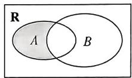

A. $(-\infty, 2)$

B. $(-\infty, 2]$

C. $(0,2)$

D. $[0,2]$

# 考法4 集合中的含参问题

11.[江苏南通海安高级中学2023月考]已知 $a \in \mathbf{R}$ , $b \in \mathbf{R}$ , 若集合 $\left\{a, \frac{b}{a}, 1\right\} = \{a^2, a + b, 0\}$ , 则 $a^{2021} + b^{2021}$ 的值为 ( )

A.-2

B.-1

C. 1

D. 2

12.[河北唐山一中2023月考]已知全集 $U = \mathbf{R}$ ，集合 $M =$ $\{x\mid x(x - 4)\geqslant 0\} ,N = \{x\mid a <   x <   2a + 2\}$ .若 $N\cap (\complement_U M) = N,$ 则实数 $a$ 的取值范围是 （）

A. $[0,1]$

B. $(- \infty, -2] \cup [0, 1]$

C. $(- \infty, 0] \cup [1, +\infty)$

D. $[-2, +\infty)$

13. [江西景德镇一中 2023 期中] 已知集合 $A = \{x \mid x < -1$ 或 $x > 4\}$ , $B = \{x \mid 2a \leqslant x \leqslant a + 3\}$ . 若 $B \subseteq A$ , 则实数 $a$ 的取值范围是 \_\_\_\_.

# 考法5 容斥原理的应用

14.[陕西2024届联考]某校有62名同学参加数学、物理、化学竞赛,若同时参加数学、物理竞赛的同学有21名,同时参加数学、化学竞赛的同学有16名,同时参加物理、化学竞赛的同学有18名,且没有同学同时参加数学、物理、化学竞赛,则该校只参加一项竞赛的同学有\_\_\_\_名.

# 考点2 充分条件与必要条件全称量词与存在量词

# 考法1 充分条件与必要条件的判断

1.[天津2023·2]已知 $a, b \in \mathbb{R}$ , 则“ $a^2 = b^2$ ”是“ $a^2 + b^2 = 2ab$ ”的 ( )

A. 充分不必要条件  
B. 必要不充分条件  
C. 充要条件  
D. 既不充分也不必要条件

2.[全国甲(理)2023·7]设甲： $\sin^{2}\alpha+\sin^{2}\beta=1$ ，乙： $\sin\alpha+\cos\beta=0$ ，则（）

A. 甲是乙的充分条件但不是必要条件  
B. 甲是乙的必要条件但不是充分条件  
C. 甲是乙的充要条件  
D. 甲既不是乙的充分条件也不是乙的必要条件

3.[全国甲(理)2021·7]等比数列 $\{a_{n}\}$ 的公比为q,前n项和为 $S_{n}$ .设甲:q>0,乙: $\{S_{n}\}$ 是递增数列,则()

A. 甲是乙的充分条件但不是必要条件  
B. 甲是乙的必要条件但不是充分条件  
C. 甲是乙的充要条件  
D. 甲既不是乙的充分条件也不是乙的必要条件

# 考法2 根据充分、必要条件求参数的值（范围）

4.[江苏南京金陵中学2023阶段性检测]若使不等式 $|x-1|<a$ 成立的一个充分条件为0<x<4,则实数a的取值范围是()

A. $[3, +\infty)$

B. $[1, +\infty)$

C. $(-∞,3]$

D. $(-∞,1]$

5.(多选)[湖南衡阳八中2024届阶段性检测]已知条件 $p;x^{2}+x-6=0$ ;条件 $q:ax+1=0(a\neq0)$ .若p是q的必要条件,则实数a的值可以是()

A. $\frac{1}{2}$

B. $\frac{1}{3}$

C. $-\frac{1}{2}$

D. $-\frac{1}{3}$

# 考法3 全称量词命题与存在量词命题的否定

6.[北京通州区2023质量检测]命题“ $\forall x > 0, x^2 + x + 1 > 0$ ”的否定是 （）

A. $\forall x > 0, x^2 + x + 1 \leqslant 0$   
B. $\forall x\leqslant 0,x^{2} + x + 1\leqslant 0$   
C. $\exists x > 0, x^2 + x + 1 \leqslant 0$   
D. $\exists x\leqslant 0,x^{2} + x + 1\leqslant 0$

7.[重庆七校2024届联考]命题 $p: \exists x \in \mathbf{R}, 3x < 1$ 的否定是 （）

A. $\exists x\in \mathbf{R},3x\geqslant 1$

B. $\exists x\in \mathbf{R},3x > 1$

C. $\forall x\in \mathbf{R},3x\geqslant 1$

D. $\forall x\in \mathbf{R},3x > 1$

# 考法4 判断全称量词命题与存在量词命题的真假

8.[安徽合肥四校2023联考]有下列四个关于三角函数的命题：

$$
p _ {1} \colon \exists   x \in {\bf R}, \sin^ {2} {\frac {x}{2}} + \cos^ {2} {\frac {x}{2}} = {\frac {1}{2}}  ;
$$

$$
p _ {2}: \exists x, y \in \mathbf {R}, \sin (x - y) = \sin x - \sin y;
$$

$p_{3}$ : 若 $\sin x = \cos y$ ，则 $x + y = \frac{\pi}{2} + 2k\pi (k \in \mathbf{Z})$ ;

$$
p _ {4}: \forall x \in [ 0, \pi ], \sqrt {\frac {1 - \cos 2 x}{2}} = \sin x.
$$

其中真命题为 （）

A. $p_1, p_3$

B. $p_1, p_4$

C. $p_2, p_3$

D. $p_2, p_4$

# 考法5 根据命题的真假求参数的取值范围

9.[四川绵阳中学2024届开学考]已知命题 $p:\exists x\in\mathbb{R}$ ，使得 $ax^{2}+2x+1<0$ 成立为真命题，则实数a的取值范围是()

A. $(-\infty, 0]$

B. $(-\infty, 1)$

C. $[0,1)$

D. $(0,1]$

10. [河南 2023 期中] 已知 $p: \forall x_1 \in \left(\frac{1}{2}, 2\right)$ , $\exists x_2 \in \left(\frac{1}{2}, 2\right)$ , 使得方程 $\log_2 x_1 + a = x_2^2 + 2$ 成立, $q: \forall x_1, x_2 \in [0, 1]$ , 不等式 $a + 3x_2 > 4^{x_1}$ 恒成立. 若 $p$ 为真命题, $q$ 为假命题, 则实数 $a$ 的取值范围是 \_\_\_\_.

224 没有那么多天赋弃禀，优秀的人总是努力翻山越岭。

# 第2章 不等式

# 考点3 不等式及其性质、一元二次不等式

# 考法1 不等式性质的应用

1.[黑龙江齐齐哈尔2024届联考]设 $a, b, c, d$ 为实数，且 $a > b > 0 > c > d$ ，则下列不等式正确的是 （）

A. $a - c <   b - d$

B. $\frac{c}{a} -\frac{d}{b} < 0$

C. $c^2 < cd$

D. ${ac} > {bd}$

2.[北京朝阳区2023一模]已知 $a < b < 0 < c$ ，下列不等式正确的是 （）

A. $\frac{b}{a} >\frac{a}{b}$

B. $a^2 < c^2$

C. $2^{a} < 2^{c}$

D. $\log_c(-a) < \log_c(-b)$

# 考法2 一元二次不等式及常见不等式的解法

3.[山东济南、潍坊、淄博部分校2024届阶段监测]若a,b是函数 $f(x)=x^{2}-mx+n(m>0,n>0)$ 的两个不同的零点,且a,b,-1这三个数可适当排序后成等差数列,也可适当排序后成等比数列,则关于x的不等式 $\frac{x-m}{x-n}\geqslant0$ 的解集为()

A. $\{x \mid x \leqslant 2 \text{ 或 } x \geqslant 5\}$

B. $\{x \mid x < 2 \text{ 或 } x \geqslant 5\}$

C. $\left\{x\mid x\leqslant 1\text{或} x > \frac{5}{2}\right\}$

D. $\left\{x\mid x <   1\text{或} x\geqslant \frac{5}{2}\right\}$

4.(多选)[福建莆田一中2023月考]已知不等式 $ax^{2}+bx+c<0$ 的解集为 $\{x\mid x<-1$ 或 $x>3\}$ ，则下列结论正确的是()

A. $a <   0$

B. $a + b + c > 0$

C. $cx^2 - bx + a < 0$ 的解集为 $\left\{x \mid x < -\frac{1}{3}\right.$ 或 $x > 1\}$

D. $c > 0$

5.(多选)[广东五校2023联考]关于x的不等式(ax-1)(x+2a-2)>0的解集中恰有4个整数,则实数a的值可以是()

A. $-\frac{1}{2}$

B. $-\frac{2}{3}$

C. $-\frac{3}{4}$

D. -1

6.[河南名校2023联考]已知“ $\exists x \in \mathbf{R}$ ,使 $x^{2}+mx+2m+5<0$ ”是假命题,设实数 $m$ 的取值为集合 $A$ ,不等式 $(x-a+1)(x-1+2a)<0$ 的解集为集合 $B$ .若 $x \in A$ 是 $x \in B$ 的充分不必要条件,则实数 $a$ 的取值范围为\_\_\_\_.

# 考法3 一元二次不等式恒成立或有解问题的解法

7. 若不等式 $ax^2 + (a - 1)x + a > 0$ 对任意 $x \in \mathbb{R}$ 恒成立，则实数 $a$ 的取值范围是 （）

A. $(- \infty, -1) \cup \left( \frac{1}{3}, +\infty \right)$

B. $(1, +\infty)$

C. $\left(\frac{1}{3},+\infty\right)$

D. $\left(-1,\frac{1}{3}\right)$

8.[天津实验中学2024届月考]设 $a$ 为实数,若关于 $x$ 的不等式 $x^{2} - ax + 7\geqslant 0$ 在区间(2,7)上有实数解,则 $a$ 的取值范围是 （）

A. $(- \infty, 8)$

B. $(-\infty, 8]$

C. $(- \infty, 2\sqrt{7})$

D. $\left(-\infty,\frac{11}{2}\right)$

9.[陕西汉中2024届联考]函数 $f(x)=\frac{x+1}{ax^{2}-2ax+1}$ 的定义域为R,则实数a的取值范围为()

A. $\{a \mid 0 < a < 1\}$

B. $\{a \mid a < 0 \text{ 或 } a > 1\}$

C. $\{a|0\leqslant a < 1\}$

D. $\{a \mid a \leqslant 0 \text{ 或 } a \geqslant 1\}$

10. [江苏扬州高邮 2024 届期初] 设函数 $f(x) = mx^2 - mx - 1$ ，若对于任意的 $x \in [1, 2]$ , $f(x) < -m + 4$ 恒成立，则实数 $m$ 的取值范围为 ( )

A. $(-\infty, 0]$

B. $\left[0, \frac{5}{3}\right)$

C. $\left(-\infty,\frac{5}{3}\right)$

D. $\left(0, \frac{5}{3}\right)$

11.[湖北孝感重点高中教科研协作体2023联考]已知a>b,关于x的不等式 $ax^{2}+2x+b\geqslant0$ 对于一切实数x恒成立,又存在实数 $x_{0}$ ,使得 $ax_{0}^{2}+2x_{0}+b=0$ 成立,则 $\frac{a^{2}+b^{2}}{a-b}$ 的最小值为\_\_\_\_.

# 考点4 基本不等式

# 考法1 利用基本不等式求最值

1.[四川绵阳南山中学2024届月考]若 $x > 0, y > 0, x + 2y = 5$ ，则 $\frac{1}{xy}$ 的最小值为 （）

A. $\frac{8}{25}$

B. $\frac{8}{5}$

C. $\frac{4}{25}$

D. $\frac{4}{5}$

2.[浙江嘉兴一中2023期中]若 $x > 0,y > 0$ ，且 $\frac{1}{x + 1} +\frac{1}{x + 2y} =$ 1,则 $2x + y$ 的最小值为 （）

A. 2

B. $2 \sqrt{3}$

C. $\frac{1}{2} +\sqrt{3}$

D. $4 + 2\sqrt{3}$

3.(多选)[江西宜春丰城中学2024届开学考]下列四个函数中,最小值为2的是()

A. $y = x + \frac{1}{x} (x > 0)$   
B. $y = \ln x + \frac{1}{\ln x} (x > 0, x \neq 1)$   
C. $y = \frac{x^2 + 6}{\sqrt{x^2 + 5}}$   
D. $y = 4^{x} + 4^{-x}$

4.(多选)[江苏无锡2024届期中]已知a>0,b>0, $\frac{1}{a}+$ $\frac{3}{b}=1$ ,则下列说法正确的是()

A. $ab$ 的最小值为 12  
B. $a + b$ 的最小值为 $4\sqrt{3}$   
C. $a^2 + b^2$ 的最小值为 24  
D. $\frac{1}{a - 1} +\frac{3}{b - 3}$ 的最小值为2

5. 已知 $x > 0, y > 0$ ，则 $x + \frac{y}{x} + \frac{16}{xy}$ 的最小值为 \_\_\_\_.  
6.[天津南开区2023期中]已知正实数a,b,c满足 $a^{2}-2ab+9b^{2}-c=0$ ，则 $\frac{ab}{c}$ 的最大值为\_\_\_\_.  
7.[河北部分学校2024届月考]已知正实数a,b满足 $a^{2}+b^{2}=1$ ,则 $\left(4a+\frac{1}{2a}\right)\left(4b+\frac{1}{2b}\right)$ 的最小值为\_\_\_\_.

226 等风来，不如追风去。事常与人违，事总在人为。

8.[江苏南京秦淮中学2023检测]设x>0,y>0,且 $\left(x-\frac{1}{y}\right)^{2}=\frac{16y}{x}$ ，则当 $x+\frac{1}{y}$ 取最小值时， $x^{2}+\frac{1}{y^{2}}=$ \_\_\_\_.

# 考法 2 利用基本不等式求参数的取值范围

9.[江西部分高中2024届联考]不等式 $t(\sqrt{x} + \sqrt{y})\leqslant$ $\sqrt{2x + 2y}$ 对所有的正实数 $x,y$ 恒成立，则 $t$ 的最大值为 （）

A. 2

B. $\sqrt{2}$

C. $\frac{\sqrt{2}}{4}$

D. 1

10.[广东湛江部分学校2024届月考]若 $a^{4}+b^{4}=7$ ，且 $\frac{1}{a^{4}}+\frac{4}{b^{4}}>m$ 恒成立，则m的取值范围是\_\_\_\_.  
11. 若存在正数 $x$ , 不等式 $\frac{2}{x^2 + 4} \geqslant \frac{2a + 1}{x}$ 能成立, 则实数 $a$ 的取值范围为 \_\_\_\_.

# 考法3 基本不等式的变形

12.(多选)[江苏部分重点中学2024届联考]已知实数 $a > 0, b > 0, a + b = 1$ ，则下列不等式正确的是（）

A. $2^{a} + 2^{b}\geqslant 2\sqrt{2}$   
B. $\frac{1}{a} +\frac{1}{b}\geqslant 4$   
C. $\left(\frac{1}{a} + 2\right)\left(\frac{1}{b} + 2\right) \leqslant 16$   
D. $\frac{2a}{a^2 + b} +\frac{b}{b^2 + a}\leqslant \frac{3 + 2\sqrt{3}}{3}$

13.[陕西西安周至2023期中]设 $a > 0, b > 0$ ，给出下列不等式：.

① $a^{2}+1>a$ ;   
② $\left(a + \frac{1}{a}\right)\left(b + \frac{1}{b}\right) \geqslant 4$   
③ $(a + b)\left(\frac{1}{a} +\frac{1}{b}\right)\geqslant 4;$   
④ $\frac{2}{\frac{1}{a}+\frac{1}{b}}\geqslant\sqrt{ab}.$

其中恒成立的是\_\_\_\_。(填序号)

# 考点5 函数的概念及其表示

# 考法1 函数定义域的求法

1.(多选)[湖南名校联合体2024届月考]已知函数 $f(x)$ 的定义域和值域均为[-3,3],则()

A. 函数 $f(x - 2)$ 的定义域为 $[-1, 5]$   
B. 函数 $\frac{f(3x)}{x - 1}$ 的定义域为 $[-1, 1)$   
C. 函数 $f(x - 2)$ 的值域为 $[-3, 3]$   
D. 函数 $f(2x)$ 的值域为 $[-6, 6]$

# 考法 2 函数解析式的求法

2.(多选)[黑龙江哈尔滨三中2024届月考]已知 $f(2x+1)=4x^{2}$ ，则下列结论正确的是()

A. $f(-3) = 16$

B. $f(x)=4x^{2}$

C. $f(x) = 16x^{2} + 16x + 4$

D. $f(x)=x^{2}-2x+1$

3.[河北衡水冀州中学2024届期中]已知函数 $f(x)$ 的定义域为 $\mathbf{R}, y=f(x)+\mathrm{e}^{x}$ 为偶函数, $y=f(x)-2\mathrm{e}^{x}$ 为奇函数,则 $f(x)=$ \_\_\_\_.

# 考法3 函数值域与最值的求法

4.(多选)[安徽皖江名校联盟2024届联考]设函数 $f(x)=\frac{10^{x}}{10^{x}+1}$ ，若[x]表示不超过x的最大整数，则y= $\left[f(x)-\frac{1}{2}\right]$ 的函数值可能是()

A. 0

B. -1

C. 1

D. 2

5.(多选)[河南商丘一中2024届月考]下列说法正确的是()

A. 若 $f(x)$ 的定义域为 $[-2, 2]$ ，则 $f(2x - 1)$ 的定义域为 $\left[-\frac{1}{2}, \frac{3}{2}\right]$   
B. 函数 $y = \frac{x}{1 - x}$ 的值域为 $(- \infty, 2) \cup (2, +\infty)$   
C. 函数 $y = 2x + \sqrt{1 - x}$ 的值域为 $\left(-\infty, \frac{17}{8}\right]$   
D. 函数的定义域可以是空集

# 考法4 分段函数及其应用

6.[浙江2021·12]已知 $a \in \mathbf{R}$ , 函数 $f(x) =$

$\left\{ \begin{array}{l} x^{2} - 4, x > 2, \\ |x - 3| + a, x \leqslant 2. \end{array} \right.$ 若 $f(f(\sqrt{6})) = 3$ ，则 $a =$ \_\_\_\_.

7.[江苏常州金坛区2023质量检测]已知函数 $f(x)=\left\{\begin{aligned}-x^{2}+5,x<1,\\ x+\frac{1}{x}+2,x&\geqslant1,\end{aligned}\right.$ 则 $f\left(f\left(-\frac{3}{2}\right)\right)=$ \_\_\_\_；若当 $x\in[m,n]$ 时， $f(x)\in[4,5]$ ，则m-n的最小值是\_\_\_\_。

# 考法5 函数的新定义问题

8.（多选）[山西吕梁汾阳2023期末]定义运算 $a \oplus b = \begin{cases} a, & a \geqslant b, \\ b, & a < b. \end{cases}$ 设函数 $f(x) = 1 \oplus 2^{-x}$ ，则下列说法正确的有（）

A. $f(x)$ 的值域为 $[1, +\infty)$   
B. $f(x)$ 的值域为 $(0,1]$   
C. 不等式 $f(x + 1) < f(2x)$ 的解集是 $(- \infty, 0)$   
D. 不等式 $f(x + 1) < f(2x)$ 的解集是 $(0, +\infty)$

9. 若定义在区间 $D$ 上的函数 $f(x)$ 满足对任意的 $x_{1}$ , $x_{2} \in D$ , 且 $x_{1} \neq x_{2}, |f(x_{1}) - f(x_{2})| \leqslant |x_{1} - x_{2}|$ , 则称 $f(x)$ 为“低调函数”, 给出下列结论:

①函数 $y=\frac{1}{4}x^{2}-\frac{1}{2}x+1(-1\leqslant x\leqslant1)$ 是“低调函数”；  
②若奇函数 $f(x)$ 是区间 $[-1,1]$ 上的“低调函数”，则 $|f(x)|\leqslant1$ ;  
③若 $f(x)$ 是区间 $[-1, 1]$ 上的“低调函数”，且 $f(-1) = f(1) = 0$ ，则对任意的 $x_1, x_2 \in [-1, 1]$ ， $|f(x_1) - f(x_2)| \leqslant 1$ .

其中正确的结论的个数为 （）

A. 0

B. 1

C. 2

D. 3

10.[陕西安康2023联考]对于定义域为 $D$ 的函数 $f(x)$ ，若存在 $x_{1},x_{2}\in D$ 且 $x_{1}\neq x_{2}$ ，使得 $f(x_{1}) = f(x_{2}) = f(x_{1} + x_{2}) - \frac{1}{2}$ ，则称函数 $f(x)$ 具有性质 $M.$ 若函数 $f(x) = |\log_2x - 1|,x\in (0,\sqrt{a} ]$ 具有性质 $M$ ，则实数 $a$ 的最小值为

# 考法1 函数单调性或单调区间的判定

1.[陕西咸阳2023月考]函数 $f(x)=\frac{1}{4+3x-x^{2}}$ 的单调递增区间为()

A. $\left(\frac{3}{2}, +\infty\right)$

B. $\left(-1,\frac{3}{2}\right)$

C. $\left(\frac{3}{2},4\right)$ 和 $(4,+\infty)$

D. $(- \infty, -1) \cup \left(-1, \frac{3}{2}\right)$

2.[重庆八中2024届入学测试]已知 $f(x)$ 是定义在 $(0,+\infty)$ 上的函数, $g(x)=xf(x)$ ,则“ $f(x)$ 为增函数”是“ $g(x)$ 为增函数”的()

A. 充要条件  
B. 充分不必要条件  
C. 必要不充分条件  
D. 既不充分也不必要条件

# 考法2 利用函数单调性求参数的值（范围）

3.[广东七校联合体2024届联考]函数 $f(x)=2|x-a|+$ 3 在区间 $[1, +\infty)$ 上不单调，则 a 的取值范围是
()

A. $[1, +\infty)$

B. $(1, +\infty)$

C. $(-\infty, 1)$

D. $(-\infty, 1]$

4.[河北保定部分高中2024届开学考]已知a>0,且 $a\neq1$ ,函数 $f(x)=\left\{\begin{aligned}&3a-x,x<2,\\&\log_{a}(x-1)-1,x\geqslant2\end{aligned}\right.$ 在R上单调,则a的取值范围是()

A. $(1, +\infty)$

B. $\left[\frac{1}{3},\frac{2}{3}\right]$

C. $\left[\frac{2}{3}, 1\right)$

D. $\left[\frac{1}{3},1\right)$

# 考法3 函数奇偶性的判定

5.(多选)[湖南永州一中2023月考]函数 $f(x)$ 的定义域为R,若 $f(x+1)$ 与 $f(x-1)$ 都是偶函数,则()

A. $f(x)$ 是偶函数  
B. $f(x)$ 是奇函数  
C. $f(x + 3)$ 是偶函数  
D. $f(x) = f(x + 4)$

228 努力的意义就是当好运来临时,你觉得值得。

# 考法4 利用函数奇偶性求参数

6.[全国乙(理)2023·4]已知 $f(x)=\frac{xe^{x}}{e^{ax}-1}$ 是偶函数，
则 a=

A.-2

B.-1

C. 1

D. 2

7.[黑龙江齐齐哈尔2024届期中]设 $m, n \in \mathbb{R}$ , 且 $m \neq 3, n > 0$ , 若定义在区间 $(-n, n)$ 上的函数 $f(x) = \lg \frac{1 + mx}{1 + 3x}$ 是奇函数, 则 $m + n$ 的值可以是 \_\_\_\_. (写出一个值即可)

# 考法5 函数的周期性、图象的对称性及应用

8.[全国甲(文)2021·12]设 $f(x)$ 是定义域为R的奇函数，且 $f(1+x)=f(-x)$ .若 $f\left(-\frac{1}{3}\right)=\frac{1}{3}$ ，则 $f\left(\frac{5}{3}\right)=$

A. $-\frac{5}{3}$

B. $-\frac{1}{3}$

C. $\frac{1}{3}$

D. $\frac{5}{3}$

9.(多选)[云南三校2024届联考]函数 $f(x)$ 与 $g(x)$ 的定义域为R,且 $f(x)g(x+2)=4,f(x)\cdot g(-x)=4$ .若 $f(x)$ 的图象关于点(0,2)对称.则()

A. $f(x)$ 的图象关于直线 $x = -1$ 对称  
B. $\sum_{k=1}^{2004} f(k) = 2048$   
C. $g(x)$ 的一个周期为4  
D. $g(x)$ 的图象关于点 $(0,2)$ 对称

# 考法6 函数性质的综合应用

10.[山西晋城一中2024届月考]已知 $y=f(x)$ 是定义域为R的奇函数,若 $y=f(2x+1)$ 的最小正周期为1,则下列说法中正确的个数是()

① $f\left(\frac{1}{4}\right)+f\left(\frac{3}{4}\right)=0;$   
② $f\left(\frac{1}{2}\right)+f\left(\frac{3}{2}\right)=0;$

③ $f(x)$ 的图象的一个对称中心为(1,0);  
④ $f(x)$ 的图象的一条对称轴为直线 $x=\frac{1}{2}$ .

A.1

B. 2

C. 3

D. 4

# 考点7-9 基本初等函数

# 考法1 幂函数的图象与性质的应用

1.[黑龙江省实验中学2024届月考]函数 $f(x)=(m^{2}-m-1)x^{m^{2}+m-3}$ 是幂函数,对任意 $x_{1},x_{2}\in(0,+\infty)$ ,且 $x_{1}\neq x_{2}$ ,满足 $\frac{f(x_{1})-f(x_{2})}{x_{1}-x_{2}}<0.$ 若 $a,b\in\mathbb{R}$ ,且a<0<b,|a|<|b|,则 $f(a)+f(b)$ 的值()

A. 恒大于 0

B. 恒小于 0

C. 等于 0

D. 无法判断

2.[安徽皖江名校联盟 2023 联考]已知实数 $m, n \in (-\infty, 0) \cup (0, +\infty)$ , 且 $m < n$ , 则下列结论一定正确的是 ( )

A. $m^{\frac{5}{3}} > n^{\frac{5}{3}}$

B. $6^{m} > 5^{n}$

C. $\frac{n}{m^2} < \frac{m}{n^2}$

D. $\frac{1}{2^{n - m}} > 4^{m - n}$

# 考法2 指数幂的运算

3.[吉林长春东北师大附中2023月考]a>0,化简 $\frac{a^{\frac{3}{2}-1}}{a+a^{\frac{1}{2}}+1}-\frac{a+a^{\frac{1}{2}}}{a^{\frac{1}{2}}+1}+\frac{a-1}{a^{\frac{1}{2}}+1}=$ \_\_\_\_.

# 考法3 指数函数的图象与性质的应用

4.(多选)[陕西汉中2023联考]已知a>0,则函数 $f(x)=a^{x}-2a$ 的图象可能是()

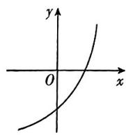  
A

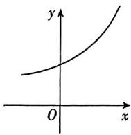  
B

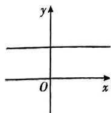  
C

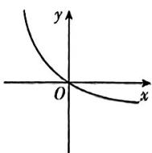  
D

6.[江西赣州2023期末]已知函数 $y = m^{x - 1} + 3 (m > 0$ 且 $m \neq 1)$ 图象恒过的定点 $A$ 在直线 $\frac{x}{a} + \frac{y}{b} = 1 (a > 0, b > 0)$ 上. 若关于 $t$ 的不等式 $a + b \geqslant t^2 + t + 3$ 恒成立，则实数 $t$ 的取值范围为 （）

A. $[-3,2]$   
B. $[-2,3]$   
C. $(- \infty, -3] \cup [2, +\infty)$   
D. $(- \infty, -2] \cup [3, +\infty)$

# 考法4 指数型函数的综合应用

6.[安徽铜陵2024届联考]已知函数 $f(x)=x^{3}+\frac{2^{x+1}}{2^{x}+1}$ ，
若实数 a, b 满足 $f(a^{2}) + f(2b^{2} - 3) = 2$ ，则 $a\sqrt{1+b^{2}}$ 的最大值为（）

A. $\frac{3\sqrt{2}}{4}$

B. $\sqrt{2}$

C. $\frac{5\sqrt{2}}{4}$

D. $\frac{7\sqrt{2}}{4}$

# 考法5 对数式的运算与化简

7.[重庆八中2024届月考]若 $\log_4(3x + 2y) = 3\log_8\sqrt{xy}$ 则 $x + y$ 的最小值为

# 考法6 对数函数的图象与性质的应用

8.(多选)[辽宁部分学校2024届开学考]已知 $a^{x}=b^{-x}$ ，函数 $y=\log_{a}(-x)$ 与 $y=b^{x}$ 的图象可能是()

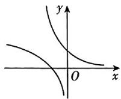  
A

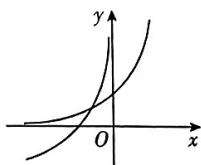  
B

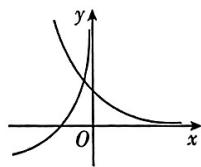  
C

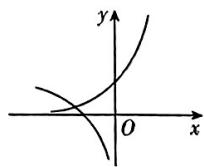  
D

9. 函数 $f(x) = \lg (x^2 - 2x - 3)$ 在 $[a, +\infty)$ 上单调递增的一个充分不必要条件是 （）

A. $a > 0$

B. $a > 1$

C. $a > 3$

D. $a > 4$

# 考法7 指数函数、对数函数的综合问题

10. 已知 $a > 0$ 且 $a \neq 1$ , 若函数 $f(x) = a^{x + m} + n$ 与 $g(x) = \log_a(x - 1) + 4$ 的图象经过同一个定点, 则 $m + n =$ \_\_\_\_.

# 第2节 函数的应用

# 考点 10 函数的图象

讲解P31/答案D8

# 考法 1 函数图象的变换与识别

1.[江西赣州名校2023联合测评]函数 $f(x)=\frac{x^{2}}{2^{|x|}-4}$ 的图象大致为()

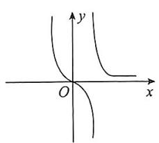

text_image

y
O
x

A

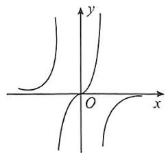

text_image

Mathematical graph showing hyperbolic curves on Cartesian coordinates with x and y axes labeled

B

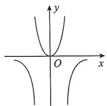

text_image

y
O
x

C

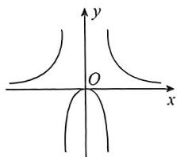

text_image

y
O
x

D

2.[天津 2021·3]函数 $y=\frac{\ln|x|}{x^{2}+2}$ 的图象大致为 ( )

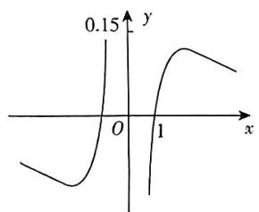

line

| x | y |
|---|---|
| 0 | -0.15 |
| 1 | 0.15 |

A

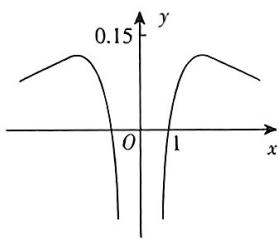

line

| x | y |
|---|---|
| -3.5 | 0.12 |
| -3.0 | 0.14 |
| -2.5 | 0.15 |
| -2.0 | 0.14 |
| -1.5 | 0.12 |
| -1.0 | 0.08 |
| -0.5 | 0.04 |
| 0.0 | 0.00 |
| 0.5 | 0.04 |
| 1.0 | 0.08 |
| 1.5 | 0.12 |
| 2.0 | 0.14 |
| 2.5 | 0.15 |
| 3.0 | 0.14 |
| 3.5 | 0.12 |

B

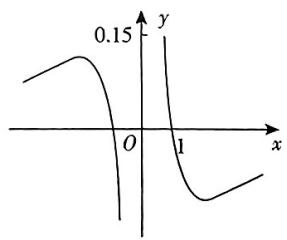

line

| x    | y     |
| ---- | ----- |
| 0    | 0.15  |
| 1    | 0.15  |

C

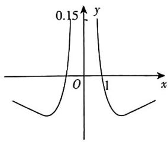

line

| x | y |
|---|---|
| 0 | 0 |
| 1 | 0.15 |

D

3.[江苏百校2024届联考]函数 $f(x)=\frac{2x\sin x}{x^{2}+1}$ 在区间 $[-4,4]$ 上的大致图象是()

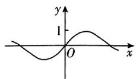  
A

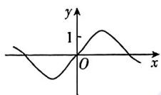  
B

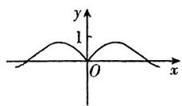  
C

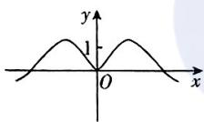  
D

# 考法 2 函数图象的应用

4.[浙江2021·7]已知函数 $f(x)=x^{2}+\frac{1}{4},g(x)=\sin x$ ，则图象为如图的函数可能是()

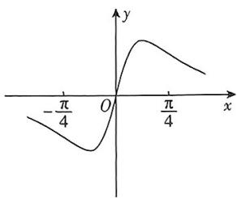

line

| x | y |
|---|---|
| -π/4 | -π/4 |
| 0 | 0 |
| π/4 | π/4 |

A. $y = f(x) + g(x) - \frac{1}{4}$

B. $y = f(x) - g(x) - \frac{1}{4}$

C. $y = f(x)g(x)$

D. $y = \frac{g(x)}{f(x)}$

5.[湖南衡阳八中2024届阶段测试]小李在如图所示的跑道(其中左、右两边分别是两个半圆)上匀速跑步,他从点A处出发,沿箭头方向经过点B,C,D返回到点A,共用时80 s,他的同桌小陈在固定点O位置观察小李跑步的过程,设小李跑步的时间为t(单位:s),他与同桌小陈间的距离为y(单位:m),若 $y=f(t)$ ,则 $f(t)$ 的图象大致为()

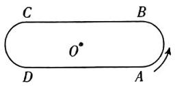

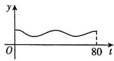  
A

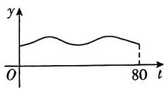  
B

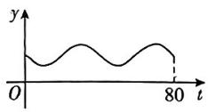  
C

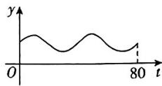  
D

6. [皖豫联盟 2023 联考] 已知函数 $f(x) = \left\{ \begin{array}{l} |\ln x|, 0 < x \leqslant 2, \\ |\ln (4 - x)|, 2 < x < 4. \end{array} \right.$ 若直线 $y = m$ 与 $f(x)$ 的图象有四个交点，且从左到右四个交点的横坐标依次为 $x_1, x_2, x_3, x_4$ ，则 $x_1x_2 + x_3x_4 + 4(x_1 + x_2) =$ （）

A. 12

B. 16

C. 18

D. 32

230 大路走尽还有数不尽的小路,只要不停地走就有数不尽的风光。

# 考点11 函数与方程

# 考法1 求函数零点所在区间

1.[黑龙江齐齐哈尔2024届联考]已知三个函数 $f(x)=x^{3}+x-3,g(x)=2^{2x}+x-2,h(x)=\ln x+x-5$ 的零点依次为a,b,c,则a,b,c的大小关系为()

A. $c > b > a$

B. $a > c > b$

C. $a > b > c$

D. $c > a > b$

2.[湖南长沙长郡中学2023月考]函数 $f(x)=5-2x-\lg(2x+1)$ 的零点所在的区间是()

A. $(0,1)$

B. $(1,2)$

C. $(2,3)$

D. $(3,4)$

# 考法2 求零点的个数

3.(多选)[山东潍坊2023联考]设函数 $y=f(x)$ 的定义域为R,且满足 $f(1+x)=f(1-x)$ , $f(x-2)+f(-x)=0$ .当 $x\in[-1,1]$ 时, $f(x)=-|x|+1$ ,则下列说法正确的是()

A. $y = f(x + 1)$ 是偶函数

B. $y = f(x + 3)$ 为奇函数

C. 函数 $y = f(x) - \lg |x|$ 有 10 个不同的零点

D. $\sum_{k = 1}^{2023}f(k) = 1$

# 考法3 与零点有关的参数问题

4.[河北师大附属实验中学2024届月考]已知函数 $f(x) = \left\{ \begin{array}{l}2^{-x},x\leqslant 0,\\ \frac{1}{x} -x,x > 0, \end{array} \right.$ $g(x) = f(x) - x - a.$ 若 $g(x)$ 有2个零点，则实数 $a$ 的取值范围是 （）

A. $[-1,0)$

B. $[0, +\infty)$

C. $[-1, +\infty)$

D. $[1, +\infty)$

5.(多选)[辽宁沈阳重点高中郊联体2024届期中]已知函数 $f(x)=\left\{\begin{aligned}-x^{4}-2x^{3},&x\leqslant0,\\ \ln x,x>0,\end{aligned}\right.$ $g(x)=f(x)-mx^{2}$ ，则下列结论正确的是()

A. 若 $g(x)$ 恰有 2 个零点, 则 $m < 0$ 或 $\frac{1}{2\mathrm{e}} < m < 1$

B. 若 $g(x)$ 恰有 3 个零点, 则 $m = 0$

C. 当 $0 < m < \frac{1}{2e}$ 时, $g(x)$ 恰有 5 个零点

D. 当 $m > 1$ 时, $g(x)$ 仅有 1 个零点

6.（多选）已知函数 $f(x) = |x^2 + 3x + 1| - a|x|$ ，则下列结论正确的是 （）

A. 若 $f(x)$ 没有零点, 则 $a \in (-\infty, 0)$

B. 若 $f(x)$ 恰有 2 个零点, 则 $a \in (1,5)$

C. 若 $f(x)$ 恰有 3 个零点, 则 $a = 1$ 或 $a = 5$

D. 若 $f(x)$ 恰有 4 个零点, 则 $a \in (5, +\infty)$

7.[河南洛阳一中2023月考]已知函数 $f(x)=\left\{\begin{aligned}x+\frac{1}{x},&x>0,\\ -|x|+3,x&\leqslant0.\end{aligned}\right.$ 若方程 $f(x)=a$ 有三个不同的实数根 $x_{1},x_{2},x_{3}$ ，且 $x_{1}<x_{2}<x_{3}$ ，则 $\frac{ax_{1}}{x_{2}+x_{3}}$ 的取值范围是\_\_\_\_.

# 考法 4 嵌套零点问题

8. 已知函数 $f(x) = \begin{cases} 4^x + 3, & x \leqslant 0, \\ 2^x + \log_9 x^2 - 9, & x > 0, \end{cases}$ 则函数 $f(f(x))$ 的零点所在区间为 （）

A. $\left(3, \frac{7}{2}\right)$

B. $(-1,0)$

C. $\left(\frac{7}{2},4\right)$

D. $(4,5)$

9. [河南 2024 届联考] 已知函数 $f(x) = \left\{ \begin{array}{l} 2x + 3, x \leqslant 0, \\ (x - 2)^2, x > 0, \end{array} \right.$ 则函数 $y = [f(x)]^2 - f(f(x))$ 的所有零点之和为 （）

A. 2

B. 3

C. 0

D. 1

10.[江西赣州2023月考]已知函数 $f(x) = \left\{ \begin{array}{l}x^{2} + 4x - 1,x\leqslant 0,\\ \left(\frac{1}{2}\right)^{x} - 2,x > 0. \end{array} \right.$ 若方程 $[f(x)]^2 +2af(x) + 3 = 0$ 有5个不同的实数解，则实数 $a$ 的取值范围为（）

A. $(- \infty, -\sqrt{3})$

B. $\left[\frac{7}{4},\frac{14}{5}\right)$

C. $(\sqrt{3},2)$

D. $\left[\frac{7}{4},2\right)$

# 考点12 函数模型及其应用

# 考法1 已知函数模型求解实际问题

1.[全国甲(理)2021·4]青少年视力是社会普遍关注的问题,视力情况可借助视力表测量,通常用五分记录法和小数记录法记录视力数据,五分记录法的数据L和小数记录法的数据V满足 $L=5+\lg V$ .已知某同学视力的五分记录法的数据为4.9,则其视力的小数记录法的数据约为 $\left(\sqrt[10]{10}\approx1.259\right)$ ( )

A. 1.5

B. 1.2

C. 0.8

D. 0.6

2.[江苏南京2024届调研]新风机的工作原理是从室外吸入空气,净化后输入室内,同时将等体积的室内空气排向室外.假设某房间的体积为 $v_{0}$ ,初始时刻室内空气中含有颗粒物的质量为m.已知某款新风机工作时,单位时间内从室外吸入的空气体积为 $v(v>1)$ ,室内空气中颗粒物的浓度与时刻t的函数关系为 $\rho(t)=(1-\lambda)\cdot\frac{m}{v_{0}}+\lambda\frac{m}{v_{0}}e^{-\alpha}$ ,其中常数 $\lambda$ 为过滤效率.若该款新风机的过滤效率为 $\frac{4}{5}$ ,且t=1时室内空气中颗粒物的浓度是t=2时的 $\frac{3}{2}$ 倍,则v的值约为(参考数据: $\ln2\approx0.6931,\ln3\approx1.0986$ )()

A. 1.386 2

B. 1.791 7

C. 2. 197 2

D. 3.583 4

3.[江西宜春宜丰中学2024届开学考]北京时间2023年3月30日18时50分,我国在太原卫星发射中心成功将宏图一号01组卫星发射升空,卫星顺利进入预定轨道,发射任务获得圆满成功.据了解,在不考虑空气动力和地球引力的理想状态下,可以用公式 $v=v_{0}\cdot\ln\frac{M}{m}$ 计算火箭的最大速度v(单位:m/s),其中 $v_{0}$ (单位:m/s)是喷流相对速度,m(单位:kg)是火箭(除推进剂外)的质量,M(单位:kg)是推进剂与火箭质量的总和, $\frac{M}{m}$ 称为总质比,已知A型火箭的喷流相对速度为1000 m/s.

(1) 当总质比为 200 时, 利用给出的参考数据求 A 型火箭的最大速度;

(2)经过材料更新和技术改进后, $A$ 型火箭的喷流相对速度提高到了原来的 $\frac{3}{2}$ 倍, 总质比变为原来的 $\frac{1}{3}$ , 若要使火箭的最大速度至少增加 $500 \mathrm{~m} / \mathrm{s}$ , 求在材料更新和技术改进前总质比的最小整数值.

参考数据: $\ln 200\approx5.3,2.718<e<2.719.$

# 考法2 构造函数模型求解实际问题

4.[山东百校2023联考]某化工厂生产一种溶质,按市场要求,杂质含量不能超过0.1%.若该溶质的半成品含杂质1%,且每过滤一次杂质含量减少 $\frac{1}{3}$ ,则要使产品达到市场要求,该溶质的半成品至少应过滤()

A.5次

B.6次

C. 7 次

D.8次

232 开学为什么要庆祝？庆祝有学上，有书读，有知识，有成长，有前途，有未来。

# 专题 1 比较大小问题

# 考法 1-2 函数性质法与中间值法

1.[天津2022·5]设 $a=2^{0.7}$ , $b=\left(\frac{1}{3}\right)^{0.7}$ , $c=\log_{2}\frac{1}{3}$ ，则a,b,c的大小关系为()

A. $a < b < c$

B. $c < a < b$

C. $b < c < a$

D. $c < b < a$

2.[黑龙江大庆铁人中学2023开学考试]已知 $a = \log_32, b = \log_52, c = 3^{a - 1}$ , 则 $a, b, c$ 的大小关系为 （）

A. $a < b < c$

B. $b < a < c$

C. c<a<b

D. $c < b < a$

3.[全国Ⅲ理 2019·11]设 $f(x)$ 是定义域为 R 的偶函数,且在 $(0,+\infty)$ 单调递减,则()

A. $f\left(\log_3\frac{1}{4}\right) > f(2^{-\frac{3}{2}}) > f(2^{-\frac{2}{3}})$

B. $f\left(\log_3\frac{1}{4}\right) > f(2^{-\frac{2}{3}}) > f(2^{-\frac{3}{2}})$

C. $f(2^{-\frac{3}{2}}) > f(2^{-\frac{2}{3}}) > f(\log_3\frac{1}{4})$

D. $f(2^{-\frac{2}{3}}) > f(2^{-\frac{3}{2}}) > f\left(\log_3\frac{1}{4}\right)$

4.[湖南新高考协作体2023联考]已知函数 $f(x)=ax^{2}-bx+c$ .若 $\log_{3}a=3^{b}=c>1$ ,则()

A. $f(a) <   f(b) <   f(c)$   
B. $f(c) < f(b) < f(a)$   
C. $f(b) < f(a) < f(c)$   
D. $f(b) < f(c) < f(a)$

5.[江西八校2023联考]悬链线的数学表达式为双曲余弦函数： $f(x)=a\cosh\frac{x}{a}=a\cdot\frac{\mathrm{e}^{\frac{x}{a}}+\mathrm{e}^{-\frac{x}{a}}}{2}$ （e为自然对数的底数）。当a=2时，记 $p=f(-2)$ ， $m=f\left(\frac{1}{2}\right)$ ， $n=f(1)$ ，则p,m,n的大小关系为()

natural_image

Black-and-white sketch of a railing with rope ties, no text or symbols visible

A. $m < p < n$

B. $m < n < p$

C. $n < m < p$

D. $p \leqslant m < n$

# 考法3 构造函数法

6.[安徽徽师联盟2024届质量检测]已知正数x,y,z满足 $x\ln y=ye^{z}=zx$ ，则x,y,z的大小关系为()

A. $x > y > z$

B. $y > x > z$

C. $x > z > y$

D. $y > z > x$

7.[江苏南通2024届质监]已知 $a=\pi^{e},b=3^{\pi},c=\pi^{\pi}$ ，则a,b,c的大小关系为()

A. $a < b < c$

B. $a < c < b$

C. $b < a < c$

D. $b < c < a$

8. [全国乙(理) 2021 · 12] 设 $a = 2\ln 1.01, b = \ln 1.02, c = \sqrt{1.04} - 1$ ，则 （）

A. $a < b < c$

B. $b < c < a$

C. $b < a < c$

D. $c < a < b$

9.[江苏常州2023期中]设 $a=e^{0.2}$ , $b=\frac{5}{4}$ , $c=\ln\frac{6e}{5}$ ,则()

A. $a < b < c$

B. $c < b < a$

C. $c < a < b$

D. $a < c < b$

10. [重庆名校联盟 2024 届期中 (改编)] 已知函数 $f(x) = x \cos x, g(x) = \sin x$ . 证明: 当 $x \in (0, \pi)$ 时, $x > g(x) > f(x)$ .

# 专题2 抽象函数问题

# 考法1 函数性质法

1.（多选）[山东菏泽2024届月考]若函数 $y = f(x)$ 的定义域为 $\mathbf{R}, f(2 + 3x) = f(2 - 3x), f(3 + x) + f(3 - x) = 4$ ，则()

A. $f(2) = 2$

B. $f(3)=2$

C. $f\left(\frac{1}{2}\right) = f\left(-\frac{7}{2}\right)$

D. $f(1) + f(3) = 4$

2.[山东滨州2024届新高考联合质量测评]已知定义在 $\mathbf{R}$ 上的函数 $f(x)$ 满足 $f(x + y) = f(x) + f(y) + 2$ ，且当 $x > 0$ 时， $f(x) > - 2$

(1) 求 $f(0)$ 的值, 并证明 $f(x)+2$ 为奇函数;

(2) 求证: $f(x)$ 在 $\mathbf{R}$ 上是增函数;

(3) 若 $f(1) = 2$ ，解关于 $x$ 的不等式 $f(x^2 + x) + f(1 - 2x) > 8$ .

# 考法2 赋值法

3.(多选)[江苏南通海安2024届质量监测]已知定义在R上的函数 $f(x)$ 满足 $f(x+y)=f(x)f(y)$ ，则下列结论正确的是()

A. $f(0) = 1$

B. $f(x)\geqslant 0$

C. 若 $f(m + n) > 1$ ，则 $f(m) + f(n) > 2$

D. 若对任意的实数 $m, f(2^m) > 1$ ，则 $f(x)$ 是增函数

4.[江西九江2023一模]已知函数 $f(x)$ 的定义域为R,
若 $f(2x+1)$ 为偶函数,且 $f(x)+f(4-x)=2,f(1)=2$ ,
则 $\sum_{n=1}^{22}f(n)=$ ( )

A. 23

B. 22

C. 19

D. 18

5.（多选）[福建莆田一中2023月考]已知定义在 $\mathbf{R}$ 上的函数 $f(x)$ 满足以下条件：

(1) 对任意实数 $x, y$ 恒有 $f(x + y) = f(x)f(y) + f(x) + f(y)$ ;  
(2) 当 $x > 0$ 时, $f(x)$ 的值域是 $(0, +\infty)$ ;  
(3) $f(1)=1.$

则下列说法正确的是 （）

A. $f(x)$ 值域为 $[-1, +\infty)$   
B. $f(x)$ 单调递增  
C. $f(8) = 255$   
D. $f(f(x)) \geqslant \frac{3 - f(x)}{1 + f(x)}$ 的解集为 $[1, +\infty)$

# 考法3 常用结论及模型

6.（多选）[辽宁名校联盟2024届联考]定义在 $\mathbf{R}$ 上的连续函数 $f(x)$ 满足 $\forall x, y \in \mathbf{R}, f(xy) = f(x)f(y), f(1) = 1$ ，则 （）

A. $f(0) = 0$   
B. 当 $x, y \in (0, +\infty)$ 时， $f\left(\frac{x}{y}\right) = \frac{f(x)}{f(y)}$   
C. 若 $f(-1) = 1$ ，则 $f(x)$ 为偶函数  
D. 当 $x \neq 0$ 时, $f(x) + f\left(\frac{1}{x}\right) \geqslant 2$

7.[河南2024届阶段检测]已知不恒等于零的函数 $f(x)$ 的定义域为R,满足 $f(x+y)+f(x-y)=2f(x)f(y)$ ,且 $f(1)=\frac{1}{2}$ ,则下列说法正确的是()

A. $f(0) = 0$   
B. $f(x)$ 的图象关于原点对称  
C. $f(-2) = \frac{1}{2}$   
D. $f(x)$ 的一个周期是6

234 人生中有些事你若不竭尽所能地去做，就永远不知道自己有多出色。

# 第3章 风向练

1. 数学应用 [江苏南通 2023 联考] 双曲函数可以用来描述一些物理运动过程, 也应用于计算机科学、经济和金融领域. 若双曲正切函数为 $\tanh x = \frac{e^x - e^{-x}}{e^x + e^{-x}}$ , 则 $\tanh x$ ( )

A. 是偶函数, 且在 $\mathbf{R}$ 上单调递减  
B. 是偶函数, 且在 $\mathbf{R}$ 上单调递增  
C. 是奇函数, 且在 $\mathbf{R}$ 上单调递减  
D. 是奇函数, 且在 $\mathbf{R}$ 上单调递增

2. 模块融合 [江西 2024 届联考] 已知函数 $f(x) = a^{x - 2} + 2 (a > 0 \text{且} a \neq 1)$ 的图象过定点 $P$ , 且角 $\alpha$ 的始边与 $x$ 轴的非负半轴重合, 终边过点 $P$ , 则 $\frac{\cos\left(\frac{11\pi}{2}-\alpha\right)\sin\left(\frac{9\pi}{2}+\alpha\right)}{\sin^2(-\pi-\alpha)}=$ ( )

A. $-\frac{2}{3}$

B. $\frac{2}{3}$

C. $\frac{3}{2}$

D. $-\frac{3}{2}$

3. 新情境 [广东佛山实验中学 2024 届月考] 为了贯彻落实《中共中央国务院关于深入打好污染防治攻坚战的意见》，某造纸企业的污染治理科研小组积极探索改良工艺，使排放的污水中含有的污染物数量逐渐减少。已知改良工艺前所排放废水中含有的污染物数量为 $2.65 \mathrm{~g} / \mathrm{m}^{3}$ ，首次改良工艺后排放的废水中含有的污染物数量为 $2.59 \mathrm{~g} / \mathrm{m}^{3}$ ，第 $n$ 次改良工艺后排放的废水中含有的污染物数量 $r_{n}$ 满足函数模型 $r_{n} = r_{0} + (r_{1} - r_{0}) \cdot 5^{0.25 n + p} (p \in \mathbf{R}, n \in \mathbf{N}^{\bullet})$ ，其中 $r_{0}$ 为改良工艺前所排放的废水中含有的污染物数量， $r_{1}$ 为首次改良工艺后所排放的废水中含有的污染物数量， $n$ 为改良工艺的次数。假设废水中含有的污染物数量不超过 $0.25 \mathrm{~g} / \mathrm{m}^{3}$ 时符合废水排放标准，若该企业排放的废水符合排放标准，则改良工艺的次数最少要（参考数据： $\lg 2 \approx 0.301$ ）

A.8次

B.9次

C. 10 次

D. 11 次

4. 数学文化 从古至今,中国人一直追求着对称美学. 某建筑物的外形轮廓部分可用函数 $f(x) =$

$\sqrt{|x - 2a|} + \sqrt{|x|}$ 的图象来刻画. 若关于 $x$ 的方程 $f(x) = b$ 恰有三个不同的实数根 $x_{1}, x_{2}, x_{3}$ , 且 $x_{1} < x_{2} < x_{3} = b$ (其中 $a, b \in (0, +\infty)$ ), 则 $b =$ （）

A. $\frac{64}{81}$

B. $\frac{16}{9}$

C. $\frac{80}{81}$

D. $\frac{208}{81}$

5. 新定义 (多选)[湖南师大附中2023月考]对于两个均不等于1的正数 $m$ 和 $n$ , 定义: $m * n = \min \{\log_m n, \log_n m\}$ , 则下列结论正确的是 ( )

A. 若 $a > 1$ ，且 $3 * a = 2 * 4$ ，则 $a = 9$   
B. 若 $a \geqslant b \geqslant c > 1$ ，且 $\frac{a * b}{b * c} = c * a$ ，则 $b = c$   
C. 若 $0 < a < b < c < 1$ ，则 $a * b - a * c = a * \left(\frac{b}{c}\right)$   
D. 若 $0 < a < b < c < 1, x > y > z > 0$ ，则 $(a^x * b^y) \cdot (b^y * c^z) = 2(a^x * c^z)$

6. 模块融合 [山东齐鲁名校2024届联合测试]已知1,2,2,2,3,4,5,6的中位数是a,第75百分位数为b,则 $\lg 4 + \lg a + \left(\frac{1}{1000}\right)^{\frac{3}{2b}} =$ \_\_\_\_.

7. 新定义 [山东济南历城二中 2024 届模拟] 若函数 $y = f(x)$ 的定义域为 $[a, b]$ , 值域也是 $[a, b]$ , 那么称函数 $f(x)$ 为“保域函数”. 下列函数中是“保域函数”的有 \_\_\_\_. (填上所有正确答案的序号)

① $f(x)=\sqrt{2x},x\in[0,2]$ ;   
② $f(x)=x^{2}+x-1,x\in[-1,1]$ ;   
③ $f(x)=\frac{4}{3}\cdot2^{x}-\frac{5}{3},x\in[-1,1]$ ;   
④ $f(x)=\frac{e^{2}-1}{2}\ln x+1,x\in[1,e^{2}]$ .

8. 双空题 [河北邢台 2024 届联考] 设函数 $f(x) = \frac{4a^x}{a^x + \sqrt{a}} (0 < a < 1)$ ，若 $f(x_0) = 2$ ，则 $x_0 = \sqrt{\left(\frac{1}{100}\right)} + f\left(\frac{2}{100}\right) + f\left(\frac{3}{100}\right) + \cdots + f\left(\frac{99}{100}\right) =$ \_\_\_\_.

# 考法1 导数的运算

1.[陕西汉中2024届联考]下列求导正确的是（）

A. $(\cos x)' = \sin x$   
B. $(2^{x} + x^{2})' = 2^{x} + 2x$   
C. $\left(\sin x - \cos \frac{\pi}{3}\right)' = \cos x + \frac{1}{3}\sin \frac{\pi}{3}$   
D. $(\log_2x)' = \frac{\log_2e}{x}$

2.(多选)[浙江金华十校2024届月考]已知函数 $f(x)$ 满足 $f(a+x)$ 为偶函数且 $f'(c+x)+f'(c-x)=2a(a\neq c)$ ，其中 $f'(x)$ 是 $f(x)$ 的导函数，则()

A. $f(x)$ 的一个周期为 $2|c - a|$   
B. $f'(x)$ 的图象关于点 $(a,0)$ 对称  
C. $f(x)$ 的图象关于直线 $x = c$ 对称  
D. $f(f'(x))$ 的图象关于直线 $x = c$ 对称

3.[全国Ⅲ文2020·15]设函数 $f(x)=\frac{\mathrm{e}^{x}}{x+a}$ .若 $f'(1)=\frac{\mathrm{e}}{4}$ ，则a= \_\_\_\_.

# 考法2 导数的几何意义

4.[全国I理 $2020\cdot 6]$ 函数 $f(x) = x^{4} - 2x^{3}$ 的图象在点(1,f(1))处的切线方程为 （）

A. $y = -2x - 1$   
B. $y = -2x + 1$   
C. $y = 2x - 3$   
D. $y = {2x} + 1$

5.（多选）[湖南长沙一中2024届月考]已知函数 $f(x) = \ln x, g(x) = x^{a} (x > 0, a \neq 0)$ ，若存在直线 $l$ ，使得 $l$ 是曲线 $y = f(x)$ 与曲线 $y = g(x)$ 的公切线，则实数 $a$ 的取值可能是 （）

A. $\frac{1}{3}$   
B. $\frac{1}{2}$   
C. 2   
D. 3

6.[全国甲(理)2021·13]曲线 $y=\frac{2x-1}{x+2}$ 在点 $(-1,-3)$ 处的切线方程为\_\_\_\_.  
7.[辽宁大连八中2024届月考]已知直线 $y=ax+b$ 与曲线 $y=a\ln x+2$ 相切,则ab的最大值为\_\_\_\_.

236 迎着朝霞出发，踏着星光返回。

8.[重庆八中2024届月考]已知曲线 $y=x^{-\frac{1}{2}}+\ln x$ 在点(1,1)处的切线与曲线 $y=\frac{1}{2}ax^{2}+\frac{1}{2}(a+1)x+1$ 相切，则a= \_\_\_\_.  
9.[全国Ⅱ理2019·20]已知函数 $f(x)=\ln x-\frac{x+1}{x-1}$

(1) 讨论 $f(x)$ 的单调性, 并证明 $f(x)$ 有且仅有两个零点;  
(2) 设 $x_0$ 是 $f(x)$ 的一个零点, 证明曲线 $y = \ln x$ 在点 $A(x_0, \ln x_0)$ 处的切线也是曲线 $y = e^x$ 的切线.

# 考点14 利用导数研究函数的单调性、极值、最值

# 考法1 利用导数研究函数的单调性

1.[黑龙江大庆铁人中学2023开学考试]函数 $f(x)=\ln x-\frac{2}{x-1}$ 的单调递增区间为\_\_\_\_.  
2. 已知函数 $f(x) = \frac{\mathrm{e}^x}{a} - 2x + 2\ln a (a > 0)$ . 判断函数 $f(x)$ 在 $(1, +\infty)$ 上的单调性.

# 考法 3 利用导数求函数的极值

5.[广西2023摸底考]已知函数 $f(x)=x^{3}+ax^{2}-x+a$ 有两个极值点 $x_{1},x_{2}$ ，且 $|x_{1}-x_{2}|=\frac{2\sqrt{3}}{3}$ ，则 $f(x)$ 的极大值为()

A. $\frac{\sqrt{3}}{9}$

B. $\frac{2\sqrt{3}}{9}$

C. $\frac{\sqrt{3}}{3}$

D. $\sqrt{3}$

6.[辽宁大连八中2024届月考]已知函数 $f(x)=2\mathrm{ef}^{\prime}(\mathrm{e})\ln x-\frac{x}{\mathrm{e}}$ ，则 $f(x)$ 的极大值点为x=\_\_\_\_，极大值为\_\_\_\_。

# 考法 4 利用导数求函数的最值

7.[四川绵阳中学2024届月考]已知函数 $f(x)=\frac{\ln x}{x}$ , $g(x)=\frac{x}{e^{x}}$ . 若 $f(m)=g(n)<0$ , 则 mn 的最小值为
()

A. $-\frac{1}{e}$

B. $\frac{1}{\mathrm{e}}$

C. -1

D. 1

8.[陕西榆林2024届联考]已知函数 $f(x) = \left\{ \begin{array}{ll}x^{2} + 4x + 5,x\leqslant 0,\\ \ln x,x > 0, \end{array} \right.$ 若存在实数 $x_{1},x_{2},x_{3}$ 且 $x_{1} <   x_{2} <   x_{3},$ 使得 $f(x_{1}) = f(x_{2}) = f(x_{3})$ ，则 $x_{1}f(x_{1}) + x_{2}f(x_{2})+$ $x_{3}f(x_{3})$ 的最大值为 （）

A. $3 \mathrm{e}^{3} - 12$

B. $3 \mathrm{e}^{3} - 20$

C. $5\mathrm{e}^{5} - 12$

D. $5 \mathrm{e}^{5} - 20$

9.[全国新高考I2021·15]函数 $f(x)=|2x-1|-2\ln x$ 的最小值为\_\_\_\_.

# 考法5 已知函数的极值、最值求参数

10.[重庆一中2024届月考]若 $f(x)=\mathrm{e}^{x}-2m\sin x\cos x$ , $x\in\left(0,\frac{1}{2}\right)$ 存在极值,则实数m的取值范围为()

# 考法2 根据函数的单调性求参数范围

3.[湖南长沙长郡中学2024届月考]若函数 $f(x)=e^{x-a+1}-x$ 在区间 $(0,+\infty)$ 上单调递增，则实数a的取值范围为()

A. $(-∞, -1]$

B. $(-∞,1)$

C. $[0, +\infty)$

D. $(-∞,1]$

4. 已知函数 $f(x) = (x + a) \cdot e^x$ ，若对任意 $x_1 > x_2 > 1$ 都有 $x_1 f(x_2) - x_2 f(x_1) < 0$ ，则实数 $a$ 的取值范围是（）

A. $[-4, +\infty)$

B, $[-3, +\infty)$

C. $[-2, +\infty)$

D. $\left[-1,+\infty\right)$

A. $\left(\frac{1}{2},\frac{\mathrm{e}^{\frac{1}{2}}}{2\cos1}\right)$

B. $\left(\frac{1}{2},\frac{\mathrm{e}^{\frac{1}{2}}}{2\cos1}\right]$

C. $\left(1, \frac{\theta^{\frac{1}{2}}}{\cos 1}\right)$

D. $\left(1,\frac{e^{\frac{1}{2}}}{\cos1}\right]$

请你别担心，请你别放弃。清风拂明月，山海有相逢。

11.[江苏淮安2023月考]若函数 $f(x)=x(x-c)^{2}$ 在x=2处有极大值,则常数c为()

A. 2

B. 6

C. 2 或 6

D. -2 或 -6

12.[全国乙(理)2021·10]设 $a \neq 0$ ，若 $x = a$ 为函数 $f(x) = a(x - a)^{2}(x - b)$ 的极大值点，则 （）

A. $a < b$

B. $a > b$

C. $ab < a^2$

D. $ab > a^2$

13.（多选）[全国新课标Ⅱ2023·11]若函数 $f(x)=a\ln x\div\frac{b}{x}+\frac{c}{x^{2}}(a\neq0)$ 既有极大值也有极小值，则()

A. $bc > 0$

B. $ab > 0$

C. $b^{2} + 8ac > 0$

D. ${ac} < 0$

14. 设函数 $f(x) = \mathrm{e}^{x}(2x - 3) - ax^{2} + 2ax + b$ ，若函数 $f(x)$ 存在两个极值点 $x_{1}, x_{2}$ ，且极小值点 $x_{1}$ 大于极大值点 $x_{2}$ ，则实数 $a$ 的取值范围是（）

A. $\left(0, \frac{1}{2}\right) \cup (2e^{\frac{3}{2}}, +\infty)$

B. $\left(-\infty, \frac{1}{2}\right) \cup (4e^{\frac{3}{2}}, +\infty)$

C. $(-∞, 2e^{\frac{3}{2}})$

D. $(-∞,1)∪(4e^{\frac{2}{2}},+∞)$

15.（多选）[山西阳泉2023期末]已知函数 $f(x)=e^{x}-\frac{2}{3}ax^{3}$ 有三个不同的极值点 $x_{1},x_{2},x_{3}$ ，且 $x_{1}<x_{2}<x_{3}$ ，则下列结论正确的是()

A. $a > \frac{e^{2}}{8}$

B. $x_{1} < -1$

C. $x_{2}$ 为函数 $f(x)$ 的极大值点

D. $f(x_{3}) < \frac{e^{2}}{3}$

16.[河北秦皇岛两校2023开学考]已知 $f(x_{0})$ 是函数 $f(x)=ax^{2}+e^{x}$ 的唯一极小值,则实数a的取值范围是\_\_\_\_.

17.[全国Ⅲ理2019·20]已知函数 $f(x) = 2x^{3} - ax^{2} + b$ .

(1) 讨论 $f(x)$ 的单调性.

(2) 是否存在 $a, b$ , 使得 $f(x)$ 在区间 $[0,1]$ 的最小值为 -1 且最大值为 1? 若存在, 求出 $a, b$ 的所有值; 若不存在, 说明理由.

我们站在风中，时而顺风而行，时而逆风展翅，听风、逐风、乘风，最终成为风的一部分。

# 专题3 导数中常见的数学思想与方法

# 考法1 分离参数

1.[重庆璧山区2023联考]已知函数 $f(x)=x\ln x-mx+m$ ，其中 $m\in R$ .

(1) 求 $f(x)$ 的单调区间.  
(2)请在下列两问中选择一问作答.

①若对任意 $x \in (0,1)$ , 不等式 $f(x) > -x$ 恒成立, 求实数 $m$ 的最小整数值;

②若存在 $x \in (1, +\infty)$ , 使得不等式 $f(x) < -\ln x$ 成立, 求实数 $m$ 的取值范围.

# 考法2 分类讨论

2.[浙江十校2024届期中]已知函数 $f(x)=a\ln x+x$ , $a\in R$ .

(1) 讨论函数 $f(x)$ 的单调区间；

(2) 若存在 $x \in [e, e^2]$ , 使 $f(x) \leqslant \left(ax + \frac{1}{2}\right) \ln x$ 成立, 求实数 $a$ 的取值范围.

(注:e 为自然对数的底数)

# 考法3 端点效应

3.[四川成都树德中学2023开学考试]已知函数 $f(x)=\sin x-ax+\frac{1}{6}x^{3}$ ，其中 $a\in R$ ，设 $g(x)$ 为 $f(x)$ 的导函数.

(1) 若 $a = 1$ ，求 $g(x)$ 的最小值；  
(2) 当 $x \geqslant 0$ 时, $f(x) \geqslant 0$ 恒成立. 求实数 $\pmb{a}$ 的取值范围.

# 考法4 分离函数

4.[河南名校联盟2024届段考]已知函数 $f(x)=\frac{ae^{x-t}}{x}+e(\ln x-x),a\in\mathbb{R}$

(1) 若 $f(x)$ 在 $(1, +\infty)$ 上单调递增，求实数 $a$ 的取值范围；  
(2) 当 $a \geqslant \frac{5}{2}$ 时，证明： $f(x) + (e-1)x > e^{x-1}(1 - \ln x) \in \operatorname{eln} x.$

有风有雨是常态，风雨兼程是状态，风雨无识是心态。

# 考法5 数形结合思想

5.（多选）[贵州2024届联考]已知函数 $f(x) = \log_2 x + \frac{1}{x}$ ，则 （ ）

A. $f(x)$ 在 $x = \ln 2$ 处取得极值  
B. 若方程 $k = f(x)$ 有两解, 则 $k$ 的最小整数值为 1  
C. 若方程 $k = f(x)$ 有两解 $x_{1}, x_{2}$ , 则 $x_{1} + x_{2} < \ln 4$   
D. $f(x)$ 有两个零点

6.（多选）[江苏南通2024届质量检测]已知函数 $f(x) = x - ae^{x}$ 有两个零点 $x_{1}, x_{2}$ ，且 $x_{1} < x_{2}$ ，则（）

A. $0 < a < \frac{1}{e}$   
B. $\frac{x_2}{x_1}$ 随 $a$ 的增大而减小  
C. $x_{1} + x_{2}$ 随 $\pmb{a}$ 的增大而增大  
D. $x_{1}x_{2}$ 随 $\pmb{a}$ 的增大而增大

7.（多选）[山东日照2024届联考]已知函数 $f(x)=\frac{x^{2}+x-1}{e^{x}}$ ，则()

A. 函数 $f(x)$ 只有两个极值点  
B. 若关于 $x$ 的方程 $f(x) = k$ 有且只有两个实根, 则实数 $k$ 的取值范围为 $(-e, 0)$   
C. 方程 $f(f(x)) = -1$ 共有四个实根  
D. 若关于 $x$ 的不等式 $f(x) \geqslant a(x + 1)$ 的解集内恰有两个正整数, 则实数 $a$ 的取值范围为 $\left[\frac{11}{4\mathrm{e}^3}, \frac{1}{2\mathrm{e}}\right]$

8.[广东东莞2023联考]已知函数 $f(x)=(x^{2}-2x)\cdot\mathrm{e}^{x}$ ，若方程 $f(x)=a$ 有3个不同的实根 $x_{1},x_{2},x_{3}(x_{1}<x_{2}<x_{3})$ ，则 $\frac{a}{2-x_{2}}$ 的取值范围是\_\_\_\_.

9.[四川成都新都区2023摸底]已知函数 $f(x)=\frac{\ln x}{x}$ , $g(x)=\frac{x}{e^{x}}$ . 若存在 $x_{1}\in(0,+\infty)$ , $x_{2}\in R$ , 使得 $f(x_{1})=g(x_{2})=k$ 成立, 则下列说法正确的有 \_\_\_\_. (填序号)

①当 $k > 0$ 时， $x_{1} + x_{2} > 1$   
②当 $k > 0$ 时， $2 < x_{1} + e^{x_{2}} < 2e$   
③当 k<0 时， $\frac{x_{2}}{x_{1}}=k$   
④当k<0时, $x_{1}+x_{2}<1$ .

10.[陕西安康重点名校2024届联考]已知函数 $f(x)=\frac{1}{3}x^{3}+ax^{2}+6x$ ，当x=3时，函数 $y=f(x)$ 取得极值.

(1) 若 $f(x)$ 在 $(m, m + 2)$ 上单调递增, 求实数 $m$ 的取值范围;  
(2) 若当 $1 \leqslant x \leqslant 3$ 时, 方程 $f(x) + m = 0$ 有两个根, 求实数 $m$ 的取值范围.

243 时间不一定是药，但药一定在时间里，怀揣期许，明天便可继续找寻。

# 专题4 导数与函数零点问题

1.[云南师大附中2024届月考]若函数 $f(x)=\ln x-ax$ 在(0,2e)上有两个不同的零点,则实数a的取值范围是()

A. $\left(-\infty,\frac{\ln(2e)}{2e}\right)$

B. $\left(0,\frac{1}{2}\right]$

C. $\left(0, \frac{1}{e}\right)$

D. $\left(\frac{\ln(2e)}{2e}, \frac{1}{e}\right)$

2.（多选）[福建厦门一中2023四模]已知 $x_{1}, x_{2}, x_{3} (x_{1} < x_{2} < x_{3})$ 是函数 $f(x) = (x - 1)(\mathrm{e}^{x} + \mathrm{e}) + m(\mathrm{e}^{x} - \mathrm{e})(m \in \mathbb{R}$ 且 $m \neq 0)$ 的三个零点，则 $\mathrm{e}^{x_1 - 1} - 2x_2 + x_3 + 1$ 的可能取值有 （）

A. 0

B. 1

C. 2

D. 3

3.[重庆八中2024届月考]已知 $f(x)$ 是定义在R上的增函数,且 $f(x)+f(-x)=-2$ ,函数 $g(x)=f(x)+\frac{2}{1-2^{x}}-\frac{2x}{x^{2}-1}+x$ 的零点分别为 $x_{1},x_{2},\cdots,x_{n}$ ，则 $\sum_{k=1}^{n}f(x_{k})=$ ( )

A. 0

B.-2

C. -4

D. -6

4.[全国乙(理)2022·21]已知函数 $f(x)=\ln(1+x)+axe^{-x}$ .

(1) 当 $a = 1$ 时, 求曲线 $y = f(x)$ 在点 $(0, f(0))$ 处的切线方程;

(2) 若 $f(x)$ 在区间 $(-1,0), (0, +\infty)$ 各恰有一个零点，求 $a$ 的取值范围.

5.[浙江2021·22]设a,b为实数,且a>1,函数 $f(x)=a^{x}-bx+e^{2}(x\in\mathbf{R})$ .

(1) 求函数 $f(x)$ 的单调区间；  
(2) 若对任意 $b > 2e^{2}$ , 函数 $f(x)$ 有两个不同的零点, 求 $a$ 的取值范围;  
(3) 当 $a = e$ 时, 证明: 对任意 $b > e^4$ , 函数 $f(x)$ 有两个不同的零点 $x_1, x_2$ , 满足 $x_2 > \frac{b \ln b}{2e^2} \cdot x_1 + \frac{e^2}{b}$ .

(注:e=2.718 28…是自然对数的底数)

# 考法1 换元法的应用

1. [全国甲(理)2022·21] 已知函数 $f(x) = \frac{\mathrm{e}^x}{x} - \ln x + x - a$ .

(1) 若 $f(x) \geqslant 0$ ，求 a 的取值范围；  
(2) 证明: 若 $f(x)$ 有两个零点 $x_{1}, x_{2}$ , 则 $x_{1}x_{2}<1$ .

# 考法3 极值点偏移问题

3.[湖南长沙长郡中学2024届月考]函数 $f(x)=a\ln x+\frac{1}{2}x^{2}-(a+1)x+\frac{3}{2}(a>0)$ .

(1) 求函数 $f(x)$ 的单调区间；  
(2) 当 $a = 1$ 时, 若 $f(x_{1}) + f(x_{2}) = 0$ , 求证: $x_{1} + x_{2} \geqslant 2$ .

# 考法2 “设而不求法”解隐零点问题

2.[安徽铜陵2024届联考]已知函数 $f(x)=\mathrm{e}^{2x}-2ax$ $(a\in\mathbf{R})$ .

(1) 讨论 $f(x)$ 的单调性；  
(2) 若 $f(x) + \frac{\sin x - \cos x}{e^x} \geqslant 0$ 对任意的 $x \in [0, +\infty)$ 恒成立，求实数 $a$ 的取值范围.

# 考法4 放缩技巧的应用

4.[江西名校2023联考]已知函数 $f(x)=x-a\ln x-1$ $(a\in\mathbb{R})$ .

(1) 当 $a = 1$ 时, 求证: $f(x) \geqslant 0$ ;  
(2) 若 $x = 1$ 是 $f(x)$ 唯一的零点, 求 $f(x)$ 的单调区间.

5.[广东江门部分校2024届联考]已知函数 $f(x)=x(\ln x+a)$ .

(1) 求 $f(x)$ 的单调区间；  
(2) 证明: 当 $a \geqslant 1$ 时, $\int(x) < a e^{x} - 1$ .

# 考法5 同构技巧的应用

6.[陕西宝鸡2023三模]已知函数 $f(x) = (x^{2} - 2x - 1)\cdot$ $\mathrm{e}^{\varepsilon},g(x) = (-x^{2} + 3x + 1)\mathrm{e}^{\varepsilon} + 2mx,m\in \mathbf{R}$

(1) 设 $f(x)$ 的导函数为 $f'(x)$ ，讨论 $f'(x)$ 的单调性：  
(2) 设 $h_1(x) = m(x^m + 1) \ln x + (m - 1)x, h_2(x) = f(x) +$   
$g(x) - mx$ ，当 $x\in (1, + \infty)$ 时，若 $h_2(x)\geqslant h_1(x)$ 恒成立，求实数 $m$ 的取值范围.

考法6 与 $f(x), f'(x)$ 相关的不等式的常见构造法

7.[江苏泰州中学2023期末]已知函数 $f(x)$ 及其导函数 $f'(x)$ 的定义域均为R, $f(x)$ 为奇函数，且 $f(x)-f'(x)>0$ ，则不等式 $f(x^{2}-3x+2)>0$ 的解集为\_\_\_\_。

愿你生于长空，存于散日，方和自然可畏，生命可救。

# 第4章 风向练

1. 新定义 (多选) [江西萍乡 2023 期末] 已知函数 $f(x)$ 的导函数为 $f'(x)$ ，若存在 $x_0$ ，使得 $f(x_0) = f'(x_0)$ ，则称 $x_0$ 是 $f(x)$ 的一个“巧值点”，则下列函数中，存在“巧值点”的是 ( )

A. $f(x) = \frac{1}{x}$

B. $f(x) = \ln x$

C. $f(x) = \tan x$

D. $f(x) = x + \frac{1}{x}$

2. 数学应用 (多选)[福建名校联盟 2023 模拟]机械制图中经常用到渐开线函数 $\operatorname{inv} x = \tan x - x$ , 其中 $x$ 的单位为弧度, 则下列说法正确的是 ( )

A. $y = x\cdot \mathrm{inv}x$ 是偶函数  
B. inv $x$ 在 $\left(-\frac{\pi}{2} - k\pi, \frac{\pi}{2} + k\pi\right)$ 上恰有 $2k + 1$ 个零点 $(k \in \mathbf{N})$   
C. inv $x$ 在 $\left(-\frac{\pi}{2} - k\pi, \frac{\pi}{2} + k\pi\right)$ 上恰有 $4k + 1$ 个极值点 $(k \in \mathbf{N})$   
D. 当 $-\frac{\pi}{2} < x < 0$ 时, $\operatorname{inv} x < x - \sin x$

3. 数学文化 [重庆一中2024届月考]记 $f^{(a)}(x)$ 为函数 $f(x)$ 的n阶导函数, $f'(x)=f^{(1)}(x)$ 且有 $f^{(a)}(x)=[f^{(n-1)}(x)]'(n\geqslant2,n\in\mathbf{N}^*)$ , 若 $f^{(n)}(x)$ 存在, 则称 $f(x)n$ 阶可导. 英国数学家泰勒发现: 若 $f(x)$ 在 $x_0$ 附近 $n+1$ 阶可导, 则可构造 $T_n(x)=f(x_0)+\frac{f'(x_0)}{1!}(x-x_0)+\frac{f^{(2)}(x_0)}{2!}(x-x_0)^2+\cdots+\frac{f^{(n)}(x_0)}{n!}(x-x_0)^n$ (称为n次泰勒多项式) 来逼近 $f(x)$ 在 $x_0$ 附近的函数值, 例如: $f(x)=e^x$ 在 $x_0=0$ 处的3次泰勒多项式为 $T_3(x)=f(0)+\frac{f'(0)(x-0)}{1!}+\frac{f^{(2)}(0)(x-0)^2}{2!}+\frac{f^{(3)}(0)(x-0)^3}{3!}=1+x+\frac{x^2}{2}+\frac{x^3}{6}$ , 则 $f(x)=-\frac{1}{x}$ 在 $x_0=-1$ 处的5次泰勒多项式中 $x^3$ 项的系数为 \_\_\_\_.

244 落日归山海，星火向星辰；欢偷且胜意，万事皆可期。

4. 模块融合 [广东2024届一调]英国著名物理学家牛顿用“作切线”的方法求函数零点时,给出的“牛顿数列”在航空航天中应用广泛. 若数列 $\{x_{n}\}$ 满足 $x_{n+1}=x_{n}-\frac{f(x_{n})}{f'(x_{n})}(n\in\mathbf{N}^{*})$ , 则称数列 $\{x_{n}\}$ 为牛顿数列. 如果函数 $f(x)=x^{2}-x-2$ , 数列 $\{x_{n}\}$ 为牛顿数列, 设 $a_{n}=\ln\frac{x_{n}+1}{x_{n}-2}(n\in\mathbf{N}^{*})$ 且 $a_{1}=1$ , 数列 $\{a_{n}\}$ 的前 n 项和为 $S_{n}$ , 则 $S_{10}=$ \_\_\_\_; $x_{3}=$ \_\_\_\_.

5. 递进式双空题 [河南商丘部分校2024届质量检测]“以直代曲”是微积分中重要的数学思想方法。在切点附近，用曲线在该点处的切线近似代替曲线就是这一思想的典型应用。曲线 $y = \ln x$ 在点(1,0)处的切线方程为\_\_\_\_；已知 $|^{2024}\sqrt{e} - 1| < 0.0005$ ，利用上述“切线近似代替曲线”的思想计算 $^{2024}\sqrt{e}$ 所得的结果约为\_\_\_\_。（结果用分数表示）

6. 新定义 [河北秦皇岛 2023 联考] 在平面曲线中, 曲率是表示曲线在某一点的弯曲程度的数值, 如图, 圆 $C_{1}, C_{2}, C_{3}$ 在点 $Q$ 处的弯曲程度依次增大, 而直线在点 $Q$ 处的弯曲程度最小. 曲率越大, 表示曲线的弯曲程度越大. 曲线的曲率定义如下: 若 $f'(x)$ 是 $f(x)$ 的导函数, $f''(x)$ 是 $f'(x)$ 的导函数, 则曲线 $y=f(x)$ 在点 $(x, f(x))$ 处的曲率 $K=\frac{|f''(x)|}{\{1+[f'(x)]^{2}\}^{\frac{3}{2}}}$ , 则余弦曲线 $f(x)=\cos x$ 在 $(0,1)$ 处的曲率为\_\_\_\_; 正弦曲线 $g(x)=\sin x (x \in \mathbb{R})$ 的曲率 $K$ 的平方 $K^{2}$ 的最大值为\_\_\_\_.

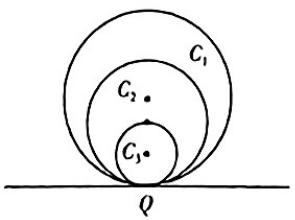

text_image

C₁
C₂
C₃
Q

# 第5章 三角函数

# 考点15 三角函数的定义、同角三角函数的基本关系、诱导公式 讲解P68/答案D28

# 考法1 三角函数定义的应用

1.[江西鹰潭2023月考]点 $A(\sin1240^{\circ},\cos1240^{\circ})$ 在平面直角坐标系上位于（）

A. 第一象限

B. 第二象限

C. 第三象限

D. 第四象限

2.[河南信阳高级中学2023开学考试]已知角 $\alpha$ 的顶点为坐标原点,始边为 $x$ 轴非负半轴,终边上有一点 $P(\sqrt{3}, -1)$ ,则 $\cos 2\alpha =$ ( )

A. $-\frac{1}{2}$

B. $\frac{1}{2}$

C. $-\frac{\sqrt{3}}{2}$

D. $\frac{\sqrt{3}}{2}$

3.[贵州贵阳一中2023质量检测]十八世纪,数学家泰勒发现了公式 $\cos x=1-\frac{x^{2}}{2!}+\frac{x^{4}}{4!}-\frac{x^{6}}{6!}+\cdots+(-1)^{n-1}\cdot\frac{x^{2n-2}}{(2n-2)!}+\cdots$ , 其中 $n\in N^{*},x\in R$ . 若 $T=1-\frac{3^{2}}{2!}+\frac{3^{4}}{4!}-\frac{3^{6}}{6!}+\cdots+(-1)^{n-1}\cdot\frac{3^{2n-2}}{(2n-2)!}+\cdots$ , 则下列选项中与 T 的值最接近的是 ( )

A. $-\cos 8^{\circ}$

B. $-\sin 8^{\circ}$

C. $-\cos 18^{\circ}$

D. $-\sin 18^{\circ}$

# 考法2 扇形基本量问题

4.[河北张家口2023期中]如图,已知扇形的周长为6,当该扇形的面积取最大值时,弦长AB=()

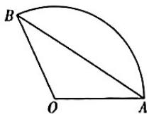

A. $3 \sin 1$

B. $3 \sin 2$

C. $3 \sin 1^{\circ}$

D. $3\sin {2}^{ \circ  }$

# 考法3 同角三角函数的基本关系及其应用

5.[广东2024届联考]若 $\theta \in \left(0, \frac{\pi}{2}\right), \sin \theta - \cos \theta = \frac{\sqrt{5}}{5}$ . 则 $\tan \theta =$ （）

A. $\frac{1}{2}$

B. 2

C. $\frac{1}{3}$

D. 3

6. 已知 $\sin (\pi - \alpha) - \cos (\pi + \alpha) = \frac{2}{3}$ , 且 $\frac{\pi}{2} < \alpha < \pi$ , 则 $\sin \alpha - \cos \alpha =$ ( )

A. $\frac{14}{9}$

B. $-\frac{14}{9}$

C. $\frac{\sqrt{14}}{3}$

D. $-\frac{\sqrt{14}}{3}$

7. [四川攀枝花 2024 届统考] 若 $\alpha \in \left(0, \frac{2\pi}{3}\right)$ , $|\sqrt{3} \cos \alpha| = \sin \frac{\alpha}{2}$ , 则 $\tan \alpha =$ ( )

A. $-\frac{\sqrt{3}}{3}$

B. $\frac{\sqrt{3}}{3}$

C. $-2\sqrt{2}$

D. $2 \sqrt{2}$

# 考法4 诱导公式及其应用

8.[山东菏泽2024届月考]已知 $\alpha$ 为锐角，若 $\sin \left(2\alpha +\frac{2023\pi}{2}\right) = \frac{2 - \sqrt{3}}{4}$ ，则 $\cos \alpha =$ （

A. $\frac{\sqrt{3} - 1}{8}$

B. $\frac{\sqrt{3} - 1}{4}$

C. $\frac{\sqrt{3} + 1}{8}$

D. $\frac{\sqrt{3} + 1}{4}$

9.[湖南师大附中2024届月考]若 $\{a_{n}\}$ 为等差数列， $S_{n}$ 是其前n项和，且 $S_{11}=\frac{22}{3}\pi,\{b_{n}\}$ 为等比数列， $b_{5}\cdot b_{7}=\frac{\pi^{2}}{4}$ ，则 $\tan(a_{6}+b_{6})=$

A. $\sqrt{3}$

B. $\pm \sqrt{3}$

C. $\pm\frac{\sqrt{3}}{3}$

D. $\frac{\sqrt{3}}{3}$

10.[北京2020·9]已知 $\alpha, \beta \in \mathbb{R}$ , 则“存在 $k \in \mathbb{Z}$ 使得 $\alpha = k\pi + (-1)^k\beta$ ”是“ $\sin \alpha = \sin \beta$ ”的

A. 充分面不必要条件

B. 必要而不充分条件

C. 充分必要条件

D. 既不充分也不必要条件

# 考点16 三角恒等变换

# 考法1 三角函数式的化简问题

1.[全国新高考Ⅱ2022·6]若 $\sin (\alpha +\beta) + \cos (\alpha +\beta) =$ $2\sqrt{2}\cos \left(\alpha +\frac{\pi}{4}\right)\sin \beta ,$ 则 （

A. $\tan (\alpha -\beta) = 1$

B. $\tan (\alpha +\beta) = 1$

C. $\tan (\alpha -\beta) = -1$

D. $\tan (\alpha +\beta) = -1$

2 [河南部分校 2024 届摸底测试] 我国古代数学家赵爽在注解《周髀算经》一书时介绍了“赵爽弦图”，如图所示，它是由四个全等的直角三角形与一个小正方形拼成的大正方形，记直角三角形中较大的锐角为 $\alpha$ ，大正方形的边长为 $a$ ，小正方形的边长为 $b$ ，若 $\frac{\sin \alpha (1 - \sin 2\alpha)}{\sin \alpha - \cos \alpha} = \frac{2}{5}$ ，则 $\frac{b}{a} =$ （）

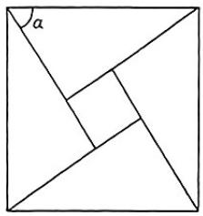

text_image

α

A. $\frac{\sqrt{5}}{5}$

B. $\frac{2\sqrt{5}}{5}$

C. $\frac{1}{2}$

D. $\frac{2}{3}$

3. [河北秦皇岛 2024 届开学考] $\sin 21^{\circ} \cos 9^{\circ} + \sin 69^{\circ} \sin 9^{\circ} =$ \_\_\_\_.

# 考法2 三角函数的求值问题

4.[全国新课标Ⅱ2023·7]已知α为锐角, $\cos\alpha=$ $\frac{1+\sqrt{5}}{4}$ ,则 $\sin\frac{\alpha}{2}=$ ( )

A. $\frac{3-\sqrt{5}}{8}$

B. $\frac{-1 + \sqrt{5}}{8}$

C. $\frac{3 - \sqrt{5}}{4}$

D. $\frac{-1 + \sqrt{5}}{4}$

5.[江苏2024届大联考]已知 $\sin \theta +\sin \left(\theta +\frac{\pi}{3}\right) = 1,$ 则 $\cos \left(\theta -\frac{\pi}{3}\right) =$ （

A. $\frac{1}{2}$

B. $\frac{\sqrt{3}}{3}$

C. $\frac{2}{3}$

D. $\frac{\sqrt{2}}{2}$

6.(多选)[安徽合肥一中2024届月考]下列代数式的值为 $\frac{1}{4}$ 的是()

A. $\cos^{2}75^{\circ}-\sin^{2}75^{\circ}$

B. $\frac{\tan 15^{\circ}}{1 + \tan^{2}15^{\circ}}$

C. $\cos 36^{\circ}\cos 72^{\circ}$

D. $2\cos 20^{\circ}\cos 40^{\circ}\cos 80^{\circ}$

7. 已知 $\alpha \in (0, \pi), \beta \in \left(-\frac{\pi}{2}, \frac{\pi}{2}\right)$ 满足 $\sin \left(\alpha + \frac{\pi}{3}\right) = \frac{1}{3}, \cos \left(\beta - \frac{\pi}{6}\right) = \frac{\sqrt{6}}{6}$ , 则 $\sin (\alpha + 2\beta) =$ （）

A. $\frac{2\sqrt{10} + 2}{9}$

B. $\frac{2\sqrt{10} - 2}{9}$

C. $\frac{-2\sqrt{10} + 2}{9}$

D. $-\frac{2\sqrt{10} + 2}{9}$

8.(多选)[安徽部分校2023联考]已知 $\cos(\alpha+\beta)=-\frac{\sqrt{5}}{5},\cos2\alpha=-\frac{4}{5}$ ，其中 $\alpha,\beta$ 为锐角，则以下命题正确的是()

A. $\sin 2\alpha = \frac{3}{5}$

B. $\cos (\alpha -\beta) = -\frac{2\sqrt{5}}{25}$

C. $\cos \alpha \cos \beta = \frac{\sqrt{5}}{10}$

D. $\tan \alpha \tan \beta = \frac{1}{3}$

9.(多选)[辽宁省实验中学2024届月考]已知钝角三角形ABC,A,B为两锐角,则下列说法正确的是()

A. $\sin A <   \cos B$

B. $\sin A + \sin B <   \sin C$

C. $\tan A + \tan B + \tan C < 0$

D. tan Atan B<1

10.[北京2022·13]若函数 $f(x)=A\sin x-\sqrt{3}\cos x$ 的一个零点为 $\frac{\pi}{3}$ ，则A=\_\_\_\_； $f\left(\frac{\pi}{12}\right)=$ \_\_\_\_.

246 别辜负伟大的时代，滚烫的青春，最好的我们。

# 考点17 三角函数的图象与性质

# 考法1 三角函数单调性的应用

1.[河南部分校2024届联考]已知函数 $f(x)=\frac{1}{\sqrt{\cos\left(x-\frac{\pi}{3}\right)}}$ ，则 $f(x)$ 的单调递增区间是（）

A. $\left(\frac{\pi}{3} + 2k\pi, \frac{4\pi}{3} + 2k\pi\right) (k \in \mathbf{Z})$   
B. $\left(-\frac{\pi}{6} + 2k\pi, \frac{\pi}{3} + 2k\pi\right) (k \in \mathbf{Z})$   
C. $\left(\frac{\pi}{3} + k\pi, \frac{5\pi}{6} + k\pi\right) (k \in \mathbf{Z})$   
D. $\left(\frac{\pi}{3} + 2k\pi, \frac{5\pi}{6} + 2k\pi\right) (k \in \mathbf{Z})$

2.[北京 $2022 \cdot 5$ ] 已知函数 $f(x)=\cos^{2}x-\sin^{2}x$ ，则（）

A. $f(x)$ 在 $\left(-\frac{\pi}{2}, -\frac{\pi}{6}\right)$ 上单调递减  
B. $f(x)$ 在 $\left(-\frac{\pi}{4},\frac{\pi}{12}\right)$ 上单调递增  
C. $f(x)$ 在 $\left(0, \frac{\pi}{3}\right)$ 上单调递减  
D. $f(x)$ 在 $\left(\frac{\pi}{4},\frac{7\pi}{12}\right)$ 上单调递增

3.[重庆西南大学附中、育才中学2024届联考]已知函数 $f(x)=\sin\left(2x+\frac{\pi}{3}\right)$ 在 $[-m,m]$ 上单调递增，则实数m的最大值为()

A. $\frac{\pi}{12}$

B. $\frac{5\pi}{12}$

C. $\frac{7\pi}{12}$

D. $\frac{11\pi}{12}$

考法2 三角函数奇偶性、周期性、函数图象的对称性的应用

4.[山东2024届质量检测]已知函数 $f(x)=\sin\left(\omega x-\frac{\pi}{3}\right)(\omega>0)$ 在 $\left[0,\frac{5\pi}{12}\right]$ 上单调递增,在 $\left(\frac{5\pi}{12},\frac{5\pi}{6}\right]$ 上单调递减,将函数 $f(x)$ 的图象向左平移 $\varphi\left(0<\varphi<\frac{\pi}{2}\right)$ 个单位长度,得到函数 $g(x)$ 的图象,若函数 $g(x)$ 为偶函数,则 $\varphi=$

A. $\frac{\pi}{6}$

B. $\frac{\pi}{4}$

C. $\frac{\pi}{3}$

D. $\frac{5\pi}{12}$

5.(多选)[全国新高考Ⅱ2022·9]已知函数 $f(x)=\sin(2x+\varphi)(0<\varphi<\pi)$ 的图象关于点 $\left(\frac{2\pi}{3},0\right)$ 中心对称,则()

A. $f(x)$ 在区间 $\left(0, \frac{5\pi}{12}\right)$ 单调递减  
B. $f(x)$ 在区间 $\left(-\frac{\pi}{12}, \frac{11\pi}{12}\right)$ 有两个极值点  
C. 直线 $x = \frac{7\pi}{6}$ 是曲线 $y = f(x)$ 的对称轴  
D. 直线 $y = \frac{\sqrt{3}}{2} - x$ 是曲线 $y = f(x)$ 的切线

# 考法3 三角函数的最值及值域

6.[广东深圳人大附中深圳学校2024届月考]已知 $\alpha \in$ $\left(\frac{\pi}{4},\frac{\pi}{2}\right),a = (\cos \alpha)^{\sin \alpha},b = (\sin \alpha)^{\cos \alpha},c =$ $(\cos \alpha)^{\cos \alpha}$ ，则 （）

A. $b > c > a$

B. $c > b > a$

C. $c > a > b$

D. $a > b > c$

7.[山西吕梁2024届月考]已知偶函数 $f(x)=2\sin\left(\omega x-\frac{\pi}{4}+\varphi\right)\left(\omega>0,|\varphi|<\frac{\pi}{2}\right)$ 的图象的相邻两条对称轴间的距离为 $\frac{\pi}{2}$ ，则函数 $f(x)$ 在区间 $\left[-\frac{\pi}{6},\frac{\pi}{3}\right]$ 上的值域为\_\_\_\_.

考法4 函数 $y = A \sin (\omega x + \varphi)$ 的图象变换

8.[浙江2022·6]为了得到函数 $y=2\sin3x$ 的图象, 只要把函数 $y=2\sin\left(3x+\frac{\pi}{5}\right)$ 图象上所有的点()

A. 向左平移 $\frac{\pi}{5}$ 个单位长度  
B. 向右平移 $\frac{\pi}{5}$ 个单位长度  
C. 向左平移 $\frac{\pi}{15}$ 个单位长度  
D. 向右平移 $\frac{\pi}{15}$ 个单位长度

9.[河北邢台四校2024届联考]将函数 $f(x)=2\sin\left(2x+\frac{\pi}{6}\right)$ 的图象向右平移 $\varphi(\varphi>0)$ 个单位长度，得到偶函数 $g(x)$ 的图象，则 $\varphi$ 的最小值是（）

A. $\frac{\pi}{6}$

B. $\frac{\pi}{3}$

C. $\frac{2\pi}{3}$

D. $\frac{5\pi}{6}$

成功的路不止一条，坚持梦想的人总会相遇。247

# 考法5 三角函数图象与性质的综合应用

10.（多选）已知函数 $f(x) = \left|\sin \frac{x}{3}\right| + \cos \left(\frac{x}{3} +\frac{\pi}{6}\right)$ ，则 （ ）

A. $f(x)$ 的最小正周期为 $3\pi$   
B. $f(x)$ 的最大值为 $\sqrt{3}$   
C. $f(x)$ 在 $[5\pi, 7\pi]$ 上单调递减  
D. $f(x)$ 在 $[-4\pi, 4\pi]$ 上有 4 个零点

11.[全国甲(文)2021·15]已知函数 $f(x)=2\cos(\omega x+\varphi)$ 的部分图象如图所示,则 $f\left(\frac{\pi}{2}\right)=$ \_\_\_\_.

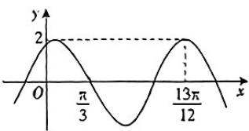

line

| x | y |
|---|---|
| 0 | 0 |
| π/3 | 2 |
| 13π/12 | 2 |

12.[全国新课标Ⅱ2023·16]已知函数 $f(x)=\sin(\omega x+\varphi)$ ，如图，A,B是直线 $y=\frac{1}{2}$ 与曲线 $y=f(x)$ 的两个交点、若 $|AB|=\frac{\pi}{6}$ ，则 $f(\pi)=$ \_\_\_\_.

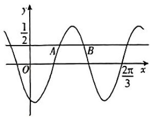

text_image

y
1/2
A
B
O
x
2π/3

13. [浙江 2021·18] 设函数 $f(x) = \sin x + \cos x (x \in \mathbb{R})$ .

(1) 求函数 $y=\left[f\left(x+\frac{\pi}{2}\right)\right]^{2}$ 的最小正周期；  
(2) 求函数 $y = f(x)f\left(x - \frac{\pi}{4}\right)$ 在 $\left[0, \frac{\pi}{2}\right]$ 上的最大值.

14.[河南2024届联考]记函数 $f(x) = 2\cos (\omega x + \varphi)$ $\left(\omega \in \mathbf{N}^{*},0 <   \varphi <  \frac{\pi}{2}\right)$ 的最小正周期为 $T$

(1) 若 $f(T)=1$ ，且直线 $x=\frac{\pi}{6}$ 为 $f(x)$ 的图象的一条
对称轴, 求 $f\left(\frac{\pi}{3}\right)$ ;  
(2) 若 $\frac{\pi}{3}$ 为 $f(x)$ 的一个零点，且 $f(x)$ 在区间 $(0, \pi)$ 上至多有两个零点，求 T.

# 专题6 三角函数中的 $\omega$ 的取值问题

# 考法1 单调性与 $\omega$ 的取值范围

1.[河北石家庄2023期末]已知 $\omega > 0$ , 函数 $f(x) = \sin \left( \omega x + \frac{\pi}{4} \right)$ 在区间 $\left[ \frac{\pi}{2}, \pi \right]$ 上单调递减, 则实数 $\omega$ 的取值范围是 ( )

A. $\left[\frac{1}{2},\frac{5}{4}\right]$

B. $\left[\frac{1}{2},\frac{3}{4}\right]$

C. $\left(0, \frac{1}{2}\right]$

D. $(0,2]$

2.[湖南名校联盟2023质量检测]已知函数 $f(x)=\cos\left(\omega x+\frac{\pi}{3}\right)(\omega<0)$ 在 $\left(\frac{\pi}{2},\pi\right)$ 上单调递减,则实数 $\omega$ 的取值范围是()

A. $\left[-\frac{4}{3}, -\frac{2}{3}\right]$

B. $\left[-\frac{1}{3},0\right)$

C. $\left[-\frac{2}{3}, -\frac{1}{3}\right]$

D. $\left[-\frac{5}{6}, -\frac{2}{3}\right]$

# 考法2 最值（值域）与 $\omega$ 的取值范围

3.[广东广州中山大学附属中学2024届月考]已知函数 $f(x)=\sin\left(\omega x+\frac{\pi}{6}\right)(\omega>0)$ 在区间 $\left(0,\frac{\pi}{2}\right)$ 内有最大值,但无最小值,则 $\omega$ 的取值范围是()

A. $\left(\frac{2}{3},\frac{8}{3}\right]$

B. $\left[\frac{1}{6},\frac{5}{6}\right)$

C. $\left(\frac{2}{3},\frac{5}{6}\right]$

D. $\left[\frac{1}{6},\frac{8}{3}\right)$

4.[四川绵阳2024届一诊]已知函数 $f(x)=4\cos\left(\omega x-\frac{\pi}{12}\right)(\omega>0)$ ， $f(x)$ 在区间 $\left[0,\frac{\pi}{3}\right]$ 上的最小值恰为 $-\omega$ ，则所有满足条件的 $\omega$ 的积属于区间()

A. $(1,4]$

B. [4,7]

C. (7,13)

D. $[13, +\infty)$

# 考法3 零点、极值点与 $\omega$ 的取值范围

5.[全国Ⅱ文2019·8]若 $x_{1}=\frac{\pi}{4},x_{2}=\frac{3\pi}{4}$ 是函数 $f(x)=$ $\sin\omega x(\omega>0)$ 两个相邻的极值点，则 $\omega=$ （）

A.2

B. $\frac{3}{2}$

C. 1

D. $\frac{1}{2}$

6.[湖南三湘创新发展联合体2024届月考]若函数 $f(x)=\cos\left(\omega x+\frac{\pi}{5}\right)(\omega>0)$ 在区间 $\left(\frac{\pi}{2},\frac{3\pi}{2}\right)$ 上恰有两

个零点,则 $\omega$ 的取值范围是 ( )

A. $\left(\frac{23}{15},\frac{11}{5}\right]$

B. $\left[\frac{23}{15},\frac{11}{5}\right)$

C. $\left(\frac{23}{15},\frac{11}{5}\right]\cup \left[\frac{13}{5},\frac{43}{15}\right]$

D. $\left[\frac{23}{15},\frac{11}{5}\right)\cup \left[\frac{13}{5},\frac{43}{15}\right)$

7.[全国乙(理)2022·15]记函数 $f(x)=\cos(\omega x+\varphi)$ $(\omega>0,0<\varphi<\pi)$ 的最小正周期为T. 若 $f(T)=\frac{\sqrt{3}}{2},x=\frac{\pi}{9}$ 为 $f(x)$ 的零点，则 $\omega$ 的最小值为\_\_\_\_.

8.[全国新课标Ⅰ2023·15]已知函数 $f(x)=\cos\omega x-1$ (ω>0)在区间 $[0,2\pi]$ 有且仅有3个零点，则ω的取值范围是\_\_\_\_.

9.[山西部分学校2023联考]已知函数 $f(x)=A\sin(\omega x+\varphi)(A>0,\omega>0)$ 的图象是由 $y=2\sin\left(\omega x+\frac{\pi}{6}\right)$ 的图象向右平移 $\frac{\pi}{6}$ 个单位长度得到的.

(1) 若 $f(x)$ 的最小正周期为 $\pi$ ，求 $f(x)$ 的图象与 $y$ 轴距离最近的对称轴方程；

(2) 若 $f(x)$ 在 $\left[\frac{\pi}{2}, \frac{3\pi}{2}\right]$ 上有且仅有一个零点、求 $\omega$ 的取值范围.

# 第5章 风向练

1. 学科融合 [江苏淮安 2024 届一调] 某个弹簧振子做简谐运动, 已知在完成一次全振动的过程中, 时间 $t$ (单位: s) 与位移 $y$ (单位: cm) 之间满足函数关系: $y = \sin t + \cos \left( t - \frac{\pi}{6} \right)$ , 则这个简谐运动的振幅是 ( )

A. $1 \mathrm{~cm}$

B. $2 \mathrm{~cm}$

C. $\sqrt{3} \mathrm{~cm}$

D. $2 \sqrt{3} \mathrm{~cm}$

2. 学科融合 (多选)[山西大学附属中学 2023 诊断考]阻尼器是一种以提供阻力达到减震效果的专业工程装置. 我国第一高楼上海中心大厦的阻尼器减震装置如图①所示. 由物理学知识可知, 某阻尼器的运动过程可近似为简谐运动, 其离开平衡位置的位移 $y(\mathrm{m})$ 和时间 $t(\mathrm{s})$ 的函数关系为 $y = \sin (\omega t + \varphi) (\omega > 0, |\varphi| < \pi)$ , 如图②, 若该阻尼器在摆动过程中连续三次到达同一位置的时间分别为 $t_1, t_2, t_3 (0 < t_1 < t_2 < t_3)$ , 且 $t_1 + t_2 = 2, t_2 + t_3 = 5$ , 则在一个周期内阻尼器离开平衡位置的位移大于 $0.5 \mathrm{~m}$ 的总时间为 ( )

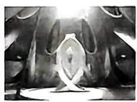  
图①

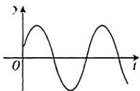  
图②

A. $\frac{1}{3} s$

B. $\frac{2}{3}$ s

C. $1 \mathrm{~s}$

D. $\frac{4}{3} s$

3. 新定义 [湖北新高考协作体 2023 联考] 定义: 若 $f(x)=\left\{\begin{aligned}g(x),&1\leqslant x<k,\\ kf\left(\frac{x}{k}\right),&x\geqslant k,\end{aligned}\right.$ 则称 $f(x)$ 是函数 $g(x)$ 的 k 倍
伸缩仿周期函数. 设 $g(x)=\sin(\pi x)$ ，且 $f(x)$ 是 $g(x)$ 的 2 倍伸缩仿周期函数. 若对于任意的 $x\in[1,m]$ ，都有 $f(x)\geqslant-8$ ，则实数 m 的最大值为 ( )

A. 12

B. $\frac{56}{3}$

C. $\frac{64}{3}$

D. $\frac{88}{3}$

4. 数学应用（多选）[江苏2024届大联考]某过山车轨道是依据正弦曲线设计安装的，在时刻 $t$ （单位：s）

250 我们看不见时间,但可以看见时间的力量。

时,过山车(看作质点)距离地面的高度 h(单位:m)
可用 $h(t)=A\sin(\omega t+\varphi)+B\left(A>0,\omega>0,|\varphi|<\frac{\pi}{2}\right)$ 近似表示. 已知当 t=4 s 时, 过山车到达第一个最高点, 最高点距离地面 50 m, 当 t=10 s 时, 过山车到达第一个最低点, 最低点距离地面 10 m. 则 ( )

A. $A = 30$

B. $\omega = \frac{\pi}{6}$

C. 过山车启动时距地面 $20 \mathrm{~m}$

D. 一个周期内过山车距离地面高于 $40 \mathrm{~m}$ 的时间是 $4 \mathrm{~s}$

5. 数学文化 [四川部分校 2024 届联考] 黄金比是指事物各部分间一定的数学比例关系, 即将整体一分为二, 较大部分与较小部分之比等于整体与较大部分之比, 其比值约为 $1:0.618$ , 上述比例又被称为黄金分割. 将底和腰之比等于 $\frac{\sqrt{5}-1}{2}$ 的等腰三角形称为黄金三角形, 若某黄金三角形的一个底角为 $C$ , 则 $\cos 2C=$ \_\_\_\_.

6. 学科融合 [湖北武汉二中 2023 六模] 如图①, 一根绝对刚性且长度不变、质量可忽略不计的线, 一端固定, 另一端悬挂一个沙漏. 让沙漏在偏离平衡位置一定角度 (最大偏角) 后在重力作用下在铅垂面内做周期摆动, 沙漏摆动时离开平衡位置的位移 $f(t)$ (单位: $\mathrm{cm}$ ) 与时间 $t$ (单位: $\mathrm{s}$ ) 满足函数关系 $y = f(t) = 3\sin(\omega t + \varphi)(\omega > 0, 0 < |\varphi| < \pi)$ , 如图②, 若函数 $f(t)$ 在区间 $[a, a + 1]$ 上的最大值为 $M$ , 最小值为 $N$ , 则 $M - N$ 的最小值为 \_\_\_\_.

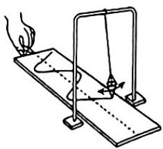

natural_image

Simple line drawing of a physics experiment setup with a lever and curved object (no text or symbols)

图①

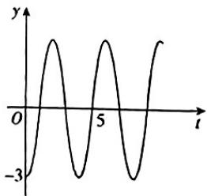

line

| t  | y  |
|----|----|
| 0  | -3 |
| 5  | 3  |

图②

# 考法1 利用正弦定理解三角形

1.(多选)[河北邢台四校2024届联考]在△ABC中,内角A,B,C的对边分别是a,b,c,且 $a+b\cos C=c\cos B+4c\cos C,A=\frac{\pi}{6}$ ,则 $\frac{b}{c}$ 的取值可能是()

A. $\frac{1}{2}$

B. $\frac{\sqrt{3}}{2}$

C. 2

D. $\sqrt{3}$

2.[辽宁大连育明中学2024届月考]在△ABC中,内角A,B,C所对的边分别为a,b,c,则“ $\frac{a}{\cos A}=\frac{b}{\cos B}=$ $\frac{c}{\cos C}$ ”是“ $\cos(A-B)\cdot\cos(B-C)\cdot\cos(C-A)=1$ ”的()

A. 充分不必要条件  
B. 充要条件  
C. 必要不充分条件  
D. 既不充分也不必要条件

# 考法2 利用余弦定理解三角形

3.[全国甲(文)2021·8]在△ABC中,已知 $B=120^{\circ}$ , $AC=\sqrt{19}$ ,AB=2,则BC=
()

A. 1

B. $\sqrt{2}$

C. $\sqrt{5}$

D. 3

4.(多选)[云南昆明一中2023期中]在△ABC中,内角A,B,C所对的边分别为a,b,c,设BC边上的中点为M,△ABC的面积为S,其中 $a=2\sqrt{3},b^{2}+c^{2}=24$ ,则下列说法中正确的是()

A. 若 $A = \frac{\pi}{3}$ , 则 $S = 3\sqrt{3}$   
B. $S$ 的最大值为 $3\sqrt{3}$   
C. ${AM} = 3$   
D. 角 $A$ 的最小值为 $\frac{\pi}{3}$

5.[全国甲(理)2022·16]已知△ABC中,点D在边BC上, $\angle ADB=120^{\circ},AD=2,CD=2BD.$ 当 $\frac{AC}{AB}$ 取得最小值时,BD= \_\_\_\_.

考法3 射影定理与三角形的“三线”

6.[河北唐山、保定四校2023一模(改编)]在 $\triangle ABC$ 中,内角 $A,B,C$ 的对边分别为 $a,b,c$ ,且满足 $\frac{\cos(B+C)}{a}-\frac{\cos C}{c}=\frac{2b\cos(A+C)}{ac}$ ,则角 $B$ 的大小为\_\_\_\_.

7.[辽宁名校联盟2024届联考]已知△ABC的三个内角A,B,C所对的边分别为a,b,c,点M在边AB上, $b=2,CM=1$ ,且 $\frac{2\sin A+\sin B}{\sin 2B}=\frac{c}{b}$ ,\_\_\_\_.

在①CM为△ABC的一条中线；②CM为△ABC的一条角平分线；③CM为△ABC的一条高线这三个条件中任选一个，补充在上面的横线中，并进行解答.

(1) 求边长 $AB$ ;  
(2) 若 $\triangle ABC$ 外接圆的面积为 $S_{1}$ , 内切圆的面积为 $S_{2}$ , 求 $S_{1} - S_{2}$ 的值.

8.[全国新课标Ⅰ2023·17]已知在△ABC中， $A+B=$ 3C, $2\sin(A-C)=\sin B$ .

(1) 求 $\sin A$ ;   
(2) 设 AB = 5，求 AB 边上的高.

考法4 综合利用正、余弦定理解三角形

9.[全国乙(理)2023·18]在 $\triangle ABC$ 中,已知 $\angle BAC=120^{\circ},AB=2,AC=1.$

(1) 求 $\sin \angle ABC$ ;

(2) 若 D 为 BC 上一点, 且 $\angle BAD = 90^{\circ}$ , 求 $\triangle ADC$ 的面积.

10.[全国甲(文)2023·17]记△ABC的内角A,B,C的对边分别为a,b,c,已知 $\frac{b^{2}+c^{2}-a^{2}}{\cos A}=2.$

(1) 求 $bc$ ;

(2) 若 $\frac{a\cos B-b\cos A}{a\cos B+b\cos A}\frac{b}{c}=1$ , 求 $\triangle ABC$ 面积.

11.[河北保定2023联考]已知在 $\triangle ABC$ 中,内角A,B,
C所对的边分别为a,b,c,且 $b=10,a\cos\left(\frac{B}{2}+\pi\right)+b\cos\left(\frac{3\pi}{2}+A\right)=0.$

(1) 求角 B;  
(2)若\_\_\_\_,求△ABC的面积.

请在① $\frac{\sin B}{\sin C} +\frac{\sin C}{\sin B} = \frac{\sin^2A}{\sin B\sin C} +1;$ ② $\tan \left(A + \frac{3\pi}{4}\right) =$

请在① $\frac{\sin B}{\sin C} +\frac{\sin C}{\sin B} = \frac{\sin^2A}{\sin B\sin C} +1;$ ② $\tan \left(A + \frac{3\pi}{4}\right) =$

$2-\sqrt{3}$ ;③ $\tan A=3$ 这三个条件中任选一个,补充在上面的问题中,并加以解答.

252 因为我们所有人都不是十全十美，才使得我们每一次的过关斩将都显得格外具有意义。

# 考点19 解三角形在实际问题中的应用

1.[江西2024届联考]《孔雀东南飞》中写道“十三能织素，十四学裁衣，十五弹箜篌，十六诵诗书”.箜篌历史悠久、源远流长，音域宽广、音色柔美清澈，表现力强.如图是箜篌的一种形制，对其进

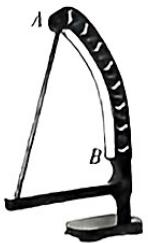

行绘制,发现其近似一扇形,在圆弧的两个端点 A,B 处分别作切线相交于点 C,测得切线 AC=99.9 cm, BC=100.1 cm, AB=180 cm,根据测量数据可估算出该圆弧所对圆心角的余弦值为 ( )

A. 0.62

B. 0.56

C.-0.56

D. -0.62

2.[浙江浙北G2联盟2023联考]如图,为了测量某湿地A,B两点间的距离,观察者找到在同一直线上的三点C,D,E.从D点测得 $\angle ADC=67.5^{\circ}$ ,从C点测得 $\angle ACD=45^{\circ}$ , $\angle BCE=75^{\circ}$ ,从E点测得 $\angle BEC=60^{\circ}$ .若测得DC= $2\sqrt{3}$ , $CE=\sqrt{2}$ (单位:百米),则A,B两点间的距离为()

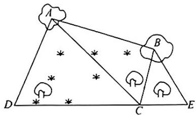

text_image

A
B
D
C
E

A. $\sqrt{6}$ 百米

B. $2 \sqrt{2}$ 百米

C. 3 百米

D. $2 \sqrt{3}$ 百米

3.[江苏南京一中2024届月考]我国油纸伞的制作工艺巧妙.如图①,伞不管是张开还是收拢,伞柄AP始终平分同一平面内两条伞骨所成的角,即∠BAC,且AB=AC,从而保证伞圈D能够沿着伞柄滑动.如图②,伞完全收拢时,伞圈D已滑动到D'的位置,且A,B,D'三点共线,AD'=40cm,B为AD'的中点,当伞从完全张开到完全收拢,伞圈D沿着伞柄向下滑动的距离为24cm,则当伞完全张开时,∠BAC的余弦值是()

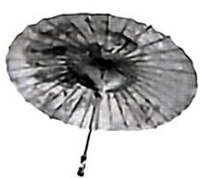

natural_image

Close-up of a circular, textured object with radial lines and a small protrusion at the bottom (no visible text or symbols)

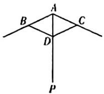  
图①

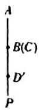  
图②

A. $-\frac{17}{25}$

B. $-\frac{4\sqrt{21}}{25}$

C. $-\frac{3}{5}$

D. $-\frac{8}{25}$

4.[全国乙(理)2021·9]魏晋时期刘徽撰写的《海岛算经》是关于测量的数学著作,其中第一题是测量海岛的高.如图,点E,H,G在水平线AC上,DE和FG是两个垂直于水平面且等高的测量标杆的高度,称为“表高”,EG称为“表距”,GC和EH都称为“表目距”,GC与EH的差称为“表目距的差”,则海岛的高AB=()

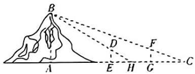

text_image

B
D
F
A
E
H
G
C

A. $\frac{\text{表高} \times \text{表距}}{\text{表目距的差}} + \text{表高}$

B. $\frac{\text{表高} \times \text{表距}}{\text{表目距的差}}$ 表高

C. $\frac{\text{表高} \times \text{表距}}{\text{表目距的差}} + \text{表距}$

D. $\frac{\text{表高} \times \text{表距}}{\text{表目距的差}}$ - 表距

5.[山东临沂兰陵一中2024届质量检测]中华人民共和国国歌有84个字,37小节,奏唱大约需要46s,某校周一举行升旗仪式,旗杆正好处在坡度为15°的看台的某一列的正前方,从这一列的第一排和最后一排测得旗杆顶部的仰角分别为60°和30°,第一排和最后一排的距离为 $10\sqrt{2}$ m,如图所示,旗杆底部与第一排在同一个水平面上,要使国歌结束时国旗刚好升到旗杆顶部,升旗手升旗的速度约为\_\_\_\_m/s.

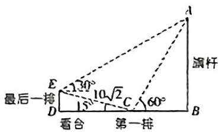

text_image

最后一排
D
看合
第一排
15°
30°
10√2
C
60°
涡杆
A
B

6.[广东东莞七校2023联考]古希腊数学家依巴谷给出了托勒密定理,即圆的内接凸四边形的两对对边乘积的和等于两条对角线的乘积.已知AC,BD为圆的内接四边形ABCD的两条对角线,且 $\sin\angle ABD:\sin\angle ADB:\sin\angle BCD=2:3:4$ .若 $AC^{2}=\lambda BC\cdot CD$ ,则实数 $\lambda$ 的最小值为\_\_\_\_.

奔赴更好的明天，从他人眼里，亦能看见更好的自己。

253

# 专题7 解三角形中的最值、范围问题

1.[云南师大附中2024届月考]已知锐角三角形ABC的内角A、B、C的对边分别为a、b、c、且 $\frac{a-b+c}{c}=\frac{b}{a+b-c}$

(1) 求角 A;  
(2) 求 $\frac{1}{\tan B} + \frac{1}{\tan C}$ 的取值范围.

3.[山西吕梁2023二模]如图,在平面四边形ABCD中, $\angle A=135^{\circ},AB=2,\angle ABD$ 的平分线交AD于点E,且 $BE=2\sqrt{2}$ .

(1) 求 $\angle ABE$ 及 BD;   
(2) 若 $\angle BCD = 60^{\circ}$ ，求 $\triangle BCD$ 周长的最大值.

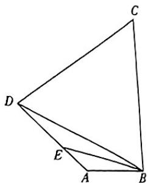

text_image

Geometric diagram of a quadrilateral with labeled vertices A, B, C, D and internal points E

2.[湖南长沙一中2024届月考]在锐角三角形ABC中，内角A,B,C的对边分别为a,b,c,且满足 $b^{2}-a^{2}=ac$ .

(1) 求证: B = 2A;   
(2) 设 $\triangle ABC$ 的周长为 l, 求 $\frac{l}{a}$ 的取值范围.

4.[江苏淮安淮阴中学2023开学考]已知△ABC中,内角A,B,C所对的边分别为a,b,c,3ccosB+2bsin Bsin C=0,D是△ABC边AC上的一点,且BD=1.

(1) 若 $BD \perp BC, AB = \sqrt{3}$ , 求 $AD$ ;   
(2) 若 $BD$ 为 $\angle ABC$ 的平分线, 求 $\triangle ABC$ 面积的最小值.

# 第6章 风向练

答案 D40

1. 结构不良 [安徽 A10 联盟 2023 模拟]从条件①

$$
b - c \cos A = a (\sqrt {3} \sin C - 1); ② \sin (A + B) \cdot \cos \left(C - \frac {\pi}{6}\right) = \frac {3}{4}
$$

中任选一个,补充在下面横线中,并加以解答.

在 $\triangle ABC$ 中, 内角 A, B, C 的对边分别为 a, b, c, \_\_\_\_.

(1) 求角 $C$ 的大小；  
(2) 设 $D$ 为边 $AB$ 的中点, 求 $\frac{CD^2}{a^2 + b^2}$ 的最大值.

2. 结构不良 [湖南长沙一中 2024 届月考] 已知 $\triangle ABC$ 的内角 $A, B, C$ 所对的边分别为 $a, b, c$ , 点 $O$ 为 $\triangle ABC$ 的内心, $\triangle OBC, \triangle OAC, \triangle OAB$ 的面积分别为 $S_{1}, S_{2}, S_{3}$ , 且 $S_{1}^{2} + S_{3}^{2} - S_{1}S_{3} = S_{2}^{2}, c = 2$ .

(1) 在① $a\cos C + c\cos A = 1$ ; ② $4\sin B\sin A + \cos 2A = 1$ ;  
③ $\frac{1-2\cos A}{\sin A}+\frac{1-2\cos B}{\sin B}=0$ 中任选一个作为条件，判断 $\triangle ABC$ 是否存在？若存在，求出 $\triangle ABC$ 的周长；若不存在，请说明理由.  
(2) 若 $\triangle ABC$ 为锐角三角形, 求 $\triangle ABC$ 面积的取值范围.

# 第7章 平面向量

# 考点20 平面向量的线性运算、基本定理及坐标运算

讲解P91/答案D41

# 考法1 平面向量的线性运算

1.[全国新高考Ⅱ2020·3]若D为△ABC的边AB的中点,则 $\overrightarrow{CB}=$ ( )

A. $2\overrightarrow{CD} - \overrightarrow{CA}$

B. $2 \overrightarrow{CA} - \overrightarrow{CD}$

C. $2\overrightarrow{CD} +\overrightarrow{CA}$

D. $2\overrightarrow{CA} +\overrightarrow{CD}$

2.[河南2024届联考]在平行四边形ABCD中,E是BC的中点,F是CD的中点,DE与BF相交于点G,则 $\overrightarrow{AG}=$ ( )

A. $\frac{2}{3}\overrightarrow{AB} +\frac{2}{3}\overrightarrow{AD}$

B. $\frac{2}{3}\overrightarrow{AB} +\frac{1}{3}\overrightarrow{AD}$

C. $\frac{1}{3}\overrightarrow{AB} +\frac{1}{3}\overrightarrow{AD}$

D. $\frac{1}{3}\overrightarrow{AB} +\frac{2}{3}\overrightarrow{AD}$

# 考法2 向量共线及其应用

3.[四川绵阳南山中学2024届月考]已知向量 $\overrightarrow{AB} = (7,$ 6), $\overrightarrow{BC} = (-3,m),\overrightarrow{AD} = (-1,2m)$ . 若 $B,C,D$ 三点共线,则实数 $m =$ （）

A. 6

B.-6

C. 9

D.-9

4.[河北邢台2024届联考]在△ABC中, $\overrightarrow{BC}=3\overrightarrow{BD},\overrightarrow{CF}=2\overrightarrow{FA},E$ 是AB的中点,EF与AD交于点P.若 $\overrightarrow{AP}=m\overrightarrow{AB}+n\overrightarrow{AC}(m,n\in\mathbb{R})$ ,则 $m+n=$

A. $\frac{3}{7}$

B. $\frac{4}{7}$

C. $\frac{6}{7}$

D. 1

# 考法3 平面向量基本定理及其应用

5.[河北衡水二中2023期中]如图所示,平行四边形ABCD的对角线相交于点O,AE=EO,若 $\overrightarrow{DE}=\lambda\overrightarrow{AB}+\mu\overrightarrow{AD}(\lambda,\mu\in\mathbb{R})$ ,则 $\lambda+\mu$ 等于()

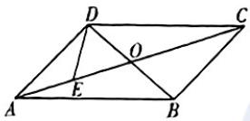

A. I

B. $-\frac{1}{2}$

C. $-\frac{2}{3}$

D. $\frac{1}{8}$

6.[湖南师大附中2024届月考]在 $\triangle ABC$ 中， $D$ 为 $AC$ 上一点且满足 $\overrightarrow{AD}=\frac{1}{3}\overrightarrow{DC}$ ，若 $P$ 为 $BD$ 上一点，且满足 $\overrightarrow{AP}=\lambda\overrightarrow{AB}+\mu\overrightarrow{AC},\lambda,\mu$ 为正实数，则下列结论正确的是()

A. $\lambda \mu$ 的最小值为 $\frac{1}{16}$

B. $\lambda \mu$ 的最大值为1

C. $\frac{1}{\lambda} + \frac{1}{4\mu}$ 的最小值为 4

D. $\frac{1}{\lambda} + \frac{1}{4\mu}$ 的最大值为 16

# 考法4 线段定比分点的应用

7.[江苏无锡四校2023联考]设 $A_{1}, A_{2}, A_{3}, A_{4}$ 为平面直角坐标系中两两不同的点，若 $\overrightarrow{A_1A_3} = \lambda \overrightarrow{A_1A_2} (\lambda \in \mathbb{R})$ ， $\overrightarrow{A_1A_4} = \mu \overrightarrow{A_1A_2} (\mu \in \mathbb{R})$ ，且 $\frac{1}{\lambda} + \frac{1}{\mu} = 4$ ，则称点 $A_{3}, A_{4}$ 和谐分割点 $A_{1}, A_{2}$ . 已知平面上两两不同的点 $A, B, C, D$ 若 $C, D$ 和谐分割点 $A, B$ . 则下面说法正确的是

A. 点 $C$ 可能是线段 $AB$ 的中点

B. 点 $C$ 可能是靠近点 $A$ 的线段 $AB$ 的三等分点

C. 点 $C, D$ 可能同时在线段 $AB$ 上

D. 点 $C, D$ 可能同时在线段 $AB$ 的延长线上

# 考法5 平面向量的坐标表示及运算

8.[山东省实验中学2024届一诊]已知 $\overrightarrow{OA},\overrightarrow{OB},\overrightarrow{OC}$ 均为单位向量，满足 $\overrightarrow{OA}\cdot \overrightarrow{OB} = \frac{1}{2},\overrightarrow{OA}\cdot \overrightarrow{OC}\geqslant 0,\overrightarrow{OB}\cdot$ $\overrightarrow{OC}\geqslant 0,\overrightarrow{OC} = x\overrightarrow{OA} +y\overrightarrow{OB}$ ，则 $3x + y$ 的最小值为（）

A. $-\frac{3\sqrt{21}}{14}$

B. $-\frac{\sqrt{3}}{3}$

C. $-\frac{\sqrt{7}}{14}$

D. -1

9.[全国乙(文)2021·13]已知向量 $a = (2,5), b = (\lambda, 4)$ , 若 $a // b$ , 则 $\lambda = \_$ .

10.[全国甲(理)2021·14]已知向量 $a = (3,1),b = (1,$ 0), $c = a + kb$ .若 $a\bot c$ ，则 $k = \_$

256 只有积累足够多的能力，才足以面对外界，以不变应万变。

# 考点21 平面向量的数量积及其应用

# 考法1 计算平面向量数量积的方法

1.[皖豫名校2024届联考]如图,在四边形ABCD中, $AB//CD$ ,AB为其外接圆的直径,且AB=2AD=2,P为边BC的中点,则 $\overrightarrow{AP}\cdot\overrightarrow{BD}=$ ( )

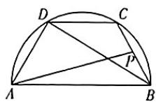

A. $-\frac{7}{3}$

B. -2

C. $-\frac{13}{16}$

D. $-\frac{9}{4}$

2.[湖北武汉华中师大一附中2023月考]如图，B,D是以AC为直径的圆上的两点，其中 $AB=\sqrt{t+1}$ ，AD= $\sqrt{t+2}$ ，则 $\overrightarrow{AC}\cdot\overrightarrow{BD}=$ （）

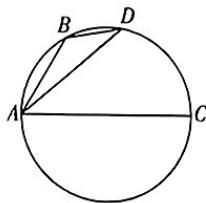

text_image

A
B
D
C

A. 1

B. 2

C. t

D. $2t$

3.(多选)[辽宁沈阳重点高中协作体2024届月考]已知△ABC的三个内角A,B,C的对边分别为a,b,c,其中b=6,c=8且 $b\cos C+c\cos B=10$ ,P是AB边上的动点,则 $\overrightarrow{PA}\cdot(\overrightarrow{PB}+\overrightarrow{PC})$ 的值可能为()

A.-12

B.-8

C.-2

D. 0

4.[全国甲(理)2022·13]设向量a,b的夹角的余弦值为 $\frac{1}{3}$ ，且 $|a|=1,|b|=3$ ，则 $(2a+b)\cdot b=$ \_\_\_\_.

5.[全国新高考Ⅱ2021·15]向量a,b,c满足 $a+b+c=0$ , $|a|=1,|b|=|c|=2$ ,则 $a\cdot b+b\cdot c+c\cdot a=$ \_\_\_\_.

6.[河北保定2023二模]在△ABC中,点D在边AB上,
CD平分∠ACB,若 $|\overrightarrow{CA}|=1,|\overrightarrow{CB}|=2,\angle ACB=60^{\circ}$ ,则 $\overrightarrow{CD}\cdot\overrightarrow{AB}=$ \_\_\_\_.

# 考法2 解决有关垂直的问题

7. 在 $\triangle ABC$ 中, $A = 120^{\circ}$ , 且 $AB = 3$ , $AC = 4$ . 若 $\overrightarrow{AP} = \lambda \overrightarrow{AB} + \overrightarrow{AC}$ , 且 $\overrightarrow{AP} \perp \overrightarrow{BC}$ , 则实数 $\lambda$ 的值为 ( )

A. $\frac{22}{15}$

B. $\frac{10}{3}$

C. 6

D. $\frac{12}{7}$

8.(多选)[江苏南京2024届联考]已知向量 $a=(-1,3)$ , $b=(x,2)$ ，且 $(a-2b)\perp a$ ，则()

A. $b=(1,2)$

B. $|2a - b| = 25$

C. 向量 a 与向量 b 的夹角是 $45^{\circ}$

D. 向量 a 在向量 b 上的投影向量坐标是(1,2)

# 考法3 解决向量的模与夹角问题

9. 已知向量 a, b 满足 $3|a|=2|b|=3$ ，若 $|a+2b|=\sqrt{14}$ ，则 a, b 夹角的余弦值为（）

A. $\frac{1}{2}$

B. $\frac{1}{3}$

C. $\frac{2}{3}$

D. $\frac{5}{6}$

10.[浙江名校联盟2024届联考]已知平面向量a,b的夹角为 $\frac{\pi}{3},|a|=2,|b|=1$ ,若 $(a+\lambda b)\perp b$ ,则 $|a+$ $\lambda b|=$ ( )

A. $\sqrt{3}$

B. $2 \sqrt{3}$

C. $\sqrt{2}$

D. $2\sqrt{2}$

11.[河南省实验中学2023模拟]已知 $\overrightarrow{AB} \cdot \overrightarrow{AC} = 6$ , 线段 $BC$ 的中点为 $M$ , 且 $|\overrightarrow{AM}| = 6$ , 则 $|\overrightarrow{BC}| =$ ( )

A. $2 \sqrt{30}$

B. $3\sqrt{30}$

C. $2 \sqrt{26}$

D. $3\sqrt{26}$

12.[全国甲(文)2021·13]若向量a,b满足 $|a|=3$ , $|a-b|=5$ , $a\cdot b=1$ , 则 $|b|=$ \_\_\_\_.

# 考法4 投影向量及其应用

13.(多选)[辽宁辽西联合校2024届期中]已知向量 $a=(2,1)$ , $b=(-3,1)$ ，则()

A. 与向量 a 方向相同的单位向量是 $\left(\frac{2\sqrt{5}}{5}, \frac{\sqrt{5}}{5}\right)$

B. $(a+b)\perp a$

C. 向量 a 在向量 b 上的投影向量是 $-\frac{\sqrt{10}}{2}a$

D. $|a+2b|=5$

# 专题8 平面向量的综合应用

# 考法1 三角形的“四心”与奔驰定理

1.[重庆八中2023适应性月考]在 $\triangle ABC$ 中, $A=\frac{\pi}{3}$ ,G为 $\triangle ABC$ 的重心.若 $\overrightarrow{AG}\cdot\overrightarrow{AB}=\overrightarrow{AG}\cdot\overrightarrow{AC}=6$ ,则 $\triangle ABC$ 外接圆的半径为()

A. $\sqrt{3}$

B. $\frac{4\sqrt{3}}{3}$

C. 2

D. $2\sqrt{3}$

2.（多选）[安徽皖江名校联盟2024届联考]已知点 $P$ 在 $\triangle ABC$ 所在平面上，且满足 $3\overrightarrow{PA} + 2\overrightarrow{PB} + \overrightarrow{PC} = 0$ ，则下列说法正确的是 （）

A. 点 $P$ 一定在 $\triangle ABC$ 内部  
B. $4\overrightarrow{PA} + 2\overrightarrow{PB} = \overrightarrow{CA}$   
C. $S_{\triangle ABC} = 3S_{\triangle PAC}$   
D. $2S_{\triangle PAB} + S_{\triangle PAC} = S_{\triangle PBC}$

3.（多选）[湖北黄冈2024届调研]点 $O, H$ 分别是 $\triangle ABC$ 的外心、垂心，则下列选项正确的是（）

A. 若 $\overrightarrow{BD} = \lambda \left( \frac{\overrightarrow{BA}}{|\overrightarrow{BA}|} + \frac{\overrightarrow{BC}}{|\overrightarrow{BC}|} \right)$ 且 $\overrightarrow{BD} = \mu \overrightarrow{BA} + (1 - \mu) \cdot \overrightarrow{BC}$ , 则 $\overrightarrow{AD} = \overrightarrow{DC}$   
B. 若 $2\overrightarrow{BO} = \overrightarrow{BA} +\overrightarrow{BC}$ 且 $AB = 2$ ，则 $\overrightarrow{AC}\cdot \overrightarrow{AB} = 4$   
C. 若 $\angle B = \frac{\pi}{3}, \overrightarrow{OB} = m\overrightarrow{OA} + n\overrightarrow{OC}$ , 则 $m + n$ 的取值范围为 $[-2, 1)$   
D. 若 $2\overrightarrow{HA} + 3\overrightarrow{HB} + 4\overrightarrow{HC} = 0$ ，则 $\cos \angle BHC = -\frac{\sqrt{10}}{5}$

# 考法 2 最值和范围问题

4.[北京2022·10]在△ABC中,AC=3,BC=4,∠C=90°.P为△ABC所在平面内的动点,且PC=1,则 $\overrightarrow{PA}\cdot\overrightarrow{PB}$ 的取值范围是()

A. $[-5,3]$   
B. $\left[-3,5\right]$   
C. $[-6,4]$   
D. $[-4,6]$

5.[陕西商洛2024届阶段性测试]在 $\triangle ABC$ 中, $\overrightarrow{BD}=\frac{1}{3}\overrightarrow{BC},E$ 是线段 $AD$ 上的动点(与端点不重合),设 $\overrightarrow{CE}=x\overrightarrow{CA}+y\overrightarrow{CB}(x,y\in\mathbb{R})$ ,则 $\frac{8x+3y}{3xy}$ 的最小值是()

A.6

B. 7

C. 8

D. 9

6.[浙江2022·17]设点P在单位圆的内接正八边形 $A_{1}A_{2}\cdots A_{8}$ 的边 $A_{1}A_{2}$ 上，则 $\overrightarrow{PA_{1}}^{2}+\overrightarrow{PA_{2}}^{2}+\cdots+\overrightarrow{PA_{8}}^{2}$ 的取值范围是\_\_\_\_.

258 人生是用来体验的,不是用来演绎完美的。

7. 已知圆 O 的方程为 $x^{2} + y^{2} = 1$ , P 是圆 $C: (x - 2)^{2} + y^{2} = 16$ 上一点, 过点 P 作圆 O 的两条切线, 切点分别为 A, B, 则 $\overrightarrow{PA} \cdot \overrightarrow{PB}$ 的取值范围为 \_\_\_\_.

# 考法3 三角恒等变换与平面向量的综合应用

8.[广东五校2023联考]在锐角三角形ABC中,内角A,B,C的对边分别为a,b,c,记 $m=\left(\frac{1}{a},\frac{1}{b}\right)$ , $n=(b,a)$ ,若 $m\cdot n=6\cos C$ ,则 $\frac{\tan C}{\tan A}+\frac{\tan C}{\tan B}=$ \_\_\_\_.  
9.[辽宁抚顺2023联考]已知锐角三角形ABC的内角A,B,C所对的边分别为a,b,c, $\triangle ABC$ 外接圆的半径为 $\sqrt{3}$ ，且 $\frac{b\sin C}{\sin A+\sin B-\sin C}=a-b+c.$

(1) 求 A 及 a 的值;  
(2) 若 $\overrightarrow{BC}=2\overrightarrow{BP}$ ，求线段 AP 长度的取值范围.

# 第7章 风向练

1. 学科融合 [浙江杭州 2023 联考] 物理学中, 如果一个物体受到力的作用, 并在力的方向上发生了一段位移, 我们就说这个力对物体做了功, 功的计算公式: $W = F \cdot S$ (其中 $W$ 是功, $F$ 是力, $S$ 是位移). 一物体在力 $F_{1} = (2,4)$ 和 $F_{2} = (-5,3)$ 的作用下, 由点 $A(1,0)$ 移动到点 $B(2,4)$ , 在这个过程中这两个力的合力对物体所做的功等于 ( )

A. 25

B. 5

C.-5

D. -25

2. 新定义 [山东滨州 2023 期中] 设非零向量 a 与 b 的夹角为 $\theta$ ，定义 a 与 b 的“向量积”： $a \times b$ 是一个向量，它的模 $|a \times b| = |a||b|\sin\theta$ 。若 $a = (1, 0)$ ， $b = (\sqrt{3}, 1)$ ，则 $|a \times b| =$ （）

A. 1

B. $\sqrt{3}$

C. $2 \sqrt{3}$

D. 2

3. 新定义 [江苏苏州 2024 届调研] 假设二维空间中有两个点 $A(x_{1}, y_{1}), B(x_{2}, y_{2}), O$ 为坐标原点, 余弦相似度为向量 $\overrightarrow{OA}, \overrightarrow{OB}$ 夹角的余弦值, 记作 $\cos(A, B)$ , 余弦距离为 $1 - \cos(A, B)$ . 已知 $P(\cos \alpha, \sin \alpha)$ , $Q(\cos \beta, \sin \beta), R(\cos \alpha, -\sin \alpha)$ , 若 $P, Q$ 的余弦距离为 $\frac{1}{3}, \tan \alpha \cdot \tan \beta = \frac{1}{7}$ , 则 $Q, R$ 的余弦距离为 ( )

A. $\frac{1}{2}$

B. $\frac{1}{3}$

C. $\frac{1}{4}$

D. $\frac{1}{7}$

4. 传统文化 [湖北部分高中2024届联考]某景区建有一巨型八卦阵(图①), 其轮廓分别为正八边形 $ABCDEFGH$ 和圆 $O$ (图②), 其中正八边形的中心是点 $O$ , 鱼眼(黑白两点) $P, Q$ 是圆 $O$ 半径的中点, 且关于点 $O$ 对称. 若 $OA = 8\sqrt{2}$ , 圆 $O$ 的半径为6, 当太极图转动(即圆面 $O$ 及其内部的点绕点 $O$ 转动)时, $\overrightarrow{PA} \cdot \overrightarrow{QC}$ 的最小值为 ( )

natural_image

Yin-Yang symbol with concentric circles and trigrams, no text or symbols present

图①

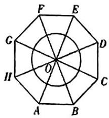

text_image

F
E
G
D
O
H
C
A
B

图②

A.-39

B.-48

C. -57

D. -60

5. 数学文化 (多选)[山东枣庄二中2023月考]数学家欧拉于1765年在《三角形的几何学》一书中提出定理:三角形的外心、重心、垂心依次位于同一条直线上,且重心到外心的距离是重心到垂心距离的一半,此直线被称为三角形的欧拉线,该定理则被称为欧拉线定理.设点O,G,H分别是△ABC的外心、重心、垂心,且M为BC的中点,则()

A. $\overrightarrow{OH} = \overrightarrow{OA} +\overrightarrow{OB} +\overrightarrow{OC}$

B. $S_{\triangle ABG} = S_{\triangle BCG} = S_{\triangle ACG}$

C. $\overrightarrow{AH} = 3\overrightarrow{OM}$

D. $\overrightarrow{AB} +\overrightarrow{AC} = 4\overrightarrow{OM} +2\overrightarrow{HM}$

6. 模块融合 [江苏南京六校联合体 2023 期末] 在解析几何中, 设 $P_{1}(x_{1}, y_{1}), P_{2}(x_{2}, y_{2})$ 为直线 $l$ 上的两个不同的点, 我们把 $\overrightarrow{P_{1}P_{2}}$ 及与它平行的非零向量都称为直线 $l$ 的方向向量, 把与直线 $l$ 垂直的向量称为直线 $l$ 的法向量, 常用 $\pmb{n}$ 表示, 此时 $\overrightarrow{P_{1}P_{2}} \cdot \pmb{n} = 0$ . 若点 $P \notin l$ , 则可以把 $\overrightarrow{PP_{1}}$ 在法向量 $\pmb{n}$ 上的投影向量的模叫作点 $P$ 到直线 $l$ 的距离. 已知在平面直角坐标系中, $P(-4, 0), P_{1}(2, -1), P_{2}(-1, 3)$ , 则点 $P$ 到直线 $l$ 的距离为 \_\_\_\_.

7. 数学应用 [江西宜春丰城中学 2023 段考] 如图, 9个边长为 1 的小正方形排成一个大正方形, AB 是大正方形的一条边, $P_{i} (i=1,2,\cdots,14)$ 是小正方形的其余各个顶点, 则 $\overrightarrow{AB} \cdot \overrightarrow{AP_{i}} (i=1,2,\cdots,14)$ 的不同值的个数为 \_\_\_\_.

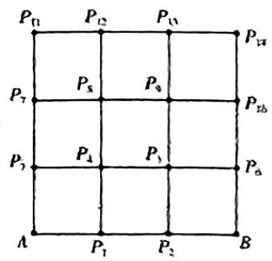

text_image

P₁₁ P₁₂ P₁₃ P₁₄
P₇ P₅ P₆ P₇₈
P₇ P₄ P₃ P₆
A P₁ P₂ B

# 考点22 复数的概念及运算

考法1 复数的概念、共轭复数、复数相等

1.[河南2023联考]已知复数 $z$ 满足 $(1 + 2\mathrm{i})z - 1 - \mathrm{i} = 0$ ，则 $z$ 的虚部为 （）

A. $\frac{1}{5}$

B. $-\frac{1}{5}$ i

C. $-\frac{1}{5}$

D. $\frac{3}{5}$

2.[江西2023联考]若两个复数的实部相等或虚部相等,则定义这两个复数为“同部复数”.已知 $z = (1 - \mathrm{i})^3$ ,则下列是 $z$ 的“同部复数”的是 （）

A. $2+i$

B. 3-2i

C. 4-i

D. $-3 + 2\mathrm{i}$

3.[全国乙(理)2022·2]已知z=1-2i,且 $z+a\bar{z}+b=0$ ,
其中 a, b 为实数，则 ( )

A. $a = 1, b = -2$

B. $a = -1, b = 2$

C. a=1, b=2

D. $a = -1, b = -2$

4.[福建厦门一中2024届期中]已知 $a, b \in \mathbb{R}$ , 则“ $a = b = 1$ ”是“ $(a + bi)^2 = 2i$ ”的 ( )

A. 充分不必要条件

B. 充要条件

C. 必要不充分条件

D. 既不充分也不必要条件

5.(多选)[广东六校2023联考]设复数 $z=\frac{1}{2}+\frac{\sqrt{3}}{2}i$ ，其中i是虚数单位， $\bar{z}$ 是z的共轭复数，下列判断中正确的是()

A. $z\bar{z}=1$

B. $z^{2}=\bar{z}$

C. $z$ 是方程 $x^{2} - x + 1 = 0$ 的一个根

D. 满足 $z^n \in \mathbb{R}$ 的最小正整数 $n$ 为3

# 考法2 复数的四则运算

6.[全国新高考Ⅰ 2021·2]已知z=2-i，则 $z(\bar{z}+i)=$

A. 6-2i

B.4-2i

C. 6+2i

D. $4 + 2\mathrm{i}$

7.[全国甲(理)2022·1]若 $z=-1+\sqrt{3}i$ ，则 $\frac{z}{zz-1}=$ (公)

A. $-1 + \sqrt{3} i$

B. $-1 - \sqrt{3} i$

C. $-\frac{1}{3} + \frac{\sqrt{3}}{3}\mathrm{i}$

D. $-\frac{1}{3}-\frac{\sqrt{3}}{3}i$

8.(多选)[江西南昌莲塘一中2024届质量检测]若复数 $z=\frac{3+2i}{i^{2024}-i}$ (i为虚数单位),复数z的共轭复数为 $\bar{z}$ ,则下列结论正确的是()

A. 在复平面内, 复数 z 所对应的点位于第一象限

B. $\bar{z} = -\frac{1}{2} -\frac{5}{2}\mathrm{i}$

C. $z\cdot \overline{z} = \frac{13}{2}$

D. $\frac{z}{\bar{z}} = \frac{12}{13} - \frac{5}{13}\mathrm{i}$

# 考法3 复数的模

9. 已知 $z = \frac{3 + 4\mathrm{i}}{1 + \mathrm{i}}$ , i 为虚数单位, 则 $|z| =$ ( )

A. $\frac{5}{2}$

B. $\frac{7}{2}$

C. $\frac{5\sqrt{2}}{2}$

D. $\frac{25}{2}$

10. 已知复数 $z$ 在复平面内对应的点在第二象限, $\bar{z}$ 为 $z$ 的共轭复数, 满足 $|z + \bar{z}| = |z - \bar{z}| = |z|^2$ , 则复数 $z =$ \_\_\_\_.

# 考法4 复数几何意义的应用

11.[全国Ⅱ理2019·2]设 $z = -3 + 2\mathrm{i}$ ，则在复平面内 $\bar{z}$ 对应的点位于 （）

A. 第一象限

B. 第二象限

C. 第三象限

D. 第四象限

12.（多选）[河北保定定州中学2024届开学测试]已知 $z, z_{1}, z_{2}$ 为复数，以下说法中正确的是 （）

A. $|z\cdot i| = |z|$

B. 若 $z_{1} = \overline{z_{2}}$ ，则 $\overline{z_{1}} = z_{2}$

C. 若 $z_{1}^{2} + z_{2}^{2} = 0$ ，则 $z_{1} = z_{2} = 0$

D. 若复数 $z$ 满足 $|z - 1| = |z + 1|$ , 则 $z$ 在复平面内对应的点的轨迹为直线

13.[全国Ⅱ理2020·15]设复数 $z_{1}, z_{2}$ 满足 $|z_{1}| = |z_{2}| = 2, z_{1} + z_{2} = \sqrt{3} + i$ , 则 $|z_{1} - z_{2}| =$ \_\_\_\_.

# 第9章 数列

# 考点23 数列的通项公式和性质

# 考法1 归纳通项公式

1.[山东烟台2023期末] $\frac{1}{64}$ 是数列 $\frac{1}{2},\frac{1}{4},\frac{1}{8},\frac{1}{16},\cdots$ 的()

A. 第6项

B. 第7项

C. 第8项

D.第9项

考法2 已知 $S_{n}$ 求 $a_{n}$

2.[河南南阳二中2023月考]等差数列 $|a_{n}|$ 中,前n项和 $S_{n}=an^{2}+(a-1)n+a+2$ ,则 $a_{n}=$ ( )

A. $-4n + 1$

B. $-2an - 1$

C. $-2an + 1$

D. $-4n - 1$

3.(多选)[江苏南通海安高级中学2024届阶段测试]已知数列 $\{a_{n}\},\{b_{n}\}$ 的项数均为 $k(k$ 为确定的正整数),若 $a_{1}+a_{2}+\cdots+a_{k}=2^{k}-1,b_{1}+b_{2}+\cdots+b_{k}=3^{k}-1$ ,则()

A. $a_{1} = 1$   
B. $\{b_{n}\}$ 中可以有 $k$ 项为1  
C. $\left\{\frac{b_n}{a_n}\right\}$ 是以 $\frac{3}{2}$ 为公比的等比数列  
D. $\left\{\frac{b_n}{a_n}\right\}$ 是以2为公比的等比数列

考法3 数列的单调性、最值、周期性等性质的应用

4.[福建宁德一中2024届月考]已知数列 $\{a_{n}\}$ 的通项公式为 $a_{n} = n^{2} + kn$ ，那么“ $k\geqslant -1$ ”是“数列 $\{a_{n}\}$ 为递增数列”的 （）

A. 充分不必要条件  
B. 必要不充分条件  
C. 充要条件  
D. 既不充分也不必要条件

5.[江苏无锡2024届月考]已知数列 $|a_{n}|$ 满足 $a_{n+1}=$ $\left\{\begin{aligned}&2a_{n},0\leqslant a_{n}<\frac{1}{2},\\ &2a_{n}-1,\frac{1}{2}\leqslant a_{n}<1.\end{aligned}\right.$ 若 $a_{1}=\frac{3}{5}$ ，则 $a_{2023}=$ （）

A. $\frac{1}{5}$

B. $\frac{2}{5}$

C. $\frac{3}{5}$

D. $\frac{4}{5}$

6.[北京2021·10]已知 $\left|a_{n}\right|$ 是各项均为整数的递增数列，且 $a_{1}\geqslant3$ .若 $a_{1}+a_{2}+\cdots+a_{n}=100$ ，则n的最大值为()

A.9

B. 10

C. 11

D. 12

7. 数列 $\{a_{n}\}$ 满足 $a_{1}=\frac{4}{3}, a_{n+1}-1=a_{n}^{2}-a_{n}(n\in\mathbb{N}^{\bullet})$ ，数列 $\left\{\frac{1}{a_{n}}\right\}$ 的前 n 项和为 $S_{n}$ ，则（）

A. $1 < S_{2\text{ 021}} < 2$   
B. $2 < S_{2021} < 3$   
C. $3 < S_{2021} < 4$   
D. $4 < S_{2021} < 5$

8.[江苏连云港灌南高级中学2024届月考]已知在数列 $\{a_{n}\}$ 中， $2a_{n+1}=a_{n}\div a_{n+2},a_{3}$ 和 $a_{7}$ 为方程 $x^{2}-18x\div65=0$ 的两根，且 $a_{7}>a_{3}$ .

(1) 求 $\{a_{n}\}$ 的通项公式；  
(2) 若对任意 $n \in \mathbb{N}^{\circ}$ , 不等式 $2^{n}a_{n}(4 - \lambda) > (a_{n} - 1)^{2}$ 恒成立, 求实数 $\lambda$ 的取值范围.

# 考点24 等差数列及其前 $n$ 项和

# 考法1 等差数列的基本运算

1. 已知等差数列 $\left|a_{n}\right|$ 的前 n 项和为 $S_{n}$ ，若 $S_{5}=16, a_{6}=1$ ，则数列 $\left|a_{n}\right|$ 的公差为（）

A. $\frac{3}{2}$

B. $-\frac{3}{2}$

C. $\frac{2}{3}$

D. $-\frac{2}{3}$

2.[河北保定部分高中2024届开学考]已知正项等差数列 $\left|a_{n}\right|$ 的前n项和为 $S_{a}$ ，若 $\sqrt{S_{n+1}}-\sqrt{S_{n}}=2$ ，则 $a_{1}=$ （）

A. 1

B. 2

C. 3

D. 4

3.[广东河源2024届联考]已知公差不为零的等差数列 $\{a_{n}\}$ 的前n项和为 $S_{n},a_{6}=2a_{3}$ ，则 $\frac{S_{17}}{a_{3}}=$ （）

A. 17

B. 34

C. 48

D. 51

4.（多选）[河南南阳2023月考]已知等差数列 $\{a_{n}\}$ 的前n项和为 $S_{0}$ ，若 $a_{8}=31,S_{10}=210$ ，则()

A. $S_{19} = 19a_{9}$

B. 数列 $2^{a_{2n}}$ 是公比为8的等比数列

C. 若 $b_{n} = (-1)^{n} \cdot a_{n}$ ，则数列 $|b_{n}|$ 的前 2020 项和为 4040

D. 若 $b_{n} = \frac{1}{a_{n}a_{\sigma + 1}}$ ，则数列 $|b_n|$ 的前2020项和为 $\frac{2020}{24249}$

5.[全国乙(文)2022·13]记 $S_{n}$ 为等差数列 $|a_{n}|$ 的前n项和.若 $2S_{3}=3S_{2}\div6$ ，则公差d= \_\_\_\_.

# 考法2 等差数列的判定与证明

6.[山东泰安肥城2024届月考]已知数列 $\left|a_{n}\right|$ 的前n项和为 $S_{n}$ ，设甲： $\left|a_{n}\right|$ 是等差数列；乙：对于所有的正整数n，都有 $S_{c}=\frac{n\left(a_{1}+a_{0}\right)}{2}$ .则()

A. 甲是乙的充要条件  
B. 甲是乙的充分条件但不是必要条件  
C. 甲是乙的必要条件但不是充分条件  
D. 甲既不是乙的充分条件也不是乙的必要条件

7.（多选）已知数列 $\left|a_{n}\right|$ 满足 $a_{n}=\frac{1}{3}a_{n-1}+\left(\frac{1}{3}\right)^{n}(n\geqslant2)$ ， $a_{1}=2,b_{n}=(-3)^{n}a_{n}$ ，数列 $\left|b_{n}\right|$ 的前2n项和为 $S_{2n}$ ，则下列说法正确的是()

A. 数列 $|a_{n}|$ 是等比数列  
B. 数列 $|3^{n}a_{n}|$ 是等差数列   
C. 数列 $|b_{n}|$ 是等差数列   
D. $S_{2n} = n$

8.[全国甲(理)2021·18]已知数列 $\left|a_{n}\right|$ 的各项均为正数,记 $S_{n}$ 为 $\left|a_{n}\right|$ 的前n项和,从下面①②③中选取两个作为条件,证明另外一个成立.

①数列 $|a_{n}|$ 是等差数列；②数列 $\left|\sqrt{S_{n}}\right|$ 是等差数列；
③ $a_{2}=3a_{1}$ .

# 考法3 等差数列的性质及应用

9.[陕西咸阳2023三模]已知等差数列 $\left|a_{n}\right|,\left|b_{n}\right|$ 的前n项和分别为 $S_{n},T_{n}$ ，若 $(2n+3)S_{n}=nT_{n}$ ，则 $\frac{a_{5}}{b_{5}}=$ ()

A. $\frac{3}{7}$

B. $\frac{1}{3}$

C. $\frac{9}{25}$

D. $\frac{11}{25}$

10.[浙江2020·7]已知等差数列 $\{a_{n}\}$ 的前n项和为 $S_{n}$ ，公差 $d\neq0$ ，且 $\frac{a_{1}}{d}\leqslant1$ 。记 $b_{1}=S_{2},b_{n+1}=S_{2n+2}-S_{2n},n\in N^{*}$ ，下列等式不可能成立的是()

A. $2a_{4} = a_{2} + a_{6}$

B. $2b_{4} = b_{2} + b_{6}$

C. $a_4^2 = a_2a_8$

D. $b_{4}^{2} = b_{2}b_{8}$

11.[浙江宁波九校2023联考]已知在等差数列 $|a_{n}|$ 中， $a_{8}=8,a_{9}=8+\frac{\pi}{3}$ ，则 $\frac{\cos a_{5}+\cos a_{7}}{\cos a_{6}}=$ \_\_\_\_.

# 考法4 等差数列前 $n$ 项和及其最值的求法

12.（多选）[山东2024届质量检测]已知等差数列 $|a_{n}|$ 的前n项和为 $S_{n}$ ，公差为 $d,a_{3}=a_{1}-4,S_{7}=154$ ，则()

A. $d = -2$   
B. $a_{1} = 30$   
C. -320 是数列 $\{a_{n}\}$ 中的项  
D. $S_{n}$ 取得最大值时, $n = 14$

13.[福建宁德福鼎一中2023月考]已知等差数列 $\{a_{s}\}$ 的前n项和 $S_{n}$ 有最小值,且 $-1<\frac{a_{2022}}{a_{2023}}<0$ ,则使 $S_{n}>0$ 成立的正整数n的最小值为()

A. 2022

B. 2023

C. 4 043

D. 4 044

14.[山东德州一中2024届月考]“中国剩余定理”又称“孙子定理”,最早可见于我国南北朝时期的数学著作《孙子算经》卷下第二十六题,叫作“物不知数”问题,原文如下:今有物不知其数,三三数之剩二、五五数之剩三,七七数之剩二问物几何?现有这样一个相关的问题:被3除余2且被5除余3的正整数按照从小

到大的顺序排成一列. 构成数列 $\left|a_{n}\right|$ . 记数列 $\left|a_{n}\right|$ 的前 n 项和为 $S_{n}$ , 则 $\frac{S_{n}+30}{n}$ 的最小值为 ( )

A. 30

B. $\frac{61}{2}$

C. $\frac{65}{3}$

D. 41

15.（多选）[河北石家庄十五中2023月考]已知等差数列 $\left|a_{n}\right|$ 的前n项和为 $S_{n}$ ，且 $a_{1}>0,2a_{5}+a_{11}=0$ ，则()

A. $a_{8} < 0$   
B. 当且仅当 $n = 7$ 时, $S_{n}$ 取得最大值  
C. $S_{4} = S_{9}$   
D. 满足 $S_{n} > 0$ 的 $n$ 的最大值为12

16.[全国新高考Ⅱ2021·17]记 $S_{n}$ 为公差不为零的等差数列 $\{a_{n}\}$ 的前 $n$ 项和.已知 $a_3 = S_5, a_2 a_4 = S_\Delta$ .

(1) 求 $\left|a_{n}\right|$ 的通项公式；  
(2) 求使得 $S_{n} > a_{n}$ 的 $n$ 的最小值.

# 考点25 等比数列及其前 $n$ 项和

# 考法 1 等比数列的基本运算

1.[全国乙(理)2022·8]已知等比数列 $|a_{n}|$ 的前3项和为168, $a_{2}-a_{5}=42$ ,则 $a_{6}=$ ( )

A. 14

B. 12

C. 6

D、3

2. 设 $S_{n}$ 是等比数列 $\{a_{n}\} (n \in \mathbf{N}^{n})$ 的前 $n$ 项和，且 $a_{3} = \frac{3}{2}, S_{3} = \frac{9}{2}$ ，则 $a_{1} =$ （）

A. $\frac{3}{2}$

B.6

C. $\frac{3}{2}$ 或 6

D. $-\frac{3}{2}$ 或-6

3.[福建宁德一中2023月考]云冈石窟原名武州(周)山石窟寺,是世界文化遗产.若其中某一石窟的某处“浮雕像”共7层,每一层的“浮雕像”个数是其下一层的2倍,共有1016个“浮雕像”.若从最下层往上每一层的“浮雕像”的个数构成一个数列 $|a_{n}|$ ,则 $\log_{2}(a_{3}a_{5})$ 的值为()

A. 8

B. 10

C. 12

D. 16

# 考法2 等比数列的判定与证明

4.[河北唐山2024届摸底考]设甲： $\{a_{n}\}$ 为等比数列；乙： $\{a_{n}\cdot a_{n-1}\}$ 为等比数列，则()

A. 甲是乙的充分条件但不是必要条件  
B. 甲是乙的必要条件但不是充分条件  
C. 甲是乙的充要条件  
D. 甲既不是乙的充分条件也不是乙的必要条件

5.[重庆实验外国语学校2024届月考]已知数列 $\left|a_{n}\right|$ 的前n项和为 $S_{n}$ ，若 $a_{1}=1,a_{n+1}=2S_{n}(n\in\mathbf{N}^{*})$ ，则有()

A. $a_{n}$ 为等差数列

B. $|a_{0}|$ 为等比数列

C. $|S_{n}|$ 为等差数列

D. $|S_{c}|$ 为等比数列

# 考法3 等比数列的性质及应用

6.[全国甲(文)2021·9]记 $S_{n}$ 为等比数列 $\{a_{n}\}$ 的前 $n$ 项机若 $S_{2} = 4,S_{3} = 6$ ，则 $S_{6} =$ （

A.7

B.8

C.9

D. 10

7.[四川绵阳南山中学2023模拟]在各项均为正数的等比数列 $\{a_{n}\}$ 中， $a_{1}a_{11}+2a_{6}a_{8}+a_{3}a_{13}=25$ ，则 $a_{1}a_{13}$ 的最大值是()

A. 25

B. $\frac{25}{4}$

C. 5

D. $\frac{2}{5}$

8.[黑龙江哈尔滨六中2023月考]在等比数列 $|a_{n}|$ 中， $a_{1},a_{13}$ 是方程 $x^{2}-13x+9=0$ 的两根，则 $\frac{a_{2}a_{12}}{a_{7}}$ 的值为（）

A. $\sqrt{13}$

B. 3

C. ±√13

D. $\pm 3$

9.(多选)[山东枣庄三中2024届月考]设等比数列 $\left|a_{n}\right|$ 的公比为q,其前n项和为 $S_{n}$ ,前n项积为 $T_{n}$ ,且满足 $a_{1}>1,a_{2020}\cdot a_{2021}>1,(a_{2020}-1)\cdot(a_{2021}-1)<0$ ,则下列选项正确的是()

A. $0 < q < 1$   
B. $S_{2020} + 1 <   S_{2021}$   
C. $T_{2020}$ 是数列 $\{T_n\}$ 中的最小项  
D. $T_{4040} > 1$

# 考法4 等差数列、等比数列的综合应用

10.[重庆实验中学2024届期中]已知等比数列 $|a_{n}|$ 的首项 $a_{1}=2$ ，前n项和为 $S_{n}$ ，且 $a_{1},2a_{2},4a_{3}$ 成等差数列，则()

A. $S_{n+1} = \frac{3}{2} S_n$

B. $S_{n + 1} = \frac{1}{2} S_n + 2$

C. $S_{n+1} = a_n + 1$

D. $S_{n+1} = \frac{1}{2} a_n + 1$

11.[江苏泰州中学2024届期初调研]已知等比数列 $|a_{n}|$ 的前n项和为 $S_{n}$ ，且 $2S_{3},3S_{5},4S_{6}$ 成等差数列，则数列 $|a_{n}|$ 的公比q=()

A. 1 或 $-\frac{1}{2}$

B.-1或 $\frac{1}{2}$

C. $-\frac{1}{2}$

D. $\frac{1}{2}$

264 我不相信命运。我只相信我的手，我不相信手掌的纹路，但我相信手掌加上手指的力量。

12.（多选）[湖北荆州沙市中学2023月考]已知数列 $|a_{n}|,|b_{n}|$ 均为递增数列，它们的前n项和分别为 $S_{n},T_{n}$ ，且满足 $a_{n}+a_{n+1}=2n,b_{n}\cdot b_{n+1}=2^{n}$ ，则下列结论正确的是()

A. $0 < a_{1} < 1$

B. $S_{2n} = n^2 +3n - 2$

C. $1 < b_{1} < \sqrt{2}$

D. $S_{2n} < T_{2n}$

13.（多选）[山东聊城一中2023月考]已知数列 $|a_{n}|$ 的首项为4，且满足 $2(n+1)a_{n}-na_{n+1}=0(n\in\mathbf{N}^{*})$ ，则()

A. $\left\{\frac{a_n}{n}\right\}$ 为等差数列   
B. $|a_{\alpha}|$ 为递增数列  
C. $\left\{\frac{a_n}{n}\right\}$ 为等比数列  
D. $\left\{\frac{a_n}{2^{n + 1}}\right\}$ 的前 $n$ 项和 $T_{n} = \frac{n^{2} + n}{2}$

14. [浙江 2022·20] 已知等差数列 $\{a_{n}\}$ 的首项 $a_{1} = -1$ ，公差 d > 1。记 $\{a_{n}\}$ 的前 n 项和为 $S_{n}(n \in \mathbf{N}^{\bullet})$ 。

(1) 若 $S_{4} - 2a_{2}a_{3} + 6 = 0$ ，求 $S_{n}$ ;  
(2) 若对于每个 $n \in \mathbb{N}^*$ , 存在实数 $c_{n}$ , 使 $a_{n} + c_{n}, a_{n+1} + 4c_{n}, a_{n+2} + 15c_{n}$ 成等比数列, 求 $d$ 的取值范围.

15.[天津2022·18]设 $|a_{n}|$ 为等差数列， $|b_{n}|$ 为等比数列，且 $a_{1}=b_{1}=a_{2}-b_{2}=a_{3}-b_{3}=1$ .

(1) 求 $\left|a_{n}\right|$ 和 $\left|b_{n}\right|$ 的通项公式；  
(2) 记 $\{a_{n}\}$ 的前 n 项和为 $S_{n^{*}}$ 求证: $(S_{n^{*},1} + a_{n^{*},1}) \cdot b_{n} = S_{n^{*},1} b_{n^{*},1} - S_{n} b_{n}$ ;  
(3) 求 $\sum_{k=1}^{2n}\left[a_{k,v1}-(-1)^{k}a_{b}\right]b_{k}$

# 考法1 利用 $a_{n}$ 与 $S_{n}$ 的关系求通项

1.[山东济宁2023期末]设 $S_{n}$ 是数列 $\{a_{n}\}$ 的前 $n$ 项和，已知 $a_1 = 1$ 且 $a_{n + 1} = 2S_n + 1$ ，则 $a_2 =$ （

A. 101

B. 81

C. 32

D. 16

2. 已知数列 $\left|a_{n}\right|$ 的前 n 项和为 $S_{n}$ ，且 $a_{1}=2, a_{n+1}=\frac{n+2}{n}S_{n}(n\in\mathbf{N}^{*})$ ，则 $a_{n}=$ （）

A. $(n + 1) \cdot 2^{n - 1}$

B. $n \cdot 2^n$

C. ${3}^{n} - 1$

D. $2n \cdot 3^{n-1}$

3.[湖南永州一中2024届一模]若数列 $\{a_{n}\}$ 的前n项和为 $S_{n},2S_{n}a_{n}=a_{n}^{2}+1(n\in\mathbf{N}^{*},a_{n}>0)$ ，则下列结论正确的是()

A. $a_{2022}a_{2023} > 1$   
B. $a_{2023} > \sqrt{2023}$   
C. $S_{2023} < \sqrt{2022}$   
D. $\frac{1}{S_1} +\frac{1}{S_2} +\frac{1}{S_3} +\dots +\frac{1}{S_{100}} <  19$

4.[广东六校2023联考]已知数列 $\{a_{n}\}$ 的前n项和为 $S_{n}$ ，且满足 $a_{1}=1,2S_{n}=na_{n+1},n\in N^{*}$ .

(1) 求数列 $\left|a_{n}\right|$ 的通项公式；  
(2) 设数列 $\left|b_{n}\right|$ 满足 $b_{1}=1, b_{n}b_{n+1}=2^{n}, n\in N^{*}$ ，按照如下规律构造新数列 $\left|c_{n}\right|: a_{1}, b_{2}, a_{3}, b_{4}, a_{5}, b_{6}, a_{7}, b_{8}, \cdots$ ，求数列 $\left|c_{n}\right|$ 的前 2n 项和.

5.[湖北部分重点中学2024届联考]已知正项数列 $\left|a_{n}\right|$ 的前n项和 $S_{n}$ ，满足 $S_{n}=\left(\frac{a_{n}+1}{2}\right)^{2}$ .

(1) 求数列 $\{a_{n}\}$ 的通项公式；  
(2) 记 $b_n = \frac{n+1}{S_n S_{n+2}}$ ，设数列 $\{b_n\}$ 的前 $n$ 项和为 $T_n$ ，求证： $T_n < \frac{5}{16}$ .

# 考法2 累加法与累乘法

6. 已知等比数列 $\left|a_{n}\right|$ 满足 $a_{1}+a_{3}=10, a_{2}+a_{4}=5$ ，数列 $\left|b_{n}\right|$ 满足 $b_{1}=\frac{1}{4}$ ，当 $n\geqslant2$ 时， $b_{n}-b_{n-1}=\frac{1}{a_{n}}$ ，则数列 $\left|b_{n}\right|$ 的通项公式为（）

A. $2^{\alpha -3}$

B. $2^{n - 2} - \frac{1}{4}$

C. $\frac{3}{4} - \frac{1}{2^n}$

D. $\frac{1}{8} + 2^{n-4}$

7. 已知数列 $|a_{n}|$ 的前 $n$ 项和为 $S_{n}, a_{1} = 2, 3S_{n} = (n + m) \cdot a_{n} (m \in \mathbb{R})$ , 则 $a_{n} = \underline{\quad}$ .  
8. 已知函数 $f(x) = 3x^3 + 2x^2 + x$ ，数列 $|a_n|, |b_n|, |c_n|$ 满足： $a_1 = 1, a_{n+1} = f(a_n); (1 + 2a_n + 3a_n^2)b_n = 1; c_n = (2 + 3a_n) \cdot b_n$ . 若 $|b_n|$ 的前10项之积为 $T_{10}, |c_n|$ 的前10项之和为 $S_{10}$ ，则 $T_{10} + S_{10} =$ \_\_\_\_.

268 勇气是迷境当中绽放的光芒，它是一笔财富，拥有了勇气就有了改变的机会。

9.[重庆八中2024届月考]已知数列 $|a_{n}|$ 中, $a_{1}=2$ ,且 $n(n+1)(a_{n+1}-a_{n})=-1$ ,其中 $n\in N^{*}$ .

(1) 求数列 $\left|a_{n}\right|$ 的通项公式；  
(2) 设 $b_n = \frac{a_1 a_2 \cdots a_n}{2^n}$ , 求数列 $|b_n|$ 的前 $n$ 项和 $S_n$ .  
(2) 设 $b_n = \frac{a_1 a_2 \cdots a_n}{2^n}$ , 求数列 $|b_n|$ 的前 $n$ 项和 $S_n$ .

10.[山东济南莱芜一中2024届月考]已知数列 $\{a_{n}\}$ 中, $a_2 = 1$ , 设 $S_{n}$ 为 $\{a_{n}\}$ 的前 $n$ 项和, $2S_{n} = na_{n}$ .

(1) 求 $\{a_{n}\}$ 的通项公式；  
(2) 若 $b_{n} = \frac{\sin 1}{\cos(a_{n} + 1)\cos(a_{n + 1} + 1)}$ , 求数列 $|b_n|$ 的前 $n$ 项和 $T_{n}$ .

德十

# 考法3 构造法求通项

11.[江苏苏州中学2023月考]已知数列 $|a_{n}|$ 的前n项和为 $S_{a},a_{1}=5$ ，且满足 $\frac{a_{n+1}}{2n-5}-2=\frac{a_{n}}{2n-7}$ 。若 $p,q\in N^{\prime}$ ，p>q，则 $S_{p}-S_{q}$ 的最小值为()

A.-6

B.-2

C.-1

D. 0

12.（多选）[广东四校2024届联考]已知数列 $|a_{n}|$ 的首项 $a_{1}=1$ ，且 $a_{n-1}=2a_{n}+1$ ，下列结论正确的是()

A. 数列 $|a_{n}|$ 是等比数列  
B. 数列 $\{a_{n} + 1\}$ 是等比数列

C. $a_{n} = 2^{n} - 1$

D. 数列 $|a_{n}|$ 的前 $n$ 项和 $S_{n}=2^{n}-n$

13.[湖南长沙一中2024届月考]已知数列 $|a_{n}|$ 满足 $a_{1}=1,a_{n+1}=2a_{n}+n-1.$

(1) 证明数列 $|a_{n} \div n|$ 是等比数列，并求数列 $|a_{n}|$ 的通项公式；  
(2) 若数列 $|b_n|$ 满足 $b_a = \frac{2n - 1}{a_a + n}$ , 求数列 $|b_n|$ 的前 $n$ 项和 $S_a$ .

# 考点27 数列求和

# 考法1 倒序相加法

1.[山东潍坊安丘一中2024届月考]已知函数 $f(x)=(x-1)^{3}+2$ ，数列 $\{a_{n}\}$ 为等比数列， $a_{n}>0$ ，且 $a_{1009}=e$ ，则 $f(\ln a_{1})+f(\ln a_{2})+\cdots+f(\ln a_{2017})=$ （）

A. $\frac{2017}{2}$

B. 2017

C. 4 034

D. 8 068

2 [广东佛山 2023 联考] 已知 $S_{n}$ 为等差数列 $\left|a_{n}\right|$ 的前 $n$ 项和.

(1) 若 $a_1 = \frac{\pi}{2}, S_5 = a_3 + 3a_4$ ，求数列 $\{a_n\}$ 的通项公式；  
(2) 若 $a_{12} = \frac{\pi}{2}$ , 记 $b_{n} = 1 + \sin 2a_{n}, T_{n}$ 为数列 $\{b_{n}\}$ 的前 $n$ 项和, 求 $T_{23}$ 的值.

# 考法2 裂项相消法

3.（多选）[安徽合肥一中2023期末]南宋数学家杨辉所著的《详解九章算法·商功》中出现了如图所示的形状，后人称为“三角垛”（如图

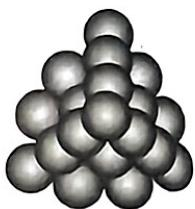

所示的是一个四层的三角垛). “三角垛”最上层有1个球, 第二层有3个球, 第三层有6个球……设第n层有 $a_{n}$ 个球, 从上往下n层球的总数为 $S_{n}$ , 则()

A. $a_{n} - a_{n - 1} = n + 1(n\geqslant 2)$   
B. $S_{7} = 84$   
C. $a_{98} = \frac{98\times 99}{2}$   
D. $\frac{1}{a_1} +\frac{1}{a_2} +\frac{1}{a_3} +\dots +\frac{1}{a_{2022}} = \frac{4044}{2023}$

4.[河南商丘2023三模]已知数列 $\{a_{n}\}$ 的前n项和为 $S_{n},a_{1}=1,2nS_{n+1}-2(n+1)S_{n}=n(n+1)$ .

(1)求数列 $\{a_{n}\}$ 的通项公式；  
(2) 设 $b_n = \frac{a_{n+2}}{2^{n+2} \cdot S_n}$ , 求数列 $|b_n|$ 的前 $n$ 项和 $T_n$ .

268 略适山水万程，祝自己与温柔重逢。

text_image

倒道学

5.[浙江2023联考]已知数列 $\left|a_{n}\right|$ 的各项均为正数,记 $S_{n}$ 为 $\left|a_{n}\right|$ 的前n项和, $a_{1}=1,\frac{a_{n}}{\sqrt{S_{n}S_{n-1}}}=\frac{1}{\sqrt{S_{n-1}}}+\frac{1}{\sqrt{S_{n}}}(n\in N^{*}$ 且 $n\geqslant2)$ .

(1) 求证数列 $\left\{\sqrt{S_{n}}\right\}$ 是等差数列，并求 $\left\{a_{n}\right\}$ 的通项公式；

(2) 当 $n \in N^{*}$ , $n \geqslant 2$ 时, 求证: $\frac{1}{a_{2}^{2}-1} + \frac{1}{a_{3}^{2}-1} + \cdots + \frac{1}{a_{n}^{2}-1} < \frac{1}{4}$ .

# 考法3 错位相减法

6.[全国乙(文)2021·19]设 $\{a_{n}\}$ 是首项为1的等比数列,数列 $\{b_{n}\}$ 满足 $b_{n}=\frac{na_{n}}{3}$ .已知 $a_{1},3a_{2},9a_{3}$ 成等差数列.

(1) 求 $\{a_{n}\}$ 和 $\{b_{n}\}$ 的通项公式；

(2) 记 $S_{n}$ 和 $T_{n}$ 分别为 $\{a_{n}\}$ 和 $\{b_{n}\}$ 的前 $n$ 项和. 证明: $T_{n} < \frac{S_{n}}{2}$ .

# 考法4 并项求和法

7.[山东青岛莱西2023质量检测]已知数列 $|a_{n}|$ 的前n项和为 $S_{n},a_{1}=1$ ，且 $a_{1}$ 为 $a_{2}$ 与 $S_{2}$ 的等差中项，当 $n\geqslant2$ 时，总有 $2S_{n+1}-3S_{n}+S_{n-1}=0$ .

(1)求数列 $|a_{n}|$ 的通项公式；

(2) 记 $b_{m}$ 为数列 $\left\{\frac{1}{a_{n}}\right\}$ 落在区间 $(0,4^{m-1}]$ ( $m \in \mathbf{N}^{*}$ ) 内的项的个数，求数列 $\left\{(-1)^{m}b_{m}^{2}\right\}$ 的前 $m$ 项和 $W_{m}$ .

# 考法5 分组求和法

8.[湖南常德临澧一中2024届月考]已知数列 $\left|a_{n}\right|$ 为等差数列，数列 $\left|b_{n}\right|$ 为等比数列，且 $a_{4}=7,a_{1}=1,a_{1}+b_{3}=a_{2}^{2},a_{2}b_{3}=4a_{3}+b_{2}$ .

(1) 求 $\{a_{n}\}$ , $\{b_{n}\}$ 的通项公式;

(2)已知 $c_{n} = \left\{ \begin{array}{ll}a_{n}b_{n},n & \text{为奇数，}\\ (3a_{n} - 4)b_{n}\\ \frac{a_{n}a_{n + 2}}{n},n & \text{为偶数，} \end{array} \right.$ 求数列 $|c_n|$ 的前 $2n$ 项和 $T_{2n}$

(3) 求证: $\sum_{i=1}^{n} \frac{1}{a_{i+1} \log_2 b_i} < \frac{2}{3}$ .

# 考点28 数列在新背景、新定义中的应用

# 考法1 数列新背景问题

1.[全国新高考Ⅱ2022·3]图①是中国古代建筑中的举架结构, $AA',BB',CC',DD'$ 是桁,相邻桁的水平距离称为步,垂直距离称为举.图②是某古代建筑屋顶截面的示意图,其中 $DD_{1},CC_{1},BB_{1},AA_{1}$ 是举, $OD_{1},DC_{1},CB_{1},BA_{1}$ 是相等的步,相邻桁的举步之比分别为 $\frac{DD_{1}}{OD_{1}}=0.5,\frac{CC_{1}}{DC_{1}}=k_{1},\frac{BB_{1}}{CB_{1}}=k_{2},\frac{AA_{1}}{BA_{1}}=k_{3}$ .已知 $k_{1}$ , $k_{2},k_{3}$ 成公差为0.1的等差数列,且直线OA的斜率为0.725,则 $k_{3}=$

natural_image

Illustration of a wooden structure with visible grain and supports (no text or symbols)

图①

text_image

y
A
B
C
D
O
D₁
x
A₁
B₁
C₁

图②

A. 0.75

B. 0.8

C. 0.85

D. 0.9

2.[安徽黄山屯溪一中2024届二模]如图甲是第七届国际数学家大会的会徽图案,会徽的主题图案是由图乙的一连串直角三角形演化而成的.已知 $OA_{1} = A_{1}A_{2} = A_{2}A_{3} = A_{3}A_{4} = A_{4}A_{5} = A_{5}A_{6} = A_{6}A_{7} = A_{7}A_{8} = \dots = 2$ , $A_{1},A_{2},A_{3},\ldots$ 为直角顶点,设这些直角三角形的周长从小到大组成的数列为 $\{a_n\}$ ,令 $b_n = \frac{2}{a_n - 2},S_n$ 为数列 $\{b_n\}$ 的前 $n$ 项和,则 $S_{120} =$ ( )

natural_image

Abstract geometric pattern with black triangular segments and white diagonal lines, labeled 'ICME-7' below (no other text or symbols)

图甲

text_image

A₅
A₄
A₃
A₆
A₂
A₇
O
A₁
A₆
...
A₁

图乙

A.8

B. 9

C. 10

D. 11

3.[山东临沂2024届联考]剪纸,又叫刻纸,是一种镂空艺术,是我国古老的民间艺术之一.已知某剪纸的

裁剪工艺如下:取一张半径为1的圆形纸片,记为 $\odot O$ ,在 $\odot O$ 内作内接正方形,接着在该正方形内作内切圆,记为 $\odot O_{1}$ ,并裁剪去该正方形内多余的部分(如图所示阴影部分),记为一次裁剪操作, $\cdots$ ,重复上述裁剪操作 $n$ 次,最终得到该剪纸.则第4次裁剪操作结束后所得 $\odot O_{4}$ 的面积为\_\_\_\_;第 $n$ 次操作后,所有裁剪操作中裁剪去除的面积之和为\_\_\_\_.

# 考法2 数列新定义问题

4.[天津中学2023期末]若函数 $a_{n + 1} = f(a_n)$ ，则称 $f(x)$ 为数列 $\{a_{n}\}$ 的“伴生函数”.已知数列 $\{a_{n}\}$ 的“伴生函数”为 $f(x) = 2x + 1,a_1 = 1$ ，则数列 $\{na_{n}\}$ 的前 $n$ 项和 $T_{n} =$ （

A. $n \cdot 2^n + 2 - \frac{n(n + 1)}{2}$

B. $n \cdot 2^{n+1} + 2 - \frac{n(n+1)}{2}$

C. $(n - 1) \cdot 2^{n + 1} + 2 - \frac{n(n + 1)}{2}$

D. $(n - 1) \cdot 2^n + 2 - \frac{n(n + 1)}{2}$

5.（多选）对于正项数列 $\{a_{n}\}$ ，定义： $G_{n}=\frac{a_{1}+2a_{2}+4a_{3}+\cdots+2^{n-1}a_{n}}{n}$ 为数列 $\{a_{n}\}$ 的“匀称值”。已知数列 $\{a_{n}\}$ 的“匀称值”为 $G_{n}=2^{n}$ ，前n项和为 $S_{n}$ ，则下列关于数列 $\{a_{n}\}$ 的描述正确的有（）

A. 数列 $\{a_{n}\}$ 为等差数列

B. 数列 $|a_{n}|$ 为递减数列

C. $\frac{S_{2023}}{2023} = 1013$

D. 记 $b_{n} = \left(\frac{9}{10}\right)^{n} \cdot a_{n}$ ，则数列 $\{b_{n}\}$ 有最大项

270 普通啊，当然普通，谁不普通，但是各花各有各花香，我记得这花香，便对得起这时光。

# 专题9 特殊数列的证明与求解

# 考法1 斐波那契数列

1.[广东佛山2023联考]历史上数列的发展,折射出许多有价值的数学思想方法,对时代的进步起到了重要的作用,比如意大利数学家斐波那契以兔子繁殖为例,引入“兔子数列”:1,1,2,3,5,8,13,21,34,55,89,…,即 $F(1)=F(2)=1,F(n)=F(n-1)+F(n-2)$ ( $n\geqslant3,n\in N^{*}$ ),此数列在现代物理、准晶体结构等领域有着广泛的应用.若此数列被4整除后的余数构成一个新的数列 $\{b_{n}\}$ ,则 $b_{1}+b_{2}+b_{3}+\cdots+b_{2023}$ 的值为()

A. 2 698

B. 2 699

C. 2 696

D. 2 697

2.[山东青岛九中2023期初]1202年,意大利数学家斐波那契出版了他的《算盘全书》.他在书中提出了一个关于兔子繁殖的问题,发现数列:1,1,2,3,5,8,13,…,该数列的特点是:前两项均为1,从第三项起,每一项等于前两项的和,人们把这个数列 $\{F_{n}\}$ 称为斐波那契数列,则下列结论正确的是()

A. $F_{2} + F_{4} + F_{6} + \cdots + F_{2020} = F_{2021}$   
B. $F_{1}^{2} + F_{2}^{2} + F_{3}^{2} + \cdots + F_{2021}^{2} = F_{2021} F_{2022}$   
C. $F_{1} + F_{2} + F_{3} + \cdots + F_{2021} = F_{2023}$   
D. $F_{1} + F_{3} + F_{5} + \cdots + F_{2021} = F_{2022} - 1$

# 考法2 数列奇偶项问题

3.（多选）[河北2024届省级联测]已知数列 $\{a_{n}\}$ 满足 $a_1 = 2, a_{n+1} = \begin{cases} a_n + 2, & n \text{为奇数,}\\ 2a_n, & n \text{为偶数,} \end{cases}$ 设 $b_{n} = a_{2n}$ ，记数列 $\{a_{n}\}$ 的前 $2n$ 项和为 $S_{2n}$ ，数列 $\{b_n\}$ 的前 $n$ 项和为 $T_{n}$ ，则 （）

A. $a_{5} = 20$   
B. $b_{n} = 3 \times 2^{n}$   
C. $T_{n} = -2n - 6 + 3 \times 2^{n + 1}$   
D. $S_{2n} = -6n - 12 + 3 \times 2^{n+2}$

# 考法3 周期数列

4.（多选）[湖南岳阳一中2023期末]已知 $S_{n}$ 是 $\vert a_{n}\vert$ 的前 $n$ 项和， $a_{1} = 2, a_{n} = 1 - \frac{1}{a_{n-1}} (n \geqslant 2)$ ，则 （）

A. $a_{2023} = 2$   
B. $S_{2023} = 1013$   
C. $a_{3n}a_{3n + 1}a_{3n + 2} = 1$

D. $\left|a_{n}\right|$ 是以3为周期的周期数列

5.（多选）[山东淄博实验中学2023期中]已知数列 $|a_{n}|$ 的前n项和为 $S_{n}$ ，且满足 $a_{1}=1, a_{n+1}=$ $\left\{\begin{aligned}&2a_{n},n 是奇数,\\&\frac{1}{a_{n}},n 是偶数,\end{aligned}\right.$ 则下列说法正确的有 （）

A. $a_{3} = \frac{1}{2}$

B. $\{a_{n}\}$ 是周期数列

C. $a_{2022} = 2$

D. $S_{18} = 20$

# 考法4 两个数列的公共项问题

6.[浙江嘉兴2023二模]已知 $\left|a_{n}\right|$ 是首项为2,公差为3的等差数列,数列 $\left|b_{n}\right|$ 满足 $b_{1}=4,b_{n+1}=3b_{n}-2n+1$ .

(1) 证明: $|b_n - n|$ 是等比数列, 并求 $\{a_n\}, |b_0|$ 的通项公式.  
(2) 若数列 $|a_{n}|$ 与 $|b_{n}|$ 中有公共项, 即存在 $k, m \in \mathbb{N}^{*}$ , 使得 $a_{k} = b_{m}$ 成立. 按照从小到大的顺序将这些公共项排列, 得到一个新的数列, 记作 $\{c_{n}\}$ , 求 $c_{1} + c_{2} + \cdots + c_{n}$ .

# 考法1 数列与函数的综合问题

1. 已知数列 $\left|a_{n}\right|$ , $a_{1}=1$ , $S_{n}$ 为数列 $\left|a_{n}\right|$ 的前 n 项和, 且 $S_{n}=\frac{1}{3}(n+2)a_{n}$ .

(1) 求数列 $\{a_{n}\}$ 的通项公式；  
(2) 证明: $\sin a_{n} - a_{n} < 0$ ;   
(3) 证明: $\left(1 + \sin \frac{1}{a_1}\right)\left(1 + \sin \frac{1}{a_2}\right)\left(1 + \sin \frac{1}{a_3}\right) \cdots \cdot\left(1 + \sin \frac{1}{a_n}\right) < e^2.$

# 考法2 数列与不等式的综合问题

2.[湖北部分校2024届联考]已知数列 $\{a_{n}\}$ 满足 $a_{1}+\frac{1}{2}a_{2}+\frac{1}{3}a_{3}+\cdots+\frac{1}{n}a_{n}=a_{n+1}-1,n\in\mathbb{N}^{*}$ ，且 $a_{1}=1$ .

(1) 求数列 $\{a_{n}\}$ 的通项公式；  
(2) 设 $S_{n}=a_{1}\cdot a_{n}+a_{2}\cdot a_{n-1}+a_{3}\cdot a_{n-2}+\cdots+a_{n}\cdot a_{1}$ ， $b_{n}=\frac{1}{3S_{n}}$ ，数列 $\{b_{n}\}$ 的前 n 项和为 $T_{n}$ ，求 $T_{n}<\frac{m}{2024}$ 对任意 $n\in N^{*}$ 都成立的最小正整数 m.

(参考公式: $1^{2}+2^{2}+3^{2}+\cdots+n^{2}=\frac{n(n+1)(2n+1)}{6},n\in$ $N^{*}$ )

# 第9章 风向练

1. 数学文化 [河北张家口 2024 届开学考] 莱布尼茨三角形是与杨辉三角数阵相似的一种几何排列, 但与杨辉三角不同的是, 莱布尼茨三角形中的每个三角形数组顶端的数等于底边两数之和. 记第 2 行的第 2 个数字为 $a_{1}$ , 第 3 行的第 2 个数字为 $a_{2}, \cdots$ , 第 $n (n \geqslant 2)$ 行的第 2 个数字为 $a_{n-1}$ , 则 $a_{1} + a_{2} + a_{3} + \cdots + a_{10} =$ ()

text_image

1
½
½
½
½
½
½
½
½
½
½
½
½
½
½
½
½
½
½
½
½
½
½
½
½
½
½
½
½
½
½
½
½
½
½
½
½
½
½
½
½
½
½
½
½
½
½
½
½
½
½
¼
¼
¼
¼
¼
¼
¼
¼
¼
¼
¼
¼
¼
¼
¼
¼
¼
¼
¼
¼
¼
¼
¼
¼
¼
¼
¼
¼
¼
¼
¼
¼
¼
¼
¼
¼
¼
¼
¼
¼
¼
¼
¼
¼

A. $\frac{1}{90}$

B. $\frac{1}{10}$

C. $\frac{9}{10}$

D. $\frac{10}{11}$

2. 新定义 [山西运城 2024 届摸底] 在数列 $|a_{n}|$ 中, 如果存在非零的常数 $T$ , 使得 $a_{n+T}=a_{n}$ 对于任意正整数 $n$ 均成立, 那么就称数列 $\{a_{n}\}$ 为周期数列, 其中 $T$ 叫作数列 $\{a_{n}\}$ 的周期. 已知数列 $\{x_{n}\}$ 满足 $x_{n+2}= |x_{n+1}-x_{n}| (x \in \mathbf{N}^{*})$ , 若 $x_{1}=1, x_{2}=a (a \leqslant 1$ 且 $a \neq 0)$ , 当数列 $\{x_{n}\}$ 的周期为 3 时, 则数列 $\{x_{n}\}$ 的前 2024 项的和 $S_{2024}$ 为 ( )

A. 676

B. 675

C. 1 350

D. 1 349

3. 数学文化 [山东日照 2024 届联考] 高斯是德国著名的数学家, 近代数学奠基者之一, 享有“数学王子”的称号. 用他的名字定义的函数称为高斯函数 $f(x) = [x]$ , 其中 $[x]$ 表示不超过 $x$ 的最大整数. 已知正项数列 $\{a_{n}\}$ 的前 $n$ 项和为 $S_{n}$ , 且 $S_{n} = \frac{1}{2} \left( a_{n} + \frac{1}{a_{n}} \right)$ , 令 $b_{n} = \frac{1}{S_{n} + S_{n+2}}$ , 则 $[b_{1} + b_{2} + \cdots + b_{99}] =$ ( )

A.7

B. 8

C. 17

D. 18

4. 数学应用 [北京密云二中 2024 届月考] 我们可以用下面的方法在线段上构造出一个特殊的点集: 如

图,取一条长度为1的线段,第1次操作,将该线段三等分,去掉中间一段,留下两段;第2次操作,将留下的两段分别三等分,各去掉中间一段,留下四段:按照这种规律一直操作下去.若经过n次这样的操作后,去掉的所有线段的长度总和不小于 $\frac{59}{60}$ ,则n的最小值为(参考数据: $\lg 2\approx0.301,\lg 3\approx0.477$ )()

text_image

第1次操作
第2次操作
第3次操作

A.11

B. 12

C. 13

D. 14

5. 结构不良 [浙江绍兴上虞中学 2024 届开学考] 从

① $a_{1},\frac{1}{4},a_{2}$ 成等差数列；② $a_{1},a_{2}+1,a_{3}$ 成等比数列；
③ $S_{3}=\frac{3}{4}$ 这三个条件中任选一个补充在下面的横线中，并解答下列问题.

已知 $S_{n}$ 为数列 $\{a_{n}\}$ 的前 $n$ 项和， $3S_{n} = a_{n} + 2a_{1} (n \in \mathbf{N}^{*}), a_{1} \neq 0$ ，且 \_\_\_\_.

(1) 求数列 $\left|a_{n}\right|$ 的通项公式；

(2) 记 $b_{n} = \begin{cases} a_{n}, & n \text{ 为偶数,} \\ \log_{3} a_{n}, & n \text{ 为奇数,} \end{cases}$ 求数列 $|b_n|$ 的前 $2n + 1$ 项和 $T_{2n+1}$ .

# 考点29 空间几何体的结构特征、表面积与体积

# 考法1 空间几何体结构特征的辨析

1.[全国Ⅰ（理）2020·3]埃及胡夫金字塔是古代世界建筑奇迹之一，它的形状可视为一个正四棱

锥. 以该四棱锥的高为边长的正方形面积等于该四棱锥一个侧面三角形的面积, 则其侧面三角形底边上的高与底面正方形的边长的比值为 ( )

A. $\frac{\sqrt{5} - 1}{4}$

B. $\frac{\sqrt{5}-1}{2}$

C. $\frac{\sqrt{5} + 1}{4}$

D. $\frac{\sqrt{5}+1}{2}$

# 考法2 几何体表面积的计算

2.[江西五市九校协作体2023联考]某同学在参加《通用技术》实践课时,制作了一个工艺品,如图所示.该工艺品可以看

成是一个球被一个棱长为4的正方体的六个面所截后剩余的部分(球心与正方体的中心重合).若其中一个截面圆的周长为 $2\pi$ ,则该球的表面积为()

A. $20 \pi$

B. $16\pi$

C. $12\pi$

D. $8\pi$

3.[浙江温州2023模拟]如图,八面体的每一个面都是正三角形,并且4个顶点A,B,C,D在同一个平面内.如果四边形ABCD是边长为30cm的正方形,那么这个八面体的表面积是\_\_\_\_cm

text_image

Geometric diagram of a tetrahedron with labeled vertices A, B, C, D, E, F and solid/dashed edges

# 考法3 几何体体积的计算

4.[全国乙(理)2023·8]已知圆锥 $PO$ 的底面半径为 $\sqrt{3}, O$ 为底面圆心, $PA, PB$ 为圆锥的母线, $\angle AOB = 120^{\circ}$ , 若 $\triangle PAB$ 的面积等于 $\frac{9\sqrt{3}}{4}$ , 则该圆锥的体积为 ( )

Aπ

B. $\sqrt{6}\pi$

C. $3\pi$

D. $3\sqrt{6}\pi$

5.[全国甲(文)2023·10]在三棱锥P-ABC中, $\triangle ABC$ 是边长为2的等边三角形,PA=PB=2,PC= $\sqrt{6}$ ,则该棱锥的体积为()

A.1

B. $\sqrt{3}$

C.2

D. 3

6.[全国新高考I2022·4]南水北调工程缓解了北方一些地区水资源短缺问题,其中一部分水蓄入某水库.已知该水库水位为海拔148.5m时,相应水面的面积为140.0km²;水位为海拔157.5m时,相应水面的面积为180.0km².将该水库在这两个水位间的形状看作一个棱台,则该水库水位从海拔148.5m上升到157.5m时,增加的水量约为( $\sqrt{7}\approx2.65$ )( )

A. $1.0 \times 10^{9} \mathrm{~m}^{3}$

B. $1.2 \times 10^{9} \mathrm{~m}^{3}$

C. $1.4 \times 10^{9} \mathrm{~m}^{3}$

D. $1.6 \times 10^{9} \mathrm{~m}^{3}$

7.[全国甲(理)2022·9]甲、乙两个圆锥的母线长相等,侧面展开图的圆心角之和为 $2\pi$ ,侧面积分别为 $S_{甲}$ 和 $S_{乙}$ ,体积分别为 $V_{甲}$ 和 $V_{乙}$ .若 $\frac{S_{甲}}{S_{乙}}=2$ ,则 $\frac{V_{甲}}{V_{乙}}=$

A. $\sqrt{5}$

B. $2 \sqrt{2}$

C. $\sqrt{10}$

D. $\frac{5\sqrt{10}}{4}$

8.（多选）[全国新课标Ⅱ2023·9]已知圆锥的顶点为P，底面圆心为O,AB为底面直径， $\angle APB=120^{\circ},PA=2$ ，点C在底面圆周上，且二面角P-AC-O为 $45^{\circ}$ ，则()

A. 该圆锥的体积为 $\pi$

B.该圆锥的侧面积为 $4\sqrt{3}\pi$

C. $AC = 2\sqrt{2}$

D. $\triangle PAC$ 的面积为 $\sqrt{3}$

9.(多选)[全国新高考Ⅱ2022·11]如图,四边形ABCD为正方形,ED⊥平面ABCD,FB//ED,AB=ED=2FB.记三棱锥E-ACD,F-ABC,F-ACE的体积分别为 $V_{1}$ , $V_{2}$ , $V_{3}$ ,则()

text_image

Geometric diagram of a triangular pyramid with labeled vertices and internal points

A. $V_{3} = 2V_{2}$

B. $V_{3} = V_{1}$

C. $V_{3} = V_{1} + V_{2}$

D. $2V_{3} = 3V_{1}$

274 万物皆有裂痕，那是阳光照进来的地方。

# 考点30 空间点、线、面的位置关系

# 考法1 共点、共线、共面问题

1.[河北邯郸部分学校2023开学考试]已知空间四个点,则“这四个点中有三点在同一直线上”是“这四个点在同一平面内”的()

A. 充分不必要条件  
B. 必要不充分条件  
C. 充要条件  
D. 既不充分也不必要条件

2.[北京名校2023模拟]下面几个命题：

①两两相交的三条直线共面；  
②如果两个平面有公共点,那么公共点有无数个;  
③如果一条直线与两条平行直线都相交,那么这三条直线共面;  
④顺次连接空间四边形各边中点所得的四边形是平行四边形.

其中正确命题的个数是 （）

A. 2

B. 3

C. 4

D. 1

3.(多选)[辽宁沈阳东北育才学校2023一模]在正方体ABCD-A'B'C'D'中,E,F,G分别为棱BB',DD',CC'上的一点,且 $\frac{D'F}{D'D}=\frac{B'E}{B'B}=\frac{CG}{C'C}=\lambda,H$ 是 $B'C'$ 的中点,I是棱 $C'D'$ 上的动点,则()

A. 当 $\lambda = \frac{1}{3}$ 时, $G \in$ 平面 $AEF$   
B. 当 $\lambda = \frac{1}{2}$ 时, $AC' \subset$ 平面 $AEF$   
C. 当 $0 < \lambda < 1$ 时, 存在点 $I$ , 使 $A, F, H, I$ 四点共面  
D. 当 $0 < \lambda < 1$ 时, 存在点 I, 使 FI, EH, CC' 三条直线交于同一点

# 考法2 空间点、线、面位置关系的判定

4.[山西太原2023期中]已知 $m, n$ 是两条不同的直线， $\alpha, \beta$ 是两个不同的平面，则下列结论正确的是（）

A. 若 $m \subset \alpha, n \subset \beta, \alpha \perp \beta$ , 则 $m \perp n$   
B. 若 $m \subset \alpha, n \subset \beta, \alpha // \beta$ , 则 $m // n$   
C. 若 $m \perp \alpha, n \perp \beta, m \perp n$ , 则 $\alpha \perp \beta$   
D. 若 $m \subset \alpha, m // \beta, n \subset \beta, n // \alpha$ , 则 $\alpha // \beta$

5.[北京理2019·12]已知 $l, m$ 是平面 $\alpha$ 外的两条不同直线，给出下列三个论断：

① $l \perp m$ ; ② $m \parallel \alpha$ ; ③ $l \perp \alpha$ .

以其中的两个论断作为条件,余下的一个论断作为结论,写出一个正确的命题:\_\_\_\_.

6.[安徽皖东智校协作联盟2024届联考]如图,在棱长为a的正方体 $ABCD-A_{1}B_{1}C_{1}D_{1}$ 中,M,N分别是 $AA_{1}$ ， $C_{1}D_{1}$ 的中点,过D,M,N三点的平面与正方体的下底面 $A_{1}B_{1}C_{1}D_{1}$ 相交于直线l.

(1) 画出直线 l 的位置, 并说明作图依据;  
(2) 正方体被平面 DMN 截成两部分, 求较小部分几何体的体积.

text_image

Geometric diagram of a cube with labeled vertices and internal points, used for spatial geometry problems.

# 考点31 直线、平面的平行与垂直

# 考法 1 线面平行的判定与应用

1.[浙江2018·6]已知平面 $\alpha$ ，直线 $m,n$ 满足 $m\not\subset\alpha$ $n\subset\alpha$ ，则“ $m//n$ ”是“ $m//\alpha$ ”的 （）

A. 充分不必要条件  
B. 必要不充分条件  
C. 充分必要条件  
D. 既不充分也不必要条件

2.[湖南湘潭2023开学考试]已知直三棱柱 $ABC-A_{1}B_{1}C_{1}$ 的侧棱和底面边长均为1,M,N分别是棱BC、 $A_{1}B_{1}$ 上的点,且 $CM=2B_{1}N=\lambda$ .当MN//平面 $AA_{1}C_{1}C$ 时, $\lambda$ 的值为()

A. $\frac{3}{4}$

B. $\frac{2}{3}$

C. $\frac{1}{2}$

D. $\frac{1}{3}$

3.[全国乙(文)2023·19]如图,在三棱锥P-ABC中, $AB \perp BC, AB = 2, BC = 2\sqrt{2}, PB = PC = \sqrt{6}, BP, AP, BC$ 的中点分别为 D, E, O，点 F 在 AC 上， $BF \perp AO$ .

(1) 证明: EF//平面 ADO;  
(2) 若 $\angle POF = 120^{\circ}$ , 求三棱锥 $P - ABC$ 的体积.

text_image

Geometric diagram of a pyramid with labeled vertices and internal points, used for spatial geometry problems.

# 考法2 面面平行的判定与应用

4.[河北保定2024届摸底考]已知a,b是异面直线, $\alpha$ , $\beta$ 是两个平面, $a\subset\alpha,b\subset\beta$ ,设 $p:a//\beta$ 且 $b//\alpha,q:\alpha//\beta$ ,则()

A. $p$ 是 $q$ 的充分不必要条件  
B. $p$ 是 $q$ 的必要不充分条件  
C. $p$ 是 $q$ 的充要条件

D. $p$ 既不是 $q$ 的充分条件也不是 $q$ 的必要条件

5.[黑龙江双鸭山一中2024届月考]如图,在正四面体S-ABC中,AB=4,E,F,R分别是SB,SC,SA的中点,取SE,SF的中点M,N,Q为平面SBC内一点.

(1) 求证: 平面 MNR// 平面 AEF;  
(2) 若 $RQ \parallel$ 平面 $AEF$ , 求线段 $RQ$ 的最小值.

text_image

S
N
R
M
F
E
A
C
B

# 考法3 线面垂直的判定与应用

6.[安徽部分校2023开学考试]在正方体ABCD-A1B1C1D1中,点M在棱CC上,N为棱AA1的中点,记平面BDM∩平面B1D1M=l,则下列说法一定正确的是()

A. $l \perp$ 平面 $BDN$

B. $l \perp$ 平面 $B_{1}D_{1}N$

C. $l \perp$ 平面 $CDD_{1}C_{1}$

D. $l \perp$ 平面 $ACC_{1}A_{1}$

7.[湖南部分学校2023联考]已知底面ABCD为矩形， $AB = 2AD = 2EF = 8, EF // \text{底面} ABCD, EA = ED = FB = FC, M, N$ 分别为棱 $AD, BC$ 的中点.

(1) 证明: $EF \parallel AB$ 且 $BC \perp$ 平面 $EFNM$ ;

(2) 若二面角 $E - AD - B$ 为 $\frac{\pi}{4}$ , 求 $CF$ 与平面 $ABF$ 所成角的正弦值.

text_image

Geometric diagram of a 3D prism with labeled vertices and internal lines, used for spatial geometry problems.

# 考法4 面面垂直的判定与应用

8.[全国乙(理)2022·7]在正方体 $ABCD - A_{1}B_{1}C_{1}D_{1}$ 中， $E,F$ 分别为 $AB,BC$ 的中点，则 （）

A. 平面 $B_{1}EF \perp$ 平面 $BDD_{1}$   
B. 平面 $B_{1}EF \perp$ 平面 $A_{1}BD$   
C. 平面 $B_{1}EF$ //平面 $A_{1}AC$   
D. 平面 $B_{1}EF$ //平面 $A_{1}C_{3}D$

9.[全国甲(文)2023·18]如图,在三棱柱 $ABC-A_{1}B_{1}C_{1}$ 中, $A_{1}C\perp$ 平面ABC, $\angle ACB=90^{\circ}$ .

(1) 证明: 平面 $ACC_{1}A_{1} \perp$ 平面 $BB_{1}C_{1}C$ ;  
(2) 设 $AB = A_{1}B, AA_{1} = 2$ ，求四棱锥 $A_{1} - BB_{1}C_{1}C$ 的高.

text_image

C₁
A₁
B₁
C
A
B

# 考点32 空间向量、空间角与空间距离

# 考法1 向量法证明平行、垂直

1.[河北衡水二中2023三模]在正方体ABCD-A₁B₁C₁D₁中，M是线段C₁D₁(不含端点)上的动点，N为BC的中点，则()

A. $BD \perp AM$   
B. 平面 $A_{1}BD \perp$ 平面 $AD_{1}M$   
C. $MN / /$ 平面 $A_{1}BD$   
D. CM//平面 A, BD

# 考法2 求异面直线所成角

2 [江苏盐城 2023 阶段考] 如图, 已知四棱锥 $P-ABCD$ , 底面是边长为 2 的正方形, $\triangle PAD$ 是以 $AD$ 为斜边的等腰直角三角形, $AB \perp$

text_image

P
E
D
A F B C

平面 PAD, E 是线段 PD 上的动点(不含端点). 若线段 AB 上存在点 F(不含端点), 使得异面直线 PA 与 EF 所成角为 $30^{\circ}$ , 则线段 PE 的长的取值范围是 ( )

A. $\left(0, \frac{\sqrt{2}}{2}\right)$

B. $\left(0,\frac{\sqrt{6}}{3}\right)$

C. $\left(\frac{\sqrt{2}}{2},\sqrt{2}\right)$

D. $\left(\frac{\sqrt{6}}{3},\sqrt{2}\right)$

# 考法3 求线面角

3.[浙江C8名校协作体2023联考]已知某圆锥的母线长为2,记其侧面积为S,体积为V,则当 $\frac{V}{S}$ 取得最大值时,母线与底面所成角的正弦值为()

A. $\frac{\sqrt{2}}{2}$

B. $\frac{\sqrt{3}}{2}$

C. $\frac{1}{2}$

D. $\frac{3}{4}$

4.[全国甲(理)2022·7]在长方体 $ABCD - A_{1}B_{1}C_{1}D_{1}$ 中,已知 $B_{1}D$ 与平面 $ABCD$ 和平面 $AA_{1}B_{1}B$ 所成的角均为 $30^{\circ}$ ,则()

A. $AB = 2AD$   
B. $AB$ 与平面 $AB_{1}C_{1}D$ 所成的角为 $30^{\circ}$   
C. $AC = CB_{1}$   
D. $B_{1}D$ 与平面 $BB_{1}C_{1}C$ 所成的角为 $45^{\circ}$

273 要开心要努力，要像小星星一样闪闪发光。

5.[全国乙(理)2022·18]如图,四面体ABCD中, $AD \perp CD, AD = CD, \angle ADB = \angle BDC, E$ 为AC的中点.

(1) 证明: 平面 $BED \perp$ 平面 ACD;  
(2) 设 $AB = BD = 2, \angle ACB = 60^\circ$ , 点 $F$ 在 $BD$ 上, 当 $\triangle AFC$ 的面积最小时, 求 $CF$ 与平面 $ABD$ 所成的角的正弦值.

text_image

Geometric diagram of a tetrahedron with labeled vertices A, B, C, D, E, F and solid/dashed edges indicating 3D perspective.

# 考法4 求二面角

6.[全国新课标Ⅰ2023·18]如图,在正四棱柱ABCD-A₁B₁C₁D₁中,AB=2,AA₁=4.点A₂,B₂,C₂,D₂分别在棱AA₁,BB₁,CC₁,DD₁上,AA₂=1,BB₂=DD₂=2,CC₂=3.

(1) 证明: $B_{2}C_{2}//A_{2}D_{2}$ ;   
(2) 点 P 在棱 $BB_{1}$ 上, 当二面角 $P-A_{2}C_{2}-D_{2}$ 为 $150^{\circ}$ 时, 求 $B_{2}P$ .

text_image

C₁
D₁
C₂
A₁
P
B₁
D₂
C
A₂
B
D
A

7.[全国新课标Ⅱ2023·20]如图,三棱锥A-BCD中, $DA=DB=DC,BD\perp CD,\angle ADB=\angle ADC=60^{\circ},E$ 为BC的中点.

(1) 证明: $BC \perp DA$ ;   
(2) 点 $F$ 满足 $\overrightarrow{EF} = \overrightarrow{DA}$ , 求二面角 $D - AB - F$ 的正弦值.

text_image

Geometric diagram of a quadrilateral with labeled vertices and internal points, used for spatial geometry problems.

8.[福建莆田一中2024届月考]在底面为平行四边形的直棱柱 $ABCD - A_{1}B_{1}C_{1}D_{1}$ 中， $AC_{1}\bot A_{1}D,AC_{1}\bot CD_{1}$

(1) 证明: AB = AD;   
(2) 若 $BB_{1} = \sqrt{2}$ , 直棱柱 $ABCD - A_{1}B_{1}C_{1}D_{1}$ 的体积为 $4\sqrt{2}$ , 求二面角 $B - A_{1}D - A$ 的余弦值.

text_image

A₁
B₁
D₁
C₁
A
B
D
C

# 考法5 求空间距离

9.[天津2023·17]如图,在三棱台 $ABC-A_{1}B_{1}C_{1}$ 中, $AA_{1}\perp$ 平面ABC, $AB\perp AC$ ,AB=AC= $AA_{1}=2,A_{1}C_{1}=1$ ,
点M为BC的中点,N为AB的中点.

(1) 求证: $A_{1}N \parallel$ 平面 $AMC_{1}$ ;  
(2) 求平面 $AMC_{1}$ 与平面 $ACC_{1}A_{1}$ 夹角的余弦值：  
(3) 求点 C 到平面 $AMC_{1}$ 的距离.

text_image

A₁
B₁
C₂
A
N
B
M
C

10. [山东济南 2024 届开学考] 如图, 在四棱锥 $P-ABCD$ 中, 底面 $ABCD$ 是正方形, $PA \perp$ 底面 $ABCD$ , $PA=AD=3$ , $F$ 是棱 $PD$ 的中点, $E$ 是棱 $DC$ 上一点.

(1) 证明: $AF \perp EF$ ;   
(2) 若直线 $BP$ 与平面 $AEF$ 所成角的正弦值为 $\frac{\sqrt{22}}{11}$ , 求点 $B$ 到平面 $AEF$ 的距离.

text_image

Geometric diagram of a pyramid with labeled vertices and internal points, used in spatial geometry problems.

# 专题11 内切球、外接球、棱切球问题

# 考法1 球与正方体、正四面体的组合问题

1.[江西赣州2023摸底]已知棱长为3的正四面体S-ABC的内切球球心为O,现从该正四面体内随机取一点P,则点P落在球O内的概率为()

A. $\frac{\sqrt{3}\pi}{6}$

B. $\frac{2\sqrt{3}}{3\pi}$

C. $\frac{\sqrt{3}\pi}{18}$

D. $\frac{\sqrt{2}\pi}{3}$

2.[辽宁省实验中学2023月考]P为棱长是2的正方体 $ABCD-A_{1}B_{1}C_{1}D_{1}$ 的内切球O球面上的动点,M为棱 $B_{1}C_{1}$ 的中点.若满足 $DP\perp BM$ ,则动点P的轨迹的长度为()

A. $\frac{\sqrt{5}\pi}{5}$

B. $\frac{2\sqrt{5}\pi}{5}$

C. $\frac{4\sqrt{5}\pi}{5}$

D. $\frac{8\sqrt{5}\pi}{5}$

3.[湖南长沙雅礼中学2024届月考]如今中国被誉为“基建狂魔”，可谓是逢山开路、遇水架桥.建设高速公路、高速铁路过程中研制出的大型龙门吊、平衡盾构机等国之重器在世界领先.

natural_image

Geometric diagram of a tetrahedron with labeled vertices A, B, C, D and internal spherical elements (no text or symbols)

如图是某零件结构模型,中间最大球为正四面体ABCD的内切球,中等球与最大球和正四面体三个面均相切,最小球与中等球和正四面体三个面均相切.已知正四面体ABCD棱长为 $2\sqrt{6}$ ,则模型中九个球的表面积的和为()

A. $6 \pi$

B. $9\pi$

C. $\frac{31\pi}{4}$

D. $21\pi$

4.[全国甲(文)2023·16]在正方体 $ABCD - A_{1}B_{1}C_{1}D_{1}$ 中， $AB = 4, O$ 为 $AC_{1}$ 的中点，若该正方体的棱与球 $O$ 的球面有公共点，则球 $O$ 的半径的取值范围是\_\_\_\_.

5.[福建福州中学2023阶段考]在正方体ABCD-A1B1C1D1中,球O1同时与以A为公共顶点的三个面相切,球O2同时与以C1为公共顶点的三个面相切,且两球相切于点F.若以F为焦点,AB1为准线的抛物线经过点O1,O2,设球O1,O2的半径分别为r1,r2,则 $\frac{r_{1}}{r_{2}}=$ \_\_\_\_.

# 考法2 球与其他几何体的综合问题

6.[全国甲(理)2021·11]已知A,B,C是半径为1的球O的球面上的三个点,且 $AC\perp BC$ ,AC=BC=1,则三棱锥O-ABC的体积为()

A. $\frac{\sqrt{2}}{12}$

B. $\frac{\sqrt{3}}{12}$

C. $\frac{\sqrt{2}}{4}$

D. $\frac{\sqrt{3}}{4}$

7.[全国新高考Ⅱ2022·7]已知正三棱台的高为1,上、下底面边长分别为 $3\sqrt{3}$ 和 $4\sqrt{3}$ ，其顶点都在同一球面上，则该球的表面积为()

A. $100\pi$

B. $128\pi$

C. $144\pi$

D. $192\pi$

8.[湖北鄂东南高中联盟2023联考]现有一个底面边长为 $2\sqrt{3}$ ，侧棱长为 $2\sqrt{2}$ 的正三棱锥框架，其各顶点都在球 $O_{1}$ 的球面上.将一个圆气球 $O_{2}$ 放在此框架内，再向气球内充气，当圆气球恰好与此正三棱锥各棱都相切时停止充气，此时两球表面积之和为（）

A. $23\pi$

B. $(60-16\sqrt{6})\pi$

C. $(60 + 16\sqrt{6})\pi$

D. $(22 - 2\sqrt{5})\pi$

9.(多选)[江西上高二中2024届月考]如图,圆柱内有一个内切球,这个球的直径恰好与圆柱的高相等, $O_{2},O_{1}$ 分别为圆柱上、下底面的圆心,O为球心,EF为底面圆 $O_{1}$ 的一条直径.若球的半径r=2,则

text_image

D
O₂
C
O
A
E
O₁
B
F

A. 球与圆柱的体积之比为 2:3

B. 四面体 CDEF 的体积的取值范围为 $(0,32]$

C. 平面 $DEF$ 截得球的截面面积最小值为 $\frac{16\pi}{5}$

D. 若 $P$ 为球面和圆柱侧面的交线上一点, 则 $PE + PF$ 的取值范围为 $[2 + 2\sqrt{5}, 4\sqrt{3}]$

10.[辽宁部分校2024届月考]在三棱锥A-BCD中， $\angle ABD=\angle ABC=60^{\circ},BC=BD=2,AB=4$ ，则三棱锥A-BCD外接球的表面积为\_\_\_\_.

11.[全国乙(文)2023·16]已知点S,A,B,C均在半径为2的球面上, $\triangle ABC$ 是边长为3的等边三角形, $SA\perp$ 平面ABC,则SA=\_\_\_\_.

280 葡萄树上开不出百合花，找不到答案的时候就找自己，风华正茂的年纪，你该所向披靡。

# 专题12 截面、翻折问题

# 考法1 与截面有关的综合问题

1.(多选)[湖北2023调研]已知在棱长为2的正方体 $ABCD-A_{1}B_{1}C_{1}D_{1}$ 中,过棱BC,CD的中点E,F作正方体的截面多边形,则下列说法正确的有()

A. 截面多边形可能是五边形  
B. 若截面与直线 $AC_{1}$ 垂直, 则该截面多边形为正六边形  
C. 若截面过 $AB_{1}$ 的中点, 则该截面不可能与直线 $A_{1}C$ 平行  
D. 若截面过点 $A_{1}$ , 则该截面多边形的面积为 $\frac{7\sqrt{17}}{6}$

2.[广西柳州2023模拟]已知空间四边形ABCD的各边长及对角线BD的长度均为6,平面 $ABD\perp$ 平面CBD,点M在AC上,且AM=2MC,过点M作空间四边形ABCD外接球的截面,则截面面积的最小值为\_\_\_\_.

3. 在圆锥内放入两个大小不等的外离的球 $O_{1}$ 与球 $O_{2}$ , 半径分别为 $r$ 和 $R$ , 且 $R = 4r$ , 使得它们与圆锥侧面和截面相切, 两个球分别与截面相切于点 $F, E$ , 在截口上任取一点 $A$ , 过点 $A$ 作圆锥的母线, 分别与两个球相切于点 $B, C$ , 可知线段 $AE, AF$ 的长度之和为常数. 若圆锥轴截面为等边三角形, 则截口曲线的离心率是 \_\_\_\_.

text_image

O₁
E
A
B
C
O₂

# 考法2 与翻折有关的综合问题

4.[广东2023素养评价]在矩形ABCD中, $AB=1,AD=\sqrt{3}$ ,沿对角线AC将矩形折成一个直二面角B-AC-D,则点B与点D之间的距离为()

A. $\sqrt{3}$

B. $\sqrt{5}$

C. $\frac{\sqrt{7}}{2}$

D. $\frac{\sqrt{10}}{2}$

5.[湖北腾云联盟2023联考]如图①. $\angle ABC = \angle BCD = 90^{\circ}, AB = BC = 2, CD = 4$ , 将图①中的 $\triangle ABC$ 沿着 $BC$ 翻折得到图②所示的三棱锥, 棱 $AD$ 上的点 $E$ 满足 $\overrightarrow{AE} = \lambda \overrightarrow{AD} (0 < \lambda < 1)$ .

  
图①

text_image

A
E
B
C
D

图②

(1) 过点 E 作截面 $\alpha \parallel$ 平面 BCD, 写出作法并证明;  
(2) 当二面角 A-BC-D 的大小为 $120^{\circ}$ 时, 求直线 AD 与 (1) 中平面 $\alpha$ 所成角的正切值.

# 专题13 空间动态问题

# 考法1 空间位置关系的判定

1.（多选）[湖北2023四模]在正四棱柱ABCD-A，已知 $CC_{1}=2AB=2BC$ ，P为棱 $CC_{1}$ 上的动点（不含端点），则()

A. 存在点 $P$ , 使得 $A_{1}D \perp BP$   
B. 存在点 $P$ , 使得平面 $BDP \parallel$ 平面 $AB, D_{1}$   
C. 设 $\overrightarrow{CP} = \lambda \overrightarrow{CC_1}$ , 若 $\langle \overrightarrow{BD_1}, \overrightarrow{BP} \rangle = \frac{\pi}{6}$ , 则 $\lambda = \frac{1}{2}$   
D. 设 $\overrightarrow{CP} = \lambda \overrightarrow{CC_{1}}, AB_{1}$ 与 $A_{1}B$ 相交于点 M，则当 MP 最小时， $\lambda = \frac{1}{2}$

2.（多选）[河北唐山一中2023月考]正方体 $ABCD - A_{1}B_{1}C_{1}D_{1}$ 的棱长为2，点 $N$ 为底面ABCD的中心， $P$ 为线段 $A_{1}D_{1}$ 上的动点（不包括两个端点）， $M$ 为线段 $AP$ 的中

text_image

Geometric diagram of a cube with labeled vertices and internal points, used for spatial geometry problems.

A. $CM$ 与 $PN$ 是异面直线  
B. 平面 $PAN \perp$ 平面 $BDD_{1}B_{1}$   
C. 存在 $P$ 点, 使得 $PN \perp AN$   
D. 当 P 为线段 $A_{1}D_{1}$ 的中点时, 过 A, M, N 三点的平面截此正方体所得截面的面积为 $\frac{9}{2}$

# 考法2 动点轨迹问题

3.(多选)[湖南衡阳八中2024届质量检测]已知正方体 $ABCD-A_{1}B_{1}C_{1}D_{1}$ 的棱长为2,P是正方体表面上一动点,且 $|PA|=\lambda|PA_{1}|$ ,记点P形成的轨迹为 $\Gamma_{\lambda}$ ,则下列结论正确的是()

A. $\forall P, Q \in \Gamma_1, PQ \perp AA_1$   
B. $\exists P, Q \in \Gamma_{2}, PQ \parallel AA_{1}$   
C. $\Gamma_{1}$ 的长度是8  
D. $\Gamma_{2}$ 的长度是 $\frac{8\pi}{9} + \frac{\sqrt{3}\pi}{3}$

4.（多选）[河南濮阳一高2023期中]如图，在棱长为1的正方体 $ABCD-A_{1}B_{1}C_{1}D_{1}$ 中，P为棱 $BB_{1}$ 的中点，Q为正方形 $BB_{1}C_{1}C$ 内一动

text_image

Geometric diagram of a cube with labeled vertices and internal diagonals, used for spatial geometry problems.

2:2 你瞄准月亮，即使迷失，也在星辰之间。

点(含边界),则下列说法正确的是()

A. 若 $D_{1}Q / /$ 平面 $\Lambda_1PD$ ，则动点 $Q$ 的轨迹是一条线段  
B. 存在点 $Q$ ，使得 $D_{1}Q \perp$ 平面 $A_{1}PD$   
C. 当且仅当点 $Q$ 落在棱 $CC_{1}$ 上某处时, 三棱锥 $Q - A_{1}PD$ 的体积最大  
D. 若 $D_{1}Q = \frac{\sqrt{6}}{2}$ , 则点 $Q$ 的轨迹长度为 $\frac{\sqrt{2}}{4}\pi$

# 考法3 最值、范围问题

5.[湖北三校2023联考]由经验可知,将某种质地的沙子堆放成圆锥的形状,若要使沙堆上的沙子不滑落,其母线与底面的最大夹角为 $\frac{\pi}{6}$ .现有一堆该质地的沙子堆成的沙堆,该沙堆的底面半径为3m,高为1m.现在为了节省该沙堆的占地,需要用一个无盖的圆柱形容器盛放这些沙子,沙子可以超出该容器,且超出部分呈圆锥形.已知该容器的底面半径为 $\sqrt{3}$ m,则该容器的高至少为()

A. $1 \mathrm{~m}$   
B. $\frac{2}{3}\mathrm{m}$   
C. $\frac{\sqrt{3}}{3}\mathrm{m}$   
D. $\frac{\sqrt{3}}{2}$ m

6.(多选)[黑龙江哈师大附中2023四模]如图,在矩形ABCD中,E,F分别为BC,AD的中点,且BC=2AB=2,现将△ABE沿AE向上翻折,使B点移到P点,则在翻折过程中,下列结论正确的是()

text_image

A
F
D
B
E
C

text_image

P(B)
A
F
D
E
C

A. 存在点 $P$ , 使得 $PE \parallel CF$

B. 存在点 $P$ , 使得 $PE \perp ED$

C. 三棱锥 $P - AED$ 的体积最大值为 $\frac{\sqrt{2}}{6}$

D. 当三棱锥 P-AED 的体积达到最大值时, 三棱锥 P-AED 外接球表面积为 $4\pi$

# 专题14 探索性问题

讲解 P154/答案 D74

1.[湖南师范大学附属中学2024届月考]如图所示,已知三棱柱 $ABC-A_{1}B_{1}C_{1}$ 的所有棱长均为1.

(1)从下面①②③中选择两个作为条件,证明另一个成立.

① $B_{1}C=\frac{\sqrt{6}}{2}$ ; ② $\angle A_{1}B_{1}C=90^{\circ}$ ; ③平面 ABC⊥平面 $ABB_{1}A_{1}$ .

(2) 设 $P$ 是棱 $BB_{1}$ 上一点, 在 (1) 中条件都成立的情况下, 试确定点 $P$ 的位置, 使得直线 $CP$ 与平面 $ACC_{1}A_{1}$ 所成的角最大.

text_image

C₁
A₁
B₁
C
B
A

2.[湖北襄阳四中2023适应性考试]在三棱锥 $P - ABC$ 中，若已知 $PA \perp BC, PB \perp AC$ ，点 $P$ 在底面 $ABC$ 的射影为点 $H$ ，则

(1) 证明: $PC \perp AB$ .

(2) 设 $PH = HA = HB = HC = 2$ , 则在线段 $PC$ 上是否存在一点 $M$ , 使得 $BM$ 与平面 $PAB$ 所成角的余弦值为 $\frac{4}{5}$ ? 若存在, 设 $\frac{CM}{CP} = \lambda$ , 求出 $\lambda$ 的值; 若不存在, 请说明理由.

text_image

P
A
H
B
C

# 第10章 风向练

1. 传统文化 [辽宁沈阳五校协作体2023联考]攒尖是我国古代建筑中屋顶的一种结构样式、多见于亭阁式建筑、园林建筑，如图所示的带有攒尖的建筑屋顶

可近似看作一个圆锥,其底面积为 $9\pi$ ,侧面展开图是圆心角为 $\frac{2\pi}{3}$ 的扇形,则该屋顶的体积约为 ( )

A. $12\sqrt{2}\pi$ B. $16\pi$

C. $18\pi$

D. $18 \sqrt{2} \pi$

2. 数学文化 [湖北黄冈浠水一中 2023三模]刻漏是中国古代用来计时的仪器,有泄水型和受水型两种.受水型刻漏利用附有刻度的浮筋随着受水壶的水面上升来指示时间.为了

natural_image

Black-and-white photo of a staircase with steps and no visible text or symbols

使受水壶得到均匀水流,古代的科学家们发明了一种三级漏壶,壶形都为正四棱台,自上而下,三个漏壶的上口宽依次递减1寸(约3.3cm),下底宽和深度也依次递减1寸.设三个漏壶的侧面与底面所成锐二面角依次为 $\theta_{1},\theta_{2},\theta_{3}$ ,则()

A. $\theta_{1} + \theta_{3} = 2\theta_{2}$   
B. $\sin \theta_{1} + \sin \theta_{3} = 2\sin \theta_{2}$   
C. $\cos \theta_{1} + \cos \theta_{3} = 2\cos \theta_{2}$   
D. $\tan \theta_{1} + \tan \theta_{3} = 2\tan \theta_{2}$

3. 新定义 (多选)[湖南怀化雅礼实验学校2024届开学考]阅读数学材料:“设P为多面体M的一个顶点,定义多面体M在点P处的离散曲率为 $1-\frac{1}{2\pi}\cdot(\angle Q_{1}PQ_{2}+\angle Q_{2}PQ_{3}+\cdots+\angle Q_{k-1}PQ_{k}+\angle Q_{k}PQ_{1})$ ,其中 $Q_{i}(i=1,2,\cdots,k,k\geqslant3)$ 为多面体M的所有与点P相邻的顶点,且平面 $Q_{1}PQ_{2}$ ,平面 $Q_{2}PQ_{3}$ ,…,平面 $Q_{k-1}PQ_{k}$ 和平面 $Q_{k}PQ_{1}$ 为多面体M的所有以P为公共点的面.”解答问题:已知在直四棱柱ABCD-A₁B₁C₁D₁中,底面ABCD为菱形,AA₁=AB,则下列结论正确的是()

A. 直四棱柱 $ABCD - A_{1}B_{1}C_{1}D_{1}$ 在其各顶点处的离散曲率都相等  
B. 若 AC = BD，则直四棱柱 $ABCD - A_{1}B_{2}C_{1}D_{1}$ 在顶点 A 处的离散曲率为 $\frac{1}{4}$   
C. 若四面体 $A_{1}ABD$ 在点 $A_{1}$ 处的离散曲率为 $\frac{7}{12}$ ，则 $AC_{1} \perp$ 平面 $A_{1}BD$

D. 若直四棱柱 $ABCD - A_{1}B_{1}C_{1}D_{1}$ 在顶点 $A$ 处的离散曲率为 $\frac{1}{3}$ , 则 $BC_{1}$ 与平面 $ACC_{1}$ 所成角的正弦值为 $\frac{\sqrt{2}}{4}$

4. 结构不良 [江苏盐城中学 2023 模拟] 如图, 在四棱锥 $P-ABCD$ 中, 底面 $ABCD$ 是矩形, $PD \perp$ 底面 $ABCD$ , 且 $PD=AD=2, E$ 是 $PC$ 的中点, 平面 $ABE$ 与线段 $PD$ 交于点 $F$ .

(1) 证明: F 为 PD 的中点.
(2)从条件①、条件②这两个条件中选择一个作为已知,求直线 BE 与平面 PAD 所成角的正弦值.

条件①:三角形 BCF 的面积为 $\sqrt{10}$ ;
条件②:三棱锥 P-BCF 的体积为 1.

234 抵战是生活的常态，但迈过去，就是欢喜顺遥。

# 第11章 直线与圆

# 考点33 直线与方程、圆的方程

# 考法1 直线倾斜角与斜率的求法

1.[安徽滁州定远中学2023调研]直线 $l_{1}:y=2x$ 和 $l_{2}:y=kx+1$ 与x轴围成的三角形是等腰三角形,写出满足条件的k的两个可能取值:\_\_\_\_和\_\_\_\_.

# 考法2 直线方程的求法

2.（多选）[山西晋城一中2024届月考]已知直线 $l$ ： $(a^2 + a + 1)x - y + 1 = 0$ ，其中 $a \in \mathbf{R}$ ，则 （）

A. 当 a = -1 时, 直线 l 与直线 $x + y = 0$ 垂直  
B. 若直线 l 与直线 x-y=0 平行, 则 a=0  
C. 直线 l 过定点 $(0,1)$   
D. 当 a=0 时, 直线 l 在两坐标轴上的截距相等

# 考法3 两直线位置关系的判断及应用

3.[江苏南通、连云港2024届调研]“ $\lambda = -1$ ”是“直线 $l_{1}:x+$ $\lambda y + 9 = 0$ 与 $l_{2}:(\lambda -2)x + 3y + 3\lambda = 0$ 平行”的（）

A. 充要条件  
B. 充分不必要条件  
C. 必要不充分条件  
D. 既不充分也不必要条件

4. 已知直线 $l_{1}$ 的方程为 $x + ay - 2 = 0$ ，直线 $l_{2}$ 的方程为 $2x - y + 1 = 0$ . 若 $l_{1} \perp l_{2}$ ，则直线 $l_{1}$ 与 $l_{2}$ 的交点坐标为（）

A. $\left(-\frac{4}{3},-\frac{5}{3}\right)$

B. $(0,1)$

C. (2,5)

D. $\left(\frac{3}{4},\frac{5}{2}\right)$

5. 若直线 $(2m - 1)x + my + 2 = 0$ 和直线 $mx + 3y + 1 = 0$ 垂直, 则实数 $m$ 的值为 ( )

A. 0 或 -1

B.-1

C. $3 \pm \sqrt{6}$

D. $3 + \sqrt{6}$

# 考法4 两直线的交点与距离问题

6.[广东深圳宝安中学2023期中]在平面直角坐标系中,某菱形的一组对边所在的直线方程分别为 $x+2y+1=0$ 和 $x+2y+3=0$ ,另一组对边所在的直线方程分别为 $3x-4y+c_{1}=0,3x-4y+c_{2}=0$ ,则 $|c_{1}-c_{2}|=$ ( )

A. $2 \sqrt{3}$

B. $2 \sqrt{5}$

C. 2

D. 4

7.[全国Ⅲ文2020·8]点(0,-1)到直线 $y=k(x+1)$ 距离的最大值为()

A.1

B. $\sqrt{2}$

C. $\sqrt{3}$

D.2

8.[湖南永州2024届一模]在平面直角坐标系中,过直线 $2x-y-3=0$ 上一点P作圆 $C:x^{2}+2x+y^{2}=1$ 的两条切线,切点分别为A,B,则 $\sin\angle APB$ 的最大值为()

A. $\frac{2\sqrt{6}}{5}$

B. $\frac{2\sqrt{5}}{5}$

C. $\frac{\sqrt{6}}{5}$

D. $\frac{\sqrt{5}}{5}$

# 考法5 对称问题

9.[北京八一学校2023月考]已知从点(-5,3)发出的光线,经x轴反射后,反射光线恰好平分 $x^{2}+y^{2}-2x-2y-3=0$ 的圆周,则反射光线所在的直线方程为()

A. $2x - 3y + 1 = 0$

B. 2x-3y-1=0

C. $3x - 2y + 1 = 0$

D. $3x-2y-1=0$

# 考法6 求圆的方程

10.[全国甲(文)2022·14]设点M在直线 $2x+y-1=0$ 上,点(3,0)和(0,1)均在 $\odot M$ 上,则 $\odot M$ 的方程为\_\_\_\_.

11.[天津文2018·12]在平面直角坐标系中,经过三点(0,0),(1,1),(2,0)的圆的方程为\_\_\_\_.

# 考法7 与圆有关的最值问题

12.[北京2020·5]已知半径为1的圆经过点(3,4)，则其圆心到原点的距离的最小值为()

A.4

B.5

C.6

D.7

13. [全国乙(文)2023·11] 已知 $x, y$ 满足 $x^2 + y^2 - 4x - 2y - 4 = 0$ , 则 $x - y$ 的最大值是 ( )

A. $1 + \frac{3\sqrt{2}}{2}$

B.4

C. $1 + 3\sqrt{2}$

D.7

# 考点34 直线与圆、圆与圆的位置关系

讲解P163/答案D79

# 考法1 直线与圆的位置关系问题

1.[北京2022·3]若直线 $2x+y-1=0$ 是圆 $(x-a)^{2}+y^{2}=$ 1的一条对称轴.则a=()

A. $\frac{1}{2}$

B. $-\frac{1}{2}$

C. 1

D.-1

2.（多选）[河北沧州示范性高中2023三模]已知直线l经过点 $A(-4,-2)$ ，曲线 $\Omega:(x^{2}+y^{2}-2)^{2}=4+8xy$ 。下列说法正确的是()

A. 当直线 l 与曲线 $\Omega$ 有 2 个公共点时，直线 l 斜率的取值范围为 $\left(-\frac{1}{7}, \frac{7}{23}\right) \cup |1|$   
B. 当直线 $l$ 与曲线 $\Omega$ 有奇数个公共点时, 直线 $l$ 斜率的取值共有 4 个  
C. 当直线 l 与曲线 $\Omega$ 有 4 个公共点时, 直线 l 斜率的取值范围为 $\left(\frac{7}{23}, \frac{1}{2}\right) \cup \left(\frac{1}{2}, 1\right)$   
D. 存在定点 $Q$ ，使得过 $Q$ 的任意直线与曲线 $\Omega$ 的公共点的个数都不可能为 2

3.[全国新高考Ⅱ2022·15]设点 $A(-2,3),B(0,a)$ 若直线 $AB$ 关于 $y = a$ 对称的直线与圆 $(x + 3)^{2} + (y + 2)^{2} = 1$ 有公共点，则 $a$ 的取值范围是

# 考法2 圆的切线及其应用

4.[江苏南通如皋中学2024届月考]已知 $P(x_0,y_0)$ 是直线 $l:x - y + 4 = 0$ 上一点，过点 $P$ 作圆 $O:x^{2} + y^{2} = 5$ 的两条切线，切点分别为 $A,B$ ，当直线 $AB$ 与 $l$ 平行时， $|AB| =$ （）

A. $\sqrt{5}$

B. $\frac{\sqrt{15}}{2}$

C. $\frac{\sqrt{30}}{2}$

D. 4

5.[全国I理2020·11]已知 $\odot M: x^2 + y^2 - 2x - 2y - 2 = 0$ ，直线 $l: 2x + y + 2 = 0, P$ 为 $l$ 上的动点。过点 $P$ 作 $\odot M$ 的切线 $PA, PB$ ，切点为 $A, B$ ，当 $|PM| \cdot |AB|$ 最小时，直线 $AB$ 的方程为 （）

A 2x-y-1=0

B. $2\tau+y-1=0$

C. $2x - y + 1 = 0$

D. $2x + y + 1 = 0$

6.（多选）[全国新高考]2021·11]已知点 $P$ 在圆 $(x - 5)^{2} + (y - 5)^{2} = 16$ 上，点 $A(4,0), B(0,2)$ ，则（）

290

愿称阳光下像个庄子，风雨里做个大人。

A. 点 $P$ 到直线 $AB$ 的距离小于10  
B. 点 $P$ 到直线 $AB$ 的距离大于2  
C. 当 $\angle PBA$ 最小时, $|PB| = 3\sqrt{2}$   
D. 当 $\angle PBA$ 最大时， $|PB| = 3\sqrt{2}$

# 考法3 直线与圆相交的弦长问题

7.[北京2021·9]已知直线 $y=kx+m$ (m为常数)与圆 $x^{2}+y^{2}=4$ 交于点M,N.当k变化时,若 $|MN|$ 的最小值为2,则m=()

A. ±1

B. $\pm \sqrt{2}$

C. $\pm \sqrt{3}$

D. ±2

8.[江苏南京九中2024届学情检测]过点 $A(1,1)$ ， $B(3,3)$ 且圆心在直线 $y = 3x$ 上的圆与 $y$ 轴相交于 $P$ ， $Q$ 两点，则 $\vert PQ\vert =$ （）

A. 3

B. $3 \sqrt{2}$

C. $2 \sqrt{3}$

D. 4

9.[北京石景山区2023一模]已知直线 $l: kx - y - 2k + 2 = 0$ 被圆 $C: x^2 + (y + 1)^2 = 25$ 所截得的弦长为整数, 则满足条件的直线 $l$ 有()

A.6条

B.7条

C.8条

D. 9 条

10.[天津2022·12]若直线 $x - y + m = 0 (m > 0)$ 被圆 $(x - 1)^{2} + (y - 1)^{2} = 3$ 截得的弦长等于 $m$ , 则 $m$ 的值为 \_\_\_\_.

# 考法4 圆与圆的位置关系及其应用

11.（多选）[湖北武汉2023调研]圆 $M:(x - k^2)^2 +$ $(y - 2k)^{2} = 3$ 与圆 $N:(x - 1)^{2} + y^{2} = 1$ 交于 $A,B$ 两点若 $|AB| = \sqrt{3}$ ，则实数 $k$ 的可能取值有 （）

A.2

B. 1

C. 0

D. -1

12（多选）[福建莆田2023模拟]已知 $P$ 是圆 $O: x^2 + y^2 = 4$ 上的动点，点 $Q(1,0)$ ，以 $P$ 为圆心， $PQ$ 为半径作圆 $P$ ，设圆 $P$ 与圆 $O$ 相交于 $A, B$ 两点. 则下列选项正确的是 （）

A. 当 $P$ 点坐标为 $(2,0)$ 时, 圆 $P$ 的面积最小  
B. 直线 $AB$ 过定点  
C. 点 $Q$ 到直线 $AB$ 的距离为定值  
D. $\frac{\sqrt{15}}{2} \leqslant |AB| \leqslant 4$

# 第12章 圆锥曲线

# 考点35 椭圆

讲解 P168/香真 D81

# 考法1 椭圆的定义及应用

1.[江西吉安一中2024届开学考]已知 $F_{1}(-1,0)$ ， $F_{2}(1,0)$ 是椭圆C的两个焦点，过 $F_{2}$ 且垂直于x轴的直线交C于A,B两点，且 $|AB|=3$ ，则椭圆C的标准方程为()

A. $\frac{y^2}{4} +\frac{x^2}{3} = 1$

B. $\frac{x^2}{4} +\frac{y^2}{3} = 1$

C. $\frac{y^2}{4} + x^2 = 1$

D. $\frac{x^2}{4} + y^2 = 1$

2.[全国甲(文)2023·7]设 $F_{1},F_{2}$ 为椭圆 $C:\frac{x^{2}}{5}+y^{2}=1$ 的两个焦点，点P在C上，若 $\overrightarrow{PF_{1}}\cdot\overrightarrow{PF_{2}}=0$ ，则 $|PF_{1}|\cdot|PF_{2}|=$

A. 1

B. 2

C. 4

D. 5

3. 已知椭圆 $C: \frac{x^2}{4} + \frac{y^2}{3} = 1$ 的焦点为 $F_1, F_2$ , 第一象限上有一点 $P$ 在 $C$ 上, 且 $\overrightarrow{PF_1} \cdot \overrightarrow{PF_2} = \frac{9}{4}$ , 则 $\triangle PF_1F_2$ 的内切圆半径为 ( )

A. $\frac{1}{2}$

B. $\frac{5}{4}$

C. 1

D. $\frac{5}{8}$

# 考法 2 椭圆标准方程的求法

4.[广西柳州2023二模]已知椭圆 $C$ 的焦点为 $F_{1}(0, - 1),F_{2}(0,1)$ ，过 $F_{2}$ 的直线与 $C$ 交于 $P,Q$ 两点.若 $|PF_2| = 3|F_2Q|,|PQ| = \frac{4}{5} |QF_t|$ ，则椭圆 $C$ 的标准方程为 （）

A. $\frac{5x^2}{2} +\frac{5y^2}{3} = 1$

B. $x^{2} + \frac{y^{2}}{2} = 1$

C. $\frac{x^2}{2} +\frac{y^2}{3} = 1$

D. $\frac{x^2}{4} +\frac{y^2}{5} = 1$

# 考法3 椭圆几何性质的应用

5.[全国乙(文)2021·11]设B是椭圆 $C:\frac{x^{2}}{5}+y^{2}=1$ 的上顶点,点P在C上,则|PB|的最大值为()

Λ. $\frac{5}{2}$

B. $\sqrt{6}$

C. $\sqrt{5}$

D. 2

6.[湖北武汉华师一附中2023压轴卷]已知椭圆 $C$ $\frac{x^2}{a^2} +\frac{y^2}{b^2} = 1(a > b > 0)$ 的左焦点为 $F$ ，离心率为 $e$ 。若一条倾斜角为 $120^{\circ}$ 的直线与 $C$ 交于 $A,B$ 两点，并且满足 $\frac{|AB|}{|AF| - |BF|} = \frac{1}{e^2}$ ，则 $C$ 的离心率为 （）

A. $\frac{1}{2}$

B. $\frac{\sqrt{3}}{3}$

C. $\frac{\sqrt{3}}{2}$

D. $\frac{\sqrt{6}}{3}$

7.[福建厦门一中2024届月考]已知 $F_{1},F_{2}$ 分别是椭圆 $C:\frac{x^{2}}{a^{2}}+\frac{y^{2}}{b^{2}}=1(a>b>0)$ 的左、右焦点,M,N是椭圆C上的两点,且 $\overrightarrow{MF_{1}}=2\overrightarrow{F_{1}N},\overrightarrow{MF_{2}}\cdot\overrightarrow{MN}=0$ ,则椭圆C的离心率为()

A. $\frac{3}{4}$

B. $\frac{2}{3}$

C. $\frac{\sqrt{5}}{3}$

D. $\frac{\sqrt{7}}{4}$

8.（多选）[重庆巴蜀中学2023阶段性检测]已知椭圆 $C: \frac{x^2}{a^2} \to \frac{y^2}{b^2} = 1 (a > b > 0)$ 的左、右焦点分别为 $F_1, F_2$ 上顶点为 $B$ ，且 $\tan \angle BF_1F_2 = \sqrt{15}$ ，点 $P$ 在 $C$ 上。线段 $PF_1$ 与 $BF_2$ 交于点 $Q, \overrightarrow{BQ} = 2\overrightarrow{QF_2}$ ，则 （）

A.椭圆 $C$ 的离心率为 $\frac{1}{4}$

B. 椭圆 C 上存在点 K，使得 $KF_{1} \perp KF_{2}$

C. 直线 $PF_{1}$ 的斜率为 $\frac{\sqrt{15}}{5}$

D. $PF_{1}$ 平分 $\angle BF_{1}F_{2}$

9.[全国甲(理)2021·15]已知 $F_{1}, F_{2}$ 为侧圆 $\mathbb{C} = \frac{x^{2}}{16} + \frac{y^{2}}{4} = 1$ 的两个焦点， $P, Q$ 为 $C$ 上关于坐标原点对称的两点，且 $|PQ| = |F_{1}F_{2}|$ ，则四边形 $PF_{1}QF_{2}$ 的面积为 \_\_\_\_。

10.[全国新高考I2022·16]已知椭圆 $C: \frac{x^2}{a^2} + \frac{y^2}{b^2} = 1$ $(a > b > 0)$ , $C$ 的上顶点为 $A$ , 两个焦点为 $F_1, F_2$ , 离心率为 $\frac{1}{2}$ . 过 $F_1$ 且垂直于 $AF_2$ 的直线与 $C$ 交于 $D, E$ 两点, $|DE| = 6$ , 则 $\triangle ADE$ 的周长是 \_\_\_\_.

11.[天津2022·19]椭圆 $\frac{x^{2}}{a^{2}}+\frac{y^{2}}{b^{2}}=1(a>b>0)$ 的右焦点F、右顶点A和上顶点B满足 $\frac{|BF|}{|AB|}=\frac{\sqrt{3}}{2}$ .

(1) 求椭圆的离心率；  
(2) 直线 $l$ 与椭圆有唯一公共点 $M$ , 与 $y$ 轴相交于点 $N(N$ 异于 $M)$ . 记 $O$ 为原点, 若 $|OM| = |ON|$ , 且 $\triangle MON$ 的面积为 $\sqrt{3}$ , 求椭圆的方程.

考法4 直线与椭圆的位置关系问题

12.[全国新高考Ⅱ2022·16]已知直线l与椭圆 $\frac{x^{2}}{6}+\frac{y^{2}}{3}=1$ 在第一象限交于A,B两点,l与x轴、y轴分别交于M,N两点,且 $|MA|=|NB|,|MN|=2\sqrt{3}$ ,则l的方程为\_\_\_\_.

13.[北京2022·19]已知椭圆 $E: \frac{x^2}{a^2} + \frac{y^2}{b^2} = 1 (a > b > 0)$ 的一个顶点为 $A(0,1)$ , 焦距为 $2\sqrt{3}$ .

(1) 求椭圆 E 的方程；  
(2) 过点 $P(-2,1)$ 作斜率为 $k$ 的直线与椭圆 $E$ 交于不同的两点 $B, C$ , 直线 $AB, AC$ 分别与 $x$ 轴交于点 $M, N$ . 当 $|MN| = 2$ 时, 求 $k$ 的值.

# 考点36 双曲线

# 考法1 双曲线的定义及应用

1.[江西南昌新建区2024届检测]从双曲线 $x^{2}-\frac{y^{2}}{3}=1$ 的右焦点F引圆 $x^{2}+y^{2}=1$ 的切线FP交双曲线左支于P,T为切点,Q为线段FP的中点,O为坐标原点,则 $|QO|-|QT|=$ ( )

A.1

B. $\sqrt{3} - 1$

C. $\sqrt{3}$

D. $\sqrt{3} + 1$

2.[陕西咸阳高新一中2023质检]已知双曲线 $C: \frac{x^2}{a^2} - \frac{y^2}{b^2} = 1 (a > 0, b > 0)$ 的左、右焦点分别为 $F_1, F_2$ ，其一条渐近线方程为 $y = \sqrt{3} x$ ，直线 $l$ 过点 $F_2$ 且与双曲线 $C$ 的右支交于 $A, B$ 两点， $M, N$ 分别为 $\triangle AF_1F_2$ 和 $\triangle BF_1F_2$ 的内心，则 $|MN|$ 的取值范围为 （）

A. $[a,2a)$

B. $[a,2a]$

C. $\left[2a, \frac{4\sqrt{3}}{3} a\right]$

D. $\left[2a, \frac{4\sqrt{3}}{3} a\right)$

# 考法2 双曲线标准方程的求法

3.[天津2022·7]已知双曲线 $\frac{x^{2}}{a^{2}}-\frac{y^{2}}{b^{2}}=1(a>0,b>1)$ 的左、右焦点分别为 $F_{1},F_{2}$ ，抛物线 $y^{2}=4\sqrt{5}x$ 的准线l经过 $F_{1}$ ，且l与双曲线的一条渐近线交于点A.若 $\angle F_{1}F_{2}A=\frac{\pi}{4}$ ，则双曲线的方程为()

A. $\frac{x^2}{16} -\frac{y^2}{4} = 1$

B. $\frac{x^2}{4} -\frac{y^2}{16} = 1$

C. $\frac{x^2}{4} - y^2 = 1$

D. $x^{2} - \frac{y^{2}}{4} = 1$

4.[天津2023·9]已知双曲线 $\frac{x^{2}}{a^{2}}-\frac{y^{2}}{b^{2}}=1(a>0,b>0)$ 的左、右焦点分别为 $F_{1},F_{2}$ ，过 $F_{2}$ 作其中一条渐近线的垂线，垂足为P, $|F_{2}P|=2$ ，直线 $PF_{1}$ 的斜率为 $\frac{\sqrt{2}}{4}$ ，则双曲线的方程为()

A. $\frac{x^2}{8} -\frac{y^2}{4} = 1$

B. $\frac{x^2}{4} -\frac{y^2}{8} = 1$

C. $\frac{x^2}{4} -\frac{y^2}{2} = 1$

D. $\frac{x^2}{2} -\frac{y^2}{4} = 1$

# 考法3 双曲线几何性质的应用

5.[全国甲(理)2021·5]已知 $F_{1},F_{2}$ 是双曲线C的两个焦点，P为C上一点，且 $\angle F_{1}PF_{2}=60^{\circ},|PF_{1}|=3|PF_{2}|$ ，则C的离心率为()

A. $\frac{\sqrt{7}}{2}$

B. $\frac{\sqrt{13}}{2}$

C. $\sqrt{7}$

D. $\sqrt{13}$

6.[福建莆田八中2023开学考试]已知双曲线 $C: \frac{x^2}{a^2} - \frac{y^2}{b^2} = 1 (a > 0, b > 0)$ 的右顶点、右焦点分别为 $A, F$ , 过点 $A$ 的直线 $l$ 与 $C$ 的一条渐近线交于点 $Q$ , 直线 $QF$ 与 $C$ 的一个交点为 $B$ . 若 $\overrightarrow{AQ} \cdot \overrightarrow{AB} = \overrightarrow{AQ} \cdot \overrightarrow{FB}$ , 且 $\overrightarrow{BQ} = 3\overrightarrow{FQ}$ , 则 $\frac{b^2}{a^2}$ 的值为 ( )

A. 2

B. $\frac{4\sqrt{5}}{9}$

C. $\frac{4\sqrt{5}}{3}$

D. $\frac{2\sqrt{5}}{9}$

7.[四川成都树德中学2023模拟]已知O是坐标原点，双曲线 $C:\frac{x^{2}}{4}-\frac{y^{2}}{8}=1$ ，A是双曲线C的斜率为正的渐近线与直线 $x=\frac{2\sqrt{3}}{3}$ 的交点，F是双曲线C的右焦点，D是线段OF的中点.若B是圆 $x^{2}+y^{2}=1$ 上的一点，则△ABD的面积的最大值为()

A. $\frac{2\sqrt{2} + \sqrt{3}}{2}$

B. $\frac{2\sqrt{6}+3}{3}$

C. 3

D. $\frac{\sqrt{3}+1}{3}$

8.[全国乙(理)2022·11]双曲线C的两个焦点为 $F_{1}$ ， $F_{2}$ ，以C的实轴为直径的圆记为D，过 $F_{1}$ 作D的切线与C交于M,N两点，且 $\cos\angle F_{1}NF_{2}=\frac{3}{5}$ ，则C的离心率为()

A. $\frac{\sqrt{5}}{2}$

B. $\frac{3}{2}$

C. $\frac{\sqrt{13}}{2}$

D. $\frac{\sqrt{17}}{2}$

9.（多选）已知双曲线 $C_1: \frac{x^2}{a_1^2} - \frac{y^2}{b_1^2} = 1 (a_1 > 0, b_1 > 0)$ 的一条渐近线方程为 $y = \sqrt{3} x$ ，且过点 $\left(1, \frac{3}{2}\right)$ ，椭圆 $C_2: \frac{x^2}{a^2} + \frac{y^2}{b^2} = 1 (a > b > 0)$ 的焦距与双曲线 $C_1$ 的焦距相同，且椭圆 $C_2$ 的左、右焦点分别为 $F_1, F_2$ ，过点 $F_1$ 的直线交 $C_2$ 于 $A, B$ 两点。若点 $A(1, y_1)$ ，则下列说法中正确的有 （）

A. 双曲线 $C_{1}$ 的离心率为 2  
B. 双曲线 $C_{1}$ 的实轴长为 $\frac{1}{2}$   
C. 点 B 的横坐标的取值范围为 $(-2, -1)$   
D. 点 B 的横坐标的取值范围为 $(-3, -1)$

10.[北京2022·12]已知双曲线 $y^{2}+\frac{x^{2}}{m}=1$ 的渐近线方程为 $y=\pm\frac{\sqrt{3}}{3}x$ ，则m= \_\_\_\_.

11.[全国乙(理)2021·13]已知双曲线 $C: \frac{x^2}{m} - y^2 = 1$ $(m > 0)$ 的一条渐近线为 $\sqrt{3} x + my = 0$ ，则 $C$ 的焦距为 \_\_\_\_.  
12.[浙江名校协作体2023适应性联考]已知双曲线C: $\frac{x^2}{a^2} -\frac{y^2}{b^2} = 1(a > 0,b > 0)$ 的右焦点为 $F$ ，右顶点为 $A$ ，以坐标原点 $O$ 为圆心，过点 $A$ 的圆与双曲线 $C$ 的一条渐近线交于位于第一象限的点 $P$ .若直线 $PF$ 的斜率为-3，则双曲线 $C$ 的渐近线方程为  
13.[山东泰安肥城2024届月考]已知双曲线 $C: \frac{x^2}{a^2} - \frac{y^2}{b^2} = 1 (a > 0, b > 0)$ 的右焦点为 $F_2$ ，点 $M$ 为 $C$ 左支上的一点，过 $F_2$ 作与 $x$ 轴垂直的直线 $l$ ，若 $M$ 到 $l$ 的距离 $d$ 满足 $|MF_2| = \frac{3}{2} d$ ，则 $C$ 的离心率 $e$ 的取值范围为 \_\_\_\_.

# 考法4 直线与双曲线的位置关系问题

14.[江西景德镇2023质检]已知双曲线 $x^{2} - \frac{y^{2}}{3} = 1$ 的左、右焦点分别为 $F_{1}, F_{2}$ , 直线 $l$ 过 $F_{2}$ 且与双曲线交于 $A, B$ 两点. 若直线 $l$ 不与 $x$ 轴垂直, 且 $(\overrightarrow{F_1A} + \overrightarrow{F_1B})$ .

230 向前看，你应该越活越开阔，越活越坚定。

$\overrightarrow{AB} = 0$ ，则直线 $l$ 的斜率为 （）

A. $\pm \sqrt{3}$   
B. $\pm \frac{\sqrt{15}}{5}$   
C. $\pm \frac{\sqrt{3}}{5}$   
D. $\pm \frac{1}{2}$

15.[全国新高考Ⅱ2022·21]已知双曲线 $C: \frac{x^2}{a^2} - \frac{y^2}{b^2} = 1$ $(a > 0, b > 0)$ 的右焦点为 $F(2,0)$ , 渐近线方程为 $y = \pm \sqrt{3} x$ .

(1) 求 $C$ 的方程；  
(2)过 $F$ 的直线与 $C$ 的两条渐近线分别交于 $A, B$ 两点，点 $P(x_{1}, y_{1}), Q(x_{2}, y_{2})$ 在 $C$ 上，且 $x_{1} > x_{2} > 0, y_{1} > 0$ . 过 $P$ 且斜率为 $-\sqrt{3}$ 的直线与过 $Q$ 且斜率为 $\sqrt{3}$ 的直线交于点 $M$ . 从下面①②③中选取两个作为条件，证明另外一个成立.

①M 在 AB 上；② $PQ \parallel AB$ ；③ $|MA| = |MB|$ .

# 考点37 抛物线

# 考法1 抛物线的定义及几何性质

1.[全国新高考Ⅱ2021·3]若抛物线 $y^{2}=2px(p>0)$ 的焦点到直线 $y=x+1$ 的距离为 $\sqrt{2}$ ，则p=()

A. I

B. 2

C. $2 \sqrt{2}$

D. 4

2.[全国乙(理)2022·5]设 F 为抛物线 $C: y^{2} = 4x$ 的焦点，点 A 在 C 上，点 $B(3, 0)$ ，若 $|AF| = |BF|$ ，则 $|AB| =$ （）

A.2

B. $2 \sqrt{2}$

C. 3

D. $3 \sqrt{2}$

3. 已知直线 $l$ 与双曲线 $\frac{x^2}{a^2} - \frac{y^2}{a^2} = 1 (a > 0)$ 交于 $M, N$ 两点，线段 $MN$ 的中点 $T$ 在第一象限，且在抛物线 $y^2 = 2px (p > 0)$ 上， $T$ 到抛物线焦点的距离为 $p$ ，则直线 $l$ 的斜率为 （）

A. $\frac{1}{2}$

B. 1

C. $\frac{3}{2}$

D. 2

4.[山东青岛2023期初调研]抛物线有一条重要性质:从焦点发出的光线,经过抛物线上的一点反射后,反射光线平行于抛物线的对称轴.如图所示,从抛物线 $C:y^{2}=2px(p>0)$ 的焦点F向x轴上方发出的两条光线a,b分别经抛物线上的A,B两点反射,已知两条入射光线与x轴所成角均为 $\frac{\pi}{3}$ ,且 $|FB|+|FA|=8$ ,则两条反射光线 $a',b'$ 之间的距离为()

text_image

y
B
b'
A
a
b
a'
O
F
x

A. $\sqrt{3}$

B. 4

C. 2

D. $2 \sqrt{3}$

5.(多选)[山东济宁2023二模]已知抛物线 $C:x^{2}=4y$ 的焦点为F,准线为l,过F的直线与抛物线C交于A,B两点,M为线段AB中点, $A^{\prime},B^{\prime},M^{\prime}$ 分别为A,B,

M 在 l 上的射影, 且 $\left|AF\right|=3\left|BF\right|$ , 则下列结论中正确的是 ()

A. $F$ 的坐标为 $(1,0)$

B. $|A'B'| = 2|M'F|$

C. $A, A', M', F$ 四点共圆

D. 直线 $AB$ 的方程为 $y = \pm \frac{\sqrt{3}}{3} x + 1$

# 考法2 抛物线方程的求法

6.[全国新高考I2021·14]已知O为坐标原点,抛物线 $C:y^{2}=2px(p>0)$ 的焦点为F,P为C上一点,PF与x轴垂直,Q为x轴上一点,且 $PQ\perp OP$ .若 $|FQ|=6$ ,则C的准线方程为\_\_\_\_.

# 考法3 直线与抛物线的位置关系问题

7.[河南豫东名校2023联考]已知抛物线 $C:y^{2} = 2px(p > 0)$ 的焦点为 $F(1,0)$ ，准线与 $\pmb{x}$ 轴交于点 $A$ ，点 $M$ 在第一象限且在抛物线 $C$ 上，则当 $\frac{|AM|}{|FM|}$ 取最大值时，直线 $AM$ 的方程为 （）

A. $y = 2x + 1$

B. $y = 2x - 1$

C. $y = x + 1$

D. $y = x - 1$

8.(多选)[全国新高考I2022·11]已知O为坐标原点,点A(1,1)在抛物线 $C:x^{2}=2py(p>0)$ 上,过点B(0,-1)的直线交C于P,Q两点,则()

A. $C$ 的准线为 $y = -1$

B. 直线 $AB$ 与 $C$ 相切

C. $|OP| \cdot |OQ| > |OA|^{2}$

D. $|BP|\cdot |BQ| > |BA|^2$

9.(多选)[浙江百校联盟2023模拟]已知F是抛物线 $C:y^{2}=8x$ 的焦点,过点F作两条互相垂直的直线 $l_{1}$ 、 $l_{2},l_{1}$ 与C相交于A,B两点, $l_{2}$ 与C相交于E,D两点,M为AB中点,N为ED中点,直线l为抛物线C的准线,则()

A. 点 M 到直线 l 的距离为定值

B. 以线段 $AB$ 为直径的圆与 $l$ 相切

C. $|AB| + |DE|$ 的最小值为32

D. 当 $|MN|$ 最小时、 $MN//l$

10. [湖北 2023 质量检测] 已知直线 $l_{1}: x - y + 2 = 0$ 和直线 $l_{2}: x = -1, P$ 是抛物线 $C: y^{2} = 4x$ 上一点，则 $P$ 到直线 $l_{1}$ 和 $l_{2}$ 的距离之和的最小值是 \_\_\_\_.

11.[四川成都七中2023质量检测]过点 $M(-1,m)$ 作抛物线 $C:y^{2}=2px(p>0)$ 的两条切线，切点分别为 $A(x_{1},y_{1})$ 和 $B(x_{2},y_{2})$ ，且直线AB经过抛物线C的焦点F，则 $\frac{y_{1}y_{2}}{k_{MA}k_{MB}}=$ \_\_\_\_.

12. [全国甲(理)2022·20] 设抛物线 $C: y^{2} = 2px (p > 0)$ 的焦点为 $F$ , 点 $D(p, 0)$ , 过 $F$ 的直线交 $C$ 于 $M, N$ 两点. 当直线 $MD$ 垂直于 $x$ 轴时, $|MF| = 3$ .

(1) 求 C 的方程;

(2) 设直线 MD, ND 与 C 的另一个交点分别为 A, B, 记直线 MN, AB 的倾斜角分别为 $\alpha, \beta$ . 当 $\alpha - \beta$ 取得最大值时, 求直线 AB 的方程.

13.[辽宁沈阳二中2023模拟考试]如图,小明同学先把一根直尺固定在画板上,把一块三角板的一条直角边紧靠在直尺边沿,再取一根细绳,它的长度与另一直角边相等,让细绳的一端固定在三角板的顶点A处,另一端固定在画板上点F处,用铅笔尖扣紧绳子,让细绳紧贴住三角板的直角边,然后将三角板沿着直尺上下滑动,这时笔尖在平面上留下轨迹C.已知细绳长度为3cm,经测量,当笔尖运动到点P处时, $\angle FAP=30^{\circ},\angle AFP=90^{\circ}$ .设直尺边沿所在直线为a,以过F垂直于直尺的直线为x轴,以过F垂直于a的垂线段的中垂线为y轴,以1cm为单位长度,建立平面直角坐标系.

(1) 求 C 的方程.

(2) 过点 $D(0, -3)$ , 且斜率为 $k$ 的直线 $l$ 与 $C$ 交于 $M, N$ 两点, $k$ 的取值范围为 $(0, 2)$ , 若 $\overrightarrow{DM} = \lambda \overrightarrow{DN}$ , 求出 $\lambda$ 的取值范围.

text_image

Diagram of a physics experiment setup showing force F applied at point P on an inclined plane with ruler for scale

# 专题15 曲线的轨迹方程问题

# 考法1 直接法

1.[广东广州2023二模]已知点 $F(1,0)$ ，P为平面内一动点，以PF为直径的圆与y轴相切，点P的轨迹记为C.

(1) 求 C 的方程.  
(2) 过点 $F$ 的直线 $l$ 与 $C$ 交于 $A, B$ 两点, 过点 $A$ 且垂直于 $l$ 的直线交 $x$ 轴于点 $M$ , 过点 $B$ 且垂直于 $l$ 的直线交 $x$ 轴于点 $N$ . 当四边形 MANB 的面积最小时, 求 $l$ 的方程.

# 考法2 定义法

2.[湖南永州2024届一模]已知点A为圆 $C:x^{1}+y^{1}-2\sqrt{10}x-6=0$ 上任意一点，点B的坐标为 $(- \sqrt{10},0)$ ，线段AB的垂直平分线与直线AC交于点D.

(1) 求点 D 的轨迹 E 的方程；  
(2) 设轨迹 $E$ 与 $x$ 轴分别交于 $A_{1}, A_{2}$ 两点 ( $A_{1}$ 在 $A_{2}$ 的左侧), 过 $R(3,0)$ 的直线 $I$ 与轨迹 $E$ 交于 $M, N$ 两点, 直线 $A_{1}M$ 与直线 $A_{2}N$ 交于 $P$ , 证明: $P$ 在定直线上.

# 专题16 圆锥曲线中的弦长与面积问题

# 考法1 弦长问题

1. [全国断离考] 2021·20] 已知椭圆 $C: \frac{x^2}{a^2} + \frac{x^2}{b^2} =$ $1(a > b > 0)$ 的右焦点为 $F(\sqrt{2}, 0)$ ，离心率为 $\frac{\sqrt{6}}{3}$

(1) 求 C 的方程：  
(2) 设 M, N 是 C 上两点，直线 MN 与曲线 $x^{2} + y^{2} = b^{2} (x > 0)$ 顺则。证明：M, N, P 三点共线的竞要条件是 $|MN| = \sqrt{3}$ .

# 考法2 点差法与弦中点问题

2 [图龙江哈尔滨九中 2024 居期中] 已知 A( $\sim$ 2,0), B(2,0). 直线 AM, BM 相交于点 M, 且它们的侧幂之积是 3.

(1) 求点 M 的轨迹 C 的方程.  
(2) 过点 $N(2,3)$ 能否作一条直线 $m$ 与轨迹 $G$ 交于两点 $P, Q$ , 且 $N$ 是线段 $PQ$ 的中点? 若能, 求出直线 $m$ 的方程; 若不能, 请说明理由.

3.[两之部分地区2023期末]已知平面内点P与两定点 $Q_{t}(-2,0)$ ， $Q_{t}(2,0)$ 连线的斜率之积等于 $-\frac{1}{4}$

(1) 求点 P 的轨迹连同点 $Q_{1}, Q_{2}$ 所构成的曲线 C 的方程

(2) 设不过坐标原点 O 且不垂直于坐标轴的直线 l 与侧线 C 交于 A, B 两点，点 M 为弧 AB 的中点.

①求证：直线OM与直线l的斜率之积为定值；

②过点 $M$ 作直线 $l$ 的垂线交曲线 $C$ 于 $\vec{D}$ 、 $E$ 两点，点 $N$ 为数 $DE$ 的中点。设直线 $ON$ 与直线 $l$ 交于点 $\vec{T}$ ，若有 $\overrightarrow{ON} = \lambda \overrightarrow{NT}$ ，求 $\lambda$ 的最大值。

# 考法3 面积问题

4.[河北石家庄2023考前模拟]在平面直角坐标系 $xOy$ 中，动圆 $P$ 与圆 $C_1: x^2 + y^2 + 2x - \frac{45}{4} = 0$ 内切，且与圆 $C_2: x^2 + y^2 - 2x + \frac{3}{4} = 0$ 外切，记动圆 $P$ 的圆心的轨迹为 $E$ .

(1) 求轨迹 $\pmb{\varepsilon}$ 的方程；

(2) 不经过圆心 $G_{2}$ 且与 x 轴垂直的直线交轨迹 E 于 A, M 两个不同的点，连接 $AC_{2}$ 交轨迹 E 于点 B.

①若直线 MB 交 x 轴于点 N，证明：N 为一个定点；

②若过圆心 $C_1$ 的直线交轨迹 $E$ 于 $D, G$ 两点，且 $AB \perp DG$ 求四边形 $ADBG$ 面积的最小值.

# 专题17 圆锥曲线中的定点、定值、定直线问题

# 考法1 定点问题

1 [全国乙(逐)2022·20]已知圆 $E$ 的中心为坐标原点，对称轴为 $x$ 轴、 $y$ 轴，且过 $A(0,-2), B\left(\frac{3}{2}, -1\right)$ 两点.

(1) 求 E 的方程；  
(2) 设过点 $P(1, -2)$ 的直线交 $E$ 于 $M, N$ 两点，过 $M$ 且平行于 $x$ 轴的直线与线段 $AB$ 交于点 $T$ ，点 $H$ 满足 $\overrightarrow{MT} = \overrightarrow{TH}$ . 证明：直线 $MN$ 过定点.

# 考法2 定值问题

2 [修建厦门一中 2023 四楼] 已知 A, B 分别是椭圆 C, $\frac{x^{2}}{a^{2}} + \frac{y^{2}}{b^{2}} = 1 (a > b > 0)$ 的右顶点和 L 顶点， $|AB| \cong \sqrt{5}$ ，直线 AB 的斜率为 $-\frac{1}{2}$

(1) 求椭圆的方程；  
(2) 直级 $l / / AB$ ，与 $\mathbf{x}$ 轴交于点 $M$ ，与椭圆相交于点 $C$ ， $D$ ，求证： $|CM|^2 + |MD|^3$ 为定值。

296 没有什么信手枯灰，你必须非常努力，才能看起来毫不努力。

3 [湖岗名校 2024 届阶段检测] 已知双曲线 $\frac{x^2}{a^2} - \frac{y^2}{b^2} = 1$ $(a > 0, b > 0)$ 过点 $\left(3, \frac{5}{2}\right)$ 和点 $(4, \sqrt{15})$ .

(1) 求双曲线的离心率

(2) 过 $M(0,1)$ 的直线与双曲线交于 $P, Q$ 两点，过双曲线的右焦点 $F$ 目与 $PQ$ 平行的直线交双曲线于 $A$ ， $B$ 两点，试问 $\frac{|MP| \cdot |MQ|}{|AB|}$ 是否为定值？若是定值，求该定值；若不是定值，请说明理由。

# 考法3 定直线问题

4.[山东省实验中学2023二模]已知抛物线 $E:y^{2} = 2px$ $(p > 0)$ 、过点 $(-1,0)$ 的两条直线 $l_{1},l_{2}$ 分别交 $E$ 于 $A$ ， $B$ 两点和 $C,D$ 两点.当 $l_{1}$ 的斜率为 $\frac{1}{2}$ 时， $|AB| = 2\sqrt{10}$

(1) 求 $\pmb{\varepsilon}$ 的标准方程；

(2) 设 G 为直线 AD 与 BC 的交点, 证明: 点 G 在定直线上.

# 专题18 圆锥曲线中的最值、范围问题

1.[上海华东师范大学第一附属中学2023开学考该]已知椭圆 $G: \frac{x^2}{a^1} \to \frac{y^2}{b^2} = 1 (a > b > 0)$ 的左、右焦点分别为 $F_1, F_2$ ，设 $A(0, b), P(-a, 0), Q(a, 0)$ . 已知 $\triangle AF, F_2$ 为正三角形且周长为6.

(1) 求椭圆 G 的标准方程.  
(2) 若过点 $(1,0)$ 且斜率为 $k(k\neq0,k\in\mathbb{R})$ 的直线与椭圆 G 相交于不同的两点 M, N, O 为坐标原点，是否存在实数 k 使 $\angle MPO=\angle NPO$ 成立？若存在，求出 k 的值；若不存在，请说明理由.  
(3) 若过点 $(1,0)$ 的直线与椭圆 G 相交于不同的两点 M, N, 记 $\triangle PMQ, \triangle PNQ$ 的面积分别为 $S_{1}, S_{2}$ ，求 $\frac{S_{1}}{S_{2}}$ 的取值范围.

2.[定设名校联盟2024届联考]已知双曲线 $C:\frac{x^{1}}{a^{2}}-\frac{y^{2}}{b^{2}}=1(a>0,b>0)$ 上一点 $P(2,1)$ 到C的两条渐近线的距离之积为 $\frac{2}{3}$ .

(1) 求 C 的标准方程；  
(2) 若直线 l 与 C 有两个不同的交点 A, B, 且 $\triangle APB$ 的内心恒在直线 x = 2 上，求 l 在 y 轴上的截距的取值范围.

296 别听世俗异语，看自己的风景就好。

# 专题19 圆锥曲线中的存在性问题

讲解 P194/答案 D96

1.[广东七校联合体2024届联考]已知椭圆 $C:\frac{x^2}{a^2} +\frac{y^2}{b^2} =$ $1(a > b > 0)$ 的焦距为2.且经过点 $P\left(1,\frac{3}{2}\right)$

(1) 求椭圆 C 的方程.  
(2) 经过椭圆右角点 $F$ 且斜率为 $k (k \neq 0)$ 的动直线 $l$ 与椭圆交于 $A, B$ 两点，试间 $\varepsilon$ 轴上是否存在异于点 $F$ 的定点 $T$ ，使 $|AF| \cdot |BT| \approx |BF| \cdot |AT|$ 恒成立？若存在，求出 $T$ 点坐标；若不存在，请说明理由。

2.[河南“平许济洛”2024届质量检测]已知抛物线C: $x^{2}=-4y$ .直线l垂直于y轴,与C交于M、N两点,O为坐标原点,过点N且平行于y轴的直线与直线OM交于点P,记动点P的轨迹为曲线E.

(1) 求曲线 E 的方程.  
(2) 点 A 在直线 y = -1 上运动, 过点 A 作曲线 E 的两条切线, 切点分别为 $P_{1}, P_{2}$ , 在平面内是否存在定点 B. 使得 $AB \perp P_{1}P_{2}$ ? 若存在, 请求出定点 B 的坐标; 若不存在, 请说明理由.

# 专题20 圆锥曲线中的同构问题

1.[全国甲(理)2021·20]抛物线C的顶点为坐标原点O,焦点在x轴上,直线l:x=1交C于P,Q两点.且 $OP\perp OQ$ .已知点M(2,0).且 $\odot M$ 与l相切.

(1) 求 $C, \odot M$ 的方程：  
(2) 设 $A_{1}, A_{2}, A_{3}$ 是 $C$ 上的三个点, 直线 $A_{1}A_{2}, A_{1}A_{3}$ 均与 $\odot M$ 相切. 判断直线 $A_{2}A_{3}$ 与 $\odot M$ 的位置关系, 并说明理由.

2.[江苏百校2024届联考]已知双曲线 $E: \frac{x^2}{a^2} - \frac{y^2}{b^2} = 1$ $(a > 0, b > 0)$ 的两条渐近线分别为 $l_1: y = \frac{x}{2}, l_2: y = -\frac{x}{2}$ .

(1) 求双曲线 B 的离心率；  
(2) O 为坐标原点, 过双曲线上一点 $P(2\sqrt{2},1)$ 作直线 l 分别交直线 $l_{1}, l_{2}$ 于 A, B 两点 (点 A, B 分别在第一象限、第四象限), 且 $\overrightarrow{PB}=2\overrightarrow{AP}$ , 求 $\triangle AOB$ 的面积.

# 专题21 三角换元法在解析几何中的应用

1.[广东茂名信宜2024届摸底考]已知抛物线 $E:x^{2}=2py(p>0)$ 上的一点 $M\left(x_{ij},\frac{3}{4}\right)$ 到准线的距离为1.

(1) 求抛物线 E 的方程；  
(2) 若正方形 $ABCD$ 的三个顶点 $A, B, C$ 在抛物线 $E$ 上, 求正方形 $ABCD$ 的面积的最小值

2.[湖北圆梦杯2023模拟]已知抛物线 $E:y^{2}=2px(p>0)$ ，双曲线 $C:x^{2}-\frac{y^{2}}{p^{2}}=1$ ，点 $A(x_{1},y_{1})$ 在C的左支上，过A作x轴的平行线交E于点M，过M作E的切线 $l_{1}$ ，过A作直线 $l_{2}$ 交 $l_{1}$ 于点P，交E于点N，且 $\overrightarrow{AP}=\overrightarrow{PN}$ .

(1) 证明: $l_{2}$ 与 $\pmb{E}$ 相切.  
(2) 过 $N$ 作 $x$ 轴的平行线交 $C$ 的左支于点 $B(x_2, y_2)$ , 过 $P$ 的直线 $l_1$ 平分 $\angle MPN$ , 记 $l_3$ 的斜率为 $k$ , $\angle MPN = \theta$ , 若 $\cos \theta = -k^2$ , 证明: $\frac{1}{x_1} + \frac{1}{x_2}$ 恒为定值.

# 第12章 风向练

答案D99

1. 数学文化 [重庆一中 2024 届月考] 数学美的表现形式多种多样, 我们称离心率 $e = \omega$ (其中 $\omega = \frac{\sqrt{5} - 1}{2}$ ) 的椭圆为黄金椭圆, 现有一个黄金椭圆方程为 $\frac{x^2}{a^2} + \frac{y^2}{b^2} = 1 (a > b > 0)$ , 若以原点 $O$ 为圆心, 短轴长为直径作 $\odot O, P$ 为黄金椭圆上除顶点外任意一点, 过点 $P$ 作 $\odot O$ 的两条切线, 切点分别为 $A, B$ , 直线 $AB$ 与 $x, y$ 轴分别交于 $M, N$ 两点, 则 $\frac{b^2}{|OM|^2} + \frac{a^2}{|ON|^2} =$ ()

A. $\frac{1}{\omega}$

B. $\omega$

C. $-\omega$

D. $-\frac{1}{\omega}$

2. 新定义 [四川成都七中 2024 届入学考] 定义: 若直线 l 将多边形分为两部分, 且使得多边形在 l 两侧的顶点到直线 l 的距离之和相等, 则称 l 为多边形的一条“等线”. 已知双曲线 $C: \frac{x^{2}}{a^{2}} - \frac{y^{2}}{b^{2}} = 1 (a > 0, b > 0)$ 和其左、右焦点 $F_{1}, F_{2}, P$ 为 C 上的一动点, 双曲线 C 在点 P 处的切线分别交两条渐近线于 A, B 两点, 已知四边形 $AF_{1}BF_{2}$ 与 $\triangle PF_{1}F_{2}$ 有相同的“等线”l. 则对于下列四个结论:

① $|PA|=|PB|$ ;   
②“等线”l必过多边形的重心；  
③l 始终与 $\frac{3x^{2}}{a^{2}}-\frac{3y^{2}}{b^{2}}=1$ 相切；

④l 的斜率为定值且与 a, b 有关.

其中所有正确结论的编号是 （）

A. ①②

B. ①④

C. ②③④

D. ①②③

3. 学科融合 [云南三校 2024 届联考] 物理学中的凸、凹透镜的表面一般都是抛物面(抛物线绕着其对称轴旋转所形成的曲面称为抛物面), 我国天文学家南仁东先生于 1994 年提出构想, 2016 年 9 月 25 日落成, 2020 年 1 月 11 日投入正式运行的“中国天眼”——500 m 口径球面射电望远镜, 反射面的主体是一个抛物面(如图甲), 若其上边缘一点 P 距离底部的落差约为 156.25 m, 它的一个轴截面是一个开口向上的抛物线的一部分, 放入图乙所示的平面直

302 一条可行的路, 只要按正确的方法走下去, 一定是晴空万里。

角坐标系内. 一条平行于对称轴的光线射到 $Q$ 点, 经抛物面反射后经过焦点射到 $P$ 点, 则 $\triangle OPQ$ 的面积为 $\mathrm{m}^2$ .

  
图甲

text_image

y
Q
O
x
P

图乙

4. 结构不良 [河南 2024 届摸底测试] 已知抛物线 C: $y^{2}=2px(p>0)$ 的焦点为 F，准线为 l, C 上的动点 A 到点 F 与到直线 x=-2 的距离之和的最小值为 3.

(1) 求 C 的方程.  
(2) 过点 $A$ 作直线交 $C$ 于另一点 $B$ , 过点 $A$ 作 $C$ 的切线 $l'$ , 点 $P$ 在 $l'$ 上. 从下面①②③中选取两个作为条件, 证明另一个成立.  
①点 P 在 l 上; ②直线 PB 与 C 相切; ③点 F 在直线 AB 上.

# 第13章 计数原理

# 考点38 两个计数原理

讲解P199/答案D101

# 考法1 分类加法计数原理的应用

1.[河南菁师联盟2024届质量检测]高二1班、2班、3班各有升旗班同学分别为1人、3人、3人,现从中任选2人参加升旗,则2人来自不同班的选法种数为()

A. 12

B. 15

C. 20

D. 21

# 考法2 分步乘法计数原理的应用

2.[福建部分名校2023联考]为了丰富学生的课余生活,某学校开设了篮球、书法、美术、吉他、舞蹈、击剑共六门活动课程,甲、乙、丙3名同学从中各自任选一门活动课程参加,则这3名同学所选活动课程不全相同的选法有()

A. 120 种

B. 150 种

C. 210 种

D. 216 种

3.(多选)[江苏镇江2023期初]现分配甲、乙、丙三名临床医学检验专家到A,B,C,D,E五家医院进行核酸检测指导,每名专家只能选择一家医院,且允许多人选择同一家医院,则()

A. 所有可能的安排方法有 125 种

B. 若 A 医院必须有专家去, 则不同的安排方法有 61 种

C. 若专家甲必须去 A 医院, 则不同的安排方法有 16 种

D. 若三名专家所选医院各不相同, 则不同的安排方法有 10 种

# 考法3 两个计数原理的综合应用

4.[河北衡水二中2023三模]在杭州亚运会三馆(杭州奥体中心体育馆、游泳馆和综合训练馆)对外免费开放预约期间,甲、乙、丙、丁4人预约参观,且每人预约了1个或2个馆,则每个馆恰有2人预约的不同方案有()

A. 76 种

B. 82 种

C. 86 种

D. 90 种

5.[黑龙江哈尔滨九中2023三模]“第二课堂”是多样化课程,旨在进一步培养学生的人文底蕴和科学精神,为继续满足同学们的不同兴趣爱好,美育中心精心准备了陶艺、拓印、扎染、创意陶盆、壁挂和剪纸6门有关中华文化传承的活动课供同学们选择.每名同学选择1门课,则甲、乙、丙、丁这4名学生至少有3名学生所选的课全不相同的方法共有()

A. 135 种

B. 720 种

C. 1080种

D. 1800种

6.[辽宁大连育明高中2023一模]汉代数学家赵爽在注解《周髀算经》时给出的“赵爽弦图”是我国古代数学的瑰宝.如图所示的弦图由四个全等的直角三角形和一个正方形构成.现用5种不同的颜色对这四个直角三角形和一个正方形区域涂色,要求相邻的区域不能用同一种颜色,则不同的涂色方法有()

natural_image

Geometric diagram of a square divided into triangles and smaller squares (no text or symbols)

A. 180 种

B. 192 种

C. 300 种

D. 420 种

7. 如图, 用 5 种不同的颜色给图中的 $O, A, B, C, D, E$ 6 个点涂色 (5 种颜色不一定用完), 要求每个点涂 1 种颜色, 且图中每条线段的两个端点涂不同的颜色, 则不同的涂法种数是 ( )

text_image

Geometric diagram of a pentagon with labeled vertices and internal diagonals

A. 480

B. 720

C. 1080

D. 1 200

8.[浙江 Z20 名校联盟 2024 届联考]已知射箭场馆共需要6名志愿者,其中要求3名会说韩语,3名会说日语.目前可供选择的志愿者中有4人只会韩语.5人只会日语,另外还有1人既会韩语又会日语,则不同的选人方案共有\_\_\_\_种.(用数字作答)

我们一起攀登，然后山顶见

# 考点39 排列与组合

# 考法1 排列问题

1.[全国新高考Ⅱ2022·5]甲、乙、丙、丁、戊5名同学站成一排参加文艺汇演,若甲不站在两端,丙和丁相邻,则不同的排列方式共有()

A. 12 种

B. 24 种

C. 36 种

D. 48 种

2.[安徽亳州蒙城一中2024届月考]将3名男生,2名女生排成一排,男生甲必须站在中间,2名女生必须相邻的不同排法有()

A. 4种

B.8种

C. 12 种

D. 48 种

3.[河南周口项城2024届联考]毕业典礼上,某班有a,b,c,d,e,f六人站一排照相,要求a,b两人均不在排头,且e,f两人不相邻,则不同的排法种数为()

A. 160

B. 288

C. 336

D. 480

# 考法2 组合问题

4.[全国乙(理)2023·7]甲、乙两位同学从6种课外读物中各自选读2种,则这两人选读的课外读物中恰有1种相同的选法共有()

A.30种

B.60种

C. 120 种

D.240种

5.[浙江精诚联盟2023联考]某亲子栏目中,节目组给6位小朋友布置一项搜寻空投食物的任务.已知①食物投掷点有远、近两处;②由于小朋友甲年纪尚小,所以要么不参与该项任务,要么参与搜寻近处投掷点的食物,但不参与时另需1位小朋友在大本营陪同;③所有参与搜寻任务的小朋友被均匀分成两组,一组去远处,一组去近处.那么不同的搜寻方案有（）

A.10种

B. 40 种

C. 70 种

D. 80 种

6.[四川绵阳中学2023月考]小小的火柴棒可以拼成几何图形,也可以拼成数字.如图所示,我们可以用火柴棒拼出1至9这9个数字:

# 123456789

比如：“1”需要2根火柴棒，“7”需要3根火柴棒.若

304

只要你的内心不慌乱，连世界都难影响你。

用8根火柴棒以适当的方式全部放入表格中（没有放入火柴棒的空位表示数字“0”），那么最多可以表示无重复数字的三位数的个数为 （）

A. 8

B. 12

C. 16

D. 20

7.[北京师大二附中2023月考]从集合 $|0,1,2,3,4,5,$ 6,7,8,9|中任取3个不同元素分别作为直线方程 $Ax + By + C = 0$ 中的 $A,B,C$ ，则其中经过坐标原点的不同直线有 \_\_\_\_ 条.(用数字作答）

# 考法3 分组分配问题

8.(多选)将14个相同的玩偶分给甲、乙等5个人,每人至少分到1个玩偶,则()

A. 不同的分配方法共有 1287 种

B. 不同的分配方法共有 715 种

C. 若甲分得 3 个玩偶, 则不同的分配方法有 120 种

D. 若甲、乙各分得 3 个玩偶, 则不同的分配方法有 21 种

9.(多选)[河南“平许济洛”2024届质量检测]小张等四人去甲、乙、丙三个景点旅游,每人只去一个景点,记事件A为“每个景点都有人去”,事件B为“只有小张去甲景点”,则()

A. 这四人不同的旅游方案共有 64 种

B. 事件 $A$ 共有72种可能

C. $P(B|A) = \frac{1}{6}$

D.“四个人只去了两个景点”的概率是 $\frac{14}{27}$

10.[江苏扬州两校2023期末]为促进援疆教育事业的发展,某省重点高中选派了3名男教师和2名女教师去支援边疆工作,5名教师分配到3所学校,每所学校至少1人,每人只去1所学校,则2名女教师分到同1所学校的情况种数为\_\_\_\_。(用数字作答)

11.[黑龙江大庆2024届质量检测]现将6本不同的书籍分发给甲、乙、丙3人,每人至少分得1本,已知书籍A分发给了甲,则不同的分发方式的种数是\_\_\_\_.(用数字作答)

# 考点40 二项式定理

# 考法1 二项展开式的特定项、特定项系数的解法

1.[云南师大附中2024届月考] $\left(x+\frac{2}{x}\right)^{5}$ 的展开式中x的系数为()

A. 10

B. 40

C. 30

D. 20

2.[河南省实验中学2024届期中] $(3x - y)(2x + y)^{5}$ 的展开式中， $x^{3}y^{3}$ 的系数为 （）

A. 200

B. 40

C. 120

D. 80

3. $\left(\frac{1}{x^6} - 2\right)(x^3 - 1)^6$ 的展开式中的常数项为 （）

A. 13

B. 17

C. -13

D. -17

4.[四川内江六中2023第二次月考] $\left(\sqrt{x}+\frac{6}{\sqrt{x}}\right)^{5}$ 的展开式中含 $x^{\frac{3}{2}}$ 的项的系数为()

A. 30

B. -30

C. 25

D. -25

5. 已知函数 $f(x) = 10x + 3\cos x$ 的图象在 $x = 0$ 处的切线与直线 $nx - y = 0$ 平行, 则 $(1 + x + x^2) \cdot (1 - x)^n$ 的展开式中含 $x^2$ 项的系数为 ( )

A. 26

B. 46

C. 36

D. 56

6.[山东齐鲁名校2024届联考]已知 $\left(\sqrt{x}-\frac{2}{\sqrt{x}}\right)^{n}$ 的展开式中第4项与第6项的二项式系数相等,写出展开式中的一个有理项为\_\_\_\_.

# 考法2 赋值法研究二项展开式中的系数和问题

7.[北京2022·8]若 $(2x-1)^{4}=a_{4}x^{4}+a_{3}x^{3}+a_{2}x^{2}+a_{1}x+a_{0}$ 则 $a_{0}+a_{2}+a_{4}=$ （）

A. 40

B. 41

C. -40

D. -41

8.[湖南师大附中2024届月考]若 $(2x-1)^{10}=a_{0}+a_{1}(x-1)+a_{2}(x-1)^{2}+\cdots+a_{10}(x-1)^{10}$ ，则 $a_{1}+2a_{2}+\cdots+10a_{10}=$

A. $3^{10}$

B. $3^{10} - 1$

C. $20 \times 3^{9}$

D. $10 \times 3^{2}$

9.（多选）[浙江A9协作体2024届联考]对于 $\left(\sqrt{x}-\frac{2}{\sqrt{x}}\right)^{8}$ 的展开式，下列说法正确的是 （）

A. 展开式中各项系数之和为 256

B. 展开式中各项系数的绝对值的和为 $3^{8}$

C. 展开式中的奇数项的二项式系数和为 128

D. 展开式中的常数项是 1120

10.（多选）[重庆2024届开学联考]已知 $(1 - 2x)^{2^{024}} = a_0 + a_1x + a_2x^2 +\dots +a_{2023}x^{2023} + a_{2024}x^{2024}$ ，则 （

A. 展开式中二项式系数最大的项为第 1012 项

B. 展开式中所有项的系数和为 1

C. $\frac{a_1}{2} +\frac{a_2}{2^2} +\frac{a_3}{2^3}\div \dots +\frac{a_{2023}}{2^2023} +\frac{a_{2024}}{2^2024} = -1$

D. $a_1 + 2a_2 + 3a_3 + \dots + 2023a_{2023} + 2024a_{2024} = 4048$

# 考法3 二项展开式中的最值问题

11.(多选)[重庆巴蜀中学2024届适应考]在二项式 $(2x-1)^{10}$ 的展开式中,下列说法正确的是()

A. 第6项的二项式系数最大

B. 第6项的系数最大

C. 所有项的二项式系数和为 $2^{10}$

D. 所有项的系数和为 1

12.（多选）[辽宁辽西联合校2023期中]在二项式 $\left(\sqrt{x}-\frac{1}{2x}\right)^{6}$ 的展开式中，下列说法正确的是（

A. 常数项是 $\frac{13}{4}$

B. 各项系数和为 $\frac{1}{64}$

C. 第5项二项式系数最大

D. 奇数项的二项式系数和为 32

13. [湖南长沙雅礼中学 2024 屋开学考] 已知 $(1 + 2023x)^{100} + (2023 - x)^{100} = a_0 + a_1x + a_2x^2 + \cdots + a_{99}x^{99} + a_{90}x^{100}$ , 若存在 $k \in \{0, 1, 2, \cdots, 100\}$ 使得 $a_k < 0$ , 则 $k$ 的最大值为 \_\_\_\_.

# 第14章 概率与统计

# 考点41 随机事件及古典概型

考法1 随机事件的判断、求互斥事件及对立事件的概率

1.[四川雅安名山区2023月考]一个不透明的袋子中装有8个红球,2个白球,除颜色外,球的大小、质地完全相同,采用不放回的方式从中摸出3个球.下列事件为不可能事件的是()

A. 3 个都是白球

B. 3个都是红球

C. 至少 1 个红球

D. 至多 2 个白球

2.[黑龙江哈工大附中2024届月考]江南的周庄、同里、甪直、西塘、乌镇和南浔古镇，并称为“江南六大古镇”，是我国江南水乡风貌最具代表的城镇，它们以其深邃的历史文化底蕴、清丽婉约的水乡古镇风貌、古朴的吴侬软语民俗风情，在世界上独树一帜，驰名中外，这六大古镇中在苏州境内的有3个.某家庭计划暑假从这6个古镇中挑选2个去旅游，则至少选1个苏州境内古镇的概率为（）

A. $\frac{2}{5}$

B. $\frac{1}{2}$

C. $\frac{4}{5}$

D. $\frac{3}{5}$

3.(多选)[吉林长春东北师大附中2024届月考]已知一个不透明袋子中装有大小、质地完全一样的1个白球、1个红球、2个黑球,现从中依次不放回地随机抽取2个小球,事件A=“取到红球和黑球”,事件B=“第一次取到黑球”,事件C=“第二次取到黑球”,则下列结论正确的是()

A. $P(B) + P(C) = 1$

B. $P(A + B) = \frac{5}{6}$

C. $P(BC) = \frac{1}{6}$

D. $P(AC) = P(A)P(C)$

4.[天津2023·13]已知有黑、白两种除颜色外完全相同的若干小球,放入三个相同的空箱子中,已知三个箱子中小球的数量之比为5:4:6,其中黑球占比分别为40%,25%,50%.若从三个箱子中各取一球,则取得的球均为黑球的概率为\_\_\_\_;若将三个箱子中的球全倒入一个箱子内,则从中取得一个白球的概率为\_\_\_\_.

考法2 古典概型概率的求法

5.[全国甲(文)2023·4]某校文艺部有4名学生,其中高一、高二年级各2名.从这4名学生中随机选2名组织校文艺汇演,则这2名学生来自不同年级的概率为()

A. $\frac{1}{6}$

B. $\frac{1}{3}$

C. $\frac{1}{2}$

D. $\frac{2}{3}$

6.[全国新高考I2022·5]从2至8的7个整数中随机取2个不同的数,则这2个数互质的概率为（）

A. $\frac{1}{6}$

B. $\frac{1}{3}$

C. $\frac{1}{2}$

D. $\frac{2}{3}$

7.[湖南长沙雅礼中学2023月考]在某种信息传输过程中,用6个数字的一个排列(数字允许重复)表示一个信息,不同排列表示不同信息.若所用数字只有0和1,例如001100就是一个信息.在所有信息中随机取一信息,则该信息恰有2个1的概率是()

A. $\frac{5}{16}$

B. $\frac{11}{32}$

C. $\frac{15}{32}$

D. $\frac{15}{64}$

8.[湖北2023摸底]某密码锁的密码由三位数字组成,每一位均可取0,1,2,…,9这10个数字中的1个,小明随机设置了一个密码,则恰有2个位置数字相同的概率为()

A. 0.09

B. 0.12

C. 0.18

D. 0.27

9.[江苏镇江扬中二中2024届月考]围棋起源于我国,据先秦典籍《世本》记载:“尧造围棋,丹朱善之”,围棋至今已有四千多年历史,蕴含着中华文化的丰富内涵.在某次国际比赛中,我国派出包含甲、乙在内的5位棋手参加比赛,他们分成两个小组,其中一个小组有3位棋手,另外一个小组有2位棋手,则甲和乙不在同一个小组的概率为()

A. $\frac{1}{10}$

B. $\frac{2}{5}$

C. $\frac{3}{5}$

D. $\frac{7}{10}$

# 考点42 相互独立事件的概率、条件概率及全概率公式

# 考法1 相互独立事件的应用

1.[全国乙(理)2022·10]某棋手与甲、乙、丙三位棋手各比赛一盘,各盘比赛结果相互独立.已知该棋手与甲、乙、丙比赛获胜的概率分别为 $p_{1},p_{2},p_{3}$ ，且 $p_{3}>p_{2}>p_{1}>0$ .记该棋手连胜两盘的概率为p，则()

A. $p$ 与该棋手和甲、乙、丙的比赛次序无关

B. 该棋手在第二盘与甲比赛, p 最大

C. 该棋手在第二盘与乙比赛, p 最大

D. 该棋手在第二盘与丙比赛, p 最大

2.(多选)[江苏南京师大附中2023期末]抛掷一红一绿两颗质地均匀的骰子,记下骰子朝上面的点数.用x表示红色骰子的点数,用y表示绿色骰子的点数,用 $(x,y)$ 表示一次试验的结果.定义事件 $A=“x+y=7”$ ,事件 $B=“xy为奇数”$ ,事件 $C=“x>3”$ ,则下列结论正确的是()

A. $A$ 与 $B$ 互斥

B. $A$ 与 $B$ 对立

C. $P(B|C) = \frac{1}{3}$

D. $A$ 与 $C$ 相互独立

3.[广东佛山顺德区2024届月考]现随机安排甲、乙等4位同学参加校运会跳高、跳远、投铅球比赛,要求每位同学参加一项比赛,每项比赛至少安排1位同学参加.若事件A=“甲参加跳高比赛”,事件B=“乙参加跳高比赛”,事件C=“乙参加跳远比赛”,则()

A. 事件 $A$ 与 $B$ 相互独立

B. 事件 $A$ 与 $C$ 为互斥事件

C. $P(C|A) = \frac{5}{12}$

D. $P(B|A) = \frac{1}{9}$

4.[湖北武汉部分校2024届调研]甲、乙、丙三人进行传球游戏,每次投掷一颗质地均匀的正方体骰子决定传球的方式:当球在甲手中时,若骰子点数大于3,则甲将球传给乙,若点数不大于3,则甲将球保留;当球在乙手中时,若骰子点数大于4,则乙将球传给甲,若点数不大于4,则乙将球传给丙;当球在丙手中时,若骰子点数大于3,则丙将球传给甲,若骰子点数不大于3,则丙将球传给乙.初始时,球在甲手中,投掷n次骰子后 $(n\in\mathbf{N}^{*})$ ,记球在甲手中的概率为 $p_{n}$ ,则 $p_{3}=$ \_\_\_\_; $p_{n}=$ \_\_\_\_.

# 考法2 条件概率的求法

5.[全国甲(理)2023·6]某地的中学生中有 $60\%$ 的同学爱好滑冰, $50\%$ 的同学爱好滑雪, $70\%$ 的同学爱好滑冰或爱好滑雪.在该地的中学生中随机调查一位同学,若该同学爱好滑雪,则该同学也爱好滑冰的概率为 ( )

A.0.8

B. 0.6

C. 0.5

D. 0.4

6.[重庆八中2023适应考]现有甲、乙两位游客慕名来到重庆旅游,分别准备从武隆喀斯特旅游区、巫山小三峡、南川金佛山、大足石刻景区和酉阳桃花源这5个国家5A级旅游景区中随机选择其中1个景区游玩.记事件A:甲和乙至少一人选择巫山小三峡,事件B:甲和乙选择的景区不同,则 $P(B|A)=$ ( )

A. $\frac{5}{6}$

B. $\frac{6}{7}$

C. $\frac{7}{8}$

D. $\frac{8}{9}$

7.(多选)[山西省实验中学2023月考]某单位组织开展党史知识竞赛活动,以支部为单位参加比赛,某支部在5道党史题中(有3道选择题和2道填空题),不放回地依次随机抽取2道题作答,设事件A为“第1次抽到选择题”,事件B为“第2次抽到选择题”,则下列结论中正确的是()

A. $P(A) = \frac{3}{5}$

B. $P(AB) = \frac{3}{10}$

C. $P(B|A) = \frac{1}{2}$

D. $P(B|\bar{\lambda}) = \frac{1}{2}$

# 考法3 全概率公式的应用

8.[黑龙江哈尔滨三中2023期末]有甲、乙两个袋子，甲袋中有2个白球，1个红球，乙袋中有2个红球、1个白球.这6个球除颜色外其他均相同.若从甲袋中任取1个球放入乙袋.搅匀后再从乙袋中任取1个球，则此球是红球的概率为()

A. $\frac{7}{12}$

B. $\frac{5}{12}$

C. $\frac{1}{2}$

D. $\frac{2}{3}$

9.[福建名校联盟2023模拟]若一个点从三棱柱下底面顶点出发,规定1次运动为随机到相邻的另一个顶点,则在5次运动后这个点仍在下底面的概率是\_\_\_\_.

# 考点43 离散型随机变量及其分布列、数学期望与方差

# 考法1 离散型随机变量的分布列的求法

1.[广东惠州2023联考]某商场举办了一场赢取吉祥物挂件的“双人对战”游戏.游戏规则如下:参与对战的双方每次从装有3个白球和2个黑球(这5个球仅颜色不同)的盒子中轮流不放回地摸出1个球、摸到最后1个黑球或能判断出哪一方获得最后1个黑球时游戏结束,得到最后1个黑球的一方获胜.设游戏结束时对战双方摸球的总次数为X.

(1) 求随机变量 X 的分布列；  
(2) 求先摸球的一方获胜的概率, 并判断这场游戏是否公平.

# 考法2 离散型随机变量的数学期望和方差的求解

2.[北京2022·18]在校运动会上,只有甲、乙、丙三名同学参加铅球比赛,比赛成绩达到9.50 m以上(含9.50 m)的同学将获得优秀奖.为预测获得优秀奖的人数及冠军得主,收集了甲、乙、丙以往的比赛成绩,并整理得到如下数据(单位:m):

甲:9.80,9.70,9.55,9.54,9.48,9.42,9.40,9.35,9.30,9.25;  
乙:9.78,9.56,9.51,9.36,9.32,9.23;  
丙:9.85,9.65,9.20,9.16.

假设用频率估计概率,且甲、乙、丙的比赛成绩相互独立.

(1) 估计甲在校运动会铅球比赛中获得优秀奖的概率；  
(2) 设 X 是甲、乙、丙在校运动会铅球比赛中获得优秀奖的总人数, 估计 X 的数学期望 EX;  
(3) 在校运动会铅球比赛中, 甲、乙、丙谁获得冠军的概率估计值最大? (结论不要求证明)

208 山海自有归朝，风雨自有相适，意难乎终将和解，万事终将如意。

# 考法3 利用数学期望和方差进行决策

3.[广东广州花都区2024届调研]根据过去50年的水文资料,对某水库的年入流量x(年入流量:一年内上游来水与库区降水之和,单位:亿立方米)进行统计整理得到数据如表所示:

<table><tr><td>年入流量x</td><td>[20, 40)</td><td>[40, 60)</td><td>[60, 80)</td><td>[80, 100)</td><td>[100, 120)</td></tr><tr><td>年数</td><td>5</td><td>10</td><td>20</td><td>10</td><td>5</td></tr></table>

将过去50年统计所得的年人流量在五个区间的频率作为年人流量在相应区间的概率，并假设各年的年人流量相互独立.

已知各年的发电机最多可运行台数 $N$ 与年入流量 $\pmb{x}$ 相关,关系如表所示：

<table><tr><td>年入流量x</td><td>[40, 60)</td><td>[60, 80)</td><td>[80, 100)</td><td>[100, 120)</td></tr><tr><td>发电机最多可运行台数N</td><td>1</td><td>2</td><td>3</td><td>4</td></tr></table>

(1)德国数学家高斯用取整符号“[]”定义了取整运算:对于任意的实数,取整运算的结果为不超过该实数的最大整数.例如,当0<x<1时, $[x]=0$ .请运用取整运算,写出发电机最多可运行台数N关于年入流量x的函数解析式.

(2)当地政府计划在该水库建一座水电站. 当发电机正常运行时, 年利润为 4000 万元/台; 当发电机未运行时, 年亏损 500 万元/台. 若要使发电机的年总利润的期望值最大, 则该水库应安装多少台发电机?

4.[辽宁鞍山2023联考]为更好地利用“学习强国”平台开展学习,推动学习型单位的建设,某单位组织开展“学习强国”知识竞赛,竞赛设置6个不同的题目.参赛人员从中随机抽取3个题目进行作答.若所抽取的3个题目全部作答正确,则进入下一轮比赛,否则退出比赛.对这6个题目.某科室的甲能正确作答其中的4个题目,乙能正确作答每个题目的概率均为 $\frac{2}{3}$ ,且甲、乙对每个题目的作答都是相互独立的.

(1)已知甲、乙两人总共正确作答3个题目,求甲答对1道,乙答对2道的概率.   
(2) 如果该科室要在甲、乙两人中选择一人去参加竞赛, 你认为派谁去较为合适? 请说明理由.

# 考点44 二项分布、超几何分布与正态分布

# 考法1 二项分布的应用

1.[浙江金华一中2023月考]口袋里放有大小相同的2个红球和1个白球,每次有放回地摸1个球,每个球被摸到的机会均相等.定义数列 $|a_{n}|:a_{n}=$ $\left\{\begin{aligned}&-1.第n次摸到红球,\\ &1、第n次摸到白球\end{aligned}\right.$ 如果 $S_{n}$ 为数列 $|a_{n}|$ 的前n项和,
那么 $S_{7}=3$ 的概率是 ( )

A. $C_7^5\left(\frac{1}{3}\right)^2\left(\frac{2}{3}\right)^5$

B. $C_7^2\left(\frac{2}{3}\right)^2\left(\frac{1}{3}\right)^5$

C. $C_{7}^{5}\left(\frac{1}{3}\right)^{2}\left(\frac{1}{3}\right)^{5}$

D. $C_{7}^{3}\left(\frac{1}{3}\right)^{2}\left(\frac{2}{3}\right)^{5}$

2.[江苏常州中学2024届期初检测]设随机变量 $X \sim B(n, p)$ , 记 $p_k = C_n^k p^k (1 - p)^{n - k}, k = 0, 1, 2, \cdots, n$ . 在研究 $p_k$ 的最大值时, 某学习小组发现并证明了如下正确结论: 若 $(n + 1)p$ 为正整数, 当 $k = (n + 1)p$ 时, $p_k = p_{k-1}$ , 此时这两项概率均为最大值; 若 $(n + 1)p$ 不为正整数, 则当且仅当 $k$ 取不超过 $(n + 1)p$ 的最大整数时, $p_k$ 取最大值. 某同学重复投掷一颗质地均匀的骰子并实时记录点数1出现的次数. 当投掷到第20次时, 记录到此时点数1总共出现4次, 若继续再进行80次投掷试验, 则在这100次投掷试验中, 点数1总共出现的次数为\_\_\_\_的概率最大.

3.[天津南开中学2023统考]设甲、乙两位同学上学期间,每天7:30之前到校的概率均为 $\frac{2}{3}$ .假定两位同学每天到校情况相互独立.用X表示甲同学上学期间的某周的五天中7:30之前到校的天数,则 $E(X)=$ \_\_\_\_;记“上学期间的某周的五天中,甲同学在7:30之前到校的天数比乙同学恰好多三天”为事件M,则 $P(M)=$ \_\_\_\_.

# 考法2 超几何分布的应用

4.(多选)[江苏镇江中学2024届学情检测]一个袋子中装有除颜色外完全相同的10个球,其中有6个黑球,4个白球,现从中任取4个球.记随机变量X为取出白球的个数,随机变量Y为取出黑球的个数,若取出1个白球得2分,取出1个黑球得1分,随机变量Z为取出4个球的总得分,则下列结论中正确的是()

A. $X$ 服从超几何分布

B. $P(X = 0) = \frac{1}{14}$

C. $E(X) > E(Y)$

D. $P(Z = 5) = \frac{8}{21}$

5.[重庆巴蜀中学2023适应考]已知外形完全一样的某品牌电子笔一盒6支装,每盒中的电子笔次品最多1支,每盒电子笔有次品的概率是 $\frac{1}{10}$ .

(1) 现有一盒电子笔, 抽出 2 支来检测.

①求抽出的2支均是正品的概率；

②已知抽出的 2 支是正品, 求剩余产品有次品的概率.

(2)已知甲、乙两盒电子笔均有次品,由于某种原因将两盒笔随机混合在了一起,现随机选3支电子笔进行检测,记 $\xi$ 为选出的3支电子笔中的次品数,求 $\xi$ 的分布列和期望.

# 考法3 正态分布的应用

6.[山西忻州2023联考]在某次数学考试中,学生成绩(单位:分)X服从正态分布 $N(100,\sigma^{2})$ .若X在(85,115)内的概率是0.5,则从参加这次考试的学生中任选3名学生,恰有2名学生的成绩高于85分的概率是()

A. $\frac{27}{64}$

B. $\frac{9}{64}$

C. $\frac{3}{4}$

D. $\frac{9}{16}$

7.[全国新高考Ⅱ2022·13]已知随机变量X服从正态分布 $N(2,\sigma^{2})$ ，且 $P(2<X\leqslant2.5)=0.36$ ，则 $P(X>2.5)=$ \_\_\_\_.

8.[重庆南开中学2023质量检测]某地区举行专业技能考试,共有8000人参加,分为初试和复试,初试通过后方可参加复试.为了解考生的考试情况,随机抽取了100名考生的初试成绩绘制成如图所示的样本频率分布直方图.

(1) 根据频率分布直方图, 估计样本的平均数 (同一组中的数据用该组区间的中点值为代表).  
(2) 若所有考生的初试成绩近似服从正态分布 $N(\mu, \sigma^2)$ , 其中 $\mu$ 为样本平均数的估计值, $\sigma \approx 9$ , 试估计所有考生中初试成绩高于80分的人数.

(3)复试共四道题,前两道题考生每题答对得5分,答错得0分,后两道题考生每题答对得10分,答错得0分,四道题的总得分为考生的复试成绩.已知某考生进入复试,他在复试中前两题每道题能答对的概率均为 $\frac{3}{4}$ ,后两题每道题能答对的概率均为 $\frac{3}{5}$ ,且每道题回答正确与否互不影响.记该考生的复试成绩为X,求 $P(X\geqslant20)$ .

附:若随机变量 X 服从正态分布 $N(\mu,\sigma^{2})$ ，则 $P(\mu-\sigma\leqslant X\leqslant\mu+\sigma)=0.6827, P(\mu-2\sigma\leqslant X\leqslant\mu+2\sigma)=0.9545, P(\mu-3\sigma\leqslant X\leqslant\mu+3\sigma)=0.9973.$

histogram

| 初试成绩/分 | 频率/组距 |
| :--- | :--- |
| 35 | 0.010 |
| 45 | 0.020 |
| 55 | 0.030 |
| 65 | 0.024 |
| 75 | 0.012 |
| 85 | 0.004 |
| 95 | 0.004 |

# 考点45 随机抽样与用样本估计总体

# 考法1 抽样方法及其应用

1. 从800件产品中抽取6件进行质检,利用随机数表法抽取样本时,先将800件产品按001,002,…,800进行编号.如果从随机数表第8行第8列的数开始往右读数(随机数表第7行至第9行的数如下),则抽取的6件产品的编号的75%分位数是()

...

8442175331 5724550688 7704744767 2176335025 8392120676

6301637859 1695566711 6910567175 1286735807 4439523879

3321123429 7864560782 5242074438 1551001342 9966027954

A. 105

B. 556

C. 671

D. 169

2.[山西部分校2023质量检测]某中学有高中生3000人,初中生2000人,男、女生所占的比例如图所示.为了解学生的学习情况,用比例分配的分层随机抽样的方法从该校学生中抽取一个容量为n的样本.已知从高中生中抽取女生21人,则从初中生中抽取的男生的人数是()

  
高中生

  
初中生

A. 12

B. 15

C. 20

D. 21

# 考法2 样本数字特征及用样本估计总体

3.[全国甲(理)2022·2]某社区通过公益讲座以普及社区居民的垃圾分类知识.为了解讲座效果,随机抽取10位社区居民,让他们在讲座前和讲座后各回答一份垃圾分类知识问卷,这10位社区居民在讲座前和讲座后问卷答题的正确率如图:

scatter

| 居民编号 | 讲座前 (%) | 讲座后 (%) |
| :--- | :--- | :--- |
| 1 | 65 | 90 |
| 2 | 60 | 85 |
| 3 | 70 | 80 |
| 4 | 85 | 90 |
| 5 | 85 | 85 |
| 6 | 75 | 85 |
| 7 | 80 | 90 |
| 8 | 100 | 95 |
| 9 | 80 | 85 |
| 10 | 100 | 100 |

312

你要成长，绝处也能逢生。

则

( )

A. 讲座前问卷答题的正确率的中位数小于 $70\%$

B. 讲座后问卷答题的正确率的平均数大于 $85\%$

C. 讲座前问卷答题的正确率的标准差小于讲座后正确率的标准差

D. 讲座后问卷答题的正确率的极差大于讲座前正确率的极差

4.（多选）[2024届中学生标准学术能力诊断性测试]已知10个样本数据,若去掉其中最大和最小的数据,设剩下的8个样本数据的方差为 $s_{1}^{2}$ ,平均数为 $\overline{x}_{1}$ ;最大和最小两个数据的方差为 $s_{2}^{2}$ ,平均数为 $\overline{x}_{2}$ ;原样本数据的方差为 $s^{2}$ ,平均数 $\overline{x}$ .若 $\overline{x}_{1}=\overline{x}_{2}$ ,则()

A. 剩下的 8 个样本数据与原样本数据的中位数不变

B. $\overline{x} = \overline{x}_1$

C. 剩下 8 个数据的下四分位数大于原样本数据的下四分位数

D. $s^2 = \frac{4}{5} s_1^2 +\frac{1}{5} s_2^2$

5.(多选)[广东南粤名校2024届联考]某学校随机抽取200名学生的数学周测成绩,频率分布直方图如图所示,据此估计该校本次数学周测的总体情况(同一组中的数据用该组区间的中点值为代表),则下列说法正确的是()

histogram

| 成绩/分 | 频率/组距 |
|---|---|
| 50-60 | 0.005 |
| 60-70 | 0.040 |
| 70-80 | 0.030 |
| 80-90 | 0.020 |
| 90-100 | 0.005 |

A. 众数为 60 或 70

B. $25\%$ 分位数为65

C. 平均数为 73

D. 中位数为 75

6.[吉林省实验中学2023模拟]若一组样本数据 $x_{1}$ ， $x_{2},\cdots,x_{n}$ 的平均数为10，另一组样本数据 $2x_{1}+4$ ， $2x_{2}+4,\cdots,2x_{n}+4$ 的方差为8，则两组样本数据合并为一组样本数据后的平均数是\_\_\_\_，方差是\_\_\_\_。

# 考点46 成对数据的统计分析

讲解P219/答案D110

# 考法1 变量的相关性的判断

1.[浙江杭州二中2023月考]某公司在x年的销售额y(万元)如表所示,根据表中数据用最小二乘法得到的回归方程为 $\hat{y}=4x+9$ ,则当关于a,b的表达式 $\sum_{k=1}^{6}(y_{k}-bk-a)^{2}$ 取到最小值时, $a+b=$ ( )

<table><tr><td>i</td><td>1</td><td>2</td><td>3</td><td>4</td><td>5</td><td>6</td></tr><tr><td>xi</td><td>2017</td><td>2018</td><td>2019</td><td>2020</td><td>2021</td><td>2022</td></tr><tr><td>y</td><td>y1</td><td>y2</td><td>y3</td><td>y4</td><td>y5</td><td>y6</td></tr></table>

A. 5

B. 13

C. 8 059

D. 8 077

2（多选）[湖南部分校2023摸底]下列说法正确的是（ ）

A. 若甲、乙两组数据的样本相关系数分别为 0.66 和 -0.85，则乙组数据的线性相关性更强  
B. 已知样本数据 $x_{1}, x_{2}, \cdots, x_{n}$ 的方差为 4，则 $2x_{1} + 30, 2x_{2} + 30, \cdots, 2x_{n} + 30$ 的标准差是 4  
C. 在检验 A 与 B 是否有关的过程中, 根据所得数据算得 $\chi^{2}=6.352$ , 已知 $P(\chi^{2}\geqslant6.635)=0.01$ , 则有 99% 的把握认为 A 和 B 有关  
D. 对具有线性相关关系的变量 x, y，有一组观测数据 $(x_{i}, y_{i}) (i = 1, 2, \cdots, 10)$ ，其经验回归方程是 $y = \hat{b}x + 1$ ，且 $x_{1} + x_{2} + \cdots + x_{10} = 3(y_{1} + y_{2} + \cdots + y_{10}) = 9$ ，则实数 $\hat{b}$ 的值是 $\frac{7}{9}$

# 考法2 回归分析

3.(多选)[重庆南开中学2024届质量检测]两个具有相关关系的变量x,y的一组数据为 $(x_{1},y_{1}),(x_{2},y_{2}),\cdots,(x_{n},y_{n})$ ，求得样本点的中心的坐标为 $(\overline{x},\overline{y})$ ，经验回归方程为 $\hat{y}=\hat{b}x+\hat{a}$ ，决定系数为 $R^{2}$ .若将数据调整为 $(x_{1},y_{1}+1),(x_{2},y_{2}+1),\cdots,(x_{n},y_{n}+1)$ ，求得新的样本点的中心的坐标为 $(\overline{x^{\prime}},\overline{y^{\prime}})$ ，经验回归方程为 $\hat{y}^{\prime}=\hat{b}^{\prime}x+\hat{a}^{\prime}$ ，决定系数为 $R^{\prime2}$ ，则以下说法正确的有()

附： $\hat{b} = \frac{\sum_{i = 1}^{n}(x_i - \overline{x})(y_i - \overline{y})}{\sum_{i = 1}^{n}(x_i - \overline{x})^2},\hat{a} = \overline{y} -\hat{b}\overline{x},R^2 = 1 -$

$$
\frac {\sum_ {i = 1} ^ {n} \left(y _ {i} - \hat {y} _ {i}\right) ^ {2}}{\sum_ {i = 1} ^ {n} \left(y _ {i} - \bar {y}\right) ^ {2}}.
$$

Λ. $\bar{y}=\bar{y}'$

B. $\hat{b} = \hat{b}'$

C. $\hat{a} < \hat{a}'$

D. $R^2 < R'^2$

4.[四川南充2023月考]为了解某地区经济发展情况，现对2012年至2021年该地区生产总值y(单位：百亿元)进行了统计，制成如下散点图，其中年份代码x的值1\~10分别对应2012年\~2021年.

scatter

地区生产总值y/百亿元
| 年份代码 | 地区生产总值 (亿元) |
| :--- | :--- |
| 1 | 10 |
| 2 | 12 |
| 3 | 13 |
| 4 | 14 |
| 5 | 15 |
| 6 | 16 |
| 7 | 17 |
| 8 | 18 |
| 9 | 19 |
| 10 | 20 |

(1) 建立 $y$ 关于 $x$ 的经验回归方程（系数精确到 0.01）；  
(2) 若 2021 年该地区生产总值为 2150 亿元, 在此基础上根据 (1) 中的模型预测 2022 年该地区生产总值能否实现 5% 的增长目标?

参考数据: $\bar{y}=15.65,\sum_{i=1}^{10}(x_{i}-\bar{x})^{2}=82.50,\sum_{i=1}^{10}(x_{i}-\bar{x})(y_{i}-\bar{y})=104.85.$

参考公式:对于一组数据 $(x_{1},y_{1}),(x_{2},y_{2}),\cdots,(x_{n},y_{n})$ ，经验回归方程 $\hat{y}=\hat{b}x+\hat{a}$ 中的斜率和截距的最小二乘

估计公式分别为 $\hat{b} = \frac{\sum_{i=1}^{n}(x_i - \bar{x})(y_i - \bar{y})}{\sum_{i=1}^{n}(x_i - \bar{x})^2}, \hat{a} = \bar{y} - \hat{b}\bar{x}$ .

# 考法3 独立性检验的应用

5.[全国甲(理)2021·17]甲、乙两台机床生产同种产品、产品按质量分为一级品和二级品，为了比较两台机床产品的质量，分别用两台机床各生产了200件产品、产品的质量情况统计如下表：

<table><tr><td></td><td>一级品</td><td>二级品</td><td>合计</td></tr><tr><td>甲机床</td><td>150</td><td>50</td><td>200</td></tr><tr><td>乙机床</td><td>120</td><td>80</td><td>200</td></tr><tr><td>合计</td><td>270</td><td>130</td><td>400</td></tr></table>

(1)甲机床、乙机床生产的产品中一级品的频率分别是多少?  
(2)能否有 $99\%$ 的把握认为甲机床的产品质量与乙机床的产品质量有差异？

附： $K^2 = \frac{n(ad - bc)^2}{(a + b)(c + d)(a + c)(b + d)}$

$$
\frac {P (K ^ {2} \geqslant k)}{k} \left| \begin{array}{l l l} 0. 0 5 0 & 0. 0 1 0 & 0. 0 0 1 \\ 3. 8 4 1 & 6. 6 3 5 & 1 0. 8 2 8 \end{array} \right..
$$

6.[浙江重点中学联盟2023适应考]为了解中学生的阅读情况,现随机抽取了某重点中学的100名学生,调查他们是否喜爱阅读,统计人数如下表:

<table><tr><td></td><td>喜爱阅读</td><td>不喜爱阅读</td><td>合计</td></tr><tr><td>女生</td><td>45</td><td></td><td>50</td></tr><tr><td>男生</td><td></td><td>15</td><td></td></tr><tr><td>合计</td><td colspan="2"></td><td></td></tr></table>

(1)根据 $2 \times 2$ 列联表中数据判断是否有 $97.5\%$ 的把握认为“喜爱阅读与性别有关”？  
(2) 现进行一项阅读答题测试, 测试规则为若连续三次答对, 则测试通过, 答题结束; 若连续两次答错, 则未通过测试, 答题结束. 其余情况下可以一直答题, 直至出现前面两种情况. 已知某同学每次答对的概率为 $\frac{3}{5}$ , 求该同学通过测试的概率.

参考公式: $\chi^{2}=\frac{n(ad-bc)^{2}}{(a+b)(c+d)(a+c)(b+d)}$ , 其中 $n=a+b+c+d$ .

参考附表：

<table><tr><td> $P(\chi^{2} \geqslant \alpha)$ </td><td>0.050</td><td>0.025</td><td>0.010</td></tr><tr><td> $x_{\alpha}$ </td><td>3.841</td><td>5.024</td><td>6.635</td></tr></table>

314 则活得太复杂，累了就睡，开心就笑，不自卑也不炫耀，不动声色地变好。

# 考法1 概率统计与函数、导数的综合问题

1.[湖南长沙2023月考]某景区内有一项“投球”游戏，游戏规则如下：

游客投球目标为由近及远设置的 A, B, C 三个空桶，每次投一个球，投进桶内即成功，游客每投一个球交费 10 元。投进 A 桶，奖励游客面值 20 元的景区消费券；投进 B 桶，奖励游客面值 60 元的景区消费券；投进 C 桶，奖励游客面值 90 元的景区消费券；投不进则没有奖励，游客各次投球是否投进相互独立。

(1) 向 $A$ 桶投球 3 次, 每次投进的概率为 $p$ , 记投进 2 次的概率为 $f(p)$ , 求 $f(p)$ 的最大值点 $p_0$ .  
(2) 游客甲投进 $A, B, C$ 三桶的概率分别为 $\frac{1}{2} p_0$ , $\frac{3}{10} p_0, \frac{3}{20} p_0$ , 若他投球一次, 他应该选择向哪个桶投球更有利? 请说明理由.

2.[全国新高考Ⅱ2021·21]假设开始时有一个微生物个体(称为第0代),该个体繁殖的若干个个体,形成第1代,第1代的每个个体繁殖的若干个个体,形成第2代,…….假设每个个体繁殖的个体数相互独立且分布列相同,记第1代微生物的个体总数为X,X的分布列为 $P(X=i)=p_{i}>0,i=0,1,2,3$ .

(1) 若 $p_{0}=0.4, p_{1}=0.3, p_{2}=0.2, p_{3}=0.1$ ，求 $E(X)$ ;  
(2) 以 $p$ 表示这种微生物最终消亡的概率. 已知 $p$ 是关于 $x$ 的方程 $p_0 + p_1 x + p_2 x^2 + p_3 x^3 = x$ 的最小正根. 证明: 当 $E(X) \leqslant 1$ 时, $p = 1$ ; 当 $E(X) > 1$ 时, $p < 1$ ;  
(3)说明(2)的结论的意义.

# 考法2 概率统计与数列的综合问题

3.[全国I理2019·21]为治疗某种疾病,研制了甲、乙两种新药,希望知道哪种新药更有效,为此进行动物试验.试验方案如下:每一轮选取两只白鼠对药效进行对比试验.对于两只白鼠,随机选一只施以甲药,另一只施以乙药.一轮的治疗结果得出后,再安排下一轮试验.当其中一种药治愈的白鼠比另一种药治愈的白鼠多4只时,就停止试验,并认为治愈只数多的药更有效.为了方便描述问题,约定:对于每轮试验,若施以甲药的白鼠治愈且施以乙药的白鼠未治愈则甲药得1分,乙药得-1分;若施以乙药的白鼠治愈且施以甲药的白鼠未治愈则乙药得1分,甲药得-1分;若都治愈或都未治愈则两种药均得0分.甲、乙两种药的治愈率分别记为α和β,一轮试验中甲药的得分记为X.

(1) 求 $X$ 的分布列；

(2) 若甲药、乙药在试验开始时都赋予 4 分, $p_{i} (i=0,1,\cdots,8)$ 表示“甲药的累计得分为 i 时, 最终认为甲药比乙药更有效”的概率, 则 $p_{0}=0, p_{8}=1, p_{i}=ap_{i-1}+bp_{i}+cp_{i-1} (i=1,2,\cdots,7)$ , 其中 $a=P(X=-1), b=P(X=0), c=P(X=1)$ . 假设 $\alpha=0.5, \beta=0.8$ .

①证明： $\left|p_{i+1}-p_{i}\right|(i=0,1,2,\cdots,7)$ 为等比数列；

②求 $p_{4}$ ，并根据 $p_{4}$ 的值解释这种试验方案的合理性.

4.[江西南昌等四地2023月考]草莓具有较高的营养价值、医疗价值和生态价值.草莓浆果芳香多汁,营养丰富,素有“水果皇后”的美称.某草莓园统计了最近100天的草莓日销售量(单位:千克),数据如表所示.

<table><tr><td>日销售量 (单位:千克)</td><td>[150, 200)</td><td>[200, 250)</td><td>[250, 300)</td><td>[300, 350)</td><td>[350, 400]</td></tr><tr><td>天数</td><td>20</td><td>25</td><td>10</td><td>40</td><td>5</td></tr></table>

histogram

| 日销售量 (千克) | 频率/组距 |
|---|---|
| 150-200 | 0.004 |
| 200-250 | 0.005 |
| 250-300 | 0.002 |
| 300-350 | 0.008 |
| 350-400 | 0.001 |

(1) 求 $a$ 的值及这 100 天草莓日销售量的平均数 (同一组中的数据用该组区间的中点值为代表).

(2)该草莓的售价为每千克60元,为了增加草莓销售量,该草莓园推出“玩游戏,送优惠”活动,有以下两种游戏方案供顾客选择.

游戏一:不透明盒子里装有除颜色外完全相同的2个红球,4个黑球,顾客从中不放回地摸出3个球,每摸出1个红球每千克草莓优惠3元,摸出黑球不优惠.

游戏二:一张纸板共画了11个同心圆,圆心处标记数字0,从内到外的圆环内依次标记数字1到10,在圆心处有一颗骰子,顾客抛掷硬币决定骰子从圆心向外移动的环数.若掷出的硬币正面向上,则骰子向外移动一环(如:从圆心移动到标记数字1的环内);若掷出的硬币反面向上,则骰子向外移动两环(如:从标记数字1的环内移动到标记数字3的环内).顾客重复掷硬币直到骰子移到标记数字9的环就可以获得“九折优惠券”,或骰子移到标记数字10的环,游戏结束且无优惠.

有两个孩子对于选择哪个游戏可以获得更大优惠出现了分歧,你能帮助他们判断吗?

text_image

0
1
2
3
...
10

316 唯有孤独的人才最强大，等你越过所有的苦，会遇见所有的甜。

