# 答案及 解压

natural_image

Illustration of business people collaborating around a computer, with a large green downward arrow and a yellow checkmark symbol (no text or symbols present)

# 高考数学

# 第1章 集合与常用逻辑用语

# 考点1 集合的概念与运算

1. A 【解析】因为 $U = \{1, 2, 3, 4, 5\}, \complement_U M = \{1, 3\}$ , 则 $2, 4, 5 \in M$ , 故选 A.

2. D 【解析】因为 $a \in B, b \in C$ ，所以由题意可设 $a = 4m + 1, b = 4n + 2$ ，其中 $m \in Z, n \in Z$ ，则 $a + b = 4(m + n) + 3$ ，且 $(m + n) \in \mathbf{Z}$ ，故 $(a + b) \in D$ ，故选 D.

3. C 【解析】集合 A 中元素满足 $x = 2n + 3$ , $n \in N$ , 即该数为大于 1 的奇数,

而集合 $B$ 中大于1的奇数只有3和9，

$$
\therefore A \cap B = \{3, 9 \},
$$

$\therefore A \cap B$ 的真子集有 $2^{2} - 1 = 3$ （个）. 故选C.

4. BC 【解析】由 $M = \{x \mid x^{2} - 3x + 2 \leqslant 0\}$ 得 $M=\{x\mid1\leqslant x\leqslant2\}$ .

对于 A, B, 由题意得 $M \subseteq N$ , 故 A 错误, B

正确；

对于 C, $M \cap N = \{x \mid 1 \leqslant x \leqslant 2\} \neq \varnothing$ , 故 C 正确;

对于 D, 因为 $\complement_{R}N = \{x \mid x \leqslant -1\}$ ，所以 $M \cup (\complement_{R}N) = (-\infty, -1] \cup [1, 2] \neq R$ ，故 D 错误.

故选BC.

5. A 【解析】若最大元素与最小元素之和为13,则有1,12;2,11;3,10;4,9;5,8;6,7共6组数可作为集合的最小元素和最大元素.

当6,7为集合的最小元素和最大元素时，集合个数为 $2^{0}$ ；

当 5,8 为集合的最小元素和最大元素时，集合个数为 $2^{2}$ ;

当 4,9 为集合的最小元素和最大元素时，集合个数为 $2^{4}$ ;

当3,10为集合的最小元素和最大元素时,集合个数为 $2^{6}$ ;

当2,11为集合的最小元素和最大元素时,集合个数为 $2^{8}$ ;

当1,12为集合的最小元素和最大元素时，集合个数为 $2^{10}-1$ .

【易错】题设要求为 $|1,2,\cdots,12|$ 的非空真子集

故所求集合的个数为 $(2^{10} - 1) + 2^8 + 2^6 + 2^4 + 2^2 + 2^0 = 1364$ . 故选A.

6. D 【解析】 $M=\{x\mid\sqrt{x}<4\}=\{x\mid0\leqslant x<16\}$ , $N=\{x\mid3x\geqslant1\}=\left\{x\mid x\geqslant\frac{1}{3}\right\}$ ，所以 $M\cap N=$ $\left\{x\left|\frac{1}{3}\leqslant x<16\right.\right\}$ ，故选 D.

7. D 【解析】因为 $x^{2}-4x+3=0$ ，解得 $x_{1}=1$ ， $x_{2}=3$ ，所以 $B=\{1,3\}$ ，所以 $A\cup B=\{-1,1,2,3\}$ ，所以 $\complement_{U}(A\cup B)=\{-2,0\}$ ，故选 D.

8. B 【解析】由题可得 $\complement_U B = \{1,5,6\}$ , 所以 $A \cap (\complement_U B) = \{1,6\}$ . 故选 B.

9. B 【解析】由题意得 $A=\{x \mid x>3\}$ ， $B=\{x \mid x \leqslant -1\}$ ，则 $A \cap B = \varnothing$ ，则 $\complement_{\mathbf{R}}(A \cap B) = \mathbf{R}$ ，故 A 错误；

$A \cup B = \{x \mid x \leqslant -1 \text{ 或 } x > 3\}$ , 则 $\complement_{\mathbb{R}}(A \cup B) = \{x \mid -1 < x \leqslant 3\}$ , 故 $\mathbf{B}$ 正确;

$\complement_{\mathbb{R}}B=\{x|x>-1\},A\cap(\complement_{\mathbb{R}}B)=\{x|x>3\}$ ，故C错误；

$A \cup (\complement_{\mathbb{R}} B) = \{x \mid x > -1\}$ , 故 $\mathbf{D}$ 错误. 故选 $\mathbf{B}$ .

10. C 【解析】因为 $A=\{x\mid\log_{2}x\leqslant1\}=(0,2]$ , $B=\{x\mid y=\sqrt{2^{x}-4}\}=[2,+\infty)$ ，则 $\complement_{R}B=(-\infty,2)$ ，由题图可知阴影部分表示的集合为 $A\cap(\complement_{R}B)=(0,2)$ 。故选 C.

11. B 【解析】因为 $\left\{a, \frac{b}{a}, 1\right\} = \left\{a^2, a + b, \right.$

0|，所以 $\left\{\begin{aligned}\frac{b}{a}&=0,\\ a=a^{2},\\ 1=a+b\end{aligned}\right.$ 或 $\left\{\begin{aligned}\frac{b}{a}&=0,\\ a=a+b,\\ a^{2}&=1,\end{aligned}\right.$ 解得

$\left\{\begin{aligned}b&=0,\\ a&=1\end{aligned}\right.$ 或 $\left\{\begin{aligned}b&=0,\\ a&=-1.\end{aligned}\right.$ 当 a=1 时，不满足集合中元素的互异性，故 a=-1, b=0，即 $a^{2021}+b^{2021}=(-1)^{2021}+0^{2021}=-1.$ 故选 B.

# 易错警示

忽略集合中元素的互异性而致误
本题是含参数的集合问题,由题意

求出参数的值后要注意检验是否满足集合中元素的互异性,本题的易错之处是忽视检验a=1时是否满足集合中元素的互异性.

12. B 【解析】由题意得 $M=(-\infty,0]\cup[4,+\infty)$ ，所以 $\complement_{U}M=(0,4)$ ，

而 $N \cap (\complement_U M) = N$ ，则 $N \subseteq \complement_U M$ .

①若 $N = \varnothing$ ，则 $a\geqslant 2a + 2$ ，解得 $a\leqslant -2.$

②若 $N \neq \emptyset$ ，则 $\left\{ \begin{array}{l} a < 2a + 2, \\ a \geqslant 0, \\ 2a + 2 \leqslant 4, \end{array} \right.$ 解得 $0 \leqslant a \leqslant 1$ .

综上, $a$ 的取值范围为 $(- \infty, -2] \cup [0, 1]$ , 故选 B.

13. $(- \infty, -4) \cup (2, +\infty)$ 【解析】当 $B = \varnothing$ 时， $2a > a + 3$ ，即 $a > 3$ ，满足要求；

【提示】不要忽视空集是任何集合的子集
当 $B\neq\varnothing$ 时,根据题意作出如图①、图②所示的数轴,可得 $\left\{\begin{aligned}a+3&\geqslant2a,\\ a+3&<-1\end{aligned}\right.$ 或 $\left\{\begin{aligned}a+3&\geqslant2a,\\ 2a&>4,\end{aligned}\right.$ 解得a<-4或 $2<a\leqslant3$ .

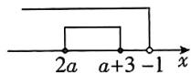

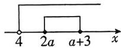  
图①  
图②

综上,实数 a 的取值范围是 $(-∞,-4)∪(2,+∞)$ .

14.7 【解析】如图, 设该校只参加一项竞赛的同学有 x 名, 则 $21+16+18+x=62$ , 解得 x=7.

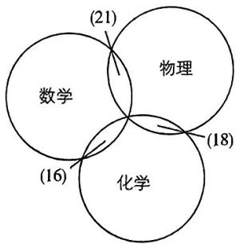

text_image

数学
物理
化学
(21)
(18)
(16)

# 考点2 充分条件与必要条件全称量词与存在量词

1. B 【解析】依题意可知, 若 $a^2 = b^2$ , 则 $a = b$ 或 $a = -b$ . 当 $a = b$ 时, $a^2 + b^2 = 2ab$ ; 当 $a = -b$ 时, $a^2 + b^2 \neq 2ab$ . 若 $a^2 + b^2 = 2ab$ , 即 $(a - b)^2 = 0$ , 则 $a = b$ , 所以 $a^2 = b^2$ . 所以 “ $a^2 = b^2$ ” 是 “ $a^2 + b^2 = 2ab$ ” 的必要不充分条

件. 故选 B.

2. B 【解析】由 $\sin^{2}\alpha + \sin^{2}\beta = 1$ ，得 $\sin^{2}\alpha = 1 - \sin^{2}\beta = \cos^{2}\beta$ ，所以 $\sin\alpha = \cos\beta$ 或 $\sin\alpha = -\cos\beta$ .

【易错】注意等式两边开方后会有两种情况

充分性不成立. 由 $\sin \alpha + \cos \beta = 0$ , 得 $\sin \alpha = -\cos \beta$ , 即 $\sin^2 \alpha = \cos^2 \beta$ , 又 $\cos^2 \beta = 1 - \sin^2 \beta$ , 所以 $\sin^2 \alpha = 1 - \sin^2 \beta$ , 即 $\sin^2 \alpha + \sin^2 \beta = 1$ , 必要性成立. 所以“ $\sin^2 \alpha + \sin^2 \beta = 1$ ”是“ $\sin \alpha + \cos \beta = 0$ ”的必要不充分条件,即甲是乙的必要条件但不是充分条件. 故选 B.

3. B 【解析】当 q=1 时， $S_{n}=na_{1}$ ，只有当 $a_{1}>0$ 时，数列 $\{S_{n}\}$ 才是递增数列，故甲不是乙的充分条件；若数列 $\{S_{n}\}$ 是递增数列，则 $S_{n}-S_{n-1}>0$ 对任意 $n\geqslant2, n\in N^{*}$ 恒成立，即 $a_{n}=a_{1}q^{n-1}>0(n\geqslant2, n\in\mathbf{N}^{*})$ 恒成立，所以 $a_{1}>0, q>0$ ，因此甲是乙的必要条件。故甲是乙的必要条件但不是充分条件。故选 B.

# 方法速记

数列 $|a_{0}|$ 单调性的判断方法：

(1) 若 $a_{n} - a_{n-1} > 0 (n \geqslant 2, n \in \mathbb{N}^{*})$ 恒成立，则 $\left|a_{n}\right|$ 是递增数列；(2) 若 $a_{n} - a_{n-1} < 0 (n \geqslant 2, n \in \mathbb{N}^{*})$ 恒成立，则 $\left|a_{n}\right|$ 是递减数列；(3) 若 $a_{n} - a_{n-1} = 0 (n \geqslant 2, n \in \mathbb{N}^{*})$ 恒成立，则 $\left|a_{n}\right|$ 是常数列.

4. A 【解析】使不等式 $|x - 1| < a$ 成立的一个充分条件为 $0 < x < 4$

设该不等式的解集为 $A$ ，则 $\vert x\vert 0 <   x <   4\} \subseteq A.$

当 $a \leqslant 0$ 时, $A = \emptyset$ . 不满足要求;

当 $a > 0$ 时， $A = |x|1 - a < x < 1 + a|$ ，

则 $\left\{\begin{aligned}1-a&\leqslant0,\\ 1+a&\geqslant4,\end{aligned}\right.$ 解得 $a\geqslant3.$

【提示】当 $a = 3$ 时，代入验证，符合题意故选A.

5. BC 【解析】由 $x^{2}+x-6=0$ ，得 x=2 或 x=-3，

由 $ax + 1 = 0 (a \neq 0)$ , 得 $x = -\frac{1}{a}$ .

由 $p$ 是 $q$ 的必要条件，可知 $-\frac{1}{a} = 2$ 或 $-\frac{1}{a} = -3$ ，解得 $a = -\frac{1}{2}$ 或 $a = \frac{1}{3}$ 故选BC.

6. C 【解析】命题“ $\forall x > 0, x^2 + x + 1 > 0$ ”的否定是“ $\exists x > 0, x^2 + x + 1 \leqslant 0$ ”。故选 C.

7. C 【解析】确定量词命题的否定的步骤为“改量词,否结论”,所以命题 $p: \exists x \in R, 3x < 1$ 的否定是“ $\forall x \in R, 3x \geqslant 1$ ”. 故选 C.

8. D 【解析】 $p_{1}:\forall x\in R,\sin^{2}\frac{x}{2}+\cos^{2}\frac{x}{2}=$ 1, 故 $p_{1}$ 为假命题；

$p_{2}$ : 存在 $x = 0 \in \mathbf{R}$ , 使 $\sin (0 - y) = -\sin y = 0 - \sin y = \sin 0 - \sin y$ , 故 $p_{2}$ 为真命题;

$p_{3}$ : 当 $x=\frac{3\pi}{4}, y=\frac{\pi}{4}$ 时, $\sin x=\cos y$ , 此时 $x+y=\pi$ , 故 $p_{3}$ 为假命题;

$p_{a}:\because \sqrt{\frac{1 - \cos 2x}{2}} = |\sin x|,\therefore \forall x\in [0,\pi ]$

$\sqrt{\frac{1-\cos 2x}{2}}=\sin x$ , 故 $p_{4}$ 为真命题.

故选D.

9. B 【解析】命题 p 为真命题等价于不等式 $ax^{2}+2x+1<0$ 有解.

当 $a = 0$ 时，不等式为 $2x + 1 < 0$ ，则 $x <$

$-\frac{1}{2}$ ,符合题意;

当 $a > 0$ 时， $\Delta = 4 - 4a > 0$ ，解得 $0 < a < 1$

当 $a < 0$ 时，总存在 $x \in \mathbb{R}$ ，使得 $ax^2 + 2x + 1 < 0$ .

综上, 实数 a 的取值范围为 $(-∞, 1)$ . 故选 B.

10. $\left[\frac{13}{4}, 4\right]$ 【解析】对于 $p$ ，当 $x_1 \in \left(\frac{1}{2}, x_1\right)$

2）时， $(\log_2x_1 + a)\in (a - 1,a + 1)$ ，当 $x_{2}\in$ $\left(\frac{1}{2},2\right)$ 时， $(x_2^2 +2)\in \left(\frac{9}{4},6\right).$

若 $p$ 为真命题，则 $(a - 1, a + 1) \subseteq \left(\frac{9}{4}, 6\right)$ .

即 $\left\{\begin{aligned}a-1&\geqslant\frac{9}{4},\\ a+1&\leqslant6,\end{aligned}\right.$ 解得 $\frac{13}{4}\leqslant a\leqslant5.$

对于 q，当 $x_{1}, x_{2} \in [0, 1]$ 时， $(a + 3x_{2}) \in [a, a + 3], 4^{*1} \in [1, 4]$ ,

若 q 为真命题，则 $(a+3x_{2})_{\min}>(4^{x_{1}})_{\min}$ ，则 a>4.

若 $p$ 为真命题， $q$ 为假命题，则 $\left\{ \begin{array}{l} \frac{13}{4} \leqslant a \leqslant 5 \\ a \leqslant 4, \end{array} \right.$

所以 $\frac{13}{4} \leqslant a \leqslant 4$

综上,实数 a 的取值范围为 $\left[\frac{13}{4},4\right]$ .

# 第2章 不等式

# 考点3 不等式及其性质、一元二次不等式

1.C【解析】对于A，令 $a = 2, b = 1, c = -1$ ， $d = -2$ ，满足 $a > b > 0 > c > d$ ，则 $a - c = b - d = 3$ 故A错误：

对于B，令 $a = 2, b = 1, c = -1, d = -2$ ，则 $\frac{c}{a} - \frac{d}{b} = \frac{-1}{2} - \frac{-2}{1} = \frac{3}{2} > 0$ ，故B错误；

对于 C, 因为 0 > c > d, 则 $c^{2} < cd$ , 故 C 正确; 对于 D, 令 a = 2, b = 1, c = -1, d = -2, 则 ac = bd = -2, 故 D 错误.

2. C 【解析】对于 A, $\frac{b}{a}-\frac{a}{b}=\frac{b^{2}-a^{2}}{ab}$ ，又 a< b<0，所以 $b^{2}-a^{2}<0, ab>0, \frac{b}{a}<\frac{a}{b}$ ，A 错误；对于 B，当 a=-2, c=1 时， $a^{2}<r^{2}$ 不成立，B 错误；

对于 C, 由 a<0<c, 可知 $0<2^{a}<1<2^{c}$ , C 正确; 对于 D, 由 a<b<0, 可得 -a>-b>0, 当 c>1 时, 有 $\log_{c}(-a)>\log_{c}(-b)$ , D 错误. 故选 C.

3. D 【解析】因为 a, b 是函数 $f(x) = x^{2} - mx + n (m > 0, n > 0)$ 的两个不同的零点，则 $a + b = m, ab = n, \Delta = m^{2} - 4n > 0$ ，且 a > 0, b > 0.

不妨设 a > b > 0，因为 a, b, -1 可适当排序后成等差数列，则等差数列为 a, b, -1 或 -1, b, a，故 2b = a - 1①.

又 $a, b, -1$ 可适当排序后成等比数列，则等比数列为 $a, -1, b$ 或 $b, -1, a$ , 故 $ab = 1②$

由①②得 $\frac{2}{a} = a - 1$ ，即 $a^2 - a - 2 = 0$ ，解得 $a =$

2(负值舍去)，故 $b=\frac{1}{2},m=2+\frac{1}{2}=\frac{5}{2}$

$n = 2 \times \frac{1}{2} = 1$ ，则不等式为 $\frac{x - \frac{5}{2}}{x - 1} \geqslant 0$ ，解得 $x < 1$ 或 $x \geqslant \frac{5}{2}$ . 故选 D.

4. ABD 【解析】对于 A, 根据二次函数图象的开口方向与二次不等式之间的关系可知 a<0, 故 A 正确;

对于 B, $ax^{2}+bx+c=0$ 的根为 $x_{1}=-1, x_{2}=3$ ,

则 $\left\{\begin{aligned}a<0,\\ -1+3&=-\frac{b}{a},\\ -1\times3&=\frac{c}{a},\end{aligned}\right.$ 即 $\left\{\begin{aligned}a<0,\\ b&=-2a,\\ c&=-3a.\end{aligned}\right.$

∴ $a+b+c=-4a>0$ ，故 B 正确；

对于 $C, cx^2 - bx + a < 0$ 即 $-3ax^2 + 2ax + a < 0$ , 则

$3x^{2} - 2x - 1 <   0$ ，解得 $-\frac{1}{3} < x <   1.$

$\therefore cx^{2} - bx + a < 0$ 的解集为 $\left\{x\mid -\frac{1}{3} < x < \right.$ $1\}$ ，故C错误；

对于 D, c = -3a > 0, 故 D 正确.

5. AD 【解析】因为关于 x 的不等式 $(ax-1) \cdot (x+2a-2) > 0$ 的解集中恰有 4 个整数, 所以 a < 0.

【提示】因为 $a \geqslant 0$ 时，不等式的解集中的整数有无数个

令 $(ax-1)(x+2a-2)=0$ ，则 $x=\frac{1}{a}$ 或x=2-2a.

不等式 $(ax-1)(x+2a-2)>0$ ，由题意知， $\frac{1}{a}<0$ ，则 $2-2a\leqslant4$ ，解得 $a\geqslant-1$ .

当 $a = -1$ 时，不等式的解集是 $(-1,4)$ ，解集中含有4个整数：0,1,2,3，满足题意.

当 $a = -\frac{1}{2}$ 时，不等式的解集是 $(-2,3)$ ，解集中含有4个整数：-1,0,1,2，满足题意.

当 $a \in \left(-1, -\frac{1}{2}\right)$ 时，不等式的解集是 $\left(\frac{1}{a}, 2 - 2a\right)$ ，此时 $\frac{1}{a} \in (-2, -1), 2 - 2a \in (3, 4)$ ，

解集中含有 5 个整数: -1, 0, 1, 2, 3, 不满足题意.

当 $a \in \left(-\frac{1}{2}, 0\right)$ 时，不等式的解集是 $\left(\frac{1}{a}, 2 - 2a\right)$ ，此时 $\frac{1}{a} \in (-\infty, -2), 2 - 2a \in (2,3)$ ，

解集中含有整数个数多于 4 个, 不满足题意.

综上所述， $a$ 的值可以是-1和 $-\frac{1}{2}$

6. $\left(-\infty, -\frac{9}{2}\right) \cup (11, +\infty)$ 【解析】由

1. A 【解析】因为 $x > 0, y > 0, x + 2y = 5$ ，所以 $5 = x + 2y \geqslant 2\sqrt{2xy}$ ，所以 $xy \leqslant \frac{25}{8}$ ，当且仅当 $x = 2y = \frac{5}{2}$ 时等号成立，所以 $\frac{1}{xy} \geqslant \frac{8}{25}$ ，即 $\frac{1}{xy}$

“ $\exists x \in \mathbf{R}$ , 使 $x^{2} + mx + 2m + 5 < 0$ ”是假命题知“ $\forall x \in \mathbf{R}, x^{2} + mx + 2m + 5 \geqslant 0$ ”是真命题, 所以 $\Delta = m^{2} - 4(2m + 5) \leqslant 0$ , 解得 $-2 \leqslant m \leqslant 10$ ,

所以 $A = |m| - 2 \leqslant m \leqslant 10$

因为 $x \in A$ 是 $x \in B$ 的充分不必要条件, 所以 $A \subsetneq B$ ,

设 $f(x) = (x - a + 1)(x - 1 + 2a)$

则 $\left\{\begin{aligned}f(-2)&<0,\\ f(10)&<0,\end{aligned}\right.$

即 $\left\{\begin{aligned}&(-1-a)(-3+2a)<0,\\ &(11-a)(9+2a)<0,\end{aligned}\right.$ 解得 $a<-\frac{9}{2}$ 或a>11，

所以实数 $a$ 的取值范围为 $\left(-\infty, -\frac{9}{2}\right) \cup (11, +\infty)$ .

7. C 【解析】当 a=0 时, 有 x<0, 不符合题意.

当 $a \neq 0$ 时，由题得 $a > 0$ 且 $\Delta = (a - 1)^2 - 4a^2 < 0$ ，解得 $a > \frac{1}{3}$ . 故选C.

8. A 【解析】由题意可知 $a \leqslant x + \frac{7}{x}$ 在区间

(2,7)上有实数解，设 $g(x) = x + \frac{7}{x}$ ，因为 $g(x) = x + \frac{7}{x}$ 在区间 $(2,\sqrt{7})$ 上单调递减，在区间 $(\sqrt{7},7)$ 上单调递增，且 $g(2) = 2+$ $\frac{7}{2} = \frac{11}{2},g(7) = 7 + \frac{7}{7} = 8 > g(2)$ 所以 $x + \frac{7}{x} < 8.$ 所以 $a < 8.$

9. C 【解析】由函数 $f(x) = \frac{x + 1}{ax^2 - 2ax + 1}$ 的定

义域为 $\mathbf{R}$ , 得对 $\forall x \in \mathbb{R}, ax^2 - 2ax + 1 \neq 0$ 恒成立.

当 $a = 0$ 时， $1 \neq 0$ 恒成立；

当 $a \neq 0$ 时, $\Delta = 4a^2 - 4a < 0$ , 解得 $0 < a < 1$ .

综上所述，实数 $a$ 的取值范围为 $|a|0 \leqslant$

# 考点4 基本不等式

的最小值为 $\frac{8}{25}$ .

2.C【解析】设 $x + 1 = a, x + 2y = b$ ，则 $x = a -$

$1, y = \frac{b - a + 1}{2}$ , 且 $a > 1, b > 0$ ,

a<1.

10. C 【解析】∵ $\forall x \in [1, 2]$ , $mx^{2} - mx - 1 < -m + 4$ 恒成立，

∴ $m(x^{2}-x+1)<5$ 对 $\forall x\in[1,2]$ 恒成立，

$\because y=x^{2}-x+1$ 在 $[1,2]$ 上单调递增.

$\therefore y = x^{2} - x + 1 \geqslant 1$ 在[1,2]上恒成立，

$\therefore m < \left( \frac{5}{x^2 - x + 1} \right)_{\infty}, x \in [1, 2]$ .

又∵当x=2时， $y=x^{2}-x+1$ 取得最大值3.

$\therefore \left(\frac{5}{x^{2}-x+1}\right)=\frac{5}{3},\therefore m<\frac{5}{3}.$

11. $2\sqrt{2}$ 【解析】 $\because a > b, ax^2 + 2x + b \geqslant 0$ 对于一切实数 $x$ 恒成立，

∴ a > 0，且 $\Delta_{1} = 4 - 4ab \leqslant 0$ ，∴ $ab \geqslant 1$ 。

由 $\exists x_0\in \mathbf{R}$ ，使 $ax_0^2 +2x_0 + b = 0$ 成立，可得 $\Delta_{z} = 4 - 4ab\geqslant 0,\therefore ab\leqslant 1.$

∴ ab=1，又 a>b, a>0，∴ a>1, $b=\frac{1}{a}$

$\therefore \frac{a^2 + b^2}{a - b} = \frac{a^2 + \frac{1}{a^2}}{a - \frac{1}{a}} > 0.$

令 $a^2 + \frac{1}{a^2} = t, t > 2$

则 $\left(\frac{a^2 + b^2}{a - b}\right)^2 = \left(\frac{a^2 + \frac{1}{a^2}}{a - \frac{1}{a}}\right)^2 = \frac{\left(a^2 + \frac{1}{a^2}\right)^2}{a^2 + \frac{1}{a^2} - 2} =$

$\frac{(t - 2)^2 + 4(t - 2) + 4}{t - 2} = (t - 2) + 4 + \frac{4}{t - 2} \geqslant$

$2\sqrt{(t - 2)\cdot\frac{4}{t - 2}} +4 = 4 + 4 = 8.$

当且仅当 $t - 2 = \frac{4}{t - 2}$ 即 $t = 4$ 时，等号成立.

$\therefore\left(\frac{a^{2}+b^{2}}{a-b}\right)^{2}$ 的最小值为8，

故 $\frac{a^{2}+b^{2}}{a-b}$ 的最小值为 $2\sqrt{2}$ .

题目转化为已知 $\frac{1}{a} +\frac{1}{b} = 1$ ，求 $2(a - 1) +$ $\frac{b - a + 1}{2}$ 的最小值.

因为 $2(a - 1) + \frac{b - a + 1}{2} = \frac{3a + b}{2} -\frac{3}{2},$

而 $3a + b = (3a + b)\left(\frac{1}{a} +\frac{1}{b}\right) = 4 + \frac{3a}{b} +\frac{b}{a}\geqslant$ $4 + 2\sqrt{\frac{3a}{b}\cdot\frac{b}{a}} = 4 + 2\sqrt{3},$

当且仅当 $\frac{3a}{b} = \frac{b}{a}$ 即 $a = \frac{3 + \sqrt{3}}{3}, b = \sqrt{3} + 1$ 时等式成立，

所以 $2(a - 1) + \frac{b - a + 1}{2} \geqslant \frac{4 + 2\sqrt{3}}{2} - \frac{3}{2} = \frac{1}{2} + \sqrt{3}$ . 故选 C.

3. AD 【解析】对于 A, $\because x > 0, \therefore x + \frac{1}{x} \geqslant 2\sqrt{x \cdot \frac{1}{x}} = 2$ （当且仅当 $x = \frac{1}{x}$ ，即 x = 1 时取等号），

$\therefore y = x + \frac{1}{x} (x > 0)$ 的最小值为2，故A符合题意；

对于 B, 当 0 < x < 1 时, $\ln x < 0$ , 此时 $y = \ln x + \frac{1}{\ln x}$ 为负值, 最小值不是 2, 故 B 不符合题意;

对于 $C, y = \frac{x^2 + 6}{\sqrt{x^2 + 5}} = \sqrt{x^2 + 5} + \frac{1}{\sqrt{x^2 + 5}}$ ，设 $t = \sqrt{x^2 + 5}$ ，则 $t \geqslant \sqrt{5}$ ，

$\because y = t + \frac{1}{t}$ 在 $[\sqrt{5}, +\infty)$ 上单调递增， $\therefore y \geqslant \sqrt{5} + \frac{1}{\sqrt{5}} = \frac{6\sqrt{5}}{5}$ ，其最小值不是2、故C不符合题意；

对于 D, $\because 4^{x} > 0, \therefore 4^{x} + 4^{-x} = 4^{x} + \frac{1}{4^{x}} \geqslant 2\sqrt{4^{x} \cdot \frac{1}{4^{x}}} = 2$ （当且仅当 $4^{x} = \frac{1}{4^{x}}$ ，即 x = 0 时取等号），

$\therefore y = 4^{x} + 4^{-x}$ 的最小值为2,故D符合题意.

4. AD 【解析】A 选项: $\frac{1}{a} + \frac{3}{b} \geqslant 2\sqrt{\frac{3}{ab}}$ , 即 $2\sqrt{\frac{3}{ab}} \leqslant 1$ , 解得 $ab \geqslant 12$ , 当且仅当 $\frac{1}{a} = \frac{3}{b}$ , 即 $a = 2, b = 6$ 时等号成立, A 正确;

B选项： $a + b = (a + b)\left(\frac{1}{a} +\frac{3}{b}\right) = 1 + \frac{3a}{b}+$ $\frac{b}{a} +3\geqslant 4 + 2\sqrt{\frac{3a}{b}\cdot\frac{b}{a}} = 4 + 2\sqrt{3}$ ，当且仅当 $\frac{3a}{b} = \frac{b}{a}$ 即 $a = \sqrt{3} +1,b = \sqrt{3} +3$ 时等号成

立.B错误；

C选项：由 $\frac{1}{a} +\frac{3}{b} = 1$ ，得 $a = \frac{b}{b - 3}$ 因为 $a>$ 0，所以 $b > 3$ ，则 $a^2 +b^2 = \left(\frac{b}{b - 3}\right)^2 +b^2$

设函数 $f(x)=\left(\frac{x}{x-3}\right)^{2}+x^{2},x>3$ ，则 $f'(x)=\frac{2x[(x-3)^{3}-3]}{(x-3)^{3}}$ .

令 $f'(x)=\frac{2x[(x-3)^{3}-3]}{(x-3)^{3}}=0$ ，解得 $x=3+3^{\frac{1}{3}}$ ，所以函数 $f(x)$ 在 $(3,3+3^{\frac{1}{3}})$ 上单调递减，在 $(3+3^{\frac{1}{3}},+\infty)$ 上单调递增，所以 $f(x)=f(3+3^{\frac{1}{3}})\neq24$ ，C错误；

D选项： $\frac{1}{a - 1} +\frac{3}{b - 3} = \frac{1}{\frac{b}{b - 3} - 1} +\frac{3}{b - 3} = \frac{b - 3}{3} +$ $\frac{3}{b - 3}\geqslant 2$ ，当且仅当 $\frac{b - 3}{3} = \frac{3}{b - 3}$ 即 $b = 6,a = 2$ 时等号成立，D正确.故选AD.

5. $4\sqrt{2}$ 【解析】由题得 $x + \frac{y}{x} +\frac{16}{xy} = x+$ $\frac{y^2 + 16}{xy}\geqslant x + \frac{2\cdot y\cdot 4}{xy} = x + \frac{8y}{xy}\geqslant 2\sqrt{x\cdot\frac{8y}{xy}} =$ $4\sqrt{2}$ ，当且仅当 $y^{2} = 16,x = \frac{8y}{xy}$ 即 $x = 2\sqrt{2},$ $y = 4$ 时取等号.

6. $\frac{1}{4}$ 【解析】由 $a^2 - 2ab + 9b^2 - c = 0$ 得 $c = a^2 - 2ab + 9b^2$ ,

则 $\frac{ab}{c} = \frac{ab}{a^2 - 2ab + 9b^2} = \frac{1}{\frac{a}{b} + \frac{9b}{a} - 2}$ .

由 $a, b, c$ 为正实数可知 $\frac{a}{b} + \frac{9b}{a} \geqslant 2\sqrt{\frac{a}{b} \cdot \frac{9b}{a}} = 6,$

当且仅当 $\frac{a}{b} = \frac{9b}{a}$ 即 $a = 3b$ 时，等号成立.

$\frac{a}{b} + \frac{9b}{a} - 2 \geqslant 4$ ，则 $0 < \frac{1}{\frac{a}{b} + \frac{9b}{a} - 2} \leqslant \frac{1}{4}$ ，

所以 $\frac{ab}{c}$ 的最大值为 $\frac{1}{4}$ .

7.12 【解析】因为正实数 $a, b$ 满足 $a^2 + b^2 = 1$ ,

故 $0 < ab \leqslant \frac{a^2 + b^2}{2} = \frac{1}{2}$ , 当且仅当 $a = b = \frac{\sqrt{2}}{2}$ 时等号成立,

故 $\left(4a + \frac{1}{2a}\right)\left(4b + \frac{1}{2b}\right) = 16ab + \frac{1}{4ab} +\frac{2a}{b} +$

$\frac{2b}{a} = 16ab + \frac{1}{4ab} + \frac{2(a^2 + b^2)}{ab} = 16ab + \frac{9}{4ab} \geqslant 2\sqrt{16ab \cdot \frac{9}{4ab}} = 12,$

当且仅当 $16ab = \frac{9}{4ab}$ ，即 $ab = \frac{3}{8}$ 时取等号，故 $\left(4a + \frac{1}{2a}\right)\left(4b + \frac{1}{2b}\right)$ 的最小值为12.

8.12 【解析】∵ x>0, y>0, ∴ 当 $x+\frac{1}{y}$ 取最小值时， $\left(x+\frac{1}{y}\right)^{2}$ 也取得最小值.

又 $\left(x - \frac{1}{y}\right)^2 = \frac{16y}{x},\therefore x^2 +\frac{1}{y^2} = \frac{2x}{y} +\frac{16y}{x},$

$\because \left(x + \frac{1}{y}\right)^2 = x^2 +\frac{1}{y^2} +\frac{2x}{y},$

$\therefore \left(x + \frac{1}{y}\right)^2 = \frac{4x}{y} +\frac{16y}{x}\geqslant 2\sqrt{\frac{4x}{y}\cdot\frac{16y}{x}} =$ 16,

$\therefore x + \frac{1}{y} \geqslant 4$ ，当且仅当 $\frac{4x}{y} = \frac{16y}{x}$ ，即 $x = 2y$ 时取等号.

∴ 当 $x + \frac{1}{y}$ 取最小值时， $x^{2} + \frac{1}{y^{2}} + \frac{2 \cdot 2y}{y} = 16$ ,

$\therefore x^{2} + \frac{1}{y^{2}} = 16 - 4 = 12.$

9. D 【解析】因为 x, y 为正实数, 所以 $\sqrt{x} + \sqrt{y} > 0$ ,

所以 $t \leqslant \frac{\sqrt{2} \cdot \sqrt{x + y}}{\sqrt{x} + \sqrt{y}}$

则有 $t \leqslant \left(\frac{\sqrt{2} \cdot \sqrt{x + y}}{\sqrt{x} + \sqrt{y}}\right)_{\min}$

令 $m = \frac{\sqrt{2} \cdot \sqrt{x + y}}{\sqrt{x} + \sqrt{y}}, m > 0,$

则 $\frac{1}{m} = \frac{\sqrt{x} + \sqrt{y}}{\sqrt{2} \cdot \sqrt{x + y}}$

所以 $\frac{1}{m^2} = \frac{x + y + 2\sqrt{xy}}{2(x + y)} = \frac{1}{2} +\frac{\sqrt{xy}}{x + y}\leqslant \frac{1}{2} +$ $\frac{\sqrt{xy}}{2\sqrt{xy}} = 1,$

当且仅当 $x = y$ 时，等号成立，

所以 $m^2 \geqslant 1$

又 $m > 0$ ，所以 $m\geqslant 1$ ，即 $\frac{\sqrt{2}\cdot\sqrt{x + y}}{\sqrt{x} + \sqrt{y}}\geqslant 1,$

所以 $\frac{\sqrt{2} \cdot \sqrt{x + y}}{\sqrt{x} + \sqrt{y}}$ 的最小值为 1，所以 $t \leqslant 1$ 即 $t$ 的最大值为 1.

10. $\left(-\infty,\frac{9}{7}\right)$ 【解析】依题意易知 $a^{4}>0$ , $b^{4}>0$ ，所以 $\frac{1}{a^{4}}+\frac{4}{b^{4}}=\frac{1}{7}(a^{4}+b^{4})\cdot\left(\frac{1}{a^{4}}+\frac{4}{b^{4}}\right)=\frac{1}{7}\left(1+\frac{b^{4}}{a^{4}}+\frac{4a^{4}}{b^{4}}+4\right)=\frac{1}{7}\left(5+\frac{b^{4}}{a^{4}}+\frac{4a^{4}}{b^{4}}\right)\geqslant\frac{1}{7}\times(5+4)=\frac{9}{7}$

当且仅当 $\frac{b^{4}}{a^{4}}=\frac{4a^{4}}{b^{4}}$ ，即 $a^{4}=\frac{7}{3},b^{4}=\frac{14}{3}$ 时，等号成立，

所以, $m<\frac{9}{7}$ ，可得m的取值范围是 $\left(-\infty,\frac{9}{7}\right)$ .

11. $\left(-\infty, -\frac{1}{4}\right]$ 【解析】依题意得，当 $x > 0$ 时， $\frac{2}{x^2 + 4} \geqslant \frac{2a + 1}{x}$ 能成立，即 $2a + 1 \leqslant \frac{2x}{x^2 + 4} = \frac{2}{x + \frac{4}{x}}$ 能成立，又因为 $x + \frac{4}{x} \geqslant$ 【提示】分离参数转化为最值问题

$2\sqrt{x \cdot \frac{4}{x}} = 4$ （当且仅当 x = 2 时取等号），所以 $\frac{2}{x + \frac{4}{x}}$ 的最大值为 $\frac{1}{2}$ ，所以 $2a +$

$1 \leqslant \frac{1}{2}$ , 解得 $a \leqslant -\frac{1}{4}$ .

12. ABD 【解析】对于 A, $2^{a} + 2^{b} \geqslant 2\sqrt{2^{a} \cdot 2^{b}} = 2\sqrt{2^{a*b}} = 2\sqrt{2}$ ，当且仅当 $a = b = \frac{1}{2}$ 时，等号成立，故 A 正确；

对于 B, $\frac{1}{a} + \frac{1}{b} = \frac{a + b}{ab} = \frac{1}{ab} \geqslant \frac{1}{\frac{(a + b)^2}{4}} = 4$ ,

当且仅当 $a = b = \frac{1}{2}$ 时，等号成立，故B正确；

对于 C, $\sqrt{ab} \leqslant \frac{a+b}{2} = \frac{1}{2}$ ，当且仅当 a = $b=\frac{1}{2}$ 时，等号成立，

$\left(\frac{1}{a} + 2\right)\left(\frac{1}{b} + 2\right) = \frac{2a + 1}{a} \cdot \frac{2b + 1}{b} = \frac{4ab + 2(a + b) + 1}{ab} = 4 + \frac{3}{ab} \geqslant 16$ ，当且仅当 $a = b = \frac{1}{2}$ 时，等号成立，故C不正确；

对于 D, $\frac{2a}{a^{2}+b}+\frac{b}{b^{2}+a}=\frac{2a}{a^{2}+1-a}+\frac{1-a}{(1-a)^{2}+a}=\frac{a+1}{a^{2}-a+1}$ ,

令 $t = a + 1, t \in (1,2)$ ，则 $a = t - 1$

$\frac{a + 1}{a^2 - a + 1} = \frac{t}{t^2 - 3t + 3} = \frac{1}{t + \frac{3}{t} - 3} \leqslant \frac{3 + 2\sqrt{3}}{3}$ , 当

且仅当 $t = \frac{3}{t}$ 即 $t = \sqrt{3}, a = \sqrt{3} - 1$ 时，等号成立，故D正确.

13. ①②③ 【解析】对于①, $a^2 + 1 - a = a^2 - 2a + 1 + a = (a - 1)^2 + a > 0$ ，故①正确；

对于②, $a+\frac{1}{a}\geqslant2$ ,当且仅当a=1时等号成立,且 $b+\frac{1}{b}\geqslant2$ ,当且仅当b=1时等号成立,则 $\left(a+\frac{1}{a}\right)\left(b+\frac{1}{b}\right)\geqslant4$ ,故②正确;

对于③， $(a + b)\left(\frac{1}{a} + \frac{1}{b}\right) = 1 + \frac{a}{b} + \frac{b}{a} + 1 \geqslant 2 + 2 = 4$ ，当且仅当 $\frac{a}{b} = \frac{b}{a}$ ，即 $a = b$ 时等号成立，故③正确；

对于④, $\frac{1}{a}+\frac{1}{b}\geqslant2\sqrt{\frac{1}{a}\cdot\frac{1}{b}}=\frac{2}{\sqrt{ab}}$ ,当
且仅当 a=b 时等号成立，则 $\frac{2}{\frac{1}{a}+\frac{1}{b}}\leqslant$

$\frac{2}{\sqrt{ab}} = \sqrt{ab}$ 故④不正确.

# 第3章 函数 | 第1节 函数的概念及性质

# 考点5 函数的概念及其表示

1. ABC 【解析】函数 $f(x - 2)$ 中的 $x$ 需满足 $-3 \leqslant x - 2 \leqslant 3$ ，解得 $-1 \leqslant x \leqslant 5$ ，故函数 $f(x - 2)$ 的定义域为 $[-1, 5]$ ，故 A 正确；函数 $\frac{f(3x)}{x - 1}$ 中的 $x$ 需满足 $\left\{ \begin{array}{l} -3 \leqslant 3x \leqslant 3, \\ x - 1 \neq 0, \end{array} \right.$ 解得 $-1 \leqslant x < 1$ ，故函数 $\frac{f(3x)}{x - 1}$ 的定义域为 $[-1, 1)$ ，故 B 正确；函数 $f(x - 2)$ 和 $f(2x)$ 的值域都为 $[-3, 3]$ ，故 C 正确，D 错误。

2. AD 【解析】依题意； $f(2x+1)=(2x+1)^{2}-2(2x+1)+1$ ，因此 $f(x)=x^{2}-2x+1$ ，故B,C错误，D正确；显然 $f(-3)=(-3)^{2}-2\times(-3)+1=16$ ，故A正确.

3. $\frac{e^x + 3e^{-x}}{2}$ 【解析】因为函数 $f(x)$ 的定义域为 $\mathbf{R}, y = f(x) + e^x$ 为偶函数，

所以 $f(-x) + \mathrm{e}^{-x} = f(x) + \mathrm{e}^x$ ，即 $f(-x) = f(x) + \mathrm{e}^x -\mathrm{e}^{-x}$

又 $y=f(x)-2e^{x}$ 为奇函数，所以 $f(-x)-2e^{-x}=-\left[f(x)-2e^{x}\right]$ ，即 $f(-x)+f(x)=2e^{x}+2e^{-x}$

所以 $f(x) + \mathrm{e}^{x} - \mathrm{e}^{-x} + f(x) = 2\mathrm{e}^{x} + 2\mathrm{e}^{-x}$ ，解得 $f(x) = \frac{\mathrm{e}^x + 3\mathrm{e}^{-x}}{2}.$

4. AB 【解析】因为 $0<10^{2}$ ，所以 $\frac{1}{10^{2}}+1>1$ ，

所以函数 $f(x) = \frac{10^x}{10^x + 1} = \frac{1}{1 + \frac{1}{10^x}}$ 的值域是(0,1).

则 $f(x)-\frac{1}{2}$ 的范围是 $\left(-\frac{1}{2},\frac{1}{2}\right)$ ;

于是 $y = \left[f(x) - \frac{1}{2}\right]$ 的函数值可能是-1

或0.

故选AB.

5. AC 【解析】对于 A, 因为 $f(\pi)$ 的定义域为 $[-2, 2]$ ，所以 $-2 \leqslant 2x - 1 \leqslant 2$ ，解得 $-\frac{1}{2} \leqslant x \leqslant \frac{3}{2}$ ，即 $f(2x - 1)$ 的定义域为 $\left[-\frac{1}{2}, \frac{3}{2}\right]$ ，故 A 正确；

对于 $B, y = \frac{x}{1 - x} = -\frac{x}{x - 1} = -\frac{x - 1 + 1}{x - 1} = -1 - \frac{1}{x - 1}$ , 所以 $y \neq -1$ , 即函数 $y = \frac{x}{1 - x}$ 的值域为 $(- \infty, -1) \cup (-1, +\infty)$ . 故 B 错误;

对于 $C$ ，令 $t = \sqrt{1 - x}$ ，则 $x = 1 - t^2, t \geqslant 0$ ，所以 $y = 2(1 - t^2) + t = -2x^2 + t + 2 = -2\left(t - \frac{1}{4}\right)^2 + \frac{17}{8}, t \geqslant 0$ ，所以当 $t = \frac{1}{4}$ 时，该

函数取得最大值, 最大值为 $\frac{17}{8}$ , 所以函数 $v = 2x + \sqrt{1 - x}$ 的值域为 $\left(-\infty, \frac{17}{8}\right]$ , 故 C 正确;

对于 D, 函数的定义域不能为空集, 故 D 错误. 故选 AC.

6.2 【解析】由题意知， $f(\sqrt{6})=(\sqrt{6})^{2}-4=$ 2、则 $f(f(\sqrt{6})) = f(2) = |2 - 3| + a = 3$ . 解得 a = 2.

# 关键点拨

解决分段函数的求值问题的关键是确定自变量的值属于哪一个取值范围，从而选择相应的解析式代入求解.

7. $\frac{225}{44} - \frac{5 + \sqrt{5}}{2}$ 【解析】 $f\left(-\frac{3}{2}\right) = -\frac{9}{4} + 5 = \frac{11}{4}, f\left(f\left(-\frac{3}{2}\right)\right) = f\left(\frac{11}{4}\right) = \frac{11}{4} + \frac{4}{11} + 2 = \frac{225}{44}$ .

由二次函数与对勾函数的性质知 $f(x)$ 在 $(-∞,0)$ 上单调递增，在 $(0,1)$ 上单调递减，在 $(1,+∞)$ 上单调递增，则令 $-x^{2}+5=4$ ，解得 $x=\pm1$ .

当 $x \geqslant 1$ 时， $x + \frac{1}{x} + 2 = 5$ ，解得 $x = \frac{3 + \sqrt{5}}{2}\left(x = \frac{3 - \sqrt{5}}{2}\right)$ 舍去。

因为 $f(-1) = f(1) = 4, f(0) = 5 = f\left(\frac{3 + \sqrt{5}}{2}\right)$ .

所以 $(m - n)_{\mathrm{min}} = -1 - \frac{3 + \sqrt{5}}{2} = -\frac{5 + \sqrt{5}}{2}$

1.C【解析】设 $t = -x^{2} + 3x + 4$ ，则有 $x\neq -1$ 且 $x\neq 4,t\in (-\infty ,0)\cup \left(0,\frac{25}{4}\right]$ ，所以函数 $f(x) = \frac{1}{4 + 3x - x^2}$ 的定义域为 $\{x|x\neq -1$ 且 $x\neq 4\}$

由二次函数的性质可知 $t = -x^2 + 3x + 4$ 的单调递增区间为 $(- \infty, -1), \left(-1, \frac{3}{2}\right)$ ，单调递减区间为 $\left(\frac{3}{2}, 4\right), (4, +\infty)$ 。又因为 $y = \frac{1}{t}$ 在 $t \in (-\infty, 0), \left(0, \frac{25}{4}\right]$ 上单调递减，

8. AC 【解析】对于 A, B, 由函数 $f(x)=1$ ⊕ $2^{-x}$ ，得 $f(x)=\left\{\begin{aligned}&1,1\geqslant2^{-x},\\ &2^{-x},1<2^{-x},\end{aligned}\right.$

即 $f(x)=\left\{\begin{aligned}1,x&\geqslant0,\\ 2^{-},x&<0.\end{aligned}\right.$ 作出函数 $f(x)$ 的图象如图所示.

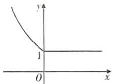

根据函数图象可得 $f(x)$ 的值域为 $[1, +\infty)$ ，故A正确，B错误

对于 C, D, 若不等式 $f(x+1) < f(2x)$ 成立, 由函数图象知, 当 $2x < x + 1 \leqslant 0$ , 即 $x \leqslant -1$ 时成立;

当 $\left\{\begin{aligned}&2x<0,\\ &x+1>0,\end{aligned}\right.$ 即-1<x<0时也成立.

所以不等式 $f(x + 1) < f(2x)$ 的解集是 $(- \infty, 0)$ , 故 $\mathbf{C}$ 正确, $\mathbf{D}$ 错误.

9.D 【解析】对于①，对任意的 $x_{1}, x_{2} \in [-1, 1]$ ，且 $x_{1} \neq x_{2}$ ，有 $-4 \leqslant x_{1} + x_{2} - 2 \leqslant 0$ ， $|y_{1} - y_{2}| = \left| \left( \frac{1}{4} x_{1}^{2} - \frac{1}{2} x_{1} + 1 \right) - \left( \frac{1}{4} x_{2}^{2} - \frac{1}{2} x_{2} + 1 \right) \right| = \left| \frac{1}{4} (x_{1} - x_{2}) \cdot (x_{1} + x_{2}) - \frac{1}{2} (x_{1} - x_{2}) \right| = \frac{|x_{1} + x_{2} - 2|}{4} \cdot |x_{1} - x_{2}| \leqslant |x_{1} - x_{2}|$ ，①正确；

对于②, 因为函数 $f(x)$ 是区间 $[-1,1]$ 上的奇函数, 所以 $f(0)=0$ , 所以对任意的 $x\in[-1,0)\cup(0,1]$ , $|f(x)|=|f(x)-f(0)|\leqslant|x|\leqslant1$ , 故对任意的 $x\in[-1,1]$ , $|f(x)|\leqslant1$ , ②

# 考点6 函数的基本性质

由复合函数的单调性可知, 函数 $f(x)=\frac{1}{4+3x-x^{2}}$ 的单调递增区间为 $\left(\frac{3}{2},4\right)$ 和 $(4,+\infty)$ . 故选 C.

2. D 【解析】取 $f(x) = x^{2} - 1 (x > 0)$ , $f(x)$ 在 $(0, +\infty)$ 上单调递增，而 $g(x) = x^{3} - x$ 在 $(0, +\infty)$ 上不单调；

取 $g(x) = x + 1(x > 0), g(x)$ 在 $(0, +\infty)$ 上单调递增，而 $f(x) = 1 + \frac{1}{x} (x > 0)$ 在 $(0, +\infty)$ 上单调递减，

正确；

对于③，若 $|x_{1} - x_{2}| \leqslant 1$ ，则 $|f(x_{1}) - f(x_{2})| \leqslant |x_{1} - x_{2}| \leqslant 1$ ，若 $|x_{1} - x_{2}| > 1$ ，不妨设 $x_{1} < x_{2}$ ，则 $x_{2} - x_{1} > 1$ ，故 $|f(x_{1}) - f(x_{2})| = |[f(x_{1}) - f(-1)] + [f(1) - f(x_{2})]| \leqslant |x_{1} - (-1)| + |1 - x_{2}| = x_{1} + 1 + 1 - x_{2} = 2 - (x_{2} - x_{1}) < 1$ ，③正确.

故选D.

10. $8\sqrt{2} + 8$ 【解析】 $\because f(x) = |\log_2x - 1|, x \in (0, \sqrt{a}]$ 具有性质 $M$ .

$\therefore x_{1},x_{2},x_{1} + x_{2}\in (0,\sqrt{a} ]$ ，且 $a > 4$

$\because$ 函数 $f(x) = |\log_2x - 1|, x \in (0, \sqrt{a}]$ 在 $(0, 2]$ 上单调递减，在 $[2, \sqrt{a}]$ 上单调递增，

∴ 可设 $0 < x_{1} < 2 < x_{2}$ ,

由 $f(x_{1}) = f(x_{2})$ 得， $\left|\log_2x_1 - 1\right| = \left|\log_2x_2 - 1\right|$

则 $1 - \log_2x_1 = \log_2x_2 - 1$ ，故 $\log_2(x_1x_2) = 2,$ $\therefore x_{1}x_{2} = 4(0 <   x_{1} <   2 <   x_{2}).$

又 $f(x_{1}+x_{2})=|\log_{2}(x_{1}+x_{2})-1|= \log_{2}(x_{1}+x_{2})-1,$

$$
\therefore \log_ {2} (x _ {1} + x _ {2}) - 1 - \frac {1}{2} = \log_ {2} x _ {2} - 1,
$$

即 $\log_2\left(1 + \frac{x_1}{x_2}\right) = \frac{1}{2},\frac{x_1}{x_2} = \sqrt{2} -1,$

$$
\because x _ {1} = \frac {4}{x _ {2}}, \therefore \frac {4}{x _ {2} ^ {2}} = \sqrt {2} - 1, x _ {2} ^ {2} = 4 \sqrt {2} + 4,
$$

$$
\because \sqrt {a} \geqslant x _ {1} + x _ {2}, \therefore a \geqslant (x _ {1} + x _ {2}) ^ {2} = \frac {1 6}{x _ {2} ^ {2}} + 8 +
$$

$x_{2}^{2} = 8\sqrt{2} + 8$ ，则实数 $a$ 的最小值为 $8\sqrt{2} +8.$

故“ $f(x)$ 为增函数”是“ $g(x)$ 为增函数”的既不充分也不必要条件. 故选 D.

3.B【解析】因为函数 $f(x) = 2|x - a| + 3$ 在 $(-\infty ,a)$ 上单调递减，在 $(a, + \infty)$ 上单调递增，所以当函数 $f(x) = 2|x - a| + 3$ 在区间 $[1, + \infty)$ 上不单调时，有 $a > 1$ ，故选B.

4. D 【解析】因为函数 $f(x)$ 在 R 上单调，由函数解析式可得函数 $f(x)$ 在 R 上单调递增不满足题意，故 $f(x)$ 在 R 上单调递减，所以 $\begin{cases}0<a<1,\\3a-2\geqslant\log_{a}1-1,\end{cases}$ 解得 $\frac{1}{3}\leqslant a<1.$

故选D.

5. CD 【解析】由题知函数 $f(x)$ 的定义域为R, 因为 $f(x+1)$ 是偶函数, 所以 $f(-x+1)=f(x+1)$ , 从而 $f(-x)=f(x+2)$ . 因为 $f(x-1)$ 是偶函数, 所以 $f(-x-1)=f(x-1)$ , 从而 $f(-x)=f(x-2)$ . 于是 $f(x+2)=f(x-2)$ , 则 $f(x+4)=f(x)$ , 所以 $f(x)$ 是以4为周期的周期函数. 因为 $f(-x-1)=f(x-1)$ , 所以 $f(-x-1+4)=f(x-1+4)$ , 即 $f(-x+3)=f(x+3)$ , 所以 $f(x+3)$ 是偶函数. 根据题中信息无法判断 $f(x)$ 的奇偶性, 故选CD.

6. D 【解析】因为函数 $f(x) = \frac{x\mathrm{e}^x}{\mathrm{e}^{ax} - 1}$ 是偶函数，且定义域为 $|x|x \neq 0|$ ，所以 $f(-x) = f(x)$ ，即 $\frac{x\mathrm{e}^x}{\mathrm{e}^{ax} - 1} = \frac{-x\mathrm{e}^{-x}}{\mathrm{e}^{-ax} - 1}$ ，即 $\frac{x\mathrm{e}^x}{\mathrm{e}^{ax} - 1} = \frac{-x\mathrm{e}^{-x}\cdot\mathrm{e}^{ax}}{1 - \mathrm{e}^{ax}} = \frac{-x\mathrm{e}^{ax - x}}{1 - \mathrm{e}^{ax}} = \frac{x\mathrm{e}^{ax - x}}{\mathrm{e}^{ax} - 1}$ ，所以 $a - 1 = 1$ ，即 $a = 2$ ，故选 D.

7. $-\frac{8}{3}$ （答案不唯一， $\left(-3, -\frac{8}{3}\right]$ 中的任何一个值均可）【解析】因为 $f(x) = \lg \frac{1 + mx}{1 + 3x}$ 是奇函数，所以 $f(x) + f(-x) = 0$ 即 $\lg \frac{1 + mx}{1 + 3x} + \lg \frac{1 - mx}{1 - 3x} = \lg \left(\frac{1 + mx}{1 + 3x} \cdot \frac{1 - mx}{1 - 3x}\right) = \lg \frac{1 - m^2x^2}{1 - 9x^2} = 0,$

即 $\frac{1 - m^2x^2}{1 - 9x^2} = 1$ ，解得 $m = \pm 3$ ，因为 $m\neq 3$ ，所以 $m = -3$ ，则 $f(x) = \lg \frac{1 - 3x}{1 + 3x}$

由 $\frac{1-3x}{1+3x}>0$ , 解得 $-\frac{1}{3}<x<\frac{1}{3}$ ，所以 $f(x)$ 的定义域为 $\left(-\frac{1}{3},\frac{1}{3}\right)$ 的非空子集，即 $0<n\leqslant\frac{1}{3}$ ，所以 $-3<m+n\leqslant-\frac{8}{3}$ .

8. C 【解析】由题知 $f(2 + x) = f(1 + (1 +$

1. B 【解析】因为对任意 $x_{1}, x_{2} \in (0, +\infty)$ ，且 $x_{1} \neq x_{2}$ ，满足 $\frac{f(x_{1}) - f(x_{2})}{x_{1} - x_{2}} < 0$ ，所以函数 $f(x)$ 在 $(0, +\infty)$ 上单调递减。由 $f(x) = (m^{2} - m - 1)x^{m^{2} + m - 1}$ 是幂函数，可得 $m^{2} - m - 1 = 1$ ，解得 $m = 2$ 或 $m = -1$ 。

$x)) = f(-1 - x) = -f(1 + x) = -f(-x) = f(x).$ 则函数 $f(x)$ 是周期为2的周期函数，则 $f\left(\frac{5}{3}\right) = f\left(-\frac{1}{3}\right) = \frac{1}{3}$ ，故选C.

# 一题多解

由 $f(x)$ 为奇函数，且定义域为 $\mathbf{R}$ 可知 $f(0) = 0$

$$
\text { 又 } f (1 + x) = - f (x), \therefore f (1) = 0.
$$

可大致画出图象如图所示.

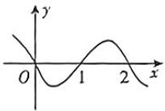

∴ 函数 $f(x)$ 的周期为 2，

$$
\therefore f \left(\frac {5}{3}\right) = f \left(- \frac {1}{3}\right) = \frac {1}{3}.
$$

# 快解

$$
f \left(\frac {5}{3}\right) = f \left(1 + \frac {2}{3}\right) = f \left(- \frac {2}{3}\right) =
$$

$$
- f \left(\frac {2}{3}\right) = - f \left(1 - \frac {1}{3}\right) = - f \left(\frac {1}{3}\right) =
$$

$$
f \left(- \frac {1}{3}\right) = \frac {1}{3}.
$$

# 方法速记

求抽象函数的周期性一般会用到如下结论:(1)若函数 $f(x)$ 对任意的x满足 $f(x+a)=f(x)$ ，则a为函数的一个周期；(2)若函数 $f(x)$ 对任意的x满足 $f(x+a)=-f(x+b)$ ，则 $2|a-b|$ 为函数的一个周期.

9. AC 【解析】对于 A, 由 $f(x)g(-x)=4$ 、得 $f(-x-2)g(x+2)=4$ ,

又 $f(x)g(x+2)=4$ ，所以 $f(-x-2)=f(x)$ ，则 $f(x)$ 的图象关于直线x=-1对称，A正确；

对于 B, 由于 $f(x)$ 的图象关于点 $(0,2)$ 对称, 则 $f(-x)+f(x)=4$ ,

由选项 A 的结论可知， $f(x-2)=f(-x)$ ，则 $f(x-2)+f(x)=4,$

所以 $f(x-4)+f(x-2)=4$ ，则 $f(x)=f(x-4)$ ，

所以函数 $f(x)$ 的一个周期为4.

因为 $f(x-2)+f(x)=4$ ，所以 $f(1)+f(3)=4$ ， $f(2)+f(4)=4$ 。

所以 $\sum_{k=1}^{2004} f(k) = 501[f(1) + f(2) + f(3) + f(4)] = 501 \times 8 = 4008, \mathbf{B}$ 错误；

对于 C, 由 $f(x)=f(x+4)$ , 及 $f(x)g(-x)=4$ , 得 $g(-x)=g(-x-4)$ . 则函数 $g(x)$ 的一个周期为 4, C 正确;

对于 D, 取 $f(x) = \sin\left(\frac{\pi}{2}x\right) + 2$ , $g(-x) = \frac{4}{\sin\left(\frac{\pi}{2}x\right) + 2}$ , 满足题设要求,

但 $g(-1)+g(1)=\frac{16}{3}$ ，与 $g(x)$ 的图象关于点 $(0,2)$ 对称矛盾，D 错误.

10.B【解析】因为 $y = f(2x + 1)$ 的最小正周期为1，所以 $f(2(x + 1) + 1) = f(2x + 1)$ .

即 $f(2x+3)=f(2x+1)$ ，所以2是 $f(x)$ 的一个周期.

因为 $f(x)$ 为奇函数，所以 $f\left(\frac{1}{2}\right)+ f\left(\frac{3}{2}\right)=f\left(\frac{1}{2}\right)+f\left(-\frac{1}{2}\right)=0$ ，②正确；

$$
\begin{array}{r l} & {f \left(\frac {1}{4}\right) + f \left(\frac {3}{4}\right) = f \left(\frac {1}{4}\right) + f \left(- \frac {5}{4}\right) =} \\ & {f \left(\frac {1}{4}\right) - f \left(\frac {5}{4}\right), \text {不一定为零}, ① \text {不正确};} \end{array}
$$

因为 $f(x+2)=f(x)=-f(-x)$ ，所以 $f(x)$ 的图象的一个对称中心为(1,0)、③正确；

通过题目条件无法得出 $f(x)$ 的图象的一条对称轴为直线 $x=\frac{1}{2}$ ，④不正确.

# 考点7-9 基本初等函数

当 $m = 2$ 时， $f(x) = x^3$ 在 $(0, +\infty)$ 上单调递增，故不成立.

当 $m = -1$ 时， $f(x) = x^{-3}$ 在 $(0, +\infty)$ 上单调递减，满足条件，故 $m = -1, f(x) = x^{-3}$ ，故 $f(x)$ 为奇函数.

因为 $a < 0 < b, |a| < |b|$ ，所以 $0 < -a < b$

故 $f(-a)>f(b)$ ，所以 $-f(a)>f(b)$ ，所以 $f(a)+f(b)<0$ 。故选B.

2. D 【解析】因为 $\gamma = x^{\frac{5}{3}}$ 为增函数，且 m < n，
故 $m^{\frac{3}{3}} < n^{\frac{5}{3}}$ . 故 A 错误；

令 $m = -2, n = 1$ ，则 $6^n < 5^x$ ，故 $\mathbf{B}$ 错误；

令 $m = -2, n = 1$ ，则 $\frac{n}{m^2} = \frac{1}{4}, \frac{m}{n^2} = -2$ ，故 $\frac{n}{m^2} > \frac{m}{n^2}$ ，故 C 错误；

因为 $n - m > 0$ ，故 $y = x^{n - m}$ 在第一象限为增函数，则 $\frac{1}{2^{n - m}} >\frac{1}{4^{n - m}} = 4^{m - n}$ ，故D正确.故选D.

3. $-\frac{1 + a}{1 + a + \sqrt{a}}$ 【解析】： $a > 0$

$$
\therefore \frac {a ^ {\frac {3}{2} - 1}}{a + a ^ {\frac {1}{2}} + 1} - \frac {a + a ^ {\frac {1}{2}}}{a ^ {\frac {1}{2}} + 1} + \frac {a - 1}{a ^ {\frac {1}{2}} + 1} = \frac {\sqrt {a}}{1 + a + \sqrt {a}} +
$$

$$
\frac {a - 1 - a - \sqrt {a}}{1 + \sqrt {a}} = \frac {\sqrt {a}}{1 + a + \sqrt {a}} - 1 = \frac {\sqrt {a}}{1 + a + \sqrt {a}} -
$$

$$
\frac {1 + a + \sqrt {a}}{1 + a + \sqrt {a}} = - \frac {1 + a}{1 + a + \sqrt {a}}.
$$

4. AD 【解析】当 x=1 时, $f(1)=a-2a=-a<0$ , 排除 B,C.

当 a=2 时, $f(x)=2^{x}-4$ , 此时函数对应的图象可能为 A;

当 $a = \frac{1}{2}$ 时， $f(x) = \left(\frac{1}{2}\right)^x - 1$ ，此时函数对应的图象可能为D.故选AD.

5. A 【解析】因为函数 $y = m^{x-1} + 3 (m > 0$ 且 $m \neq 1$ ) 图象恒过定点 $A(1,4)$ ,

且定点 $A$ 在直线 $\frac{x}{a} +\frac{y}{b} = 1(a > 0,b > 0)$ 上，所以 $\frac{1}{a} +\frac{4}{b} = 1(a > 0,b > 0).$

$$
a + b = (a + b) \left(\frac {1}{a} + \frac {4}{b}\right) = 1 + \frac {4 a}{b} + \frac {b}{a} + 4 \geqslant
$$

$2\sqrt{\frac{4a}{b}\cdot\frac{b}{a}}+5=9$ , 当且仅当 $\frac{4a}{b}=\frac{b}{a}$ ，即 a=3, b=6 时等号成立，所以 $a+b$ 最小值为 9.

因为关于 $t$ 的不等式 $a + b \geqslant t^2 + t + 3$ 恒成立，所以 $(a + b)_{\min} \geqslant t^2 + t + 3$

所以 $t^2 + t + 3 \leqslant 9$ ，即 $t^2 + t - 6 \leqslant 0$ ，解得 $-3 \leqslant t \leqslant 2$ .

故选A.

6. C 【解析】 $f(x) = x^{3} + \frac{2^{x+1}}{2^{x} + 1} = x^{3} + \frac{2 \times (2^{x} + 1 - 1)}{2^{x} + 1} = x^{3} - \frac{2}{2^{x} + 1} + 2,$

由复合函数单调性及单调性相关性质可得 $f(x)$ 在R上为增函数.

又 $f(x) + f(-x) = x^3 +\frac{2^{x + 1}}{2^x + 1} +\left(-x^3 +\right.$ $\frac{2^{-x + 1}}{2^{-x} + 1}\Bigg) = \frac{2^{x + 1}}{2^x + 1} +\frac{2}{2^x + 1} = \frac{2(2^x + 1)}{2^x + 1} = 2,$

$f(a^{2}) + f(2b^{2} - 3) = 2$ ，所以 $a^2 + 2b^2 - 3 = 0$ 即 $a^2 + 2b^2 = 3$ .

由基本不等式得 $a\sqrt{1 + b^2}\leqslant$ $\frac{2\sqrt{a^2}\cdot\sqrt{2 + 2b^2}}{2\sqrt{2}}\leqslant \frac{a^2 + 2 + 2b^2}{2\sqrt{2}} = \frac{5}{2\sqrt{2}} = \frac{5\sqrt{2}}{4},$

当且仅当 $\left\{\begin{aligned}a&>0,\\ a^{2}&=2+2b^{2},\end{aligned}\right.$ 即 $\left\{\begin{aligned}a&=\frac{\sqrt{10}}{2},\\ b&=\pm\frac{1}{2}\end{aligned}\right.$ 时，等

号成立,所以 $a\sqrt{1+b^{2}}$ 的最大值为 $\frac{5\sqrt{2}}{4}$ .

故选C.

7. $5 + 2\sqrt{6}$ 【解析】由 $\log_4(3x + 2y) = 3\log_8\sqrt{xy}$ ，

可得 $\left\{\begin{aligned}x&>0,\\ y&>0,\\ \frac{1}{2}\log_{2}(3x+2y)&=3\times\frac{1}{3}\log_{2}\sqrt{xy}\end{aligned}\right.$

化简得 $\left\{\begin{aligned}x>0,\\ y>0,\\ 3x+2y=xy,\end{aligned}\right.$ 即 $\left\{\begin{aligned}x>0,\\ y>0,\\ \frac{3}{y}+\frac{2}{x}=1,\end{aligned}\right.$

所以 $x + y = (x + y)\left(\frac{3}{y} +\frac{2}{x}\right) = 5 + \frac{2y}{x} +\frac{3x}{y}.$

又 $x > 0, y > 0$ ，所以 $\frac{2y}{x} + \frac{3x}{y} \geqslant 2\sqrt{6}$ ，

故 $x + y = 5 + \frac{2y}{x} +\frac{3x}{y}\geqslant 5 + 2\sqrt{6},$

当且仅当 $\frac{2y}{x}=\frac{3x}{y}$ ，即 $y=3+\sqrt{6},x=2+\sqrt{10}$ 时，等号成立.

8. AB 【解析】因为 $a^x = b^{-x}$ ，即 $a^z = \left(\frac{1}{b}\right)^z$ 所以 $a = \frac{1}{b}$ ，

当 $a > 1$ 时， $0 < b < 1$

指数函数 $y=b^{x}$ 在 R 上单调递减，且过点 (0,1);

对数函数 $y=\log_{a}x$ 在 $(0,+\infty)$ 上单调递增，且过点 $(1,0)$ ，

将 $y = \log_a x$ 的图象关于 $y$ 轴对称得到 $y: \log_a(-x)$ 的图象，

则 $y=\log_{a}(-x)$ 在 $(-∞,0)$ 上单调递减，且过点 $(-1,0)$ ，故 A 符合题意.

当 0<a<1 时, b>1,

同理可得,指数函数 $y=b^{x}$ 在 R 上单调递增,且过点(0,1),

$y=\log_{a}(-x)$ 在 $(-∞,0)$ 上单调递增，且过点 $(-1,0)$ ，故 B 符合题意.

9. D 【解析】设 $g(x)=x^{2}-2x-3$ ，可得函数 $g(x)$ 在 $(-∞,1)$ 上单调递减，在 $(1,+∞)$ 上单调递增。又由函数 $f(x)=\lg(x^{2}-2x-3)$ ，满足 $x^{2}-2x-3>0$ ，解得 x<-1 或 x>3。

【提示】注意对数函数的定义域

根据复合函数的单调性,可得函数 $f(x)$ 的
【提示】同增异减

单调递增区间为 $(3,+\infty)$ .

$f(x) = \lg (x^{2} - 2x - 3)$ 在 $[a, +\infty)$ 上单调递增，则 $a > 3$ 。所以对照四个选项，可以得到一个充分不必要条件是 $a > 4$ 。故选D.

10.1 【解析】因为函数 $g(x)=\log_{a}(x-1)+4$ 的图象经过定点(2,4)，所以 $f(x)=a^{x+m}+n$ 的图象也过定点(2,4)，即 $f(2)=a^{2+m}+n=4$ ，且 $2+m=0$ ，解得 m=-2, n=3，所以 $m+n=1$ 。

# 第2节 函数的应用

# 考点10 函数的图象

1. D 【解析】函数 $f(x) = \frac{x^2}{2^{|x|} - 4}$ 的定义域为 $|x|x\neq\pm2|$ , $f(-x)=\frac{(-x)^{2}}{2^{|x|}-4}\approx\frac{x^{2}}{2^{|x|}-4}\approx$ $f(x)$ ,

所以 $f(x)$ 是偶函数，函数图象关于 $y$ 轴对

称, 排除 A, B;

当 $x \in (0,2)$ 时， $1 < 2^{[x]} < 4, f(x) = \frac{x^2}{2^{[x]} - 4} < 0$ ，当 $x \in (2, +\infty)$ 时， $2^{[x]} > 4, f(x) = \frac{x^2}{2^{[x]} - 4} > 0$ ，排除 C. 故选 D.

# 快解

判断定义域、奇偶性后可采用特殊值法，令 $x = 1$ ，求得 $f(1) < 0$ ，故选D.

2. B 【解析】设 $f(x) = \frac{\ln |x|}{x^2 + 2}$ ，则 $f(x)$ 的定义域

为 $|x|x\neq0|$ ，且 $f(-x)=\frac{\ln|-x|}{(-x)^{2}+2}=f(x)$ ，故函数 $f(x)$ 为偶函数，其图象关于y轴对称，排除A,C；又当 $x\in(0,1)$ 时， $\ln|x|<0,x^{2}+2>0$ ，所以 $f(x)<0$ ，排除D，故选B.

# 方法速记

# 函数图象的识别问题的解题策略

(1) 确定函数的定义域；(2) 研究函数的奇偶性、对称性、周期性；(3) 特殊点处函数值的大小（与 0 比较）；(4) 函数在某个区间内的单调性；(5) 极限思想，当 $x \to +\infty$ 或 $x \to -\infty$ 时， $f(x)$ 的变化趋势.

3.C【解析】由于 $f(x) = \frac{2x\sin x}{x^2 + 1}$ 所以 $f(-x) =$ $\frac{2(-x)\sin(-x)}{(-x)^2 + 1} = \frac{2x\sin x}{x^2 + 1} = f(x)$ ，所以 $f(x)$ 为偶函数，故排除A,B;由于 $x^{2} + 1\geqslant 2x$ ，当且仅当 $x = 1$ 时，等号成立，故当 $x > 0$ 时， $f(x) =$ $\frac{2x\sin x}{x^2 + 1}\leqslant \frac{2x\sin x}{2x} = \sin x,$ 又 $\sin x\leqslant 1$ ，当 $x =$ $\frac{\pi}{2} +2k\pi (k\in \mathbf{Z})$ 时，等号成立，所以当 $x > 0$ 时， $f(x) <   1$ ，故排除D.

4. D 【解析】对于选项 A, 设 $h(x) = f(x) + g(x) - \frac{1}{4} = x^{2} + \sin x$ ，定义域为 R，因为 $h(-x) = x^{2} - \sin x$ ，所以 $h(x) = x^{2} + \sin x$ 为非奇非偶函数，故排除 A。对于选项 B，设 $t(x) = f(x) - g(x) - \frac{1}{4} = x^{2} - \sin x$ ，定义域为 R，因为 $t(-x) = x^{2} + \sin x$ ，所以 $t(x) = x^{2} - \sin x$ 为非奇非偶函数，故排除 B。对于选项 C，设 $m(x) = f(x)g(x) = \left(x^{2} + \frac{1}{4}\right)\sin x$ ，定义域为 R，因为 $m(-x) = -\left(x^{2} + \frac{1}{4}\right)\sin x = -m(x)$ ，所以 $m(x) = \left(x^{2} + \frac{1}{4}\right)\sin x$ 为奇函数，又 $m'(x) =$

1. D 【解析】因为 $y=x^{3}, y=2^{2x}$ 在 R 上为增函数, $y=\ln x$ 在 $(0,+\infty)$ 上为增函数, 所以由题知函数 $f(x), g(x), h(x)$ 在各自定义域上都为增函数. 又 $f(1)=-1<0, f(2)=7>0$ , 所以 $a\in(1,2); g(0)=-1<0, g(1)=3>0$ , 所以 $b\in(0,1); h(3)=\ln3-2<0$ ,

$2x\sin x+\left(x^{2}+\frac{1}{4}\right)\cos x$ ，当 $x\in\left(0,\frac{\pi}{4}\right)$ 时， $\sin x>0, \cos x>0$ ，所以 $m'(x)>0$ ，则 $m(x)=\left(x^{2}+\frac{1}{4}\right)\sin x$ 在 $\left(0,\frac{\pi}{4}\right)$ 上单调递增，故排除 C. 对于选项 D，设 $n(x)=\frac{g(x)}{f(x)}=\frac{\sin x}{x^{2}+\frac{1}{4}}$ ，定义域为 R，因为 $n(-x)=\frac{-\sin x}{x^{2}+\frac{1}{4}}=-n(x)$ ，所以 $n(x)=\frac{\sin x}{x^{2}+\frac{1}{4}}$ 为奇函数.

$n^{\prime}(x) = \frac{\left(x^{2} + \frac{1}{4}\right)\cos x - 2x\cdot\sin x}{\left(x^{2} + \frac{1}{4}\right)^{2}}$ 设 $s(x) = \left(x^{2} + \frac{1}{4}\right)\cos x - 2x\cdot \sin x,$ 则 $s(0) =$ $\frac{1}{4} >0,s\left(\frac{\pi}{4}\right) = \left[\left(\frac{\pi}{4}\right)^{2} + \frac{1}{4}\right]\times \cos \frac{\pi}{4} -2\times$ $\frac{\pi}{4}\times \sin \frac{\pi}{4} = \frac{\sqrt{2}}{2}\times \frac{\pi^2 + 4 - 8\pi}{16} < 0,$ 则由 $s(0)\cdot$ $s\left(\frac{\pi}{4}\right) <   0,$ 可知 $\exists x_0\in \left(0,\frac{\pi}{4}\right)$ ，使得 $s(x_0) = 0,$ 且 $x_0$ 是变号零点，所以函数 $n(x) = \frac{\sin x}{x^2 + \frac{1}{4}}$ 在 $\left(0,\frac{\pi}{4}\right)$ 上不单调，故D符合题意.故选D.

# 关键点拨

(1) 由函数的奇偶性和单调性进行排除；(2) 对于选项 D, $n(x)=\frac{g(x)}{f(x)}=\frac{\sin x}{x^{2}+\frac{1}{4}}$ ，对 $n(x)$ 求导，设 $s(x)=\left(x^{2}+\frac{1}{4}\right)\cos x-2x\cdot\sin x$ ，由 $s(0)\cdot s\left(\frac{\pi}{4}\right)<0$ 和零点存在定理，可知函数

$n(x) = \frac{\sin x}{x^2 + \frac{1}{4}}$ 在 $\left(0, \frac{\pi}{4}\right)$ 上不单调.

5. D 【解析】由题图知, 小李从点 A 到点 B 的过程中, y 的值先增后减,

从点 B 到点 C 的过程中, y 的值先减后增,

从点 C 到点 D 的过程中, y 的值先增后减, 从点 D 到点 A 的过程中, y 的值先减后增,

所以在整个运动过程中,小李和小陈之间的距离(即 $\gamma$ 的值)的增减性为:增、减、增、减、增,D选项符合题意,

故选D.

6. C 【解析】作出函数 $f(x)$ 的大致图象如图所示.

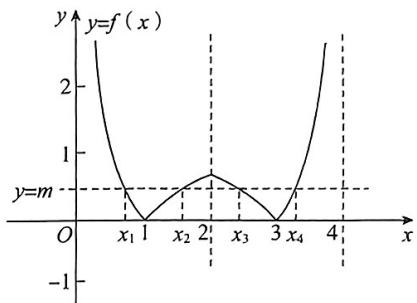

line

| x | y = f(x) |
|---|---|
| x₁ | 0 |
| x₂ | 0 |
| x₃ | 1 |
| x₄ | 0 |

$f(x)$ 的图象关于直线 $x = 2$ 对称.由图可知， $x_{1} + x_{4} = x_{2} + x_{3} = 4$ ，且 $0 <   x_{1} <   1 <   x_{2} <   2 <   x_{3}<$ $3 <   x_4 <   4,$

所以 $1 < 4 - x_{3} < 2, 0 < 4 - x_{4} < 1$ .

由 $|\ln x_1| = |\ln x_2|$ 可得 $-\ln x_{1} = \ln x_{2}$ ，所以 $x_{1}x_{2} = 1.$

则 $(4 - x_{3})(4 - x_{4}) = 1$ ，所以 $x_{3}x_{4} = 4(x_{3} + x_{4}) - 15.$

于是 $x_{1}x_{2} + x_{3}x_{4} + 4(x_{1} + x_{2})$

$$
= 1 + 4 \left(x _ {3} + x _ {4}\right) - 1 5 + 4 \left(x _ {1} + x _ {2}\right)
$$

$$
= 1 + 4 \left(x _ {1} + x _ {4}\right) - 1 5 + 4 \left(x _ {2} + x _ {3}\right)
$$

$$
= 1 + 1 6 - 1 5 + 1 6
$$

$$
= 1 8.
$$

故选C.

# 考点11 函数与方程

$h(4) = \ln 4 - 1 > 0$ ，所以 $c\in (3,4)$ ，所以 $c>$ $a > b.$

2. C 【解析】因为函数 $f(x) = 5 - 2x - \lg (2x + 1)$ 在 $\left(-\frac{1}{2}, +\infty\right)$ 上单调递减，所以函数 $f(x)$ 最多只有一个零点，

因为 $f(0) \cdot f(1) = 5 \times (5 - 2 - \lg 3) = 5 \times (3 - \lg 3) > 0,$

$f(1)\cdot f(2) = (5 - 2 - \lg 3)\times (5 - 4 - \lg 5) =$ $(3 - \lg 3)\times (1 - \lg 5) > 0,$

$f(2)\cdot f(3) = (5 - 4 - \lg 5)\times (5 - 6 - \lg 7) = (1-$ $\lg 5)\times (-1 - \lg 7) <   0,$

$f(3)\cdot f(4) = (5 - 6 - \lg 7)\times (5 - 8 - \lg 9) = (-1 - \lg 7)\times (-3 - \lg 9) > 0,$

所以函数 $f(x)=5-2x-\lg(2x+1)$ 的零点所在的区间是(2,3)，故选C.

3. ABC 【解析】∵ $f(1+x)=f(1-x)$ ，∴ $f(2+x)=f(-x)$ ，且 $y=f(x)$ 的图象关于直线 x=1 对称；

又 $f(x-2)+f(-x)=0,\therefore f(x+2)=-f(x-2)$ ，且 $y=f(x)$ 的图象关于点 $(-1,0)$ 中心对称；

$$
\therefore f (x + 4) = - f (x),
$$

$$
\therefore f (x + 8) = - f (x + 4) = f (x),
$$

则 $f(x)$ 是周期为8的周期函数.

对于 A, 令 $g(x)=f(x+1)$ , $\because g(-x)=f(-x+1)=f(1+x)=g(x)$ ,

∴ $f(x+1)$ 为偶函数, A 正确;

对于B, 令 $h(x) = f(x + 3) = -f(x - 1)$ ,

$$
\begin{array}{l} \because h (- x) = - f (- x - 1) = - f (2 + (x + 1)) = \\ - f (x + 3) = - h (x), \end{array}
$$

∴ $f(x+3)$ 为奇函数, B 正确;

对于 C, 作出 $y=f(x)$ 和 $y=\lg |x|$ 的图象如图所示，

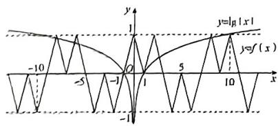

text_image

y
1
y=|y|x|
-10
-5
-1
O
1
5
10
x
y=f(x)
-1

当 $|x|>10$ 时， $\lg |x|>1$ ，又 $f(x) \in [-1, 1]$ ，

由图象可知， $y=f(x)$ 与 $y\approx\lg|x|$ 的图象共有 10 个不同的交点，

则 $y = f(x) - \lg |x|$ 有10个不同的零点，C正确；

对于 D, $\because f(1)+f(2)+\cdots+f(8)=0,$ $\therefore \sum_{k=1}^{202} f(k) = 253 \times [f(1) + f(2) + \cdots + f(8)] =$ $f(2024) \approx 0 - f(8) = -1, D$ 错误.

故选 ABC.

4. D 【解析】 $x \geqslant 0$ 时, $f(x) = \frac{1}{x} = x$ , 函数在 $(0, +\infty)$ 上单调递减, $f(1) \geqslant 0$ .

令 $f(x) = 0$ 可得 $f(x) = x + a$ ，作出函数 $y = f(x)$ 与函数 $y = x + a$ 的大致图象如图所示。

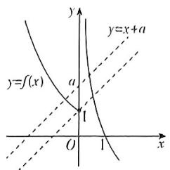

text_image

y
y=f(x)
a
y=x+a
O
1
x

由上图可知，当 $a \geqslant 1$ 时，函数 $y = f(x)$ 与函数 $y = x + a$ 的图象有2个交点，此时，函数 $y = g(x)$ 有2个零点.因此，实数 $a$ 的取值范围是 $[1, +\infty)$

5. CD 【解析】当 $x = 0$ 时， $g(0) = f(0) - 0 = 0$ ，故 $g(x)$ 有零点 $x = 0$ ；

当 $x \neq 0$ 时, $g(x)$ 的零点个数等价于方程 $f(x) = mx^2$ 的不等实根的个数,

也等价于直线 $y = m$ 与函数 $h(x) = \frac{f(x)}{x^2}$ 的图象的交点个数.

而 $h(x) = \frac{f(x)}{x^2} = \left\{ \begin{array}{l} -x^2 - 2x, x < 0, \\ \frac{\ln x}{x^2}, x > 0, \end{array} \right.$

当 $x > 0$ 时， $h(x) = \frac{\ln x}{x^2}$ ， $h'(x) = \frac{x - 2x\ln x}{x^4} = \frac{1 - 2\ln x}{x^3}$ ，

当 $0 < x < \sqrt{\mathrm{e}}$ 时， $h'(x) > 0$ ；当 $x > \sqrt{\mathrm{e}}$ 时， $h'(x) < 0$

故 $h(x)$ 在 $(0, \sqrt{e})$ 上单调递增，在 $(\sqrt{e}, +\infty)$ 上单调递减，

当 $x \to 0^{+}$ 时, $h(x) \to -\infty$ , 当 $x \to +\infty$ 时, $h(x) \to 0^{+}$ , 作出 $h(x)$ 的大致图象如图所示.

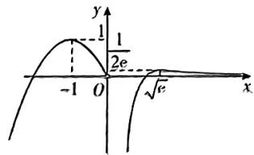

text_image

y
-1/2e
-1 O √e x

对于 A, 若 $g(x)$ 恰有 2 个零点, 则直线 y=m 与 $h(x)$ 的图象有且只有一个交点, 由图可得 m=1, 故 A 错误;

对于 B, 若 $g(x)$ 恰有 3 个零点, 则直线 $y \equiv m$ 与 $h(x)$ 的图象有且只有两个交点, 由图可得 $m \leqslant 0$ 或 $\frac{1}{2e} < m < 1$ , 故 B 错误;

对于 $C$ ，当 $0 < m < \frac{1}{2}$ 时，直线 $y \cong m$ 与 $h(x)$ 的图象有且只有四个交点，故 $g(x)$ 有 5 个

不同的零点,故 C 正确;

对于 D, 当 m>1 时, 直线 y=m 与 $h(x)$ 的图象没有交点, 故 $g(x)$ 仅有 1 个零点, 故 D 正确. 故选 CD.

6. AC 【解析】当 x=0 时， $f(0)=1\neq0$ ，所以 x=0 不是函数 $f(x)$ 的零点；当 $x\neq0$ 时，由 $f(x)=0$ ，即 $\left|x^{2}+3x+1\right| - a\left|x\right| = 0$ ，得 $a=\left|x+\frac{1}{x}+3\right|$ ，则 $f(x)$ 的零点个数等

【提示】分离参数法

于直线 $y = a$ 与函数 $y = \left|x + \frac{1}{x} + 3\right|$ 的图象的交点个数. 当 $x > 0$ 时, $x + \frac{1}{x} \geqslant 2\sqrt{x \cdot \frac{1}{x}} = 2$ , 当且仅当 $x = \frac{1}{x}$ , 即 $x = 1$ 时, 等号成立, 所以当 $x > 0$ 时, $y = \left|x + \frac{1}{x} + 3\right| \geqslant 5$ , 当且仅当 $x = 1$ 时, 等号成立; 当 $x < 0$ 时, $x + \frac{1}{x} = -\left(-x + \frac{1}{-x}\right) \leqslant -2\sqrt{(-x) \cdot \frac{1}{-x}} = -2$ , 当且仅当 $-x = \frac{1}{-x}$ , 即 $x = -1$ 时, 等号成立, 所以当 $x < 0$ 时, $y = x + \frac{1}{x} + 3 \leqslant 1$ , 当且仅当 $x = -1$ 时, 等号成立. 作出函数 $y = \left|x + \frac{1}{x} + 3\right|$ 的大致图象 (如图).

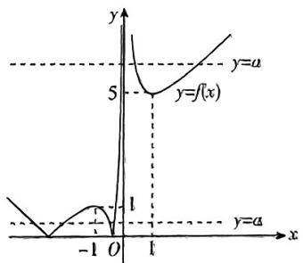

text_image

y
y=a
5
y=f(x)
-1 O 1
y=a
x

由图可知, 若 $f(x)$ 没有零点, 则 $a \in (-\infty, 0)$ , 故 A 正确; 若 $f(x)$ 恰有 2 个零点, 则 $a \in \{0\} \cup (1, 5)$ , 故 B 不正确; 若 $f(x)$ 恰有 3 个零点, 则 a = 1 或 a = 5, 故 C 正确; 若 $f(x)$ 恰有 4 个零点, 则 $a \in (0, 1) \cup (5, +\infty)$ , 故 D 不正确.

故选AC.

7. $(-1,0]$ 【解析】作出函数 $y=f(x)=\left\{\begin{aligned} & x+\frac{1}{x}, & x>0, \\ & -1x+3, & x\leqslant 0 \end{aligned}\right.$ 的图象如图所示.

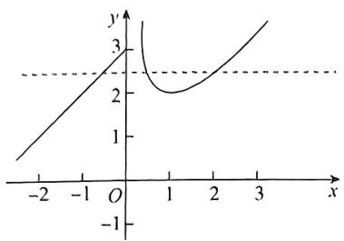

text_image

Graph showing a parabola and a line intersecting at x=0, with y-axis labeled in Cartesian coordinates.

由 $x + \frac{1}{x} = 3$ 可得 $x = \frac{3\pm\sqrt{5}}{2}$ ，由 $-|x| + 3 = 2$ 可得 $x = -1$ （正值舍去），

【提示】求出三个实根的临界位置

则 $-1 < x_{1} \leqslant 0, \frac{3 - \sqrt{5}}{2} \leqslant x_{2} < 1, 1 < x_{3} \leqslant \frac{3 + \sqrt{5}}{2}$ .

由 $3 + x_{1} = x_{2} + \frac{1}{x_{2}} = x_{3} + \frac{1}{x_{3}} = a$ ，可得 $x_{3} = \frac{1}{x_{2}}$

$x_{1} = x_{2} + \frac{1}{x_{2}} - 3,$ 可得 $\frac{ax_1}{x_2 + x_3} =$

$$
\frac {\left(x _ {2} + \frac {1}{x _ {2}}\right) \left(x _ {2} + \frac {1}{x _ {2}} - 3\right)}{x _ {2} + \frac {1}{x _ {2}}} = x _ {2} + \frac {1}{x _ {2}} - 3 = a - 3,
$$

由图可得 $2 < a \leqslant 3$ ，则 $-1 < a - 3 \leqslant 0$ ，故所求取值范围为 $(-1, 0]$ .

8. A 【解析】当 $x \leqslant 0$ 时, $f(x) = 4^x + 3$ 单调递增, 所以 $3 < f(x) \leqslant 4$ . 当 $x > 0$ 时, $f(x) = 2^x + \log_9 x^2 - 9 = 2^x + \log_3 x - 9$ 单调递增, 且 $f(3) = 0$ , 则 $x = 3$ 是 $f(x)$ 唯一的零点. 由于当 $x \leqslant 0$ 时, $3 < f(x) \leqslant 4$ , 所以令 $f(f(x)) = 0$ , 得

$f(x) = 2^{x} + \log_{3}x - 9 = 3.$ 因为 $f(3) = 0 <   3,$ $f\left(\frac{7}{2}\right) = 8\sqrt{2} +\log_3\frac{7}{2} -9 > 8\times 1.414 + \log_33 - 9 =$

3. 312 > 3, 所以函数 $f(f(x))$ 的零点所在区间为 $\left(3, \frac{7}{2}\right)$ , 故选 A.

9. D 【解析】由函数 $y=\left[f(x)\right]^{2}-f(f(x))$ ，令 $t=f(x)$ ，则 $y=t^{2}-f(t)$ .

令 y=0, 可得 $t^{2}=f(t)$ .

当 t>0 时，由 $t^{2}=f(t)$ ，可得 $t^{2}=(t-2)^{2}$ ，
即 $-4t+4=0$ ，解得t=1；

当 $t \leqslant 0$ 时，由 $t^2 = f(t)$ ，可得 $t^2 = 2t + 3$ ，即 $t^2 - 2t - 3 = 0$ ，解得 $t = -1$ 或 $t = 3$ （舍去），

所以 $t = \pm 1$ ，即 $f(x) = \pm 1$

当 $x > 0$ 时，令 $(x - 2)^{2} = 1$ 或 $(x - 2)^{2} = -1$ （舍去），解得 $x = 1$ 或 $x = 3$

当 $x \leqslant 0$ 时，令 $2x + 3 = \pm 1$ ，解得 $x = -1$ 或 $x = -2$

所以函数 $y = [f(x)]^2 - f(f(x))$ 的零点之和为 $1 + 3 - 1 - 2 = 1$ .

10. D 【解析】函数 $y=f(x)$ 的大致图象如图所示，对于方程 $[f(x)]^{2}+2af(x)+3=0$ 有 5 个不同的实数解，令 $t=f(x)(-5<t\leqslant-1)$ ，则 $t^{2}+2at+3=0$ 在 $(-5,-2)$ ， $(-2,-1)$ 上各有一个实数解或 $t^{2}+2at+3=0$ 的一个解为 -1，另一个解在 $(-2,-1)$ 内或

$t^2 + 2at + 3 = 0$ 的一个解为-2，另一个解在 $(-2, -1)$ 内.

当 $t^2 + 2at + 3 = 0$ 在 $(-5, -2), (-2, -1)$ 上各有一个实数解时，设 $g(t) = t^2 + 2at + 3, t \in (-5,$

-2) $\cup(-2,-1)$ ，则 $\left\{\begin{aligned}\Delta&=4a^{2}-12>0,\\ g(-2)&=7-4a<0,\\ g(-1)&=4-2a>0,\\ g(-5)&=28-10a>0,\end{aligned}\right.$ 解得

$\frac{7}{4} < a < 2;$

当 $t^2 + 2at + 3 = 0$ 的一个解为-1时， $a = 2$ 此时方程的另一个解为-3，不在 $(-2, -1)$ 内，不满足题意；

当 $t^2 + 2at + 3 = 0$ 的一个解为-2时, $a = \frac{7}{4}$ , 此时方程的另一个解为 $-\frac{3}{2}$ , 在 $(-2, -1)$ 内, 满足题意.

综上可知, 实数 a 的取值范围为 $\left[\frac{7}{4},2\right)$ . 故选 D.

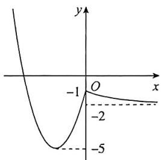

line

| x | y |
|---|---|
| -1 | -2 |
| 0 | -5 |

# 考点12 函数模型及其应用

1. C 【解析】将 L=4.9 代入 $L=5+\lg V$ ，得 $\lg V=-0.1$ ，即 $V=10^{-0.1}=10^{-\frac{1}{10}}=\frac{1}{\sqrt[10]{10}}\approx0.8$ ，故选 C.

2 B 【解析】由题意得 $\rho(1)=\frac{m}{5v_{0}}+\frac{4m}{5v_{0}}e^{-v}$ $\rho(2)=\frac{m}{5v_{0}}+\frac{4m}{5v_{0}}e^{-2v}.$

因为 $\rho(1) = \frac{3}{2}\rho(2)$ , 所以 $\frac{m}{5v_0} + \frac{4m}{5v_0} e^{-x} = \frac{3}{2}\left(\frac{m}{5v_0} + \frac{4m}{5v_0} e^{-2t}\right)$ ,

整理得 $8e^{-v}-12e^{-2v}=1$ 。

令 $e^{-p} \approx n$ ,

因为 $v > 1$ ，所以 $n = e^{-\frac{1}{2}} \in \left(0, \frac{1}{e}\right)$

则 $12n^{2} \sim 8n + 1 \approx 0$ ，解得 $n \approx \frac{1}{2}$ （舍去）或 $n = \frac{1}{6}$ ，

故 $\mathrm{e}^{-v} = \frac{1}{6}$ ，解得 $v = \ln 6 = \ln 2 + \ln 3\approx$ 0.693 $1 + 1.0986 = 1.7917.$

3.【解】(1) 当总质比为 200 时, $v = 1000 \times$ $\ln 200 \approx 1000 \times 5.3 = 5300 (\mathrm{~m/s})$ ,

所以当总质比为 200 时, A 型火箭的最大速度约为 5300 m/s.

(2)由题意,经过材料更新和技术改进后,A型火箭的喷流相对速度为1500m/s,总质比变为 $\frac{M}{3m}$ ,要使火箭的最大速度至少增加500m/s,则需 $1500\cdot\ln\frac{M}{3m}-1000\cdot$

$\ln \frac{M}{m} \geqslant 500,$

化简得 $3\ln \frac{M}{3m} - 2\ln \frac{M}{m} \geqslant 1$

即 $\ln \left(\frac{M}{3m}\right)^3 -\ln \left(\frac{M}{m}\right)^2\geqslant 1$ ，整理得

$\ln \frac{M}{27m} \geqslant 1$ ，即 $\frac{M}{27m} \geqslant e$ ，则 $\frac{M}{m} \geqslant 27e.$

由参考数据知 2.718 < e < 2.719,

可得 73.386<27e<73.413,

故材料更新和技术改进前总质比的最小整数值为74.

4.B【解析】设原有溶质的半成品为 $a\mathrm{kg}$ 含杂质 $1\% a\mathrm{kg}$ ，经过 $n$ 次过滤，含杂质 $1\% a\times \left(1 - \frac{1}{3}\right)^n\mathrm{kg}.$ 要使该溶质经过 $n$ 次过滤后杂质含量不超过 $0.1\%$ ，则 $1\% \times$ $\left(1 - \frac{1}{3}\right)^n\leqslant 0.1\%$ ，即 $\left(\frac{2}{3}\right)^n\leqslant \frac{1}{10}.$

因为 $\left(\frac{2}{3}\right)^{5}=\frac{32}{243}>\frac{1}{10},\left(\frac{2}{3}\right)^{6}=\frac{64}{729}<\frac{1}{10}$ ，所以 $n\geqslant6$ ，故该溶质的半成品至少应过滤6次，才能达到市场要求。故选B.

# 专题1 比较大小问题

1. D 【解析】由题意知, $a=2^{0.7}>2^{0}=1$ ,b= $\left(\frac{1}{3}\right)^{0.7}=3^{-0.7}<3^{0}=1$ , 又 b>0, 所以 0<b<1, $c=\log_{2}\frac{1}{3}<0$ , 所以 c<b<a. 故选 D.

2. B 【解析】由题意知, $c=3^{a-1}=\frac{1}{3}\times3^{\log_{3}2}=\frac{2}{3},b=\log_{5}2<\log_{5}\sqrt{5}=\frac{1}{2},a=\log_{3}2>\log_{3}\sqrt{3}=\frac{1}{2}$ ，又 $2^{3}<3^{2}$ ，则 $2<3^{\frac{2}{3}},a=\log_{3}2<\log_{3}3^{\frac{2}{3}}=\frac{2}{3}$ ，所以b<a<c.故选B.

3. C 【解析】∵ $f(x)$ 是定义域为 R 的偶函数，且 $\log_{3}\frac{1}{4} = -\log_{3}4, \therefore f\left(\log_{3}\frac{1}{4}\right) = f(\log_{3}4)$ ，且 $\log_{3}4 > 1$ 。又∵ $y = 2^{x}$ 在 $(-∞, +∞)$ 上单调递增，∴ $0 < 2^{-\frac{3}{2}} < 2^{-\frac{2}{3}} < 1$ 。又∵ $f(x)$ 在 $(0, +∞)$ 单调递减，且 $0 < 2^{-\frac{3}{2}} < 2^{-\frac{2}{3}} < 1 < \log_{3}4, \therefore f(2^{-\frac{3}{2}}) > f(2^{-\frac{2}{3}}) > f(\log_{3}4) = f\left(\log_{3}\frac{1}{4}\right)$ 。故选 C.

4. D 【解析】作函数 $y=\log_{3}x, y=3^{x}, y=x$ 的图象, 如图, 则直线 y=c>1 与上述函数图象的交点的横坐标分别为 a, b, c, 由图可知, 0<b<c<a.

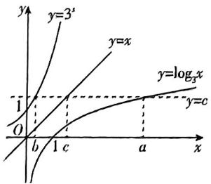

text_image

y=3^x
y=x
y=log₃x
y=c
O
b
c
a
x

因为 $\log_3 a > 1$ ，所以 $a > 3$ ，所以二次函数 $f(x) = ax^2 - bx + c$ 的图象的对称轴方程为 $x = \frac{b}{2a} < b$ 。又因为函数 $f(x) = ax^2 - bx + c$ 在 $\left(\frac{b}{2a}, +\infty\right)$ 上单调递增，所以 $f(b) < f(c) < f(a)$ ，故选D.

5. B 【解析】由题意知， $f(x) = a \cosh \frac{x}{a} = a \cdot \frac{e^{\frac{x}{a}} + e^{-\frac{x}{a}}}{2}$ . 当 $a = 2$ 时， $f(x) = e^{\frac{x}{2}} + e^{-\frac{x}{2}}$ ，定义域为 R，且 $f(-x) = e^{-\frac{x}{2}} + e^{\frac{x}{2}} = f(x)$ ，故

$f(x)$ 为偶函数. 又 $f'(x) = \frac{1}{2} (-\mathrm{e}^{-\frac{x}{2}} + \mathrm{e}^{\frac{x}{2}}) = \frac{(\mathrm{e}^{\frac{x}{2}} + 1)(\mathrm{e}^{\frac{x}{2}} - 1)}{2\mathrm{e}^{\frac{x}{2}}}$ . 当 $x > 0$ 时, $f'(x) > 0$ , 即函数 $f(x)$ 在 $(0, +\infty)$ 上单调递增. 因为 $f(-2) = f(2)$ , 又 $0 < \frac{1}{2} < 1 < 2$ , 所以 $f\left(\frac{1}{2}\right) < f(1) < f(2)$ , 即 $m < n < p$ . 故选 B.

6. A 【解析】由 $x \ln y = ye^{z} = zx$ ，得 $x \ln y = zx$ ，则 $z = \ln y$ ，得 $y = e^{z}$ ，

则由 $y\mathrm{e}^z = zx$ 得 $\mathrm{e}^z \cdot \mathrm{e}^z = zx$ ，故 $x = \frac{\mathrm{e}^{2z}}{z}$ .

令 $f(z) = \mathrm{e}^{z} - z(z > 0)$ ，则 $f^{\prime}(z) = \mathrm{e}^{z} - 1 > 0$

所以函数 $f(z)$ 在 $(0, +\infty)$ 上单调递增，当 $x \to 0$ 时， $f(x) \to 1$ ，所以 $f(z) > 1$ ，所以 $\mathrm{e}^z > z$ ，即 $y > z$ .

又 $x - y = \frac{\mathrm{e}^{2z}}{z} -\mathrm{e}^z = \frac{\mathrm{e}^{2z} - z\mathrm{e}^z}{z} = \frac{\mathrm{e}^z(\mathrm{e}^z - z)}{z} >0$ ，所以 $x > y.$ 综上， $x > y > z.$

7. A 【解析】由幂函数和指数函数的性质知 $a = \pi^c < c = \pi^\pi, b = 3^\pi < c = \pi^\pi$ .

对于 $a = \pi^{\circ}, b = 3^{\pi}$ , 等号两边取对数得 $\ln a = \mathrm{e}\ln \pi, \ln b = \pi \ln 3$ ,

所以 $\frac{\ln a}{e\pi} = \frac{\ln\pi}{\pi},\frac{\ln b}{e\pi} = \frac{\ln 3}{e} >\frac{\ln e}{e}.$

令 $f(x)=\frac{\ln x}{x}$ 且 $x\in[e,+\infty)$ ，则 $f'(x)=\frac{1-\ln x}{x^{2}}\leqslant0$ ，即 $f(x)$ 在 $[e,+\infty)$ 上单调递减，

所以 $f(\pi) < f(\mathrm{e})$ ，即 $\frac{\ln b}{\mathrm{e}\pi} = \frac{\ln 3}{\mathrm{e}} > \frac{\ln \mathrm{e}}{\mathrm{e}} > \frac{\ln \pi}{\pi} = \frac{\ln a}{\mathrm{e}\pi}$ ，故 $b > a$ .

综上， $a < b < c.$

8. B 【解析】 $a = 2 \ln 1, 01 = \ln 1, 01^{2} = \ln 1, 0201 > b.$

令 $g(x) = \ln (1 + x) - \sqrt{1 + 2x} + 1$ ，则 $b - c = g(0,02)$ ， $g'(x) = \frac{1}{1 + x} - \frac{1}{\sqrt{1 + 2x}} =$

$\frac{\sqrt{1+2x}-(1+x)}{(1+x)\sqrt{1+2x}}$ ，当 $x \geqslant 0$ 时， $1 + x =$

$\sqrt{(1+x)^{2}}\geqslant\sqrt{1+2x}$ ，则 $g^{\prime}(x)\leqslant0,g(x)$ 在 $[0,+\infty)$ 上单调递减，则 $g(0,02)<g(0)=0$ ，所以 $b<c$ 。令 $f(x)=2\ln(1+x)=$

$\sqrt{1+4x}+1$ ，则 $a-c=f(0.01).f'(x)=\frac{2}{1+x}-\frac{2}{\sqrt{1+4x}}=2\cdot\frac{\sqrt{1+4x}-(1+x)}{(1+x)\sqrt{1+4x}}$ ，当 $0\leqslant$

x<2 时， $\sqrt{1+4x}\geqslant\sqrt{1+2x+x^{2}}=1+x$ ，则 $f'(x)\geqslant0,f(x)$ 在 $[0,2)$ 上单调递增，所以 $f(0.01)>f(0)=0$ ，所以 a>c 。综上，b<c<a 。故选 B.

9. C 【解析】记 x=0.2，则 $a=e^{x}, b=\frac{1}{1-x}, c=$ $1+\ln(1+x)$ .

令 $f(x) = \mathrm{e}^{x} - \frac{1}{1 - x} = \mathrm{e}^{x} + \frac{1}{x - 1},$

【提示】作差法比较大小

其中 $x \in (0, 1)$ ，则 $f'(x) = e^x$ . $\frac{1}{(x - 1)^2} = \frac{e^x(x - 1)^2 - 1}{(x - 1)^2}$ .

令 $g(x) = \mathrm{e}^{x}(x - 1)^{2} - 1(0 < x < 1)$ ，则 $g'(x) = \mathrm{e}^{x}(x^{2} - 2x + 1 + 2x - 2) = \mathrm{e}^{x}(x^{2} - 1)$ ，

因为 0 < x < 1，所以 $g'(x) < 0$ ，故 $g(x)$ 在 $(0, 1)$ 上单调递减，所以当 $x \to 0$ 且 x > 0 时 $g(x) < 0$ ，即当 $x \in (0, 1)$ 时， $f'(x) < 0$ ，所以函数 $f(x)$ 在 $(0, 1)$ 上单调递减，所以当 $x \to 0$ 且 x > 0 时， $f(x) < 0$ ，所以 $f(0, 2) < 0$ ，所以 a < b.

令 $p(x) = \mathrm{e}^{x} - [1 + \ln (1 + x)]$ ，其中 $x\in (0,$ 1），则 $p^{\prime}(x) = \mathrm{e}^{x} - \frac{1}{x + 1}$ 因为当 $x\in (0,1)$

时, $e^{x}>1,\frac{1}{2}<\frac{1}{x+1}<1$ ,所以 $p'(x)>0$ ,则 $p(x)$ 在 $(0,1)$ 上单调递增，故当 $x \to 0$ 且 x > 0 时， $p(x) > 0$ ，

所以 $p(0,2) > 0$ ，则 $a > c$ ，所以 $c < a < b$ 故选C.

10.【证明】当 $x \in (0, \pi)$ 时，要证 $x > g(x) > f(x)$ ，即等价于证明 $x - g(x) = x - \sin x > 0$ 恒成立和 $g(x) - f(x) = \sin x - x\cos x > 0$ 恒成立。

设 $G(x) = x - g(x) = x - \sin x, x \in (0, \pi)$ ,

则 $G^{\prime}(x) = 1 - \cos x,$

当 $x \in (0, \pi)$ 时， $G'(x) > 0$ ，所以 $G(x) = x - \sin x$ 在 $(0, \pi)$ 上单调递增，所以 $G(x) > G(0) = 0$ ，所以 $x > \sin x$ 。

设 $F(x) = g(x) - f(x) = \sin x - x\cos x, x \in (0, \pi)$ ,

则 $F'(x)=\cos x-\cos x+x\sin x=x\sin x,$ 当 $x \in (0, \pi)$ 时， $\sin x > 0$ ，所以 $F'(x) > 0$ ，

所以 $F(x) = \sin x - x\cos x$ 在 $(0,\pi)$ 上单调递增，

所以 $F(x) > F(0) = 0$ ，所以 $\sin x > x \cos x$ .
综上, 当 $x \in (0, \pi)$ 时, $x > g(x) > f(x)$ 得证

# 专题2 抽象函数问题

1. BCD 【解析】: 函数 $y=f(x)$ 的定义域为 R, $f(2+3x)=f(2-3x)$ ,

∴ 函数 $f(x)$ 的图象关于直线 x=2 对称，
∴ $f(4-x)=f(x)$ ,

$\because f(3 + x) + f(3 - x) = 4, \therefore f(x)$ 的图象关于点(3,2)对称.

对于 A, B, $f(x)$ 的图象关于点 $(3,2)$ 对称，∴ $f(3)=2$ ，但 $f(2)$ 无法判断，故 B 正确，A 错误.

对于 D, $f(x)$ 的图象关于直线 x=2 对称，
且 $f(3)=2,\therefore f(1)+f(3)=4$ ，故 D 正确.

对于 C, ∵ $f(x)$ 的图象关于直线 x=2 对称, $f(x)$ 的图象关于点 $(3,2)$ 对称, ∴ $f(6-x)+f(x)=4$ , 即 $f(x+4)=4-f(2-x)$ , ∴ $f(x+4)=4-f(x+2)=f(4-x)=f(x)$ . 令 $x=-\frac{7}{2}$ , 则 $f\left(\frac{1}{2}\right)=f\left(-\frac{7}{2}\right)$ , 故 C 正确.

2.(1)【解】令 x=y=0, 得 $f(0)=-2$ .

因为 $f(x)+2+f(-x)+2=f(0)+2=0$ ，所以函数 $f(x)+2$ 为奇函数.

(2)【证明】在 $\mathbf{R}$ 上任取 $x_{1} > x_{2}$ , 则 $x_{1} - x_{2} > 0$ , 所以 $f(x_{1} - x_{2}) > -2$ .

又 $f(x_{1}) = f[(x_{1} - x_{2}) + x_{2}] = f(x_{1} - x_{2})+$ $f(x_{2}) + 2 > f(x_{2}),$

所以函数 $f(x)$ 在 $\mathbf{R}$ 上是增函数.

(3)【解】由 $f(1)=2$ ，得 $f(2)=f(1+1)=f(1)+f(1)+2=6$ ， $f(3)=f(1+2)=f(1)+f(2)+2=10$ .

由 $f(x^{2}+x)+f(1-2x)>8$ 得 $f(x^{2}-x+1)>f(3)$ .
因为函数 $f(x)$ 在 R 上是增函数，
所以 $x^{2}-x+1>3$ ，解得 x<-1 或 x>2.

故原不等式的解集为 $\{x|x < -1$ 或 $x > 2\}$ .

3. BCD 【解析】当 $x = y = 0$ 时, $f(0) = f^2(0)$ ,

$\therefore f(0) = 0$ 或 $f(0) = 1, \mathbf{A}$ 错误.

取 $x = y = \frac{t}{2}, f(t) = f^2\left(\frac{t}{2}\right) \geqslant 0, \mathbf{B}$ 正确.

$f(m + n) = f(m)f(n) > 1$ ，由B知， $f(m)\geqslant 0$ $f(n)\geqslant 0,$

所以 $f(m) + f(n) \geqslant 2\sqrt{f(m)f(n)} > 2, \mathbf{C}$ 正确.

【提示】当且仅当 $f(m)=f(n)$ 时，符号成立
由 $f(2^{m})>1$ 可知，当x>0时， $f(x)>1$ ，取

$y = 0$ ，则 $f(x) = f(0)f(x)$ ， $\therefore f(0) = 1,$

故对任意的 $x \in \mathbb{R}$ 有 $f(-x)f(x) = 1, \therefore$ 不存在 $x$ , 使 $f(x) = 0$ , 故对 $\forall x \in \mathbb{R}, f(x) > 0$ ,

不妨设 $x_{1} < x_{2}$ ，则 $\frac{f(x_2)}{f(x_1)} = f(x_2 - x_1) > 1$ ，故 $f(x_2) > f(x_1), \therefore f(x)$ 在 $\mathbf{R}$ 上为增函数， $\mathbf{D}$ 正确.

故选BCD.

4. A 【解析】由 $f(x) + f(4 - x) = 2$ ，令 $x = 2$ 得 $f(2) = 1$ . 令 $x = 1$ ，得 $f(1) + f(3) = 2$ ，

$$
\because f (1) = 2, \therefore f (3) = 0.
$$

$\because f(2x + 1)$ 为偶函数， $\therefore f(2x + 1) = f(-2x+$ 1），即 $f(1 + x) = f(1 - x)$

∴ $f(x)$ 的图象关于直线 x=1 对称.

又∵ $f(x)+f(4-x)=2,\therefore f(x)$ 的图象关于点(2,1)中心对称，

$\therefore f(x) = 2 - f(4 - x) = 2 - f[1 - (x - 3)] = 2 - f[1 + (x - 3)] = 2 - f(x - 2)$

可得 $f(x + 2) = 2 - f(x)$ ，即 $f(x) = 2 - f(x + 2)$

又 $f(x + 4) = f[2 + (x + 2)] = 2 - f(x + 2) = f(x)$

∴ $f(x)$ 的周期 T=4.

$\because f(2) = 1, \therefore f(4) = f(0) = 2 - f(2) = 1,$

$$
\therefore f (1) + f (2) + f (3) + f (4) = 4,
$$

∴ $\sum_{n=1}^{22}f(n)=5\times4+f(1)+f(2)=23.$

5. BCD 【解析】对于 A, 令 x=1, y=0 可得 $f(1)=f(1)f(0)+f(1)+f(0)$ ，又当 x>0 时， $f(x)$ 的值域是 $(0,+\infty)$ ，故 $f(0)=0$ .

令 $y = -x$ 可得 $f(0) = f(-x)f(x) + f(x) + f(-x), f(-x) \neq -1$ ,

$f(x) = \frac{-f(-x)}{f(-x) + 1} = -1 + \frac{1}{f(-x) + 1}$ , 当 $x < 0$ 时, $f(-x) > 0$ , 则 $f(x) = -1 + \frac{1}{f(-x) + 1} > -1$ , 故 A 错误.

对于 B，任取 $x_{1}, x_{2} \in R$ 且 $x_{1} > x_{2}$ ， $f(x_{1} - x_{2}) > 0, f(x_{2}) > -1$ ，则 $f(x_{1}) - f(x_{2}) = f(x_{1} - x_{2} + x_{2}) - f(x_{2}) = f(x_{1} - x_{2}) f(x_{2}) + f(x_{1} - x_{2}) = f(x_{1} - x_{2}) [f(x_{2}) + 1] > 0$ ，故 B 正确.

对于 C, 取 x=y=1 得到 $f(2)=f(1)f(1)+f(1)+f(1)=3$ ;

取 $x = y = 2$ 得到 $f(4) = f(2)f(2) + f(2) + f(2) = 15;$

取 $x = y = 4$ 得到 $f(8) = f(4)f(4) + f(4) + f(4) = 255$ ，故 $\mathbf{C}$ 正确.

对于 D, $f(f(x)) \geqslant \frac{3-f(x)}{1+f(x)}$ ，则 $f(f(x))[1+f(x)]\geqslant3-f(x)$ ,

即 $f(f(x))f(x)+f(x)+f(f(x))=f[x+f(x)]\geqslant f(2)$ ,

即 $x + f(x) \geqslant 2$ ，函数 $g(x) = x + f(x)$ 单调递增，且 $g(1) = 1 + 1 = 2$ ，故 $x \geqslant 1$ ，故 $\mathbf{D}$ 正确.

6. BC 【解析】因为 $f(xy)=f(x)f(y)$ 符合幂函数模型, 所以令 $f(x)=x^{\alpha}$ ,

对于 A, 取 $f(x)=1$ , 则 $f(0)\neq0$ , 故 A 错误;

对于 B, 当 $x, y \in (0, +\infty)$ 时, $f\left(\frac{x}{y}\right) = \frac{f(x)}{f(y)}$ 也满足幂函数模型, 故 B 正确;

对于 C, 当 $f(-1)=1$ 时, $f(-x)=f(-1)f(x)=f(x)$ , 故 $f(x)$ 为偶函数, 故 C 正确;

对于 D, 令 $\alpha=1$ , 则 $f(x)=x$ , 当 x<0 时, $f(x)+f\left(\frac{1}{x}\right)=x+\frac{1}{x}\leqslant-2$ , 故 $f(x)+f\left(\frac{1}{x}\right)\geqslant2$ 不成立, 故 D 错误.

7. D 【解析】因为 $f(x+y)+f(x-y)=2f(x)f(y)$ 符合余弦函数模型, 所以令 $f(x)=\cos ax$ .

因为 $f(1) = \frac{1}{2}$ , 所以代入可得 $a = \frac{\pi}{3} + 2k\pi$ 或 $a = -\frac{\pi}{3} + 2k\pi (k \in \mathbf{Z})$ ,

取 $a = \frac{\pi}{3}$ 即 $f(x) = \cos \frac{\pi}{3} x$ 进行验证.

对于 A, $f(0)=\cos0=1$ , 故 A 错误;

对于 B, $f(x)=\cos\frac{\pi}{3}x$ 的图象关于 y 轴对称, 故 B 错误;

对于 $\mathbf{C}, f(-2) = \cos \left(-\frac{2\pi}{3}\right) = -\frac{1}{2}$ , 故 $\mathbf{C}$ 错误; 对于 $\mathrm{D}, f(x)$ 的周期 $T = \frac{2\pi}{\frac{\pi}{3}} = 6$ , 故 $\mathbf{D}$ 正确.

# 一题多解

$$
\text {由} f (x + y) + f (x - y) = 2 f (x) f (y),
$$

$$
\text { 令 } x = 1, y = 0, \text { 有 } f (1) + f (1) =
$$

$$
2 f (1) f (0), \text { 可得 } f (0) = 1, \text { 故 } A \text { 错误 };
$$

$$
\text {令} x = 0, \text {则} f (y) + f (- y) = 2 f (0) f (y),
$$

$$
\text { 则 } f (y) = f (- y),
$$

$$
\text { 所以函数 } f (x) \text { 是偶函数,故   B   错误; }
$$

$$
\text { 令 } x = y = - 1, \text { 则 } f (- 2) + f (0) =
$$

$$
2 f ^ {2} (- 1) = 2 f ^ {2} (1) = \frac {1}{2}, \text {所以} f (- 2) =
$$

$$
\frac {1}{2} - f (0) = - \frac {1}{2}, \text {故C错误；}
$$

$$
\text { 令 } y = 1, \text { 则 } f (x + 1) + f (x - 1) = 2 f (x) f (1) =
$$

$$
f (x), \text {所以} f (x + 1) = f (x) - f (x - 1),
$$

$$
\text {则} f (x) = f (x - 1) - f (x - 2),
$$

$$
f (x + 1) = [ f (x - 1) - f (x - 2) ] - f (x -
$$

$$
1) = - f (x - 2),
$$

$$
\text {所以} f (x) = - f (x - 3) = f (x - 6),
$$

$$
\text { 则 } f (x) \text { 的一个周期为 } 6, \text { 故 } D \text { 正确. }
$$

# 第3章 风向练

1. D 【解析】令 $f(x) = \frac{\mathrm{e}^x - \mathrm{e}^{-x}}{\mathrm{e}^x + \mathrm{e}^{-x}}$ ，其定义域为 R.

$\because f(-x) = \frac{\mathrm{e}^{-x} - \mathrm{e}^{x}}{\mathrm{e}^{-x} + \mathrm{e}^{x}} = -f(x),\therefore f(x)$ 为奇函数.

又∵ $f'(x)=\frac{(e^{x}+e^{-x})^{2}-(e^{x}-e^{-x})^{2}}{(e^{x}+e^{-x})^{2}}=$

$$
\frac {4}{\left(\mathrm{e} ^ {\mathrm{x}} + \mathrm{e} ^ {- \mathrm{x}}\right) ^ {2}} > 0,
$$

$\therefore f(x)$ 在 $\mathbf{R}$ 上单调递增. 故选D.

2.A 【解析】 $\frac{\cos\left(\frac{11\pi}{2} - \alpha\right)\sin\left(\frac{9\pi}{2} + \alpha\right)}{\sin^2(-\pi - \alpha)} =$

$$
\frac {\cos \left[ 6 \pi - \left(\alpha + \frac {\pi}{2}\right) \right] \sin \left[ 4 \pi + \left(\alpha + \frac {\pi}{2}\right) \right]}{\left[ - \sin (\alpha + \pi) \right] ^ {2}} =
$$

$\frac{\cos\left[-\left(\alpha + \frac{\pi}{2}\right)\right]\sin\left(\alpha + \frac{\pi}{2}\right)}{\sin^2 (\pi + \alpha)}.$ 又因为

$$
\cos \left[ - \left(\alpha + \frac {\pi}{2}\right) \right] = \cos \left(\alpha + \frac {\pi}{2}\right) = - \sin \alpha ,
$$

$$
\sin \left(\alpha + \frac {\pi}{2}\right) = \cos \alpha , \sin^ {2} (\pi + \alpha) = \sin^ {2} \alpha ,
$$

$$
\mathrm{故原式} = \frac {- \sin \alpha \cdot \cos \alpha}{\sin^ {2} \alpha} = - \frac {1}{\tan \alpha}.
$$

又 $f(x)=a^{x-2}+2$ 过定点 $P(2,3)$ ，所以 $\tan\alpha=\frac{3}{2}$ ，所以原式 $=-\frac{1}{\tan\alpha}=-\frac{2}{3}.$

3. D 【解析】由题意得 $r_0 = 2.65, r_1 = 2.59$

当 $n = 1$ 时， $r_1 = r_0 + (r_1 - r_0) \cdot 5^{0.25 + p}$ ，即 $5^{0.25 + p} = 1$ ，可得 $p = -0.25$

所以 $r_n = 2.65 - 0.06 \times 5^{0.25(n-1)}$

由 $r_n \leqslant 0.25$ ，可得 $5^{0.25(n-1)} \geqslant 40$

所以 $0.25(n - 1) \geqslant \frac{\lg 40}{\lg 5}$ ,

【提示】不等式两边同时取对数

所以 $n \geqslant \frac{4(1 + 2\lg 2)}{1 - \lg 2} + 1 \approx 10.17$ ，又因为 $n \in \mathbf{N}^*$ ，所以 $n \geqslant 11$ ，

所以若该企业排放的废水符合排放标准，则改良工艺的次数最少要11次.故选D.

4. B 【解析】因为 $f(x + 2a) = \sqrt{|x + 2a - 2a|} + \sqrt{|x + 2a|} = \sqrt{|-x - 2a|} + \sqrt{|-x|} = f(-x)$ ,

所以 $f(x)$ 的图象关于直线 $x = a$ 对称，又因为关于 $x$ 的方程 $f(x) = b$ 恰有三个不同的实数根 $x_{1}, x_{2}, x_{3}$ ，且 $x_{1} < x_{2} < x_{3} = b$ 所以该方程的一个根是 $a$ ，得 $x_{1} = 2a - b$ ， $x_{2} = a, x_{3} = b$ ，且 $a \neq b$

所以 $\left\{ \begin{array}{l} f(a) = \sqrt{a} + \sqrt{a} = 2\sqrt{a} = b, \\ f(b) = \sqrt{|b - 2a|} + \sqrt{b} = b, \end{array} \right.$ 由 $f(a) = 2\sqrt{a} = b$ 得 $a = \frac{b^2}{4}$ .

当 $b - 2a\geqslant 0$ ，即 $b - 2\times \frac{b^2}{4}\geqslant 0,0 <   b\leqslant 2$ 时， $f(b) = \sqrt{b - 2a} +\sqrt{b} = b,$ ①

则 $\sqrt{b - 2a} -\sqrt{b} = \frac{-2a}{\sqrt{b - 2a} + \sqrt{b}} = \frac{-2\times\frac{b^2}{4}}{b} =$ $-\frac{b}{2},$ ②

由①-②得 $2\sqrt{b} = \frac{3}{2} b$ ，解得 $b = \frac{16}{9} (b = 0$ 舍去），则 $a = \frac{64}{81}$ ，符合题意；

当 $b - 2a < 0$ ，即 $b - 2 \times \frac{b^2}{4} < 0, b > 2$ 时， $f(b) = \sqrt{2a - b} + \sqrt{b} = b$ ，③

$\sqrt{2a - b} = \sqrt{b} = \frac{2a - 2b}{\sqrt{2a - b} + \sqrt{b}} = \frac{2\times\frac{b^2}{4} - 2b}{b} =$

$\frac{b}{2} - 2,④$

由③-④得 $2\sqrt{b}=\frac{b}{2}+2$ ，即 $(\sqrt{b}-2)^{2}=0$ ，
解得 b=4，此时 $a=\frac{b^{2}}{4}=4=b$ ，不符合题意，舍去。综上， $b=\frac{16}{9}$

5. BC 【解析】对于 A 选项, 当 1 < a < 3 时, $\log_{3}a = \log_{4}2$ , 即 $\log_{3}a = \frac{1}{2}$ , 解得 $a = 3^{\frac{1}{2}} = \sqrt{3}$ ; 当 a > 3 时, $\log_{a}3 = \log_{4}2$ , 即 $\log_{a}3 = \frac{1}{2}$ , 解得 a = 9. 综上, 当 a > 1 时, $a = \sqrt{3}$ 或 a = 9, 故 A 错误.

对于B选项，由 $\frac{a*b}{b*c} = c*a$ 及 $a\geqslant b\geqslant c > 1,$ 得 $\log_a b = \log_b c\cdot \log_a c$ ，即 $\frac{\lg b}{\lg a} = \frac{\lg c}{\lg b}\cdot \frac{\lg c}{\lg a},$ 即 $\lg^2 b = \lg^2 c$ ，即 $\lg b = \lg c$ 或 $\lg b = -\lg c$ ，即 $b = c$ 或 $bc = 1.$ 由 $b\geqslant c > 1$ ，得 $bc > 1$ ，从而可得 $b = c$ ，故B正确.

对于 C 选项, 若 0 < a < b < c < 1, 则 $a * b - a * c = \log_{a} b - \log_{a} c = \log_{a} \frac{b}{c}$ , 而由 $1 > \frac{b}{c} > b > a > 0$ , 得 $a * \left( \frac{b}{c} \right) = \log_{a} \frac{b}{c}$ , 所以 $a * b - a * c = a * \left( \frac{b}{c} \right)$ 成立, 故 C 正确.

对于 D 选项,由指数函数 $f(t)=a'(0<a<1)$ 是减函数,且 x>y,可得 $a^{x}<a'$ ;

由幂函数 $h(x) = x^{y}(y > 0)$ 在 $(0, +\infty)$ 上单调递增，且 $0 < a < b < 1$ ，可得 $a^y < b^y$ ，于是 $0 < a^x < b^y < 1$ ，所以 $a^x * b^y = \log_{a^x} b^y = \frac{y}{x} \log_a b$ ，同理 $b^y * c^z = \frac{z}{y} \log_b c, a^x * c^z = \frac{z}{x} \log_a c$ ，所以

$$
\frac {(a ^ {x} * b ^ {y}) \cdot (b ^ {y} * c ^ {z})}{a ^ {x} * c ^ {z}} = \frac {\frac {y}{x} \log_ {a} b \cdot \frac {z}{y} \log_ {b} c}{\frac {z}{x} \log_ {a} c} =
$$

$\frac{\log_a b \cdot \frac{\log_a c}{\log_a b}}{\log_a c} = 1$ ，故 $\mathbf{D}$ 错误. 故选 $\mathbf{BC}$ .

6. $\frac{11}{10}$ 【解析】由题意得 $a = \frac{2 + 3}{2} = 2.5, b = \frac{4 + 5}{2} = 4.5$ ，所以 $\lg 4 + \lg a + \left(\frac{1}{1000}\right)^{\frac{3}{2b}} = \lg 10 + \frac{1}{10} = \frac{11}{10}$ .

7. ①③④ 【解析】① $f(x)=\sqrt{2x}$ 在[0,2]上单调递增，可得其值域为[0,2]，所以①是“保域函数”；

② $f(x)=x^{2}+x-1=\left(x+\frac{1}{2}\right)^{2}-\frac{5}{4}$ ，所以

$f(x)$ 在 $[-1, 1]$ 上的最小值为 $f\left(-\frac{1}{2}\right) = -\frac{5}{4}$ , 所以②不是“保域函数”;

③ $f(x)=\frac{4}{3}\cdot2^{x}-\frac{5}{3}$ 在 $[-1,1]$ 上单调递增，可得其值域为 $[-1,1]$ ，所以③是“保域函数”；

④ $f(x)=\frac{e^{2}-1}{2}\ln x+1$ 在 $[1,e^{2}]$ 上单调递增，可得其值域为 $[1,e^{2}]$ ，所以④是“保域函数”.

8. $\frac{1}{2}$ 198 【解析】由函数 $f(x) = \frac{4a^x}{a^x + \sqrt{a}}$ $(0 < a < 1)$ 可得，

$$
f (x) + f (1 - x) = \frac {4 a ^ {x}}{a ^ {x} + \sqrt {a}} + \frac {4 a ^ {1 - x}}{a ^ {1 - x} + \sqrt {a}} = \frac {4 a ^ {x}}{a ^ {x} + \sqrt {a}} +
$$

$$
\frac {4 a}{a + a ^ {\tau} \sqrt {a}} = \frac {4 a ^ {x}}{a ^ {x} + \sqrt {a}} + \frac {4 \sqrt {a}}{\sqrt {a} + a ^ {x}} = 4.
$$

由于 $f(x_0) = 2$ ，故 $f(1 - x_0) = 2$

即 $\frac{4a^{x_0}}{a^{x_0} + \sqrt{a}} = \frac{4a^{1 - x_0}}{a^{1 - x_0} + \sqrt{a}},$

即 $\frac{4a^{x_0}}{a^{x_0} + \sqrt{a}} = \frac{4a}{a + a^{x_0}\sqrt{a}} = \frac{4\sqrt{a}}{\sqrt{a} + a^{x_0}},$

所以 $a^{x_0} = \sqrt{a}$ ，所以 $x_0 = \frac{1}{2}$ 即 $f\left(\frac{1}{2}\right) = 2.$

$$
f \left(\frac {1}{1 0 0}\right) + f \left(\frac {2}{1 0 0}\right) + f \left(\frac {3}{1 0 0}\right) + \dots + f \left(\frac {9 9}{1 0 0}\right) =
$$

$$
\left[ f \left(\frac {1}{1 0 0}\right) + f \left(\frac {9 9}{1 0 0}\right) \right] + \left[ f \left(\frac {2}{1 0 0}\right) + \right.
$$

$$
f \left(\frac {9 8}{1 0 0}\right) ] + \dots + \left[ f \left(\frac {4 9}{1 0 0}\right) + f \left(\frac {5 1}{1 0 0}\right) \right] +
$$

$$
f \left(\frac {5 0}{1 0 0}\right) = 4 \times 4 9 + 2 = 1 9 8.
$$

# 第4章 导数及其应用

# 考点13 导数的运算与几何意义

1. D 【解析】 $(\cos x)' = -\sin x$ ，故A错误；

$(2^{x} + x^{2})^{\prime} = 2^{x}\ln 2 + 2x$ ，故B错误；

$\left(\sin x-\cos\frac{\pi}{3}\right)'=\cos x,$ 故 C 错误；

$(\log_2x)' = \frac{1}{x\ln 2} = \frac{\log_2e}{x}$ , 故 $\mathbf{D}$ 正确.

2. BD 【解析】因为 $f(a+x)$ 是偶函数, 所以有 $f(a+x)=f(a-x)$ , 因此函数 $f(x)$ 的图象关于直线 x=a 对称, 故选项 C 不正确; 不能判断函数 $f(x)$ 的周期性, 故选项 A 不正确;

由 $f(a+x)=f(a-x)$ ，得 $f'(a+x)=-f'(a-x)$ ，所以 $f'(x)$ 的图象关于点 $(a,0)$ 对称，故选项B正确；

因为 $f'(c+x)+f'(c-x)=2a(a\neq c)$ 且 $f(a+x)=f(a-x)$ ,

所以 $f(f'(c+x))=f(2a-f'(c-x))=f(f'(c-x))$ ，所以 $f(f'(x))$ 的图象关于直线x=c对称，故选项D正确.

3.1 【解析】由 $f(x)=\frac{\mathrm{e}^{x}}{x+a}$ ，得 $f'(x)=\frac{\mathrm{e}^{x}(x+a-1)}{(x+a)^{2}}$ ，因此 $f'(1)=\frac{\mathrm{e}a}{(1+a)^{2}}=\frac{\mathrm{e}}{4}$ ，解

得 $a = 1$

# 易错警示

本题的易错之处有(1)审题不清，错把 $f'(1)$ 当成 $f(1)$ ；(2)在求导时，要注意 $(x+a)'=1+0=1$ ，而不是 $(x+a)'=1+1=2$ .

4. B 【解析】 $f'(x)=4x^{3}-6x^{2},f'(1)=-2$ .
又 $f(1)=-1$ ，则函数 $f(x)$ 的图象在(1,-1)处的切线方程为 $y-(-1)=f'(1)(x-1)$ ，即 $y=-2x+1$ ，故选B.

5. ACD 【解析】设直线 l 为曲线 $y=f(x)$ 在点 $(x_{1},f(x_{1}))$ 处的切线， $f'(x_{1})=\frac{1}{x_{1}}$ ,

所以 $l:y - \ln x_{1} = \frac{1}{x_{1}} (x - x_{1})$ ，即 $l:y = \frac{1}{x_1} x+$ $\ln x_{1} - 1.$

设直线 l 为曲线 $y=g(x)$ 在点 $(x_{2},g(x_{2}))$ 处的切线, $g'(x_{2})=ax_{2}^{o-1}$ ,

所以 $l:y - x_2^a = ax_2^{a - 1}(x - x_2)$ ，即 $l:y = ax_2^{a - 1}x+$ $(1 - a)x_{2}^{a}$

由题意知 $\left\{\begin{aligned}\frac{1}{x_{1}}&=ax_{2}^{a-1},\\ \ln x_{1}-1&=(1-a)x_{2}^{0},\end{aligned}\right.$

由 $x_{1} > 0, x_{2} > 0$ ，可知 $a > 0$

由 $\frac{1}{x_1} = ax_2^{a - 1}$ 可得 $\ln x_{1} = -\ln a - (a - 1)\ln x_{2},$

将其代入 $\ln x_{1}-1=(1-a)x_{2}^{a}$ ，可得 $(a-1)\cdot(\ln x_{2}-x_{2}^{a})+\ln a+1=0.$

令 $h(x) = (a - 1)(\ln x - x^a) + \ln a + 1$ ，则 $h(x)$ 在 $(0, + \infty)$ 上有零点.

令 $m(x)=\ln x-x^{a}$ ，则 $m'(x)=\frac{1-ax^{a}}{x}, a>0,$ x>0,

令 $m^{\prime}(x) > 0$ ，解得 $0 < x < \frac{1}{a^{\frac{1}{a}}}$ ，令 $m^{\prime}(x) < 0$ 解得 $x > \frac{1}{a^{\frac{1}{a}}}$

则 $m(x)$ 在 $\left(0, \frac{1}{a^{\frac{1}{a}}}\right)$ 上单调递增，在 $\left(\frac{1}{a^{\frac{1}{a}}}, +\infty\right)$ 上单调递减.

当 $a > 1$ 时， $h(x)$ 在 $\left(0, \frac{1}{a^{\frac{1}{a}}}\right)$ 上单调递增，  
在 $\left(\frac{1}{a^{\frac{1}{a}}}, +\infty\right)$ 上单调递减，

且 $h\left(\frac{1}{a^{\frac{1}{a}}}\right) = (a - 1)\left(\frac{1}{a}\ln \frac{1}{a} -\frac{1}{a}\right) +$

$\ln a+1=\frac{1}{a}(1+\ln a)>0,$

当 $x \to +\infty$ 时, $h(x) \to -\infty$ , 故 $h(x)$ 在 $(0, +\infty)$

上恒有零点,故 a>1 时满足题意.

当 $a = 1$ 时， $h(x) = 1$ ，无零点，不满足题意。

当 $0 < a < 1$ 时， $h(x)$ 在 $\left(0, \frac{1}{a^{\frac{1}{a}}}\right)$ 上单调递

减，在 $\left(\frac{1}{a^{\frac{1}{a}}}, +\infty\right)$ 上单调递增，

且当 $x \to +\infty$ 时, $h(x) \to +\infty$ ,

则 $h\left(\frac{1}{a^{\frac{1}{a}}}\right) = (a - 1)\left(\frac{1}{a}\ln \frac{1}{a} -\frac{1}{a}\right) +$

$\ln a + 1 = \frac{1}{a} (1 + \ln a) \leqslant 0$ ，解得 $0 < a \leqslant \frac{1}{e}$ .

综上所述, 实数 a 的取值范围是 $\left(0, \frac{1}{e}\right] \cup (1, +\infty)$ . 故选 ACD.

6. $5x - y + 2 = 0$ 【解析】由 $y = \frac{2x - 1}{x + 2} = \frac{2(x + 2) - 5}{x + 2} = 2 - \frac{5}{x + 2}$ , 得 $y' = \frac{5}{(x + 2)^2}$ , 所以切线的斜率 $k = y' \mid_{x=-1} = 5$ , 所以切线方程为 $y + 3 = 5(x + 1)$ , 即 $5x - y + 2 = 0$ .

7.1 【解析】设切点为 $(x_0, y_0)$ ，由 $y = a\ln x + 2$ 求导得 $y' = \frac{a}{x}$ 。因为直线 $y = ax + b$ 与曲线 $y = a\ln x + 2$ 相切，则 $\frac{a}{x_0} = a$ ，解得 $x_0 = 1$ ，则 $y_0 = 2$ ，而切点在直线 $y = ax + b$ 上，即 $y_0 = ax_0 + b$ ，于是得 $a + b = 2$ ，因此 $ab = a(2 - a) = -(a - 1)^2 + 1 \leqslant 1$ ，当且仅当 $a = 1$ 时取等号，所以当 $a = b = 1$ 时， $ab$ 取最大值为 1。

8.4 【解析】由 $y = x^{-\frac{1}{2}} + \ln x$ ，得 $y' = -\frac{1}{2}x^{-\frac{3}{2}} + \frac{1}{x}$ ,

因此曲线 $y = x^{-\frac{1}{2}} + \ln x$ 在点(1,1)处的切线的斜率为 $-\frac{1}{2} \times 1^{-\frac{3}{2}} + \frac{1}{1} = \frac{1}{2}$ ,

所以曲线 $y = x^{-\frac{1}{2}} + \ln x$ 在点(1,1)处的切线的方程为 $y = 1 = \frac{1}{2} (x = 1)$ ，即 $y =$

$\frac{1}{2} x + \frac{1}{2}$ .

因为曲线 $y=x^{-\frac{1}{2}}+\ln x$ 在点 $(1,1)$ 处的切线与曲线 $y=\frac{1}{2}ax^{2}+\frac{1}{2}(a+1)x+1$ 相切，

所以 $\left\{ \begin{array}{ll} y = \frac{1}{2} ax^2 + \frac{1}{2}(a + 1)x + 1, \\ y = \frac{1}{2} x + \frac{1}{2} \end{array} \right.$ 有一组实

数解，

即 $\frac{1}{2} ax^2 +\frac{1}{2} (a + 1)x + 1 = \frac{1}{2} x + \frac{1}{2}$ 即 $ax^{2} + ax + 1 = 0$

当 $a = 0$ 时，显然该方程不成立，

当 $a \neq 0$ 时, $\Delta = a^2 - 4a = 0$ , 解得 $a = 4$ 或 $a = 0$ (舍去).

9.(1)【解】 $f(x)$ 的定义域为 $(0,1)\cup(1,+\infty)$ .

因为 $f'(x)=\frac{1}{x}+\frac{2}{(x-1)^{2}}>0$ ，所以 $f(x)$ 在
(0,1),(1,+∞)上单调递增.

因为 $f(\mathrm{e}) = 1 - \frac{\mathrm{e} + 1}{\mathrm{e} - 1} < 0, f(\mathrm{e}^2) = 2 - \frac{\mathrm{e}^2 + 1}{\mathrm{e}^2 - 1} =$ $\frac{\mathrm{e}^2 - 3}{\mathrm{e}^2 - 1} >0$ ，所以 $f(x)$ 在 $(1, +\infty)$ 有唯一零点

$x_{1}$ ，即 $f(x_{1}) = 0.$ 又 $0 <   \frac{1}{x_1} <  1,f\left(\frac{1}{x_1}\right) =$

$-\ln x_{1} + \frac{x_{1} + 1}{x_{1} - 1} = -f(x_{1}) = 0$ ，故 $f(x)$ 在 $(0,1)$

有唯一零点 $\frac{1}{x_1}$ .

综上, $f(x)$ 有且仅有两个零点.

(2)【证明】方法一:因为 $x_{0}$ 是 $f(x)$ 的一个零点,所以 $f(x_{0})=\ln x_{0}-\frac{x_{0}+1}{x_{0}-1}=0$ ,则

$\ln x_{0}=\frac{x_{0}+1}{x_{0}-1}.$

由 $y = \ln x$ ，得 $y' = \frac{1}{x}$ 所以曲线 $y = \ln x$ 在点 $A(x_0, \ln x_0)$ 处的切线 $l$ 的斜率 $k = \frac{1}{x_0}$

故曲线 $y = \ln x$ 在点 $A(x_0, \ln x_0)$ 处的切线 $l$ 的方程为 $y - \ln x_0 = \frac{1}{x_0} (x - x_0)$ ，而 $\ln x_0 =$

$\frac{x_0 + 1}{x_0 - 1}$ 所以 $l$ 的方程为 $y = \frac{x}{x_0} + \frac{2}{x_0 - 1}$ ，它在

纵轴上的截距为 $\frac{2}{x_{0}-1}$ .

设曲线 $y=e^{x}$ 的切点为 $B(x_{1},e^{x_{1}})$ ，过切点 $B(x_{1},e^{x_{1}})$ 的切线为 $l'$ 。由 $y=e^{x}$ ，得 $y'=e^{x}$ ，所以在点 $B(x_{1},e^{x_{1}})$ 处的切线 $l'$ 的斜率为 $e^{x_{1}}$ ，因此切线 $l'$ 的方程为 $y=e^{x_{1}}x+e^{x_{1}}(1-x_{1})$ 。

当切线 $l^{\prime}$ 的斜率 $k_{1} = \mathrm{e}^{x_{1}}$ 等于切线 $l$ 的斜率 $k = \frac{1}{x_0}$ 时， $\mathrm{e}^{x_1} = \frac{1}{x_0}$ ，则 $x_{1} = -\ln x_{0}$

切线 $l'$ 在纵轴上的截距 $b_{1} = e^{x_{1}}(1 - x_{1}) =$ $\mathrm{e}^{-\ln x_0}(1 + \ln x_0) = \frac{1}{x_0}(1 + \ln x_0)$ ，而 $\ln x_0 =$ $\frac{x_0 + 1}{x_0 - 1}$ 所以 $b_{1} = \frac{1}{x_{0}}\left(1 + \frac{x_{0} + 1}{x_{0} - 1}\right) = \frac{2}{x_{0} - 1}$ 因为

切线 $l, l'$ 的斜率相等，在纵轴上的截距也相等，因此直线 $l, l'$ 重合，故曲线 $y = \ln x$ 在点 $A(x_0, \ln x_0)$ 处的切线也是曲线 $y = e^x$ 的切线.

方法二: 因为 $\frac{1}{x_{0}} = e^{-\ln x_{0}}$ ，故点 $B\left(-\ln x_{0}\right)$ $\frac{1}{x_{0}}$ 在曲线 $y=e^{x}$ 上.

由题设知 $f(x_0) = 0$ ，即 $\ln x_0 = \frac{x_0 + 1}{x_0 - 1},$

故直线 $AB$ 的斜率 $k = \frac{\frac{1}{x_0} - \ln x_0}{-\ln x_0 - x_0} = \frac{\frac{1}{x_0} - \frac{x_0 + 1}{x_0 - 1}}{-\frac{x_0 + 1}{x_0 - 1} - x_0} = \frac{1}{x_0}$ .

曲线 $y = \mathrm{e}^{x}$ 在点 $B\left(-\ln x_0, \frac{1}{x_0}\right)$ 处切线的斜率是 $\frac{1}{x_0}$ ，曲线 $y = \ln x$ 在点 $A(x_0, \ln x_0)$ 处切线的斜率也是 $\frac{1}{x_0}$ ，所以曲线 $y = \ln x$ 在点 $A(x_0, \ln x_0)$ 处的切线也是曲线 $y = \mathrm{e}^{x}$ 的切线.

# 关键点拨

两曲线有公共切线，则两曲线在各自切点处的导数值等于两切点连线的斜率.

# 考点14 利用导数研究函数的单调性、极值、最值

1. $(0,1),(1,+\infty)$ 【解析】：函数 $f(x)=\ln x-\frac{2}{x-1}$ 的定义域为 $\{x|x>0\text{且}x\neq 1\}$ ，

【提示】研究函数的性质首先考虑函数的定义域

$f^{\prime}(x) = \frac{1}{x} +\frac{2}{(x - 1)^{2}} = \frac{(x - 1)^{2} + 2x}{x(x - 1)^{2}} >0,\therefore$ 函数 $f(x) = \ln x - \frac{2}{x - 1}$ 的单调递增区间为（0，1）， $(1, + \infty)$

# 方法速记

利用导数求函数单调区间的思路

(1) 确定函数 $f(x)$ 的定义域；  
(2) 求 $f'(x)$ ;   
(3) 解不等式 $f'(x) > 0$ ，解集在定义域内的部分为单调递增区间；  
(4) 解不等式 $f'(x) < 0$ ，解集在定义域内的部分为单调递减区间.

2.【解】由题知， $f(x)=\frac{\mathrm{e}^{x}}{a}-2x+2\ln a$ ，所以 $f'(x)=\frac{\mathrm{e}^{x}-2a}{a},x>1,$

当 $0 < a \leqslant \frac{e}{2}$ 时， $f'(x) > 0, f(x)$ 在 $(1, +\infty)$ 上单调递增.

当 $a > \frac{e}{2}$ 时，令 $f^{\prime}(x) = 0, x = \ln (2a)$ ，

当 $1 < x < \ln (2a)$ 时， $f'(x) < 0, f(x)$ 在（1， $\ln (2a)$ ）上单调递减；

当 $x > \ln (2a)$ 时， $f'(x) > 0, f(x)$ 在 $(\ln (2a), +\infty)$ 上单调递增.

综上, 当 $0 < a \leqslant \frac{e}{2}$ 时, $f(x)$ 在 $(1, +\infty)$ 上单调递增;

当 $a > \frac{\mathrm{e}}{2}$ 时， $f(x)$ 在 $(1, \ln(2a))$ 上单调递减，在 $(\ln(2a), +\infty)$ 上单调递增.

3. D 【解析】由 $f(x) = \mathrm{e}^{x - a + 1} - x$ ，得 $f'(x) = \mathrm{e}^{x - a + 1} - 1$ . 因为函数 $f(x) = \mathrm{e}^{x - a + 1} - x$ 在区间 $(0, +\infty)$ 上单调递增，所以 $f'(x) = \mathrm{e}^{x - a + 1} - 1 \geqslant 0$ 在区间 $(0, +\infty)$ 上恒成立，且 $f'(x)$ 不恒为 0，所以 $x - a + 1 \geqslant 0$ 在区间 $(0, +\infty)$ 上恒成立，即 $a \leqslant x + 1$ 在区间 $(0, +\infty)$ 上恒成立，所以 $a \leqslant 1$ . 故选 D.

4. A 【解析】由条件,对任意 $x_{1}>x_{2}>1$ 都有

$x_{1}f(x_{2}) - x_{2}f(x_{1}) < 0$ ，化为 $\frac{f(x_1)}{x_1} >\frac{f(x_2)}{x_2},$

设 $g(x) = \frac{f(x)}{x} (x > 1)$ ，则 $g(x)$ 在 $(1, +\infty)$

上单调递增，

$\therefore g^{\prime}(x) = \frac{(x^{2} + ax - a)e^{x}}{x^{2}}\geqslant 0$ 在 $(1, + \infty)$ 上恒成立，且 $g^{\prime}(x)$ 不恒为0，

$\therefore x^{2} + ax - a \geqslant 0$ ，即 $-a \leqslant \frac{x^{2}}{x - 1}$ 在 $(1, +\infty)$ 上恒成立.

令 $h(x) = \frac{x^2}{x - 1} = \frac{(x - 1)^2 + 2(x - 1) + 1}{x - 1} = (x -$

$$
1) + \frac {1}{x - 1} + 2 (x > 1).
$$

$$
\because x > 1, \therefore x - 1 > 0,
$$

$\therefore (x - 1) + \frac{1}{x - 1} + 2 \geqslant 4$ ，当且仅当 $x - 1 = \frac{1}{x - 1}$ ，即 $x = 2$ 时取等号，

$$
\therefore h (x) \geqslant 4,
$$

$\therefore -a \leqslant 4, a \geqslant -4$ ，故选A.

5. B 【解析】因为 $f'(x)=3x^{2}+2ax-1$ ,

$\Delta = 4a^{2} + 12 > 0$ ，所以 $f^{\prime}(x) = 0$ 有两个不同的实数根 $x_{1}, x_{2}$

且由根与系数的关系得 $x_{1} + x_{2} = -\frac{2a}{3},$ $x_{1}x_{2} = -\frac{1}{3}.$

由题意可得 $|x_{1} - x_{2}| = \sqrt{(x_{1} + x_{2})^{2} - 4x_{1}x_{2}} =$ $\sqrt{\frac{4a^2}{9} + \frac{4}{3}} = \sqrt{\frac{4(a^2 + 3)}{9}} = \frac{2\sqrt{3}}{3},$

解得 a=0，此时 $f(x)=x^{3}-x, f'(x)=3x^{2}-1$ ，

当 $x \in \left(-\infty, -\frac{\sqrt{3}}{3}\right) \cup \left(\frac{\sqrt{3}}{3}, +\infty\right)$ 时，$f^{\prime}(x) > 0$ ，函数 $f(x)$ 在 $\left(-\infty , - \frac{\sqrt{3}}{3}\right),$ $\left(\frac{\sqrt{3}}{3}, + \infty\right)$ 上单调递增，

当 $x \in \left(-\frac{\sqrt{3}}{3}, \frac{\sqrt{3}}{3}\right)$ 时， $f'(x) < 0, f(x)$ 单调递减，

故当 $x = -\frac{\sqrt{3}}{3}$ 时， $f(x)$ 取得极大值 $\frac{2\sqrt{3}}{9}$ . 故选 B.

6.2e 2ln 2 【解析】由题意得 $f'(x)=$

$\frac{2ef'(e)}{x} - \frac{1}{e}, x > 0$ ，所以 $f'(e) = 2f'(e) - \frac{1}{e}$ ，则 $f'(e) = \frac{1}{e}$ ，

因此 $f(x) = 2\ln x - \frac{x}{e}, x > 0, f'(x) = \frac{2}{x} - \frac{1}{e}$ ,

由 $f'(x)>0$ 得 0<x<2e，由 $f'(x)<0$ 得 x>2e，

所以函数 $f(x)$ 在 $(0,2\mathrm{e})$ 上单调递增，在 $(2\mathrm{e}, + \infty)$ 上单调递减.

因此 $f(x)$ 的极大值点为 $x = 2\mathrm{e}$ ，极大值为 $f(2\mathrm{e}) = 2\ln (2\mathrm{e}) - 2 = 2\ln 2.$

7. A 【解析】 $f(x)$ 的定义域为 $(0, +\infty)$ ，根据对数函数的图象和性质可知，

当 $x \in (0,1)$ 时， $f(x) < 0$ ，当 $x \in (1, +\infty)$ 时， $f(x) > 0$

所以由 $f(m)=g(n)<0$ 得0<m<1, $\ln m<0$ ,
n<0.

因为 $g'(x)=\frac{1-x}{\mathrm{e}^{x}}$ ，当 x<0 时， $g'(x)>0$ ， $g(x)$ 单调递增，

又 $f(m) = \frac{\ln m}{m} = \frac{\ln m}{\mathrm{e}^{\ln m}} = g(\ln m) = g(n)$ ，所以 $\ln m = n, mn = m\ln m(0 < m < 1)$

令 $h(x) = x\ln x(0 < x < 1)$ ，则 $h'(x) = \ln x + 1$

由 $h'(x)=0$ 解得 $x=\frac{1}{e}$ ,

当 $x \in \left(0, \frac{1}{\mathrm{e}}\right)$ 时, $h'(x) < 0, h(x)$ 单调递减,

当 $x \in \left(\frac{1}{\mathrm{e}}, 1\right)$ 时, $h'(x) > 0, h(x)$ 单调递增,

所以当 $x = \frac{1}{\mathrm{e}}$ 时， $h(x)_{\min} = h\left(\frac{1}{\mathrm{e}}\right) = \frac{1}{\mathrm{e}}\ln \frac{1}{\mathrm{e}} = -\frac{1}{\mathrm{e}}$ ，即 $mn$ 的最小值为 $-\frac{1}{\mathrm{e}}$ .

8. D 【解析】作出 $f(x)$ 的大致图象如图所示.

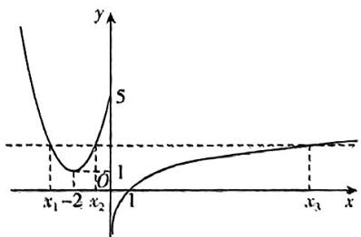

line

| x | y |
|---|---|
| x₁ | -1 |
| x₂ | 0 |
| x₃ | 1 |

由题意知，存在实数 $x_{1}, x_{2}, x_{3}$ 且 $x_{1} < x_{2} <$

$x_{1}$ ，使得 $f(x_{1}) = f(x_{2}) = f(x_{3})$

因为 $f(x)=x^{2}+4x+5$ 的图象关于直线x=-2对称，

所以 $x_{1} + x_{2} = -4$

所以 $x_{1}f(x_{1}) + x_{2}f(x_{2}) + x_{3}f(x_{3}) = (x_{1} + x_{2} + x_{1})f(x_{3}) = (x_{3} - 4)f(x_{3}) = (x_{3} - 4)\ln x_{3},$

由图可知， $1 < f(x_{3}) \leqslant 5$ ，所以 $e < x_{3} \leqslant e^{5}$

设 $g(x) = (x - 4)\ln x, x \in (\mathrm{e},\mathrm{e}^5]$ ，则 $g'(x) = \ln x + 1 - \frac{4}{x}$ ，

易知 $g^{\prime}(x)$ 在 $(\mathrm{e},\mathrm{e}^{5}]$ 上单调递增，又 $g^{\prime}(\mathrm{e}) = 2 - \frac{4}{\mathrm{e}} >0$ ，所以当 $x\in (\mathrm{e},\mathrm{e}^5 ]$ 时， $g^{\prime}(x) > 0,$

所以 $g(x)$ 在 $(e, e^{5}]$ 上单调递增，所以 $g(x)_{\max}=g(e^{5})=(e^{5}-4)\ln e^{5}=5e^{5}-20.$

9.1 【解析】由题意得 $f(x)=\left\{\begin{aligned}&2x-1-2\ln x,x>\frac{1}{2},\\ &1-2x-2\ln x,0<x\leqslant\frac{1}{2}.\end{aligned}\right.$ 当 $x>\frac{1}{2}$ 时，

$f'(x) = 2 - \frac{2}{x} = \frac{2x - 2}{x}$ ，则当 $x \in \left(\frac{1}{2}, 1\right)$ 时， $f'(x) < 0$ ，所以 $f(x)$ 在 $\left(\frac{1}{2}, 1\right)$ 上单调递减；当 $x \in (1, +\infty)$ 时， $f'(x) > 0$ ，所以 $f(x)$ 在 $(1, +\infty)$ 上单调递增。所以当 $x > \frac{1}{2}$ 时， $f(x)_{\min} = f(1) = 1$ 。当 $0 < x \leqslant \frac{1}{2}$ 时， $f'(x) = -2 - \frac{2}{x} = \frac{-2x - 2}{x}$ ，则 $f'(x) < 0$ 在 $\left(0, \frac{1}{2}\right]$ 上恒成立，所以 $f(x)$ 在 $\left(0, \frac{1}{2}\right]$ 上单调递减，所以当 $0 < x \leqslant \frac{1}{2}$ 时，函数 $f(x)_{\min} = f\left(\frac{1}{2}\right) = 2\ln 2 = \ln 4 > 1$ 。综上可知，函数 $f(x)$ 的最小值为 1。

# 一题多解

本题的函数含绝对值和对数, 直接求导找单调区间较难, 可考虑将两部分

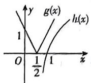

分离，设 $g(x)=|2x-1|$ ， $h(x)=2\ln x$ ，
作出 $g(x)$ 和 $h(x)$ 的图象如图所示. 易知 $f(x)$ 的最小值在 $x>\frac{1}{2}$ 时取得. 令 $h'(x)=\frac{2}{x}=2$ ，解得x=1，则 $f(x)_{\text{odd}}=g(1)-h(1)=1$ .

# 快解

$f(x) = |2x - 1| - 2|\ln x\geqslant |2x - 1| -$ $2(x - 1)\geqslant |2x - 1| - |2x - 2|\geqslant |(2x - 1) -$ $(2x - 2)| = 1$ ，当且仅当 $x = 1$ 时，等号成立，故 $f(x)$ 的最小值为1.

10. A 【解析】由题意可知， $f(x) = e^{x} - m\sin 2x, f'(x) = e^{x} - 2m\cos 2x = 0$ 在 $\left(0, \frac{1}{2}\right)$ 上有解，即 $2m = \frac{e^{x}}{\cos 2x} \left(0 < x < \frac{1}{2}\right)$ . 令 $g(x) = \frac{e^{x}}{\cos 2x} \left(0 < x < \frac{1}{2}\right)$ ，则 $g'(x) = \frac{e^{x}\cos 2x + 2e^{x}\sin 2x}{\cos^{2}2x} > 0$ ，则 $g(x)$ 在 $\left(0, \frac{1}{2}\right)$ 上单调递增，又当 $x \to 0$ 时， $g(0) \to 1$ ，当 $x \to \frac{1}{2}$ 时， $g\left(\frac{1}{2}\right) \to \frac{e^{\frac{1}{2}}}{\cos 1}$ ，所以 $1 < 2m < \frac{e^{\frac{1}{2}}}{\cos 1}$ ，所以 $\frac{1}{2} < m < \frac{e^{\frac{1}{2}}}{2\cos 1}$ .

11. B 【解析】因为函数 $f(x)=x(x-c)^{2}=$ $x^{3}-2cx^{2}+c^{2}x$ ，所以 $f'(x)=3x^{2}-4cx+c^{2}$ .

由题意知， $f'(2)=0$ ，即 $12-8c+c^{2}=0$ ，解得 c=6 或 c=2，

又函数 $f(x) = x(x - c)^2$ 在 $x = 2$ 处有极大值，故 $f'(x)$ 在 $x = 2$ 处左侧为正数，右侧为负数.

当 c = 2 时， $f'(x) = 3x^{2} - 8x + 4 = 3\left(x - \frac{2}{3}\right)(x - 2)$ ，不满足 $f'(x)$ 在 x = 2 处左侧为正数，右侧为负数.

当 c=6 时， $f'(x)=3x^{2}-24x+36=3(x^{2}-8x+12)=3(x-2)(x-6)$ ，满足 $f'(x)$ 在 x=2 处左侧为正数，右侧为负数.
故 c=6.

12. D 【解析】 $f'(x)=a[2(x-a)\cdot(x-b)+(x-a)^{2}]=a(x-a)(3x-a-2b)$ . 令 $f'(x)=0$ ，解得 x=a 或 $x=\frac{a+2b}{3}$ . 由题得 $f'(x)$ 在直线 x=a 的附近时，左侧为正值，右侧为负值. 当 a>0 时，作出 $f'(x)$ 的大致图象如图①所示，则 $a<\frac{a+2b}{3}$ ，即 0<a<b；当 a<0 时，作出 $f'(x)$ 的大致图象如图②所示，则 $a>\frac{a+2b}{3}$ ，即 0>a>b，综上，a 与 a-b 始

终异号，即 $a(a - b) < 0$ ，即 $a^2 < ab$

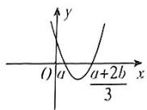  
图(1)

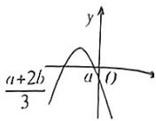  
图2

# 一题多解

$f(x)=a(x-a)^{2}(x-b)$ 的图象与x轴关于点 $(b,0)$ ，切于点 $(a,0)$ 。当a>0时，结合x=a为极大值点作出 $f(x)$ 的大致图象如图③所示，由图象可知0<a<b；当a<0时，结合x=a为极大值点作出 $f(x)$ 的大致图象如图④所示，由图象可知b<a<0。综上可得 $a^{2}<ab$ 。故选D。

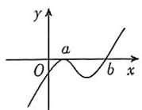  
图③

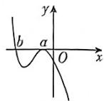  
图④

13. BCD 【解析】依题意, $x > 0$ , $f'(x) = \frac{a}{x}$ $\frac{b}{x^2} - \frac{2c}{x^3} = \frac{ax^2 - bx - 2c}{x^3}$ . 设 $g(x) = ax^2 - bx$ $2c$ , 由题意 $g(x)$ 在 $(0, +\infty)$ 上有两个点 $x_1, x_2$ ,

【提示】将函数极值问题转化成导函数零问题，注意 $g(x)$ 的两个零点均常大于0所以 $x_{1} + x_{2} = \frac{b}{a} >0, x_{1}x_{2} = -\frac{2c}{a} >0,$ 则 $-\frac{2bc}{a^2} >0$ ，所以 $ab > 0, ac < 0, bc < 0$ ，故A错误，B正确，D正确.因为二次函数 $g(x)$ 有两个正零点，所以 $\Delta = b^{2} + 8ac > 0$ ，故正确.故选BCD.

# 快解

同上得 $g(x)=ax^{2}-bx-2c$ 有两个正零点，则可假设 $g(x)=(x-1)(x-2)$ ，所以 a=1, b=3, c=-1，所以 bc<0，故 A 错误.

14. A 【解析】因为 $f(x)=\mathrm{e}^{x}(2x-3)-ax^{2}$ $2ax+b$ ，所以 $f'(x)=\mathrm{e}^{x}(2x-1)-2a(x)$ 1).

又因为 $f(x)$ 有两个极值点，所以 $f^{\prime}(x)$ 有两个变号零点，

设 $g(x) = \theta^{\nu}(2x - 1), h(x) = 2a(x - 1)$ ，则 $g(x), h(x)$ 的图象有两个交点.

因为 $g^{\prime}(x) = \mathrm{e}^{x}(2x + 1)$ ，当 $x \in \left(-\infty, -\frac{1}{2}\right)$ 时， $g^{\prime}(x) < 0$ ， $g(x)$ 单调递减，当 $x \in \left(-\frac{1}{2}, +\infty\right)$ 时， $g^{\prime}(x) > 0$ ， $g(x)$ 单调递增， $g\left(-\frac{1}{2}\right) = -2\mathrm{e}^{-\frac{1}{2}}$ ，当 $x \to +\infty$ 时， $g(x) \to +\infty$ ，当 $x \to -\infty$ 时， $g(x) \to 0$ ，作出 $g(x), h(x)$ 的大致图象，如图所示.

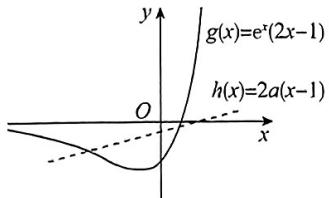

text_image

g(x)=e^x(2x-1)
h(x)=2a(x-1)

当 $h(x)$ 与 $g(x)$ 的图象相切时，设切点为 $(x_0, \mathrm{e}^{x_0}(2x_0 - 1))$ ，且 $h(x)$ 的图象过定点(1,0)， $g(x)$ 的图象不过点(1,0)，

所以 $\mathrm{e}^{x_0}(2x_0 + 1) = \frac{\mathrm{e}^{x_0}(2x_0 - 1)}{x_0 - 1}$ , 所以 $(2x_0 + 1) \cdot (x_0 - 1) = 2x_0 - 1$ ,

所以 $x_0 = 0$ 或 $x_0 = \frac{3}{2}$ .

当 $x_0 = 0$ 时， $2a = 1$ ，所以 $a = \frac{1}{2}$ ，

当 $x_0 = \frac{3}{2}$ 时， $2a = 4\mathrm{e}^{\frac{3}{2}}$ ，所以 $a = 2\mathrm{e}^{\frac{3}{2}}$

所以要使 $g(x) = \mathrm{e}^{x}(2x - 1), h(x) = 2a(x - 1)$ 的图象有两个交点，则 $0 < a < \frac{1}{2}$ 或 $a > 2\mathrm{e}^{\frac{3}{2}}$

当 $0 < a < \frac{1}{2}$ 时，由题可知， $g(x), h(x)$ 图象交点的横坐标从左到右依次为 $x_{2}, x_{1}$ .

由图可知，当 $x \in (-\infty, x_2)$ 时， $f'(x) > 0$ 当 $x \in (x_2, x_1)$ 时， $f'(x) < 0$ ，当 $x \in (x_1, +\infty)$ 时， $f'(x) > 0$

所以极小值点为 $x_{1}$ ，极大值点为 $x_{2}$ ，满足题意.

同理, 当 $a > 2e^{\frac{3}{2}}$ 时也满足.

综上, 实数 a 的取值范围是 $\left(0, \frac{1}{2}\right) \cup (2e^{\frac{3}{2}}, +\infty)$ .

15. ACD 【解析】由函数 $f(x) = e^{x} - \frac{2}{3} ax^3$ 有三个不同的极值点 $x_1, x_2, x_3$ ，得 $f'(x) = e^x - 2ax^2$ 有三个变号零点，因为 $f'(0) \neq 0$ ，所以方程 $\frac{e^x}{x^2} = 2a (x \neq 0)$ 有三

个实数根.

设函数 $g(x) = \frac{\mathrm{c}^x}{x^2} (x\neq 0)$ ，则 $g(x) > 0$

$$
g ^ {\prime} (x) = \frac {\mathrm{e} ^ {x} (x - 2)}{x ^ {3}}.
$$

令 $g'(x)<0$ , 得 0<x<2 ; 令 $g'(x)>0$ , 得 x<0 或 x>2 ,

所以函数 $g(x)$ 在 $(-\infty, 0), (2, +\infty)$ 上单调递增，在 $(0, 2)$ 上单调递减，

所以函数 $g(x)$ 的极小值为 $g(2)=\frac{e^{2}}{4}$ .

作出函数 $g(x)$ 的大致图象与直线 $y = 2a$ 如图所示.

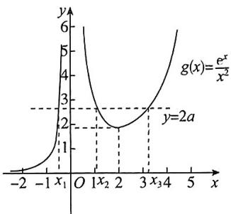

line

| x    | y     |
| ---- | ----- |
| -2   | 0.0   |
| -1   | 1.0   |
| 0    | 6.0   |
| 1    | 3.0   |
| 2    | 2.0   |
| 3    | 3.0   |
| 4    | 6.0   |
| 5    | 9.0   |

对于 A, 当 $2a > \frac{e^{2}}{4}$ , 即 $a > \frac{e^{2}}{8}$ 时, 函数 $g(x)$

的图象与直线 $y = 2a$ 有三个交点，则函数 $f(x)$ 有三个不同的极值点，故A正确；

对于 B, 观察图象可知 $x_{1} > -1$ , 故 B 不正确;

对于 C, 由图象可知, 当 $0 < x < x_{2}$ 时, $g(x)=\frac{e^{x}}{x^{2}}>2a$ ，则 $f'(x)=e^{x}-2ax^{2}>0$

当 $x_{2} < x < 2$ 时， $g(x) = \frac{\mathrm{e}^{x}}{x^{2}} < 2a$ ，则 $f'(x) = \mathrm{e}^{x} - 2ax^{2} < 0$

所以函数 $f(x)$ 在 $(0, x_2)$ 上单调递增，在 $(x_2, 2)$ 上单调递减，

所以 $x_{2}$ 为函数 $f(x)$ 的极大值点，故C正确；

对于D，由 $g(x_{3}) = \frac{\mathrm{e}^{x_{3}}}{x_{3}^{2}} = 2a$ ，则 $f(x_{3}) = \mathrm{e}^{x_{3}}-$ $\frac{2}{3} ax_3^3 = \left(1 - \frac{x_3}{3}\right)\mathrm{e}^{x_3},$

令 $\varphi(x) = \left(1 - \frac{x}{3}\right)e^{x}, x \in (2, +\infty)$ ,

则 $\varphi'(x) = \frac{2 - x}{3} \cdot e^x < 0$ ，故函数 $\varphi(x)$ 在 $(2, +\infty)$ 上单调递减，

故 $\varphi (x_{3}) = f(x_{3}) <   \varphi (2) = \frac{e^{2}}{3}$ 故 $\mathbf{D}$ 正确.

故选 ACD.

16. $\left[-\frac{e^{2}}{12},0\right)$ 【解析】由题意得 $f'(x)=3ax^{2}+e^{x}$ ,

当 $a \geqslant 0$ 时, $f'(x) > 0$ , $f(x)$ 在 $\mathbf{R}$ 上单调递增, 无极值点.

当 $a < 0$ 时，令 $f'(x) = 0$ ，得 $\mathrm{e}^x = -3ax^2$ 易知函数 $y_{1} = \mathrm{e}^{x}$ 和 $y_{2} = -3ax^{2}$ 的图象在 $(-\infty ,0)$ 上必有一交点，

在该交点左侧, $e^{x}<-3ax^{2}$ ,则 $f'(x)<0$ ,故 $f(x)$ 单调递减,在该交点右侧附近, $e^{x}>-3ax^{2}$ ,则 $f'(x)>0$ ,故 $f(x)$ 单调递增.

因为 $f(x)$ 的极小值唯一,所以 $f'(x)\geqslant0$ 在 $(0,+\infty)$ 上恒成立,即 $e^{x}\geqslant-3ax^{2}$ 在 $(0,+\infty)$ 上恒成立,

设 $y_{1}=e^{x}$ 和 $y_{2}=-3ax^{2}$ 恰好切于点 $P(m,$

$\mathrm{e}^{m})$ , m>0, 则 $\left\{\begin{aligned}\mathrm{e}^{m}&=-6am,\\ \mathrm{e}^{m}&=-3am^{2},\end{aligned}\right.$ 解得 $\left\{\begin{aligned}m&=2,\\ a&=-\frac{e^{2}}{12},\end{aligned}\right.$

此时 $a$ 取到最小值，所以 $a \in \left[-\frac{\mathrm{e}^2}{12}, 0\right)$ .

17.【解】(1) $f'(x)=6x^{2}-2ax=2x(3x-a)$ .

令 $f'(x)=0$ , 得 x=0 或 $x=\frac{a}{3}$ .

若 $a > 0$ ，则当 $x\in (-\infty ,0)\cup$ $\left(\frac{a}{3}, + \infty\right)$ 时， $f^{\prime}(x) > 0;$

当 $x \in \left(0, \frac{a}{3}\right)$ 时， $f'(x) < 0$ 。故 $f(x)$ 在 $(- \infty, 0)$ ， $\left(\frac{a}{3}, +\infty\right)$ 单调递增，在 $\left(0, \frac{a}{3}\right)$ 单调递减。

若 $a = 0, f(x)$ 在 $(- \infty, +\infty)$ 单调递增；

若 $a < 0$ ，则当 $x\in \left(-\infty ,\frac{a}{3}\right)\cup (0, + \infty)$

时, $f'(x)>0$ ;当 $x\in\left(\frac{a}{3},0\right)$ 时 $f'(x)<0.$

故 $f(x)$ 在 $\left(-\infty, \frac{a}{3}\right), (0, +\infty)$ 单调递增，在 $\left(\frac{a}{3}, 0\right)$ 单调递减.

(2) 满足题设条件的 a, b 存在.

①当 $a \leqslant 0$ 时，由(1)知， $f(x)$ 在 $[0,1]$ 单调递增，所以 $f(x)$ 在区间 $[0,1]$ 的最小值为 $f(0) = b$ ，最大值为 $f(1) = 2 - a + b$ 。此时 $a, b$ 满足题设条件当且仅当 $b = -1, 2 - a + b = 1$ ，即 $a = 0, b = -1$ .

②当 $a \geqslant 3$ 时，由(1)知， $f(x)$ 在 $[0,1]$ 单调递减，所以 $f(x)$ 在区间 $[0,1]$ 的最大值为 $f(0) = b$ ，最小值为 $f(1) = 2 - a + b$ . 此时 $a, b$ 满足题设条件当且仅当 $2 - a + b = -1$ ， $b = 1$ ，即 $a = 4, b = 1$ .

③当 $0 < a < 3$ 时，由(1)知， $f(x)$ 在 $[0,1]$ 的最小值为 $f\left(\frac{a}{3}\right) = -\frac{a^3}{27} + b$ ，最大值为 $b$ 或 $2 - a + b$ .

若 $-\frac{a^{3}}{27}+b=-1,b=1$ ，则 $a=3\sqrt[3]{2}$ ，与0<a<3矛盾.

若 $-\frac{a^{3}}{27}+b=-1,2-a+b=1$ ，则 $a=3\sqrt{3}$ 或 $a=-3\sqrt{3}$ 或 a=0，与 0<a<3 矛盾.

综上, 当且仅当 a=0, b=-1 或 a=4, b=1
时， $f(x)$ 在 $[0,1]$ 的最小值为 -1，最大值

为1.

# 关键点拨

(1) 讨论含参函数单调性的切点为 $f'(x)=0$ 的根的情况. 本题中 $f'(x)=0$ 有两根, 则需讨论两根大小 (2) 求函数在给定区间上的最值或已知最值求参数均是函数单调性的应用问题.

# 专题3 导数中常见的数学思想与方法

1.【解】(1) $f(x)$ 的定义域为 $(0,+\infty)$ ， $f'(x)=\ln x+1-m$ 。令 $f'(x)=0$ ，得 $x=e^{m-1}$ ，由 $f'(x)<0$ ，解得 $0<x<e^{m-1}$ ，由 $f'(x)>0$ ，解得 $x>e^{m-1}$ ，所以 $f(x)$ 的单调递减区间为 $(0,e^{m-1})$ ，单调递增区间为 $(e^{m-1},+\infty)$ 。

(2)选择①:

当 $0 < x < 1$ 时， $f(x) > -x$ 恒成立，即 $m > \frac{x\ln x + x}{x - 1}$ 恒成立. 令 $g(x) = \frac{x\ln x + x}{x - 1}, x \in (0,$

1), 则 $g'(x) = \frac{x - \ln x - 2}{(x - 1)^2}$ . 令 $h(x) = x - \ln x - 2, x \in (0,1)$ , 则 $h'(x) = \frac{x - 1}{x} < 0$ , 即函数 $h(x)$ 单调递减, 而 $h(1) = -1 < 0, h\left(\frac{1}{\mathrm{e}^2}\right) = \frac{1}{\mathrm{e}^2} > 0$ , 则 $h(x)$ 在 $\left(\frac{1}{\mathrm{e}^2}, 1\right)$ 上存在一个零点 $x_0$ , 使得 $h(x_0) = x_0 - \ln x_0 - 2 = 0$ , 即 $\ln x_0 = x_0 - 2$ . 当 $0 < x < x_0$ 时, $h(x) > 0$ , 即 $g'(x) > 0$ , 函数 $g(x)$ 单调递增, 当 $x_0 < x < 1$ 时, $h(x) < 0$ , 即 $g'(x) < 0$ , 函数 $g(x)$ 单调递减, 于是得 $g(x)$ 有最大值, $g(x)_{\max} = g(x_0) = \frac{x_0 \ln x_0 + x_0}{x_0 - 1} = \frac{x_0(x_0 - 2) + x_0}{x_0 - 1} = x_0$ , 依题意有 $m > x_0$ , 又 $x_0 \in \left(\frac{1}{\mathrm{e}^2}, 1\right)$ , 所以实数 $m$ 的最小整数值是 1.

选择②：

不等式 $f(x) < -\ln x$ ，即 $\ln x - \frac{m(x - 1)}{x + 1} < 0.$ 设 $t(x) = \ln x - \frac{m(x - 1)}{x + 1}, x \in (1, +\infty)$ . 依题意，存在 $x \in (1, +\infty)$ ，使得 $t(x) < 0$ ，而 $t'(x) = \frac{1}{x} - \frac{2m}{(x + 1)^2} = \frac{x^2 + 2(1 - m)x + 1}{x(x + 1)^2}, t(1) = 0.$ 当 $m \leqslant 0$ 时， $t(x) > 0$ 在 $(1, +\infty)$

上恒成立，不满足题意；当 $0 < m \leqslant 2$ 时，方程 $x^{2} + 2(1 - m)x + 1 = 0$ 的判别式 $\Delta = 4(1 - m)^{2} - 4 = 4m(m - 2) \leqslant 0$ ，即 $t'(x) > 0$ 在 $(1, +\infty)$ 上恒成立，则 $t(x)$ 在 $(1, +\infty)$ 上单调递增， $t(x) > t(1) = 0, t(x) > 0$ 在 $(1, +\infty)$ 上恒成立，不满足题意；当 $m > 2$ 时，令 $t'(x) = 0$ ，由方程 $x^{2} + 2(1 - m)x + 1 = 0$ 的判别式 $\Delta > 0$ ，不妨设当 $t'(x) = 0$ 时的两根分别为 $x_{1}, x_{2}$ ，且 $x_{2} > x_{1}$ ，则 $x_{1} = m - 1 - \sqrt{(m - 1)^{2} - 1}$ ， $x_{2} = m - 1 + \sqrt{(m - 1)^{2} - 1}$ ，由 $x_{2} > 1$ 和 $x_{1}x_{2} = 1$ 得 $x_{1} < 1$ ，则当 $x \in (1, x_{2})$ 时， $t'(x) < 0, t(x)$ 在 $(1, x_{2})$ 上单调递减，此时 $t(x) < t(1) = 0$ ，因此，当 $m \in (2, +\infty)$ 时，存在 $x_{0} \in (1, +\infty)$ ，使得不等式 $t(x_{0}) < 0$ 成立。综上，实数 $m$ 的取值范围为 $(2, +\infty)$ 。

2.【解】(1) $\because f(x)=a\ln x+x$ ，定义域为(0， $+\infty)$ ， $\therefore f'(x)=\frac{a}{x}+1=\frac{x+a}{x}.$

当 $a \geqslant 0$ 时, $f'(x) > 0$ , $\therefore f(x)$ 的单调递增区间是 $(0, +\infty)$ , 无单调递减区间;

当 $a < 0$ 时，由 $f'(x) = \frac{x + a}{x} > 0$ ，得 $x > -a$

$\therefore f(x)$ 的单调递增区间是 $(-a, +\infty)$ ,

由 $f'(x)=\frac{x+a}{x}<0$ ，得 $0<x<-a,\therefore f(x)$ 的单调递减区间是 $(0,-a)$ .

综上, 当 $a \geqslant 0$ 时, $f(x)$ 的单调递增区间是 $(0, +\infty)$ , 无单调递减区间; 当 a < 0 时, $f(x)$ 的单调递增区间是 $(-a, +\infty)$ , 单调递减区间是 $(0, -a)$ .

(2) $\because f(x)\leqslant\left(ax+\frac{1}{2}\right)\ln x,x\in[e,e^{2}]$ ,
∴ $a\ln x + x \leqslant \left(ax + \frac{1}{2}\right)\ln x, \therefore \frac{x}{\ln x} - ax + a \leqslant \frac{1}{2}$ ,

设 $g(x) = \frac{x}{\ln x} - ax + a, x \in [\mathrm{e}, \mathrm{e}^2]$ ,

$$
\therefore g ^ {\prime} (x) = \frac {\ln x - 1}{\ln^ {2} x} - a = - \left(\frac {1}{\ln x} - \frac {1}{2}\right) ^ {2} + \frac {1}{4} -
$$

若 $a \leqslant 0$ ，则 $g'(x) \geqslant 0, g(x)$ 在 $x \in [1, e^2]$ 上单调递增，

$$
\therefore g (x) _ {\min} = g (\mathrm{e}) = \mathrm{e} - a \mathrm{e} + a \leqslant \frac {1}{2}, a;
$$

$\frac{e-\frac{1}{2}}{e-1}$ ，与 $a \leqslant 0$ 矛盾，

若 $0 < a < \frac{1}{4}$ , 则存在唯一的 $x_0 \in (e, e^2)$ , 得 $g'(x_0) = 0$ .

当 $x \in (e, x_0)$ 时， $g'(x_0) < 0, g(x)$ 单调递减；当 $x \in (x_0, e^2)$ 时， $g'(x_0) > 0, g(x)$ 单调递增.

$$
\therefore g (x) _ {\min} = g (x _ {0}) = \frac {x _ {0}}{\ln x _ {0}} - a x _ {0} + a \leqslant \frac {1}{2},
$$

$$
\therefore a \geqslant \frac {1}{x _ {0} - 1} \left(\frac {x _ {0}}{\ln x _ {0}} - \frac {1}{2}\right) > \frac {1}{x _ {0} - 1} \left(\frac {x _ {0}}{\ln e ^ {2}} \right.
$$

$$
\frac {1}{2} \Big) = \frac {1}{x _ {0} - 1} \left(\frac {x _ {0}}{2} - \frac {1}{2}\right) = \frac {1}{2}, \text {与} 0 <   a <   -
$$

矛盾.

若 $a \geqslant \frac{1}{4}$ , 则 $g'(x) \leqslant 0, g(x)$ 在 $x \in [\mathrm{e}^2]$ 上单调递减，

$$
\therefore g (x) _ {\min} = g (\mathrm{e} ^ {2}) = \frac {\mathrm{e} ^ {2}}{2} - a \mathrm{e} ^ {2} + a \leqslant \frac {1}{2},
$$

$$
\therefore a \geqslant \frac {1}{2}.
$$

综上, a 的取值范围为 $\left[\frac{1}{2}, +\infty\right)$ .

3.【解】(1) 当 $a = 1$ 时, $f(x) = \sin x - x + \frac{1}{6} x^3$ ,

则 $g(x) = f'(x) = \cos x - 1 + \frac{1}{2} x^2,$

则 $g^{\prime}(x) = -\sin x + x.$

令 $h(x) = -\sin x + x$ ，则 $h^{\prime}(x) = -\cos x + 1\geqslant$ 0,所以 $h(x)$ 即 $g^{\prime}(x)$ 在定义域 $\mathbf{R}$ 上单调递增，

又 $g^{\prime}(0) = 0$ ，所以当 $g^{\prime}(x)\geqslant 0$ 时， $x\geqslant 0$ 当 $g^{\prime}(x) <   0$ 时， $x <   0$

所以 $g(x)$ 在 $(- \infty, 0)$ 上单调递减，在 $[0, +\infty)$ 上单调递增，

故 $g(x) \geqslant g(0) = 0$ ，即当 $a = 1$ 时， $g(x)$ 的最小值为0.

(2)由 $f(x)=\sin x-ax+\frac{1}{6}x^{3}$ 得 $g(x)=f'(x)=\cos x-a+\frac{1}{2}x^{2}$ .

因为当 $x \geqslant 0$ 时， $f(x) \geqslant 0$ 恒成立，且 $f(0) = 0$ ，所以若 $f(x)$ 在 $[0, +\infty)$ 上单调递增，则满足题意，即 $g(x) \geqslant 0$ 在 $[0, +\infty)$ 上恒成立。 $g(0) = 1 - a$ .

$g'(x) = -\sin x + x$ , 由 (1) 可知 $g'(x)$ 在 $[0, +\infty)$ 上单调递增, 所以当 $x \geqslant 0$ 时, $g'(x) \geqslant g'(0) = 0$ , 所以 $g(x)$ 在 $[0, +\infty)$ 上单调递增, 则当 $x \geqslant 0$ 时, $g(x) \geqslant g(0) = 1 - a$ .

①当 $a \leqslant 1$ 时，有 $g(x) \geqslant g(0) = 1 - a \geqslant 0$ 则 $f(x)$ 在 $[0, +\infty)$ 上单调递增，

从而当 $x \geqslant 0$ 时, $f(x) \geqslant f(0) = 0$ , 符合题意.

②当 $a > 1$ 时，有 $g(0) = 1 - a < 0$

由于 $g(x)$ 在 $[0, +\infty)$ 上单调递增，且 $g(2a) = \cos 2a - a + 2a^2 = \cos 2a + a^2 +a(a-1) > 0,$

所以 $\exists x_0\in (0,2a)$ ，使得 $g(x_0) = 0$

从而可知当 $x \in (0, x_0)$ 时， $g(x) < g(x_0) = 0$ 则 $f(x)$ 在 $(0, x_0)$ 上单调递减，

此时有 $f(x) < f(0) = 0$ ，不符合题意。

综上所述,实数 a 的取值范围为 $(-∞,1]$ .

4.(1)【解】因为 $f(x)=\frac{ae^{x-1}}{x}+e(\ln x-x),x>0$ ，所以 $f'(x)=\frac{a(x-1)e^{x-1}}{x^2}-\frac{e(x-1)}{x}=$ $\frac{(x-1)(ae^{x-1}-ex)}{x^{2}}.$

因为 $f(x)$ 在 $(1, +\infty)$ 上单调递增，所以 $f'(x) \geqslant 0$ 在 $(1, +\infty)$ 上恒成立，故 $a \mathrm{e}^{\pi - 1} - \mathrm{e}x \geqslant 0$ 在 $(1, +\infty)$ 上恒成立，即 $a \geqslant \frac{\mathrm{e}^2 x}{\mathrm{e}^x}$ 在 $(1, +\infty)$ 上恒成立.

令 $g(x) = \frac{\mathrm{e}^2x}{\mathrm{e}^x} (x > 1)$ ，则 $g'(x) = \frac{\mathrm{c}^2(1 - x)}{\mathrm{e}^x}$ .

当 $x \in (1, +\infty)$ 时， $g'(x) < 0$ ，所以 $g(x)$ 在 $(1, +\infty)$ 上单调递减，所以 $g(x) < g(1) = e$ ，则 $a \geqslant e$

所以实数 a 的取值范围为 $[e, +\infty)$ .

(2)【证明】要证 $f(x) + (e - 1)x > e^{x - 1}(1 - \ln x) + \mathrm{e}\ln x, x \in (0, +\infty)$ ,

只需证 $\frac{ae^{x - 1}}{x} +\mathrm{e}^{x - 1}(\ln x - 1) - x > 0,x\in (0, + \infty)$

因为 $a \geqslant \frac{5}{2}$ , 所以 $\frac{a e^{x-1}}{x} + e^{x-1} (\ln x - 1) - x \geqslant \frac{5 e^{x-1}}{2 x} + e^{x-1} (\ln x - 1) - x, x \in (0, +\infty)$ .

则要证 $\frac{ae^{x - 1}}{x} +\mathrm{e}^{x - 1}(\ln x - 1) - x > 0,x\in (0,$ $+\infty)$ ，只需证 $\frac{5\mathrm{e}^{x - 1}}{2x} +\mathrm{e}^{x - 1}(\ln x - 1) - x > 0,x\in$ $(0, + \infty)$

即证 $\mathrm{e}^{x - 1}\left(\frac{5}{2x} +\ln x - 1\right) > x,x\in (0, + \infty)$ ，即证 $\frac{5}{2} +x(\ln x - 1) > \frac{x^2}{\mathrm{e}^{x - 1}},x\in (0, + \infty).$

令 $h(x) = \frac{5}{2} + x(\ln x - 1), x \in (0, +\infty)$ ，则 $h'(x) = \ln x$

当 $x \in (0,1)$ 时， $h'(x) < 0, h(x)$ 单调递减，当 $x \in (1, +\infty)$ 时， $h'(x) > 0, h(x)$ 单调递增，

故 $h(x)\geqslant h(1) = \frac{3}{2}.$

令函数 $m(x) = \frac{x^2}{\mathrm{e}^{x - 1}}, x \in (0, +\infty)$ ，则 $m'(x) = \frac{x(2 - x)}{\mathrm{e}^{x - 1}}$

当 $x \in (0,2)$ 时， $m'(x) > 0, m(x)$ 单调递增，当 $x \in (2, +\infty)$ 时， $m'(x) < 0, m(x)$ 单调递减，

故 $m(x)\leqslant m(2) = \frac{4}{\mathrm{e}} <  \frac{3}{2}.$

所以 $h(x) > m(x)$ ，所以 $\frac{5}{2} + x(\ln x - 1) > \frac{x^2}{e^{x - 1}}$ ，从而原不等式得证.

5. AB 【解析】由 $f(x)=\log_{2}x+\frac{1}{x}(x>0)$ ，得 $f'(x)=\frac{1}{x\ln2}-\frac{1}{x^{2}}=\frac{x-\ln2}{x^{2}\ln2}$

当 $x \in (0, \ln 2)$ 时， $f'(x) < 0, f(x)$ 单调递

减；当 $x \in (\ln 2, +\infty)$ 时， $f'(x) > 0, f(x)$ 单调递增，则 $f(x)$ 在 $x = \ln 2$ 处取得极小值，故A正确；

又 $f(\ln 2) = \log_2\ln 2 + \frac{1}{\ln 2}$ , 而 $\log_2\frac{1}{2} < \log_2\ln 2 < \log_2\ln e$ , 所以 $-1 < \log_2\ln 2 < 0$ ,

而 $\frac{1}{\ln 2} >\frac{1}{\ln e} = 1$ ，即 $\frac{1}{\ln 2} >1$ ，故 $f(\ln 2) =$ $\log_2\ln 2 + \frac{1}{\ln 2} >0,$

又 $\frac{1}{2} < \ln 2 < 1$ ，且 $f(1) = \log_2 1 + 1 = 1$ ， $f\left(\frac{1}{2}\right) = \log_2 \frac{1}{2} + 2 = 1$ ，故 $f(x)$ 大致图象如图所示，故对于方程 $f(x) = k$ 有两个解， $k$ 的最小整数值为 1，且 $f(x)$ 无零点，故 B 正确，D 错误；

因为 $f\left(\frac{1}{2}\right)=f(1)$ ， $\frac{1}{2}+1=\frac{3}{2}>2\ln 2=\ln 4$ ，所以此时对 $f(x_{1})=f(x_{2})=k$ ，可知 $x_{1}+x_{2}>\ln 4$ ，故C错误.

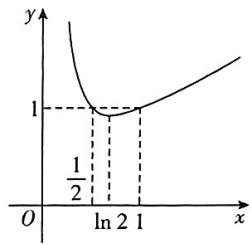

line

| x | y |
|---|---|
| 0 | 1 |
| ln 2 | 1 |
| 1 | 1 |

6. ABD 【解析】令 $f(x) = 0$ ，得 $a = \frac{x}{\mathrm{e}^x}$ ，

因为函数 $f(x) = x - ae^{x}$ 有两个零点，所以方程 $x - ae^{x} = 0$ 有两个不等实根，

即方程 $a = \frac{x}{\mathrm{e}^x}$ 有两个解.

令 $y = a, g(x) = \frac{x}{\mathrm{e}^x}$ , 则直线 $y = a$ 与函数 $g(x) = \frac{x}{\mathrm{e}^x}$ 的图象有两个公共点.

$g^{\prime}(x) = \frac{1 - x}{\mathrm{e}^{x}}$ ，令 $g^{\prime}(x) > 0$ ，得 $x < 1$ ；令 $g^{\prime}(x) <   0$ ，得 $x > 1$

所以 $g(x)$ 在 $(-∞,1)$ 上单调递增；在 $(1,+∞)$ 上单调递减.

故当 $x = 1$ 时， $g(x)$ 有最大值 $\frac{1}{\mathrm{e}}$ .

当 $x$ 趋近于 $-\infty$ 时， $g(x)$ 趋近于 $-\infty$ ；

当 $x$ 趋近于 $+\infty$ 时， $g(x)$ 趋近于0.

作出 $g(x)$ 的大致图象, 如图所示.

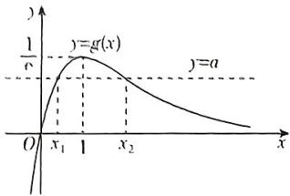

line

| x    | y     |
| ---- | ----- |
| x₁   | 0     |
| 1    | g(x)  |
| x₂   | a     |

因为直线 y=a 与函数 $g(x)=\frac{x}{e^{x}}$ 的图象有两个公共点，所以 $0<a<\frac{1}{e}$ . 故 A 正确.

因为函数 $f(x) = x - ae^{x}$ 有两个零点 $x_{1}, x_{2}$ ，则 $0 < x_{1} < 1 < x_{2}$ .

当 $a$ 增大且趋近于 $\frac{1}{\mathrm{e}}$ 时， $x_{1}$ 随之增大且趋近于 $1, x_{2}$ 随之减小且趋近于 1，则 $\frac{x_{2}}{x_{1}}$ 减小，即 $\frac{x_{2}}{x_{1}}$ 随 $a$ 的增大而减小. 故 B 正确.

由 B 选项可知, 当 a 增大且趋近于 $\frac{1}{e}$ 时, $x_{1}+x_{2}$ 趋近于 2;

当 $a$ 减小且趋近于0时， $x_{1}$ 趋近于0， $x_{2}$ 趋近于 $+\infty$ 。所以 $x_{1} + x_{2}$ 趋近于 $+\infty$ 。故 $\mathbf{C}$ 错误。

由 $a = \frac{x_1}{\mathrm{e}^{x_1}} = \frac{x_2}{\mathrm{e}^{x_2}}$ ，得 $\frac{x_2}{x_1} = \frac{\mathrm{e}^{x_2}}{\mathrm{e}^{x_1}} = \mathrm{e}^{x_2 - x_1}$

设 $x_{2} - x_{1} = t(t > 0)$ ，则 $x_{2} = x_{1} + t.$

由 $\left\{\begin{aligned}x_{2}&=x_{1}+t,\\ \frac{x_{2}}{x_{1}}&=e^{t},\end{aligned}\right.$ 得 $\left\{\begin{aligned}x_{1}&=\frac{t}{e^{t}-1},\\ x_{2}&=\frac{t e^{t}}{e^{t}-1},\end{aligned}\right.$

所以 $x_{1}x_{2} = \frac{t^{2}\mathrm{e}^{\prime}}{(\mathrm{e}^{\prime} - 1)^{2}}.$

令 $h(t) = \frac{t^2\mathrm{e}^t}{(\mathrm{e}^t - 1)^2} (t > 0)$ ，则 $h'(t) = \frac{te^t(2e^t - te^t - t - 2)}{(e^t - 1)^3}$ .

令 $\varphi(t) = 2e^{t} - te^{t} - t - 2(t > 0)$ , 则 $\varphi'(t) = e^{t} - te^{t} - 1$ ,

令 $m(t) = e^t - te^t - 1$ ，则当 $t > 0$ 时， $m'(t) = -te' < 0$

所以 $m(t)$ 在 $(0, +\infty)$ 上单调递减，

所以 $\varphi'(t) < \varphi'(0) = 0$ ，所以 $\varphi(t)$ 在 $(0, +\infty)$ 上单调递减，

所以 $\varphi(t) < \varphi(0) = 0$ ，则 $h'(t) < 0$ ，所以 $h(t)$ 在 $(0, +\infty)$ 上单调递减，

因此 $x_{1}x_{2}$ 随着 $\pmb{t}$ 的增大而减小，由图象可知 $\pmb{\iota}$ 随着 $\pmb{a}$ 的增大而减小，

所以 $x_{1}x_{2}$ 随着 $a$ 的增大而增大. 故 $\mathbf{D}$ 正确.

7. ACD 【解析】对于 A, 对 $f(x)$ 求导得 $f'(x)=-\frac{x^{2}-x-2}{e^{x}}=-\frac{(x+1)(x-2)}{e^{x}}$ ,

当 $x < -1$ 或 $x > 2$ 时， $f'(x) < 0$ ，当 $-1 < x < 2$ 时， $f'(x) > 0$

故函数 $f(x)$ 在 $(-\infty, -1), (2, +\infty)$ 上单调递减，在(1,2)上单调递增，

因此， $f(x)$ 在 $x = -1$ 处取得极小值，极小值 $f(-1) = -\mathrm{e}$ ，在 $x = 2$ 处取得极大值，极大值 $f(2) = \frac{5}{\mathrm{e}^2}$ ，A正确.

对于 B, 当 $x \to -\infty$ 时, $f(x) \to +\infty$ ; 当 $x \to +\infty$ 时, $f(x) \to 0$ , 结合 A 选项分析可知, 曲线 $y = f(x)$ 及直线 y = k 如图所示,

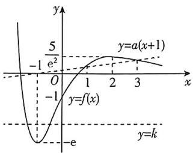

line

| x    | y=f(x) | y=a(x+1) |
| ---- | ------ | -------- |
| -∞   | -e     | -e       |
| 0    | -1     | -1       |
| 1    | 0      | 0        |
| 2    | 0.5    | 0.5      |
| 3    | 0.25   | 0.25     |

由图知，当 $-\mathrm{e} < k \leqslant 0$ 或 $k = \frac{5}{\mathrm{e}^2}$ 时，直线 $y = k$ 与曲线 $y = f(x)$ 有两个交点，

所以若方程 $f(x) = k$ 有且只有两个实根，则实数 $k$ 的取值范围为 $(-e,0] \cup \left\{\frac{5}{e^2}\right\}, B$ 错误.

对于 C, 由 $f(x)=0$ 得 $x^{2}+x-1=0$ , 解得 $x=\frac{-1\pm\sqrt{5}}{2}$ , 令 $f(x)=t$ 且 $f(t)=-1$ ,

由图可得 $f(t) = -1$ 有两解，分别为 $\frac{-1 - \sqrt{5}}{2} < t_1 < -1, t_2 = 0$ ，所以 $f(x) = t_1$ 或 $f(x) = t_2$

而 $1 + \sqrt{5} < 2\mathrm{e}$ ，则 $\frac{-1 - \sqrt{5}}{2} > -\mathrm{e}$ ，则 $f(x) = t_1$ 有两解，又 $t_2 = 0$ ，由图知 $f(x) = t_2$ 也有两解，综上，方程 $f(f(x)) = -1$ 共有四个实根，C正确.

对于 D, 因为直线 $y=a(x+1)$ 过定点 $(-1,0)$ ，且 $f(1)=\frac{1}{\mathrm{e}}, f(2)=\frac{5}{\mathrm{e}^{2}}, f(3)=\frac{11}{\mathrm{e}^{3}}$ ,

记 $k_{1} = \frac{f(1) - 0}{1 - (-1)} = \frac{1}{2\mathrm{e}}, k_{2} = \frac{f(2) - 0}{2 - (-1)} =$ $\frac{5}{3\mathrm{e}^2}, k_3 = \frac{f(3) - 0}{3 - (-1)} = \frac{11}{4\mathrm{e}^3},$

所以 $k_{3} < a \leqslant k_{1}$ , 即 $\frac{11}{4e^{3}} < a \leqslant \frac{1}{2e}$ , D 正确.

8. $\left(0,\frac{1}{e}\right]$ 【解析】因为 $f(x)=(x^{2}-2x)$ . $e^{x}$ ，所以 $f'(x)=(x^{2}-2)e^{x}$ .

由 $f'(x)>0$ ，得 $x<-\sqrt{2}$ 或 $x>\sqrt{2}$ ，由 $f'(x)<0$ ，得 $-\sqrt{2}<x<\sqrt{2}$ ，

所以函数 $f(x)$ 在 $(-\infty, -\sqrt{2})$ 上单调递增，在 $(- \sqrt{2}, \sqrt{2})$ 上单调递减，在 $(\sqrt{2}, +\infty)$ 上单调递增，

又因为 $f(-\sqrt{2}) = \frac{2 + 2\sqrt{2}}{\mathrm{e}^{\sqrt{2}}}, f(\sqrt{2}) = (2 - 2\sqrt{2})\mathrm{e}^{\sqrt{2}}$ ，且当 $x$ 趋近于 $-\infty$ 时， $f(x)$ 趋近于0，当 $x$ 趋近于 $+\infty$ 时， $f(x)$ 趋近于 $+\infty$ ，所以 $f(x)$ 的大致图象如图所示.

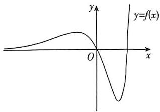

text_image

y
y=f(x)
O
x

若方程 $f(x)=a$ 有3个不同的实根，则 $a\in \left(0,\frac{2+2\sqrt{2}}{\mathrm{e}^{\sqrt{2}}}\right)$ .

又因为 $f(x_{2}) = (x_{2}^{2} - 2x_{2})\mathrm{e}^{x_{2}} = a,x_{2}\in$ $(- \sqrt{2},0)$

所以 $\frac{a}{2 - x_2} = \frac{(x_2^2 - 2x_2)\mathrm{e}^{x_2}}{2 - x_2} = -x_2\mathrm{e}^{x_2}.$

不妨令 $h(x) = x\mathrm{e}^{x}, x \in (-\sqrt{2}, 0)$ ，则 $h'(x) = \mathrm{e}^{x}(x + 1)$ ，

由 $h'(x) < 0$ ，得 $-\sqrt{2} < x < -1$ ，由 $h'(x) > 0$ 得 $-1 < x < 0$

所以函数 $h(x)$ 在 $(- \sqrt{2}, -1)$ 上单调递减，在 $(-1,0)$ 上单调递增，

所以 $h(x)_{\min} = h(-1) = -\frac{1}{\mathrm{e}}.$

又因为 $h(-\sqrt{2}) = -\frac{\sqrt{2}}{\mathrm{e}^{\sqrt{2}}}, h(0) = 0,$

所以 $-\frac{1}{\mathrm{e}} \leqslant h(x) < 0$ ，所以 $\frac{a}{2 - x_2} \in (0, \frac{1}{\mathrm{e}}]$ .

9. ①③④ 【解析】由 $f(x) = \frac{\ln x}{x}$ ，得 $f'(x) = \frac{1 - \ln x}{x^2} (x > 0)$ ，

当 $0 < x < e$ 时， $f'(x) > 0$ ，当 $x > e$ 时，

$f^{\prime}(x) <   0$

所以 $f(x)$ 在 $(0, e)$ 上单调递增，在 $(e, +\infty)$ 上单调递减，

又当 $x \to 0$ 时, $f(x) \to -\infty$ , 当 $x \to +\infty$ 时, $f(x) \to 0$ , 所以 $f(x)$ 的大致图象如图所示,

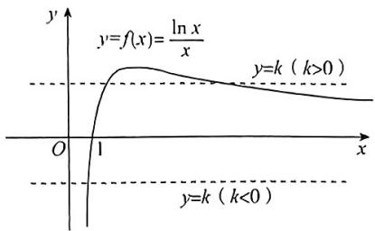

text_image

y
y=f(x)=ln x/x
y=k (k>0)
O 1 x
y=k (k<0)

因为 $f(x_{1}) = g(x_{2}) = k$

所以 $\frac{\ln x_1}{x_1} = \frac{x_2}{\mathrm{e}^{x_2}} = k$ ，即 $\frac{\ln x_1}{x_1} = \frac{\ln \mathrm{e}^{x_2}}{\mathrm{e}^{x_2}} = k$ ，所以 $f(x_1) = f(\mathrm{e}^{x_2}) = k$

所以当 $k > 0$ 时，要使 $x_{1} + x_{2}$ 越小，则取 $x_{1} = \mathrm{e}^{x_{2}}$ 且趋近于1，所以 $x_{1} + x_{2} > 1$ ，所以①正确.

当 $k > 0$ 时，因为 $x_{1}$ 与 $\mathrm{e}^{x_2}$ 均可以趋近于 $+\infty$ ，所以②错误.

当 $k < 0$ 时，由 $f(x_{1}) = g(x_{2}) = k$ ，得 $\frac{\ln x_1}{x_1} = \frac{\ln e^{x_2}}{e^{x_2}} = k$ ，所以 $x_{2} = ke^{x_{2}}$ ，因为 $k < 0$ ，所以由

图可知当 $f(x_{1})=f(e^{x_{2}})=k$ 时，有 $x_{1}=e^{x_{2}}$ ，所以 $\frac{x_{2}}{x_{1}}=\frac{k e^{x_{2}}}{e^{x_{2}}}=k$ ，所以③正确.

当 $k < 0$ 时，由图和③可知 $0 < x_{1} = \mathrm{e}^{x_{2}} < 1$ ，则 $x_{2} = \ln x_{1}$

所以 $x_{1} + x_{2} = x_{1} + \ln x_{1}$

令 $h(x)=x+\ln x(x\in(0,1))$ ，则 $h'(x)=1+\frac{1}{x}>0$ ，

所以 $h(x)$ 在 $(0,1)$ 上单调递增，

所以 $h(x)<h(1)=1$ ，即当 $x_{1}\in(0,1)$ 时， $x_{1}+x_{2}=x_{1}+\ln x_{1}<1$ 成立，所以④正确.

故答案为①③④.

10.【解】(1) 由 $f(x) = \frac{1}{3} x^3 + ax^2 + 6x$ ，得 $f'(x) = x^2 + 2ax + 6$ ，

因为当 x=3 时, $f(x)$ 取得极值, 所以 $f'(3)=0$ , 解得 $a=-\frac{5}{2}$ .

所以 $f'(x)=x^{2}-5x+6=(x-2)(x-3)$ ,

当 $x < 2$ 时， $f'(x) > 0$ ，函数 $f(x)$ 单调递增；当 $2 < x < 3$ 时， $f'(x) < 0$ ，函数 $f(x)$ 单调递减；当 $x > 3$ 时， $f'(x) > 0$ ，函数 $f(x)$ 单调递增.

故当 $x = 3$ 时，函数 $y = f(x)$ 取得极值，符

合题意.

要使 $f(x)$ 在 $(m, m + 2)$ 上单调递增，则 $m + 2 \leqslant 2$ 或 $m \geqslant 3$ ，所以 $m \leqslant 0$ 或 $m \geqslant 3$ 。即实数 $m$ 的取值范围为 $(- \infty, 0] \cup [3, +\infty)$ 。

(2)由(1)得 $f(x)=\frac{1}{3}x^{3}-\frac{5}{2}x^{2}+6x$ ，且 $1 \leqslant x \leqslant 3$ ，令 $h(x) = f(x) + m$ ，

则 $h(x) = \frac{1}{3} x^3 -\frac{5}{2} x^2 +6x + m,1\leqslant x\leqslant 3$ ，则 $h^{\prime}(x) = x^{2} - 5x + 6 = (x - 2)(x - 3),$

当 $x \in (1,3)$ 时，令 $h'(x) > 0$ ，解得 $1 < x < 2$ ，令 $h'(x) < 0$ ，解得 $2 < x < 3$

所以 $h(x)$ 的单调递增区间为[1,2)，单调递减区间为[2,3]，

故 $h(x)_{\max} = h(2) = \frac{14}{3} + m$ ，而 $h(1) = \frac{23}{6} + m, h(3) = \frac{9}{2} + m$ ，故 $h(1) < h(3)$ .

要使 $h(x) = 0$ 有两个根，则 $\left\{ \begin{array}{l} h(2) > 0, \\ h(3) \leqslant 0, \end{array} \right.$ 解得 $-\frac{14}{3} < m \leqslant -\frac{9}{2}$ ，即实数 $m$ 的取值范围为 $\left(-\frac{14}{3}, -\frac{9}{2}\right]$ .

# 专题4 导数与函数零点问题

1. D 【解析】因为 $x \in (0, 2e)$ ，令 $f(x) = 0$ ，
即 $\ln x - ax = 0$ ，则 $a = \frac{\ln x}{x}$ ,

所以函数 $f(x) = \ln x - ax$ 在 $(0,2\mathrm{e})$ 上有两个不同的零点等价于曲线 $y = \frac{\ln x}{x}$ 和直线 $y = a$ 在 $(0,2\mathrm{e})$ 上有两个不同的交点.

设 $g(x) = \frac{\ln x}{x}, x \in (0, 2\mathrm{e}), g'(x) = \frac{1 - \ln x}{x^2}$ , 令 $g'(x) = 0$ , 解得 $x = \mathrm{e}$ ,

当 $0 < x < e$ 时， $g'(x) > 0$ ，当 $e < x < 2e$ 时， $g'(x) < 0$

所以 $g(x)$ 在 $(0, e)$ 上单调递增，在 $(e, 2e)$ 上单调递减，

又 $g(e) = \frac{1}{e}, g(2e) = \frac{\ln(2e)}{2e}$ , 当 $0 < x < 1$ 时, $g(x) < 0$ , 且当 $x \to 0$ 时, $g(x) \to -\infty$ ,

故实数 $a$ 的取值范围为 $\left(\frac{\ln(2e)}{2e}, \frac{1}{e}\right)$ .

2. CD 【解析】当 $x = 1$ 时, $f(1) = 0$ , 当 $x \neq 1$ 时, 若 $f(x) = 0$ , 则 $(x - 1) \cdot \frac{e^x + e}{e^x - e} = -m$ , 即

$$
(x - 1) \frac {\mathrm{e} ^ {x - 1} + 1}{\mathrm{e} ^ {x - 1} - 1} = - m. \text {令} x - 1 = t,
$$

设 $h(t) = t \cdot \frac{\mathrm{e}^t + 1}{\mathrm{e}^t - 1}, t \neq 0$ ，则 $h(-t) = (-t) \cdot$

$\frac{\mathrm{e}^{-t} + 1}{\mathrm{e}^{-t} - 1} = (-t) \cdot \frac{\frac{1 + \mathrm{e}^t}{\mathrm{e}^t}}{\frac{1 - \mathrm{e}^t}{\mathrm{e}^t}} = h(t)$ ，所以 $h(t)$ 为偶

函数，

当 $t > 0$ 时， $h(t) = t \cdot \left(1 + \frac{2}{\mathrm{e}^t - 1}\right)$ ，且 $h'(t) = \frac{\mathrm{e}^t(\mathrm{e}^t - 2t) - 1}{(\mathrm{e}^t - 1)^2}$ ，

因为 $\left[\mathrm{e}^t (\mathrm{e}^t -2t) - 1\right]' = 2\mathrm{e}^t (\mathrm{e}^t -t - 1) > 0$ ，所以 $\mathrm{e}^t (\mathrm{e}^t -2t) - 1 > \mathrm{e}^0 (\mathrm{e}^0 -2\times 0) - 1 = 0$ ，所以 $h^{\prime}(t) > 0$ ，所以函数 $h(t)$ 在 $(0, + \infty)$ 上单调递增，

所以 $g(x) = (x - 1)\frac{\mathrm{e}^3 + \mathrm{e}}{\mathrm{e}^x - \mathrm{e}} = h(x - 1)$ 的图象关于直线 $x = 1$ 对称，且在 $(- \infty, 1)$ 上单调递减，在 $(1, +\infty)$ 上单调递增，所以 $x_1 <$

$x_{2} = 1 <   x_{3}$ ，且 $x_{1} + x_{3} = 2$

所以 $\mathrm{e}^{x_1 - 1} - 2x_2 + x_3 + 1 = \mathrm{e}^{x_1 - 1} - 2 + 2 - x_1 + 1 =$ $\mathrm{e}^{x_1 - 1} - (x_1 - 1).$

令 $\varphi(x) = \mathrm{e}^x - x, x < 0$ ，则 $\varphi'(x) = \mathrm{e}^x - 1 < 0$

所以 $\varphi(x)$ 在 $(-∞,0)$ 上单调递减，所以 $\varphi(x)>\varphi(0)=1$ ，所以 $e^{x_{1}-1}-2x_{2}+x_{3}+1$ 的取值范围为 $(1,+∞)$ .

3. C 【解析】由 $g(x)=0$ 得 $f(x)=\frac{2}{2^{x}-1}+\frac{2x}{x^{2}-1}-x=\frac{2^{x}+1}{2^{x}-1}+\frac{2x}{x^{2}-1}-x-1,$

因为 $f(x)+f(-x)=-2$ ，所以 $f(x)$ 的图象关于点 $(0,-1)$ 对称.

记 $h(x) = \frac{2^x + 1}{2^x - 1} +\frac{2x}{x^2 - 1} -x - 1,x\neq 0$ ，且 $x\neq$ $\pm 1$

因为 $h(x) + h(-x) = \left(\frac{2^x + 1}{2^x - 1} +\frac{2x}{x^2 - 1} -x - 1\right) +$ $\left(\frac{2^{-x} + 1}{2^{-x} - 1} -\frac{2x}{x^2 - 1} +x - 1\right)$

$$
\begin{array}{l} { = \left(\frac {2 ^ {x} + 1}{2 ^ {x} - 1} + \frac {2 x}{x ^ {2} - 1} - x - 1\right) + \left(\frac {2 ^ {x} + 1}{1 - 2 ^ {x}} - \frac {2 x}{x ^ {2} - 1} + x - 1\right)} \\ { = - 2,} \end{array}
$$

所以 $h(x)$ 的图象关于点 $(0, -1)$ 对称，所以 $g(x) = f(x) + \frac{2}{1 - 2^x} -\frac{2x}{x^2 - 1} +x$ 的零点关于点 $(0, - 1)$ 对称，

当 $x > 0$ 且 $x \neq 1$ 时，因为 $h'(x) = \frac{-2 \times 2^3 \ln 2}{(2^x - 1)^2} + \frac{-2x^2 - 2}{(x^2 - 1)^2} - 1 < 0,$

所以函数 $h(x)$ 在 $(0,1)$ 和 $(1, +\infty)$ 上单调递减，又当 $x$ 无限趋近于0且 $x > 0$ 时， $h(x)$ 无限趋近于 $+\infty$ ，

当 $x$ 无限趋近于1且 $x < 1$ 时， $h(x)$ 无限趋近于 $-\infty$

当 $x$ 无限趋近于1且 $x > 1$ 时， $h(x)$ 无限趋近于 $+\infty$

当 $x$ 无限趋近于 $+\infty$ 时， $h(x)$ 无限趋近于 $-\infty$

结合 $h(x)$ 的图象关于点 $(0, -1)$ 对称可知，方程 $f(x) = \frac{2}{2^x - 1} +\frac{2x}{x^2 - 1} -x$ 共有两组对

称解,所以 $\sum_{k=1}^{n}f(x_{k})=-2+(-2)=-4.$

4.【解】(1)当a=1时, $f(x)=\ln(1+x)+xe^{-x}$ ,
所以 $f(0)=0,f'(x)=\frac{1}{1+x}+(1-x)e^{-x}$ ，所以 $f'(0)=2,$

故所求的切线方程为 y=2x.

(2) $f'(x)=\frac{1}{1+x}+\frac{a(1-x)}{e^{x}}=\frac{e^{x}+a(1-x^{2})}{e^{x}(1+x)}$ ,

当 $a \geqslant 0$ 时, $x \in (-1,0), f'(x) > 0$ , 则 $f(x)$ 在 $(-1,0)$ 上单调递增, 且 $f(0) = 0$ , 所以 $f(x)$ 在 $(-1,0)$ 上无零点, 不符合题意.

当-1<a<0时, $y=e^{x}+a(1-x^{2})$ 在 $(0,+\infty)$ 上单调递增，

则 $y = e^{x} + a(1 - x^{2}) > 1 + a > 0$ ，则 $f'(x) > 0$ 在 $(0, +\infty)$ 上恒成立，则 $f(x)$ 在 $(0, +\infty)$ 上单调递增，则 $f(x) > f(0) = 0, f(x)$ 在 $(0, +\infty)$ 上无零点，不符合题意。

当 $a = -1$ 时， $f'(x) = \frac{e^x + x^2 - 1}{e^x(1 + x)}$ ，当 $x \in (0, +\infty)$ 时 $f'(x) > 0$ ，则 $f(x)$ 在 $(0, +\infty)$ 上单调递增，且 $f(0) = 0$ ，所以 $f(x)$ 在 $(0, +\infty)$ 上无零点，不符合题意。

当 $a < -1$ 时，设 $g(x) = e^x + a(1 - x^2)$ ，则 $g'(x) = e^x - 2ax$

当 $x > 0$ 时， $g'(x) > 0$ ，则 $g(x)$ 在 $(0, +\infty)$ 上

单调递增, $g(0)=1+a<0$ , $g(1)=e>0$ ,故存在唯一的 $x_{0}\in(0,1)$ 使得 $g(x_{0})=0$ ,所以 $f(x)$ 在 $(0,x_{0})$ 上单调递减,在 $(x_{0},+\infty)$ 上单调递增, $f(x_{0})<f(0)=0$ ,

当 $x > 1 + a^2$ 时，令 $h(x) = \mathrm{e}^{x} - x^{2}$ ，则 $h'(x) = \mathrm{e}^{x} - 2x$ .

令 $m(x) = \mathrm{e}^{s} - 2x$ ，则 $m^{\prime}(x) = \mathrm{e}^{x} - 2,$

当 $x > 2$ 时， $m'(x) > 0, m(x)$ 单调递增，即 $h'(x)$ 单调递增，则 $h'(x) > h'(2) = \mathrm{e}^2 - 4 > 0$ ，则 $h(x)$ 单调递增，则 $h(x) > h(2) = \mathrm{e}^2 - 4 > 0$ ，则 $\mathrm{e}^x > x^2$ ，则 $f(x) = \ln (1 + x) + ax\mathrm{e}^{-x} > \ln (1 + x) + \frac{a}{x} > 0$

【提示】利用放缩法证明 $f(x)>0$ ，再由零点存在定理可判断在所证区间内存在唯一零点

此时 $f(x)$ 在 $(0, +\infty)$ 上恰有一个零点.

当-1<x<0时, $g'(x)$ 在(-1,0)上单调递增, $g'(-1)=\frac{1}{e}+2a<0$ , $g'(0)=1>0$ ,故存

在唯一的 $x_{1} \in (-1,0)$ 使得 $g'(x_1) = 0$ ，所以 $g(x)$ 在 $(-1,x_1)$ 上单调递减，在 $(x_1,0)$ 上单调递增， $g(x_1) < g(0) = 1 + a < 0$

$g(-1)=\frac{1}{e}>0$ , 故存在唯一的 $x_{2}\in(-1,$

$x_{1})$ 使得 $g(x_{2}) = 0$ ，所以 $f(x)$ 在 $(-1,x_2)$ 上单调递增，在 $(x_{2},0)$ 上单调递减，因为 $f(0) = 0$ 所以 $f(x)$ 在 $(x_{2},0)$ 上没有零点，且 $f(x_{2}) > 0$ 取 $c = \mathrm{e}^{3a} - 1$ ，则 $-1 < c < 0, f(c) = \ln (1 + c) + ace^{-c} < a(3 - e) < 0$ ，此时 $f(x)$ 在 $(-1,0)$ 上恰有一个零点.

综上， $a$ 的取值范围为 $(-\infty , - 1)$

5. (1)【解】因为 $f(x) = a^x - bx + e^2$ ，所以 $f'(x) = a^x \ln a - b$ .

①当 $b \leqslant 0$ 时， $f'(x) > 0$ 恒成立，

所以 $f(x)$ 的单调递增区间是 $(-∞,+∞)$ .

②当 $b > 0$ 时，

当 $x < \log_a\frac{b}{\ln a}$ 时， $f'(x) < 0$ ；

当 $x > \log_a\frac{b}{\ln a}$ 时， $f'(x) > 0$

所以 $f(x)$ 的单调递减区间是 $\left(-\infty, \log_a \frac{b}{\ln a}\right)$ ,

单调递增区间是 $\left(\log_a\frac{b}{\ln a}, + \infty\right)$

(2)【解】因为 $b > 2\sigma^2$ ，函数 $f(x)$ 有两个零点。由(1)知，有 $f\left(\log_a\frac{b}{\ln a}\right) < 0$

即 $\frac{b}{\ln a} -\frac{b}{\ln a}\ln \frac{b}{\ln a} +e^2 < 0, (*)$

记 $g(t) = t - t\ln t + \mathrm{e}^2$ 当 $t > 1$ 时， $g'(t) = -\ln t < 0$ ，所以 $g(t)$ 在 $(1, +\infty)$ 上单调递减。

当 $t \in (0,1]$ 时， $g(t) = t(1 - \ln t) + e^2 > 0$

又 $g(\mathrm{e}^2) = 0$ ，因此当且仅当 $t > e^2$ 时， $g(t) < 0$

$(*)$ 式即为 $g\left(\frac{b}{\ln a}\right) < 0$ ，所以对任意 $b > 2e^{2}$ 必须有 $\frac{b}{\ln a} > e^{2}$ .

即 $b > \mathrm{e}^2\ln a$ ，得 $a\leqslant e^2$

所以 $a \in (1, e^2]$ ，此时 $f(0) > 0$

$f\left(3\log_a\frac{b}{\ln a}\right) > 0.$

故实数 a 的取值范围为 $(1, e^{2}]$ .

(3)【证明】由于 $b > \mathrm{e}^4$ ，由（2）知，当 $a =$ e时，

函数 $f(x)$ 有两个零点 $x_{1},x_{2}$ ，设 $x_{1}<x_{2}$

记 $m_{b}$ 为 $\frac{b\ln b}{2\mathrm{e}^2} +1$ 的整数部分，

则 $\frac{b\ln b}{2\mathrm{e}^2} < m_b \leqslant \frac{b\ln b}{2\mathrm{e}^2} + 1, m_b > 1,$

由题意只需证明 $f\left(m_{b}x_{1} + \frac{e^{2}}{b}\right) < 0.$

设函数 $\varphi(t) = \mathrm{e}^{\frac{\mathrm{e}^2}{b}}t^{m_b} - m_b t - m_b \mathrm{e}^2$ .

当 $t \geqslant 1$ 时, $\varphi'(t) = m_b(e^{\frac{e^2}{b}} t^{m_b - 1} - 1) > 0$ ,

所以函数 $\varphi(t)$ 在 $[1, +\infty)$ 上单调递增.

因为 $\varphi(1) < e - m_b(e^2 + 1) < 0, \varphi(e^{\frac{2e^2}{b}}) < e^{\frac{e^2}{b}}$ .

$e^{\frac{2c^2}{b}\left(\frac{b\ln b}{2c^2} + 1\right)} - \frac{b\ln b}{2e^2} (e^{\frac{2c^2}{b}} + e^2) <$

$b\left(\mathrm{e}^{\frac{3c^{2}}{b}} - \frac{\ln b}{2}\right) < 0.$

注意到 $f\left(m_{b}\dot{x}_{1} + \frac{\mathrm{e}^{2}}{b}\right) = \varphi (bx_{1} - \mathrm{e}^{2})$

因此只要证明 $\varphi (bx_{1} - \mathrm{e}^{2}) < 0$

即只需验证 $1 < bx_{1} - e^{2} < e^{\frac{2e^{2}}{6}}$

因为 $f\left(\frac{\mathrm{e}^2 + 1}{b}\right) = \mathrm{e}^{\frac{\mathrm{o}^2 + 1}{b}} - 1 > 0$ 以及

$f\left(\frac{\mathrm{e}^2 + \mathrm{e}^{\frac{2\sigma^2}{b}}}{b}\right) = \mathrm{e}^{\frac{\sigma^2 + \sigma^{\frac{2\sigma^2}{b}}}{b}} - \mathrm{e}^{\frac{2\sigma^2}{b}} < 0,$

即得 $\frac{\mathrm{e}^2 + 1}{b} < x_1 < \frac{\mathrm{e}^2 + \mathrm{e}^{\frac{2\mathrm{e}^2}{b}}}{b} < x_2$

故 $1 < bx_{1} - e^{2} < e^{\frac{2w^{2}}{4}}$ 得证.

所以原命题得证

# 专题5 导数的综合应用

# 1. 思路分析

(1) 对原函数变形为 $f(x)=\frac{e^{x}}{x}+$ $\ln\frac{e^{x}}{x}-a\xrightarrow{\text{换元}}t$ 的取值范围
围 $\frac{t+\ln t-a\geqslant0}{在定义域内恒成立}$ a的取值范围；

(2) $f(x)$ 有两个不同的零点 $x_{1}$ ， $x_{2} \xrightarrow{\text{转化为}} y=t+\ln t-a \text{ 在 } (e,+\infty) \text{ 上有一个}$ 零点 $t_{0} \xrightarrow{0<x_{1}<1<x_{2}}\left\{\begin{aligned}t_{0}&=\frac{e^{x_{1}}}{x_{1}},\\ t_{0}&=\frac{e^{x_{2}}}{x_{2}}\end{aligned}\right. \xrightarrow[\text{变形}]{\text{两式相除、}} \text{用}$

$x_{1}, x_{2}$ 表示 $1 - \sqrt{x_1 x_2} \to$ 用 $u = \sqrt{\frac{x_2}{x_1}}$ 表示 $1 - \sqrt{x_1 x_2} \to$ 构造函数 $h(u) \xrightarrow{\text{单调性}} 1 - \sqrt{x_1 x_2} > 0 \to x_1 x_2 < 1$

(1)【解】 $f(x)=\frac{\mathrm{e}^{x}}{x}-\ln x+x-a=\frac{\mathrm{e}^{x}}{x}+$ $\ln \frac{e^{x}}{x}-a,$

令 $t = \frac{\mathrm{e}^x}{x} (x > 0)$ ，则 $t' = \frac{(x - 1)\mathrm{e}^x}{x^2}$

当 $0 < x < 1$ 时， $t' < 0, t = \frac{\mathrm{e}^x}{x}$ 在 $(0,1)$ 上单调递减；

当 $x > 1$ 时， $t' > 0, t = \frac{\mathrm{e}^x}{x}$ 在 $(1, +\infty)$ 上单调递增.

所以 $t = \frac{\mathrm{e}^z}{x} (x > 0)$ 在 $x = 1$ 处取得最小值e，故 $t\geqslant e.$

于是 $f(x) \geqslant 0$ 等价于 $t + \ln t - a \geqslant 0$ 在 $t \in [e, +\infty)$ 上恒成立，

即 $a \leqslant t + \ln t$ 在 $t \in [e, +\infty)$ 上恒成立.

又显然 $y = t + \ln t$ 是增函数，故 $a \leqslant e + 1$ .

所以实数 a 的取值范围为 $(-∞, e+1]$ .

(2)【证明】由(1)可得 $f(x)$ 有两个零点 $x_{1},x_{2}$ 等价于 $y=t+\ln t-a$ 在 $(e,+\infty)$ 上有一个零点 $t_{0}$ ，即 $a>e+1$ ，

此时, $t_{0}=\frac{e^{x}}{x}$ 有两个解 $x_{1},x_{2}$ ，不妨设 $x_{1}<x_{2}$

则 $0 < x_{1} < 1 < x_{2}$

所以 $\left\{ \begin{array}{l} t_{0} = \frac{\mathrm{e}^{x_{1}}}{x_{1}}, \\ t_{0} = \frac{\mathrm{e}^{x_{2}}}{x_{2}}, \end{array} \right.$ 两式相除，可得 $\mathrm{e}^{x_2 - x_1} = \frac{x_2}{x_1}$

故 $x_{2} - x_{1} = \ln x_{2} - \ln x_{1}$ ，即 $\frac{x_2 - x_1}{\ln x_2 - \ln x_1} = 1$

故 $1 - \sqrt{x_1x_2} = \frac{x_2 - x_1}{\ln x_2 - \ln x_1} - \sqrt{x_1x_2} =$ $x_{1}\left(\frac{\frac{x_{2}}{x_{1}} - 1}{\ln\frac{x_{2}}{x_{1}}} -\sqrt{\frac{x_{2}}{x_{1}}}\right).$

令 $u = \sqrt{\frac{x_2}{x_1}} (u > 1)$ ，故 $1 - \sqrt{x_1x_2} = x_1\left(\frac{u^2 - 1}{\ln u^2} -u\right) = \frac{x_1u}{2\ln u}\Big(u - \frac{1}{u} -2\ln u\Big).$

因为 $\frac{x_{1}u}{2\ln u}$ 恒大于0,故只需考虑 $u-\frac{1}{u}-2\ln u$ 的正负.

记 $h(u) = u - \frac{1}{u} - 2\ln u (u > 1)$ , 故 $h'(u) = 1 + \frac{1}{u^2} - \frac{2}{u} = \frac{u^2 - 2u + 1}{u^2} = \frac{(u - 1)^2}{u^2} > 0$ ,

故 $h(u)$ 在 $(1, +\infty)$ 上单调递增. 又当 $u \to 1$ 时, $h(u) \to 0$ ,

所以 $h(u) > 0$ ，故 $1 - \sqrt{x_1x_2} > 0$ ，故 $x_{1}x_{2} < 1.$

2.【解】（1）因为 $f(x) = \mathrm{e}^{2x} - 2ax$ ，所以 $f^{\prime}(x) = 2\mathrm{e}^{2x} - 2a = 2(\mathrm{e}^{2x} - a),$

当 $a \leqslant 0$ 时, $\mathrm{e}^{2x} - a > 0$ , 即 $f'(x) > 0$ , 所以 $f(x)$ 在 $\mathbf{R}$ 上单调递增;

当 $a > 0$ 时，令 $\mathrm{e}^{2x} - a = 0$ ，得 $x = \frac{1}{2}\ln a,$

令 $f'(x)<0$ ，得 $x<\frac{1}{2}\ln a$ ；令 $f'(x)>0$ ，得 $x>\frac{1}{2}\ln a,$

所以 $f(x)$ 在 $\left(-\infty, \frac{1}{2} \ln a\right)$ 上单调递减，在 $\left(\frac{1}{2} \ln a, +\infty\right)$ 上单调递增.

综上所述, 当 $a \leqslant 0$ 时, $f(x)$ 在 R 上单调递增;

当 $a > 0$ 时， $f(x)$ 在 $\left(-\infty, \frac{1}{2} \ln a\right)$ 上单调递

减,在 $\left(\frac{1}{2}\ln a,+\infty\right)$ 上单调递增.

(2) 因为 $f(x) = e^{2x} - 2ax$ ,

所以 $f(x) + \frac{\sin x - \cos x}{\mathrm{e}^x}\geqslant 0$ 即 $\mathrm{e}^{2x} - 2ax+$ $\frac{\sin x - \cos x}{\mathrm{e}^x}\geqslant 0$ 在 $[0, + \infty)$ 上恒成立.

令 $h(x) = \mathrm{e}^{2x} - 2ax + \frac{\sin x - \cos x}{\mathrm{e}^x} (x\geqslant 0)$ ，则

$$
h ^ {\prime} (x) = 2 \mathrm{e} ^ {2 x} - 2 a + \frac {2 \cos x}{\mathrm{e} ^ {x}}, h (0) = 0,
$$

令 $\varphi(x) = e^{2x} - a + \frac{\cos x}{e^x} (x \geqslant 0)$ , 则 $\varphi'(x) =$

$$
2 \mathrm{e} ^ {2 x} + \frac {- \sin x - \cos x}{\mathrm{e} ^ {x}} = 2 \mathrm{e} ^ {2 x} - \frac {\sqrt {2} \sin \left(x + \frac {\pi}{4}\right)}{\mathrm{e} ^ {x}},
$$

因为 $x \geqslant 0$ ，所以 $\mathrm{e}^x \geqslant 1, \mathrm{e}^{2x} \geqslant 1,$ $\sqrt{2}\sin \left(x + \frac{\pi}{4}\right) \leqslant \sqrt{2}$ ，

则 $\frac{\sqrt{2}\sin\left(x + \frac{\pi}{4}\right)}{\mathrm{e}^x} < \sqrt{2},$

所以 $2\mathrm{e}^{2x} - \frac{\sqrt{2}\sin\left(x + \frac{\pi}{4}\right)}{\mathrm{e}^x} > 2 - \sqrt{2} > 0$ ，则 $\varphi'(x) > 0$ 在 $[0, +\infty)$ 上恒成立，

所以 $\varphi(x)$ 在 $[0, +\infty)$ 上单调递增，即 $h'(x)$ 在 $[0, +\infty)$ 上单调递增，

令 $m(x) = 2\mathrm{e}^{3x} - 2xe^{x}(x\geqslant 0)$ ，则 $m^{\prime}(x) =$ $6\mathrm{e}^{3x} - 2(x + 1)\mathrm{e}^{x} = 2\mathrm{e}^{x}(3\mathrm{e}^{2x} - x - 1),$

令 $n(x) = 3\mathrm{e}^{2x} - x - 1(x \geqslant 0)$ ，则 $n'(x) = 6\mathrm{e}^{2x} - 1 > 0$ 在 $[0, +\infty)$ 上恒成立，

所以 $n(x)$ 在 $[0, +\infty)$ 上单调递增，则 $n(x)\geqslant n(0) > 0$ ，即 $m^{\prime}(x) > 0,$

所以 $m(x)$ 在 $[0, +\infty)$ 上单调递增，则 $m(x)\geqslant m(0) = 2,$

则 $2\mathrm{e}^{3x} - 2xe^x + 2\cos x \geqslant 2 + 2\cos x \geqslant 0$ ，故 $2\mathrm{e}^{2x} - 2x + \frac{2\cos x}{\mathrm{e}^x} > 0$

所以当 $a > 2$ 时， $h'(0) = 2\mathrm{e}^0 - 2a + \frac{2\cos 0}{\mathrm{e}^0} = 4 - 2a < 0, h'(a) = 2\mathrm{e}^{2a} - 2a + \frac{2\cos a}{\mathrm{e}^a} > 0,$

所以 $h^{\prime}(x)$ 在 $(0,a)$ 上必存在 $x_0$ ，使得 $h^{\prime}(x_0) = 0,$

又 $h^{\prime}(x)$ 在 $[0, +\infty)$ 上单调递增，故当 $0 <$

$x < x_{0}$ 时， $h'(x) < 0$

所以 $h(x)$ 在 $(0, x_{0})$ 上单调递减，而 $h(x) < h(0) = 0$ ，不满足题意；

当 $a \leqslant 2$ 时, $h'(x) \geqslant h'(0) = 2\mathrm{e}^0 - 2a + \frac{2\cos 0}{\mathrm{e}^0} \geqslant 2 - 4 + 2 = 0,$

所以 $h(x)$ 在 $[0, +\infty)$ 上单调递增，故 $h(x) \geqslant h(0) = 0$ ，满足题意.

综上所述,实数 a 的取值范围为 $(-∞,2]$ .

3.(1)【解】函数 $f(x)$ 的定义域是 $(0,+\infty)$ .

由已知得， $f^{\prime}(x) = \frac{a}{x} + x - a - 1 =$ $\frac{x^2 - (a + 1)x + a}{x} = \frac{(x - 1)(x - a)}{x}.$

①当 $0 < a < 1$ 时，

当 0<x<a 时, $f'(x)>0$ , $f(x)$ 单调递增;

当 $a < x < 1$ 时， $f'(x) < 0, f(x)$ 单调递减；

当 $x > 1$ 时， $f'(x) > 0, f(x)$ 单调递增.

②当 $a = 1$ 时，

当 $x > 0$ 时， $f'(x) \geqslant 0, f(x)$ 单调递增.

③当 $a > 1$ 时，

当 0<x<1 时， $f'(x)>0$ ， $f(x)$ 单调递增；

当 1<x<a 时, $f'(x)<0$ , $f(x)$ 单调递减;

当 x > a 时, $f'(x) > 0$ , $f(x)$ 单调递增.

综上, 当 0 < a < 1 时, 函数 $f(x)$ 的单调递增区间为 $(0, a)$ , $(1, +\infty)$ , 单调递减区间为 $(a, 1)$ ;

当 $a = 1$ 时，函数 $f(x)$ 的单调递增区间为 $(0, +\infty)$ ，无单调递减区间；

当 $a > 1$ 时，函数 $f(x)$ 的单调递增区间为 $(0,1),(a, + \infty)$ ，单调递减区间为 $(1,a)$

(2)【证明】当 $a = 1$ 时， $f(x) = \ln x + \frac{1}{2} x^2 - 2x + \frac{3}{2}$ .

由(1)知,函数 $f(x)$ 在 $(0,+\infty)$ 上单调递增且 $f(1)=0$ .

令 $g(x) = f(x) + f(2 - x) = \ln x + \frac{1}{2} x^2 - 2x + \frac{3}{2} + \ln (2 - x) + \frac{1}{2}(2 - x)^2 - 2(2 - x) + \frac{3}{2} = \ln [x(2 - x)] + x^2 - 2x + 1 = \ln [1 - (x - 1)^2] + (x - 1)^2,$

令 $F(x) \approx \ln x - x + 1 (x > 0), F'(x) = \frac{1}{x} - 1 = \frac{1 - x}{x},$

令 $F^{\prime}(x) > 0$ ，解得 $0 < x < 1$ ；令 $F''(x) < 0$ ，解得 $x > 1$

所以 $F(x)$ 在 $(0,1)$ 上单调递增，在 $(1,+\infty)$ 上单调递减，

所以 $F(x)\leqslant F(1) = 0$ ，所以 $\ln x\leqslant x - 1.$

令 $(x - 1)^2 = t\in [0,1)$ ，则 $1 - t\in (0,1]$ ，则 $\ln (1 - t)\leqslant (1 - t) - 1 = -t$

故 $\ln (1 - t) + t\leqslant 0$

所以 $g(x) = f(x) + f(2 - x)\leqslant 0$ 恒成立.

不妨设 $0 < x_{1} < 1 < x_{2}$ ，则 $f(x_{1}) + f(2 - x_{1}) \leqslant 0$ ，所以 $-f(x_{1}) \geqslant f(2 - x_{1})$ ，所以 $f(x_{2}) \geqslant f(2 - x_{1})$ ，

因为 $2 - x_{1} > 1, x_{2} > 1$ ，而 $f(x)$ 在 $(0, +\infty)$ 上单调递增，

所以 $x_{2} \geqslant 2 - x_{1}$ , 所以 $x_{1} + x_{2} \geqslant 2$ .

4. (1)【证明】当 $a = 1$ 时, $f(x) = x - \ln x - 1$ , 定义域为 $(0, +\infty)$ ,

则 $f'(x) = 1 - \frac{1}{x} = \frac{x - 1}{x}$ . 当 $0 < x < 1$ 时， $f'(x) < 0$ ; 当 $x > 1$ 时， $f'(x) > 0$ .

所以 $f(x)$ 在 $(0,1)$ 上单调递减，在 $(1,+\infty)$ 上单调递增. 故 $f(x)_{\min}=f(1)=0$ . 故当a=1时, $f(x)\geqslant0$ .

(2)【解】函数 $f(x)$ 的定义域为 $(0,+\infty)$ ， $f'(x)=1-\frac{a}{x}=\frac{x-a}{x}.$

①若 $a \leqslant 0$ ，则 $f'(x) > 0$ ，则 $f(x)$ 在 $(0, +\infty)$ 上单调递增.

又 $f(1)=0$ ，所以x=1是函数 $f(x)$ 唯一的零点。此时满足题意，故 $f(x)$ 的单调递增区间为 $(0,+\infty)$ ，没有单调递减区间。

②若 a>0，当 0<x<a 时， $f'(x)<0$ ; 当 x>a 时， $f'(x)>0$ .

所以 $f(x)$ 在 $(0, a)$ 上单调递减，在 $(a, +\infty)$ 上单调递增.

所以 $f(x)_{\min} = f(a) = a - a\ln a - 1.$

(i) 当 $a = 1$ 时, $f(x)_{\min} = 0$ , 且 $x = 1$ 是函数 $f(x)$ 唯一的零点,

此时满足题意,其单调递减区间为(0,1),
单调递增区间为 $(1,+\infty)$ .

(ii) 当 $0 < a < 1$ 时, 由 $f(x)$ 在 $(a, +\infty)$ 上单调递增, 得 $f(a) < f(1) = 0$ ,

取 $ae^{-\frac{1}{a}} \in (0, a)$ ,

因为 $f(a\mathrm{e}^{-\frac{1}{a}}) = ae^{-\frac{1}{a}} - a(\ln a - \frac{1}{a}) - 1 = ae^{-\frac{1}{a}} - a\ln a = a(\mathrm{e}^{-\frac{1}{a}} - \ln a) > 0,$

所以存在 $x_0 \in (ae^{-\frac{1}{a}}, a)$ ，使得 $f(x_0) = 0$ ，即 $f(x)$ 在 $(a \in^{\frac{1}{a}}, a)$ 上有一个零点，故 $f(x)$

在其定义域上不止有一个零点,不符合题意.

(iii) 当 $a > 1$ 时, 由 $f(x)$ 在 $(0, a)$ 上单调递减, 得 $f(a) < f(1) = 0$ ,

由(1)得 $x-\ln x-1\geqslant0$ （当且仅当x=1时取等号），即 $\ln x\leqslant x-1$ ，则 $\ln a<a-1$ ，

所以 $f(a^{3})=a^{3}-a\ln a^{3}-1=a^{3}-3a\ln a-1>a^{3}-3a(a-1)-1=(a-1)^{3}>0$ ，所以 $f(x)$ 在 $(a,a^{3})$ 上有一个零点，所以 $f(x)$ 在其定义域上不止有一个零点，不符合题意.

综上, 当 $a \leqslant 0$ 时, $f(x)$ 的单调递增区间为 $(0, +\infty)$ , 没有单调递减区间;

当 a=1 时, $f(x)$ 的单调递减区间为(0,1),单调递增区间为 $(1,+\infty)$ .

5.(1)【解】 $f(x)$ 的定义域为 $(0, +\infty)$ . $f'(x)=\ln x+1+a,$

令 $f'(x)=0$ , 得 $x=e^{-a-1}$ .

由 $f'(x)<0$ ，解得 $0<x<e^{-a-1}$ ，由 $f'(x)>0$ ，解得 $x>e^{-a-1}$ .

所以 $f(x)$ 的单调递减区间为 $(0, e^{-a-1})$ ，单调递增区间为 $(e^{-a-1}, +\infty)$ .

(2)【证明】令 $\varphi(x)=f(x)-ae^{x}+1=a(x-e^{x})+x\ln x+1,x>0,$

令 $k(x) = x - \mathrm{e}^x$ ，则 $k^{\prime}(x) = 1 - \mathrm{e}^{x}$

由 $k'(x)>0$ ，解得 x<0 ；由 $k'(x)<0$ ，解得 x>0 ，则 $k(x)$ 在 $(-∞,0)$ 上单调递增，在 $(0,+∞)$ 上单调递减，

所以 $k(x)\leqslant k(0) = -1 <   0.$

由 $a \geqslant 1$ ，可得 $a(x - \mathrm{e}^x) + x\ln x + 1 \leqslant x - \mathrm{e}^x + x\ln x + 1,$

即证 $\frac{\mathrm{e}^x}{x} -\ln x - \frac{1}{x} -1 > 0.$

令 $g(x) = \frac{\mathrm{e}^x}{x} -\ln x - \frac{1}{x} -1(x > 0)$ ，则

$$
\begin{array}{l} g ^ {\prime} (x) = \frac {(x - 1) e ^ {x}}{x ^ {2}} - \frac {1}{x} + \frac {1}{x ^ {2}} = \\ \frac {(x - 1) (e ^ {x} - 1)}{x ^ {2}}. \end{array}
$$

因为当 $x > 0$ 时， $\mathrm{e}^{\mathrm{x}} - 1 > 0$

由 $g'(x)=0$ , 可得 x=1 .

所以当 $0 < x < 1$ 时， $g'(x) < 0, g(x)$ 在 $(0,1)$ 上单调递减，

当 $x > 1$ 时， $g'(x) > 0, g(x)$ 在 $(1, +\infty)$ 上单调递增，

所以 $g(x)_{\min}=g(1)=e-2>0,$

所以 $g(x) > 0$ ，即 $\frac{\mathrm{e}^x}{x} -\ln x - \frac{1}{x} -1 > 0.$

所以 $x - e^{x} + x\ln x + 1 < 0$ ，所以原不等式

得证.

6.【解】(1) $f'(x)=(x^{2}-3)e'$ ，令 $p(x)=(x^{2}-3)e'$ ，则 $p'(x)=(x^{2}+2x-3)e'= (x-1)(x+3)e'$ 。

当 $x < -3$ 或 $x > 1$ 时， $p'(x) > 0$ ，函数 $p(x)$ 单调递增，

当-3<x<1时, $p'(x)<0$ ,函数 $p(x)$ 单调递减,

即 $f'(x)$ 在 $(-∞,-3),(1,+∞)$ 上单调递增，在 $(-3,1)$ 上单调递减.

(2) 当 $x \in (1, +\infty)$ 时, 若 $h_2(x) \geqslant h_1(x)$ 恒成立,

则 $x\mathrm{e}^{x} + x\geqslant mx^{m}\ln x + m\ln x$ 对 $x\in (1, + \infty)$ 恒成立，

即 $x\mathrm{e}^{x} + x\geqslant (m\ln x)\cdot x^{m} + m\ln x$ 对 $x\in (1,$ $+\infty)$ 恒成立，

即 $x\mathrm{e}^{x} + x\geqslant (m\ln x)\mathrm{e}^{m\ln x} + m\ln x$ 对 $x\in (1, + \infty)$ 恒成立.

设函数 $h(x) = x\mathrm{e}^x +x$

$\therefore h(x) \geqslant h(m \ln x)$ 对 $x \in (1, +\infty)$ 恒成立. $h'(x) = (x + 1)e^x + 1$

设 $\varphi(x) = h'(x) = (x + 1)e^x + 1$

$$
\therefore \varphi^ {\prime} (x) = (x + 2) e ^ {x},
$$

∴ 当 $x \in (-\infty, -2)$ 时， $\varphi'(x) < 0$ ，

则 $h^{\prime}(x)$ 在 $(-\infty , - 2)$ 上单调递减，

当 $x \in (-2, +\infty)$ 时， $\varphi'(x) > 0$

则 $h^{\prime}(x)$ 在 $(-2, +\infty)$ 上单调递增，

$$
\therefore h ^ {\prime} (x) \geqslant h ^ {\prime} (- 2) = 1 - \frac {1}{\mathrm{e} ^ {2}} > 0,
$$

∴ $h(x)$ 在 R 上单调递增，

又 $h(x)\geqslant h(m\ln x),$

∴ $x \geqslant m \ln x$ 在 $(1, +\infty)$ 上恒成立，

令 $r(x) = x - m\ln x, x > 1$ ，则 $r'(x) = 1 - \frac{m}{x} = \frac{x - m}{x}$ .

①当 $m \leqslant 1$ 时, $r'(x) > 0$ 在 $(1, +\infty)$ 上恒成立, $\therefore r(x) > r(1) = 1 > 0$ , 此时满足题意.

②当 m>1 时，由 $r'(x)=0$ ，解得 x=m，

当 $x \in (1, m)$ 时， $r'(x) < 0$ ，此时 $r(x)$ 在 $(1, m)$ 上单调递减，

当 $x \in (m, +\infty)$ 时， $r'(x) > 0$ ，此时 $r(x)$ 在 $(m, +\infty)$ 上单调递增，

$\therefore r(x)$ 的最小值 $r(m) = m - m\ln m \geqslant 0$ ，解得 $1 < m \leqslant e$ .

综上,实数 m 的取值范围是 $(-∞, e]$ .

7. (1, 2) 【解析】设 $g(x) = \frac{f(x)}{\mathrm{e}^x}$ , 则 $g'(x) = \frac{f'(x) - f(x)}{\mathrm{e}^x} < 0$ , 故 $g(x)$ 单调递减.

因为 $f(x)$ 为奇函数,定义域为R,所以 $f(0)=0$ ,故 $g(0)=\frac{f(0)}{\mathrm{e}^{0}}=0.$

$f(x^{2} - 3x + 2) > 0$ 可转化为 $\frac{f(x^2 - 3x + 2)}{\mathrm{e}^{x^2 - 3x + 2}} > 0,$ 即 $g(x^{2} - 3x + 2) > g(0)$ .

因为 $g(x)$ 单调递减, 所以 $x^{2}-3x+2<0$ , 解得 1<x<2.

# 第4章 风向练

1. ABD 【解析】对于 A, $f'(x) = -\frac{1}{x^{2}}$ , 令 $\frac{1}{x} = -\frac{1}{x^{2}}$ , 得 x = -1, 有“巧值点”;

对于 B, $f'(x)=\frac{1}{x}$ ，令 $\ln x=\frac{1}{x}$ ，如图，作出
函数 $y=\ln x, y=\frac{1}{x}(x>0)$ 的图象，

由图可知方程 $\ln x = \frac{1}{x}$ 有解，有“巧值点”；

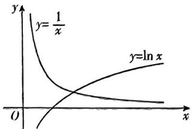

text_image

y
y=1/x
y=ln x
O
x

对于 $C, f'(x) = \left(\frac{\sin x}{\cos x}\right)' = \frac{\cos^{2}x + \sin^{2}x}{\cos^{2}x} = \frac{1}{\cos^{2}x}$

令 $\tan x = \frac{1}{\cos^2 x}$ , 即 $\frac{\sin x}{\cos x} = \frac{1}{\cos^2 x}$ , 得 $\sin 2x = 2$ , 无解, 无“巧值点”;

对于 $\mathrm{D}, f'(x) = 1 - \frac{1}{x^2}$ , 令 $x + \frac{1}{x} = 1 - \frac{1}{x^2}$ , 得 $x^3 = x^2 + x + 1 = 0 (x \neq 0)$ ,

令 $g(x) = x^2 - x^2 + x + 1$ ，则 $g'(x) = 3x^2 - 2x +$

$$
1 = 3 \left(x - \frac {1}{3}\right) ^ {2} + \frac {2}{3} > 0,
$$

所以函数 $g(x)$ 在 $\mathbf{R}$ 上为增函数，又 $g(-1) = -2 < 0, g(0) = 1 > 0$ ，所以函数 $g(x)$ 在 $(-1,0)$ 上有唯一零点，即方程 $x+\frac{1}{x} = 1 - \frac{1}{x^2}$ 在 $(-1,0)$ 上有解，即 $f(x) = x+\frac{1}{x}$ 有“巧值点”.

2. ABD 【解析】函数 $\operatorname{inv} x = \tan x - x$ 的定义域为 $\left\{x \in \mathbf{R} \mid x \neq n\pi + \frac{\pi}{2}, n \in \mathbf{Z}\right\}$ , 显然 $y = x$ 和 $\operatorname{inv} x$ 均为奇函数, 因此 $y = x \cdot \operatorname{inv} x$ 是偶函数, A 正确;

当 $x \in \left(-\frac{\pi}{2}, \frac{\pi}{2}\right)$ 时，令 $h(x) = \operatorname{inv} x$ ， $h'(x) = \frac{1}{\cos^2 x} - 1 \geqslant 0$ ，所以渐开线函数 $\operatorname{inv} x$ 在 $\left(-\frac{\pi}{2}, \frac{\pi}{2}\right)$ 上单调递增，

当 $x = 0$ 时， $\operatorname{inv} x = 0$ ，即渐开线函数 $\operatorname{inv} x$ 在 $\left(-\frac{\pi}{2}, \frac{\pi}{2}\right)$ 上有唯一零点，

当 $x \in \left(-\frac{\pi}{2} + k_1\pi, \frac{\pi}{2} + k_1\pi\right), k_1 \in \mathbb{Z}$ 时，令 $x \cong t + k_1\pi, t \in \left(-\frac{\pi}{2}, \frac{\pi}{2}\right)$ ，

则 $\tan x - x = \tan (t + k_1\pi) = (t + k_1\pi)\approx \tan t =$

$t-k_{1}\pi$ , 令 $y_{1}=\tan t-t, t\in\left(-\frac{\pi}{2},\frac{\pi}{2}\right)$ ,

易知函数 $y_{1} = \tan t - t$ 在 $\left(-\frac{\pi}{2}, \frac{\pi}{2}\right)$ 上单调递增，值域为 $\mathbf{R}$ ，直线 $y_{2} = k_{1}\pi (k_{1} \in \mathbf{Z})$ 与 $y_{1} = \tan t - t, t \in \left(-\frac{\pi}{2}, \frac{\pi}{2}\right)$ 的图象有唯一交点，因此渐开线函数 $\operatorname{inv} x$ 在 $\left(-\frac{\pi}{2} + k_{1}\pi, \frac{\pi}{2} + k_{1}\pi\right), k_{1} \in \mathbf{Z}$ 上有唯一零点，所以 $\operatorname{inv} x$ 在 $\left(-\frac{\pi}{2} - k\pi, \frac{\pi}{2} + k\pi\right)$ 上恰有 $2k + 1$ 个零点 $(k \in \mathbf{N})$ ， $\mathbf{B}$ 正确；

由选项 B 知, 渐开线函数 inv x 在 $\left(-\frac{\pi}{2}+k_{1}\pi,\frac{\pi}{2}+k_{1}\pi\right)$ , $k_{1}\in Z$ 上为增函数, 因此 inv x 不存在极值点, C 错误;

令函数 $f(x) = \operatorname{inv} x - x + \sin x$ ，求导得 $f'(x) = \frac{1}{\cos^2 x} - 2 + \cos x$ ，当 $-\frac{\pi}{2} < x < 0$ 时，设 $t = \cos x, t \in (0,1)$ ，则 $g(t) = \frac{1}{t^2} - 2 + t (0 < t < 1)$ ，求导得 $g'(t) = 1 - \frac{2}{t^3} < 0$ ，函数 $g(t)$ 在 $(0,1)$ 上单调递减， $g(t) > g(1) = 0$ ，即 $f'(x) > 0$ ，因此 $f(x)$ 在 $\left(-\frac{\pi}{2}, 0\right)$ 上单调递增, $f(x)<f(0)=0$ , 即 inv x<x-sin x, D 正确.

3.15 【解析】因为 $f(x) = -\frac{1}{x}$

所以 $f^{\prime}(x) = f^{(1)}(x) = x^{-2}, f^{(2)}(x) = -2x^{-3}$ , $f^{(3)}(x) = 6x^{-4}, f^{(4)}(x) = -24x^{-5}$ , $f^{(5)}(x) = 120x^{-6}$ ,

则 $f^{\prime}(-1)=1!,f^{(2)}(-1)=2!,f^{(3)}(-1)=6=3!,f^{(4)}(-1)=24=4!,f^{(5)}(-1)=120=5!$ .

所以 $T_{5}(x) = 1 + (x + 1) + (x + 1)^{2} + (x + 1)^{3} + (x + 1)^{4} + (x + 1)^{5},$

故 $x^{3}$ 的系数为 $\mathrm{C}_3^0 +\mathrm{C}_4^1 +\mathrm{C}_5^2 = 15.$

4.1023 $\frac{2\mathrm{e}^4 + 1}{\mathrm{e}^4 - 1}$ 【解析】由题可知， $f'(x) = 2x - 1$

则 $x_{n + 1} = x_n - \frac{x_n^2 - x_n - 2}{2x_n - 1} = \frac{x_n^2 + 2}{2x_n - 1},$

又 $a_{n} = \ln \frac{x_{n} + 1}{x_{n} - 2}$ 所以 $a_{n + 1} = \ln \frac{x_{n + 1} + 1}{x_{n + 1} - 2} =$

$\ln \frac{\frac{x_n^2 + 2}{2x_n - 1} + 1}{\frac{x_n^2 + 2}{2x_n - 1} - 2} = \ln \frac{\frac{x_n^2 + 2x_n + 1}{2x_n - 1}}{\frac{x_n^2 - 4x_n + 4}{2x_n - 1}} = 2\ln \frac{x_n + 1}{x_n - 2} = 2a_n,$

又 $a_1 = 1$ ，所以 $\{a_n\}$ 是首项为1，公比为2的等比数列，则 $a_{n} = 2^{n - 1},S_{n} = \frac{1 - 2^{n}}{1 - 2} = 2^{n} - 1,$

所以 $S_{10} = 2^{10} - 1 = 1023, a_3 = \ln \frac{x_3 + 1}{x_3 - 2} = \ln \left(1 + \frac{3}{x_3 - 2}\right) = 4$ ，则 $x_3 = \frac{3}{\mathrm{e}^4 - 1} + 2 = \frac{2\mathrm{e}^4 + 1}{\mathrm{e}^4 - 1}$ .

5. $y = x - 1$ $\frac{2025}{2024}$ 【解析】由 $y = \ln x$ ，得 $y' = \frac{1}{x}$ 所以曲线在点(1,0)处的切线斜率 $k = 1$ ，所以切线方程为 $y = x - 1$ .由题意知在 $x = 1$ 附近， $\ln x\approx x - 1$ ，所以 $\ln^2\sqrt{e}\approx$ $\sqrt[2024]{e} -1$ ，所以 $\mathrm{e}^{\frac{1}{2024}}\approx \ln \mathrm{e}^{\frac{1}{2024}} + 1 = \frac{1}{2024} +1 =$ $\frac{2025}{2024}$ 即 ${}^{2024}\sqrt{\mathrm{e}}\approx \frac{2025}{2024}.$

6.1 1 【解析】由 $f'(x) = -\sin x, f''(x) = -\cos x$ ，可知余弦曲线 $f(x)$ 在 $(0, 1)$ 处的曲率为 $\frac{|-\cos 0|}{(1 + \sin^2 0)^{\frac{3}{2}}} = 1.$

由 $g'(x) = \cos x, g''(x) = -\sin x$ ，得 $K=\frac{|-\sin x|}{(1+\cos^{2}x)^{\frac{3}{2}}}$ ,

所以 $K^2 = \frac{\sin^2x}{(1 + \cos^2x)^3} = \frac{\sin^2x}{(2 - \sin^2x)^3}$ 令 $t =$ $\sin^2 x,t\in [0,1]$ ，则 $K^2 = \frac{t}{(2 - t)^3},$

令 $h(t) = \frac{t}{(2 - t)^3} (0\leqslant t\leqslant 1)$ ，则 $h^{\prime}(t) =$ $\frac{(2 - t)^3 + 3t(2 - t)^2}{(2 - t)^6} = \frac{2(1 + t)}{(2 - t)^4} >0$ ，即 $h(t)$

在[0,1]上单调递增，

所以 $h(t)_{\max} = h(1) = 1$ ，即 $K^2$ 的最大值为1.

# 第5章 三角函数

# 考点15 三角函数的定义、同角三角函数的基本关系、诱导公式

1. D 【解析】 $1240^{\circ}=3\times360^{\circ}+160^{\circ},160^{\circ}$ 是第二象限角,所以 $\sin1240^{\circ}>0,\cos1240^{\circ}<0$ ,点A在第四象限.故选D.

2. B 【解析】依题意 $\cos\alpha=\frac{\sqrt{3}}{\sqrt{3+1}}=\frac{\sqrt{3}}{2}$ , $\cos 2\alpha=2\cos^{2}\alpha-1=\frac{1}{2}$ . 故选 B.

3. A 【解析】 $\cos x = 1 - \frac{x^2}{2!} + \frac{x^4}{4!} - \frac{x^6}{6!} + \cdots + (-1)^{n-1} \frac{x^{2n-2}}{(2n-2)!} + \cdots$ ，令 $x = 3$ ，得 $\cos 3 = 1 - \frac{3^2}{2!} + \frac{3^4}{4!} - \frac{3^6}{6!} + \cdots + (-1)^{n-1} \cdot \frac{3^{2n-2}}{(2n-2)!} + \cdots$ ，即 $T = \cos 3 \approx \cos 172^\circ = -\cos 8^\circ$ 。故选 A.

4. A 【解析】设扇形的圆心角为 $\alpha$ ，半径为 r，弧长为 l，则 $l+2r=6, l=6-2r$ ，
由 $\left\{\begin{aligned}r&>0,\\ l&=6-2r>0,\end{aligned}\right.$ 可得0<r<3，所以扇形的面积 $S=\frac{1}{2}lr=(3-r)r\leqslant\left(\frac{3-r+r}{2}\right)^{2}=\frac{9}{4}$ 当且仅当 $3-r=r$ ，即 $r=\frac{3}{2}$ 时，扇形的面积 S 最大，此时 $l=6-2r=3$ .

扇形的圆心角 $\alpha = \frac{l}{r} = \frac{3}{\frac{3}{2}} = 2$ ，取线段 $AB$

的中点 E, 连接 OE, 则 $OE \perp AB$ .

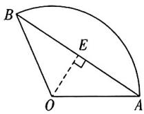

因为 $OA = OB$ ，则 $\angle AOE = \frac{1}{2}\angle AOB = \frac{1}{2}\times 2 = 1,$

所以 $AB = 2AE = 2OA\sin 1 = 3\sin 1.$ 故选A.

5. B 【解析】由 $(\sin\theta+\cos\theta)^{2} + (\sin\theta-\cos\theta)^{2}=2, \sin\theta-\cos\theta=\frac{\sqrt{5}}{5}$ ①，得 $(\sin\theta+\cos\theta)^{2}=\frac{9}{5}.$

而 $\theta \in \left(0, \frac{\pi}{2}\right)$ ，则 $\sin \theta > 0, \cos \theta > 0$ ，故 $\sin \theta + \cos \theta = \frac{3\sqrt{5}}{5} ②,$

由①②得 $\sin\theta=\frac{2\sqrt{5}}{5},\cos\theta=\frac{\sqrt{5}}{5}$ ，所以 $\tan\theta=\frac{\sin\theta}{\cos\theta}=2.$ 故选 B.

6. C 【解析】由已知得, $\sin(\pi-\alpha)-\cos(\pi+\alpha)=\sin\alpha+\cos\alpha=\frac{2}{3}$ ,

将上式两边平方得 $\left(\sin\alpha+\cos\alpha\right)^{2}=\sin^{2}\alpha+2\sin\alpha\cos\alpha+\cos^{2}\alpha=1+2\sin\alpha\cos\alpha=\frac{4}{9}$

$$
\therefore 2 \sin \alpha \cos \alpha = \frac {4}{9} - 1 = - \frac {5}{9},
$$

$$
\begin{array}{l} \therefore (\sin \alpha - \cos \alpha) ^ {2} = \sin^ {2} \alpha - 2 \sin \alpha \cos \alpha + \cos^ {2} \alpha = \\ 1 - 2 \sin \alpha \cos \alpha = \frac {1 4}{9}. \end{array}
$$

$$
\because \frac {\pi}{2} <   \alpha <   \pi , \therefore \sin \alpha > 0, \cos \alpha <   0,
$$

$$
\therefore \sin \alpha - \cos \alpha > 0,
$$

$$
\therefore \sin \alpha - \cos \alpha = \frac {\sqrt {1 4}}{3}.
$$

故选C.

7. D 【解析】由 $|\sqrt{3}\cos \alpha| = \sin \frac{\alpha}{2}$ ,

得 $3\cos^2\alpha = \sin^2\frac{\alpha}{2} = \frac{1 - \cos\alpha}{2},$

即 $6\cos^2\alpha + \cos \alpha - 1 = 0$

即 $(3\cos \alpha - 1)(2\cos \alpha + 1) = 0,$

解得 $\cos \alpha = \frac{1}{3}$ 或 $\cos \alpha = -\frac{1}{2}$ .

因为 $\alpha \in \left(0, \frac{2\pi}{3}\right)$ , 所以 $\cos \alpha = \frac{1}{3}$ ,

则 $\sin \alpha = \sqrt{1 - \cos^2\alpha} = \sqrt{1 - \frac{1}{9}} = \frac{2\sqrt{2}}{3},$

所以 $\tan \alpha = \frac{\sin \alpha}{\cos \alpha} = \frac{\frac{2\sqrt{2}}{3}}{\frac{1}{3}} = 2\sqrt{2}$ . 故选 D.

8. D 【解析】由诱导公式可得 $\sin\left(2\alpha+\frac{2023\pi}{2}\right)=-\cos2\alpha=\frac{2-\sqrt{3}}{4},$

由倍角公式有 $\cos 2\alpha = 2\cos^2\alpha - 1 = -\frac{2 - \sqrt{3}}{4}$ ,

所以 $\cos^2\alpha = \frac{2 + \sqrt{3}}{8} = \frac{(\sqrt{3} + 1)^2}{16}$ ，由 $\alpha$ 为锐角，得 $\cos \alpha = \frac{\sqrt{3} + 1}{4}$ 故选D.

9. D 【解析】 $S_{11}=\frac{11(a_{1}+a_{11})}{2}=11a_{6}=\frac{22}{3}\pi,$ 所以 $a_{6}=\frac{2}{3}\pi.$

因为 $\{b_{n}\}$ 为等比数列, $b_{5}\cdot b_{7}=b_{6}^{2}=\frac{\pi^{2}}{4}$ ，所以 $b_{6}=\pm\frac{1}{2}\pi.$

当 $b_{6} = \frac{1}{2}\pi$ 时， $\tan (a_{6} + b_{6}) = \tan \left(\frac{2}{3}\pi + \frac{1}{2}\pi\right) = \tan \frac{7}{6}\pi = \tan \frac{1}{6}\pi = \frac{\sqrt{3}}{3};$

当 $b_{6} = -\frac{1}{2}\pi$ 时， $\tan (a_6 + b_6) =$ $\tan \left(\frac{2}{3}\pi -\frac{1}{2}\pi\right) = \tan \frac{1}{6}\pi = \frac{\sqrt{3}}{3}.$

所以 $\tan (a_6 + b_6) = \frac{\sqrt{3}}{3}$ , 故选 D.

10. C 【解析】充分性: 若存在 $k \in Z$ 使得

$\alpha = k\pi +(-1)^k\beta$ ，当 $k$ 为偶数时，设 $k = 2n(n\in \mathbf{Z})$ ，则 $\alpha = 2n\pi +\beta$ ，则 $\sin \alpha =$ $\sin (2n\pi +\beta) = \sin \beta$ ；当 $k$ 为奇数时，设 $k =$ $2n + 1(n\in \mathbf{Z})$ ，则 $\alpha = (2n + 1)\pi -\beta = 2n\pi+$ （π-β），则 $\sin \alpha = \sin (2n\pi +\pi -\beta) = \sin (\pi-$ $\beta) = \sin \beta$ ，所以充分性成立.必要性：若 $\sin \alpha = \sin \beta$ ，则 $\alpha = 2n\pi +\beta$ 或 $\alpha = 2n\pi +\pi -\beta$ （ $n\in \mathbf{Z})$ ，即 $\alpha = k\pi +(-1)^k\beta (k\in \mathbf{Z})$ ，所以必要性成立.故选C.

# 关键点拨

此题在判断充分性时, 注意讨论 k 为偶数和 k 为奇数两种情况, 判断必要性时, 注意 $\alpha = 2n\pi + \beta$ 或 $\alpha = 2n\pi + \pi - \beta (n \in \mathbf{Z})$ 可以写成 $\alpha = k\pi + (-1)^{k}\beta (k \in \mathbf{Z})$ 的形式.

# 考点16 三角恒等变换

1. C 【解析】由已知等式, 得 $\sin \alpha \cos \beta + \sin \beta \cos \alpha + \cos \alpha \cos \beta - \sin \alpha \sin \beta = 2\sqrt{2} \times \frac{\sqrt{2}}{2} (\cos \alpha - \sin \alpha) \sin \beta$ , 整理得 $\sin \alpha \cos \beta - \sin \beta \cos \alpha + \cos \alpha \cos \beta + \sin \alpha \sin \beta = 0$ , 即 $\sin (\alpha - \beta) + \cos (\alpha - \beta) = 0$ , 所以 $\tan (\alpha - \beta) = -1$ , 故选 C.

# 一题多解

(特殊值法)令 $\beta=0$ ，则由已知等式，得 $\sin\alpha+\cos\alpha=0$ ，取 $\alpha=\frac{3\pi}{4}$ ，得 $\tan(\alpha-\beta)=\tan(\alpha+\beta)=-1$ ，故排除 A，B；令 $\alpha=0$ ，则由已知等式，得 $\sin\beta+\cos\beta=2\sin\beta$ ，即 $\sin\beta=\cos\beta$ ，取 $\beta=\frac{\pi}{4}$ ，则 $\tan(\alpha-\beta)=-1$ ， $\tan(\alpha+\beta)=1$ ，故排除 D。故选 C。

2.A 【解析】由题意可得 $\frac{\sin\alpha(1 - \sin 2\alpha)}{\sin\alpha - \cos\alpha}$

$$
\begin{array}{l} = \frac {\sin \alpha (\sin^ {2} \alpha + \cos^ {2} \alpha - 2 \sin \alpha \cos \alpha)}{\sin \alpha - \cos \alpha} \\ = \frac {\sin \alpha (\sin \alpha - \cos \alpha) ^ {2}}{\sin \alpha - \cos \alpha} \\ = \sin \alpha (\sin \alpha - \cos \alpha) = \frac {\sin^ {2} \alpha - \sin \alpha \cos \alpha}{\sin^ {2} \alpha + \cos^ {2} \alpha} \\ = \frac {\tan^ {2} \alpha - \tan \alpha}{1 + \tan^ {2} \alpha} = \frac {2}{5}, \\ \end{array}
$$

解得 $\tan \alpha = 2$ 或 $\tan \alpha = -\frac{1}{3}$ .

因为 $\alpha$ 是直角三角形中较大的锐角, 所以 $\frac{\pi}{4}<\alpha<\frac{\pi}{2}$ ,

所以 $\tan \alpha = 2, \cos \alpha = \sqrt{\cos^2\alpha} = \sqrt{\frac{\cos^2\alpha}{\sin^2\alpha + \cos^2\alpha}} = \frac{1}{\sqrt{1 + \tan^2\alpha}} = \frac{\sqrt{5}}{5},$

所以 $\sin \alpha = \tan \alpha \cdot \cos \alpha = \frac{2\sqrt{5}}{5}$

又直角三角形的直角边分别为 $a\sin \alpha$ ， $a\cos \alpha$ ，则 $b = a\sin \alpha - a\cos \alpha$

所以 $\frac{b}{a} = \sin \alpha -\cos \alpha = \frac{2\sqrt{5}}{5} -\frac{\sqrt{5}}{5} = \frac{\sqrt{5}}{5}.$

3. $\frac{1}{2}$ 【解析】 $\sin 21^{\circ} \cos 9^{\circ} + \sin 69^{\circ} \sin 9^{\circ} = \sin 21^{\circ} \cos 9^{\circ} + \sin (90^{\circ} - 21^{\circ}) \sin 9^{\circ} = \sin 21^{\circ} \cos 9^{\circ} + \cos 21^{\circ} \sin 9^{\circ} = \sin (21^{\circ} + 9^{\circ}) = \sin 30^{\circ} = \frac{1}{2}$ .

4. D 【解析】因为 $\cos\alpha=1-2\sin^{2}\frac{\alpha}{2}$ , $\cos\alpha=\frac{1+\sqrt{5}}{4}$ ，所以 $\sin^{2}\frac{\alpha}{2}=\frac{3-\sqrt{5}}{8}$ . 又因为 $\alpha$ 为锐角, 所以 $\frac{\alpha}{2}$ 为锐角, 则 $\sin\frac{\alpha}{2}=\sqrt{\frac{3-\sqrt{5}}{8}}=\sqrt{\frac{6-2\sqrt{5}}{16}}=\sqrt{\left(\frac{\sqrt{5}-1}{4}\right)^{2}}=\frac{\sqrt{5}-1}{4}$ , 故选D.

5. B 【解析】由 $\sin\theta+\sin\left(\theta+\frac{\pi}{3}\right)=\sin\theta+$

$$
\frac {1}{2} \sin \theta + \frac {\sqrt {3}}{2} \cos \theta = \frac {3}{2} \sin \theta + \frac {\sqrt {3}}{2} \cos \theta =
$$

$\sqrt{3}\sin \left(\theta +\frac{\pi}{6}\right) = 1$ ，得 $\sin \left(\theta +\frac{\pi}{6}\right) = \frac{\sqrt{3}}{3}$ 所

$$
\text { 以 } \cos \left(\theta - \frac {\pi}{3}\right) = \cos \left[ \left(\theta + \frac {\pi}{6}\right) - \frac {\pi}{2} \right] =
$$

$$
\sin \left(\theta + \frac {\pi}{6}\right) = \frac {\sqrt {3}}{3}.
$$

6. BCD 【解析】对于 A 选项, $\cos^{2}75^{\circ}-\sin^{2}75^{\circ}=\cos150^{\circ}=\cos(180^{\circ}-30^{\circ})=-\cos30^{\circ}=-\frac{\sqrt{3}}{2}$ ;

对于B选项， $\frac{\tan 15^{\circ}}{1 + \tan^{2}15^{\circ}} = \frac{\frac{\sin 15^{\circ}}{\cos 15^{\circ}}}{1 + \frac{\sin^{2}15^{\circ}}{\cos^{2}15^{\circ}}} =$

$$
\frac {\sin 1 5 ^ {\circ} \cos 1 5 ^ {\circ}}{\cos^ {2} 1 5 ^ {\circ} + \sin^ {2} 1 5 ^ {\circ}} = \frac {1}{2} \sin 3 0 ^ {\circ} = \frac {1}{4};
$$

对于 C 选项，cos $36^{\circ}$ cos $72^{\circ} =$

$$
\frac {\sin 3 6 ^ {\circ} \cos 3 6 ^ {\circ} \cos 7 2 ^ {\circ}}{\sin 3 6 ^ {\circ}} = \frac {\frac {1}{2} \sin 7 2 ^ {\circ} \cos 7 2 ^ {\circ}}{\sin (1 8 0 ^ {\circ} - 1 4 4 ^ {\circ})} =
$$

$$
\frac {1}{4} \cdot \frac {\sin 1 4 4 ^ {\circ}}{\sin 1 4 4 ^ {\circ}} = \frac {1}{4};
$$

对于 D 选项, $2\cos 20^{\circ}\cos 40^{\circ}\cos 80^{\circ}$

$$
= \frac {2 \cos 2 0 ^ {\circ} \sin 2 0 ^ {\circ} \cos 4 0 ^ {\circ} \cos 8 0 ^ {\circ}}{\sin 2 0 ^ {\circ}}
$$

$$
= \frac {\sin 4 0 ^ {\circ} \cos 4 0 ^ {\circ} \cos 8 0 ^ {\circ}}{\sin 2 0 ^ {\circ}}
$$

$$
= \frac {\frac {1}{2} \sin 8 0 ^ {\circ} \cos 8 0 ^ {\circ}}{\sin (1 8 0 ^ {\circ} - 1 6 0 ^ {\circ})} = \frac {1}{4} \cdot \frac {\sin 1 6 0 ^ {\circ}}{\sin 1 6 0 ^ {\circ}} = \frac {1}{4}.
$$

7. B 【解析】因为 $\alpha\in(0,\pi)$ ，所以 $\alpha+\frac{\pi}{3}\in\left(\frac{\pi}{3},\frac{4\pi}{3}\right)$ ，又 $\sin\left(\alpha+\frac{\pi}{3}\right)=\frac{1}{3}<\frac{\sqrt{3}}{2}=\sin\frac{\pi}{3}$ ,

所以 $\alpha +\frac{\pi}{3}\in \left(\frac{2\pi}{3},\pi\right)$

所以 $\cos \left(\alpha +\frac{\pi}{3}\right) = \frac{-2\sqrt{2}}{3}.$

因为 $\cos\left(\beta-\frac{\pi}{6}\right)=\frac{\sqrt{6}}{6}$ ，所以 $\cos\left[2\left(\beta-\frac{\pi}{6}\right)\right]=2\cos^{2}\left(\beta-\frac{\pi}{6}\right)-1=-\frac{2}{3}.$

又 $\beta \in \left(-\frac{\pi}{2}, \frac{\pi}{2}\right)$ ，所以 $\beta - \frac{\pi}{6} \in \left(-\frac{2\pi}{3}, \frac{\pi}{3}\right)$ ，结合 $\cos \left(\beta - \frac{\pi}{6}\right) = \frac{\sqrt{6}}{6} < \frac{1}{2} = \cos \frac{\pi}{3}$ ，则 $\beta - \frac{\pi}{6} \in \left(-\frac{\pi}{2}, -\frac{\pi}{3}\right)$ ，得 $\sin \left(\beta - \frac{\pi}{6}\right) = -\frac{\sqrt{30}}{6}$ ，则 $\sin \left[2\left(\beta - \frac{\pi}{6}\right)\right] = 2\cos \left(\beta - \frac{\pi}{6}\right)\sin \left(\beta - \frac{\pi}{6}\right) = -\frac{\sqrt{5}}{3}$ .

又 $\alpha + 2\beta = \alpha + \frac{\pi}{3} + 2\left(\beta - \frac{\pi}{6}\right)$ ,

所以 $\sin (\alpha + 2\beta) = \sin \left( \alpha + \frac{\pi}{3} \right) \cos \left[ 2 \left( \beta - \frac{\pi}{6} \right) \right] + \cos \left( \alpha + \frac{\pi}{3} \right) \sin \left[ 2 \left( \beta - \frac{\pi}{6} \right) \right] = \frac{1}{3} \times \left( -\frac{2}{3} \right) + \left( \frac{-2\sqrt{2}}{3} \right) \times \left( -\frac{\sqrt{5}}{3} \right) = \frac{2\sqrt{10} - 2}{9}$ . 故选 B.

8. AC 【解析】因为 $\cos(\alpha+\beta)=-\frac{\sqrt{5}}{5}$ , $\cos2\alpha=-\frac{4}{5}(\alpha,\beta$ 为锐角），

故 $\sin 2\alpha = \sqrt{1 - \cos^2 2\alpha} = \frac{3}{5}$ ，故A正确；

因为 $\sin (\alpha +\beta) = \sqrt{1 - \cos^2(\alpha + \beta)} = \frac{2\sqrt{5}}{5},$

所以 $\cos (\alpha -\beta) = \cos [2\alpha -(\alpha +\beta)]$

$$
= \cos 2 \alpha \cos (\alpha + \beta) + \sin 2 \alpha \sin (\alpha + \beta)
$$

$= \left(-\frac{4}{5}\right)\times \left(-\frac{\sqrt{5}}{5}\right) + \frac{3}{5}\times \frac{2\sqrt{5}}{5} = \frac{2\sqrt{5}}{5},$ 故B错误；

由 $\cos(\alpha-\beta)=\cos\alpha\cos\beta+\sin\alpha\sin\beta=$ $\frac{2\sqrt{5}}{5}$ ,

$$
\cos (\alpha + \beta) = \cos \alpha \cos \beta - \sin \alpha \sin \beta = - \frac {\sqrt {5}}{5},
$$

故 $\cos \alpha \cos \beta = \frac{1}{2} [\cos (\alpha +\beta) + \cos (\alpha -$ $\beta)] = \frac{1}{2}\times \left(-\frac{\sqrt{5}}{5} +\frac{2\sqrt{5}}{5}\right) = \frac{\sqrt{5}}{10},$ 故C正确；

因为 $\sin \alpha \sin \beta = \frac{1}{2} [\cos (\alpha -\beta) - \cos (\alpha +$ $\beta)] = \frac{1}{2}\times \left[\frac{2\sqrt{5}}{5} -\left(-\frac{\sqrt{5}}{5}\right)\right] = \frac{3\sqrt{5}}{10}$ ，所以 $\tan \alpha \tan \beta = 3$ ，故 $\mathbf{D}$ 错误.

故选AC.

9. ACD 【解析】对于 A, 由题意, $A, B \in \left(0, \frac{\pi}{2}\right)$ , $A + B < \frac{\pi}{2}$ , 则 $A < \frac{\pi}{2} - B \in \left(0, \frac{\pi}{2}\right)$ ,

所以 $\sin A < \sin \left( \frac{\pi}{2} - B \right) = \cos B$ ，故A正确；

对于 B, $\sin C = \sin (A + B) = \sin A \cos B + \cos A \sin B,$

因为 $A, B \in \left(0, \frac{\pi}{2}\right)$ , 所以 $\cos A \in (0, 1)$ , $\cos B \in (0, 1)$ ,

所以 $\sin C = \sin A\cos B + \cos A\sin B <   \sin A+$ $\sin B$ ，故B错误；

对于 $C, \tan C = \tan [\pi - (A + B)] = -\tan (A + B) = -\frac{\tan A + \tan B}{1 - \tan A \tan B}$ ,

所以 $\tan A + \tan B = -\tan C + \tan A\tan B\tan C,$ 所以 $\tan A + \tan B + \tan C = \tan A\tan B\tan C,$

又 $A, B \in \left(0, \frac{\pi}{2}\right), C \in \left(\frac{\pi}{2}, \pi\right)$ ，所以 $\tan A > 0, \tan B > 0, \tan C < 0,$

所以 $\tan A + \tan B + \tan C = \tan A\tan B\tan C< 0$ ，故C正确；

对于 D, 因为 $A < \frac{\pi}{2} - B \in \left(0, \frac{\pi}{2}\right)$ , 所以 0 <

$\tan A < \tan \left( \frac{\pi}{2} - B \right) = \frac{\sin \left( \frac{\pi}{2} - B \right)}{\cos \left( \frac{\pi}{2} - B \right)} = \frac{\cos B}{\sin B} = \frac{1}{\tan B},$

所以 $\tan A\tan B < 1$ ，故D正确.故选ACD

10. 1 $-\sqrt{2}$ 【解析】依题意得 $f\left(\frac{\pi}{3}\right)=A\times\frac{\sqrt{3}}{2}-\sqrt{3}\times\frac{1}{2}=0$ ，解得 A=1。所以 $f(x)=\sin x-\sqrt{3}\cos x=2\sin\left(x-\frac{\pi}{3}\right)$ ，所以 $f\left(\frac{\pi}{12}\right)=2\sin\left(\frac{\pi}{12}-\frac{\pi}{3}\right)=-\sqrt{2}$ 。

# 考点17 三角函数的图象与性质

1. D 【解析】由 $\cos\left(x-\frac{\pi}{3}\right)>0$ ，得 $-\frac{\pi}{2}+2k\pi<x-\frac{\pi}{3}<\frac{\pi}{2}+2k\pi(k\in\mathbf{Z})$ ,

解得 $-\frac{\pi}{6}+2k\pi<x<\frac{5\pi}{6}+2k\pi(k\in\mathbf{Z})$ ，所以 $f(x)$ 的定义域为 $\left(-\frac{\pi}{6}+2k\pi,\frac{5\pi}{6}+2k\pi\right)$ $(k \in \mathbb{Z})$ .

由复合函数的单调性可知， $f(x)$ 的单调递

增区间即为函数 $y = \cos \left(x - \frac{\pi}{3}\right)$ 在区间 $\left(-\frac{\pi}{6} + 2k\pi, \frac{5\pi}{6} + 2k\pi\right) (k \in \mathbf{Z})$ 上的单调递减区间.

令 $2k\pi < x - \frac{\pi}{3} < \frac{\pi}{2} + 2k\pi (k \in \mathbf{Z})$ ，解得 $\frac{\pi}{3} + 2k\pi < x < \frac{5\pi}{6} + 2k\pi (k \in \mathbf{Z})$ ，

所以 $f(x)$ 的单调递增区间为 $\left(\frac{\pi}{3} + 2k\pi, \right.$

$\left.\frac{5\pi}{6}+2k\pi\right)(k\in\mathbf{Z})$ . 故选 D.

2. C 【解析】由二倍角公式可知 $f(x)=\cos^{2}x-\sin^{2}x=\cos2x.$

对于A选项，因为 $x\in \left(-\frac{\pi}{2}, - \frac{\pi}{6}\right)$ ，所以 $2x\in \left(-\pi , - \frac{\pi}{3}\right)$ ，故函数 $f(x) = \cos 2x$ 在 $\left(-\frac{\pi}{2}, - \frac{\pi}{6}\right)$ 上单调递增，所以A选项不

正确；

对于 B 选项, 因为 $x \in \left(-\frac{\pi}{4}, \frac{\pi}{12}\right)$ , 所以 $2x \in \left(-\frac{\pi}{2}, \frac{\pi}{6}\right)$ , 故函数 $f(x) = \cos 2x$ 在 $\left(-\frac{\pi}{4}, \frac{\pi}{12}\right)$ 上不单调, 所以 B 选项不正确;

对于 C 选项, 因为 $x \in \left(0, \frac{\pi}{3}\right)$ , 所以 $2x \in \left(0, \frac{2\pi}{3}\right)$ , 故函数 $f(x) = \cos 2x$ 在 $\left(0, \frac{\pi}{3}\right)$ 上单调递减, 所以 C 选项正确;

对于 D 选项, 因为 $x \in \left(\frac{\pi}{4}, \frac{7\pi}{12}\right)$ , 所以 $2x \in \left(\frac{\pi}{2}, \frac{7\pi}{6}\right)$ , 故函数 $f(x) = \cos 2x$ 在 $\left(\frac{\pi}{4}, \frac{7\pi}{12}\right)$ 上不单调, 所以 D 选项不正确.
故选 C.

# 一题多解

由二倍角公式可知 $f(x) = \cos^2 x - \sin^2 x = \cos 2x$ 。对于A选项，因为 $f\left(-\frac{\pi}{3}\right) = \cos \left(-\frac{2\pi}{3}\right) = -\frac{1}{2}, f\left(-\frac{\pi}{4}\right) = \cos \left(-\frac{\pi}{2}\right) = 0$ ，所以 $f\left(-\frac{\pi}{3}\right) < f\left(-\frac{\pi}{4}\right)$ ，所以A选项不正确；对于B选项，因为 $f(0) = 1, f\left(\frac{\pi}{24}\right) = \cos \frac{\pi}{12} < 1$ ，所以 $f(0) > f\left(\frac{\pi}{24}\right)$ ，所以B选项不正确；对于D选项，因为 $f\left(\frac{\pi}{3}\right) = \cos \frac{2\pi}{3} = -\frac{1}{2}, f\left(\frac{\pi}{2}\right) = \cos \pi = -1$ ，所以 $f\left(\frac{\pi}{3}\right) > f\left(\frac{\pi}{2}\right)$ ，所以D选项不正确。故选C.

3. A 【解析】因为 $x \in [-m, m]$ ，则 $m > 0$ ，所以 $2x + \frac{\pi}{3} \in \left[-2m + \frac{\pi}{3}, 2m + \frac{\pi}{3}\right]$ ，

又函数 $f(x) = \sin \left(2x + \frac{\pi}{3}\right)$ 在 $[-m, m]$ 上单调递增，

所以 $\left[-2m + \frac{\pi}{3}, 2m + \frac{\pi}{3}\right] \subseteq \left[-\frac{\pi}{2} + 2k\pi, \frac{\pi}{2} + 2k\pi\right], k \in \mathbf{Z}$ ,

则 $\left\{ \begin{array}{ll} - 2m + \frac{\pi}{3}\geqslant -\frac{\pi}{2} +2k\pi ,\\ k & \in \mathbf{Z}\\ 2m + \frac{\pi}{3}\leqslant \frac{\pi}{2} +2k\pi , \end{array} \right.$

$\left\{ \begin{array}{l}m\leqslant \frac{5\pi}{12} -k\pi ,\\ k\in \mathbf{Z}. \end{array} \right.$ 又 $m > 0$ ， $m\leqslant \frac{\pi}{12} +k\pi ,$

故 $0 < m \leqslant \frac{\pi}{12}$ , 所以实数 $m$ 的最大值为 $\frac{\pi}{12}$ . 故选A.

4. D 【解析】因为函数 $f(x) = \sin \left( \omega x - \frac{\pi}{3} \right) (\omega > 0)$ 在 $\left[0, \frac{5\pi}{12}\right]$ 上单调递增，在 $\left[\frac{5\pi}{12}, \frac{5\pi}{6}\right]$ 上单调递减，

所以 $\left\{\begin{aligned}\frac{5\pi}{12}\omega-\frac{\pi}{3}&=2k\pi+\frac{\pi}{2},k\in\mathbf{Z},\\\frac{\pi}{\omega}&\geqslant\frac{5\pi}{12},\end{aligned}\right.$ 即

$\left\{ \begin{array}{l} \omega = \frac{24k}{5} + 2, k \in \mathbf{Z}, \\ 0 < \omega \leqslant \frac{12}{5}, \end{array} \right.$ 解得 $\omega = 2$ .

由题意， $g(x) = \sin \left[2(x + \varphi) - \frac{\pi}{3}\right] =$ $\sin \left(2x + 2\varphi -\frac{\pi}{3}\right),$

因为函数 $g(x)$ 为偶函数, 所以 $2\varphi - \frac{\pi}{3} = n\pi + \frac{\pi}{2}, n \in Z$ , 又 $0 < \varphi < \frac{\pi}{2}$ , 所以 $\varphi = \frac{5\pi}{12}$ .
故选 D.

5. AD 【解析】因为函数 $f(x)$ 的图象关于点 $\left(\frac{2\pi}{3},0\right)$ 中心对称，所以 $\sin \left(2\times \frac{2\pi}{3} +\varphi\right) = 0,$ 则 $\frac{4\pi}{3}+\varphi=k\pi(k\in\mathbf{Z})$ ，结合 $0<\varphi<\pi$ ，得

$\varphi=\frac{2\pi}{3}$ ，所以 $f(x)=\sin\left(2x+\frac{2\pi}{3}\right)$ .

对于 A, 由 $2k\pi + \frac{\pi}{2} \leqslant 2x + \frac{2\pi}{3} \leqslant 2k\pi + \frac{3\pi}{2}$ ( $k \in \mathbf{Z}$ ), 得 $k\pi - \frac{\pi}{12} \leqslant x \leqslant k\pi + \frac{5\pi}{12}(k \in \mathbf{Z})$ , 当 $k = 0$ 时, $-\frac{\pi}{12} \leqslant x \leqslant \frac{5\pi}{12}$ . 因为 $\left(0, \frac{5\pi}{12}\right) \subseteq \left[-\frac{\pi}{12}, \frac{5\pi}{12}\right]$ , 所以函数 $f(x)$ 在区间 $\left(0, \frac{5\pi}{12}\right)$ 单调递减, 故 A 正确.

对于 B, 由 $2x + \frac{2\pi}{3} = k\pi + \frac{\pi}{2} (k \in \mathbf{Z})$ , 得 $x = \frac{k\pi}{2} - \frac{\pi}{12} (k \in \mathbf{Z})$ , 当 k = 0 时, $x = -\frac{\pi}{12}$ ; 当 k = 1 时, $x = \frac{5\pi}{12}$ ; 当 k = 2 时, $x = \frac{11\pi}{12}$ , 所以函数 $f(x)$ 在区间 $\left(-\frac{\pi}{12}, \frac{11\pi}{12}\right)$ 只有一个极值点, 故 B 不正确.

对于 C, 由选项 B 的分析知, 函数 $f(x)$ 图象的对称轴方程为 $x=\frac{k\pi}{2}-\frac{\pi}{12}(k\in\mathbf{Z})$ , 而方程 $\frac{k\pi}{2}-\frac{\pi}{12}=\frac{7\pi}{6}(k\in\mathbf{Z})$ 无解, 故 C 不正确.

（另解：因为 $f\left(\frac{7\pi}{6}\right) = \sin \left(2\times \frac{7\pi}{6} +\frac{2\pi}{3}\right) =$ $\sin 3\pi = 0$ ，所以直线 $x = \frac{7\pi}{6}$ 不是曲线 $y =$ $f(x)$ 的对称轴，故C不正确）

对于 D, $f'(x)=2\cos\left(2x+\frac{2\pi}{3}\right)$ ，若直线 $y=\frac{\sqrt{3}}{2}-x$ 为曲线 $y=f(x)$ 的切线，则由 $2\cos\left(2x+\frac{2\pi}{3}\right)=-1$ 得 $2x+\frac{2\pi}{3}=2k\pi+\frac{2\pi}{3}$ $(k\in\mathbf{Z})$ 或 $2x+\frac{2\pi}{3}=2k\pi+\frac{4\pi}{3}(k\in\mathbf{Z})$ ，所以 $x=k\pi(k\in\mathbf{Z})$ 或 $x=k\pi+\frac{\pi}{3}(k\in\mathbf{Z})$ 。当 $x=k\pi(k\in\mathbf{Z})$ 时， $f(x)=\frac{\sqrt{3}}{2}$ ，则由 $\frac{\sqrt{3}}{2}=$ $\frac{\sqrt{3}}{2}-k\pi(k\in\mathbf{Z})$ ，解得 k=0；当 $x=k\pi+\frac{\pi}{3}$

$(k \in \mathbf{Z})$ 时， $f(x) = -\frac{\sqrt{3}}{2}$ ，方程 $-\frac{\sqrt{3}}{2} = \frac{\sqrt{3}}{2} - k\pi - \frac{\pi}{3} (k \in \mathbf{Z})$ 无解。综上所述，直线 $y = \frac{\sqrt{3}}{2} - x$ 为曲线 $y = f(x)$ 的切线，故 D 正确。故选 AD.

6. A 【解析】已知 $\alpha \in \left(\frac{\pi}{4}, \frac{\pi}{2}\right)$ ，则 $0 < \cos \alpha < \sin \alpha < 1$ .

因为关于 $x$ 的函数 $y = (\cos \alpha)^x$ 在(0,1)上单调递减，所以 $c = (\cos \alpha)^{\cos \alpha} > (\cos \alpha)^{\sin \alpha} = a;$

因为幂函数 $y=x^{\cos\alpha}$ 在 $(0,1)$ 上单调递增，
所以 $c = (\cos \alpha)^{\cos \alpha} < (\sin \alpha)^{\cos \alpha} = b.$ 故
b>c>a.

7. $[-2, 1]$ 【解析】因为函数 $f(x) = 2\sin \left(\omega x - \frac{\pi}{4} + \varphi\right)$ 的图象的相邻两条对称轴间的距离为 $\frac{\pi}{2}$ , 所以函数 $f(x)$ 的最小正周期为 $2 \times \frac{\pi}{2} = \pi$ , 则 $\frac{2\pi}{\omega} = \pi$ , 解得 $\omega = 2$ , 所以 $f(x) = 2\sin \left(2x - \frac{\pi}{4} + \varphi\right)$ . 又 $f(x)$ 为偶函数, 所以 $-\frac{\pi}{4} + \varphi = \frac{\pi}{2} + k\pi, k \in \mathbf{Z}$ ,

解得 $\varphi = \frac{3\pi}{4} + k\pi, k \in \mathbf{Z}$ , 因为 $|\varphi| < \frac{\pi}{2}$ , 所以 $\varphi = -\frac{\pi}{4}$ ,

故 $f(x) = \sin \left(2x - \frac{\pi}{4} -\frac{\pi}{4}\right) = 2\sin \left(2x-\right.$ $\frac{\pi}{2}\Bigg) = -2\cos 2x.$

因为 $x \in \left[-\frac{\pi}{6}, \frac{\pi}{3}\right]$ , 所以 $2x \in \left[-\frac{\pi}{3}, \frac{2\pi}{3}\right]$ ,

所以 $\cos 2x \in \left[-\frac{1}{2}, 1\right]$ ，所以 $= 2\cos 2x \in [-2, 1]$ ，故 $f(x)$ 在区间 $\left[-\frac{\pi}{6}, \frac{\pi}{3}\right]$ 上的值域为 $[-2, 1]$ .

8. D 【解析】因为 $y = 2\sin\left(3x + \frac{\pi}{5}\right) = 2\sin3\left(x + \frac{\pi}{15}\right)$ ，所以为了得到函数 $y = 2\sin3x$ 的图象，只要把函数 $y = 2\sin\left(3x + \frac{\pi}{5}\right)$ 图象上所有的点向右平移 $\frac{\pi}{15}$ 个单位长度即可。故选 D.

9. B 【解析】由题意可得 $g(x)=2\sin\left[2(x-\varphi)+\frac{\pi}{6}\right]=2\sin\left(2x-2\varphi+\frac{\pi}{6}\right)$ ,
因为 $g(x)$ 是偶函数, 所以 $-2\varphi + \frac{\pi}{6} = k\pi + \frac{\pi}{2}(k \in \mathbf{Z})$ , 解得 $\varphi = -\frac{k\pi}{2} - \frac{\pi}{6}(k \in \mathbf{Z})$ .
因为 $\varphi > 0$ ，所以当 k = -1 时， $\varphi$ 取得最小值，最小值是 $\frac{\pi}{3}$ . 故选 B.

10. BD 【解析】 $f(x+6\pi)=\left|\sin\left(\frac{x}{3}+\right.\right.$ $2\pi)\left|+\cos\left(\frac{x}{3}+2\pi+\frac{\pi}{6}\right)=\right.$ $\left|\sin\frac{x}{3}\right|+\cos\left(\frac{x}{3}+\frac{\pi}{6}\right)=f(x).$

当 $x \in [0, 3\pi]$ 时，

$$
\begin{array}{l} {f (x) = \sin \frac {x}{3} + \cos \left(\frac {x}{3} + \frac {\pi}{6}\right) = \frac {1}{2} \sin \frac {x}{3} +} \\ {\frac {\sqrt {3}}{2} \cos \frac {x}{3} = \sin \left(\frac {x}{3} + \frac {\pi}{3}\right);} \end{array}
$$

当 $x \in (3\pi, 6\pi]$ 时，

$$
\begin{array}{l} f (x) = - \sin \frac {x}{3} + \cos \left(\frac {x}{3} + \frac {\pi}{6}\right) = \\ - \frac {3}{2} \sin \frac {x}{3} + \frac {\sqrt {3}}{2} \cos \frac {x}{3} = \sqrt {3} \cos \left(\frac {x}{3} + \frac {\pi}{3}\right). \\ \end{array}
$$

作出函数 $f(x)$ 的部分图象如图所示，

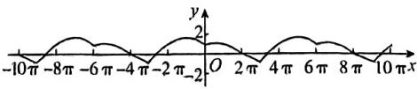

text_image

-10π -8π -6π -4π -2π -2
O 2π 4π 6π 8π 10πx

由 $f(x+6\pi)=f(x)$ 可知, 函数 $f(x)$ 的最小正周期为 $6\pi$ , 故A错误;

由 $f(x) = \sqrt{3}\cos \left(\frac{x}{3} +\frac{\pi}{3}\right)(x\in (3\pi ,$ $6\pi ])$ ，可知函数 $f(x)$ 的最大值为 $\sqrt{3}$ ，故B正确；

观察图象可知函数 $f(x)$ 在 $[5\pi, 7\pi]$ 上先单调递减，再单调递增，再单调递减，故C错误；

观察图象可知 $f(x)$ 的图象与 $x$ 轴在 $[-4\pi, 4\pi]$ 上有4个交点，故D正确.

故选BD.

11. $-\sqrt{3}$ 【解析】设函数 $f(x)$ 的最小正周期为 $T$ .

由图象知 $\frac{3}{4} T = \frac{13\pi}{12} -\frac{\pi}{3} = \frac{3\pi}{4}$ 所以 $T =$ $\pi = \frac{2\pi}{|\omega|}$ ，解得 $\omega = \pm 2.$ 当 $\omega = 2$ 时，由点 $\left(\frac{\pi}{3},0\right)$ 在 $f(x)$ 的图象上得 $2\times \frac{\pi}{3} +\varphi =$ $\frac{\pi}{2} +2k\pi (k\in \mathbf{Z})$ ，解得 $\varphi = -\frac{\pi}{6} +2k\pi (k\in$ $\mathbf{Z})$ ，所以 $f(x) = 2\cos \left(2x + 2k\pi -\frac{\pi}{6}\right) =$ $2\cos \left(2x - \frac{\pi}{6}\right)$ ；同理，当 $\omega = -2$ 时， $f(x) = 2\cos \left(2x - \frac{\pi}{6}\right)$ ，所以 $f\left(\frac{\pi}{2}\right) =$ $2\cos \left(2\times \frac{\pi}{2} -\frac{\pi}{6}\right) = 2\cos \frac{5\pi}{6} = -\sqrt{3}.$

# 方法速记

已知正弦型(或余弦型)函数 $y=A\sin(\omega x+\varphi)+B$ （或 $y=A\cos(\omega x+\varphi)+B$ ） $(A>0,\omega>0)$ 的图象求解析式的步骤：(1) $A=\frac{y_{\max}-y_{\min}}{2},B=\frac{y_{\max}+y_{\min}}{2};(2)$ 由函数的周期T和 $\omega=\frac{2\pi}{T}$ 求 $\omega;$ (3)利用图象中已知特殊点的坐标求 $\varphi.$

# 快解

找相位,避开求解析式.

根据题意可知周期 $T = \pi$ 所以 $\frac{\pi}{2}$ 为 $\frac{\pi}{3}$ 后 $\frac{1}{6}$ 个周期，还原到 $y = \cos x$ 上相当于 $\frac{\pi}{2} + \frac{1}{6} \times 2\pi = \frac{5\pi}{6}$ .

所以 $f\left(\frac{\pi}{2}\right) = 2\cos \frac{5\pi}{6} = -\sqrt{3}.$

12. $-\frac{\sqrt{3}}{2}$

# 思路导引

A,B两点横、纵坐标关系→ω
图象与x,y轴交点→φ $\rightarrow f(x)\rightarrow f(\pi)$

【解析】设 $A\left(x_{1},\frac{1}{2}\right),B\left(x_{2},\frac{1}{2}\right)$ ，由五点

作图法可得 $\left\{ \begin{array}{l} \omega x_{1} + \varphi = \frac{\pi}{6},\\ \omega x_{2} + \varphi = \frac{5\pi}{6}, \end{array} \right.$ ②-①，得

$\omega(x_{2}-x_{1})=\frac{2\pi}{3}.$ 因为 $\left|AB\right|=\frac{\pi}{6}$ ，所以 $x_{2}-x_{1}=\frac{\pi}{6}$ ，所以 $\omega=4.$ 因为函数 $f(x)$ 的图象

经过点 $\left(\frac{2\pi}{3},0\right)$ ，所以 $f\left(\frac{2\pi}{3}\right) =$

$\sin \left(\frac{8\pi}{3} +\varphi\right) = 0$ ，所以 $\frac{8\pi}{3} +\varphi = 2k\pi ,k\in \mathbf{Z}$ ，解

得 $\varphi = -\frac{8\pi}{3} + 2k\pi, k \in \mathbf{Z}$ . 由题图可知 $-1 <$

$f(0) < 0$ ，即 $-1 < \sin \varphi < 0$ ，所以取 $k = 1$ ，则

$\varphi=-\frac{2\pi}{3}$ ，所以 $f(x)=\sin\left(4x-\frac{2\pi}{3}\right)$ ，所以

$f(\pi) = \sin \left(-\frac{2\pi}{3}\right) = -\frac{\sqrt{3}}{2}.$

13.【解】(1)由已知得 $y = \left[f\left(x + \frac{\pi}{2}\right)\right]^2 =$

$(\cos x - \sin x)^{2} = 1 - \sin 2x,$

故所求的最小正周期 $T=\pi$ .

(2) $y=f(x)\int\left(x-\frac{\pi}{4}\right)=\sqrt{2}(\sin x+\cos x)\cdot$

$\sin x = \sin \left( 2x - \frac{\pi}{4} \right) + \frac{\sqrt{2}}{2}$ ，因为 $x \in \left[0, \frac{\pi}{2}\right]$ ,

故当 $x = \frac{3\pi}{8}$ 时，函数 $y = f(x)f\left(x - \frac{\pi}{4}\right)$ 取最大值 $1 + \frac{\sqrt{2}}{2}$ .

14.【解】(1) 因为 $f(T)=f\left(\frac{2\pi}{\omega}\right)=2\cos(2\pi+$ $\varphi)=2\cos\varphi=1,$

所以 $\cos \varphi = \frac{1}{2}$ ，又因为 $0 < \varphi < \frac{\pi}{2}$ 所以 $\varphi = \frac{\pi}{3}$ ，则 $f(x) = 2\cos \left(\omega x + \frac{\pi}{3}\right)$

因为直线 $x = \frac{\pi}{6}$ 为 $f(x)$ 的图象的一条对称轴，所以 $\frac{\pi}{6}\omega +\frac{\pi}{3} = k\pi (k\in \mathbf{Z})$ ，即 $\omega = 6k - 2(k\in \mathbf{Z})$

所以 $f\left(\frac{\pi}{3}\right) = 2\cos \left[\frac{\pi}{3} (6k - 2) + \frac{\pi}{3}\right] =$ $2\cos \left(2k\pi -\frac{\pi}{3}\right) = 2\cos \frac{\pi}{3} = 1.$

(2)由 $\frac{\pi}{3}$ 为 $f(x)$ 的一个零点可知， $\frac{\pi}{3}\omega+$ $\varphi=k\pi+\frac{\pi}{2}(k\in\mathbb{Z}).$

因为 $f(x)$ 在区间 $(0, \pi)$ 上至多有两个零点，所以 $\omega \pi + \varphi \leqslant \frac{5\pi}{2}$ .

因为 $0<\varphi<\frac{\pi}{2}$ ，所以 $\omega\pi<\frac{5\pi}{2}$ ，则 $0<\omega<\frac{5}{2}$ ，
又因为 $\omega \in N^{*}$ ，所以 $\omega = 1$ 或 $\omega = 2$ .

①当 $\omega = 1$ 时，代入 $\frac{\pi}{3}\omega +\varphi = k\pi +\frac{\pi}{2} (k\in$ $\mathbf{Z})$ ，得 $\varphi = k\pi +\frac{\pi}{6} (k\in \mathbf{Z})$

因为 $0 < \varphi < \frac{\pi}{2}$ , 所以 $k = 0, \varphi = \frac{\pi}{6}$ , 此时 $f(x) = 2\cos \left( x + \frac{\pi}{6} \right)$ 在 $(0, \pi)$ 上只有一个零点, 符合题意;

②当 $\omega = 2$ 时，代入 $\frac{\pi}{3}\omega +\varphi = k\pi +\frac{\pi}{2} (k\in$ $\mathbf{Z})$ ，得 $\varphi = k\pi -\frac{\pi}{6} (k\in \mathbf{Z})$

因为 $0 < \varphi < \frac{\pi}{2}$ , 所以不符合题意.

综上, $\omega=1,T=\frac{2\pi}{\omega}=2\pi.$

# 专题6 三角函数中的 $\omega$ 的取值问题

1.A【解析】由题意得 $\omega x + \frac{\pi}{4}\in \left[\frac{\pi}{2}\omega^{+}\right.$

$\frac{\pi}{4}, \pi \omega + \frac{\pi}{4}$ , 则 $\left[\frac{\pi}{2} \omega + \frac{\pi}{4}, \pi \omega + \frac{\pi}{4}\right] \subseteq$

$\left[\frac{\pi}{2} + 2k\pi, \frac{3\pi}{2} + 2k\pi\right], k \in \mathbf{Z}$ . 由

$\left\{ \begin{array}{l} \frac{\pi}{2}\omega + \frac{\pi}{4} \geqslant \frac{\pi}{2} + 2k\pi, \\ \pi \omega + \frac{\pi}{4} \leqslant \frac{3\pi}{2} + 2k\pi, \end{array} \right.$ $k \in \mathbf{Z},$

得 $\left\{\begin{aligned}\omega&\geqslant\frac{1}{2}+4k,\\ &\quad k\in\mathbf{Z}.\\ \omega&\leqslant\frac{5}{4}+2k,\end{aligned}\right.$

当 $k = 0$ 时， $\frac{1}{2} \leqslant \omega \leqslant \frac{5}{4}$

当 $k \neq 0$ 时, 不符合题意.

故选A.

2. A 【解析】函数 $f(x) = \cos \left( \omega x + \frac{\pi}{3} \right) (\omega <$

0) 的最小正周期 $T = \frac{2\pi}{|\omega|}$ , 所以 $\pi - \frac{\pi}{2} \leqslant \frac{1}{2} \times \frac{2\pi}{|\omega|}$ , 即 $-2 \leqslant \omega < 0$ .

当 $x \in \left(\frac{\pi}{2}, \pi\right)$ 时， $\pi \omega + \frac{\pi}{3} < \omega x + \frac{\pi}{3} < \frac{\pi \omega}{2} + \frac{\pi}{3}$ ，

依题意知 $-\pi + 2k\pi \leqslant \omega \pi + \frac{\pi}{3} < \frac{\pi}{2}\omega + \frac{\pi}{3} \leqslant$

$2k\pi, k \in \mathbf{Z}$ ,

【提示】 $\omega < 0$

解得 $-\frac{4}{3} + 2k \leqslant \omega \leqslant -\frac{2}{3} + 4k, k \in \mathbf{Z}$ .

又 $-2\leqslant \omega < 0$

当 $k = 0$ 时成立， $\omega \in \left[-\frac{4}{3}, - \frac{2}{3}\right]$

故选A.

3. A 【解析】因为 $\omega > 0$ ，所以当 $0 < x < \frac{\pi}{2}$ 时，有 $\frac{\pi}{6} < \omega x + \frac{\pi}{6} < \frac{\pi}{2}\omega + \frac{\pi}{6}$ . 因为 $f(x)$ 在区间 $\left(0, \frac{\pi}{2}\right)$ 内有最大值，但无最小值，结合函数图象得 $\frac{\pi}{2} < \frac{\pi}{2}\omega + \frac{\pi}{6} \leqslant \frac{3\pi}{2}$ ,

解得 $\frac{2}{3} < \omega \leqslant \frac{8}{3}$ , 故选 A.

4. C 【解析】当 $x \in \left[0, \frac{\pi}{3}\right]$ 时， $\omega x - \frac{\pi}{12} \in \left[-\frac{\pi}{12}, \frac{\pi}{3}\omega - \frac{\pi}{12}\right]$ ，因为此时 $f(x)$ 的最小值为 $-\omega < 0$ ，

所以 $\frac{\pi}{3}\omega -\frac{\pi}{12} >\frac{\pi}{2}$ 即 $\omega >\frac{7}{4}$

若 $\frac{\pi}{3}\omega -\frac{\pi}{12}\geqslant \pi$ ，此时 $f(x)$ 能取到最小值-4，即 $\omega = 4$

代入可得 $\frac{\pi}{3} \times 4 - \frac{\pi}{12} > \pi$ ，满足要求；

若 $f(x)$ 取不到最小值-4，则需满足 $\frac{\pi}{3}\omega - \frac{\pi}{12} < \pi$ ，即 $\omega < \frac{13}{4}$ ，所以 $\frac{7}{4} < \omega < \frac{13}{4}$ ，

因为 $p(\omega) = 4\cos \left(\frac{\pi}{3}\omega -\frac{\pi}{12}\right)$ 在 $\omega \in \left(\frac{7}{4},$ $\frac{13}{4}\Big)$ 上单调递减，且此时 $p(\omega)\in (-4,$ 0)，所以存在唯一的 $\omega$ 符合题意.

所以 $\omega=4$ 或 $\omega\in\left(\frac{7}{4},\frac{13}{4}\right)$ ，所以所有满足条件的 $\omega$ 的积属于区间 (7,13)，故选 C.

5. A 【解析】由 $x_{1}=\frac{\pi}{4}, x_{2}=\frac{3\pi}{4}$ 是 $f(x)=$ $\sin \omega x (\omega > 0)$ 的两个相邻的极值点得其最小正周期 $T = 2 \times \left( \frac{3\pi}{4} - \frac{\pi}{4} \right) = \pi$ ，即 $\frac{2\pi}{\omega} = \pi$ ，
则 $\omega=2$ . 故选 A.

6. C 【解析】由题可知 $\frac{T}{2} < \frac{3\pi}{2} - \frac{\pi}{2} \leqslant \frac{3T}{2}$ , 又 $T = \frac{2\pi}{\omega}$ , 所以 $1 < \omega \leqslant 3$ .

因为 $\frac{\pi}{2}\omega +\frac{\pi}{5} <  \omega x + \frac{\pi}{5} <  \frac{3\pi}{2}\omega +\frac{\pi}{5},$

函数 $f(x) = \cos \left(\omega x + \frac{\pi}{5}\right)$ 在区间 $\left(\frac{\pi}{2},\frac{3\pi}{2}\right)$ 上恰有两个零点，

所以 $\left\{ \begin{array}{l} \frac{\pi}{2} \leqslant \frac{\pi}{2} \omega + \frac{\pi}{5} < \frac{3\pi}{2}, \\ \frac{5\pi}{2} < \frac{3\pi}{2} \omega + \frac{\pi}{5} \leqslant \frac{7\pi}{2} \end{array} \right.$

或 $\left\{\begin{aligned}\frac{3\pi}{2}&\leqslant\frac{\pi}{2}\omega+\frac{\pi}{5}<\frac{5\pi}{2},\\\frac{7\pi}{2}&<\frac{3\pi}{2}\omega+\frac{\pi}{5}\leqslant\frac{9\pi}{2},\end{aligned}\right.$

解得 $\frac{23}{15} < \omega \leqslant \frac{11}{5}$ 或 $\frac{13}{5} \leqslant \omega \leqslant \frac{43}{15}$ , 即 $\omega$ 的取

值范围为 $\left(\frac{23}{15},\frac{11}{5}\right]\cup \left[\frac{13}{5},\frac{43}{15}\right].$ 故选C.

7.3 【解析】由已知得 $f(T) = f\left(\frac{2\pi}{\omega}\right) =$ $\cos \left(\omega \cdot \frac{2\pi}{\omega} + \varphi\right) = \cos \varphi = \frac{\sqrt{3}}{2}$ . 又 $0 < \varphi < \pi$ ,

所以 $\varphi = \frac{\pi}{6}$ , 所以 $f(x) = \cos \left(\omega x + \frac{\pi}{6}\right)$ .

因为 $x = \frac{\pi}{9}$ 为 $f(x)$ 的零点, 所以 $\frac{\pi}{9}\omega +$ $\frac{\pi}{6} = \frac{\pi}{2} + k\pi, k \in \mathbb{Z},$

【提示】根据 $x = \frac{\pi}{9}$ 为 $f(x)$ 的零点求出 $\omega$ 取值的集合解得 $\omega = 9k + 3, k \in \mathbb{Z}$ . 又 $\omega > 0$ , 所以 $\omega$ 的最小值为3.

8.[2,3)【解析】令 $f(x)=\cos\omega x-1=0$ ，得 $\cos\omega x=1$ ，又 $x\in[0,2\pi]$ ，则 $\omega x\in[0,2\omega\pi]$ ，所以 $4\pi\leqslant2\omega\pi<6\pi$ ，解得 $2\leqslant\omega<3$ ，即 $\omega$ 的取值范围是[2,3).

# 一题多解

令 $f(x) = \cos \omega x - 1 = 0(\omega >0)$ ，得 $\cos \omega x = 1$ ，即 $\omega x = 2k\pi (\omega >0),k\in \mathbf{Z}$ ，解得 $x = \frac{2k\pi}{\omega} (\omega >0),k\in \mathbf{Z}.$ 因为 $f(x)$ 在区间[0, $2\pi ]$ 有且仅有3个零点，且 $f(0) = 0$ ，所以 $f(x)$ 的3个零点对应 $k =$ 0,1,2，所以 $f\left(\frac{2\pi}{\omega}\right) = f\left(\frac{4\pi}{\omega}\right) = 0$ 且 $\frac{4\pi}{\omega}\leqslant$ $2\pi < \frac{6\pi}{\omega}$ ，解得 $2\leqslant \omega < 3$ ，即 $\omega$ 的取值范围是[2,3).

9.【解】(1)由 $\frac{2\pi}{\omega}=\pi$ ,得 $\omega=2$ ,

所以 $f(x) = 2\sin \left[2\left(x - \frac{\pi}{6}\right) + \frac{\pi}{6}\right] =$

$2\sin \left(2x - \frac{\pi}{6}\right)$

令 $2x - \frac{\pi}{6} = k\pi +\frac{\pi}{2},k\in \mathbb{Z},$

解得 $x = \frac{k\pi}{2} +\frac{\pi}{3},k\in \mathbb{Z},$

取 $k = 0$ ，得 $x = \frac{\pi}{3}$ 取 $k = -1$ ，得 $x = -\frac{\pi}{6}$

因为 $\left|-\frac{\pi}{6}\right|<\left|\frac{\pi}{3}\right|$ ，所以 $f(x)$ 的图象与y轴距离最近的对称轴方程为 $x=-\frac{\pi}{6}$ .

(2) 由已知得 $f(x) = 2\sin \left[ \omega \left( x - \frac{\pi}{6} \right) + \frac{\pi}{6} \right] = 2\sin \left[ \omega x + \frac{(1 - \omega)\pi}{6} \right]$ ，令 $\omega x + \frac{(1 - \omega)\pi}{6} = k\pi, k \in \mathbb{Z}$ ，

解得 $x = \frac{6k + \omega - 1}{6\omega}\pi, k \in \mathbb{Z}$ .

因为 $f(x)$ 在 $\left[\frac{\pi}{2},\frac{3\pi}{2}\right]$ 上有且仅有一个零点，

所以 $\left\{ \begin{array}{l} \frac{\pi}{2} \leqslant \frac{6k + \omega - 1}{6\omega}\pi \leqslant \frac{3\pi}{2}, \\ \frac{6k + \omega - 7}{6\omega}\pi < \frac{\pi}{2}, \\ \frac{6k + \omega + 5}{6\omega}\pi > \frac{3\pi}{2}, \end{array} \right.$ $k \in \mathbf{Z}$ ,

所以 $\left\{ \begin{array}{l} \frac{6k - 1}{8} \leqslant \omega \leqslant \frac{6k - 1}{2}, \\ \frac{6k - 7}{2} < \omega < \frac{6k + 5}{8}, \end{array} \right.$ $k \in \mathbf{Z}$ ,

因为 $\omega > 0$ ，所以 $\left\{ \begin{array}{l} \frac{6k - 1}{2} - \frac{6k - 1}{8} \geqslant 0, \\ \frac{6k - 1}{2} > 0, \\ \frac{6k + 5}{8} - \frac{6k - 7}{2} > 0, \\ \frac{6k + 5}{8} > 0, \end{array} \right.$ $k \in \mathbf{Z}$

解得 $\frac{1}{6} < k < \frac{11}{6}, k \in \mathbf{Z}$ , 所以 $k = 1$ , 则 $\frac{5}{8} \leq \omega < \frac{11}{8}$ ,

即 $\omega$ 的取值范围为 $\left[\frac{5}{8},\frac{11}{8}\right)$ .

# 第5章 风向练

1. C 【解析】因为 $y = \sin t + \cos\left(t - \frac{\pi}{6}\right) = \sin t + \cos t \cos \frac{\pi}{6} + \sin t \sin \frac{\pi}{6} = \frac{3}{2} \sin t + \frac{\sqrt{3}}{2} \cos t = \sqrt{3} \sin\left(t + \frac{\pi}{6}\right)$ ，所以这个简谐运动的振幅是 $\sqrt{3}$ cm。故选 C.

2. C 【解析】因为 $t_{1}+t_{2}=2, t_{2}+t_{3}=5, t_{3}-t_{1}=$ T,所以 T=3. 又 $T=\frac{2\pi}{\omega}$ ，所以 $\omega=\frac{2\pi}{3}$ ，则 y= $\sin\left(\frac{2\pi}{3}t+\varphi\right)$ . 由 y>0.5 可得 $\sin\left(\frac{2\pi}{3}t+\varphi\right)>0.5$ ，所以 $2k\pi+\frac{\pi}{6}<\frac{2\pi}{3}t+\varphi<\frac{5\pi}{6}+2k\pi, k\in Z$ ，解得 $3k+\frac{1}{4}-\frac{3}{2\pi}\varphi<t<\frac{5}{4}-\frac{3}{2\pi}\varphi+3k, k\in Z$ ，故 $\left(3k+\frac{5}{4}-\frac{3}{2\pi}\varphi\right)-\left(3k+\frac{1}{4}-\frac{3}{2\pi}\varphi\right)=1$ ,

所以在一个周期内阻尼器离开平衡位置的位移大于 $0.5\mathrm{m}$ 的总时间为1s.故选C.

3.B 【解析】 $f(x)=\left\{\begin{aligned}\sin(\pi x),&1\leqslant x<2,\\ 2f\left(\frac{x}{2}\right),&x\geqslant2,\end{aligned}\right.$ 当 $x \in [2, 4)$ 时， $\frac{x}{2} \in [1, 2)$ ，故 $f(x)=2f\left(\frac{x}{2}\right)=2\sin\left(\frac{\pi x}{2}\right)$

当 $x \in [4,8)$ 时， $\frac{x}{2} \in [2,4)$ ，故 $f(x) = 2f\left(\frac{x}{2}\right) = 4\sin \left(\frac{\pi x}{4}\right), \cdots,$

故当 $x \in [2^k, 2^{k+1})$ , $k \in \mathbb{N}$ 时, $f(x) = 2^k \sin \left(\frac{\pi x}{2^k}\right)$ . 由于 $\frac{\pi x}{2^k} \in [\pi, 2\pi)$ , 故 $f(x) \in [-2^k, 0]$ .

当 $k \leqslant 3, k \in \mathbb{N}$ 时， $f(x) \geqslant -8$ 恒成立；  
当 $k = 4$ 时， $x \in [16, 32), \frac{\pi x}{2^4} \in [\pi, 2\pi)$ ，令 $f(x) = 16\sin \left(\frac{\pi x}{16}\right) \geqslant -8$ ，即 $\sin \left(\frac{\pi x}{16}\right) \geqslant -\frac{1}{2}$ ，故 $\pi \leqslant \frac{\pi x}{16} \leqslant \frac{7\pi}{6}$ ，

即 $16 \leqslant x \leqslant \frac{56}{3}$ , 即实数 $m$ 的最大值为 $\frac{56}{3}$ . 故选 B.

4. BCD 【解析】由题意知,周期 T 满足 $\frac{T}{2}=$ 10-4=6, 解得 T=12 s, 所以 $\omega=\frac{2\pi}{12}=\frac{\pi}{6}$ .

又因为 $\left\{\begin{aligned}A+B=50,\\ -A+B=10,\end{aligned}\right.$ 解得 $\left\{\begin{aligned}A=20,\\ B=30,\end{aligned}\right.$

所以 $h(t) = 20\sin \left(\frac{\pi}{6} t + \varphi\right) + 30.$

由 $h(4) = 50$ ，得 $20\sin \left(\frac{2\pi}{3} +\varphi\right) + 30 = 50$ ，即 $\sin \left(\frac{2\pi}{3} +\varphi\right) = 1$ ，解得 $\varphi = -\frac{\pi}{6} +2k\pi ,k\in \mathbf{Z},$ 因为 $|\varphi | <   \frac{\pi}{2}$ 所以 $\varphi = -\frac{\pi}{6}$

所以 $h(t) = 20\sin \left(\frac{\pi}{6} t - \frac{\pi}{6}\right) + 30.$

对于 A, A=20, 故 A 错误;

对于 B, $\omega=\frac{\pi}{6}$ , 故 B 正确;

对于 C, $h(0)=20\sin\left(-\frac{\pi}{6}\right)+30=20$ , 故 C 正确;

对于 D, 令 $h(t)>40$ , 即 $20\sin\left(\frac{\pi}{6}t-\frac{\pi}{6}\right)+30>40$ , 则 $\frac{\pi}{6}+2k\pi<\frac{\pi}{6}t-\frac{\pi}{6}<\frac{5\pi}{6}+2k\pi, k\in Z$ , 解得 $2+12k<t<6+12k, k\in Z$ ,

所以一个周期内过山车距离地面高于 $40\mathrm{m}$ 的时间是 $4\mathrm{s}$ , 故 $\mathbf{D}$ 正确. 故选 BCD.

5. $-\frac{\sqrt{5} + 1}{4}$ 【解析】设这个黄金三角形的另一个底角为 $B$ ，顶角为 $A$ ，如图所示.因为 $\frac{BC}{AC} = \frac{\sqrt{5} - 1}{2}$ ，所以 $\cos C = \frac{BC}{2AC} = \frac{\sqrt{5} - 1}{4},$ 则 $\cos 2C = 2\cos^2 C - 1 = -\frac{\sqrt{5} + 1}{4}.$

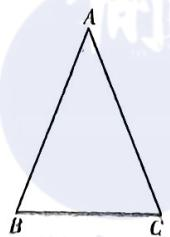

6. $3 - \frac{3\sqrt{2}}{2}$ 【解析】由函数 $f(t)$ 的图象，可得 $\frac{5}{4} T = 5$ ，解得 $T = 4$ ，所以 $\omega = \frac{2\pi}{T} = \frac{\pi}{2}$

又由 $f(0) = -3$ ，可得 $\sin \varphi = -1$ ，解得 $\varphi = -\frac{\pi}{2} + 2k\pi, k \in \mathbf{Z}$ .

因为 $0 < |\varphi| < \pi$ ，所以 $\varphi = -\frac{\pi}{2}$ ，所以 $f(t) = 3\sin \left(\frac{\pi}{2} t - \frac{\pi}{2}\right) = -3\cos \frac{\pi}{2} t.$

由区间 $[a, a + 1]$ 的区间长度为 1，即区间长度为 $\frac{1}{4}$ 个周期.

当区间 $[a, a + 1]$ 在一个单调区间内时，不妨设 $[a, a + 1] \subseteq [0, 2]$ ，可得 $0 \leqslant a \leqslant 1$

则 $M - N = |M - N| = |f(a + 1) - f(a)| =$ $3\left|\cos \frac{a\pi}{2} -\cos \frac{(a + 1)\pi}{2}\right| = 3\left|\cos \frac{a\pi}{2} +\right.$ $\sin \frac{a\pi}{2}\Big| = 3\sqrt{2}\Big|\sin \left(\frac{a\pi}{2} +\frac{\pi}{4}\right)\Big|,$

由 $0 \leqslant a \leqslant 1$ ，可得 $\frac{\pi}{4} \leqslant \frac{a\pi}{2} + \frac{\pi}{4} \leqslant \frac{3\pi}{4}$ 当 $\frac{a\pi}{2} + \frac{\pi}{4} = \frac{\pi}{4}$ 或 $\frac{3\pi}{4}$ 时， $M - N$ 取最小值3；

当区间 $[a, a + 1]$ 不在同一个单调区间内时，不妨设 $[a, a + 1] \subseteq (1, 3)$ ，可得 $1 < a < 2$

则函数 $f(x)$ 在 $[a, a + 1]$ 上先增后减，此时 $M = f(x)_{\max} = 3$

不妨设 $f(a)\geqslant f(a+1)$ ，则 $\frac{3}{2}\leqslant a<2$ ，则M-N=3+3cos $\frac{\pi}{2}(a+1)=3-3\sin\frac{\pi}{2}a$

故当 $a = \frac{3}{2}$ 时， $M - N$ 取得最小值 $3\left(1 - \frac{\sqrt{2}}{2}\right) = 3 - \frac{3\sqrt{2}}{2}$ . 综上可得， $M - N$ 的最小值为 $3 - \frac{3\sqrt{2}}{2}$ .

# 第6章 解三角形

# 考点18 解三角形

1. BC 【解析】因为 $a + b\cos C = c\cos B + 4c\cos C,$

由正弦定理得 $\sin A + \sin B\cos C =$ $\sin C\cos B + 4\sin C\cos C.$

因为 $\sin A = \sin (B + C) = \sin B\cos C +$ $\cos B\sin C,$

所以 $2\sin B\cos C + \cos B\sin C = \sin C\cos B+$ $4\sin C\cos C$

即 $2\sin B\cos C = 4\sin C\cos C$ ，所以 $2\cos C \cdot (\sin B - 2\sin C) = 0$ ，所以 $\cos C = 0$ 或 $\sin B = 2\sin C.$

当 $\cos C = 0$ 时， $C = \frac{\pi}{2}$ ，因为 $A = \frac{\pi}{6}$ ，所以 $B = \frac{\pi}{3}$ ，所以 $\sin B = \frac{\sqrt{3}}{2}, \sin C = 1$ ，则 $\frac{b}{c} = \frac{\sin B}{\sin C} = \frac{\sqrt{3}}{2}$ .

当 $\sin B = 2\sin C$ 时， $\frac{b}{c} = \frac{\sin B}{\sin C} = 2.$

综上所述, $\frac{b}{c}$ 的值为 $\frac{\sqrt{3}}{2}$ 或2.故选BC.

2. B 【解析】充分性: 已知正弦定理 $\frac{a}{\sin A} = \frac{b}{\sin B} = \frac{c}{\sin C} = 2R$ (R 为 $\triangle ABC$ 外接圆的半径),

当 $\frac{a}{\cos A} = \frac{b}{\cos B} = \frac{c}{\cos C}$ 时， $\frac{2R\sin A}{\cos A} = \frac{2R\sin B}{\cos B} = \frac{2R\sin C}{\cos C}$ ，即 $\tan A = \tan B = \tan C$

显然 $\tan A = \tan B = \tan C \neq 0$ .

若 $\tan A = \tan B = \tan C < 0$ ，又 $A, B, C \in (0, \pi)$ ，则 $A, B, C$ 均为钝角，显然不符合题意.

故 $\tan A = \tan B = \tan C > 0, A, B, C$ 均为锐角.

又 $y = \tan x$ 在 $\left(0, \frac{\pi}{2}\right)$ 上单调递增，所以 $A = B = C$

则 $A - B = B - C = C - A = 0$ ，所以 $\cos (A - B) \cdot \cos (B - C) \cdot \cos (C - A) = 1$ 成立.

必要性：当 $\cos(A-B)\cdot\cos(B-C)$

$\cos (C - A) = 1$ 时，

因为 $0 < A < \pi, 0 < B < \pi, 0 < C < \pi$ ，所以 $-\pi < A - B < \pi, -\pi < B - C < \pi, -\pi < C - A < \pi,$

又 $y = \cos x, x \in (-\pi, \pi)$ 的值域为 $(-1, 1]$ , 所以 $\cos (A - B) = \cos (B - C) = \cos (C - A) = 1$ ,

所以 $A - B = B - C = C - A = 0$ ，即 $A = B = C$

所以 $\triangle ABC$ 为等边三角形, 则 $\frac{a}{\cos A} = \frac{b}{\cos B} = \frac{c}{\cos C}$ 成立.

综上，“ $\frac{a}{\cos A}=\frac{b}{\cos B}=\frac{c}{\cos C}$ ”是“ $\cos(A-B)\cdot\cos(B-C)\cdot\cos(C-A)=1$ ”的充要条件.
故选 B.

3. D 【解析】结合余弦定理可得 $AC^2 = AB^2 + BC^2 - 2AB \cdot BC \cdot \cos B$ ，即 $19 = 4 + BC^2 - 4BC \cdot \cos 120^\circ$ ，解得 $BC = 3$ 或 $BC = -5$ （舍），故选D.

# 一题多解

由正弦定理可得 $\frac{\sqrt{19}}{\sin 120^\circ} = \frac{2}{\sin C} = \frac{BC}{\sin A}$ , 解得 $\sin C = \frac{\sqrt{57}}{19}$ , 则 $\cos C = \frac{4\sqrt{19}}{19}$ . 又 $\sin A = \sin (120^\circ + C) = \frac{\sqrt{3}}{2}\cos C - \frac{1}{2}\sin C = \frac{3\sqrt{57}}{38}$ , 则 $BC = \frac{2\sqrt{19}}{\sqrt{3}} \times \frac{3\sqrt{57}}{38} = 3$ , 故选 D.

4. ABC 【解析】对于 A, 由余弦定理可得 $12 = a^{2} = b^{2} + c^{2} - 2bc\cos A = 24 - bc$ ，得 $bc = 12$ ，所以 $S = \frac{1}{2} bc\sin A = 3\sqrt{3}$ ，故 A 正确.

对于 B, 由基本不等式得 $24 = b^{2} + c^{2} \geqslant 2bc$ , 即 $bc \leqslant 12$ , 当且仅当 $b = e = 2\sqrt{3}$ 时, 等号成立. 由余弦定理可得 $\cos A = \frac{b^{2} + c^{2} - a^{2}}{2bc} = \frac{24 - 12}{2bc} = \frac{6}{bc}$ ,

则 $S = \frac{1}{2} bc \cdot \sin A = \frac{1}{2} bc\sqrt{1 - \cos^2A} = \frac{1}{2}\sqrt{(bc)^2 - 36} \leqslant \frac{1}{2}\sqrt{12^2 - 36} \approx 3\sqrt{3}$ （当且

仅当 $b = c = 2\sqrt{3}$ 时取等号），故B正确.  
对于C，因为 $\angle AMB + \angle AMC = \pi$ ，所以 $\cos \angle AMB = \cos (\pi -\angle AMC) =$ $-\cos \angle AMC.$ 由余弦定理可得 $\cos \angle AMB =$ $\frac{AM^2 + \frac{a^2}{4} - c^2}{AM\cdot a},\cos \angle AMC = \frac{AM^2 + \frac{a^2}{4} - b^2}{AM\cdot a},$ 所以 $\frac{AM^2 + \frac{a^2}{4} - c^2}{AM\cdot a} = -\frac{AM^2 + \frac{a^2}{4} - b^2}{AM\cdot a},$ 整理得 $AM^{2} = \frac{b^{2} + c^{2}}{2} -\frac{a^{2}}{4} = 9,$ 则 $AM = 3$ ，故C正确.  
对于D，由余弦定理可得 $\cos A =$ $\frac{b^2 + c^2 - a^2}{2bc} = \frac{12}{2bc}\geqslant \frac{12}{b^2 + c^2} = \frac{1}{2},$ 当且仅当 $b = c = 2\sqrt{3}$ 时，等号成立.因为 $A\in (0,\pi)$ 且函数 $y = \cos x$ 在 $(0,\pi)$ 上单调递减，所以 $0 < A\leqslant \frac{\pi}{3}$ ，故D错误.

故选ABC.

5. $\sqrt{3} - 1$ 【解析】设 $BD = x (x > 0)$ ，则 $CD = 2x$ .

在 $\triangle ADB$ 中,由余弦定理得 $AB^{2}=x^{2}+4+2x.$

在 $\triangle ADC$ 中,由余弦定理得 $AC^{2}=4x^{2}+4-4x$ .

所以 $\frac{AC^2}{AB^2} = \frac{4x^2 - 4x + 4}{x^2 + 2x + 4} (x > 0)$ .

设 $f(x)=\frac{x^{2}-x+1}{x^{2}+2x+4}(x>0)$ ，则 $f'(x)=$

$$
\frac {3 x ^ {2} + 6 x - 6}{(x ^ {2} + 2 x + 4) ^ {2}},
$$

令 $f'(x)=0$ ，得 $x=\sqrt{3}-1$ （负值舍去），

可知 $f(x)$ 在 $(0, \sqrt{3} - 1)$ 上单调递减，在 $(\sqrt{3} - 1, +\infty)$ 上单调递增，所以 $f(x)$ 在 $x^2 = \sqrt{3} - 1$ 处取得最小值.

所以当 $\frac{AC}{AB}$ 取得最小值时, $BD=\sqrt{3}-1$ .

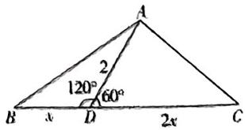

text_image

A
2
120°
60°
B x D 2x C

# 一题多解

令 $BD = t(l >$

0), 以 D 为坐标原点, DC 所在直线为 x 轴, 过点

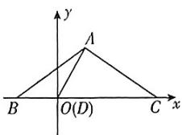

D 垂直于 BC 的直线为 y 轴, 建立如图所示的平面直角坐标系, 则 $C(2t,0)$ ,

$A(1,\sqrt{3})$ , $B(-t,0)$ , 所以 $\frac{AC^{2}}{AB^{2}}=$

$$
\frac {(2 t - 1) ^ {2} + 3}{(t + 1) ^ {2} + 3} = 4 - \frac {1 2}{t + 1 + \frac {3}{t + 1}} \geqslant 4 - 2 \sqrt {3},
$$

【提示】变形为基本不等式的形式求最值

当且仅当 $t + 1 = \sqrt{3}$ ，即 $t = \sqrt{3} - 1$ 时取等号，所以 $BD = \sqrt{3} - 1$ .

6. $\frac{\pi}{3}$ 【解析】方法一：由 $\frac{\cos(B + C)}{a} - \frac{\cos C}{c} = \frac{2b\cos(A + C)}{ac}$ ，得 $\frac{-\cos A}{a} - \frac{\cos C}{c} = \frac{-2b\cos B}{ac}$ ，即 $c\cos A + a\cos C = 2b\cos B$ ，结合射影定理 $b = c\cos A + a\cos C$ ，得 $b = 2b\cos B$ ，则 $\cos B = \frac{1}{2}$ ，又 $B \in (0, \pi)$ ，所以 $B = \frac{\pi}{3}$ .

方法二：在 $\triangle ABC$ 中，由 $\frac{\cos(B + C)}{a} - \frac{\cos C}{c} = \frac{2b\cos(A + C)}{ac}$

得 $\frac{-\cos A}{a} - \frac{\cos C}{c} = \frac{2b(-\cos B)}{ac}$ ，整理得 $c\cos A + a\cos C = 2b\cos B.$

由正弦定理, 得 $\sin C\cos A + \sin A\cos C = 2\sin B\cos B$ ,

即 $\sin (A + C) = \sin B = 2\sin B\cos B$ ，又 $B\in$

(0,π)，所以 $\sin B \neq 0$ ，则 $\cos B = \frac{1}{2}$ ，所以 $B=\frac{\pi}{3}.$

7.【解】(1)因为 $\frac{2\sin A+\sin B}{\sin 2B}=\frac{c}{b}$ ，由正弦定理可得 $\frac{2\sin A+\sin B}{\sin 2B}=\frac{\sin C}{\sin B}$

由倍角公式可得 $\frac{2\sin A + \sin B}{2\sin B\cos B} = \frac{\sin C}{\sin B}$ 则 $2\sin A = 2\cos B\sin C - \sin B,$

又因为 $A + B + C = \pi$ ，所以 $\sin A = \sin (B + C) = \sin B\cos C + \cos B\sin C,$

所以 $2\sin B\cos C + 2\cos B\sin C = 2\cos B\sin C - \sin B$ ，即 $(2\cos C + 1) \cdot \sin B = 0.$

因为 $B \in (0, \pi)$ , 所以 $\sin B \neq 0$ , 可得 $\cos C = -\frac{1}{2}$ , 又因为 $C \in (0, \pi)$ , 所以 $C = \frac{2\pi}{3}$ .

若选择①: 若 CM 为 $\triangle ABC$ 的中线, 设 AM = BM = x (x > 0),

由余弦定理可得 $\cos \angle CMA = \frac{x^2 + 1 - 4}{2x},\cos \angle BMC = \frac{x^2 + 1 - BC^2}{2x},$

因为 $\angle CMA + \angle CMB = \pi$ ，所以 $\cos \angle CMA + \cos \angle CMB = 0,$

即 $\frac{x^{2}+1-4}{2x}+\frac{x^{2}+1-BC^{2}}{2x}=0$ ，整理得 $BC^{2}=2x^{2}-2>0$ ，可知x>1，

又因为 $\cos\angle ACB=\frac{2^{2}+BC^{2}-4x^{2}}{2\times2\times BC}=-\frac{1}{2}$ ，将 $BC^{2}=2x^{2}-2$ 代入上式可得 $x^{2}=3$ 或 $x^{2}=1$ （舍去），所以 $AB=2x=2\sqrt{3}$ .

若选择②: 若 CM 为 $\triangle ABC$ 的角平分线, 则 $\angle ACM = \angle BCM = \frac{\pi}{3}$ ,

在 $\triangle ACM$ 中，由余弦定理得 $AM^2 = 2^2 + 1^2 - 2 \times 2 \times 1 \times \frac{1}{2} = 3$ ，即 $AM = \sqrt{3}$ ，

可知 $AM^2 + CM^2 = AC^2$ ，即 $CM \perp AB$ ，可知 $AC = BC, AM = MB = \sqrt{3}$ ，所以 $AB = 2AM = 2\sqrt{3}$ .

若选择③: 若 CM 为 $\triangle ABC$ 的高线, 则 $\angle CMA = \angle BMC = \frac{\pi}{2}$ ,

则 $AM^{2} = AC^{2} - CM^{2} = 3$ ，即 $AM = \sqrt{3}$ ，则 $A = \frac{\pi}{6}$ ，

可知 $B=\frac{\pi}{6}$ ，所以 AC=BC, AM=MB= $\sqrt{3}$ ，
所以 $AB = 2AM = 2\sqrt{3}$ .

(2) 设 $\triangle ABC$ 外接圆的半径为 $R$ , 由正弦定理可得 $2R = \frac{AB}{\sin \frac{2\pi}{3}} \simeq 4$ , 解得 $R = 2$ , 所以

$S_{1} = 4\pi .$

由(1)可知, $BC=2,AB=2\sqrt{3}$ ，所以 $\triangle ABC$ 的面积 $S_{\triangle ABC}=\frac{1}{2}\times2\sqrt{3}\times1=\sqrt{3}$ ， $\triangle ABC$ 的周长 $L=4+2\sqrt{3}$ .

设 $\triangle ABC$ 内切圆的半径为r，则 $\frac{1}{2}rL=$ $S_{\triangle ABC}$ ，解得 $r=2\sqrt{3}-3$ ，

可得 $S_{2}=(2\sqrt{3}-3)^{2}\pi=(21-12\sqrt{3})\pi$ ，所以 $S_{1}-S_{2}=(12\sqrt{3}-17)\pi$ .

8.【解】(1) 在 $\triangle ABC$ 中, $A + B = 3C$ , 又 $A + B + C = \pi$ , 所以 $C = \frac{\pi}{4}$ .

又因为 $2\sin (A - C) = \sin B$ ，即 $2\sin \left(\frac{\pi}{2} -B\right) = \sin B,$

所以 $\sin B = 2\cos B.$

又因为 $\sin^2 B + \cos^2 B = 1, B \in \left(0, \frac{3\pi}{4}\right)$ ,

所以 $\sin B = \frac{2\sqrt{5}}{5},\cos B = \frac{\sqrt{5}}{5},$

所以 $\sin A = \sin (B + C) = \sin \left(B + \frac{\pi}{4}\right) =$ $\sin B\cos \frac{\pi}{4} +\cos B\cdot \sin \frac{\pi}{4} = \frac{3\sqrt{10}}{10}.$

(2) 在 $\triangle ABC$ 中, 记内角 $A, B, C$ 所对的边分别为 $a, b, c$ ,

因为 $AB = c = 5, C = \frac{\pi}{4}, \sin B = \frac{2\sqrt{5}}{5},$ $\sin A = \frac{3\sqrt{10}}{10},$

所以由正弦定理 $\frac{a}{\sin A} = \frac{b}{\sin B} = \frac{c}{\sin C}$ 可得 $\frac{a}{\frac{3\sqrt{10}}{10}} = \frac{b}{\frac{2\sqrt{5}}{5}} = \frac{5}{\frac{\sqrt{2}}{2}}$ 解得 $a = 3\sqrt{5}, b =$

$2\sqrt{10}$

设 $AB$ 边上的高为 $h$

由三角形的面积公式可得 $\frac{1}{2} ab\sin C = \frac{1}{2} c\cdot h,$

即 $\frac{1}{2} \times 3\sqrt{5} \times 2\sqrt{10} \times \frac{\sqrt{2}}{2} = \frac{1}{2} \cdot 5h,$

解得 h=6，

即 $AB$ 边上的高为6.

# 一题多解

(1) 因为 $A + B = 3C, A + B + C = \pi$ ，所以 $C = \frac{\pi}{4}$ .

因为 $2\sin (A - C) = \sin B$ ，所以

$2\sin\left(A-\frac{\pi}{4}\right)=\sin\left(\frac{3\pi}{4}-A\right)$ ，所以

$\sqrt{2}\sin A - \sqrt{2}\cos A = \frac{\sqrt{2}}{2}\cos A + \frac{\sqrt{2}}{2}\sin A,$

即 $\sin A = 3\cos A.$

因为 $\sin^2 A + \cos^2 A = 1, A \in \left(0, \frac{3\pi}{4}\right)$ ,

所以 $\sin A = \frac{3\sqrt{10}}{10}$

(2)如图,过点B作

$BG \perp AC$ 于 G, 过点

C 作 $CH \perp AB$ 于 H,

由（1）知 $\sin A =$

$$
\frac {3 \sqrt {1 0}}{1 0}.
$$

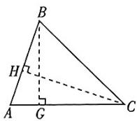

因为 AB = 5，所以 $BG = AB \cdot \sin A = \frac{3\sqrt{10}}{2}$ ,

所以 $AG = \sqrt{AB^2 - BG^2} = \frac{\sqrt{10}}{2}$ .

因为 $C = \frac{\pi}{4}$ 所以 $CG = BG = \frac{3\sqrt{10}}{2}$

所以 $AC = AG + CG = 2\sqrt{10}$

所以 $CH=\frac{BG\cdot AC}{AB}=\frac{\frac{3\sqrt{10}}{2}\times2\sqrt{10}}{5}=6,$

即 $AB$ 边上的高为6.

9.【解】(1) 在 $\triangle ABC$ 中, 因为 $\angle BAC = 120^{\circ}$ ,
AB=2, AC=1,

所以由余弦定理得 $BC^{2}=AB^{2}+AC^{2}-2AB\cdot AC\cos\angle BAC=4+1-2\times2\times1\times\cos120^{\circ}=7$ 所以 $BC=\sqrt{7}$ .

在 $\triangle ABC$ 中，由正弦定理得 $\frac{AC}{\sin\angle ABC} = \frac{BC}{\sin\angle BAC}$

即 $\frac{1}{\sin\angle ABC} = \frac{\sqrt{7}}{\frac{\sqrt{3}}{2}}$ 解得 $\sin \angle ABC =$

$$
\frac {\sqrt {2 1}}{1 4}.
$$

(2) 由 (1) 知 $\sin \angle ABC = \frac{\sqrt{21}}{14}$ , 且 $\angle BAC = 120^{\circ}$ ,

所以 $\cos \angle ABC = \sqrt{1 - \sin^2\angle ABC} = \frac{5\sqrt{7}}{14},$

所以 $\tan \angle ABC = \frac{\sin\angle ABC}{\cos\angle ABC} = \frac{\sqrt{3}}{5}.$

因为在 Rt $\triangle ABD$ 中， $\tan\angle ABC=\frac{AD}{AB}$ ，即 $\frac{\sqrt{3}}{5}=\frac{AD}{2}$ ,

解得 $AD=\frac{2\sqrt{3}}{5}$ ,

所以 $\triangle ADC$ 的面积为 $\frac{1}{2} \cdot AD$

$$
A C \sin \angle D A C = \frac {1}{2} \times \frac {2 \sqrt {3}}{5} \times 1 \times \frac {1}{2} = \frac {\sqrt {3}}{1 0}.
$$

10.【解】(1)由余弦定理 $a^2 = b^2 + c^2 - 2bc\cos A$ 整理可得 $\frac{b^2 + c^2 - a^2}{\cos A} = 2bc = 2$ ，所以 $bc = 1$ .

(2) 由正弦定理 $\frac{a}{\sin A} = \frac{b}{\sin B} = \frac{c}{\sin C} = 2R$ ( $R$ 为 $\triangle ABC$ 外接圆的半径), 可得

$$
\frac {a \cos B - b \cos A}{a \cos B + b \cos A} \quad - \quad \frac {b}{c} \quad =
$$

$$
\frac {\sin A \cos B - \sin B \cos A}{\sin A \cos B + \sin B \cos A} - \frac {\sin B}{\sin C} = 1.
$$

又因为 $\sin C = \sin (A + B) = \sin A\cos B+$ $\cos A\sin B,$

所以 $\sin A\cos B - \sin B\cos A - \sin B =$ $\sin A\cos B + \sin B\cos A,$

整理得 $-2\sin B\cos A = \sin B.$

因为 $B \in (0, \pi)$ , 所以 $\sin B \neq 0$ , 所以 $\cos A = -\frac{1}{2}$ .

（另解；根据余弦定理，原式可化为 $\frac{a\cdot\frac{a^{2}+c^{2}-b^{2}}{2ac}-b\cdot\frac{b^{2}+c^{2}-a^{2}}{2bc}}{a\cdot\frac{a^{2}+c^{2}-b^{2}}{2ac}+b\cdot\frac{b^{2}+c^{2}-a^{2}}{2bc}}-\frac{b}{c}=1$ ，整理

可得 $\frac{a^2 - b^2}{c^2} - \frac{b}{c} = 1$ ，即 $a^2 - b^2 - bc = c^2$

故 $\cos A = \frac{b^2 + c^2 - a^2}{2bc} = \frac{-bc}{2bc} = -\frac{1}{2}$

则 $\sin A = \sqrt{1 - \cos^2A} = \frac{\sqrt{3}}{2}$

所以 $\triangle ABC$ 的面积为 $\frac{1}{2} bc\sin A = \frac{1}{2}\times 1\times$

$$
\frac {\sqrt {3}}{2} = \frac {\sqrt {3}}{4}.
$$

11.【解】(1)由题可知， $-a\cos\frac{B}{2}+b\sin A=0,$

由正弦定理得 $\sin A\cdot \cos \frac{B}{2} = \sin B$ $\sin A,$

又因为 $\sin A \neq 0$ ，所以 $\cos \frac{B}{2} = \sin B,$ 即 $\cos \frac{B}{2} = 2\sin \frac{B}{2}\cos \frac{B}{2},$

而 $B \in (0, \pi)$ , 则 $\cos \frac{B}{2} \neq 0$ , 即有 $\sin \frac{B}{2} = \frac{1}{2}$ , 则 $\frac{B}{2} = \frac{\pi}{6}$ , 解得 $B = \frac{\pi}{3}$ .

(2) 若选①, 依题意, 得 $\sin^2 B + \sin^2 C = \sin^2 A + \sin B \sin C$ ,

由正弦定理得 $b^{2} + c^{2} = a^{2} + bc$ ，由余弦定理得 $\cos A = \frac{b^2 + c^2 - a^2}{2bc} = \frac{1}{2}$ 而 $A\in (0,\pi),$

则 $A = \frac{\pi}{3}$

由(1)知 $B=\frac{\pi}{3}$ ，因此 $\triangle ABC$ 为等边三角形，又 b=10，

所以 $\triangle ABC$ 的面积 $S_{\triangle ABC} = \frac{\sqrt{3}}{4} b^2 = 25\sqrt{3}$ .

若选②, $\tan \left(A + \frac{3\pi}{4}\right) = \frac{\tan A + \tan \frac{3\pi}{4}}{1 - \tan A\tan\frac{3\pi}{4}} =$

$\frac{\tan A-1}{1+\tan A}=2-\sqrt{3}$ ，解得 $\tan A=\sqrt{3}$ ，而 $A\in(0,\pi)$ ，则 $A=\frac{\pi}{3}$ .

由(1)知 $B=\frac{\pi}{3}$ ，因此 $\triangle ABC$ 为等边三角形，又b=10，

所以 $\triangle ABC$ 的面积 $S_{\triangle ABC} = \frac{\sqrt{3}}{4} b^2 = 25\sqrt{3}$ .

若选③, $\tan A = \frac{\sin A}{\cos A} = 3, \sin^2 A + \cos^2 A = 1,$

显然 A 为锐角，解得 $\sin A = \frac{3\sqrt{10}}{10}$ , $\cos A=\frac{\sqrt{10}}{10}$

由正弦定理 $\frac{a}{\sin A} = \frac{b}{\sin B}$ 得 $a = \frac{b\sin A}{\sin B}$

$$
\frac {1 0 \times \frac {3 \sqrt {1 0}}{1 0}}{\frac {\sqrt {3}}{2}} = 2 \sqrt {3 0},
$$

而 $\sin C = \sin (A + B) = \sin A\cos B +$

$$
\cos \Lambda \sin B = \frac {3 \sqrt {1 0}}{1 0} \times \frac {1}{2} + \frac {\sqrt {1 0}}{1 0} \times \frac {\sqrt {3}}{2} =
$$

$$
\frac {3 \sqrt {1 0} + \sqrt {3 0}}{2 0},
$$

所以 $\triangle ABC$ 的面积 $S_{\triangle ABC} = \frac{1}{2} ab\sin C =$

$$
\frac {1}{2} \times 2 \sqrt {3 0} \times 1 0 \times \frac {3 \sqrt {1 0} + \sqrt {3 0}}{2 0} = 1 5 \sqrt {3} + 1 5.
$$

# 考点19 解三角形在实际问题中的应用

1. A 【解析】如图, 由

题意可知 $\angle OAC =$

$\angle OBC = 90^{\circ}$ ，所以

$$
\angle A O B + \angle A C B = 1 8 0 ^ {\circ}.
$$

因为切线 $AC = 99.9\mathrm{cm}, BC = 100.1\mathrm{cm}$ , 根据切线长定理,

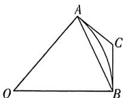

【提示】从圆外一点引圆的两条切线，切线长相等

不妨取 $AC = BC = 100\mathrm{cm}$ ，又 $AB = 180~\mathrm{cm}$

由余弦定理得 $\cos \angle ACB = \frac{AC^2 + BC^2 - AB^2}{2AC\cdot BC} =$

$$
\frac {1 0 0 ^ {2} + 1 0 0 ^ {2} - 1 8 0 ^ {2}}{2 \times 1 0 0 \times 1 0 0} = - 0. 6 2,
$$

所以 $\cos\angle AOB=\cos(180^{\circ}-\angle ACB)=-\cos\angle ACB=0.62.$ 故选 A.

2. C 【解析】根据题意, 在 $\triangle ADC$ 中,

$$
\angle A C D = 4 5 ^ {\circ}, \angle A D C = 6 7. 5 ^ {\circ}, D C = 2 \sqrt {3},
$$

则 $\angle DAC = 180^{\circ} - 45^{\circ} - 67.5^{\circ} = 67.5^{\circ}$ ，则 $AC = DC = 2\sqrt{3}.$

在 $\triangle BCE$ 中， $\angle BCE = 75^{\circ}$ ， $\angle BEC = 60^{\circ}$

$$
C E = \sqrt {2}  , \text {则}   \angle E B C = 1 8 0 ^ {\circ} - 7 5 ^ {\circ} - 6 0 ^ {\circ} = 4 5 ^ {\circ}.
$$

由正弦定理得 $\frac{CE}{\sin\angle EBC} = \frac{BC}{\sin\angle BEC}$

则 $BC = \frac{CE\cdot\sin\angle BEC}{\sin\angle EBC} = \frac{\sqrt{2}\times\frac{\sqrt{3}}{2}}{\frac{\sqrt{2}}{2}} = \sqrt{3}.$

在 $\triangle ABC$ 中， $AC = 2\sqrt{3},BC = \sqrt{3},\angle ACB =$ $180^{\circ} - \angle ACD - \angle BCE = 60^{\circ},$

则 $AB^{2} = AC^{2} + BC^{2} - 2AC \cdot BC \cdot \cos \angle ACB = 9$ ，则 $AB = 3$ （百米）.

3. A 【解析】依题意可知, 当伞完全张开时, AD=40-24=16(cm),

因为 B 为 $AD'$ 的中点, 所以 AB = AC = BD = $\frac{1}{2}AD' = 20 \, (\text{cm})$ .

在 $\triangle ABD$ 中， $\cos \angle BAD = \frac{AB^2 + AD^2 - BD^2}{2AB \cdot AD} = \frac{400 + 256 - 400}{2 \times 20 \times 16} = \frac{2}{5}$ ，

所以 $\cos\angle BAC = \cos2\angle BAD = 2\cos^{2}\angle BAD - 1 = 2 \times \left(\frac{2}{5}\right)^{2} - 1 = -\frac{17}{25}$ . 故选 A.

4. A 【解析】过点 D 作 DM//AC, 交 AB 于点 M(图略). 由题意可得 D, F, M 三点共线.

设 $\angle DHE = \alpha, \angle FCG = \beta,$ 则 $\angle BDM = \alpha,$ $\angle BFM = \beta.$ 因为 $\frac{BM}{MD} = \tan \alpha, \frac{BM}{MF} = \tan \beta,$ 所以

$\frac{BM}{\tan\alpha}=MD,\frac{BM}{\tan\beta}=MF,$ 两式作差可得 $\frac{BM}{\tan\beta}-$

$\frac{BM}{\tan \alpha} = MF - MD = DF = EG$ ，所以 $BM =$

$\frac{EG}{\frac{1}{\tan\beta}-\frac{1}{\tan\alpha}}=\frac{EG}{\frac{GC}{FG}-\frac{EH}{DE}}.$ 又因为 $DE=FG$ ，所

以 $BM = \frac{EG\cdot DE}{GC - EH}$ ，所以海岛的高 $AB = AM+$

$BM = AM + \frac{EG \cdot DE}{GC - EH} = DE + \frac{EG \cdot DE}{GC - EH}$ . 故选A.

5. $\frac{5\sqrt{3}}{23}$ 【解析】依题意知 $\angle AEC = 45^{\circ}$ ,

$\angle ACE = 180^{\circ} - 60^{\circ} - 15^{\circ} = 105^{\circ}$ ，所以 $\angle EAC = 180^{\circ} - 45^{\circ} - 105^{\circ} = 30^{\circ}.$

由正弦定理知 $\frac{CE}{\sin\angle EAC} = \frac{AC}{\sin\angle AEC}$ 所以

$$
A \bar {C} = \frac {1 0 \sqrt {2}}{\sin 3 0 ^ {\circ}} \times \sin 4 5 ^ {\circ} = 2 0 (\mathrm{m}),
$$

所以在 Rt△ABC 中, $AB = AC \cdot \sin \angle ACB =$

$$
2 0 \times \frac {\sqrt {3}}{2} = 1 0 \sqrt {3} (\mathrm{m}).
$$

因为国歌奏唱大约需要 46 s, 所以升旗手

升旗的速度约为 $\frac{10\sqrt{3}}{46} = \frac{5\sqrt{3}}{23}\mathrm{m / s}$

6. $\frac{3}{2}$ 【解析】如图所示, 根据圆内接四边形的性质可知 $\angle BAD + \angle BCD = \pi$ , $\sin \angle BAD = \sin \angle BCD$ , 所以由 $\sin \angle ABD: \sin \angle ADB: \sin \angle BCD = 2:3:4$ , 得 $\sin \angle ABD: \sin \angle ADB: \sin \angle BAD = 2:3:4$ .

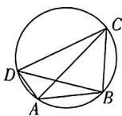

在 $\triangle BAD$ 中,由正弦定理得AD:AB:BD=2:3:4,由题意可知 $AC\cdot BD=AB\cdot CD+AD\cdot BC$ ,

则 $4AC = 3CD + 2BC$ ，所以 $16AC^{2} = 9CD^{2}+$ $4BC^{2} + 12CD\cdot BC,$

$$
1 6 A C ^ {2} = 9 C D ^ {2} + 4 B C ^ {2} + 1 2 C D \cdot B C \geqslant 2 4 C D \cdot
$$

$BC$ ，当且仅当 $3CD = 2BC$ 时等号成立.

又 $AC^2 = \lambda BC\cdot CD,\lambda \in \mathbf{R},$ 所以 $16\lambda$

$BC\cdot CD\geqslant 24CD\cdot BC$ ，则 $\lambda \geqslant \frac{24}{16} = \frac{3}{2}$ 即

实数 $\lambda$ 的最小值为 $\frac{3}{2}$ .

# 专题7 解三角形中的最值、范围问题

1.【解】(1)由 $\frac{a-b+c}{c}=\frac{b}{a+b-c}$ 整理可得bc=

$b^{2}+c^{2}-a^{2}$ ，由余弦定理可得 $\cos A=\frac{b^{2}+c^{2}-a^{2}}{2bc}=\frac{bc}{2bc}=\frac{1}{2}$

又 $0 < A < \pi$ ，所以 $A = \frac{\pi}{3}$

(2) $\frac{1}{\tan B} + \frac{1}{\tan C} = \frac{\cos B}{\sin B} + \frac{\cos C}{\sin C} =$

$$
\frac {\sin C \cos B + \sin B \cos C}{\sin B \sin C} = \frac {\sin (B + C)}{\sin B \sin C} =
$$

$$
\frac {\sin A}{\sin B \sin C} = \frac {\sqrt {3}}{2 \sin B \sin C},
$$

由 $A = \frac{\pi}{3}$ ，可得 $C = \frac{2\pi}{3} - B.$ 因为 $\triangle ABC$ 为锐

角三角形, 所以 $\left\{\begin{aligned}0&<B<\frac{\pi}{2},\\ 0&<\frac{2\pi}{3}-B<\frac{\pi}{2},\end{aligned}\right.$ 解得 $\frac{\pi}{6}<$

$$
B <   \frac {\pi}{2},
$$

所以 $\sin B\sin C = \sin B\sin \left(\frac{2\pi}{3} -B\right) =$ $\sin B\left(\frac{\sqrt{3}}{2}\cos B + \frac{1}{2}\sin B\right) = \frac{\sqrt{3}}{4}\sin 2B-$ $\frac{1}{4}\cos 2B + \frac{1}{4} = \frac{1}{2}\sin \left(2B - \frac{\pi}{6}\right) + \frac{1}{4},$

因为 $\frac{\pi}{6} < 2B - \frac{\pi}{6} < \frac{5\pi}{6}$ ，所以 $\frac{1}{2} < \sin \left(2B - \frac{\pi}{6}\right) \leqslant 1, \frac{1}{2} < \frac{1}{2} \sin \left(2B - \frac{\pi}{6}\right) + \frac{1}{4} \leqslant \frac{3}{4}$ ，即 $\frac{1}{2} < \sin B \sin C \leqslant \frac{3}{4}$ ，

则 $\frac{2\sqrt{3}}{3} \leqslant \frac{1}{\tan B} + \frac{1}{\tan C} < \sqrt{3}$ , 即 $\frac{1}{\tan B} + \frac{1}{\tan C}$ 的取值范围为 $\left[\frac{2\sqrt{3}}{3}, \sqrt{3}\right)$ .

2. (1)【证明】因为 $b^{2} - a^{2} = ac$ ，由余弦定理得 $b^{2} = a^{2} + c^{2} - 2ac\cos B$ ，所以 $ac = c^{2} - 2ac\cos B, a = c - 2ac\cos B$ .

由正弦定理得 $\sin A = \sin C - 2\sin A\cos B = \sin (A + B) - 2\sin A\cos B = \sin A\cos B + \cos A\sin B - 2\sin A\cos B = \cos A\sin B - \sin A\cos B = \sin (B - A)$ .

因为 $\triangle ABC$ 为锐角三角形, 所以 $A \in \left(0, \frac{\pi}{2}\right), B \in \left(0, \frac{\pi}{2}\right), B - A \in \left(-\frac{\pi}{2}, \frac{\pi}{2}\right)$ , 所以 $A = B - A$ , 即 $B = 2A$ .

(2)【解】 $B=2A,C=\pi-3A$ ，由 $A,B,C\in\left(0,\frac{\pi}{2}\right)$ ，得 $A\in\left(\frac{\pi}{6},\frac{\pi}{4}\right)$ .

$$
\begin{array}{l} \frac {l}{a} = \frac {a + b + c}{a} = \frac {\sin 3 A + \sin 2 A}{\sin A} + 1 = \\ \frac {\sin 2 A \cos A + \cos 2 A \sin A + 2 \sin A \cos A}{\sin A} + 1 = \\ \frac {2 \sin A \cos^ {2} A + \cos 2 A \sin A + 2 \sin A \cos A}{\sin A} + 1 = \\ \end{array}
$$

$$
4 \cos^ {2} \Lambda + 2 \cos \Lambda .
$$

因为 $A \in \left(\frac{\pi}{6}, \frac{\pi}{4}\right)$ ，所以 $\cos A \in \left(\frac{\sqrt{2}}{2}, \frac{\sqrt{3}}{2}\right)$ ，结合二次函数单调性易知 $2 + \sqrt{2} < 4\cos^{2}A + 2\cos A < 3 + \sqrt{3}$ ，
即 $\frac{l}{a}$ 的取值范围为 $(2+\sqrt{2},3+\sqrt{3})$ .

3.【解】（1）在 $\triangle ABE$ 中，由正弦定理得 $\sin \angle AEB = \frac{AB\sin A}{BE} = \frac{2\times\sin 135^{\circ}}{2\sqrt{2}} = \frac{1}{2},$

又 $\angle AEB < \angle A$ ，则 $\angle AEB = 30^{\circ}$ ，故 $\angle ABE = 180^{\circ} - 135^{\circ} - 30^{\circ} = 15^{\circ}$

∵ BE 为角平分线, ∴ $\angle DBE = 15^{\circ}$ ,
∴ $\angle BDE=30^{\circ}-15^{\circ}=15^{\circ},\therefore BE=DE=2\sqrt{2}.$

在 $\triangle BDE$ 中, 根据余弦定理得 $BD^{2} = (2\sqrt{2})^{2} + (2\sqrt{2})^{2} - 2 \times 2\sqrt{2} \times 2\sqrt{2} \times \cos 150^{\circ} = 16 + 8\sqrt{3}, \therefore BD = 2\sqrt{3} + 2.$

(2) 设 BC = m, CD = n. 在 $\triangle BCD$ 中，由余弦定理得 $4(\sqrt{3} + 1)^{2} = m^{2} + n^{2} - 2mn\cos 60^{\circ} = (m + n)^{2} - 3mn$ ,

即有 $(m+n)^{2}=16+8\sqrt{3}+3mn\leqslant16+8\sqrt{3}+3\times\left(\frac{m+n}{2}\right)^{2}$ ，即 $\frac{(m+n)^{2}}{4}\leqslant16+8\sqrt{3},\therefore m+n\leqslant4(\sqrt{3}+1)$ ,

当且仅当 $m=n=2(\sqrt{3}+1)$ 时, 等号成立.
∴ $\triangle BCD$ 周长的最大值为 $6\sqrt{3}+6$ .

4.【解】(1) $3ccos B+2bsin Bsin C=0$ ,由正弦定理得 $3sin Ccos B+2sin Bsin Bsin C=0$ .

由 $C \in (0, \pi)$ , 知 $\sin C \neq 0$ , 则 $3\cos B + 2\sin^2 B = 0$ , 即 $2\cos^2 B - 3\cos B - 2 = 0$ ,

所以 $\cos B = -\frac{1}{2}$ . 由 $B \in (0, \pi)$ ，得 $B = \frac{2\pi}{3}$ . 如图①所示，由 $BD \perp BC$ ，可知 $\angle ABD = \frac{\pi}{6}$ ，在 $\triangle ABD$ 中，由余弦定理得 $AD^{2} = AB^{2} + BD^{2} - 2AB \cdot BD \cdot \cos \angle ABD = 34$ $1 - 2 \times \sqrt{3} \times 1 \times \frac{\sqrt{3}}{2} = 1$ ，解得 AD = 1.

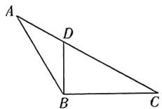  
图①

(2)由题知 $\angle ABC = \frac{2\pi}{3}, BD$ 为 $\angle ABC$ 的平分线，且 $BD = 1$ ，如图②所示，

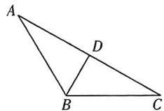  
图②

则有 $\angle ABD = \angle CBD = \frac{\pi}{3}, S_{\triangle ABC} = S_{\triangle ABD} + S_{\triangle CBD}$ ，则 $\frac{1}{2} ac\sin \angle ABC = \frac{1}{2} c$ $BD\sin \angle ABD + \frac{1}{2} a \cdot BD\sin \angle CBD,$

即 $\frac{1}{2} \times \frac{\sqrt{3}}{2} ac = \frac{1}{2} \times \frac{\sqrt{3}}{2} c + \frac{1}{2} \times \frac{\sqrt{3}}{2} a$ ，又 $a > 0, c > 0$ ，则 $ac = a + c \geqslant 2\sqrt{ac}$ ，可得 $ac \geqslant 4$ ，当且仅当 $a = c = 2$ 时等号成立，所以 $S_{\triangle ABC} = \frac{1}{2} ac\sin \angle ABC \geqslant \frac{1}{2} \times 4 \times \frac{\sqrt{3}}{2} = \sqrt{3}$ ，故 $\triangle ABC$ 面积的最小值为 $\sqrt{3}$ .

# 第6章 风向练

【解】(1) 若选条件①: 由正弦定理得 $\sin B - \sin C \cos A = \sin A (\sqrt{3} \sin C - 1)$ ,

$$
\begin{array}{l} \therefore \sin (A + C) - \sin C \cos A = \sin A \cos C + \\ \cos A \sin C - \sin C \cos A = \sin A \cos C = \\ \sin A (\sqrt {3} \sin C - 1), \end{array}
$$

$$
\because A \in (0, \pi), \therefore \sin A \neq 0,
$$

$$
\therefore \cos C = \sqrt {3} \sin C - 1,
$$

$$
\text {即} \sqrt {3} \sin C = \cos C = 2 \sin \left(C - \frac {\pi}{6}\right) = 1,
$$

$$
\therefore \sin \left(C - \frac {\pi}{6}\right) = \frac {1}{2}.
$$

又 $C \in (0, \pi), \therefore C - \frac{\pi}{6} \in \left(-\frac{\pi}{6}, \frac{5\pi}{6}\right)$ ,

∴ $C = \frac{\pi}{6} = \frac{\pi}{6}$ ，解得 $C = \frac{\pi}{3}$ .

若选条件②: $\because \sin(A+B)\cos\left(C-\frac{\pi}{6}\right)=$

$\sin C \left( \cos C \cos \frac{\pi}{6} + \sin C \sin \frac{\pi}{6} \right) =$

$$
\frac {\sqrt {3}}{2} \sin C \cos C + \frac {1}{2} \sin^ {2} C = \frac {\sqrt {3}}{4} \sin 2 C
$$

$$
\frac {1}{4} \cos 2 C + \frac {1}{4} = \frac {1}{2} \sin \left(2 C - \frac {\pi}{6}\right) + \frac {1}{4} = \frac {3}{4},
$$

$$
\therefore \sin \left(2 C - \frac {\pi}{6}\right) = 1.
$$

$$
\because C \in (0, \pi), \therefore 2 C = \frac {\pi}{6} \in \left(- \frac {\pi}{6}, \frac {1 1 \pi}{6}\right).
$$

$$
\therefore 2 C = \frac {\pi}{6} = \frac {\pi}{2}, \text {解得} C = \frac {\pi}{3}.
$$

(2) $\because \overrightarrow{CD} = \frac{1}{2} (\overrightarrow{CA} +\overrightarrow{CB})$

$\therefore |\overrightarrow{CD}|^2 = \frac{1}{4} (\overrightarrow{CA}^2 +\overrightarrow{CB}^2 +2\overrightarrow{CA}\cdot \overrightarrow{CB})$

即 $CD^2 = \frac{1}{4}\left(b^2 + a^2 + 2ab\cos \frac{\pi}{3}\right) = \frac{1}{4}(a^2 + b^2 + ab)$ ,

$$
\therefore \frac {C D ^ {2}}{a ^ {2} + b ^ {2}} = \frac {\frac {1}{4} (a ^ {2} + b ^ {2} + a b)}{a ^ {2} + b ^ {2}} = \frac {1}{4} +
$$

$\frac{ab}{4(a^{2}+b^{2})}\leqslant\frac{1}{4}+\frac{ab}{4\times2ab}=\frac{3}{8}$ （当且仅当a=b时取等号），

$\therefore \frac{CD^2}{a^2 + b^2}$ 的最大值为 $\frac{3}{8}$ .

2.【解】(1) 设 $\triangle ABC$ 的内切圆半径为 $r$ , 因为 $S_{1}^{2} + S_{3}^{2} - S_{1}S_{3} = S_{2}^{2}$ ,

所以 $\left(\frac{1}{2} ar\right)^2 +\left(\frac{1}{2} cr\right)^2 -\left(\frac{1}{2} ar\right)$

$$
\left(\frac {1}{2} c r\right) = \left(\frac {1}{2} b r\right) ^ {2},
$$

化简得 $a^2 + c^2 - b^2 = ac$ ，所以 $\cos B = \frac{a^2 + c^2 - b^2}{2ac} = \frac{1}{2}$ .

因为 $B \in (0, \pi)$ , 所以 $B = \frac{\pi}{3}$ .

若选择①, 因为 $a \cos C + c \cos A = 1$ , 所以

$$
a \cdot \frac {a ^ {2} + b ^ {2} - c ^ {2}}{2 a b} + c \cdot \frac {b ^ {2} + c ^ {2} - a ^ {2}}{2 b c} = b = 1,
$$

因为 $a^2 + c^2 - b^2 = ac, c = 2$ ，所以 $a^2 + 4 - 1 = 2a$ ，整理得 $a^2 - 2a + 3 = 0$ ，方程无实数解，所以 $\triangle ABC$ 不存在.

若选择②, 因为 $4\sin B\sin A + \cos 2A = 1$ , 所以 $4\sin B\sin A = 1 - \cos 2A = 2\sin^{2}A$ ,

因为 $\sin A \neq 0$ ，所以 $\sin A - 2\sin B = 0$ ，所以 $a = 2b$ .

因为 $a^2 + c^2 - b^2 = ac, c = 2$ ，所以 $4b^2 + 4 - b^2 = 4b$ ，整理得 $3b^2 - 4b + 4 = 0$ ，方程无实数解，所以 $\triangle ABC$ 不存在.

若选择③,由 $\frac{1-2\cos A}{\sin A}+\frac{1-2\cos B}{\sin B}=0$ ,整理得 $\sin A+\sin B-2(\sin A\cos B+\cos A\sin B)=0$ ,

所以 $\sin A + \sin B = 2\sin (A + B)$ ，即 $\sin A+$ $\sin B = 2\sin C$ ，所以 $a + b = 2c$

因为 $a^2 + c^2 - b^2 = ac, c = 2$ ，所以 $a^2 + 4 - b^2 = 2a$ ，所以 $a^2 + 4 - (4 - a)^2 = 2a$ ，解得 $a = 2$ ，则 $b = 2$ ，所以 $\triangle ABC$ 存在且唯一， $\triangle ABC$ 的周长为 $a + b + c = 6$ .

(2)由(1)知, $B=\frac{\pi}{3}$ , $\triangle ABC$ 的面积S=

$$
\frac {1}{2} a c \sin B = \frac {\sqrt {3}}{2} a.
$$

因为 $\frac{c}{\sin C} = \frac{a}{\sin A}$ 所以 $a = \frac{c \cdot \sin A}{\sin C} =$

$$
\begin{array}{l} \frac {2 \sin A}{\sin C} = \frac {2 \sin \left(\frac {\pi}{3} + C\right)}{\sin C} \\ = \frac {2 \left(\sin \frac {\pi}{3} \cos C + \cos \frac {\pi}{3} \sin C\right)}{\sin C} \\ = \frac {2 \left(\frac {\sqrt {3}}{2} \cos C + \frac {1}{2} \sin C\right)}{\sin C} \\ = \frac {\sqrt {3} \cos C + \sin C}{\sin C} \\ = \frac {\sqrt {3}}{\tan C} + 1. \\ \end{array}
$$

因为 $\triangle ABC$ 为锐角三角形，所以 $0 < C < \frac{\pi}{2}$ $0 < \frac{2\pi}{3} - C < \frac{\pi}{2}$ ，得 $\frac{\pi}{6} < C < \frac{\pi}{2}$

所以 $\tan C > \frac{\sqrt{3}}{3}$ , 所以 $0 < \frac{1}{\tan C} < \sqrt{3}$ , $0 < \frac{\sqrt{3}}{\tan C} < 3, 1 < \frac{\sqrt{3}}{\tan C} + 1 < 4$ ,

所以 a 的取值范围为 $(1,4)$ ，所以 $\triangle ABC$ 面积的取值范围为 $\left(\frac{\sqrt{3}}{2},2\sqrt{3}\right)$ .

# 第7章 平面向量

# 考点20 平面向量的线性运算、基本定理及坐标运算

1.A 【解析】因为 $D$ 是 $AB$ 的中点，所以 $\overrightarrow{AD} = \overrightarrow{DB}$ . 所以 $\overrightarrow{CB} = \overrightarrow{CD} + \overrightarrow{DB} = \overrightarrow{CD} + \overrightarrow{AD} = \overrightarrow{CD} + (\overrightarrow{CD} - \overrightarrow{CA}) = 2\overrightarrow{CD} - \overrightarrow{CA}$ . 故选A.

2. A 【解析】连接 $BD, GC$ , 如图所示, 由题意可知, $G$ 为 $\triangle BCD$ 的重心, 设 $AC \cap BD = O$ , 则 $O$ 为 $AC$ 的中点, $A, O, G, C$ 四点共线, 且 $AO = OC = 3OG$ , 所以 $\overrightarrow{AG} = \frac{2}{3}\overrightarrow{AC} = \frac{2}{3} (\overrightarrow{AB} + \overrightarrow{AD}) = \frac{2}{3}\overrightarrow{AB} + \frac{2}{3}\overrightarrow{AD}$ .

故选A.

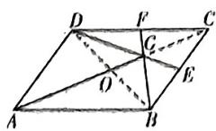

3. D 【解析】 $\overrightarrow{BD}=\overrightarrow{AD}-\overrightarrow{AB}=(-8,2m-6)$ ，因为 B, C, D 三点共线，即 $\overrightarrow{BC}=\lambda\overrightarrow{BD},\lambda\in\mathbb{R}$ ，则 $(-3,m)=\lambda(-8,2m-6)$ ，

$\therefore \left\{ \begin{array}{l} -3 = -8\lambda, \\ m = 2m\lambda - 6\lambda, \end{array} \right.\therefore \left\{ \begin{array}{l}\lambda = \frac{3}{8}, \\ m = -9. \end{array} \right.$ 故选D.

4. A 【解析】如图所示, 因为 $\overrightarrow{BC}=3\overrightarrow{BD}$ , 所以 $\overrightarrow{BD}=\frac{1}{3}\overrightarrow{BC}$ , 则 $\overrightarrow{AD}=\overrightarrow{AB}+\frac{1}{3}(\overrightarrow{AC}-\overrightarrow{AB})=\frac{2}{3}\overrightarrow{AB}+\frac{1}{3}\overrightarrow{AC}$ .

因为 A, P, D 三点共线，所以 $\overrightarrow{AP} = \lambda \overrightarrow{AD} = \frac{2}{3} \lambda \overrightarrow{AB} + \frac{1}{3} \lambda \overrightarrow{AC} (\lambda \in \mathbb{R})$ .

因为 $\overrightarrow{CF} = 2\overrightarrow{FA}$ 所以 $\overrightarrow{AF} = \frac{1}{3}\overrightarrow{AC}$ .

因为 E 是边 AB 的中点, 所以 $\overrightarrow{AE} = \frac{1}{2}\overrightarrow{AB}$ .
因为 E, P, F 三点共线，

所以 $\overrightarrow{AP} = k\overrightarrow{AE} + (1 - k)\overrightarrow{AF} = \frac{1}{2} k\overrightarrow{AB} + \frac{1 - k}{3}\overrightarrow{AC}$ （ $k \in \mathbb{R}$ ），

则 $\left\{ \begin{array}{l} \frac{2}{3}\lambda = \frac{1}{2} k, \\ \frac{1}{3}\lambda = \frac{1 - k}{3}, \end{array} \right.$ 解得 $k = \frac{4}{7}$ , 从而 $m = \frac{2}{7}$ ,

$n = \frac{1}{7}$ , 故 $m + n = \frac{3}{7}$ .

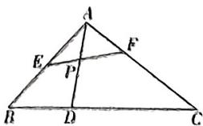

5.B【解析】因为平行四边形ABCD的对角线相交于点 $O, AE = EO$

所以 $\overrightarrow{DE} = \overrightarrow{DA} +\overrightarrow{AE} = -\overrightarrow{AD} +\frac{1}{4}\overrightarrow{AC} = -\overrightarrow{AD}+$ $\frac{1}{4} (\overrightarrow{AD} +\overrightarrow{AB}) = \frac{1}{4}\overrightarrow{AB} -\frac{3}{4}\overrightarrow{AD}.$

因为 $\overrightarrow{DE} = \lambda \overrightarrow{AB} +\mu \overrightarrow{AD}$ ，所以 $\lambda = \frac{1}{4},\mu =$ $-\frac{3}{4}$ ，则 $\lambda +\mu = -\frac{1}{2}$ 故选B.

6. C 【解析】∵ $\lambda, \mu$ 为正实数, $\overrightarrow{AD} = \frac{1}{3} \overrightarrow{DC}$ ,

$\therefore \overrightarrow{AC} = 4\overrightarrow{AD}, \therefore \overrightarrow{AP} = \lambda \overrightarrow{AB} + \mu \overrightarrow{AC} = \lambda \overrightarrow{AB} + 4\mu \overrightarrow{AD}$ , 而 $P, B, D$ 三点共线，

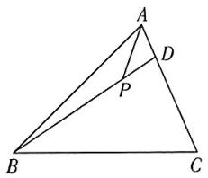

text_image

Geometric diagram of triangle ABC with internal points D and P, showing segments AD and BC

$$
\begin{array}{r l} & {\therefore \lambda + 4 \mu = 1, \therefore \lambda \mu = \frac {1}{4} \cdot (\lambda \cdot 4 \mu) \leqslant} \\ & {\frac {1}{4} \left(\frac {\lambda + 4 \mu}{2}\right) ^ {2} = \frac {1}{1 6},} \end{array}
$$

当且仅当 $\lambda = 4\mu$ ，即 $\lambda = \frac{1}{2},\mu = \frac{1}{8}$ 时取等号，A,B错误；

$$
\begin{array}{l} \frac {1}{\lambda} + \frac {1}{4 \mu} = (\lambda + 4 \mu) \cdot \left(\frac {1}{\lambda} + \frac {1}{4 \mu}\right) = 2 + \frac {4 \mu}{\lambda} + \\ \frac {\lambda}{4 \mu} \geqslant 2 + 2 \sqrt {\frac {4 \mu}{\lambda} \cdot \frac {\lambda}{4 \mu}} = 4, \end{array}
$$

当且仅当 $\frac{4\mu}{\lambda} = \frac{\lambda}{4\mu}$ 即 $\lambda = \frac{1}{2},\mu = \frac{1}{8}$ 时取等号，即 $\frac{1}{\lambda} +\frac{1}{4\mu}$ 的最小值为4,C正确；

又 $\frac{1}{\lambda} +\frac{1}{4\mu} = \frac{\lambda + 4\mu}{4\lambda\mu} = \frac{1}{4\lambda\mu}$ ，由于 $\lambda ,\mu$ 为正实数， $\lambda +4\mu = 1$ ，则 $\lambda = 1 - 4\mu ,\therefore 0 <   \mu <  \frac{1}{4},$

则 $\lambda \mu = (1 - 4\mu)\mu = -4\left(\mu -\frac{1}{8}\right)^2 +\frac{1}{16}$ 即当 $\mu = \frac{1}{8}$ 时， $\lambda \mu$ 取最大值 $\frac{1}{16}$ ，当 $\pmb{\mu}$ 趋近于0

时, $\lambda\mu$ 可无限趋近于0,

故 $0 < \lambda \mu \leqslant \frac{1}{16}$ , 故 $\frac{1}{\lambda} + \frac{1}{4\mu} = \frac{1}{4\lambda\mu}$ 无最大值, D 错误. 故选 C.

7. C 【解析】由已知不妨设 $A(0,0)$ , $B(1,0)$ , $C(c,0)$ , $D(d,0)$ ，则 $\overrightarrow{AC} = (c,0)$ , $\overrightarrow{AB} = (1,0)$ , $\overrightarrow{AD} = (d,0)$ ,

因为 C, D 和谐分割点 A, B, 所以 $(c,0)=\lambda(1,0)$ , $(d,0)=\mu(1,0)$ , 所以 $\lambda=c,\mu=d$ ,
代入 $\frac{1}{\lambda}+\frac{1}{\mu}=4$ 得 $\frac{1}{c}+\frac{1}{d}=4(\ast)$ .

若 $C$ 是线段 $AB$ 的中点，则 $c = \lambda = \frac{1}{2}$ ，代入（ $*$ ）得， $d = \frac{1}{2}$ ，此时 $C, D$ 两点重合，与题意矛盾，故A错误；

若 C 是靠近点 A 的线段 AB 的三等分点，
则 $c=\lambda=\frac{1}{3}$ ，代入（\*）得，d=1，此时 B, D
两点重合，与题意矛盾，故 B 错误；

若 C, D 同时在线段 AB 上, 则 $0 < c = \lambda < 1$ , $0 < d = \mu < 1$ , 则 $\frac{1}{c} > 1$ , $\frac{1}{d} > 1$ , 当 $c = \frac{2}{5}$ 时, d = $\frac{2}{3}$ , 此时符合题意, 所以点 C, D 可能同时在线段 AB 上, 故 C 正确;

若 $C, D$ 同时在线段 $AB$ 的延长线上时，则 $\lambda > 1, \mu > 1$ ，则 $\frac{1}{\lambda} < 1, \frac{1}{\mu} < 1$ ，所以 $\frac{1}{\lambda} + \frac{1}{\mu} < 4$ ，这与 $\frac{1}{\lambda} + \frac{1}{\mu} = 4$ 矛盾，所以 $C, D$ 不可能同时在线段 $AB$ 的延长线上，故 $\mathbf{D}$ 错误。故选 $\mathbf{C}$ 。

8. B 【解析】因为 $\cos\langle\overrightarrow{OA},\overrightarrow{OB}\rangle=\frac{\overrightarrow{OA}\cdot\overrightarrow{OB}}{|\overrightarrow{OA}||\overrightarrow{OB}|}=\frac{1}{2}$ ，所以 $\langle\overrightarrow{OA},\overrightarrow{OB}\rangle=\frac{\pi}{3}$ ,

根据 $\overrightarrow{OA} \cdot \overrightarrow{OC} \geqslant 0, \overrightarrow{OB} \cdot \overrightarrow{OC} \geqslant 0$ ，则 $\langle \overrightarrow{OA}, \overrightarrow{OC} \rangle \in \left[0, \frac{\pi}{2}\right], \langle \overrightarrow{OB}, \overrightarrow{OC} \rangle \in \left[0, \frac{\pi}{2}\right]$ ，

如图,建立平面直角坐标系,设 $\overrightarrow{OC}$ 与 x 轴的夹角为 $\theta, A(1,0), B\left(\frac{1}{2}, \frac{\sqrt{3}}{2}\right)$ ,

$$
C (\cos \theta , \sin \theta), \theta \in \left[ - \frac {\pi}{6}, \frac {\pi}{2} \right],
$$

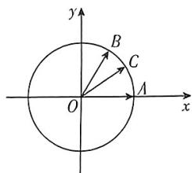

text_image

y
B
C
O
A
x

由 $\overrightarrow{OC} = x\overrightarrow{OA} +y\overrightarrow{OB}$ ，可知 $\left\{ \begin{array}{l}\cos \theta = x + \frac{\gamma}{2},\\ \sin \theta = \frac{\sqrt{3}}{2} y, \end{array} \right.$

得 $x = \cos \theta -\frac{\sqrt{3}}{3}\sin \theta ,y = \frac{2\sqrt{3}}{3}\sin \theta ,$

$$
3 x + y = 3 \cos \theta - \frac {\sqrt {3}}{3} \sin \theta
$$

$$
= \frac {2 \sqrt {2 1}}{3} \left(\frac {3 \sqrt {3}}{2 \sqrt {7}} \cos \theta - \frac {1}{2 \sqrt {7}} \sin \theta\right)
$$

$$
= \frac {2 \sqrt {2 1}}{3} \cos (\theta + \varphi),
$$

其中 $\cos \varphi = \frac{3\sqrt{3}}{2\sqrt{7}},\sin \varphi = \frac{1}{2\sqrt{7}},\tan \varphi = \frac{1}{3\sqrt{3}}$ 所以 $\varphi \in \left(0,\frac{\pi}{6}\right)$ ，则 $\theta +\varphi \in \left[-\frac{\pi}{6} +\varphi ,\right.$ $\frac{\pi}{2} +\varphi ]$

所以当 $\theta=\frac{\pi}{2}$ 时, $3x+y$ 的最小值是 $-\frac{\sqrt{3}}{3}$ .
故选 B.

9. $\frac{8}{5}$ 【解析】由 $a // b$ 得， $2 \times 4 - 5\lambda = 0$ ，解得 $\lambda = \frac{8}{5}$ .

10. $-\frac{10}{3}$ 【解析】 $c = a + kb = (3 + k, 1)$ ，因为 $a \perp c$ ，所以 $a \cdot c = 3(3 + k) + 1 = 0$ ，解得 $k = -\frac{10}{3}$ .

# 考点21 平面向量的数量积及其应用

1. D 【解析】由题意， $\angle BAD = 60^{\circ}$ ，建立平面直角坐标系如图。

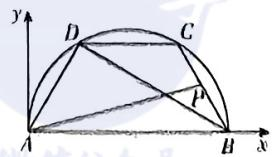

text_image

y
D
C
P
A
B
x

则 $A(0,0), B(2,0), C\left(\frac{3}{2}, \frac{\sqrt{3}}{2}\right)$ , $D\left(\frac{1}{2}, \frac{\sqrt{3}}{2}\right)$ , 所以 $P\left(\frac{7}{4}, \frac{\sqrt{3}}{4}\right)$ , 所以$\overrightarrow{AP} = \left(\frac{7}{4}, \frac{\sqrt{3}}{4}\right)$ , 又 $\overrightarrow{BD} = \left(-\frac{3}{2}, \frac{\sqrt{3}}{2}\right)$ , 所以 $\overrightarrow{AP} \cdot \overrightarrow{BD} = -\frac{9}{4}$ .

2. A 【解析】如图所示, 连接 BC, CD, 则 $AD \perp CD, AB \perp BC.$ 【提示】直径所对的圆周角为直角

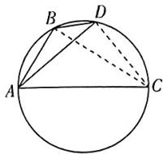

所以 $\overrightarrow{AB} \cdot \overrightarrow{AC} = |\overrightarrow{AB}| \cdot |\overrightarrow{AC}| \cos \angle BAC = |\overrightarrow{AB}| \cdot (|\overrightarrow{AC}| \cdot \cos \angle BAC) = |\overrightarrow{AB}|^{2} = t + 1.$ $\overrightarrow{AD} \cdot \overrightarrow{AC} = |\overrightarrow{AD}| \cdot |\overrightarrow{AC}| \cos \angle CAD = |\overrightarrow{AD}| \cdot (|\overrightarrow{AC}| \cdot \cos \angle CAD) = |\overrightarrow{AD}|^{2} = t + 2.$

因为 $\overrightarrow{BD} = \overrightarrow{AD} - \overrightarrow{AB}$ ，所以 $\overrightarrow{AC} \cdot \overrightarrow{BD} = \overrightarrow{AC} \cdot (\overrightarrow{AD} - \overrightarrow{AB}) = \overrightarrow{AC} \cdot \overrightarrow{AD} - \overrightarrow{AC} \cdot \overrightarrow{AB} = t + 2 - (t + 1) = 1$ 。故选 A.

3. BCD 【解析】因为 $\sin A = \sin (B + C) =$ $\sin B\cos C + \sin C\cos B,$

所以由正弦定理得, $a=b\cos C+c\cos B$ ,
又 $b\cos C + c\cos B = 10$ ，故 a = 10。又 b = 6, $c = 8, b^{2} + c^{2} = a^{2}$ ，故 $AC \perp AB$ 。

以 A 为坐标原点, AB, AC 所在直线分别为 x, y 轴, 建立平面直角坐标系如图所示,

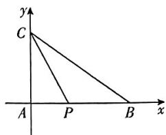

text_image

y
C
A P B x

则 $A(0,0), B(8,0), C(0,6)$ , 设 $P(m,0)$ , $0 \leqslant m \leqslant 8$ , 则 $\overrightarrow{PB} + \overrightarrow{PC} = (8 - m, 0) + (-m, 6) = (8 - 2m, 6)$ ,

则 $\overrightarrow{PA} \cdot (\overrightarrow{PB} + \overrightarrow{PC}) = (-m, 0) \cdot (8 - 2m, 6) = 2m^{2} - 8m = 2(m - 2)^{2} - 8,$

因为 $0 \leqslant m \leqslant 8$ ，所以 $\overrightarrow{PA} \cdot (\overrightarrow{PB} + \overrightarrow{PC}) = 2(m - 2)^2 - 8 \in [-8, 64]$ ，A 错误，BCD 正确.

4.11 【解析】因为 $|a| = 1, |b| = 3, \cos \langle a, b \rangle = \frac{1}{3}$ , 所以 $(2a + b) \cdot b = 2a \cdot b + |b|^2 = 2|a|\cdot |b| \cdot \cos \langle a, b \rangle + |b|^2 = 2 \times 1 \times 3 \times \frac{1}{3} + 3^2 = 11,$

5. $-\frac{9}{2}$ 【解析】由 $a + b + c = 0$ ，得 $a = -b = c$ ，所

以 $a^2 = (-b - c)^2 = b^2 + 2b \cdot c + c^2$ ，所以 $1^2 = 2^2 + 2b \cdot c + 2^2$ ，解得 $b \cdot c = -\frac{7}{2}$ . 由 $a + b + c = 0$ ，得 $b = -a - c$ ，所以 $b^2 = (-a - c)^2 = a^2 + 2a \cdot c + c^2$ ，所以 $2^2 = 1^2 + 2a \cdot c + 2^2$ ，解得 $a \cdot c = -\frac{1}{2}$ . 同理可得 $a \cdot b = -\frac{1}{2}$ . 所以 $a \cdot b + b \cdot c + c \cdot a = -\frac{1}{2} - \frac{7}{2} - \frac{1}{2} = -\frac{9}{2}$ .

# 一题多解

对 $a + b + c = 0$ 移项，可得 $a = -(b + c)$ ，于是作图，如图，

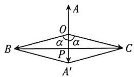

$$
\overrightarrow {O A} = \boldsymbol {a}, \overrightarrow {O B} = \boldsymbol {b}, \overrightarrow {O C} = \boldsymbol {c}, \overrightarrow {O A ^ {\prime}} = \overrightarrow {O B} + \overrightarrow {O C}.
$$

易知四边形 $OBA^{\prime}C$ 是菱形，

所以 $OP = \frac{1}{2}$

所以 $\cos \alpha = \frac{1}{4},\cos 2\alpha = 2\cos^2\alpha -1 =$

$-\frac{7}{8}$ . 则 $a \cdot b = -\frac{1}{2}, b \cdot c = -\frac{7}{2}$ ,

$$
\boldsymbol {a} \cdot \boldsymbol {c} = - \frac {1}{2},
$$

所以 $a \cdot b + b \cdot c + c \cdot a = -\frac{1}{2} - \frac{7}{2} -$

$$
\frac {1}{2} = - \frac {9}{2}.
$$

6.1 【解析】如图所示,延长 CA 至点 F,使 CF=CB=2,连接 BF,延长 CD 交 BF 于点 E,过点 E 作 AB 的平行线交 CF 于点 H.

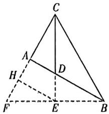

text_image

Geometric diagram of triangle ABC with internal points D, E, F, H and dashed auxiliary lines

∵ CD 平分 $\angle ACB, CF = CB, \therefore E$ 为 BF 的中点, 易得 AH = HF.

$\because CB = 2CA, \therefore AH = \frac{1}{2}CA,$ 可得 $CD = \frac{2}{3}CE, \therefore \overrightarrow{CD} \cdot \overrightarrow{AB} = \frac{2}{3}\overrightarrow{CE} \cdot (\overrightarrow{CB} - \frac{1}{2}\overrightarrow{CF}) = \frac{2}{3}\overrightarrow{CE} \cdot \overrightarrow{CB} - \frac{1}{3}\overrightarrow{CE} \cdot \overrightarrow{CF}.$

$\because CB=2,\angle BCD=30^{\circ},CE\perp BF,\therefore CE=\sqrt{3}$ ，可得 $\overrightarrow{CE}\cdot\overrightarrow{CB}=\overrightarrow{CE}\cdot\overrightarrow{CF}=2\times\sqrt{3}\times\frac{\sqrt{3}}{2}=3,$

$$
\therefore \overrightarrow {C D} \cdot \overrightarrow {A B} = \frac {1}{3} \times 3 = 1.
$$

7. A 【解析】因为 $\overrightarrow{AP} \perp \overrightarrow{BC}$ ，所以 $\overrightarrow{AP} \cdot \overrightarrow{BC} = (\lambda \overrightarrow{AB} + \overrightarrow{AC}) \cdot (\overrightarrow{AC} - \overrightarrow{AB}) = -\lambda \overrightarrow{AB^{2}} + \overrightarrow{AC^{2}} + (\lambda - 1) \overrightarrow{AC} \cdot \overrightarrow{AB} = 0$ ，所以 $-\lambda \cdot 3^{2} + 4^{2} + (\lambda - 1) \times 3 \times 4 \times \cos 120^{\circ} = 0$ ，解得 $\lambda = \frac{22}{15}$ 。故选 A.

8. ACD 【解析】因为向量 $a = (-1, 3), b = (x, 2)$ ，所以 $a - 2b = (-1 - 2x, -1)$ ，

由 $(a-2b)\perp a$ 得 $1+2x-3=0$ ，解得x=1，
所以 $b=(1,2)$ ，故 A 正确；

又 $2a - b = (-3, 4)$ ，所以 $|2a - b| = \sqrt{(-3)^2 + 4^2} = 5$ ，故B错误；

设向量 a 与向量 b 的夹角为 $\theta$ ，因为 $a = (-1, 3)$ ， $b = (1, 2)$ ，

所以 $\cos\theta=\frac{a\cdot b}{|a|\cdot|b|}=\frac{5}{\sqrt{10}\times\sqrt{5}}=\frac{\sqrt{2}}{2}$ ，又 $0^{\circ}\leqslant\theta\leqslant180^{\circ}$ ，所以 $\theta=45^{\circ}$

即向量 a 与向量 b 的夹角是 $45^{\circ}$ ，故 C 正确；

向量 a 在向量 b 上的投影向量坐标是 $\frac{a \cdot b}{|b|} \cdot \frac{b}{|b|} = \frac{5}{\sqrt{5}} \cdot \frac{b}{|b|} = b = (1, 2)$ ，故 D 正确。故选 ACD.

9. C 【解析】依题意， $|a|=1,|b|=\frac{3}{2}$ ，将 $|a+2b|=\sqrt{14}$ 两边平方得 $a^{2}+4a\cdot b+4b^{2}=14$ ，即 $1^{2}+4a\cdot b+4\times\left(\frac{3}{2}\right)^{2}=14$ ，解得 $a\cdot b=1$ ，于是得 $\cos\langle a,b\rangle=\frac{a\cdot b}{|a||b|}=\frac{1}{1\times\frac{3}{2}}=\frac{2}{3}$ ，所以 a,b 夹角的余弦值为 $\frac{2}{3}$ .
故选 C.

10. A 【解析】∵ $(a+\lambda b) \perp b, \therefore (a+\lambda b) \cdot b = 0$ ，即 $a \cdot b + \lambda b^{2} = 0$ ，

$$
\therefore \lambda = - \frac {a \cdot b}{b ^ {2}} = - \frac {1 \times 2 \times \cos \frac {\pi}{3}}{1 ^ {2}} = - 1,
$$

$$
\begin{array}{l} \therefore | \boldsymbol {a} + \lambda \boldsymbol {b} | = | \boldsymbol {a} - \boldsymbol {b} | = \sqrt {(\boldsymbol {a} - \boldsymbol {b}) ^ {2}} = \\ \sqrt {a ^ {2} - 2 a \cdot b + b ^ {2}} = \sqrt {2 ^ {2} - 2 \times 2 \times 1 \times \cos \frac {\pi}{3} + 1 ^ {2}} = \\ \end{array}
$$

$\sqrt{3}$ . 故选 A.

11. A 【解析】设 $\overrightarrow{AB} = a, \overrightarrow{AC} = b$ ，则 $\overrightarrow{AM} = \frac{1}{2} (\overrightarrow{AB} + \overrightarrow{AC}) = \frac{1}{2} (a + b), \overrightarrow{BC} = \overrightarrow{AC} - \overrightarrow{AB} = b - a$ ,

由 $|\overrightarrow{AM}|^2 = \frac{1}{4} (a^2 + 2a \cdot b + b^2)$ , $|\overrightarrow{BC}|^2 = a^2 - 2a \cdot b + b^2$ ,

得 $4|\overrightarrow{AM}|^2 -|\overrightarrow{BC}|^2 = 4\pmb {a}\cdot \pmb {b}$ ，又已知 $\overrightarrow{AB}$

$$
\overrightarrow {A C} = \pmb {a} \cdot \pmb {b} = 6, \text {且} | \overrightarrow {A M} | = 6,
$$

则有 $|\overrightarrow{BC}|^2 = 4|\overrightarrow{AM}|^2 -4a\cdot b = 4\times (36-$ $6) = 120$ ，故 $|\overrightarrow{BC}| = 2\sqrt{30}.$ 故选A.

12. $3\sqrt{2}$ 【解析】由 $|a - b| = 5$ 两边平方，得 $|a|^2 - 2a \cdot b + |b|^2 = 9 - 2 + |b|^2 = 7 + |b|^2 = 25$ ，解得 $|b| = 3\sqrt{2}$ .

13. ABD 【解析】对于 A, 与向量 a 方向相同的单位向量为 $\frac{a}{|a|} = \frac{(2,1)}{\sqrt{2^{2} + 1^{2}}} = \left(\frac{2\sqrt{5}}{5}, \frac{\sqrt{5}}{5}\right)$ ，故 A 正确；

对于 B, 因为 $a=(2,1)$ , $b=(-3,1)$ , 所以 $a+b=(-1,2)$ , 所以 $(a+b)\cdot a=-1\times2+2=0$ , 故 $(a+b)\perp a$ 成立, 故 B 正确;

对于 C, 向量 a 在向量 b 上的投影向量是 $\left|a\right|\left(\frac{a\cdot b}{\left|a\right|\left|b\right|}\right)\cdot\frac{b}{\left|b\right|}=\frac{2\times(-3)+1\times1}{10}$ $b=-\frac{1}{2}b$ ，故C错误；

对于 $\mathrm{D}, a + 2b = (2,1) + 2(-3,1) = (-4,3)$ ，故 $|a + 2b| = \sqrt{(-4)^2 + 3^2} = 5$ ，故 $\mathbf{D}$ 正确。故选ABD.

# 专题8 平面向量的综合应用

1. C 【解析】由 $\overrightarrow{AG} \cdot \overrightarrow{AB} = \overrightarrow{AG} \cdot \overrightarrow{AC}$ ，可得 $\overrightarrow{AG} \cdot (\overrightarrow{AB} - \overrightarrow{AC}) = \overrightarrow{AG} \cdot \overrightarrow{CB} = 0$ ，则有 $AG \perp BC$ 。在 $\triangle ABC$ 中， $A = \frac{\pi}{3}$ ，G 为 $\triangle ABC$ 的重心， $AG \perp BC$ ，则 $\triangle ABC$ 为等边三角形。所以 $\overrightarrow{AG} \cdot \overrightarrow{AB} = \frac{2}{3} \times \frac{1}{2} (\overrightarrow{AB} + \overrightarrow{AC}) \cdot \overrightarrow{AB} = \frac{1}{3} (|\overrightarrow{AB}|^2 + |\overrightarrow{AB}|^2 \cos \frac{\pi}{3}) = \frac{1}{2} |\overrightarrow{AB}|^2 = 6$ ，解得 $|\overrightarrow{AB}| = 2\sqrt{3}$ ，所以 $\triangle ABC$ 外接圆的半径为 $\frac{1}{2} \times \frac{|\overrightarrow{AB}|}{\sin \frac{\pi}{3}} = \frac{1}{2} \times \frac{2\sqrt{3}}{\frac{\sqrt{3}}{2}} = 2$ 。故选 C.

2. ABC 【解析】对于 A, 由奔驰定理可知, 点 P 满足 $3\overrightarrow{PA} + 2\overrightarrow{PB} + \overrightarrow{PC} = 0$ , 则点 P 一定在 $\triangle ABC$ 内部, 故 A 正确;

对于 C, D, 由奔驰定理可知 $S_{\triangle PBC} \cdot \overrightarrow{PA} + S_{\triangle PAC} \cdot \overrightarrow{PB} + S_{\triangle PAB} \cdot \overrightarrow{PC} = 0$ ，则 $S_{\triangle PBC}: S_{\triangle PAC}: S_{\triangle PAB} = 3:2:1$ ，所以 $S_{\triangle ABC} = 3S_{\triangle PAC}, S_{\triangle PAB} + S_{\triangle PAC} = S_{\triangle PBC}$ ，故 C 正确，D 错误；

对于 B, 因为 $3\overrightarrow{PA} + 2\overrightarrow{PB} + \overrightarrow{PC} = 0$ , 所以 $3\overrightarrow{PA} + 2\overrightarrow{PB} = -\overrightarrow{PC}$ , 则 $4\overrightarrow{PA} + 2\overrightarrow{PB} = \overrightarrow{PA} - \overrightarrow{PC} = \overrightarrow{CA}$ , 故 B 正确. 故选 ABC.

# 一题多解

由 $3\overrightarrow{PA} + 2\overrightarrow{PB} + \overrightarrow{PC} = \mathbf{0}$ 可知 $2(\overrightarrow{PA} + \overrightarrow{PB}) + (\overrightarrow{PA} + \overrightarrow{PC}) = \mathbf{0}$

设 M, N 分别是 AB, AC 的中点, 所以 $2\overrightarrow{PM} + \overrightarrow{PN} = 0$ ,

于是点 $P$ 是 $\triangle ABC$ 的中位线 $MN$ 上靠近点 $M$ 的三等分点，则点 $P$ 一定在 $\triangle ABC$ 内部，故A正确；

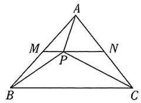

因为 $3\overrightarrow{PA} + 2\overrightarrow{PB} + \overrightarrow{PC} = 0$ ，所以 $3\overrightarrow{PA} + 2\overrightarrow{PB} = -\overrightarrow{PC}$ ，则 $4\overrightarrow{PA} + 2\overrightarrow{PB} = \overrightarrow{PA} - \overrightarrow{PC} = \overrightarrow{CA}$ 故B正确；

由A可知 $S_{\triangle PBC} = \frac{1}{2} S_{\triangle ABC}, S_{\triangle ABP} = \frac{1}{2} S_{\triangle APC}$ ，且 $S_{\triangle ABP} + S_{\triangle APC} = \frac{1}{2} S_{\triangle ABC}$

所以 $S_{\triangle ABP} = \frac{1}{6} S_{\triangle ABC}, S_{\triangle APG} = \frac{1}{3} S_{\triangle ABC}$ 即 $S_{\triangle ABC} = 3S_{\triangle PAC}$ ，故C正确；

所以 $S_{\triangle PAB} + S_{\triangle PAC} = S_{\triangle PBC}$ ，故 D 错误。故选 ABC.

3. BCD 【解析】对于 A, 由 $\overrightarrow{BD} = \mu \overrightarrow{BA} + (1 - \mu) \overrightarrow{BC}$ 可知, 点 $A, D, C$ 共线,

由 $\overrightarrow{BD} = \lambda \left(\frac{\overrightarrow{BA}}{|\overrightarrow{BA}|} +\frac{\overrightarrow{BC}}{|\overrightarrow{BC}|}\right)$ 可知，点 $D$ 在 $\angle CBA$ 的平分线上，

所以 $BD$ 为 $\triangle ABC$ 的角平分线, $AD$ 与 $DC$ 不一定相等, 故 A 错误;

对于 B, 若 $2\overrightarrow{BO} = \overrightarrow{BA} + \overrightarrow{BC}$ , 则 O 是 AC 的中点, 又点 O 是 $\triangle ABC$ 的外心,

所以 $\angle ABC = 90^{\circ},\overrightarrow{AC}\cdot \overrightarrow{AB} = |\overrightarrow{AC} |$ · $|\overrightarrow{AB} |\cos A = |\overrightarrow{AB}|^{2} = 4$ ，故B正确；

对于 C, 因为 $\angle B = \frac{\pi}{3}$ , 所以 $\angle AOC = \frac{2\pi}{3}$ , 如图, 建立平面直角坐标系,

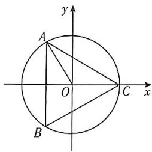

text_image

y
A
O
C
x
B

设 $C(r,0),A\left(-\frac{1}{2} r,\frac{\sqrt{3}}{2} r\right),B(r\cos \theta ,$ $r\sin \theta)$ ， $\theta \in \left(\frac{2\pi}{3},2\pi\right)$

因为 $\overrightarrow{OB} = m\overrightarrow{OA} + n\overrightarrow{OC}$ 所以 $\left\{ \begin{array}{l} r\cos \theta = m \cdot \left(-\frac{1}{2}r\right) + nr, \\ r\sin \theta = m \cdot \frac{\sqrt{3}}{2}r, \end{array} \right.$

得 $m = \frac{2}{\sqrt{3}}\sin \theta ,n = \cos \theta +\frac{1}{\sqrt{3}}\sin \theta ,$

$$
m + n = \cos \theta + \sqrt {3} \sin \theta = 2 \sin \left(\theta + \frac {\pi}{6}\right),
$$

$$
\theta \in \left(\frac {2 \pi}{3}, 2 \pi\right),
$$

$$
\theta + \frac {\pi}{6} \in \left(\frac {5 \pi}{6}, \frac {1 3 \pi}{6}\right), \sin \left(\theta + \frac {\pi}{6}\right) \in
$$

$\left[-1, \frac{1}{2}\right)$ ，则 $m + n \in [-2, 1)$ ，故 $\mathbf{C}$ 正确；

对于 D, 因为 $\overrightarrow{AH} \perp \overrightarrow{BC}$ , 所以 $\overrightarrow{AH} \cdot \overrightarrow{BC} = 0$ ,
即 $\overrightarrow{AH}\cdot(\overrightarrow{HC}-\overrightarrow{HB})=\overrightarrow{AH}\cdot\overrightarrow{HC}-\overrightarrow{AH}\cdot\overrightarrow{HB}=0$ ，则 $\overrightarrow{HA}\cdot\overrightarrow{HC}=\overrightarrow{HA}\cdot\overrightarrow{HB}$

同理, $\overrightarrow{HA}\cdot\overrightarrow{HC}=\overrightarrow{HC}\cdot\overrightarrow{HB}$ ,所以 $\overrightarrow{HA}\cdot\overrightarrow{HC}=$ $\overrightarrow{HA}\cdot\overrightarrow{HB}=\overrightarrow{HB}\cdot\overrightarrow{HC}$

设 $\overrightarrow{HA} \cdot \overrightarrow{HC} = \overrightarrow{HA} \cdot \overrightarrow{HB} = \overrightarrow{HB} \cdot \overrightarrow{HC} = x$ ，因为 $2\overrightarrow{HA} + 3\overrightarrow{HB} + 4\overrightarrow{HC} = 0$ ，所以 $3\overrightarrow{HB} = -2\overrightarrow{HA} - 4\overrightarrow{HC}$ ，即 $3\overrightarrow{HB^2} = -2\overrightarrow{HA} \cdot \overrightarrow{HB} - 4\overrightarrow{HC} \cdot \overrightarrow{HB} = -6x$ ，则 $|\overrightarrow{HB}| = \sqrt{-2x}$ ，

$4\overrightarrow{HC} = -2\overrightarrow{HA} - 3\overrightarrow{HB}$ , 即 $4\overrightarrow{HC}^2 = -2\overrightarrow{HA} \cdot \overrightarrow{HC} - 3\overrightarrow{HB} \cdot \overrightarrow{HC} = -5x$ , 则 $|\overrightarrow{HC}| = \sqrt{-\frac{5}{4}x}$ ,

$$
\cos \angle B H C = \cos \langle \overrightarrow {H B}, \overrightarrow {H C} \rangle = \frac {\overrightarrow {H B} \cdot \overrightarrow {H C}}{| \overrightarrow {H B} | | \overrightarrow {H C} |} =
$$

$\frac{x}{\sqrt{\frac{5}{2}x^2}} = -\frac{\sqrt{10}}{5}, x < 0,$ 故 $\mathbf{D}$ 正确. 故

选BCD.

4. D 【解析】以 C 为坐标原点, CA, CB 所在直线分别为 x, y 轴建立平面直角坐标系, 如图所示,

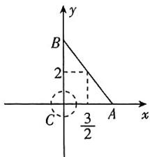

text_image

y
B
2
C
3/2
A
x

则 $A(3,0), B(0,4)$ . 设 $P(x,y)$ , 则 $x^2 + y^2 = 1$ , $\overrightarrow{PA} = (3 - x, -y)$ , $\overrightarrow{PB} = (-x, 4 - y)$ , 所以 $\overrightarrow{PA} \cdot \overrightarrow{PB} = x^2 - 3x + y^2 - 4y = \left(x - \frac{3}{2}\right)^2 + (y - 2)^2 - \frac{25}{4}$ . 因为 $\left(x - \frac{3}{2}\right)^2 + (y - 2)^2$ 表示为圆 $x^2 + y^2 = 1$ 上一点到点 $\left(\frac{3}{2}, 2\right)$ 的距离的平方, 又圆 $x^2 + y^2 = 1$ 上一点到点 $\left(\frac{3}{2}, 2\right)$ 的距离的最值可由圆心 $(0,0)$ 到点 $\left(\frac{3}{2}, 2\right)$ 的距离加（减）半径得到, 所以 $\overrightarrow{PA} \cdot \overrightarrow{PB} \in \left[\left(\frac{5}{2} - 1\right)^2 - \frac{25}{4}, \left(\frac{5}{2} + 1\right)^2 - \frac{25}{4}\right]$ , 即 $\overrightarrow{PA} \cdot \overrightarrow{PB} \in [-4,6]$ , 故选 D.

5. D 【解析】因为 $\overrightarrow{BD} = \frac{1}{3}\overrightarrow{BC}$ ，所以

$\overrightarrow{CB} = \frac{3}{2}\overrightarrow{CD}$ ，因为

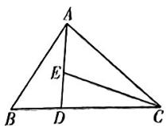

$\overrightarrow{CE}=x\overrightarrow{CA}+y\overrightarrow{CB}$ ，所以 $\overrightarrow{CE}=x\overrightarrow{CA}+\frac{3}{2}y\overrightarrow{CD}$

因为 A, D, E 三点共线，所以 $x + \frac{3}{2}y = 1$ ,
x>0,y>0,

$$
\begin{array}{l} \left(\frac {8}{3 y} + \frac {1}{x}\right) \left(x + \frac {3}{2} y\right) = \frac {8 x}{3 y} + 4 + 1 + \frac {3 y}{2 x} \geqslant \\ 2 \sqrt {\frac {8 x}{3 y} \cdot \frac {3 y}{2 x}} + 5 = 9, \\ \end{array}
$$

所以 $\frac{8x + 3y}{3xy} = \frac{8}{3y} + \frac{1}{x} =$

当且仅当 $\frac{8x}{3y} = \frac{3y}{2x}$ 即 $x = \frac{1}{3}, y = \frac{4}{9}$ 时取等号，

所以 $\frac{8x+3y}{3xy}$ 的最小值是9,故选D.

6. $[12 + 2\sqrt{2}, 16]$ 【解析】如图，设单位圆的圆心为 $O$ ，则 $\overrightarrow{PA_i^2} = (\overrightarrow{PO} + \overrightarrow{OA_i})^2 = \overrightarrow{PO^2} + 2\overrightarrow{PO} \cdot \overrightarrow{OA_i} + 1, i = 1, 2, 3, 4, 5, 6, 7, 8.$ 由对称性得 $\overrightarrow{OA_j} + \overrightarrow{OA_{j+4}} = \mathbf{0} (j = 1, 2, 3, 4)$ ，则 $\overrightarrow{PA_1^2} + \overrightarrow{PA_2^2} + \overrightarrow{PA_3^2} + \overrightarrow{PA_4^2} + \overrightarrow{PA_5^2} + \overrightarrow{PA_6^2} + \overrightarrow{PA_7^2} + \overrightarrow{PA_8^2} = 8\overrightarrow{PO^2} + 8$ ，在 $\triangle OA_1A_2$ 中， $OA_1 = 1, OA_2 = 1, \angle A_1OA_2 = 45^\circ$ ，所以 $\overrightarrow{PO_{\min}^2} = (OA_1 \times \cos 22.5^\circ)^2 = \cos^2 22.5^\circ = \frac{1 + \cos 45^\circ}{2} = \frac{2 + \sqrt{2}}{4}, \overrightarrow{PO_{\max}^2} = OA_1^2 = 1$ ，所以所求取值范围是 $[12 + 2\sqrt{2}, 16]$ .

text_image

A6
A5
A7
O
A4
A8
A3
A1
P
A2

# 关键点拨

此题解题关键是(1) $\overrightarrow{PA_{i}}^{2}=(\overrightarrow{PO}+\overrightarrow{OA_{i}})^{2}=\overrightarrow{PO}^{2}+2\overrightarrow{PO}\cdot\overrightarrow{OA_{i}}+1$ ;(2)由对称性得 $\overrightarrow{OA_{j}}+\overrightarrow{OA_{j+4}}=0(j=1,2,3,4)$ ，则 $\overrightarrow{PA_{1}}^{2}+\overrightarrow{PA_{2}}^{2}+\overrightarrow{PA_{3}}^{2}+\overrightarrow{PA_{4}}^{2}+\overrightarrow{PA_{5}}^{2}+\overrightarrow{PA_{6}}^{2}+\overrightarrow{PA_{7}}^{2}+\overrightarrow{PA_{8}}^{2}=8\overrightarrow{PO}^{2}+8.$

7. $\left[\frac{3}{2}, \frac{595}{18}\right]$ 【解析】连接 $PO$ ，如图，

text_image

y
4
3
2
A
O
B
C
-4 -3 -2 -1 2 3 4 5 6 x
-1
-2
-3
-4

设 PA 与 PB 的夹角为 $2\alpha$ ,

则 $|PA|=|PB|=\frac{1}{\tan\alpha}=\frac{\cos\alpha}{\sin\alpha}$ ,

$$
\therefore \overrightarrow {P A} \cdot \overrightarrow {P B} = | \overrightarrow {P A} | | \overrightarrow {P B} | \cos 2 \alpha = \frac {\cos^ {2} \alpha}{\sin^ {2} \alpha} \cdot \cos 2 \alpha =
$$

$$
\frac {1 + \cos 2 \alpha}{1 - \cos 2 \alpha} \cdot \cos 2 \alpha
$$

∵ P 是圆 $C:(x-2)^{2}+y^{2}=16$ 上一点，

$$
\therefore 2 = 4 - | O C | \leqslant | P O | \leqslant | O C | + 4 = 6,
$$

$$
\therefore \cos \alpha = \frac {| P A |}{| P O |} = \frac {\sqrt {| P O | ^ {2} - 1 ^ {2}}}{| P O |} =
$$

$$
\sqrt {1 - \left(\frac {1}{| P O |}\right) ^ {2}},
$$

$$
\therefore \cos 2 \alpha = 2 \cos^ {2} \alpha - 1 = 1 - \frac {2}{| P O | ^ {2}} \in
$$

$$
\left[ \frac {1}{2}, \frac {1 7}{1 8} \right].
$$

令 $t = 1 - \cos 2\alpha, t \in \left[\frac{1}{18}, \frac{1}{2}\right]$ ,

则 $\overrightarrow{PA} \cdot \overrightarrow{PB} = \frac{(1 - t)(2 - t)}{t} = t + \frac{2}{t} - 3$ 在 $\left[\frac{1}{18}, \frac{1}{2}\right]$ 上单调递减，

∴ 当 $t=\frac{1}{2}$ 时， $(\overrightarrow{PA}\cdot\overrightarrow{PB})_{\min}=\frac{3}{2}$ ,

当 $t = \frac{1}{18}$ 时， $(\overrightarrow{PA} \cdot \overrightarrow{PB})_{\max} = \frac{595}{18},$

$\therefore \overrightarrow{PA} \cdot \overrightarrow{PB}$ 的取值范围为 $\left[\frac{3}{2}, \frac{595}{18}\right]$ .

8.4 【解析】因为 $\boldsymbol{m}=\left(\frac{1}{a},\frac{1}{b}\right)$ , $\boldsymbol{n}=(b,a)$ ,
所以 $m \cdot n = \frac{b}{a} + \frac{a}{b} = \frac{a^{2} + b^{2}}{ab}$ ,

又因为 $m \cdot n = 6\cos C = \frac{3(a^{2} + b^{2} - c^{2})}{ab}$ ,

所以 $3(a^{2} + b^{2} - c^{2}) = a^{2} + b^{2}$ ，即 $a^2 +b^2 = \frac{3}{2} c^2.$

所以 $\frac{\tan C}{\tan A} + \frac{\tan C}{\tan B} = \tan C\left(\frac{\cos A}{\sin A} + \frac{\cos B}{\sin B}\right)$

$$
= \frac {\sin C}{\cos C} \times \frac {\cos A \sin B + \sin A \cos B}{\sin A \sin B}
$$

$$
= \frac {\sin C}{\cos C} \times \frac {\sin (A + B)}{\sin A \sin B} = \frac {\sin^ {2} C}{\sin A \sin B \cos C}
$$

$$
= \frac {c ^ {2}}{a b \cos C} = \frac {c ^ {2}}{\frac {1}{2} (a ^ {2} + b ^ {2} - c ^ {2})}
$$

$$
= \frac {c ^ {2}}{\frac {1}{2} \left(\frac {3}{2} c ^ {2} - c ^ {2}\right)} = 4.
$$

9.【解】(1) 因为 $\frac{b\sin C}{\sin A+\sin B-\sin C}=a-b+c,$

由正弦定理可得 $\frac{bc}{a + b - c} = a - b + c$

则 $bc = (a + b - c)(a - b + c) = a^2 - (b - c)^2 = 2bc - (b^2 + c^2 - a^2)$ ，即 $bc = b^2 + c^2 - a^2$

由余弦定理可得 $\cos A=\frac{b^{2}+c^{2}-a^{2}}{2bc}=\frac{bc}{2bc}=\frac{1}{2}$ ，且 $A\in\left(0,\frac{\pi}{2}\right)$ ，则 $A=\frac{\pi}{3}$ .

又因为 $\triangle ABC$ 外接圆的半径 $R = \sqrt{3}$ ，所以 $a = 2R\sin A = 3.$

(2) 设 AP = t, t > 0,

因为 $\overrightarrow{BC}=2\overrightarrow{BP}$ ，即 P 为 BC 边的中点，则 $2\overrightarrow{AP}=\overrightarrow{AB}+\overrightarrow{AC}$ ，

1. A 【解析】因为 $F_{1}=(2,4)$ , $F_{2}=(-5,3)$ ，所以 $F_{1}+F_{2}=(-3,7)$ ，又 $A(1,0)$ , $B(2,4)$ ，所以 $\overrightarrow{AB}=(1,4)$ ，故 $W=(F_{1}+F_{2})\cdot\overrightarrow{AB}=-3+7\times4=25$ 。故选 A.

2. A 【解析】由已知可得, $a=(1,0)$ , $|a|=$ $\sqrt{1^{2}+0^{2}}=1,$

$$
\boldsymbol {b} = (\sqrt {3}, 1), | \boldsymbol {b} | = \sqrt {(\sqrt {3}) ^ {2} + \mathbb {1} ^ {2}} = 2,
$$

$$
\cos \theta = \frac {\boldsymbol {a} \cdot \boldsymbol {b}}{| \boldsymbol {a} | | \boldsymbol {b} |} = \frac {1 \times \sqrt {3} + 0 \times 1}{1 \times 2} = \frac {\sqrt {3}}{2},
$$

所以 $\sin \theta = \sqrt{1 - \cos^2\theta} = \frac{1}{2}$

则 $|a\times b|=|a||b|\sin\theta=1\times2\times\frac{1}{2}=1$ . 故选 A.

3. A 【解析】由题意得 $\overrightarrow{OP} = (\cos \alpha, \sin \alpha)$ , $\overrightarrow{OQ}=(\cos\beta,\sin\beta),\overrightarrow{OR}=(\cos\alpha,-\sin\alpha)$

则 $\cos(P,Q)=\frac{\overrightarrow{OP}\cdot\overrightarrow{OQ}}{|\overrightarrow{OP}||\overrightarrow{OQ}|}=\cos\alpha\cos\beta+$ $\sin\alpha\sin\beta=\frac{2}{3},$

又 $\tan \alpha \tan \beta = \frac{\sin \alpha \sin \beta}{\cos \alpha \cos \beta} = \frac{1}{7},$

$$
\therefore \cos \alpha \cos \beta = 7 \sin \alpha \sin \beta ,
$$

$$
\therefore \sin \alpha \sin \beta = \frac {1}{1 2}, \cos \alpha \cos \beta = \frac {7}{1 2},
$$

则 $1 - \cos (Q, R) = 1 - \frac{\cos \alpha \cos \beta - \sin \alpha \sin \beta}{1} = 1 - \left(\frac{7}{12} - \frac{1}{12}\right) = \frac{1}{2},$

故选A.

4. C 【解析】由题意, P, Q 是圆 O 半径的中点, 且关于点 O 对称, 不妨设 P 在线段 OB 上, Q 在线段 OF 上, 如图所示.

两边同时平方得， $4\overrightarrow{AP^{2}}=\overrightarrow{AB^{2}}+\overrightarrow{AC^{2}}+2|\overrightarrow{AB}||\overrightarrow{AC}|\cos A$ ，即 $4t^{2}=c^{2}+b^{2}+bc$ ，

由（1）可知， $bc = b^{2} + c^{2} - a^{2}$ ，即 $b^{2} + c^{2} = a^{2} + bc$

可得 $4t^{2} = a^{2} + 2bc$ ，即 $t^2 = \frac{9}{4} +\frac{bc}{2}$

又因为 $\triangle ABC$ 外接圆的半径 $R = \sqrt{3}$ ，由正弦定理得 $b = 2\sqrt{3}\sin B, c = 2\sqrt{3}\sin C,$ 即 $bc = 12\sin B\sin C,$

则 $t^2 = \frac{9}{4} + 6\sin B\sin C = \frac{9}{4} + 3[\cos (B - C) - \cos (B + C)] = \frac{15}{4} + 3\cos \left(\frac{2\pi}{3} - 2C\right)$ .

因为 $\triangle ABC$ 为锐角三角形，所以 $0 < B < \frac{\pi}{2}$

$$
0 <   C <   \frac {\pi}{2}, \text { 即 } 0 <   \frac {2 \pi}{3} - C <   \frac {\pi}{2},
$$

可得 $\frac{\pi}{6} < C < \frac{\pi}{2}$ , 则 $-\frac{\pi}{3} < \frac{2\pi}{3} - 2C < \frac{\pi}{3}$ , 可得 $\frac{1}{2} < \cos \left( \frac{2\pi}{3} - 2C \right) \leqslant 1$ ,

则 $\frac{21}{4} < t^2 \leqslant \frac{27}{4}$ , 即 $\frac{\sqrt{21}}{2} < t \leqslant \frac{3\sqrt{3}}{2}$ ,

所以线段 $AP$ 长度的取值范围为 $\left(\frac{\sqrt{21}}{2},\frac{3\sqrt{3}}{2}\right]$

# 第7章 风向练

text_image

F
E
G
Q
D
H
O
P
C
A
B

由题可知 $\overrightarrow{OA} \perp \overrightarrow{OC}, \overrightarrow{OQ} = -\overrightarrow{OP}, |\overrightarrow{OA}| = 8\sqrt{2}, |\overrightarrow{OP}| = |\overrightarrow{OQ}| = 3, |\overrightarrow{AC}| = 16,$

则 $\overrightarrow{PA} \cdot \overrightarrow{QC} = (\overrightarrow{OA} - \overrightarrow{OP}) \cdot (\overrightarrow{OC} - \overrightarrow{OQ}) = \overrightarrow{OA} \cdot \overrightarrow{OC} + \overrightarrow{OP} \cdot \overrightarrow{OQ} - \overrightarrow{OP} \cdot \overrightarrow{OC} - \overrightarrow{OA} \cdot \overrightarrow{OQ} = 0 - 9 + \overrightarrow{OP} \cdot (\overrightarrow{OA} - \overrightarrow{OC}) = -9 + \overrightarrow{OP} \cdot \overrightarrow{CA} = -9 + 3 \times 16\cos\langle\overrightarrow{OP},\overrightarrow{CA}\rangle,$

当太极图转动(即圆面 O 及其内部的点绕点 O 转动)时, $\langle\overrightarrow{OP},\overrightarrow{CA}\rangle\in[0,\pi]$ ,
当 $\langle\overrightarrow{OP},\overrightarrow{CA}\rangle=\pi$ 时, $\overrightarrow{PA}\cdot\overrightarrow{QC}$ 取得最小值,
最小值为 $-9+3\times16\cos\pi=-57$ . 故选 C.

5. ABD 【解析】对于 A, ∵ $\overrightarrow{OG} = \frac{1}{2}\overrightarrow{GH}$ ,

$\therefore \overrightarrow{OG} = \frac{1}{3}\overrightarrow{OH},\because G$ 为重心， $\therefore \overrightarrow{GA} +\overrightarrow{GB}+$ $\overrightarrow{GC} = 0,$

$$
\therefore \overrightarrow {O A} - \overrightarrow {O G} + \overrightarrow {O B} - \overrightarrow {O G} + \overrightarrow {O C} - \overrightarrow {O G} = 0,
$$

$$
\therefore \overrightarrow {O G} = \frac {1}{3} (\overrightarrow {O A} + \overrightarrow {O B} + \overrightarrow {O C}),
$$

$$
\therefore \frac {1}{3} \overrightarrow {O H} = \frac {1}{3} (\overrightarrow {O A} + \overrightarrow {O B} + \overrightarrow {O C}),
$$

$\therefore \overrightarrow{OH} = \overrightarrow{OA} +\overrightarrow{OB} +\overrightarrow{OC},\therefore \mathbf{A}$ 正确.

对于 B, $S_{\triangle BCG} = \frac{1}{2} \times BC \times h_{1}$ ( $h_{1}$ 为 $\triangle BCG$ 中 BC 边上的高), $S_{\triangle ABC} = \frac{1}{2} \times BC \times h_{2}$ ( $h_{2}$ 为 $\triangle ABC$ 中 BC 边上的高),

∵ G 是重心, ∴ $h_{1}=\frac{1}{3}h_{2}$ ,

$$
\therefore S _ {\triangle B C G} = \frac {1}{3} S _ {\triangle A B C},
$$

同理 $S_{\triangle ABG} = \frac{1}{3} S_{\triangle ABG}, S_{\triangle AGC} = \frac{1}{3} S_{\triangle ABC}$ . $\therefore S_{\triangle ABG} = S_{\triangle BCC} = S_{\triangle ACC}, \therefore \mathbf{B}$ 正确.

对于 $\mathbb{C},\overrightarrow{AH} = \overrightarrow{AG} +\overrightarrow{GH} = 2\overrightarrow{GM} +2\overrightarrow{OG} = 2(\overrightarrow{OG}$ $\overrightarrow{GM}) = 2\overrightarrow{OM},\therefore \mathbf{C}$ 错误.

对于 D, $\overrightarrow{OH}=3\overrightarrow{OG}, \therefore \overrightarrow{MG}=\frac{2}{3}\overrightarrow{MO}+\frac{1}{3}\overrightarrow{MH},$ ∴ $\overrightarrow{GM}=\frac{2}{3}\overrightarrow{OM}+\frac{1}{3}\overrightarrow{HM}$

$\therefore \overrightarrow{AB} + \overrightarrow{AC} = 2\overrightarrow{AM} = 6\overrightarrow{GM} =$ $6\left(\frac{2}{3}\overrightarrow{OM} +\frac{1}{3}\overrightarrow{HM}\right) = 4\overrightarrow{OM} +2\overrightarrow{HM},\therefore \mathbf{D}$ 正

确. 故选 ABD.

6. $\frac{21}{5}$ 【解析】由已知得， $\overrightarrow{PP_1} = (6, -1)$ ， $\overrightarrow{P_1P_2} = (-3, 4)$ ，所以 $|\overrightarrow{PP_1}| = \sqrt{6^2 + (-1)^2} = \sqrt{37}$ ，

$\overrightarrow{PP_1}$ 在直线 $l$ 上的投影向量的模为 $h = \frac{|\overrightarrow{PP_1} \cdot \overrightarrow{P_1P_2}|}{|\overrightarrow{P_1P_2}|} = \frac{|6 \times (-3) + (-1) \times 4|}{\sqrt{(-3)^2 + 4^2}} = \frac{22}{5},$

故点 $P$ 到直线 $l$ 的距离 $d = \sqrt{|\overrightarrow{PP_1}|^2 - h^2} = \sqrt{37 - \left(\frac{22}{5}\right)^2} = \frac{21}{5}$ .

7.4【解析】由向量的数量积的定义,可得 $\overrightarrow{AB} \cdot \overrightarrow{AP_{i}} = |\overrightarrow{AB}| \cdot |\overrightarrow{AP_{i}}| \cos\langle \overrightarrow{AB}, \overrightarrow{AP_{i}}\rangle$ , 根据给定的图形,可得,

当 $i = 3,7,11$ 时， $\vert \overrightarrow{AP_i}\vert \cos \langle \overrightarrow{AB},\overrightarrow{AP_i}\rangle = 0,$ 此

时 $\overrightarrow{AB} \cdot \overrightarrow{AP_i} = 0$ ;

当 $i = 1,4,8,12$ 时， $\mid \overrightarrow{AP_i}\mid \cos \langle \overrightarrow{AB},\overrightarrow{AP_i}\rangle =$ $\mid \overrightarrow{AP_1}\mid$ ，此时 $\overrightarrow{AB}\cdot \overrightarrow{AP_i} = 3;$

当 $i = 2,5,9,13$ 时， $\vert \overrightarrow{AP_i}\vert \cos \langle \overrightarrow{AB},\overrightarrow{AP_i}\rangle =$ $\vert \overrightarrow{AP_2}\vert$ ，此时 $\overrightarrow{AB}\cdot \overrightarrow{AP_i} = 6;$

当 $i = 6,10,14$ 时， $\mid \overrightarrow{AP_i}\mid \cos \langle \overrightarrow{AB},\overrightarrow{AP_l}\rangle =$

$|\overrightarrow{AB}|$ ，此时 $\overrightarrow{AB} \cdot \overrightarrow{AP_{i}} = 9.$

综上, $\overrightarrow{AB}\cdot\overrightarrow{AP_{1}}$ 的不同值的个数为4.

# 第8章 复数

# 考点22 复数的概念及运算

1. C 【解析】由题意知 $z = \frac{1 + i}{1 + 2i} = \frac{(1 + i)(1 - 2i)}{(1 + 2i)(1 - 2i)} = \frac{3 - i}{5} = \frac{3}{5} - \frac{1}{5} i$ ，所以 z 的虚部为 $-\frac{1}{5}$ .

【易错】虚部为实数

故选C.

2.B 【解析】由于 $z = (1 - \mathrm{i})^2 (1 - \mathrm{i}) = -2\mathrm{i}(1-$ i) $= -2 - 2\mathrm{i}$ ，其实部和虚部均为-2，而3-2i与 $z$ 的虚部相等，其余选项均不符合题意，所以3-2i是 $z$ 的“同部复数”.故选B.

3.A 【解析】依题意可得 $1-2i+a(1+2i)+b=0$ ，根据复数相等的充要条件可得 $\left\{\begin{aligned}&1+a+b=0,\\ &-2+2a=0,\end{aligned}\right.$ 解得 $\left\{\begin{aligned}a&=1,\\ b&=-2,\end{aligned}\right.$ 故选 A.

4. A 【解析】充分性: 若 a = b = 1, 则 $(a + bi)^{2} = (1 + i)^{2} = 1 + 2i + i^{2} = 2i$ .
必要性: 若 $(a + bi)^{2} = 2i$ ，则 $(a + bi)^{2} = a^{2} + 2abi + b^{2}i^{2} = a^{2} - b^{2} + 2abi = 2i$ 则 $\left\{\begin{aligned}&a^{2}-b^{2}=0,\\ &2ab=2,\end{aligned}\right.$ 解得 $\left\{\begin{aligned}&a=1,\\ &b=1\end{aligned}\right.$ 或 $\left\{\begin{aligned}&a=-1,\\ &b=-1,\end{aligned}\right.$ 故不满足必要性.

综上，“ $a = b = 1$ ”是“ $(a + bi)^2 = 2i$ ”的充分不必要条件，故选A.

5. ACD 【解析】∵ $z=\frac{1}{2}+\frac{\sqrt{3}}{2}i$ ,
∴ $z^{2}=\left(\frac{1}{2}+\frac{\sqrt{3}}{2}\mathrm{i}\right)^{2}=-\frac{1}{2}+\frac{\sqrt{3}}{2}\mathrm{i},\bar{z}=\frac{1}{2}-\frac{\sqrt{3}}{2}\mathrm{i},$ $z^{3}=z^{2}\cdot z=-\left(\frac{1}{2}-\frac{\sqrt{3}}{2}\mathrm{i}\right)\cdot\left(\frac{1}{2}+\frac{\sqrt{3}}{2}\mathrm{i}\right)=-1.$ 对于 A, $z \cdot \bar{z} = \left( \frac{1}{2} + \frac{\sqrt{3}}{2} \mathrm{i} \right) \cdot \left( \frac{1}{2} - \frac{\sqrt{3}}{2} \mathrm{i} \right) = 1$ ，故 A 正确；

对于 $\mathbf{B}, z^2 = -\overline{z}$ , 故 $\mathbf{B}$ 错误;  
对于 $\mathrm{C}, \left(\frac{1}{2} + \frac{\sqrt{3}}{2}\mathrm{i}\right)^2 - \left(\frac{1}{2} + \frac{\sqrt{3}}{2}\mathrm{i}\right) + 1 = -\frac{1}{2} + \frac{\sqrt{3}}{2}\mathrm{i} - \frac{1}{2} - \frac{\sqrt{3}}{2}\mathrm{i} + 1 = 0$ , 则 $z$ 是方程 $x^2 - x + 1 \approx 0$ 的一个根, 故 $\mathbf{C}$ 正确;

对于 D, $z=\frac{1}{2}+\frac{\sqrt{3}}{2}i$ , $z^{2}=-\frac{1}{2}+\frac{\sqrt{3}}{2}i$ , $z^{3}=-1$ , 故 D 正确.

故选 ACD.

6. C 【解析】因为 $z = 2 - \mathrm{i}$ , 所以 $z \cdot \bar{z} = |z|^2 = 2^2 + (-1)^2 = 5$ , 所以 $z(\bar{z} + \mathrm{i}) = z \cdot \bar{z} + z\mathrm{i} = 5 + (2 - \mathrm{i})\mathrm{i} = 6 + 2\mathrm{i}$ , 故选 C.

7. C 【解析】因为 $z = -1 + \sqrt{3}i$ ，所以 $z \bar{z} = (-1)^{2} + (\sqrt{3})^{2} = 4$ ，所以 $\frac{z}{z\bar{z}-1} = \frac{-1 + \sqrt{3}i}{\cdot 4 - 1} = \frac{-1 + \sqrt{3}i}{3} = -\frac{1}{3} + \frac{\sqrt{3}}{3}i$ ，故选 C.

8. AC 【解析】因为 $i^{2} = -1$ ，所以 $i^{2024} = (i^{2})^{1012} = (-1)^{1012} = 1$ ，
所以 $z=\frac{3+2i}{i^{2024}-i}=\frac{3+2i}{1-i}=\frac{(3+2i)\times(1+i)}{(1-i)\times(1+i)}=\frac{1+5i}{2}=\frac{1}{2}+\frac{5}{2}i.$

对于 A, 复数 $z=\frac{1}{2}+\frac{5}{2}i$ 在复平面内对应的点 $\left(\frac{1}{2},\frac{5}{2}\right)$ 在第一象限, 故 A 正确;

对于 B, 由 $z=\frac{1}{2}+\frac{5}{2}i$ , 可得 $\bar{z}=\frac{1}{2}-\frac{5}{2}i$ , 故 B 错误;

对于 $\mathrm{C}, z \cdot \bar{z} = \left(\frac{1}{2} + \frac{5}{2}\mathrm{i}\right) \times \left(\frac{1}{2} - \frac{5}{2}\mathrm{i}\right) = \frac{1}{4} - \frac{25}{4}\mathrm{i}^2 = \frac{1}{4} + \frac{25}{4} = \frac{13}{2}$ , 故 $\mathbf{C}$ 正确;

对于 D, $\frac{z}{\overline{z}} = \frac{\frac{1}{2} + \frac{5}{2}i}{\frac{1}{2} - \frac{5}{2}i} = \frac{\left(\frac{1}{2} + \frac{5}{2}i\right) \times \left(\frac{1}{2} + \frac{5}{2}i\right)}{\left(\frac{1}{2} - \frac{5}{2}i\right) \times \left(\frac{1}{2} + \frac{5}{2}i\right)} = \frac{-6 + \frac{5}{2}i}{\frac{13}{2}} = -\frac{12}{13} + \frac{5}{13}i,$ 故 D 错误.

9. C 【解析】 $|z|=\frac{|3+4i|}{|1+i|}=\frac{5}{\sqrt{2}}=\frac{5\sqrt{2}}{2}$ . 故选 C.

10. $-1 + \mathrm{i}$ 【解析】由题意设 $z = a + b\mathrm{i}(a,b\in$ $\mathbf{R},a <   0,b > 0)$ ，则 $\bar{z} = a - b\mathrm{i}$

由 $|z+\bar{z}|=|z-\bar{z}|=|z|^{2}$ ，得 $|2a|=|2b\bar{i}|=a^{2}+b^{2}$ ，即 $|a|=|b|=\frac{a^{2}+b^{2}}{2}$ ，解得 $|a|=|b|=1$ 或 $|a|=|b|=0$ .

因为 $a < 0, b > 0$ ，所以 $a = -1, b = 1$ ，所以 $z = -1 + \mathrm{i}$ .

11. C 【解析】∵ $z = -3 + 2i$ , ∴ $\bar{z} = -3 - 2i$ , 则复数 $\bar{z}$ 在复平面内的对应点 $(-3, -2)$ 在第三象限, 故选 C.

# 快解

$z=-3+2i$ 在复平面内的对应点 $(-3,2)$ 在第二象限，又复数 $\bar{z}$ 与复数 z 在复平面内的对应点关于实轴对称，故选 C.

12. ABD 【解析】对于 A, 设 $z = a + bi (a, b \in \mathbb{R})$ , 则 $z \cdot i = ai + bi^{2} = -b + ai$ , 所以 $|z \cdot i| = \sqrt{a^{2} + b^{2}} = |z|$ , 故 A 正确;

对于 B, 若 $z_{1} = \overline{z_{2}}$ , 则 $z_{1}$ 和 $z_{2}$ 互为共轭复数, 所以 $\overline{z_{1}} = z_{2}$ , 故 B 正确;

对于 C, 取 $z_{1}=1, z_{2}=i$ , 可得 $z_{1}^{2}+z_{2}^{2}=1-1=0$ , 故 C 错误;

对于 D, 设 $z = a + bi (a, b \in \mathbb{R})$ ，由 $|z - 1| = |z + 1|$ ，得 $\sqrt{(a - 1)^{2} + b^{2}} = \sqrt{(a + 1)^{2} + b^{2}}$ ，所以 $a = 0, b \in R$ ，所以 $z = bi (b \in \mathbb{R})$ 在复平面内对应的点所构成的轨迹为虚轴，即直线 x = 0，故 D 正确。故选 ABD.

13. $2\sqrt{3}$ 【解析】方法一（复数的几何意义）：设 $z_{1}, z_{2}$ 在复平面内对应的向量分别为 $\overrightarrow{OZ_1}, \overrightarrow{OZ_2}$ . 由题意知 $|\overrightarrow{OZ_1}| = |\overrightarrow{OZ_2}| = 2, |\overrightarrow{OZ_1} + \overrightarrow{OZ_2}| = |\sqrt{3} + i| = 2$ ，则以 $OZ_{1}, OZ_{2}$ 为邻边的平行四边形为菱形，且 $\angle Z_{2}OZ_{1} = 120^{\circ}$ ，如图所示，则 $|z_{1} - z_{2}| = |\overrightarrow{OZ_1} - \overrightarrow{OZ_2}| = 2\sqrt{3}$ .

text_image

OZ₁+OZ₂
OZ₁-OZ₂
Z₂
O
Z₁

方法二(代数法): 设 $z_{1}=a+bi, a, b \in R$ ,
则 $z_{2}=\sqrt{3}-a+(1-b)\mathrm{i}$ . 由 $|z_{1}|=|z_{2}|=2$ , 得

$$
\left\{ \begin{array}{l l} {a ^ {2} + b ^ {2} = 4,} \\ {(\sqrt {3} - a) ^ {2} + (1 - b) ^ {2} = 4,} \end{array} \right. \text {即} \left\{ \begin{array}{l l} {a ^ {2} + b ^ {2} = 4,} \\ {\sqrt {3}   a + b = 2.} \end{array} \right.
$$

因为 $z_{1} - z_{2} = 2a - \sqrt{3} +(2b - 1)\mathrm{i},$

所以 $|z_1 - z_2| = \sqrt{(2a - \sqrt{3})^2 + (2b - 1)^2} = \sqrt{4(a^2 + b^2 - \sqrt{3}a - b) + 4} = 2\sqrt{3}$ .

方法三(向量法): 原题等价于平面向量 a, b 满足 $\left|a\right| = \left|b\right| = 2$ ，且 $a + b = (\sqrt{3}, 1)$ ，求 $\left|a - b\right|$ 。因为 $\left|a + b\right|^{2} + \left|a - b\right|^{2} = 2\left|a\right|^{2} + 2\left|b\right|^{2}$ ，所以 $2^{2} + \left|a - b\right|^{2} = 16$ ，所以 $\left|a - b\right| = 2\sqrt{3}$ 。

# 第9章 数列

# 考点23 数列的通项公式和性质

1. A 【解析】原数列可化为 $\frac{1}{2}, \frac{1}{2^2}, \frac{1}{2^3}$ , $\frac{1}{2^4}, \cdots$ , 而 $\frac{1}{64} = \frac{1}{2^6}$ , 即为第 6 项, 故选 A.

2. D 【解析】根据 $S_{n}=an^{2}+(a-1)n+a+2$ 可得，当 $n\geqslant2$ 时， $S_{n-1}=a(n-1)^{2}+(a-1)(n-1)+a+2$

两式相减可得 $S_{n} - S_{n - 1} = a_{n} = 2an - 1(n\geqslant$ 2），

当 $n = 1$ 时， $a_1 = S_1 = 3a + 1$

又 $\{a_{n}\}$ 为等差数列，所以 $a_1 = 2a - 1$ ，即 $2a - 1 = 3a + 1$ ，解得 $a = -2$

所以 $a_{n} = -4n - 1$ ，此时 $a_{n} - a_{n - 1} = -4n - 1+$ $4(n - 1) + 1 = -4(n\geqslant 2)$ 为常数，所以 $\{a_n\}$ 为等差数列，满足题意.故选D.

3. AC 【解析】由题意可得 $a_{1}+a_{2}+\cdots+a_{k}=2^{k}-1$ ①，当 $k\geqslant2$ 时， $a_{1}+a_{2}+\cdots+a_{k-1}=2^{k-1}-1$ ②.

①-②得 $a_{k} = 2^{k - 1}, k \geqslant 2$ ，同理可得 $b_{k} = 2 \times 3^{k - 1}, k \geqslant 2$ .

对于 $\mathbf{A}, a_{1} = 2 - 1 = 1$ ，故 $\mathbf{A}$ 正确；

对于 $\mathbf{B}, b_{1} = 3 - 1 = 2$ ，当 $n \geqslant 2$ 时， $b_{n} = 2 \times 3^{n-1} > 2$ ，故 $\mathbf{B}$ 错误；

对于 C, D, 当 $k \geqslant 2$ 时, $\frac{b_{k}}{a_{k}} = 2 \times \left( \frac{3}{2} \right)^{k-1}$ , 又 $\frac{b_{1}}{a_{1}} = 2$ 符合上式, 所以 $\left\{\frac{b_{n}}{a_{n}}\right\}$ 是以 $\frac{3}{2}$ 为公比的等比数列, 故 C 正确, D 错误.

故选AC.

4. A 【解析】当 $k \geqslant -1$ 时, $a_{n+1} - a_n = (n + 1)^2 + k(n+1) - n^2 - kn = 2n + 1 + k \geqslant 2n > 0$ ,  
∴ 数列 $\{a_n\}$ 为递增数列，充分性成立；  
当数列 $\{a_n\}$ 为递增数列时, $a_{n+1} - a_n = (n + 1)^2 + k(n+1) - n^2 - kn = 2n + 1 + k > 0$ ,

$\therefore k > -(2n + 1)$ 恒成立，又 $[- (2n + 1)]_{\max} = -(2 \times 1 + 1) = -3, \therefore k > -3$ ，必要性不成立.

∴ “ $k \geqslant -1$ ” 是“数列 $\{a_{n}\}$ 为递增数列”的充分不必要条件. 故选 A.

5. B 【解析】由题意, $a_{1}=\frac{3}{5},a_{2}=2a_{1}-1=\frac{1}{5},a_{3}=2a_{2}=\frac{2}{5},a_{4}=2a_{3}=\frac{4}{5},a_{5}=2a_{4}-1=\frac{3}{5},\cdots$ ，故数列 $\{a_{n}\}$ 的周期为4，则 $a_{2023}=a_{4\times505+3}=a_{3}=\frac{2}{5}$ . 故选B.

6. C 【解析】要求 $a_{1} + a_{2} + \cdots + a_{n} = 100$ 的 n 的最大值, 那么 $a_{1} = 3$ , 且 $\{a_{k}\}(k = 1, 2, \cdots, n - 1, n \in \mathbb{N}^{\circ})$ 是公差为 1 的等差数列, 通项 $a_{k} = k + 2$ , 则 $a_{1} + a_{2} + \cdots + a_{n-1} = \frac{(n-1)(n+4)}{2}$ , 令 $\frac{(n-1)(n+4)}{2} \leqslant$

100, 得 $n \leqslant 12$ , 当 $n = 12$ 时, $a_{n-1} = 13$ , $a_n = 12$ , 不满足题意. 当 $n = 11$ 时, $a_{n-1} = 12$ , $a_n = 25$ , 满足题意. 综上, $n$ 的最大值为 11.

7. B 【解析】因为 $a_{n+1}-1=a_{n}^{2}-a_{n}, a_{1}=\frac{4}{3}>1$ ,
所以 $a_{n+1}-a_{n}=(a_{n}-1)^{2}>0$ ，即 $a_{n+1}>a_{n}$ $\{a_{n}\}$ 是递增数列.

又 $a_{n + 1} - 1 = a_n(a_n - 1)$ ，则 $\frac{1}{a_{n + 1} - 1} =$ $\frac{1}{a_n(a_n - 1)} = \frac{1}{a_n - 1} -\frac{1}{a_n}$ 即 $\frac{1}{a_n} = \frac{1}{a_n - 1} -$ $\frac{1}{a_{n + 1} - 1},$

所以 $S_{2021} = \left(\frac{1}{a_{1}-1} - \frac{1}{a_{2}-1}\right) + \left(\frac{1}{a_{2}-1} - \frac{1}{a_{3}-1}\right) + \cdots + \left(\frac{1}{a_{2021}-1} - \frac{1}{a_{2022}-1}\right) =$

$$
\frac {1}{a _ {1} - 1} - \frac {1}{a _ {2 0 2 2} - 1} = 3 - \frac {1}{a _ {2 0 2 2} - 1},
$$

又 $a_1 = \frac{4}{3}, a_2 = \left(\frac{4}{3}\right)^2 - \frac{4}{3} + 1 = \frac{13}{9}, a_3 = \left(\frac{13}{9}\right)^2 - \frac{13}{9} + 1 = \frac{133}{81}, a_4 = \left(\frac{133}{81}\right)^2 - \frac{133}{81} + 1 > 2,$

所以 $a_{2022}>a_{2021}>\cdots>a_{4}>2,0<\frac{1}{a_{2022}-1}<1,$ $2<3-\frac{1}{a_{2022}-1}<3.$ 故选 B.

8.【解】(1) $x^{2}-18x+65=(x-5)(x-13)=0,$ 且 $a_{7}>a_{3}$ ，故 $a_{7}=13, a_{3}=5.$

因为 $2a_{n + 1} = a_n + a_{n + 2}$ ，即 $a_{n + 2} - a_{n + 1} = a_{n + 1} - a_n$ 所以数列 $\{a_{n}\}$ 是等差数列，设其公差为 $d$ 则 $\left\{ \begin{array}{l}a_1 + 2d = 5,\\ a_1 + 6d = 13, \end{array} \right.$ 解得 $\left\{ \begin{array}{ll}a_1 = 1,\\ d = 2, \end{array} \right.$ 所以 $a_{n} =$ $2n - 1.$

(2) 依题意, 对任意 $n \in \mathbf{N}^*$ , 不等式 $2^n a_n(4 - \lambda) > (a_n - 1)^2$ 恒成立,
即 $2^n (2n-1)(4-\lambda) > (2n-1-1)^2$ , $2^n (2n-1)(4-\lambda) > (2n-2)^2$ ,
所以 $4-\lambda > \frac{(n-1)^2}{(2n-1) \cdot 2^{n-2}}$ .

设 $b_{n}=\frac{(n-1)^{2}}{(2n-1)\cdot2^{n-2}}$ ,

则 $b_{n + 1} - b_n = \frac{n^2}{(2n + 1)\cdot 2^{n - 1}}$ $\frac{(n - 1)^2}{(2n - 1)\cdot 2^{n - 2}} = \frac{-2n^3 + 5n^2 - 2}{2^{n - 1}\cdot(4n^2 - 1)},$

由于 $2^{n - 1}\cdot (4n^2 -1) > 0$ 对任意 $n\in \mathbf{N}^*$ 值成立，

所以只需考虑 $-2n^{3} + 5n^{2} - 2$ 的符号，设 $f(x) = -2x^{3} + 5x^{2} - 2(x\geqslant 1)$ ，则 $f^{\prime}(x) = -6x^{2} + 10x = -2x(3x - 5)$

所以当 $x \in \left[1, \frac{5}{3}\right]$ 时， $f'(x) \geqslant 0$ ， $f'(x)$

单调递增；当 $x \in \left(\frac{5}{3}, +\infty\right)$ 时， $f'(x) < 0$ ， $f(x)$ 单调递减.

又 $f(1) = 1, f(2) = 2, f(3) = -11$ ，所以当 $x = 1$ 或 $x = 2$ 时， $f(x) > 0$ ，所以当 $n = 1$ 或

$n = 2$ 时， $b_{n + 1} - b_n > 0$

当 $x \geqslant 3$ 时, $f(x) \leqslant f(3) < 0$ , 所以当 $n \geqslant 3$ 时, $b_{n+1} - b_n < 0$ ,

故 $\{b_n\}$ 中的最大项为 $b_{3} = \frac{(3 - 1)^{2}}{(2\times 3 - 1)\times 2^{3 - 2}} =$

$\frac{2}{5}$ ,

所以 $4 - \lambda >\frac{2}{5}$ ，即 $\lambda < \frac{18}{5}$ ，所以实数 $\lambda$ 的取值范围是 $\left(-\infty ,\frac{18}{5}\right)$

# 考点24 等差数列及其前 $n$ 项和

1.D【解析】方法一：设数列 $\{a_{n}\}$ 的公差为 $d.$ 由题意得 $\left\{ \begin{array}{ll}S_8 = 8a_1 + 28d = 16,\\ a_6 = a_1 + 5d = 1, \end{array} \right.$ 解

$$
\text {得} \left\{ \begin{array}{l l} a _ {1} = \frac {1 3}{3}, \\ d = - \frac {2}{3}. \end{array} \right.
$$

方法二:依题意, $S_{8}=\frac{8(a_{1}+a_{8})}{2}=\frac{8(a_{3}+a_{6})}{2}=$ 16, 故 $a_{3} + a_{6} = 4$ , 故 $a_{3} = 3$ . 所以公差 d = $\frac{a_{6}-a_{3}}{3}=-\frac{2}{3}$ , 故选 D.

2.D【解析】设等差数列 $\{a_{n}\}$ 的公差为 $d$ 则 $S_{n} = \frac{d}{2} n^{2} + \left(a_{1} - \frac{d}{2}\right)n.$

又 $\sqrt{S_{n + 1}} -\sqrt{S_n} = 2$ ，所以 $\{\sqrt{S_n}\}$ 是等差数列， $\sqrt{S_n} = \sqrt{S_1} +2(n - 1) = 2n + m$ （其中 $m =$ $\sqrt{S_1} -2)$

即 $S_{n} = 4n^{2} + 4nm + m^{2}$ ，所以 $m = 0$ ，则 $S_{n} = 4n^{2}$ ，所以 $a_1 = S_1 = 4.$ 故选D.

3. D 【解析】设公差为 d，则 $a_{6}=a_{3}+(6-3)d=a_{3}+3d=2a_{3}, a_{3}=3d,$

$$
\begin{array}{r l} & S _ {1 7} = \frac {(a _ {1} + a _ {1 7}) \times 1 7}{2} = \frac {2 a _ {9} \times 1 7}{2} = 1 7 a _ {9}, a _ {9} = a _ {6} + \\ & 3 d = 3 a _ {3}, \text {则} \frac {S _ {1 7}}{a _ {3}} = \frac {1 7 \times 3 a _ {3}}{a _ {3}} = 5 1. \text {故选} \mathbf {D}. \end{array}
$$

4. CD 【解析】设等差数列 $\{a_{n}\}$ 的公差为 d，则由 $a_{8}=31, S_{10}=210$ ,

得 $\left\{\begin{aligned}a_{1}+7d&=31,\\ 10a_{1}+45d&=210,\end{aligned}\right.$ 解得 $\left\{\begin{aligned}a_{1}&=3,\\ d&=4,\end{aligned}\right.$

所以 $a_{n} = a_{1} + (n - 1)d = 3 + 4(n - 1) = 4n - 1$

$$
S _ {n} = \frac {n (3 + 4 n - 1)}{2} = 2 n ^ {2} + n.
$$

对于 $\mathbf{A}, a_9 = 4 \times 9 - 1 = 35, S_{19} = 2 \times 19^2 + 19 = 741 \neq 19a_9$ ，所以 $\mathbf{A}$ 错误.

对于 B，因为 $a_{n}=4n-1$ ，所以 $2^{a_{2n}}=2^{8n-1}$ ，所以 $\frac{2^{a_{2(n+1)}}}{2^{a_{2n}}}=\frac{2^{8(n+1)-1}}{2^{8n-1}}=2^{8}$ ，

所以数列 $|2^{a_{2n}}|$ 是公比为 $2^{8}$ 的等比数列，

所以 B 错误.

对于 C, 因为 $b_{n}=(-1)^{n}\cdot a_{n}=(-1)^{n}(4n-1)$ ，所以数列 $\{b_{n}\}$ 的前 2020 项和 $T_{2020}=-3+7-11+15-\cdots+8079=4\times1010=4040$ ，所以 C 正确.

对于 D，因为 $b_{n}=\frac{1}{a_{n}a_{n+1}}=\frac{1}{(4n-1)(4n+3)}=\frac{1}{4}\left(\frac{1}{4n-1}-\frac{1}{4n+3}\right)$ ,

所以数列 $\{b_{n}\}$ 的前 2020 项和为 $\frac{1}{4} \times \left( \frac{1}{3} - \frac{1}{7} + \frac{1}{7} - \frac{1}{11} + \cdots + \frac{1}{8079} - \frac{1}{8083} \right) = \frac{1}{4} \times \left( \frac{1}{3} - \frac{1}{8083} \right) = \frac{2020}{24249}$ ，所以 D 正确。
故选 CD.

5.2 【解析】由 $2S_{3} = 3S_{2} + 6$ ，得 $2(3a_{1} + 3d) = 3(2a_{1} + d) + 6$ ，解得 $d = 2$

6. A 【解析】若 $\{a_{n}\}$ 是等差数列，则 $S_{n}=a_{1}+a_{2}+a_{3}+\cdots+a_{n}$ ，且 $S_{n}=a_{n}+a_{n-1}+a_{n-2}+\cdots+a_{1}$ ，

两式相加可得 $2S_{n}=\left[(a_{1}+a_{n})+(a_{2}+a_{n-1})+(a_{3}+a_{n-2})+\cdots+(a_{n}+a_{1})\right]$ ，即 $2S_{n}=n(a_{1}+a_{n})$ ，

所以 $S_{n} = \frac{n(a_{1} + a_{n})}{2}$ 故充分性满足.

若数列 $\{a_{n}\}$ 的前 $n$ 项和为 $S_{n}$ ，且 $S_{n} = \frac{n(a_{1} + a_{n})}{2}$ ，

当 $n \geqslant 2$ 时， $a_{n} = S_{n} - S_{n-1} = \frac{n(a_{1} + a_{n})}{2} - \frac{(n-1)(a_{1} + a_{n-1})}{2} = \frac{\left[n(a_{n} - a_{n-1}) + a_{1} + a_{n-1}\right]}{2},$

整理可得 $(n - 1)(a_{n} - a_{n - 1}) = a_{n} - a_{1}$ ，则 $n(a_{n + 1} - a_n) = a_{n + 1} - a_1,$

两式相减可得 $(n - 1)a_{n + 1} - 2(n - 1)a_n + (n - 1)a_{n - 1} = 0$ ，化简可得 $2a_{n} = a_{n + 1} + a_{n - 1}$

所以 $\{a_{n}\}$ 是等差数列，故必要性满足.

所以甲是乙的充要条件. 故选 A.

7. BD 【解析】根据题意, 当 $n \geqslant 2$ 时, $a_{n} = \frac{1}{3}a_{n-1} + \left(\frac{1}{3}\right)^{n}$ , 即 $\frac{a_{n}}{\left(\frac{1}{3}\right)^{n}} - \frac{a_{n-1}}{\left(\frac{1}{3}\right)^{n-1}} = 1$ , 所

以 $\left\{\frac{a_n}{\left(\frac{1}{3}\right)^n}\right\}$ 为公差为1的等差数列，当

$n = 1$ 时， $\frac{a_1}{\left(\frac{1}{3}\right)^1} = 2\times 3 = 6$ ，所以 $\frac{a_n}{\left(\frac{1}{3}\right)^n} = 6+$

$n - 1 = 5 + n$ ，所以 $a_{n} = (n + 5)\left(\frac{1}{3}\right)^{n}$ .对于

A, 数列 $\{a_{n}\}$ 不是等比数列, 故 A 错误; 对于 B, $3^{n}a_{n}=n+5$ , 则数列 $\{3^{n}a_{n}\}$ 是等差数列, 故 B 正确; 对于 C, $b_{n}=(-3)^{n}a_{n}=(-1)^{n}(n+5)$ , 数列 $\{b_{n}\}$ 不是等差数列, 故 C 错误; 对于 D, $S_{2n}=-6+7-8+9-\cdots-(2n+4)+2n+5=n$ , 故 D 正确. 故选 BD.

8.【证明】若选条件①②,则证明③:

设等差数列 $\{a_{n}\}$ 的公差为 $d$

∵ 数列 $\{\sqrt{S_{n}}\}$ 是等差数列, ∴ $2\sqrt{S_{2}} = \sqrt{S_{1}} + \sqrt{S_{3}}$ ,

$$
\therefore 2 \sqrt {2 a _ {1} + d} = \sqrt {a _ {1}} + \sqrt {3 a _ {1} + 3 d},
$$

两边平方整理得 $4a_{1} + d = 2\sqrt{3a_{1}(a_{1} + d)}$

$$
\therefore (4 a _ {1} + d) ^ {2} = (2 \sqrt {3 a _ {1} (a _ {1} + d)}) ^ {2},
$$

$$
\therefore (2 a _ {1} - d) ^ {2} = 0,
$$

$$
\therefore d = 2 a _ {1},
$$

$$
\therefore a _ {2} = a _ {1} + d = 3 a _ {1}.
$$

若选条件①③,则证明②:

设等差数列 $\{a_{n}\}$ 的公差为 $d$ ，则 $a_2 = a_1 + d = 3a_1,\therefore d = 2a_1.$

$$
\therefore S _ {n} = n a _ {1} + \frac {n (n - 1)}{2} d = n ^ {2} a _ {1},
$$

$$
\therefore \sqrt {S _ {n}} = n \sqrt {a _ {1}},
$$

$\therefore \sqrt{S_{n+1}} - \sqrt{S_n} = (n+1)\sqrt{a_1} - n\sqrt{a_1} = \sqrt{a_1}$ （常数），

当 $n = 1$ 时， $\sqrt{S_1} = \sqrt{a_1}$ ，

∴ 数列 $\left|\sqrt{S_{n}}\right|$ 是以 $\sqrt{a_{1}}$ 为首项， $\sqrt{a_{1}}$ 为公

差的等差数列.

若选条件②③，则证明①；

∵ 数列 $\left|\sqrt{S_{n}}\right|$ 是等差数列, $a_{2}=3a_{1}$ ,

$$
\therefore \sqrt {S _ {2}} - \sqrt {S _ {1}} = \sqrt {4 a _ {1}} - \sqrt {a _ {1}} = \sqrt {a _ {1}},
$$

$$
\therefore \sqrt {S _ {n}} = \sqrt {a _ {1}} + (n - 1) \sqrt {a _ {1}} = n \sqrt {a _ {1}},
$$

$$
\therefore S _ {n} = n ^ {2} a _ {1}.
$$

当 $n \geqslant 2$ 时, $a_{n} = S_{n} - S_{n-1} = n^{2}a_{1} - (n-1)^{2}a_{1} = (2n-1)a_{1}$ ,

对于 $n = 1$ 也成立，

$\therefore a_{n + 1} - a_n = (2n + 1)a_1 - (2n - 1)a_1 = 2a_1$ （常数），

∴ 数列 $\{a_{n}\}$ 是等差数列.

9.A 【解析】由 $(2n + 3)S_{n} = nT_{n}$ ，得 $\frac{S_n}{T_n} =$ $\frac{n}{2n + 3}$ ，故 $\frac{a_5}{b_5} = \frac{2a_5}{2b_5} = \frac{a_1 + a_9}{b_1 + b_9} = \frac{\frac{9(a_1 + a_9)}{2}}{\frac{9(b_1 + b_9)}{2}} =$ $\frac{S_9}{T_9} = \frac{9}{2\times 9 + 3} = \frac{3}{7}.$

10. D 【解析】因为 $b_{n+1}=S_{2n+2}-S_{2n}=a_{2n+1}+a_{2n+2}=2a_{1}+(4n+1)d$ 。对于选项 A：由等差数列的性质知， $2a_{4}=a_{2}+a_{6}$ 成立；对于选项 B：因为 $b_{2}=2a_{1}+5d, b_{4}=2a_{1}+13d, b_{6}=2a_{1}+21d$ ，所以 $2b_{4}-(b_{2}+b_{6})=2(2a_{1}+13d)-(4a_{1}+26d)=0$ ，则 $2b_{4}=b_{2}+b_{6}$ 成立；对于选项 C：若 $a_{4}^{2}=a_{2}a_{8}$ ，则 $(a_{1}+3d)^{2}=(a_{1}+d)\cdot(a_{1}+7d)$ ，即 $a_{1}=d$ ，所以 $\frac{a_{1}}{d}=1$ ，符合题意，故 $a_{4}^{2}=a_{2}a_{8}$ 可能成立；对于选项 D：由 B 知， $b_{2}=2a_{1}+5d, b_{4}=2a_{1}+13d$ ，又 $b_{8}=2a_{1}+29d$ ，若 $b_{4}^{2}=b_{2}b_{8}$ ，则 $(2a_{1}+13d)^{2}=(2a_{1}+5d)\cdot(2a_{1}+29d)$ ，即 $2a_{1}=3d$ ，即 $\frac{a_{1}}{d}=\frac{3}{2}>1$ ，不符合题意，所以 $b_{4}^{2}=b_{2}b_{8}$ 不可能成立。故选 D。

# 关键点拨

利用等差数列 $\left|a_{n}\right|$ 的基本量 $a_{1}$ 和d表示 $\left|a_{n}\right|$ 和 $\left|b_{n}\right|$ 的各项，根据等差数列的性质或条件 $\frac{a_{1}}{d}\leqslant1$ 进行判断.

11.1 【解析】记等差数列 $\{a_{n}\}$ 的公差为d，
则 $d=a_{9}-a_{8}=\frac{\pi}{3}$ ,
因为 $a_{5}=\frac{a_{7}+a_{5}}{2}=\frac{a_{7}-a_{5}}{2},\quad a_{7}\approx\frac{a_{7}+a_{5}}{2}+\frac{a_{7}-a_{5}}{2},\quad a_{6}\approx\frac{a_{7}+a_{5}}{2},$

$$
\begin{array}{l} \cos \frac {a _ {7} + a _ {5}}{2} \cos \frac {a _ {7} - a _ {5}}{2} + \sin \frac {a _ {7} + a _ {5}}{2}. \\ \sin \frac {a _ {7} - a _ {5}}{2} + \cos \frac {a _ {7} + a _ {5}}{2} \cos \frac {a _ {7} - a _ {5}}{2} - \\ \sin \frac {a _ {7} + a _ {5}}{2} \sin \frac {a _ {7} - a _ {5}}{2} = 2 \cos \frac {a _ {7} + a _ {5}}{2} \cos \frac {a _ {7} - a _ {5}}{2}, \\ \end{array}
$$

所以 $\cos a_{5}+\cos a_{7}=$

所以 $\frac{\cos a_5 + \cos a_7}{\cos a_6} = \frac{2\cos\frac{a_7 + a_5}{2}\cos\frac{a_7 - a_5}{2}}{\cos\frac{a_7 + a_5}{2}} =$

$$
2 \cos \frac {a _ {7} - a _ {5}}{2} = 2 \cos d = 2 \cos \frac {\pi}{3} = 1.
$$

12. AC 【解析】由题意可得 $a_{3}=a_{1}+2d=a_{1}-4$ ，则 d=-2, $S_{7}=154=7a_{1}+21d$ ，则 $a_{1}=28$ ，

则 $a_{n} = a_{1} + (n - 1)d = 30 - 2n, S_{n} = \frac{(a_{1} + a_{n})n}{2} = n(29 - n)$ ，故A正确，B错误；  
令 $a_{n} = -320$ ，解得 $n = 175$ ，故C正确；

结合二次函数的性质可知当 n=14 或 n=15 时， $S_{n}$ 取得最大值，故 D 错误. 故选 AC.

13. D 【解析】因为等差数列 $\{a_{n}\}$ 的前 n 项和 $S_{n}$ 有最小值, 所以等差数列 $\{a_{n}\}$ 的公差 d > 0.

因为 $\frac{a_{2022}}{a_{2023}}<0$ ，所以 $a_{2022}<0,a_{2023}>0$ ，所以 $a_{1}<a_{2}<\cdots<a_{2022}<0<a_{2023}<a_{2024}<\cdots,$

又因为 $\frac{a_{2022}}{a_{2023}} > -1$ ，所以 $\frac{a_{2022}}{a_{2023}} + 1 > 0$ ，即 $\frac{a_{2022} + a_{2023}}{a_{2023}} >0$ ，故 $a_{2022} + a_{2023} > 0,$

所以 $S_{4043} = \frac{4043(a_1 + a_{4043})}{2} = \frac{4043\times 2a_{2022}}{2} < 0,$

$$
\begin{array}{r l r} {S _ {4 0 4 4}} & {=} & {\frac {4 0 4 4 (a _ {1} + a _ {4 0 4 4})}{2} \qquad =} \\ & & {\frac {4 0 4 4 (a _ {2 0 2 2} + a _ {2 0 2 3})}{2} > 0,} \end{array}
$$

当 $n \leqslant 4043$ 时, $S_{n} < 0$ ; 当 $n \geqslant 4044$ 时, $S_{n} > 0$ , 故使 $S_{n} > 0$ 成立的正整数 $n$ 的最小值为 4044. 故选 D.

14. B 【解析】被 3 除余 2 的正整数按照从小到大的顺序排列为: 2, 5, 8, 11, …, 记为数列 $\{b_{n}\}$ ,

则数列 $\left|b_{n}\right|$ 的通项公式为 $b_{n}=2+3(n-1)\approx3n-1$ .

被5除余3的正整数按照从小到大的顺

序排列为: 3, 8, 13, 18, …, 记为数列 $\left|c_{n}\right|$ ,

则数列 $\{c_{n}\}$ 的通项公式为 $c_{n}=3+5(n-1)=5n-2$ ，故数列 $\{b_{n}\},\{c_{n}\}$ 的第一个公共项 $a_{1}=8$ .

由题意可知被3除余2且被5除余3的正整数按照从小到大的顺序排成一列所构成的数列也是等差数列，

其首项即为数列 $\{b_{n}\},\{c_{n}\}$ 的第一个公共项 $a_{1}=8$ ，其公差为数列 $\{b_{n}\},\{c_{n}\}$ 的公差的最小公倍数，即公差 $d=3\times5=15$ 所以数列 $\{a_{n}\}$ 的通项公式为 $a_{n}=a_{1}+(n-1)d=8+15(n-1)=15n-7$ ，

由等差数列前 n 项和公式得 S。 $\frac{n(8+15n-7)}{2}=\frac{n(15n+1)}{2}$ ,

所以 $\frac{S_n + 30}{n} = \frac{\frac{n(15n + 1)}{2} + 30}{n} = \frac{15n}{2} +\frac{30}{n}$ $\frac{1}{2}$ ，由基本不等式得 $\frac{S_n + 30}{n} = \frac{15n}{2} +\frac{30}{n}$ $\frac{1}{2}\geqslant \frac{1}{2} +2\sqrt{\frac{15n}{2}\cdot\frac{30}{n}} = \frac{61}{2},$

当且仅当 $\frac{15n}{2}=\frac{30}{n},n\in N^{*}$ ，即n=2时，
号成立，所以 $\frac{S_{n}+30}{n}$ 的最小值为 $\frac{61}{2}$ .
选 B.

15. ACD 【解析】设等差数列 $\{a_{n}\}$ 的公为 d，则 $2a_{5} + a_{11} = 2(a_{1} + 4d) + a_{1} + 10d =$ 解得 $a_{1} = -6d$ .

$\because a_{1} > 0, \therefore d < 0$ ，且 $S_{n} = na_{1} + \frac{n(n - 1)}{2} \cdot \frac{d}{2} n^{2} - \frac{13d}{2} n.$

对于 A, $\because a_{8}=a_{1}+7d=-6d+7d=d<0$ A 正确；

对于 B, 关于 x 的函数 $y=\frac{d}{2}x^{2}-\frac{13d}{2}x$ 的

象开口向下,且其对称轴为直线 x=
故 n=6 或 n=7 时, $S_{n}$ 取得最大值,错误;

对于 C, $S_{4}=\frac{d}{2}\times16-\frac{13d}{2}\times4=8d-2$ $-18d,S_{9}=\frac{d}{2}\times81-\frac{13d}{2}\times9=-18d$ ，则 $S_{9}$ ，故 C 正确；

对于 D，令 $S_{0}=\frac{d}{2}n^{2}-\frac{13d}{2}n>0,$ 0<n<13, 故 n 的最大值为 12, 故 D 正

16.【解】(1) 设等差数列 $|a_n|$ 的公差为 $d$ ( $d \neq 0$ ).

则 $\left\{\begin{aligned}a_{1}+2d&=5a_{1}+10d,\\ (a_{1}+d)(a_{1}+3d)&=4a_{1}+6d,\end{aligned}\right.$

解得 $\left\{\begin{aligned}a_{1}&=-4,\\ d&=2,\end{aligned}\right.$

则 $a_{n} = -4 + (n - 1)\times 2 = 2n - 6.$

(2) 结合 (1) 可知, $S_{n} = -4n + \frac{n(n - 1) \times 2}{2} = n^{2} - 5n$ ,

则 $S_{n} > a_{n}$ 等价于 $n^2 - 5n > 2n - 6$

解得 n<1 或 n>6，

又 $n \in \mathbb{N}^*$ , 所以 $n \geqslant 7$ ,

故使 $S_{n}>a_{n}$ 成立的 n 的最小值为 7.

# 一题多解

(1) 由 $a_{3} = S_{5} = \frac{5(a_{1} + a_{5})}{2} = 5a_{3}$ , 解

得 $a_3 = 0$ ，则 $S_{4} = \frac{4(a_{1} + a_{4})}{2} = 2(a_{2} + a_{3}) = 2a_{2}$ ，因此 $a_2a_4 = 2a_2$ 因为数列 $\{a_n\}$ 的公差不为0，所以 $a_2\neq 0$ ，则

$a_{4} = 2$ ，因此数列 $\{a_n\}$ 的公差为 $a_4 - a_3 = 2$ ，从而 $a_{n} = 0 + (n - 3)\times 2 = 2n - 6.$

(2) 因为 $S_{1} = a_{1}$ , 所以由 $S_{n} > a_{n}$ 得 $n \geqslant 2$ , 且 $S_{n} - a_{n} > 0$ , 即 $S_{n-1} > 0$ , 则 $S_{n-1} = \frac{(a_{1} + a_{n-1})(n-1)}{2} > 0$ , 则 $a_{1} + a_{n-1} = -4 + 2(n-1) - 6 > 0$ , 解得 $n > 6$ .

又 $n \in \mathbb{N}^*$ , 所以使得 $S_n > a_n$ 的 $n$ 的最小值为 7.

# 考点25 等比数列及其前 $n$ 项和

1. D 【解析】设等比数列 $\left|a_{n}\right|$ 的公比为q，
则 $a_{1}+a_{2}+a_{3}=a_{2}\left(\frac{1}{q}+1+q\right)=a_{2}\cdot\frac{1+q+q^{2}}{q}=$

$168, a_{2} - a_{5} = a_{2}(1 - q^{3}) = a_{2}(1 - q) \cdot (1 + q +$

$q^{2}) = 42$ ，以上两式联立整理得 $\frac{\frac{1}{q}}{1 - q} = 4$ ，解得 $q = \frac{1}{2}, a_{2} = 48$ ，所以 $a_{6} = a_{2}q^{4} = 48 \times \frac{1}{16} =$

3, 故选 D.

2. C 【解析】设数列 $\{a_{n}\}$ 的公比为 q，当 q=1 时， $a_{n}=\frac{3}{2}$ ，验证 $S_{3}=3a_{1}=\frac{9}{2}$ ，满足题意，此时 $a_{1}=\frac{3}{2}$ ;

当 $q \neq 1$ 时, $a_{3} = a_{1}q^{2} = \frac{3}{2}, S_{3} = \frac{a_{1}(1 - q^{3})}{1 - q} = \frac{9}{2}$ , 解得 $q = -\frac{1}{2}, a_{1} = 6$ .

综上所述, $a_{1}=\frac{3}{2}$ 或 $a_{1}=6$ .故选C.

# 一题多解

设公比为 $q$ ，则 $S_{3} = a_{1} + a_{2} + a_{3} = \frac{a_{3}}{q^{2}}+$ $\frac{a_3}{q} +a_3 = \frac{9}{2}$ 因为 $a_3 = \frac{3}{2}$ 所以 $\frac{3}{2q^2}+$ $\frac{3}{2q} +\frac{3}{2} = \frac{9}{2}$ 即 $2q^{2} - q - 1 = 0$ ，解得 $q = 1$ 或 $q = -\frac{1}{2}$ 又 $a_1 = \frac{a_3}{q^2}$ 所以 $a_1 = \frac{3}{2}$ 或 $a_1 = 6.$

3.C【解析】从最下层往上每一层的“浮雕像”的个数构成一个数列 $\{a_{n}\}$ ，则 $\{a_{n}\}$ 是以2为公比的等比数列，设其前 $n$ 项和为 $S_{n}$ ，

则 $S_{7} = \frac{a_{1}(1 - 2^{7})}{1 - 2} = 1016$ ，解得 $a_1 = 8$

$\therefore a_{n} = 8 \times 2^{n - 1}, \therefore \log_{2}(a_{3} \cdot a_{5}) = \log_{2}(8 \times 2^{2} \times 8 \times 2^{4}) = 12.$ 故选C.

4. A 【解析】充分性: 若 $\{a_{n}\}$ 为等比数列, 设其公比为 q,

则当 $n \geqslant 2$ 时, $\frac{a_n \cdot a_{n+1}}{a_{n-1} \cdot a_n} = \frac{a_{n+1}}{a_{n-1}} = q^2$ , 所以 $\{a_n \cdot a_{n+1}\}$ 为等比数列, 公比为 $q^2$ , 满足充分性.

必要性: 若 $\left|a_{n} \cdot a_{n+1}\right|$ 为等比数列, 设其公比为 -2, 则当 $n \geqslant 2$ 时, $\frac{a_{n} \cdot a_{n+1}}{a_{n-1} \cdot a_{n}} = -2$ , 即 $\frac{a_{n+1}}{a_{n-1}} = -2$ ,

假设 $\{a_{n}\}$ 为公比为 $q$ 的等比数列，此时 $\frac{a_{n + 1}}{a_{n - 1}} = q^2 = -2$ ，无解，故不满足必要性.

所以甲是乙的充分条件但不是必要条件.故选A.

5. D 【解析】由题意, 数列 $\{a_{n}\}$ 的前 n 项和满足 $a_{n+1}=2S_{n}(n\in\mathbf{N}^{\circ})$ ,

当 $n \geqslant 2$ 时, $a_{n} = 2S_{n - 1}$ , 两式相减, 可得 $a_{n + 1} - a_{n} = 2(S_{n} - S_{n - 1}) = 2a_{n}$ ,

可得 $a_{n + 1} = 3a_n(n\geqslant 2)$ ，又 $a_1 = 1$ ，当 $n = 1$ 时， $a_2 = 2S_1 = 2$ ，所以 $\frac{a_2}{a_1} = 2$

所以数列 $\{a_{n}\}$ 的通项公式为 $a_{n}=$ $\left\{\begin{aligned}&1,n=1,\\ &2\cdot3^{n-2},n\geqslant2,\end{aligned}\right.$ 故数列 $\left|a_{n}\right|$ 既不是等差数

列也不是等比数列, 故 A, B 错误.

当 $n \geqslant 2$ 时, $S_{n} = \frac{1}{2} a_{n+1} = 3^{n-1}$ ,

又 $n = 1$ 时， $S_{1} = a_{1} = 1$ 满足上式，

所以数列 $\{a_{n}\}$ 的前 $n$ 项和 $S_{n} = 3^{n - 1}(n\in$ $\mathbf{N}^{\circ})$ .又 $\frac{S_{n + 1}}{S_n} = 3$ ，所以数列 $|S_n|$ 为公比为3的等比数列，故D正确，C错误.故选D.

6. A 【解析】在等比数列 $\{a_{n}\}$ 中， $S_{2}, S_{4}-S_{2}, S_{6}-S_{4}$ 成等比数列，即 4, 2, $S_{6}-6$ 成等比数列，则 $4(S_{6}-6)=4$ ，解得 $S_{6}=7$ ，故选 A.

# 一题多解

设等比数列 $\{a_{n}\}$ 的公比为 $q$ ，则

$\left\{ \begin{array}{l}a_{1}(1 + q) = 4,\\ a_{1}(1 + q + q^{2} + q^{3}) = 6, \end{array} \right.$ 可得

则 $S_{6} = \frac{a_{1}(1 - q^{6})}{1 - q} =$

$\frac{a_1(1 - q^2)(1 + q^2 + q^4)}{1 - q} = a_1(1 + q)(1 + q^2 +$

$q^{4})=4\times\frac{7}{4}=7$ ,故选A.

7. B 【解析】∵ $\left|a_{n}\right|$ 是等比数列，且 $a_{1}a_{11} + 2a_{6}a_{8} + a_{3}a_{13} = 25$ ,

$$
\therefore a _ {6} ^ {2} + 2 a _ {6} a _ {8} + a _ {8} ^ {2} = \left(a _ {6} + a _ {8}\right) ^ {2} = 2 5.
$$

又∵ $a_{n}>0,\therefore a_{6}+a_{8}=5,$

$\therefore a_{1}a_{13} = a_{6}a_{8}\leqslant \left(\frac{a_{6} + a_{8}}{2}\right)^{2} = \frac{25}{4},$ 当且仅当 $a_6 = a_8 = \frac{5}{2}$ 时取等号.故选B.

8. B 【解析】因为 $a_{1}, a_{13}$ 是方程 $x^{2}-13x+9=0$ 的两根，所以 $a_{1}a_{13}=9, a_{1}+a_{13}=13$ ，所以 $a_{1}>0, a_{13}>0$ .

又 $\{a_{n}\}$ 为等比数列，设公比为q，则 $a_{7}=a_{1}q^{6}>0,$

所以 $a_{1}a_{13}=a_{2}a_{13}=a_{7}^{2}=9$ ，所以 $a_{7}=3$ 或 $a_{7}=-3$ （舍去），

所以 $\frac{a_2a_{12}}{a_7} = a_7 = 3.$ 故选B.

9. AD 【解析】对于 A 选项，由 $(a_{2020}-1)\cdot(a_{2021}-1)<0$ 可得 $a_{2020}-1$ 与 $a_{2021}-1$ 异号，则 $\left\{\begin{aligned}a_{2020}>1,\\ a_{2021}<1\end{aligned}\right.$ 或 $\left\{\begin{aligned}a_{2020}<1,\\ a_{2021}>1,\end{aligned}\right.$

又 $a_1 > 1$ ，且 $a_{2020} \cdot a_{2021} > 1$ ，可得 $a_{2020}$ 与 $a_{2021}$ 同号，即 $q > 0$ ，且一个大于1，一个小于1，

若 q>1，则 $a_{n}=a_{1}q^{n-1}>1$ ，不符合题意；若 0<q<1，则由 $a_{1}>1, a_{n}=a_{1}q^{n-1}$ ，可得 $\{a_{n}\}$ 为正项递减数列，

满足 $0 < a_{2021} < 1 < a_{2020}$ ，故A正确；

对于 B 选项, 因为 $0 < a_{2021} < 1 < a_{2020}$ , 所以 $S_{2021} - S_{2020} = a_{2021} < 1$ , 即 $S_{2021} < S_{2020} + 1$ , 故 B 错误;

对于 C 选项,由上可知,正项递减数列 $\{a_{n}\}$ 前 2020 项都大于 1,从第 2021 项起都小于 1,

所以 $T_{2020}$ 是数列 $\{T_{n}\}$ 中的最大项，故C错误；

对于 D 选项, 由等比数列的性质可知, $a_{1} \cdot a_{4040} = a_{2} \cdot a_{4039} = \cdots = a_{2020} \cdot a_{2021} > 1$ ,
所以 $T_{4040}=a_{1}a_{2}a_{3}\cdots a_{4038}a_{4039}a_{4040}=a_{1}a_{4040}\cdot a_{2}a_{4039}\cdot\cdots\cdot a_{2020}a_{2021}>1$ , 故 D 正确. 故选 AD.

10. B 【解析】设等比数列 $|a_n|$ 的公比为 $q$ ，因为 $a_1, 2a_2, 4a_3$ 成等差数列，所以 $4a_2 = a_1 + 4a_3$ ，即 $4a_1q = a_1 + 4a_1q^2$ ，所以 $4q^2 - 4q + 1 = (2q - 1)^2 = 0$ ，解得 $q = \frac{1}{2}$ . 因为 $a_1 = 2$ ，所以 $a_n = a_1 \cdot q^{n-1} = 2 \cdot \left(\frac{1}{2}\right)^{n-1} = 2^{2-n}$ ，所以 $S_n = \frac{a_1(1 - q^n)}{1 - q} = \frac{2\left(1 - \frac{1}{2^n}\right)}{1 - \frac{1}{2}} = 4\left(1 - \frac{1}{2^n}\right) = 4 - 2^{2-n}, S_{n+1} = 4 - 2^{1-n}$ ，所以 $S_{n+1} = \frac{1}{2} S_n + 2$ . 故选 B.

11. A 【解析】∵ $2S_{3}, 3S_{5}, 4S_{6}$ 成等差数列，
∴ $6S_{5}=2S_{3}+4S_{6}$ ,

即 $6(a_{1} + a_{2} + a_{3} + a_{4} + a_{5}) = 2(a_{1} + a_{2} + a_{3}) + 4(a_{1} + a_{2} + a_{3} + a_{4} + a_{5} + a_{6})$

整理得 $6a_{4} + 6a_{5} = 4a_{4} + 4a_{5} + 4a_{6}$ ，即 $4a_{6} - 2a_{5} - 2a_{4} = 0$ ，即 $2a_{4}q^{2} - a_{4}q - a_{4} = 0,$

$\because a_{4} \neq 0, \therefore 2q^{2} - q - 1 = 0$ ，解得 $q = 1$ 或 $q = -\frac{1}{2}$ . 故选A.

12. ACD 【解析】由 $\{a_{n}\}$ 是递增数列, 得

D52

$a_{1} < a_{2} < a_{3}$

又 $a_{n} + a_{n - 1} = 2n$ ，所以 $\left\{ \begin{array}{l}a_1 + a_2 = 2,\\ a_2 + a_3 = 4, \end{array} \right.$

则 $\left\{ \begin{array}{l}a_{1} + a_{2} > 2a_{1},\\ a_{2} + a_{3} > 2a_{2} = 4 - 2a_{1}, \end{array} \right.$ 所以 $0 <   a_{1} <   1$ ，故A

正确；

$$
S _ {2 n} = \left(a _ {1} + a _ {2}\right) + \left(a _ {3} + a _ {4}\right) + \dots + \left(a _ {2 n - 1} + a _ {2 n}\right) =
$$

$2+6+\cdots+2(2n-1)=2n^{2}$ ，故 B 错误；

由 $|b_{n}|$ 是递增数列，得 $b_{1}<b_{2}<b_{3}$ ，又

$b_{n}b_{n+1}=2^{n}$ ，所以 $\left\{\begin{aligned}\frac{b_{3}}{b_{1}}&=2,\\ b_{1}b_{2}&=2,\end{aligned}\right.$ 即 $\left\{\begin{aligned}b_{3}&=2b_{1},\\ b_{2}&=\frac{2}{b_{1}},\end{aligned}\right.$

所以 $\left\{ \begin{array}{l} b_{2} = \frac{2}{b_{1}} > b_{1}, \\ b_{3} = 2b_{1} > b_{2} = \frac{2}{b_{1}}, \\ b_{3} = 2b_{1} > b_{1}, \end{array} \right.$

所以 $1 < b_{1} < \sqrt{2}$ ，故C正确；

因为 $\frac{b_{n+1} \cdot b_{n+2}}{b_n \cdot b_{n+1}} = \frac{b_{n+2}}{b_o} = 2$ ，所以 $|b_o|$ 的奇数项和偶数项均构成公比为 2 的等比数列，所以 $T_{2n} = (b_1 + b_3 + \dots + b_{2n-1}) + (b_2 + b_4 +$

$$
\dots + b _ {2 n}) = \frac {b _ {1} (1 - 2 ^ {n})}{1 - 2} + \frac {b _ {2} (1 - 2 ^ {n})}{1 - 2} = (b _ {1} + b _ {2}) \cdot
$$

$(2^{n} - 1)$ ，所以 $T_{2n}\geqslant 2\sqrt{b_1b_2}(2^n -1) =$ $2\sqrt{2}(2^n -1)$ ，当且仅当 $b_{1} = b_{2}$ 时等号成立，又 $b_{1}\neq b_{2}$ ，所以 $T_{2n} > 2\sqrt{2}(2^n -1)$ ，而 $2\sqrt{2}(2^n -1) - 2n^2 = 2(\sqrt{2}\cdot 2^n -n^2 -\sqrt{2})$

当 $n \in \mathbb{N}^{\circ}$ 时, 易知 $2(\sqrt{2} \cdot 2^{n} - n^{2} - \sqrt{2}) > 0$ , 所以 $S_{2n} < T_{2n}$ , 故 $\mathbf{D}$ 正确.

13. BCD 【解析】由 $2(n+1)a_{n}-na_{n+1}=0$ $(n\in\mathbf{N}^{*})$ 可得 $\frac{a_{n+1}}{n+1}=2\frac{a_{n}}{n}(n\in\mathbf{N}^{*})$ ,

所以数列 $\left\{\frac{a_{n}}{n}\right\}$ 为等比数列，且公比为2，
故 A 错误, C 正确.

$\frac{a_n}{n} = 4 \times 2^{n-1}$ , 所以 $a_n = n \cdot 2^{n+1}$ , 由于 $\{n\}$ ,

$\{2^{n}\}$ 均为递增数列,且各项均为正数,
所以 $\{a_{n}\}$ 为递增数列,故B正确.

$\frac{a_n}{2^{n + 1}} = n$ ，可知 $\left\{\frac{a_n}{2^{n + 1}}\right\}$ 为等差数列，则其前 $n$ 项和 $T_{\mathrm{n}} = \frac{n^{2} + n}{2}$ 故D正确，故选BCD.

14.【解】(1)由 $S_{4} - 2a_{2}a_{3} + 6 = 0$ 得 $-d^{2} + 3d = 0$ ，故 $d = 3$ 或 $d = 0$

又 $d > 1$ ，那么 $d = 3$

所以 $S_{n} = na_{1} + \frac{n(n - 1)}{2} d = \frac{3}{2} n^{2} - \frac{5}{2} n.$

(2) 由题意得 $(a_{n+1} + 4c_n)^2 = (a_n + c_n)$ , $(a_{n+2} + 15c_n)$ ,

即 $c_{n}^{2} + [(14 - 8n)d + 8]c_{n} + d^{2} = 0.$

由题意,上述关于 $c_{n}$ 的方程有解,等价于 $\Delta=\left[(14-8n)d+8\right]^{2}-4d^{2}\geqslant0,$

即 $(n-2)d\geqslant1$ 或 $(2n-3)d\leqslant2.$

当 $n = 1$ 时，由于 $d > 1$ 且 $(2n - 3)d\leqslant 2$ 成立，故 $d > 1$

当 $n = 2$ 时，由于 $d > 1$ 且 $(2n - 3)d\leqslant 2$ 成立，故 $1 < d\leqslant 2$

当 $n \geqslant 3$ 时，由于 $d > 1$ 且 $(n - 2)d \geqslant 1$ 成立，故 $d > 1$ .

综上， $d$ 的取值范围是(1,2].

15.(1)【解】设数列 $\left|a_{n}\right|$ 的公差为d，数列 $\left|b_{n}\right|$ 的公比为 $q(q\neq0)$ .由题意可得 $\left\{\begin{aligned}1+d-q&=1,\\ 1+2d-q^{2}&=1,\end{aligned}\right.$ 解得 d=q=2,

所以 $a_{n} = 2n - 1, b_{n} = 2^{n - 1}$ .

(2)【证明】由（1）知， $S_{a}=$ $\frac{(1+2n-1)\cdot n}{2}=n^{2}$ ,

所以 $(S_{n + 1} + a_{n + 1})b_n = [(n + 1)^2 +2n + 1]$ $2^{n - 1} = (n^2 +4n + 2)\cdot 2^{n - 1},$

$S_{n + 1}\cdot b_{n + 1} - S_n\cdot b_n = (n + 1)^2\cdot 2^n -n^2$ $2^{n - 1} = [2(n + 1)^2 -n^2 ]\cdot 2^{n - 1} = (n^2 +4n +$ 2） $\cdot 2^{n - 1}$

所以 $(S_{n + 1} + a_{n + 1})b_{n} = S_{n + 1}\cdot b_{n + 1} - S_{n}\cdot b_{n}$

(3)【解】令 $c_{n} = [a_{n + 1} - (-1)^{n}a_{n}]b_{n}$ ，则 $c_{n} = [(2n + 1) - (-1)^{n}(2n - 1)]\cdot 2^{n - 1},$

所以 $c_{2n - 1} + c_{2n} = [(4n - 1) + (4n - 3)]\cdot$ $2^{2n - 2} + [(4n + 1) - (4n - 1)]\cdot 2^{2n - 1} =$ $n\cdot 2^{2n + 1},$

所以 $\sum_{k=1}^{2n}\left[a_{k+1}-(-1)^{h}a_{h}\right]b_{h}=c_{1}+c_{2}+c_{3}+$ $c_{4}+\cdots+c_{2n-1}+c_{2n}=1\times2^{3}+2\times2^{5}+\cdots+n\cdot2^{2n+1}.$

记 $T_{n}=1\times2^{3}+2\times2^{5}+\cdots+n\cdot2^{2n+1}$

则 $4T_{n}=1\times2^{5}+2\times2^{7}+\cdots+n\cdot2^{2n+3}$ ，两式相减得 $-3T_{n}=2^{3}+2^{5}+\cdots+2^{2n+1}-n\cdot2^{2n+3}=$

$\left(\frac{1}{3} - n\right) \cdot 2^{2n + 3} - \frac{8}{3},$

所以 $T_{n} = \frac{(3n - 1)\cdot 2^{2n + 3} + 8}{9}$ 即 $\sum_{k = 1}^{2n}[a_{k + 1}]^{\prime}$ $(-1)^{k}a_{k}]b_{k} = \frac{(3n - 1)\cdot 2^{2n + 3} + 8}{9}.$

# 考点26 数列求通项

1.B【解析】当 $n = 1$ 时， $a_2 = 2S_1 + 1 = 3$ ，当 $n\geqslant 2$ 时， $a_{n + 1} = 2S_n + 1① ,a_n = 2S_{n - 1} + 1②$

由①-②得 $a_{n+1} - a_n = 2a_n, a_{n+1} = 3a_n (n \geqslant$

2), 且当 $n = 1$ 时上式也成立, 故 $\{a_{n}\}$ 是首项为 1 , 公比为 3 的等比数列, $a_{5} = 1 \times 3^{4} =$

81, 故选 B.

2.A 【解析】当 $n = 1$ 时， $a_{2} = \frac{1 + 2}{1} S_{1} = 3a_{1} =$

$$
6. \because a _ {n + 1} = \frac {n + 2}{n} S _ {n} (n \in \mathbf {N} ^ {\circ}),
$$

$$
\therefore \frac {n}{n + 2} a _ {n + 1} = S _ {n}, ①
$$

当 $n \geqslant 2$ 时, $\frac{n - 1}{n + 1} a_n = S_{n - 1}$ , ②

由①-②得 $\frac{n}{n + 2} a_{n + 1} - \frac{n - 1}{n + 1} a_n = a_n$ ，化简得

$$
\frac {a _ {n + 1}}{n + 2} = 2 \cdot \frac {a _ {n}}{n + 1} (n \geqslant 2),
$$

又当 $n = 1$ 时， $\frac{a_2}{3} = 2 = 2\cdot \frac{a_1}{2}$ ，也符合上式，

$\therefore \left\{\frac{a_n}{n + 1}\right\}$ 是以 $\frac{a_1}{2} = 1$ 为首项，以2为公比的等比数列，

$\therefore \frac{a_{n}}{n+1}=2^{n-1}$ ，故 $a_{n}=(n+1)\cdot2^{n-1}$ . 故选 A.

# 一题多解

对于选择题, 可代值验证. 已知 $a_{1}=2, a_{n+1}=\frac{n+2}{n}S_{n}(n\in\mathbf{N}^{\circ})$ ，当 n=1

时， $a_2 = \frac{1 + 2}{1} S_1 = 6$ ，当 $n = 2$ 时， $a_3 =$

$$
\frac {2 + 2}{2} S _ {2} = 2 \left(a _ {1} + a _ {2}\right) = 1 6, \dots .
$$

验证 A 选项, $a_{1}=2,a_{2}=6,a_{3}=16,\cdots$ ,
符合题意；

验证 B 选项, $a_{1}=2,a_{2}=8,\cdots$ ,不符合题意;

验证 C 选项, $a_{1}=2,a_{2}=8,\cdots$ ,不符合题意;

验证 D 选项, $a_{1}=2,a_{2}=12,\cdots$ ,不符合题意,故选 A.

3. D 【解析】令 $n = 1$ ，则 $2S_{1}a_{1} = a_{1}^{2} + 1$ ，即 $2a_{1}^{2} = a_{1}^{2} + 1$ ，

由 $a_{n} > 0$ ，得 $a_1 = 1$

当 $n \geqslant 2$ 时， $2S_{n}(S_{n} - S_{n-1}) = (S_{n} - S_{n-1})^{2} + 1$ 即 $S_{n}^{2} - S_{n-1}^{2} = 1$

又 $S_{1}^{2} = a_{1}^{2} = 1$ ，故 $\{S_n^2\}$ 是首项为1，公差为1的等差数列，

则 $S_{n}^{2} = 1 + n - 1 = n$ ，故 $S_{n} = \sqrt{n}$

所以当 $n \geqslant 2$ 时， $a_{n} = S_{n} - S_{n-1} = \sqrt{n} - \sqrt{n-1}$ ， $a_{1} = 1$ 也适合该式，故 $a_{n} = \sqrt{n} - \sqrt{n-1}$ .

对于 $\mathrm{A}, a_{2022}a_{2023} = (\sqrt{2022} - \sqrt{2021}) \times (\sqrt{2023} - \sqrt{2022}) = \frac{1}{\sqrt{2022} + \sqrt{2021}} \times \frac{1}{\sqrt{2023} + \sqrt{2022}} < 1, \mathbf{A}$ 错误；

对于 B, $a_{2023} = \sqrt{2023} - \sqrt{2022} < \sqrt{2023}$ , B 错误;

对于 $\mathbf{C}, S_{2023} = \sqrt{2023} > \sqrt{2022}$ , $\mathbf{C}$ 错误;

对于D,当 $n\geqslant 2$ 时， $\frac{1}{S_n} = \frac{1}{\sqrt{n}} <  \frac{2}{\sqrt{n} + \sqrt{n - 1}} =$ $2(\sqrt{n} -\sqrt{n - 1})$

故 $\frac{1}{S_{1}}+\frac{1}{S_{2}}+\frac{1}{S_{3}}+\cdots+\frac{1}{S_{100}}<1+2(\sqrt{2}-1)+$

$2(\sqrt{3}-\sqrt{2})+\cdots+2(\sqrt{100}-\sqrt{99})=1+$ $2(-1+10)=19, D$ 正确. 故选 D.

4.【解】(1) 当 n=1 时，由 $a_{1}=1,2S_{n}=na_{n+1}$ 得 $a_{2}=2$ .

当 $n \geqslant 2$ 时，由 $2(S_n - S_{n-1}) = na_{n+1} - (n-1)a_n$ 得 $2a_n = na_{n+1} - (n-1)a_n$

即 $na_{n + 1} = (n + 1)a_n$ ，所以 $\frac{a_{n + 1}}{n + 1} = \frac{a_n}{n} (n\geqslant 2).$ 【提示】等式两侧间除以 $n(n + 1)$

所以 $\frac{a_n}{n} = \frac{a_2}{2} = 1, a_n = n (n \geqslant 2)$ .

又当 $n = 1$ 时， $a_1 = 1$ ，满足上式。所以 $a_n = n (n \in \mathbf{N}^*)$ 。

(2) 因为 $b_{n}b_{a+1}=2^{n}, b_{n+1}b_{a+2}=2^{n+1}$ ，所以 $\frac{b_{n+2}}{b_{a}}=2,$

又 $b_{1}b_{2} = 2, b_{1} = 1$ ，所以 $b_{2} = 2$ .

所以数列 $\{b_{n}\}$ 的偶数项构成以2为首项，2为公比的等比数列.

故数列 $\left|c_{n}\right|$ 的前2n项的和 $T_{2n}=(a_{1}+$

$$
\left. a _ {3} + \dots + a _ {2 n - 1}\right) + \left(b _ {2} + b _ {4} + \dots + b _ {2 n}\right),
$$

$$
T _ {2 n} = \frac {n (1 + 2 n - 1)}{2} + \frac {2 (1 - 2 ^ {n})}{1 - 2} = 2 ^ {n - 1} + n ^ {2} - 2,
$$

所以数列 $|c_{n}|$ 的前2n项和为 $2^{n+1}+n^{2}-2$

5. (1)【解】当 $n = 1$ 时, $a_{1} = \left(\frac{a_{1} + 1}{2}\right)^{2}$ , 解得 $a_{1} = 1$ .

当 $n \geqslant 2$ 时，由 $S_{n} = \left(\frac{a_{n} + 1}{2}\right)^{2}$ ①，可得 $S_{n - 1} = \left(\frac{a_{n - 1} + 1}{2}\right)^{2}$ ②，

①-②得 $4a_{n} = a_{n}^{2} - a_{n - 1}^{2} + 2a_{n} - 2a_{n - 1}$ ，即 $(a_{n} + a_{n - 1})(a_{n} - a_{n - 1} - 2) = 0.$

$\because a_{n} > 0, \therefore a_{n} - a_{n-1} = 2. \therefore |a_{n}|$ 是以 1 为首项, 2 为公差的等差数列,

$$
\therefore a _ {n} = 1 + (n - 1) \times 2 = 2 n - 1.
$$

(2)【证明】由(1)可得 $S_{n} = \left(\frac{1 + 2n - 1}{2}\right)^{2} =$ $n^2,\therefore b_n = \frac{n + 1}{n^2(n + 2)^2} = \frac{1}{4}\left[\frac{1}{n^2} -\frac{1}{(n + 2)^2}\right],$

则 $b_{1}=\frac{1}{4}\left(1-\frac{1}{3^{2}}\right)$ , $b_{2}=\frac{1}{4}\left(\frac{1}{2^{2}}-\frac{1}{4^{2}}\right)$ , $b_{3}=$ $\frac{1}{4}\left(\frac{1}{3^{2}}-\frac{1}{5^{2}}\right),\cdots,b_{n-1}=\frac{1}{4}\left[\frac{1}{(n-1)^{2}}-\frac{1}{(n+1)^{2}}\right]$

$$
\begin{array}{l} \therefore T _ {n} = b _ {1} + b _ {2} + \dots + b _ {n} \\ = \frac {1}{4} \left[ 1 - \frac {1}{3 ^ {2}} + \frac {1}{2 ^ {2}} - \frac {1}{4 ^ {2}} + \frac {1}{3 ^ {2}} - \frac {1}{5 ^ {2}} + \dots + \right. \\ \left. \frac {1}{(n - 1) ^ {2}} - \frac {1}{(n + 1) ^ {2}} + \frac {1}{n ^ {2}} - \frac {1}{(n + 2) ^ {2}} \right] \\ \end{array}
$$

$$
= \frac {1}{4} \left[ 1 + \frac {1}{4} - \frac {1}{(n + 1) ^ {2}} - \frac {1}{(n + 2) ^ {2}} \right] <   \frac {1}{4} \times
$$

$$
\frac {5}{4} = \frac {5}{1 6}, \text {   得证.   }
$$

6. A 【解析】设等比数列 $\{a_{n}\}$ 的公比为 $q(q \neq 0)$ ,

根据题意得 $\left\{ \begin{array}{l}a_{1} + a_{1}q^{2} = 10,\\ a_{1}q + a_{1}q^{3} = 5, \end{array} \right.$ 解得 $\left\{ \begin{array}{l}a_1 = 8,\\ q = \frac{1}{2}, \end{array} \right.$ 故

$$
a _ {n} = \left(\frac {1}{2}\right) ^ {n - 4}.
$$

当 $n \geqslant 2$ 时， $b_{n} - b_{n-1} = \frac{1}{a_n} = 2^{a-4}$

故 $b_{a}=b_{1}+(b_{2}-b_{1})+(b_{3}-b_{2})+\cdots+(b_{n}-$

$b_{n-1})=\frac{1}{4}+2^{-2}+2^{-1}+\cdots+2^{n-4}=\frac{1}{4}+$ $\frac{\frac{1}{4}(1-2^{n-1})}{1-2}=2^{n-3}(n\geqslant2)$ ，当n=1时也符合上式，故 $b_{n}=2^{n-3}(n\in\mathbf{N}^{\circ})$ . 故选A.

7. $n(n+1)$ 【解析】∵ $3S_{n}=(n+m)\cdot a_{n}$ ,
∴ $3S_{1}=3a_{1}=(1+m)a_{1}$ ，解得 m=2，∴ $3S_{n}=(n+2)a_{n}$ ①。当 $n\geqslant2$ 时， $3S_{n-1}=(n+1)a_{n-1}$ ②，
由①-②可得 $3a_{n}=(n+2)a_{n}-(n+1)a_{n-1}$ $(n\geqslant2)$ ，即 $(n-1)a_{n}=(n+1)a_{n-1}(n\geqslant2)$ ∴ $\frac{a_{n}}{a_{n-1}}=\frac{n+1}{n-1}(n\geqslant2)$ ，∴ $\frac{a_{2}}{a_{1}}=\frac{3}{1}$ ， $\frac{a_{3}}{a_{2}}=\frac{4}{2}$ $\frac{a_{4}}{a_{3}}=\frac{5}{3},\cdots,\frac{a_{n-1}}{a_{n-2}}=\frac{n}{n-2},\frac{a_{n}}{a_{n-1}}=\frac{n+1}{n-1},$ 累乘可得 $\frac{a_{n}}{a_{1}}=\frac{n(n+1)}{1\times2},\therefore a_{n}=n(n+1),n\geqslant$ 【提示】累乘法

2, 经检验 $a_1 = 2$ 满足 $a_n = n(n + 1), \therefore a_n = n(n + 1), n \in \mathbf{N}^*$ .

8.1 【解析】由条件得 $a_{n+1}=f(a_{n})=3a_{n}^{3}+2a_{n}^{2}+a_{n}=a_{n}(1+2a_{n}+3a_{n}^{2})$ , $b_{n}=\frac{1}{1+2a_{n}+3a_{n}^{2}}=\frac{a_{n}}{a_{n+1}}.$ $\therefore T_{10}=b_{1}\cdot b_{2}\cdot b_{3}\cdot\cdots\cdot b_{10}=\frac{a_{1}}{a_{2}}\cdot\frac{a_{2}}{a_{3}}\cdot\frac{a_{3}}{a_{4}}\cdot\cdots\cdot\frac{a_{10}}{a_{11}}=\frac{a_{1}}{a_{11}}.$ 又 $c_{n}=\frac{2+3a_{n}}{1+2a_{n}+3a_{n}^{2}}=\frac{1+2a_{n}+3a_{n}^{2}-1}{a_{n}+2a_{n}^{2}+3a_{n}^{3}}=\frac{1}{a_{n}}-\frac{1}{a_{n+1}},\therefore S_{10}=c_{1}+c_{2}+c_{3}+\cdots+c_{10}=\left(\frac{1}{a_{1}}-\frac{1}{a_{2}}\right)+\left(\frac{1}{a_{2}}-\frac{1}{a_{3}}\right)+\left(\frac{1}{a_{3}}-\frac{1}{a_{4}}\right)+\cdots+\left(\frac{1}{a_{10}}-\frac{1}{a_{11}}\right)=\frac{1}{a_{1}}-\frac{1}{a_{11}}.$ 又 $a_{1}=1,\therefore T_{10}+S_{10}=\frac{a_{1}}{a_{11}}+\frac{1}{a_{1}}-\frac{1}{a_{11}}=\frac{1}{a_{11}}+1-\frac{1}{a_{11}}=1.$

9.【解】(1)由题意知, $a_{n}-a_{n+1}=\frac{1}{n(n+1)}=$ $\frac{1}{n}-\frac{1}{n+1}$ ，则当 $n\geqslant2$ 时， $a_{n-1}-a_{n}=\frac{1}{n-1}-$ $\frac{1}{n},\cdots,a_{1}-a_{2}=\frac{1}{1}-\frac{1}{2},$ 累加得 $a_{1}-a_{n}=1-\frac{1}{n}$ ，又 $a_{1}=2$ ，故 $a_{n}=1+$ $\frac{1}{n}(n\geqslant2)$ ,

又 $a_1 = 2$ 符合上式，故 $\forall n\in \mathbb{N}^{\circ},a_{n} = 1 + \frac{1}{n}$

(2)由(1)知 $a_{n}=1+\frac{1}{n}=\frac{n+1}{n}$ ,

故 $a_1a_2\cdot \dots \cdot a_n = 2\times \frac{3}{2}\times \frac{4}{3}\times \dots \times \frac{n}{n - 1}\times$ $\frac{n + 1}{n} = n + 1,$

所以 $b_{n} = \frac{a_{1}a_{2}\cdot\cdots\cdot a_{n}}{2^{n}} = \frac{n + 1}{2^{n}}.$

所以 $S_{n}=\frac{2}{2^{1}}+\frac{3}{2^{2}}+\frac{4}{2^{3}}+\cdots+\frac{n+1}{2^{n}}$ ①，

则 $\frac{1}{2}S_{n}=\frac{2}{2^{2}}+\frac{3}{2^{3}}+\frac{4}{2^{4}}+\cdots+\frac{n}{2^{n}}+\frac{n+1}{2^{n+1}}②$

①-②得 $\frac{1}{2}S_{n}=\frac{2}{2^{1}}+\left(\frac{1}{2^{2}}+\frac{1}{2^{3}}+\cdots+\frac{1}{2^{n}}\right)-$ $\frac{n+1}{2^{n+1}}=1+\frac{\frac{1}{2^{2}}\left[1-\left(\frac{1}{2}\right)^{n-1}\right]}{1-\frac{1}{2}}-\frac{n+1}{2^{n+1}}=\frac{3}{2}-$ $\frac{n+3}{2^{n+1}}$ , 故 $S_{n}=3-\frac{n+3}{2^{n}}$ .

10.【解】(1)数列 $\{a_{n}\}$ 中, $a_{2}=1,S_{n}$ 为 $\{a_{n}\}$ 的前n项和,

当 n=1 时, $2S_{1}=a_{1}$ , 即 $2a_{1}=a_{1}$ , 所以 $a_{1}=0$ .

$2S_{n}=na_{n}①$ , 当 $n\geqslant2$ 时, $2S_{n+1}=(n+1)\cdot a_{n+1}②$ ,

由②-①得 $2S_{n + 1} - 2S_n = (n + 1)a_{n + 1} - na_n$ 即 $na_{n} = (n - 1)a_{n + 1}$

所以 $\frac{a_{n + 1}}{a_n} = \frac{n}{n - 1} (n\geqslant 2)$ ，则有 $\frac{a_n}{a_{n - 1}} = \frac{n - 1}{n - 2},$ $\dots ,\frac{a_4}{a_3} = \frac{3}{2},\frac{a_3}{a_2} = \frac{2}{1},$

由累乘法可得 $\frac{a_{n + 1}}{a_n}\times \frac{a_n}{a_{n - 1}}\times \dots \times \frac{a_4}{a_3}\times \frac{a_3}{a_2} =$ $\frac{n}{n - 1}\times \frac{n - 1}{n - 2}\times \dots \times \frac{3}{2}\times \frac{2}{1},$

则 $\frac{a_{n + 1}}{a_2} = n$ ，又因为 $a_2 = 1$ ，所以 $a_{n + 1} = n$ $(n\geqslant 2)$ ，即 $a_{n} = n - 1(n\geqslant 3)$ ，经检验，当 $n = 1,n = 2$ 时，也符合上式，所以 $a_{n} = n - 1(n\in \mathbf{N}^{*})$

(2)由(1)可知 $a_{n} = n - 1, a_{n + 1} = n$ ，所以 $b_{n} = \frac{\sin 1}{\cos(a_{n} + 1)\cos(a_{n + 1} + 1)}$ $\simeq \frac{\sin 1}{\cos n\cos(n + 1)}$

$$
\begin{array}{l} = \frac {\sin [ (n + 1) - n ]}{\cos n \cos (n + 1)} \\ = \frac {\sin (n + 1) \cos n - \cos (n + 1) \sin n}{\cos n \cos (n + 1)} \\ = \frac {\sin (n + 1) \cos n}{\cos n \cos (n + 1)} - \frac {\cos (n + 1) \sin n}{\cos n \cos (n + 1)} \\ = \tan (n + 1) - \tan n, \\ \end{array}
$$

所以 $T_{n}=b_{1}+b_{2}+b_{3}+\cdots+b_{n}$

$$
\begin{array}{l} = (\tan 2 - \tan 1) + (\tan 3 - \tan 2) + \dots + [ \tan n - \\ \tan (n - 1) ] + [ \tan (n + 1) - \tan n ] = \tan (n + 1) - \tan 1, \\ \end{array}
$$

所以数列 $\{b_n\}$ 的前 $n$ 项和 $T_{n} = \tan (n + 1) - \tan 1.$

11. A 【解析】因为 $\frac{a_{n+1}}{2n-5} - 2 = \frac{a_n}{2n-7}$ , 所以 $\frac{a_{n+1}}{2(n+1)-7} - \frac{a_n}{2n-7} = 2$ .

又 $\frac{a_1}{2 - 7} = -1$ ，所以数列 $\left\{\frac{a_n}{2n - 7}\right\}$ 是以-1为首项，2为公差的等差数列，所以 $\frac{a_n}{2n - 7} = -1 + 2(n - 1) = 2n - 3$ ，所以 $a_{n} = (2n - 3)\cdot (2n - 7)$ .令 $a_{n} = (2n - 3)(2n - 7)\leqslant 0$ ，解得 $\frac{3}{2}\leqslant n\leqslant \frac{7}{2}$ ，所以 $a_2 <   0,a_3 <   0$ ，其余各项均大于0.

所以 $(S_{p} - S_{q})_{\min} = S_{3} - S_{1} = a_{2} + a_{3} = 1\times$ $(-3) + 3\times (-1) = -6.$

12. BC 【解析】由题意知数列 $\{a_{n}\}$ 的首项 $a_{1}=1$ ，且 $a_{n+1}=2a_{n}+1$ ，则 $a_{2}=3, a_{3}=7$ ，
则 $\frac{a_{2}}{a_{1}}\neq\frac{a_{3}}{a_{2}}$ ，故数列 $\{a_{n}\}$ 不是等比数列，A
错误；

由 $a_{n + 1} = 2a_n + 1$ 得 $a_{n + 1} + 1 = 2(a_n + 1)$ ，且 $a_{n} + 1\neq 0$ ，否则与 $a_1 = 1$ 矛盾，

则 $\frac{a_{n + 1} + 1}{a_n + 1} = 2$ ，故数列 $\{a_{n} + 1\}$ 是等比数列，B正确；

由 B 知数列 $\{a_{n}+1\}$ 是等比数列，首项数 $a_{1}+1=2$ ，公比 q=2，

则 $a_{n} + 1 = 2 \times 2^{n - 1}$ , 所以 $a_{n} = 2^{n} - 1, \mathbf{C}$ 正确; 数列 $|a_{n}|$ 的前 $n$ 项和为 $(2^{n} - 1) + (2^{n - 1})$

$$
1) + \dots + (2 ^ {n} - 1) = \frac {2 (1 - 2 ^ {n})}{1 - 2} - n = 2 ^ {n + 1} - n
$$

2.D 错误 故选 BC.

13【解】（1）由题意知 $\frac{a_{n+1} + n + 1}{a_n + n} = \frac{2a_n + n - 1 + n + 1}{a_n + n} = \frac{2a_n + 2n}{a_n + n} = 2$ ，且 $a_1 + 1 = 2$

则数列 $|a_{n} + n|$ 是以2为首项，2为公比的等比数列，所以 $a_{n} = 2 \times 2^{n - 1} - n = 2^{n} - n.$

(2)由(1)可得 $b_{n}=\frac{2n-1}{a_{n}+n}=\frac{2n-1}{2^{n}}$ ，则 $S_{n}=$

$b_{1} + b_{2} + b_{3} + \dots +b_{n} = \frac{1}{2^{1}} +\frac{3}{2^{2}} +\frac{5}{2^{3}} +\dots +$ $\frac{2n - 1}{2^n}$ ①，

两边同乘 $\frac{1}{2}$ ，得 $\frac{1}{2}S_{n}=\frac{1}{2^{2}}+\frac{3}{2^{3}}+\frac{5}{2^{4}}+\cdots+\frac{2n-3}{2^{n}}+\frac{2n-1}{2^{n+1}}②$

①-②得 $\frac{1}{2} S_{n} = \frac{1}{2^{1}} +\frac{2}{2^{2}} +\frac{2}{2^{3}} +\dots +\frac{2}{2^{n}} -$

$$
\frac {2 n - 1}{2 ^ {n + 1}} = \frac {1}{2} + \frac {\frac {1}{2} \left(1 - \frac {1}{2 ^ {n - 1}}\right)}{1 - \frac {1}{2}} - \frac {2 n - 1}{2 ^ {n + 1}} = \frac {3}{2} -
$$

$\frac{2n + 3}{2^{n + 1}}$ 所以 $S_{n} = 3 - \frac{2n + 3}{2^{n}}$

# 考点27 数列求和

LC 【解析】令 $f(\ln a_{1}) + f(\ln a_{2}) + \cdots + f(\ln a_{2017}) = S,$ ①

则 $f(\ln a_{2017})+f(\ln a_{2016})+\cdots+f(\ln a_{2})+$ $f(\ln a_{1})=S,②$

由 $f(x)+f(2-x)=(x-1)^{3}+2+(1-x)^{3}+2=4,$

$a_{1}a_{2017} = a_{2}a_{2016} = \dots = a_{1009}^{2} = e^{2}$ ，即有 $\ln a_1 + \ln a_{2017} = \ln a_2 + \ln a_{2016} = \dots = \ln e^2 = 2,$

可得 $f(\ln a_{2017}) + f(\ln a_1) = f(\ln a_{2016}) + f(\ln a_2) = \cdots = 4$ ，于是由①+②得 $2S = 2017 \times 4$ ，所以 $S = 4034$ .

2.【解】(1) 设 $\{a_{n}\}$ 的公差为 d. $S_{5}=$ $\frac{5(a_{1}+a_{5})}{2}=5a_{3}=a_{3}+3a_{4}$ ,

可得 $4a_{3} = 3a_{4}$ ，即 $4\left(\frac{\pi}{2} +2d\right) =$ $3\left(\frac{\pi}{2} +3d\right)$ ，解得 $d = \frac{\pi}{2},$

则数列 $\left|a_{n}\right|$ 的通项公式为 $a_{n}=\frac{\pi}{2}+\frac{\pi}{2}(n-1)=\frac{n\pi}{2}.$

(2)由于 $b_{n}=1+\sin 2a_{n}$ ，故数列 $\{b_{n}\}$ 的前23项和 $T_{23}=\sin 2a_{1}+\sin 2a_{2}+\cdots+\sin 2a_{22}+\sin 2a_{23}+23.$

由于 $\{a_{n}\}$ 为等差数列, $a_{12}=\frac{\pi}{2}$ ,所以 $a_{1}+a_{23}=2a_{12}=\pi$ ,所以 $2a_{1}=2\pi-2a_{23}$ ,

即 $\sin 2a_{1} + \sin 2a_{23} = 0$ ，同理 $a_{2} + a_{22} = \cdots = a_{11} + a_{13} = 2a_{12} = \pi$ ,

则 $\sin 2a_{2} + \sin 2a_{22} = \cdots = \sin 2a_{11} + \sin 2a_{13} = 2\sin 2a_{12} = 0$ ，则由倒序相加法可知，

$$
2 T _ {2 1} = (\sin 2 a _ {1} + \sin 2 a _ {2 3}) + (\sin 2 a _ {2} +
$$

$\sin 2a_{22})+\cdots+(\sin 2a_{23}+\sin 2a_{1})+46=0+$ 46=46, 即 $T_{23}=23$ .

3. BCD 【解析】由题可知, $a_{1}=1,a_{2}-a_{1}=2$ , $a_{3}-a_{2}=3,\cdots,a_{n}-a_{n-1}=n(n\geqslant2)$ ，故 A 错误.

由累加法可得 $a_{n}=1+2+\cdots+n=\frac{n(n+1)}{2}$ $(n\geqslant2)$ ，当 n=1 时， $a_{1}=1$ 也满足上式，所以 $a_{n}=\frac{n(n+1)}{2}(n\in\mathbf{N}^{\circ})$ . $a_{1}=1, a_{2}=3$ , $a_{3}=6, a_{4}=10, a_{5}=15, a_{6}=21, a_{7}=28$ ，则 $S_{7}=84$ ，故 B 正确.

由 $a_{n} = \frac{n(n + 1)}{2}$ ，得 $a_{98} = \frac{98\times 99}{2}$ 故C正确.因为 $\frac{1}{a_n} = \frac{2}{n(n + 1)} = 2\left(\frac{1}{n} -\frac{1}{n + 1}\right)$ ，所以

$\frac{1}{a_1} + \frac{1}{a_2} + \dots + \frac{1}{a_{2022}} = 2 \left( 1 - \frac{1}{2} + \frac{1}{2} - \frac{1}{3} + \right.$

$\cdots + \frac{1}{2022} - \frac{1}{2023}$ $= 2\left(1 - \frac{1}{2023}\right) =$

$\frac{4\ 044}{2\ 023}$ , 故 D 正确.

【提示】裂项相消法

# 关键点拨

首先要明白每层增加的个数, 即 A 选项所探究的规律, 求出 $\left|a_{n}\right|$ 的通项公式 $a_{n}=\frac{n(n+1)}{2}$ , 在求和时也可用公式法, 结合 $1^{2}+2^{2}+3^{2}+4^{2}+\cdots+n^{2}=\frac{n(n+1)(2n+1)}{6}$ ,

得到 $S_{7}=\frac{\frac{7\times8\times15}{6}+\frac{7(1+7)}{2}}{2}=\frac{140+28}{2}=$ 84.

4.【解】(1)由 $2nS_{n+1} - 2(n + 1)S_n = n(n + 1)$ 两边同时除以 $n(n + 1)$

得 $\frac{2S_{n + 1}}{n + 1} -\frac{2S_n}{n} = 1$ ，即 $\frac{S_{n + 1}}{n + 1} -\frac{S_n}{n} = \frac{1}{2}$ 所以 $\left\{\frac{S_n}{n}\right\}$ 是以 $\frac{a_1}{1} = 1$ 为首项， $\frac{1}{2}$ 为公差的等差数列，

故 $\frac{S_{n}}{n}=1+\frac{1}{2}(n-1)=\frac{1}{2}(n+1)$ ，所以 $S_{n}=\frac{1}{2}n(n+1)$ .

当 $n \geqslant 2$ 时, $a_{n} = S_{n} - S_{n-1} = \frac{1}{2} n(n+1) - \frac{1}{2}(n-1)n=n$ ,

当 $n = 1$ 时， $a_1 = 1$ 也满足上式，所以 $a_n = n$ ， $n \in \mathbf{N}^*$ .

(2) 由 (1) 可得 $b_n = \frac{a_{n+2}}{2^{n+2} \cdot S_o} = \frac{n+2}{2^{n+2} \cdot \frac{1}{2} n(n+1)} = \frac{n+2}{n(n+1)2^{n+1}} =$

$$
\frac {1}{n \cdot 2 ^ {n}} - \frac {1}{(n + 1) 2 ^ {n + 1}},
$$

则 $T_{n}=b_{1}+b_{2}+b_{3}+\cdots+b_{n}$

$$
\begin{array}{l} = \frac {1}{1 \times 2 ^ {1}} - \frac {1}{2 \times 2 ^ {2}} + \frac {1}{2 \times 2 ^ {2}} - \frac {1}{3 \times 2 ^ {3}} + \frac {1}{3 \times 2 ^ {3}} - \frac {1}{4 \times 2 ^ {4}} + \\ \dots + \frac {1}{n \cdot 2 ^ {n}} - \frac {1}{(n + 1) 2 ^ {n + 1}} \\ = \frac {1}{2} - \frac {1}{(n + 1) 2 ^ {n + 1}}. \\ \end{array}
$$

5.(1)【解】 $\because \frac{a_{n}}{\sqrt{S_{n}S_{n-1}}}=\frac{1}{\sqrt{S_{n-1}}}+\frac{1}{\sqrt{S_{n}}}\;(n\in\mathbf{N}^{\circ}\text{且}n\geqslant2)$ ,

$$
\therefore a _ {n} = \sqrt {S _ {n}} + \sqrt {S _ {n - 1}},
$$

∴当 $n\geqslant 2$ 时， $S_{n} - S_{n - 1} = \sqrt{S_n} +\sqrt{S_{n - 1}}$

$$
\therefore \left(\sqrt {S _ {n}} - \sqrt {S _ {a - 1}}\right) \left(\sqrt {S _ {\rho}} + \sqrt {S _ {a - 1}}\right) = \sqrt {S _ {\rho}} +
$$

$$
\sqrt {S _ {n - 1}} (n \geqslant 2).
$$

又∵ $a_{n}>0$ ，所以 $\sqrt{S_{n}}+\sqrt{S_{n-1}}>0$ ，

$$
\therefore \sqrt {S _ {n}} - \sqrt {S _ {n - 1}} = 1 (n \geqslant 2),
$$

∴ 数列 $\left|\sqrt{S_{n}}\right|$ 是以 $\sqrt{S_{1}}=\sqrt{a_{1}}=1$ 为首项，1 为公差的等差数列，

$\therefore \sqrt{S_n} = 1 + (n - 1) \times 1 = n$ ，所以 $S_n = n^2$ .

方法一: 当 $n \geqslant 2$ 时, $a_{n} = \sqrt{S_{n}} + \sqrt{S_{n-1}} = n + n-1 = 2n-1$ ,

又∵ $a_{1}=1$ 满足上式，

∴ 数列 $\{a_{n}\}$ 的通项公式为 $a_{n}=2n-1$ .

方法二: 当 $n \geqslant 2$ 时, $a_{n} = S_{n} - S_{n-1} = n^{2} - (n-1)^{2} = 2n-1$ ,

当 n=1 时, $a_{1}=1$ 满足上式,

∴ 数列 $\left|a_{n}\right|$ 的通项公式为 $a_{n}=2n-1$ .

(2)【证明】当 $n \geqslant 2$ 时, $\frac{1}{a_n^2 - 1} = \frac{1}{4n^2 - 4n} = \frac{1}{4}\left(\frac{1}{n - 1} - \frac{1}{n}\right)$ ,

故 $\frac{1}{a_{2}^{2}-1}+\frac{1}{a_{3}^{2}-1}+\cdots+\frac{1}{a_{n}^{2}-1}=\frac{1}{4}\times\left(\frac{1}{1}-\frac{1}{2}+\frac{1}{2}-\frac{1}{3}+\cdots+\frac{1}{n-1}-\frac{1}{n}\right)=\frac{1}{4}\times\left(1-\frac{1}{n}\right)<\frac{1}{4},$

∴ 对 $n \in N^{*}, n \geqslant 2$ ，都有 $\frac{1}{a_{2}^{2}-1} + \frac{1}{a_{3}^{2}-1} + \cdots + \frac{1}{a_{n}^{2}-1} < \frac{1}{4}$ .

6. (1)【解】设等比数列 $\{a_{n}\}$ 的公比为 $q(q \neq 0)$ , 则 $a_{n} = q^{n - 1}$ .

又因为 $a_1, 3a_2, 9a_3$ 成等差数列，所以 $2 \times 3a_2 = a_1 + 9a_3$ ，即 $6q = 1 + 9q^2$ ，解得 $q = \frac{1}{3}$ 所以 $a_n = \left(\frac{1}{3}\right)^{n-1}, b_n = \frac{n}{3} \cdot \left(\frac{1}{3}\right)^{n-1} = \frac{n}{3^n}$ .

(2)【证明】由（1）得 $S_{n} = \frac{1 - \frac{1}{3^{n}}}{1 - \frac{1}{3}} =$

$$
\frac {3 \left(1 - \frac {1}{3 ^ {n}}\right)}{2} = \frac {3}{2} - \frac {3}{2 \cdot 3 ^ {n}},
$$

$$
T _ {o} = \frac {1}{3} + \frac {2}{3 ^ {2}} + \dots + \frac {n}{3 ^ {n}}, ①
$$

$$
\frac {1}{3} T _ {a} = \frac {1}{3 ^ {2}} + \frac {2}{3 ^ {3}} + \dots + \frac {n - 1}{3 ^ {n}} + \frac {n}{3 ^ {n + 1}}, \tag {②}
$$

①-②可得 $\frac{2}{3} T_{0} = \frac{1}{3} +\frac{1}{3^{2}} +\frac{1}{3^{3}} +\dots +\frac{1}{3^{n}} =$

$$
\frac {n}{3 ^ {n + 1}} = \frac {\frac {1}{3} \times \left(1 - \frac {1}{3 ^ {n}}\right)}{1 - \frac {1}{3}} - \frac {n}{3 ^ {n + 1}} = \frac {1 - \frac {1}{3 ^ {n}}}{2} - \frac {n}{3 ^ {n + 1}} =
$$

$\frac{1}{2} - \frac{1}{2 \cdot 3^n} - \frac{n}{3^{n+1}}$

所以 $T_{n}=\frac{3}{4}-\frac{3}{4\cdot3^{n}}-\frac{n}{2\cdot3^{n}}=\frac{3}{4}-$ $\frac{2n+3}{4\cdot3^{n}}$

因为 $\frac{2n + 3}{4\cdot 3^n} -\frac{3}{4\cdot 3^n} = \frac{2n}{4\cdot 3^n} >0$ ，所以 $\frac{2n + 3}{4\cdot 3^n}>$ $\frac{3}{4\cdot 3^n}$ 所以 $-\frac{2n + 3}{4\cdot 3^n} <   - \frac{3}{4\cdot 3^n}$ 所以 $\frac{3}{4}-$ $\frac{2n + 3}{4\cdot 3^n} <   \frac{3}{4} -\frac{3}{4\cdot 3^n},$

（另解： $\frac{3}{4} -\frac{2n + 3}{4\cdot 3^n} = \frac{3}{4} -\frac{2n}{4\cdot 3^n} -\frac{3}{4\cdot 3^n} =$ $\frac{3}{4} -\frac{n}{2\cdot 3^n} -\frac{3}{4\cdot 3^n}$ 因为 $\frac{n}{2\cdot 3^n} >0$ ，所以 $\frac{3}{4}-$ $\frac{2n + 3}{4\cdot 3^n} <  \frac{3}{4} -\frac{3}{4\cdot 3^n})$

即 $T_{n} <   \frac{3}{4} -\frac{3}{4\cdot 3^{n}} = \frac{S_{n}}{2}.$

7.【解】(1)∵当 $n\geqslant2$ 时，总有 $2S_{n+1}-3S_{n}+$ $S_{n-1}=0,\therefore2(S_{n+1}-S_{n})=S_{n}-S_{n-1}$ ，从而 $a_{n+1}=\frac{1}{2}a_{n}.$

$\because a_{1}$ 为 $a_{2}$ 与 $S_{2}$ 的等差中项， $\therefore a_{2} + S_{2} = 2a_{1},\therefore a_{1} = 1,\therefore a_{2} = \frac{1}{2}$ ，从而 $a_2 = \frac{1}{2} a_1.$

综上可得,对于 $n \in N^{\circ}$ , 都有 $a_{n+1} = \frac{1}{2} a_{n}$ ,
即 $\frac{a_{n+1}}{a_{n}}=\frac{1}{2}$ ,

则数列 $\{a_{n}\}$ 是以 $a_{1}=1$ 为首项，以 $\frac{1}{2}$ 为公比的等比数列，即 $a_{n}=\frac{1}{2^{n-1}}$ .

(2) 根据 (1) 可得 $\frac{1}{a_n} = 2^{n-1}$ , 由 $0 < \frac{1}{a_n} \leqslant 4^{m-1}$ , 即 $0 < 2^{n-1} \leqslant 4^{m-1}$ , 则 $n \leqslant 2m - 1$ , $n \in \mathbf{N}^*$ ,

$\therefore b_{m} = 2m - 1$ ，从而 $(-1)^{m}b_{m}^{2} = (-1)^{m}(2m - 1)^{2}$

$$
\therefore W _ {m} = - 1 ^ {2} + 3 ^ {2} - 5 ^ {2} + \dots + (- 1) ^ {m} (2 m - 1) ^ {2}.
$$

当 m 为偶数时， $W_{m} = -1^{2} + 3^{2} - 5^{2} + 7^{2} - 9^{2} + 11^{2} - \cdots - (2m - 3)^{2} + (2m - 1)^{2}$

$$
\begin{array}{l} = (- 1 ^ {3} + 3 ^ {2}) + (- 5 ^ {2} + 7 ^ {2}) + (- 9 ^ {2} + \\ 1 1 ^ {2}) + \dots + [ - (2 m - 3) ^ {2} + (2 m - 1) ^ {2} ] \end{array}
$$

$$
= 8 + 2 4 + 4 0 + \dots + (8 m - 8) =
$$

$$
\frac {[ 8 + (8 m - 8) ] \times \frac {m}{2}}{2} = 2 m ^ {2}.
$$

当 $m$ 为奇数且 $m \geqslant 3$ 时， $W_{m} = W_{m-1} - (2m-1)^{2} = 2(m-1)^{2} - (2m-1)^{2} = 1 - 2m^{2}$ ，

由于 $W_{1} = -1$ 满足上式, ∴ 当 m 为奇数时, $W_{m}=1-2m^{2}.$

综上可得, $W_{m}=\begin{cases}2m^{2},m\text{为偶数,}\\1-2m^{2},m\text{为奇数.}\end{cases}$

8.(1)【解】设等差数列 $\{a_{n}\}$ 的公差为d,等比数列 $\{b_{n}\}$ 的公比为q,

由 $a_4 = 7, a_1 = 1$ 得 $d = \frac{a_4 - a_1}{4 - 1} = 2$ , 所以 $a_0 = 2n - 1$ .

由 $a_1 + b_3 = a_2^2, a_2b_3 = 4a_3 + b_2$

得 $\left\{\begin{aligned}1+b_{3}&=9,\\ 3b_{3}&=20+b_{2},\end{aligned}\right.$

所以 $b_{3} = 8, b_{2} = 4$ ，故 $\left\{ \begin{array}{l} b_{1} = 2, \\ q = 2, \end{array} \right.$ 所以 $b_{n} = 2^{n}$ .

(2)【解】当 n 是奇数时， $c_{n}=(2n-1)\cdot2^{n}$ ，当 n 是偶数时， $c_{n}=\frac{(6n-7)\cdot2^{n}}{(2n-1)(2n+3)}=\frac{2^{n+2}}{2n+3}-\frac{2^{n}}{2n-1}$

则 $\sum_{k=1}^{n} c_{2k-1} = 1 \times 2^1 + 5 \times 2^3 + 9 \times 2^5 + \cdots + (4n - 3) \cdot 2^{2n-1}$ , ①

$4\sum_{k=1}^{n}c_{2k-1}=1\times2^{3}+5\times2^{5}+9\times2^{7}+\cdots+(4n-3)\cdot2^{2n+1},②$

① - ② 得 $-3 \sum_{k=1}^{n} c_{2k-1} = 2 + 4 \times 2^{3} + 4 \times 2^{5} + \cdots + 4 \times 2^{2n-1} - (4n - 3) \cdot 2^{2n+1}$ ,

即 $-3\sum_{k=1}^{n}c_{2k-1}=2+4(2^{3}+2^{5}+\cdots+2^{2n-1})-(4n-3)\cdot2^{2n+1}=2+4^{x}$

$$
\frac {2 ^ {3} (1 - 4 ^ {n - 1})}{1 - 4} - (4 n - 3) \cdot 2 ^ {2 n + 1},
$$

化简得

$$
\begin{array}{l} \sum_ {k = 1} ^ {n} c _ {2 k - 1} = \frac {(1 2 n - 1 3) \cdot 2 ^ {2 n + 1} + 2 6}{9}. \\ \sum_ {k = 1} ^ {n} c _ {2 k} \quad = \quad \sum_ {k = 1} ^ {n} \left(\frac {2 ^ {2 k + 2}}{4 k + 3} - \frac {2 ^ {2 k}}{4 k - 1}\right) = \\ \end{array}
$$

$$
\left(\frac {2 ^ {4}}{7} - \frac {2 ^ {2}}{3}\right) + \left(\frac {2 ^ {6}}{1 1} - \frac {2 ^ {4}}{7}\right) + \dots
$$

$$
\left(\frac {2 ^ {2 n + 2}}{4 n + 3} - \frac {2 ^ {2 n}}{4 n - 1}\right) = \frac {2 ^ {2 n + 2}}{4 n + 3} - \frac {2 ^ {3}}{3} =
$$

$$
\frac {4 ^ {n + 1}}{4 n + 3} - \frac {4}{3},
$$

$$
\begin{array}{l} \text {所以} T _ {2 n} = \sum_ {k = 1} ^ {2 n} c _ {k} = \sum_ {k = 1} ^ {n} c _ {2 k - 1} + \sum_ {k = 1} ^ {n} c _ {2 k} = \\ \frac {(1 2 n - 1 3) \cdot 2 ^ {2 n + 1} + 1 4}{9} + \frac {4 ^ {n + 1}}{4 n + 3}. \\ \end{array}
$$

(3)【证明】 $\frac{1}{a_{i+1}\log_2b_i} = \frac{1}{\log_2b_i^{a_{i+1}}} =$

$$
\frac {1}{\log_ {2} 2 ^ {i (2 i + 1)}} = \frac {1}{i (2 i + 1)} = \frac {2}{2 i (2 i + 1)} <
$$

$$
\frac {2}{(2 i - 1) (2 i + 1)} = \frac {1}{2 i - 1} - \frac {1}{2 i + 1}.
$$

$$
\text {当} n \geqslant 2 \text {时,} \sum_ {i = 1} ^ {n} {\frac {1}{i (2 i + 1)}} <   {\frac {1}{1 \times 3}} + {\frac {1}{3}} -
$$

$$
\frac {1}{5} + \frac {1}{5} - \frac {1}{7} + \dots + \frac {1}{2 n - 1} - \frac {1}{2 n + 1} =
$$

$$
\frac {2}{3} - \frac {1}{2 n + 1},
$$

因为 $\frac{1}{2n + 1} > 0$

所以 $\frac{2}{3} -\frac{1}{2n + 1} <  \frac{2}{3};$

当 $n = 1$ 时， $\frac{1}{3} < \frac{2}{3}$ 也成立.

综上， $\sum_{i = 1}^{n}\frac{1}{a_{i + 1}\log_2b_i} < \frac{2}{3}.$

# 考点28 数列在新背景、新定义中的应用

1.D【解析】如图，连接 $OA$ ，延长 $AA_{1}$ 与 $x$ 轴交于点 $A_{2}$ ，则 $OA_{2} = 4OD_{1}$ 因为 $k_{1}, k_{2}, k_{3}$ 成公差为0.1的等差数列，所以 $k_{1} = k_{3} - 0.2, k_{2} = k_{3} - 0.1$ ，所以 $CC_{1} = DC_{1}(k_{3} - 0.2), BB_{1} = CB_{1}(k_{3} - 0.1), AA_{1} = k_{3}BA_{1}$ 即 $CC_{1} = OD_{1}(k_{3} - 0.2), BB_{1} = OD_{1}(k_{3} - 0.1), AA_{1} = k_{3}OD_{1}$

【关键】利用等差数列的性质，将各条线段用 $k_{3}$ 和 $OD_{1}$ 表示出来

$$
\begin{array}{l} \mathrm{又} \frac {D D _ {1}}{O D _ {1}} = 0. 5, \text {所以} D D _ {1} = 0. 5 O D _ {1}, \text {所以} A A _ {2} = \\ 0. 5 O D _ {1} + O D _ {1} (k _ {3} - 0. 2) + O D _ {1} (k _ {3} - 0. 1) + \\ k _ {3} O D _ {1} = O D _ {1} (3 k _ {3} + 0. 2). \text {所以} \tan \angle A O A _ {2} = \\ \frac {A A _ {2}}{O A _ {2}} = \frac {O D _ {1} (3 k _ {3} + 0 . 2)}{4 O D _ {1}} = 0. 7 2 5, \text {解得} k _ {3} = \\ \end{array}
$$

0.9. 故选 D.

text_image

y
A
B
C
D
O
D₁
C₁
A₁
B₁
A₂
x

2. C 【解析】由 $OA_{1}=A_{1}A_{2}=A_{2}A_{3}=A_{3}A_{4}=$ $A_{4}A_{5}=A_{5}A_{6}=A_{6}A_{7}=A_{7}A_{8}=\cdots=2,$

$$
\begin{array}{l} \text { 可得 }   O A _ {2} = 2 \sqrt {2}  , O A _ {3} = 2 \sqrt {3}  , \dots , O A _ {n} = 2 \sqrt {n}  , \\ \begin{array}{l} {\text {所以} a _ {n} = O A _ {n} + O A _ {n + 1} + A _ {n} A _ {n + 1} = 2 \sqrt {n} +} \\ {2 \sqrt {n + 1} + 2,} \end{array} \\ \end{array}
$$

$$
\text {所以} b _ {n} = \frac {2}{a _ {n} - 2} = \frac {1}{\sqrt {n} + \sqrt {n + 1}} = \sqrt {n + 1} - \sqrt {n},
$$

$$
\begin{array}{l} \text { 所以前 } n \text { 项和 } S _ {n} = b _ {1} + b _ {2} + \dots + b _ {n} = \sqrt {2} - 1 + \\ \sqrt {3} - \sqrt {2} + \dots + \sqrt {n + 1} - \sqrt {n} = \sqrt {n + 1} - 1, \\ \end{array}
$$

则 $S_{120} = \sqrt{120 + 1} - 1 = 10$ . 故选 C.

3. $\frac{\pi}{16} (4 - \pi)\left(1 - \frac{1}{2^n}\right)$ 【解析】设 $\odot O_{n}$ 的半径为 $R_{n}$ ，则 $R_{1} = \frac{\sqrt{2}}{2}$ ，

$\odot O_{n + 1}$ 的半径为 $\frac{\sqrt{2}}{2} R_n$ ，即 $R_{n + 1} = \frac{\sqrt{2}}{2} R_n$ ，故 $R_{n} = \left(\frac{\sqrt{2}}{2}\right)^{n - 1}R_{1} = \left(\frac{\sqrt{2}}{2}\right)^{n} = \left(\frac{1}{2}\right)^{\frac{n}{2}},$ $\odot O_n$ 的面积为 $S = \pi \left(\frac{1}{2}\right)^n = \frac{\pi}{2^n}$ ，故 $\odot O_4$ 的面积为 $\frac{\pi}{2^4} = \frac{\pi}{16}$

又第 $n$ 次裁剪操作的正方形边长为 $2R_{n} = \left(\frac{1}{2}\right)^{\frac{n}{2} - 1}$ ，该正方形的内切圆半径为 $R_{n} = \left(\frac{1}{2}\right)^{\frac{n}{2}},$

故第 n 次裁剪操作裁剪掉的面积为 $\left(\frac{1}{2}\right)^{\left(\frac{n}{2}-1\right)\times2}-\pi\times\left(\frac{1}{2}\right)^{\frac{n}{2}\times2}=\left(\frac{1}{2}\right)^{n-2}-\pi\times$ $\left(\frac{1}{2}\right)^{n}=\frac{1}{2^{n-2}}-\frac{\pi}{2^{n}}=\frac{4-\pi}{2^{n}}$ , 所以第 n 次裁剪
操作裁剪掉的面积之和为 $(4-\pi)\left(\frac{1}{2}+\frac{1}{2^{2}}+\cdots+\frac{1}{2^{n}}\right)=(4-\pi)\left(1-\frac{1}{2^{n}}\right)$ .

4. C 【解析】依题意, 可得 $a_{n+1}=2a_{n}+1(n\in N^{*})$ , 所以 $a_{n+1}+1=2(a_{n}+1)$ . 又 $a_{1}+1=2>0$ , 所以 $a_{n}+1>0$ , 即 $\frac{a_{n+1}+1}{a_{n}+1}=2$ ,

故数列 $\left|a_{n}+1\right|$ 为等比数列,其首项为2,
公比也为2,所以 $a_{n}+1=2\cdot2^{n-1}=2^{n}$ ,

则 $a_{n} = 2^{n} - 1$ ，故 $na_{n} = n\cdot 2^{n} - n,$

$$
\begin{array}{l} {\text {所以} T _ {n} = 1 \times 2 ^ {1} + 2 \times 2 ^ {2} + \dots + n \cdot 2 ^ {n} - (1 + 2 + \dots +} \\ {n) = 1 \times 2 ^ {1} + 2 \times 2 ^ {2} + \dots + n \cdot 2 ^ {n} - \frac {n (n + 1)}{2}.} \end{array}
$$

令 $H_{n}=1\times2^{1}+2\times2^{2}+\cdots+(n-1)\cdot2^{n-1}+$ $n \cdot 2^{n}$ ,

则 $2H_{n}=1\times2^{2}+2\times2^{3}+\cdots+(n-1)\cdot2^{n}+$ $n \cdot 2^{n+1}$

两式相减得 $-H_{n}=2^{1}+2^{2}+\cdots+2^{n}-n\cdot2^{n+1}=2^{n+1}-2-n\cdot2^{n+1}$ ，所以 $H_{n}=(n-1)\cdot2^{n+1}+2.$

所以 $T_{n} = (n - 1)\cdot 2^{n + 1} + 2 - \frac{n(n + 1)}{2}$ 故选C.

5. ACD 【解析】由已知可得 $G_{n} = \frac{a_{1} + 2a_{2} + \cdots + 2^{n-1}a_{n}}{n} = 2^{n}$ ，所以 $a_{1} + 2a_{2} + \cdots + 2^{n-1}a_{n} = n \cdot 2^{n}$ ，①

所以 $n \geqslant 2$ 时, $a_{1} + 2a_{2} + \cdots + 2^{n-2}a_{n-1} = (n - 1) \cdot 2^{n-1}$ , ②

当 $n \geqslant 2$ 时，①-②得 $2^{n-1} a_n = n \cdot 2^n - (n-1) \cdot 2^{n-1} = (n+1) \cdot 2^{n-1}$ ，即当 $n \geqslant 2$ 时， $a_n = n+1$

当 $n = 1$ 时，由①知 $a_1 = 2$ ，满足 $a_{n} = n + 1$

所以数列 $\{a_{n}\}$ 是首项为2,公差为1的等差数列,故A正确.

显然数列 $|a_{n}|$ 是递增数列,所以B错误.

因为 $S_{n} = \frac{n(n + 3)}{2}$ ，所以 $\frac{S_n}{n} = \frac{n + 3}{2}$ 故 $\frac{S_{2023}}{2023} = \frac{2026}{2} = 1013$ ，故C正确.

由题可知 $b_{n} = \left(\frac{9}{10}\right)^{n}\cdot a_{n} = \left(\frac{9}{10}\right)^{n}\cdot (n+$ 1），

假设 $b_{k}$ 是最大项，

则有 $\left\{\begin{aligned}b_{k}&\geqslant b_{k+1},\\ b_{k}&\geqslant b_{k-1}(k\geqslant2)\end{aligned}\right.\Rightarrow$

$$
\left\{ \begin{array}{l} {\left(\frac {9}{1 0}\right) ^ {k} \cdot (k + 1) \geqslant \left(\frac {9}{1 0}\right) ^ {k + 1} \cdot (k + 2),} \\ {\left(\frac {9}{1 0}\right) ^ {k} \cdot (k + 1) \geqslant \left(\frac {9}{1 0}\right) ^ {k - 1} \cdot k (k \geqslant 2)} \end{array} \right. \Rightarrow
$$

$$
8 \leqslant k \leqslant 9,
$$

因此数列 $|b_{n}|$ 有最大项, 故 $\mathbf{D}$ 正确. 故选ACD.

# 专题9 特殊数列的证明与求解

1. D 【解析】由题意得, 数列 $\{b_{n}\}$ 为 1, 1, 2, 3, 1, 0, 1, 1, 2, 3, 1, 0, …, 所以该数列的周期为 6, 所以 $b_{1} + b_{2} + b_{3} + \cdots + b_{2022} + b_{2023} = 337(b_{1} + b_{2} + b_{3} + \cdots + b_{6}) + b_{1} = 337 \times 8 + 1 = 2697$ , 故选 D.

2. B 【解析】因为 $F_{2} + F_{4} + F_{6} + \cdots + F_{2020} = F_{1} + F_{2} + F_{4} + F_{6} + \cdots + F_{2020} - 1 = F_{3} + F_{4} + F_{6} + \cdots + F_{2020} - 1 = F_{5} + F_{6} + \cdots + F_{2020} - 1 = \cdots = F_{2021} - 1$ ，所以 A 错误；

因为 $F_{1}+F_{3}+F_{5}+\cdots+F_{2021}=F_{2}+F_{3}+F_{5}+\cdots+F_{2021}=F_{4}+F_{5}+\cdots+F_{2021}=\cdots=F_{2022}$ ，所以 D 错误；

由 A, D 选项分析知 $F_{1} + F_{2} + F_{3} + \cdots + F_{2021} = F_{2021} - 1 + F_{2022} = F_{2023} - 1$ ，所以 C 错误；

因为 $F_{n + 1} = F_{n + 2} - F_n$ ，所以 $F_{n + 1}^2 = F_{n + 1}F_{n + 2} - F_nF_{n + 1},$

即 $F_{2}^{2}=F_{2}F_{3}-F_{1}F_{2}, F_{3}^{2}=F_{3}F_{4}-F_{2}F_{3}, \cdots,$ $F_{2\ 021}^{2}=F_{2\ 021}F_{2\ 022}-F_{2\ 020}F_{2\ 021}$

累加得 $F_{2}^{2} + F_{3}^{2} + \cdots + F_{2021}^{2} = F_{2021} F_{2022} - F_{1} F_{2}$ ，则 $F_{1}^{2} + F_{2}^{2} + F_{3}^{2} + \cdots + F_{2021}^{2} = F_{2021} F_{2022}$ ，所以 B 正确.

3. ACD 【解析】依题意, $a_{2} = a_{1} + 2 = 4$ , $a_{3} = 2a_{2} = 8$ , $a_{4} = a_{3} + 2 = 10$ , $a_{5} = 2a_{4} = 20$ , 故 $\mathbf{A}$ 正确.

$b_{1}=a_{2}=4\neq3\times2^{1}$ ，故B错误.

当 $n$ 为偶数时， $a_{n+2} = a_{n+1+1} = a_{n+1} + 2 = 2a_n + 2,$

所以 $a_{n + 2} + 2 = 2(a_n + 2)$ ，而 $a_2 + 2 = 6$ ，所以 $a_{n} + 2 = 6\times 2^{\frac{n}{2} -1},a_{n} = 6\times 2^{\frac{n}{2} -1} - 2,$

所以 $T_{n}=a_{2}+a_{4}+\cdots+a_{2n}=(6+6\times2+\cdots+6\times2^{n-1})-2n=\frac{6(1-2^{n})}{1-2}-2n=-2n-6+3\times2^{n+1}$

故 C 正确.

当 $n$ 为奇数时， $a_{n+2} = a_{n+1+1} = 2a_{n+1} = 2(a_n + 2) = 2a_n + 4,$

所以 $a_{n + 2} + 4 = 2(a_n + 4)$ ，而 $a_1 + 4 = 6$ ，所以 $a_{n} + 4 = 6\times 2^{\frac{n + 1}{2} -1},a_{n} = 6\times 2^{\frac{n - 1}{2}} - 4,$

所以 $a_{1}+a_{3}+a_{5}+\cdots+a_{2n-1}=(6+6\times2+\cdots+6\times2^{n-1})-4n=\frac{6(1-2^{n})}{1-2}-4n=-4n-6+3\times2^{n+1}$

所以 $S_{2n} = (-4n - 6 + 3\times 2^{n + 1}) + (-2n - 6 + 3\times$ $2^{n + 1}) = -6n - 12 + 3\times 2^{n + 2}$ ，故 $\mathbf{D}$ 正确.故选ACD.

4.ABD【解析】由已知可得， $a_2 = 1 - \frac{1}{a_1} =$ $1 - \frac{1}{2} = \frac{1}{2},a_{3} = 1 - \frac{1}{a_{2}} = 1 - \frac{1}{\frac{1}{2}} = -1,a_{4} = 1-$

$\frac{1}{a_3} = 1 - \frac{1}{-1} = 2 = a_1, a_5 = \frac{1}{2} = a_2, a_6 = -1 =$

$a_{3}$ ，所以 $\{a_n\}$ 是以3为周期的周期数列，故D正确；

因为 $2023 = 674 \times 3 + 1$ ，所以 $a_{2023} = a_1 = 2$ 故A正确；

因为 $a_1 + a_2 + a_3 = 2 + \frac{1}{2} - 1 = \frac{3}{2}$ , 所以 $S_{2023} = 674 \times \frac{3}{2} + 2 = 1013$ , 故 $\mathbf{B}$ 正确;

因为 $\{a_{n}\}$ 的周期为3,所以 $a_{3n}=a_{3}=-1$ , $a_{3n+1}=a_{1}=2,a_{3n+2}=a_{2}=\frac{1}{2}$

则 $a_{3n}a_{3n + 1}a_{3n + 2} = -1\times 2\times \frac{1}{2} = -1$ ，故C错误.

故选ABD.

5. ABC 【解析】由题意, 数列 $\{a_{n}\}$ 满足 $a_{1}=$ $1, a_{n+1}=\left\{\begin{aligned}&2a_{n}, n\text{是奇数},\\&\frac{1}{a_{n}}, n\text{是偶数},\end{aligned}\right.$

当 $n = 1$ 时， $a_{2} = 2a_{1} = 2$ ；当 $n = 2$ 时， $a_{3} = \frac{1}{a_{2}} = \frac{1}{2}$ ；

当 $n = 3$ 时， $a_4 = 2a_3 = 1$ ；当 $n = 4$ 时， $a_5 = \frac{1}{a_4} = 1$ ；

当 n=5 时， $a_{6}=2a_{5}=2$ ; 当 n=6 时， $a_{7}=\frac{1}{a_{6}}=\frac{1}{2};\cdots,$

归纳可得数列 $\{a_{n}\}$ 是以4为周期的周期数列，所以A正确，B正确；

又由 $a_{2022} = a_{505\times 4 + 2} = a_2 = 2$ ，所以 $\mathbf{C}$ 正确；

因为 $a_1 + a_2 + a_3 + a_4 = 1 + 2 + \frac{1}{2} + 1 = \frac{9}{2}$ , 所以 $S_{18} = 4 \times \frac{9}{2} + 1 + 2 = 21$ , 所以 $\mathbf{D}$ 错误. 故选 ABC.

6.【解】(1)由题意可得, $a_{n}=2+(n-1)\times3=$ $3n-1(n\in\mathbf{N}^{n})$ .

$b_{1}=4,b_{n+1}=3b_{n}-2n+1$ ，变形可得 $b_{n+1}-(n+1)=3b_{n}-3n=3(b_{n}-n),b_{1}-1=3,$

故 $\{b_{n} - n\}$ 是以首项为3，公比为3的等比数列.从而 $b_{n} - n = 3^{n}$ ，即 $b_{n} = 3^{n} + n(n\in$ $\mathbf{N}^{\circ})$

(2) 由题意可得 $3k - 1 = 3^m + m, k, m \in \mathbf{N}^*$ , 令 $m = 3n - 1 (n \in \mathbf{N}^*)$ ,

则 $3k - 1 = 3^{3n - 1} + 3n - 1 = 3(3^{3n - 2} + n) - 1$ ，此时满足条件，

即 $m=2,5,8,\cdots,3n-1$ 时为公共项，所以 $c_{1}+c_{2}+\cdots+c_{n}=b_{2}+b_{5}+\cdots+b_{3n-1}=3^{2}+3^{5}+$

$$
\dots + 3 ^ {3 n - 1} + (2 + 5 + \dots + 3 n - 1) = \frac {9 (2 7 ^ {n} - 1)}{2 6}
$$

$$
\frac {n (3 n + 1)}{2} (n \in \mathbf {N} ^ {\bullet}).
$$

# 专题10 数列与函数、不等式的综合应用

1.(1)【解】由题可知 $3S_{n} = (n + 2)a_{n}$ ，①

∴ 当 $n \geqslant 2$ 时， $3S_{n-1} = (n+1)a_{n-1}$ ，②

①-②得 $3a_{n} = (n + 2)a_{n} - (n + 1)a_{n - 1}$

$$
\therefore (n - 1) a _ {o} = (n + 1) a _ {n - 1},
$$

等式两边同除以 $n(n + 1)(n - 1)$ 得

$$
\begin{array}{r l} \frac {a _ {n}}{n (n + 1)} & = \frac {a _ {n - 1}}{(n - 1) n}, \quad \therefore \frac {a _ {n - 1}}{(n - 1) n} \\ \frac {a _ {n - 2}}{(n - 2) (n - 1)} & = \dots = \frac {a _ {2}}{2 \times 3} = \frac {a _ {1}}{1 \times 2} = \frac {1}{2}, \end{array}
$$

∴ $a_{n}=\frac{1}{2}n(n+1)(n\geqslant2)$ ，经检验，当 $n=1$

时也符合上式.

$$
\therefore a _ {n} = \frac {1}{2} n (n + 1) (n \in \mathbf {N} ^ {*})
$$

(2)【证明】构造函数 $F(x)=\sin x-x(x)$

0), 则 $F'(x) = \cos x - 1 \leqslant 0$ , 且 $F(x)$ 不恒为 0,

$\therefore F(x)$ 在 $(0, +\infty)$ 上单调递减，

当 $x \to 0$ 时, $F(x) \to 0$ , $\therefore F(x) < 0$ ,

∴ 当 x>0 时, $\sin x<x$ .

$$
\because a _ {n} = \frac {1}{2} n (n + 1) > 0 (n \in \mathbf {N} ^ {\circ}),
$$

$\therefore$ 令 $x = a_{n}$ ，则有 $\sin a_{n} - a_{n} <   0.$

(3)【证明】 $\because \frac{1}{a_n} \in (0,1]$ ,

∴ $\sin\frac{1}{a_{n}}>0$ , 原不等式等价于证明

$$
\ln \left(1 + \sin \frac {1}{a _ {1}}\right) + \ln \left(1 + \sin \frac {1}{a _ {2}}\right) + \dots +
$$

$$
\ln \left(1 + \sin \frac {1}{a _ {n - 1}}\right) + \ln \left(1 + \sin \frac {1}{a _ {n}}\right) <   2.
$$

令 $h(x) = \ln (1 + x) - x, x > 0$

则 $h'(x)=\frac{1}{1+x}-1=\frac{-x}{1+x}<0,$

$\therefore h(x) = \ln (1 + x) - x$ 在 $(0, +\infty)$ 上单调递减，当 $x \to 0$ 时， $h(x) \to 0, \therefore h(x) < 0$

$$
\therefore \ln (1 + x) <   x (x > 0),
$$

$$
\therefore \ln \left(1 + \sin \frac {1}{a _ {n}}\right) <   \sin \frac {1}{a _ {n}} <   \frac {1}{a _ {n}} = \frac {2}{n (n + 1)} =
$$

$$
2 \left(\frac {1}{n} - \frac {1}{n + 1}\right).
$$

令 $n=1,2,3,\cdots,n$ ，累加得

$$
\ln \left(1 + \sin \frac {1}{a _ {1}}\right) + \ln \left(1 + \sin \frac {1}{a _ {2}}\right) + \dots +
$$

$$
\ln \left(1 + \sin \frac {1}{a _ {n - 1}}\right) + \ln \left(1 + \sin \frac {1}{a _ {n}}\right) <   2 \left(1 - \frac {1}{2} + \right.
$$

$$
\left. \frac {1}{2} - \frac {1}{3} + \dots + \frac {1}{n} - \frac {1}{n + 1}\right) = 2 \left(1 - \frac {1}{n + 1}\right) <   2.
$$

原不等式得证.

2.【解】(1) $a_{1}+\frac{1}{2}a_{2}+\frac{1}{3}a_{3}+\cdots+\frac{1}{n}a_{n}=$ $a_{n+1}-1$ , 当 $n \geqslant 2$ 时, $a_{1}+\frac{1}{2}a_{2}+\frac{1}{3}a_{3}+\cdots+\frac{1}{n-1}a_{n-1}=a_{n}-1$ ,

两式作差得 $\frac{1}{n} a_{n} = a_{n + 1} - a_{n}$ ，即 $\frac{a_{n + 1}}{n + 1} = \frac{a_n}{n}$ $n\geqslant 2)$

因为 $a_1 = 1, a_2 = 2$ ，所以 $\frac{a_2}{2} = \frac{a_1}{1}$ ，满足 $\frac{a_{n+1}}{n+1} = \frac{a_n}{n}$ ，则 $\left\{\frac{a_n}{n}\right\}$ 为常数列，即 $\frac{a_n}{n} = 1, a_n = n (n \in \mathbf{N}^*)$ .

(2)由题意, $S_{n}=1\cdot n+2\cdot(n-1)+3\cdot(n-2)+\cdots+n\cdot1$ ,

则 $S_{n} = 1\cdot (n + 1 - 1) + 2\cdot (n + 1 - 2) + 3$

$$
(n + 1 - 3) + \dots + n \cdot (n + 1 - n).
$$

设 $d_{k}=k(n+1-k)=kn+k-k^{2}, k=1,2,3,$ $\cdots,n,$

则 $S_{n}=d_{1}+d_{2}+\cdots+d_{n}=n(1+2+\cdots+n)+(1+$

$$
2 + \dots + n) - (1 ^ {2} + 2 ^ {2} + \dots + n ^ {2})
$$

$$
= n \cdot \frac {n (1 + n)}{2} + \frac {n (1 + n)}{2} - \frac {n (n + 1) (2 n + 1)}{6}
$$

$$
= \frac {n (n + 1) (n + 2)}{6},
$$

故 $b_{n} = \frac{1}{3S_{n}} = \frac{2}{n(n + 1)(n + 2)}$

$$
= \frac {1}{n (n + 1)} - \frac {1}{(n + 1) (n + 2)},
$$

则 $T_{n} = \frac{1}{1\times 2} -\frac{1}{2\times 3} +\frac{1}{2\times 3} -\frac{1}{3\times 4} +\dots +$

$$
\begin{array}{l} \frac {1}{n (n + 1)} - \frac {1}{(n + 1) (n + 2)} = \frac {1}{2} - \\ \frac {1}{(n + 1) (n + 2)} <   \frac {1}{2}. \end{array}
$$

因为 $T_{n} < \frac{m}{2024}$ 对任意 $n\in \mathbf{N}^{\circ}$ 都成立，

所以 $\frac{m}{2024} \geqslant \frac{1}{2}$ , 即 $m \geqslant 1012$ , 故最小正整数 $m$ 为 1012.

# 第9章 风向练

1.D【解析】因为每个三角形数组顶端的数等于底边两数之和,所以 $a_{1}=1-\frac{1}{2}$ , $a_{2}=\frac{1}{2}-\frac{1}{3},a_{3}=\frac{1}{3}-\frac{1}{4},\cdots$

分析得 $a_{n}=\frac{1}{n}-\frac{1}{n+1}$ ，所以 $a_{1}+a_{2}+a_{3}+\cdots+$

$$
a _ {1 0} = 1 - \frac {1}{2} + \frac {1}{2} - \frac {1}{3} + \dots + \frac {1}{1 0} - \frac {1}{1 1} = 1 - \frac {1}{1 1} =
$$

$\frac{10}{11}$ . 故选 D.

2.C【解析】因为 $x_{1} = 1, x_{2} = a (a \leqslant 1$ 且 $a \neq 0)$ ，满足 $x_{n+2} = |x_{n+1} - x_n| (x \in \mathbf{N}^*)$ ，

所以 $x_{3} = |x_{2} - x_{1}| = |a - 1| = 1 - a.$

由数列 $\{x_{n}\}$ 的周期为3，可得 $x_{4} = |x_{3} - x_{2}| = |1 - 2a| = 1$ ，所以 $a = 1(a = 0$ 舍去），

所以 $x_{1} = 1, x_{2} = 1, x_{3} = 0$ ，则 $x_{1} + x_{2} + x_{3} = 2$

同理可得 $x_{4} = 1, x_{5} = 1, x_{6} = 0$ ，则 $x_{4} + x_{5} + x_{6} = 2 \dots$ .

所以 $S_{2024} = 674\times 2 + a_{2023} + a_{2024} = 1348 + 1+$

1=1 350. 故选 C.

3.B 【解析】当 $n = 1$ 时, $S_{1} = a_{1} = \frac{1}{2}$ （ $a_{1} + \frac{1}{a_{1}}$ ), 解得 $a_{1} = 1$ (负值舍去).

由 $a_{n} = S_{n} - S_{n - 1}$ （ $n\geqslant 2$ ）可得 $S_{n} =$ $\frac{1}{2}\left(S_n - S_{n - 1} + \frac{1}{S_n - S_{n - 1}}\right)$ ，所以 $S_{n} + S_{n - 1} =$ $\frac{1}{S_n - S_{n - 1}}$ ，即 $S_{n}^{2} - S_{n - 1}^{2} = 1(n\geqslant 2)$

所以数列 $\{S_n^2\}$ 是以1为首项，1为公差的等差数列，故 $S_{n}^{2} = 1 + (n - 1)\times 1 = n$ ，所以 $S_{n} = \sqrt{n}$

所以 $b_{n} = \frac{1}{S_{n} + S_{n+2}} = \frac{1}{\sqrt{n} + \sqrt{n+2}} = \frac{1}{2} (\sqrt{n+2} - \sqrt{n})$ ，所以 $b_{1} + b_{2} + \cdots + b_{99} = \frac{1}{2} (\sqrt{3} - 1 + \sqrt{4} - \sqrt{2} + \sqrt{5} - \sqrt{3} + \cdots + \sqrt{101} - \sqrt{99}) = \frac{1}{2} (9 + \sqrt{101} - \sqrt{2}) = \frac{1}{2} (9 + \sqrt{101} - \sqrt{2})$

$$
\left. \frac {9 9}{\sqrt {1 0 1} + \sqrt {2}}\right),
$$

由 $11 < \sqrt{101} + \sqrt{2} < 12$ 知， $\frac{33}{4} < \frac{99}{\sqrt{101} + \sqrt{2}} < 9$ ，所以 $\frac{69}{8} < b_{1} + b_{2} + \cdots + b_{99} < 9$ ，

故 $\left[b_{1}+b_{2}+\cdots+b_{99}\right]=8$ ，故选B.

4. A 【解析】由题意,每次操作是把上次操作剩余的线段去掉 $\frac{1}{3}$ ,

所以剩余线段是首项为 $\frac{2}{3}$ , 公比为 $\frac{2}{3}$ 的等比数列,

即第1次操作剩余的线段长度为 $\frac{2}{3}$ ，第2次操作剩余的线段长度为 $\left(\frac{2}{3}\right)^2$

第3次操作剩余的线段长度为 $\left(\frac{2}{3}\right)^{3},\cdots,$ 第n次操作剩余的线段长度为 $\left(\frac{2}{3}\right)^{n}$ ,

所以经过 n 次这样的操作后, 去掉的所有线段的长度总和为 $1 - \left(\frac{2}{3}\right)^{n}$ ,

由题意知， $1-\left(\frac{2}{3}\right)^{n}\geqslant\frac{59}{60}$ ，则 $\left(\frac{2}{3}\right)^{n}\leqslant\frac{1}{60}$

即 $n\lg \frac{2}{3}\leqslant -\lg 60 = -1 - \lg 2 - \lg 3,$

化简得 $n(\lg 2 - \lg 3) \leqslant -1 - \lg 2 - \lg 3$ ，解得 $n\geqslant \frac{1 + \lg 2 + \lg 3}{\lg 3 - \lg 2},$

又 $\lg 2\approx 0.301,\lg 3\approx 0.477$ ，可得 $n\geqslant$ 10.102，故 $n$ 的最小值为11.

故选A.

5.【解】(1)由 $3S_{n} = a_{n} + 2a_{1}, n \in \mathbb{N}^{*}$ , 可知当 $n \geqslant 2$ 时, $3S_{n-1} = a_{n-1} + 2a_{1}$ ,

两式相减得 $3a_{n} = a_{n} - a_{n - 1}$ ，即 $a_{n} = -\frac{1}{2} a_{n - 1}$ 所以数列 $\{a_n\}$ 为等比数列，公比为 $-\frac{1}{2}$

若选①, 由 $a_1, \frac{1}{4}, a_2$ 成等差数列, 可得 $a_1 + a_2 = 2 \times \frac{1}{4} = \frac{1}{2}$ , 即 $a_1 - \frac{1}{2} a_1 = \frac{1}{2}$ , 解得

$a_{1} = 1$ ，所以 $a_{n} = 1\times \left(-\frac{1}{2}\right)^{n - 1} = \left(-\frac{1}{2}\right)^{n - 1}$ 若选②，由 $a_1,a_2 + 1,a_3$ 成等比数列.得 $a_1a_3 = (a_2 + 1)^2$ ，即 $a_1\cdot a_1\cdot \left(-\frac{1}{2}\right)^2 =$ $\left(-\frac{1}{2} a_1 + 1\right)^2,$

解得 $a_1 = 1$ ，所以 $a_{n} = 1\times \left(-\frac{1}{2}\right)^{n - 1} =$ $\left(-\frac{1}{2}\right)^{n - 1}.$

若选③，由 $S_{3} = \frac{a_{1}\left[1 - \left(-\frac{1}{2}\right)^{3}\right]}{1 - \left(-\frac{1}{2}\right)} = \frac{3}{4}$ ，解

得 $a_1 = 1$ ，所以 $a_n = 1 \times \left(-\frac{1}{2}\right)^{n-1} = \left(-\frac{1}{2}\right)^{n-1}$ .

(2) 当 n 为奇数时， $b_{n} = \log_{3}a_{n} = \log_{3}\left(-\frac{1}{2}\right)^{n-1} = \log_{3}\left(\frac{1}{2}\right)^{n-1} = -(n - 1)\log_{3}2,$

记 $\left|b_{n}\right|$ 的前 $2n+1$ 项中的奇数项之和为 $T_{\text{奇}}$ ，

则 $T_{奇}=b_{1}+b_{3}+b_{5}+\cdots+b_{2n+1}$

$$
= - (0 + 2 + 4 + \dots + 2 n) \log_ {3} 2
$$

$$
= - \frac {(n + 1) \cdot 2 n}{2} \log_ {3} 2
$$

$$
= - n (n + 1) \log_ {3} 2.
$$

当 $n$ 为偶数时， $b_{n} = \left(-\frac{1}{2}\right)^{n - 1} = -\left(\frac{1}{2}\right)^{n - 1}$ ，

记 $\left|b_{n}\right|$ 的前 $2n+1$ 项中的偶数项之和为 $T_{\text{员}}$ ,

则 $T_{\text{偶}} = b_{2} + b_{4} + b_{6} + \cdots + b_{2n} = -\left[\left(\frac{1}{2}\right)^{1} + \right.$

$$
\left(\frac {1}{2}\right) ^ {3} + \left(\frac {1}{2}\right) ^ {5} + \dots + \left(\frac {1}{2}\right) ^ {2 n - 1} ]
$$

$$
= - \frac {\frac {1}{2} \cdot \left[ 1 - \left(\frac {1}{4}\right) ^ {n} \right]}{1 - \frac {1}{4}}
$$

$$
= - \frac {2}{3} \left[ 1 - \left(\frac {1}{4}\right) ^ {n} \right],
$$

故 $T_{2n + 1} = -n(n + 1)\log_32 - \frac{2}{3}\left[1 - \left(\frac{1}{4}\right)^n\right].$

# 第10章 立体几何

# 考点 29 空间几何体的结构特征、表面积与体积

1. C 【解析】设正四棱锥的底面边长为 a，高为 h，侧面三角形底边上的高为 $h'$ ，则以 h 为边长的正方形的面积为 $h^{2}$ ，该四棱锥一个侧面三角形的面积为 $\frac{1}{2}ah'$ 。故 $h^{2} = \frac{1}{2}ah'$ ，且 $h^{2} = h'^{2} - \left(\frac{a}{2}\right)^{2}$ 。故 $h'^{2} - \left(\frac{a}{2}\right)^{2} = \frac{1}{2}ah'$ ，化简整理得 $4\left(\frac{h'}{a}\right)^{2} - 2 \cdot \frac{h'}{a} - 1 = 0$ ，解得 $\frac{h'}{a} = \frac{\sqrt{5} + 1}{4}$ 或 $\frac{1 - \sqrt{5}}{4}$ （舍），所以该四棱锥侧面三角形底边上的高与底面正方形的边长的比值为 $\frac{\sqrt{5} + 1}{4}$ ，故选 C.

text_image

h'
h'
a

2. A 【解析】设截面圆半径为 r，球的半径为 R，则球心到某一截面的距离为正方体

棱长的一半, 即 2. 根据截面圆的周长可得 $2\pi = 2\pi r$ , 则 r = 1. 由题意知 $R^{2} = r^{2} + 2^{2}$ , 即 $R^{2} = 1^{2} + 2^{2} = 5$ , 所以该球的表面积为 $4\pi R^{2} = 20\pi$ . 故选 A.

3. $1800\sqrt{3}$ 【解析】因为八面体的每一个面都是正三角形，且四边形ABCD是边长为 $30~\mathrm{cm}$ 的正方形，所以每个面的面积为 $\frac{1}{2}\times 30\times 30\times \sin 60^{\circ} = 225\sqrt{3} (\mathrm{cm}^{2})$ ，则这个八面体的表面积 $S = 8\times 225\sqrt{3} = 1800\sqrt{3} (\mathrm{cm}^{2})$

4. B 【解析】因为 $\angle AOB = 120^{\circ}, OA = OB = \sqrt{3}$ ，所以 AB = 3。如图，设 AB 的中点为 D，连接 OD，则 $OD = \frac{\sqrt{3}}{2}$ 。又因为 $\triangle PAB$ 为等腰三角形，面积为 $\frac{9\sqrt{3}}{4}$ ，连接 PD，则有 $\frac{1}{2} \times 3 \times PD = \frac{9\sqrt{3}}{4}$ ，所以 $PD = \frac{3\sqrt{3}}{2}$ 。在 Rt $\triangle POD$ 中， $PO = \sqrt{PD^{2} - OD^{2}} = \sqrt{6}$ ，所以该圆锥的体积为 $\frac{1}{3} \times \pi (\sqrt{3})^{2} \times \sqrt{6} = \sqrt{6}\pi$ ，故选 B。

text_image

P
O
A
D
B

5. A 【解析】如图, 取 AB 的中点 M, 连接 PM, CM. 由题意可知, $\triangle PAB$ 与 $\triangle ABC$ 均为边长为 2 的等边三角形, 则 PM = CM =

$\sqrt{3}$ , 又 $PC = \sqrt{6}$ , 所以 $PM^2 + CM^2 = PC^2$ , 所以 $PM \perp CM$ . 又 $PM \perp AB$ , 且 $CM \cap AB = M$ , 所以 $PM \perp$ 平面 $ABC$ . 因为 $S_{\triangle ABC} = \frac{1}{2} \times 2 \times \sqrt{3} = \sqrt{3}$ ,

【提示】若等边三角形的边长为 $a$ ，则高为 $\frac{\sqrt{3}}{2} a$ ，面积为 $\frac{\sqrt{3}}{4} a^2$

所以三棱锥 $P - ABC$ 的体积为 $\frac{1}{3} \cdot S_{\triangle ABC}$ $PM = \frac{1}{3} \times \sqrt{3} \times \sqrt{3} = 1$ ，故选A.

# 一题多解

如图, 取 AB 的中点 M, 连接 PM, CM. 由题意可知, $\triangle PAB$ 与 $\triangle ABC$ 均为边长为 2 的等边三角形, 所以 $PM = CM = \sqrt{3}$ , $PM \perp AB$ , $CM \perp AB$ , 又 $PM \cap CM = M$ , 所以 $AB \perp$ 平面 PCM, $\triangle PCM$ 的面积为 $\frac{1}{2} \times \sqrt{6} \times \sqrt{3 - \frac{3}{2}} = \frac{3}{2}$ , 所以三棱锥 P-ABC 的体积为 $\frac{1}{3} \times \frac{3}{2} \times 2 = 1$ .

6.C【解析】由题意知棱台的两底面面积分别为 $1.4 \times 10^{8} \mathrm{~m}^{2}$ 和 $1.8 \times 10^{8} \mathrm{~m}^{2}$ ,

$$
\text {【提示】} 1 \mathrm{km} ^ {2} = 1 0 ^ {6} \mathrm{m} ^ {2}
$$

高为 157.5-148.5=9(m)，所以棱台的体积 $V=\frac{1}{3}\times(1.4\times10^{8}+1.8\times10^{8}+\sqrt{1.4\times10^{8}\times1.8\times10^{8}})\times9=3\times10^{8}\times(1.4+1.8+0.6\times\sqrt{7})\approx1.437\times10^{9}\approx1.4\times10^{9}(m^{3})$ ,

【提示】台体的体积 $V=\frac{1}{3}(S_{1}+\sqrt{S_{1}S_{2}}+S_{2})h$ ， $S_{1}, S_{2}$ 分别表示台体的上、下底面积，h 表示台体的高
故选 C.

7.C【解析】设圆锥甲、乙的母线长为 $R$ ，高分别为 $h_\text{甲}, h_\text{乙}$ ，底面圆的半径分别为 $r_\text{甲}$ ， $r_\text{乙}$ ，侧面展开图的圆心角分别为 $\alpha_\text{甲}, \alpha_\text{乙}$ .

因为 $\frac{S_{\text{甲}}}{S_{\text{乙}}} = 2$ ，所以 $\frac{\frac{1}{2}\alpha_{\text{甲}}R^2}{\frac{1}{2}\alpha_{\text{乙}}R^2} = 2$ ，得 $\frac{\alpha_{\text{甲}}}{\alpha_{\text{乙}}} = 2.$ 因

为甲、乙侧面展开图的圆心角之和为 $2\pi$ 所以 $\alpha_{\text{甲}} = \frac{4\pi}{3}, \alpha_{\text{乙}} = \frac{2\pi}{3}$ ，所以甲、乙底面圆周长分别为 $\frac{4}{3}\pi R, \frac{2}{3}\pi R$ ，所以 $r_{\text{甲}} = \frac{2}{3} R, r_{\text{乙}} = \frac{1}{3} R.$ 则 $h_{\text{甲}}^2 = R^2 - r_{\text{甲}}^2 = R^2 - \frac{4}{9} R^2 =$

$\frac{5}{9} R^2, h_乙^2 = R^2 - r_乙^2 = R^2 - \frac{1}{9} R^2 = \frac{8}{9} R^2$ ，所以 $h_\mathrm{甲} = \frac{\sqrt{5}}{3} R, h_\mathrm{乙} = \frac{2\sqrt{2}}{3} R.$ 根据圆锥的体积公式，可得 $V_\mathrm{甲} = \frac{1}{3} h_\mathrm{甲}\pi r_\mathrm{甲}^2 = \frac{1}{3} \times \frac{\sqrt{5}}{3} \cdot R \times \frac{4}{9} R^2\pi = \frac{4\sqrt{5}}{81} R^3\pi, V_\mathrm{乙} = \frac{1}{3} h_\mathrm{乙}\pi r_\mathrm{乙}^2 = \frac{1}{3} \times \frac{2\sqrt{2}}{3} R \times \frac{1}{9} R^2\pi = \frac{2\sqrt{2}}{81} R^3\pi$ ，所以 $\frac{V_\mathrm{甲}}{V_\mathrm{乙}} = \frac{4\sqrt{5}}{2\sqrt{2}} = \sqrt{10}$ ，故选C.

8. AC 【解析】对于 A, 依题意, 圆锥母线长 $l = PA = PB = 2, PO = PA \cdot \cos 60^\circ = 1, AO = BO = PA \cdot \sin 60^\circ = \sqrt{3}$ , 所以底面圆的半径 $r = \sqrt{3}$ , 圆锥的体积为 $\frac{1}{3}\pi \cdot (\sqrt{3})^2 \cdot 1 = \pi$ , 故 A 正确; 对于 B, 该圆锥的侧面积为 $\pi rl = \pi \cdot \sqrt{3} \cdot 2 = 2\sqrt{3}\pi$ , 故 B 错误; 对于 C, 如图, 取 AC 的中点 M, 连接 PM, OM, 则 $OM \perp AC$ , 又因为 PA = PC, 所以 $PM \perp AC$ , 故 $\angle PMO$ 为二面角 P - AC - O 的平面角, 即 $\angle PMO = 45^\circ$ , 所以 $\tan 45^\circ = \frac{PO}{OM} = 1$ , 即 OM = 1, 所以 $AC = 2\sqrt{AO^2 - OM^2} = 2 \times \sqrt{3 - 1} = 2\sqrt{2}$ , 故 C 正确; 对于 D, 由选项 C 可知, $AC = 2\sqrt{2}, PM \perp AC, PM = \sqrt{PA^2 - \left(\frac{1}{2}AC\right)^2} = \sqrt{4 - 2} = \sqrt{2}$ , 所以 $\triangle PAC$ 的面积为 $\frac{1}{2}PM \cdot AC = \frac{1}{2} \times \sqrt{2} \times 2\sqrt{2} = 2$ , 故 D 错误. 故选 AC.

text_image

P
M
C
A
O
B

9. CD 【解析】如图, 连接 BD 交 AC 于 O, 连接 OE, OF. 设 AB = ED = 2FB = 2, 则 AB = BC = CD = AD = 2. 由 ED ⊥ 平面 ABCD, FB // ED, 得 FB ⊥ 平面 ABCD, 所以 $V_{1} = V_{E \sim ACD} = \frac{1}{3} S_{\triangle ACD} \cdot ED = \frac{1}{3} \cdot \frac{1}{2} AD \cdot CD \cdot ED = \frac{1}{3} \times \frac{1}{2} \times 2 \times 2 = \frac{4}{3}$ , $V_{2} = V_{F \sim ABC} = \frac{1}{3} S_{\triangle ABC} \cdot FB = \frac{1}{3} \cdot \frac{1}{2} AB \cdot BC \cdot FB = \frac{1}{3} \times \frac{1}{2} \times 2 \times 2 \times 1 = \frac{2}{3}$ .

【关键】求棱锥体积的关键是确定高，常常结合直线与平面的位置关系确定
ED⊥平面 ABCD, AC⊂平面 ABCD, 所以 ED⊥AC. 又 AC⊥BD, 且 ED∩BD=D, ED, BD⊂平面 BDEF, 所以 AC⊥平面 BDEF. 又 OF⊂平面 BDEF, 所以 AC⊥OF. 易知 BD=2√2, OB=OD=√2, OF=√OB²+FB²=√3, OE=√OD²+ED²=√6, EF=√BD²+(ED-FB)²=√(2√2)²+(2-1)²=3, 所以 EF²=OE²+OF², 所以 OF⊥OE, 而 OE∩AC=O, OE, AC⊂平面 ACE, 所以 OF⊥平面 ACE. 又 AC=AE=CE=2√2, 所以 V₃=V\_{F-ACE}=1/3S\_{△ACE}·OF=1/3·√3/4AC²·OF=1/3×√3/4×(2√2)²×√3=2, 所以有 V₃≠2V₂, V₃≠V₁, V₃=V₁+V₂, 2V₃=3V₁, 所以选项 A, B 不正确, 选项 C, D 正确, 故选 CD.

text_image

Geometric diagram of a triangular pyramid with labeled vertices and internal points, used in spatial geometry problems.

# 考点30 空间点、线、面的位置关系

1.A【解析】“这四个点中有三点在同一直线上”，则第四个点不在共线三点所在的直线上，因为一条直线和直线外一点确定一个平面，所以一定能推出“这四个点在同一平面内”，从而充分性成立；“这四个点在同一平面内”，可能有“两点分别在两

条相交或平行直线上”，不一定有三点在同一直线上，从而必要性不成立。综上，“这四个点中有三点在同一直线上”是“这四个点在同一平面内”的充分不必要条件。故选A.

2. B 【解析】①三条直线两两相交，若三条

直线相交于一点,则可能无法确定一个平面,①错误;

②如果两个平面有公共点，若两平面重合，则公共点有无数个，若两平面不重合，则有且仅有一条过该公共点的公共直线，那么公共点有无数个，②正确；

③不妨设 $a / / b, c \cap a = A, c \cap b = B$ ，则 $a, b$ 唯一确定一个平面 $\alpha$ ，所以 $A \in \alpha, B \in \alpha$ ，所以 $AB \subset \alpha$ ，又 $A \in c, B \in c$ ，所以 $c \subset \alpha$ ，故如果一条直线与两条平行直线都相交，那么这三条直线共面，③正确；

④在空间四边形 ABCD 中,连接 AC,BD 可得一个三棱锥,将四个中点顺次连接,得到四边形 EFGH,由中位线的性质知,EH//FG,EF//HG,故四边形 EFGH 是平行四边形,故顺次连接空间四边形各边中点所得的四边形是平行四边形,④正确.

text_image

A
E
H
B
F
G
C
D

3. BCD 【解析】对于 A, 当 $\lambda = \frac{1}{3}$ 时, 如图

①, 在 $CC'$ 上取一点 M, 使 $MC' = \frac{1}{3} C'C$ , 取 CD 的中点 N, 连接 MD, GN, EM, 易知 GN // MD // EA, GN ∉ 平面 AEF, 故 $G \notin$ 平面 AEF, 所以选项 A 错误;

text_image

A'
B'
C'
D'
E
F
M
G
D
N
B
C

图①

对于 B, 如图②, 当 $\lambda = \frac{1}{2}$ 时, E, F, G 分别为 $BB'$ , $DD'$ , $CC'$ 的中点, 连接 BG, $FC'$ , $EC'$ , GF, 易知四边形 $BGC'E$ 与 ABGF 均为平行四边形,

则 $BG \parallel AF, BG \parallel EC'$ , 所以 $AF \parallel EC'$ , 则 $A, F, E, C'$ 四点共面, $AC' \subset$ 平面 $AEF$ , 所以选项 B 正确;

text_image

A'
B'
H
C'
I
E
A
G
D
B
C
F

图②

对于 C, 如图③, 延长 AF 与 $A^{\prime}D^{\prime}$ 的延长线交于点 M, 连接 MH 与 $C^{\prime}D^{\prime}$ 的交点即为点 I, 则 A, F, H, I 四点共面, 所以选项 C 正确;

text_image

A'
D'
M
B'
H
I
C'
F
E
G
A
D
B
C

图③

对于 D, 如图④, 连接 EH 并延长与 $CC'$ 的延长线交于点 N, 连接 FN 与 $C'D'$ 的交点即为点 I, 则存在点 I, 使 FI, EH, $CC'$ 三条直线交于同一点 N, 所以选项 D 正确.

text_image

Geometric diagram of a cube with labeled vertices and internal points, used for spatial geometry problems.

图④

4. C 【解析】对于 A, 设 $\alpha \cap \beta = a$ , 当 $m \parallel a \parallel n$ 时, 也符合 $\alpha \perp \beta$ , 故 A 错误;

对于 B, 由 $m \subset \alpha, n \subset \beta, \alpha // \beta$ 可知, 直线 m 与 n 平行或异面, 故 B 错误;

对于 C, 若 $m \perp \alpha, m \perp n$ , 则存在 $b \subset \alpha$ , 使 $n \parallel b$ , 由 $n \perp \beta$ , 得 $b \perp \beta$ , 则 $\alpha \perp \beta$ , 故 C 正确;

对于 D, 设 $\alpha \cap \beta = c$ , 当 $m \parallel c \parallel n$ , 且 $m \not\subset \beta$ , $n \not\subset \alpha$ 时, 也可推出 $m \parallel \beta$ , $n \parallel \alpha$ , 故 D 错误.
故选 C.

5. 若 $l \perp m, l \perp \alpha$ , 则 $m / / \alpha$ (答案不唯一)

【解析】由题意可得到以下三个命题.

(1) 若①②, 则③, 即若 $l \perp m, m // \alpha$ , 则 $l \perp \alpha$ , 不成立.

(举反例) 如图, $\alpha \parallel \beta, l, m \subset \beta$ 且 $l \perp m$ , $m \parallel \alpha$ , 显然 l 与 $\alpha$ 并不垂直.

(2) 若①③, 则②, 即 $l \perp m, l \perp \alpha$ , 则 $m / / a$ , 成立.

若 $l \perp m, l \perp \alpha$ ，则 $m \subset \alpha$ 或 $m // \alpha$ . 又已知 $m$ 为平面 $\alpha$ 外的直线，则 $m // \alpha$ 成立.

(3) 若②③, 则①, 即 $m \parallel \alpha, l \perp \alpha$ , 则 $l \perp m$ . 成立.

如图, 若 $m \parallel \alpha$ , 则在 $\alpha$ 内存在直线 n 与 m 平行, 即 $n \subset \alpha$ 且 $m \parallel n$ . 又 $\because l \perp \alpha, \therefore l \perp n$ . 又 $\because m \parallel n, \therefore l \perp m$ .

6.【解】(1)如图所示,延长DM交 $D_{1}A_{1}$ 的延长线于点E,连接NE,则NE即为直线l的位置.

$$
\because D M \cap D _ {1} A _ {1} = E,
$$

$\therefore E \in DM$ ，且 $DM \subset$ 平面 $DMN, E \in D_{1}A_{1}$ ，且 $D_{1}A_{1} \subset$ 平面 $A_{1}B_{1}C_{1}D_{1}$ ，

∴ E 为平面 DMN 和平面 $A_{1}B_{1}C_{1}D_{1}$ 的公共点.

又由题意显然有 $N$ 为平面DMN和平面 $A_{1}B_{1}C_{1}D_{1}$ 的公共点，

$\therefore E, N$ 为平面 $DMN$ 和平面 $A_{1}B_{1}C_{1}D_{1}$ 的公共点，则 $NE$ 即为直线 $l$ 的位置.

text_image

Geometric diagram of a cube with labeled vertices and internal points, used for spatial geometry problems.

(2)如图所示,设直线 l 与 $A_{1}B_{1}$ 交于点 P, 则 P 为 $A_{1}B_{1}$ 的四等分点. 正方体被平面 DMN 截成两部分, 较小部分为三棱台 $A_{1}PM-D_{1}ND$ ,

其体积 $V = \frac{1}{3} (S_{\triangle A_1PM} + S_{\triangle D_1NO})^+$

$$
\sqrt {S _ {\triangle A _ {1} P M} \cdot S _ {\triangle D _ {1} N D}}) \cdot A _ {1} D _ {1}
$$

$$
= \frac {1}{3} a \cdot \left(\frac {1}{1 6} a ^ {2} + \frac {1}{4} a ^ {2} + \frac {1}{8} a ^ {2}\right) = \frac {7}{4 8} a ^ {3}.
$$

# 考点31 直线、平面的平行与垂直

1. A 【解析】由线面平行的判定定理可得 $m \not\subset \alpha, n \subset \alpha, m // n$ 可推出 $m // \alpha$ ; 由 $m // \alpha, n \subset \alpha$ 得 $m$ 和 $n$ 平行或异面, 所以由 $m // \alpha$ 推不出 $m // n$ , 所以“ $m // n$ ”是“ $m // \alpha$ ”的充分不必要条件. 故选 A.

2.B 【解析】如图, 过点 N 作 $NP \parallel B_{1}C_{1}$ 交 $A_{1}C_{1}$ 于点 P, 连接 CP.

text_image

A₁
P
C₁
N
B₁
A
C
M
B

$\because MC//B_{1}C_{1},$

∴ NP//MC, 故 N, P, M, C 四点共面,

∵ MN//平面 $AA_{1}C_{1}C$ ，平面 MNPC ∩ 平面 $AA_{1}C_{1}C=CP, MN\subset$ 平面 MNPC,

∴ MN//CP, 又 NP//MC,

∴ 四边形 MNPC 为平行四边形.

又 $CM = 2B_{1}N = \lambda ,\therefore NP = 1 - \frac{\lambda}{2} = \lambda = CM,$

解得 $\lambda = \frac{2}{3}$ . 故选 B.

3.(1)【证明】因为 $\frac{OB}{AB}=\frac{AB}{BC}=\frac{\sqrt{2}}{2}$ ,

所以 Rt△ABO∼Rt△CBA,

所以 $\angle BAO = \angle BCA.$

设 $AO \cap BF = Q$ ，因为 $AO \perp BF$ ，所以 $\angle BAO = \angle OBQ$ ，所以 $\angle BCA = \angle OBQ$ ，则 $BF = FC$ .

同理可证 BF = AF，所以 AF = FC，即点 F 为 AC 的中点.

又点 E 为 AP 的中点, 所以 EF//PC.

因为点 D, O 分别为 BP, BC 的中点, 所以 DO // PC,

所以 $EF \parallel DO$ .

因为 $EF \nsubseteq$ 平面 $ADO, DO \subset$ 平面 $ADO$ , 所以 $EF //$ 平面 $ADO$ .

# 一题多解

设 $\overrightarrow{AF} = \lambda \overrightarrow{AC} (0\leqslant \lambda \leqslant 1)$ ，则 $\overrightarrow{BF}$

$$
\overrightarrow {A O} = (\lambda \overrightarrow {A C} - \overrightarrow {A B}) \cdot \left(\frac {1}{2} \overrightarrow {A B} + \frac {1}{2} \overrightarrow {A C}\right) =
$$

$$
\frac {1}{2} \lambda \overrightarrow {A C} ^ {2} - \frac {1}{2} \overrightarrow {A B} ^ {2} + \left(\frac {1}{2} \lambda - \frac {1}{2}\right) \overrightarrow {A B} \cdot \overrightarrow {A C} =
$$

$$
6 \lambda - 2 + \left(\frac {1}{2} \lambda - \frac {1}{2}\right) \times 2 \times 2 \sqrt {3} \times \frac {2}{2 \sqrt {3}} = 6 \lambda -
$$

$2+2\lambda-2=0$ , 解得 $\lambda=\frac{1}{2}$ , 故 F 为 AC 的中点.

连接 $DE$ （图略），则 $OF \parallel AB, OF = \frac{1}{2} AB.$ 又 $DE \parallel AB, DE = \frac{1}{2} AB,$ 所以

$DE = OF, DE \parallel OF$ , 故四边形 ODEF 为平行四边形, 所以 $EF \parallel OD$ . 又因为 $OD \subset$ 平面 ADO, $EF \nsubseteq$ 平面 ADO, 所以 $EF \parallel$ 平面 ADO.

(2)【解】如图, 过点 P 作 $PM \perp FO$ , 交 FO 的延长线于点 M, 连接 PF.

text_image

Geometric diagram of a pyramid with labeled vertices and internal points, used in spatial geometry problems.

由(1)知,点 F,O 分别为 AC,BC 的中点,所以 OF//AB,

又 $AB \perp BC$ , 所以 $OF \perp BC$ .

因为 $PB = PC$ ，点 $O$ 为 $BC$ 的中点，所以 $BC\bot PO.$

因为 $PO \cap OF = O$ ，且 $PO, OF \subset$ 平面 $PFO$ ，所以 $BC \perp$ 平面 $PFO$ .

又 $PM \subset$ 平面 $PFO$ , 所以 $BC \perp PM$ .

又 $PM \perp FO, FO \cap BC = O$ ，且 $FO, BC \subset$ 平面 $ABC$ ，所以 $PM \perp$ 平面 $ABC$ ，

所以 PM 为三棱锥 P-ABC 的高.

因为 $PO = \sqrt{PB^{2} - BO^{2}} = 2$ ,

$$
\angle P O F = 1 2 0 ^ {\circ},
$$

所以 $PM = PO \cdot \sin 60^{\circ} = \sqrt{3}$ .

又 $S_{\triangle ABC} = \frac{1}{2} BA\cdot BC = \frac{1}{2}\times 2\times 2\sqrt{2} = 2\sqrt{2},$

所以 $V_{P-ABC} = \frac{1}{3} S_{\triangle ABC} \cdot PM = \frac{1}{3} \times 2\sqrt{2} \times \sqrt{3} = \frac{2\sqrt{6}}{3}.$

4. C 【解析】若 $\alpha\parallel\beta$ ，因为 $a\subset\alpha, b\subset\beta$ ，所以 $a\parallel\beta$ 且 $b\parallel\alpha$ ，故由 q 可以推出 p.

若 $a / / \beta$ 且 $b / / \alpha$ ，如图，过直线 $b$ 作平面 $\gamma$ 交平面 $\alpha$ 于直线 $c$ .

因为 $b / / \alpha, b \subset \gamma, \alpha \cap \gamma = c$ ，所以 $b / / c$ ，又因为 $c \not\subset \beta, b \subset \beta$ ，所以 $c / / \beta$ .

因为 a, b 是异面直线, $b \parallel c$ 且 $a, c \subset \alpha$ , 所以直线 a, c 相交, 所以 $\alpha \parallel \beta$ ,

text_image

a
a
c
y
b
β

所以由 $p$ 可以推出 $q$ , 所以 $p$ 是 $q$ 的充要条件. 故选 C.

5.(1)【证明】因为R,M,N分别是SA,SE,SF的中点，

所以 $MN \parallel EF$ , 又 $MN \not\subset$ 平面 $AEF, EF \subset$ 平面 $AEF$ ,

所以 $MN / /$ 平面AEF.

同理, $MR \parallel$ 平面 $AEF$ , 又因为 $MR \cap MN = M$ ,

所以平面 MNR// 平面 AEF.

(2)【解】由（1）可得平面 MNR // 平面 AEF,

若 $RQ \parallel$ 平面 $AEF$ , 则点 $Q$ 在线段 $MN$ 上移动.

如图，在 $\triangle RMN$ 中， $RM = \frac{1}{2} AE = \sqrt{3}, RN =$

$\frac{1}{2} AF = \sqrt{3}, MN = 1, RQ$ 的最小值为 $R$ 到线段 $MN$ 的距离. 因为 $\triangle RMN$ 是等腰三角形，故 $RQ$ 的最小值为

$$
\sqrt {(\sqrt {3}) ^ {2} - \left(\frac {1}{2}\right) ^ {2}} = \frac {\sqrt {1 1}}{2}.
$$

6. D 【解析】由题意得, $B_{1}D_{1}//BD,BD\subset$ 平面 $BDM,B_{1}D_{1}\not\subset$ 平面BDM,则 $B_{1}D_{1}//$ 平面BDM,又平面 $BDM\cap$ 平面 $B_{1}D_{1}M=l$ ,所以 $B_{1}D_{1}//l$ .因为 $B_{1}D_{1}\perp A_{1}C_{1},B_{1}D_{1}\perp AA_{1},A_{1}C_{1}\cap AA_{1}=A_{1},AA_{1}\subset$ 平面 $ACC_{1}A_{1},A_{1}C_{1}\subset$ 平面 $ACC_{1}A_{1}$ ,故 $B_{1}D_{1}\perp$ 平面 $ACC_{1}A_{1}$ ,因此 $l\perp$ 平面 $ACC_{1}A_{1}$ ,故D正确;

而 $B_{1}D_{1} / / BD, BD \subset$ 平面 $BDN, B_{1}D_{1} \notin$ 平面 $BDN$ , 则 $B_{1}D_{1} / /$ 平面 $BDN$ , 故 $l / /$ 平面 $BDN$ , 故 A 错误, 同理 B 错误;

由于 $B_{1}D_{1}$ 与 $C_1D_1$ 相交且不垂直，故 $B_{1}D_{1}$ 与平面 $CDD_{1}C_{1}$ 不垂直，因此 $l$ 不垂直于平面 $CDD_{1}C_{1}$ ，故 $\mathbf{C}$ 错误.

故选D.

7.(1)【证明】因为 $EF \parallel$ 平面 $ABCD, EF \subset$ 平面 $EFBA$ , 平面 $ABCD \cap$ 平面 $EFBA = AB$ , 所以 $EF \parallel AB$ .

因为 M, N 分别为棱 AD, BC 的中点，
所以 MN//AB.

由题知 $AB \perp BC$ , 所以 $MN \perp BC$ .

又 $BF = CF, N$ 为棱 $BC$ 的中点，所以 $FN \perp BC$ .

因为 $MN \cap FN = N$ ，且 $MN \subset$ 平面 $EFNM$ ， $FN \subset$ 平面 $EFNM$ ，所以 $BC \perp$ 平面 $EFNM$ .

(2)【解】过点 E 作 $EH \perp MN$ ，垂足为 H，
由(1)知 $BC \perp$ 平面 EFNM,

因为 $BC \subset$ 平面ABCD，

所以平面 $ABCD \perp$ 平面 $EFNM$ .

因为平面 $ABCD \cap$ 平面 $EFNM = MN, EH \subset$ 平面 EFNM,

所以 $EH \perp$ 平面ABCD.

由 $EM \perp AD, MH \perp AD$ ，得 $\angle EMH$ 为二面角 $E - AD - B$ 的平面角，则 $\angle EMH = \frac{\pi}{4}$

因为 $MH=\frac{8-4}{2}=2$ ，所以 EH=2。

过点 H 作 $HK \perp AB$ ，垂足为 K.

以 $H$ 为原点，以 $\overrightarrow{HK},\overrightarrow{HN},\overrightarrow{HE}$ 的方向分别为 $x,y,z$ 轴的正方向建立空间直角坐标系，如图所示，则 $A(2, - 2,0),B(2,6,0)$ $C(-2,6,0),F(0,4,2),\overrightarrow{AB} = (0,8,0)$ $\overrightarrow{BF} = (-2, - 2,2).$

text_image

z
E
F
D
C
M
H
N
y
A
B
K
x

设平面 $ABF$ 的一个法向量为 $\pmb {n} = (x,y,z)$

则 $\left\{\begin{aligned}n\cdot\overrightarrow{AB}&=0,\\ n\cdot\overrightarrow{BF}&=0,\end{aligned}\right.$ 即 $\left\{\begin{aligned}8y&=0,\\ -2x-2y+2z&=0,\end{aligned}\right.$

令 x=1 ，得 $\boldsymbol{n}=(1,0,1)$ .

因为 $\overrightarrow{CF}=(2,-2,2)$ ,

设 $CF$ 与平面 $ABF$ 所成角为 $\theta$ , 则 $\sin \theta = |\cos \langle \overrightarrow{CF}, n\rangle| = \frac{|\overrightarrow{CF} \cdot n|}{|\overrightarrow{CF}| |n|} = \frac{4}{2\sqrt{3} \times \sqrt{2}} = \frac{\sqrt{6}}{3}$ ,

所以 $CF$ 与平面 $ABF$ 所成角的正弦值为 $\frac{\sqrt{6}}{3}$ .

8. A 【解析】对于 A 选项: 在正方体 ABCD-A₁B₁C₁D₁ 中, 因为 E, F 分别为 AB, BC 的中点, 所以 EF//AC, 则有 EF⊥BD, 又由正方体的性质可得 EF⊥DD₁, 又 BD∩DD₁ = D, 从而 EF⊥平面 BDD₁. 又因为 EF⊂平面 B₁EF, 所以平面 B₁EF⊥平面 BDD₁, 所以 A 选项正确. 对于 B 选项: 因为平面 A₁BD∩平面 BDD₁ = BD, 由选项 A 知平面 B₁EF⊥平面 BDD₁, 若平面 B₁EF⊥平面 A₁BD, 则 BD⊥平面 B₁EF, 显然不成立, 所

以 B 选项错误. 对于 C 选项: 由题意知直线 $AA_{1}$ 与直线 $B_{1}E$ 必相交, 故平面 $B_{1}EF$ 与平面 $A_{1}AC$ 有公共点, 所以 C 选项错误. 对于 D 选项: 如图, 连接 AC, $AB_{1}$ , $B_{1}C$ , 易知平面 $AB_{1}C \parallel$ 平面 $A_{1}C_{1}D$ , 又因为平面 $AB_{1}C$ 与平面 $B_{1}EF$ 有公共点 $B_{1}$ , 故平面 $A_{1}C_{1}D$ 与平面 $B_{1}EF$ 不平行, 所以 D 选项错误. 故选 A.

text_image

Geometric diagram of a cube with labeled vertices and internal points, used for spatial geometry problems.

9.(1)【证明】因为 $A_{1}C \perp$ 平面ABC, $BC \subset$ 平面ABC,

所以 $A_{1}C \perp BC$ .

又 $AC \perp BC, A_{1}C \cap AC = C$ ，所以 $BC \perp$ 平面 $ACC_{1}A_{1}$ .

因为 $BC \subset$ 平面 $BB_{1}C_{1}C$ , 所以平面 $ACC_{1}A_{1} \perp$ 平面 $BB_{1}C_{1}C$ .

(2)【解】由(1)可知, $A_{1}C\perp BC$ ,又因为 $AB=A_{1}B,AC\perp BC$ ,所以 $CA=CA_{1}$ ,所以 $\triangle AA_{1}C$ 是等腰直角三角形,所以 $\triangle CA_{1}C_{1}$ 是等腰直角三角形.

如图, 取 $CC_{1}$ 的中点为 D, 连接 $A_{1}D$ , 则 $A_{1}D \perp CC_{1}$ ,

由(1)可知, $BC\perp$ 平面 $ACC_{1}A_{1}$ ，而 $A_{1}DC$ 平面 $ACC_{1}A_{1}$ ，

所以 $A_{1}D \perp BC$ ，又 $BC \cap CC_{1} = C$ ，所以 $A_{1}D \perp$ 平面 $BB_{1}C_{1}C$ ，

所以四棱锥 $A_{1} - BB_{1}C_{1}C$ 的高即为 $A_{1}D$ .

又 $A_{1}D = \frac{CC_{1}}{2} = \frac{AA_{1}}{2} = 1$

所以四棱锥 $A_{1} - BB_{1}C_{1}C$ 的高为1.

text_image

C₁
A₁
D
C
A
B₁
B

# 考点32 空间向量、空间角与空间距离

1.B 【解析】因为 $A_{1}D \perp AD_{1}, A_{1}D \perp C_{1}D_{1}, AD_{1} \cap C_{1}D_{1} = D_{1}, AD_{1}, C_{1}D_{1} \subset$ 平面 $AD_{1}M$ ，所以 $A_{1}D \perp$ 平面 $AD_{1}M$ ，又 $A_{1}D \subset$ 平面 $A_{1}BD$ ，所以平面 $A_{1}BD \perp$ 平面 $AD_{1}M$ ，故 B 正确.

以 D 为原点, 分别以 DA, DC, $DD_{1}$ 所在直线为 x 轴、y 轴、z 轴建立空间直角坐标系, 如图所示.

text_image

z
D₁ M C₁
A₁ B₁
D
A B C N y
x

设 AB=2，则 $B(2,2,0)$ ， $A_{1}(2,0,2)$ ， $A(2,0,0)$ ， $C(0,2,0)$ ， $N(1,2,0)$ ， $D(0,0,0)$ 。

设 $M(0,y,2)(0 < y < 2)$ ，则 $\overrightarrow{DB} = (2,2,0)$ $\overrightarrow{DA_1} = (2,0,2)$

设平面 $A_{1}BD$ 的法向量为 $\pmb {m} = (x_1,y_1,z_1)$

则有 $\left\{ \begin{array}{l} m \cdot \overrightarrow{DA_1} = 2x_1 + 2z_1 = 0, \\ m \cdot \overrightarrow{DB} = 2x_1 + 2y_1 = 0, \end{array} \right.$ 可取 $x_1 = 1$

得 $m=(1,-1,-1)$ .

又 $\overrightarrow{AM}=(-2,y,2)$ ，则 $\overrightarrow{DB}\cdot\overrightarrow{AM}=(2,2,0)\cdot(-2,y,2)=2y-4\neq0$ ，故 A 不正确.

因为 $\overrightarrow{CM} = (0, y - 2, 2)$ ，所以 $m \cdot \overrightarrow{CM} = (1, -1, -1) \cdot (0, y - 2, 2) = -y \neq 0$ ，故 $\mathbf{D}$ 不正确.

因为 $\overrightarrow{MN}=(1,2-y,-2)$ ，所以 $m\cdot\overrightarrow{MN}=(1,-1,-1)\cdot(1,2-y,-2)=1+y\neq0$ ，故 C 不正确.

2.B 【解析】由 $\triangle PAD$ 是以 $AD$ 为斜边的等腰直角三角形, 取 $AD$ 的中点 $G$ , 连接 $PG$ , 则 $PG \perp AD$ , 因为 $AB \perp$ 平面 $PAD, PG, AG \subset$ 平面 $PAD$ , 则 $AB \perp PG$ , 且 $AB \perp AG$ , 过点 $G$ 作平行于 $AB$ 的直线为 $y$ 轴, $GA, GP$ 所在直线分别为 $x, z$ 轴, 建立如图所示的空间直角坐标系.

text_image

z
P
E
D
G
A F B
x
y
C

依题意得 $A(1,0,0),D(-1,0,0),P(0,0,$ 1).设 $F(1,y,0)(0 <   y <   2),\overrightarrow{DE} = x\overrightarrow{DP} = x(1,0,$ $1) = (x,0,x),0 <   x <   1,$

故 $E(x - 1,0,x),\overrightarrow{EF} = (2 - x,y, - x),\overrightarrow{PE} =$ $(x - 1,0,x - 1),|\overrightarrow{PE}|^2 = 2(x - 1)^2.$

又 $\overrightarrow{PA}=(1,0,-1)$ ，异面直线 PA 与 EF 所成角为 $30^{\circ}$ ，

故 $|\overrightarrow{PA}\cdot\overrightarrow{EF}|=|\overrightarrow{PA}|\cdot|\overrightarrow{EF}|\cos30^{\circ},$

即 $2 = \sqrt{2} \times \sqrt{(2 - x)^2 + y^2 + x^2} \times \frac{\sqrt{3}}{2}$ , 即 $y^2 = -2(x - 1)^2 + \frac{2}{3}, 0 < x < 1$ , 故 $y^2 \in \left(0, \frac{2}{3}\right)$ ,

$$
\vert \overrightarrow {P E} \vert^ {2} = 2 (x - 1) ^ {2} = \frac {2}{3} - y ^ {2} \in \left(0, \frac {2}{3}\right).
$$

故 $|PE|\in\left(0,\frac{\sqrt{6}}{3}\right)$ .

故选B.

3. A 【解析】设圆锥底面半径为 r，高为 h，母线长为 l，则 $l = 2, h = \sqrt{l^{2} - r^{2}} = \sqrt{4 - r^{2}}$ .

圆锥的体积 $V=\frac{1}{3}\pi r^{2}h=\frac{1}{3}\pi r^{2}\sqrt{4-r^{2}}$ ，圆锥的侧面积 $S=\pi rl=2\pi r$ ，

则 $\frac{V}{S} = \frac{\frac{1}{3}\pi r^2\sqrt{4 - r^2}}{2\pi r} = \frac{1}{6} r\sqrt{4 - r^2}\leqslant \frac{1}{6}\cdot$

$\frac{r^{2}+4-r^{2}}{2}=\frac{1}{3}$ ，当且仅当 $r=\sqrt{4-r^{2}}$ ，即 $r=\sqrt{2}$ 时，等号成立，此时 $l=2,h=\sqrt{2}$ ，由线面角的定义得，所求的母线与底面所成角的正弦值为 $\frac{\sqrt{2}}{2}$ .

故选A.

4. D 【解析】在长方体 $ABCD-A_{1}B_{1}C_{1}D_{1}$ 中，设 AB=a, BC=b, $CC_{1}=c$ . 连接 BD，因为 $BB_{1}\perp$ 平面 ABCD，所以 $B_{1}D$ 与平面 ABCD 所成的角为 $\angle BDB_{1}$ ，即 $\angle BDB_{1}=30^{\circ}$ ，所以 $\tan\angle BDB_{1}=\frac{\sqrt{3}}{3}=\frac{c}{\sqrt{a^{2}+b^{2}}}$ . ①

因为 $DA \perp$ 平面 $AA_{1}B_{1}B$ ，所以 $B_{1}D$ 与平面 $AA_{1}B_{1}B$ 所成的角为 $\angle AB_{1}D$ ，即 $\angle AB_{1}D = 30^{\circ}$ ，所以 $\tan \angle AB_{1}D = \frac{\sqrt{3}}{3} = \frac{b}{\sqrt{a^{2} + c^{2}}}$ 。②

由①②可得 $a = \sqrt{2} b = \sqrt{2} c$ ，故A不正确.过点 $B$ 作线段 $AB_{1}$ 的垂线，垂足为 $O$ ，连接DO, 由 A 可知 $BB_{1}=c$ , $AB=\sqrt{2}c$ , $AB_{1}=\sqrt{3}c$ ,
则 $BO=\frac{\sqrt{6}}{3}c, B_{1}O=\frac{\sqrt{3}}{3}c, AO=\frac{2\sqrt{3}}{3}c$ ，又 AD=c，
则 $DO=\frac{\sqrt{21}}{3}c$ ，所以 $DO^{2}+BO^{2}=BD^{2}$ ，所以 $BO \perp DO.$

text_image

Geometric diagram of a cube with labeled vertices and internal diagonals, used for spatial geometry problems.

又因为 $DO \cap AB_{1} = O, DO, AB_{1} \subset$ 平面 $AB_{1}D$ , 所以 $BO \perp$ 平面 $AB_{1}D$ , 即 $BO \perp$ 平面 $AB_{1}C_{1}D$ , 所以 $AB$ 与平面 $AB_{1}C_{1}D$ 所成的角为 $\angle OAB$ . 在 Rt $\triangle AOB$ 中, $\sin \angle OAB = \frac{\frac{\sqrt{6}}{3}c}{\sqrt{2}c} = \frac{\sqrt{3}}{3}$ , 故 B 不正确. 因为 $AC = \sqrt{a^2 + b^2} = \sqrt{3}c$ , $CB_{1} = \sqrt{b^{2} + c^{2}} = \sqrt{2}c$ , 故 C 不正确. 易知 $B_{1}D$ 与平面 $BB_{1}C_{1}C$ 所成的角为 $\angle DB_{1}C$ , 而 $DC = B_{1}C = \sqrt{2}c$ , 且 $DC \perp B_{1}C$ , 所以 $\angle DB_{1}C = 45^{\circ}$ , 故 D 正确. 故选 D.

# 快解

$B_{1}D$ 与平面 $ABCD$ 所成角为 $\angle BDB_{1}, B_{\mathrm{t}}D$ 与平面 $AA_{1}B_{1}B$ 所成角为 $\angle AB_{1}D$ ，则 $\angle BDB_{1} = \angle AB_{1}D = 30^{\circ}$ 。设 $B_{1}D = 2$ ，则 $AD = BB_{1} = 1$ ，则 $AB_{1} = \sqrt{3}$ ，从而 $AB = \sqrt{2}$ ，则 $AB = \sqrt{2}AD, AB$ 与平面 $AB_{1}C_{1}D$ 所成的角为 $\angle B_{1}AB$ ，其正弦值为 $\frac{1}{\sqrt{3}} = \frac{\sqrt{3}}{3}, AC = \sqrt{3} > \sqrt{2} = CB_{1}, B_{1}D$ 与平面 $BB_{1}C_{1}C$ 所成的角 $\angle DB_{1}C$ 的正弦值为 $\frac{\sqrt{2}}{2}$ 。故 A, B, C 错误，D 正确。故选 D.

5.(1)【证明】因为在 $\triangle ABD$ 和 $\triangle CBD$ 中，
AD=DC, $\angle ADB = \angle CDB$ , DB=DB,

所以 $\triangle ABD\cong \triangle CBD$ ，所以 $AB = CB.$

又因为 $E$ 为 $AC$ 的中点，

所以 $BE \perp AC$ .

因为 $AD = DC, E$ 为 $AC$ 的中点，所以

$DE \perp AC.$

又 $BE \cap DE = E$ ，所以 $AC \perp$ 平面 $BED$ .

又因为 $AC \subset$ 平面 ACD, 所以平面 BED ⊥ 平面 ACD.

(2)【解】由(1)得 AB = CB，又 $\angle ACB = 60^{\circ}$ ，所以 $\triangle ABC$ 为等边三角形。因为 AB = BD = 2，所以 AB = CB = AC = 2, $BE = \sqrt{3}$ 。因为 $AD \perp DC, AD = DC$ ，所以 $\triangle ADC$ 是等腰直角三角形，所以 $AD = CD = \sqrt{2}, DE = 1$ 。因为 $DE^{2} + BE^{2} = BD^{2}$ ，所以 $DE \perp BE$ ，于是在 $\triangle BED$ 中，设 h 为 $\triangle BED$ 的边 BD 的高，则由等面积可得 $\frac{1}{2} \times 2 \times h = \frac{1}{2} \times 1 \times \sqrt{3}$ ，即 $h = \frac{\sqrt{3}}{2}$ 。连接 EF，由(1)知 $AC \perp$ 平面 BED，又 $EF \subset$ 平面 BED，所以 $AC \perp EF$ ，于是当 $EF \perp BD$ 时， $\triangle ACF$ 的面积最小，此时 $EF = h = \frac{\sqrt{3}}{2}, BF = \frac{3}{2}, DF = \frac{1}{2}$ ，所以此时 F 为线段 BD 上靠近点 D 的四等分点。以 E 为坐标原点建立如图所示的空间直角坐标系，则 $E(0, 0, 0), A(1, 0, 0), C(-1, 0, 0), B(0, \sqrt{3}, 0), D(0, 0, 1), F\left(0, \frac{\sqrt{3}}{4}, \frac{3}{4}\right)$ ，

text_image

z
D
F
C
A
E
B
y
x

所以 $\overrightarrow{CF} = \left(1, \frac{\sqrt{3}}{4}, \frac{3}{4}\right), \overrightarrow{AB} = (-1, \sqrt{3}, 0)$ , $\overrightarrow{AD} = (-1, 0, 1)$ .

设平面 ABD 的法向量为 $\boldsymbol{n}=(x,y,z)$ ，则 $\left\{\begin{aligned}&n\cdot\overrightarrow{AB}=-x+\sqrt{3}y=0,\\ &n\cdot\overrightarrow{AD}=-x+z=0,\end{aligned}\right.$ 即 $x=\sqrt{3}y=z$ ，令 y=1，
则 $n=(\sqrt{3},1,\sqrt{3})$ .

所以 $|\cos \langle n, \overrightarrow{CF}\rangle| = \frac{|n \cdot \overrightarrow{CF}|}{|n||\overrightarrow{CF}|} = \frac{2\sqrt{3}}{\sqrt{1 + \frac{3}{16} + \frac{9}{16}} \times \sqrt{3 + 1 + 3}} = \frac{4\sqrt{3}}{7},$

故 $CF$ 与平面ABD所成的角的正弦值为 $\frac{4\sqrt{3}}{7}$

# 一题多解

(2) 因为 E 为 AC 的中点, 所以点 C 到平面 ABD 的距离等于点 E 到平面 ABD 的距离的 2 倍.

由(1)得 AB = CB，又 $\angle ACB = 60^{\circ}$ ，所以 $\triangle ABC$ 为等边三角形。因为 AB = BD = 2，所以 AB = CB = AC = 2， $BE = \sqrt{3}$ 。因为 $AD \perp DC, AD = DC$ ，所以 $\triangle ADC$ 是等腰直角三角形，所以 $AD = CD = \sqrt{2}, DE = 1$ 。因为 $DE^{2} + BE^{2} = BD^{2}$ ，所以 $DE \perp BE$ ，因为 $DE \perp AC, DE \perp BE, AC \cap BE = E, AC, BE \subset$ 平面 ABC，所以 $DE \perp$ 平面 ABC。

因为 $V_{D - AEB} = V_{E - ADB}$ ，所以 $\frac{1}{3}\times \frac{1}{2} AE\times$ $BE\times DE = \frac{1}{3}\times S_{\triangle ABD}\times \frac{d}{2}$ ，其中 $d$ 为点 $C$ 到平面ABD的距离.

在 $\triangle ABD$ 中， $AB = BD = 2,AD = \sqrt{2}$ ，所以 $S_{\triangle ABD} = \frac{\sqrt{7}}{2},$

所以 $d = \frac{2\sqrt{21}}{7}$

连接 $EF$ ，因为 $AC \perp$ 平面 $BED, EF \subset$ 平面 $BED$ ，所以 $AC \perp EF$ . 又 $AC$ 的值为定值，所以当 $EF$ 的长最小时， $\triangle AFC$ 的面积最小，在 $\triangle BED$ 中，设 $h$ 为 $\triangle BED$ 的边 $BD$ 的高，则由等面积可得 $\frac{1}{2} \times 2 \times h = \frac{1}{2} \times 1 \times \sqrt{3}$ ，即 $h = \frac{\sqrt{3}}{2}$ . 所以 $EF$ 的最小值为 $\frac{\sqrt{3}}{2}$ ，此时 $CF = \sqrt{EF^2 + EC^2} = \frac{\sqrt{7}}{2}$ . 记 $CF$ 与平面 $ABD$ 所成的角为 $\alpha$ ，则 $\sin \alpha = \frac{d}{CF} = \frac{4\sqrt{3}}{7}$ .

6.(1)【证明】如图,以 CD,CB, $CC_{1}$ 所在直线分别为 x,y,z 轴,建立空间直角坐标系.

text_image

z
C₁
B₁
D₁
C₂
A₁
P
B₂
D₂
C
A₂
B
y
x
D

因为 $AB = 2, AA_{1} = 4, AA_{2} = 1, BB_{2} = DD_{2} = 2,$ $CC_{2} = 3$

所以 $A_{2}(2,2,1),B_{2}(0,2,2),C_{2}(0,0,3),$ $D_{2}(2,0,2)$

所以 $\overrightarrow{A_{2}D_{2}}=\overrightarrow{B_{2}C_{2}}=(0,-2,1)$ ，又 $A_{2},D_{2},B_{2},C_{2}$ 四点不共线，所以 $B_{2}C_{2}//A_{2}D_{2}$ .

# 一题多解

如图, 过点 $A_{2}$ 作 $A_{2}E \perp BB_{1}$ 于点 $E$ , 过点 $D_{2}$ 作 $D_{2}F \perp CC_{1}$ 于点 $F$ , 在正四棱柱 $ABCD - A_{1}B_{1}C_{1}D_{1}$ 中, $AB = 2$ , $AA_{1} = 4$ , 点 $A_{2}, B_{2}, C_{2}, D_{2}$ 分别在棱 $AA_{1}$ , $BB_{1}, CC_{1}, DD_{1}$ 上, 且 $AA_{2} = 1$ , $BB_{2} = DD_{2} = 2$ , $CC_{2} = 3$ , 所以 $A_{2}E \parallel D_{2}F$ , $B_{2}E \parallel C_{2}F$ , 所以四边形 $A_{2}EFD_{2}, B_{2}C_{2}FE$ 均为平行四边形,

所以 $A_{2}D_{2} // EF, B_{2}C_{2} // EF$ ，所以 $B_{2}C_{2} // A_{2}D_{2}$ .

text_image

C₁
B₁
D₁
C₂
A₁
P
F
B₂
D₂
E
C
A₂
B
D
A

(2)【解】设 $P(0,2,a)(0\leqslant a\leqslant 4)$ ，由(1)中建系可知 $A_{2}(2,2,1),C_{2}(0,0,3),$ $D_{2}(2,0,2)$

则 $\overrightarrow{A_2C_2} = (-2, - 2,2),\overrightarrow{A_2D_2} = (0, - 2,1)$ $\overrightarrow{A_2P} = (-2,0,a - 1)$ .设平面 $A_{2}C_{2}D_{2}$ 的法向量为 $\pmb {m} = (\textit{x}_1,\textit{y}_1,\textit{z}_1)$ ，所以

$\left\{ \begin{array}{l} \overrightarrow{A_2C_2} \cdot m = 0, \\ \overrightarrow{A_2D_2} \cdot m = 0, \end{array} \right.$ 即 $\left\{ \begin{array}{l} -2x_1 - 2y_1 + 2z_1 = 0, \\ -2y_1 + z_1 = 0, \end{array} \right.$ 取

$y_{1}=1$ , 可得 $x_{1}=1, z_{1}=2$ , 所以 $m=(1,1,2)$ .

设平面 $PA_{2}C_{2}$ 的法向量为 $\pmb {n} = (x_2,y_2,z_2)$

所以 $\left\{ \begin{array}{l} \overrightarrow{A_2C_2} \cdot n = 0, \\ \overrightarrow{A_2P} \cdot n = 0, \end{array} \right.$

即 $\left\{ \begin{array}{l} -2x_{2} = 2y_{2} + 2z_{2} = 0,\\ -2x_{2} + (a - 1)z_{2} = 0, \end{array} \right.$ 取 $z_{2} = 1$ ，可得 $x_{2}$

$\frac{a-1}{2}, y_{2}=\frac{3-a}{2}$ ，所以 $n=\left(\frac{a-1}{2},\frac{3-a}{2},1\right)$ .

因为二面角 $P - A_{2}C_{2} - D_{2}$ 为 $150^{\circ}$

所以 $|\cos \langle m, n \rangle| = \left|\frac{m \cdot n}{|m||n|}\right| = \frac{\sqrt{3}}{2}$ ,

即 $\frac{\left|\frac{a - 1}{2} + \frac{3 - a}{2} + 2\right|}{\sqrt{1^2 + 1^2 + 2^2}\cdot\sqrt{\left(\frac{a - 1}{2}\right)^2 + \left(\frac{3 - a}{2}\right)^2 + 1^2}} =$

$\frac{\sqrt{3}}{2}$ , 解得 a=1 或 a=3, 所以点 P 为 $B_{2}B$ 的中点或 $B_{2}B_{1}$ 的中点, 即 $B_{2}P=1$ .

7.(1)【证明】如图,连接 DE,AE.

因为 DA=DB=DC, $\angle ADB=\angle ADC=60^{\circ}$ ,

所以 $\triangle ABD, \triangle ACD$ 为全等的正三角形，
所以 AB = AC.

因为 E 为 BC 的中点, 所以 $AE \perp BC$ , $DE \perp BC.$

因为 $AE, DE \subset$ 平面 $ADE$ , 且 $AE \cap DE = E$ , 所以 $BC \perp$ 平面 $ADE$ .

因为 $DA \subset$ 平面 $ADE$ , 所以 $BC \perp DA$ .

(2)【解】设 DA=DB=DC=2，则由(1)知 AB=AC=2.

因为 $BD \perp CD$

所以 $BC=2\sqrt{2}, DE=\sqrt{2}$ ,

所以 $BC^{2} = AC^{2} + AB^{2}$ ，则 $AB\perp AC$ ，所以 $AE = \sqrt{2}$

所以 $DA^2 = AE^2 +DE^2$ ，所以 $AE\bot DE$

以 E 为坐标原点, 以 ED, EB, EA 所在直线分别为 x, y, z 轴建立空间直角坐标系, 如图所示,

text_image

3D geometric diagram of a tetrahedron with labeled vertices A, B, C, D and axes x, y, z

则 $D(\sqrt{2},0,0),A(0,0,\sqrt{2}),B(0,\sqrt{2},0)$ 设 $F(a,b,c)$ ，因为 $\overrightarrow{EF} = \overrightarrow{DA}$ ，所以 $(a,b,c) = (-\sqrt{2},0,\sqrt{2})$ ，所以 $F(-\sqrt{2},0,\sqrt{2})$ 所以 $\overrightarrow{AB} = (0,\sqrt{2}, - \sqrt{2}),\overrightarrow{BD} = (\sqrt{2}, - \sqrt{2},$ 0）， $\overrightarrow{AF} = (-\sqrt{2},0,0)$

设 $n_1 = (x_1, y_1, z_1)$ 为平面ABD的法向量，

由 $\left\{\begin{aligned}\boldsymbol{n}_{1}\cdot\overrightarrow{BD}=0,\\ \boldsymbol{n}_{1}\cdot\overrightarrow{AB}=0,\end{aligned}\right.$ 得 $\left\{\begin{aligned}\sqrt{2}x_{1}-\sqrt{2}y_{1}=0,\\ \sqrt{2}y_{1}-\sqrt{2}z_{1}=0,\end{aligned}\right.$

取 $y_{1}=1$ ，得 $n_{1}=(1,1,1)$ .

设 $n_2 = (x_2, y_2, z_2)$ 为平面 $ABF$ 的法向量，

由 $\left\{\begin{aligned}n_{2}\cdot\overrightarrow{AF}&=0,\\ n_{2}\cdot\overrightarrow{AB}&=0,\end{aligned}\right.$ 得 $\left\{\begin{aligned}-\sqrt{2}x_{2}&=0,\\ \sqrt{2}y_{2}&-\sqrt{2}z_{2}&=0,\end{aligned}\right.$

取 $y_{2}=1$ ，得 $n_{2}=(0,1,1)$ .

所以 $\cos\langle n_{1},n_{2}\rangle=\frac{n_{1}\cdot n_{2}}{|n_{1}|\cdot|n_{2}|}=$ $\frac{2}{\sqrt{3}\times\sqrt{2}}=\frac{\sqrt{6}}{3},$

所以 $\sin \langle n_1, n_2 \rangle = \sqrt{1 - \cos^2 \langle n_1, n_2 \rangle} = \frac{\sqrt{3}}{3}$ ,

即二面角 D-AB-F 的正弦值为 $\frac{\sqrt{3}}{3}$ .

8.(1)【证明】如图所示,连接AC,易知 $A_{1}B//CD_{1}$ ,

因为 $AC_{1} \perp CD_{1}$ , 所以 $AC_{1} \perp A_{1}B$ ,

又 $AC_{1} \perp A_{1}D, A_{1}B \cap A_{1}D = A_{1}, A_{1}B, A_{1}D \subset$ 平面 $A_{1}BD$ ,

所以 $AC_{1} \perp$ 平面 $A_{1}BD$ ，又 $BD \subset$ 平面 $A_{1}BD$ ，故 $AC_{1} \perp BD$ .

因为 $CC_{1} \perp$ 平面ABCD， $BD \subset$ 平面ABCD，所以 $CC_{1} \perp BD$ .

因为 $AC_{1} \cap CC_{1} = C_{1}, AC_{1}, CC_{1} \subset$ 平面 $ACC_{1}$ , 所以 $BD \perp$ 平面 $ACC_{1}$ ,

又 $AC \subset$ 平面 $ACC_{1}$ , 所以 $AC \perp BD$ , 故平行四边形 $ABCD$ 为菱形, 故 $AB = AD$ .

text_image

z
A₁ B₁
D₁ C₁
A B
D E C
x y

(2)【解】设 AB = AD = m, $\angle DAB = \alpha$ .

由 $S_{\text{四边形}ABCD} \cdot \sqrt{2} = 4\sqrt{2}$ ,

得 $S_{\text{四边形}ABCD} = 4.$

由 $AC_{1} \perp A_{1}D$ ，得 $\overrightarrow{A_1D} \cdot \overrightarrow{AC_1} = (\overrightarrow{AD} - \overrightarrow{AA_1})$

$(\overrightarrow{AD} + \overrightarrow{AB} + \overrightarrow{AA_1}) = \overrightarrow{AD^2} + \overrightarrow{AD} \cdot \overrightarrow{AB} + \overrightarrow{AD} \cdot \overrightarrow{AA_1}$

$\overrightarrow{AD}\cdot\overrightarrow{AA_{1}}-\overrightarrow{AA_{1}}\cdot\overrightarrow{AB}-\overrightarrow{AA_{1}}^{2}=m^{2}+m^{2}\cos\alpha-2=0.$

又 $S_{\text{四边形}ABCD} = m^2 \sin \alpha = 4$ ，所以 $\sin \alpha = 2(1 + \cos \alpha)$ ，

解得 $\cos \alpha = -\frac{3}{5}$ 或 $\cos \alpha = -1$ （舍），

故 $m = \sqrt{5}$

过点 A 作 $AE \perp DC$ 于 E，又 $AA_{1} \perp$ 底面 ABCD，所以 AB, AE, $AA_{1}$ 两两垂直.

以 $\overrightarrow{AE},\overrightarrow{AB},\overrightarrow{AA_1}$ 的方向分别为 $x,y,z$ 轴的正方向建立空间直角坐标系，如图所示，

则 $A(0,0,0), B(0,\sqrt{5},0), A_1(0,0,\sqrt{2})$

$D\left(\frac{4\sqrt{5}}{5}, - \frac{3\sqrt{5}}{5},0\right)$

则 $\overrightarrow{AA_1} = (0,0,\sqrt{2}),\overrightarrow{AD} = \left(\frac{4\sqrt{5}}{5}, - \frac{3\sqrt{5}}{5},0\right),$

$\overrightarrow{BA_1} = (0, -\sqrt{5}, \sqrt{2}), \overrightarrow{BD} = \left(\frac{4\sqrt{5}}{5}, -\frac{8\sqrt{5}}{5}\right)$

0).

设平面 $AA_{1}D$ 的法向量为 $\pmb{n}_{1} = (x_{1},y_{1},z_{1})$

则 $\left\{ \begin{array}{l} n_{1} \cdot \overrightarrow{AA_{1}} = 0, \\ n_{1} \cdot \overrightarrow{AD} = 0, \end{array} \right.$ 即 $\left\{ \begin{array}{l} \sqrt{2} z_{1} = 0, \\ \frac{4\sqrt{5}}{5} x_{1} - \frac{3\sqrt{5}}{5} y_{1} = 0, \end{array} \right.$

取 $x_{1} = 3$ ，则 $\pmb{n}_{1} = (3,4,0)$

设平面 $BA_{1}D$ 的法向量为 $\pmb{n}_{2} = (x_{2},y_{2},z_{2})$

则 $\left\{ \begin{array}{l} n_{2} \cdot \overrightarrow{BA_{1}} = 0, \\ n_{2} \cdot \overrightarrow{BD} = 0, \end{array} \right.$ 即 $\left\{ \begin{array}{l} -\sqrt{5} y_{2} + \sqrt{2} z_{2} = 0, \\ \frac{4\sqrt{5}}{5} x_{2} - \frac{8\sqrt{5}}{5} y_{2} = 0, \end{array} \right.$

取 $x_{2} = 2\sqrt{2}$ ，则 $\pmb {n}_2 = (2\sqrt{2},\sqrt{2},\sqrt{5})$

由图可知二面角 $B - A_{1}D - A$ 为锐角，故二面角 $B - A_{1}D - A$ 的余弦值为 $\left|\cos \langle n_1,n_2\rangle \right| =$

$$
\frac {\left| \boldsymbol {n} _ {1} \cdot \boldsymbol {n} _ {2} \right|}{\left| \boldsymbol {n} _ {1} \right| \left| \boldsymbol {n} _ {2} \right|} = \frac {1 0 \sqrt {2}}{5 \times \sqrt {1 5}} = \frac {2 \sqrt {3 0}}{1 5}.
$$

9.(1)【证明】如图,连接MN.

text_image

A₁
B₁
C₁
E
A
N
D
B
M
C

在三棱台 $ABC-A_{1}B_{1}C_{1}$ 中，因为 $A_{1}C_{1}=1$ ，
AC=2,所以 $AC=2A_{1}C_{1}$ 且 $AC//A_{1}C_{1}$ .
又因为 M,N 分别为 BC,AB 的中点，
所以 AC = 2MN 且 AC // MN.

所以 $MN \parallel A_{1}C_{1}$ 且 $MN = A_{1}C_{1}$ ，所以四边形 $MNA_{1}C_{1}$ 为平行四边形，所以 $A_{1}N \parallel C_{1}M$ .
又因为 $A_{1}N \not\subset$ 平面 $AMC_{1}$ , $C_{1}M \subset$ 平面 $AMC_{1}$ ,
所以 $A_{1}N \parallel$ 平面 $AMC_{1}$ .

(2)【解】取 $AC$ 的中点为 $D$ , 过 $D$ 作 $DE \perp AC_1$ , 垂足为 $E$ , 连接 $EM, MD$ , 如图. 因为 $AA_1 \perp$ 平面 $ABC, MD \subset$ 平面 $ABC$ , 所以 $AA_1 \perp MD$ . 由 $M$ 为 $BC$ 的中点可知 $MD // AB$ 且 $MD = \frac{1}{2} AB$ , 因为 $AB \perp AC$ , 所以 $AC \perp MD$ . 又因为 $AA_1 \cap AC = A$ , 所以 $MD \perp$ 平面 $ACC_1A_1$ .

因为 $AC_{1} \subset$ 平面 $ACC_{1}A_{1}$ , 所以 $MD \perp AC_{1}$ . 又 $MD \cap DE = D$ , 所以 $AC_{1} \perp$ 平面 $MDE$ . 因为 $ME \subset$ 平面 $MDE$ , 所以 $AC_{1} \perp ME$ , 所以 $\angle MED$ 即为平面 $C_{1}MA$ 与平面 $ACC_{1}A_{1}$ 夹角的平面角.

【关键】根据线面关系找出所求面而夹角的平面角

在 $\triangle MDE$ 中，因为 $MD = \frac{1}{2} AB = 1$ ，由 $S_{\triangle ADC_1} = \frac{1}{2}\times AD\times AA_1 = \frac{1}{2}\times AC_1\times ED$ 可得

$ED = \frac{2}{\sqrt{5}} = \frac{2\sqrt{5}}{5}$ . 因为 $ED \subset$ 平面 $ACC_{1}A_{1}$ , 所以 $MD \perp ED$ , 所以 $ME = \sqrt{\left(\frac{2\sqrt{5}}{5}\right)^{2} + 1^{2}} = \frac{3\sqrt{5}}{5}$ , 所以 $\cos \angle MED = \frac{ED}{EM} = \frac{\frac{2\sqrt{5}}{5}}{\frac{3\sqrt{5}}{5}} = \frac{2}{3}$ .

(3)【解】设点 C 到平面 $AMC_{1}$ 的距离为 h，由等体积法得 $V_{C-AMC_{1}} = V_{C_{1}-GMA}$ ，即 $\frac{1}{3} \times S_{\triangle AMC_{1}} \times h = \frac{1}{3} \times S_{\triangle GMA} \times 2$ ，

即 $h = \frac{2S_{\triangle CMA}}{S_{\triangle AMC_1}} = \frac{2\times\frac{1}{2}\times 2\times 1}{\frac{1}{2}\times\frac{3\sqrt{5}}{5}\times\sqrt{5}} = \frac{4}{3}.$

10. (1)【证明】在正方形 $ABCD$ 中, 有 $AD \perp CD$ , 又 $PA \perp$ 底面 $ABCD, CD \subset$ 平面 $ABCD$ , 所以 $PA \perp CD$ , 又 $AD \cap AP = A, AD, AP \subset$ 平面 $PAD$ , 所以 $CD \perp$ 平面 $PAD$ , 又 $AF \subset$ 平面 $PAD$ , 所以 $CD \perp AF$ , 又 $PA = AD, F$ 是棱 $PD$ 的中点, 所以 $AF \perp PD$ , 又 $CD \cap PD = D, CD, PD \subset$ 平面 $PDC$ , 所以 $AF \perp$ 平面 $PDC$ , 又 $EF \subset$ 平面 $PDC$ , 所以 $AF \perp EF$ .

(2)【解】如图,以 A 为原点,以 AB,AD,
AP 所在直线分别为 x,y,z 轴建立空间直

角坐标系，

text_image

z
P
F'
A
D
y
B
C
E
x

$A(0,0,0),B(3,0,0),P(0,0,3),F(0,$ $\frac{3}{2},\frac{3}{2}$ ，设点 $E(m,3,0),0\leqslant m\leqslant3$ ，所
以 $\overrightarrow{AE}=(m,3,0),\overrightarrow{AF}=\left(0,\frac{3}{2},\frac{3}{2}\right).$

设平面 $AEF$ 的法向量 $\pmb {n} = (x,y,z),$ 则 $\left\{ \begin{array}{l}\overrightarrow{AE}\cdot \pmb {n} = 0,\\ \overrightarrow{AF}\cdot \pmb {n} = 0, \end{array} \right.$ $\left\{ \begin{array}{l}mx + 3y = 0,\\ y + z = 0, \end{array} \right.$

令 x=3，可得 $\boldsymbol{n}=(3,-m,m)$ ，又 $\overrightarrow{BP}=(-3,0,3)$ ，

所以直线 $BP$ 与平面 $AEF$ 所成角的正弦值 $\sin \theta = \frac{|\overrightarrow{BP} \cdot \boldsymbol{n}|}{|\overrightarrow{BP}| |\boldsymbol{n}|} = \frac{\sqrt{22}}{11}$ ,

化简可得 $m^2 - 22m + 21 = 0$ ，即 $(m - 1) \cdot (m - 21) = 0$

所以 m=1 或 m=21(舍).

即点 $E(1,3,0)$ ，由 m=1 可得， $n=(3,-1,1)$ ， $\overrightarrow{AB}=(3,0,0)$ ，

所以点 B 到平面 AEF 的距离 d = $\frac{|n\cdot\overrightarrow{AB}|}{|n|}=\frac{9\sqrt{11}}{11}.$

# 专题11 内切球、外接球、棱切球问题

1. C 【解析】正四面体各侧面为等边三角形, 设 $O'$ 为 $\triangle ABC$ 的中心, D 为棱 AC 的中点, 连接 $SO', SD, BD$ , 则内切球球心 O 在线段 $SO'$ 上, 连接 OB, 如图所示.

text_image

Geometric diagram of a pyramid with labeled vertices and internal points, including dashed lines indicating hidden edges.

$BO'=\frac{2}{3}BD=\frac{2}{3}AB\cdot\sin\frac{\pi}{3}=\sqrt{3}$ ，内切球半径 $r=OO'$ 。因为 $SO \perp$ 平面ABC， $BO \perp$ 平面SAC， $BD \subset$ 平面ABC， $SD \subset$ 平面SAC，所

以 $BO \perp SD, SO \perp BD$ , 又 $O$ 在平面 $BDS$ 内, $SD = BD$ , 所以 $O$ 为等腰三角形 $BSD$ 的垂心, 故 $BO = SO$ , 又 $SO' = \sqrt{SB^2 - BO'^2} = \sqrt{6}$ , 令 $BO = SO = x$ , 则 $r = \sqrt{6} - x$ , 所以 $x^2 = 3 + (\sqrt{6} - x)^2$ , 可得 $x = \frac{3\sqrt{6}}{4}$ , 故 $r = \frac{\sqrt{6}}{4}$ . 正四面体 $S - ABC$ 的体积 $V_1 = \frac{1}{3}SO' \cdot S_{\triangle ABC} = \frac{1}{3} \times \sqrt{6} \times \frac{1}{2} \times 3^3 \times \frac{\sqrt{3}}{2} = \frac{9\sqrt{2}}{4}$ , 其内切球体积 $V_2 = \frac{4}{3}\pi r^3 = \frac{\sqrt{6}}{8}\pi$ , 故点 $P$ 落在球 $O$ 内的概率为 $\frac{V_2}{V_1} = \frac{\sqrt{3}}{18}\pi$ .

2. C 【解析】连接 $AB_{1}$ ，设 $BB_{1}$ 的中点为 N、 $AB_{1}$ 的中点为 K，连接 CN, CO, DO, ON, KN, DK, BD, DN, $B_{1}D_{1}$ ，如图所示.

text_image

Geometric diagram of a cube with labeled vertices and internal points, used for spatial geometry problems.

因为在平面 $BB_{1}C_{1}C$ 中， $CN \perp BM$ ，且由愿意可知 $DP \perp BM$ ，所以 $CN$ 为 $DP$ 在平面 $BB_{1}C_{1}C$ 内的射影。

所以线段 DP 在过点 D 且与 BM 垂直的

内.

因为点 P 在正方体内切球的球面上，所点 P 的轨迹为正方体的内切球与过点且与 BM 垂直的平面相交得到的小圆，点 P 的轨迹为过点 D, C, N 的平面（平 i CDKN）与内切球的交线，

为点 $D, O, N$ 位于平面 $DD_{1}B_{1}B$ 内，设点到平面 $CDKN$ 的距离为 $h$

由 $V_{C - DON} = V_{O - DCN}$ ，可得 $\frac{1}{3}\times \frac{1}{2}\times ON\times$ $\frac{1}{2} DD_1)\times \left(\frac{1}{2} AC\right) = \frac{1}{3}\times \frac{1}{2}\times CD\times CN\times h,$

则 $\frac{1}{3} \times \frac{1}{2} \times \sqrt{2} \times 1 \times \sqrt{2} = \frac{1}{3} \times \frac{1}{2} \times 2 \times \sqrt{5} \times h,$

解得 $h = \frac{\sqrt{5}}{5}$

已知正方体的内切球半径 R=1，由几何关系可得所截小圆的半径 $r=\sqrt{1-\left(\frac{\sqrt{5}}{5}\right)^{2}}=\frac{2\sqrt{5}}{5}$ ,

所以小圆的周长 $C = 2\pi r = \frac{4\sqrt{5}\pi}{5}$ 即动点 $P$ 的轨迹的长度为 $\frac{4\sqrt{5}\pi}{5}$ . 故选C.

B 【解析】如图, 取 BC 的中点 E, 连接 DE, AE, 则 $CE = BE = \sqrt{6}$ , $AE = DE = \sqrt{24 - 6} = 3\sqrt{2}$ .

text_image

Geometric diagram of a pyramid with labeled vertices and internal points, used in spatial geometry problems.

过点 A 作 $AF \perp$ 底面 BCD, 垂足 F 在 DE 上, 且 DF = 2EF,

所以 $DF = 2\sqrt{2}, EF = \sqrt{2}$ ，故 $AF = \sqrt{AD^2 - DF^2} = \sqrt{24 - 8} = 4$

点 O 为最大球的球心, 连接 DO 并延长,
交AE于点M,则DM⊥AE.

设最大球的半径为 R，则 OF = OM = R，

因为 Rt $\triangle AOM \sim Rt \triangle AEF$ ，所以 $\frac{AO}{AE} = \frac{OM}{EF}$ ，

即 $\frac{4 - R}{3\sqrt{2}} = \frac{R}{\sqrt{2}}$ ，解得 $R = 1$

即 $OM = OF = 1$ ，则 $AO = 4 - 1 = 3$

故 $\sin \angle EAF = \frac{OM}{AO} = \frac{1}{3}$ .

设最小球的球心为 J, 中等球的球心为 K.
由题意知两球均与直线 AE 相切, 设切点分别为 H, G,

连接 HJ, KG, 则 HJ, KG 分别为最小球和中等球的半径, 长度分别设为 a, b,

则 $AJ = 3HJ = 3a, AK = 3GK = 3b$ ，则 $JK = AK - AJ = 3b - 3a$

又 $JK = a + b$ ，所以 $3b - 3a = a + b$ ，解得 $b = 2a$

又 $OK = R + b = AO - AK = 3 - 3b$ ，故 $4b = 3 - R =$

2, 解得 $b=\frac{1}{2}$ ，所以 $a=\frac{1}{4}$ ，

故模型中九个球的表面积的和为 $4\pi R^2 + 4\pi b^2 \times 4 + 4\pi a^2 \times 4 = 4\pi + 4\pi + \pi = 9\pi.$

4. $[2\sqrt{2}, 2\sqrt{3}]$ 【解析】若正方体的棱与球 $O$ 的球面有公共点，则考虑两种临界情况：

(1)球是正方体的外接球,此时球面与棱的公共点是正方体的顶点,截面如图①所示.因为正方体的棱长为4,O为正方体的中心,所以其外接球的半径为正方体体对

角线长度的一半, 即 $\frac{\sqrt{3}}{2} \times 4 = 2\sqrt{3}$ .

【提示】正方体外接球的球心为正方体的中心，半径为正方体体对角线长的一半

  
图①

  
图②

(2)球是正方体的棱切球,即正方体与球相切于各条棱的中点,截面如图②所示.

则棱切球的半径为 $\frac{\sqrt{4^2 + 4^2}}{2} = 2\sqrt{2}$

【提示】正方体被切球的球心为正方体的中心，半径为正方体面对角线长的一半

综上,球 O 的半径的取值范围是 $[2\sqrt{2}, 2\sqrt{3}]$ .

5. $2 - \sqrt{3}$ 【解析】根据题意，作出正方体 $ABCD = A_{1}B_{1}C_{1}D_{1}$ ，如图①所示.

text_image

A
O₁
B
C
D
O₂
A₁
B₁
C₁
D₁

图①

根据抛物线的定义, 得点 $O_{2}$ 到点 F 的距离与到直线 $AB_{1}$ 的距离相等,

其中，点 $O_{2}$ 到点 $F$ 的距离为半径 $r_2$ 即为点 $O_{2}$ 到平面 $CDD_{1}C_{1}$ 的距离，

点 $O_{2}$ 到直线 $AB_{1}$ 的距离即为点 $O_{2}$ 到平面 $ABB_{1}A_{1}$ 的距离，因此球 $O_{2}$ 内切于正方体.

不妨设 $r_2 = 1$ ，两个球心 $O_{1}, O_{2}$ 和两球的切点 $F$ 均在体对角线 $AC_{1}$ 上，

两个球在平面 $AB_{1}C_{1}D$ 处的截面如图②所示，

text_image

A
Q
O₁
F
P
O₂
B₁
C₁
D

图②

则 $O_{2}F = r_{2} = 1, AO_{2} = \frac{AC_{1}}{2} = \frac{\sqrt{2^{2} + 2^{2} + 2^{2}}}{2} = \sqrt{3}$ , 所以 $AF = AO_{2} - O_{2}F = \sqrt{3} - 1$ .

因为 $\frac{r_1}{AO_1} = \frac{1}{\sqrt{3}}$ ，所以 $AO_{1} = \sqrt{3} r_{1}$ ，所以 $AF = AO_{1} + O_{1}F = \sqrt{3} r_{1} + r_{1}$ ，

因此 $(\sqrt{3} + 1)r_1 = \sqrt{3} - 1$ ，得 $r_1 = 2 - \sqrt{3}$ 所以 $\frac{r_1}{r_2} = 2 - \sqrt{3}$ .

6. A 【解析】设线段 AB 的中点为 $O'$ ，由题意可知 $\triangle ABC$ 为等腰直角三角形，点 $O'$ 是 $\triangle ABC$ 的外心，所以 $OO' \perp$ 平面 ABC，所以 $OO' \perp AB$ 。由 AC = BC = 1，得 $AB = \sqrt{2}$ ，所以 $OO' = \sqrt{OA^2 - \left(\frac{AB}{2}\right)^2} = \frac{\sqrt{2}}{2}$ ，所以 $V_{O \sim ABC} = \frac{1}{3} \times \frac{1}{2} AC \cdot BC \cdot OO' = \frac{1}{3} \times \frac{1}{2} \times 1 \times 1 \times \frac{\sqrt{2}}{2} = \frac{\sqrt{2}}{12}$ ，故选 A.

7. A 【解析】由题意, 得正三棱台上、下底面的外接圆的半径分别为 $\frac{2}{3} \times \frac{\sqrt{3}}{2} \times 3\sqrt{3} = 3$ , $\frac{2}{3} \times \frac{\sqrt{3}}{2} \times 4\sqrt{3} = 4$ . 设该正三棱台上、下底面的外接圆的圆心分别为 $O_{1}, O_{2}$ , 外接球的半径为 R, 球心为 O, 则 $O_{1}O_{2} = 1$ , 球心 O 在直线 $O_{1}O_{2}$ 上.

由于球心位置不能确定,需分球心在线段
O₁O₂ 上和不在线段 O₁O₂ 上两种情况讨论. 当球心在线段 O₁O₂ 上时, R² = 3² + OO₁² = 4² + (1 - OO₁)², 解得 OO₁ = 4 > 1, 不符合题意; 当球心不在线段 O₁O₂ 上, 即球心在线段 O₁O₂ 的延长线上时, R² = 4² + OO₂² = 3² + (1 + OO₂)², 解得 OO₂ = 3, 所以 R² = 25. 综上, 球 O 的表面积为 4πR² = 100π, 故选 A.

8.B 【解析】设此正三棱锥框架为 P-ABC，球 $O_{1}$ 的半径为 R，球 $O_{2}$ 的半径为 r， $\triangle ABC$ 外接圆的圆心为 O，连接 PO, AO，并延长 AO 交 BC 于点 N.

text_image

P
M
O₂
A
O(O₁)
C
N
B

因为圆气球 $O_{2}$ 在此框架内且与正三棱锥所有的棱都相切, 所以由正三棱锥几何性质可得圆气球 $O_{2}$ 与 $\triangle ABC$ 相切于各边中点, 即 $r = NO_{2}$ ,

设球 $O_{2}$ 与棱 PA 相切于点 M，连接 MN，
则 $AN=\frac{\sqrt{3}}{2}\times2\sqrt{3}=3, AO=\frac{2}{3}AN=2, ON=$ $\frac{1}{3}AN=1,$

因为 $PO \perp$ 底面 $ABC$ , 所以 $PO \perp AO$ , 又因为 $PA = 2\sqrt{2}$ , 所以 $PO = \sqrt{8 - 4} = 2$ . 在 Rt $\triangle OO_2N$ 中, $OO_2 = \sqrt{r^2 - 1}, 1 < r < \sqrt{5}$ , 在 Rt $\triangle PMO_2$ 中, $PM = MO_2 = r, PO_2 = \sqrt{2}r$ , 由 $PO = PO_2 + OO_2$ , 可得 $2 = \sqrt{2}r + \sqrt{r^2 - 1}$ ,

解得 $r=2\sqrt{2}-\sqrt{3}$ ,

则球 $O_{2}$ 的表面积为 $4\pi r^{2} = 4\pi \times (2\sqrt{2} - \sqrt{3})^{2} = (44 - 16\sqrt{6})\pi .$

又 $OA = OB = OC = OP = 2$ ，则点 $O$ 与点 $O_{1}$ 重合，球 $O_{1}$ 的半径 $R = 2$ ，球 $O_{1}$ 的表面积为 $4\pi R^2 = 4\pi \times 2^2 = 16\pi .$

综上,两球表面积之和为 $(44-16\sqrt{6})\cdot\pi+16\pi=(60-16\sqrt{6})\pi$ ,故选B.

9. ACD 【解析】对于 A, 球的体积 $V = \frac{4\pi r^{3}}{3} = \frac{32\pi}{3}$ ，圆柱的体积 $V' = \pi r^{2} \times (2r) = 16\pi$ ,

则球与圆柱的体积之比为2:3,A正确；对于B,如图,连接DE,DF,CE,CF, $DO_{1}$ , $CO_{1}$ ,设d为点E到平面 $O_{1}CD$ 的距离, $d\in(0,2]$ ,由题可知四面体CDEF的体积 $V_{C-DEF}=2V_{E-O_{1}DC}=\frac{2}{3}S_{\triangle O_{1}DC}\cdot d=\frac{2}{3}\times\frac{1}{2}\times4\times4\times d=\frac{16d}{3}\in\left(0,\frac{32}{3}\right]$ ,B错误；

text_image

D
O₂
C
H
O
P
A
E
Q
F
B

对于C,连接 $O_{1}O_{2}$ ,过点O作 $OH\perp DO_{1}$ 交 $DO_{1}$ 于点H,因为 $O_{1}O_{2}\perp DO_{2}$ ,

所以 $\sin \angle DO_{1}O_{2} = \frac{OH}{OO_{1}} = \frac{DO_{2}}{DO_{1}}$ 又 $DO_{1} =$ $\sqrt{r^2 + (2r)^2} = 2\sqrt{5}$ 所以 $OH = \frac{2\sqrt{5}}{5},$

设截面圆的半径为 $r_1$ ，球心 $O$ 到平面DEF的距离为 $d_{1}$ ，则 $d_{1}\leqslant \frac{2\sqrt{5}}{5},$

又 $r_1 = \sqrt{r^2 - d_1^2} = \sqrt{4 - d_1^2} \geqslant \sqrt{4 - \frac{4}{5}} = \frac{4\sqrt{5}}{5}$ , 则平面 $DEF$ 截球的截面圆面积 $S = \pi r_1^2 \geqslant \frac{16\pi}{5}, C$ 正确；

对于 D, 令经过点 P 的圆柱的母线与下底面圆的公共点为 Q, 连接 PE, PF, QE, QF, 易知当点 Q 与点 F 重合时, $PE + PF = 2 + 2\sqrt{5}$ ;

当点 $Q$ 与点 $F$ 不重合时，设 $\angle QFE = \theta$ ，则 $QF = 4\cos \theta ,QE = 4\sin \theta ,\theta \in \left[0,\frac{\pi}{2}\right),$

则 $PE + PF = \sqrt{PQ^2 + QE^2} +\sqrt{PQ^2 + QF^2} =$ $2(\sqrt{1 + 4\sin^2\theta} +\sqrt{1 + 4\cos^2\theta})$

令 $t = \sqrt{1 + 4\sin^2\theta} +\sqrt{1 + 4\cos^2\theta}$ ，则 $t^2 = 6+$ $2\sqrt{5 + 4\sin^22\theta}$

而 $0 \leqslant 2\theta < \pi$ ，即 $0 \leqslant \sin 2\theta \leqslant 1$ ，因此 $6 + 2\sqrt{5} \leqslant t^2 \leqslant 12$ ，解得 $1 + \sqrt{5} \leqslant t \leqslant 2\sqrt{3}$ ，

所以 $PE + PF$ 的取值范围为 $[2 + 2\sqrt{5}, 4\sqrt{3}]$ ，D 正确。故选 ACD.

10. $16\pi$ 【解析】已知 $\angle ABD = \angle ABC = 60^{\circ}$ ,
BC=BD=2,AB=4,

根据余弦定理可得 $AC = AD = 2\sqrt{3}$ ，则 $AC \perp BC, AD \perp BD,$

所以在 Rt△BAC, Rt△BAD 中, E 为斜边 AB 的中点, 所以点 E 到各个顶点的距离相等,

则三棱锥 A-BCD 外接球的直径为 AB=4，

故三棱锥 A-BCD 外接球的表面积为 $4\pi \cdot \left(\frac{AB}{2}\right)^{2} = 16\pi.$

text_image

A
E
B
D
C

11.2 【解析】如图, 设三棱锥 S-ABC 的外接球的球心为 O, 等边三角形 ABC 的中心为 D, 连接 OA, AD, OD,

text_image

S
H
O
A
B
D
C

则 $OD \perp$ 平面 $ABC, OA = 2, AD = 3 \times \frac{\sqrt{3}}{2} \times \frac{2}{3} = \sqrt{3}$ . 在 Rt $\triangle AOD$ 中， $OD =$

$$
\sqrt {O A ^ {2} - A D ^ {2}} = 1.
$$

连接 OS, 作 $OH \perp SA$ 于点 H. 由 $SA \perp$ 平面 ABC, $OD \perp$ 平面 ABC, 可知 $SA \parallel OD$ , 所以 S, A, O, D 四点共面. 因为 $SA \perp$ 平面 ABC,

$\Lambda D \subset$ 平面 $\Lambda BC$ , 所以 $SA \perp \Lambda D$ , 又 $OH \perp SA$ , 所以 $OH // \Lambda D$ , 所以四边形 $\Lambda HOD$ 为矩形, 所以 $AH = OD = 1$ , $OH = AD = \sqrt{3}$ . 在

Rt $\triangle SHO$ 中，可得 $SH = \sqrt{SO^2 - OH^2} = \sqrt{2^2 - 3} = 1,$

所以 $SA = SH + AH = 1 + 1 = 2.$

# 专题12 截面、翻折问题

1.ABD【解析】对于B项,如图①所示,连接 $A_{1}D$ , $A_{1}B$ , BD,在正方体ABCD- $A_{1}B_{1}C_{1}D_{1}$ 中,易证 $AC_{1}\perp$ 平面 $A_{1}BD$ ,分别取棱 $DD_{1},D_{1}A_{1},A_{1}B_{1},B_{1}B$ 的中点为G,H,I,J,将其顺次连接,连接GF,EF,EJ,由中位线的性质可得平面 $A_{1}BD\parallel$ 平面EFGHIJ,故 $AC_{1}\perp$ 平面EFGHIJ,而六边形EFGHIJ显然为正六边形,故B正确;

text_image

D₁
H
I
B₁
C₁
A₁
G
J
D
F
C
A
B
E

图①

对于C项,如图②所示,连接AC,BD交于0点,记平面 $AD_{1}$ 和平面 $AB_{1}$ 的中心分别为G,H,连接GH,HE,EF,GF,
易知点 G,H,E,F 共面(即符合要求的截面),

连接 $A_{1}O$ 交 $GH$ 于 $N$ , 设 $CO \cap EF = M$ , 连接 $MN$ , 可得 $N, M$ 为 $A_{1}O, CO$ 的中点, 故 $A_{1}C // MN$ , 又因为 $MN \subset$ 平面 $GHEF, A_{1}C \not\subset$ 平面 $GHEF$ , 所以 $A_{1}C //$ 平面 $GHEF$ , 故 $\mathbf{C}$ 错误;

text_image

Geometric diagram of a cube with labeled vertices and internal points, used for spatial geometry problems.

图②

对于 A, D 项, 如图③所示, 连接 EF, 并延长 EF 分别与直线 AB, AD 交于 P, Q 两点, 连接 $A_{1}Q, A_{1}P$ , 分别交棱 $D_{1}D, B_{1}B$ 于 T, S 两点, 连接 TF, SE, 则五边形 $A_{1}SEFT$ 为所得截面, 故 A 正确; 易得 BP = BE = DF = DQ = 1, 则有 $A_{1}P = A_{1}Q = \sqrt{13}, PQ = 3\sqrt{2}, EP = FQ = \sqrt{2}$ , 该截面多边形面积 S =

$S_{\triangle A_1PQ} - S_{\triangle SEP} - S_{\triangle TQP} = \frac{7\sqrt{17}}{6}$ 故D正确.故选ABD.

text_image

Geometric diagram of a cube with labeled vertices and internal points, used for spatial geometry problems.

图③

2. $12\pi$ 【解析】由题意知 $\triangle ABD$ 和 $\triangle BCD$ 为等边三角形，取 $BD$ 的中点为 $E$ ，连接 $AE, CE,$ 则 $AE \perp BD,$ 由平面 $ABD \perp$ 平面CBD，平面 $ABD \cap$ 平面 $CBD = BD, AE \subset$ 平面ABD，

text_image

Geometric diagram of a tetrahedron with labeled vertices and internal points, used in spatial geometry problems.

得 $AE \perp$ 平面 CBD, $AE = \sqrt{AD^{2} - DE^{2}} = \sqrt{6^{2} - 3^{2}} = 3\sqrt{3}$ ，则易知 $CE = AE = 3\sqrt{3}$ ，
易知球心 O 在平面 BCD 的投影为 $\triangle BCD$ 的外心 $O_{1}$ .

过球心 O 作 $OH \perp AE$ 交 AE 于点 H, 易得 $OH // O_{1}E, OO_{1} // HE,$

则在 Rt△OHA 中， $OH=\sqrt{3}$ ， $AH=2\sqrt{3}$ ，
所以外接球半径 $r = \sqrt{OH^{2} + AH^{2}} = \sqrt{15}$ ，
连接 OM，

因为 $AH = 2HE, OH // CE, AM = 2MC$ ，所以 $H, O, M$ 三点共线，

【提示】由平行线分线段成比例的推论证得H,O,M三点共线

所以 $OM = MH - OH = \frac{2}{3} CE - OH = \sqrt{3}$

当点 M 为截面圆圆心时截面面积最小, 此

时截面圆半径为 $\sqrt{r^2 - OM^2} = \sqrt{(\sqrt{15})^2 - (\sqrt{3})^2} = 2\sqrt{3}$ ，截面面积为 $\pi (2\sqrt{3})^2 = 12\pi.$

3. $\frac{\sqrt{33}}{9}$ 【解析】如图所示,取两球与圆锥的切点 $G, H(G, H$ 在同一母线上),连接 $O_{1}G,O_{2}H,O_{1}F,O_{2}E,EF$ ,连接 $O_{2}S$ 交 $EF$ 于点 $K$ ,

text_image

S
G
B
O
E
K
A
H
C
O₂

因为圆锥轴截面为等边三角形, 所以 $\angle HSO_{2}=\frac{1}{2}\times\frac{\pi}{3}=\frac{\pi}{6}$ ,

所以 $SG = \frac{O_1G}{\tan\frac{\pi}{6}} = \frac{r}{\tan\frac{\pi}{6}} = \sqrt{3} r, SH =$

$$
\frac {O _ {2} H}{\tan \frac {\pi}{6}} = \frac {R}{\tan \frac {\pi}{6}} = \sqrt {3} R = 4 \sqrt {3} r, S O _ {1} =
$$

$$
\frac {O _ {1} G}{\sin \frac {\pi}{6}} = \frac {r}{\sin \frac {\pi}{6}} = 2 r, S O _ {2} = \frac {O _ {2} H}{\sin \frac {\pi}{6}} = \frac {R}{\sin \frac {\pi}{6}} =
$$

$$
2 R = 8 r,
$$

所以 $GH = SH - SG = 3\sqrt{3} r, O_1O_2 = SO_2 - SO_1 = 6r.$

由题意可得 $AE = AC, AF = AB$ ，所以 $AE + AF = AC + AB = GH = 3\sqrt{3}r$

所以点 A 的轨迹是以点 E, F 为焦点的椭圆，且 $2a = 3\sqrt{3}r$ ,

又 $\triangle O_{1}FK\sim \triangle O_{2}EK$ ，所以 $\frac{O_1K}{O_2K} = \frac{FK}{EK} =$ $\frac{O_1F}{O_2E} = \frac{r}{R} = \frac{1}{4},$

又 $O_{1}K + O_{2}K = O_{1}O_{2} = 6r$ ，所以 $O_{2}K = \frac{24r}{5}$

$$
O _ {1} K = \frac {6 r}{5},
$$

所以 $EK = \sqrt{O_2K^2 - R^2} = \frac{4\sqrt{11}r}{5},FK =$ $\frac{1}{4} EK = \frac{\sqrt{11}r}{5},$

所以 $EF = EK + FK = \sqrt{11} r$ ，即有 $2c = \sqrt{11} r,$

所以离心率 $e = \frac{c}{a} = \frac{2c}{2a} = \frac{\sqrt{11}r}{3\sqrt{3}r} =$ $\frac{\sqrt{11}}{3\sqrt{3}} = \frac{\sqrt{33}}{9}.$

4. D 【解析】在平面 ADC 内, 过点 D 作 $DO \perp AC$ , 垂足为点 O, 连接 OB, BD, 二面角 B-AC-D 的平面角为 $90^{\circ}$ , 故 $DO \perp$ 平面 ABC, 又 $OB \subset$ 平面 ABC, 所以 $OD \perp OB$ .

在 Rt△ACD 中， $AD=\sqrt{3}$ ，CD=1，AC=2，则 $\angle CAD=30^{\circ},\angle ACD=60^{\circ}$ ，则 $OD=\frac{1}{2}AD=\frac{\sqrt{3}}{2}, AO=AD\cos30^{\circ}=\frac{3}{2}.$

在 $\triangle AOB$ 中，由余弦定理得，

$$
\begin{array}{r l} & {O B ^ {2} = A O ^ {2} + A B ^ {2} - 2 A O \cdot A B \mathrm{cos} 6 0 ^ {\circ} = \frac {9}{4} + 1 -} \\ & {\frac {3}{2} = \frac {7}{4}. \text {在Rt} \triangle B O D \text {中},} \end{array}
$$

$$
B D = \sqrt {O B ^ {2} + O D ^ {2}} = \frac {\sqrt {1 0}}{2}. \text {   故选   } \mathbf {D}.
$$

5.【解】(1)如图,过点E作EF//BD交AB于

1. ACD 【解析】根据题意,建立如图所示的空间直角坐标系,

text_image

z
D₁
C₁
A₁
B₁
M
P
A
B
C
y
x

设 $CC_{1}=2AB=2BC=2$ ，则 $A_{1}(1,0,2)$ ，

D 72

点 $F$ ，作 $EG / / CD$ 交 $AC$ 于点 $G$ ，连接 $FG$ ，则 $\triangle EFG$ 所在的平面即为截面 $\alpha$

证明如下: 因为 $EF \parallel BD, EF \not\subset$ 平面 BCD, $BD \subset$ 平面 BCD, 所以 $EF \parallel$ 平面 BCD.

同理可证得 $EG / /$ 平面 $BCD$ ，而 $EF\cap EG = E,EF,EG\subset$ 平面 $EFG$ ，所以平面 $EFG / /$ 平面 $BCD$ ，即截面 $\alpha / /$ 平面 $BCD$

text_image

3D geometric diagram of a pyramid with labeled vertices and coordinate axes (x, y, z)

(2) 如图, 在平面 $BCD$ 中, 作 $BM \parallel CD$ , $DM \parallel BC$ , $BM \cap DM = M$ , 连接 $AM$ ,

则 $BC \perp BM, BC \perp AB$ ，又 $AB \cap BM = B, AB, BM \subset$ 平面 $ABM$ ，所以 $BC \perp$ 平面 $ABM$ ，

所以 $\angle ABM$ 是二面角 $A - BC - D$ 的一个平面角, 所以 $\angle ABM = 120^{\circ}$ .

由于 $BC \subset$ 平面 $BCDM$ , 所以平面 $ABM \perp$ 平面 $BCDM$ ,

设点 A 在平面 BCDM 上的投影为点 H，则点 H 在 MB 的延长线上，连接 DH，则 $\angle ABH = 60^{\circ}$ ，所以 $\angle ADH$ 即为直线 AD 与平面 BCD 所成的角，也等于 AD 与平面 $\alpha$ 所成的角.

因为 $AH = AB \sin 60^{\circ} = \sqrt{3}$ , $BH = AB \cos 60^{\circ} = 1$ , $DH=\sqrt{HM^{2}+DM^{2}}=\sqrt{29}$

所以 $\tan \angle ADH = \frac{AH}{DH} = \frac{\sqrt{3}}{\sqrt{29}} = \frac{\sqrt{87}}{29}$

所以直线 $AD$ 与平面 $\alpha$ 所成角的正切值

# 专题13 空间动态问题

$D(0,0,0),B(1,1,0),P(0,1,c)(0 < c < 2)$ 所以 $\overrightarrow{A_1D} = (-1,0, - 2),\overrightarrow{BP} = (-1,0,c)$ 当 $\overrightarrow{A_1D}\cdot \overrightarrow{BP} = 1 - 2c = 0$ 时， $c = \frac{1}{2}$ ，即 $P\left(0,1,\frac{1}{2}\right)$ ，即 $P$ 为 $CC_{1}$ 的四等分点（靠近点 $C)$ 时， $A_{1}D\bot BP$ ，故A正确；

由题得 $A(1,0,0),D_{1}(0,0,2),B_{1}(1,1,$ 2), $C(0,1,0),C_{1}(0,1,2)$

为 $\frac{\sqrt{87}}{29}$

# 一题多解

(2)如图,在平面BCD中,作BM//CD,DM//BC,BM∩DM=M,

则 $BC \perp BM, BC \perp AB$ ，又 $AB \cap BM = B$ ， $AB, BM \subset$ 平面 $ABM$ ，所以 $BC \perp$ 平面 $ABM$ ，

所以 $\angle ABM$ 是二面角 $A - BC - D$ 的一个平面角，所以 $\angle ABM = 120^{\circ}$

由第(1)问可知直线 AD 与平面 BCD 所成的角等于 AD 与平面 $\alpha$ 所成的角. 以 B 为坐标原点建立如图所示的空间直角坐标系, z 轴在平面 ABM 上.

由题意得, $A(0,-1,\sqrt{3})$ , $D(2,4,0)$ ,所以 $\overrightarrow{AD}=(2,5,-\sqrt{3})$ ,

取平面 $BCD$ 的一个法向量为 $\pmb {n} = (0,0,$ 1），

设 $AD$ 与平面 $\alpha$ 所成的角为 $\theta$ , 则 $\sin \theta = |\cos \langle \overrightarrow{AD}, n \rangle| = \frac{|\overrightarrow{AD} \cdot n|}{|\overrightarrow{AD}| |n|} =$

$$
\frac {\sqrt {3}}{4 \sqrt {2}} = \frac {\sqrt {6}}{8},
$$

因为 $\theta \in \left[0, \frac{\pi}{2}\right]$ , $\cos \theta = \sqrt{1 - \sin^2\theta} = \frac{\sqrt{58}}{8}$ ,

所以 $\tan \theta = \frac{\sin \theta}{\cos \theta} = \frac{\sqrt{87}}{29}$ 所以直线 $AD$ 与平面 $\alpha$ 所成角的正切值为 $\frac{\sqrt{87}}{29}$ .

则 $\overrightarrow{BD} = (-1, -1, 0), \overrightarrow{BP} = (-1, 0, c) (0 < x)$ , $2), \overrightarrow{AB_1} = (0, 1, 2), \overrightarrow{AD_1} = (-1, 0, 2)$ ,

设平面 BDP 的一个法向量 $\boldsymbol{m}=(x,y,z)$ .

则 $\left\{\begin{aligned}m\cdot\overrightarrow{BD}&=0,\\ m\cdot\overrightarrow{BP}&=0,\end{aligned}\right.$ 即 $\left\{\begin{aligned}-x-y&=0,\\ -x+c z&=0,\end{aligned}\right.$

令 $x = 1$ ，得 $\pmb {m} = \left(1, - 1,\frac{1}{c}\right),$

设平面 $AB_{1}D_{1}$ 的一个法向量 $\pmb {n} = (x_1, y_1)$ $z_{1})$

则 $\left\{\begin{aligned}n\cdot\overrightarrow{AB_{1}}&=0,\\ n\cdot\overrightarrow{AD_{1}}&=0,\end{aligned}\right.$ 即 $\left\{\begin{aligned}y_{1}&+2z_{1}=0,\\ -x_{1}&+2z_{1}=0,\end{aligned}\right.$

令 $x_{1} = 2$ ，得 $\pmb {n} = (2, - 2,1)$

若平面 $BDP \parallel$ 平面 $AB_{1}D_{1}$ , 则 $m \parallel n$ ,

即 $\frac{2}{1} = \frac{-2}{-1} = \frac{1}{\frac{1}{c}}$ ，解得 $c = 2$ ，此时点 $P$ 与点

$C_{1}$ 重合, 不符合题意, 故 B 错误;

由 $\overrightarrow{BD_1} = (-1, - 1,2),\overrightarrow{BP} = (-1,0,c)$

(0<c<2)，得 $\overrightarrow{BD_{1}}\cdot\overrightarrow{BP}=1+2c,\left|\overrightarrow{BD_{1}}\right|=\sqrt{6},\left|\overrightarrow{BP}\right|=\sqrt{1+c^{2}}$

所以 $\cos \langle \overrightarrow{BD_1},\overrightarrow{BP}\rangle = \cos \frac{\pi}{6} =$

$\frac{\overrightarrow{BD_{1}}\cdot\overrightarrow{BP}}{|\overrightarrow{BD_{1}}|\cdot|\overrightarrow{BP}|}=\frac{1+2c}{\sqrt{6}\cdot\sqrt{1+c^{2}}}=\frac{\sqrt{3}}{2},$ 即 $c^{2}-8c+7=0,$

解得 c=1 或 c=7（舍去），此时 $\lambda=\frac{1}{2}$ ，故
C 正确；

易得 $M\left(1, \frac{1}{2}, 1\right)$ ，则 $\overrightarrow{MP} = \left(-1, \frac{1}{2}, c - 1\right), 0 < c < 2$

所以 $|\overrightarrow{MP}|=\sqrt{(-1)^{2}+\left(\frac{1}{2}\right)^{2}+(c-1)^{2}}=$

$\sqrt{(c-1)^{2}+\frac{5}{4}}$ ，当 c=1，即 $\lambda=\frac{1}{2}$ 时， $|\overrightarrow{MP}|$ 最小, 故 D 正确. 故选 ACD.

2 BD 【解析】因为 C, N, A 三点共线，又 $CN \cap PM = A$ ，即 P, M, N, C 四点共面，因此直线 CM 与 PN 共面，故 A 选项不正确；在正方体 $ABCD - A_{1}B_{1}C_{1}D_{1}$ 中， $AN \perp BD$ ， $AN \perp BB_{1}$ ， $BD \cap BB_{1} = B$ ， $BD, BB_{1} \subset$ 平面 $BDD_{1}B_{1}$ ，

所以 $AN \perp$ 平面 $BDD_{1}B_{1}$ , 因为 $AN \subset$ 平面 $PAN$ , 所以平面 $PAN \perp$ 平面 $BDD_{1}B_{1}$ , 故 $\mathbf{B}$ 选项正确;

已知 $P$ 为线段 $A_{1}D_{1}$ 上的动点（不包括两个端点），设 $\overrightarrow{A_1P} = \lambda \overrightarrow{A_1D_1} = \lambda \overrightarrow{AD}(0 < \lambda < 1)$ ，假设存在 $P$ 点，使得 $PN \perp AN$ ，则有

$\overrightarrow{PN}\cdot \overrightarrow{AN} = (\overrightarrow{AN} -\overrightarrow{AA_1} -\overrightarrow{A_1P})\cdot \overrightarrow{AN} = \overrightarrow{AN}^2-$ $\lambda \overrightarrow{AD}\cdot \overrightarrow{AN} = (\sqrt{2})^2 -\lambda \times 2\times \sqrt{2}\times \frac{\sqrt{2}}{2} = 0,$

解得 $\lambda = 1$ ，此时点 $P$ 与点 $D_{1}$ 重合，与已知

矛盾,故 C 选项不正确;

当 P 为线段 $A_{1}D_{1}$ 的中点时，设 Q 为线段 $C_{1}D_{1}$ 中点，连接 PQ, QC, $A_{1}C_{1}$ , NC，如图所示，

text_image

Geometric diagram of a cube with labeled vertices and internal points, used for spatial geometry problems.

则 $PQ \parallel A_{1}C_{1}$ ，即 $PQ \parallel AC$ ， $AP = \sqrt{AA_{1}^{2} + A_{1}P^{2}} = \sqrt{5}$ ，同理 $CQ = \sqrt{5}$ ，

过 $A, M, N$ 三点的平面截此正方体所得截面为等腰梯形APQC，

因为正方体的棱长为 $2, AC = 2\sqrt{2}, PQ = \sqrt{2}, AP = QC = \sqrt{5}$ ,

所以过 $P$ 点作 $PR \perp AC$ , 交 $AC$ 于点 $R$ , 由 $AR = \frac{2\sqrt{2} - \sqrt{2}}{2} = \frac{\sqrt{2}}{2}$ 得 $PR = \sqrt{AP^2 - AR^2} = \sqrt{(\sqrt{5})^2 - \left(\frac{\sqrt{2}}{2}\right)^2} = \frac{3\sqrt{2}}{2}$ ,

可得等腰梯形 $APQC$ 的高为 $\frac{3\sqrt{2}}{2}$ ，所以截面等腰梯形 $APQC$ 的面积为 $\frac{(\sqrt{2} + 2\sqrt{2}) \times \frac{3\sqrt{2}}{2}}{2} = \frac{9}{2}$ ，

所以过 A, M, N 三点的平面截此正方体所得截面的面积为 $\frac{9}{2}$ ，故 D 选项正确。故选 BD.

3. ACD 【解析】 $\Gamma_{1}$ 是正方体 ABCD-A, $B_{1}C_{1}D_{1}$ 的棱 $AA_{1}$ 的中垂面与四个侧面的交线，它是一个边长为 2 的正方形，它的周长是 8，且 $\forall P,Q\in\Gamma_{1},PQ\perp AA_{1}$ ，所以 A,C 正确.

$\Gamma_{2}$ 在正方体两侧面 $AA_{1}B_{1}B, AA_{1}D_{1}D$ 和底面 $A_{1}B_{1}C_{1}D_{1}$ 上都是一段圆弧，它与其他三个面无公共点，将正方体两侧面 $AA_{1}B_{1}B$ 和 $AA_{1}D_{1}D$ 沿 $AA_{1}$ 展开为平面图，以 $A_{1}$ 为原点，建立平面直角坐标系，如图①，

text_image

D₁ N O M B₁
A₁ x
D A B

图①

设动点 $P(x,y)$ ，因为 $\vert PA\vert = 2\vert PA_{1}\vert$

所以 $x^{2} + (y + 2)^{2} = 4(x^{2} + y^{2})$ ，化简得 $x^{2}+$

$$
\left(y - \frac {2}{3}\right) ^ {2} = \frac {1 6}{9},
$$

故动点 P 在两侧面内的轨迹是以 $O\left(0, \frac{2}{3}\right)$ 为圆心， $\frac{4}{3}$ 为半径的圆弧，

因为 $\cos \angle A_{1}OM = \frac{\frac{2}{3}}{\frac{4}{3}} = \frac{1}{2}$ 所以 $\angle A_{1}OM = \frac{\pi}{3}$ 所以 $\angle MON = \frac{2\pi}{3}$

所以在两侧面内 P 点轨迹长度为 $\frac{2\pi}{3} \times \frac{4}{3} = \frac{8\pi}{9}$ .

在底面 $A_{1}B_{1}C_{1}D_{1}$ 内，动点 $P$ 的轨迹为以 $A_{1}$ 为圆心的一段圆弧，

text_image

C₁
P
D₁
A₁
B₁
C
D
A
B

图②

如图②, 由 $|PA| = 2|PA_{1}|$ , 可知 $\sin \angle PAA_{1} = \frac{1}{2}$ , 故 $\angle PAA_{1} = \frac{\pi}{6}$ , 又 $AA_{1} = 2$ ,

所以 $|PA_{1}|=|AA_{1}|\cdot\tan\frac{\pi}{6}=\frac{2\sqrt{3}}{3}$ ，即圆弧所在圆的半径为 $\frac{2\sqrt{3}}{3}$ ，所以圆弧的长度为 $\frac{\pi}{2}\times\frac{2\sqrt{3}}{3}=\frac{\sqrt{3}\pi}{3}$ ，所以动点P形成的轨迹的长度为 $\frac{8\pi}{9}+\frac{\sqrt{3}\pi}{3}$ ，且 $\Gamma_{2}$ 上不存在这样的点P,Q，使 $PQ//AA_{1}$ ，所以D正确，B错误。故选ACD.

4. ACD 【解析】对于 A, 如图, 取棱 $B_{1}C_{1}$ , $C_{1}C$ 的中点分别为 $\dot{E}, F$ , 连接 $D_{1}E, D_{1}F, EF, PF$ .

则 $PF / / B_1C_1 / / A_1D_1$ 且 $PF = B_{1}C_{1} = A_{1}D_{1}$ ，则四边形 $A_{1}PFD_{1}$ 是平行四边形， $\therefore D_1F / / A_1P,$ $\because D_1F\not\subset$ 平面 $A_{1}PD,A_{1}P\subset$ 平面 $A_{1}PD,$ $\therefore D_1F / /$ 平面 $A_{1}PD$ ，同理可得 $EF / /$ 平面 $A_{1}PD.\because EF\cap D_{1}F = F,\therefore$ 平面 $A_{1}PD / /$ 平面 $FD_{1}E$ ，则动点 $Q$ 的轨迹为线段 $EF$ ，故A正确.

text_image

z
D
C
A
B
F
D₁
P
C₁
y
E
A₁
B₁
x

对于 B, 如图, 以 $D_{1}$ 为坐标原点, $D_{1}A_{1}, D_{1}C_{1}, D_{1}D$ 所在直线分别为 $x, y, z$ 轴, 建立空间直角坐标系, 则 $D_{1}(0,0,0), A_{1}(1,0,0), P\left(1,1,\frac{1}{2}\right), D(0,0,1)$ , 设 $Q(x,1,z), 0 \leqslant x \leqslant 1, 0 \leqslant z \leqslant 1$ , 则 $\overrightarrow{A_1D} = (-1,0,1), \overrightarrow{A_1P} = \left(0,1,\frac{1}{2}\right), \overrightarrow{D_1Q} = (x,1,z)$ . 设 $m = (a,b,c)$ 为平面 $A_{1}PD$ 的一个法向量, 则 $\begin{cases} m \cdot \overrightarrow{A_1D} = 0, \\ m \cdot \overrightarrow{A_1P} = 0, \end{cases}$ 即 $\begin{cases} -a + c = 0, \\ b + \frac{c}{2} = 0, \end{cases}$ 令 $c = 1$ , 则 $a = 1, b = -\frac{1}{2}$ , 即 $m = \left(1, -\frac{1}{2}, 1\right)$ .

若 $D_{1}Q \perp$ 平面 $A_{1}PD$ , 则 $\overrightarrow{D_{1}Q} // m$ , 即存在 $\lambda \in \mathbf{R}$ , 使得 $\overrightarrow{D_{1}Q} = \lambda m$ , 则 $\left\{ \begin{array}{l} x = \lambda, \\ 1 = -\frac{\lambda}{2}, \\ z = \lambda, \end{array} \right.$ , 解得 $x = z = -2 \notin [0,1]$ , 故不存在点 $Q$ , 使得 $D_{1}Q \perp$ 平面 $A_{1}PD$ , 故 $\mathbf{B}$ 错误.

1.【解】(1)如图,设D是AB的中点,连接CD,B,D.
若选①②:因为△ABC是等边三角形,所以 $AB \perp CD$ . 由 $\angle A_{1}B_{1}C = 90^{\circ}$ , 知 $A_{1}B_{1} \perp B_{1}C$ .
又 $AB \parallel A_{1}B_{1}$ ，故 $AB \perp B_{1}C$ 。因为 $B_{1}C \cap CD \cong C, B_{1}C, CD \subseteq$ 平面 $B_{1}CD$ ，所以 $AB \perp$

对于 C, ∵ $\triangle A_{1}PD$ 的面积为定值, ∴ 当且仅当点 Q 到平面 $A_{1}PD$ 的距离 d 最大时, 三棱锥 $Q-A_{1}PD$ 的体积最大. 由 B 选项可得 $\overrightarrow{A_{1}Q}=(x-1,1,z)$ , $m=\left(1,-\frac{1}{2},1\right)$ , $d=\frac{|\overrightarrow{A_{1}Q}\cdot m|}{|m|}=\frac{2}{3}\left|x+z-\frac{3}{2}\right|$ , 当 $x+z\leqslant\frac{3}{2}$ 时, $d=1-\frac{2}{3}(x+z)$ , 则当 $x+z=0$ 时, d 有最大值 1; 当 $x+z>\frac{3}{2}$ 时, $d=\frac{2}{3}(x+z)-1$ , 则当 $x+z=2$ 时, d 有最大值 $\frac{1}{3}$ . 综上, 当 $x+z=0$ , 即点 Q 和点 $C_{1}$ 重合时, 三棱锥 $Q-A_{1}PD$ 的体积最大, 故 C 正确.

对于 D, 由正方体的性质知 $D_{1}C_{1} \perp$ 平面 $BB_{1}C_{1}C$ , 又 $C_{1}Q \subset$ 平面 $BB_{1}C_{1}C$ , $\therefore D_{1}C_{1} \perp C_{1}Q$ , $D_{1}Q = \sqrt{D_{1}C_{1}^{2} + C_{1}Q^{2}} = \frac{\sqrt{6}}{2}$ , $\therefore C_{1}Q = \frac{\sqrt{2}}{2}$ , 则点 $Q$ 的轨迹是以 $C_{1}$ 为圆心, $\frac{\sqrt{2}}{2}$ 为半径的圆弧, 且圆弧的圆心角为 $\frac{\pi}{2}$ , 轨迹长度为 $\frac{\sqrt{2}}{4}\pi$ , 故 D 正确. 故选 ACD.

5.B【解析】沙堆的体积 $V = \frac{1}{3}\times \pi \times 3^2\times 1 =$ $3\pi (\mathrm{m}^3)$

设圆柱的高为 h，露出上部分的沙堆的高为 $h_{1}$ ，所以 $\pi\left(\sqrt{3}\right)^{2}h + \frac{1}{3}\pi \cdot (\sqrt{3})^{2}h_{1} = 3\pi,$

整理得 $h_1 = 3 - 3h$

又因为 $\frac{h_1}{\sqrt{3}} \leqslant \tan \frac{\pi}{6} = \frac{\sqrt{3}}{3}$ , 所以 $h_1 \leqslant 1$ , 所以

$h \geqslant \frac{2}{3}(m)$ . 故选 B.

6. BCD 【解析】如图所示, 连接 CF, DE, PF, FE, 取 AE 的中点 G, 连接 PG, 则 $PG \perp AE$ , $PG = \frac{\sqrt{2}}{2}$ , $FG = \frac{\sqrt{2}}{2}$ ,

$AE = DE = \sqrt{2}$ ，故 $AD^{2} = AE^{2} + ED^{2}$ ，故 $AE\bot DE.$

text_image

P(B)
A
G
F
E
C
D

对于选项 A, 若 $PE \parallel CF$ , 且 $CF \parallel AE, AE \cap PE = E$ , 则 AE, PE 重合, 不成立, A 错误; 对于选项 B, 当 $PG \perp$ 平面 AECD 时, $ED \subset$ 平面 AECD, 则 $PG \perp ED$ ,

又 $AE \perp ED, PG \cap AE = G, PG, AE \subset$ 平面 $PAE$ ,

所以 $ED \perp$ 平面 $PAE$ , 又 $PE \subset$ 平面 $PAE$ , 故 $PE \perp ED, \mathbf{B}$ 正确;

对于选项 C, 当 $PG \perp$ 平面 AECD 时, 三棱锥 P-AED 体积最大,

体积最大值为 $\frac{1}{3} \times \frac{1}{2} \times \sqrt{2} \times \sqrt{2} \times \frac{\sqrt{2}}{2} = \frac{\sqrt{2}}{6}$ , C 正确;

对于选项 D, 连接 GF, 由选项 C 可知, 当三棱锥 P-AED 的体积达到最大值时, $PG \perp$ 平面 AECD, 又 $GF \subset$ 平面 AECD,

故 $PG \perp GF, PF = \sqrt{PG^2 + FG^2} = 1$ , 故 $FA = FE = FD = FP = 1$ ,

故 F 是三棱锥 P-AED 外接球球心, 半径 R=1, 故外接球表面积 $S=4\pi R^{2}=4\pi$ , D 正确.

# 专题14 探索性问题

平面 $B_{1}CD$ ，
因为 $B_{1}D \subset$ 平面 $B_{1}CD$ ，所以 $AB \perp B_{1}D$ .
因为 $BB_{1} = 1, BD = \frac{1}{2}$ ，所以 $B_{1}D = \sqrt{1^{2} - \left(\frac{1}{2}\right)^{2}} = \frac{\sqrt{3}}{2}$ .

又 $B_{1}C = \frac{\sqrt{6}}{2}, CD = \frac{\sqrt{3}}{2}$ ，因此 $B_{1}C^{2} = B_{1}D^{2} + CD^{2}$ ，故 $\angle B_{1}DC = 90^{\circ}$ ，即 $B_{1}D \perp CD$ .

又 $B_{1}D \perp AB, AB \cap CD = D, AB, CD \subset$ 平面ABC，所以 $B_{1}D \perp$ 平面ABC，而 $B_{1}D \subset$ 平面 $ABB_{1}A_{1}$

所以平面 $ABC \perp$ 平面 $ABB_{1}A_{1}$ .

若选①③: 因为 $\triangle ABC$ 是等边三角形, 所以 $AB \perp CD$ .

又平面 $ABC \perp$ 平面 $ABB_{1}A_{1}, CD \subset$ 平面 $ABC$ , 平面 $ABC \cap$ 平面 $ABB_{1}A_{1} = AB$ , 故 $CD \perp$ 平面 $ABB_{1}A_{1}$ , 而 $B_{1}D \subset$ 平面 $ABB_{1}A_{1}$ , 故 $CD \perp B_{1}D$ , 即 $\angle B_{1}DC = 90^{\circ}$ , 所以 $B_{1}D =$

$$
\sqrt {B _ {1} C ^ {2} - C D ^ {2}} = \sqrt {\left(\frac {\sqrt {6}}{2}\right) ^ {2} - \left(\frac {\sqrt {3}}{2}\right) ^ {2}} = \frac {\sqrt {3}}{2}.
$$

又 $BB_{1} = 1, BD = \frac{1}{2}$ , 所以 $BB_{1}^{2} = B_{1}D^{2} + BD^{2}$ , 所以 $\angle BDB_{1} = 90^{\circ}$ , 即 $AB \perp B_{1}D$ .

结合 $AB \perp CD, B_{1}D \cap CD = D, B_{1}D, CD \subset$ 平面 $B_{1}CD$ , 可得 $AB \perp$ 平面 $B_{1}CD$ ,

又 $B_{1}C \subset$ 平面 $B_{1}CD$ , 因此 $AB \perp B_{1}C$ . 又 $AB \parallel A_{1}B_{1}$ , 所以 $A_{1}B_{1} \perp B_{1}C$ , 即 $\angle A_{1}B_{1}C = 90^{\circ}$ .

若选②③: 由于 $\triangle ABC$ 是等边三角形, 所以 $AB \perp CD$ .

由 $\angle A_{1}B_{1}C = 90^{\circ}$ ，知 $A_{1}B_{1}\perp B_{1}C.$ 又 $AB / /$ $A_{1}B_{1}$ ，故 $AB\bot B_1C$

因为 $B_{1}C\cap CD = C,B_{1}C,CD\subset$ 平面 $B_{1}CD$ 所以 $AB\bot$ 平面 $B_{1}CD$ ，因为 $B_{1}D\subset$ 平面 $B_{1}CD$ ，所以 $AB\bot B_1D.$

又因为平面 $ABC \perp$ 平面 $ABB_{1}A_{1}, B_{1}D \subset$ 平面 $ABB_{1}A_{1}$ , 平面 $ABC \cap$ 平面 $ABB_{1}A_{1} = AB$ , 所以 $B_{1}D \perp$ 平面 $ABC$ .

又 $CD \subset$ 平面 $ABC$ , 所以 $B_{1}D \perp CD$ , 即 $\angle B_{1}DC = 90^{\circ}$ .

因为 $BB_{1} = 1, BD = \frac{1}{2}$ , 所以 $B_{1}D = \sqrt{1^{2} - \left(\frac{1}{2}\right)^{2}} = \frac{\sqrt{3}}{2}$ .

又 $CD = \frac{\sqrt{3}}{2}$ 所以 $B_{1}C = \sqrt{B_{1}D^{2} + CD^{2}} =$ $\sqrt{\left(\frac{\sqrt{3}}{2}\right)^2 + \left(\frac{\sqrt{3}}{2}\right)^2} = \frac{\sqrt{6}}{2}.$

text_image

C₁
A₁
B₁
P
C
B
D
A
y
z
x

(2)由(1)知 $CD, AD, B_1D$ 两两垂直，故以 $D$ 为坐标原点，以 $\overrightarrow{DC}, \overrightarrow{DA}, \overrightarrow{DB_1}$ 的方向分别为 $x, y, z$ 轴的正方向，建立如图所示空

间直角坐标系，则 $D(0,0,0), A\left(0, \frac{1}{2}, \right.$

$0$ , $B\left(0, -\frac{1}{2}, 0\right)$ , $C\left(\frac{\sqrt{3}}{2}, 0, 0\right)$ , $B_{1}\left(0, 0, \frac{\sqrt{3}}{2}\right)$ .

由 P 是棱 $BB_{1}$ 上一点, 可设 $\overrightarrow{PB} = \lambda \overrightarrow{B_{1}B}$ , $0 \leqslant \lambda \leqslant 1$ , 即 $\overrightarrow{DB}-\overrightarrow{DP}=\lambda(\overrightarrow{DB}-\overrightarrow{DB_{1}})$ ,

故 $\overrightarrow{DP} = \lambda \overrightarrow{DB_1} + (1 - \lambda) \overrightarrow{DB} = \left(0, -\frac{1 - \lambda}{2}, \frac{\sqrt{3}}{2}\lambda\right)$ ,

于是 $\overrightarrow{CP} = \overrightarrow{CD} +\overrightarrow{DP} = \left(-\frac{\sqrt{3}}{2}, - \frac{1 - \lambda}{2},\frac{\sqrt{3}}{2}\lambda\right).$

又 $\overrightarrow{AC} = \left(\frac{\sqrt{3}}{2}, -\frac{1}{2}, 0\right), \overrightarrow{AA_1} = \overrightarrow{BB_1} = (0, \frac{1}{2}, \frac{\sqrt{3}}{2})$ .

设 $m = (x,y,z)$ 是平面 $ACC_{1}A_{1}$ 的法向量，

则 $\left\{ \begin{array}{l} \overrightarrow{AC} \cdot m = \frac{\sqrt{3}}{2} x - \frac{1}{2} y = 0, \\ \overrightarrow{AA_1} \cdot m = \frac{1}{2} y + \frac{\sqrt{3}}{2} z = 0, \end{array} \right.$

令 $x = 1$ ，可得 $y = \sqrt{3}, z = -1$

故 $\boldsymbol{m}=(1,\sqrt{3},-1)$ .

设直线 CP 与平面 $ACC_{1}A_{1}$ 所成的角为 $\theta$ ,

故 $\sin \theta = |\cos \langle m, \overrightarrow{CP}\rangle| = \frac{|\pmb{m} \cdot \overrightarrow{CP}|}{|\pmb{m}| |\overrightarrow{CP} |}$

$$
= \frac {\left| - \frac {\sqrt {3}}{2} - \frac {\sqrt {3}}{2} (1 - \lambda) - \frac {\sqrt {3}}{2} \lambda \right|}{\sqrt {5} \cdot \sqrt {\frac {3}{4} + \frac {1}{4} (1 - \lambda) ^ {2} + \frac {3}{4} \lambda^ {2}}}
$$

$$
= \frac {\sqrt {6}}{\sqrt {5} \cdot \sqrt {2 \lambda^ {2} - \lambda + 2}}
$$

$$
= \frac {\sqrt {6}}{\sqrt {5} \cdot \sqrt {2 \left(\lambda - \frac {1}{4}\right) ^ {2} + \frac {1 5}{8}}},
$$

当 $\lambda=\frac{1}{4}$ 时, $\sin\theta$ 取最大值, 此时点 P 是棱 $BB_{1}$ 上靠近 B 的四等分点.

2.(1)【证明】因为点 P 在底面 ABC 的射影为点 H, 所以 $PH \perp$ 平面 ABC,

又 $AB, BC, CA \subset$ 平面 $ABC$ , 所以 $PH \perp AB$ , $PH \perp BC, PH \perp CA$ ,

因为 $PA \perp BC, PH \perp BC, PA \cap PH = P, PA, PH \subset$ 平面 $PAH$ ,

所以 $BC \perp$ 平面 PAH，又 $AH \subset$ 平面 PAH，所以 $BC \perp AH$ ，

因为 $PB \perp AC, PH \perp AC, PB \cap PH = P, PB,$ $PH \subset$ 平面 PBH,

所以 $AC \perp$ 平面 PBH，又 $BH \subset$ 平面 PBH，
所以 $AC \perp BH$ ，

因为 $BC \perp AH, AC \perp BH$ , 所以点 $H$ 为 $\triangle ABC$ 的垂心, 所以 $CH \perp AB$ ,

因为 $CH \perp AB, PH \perp AB, CH, PH \subset$ 平面 $PCH, CH \cap PH = H$ ,

所以 $AB \perp$ 平面 PCH, 又 $PC \subset$ 平面 PCH,
所以 $PC \perp AB$ .

(2)【解】延长 CH 交 AB 于点 O，由(1)可得 $CO \perp AB$ ，又 HA = HB，

所以 O 为线段 AB 的中点, 所以 CA = CB,
同理可得 BA = BC,

所以 $\triangle ABC$ 为等边三角形, 又 $HA = HB = HC = 2$ , 所以 $AB = 2\sqrt{3}$ ,

如图,以 O 为原点,以 $\overrightarrow{OB},\overrightarrow{OC}$ 为 x,y 轴的正方向,过点 O 垂直于平面 ABC 的线为 z 轴,建立空间直角坐标系,

则 $A(-\sqrt{3},0,0),B(\sqrt{3},0,0),P(0,1,2)$ ， $C(0,3,0)$

text_image

z
P
A
O
H
C
y
B
x

故 $\overrightarrow{AB} = (2\sqrt{3},0,0),\overrightarrow{AP} = (\sqrt{3},1,2),\overrightarrow{BC} =$ $(-\sqrt{3},3,0),\overrightarrow{CP} = (0, - 2,2)$

设存在点 M, 使得 BM 与平面 PAB 所成角的余弦值为 $\frac{4}{5}$ , 且 $\frac{CM}{CP} = \lambda$ ,

则 $\overrightarrow{BM} = \overrightarrow{BC} +\overrightarrow{CM} = \overrightarrow{BC} +\lambda \overrightarrow{CP} = (-\sqrt{3},3 - 2\lambda ,$ $2\lambda)$

设平面 $PAB$ 的法向量为 $\pmb {n} = (x,y,z)$

则 $\left\{\begin{aligned}\boldsymbol{n}\cdot\overrightarrow{AB}&=0,\\ \boldsymbol{n}\cdot\overrightarrow{AP}&=0,\end{aligned}\right.$ 所以 $\left\{\begin{aligned}2\sqrt{3}x&=0,\\\sqrt{3}x+y&+2z=0,\end{aligned}\right.$

令 z=1，可得 x=0, y=-2，

所以 $\boldsymbol{n}=(0,-2,1)$ 为平面 PAB 的一个法向量，

所以 $\cos\langle\overrightarrow{BM},n\rangle=\frac{\overrightarrow{BM}\cdot n}{|\overrightarrow{BM}||n|}=\frac{-6+6\lambda}{\sqrt{12-12\lambda+8\lambda^{2}}\times\sqrt{5}}$

设直线 BM 与平面 PAB 所成角为 $\theta$ ,

则 $\cos \theta = \frac{4}{5}$ 又 $\theta \in \left[0, \frac{\pi}{2}\right]$ ,

所以 $\sin \theta = \frac{3}{5}$ 故 $\frac{| - 6 + 6\lambda|}{\sqrt{12 - 12\lambda + 8\lambda^2} \times \sqrt{5}} =$

$\frac{3}{5}$ , 所以 $\lambda = \frac{1}{3}$ 或 $\lambda = 2$ ,

又 $\lambda \in [0,1]$ ，所以 $\lambda = \frac{1}{3}$ 所以在线段 $PC$

上存在点 M，使得 BM 与平面 PAB 所取的余弦值为 $\frac{4}{5}$ ，且 $\frac{CM}{CP} = \lambda = \frac{1}{3}$ .

# 第10章 风向练

1. D 【解析】设圆锥的底面半径为 r，侧面展开图的扇形弧长为 l，扇形半径为 R。依题意，圆锥的底面积为 $9\pi$ ，即 $\pi r^{2} = 9\pi$ ，所以 r = 3，

所以底面圆周长为 $2\pi \times 3 = 6\pi$ ，即 $l = 6\pi$

又因为侧面展开图是圆心角为 $\frac{2\pi}{3}$ 的扇形，所以扇形半径 $R = \frac{6\pi}{\frac{2\pi}{3}} = 9$

则圆锥的高 $h = \sqrt{R^2 - r^2} = 6\sqrt{2}$

则圆锥的体积 $V=\frac{1}{3}\times\pi\times3^{2}\times6\sqrt{2}=$ $18\sqrt{2}\pi.$ 故选 D.

2. D 【解析】如图, 在正四棱台 ABCD-A₁B₁C₁D₁ 中, O 为正方形 ABCD 的中心, O₁ 为正方形 A₁B₁C₁D₁ 的中心, F 是 AB 的中点, E 是 A₁B₁ 的中点,

连接 $OF, OO_1, O_1E, EF$ ，过点 $E$ 作 $EG \perp OF$ ，垂足为 $G$ ，

则 $\angle GFE$ 就是漏壶的侧面与底面所成锐二面角的一个平面角，记为 $\theta$

设漏壶上口宽为 a，下底宽为 b，高为 h.

在 Rt△EFG 中， $GF=\frac{a-b}{2}$ ， $\tan\theta=\frac{2h}{a-b}$ .

因为自上而下三个漏壶的上口宽成等差数列,下底宽也成等差数列,且公差均为1寸,所以a-b为定值,

又因为三个漏壶的高 $h$ 成等差数列，所以 $2\tan \theta_{2} = \tan \theta_{1} + \tan \theta_{3}$ 故选D.

text_image

Geometric diagram of a rectangular prism with labeled vertices and internal points, used for spatial geometry problems.

3. BCD 【解析】对于 A, 直四棱柱 ABCD-A₁B₁C₁D₁ 在点 A 处的离散曲率为 1 - $\frac{1}{2\pi}\left(\frac{\pi}{2} + \frac{\pi}{2} + \angle BAD\right)$ ,

在 B 点处的离散曲率为 $1 = \frac{1}{2\pi} \left( \frac{\pi}{2} + \frac{\pi}{2} + \right.$

$\angle ABC$ ），两者不一定相等，A 错误.

对于 B, AC = BD，则四边形 ABCD 为正方形，直四棱柱 $ABCD - A_{1}B_{1}C_{1}D_{1}$ 在点 A 处的离散曲率为 $1 - \frac{1}{2\pi} \times \left( \frac{\pi}{2} + \frac{\pi}{2} + \frac{\pi}{2} \right) = \frac{1}{4}$ ，B 正确.

对于 C, 因为在直四棱柱 $ABCD-A_{1}B_{1}C_{1}D_{1}$ 中, 四边形 ABCD 为菱形, $AA_{1}=AB$ ,

所以直四棱柱 $ABCD - A_{1}B_{1}C_{1}D_{1}$ 的侧面均为正方形，

四面体 $A_{1}ABD$ 在点 $A_{1}$ 处的离散曲率为 $1 - \frac{1}{2\pi}\left(\frac{\pi}{4} +\frac{\pi}{4} +\angle BA_{1}D\right) = \frac{7}{12},$

则 $\angle BA_{1}D = \frac{\pi}{3}$ ，则 $\triangle A_{1}BD$ 为正三角形， $BD = A_{1}B = A_{1}D = \sqrt{2} AB,$

所以 $BD^{2}=AB^{2}+AD^{2}$ ，所以四边形 ABCD 为正方形，所以直四棱柱 $ABCD-A_{1}B_{1}C_{1}D_{1}$ 为正方体.

因为 $CC_{1} \perp$ 平面ABCD， $BD \subset$ 平面ABCD，所以 $BD \perp CC_{1}$ ，

又因为 $BD \perp AC, AC \subset$ 平面 $ACC_{1}, CC_{1} \subset$ 平面 $ACC_{1}, AC \cap CC_{1} = C$ ,

所以 $BD \perp$ 平面 $ACC_{1}$ . 又因为 $AC_{1} \subset$ 平面 $ACC_{1}$ , 所以 $AC_{1} \perp BD$ .

同理可得 $AC_{1} \perp A_{1}B$ ，又 $BD \subset$ 平面 $A_{1}BD$ ， $A_{1}B \subset$ 平面 $A_{1}BD, BD \cap A_{1}B = B$ ，

所以 $AC_{1} \perp$ 平面 $A_{1}BD, C$ 正确.

对于 D, 直四棱柱 $ABCD-A_{1}B_{1}C_{1}D_{1}$ 在点 A 处的离散曲率为 $1-\frac{1}{2\pi}\left(\frac{\pi}{2}+\frac{\pi}{2}+\angle BAD\right)=\frac{1}{3}$ ，则 $\angle BAD=\frac{\pi}{3}$ .

如图, 设 $AA_{1}=AB=1$ , AC 交 BD 于点 O, 连接 $C_{1}O$ , 则 $BC_{1}=\sqrt{2}$ , $BO=\frac{1}{2}$ .

由选项 C 知, $BD \perp CC_{1}$ , 因为四边形 ABCD 为菱形, 所以 $BD \perp AC$ ,

又 $AC \subset$ 平面 $ACC_{1}, CC_{1} \subset$ 平面 $ACC_{1}, AC \cap$

$CC_{1}=C,$

所以 $BD \perp$ 平面 $ACC_{1}$ , 所以 $\angle BC_{1}O$ 与 $BC_{1}$ 与平面 $ACC_{1}$ 所成的角,

则 $\sin \angle BC_{1}O = \frac{BO}{BC_{1}} = \frac{\sqrt{2}}{4}$ 所以 $BC_{1}$ 与平面

$ACC_{1}$ 所成的角的正弦值为 $\frac{\sqrt{2}}{4},\mathbf{D}$ 正确

选BCD.

text_image

D₁
A₁
B₁
C₁
D
O
A
B
C

4.(1)【证明】由底面ABCD是矩形,得ABCD,因为AB∉平面PCD,CD⊂平面PCD.所以AB//平面PCD,

又平面 $ABE \cap$ 平面 $PCD = EF, AB \subset$ 平面 $ABE$ , 所以 $AB // EF$ , 故 $CD // EF$ .

又 E 为 PC 的中点, 所以 F 为 PD 的中点
(2)【解】由 $PD \perp$ 底面 ABCD, $BC \subset$ 平面 ABCD, 得 $PD \perp BC$ , 又 $CD \perp BC$ ,

$PD\cap CD = D,PD,CD\subset$ 平面 $PCD$ ，所以 $BC\bot$ 平面 $PCD$

又 $CF \subset$ 平面 $PCD$ , 故 $BC \perp CF$ .

因为 $PD \perp$ 底面 $ABCD, DA, DC \subset$ 平面 $ABCD$ , 所以 $PD \perp DA, PD \perp DC$ . 又 $DA \perp DC$ ,

所以 PD, DA, DC 两两垂直, 以 D 为坐标点, DA, DC, DP 所在直线分别为 x, y, : 建立如图所示的空间直角坐标系.

text_image

z
P
F
E
D
A
B
C
y
x

若选条件①, 则 $S_{\triangle BCF} = \frac{1}{2} CF \cdot BC = \sqrt{10}$ ,
又 BC = 2，所以 $CF = \sqrt{10}$ ，所以 CD = $\sqrt{CF^{2}-FD^{2}}=3.$

若选条件②, 则 $V_{P-BCF} = V_{B-PCF} = \frac{1}{3} BC \cdot \frac{1}{2} CD \times PF = 1$ , 又 BC = 2, PF = 1, 所以

$CD = 3.$

此时， $E\left(0,\frac{3}{2},1\right),B(2,3,0)$ ，则 $\overrightarrow{EB} =$ $\left(2,\frac{3}{2}, - 1\right).$

易知 $m = (0,1,0)$ 是平面PAD的一个法向量，设直线BE与平面PAD所成角为 $\theta$

则 $\sin \theta = \frac{|\overrightarrow{EB} \cdot \boldsymbol{m}|}{|\overrightarrow{EB}| |\boldsymbol{m}|} = \frac{\frac{3}{2}}{\sqrt{4 + \frac{9}{4} + 1}} = \frac{3\sqrt{29}}{29}$ .

所以直线 BE 与平面 PAD 所成角的正弦值为 $\frac{3\sqrt{29}}{29}$ .

# 第11章 直线与圆

# 考点33 直线与方程、圆的方程

1.-2 $\frac{\sqrt{5}-1}{2}$ (答案不唯一) 【解析】令直线 $l_{1}, l_{2}$ 的倾斜角分别为 $\alpha, \theta$ ，则 $\tan \alpha = 2$ ， $\tan\theta=k$

当围成的等腰三角形底边在 $x$ 轴上时， $\theta = \pi - \alpha$ （如图①）， $k = \tan (\pi - \alpha) = -\tan \alpha = -2$ ；

text_image

y
l₁
1
O
x
l₂

图①

当围成的等腰三角形底边在直线 $l_{2}$ 上时，分为两种情况，此时 $\alpha = 2\theta -\pi$ 或 $\alpha = 2\theta$ （如图②，图③）， $\tan \alpha = \tan (2\theta -\pi) = \tan 2\theta =$ $\frac{2\tan\theta}{1 - \tan^2\theta} = \frac{2k}{1 - k^2} = 2,$

整理得 $k^2 + k - 1 = 0$ ，解得 $k = \frac{\sqrt{5} - 1}{2}$ 或 $k = \frac{-\sqrt{5} - 1}{2}$ ;

  
图②

text_image

y
l₁
l₂
1
O
x

图③

当围成的等腰三角形底边在直线 $l_{1}$ 上时， $\theta = 2\alpha$ （如图④）， $k = \tan \theta = \tan 2\alpha = \frac{2\tan\alpha}{1 - \tan^2\alpha} = \frac{2\times 2}{1 - 2^2} = -\frac{4}{3}$ .

  
图④

综上, k 的两个可能取值为 $-2, \frac{\sqrt{5}-1}{2}$ (答案不唯一).

2. AC 【解析】对于 A, 当 a = -1 时, 直线 l 的方程为 $x - y + 1 = 0$ , 其斜率为 1,

而直线 $x + y = 0$ 的斜率为-1，所以当 $a = -1$ 时，直线 $l$ 与直线 $x + y = 0$ 垂直，所以A正确；

对于 B, 若直线 l 与直线 x-y=0 平行, 则 $a^{2}+a+1=1$ , 解得 a=0 或 a=-1, 所以 B 错误;

对于 C, 当 x=0 时, y=1, 与 a 无关, 故直线 l 过定点 $(0,1)$ , 所以 C 正确;

对于 D, 当 a=0 时, 直线 l 的方程为 $x-y+1=0$ , 在两坐标轴上的截距分别是 -1, 1, 不相等, 所以 D 错误. 故选 AC.

3. A 【解析】当 $\lambda = -1$ 时，直线 $l_{1}: x - y + 9 = 0$ ，直线 $l_{2}: -3x + 3y - 3 = 0$ ，即 $x - y + 1 = 0$ ，则 $l_{1}$ 与 $l_{2}$ 平行，充分性成立；

若直线 $l_{1}: x + \lambda y + 9 = 0$ 与 $l_{2}: (\lambda - 2)x + 3y + 3\lambda = 0$ 平行，则 $\lambda(\lambda - 2) = 3$ ，解得 $\lambda = -1$ 或 $\lambda = 3$ ，

其中当 $\lambda = 3$ 时，两直线重合，舍去，故 $\lambda = -1$ ，必要性成立.

故“ $\lambda = -1$ ”是“直线 $l_{1}: x + \lambda y + 9 = 0$ 与 $l_{2}: (\lambda - 2)x + 3y + 3\lambda = 0$ 平行”的充要条件. 故选A.

4.B【解析】因为直线 $l_{1}$ 的方程为 $x + ay - 2 = 0$ ，直线 $l_{2}$ 的方程为 $2x - y + 1 = 0$ ，且 $l_{1} \perp l_{2}$ ，所以 $2 - a = 0$ ，解得 $a = 2$ ，所以直线 $l_{1}$ 的方程为 $x + 2y - 2 = 0$

由 $\left\{\begin{aligned}x+2y-2&=0,\\ 2x-y&=1&=0,\end{aligned}\right.$ 解得 $\left\{\begin{aligned}x&=0,\\ y&=1,\end{aligned}\right.$ 所以直线 $l_{1}$ 与 $l_{2}$ 的交点坐标为(0,1).故选B.

5. A 【解析】因为直线 $(2m-1)x+my+2=0$ 和直线 $mx+3y+1=0$ 垂直，所以 $(2m-1)m+3m=0$ ，解得 m=-1 或 m=0。故选 A.

# 易错警示

当 $m = 0$ 时, 一条直线斜率不存在, 一条直线斜率为 0 , 两直线方程分别为 $x = 2$ 与 $y = -\frac{1}{3}$ , 符合题意. 因而求解时, 需正确利用两直线的一般式方程垂直的判断方法, 或者分类讨论. 需要特别注意直线斜率不存在与直线斜率为 0 时的情况.

6.B 【解析】因为菱形四条边的长度都相等,所以每条边上的高也相等,且菱形对边平行,

直线 $x + 2y + 1 = 0$ 和 $x + 2y + 3 = 0$ 之间的距离为 $\frac{|1 - 3|}{\sqrt{1^2 + 2^2}} = \frac{2}{\sqrt{5}} = \frac{2\sqrt{5}}{5},$

$3x - 4y + c_{1} = 0$ 和 $3x - 4y + c_{2} = 0$ 之间的距离为 $\frac{|c_1 - c_2|}{\sqrt{3^2 + (-4)^2}} = \frac{|c_1 - c_2|}{5},$

于是有 $\frac{|c_{1}-c_{2}|}{5}=\frac{2\sqrt{5}}{5}$ ，解得 $|c_{1}-c_{2}|=2\sqrt{5}$ ，故选B.

7. B 【解析】点(0,-1)到直线 $kx-y+k=0$ 的距

离 $d = \frac{|1 + k|}{\sqrt{k^2 + 1}} = \sqrt{\frac{(1 + k)^2}{k^2 + 1}} = \sqrt{1 + \frac{2k}{k^2 + 1}}.$ 当 $k \leqslant 0$ 时， $d \leqslant 1$ ；当 $k > 0$ 时， $d = \sqrt{1 + \frac{2}{k + \frac{1}{k}}} \leqslant \sqrt{1 + \frac{2}{2}} = \sqrt{2}$ ，当且仅当 $k = \frac{1}{k}$ ，即 $k = 1$ 时等号成立。综上，点 $(0, -1)$ 到直线 $y = k(x + 1)$ 距离的最大值为 $\sqrt{2}$ 。故选B.

8. A 【解析】作出大致图象如图所示. 设 $\angle APC = \alpha$ , 由题意圆 $C$ 的标准方程为 $(x + 1)^2 + y^2 = 2, \sin \angle APB = \sin 2\alpha = 2\sin \alpha \cos \alpha$ ,

text_image

(x+1)^2+y^2=2
2x-y-3=0
A
O
C
B
P
x
y

又因为 $\sin \alpha = \frac{|AC|}{|CP|} = \sqrt{\frac{2}{|CP|^2}}$ ，所以 $\cos \alpha = \sqrt{1 - \sin^2\alpha} = \sqrt{1 - \frac{2}{|CP|^2}}$

所以 $\sin \angle APB = 2\sin \alpha \cos \alpha = 2\sqrt{\frac{2}{|CP|^2}\left(1 - \frac{2}{|CP|^2}\right)}.$

又圆心 $C(-1,0)$ 到直线 $2x - y - 3 = 0$ 的距离 $d = \frac{|-2 - 0 - 3|}{\sqrt{2^2 + (-1)^2}} = \sqrt{5}$ ，

所以 $|CP| \geqslant d = \sqrt{5}$ ，不妨设 $t = \frac{1}{|CP|^2}\left(0 < t \leqslant \frac{1}{5}\right)$ ，

令 $f(t) = 2\sqrt{2t(1 - 2t)} = 2\sqrt{-4\left(t - \frac{1}{4}\right)^2 + \frac{1}{4}}$

又因为 $f(t)$ 在 $\left(0, \frac{1}{5}\right]$ 上单调递增，所以当且仅当 $t = \frac{1}{5}$ ，即 $|CP| = \sqrt{5}$ 时， $\sin \angle APB$ 有最大值 $2\sqrt{-4\left(\frac{1}{5} - \frac{1}{4}\right)^2 + \frac{1}{4}} = \frac{2\sqrt{6}}{5}$ .

9. A 【解析】由圆的方程得圆心为(1,1)， $\because$ 反射光线恰好平分圆 $x^{2} + y^{2} = 2x = 2y - 3 = 0$ 的圆周， $\therefore$ 反射光线经过点(1,1). $\because (-5,3)$ 关于 $x$ 轴对称的点为 $(-5,-3)$ ， $\therefore$ 反射光线所在直线经过点 $(-5,-3)$ ，

∴ 反射光线所在的直线方程为 $\frac{y-1}{-3-1} = \frac{x-1}{-5-1}$ ，即 $2x-3y+1=0$ 。故选 A.

10. $(x - 1)^2 +(y + 1)^2 = 5$ （或写成一般方程式 $x^{2} + y^{2} - 2x + 2y - 3 = 0)$

【解析】不妨设 $A(3,0)$ , $B(0,1)$ ，则线段 AB 的垂直平分线方程为 $y - \frac{0+1}{2} = -\frac{1}{k_{AB}} \cdot \left(x - \frac{3+0}{2}\right)$ ,

【提示】利用垂径定理找到弦的垂直平分线是求出圆的方程的关键

即 $y = 3x - 4$ 联立 $\left\{ \begin{array}{l} y = 3x - 4, \\ 2x + y - 1 = 0, \end{array} \right.$ 解得 $\left\{ \begin{array}{l} x = 1, \\ y = -1, \end{array} \right.$ 即圆心 $M(1, -1)$ ，圆的半径为 $\sqrt{(3 - 1)^2 + (0 + 1)^2} = \sqrt{5}$ ，所以 $\odot M$ 的方程为 $(x - 1)^2 + (y + 1)^2 = 5$ .

# 一题多解

设 $\odot M$ 的方程为 $x^{2} + y^{2} + Dx + Ey + F = 0 (D^{2} + E^{2} - 4F > 0)$ ，又 $M\left(-\frac{D}{2}, -\frac{E}{2}\right)$ ，

则 $\left\{ \begin{array}{l} 2\left(-\frac{D}{2}\right) + \left(-\frac{E}{2}\right) - 1 = 0, \\ 9 + 3D + F = 0, \\ 1 + E + F = 0, \end{array} \right.$

解得 $\left\{\begin{aligned}D&=-2,\\ E&=2,\end{aligned}\right.$ 所以 $\odot M$ 的方程为 $x^{2}+$ $F = -3,$ $y^{2}-2x+2y-3=0.$

11. $x^{2} + y^{2} - 2x = 0$ 【解析】方法一：设所求圆的方程为 $x^{2} + y^{2} + Dx + Ey + F = 0$ ，将已知三点 $(0,0),(1,1),(2,0)$ 代入方程可得 $\left\{ \begin{array}{l}F = 0,\\ 1 + 1 + D + E + F = 0,\\ 4 + 2D + F = 0, \end{array} \right.$ 解得 $\left\{ \begin{array}{ll}D = -2,\\ E = 0,\\ F = 0, \end{array} \right.$ 故所求方程为 $x^{2} + y^{2} - 2x = 0.$

方法二：设已知三点为 $O(0,0), A(1,1)$ ， $B(2,0)$ ，因为 $OA$ 的垂直平分线方程为 $y - \frac{1}{2} = -\left(x - \frac{1}{2}\right)$ ，即 $y = -x + 1$ 。又 $OB$ 的垂直平分线方程为 $x = 1$ ，联立方程 $\left\{ \begin{array}{l} y = -x + 1, \\ x = 1, \end{array} \right.$ 得 $\left\{ \begin{array}{l} x = 1, \\ y = 0, \end{array} \right.$ 即所求圆的圆心坐

标为 $C(1,0)$ ，半径 $r=|CO|=1$ ，故所求圆的方程为 $(x-1)^{2}+y^{2}=1$ ，即 $x^{2}+y^{2}-2x=0$ 。

方法三:设已知三点为 $O(0,0)$ , $A(1,1)$ , $B(2,0)$ .

因为 $O(0,0), B(2,0)$ 在圆上，所以圆心一定在 $OB$ 的垂直平分线 $x = 1$ 上，故设圆心坐标为 $C(1,b)$ . 由半径 $r = |CO| = |CA|$ 可得， $\sqrt{1^2 + b^2} = \sqrt{(1 - 1)^2 + (b - 1)^2}$ ，解得 $b = 0$ ，则圆心坐标为 $C(1,0)$ ，半径 $r = |CO| = 1$ . 故所求圆的方程为 $(x - 1)^2 + y^2 = 1$ ，即 $x^2 + y^2 - 2x = 0$ .

方法四:设已知三点为 $O(0,0)$ , $A(1,1)$ , $B(2,0)$ . 因为 $|OA|^{2}=2$ , $|AB|^{2}=2$ , $|OB|^{2}=4$ , 所以 $|OA|^{2}+|AB|^{2}=|OB|^{2}$ . 所以 $\triangle OAB$ 为直角三角形且 OB 为斜边, 于是所求圆的圆心坐标为 OB 的中点 $C(1,0)$ , 半径 $r=\frac{|OB|}{2}=1$ , 故所求圆的方程为 $(x-1)^{2}+y^{2}=1$ , 即 $x^{2}+y^{2}-2x=0$ .

12. A 【解析】设圆心坐标为 $(a, b)$ ，则圆的标准方程为 $(x - a)^2 + (y - b)^2 = 1$ 。将(3,4)代入方程，得 $(a - 3)^2 + (b - 4)^2 = 1$ ，则圆心 $(a, b)$ 的轨迹是以(3,4)为圆心，1为半径的圆，所以圆心 $(a, b)$ 到原点的距离的最小值为 $\sqrt{3^2 + 4^2} - 1 = 4$ ，故选A.

13. C 【解析】将圆的一般方程化为标准方程 $(x-2)^{2}+(y-1)^{2}=9$ ，令x-y=z，则直线x-y=z与圆有公共点，且当直线与圆相切时，z取得最大或最小值。设直线x-y=z与圆相切，则有 $\frac{|2-1-z|}{\sqrt{2}}=3$ ，整理得 $|1-z|=3\sqrt{2}$ ，解得 $z=1+3\sqrt{2}$ 或 $z=1-3\sqrt{2}$ ，所以x-y的最大值为 $1+3\sqrt{2}$ ，故选C.

# 一题多解

将圆的一般方程化为标准方程 $(x-2)^{2}+(y-1)^{2}=9$ , 令 $x=2+3\cos\theta$ , $y=1+3\sin\theta,\theta$ 为参数, $\theta\in[0,2\pi)$ ,所以 $x-y=1+3(\cos\theta-\sin\theta)=1-3\sqrt{2}\sin\left(\theta-\frac{\pi}{4}\right)$ , 当且仅当 $\sin\left(\theta-\frac{\pi}{4}\right)=-1$ 时,x-y 取得最大值,最大值为 $1+3\sqrt{2}$ ,故选 C.

# 考点34 直线与圆、圆与圆的位置关系

1.A【解析】依题意可知圆心坐标为 $(a, 0)$ ，又直线 $2x + y - 1 = 0$ 是圆的一条对称轴，所以圆心在该直线上，即 $2a + 0 - 1 = 0$ 解得 $a = \frac{1}{2}$ ，故选A.

2 ACD 【解析】由 $(x^{2}+y^{2}-2)^{2}=4+8xy$ ，得 $(x^{2}+y^{2})^{2}-4(x^{2}+y^{2})+4=4+8xy,$

即 $(x^{2} + y^{2})^{2} = 4(x + y)^{2}$ ，即 $(x^{2} + y^{2} + 2x + 2y)\cdot$ $(x^{2} + y^{2} - 2x - 2y) = 0,$

所以曲线 $\Omega$ 表示以 $M(-1, -1), N(1, 1)$ 为圆心， $\sqrt{2}$ 为半径的两个圆，如图所示.

text_image

y
C
B
O
M
A
D
x
N

设过点 A 且与圆 N 相切的直线方程为 $y=k(x+4)-2$ ,

则点 N 到该直线的距离 $d_{1}=\frac{|5k-3|}{\sqrt{1+k^{2}}}=\sqrt{2}$ ,
解得 $k_{1}=1, k_{2}=\frac{7}{23}$ ,

即图中直线 $AC$ 的斜率为1，直线 $AD$ 的斜率为 $\frac{7}{23}$ . 直线 $AO$ 的斜率为 $\frac{1}{2}$ .

直线 $AC$ 的方程为 $y = x + 2$ ，点 $M$ 到直线 $AC$ 的距离 $d_{2} = \sqrt{2}$ ，则直线 $AC$ 与圆 $M$ 相切于点 $B$ .

在直线 l 绕着点 $A(-4,-2)$ 从直线 AC 顺时针旋转到直线 AO 的过程中, 直线 l 与曲线 $\Omega$ 的公共点个数都为 4 (不包括直线 AC 与直线 AO 的位置);

在直线 l 绕着点 $A(-4,-2)$ 从直线 AO 顺时针旋转到直线 AD 的过程中，直线 l 与曲线 $\Omega$ 的公共点个数也都为 4（不包括直线 AO 与直线 AD 的位置）.

所以当直线 l 与曲线 $\Omega$ 的公共点个数为 4 时，直线 l 斜率的取值范围为 $\left(\frac{7}{23}, \frac{1}{2}\right) \cup \left(\frac{1}{2}, 1\right)$ ，故选项 C 正确.

设过点 $A$ 且与圆 $M$ 相切的直线方程为

$y = k^{\prime}(x + 4) - 2$ ，则点 $M$ 到该直线的距离 $d_{3} = \frac{|3k^{\prime} - 1|}{\sqrt{1 + (k^{\prime})^{2}}} = \sqrt{2}$ ，解得 $k_{1}^{\prime} = 1,k_{2}^{\prime} =$ $-\frac{1}{7},$

由图可知,当直线 l 与曲线 $\Omega$ 有 2 个公共点时,直线 l 斜率的取值范围为 $\left(-\frac{1}{7}, \frac{7}{23}\right) \cup \{1\}$ , 故选项 A 正确.

由图可知, 直线 AO 与曲线 $\Omega$ 的公共点个数为 3, 直线 AD 与曲线 $\Omega$ 的公共点个数也为 3, 直线 $y = -\frac{1}{7}(x + 4) - 2$ 与曲线 $\Omega$ 的公共点个数为 1,

所以当直线 l 与曲线 $\Omega$ 有奇数个公共点时, 直线 l 斜率的取值共有 3 个, 故选项 B 错误.

因为过原点 $O$ 的任意直线与曲线 $\Omega$ 的公共点的个数为1或3，所以存在定点 $Q(Q$ 与 $O$ 重合），使得过 $Q$ 的任意直线与曲线 $\Omega$ 的公共点的个数都不可能为2，故选项D正确.故选ACD.

3. $\left[\frac{1}{3},\frac{3}{2}\right]$ 【解析】由题意知点 $A(-2,3)$ 关于直线 $y = a$ 的对称点为 $A^{\prime}(-2,2a - 3)$ ，

【提示】点 $(x_0, y_0)$ 关于直线 $y = a$ 的对称点为 $(x_0, 2a - y_0)$

所以 $k_{A'B}=\frac{3-a}{2}$ ，所以直线 $A'B$ 的方程为 $y=\frac{3-a}{2}x+a$ ，即 $(3-a)x-2y+2a=0$ 。由题意知
圆 $(x+3)^{2}+(y+2)^{2}=1$ 的圆心为 $(-3,-2)$ ，半径为1，又直线 $(3-a)x-2y+2a=0$ 与圆 $(x+3)^{2}+(y+2)^{2}=1$ 有公共点，所以圆心到直线 $A^{\prime}B$ 的距离d=

$$
\frac {\left| - 3 (3 - a) + 2 \times 2 + 2 a \right|}{\sqrt {(3 - a) ^ {2} + (- 2) ^ {2}}} \leqslant 1,
$$

【易错】公共点个数可能是1或2，易漏“=”

整理得 $6a^{2} - 11a + 3 \leqslant 0$ ，解得 $\frac{1}{3} \leqslant a \leqslant \frac{3}{2}$ ，所以实数 $a$ 的取值范围是 $\left[\frac{1}{3}, \frac{3}{2}\right]$ .

# 一题多解

因为直线 AB 关于直线 y=a 对称的直线也与直线 AB 关于 y 轴对称，圆 $(x+3)^{2}+(y+2)^{2}=1$ 关于 y 轴对称的圆的方程为 $(x-3)^{2}+(y+2)^{2}=1$ ，由题意知该圆与直线 AB 有公共点。直线 AB 的方程为 $y=\frac{a-3}{2}x+a$ ，即 $(a-3)x-2y+2a=0$ 。又圆 $(x-3)^{2}+(y+2)^{2}=1$ 的圆心为 $(3,-2)$ ，半径为 1，所以圆心到直线 AB 的距离 $d=\frac{|3(a-3)+2\times2+2a|}{\sqrt{(a-3)^{2}+(-2)^{2}}}\leqslant1$ ，整理得 $6a^{2}-11a+3\leqslant0$ ，解得 $\frac{1}{3}\leqslant a\leqslant\frac{3}{2}$ ，所以实数 a 的取值范围是 $\left[\frac{1}{3},\frac{3}{2}\right]$ 。

4. C 【解析】连接 OA, OB, OP, 如图所示. 由题易知, $OA \perp PA$ , $OB \perp PB$ , $OP \perp AB$ .

因为直线 $AB$ 与 $l$ 平行，所以 $OP \perp l$ ， $|OP| = \frac{4}{\sqrt{1^2 + (-1)^2}} = 2\sqrt{2}$ ，而圆 $O$ 的半径为 $\sqrt{5}$ ，

于是 $|AP|=\sqrt{|OP|^{2}-(\sqrt{5})^{2}}=\sqrt{3}$ ，由四边形OAPB面积 $S=2S_{\triangle OPA}$ ，

得 $\frac{1}{2} |AB||OP| = 2\times \frac{1}{2} |OA||AP|$

所以 $|AB| = \frac{2|OA||AP|}{|OP|} = \frac{2\times\sqrt{5}\times\sqrt{3}}{2\sqrt{2}} =$

$\frac{\sqrt{30}}{2}$ 故选C.

text_image

y
l
P
B
A
O
x

5. D 【解析】由题意可知 $\odot M: (x - 1)^2 + (y - 1)^2 = 4$ ，所以圆心 $M(1, 1)$ ，半径为 2。因为 $PA, PB$ 是 $\odot M$ 的切线，所以 $PA \perp AM, PB \perp BM$ 。由圆的对称性可知 $PM \perp AB$ ，所以

$S_{\text{四边形}PAMB} = \frac{1}{2} |PM||AB| = 2S_{\triangle PAM} = |PA|\cdot |AM|$

【提示】根据圆的切线长定理知 $|AM| = |BM|$

所以 $|PM|\cdot|AB|$ 取得最小值时， $|PA|\cdot|AM|$ 取得最小值.又 $|AM|=2$ 为定值，所以当 $|PA|$ 最小时， $|PM|\cdot|AB|$ 最小.因为 $|PA|=\sqrt{|PM|^{2}-|AM|^{2}}=\sqrt{|PM|^{2}-4}$ ，所以当 $|PM|$ 取得最小值时， $|PA|$ 最小.又因为P为直线 $2x+y+2=0$ 上的动点，所以当 $PM\perp l$ 时， $|PM|$ 取得最小值.此时直线PM的方程为 $y-1=\frac{1}{2}(x-1)$ ，与直线l联立，可得 $P(-1,0)$ .

text_image

y
3
2
B
1
M
O
-3 -2 -1 1 2 3 x
-1
-2
-3

解法一:由圆的切线结论知切点弦 AB 所在直线方程为 $(-1-1)\cdot(x-1)+(0-1)\cdot(y-1)=4$ ，即 $2x+y+1=0$ ，故选 D.

解法二:以线段 PM 为直径的圆的方程为 $(x-1)(x+1)+y(y-1)=0$ ，整理得 $x^{2}+y^{2}-y-1=0$ ，与 $\odot M$ 的方程 $x^{2}+y^{2}-2x-2y-2=0$ 作差可得直线 AB 的方程为 $2x+y+1=0$ ，故选 D.

# 方法速记

(1) 过圆 $C: (x - a)^2 + (y - b)^2 = r^2 (r > 0)$ 外一点 $P(x_0, y_0)$ 作圆 $C$ 的两条切线，切点分别为 $A, B$ ，则切点弦 $AB$ 所在直线方程为 $(x_0 - a)(x - a) + (y_0 - b)(y - b) = r^2$ ；(2) 圆的直径式方程：若 $A(x_1, y_1), B(x_2, y_2)$ ，则以线段 $AB$ 为直径的圆的方程为 $(x - x_1)(x - x_2) + (y - y_1) \cdot (y - y_2) = 0$ ，即圆上动点 $M(x, y)$ ，恒有 $\overrightarrow{MA} \cdot \overrightarrow{MB} = 0$ ；

(3) 过圆 M 外一点 P，可以作圆 M 的两条切线，切点分别为 A, B，切线长 $\left|PA\right|=\left|PB\right|=\sqrt{\left|PM\right|^{2}-R^{2}}$ （其中 R 为圆 M 的半径），且 P, A, M, B 四点共圆，该圆即以线段 PM 为直径的圆，记为圆 N，圆 M 的方程与圆 N 的方程作差，即可得出过切点 A, B 的直线方程。

6. ACD 【解析】由题意知, 圆 $(x-5)^{2}+(y-5)^{2}=16$ 的圆心 $C(5,5)$ , 半径 r=4. 又 $A(4,0)$ , $B(0,2)$ , 则直线 AB 的方程为 $\frac{x}{4}+\frac{y}{2}=1$ , 即 $x+2y-4=0$ , 则圆心 $C(5,5)$ 到直线 AB 的距离 $d=\frac{|5+2\times5-4|}{\sqrt{1^{2}+2^{2}}}=\frac{11\sqrt{5}}{5}$ . 对于选项 A, 因为点 P 到直线 AB 的距离的最大值为 $d+r=\frac{11\sqrt{5}}{5}+4$ , 且 $\left(\frac{11\sqrt{5}}{5}+4\right)-10=\frac{11\sqrt{5}}{5}-6=\frac{11\sqrt{5}-30}{5}<0$ , 所以点 P 到直线 AB 的距离小于 10, 故 A 正确. 对于选项 B, 因为点 P 到直线 AB 的距离的最小值为 $d-r=\frac{11\sqrt{5}}{5}-4$ , 且 $\left(\frac{11\sqrt{5}}{5}-4\right)-2=\frac{11\sqrt{5}}{5}-6<0$ , 所以点 P 到直线 AB 的距离小于 2, 故 B 错误.

# 一题多解

对于选项 A, B: 直线 AB 的方程为 $\frac{x}{4} + \frac{y}{2} = 1$ ，即 $x + 2y - 4 = 0$ 。设 $P(5 + 4\cos \theta, 5 + 4\sin \theta)$ ，则点 P 到直线 AB 的距离 $d = \frac{|5 + 4\cos \theta + 2(5 + 4\sin \theta) - 4|}{\sqrt{1^{2} + 2^{2}}} =$

$$
\frac {1 1 + 4 \sqrt {5} \sin (\theta + \varphi)}{\sqrt {5}} = \frac {1 1 \sqrt {5}}{5} + 4 \sin (\theta + \varphi).
$$

因为 $d_{\mathrm{max}} - 10 = \frac{11\sqrt{5}}{5} +4 - 10 <   0,d_{\mathrm{min}} - 2 =$ $\frac{11\sqrt{5}}{5} -4 - 2 <   0,$ 所以A选项正确，B选项错误.

对于选项 C, 当直线 $PB(P_{1}B)$ 与圆 C 相切. 时, $\angle PBA$ 最小, 如图.

text_image

y
P₂
C
P₁
B
O
A
x

因为 $|CB| = \sqrt{(5 - 0)^2 + (5 - 2)^2} = \sqrt{34}$ , $|CP| = r = 4$ ,

所以 $|PB| = \sqrt{|CB|^2 - |CP|^2} =$

$\sqrt{(\sqrt{34})^{2}-4^{2}}=3\sqrt{2}$ ，故C正确；对于选项D，当 $\angle PBA$ 最大时，直线 $PB(P_{2}B)$ 与圆C也相切，由圆的切线性质知，此时切线长 $|PB|=3\sqrt{2}$ ，故D正确。故选ACD.

7. C 【解析】由题意可知, 直线 $l: y = kx + m$ 恒过定点 $A(0, m)$ ，由于 l 截圆的弦长最小值为 2，即当直线 l 与直线 OA 垂直时 (0 为坐标原点)，弦长取得最小值，

【提示】要使弦长最小，则圆心到直线的巨等最大

于是 $2^{2} = \left(\frac{1}{2}\times 2\right)^{2} + |OA|^{2} = 1 + m^{2}$ ，解得 $m = \pm \sqrt{3}$ 故选C.

8.C【解析】因为圆心在直线 $y = 3x$ 上，所以设圆的圆心和半径分别为 $(a,3a),r,$ 则圆的方程为 $(x - a)^2 +(y - 3a)^2 = r^2$ 将 $A(1,1),B(3,3)$ 代入圆的方程有 $\left\{ \begin{array}{l}(1 - a)^2 +(1 - 3a)^2 = r^2,\\ (3 - a)^2 +(3 - 3a)^2 = r^2, \end{array} \right.$ 解得 $\left\{ \begin{array}{l}a = 1,\\ r^2 = 4, \end{array} \right.$

所以圆的方程为 $(x-1)^{2}+(y-3)^{2}=4$ ,
在圆的方程中令 x=0 得 $(y-3)^{2}+1=4$ ，得 $y=3\pm\sqrt{3}$ ，

所以 $|PQ| = |(3 + \sqrt{3}) - (3 - \sqrt{3})| = 2\sqrt{3}$ .

9.B 【解析】将直线 $l$ 的方程整理可得 $k(x - 2) - y + 2 = 0$

易知直线恒过定点(2,2)，圆心 $C(0, - 1)$ 半径 $R = 5$

所以当直线过圆心时弦长取最大值,此时弦长为直径2R=10.

易知, 当圆心 $C(0,-1)$ 与 $(2,2)$ 的连线与直线 l 垂直时, 弦长最小,

此时弦长为 $2\sqrt{R^2 - (2^2 + 3^2)} = 4\sqrt{3}$ ，所以截得的弦长为整数可取7,8,9,10.

由对称性可知,当弦长为7,8,9时,各对应2条,共6条,当弦长为10时,只有直径1条,

所以满足条件的直线 l 共有 7 条.

10.2 【解析】由题知圆心(1,1)到直线的距离为 $\frac{|m|}{\sqrt{2}}$ ，所以 $\left(\frac{m}{2}\right)^{2}+\left(\frac{|m|}{\sqrt{2}}\right)^{2}=3$ 。又m>0，解得m=2。

11. BCD 【解析】因为圆 $M: (x - k^2)^2$ （ $y - 2k)^2 = 3$ 与圆 $N: (x - 1)^2 + y^2 = 1$ 交于

A、B两点，所以两圆方程相减得直线AB的方程为 $2(1 - k^2)x - 4ky + k^4 +4k^2 -3 = 0.$

【提示】两相交圆的方程相减可得公共弦AB所在直线的方程，这是求两圆公共弦所占直线方程的基本方法

由 $|AB|=\sqrt{3}$ ，可得圆心N到直线AB的距离 $d=\sqrt{1-\frac{3}{4}}=\frac{1}{2}$ ,

所以 $\frac{|2(1-k^{2})+k^{4}+4k^{2}-3|}{\sqrt{4(1-k^{2})^{2}+16k^{2}}}=\frac{1}{2}$ ，整理得 $k^{4}+2k^{2}+1=(k^{4}+2k^{2}-1)^{2}$ .

方法一: 令 $k^{4}+2k^{2}=t$ ，则 $t+1=(t-1)^{2}$ ，即 $t^{2}=3t$ ，所以 t=0 或 t=3，当 t=0 时， $k^{4}+2k^{2}=0$ ，解得 k=0；当 t=3 时， $k^{4}+2k^{2}=3$ ，即 $k^{2}=1$ ，即 $k=\pm1$ 。

方法二:验证选项可得当 k=0,1,-1 时,
满足上式,k=2 不满足上式,故选 BCD.

12. ACD 【解析】对于选项 A, 根据圆的性质知, 当 P 点坐标为 $(2,0)$ 时, $|PQ|$ 最小, 此时圆 P 的面积最小, 故 A 正确.

对于选项 B, 若圆 P 的半径为 r, 且 $1 \leqslant r \leqslant 3$ , 如图①, 当 P 为圆 O 与 x 轴右侧的交点时, r = 1, 显然直线 AB 垂直于 x 轴,

在 Q 点右侧; 如图②, 当 P 为圆 O 与 x 轴左侧的交点时, r=3, 显然直线 AB 也垂直于 x 轴, 在 Q 点左侧, 所以直线 AB 不可能过定点, 故 B 错误.

text_image

y
O Q P x
A
B
x²+y²=4

图①

text_image

y
A
P O Q x
B x²+y²=4

图②

对于选项 C, 由圆的对称性, 不妨设 $P(m, \sqrt{4 - m^2})$ , 则 $r^2 = (m - 1)^2 + 4 - m^2 = 5 - 2m$ , 所以圆 $P$ 的方程为 $(x - m)^2 + (y - \sqrt{4 - m^2})^2 = 5 - 2m$ , 又直线 $AB$ 为两圆相交弦, 则圆 $P$ 与圆 $O$ 两方程相减并整理

得, 直线 AB 的方程为 $2mx + 2\sqrt{4 - m^{2}}y - 2m - 3 = 0$ , 所以点 Q 到直线 AB 的距离 d = $\frac{|2m + 0 - 2m - 3|}{\sqrt{4m^{2} + 4(4 - m^{2})}} = \frac{3}{4}$ 为定值, 故 C 正确.

对于选项D，如图③，OP与AB交于点C，且OP垂直平分线段AB，令 $|PC|=m$ ，则 $4-(2-m)^{2}=r^{2}-m^{2}$ ，可得 $m=\frac{r^{2}}{4}$ ，故 $|AB|=\frac{\sqrt{16r^{2}-r^{4}}}{2}$

【提示】利用弦心距、半弦长、半径的几何关系得到 $|AB|$ 关于半径r的表达式

所以 $|AB| = \frac{\sqrt{64 - (r^2 - 8)^2}}{2} \in \left[\frac{\sqrt{15}}{2}, \right.$

4], 故 D 正确. 故选 ACD.

text_image

y
A
P
C
O
Q
B
x
x²+y²=4

图③

# 第12章 圆锥曲线

# 考点35 椭圆

1B【解析】连接 $AF_{1}$ ，如图，由椭圆图象的对称性知 $\vert AF_2\vert = \frac{1}{2}\vert AB\vert = \frac{3}{2}$ 又 $\vert F_1F_2\vert = 2,$

则 $|AF_1| = \sqrt{|F_1F_2|^2 + |AF_2|^2} = \sqrt{2^2 + \left(\frac{3}{2}\right)^2} = \frac{5}{2},$

所以 $2a = |AF_1| + |AF_2| = 4$ ，所以 $a = 2.$ 又 $c\approx 1$ ，则 $b = \sqrt{a^2 - c^2} = \sqrt{3}$

所以椭圆 C 的标准方程为 $\frac{x^{2}}{4} + \frac{y^{2}}{3} = 1$ . 故选 B.

text_image

y
A
F₁ O F₂
x
B

2B 【解析】由题意得 $c = \sqrt{5 - 1} = 2$ ，故

$|F_{1}F_{2}|=4.$ 因为 $\overrightarrow{PF_{1}}\cdot\overrightarrow{PF_{2}}=0$ ，所以 $PF_{1}\perp PF_{2},\quad|PF_{1}|^{2}+|PF_{2}|^{2}=(|PF_{1}|+$ $\left|PF_{2}\right|)^{2}-2\left|PF_{1}\right|\cdot\left|PF_{2}\right|=\left|F_{1}F_{2}\right|^{2}=16,$

【提示】在 $\mathrm{Rt}\triangle PF_1F_2$ 中运用勾股定理建立方程

又 $\left|PF_{1}\right|+\left|PF_{2}\right|=2\sqrt{5}$ ，所以 $\left|PF_{1}\right|\cdot\left|PF_{2}\right|=2$ ，故选B.

3. A 【解析】由已知条件得 $a^{2}=4, b^{2}=3$ ， $c^{2}=a^{2}-b^{2}=1$ ，不妨取 $F_{1}(-1,0), F_{2}(1,0)$ 。设点 P 的坐标为 $(x_{P}, y_{P}), x_{P}>0, y_{P}>0$ ，则 $\overrightarrow{PF_{1}}=(-1-x_{P}, -y_{P}), \overrightarrow{PF_{2}}=(1-x_{P}, -y_{P})$ ，则 $\overrightarrow{PF_{1}}\cdot\overrightarrow{PF_{2}}=x_{P}^{2}+y_{P}^{2}-1=\frac{9}{4}$ ，即 $x_{P}^{2}+y_{P}^{2}=\frac{13}{4}$ 。①

∵第一象限上有一点P在C上，∴ $\frac{x_{p}^{2}}{4}+$

$\frac{y_{P}^{2}}{3}=1$ , 即 $x_{P}^{2}=4-\frac{4y_{P}^{2}}{3}$ . ②

联立①②解得 $y_{P} = \frac{3}{2}$ .

由椭圆的定义得 $\left|PF_{1}\right|+\left|PF_{2}\right|=2a=4$ ，设 $\triangle PF_{1}F_{2}$ 的内切圆半径为r，则 $S_{\triangle PF_{1}F_{2}}=\frac{1}{2}r\cdot\left(\left|PF_{1}\right|+\left|PF_{2}\right|+\left|F_{1}F_{2}\right|\right)=3r,$

又∵ $S_{\triangle PF_{1}F_{2}}=\frac{1}{2}\times2c\times y_{P},\therefore3r=\frac{3}{2}$ ，即r= $\frac{1}{2}$ .故选A.

4.B 【解析】如图,由已知可设 $\left|F_{2}Q\right|=m$ , $\left|PF_{2}\right|=3m$ , 又 $\left|PQ\right|=\frac{4}{5}\left|QF_{1}\right|$

$$
\therefore | Q F _ {1} | = 5 m.
$$

根据椭圆的定义知 $|QF_2| + |QF_1| = 2a$ $\therefore 6m = 2a, \therefore a = 3m, |PF_1| = 2a - |PF_2| = 2a - a = a = 3m,$

text_image

Q
F₂
O
P
x
y
F₁

在 $\triangle PF_{1}Q$ 中，由余弦定理得 $\cos \angle F_{1}PQ = \frac{|PQ|^{2} + |PF_{1}|^{2} - |QF_{1}|^{2}}{2|PQ|\cdot|PF_{1}|} = \frac{16m^{2} + 9m^{2} - 25m^{2}}{2\cdot 4m\cdot 3m} = 0,$

$$
\therefore \angle F _ {1} P Q = 9 0 ^ {\circ}.
$$

$\therefore |PF_{2}|^{2} + |PF_{1}|^{2} = |F_{1}F_{2}|^{2}$ 即 $9m^{2} + 9m^{2} = 4$ ，解得 $m = \frac{\sqrt{2}}{3}, a = 3m = \sqrt{2}$ 则 $b = 1.$

故椭圆 C 的标准方程为 $\frac{y^{2}}{2} + x^{2} = 1$ . 故选 B.

5. A 【解析】由 $\frac{x^{2}}{5}+y^{2}=1$ 知椭圆上顶点B坐标为(0,1). 设 $P(x_{0},y_{0})(|y_{0}|\leqslant1)$ 是椭圆上任意一点，

【提示】容易忽略 $y_{0}$ 的取值范围

则 $|PB|=\sqrt{x_{0}^{2}+(y_{0}-1)^{2}}$ .

又 $\frac{x_0^2}{5} + y_0^2 = 1$ ，则 $x_0^2 = 5(1 - y_0^2)$

则 $|PB| = \sqrt{5 - 5y_0^2 + y_0^2 - 2y_0 + 1} = \sqrt{-4\left(y_0 + \frac{1}{4}\right)^2 + \frac{25}{4}}.$

由 $|y_{0}|\leqslant1$ 知 $y_{0}=-\frac{1}{4}$ 时， $|PB|$ 取最大值，
为 $\frac{5}{2}$ . 故选 A.

6. A 【解析】由题知 $F(-c,0)$ ，设 $A(x_{1},y_{1})$ ， $B(x_{2},y_{2})$ ，则 $\left|AF\right|=\sqrt{(x_{1}+c)^{2}+y_{1}^{2}}$ ，又 $\frac{x_{1}^{2}}{a^{2}}+\frac{y_{1}^{2}}{b^{2}}=1(a>b>0)$ ，

$\therefore (x_{1} + c)^{2} + y_{1}^{2} = (x_{1} + c)^{2} + b^{2} - \frac{b^{2}x_{1}^{2}}{a^{2}} =$ $\frac{(a^2 - b^2)x_1^2}{a^2} + 2cx_1 + c^2 + b^2 = e^2x_1^2 + 2cx_1 + a^2 =$ $(a + ex_1)^2,$

注意到 $|x_{1}| \leqslant a$ ，且0 < e < 1，∴ $a + ex_{1} > 0$ ，于是 $|AF| = \sqrt{(x_{1} + c)^{2} + y_{1}^{2}} = a + ex_{1}$ .

同理， $|BF|=\sqrt{(x_{2}+c)^{2}+y_{2}^{2}}=a+ex_{2}.$ 因此 $|AF|=|BF|\equiv e(x_{1}-x_{2})$

∵ 直线 AB 的倾斜角为 $120^{\circ}$ ，∴ 直线 AB 的斜率 $k = -\sqrt{3}$ ，根据弦长公式可得

$|AB| = \sqrt{1 + k^2} |x_1 - x_2| = 2|x_1 - x_2|$ .

由 $\frac{|AB|}{|AF|-|BF|}=\frac{1}{e^{2}}>0$ ,可得 $|AF|>|BF|$ ,

故 $x_{1} > x_{2}$ $\because \frac{|AB|}{|AF| - |BF|} = \frac{2|x_1 - x_2|}{e(x_1 - x_2)} = \frac{2(x_1 - x_2)}{e(x_1 - x_2)} = \frac{2}{e} = \frac{1}{e^2},\therefore e = \frac{1}{2}.$ 故选A.

7. C 【解析】如图, 连接 $NF_{2}$ , 设 $\left|NF_{1}\right|=n$ ,
则 $\left|MF_{1}\right|=2n,\left|MF_{2}\right|=2a-2n,\left|NF_{2}\right|=2a-n.$

text_image

M
y
O
F₁
N
F₂
x

在 Rt $\triangle MNF_{2}$ 中， $|MN|^{2} + |MF_{2}|^{2} = |NF_{2}|^{2}$ ，即 $(3n)^{2} + (2a - 2n)^{2} = (2a - n)^{2}$ ，

$$
\therefore 9 n ^ {2} + 4 a ^ {2} - 8 a n + 4 n ^ {2} = 4 a ^ {2} - 4 a n + n ^ {2},
$$

$$
\therefore 1 2 n ^ {2} = 4 a n, n = \frac {a}{3},
$$

$\therefore |MF_{1}|=\frac{2a}{3},|MF_{2}|=\frac{4a}{3}.$

在 $\mathrm{Rt}\triangle MF_1F_2$ 中， $|MF_1|^2 + |MF_2|^2 = |F_1F_2|^2$ ，即 $4c^2 = \frac{4a^2}{9} + \frac{16a^2}{9}$

$\therefore 36c^{2} = 20a^{2}$ ，设椭圆 $C$ 的离心率为 $e$ ，则 $e^2 = \frac{20}{36} = \frac{5}{9},$

又∵ $e\in(0,1)$ , ∴ $e=\frac{\sqrt{5}}{3}$ . 故选 C.

8. ACD 【解析】对于 A, 令椭圆半焦距为 c, 则 $F_{1}(-c,0)$ , $F_{2}(c,0)$ , 由 $\tan\angle BF_{1}F_{2}=\sqrt{15}$ 得 $b=\sqrt{15}c$ , $a^{2}=b^{2}+c^{2}=16c^{2}$ , 所以 a=4c, 所以椭圆 C 的离心率 $e=\frac{c}{a}=\frac{1}{4}$ , 故 A 正确.

对于 B, 由 A 知, 椭圆 $C: \frac{x^2}{16c^2} + \frac{y^2}{15c^2} = 1$ , 设 $K(x_0, y_0)$ , 则 $y_0^2 = 15c^2 - \frac{15}{16}x_0^2, \overrightarrow{KF_1} \cdot \overrightarrow{KF_2} = (-c - x_0)(c - x_0) + (-y_0)^2 = x_0^2 + y_0^2 - c^2 = \frac{1}{16}x_0^2 + 14c^2 > 0$ , 所以椭圆 $C$ 上不存在点 $K$ , 使得 $KF_1 \perp KF_2$ , 故 B 不正确.

对于 C，由 A 知，椭圆 $C: \frac{x^{2}}{16c^{2}} + \frac{y^{2}}{15c^{2}} = 1, B(0, \sqrt{15c}), F_{2}(e, 0)$ ，因为 $\overrightarrow{BQ} = 2\overrightarrow{QF_{2}}$ ，所以点

$Q\left(\frac{2c}{3},\frac{\sqrt{15}c}{3}\right)$ ，直线 $PF_{1}$ 的斜率 $k_{p}$ $\frac{\frac{\sqrt{15}c}{3}}{\frac{2c}{3}-(-c)}=\frac{\sqrt{15}}{5}$ ，故C正确.

对于 D, 方法一: 直线 $BF_{1}$ 的方程

$\sqrt{15} x - y + \sqrt{15} c = 0$ ，点 $Q\left(\frac{2c}{3},\frac{\sqrt{15}c}{3}\right)$ 到

直线 $BF_{1}$ 的距离 $d$ ：

$\frac{\left|\frac{2c}{3}\times\sqrt{15}-\frac{\sqrt{15}c}{3}+\sqrt{15}c\right|}{\sqrt{(\sqrt{15})^2+(-1)^2}} = \frac{\sqrt{15}c}{3},$

即点 $Q$ 到直线 $BF_{1}$ 与 $F_{1}F_{2}$ 的距离相等. 则 $PF_{1}$ 平分 $\angle BF_{1}F_{2}$ , 故 $\mathbf{D}$ 正确.

方法二: 设直线 $PF_{1}$ 的倾斜角为 $\theta$ , 由
知, $\tan\theta=k_{PF_{1}}=\frac{\sqrt{15}}{5}$ , 由二倍角的正切公式

得 $\tan 2\theta = \frac{2\tan\theta}{1 - \tan^2\theta} = \frac{2\times\frac{\sqrt{15}}{5}}{1 - \left(\frac{\sqrt{15}}{5}\right)^2} = \sqrt{15}$

$\tan \angle BF_{1}F_{2}$ 又 $\tan \theta >0,\tan 2\theta >0$ ，所以 $2\theta$ 加锐角，则 $\angle BF_1F_2 = 2\theta$ ，所以 $PF_{1}$ 平分 $\angle BF_{1}F_{2}$ ，故D正确.故选ACD.

9.8 【解析】因为椭圆 $C: \frac{x^2}{16} + \frac{y^2}{4} = 1$ ，所以 $a = 4, c^2 = 12$ . 由题意可知四边形 $PF_1QF_2$ 是矩形，且 $PF_1 \perp PF_2$ 设 $|PF_1| = m, |PF_2| = n$ ，所以 $\left\{ \begin{array}{l} m^2 + n^2 = 4c^2 = 8 \\ m + n = 2a = 8, \end{array} \right.$ 所以 $mn = \frac{(m + n)^2 - (m^2 + n^2)}{2} = 8$ ，所以 $S_{\text{四边形}PF_1QF_2} = mn = 8$ .

# 快解

由题意可知，四边形 $PF_{1}QF_{2}$ 是正形，且 $PF_{1}\perp PF_{2}$ .由椭圆焦点三角形的面积公式，得 $S_{\triangle PF_1F_2} = b^2\tan \frac{\angle F_1PF_2}{2} =$ $b^{2} = 4,$

【提示】在椭圆中，由椭圆上一点 $P$ （滚长轴端点）与两个焦点点 $F_{1}, F_{2}$ 沟或四正角形叫作焦点三角形。设 $\angle F_{1}PF_{2}=8.5S_{\triangle PF_{1}F_{2}}=b^{2}\tan\frac{\theta}{2}$

所以 $S_{\text{四边形} PF_1QF_2} = 2S_{\Delta PK_1K_2} = 8.$

【解析】设 $F_{1}$ 为椭圆 $C$ 的左焦点.如图, 连接 $AF_{1}, DF_{2}, EF_{2}$ . 因为椭圆的离心率为 $\frac{1}{2}$ , 所以 $a = 2c$ , 所以椭圆 $C$ 的方程为 $\frac{x^{2}}{4c^{2}} + \frac{y^{2}}{3c^{2}} = 1$ , 且 $\triangle AF_{1}F_{2}$ 为等边三角形, 则直线 $DE$ 的斜率 $k = \frac{\sqrt{3}}{3}$ .

text_image

y
A
E
O
D
E₁
F₂
x

由直线 $DE$ 垂直平分线段 $AF_{2}$ 得， $|AD| = |DF_{2}|, |AE| = |EF_{2}|$ ，则 $\triangle ADE$ 的周长等价于 $|DE| + |DF_{2}| + |EF_{2}| = |DF_{1}| + |DF_{3}| + |EF_{1}| + |EF_{2}| = 4a.$

【提示】椭圆定义

设 $D(x_{1},y_{1}),E(x_{2},y_{2})$ ，又直线 $DE$ 的方程为 $y = \frac{\sqrt{3}}{3} (x + c)$ ，与椭圆方程联立得 $13x^{2} + 8cx - 32c^{2} = 0$ ，则 $x_{1} + x_{2} = -\frac{8c}{13},$ $x_{1}x_{2} = -\frac{32c^{2}}{13}.$

由弦长公式 $|DE|=\sqrt{k^{2}+1}\cdot|x_{1}-x_{2}|=$

$\sqrt{k^{2}+1}\cdot\sqrt{(x_{1}+x_{2})^{2}-4x_{1}x_{2}}$ ，得 $|DE|=$ $\sqrt{\frac{1}{3}+1}\cdot\sqrt{\left(-\frac{8c}{13}\right)^{2}+\frac{128c^{2}}{13}}=\frac{48}{13}c=6,$

即 $c = \frac{13}{8}$ . 所以 $\triangle ADE$ 的周长为 $4a = 8c = 13$ .

11【解】(1)由题意, $\frac{a}{\sqrt{a^{2}+b^{2}}}=\frac{\sqrt{3}}{2}$ ，可得 $a^{2}=3b^{2}$ ，所以离心率 $e=\frac{c}{a}=\sqrt{1-\frac{b^{2}}{a^{2}}}=\frac{\sqrt{6}}{3}$ .

(2)由题意,椭圆方程化为 $x^{2}+3y^{2}=3b^{2}$ .
设 $M(m, n) (mn \neq 0)$ ，则 $m^{2} + 3n^{2} = 3b^{2}$ . ①

过椭圆上点 $(m,n)$ 的切线方程为 $mx+3ny=3b^{2}$ ，所以 $N\left(0,\frac{b^{2}}{n}\right)$ .

因为 $|OM|=|ON|$ ，所以 $m^{2}+n^{2}=\frac{b^{4}}{n^{2}}$ 。②

因为 $S_{\triangle MON} = \sqrt{3}$ ，所以 $\frac{1}{2}\times \left|\frac{b^2}{n}\right|\times |m| =$ $\sqrt{3},③$

联立①②③, 解得 $\left\{\begin{aligned}m^{2}&=3,\\ n^{2}&=1,\\ b^{2}&=2,\end{aligned}\right.$ 所以椭圆的标准方程为 $\frac{x^{2}}{6}+\frac{y^{2}}{2}=1.$

# 一题多解

(1) 记椭圆的半焦距为 c. 依题意, 有 $\frac{a}{\sqrt{a^{2}+b^{2}}}=\frac{\sqrt{3}}{2}$ ，得 $b^{2}=\frac{1}{3}a^{2}$ ，进而 $c^{2}=a^{2}-b^{2}=\frac{2}{3}a^{2}$ ，可得离心率为 $\frac{c}{a}=\frac{\sqrt{6}}{3}$ .

(2)由(1)知 $a^2 = 3b^2$ ，故椭圆方程可写为 $\frac{x^2}{3b^2} +\frac{y^2}{b^2} = 1(b > 0).$ 设直线 $l$ 的方程为 $y = kx + t(k\neq 0)$ ，联立 $\left\{ \begin{array}{ll}y = kx + t,\\ \frac{x^2}{3b^2} +\frac{y^2}{b^2} = 1, \end{array} \right.$ 消去 $y$ 整理得 $(3k^{2} + 1)x^{2} + 6ktx + 3t^{2} - 3b^{2} = 0.$

因为直线 l 与椭圆有唯一公共点 M，所以 $(6kl)^{2}-4(3k^{2}+1)\cdot(3t^{2}-3b^{2})=0$ ，整理得 $3k^{2}b^{2}+b^{2}-t^{2}=0.$ ①

故点 $M$ 的横坐标 $x_{M} = -\frac{6kt}{2(3k^{2} + 1)} = -\frac{3kt}{3k^{2} + 1}$ 进而得点 $M$ 的坐标为 $\left(-\frac{3kt}{3k^2 + 1},\frac{t}{3k^2 + 1}\right)$ . 由 $|OM| = |ON|$ 及 $N(0,t)$ 得 $\left(-\frac{3kt}{3k^2 + 1}\right)^2 +\left(\frac{t}{3k^2 + 1}\right)^2 = t^2$ ，由①知 $t\neq 0$ ，解得 $k = \pm \frac{\sqrt{3}}{3}$

由已知及 $S_{\triangle MON} = \frac{1}{2}|x_M||ON|$ ，得 $\frac{1}{2}\cdot \frac{|3kt|}{3k^2 + 1}\cdot |t| = \sqrt{3}$ ，可得 $t^2 = 4$ ，再由①，得 $b^{2} = 2$

所以,椭圆的方程为 $\frac{x^{2}}{6}+\frac{y^{2}}{2}=1.$

12. $x + \sqrt{2} y - 2\sqrt{2} = 0$ 【解析】由已知可设直线 $l$ 的方程为 $y = kx + b$ ，其中 $k < 0, b > 0.$ 故 $x_{M} = -\frac{b}{k},y_{N} = b.$ 联立 $y = kx + b$ 和 $\frac{x^2}{6} +\frac{y^2}{3} =$ 1，化简可得 $(1 + 2k^{2})x^{2} + 4kbx + 2b^{2} - 6 = 0,$ 故 $x_{A} + x_{B} = -\frac{4kb}{1 + 2k^{2}}.$ 由 $\vert MA\vert = \vert NB\vert$ 可知， $x_{M} - x_{A} = x_{B}$ ，故 $x_{A} + x_{B} = x_{M}$ ，即 $\frac{4kb}{1 + 2k^3} = \frac{b}{k},$ 解

得 $k = -\frac{\sqrt{2}}{2}$ 又由 $|MN| = 2\sqrt{3}$ 可得 $x_{M}^{2} + y_{N}^{2} = 12$ 故 $b^{2} = \frac{12k^{2}}{1 + k^{2}} = 4$ ，于是 $b = 2$ 所以 $l$ 的方程为 $y = -\frac{\sqrt{2}}{2} x + 2$ 即 $x + \sqrt{2} y - 2\sqrt{2} = 0.$

text_image

l
y
N
A
B
M
x
O

# 一题多解

设直线 l 的方程为 $\frac{x}{m} + \frac{y}{n} = 1$ ，则点 $M(m,0)$ ， $N(0,n)$ (m > 0, n > 0)。设 $A(x_{1}, y_{1})$ ， $B(x_{2}, y_{2})$ ( $x_{1}, x_{2} > 0, x_{1} \neq x_{2}$ )。由题意知线段 AB 与线段 MN 有相

同的中点，所以 $\left\{ \begin{array}{l} \frac{x_1 + x_2}{2} = \frac{m + 0}{2}, \\ \frac{y_1 + y_2}{2} = \frac{0 + n}{2}, \end{array} \right.$

即 $\left\{\begin{aligned}x_{1}+x_{2}&=m,\\ y_{1}+y_{2}&=n.\end{aligned}\right.$

又因为 $k_{AB} = k_{MN}$ 【提示】四点共线

所以 $\frac{y_1 - y_2}{x_1 - x_2} = \frac{0 - n}{m - 0} = -\frac{n}{m}$ . 将点 $A(x_{1}, y_{1}), B(x_{2}, y_{2})$ 的坐标代入椭圆方程, 得 $\left\{ \begin{array}{l} \frac{x_1^2}{6} + \frac{y_1^2}{3} = 1, \\ \frac{x_2^2}{6} + \frac{y_2^2}{3} = 1, \end{array} \right.$ 两式相减, 得 $\frac{(x_1 + x_2)(x_1 - x_2)}{6} + \frac{(y_1 + y_2)(y_1 - y_2)}{3} = 0$ , 整理得 $\frac{y_1 + y_2}{x_1 + x_2} \cdot \frac{y_1 - y_2}{x_1 - x_2} = -\frac{1}{2}$ ,

【方法】直线与圆锥曲线相交，涉及弦中点时，常利用点差法。

则 $\frac{n}{m}\cdot\left(-\frac{n}{m}\right)=-\frac{1}{2}$ ，则 $m^{2}=2n^{2}$ ①.
又 $|MN|=2\sqrt{3}$ ，所以由勾股定理，
得 $m^{2}+n^{2}=12$ ②，联立①②，结合 m>0，
n>0, 解得 $\left\{\begin{aligned}m&=2\sqrt{2},\\ n&=2,\end{aligned}\right.$ 所以直线 l 的方程
为 $\frac{x}{2\sqrt{2}}+\frac{y}{2}=1$ , 即 $x+\sqrt{2}y-2\sqrt{2}=0$ .

# 方法速记

若 $AB$ 是椭圆 $\frac{x^2}{a^2} +\frac{y^2}{b^2} = 1(a > b > 0)$

的不垂直于对称轴的弦, P 为 AB 的中点, O 为坐标原点, 则 $k_{OP} \cdot k_{AB} = -\frac{b^{2}}{a^{2}}$ .

13.【解】(1)由题意可知 $\left\{\begin{aligned}b&=1,\\ 2c&=2\sqrt{3},\\ a^{2}&=b^{2}+c^{2},\end{aligned}\right.$

解得 $\left\{\begin{aligned}a&=2,\\ b&=1,\\ c&=\sqrt{3},\end{aligned}\right.$

故椭圆 E 的方程为 $\frac{x^{2}}{4} + y^{2} = 1$ .

(2) 由题意得直线 BC 的方程为 $y-1=k(x+2)(k\neq0)$ ,

设 $B(x_{1},y_{1}),C(x_{2},y_{2})$ ,

则 $x_{1}, x_{2} \in (-2,0) \cup (0,2), y_{1}, y_{2} \in (-1,0) \cup (0,1)$ .

联立 $\left\{ \begin{array}{l} y - 1 = k(x + 2), \\ \frac{x^2}{4} + y^2 = 1, \end{array} \right.$ 得 $(4k^2 + 1)x^2 + 8k(2k + 1)x + 16k^2 + 16k = 0$ ，由 $\Delta = 64k^2(2k + 1)^2 - 4(4k^2 + 1)(16k^2 + 16k) > 0$ ，得 $k < 0$ ，

所以 $\left\{ \begin{array}{l} x_{1} + x_{2} = -\frac{8k(2k + 1)}{4k^{2} + 1}, \\ x_{1}x_{2} = \frac{16k^{2} + 16k}{4k^{2} + 1}, \end{array} \right.$

所以 $\left\{ \begin{array}{l} y_{1} + y_{2} = \frac{4k + 2}{4k^{2} + 1}, \\ y_{1}y_{2} = \frac{4k + 1}{4k^{2} + 1}. \end{array} \right.$

又因为直线 $AB$ 的方程为 $y - 1 = \frac{y_1 - 1}{x_1} \cdot x$ ，所以令 $y = 0$ 得 $x = -\frac{x_1}{y_1 - 1}$ ，即 $M\left(-\frac{x_1}{y_1 - 1}, 0\right)$ ，同理可得 $N\left(-\frac{x_2}{y_2 - 1}, 0\right)$ .

所以 $|MN|=\left|-\frac{x_{2}}{y_{2}-1}+\frac{x_{1}}{y_{1}-1}\right|=2,$

即 $\left|-x_{2}\left(y_{1}-1\right)+x_{1}\left(y_{2}-1\right)\right|=2\left|\left(y_{1}-1\right)\left(y_{2}-1\right)\right|$

即 $\left|-x_{2}y_{1}+x_{2}+x_{1}y_{2}-x_{1}\right|=2\left|y_{1}y_{2}-(y_{1}+y_{2})+1\right|$

即 $\left|-x_{2}(kx_{1}+2k+1)+x_{2}+x_{1}(kx_{2}+2k+1)\right|$ $x_{1}|=2|y_{1}y_{2}-(y_{1}+y_{2})+1|$

即 $|k(x_1 - x_2)| = |y_1y_2 - (y_1 + y_2) + 1|$

即 $k^2 [(x_1 + x_2)^2 - 4x_1x_2] = [y_1y_2 - (y_1 + y_2) + 1]^2,$

所以 $-4k^{3} = k^{4}$ ，所以 $k = 0$ （舍）或 $k = -4.$

text_image

P
B
M
C
N
O
x
y
A

# 考点36 双曲线

1. B 【解析】设双曲线 $x^{2}-\frac{y^{2}}{3}=1$ 的左焦点为 $F'$ ，连接 $PF'$ ，OT，如图，显然 $F(2,0)$ ，依题意， $|PF|-|PF'|=2$ ， $|FT|=\sqrt{|OF|^{2}-|OT|^{2}}=\sqrt{3}$ 。因为 Q 为线段 FP 的中点，O 为线段 $F'F$ 的中点，所以 $|QO|-|QT|=\frac{1}{2}|PF'|-(|QF|-|FT|)=|FT|+\frac{1}{2}|PF'|-\frac{1}{2}|PF|=|FT|-\frac{1}{2}(|PF|-|PF'|)=\sqrt{3}-1$ ，故选 B.

text_image

P
y
O
T
F'
O
F
x

2. D 【解析】设双曲线的焦距为 2c，由题可知 $\frac{b}{a} = \sqrt{3}$ ，又 $a^{2} + b^{2} = c^{2}$ ，故 c = 2a。不妨设 A 在第一象限，B 在第四象限，如图，过点 M 分别作 $F_{1}A, F_{1}F_{2}, AF_{2}$ 的垂线，垂足分别为 D, E, H，易得 $|F_{1}D| = |F_{1}E|, |F_{2}E| = |F_{2}H|, |AD| = |AH|$ 。因为 $|AF_{1}| = |AF_{2}| =$

2a, 所以 $\left|F_{1}E\right| - \left|F_{2}E\right| = 2a$ ，又 $\left|F_{1}E\right| + \left|F_{2}E\right| = 2c$ ，得 $\left|F_{2}E\right| = c - a = a$ ，所以 $E(a, 0)$ ，M 点横坐标为 a，同理可得 N 点横坐标也为 a.

text_image

y
l
A
D
M
E
H
F₁
Q
N
F₂
B
x

连接 $MF_{2}, NF_{2}, NE$ . 设直线 $l$ 的倾斜角为 $\alpha$ , 易得 $\frac{\pi}{3} < \alpha < \frac{2\pi}{3}$ , 则 $\angle MF_{2}E = \frac{\pi}{2} - \frac{\alpha}{2}$ , $\angle NF_{2}E = \frac{\alpha}{2}$ , 所以 $\tan \left(\frac{\pi}{2} - \frac{\alpha}{2}\right) = \frac{|ME|}{a}$ , 则 $|ME| = \frac{a}{\tan \frac{\alpha}{2}}$ , 同理, $|NE| = a \tan \frac{\alpha}{2}$ , 故

$$
\vert M N \vert = a \tan \frac {\alpha}{2} + \frac {a}{\tan \frac {\alpha}{2}}.
$$

【提示】利用三角函数定义得到 $|ME|=\frac{a}{\tan\frac{\alpha}{2}}$ ， $|NE|=\tan\frac{\alpha}{2}$ ，进而求出 $|MN|$ 是求解

本题的关键

因为 $\frac{\sqrt{3}}{3} < \tan \frac{\alpha}{2} < \sqrt{3}$ , 所以由对勾函数性质
可得 $2a \leqslant |MN| < \frac{4\sqrt{3}}{3} a$ .

【提示】先换元令 $t = \tan \frac{\alpha}{2}, t \in \left(\frac{\sqrt{3}}{3}, \sqrt{3}\right)$ ，则 $|MN| = at + \frac{a}{t}$ ，再利用对勾函数的性质得到 $|MN|$ 的取值范围

故选D.

3. D 【解析】由题可知, 抛物线 $y^{2}=4\sqrt{5}x$ 的准线 l 的方程为 $x=-\sqrt{5}$ , 双曲线左焦点坐标 $F_{1}(-c,0)$ . 又准线 l 过双曲线的焦点 $F_{1}$ , 所以 $c=\sqrt{5}$ ①. 不妨取双曲线的一条渐近线方程为 $y=-\frac{b}{a}x$ , 则 $A\left(-e,\frac{bc}{a}\right)$ . 又因为 $\angle F_{1}F_{2}A=\frac{\pi}{4}$ , 所以 $\left|AF_{1}\right|=\left|F_{1}F_{2}\right|$ , 即 $\frac{bc}{a}=2c$ , 可得 $\frac{b}{a}=2$ ②. 由①②结合 $a^{2}+b^{2}=c^{2}$ , 可得 $a^{2}=1, b^{2}=4$ , 所以双曲线的标准方程为 $x^{2}-\frac{y^{2}}{4}=1$ , 故选 D.

text_image

y
A
F₁ O F₂ x
l

4D【解析】由题意知点 $P$ 在渐近线 $y = \frac{b}{a} x$ 上， $0$ 为坐标原点，则 $\tan \angle POF_2 = \frac{b}{a}$ ， $\sin \angle POF_2 = \frac{b}{c}$ ，所以 $|PF_2| = |OF_2| \cdot \sin \angle POF_2 = b, |PO| = a$ ，所以 $b = 2$ （另解：双曲线的焦点到渐近线的距离为虚半轴长，则 $|PF_2| = b = 2$ ），点 $P\left(\frac{a^2}{c}, \frac{ab}{c}\right)$ 。由题知点 $F_1(-c, 0)$ ，所以 $k_{PF_1} = \frac{\frac{ab}{c} - 0}{\frac{a^2}{c}(-c)} = \frac{ab}{a^2 + c^2} = \frac{2a}{2a^2 + 4} = \frac{\sqrt{2}}{4}$ ，解得 $a = \sqrt{2}$ ，则双曲线的方程为 $\frac{x^2}{2} - \frac{y^2}{4} = 1$ 。故选D.

# 快解

易知 b=2，排除 B，C 选项；若 a= $\sqrt{2}$ ，则 $c=\sqrt{6}$ ， $F_{1}(-\sqrt{6},0)$ ， $P\left(\frac{\sqrt{6}}{3},\right.$ $\left.\frac{2\sqrt{3}}{3}\right)$ ，此时满足 $k_{PF_{1}}=\frac{\sqrt{2}}{4}$ ，故选 D.

5.A 【解析】不妨设双曲线的焦点在 $x$ 轴上，如图，由双曲线的定义得， $|PF_1| - |PF_2| = 2a$ ，又 $\left|PF_1\right| = 3\left|PF_2\right|$ ，所以 $\left|PF_2\right| = a, \left|PF_1\right| = 3a$ ，所以在 $\triangle F_1PF_2$ 中，有 $\left|F_1F_2\right|^2 = \left|PF_1\right|^2 + \left|PF_2\right|^2 - 2\left|PF_1\right|\left|PF_2\right| \cdot \cos \angle F_1PF_2$ ，即 $4c^2 = 9a^2 + a^2 - 2 \cdot 3a \cdot a \cos 60^\circ$ ，化简得 $4c^2 = 7a^2$ ，即 $\frac{c^2}{a^2} = \frac{7}{4}$ ，所以离心率 $e = \frac{c}{a} = \sqrt{\frac{7}{4}} = \frac{\sqrt{7}}{2}$ ，故选 A.

6.B 【解析】∵ $\overrightarrow{AQ} \cdot \overrightarrow{AB} = \overrightarrow{AQ} \cdot \overrightarrow{FB}$ ，整理得

$\frac{\overrightarrow{AQ} \cdot (\overrightarrow{AB} + \overrightarrow{BF}) = 0, \text{即} \overrightarrow{AQ} \cdot \overrightarrow{AF} = 0,}{\therefore \overrightarrow{AQ} \perp \overrightarrow{AF}.}$

根据对称性,不妨设 $Q(a,b)$ 在第一象限,由 $\overrightarrow{BQ}=3\overrightarrow{FQ}$ , 设 $B(x,y)$ , 则 $(a-x,b-y)=3(a-c,b)$ , 即 x=3c-2a, y=-2b, 即 $B(3c-2a,-2b)$ ,

则 $\frac{(3c - 2a)^2}{a^2} -\frac{(-2b)^2}{b^2} = 1$ ，解得 $\frac{c}{a} = \frac{2 + \sqrt{5}}{3}$ （负值舍去），

$\therefore \frac{b^2}{a^2} = \left(\frac{c}{a}\right)^2 - 1 = \frac{4\sqrt{5}}{9}$ , 故选 B.

text_image

y
Q
F
O A x
B

7. A 【解析】根据题意,双曲线斜率为正的渐近线方程为 $y=\sqrt{2}x, F(2\sqrt{3},0)$ .

因此点 A 的坐标是 $\left(\frac{2\sqrt{3}}{3}, \frac{2\sqrt{6}}{3}\right)$ .

【提示】联立双曲线 $C$ 的斜率为正的渐近线方

程与直线方程 $x = \frac{2\sqrt{3}}{3}$ 即可得出点 $A$ 的坐标

点 D 是线段 OF 的中点, 所以 $D(\sqrt{3}, 0)$ ,

则直线 $AD$ 的方程为 $y = -2\sqrt{2} (x - \sqrt{3})$ . $B$ 是圆 $x^{2} + y^{2} = 1$ 上的一点，

点 B 到直线 AD 距离 d 的最大值也就是圆心 O 到直线 AD 的距离 $d'$ 加上半径，即 $d'+1$ ，

【提示】利用数形结合法，由直线与圆的位置关系得出

$d_{\mathrm{max}} = d' + 1 = \frac{| - 2\sqrt{6}|}{\sqrt{1 + 8}} +1 = \frac{2\sqrt{6}}{3} +1 =$ $\frac{2\sqrt{6} + 3}{3},$

$|AD| = \sqrt{\left(\frac{2\sqrt{3}}{3} - \sqrt{3}\right)^2 + \left(\frac{2\sqrt{6}}{3}\right)^2} = \sqrt{3}$

则 $\triangle ABD$ 的面积的最大值为 $\frac{1}{2} \cdot |AD|$ · $d_{\max} = \frac{1}{2} \times \sqrt{3} \times \frac{2\sqrt{6} + 3}{3} = \frac{2\sqrt{2} + \sqrt{3}}{2}$ , 故选 A.

8. AC 【解析】由双曲线的对称性,不妨令双曲线 $C: \frac{x^{2}}{a^{2}} - \frac{y^{2}}{b^{2}} = 1 (a > 0, b > 0)$ , 左、右焦点

分别为 $F_{1}(-c,0), F_{2}(c,0)$ ，圆 $D: x^{2} + y^{2} = a^{2}$ 。①当点 $M, N$ 分别在双曲线两支上时，如图甲所示，设直线 $MN$ 与圆 $D$ 的切点为 $A$ ，连接 $OA$ ，则 $OA \perp MN$ ，且 $|OA| = a$ 。又 $|OF_{1}| = c$ ，则 $|AF_{1}| = \sqrt{c^{2} - a^{2}} = b$ 。过 $F_{2}$ 作 $F_{2}B \perp MN$ 于点 $B$ ，则 $F_{2}B // OA$ ，又 $|OF_{1}| = |OF_{2}|$ ，所以 $|F_{2}B| = 2|OA| = 2a$ ， $|AB| = |AF_{1}| = b$ 。因为 $\cos \angle F_{1}NF_{2} = \frac{3}{5}$ ，所以 $\sin \angle F_{1}NF_{2} = \frac{4}{5}$ ， $\tan \angle F_{1}NF_{2} = \frac{4}{3}$ ，所以 $|NB| = \frac{|F_{2}B|}{\tan \angle F_{1}NF_{2}} = \frac{3a}{2}$ ， $|F_{2}N| = \frac{|F_{2}B|}{\sin \angle F_{1}NF_{2}} = \frac{5a}{2}$ ，所以 $|F_{1}N| = 2b + \frac{3a}{2}$ 。由双曲线的定义可知， $|F_{1}N| - |F_{2}N| = 2b + \frac{3a}{2} - \frac{5a}{2} = 2b - a = 2a$ ，所以 $\frac{b}{a} = \frac{3}{2}$ ，所以双曲线的离心率为 $e = \frac{c}{a} = \sqrt{1 + \frac{b^{2}}{a^{2}}} = \frac{\sqrt{13}}{2}$ ，故选 C.

text_image

y
B
N
A
M
F₁ O(D) F₂ x

图甲

②当点 $M, N$ 在双曲线的同一支上时，如图乙所示，此时仍有 $|F_{2}B| = 2|OA| = 2a, |AB| = |AF_{1}| = b$ ，所以 $|NB| = \frac{|F_{2}B|}{\tan \angle F_{1}NF_{2}} = \frac{3a}{2}, |F_{2}N| = \frac{|F_{2}B|}{\sin \angle F_{1}NF_{2}} = \frac{5a}{2}$ ，所以 $|F_{1}N| = \frac{3a}{2} - 2b.$ 由双曲线的定义可知， $|F_{2}N| - |F_{1}N| = \frac{5a}{2} - \frac{3a}{2} + 2b = a + 2b = 2a$ ，所以 $\frac{b}{a} = \frac{1}{2}$ ，所以双曲线的离心率为 $e = \frac{c}{a} = \sqrt{1 + \frac{b^2}{a^2}} = \frac{\sqrt{5}}{2}$ ，故选A.

text_image

y
B
A
M
F₁
O(D)
F₂
x
N

图乙

9. AD 【解析】双曲线 $C_{1}: \frac{x^{2}}{a_{1}^{2}} - \frac{y^{2}}{b_{1}^{2}} = 1 (a_{1} > 0, b_{1} > 0)$ 的一条渐近线方程为 $y = \sqrt{3} x$ ，则可设双曲线 $C_1$ 的方程为 $x^{2} - \frac{y^{2}}{3} = \lambda (\lambda > 0)$ , 因为过点 $\left(1, \frac{3}{2}\right)$ , 所以 $1 - \frac{3}{4} = \lambda$ , 解得 $\lambda = \frac{1}{4}$ , 所以双曲线 $C_1$ 的方程为 $4x^{2} - \frac{4}{3}y^{2} = 1$ , 即 $\frac{x^2}{\frac{1}{4}} - \frac{y^2}{\frac{3}{4}} = 1$ . 可知双曲线 $C_1$ 的

离心率 e=2，实轴长为 1，故 A 正确，B 错误.

椭圆 $C_2: \frac{x^2}{a^2} + \frac{y^2}{b^2} = 1 (a > b > 0)$ 的焦点 $F_1(-1,0), F_2(1,0)$ ，不妨设 $A(1, y_1)(y_1 >$

0), 代入 $\frac{x^2}{a^2} + \frac{y^2}{b^2} = 1$ , 得 $\frac{1}{a^2} + \frac{y_1^2}{b^2} = 1$ , 所以 $y_1 = \frac{b^2}{a}$ , 直线 $AB$ 的方程为 $y = \frac{b^2}{2a}(x + 1)$ . 联立 $\left\{ \begin{array}{l} y = \frac{b^2}{2a} (x + 1), \\ \frac{x^2}{a^2} + \frac{y^2}{b^2} = 1, \end{array} \right.$

消去 y 并整理得 $(a^{2}+3)x^{2}+2(a^{2}-1)x-3a^{2}-1=0$ ，根据根与系数的关系可得 $1 \cdot x_{B}=-\frac{3a^{2}+1}{a^{2}+3}$ ，则 $x_{B}=-\frac{3a^{2}+1}{a^{2}+3}=-3+\frac{8}{a^{2}+3}$ .
又 $a^{2}>1$ ，所以 $a^{2}+3>4,0<\frac{8}{a^{2}+3}<2$ ，所以 $-3<x_{B}<-1$ ，故C错误，D正确.故选AD.

10.-3 【解析】依题意得 $m < 0$ ，则双曲线的标准方程可化为 $y^{2} - \frac{x^{2}}{-m} = 1$ ，此时双曲线的渐近线方程为 $y = \pm \frac{1}{\sqrt{-m}} x = \pm \frac{\sqrt{3}}{3} x$ ，解得 $m = -3$ 。

11.4 【解析】在双曲线 $C: \frac{x^2}{m} - y^2 = 1 (m > 0)$ 中, $a = \sqrt{m}$ , $b = 1$ , 所以渐近线的方程为 $y = \pm \frac{1}{\sqrt{m}} x$ . 因为一条渐近线的方程为 $\sqrt{3} x + my = 0$ , 即 $y = -\frac{\sqrt{3}}{m} x$ , 且 $m > 0$ , 所以 $\frac{\sqrt{3}}{m} = \frac{1}{\sqrt{m}}$ , 解得 $m = 3$ , 所以 $c = \sqrt{m + 1} = \sqrt{3 + 1} = 2$ , 所以双曲线 $C$ 的焦距 $2c = 4$ .

12. $y = \pm \frac{1}{3} x$ 【解析】令双曲线的半焦距为 $c$ ，由题意得圆的方程为 $x^{2} + y^{2} = a^{2}$ ，双

曲线经过第一象限的渐近线方程为 $y = \frac{b}{a} x, F'(c,0)$ .

联立 $\left\{ \begin{array}{l} x^{2} + y^{2} = a^{2}, \\ y = \frac{b}{a} x, \end{array} \right.$ 解得点 $P$ 的坐标为 $\left(\frac{a^2}{c}, \frac{ab}{c}\right)$ ,

则 $k_{PF} = \frac{\frac{ab}{c}}{\frac{a^2}{c} - c} = -\frac{a}{b},$

【提示】利用点 $P, F$ 的坐标，结合直线 $PF$ 的斜率公式计算得出

又由直线 $PF$ 的斜率为-3可得 $-\frac{a}{b} = -3$ ，则 $\frac{b}{a} = \frac{1}{3}$

故双曲线 C 的渐近线方程为 $y=\pm\frac{1}{3}x.$

13. $\left(\frac{3}{2}, +\infty\right)$ 【解析】设 $M(m, n), m \leqslant -a$ ，则 $\frac{m^2}{a^2} - \frac{n^2}{b^2} = 1$ ，由题意得 $F_2(c, 0)$ ， $d = -m + c, |MF_2| = \sqrt{(m - c)^2 + n^2}$ ，

则 $\sqrt{(m - c)^2 + n^2} = \frac{3}{2} (-m + c)$ ，两边平方得 $(m - c)^2 +n^2 = \frac{9}{4} (-m + c)^2$ 整理得 $n^2 =$ $\frac{5}{4} (m - c)^2.$

又 $\frac{m^{2}}{a^{2}}-\frac{n^{2}}{b^{2}}=1$ ，所以 $b^{2}m^{2}-\frac{5a^{2}}{4}(m-c)^{2}=a^{2}b^{2}$ ，变形得到 $(4b^{2}-5a^{2})m^{2}+10a^{2}cm-5a^{2}c^{2}-4a^{2}b^{2}=0$ ，

即上式在 $m \in (-\infty, -a]$ 上有解，其中 $\Delta = 100a^4c^2 - 4(4b^2 - 5a^2) \cdot (-5a^2c^2 - 4a^2b^2) = 16a^2b^2(5c^2 + 4b^2 - 5a^2) = 144a^2b^4 > 0.$

令 $f(m) = (4b^{2} - 5a^{2})m^{2} + 10a^{2}cm - 5a^{2}c^{2} - 4a^{2}b^{2}$ ，则 $f(0) = -5a^2 c^2 -4a^2 b^2 < 0,$

$f(-a) = (4b^{2} - 5a^{2})a^{2} - 10a^{3}c - 5a^{2}c^{2} - 4a^{2}b^{2} = -5a^{4} - 10a^{3}c - 5a^{2}c^{2} <   0,$

要想使得 $(4b^{2} - 5a^{2})m^{2} + 10a^{2}cm - 5a^{2}c^{2} - 4a^{2}b^{2} = 0$ 在 $m\in (-\infty , - a]$ 上有解，则只需要其图象开口向上，即 $4b^{2} - 5a^{2} > 0$

即 $4(c^{2} - a^{2}) - 5a^{2} > 0$ ，所以 $4c^{2} > 9a^{2},\frac{c^{2}}{a^{2}}>$ $\frac{9}{4}$ 解得 $\frac{c}{a} >\frac{3}{2}$ 故离心率 $e$ 的取值范围是 $\left(\frac{3}{2}, + \infty\right)$

text_image

y
l
d
M
D
O
F₂
x

14. B 【解析】如图, 由已知得 $F_{1}(-2,0)$ , $F_{2}(2,0)$ . 由已知得直线 $l$ 的斜率存在, 且不为 0 , 设直线 $l: y = k(x - 2), A(x_1, y_1)$ , $B(x_2, y_2)$ , 联立 $\left\{ \begin{array}{l} y = k(x - 2), \\ x^2 - \frac{y^2}{3} = 1, \end{array} \right.$ 消去 $y$ 得 $(k^2 - 3) \cdot x^2 - 4k^2x + 4k^2 + 3 = 0$ .

text_image

y
B
M
A
F₁ O F₂ x
x

因为 l 与双曲线交于 A, B 两点, 所以 $k^{2}-3 \neq 0$ , 且 $\Delta = 36(1 + k^{2}) > 0$ .

所以 $x_{1} + x_{2} = \frac{4k^{2}}{k^{2} - 3}, x_{1}x_{2} = \frac{4k^{2} + 3}{k^{2} - 3}$ .

设弦 $AB$ 的中点为 $M(x_{M},y_{M})$ ，连接 $F_{1}M$ 根据 $(\overrightarrow{F_1A} +\overrightarrow{F_1B})\cdot \overrightarrow{AB} = 0$ ，得 $\overrightarrow{F_1M}\cdot \overrightarrow{AB} = 0$ ，从而得到 $F_{1}M\bot AB$ ，故 $k_{F_1M}\cdot k = -1.$

又 $x_{M} = \frac{x_{1} + x_{2}}{2} = \frac{2k^{2}}{k^{2} - 3},y_{M} = k(x_{M} - 2) = \frac{\overset{\circ}{6}k}{k^{2} - 3},$

所以 $k_{P_{1}M}=\frac{3k}{2k^{2}-3}$ ，所以 $\frac{3k}{2k^{2}-3}\cdot k=-1$ ，解得 $k^{2}=\frac{3}{5}$ ，故直线 l 的斜率为 $\pm\frac{\sqrt{15}}{5}$ ，故选 B.

15.【解】(1)由题意得 c=2 ①.

$\because$ 双曲线的渐近线方程为 $y = \pm \frac{b}{a} x = \pm \sqrt{3} x,$ $\therefore \frac{b}{a} = \sqrt{3}$ ②.

又 $c^2 = a^2 + b^2$ ③，联立①②③解得 $a = 1$

$b=\sqrt{3}$

∴ 双曲线 C 的方程为 $x^{2}-\frac{y^{2}}{3}=1$ .

(2)设直线 $PQ$ 的方程为 $y = kx + n$ ，由点 $P,Q$ 的相对位置可知 $k > 0$ ，且 $k\neq \sqrt{3}$ .将直线 $PQ$ 的方程代入 $C$ 的方程得 $(3-$ $\mathbb{R}^2)x^2 -2knx - n^2 -3 = 0,$

$\Delta=12(n^{2}+3-k^{2})>0,x_{1}+x_{2}=\frac{2kn}{3-k^{2}},$

$x_{1}x_{2} = -\frac{n^{2} + 3}{3 - k^{2}}.$ 又 $x_{1} > x_{2} > 0, \therefore k > \sqrt{3}, n < 0,$

则 $x_{1} - x_{2} = \sqrt{(x_{1} + x_{2})^{2} - 4x_{1}x_{2}} = \frac{2\sqrt{3(n^{2} + 3 - k^{2})}}{k^{2} - 3}$ .

设点 M 的坐标为 $(x_{M}, y_{M})$ ,

则 $\left\{ \begin{array}{l} y_{M} - y_{1} = -\sqrt{3}(x_{M} - x_{1}), \\ y_{M} - y_{2} = \sqrt{3}(x_{M} - x_{2}). \end{array} \right.$

两式相减，得 $y_{1} - y_{2} = 2\sqrt{3} x_{M} - \sqrt{3}(x_{1} + x_{2})$ .

又 $y_{1}-y_{2}=(kx_{1}+n)-(kx_{2}+n)=k(x_{1}-x_{2})$ ,

$\therefore 2\sqrt{3} x_{M} = k(x_{1} - x_{2}) + \sqrt{3}(x_{1} + x_{2})$

解得 $x_{M} = \frac{k\sqrt{n^{2} + 3 - k^{2}} - kn}{k^{2} - 3}$

两式相加，得 $2y_{M} - (y_{1} + y_{2}) = \sqrt{3}(x_{1} - x_{2})$

$\because y_{1} + y_{2} = (kx_{1} + n) + (kx_{2} + n) = k(x_{1} +$

$x_{3})+2n,$

∴ $2y_{M}=k(x_{1}+x_{2})+\sqrt{3}(x_{1}-x_{2})+2n,$

解得 $y_{M} = \frac{3\sqrt{n^{2} + 3 - k^{2}} - 3n}{k^{2} - 3} = \frac{3}{k} x_{M}$ ,

因此，点 $M$ 的轨迹方程为 $y = \frac{3}{k} x(x > 0)$

其中 k 为直线 PQ 的斜率.

若选条件①②,则证明③:

由题知直线 $AB$ 的方程为 $y = k(x - 2)$ ，设

$A(x_{A},y_{A}),B(x_{B},y_{B})$ ，不妨取点 $\Lambda$ 在第一象限，

则 $\left\{ \begin{array}{l} y_{A} = k(x_{A} - 2), \\ y_{A} = \sqrt{3} x_{A}, \end{array} \right.$ 解得 $\left\{ \begin{array}{l} x_{A} = \frac{2k}{k - \sqrt{3}}, \\ y_{A} = \frac{2\sqrt{3}k}{k - \sqrt{3}}. \end{array} \right.$

同理可得 $x_{B} = \frac{2k}{k + \sqrt{3}}, y_{B} = \frac{-2\sqrt{3}k}{k + \sqrt{3}}$

此时 $x_{A} + x_{B} = \frac{4k^{2}}{k^{2} - 3}, y_{A} + y_{B} = \frac{12k}{k^{2} - 3}$ .

∵ 点 M 的坐标满足 $\left\{\begin{aligned}y_{M}&=k(x_{M}-2),\\ y_{M}&=\frac{3}{k}x_{M},\end{aligned}\right.$

解得 $\left\{ \begin{array}{l} x_{M} = \frac{2k^{2}}{k^{2} - 3} = \frac{x_{A} + x_{B}}{2}, \\ y_{M} = \frac{6k}{k^{2} - 3} = \frac{y_{A} + y_{B}}{2}, \end{array} \right.$

故 $M$ 为线段 $AB$ 的中点, 即 $|MA| = |MB|$ . 若选条件①③, 则证明②:

当直线 $AB$ 的斜率不存在时, 点 $M$ 即为点 $F(2,0)$ , 此时 $M$ 不在直线 $y = \frac{3}{k} x$ 上, 不符合题意.

【提示】在设直线方程时，不要忽略对直线斜率不存在情况的讨论

当直线 $AB$ 的斜率存在时，设直线 $AB$ 的方程为 $y = m(x - 2) (m \neq 0$ ，且 $m \neq \pm \sqrt{3}$ ， $A(x_A, y_A), B(x_B, y_B)$ ，不妨取点 $A$ 在第一象限，

则 $\left\{\begin{aligned}y_{A}&=m(x_{A}-2),\\ y_{A}&=\sqrt{3}x_{A},\end{aligned}\right.$ 解得 $\left\{\begin{aligned}x_{A}&=\frac{2m}{m-\sqrt{3}},\\ y_{A}&=\frac{2\sqrt{3}m}{m-\sqrt{3}}.\end{aligned}\right.$

同理可得 $x_{B} = \frac{2m}{m + \sqrt{3}},y_{B} = \frac{-2\sqrt{3}m}{m + \sqrt{3}}$

此时 $x_{M} = \frac{x_{A} + x_{B}}{2} = \frac{2m^{2}}{m^{2} - 3}, y_{M} = \frac{y_{A} + y_{B}}{2} = \frac{6m}{m^{2} - 3}$

由于点 M 同时在直线 $y=\frac{3}{k}x$ 上，故 $6m=\frac{3}{k}\cdot2m^{2}$ ,

解得 k=m，因此 $PQ \parallel AB$ .

若选条件②③,则证明①:

由题知直线 $AB$ 的方程为 $y = k(x - 2)$

设 $A(x_{A},y_{A}),B(x_{B},y_{B})$ ，不妨取点 $\pmb{A}$ 在第一象限，

则 $\left\{ \begin{array}{l} y_A = k(x_A - 2), \\ y_A = \sqrt{3} x_A, \end{array} \right.$ 解得 $\left\{ \begin{array}{l} x_A = \frac{2k}{k - \sqrt{3}}, \\ y_A = \frac{2\sqrt{3}k}{k - \sqrt{3}}. \end{array} \right.$

同理可得 $x_{B} = \frac{2k}{k + \sqrt{3}},\gamma_{B} = \frac{-2\sqrt{3}k}{k + \sqrt{3}}$

设线段 $AB$ 的中点为 $E(x_{E},y_{E})$ ，则 $x_{E} = \frac{x_{A} + x_{B}}{2} = \frac{2k^{2}}{k^{2} - 3},$

$$
\gamma_ {E} = \frac {\gamma_ {A} + \gamma_ {B}}{2} = \frac {6 k}{k ^ {2} - 3}.
$$

$\because |MA| = |MB|$ , $\therefore$ 点 $M$ 在线段 $AB$ 的垂直平分线上，

即点 $M$ 在直线 $y - y_{E} = -\frac{1}{k} (x - x_{E})$ 上.

将该直线方程与 $y = \frac{3}{k} x$ 联立，解

$$
\text {得} \left\{ \begin{array}{l l} x _ {M} = \frac {2 k ^ {2}}{k ^ {2} - 3} = x _ {E}, \\ y _ {M} = \frac {6 k}{k ^ {2} - 3} = y _ {E}, \end{array} \right.
$$

即点 M 恰为线段 AB 的中点, 故点 M 在 AB 上.

# 考点37 抛物线

1.B 【解析】抛物线 $y^{2}=2px\left(p>0\right)$ 的焦点为 $F\left(\frac{p}{2},0\right)$ ，由题意，得 $\frac{\left|\frac{p}{2}+1\right|}{\sqrt{1^{2}+\left(-1\right)^{2}}}=\sqrt{2}$ ，解得 p=2。故选 B.

2.B 【解析】依题意可得抛物线的焦点 $F(1,0), B(3,0)$ ，所以 $|AF| = |BF| = 2$ ，设 $A$ 点横坐标为 $x_A$ ，则有 $x_A + 1 = 2$ ，所以 $x_A = 1$ ，所以 $AF \perp BF$ ，所以 $|AB| = 2\sqrt{2}$ ，故选 B.

# 一题多解

同上解法可得 A 点横坐标为 1，代入抛物线方程可得 $A(1, \pm 2)$ ，则 $\left|AB\right| = \sqrt{(1-3)^{2} + (\pm 2-0)^{2}} = 2\sqrt{2}$ .

3. A 【解析】设点 T 的横坐标为 $x_{T}$ ，∴ 点 T 在抛物线 $y^{2}=2px (p>0)$ 上，且点 T 到抛物线焦点的距离为 p，

则由抛物线的定义可得, $x_{r}+\frac{p}{2}=p,\therefore$ 点T的横坐标为 $\frac{p}{2},\therefore T\left(\frac{p}{2},p\right)$ .

设 $M(x_{1},y_{1}),N(x_{2},y_{2})$ ，即有 $x_{1} + x_{2} = p,$ $y_{1} + y_{2}\equiv 2p,$

则 $\frac{x_1^2}{a^2} -\frac{y_1^2}{a^3} = 1$ ①， $\frac{x_1^2}{a^2} -\frac{y_3^2}{a^3} = 1$ ②，

①②两式相减，并将线段MN中点T的坐标代入，可得 $\frac{1}{a^2} [p(x_1 - x_2) - 2p(y_1 - y_2)] = 0,$

【提示】涉及弦中点问题，通常使用点差法对其进行求解

∴ 直线 l 的斜率为 $\frac{y_{1}-y_{2}}{x_{1}-x_{2}}=\frac{1}{2}$ .

设 $l:y = \frac{1}{2} x + m$ ，联立 $\left\{ \begin{array}{ll}y = \frac{1}{2} x + m,\\ \frac{x^2}{a^2} -\frac{y^2}{a^2} = 1, \end{array} \right.$ 整理得

$\frac{3}{4} x^{2} - mx - m^{2} - a^{2} = 0$ ，此时 $\Delta = 4m^2 +3a^2 >0.$ 故选A.

4. D 【解析】由题意得 $F\left(\frac{p}{2},0\right)$ ，因为 $\angle xFA = \frac{2\pi}{3}$ ，所以直线 FA 的斜率为 $\tan \frac{2\pi}{3} = -\sqrt{3}$ ，

所以直线 $FA$ 的方程为 $y = -\sqrt{3}\left(x - \frac{p}{2}\right)$ 由 $\left\{ \begin{array}{l} y = -\sqrt{3}\left(x - \frac{p}{2}\right), \\ y^2 = 2px, \end{array} \right.$ 得 $3\left(x - \frac{p}{2}\right)^2 = 2px$ ，解

得 $x = \frac{1}{6} p$ 或 $x = \frac{3}{2} p$ ，所以 $A\left(\frac{1}{6} p,\frac{\sqrt{3}}{3} p\right)$ 同理直线 $BF$ 的方程为 $y = \sqrt{3}\left(x - \frac{p}{2}\right)$

由 $\left\{ \begin{array}{l} y = \sqrt{3}\left(x - \frac{p}{2}\right), \\ y^2 = 2px, \end{array} \right.$ 得 $3\left(x - \frac{p}{2}\right)^2 = 2px$ ，解得 $x = \frac{1}{6} p$ 或 $x = \frac{3}{2} p$ ，所以 $B\left(\frac{3}{2} p, \sqrt{3} p\right)$ .

因为 $|FB|+|FA|=8$ ，所以 $x_{A}+x_{B}+p=8$ ，所以 $\frac{1}{6}p+\frac{3}{2}p+p=8$ ，解得p=3，所以两条反射光线 $a'$ ， $b'$ 之间的距离为 $y_{B}-y_{A}=3\sqrt{3}-\sqrt{3}=2\sqrt{3}$ .

【提示】将所求两条反射光线 $a', b'$ 之间的距离，转化为求 $A, B$ 两点纵坐标的差

故选D.

5. BCD 【解析】对于 A, 抛物线 $C: x^{2} = 4y$ 的焦点为 $F(0,1)$ , A 错误.

对于 D, 当点 A 在第一象限时, 过点 B 作 BN 垂直于 $AA'$ , N 为垂足, 如图所示.

text_image

y
M
A
F
B
O
N
x
B'
M'
A'
l

设 $|BF|=m$ ，则 $|AF|=3m$ ，因为 $BB'\perp l$ ， $AA'\perp l,BN\perp AA'$ ，则四边形 $A'B'BN$ 为矩形，

所以 $|A^{\prime}N|=|BB^{\prime}|=|BF|=m$ ，则 $|AN|=|AA^{\prime}|-|A^{\prime}N|=|AF|-|BB^{\prime}|=3m-m=2m.$

设直线 $AB$ 的倾斜角为 $\alpha$ ，则 $\alpha$ 为锐角，且 $\sin \alpha = \frac{|AN|}{|AB|} = \frac{2m}{4m} = \frac{1}{2},$

则 $\alpha = \frac{\pi}{6}$ , 此时直线 $AB$ 的斜率为 $\tan \frac{\pi}{6} = \frac{\sqrt{3}}{3}$ , 故直线 $AB$ 的方程为 $y = \frac{\sqrt{3}}{3} x + 1$ .

当点 $A$ 在第二象限时，同理可知，直线 $AB$ 的方程为 $y = -\frac{\sqrt{3}}{3} x + 1.$ 综上所述，直线 $AB$ 的方程为 $y = \pm \frac{\sqrt{3}}{3} x + 1,\mathbf{D}$ 正确.

对于 C, 不妨设点 A 在第一象限, 则直线 AB 的方程为 $y = \frac{\sqrt{3}}{3}x + 1$ .

设点 $A(x_{1},y_{1}),B(x_{2},y_{2})$ ，联立 $\left\{ \begin{array}{l}y = \frac{\sqrt{3}}{3} x + 1,\\ x^{2} = 4y, \end{array} \right.$ 可得 $x^{2} - \frac{4\sqrt{3}}{3} x - 4 = 0,$

$\Delta = \left(-\frac{4\sqrt{3}}{3}\right)^2 + 16 = \frac{64}{3} > 0$ ，由根与系数的关系可得 $x_1 + x_2 = \frac{4\sqrt{3}}{3}, x_1x_2 = -4.$

设点 $M(x_0, y_0)$ ，则 $x_0 = \frac{x_1 + x_2}{2} = \frac{2\sqrt{3}}{3}$ ，故点 $M'\left(\frac{2\sqrt{3}}{3}, -1\right)$ ，

所以直线 $M^{\prime}F$ 的斜率为 $k_{A^{\prime}F} = \frac{-1 - 1}{\frac{2\sqrt{3}}{3} - 0} = -\sqrt{3}$

因为直线 $AB$ 的斜率为 $k_{AB} = \frac{\sqrt{3}}{3}$ ，所以 $k_{AB} k_{M'F} = -1$ ，故 $M'F \perp AB$

又因为 $AA' \perp l$ , 故 $A, A', M', F$ 四点共圆, 同理可知, 当点 $A$ 在第二象限时, $A, A', M', F$ 四点共圆. 综上所述, $A, A', M', F$ 四点共圆, $\mathbf{C}$ 正确.

对于 B, 当点 A 在第一象限时, $\left|M^{\prime}F\right|=\sqrt{\left(\frac{2\sqrt{3}}{3}\right)^{2}+\left(-1-1\right)^{2}}=\frac{4\sqrt{3}}{3},\left|A^{\prime}B^{\prime}\right|=\left|x_{1}-x_{3}\right|\approx$

$$
\sqrt {\left(x _ {1} + x _ {2}\right) ^ {2} - 4 x _ {1} x _ {2}} \approx \sqrt {\left(\frac {4 \sqrt {3}}{3}\right) ^ {2} + 4 \times 4}
$$

$\frac{8\sqrt{3}}{3}=2|M^{\prime}F|$ ，同理可知，当点A在第二象限时， $|A^{\prime}B^{\prime}|=2|M^{\prime}F|$ .

综上， $|A^{\prime}B^{\prime}| = 2|M^{\prime}F|$ ，B 正确. 故选 BCD.

6. $x = -\frac{3}{2}$ 【解析】由题意，不妨设 $P\left(\frac{p}{2},p\right),Q(x,0)$ .因为 $PQ\bot OP$ ，所以 $\overrightarrow{PQ}\cdot \overrightarrow{OP} = \left(x - \frac{p}{2}, - p\right)\cdot \left(\frac{p}{2},p\right) =$ $\frac{p}{2}\left(x - \frac{p}{2}\right) - p^2 = 0$ ，即 $\frac{p}{2} x - \frac{5}{4} p^2 = 0$ ，解得 $x = \frac{5}{2} p.$ 又 $|FQ| = 6$ ，即 $\frac{5}{2} p - \frac{1}{2} p = 6$ ，解得 $p = 3$ ，所以抛物线 $C$ 的准线方程为 $x = -\frac{3}{2}.$

# 一题多解

因为 PF 与 x 轴垂直, 所以不妨设 $P\left(\frac{p}{2}, p\right)$ . 又因为 $PQ \perp OP, PF \perp OQ$ , 所以 $\frac{|FQ|}{|PF|} = \frac{|PF|}{|OF|} = 2$ , 即 $\frac{6}{p} = 2$ , 解得 p = 3, 则 C 的准线方程为 $x = -\frac{3}{2}$ .

7. C 【解析】过点 M 作 $MM_{1}$ 与准线垂直，垂足为 $M_{1}$ ，如图，则 $\frac{|AM|}{|FM|} = \frac{|AM|}{|MM_{1}|} = \frac{1}{\cos \angle AMM_{1}} = \frac{1}{\cos \angle MAF}$ .

text_image

y
M₁
M
A
O
F
x

当 $\frac{|AM|}{|FM|}$ 最大时， $\angle MAF$ 取最大值，此时直

线 AM 与抛物线相切.

∵抛物线的焦点 $F(1,0),\therefore y^{2}=4x$

由题可知 $A(-1,0)$ ，则设过点 $A$ 的切线方程为 $y = k(x + 1)(k \neq 0)$ ，由 $\left\{ \begin{array}{l} y = k(x + 1), \\ y^2 = 4x, \end{array} \right.$

得 $k^2 x^2 + (2k^2 - 4)x + k^2 = 0$

由 $\Delta = (2k^2 - 4)^2 - 4k^4 = 0$ ，解得 $k = \pm 1$

∵点M在第一象限内，∴k=1，

【易错】注意点 $M$ 在第一象限内表明 $k > 0$

直线 $AM$ 的方程为 $y = x + 1$ . 故选C.

BCD【解析】对于A，由点 $A(1,1)$ 在抛物线 $C$ 上，得 $2p = 1$ ，解得 $p = \frac{1}{2}$ 则 $C$ 的准线为 $y = -\frac{1}{4}$ 故A错误.

对于B,由点A,B的坐标得直线AB的斜率 $k_{AB}=2$ ,由于C的方程为 $y=x^{2}$ ,所以 $y'=2x$ ,令 $y'=2$ ,则x=1,将x=1代入 $y=x^{2}$ ,得y=1,所以切点为(1,1),即为A点,所以直线AB与C相切,故B正确.

对于C,由于直线PQ的斜率一定存在,设直线PQ的方程为 $y = kx - 1$ ,由 $\left\{ \begin{array}{l}y = x^{2},\\ y = kx - 1, \end{array} \right.$ 得 $x^{2} - kx + 1 = 0$ ,所以 $x_{P} \cdot x_{Q} = 1$ ,则 $y_{P} \cdot y_{Q} = x_{P}^{2} \cdot x_{Q}^{2} = 1$ ,所以 $\overrightarrow{OP} \cdot \overrightarrow{OQ} = x_{P} \cdot x_{Q} + y_{P} \cdot y_{Q} = 2 = |\overrightarrow{OP}| \cdot |\overrightarrow{OQ}| \cdot \cos \theta < |\overrightarrow{OP}| \cdot |\overrightarrow{OQ}|$ (其中 $\theta$ 为 $\overrightarrow{OP}$ 与 $\overrightarrow{OQ}$ 的夹角),又 $|OA|^{2} = (1 - 0)^{2} + (1 - 0)^{2} = 2$ ,所以 $|OA|^{2} < |OP| \cdot |OQ|$ ,故C正确.

对于D,由C知 $|BP|\cdot|BQ|=\sqrt{1+k^{2}}|x_{P}|\cdot\sqrt{1+k^{2}}|x_{Q}|=(1+k^{2})\cdot|x_{P}x_{Q}|=1+k^{2}$ ，由B选项知 $|k|>2$ ，所以 $1+k^{2}>5$ 。又 $|BA|^{2}=(1-0)^{2}+[1-(-1)]^{2}=5$ ，所以 $|BP|\cdot|BQ|>|BA|^{2}$ ，故D正确。故选BCD。

9.BCD 【解析】设 $A(x_{1},y_{1}),B(x_{2},y_{2}),$ $E(x_{3},y_{3}),D(x_{4},y_{4}),M(x_{M},y_{M}),N(x_{N},$ $y_{8})$ ，由题知直线 $l_{1},l_{2}$ 的斜率均存在且不为0，且 $F(2,0)$ ，所以设直线 $l_{1}$ 的方程为 $x = my + 2$ ，则直线 $l_{2}$ 的方程为 $x = -\frac{1}{m} y + 2.$ 将 $x = my + 2$ 代入 $y^{2} = 8x$ ，化简整理得 $y^{2}-$ $8my - 16 = 0$ ，则 $y_{1} + y_{2} = 8m,y_{1}y_{2} = -16$ ，则 $x_{1}+$ $x_{2} = m(y_{1} + y_{2}) + 4 = 8m^{2} + 4$ ，所以 $x_{M} = \frac{x_{1} + x_{2}}{2} =$ $4m^2 +2,y_M = \frac{y_1 + y_2}{2} = 4m.$ 点 $M$ 到直线 $l$ 的距离 $d_M = x_M + 2 = 4m^2 +4$ ，故A错误.

因为点 $A$ 到直线 $l$ 的距离 $d_{1} = x_{1} + 2$ ，点 $B$ 到直线 $l$ 的距离 $d_{2} = x_{2} + 2$ ，所以 $|AB| = |AF| + |BF| = d_{1} + d_{2} = x_{1} + x_{2} + 4 = 8m^{2} + 8 = 2d_{3}$ ，所以以线段 $AB$ 为直径的圆的圆心 $M$ 到 $l$ 的距离为 $\frac{|AB|}{2}$ ，即以线段 $AB$ 为直径的圆与 $l$ 相切，故 B 正确.

同理, $x_{3}+x_{4}=-\frac{1}{m}(y_{3}+y_{4})+4=\frac{8}{m^{2}}+4$ ,所以 $x_{N}=\frac{4}{m^{2}}+2,y_{N}=-\frac{4}{m},|ED|=|EF|+|DF|=$ $x_{3}+x_{4}+4=\frac{8}{m^{2}}+8$ ，则 $|AB|+|ED|=8m^{2}+\frac{8}{m^{2}}+16\geqslant32$ ，当且仅当 $m=\pm1$ 时，等号成立，故C正确.

$$
\begin{array}{l} \mid M N \mid = \sqrt {\left(x _ {M} - x _ {N}\right) ^ {2} + \left(y _ {M} - y _ {N}\right) ^ {2}} \\ = \sqrt {\left(4 m ^ {2} - \frac {4}{m ^ {2}}\right) ^ {2} + \left(4 m + \frac {4}{m}\right) ^ {2}} \\ = 4 \sqrt {m ^ {4} + \frac {1}{m ^ {4}} + m ^ {2} + \frac {1}{m ^ {2}}}. \\ \end{array}
$$

设 $m^2 +\frac{1}{m^2} = t$ ，则 $t\geqslant 2$ ，当且仅当 $m = \pm 1$ 时，等号成立.又 $m^4 +\frac{1}{m^4} = t^2 -2$ ，所以 $|MN| = 4\sqrt{t^2 + t - 2}$ .当 $t = 2$ ，即 $m = \pm 1$ 时， $|MN|$ 最小，此时 $x_{N} = x_{M}$ ，即 $MN / / l$ ，故D正确.故选BCD.

10. $\frac{3\sqrt{2}}{2}$ 【解析】设 $C$ 的焦点为 $F(1,0)$ , 连接 $PF$ , 由直线 $x = -1$ 是 $C$ 的准线, 得 $P$ 到直线 $x = -1$ 的距离等于 $|PF|$ , 过 $P$ 作 $PQ \perp l_1$ 于 $Q$ , 如图所示,

text_image

l₂
y
Q
l₁
Q₁
P
P₁
O
F
x

则 $P$ 到直线 $l_{1}$ 和直线 $l_{2}$ 的距离之和为 $|PF| + |PQ|$

过 $F$ 作 $Q_{1}F \perp l_{1}$ 于 $Q_{1}$ , 交 $C$ 于点 $P_{1}$ ,

因为 $|P_{1}F|+|P_{1}Q_{1}|=|FQ_{1}|\leqslant|PF|+|PQ|$ （当且仅当F,P,Q三点共线时等号成立），

所以点 $P$ 到 $l_{1}$ 和 $l_{2}$ 的距离之和的最小值就是点 $F$ 到 $l_{1}$ 的距离，

即所求最小值为 $|FQ_{1}|=\frac{|1-0+2|}{\sqrt{2}}=\frac{3\sqrt{2}}{2}$ .

11.4 【解析】由题意知，显然过点 $M(-1, m)$ 作抛物线 $C: y^2 = 2px (p > 0)$ 的切线的斜率存在，设该斜率为 $k$ ，则该切线方程为 $y - m = k(x + 1)$ ，即 $y = kx + k + m$

联立 $\left\{\begin{aligned}y&=kx+k+m,\\ y^{2}&=2px,\end{aligned}\right.$ 消去y，可得 $k^{2}x^{2}+(2k^{2}+2km-2p)x+k^{2}+2km+m^{2}=0.$

由于切线与抛物线只有唯一交点,则 $\Delta=$

$\frac{(2k^2 + 2km - 2p)^2 - 4k^2(k^2 + 2km + m^2) = 0, \text{整}}{\text{理可得} 2k^2 + 2km - p = 0, \text{由题意可知} k_{MA}, k_{MB}}$ 为方程 $2k^2 + 2km - p = 0$ 的两个根，则 $k_{MA} \cdot$

$$
k _ {M B} = - \frac {p}{2}.
$$

由题意,设直线 AB 的方程为 $x=ny+\frac{p}{2}$ ,
联立 $\left\{\begin{aligned}x&=ny+\frac{p}{2},\\ y^{2}&=2px,\end{aligned}\right.$ 消去 x，可得 $y^{2}-2pny-$ $p^{2}=0,\Delta>0$ ，由题意可知 $y_{1},y_{2}$ 为该方程的两个根，则 $y_{1}y_{2}=-p^{2}$ ，故 $\frac{y_{1}y_{2}}{k_{MA}k_{MB}}=\frac{-p^{2}}{-\frac{p}{2}}=2p.$

由抛物线方程 $y^{2}=2px\left(p>0\right)$ ，可得函数 $y=\sqrt{2px}$ 与函数 $y=-\sqrt{2px}$ ，则 $y'=\frac{1}{2}\cdot\frac{1}{\sqrt{2px}}\cdot2p=\frac{p}{\sqrt{2px}}$ 与 $y'=-\frac{1}{2}\cdot\frac{1}{\sqrt{2px}}\cdot2p=-\frac{p}{\sqrt{2px}}$ .

不妨设点 $A(x_{1},y_{1})$ 在第一象限，则 $x_{1} > 0,y_{1} > 0$ ，则 $B(x_{2},y_{2})$ 在第四象限，即 $x_{2}>$ $0,y_{2} <   0$ ，即 $y_{1} = \sqrt{2px_{1}}$ ，且 $k_{MA} = \frac{p}{\sqrt{2px_1}} =$ $\frac{p}{y_1},y_2 = -\sqrt{2px_2}$ ，且 $k_{MB} = -\frac{p}{\sqrt{2px_2}} = \frac{p}{y_2},$ 故 $k_{MA}k_{MB} = \frac{p^2}{y_1y_2}.$

由 $y_{1}y_{2} = -p^{2}$ ，得 $\frac{y_1y_2}{k_{MA}k_{MB}} = \frac{y_1y_2}{\frac{p^2}{y_1y_2}} =$ $\frac{(y_1y_2)^2}{p^2} = p^2,$

故 $2p = p^2$ ，解得 $p = 2$ 或 $p = 0$ （舍），故 $\frac{y_1y_2}{k_{MA}k_{MB}} = 4.$

12.【解】(1)由题知,当 $MD \perp x$ 轴时, $x_{M}=p$ ,
从而 $|MF|=x_{M}+\frac{p}{2}=\frac{3}{2}p=3$ , 解得 p=2,
故 C 的方程为 $y^{2}=4x$ .

(2) 设 $M\left(\frac{y_1^2}{4}, y_1\right)$ , $N\left(\frac{y_2^2}{4}, y_2\right)$ ,

$A\left(\frac{y_{3}^{2}}{4},y_{3}\right)$ ， $B\left(\frac{y_{4}^{2}}{4},y_{4}\right)$ ，直线 MN: x = my+1.

【提示】当直线的斜率不能为0时，可设直线方程为 $x = ty + c$ ，这样可以避免讨论直线斜率是否存在

联立 $\left\{\begin{aligned}x&=my+1,\\ y^{2}&=4x\end{aligned}\right.$ 得 $y^{2}-4my-4=0,\Delta_{1}>0,$ $y_{1}y_{2}=-4.$

当直线 $MN$ 的斜率不存在时，易知直线 $AB$ 的斜率也不存在，此时 $\alpha -\beta = 0.$ 当直线 $MN$ 的斜率存在时， $k_{MN} = \frac{\gamma_1 - \gamma_2}{\frac{\gamma_1^2}{4} - \frac{\gamma_2^2}{4}} =$ $\frac{4}{y_1 + y_2},k_{AB} = \frac{y_3 - y_4}{\frac{y_3^2}{4} - \frac{y_4^2}{4}} = \frac{4}{y_3 + y_4}.$

直线 $MD: x = \frac{\frac{y_1^2}{4} - 2}{y_1} \cdot y + 2$ ，与抛物线方程联立可得 $y^2 - \frac{4\left(\frac{y_1^2}{4} - 2\right)}{y_1} \cdot y - 8 = 0, \Delta_2 > 0, y_1y_3 = -8$ ，所以 $y_3 = 2y_2$ ，

同理可得 $y_{4}=2y_{1}$ ,

所以 $k_{AB} = \frac{4}{y_3 + y_4} = \frac{4}{2(y_1 + y_2)} = \frac{k_{MN}}{2}.$

又直线 $MN, AB$ 的倾斜角分别为 $\alpha, \beta$ ,

所以 $k_{AB} = \tan \beta = \frac{k_{MN}}{2} = \frac{\tan \alpha}{2}$ .

要使 $\alpha -\beta$ 最大，则 $\beta \in \left(0,\frac{\pi}{2}\right)$

设 $k_{MN} = 2k_{AB} = 2k > 0$ ，则 $\tan (\alpha -\beta) =$ $\frac{\tan\alpha - \tan\beta}{1 + \tan\alpha\tan\beta} = \frac{k}{1 + 2k^2} = \frac{1}{\frac{1}{k} + 2k}\leqslant$

$$
\frac {1}{2 \sqrt {\frac {1}{k} \cdot 2 k}} = \frac {\sqrt {2}}{4},
$$

当且仅当 $\frac{1}{k} = 2k$ ，即 $k = \frac{\sqrt{2}}{2}$ 时，等号成立，所以当 $\alpha -\beta$ 最大时， $k_{AB} = \frac{\sqrt{2}}{2}$ 设直线 $AB$ ： $x = \sqrt{2} y + n$

与抛物线方程联立可得 $y^{2}=4\sqrt{2}y=4n=0,$ $\Delta_{3}=32+16n>0$ , 得 n>-2. $y_{3}y_{4}=-4n=4y_{1}y_{2}=-16$ , 所以 n=4,

所以直线 AB 的方程为 $x-\sqrt{2}y-4=0$ .

# 一题多解

(1) 当直线 MD 垂直于 x 轴时, 点 M 的坐标为 $(p, y_{M})$ , 代入抛物线方程得 $y_{M}^{2} = 2p^{2}$ .

因为 $F\left(\frac{p}{2},0\right),|MF| = 3$ ，所以 $\sqrt{\left(p - \frac{p}{2}\right)^2 + 2p^2} = 3,$ 解得 $p = 2$

故 C 的方程为 $y^{2}=4x$ .

(2) 当直线 $MN$ 的斜率不存在时, 易知直线 $AB$ 的斜率也不存在, 此时 $\alpha - \beta = 0$ . 当直线 $MN$ 的斜率存在时, 设 $k_{MN} = k_1 = \tan \alpha, k_{AB} = k_2 = \tan \beta$ , 则 $\tan (\alpha - \beta) = \frac{k_1 - k_2}{1 + k_1 k_2}$ .

不妨设 $M(x_{1},y_{1}),N(x_{2},y_{2})(y_{1} > 0,y_{2}<$ $0),A(x_3,y_3),B(x_4,y_4)(y_3 <   0,y_4 > 0)$ ，直线 $AB:y = k_2(x - m)(m > 0).$

由 $\left\{\begin{aligned}y&=k_{1}(x-1),\\ y^{2}&=4x\end{aligned}\right.$ 得 $k_{1}^{2}x^{2}-(2k_{1}^{2}+4)x+k_{1}^{2}=0$ ，则 $x_{1}x_{2}=1$ 。

由 $\left\{\begin{aligned}y&=k_{2}(x-m),\\ y^{2}&=4x\end{aligned}\right.$ 得 $k_{2}^{2}x^{2}-(2k_{2}^{2}m+4)x+$ $k_{2}^{2}m^{2}=0,$ 则 $x_{3}x_{4}=m^{2}.$

由 $\left\{\begin{aligned}y&=k_{MD}(x-2),\\ y^{2}&=4x\end{aligned}\right.$ 得 $k_{MD}^{2}x^{2}-(4k_{MD}^{2}+4)x+$ $4k_{MD}^{2}=0,$ 则 $x_{1}x_{3}=4.$

由 $\left\{\begin{aligned}y&=k_{ND}(x-2),\\ y^{2}&=4x\end{aligned}\right.$ 得 $k_{ND}^{2}x^{2}-(4k_{ND}^{2}+4)x+$ $4k_{ND}^{2}=0$ ，则 $x_{2}x_{4}=4$ .

所以 $M(x_{1},2\sqrt{x_{1}})$ ， $N\left(\frac{1}{x_{1}},\frac{-2}{\sqrt{x_{1}}}\right)$ ， $A\left(\frac{4}{x_{1}},\frac{-4}{\sqrt{x_{1}}}\right),B(4x_{1},4\sqrt{x_{1}})$ ，所以 $k_{1}=$ $\frac{2\sqrt{x_{1}}}{x_{1}-1},k_{2}=\frac{\sqrt{x_{1}}}{x_{1}-1}$ ，所以 $k_{1}=2k_{2}$ ，要使 $\alpha-$ $\beta$ 最大，则 $k_{2}>0$

所以 $\tan(\alpha-\beta)=\frac{k_{1}-k_{2}}{1+k_{1}k_{2}}=\frac{k_{2}}{1+2k_{2}^{2}}=$ $\frac{1}{k_{2}+2k_{2}}\leqslant\frac{1}{2\sqrt{\frac{1}{k_{2}}\cdot2k_{2}}}=\frac{\sqrt{2}}{4},$

当且仅当 $k_{2} = \frac{\sqrt{2}}{2}$ 时，等号成立， $\alpha -\beta$ 最大.

易得 $x_{3}x_{4} = 16 = m^{2}$ ，所以 $m = 4$ （负值舍去），所以直线 $AB$ 的方程为 $x - \sqrt{2} y - 4 = 0.$

13.【解】(1)依题意,笔尖到点 F 的距离与它到直线 a 的距离相等,因此笔尖留下的轨迹为以 F 为焦点,a 为准线的抛物线,设其方程为 $y^{2}=2px\ (p>0)$ ,则 $F\left(\frac{p}{2},0\right)$ ,

由 $\angle FAP = 30^{\circ}$ ， $\angle AFP = 90^{\circ}$ ，得 $|PA| = 2|PF|$ ，又 $|PF| + |PA| = 3$

所以 $|PF| = 1$ ，所以点 $P$ 到直线 $a$ 的距离为1.

由 $\angle FPA = 60^{\circ}$ 得点 $P$ 的横坐标为 $\frac{p}{2} - \frac{1}{2}$ , 而抛物线的准线方程为 $x = -\frac{p}{2}$ ,

则 $\frac{p}{2}-\frac{1}{2}+\frac{p}{2}=1$ ，解得 $p=\frac{3}{2}$ ，所以轨迹C的方程为 $y^{2}=3x$ .

text_image

y
P
O
F
x
A

(2) 假设存在 $\lambda$ , 使得 $\overrightarrow{DM} = \lambda \overrightarrow{DN}$ , 设 $M(x_1, y_1), N(x_2, y_2)$ , 直线 $l$ 的方程为 $y = kx - 3$ ,

由 $\left\{\begin{aligned}y&=kx-3,\\ y^{2}&=3x,\end{aligned}\right.$ 消去y，

得 $k^2 x^2 -(6k + 3)x + 9 = 0$ ，而 $k\in (0,2)$ 则 $\Delta = (6k + 3)^2 -36k^2 = 36k + 9 > 0,$

故 $x_{1} + x_{2} = \frac{6k + 3}{k^{2}}, x_{1}x_{2} = \frac{9}{k^{2}}, \frac{x_{1}}{x_{2}} + \frac{x_{2}}{x_{1}} + 2 =$

$$
\frac {(x _ {1} + x _ {2}) ^ {2}}{x _ {1} x _ {2}} = \frac {\left(\frac {6 k + 3}{k ^ {2}}\right) ^ {2}}{\frac {9}{k ^ {2}}} = \frac {1}{k ^ {2}} + \frac {4}{k} + 4.
$$

由 $\overrightarrow{DM} = \lambda \overrightarrow{DN}$ 得 $x_{1} = \lambda x_{2}$ , 即 $\lambda = \frac{x_{1}}{x_{2}}$ ,

故 $\lambda +\frac{1}{\lambda} = \frac{1}{k^2} +\frac{4}{k} +2.$

令 $t = \frac{1}{k}\in \left(\frac{1}{2}, + \infty\right)$

则 $\frac{1}{k^2} +\frac{4}{k} +2 = t^2 +4t + 2 = (t + 2)^2 -2\in$

$\left(\frac{17}{4}, +\infty\right)$ , 所以 $\lambda + \frac{1}{\lambda} > \frac{17}{4}$ ,

又 $\lambda > 0$ ，即 $\lambda^2 - \frac{17}{4}\lambda + 1 > 0$ ，解得 $0 < \lambda < \frac{1}{4}$ 或 $\lambda > 4$ ，

所以 $\lambda$ 的取值范围为 $\left(0, \frac{1}{4}\right) \cup (4,$

$+\infty$ ).

text_image

y
N
O
F
x
M
D

# 专题15 曲线的轨迹方程问题

1.【解】(1) 设 $P(x, y)$ ，则以 PF 为直径的圆的圆心为 $\left(\frac{x+1}{2}, \frac{y}{2}\right)$ ，

根据圆与 y 轴相切, 可得 $\left|\frac{x+1}{2}\right|=\frac{1}{2}|PF|=\frac{1}{2}\sqrt{(x-1)^{2}+y^{2}}$ ,

化简得 $y^{2}=4x$ ，所以 C 的方程为 $y^{2}=4x$ 。

(2)由题意可知,直线 l 的斜率存在且不为 0, 设斜率为 k, 则直线 $l: y = k(x - 1)$ , $A(x_{1}, y_{1})$ , $B(x_{2}, y_{2})$ ,

联立 $\left\{ \begin{array}{l} y = k(x - 1), \\ y^2 = 4x, \end{array} \right.$ 得 $k^2 x^2 - 2(k^2 + 2) \cdot x + k^2 = 0$ ，所以 $x_1 + x_2 = \frac{2(k^2 + 2)}{k^2}, x_1x_2 = 1.$

设直线 l 的倾斜角为 $\theta$ ，则 $|AM| = |AF||\tan\theta|$ ， $|BN| = |BF||\tan\theta|$ ，

所以 $\left|AM\right|+\left|BN\right|=\left|AF\right|\left|\tan\theta\right|+$

$$
\vert B F \vert \vert \tan \theta \vert = \vert A B \vert \vert \tan \theta \vert = \vert A B \vert \vert k \vert ,
$$

又 $|AB| = |AF| + |BF| = x_1 + x_2 + 2 =$

$$
\frac {2 (k ^ {2} + 2)}{k ^ {2}} + 2 = \frac {4 k ^ {2} + 4}{k ^ {2}},
$$

所以四边形 MANB 的面积 $S = S_{\triangle AMB} +$

$$
S _ {\triangle B A N} = \frac {1}{2} | A B | (| A M | + | B N |) =
$$

$$
\frac {| A B | ^ {2} | k |}{2} = \frac {8 (k ^ {2} + 1) ^ {2}}{| k | ^ {3}} = \frac {8 (k ^ {4} + 2 k ^ {2} + 1)}{| k | ^ {3}},
$$

设 $t = |k| > 0$ ，则 $S(t) = \frac{8(t^4 + 2t^2 + 1)}{t^3} =$

$$
8 \left(t + \frac {2}{t} + \frac {1}{t ^ {3}}\right),
$$

所以 $S^{\prime}(t) = 8\left(1 - \frac{2}{t^{2}} -\frac{3}{t^{4}}\right) =$

$$
8 \left(\frac {t ^ {4} - 2 t ^ {2} - 3}{t ^ {4}}\right) = 8 \frac {(t ^ {2} + 1) (t - \sqrt {3}) (t + \sqrt {3})}{t ^ {4}},
$$

当 $t > \sqrt{3}$ 时， $S'(t) > 0, S(t)$ 单调递增，

当 $0 < t < \sqrt{3}$ 时， $S'(t) < 0, S(t)$ 单调递减，

所以当 $t = \sqrt{3}$ ，即 $|k| = \sqrt{3}$ 时，四边形MANB的面积最小，此时 $k = \pm \sqrt{3}$ ，故直线 $l$ 的方程为 $y = \pm \sqrt{3}(x - 1)$ ，即 $\sqrt{3} x - y - \sqrt{3} = 0$ 或 $\sqrt{3} x + y - \sqrt{3} = 0.$

text_image

y
A
O
F
N
B
M x

2.(1)【解】由 $C: x^{2} + y^{2} - 2\sqrt{10}x - 6 = 0$ ，得 $C: (x - \sqrt{10})^{2} + y^{2} = 16$ ，其半径为 4， $C(\sqrt{10}, 0)$ ，如图，连接 BD，

text_image

y
D
A
B
O
C
x

因为线段 $AB$ 的垂直平分线与直线 $AC$ 交于点 $D$ ,

所以 $|DB|=|DA|$ ，则 $||DC|-|DB||=||DC|-|DA||=|AC|=4$ ，

而 $|BC|=2\sqrt{10}>4$ ，故点D的轨迹E为以B,C为焦点，实轴长为4的双曲线，

设双曲线的方程为 $\frac{x^{2}}{a^{2}}-\frac{y^{2}}{b^{2}}=1(a>0,b>0)$ ,
则 $a=2, c=\sqrt{10}$ ，则 $b^{2}=c^{2}-a^{3}=6$ ，

故点 D 的轨迹 E 的方程为 $\frac{x^{2}}{4}-\frac{y^{2}}{6}=1$ .

(2)【证明】由题意知 $A_{1}(-2,0), A_{2}(2,0)$ ，若直线 $l$ 斜率为 0，则其与双曲线的交点为双曲线的两顶点，不合题意，

则直线 $l$ 的斜率不能为0，故设其方程为

$x = ty + 3, M(x_{1}, y_{1}), N(x_{2}, y_{2})$

联立 $\left\{\begin{aligned}x&=ty+3,\\ \frac{x^{2}}{4}-\frac{y^{2}}{6}&=1,\end{aligned}\right.$ 得 $(3t^{2}-2)y^{2}+18ty+15=$

$$
0, \Delta = 1 4 4 t ^ {2} + 1 2 0 > 0,
$$

故 $\left\{\begin{aligned}y_{1}+y_{2}&=\frac{-18t}{3t^{2}-2},\\ y_{1}y_{2}&=\frac{15}{3t^{2}-2}\cdot\end{aligned}\right.$

因为直线 $A_{1}M$ 的方程为 $y=\frac{y_{1}}{x_{1}+2}(x+2)=\frac{y_{1}}{ty_{1}+5}(x+2)$ ,

直线 $A_{2}N$ 的方程为 $y=\frac{y_{2}}{x_{2}-2}(x-2)=\frac{y_{2}}{ty_{2}+1}(x-2)$ ,

所以 $\frac{x + 2}{x - 2} = \frac{ty_1y_2 + 5y_2}{ty_1y_2 + y_1}$

$$
= \frac {\frac {1 5 t}{3 t ^ {2} - 2} + 5 \left(\frac {- 1 8 t}{3 t ^ {2} - 2} - y _ {1}\right)}{\frac {1 5 t}{3 t ^ {2} - 2} + y _ {1}}
$$

$$
= \frac {- \frac {7 5 t}{3 t ^ {2} - 2} - 5 y _ {1}}{\frac {1 5 t}{3 t ^ {2} - 2} + y _ {1}} = - 5,
$$

即 $\frac{x + 2}{x - 2} = -5$ ，解得 $x = \frac{4}{3}$

故直线 $A_{1}M$ 与直线 $A_{2}N$ 的交点 P 在定直线 $x=\frac{4}{3}$ 上.

text_image

y
M
P
A₁ O A₂ R x
N

# 专题16 圆锥曲线中的弦长与面积问题

1.（1）【解】由题意得 $c = \sqrt{2},\frac{c}{a} = \frac{\sqrt{6}}{3}$ ，可得 $a = \sqrt{3}$

从而 $b^{2} = a^{2} - c^{2} = 3 - 2 = 1$

∴椭圆 C 的方程为 $\frac{x^{2}}{3} + y^{2} = 1$ .

(2)【证明】设 $M(x_{1},y_{1})$ , $N(x_{2},y_{2})$ , 若直线 $MN \perp x$ 轴, 由直线 MN 与曲线 $x^{2} + y^{2} = 1 (x > 0)$ 相切可知, 直线 MN 的方程为 x = 1, 不过点 F, 不合题意,

【提示】先考虑直线 $MN \perp x$ 轴这一情况，防止丢解

∴ 直线 MN 的斜率必存在且不为 0.

设直线 MN 的方程为 $y=kx+m(k\neq0)$ .

由直线 $MN$ 与曲线 $x^{2} + y^{2} = 1(x > 0)$ 相切知 $\frac{|m|}{\sqrt{1 + k^2}} = 1$ ，即 $1 + k^2 = m^2$

将 $y=kx+m(k\neq0)$ 与椭圆方程 $\frac{x^{2}}{3}+y^{2}=1$ 联立, 消去 y, 化简得 $(1+3k^{2})x^{2}+6kmx+3(m^{2}-1)=0$ ,

$$
\begin{array}{l} \Delta = (6 k m) ^ {2} - 4 \times 3 (m ^ {2} - 1) (1 + 3 k ^ {2}) = \\ - 1 2 m ^ {2} + 1 2 + 3 6 k ^ {2} > 0, \end{array}
$$

由根与系数的关系得 $x_{1} + x_{2} = \frac{-6km}{1 + 3k^{2}},$ $x_{1}x_{2} = \frac{3(m^{2} - 1)}{1 + 3k^{2}}.$

$$
\therefore | M N | = \sqrt {\left(1 + k ^ {2}\right) \left[ \left(x _ {1} + x _ {2}\right) ^ {2} - 4 x _ {1} x _ {2} \right]}
$$

$$
= \sqrt {\left(1 + k ^ {2}\right) \left[ \left(\frac {- 6 k m}{1 + 3 k ^ {2}}\right) ^ {2} - \frac {1 2 (m ^ {2} - 1)}{1 + 3 k ^ {2}} \right]}
$$

$$
= \sqrt {\frac {(1 + k ^ {2}) (3 6 k ^ {2} + 1 2 - 1 2 m ^ {2})}{(1 + 3 k ^ {2}) ^ {2}}},
$$

又 $m^2 = k^2 + 1$

$$
\therefore | M N | = \frac {2 \sqrt {6} | k | \sqrt {1 + k ^ {2}}}{1 + 3 k ^ {2}} (\ast).
$$

若点 M, N, F 共线，则 $0 = \sqrt{2}k + m$ ,
即 $m = -\sqrt{2}k.$

又 $1 + k^{2} = m^{2},\therefore k^{2} = 1$ ，代入 $(\ast)$ 式可得 $|MN| = \frac{2\sqrt{6}\times 1\times\sqrt{2}}{1 + 3} = \sqrt{3}.$

反之，若 $|MN|=\sqrt{3}$ ，

则 $\frac{2\sqrt{6} \cdot |k| \cdot \sqrt{1 + k^2}}{1 + 3k^2} = \sqrt{3}$ ,

即 $2\sqrt{2}|k|\cdot \sqrt{1 + k^2} = 1 + 3k^2$

整理得 $k^{2}=1$ ，又 $1+k^{2}=m^{2}$ ，∴ $m^{2}=2$ .

又曲线 $x^{2} + y^{2} = 1(x > 0)$ 为右半圆，则 $m$ 与 $k$ 异号，

$\therefore k = 1, m = -\sqrt{2}$ 或 $k = -1, m = \sqrt{2}$ ,

即 MN 的方程为 $y=x-\sqrt{2}$ 或 $y=-x+\sqrt{2}$ ，经检验，都经过点 F.

因此, M, N, F 三点共线的充要条件是 $\left|MN\right|=\sqrt{3}$ .

# 关键点拨

将直线与半圆相切、直线与椭圆相交的弦长问题代数化,再验证 M,N,F 三点共线与 $\left|MN\right|=\sqrt{3}$ 的等价性,容易知道,在 MN 与半圆相切且弦长为定值时,MN 为确定的直线,自然可以通过方程验证直线 MN 是否过焦点 F.

2.【解】(1) 设 $M(x, y)$ , $x \neq \pm 2$ , $\because k_{AM} = \frac{y - 0}{x + 2}$ , $k_{BM} = \frac{y - 0}{x - 2}$ , $k_{AM} \cdot k_{BM} = 3$ ,

$\therefore \frac{y - 0}{x + 2} \cdot \frac{y - 0}{x - 2} = 3$ ，整理得 $3x^{2} - y^{2} = 12 (x \neq \pm 2)$ ，即点 $M$ 的轨迹 $C$ 的方程为 $\frac{x^2}{4} - \frac{y^2}{12} = 1 (x \neq \pm 2)$ .

(2) 若能作出直线 $m$ , 则直线 $m$ 的斜率存在, 设直线 $m$ 的斜率为 $k$ , $P(x_1, y_1)$ , $Q(x_2, y_2)$ , 易知 $x_1 \neq x_2$ , $y_1 \neq -y_2$ ,

$$
\left\{ \begin{array}{l} \frac {x _ {1} ^ {2}}{4} - \frac {y _ {1} ^ {2}}{1 2} = 1, \\ \frac {x _ {2} ^ {2}}{4} - \frac {y _ {2} ^ {2}}{1 2} = 1, \end{array} \right.
$$

两式相减得 $\frac{(x_1 - x_2)(x_1 + x_2)}{4} - \frac{(y_1 - y_2)(y_1 + y_2)}{12} = 0,$

整理可得 $\frac{y_1 - y_2}{x_1 - x_2} = 3 \times \frac{x_1 + x_2}{y_1 + y_2}$ ,

∵ N 是线段 PQ 的中点，∴ $\frac{y_{1}-y_{2}}{x_{1}-x_{2}}=3\times\frac{4}{6}=$

2, 即 k=2,

故直线 m 的方程为 $y-3=2(x-2)$ ，即 $2x-y-1=0$ ，

将直线 m 的方程代入轨迹 C 的方程可得 $x^{2}-4x+13=0, x \neq \pm2$ ,

$\Delta=(-4)^{2}-4\times13<0$ , 此时直线与轨迹 C 不相交, 故不能作出这样的直线 m.

3.(1)【解】设点 $P(x,y)$ ，由题意知 $x \neq \pm2$ ，则 $k_{PQ_{1}} \cdot k_{PQ_{2}} = \frac{y}{x+2} \cdot \frac{y}{x-2} = \frac{y^{2}}{x^{2}-4} = -\frac{1}{4}$ $(x \neq \pm2)$ ，

故点 P 的轨迹方程为 $\frac{x^{2}}{4} + y^{2} = 1 (x \neq \pm 2)$ .
所以曲线 C 的方程为 $\frac{x^{2}}{4} + y^{2} = 1$ .

(2)①【证明】设点 $A(x_{1},y_{1}),B(x_{2},y_{2})$ 且 $\mid x_1\mid \neq \mid x_2\mid ,M(x_0,y_0)$ ，则 $x_0 = \frac{x_1 + x_2}{2},$ $y_{0} = \frac{y_{1} + y_{2}}{2}.$

由题意知 $\left\{ \begin{array}{l} \frac{x_1^2}{4} + y_1^2 = 1, \\ \frac{x_2^2}{4} + y_2^2 = 1, \end{array} \right.$ 故 $\frac{x_1^2 - x_2^2}{4} + y_1^2 - y_2^2 = 0,$

即 $\frac{(x_1 + x_2)(x_1 - x_2)}{4} + (y_1 + y_2)(y_1 - y_2) = 0,$

所以 $\frac{y_1 - y_2}{x_1 - x_2} \times \frac{y_1 + y_2}{x_1 + x_2} = \frac{y_1 - y_2}{x_1 - x_2} \times \frac{2y_0}{2x_0} = -\frac{1}{4}$ , 即 $k_{AB} \cdot k_{OM} = -\frac{1}{4}$ , 命题得证.

②【解】由①知 $k_{AB} = -\frac{1}{4k_{OM}} = -\frac{x_0}{4y_0}$ , 故 $l_{AB}$ : $y - y_0 = -\frac{x_0}{4y_0}(x - x_0)$ ,

又 $DE \perp AB$ ，故 $k_{DE} = -\frac{1}{k_{AB}} = \frac{4y_0}{x_0}$ ，故 $l_{DE}: y^{-}$ $y_0 = \frac{4y_0}{x_0}(x - x_0)$ .

设 $N(x_{3},y_{3})$ ，点 $N$ 在直线 $DE$ 上，则 $y_{3}^{-}$ $y_0 = \frac{4y_0}{x_0} (x_3 - x_0)$ ①，

又由①同理得 $k_{ON} \cdot k_{DE} = -\frac{1}{4}$ , 则 $\frac{y_3}{x_3} \cdot \frac{4y_0}{x_0} = -\frac{1}{4}$ ②, 联立 ①式和 ②式得 $y_3 = \frac{-3x_0^2y_0}{x_0^2 + 64y_0^2}$ ,

又由 ② 式得 $k_{ON} = -\frac{x_0}{16y_0}$ , 则 $l_{ON}: y = -\frac{x_0}{16y_0} x$ ,

与 $l_{AB}:y - y_0 = -\frac{x_0}{4y_0} (x - x_0)$ 联立，得 $y_{T} =$ $-\frac{x_{0}^{2} + 4y_{0}^{2}}{12y_{0}}.$

易知点 $T$ 与点 $N$ 在 $x$ 轴的同侧，故点 $N$ 在线段 $OT$ 上，即 $\overrightarrow{ON}$ 与 $\overrightarrow{NT}$ 同向，

故 $\lambda = \frac{|ON|}{|NT|} = \frac{|ON|}{|OT| - |ON|} = \frac{1}{\frac{|OT|}{|ON|} - 1}$ , 又

$$
\begin{array}{l} \frac {| O T |}{| O N |} = \left| \frac {y _ {T}}{y _ {3}} \right| = \left| \frac {- \frac {x _ {0} ^ {2} + 4 y _ {0} ^ {2}}{1 2 y _ {0}}}{\frac {- 3 x _ {0} ^ {2} y _ {0}}{x _ {0} ^ {2} + 6 4 y _ {0} ^ {2}}} \right| \\ = \frac {1}{3 6} \cdot \frac {\left(x _ {0} ^ {2} + 4 y _ {0} ^ {2}\right) \left(x _ {0} ^ {2} + 6 4 y _ {0} ^ {2}\right)}{x _ {0} ^ {2} y _ {0} ^ {2}} \\ = \frac {1}{3 6} \cdot \frac {\left(1 + 4 \frac {y _ {0} ^ {2}}{x _ {0} ^ {2}}\right) \left(1 + 6 4 \frac {y _ {0} ^ {2}}{x _ {0} ^ {2}}\right)}{\frac {y _ {0} ^ {2}}{x _ {0} ^ {2}}} \\ \begin{array}{l} {= \frac {1}{3 6} \left(2 5 6 \frac {y _ {0} ^ {2}}{x _ {0} ^ {2}} + \frac {x _ {0} ^ {2}}{y _ {0} ^ {2}} + 6 8\right) \geqslant \frac {1}{3 6} \times (2 \sqrt {2 5 6} +} \\ {6 8) = \frac {2 5}{9},} \end{array} \\ \end{array}
$$

当且仅当 $x_0^2 = 16y_0^2$ 时等号成立，所以 $\lambda = \frac{1}{\frac{|OT|}{|ON|} - 1}\leqslant \frac{9}{16}$ 故 $\lambda$ 的最大值为 $\frac{9}{16}$

【解】(1)【解】设动圆 P 的半径为 R, 圆心 P 的坐标为 $(x, y)$ .

由题意可知, 圆 $C_{1}$ 的圆心为 $C_{1}(-1,0)$ , 半径为 $\frac{7}{2}$ ; 圆 $C_{2}$ 的圆心为 $C_{2}(1,0)$ , 半径为 $\frac{1}{2}$ .

因为动圆 $P$ 与圆 $C_1$ 内切，且与圆 $C_2$ 外切，

所以 $\left\{ \begin{array}{l} |PC_1| = \frac{7}{2} - R, \\ |PC_2| = \frac{1}{2} + R, \end{array} \right.$

则 $|PC_{1}|+|PC_{2}|=4>|C_{1}C_{2}|=2$ ,

【提示】根据两圆内切和外切列出圆心距与半径的关系，消去参数 $R$ ，并结合椭圆的定义即可求其方程

所以动圆 P 的圆心的轨迹 E 是以 $C_{1}, C_{2}$ 为焦点的椭圆，设其方程为 $\frac{x^{2}}{a^{2}} + \frac{y^{2}}{b^{2}} = 1 (a > b > 0)$ ，令椭圆的半焦距为 c，

其中 $2a = 4, 2c = 2$ ，即 $a^2 = 4, b^2 = 3$

从而轨迹 $E$ 的方程为 $\frac{x^2}{4} +\frac{y^2}{3} = 1.$

(2)①【证明】设直线 AB 的方程为 $y = k(x - 1) (k \neq 0)$ , $A(x_{1}, y_{1})$ , $B(x_{2}, y_{2})$ ，则 $M(x_{1}, -y_{1})$ .

由 $\left\{\begin{aligned}y&=k(x-1),\\ \frac{x^{2}}{4}&+\frac{y^{2}}{3}=1,\end{aligned}\right.$ 可得 $(4k^{2}+3)x^{2}-8k^{2}x+4k^{2}-$ 12=0, $\Delta>0$ ,

所以 $x_{1} + x_{2} = \frac{8k^{2}}{4k^{2} + 3}, x_{1}x_{2} = \frac{4k^{2} - 12}{4k^{2} + 3}$ .

直线 BM 的方程为 $y + y_{1} = \frac{y_{2} + y_{1}}{x_{2} - x_{1}} (x - x_{1})$ ,
令 y=0 可得 N 点的横坐标为

$$
x _ {N} = \frac {x _ {2} - x _ {1}}{y _ {2} + y _ {1}} y _ {1} + x _ {1}
$$

$$
= \frac {k (x _ {2} - x _ {1}) (x _ {1} - 1)}{k (x _ {1} + x _ {2} - 2)} + x _ {1}
$$

$$
= \frac {2 x _ {1} x _ {2} - (x _ {1} + x _ {2})}{x _ {1} + x _ {2} - 2}
$$

$$
= \frac {2 \times \frac {4 k ^ {2} - 1 2}{4 k ^ {2} + 3} - \frac {8 k ^ {2}}{4 k ^ {2} + 3}}{\frac {8 k ^ {2}}{4 k ^ {2} + 3} - 2} = 4,
$$

即 N 为一个定点, 其坐标为 $(4,0)$ .

②【解】根据①可进一步求得

$$
\begin{array}{l} \vert A B \vert = \sqrt {1 + k ^ {2}} \left| x _ {2} - x _ {1} \right| \\ = \sqrt {1 + k ^ {2}} \times \sqrt {\left(x _ {2} + x _ {1}\right) ^ {2} - 4 x _ {1} x _ {2}} \\ = \sqrt {1 + k ^ {2}} \times \sqrt {\left(\frac {8 k ^ {2}}{4 k ^ {2} + 3}\right) ^ {2} - 4 \times \frac {4 k ^ {2} - 1 2}{4 k ^ {2} + 3}} \\ = \frac {1 2 (k ^ {2} + 1)}{4 k ^ {2} + 3}. \\ \end{array}
$$

因为 $AB \perp DG$ ，所以 $k_{DG} = -\frac{1}{k}$

同理可得 $|DG|=\frac{12(k^{2}+1)}{3k^{2}+4}$ .

因为 $AB \perp DG$ ，所以四边形 $ADBG$ 的面积

$$
S = \frac {1}{2} | A B | \times | D G | = \frac {1}{2} \times \frac {1 2 (k ^ {2} + 1)}{4 k ^ {2} + 3} \times
$$

$$
\frac {1 2 (k ^ {2} + 1)}{3 k ^ {2} + 4} = \frac {7 2 (k ^ {2} + 1) ^ {2}}{(4 k ^ {2} + 3) (3 k ^ {2} + 4)}.
$$

方法一： $S = \frac{72(k^2 + 1)^2}{(4k^2 + 3)(3k^2 + 4)} \geqslant$ $\frac{72(k^2 + 1)^2}{\left(\frac{4k^2 + 3 + 3k^2 + 4}{2}\right)^2} = \frac{288}{49}$ ，当且仅当 $4k^2 + 3 =$

$3k^{2} + 4$ ，即 $k = \pm 1$ 时，等号成立，故 $S_{\mathrm{min}} = \frac{288}{49}.$

方法二：令 $k^2 + 1 = t$ ，又 $k \neq 0$ ，所以 $t > 1$ ，则 $S = \frac{72t^2}{12t^2 + t - 1} = \frac{72}{-\frac{1}{t^2} + \frac{1}{t} + 12} =$

$$
\frac {7 2}{- \left(\frac {1}{t} - \frac {1}{2}\right) ^ {2} + \frac {4 9}{4}},
$$

当 $\frac{1}{t}=\frac{1}{2}$ ，即 $k=\pm1$ 时， $S_{\mathrm{sun}}=\frac{288}{49}$

# 专题17 圆锥曲线中的定点、定值、定直线问题

1.(1)【解】由题意,设椭圆 E 的方程为 $\frac{x^{2}}{m^{2}} +$ $\frac{y^{2}}{n^{2}}=1(m>0,n>0)$ ,

将点 $A(0, -2), B\left(\frac{3}{2}, -1\right)$ 代入，

得 $\left\{\begin{aligned}\frac{4}{n^{2}}&=1,\\ \frac{9}{4m^{2}}+\frac{1}{n^{2}}&=1,\end{aligned}\right.$

解得 $\left\{ \begin{array}{l} n^2 = 4, \\ m^2 = 3, \end{array} \right.$ 所以椭圆 $E$ 的方程为 $\frac{x^2}{3} +$

$$
\frac {y ^ {2}}{4} = 1.
$$

(2)【证明】由题意得线段 $AB$ 的方程为 $y = \frac{2}{3} x - 2\left(0 \leqslant x \leqslant \frac{3}{2}\right)$ ,

设 $M(x_{1},y_{1}),N(x_{2},y_{2})$ ，则 $T\left(\frac{3}{2} y_1 + 3,\right.$

$$
\left. y _ {1}\right), H \left(3 y _ {1} + 6 - x _ {1}, y _ {1}\right), \overrightarrow {A N} = \left(x _ {2}, y _ {2} + 2\right),
$$

$$
\overrightarrow {A H} = (3 y _ {1} + 6 - x _ {1}, y _ {1} + 2).
$$

设直线 AM 与 AN 的方程分别为 $x = t_{1} \cdot (y +$

2) 与 $x = t_{2}(y + 2)$ , 由 $\left\{ \begin{array}{l} x = t_{1}(y + 2), \\ \frac{y^{2}}{4} + \frac{x^{2}}{3} = 1, \end{array} \right.$ 得 $(4t_{1}^{2} +$

$$
3) y ^ {2} + 1 6 t _ {1} ^ {2} y + 1 6 t _ {1} ^ {2} - 1 2 = 0.
$$

由题设得 $-2y_{1} = \frac{16t_{1}^{2} - 12}{4t_{1}^{2} + 3}$ 故 $M\left(\frac{12t_1}{4t_1^2 + 3},\frac{6 - 8t_1^2}{4t_1^2 + 3}\right).$

同理可得 $N\left(\frac{12t_2}{4t_2^2 + 3}, \frac{6 - 8t_2^2}{4t_2^2 + 3}\right)$ .

由 $M,N,P$ 三点共线得 $\frac{\frac{12t_1}{4t_1^2 + 3} - 1}{\frac{6 - 8t_1^2}{4t_1^2 + 3} + 2} = \frac{\frac{12t_2}{4t_2^2 + 3} - 1}{\frac{6 - 8t_2^2}{4t_2^2 + 3} + 2},$

即 $12t_{1} - 3 - 4t_{1}^{2} = 12t_{2} - 3 - 4t_{2}^{2}$ . 于是 $(t_{1} - t_{2})(t_{1} + t_{2} - 3) = 0$ , 所以 $t_{1} + t_{2} = 3$ .

因为 $\frac{3y_{1}+6-x_{1}}{y_{1}+2}=3-\frac{x_{1}}{y_{1}+2}=3-t_{1}=t_{2}=\frac{x_{2}}{y_{2}+2},$ 所以 $\overrightarrow{AN}//\overrightarrow{AH}$ ，因此直线 HN 过定点 A.

# 一题多解

(2) 由题意得线段 $AB$ 的方程为

$$
y = \frac {2}{3} x - 2 \left(0 \leqslant x \leqslant \frac {3}{2}\right),
$$

当过点 $P(1, -2)$ 的直线斜率不存在时，直线 $MN$ 的方程为 $x = 1$

代入 $\frac{x^2}{3} +\frac{y^2}{4} = 1$ ，得 $y = \pm \frac{2\sqrt{6}}{3}$

因为过 M 且平行于 x 轴的直线与线段 AB 有交点，所以 $M\left(1, -\frac{2\sqrt{6}}{3}\right)$ ， $N\left(1, \frac{2\sqrt{6}}{3}\right)$ ，

所以过点 $M$ 且平行于 $x$ 轴的直线方程为 $y = -\frac{2\sqrt{6}}{3}$ , 将 $y = -\frac{2\sqrt{6}}{3}$ 代入 $y = \frac{2}{3} x - 2$

$$
\left(0 \leqslant x \leqslant \frac {3}{2}\right), \text {得} T \left(3 - \sqrt {6}, - \frac {2 \sqrt {6}}{3}\right),
$$

因为 $\overrightarrow{MT} = \overrightarrow{TH}$ ，所以 $T$ 为线段 $MII$ 的中点，

所以 $H\left(5-2\sqrt{6},-\frac{2\sqrt{6}}{3}\right)$ .

则直线 $HN$ 的方程为 $y = \left(2 + \frac{2\sqrt{6}}{3}\right)x - 2,$ 过定点 $A$

当过点 $P(1, -2)$ 的直线斜率存在时，设直线 $MN$ 的方程为 $kx - y - (k + 2) = 0$ .

由 $\left\{\begin{aligned}\frac{x^{2}}{3}+\frac{y^{2}}{4}&=1,\\ kx-y-(k+2)&=0,\end{aligned}\right.$ 消去y并整理得

$$
(3 k ^ {2} + 4) x ^ {2} - 6 k (2 + k) x + 3 k (k + 4) = 0,
$$

$$
\Delta = \left[ - 6 k (2 + k) \right] ^ {2} - 4 (3 k ^ {2} + 4) \cdot 3 k \cdot (k +
$$

$$
4) = 9 6 k ^ {2} - 1 9 2 k > 0, \text {即} k <   0 \text {或} k > 2.
$$

设 $M(x_{1},y_{1}),N(x_{2},y_{2})$

则 $x_{1} + x_{2} = \frac{6k(2 + k)}{3k^{2} + 4}, x_{1}x_{2} = \frac{3k(k + 4)}{3k^{2} + 4}$

所以 $y_{1} + y_{2} = \frac{-8(2 + k)}{3k^{2} + 4}, y_{1}y_{2} =$

$$
\frac {8 (2 + 2 k - k ^ {2})}{3 k ^ {2} + 4}, x _ {1} y _ {2} + x _ {2} y _ {1} = \frac {- 2 4 k}{3 k ^ {2} + 4}.
$$

因为过 M 且平行于 x 轴的直线与线段 AB 有交点, 所以 $-2 < y_{1} \leqslant -1$ .

由 $\left\{\begin{aligned}y&=y_{1},\\ y&=\frac{2}{3}x-2,0\leqslant x\leqslant\frac{3}{2},\end{aligned}\right.$

得 $T\left(\frac{3y_1}{2} + 3, y_1\right)(-2 < y_1 \leqslant -1)$ .

因为 $\overrightarrow{MT} = \overrightarrow{TH}$ 所以 $T$ 为线段 $MH$ 的中点，所以 $H(3y_{1} + 6 - x_{1},y_{1})$ 当 $3y_{1} + 6 - x_{1}\neq x_{2}$ 时，直线 $HN$ 的方程为 $y - y_{2} = \frac{y_{1} - y_{2}}{3y_{1} + 6 - x_{1} - x_{2}} (x - x_{2})$

将(0,-2)代入上式,整理得 $2(x_{1}+x_{2})-6(y_{1}+y_{2})+x_{1}y_{2}+x_{2}y_{1}-3y_{1}y_{2}-12=0$ ,

整理得 $24k + 12k^2 +96 + 48k - 24k - 48-$ $48k + 24k^{2} - 36k^{2} - 48 = 0$ 恒成立，

当 $3y_{1} + 6 - x_{1} = x_{2}$ 时， $k = -4$

则 $x_{2} = 0, N(0,2), x_{1} = \frac{12}{13}, y_{1} = -\frac{22}{13}$ .

$M\left(\frac{12}{13},-\frac{22}{13}\right),H\left(0,-\frac{22}{13}\right)$ ，直线 HN 为 y 轴，过定点 A.

综上，直线 $I / N$ 过定点 $A$ .

2.(1)【解】由A,B分别是椭圆 $C:\frac{x^{2}}{a^{2}}+\frac{y^{2}}{b^{2}}=1$ $(a>b>0)$ 的右顶点和上顶点，

可得 $A(a,0)$ , $B(0,b)$ ，因为 $|AB|=\sqrt{5}$ ，所以 $|AB|=\sqrt{a^{2}+b^{2}}=\sqrt{5}$ ，

又直线 $AB$ 的斜率为 $-\frac{1}{2}$ , 所以 $\frac{0 - b}{a - 0} = -\frac{1}{2}$ , 解得 $a = 2, b = 1$ ,

所以椭圆的方程为 $\frac{x^{2}}{4}+y^{2}=1.$

(2)【证明】设直线 l 的方程为 $y=-\frac{1}{2}x+m$ $(m\neq1)$ ，则 $M(2m,0)$ .

联立 $\left\{ \begin{array}{l} y = -\frac{1}{2} x + m, \\ \frac{x^2}{4} + y^2 = 1, \end{array} \right.$ 可得 $x^{2} - 2mx + 2m^{2} -$

$$
2 = 0,
$$

由 $\Delta = (-2m)^2 - 4(2m^2 - 2) = 8 - 4m^2 > 0$ 得 $-\sqrt{2} < m < \sqrt{2}$ , 且 $m \neq 1$ .

设 $C(x_{1},y_{1}),D(x_{2},y_{2})$ ，可得 $x_{1} + x_{2} = 2m,$ $x_{1}x_{2} = 2m^{2} - 2,$

$$
\mid C M \mid^ {2} + \mid M D \mid^ {2} = (x _ {1} - 2 m) ^ {2} + y _ {1} ^ {2} + (x _ {2} -
$$

$$
2 m) ^ {2} + y _ {2} ^ {2}
$$

$$
= x _ {1} ^ {2} - 4 m x _ {1} + 4 m ^ {2} + \left(- \frac {1}{2} x _ {1} + m\right) ^ {2} + x _ {2} ^ {2} - 4 m x _ {2} +
$$

$$
4 m ^ {2} + \left(- \frac {1}{2} x _ {2} + m\right) ^ {2}
$$

$$
= \frac {5}{4} (x _ {1} + x _ {2}) ^ {2} - \frac {5}{2} x _ {1} x _ {2} - 5 m (x _ {1} + x _ {2}) + 1 0 m ^ {2}
$$

$$
= 5 m ^ {2} - \frac {5}{2} (2 m ^ {2} - 2) - 1 0 m ^ {2} + 1 0 m ^ {2}
$$

$= 5$ ，所以 $\vert CM\vert^2 +\vert MD\vert^2$ 为定值.

3.【解】(1)将点 $\left(3,\frac{5}{2}\right)$ 和点 $(4,\sqrt{15})$ 的坐标代入 $\frac{x^{2}}{a^{2}}-\frac{y^{2}}{b^{2}}=1\quad(a>0,b>0)$ ，得

$$
\left\{ \begin{array}{l l} { \frac {9}{a ^ {2}} - \frac {2 5}{4 b ^ {2}} = 1  ,} \\ { \frac {1 6}{a ^ {2}} - \frac {1 5}{b ^ {2}} = 1  ,} \end{array} \right. \text {解得} \left\{ \begin{array}{l l} { a ^ {2} = 4  ,} \\ { b ^ {2} = 5  ,} \end{array} \right.
$$

所以双曲线的离心率 $a = \sqrt{1 + \frac{b^{2}}{a^{2}}} = \sqrt{1 + \frac{5}{4}} = \frac{3}{2}$ .

(2)依题意可得直线 PQ 的斜率存在, 设 $PQ: y = kx + 1$ .

联立 $\left\{ \begin{array}{l} y = kx + 1, \\ \frac{x^2}{4} - \frac{y^2}{5} = 1, \end{array} \right.$ 得 $(5 - 4k^2)x^2 - 8kx - 24 = 0,$

$\Delta=64k^{2}+96(5-4k^{2})>0$ , 即 $k^{2}<\frac{3}{2}$ ,

设 $P(x_{1},y_{1}),Q(x_{2},y_{2})$ ，则 $x_{1}x_{2} = \frac{-24}{5 - 4k^{2}}$

所以 $|MP|\cdot|MQ|=(\sqrt{1+k^{2}}|x_{1}-0|)$ $(\sqrt{1+k^{2}}|x_{2}-0|)=(1+k^{2})|x_{1}x_{2}|=$ $\frac{24(1+k^{2})}{|5-4k^{2}|}$

由 $F(3,0)$ ，直线 AB: $y=k(x-3)$ .

设 $A(x_{3},y_{3}),B(x_{4},y_{4})$

联立 $\left\{ \begin{array}{l} y = k(x - 3), \\ \frac{x^2}{4} - \frac{y^2}{5} = 1, \end{array} \right.$ 得 $(5 - 4k^2)x^2 + 24k^2x - 36k^2 - 20 = 0,$

$$
\begin{array}{l} \Delta = 2 4 ^ {2} k ^ {4} + 4 \cdot (3 6 k ^ {2} + 2 0) (5 - 4 k ^ {2}) = 1 6 \times \\ 2 5 (k ^ {2} + 1) > 0, \end{array}
$$

$$
\text {则} \left\{ \begin{array}{l l} x _ {3} + x _ {4} = \frac {- 2 4 k ^ {2}}{5 - 4 k ^ {2}}, \\ x _ {3} x _ {4} = \frac {- 3 6 k ^ {2} - 2 0}{5 - 4 k ^ {2}}, \end{array} \right.
$$

则 $|AB| = \sqrt{1 + k^2} |x_3 - x_4| = \sqrt{1 + k^2}$

$$
\sqrt {\left(x _ {3} + x _ {4}\right) ^ {2} - 4 x _ {3} x _ {4}}
$$

$$
= \sqrt {1 + k ^ {2}} \cdot \sqrt {\left(\frac {- 2 4 k ^ {2}}{5 - 4 k ^ {2}}\right) ^ {2} - 4 \cdot \frac {- 3 6 k ^ {2} - 2 0}{5 - 4 k ^ {2}}}
$$

$$
= \frac {2 0 (1 + k ^ {2})}{| 5 - 4 k ^ {2} |},
$$

所以 $\frac{|MP|\cdot|MQ|}{|AB|}=\frac{24}{20}=\frac{6}{5}$ ，故 $\frac{|MP|\cdot|MQ|}{|AB|}$ 为定值,定值为 $\frac{6}{5}$ .

4.(1)【解】当直线 $l_{1}$ 的斜率为 $\frac{1}{2}$ 时, 直线 $l_{1}$ 的方程为 $y=\frac{1}{2}(x+1)$ ,

设点 $A(x_{1},y_{1}),B(x_{2},y_{2})$

联立 $\left\{ \begin{array}{l} y^{2} = 2px, \\ y = \frac{1}{2}(x + 1), \end{array} \right.$ 可得 $x^{2} + 2(1 - 4p)x+$

$$
1 = 0,
$$

$\Delta=4(1-4p)^{2}-4=4(16p^{2}-8p)>0$ , 因为 p>0, 所以 $p>\frac{1}{2}$ ,

由根与系数的关系可得 $x_{1} + x_{2} = 8p - 2$ $x_{1}x_{2} = 1$

$$
\begin{array}{l} | A B | = \sqrt {1 + \left(\frac {1}{2}\right) ^ {2}} \sqrt {(x _ {1} + x _ {2}) ^ {2} - 4 x _ {1} x _ {2}} = \frac {\sqrt {5}}{2} \cdot \\ \sqrt {(8 p - 2) ^ {2} - 4} = 2 \sqrt {1 0}, \end{array}
$$

整理可得 $2p^{2}-p-1=0$ ，解得 p=1 或 p=- $\frac{1}{2}$ （舍去），

故抛物线 E 的标准方程为 $y^{2}=2x$ .

(2)【证明】当直线 $l_{1}$ 与 x 轴重合时, 直线 $l_{1}$ 与抛物线 E 只有一个交点, 不符合题意,

所以直线 $l_{1}$ 不与 x 轴重合, 同理可知直线 $l_{2}$ 也不与 x 轴重合,

设直线 $AB$ 的方程为 $x = my - 1$ ，联立 $\left\{ \begin{array}{l} x = my - 1, \\ y^2 = 2x, \end{array} \right.$

可得 $y^{2}-2my+2=0$ ，

由 $\Delta = 4m^2 - 8 > 0$ ，可得 $m^2 > 2$

设 $\Lambda\left(\frac{y_{1}^{2}}{2},y_{1}\right)$ ， $B\left(\frac{y_{2}^{2}}{2},y_{2}\right)$ ，由根与系数的关系可得 $y_{1}y_{2}=2$ .

设直线 $CD$ 的方程为 $x = n\gamma - 1, C\left(\frac{y_3^2}{2}, y_3\right)$ , $D\left(\frac{y_4^2}{2}, y_4\right)$ , 同理可得 $y_3y_4 = 2$ .

易知直线 $AD$ 不垂直于 $x$ 轴，直线 $AD$ 的方程为 $y - y_{1} = \frac{y_{4} - y_{1}}{\frac{y_{4}^{2} - y_{1}^{2}}{2}}\left(x - \frac{y_{1}^{2}}{2}\right)$

即 $y=\frac{2}{y_{1}+y_{4}}x+\frac{y_{1}y_{4}}{y_{1}+y_{4}}$ ,

整理可得 $2x - (y_{1} + y_{4})y + y_{1}y_{4} = 0$

同理可知, 直线 BC 的方程为 $2x - (y_{2} + y_{3})y + y_{2}y_{3} = 0$ .

因为直线 AD 与 BC 相交, 所以 $y_{1} + y_{4} \neq y_{2} + y_{3}$ ,

由 $\left\{\begin{aligned}2x-(y_{1}+y_{4})y+y_{1}y_{4}&=0,\\ 2x-(y_{2}+y_{3})y+y_{2}y_{3}&=0,\end{aligned}\right.$ 消去y，

解得 $x = \frac{y_2y_3(y_1 + y_4) - y_1y_4(y_2 + y_3)}{2[(y_2 + y_3) - (y_1 + y_4)]}$

$$
= \frac {y _ {1} y _ {2} y _ {3} + y _ {2} y _ {3} y _ {4} - y _ {1} y _ {2} y _ {4} - y _ {1} y _ {3} y _ {4}}{2 [ (y _ {2} + y _ {3}) - (y _ {1} + y _ {4}) ]}
$$

$$
= \frac {2 y _ {3} + 2 y _ {2} - 2 y _ {4} - 2 y _ {1}}{2 [ (y _ {2} + y _ {3}) - (y _ {1} + y _ {4}) ]} = 1,
$$

所以点 $G$ 的横坐标为1，

故直线 AD 与 BC 的交点 G 必在定直线 x=1 上.

# 专题18 圆锥曲线中的最值、范围问题

1.【解】(1)设椭圆 G 的半焦距为 c,

因为 $A(0,b)$ ，且正三角形 $AF_{1}F_{2}$ 的周长为6，所以 $\left\{ \begin{array}{l}a = 2c,\\ 2a + 2c = 6, \end{array} \right.$

解得 $a = 2, c = 1, b = \sqrt{a^2 - c^2} = \sqrt{3}$

所以椭圆 G 的标准方程为 $\frac{x^{2}}{4} + \frac{y^{2}}{3} = 1$ .

(2)由题知,直线MN的斜率存在且不为0,
设直线 $MN: x = my + 1 (m \neq 0)$ ，点 $M(x_{1}, y_{1})$ ,

$N(x_{2},y_{2})$ ，则 $k=\frac{1}{m}$ ，由 $\left\{\begin{aligned}3x^{2}+4y^{2}&=12,\\ x&=my+1,\end{aligned}\right.$ 消去x

$$
\begin{array}{r l} & {\text {并整理得} (3 m ^ {2} + 4) y ^ {2} + 6 m y - 9 = 0, \text {则} y _ {1} +} \\ & {y _ {2} = - \frac {6 m}{3 m ^ {2} + 4}, y _ {1} y _ {2} = - \frac {9}{3 m ^ {2} + 4}.} \end{array}
$$

由(1)知 $P(-2,0)$ ，假定存在实数 k 使 $\angle MPO = \angle NPO$ 成立，则直线 MP；NP 的斜率 $k_{MP}, k_{NP}$ 满足 $k_{MP} + k_{NP} = 0$ ，

【提示】将已知条件 $\angle MPO = \angle NPO$ 转化为直线 $MP, NP$ 的斜率之和为 0

而 $k_{MP} + k_{NP} = \frac{y_1}{x_1 + 2} +\frac{y_2}{x_2 + 2} = \frac{y_1}{my_1 + 3} +\frac{y_2}{my_2 + 3}$

$$
= \frac {y _ {1} (m y _ {2} + 3) + y _ {2} (m y _ {1} + 3)}{(m y _ {1} + 3) (m y _ {2} + 3)}
$$

$$
= \frac {2 m y _ {1} y _ {2} + 3 (y _ {1} + y _ {2})}{(m y _ {1} + 3) (m y _ {2} + 3)}
$$

$$
= \frac {2 m \cdot \left(- \frac {9}{3 m ^ {2} + 4}\right) + 3 \cdot \left(- \frac {6 m}{3 m ^ {2} + 4}\right)}{\left(m y _ {1} + 3\right) \left(m y _ {2} + 3\right)}
$$

$\frac{-\frac{36m}{3m^{2}+4}}{(my_{1}+3)(my_{2}+3)}=0,$ 解得 $u=0,$ 与题

意矛盾，

所以不存在实数 k 使 $\angle MPO = \angle NPO$ 成立.

(3) 显然直线 $MN$ 不垂直于 $y$ 轴, 设直线 $MN: x = ny + 1, n \in \mathbb{R}$ ,

由(2)得 $y_{1}y_{2}<0$ ，设 $y_{1}=\lambda y_{2}$ ，则 $\lambda<0$ ，且 $y_{1}+y_{2}=(\lambda+1)y_{2}=-\frac{6n}{3n^{2}+4},y_{1}y_{2}=-\frac{9}{3n^{2}+4}.$

因此 $(y_{1} + y_{2})^{2} = (\lambda + 1)^{2}y_{2}^{2} = \frac{36n^{2}}{(3n^{2} + 4)^{2}}$

$$
y _ {1} y _ {2} = \lambda y _ {2} ^ {2} = - \frac {9}{3 n ^ {2} + 4},
$$

$$
\frac {(\lambda + 1) ^ {2}}{\lambda} = - \frac {4 n ^ {2}}{3 n ^ {2} + 4} = - \frac {4}{3} + \frac {1 6}{3 (3 n ^ {2} + 4)},
$$

显然 $0 < \frac{16}{3(3n^2 + 4)} \leqslant \frac{4}{3}$ , 当且仅当 $n = 0$ 时取等号,

因此 $-\frac{4}{3} < \frac{(\lambda + 1)^2}{\lambda} \leqslant 0$ ，解得 $-3 < \lambda < -\frac{1}{3}$ ，则

$$
\frac {S _ {1}}{S _ {2}} = \frac {\frac {1}{2} | P Q | \cdot | y _ {1} |}{\frac {1}{2} | P Q | \cdot | y _ {2} |} = \frac {| y _ {1} |}{| y _ {2} |} = - \frac {y _ {1}}{y _ {2}} = - \lambda \in
$$

$$
\underbrace {\left(\frac {1}{3} , 3\right)} _ {},
$$

【提示】注意 $y_{1}y_{2}<0$ ，否则容易产生错解

所以 $\frac{S_{1}}{S_{2}}$ 的取值范围是 $\left(\frac{1}{3},3\right)$ .

2.【解】(1)∵点 $P(2,1)$ 在双曲线C上，
∴ $\frac{4}{a^{2}}-\frac{1}{b^{2}}=1$ ，即 $4b^{2}-a^{2}=a^{2}b^{2}$ ，①

又∵双曲线 $C:\frac{x^{2}}{a^{2}}-\frac{y^{2}}{b^{2}}=1(a>0,b>0)$ 的渐

近线方程为 $bx \pm ay = 0$

$\therefore P(2,1)$ 到两条渐近线的距离分别为

$$
d _ {1} = \frac {| 2 b + a |}{\sqrt {b ^ {2} + a ^ {2}}}, d _ {2} = \frac {| 2 b - a |}{\sqrt {b ^ {2} + a ^ {2}}},
$$

∴ 由题意知， $d_{1}d_{2}=\frac{|2b+a|}{\sqrt{b^{2}+a^{2}}}$

$$
\frac {| 2 b - a |}{\sqrt {b ^ {2} + a ^ {2}}} = \frac {| 4 b ^ {2} - a ^ {2} |}{a ^ {2} + b ^ {2}}.
$$

$\because 4b^{2}-a^{2}=a^{2}b^{2}>0,\therefore\frac{4b^{2}-a^{2}}{a^{2}+b^{2}}=\frac{2}{3},整理得$ $a^{2}=2b^{2}$ ,

代入①, 解得 $a^{2}=2, b^{2}=1$ ,

∴ C 的标准方程为 $\frac{x^{2}}{2}-y^{2}=1$ .

(2)如图,设 $\triangle APB$ 的内心为I,∵I恒在直线x=2上,且 $P(2,1)$ 在直线x=2上,

text_image

y
l
P
O
A
x
x=2
B

$\therefore \angle API = \angle BPI$ ，直线 $PA$ 与 $PB$ 关于直线 $x = 2$ 对称，

设直线 $PA$ 的斜率为 $k_{PA}$ , 直线 $PB$ 的斜率为 $k_{PB}$ , 则 $k_{PA} + k_{PB} = 0$ .

由题意易知, 直线 l 的斜率存在, 设直线 l 的方程为 $y = kx + m$ ,

由 $\left\{\begin{aligned}y=kx+m,\\ \frac{x^{2}}{2}-y^{2}=1,\end{aligned}\right.$ 消去 y 并整理得 $(2k^{2}-1)$ .

$$
x ^ {2} + 4 k m x + 2 m ^ {2} + 2 = 0,
$$

$\Delta=16k^{2}m^{2}-4(2k^{2}-1)(2m^{2}+2)>0$ , 化简整理得 $m^{2}>2k^{2}-1$ .

设 $A(x_{1},y_{1}),B(x_{2},y_{2})$ ，则 $x_{1} + x_{2} =$ $-\frac{4km}{2k^2 - 1},x_1x_2 = \frac{2m^2 + 2}{2k^2 - 1},$

$$
\therefore k _ {P A} + k _ {P B} = \frac {y _ {1} - 1}{x _ {1} - 2} + \frac {y _ {2} - 1}{x _ {2} - 2} = \frac {k x _ {1} + m - 1}{x _ {1} - 2} +
$$

$$
\frac {k x _ {2} + m - 1}{x _ {2} - 2} = 0,
$$

化简整理得 $2kx_{1}x_{2} + (m - 1 - 2k)(x_{1} + x_{2}) - 4(m - 1) = 0,$

$$
\begin{array}{l} \therefore \frac {2 k (2 m ^ {2} + 2)}{2 k ^ {2} - 1} + (m - 1 - 2 k) \left(- \frac {4 k m}{2 k ^ {2} - 1}\right) - 4 (m - \\ 1) = 0, \end{array}
$$

整理得 $2k^{2}+k-1+km+m=0$ ，即 $(k+1)\cdot(2k-1)+m(k+1)=0$ ，

即 $(k + 1)(2k - 1 + m) = 0.$

由题意知, 直线 $l: y = kx + m$ 不经过点 $P(2, 1)$ , $\therefore 1 \neq 2k + m$ , 即 $2k - 1 + m \neq 0$ ,

$\therefore k + 1 = 0$ ，即 $k = -1,\therefore$ 直线 $l$ 的方程为 $y = -x + m.$

由图可知， $l$ 与 $C$ 的右支相交于两点，且 $l$ 在点 $P$ 的下方，

$\therefore \left\{ \begin{array}{l}m^{2} > 2k^{2} - 1 = 1,\\ m > 0,\\ 1 > -2 + m, \end{array} \right.$ 解得 $1 <   m <   3$

∴ l 在 y 轴上的截距的取值范围是 $(1,3)$ .

# 专题19 圆锥曲线中的存在性问题

1.【解】(1)由椭圆 C 的焦距为 2, 得 c=1, 则 $b^{2}=a^{2}-1$ ,

又由椭圆 C 经过点 $P\left(1, \frac{3}{2}\right)$ ，代入 C 得 $\frac{1}{a^{2}}+\frac{9}{4b^{2}}=1$ ，解得 $a^{2}=4,b^{2}=3$ 。

所以椭圆 C 的方程为 $\frac{x^{2}}{4} + \frac{y^{2}}{3} \approx 1$ .

(2)由椭圆右焦点 $F(1,0)$ ，直线 $l$ 的斜率 $k \neq 0$ ，设直线 $l$ 的方程为 $x \equiv m y + 1$ ， $m = \frac{1}{k}$ ，

联立 $\left\{ \begin{array}{l} x = my + 1, \\ \frac{x^2}{4} + \frac{y^2}{3} = 1, \end{array} \right.$ 整理可得 $(3m^2 + 4)y^2 +$

$$
6 m y - 9 = 0,
$$

则 $\Delta=36m^{2}-4\times(-9)(3m^{2}+4)=144(m^{2}+1)>0.$

设 $A(x_{1},y_{1}),B(x_{2},y_{2})$ ，则 $y_{1} + y_{2}\equiv \frac{-6m}{3m^{2} + 4},$ $y_{1}y_{2}\approx \frac{-9}{3m^{2} + 4},$

假设存在点 $T$ ，设 $\pmb{T}$ 点坐标为 $(t,0), t \neq 1$

由 $|AF|\cdot|BT|=|BF|\cdot|AT|$ ，可得 $\frac{|AF|}{|BF|}=\frac{|AT|}{|BT|}$

又因为 $\frac{|AF|}{|BF|} = \frac{S_{\triangle TFA}}{S_{\triangle TF0}}$

$$
= \frac {\frac {1}{2} | F T | \cdot | A T | \cdot \sin \angle A T F}{\frac {1}{2} | F T | \cdot | B T | \cdot \sin \angle B T F}
$$

$$
= \frac {| A T | \sin \angle A T F}{| B T | \sin \angle B T F}
$$

所以 $\sin \angle ATF = \sin \angle BTF$ ，又 $\angle ATF + \angle BTF < \pi$ ，所以 $\angle ATF = \angle BTF$

所以直线 TA 和 TB 关于 x 轴对称, 其倾斜角互补, 即有 $k_{AT} + k_{BT} = 0$ ,

则 $k_{AT} + k_{BT} = \frac{y_1}{x_1 - t} +\frac{y_2}{x_2 - t} = 0$ ，所以 $y_{1}(x_{2} - t) + y_{2}(x_{1} - t) = 0,$

所以 $y_{1}(my_{2}+1-t)+y_{2}(my_{1}+1-t)=0$ ，整理得 $2my_{1}y_{2}+(1-t)(y_{1}+y_{2})=0$ ，

即 $2m \times \frac{-9}{3m^2 + 4} + (1 - t) \times \frac{-6m}{3m^2 + 4} = 0$ ，即 $\frac{3m}{3m^2 + 4} + (1 - t) \times \frac{m}{3m^2 + 4} = 0,$

解得 t=4，符合题意，即存在点 $T(4,0)$ 使 $|AF|\cdot|BT|=|BF|\cdot|AT|$ 恒成立.

2【解】(1) 设 $P(x, y)$ , $M(x_{0}, y_{0})$ ，则 $N(-x_{0}, y_{0})$ ，由题意直线 l 垂直于 y 轴，与 C 交于 M, N 两点，知 $x_{0} \neq 0$ ，过点 N 且平行于 y 轴的直线方程为 $x = -x_{0}$ ，直线 OM 的方程为 $y = \frac{y_{0}}{x_{0}}x$ .

令 $x = -x_0$ ，得 $y = -y_0$ ，即 $P(-x_0, - y_0)$ ，由 $\left\{ \begin{array}{l}x = -x_{0},\\ y = -y_{0} \end{array} \right.$ 得 $\left\{ \begin{array}{l}x_0 = -x,\\ y_0 = -y. \end{array} \right.$

因为 $M$ 在抛物线 $C$ 上，即 $x_0^2 = -4y_0$ ，则

$(-x)^{2}=-4(-y)$ ，化简得 $x^{2}=4y$ ，

由题意知 O, P 不重合, 故 $x \neq 0$ , 所以曲线 E 的方程为 $x^{2} = 4y (x \neq 0)$ .

text_image

y
P
O
x
M
N
l

(2)由(1)知曲线 E 的方程为 $x^{2}=4y(x\neq0)$ ,

点 A 在直线 y = -1 上运动, 当点 A 在特殊位置 $(0, -1)$ 时, 两个切点 $P_{1}, P_{2}$ 关于 y 轴对称, 故要使得 $AB \perp P_{1}P_{2}$ , 则点 B 在 y 轴上, 如图.

text_image

y
P₁ B P₂
x
A

假设在平面内存在定点 B 使 $AB \perp P_{1}P_{2}$ ,
可设 $A(m,-1)$ , $B(0,n)$ , $P_{1}\left(x_{1},\frac{1}{4}x_{1}^{2}\right)$ , $P_{2}\left(x_{2},\frac{1}{4}x_{2}^{2}\right)$ ，曲线 E 的方程为 $y=\frac{1}{4}x^{2}$

$(x \neq 0)$ ，求导得 $y' = \frac{1}{2}x$ ，

所以切线 $AP_{1}$ 的斜率 $k_{1} = \frac{1}{2} x_{1}$ . 直线 $AP_{1}$ 的方程为 $y - \frac{1}{4} x_{1}^{2} = \frac{1}{2} x_{1}(x - x_{1})$ ,

又点 A 在直线 $AP_{1}$ 上, 所以 $-1 - \frac{1}{4}x_{1}^{2} = \frac{1}{2}x_{1}(m - x_{1})$ , 整理得 $x_{1}^{2} - 2mx_{1} - 4 = 0$ ,

同理可得 $x_{2}^{2} - 2mx_{2} - 4 = 0$

故 $x_{1}$ 和 $x_{2}$ 是一元二次方程 $x^{2} - 2mx - 4 = 0$ 的根，由根与系数的关系得 $\left\{ \begin{array}{l} x_{1} + x_{2} = 2m, \\ x_{1}x_{2} = -4, \end{array} \right.$

$$
\begin{array}{l} \begin{array}{l} \overrightarrow {P _ {1} P _ {2}} \cdot \overrightarrow {A B} = \left(x _ {2} - x _ {1}, \frac {1}{4} x _ {2} ^ {2} - \frac {1}{4} x _ {1} ^ {2}\right) \cdot (- m, \\ n + 1) \end{array} \\ = \frac {1}{4} (x _ {2} - x _ {1}) [ - 4 m + (n + 1) (x _ {2} + x _ {1}) ] \\ = \frac {1}{4} (x _ {2} - x _ {1}) [ - 4 m + 2 m (n + 1) ] \\ = \frac {1}{2} m \left(x _ {2} - x _ {1}\right) (n - 1), \\ \end{array}
$$

当 $n = 1$ 时， $\overrightarrow{P_1P_2}\cdot \overrightarrow{AB} = 0$ 恒成立，所以存在定点 $B(0,1)$ ，使得 $AB\bot P_1P_2$ 恒成立.

# 专题20 圆锥曲线中的同构问题

1【解】(1)设抛物线 $C: y^{2} = 2px (p > 0)$ , $P(1, \sqrt{2p})$ , $Q(1, -\sqrt{2p})$ ,

则 $\overrightarrow{OP} \cdot \overrightarrow{OQ} = 1 - 2p = 0$ ，解得 $p = \frac{1}{2}$ ，则抛物线 $C: y^{2} = x$ .

因为 $\odot M$ 的圆心 $M(2,0),\odot M$ 与 $l$ 相切，所以 $\odot M$ 的半径为1，则 $\odot M$ 的方程为 $(z - 2)^{2} + y^{2} = 1.$

(2) 相切. 理由如下:

设 $A_{i}(y_{1}^{2},y_{i})(i=1,2,3)$ ，则直线 $A_{1}A_{2}:x-(y_{1}+y_{2})y+y_{1}y_{2}=0$ 。

直线 $A_{1}A_{2}$ 与 $\odot M$ 相切，则 $\frac{|2 + y_1y_2|}{\sqrt{1 + (y_1 + y_2)^2}} =$

1, 整理得 $(y_{1}^{2} - 1) \cdot y_{2}^{2} + 2y_{1}y_{2} + 3 - y_{1}^{2} = 0,$ 同理可得 $(y_{1}^{2} - 1)y_{3}^{2} + 2y_{1}y_{3} + 3 - y_{1}^{2} = 0.$

当 $y_{1}^{2}-1=0$ ，即 $y_{1}=\pm1$ 时， $y_{2}=y_{3}=\mp1$ ，点 $A_{2},A_{3}$ 为同一点，不符合题意；

当 $y_{1}^{2}-1\neq0$ ，即 $y_{1}\neq\pm1$ 时， $y_{2},y_{3}$ 是方程 $(y_{1}^{2}-1)y^{2}+2y_{1}y+3-y_{1}^{2}=0$ 的两个不相等的实数根，

【提示】对于具有相同结构的式子，可将其转化为某一个方程的若干个解的问题

则 $y_{2}+y_{3}=\frac{-2y_{1}}{y_{1}^{2}-1},y_{2}y_{3}=\frac{3-y_{1}^{2}}{y_{1}^{2}-1},$

直线 $A_{2}A_{3}:x - (y_{3} + y_{2})y + y_{1}y_{2} = 0$

则点 $M$ 到直线 $A_{2}A_{3}$ 的距离 $d =$

$\frac{|2 + y_1y_2|}{\sqrt{1 + (y_3 + y_2)^2}} = \frac{\left|2 + \frac{3 - y_1^2}{y_1^2 - 1}\right|}{\sqrt{1 + \left(\frac{-2y_1}{y_1^2 - 1}\right)^2}} = 1$ ，因此直

线 $A_{2}A_{3}$ 与 $\odot M$ 相切.

2.【解】(1)因为双曲线 E 的渐近线分别为 $l_{1}:y=\frac{x}{2},l_{2}:y=-\frac{x}{2}$

所以 $\frac{b}{a} = \frac{1}{2}, e = \frac{c}{a} = \frac{\sqrt{a^2 + b^2}}{a} = \frac{\sqrt{5}}{2}$ ,

故双曲线 E 的离心率为 $\frac{\sqrt{5}}{2}$ .

(2) 由 (1) 得 $\frac{b}{a} = \frac{1}{2}$ , 则可设双曲线 $E$ : $\frac{x^2}{4} - y^2 = \lambda (\lambda > 0)$ ,

因为 $P(2\sqrt{2},1)$ 在双曲线上，

所以 $\lambda=2-1=1$ ，则双曲线 E 的方程为 $\frac{x^{2}}{4}-y^{2}=1.$

又点 $A, B$ 分别在 $l_{1}: y = \frac{x}{2}$ 与 $l_{2}: y = -\frac{x}{2}$ 上，

故设 $A\left(x_{1},\frac{x_{1}}{2}\right),B\left(x_{2}, - \frac{x_{2}}{2}\right).$

因为 $\overrightarrow{PB} = 2\overrightarrow{AP}$

所以 $\left(x_{2} - 2\sqrt{2}, - \frac{x_{2}}{2} -1\right) = 2\left(2\sqrt{2} -x_{1},1-\right.$ $\frac{x_1}{2}\Bigg),$

则 $x_{1} = \frac{3 + 3\sqrt{2}}{2}, x_{2} = 3\sqrt{2} - 3.$

又 $|OA| = \sqrt{x_1^2 + \left(\frac{x_1}{2}\right)^2} = \frac{\sqrt{5}}{2} x_1 = \frac{3\sqrt{5} + 3\sqrt{10}}{4}$ ，同理得 $|OB| = \frac{\sqrt{5}}{2} x_2 = \frac{3\sqrt{10} - 3\sqrt{5}}{2}$ .

设 $OA$ 的倾斜角为 $\theta$ ，且 $\tan \theta = \frac{b}{a} = \frac{1}{2}$ 则

$$
\sin \angle A O B = \sin 2 \theta = \frac {2 \sin \theta \cos \theta}{\sin^ {2} \theta + \cos^ {2} \theta} = \frac {2 \tan \theta}{1 + \tan^ {2} \theta} =
$$

$$
\frac {2 \cdot \frac {b}{a}}{1 + \left(\frac {b}{a}\right) ^ {2}} = \frac {4}{5},
$$

故 $S_{\triangle AOB} = \frac{1}{2}|OA|\cdot |OB|\cdot \sin \angle AOB =$

$$
\frac {1}{2} \times \frac {3 \sqrt {5} + 3 \sqrt {1 0}}{4} \times \frac {3 \sqrt {1 0} - 3 \sqrt {5}}{2} \times \frac {4}{5} = \frac {9}{4}.
$$

# 专题21 三角换元法在解析几何中的应用

1.【解】(1)抛物线 $E$ 的准线方程为 $y = -\frac{p}{2}$ ,

∵ 抛物线上的点 $M\left(x_{M}, \frac{3}{4}\right)$ 到准线的距离为 1，结合抛物线的定义得 $\frac{3}{4} + \frac{p}{2} = 1$ ，
∴ $p=\frac{1}{2}$ , ∴ 抛物线 E 的方程为 $x^{2}=y$ .

(2)由题意,易知直线 BC 的斜率存在且不为 0.

设直线 BC 的斜率为 k，不妨设 k>0，B 点
的坐标为 $(x_{0},x_{0}^{2})$ ，则由 $\left\{\begin{aligned}y-x_{0}^{2}&=k(x-x_{0}),\\ y&=x^{2},\end{aligned}\right.$

$$
\begin{array}{r l} & {\text {得} x ^ {2} - k x + k x _ {0} - x _ {0} ^ {2} = 0, \Delta = k ^ {2} - 4 (k x _ {0} - x _ {0} ^ {2}) > 0,} \\ & {\therefore x _ {C} + x _ {0} = k, \therefore x _ {C} = k - x _ {0}.} \end{array}
$$

∵ $AB \perp BC, \therefore$ 直线 AB 的斜率为 $-\frac{1}{k}$ ,
∴ 同理可得 $x_{A}=-\frac{1}{k}-x_{0}$

又 $|BC|=|AB|$ , $\therefore\sqrt{1+k^{2}}\cdot(k-2x_{0})=$ $\sqrt{1+\frac{1}{k^{2}}}\cdot\left(\frac{1}{k}+2x_{0}\right)$ ，即 $k-2x_{0}=\frac{1}{k^{2}}+\frac{2x_{0}}{k}$ 即 $2x_{0}\left(1+\frac{1}{k}\right)=k-\frac{1}{k^{2}},\therefore2x_{0}=\frac{k^{3}-1}{k^{2}+k}.$

∴ 正方形 ABCD 的面积 $S = |BC|^{2} = \left(2x_{0} - k\right)^{2}(k^{2} + 1) = \left(\frac{k^{3} - 1}{k^{2} + k} - k\right)^{2}(k^{2} + 1) = \frac{(k^{2} + 1)^{3}}{k^{2}(k + 1)^{2}}$

令 $k = \tan \theta, \theta \in \left(0, \frac{\pi}{2}\right)$ ,

则 $S = \frac{\left[\left(\frac{\sin\theta}{\cos\theta}\right)^2 + 1\right]^3}{\left(\frac{\sin\theta}{\cos\theta}\right)^2 \cdot \frac{(\sin\theta + \cos\theta)^2}{\cos^2\theta}} = \frac{1}{\sin^2\theta \cdot \cos^2\theta \cdot (\sin\theta + \cos\theta)^2}.$

设 $t = \sin \theta +\cos \theta = \sqrt{2}\sin \left(\theta +\frac{\pi}{4}\right),t\in (1,$ $\sqrt{2} ],\therefore \sin \theta \cdot \cos \theta = \frac{t^2 - 1}{2},\therefore S =$ $\frac{1}{\left(\frac{t^2 - 1}{2}\right)^2\cdot t^2} = \frac{4}{t^2(t^2 - 1)^2}.$

$\because$ 函数 $f(t) = t^{2}(t^{2} - 1)^{2}$ 在 $(1, \sqrt{2}]$ 上单调递增， $\therefore S = \frac{4}{t^{2}(t^{2} - 1)^{2}} \geqslant \frac{4}{2 \times (2 - 1)^{2}} = 2,$ ∴ 正方形ABCD面积的最小值为2.

2.【证明】(1)先求过抛物线上一点的切线方程,设 $G(x_{0},y_{0})$ 为抛物线 $E:y^{2}=2px(p>0)$ 上一点,

当 $y > 0$ 时，则 $y = \sqrt{2px}$

所以 $y'=\frac{\sqrt{2p}}{2\sqrt{x}}$ ,

故过 $G$ 的切线方程为 $y = y_0 = \frac{\sqrt{2p}}{2\sqrt{x_0}} (x = x_0) = \frac{\sqrt{2p}}{2\sqrt{\frac{y_0^2}{2p}}} \left(x - \frac{y_0^2}{2p}\right) = \frac{p}{y_0} x - \frac{y_0}{2}$ , 即 $y_0y =$

$p(x + x_0)$

当 $y < 0$ 时，则 $y = -\sqrt{2px}$ ，所以 $y' = -\frac{\sqrt{2p}}{2\sqrt{x}}$ ，同理可得，过 $G$ 的切线方程为 $y_0y = p(x + x_0)$ .

当 $y_0 = 0$ 时，抛物线 $E$ 的切线方程为 $x = 0$ 综上，过抛物线上一点的切线方程为 $y_0y = p(x + x_0)$

因为直线 $AM$ 平行于 $x$ 轴，所以 $M\left(\frac{y_1^2}{2p},y_1\right),$

设 $N\left(\frac{y_3^2}{2p}, y_3\right)$ ，则由 $\overrightarrow{AP} = \overrightarrow{PN}$ 可得 $P\left(\frac{x_1 + \frac{y_3^2}{2p}}{2}, \frac{y_1 + y_3}{2}\right)$ .

故 $l_{MP}: y_1y = p\left(x + \frac{y_1^2}{2p}\right)$ ，将 $P\left(\frac{x_1 + \frac{y_3^2}{2p}}{2}, \frac{y_1 + y_3}{2}\right)$ 代入可得 $y_1 \cdot \frac{y_1 + y_3}{2} = p\left(\frac{x_1 + \frac{y_3^2}{2p}}{2} + \frac{y_1^2}{2p}\right)$ ，化简整理可得 $y_1^2 + y_1, y_3 = p\pi_1 + \frac{y_3^2}{2} + y_1^3$ ，即 $y_1 \cdot y_3 = p\left(x_1 + \frac{y_3^2}{2p}\right)$ ，

而过点 $N$ 的抛物线 $E$ 的切线方程为 $y_{3}y^{2}$ $p\left(x + \frac{y_3^2}{2p}\right)$ ，故 $A$ 在该直线上，得证.

(2) 设直线 $l_{1}, l_{2}, l_{3}$ 的倾斜角分别为 $\alpha, \beta, \gamma$ ，由 (1) 知 $\tan \alpha = \frac{p}{\gamma_{1}}, \tan \beta = \frac{p}{\gamma_{3}} = \frac{p}{\gamma_{2}}.$

text_image

y
A
l₂
M
B
O
N
x
l₁
l₃

图①

如图①, 因为 A, B 均在双曲线的左支,

$$
\text {故} \left\{ \begin{array}{l l} x _ {1} = - \sqrt {1 + \frac {y _ {1} ^ {2}}{p ^ {2}}}  , \\ x _ {2} = - \sqrt {1 + \frac {y _ {2} ^ {2}}{p ^ {2}}}  , \end{array} \right.
$$

所以 $\frac{1}{x_1} +\frac{1}{x_2} = -\left(\frac{1}{\sqrt{1 + \frac{1}{\tan^2\alpha}}} + \right.$

$$
\frac {1}{\sqrt {1 + \frac {1}{\tan^ {2} \beta}}}) = - (\sin \alpha + \sin \beta) =
$$

$$
- \left[ \sin \left(\frac {\alpha + \beta}{2} + \frac {\alpha - \beta}{2}\right) + \sin \left(\frac {\alpha + \beta}{2} - \right. \right.
$$

$$
\left. \frac {\alpha - \beta}{2}\right) ] = - 2 \sin \left(\frac {\alpha + \beta}{2}\right) \cos \left(\frac {\alpha - \beta}{2}\right).
$$

设 $l_{1}, l_{2}, l_{3}$ 与 x 轴分别交于 E, C, D 三点.
当 $\gamma > 90^{\circ}$ 时，如图②所示.

text_image

y
l₁
A
M
P
D
E
C
O
N
l₂
x
l₃

图②

易得 $\angle PCE + \angle PEC = \angle MPN$ ，即 $\theta = \pi -\beta +\alpha ,$

$\angle PDE + \angle PEC = \frac{1}{2}\angle MPN,$ 即 $\pi -\gamma +\alpha =$ $\frac{1}{2}\theta ,$ 即 $\gamma = \frac{\pi}{2} +\frac{\alpha + \beta}{2},$

所以 $\frac{1}{x_1} +\frac{1}{x_2} = -2\sin \left(\gamma -\frac{\pi}{2}\right)\cos \left(\frac{\theta}{2} -\right.$ $\frac{\pi}{2}\Big) = 2\cos \gamma \sin \frac{\theta}{2}.$

因为 $\tan \gamma = k, \cos \theta = -k^2$ ，所以 $\cos \gamma =$

$$
- \sqrt {\frac {1}{1 + \tan^ {2} \gamma}} = - \sqrt {\frac {1}{1 + k ^ {2}}}, \sin \frac {\theta}{2} =
$$

$$
\sqrt {\frac {1 - \cos \theta}{2}} = \sqrt {\frac {1 + k ^ {2}}{2}},
$$

化简可得 $\frac{1}{x_1} +\frac{1}{x_2} = -\sqrt{2}$ 是定值.

同理, 当 $\gamma<90^{\circ}$ 时, 如图③所示.

  
图③

此时易得 $\angle PCE + \angle PEC = \angle MPN$ ，即 $\theta =$ $\pi -\beta +\alpha ,\angle PDE + \angle PCE = \frac{1}{2}\angle MPN,$ 即 $\gamma +$ $\pi -\beta = \frac{1}{2}\theta$ ，即 $\gamma = \frac{\alpha + \beta}{2} -\frac{\pi}{2},$

所以 $\frac{1}{x_1} +\frac{1}{x_2} = -2\sin \left(\gamma +\frac{\pi}{2}\right)\cos \left(\frac{\theta}{2}-\right.$ $\frac{\pi}{2}\Bigg) = -2\cos \gamma \sin \frac{\theta}{2}.$ 因为 $\tan \gamma = k$ $\cos \theta = -k^2$

所以 $\cos \gamma = \sqrt{\frac{1}{1 + \tan^2\gamma}} = \sqrt{\frac{1}{1 + k^2}},\sin \frac{\theta}{2} =$ $\sqrt{\frac{1 - \cos\theta}{2}} = \sqrt{\frac{1 + k^2}{2}}.$

化简可得 $\frac{1}{x_1} +\frac{1}{x_2} = -\sqrt{2}$ 为定值.

综上, $\frac{1}{x_{1}}+\frac{1}{x_{2}}=-\sqrt{2}$ 为定值,得证.

# 第12章 风向练

1. A 【解析】依题意有 O, A, P, B 四点共圆，
设点 P 坐标为 $P(x_{0}, y_{0})$ ,

则该圆的方程为 $x(x - x_0) + y(y - y_0) = 0$

将两圆方程 $x^{2} + y^{2} = b^{2}$ 与 $x^{2} - x_{0}x + y^{2} - y_{0}y =$ 0相减，

得切点弦方程为 $xx_0 + yy_0 = b^2$

则 $M\left(\frac{b^2}{x_0}, 0\right), N\left(0, \frac{b^2}{y_0}\right)$ .

因为 $\frac{x_0^2}{a^2} +\frac{y_0^2}{b^2} = 1$

所以 $\frac{b^2}{|OM|^2} +\frac{a^2}{|ON|^2} = \frac{b^2}{\frac{b^4}{x_0^2}} +\frac{a^2}{\frac{b^4}{y_0^2}} =$

$\frac{b^{2}x_{0}^{2}+a^{2}y_{0}^{2}}{b^{4}}=\frac{a^{2}b^{2}}{b^{4}}=\frac{a^{2}}{b^{2}}=\frac{1}{1-\omega^{2}}=\frac{2}{\sqrt{5}-1}=\frac{1}{\omega},$ 故选 A.

2. D 【解析】对于①, 设 $P(x_0, y_0)$ , 当 $y_0 > 0$

时，设 $y > 0$ ，则由 $\frac{x^2}{a^2} -\frac{y^2}{b^2} = 1$ ，得 $y =$ $\frac{b}{a}\sqrt{x^2 - a^2},$

所以 $y'=\frac{bx}{a\sqrt{x^{2}-a^{2}}}$ ，所以双曲线 C 在点 P

处的切线的斜率 $k = \frac{bx_0}{a\sqrt{x_0^2 - a^2}}$

所以切线方程为 $y - y_0 = \frac{bx_0}{a\sqrt{x_0^2 - a^2}} (x - x_0)$ .

因为点 $P(x_0, y_0)$ 在双曲线上，所以 $\frac{x_0^2}{a^2} - \frac{y_0^2}{b^2} = 1$ ，得 $\sqrt{x_0^2 - a^2} = \frac{a}{b} y_0, b^2 x_0^2 - a^2 y_0^2 = a^2 b^2$

所以 $y - y_0 = \frac{bx_0}{a\cdot\frac{a}{b}y_0}(x - x_0) = \frac{b^2x_0}{a^2y_0}(x - x_0)$

所以 $a^2 y_0y - a^2 y_0^2 = b^2 x_0x - b^2 x_0^2,$

所以 $b^{2}x_{0}x - a^{2}y_{0}y = b^{2}x_{0}^{2} - a^{2}y_{0}^{2} = a^{2}b^{2}$ ，所以 $\frac{x_0x}{a^2} -\frac{y_0y}{b^2} = 1.$

同理可求出当 $y_0 < 0$ 时的切线方程为 $\frac{x_0x}{a^2} - \frac{y_0y}{b^2} = 1$ .

当 $y_{0}=0$ 时，双曲线的切线方程为 $x=\pm a$ ，满足 $\frac{x_{0}x}{a^{2}}-\frac{y_{0}y}{b^{2}}=1$ .

所以双曲线 C 在点 P 处的切线方程为 $\frac{x_{0}x}{a^{2}}-\frac{y_{0}y}{b^{2}}=1①$ ，双曲线 C 的渐近线方程为 $y=\pm\frac{b}{a}x②,$

①②式联立得 $x_{A} = \frac{a}{\frac{x_{0}}{a} - \frac{y_{0}}{b}}, x_{B} = \frac{a}{\frac{x_{0}}{a} + \frac{y_{0}}{b}}.$ 故

有 $x_{A} + x_{B} = \frac{2x_{0}}{\frac{x_{0}^{2}}{a^{2}} - \frac{y_{0}^{2}}{b^{2}}} = 2x_{0}$ ，故 $|PA| = |PB|$ ，故

①正确.

对于②,设多边形顶点坐标为 $(x_{i},y_{i})$ ，其中 $i=1,2,3,\cdots,n.$

当斜率存在时,设“等线”方程为 $y=kx+m$ , 则 $(x_{i},y_{i})$ 到“等线”的距离 $d_{i}=\frac{|y_{i}-kx_{i}-m|}{\sqrt{1+k^{2}}}$ .

又因为“等线”将顶点分为两部分,则有

$$
\left\{ \begin{array}{l l} {\sum d _ {\text {第一部分}} = \sum \frac {y _ {i} - k x _ {i} - m}{\sqrt {1 + k ^ {2}}},} \\ {\sum d _ {\text {第二部分}} = \sum - \frac {y _ {i} - k x _ {i} - m}{\sqrt {1 + k ^ {2}}},} \\ {\sum d _ {\text {第一部分}} = \sum d _ {\text {第二部分}},} \end{array} \right.
$$

从而 $\sum_{i=1}^{n} \frac{y_i - kx_i - m}{\sqrt{1 + k^2}} = 0$ ，整理得 $\frac{1}{n} \sum_{i=1}^{n} y_i = k \cdot \frac{1}{n} \sum_{i=1}^{n} x_i + m$ ，故“等线” $l$ 必过该多边形的重心。易验证，当斜率不存在时，“等线” $l$ 也过多边形的重心。故②正确。

对于③④，设 $P(x_0, y_0)$ ，则 $\triangle PF_1F_2$ 的重心 $G\left(\frac{x_0}{3}, \frac{y_0}{3}\right)$ .

对于四边形 $AF_{1}BF_{2}$ ，其重心 $H$ 必在 $\triangle AF_1F_2$ 与 $\triangle BF_1F_2$ 重心连线上，也必在 $\triangle AF_1B$ 与 $\triangle AF_2B$ 重心连线上，则 $l$ 即为直线 GH.

设 $\triangle AF_{1}F_{2}$ 与 $\triangle BF_{1}F_{2}$ 的重心分别为 $E$ ， $F$ ，则 $\frac{|OE|}{|EA|} = \frac{|OF|}{|FB|} = \frac{1}{2}$ ，所以 $EF // AB$

因为 G 为 $\triangle PF_{1}F_{2}$ 的重心, 所以 $\frac{|OE|}{|EA|} = \frac{|OG|}{|GP|} = \frac{1}{2}$ , 所以 $EG \parallel AP$ , 所以 E, F, G 三点共线.

因为 $H$ 在 $EF$ 上，所以 $GH \parallel AB$ ，且直线 $GH$ 过 $G\left(\frac{x_0}{3}, \frac{y_0}{3}\right)$ .

因为直线 $AB: \frac{x_0x}{a^2} - \frac{y_0y}{b^2} = 1$ ，所以直线 $AB$ 的斜率为 $k = \frac{b^2}{a^2} \cdot \frac{x_0}{y_0}$ ，

所以直线 GH 的方程为 $y - \frac{y_{0}}{3} = \frac{b^{2}}{a^{2}} \cdot \frac{x_{0}}{y_{0}} \left( x - \frac{x_{0}}{3} \right)$ ，整理得 $\frac{3x_{0}x}{a^{2}} - \frac{3y_{0}y}{b^{2}} = 1$ ，

所以直线 $l$ 方程 $\frac{3x_0x}{a^2} -\frac{3y_0y}{b^2} = 1,$

由①的求解过程可知该方程为 $\frac{3x^{2}}{a^{2}}-\frac{3y^{2}}{b^{2}}=$ 1 的切线方程, 所以③正确, ④错误. 故选 D.

3.20500 【解析】设抛物线的方程为 $x^{2} = 2py(p > 0)$

由题意可知点 P 的坐标为 $(250,156.25)$ ，代入抛物线方程中，得 $250^{2}=2p\times156.25$ ，解得 p=200，抛物线方程为 $x^{2}=400y$ ，

焦点 F 的坐标为 $(0,100)$ ，准线方程为 y = -100，

所以直线 PQ 的方程为 $\frac{y-156.25}{100-156.25}=\frac{x-250}{-250}$ ，即 $y=\frac{9}{40}x+100$ ，代入抛物线方程中，

化简得 $x^{2} - 90x - 40000 = 0$ ，因为 $\Delta = 8100 + 160000\geqslant 0,$

所以该方程有两个不相等的实根, 设 $P(x_{1}, y_{1}), Q(x_{2}, y_{2})$ ,

所以 $x_{1} + x_{2} = 90, y_{1} + y_{2} = \frac{9}{40}(x_{1} + x_{2}) + 200 =$ 220.25.

由抛物线的定义可知 $|PQ|=y_{1}+y_{2}+200=$ 420.25,

原点到直线 PQ 的距离为 $\frac{100}{\sqrt{\left(\frac{9}{40}\right)^{2}+(-1)^{2}}}=\frac{4000}{41},$

所以 $\triangle OPQ$ 的面积为 $\frac{1}{2} \times \frac{4000}{41} \times 420.25 = 20500\mathrm{m}^2$ .

4.【解】(1) 设 $A(x_{0}, y_{0}), x_{0} \geqslant 0$ ，由题意知准
线 $l: x = -\frac{p}{2}, F\left(\frac{p}{2}, 0\right)$ .

由抛物线的定义可知点 $A$ 到点 $\pmb{F}$ 的距离等于点 $A$ 到准线 $l$ 的距离，

所以点 $A$ 到点 $F$ 的距离与到直线 $x = -2$ 的距离之和为 $x_0 + \frac{p}{2} + x_0 + 2 = 2x_0 + 2 + \frac{p}{2}$ 由题意知当 $x_0 = 0$ 时，距离之和最小，

所以 $2 + \frac{p}{2} = 3$ ，解得 $p = 2$ ，所以抛物线 $C$ 的方程为 $y^{2} = 4x.$

(2)由(1)可得 $F(1,0)$ ，由题意可知直线 $l^{\prime}$ 的斜率不为0，

故设 $A(x_{1},y_{1})$ ，直线 $l^{\prime}:x - x_{1} = m(y - y_{1})$

联立 $\left\{ \begin{array}{l} x - x_{1} = m(y - y_{1}), \\ y^{2} = 4x, \end{array} \right.$ 化简得 $y^{2} - 4my + 4my_{1} - 4x_{1} = 0,$

则 $\Delta = 16m^2 - 16my_1 + 16x_1 = 0$ ，即 $\Delta = 16m^2 - 16my_1 + 4y_1^2 = 4(2m - y_1)^2 = 0$ ，解得 $m = \frac{y_1}{2}$ ，

所以直线 $l': x - x_{1} = \frac{y_{1}}{2}(y - y_{1})$ ，即 $y_{1}y = 2(x + x_{1})$ .

若选择①②作为条件,证明③成立:

设 $B(x_{2},y_{2}),y_{2}\neq y_{1}$ ，且 $\gamma_{1}\gamma_{2}\neq 0$ ，同理可得直线 $PB:y_2y = 2(x + x_2)$

设 $P(-1, t)$ ，则 $ty_{1} = 2(-1 + x_{1})$ ， $ty_{2} = 2(-1 + x_{2})$ ，

所以点 A, B 在直线 $ty = 2(x - 1)$ 上, 所以点 F 在直线 AB 上, 即③成立.

若选择②③作为条件,证明①成立:

设 $B(x_{2},y_{2}),y_{2}\neq y_{1}$ ，且 $\gamma_{1}\gamma_{2}\neq 0$ ，同理可得直线 $PB:y_2y = 2(x + x_2)$

联立 $\left\{\begin{aligned}y_{2}y=2(x+x_{2})\\ y_{1}y=2(x+x_{1})\end{aligned}\right.$ ，即 $\left\{\begin{aligned}y_{2}y=2\left(x+\frac{y_{2}^{2}}{4}\right),\\ y_{1}y=2\left(x+\frac{y_{1}^{2}}{4}\right),\end{aligned}\right.$

解得 $x_{P} = \frac{y_{1}y_{2}}{4}$

设直线 $AB: x = ty + 1$ ，联立 $\left\{ \begin{array}{l} x = ty + 1, \\ y^2 = 4x, \end{array} \right.$ 得 $y^2 -$

$$
4 \iota y - 4 = 0,
$$

则 $\Delta = 16t^2 + 16 > 0, y_1y_2 = -4$ ，所以 $x_P =$

$\frac{y_{1}y_{2}}{4}=-1$ ,所以点P在l上,即①成立.

若选择①③作为条件,证明②成立:

设 $B(x_{2},y_{2}),y_{2}\neq y_{1}$ ，且 $y_{1}y_{2}\neq 0$ ，同理若直线PB与 $C$ 相切，则直线 $PB:y_2y = 2(x + x_2)$

在直线 $l': y_{1}y = 2(x + x_{1})$ 中，令 x = -1，得 $y = \frac{2(x_{1} - 1)}{y_{1}}$ ，所以 $P\left(-1, \frac{2(x_{1} - 1)}{y_{1}}\right)$ .

设直线 $AB: x = ty + 1$ ，联立 $\left\{ \begin{array}{l} x = ty + 1, \\ y^2 = 4x, \end{array} \right.$ 得 $y^2 -$

$4ty - 4 = 0$ ，则 $\Delta = 16t^2 +16 > 0,y_1y_2 = -4,$

则 $y_{2}=-\frac{4}{y_{1}}$ ，所以 $B\left(\frac{4}{y_{1}^{2}},-\frac{4}{y_{1}}\right)$ ，

所以 $k_{PB} = \frac{-\frac{4}{y_1} - \frac{2(x_1 - 1)}{y_1}}{\frac{4}{y_1^2} + 1}$

$$
= \frac {- 4 y _ {1} - 2 (x _ {1} - 1) y _ {1}}{4 + y _ {1} ^ {2}}
$$

$$
= \frac {- 4 y _ {1} - 2 \left(\frac {y _ {1} ^ {2}}{4} - 1\right) y _ {1}}{4 + y _ {1} ^ {2}}
$$

$$
= \frac {- \frac {y _ {1}}{2} (4 + y _ {1} ^ {2})}{4 + y _ {1} ^ {2}}
$$

$$
= - \frac {y _ {1}}{2} = - \frac {1}{2} \times \left(- \frac {4}{y _ {2}}\right) = \frac {2}{y _ {2}},
$$

则直线 $PB:y - \frac{2(x_1 - 1)}{y_1} = \frac{2}{y_2} (x + 1).$

所以 $yy_{1}y_{2} - 2y_{2}(x_{1} - 1) = 2y_{1}(x + 1)$

又 $y_{1}y_{2} = -4, y_{1}^{2} = 4x_{1}, y_{2}^{2} = 4x_{2}$

所以 $-4y - 2y_{2}\left(\frac{y_{1}^{2}}{4} -1\right) = 2y_{1}(x + 1)$ ，所以

$$
- 4 y - 2 y _ {2} \left(\frac {1 6}{4 y _ {2} ^ {2}} - 1\right) = 2 \times \frac {- 4}{y _ {2}} (x + 1),
$$

即 $-4y - \frac{8}{y_2} + 2y_2 = \frac{-8}{y_2}(x + 1)$

即 $-4yy_{2} + 2y_{2}^{2} = -8x$

即 $-4yy_{2} + 8x_{2} = -8x$

即 $y_{2}y=2(x+x_{2})$ ,

所以 $PB:y_{2}y = 2(x + x_{2})$

所以直线 $PB$ 与 $C$ 相切，即②成立.

# 第13章 计数原理

# 考点38 两个计数原理

1. B 【解析】依题意,选中高二 1 班的同学有 $1 \times 6$ 种方法,高二 1 班的同学没被选中且被选中的 2 人来自不同班有 $3 \times 3$ 种方法,所以 2 人来自不同班的选法种数为 $1 \times 6 + 3 \times 3 = 15$ . 故选 B.

2. C 【解析】依题意,每名同学都有6种选择方法,所以这3名同学所选活动课程不全相同的选法有 $6^{3}-6=210$ (种).

【提示】分类讨论比较复杂，用间接法求解故选 C.

3. AB 【解析】对于 A, 每名专家有 5 种选择方法, 则所有可能的安排方法有 $S^{3} = 125$ (种), A 正确; 对于 B, 由选项 A 知, 所有可能的方法有 $S^{3}$ 种, A 医院没有专家去的方法有 $A^{3}$ 种, 所以 A 医院必须有专家去

的不同的安排方法有 $5^{3} - 4^{3} = 61$ （种），B正确；对于C，专家甲必须去A医院，则专家乙、丙的安排方法有 $5^{2} = 25$ （种），C错误；对于D，三名专家所选医院各不相同的安排方法有 $5\times 4\times 3 = 60$ （种），D错误.故选AB.

4. D 【解析】由题意知这 4 人中恰有 2 人均预约了 2 个馆, 剩下 2 人均预约了 1 个馆. 首先将 4 人分成 2 组, 有 $\frac{C_4^2}{A_2^2} = 3$ (种) 不同的分法.

若预约2个馆的2人预约完全相同，有 $A_{1}^{2}=6$ （种）不同的方案；

若预约2个馆的2人预约的其中1个馆相同，有 $C_{3}^{1}C_{2}^{1}C_{2}^{1}A_{2}^{2}=24$ （种）不同的方案.

所以每个馆恰有2人预约的不同方案有 $3 \times (6 + 24) = 90$ （种）. 故选D.

5. C 【解析】若恰有 3 名学生选课不同, 则恰有 2 名学生选课相同. 第一步, 先将选课相同的 2 名学生选出分成 3 组学生, 有 $C_{4}^{2}=6$ (种) 方法,

第二步,从6门课中选出3个分给3组学生,有 $A_{6}^{3}=120$ (种)方法.根据分步乘法计数原理可得,不同的方法有 $6\times120=720$ (种).

若4名学生所选的课全不相同，则方法有 $\Lambda_{6}^{4}=360(种)$ .

根据分类加法计数原理可得，甲、乙、丙、丁这4名学生至少有3名学生所选的课全不相同的方法共有 $720 + 360 = 1080$ （种）.故选C.

6. D 【解析】如图, 将五个区域表示为①②

③④⑤. 对于区域①②③, 三个区域两两相邻, 有 $5 \times 4 \times 3 = 60$ (种) 涂色方法;

对于区域④⑤,若①与⑤颜色相同,则④有3种涂色方法,

若①与⑤颜色不同,则⑤有2种涂色方法,④有2种涂色方法,

此时区域④⑤有 $3+2\times2=7$ （种）涂色方法. 综上，一共有 $60\times7=420$ （种）涂色方法，故选 D.

7. D 【解析】先给 O 涂色, 有 5 种方法, 接着给 A 涂色, 有 4 种方法, 再给 B 涂色, 有 3 种方法.

①若 C 与 A 同色, 则 C 有 1 种涂色方法, 接着给 D 涂色, 有 3 种涂色方法, 最后 E 有 2 种涂色方法.

②若 C 与 A 不同色, 则 C 有 2 种涂色方法,
接着给 D 涂色.

若 $D$ 与 $A$ 同色，则 $D$ 有1种涂色方法，最后 $E$ 有3种涂色方法；

若 D 与 A 不同色, 则 D 有 2 种涂色方法,
最后 E 有 2 种涂色方法.

综上,涂色方法种数为 $5 \times 4 \times 3 \times [1 \times 3 \times 2 + 2 \times (1 \times 3 + 2 \times 2)] = 1200$ . 故选 D.

8.140 【解析】若从只会韩语的4人中选3人,则不同的选人方案有 $C_{4}^{3}(C_{5}^{3}+C_{5}^{2}C_{1}^{1})=4\times20=80$ (种).若从只会韩语的4人中选2人,则不同的选人方案有 $C_{4}^{2}C_{1}^{1}C_{5}^{3}=6\times10=60$ (种).

故不同的选人方案共有 $80+60=140$ (种).

# 考点39 排列与组合

1. B 【解析】先将丙和丁捆在一起有 $\Lambda_{2}^{2}$ 种排列方式，

【提示】对于元素相邻的排列问题选用“捆绑法”。

然后将其与乙、戊排列有 $A_{3}^{3}$ 种排列方式，最后将甲插入中间两空中的一个，有 $C_{2}^{1}$ 种排列方式，则由分步乘法计数原理得不同的排列方式共有 $A_{2}^{2}A_{3}^{3}C_{2}^{1}=24$ （种），故选 B.

2. B 【解析】先让甲站在中间位置,再让2名女生相邻有 $2A_{2}^{2}$ 种排法,最后再排剩余的2名男生,根据分步乘法计数原理可知,有 $2\times A_{2}^{2}\times A_{2}^{2}=8$ (种)不同的排法.故选B.

3. C 【解析】利用插空法, e, f 不相邻的排法种数为 $A_{4}^{4}A_{5}^{2}=480$ , 而其中 a 或 b 在排头的排法种数为 $C_{2}^{1}A_{3}^{3}A_{4}^{2}=144$ , 故不同的排法种数为 480-144=336. 故选 C.

4. C 【解析】甲、乙两人选读的课外读物中恰有1种相同的选法共有 $G_{6}^{1}C_{5}^{1}G_{4}^{1}=120$ （种），故选 C.

5. B 【解析】若甲不参与任务,则需要先从剩下的5位小朋友中任意选出1位陪同,

有 $\mathrm{C}_5^1$ 种选择，

再从剩下的4位小朋友中选出2位搜寻远处，有 $\mathrm{C}_4^2$ 种选择，

最后剩下的2位小朋友搜寻近处，因此搜寻方案共有 $\mathrm{C}_5^1\mathrm{C}_4^2 = 30$ （种）；

若甲参与任务,则其只能去近处,需要从剩下的5位小朋友中选出2位搜寻近处,有 $C_{5}^{2}$ 种选择,

剩下的3位小朋友去搜寻远处，因此搜寻方案共有 $C_5^2 = 10$ （种）.

综上,搜寻方案共有 $30+10=40$ (种). 故选 B.

6. D 【解析】由题意可得,用2根火柴棒表示数字1,3根火柴棒表示数字7,4根火柴棒表示数字4,5根火柴棒表示数字2,3或5,6根火柴棒表示数字6或9,7根火柴棒表示数字8. 若数字不重复,则8根火柴棒只能分成两组2和6,3和5,组成两个数字,第三个数字只能为0,这样组成的无重复数字的三位数的个数为 $C_{2}^{1}C_{2}^{1}A_{2}^{2}+C_{2}^{1}C_{3}^{1}A_{2}^{2}\Rightarrow20$ . 故选D.

7.54 【解析】若直线 $Ax + By + C = 0$ 经过坐标

原点,则 C=0,A,B 在 1\~9 内任意取,所以 A,B 的取值情况有 $C_{9}^{1}C_{8}^{1}=72$ (种),其中 A 和 B (或 B 和 A) 的取值分别为以下情况时,所得直线是重复的:①1 和 2,2 和 4,3 和 6,4 和 8;②1 和 3,2 和 6,3 和 9;③1 和 4,2 和 8;④2 和 3,4 和 6,6 和 9;⑤3 和 4,6 和 8.

所以满足条件的直线有 $72 - (3 + 2 + 1 + 2 + 1) \times 2 = 54$ （条）.

8. BCD 【解析】对于 A, B, 14 个玩偶中间形成 13 个空位, 用 4 个隔板分开, 有 $C_{13}^{4} = 715$ (种) 方法, 故 A 错误, B 正确;

【提示】隔板法

对于 C, 甲分得 3 个, 则剩余 11 个分给 4 个人, 11 个玩偶中间形成 10 个空位, 用 3 个隔板分开, 有 $C_{10}^{3}=120$ (种) 方法, 故 C 正确;

对于 D, 甲分得 3 个, 乙分得 3 个, 则剩余 8 个分给 3 个人, 8 个玩偶中间形成 7 个空位, 用 2 个隔板分开, 有 $C_7^2 = 21$ (种) 方法, 故 D 正确. 故选 BCD.

9. CD 【解析】A 选项, 每个人都有 3 种选择, 故共有 $3^{4} = 81$ (种) 旅游方案, A 错误;

B选项,每个景点都有人去,则必有一个景点去了两个人,另外两个景点各去一人,

故有 $\frac{\mathrm{C}_4^2\mathrm{C}_2^1\mathrm{C}_1^1}{\mathrm{A}_2^2}\cdot \mathrm{A}_3^3 = 36$ （种）方案，B错误；

C选项,由B选项可知, $n(A)=36$ ,

事件 $AB$ 为只有小张去甲景点，另外三人有两人去了同一个景点，其余一人去另一个景点，

故 $n(AB) = \mathrm{C}_3^2\mathrm{A}_2^2 = 6$ ，所以 $P(B|A) =$ $\frac{n(AB)}{n(A)} = \frac{1}{6},\mathbf{C}$ 正确；

D选项，“四个人只去了两个景点”，分两种情况，

①有三人去了同一个景点,另外一人去另一个景点,则有 $C_{4}^{3}C_{1}^{1}A_{3}^{2}=24$ (种) 方案,

②两人去同一个景点,另外两人去另一个
景点,故有 $\frac{C_{4}^{2}C_{2}^{2}}{A_{2}^{2}}\cdot A_{3}^{2}=18$ (种)方案,

由 A 选项可知,这四人不同的旅游方案共有 81 种,

故“四个人只去了两个景点”的概率为 $\frac{24 + 18}{81} = \frac{14}{27},\mathbf{D}$ 正确.故选CD.

10.36 【解析】①若2名女教师和1名男教师分到同1所学校，则有 $C_{3}^{1}A_{3}^{3}=18$ （种）情况；②若先将2名女教师分在同1所学校，3名男教师分为2组，再分到3所学校，则有 $C_{3}^{2}A_{3}^{3}=18$ （种）情况。故2名女教师分到同1所学校的情况种数为 $18+18=36$ 。

11. 180 【解析】6本书籍分给甲、乙、丙3人,每人至少1本,则3人书籍本数分为1,1,4;1,2,3;2,2,2三大类情况.

第一类1,1,4情况：若甲分1本，已分得书籍 $A$ ，则另2人中1人1本，1人4本，共有 $\mathrm{C}_5^1\mathrm{A}_2^2$ 种情况，

若甲分4本，即再取3本，则剩余2本书分给乙和丙，1人1本，则共有 $C_{5}^{3}A_{2}^{2}$ 种情况，故第一类情况共有 $C_{5}^{1}A_{2}^{2}+C_{5}^{3}A_{2}^{2}=30$ （种）；

第二类 1,2,3 情况: 若甲分 1 本, 已分得书籍 A, 则另 2 人中 1 人 2 本, 1 人 3 本, 共有 $C_{5}^{2}A_{2}^{2}$ 种,

若甲分2本，则另2人中1人1本，1人3本，共有 $\mathrm{C}_5^1\mathrm{C}_4^1\mathrm{A}_2^2$ 种，

若甲分3本，则另2人中1人1本，1人2本，共有 $\mathrm{C}_5^2\mathrm{C}_3^1\mathrm{A}_2^2$ 种，故第二类情况共有 $\mathrm{C}_5^2\mathrm{A}_2^2 +\mathrm{C}_5^1\mathrm{C}_4^1\mathrm{A}_2^2 +\mathrm{C}_5^2\mathrm{C}_3^1\mathrm{A}_2^2 = 120$ （种）；

第三类2,2,2情况:每人都分2本,故甲再取1本,乙和丙平均分剩下4本,则共有 $C_{5}^{1}C_{4}^{2}=30$ (种).

所以不同的分发方式的种数为 $30 + 120+$ $30 = 180.$

# 考点40 二项式定理

1.B 【解析】 $\left(x+\frac{2}{x}\right)^{5}$ 的展开式的通项 $T_{k+1}=C_{5}^{k}x^{5-k}\left(\frac{2}{x}\right)^{k}=C_{5}^{k}\cdot2^{k}\cdot x^{5-2k},k=0,1,$ $\cdots,5,$ 令 5-2k=1, 得 k=2, 则展开式中 x 的系数为 $C_{5}^{2}\cdot2^{2}=40$ . 故选 B.

2. B 【解析】 $(3x-y)(2x+y)^{5}=3x(2x+y)^{5}-y(2x+y)^{5},(2x+y)^{5}$ 展开式的通项 $T_{k+1}^{1}=C_{5}^{k}(2x)^{5-k}y^{k}=C_{5}^{k}2^{5+k}x^{5-k}y^{k}$ . 所以当 k=3 时， $x^{3}y^{3}$ 的系数为 $3\times C_{5}^{3}2^{2}=120$ ，当 k=2 时， $x^{3}y^{3}$ 的系数为 $-1\times C_{5}^{2}2^{3}=-80$ ，所以 $x^{3}y^{3}$ 的系数为 120-80=40，故选 B.

3. A 【解析】 $(x^{3}-1)^{6}$ 的展开式的通项 $T_{k+1}=C_{0}^{k}\cdot(x^{3})^{k-4}\cdot(-1)^{k}=C_{b}^{k}\cdot(-1)^{k}\cdot x^{18-2k}$ ，因为 $\left(\frac{1}{x^{6}}-2\right)(x^{3}-1)^{6}\equiv\frac{1}{x^{6}}(x^{3}-1)^{6}-2(x^{3}-1)^{6}$

在 $\frac{1}{x^{6}}T_{k+1}=C_{6}^{k}\cdot(-1)^{k}\cdot x^{12-3k}$ 中，令12-3k=0，可得k=4，

在 $2T_{k + 1} = 2\mathrm{C}_6^k\cdot (-1)^k\cdot x^{18 - 3k}$ 中，令18- $3k = 0$ ，可得 $k = 6$

所以 $\left(\frac{1}{x^{6}}-2\right)(x^{3}-1)^{6}$ 的展开式中的常数项为 $C_{6}^{4}-2C_{6}^{6}=13$ . 故选A.

4. A 【解析】 $\left(\sqrt{x}+\frac{6}{\sqrt{x}}\right)^{5}$ 的展开式的通项 $T_{r+1}=C_{5}^{\prime}\left(\sqrt{x}\right)^{5-r}\cdot\left(\frac{6}{\sqrt{x}}\right)^{\prime}=C_{5}^{\prime}\cdot6^{\prime}\cdot x^{\frac{5-2r}{2}}(r=0,1,2,3,4,5)$ ，令 $\frac{5-2r}{2}=\frac{3}{2}$ ，解得r=1，故展开式中含 $x^{\frac{3}{2}}$ 的项的系数为 $C_{5}^{1}\cdot6^{1}=30$ 。故选A.

5.C 【解析】由函数 $f(x)$ 的解析式，得 $f^{\prime}(x) = 10 - 3\sin x$ ，则 $f^{\prime}(0) = 10.$

由题意, 得 $n=f'(0)=10$ , 则 $(1+x+x^{2})\cdot(1-x)^{n}=(1+x+x^{2})\cdot(1-x)^{10}=(1-x)^{10}+x(1-x)^{10}+x^{2}(1-x)^{10}$ ,

$(1-x)^{10}$ 的通项 $T_{r+1}=C_{10}^{r}\cdot1^{10-r}\cdot(-x)^{r}=$ $C_{10}^{r}\cdot(-1)^{r}\cdot x^{\prime}$

所以展开式中含 $x^{2}$ 项的系数为 $\mathrm{C}_{10}^{2}\cdot (-1)^{2} + \mathrm{C}_{10}^{1}\cdot (-1)^{1} + \mathrm{C}_{10}^{0}\cdot (-1)^{0} = 45 - 10+$ $1 = 36.$ 故选C.

6. $x^4$ (或1120x或 $256x^{-2}$ , 写出其中一个即可) 【解析】由题意知 $\mathbf{C}_n^3 = \mathbf{C}_n^5$ ,

所以 $\frac{n!}{(n-3)!3!}=\frac{n!}{(n-5)!5!}$ ，整理得 $n^{2}-7n-8=0$ ，解得n=8或 $n=-1$ （舍去），

所以 $\left(\sqrt{x} -\frac{2}{\sqrt[4]{x}}\right)^8$ 的展开式的通项 $T_{\mathrm{ext}} =$ $\mathrm{C}_0^r (\sqrt{x})^{8 - v}\left(-\frac{2}{\sqrt[4]{x}}\right)^v = \mathrm{C}_{3}^r (-2)^r x^{4 - \frac{1}{4}},0\leqslant r\leqslant$

8, $r \in Z$ .

若 $T_{r + 1}$ 为有理项，则 $4 - \frac{3}{4} r\in \mathbf{Z}$ ，所以 $r =$ 0,4,8，

故展开式中所有的有理项分别为 $T_{1} = \mathrm{C}_{8}^{0}(-2)^{0}x^{4} = x^{4}, T_{5} = \mathrm{C}_{8}^{4}(-2)^{4}x^{4 - \frac{3}{4}\times 4} = 1120x, T_{9} = \mathrm{C}_{8}^{8}(-2)^{8}x^{4 - \frac{3}{4}\times 8} = 256x^{-2}$ . 故答案为 $x^{4}, 1120x, 256x^{-2}$ （写出其中一个即可）.

7. B 【解析】依题意, 令 x=1, 可得 $1=a_{4}+a_{3}+a_{2}+a_{1}+a_{0}$ , 令 x=-1, 可得 $81=a_{4}-a_{3}+a_{2}-a_{1}+a_{0}$ , 以上两式相加可得 $82=2(a_{4}+a_{2}+a_{0})$ , 所以 $a_{0}+a_{2}+a_{4}=41$ , 故选 B.

# 快解

二项式 $(2x - 1)^4$ 的通项为 $T_{r + 1} = \mathrm{G}_4^r (2x)^{4 - r}\cdot (-1)^r$ ，分别令 $r = 4,2,0,$ 得 $a_0 = 1,a_2 = 24,a_4 = 16$ ，所以 $a_0 + a_2+$ $a_4 = 41.$

8. C 【解析】根据题意,对题中等式两边求导可得 $10(2x-1)^{9} \times 2 = a_{1} + 2a_{2}(x-1) + \cdots + 10a_{10}(x-1)^{9}$ ，令 x = 2，可得 $20 \times 3^{9} = a_{1} + 2a_{2} + \cdots + 10a_{10}$ 。故选 C.

9. BCD 【解析】对于选项 A, 令 x=1, 可得 $(1-2)^{8}=1$ , 所以展开式中各项系数之和为 1, 故 A 错误;

对于选项 B, 因为 $\left(\sqrt{x}-\frac{2}{\sqrt{x}}\right)^{8}$ 的展开式中各项系数的绝对值的和与 $\left(\sqrt{x}+\frac{2}{\sqrt{x}}\right)^{8}$ 的系数和相等，

令 $x = 1$ ，可得 $(1 + 2)^{8} = 3^{8}$ 所以 $\left(\sqrt{x} -\frac{2}{\sqrt{x}}\right)^8$ 的展开式中各项系数的绝对值的和为 $3^8$ 故B正确；

对于选项 C, 展开式中的奇数项的三项式系数和为 $2^{8-1} \approx 128$ , 故 C 正确;

对于选项 D, 因为 $\left(\sqrt{x}-\frac{2}{\sqrt{x}}\right)^{8}$ 的展开式的
通项 $T_{r+1} = C_{8}^{r} (\sqrt{x})^{8-r} \left(-\frac{2}{\sqrt{x}}\right)^{r} = (-2)^{r}C_{8}^{r}x^{4-r}, r=0,1,2,\cdots,8,$

令 4-r=0, 解得 r=4, 所以展开式中的常数项是 $(-2)^{4}C_{8}^{4}=1\ 120$ , 故 D 正确. 故选 BCD.

10. BCD 【解析】对于 A, 由二项展开式中的二项式系数性质可知二项式系数最大为 $C_{2024}^{1012}$ ，易知应为第 1013 项，故 A 错误；

对于 B, 令 x=1, 可得 $(1-2)^{2024}=a_{0}+a_{1}+a_{2}+\cdots+a_{2023}+a_{2024}=1$ , 即展开式中所有项的系数和为 1, 故 B 正确;

对于 C, 令 x=0, 可得 $a_{0}=1$ , 令 $x=\frac{1}{2}$ , 可得 $\left(1-2\times\frac{1}{2}\right)^{2024}=a_{0}+\frac{a_{1}}{2}+\frac{a_{2}}{2^{2}}+\cdots+\frac{a_{2023}}{2^{2023}}+\frac{a_{2024}}{2^{2024}}=0$ ,

所以 $\frac{a_{1}}{2}+\frac{a_{2}}{2^{2}}+\frac{a_{3}}{2^{3}}+\cdots+\frac{a_{2023}}{2^{2023}}+\frac{a_{2024}}{2^{2024}}=-1,$ 故 C 正确；

对于 D, 将等式 $(1-2x)^{2024}=a_{0}+a_{1}x+a_{2}x^{2}+\cdots+a_{2023}x^{2023}+a_{2024}x^{2024}$ 两边同时求导可得， $2024\times(-2)(1-2x)^{2023}=a_{1}+2a_{2}x+3a_{3}x^{2}+\cdots+2023a_{2023}x^{2022}+2024a_{2024}x^{2023}$ ，再令 x=1，可得 $a_{1}+2a_{2}+3a_{3}+\cdots+2023a_{2023}+2024a_{2024}=4048$ ，故 D 正确。故选 BCD.

11. ACD 【解析】由题知， $(2x-1)^{10}$ 展开式的通项 $T_{r+1} = C_{10}'(2x)^{10-r}(-1)' = (-1)'2^{10-r}C_{10}'x^{10-r}, r=0,1,2,\cdots,10$ ，其二项式系数为 $C_{10}'$ ，二项式 $(2x-1)^{10}$ 的展开式共 11 项，中间项的二项式系数最大，即第 6 项的二项式系数 $C_{10}'$ 是最大的，故

A 正确；

二项式系数和为 $2^{10}$ ，故C正确；

令 $x = 1$ 得所有项的系数和为1，故D正确；

因为展开式中第6项的系数为负数,所以第6项的系数不可能最大,故B错误.故选ACD.

12. BD 【解析】二项式 $\left(\sqrt{x}-\frac{1}{2x}\right)^{6}$ 的展开式的通项 $T_{r+1}=C_{6}^{r}\left(\sqrt{x}\right)^{6-r}\cdot\left(-\frac{1}{2x}\right)^{r}=C_{6}^{r}\cdot\left(-\frac{1}{2}\right)^{r}x^{3-\frac{3}{2r}},r=0,1,2,\cdots,6,$ 当r=2时,得常数项为 $C_{6}^{2}\cdot\left(-\frac{1}{2}\right)^{2}=\frac{15}{4}$ ,故A不正确;

当 $x = 1$ 时，可得展开式各项系数和为 $\left(\sqrt{1} -\frac{1}{2}\right)^6 = \frac{1}{64}$ 故B正确；

由于 n=6，则二项式系数最大为 $C_{6}^{3}=20$ ，即展开式的第4项二项式系数最大，故C不正确；

奇数项的二项式系数和为 $C_{6}^{0} + C_{6}^{2} + C_{6}^{4} + C_{6}^{6} = 1 + 15 + 15 + 1 = 32$ ，故 D 正确。故选 BD.

13.49 【解析】二项式 $(1+2\ 023x)^{100}$ 的通项 $T_{r+1}=C_{100}^{r}(2\ 023x)^{r}=C_{100}^{r}\cdot2\ 023^{r}\cdot x^{r},\quad r\in\{0,1,2,\cdots,100\}$ ,

二项式 $(2\ 023-x)^{100}$ 的通项 $T_{m+1}=C_{100}^{m}2\ 023^{100-m}(-x)^{m}=C_{100}^{m}\cdot2\ 023^{100-m}\cdot(-1)^{m}\cdot x^{m},m\in\{0,1,2,\cdots,100\}$ ,

$\therefore a_{k}=C_{100}^{k}\cdot2\ 023^{k}+C_{100}^{k}\cdot2\ 023^{100-k}\cdot(-1)^{k}=C_{100}^{k}\left[2\ 023^{k}+2\ 023^{100-k}\right.$ $(-1)^{k}, k \in \{0, 1, 2, \cdots, 100\}$ .

若 $a_{k} < 0$ ，则 $\pmb{k}$ 为奇数，

此时 $a_{k} = C_{100}^{k}(2023^{k} - 2023^{100 - k})$ ， $\therefore 2023^{b} - 2023^{100 - k} < 0,$

∴ k<100-k, ∴ k<50, 又∵ k 为奇数,
∴ k 的最大值为 49.

# 第14章 概率与统计

# 考点41 随机事件及古典概型

1.A 【解析】对于 A, 袋子中装有 8 个红球, 2 个白球, 摸出的 3 个球都是白球是不可能发生的, 故 3 个都是白球的事件为不可能事件, 故 A 正确;

对于 B, 摸出的 3 个都是红球为随机事件,
故 B 不正确;

对于 C, 袋子中只有 2 个白球, 摸出的 3 个球中至少有 1 个红球为必然事件, 故 C 不正确;

对于 D, 摸出的球中至多有 2 个白球是必然事件, 故 D 不正确. 故选 A.

2.C 【解析】从这6个古镇中挑选2个去旅游的所有可能情况有 $\mathrm{C}_6^2 = 15$ （种），至少选1个苏州境内古镇的概率 $P = 1 - \frac{\mathrm{C}_3^2}{15} = \frac{4}{5}$ . 故选C.

3. ACD 【解析】对于 A, $P(B)=\frac{2}{4}=\frac{1}{2}$ ，对于事件 C，①当第一次取到非黑球时，第二次取到黑球的概率 $P(C_{1})=\frac{1}{2}\times\frac{2}{3}=\frac{1}{3}$ ，②当第一次取到黑球时，第二次取到黑球的概率 $P(C_{2})=\frac{1}{2}\times\frac{1}{3}=\frac{1}{6}$ ，所以 $P(C)=\frac{1}{3}+\frac{1}{6}=\frac{1}{2}$ ，则 $P(B)+P(C)=1$ ，故 A 正确；

对于 B, $P(AB)=\frac{2}{4}\times\frac{1}{3}=\frac{1}{6}$ , $P(A)=\frac{1}{4}\times$ $\frac{2}{3}+\frac{1}{2}\times\frac{1}{3}=\frac{1}{3},P(A+B)=P(A)+P(B)-$ $P(AB)=\frac{2}{3}$ ，故B错误；

对于 C, $P(BC)=\frac{2}{4}\times\frac{1}{3}=\frac{1}{6}$ ，故 C 正确；
对于 D, $P(AC)=\frac{1}{4}\times\frac{2}{3}=\frac{1}{6}, P(A)P(C)=\frac{1}{3}\times\frac{1}{2}=\frac{1}{6}$ ，故 D 正确.

4. $\frac{1}{20} \frac{3}{5}$ 【解析】由题意知从三个箱子中取到黑球的概率分别为 $\frac{2}{5}, \frac{1}{4}, \frac{1}{2}$ , 因为从三个箱子中取球相互独立, 所以取得的球均为黑球的概率为 $\frac{2}{5} \times \frac{1}{4} \times \frac{1}{2} = \frac{1}{20}$ . 三个箱子中小球的数量占总数的比例分别为 $\frac{1}{3}, \frac{4}{15}, \frac{2}{5}$ , 所以白球占比为 $\frac{1}{3} \times \left(1 - \frac{2}{5}\right) + \frac{4}{15} \times \left(1 - \frac{1}{4}\right) + \frac{2}{5} \times \left(1 - \frac{1}{2}\right) = \frac{3}{5}$ , 则从中取得一个白球的概率为 $\frac{3}{5}$ .

5. D 【解析】依题意,用 $A_{1}, A_{2}$ 表示高一的 2 名学生, $B_{1}, B_{2}$ 表示高二的 2 名学生, 则从 4 名学生中随机选 2 名学生的选法有 $(A_{1}, A_{2}), (B_{1}, B_{2}), (A_{1}, B_{1}), (A_{1}, B_{2}), (A_{2}, B_{1}), (A_{2}, B_{2})$ , 共 6 种, 其中 2 名学生来自不同年级的选法有 $(A_{1}, B_{1}), (A_{1}, B_{2}), (A_{2}, B_{1}), (A_{2}, B_{2})$ , 共 4 种, 所以所求概率 $P = \frac{4}{6} = \frac{2}{3}$ , 故选 D.

6.D【解析】从2至8的7个整数中随机取2个不同的数，共有 $\mathbf{C}_7^2 = 21$ （种）不同的结果，这2个数互质的情况有 $\{2,3\} ,\{2,5\}$ ， $|2,7|,|3,4|,|3,5|,|3,7|,|3,8|$ ， $|4,$

$5\mid, \{4,7\}, \{5,6\}, \{5,7\}, \{5,8\}, \{6,7\}$ , $7,8\mid$ , 共 14 种. 所以这 2 个数互质的概率 $P = \frac{14}{21} = \frac{2}{3}$ . 故选 D.

7. D 【解析】每个位置可排 0 或 1, 故有 2 种排法, 因此用 6 个数字的一个排列的总种数为 $2^{6} = 64$ , 恰好有 2 个 1 的排列的种数为 $C_{6}^{2} = 15$ , 故所求概率 $P = \frac{15}{64}$ . 故选 D.

8. D 【解析】先从 3 个位置中选 1 个, 从 0 到 9 这 10 个数字中选 1 个数字放入, 剩下的 2 个位置再从剩下的 9 个数字中选 1 个数字放入 (2 个位置数字相同), 有 $C_{3}^{1} C_{10}^{1} C_{9}^{1} = 270$ (种) 放法, 所以所求概率 $P = \frac{270}{10^{3}} = 0.27$ . 故选 D.

9. C 【解析】由题意,记另3位棋手分别为丙、丁、戊,

则这5位棋手的分组情况有(甲乙丙,丁戊),(甲乙丁,丙戊),(甲乙戊,丙丁),(甲丙丁,乙戊),(甲丙戊,乙丁),(甲丁戊,乙丙),(乙丙丁,甲戊),(乙丙戊,甲丁),(乙丁戊,甲丙),(丙丁戊,甲乙),共10种,

其中甲和乙不在同一个小组的情况有(甲丙丁,乙戊),(甲丙戊,乙丁),(甲丁戊,乙丙),(乙丙丁,甲戊),(乙丙戊,甲丁),(乙丁戊;甲丙),共6种,

所以甲和乙不在同一个小组的概率 $P = \frac{6}{10} = \frac{3}{5}$ . 故选C.

# 考点42 相互独立事件的概率、条件概率及全概率公式

1.D【解析】设该棋手在第二盘与甲比赛连胜两盘的概率为 $p_{甲}$ ，第二盘与乙比赛连胜两盘的概率为 $p_{乙}$ ，第二盘与丙比赛连胜两盘的概率为 $p_{丙}$ ，则 $p_{甲}=p_{1}\rho_{2}(1-p_{1})+$

$p_{1}p_{3}(1 - p_{2}) \approx p_{1}p_{2} + p_{1}p_{3} = 2p_{1}p_{2}p_{3}, p_{2} \equiv$ $p_{1}p_{2}(1 - p_{3}) + p_{2}p_{3}(1 - p_{1}) \approx p_{1}p_{1} + p_{2}p_{3} = 2p_{1}p_{2}p_{3}, p_{\text{内}} \approx p_{1}p_{3}(1 - p_{2}) + p_{2}p_{3}(1 - p_{1}) \equiv$ $p_{1}p_{3} + p_{2}p_{3} = 2p_{1}p_{2}p_{3}$ , 所以 $p_{\text{内}} - p_{\text{中}} \approx p_{2}(p_{3} - p_{1}) \geqslant$

$0, p_{\text{丙}} - p_{\text{乙}} = p_1(p_2 - p_3) > 0,$ 【提示】将 $p_{\text{丙}}$ 与 $p_{\text{甲}}, p_{\text{乙}}$ 分别相减，运用因式分解求出差的符号

所以 $p_{\text{丙}}$ 最大，故选 D.

# 一题多解

设 $p_1 = 0.3, p_2 = 0.4, p_3 = 0.5$ ，则该棋手在第二盘分别与甲、乙、丙比赛时， $p$ 的值分别为0.15, 0.2, 0.23，可直接排除选项B和C，且 $p$ 的值与该棋手和甲、乙、丙的比赛次序有关，进而排除选项A，故选D.

2. AD 【解析】因为 $x + y = 7$ ，则 $x$ 与 $y$ 必是一奇一偶，而 $xy$ 为奇数时， $x$ 与 $y$ 都是奇数，因此，事件 $A$ 和 $B$ 不能同时发生，即 $A$ 与 $B$ 互斥，故 $\mathbf{A}$ 正确；因事件 $A$ 和 $B$ 不能同时发生，但它们可以同时不发生，如 $x = 1, y = 2$ ，即 $A$ 与 $B$ 不对立，故 $\mathbf{B}$ 不正确； $(x, y)$ 的所有可能结果如表，

<table><tr><td>x\y</td><td>1</td><td>2</td><td>3</td><td>4</td><td>5</td><td>6</td></tr><tr><td>1</td><td>(1,1)</td><td>(1,2)</td><td>(1,3)</td><td>(1,4)</td><td>(1,5)</td><td>(1,6)</td></tr><tr><td>2</td><td>(2,1)</td><td>(2,2)</td><td>(2,3)</td><td>(2,4)</td><td>(2,5)</td><td>(2,6)</td></tr><tr><td>3</td><td>(3,1)</td><td>(3,2)</td><td>(3,3)</td><td>(3,4)</td><td>(3,5)</td><td>(3,6)</td></tr><tr><td>4</td><td>(4,1)</td><td>(4,2)</td><td>(4,3)</td><td>(4,4)</td><td>(4,5)</td><td>(4,6)</td></tr><tr><td>5</td><td>(5,1)</td><td>(5,2)</td><td>(5,3)</td><td>(5,4)</td><td>(5,5)</td><td>(5,6)</td></tr><tr><td>6</td><td>(6,1)</td><td>(6,2)</td><td>(6,3)</td><td>(6,4)</td><td>(6,5)</td><td>(6,6)</td></tr></table>

则 $P(C) = \frac{18}{36} = \frac{1}{2}, P(BC) = \frac{3}{36} = \frac{1}{12}$ , 所以 $P(B|C) = \frac{P(BC)}{P(C)} = \frac{1}{6}$ , 故 $\mathbf{C}$ 不正确; 因为 $P(A) = \frac{6}{36} = \frac{1}{6}, P(C) = \frac{1}{2}, P(AC) = \frac{3}{36} = \frac{1}{12}$ , 则有 $P(AC) = P(A) \cdot P(C)$ , 所以事件 $A$ 与事件 $C$ 相互独立, 故 $\mathbf{D}$ 正确. 故选AD.

3. C 【解析】对于 A, 每项比赛至少 1 位同学参加, 则有 $\frac{C_4^2 C_2^1 C_1^1}{A_2^2} \cdot A_3^3 = 36$ (种) 不同的安排方法.

事件 A=“甲参加跳高比赛”，若跳高比赛安排 2 人，则有 $A_{3}^{3}=6$ （种）方法；
若跳高比赛安排 1 人，则有 $C_{1}^{2}C_{1}^{1}A_{2}^{2}=6$ （种）方法，所以安排甲参加跳高比赛的

不同方法共有 $6+6=12$ （种），则 $P(A)=\frac{12}{36}=\frac{1}{3}$ ，同理 $P(B)=\frac{12}{36}=\frac{1}{3}$ .

若安排甲、乙同时参加跳高比赛，则跳远、投铅球比赛各安排1人，有 $A_{2}^{2}=2$ （种）不同的安排方法，所以 $P(AB)=\frac{2}{36}=\frac{1}{18}$ ，

因为 $P(AB) \neq P(A)P(B)$ ，所以事件 A 与 B 不相互独立，故 A 错误.

对于 B, 在一次试验中, 不可能同时发生的两个事件称为互斥事件, 事件 A 与 C 可以同时发生, 故事件 A 与 C 不是互斥事件, 故 B 错误.

对于 C, 在安排甲参加跳高比赛的同时安排乙参加跳远比赛的不同安排方法有 $1 + C_{2}^{1}C_{2}^{1} = 5$ (种), 所以 $P(AC) = \frac{5}{36}$ , 所以 $P(C|A)=\frac{P(AC)}{P(A)}=\frac{\frac{5}{36}}{\frac{1}{3}}=\frac{5}{12}$ ，故 C 正确.

对于 D, $P(B \mid A) = \frac{P(AB)}{P(A)} = \frac{\frac{1}{18}}{\frac{1}{3}} = \frac{1}{6}$ ，故 D
错误.

$$
4. \frac {1 1}{2 4} \left\{ \begin{array}{l} \left(\frac {1 1}{2 4}\right) ^ {k}, n = 3 k, k \in \mathbb {N} ^ {\alpha}, \\ \frac {1}{2} \cdot \left(\frac {1 1}{2 4}\right) ^ {k}, n = 3 k + 1, k \in \mathbb {N}, \\ \frac {5}{1 2} \cdot \left(\frac {1 1}{2 4}\right) ^ {k}, n = 3 k + 2, k \in \mathbb {N} \end{array} \right.
$$

【解析】由题意,当投掷3次骰子后,球在甲手中,共有4种情况:

①甲→甲→甲→甲, 其概率为 $\frac{1}{2} \times \frac{1}{2} \times \frac{1}{2} = \frac{1}{8}$ ;

②甲→甲→乙→甲，其概率为 $\frac{1}{2}\times\frac{1}{2}\times$ $\frac{1}{3}=\frac{1}{12}$ ;

③甲→乙→甲→甲，其概率为 $\frac{1}{2}\times\frac{1}{3}\times$

$$
\frac {1}{2} = \frac {1}{1 2};
$$

④甲→乙→丙→甲, 其概率为 $\frac{1}{2} \times \frac{2}{3} \times \frac{1}{2} = \frac{1}{6}$ .

所以投掷3次骰子后，球在甲手中的概率 $p_3 = \frac{1}{8} +\frac{1}{12} +\frac{1}{12} +\frac{1}{6} = \frac{11}{24}.$

当投掷 $n - 3 (n \geqslant 4, n \in \mathbf{N}^{\circ})$ 次骰子后，球在甲手中的概率为 $p_{n-3}$ ，

再投掷 3 次后, 即投掷 n 次, 球仍在甲手中的概率为 $p_{n}$ ,

由上述解析过程可知,当初始时球在甲手中,投掷3次后,球仍在甲手中的概率为 $\frac{11}{24}$ ,

则 $p_n = \frac{11}{24} p_{n-3}$ , 易知 $P_{n-3} \neq 0$ , 则 $\frac{p_n}{p_{n-3}} = \frac{11}{24}$ .

又因为 $p_1 = \frac{1}{2}, p_2 = \left(\frac{1}{2}\right)^2 + \frac{1}{2} \times \frac{1}{3} = \frac{5}{12},$ $p_3 = \frac{11}{24},$

则当 $n = 3k, k \in \mathbf{N}^{\circ}$ 时， $p_n = \left(\frac{11}{24}\right)^k$ ；

当 $n = 3k + 1, k \in \mathbf{N}$ 时， $p_n = \frac{1}{2} \cdot \left(\frac{11}{24}\right)^k$ ；

当 $n = 3k + 2, k \in \mathbf{N}$ 时， $p_n = \frac{5}{12} \cdot \left(\frac{11}{24}\right)^k$

所以 $p_n = \begin{cases} \left(\frac{11}{24}\right)^k, & n = 3k, k \in \mathbf{N}^*, \\ \frac{1}{2} \cdot \left(\frac{11}{24}\right)^k, & n = 3k + 1, k \in \mathbf{N}, \\ \frac{5}{12} \cdot \left(\frac{11}{24}\right)^k, & n = 3k + 2, k \in \mathbf{N}. \end{cases}$

5. A 【解析】由题意可知,既爱好滑冰又爱好滑雪的同学占 $60\% + 50\% - 70\% = 40\%$ . 设事件 A 为“该同学爱好滑雪”,事件 B 为“该同学爱好滑冰”,则所求概率为 $P(B|A) = \frac{P(AB)}{P(A)} = \frac{40\%}{50\%} = 0.8$ ,故选 A.

6. D 【解析】由题意可知事件 A 发生的情况为甲、乙两人只有一人选择巫山小三峡或两人都选择巫山小三峡，有 $C_{2}^{1}C_{3}^{1}+1=9$ （种），事件 A、B 同时发生的情况为一人逃巫山小三峡, 另一人选其他景区, 有 $C_{2}^{1}C_{4}^{1}=8$ (种),

故 $P(B|A) = \frac{n(AB)}{n(A)} = \frac{8}{9}.$

7. ABC 【解析】对于 A, $P(A)=\frac{C_{3}^{1}}{C_{5}^{1}}=\frac{3}{5}$ ，故

A 正确; 对于 B, $P(AB)=\frac{C_{3}^{1}C_{2}^{1}}{C_{5}^{1}C_{4}^{1}}=\frac{3}{10}$ , 故 B

正确;对于 C, $P(B \mid A)=\frac{P(AB)}{P(A)}=\frac{\frac{3}{10}}{\frac{3}{5}}=\frac{1}{2}$ ,

故C正确；对于D，由于 $P(\overline{A}) = 1 - P(A) = 1-$ $\frac{3}{5} = \frac{2}{5},P(\overline{AB}) = \frac{\mathrm{C}_2^1\mathrm{C}_3^1}{\mathrm{C}_5^1\mathrm{C}_4^1} = \frac{3}{10}$ ，则 $P(B|\overline{A}) =$

$\frac{P(\bar{A}B)}{P(\bar{A})} = \frac{\frac{3}{10}}{\frac{2}{5}} = \frac{3}{4}$ , 故 D 错误. 故选 ABC.

8. A 【解析】设“从甲袋中任取1个球为红球”为事件A，“从乙袋中任取1个球为红球”为事件B，则 $P(B)=P(AB)+P(\bar{A}B)=P(A)P(B|A)+P(\bar{A})P(B|\bar{A})=\frac{1}{3}\times\frac{3}{4}+\frac{2}{3}\times\frac{1}{2}=\frac{7}{12}$ . 故选A.

9. $\frac{122}{243}$ 【解析】这个点每次运动后的位置，
若不在上底面，则一定在下底面，二者为
对立事件，记事件 $A_{i}=$ “第i次运动后这个
点在下底面”，则 $\overline{A_{i}}=$ “第i次运动后这个
点在上底面”， $i=1,2,3,\cdots,n,\cdots$

设 $P(A_{n}) = a_{n}$ ，则 $P(\overline{A_n}) = 1 - a_n$ ，由题意知， $P(A_{n + 1}|A_n) = \frac{2}{3}, P(A_{n + 1}|\overline{A_n}) = \frac{1}{3},$

则由全概率公式可得， $P(A_{n + 1}) =$

$P(A_{n})P(A_{n+1} \mid A_{n}) + P(\overline{A_{n}})P(A_{n+1} \mid \overline{A_{n}})$ ，则 $a_{n+1} = \frac{2}{3} a_{n} + \frac{1}{3}(1 - a_{n})$

即 $a_{n + 1} = \frac{1}{3} a_n + \frac{1}{3}$ 整理得 $a_{n + 1} - \frac{1}{2} =$ $\frac{1}{3}\left(a_n - \frac{1}{2}\right)$ 又已知 $a_1 = \frac{2}{3}, a_1 - \frac{1}{2} =$ $\frac{1}{6} \neq 0,$

故数列 $\left\{a_{n} - \frac{1}{2}\right\}$ 是以 $\frac{1}{6}$ 为首项， $\frac{1}{3}$ 为公比的等比数列，则 $a_{n} - \frac{1}{2} = \frac{1}{6} \times \left(\frac{1}{3}\right)^{n-1}$

即 $a_{n} = \frac{1}{2}\times \left(\frac{1}{3}\right)^{n} + \frac{1}{2},$

故当 n=5 时, $a_{s}=\frac{122}{243}$ , 即在第 5 次运动后这个点仍在下底面的概率是 $\frac{122}{243}$ .

# 考点 43 离散型随机变量及其分布列、数学期望与方差

1.【解】(1)由题可得 $X$ 的所有可能取值为

2,3,4,则 $P(X = 2) = \frac{2}{5}\times \frac{1}{4} = \frac{1}{10},P(X =$

$$
3) = \frac {2}{5} \times \frac {3}{4} \times \frac {1}{3} + \frac {3}{5} \times \frac {2}{4} \times \frac {1}{3} + \frac {3}{5} \times \frac {2}{4} \times
$$

$$
\frac {1}{3} = \frac {3}{1 0},
$$

$P(X = 4) = 1 - P(X = 2) - P(X = 3) = \frac{3}{5}$ , 所以 $X$ 的分布列为

<table><tr><td>X</td><td>2</td><td>3</td><td>4</td></tr><tr><td>P</td><td> $\frac{1}{10}$ </td><td> $\frac{3}{10}$ </td><td> $\frac{3}{5}$ </td></tr></table>

(2)先摸球的一方获胜,包含以下2种情况:①双方共摸3次球,出现黑白黑,白黑黑,白白白这三种情形,即 $P(X=3)=\frac{3}{10}$ ;

②双方共摸4次球，出现的恰好是三白一黑且前3次必定出现1次黑球的情形，其概率为 $\frac{2}{5} \times \frac{3}{4} \times \frac{2}{3} \times \frac{1}{2} + \frac{3}{5} \times \frac{2}{4} \times \frac{2}{3} \times$

$\frac{1}{2} + \frac{3}{5} \times \frac{2}{4} \times \frac{2}{3} \times \frac{1}{2} \approx \frac{3}{10}$ . 所以先摸球的一方获胜的概率为 $\frac{3}{10} + \frac{3}{10} = \frac{3}{5}$ , 因为 $\frac{3}{5} \geqslant$

$\frac{1}{2}$ ,所以这场游戏不公平.

2.【解】(1)甲比赛成绩达到9.50m以上（含9.50m）的有4次，用频率估计概率得 $P_{甲}=\frac{4}{10}=0.4$ ，即估计甲在校运动会铅球比赛中获得优秀奖的概率为0.4.

(2)用频率估计概率,得乙在校运动会铅球比赛中获得优秀奖的概率 $P_{乙}=\frac{3}{6}=0.5$ ,

丙在校运动会铅球比赛中获得优秀奖的概率 $P_{\text{丙}} = \frac{2}{4} = 0.5$ .

由题意得 X 的可能取值为 0,1,2,3,

则 $P(X = 0) = 0.6 \times 0.5 \times 0.5 = 0.15$

$$
\begin{array}{l} P (X = 1) = 0, 4 \times 0. 5 \times 0. 5 + 0. 6 \times 0. 5 \times 0. 5 + \\ 0, 6 \times 0, 5 \times 0, 5 = 0, 4, \end{array}
$$

$$
\begin{array}{l} {P (X = 2) = 0. 4 \times 0. 5 \times 0. 5 + 0. 4 \times 0. 5 \times 0. 5 +} \\ {0. 6 \times 0. 5 \times 0. 5 = 0. 3 5,} \end{array}
$$

$$
P (X = 3) = 0, 4 \times 0, 5 \times 0, 5 = 0. 1,
$$

则 $EX = 0 \times 0.15 + 1 \times 0.4 + 2 \times 0.35 + 3 \times 0.1 = 1, 4,$

(3)丙获得冠军的概率估计值最大.丙投

到过3人成绩中的最大值9.85，比甲、乙的最大值都要大，若比赛中发挥出好状态，丙实力最强.

3.【解】(1) 当 $x \in [40, 60)$ 时, $\frac{x - 40}{20} \in [0,$

1), $\left[\frac{x - 40}{20}\right] = 0$ ，故 $N = \left[\frac{x - 40}{20}\right] + 1 = 1$ ;

当 $x \in [60, 80)$ 时， $\frac{x - 40}{20} \in [1, 2)$ ，

$$
\left[ \frac {x - 4 0}{2 0} \right] = 1, \text {故} N = \left[ \frac {x - 4 0}{2 0} \right] + 1 = 2;
$$

当 $x \in [80, 100)$ 时， $\frac{x - 40}{20} \in [2, 3)$ ，

$$
\left[ \frac {x - 4 0}{2 0} \right] = 2, \text {   故   } N = \left[ \frac {x - 4 0}{2 0} \right] + 1 = 3;
$$

当 $x \in [100, 120)$ 时， $\frac{x - 40}{20} \in [3, 4)$ ，

$$
\left[ \frac {x - 4 0}{2 0} \right] = 3, \text {故} N = \left[ \frac {x - 4 0}{2 0} \right] + 1 = 4;
$$

则 $N = \left[\frac{x - 40}{20}\right] + 1,40\leqslant x <   120.$

$$
\text { 又 } N = \left[ \frac {x - 4 0}{2 0} \right] + 1 = \left[ \frac {x}{2 0} - 2 \right] + 1 = \left[ \frac {x}{2 0} \right] -
$$

$$
1 = \left[ \frac {x}{2 0} - 1 \right] = \left[ \frac {x - 2 0}{2 0} \right], 4 0 \leqslant x <   1, 2 0,
$$

故 $N = \left[\frac{x - 40}{20}\right] + 1,40\leqslant y <   120.$

(2)根据题意,年人流量 $x\in[20,40)$ 的概率为 $\frac{5}{50}=0.1$ ,

$x \in [40, 60)$ 的概率为 $\frac{10}{50} = 0.2$ ,

$x \in [60, 80)$ 的概率为 $\frac{20}{50} = 0.4$ ,

$x \in [80, 100)$ 的概率为 $\frac{10}{50} = 0.2$ ,

$x \in [100, 120)$ 的概率为 $\frac{5}{50} = 0.1$ ,

若发电机可运行的台数为 $X$ ，则 $X$ 的分布列为

<table><tr><td>X</td><td>0</td><td>1</td><td>2</td><td>3</td><td>4</td></tr><tr><td>P</td><td>0.1</td><td>0.2</td><td>0.4</td><td>0.2</td><td>0.1</td></tr></table>

记发电机的年总利润为 Y(单位:万元),

①安装1台发电机， $Y$ 的分布列为

<table><tr><td>Y</td><td>-500</td><td>4 000</td></tr><tr><td>P</td><td>0.1</td><td>0.9</td></tr></table>

所以 $E(Y) = -500 \times 0.1 + 4000 \times 0.9 =$ 3 550.

②安装2台发电机，Y的分布列为

<table><tr><td>Y</td><td>-1000</td><td>3500</td><td>8000</td></tr><tr><td>P</td><td>0.1</td><td>0.2</td><td>0.7</td></tr></table>

所以 $E(Y) = -1000 \times 0.1 + 3500 \times 0.2 + 8000 \times 0.7 = 6200.$

③安装3台发电机， $Y$ 的分布列为

<table><tr><td>Y</td><td>-1500</td><td>3000</td><td>7500</td><td>12000</td></tr><tr><td>P</td><td>0.1</td><td>0.2</td><td>0.4</td><td>0.3</td></tr></table>

所以 $E(Y) = -1500 \times 0.1 + 3000 \times 0.2 + 7500 \times 0.4 + 12000 \times 0.3 = 7050.$

④安装4台发电机， $Y$ 的分布列为

<table><tr><td>Y</td><td>-2000</td><td>2500</td><td>7000</td><td>11500</td><td>16000</td></tr><tr><td>P</td><td>0.1</td><td>0.2</td><td>0.4</td><td>0.2</td><td>0.1</td></tr></table>

所以 $E(Y) = -2\ 000 \times 0.1 + 2\ 500 \times 0.2 + 7\ 000 \times 0.4 + 11\ 500 \times 0.2 + 16\ 000 \times 0.1 = 7\ 000.$

由上可知,要使发电机的年总利润的期望值最大,该水库应安装3台发电机.

4.【解】(1)甲、乙两人总共正确作答3个题目,包括甲答对3道,乙答对0道;甲答对2道,乙答对1道;甲答对1道,乙答对2道,共3种情况.

甲、乙两人总共正确作答 3 个题目的概率

$$
\begin{array}{l} P _ {1} = \frac {\mathrm{C} _ {4} ^ {3}}{\mathrm{C} _ {6} ^ {3}} \times \left(1 - \frac {2}{3}\right) ^ {3} + \frac {\mathrm{C} _ {4} ^ {2} \mathrm{C} _ {2} ^ {1}}{\mathrm{C} _ {6} ^ {3}} \times \\ \mathrm{C} _ {3} ^ {1} \frac {2}{3} \left(1 - \frac {2}{3}\right) ^ {2} + \frac {\mathrm{C} _ {4} ^ {1} \mathrm{C} _ {2} ^ {2}}{\mathrm{C} _ {6} ^ {3}} \times \mathrm{C} _ {3} ^ {2} \left(\frac {2}{3}\right) ^ {2} \times \\ \left(1 - \frac {2}{3}\right) = \frac {3 1}{1 3 5}. \\ \end{array}
$$

甲答对1道，乙答对2道的概率 $P_{2} = \frac{\mathrm{C}_{4}^{1}\mathrm{C}_{2}^{2}}{\mathrm{C}_{6}^{3}}\cdot \mathrm{C}_{3}^{2}\left(\frac{2}{3}\right)^{2}\left(1 - \frac{2}{3}\right) = \frac{4}{45}.$

所以甲、乙两人总共正确作答3个题目，甲答对1道，乙答对2道的概率 $P=\frac{P_{2}}{P_{1}}=\frac{12}{31}$ .

(2) 设甲正确作答题目个数为 X，则 X 可能取值为 1, 2, 3.

则 $P(X = 1) = \frac{\mathrm{C}_4^1\mathrm{C}_2^2}{\mathrm{C}_6^3} = \frac{1}{5}, P(X = 2) = \frac{\mathrm{C}_4^2\mathrm{C}_2^1}{\mathrm{C}_6^3} =$

$$
\frac {3}{5}, P (X = 3) = \frac {\mathrm{C} _ {4} ^ {3} \mathrm{C} _ {2} ^ {0}}{\mathrm{C} _ {6} ^ {3}} = \frac {1}{5},
$$

$X$ 的分布列为

<table><tr><td>X</td><td>1</td><td>2</td><td>3</td></tr><tr><td>P</td><td> $\frac{1}{5}$ </td><td> $\frac{3}{5}$ </td><td> $\frac{1}{5}$ </td></tr></table>

$$
E (X) = 1 \times \frac {1}{5} + 2 \times \frac {3}{5} + 3 \times \frac {1}{5} = 2,
$$

$$
D (X) = (1 - 2) ^ {2} \times \frac {1}{5} + (2 - 2) ^ {2} \times \frac {3}{5} +
$$

$$
(3 - 2) ^ {2} \times \frac {1}{5} = \frac {2}{5}.
$$

设乙正确作答题目个数为 Y，则 $Y \sim B\left(3, \frac{2}{3}\right)$ , $E(Y) = 3 \times \frac{2}{3} = 2$ ,

$$
D (Y) = 3 \times \frac {2}{3} \times \left(1 - \frac {2}{3}\right) = \frac {2}{3}.
$$

因为 $E(X)=E(Y)$ ，所以甲、乙两人实力相当，

又 $D(X) < D(Y)$ , 所以甲比乙发挥更稳定, 因此派甲去较为合适.

# 考点44 二项分布、超几何分布与正态分布

1. B 【解析】由已知可知,每次摸到红球的概率为 $\frac{2}{3}$ ,则n次摸球中,取到红球的次数X服从二项分布,即 $X\sim B\left(n,\frac{2}{3}\right)$ .

由 $S_{7} = 3$ 可知，前7次摸到5次白球，2次红球，

即 $n = 7, X \equiv 2$ . 所以 $S_{7} \equiv 3$ 的概率是 $P(X = 2) = C_{7}^{2}\left(\frac{2}{3}\right)^{2}\left(\frac{1}{3}\right)^{5}$ , 故选 B.

2.17 【解析】继续再进行80次投掷试验，出现点数为1的次数 $X$ 服从三项分布 $X \sim B\left(80, \frac{1}{6}\right)$ ，由 $k = (n + 1)p \approx 81 \times \frac{1}{6} \approx \frac{81}{6}$

D 103

13.5, 结合题中结论可知, $k = 13$ 时概率最大,

即后面80次中出现13次点数1的概率最大,加上前面20次中的4次,

所以出现 17 次点数 1 的概率最大.

3. $\frac{10}{3} = \frac{80}{2187}$ 【解析】由题意知 $X \sim B\left(5, \frac{2}{3}\right)$ ，它的分布列 $P(X = k) = C_{3}^{k}\left(\frac{2}{3}\right)^{4}\left(\frac{1}{3}\right)^{5 - k}, k = 0, 1, 2, 3, 4, 5,$ $E(X) \approx 5 \times \frac{2}{3} = \frac{10}{3}$ .

设乙同学上学期间的某周的五天中7:30

之前到校的天数为 $Y$ ，则 $Y\sim B\left(5,\frac{2}{3}\right)$ ，它的分布列 $P(Y = n) = \mathrm{C}_3^n\left(\frac{2}{3}\right)^n\left(\frac{1}{3}\right)^{5 - a},$ $n = 0,1,2,3,4,5,$

$$
\text { 且事件 } M = \{X = 3, Y = 0 \mid \cup \mid X = 4, Y = 1 \mid \cup
$$

$$
\{X = 5, Y = 2 \}, \text {   又事件   } \{X = 3, Y = 0 \}, \{X =
$$

$$
4, Y = 1 \mid , \{X = 5, Y = 2 \} \text {   之间互斥，且   } X \text {   与   } Y
$$

$$
\text {相互独立,所以} P (M) = \mathrm{C} _ {3} ^ {3} \left(\frac {2}{3}\right) ^ {3} \left(\frac {1}{3}\right) ^ {2} \times
$$

$$
\mathrm{C} _ {3} ^ {0} \left(\frac {1}{3}\right) ^ {5} + \mathrm{C} _ {3} ^ {4} \left(\frac {2}{3}\right) ^ {3} \left(\frac {1}{3}\right) ^ {1} \times \mathrm{C} _ {4} ^ {1} \left(\frac {2}{3}\right) ^ {1} \times
$$

$$
\left(\frac {1}{3}\right) ^ {4} + \mathrm{C} _ {5} ^ {2} \left(\frac {2}{3}\right) ^ {5} \times \mathrm{C} _ {3} ^ {2} \left(\frac {2}{3}\right) ^ {2} \left(\frac {1}{3}\right) ^ {3} =
$$

$\frac{80}{2187}$

4. ABD 【解析】由题意知,随机变量 X 服从超几何分布,故 A 正确.

X 的取值可能为 0, 1, 2, 3, 4，所以 $P(X=0)=\frac{C_{4}^{0}C_{6}^{4}}{C_{10}^{4}}=\frac{1}{14}$ ，故 B 正确.

$$
\text { 又 } P (X = 1) = \frac {\mathrm{C} _ {4} ^ {1} \mathrm{C} _ {6} ^ {3}}{\mathrm{C} _ {1 0} ^ {4}} = \frac {8 0}{2 1 0} = \frac {8}{2 1}, P (X = 2) =
$$

$$
\frac {\mathrm{C} _ {4} ^ {2} \mathrm{C} _ {6} ^ {2}}{\mathrm{C} _ {1 0} ^ {4}} = \frac {9 0}{2 1 0} = \frac {3}{7}, P (X = 3) = \frac {\mathrm{C} _ {4} ^ {3} \mathrm{C} _ {6} ^ {1}}{\mathrm{C} _ {1 0} ^ {4}} = \frac {2 4}{2 1 0} =
$$

$$
\frac {4}{3 5}, P (X = 4) = \frac {\mathrm{C} _ {4} ^ {4} \mathrm{C} _ {6} ^ {0}}{\mathrm{C} _ {1 0} ^ {4}} = \frac {1}{2 1 0},
$$

所以 $E(X) = 0 \times \frac{1}{14} + 1 \times \frac{8}{21} + 2 \times \frac{3}{7} + 3 \times \frac{4}{35} +$

$$
4 \times \frac {1}{2 1 0} = \frac {8}{5};
$$

Y 的取值可能为 0,1,2,3,4, 由题意得 X+
Y=4, 所以 Y=4-X,

$$
\text {所以} P (Y = 0) = P (X = 4) = \frac {1}{2 1 0},
$$

$$
P (Y = 1) = P (X = 3) = \frac {4}{3 5},
$$

$$
P (Y = 2) = P (X = 2) = \frac {3}{7},
$$

$$
P (Y = 3) = P (X = 1) = \frac {8}{2 1},
$$

$$
P (Y = 4) = P (X = 0) = \frac {1}{1 4},
$$

所以 $E(Y) = 0 \times \frac{1}{210} + 1 \times \frac{4}{35} + 2 \times \frac{3}{7} + 3 \times$

$\frac{8}{21}+4\times\frac{1}{14}=\frac{12}{5}$ ，所以 $E(X)<E(Y)$ ，故C
错误.

若 $Z = 5$ ，则 $P(Z = 5) = P(X = 1) = P(Y =$

3) $= \frac{8}{21}$ , 故 $\mathbf{D}$ 正确. 故选ABD.

5.【解】(1)①记事件 A: 该盒有次品; 事件 B: 抽出的 2 支均是正品;

则 $P(A) = \frac{1}{10}, P(B|A) = \frac{C_5^2}{C_6^2} = \frac{10}{15} = \frac{2}{3}$ ,

$$
P (B \mid \overline {{{A}}}) = 1, \therefore P (B) = P (A) P (B \mid A) +
$$

$$
P (\overline {{{A}}}) \cdot P (B | \overline {{{A}}}) = \frac {1}{1 0} \times \frac {2}{3} + \frac {9}{1 0} \times 1 = \frac {2 9}{3 0}.
$$

$$
② P (A \mid B) = \frac {P (A) P (B \mid A)}{P (B)} = \frac {\frac {1}{1 0} \times \frac {2}{3}}{\frac {2 9}{3 0}} = \frac {2}{2 9}.
$$

(2)由题意知,两盒笔中共有10支正品,2支次品, $\therefore\xi$ 所有可能的取值为0,1,2,

$$
P (\xi = 0) = \frac {\mathrm{C} _ {1 0} ^ {3}}{\mathrm{C} _ {1 2} ^ {3}} = \frac {1 2 0}{2 2 0} = \frac {6}{1 1},
$$

$$
P (\xi = 1) = \frac {\mathrm{C} _ {1 0} ^ {2} \mathrm{C} _ {2} ^ {1}}{\mathrm{C} _ {1 2} ^ {3}} = \frac {9 0}{2 2 0} = \frac {9}{2 2},
$$

$$
P (\xi = 2) = \frac {\mathrm{C} _ {1 0} ^ {1} \mathrm{C} _ {2} ^ {2}}{\mathrm{C} _ {1 2} ^ {3}} = \frac {1 0}{2 2 0} = \frac {1}{2 2},
$$

∴ξ的分布列为

<table><tr><td>ξ</td><td>0</td><td>1</td><td>2</td></tr><tr><td>P</td><td>6/11</td><td>9/22</td><td>1/22</td></tr></table>

$$
\therefore E (\xi) = 0 \times \frac {6}{1 1} + 1 \times \frac {9}{2 2} + 2 \times \frac {1}{2 2} = \frac {1 1}{2 2} = \frac {1}{2}.
$$

6. A 【解析】因为学生成绩服从正态分布 $N(100, \sigma^2)$ , 且 $P(85 < X < 115) = 0.5$ , 所以 $P(85 < X < 100) = 0.25, P(X \leqslant 85) = 0.25, P(X > 85) = 0.75 = \frac{3}{4}$ , 所以从参加这次考试的学生中任选 1 名学生, 其成绩高于 85

分的概率是 $\frac{3}{4}$ , 则从参加这次考试的学生中任选 3 名学生, 恰有 2 名学生的成绩高于 85 分的概率是 $C_{3}^{2}\left(\frac{3}{4}\right)^{2} \times \frac{1}{4} = \frac{27}{64}$ . 故选 A.

7.0.14 【解析】因为 $X \sim N(2, \sigma^{2})$ ，所以 $P(X>2)=0.5$ ，所以 $P(X>2.5)=P(X>2)-P(2<X\leqslant2.5)=0.5-0.36=0.14.$

8.【解】(1)由题意得,样本平均数的估计值为 $(40\times0.010+50\times0.020+60\times0.030+70\times0.024+80\times0.012+90\times0.004)\times10=$ 62(分).

(2) 因为学生初试成绩 X 近似服从正态分布 $N(\mu, \sigma^{2})$ ，其中 $\mu = 62, \sigma \approx 9$ ，
则 $\mu+2\sigma=62+2\times9=80$

所以 $P(X>80)=P(X>\mu+2\sigma)=\frac{1}{2}(1-$ 0.954 5) = 0.022 75,

所以估计所有考生中初试成绩高于80分的人数为 $0.02275 \times 8000 = 182$ .

(3) 由题意得, $P(X = 20) = \left(\frac{1}{4}\right)^2 \times \left(\frac{3}{5}\right)^2 + \left(\frac{3}{4}\right)^2 \times C_2^1 \times \frac{3}{5} \times \frac{2}{5} = \frac{117}{400}$ ,

$$
\begin{array}{r l} & P (X = 2 5) = C _ {2} ^ {1} \times \frac {3}{4} \times \frac {1}{4} \times \left(\frac {3}{5}\right) ^ {2} = \frac {5 4}{4 0 0} = \\ & \frac {2 7}{2 0 0}, P (X = 3 0) = \left(\frac {3}{4}\right) ^ {2} \times \left(\frac {3}{5}\right) ^ {2} = \frac {8 1}{4 0 0}, \end{array}
$$

所以 $P(X \geqslant 20) = \frac{117}{400} + \frac{27}{200} + \frac{81}{400} = \frac{252}{400} = \frac{63}{100}.$

# 考点45 随机抽样与用样本估计总体

1. C 【解析】从随机数表第8行第8列的数开始往右读数,抽取的前6件产品的编号依次为169,556,671,105,751,286,这6个编号从小到大的排列顺序为105,169,286,556,671,751. 因为 $6 \times 75\% = 4.5$ ,所以抽取的6件产品的编号的75%分位数是671. 故选C.

2. A 【解析】由题意可知,比例分配的分层随

机抽样的抽样比为 $\frac{21}{3000\times0.7}=\frac{1}{100}$ ，所以从初中生中抽取的男生人数是 $\frac{2000\times0.6}{100}=$ 12.

3.B【解析】由题意知，讲座前问卷答题的正确率分别为 $65\%$ ， $60\%$ ， $70\%$ ， $60\%$ ， $65\%$ ， $75\%$ ， $90\%$ ， $85\%$ ， $80\%$ ， $95\%$ ，将其按照从小到大的顺序排列为 $60\%$ ， $60\%$

65%, 65%, 70%, 75%, 80%, 85%, 90%, 95%, 所以其中位数为 $\frac{70\% + 75\%}{2} = 72.5\%$ , 故 A 不正确; 讲座后问卷答题的正确率分别为 90%, 85%, 80%, 90%, 85%, 85%, 95%, 100%, 85%, 100%, 所以其平均数为 $\frac{1}{10}(90\% + 85\% + 80\% + 90\% + 85\% + 85\% + 95\% + 100\% + 85\% + 100\%) =$

89.5%, 故 B 正确; 由题图可知, 讲座前问卷答题的正确率比讲座后正确率的波动更大, 所以讲座前问卷答题的正确率的标准差大于讲座后正确率的标准差, 故 C 不正确; 由题图可知, 讲座前问卷答题的正确率的极差为 $95\% - 60\% = 35\%$ , 讲座后问卷答题的正确率的极差为 $100\% - 80\% = 20\%$ , 故 D 不正确. 故选 B.

4. ABD 【解析】设 10 个样本数据从小到大排列分别为 $x_{1}, x_{2}, x_{3}, \cdots, x_{10}$ , 则剩下的 8 个样本数据为 $x_{2}, x_{3}, \cdots, x_{9}$ .

对于 A, 原样本数据的中位数为 $\frac{x_{5}+x_{6}}{2}$ , 剩下的 8 个样本数据中位数为 $\frac{x_{5}+x_{6}}{2}$ , 故 A 正确;

对于 B, 由题意 $\overline{x}_{1}=\frac{1}{8}(x_{2}+x_{3}+\cdots+x_{9})$ , $\overline{x}_{2}=\frac{1}{2}(x_{1}+x_{10}),\overline{x}=\frac{1}{10}(x_{1}+x_{2}+\cdots+x_{10}).$

因为 $\overline{x}_{1}=\overline{x}_{2}$ ，所以 $\overline{x}_{1}=\frac{1}{8}(x_{2}+x_{3}+\cdots+x_{9})=$ $\frac{1}{2}(x_{1}+x_{10})$ ，即 $x_{2}+x_{3}+\cdots+x_{9}=8\overline{x}_{1},x_{1}+$ $x_{10}=2\overline{x}_{1}$

故 $x_{1} + x_{2} + x_{3} + \dots +x_{9} + x_{10} = 10\overline{x}_{1}$ ，故 $\frac{1}{10} (x_1+$ $x_{2} + x_{3} + \dots +x_{9} + x_{10}) = \overline{x}_{1}$ ，故 $\overline{x} = \overline{x}_1$ ，故B正确；

对于 C, 因为 $8 \times \frac{1}{4} = 2$ , 故剩下 8 个数据的

下四分位数为 $\frac{1}{2} (x_3 + x_4)$

又 $10 \times \frac{1}{4} = 2.5$ ，故原样本数据的下四分位数为 $x_{3}$ ，又 $x_{4} \geqslant x_{3}$ ，故 $\frac{1}{2}(x_{3} + x_{4}) \geqslant x_{3}$ ，故C错误；

对于 D, 因为 $\overline{x} = \overline{x}_{1} = \overline{x}_{2}$ ，所以 $s_{1}^{2} = \frac{1}{8}(x_{2}^{2} + x_{3}^{2} + \cdots + x_{9}^{2}) - \overline{x}^{2}$ ， $s_{2}^{2} = \frac{1}{2}(x_{1}^{2} + x_{10}^{2}) - \overline{x}^{2}$ ， $s^{2} = \frac{1}{10}(x_{1}^{2} + x_{2}^{2} + \cdots + x_{10}^{2}) - \overline{x}^{2}$ .

故 $x_{2}^{2} + x_{3}^{2} + \dots +x_{9}^{2} = 8s_{1}^{2} + 8\overline{x}^{2},x_{1}^{2} + x_{10}^{2} =$ $2s_2^2 +2\overline{x}^2$

故 $s^2 = \frac{1}{10} (8s_1^2 + 8\overline{x}^2 + 2s_2^2 + 2\overline{x}^2) - \overline{x}^2 = \frac{4}{5}s_1^2 + \frac{1}{5}s_2^2$ ，故 $\mathbf{D}$ 正确. 故选ABD.

5. BC 【解析】对于 A, 由频率分布直方图可知, 小矩形最高是 [60, 70) 这一组, 所以众数为 $\frac{60 + 70}{2} = 65$ , 故 A 错误;

对于 B, [50, 60) 这一组的小矩形面积为 $0.005 \times 10 = 0.05$ , [60, 70) 这一组的小矩形面积为 $0.04 \times 10 = 0.4$ , 设 25% 分位数为 x, 则有 $0.05 + (x - 60) \times 0.04 = 0.25$ , 解得 x = 65, 故 B 正确;

对于 C, 平均数为 $55 \times 0.005 \times 10 + 65 \times 0.040 \times 10 + 75 \times 0.030 \times 10 + 85 \times 0.020 \times 10 + 95 \times 0.005 \times 10 = 73$ , 故 C 正确;

对于 D, [70, 80) 这一组的小矩形面积为

$0.03 \times 10 = 0.3$ ，设中位数为 $y$

则结合 B 选项有 $0.05 + 0.4 + (y - 70) \times 0.03 = 0.5$ ，解得 $y = \frac{215}{3}$ ，故 D 错误。故选 BC.

6.17 54 【解析】由题意可知, 数据 $x_{1}, x_{2}, \cdots, x_{n}$ 的平均数为 10,

所以 $\overline{x} = \frac{1}{n}\sum_{i = 1}^{n}x_{i} = 10$ ，则 $\sum_{i = 1}^{n}x_{i} = 10n$

所以数据 $2x_{1}+4,2x_{2}+4,\cdots,2x_{n}+4$ 的平均数 $\overline{x'}=\frac{1}{n}\sum_{i=1}^{n}(2x_{i}+4)=\frac{2}{n}\sum_{i=1}^{n}x_{i}+4=2\times10+4=24,$

方差 $s^{\prime 2} = \frac{1}{n}\sum_{i = 1}^{n}\left[(2x_{i} + 4) - 24\right]^{2} =$ $\frac{4}{n}\sum_{i = 1}^{n}(x_{i} - 10)^{2} = \frac{4}{n}\sum_{i = 1}^{n}x_{i}^{2} - \frac{4}{n}\times n\times 10^{2} =$ $\frac{4}{n}\sum_{i = 1}^{n}x_{i}^{2} - 400 = 8,$

所以 $\sum_{i=1}^{n} x_i^2 = 102n$ .

将两组数据合并后,得到新数据 $x_{1}, x_{2}, \cdots, x_{n}, 2x_{1} + 4, 2x_{2} + 4, \cdots, 2x_{n} + 4,$

则其平均数为 $\overline{x}'' = \frac{1}{2n}\left[\sum_{i=1}^{n}x_i + \sum_{i=1}^{n}(2x_i + 4)\right] =$ $\frac{1}{2}\times \frac{1}{n}\sum_{i=1}^{n}(3x_i + 4) = \frac{1}{2}\left(\frac{3}{n}\sum_{i=1}^{n}x_i + 4\right) = \frac{1}{2}\times$ $(3\times 10 + 4) = 17,$

方差为 $s^{\prime \prime 2} = \frac{1}{2n}\big[\sum_{i = 1}^{n}(x_i - 17)^2 +\sum_{i = 1}^{n}(2x_i + 4-$ $17)^{2}] = \frac{1}{2n} (5\sum_{i = 1}^{n}x_{i}^{2} - 86\sum_{i = 1}^{n}x_{i} + 458n) = \frac{1}{2n} (5\times$ $102n - 86\times 10n + 458n) = 54.$

# 考点46 成对数据的统计分析

1. D 【解析】由题意知 $\bar{x}=\frac{1}{6}\times(2\ 017+2\ 018+2\ 019+2\ 020+2\ 021+2\ 022)=\frac{4\ 039}{2},\hat{y}=4\bar{x}+9=8\ 087,$

易知 $\sum_{k=1}^{6}(y_{k}-bk-a)^{2}$ 表示样本点 $(k,y_{k})$ $(k=1,2,\cdots,6)$ 与回归直线 $\hat{y}=\hat{b}k+\hat{a}$ 的整体接近程度，且由样本点 $(k,y_{k})(k=1,2,\cdots,6)$ 构成的表为

<table><tr><td>k</td><td>1</td><td>2</td><td>3</td><td>4</td><td>5</td><td>6</td></tr><tr><td>yk</td><td>y1</td><td>y2</td><td>y3</td><td>y4</td><td>y5</td><td>y6</td></tr></table>

对应的回归直线方程为 $\hat{y} = \hat{b} k + \hat{a}$ ，由表知 $k = \frac{1}{6}\times (1 + 2 + 3 + 4 + 5 + 6) = \frac{7}{2},$

所以 $\bar{y}=\hat{b}\bar{k}+\hat{a}=\frac{7}{2}\hat{b}+\hat{a}=8\ 087.$

由题意可知，在散点图中，样本点 $(k,y_{k})$ $(k=1,2,\cdots,6)$ 是将样本点 $(x_{i},y_{i})(i=1,2,\cdots,6)$ 整体向左平移了2016个单位长

度, 故回归直线 $\hat{y}=\hat{b}k+\hat{a}$ 与 $\hat{y}=4x+9$ 必平行, 则有 $\hat{b}=4$ , 所以 $\hat{a}=8073$ , 所以 $a+b=\hat{a}+\hat{b}=8077$ . 故选 D.

2. AB 【解析】两个随机变量的线性相关性越强,样本相关系数的绝对值越接近于1.
A 正确;

B 中样本数据 $x_{1}, x_{2}, \cdots, x_{n}$ 的方差为 4，则 $2x_{1} + 30, 2x_{2} + 30, \cdots, 2x_{n} + 30$ 的方差为 $2^{2} \times 4 = 16$ ，标准差为 4，B 正确；

C 中由 6.352 < 6.635 知没有 99% 的把握
认为 A 和 B 有关, C 不正确;

D 中 $\bar{x}=\frac{9}{10},\bar{y}=\frac{3}{10}$ ，由 $\frac{3}{10}=\hat{b}\times\frac{9}{10}+1$ 得 $\hat{b}=-\frac{7}{9}$ ，D 不正确。故选 AB.

3. BC 【解析】 $\overline{y'}=\frac{y_{1}+1+y_{2}+1+y_{3}+1+\cdots+y_{n}+1}{n}=$ $\frac{y_{1}+y_{2}+y_{3}+\cdots+y_{n}}{n}+1=\bar{y}+1,A$ 错误；

$\hat{b}$ 的计算中， $x_{i}$ 数据不变， $y_{i} - \bar{y} = (y_{i} + 1) -$ $\overline{y^{\prime}}$ 也不变，所以 $\hat{b}$ 不变，B正确；

$\hat{a}^{\prime} = \overline{y^{\prime}} -\hat{b}\bar{x} = \bar{y} +1 - \hat{b}\bar{x} = \hat{a} +1 > \hat{a},$ C正确；

由于 $R^2 = 1 - \frac{\sum_{i=1}^{n}(y_i - \hat{y}_i)^2}{\sum_{i=1}^{n}(y_i - \bar{y})^2}, y_i$ 变成了 $y_i + 1$

$\overline{y'}=\bar{y}+1,\hat{y}'=\hat{b}'x_{i}+\hat{a}'=\hat{b}x_{i}+\hat{a}+1=\hat{y}_{i}+1,$ 从而 $y_{i}-\hat{y}_{i},y_{i}-\bar{y}$ 都不变，所以 $R^{2}=R^{\prime2},D$ 错误.故选BC.

4.【解】(1)由题可得 $\overline{x} = \frac{1}{10}\times (1 + 2 + 3 + 4 + 5+$ $6 + 7 + 8 + 9 + 10) = 5.5$ ，设经验回归方程为 $\hat{y} = \hat{b} x + \hat{a}$ ，则 $\hat{b} = \frac{\sum_{i = 1}^{10}(x_i - \overline{x})(y_i - \overline{y})}{\sum_{i = 1}^{10}(x_i - \overline{x})^2} = \frac{104.85}{82.50}\approx$

1. 271, $\hat{a} = \bar{y} - \hat{b}\overline{x} \approx 15$ . 65-1. $271 \times 5$ . $5 \approx$

8.66, 所以 y 关于 x 的经验回归方程为 $\hat{y}=$ 1.27x+8.66.

(2)由 $\hat{y} = 1.27x + 8.66$ ，得2022年该地区生产总值的估计值 $\hat{y} = 1.27\times 11 + 8.66 =$ 22.63（百亿元），由题知2021年该地区生产总值为21.5百亿元，根据该回归模型，增长率估计值为 $\frac{22.63 - 21.5}{21.5}\times 100\% \approx$ $5.26\% >5\%$ ，所以预测2022年该地区生产总值能实现 $5\%$ 的增长目标.

5.【解】(1)由题中表格可得甲机床生产的产品中一级品的频率为 $\frac{150}{200}=\frac{3}{4}$ ,

乙机床生产的产品中一级品的频率为 $\frac{120}{200} = \frac{3}{5}$

所以甲机床、乙机床生产的产品中一级品的频率分别为 $\frac{3}{4},\frac{3}{5}$ .

(2) 由题中表格数据可得 $K^2 = \frac{400 \times (150 \times 80 - 50 \times 120)^2}{200 \times 200 \times 270 \times 130} \approx 10.256 > 6.635$

所以有 99% 的把握认为甲机床的产品质量与乙机床的产品质量有差异.

6.【解】(1)由题得，

<table><tr><td></td><td>喜爱阅读</td><td>不喜爱阅读</td><td>合计</td></tr><tr><td>女生</td><td>45</td><td>5</td><td>50</td></tr><tr><td>男生</td><td>35</td><td>15</td><td>50</td></tr><tr><td>合计</td><td>80</td><td>20</td><td>100</td></tr></table>

$$
\chi^ {2} = \frac {1 0 0 \times (4 5 \times 1 5 - 5 \times 3 5) ^ {2}}{5 0 \times 5 0 \times 8 0 \times 2 0} = 6. 2 5 > 5. 0 2 4,
$$

参照表格,有 97.5% 的把握认为“喜爱阅读与性别有关”.

(2)用 $P_{-1}$ 表示答错一次的情况下最终通过的概率；用 $P_{-2}$ 表示连续答错两次的情况下最终通过的概率；用 $P_{1}$ 表示答对一次的情况下最终通过的概率；用 $P_{2}$ 表示连续答对两次的情况下最终通过的概率；用 $P_{3}$ 表示连续答对三次的情况下最终通过的概率.

该同学每次答对的概率 $p = \frac{3}{5}$

依题意有 $P_{-2} = 0, P_3 = 1$ ，以及 $P_{-1} = pP_1 + (1 - p)P_{-2}, P_1 = pP_2 + (1 - p)P_{-1}, P_2 = pP_3 + (1 - p)P_{-1}$ .

则有 $\left\{ \begin{array}{l}P_{-1} = pP_1,\\ P_1 = pP_2 + (1 - p)P_{-1},\\ P_2 = p + (1 - p)P_{-1}, \end{array} \right.$ 解得 $P_{-1} =$

$$
\frac {p ^ {3}}{1 - p + p ^ {3}}, P _ {1} = \frac {p ^ {2}}{1 - p + p ^ {3}}, P _ {2} = \frac {p (1 - p + p ^ {2})}{1 - p + p ^ {3}},
$$

所以通过测试的概率 $P=pP_{1}+(1-p)\cdot$ $P_{-1}=\frac{(2-p)p^{3}}{1-p+p^{3}}.$

代入 $p = \frac{3}{5}$ 得 $P = \frac{27}{55}$ .

# 专题22 概率统计与其他知识的综合

1.【解】(1)3次向 $A$ 桶投球投进2次的概率

$$
f (p) = \mathrm{C} _ {3} ^ {2} p ^ {2} (1 - p) = - 3 p ^ {3} + 3 p ^ {2} (0 <   p <   1),
$$

$f'(p)=-9p^{2}+6p.$ 令 $f'(p)=0,$ 得 $p=\frac{2}{3},$ 当

$\rho\in\left(0,\frac{2}{3}\right)$ 时, $f'(p)>0$ ,当 $p\in\left(\frac{2}{3},1\right)$ 时,

$f^{\prime}(p) < 0, \therefore f(p)$ 在 $\left(0, \frac{2}{3}\right)$ 上单调递增，

在 $\left(\frac{2}{3},1\right)$ 上单调递减, $f(p)$ 的最大值点 $p_{D}=\frac{2}{3}.$

(2)由(1)得游客中投进A,B,C三桶的概

率分别为 $\frac{1}{3}, \frac{1}{5}, \frac{1}{10}$ , 设投进 $A$ 桶的纯收入

为 $X$ 元, 则 $E(X) = 10 \times \frac{1}{3} + (-10) \times \frac{2}{3} = -\frac{10}{3}$ ;

设投进 B 桶的纯收入为 Y 元，

则 $E(Y) = 50 \times \frac{1}{5} + (-10) \times \frac{4}{5} = 2$ ;

设投进 C 桶的纯收入为 Z 元, 则 $E(Z) = 80 \times \frac{1}{10} + (-10) \times \frac{9}{10} = -1$ . $\because E(X) < E(Z) <$

$E(Y)$ , ∴ 游客甲选择向 B 桶投球更有利.

2.(1)【解】山题意知

$$
E (X) = 0 \times p _ {0} + 1 \times p _ {1} + 2 \times p _ {2} + 3 \times p _ {3}
$$

$$
= 0 \times 0. 4 + 1 \times 0. 3 + 2 \times 0. 2 + 3 \times 0. 1
$$

$$
= 1.
$$

(2)【证明】由题意知 $E(X) = 0 \cdot p_0 + 1$

$$
p _ {1} + 2 \cdot p _ {2} + 3 \cdot p _ {3} = p _ {1} + 2 p _ {2} + 3 p _ {3}.
$$

设 $f(x)=p_{0}+p_{1}x+p_{2}x^{2}+p_{1}x^{3}-x$ ，则 $f(p)=0$ ， $f(0)=p_{0}>0,\quad f(1)=p_{0}+p_{1}+p_{2}+p_{3}=1=0,$ $f'(x)=p_{1}+2p_{2}x+3p_{3}x^{2}-1.$

方程 $f'(x)=0$ 的判别式 $\Delta=4p_{2}^{2}-4\times3p_{3}\times(p_{1}-1)>0$ ，不妨设其两根分别为 $\alpha,\beta,$ 且 $\alpha<\beta,$ 则由根与系数的关系得， $\alpha+\beta<0,\mathrm{e}\beta<0,$ 则 $\alpha<p,$ 且 $\alpha<0<\beta,$ 且 $f'(1)=p_{1}+2p_{2}+$

$3p_{3} - 1 = E(X) - 1.$

当 $E(X)\leqslant 1$ 时， $f^{\prime}(1) = E(X) - 1\leqslant 0,$

所以 $\alpha < 0 < 1 \leqslant \beta$ ，故 $f(x) = 0$ 的最小正实根为 1，即 $p = 1$ （如图①）.

当 $E(X)>1$ 时， $f'(1)=E(X)-1>0$ ，

所以 $\alpha < 0 < \beta < 1$ ，又 $f(1) = 0$ ，即存在 $x_0 \in (0, \beta)$ 使得 $f(x_0) = 0$ （如图②），即 $x_0 = p < 1$ .

  
图①

  
图②

(3)【解】由(2)可知，

当 $E(X) \leqslant 1$ 时, $p = 1$ , 即 1 个微生物个体繁殖下一代的个数期望不大于 1, 则该种微生物经过多代繁殖后临近灭绝的概率为 1, 即该微生物会灭绝.

当 $E(X) > 1$ 时， $p < 1$ ，即1个微生物个体繁殖下一代的个数期望大于1，则该种微生物经过多代繁殖后临近灭绝的概率小于1，即该种微生物可通过多代繁殖而不至于灭绝.

3.(1)【解】X的所有可能取值为-1,0,1.

$$
\begin{array}{l} P (X = - 1) = (1 - \alpha) \beta , P (X = 0) = \alpha \beta + (1 - \alpha) \cdot \\ (1 - \beta), P (X = 1) = \alpha (1 - \beta). \\ \end{array}
$$

所以 $X$ 的分布列为

<table><tr><td>X</td><td>-1</td><td>0</td><td>1</td></tr><tr><td>P</td><td>(1-α)β</td><td>αβ+(1-α)(1-β)</td><td>α(1-β)</td></tr></table>

(2)①【证明】由(1)得 $a = 0.4, b = 0.5, c = 0.1$ . 因此 $p_i = 0.4p_{i-1} + 0.5p_i + 0.1p_{i+1}$ , 故 $0.1(p_{i+1} - p_i) \approx 0.4(p_i - p_{i-1})$ , 即 $p_{i+1} - p_1 = 4(p_i - p_{i-1})$ . 又因为 $p_1 - p_0 \approx p_1 \neq 0$ , 所以 $\{p_{i+1} - p_i\} (i = 0, 1, 2, \cdots, 7)$ 为公比为 4, 首项为 $p_1$ 的等比数列.

②【解】由①可得 $p_{8}=p_{8}-p_{7}+p_{7}-p_{6}+\cdots+p_{1}-p_{0}+p_{0}=(p_{8}-p_{7})+(p_{7}-p_{6})+\cdots+(p_{1}-p_{0})=\frac{4^{8}-1}{3}p_{1}.$

【提示】利用累加法求 $p_8$ 的值

由于 $p_8 = 1$ ，故 $p_1 = \frac{3}{4^8 - 1}$ 所以 $p_4 = (p_4 - p_3) + (p_3 - p_2) + (p_2 - p_1) + (p_1 - p_0) = \frac{4^4 - 1}{3} p_1 = \frac{1}{257}$ .

$p_{4}$ 表示最终认为甲药更有效的概率. 由计算结果可以看出, 在甲药治愈率为 0.5, 乙药治愈率为 0.8 时, 认为甲药更有效的概率为 $p_{4}=\frac{1}{257}\approx0.0039$ , 此时得出错误结论的概率非常小, 说明这种试验方案合理.

4.【解】(1)由题意可得 $0.001 + 0.002 + 0.004 + a + 0.008 = 0.02$ ，解得 a = 0.005。

这 100 天草莓日销售量的平均数 $\bar{x}=0.2\times175+0.25\times225+0.1\times275+0.4\times325+0.05\times375=267.5.$

(2) 当选择游戏一时, 设每千克草莓优惠金额为 X, 则 X 的可能取值为 0, 3, 6.

$P(X = 0) = \frac{C_4^3}{C_6^3} = 0.2, P(X = 3) = \frac{C_2^1 C_4^2}{C_6^3} =$ $0.6,P(X = 6) = \frac{C_2^2 C_4^1}{C_6^3} = 0.2.$

$X$ 的分布列为

<table><tr><td>X</td><td>0</td><td>3</td><td>6</td></tr><tr><td>P</td><td>0.2</td><td>0.6</td><td>0.2</td></tr></table>

$$
E (X) = 0 \times 0. 2 + 3 \times 0. 6 + 6 \times 0. 2 = 3.
$$

当选择游戏二时，设骰子在标记数字 $n$ $(0\leqslant n\leqslant 9,n\in \mathbf{Z})$ 的环的概率为 $P_{\circ}$ $P_0 = 1$

第一次掷出的硬币正面向上，骰子向外移

动一环, $P_{1}=\frac{1}{2}$ .

骰子移到数字 $n(2 \leqslant n \leqslant 9, n \in \mathbb{Z})$ 处的情况有且只有两种.

第一种情况:骰子先到数字 n-2 代表的环上,又掷出反面,其概率为 $\frac{1}{2}P_{n-2}$ ;

第二种情况:骰子先到数字 n-1 代表的环上,又掷出正面,其概率为 $\frac{1}{2}P_{n-1}$ .

所以 $P_{n} = \frac{1}{2} P_{n - 2} + \frac{1}{2} P_{n - 1}(2\leqslant n\leqslant 9,n\in$ $\mathbf{Z})$ ，即 $P_{n} - P_{n - 1} = -\frac{1}{2} (P_{n - 1} - P_{n - 2})$

又 $P_{1}-1=-\frac{1}{2}, P_{2}-P_{1}= \left(-\frac{1}{2}\right)^{2}, P_{3}-P_{2}=$ $\left(-\frac{1}{2}\right)^{3},\cdots,P_{n}-P_{n-1}=\left(-\frac{1}{2}\right)^{n},$

以上各式累加得 $P_{n}-1=-\frac{1}{2}+\left(-\frac{1}{2}\right)^{2}+$ $\left(-\frac{1}{2}\right)^{3}+\cdots+\left(-\frac{1}{2}\right)^{n}=-\frac{1}{3}\left[1-\right.$ $\left(-\frac{1}{2}\right)^{n}\right](1\leqslant n\leqslant9,n\in\mathbf{Z})$

所以 $P_{n}=\frac{2}{3}\left[1-\left(-\frac{1}{2}\right)^{a+1}\right](1\leqslant n\leqslant9,$ $n \in Z)$ .

获得“九折优惠券”的概率 $P_{9} = \frac{2}{3}\left[1 - \left(-\frac{1}{2}\right)^{10}\right]$ ，无优惠的概率 $P_{10} = \frac{1}{2} P_8 = \frac{1}{3}\left[1 + \left(\frac{1}{2}\right)^9\right].$

设选择游戏二时每千克草莓优惠金额为Y,则Y的可能取值为0,6.

$$
\begin{array}{l} E (Y) = 6 \times \frac {2}{3} \left[ 1 - \left(- \frac {1}{2}\right) ^ {1 0} \right] + 0 \times \frac {1}{3} \times \\ \left[ 1 + \left(\frac {1}{2}\right) ^ {9} \right] = 4 \times \left[ 1 - \left(\frac {1}{2}\right) ^ {1 0} \right] \approx 4. \end{array}
$$

因为 $E(X) < E(Y)$ ，所以选择游戏二获得更大优惠的可能性更大。

