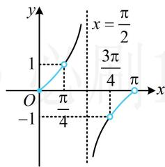
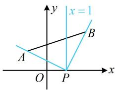
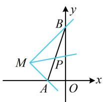
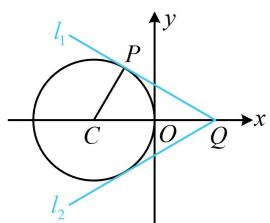
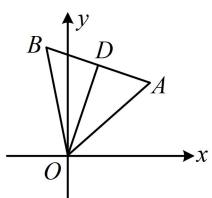
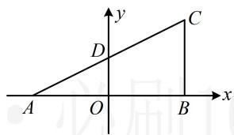

# 强化训练

1. (2023·浙江温州三模·★)

已知直线 $l_{1}: x + y = 0$ ， $l_{2}: ax + by + 1 = 0$ ，若 $l_{1} \perp l_{2}$ ，则 $a + b = (\quad)$

A. -1

B. 0

C. 1

D. 2

1. B

解析：两直线垂直，可用 $A_{1}A_{2} + B_{1}B_{2} = 0$ 翻译，

因为 $l_{1}\perp l_{2}$ ，所以 $1\times a+1\times b=0$ ，故 $a+b=0$ 。

2. (★)

过点(5,2)，且在 $x$ 轴上截距是在 $y$ 轴上截距2倍的直线 $l$ 的方程是（）

A. $2x + y - 12 = 0$

B. $2x + y - 12 = 0$ 或 $2x - 5y = 0$

C. $x - 2y - 1 = 0$

D. $x + 2y - 9 = 0$ 或 $2x - 5y = 0$

2. D

解析：涉及直线在两个坐标轴上的截距，常设直线的截距式方程，先考虑截距为0的特殊情况，

当直线 l 过原点时，其方程为 $y=\frac{2}{5}x$ ，即 2x-5y=0，

此时 $l$ 在两个坐标轴截距都为0，满足题意；

当直线 l 不过原点时，可设 $l: \frac{x}{2a} + \frac{y}{a} = 1 (a \neq 0)$ ①，

将(5,2)代入得： $\frac{5}{2a} +\frac{2}{a} = 1$ ，解得： $a = \frac{9}{2}$

代入①整理得 l 的方程为 $x + 2y - 9 = 0$ ;

综上所述， $l$ 的方程为 $x + 2y - 9 = 0$ 或 $2x - 5y = 0$

3. (2022·重庆月考·★★)

已知两条直线 $l_{1}$ ， $l_{2}$ 的斜率分别为 $k_{1}$ ， $k_{2}$ ，倾斜角分别为 $\alpha$ ， $\beta$ ，若 $\alpha <  \beta$ ，则下列关系不可能成立的是（）

A. $0 < k_{1} < k_{2}$

B. $k_{1} < k_{2} < 0$

C. $k_{2} < k_{1} < 0$

D. $k_{2} < 0 < k_{1}$

3. C

解析：斜率正负与倾斜角钝锐有关，故讨论 $\alpha$ 和 $\beta$ 的钝锐，

当 $\alpha$ ， $\beta$ 均为锐角时， $0 <   \alpha <  \beta <  \frac{\pi}{2}$ ，所以 $0 <   k_{1} <   k_{2}$

当 $\alpha$ ， $\beta$ 均为钝角时， $\frac{\pi}{2} <  \alpha <  \beta <  \pi$ ，所以 $k_{1} <   k_{2} <   0$

当 $\alpha$ 为锐角， $\beta$ 为钝角时， $k_{2} < 0 < k_{1}$ ，故选C.

4. (2025·山东菏泽模拟·★★☆)

已知直线 $l$ 的方程为 $(\sin \alpha)x - y + 3\sqrt{2} = 0$ ， $\alpha \in \left(-\frac{\pi}{2},\frac{\pi}{2}\right)$ ，则直线 $l$ 的倾斜角 $\theta$ 的取值范围是（）

A. $\left[0, \frac{\pi}{4}\right) \cup \left(\frac{3\pi}{4}, \pi\right)$

B. $\left(-\frac{\pi}{4},\frac{\pi}{4}\right)$

C. $\left[0, \frac{\pi}{4}\right] \cup \left[\frac{3\pi}{4}, \pi\right]$

D. $\left[-\frac{\pi}{4}, \frac{\pi}{4}\right]$

4. A

解析：要求倾斜角的范围，先求斜率的范围，

$$
(\sin \alpha) x - y + 3 \sqrt {2} = 0 \Rightarrow y = (\sin \alpha) x + 3 \sqrt {2},
$$

所以直线 $l$ 的斜率 $k = \sin \alpha$

因为 $\alpha \in \left(-\frac{\pi}{2},\frac{\pi}{2}\right)$ ，所以 $-1 <   \sin \alpha <  1$ ，故 $k\in (-1,1)$

斜率有正有负，则倾斜角有锐有钝，故分两段考虑，

如图，当 $k \in (-1,0)$ 时，倾斜角的取值范围是 $\left(\frac{3\pi}{4}, \pi\right)$ ；

当 $k \in [0,1)$ 时，倾斜角的取值范围是 $\left[0, \frac{\pi}{4}\right)$ ;

综上所述，直线 $l$ 的倾斜角的取值范围是 $\left[0, \frac{\pi}{4}\right) \cup \left(\frac{3\pi}{4}, \pi\right)$ .

line

| x | y |
|---|---|
| 0 | π/4 |
| π/4 | 3π/4 |
| π | π |

5. (★★☆)

已知 $A(-1,1)$ ， $B(2,2)$ ，若直线 $l: x + my - 1 = 0$ 与线段 $AB$ 有交点，则实数 $m$ 的取值范围为 \_\_\_\_.

5. $\left[-\frac{1}{2}, 2\right]$

解析：直线 l 的方程含参，先观察是否过定点，

由题意，直线 l 过定点 $P(1,0)$ ，

参数 $m$ 与直线 $l$ 的斜率有关，故可通过分析 $l$ 的斜率的变化范围来求 $m$ 的范围，先考虑斜率不存在的情况，

当 $m = 0$ 时，直线 $l$ 的方程为 $x = 1$ ，如图，满足题意；

当 $m \neq 0$ 时，直线 $l$ 的斜率 $k = -\frac{1}{m}$ ， $k_{PA} = -\frac{1}{2}$ ， $k_{PB} = 2$

直线 $l$ 可从 $PB$ 绕点 $P$ 逆时针旋转至 $PA$ ，过程中经过了竖直线，所以其斜率 $-\frac{1}{m} \leq -\frac{1}{2}$ 或 $-\frac{1}{m} \geq 2$ ，

解得： $0 < m \leq 2$ 或 $-\frac{1}{2} \leq m < 0$

综上所述，实数 $m$ 的取值范围为 $\left[-\frac{1}{2}, 2\right]$ .

text_image

x = 1
y
B
A
O
P
x

6. (★★★)

已知 $A(-1,0)$ ， $B(0,3)$ ，若直线 $l: ax + y + 2a - 1 = 0$ 上存在点 $P$ ，满足 $|PA| + |PB| = |AB|$ ，则 $l$ 的倾斜角的取值范围是（）

A. $\left[0, \frac{\pi}{4}\right] \cup \left[\frac{3\pi}{4}, \pi\right)$

B. $\left[\frac{\pi}{4},\frac{3\pi}{4}\right]$

C. $\left[0, \frac{\pi}{6}\right] \cup \left[\frac{5\pi}{6}, \pi\right)$

D. $\left[\frac{\pi}{6},\frac{5\pi}{6}\right]$

6. A

解析： $ax + y + 2a - 1 = 0\Rightarrow a(x + 2) + (y - 1) = 0$

所以直线 l 过定点 $M(-2,1)$ ,

满足 $|PA| + |PB| = |AB|$ 的点 $P$ 必在线段 $AB$ 上，故问题等价于直线 $l$ 与线段 $AB$ 有交点，可画图分析，

如图， $k_{MA} = \frac{0 - 1}{-1 - (-2)} = -1$ ， $k_{MB} = \frac{1 - 3}{-2 - 0} = 1$

直线 $l$ 从 $MA$ 绕 $M$ 逆时针旋转至 $MB$ , 与线段 $AB$ 有交点,

旋转过程中不经过竖直线，故其斜率的变化范围是[-1,1]，

所以其倾斜角的变化范围是 $\left[0, \frac{\pi}{4}\right] \cup \left[\frac{3\pi}{4}, \pi\right)$ .

text_image

y
B
M
P
A
O
x

7. (★★★) (多选)

实数 $x$ ， $y$ 满足 $x^{2} + y^{2} + 2x = 0$ ，则下列关于 $\frac{y}{x - 1}$ 的判断正确的是（）

A. $\frac{y}{x - 1}$ 的最大值为 $\sqrt{3}$

B. $\frac{y}{x - 1}$ 的最小值为 $-\sqrt{3}$

C. $\frac{y}{x - 1}$ 的最大值为 $\frac{\sqrt{3}}{3}$

D. $\frac{y}{x - 1}$ 的最小值为 $-\frac{\sqrt{3}}{3}$

7. CD

解析：出现关于 $x, y$ 的一次分式结构，可考虑运用两点连线的斜率来分析，因为 $\frac{y}{x - 1} = \frac{y - 0}{x - 1}$ ，所以 $\frac{y}{x - 1}$ 可看成动点 $P(x,y)$ 与定点 $Q(1,0)$ 的连线斜率，

$x^{2} + y^{2} + 2x = 0 \Rightarrow (x + 1)^{2} + y^{2} = 1 \Rightarrow$ 点 $P$ 可在如图所示的圆上运动， $PQ$ 斜率最小的是 $l_{1}$ ，最大的是 $l_{2}$ ，

观察图形发现 $\triangle PCQ$ 的三边易求出，故可求得 $\tan \angle PQC$ ，进而得到 $l_{1}$ 的斜率，

由题意， $\left|PC\right|=1,\quad C(-1,0),\quad\left|CQ\right|=2,$

所以 $\left|PQ\right|=\sqrt{\left|CQ\right|^{2}-\left|PC\right|^{2}}=\sqrt{3}$ ，

从而 $\tan \angle PQC = \frac{|PC|}{|PQ|} = \frac{\sqrt{3}}{3}$ ，故直线 $l_{1}$ 的斜率为 $-\frac{\sqrt{3}}{3}$ ，

由对称性知直线 $l_{2}$ 的斜率为 $\frac{\sqrt{3}}{3}$

所以 $\frac{y}{x - 1}$ 的最小值为 $-\frac{\sqrt{3}}{3}$ ，最大值为 $\frac{\sqrt{3}}{3}$ .

text_image

l₁
P
C
O
Q
x
y
l₂

8. (2022·河北保定月考·★★★)

若正三角形的一条高所在直线的斜率为3，则该正三角形的三边所在直线的斜率之和为\_\_\_\_。

8. $-\frac{13}{3}$

解析：如图， $OD$ 是正 $\triangle AOB$ 的一条高线，其斜率为3，

因为 $AB \perp OD$ ，所以直线 $AB$ 的斜率为 $-\frac{1}{3}$ ，

接下来计算 $OA$ 和 $OB$ 的斜率, 可抓住它们与 $OD$ 的夹角均为 $30^{\circ}$ , 夹角问题, 用方向向量处理,

直线 $OD$ 的方向向量为 $\pmb {m} = (1,3)$ ，设与直线 $OD$ 夹角为 $30^{\circ}$ 的直线斜率为 $k$ ，则其方向向量为 $\pmb {n} = (1,k)$

所以 $\left|\cos<m,n>\right|=\frac{\left|m\cdot n\right|}{\left|m\right|\cdot\left|n\right|}=\frac{\left|1+3k\right|}{\sqrt{10}\cdot\sqrt{1+k^{2}}}=\cos30^{\circ}=\frac{\sqrt{3}}{2}$

解得： $k = -2\pm \frac{5}{\sqrt{3}}$ ，由图可知 $OA$ 的斜率为正， $OB$ 的斜

率为负，所以 $k_{OA} = -2 + \frac{5}{\sqrt{3}}$ ， $k_{OB} = -2 - \frac{5}{\sqrt{3}}$

故该正三角形的三边所在直线的斜率之和为

$$
- 2 + \frac {5}{\sqrt {3}} - 2 - \frac {5}{\sqrt {3}} - \frac {1}{3} = - \frac {1 3}{3}.
$$

text_image

y
B D
A
O x

9. (2023·山东青岛三模·★★★)

瑞士数学家欧拉在《三角形的几何学》一书中提出：任意三角形的外心、重心、垂心在同一条直线上，这条直线被称为欧拉线。已知 $\triangle ABC$ 的顶点 $A(-3,0)$ ， $B(3,0)$ ， $C(3,3)$ ，若直线 $l: ax + (a^2 - 3)y - 9 = 0$ 与 $\triangle ABC$ 的欧拉线平行，则实数 $a$ 的值为（）

A. -2

B. -1

C. -1或3

D. 3

9. B

解析：只要找到外心、重心、垂心中的任意两个，就能求出欧拉线，再由欧拉线与 $l$ 平行求 $a$ ，我们画图来看哪两个心好找，如图， $\triangle ABC$ 为直角三角形，所以其外心为斜边中点 $D\left(0, \frac{3}{2}\right)$ ，垂心为直角顶点 $B(3,0)$ ，

所以欧拉线的斜率 $k = \frac{\frac{3}{2} - 0}{0 - 3} = -\frac{1}{2}$ ，其方程为 $y = -\frac{1}{2} x + \frac{3}{2}$ ，

欧拉线斜率存在，则 $l$ 的斜率也存在，可先用斜率相等求参，再检验是否重合，

$$
a x + (a ^ {2} - 3) y - 9 = 0 \Rightarrow y = - \frac {a}{a ^ {2} - 3} x + \frac {9}{a ^ {2} - 3},
$$

所以 $-\frac{a}{a^2 - 3} = -\frac{1}{2}$ ，解得： $a = -1$ 或3，

当 $a = 3$ 时， $l$ 的方程为 $3x + 6y - 9 = 0$ ，即 $y = -\frac{1}{2} x + \frac{3}{2}$ ，与欧拉线重合，舍去，故 $a = -1$ 。

text_image

y
C
D
A O B x

