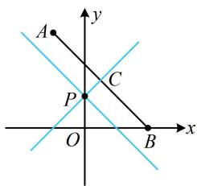
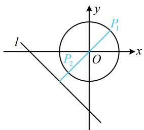
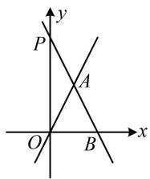
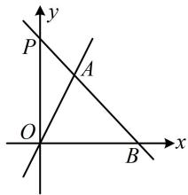

# 强化训练

1. (★)

若直线 $l_{1}: x + my + 1 = 0$ 和直线 $l_{2}: 2x - y - 1 = 0$ 平行，则它们之间的距离为 \_\_\_\_.

1. $\frac{3\sqrt{5}}{5}$

解析：已知两直线平行，可先由 $A_{1}B_{2} = A_{2}B_{1}$ 求出 $m$

因为 $l_{1} // l_{2}$ ，所以 $1 \times (-1) = 2m$ ，解得： $m = -\frac{1}{2}$ ，

所以 $l_{1}$ 的方程为 $x - \frac{1}{2} y + 1 = 0$

要代公式算 $l_{1}$ 与 $l_{2}$ 的距离，先把系数调整为一致，

$l_{1}:2x - y + 2 = 0$ ，故所求距离 $d = \frac{|2 - (-1)|}{\sqrt{2^2 + (-1)^2}} = \frac{3\sqrt{5}}{5}$

2. (★★)

已知 $A(1,1)$ ， $B(4,3)$ ， $C(-2,0)$ ，则 $\triangle ABC$ 的面积为 \_\_\_\_.

2. $\frac{3}{2}$

解析：已知 $A, B, C$ 的坐标求面积，不妨由两点距离公式算 $\vert AB\vert$ ，作为底边，点 $C$ 到直线 $AB$ 的距离作为高，

$\left|AB\right| = \sqrt{(1 - 4)^2 + (1 - 3)^2} = \sqrt{13}$ ，又 $k_{AB} = \frac{3 - 1}{4 - 1} = \frac{2}{3}$

所以直线 $AB$ 的方程为 $y - 1 = \frac{2}{3} (x - 1)$ ，即 $2x - 3y + 1 = 0$ ，

故点 $C$ 到直线 $AB$ 的距离 $d = \frac{|2\times(-2)-3\times0+1|}{\sqrt{2^2 + (-3)^2}} = \frac{3}{\sqrt{13}}$

所以 $S_{\triangle ABC} = \frac{1}{2}\big|AB\big|\cdot d = \frac{1}{2}\times \sqrt{13}\times \frac{3}{\sqrt{13}} = \frac{3}{2}.$

3. (2023·重庆二诊·★★)

已知直线 l 经过点 $(0,1)$ ，且 $A(-1,3)$ ， $B(2,0)$ 两点到直线 l 的距离相等，则 l 的方程为 \_\_\_\_.

3. $y = x + 1$ 或 $y = -x + 1$

解法1：已知 $l$ 上一点，设斜率即可写出 $l$ 的方程，用点到直线的距离公式翻译已知条件，先考虑斜率不存在的情况，

当直线 $l$ 斜率不存在时，其方程为 $x = 0$ ， $A$ ， $B$ 两点到该直线的距离不相等，不合题意；

当直线 $l$ 斜率存在时，可设其方程为 $y = kx + 1$

即 $kx - y + 1 = 0$ ，由题意， $A$ ， $B$ 两点到 $l$ 的距离相等，

所以 $\frac{|-k - 3 + 1|}{\sqrt{k^2 + (-1)^2}} = \frac{|2k + 1|}{\sqrt{k^2 + (-1)^2}}$ ，解得： $k = 1$ 或-1，

故直线 l 的方程为 $y = x + 1$ 或 $y = -x + 1$ .

解法2：也可考虑画图看看怎样能使 $A$ ， $B$ 两点到直线 $l$ 的距离相等，如图，记 $P(0,1)$ ，要使 $A$ ， $B$ 两点到 $l$ 的距离相等，只需直线 $l$ 与 $AB$ 平行，或 $l$ 过 $AB$ 中点，

若 $l \parallel AB$ ，直线 $l$ 的斜率 $k = k_{AB} = \frac{3 - 0}{-1 - 2} = -1$ ，

所以 l 的方程为 $y = -x + 1$ ;

若 $l$ 过 $AB$ 中点 $C\left(\frac{1}{2}, \frac{3}{2}\right)$ ，则直线 $l$ 的斜率 $k = \frac{\frac{3}{2} - 1}{\frac{1}{2} - 0} = 1$

所以 l 的方程为 $y = x + 1$ .

text_image

A
y
C
P
O
B
x

4. (★★)

设直线 $l:3x - 4y + 2m = 0$ 与直线 $l^{\prime}:6x - my + 1 = 0$ 平行，则点 $A(a^{2},3a)$ 到 $l$ 的距离的最小值为（）

A. $\frac{4}{5}$

B. 1

C. $\frac{6}{5}$

D. $\frac{7}{5}$

4. A

解析：条件有两直线平行，可由 $A_{1}B_{2} = A_{2}B_{1}$ 求参数 $m$

因为 $l / / l'$ ，所以 $3 \times (-m) = 6 \times (-4)$ ，故 $m = 8$ ，经检验，

$l$ 与 $l^{\prime}$ 不重合，所以 $l$ 的方程为 $3x - 4y + 16 = 0$

从而点 $A$ 到 $l$ 的距离 $d = \frac{\left|3a^2 - 4\times 3a + 16\right|}{\sqrt{3^2 + (-4)^2}}$

$$
= \frac {\left| 3 a ^ {2} - 1 2 a + 1 6 \right|}{5} = \frac {\left| 3 (a - 2) ^ {2} + 4 \right|}{5} = \frac {3 (a - 2) ^ {2} + 4}{5},
$$

故当 $a = 2$ 时， $d$ 取得最小值 $\frac{4}{5}$ .

5. (★★★)

已知实数 $x, y$ 满足 $x^{2} + y^{2} = 1$ ，则 $\left|x + y + 2\right|$ 的取值范围是 \_\_\_\_.

5. $[2 - \sqrt{2}, 2 + \sqrt{2}]$

解析：看到 $|x + y + 2|$ ，想到点到直线的距离公式，但还缺分母部分，于是凑分母，

$\left|x + y + 2\right| = \sqrt{2}\cdot \frac{\left|x + y + 2\right|}{\sqrt{1^2 + 1^2}}$ ，记 $d = \frac{|x + y + 2|}{\sqrt{1^2 + 1^2}}$

则 $|x + y + 2| = \sqrt{2} d$ ，其中 $d$ 表示动点 $P(x,y)$ 到定直线

$l:x+y+2=0$ 的距离，先画图看看，

因为 $x$ ， $y$ 满足 $x^{2} + y^{2} = 1$ ，所以点 $P$ 可在如图所示的单位圆上运动，

由图可知， $d$ 的最大、最小值分别在 $P_{1}$ ， $P_{2}$ 处取得，

圆心 $O$ 到 $l$ 的距离为 $\frac{|2|}{\sqrt{1^2 + 1^2}} = \sqrt{2}$ ，所以 $d_{\mathrm{min}} = \sqrt{2} - 1$

$d_{\max} = \sqrt{2} + 1$ ，故 $\left|x + y + 2\right| = \sqrt{2} d\in [2 - \sqrt{2},2 + \sqrt{2} ]$

text_image

l
y
P₁
P₂ O x

【反思】①求 $|Ax + By + C|$ 的最值，可将其凑形式，化成 $\sqrt{A^2 + B^2} \cdot \frac{|Ax + By + C|}{\sqrt{A^2 + B^2}}$ ，转化为点 $(x, y)$ 到直线 $Ax + By + C = 0$ 的距离来分析；②本题也可用三角换元来做.

6. (2023·湖北武汉四调·★★★☆)

直线 $l_{1}: y = 2x$ 和 $l_{2}: y = kx + 1$ 与 $x$ 轴围成的三角形是等腰三角形，写出满足条件的 $k$ 的两个可能取值：\_\_\_\_和\_\_\_\_.

6. -2, $-\frac{4}{3}$ （答案不唯一，详见解析）

解析：对于等腰三角形，需先找到谁是底，谁是腰，才能进一步翻译，故先画图分析，

直线 $l_{2}$ 表示绕定点 $P(0,1)$ 旋转的直线，如图，有下面几种情况都能围成等腰三角形，下面分别计算，

text_image

y
P
A
O
B
x

图1

text_image

y
P
A
O
B
x

图2

text_image

y
P
A
B
O
x

图3

text_image

y
P
A
O
B
x

图4

若为图1，则 $\left|OA\right| = \left|AB\right|$ ，所以 $\angle AOB = \angle ABO$ ，从而直线 $OA$ ， $AB$ 的倾斜角互补，斜率相反，故 $k = -2$

若为图2，则 $|AB| = |OB|$ ，要翻译此条件，需先联立直线的方程，求A，B的坐标，

联立 $\left\{ \begin{array}{l} y = kx + 1 \\ y = 0 \end{array} \right.$ 解得： $x = -\frac{1}{k}$ ，所以 $B\left(-\frac{1}{k}, 0\right)$ ，

联立 $\left\{ \begin{array}{l} y = kx + 1 \\ y = 2x \end{array} \right.$ 解得： $\left\{ \begin{array}{l} x = \frac{1}{2 - k} \\ y = \frac{2}{2 - k} \end{array} \right.$ ，所以 $A\left( \frac{1}{2 - k}, \frac{2}{2 - k} \right)$ ，

从而 $\left|AB\right|=\left|OB\right|$ 即为 $\sqrt{\left(\frac{1}{2-k}+\frac{1}{k}\right)^{2}+\left(\frac{2}{2-k}\right)^{2}}=-\frac{1}{k}$ ,

故 $\left(\frac{1}{2 - k} +\frac{1}{k}\right)^2 +\left(\frac{2}{2 - k}\right)^2 = \frac{1}{k^2},$

所以 $\frac{1}{(2 - k)^2} +\frac{2}{(2 - k)k} +\frac{1}{k^2} +\frac{4}{(2 - k)^2} = \frac{1}{k^2},$

化简得： $\frac{3k + 4}{(2 - k)^2k} = 0$ ，解得： $k = -\frac{4}{3}$

若为图3或图4，则 $\left|OA\right| = \left|OB\right|$

由图2的分析过程可知， $A\left(\frac{1}{2 - k},\frac{2}{2 - k}\right),B\left(-\frac{1}{k},0\right),$

所以 $\left|OA\right|=\left|OB\right|$ 即为 $0-\left(-\frac{1}{k}\right)=\sqrt{\left(\frac{1}{2-k}\right)^{2}+\left(\frac{2}{2-k}\right)^{2}}$

故 $\frac{1}{k^2} = \frac{5}{(2 - k)^2}$ ，解得： $k = \frac{\sqrt{5} - 1}{2}$ 或 $-\frac{\sqrt{5} + 1}{2}$

其中 $k = \frac{\sqrt{5} - 1}{2}$ 对应图3， $k = -\frac{\sqrt{5} + 1}{2}$ 对应图4；

综上所述， $k$ 可能的值为-2， $-\frac{4}{3}$ ， $\frac{\sqrt{5} - 1}{2}$ 或 $-\frac{\sqrt{5} + 1}{2}$

