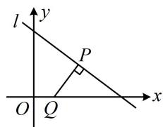
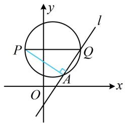

# 第2节 距离公式（★★）

# 内容提要

1. 两点间的距离公式：设 $A(x_{1},y_{1})$ ， $B(x_{2},y_{2})$ ，则 $\left|AB\right| = \sqrt{(x_1 - x_2)^2 + (y_1 - y_2)^2}$   
2. 点到直线的距离公式：设点 $P(x_0, y_0)$ ，直线 $l: Ax + By + C = 0$ ，则点 $P$ 到直线 $l$ 的距离 $d = \frac{|Ax_0 + By_0 + C|}{\sqrt{A^2 + B^2}}$ .  
3. 平行线间的距离公式：设 $l_{1}: Ax + By + C_{1} = 0$ ， $l_{2}: Ax + By + C_{2} = 0$ ， $C_{1} \neq C_{2}$ ，则 $l_{1}$ 和 $l_{2}$ 平行，且它们之间的距离 $d = \frac{|C_1 - C_2|}{\sqrt{A^2 + B^2}}$ .  
4. 弦长公式：设 $A(x_{1},y_{1})$ ， $B(x_{2},y_{2})$ ，若 $A$ ， $B$ 在直线 $y = kx + b$ 上，则 $\left|AB\right| = \sqrt{1 + k^2}\cdot \left|x_1 - x_2\right|$ 若 $A$ ， $B$ 在直线 $x = my + t$ 上，则 $\left|AB\right| = \sqrt{1 + m^2}\cdot \left|y_1 - y_2\right|$

# 类型 I：两点间的距离

【例1】设 $P$ 为函数 $y = x + \frac{1}{x}$ 的图象上一点， $O$ 为坐标原点，则 $|OP|$ 的最小值是（）

A. 2 B. $\sqrt{5}$ C. $2\sqrt{2} + 2$ D. $\sqrt{2\sqrt{2} + 2}$

解析：有解析式，可用它设动点 $P$ 的坐标，再由两点间距离公式计算 $\vert OP\vert$

由题意，可设 $P\left(x, x + \frac{1}{x}\right)$ ，则 $\left|OP\right| = \sqrt{x^2 + \left(x + \frac{1}{x}\right)^2} = \sqrt{2x^2 + \frac{1}{x^2} + 2} \geq \sqrt{2\sqrt{2x^2 \cdot \frac{1}{x^2}} + 2} = \sqrt{2\sqrt{2} + 2}$ ，当且仅当 $2x^2 = \frac{1}{x^2}$ ，即 $x = \pm \frac{1}{\sqrt[4]{2}}$ 时等号成立，所以 $\left|OP\right|_{\min} = \sqrt{2\sqrt{2} + 2}$ .

答案: D

【例2】若 $x$ ， $y$ 满足 $3x + 4y - 13 = 0$ ，则 $(x - 1)^{2} + y^{2}$ 的最小值为（）

A. 3 B. 4 C. 2 D. 6

解析：由 $(x - 1)^2 + y^2$ 的结构联想到两点间的距离公式，记 $P(x, y)$ ， $Q(1, 0)$ ，则 $(x - 1)^2 + y^2 = |PQ|^2$

因为 $3x + 4y - 13 = 0$ ，所以 $P$ 是直线 $l:3x + 4y - 13 = 0$ 上的动点，

如图，当 $PQ \perp l$ 时， $|PQ|$ 最小，故可用点到直线的距离公式求该最小值，

所以 $\left|PQ\right|_{\min} = \frac{\left|3\times 1 + 4\times 0 - 13\right|}{\sqrt{3^2 + 4^2}} = 2$ ，故 $(x - 1)^2 +y^2$ 的最小值为4.

答案: B

text_image

l
y
P
O Q x

【反思】解析几何中看到“平方+平方”的结构，常往两点间的距离这个方向思考.

# 类型Ⅱ：点到直线的距离

【例3】已知 $A(-2,0)$ ， $B(4,a)$ 两点到直线 $l:3x - 4y + 1 = 0$ 的距离相等，则 $a = (\quad)$

A. 2 B. $\frac{9}{2}$ C. 2或-8 D. 2或 $\frac{9}{2}$

解析：由题意， $\frac{|3\times(-2)-4\times0+1|}{\sqrt{3^2+(-4)^2}} = \frac{|3\times 4 - 4\times a + 1|}{\sqrt{3^2+(-4)^2}}$ ，解得： $a = 2$ 或 $\frac{9}{2}$

答案: D

【变式】已知直线 $l: y = k(x - 2) + 2$ ，当 $k$ 变化时，点 $P(-1,2)$ 到直线 $l$ 的距离的取值范围是（）

A. $[0, +\infty)$

B. $[0,2]$

C. $[0,3]$

D. $[0,3)$

解法1：有点的坐标和直线的方程，可把点 $P$ 到直线 $l$ 的距离用 $k$ 表示，再分析它的取值范围，

$y = k(x - 2) + 2 \Rightarrow kx - y + 2 - 2k = 0 \Rightarrow$ 点 $P$ 到直线 $l$ 的距离 $d = \frac{|-k - 2 + 2 - 2k|}{\sqrt{k^2 + (-1)^2}} = \frac{|3k|}{\sqrt{k^2 + 1}}$

$$
= 3 \sqrt {\frac {k ^ {2}}{k ^ {2} + 1}} = 3 \sqrt {\frac {k ^ {2} + 1 - 1}{k ^ {2} + 1}} = 3 \sqrt {1 - \frac {1}{k ^ {2} + 1}},
$$

因为 $k^2 \geq 0$ ，所以 $k^2 + 1 \geq 1$ ，从而 $0 < \frac{1}{k^2 + 1} \leq 1$ ，故 $0 \leq 1 - \frac{1}{k^2 + 1} < 1$ ，所以 $0 \leq 3\sqrt{1 - \frac{1}{k^2 + 1}} < 3$ ，故 $d \in [0,3)$ .

解法 2: 观察发现直线 $l$ 过定点, 故也可尝试画图分析, 先在图中把目标距离作出来,

$y = k(x - 2) + 2 \Rightarrow$ 直线 $l$ 过定点 $Q(2,2)$ ，如图，作 $PA \perp l$ 于 $A$

我们就是要分析 $|PA|$ 的取值范围，因为 $P$ 是定点，所以找 $A$ 的轨迹，

注意到当 $l$ 绕点 $Q$ 旋转的过程中，始终有 $PA \perp AQ$

所以点 $A$ 在以 $PQ$ 为直径的圆上运动，

由于直线 $l$ 的斜率存在，所以 $A$ 不与 $Q$ 重合，那么 $A$ 在圆上运动时，有 $0 \leq |PA| < |PQ| = 3$ ，即点 $P$ 到直线 $l$ 的距离的取值范围是[0,3).

text_image

y
l
P
Q
A
O
x

答案: D

# 类型III：平行线间的距离

【例 4】直线 $2x + y + 1 = 0$ 与直线 $4x + 2y + a = 0$ 之间的距离为 $\sqrt{5}$ ，则 a = \_\_\_\_.

解析：两平行线才能算距离，两直线的斜率均为-2，所以平行，代公式前先调整系数为一致，

$2x+y+1=0\Rightarrow4x+2y+2=0$ ，所以两直线的距离 $d=\frac{|2-a|}{\sqrt{4^{2}+2^{2}}}=\sqrt{5}$ ，解得：a=-8或12.

答案: -8 或 12

# 强化训练

1. (★)

若直线 $l_{1}: x + my + 1 = 0$ 和直线 $l_{2}: 2x - y - 1 = 0$ 平行，则它们之间的距离为 \_\_\_\_.

2. (★★)

已知 $A(1,1)$ ， $B(4,3)$ ， $C(-2,0)$ ，则 $\triangle ABC$ 的面积为 \_\_\_\_.

3. (2023·重庆二诊·★★)

已知直线 l 经过点 $(0,1)$ ，且 $A(-1,3)$ ， $B(2,0)$ 两点到直线 l 的距离相等，则 l 的方程为 \_\_\_\_.

4. (★★)

设直线 $l:3x - 4y + 2m = 0$ 与直线 $l^{\prime}:6x - my + 1 = 0$ 平行，则点 $A(a^{2},3a)$ 到 $l$ 的距离的最小值为（）

A. $\frac{4}{5}$

B. 1

C. $\frac{6}{5}$

D. $\frac{7}{5}$

5. (★★★)

已知实数 $x$ ， $y$ 满足 $x^{2} + y^{2} = 1$ ，则 $\left|x + y + 2\right|$ 的取值范围是 \_\_\_\_.

6.（2023·湖北武汉四调·★★★☆）

直线 $l_{1}: y = 2x$ 和 $l_{2}: y = kx + 1$ 与 $x$ 轴围成的三角形是等腰三角形，写出满足条件的 $k$ 的两个可能取值：\_\_\_\_和\_\_\_\_.

