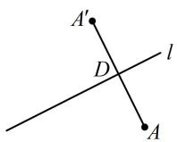
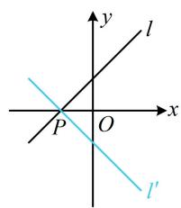
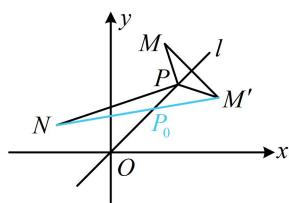
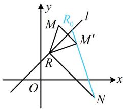
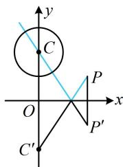
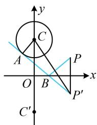
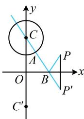

# 强化训练

1. (2025·福建福州模拟·★)

点(1,2)关于直线x-2y-2=0的对称点坐标是\_\_\_\_.

1. (3,-2)

解析：设 $A(1,2)$ 关于 $l:x - 2y - 2 = 0$ 的对称点是 $A^{\prime}(a,b)$

则 $AA'$ 的中点为 $D\left(\frac{1 + a}{2}, \frac{2 + b}{2}\right)$ ,

如图，应有 $\left\{ \begin{array}{l} \frac{1 + a}{2} - 2 \times \frac{2 + b}{2} - 2 = 0 (\text{中点} D \text{在} l \text{上}) \\ \frac{b - 2}{a - 1} \times \frac{1}{2} = -1 (AA' \perp l) \end{array} \right.$ ，

解得： $\left\{\begin{aligned}a=3\\ b=-2\end{aligned}\right.$ ，故 $A'(3,-2)$ .

2. (2022·北京模拟·★)

直线 $l:3x-4y+5=0$ 关于点 $A(1,1)$ 对称的直线 $l'$ 的方程为 \_\_\_\_.

2. $3x - 4y - 3 = 0$

解法1: 如图, 关于点对称的两直线平行, 所以两直线斜率相等, 再找一个点即可, 由题意, 点 $B(1,2)$ 在 $l$ 上, 那么它关于点 $A$ 的对称点 $B'(1,0)$ 在 $l'$ 上, 又直线 $l$ 的斜率为 $\frac{3}{4}$ ,

所以 $l'$ 的方程为 $y = \frac{3}{4} (x - 1)$ ，整理得： $3x - 4y - 3 = 0$ 。

解法2：也可设 $B'$ 的坐标，通过 $B'$ 关于 $A$ 的对称点 $B$ 在 $l$ 上建立关于所设坐标的方程，设 $B'(x,y)$ 是 $l'$ 上任意一点，则它关于 $A$ 的对称点 $B(2 - x,2 - y)$ 在直线 $l$ 上，

代入直线 l 的方程可得 $3(2-x)-4(2-y)+5=0$ ，

整理得： $3x - 4y - 3 = 0$ ，即 $l^{\prime}:3x - 4y - 3 = 0$

text_image

l
B
A
l'
B'

3. (★)

已知圆 $C: x^2 + y^2 + ax + by + 1 = 0$ 关于直线 $l: x + y = 1$ 对称的圆为 $O: x^2 + y^2 = 1$ ，则 $a + b = (\quad)$

A. -2

B. ±2

C. -4

D. ±4

3. C

解析：两圆关于 $l$ 对称，则圆心 $O$ 和 $C$ 关于 $l$ 对称， $O$ 已知，可先求点 $O$ 关于 $l$ 的对称点，该点即为 $C, l$ 的斜率为 $-1$ ，可按特殊情况处理， $x + y = 1 \Rightarrow \begin{cases} x = 1 - y \\ y = 1 - x \end{cases}$

将 $O(0,0)$ 代入此二式右侧得 $\left\{ \begin{array}{l}x = 1\\ y = 1 \end{array} \right.$

所以圆心 O 关于直线 l 的对称点为 $C(1,1)$ ,

$$
x ^ {2} + y ^ {2} + a x + b y + 1 = 0 \Rightarrow \left(x + \frac {a}{2}\right) ^ {2} + \left(y + \frac {b}{2}\right) ^ {2} = \frac {a ^ {2} + b ^ {2}}{4} - 1,
$$

所以圆心 $C$ 的坐标为 $\left(-\frac{a}{2}, -\frac{b}{2}\right)$ ，从而 $-\frac{a}{2} = 1$ ， $-\frac{b}{2} = 1$ ，

故 $a = b = -2$ ，所以 $a + b = -4$

# 4. (★)

已知圆 $C: x^{2} + y^{2} - 2x + 4y = 0$ 关于直线 $l: 2x + ay = 0$ 对称，则 $a =$ \_\_\_\_.

4.1

解析： $x^{2} + y^{2} - 2x + 4y = 0\Rightarrow (x - 1)^{2} + (y + 2)^{2} = 5$

所以圆 $C$ 的圆心为 $C(1, - 2)$ ，因为圆 $C$ 关于直线 $l$ 对称，

所以圆心 C 在 l 上，故 $2 \times 1 + a \times (-2) = 0$ ，解得：a = 1。

# 5. (★)

直线 $l: x - y + 1 = 0$ 关于 $x$ 轴对称的直线 $l'$ 的方程是（）

A. $x + y - 1 = 0$

B. $x - y + 1 = 0$

C. $x + y + 1 = 0$

D. $x - y - 1 = 0$

5. C

解析：如图，直线 l 与直线 $l'$ 关于 x 轴对称，则 $l'$ 过 l 与 x 轴的交点 P，且 l 和 $l'$ 的斜率互为相反数，

$\left\{\begin{aligned}x-y+1&=0\\ y&=0\end{aligned}\right.\Rightarrow\left\{\begin{aligned}x&=-1\\ y&=0\end{aligned}\right.\Rightarrow P(-1,0)$ ，直线l的斜率为1，

所以直线 $l'$ 的斜率为 $-1$ ，故 $l'$ 的方程为 $y = -[x - (-1)]$ ，

整理得： $x + y + 1 = 0$

text_image

y
l
x
P
O
l'

# 6. (★★)

直线 $l_{1}:x-3y+3=0$ 关于 $l:x+y-1=0$ 的对称直线 $l_{2}$ 的方程为\_\_\_\_.

6. $3x - y + 1 = 0$

解析：如图，直线 $l_{2}$ 过 $l_{1}$ 与 $l$ 的交点 $P$ ，先求点 $P$

$\left\{ \begin{array}{l} x + y - 1 = 0 \\ x - 3y + 3 = 0 \end{array} \right. \Rightarrow \left\{ \begin{array}{l} x = 0 \\ y = 1 \end{array} \right.$ ，所以 $P(0,1)$ ，

有一个点了, 还差斜率, 于是设斜率, 并在 $l$ 上另取一点 $Q$ , 由 $Q$ 到 $l_{1}$ 和 $l_{2}$ 距离相等建立方程求斜率,

由图可知 $l_{2}$ 的斜率存在，设其方程为 $y = kx + 1$

即 $kx - y + 1 = 0$ ①,

点 $Q(1,0)$ 在直线 $l$ 上，所以 $Q$ 到 $l_{1}$ 和 $l_{2}$ 的距离相等，

故 $\frac{|1 + 3|}{\sqrt{1^2 + (-3)^2}} = \frac{|k + 1|}{\sqrt{k^2 + (-1)^2}}$ ，解得： $k = 3$ 或 $\frac{1}{3}$

其中 $\frac{1}{3}$ 是 $l_{1}$ 的斜率，舍去，所以 $k = 3$

代入①整理得 $l_{2}$ 的方程为 $3x - y + 1 = 0$ .

text_image

l
l₁
P
O
Q
x
y
l₂

7. (2022·黑龙江勃利模拟·★★★)

设 $P(x,y)$ 为直线 $l:x - y = 0$ 上的动点，则 $m = \sqrt{(x - 2)^2 + (y - 4)^2} +\sqrt{(x + 2)^2 + (y - 1)^2}$ 的最小值为（）

A. 5

B. 6

C. $\sqrt{37}$

D. $\sqrt{39}$

7. C

解析：由 $m$ 的形式可联想到距离之和，故考虑画图看看，

记 $M(2,4)$ ， $N(-2,1)$ ，则 $m = |PM| + |PN|$

如图， $M$ ， $N$ 在直线 $l$ 的同侧，直接分析 $\left|PM\right| + \left|PN\right|$ 的最值不易，可将 $M$ 对称到 $l$ 的另一侧来看，

设 $M^{\prime}$ 为 $M$ 关于 $l$ 的对称点，则 $\left|PM\right| = \left|PM'\right|$ ，

所以 $\left|PM\right|+\left|PN\right|=\left|PM'\right|+\left|PN\right|$ ,

由三角形两边之和大于第三边可得 $\left|PM'\right| + \left|PN\right| \geq \left|M'N\right|$ ，

当且仅当 $P$ 与图中 $P_{0}$ 重合时取等号，

所以 $|PM| + |PN|$ 的最小值是 $|M'N|$ ，下面先求点 $M'$ 的坐标，注意到 $l$ 的斜率为 1，可按特殊情况处理，

$x - y = 0 \Rightarrow \left\{ \begin{array}{l} x = y \\ y = x \end{array} \right.$ ，将点 $M(2,4)$ 代入此二式的右侧可得

x=4，y=2，所以 $M'(4,2)$ ，

故 $\left|M'N\right|=\sqrt{(-2-4)^{2}+(1-2)^{2}}=\sqrt{37}$ ，

即 $(|PM| + |PN|)_{\min} = \sqrt{37}$

text_image

y
M
l
P
M'
N
P₀
O
x

8. (2022·安徽模拟·★★★)

已知点 $R$ 在直线 $l: x - y + 1 = 0$ 上， $M(1,3)$ ， $N(3,-1)$ ，则 $\| RM| - |RN|$ 的最大值为（）

A. $\sqrt{5}$

B. $\sqrt{7}$

C. $\sqrt{10}$

D. $2 \sqrt{5}$

8. C

解析：如图， $M, N$ 在 $l$ 的两侧，直接分析 $\| RM\| - |RN|$ 的最大值不易，可考虑将 $M$ 对称到 $l$ 的另一侧，

如图，设 $M^{\prime}$ 是 $M$ 关于直线 $l$ 的对称点，则 $\left|RM\right| = \left|R M'\right|$ ，

所以 $\left\|RM\right|-\left|RN\right\|=\left\|RM'\right|-\left|RN\right\|$

由三角形两边之差的绝对值小于第三边可得 $\left\| RM'\right| - \left|RN\right|$

$\leq \left|M^{\prime}N\right|$ ，当且仅当点 $R$ 与图中 $R_0$ 重合时取等号，

所以 $\left(\left|RM\right| - \left|RN\right|\right)_{\max} = \left|M'N\right|$ ，下面先求 $M'$ 的坐标，注意到 $l$ 的斜率为1，可按特殊情况处理，

$x - y + 1 = 0 \Rightarrow \left\{ \begin{array}{l} x = y - 1 \\ y = x + 1 \end{array} \right.$ ，将 $M(1,3)$ 代入此二式的右侧可

得 x=3-1=2， $y=1+1=2$ ，所以 $M'(2,2)$ ，

从而 $\left|M'N\right|=\sqrt{(3-2)^{2}+(-1-2)^{2}}=\sqrt{10}$ ，

故 $\left\| RM\right| - \left|RN\right|$ 的最大值为 $\sqrt{10}$ .

text_image

y
M
R₀
l
M′
R
O
x
N

9.（2022·山东潍坊一模·★★★☆）（多选）

已知圆 $C: x^{2} + (y - 2)^{2} = 1$ ，一条光线从点 $P(2,1)$ 发出，经 $x$ 轴反射，下列结论中正确的是（）

A. 圆 $C$ 关于 $x$ 轴的对称圆为 $x^{2} + (y + 2)^{2} = 1$   
B. 若反射光线平分圆 $C$ 的周长, 则入射光线所在的直线为 $3 x - 2 y - 4 = 0$   
C. 若反射光线与圆 $C$ 相切于点 $A$ , 与 $x$ 轴交于点 $B$ , 则 $\left|PB\right| + \left|BA\right| = 2$   
D. 若反射光线与圆 $C$ 的一个交点为 $A$ , 与 $x$ 轴交于点 $B$ , 则 $\left|PB\right| + \left|BA\right|$ 的最小值为 $2\sqrt{3} - 1$

9. AB

解析：涉及入射光线与反射光线的对称问题，先作出已知的点 $P$ 和点 $C$ 关于反射面的对称点，如下列图中的 $P'$ 和 $C'$ ，

A 项，由题意， $C(0,2)$ ，所以 $C'(0,-2)$ ，从而圆 C 关于 x 轴的对称圆为 $x^{2}+(y+2)^{2}=1$ ，故 A 项正确；

B项，反射光线过圆心时平分周长，如图1，入射光线所在直线即为直线 $PC'$ ，其斜率为 $\frac{-2 - 1}{0 - 2} = \frac{3}{2}$ ，

所以 $PC'$ 的方程为 $y = \frac{3}{2} x - 2$ ，整理得： $3x - 2y - 4 = 0$

故B项正确；

C 项，如图 2，因为 $\left|PB\right|=\left|P'B\right|$ ，所以 $\left|PB\right|+\left|BA\right|=$

$$
\left| P ^ {\prime} B \right| + \left| B A \right| = \left| P ^ {\prime} A \right| = \sqrt {\left| P ^ {\prime} C \right| ^ {2} - \left| A C \right| ^ {2}} \quad ①,
$$

由题意， $|AC|=1$ ， $P'(2,-1)$ ，

所以 $\left|P'C\right|=\sqrt{(2-0)^{2}+(-1-2)^{2}}=\sqrt{13}$ ，

代入①可得 $\left|PB\right|+\left|BA\right|=2\sqrt{3}$ ；若AB与圆C相切于y轴右侧， $\left|P'A\right|$ 长度不变，故C项错误；

D 项，由 C 项的分析过程知 $\left|PB\right| + \left|BA\right| = \left|P'A\right|$ ,

而 $\left|P'A\right|$ 最小的情形如图3，此时 $\left|P'A\right|=\left|P'C\right|-1=\sqrt{13}-1$ ，

所以 $|PB| + |BA|$ 的最小值为 $\sqrt{13} - 1$ ，故D项错误.

text_image

y
C
O
x
P
P'
C'

图1

text_image

y
C
A
P
O
B
x
P'
C'

图2

text_image

y
C
A
O
B
x
P
P'
C'

图3

