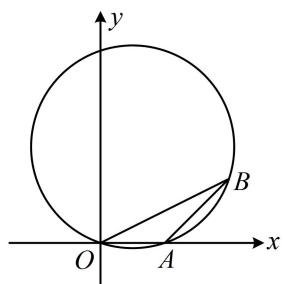
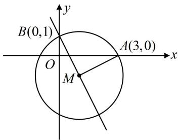
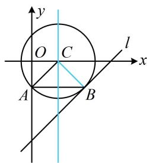

# 模块二 圆与方程

# 第1节 圆的方程（★☆）

# 内容提要

# 1. 圆的方程

①标准方程： $(x-a)^{2}+(y-b)^{2}=r^{2}(r>0)$ ，其中圆心为 $(a,b)$ ，半径为r.  
②一般方程： $x^{2} + y^{2} + Dx + Ey + F = 0$ ，其中 $D^2 +E^2 -4F > 0$

# 2. 求圆的方程常用三种方法:

①设一般式方程 $x^{2} + y^{2} + Dx + Ey + F = 0$ ，建立关于系数 $D, E, F$ 的方程组，解方程组。当已知圆上三点时，常用这种方法。  
②设圆心，利用圆心到圆上点的距离都等于半径建立方程求圆心。已知圆心性质时常用此法。  
③找圆心（弦的中垂线过圆心）、求半径.

3. 点与圆的位置关系：设 $P(x_0, y_0)$ ，圆 $C: (x - a)^2 + (y - b)^2 = r^2$ （或 $x^2 + y^2 + Dx + Ey + F = 0$ ），

①点 $P$ 在圆 $C$ 外 $\Leftrightarrow (x_0 - a)^2 +(y_0 - b)^2 >r^2$ （或 $x_0^2 +y_0^2 +Dx_0 + Ey_0 + F > 0$ ）；

②点 $P$ 在圆 $C$ 上 $\Leftrightarrow (x_0 - a)^2 +(y_0 - b)^2 = r^2$ （或 $x_0^2 +y_0^2 +Dx_0 + Ey_0 + F = 0$ ）；

③点 $P$ 在圆 $C$ 内 $\Leftrightarrow (x_0 - a)^2 +(y_0 - b)^2 < r^2$ （或 $x_0^2 + y_0^2 + Dx_0 + Ey_0 + F < 0$ ）.

# 类型 I：圆的方程中的系数条件

【例1】若方程 $x^{2} + y^{2} + 6x + m = 0$ 表示一个圆，则 $m$ 的取值范围是（）

A. $(- \infty, 9)$

B. $(- \infty, - 9)$

C. $(9, +\infty)$

D. $(-9, +\infty)$

解析：观察发现可用 $D^{2} + E^{2} - 4F > 0$ 求解 $m$ 的范围，方程 $x^{2} + y^{2} + 6x + m = 0$ 表示圆 $\Rightarrow 6^{2} - 4m > 0 \Rightarrow m < 9$ . 答案：A

【变式】若点 $P(-1,2)$ 在圆 $C: x^{2} + y^{2} - 2x + 4y + k = 0$ 的外部，则实数 $k$ 的取值范围是（）

A. $(-5, 5)$

B. $(-15,5)$

C. $(- \infty, -15) \cup (5, +\infty)$

D. $(-15, 2)$

解析：点 $P(-1,2)$ 在圆 $C$ 外部 $\Rightarrow (-1)^{2} + 2^{2} - 2\times (-1) + 4\times 2 + k > 0$ ，解得： $k > - 15$ ①，

务必注意，题设隐含了所给方程表示圆，故还需由 $D^{2} + E^{2} - 4F > 0$ 求 $k$ 的范围，与①取交集，

方程 $x^{2} + y^{2} - 2x + 4y + k = 0$ 表示圆，应有 $(-2)^{2} + 4^{2} - 4k > 0$ ，解得： $k < 5$ ，结合①可得 $k\in (-15,5)$

答案: B

【反思】当圆的方程中含参时，不要忘了考虑圆的方程本身对参数的要求.

# 类型Ⅱ：求圆的方程

【例 2】已知 $A(2,0)$ ， $B(4,2)$ ，O 为原点，则 $\triangle AOB$ 的外接圆的方程为 \_\_\_\_.

解析：如图，已知圆上三点，可设一般式方程，把点代入建立方程组求解系数，

设 $\triangle AOB$ 外接圆的方程为 $x^{2} + y^{2} + Dx + Ey + F = 0$

将 $A, B, O$ 的坐标代入可得 $\left\{ \begin{array}{l} 4 + 2D + F = 0 \\ 20 + 4D + 2E + F = 0 \\ F = 0 \end{array} \right.$ ，解得： $\left\{ \begin{array}{l} D = -2 \\ E = -6 \\ F = 0 \end{array} \right.$

所以 $\triangle AOB$ 外接圆的方程为 $x^{2} + y^{2} - 2x - 6y = 0$

答案： $x^{2} + y^{2} - 2x - 6y = 0$

text_image

y
O
A
x
B

【例 3】(2022·全国甲卷) 设点 M 在直线 $2x + y - 1 = 0$ 上，点 $(3,0)$ 和 $(0,1)$ 均在 $\odot M$ 上，则 $\odot M$ 的方程为 \_\_\_\_.

解析： $2x + y - 1 = 0 \Rightarrow y = 1 - 2x$ ，由题意，圆心 M 在直线 y = 1 - 2x 上，故可设 $M(a, 1 - 2a)$ ，

要求圆心坐标, 可用 $M$ 与所给圆上两点的距离相等来建立关于 $a$ 的方程,

如图， $\left|MA\right|=\left|MB\right|$ ，所以 $\sqrt{(a-3)^{2}+(1-2a)^{2}}=\sqrt{a^{2}+[1-(1-2a)]^{2}}$ ，

解得： $a = 1$ ，故圆心为 $(1, - 1)$ ，半径 $r = |MA| = \sqrt{(1 - 3)^2 + (-1 - 0)^2} = \sqrt{5}$

所以 $\odot M$ 的方程为 $(x - 1)^2 + (y + 1)^2 = 5$ .

答案： $(x - 1)^{2} + (y + 1)^{2} = 5$

text_image

B(0,1)
O
M
A(3,0)
x
y

【例 4】过点 $A(0,-1)$ ，且与直线 l:x-y-3=0 相切于点 $B(2,-1)$ 的圆的方程为 \_\_\_\_.

解析：先找圆心，如图，圆心应在过 $B$ 且与 $l$ 垂直的直线上，也在 $AB$ 的中垂线上，故圆心是它们的交点，

由题意，过 $B$ 且与 $l$ 垂直的直线为 $y - (-1) = -(x - 2)$ ，即 $x + y - 1 = 0$ ，

线段 $AB$ 的中垂线为 $x = 1$ ，联立 $\left\{ \begin{array}{l} x + y - 1 = 0 \\ x = 1 \end{array} \right.$ 解得： $\left\{ \begin{array}{l} x = 1 \\ y = 0 \end{array} \right.$

所以圆心为 $C(1,0)$ ，半径 $r = |CA| = \sqrt{2}$ ，故所求圆的方程为 $(x - 1)^2 + y^2 = 2$ 。

答案： $(x - 1)^{2} + y^{2} = 2$

text_image

y
O C
l
x
A B

【总结】求圆的方程常用三种方法：①设圆的一般式方程，并建立关于系数的方程组，已知圆上三点常用此法；②利用圆上点到圆心距离为半径列方程，已知圆心坐标性质时常用此法；③利用弦的中垂线过圆心来找圆心，再求半径.

# 强化训练

1. (2022·广东广州三模·★)

设甲：实数 $a < 3$ ；乙：方程 $x^{2} + y^{2} - x + 3y + a = 0$ 是圆，则甲是乙的（）

A. 充分不必要条件  
B. 必要不充分条件  
C. 充要条件  
D. 既不充分也不必要条件

2. (2024·广东模拟·★☆)

曲线 $C:(x^{2} + y^{2} - 1)^{2} - 8(x^{2} + y^{2}) + 15 = 0$ 的周长为（）

A. $3 \sqrt{2} \pi$

B. $4 \sqrt{2} \pi$

C. $6 \sqrt{2} \pi$

D. $12 \sqrt{2} \pi$

3. (2025·福建福州模拟·★☆)

已知点 $A(-1,0)$ 在圆 $x^{2} + y^{2} + 2x + 3y + m = 0$ 外，则实数 $m$ 的取值范围是（）

A. $(1, +\infty)$   
B. $\left(1, \frac{13}{4}\right)$   
C. $\left(-\infty,\frac{13}{4}\right)$   
D. $\left(1, \frac{13}{4}\right) \cup \left(\frac{13}{4}, +\infty\right)$

4. (2022·全国乙卷·★)

过四点(0,0)，(4,0)，(-1,1)，(4,2)中的三点的一个圆的方程为\_\_\_\_。

5. (★★)

过点 $A(1, - 1)$ ， $B(-1,1)$ ，且圆心在直线 $x + y - 2 = 0$ 上的圆的方程为

6. (2023·河南模拟（改）·★★)

过 $P(-2, -1)$ 且与两坐标轴都相切的圆的方程为 \_\_\_\_.

7. (2022·浙江模拟·★★★)

在平面直角坐标系中，第一象限内的点 $A$ 在直线 $l: y = 2x$ 上， $B(5,0)$ ，以 $AB$ 为直径的圆 $C$ 与直线 $l$ 的另一个交点为 $D$ ，若 $AB \perp CD$ ，则圆 $C$ 的方程为 \_\_\_\_.

