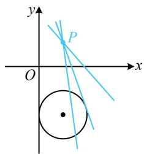
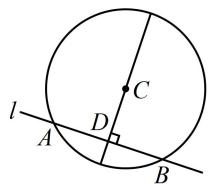
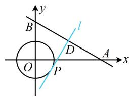
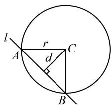
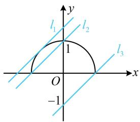
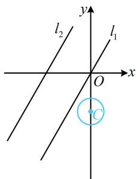
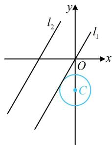
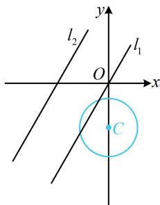

# 强化训练

1. (2024·浙江宁波二模·★)

已知直线 $l: x - y + 1 = 0$ 与圆 $C: x^2 + y^2 - 2x - m =$

0 相离，则实数 $m$ 的取值范围是（）

A. $m <   1$

B. $-1 < m < 1$

C. $m > 1$

D. $m > - 1$

1. B

解析：直线 $l$ 与圆 $C$ 相离可以翻译为圆心到直线 $l$ 的距离大于半径，由此可建立不等式求 $m$ 的范围，

$$
x ^ {2} + y ^ {2} - 2 x - m = 0 \Rightarrow (x - 1) ^ {2} + y ^ {2} = m + 1,
$$

所以圆心为 $C(1,0)$ ，半径 $r = \sqrt{m + 1}$

点 $C$ 到直线 $l$ 的距离 $d = \frac{|1 - 0 + 1|}{\sqrt{1^2 + (-1)^2}} = \sqrt{2}$

由题意， $d > r$ ，所以 $\sqrt{2} >\sqrt{m + 1}$ ，解得： $m <   1$ ①

结束了吗？别忘了考虑圆的方程本身必须满足的系数条件（ $x^{2}+y^{2}+Dx+Ey+F=0$ 要表示圆，应有 $D^{2}+E^{2}-4F>0$ ），

因为方程 $x^{2} + y^{2} - 2x - m = 0$ 表示圆，所以 $(-2)^{2} - 4(-m)$

>0，解得：m>-1，结合①可得-1<m<1.

2. (2025·湖南模拟·★★)

已知直线 $l: kx - y - k + 1 = 0$ 和圆 $C: x^2 + y^2 - 2x + 4y + 4 = 0$ ，则直线 $l$ 与圆 $C$ 的位置关系是（）

A. 相切

B. 相离

C. 相交

D. 与 $k$ 有关

2. D

解析：直线 $l$ 的方程含参，先看是否过定点，直线 $l$ 的方

程可化为 $k(x - 1) - (y - 1) = 0$ ，所以直线 $l$ 过定点 $P(1,1)$

点 $P$ 与圆 $C$ 的位置关系决定直线 $l$ 与圆 $C$ 可能的位置关系，故先判断 $P$ 与圆 $C$ 的位置关系，

因为 $1^{2} + 1^{2} - 2 \times 1 + 4 \times 1 + 4 = 8 > 0$ ，所以点 $P$ 在圆 $C$ 外，

如图，l 与圆 C 的位置关系不确定，与 k 有关.

text_image

y
P
O
x

【反思】对于定圆 C，当直线 l 绕定点 P 旋转时：①若 P 在圆 C 内，则直线 l 与圆 C 必定相交；②若 P 在圆 C 上，则直线 l 与圆 C 相切或相交；③若 P 在圆 C 外，则直线 l 与圆 C 相离、相切或相交均有可能.

3. (2022·内蒙古呼和浩特模拟·★★)

已知直线 $l: x + 3y + 5 = 0$ 与圆 $C: x^2 + y^2 + 2x - 4y - 20 = 0$ 相交于 $A, B$ 两点，若圆 $C$ 的一条直径过弦 $AB$ 的中点，则该直径所在直线的方程为（）

A. $3x + y + 1 = 0$

B. $3x - y + 3 = 0$

C. $3x - y + 5 = 0$

D. $x + 3y - 5 = 0$

3. C

解析： $x^{2} + y^{2} + 2x - 4y - 20 = 0\Rightarrow (x + 1)^{2} + (y - 2)^{2} = 25$

所以圆 $C$ 的圆心为 $C(-1,2)$ ，有了一个点，求直线还差斜率，涉及弦中点，可由垂径定理构建垂直关系来算斜率，

如图，设 $AB$ 中点为 $D$ ，则 $CD \perp l$

$x + 3y + 5 = 0 \Rightarrow y = -\frac{1}{3} x - \frac{5}{3} \Rightarrow$ 直线 $l$ 的斜率为 $-\frac{1}{3}$ ,

所以直线 $CD$ 的斜率为3，结合 $C(-1,2)$ 可得直线 $CD$ 的方程为 $y - 2 = 3[x - (-1)]$ ，整理得： $3x - y + 5 = 0$

4. (2025·天津卷·★★)

直线 $l: x - y + 6 = 0$ 与 $x$ 轴交于点 $A$ ，与 $y$ 轴交于点 $B$ ，与圆 $(x + 1)^2 + (y - 3)^2 = r^2 (r > 0)$ 交于 $C$ ， $D$ 两点，若 $|AB| = 3|CD|$ ，则 $r =$ \_\_\_\_.

4.2

解析：条件给出 $|AB|=3|CD|$ ，且分析发现 $|AB|$ 和 $|CD|$ 都好求，故先求出它们，再由此建立方程求r，

联立 $\left\{ \begin{array}{l} y = 0 \\ x - y + 6 = 0 \end{array} \right.$ 解得： $\left\{ \begin{array}{l} x = -6 \\ y = 0 \end{array} \right.$ ，所以 $A(-6,0)$ ，

联立 $\left\{ \begin{array}{l} x = 0 \\ x - y + 6 = 0 \end{array} \right.$ 解得： $\left\{ \begin{array}{l} x = 0 \\ y = 6 \end{array} \right.$ ，所以 $B(0,6)$ ，

故 $\left|AB\right|=\sqrt{(-6-0)^{2}+(0-6)^{2}}=6\sqrt{2}$ ，

再求 $|CD|$ , 这是直线被圆截得的弦长, 可用弦长公式

$L=2\sqrt{r^{2}-d^{2}}$ 计算，下面先求 d,

圆心 $(-1,3)$ 到直线 $l$ 的距离 $d = \frac{|-1 - 3 + 6|}{\sqrt{1^2 + (-1)^2}} = \sqrt{2}$

所以 $\left|CD\right|=2\sqrt{r^{2}-d^{2}}=2\sqrt{r^{2}-2}$ ，

由题意， $|AB|=3|CD|$ ，所以 $6\sqrt{2}=3\times2\sqrt{r^{2}-2}$ ，

结合 $r > 0$ 可得 $r = 2$

5. (2023·江苏省苏北七市一调·★★☆)

已知圆 $O: x^{2} + y^{2} = r^{2} (r > 0)$ ，设直线 $x + \sqrt{3}y - \sqrt{3} = 0$ 与两坐标轴的交点分别为 $A, B$ ，若圆 $O$ 上有且只有一个点 $P$ 满足 $|AP| = |BP|$ ，则 $r =$ \_\_\_\_.

5. $\frac{1}{2}$

解析：所给直线与坐标轴的交点 $A, B$ 的坐标可求，先把它们求出来，联立 $\left\{ \begin{array}{l} y = 0 \\ x + \sqrt{3}y - \sqrt{3} = 0 \end{array} \right.$ 解得： $x = \sqrt{3}$ ，所以 $A(\sqrt{3}, 0)$ ，

联立 $\left\{ \begin{array}{l} x = 0 \\ x + \sqrt{3} y - \sqrt{3} = 0 \end{array} \right.$ 解得： $y = 1$ ，所以 $B(0,1)$

怎样翻译圆 $O$ 上只有1个点 $P$ 满足 $\vert AP\vert = \vert BP\vert$ ？由于满足 $\vert AP\vert = \vert BP\vert$ 的点 $P$ 在线段 $AB$ 的中垂线上，所以问题等价于 $AB$ 的中垂线与圆 $O$ 只有1个交点，

如图， $AB$ 中点为 $D\left(\frac{\sqrt{3}}{2},\frac{1}{2}\right)$ ，直线 $AB$ 的斜率为 $-\frac{\sqrt{3}}{3}$

所以 $AB$ 中垂线 $l$ 的斜率为 $\sqrt{3}$

故 $AB$ 中垂线 $l$ 的方程为 $y - \frac{1}{2} = \sqrt{3}\left(x - \frac{\sqrt{3}}{2}\right)$

整理得： $\sqrt{3} x - y - 1 = 0$ ，由题意，圆 $O$ 与直线 $l$ 相切，

所以 $d = \frac{|-1|}{\sqrt{(\sqrt{3})^2 + (-1)^2}} = r$ ，故 $r = \frac{1}{2}$

text_image

y
B
D
O
P
A
x

# 6. (★★☆)

圆 $C: x^{2} + y^{2} + 2y - 3 = 0$ 被直线 $l: x + y - k = 0$ 分成长度之比为1:3的两段圆弧，则实数 $k =$ \_\_\_\_.

6. -3或1

解析： $x^{2} + y^{2} + 2y - 3 = 0\Rightarrow x^{2} + (y + 1)^{2} = 4$

所以圆心为 $C(0, - 1)$ ，半径 $r = 2$

两段圆弧的比例决定了圆心角，圆心角又与圆心到直线的距离 $d$ 有关，故可由此求出 $d$

如图， $l$ 把圆 $C$ 分成1:3的两段圆弧 $\Rightarrow \angle ACB = 90^{\circ}$

所以 $\triangle ABC$ 为等腰直角三角形，故 $d = \frac{\sqrt{2}}{2} r = \sqrt{2}$

又 $d = \frac{|-1 - k|}{\sqrt{1^2 + 1^2}} = \frac{|1 + k|}{\sqrt{2}}$ ，所以 $\frac{|1 + k|}{\sqrt{2}} = \sqrt{2}$ ，故 $k = -3$ 或1.

text_image

l
A
r
C
d
B

# 7. (2022·河南洛宁月考·★★★)

若关于 $y$ 的方程 $y - b = \sqrt{1 - y^2}$ 恰有1个实数解，则实数 $b$ 的取值范围是（）

A. $[- \sqrt{2}, \sqrt{2}]$

B. $[-1, \sqrt{2}]$

C. $(-1,1] \cup \{\sqrt{2}\}$

D. $(-1,1] \cup \{-\sqrt{2}\}$

7. D

解析：我们习惯于用 $x$ 表示方程的未知数，故不妨先把所给方程中的 $y$ 都换成 $x$

问题等价于关于 $x$ 的方程 $x - b = \sqrt{1 - x^2}$ 恰有1个实数解，

可数形结合，作出两边代数式对应的图象，即可转化为直线 $l: y = x - b$ 与曲线 $y = \sqrt{1 - x^2}$ 恰有 1 个交点，曲线的方程带根号，先平方去根号，

$$
y = \sqrt {1 - x ^ {2}} \Rightarrow y ^ {2} = 1 - x ^ {2} \Rightarrow x ^ {2} + y ^ {2} = 1 (y \geq 0),
$$

该方程表示单位圆的上半部分，可画图分析临界状态，

如图，满足条件的直线 $l$ 可在 $l_{2}$ （不可取）和 $l_{3}$ （可取）

之间，或恰好为 $l_{1}$

注意到 $-b$ 是直线 $l$ 在 $y$ 轴上的截距，所以当直线 $l$ 在 $l_{2}$ 和

$l_{3}$ 之间时， $-1\leq-b<1$ ，故 $-1<b\leq1$ ；

直线 $l_{1}$ 与半圆相切， $y = x - b \Rightarrow x - y - b = 0$ ，所以原点到直线 $l_{1}$ 的距离 $d = \frac{|-b|}{\sqrt{1^2 + (-1)^2}} = 1$ ，解得： $b = \pm \sqrt{2}$ ，

由图可知， $l_{1}$ 的纵截距为正 $\Rightarrow -b = \sqrt{2}\Rightarrow b = -\sqrt{2}$

综上所述，实数 $b$ 的取值范围是 $(-1,1] \cup \{-\sqrt{2}\}$ 。

text_image

l₁
l₂
1
O
-1
x
y
l₃

8. (2025·全国Ⅰ卷·★★★)

若圆 $x^{2} + (y + 2)^{2} = r^{2}(r > 0)$ 上到直线 $y = \sqrt{3} x + 2$ 的距离为1的点有且仅有2个，则 $r$ 的取值范围是（）

A. (0,1)

B. (1,3)

C. $(3, +\infty)$

D. $(0, + \infty)$

8. B

解析：可以想象，到所给直线距离为1的所有点的轨迹，应为两条与该直线平行的直线，不妨先求出这两条线，再作观察，记直线 $y = \sqrt{3} x + 2$ 为 $l$ ，其方程可化为 $\sqrt{3} x - y + 2 = 0$ ，

设与 l 平行且距离为 1 的直线为 $\sqrt{3}x - y + m = 0$ ，

则 $\frac{|m - 2|}{\sqrt{(\sqrt{3})^2 + (-1)^2}} = 1$ ，解得： $m = 0$ 或4，

所以题设条件等价于所给圆与 $l_{1}:\sqrt{3} x - y = 0$ 和

$l_{2}:\sqrt{3}x-y+4=0$ 共有 2 个交点，

所给圆的圆心固定，半径可变，故可让 $r$ 从0开始增大，想象图象的变化过程，寻找临界状态，

所给圆的圆心为 $C(0, -2)$

点 $C$ 到 $l_{1}$ 的距离 $d_{1} = \frac{|-(-2)|}{\sqrt{(\sqrt{3})^{2} + (-1)^{2}}} = 1$

到 $l_{2}$ 的距离 $d_{2} = \frac{|-(-2) + 4|}{\sqrt{(\sqrt{3})^{2} + (-1)^{2}}} = 3$

当 $r$ 从0开始增大时，如图1，起初圆 $C$ 与 $l_{1}$ 和 $l_{2}$ 都没有交点，不合题意；

当 $r$ 增大到1时，如图2，圆 $C$ 仅与 $l_{1}$ 有1个交点，不合题意；

text_image

l₂
y
l₁
O
x
C

图1

text_image

l₂
y
l₁
O
x
C

图2

当 $r$ 继续增大时，起初如图3，圆 $C$ 仅与 $l_{1}$ 有2个交点，满足题意；

当 $r$ 继续增大，直到 $r \geq 3$ 时，如图4，圆 $C$ 与 $l_{1}$ 有2个交点，且与 $l_{2}$ 至少有1个交点，不合题意；

综上所述， $r$ 的取值范围是(1,3).

text_image

l₂
O
x
y
l₁
C

图3

text_image

l₂
l₁
O
x
C

图4

