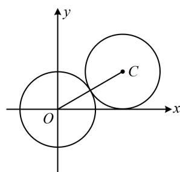
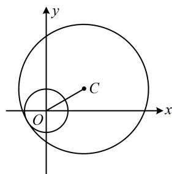
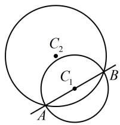
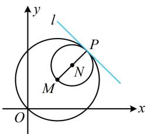
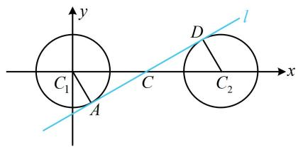

# 强化训练

1. (2022·湖北十堰模拟·★★)

当圆 $C: x^{2} + y^{2} - 4x + 2ky + 2k = 0$ 的面积最小时，圆 $C$ 与圆 $O: x^{2} + y^{2} = 1$ 的位置关系是 \_\_\_\_.

1. 相交

解析：圆的面积最小即半径最小，先把圆 $C$ 化为标准方程，看看半径何时最小， $x^{2} + y^{2} - 4x + 2ky + 2k = 0 \Rightarrow (x - 2)^{2}$

$$
+ (y + k) ^ {2} = k ^ {2} - 2 k + 4,
$$

所以圆 $C$ 的半径 $r = \sqrt{k^2 - 2k + 4} = \sqrt{(k - 1)^2 + 3}$

故当 $k = 1$ 时， $r$ 最小，此时圆 $C$ 的圆心为 $C(2, -1)$ ，

半径 $r = \sqrt{3}$ ，又圆 $O$ 的圆心为 $O(0,0)$ ，半径 $r' = 1$

所以 $|OC|=\sqrt{5}$ ，因为 $\sqrt{3}-1<\sqrt{5}<\sqrt{3}+1$ ，

所以 $\left|r-r'\right|<\left|OC\right|<r+r'$ ，故两圆相交.

2. (2025·福建福州模拟·★★)

已知圆 $C_1: x^2 + y^2 = 4$ 与圆 $C_2: (x - a)^2 + (y + 4)^2 = 9$ 有且仅有两条公切线，则实数 $a$ 的取值范围为（）

A. (1,5)

B. $(- \infty, 1) \cup (5, +\infty)$

C. $(-3, 3)$

D. $(- \infty, -3) \cup (3, +\infty)$

2. C

解析：公切线条数可翻译成两圆的位置关系，

两圆有两条公切线 $\Leftrightarrow$ 两圆相交，

故题设条件可翻译为 $\left|r_{1}-r_{2}\right|<\left|C_{1}C_{2}\right|<r_{1}+r_{2}$ ，下面先算 $\left|C_{1}C_{2}\right|$ ，

由题意， $C_1(0,0)$ ，圆 $C_1$ 的半径 $r_1 = 2$ ， $C_2(a, - 4)$ ，圆 $C_2$ 的半径 $r_2 = 3$

所以 $\left|C_{1}C_{2}\right|=\sqrt{(a-0)^{2}+(-4-0)^{2}}=\sqrt{a^{2}+16}$

故 $\left|r_{1}-r_{2}\right|<\left|C_{1}C_{2}\right|<r_{1}+r_{2}$ 即为 $1<\sqrt{a^{2}+16}<5\Rightarrow-3<a<3$ .

3. (★★☆)

若圆 $O: x^2 + y^2 = 1$ 与圆 $C: x^2 + y^2 - 2\sqrt{3}x - 2y + m = 0$ 相切，则实数 $m$ 的值为 \_\_\_\_.

3. 3或-5

解析：由题意，圆 $O$ 的圆心为原点，半径 $r_1 = 1$

$$
x ^ {2} + y ^ {2} - 2 \sqrt {3} x - 2 y + m = 0 \Rightarrow (x - \sqrt {3}) ^ {2} + (y - 1) ^ {2} = 4 - m,
$$

所以圆 $C$ 的圆心为 $C(\sqrt{3},1)$ ，半径 $r_2 = \sqrt{4 - m} (m < 4)$

故 $\left|OC\right|=\sqrt{(\sqrt{3})^{2}+1^{2}}=2$ ，

两圆相切，有外切和内切两种情况，需分别考虑，

若两圆外切，如图1，应有 $|OC|=r_{1}+r_{2}$ ，

所以 $2=1+\sqrt{4-m}$ ，解得：m=3；

若两圆内切，如图2，应有 $|OC|=r_{2}-r_{1}$ ，

所以 $2 = \sqrt{4 - m} - 1$ ，解得： $m = -5$

综上所述，实数 $m$ 的值为3或-5.

text_image

y
O
x
C

图1

text_image

y
C
O
x

图2

4. (★★)

已知圆 $C_1: x^2 + y^2 - kx - 2y = 0$ 和圆 $C_2: x^2 + y^2 - 2ky - 2 = 0$ 相交，则圆 $C_1$ 和圆 $C_2$ 的公共弦所在的直线过的定点是（）

A. (2,2)

B. (2,1)

C. (1,2)

D. (1,1)

4. B

解析：求出两圆公共弦所在直线的方程，即可找到定点，

由两圆方程作差得： $-kx-2y+2ky+2=0$ ，

整理得： $k(2y - x) + (2 - 2y) = 0$ ，

令 $\left\{\begin{aligned}2y-x=0\\ 2-2y=0\end{aligned}\right.$ 解得： $\left\{\begin{aligned}x=2\\ y=1\end{aligned}\right.$

所以两圆公共弦所在直线过定点(2,1).

5. (★★★)

已知圆 $C_1: x^2 + y^2 - 2x + 4y + 4 = 0$ ，圆 $C_2: x^2 + y^2 + x - y - m^2 = 0 (m > 0)$ ，若圆 $C_2$ 平分圆 $C_1$ 的圆周，则正数 $m$ 的值为（）

A. 3

B. 2

C. 4

D. 1

5. A

解析： $x^{2} + y^{2} - 2x + 4y + 4 = 0\Rightarrow (x - 1)^{2} + (y + 2)^{2} = 1$

所以圆 $C_1$ 的圆心为 $C_1(1, - 2)$ ，如图，圆 $C_2$ 平分圆 $C_1$ 的圆周，即两圆的公共弦 $AB$ 过 $C_1$ ，于是先求公共弦方程，

用两圆方程作差整理得公共弦所在直线的方程为

$$
3 x - 5 y - 4 - m ^ {2} = 0,
$$

将 $C_1(1, - 2)$ 代入上式可得： $3 - 5\times (-2) - 4 - m^2 = 0$

结合 m>0 解得: m=3.

text_image

C₂
C₁
A
B

6. (★★★)

已知圆 $M: (x - 2)^{2} + (y - 2)^{2} = 8$ ，圆 $N: (x - 3)^{2} + (y - 3)^{2} = 2$ ，若直线 $l$ 与圆 $M$ 和圆 $N$ 都相切，则直线 $l$ 的方程为 \_\_\_\_.

6. $x + y - 8 = 0$

解法1：公切线的条数由两圆的位置关系决定，故先判断两圆的位置关系，确定公切线有几条，

由题意， $M(2,2)$ ， $N(3,3)$ ， $r_1 = 2\sqrt{2}$ ， $r_2 = \sqrt{2}$

所以 $\left|MN\right|=\sqrt{(3-2)^{2}+(3-2)^{2}}=\sqrt{2}=\left|r_{1}-r_{2}\right|\Rightarrow$ 两圆内切，

所以两圆有且仅有1条公切线，如图中的 $l$ ，显然 $l$ 的斜率存在，设其方程为 $y = kx + b$ ，即 $kx - y + b = 0$

可利用圆心 $M$ ， $N$ 到 $l$ 的距离等于各自的半径来建立方程组求解 $k$ 和 $b$ ，所以 $\left\{ \begin{array}{ll}\frac{|2k - 2 + b|}{\sqrt{k^2 + 1}} = 2\sqrt{2} & ①\\ \frac{|3k - 3 + b|}{\sqrt{k^2 + 1}} = \sqrt{2} & ② \end{array} \right.$

从而 $\left|2k-2+b\right|=2\left|3k-3+b\right|$ ,

故 $2k - 2 + b = 2(3k - 3 + b)$ 或 $2k - 2 + b = -2(3k - 3 + b)$ ，

整理得： $b = 4 - 4k$ 或 $b = -\frac{8}{3} k + \frac{8}{3}$

若 $b = 4 - 4k$ ，代入①解得： $k = -1$ ，所以 $b = 8$

故公切线 $l$ 的方程为 $y = -x + 8$ ，即 $x + y - 8 = 0$

若 $b = -\frac{8}{3} k + \frac{8}{3}$ ，代入①整理得： $17k^2 + 2k + 17 = 0$ ，无解；

综上所述，直线 l 的方程为 $x + y - 8 = 0$ .

解法2: 判断两圆位置关系的过程同解法1, 要求 $l$ 的方程, 也可由 $MN \perp l$ 求斜率, 再求点 $P$ 的坐标,

直线 MN 的斜率 $k=\frac{3-2}{3-2}=1$ ，所以公切线 l 的斜率为 -1，

直线 $MN$ 的方程为 $y - 2 = x - 2$ ，即 $y = x$

联立 $\left\{ \begin{array}{l} y = x \\ (x - 2)^2 + (y - 2)^2 = 8 \end{array} \right.$ 解得： $\left\{ \begin{array}{l} x = 4 \\ y = 4 \end{array} \right.$ 或 $\left\{ \begin{array}{l} x = 0 \\ y = 0 \end{array} \right.$ ，

由图可知 $P(4,4)$ ，所以直线 $l$ 的方程为 $y - 4 = -(x - 4)$

整理得： $x + y - 8 = 0$

text_image

y
l
P
N
M
O
x

【反思】求公切线，除了设 $y = kx + b$ ，用两圆圆心到公切线距离等于各自半径建立方程组解 $k$ 和 $b$ 的方法外，在两圆内切的条件下，也可直接求切点和斜率.

7. (2020·浙江卷·★★★)

设直线 $l: y = kx + b (k > 0)$ ，圆 $C_1: x^2 + y^2 = 1$ ， $C_2: (x - 4)^2 + y^2 = 1$ ，若直线 $l$ 与 $C_1$ ， $C_2$ 都相切，则 $k = \_$ ，

$$
b = \underline {{\quad}}.
$$

7. $\frac{\sqrt{3}}{3}, -\frac{2\sqrt{3}}{3}$

解析：公切线的条数与两圆的位置关系有关，可先画图看看两圆的位置关系，如图，两圆相离，有4条公切线，又 $k > 0$ ，故所求为图中蓝线，注意到 $k = \tan \angle DCC_{2}$

于是尝试算出 $\triangle DCC_{2}$ 的三边长，快速求出 $k$

如图， $\left\{ \begin{array}{ll}\angle CAC_{1} = \angle CDC_{2} = 90^{\circ}\\ \angle ACC_{1} = \angle DCC_{2}\\ |AC_{1}| = |DC_{2}| = 1 \end{array} \right.\Rightarrow \triangle ACC_{1}\cong \triangle DCC_{2},$

所以 $\left|CC_{1}\right|=\left|CC_{2}\right|$ ，故C为 $C_{1}C_{2}$ 中点，

由题意， $C_1(0,0)$ ， $C_2(4,0)$ ，所以 $\left|CC_2\right| = 2$

从而 $\left|CD\right|=\sqrt{\left|CC_{2}\right|^{2}-\left|DC_{2}\right|^{2}}=\sqrt{3}$ ，

故直线 $l$ 的斜率 $k = \tan \angle DCC_{2} = \frac{|DC_{2}|}{|CD|} = \frac{\sqrt{3}}{3}$

此时若再求出 C 的坐标，就可写出 l 的方程，求得 b，

由 $C$ 为 $C_1C_2$ 中点知 $C(2,0)$ ，所以 $l$ 的方程为

$y = \frac{\sqrt{3}}{3} (x - 2)$ ，即 $y = \frac{\sqrt{3}}{3} x - \frac{2\sqrt{3}}{3}$ 故 $b = -\frac{2\sqrt{3}}{3}$

text_image

y
C₁
A
C
D
C₂
x
l

【反思】本题当然也可由 $C_1$ ， $C_2$ 到 $l$ 的距离都等于1来建立方程组求解 $k$ 和 $b$ ，但此法计算量大，所以在图形比较特殊的情况下，运用几何关系来计算公切线更简单.

# 8. (★★★☆)

若圆 $C_1: x^2 + y^2 + 2\sqrt{m}x + m - 4 = 0 (m > 0)$ 和 $C_2: x^2 + y^2 - 4\sqrt{n}y - 1 + 4n = 0 (n > 0)$ 恰有三条公切线，则 $\frac{1}{m} + \frac{1}{n}$ 的最小值为（）

A. $\frac{1}{9}$

B. $\frac{4}{9}$

C. 1

D. 3

8. C

解析： $x^{2} + y^{2} + 2\sqrt{m} x + m - 4 = 0\Rightarrow (x + \sqrt{m})^{2} + y^{2} = 4$

所以圆 $C_1$ 的圆心为 $C_1(-\sqrt{m}, 0)$ ，半径 $r_1 = 2$ ，

$$
x ^ {2} + y ^ {2} - 4 \sqrt {n} y - 1 + 4 n = 0 \Rightarrow x ^ {2} + (y - 2 \sqrt {n}) ^ {2} = 1,
$$

所以圆 $C_{2}$ 的圆心为 $C_{2}(0,2\sqrt{n})$ ，半径 $r_{2}=1$ ，

要求 $\frac{1}{m} +\frac{1}{n}$ 的最小值，可先把公切线的条数翻译成两圆的位置关系，寻找 $m$ 和 $n$ 满足的条件，

两圆有三条公切线 $\Rightarrow$ 两圆外切 $\Rightarrow \left|C_1C_2\right| = r_1 + r_2$

又 $\left|C_1C_2\right| = \sqrt{(-\sqrt{m} - 0)^2 + (0 - 2\sqrt{n})^2} = \sqrt{m + 4n}$

所以 $\sqrt{m + 4n} = 3$ ，故 $m + 4n = 9$ ，接下来可用常数代换法凑成积为定值，利用均值不等式来求 $\frac{1}{m} +\frac{1}{n}$ 的最小值，

$$
\begin{array}{l} \frac {1}{m} + \frac {1}{n} = \frac {9}{9 m} + \frac {9}{9 n} = \frac {m + 4 n}{9 m} + \frac {m + 4 n}{9 n} = \frac {1}{9} + \frac {4 n}{9 m} + \frac {m}{9 n} + \frac {4}{9} \\ = \frac {4 n}{9 m} + \frac {m}{9 n} + \frac {5}{9} \geq 2 \sqrt {\frac {4 n}{9 m} \cdot \frac {m}{9 n}} + \frac {5}{9} = 1, \\ \end{array}
$$

当且仅当 $\frac{4n}{9m} = \frac{m}{9n}$ 时取等号，结合 $m + 4n = 9$ 可得此时

$m = 3$ ， $n = \frac{3}{2}$ ，所以 $\frac{1}{m} +\frac{1}{n}$ 的最小值为1.

