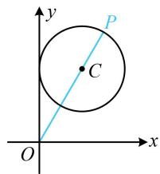
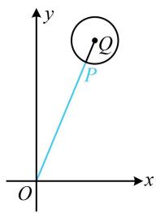
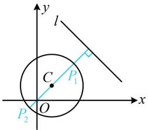
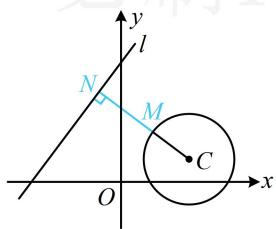
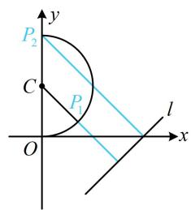
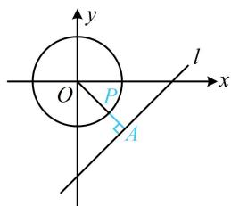
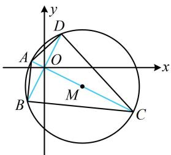
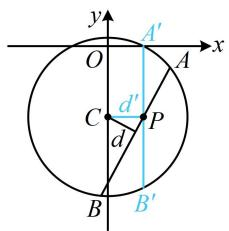

# 强化训练

1. (★★)

已知 $O$ 为原点， $P$ 为圆 $C: (x - 1)^2 + (y - b)^2 = 1 (b > 0)$ 上的动点，若 $|OP|$ 的最大值为3，则 $b = (\quad)$

A. 1 B. $\sqrt{2}$ C. $\sqrt{3}$ D. 2

1. C

解析：涉及圆上动点与定点的距离最值问题，先判断定点在圆内还是圆外，

因为 $(0 - 1)^2 +(0 - b)^2 = 1 + b^2 >1$ ，所以点 $O$ 在圆 $C$ 外，

可按内容提要中的模型1处理，如图所示即为 $|OP|$ 最大的情形，圆心为 $C(1,b)$ ，所以 $|OP|_{\max} = |OC| + 1 = \sqrt{1 + b^2} + 1$ ，

由题意， $\sqrt{1 + b^2} + 1 = 3$ ，结合 $b > 0$ 可得 $b = \sqrt{3}$

text_image

y
P
C
O
x

2. (2022·陕西西安模拟·★★☆)

已知半径为2的圆过点(5,12)，则其圆心到原点的距离的最小值为（）

A. 10 
B. 11 
C. 12 
D. 13

2. B

解析：本题圆心是动点，先求出圆心的运动轨迹，

设圆心为 $P(x,y)$ ，记 $Q(5,12)$ ，由题意，

$\sqrt{(x-5)^{2}+(y-12)^{2}}=2$ ，所以 $(x-5)^{2}+(y-12)^{2}=4$ ，

故圆心 $P$ 可在以 $Q(5,12)$ 为圆心，2为半径的圆上运动，

如图，原点在该圆外，属内容提要中的模型1，

因为 $\left|OQ\right|=\sqrt{5^{2}+12^{2}}=13$ ，所以圆心P到原点距离的最小值为 $\left|OQ\right|-2=11$ 。

text_image

y
Q
P
O
x

3. (2022·陕西西安模拟·★★☆)

圆 $C: x^{2} + y^{2} - 4x - 4y - 10 = 0$ 上的点 $P$ 到直线 $l: x + y - 14 = 0$ 的最大距离与最小距离之和为（）

A. 30 B. 18 C. $10 \sqrt{2}$ D. $5 \sqrt{2}$

3. C

解析： $x^{2} + y^{2} - 4x - 4y - 10 = 0\Rightarrow (x - 2)^{2} + (y - 2)^{2} = 18$

所以圆 $C$ 的圆心为 $C(2,2)$ ，半径 $r = 3\sqrt{2}$

故圆心 $C$ 到直线 $l$ 的距离 $d = \frac{|2 + 2 - 14|}{\sqrt{1^2 + 1^2}} = 5\sqrt{2} > r$

直线 $l$ 与圆 $C$ 相离，属内容提要中的模型3， $P$ 到 $l$ 的距离最小、最大的情形如图中的 $P_{1}$ ， $P_{2}$ ，

圆 $C$ 上的点到直线 $l$ 的最大距离为 $d + r$ ，最小距离为 $d - r$ ，它们的和为 $2d = 10\sqrt{2}$

text_image

y
l
C
P₁
O
x
P₂

4. (2022·青海大通三模·★★★)

已知点 $M$ ， $N$ 分别在圆 $C:(x - 3)^2 +(y - 1)^2 = 4$ 和直线 $l:4x - 3y + t = 0$ 上运动，若 $\left|MN\right|$ 的最小值为7，则 $t$ 的值为（）

A. 36

B. 37

C. -45

D. -54 或 36

4. D

解析：先判断直线与圆的位置关系. 观察发现若调整 $t$ ，则 $l$ 可上下平移，三种位置关系均有可能，故分别考虑，

若直线与圆有交点，则当 $M$ ， $N$ 取同一交点时， $\left|MN\right| = 0$ ，不合题意，所以直线与圆只能相离，

如图，当 $|MN|$ 最小时，必有 $MN \perp l$ ，故只需求点 $M$ 到 $l$ 距离的最小值，可按内容提要中的模型3处理，

圆心 $C(3,1)$ 到直线 $l$ 的距离 $d = \frac{|4\times 3 - 3\times 1 + t|}{\sqrt{4^2 + (-3)^2}} = \frac{|9 + t|}{5}$

所以 $\left|MN\right|_{\min}=d-r=\frac{\left|9+t\right|}{5}-2$ ，

由题意， $\frac{|9 + t|}{5} - 2 = 7$ ，解得： $t = -54$ 或36.

text_image

y
l
N
M
O
x
C

5. (2022·天津模拟·★★★)

设曲线 $C: x = \sqrt{1 - (y - 1)^2}$ 上的点 $P$ 到直线 $l: x - y - 2 = 0$ 的距离的最大值为 $a$ ，最小值为 $b$ ，则 $a - b$ 的值为（）

A. $\sqrt{2}$

B. $2 - \frac{\sqrt{2}}{2}$

C. 2

D. $\frac{\sqrt{2}}{2} + 1$

5. D

解析：曲线 C 的方程有根号，先平方去根号，

$$
x = \sqrt {1 - (y - 1) ^ {2}} \Rightarrow x ^ {2} = 1 - (y - 1) ^ {2} \Rightarrow x ^ {2} + (y - 1) ^ {2} = 1 (x \geq 0),
$$

曲线 $C$ 为如图所示的半圆，圆心为 $C(0,1)$ ，半径 $r = 1$

点 $C$ 到直线 $l$ 的距离的 $d = \frac{|-1 - 2|}{\sqrt{1^2 + (-1)^2}} = \frac{3\sqrt{2}}{2} > r$

直线 $l$ 与半圆 $C$ 相离， $P$ 到 $l$ 的距离的最小值在图中 $P_{1}$ 处取，但由于是半圆，所以最大值在 $P_{2}$ 处取，

所以 $b = d - r = \frac{3\sqrt{2}}{2} - 1$

又 $P_{2}(0,2)$ ，所以 $a = \frac{| - 2 - 2|}{\sqrt{1^2 + (-1)^2}} = 2\sqrt{2}$ ，故 $a - b = \frac{\sqrt{2}}{2} +1$

text_image

P₂
C
P₁
O
l
x
y

# 6. (★★★)

若 $P$ 为圆 $O: x^2 + y^2 = 2$ 上的动点，点 $A(m, m - 3) (m \in \mathbf{R})$ ，则 $|PA|$ 的最小值为（）

A. 1 B. 2 C. $\frac{\sqrt{2}}{2}$ D. $\frac{3\sqrt{2}}{2}$

6. C

解析：点 $A$ 的坐标含参，是动点，先消去参数看看点 $A$ 的运动轨迹，设 $A(x,y)$ ，则 $\left\{ \begin{array}{l} x = m \\ y = m - 3 \end{array} \right.$ ，

两式作差消去 $m$ 整理得： $x - y - 3 = 0$

所以 A 是直线 l: x - y - 3 = 0 上的动点，

对圆 O 上任意的点 P，A 在 l 上运动，总有当 $AP \perp l$ 时， $|PA|$ 最小，故只需求 P 到直线 l 距离的最小值，

如图，圆心 $O$ 到直线 $l$ 的距离 $d = \frac{|-3|}{\sqrt{1^2 + (-1)^2}} = \frac{3\sqrt{2}}{2}$

所以 $\left|PA\right|_{\min} = d - r = \frac{3\sqrt{2}}{2} -\sqrt{2} = \frac{\sqrt{2}}{2}$

text_image

y
O
P
A
l
x

7. (2022·云南昆明模拟·★★★)

在圆 $M: x^{2} + y^{2} - 4x + 2y - 4 = 0$ 内，过点 $O(0,0)$ 的最长弦和最短弦分别是 $AC$ ， $BD$ ，则四边形 $ABCD$ 的面积为（）

A. 24 B. 12 C. 10 D. 8

7. B

解析： $x^{2} + y^{2} - 4x + 2y - 4 = 0\Rightarrow (x - 2)^{2} + (y + 1)^{2} = 9$

所以圆心为 $M(2, - 1)$ ，半径 $r = 3$

如图, 原点 $O$ 在圆内, 属内容提要中的模型 5 , 最长弦 $A C$ 是直径, 最短弦 $B D$ 是与 $O M$ 垂直的弦,

所以 $|AC|=6$ ，又 $|OM|=\sqrt{2^{2}+(-1)^{2}}=\sqrt{5}$ ，

所以 $\left|BD\right|=2\sqrt{r^{2}-\left|OM\right|^{2}}=4$ ，

故四边形ABCD的面积 $S = \frac{1}{2}\big|AC\big|\cdot \big|BD\big| = \frac{1}{2}\times 6\times 4 = 12.$

text_image

y
D
A
O
x
B
M
C

8. (2022·北京模拟·★★★)

已知直线 $l: ax + by = 1$ ，若 $l$ 上有且仅有一点 $P$ ，使得以 $P$ 为圆心，1 为半径的圆过原点 $O$ ，则 $a - b$ 的最大值为（）

A. $\sqrt{2}$

B. $2 \sqrt{2}$

C. 2

D. 1

8. A

解析：为了求 $a - b$ 的最大值，得先寻找 $a$ 和 $b$ 的关系，我们来翻译已知条件，

以 $P$ 为圆心，1为半径的圆过原点，所以 $\left|OP\right| = 1$

原点是定点，所以满足 $|OP| = 1$ 的点 $P$ 在圆 $x^{2} + y^{2} = 1$ 上，故题干的条件等价于直线 $l$ 与圆 $x^{2} + y^{2} = 1$ 有且仅有一个交点，它们应相切，可据此建立 $a$ 和 $b$ 的关系，

$ax + by = 1 \Rightarrow ax + by - 1 = 0$ ，所以原点 O 到直线 l 的距离 $d = \frac{|-1|}{\sqrt{a^{2} + b^{2}}} = 1$ ，故 $a^{2} + b^{2} = 1$ ，

看到平方和等于1，想到用内容提要第2点中的三角换元，将 $a - b$ 转化为三角函数求最大值，

可设 $\left\{ \begin{array}{l}a = \cos \theta \\ b = \sin \theta \end{array} \right.$ ，其中 $\theta \in \mathbf{R}$ ，则 $a - b = \cos \theta -\sin \theta$

$= \sqrt{2}\cos \left(\theta +\frac{\pi}{4}\right)$ ，所以 $(a - b)_{\max} = \sqrt{2}$

【反思】遇到两个变量的平方和等于某正常数，都可考虑用三角换元的方法来分析关于这两个变量的代数式的最值.

9. (2024·全国甲卷·★★★☆)

已知 $b$ 是 $a, c$ 的等差中项，直线 $ax + by + c = 0$ 与圆 $x^{2} + y^{2} + 4y - 1 = 0$ 交于 $A, B$ 两点，则 $\vert AB\vert$ 的最小值为（）

A. 1

B. 2

C. 4

D. $2 \sqrt{5}$

9. C

解法1：涉及直线被圆截得的弦长，考虑用弦长公式 $L = 2\sqrt{r^2 - d^2}$ 计算，下面分别求 $r$ 和 $d$

$$
x ^ {2} + y ^ {2} + 4 y - 1 = 0 \Rightarrow x ^ {2} + (y + 2) ^ {2} = 5,
$$

所以圆的圆心为 $(0, -2)$ ，半径 $r = \sqrt{5}$ ，

圆心到直线 $ax + by + c = 0$ 的距离 $d = \frac{|-2b + c|}{\sqrt{a^2 + b^2}}$

所以 $\left|AB\right| = 2\sqrt{r^2 - d^2} = 2\sqrt{5 - \frac{(-2b + c)^2}{a^2 + b^2}}$

$$
= 2 \sqrt {\frac {5 a ^ {2} + b ^ {2} + 4 b c - c ^ {2}}{a ^ {2} + b ^ {2}}} \quad ①,
$$

涉及的变量较多，考虑消元，还有 $b$ 是 $a, c$ 的等差中项没翻译，先翻译它，建立 $a, b, c$ 的关系，

由题意， $2b = a + c$ ，所以 $c = 2b - a$ ，代入①得

$$
\begin{array}{l} \left| A B \right| = 2 \sqrt {\frac {5 a ^ {2} + b ^ {2} + 4 b (2 b - a) - (2 b - a) ^ {2}}{a ^ {2} + b ^ {2}}} = 2 \sqrt {\frac {4 a ^ {2} + 5 b ^ {2}}{a ^ {2} + b ^ {2}}} \\ = 2 \sqrt {\frac {4 (a ^ {2} + b ^ {2}) + b ^ {2}}{a ^ {2} + b ^ {2}}} = 2 \sqrt {4 + \frac {b ^ {2}}{a ^ {2} + b ^ {2}}} \geq 2 \sqrt {4} = 4, \\ \end{array}
$$

取等条件是 $b = 0$ ，满足题意，所以 $\vert AB\vert$ 的最小值为4.

解法2：所给直线含参，也可先翻译 $b$ 是 $a, c$ 的等差中项，找到参数的关系，看看直线有什么特征，

因为 $b$ 是 $a, c$ 的等差中项，所以 $2b = a + c$ ，故 $c = 2b - a$

代入 $ax + by + c = 0$ 得 $ax + by + 2b - a = 0$

即 $a(x - 1) + b(y + 2) = 0$ ②，

我们发现该直线过定点，有明显的图形特征，故接下来可考虑画图分析，分析圆心和半径的过程同解法1，

由②知直线过定点 $P(1, -2)$ ，

根据 $\left|AB\right|=2\sqrt{r^{2}-d^{2}}=2\sqrt{5-d^{2}}$ ，要使 $\left|AB\right|$ 最小，只需d最大，如图，当AB绕点P旋转时，总有 $d\leq d'$ ，当且仅当AB与图中 $A'B'$ 重合时取等号，此时， $AB\perp CP$ ，

所以 $d_{\mathrm{max}} = |CP| = 1$ ，故 $\left|AB\right|_{\mathrm{min}} = 2\sqrt{5 - 1^2} = 4$

text_image

y
O
A'
x
C
d'
P
d
B
B'

