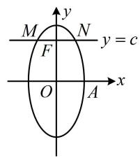
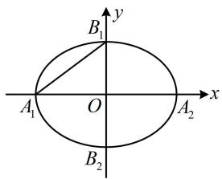
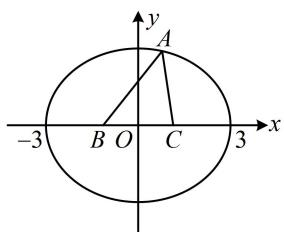
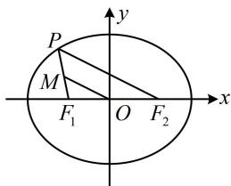
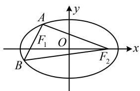
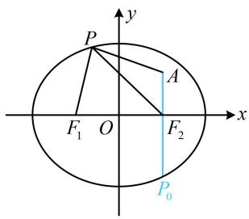

# 强化训练

1. (★★)

椭圆 $\frac{y^2}{a^2} +\frac{x^2}{b^2} = 1(a > b > 0)$ 的右顶点为 $A(1,0)$ ，过其焦点且垂直于长轴的弦长为1，则椭圆的方程为

1. $\frac{y^2}{4} + x^2 = 1$

解析：椭圆的焦点在 $y$ 轴上，其右顶点为 $A(1,0) \Rightarrow b = 1$

椭圆的过焦点且垂直于长轴的弦是通径，可联立通径所在直线和椭圆的方程来求通径长，

如图，设 $F(0,c)$ 是椭圆的上焦点，联立 $\left\{ \begin{array}{l} y = c \\ \frac{y^2}{a^2} + \frac{x^2}{b^2} = 1 \end{array} \right.$ 消去 $y$ 可得 $x^2 = b^2 \left(1 - \frac{c^2}{a^2}\right) = b^2 \cdot \frac{a^2 - c^2}{a^2} = \frac{b^4}{a^2}$ ，

所以 $x = \pm \frac{b^2}{a}$ ，故通径长 $\left|MN\right| = \frac{2b^2}{a}$ ，由题意， $\frac{2b^2}{a} = 1$

所以 $a = 2b^{2} = 2$ ，故椭圆的方程为 $\frac{y^2}{4} + x^2 = 1$

text_image

M
F
O
A
y = c
x
y
N

2. (★★)

对称轴为坐标轴的椭圆经过 $P(-2\sqrt{3},1)$ ， $Q(\sqrt{3},-2)$ 两点，则椭圆的方程为 \_\_\_\_.

2. $\frac{x^2}{15} +\frac{y^2}{5} = 1$

解析：本题未给椭圆焦点在哪个坐标轴，若讨论，则比较麻烦，可用待定系数法求解，

设椭圆的方程为 $Ax^2 + By^2 = 1$ ， $A > 0$ ， $B > 0$ ， $A \neq B$

将 P, Q 两点代入可得 $\left\{\begin{aligned}12A+B=1\\ 3A+4B=1\end{aligned}\right.$ ,

解得： $A = \frac{1}{15}$ ， $B = \frac{1}{5}$ ，所以椭圆的方程为 $\frac{x^2}{15} +\frac{y^2}{5} = 1$

【反思】不知道焦点在哪个坐标轴上时，可考虑将椭圆方程设为 $Ax^{2} + By^{2} = 1 (A > 0, B > 0, A \neq B)$ .

3. (2023·新课标Ⅰ卷·★★)

设椭圆 $C_1: \frac{x^2}{a^2} + y^2 = 1 (a > 1)$ ， $C_2: \frac{x^2}{4} + y^2 = 1$ 的离心率分别为 $e_1$ ， $e_2$ ，若 $e_2 = \sqrt{3} e_1$ ，则 $a = (\quad)$

A. $\frac{2\sqrt{3}}{3}$

B. $\sqrt{2}$

C. $\sqrt{3}$

D. $\sqrt{6}$

3. A

解析：由题意， $e_1 = \frac{\sqrt{a^2 - 1}}{a}$ ， $e_2 = \frac{\sqrt{4 - 1}}{2} = \frac{\sqrt{3}}{2}$

因为 $e_2 = \sqrt{3} e_1$ ，所以 $\frac{\sqrt{3}}{2} = \sqrt{3}\cdot \frac{\sqrt{a^2 - 1}}{a}$ ，解得： $a = \frac{2\sqrt{3}}{3}$

4. (2023·湖北武汉二调·★★☆)(多选)

若椭圆 $\frac{x^2}{m^2 + 2} +\frac{y^2}{m^2} = 1(m > 0)$ 的某两个顶点间的距离为4，则 $m$ 的可能取值有（）

A. $\sqrt{5}$

B. $\sqrt{7}$

C. $\sqrt{2}$

D. 2

4. BCD

解析：椭圆的两个顶点间的距离有左右顶点、上下顶点、左（或右）顶点与上（或下）顶点三种情况，故分别讨论，由题意，椭圆的长半轴长 $a = \sqrt{m^2 + 2}$ ，短半轴长 $b = m$ ，

如图，记椭圆的左、右顶点分别为 $A_{1}$ ， $A_{2}$ ，上、下顶点分别为 $B_{1}$ ， $B_{2}$

若 $A_{1}A_{2} = 4$ ，则 $2\sqrt{m^2 + 2} = 4$ ，所以 $m = \sqrt{2}$

若 $B_{1}B_{2} = 4$ ，则 $2m = 4$ ，所以 $m = 2$

若 $A_{1}B_{1} = 4$ ，则 $\sqrt{m^2 + 2 + m^2} = 4$ ，所以 $m = \sqrt{7}$ ；故选BCD.

text_image

B₁
y
A₁ O A₂ x
B₂

5. (★★☆)

已知 $\triangle ABC$ 的周长是 8，且 $B(-1,0)$ ， $C(1,0)$ ，则顶点 $A$ 的轨迹方程是（）

A. $\frac{x^2}{9} +\frac{y^2}{8} = 1(x\neq \pm 3)$

B. $\frac{x^2}{9} +\frac{y^2}{8} = 1(x\neq 0)$

C. $\frac{x^2}{4} +\frac{y^2}{3} = 1(y\neq 0)$

D. $\frac{y^2}{4} +\frac{x^2}{3} = 1(y\neq 0)$

5. A

解析：因为 $\triangle ABC$ 的周长为8，所以 $|AB| + |AC| + |BC| =$

$\left|AB\right|+\left|AC\right|+2=8$ ，故 $\left|AB\right|+\left|AC\right|=6>\left|BC\right|$ ①，

点 $A$ 到定点 $B, C$ 的距离之和等于定长，所以点 $A$ 的轨迹是以 $B, C$ 为焦点的椭圆，由①知 $2a = 6$ ，所以 $a = 3$

又由焦点 $B$ ， $C$ 的坐标知 $c = 1$ ，所以 $b^{2} = a^{2} - c^{2} = 8$

故椭圆的方程为 $\frac{x^2}{9} +\frac{y^2}{8} = 1$ ，如图， $A$ ， $B$ ， $C$ 要构成三

角形，所以点 A 不能在 x 轴上，故 $x \neq \pm3$ ，选 A.

text_image

y
A
-3 B O C 3 x

6. (★★)

已知 $F_{1}$ ， $F_{2}$ 是椭圆 $\frac{x^2}{25} +\frac{y^2}{16} = 1$ 的左、右焦点， $P$ 为椭圆上一点， $M$ 为 $F_{1}P$ 中点， $\left|OM\right| = 3$ ，则 $\left|PF_1\right| = \_$ .

6.4

解析：涉及中点，可考虑中位线，如图，M 为 $PF_{1}$ 中点，

O 是 $F_{1}F_{2}$ 中点，所以 $\left|PF_{2}\right|=2\left|OM\right|=6$ ，

已知 $\left|PF_{2}\right|$ 求 $\left|PF_{1}\right|$ ，用椭圆定义即可，由题意，a=5，

所以 $\left|PF_{1}\right|+\left|PF_{2}\right|=2a=10$ ，故 $\left|PF_{1}\right|=10-\left|PF_{2}\right|=4$ 。

text_image

P
M
F₁ O F₂
x
y

【反思】椭圆隐藏的三个中点： $O$ 是 $F_{1}F_{2}$ 、长轴、短轴的中点.

7. (★★☆)

已知 $F_{1}$ ， $F_{2}$ 为椭圆 $\frac{x^2}{25} +\frac{y^2}{9} = 1$ 的两个焦点，过 $F_{1}$ 的直线交椭圆于 $A$ ， $B$ 两点，若 $\left|AF_2\right| + \left|BF_2\right| = 12$ ，则 $\left|AB\right| = \_$ .

7.8

解析：条件涉及 $|AF_{1}|$ 和 $|AF_{2}|$ ，可考虑椭圆定义，

由题意，椭圆的长半轴长 $a = 5$ ，

因为 $A$ ， $B$ 在椭圆上，所以 $\left\{ \begin{array}{l} \left|AF_1\right| + \left|AF_2\right| = 10 \\ \left|BF_1\right| + \left|BF_2\right| = 10 \end{array} \right.$

所给条件有 $\left|AF_{2}\right|+\left|BF_{2}\right|$ ，于是把上述两式相加，

故 $\left|AF_{1}\right|+\left|BF_{1}\right|+\left|AF_{2}\right|+\left|BF_{2}\right|=20$ ①,

由图可知， $\left|AF_{1}\right|+\left|BF_{1}\right|=\left|AB\right|$

代入①得 $\left|AB\right|+\left|AF_{2}\right|+\left|BF_{2}\right|=20$ ，

又 $\left|AF_2\right| + \left|BF_2\right| = 12$ ，所以 $\left|AB\right| = 20 - (\left|AF_2\right| + \left|BF_2\right|) = 8$

text_image

A
F₁ O
B
F₂
x
y

8. (★★★)

椭圆 $C: \frac{x^2}{4} + \frac{y^2}{3} = 1$ 的左、右焦点分别为 $F_1, F_2, A(1,1), P$ 为椭圆 $C$ 上的动点，则 $\left|PA\right| + \left|PF_1\right|$ 的最大值为 \_\_\_\_.

8.5

解析：如图，直接观察 $P$ 在何处时取得最值不易，求最值的目标涉及 $\left|PF_1\right|$ ，可用椭圆定义将其转化为 $\left|PF_2\right|$ 再看，

由题意， $\left|PF_{1}\right|+\left|PF_{2}\right|=4$ ，所以 $\left|PF_{1}\right|=4-\left|PF_{2}\right|$ ，

故 $\left|PA\right|+\left|PF_{1}\right|=\left|PA\right|+\left(4-\left|PF_{2}\right|\right)=\left|PA\right|-\left|PF_{2}\right|+4$ ①,

由三角形两边之差小于第三边可得 $\left|PA\right|-\left|PF_{2}\right|\leq\left|AF_{2}\right|$

结合①得 $\left|PA\right|+\left|PF_{1}\right|\leq\left|AF_{2}\right|+4$ ②,

当且仅当点 $P$ 位于图中 $P_{0}$ 处时取等号，

因为 $A(1,1)$ ， $F_{2}(1,0)$ ，所以 $\left|AF_{2}\right|=1$ ，

代入②得 $\left|PA\right|+\left|PF_{1}\right|\leq5$ ，所以 $\left(\left|PA\right|+\left|PF_{1}\right|\right)_{\max}=5$ .

text_image

P
A
F₁ O F₂
x
y
P₀

