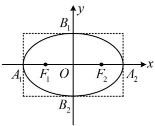
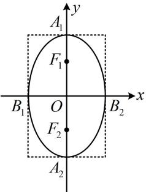
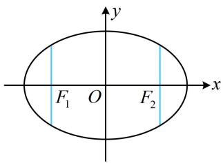
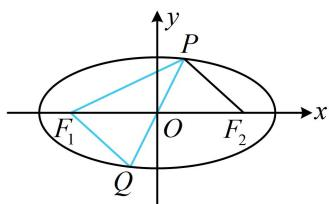
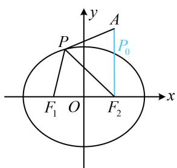
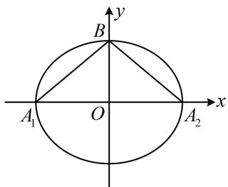

# 模块三 椭圆与方程

# 第1节 椭圆的定义、标准方程及简单几何性质（★★）

# 内容提要

1. 椭圆定义: 设 $F_{1}$ , $F_{2}$ 是平面上的两个定点, 若平面内的点 $P$ 满足 $\left|PF_{1}\right| + \left|PF_{2}\right| = 2a(2a > \left|F_{1}F_{2}\right|$ , 则点 $P$ 的轨迹是以 $F_{1}$ , $F_{2}$ 为焦点的椭圆.

2. 椭圆的简单几何性质:

<table><tr><td>标准方程</td><td> $\frac{x^2}{a^2}+\frac{y^2}{b^2}=1(a>b>0)$ </td><td> $\frac{y^2}{a^2}+\frac{x^2}{b^2}=1(a>b>0)$ </td></tr><tr><td>焦点坐标</td><td> $F_1(-c,0), F_2(c,0)$ </td><td> $F_1(0,c), F_2(0,-c)$ </td></tr><tr><td>焦距</td><td colspan="2"> $|F_1F_2|=2c,\text{且}c^2=a^2-b^2$ </td></tr><tr><td>图形</td><td></td><td></td></tr><tr><td>范围</td><td>-a≤x≤a, -b≤y≤b</td><td>-b≤x≤b, -a≤y≤a</td></tr><tr><td>对称性</td><td colspan="2">关于x轴、y轴、原点对称</td></tr><tr><td>顶点坐标</td><td>左、右顶点:  $A_1(-a,0), A_2(a,0)$ 上、下顶点:  $B_1(0,b), B_2(0,-b)$ </td><td>左、右顶点:  $B_1(-b,0), B_2(b,0)$ 上、下顶点:  $A_1(0,a), A_2(0,-a)$ </td></tr><tr><td>长轴长</td><td colspan="2"> $|A_1A_2|=2a,\text{其中}a叫做长半轴长$ </td></tr><tr><td>短轴长</td><td colspan="2"> $|B_1B_2|=2b,\text{其中}b叫做短半轴长$ </td></tr><tr><td>离心率</td><td colspan="2">\(e=\frac{c}{a}(0</td></tr></table>

3. 通径: 过椭圆焦点且垂直于长轴的弦叫做通径 (如图中的两条蓝色线段), 其长度为 $\frac{2b^{2}}{a}$ .

text_image

F₁ O F₂
x
y

# 类型 I：椭圆定义的运用

【例 1】椭圆 $\frac{x^{2}}{9}+\frac{y^{2}}{2}=1$ 的焦点为 $F_{1}$ ， $F_{2}$ ，点 P 在椭圆上，若 $\left|PF_{1}\right|=4$ ，则 $\left|PF_{2}\right|=$ \_\_\_\_； $\angle F_{1}PF_{2}$ 的大小为 \_\_\_\_； $\triangle PF_{1}F_{2}$ 的周长为 \_\_\_\_；若延长 PO 交椭圆于 Q，则 $\left|PF_{1}\right|+\left|F_{1}Q\right|=$ \_\_\_\_.

解析：椭圆中给出 $\left|PF_{1}\right|$ ，可由定义求 $\left|PF_{2}\right|$ ，由题意， $a=3,\quad b=\sqrt{2},\quad c=\sqrt{a^{2}-b^{2}}=\sqrt{7}$

因为 $\left|PF_{1}\right|+\left|PF_{2}\right|=2a=6$ ，且 $\left|PF_{1}\right|=4$ ，所以 $\left|PF_{2}\right|=6-\left|PF_{1}\right|=2$ ；

要求 $\angle F_{1}PF_{2}$ , 可先求 $|F_{1}F_{2}|$ , 在 $\triangle PF_{1}F_{2}$ 中由余弦定理推论求 $\cos \angle F_{1}PF_{2}$ ,

如图， $\left|F_{1}F_{2}\right|=2c=2\sqrt{7}$ ，所以 $\cos\angle F_{1}PF_{2}=\frac{\left|PF_{1}\right|^{2}+\left|PF_{2}\right|^{2}-\left|F_{1}F_{2}\right|^{2}}{2\left|PF_{1}\right|\cdot\left|PF_{2}\right|}=\frac{16+4-28}{2\times4\times2}=-\frac{1}{2}$ ，故 $\angle F_{1}PF_{2}=120^{\circ}$ ；

$\triangle PF_{1}F_{2}$ 的周长为 $\left|PF_1\right| + \left|PF_2\right| + \left|F_1F_2\right| = 2a + 2c = 6 + 2\sqrt{7}$

由椭圆的对称性， $O$ 是 $PQ$ 中点，

又 $O$ 也是 $F_{1}F_{2}$ 的中点, 所以四边形 $PF_{1}QF_{2}$ 为平行四边形,

从而 $\left|QF_{1}\right|=\left|PF_{2}\right|=2$ ，故 $\left|PF_{1}\right|+\left|QF_{1}\right|=4+2=6$ .

答案：2； $120^{\circ}$ ； $6 + 2\sqrt{7}$ ；6

text_image

y
P
F₁ O F₂ x
Q

【变式 1】(2021·新高考 I 卷) 已知 $F_{1}$ , $F_{2}$ 是椭圆 $C: \frac{x^{2}}{9} + \frac{y^{2}}{4} = 1$ 的两个焦点, 点 $M$ 在 $C$ 上, 则 $\left|MF_{1}\right| \cdot \left|MF_{2}\right|$ 的最大值为 ( )

A. 13

B. 12

C. 9

D. 6

解析：由椭圆定义， $\left|MF_{1}\right|$ 与 $\left|MF_{2}\right|$ 的和为定值，故可用不等式 $mn\leq\left(\frac{m+n}{2}\right)^{2}$ 来求积的最大值，

由题意， $a = 3$ ，所以 $\left|MF_1\right| + \left|MF_2\right| = 2a = 6$ ，故 $\left|MF_1\right|\cdot \left|MF_2\right|\leq \left(\frac{\left|MF_1\right| + \left|MF_2\right|}{2}\right)^2 = 9$

当且仅当 $\left|MF_{1}\right|=\left|MF_{2}\right|=3$ 时取等号，所以 $\left|MF_{1}\right|\cdot\left|MF_{2}\right|$ 的最大值为9.

答案: C

【反思】涉及椭圆上的点到两焦点距离的问题，可优先往椭圆定义上思考.

【变式2】已知椭圆 $C: \frac{x^2}{4} + \frac{y^2}{3} = 1$ 的左、右焦点分别为 $F_1, F_2, A(1,2), P$ 为椭圆 $C$ 上的动点，则 $\left|PA\right| - \left|PF_1\right|$ 的最小值为 \_\_\_\_.

解析：如图，直接分析 $|PA| - |PF_1|$ 的最小值不易，涉及 $|PF_1|$ ，可考虑用椭圆定义将其转换成 $|PF_2|$ 来看，

由题意， $\left|PF_{1}\right|+\left|PF_{2}\right|=4$ ，所以 $\left|PF_{1}\right|=4-\left|PF_{2}\right|$

故 $\left|PA\right|-\left|PF_{1}\right|=\left|PA\right|-(4-\left|PF_{2}\right|)=\left|PA\right|+\left|PF_{2}\right|-4$ ①,

由三角形两边之和大于第三边知 $\left|PA\right|+\left|PF_{2}\right|\geq\left|AF_{2}\right|$

结合①得 $\left|PA\right|-\left|PF_{1}\right|=\left|PA\right|+\left|PF_{2}\right|-4\geq\left|AF_{2}\right|-4$ ②,

当且仅当点 $P$ 位于图中 $P_{0}$ 处时取等号，

椭圆的半焦距 $c = \sqrt{a^2 - b^2} = \sqrt{4 - 3} = 1$ ，所以 $F_{2}(1,0)$ ，又 $A(1,2)$ ，所以 $\left|AF_2\right| = 2$

代入②知 $\left|PA\right|-\left|PF_{1}\right|\geq2-4=-2$ ，故 $\left|PA\right|-\left|PF_{1}\right|$ 的最小值为-2.

text_image

y
A
P
P₀
F₁ O F₂
x

答案: -2

【反思】涉及椭圆上的点到一个焦点的距离的最值问题，若不易直接求解，则可考虑用椭圆定义，转化到另一个焦点去分析.

# 类型 II：椭圆的标准方程与简单几何性质

【例 2】椭圆中心在原点，焦点在 x 轴上，离心率 $e=\frac{1}{2}$ ，且过点 $(2\sqrt{2},\sqrt{3})$ ，则椭圆的方程为 \_\_\_\_.

解析：设椭圆的方程为 $\frac{x^2}{a^2} +\frac{y^2}{b^2} = 1(a > b > 0)$ ，已知离心率，可找到 $a,b,c$ 的比例关系，将变量归一化，

由题意， $e = \frac{c}{a} = \frac{1}{2}$ ，所以 $a = 2c$ ， $b = \sqrt{a^2 - c^2} = \sqrt{3} c$ ，故椭圆的方程为 $\frac{x^2}{4c^2} +\frac{y^2}{3c^2} = 1$

最后求 $c$ ，将已知的点代入即可，椭圆过点 $(2\sqrt{2}, \sqrt{3}) \Rightarrow \frac{8}{4c^2} + \frac{3}{3c^2} = 1$ ，解得： $c = \sqrt{3}$ ，

所以椭圆的方程为 $\frac{x^2}{12} +\frac{y^2}{9} = 1$

答案： $\frac{x^2}{12} +\frac{y^2}{9} = 1$

【变式1】若方程 $x^{2} + ky^{2} = 2$ 表示焦点在 $y$ 轴上的椭圆，则实数 $k$ 的取值范围为

解析：先将椭圆化为标准方程，再比较分母， $x^{2} + ky^{2} = 2\Rightarrow \frac{y^{2}}{\frac{2}{k}} +\frac{x^{2}}{2} = 1,$

因为椭圆焦点在 $y$ 轴上，所以 $\frac{2}{k} > 2$ ，解得： $0 < k < 1$

答案: (0,1)

【反思】对于椭圆，若焦点在 $x$ 轴，则在其标准方程中， $x^{2}$ 的分母大；若焦点在 $y$ 轴，则 $y^{2}$ 的分母大.

【变式2】(2022·全国甲卷) 已知椭圆 $C: \frac{x^2}{a^2} + \frac{y^2}{b^2} = 1 (a > b > 0)$ 的离心率为 $\frac{1}{3}$ , $A_1$ , $A_2$ 分别为 $C$ 的左、右顶点, $B$ 为 $C$ 的上顶点, 若 $\overrightarrow{BA_1} \cdot \overrightarrow{BA_2} = -1$ , 则 $C$ 的方程为 ( )

A. $\frac{x^2}{18} +\frac{y^2}{16} = 1$

B. $\frac{x^2}{9} +\frac{y^2}{8} = 1$

C. $\frac{x^2}{3} +\frac{y^2}{2} = 1$

D. $\frac{x^2}{2} + y^2 = 1$

解析：已知离心率，可找到 $a, b, c$ 的比例关系，将变量归一化，

由题意，离心率 $e = \frac{c}{a} = \frac{1}{3}$ ，所以 $a = 3c$ ， $b = \sqrt{a^2 - c^2} = 2\sqrt{2}c$ ，如图， $A_1(-3c,0)$ ， $A_2(3c,0)$ ， $B(0,2\sqrt{2}c)$ ，

所以 $\overrightarrow{BA_1} = (-3c, - 2\sqrt{2} c)$ ， $\overrightarrow{BA_2} = (3c, - 2\sqrt{2} c)$

故 $\overrightarrow{BA_1} \cdot \overrightarrow{BA_2} = -3c \cdot 3c + (-2\sqrt{2}c)^2 = -c^2$

因为 $\overrightarrow{BA_1} \cdot \overrightarrow{BA_2} = -1$ ，所以 $-c^2 = -1$ ，从而 $c^2 = 1$

故 $a^2 = 9c^2 = 9$ ， $b^{2} = 8c^{2} = 8$ ，所以 $C$ 的方程为 $\frac{x^2}{9} +\frac{y^2}{8} = 1$

答案: B

text_image

y
B
A₁ O A₂ x

# 强化训练

1. (★★)

椭圆 $\frac{y^2}{a^2} +\frac{x^2}{b^2} = 1(a > b > 0)$ 的右顶点为 $A(1,0)$ ，过其焦点且垂直于长轴的弦长为1，则椭圆的方程为

2. (★★)

对称轴为坐标轴的椭圆经过 $P(-2\sqrt{3},1)$ ， $Q(\sqrt{3}, - 2)$ 两点，则椭圆的方程为 \_\_\_\_.

3. (2023·新课标Ⅰ卷·★★)

设椭圆 $C_1: \frac{x^2}{a^2} + y^2 = 1 (a > 1)$ ， $C_2: \frac{x^2}{4} + y^2 = 1$ 的离心率分别为 $e_1$ ， $e_2$ ，若 $e_2 = \sqrt{3} e_1$ ，则 $a = (\quad)$

A. $\frac{2\sqrt{3}}{3}$

B. $\sqrt{2}$

C. $\sqrt{3}$

D. $\sqrt{6}$

4. (2023·湖北武汉二调·★★☆)(多选)

若椭圆 $\frac{x^2}{m^2 + 2} +\frac{y^2}{m^2} = 1(m > 0)$ 的某两个顶点间的距离为4，则 $m$ 的可能取值有（）

A. $\sqrt{5}$

B. $\sqrt{7}$

C. $\sqrt{2}$

D. 2

5. (★★☆)

已知 $\triangle ABC$ 的周长是8，且 $B(-1,0)$ ， $C(1,0)$ ，则顶点 $A$ 的轨迹方程是（）

A. $\frac{x^2}{9} +\frac{y^2}{8} = 1(x\neq \pm 3)$

B. $\frac{x^2}{9} +\frac{y^2}{8} = 1(x\neq 0)$

C. $\frac{x^2}{4} +\frac{y^2}{3} = 1(y\neq 0)$

D. $\frac{y^2}{4} +\frac{x^2}{3} = 1(y\neq 0)$

6. (★★)

已知 $F_{1}$ ， $F_{2}$ 是椭圆 $\frac{x^2}{25} +\frac{y^2}{16} = 1$ 的左、右焦点， $P$ 为椭圆上一点， $M$ 为 $F_{1}P$ 中点， $\left|OM\right| = 3$ ，则 $\left|PF_1\right| = \_$ .

7. (★★☆)

已知 $F_{1}$ ， $F_{2}$ 为椭圆 $\frac{x^2}{25} +\frac{y^2}{9} = 1$ 的两个焦点，过 $F_{1}$ 的直线交椭圆于 $A$ ， $B$ 两点，若 $\left|AF_2\right| + \left|BF_2\right| = 12$ ，则 $\left|AB\right| = \_$ .

一数·必刷100讲

8. (★★★)

椭圆 $C: \frac{x^2}{4} + \frac{y^2}{3} = 1$ 的左、右焦点分别为 $F_1, F_2, A(1,1), P$ 为椭圆 $C$ 上的动点，则 $\left|PA\right| + \left|PF_1\right|$ 的最大值为 \_\_\_\_.

