# 第 2 节 椭圆的焦点三角形相关问题（★★★）

内容提要

椭圆上一点与两焦点形成的三角形称为焦点三角形，焦点三角形问题常用椭圆的定义求解，但除定义外，可能还需结合图形（如等腰、等边、直角三角形，矩形，平行四边形等）的几何性质才能求解问题，因此本节将归纳高考中椭圆常见的图形和几何条件的处理思路.

# 类型 I：焦点三角形中的特殊图形

【例 1】设 $F_{1}$ ， $F_{2}$ 为椭圆 $\frac{x^{2}}{9}+\frac{y^{2}}{4}=1$ 的两个焦点，P 为椭圆上一点， $\triangle PF_{1}F_{2}$ 为直角三角形，且 $\left|PF_{1}\right|>\left|PF_{2}\right|$ ，则 $\frac{\left|PF_{1}\right|}{\left|PF_{2}\right|}$ 的值为 \_\_\_\_.

解析：焦点三角形问题优先考虑结合椭圆的定义求解，先给出椭圆的 $a, b, c$

由题意， $a = 3$ ， $b = 2$ ， $c = \sqrt{a^2 - b^2} = \sqrt{5}$ ，设 $\left|PF_1\right| = m$ ， $\left|PF_2\right| = n$ ， $m > n$ ，则 $m + n = 2a = 6$ ①， $\triangle PF_1F_2$ 是直角三角形，可用勾股定理翻译，但需讨论谁是直角顶点，有图1和图2两种情况，若为图1，则 $m^2 + n^2 = \left|F_1F_2\right|^2 = 4c^2 = 20$ ②，

联立①②结合 $m > n$ 可得 $m = 4$ ， $n = 2$ ，所以 $\frac{|PF_1|}{|PF_2|} = \frac{m}{n} = 2$

若为图2，则 $n^2 +\left|F_1F_2\right|^2 = m^2$ ，即 $n^2 +20 = m^2$ ③，

联立①③解得： $m = \frac{14}{3}$ ， $n = \frac{4}{3}$ ，故 $\frac{|PF_1|}{|PF_2|} = \frac{m}{n} = \frac{7}{2}$

答案: 2 或 $\frac{7}{2}$

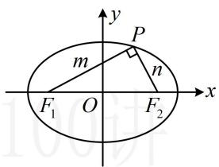

text_image

y
P
m
n
F₁ O F₂ x

图1

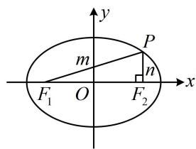

text_image

y
m
P
n
F₁ O F₂ x

图2

【反思】解析几何小题中对直角的常见翻译方法有：①勾股定理；②斜率之积为-1；③向量数量积等于0；④斜边上的中线等于斜边的一半等.选择合适的方法前应先预判计算量.

【变式】已知椭圆 $C: \frac{x^2}{a^2} + \frac{y^2}{b^2} = 1 (a > b > 0)$ 的左、右焦点分别为 $F_1, F_2, P$ 为椭圆 $C$ 上一点， $O$ 为原点，若 $(\overrightarrow{OF_1} - \overrightarrow{OP}) \cdot (\overrightarrow{OF_1} + \overrightarrow{OP}) = 0$ ，且 $|PF_1| = 2 |PF_2|$ ，则椭圆 $C$ 的离心率为 \_\_\_\_.

解析：椭圆 $C$ 的离心率 $e = \frac{c}{a} = \frac{2c}{2a} = \frac{|F_1F_2|}{|PF_1| + |PF_2|}$ ，故只需找到 $\triangle PF_{1}F_{2}$ 的三边比值，就能求得离心率，怎么找呢？观察发现题干所给的向量关系式可化简，我们先来把它化简，看能得到什么，

$(\overrightarrow{OF_1} - \overrightarrow{OP}) \cdot (\overrightarrow{OF_1} + \overrightarrow{OP}) = 0 \Rightarrow |\overrightarrow{OF_1}|^2 - |\overrightarrow{OP}|^2 = 0 \Rightarrow |OF_1| = |OP|$ ，所以 $|OP| = \frac{1}{2} |F_1F_2|$ ，故 $PF_1 \perp PF_2$ ，

由此结合 $\left|PF_{1}\right|=2\left|PF_{2}\right|$ 即可分析 $\triangle PF_{1}F_{2}$ 的三边比值，离心率就有了，

不妨设 $\left|PF_{2}\right|=m$ ，则 $\left|PF_{1}\right|=2m$ ， $\left|F_{1}F_{2}\right|=\sqrt{\left|PF_{1}\right|^{2}+\left|PF_{2}\right|^{2}}=\sqrt{5}m$ ，

所以 $e = \frac{|F_1F_2|}{|PF_1| + |PF_2|} = \frac{\sqrt{5}m}{m + 2m} = \frac{\sqrt{5}}{3}$

答案： $\frac{\sqrt{5}}{3}$

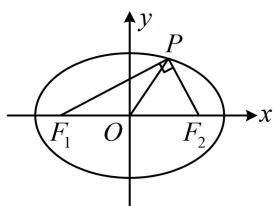

text_image

y
P
F₁ O F₂ x

【反思】椭圆焦点三角形已知（或可求得）三边比值求离心率，用公式 $e = \frac{|F_1F_2|}{|PF_1| + |PF_2|}$ 来算.

【例 2】已知 $F_{1}$ ， $F_{2}$ 为椭圆 $C: \frac{x^{2}}{16} + \frac{y^{2}}{4} = 1$ 的两个焦点，过原点的直线交椭圆 C 于 P，Q 两点，且 $\left|PQ\right| = \left|F_{1}F_{2}\right|$ ，则四边形 $PF_{1}QF_{2}$ 的面积为 \_\_\_\_.

解析：要求四边形 $PF_{1}QF_{2}$ 的面积，先分析它的形状，由题意， $O$ 既是 $PQ$ 中点，也是 $F_{1}F_{2}$ 中点，

所以四边形 $PF_{1}QF_{2}$ 是平行四边形，又 $\left|PQ\right| = \left|F_{1}F_{2}\right|$ ，所以四边形 $PF_{1}QF_{2}$ 是矩形，故 $PF_{1} \perp PF_{2}$ ，

如图，四边形 $PF_{1}QF_{2}$ 的面积 $S_{PF_1QF_2} = |PF_1|\cdot |PF_2|$ ，涉及 $|PF_1|$ 和 $|PF_2|$ ，考虑结合椭圆定义处理，

由题意， $a = 4$ ， $b = 2$ ， $c = \sqrt{a^2 - b^2} = 2\sqrt{3}$ ， $\left|F_1F_2\right| = 2c = 4\sqrt{3}$

记 $\left|PF_{1}\right|=m,\quad\left|PF_{2}\right|=n$ ，则 $S_{PF_{1}QF_{2}}=mn$ ，且 $\left\{\begin{aligned}&m+n=2a=8①\\ &m^{2}+n^{2}=\left|F_{1}F_{2}\right|^{2}=48②\end{aligned}\right.$

由②可得： $(m+n)^{2}-2mn=48$ ③，

将①代入③可得： $64 - 2mn = 48$ ，所以 $mn = 8$ ，故 $S_{PF_1QF_2} = mn = 8$

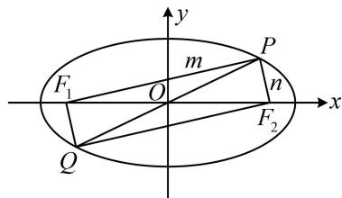

text_image

y
m
P
F₁ O n
x
Q F₂

答案: 8

【反思】当题目出现过原点的直线与椭圆交于 P, Q 两点时, 就隐含了四边形 $PF_{1}QF_{2}$ 是平行四边形, 若还满足对角线长度相等或某个顶角为 $90^{\circ}$ , 则为矩形.

# 类型Ⅱ：定义与中点相关

【例 3】已知点 $T(2\sqrt{2},-2)$ 在椭圆 $E:\frac{x^{2}}{a^{2}}+\frac{y^{2}}{b^{2}}=1(a>b>0)$ 上，点 M 与椭圆 E 的焦点不重合，点 M 关于椭圆 E 的左、右焦点的对称点分别为 A 和 B，若线段 MN 的中点 P 总在椭圆 E 上，且 $|AN|+|BN|=16$ ，则椭圆 E 的离心率为 \_\_\_\_.

解析：如图，由题意， $F_{1}$ 是 $AM$ 的中点， $F_{2}$ 是 $BM$ 的中点， $P$ 是 $MN$ 的中点，

涉及中点，常考虑中位线，所以 $\left|PF_{1}\right|=\frac{1}{2}\left|AN\right|$ ， $\left|PF_{2}\right|=\frac{1}{2}\left|BN\right|$ ，故 $\left|PF_{1}\right|+\left|PF_{2}\right|=\frac{1}{2}\left(\left|AN\right|+\left|BN\right|\right)=8$ ，

又 $P$ 在椭圆 $E$ 上，所以 $\left|PF_1\right| + \left|PF_2\right| = 2a$ ，从而 $2a = 8$ ，故 $a = 4$

条件还给出了点 $T$ 在椭圆上, 代入椭圆方程就能求得 $b$ ,

由点 $T(2\sqrt{2}, - 2)$ 在椭圆 $E$ 上得 $\frac{8}{a^2} +\frac{4}{b^2} = 1$ ，结合 $a = 4$ 可得 $b^{2} = 8$

所以椭圆 $E$ 的离心率 $e = \frac{c}{a} = \frac{\sqrt{a^2 - b^2}}{a} = \frac{\sqrt{2}}{2}$ .

答案： $\frac{\sqrt{2}}{2}$

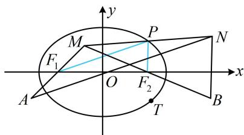

text_image

y
M
P
N
F₁
O
F₂
A
T
B
x

【反思】若条件中出现中点，尤其是涉及多个中点时，可考虑应用中位线的性质.

【变式】已知点 $P$ 在椭圆 $\frac{x^2}{a^2} + \frac{y^2}{b^2} = 1 (a > b > 0)$ 上， $F_1$ 是椭圆的左焦点，线段 $PF_1$ 的中点在圆 $x^2 + y^2 = a^2 - b^2$ 上，记直线 $PF_1$ 的斜率为 $k$ ，若 $k = \sqrt{3}$ ，则椭圆的离心率为（）

A. $\sqrt{2} - 1$

B. $\frac{\sqrt{3}}{2}$

C. $\frac{\sqrt{2}}{2}$

D. $\frac{1}{2}$

解析：若设直线 $PF_{1}$ 的方程来做，则较为繁琐。不妨寻找焦点 $\triangle PF_{1}F_{2}$ 的几何性质，先用几何方式翻译题干的两个条件，如图，记 $PF_{1}$ 的中点为 $Q$ ，右焦点为 $F_{2}$ ，由图知 $k = \tan \angle PF_{1}F_{2} = \sqrt{3} \Rightarrow \angle PF_{1}F_{2} = \frac{\pi}{3}$ ，

注意到 $Q$ 在圆 $x^{2} + y^{2} = a^{2} - b^{2}$ 上，而 $a^2 - b^2 = c^2$ ，所以该圆恰好是以 $F_{1}F_{2}$ 为直径的圆，故 $QF_{1} \perp QF_{2}$ 中点+垂直想到三线合一，故考虑据此分析 $\triangle PF_{1}F_{2}$ 的几何特征，看能否求出离心率，

由 $QF_{1}\perp QF_{2}$ 和Q是 $PF_{1}$ 的中点可得 $\left|PF_{2}\right|=\left|F_{1}F_{2}\right|$ ①,

结合 $\angle PF_{1}F_{2} = \frac{\pi}{3}$ 可得 $\triangle PF_{1}F_{2}$ 是正三角形，所以 $P$ 为椭圆的上顶点，

从而 $\left|PF_{2}\right|=a$ ，结合①可得a=2c，故椭圆的离心率 $e=\frac{c}{a}=\frac{1}{2}$ .

答案: D

【反思】中点除了可用于构造中位线之外，利用中线垂直于底边反推等腰三角形也是一种用法.

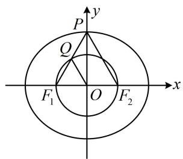

text_image

P
y
Q
F₁ O F₂ x

# 类型III：定义与解三角形相关

【例4】已知椭圆 $C: \frac{x^2}{a^2} + \frac{y^2}{b^2} = 1 (a > b > 0)$ 的左、右焦点分别为 $F_1, F_2, P$ 为 $C$ 上的一点，且 $\angle F_1PF_2 = 60^\circ$ ， $|PF_1| = 3|PF_2|$ ，则椭圆 $C$ 的离心率为（）

A. $\frac{\sqrt{3}}{2}$

B. $\frac{\sqrt{7}}{4}$

C. $\frac{\sqrt{13}}{4}$

D. $\frac{3}{4}$

解析：看到 $\left|PF_{1}\right|$ 和 $\left|PF_{2}\right|$ ，想到椭圆定义，由题意， $\left\{\begin{aligned}&\left|PF_{1}\right|+\left|PF_{2}\right|=2a\\&\left|PF_{1}\right|=3\left|PF_{2}\right|\end{aligned}\right.$ ，所以 $\left|PF_{1}\right|=\frac{3a}{2}$ ， $\left|PF_{2}\right|=\frac{a}{2}$ ，

题干还给了 $\angle F_{1}PF_{2}$ , 可在 $\triangle PF_{1}F_{2}$ 中用余弦定理建立方程求离心率,

如图，由余弦定理， $\left|F_1F_2\right|^2 = \left|PF_1\right|^2 +\left|PF_2\right|^2 -2\left|PF_1\right|\cdot \left|PF_2\right|\cdot \cos \angle F_1PF_2$

所以 $4c^{2} = \frac{9a^{2}}{4} +\frac{a^{2}}{4} -2\times \frac{3a}{2}\times \frac{a}{2}\times \cos 60^{\circ}$ ，整理得离心率 $e = \frac{c}{a} = \frac{\sqrt{7}}{4}$

答案: B

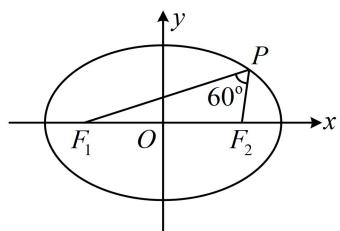

text_image

y
P
60°
F₁ O F₂ x

【变式】已知 $F_{1}$ , $F_{2}$ 为椭圆 $\frac{x^{2}}{a^{2}} + \frac{y^{2}}{b^{2}} = 1 (a > b > 0)$ 的左、右焦点, 椭圆的离心率为 $\frac{1}{2}$ , $M$ 为椭圆上的一动点, 则 $\angle F_{1}MF_{2}$ 的最大值为 ( )

A. $\frac{\pi}{3}$

B. $\frac{\pi}{2}$

C. $\frac{2\pi}{3}$

D. $\frac{3\pi}{4}$

解析：已知离心率，可找到 $a, b, c$ 的比值关系， $e = \frac{c}{a} = \frac{1}{2} \Rightarrow a = 2c$ ，所以 $b = \sqrt{a^2 - c^2} = \sqrt{3}c$ ，

要求 $\angle F_{1}MF_{2}$ 的最大值，只需求 $\cos \angle F_{1}MF_{2}$ 的最小值，可考虑在 $\triangle MF_{1}F_{2}$ 中用余弦定理推论来算，

设 $\left|MF_{1}\right|=m,\quad\left|MF_{2}\right|=n$ ，则 $m+n=2a$ ①，

又 $\left|F_{1}F_{2}\right| = 2c$ ，所以 $\cos \angle F_1MF_2 = \frac{\left|MF_1\right|^2 + \left|MF_2\right|^2 - \left|F_1F_2\right|^2}{2\left|MF_1\right|\cdot\left|MF_2\right|} = \frac{m^2 + n^2 - 4c^2}{2mn}$ ，结合式①知接下来应对分子配方，

故 $\cos \angle F_{1}MF_{2} = \frac{(m + n)^{2} - 2mn - 4c^{2}}{2mn} = \frac{4a^{2} - 2mn - 4c^{2}}{2mn} = \frac{2b^{2} - mn}{mn} = \frac{2b^{2}}{mn} -1$

$$
\geq \frac {2 b ^ {2}}{\left(\frac {m + n}{2}\right) ^ {2}} - 1 = \frac {2 b ^ {2}}{a ^ {2}} - 1 = \frac {2 \times 3 c ^ {2}}{4 c ^ {2}} - 1 = \frac {1}{2},
$$

当且仅当 $m = n$ 时取等号，此时的情形如图2，所以 $(\cos \angle F_1MF_2)_{\mathrm{min}} = \frac{1}{2}$

又 $\angle F_{1}MF_{2}\in [0,\pi)$ ，所以 $\angle F_1MF_2$ 的最大值为 $\frac{\pi}{3}$

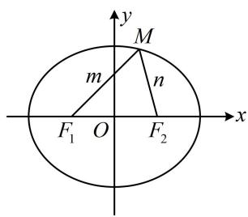

text_image

y
M
m
n
F₁ O F₂ x

图1

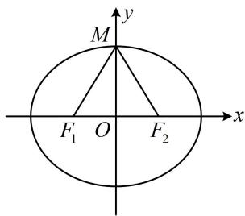

text_image

M
F₁ O F₂
x
y

图2

答案: A

【总结】①椭圆中涉及角度, 常用余弦定理处理; ②最大张角结论: 当 $M$ 在椭圆上运动时, $\angle {F}_{1}M{F}_{2}$ 的最大值必定在短轴端点处取得, 如变式图 2.

# 类型IV：定义与综合几何性质

【例 5】(2019·新课标 I 卷) 已知椭圆 C 的焦点为 $F_{1}(-1,0)$ ， $F_{2}(1,0)$ ，过 $F_{2}$ 的直线与 C 交于 A，B 两点，若 $\left|AF_{2}\right|=2\left|F_{2}B\right|$ ， $\left|AB\right|=\left|BF_{1}\right|$ ，则 C 的方程为（）

A. $\frac{x^2}{2} + y^2 = 1$

B. $\frac{x^2}{3} +\frac{y^2}{2} = 1$

C. $\frac{x^2}{4} +\frac{y^2}{3} = 1$

D. $\frac{x^2}{5} +\frac{y^2}{4} = 1$

解析： $A$ ， $B$ 都在椭圆上，先利用椭圆的定义和已知的线段长度关系来研究有关线段的长，

设椭圆 $C: \frac{x^2}{a^2} + \frac{y^2}{b^2} = 1 (a > b > 0)$ ，设 $\left|BF_2\right| = m$ ，则 $\left|AF_2\right| = 2m$ ， $\left|BF_1\right| = \left|AB\right| = 3m$ ，

$\left|BF_{1}\right| + \left|BF_{2}\right| = 4m = 2a \Rightarrow m = \frac{a}{2} \Rightarrow \left|AF_{2}\right| = a$ ，故 $A$ 为短轴端点，到此可写出 $A$ 的坐标，而对于 $\left|AF_{2}\right| = 2\left|F_{2}B\right|$ 这种条件，常通过构造相似三角形，将斜边之比转化为直角边之比，进而写出点 $B$ 的坐标，

如图， $A(0,b)$ ， $F_{2}(1,0)$ ，作 $BI\perp x$ 轴于点 $I$ ，则 $\triangle AOF_2\sim \triangle BIF_2$ ，所以 $\frac{|F_2I|}{|OF_2|} = \frac{|BI|}{|OA|} = \frac{|BF_2|}{|AF_2|} = \frac{1}{2}$

从而 $\left|F_{2}I\right|=\frac{1}{2}\left|OF_{2}\right|=\frac{1}{2},\quad\left|OI\right|=\left|OF_{2}\right|+\left|F_{2}I\right|=\frac{3}{2},\quad\left|BI\right|=\frac{1}{2}\left|OA\right|=\frac{b}{2},$

故 $B\left(\frac{3}{2}, - \frac{b}{2}\right)$ ，代入 $\frac{x^2}{a^2} +\frac{y^2}{b^2} = 1$ 解得： $a^2 = 3$ ，故 $b^{2} = a^{2} - 1 = 2$

所以椭圆 $C$ 的方程为 $\frac{x^2}{3} +\frac{y^2}{2} = 1$

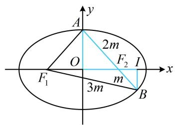

text_image

y
A
2m
O
F₂ I
x
F₁
3m
B

答案: B

【反思】当解析几何中出现共线线段比例式的时候，可以考虑利用相似化斜边比例为直角边比例.

【例 6】椭圆 $C: \frac{x^{2}}{9} + \frac{y^{2}}{5} = 1$ 的左、右焦点分别为 $F_{1}$ ， $F_{2}$ ，过 $F_{1}$ 作倾斜角为 $\frac{\pi}{3}$ 的直线交椭圆于点 M （M 在 x 轴上方），连接 $MF_{2}$ ，再作 $\angle F_{1}MF_{2}$ 的角平分线 l，点 $F_{2}$ 在 l 上的投影为点 N，O 为原点，则 $|ON| = (\quad)$

A. 1 B. $\frac{\sqrt{2}}{2}$ C. $\frac{\sqrt{3}}{2}$ D. $\frac{1}{2}$

解析：由题意， $a = 3$ ， $b = \sqrt{5}$ ， $c = \sqrt{a^2 - b^2} = 2$ ，所以 $\left|F_1F_2\right| = 2c = 4$ 如图, 倾斜角为 $\frac{\pi}{3}$ 这个条件怎么用? 若用来写出直线 $F_{1} M$ 的方程, 并与椭圆联立求 $M$ 的坐标, 则计算量大, 可考虑在 $\triangle M F_{1} F_{2}$ 中用定义, 结合余弦定理来分析 $|M F_{1}|$ 和 $|M F_{2}|$ 的长,

设 $\left|MF_{1}\right|=m$ ，由椭圆定义， $\left|MF_{1}\right|+\left|MF_{2}\right|=2a=6$ ，所以 $\left|MF_{2}\right|=6-\left|MF_{1}\right|=6-m$ ，

在 $\triangle MF_1F_2$ 中，由余弦定理， $\left|MF_2\right|^2 = \left|MF_1\right|^2 +\left|F_1F_2\right|^2 -2\left|M F_1\right|\cdot \left|F_1F_2\right|\cdot \cos \angle MF_1F_2$

所以 $(6 - m)^2 = m^2 + 16 - 2m \times 4 \times \cos \frac{\pi}{3}$ ，解得： $m = \frac{5}{2}$ ，所以 $\left|MF_1\right| = \frac{5}{2}$ ， $\left|MF_2\right| = \frac{7}{2}$ ，

注意到 $MN$ 是角平分线，且 $MN \perp F_{2}N$ ，于是联想到等腰三角形三线合一，故构造一个等腰三角形，延长 $MF_{1}$ 和 $F_{2}N$ 交于点 $H$ ，则 $MN$ 既是角平分线，

又是垂线，所以 $\left|MH\right|=\left|MF_{2}\right|=\frac{7}{2}$ ，且N是 $HF_{2}$ 中点，

又 $O$ 是 $F_{1}F_{2}$ 的中点，所以 $\left|ON\right| = \frac{1}{2}\left|HF_{1}\right| = \frac{1}{2}\left(\left|MH\right| - \left|MF_{1}\right|\right) = \frac{1}{2}\times \left(\frac{7}{2} -\frac{5}{2}\right) = \frac{1}{2}.$

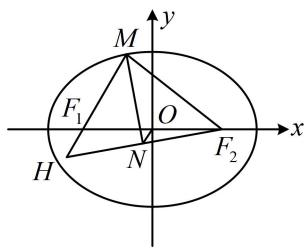

text_image

M
y
F₁ O x
H N F₂

答案: D

【反思】遇到角平分线+垂线的情况，可考虑构造等腰三角形. 这种辅助线不常见，但可以留个印象.

【例 7】若 P 是椭圆 $\frac{x^{2}}{25} + \frac{y^{2}}{16} = 1$ 上一点， $F_{1}$ ， $F_{2}$ 是椭圆的两个焦点，且 $\triangle PF_{1}F_{2}$ 的内切圆半径为 1，当 P 在第一象限时，点 P 的纵坐标为 \_\_\_\_.

解析：由题意， $a = 5$ ， $b = 4$ ， $c = \sqrt{a^2 - b^2} = 3$

对于 $\triangle PF_{1}F_{2}$ ，已知内切圆半径 $r$ ，可联想到用公式 $S = \frac{1}{2} Lr$ （证明过程见本题反思）求其面积，

$\triangle PF_{1}F_{2}$ 的周长 $L = \left|PF_{1}\right| + \left|PF_{2}\right| + \left|F_{1}F_{2}\right| = 2a + 2c = 16$ ，所以 $S_{\triangle PF_1F_2} = \frac{1}{2} Lr = \frac{1}{2}\times 16\times 1 = 8$ ①，

我们也可用点 $P$ 的纵坐标和 $\left|F_{1}F_{2}\right|$ 来算 $\triangle PF_{1}F_{2}$ 的面积，从而

建立方程求解点 P 的纵坐标,

另一方面， $S_{\triangle PF_1F_2} = \frac{1}{2}\big|F_1F_2\big|\cdot y_P = \frac{1}{2}\times 6\times y_P = 3y_P,$

结合式①可得 $3y_{P}=8$ ，故 $y_{P}=\frac{8}{3}$ .

答案： $\frac{8}{3}$

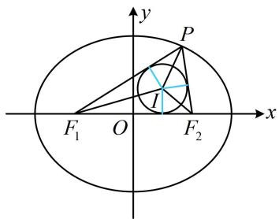

text_image

y
P
I
F₁ O F₂ x

【反思】解析几何中涉及内切圆，常见的思考方向有：①用公式 $S = \frac{1}{2} Lr$ 进行面积与半径的转化，此公式的推导如图1， $S_{\triangle ABC} = S_{\triangle IAB} + S_{\triangle IAC} + S_{\triangle IBC} = \frac{1}{2}|AB| \cdot r + \frac{1}{2}|AC| \cdot r + \frac{1}{2}|BC| \cdot r = \frac{1}{2} (|AB| + |AC| + |BC|)r = \frac{1}{2} Lr$ ；②切线长对应相等，如图1中 $|AM| = |AN|$ ；③用角平分线性质定理，如图2，由BI和CI分别为∠KBA和∠KCA的平分线知 $\frac{|AI|}{|IK|} = \frac{|AB|}{|BK|} = \frac{|AC|}{|CK|}$ .

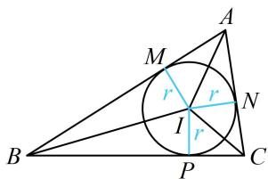

text_image

A
M
r
r
N
I
r
B
P
C

图1

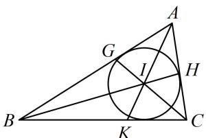

text_image

Geometric diagram of triangle ABC with inscribed circle and labeled points G, H, I, K

图2

# 强化训练

1. (2023·全国甲卷·★★)

设 $F_{1}$ ， $F_{2}$ 为椭圆 $C:\frac{x^2}{5} +y^2 = 1$ 的两个焦点，点 $P$ 在 $C$ 上，若 $\overrightarrow{PF_1}\cdot \overrightarrow{PF_2} = 0$ ，则 $\left|PF_1\right|\cdot \left|PF_2\right| =$ （）

A. 1 B. 2 C. 4 D. 5

2. (2024·湖北武汉四调·★★)

设椭圆 $\frac{x^2}{25} +\frac{y^2}{12} = 1$ 的左右焦点为 $F_{1}$ ， $F_{2}$ ，椭圆上点 $P$ 满足 $\left|PF_1\right|\colon \left|PF_2\right| = 2:3$ ，则 $\triangle PF_1F_2$ 的面积为

3. (2022·江西模拟·★★☆)

设椭圆 $C: \frac{x^2}{a^2} + \frac{y^2}{b^2} = 1 (a > b > 0)$ 的左、右焦点分别为 $F_1, F_2$ ，点 $M, N$ 在 $C$ 上，且 $M, N$ 关于原点 $O$ 对称，若 $\left|MN\right| = \left|F_1F_2\right|$ ， $\left|NF_2\right| = 3 \left|MF_2\right|$ ，则椭圆 $C$ 的离心率为 \_\_\_\_.

4.（2024·湖北武汉二调·★★★）

设椭圆 $\frac{x^2}{9} +\frac{y^2}{5} = 1$ 的左右焦点为 $F_{1}$ ， $F_{2}$ ，过点 $F_{2}$ 的直线与该椭圆交于 $A$ ， $B$ 两点，若线段 $AF_{2}$ 的中垂线过点 $F_{1}$ ，则 $\left|BF_2\right| = \_$ .

5. (2022·广西南宁模拟·★★★)

已知 $F$ 是椭圆 $E: \frac{x^2}{a^2} + \frac{y^2}{b^2} = 1 (a > b > 0)$ 的左焦点，过原点的直线 $l$ 与 $E$ 相交于 $P$ ， $Q$ 两点，若 $|PF| = 5|QF|$ ， $\angle PFQ = 120^\circ$ ，则椭圆的离心率为（）

A. $\frac{\sqrt{7}}{6}$

B. $\frac{1}{3}$

C. $\frac{\sqrt{21}}{6}$

D. $\frac{\sqrt{21}}{5}$

6. (2022·江西萍乡三模·★★★)

设 $F_{1}$ ， $F_{2}$ 是椭圆 $C:y^{2} + \frac{x^{2}}{t} = 1(0 < t < 1)$ 的焦点，若椭圆 $C$ 上存在点 $P$ ，满足 $\angle F_1PF_2 = 120^\circ$ ，则 $t$ 的取值范围是（）

A. $\left(0, \frac{1}{4}\right]$

B. $\left[\frac{1}{4}, 1\right)$

C. $\left(0,\frac{\sqrt{2}}{2}\right]$

D. $\left[\frac{\sqrt{2}}{2}, 1\right)$

7. (2024·广东广州一模·★★★)

设 $B$ ， $F_{2}$ 分别是椭圆 $C:\frac{y^2}{a^2} +\frac{x^2}{b^2} = 1(a > b > 0)$ 的右顶点和上焦点，点 $P$ 在 $C$ 上，且 $\overrightarrow{BF_2} = 2\overrightarrow{F_2P}$ ，则 $C$ 的离心率为（）

A. $\frac{\sqrt{3}}{3}$

B. $\frac{\sqrt{65}}{13}$

C. $\frac{1}{2}$

D. $\frac{\sqrt{3}}{2}$

8. (2024·广东深圳二模·★★★☆)

设 $P$ 是椭圆 $C: \frac{x^2}{a^2} + \frac{y^2}{b^2} = 1 (a > b > 0)$ 上一点， $F_1, F_2$ 是 $C$ 的两个焦点， $\overrightarrow{PF_1} \cdot \overrightarrow{PF_2} = 0$ ，点 $Q$ 在 $\angle F_1PF_2$ 的平分线上， $O$ 为原点， $OQ \parallel PF_1$ ，且 $|OQ| = b$ ，则 $C$ 的离心率为（）

A. $\frac{1}{2}$

B. $\frac{\sqrt{3}}{3}$

C. $\frac{\sqrt{6}}{3}$

D. $\frac{\sqrt{3}}{2}$

9. (2019·浙江卷·★★★☆)

已知椭圆 $\frac{x^2}{9} +\frac{y^2}{5} = 1$ 的左焦点为 $F$ ，点 $P$ 在椭圆上且在 $x$ 轴的上方，若线段 $PF$ 的中点在以原点 $O$ 为圆心， $|OF|$ 为半径的圆上，则直线 $PF$ 的斜率是 \_\_\_\_.

10.（2023·湖南模拟·★★★★）

已知椭圆 $C: \frac{x^2}{a^2} + \frac{y^2}{b^2} = 1 (a > b > 0)$ 的左、右焦点分别为 $F_1, F_2$ ，过点 $F_2$ 且倾斜角为 $60^\circ$ 的直线 $l$ 与 $C$ 交于 $A$ ， $B$ 两点，若 $\triangle AF_1F_2$ 的面积是 $\triangle BF_1F_2$ 面积的 2 倍，则 $C$ 的离心率为 \_\_\_\_.

一数·必刷100讲

11.（2022·湖北模拟·★★★★）

已知 $F_{1}$ ， $F_{2}$ 是椭圆 $C: \frac{x^{2}}{a^{2}} + \frac{y^{2}}{b^{2}} = 1 (a > b > 0)$ 的左、右焦点，点 $P$ 在椭圆 $C$ 的第一象限上，过 $F_{2}$ 作 $\angle F_{1}PF_{2}$ 的外角平分线的垂线，垂足为 $A$ ， $O$ 为原点，若 $|OA| = \sqrt{3}b$ ，则椭圆 $C$ 的离心率为 \_\_\_\_.

12. (2022·新课标Ⅰ卷·★★★★)

已知椭圆 $C: \frac{x^2}{a^2} + \frac{y^2}{b^2} = 1 (a > b > 0)$ ， $C$ 的上顶点为 $A$ ，两个焦点为 $F_1$ ， $F_2$ ，离心率为 $\frac{1}{2}$ ，过 $F_1$ 且垂直于 $AF_2$ 的直线交 $C$ 于 $D$ ， $E$ 两点， $|DE| = 6$ ，则 $\triangle ADE$ 的周长是 \_\_\_\_.

