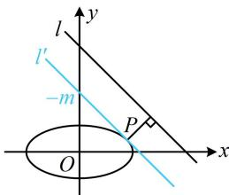
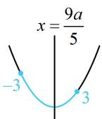
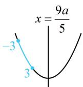
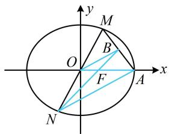
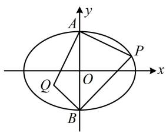
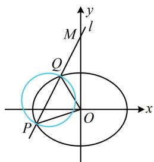

# 强化训练

1. (2021·全国乙卷·★★☆)

设 $B$ 是椭圆 $C: \frac{x^2}{5} + y^2 = 1$ 的上顶点， $P$ 在 $C$ 上，则 $\left|PB\right|$ 的最大值为（）

A. $\frac{5}{2}$

B. $\sqrt{6}$

C. $\sqrt{5}$

D. 2

1. A

解法1： $PB$ 可用两点间距离公式算，故设点 $P$ 的坐标，

由题意， $B(0,1)$ ，设 $P(x_0,y_0)$ ，则 $\left|PB\right|^2 = x_0^2 +(y_0 - 1)^2$ ①

上式有 $x_0$ 和 $y_0$ 两个变量，可利用椭圆方程消元， $x_0$ 只有平方项，故消 $x_0$

由点 $P$ 在椭圆 $C$ 上可得 $\frac{x_0^2}{5} + y_0^2 = 1$ ，所以 $x_0^2 = 5 - 5y_0^2$

代入①得： $\left|PB\right|^{2}=5-5y_{0}^{2}+y_{0}^{2}-2y_{0}+1=-4y_{0}^{2}-2y_{0}+6$

$$
= - 4 \left(y _ {0} + \frac {1}{4}\right) ^ {2} + \frac {2 5}{4}, - 1 \leq y _ {0} \leq 1,
$$

所以当 $y_0 = -\frac{1}{4}$ 时， $\left|PB\right|^2$ 取得最大值 $\frac{25}{4}$ ，故 $\left|PB\right|_{\max} = \frac{5}{2}$ .

解法 2: 也可将点 P 的坐标设为三角形式,

由题意， $B(0,1)$ ，可设 $P(\sqrt{5}\cos \theta ,\sin \theta)$ ，则 $\left|PB\right| =$

$$
\sqrt {(\sqrt {5} \cos \theta) ^ {2} + (\sin \theta - 1) ^ {2}} = \sqrt {5 \cos^ {2} \theta + \sin^ {2} \theta - 2 \sin \theta + 1},
$$

将 $\cos^{2}\theta$ 换成 $1-\sin^{2}\theta$ ，可统一函数名，

所以 $|PB| = \sqrt{5(1 - \sin^2\theta) + \sin^2\theta - 2\sin\theta + 1}$

$$
= \sqrt {- 4 \sin^ {2} \theta - 2 \sin \theta + 6} = \sqrt {- 4 \left(\sin \theta + \frac {1}{4}\right) ^ {2} + \frac {2 5}{4}},
$$

故当 $\sin \theta = -\frac{1}{4}$ 时， $|PB|$ 取得最大值 $\frac{5}{2}$ .

2. (★★★)

已知椭圆 $C: \frac{x^2}{a^2} + \frac{y^2}{b^2} = 1 (a > b > 0)$ ，直线 $y = kx (k \in \mathbf{R})$ 与 $C$ 的一个交点为 $B$ ，若 $|OB|$ 的取值范围是 $(b, 2b]$ ，则椭圆 $C$ 的离心率为（）

A. $\frac{1}{2}$

B. $\frac{\sqrt{2}}{2}$

C. $\frac{\sqrt{3}}{2}$

D. $\frac{3}{4}$

2. C

解析: $B$ 在椭圆上运动, $\vert OB\vert$ 可通过设 $B$ 的坐标来算,

设 $B(x_0,y_0)(x_0\neq 0)$ ，则 $\left|OB\right| = \sqrt{x_0^2 + y_0^2}$ ①，

有 $x_0$ ， $y_{0}$ 两个变量，可利用椭圆方程消元，

由 $B$ 在椭圆上可得 $\frac{x_0^2}{a^2} +\frac{y_0^2}{b^2} = 1$ ，所以 $y_{0}^{2} = b^{2} - \frac{b^{2}}{a^{2}} x_{0}^{2}$

代入①得： $\left|OB\right|=\sqrt{x_{0}^{2}+b^{2}-\frac{b^{2}}{a^{2}}x_{0}^{2}}$

$$
= \sqrt {\frac {a ^ {2} - b ^ {2}}{a ^ {2}} x _ {0} ^ {2} + b ^ {2}} = \sqrt {\frac {c ^ {2}}{a ^ {2}} x _ {0} ^ {2} + b ^ {2}} \quad ②,
$$

因为 $-a \leq x_0 \leq a$ 且 $x_0 \neq 0$ ，所以 $0 < x_0^2 \leq a^2$

代入②得： $b < |OB| \leq \sqrt{c^2 + b^2} = a$ ，又由题意，

$b < |OB| \leq 2b$ ，所以 $a = 2b$ ，故 $a^2 = 4b^2 = 4(a^2 - c^2)$

整理得： $\frac{c^2}{a^2} = \frac{3}{4}$ ，所以椭圆 $C$ 的离心率 $e = \frac{c}{a} = \frac{\sqrt{3}}{2}$

【反思】本题其实是将一个好记的性质证明了一下：椭圆上动点到其中心的距离的取值范围是 $[b, a]$ .

# 3. (★★★)

点 $P$ 在椭圆 $\frac{x^2}{4} + y^2 = 1$ 上运动，则当点 $P$ 到直线 $l: x + y - 4 = 0$ 的距离最小时，点 $P$ 的坐标为 \_\_\_\_.

# 3. $\left(\frac{4\sqrt{5}}{5}, \frac{\sqrt{5}}{5}\right)$

解法1： $P$ 在椭圆上运动，可将其坐标设为三角形式，用于分析最值，设 $P(2\cos \theta ,\sin \theta)$ ，则点 $P$ 到直线 $l$ 的距离 $d =$

$$
\frac {\left| 2 \cos \theta + \sin \theta - 4 \right|}{\sqrt {2}} = \frac {\left| \sqrt {5} \sin (\theta + \varphi) - 4 \right|}{\sqrt {2}} = \frac {4 - \sqrt {5} \sin (\theta + \varphi)}{\sqrt {2}},
$$

其中 $\cos \varphi = \frac{\sqrt{5}}{5}$ ， $\sin \varphi = \frac{2\sqrt{5}}{5}$

所以当 $\sin (\theta +\varphi) = 1$ 时， $d$ 取得最小值，目标是求 $d$ 最小时点 $P$ 的坐标，故可由 $\sin (\theta +\varphi) = 1$ 求出 $\theta$ ，代入所设的点 $P$

$$
\sin (\theta + \varphi) = 1 \Rightarrow \theta + \varphi = 2 k \pi + \frac {\pi}{2} (k \in \mathbf {Z}) \Rightarrow \theta = 2 k \pi + \frac {\pi}{2} - \varphi ,
$$

所以 $\cos \theta = \cos \left(2k\pi +\frac{\pi}{2} -\varphi\right) = \sin \varphi = \frac{2\sqrt{5}}{5},$

$$
\sin \theta = \sin \left(2 k \pi + \frac {\pi}{2} - \varphi\right) = \cos \varphi = \frac {\sqrt {5}}{5},
$$

故点 P 的坐标为 $\left(\frac{4\sqrt{5}}{5}, \frac{\sqrt{5}}{5}\right)$ .

解法2：先画图分析距离最小的情形，如图， $l^{\prime} // l$ ，且 $l^{\prime}$ 与椭圆C相切于点P，图中的点P到直线l的距离最小，要求该切点P，先设切线，并与椭圆联立，

设图中 $l': x + y + m = 0$ ，由 $\left\{\begin{aligned}x + y + m &= 0 \\ \frac{x^{2}}{4} + y^{2} &= 1\end{aligned}\right.$ 消去 y 整理得： $5x^{2} + 8mx + 4m^{2} - 4 = 0$ ①，

因为 $l^{\prime}$ 与椭圆相切，所以方程①的判别式 $\Delta = 64m^{2} -$

$4 \times 5 \times (4m^{2} - 4) = 0$ ，解得： $m = \pm \sqrt{5}$ ，

应取哪一个呢？可结合图形来看，

$x + y + m = 0 \Rightarrow y = -x - m \Rightarrow l'$ 在 $y$ 轴上截距是 $-m$

由图可知 $-m > 0$ ，所以 $m < 0$ ，故 $m = -\sqrt{5}$

所以 $l'$ 的方程为 $x + y - \sqrt{5} = 0$ ②,

将 $m = -\sqrt{5}$ 代入①解得： $x = \frac{4\sqrt{5}}{5}$ ，

代入②可得 $y = \frac{\sqrt{5}}{5}$ ，所以点 $P$ 的坐标为 $\left(\frac{4\sqrt{5}}{5}, \frac{\sqrt{5}}{5}\right)$ .

text_image

l
y
l'
-m
P
O
x

4. (2022·辽宁沈阳模拟·★★★☆)

已知椭圆 $C: x^{2} + 4y^{2} = m (m > 0)$ 的左、右焦点分别为 $F_{1}, F_{2}, P$ 是椭圆 $C$ 上的动点，若 $\overrightarrow{PF_1} \cdot \overrightarrow{PF_2}$ 的最小值为 $-1$ ，则 $\overrightarrow{PF_1} \cdot \overrightarrow{PF_2}$ 的最大值为（）

A. 4 B. 2 C. $\frac{1}{4}$ D. $\frac{1}{2}$

4. D

解析：先把椭圆的方程化为标准方程，找到 $a, b, c$

$$
x ^ {2} + 4 y ^ {2} = m \Rightarrow \frac {x ^ {2}}{m} + \frac {y ^ {2}}{\frac {m}{4}} = 1 \Rightarrow a = \sqrt {m}, b = \frac {\sqrt {m}}{2},
$$

所以 $c = \sqrt{a^2 - b^2} = \frac{\sqrt{3m}}{2}$ ，故 $F_{1}\left(-\frac{\sqrt{3m}}{2},0\right)$ ， $F_{2}\left(\frac{\sqrt{3m}}{2},0\right)$ ，

$\overrightarrow{PF_{1}}\cdot\overrightarrow{PF_{2}}$ 可用坐标来计算，于是设 P 的坐标，

设 $P(x_0,y_0)$ ，则 $\overrightarrow{PF_1} = \left(-\frac{\sqrt{3m}}{2} -x_0, - y_0\right),$

$\overrightarrow{PF_2} = \left(\frac{\sqrt{3m}}{2} - x_0, -y_0\right)$ ，所以 $\overrightarrow{PF_1} \cdot \overrightarrow{PF_2} =$

$$
\left(- \frac {\sqrt {3 m}}{2} - x _ {0}\right) \left(\frac {\sqrt {3 m}}{2} - x _ {0}\right) + (- y _ {0}) ^ {2} = x _ {0} ^ {2} + y _ {0} ^ {2} - \frac {3 m}{4} \quad ①,
$$

有 $x_0$ ， $y_{0}$ 两个变量，可用椭圆方程消元，

点 $P$ 在椭圆 $C$ 上 $\Rightarrow x_0^2 + 4y_0^2 = m \Rightarrow x_0^2 = m - 4y_0^2$

代入①整理得： $\overrightarrow{PF_1}\cdot \overrightarrow{PF_2} = \frac{m}{4} -3y_0^2$

因为 $-\frac{\sqrt{m}}{2} \leq y_0 \leq \frac{\sqrt{m}}{2}$ ，所以 $0 \leq y_0^2 \leq \frac{m}{4}$ ，

故 $-\frac{m}{2} \leq \frac{m}{4} - 3y_0^2 \leq \frac{m}{4}$ ，即 $-\frac{m}{2} \leq \overrightarrow{PF_1} \cdot \overrightarrow{PF_2} \leq \frac{m}{4}$ ②，

由题意， $\overrightarrow{PF_1}\cdot \overrightarrow{PF_2}$ 的最小值为-1，所以 $-\frac{m}{2} = -1$

解得： $m = 2$ ，代入②知 $\overrightarrow{PF_1}\cdot \overrightarrow{PF_2}$ 的最大值为 $\frac{1}{2}$

5. (2022·上海模拟·★★★★)

已知定点 $A(a,0)(a > 0)$ 到椭圆 $\frac{x^2}{9} +\frac{y^2}{4} = 1$ 上的点的距离的最小值为1，则 $a$ 的值为

5.2或4

解析：设 $P(x,y)$ 为椭圆上一点， $\left|PA\right|^2 = (x - a)^2 +y^2$ ①，

上式中有 $x$ 和 $y$ 两个变量，可利用椭圆方程消元， $y$ 只有平方项，故消 $y$

因为点 $P$ 在椭圆上，所以 $\frac{x^2}{9} +\frac{y^2}{4} = 1$ ，故 $y^{2} = 4 - \frac{4}{9} x^{2}$

代入①得 $\left|PA\right|^{2}=x^{2}-2ax+a^{2}+4-\frac{4}{9}x^{2}$

$= \frac{5}{9} x^{2} - 2ax + a^{2} + 4$ ，其中 $-3\leq x\leq 3$

记 $f(x) = \frac{5}{9} x^2 - 2ax + a^2 + 4(-3 \leq x \leq 3)$ ，

因为 $\left|PA\right|_{\min} = 1$ 且 $f(x) = \left|PA\right|^2$ ，所以 $f(x)_{\min} = 1$

下面求 $f(x)_{\min}$ ， $f(x)$ 的参数 $a > 0$ ，求最值应分对称轴 $x = \frac{9a}{5}$ 在区间内和在区间右侧两种情况讨论，

当 $0 < \frac{9a}{5} \leq 3$ 时， $0 < a \leq \frac{5}{3}$ ，如图1，

$$
f (x) _ {\min} = f \left(\frac {9 a}{5}\right) = \frac {5}{9} \cdot \left(\frac {9 a}{5}\right) ^ {2} - 2 a \cdot \frac {9 a}{5} + a ^ {2} + 4 = 4 - \frac {4 a ^ {2}}{5},
$$

令 $4-\frac{4a^{2}}{5}=1$ 解得： $a=\pm\frac{\sqrt{15}}{2}$ ，不满足 $0<a\leq\frac{5}{3}$ ，舍去；

当 $\frac{9a}{5}>3$ 时， $a>\frac{5}{3}$ ，如图2，

$$
f (x) _ {\min} = f (3) = \frac {5}{9} \times 3 ^ {2} - 2 a \cdot 3 + a ^ {2} + 4 = a ^ {2} - 6 a + 9,
$$

令 $a^2 - 6a + 9 = 1$ 解得： $a = 2$ 或4，均满足 $a > \frac{5}{3}$

综上所述，a 的值为 2 或 4.

  
图1

  
图2

# 6. (★★★☆)

已知椭圆 $C: \frac{x^2}{a^2} + \frac{y^2}{b^2} = 1 (a > b > 0)$ 的焦距为 2，右顶点为 $A$ ，过原点且与 $x$ 轴不重合的直线交 $C$ 于 $M, N$ 两点，线段 $AM$ 的中点为 $B$ ，若直线 $BN$ 经过 $C$ 的右焦点，则椭圆 $C$ 的方程为（一）

A. $\frac{x^2}{4} +\frac{y^2}{3} = 1$

B. $\frac{x^2}{6} +\frac{y^2}{5} = 1$

C. $\frac{x^2}{9} +\frac{y^2}{8} = 1$

D. $\frac{x^2}{36} +\frac{y^2}{32} = 1$

6. C

解法1：由题意，椭圆的焦距 $2c = 2$ ，所以 $c = 1$

故 $a^2 - b^2 = 1$ ①，如图，接下来若设 $M$ 的坐标，则 $N$ ， $B$ 也能用 $M$ 的坐标表示，

设 $M(x_0,y_0)(y_0\neq 0)$ ，则 $N(-x_0, - y_0)$

由题意， $A(a,0)$ ，右焦点 $F(1,0)$ ，所以 $B\left(\frac{a + x_0}{2},\frac{y_0}{2}\right)$

直线 $BN$ 过右焦点可看成 $B, F, N$ 三点共线，不妨考虑斜率存在的情形，用斜率相等来翻译，

由题意， $B$ ， $F$ ， $N$ 三点共线，所以 $k_{BF} = k_{NF}$

故 $\frac{\frac{y_0}{2}}{\frac{a + x_0}{2} - 1} = \frac{y_0}{x_0 + 1}$ ，约去 $y_0$ 可解得： $a = 3$ ，

代入①得： $b^{2}=8$ ，所以椭圆的方程为 $\frac{x^{2}}{9}+\frac{y^{2}}{8}=1$ 。

解法2：记右焦点为 $F$ ，椭圆的焦距 $2c = 2$ ，所以 $c = 1$

故 $|OF|=1$ ，且 $a^{2}-b^{2}=1$ ①，

涉及中点，也可考虑构造中位线分析，

如图，连接 $OB$ ，由对称性， $O$ 为MN中点，

又 $B$ 为 $MA$ 中点，所以 $\left|OB\right| = \frac{1}{2}\left|AN\right|$ ，且 $OB // AN$

平行可产生相似三角形，故可分析相似比，

所以 $\triangle OBF\sim \triangle ANF$ ，从而 $\frac{|OF|}{|AF|} = \frac{|OB|}{|AN|} = \frac{1}{2}$

故 $\left|AF\right|=2\left|OF\right|=2$ ，所以 $\left|OA\right|=3$ ，即a=3，

代入①得： $b^{2}=8$ ，所以椭圆的方程为 $\frac{x^{2}}{9}+\frac{y^{2}}{8}=1$ 。

text_image

y
M
O
B
F
A
x
N

【反思】A, B, C 三点共线常用的翻译方法有：① 翻译成 $k_{AB} = k_{AC}$ ，但大题中出于严密性考虑，需讨论斜率不存在的情况；② 翻译成 $\overrightarrow{AB} // \overrightarrow{AC}$ .

7. (2022·河南模拟·★★★☆)

椭圆 $C: \frac{x^2}{18} + \frac{y^2}{9} = 1$ 的上、下顶点分别为 $A$ 和 $B$ , 点 $P(x_0, y_0)(x_0 \neq 0)$ 在椭圆 $C$ 上, 若点 $Q(x_1, y_1)$ 满足 $AP \perp AQ$ , $BP \perp BQ$ , 则 $\frac{x_1}{x_0} = (\quad)$

A. $-\frac{1}{3}$

B. $-\frac{1}{2}$

C. $-\frac{\sqrt{2}}{2}$

D. $-\frac{2}{3}$

7. B

解析：如图，点 $Q$ 可以看成直线 $AQ$ 和 $BQ$ 的交点，于是写出这两条直线的方程，联立求交点，

由题意， $A(0,3)$ ， $B(0, - 3)$ ， $k_{AP} = \frac{y_0 - 3}{x_0}$ ， $k_{BP} = \frac{y_0 + 3}{x_0}$

因为 $AP \perp AQ$ ， $BP \perp BQ$ ，所以 $k_{AQ} = -\frac{x_0}{y_0 - 3}$

$k_{BQ}=-\frac{x_{0}}{y_{0}+3}$ ，从而直线AQ的方程为 $y=-\frac{x_{0}}{y_{0}-3}x+3$ ，

直线 BQ 的方程为 $y = -\frac{x_{0}}{y_{0} + 3}x - 3$ ，

联立 $\left\{ \begin{array}{l} y = -\frac{x_0}{y_0 - 3} x + 3 \\ y = -\frac{x_0}{y_0 + 3} x - 3 \end{array} \right.$ 解得： $x = \frac{y_0^2 - 9}{x_0}$

故点 $Q$ 的横坐标 $x_{1} = \frac{y_{0}^{2} - 9}{x_{0}}$ ，所以 $\frac{x_1}{x_0} = \frac{y_0^2 - 9}{x_0^2}$ ①，

要计算式①右侧的值，可利用椭圆方程来消元，

点 $P$ 在椭圆 $C$ 上 $\Rightarrow \frac{x_0^2}{18} +\frac{y_0^2}{9} = 1\Rightarrow x_0^2 = 2(9 - y_0^2),$

代入①得 $\frac{x_1}{x_0} = \frac{y_0^2 - 9}{2(9 - y_0^2)} = -\frac{1}{2}$ .

text_image

y
A
P
x
O
Q
B

8. (2022·四川成都模拟·★★★★)

过点 $M(0,2)$ 且斜率为 $k$ 的直线 $l$ 与椭圆 $C: \frac{x^2}{2}+$

$y^{2}=1$ 交于不同的两点P和Q，若原点O在以PQ为直径的圆的外部，则k的取值范围是\_\_\_\_.

8. $\left(-\sqrt{5}, -\frac{\sqrt{6}}{2}\right) \cup \left(\frac{\sqrt{6}}{2}, \sqrt{5}\right)$

解析：如图，原点 O 在以 PQ 为直径的圆外可翻译成 $\overrightarrow{OP} \cdot \overrightarrow{OQ} > 0$ ，于是设 P，Q 的坐标，计算 $\overrightarrow{OP} \cdot \overrightarrow{OQ}$ ，

直线 $l$ 的方程为 $y = kx + 2$ ，设 $P(x_{1},y_{1})$ ， $Q(x_{2},y_{2})$ ，则

$\overrightarrow{OP} = (x_1, y_1)$ ， $\overrightarrow{OQ} = (x_2, y_2)$ ，所以 $\overrightarrow{OP} \cdot \overrightarrow{OQ} = x_1x_2 + y_1y_2$

故可把直线 l 与椭圆联立，结合韦达定理来算 $\overrightarrow{OP} \cdot \overrightarrow{OQ}$ ，

联立 $\left\{ \begin{array}{l} y = kx + 2 \\ \frac{x^2}{2} + y^2 = 1 \end{array} \right.$ 消去 $y$ 整理得： $(2k^2 + 1)x^2 + 8kx + 6 = 0$

判别式 $\Delta = 64k^2 - 4(2k^2 + 1) \times 6 > 0$

解得： $k < -\frac{\sqrt{6}}{2}$ 或 $k > \frac{\sqrt{6}}{2}$ ①，

由韦达定理， $x_{1} + x_{2} = -\frac{8k}{2k^{2} + 1},\quad x_{1}x_{2} = \frac{6}{2k^{2} + 1},$

算 $\overrightarrow{OP} \cdot \overrightarrow{OQ}$ 还要用到 $y_{1}y_{2}$ ，可利用点 $P$ ， $Q$ 在直线 $l$ 上转化为 $x_{1} + x_{2}$ 和 $x_{1}x_{2}$ 来算，

$$
y _ {1} y _ {2} = (k x _ {1} + 2) (k x _ {2} + 2) = k ^ {2} x _ {1} x _ {2} + 2 k (x _ {1} + x _ {2}) + 4
$$

$$
= k ^ {2} \cdot \frac {6}{2 k ^ {2} + 1} + 2 k \cdot \left(- \frac {8 k}{2 k ^ {2} + 1}\right) + 4 = \frac {4 - 2 k ^ {2}}{2 k ^ {2} + 1},
$$

所以 $\overrightarrow{OP} \cdot \overrightarrow{OQ} = x_{1}x_{2} + y_{1}y_{2} = \frac{10 - 2k^{2}}{2k^{2} + 1}$ ,

故 $\overrightarrow{OP} \cdot \overrightarrow{OQ} > 0$ 即为 $\frac{10 - 2k^2}{2k^2 + 1} > 0$ ，解得： $-\sqrt{5} < k < \sqrt{5}$

结合①可得 $-\sqrt{5} < k < -\frac{\sqrt{6}}{2}$ 或 $\frac{\sqrt{6}}{2} < k < \sqrt{5}$ .

text_image

y
M
l
Q
O
x
P

