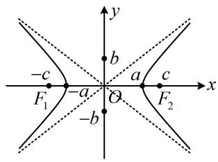
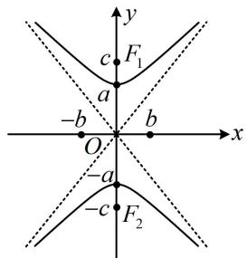
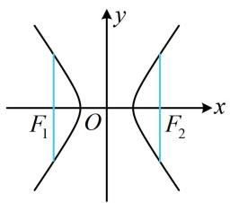
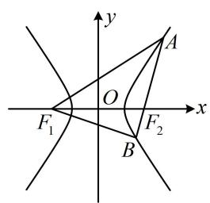
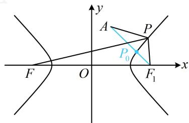

# 模块四 双曲线与方程

# 第1节 双曲线的定义、标准方程及简单几何性质（★★）

# 内容提要

1. 双曲线定义：设 $F_{1}$ ， $F_{2}$ 是平面内的两个定点，若平面内的点 $P$ 满足 $\left\| PF_1\right| - \left|PF_2\right| = 2a (0 < 2a < \left|F_1F_2\right|$ ，则点 $P$ 的轨迹是以 $F_{1}$ ， $F_{2}$ 为焦点的双曲线。

2. 双曲线的标准方程及简单几何性质

<table><tr><td>标准方程</td><td> $\frac{x^2}{a^2}-\frac{y^2}{b^2}=1(a>0,b>0)$ </td><td> $\frac{y^2}{a^2}-\frac{x^2}{b^2}=1(a>0,b>0)$ </td></tr><tr><td>焦点坐标</td><td>左焦点 $F_1(-c,0)$ ,右焦点 $F_2(c,0)$ </td><td>上焦点 $F_1(0,c)$ ,下焦点 $F_2(0,-c)$ </td></tr><tr><td>焦距</td><td colspan="2"> $|F_1F_2|=2c$ ,其中 $c$ 叫做半焦距,且 $c^2=a^2+b^2$ </td></tr><tr><td>图形</td><td></td><td></td></tr><tr><td>范围</td><td>x≤-a或x≥a,y∈R</td><td>y≤-a或y≥a,x∈R</td></tr><tr><td>对称性</td><td colspan="2">关于x轴、y轴、原点对称</td></tr><tr><td>实轴端点(顶点)</td><td>(±a,0)</td><td>(0,±a)</td></tr><tr><td>虚轴端点</td><td>(0,±b)</td><td>(±b,0)</td></tr><tr><td>实轴长</td><td colspan="2">2a,其中a叫做实半轴长</td></tr><tr><td>虚轴长</td><td colspan="2">2b,其中b叫做虚半轴长</td></tr><tr><td>渐近线</td><td>y=±b/a x</td><td>y=±a/b x</td></tr><tr><td>离心率</td><td colspan="2">e=c/a(e&gt;1)</td></tr></table>

3. 双曲线通径公式：过焦点且与双曲线实轴垂直的弦叫做通径，通径长为 $\frac{2b^2}{a}$ .

text_image

F₁
O
F₂
x
y

# 类型 I：双曲线定义的运用

【例 1】双曲线 $C: \frac{x^{2}}{4} - y^{2} = 1$ 的左、右焦点分别为 $F_{1}$ ， $F_{2}$ ，点 P 在双曲线上，且 $\left|PF_{1}\right| = 6$ ，则 $\left|PF_{2}\right| =$ \_\_\_\_.

解析：已知 $|PF_{1}|$ 求 $|PF_{2}|$ ，用双曲线定义，需注意有绝对值，

由题意， $\left|PF_1\right| - \left|PF_2\right| = 4$ ，所以 $\left|PF_1\right| - \left|PF_2\right| = \pm 4$ ，故 $\left|PF_2\right| = \left|PF_1\right|\pm 4$ ，结合 $\left|PF_1\right| = 6$ 可得 $\left|PF_2\right| = 2$ 或10.

答案: 2 或 10

【变式1】已知双曲线 $C: \frac{x^2}{4} - y^2 = 1$ 的左、右焦点分别为 $F_1, F_2$ , 过 $F_2$ 的直线 $l$ 与双曲线 $C$ 的右支交于 $A, B$ 两点, 若 $|AB| = 2$ , 则 $\triangle ABF_1$ 的周长为 \_\_\_\_.

解析：涉及双曲线上的点和左、右焦点，考虑双曲线的定义，

如图，由双曲线定义， $\left\{ \begin{array}{l} |AF_1| - |AF_2| = 4 \\ |BF_1| - |BF_2| = 4 \end{array} \right.$

两式相加得： $\left|AF_1\right| + \left|BF_1\right| - \left|AF_2\right| - \left|BF_2\right| = \left|AF_1\right| + \left|BF_1\right| - \left|AB\right| = 8$

结合 $|AB|=2$ 可得 $|AF_{1}|+|BF_{1}|=8+|AB|=10$ ，

所以 $\triangle ABF_{1}$ 的周长 $L = |AF_{1}| + |BF_{1}| + |AB| = 10 + 2 = 12$

答案: 12

text_image

y
A
O
x
F₁
B
F₂

【变式2】双曲线 $\frac{x^2}{4} -\frac{y^2}{5} = 1$ 的左焦点为 $F$ ， $A(1,2)$ ， $P$ 为双曲线右支上一点，则 $\left|PA\right| + \left|PF\right|$ 的最小值为

解析：如图，直接分析 $|PA| + |PF|$ 的最小值不易，涉及 $|PF|$ ，可考虑用定义转化到右焦点来分析，

设双曲线的右焦点为 $F_{1}(3,0)$ ，则 $\left|PF\right| - \left|PF_{1}\right| = 4$

所以 $\left|PF\right|=4+\left|PF_{1}\right|$ ，故 $\left|PA\right|+\left|PF\right|=\left|PA\right|+\left|PF_{1}\right|+4$ ①，

由三角形两边之和大于第三边可得 $\left|PA\right|+\left|PF_{1}\right|\geq\left|AF_{1}\right|$

$= \sqrt{(1 - 3)^{2} + (2 - 0)^{2}} = 2\sqrt{2}$ ，当且仅当 $P$ 与图中 $P_0$ 重合时取等号，

结合①可得 $\left|PA\right|+\left|PF\right|\geq2\sqrt{2}+4$ ，故 $\left(\left|PA\right|+\left|PF\right|\right)_{\min}=2\sqrt{2}+4$ .

答案: $2 \sqrt { 2 } + 4$

text_image

y
A
P
P₀
F
O
x
F₁

【反思】可以发现，双曲线定义与椭圆运用思路类似，实际上大部分题目处理思路也相同，故要类比学习.

【例 2】(2020·浙江卷) 已知点 $O(0,0)$ , $A(-2,0)$ , $B(2,0)$ , 设点 $P$ 满足 $\left|PA\right| - \left|PB\right| = 2$ , 且 $P$ 为函数 $y = 3\sqrt{4 - x^2}$ 图象上的点, 则 $\left|OP\right| = (\quad)$

A. $\frac{\sqrt{22}}{2}$

B. $\frac{4\sqrt{10}}{5}$

C. $\sqrt{7}$

D. $\sqrt{10}$

解析：由 $A(-2,0)$ ， $B(2,0)$ ， $\left|PA\right| - \left|PB\right| = 2$ 可得点 $P$ 在以 $A$ ， $B$ 为焦点的双曲线 $x^{2} - \frac{y^{2}}{3} = 1$ 的右支上，要求 $\left|OP\right|$ ，需先求点 $P$ ，可联立方程求解，双曲线中 $x$ 和 $y$ 都是平方项，于是把 $y = 3\sqrt{4 - x^2}$ 平方，由 $y = 3\sqrt{4 - x^2}$ 可得 $y^{2} = 9(4 - x^{2})$ ，整理得： $x^{2} + \frac{y^{2}}{9} = 4 (y \geq 0)$ ，

设 $P(x,y)$ ，联立 $\left\{ \begin{array}{l}x^{2} - \frac{y^{2}}{3} = 1\\ x^{2} + \frac{y^{2}}{9} = 4 \end{array} \right.$ 解得： $\left\{ \begin{array}{l}x^2 = \frac{13}{4}\\ y^2 = \frac{27}{4} \end{array} \right.$ ，所以 $\left|OP\right| = \sqrt{x^2 + y^2} = \sqrt{10}$

答案: D

# 类型 II：双曲线的标准方程及简单几何性质

【例 3】若方程 $\frac{x^{2}}{m} + \frac{y^{2}}{2 - m} = 1$ 表示双曲线，则实数 m 的取值范围为 \_\_\_\_.

解析：所给方程要表示双曲线，只需 $x^{2}$ 和 $y^{2}$ 的系数异号，所以 $\frac{1}{m} \cdot \frac{1}{2 - m} < 0$ ，解得： $m < 0$ 或 $m > 2$ .

答案： $(-\infty ,0)\cup (2, + \infty)$

【反思】对于方程 $\frac{x^2}{m} +\frac{y^2}{n} = 1$ ，若 $\left\{ \begin{array}{l}m > 0\\ n > 0\\ m\neq n \end{array} \right.$ ，则该方程表示椭圆；若 $mn <   0$ ，则该方程表示双曲线.

【例 4】双曲线 $\lambda x^{2}-y^{2}=1$ 的实轴长是虚轴长的 2 倍，则 $\lambda=$ \_\_\_\_.

解析：条件涉及实轴长与虚轴长的关系，应先把双曲线化为标准方程，找到 $a$ 和 $b$

$\lambda x^{2} - y^{2} = 1 \Rightarrow \frac{x^{2}}{\frac{1}{\lambda}} - y^{2} = 1$ ，所以 $a^{2} = \frac{1}{\lambda}$ ， $b^{2} = 1$ ，由题意， $2a = 2 \times 2b$ ，所以 $a^{2} = 4b^{2}$ ，即 $\frac{1}{\lambda} = 4$ ，故 $\lambda = \frac{1}{4}$ .

答案： $\frac{1}{4}$

【例 5】已知双曲线 $C: \frac{x^{2}}{6}-\frac{y^{2}}{3}=1$ ，则 C 的右焦点的坐标为 \_\_\_\_；点 $(4,0)$ 到其渐近线的距离是 \_\_\_\_.

解析：由题意， $a = \sqrt{6}$ ， $b = \sqrt{3}$ ， $c = \sqrt{a^2 + b^2} = 3$ ，所以双曲线 $C$ 的右焦点的坐标为(3,0)，

渐近线方程为 $y = \pm \frac{\sqrt{2}}{2} x$ ，即 $x \pm \sqrt{2} y = 0$ ，故点(4,0)到渐近线的距离 $d = \frac{|4|}{\sqrt{1^2 + (\pm\sqrt{2})^2}} = \frac{4\sqrt{3}}{3}$ .

答案：(3,0)； $\frac{4\sqrt{3}}{3}$

【反思】无论焦点在哪个坐标轴上，双曲线的渐近线都有个统一的求法：把标准方程中的“1”换成“0”，反解出 $y$ 即得渐近线的方程。例如本题将所给方程变为 $\frac{x^2}{6} - \frac{y^2}{3} = 0$ ，可反解出渐近线 $y = \pm \frac{\sqrt{2}}{2} x$ 。

【变式】(2021·新高考Ⅱ卷) 若双曲线 $\frac{x^2}{a^2} - \frac{y^2}{b^2} = 1$ 的离心率为 2，则此双曲线的渐近线方程为 \_\_\_\_.

解析：由离心率可找到 $a$ 和 $c$ 的比例关系，再利用 $c^{2} = a^{2} + b^{2}$ 换算成 $a$ 和 $b$ 的关系即可，

由题意， $e = \frac{c}{a} = 2$ ，所以 $c = 2a$ ，故 $\sqrt{a^2 + b^2} = 2a$ ，化简得： $\frac{b}{a} = \sqrt{3}$ ，所以渐近线方程为 $y = \pm \sqrt{3} x$ .

答案: $y = \pm  \sqrt{3}x$

【反思】离心率和渐近线斜率由 $a, b, c$ 的比值决定，故在求它们的过程中，可对 $a, b, c$ 按比例赋值，不会影响结果。例如，本题也可由 $c = 2a$ 直接令 $a = 1, c = 2$ ，于是 $b = \sqrt{c^2 - a^2} = \sqrt{3}$ ，也得出 $\frac{b}{a} = \sqrt{3}$ 。

【例 6】双曲线 C 与双曲线 $\frac{x^{2}}{2}-y^{2}=1$ 有相同的渐近线，且过点 $(2,2)$ ，则双曲线 C 的方程为 \_\_\_\_.

解析：不知道焦点在哪个坐标轴，讨论当然可以，但较为繁琐，可用共渐近线的双曲线的统一设法，

设双曲线 $C: \frac{x^2}{2} - y^2 = \lambda (\lambda \neq 0)$ ，因为双曲线 $C$ 过点 $(2,2)$ ，所以 $\frac{2^2}{2} - 2^2 = \lambda$ ，解得： $\lambda = -2$ ，

故双曲线 $C$ 的方程为 $\frac{y^2}{2} -\frac{x^2}{4} = 1.$

答案： $\frac{y^2}{2} -\frac{x^2}{4} = 1$

【反思】与双曲线 $\frac{x^2}{a^2} -\frac{y^2}{b^2} = 1(a > 0,b > 0)$ 共渐近线的双曲线可设为 $\frac{x^2}{a^2} -\frac{y^2}{b^2} = \lambda (\lambda \neq 0)$

# 强化训练

1. (2024·新课标Ⅰ卷·★)

设双曲线 $C: \frac{x^2}{a^2} - \frac{y^2}{b^2} = 1 (a > 0, b > 0)$ 的左、右焦点分别为 $F_1$ ， $F_2$ ，过 $F_2$ 作平行于 $y$ 轴的直线交 $C$ 于 $A$ ， $B$ 两点，若 $|F_1 A| = 13$ ， $|AB| = 10$ ，则 $C$ 的离心率为 \_\_\_\_.

2. (2021·全国乙卷·★)

已知双曲线 $C: \frac{x^2}{m} - y^2 = 1 (m > 0)$ 的一条渐近线为 $\sqrt{3} x + my = 0$ ，则 $C$ 的焦距为 \_\_\_\_.

3. (★☆)

若方程 $\frac{x^2}{m + 1} +\frac{y^2}{m - 2} = 1$ 表示焦点在 $x$ 轴上的双曲线，则实数 $m$ 的取值范围为

4. (2024·全国甲卷·★★)

已知双曲线的两个焦点分别为(0,4)，(0,-4)，点(-6,4)在该双曲线上，则该双曲线的离心率为（）

A. 4

B. 3

C. 2

D. $\sqrt{2}$

5. (2023·全国甲卷·★★☆)

双曲线 $\frac{x^2}{a^2} -\frac{y^2}{b^2} = 1(a > 0,b > 0)$ 的离心率为 $\sqrt{5}$ ，其中一条渐近线与圆 $(x - 2)^{2} + (y - 3)^{2} = 1$ 交于 $A$ ， $B$ 两点，则 $\left|AB\right| =$ （）

A. $\frac{1}{5}$

B. $\frac{\sqrt{5}}{5}$

C. $\frac{2\sqrt{5}}{5}$

D. $\frac{4\sqrt{5}}{5}$

6. (2022·广东佛山二模·★★★)

已知双曲线 $E: \frac{x^2}{a^2} - \frac{y^2}{b^2} = 1 (a > 0, b > 0)$ 以正方形ABCD的两个顶点为焦点，且经过该正方形的另外两个顶点.若正方形ABCD的边长为2，则 $E$ 的实轴长为（）

A. $2 \sqrt{2} - 2$

B. $2\sqrt{2} + 2$

C. $\sqrt{2} - 1$

D. $\sqrt{2} + 1$

7. (2020·新高考Ⅰ卷·★★★) (多选)

已知曲线 $C:mx^{2} + ny^{2} = 1$ （）

A. 若 $m > n > 0$ ，则 $C$ 是椭圆，其焦点在 $y$ 轴上  
B. 若 $m = n > 0$ ，则 $C$ 是圆，其半径为 $\sqrt{n}$   
C. 若 $mn < 0$ ，则 $C$ 是双曲线，其渐近线方程为 $y = \pm \sqrt{-\frac{m}{n}} x$   
D. 若 $m = 0, n > 0$ ，则 $C$ 是两条直线

8. (★★★)

双曲线 $\frac{x^2}{3} -\frac{y^2}{6} = 1$ 的左、右焦点分别为 $F_{1}$ ， $F_{2}$ ，点 $A(3,1)$ ， $P$ 为双曲线右支上一动点，则 $\left|PA\right| - \left|PF_1\right|$ 的最大值为

9. (2022·江西鹰潭二模·★★★☆)

已知双曲线 $\frac{x^2}{m} -\frac{y^2}{5} = 1(m > 0)$ 的一条渐近线方程为 $\sqrt{5} x + 2y = 0$ ，左焦点为 $F$ ，点 $P$ 在双曲线右支上运动，点 $Q$ 在圆 $C:x^{2} + (y - 4)^{2} = 1$ 上运动，则 $\left|PQ\right| + \left|PF\right|$ 的最小值为（）

A. $2 \sqrt{2} + 4$

B. 8

C. $2 \sqrt{2} + 5$

D. 9

