# 第 2 节 双曲线的焦点三角形相关问题（★★★）

# 内容提要

双曲线的焦点三角形问题常用双曲线的定义求解，但除定义外，可能还需结合图形（如等腰、等边、直角三角形，矩形，平行四边形等）的几何性质才能求解问题，因此本节将归纳高考中双曲线常见的图形和几何条件的处理思路.

# 类型 I：焦点三角形中的特殊图形

【例 1】已知双曲线 $C: \frac{x^{2}}{a^{2}} - \frac{y^{2}}{4} = 1 (a > 0)$ 的左、右焦点分别为 $F_{1}$ ， $F_{2}$ ，点 P 在双曲线 C 上，且 $PF_{1} \perp PF_{2}$ ，则 $\triangle PF_{1}F_{2}$ 的面积为 \_\_\_\_.

解析：涉及焦点三角形，考虑用双曲线的定义处理，如图，设 $\left|PF_{1}\right|=m,\left|PF_{2}\right|=n$ ，则 $\left|m-n\right|=2a$ ①，条件 $PF_{1}\perp PF_{2}$ 怎样翻译？由于上面得到的是长度关系，所以考虑用勾股定理来翻译，

因为 $PF_{1} \perp PF_{2}$ ，所以 $m^{2} + n^{2} = \left|F_{1}F_{2}\right|^{2} = 4(a^{2} + 4)$ ②，

对比①和②发现，可通过配方求得mn，面积就有了，

由②知 $m^2 + n^2 = (m - n)^2 + 2mn = 4a^2 + 16$ ③，

将式①代入式③可得 $4a^{2} + 2mn = 4a^{2} + 16$ ，所以 $mn = 8$ ，故 $S_{\triangle PF_1F_2} = \frac{1}{2} mn = 4$

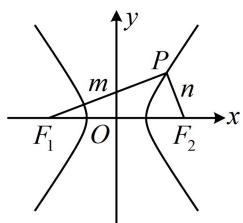

text_image

y
m
P
n
F₁ O F₂ x

答案: 4

【反思】解析几何小题中对直角的常见翻译方法有：①勾股定理；②斜率之积为-1；③向量数量积等于0；④斜边上的中线等于斜边的一半等.选择合适的方法前应先预判计算量.

【变式】设 $F(c,0)$ 是双曲线 $\frac{x^2}{a^2} -\frac{y^2}{b^2} = 1(a > 0,b > 0)$ 的右焦点，过原点 $O$ 的直线与双曲线交于 $A$ ， $B$ 两点，且 $AF \perp BF$ ，且 $\triangle ABF$ 的周长为 $4a + 2c$ ，则该双曲线的离心率为（）

A. $\frac{3}{2}$

B. $\frac{5}{2}$

C. $\frac{\sqrt{10}}{3}$

D. $\frac{\sqrt{10}}{2}$

解析：先分析图形，在双曲线中给出右焦点，一定要关注左焦点，

如图，记左焦点为 $F_{1}$ ，由对称性， $AB$ 中点为 $O$ ，

又 $FF_{1}$ 的中点也是 $O$ ，所以四边形 $AF_{1}BF$ 是平行四边形，结合 $AF \perp BF$ 知四边形 $AF_{1}BF$ 是矩形，此时可将条件转移到 $\Delta AFF_{1}$ 中来，结合双曲线的定义处理，

设 $\left|AF_1\right| = m$ ， $|AF| = n$ ，则 $|BF| = m$ ，由四边形 $AF_{1}BF$ 为矩形知 $\left|AB\right| = \left|FF_{1}\right| = 2c$

$\triangle ABF$ 的周长 $L = |AB| + |BF| + |AF| = 2c + m + n = 4a + 2c$ ，所以 $m + n = 4a$ ①，

由双曲线定义， $|m - n| = 2a$ ②，又 $AF_{1}\bot AF$ ，所以 $m^2 +n^2 = 4c^2$ ③，

要求离心率，应消去 $m$ 和 $n$ ，建立 $a$ 和 $c$ 的关系式，

将①和②平方相加得 $(m + n)^2 + (m - n)^2 = 16a^2 + 4a^2$ ，整理得： $m^2 + n^2 = 10a^2$ ，代入③可得 $10a^2 = 4c^2$ ，故离心率 $e = \frac{c}{a} = \frac{\sqrt{10}}{2}$ .

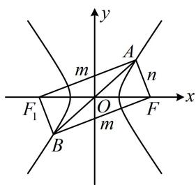

text_image

y
A
m
n
F₁
O
m
F
x
B

答案: D

【反思】似曾相识吧？没错，椭圆也是类似的处理方法，再一次说明了两者解题的共性.

# 类型Ⅱ：定义与中点相关

【例 2】已知双曲线 $C: \frac{x^{2}}{a^{2}} - \frac{y^{2}}{b^{2}} = 1 (a > 0, b > 0)$ 的左、右焦点分别为 $F_{1}$ ， $F_{2}$ ，过 $F_{1}$ 的直线 l 交双曲线 C 的右支于点 P，以双曲线 C 的实轴为直径的圆与 l 相切，切点为 H，若 $\left|F_{1}P\right| = 2\left|F_{1}H\right|$ ，则 C 的离心率为（）

A. $\frac{\sqrt{13}}{2}$

B. $\sqrt{5}$

C. $2 \sqrt{5}$

D. $\sqrt{13}$

解析：如图，因为 $\left|F_{1}P\right|=2\left|F_{1}H\right|$ ，所以H为 $F_{1}P$ 的中点，涉及中点，想到中位线，又因为原点O为 $F_{1}F_{2}$ 的中点，所以 $\left|PF_{2}\right|=2\left|OH\right|=2a$ ，且 $PF_{2}//OH$ ，

求出了 $\left|PF_{2}\right|$ ，可用定义求 $\left|PF_{1}\right|$ ，因为 $\left|PF_{1}\right|-\left|PF_{2}\right|=2a$ ，所以 $\left|PF_{1}\right|=\left|PF_{2}\right|+2a=4a$ ，
因为 l 是圆的切线，所以 $OH \perp PF_{1}$ ，结合 $PF_{2} // OH$ 可得 $PF_{2} \perp PF_{1}$ ，
于是可在 $\triangle PF_{1}F_{2}$ 中用勾股定理建立方程求离心率，

所以 $\left|PF_1\right|^2 +\left|PF_2\right|^2 = \left|F_1F_2\right|^2$ ，从而 $16a^{2} + 4a^{2} = 4c^{2}$ ，整理得： $\frac{c^2}{a^2} = 5$

故离心率 $e = \frac{c}{a} = \sqrt{5}$

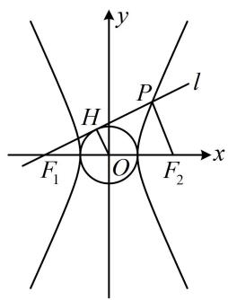

text_image

y
P
l
H
F₁ O F₂ x

答案: B

【反思】当出现中点时，可往中位线方向思考，而原点 O 是 $F_{1}F_{2}$ 的中点，常作为构造中位线的隐藏条件.

【变式】设双曲线 $\frac{x^2}{9} - \frac{y^2}{16} = 1$ 的左焦点为 $F$ , $P$ 为双曲线右支上的一点, 且 $PF$ 与圆 $x^2 + y^2 = 9$ 相切于点 $N$ , $M$ 为线段 $PF$ 的中点, $O$ 为原点, 则 $\left|MN\right| - \left|MO\right| =$ \_\_\_\_.

解析：涉及双曲线的左焦点 $F$ ，我们把右焦点 $F^{\prime}$ 也取出来，条件中有中点，想到构造中位线，

如图，M 为 PF 的中点，O 为 $FF'$ 的中点，所以 $\left|MO\right|=\frac{1}{2}\left|PF'\right|$ ①，

再来看 $|MN|$ ，可想办法转化到 $|PF|$ 上，结合双曲线定义来算 $|MN| - |MO|$ ，

$$
\left| M N \right| = \left| M F \right| - \left| F N \right| = \frac {1}{2} \left| P F \right| - \left| F N \right| \quad ②,
$$

因为 $PF$ 是圆的切线，所以 $ON \perp PF$

又 $|ON|=3$ ， $|OF|=c=\sqrt{9+16}=5$ ，所以 $|FN|=\sqrt{|OF|^{2}-|ON|^{2}}=4$ ，

代入②得： $\left|MN\right|=\frac{1}{2}\left|PF\right|-4$ ③，

由①③可得： $\left|MN\right|-\left|MO\right|=\frac{1}{2}\left|PF\right|-4-\frac{1}{2}\left|PF'\right|=\frac{1}{2}\left(\left|PF\right|-\left|PF'\right|\right)-4=\frac{1}{2}\times6-4=-1$

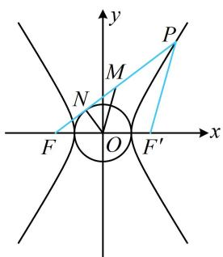

text_image

y
P
M
N
F
O
x
F'

答案: -1

# 类型III：定义与解三角形相关

【例 3】(2021·全国甲卷) 已知 $F_{1}$ , $F_{2}$ 是双曲线 $C$ 的两个焦点, $P$ 为 $C$ 上一点, 且 $\angle F_{1}PF_{2}=60^{\circ}$ , $\left|PF_{1}\right|=3\left|PF_{2}\right|$ , 则 $C$ 的离心率为 ( )

A. $\frac{\sqrt{7}}{2}$ B. $\frac{\sqrt{13}}{2}$ C. $\sqrt{7}$ D. $\sqrt{13}$

解析：涉及 $\left|PF_{1}\right|$ 和 $\left|PF_{2}\right|$ ，考虑双曲线定义，由题意， $\left\{\begin{aligned}&\left|PF_{1}\right|=3\left|PF_{2}\right|\\&\left|PF_{1}\right|-\left|PF_{2}\right|=2a\end{aligned}\right.$ ，所以 $\left\{\begin{aligned}&\left|PF_{1}\right|=3a\\&\left|PF_{2}\right|=a\end{aligned}\right.$

还剩 $\angle F_{1}PF_{2} = 60^{\circ}$ 这个条件没用，可在 $\triangle PF_{1}F_{2}$ 中由余弦定理建立方程求离心率，

由余弦定理， $\left|F_1F_2\right|^2 = \left|PF_1\right|^2 +\left|PF_2\right|^2 -2\left|PF_1\right|\cdot \left|PF_2\right|\cdot \cos \angle F_1PF_2$

所以 $4c^{2} = 9a^{2} + a^{2} - 2 \times 3a \times a \times \cos 60^{\circ}$ ，整理得： $\frac{c^2}{a^2} = \frac{7}{4}$ ，

故 $C$ 的离心率 $e = \frac{c}{a} = \frac{\sqrt{7}}{2}$

答案: A

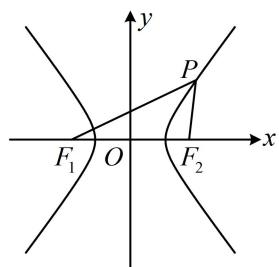

text_image

y
P
x
F₁ O F₂

【变式1】已知双曲线 $\frac{x^2}{a^2} - \frac{y^2}{b^2} = 1 (a > 0, b > 0)$ 的左、右焦点分别为 $F_1$ ， $F_2$ ，过 $F_2$ 的直线 $l$ 交双曲线的右支于 $A$ 、 $B$ 两点，且 $\left|AB\right| = \left|AF_1\right|$ ， $\cos \angle AF_1B = \frac{1}{4}$ ，则双曲线的离心率为（）

A. $\frac{\sqrt{5}}{2}$ B. $\sqrt{3}$ C. 2 D. $\sqrt{5}$

解析：如图，涉及双曲线上的点和两个焦点，考虑定义，由题意， $\left\{ \begin{array}{l} \left|AF_1\right| - \left|AF_2\right| = 2a \\ \left|BF_1\right| - \left|BF_2\right| = 2a \end{array} \right.$ ①

又 $\left|AB\right|=\left|AF_{1}\right|$ ，代入①可得 $\left|AB\right|-\left|AF_{2}\right|=\left|BF_{2}\right|=2a$ ，代入②可得 $\left|BF_{1}\right|-2a=2a$ ，所以 $\left|BF_{1}\right|=4a$ ，对于 $\cos \angle AF_{1}B = \frac{1}{4}$ 这个条件，我们能想到用余弦定理建立方程求离心率，但若在

$\triangle AF_{1}B$ 中用, 它的三边没有完全求出来, 而 $\triangle BF_{1}F_{2}$ 三边均已知了, 所以转化到 $\triangle BF_{1}F_{2}$ 中来用,

因为 $\left|AB\right| = \left|AF_1\right|$ ，所以 $\angle F_{1}BF_{2} = \angle AF_{1}B$ ，故 $\cos \angle F_1BF_2 = \cos \angle AF_1B = \frac{1}{4}$

由余弦定理， $\left|F_1F_2\right|^2 = \left|BF_1\right|^2 +\left|BF_2\right|^2 -2\left|BF_1\right|\cdot \left|BF_2\right|\cdot \cos \angle F_1BF_2$

即 $4c^{2} = 16a^{2} + 4a^{2} - 2 \times 4a \times 2a \times \frac{1}{4}$ ，整理得： $\frac{c^2}{a^2} = 4$ ，所以离心率 $e = \frac{c}{a} = 2$ 。

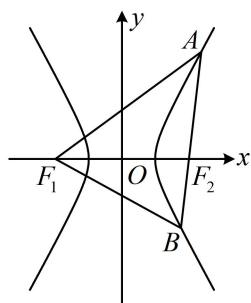

text_image

y
A
F₁ O F₂ x
B

答案: C

【反思】从上面两道题可以看出，焦点三角形中的角度（非直角）类条件，常用余弦定理翻译成 $a, b, c$ 的方程，求离心率.

【变式2】双曲线 $C: \frac{x^2}{a^2} - \frac{y^2}{b^2} = 1 (a > 0, b > 0)$ 的左、右焦点分别为 $F_1$ ， $F_2$ ，过点 $F_2$ 的直线 $l$ 与双曲线 $C$ 的右支交于 $A$ ， $B$ 两点，且 $\left|BF_1\right| = \left|F_1F_2\right|$ ， $\overrightarrow{AF_2} = 2\overrightarrow{F_2B}$ ，则 $C$ 的离心率为 \_\_\_\_.

解析：如图，涉及双曲线上的点和两个焦点，考虑结合定义求有关线段的长，

由题意， $\left|BF_{1}\right|=\left|F_{1}F_{2}\right|=2c$ ，又 $\left|BF_{1}\right|-\left|BF_{2}\right|=2a$ ，所以 $\left|BF_{2}\right|=\left|BF_{1}\right|-2a=2c-2a$ ，

因为 $\overrightarrow{AF_2} = 2\overrightarrow{F_2B}$ ，所以 $\left|AF_2\right| = 2\left|BF_2\right| = 4c - 4a$ ，结合 $\left|AF_1\right| - \left|AF_2\right| = 2a$ 可得 $\left|AF_1\right| = \left|AF_2\right| + 2a = 4c - 2a$ 所有线段都求出来了，可抓住 $\angle AF_{2}F_{1}$ 和 $\angle BF_{2}F_{1}$ 互补，用双余弦法建立方程求离心率，

因为 $\angle AF_2F_1 = \pi -\angle BF_2F_1$ ，所以 $\cos \angle AF_2F_1 = \cos (\pi -\angle BF_2F_1) = -\cos \angle BF_2F_1$

从而 $\frac{\left|AF_2\right|^2 + \left|F_1F_2\right|^2 - \left|AF_1\right|^2}{2\left|AF_2\right|\cdot\left|F_1F_2\right|} = -\frac{\left|BF_2\right|^2 + \left|F_1F_2\right|^2 - \left|BF_1\right|^2}{2\left|BF_2\right|\cdot\left|F_1F_2\right|}$ 故 $\frac{\left|AF_2\right|^2 + \left|F_1F_2\right|^2 - \left|AF_1\right|^2}{\left|AF_2\right|} = -\frac{\left|BF_2\right|^2 + \left|F_1F_2\right|^2 - \left|BF_1\right|^2}{\left|BF_2\right|},$

所以 $\frac{(4c - 4a)^2 + 4c^2 - (4c - 2a)^2}{4c - 4a} = -\frac{(2c - 2a)^2 + 4c^2 - 4c^2}{2c - 2a}$

整理得： $3c^{2} - 8ac + 5a^{2} = 0$ ，从而 $(3c - 5a)(c - a) = 0$ ，故 $\frac{c}{a} = \frac{5}{3}$ 或1（舍去），

所以双曲线的离心率为 $\frac{5}{3}$ .

答案： $\frac{5}{3}$

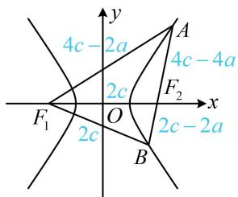

text_image

4c - 2a
4c - 4a
2c
F₁
O
x
2c - 2a
A
F₂
B

【变式3】设双曲线 $\frac{x^2}{a^2} - \frac{y^2}{b^2} = 1 (a > 0, b > 0)$ 的左、右焦点为 $F_1$ ， $F_2$ ，过 $F_2$ 的直线与双曲线的右支交于 $A$ ， $B$ 两点， $AB$ 中点为 $P$ ，若 $|AB| = \sqrt{2} |F_1 P|$ ， $\angle F_1 PA = 45^\circ$ ，则该双曲线的离心率为（）

A. $\sqrt{3}$ B. $\sqrt{5}$ C. $\frac{\sqrt{3} + 1}{2}$ D. $\frac{\sqrt{5} + 1}{2}$

解析：如图，给出 $|AB| = \sqrt{2}|F_1P|$ ，可由此设出 $|AB|$ ，并尝试求其它线段的长，

设 $|AB|=2m$ ，则 $|AP|=m$ ，又 $|AB|=\sqrt{2}|F_{1}P|$ ，所以 $|F_{1}P|=\sqrt{2}m$ ，

在 $\triangle AF_1P$ 中， $\left|AF_1\right|^2 = \left|AP\right|^2 +\left|PF_1\right|^2 -2\left|AP\right|\cdot \left|PF_1\right|\cdot \cos \angle F_1PA = m^2 +2m^2 -2m\cdot \sqrt{2} m\cdot \cos 45^\circ = m^2,$

所以 $\left|AF_1\right| = m$ ，且 $\left|AF_1\right|^2 +\left|AP\right|^2 = 2m^2 = \left|F_1P\right|^2$ ，故 $AF_{1}\bot AP$ ，所以 $\left|BF_1\right| = \sqrt{\left|AF_1\right|^2 + \left|AB\right|^2} = \sqrt{5} m$

要求离心率，得建立 $a, b, c$ 的方程，故考虑结合双曲线定义把上述线段用 $a, b, c$ 表示，

由图可知 $\left\{ \begin{array}{l} \left|AF_1\right| - \left|AF_2\right| = 2a \\ \left|BF_1\right| - \left|BF_2\right| = 2a \end{array} \right.$ ，两式相加得： $\left|AF_1\right| + \left|BF_1\right| - (\left|AF_2\right| + \left|BF_2\right|) = \left|AF_1\right| + \left|BF_1\right| - \left|AB\right| = 4a$ ，

所以 $m + \sqrt{5} m - 2m = 4a$ ，故 $m = \frac{4a}{\sqrt{5} - 1} = (\sqrt{5} + 1)a$

所以 $\left|AF_1\right| = (\sqrt{5} + 1)a$ ， $\left|AF_2\right| = \left|AF_1\right| - 2a = (\sqrt{5} - 1)a$

因为 $AF_{1} \perp AF_{2}$ ，所以 $\left|AF_{1}\right|^{2} + \left|AF_{2}\right|^{2} = \left|F_{1}F_{2}\right|^{2}$ ，

从而 $(\sqrt{5} + 1)^2 a^2 + (\sqrt{5} - 1)^2 a^2 = 4c^2$ ，整理得： $\frac{c^2}{a^2} = 3$ ，故离心率 $e = \frac{c}{a} = \sqrt{3}$ .

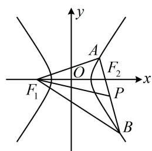

text_image

y
A
F₂
O
x
F₁
P
B

答案: A

【反思】在双曲线离心率问题中，若给出两条线段的比例关系，则可设其中一条线段的长，并尝试将图形中的其它线段也用设的变量来表示，再结合双曲线的定义把它们转换成 $a, b, c$ ，建立方程求离心率.

# 类型IV：定义与几何性质综合

【例 4】点 $F(c,0)$ 为双曲线 $\frac{x^{2}}{a^{2}} - \frac{y^{2}}{b^{2}} = 1 (a > 0, b > 0)$ 的右焦点，P 为双曲线左支上一点，线段 PF 与圆 $M: \left(x - \frac{c}{3}\right)^{2} + y^{2} = \frac{c^{2}}{9}$ 相切于点 Q，若 $\overrightarrow{PQ} = 2\overrightarrow{QF}$ ，则双曲线的离心率为 \_\_\_\_.

解法1：先分析图形的几何特征，双曲线中只给了右焦点，往往也需要关注左焦点，如图，记双曲线的左焦点为 $F_{1}$ ，因为 $\overrightarrow{PQ} = 2\overrightarrow{QF}$ ，所以 $\frac{|QF|}{|PF|} = \frac{1}{3}$

有了点 $Q$ 在 $PF$ 上的位置, 我们也来看看 $M$ 在 $FF_{1}$ 上的位置,

由题意，圆 $M$ 过原点，所以 $\left|MF\right| = \left|OF\right| - \left|OM\right| = c - \frac{c}{3} = \frac{2c}{3} = \frac{1}{3}\left|FF_1\right|$ ，从而 $\frac{\left|MF\right|}{\left|FF_1\right|} = \frac{1}{3} = \frac{\left|QF\right|}{\left|PF\right|}$ ，

故 $MQ \parallel PF_{1}$ ，且 $\left|PF_{1}\right| = 3\left|QM\right| = 3 \times \frac{c}{3} = c$ ，又 $PF$ 是圆 $M$ 的切线，所以 $MQ \perp PF$ ，故 $PF_{1} \perp PF$ ，

接下来可结合双曲线定义，把 $|PF|$ 求出来，在 $\triangle PFF_{1}$ 中用勾股定理建立方程求离心率，

因为 $\left|PF\right| - \left|PF_{1}\right| = 2a$ ，所以 $\left|PF\right| = \left|PF_{1}\right| + 2a = c + 2a$ ，因为 $PF_{1} \perp PF$ ，所以 $\left|PF_{1}\right|^{2} + \left|PF\right|^{2} = \left|FF_{1}\right|^{2}$ ，

即 $c^2 +(c + 2a)^2 = 4c^2$ ，整理得： $c^2 -2ac - 2a^2 = 0$

两端同除以 $a^2$ 可得 $e^2 - 2e - 2 = 0$ ，解得： $e = 1 \pm \sqrt{3}$ ，又 $e > 1$ ，所以 $e = 1 + \sqrt{3}$ 。

解法2：按解法1得到 $\left|PF_{1}\right|=c$ 和 $PF_{1}\perp PF$ 后，也可用勾股定理求 $\left|PF\right|$ ，由 $\triangle PFF_{1}$ 的三边算离心率，

$\left|PF\right| = \sqrt{\left|FF_1\right|^2 - \left|PF_1\right|^2} = \sqrt{3} c$ ，所以 $e = \frac{c}{a} = \frac{2c}{2a} = \frac{\left|FF_1\right|}{\left\|PF\right| - \left|PF_1\right\|} = \frac{2c}{\left|\sqrt{3}c - c\right|} = 1 + \sqrt{3}$

答案： $1 + \sqrt{3}$

【反思】①解析几何中遇到线段比例的条件，构造相似比是一个值得考虑的方向；②焦点三角形 $PF_{1}F_{2}$ 条件下求双曲线的离心率，若能分析三边比值关系，则可代公式 $e = \frac{|F_1F_2|}{\|PF_1| - |PF_2\|}$ 来算.

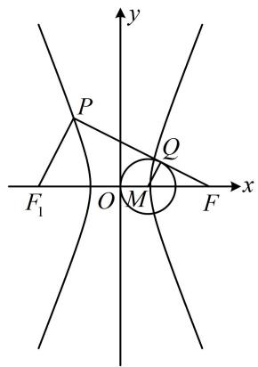

text_image

y
P
Q
F₁ O M F x
M

【例 5】我国首先研制成功的“双曲线新闻灯”利用了双曲线的光学性质: 如图 1, $F_{1}$ , $F_{2}$ 是双曲线的左、右焦点, 从 $F_{2}$ 发出的光线 $m$ 射在双曲线右支上一点 $P$ , 经双曲线反射后, 反射光线 $n$ 的反向延长线过 $F_{1}$ ; 如图 2, 当 $P$ 异于双曲线顶点时, 双曲线在 $P$ 处的切线平分 $\angle F_{1}PF_{2}$ . 若双曲线 $C$ 的方程为 $\frac{x^{2}}{9}-\frac{y^{2}}{16}=1$ , 则下列结论不正确的是 ( )

A. 射线 $n$ 所在直线的斜率 $k \in \left(-\frac{4}{3}, \frac{4}{3}\right)$

B. 当 $m \perp n$ 时， $\left|PF_{1}\right| \cdot \left|PF_{2}\right| = 32$

C. 当射线 $n$ 过点 $Q(7,5)$ 时, 光线由 $F_{2}$ 到 $P$ , 再到 $Q$ 经过的路程为 13

D. 若 $T(1,0)$ , 直线 $PT$ 与 $C$ 相切, 则 $\left|PF_{2} \right| = 12$

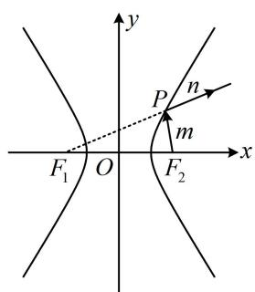

text_image

y
P
n
m
x
F₁ O F₂

图1

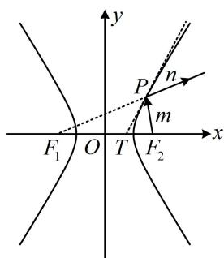

text_image

y
P
n
m
x
F₁ O T F₂

图2

解析：A项，如下图1，射线 $n$ 的斜率即为直线 $PF_{1}$ 的斜率，当 $P$ 在双曲线右支上运动时， $PF_{1}$ 可从 $l_{2}$ 绕点 $F_{1}$ 逆时针旋转至 $l_{1}$ （临界状态均不可取）， $l_{1}$ 、 $l_{2}$ 分别与渐近线平行，

它们的斜率分别为 $\frac{4}{3}$ 和 $-\frac{4}{3}$ ，所以 $k \in \left(-\frac{4}{3}, \frac{4}{3}\right)$ ，故A项正确；

B项， $m\bot n$ 即为 $PF_{1}\bot PF_{2}$ ，翻译垂直关系，可用勾股定理，并结合双曲线定义，

所以 $\left\{ \begin{array}{l} \left|PF_{1}\right|^{2} + \left|PF_{2}\right|^{2} = \left|F_{1}F_{2}\right|^{2} = 4c^{2} = 100 \\ \left|PF_{1}\right| - \left|PF_{2}\right| = 2a = 6 \end{array} \right.$ ①，由①可得 $(\left|PF_{1}\right| - \left|PF_{2}\right|)^{2} + 2\left|PF_{1}\right|\cdot \left|PF_{2}\right| = 100$ ③，

将式②代入式③可得： $36 + 2\left|PF_{1}\right|\cdot \left|PF_{2}\right| = 100$ ，从而 $\left|PF_1\right|\cdot \left|PF_2\right| = 32$ ，故B项正确；

C 项, 如下图 1, 已知点 $Q$ , 可求出 $|F_{1} Q|$ 的长, 结合双曲线定义来算 $|P F_{2}| + |P Q|$ ,

由题意， $F_{1}(-5,0)$ ，所以 $\left|F_1Q\right| = \sqrt{(-5 - 7)^2 + (0 - 5)^2} = 13$ ，从而 $\left\{ \begin{array}{ll}\left|PF_1\right| + \left|PQ\right| = \left|F_1Q\right| = 13 & ④\\ \left|PF_1\right| - \left|PF_2\right| = 6 & ⑤ \end{array} \right.$

故④-⑤消去 $\left|PF_{1}\right|$ 可得 $\left|PQ\right|+\left|PF_{2}\right|=7$ ，故光线由 $F_{2}$ 到P，再到Q经过的路程为7，故C项错误；D项，由所给的双曲线光学性质，PT是切线 $\Rightarrow PT$ 是 $\angle F_{1}PF_{2}$ 的平分线，如下图2，

由 $T$ 的坐标可求 $\left|TF_{1}\right|$ 和 $\left|TF_{2}\right|$ , 故用角平分线性质定理分析 $\left|PF_{1}\right|$ 和 $\left|PF_{2}\right|$ 的比值, 结合定义求 $\left|PF_{2}\right|$ ,

因为 $T(1,0)$ ， $F_{1}(-5,0)$ ， $F_{2}(5,0)$ ，所以 $\left|TF_1\right| = 6$ ， $\left|TF_2\right| = 4$ ，由角平分线性质定理， $\frac{\left|PF_1\right|}{\left|PF_2\right|} = \frac{\left|TF_1\right|}{\left|TF_2\right|} = \frac{3}{2}$

所以 $\left|PF_{1}\right|=\frac{3}{2}\left|PF_{2}\right|$ ，代入 $\left|PF_{1}\right|-\left|PF_{2}\right|=6$ 可得 $\frac{1}{2}\left|PF_{2}\right|=6$ ，从而 $\left|PF_{2}\right|=12$ ，故D项正确.

答案: C

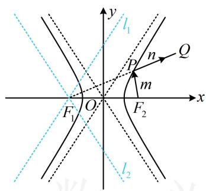

text_image

y
l₁
P
n
Q
m
F₁ O F₂ x
l₂

图1

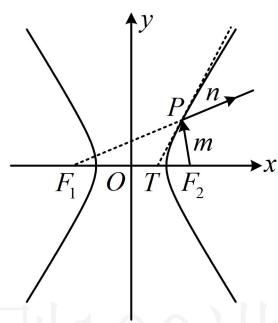

text_image

y
P
n
m
x
F₁ O T F₂

图2

# 强化训练

1. (2020·新课标III卷·★★☆)

设双曲线 $C: \frac{x^2}{a^2} - \frac{y^2}{b^2} = 1 (a > 0, b > 0)$ 的左、右焦点分别为 $F_1$ ， $F_2$ ，离心率为 $\sqrt{5}$ ， $P$ 是 $C$ 上一点， $F_1 P \perp F_2 P$ ，若 $\triangle PF_1 F_2$ 的面积为 4，则 $a = (\quad)$

A. 1 B. 2 C. 4 D. 8

2. (2022·江西九江三模·★★☆)

双曲线 $\frac{x^2}{t} -\frac{y^2}{1 - t} = 1(0 < t < 1)$ 的左、右焦点分别为 $F_{1}$ ， $F_{2}$ ， $P$ 为圆 $x^{2} + y^{2} = 1$ 与该双曲线的一个公共点，则 $\triangle PF_1F_2$ 的面积为（）

A. $1 - t$ B. $t$ C. $2t - 1$ D. 1

3. (★★★)

已知双曲线 $C: \frac{x^2}{a^2} - \frac{y^2}{b^2} = 1 (a > 0, b > 0)$ 的右焦点为 $F$ ，直线 $y = kx (k \neq 0)$ 与双曲线 $C$ 交于 $A$ ， $B$ 两点，若 $\angle AFB = 90^\circ$ ，且 $\triangle OAF$ 的面积为 $4a^2$ ，则 $C$ 的离心率为（）

A. $\frac{2\sqrt{6}}{5}$

B. $\frac{\sqrt{26}}{5}$

C. 2

D. 3

4. (2022·河南模拟·★★★)

已知 $F_{1}$ , $F_{2}$ 分别是双曲线 $C: \frac{x^{2}}{a^{2}} - \frac{y^{2}}{b^{2}} = 1 (a > 0, b > 0)$ 的左、右焦点, 过 $F_{1}$ 的直线与双曲线 $C$ 的左、右两支分别交于 $A$ , $B$ 两点, 若 $\triangle ABF_{2}$ 是等边三角形, 则 $C$ 的离心率是 \_\_\_\_.

5.（2024·天津卷·★★★）

双曲线 $\frac{x^2}{a^2} -\frac{y^2}{b^2} = 1(a > 0,b > 0)$ 的左、右焦点分别为 $F_{1}$ ， $F_{2}$ ， $P$ 是双曲线右支上一点，且直线 $PF_{2}$ 的斜率为2， $\triangle PF_1F_2$ 是面积为8的直角三角形，则双曲线的方程为（）

A. $\frac{x^2}{8} -\frac{y^2}{2} = 1$

B. $\frac{x^2}{8} -\frac{y^2}{4} = 1$

C. $\frac{x^2}{2} -\frac{y^2}{8} = 1$

D. $\frac{x^2}{4} -\frac{y^2}{8} = 1$

6. (2023·新课标Ⅰ卷·★★★☆)

已知双曲线 $C: \frac{x^2}{a^2} - \frac{y^2}{b^2} = 1 (a > 0, b > 0)$ 的左、右焦点分别为 $F_1$ ， $F_2$ ，点 $A$ 在 $C$ 上，点 $B$ 在 $y$ 轴上， $\overrightarrow{F_1A} \perp \overrightarrow{F_1B}$ ， $\overrightarrow{F_2A} = -\frac{2}{3}\overrightarrow{F_2B}$ ，则 $C$ 的离心率为 \_\_\_\_.

7.（2024·九省联考·★★★☆）

设双曲线 $C: \frac{x^2}{a^2} - \frac{y^2}{b^2} = 1 (a > 0, b > 0)$ 的左、右焦点分别为 $F_1$ ， $F_2$ ，过坐标原点的直线与 $C$ 交于 $A$ ， $B$ 两点， $|F_1 B| = 2 |F_1 A|$ ， $\overrightarrow{F_2 A} \cdot \overrightarrow{F_2 B} = 4 a^2$ ，则 $C$ 的离心率为（）

A. $\sqrt{2}$

B. 2

C. $\sqrt{5}$

D. $\sqrt{7}$

8. (2023·辽宁模拟·★★★★)

双曲线 $C: \frac{x^2}{a^2} - \frac{y^2}{b^2} = 1 (a > 0, b > 0)$ 的左、右焦点分别为 $F_{1}(-c,0)$ ， $F_{2}(c,0)$ ，以 $C$ 的实轴为直径的圆记为 $D$ ，过 $F_{1}$ 作圆 $D$ 的切线与双曲线 $C$ 在第一象限交于点 $P$ ，且 $S_{\triangle PF_1F_2} = 4a^2$ ，则双曲线 $C$ 的离心率为（）

A. $\sqrt{5}$

B. $\frac{\sqrt{5} + 1}{2}$

C. $\sqrt{5} - 1$

D. $\sqrt{2}$

9. (2023·浙江杭州二模·★★★★)

费马定理是几何光学中的一条重要原理，在数学中可以推导出圆锥曲线的一些光学性质。例如，点 $P$ 为双曲线（ $F_{1}$ ， $F_{2}$ 为焦点）上一点，点 $P$ 处的切线平分 $\angle F_{1}PF_{2}$ 。已知双曲线 $C: \frac{x^{2}}{4} - \frac{y^{2}}{2} = 1$ ， $O$ 为坐标原点， $l$ 是点 $P\left(3, \frac{\sqrt{10}}{2}\right)$ 处的切线，过左焦点 $F_{1}$ 作 $l$ 的垂线，垂足为 $M$ ，则 $|OM| =$ \_\_\_\_.

10. (2022·山西大同月考·★★★★)

设 $F_{1}$ ， $F_{2}$ 是双曲线 $E:\frac{x^2}{a^2} -\frac{y^2}{b^2} = 1(a > 0,b > 0)$ 的左、右焦点，点 $P$ 在 $E$ 上，且 $\angle F_1PF_2$ 的平分线交 $x$ 轴于点 $D$ 若 $\angle F_1PF_2 = \frac{\pi}{3}$ ， $\left|PF_1\right| + \left|PF_2\right| = 8$ ，且 $\left|PD\right| = \sqrt{3}$ ，则 $E$ 的方程为（）

A. $\frac{x^2}{2} -\frac{y^2}{8} = 1$

B. $\frac{x^2}{8} -\frac{y^2}{2} = 1$

C. $\frac{x^2}{6} -\frac{y^2}{4} = 1$

D. $\frac{x^2}{4} -\frac{y^2}{6} = 1$

