# 强化训练

1. (2022·江苏南京模拟·★★)

已知双曲线 $C: \frac{x^2}{a^2} - \frac{y^2}{b^2} = 1 (a > 0, b > 0)$ 的两条渐近线的夹角为 $\frac{\pi}{3}$ ，则此双曲线的离心率为 \_\_\_\_.

1. $\frac{2\sqrt{3}}{3}$ 或 2

解析：双曲线的渐近线为 $y = \pm \frac{b}{a} x$ ，它们的夹角为 $\frac{\pi}{3}$ 有如图1和图2所示的两种情况，下面分别考虑，

若为图1，则 $\theta = \frac{\pi}{6}$ ，所以 $\frac{b}{a} = \tan \frac{\pi}{6} = \frac{\sqrt{3}}{3}$

从而 $a = \sqrt{3} b$ ，故 $a^2 = 3b^2 = 3c^2 - 3a^2$

整理得： $\frac{c^2}{a^2} = \frac{4}{3}$ ，所以离心率 $e = \frac{c}{a} = \frac{2\sqrt{3}}{3}$

若为图2，则 $\theta = \frac{\pi}{3}$ ，所以 $\frac{b}{a} = \tan \frac{\pi}{3} = \sqrt{3}$

从而 $b = \sqrt{3} a$ ，故 $b^{2} = c^{2} - a^{2} = 3a^{2}$

整理得： $\frac{c^2}{a^2} = 4$ ，所以离心率 $e = \frac{c}{a} = 2$

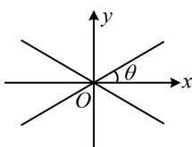  
图1

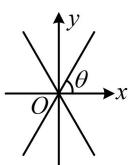  
图2

【反思】两相交直线的夹角指的是它们形成的两对对顶角中较小的那一对.

2. (2024·广东惠州一模·★★)

已知双曲线 $\frac{x^2}{a^2} -\frac{y^2}{b^2} = 1(a > 0,b > 0)$ 的渐近线与圆 $x^{2} + y^{2} - 4y + 3 = 0$ 相切，则该双曲线的离心率为

2.2

解析： $x^{2} + y^{2} - 4y + 3 = 0\Rightarrow x^{2} + (y - 2)^{2} = 1$

双曲线的渐近线方程为 $y=\pm\frac{b}{a}x$ ，即 $bx\pm ay=0$ ，

因为渐近线与圆相切，所以圆心(0,2)到渐近线的距离

$d = \frac{|\pm 2a|}{\sqrt{b^2 + a^2}} = \frac{2a}{c} = 1$ ，故双曲线的离心率 $e = \frac{c}{a} = 2$

3. (2023·福建厦门四模·★★)

写出同时满足下列条件的一条直线 l 的方程 \_\_\_\_.

①直线 l 在 y 轴上的截距为 1;  
②直线 l 与双曲线 $\frac{x^{2}}{4}-y^{2}=1$ 只有一个公共点.

3. $y = \pm \frac{1}{2} x + 1, y = \pm \frac{\sqrt{2}}{2} x + 1$ （写出一条直线的方程即可）

解析：分析直线与双曲线的交点个数，可借助渐近线来看。如图，满足①②的直线要么与渐近线平行，要么与双曲线相切，当直线 $l$ 过点(0,1)且与渐近线平行时，因为双曲线 $\frac{x^2}{4} - y^2 = 1$ 的渐近线斜率为 $\pm \frac{1}{2}$ ，

所以 l 的方程为 $y = \pm \frac{1}{2} x + 1$ ;

当直线 $l$ 过点 $(0,1)$ 且与双曲线相切时，设其方程为 $y = kx + 1$ ，代入 $\frac{x^2}{4} - y^2 = 1$ 整理得： $(1 - 4k^2)x^2 -8kx - 8 = 0$

所以 $\left\{ \begin{array}{l} 1 - 4k^2 \neq 0 \\ \Delta = (-8k)^2 - 4(1 - 4k^2) \cdot (-8) = 0 \end{array} \right.$ ，解得： $k = \pm \frac{\sqrt{2}}{2}$ ，

故 $l$ 的方程为 $y = \pm \frac{\sqrt{2}}{2} x + 1$ .

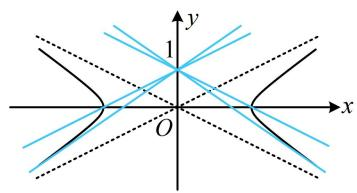

text_image

y
1
O
x

4. (2022·天津卷·★★)

已知抛物线 $y^{2} = 4\sqrt{5} x$ ， $F_{1}$ ， $F_{2}$ 分别是双曲线 $\frac{x^2}{a^2} - \frac{y^2}{b^2} = 1 (a > 0, b > 0)$ 的左、右焦点，抛物线的准线过双曲线的左焦点 $F_{1}$ ，与双曲线的一条渐近线交于点 $A$ ，若 $\angle F_{1}F_{2}A = \frac{\pi}{4}$ ，则双曲线的标准方程为（）

A. $\frac{x^2}{10} - y^2 = 1$

B. $x^{2} - \frac{y^{2}}{16} = 1$

C. $x^{2} - \frac{y^{2}}{4} = 1$

D. $\frac{x^2}{4} - y^2 = 1$

4. C

解析：抛物线的准线 $x = -\sqrt{5}$ 过双曲线的左焦点 $F_{1} \Rightarrow$ 双曲线的半焦距 $c = \sqrt{5} \Rightarrow a^{2} + b^{2} = 5$ ①，

还差一个方程即可求出 $a, b$ ，可再翻译 $\angle F_{1}F_{2}A = \frac{\pi}{4}$ 这个条件，翻译成 $\left|AF_1\right| = \left|F_1F_2\right|$ 较简单，故算 $\left|AF_1\right|$ ，

如图， $\angle F_{1}F_{2}A = \frac{\pi}{4}\Rightarrow \triangle AF_{1}F_{2}$ 是等腰直角三角形，

所以 $\left|AF_{1}\right|=\left|F_{1}F_{2}\right|=2\sqrt{5}$ ，故 $A(-\sqrt{5},2\sqrt{5})$ ，

点 $A$ 在渐近线 $y = -\frac{b}{a} x$ 上，所以 $2\sqrt{5} = -\frac{b}{a}\cdot (-\sqrt{5})$ ②，

联立①②解得： $\left\{ \begin{array}{l}a = 1\\ b = 2 \end{array} \right.$ ，故双曲线的方程为 $x^{2} - \frac{y^{2}}{4} = 1$

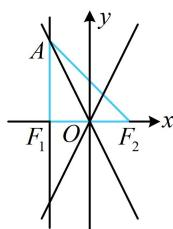

text_image

A
F₁ O F₂
y
x

5. (2020·新课标II卷·★★★)

设 O 为坐标原点，直线 x=a 与双曲线 $C:\frac{x^{2}}{a^{2}}-\frac{y^{2}}{b^{2}}=1(a>0,b>0)$ 的两条渐近线分别交于 D, E 两点，若 $\triangle ODE$ 的面积为 8，则 C 的焦距的最小值为（）

A. 4

B. 8

C. 16

D. 32

5. B

解析：由题意，双曲线 $C$ 的焦距 $2c = 2\sqrt{a^2 + b^2}$ ①，

要求最值，得先找 a, b 的关系，给了 $S_{\triangle ODE}$ ，如图，可通过联立方程求 D, E 坐标来算底边 $|DE|$ ，高即为 a,

联立 $\left\{ \begin{array}{l} x = a \\ y = \pm \frac{b}{a} x \end{array} \right.$ 解得： $y = \pm b$ ，所以 $|DE| = 2b$

$S_{\triangle ODE}=\frac{1}{2}\left|DE\right|\cdot a=ab$ ，由题意， $S_{\triangle ODE}=8$ ，所以ab=8，

在此条件下求①的最小值，可用不等式 $a^2 + b^2 \geq 2ab$

由①可得 $2c = 2\sqrt{a^2 + b^2} \geq 2\sqrt{2ab} = 8$

当且仅当 $a = b = 2\sqrt{2}$ 时取等号，所以焦距的最小值为8.

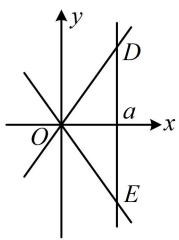

text_image

y
D
a
x
O
E

6. (2018·天津卷·★★★)

已知双曲线 $\frac{x^2}{a^2} -\frac{y^2}{b^2} = 1(a > 0,b > 0)$ 的离心率为2，过右焦点且垂直于 $x$ 轴的直线与双曲线交于 $A$ ， $B$ 两点.设 $A$ ， $B$ 到双曲线的同一条渐近线的距离分别为 $d_{1}$ 和 $d_{2}$ ，且 $d_{1} + d_{2} = 6$ ，则双曲线的方程为（）

A. $\frac{x^2}{4} -\frac{y^2}{12} = 1$

B. $\frac{x^2}{12} -\frac{y^2}{4} = 1$

C. $\frac{x^2}{3} -\frac{y^2}{9} = 1$

D. $\frac{x^2}{9} -\frac{y^2}{3} = 1$

6. C

解析：如图，若能注意到 $F$ 为 $AB$ 中点，则可利用梯形的中位线将已知条件转化为 $F$ 到渐近线的距离，注意到 $\triangle OFC$ 是特征三角形，所以 $|FC|$ 可快速求出，

由对称性， $AB$ 中点为右焦点 $F$ ，因为 $d_{1} + d_{2} = 6$ ，所以 $F$ 到渐近线的距离为3，

我们知道，双曲线焦点到渐近线的距离为 $b$ ，所以 $b = 3$

又 $e = \frac{c}{a} = \frac{\sqrt{a^2 + b^2}}{a} = \frac{\sqrt{a^2 + 9}}{a} = 2$ ，所以 $a = \sqrt{3}$

故双曲线 C 的方程为 $\frac{x^{2}}{3}-\frac{y^{2}}{9}=1$ .

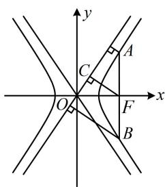

text_image

y
A
C
O
F
x
B

7. (★★★)

双曲线 $C: \frac{x^2}{a^2} - \frac{y^2}{b^2} = 1 (a > 0, b > 0)$ 的右焦点为 $F$ ，过 $F$ 作一条渐近线的垂线 $l$ ，垂足为 $M$ ，若 $l$ 与另一条渐近线的交点是 $N$ ，且 $\overrightarrow{MN} = 5\overrightarrow{MF}$ ，则 $C$ 的离心率为 \_\_\_\_.

7. $\frac{2\sqrt{10}}{5}$

解法1：如图， $\triangle MOF$ 是 $C$ 的特征三角形，先结合角平分线性质定理和 $\overrightarrow{MN} = 5\overrightarrow{MF}$ 求其它线段的长，

由题意， $\left|MF\right|=b$ ， $\left|OM\right|=a$ ，因为 $\overrightarrow{MN}=5\overrightarrow{MF}$ ，

所以 $|MN|=5b$ ， $|FN|=4b$ ，

由渐近线的对称性， $OF$ 是 $\angle MON$ 的平分线，

所以 $\frac{|OM|}{|ON|} = \frac{|MF|}{|FN|} = \frac{1}{4}$ ，故 $|ON| = 4|OM| = 4a$ ，

注意到 $OM \perp MN$ ，且已有 $\triangle OMN$ 的三边长，故接下来可由勾股定理建立方程求离心率，

在 $\triangle MON$ 中， $\left|OM\right|^2 +\left|MN\right|^2 = \left|ON\right|^2$ ，所以 $a^2 +25b^2$

$= 16a^{2}$ ，整理得： $3a^{2} = 5b^{2}$ ，所以 $3a^{2} = 5c^{2} - 5a^{2}$

从而 $\frac{c^2}{a^2} = \frac{8}{5}$ ，故离心率 $e = \frac{c}{a} = \frac{2\sqrt{10}}{5}$

解法2：由题意， $\vert MF\vert = b$ ， $\vert OM\vert = a$

因为 $\overrightarrow{MN} = 5\overrightarrow{MF}$ ，所以 $|MN| = 5b$

如图， $\angle MOF$ 和 $\angle MON$ 的正切都好求，故可由 $\angle MON$

$=2\angle MOF$ ，利用正切二倍角公式建立方程求离心率，

记 $\angle MOF = \theta$ ，则 $\angle MON = 2\theta$

由图可知 $\tan \theta = \frac{|MF|}{|OM|} = \frac{b}{a}$ ， $\tan 2\theta = \frac{|MN|}{|OM|} = \frac{5b}{a}$

因为 $\tan 2\theta = \frac{2\tan\theta}{1 - \tan^2\theta}$ ，所以 $\frac{5b}{a} = \frac{2\cdot\frac{b}{a}}{1 - \frac{b^2}{a^2}}$

整理得： $3a^{2} = 5b^{2}$ ，所以 $3a^{2} = 5c^{2} - 5a^{2}$

整理得： $\frac{c^2}{a^2} = \frac{8}{5}$ ，故离心率 $e = \frac{c}{a} = \frac{2\sqrt{10}}{5}$

解法3：看到 $\overrightarrow{MN} = 5\overrightarrow{MF}$ ，自然想到用坐标翻译。怎样求 $M, N$ 的坐标？观察发现可先写出直线 $MN$ 的方程，与两条渐近线联立即可求出 $M, N$ 的坐标，

如图， $F(c,0)$ ，渐近线 $OM$ ， $ON$ 的方程分别为 $y = \frac{b}{a} x$

$y=-\frac{b}{a}x$ ，因为 $l\perp OM$ ，所以l的方程为 $y=-\frac{a}{b}(x-c)$ ，

联立 $\left\{ \begin{array}{l} y = -\frac{a}{b} (x - c) \\ y = \frac{b}{a} x \end{array} \right.$ 解得： $y = \frac{ab}{c}$ ，即 $y_{M} = \frac{ab}{c}$ ①，

联立 $\left\{ \begin{array}{l} y = -\frac{a}{b} (x - c) \\ y = -\frac{b}{a} x \end{array} \right.$ 解得： $y = -\frac{abc}{a^2 - b^2}$

所以 $y_{N}=-\frac{abc}{a^{2}-b^{2}}$ ②,

因为 $\overrightarrow{MN} = 5\overrightarrow{MF}$ ，所以 $\overrightarrow{FN} = 4\overrightarrow{MF}$ ，而 $\overrightarrow{FN} = (x_N - c, y_N)$

$\overrightarrow{MF}=(c-x_{M},-y_{M})$ ，所以 $y_{N}=-4y_{M}$ ③，

将①②代入③可得 $-\frac{abc}{a^2 - b^2} = -4\cdot \frac{ab}{c}$

整理得： $c^2 = 4a^2 - 4b^2$ ，所以 $c^2 = 4a^2 - 4(c^2 - a^2)$

从而 $5c^{2} = 8a^{2}$ ，故 $\frac{c^2}{a^2} = \frac{8}{5}$ ，所以离心率 $e = \frac{c}{a} = \frac{2\sqrt{10}}{5}$

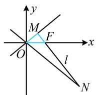

【反思】在双曲线的渐近线有关问题中，利用渐近线与其它直线或曲线联立求交点，往往计算量较大，可作为次选方案，首选分析几何关系求解.

8. (2024·河北五校联考·★★★)

已知点 $P$ 是双曲线 $C: \frac{x^2}{a^2} - \frac{y^2}{b^2} = 1 (a > 0, b > 0)$ 左支上一点， $F_1$ ， $F_2$ 是双曲线的左、右两个焦点，且 $PF_1 \perp PF_2$ ， $PF_2$ 与两条渐近线相交与 $M$ ， $N$ 两点（如图），点 $N$ 恰好平分线段 $PF_2$ ，则双曲线的离心率是 \_\_\_\_.

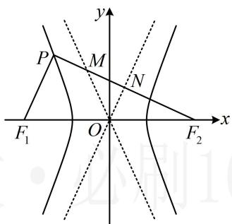

text_image

y
P
M
N
F₁
O
x
F₂

8. $\sqrt{5}$

解析: $N$ 为 $PF_{2}$ 的中点, 双曲线本身又隐含了 $O$ 为 $F_{1}F_{2}$ 的中点, 故想到三角形的中位线,

由题意， $ON$ 是 $\triangle PF_1F_2$ 的中位线，所以 $ON / / PF_{1}$ 且 $\left|PF_{1}\right|$

$= 2\left|ON\right|$ ，因为 $PF_{1}\perp PF_{2}$ ，所以 $ON\perp PF_{2}$

怎样求离心率？有 $ON \perp PF_{2}$ ，则 $\triangle NOF_{2}$ 的三边容易获得，结合 $ON$ 是 $\triangle PF_{1}F_{2}$ 的中位线可以得到 $\left|PF_{1}\right|$ 和 $\left|PF_{2}\right|$ ，故用双曲线定义建立方程求离心率，

由双曲线的特征三角形可知 $\left|NF_2\right| = b$

又 $\left|OF_2\right| = c$ ，所以 $\left|ON\right| = \sqrt{\left|OF_2\right|^2 - \left|NF_2\right|^2} = \sqrt{c^2 - b^2} = a$

故 $\left|PF_{1}\right|=2\left|ON\right|=2a$ ，因为 $\left|PF_{2}\right|=2\left|NF_{2}\right|=2b$ ，

所以由双曲线定义， $\left|PF_{2}\right|-\left|PF_{1}\right|=2b-2a=2a$

从而 $2a = b$ ，故 $4a^{2} = b^{2} = c^{2} - a^{2}$ ，所以 $5a^{2} = c^{2}$

故双曲线的离心率 $e = \frac{c}{a} = \sqrt{5}$

9. (2023·福建福州一模·★★★)

设双曲线 $C: \frac{x^2}{a^2} - \frac{y^2}{b^2} = 1 (a > 0, b > 0)$ 的左焦点为 $F$ ，两条渐近线分别为 $l_1$ ， $l_2$ 。点 $A$ 在 $l_1$ 上，点 $B$ 在 $l_2$ 上，且点 $A$ 位于第一象限，原点 $O$ 与 $B$ 关于直线 $AF$ 对称。若 $|AF| = 2b$ ，则 $C$ 的离心率为 \_\_\_\_.

9. 2

解析：如图，设 OB 与 AF 交于点 P，因为 O，B 关于直线 AF 对称，所以 OB ⊥ AF， $|AF| = 2b$ 这个条件怎么用？若由 $AF \perp l_{2}$ 写出直线 AF 的方程，与 $l_{1}$ 联立求 A 的坐标，再算 $|AF|$ ，则较麻烦。注意到双曲线的焦点到渐近线的距离为 b（见重要结论 18），故可翻译为 P 是 AF 的中点，我们由此出发，分析图形的几何特征，

因为 $OB \perp AF$ ，所以 $|FP|$ 是双曲线的左焦点到渐近线 $l_2$ 的距离，故 $|FP| = b$ ，又 $|AF| = 2b$ ，所以 $P$ 为 $AF$ 的中点，结合 $OB \perp AF$ 可得 $\triangle AOF$ 是等腰三角形，

且 $OB$ 也为 $\angle AOF$ 的平分线，所以 $\angle FOP = \angle AOP$

又由渐近线的对称性， $\angle FOP = \theta$ （其中 $\theta$ 为 $l_{1}$ 的倾斜角，如图）所以 $\angle AOP = \angle FOP = \theta = 60^{\circ}$

从而 $l_{1}$ 的斜率 $\frac{b}{a} = \tan 60^{\circ} = \sqrt{3}$ ，故 $b = \sqrt{3} a$

所以 $b^{2} = 3a^{2}$ ，故 $c^2 - a^2 = 3a^2$ ，化简得离心率 $e = \frac{c}{a} = 2$ ：

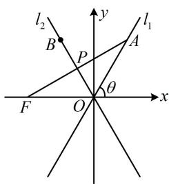

text_image

l₂
B
P
A
l₁
θ
F
O
x
y

10. (2025·全国Ⅱ卷·★★★☆) (多选)

双曲线 $C: \frac{x^2}{a^2} - \frac{y^2}{b^2} = 1 (a > 0, b > 0)$ 的左、右焦点分别是 $F_1$ ， $F_2$ ，左、右顶点分别为 $A_1$ ， $A_2$ ，以 $F_1F_2$ 为直径的圆与曲线 $C$ 的一条渐近线交于 $M$ ， $N$ 两点，且 $\angle NA_1M = \frac{5\pi}{6}$ ，则（）

A. $\angle A_{1}MA_{2} = \frac{\pi}{6}$   
B. $\left|MA_{1}\right|=2\left|MA_{2}\right|$   
C. $C$ 的离心率为 $\sqrt{13}$   
D. 当 $a = \sqrt{2}$ 时, 四边形 $NA_{1} MA_{2}$ 的面积为 $8 \sqrt{3}$

10. ACD

解析：A项，如图，由对称性， $A_{1}$ 与 $A_{2}$ ， $M$ 与 $N$ 都关于原点对称，所以线段 $A_{1}A_{2}$ 与线段MN互相平分，

从而四边形 $A_{1}MA_{2}N$ 是平行四边形，

故 $\angle A_{1}MA_{2} = \pi -\angle NA_{1}M = \pi -\frac{5\pi}{6} = \frac{\pi}{6}$ ，故A项正确；

B项，求 $\left|MA_1\right|$ 和 $\left|MA_2\right|$ 需要 $M$ 的坐标，可联立渐近线与圆的方程求解，以 $F_{1}F_{2}$ 为直径的圆的方程为 $x^{2} + y^{2} = c^{2}$

不妨设 M, N 是渐近线 $y=\frac{b}{a}x$ 与圆的交点，

将 $y = \frac{b}{a} x$ 代入 $x^{2} + y^{2} = c^{2}$ 化简得： $\frac{a^2 + b^2}{a^2} x^2 = c^2$

结合 $a^2 + b^2 = c^2$ 解得： $x = \pm a$ ，代入 $y = \frac{b}{a} x$ 得 $y = \pm b$ ，

不妨设 $M$ 在第一象限，则 $M(a,b)$ ， $N(-a, - b)$

此时可发现 $M$ ， $A_{2}$ 横坐标相等，于是 $MA_{2} \perp x$ 轴，故可到 $\mathrm{Rt}\triangle MA_1A_2$ 中来分析 $\left|MA_1\right|$ 与 $\left|MA_2\right|$ 的关系，

在 $\mathrm{Rt}\triangle MA_1A_2$ 中， $\angle A_{1}MA_{2} = \frac{\pi}{6}$

所以 $\cos \angle A_{1}MA_{2} = \frac{|MA_{2}|}{|MA_{1}|} = \frac{\sqrt{3}}{2}$

从而 $\left|MA_1\right| = \frac{2\sqrt{3}}{3}\left|MA_2\right|\neq 2\left|MA_2\right|$ ，故B项错误；

C项，怎样建立方程求离心率？注意到 $\mathrm{Rt}\triangle MA_1A_2$ 的三边都容易用 $a$ ， $b$ 表示，故可用勾股定理建立方程，

在 $\mathrm{Rt}\triangle MA_1A_2$ 中， $\left|A_{1}A_{2}\right| = 2a$ ， $\left|M A_2\right| = b$

$$
\left| M A _ {1} \right| = \frac {2 \sqrt {3}}{3} \left| M A _ {2} \right| = \frac {2 \sqrt {3}}{3} b,
$$

因为 $\left|MA_2\right|^2 +\left|A_1A_2\right|^2 = \left|MA_1\right|^2$ ，所以 $b^{2} + 4a^{2} = \frac{4}{3} b^{2}$

从而 $12a^{2} = b^{2} = c^{2} - a^{2}$ ，故 $c^2 = 13a^2$

所以双曲线的离心率 $e = \frac{c}{a} = \sqrt{13}$ ，故C项正确；

D项，当 $a = \sqrt{2}$ 时， $b = 2\sqrt{3} a = 2\sqrt{6}$ ，所以 $\left|MA_2\right| = b$

$= 2\sqrt{6}$ ， $\left|A_{1}A_{2}\right| = 2a = 2\sqrt{2}$ ，从而 $S_{NA_1MA_2} = 2S_{\triangle MA_1A_2}$

$$
= 2 \times \frac {1}{2} \left| M A _ {2} \right| \cdot \left| A _ {1} A _ {2} \right| = 2 \times \frac {1}{2} \times 2 \sqrt {6} \times 2 \sqrt {2} = 8 \sqrt {3},
$$

故D项正确.

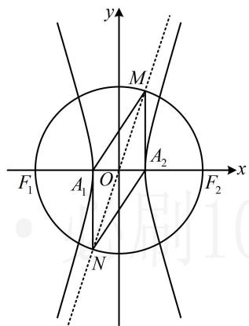

text_image

y
M
F₁ A₁ O F₂ x
A₂
N

11. (2022·江西赣州模拟·★★★★)

设直线 $y = 2x + t (t \neq 0)$ 与双曲线 $\frac{x^2}{a^2} - \frac{y^2}{b^2} = 1 (a > 0, b > 0)$ 的两条渐近线交于 $A$ ， $B$ 两点，若点 $P(4t, 0)$ 满足 $|PA| = |PB|$ ，则该双曲线的渐近线的方程是（）

A. $y = \pm 3x$

B. $y = \pm \sqrt{3} x$

C. $y=\pm\frac{1}{3}x$

D. $y = \pm \frac{1}{9} x$

11. A

解析：如何翻译 $|PA| = |PB|$ ？直接计算长度较麻烦，故设中点，用中线与底边垂直来翻译，

设 $A, B$ 中点为 $Q$ , 则 $P Q \perp A B$ , 垂直可用斜率之积等于 -1 来翻译, 故联立直线方程求交点 $A, B$ 坐标,

如图，双曲线的渐近线为 $y = \pm \frac{b}{a} x$ ，

联立 $\left\{\begin{aligned}y&=2x+t\\ y&=\frac{b}{a}x\end{aligned}\right.$ 解得： $\left\{\begin{aligned}x&=\frac{at}{b-2a}\\ y&=\frac{bt}{b-2a}\end{aligned}\right.\Rightarrow A\left(\frac{at}{b-2a},\frac{bt}{b-2a}\right),$

联立 $\left\{ \begin{array}{l} y = 2x + t \\ y = -\frac{b}{a} x \end{array} \right.$ 解得： $\left\{ \begin{array}{l} x = -\frac{at}{b + 2a} \\ y = \frac{bt}{b + 2a} \end{array} \right. \Rightarrow B\left(-\frac{at}{b + 2a}, \frac{bt}{b + 2a}\right)$ ，

所以 $AB$ 中点为 $Q\left(\frac{2a^2t}{b^2 - 4a^2}, \frac{b^2t}{b^2 - 4a^2}\right)$ ,

因为 $\left|PA\right|=\left|PB\right|$ ，所以 $k_{PQ}\cdot k_{AB}=\frac{\frac{b^{2}t}{b^{2}-4a^{2}}-0}{\frac{2a^{2}t}{b^{2}-4a^{2}}-4t}\times2=-1$ ，

整理得： $b^{2}=9a^{2}$ ，从而 $\frac{b}{a}=3$ ，故渐近线为 $y=\pm3x$ 。

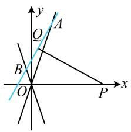

text_image

y
Q
A
B
O
x
P

