# 强化训练

1. (2022·安徽合肥模拟·★★)

已知抛物线 $C: y^{2} = 4\sqrt{3} x$ 的焦点为 $F$ , 准线为 $l$ , 过抛物线上一点 $P$ 作准线的垂线, 垂足为 $Q$ , 若 $\angle PFQ = 60^{\circ}$ , 则 $\left|PF\right| = (\quad)$

A. $4 \sqrt{3}$

B. $2 \sqrt{3}$

C. $\sqrt{3}$

D. 6

1. A

解析：如图，抛物线 $C$ 的焦点为 $F(\sqrt{3},0)$ ，准线为 $l$

$x = -\sqrt{3}$ ，记 $l$ 与 $x$ 轴交于点 $H$ ，则 $\left|FH\right| = 2\sqrt{3}$

由抛物线定义， $\left|PQ\right|=\left|PF\right|$

又 $\angle PFQ = 60^{\circ}$ ，所以 $\triangle PFQ$ 为正三角形，

于是只需到 $\triangle HFQ$ 中求出 $|QF|$ ，即可得到 $|PF|$ ，

$\angle PQF = 60^{\circ} \Rightarrow \angle HQF = 30^{\circ}$ ，所以 $|QF| = \frac{|FH|}{\sin \angle HQF}$

$= \frac{2\sqrt{3}}{\sin 30^{\circ}} = 4\sqrt{3}$ ，结合 $\triangle PFQ$ 为正三角形可得 $|PF| = 4\sqrt{3}$

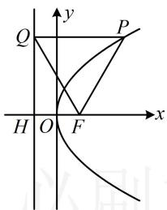

text_image

Q
y
P
H O F x

2. (2022·湖南岳阳模拟·★★☆)

过抛物线 $C: y^{2} = 2px (p > 0)$ 的焦点 $F$ 且斜率 $k > 0$ 直线与 $C$ 交于 $A, B$ 两点， $A$ 在第一象限，过 $A$ 作准线的垂线，垂足为 $H$ ，若 $\angle HFB$ 被 $x$ 轴平分，则 $k = \_$ .

2. $\sqrt{3}$

解析：直线 $AB$ 的斜率即为图中 $\angle 5$ 的正切值，条件涉及角平分线，我们试试通过分析几何关系来求该角，

如图，因为 $\angle HFB$ 被 $x$ 轴平分，所以 $\angle 1 = \angle 2$

又由抛物线定义， $\left|AH\right|=\left|AF\right|$ ，所以 $\angle3=\angle4$ ，

因为 $AH \parallel x$ 轴，所以 $\angle 1 = \angle 4$ ，故 $\angle 1 = \angle 2 = \angle 3 = \angle 4$

又 $\angle 1 + \angle 2 + \angle 3 = 180^{\circ}$ ，所以 $\angle 2 = 60^{\circ}$

由图可知 $\angle 5 = \angle 2$ ，所以 $\angle 5 = 60^{\circ}$

故直线 $AB$ 的斜率 $k = \tan 60^{\circ} = \sqrt{3}$

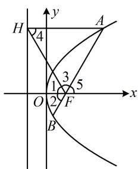

text_image

H
4
A
1
3
5
O
2
F
B
x
y

3. (2022·广东开平模拟·★★★)

抛物线 $C:y^{2} = 16x$ 的焦点为 $F,M$ 是 $C$ 上一点， $FM$ 的延长线交 $y$ 轴于点 $N$ ，若 $3\overrightarrow{FM} = 2\overrightarrow{MN}$ ，则 $\left|FN\right| = \_$

3. 16

解析：给出 $3\overrightarrow{FM} = 2\overrightarrow{MN}$ ，可设 $FM$ 的长，并用它表示其它线段的长，抛物线的准线为 $x = -4$ ，焦点为 $F(4,0)$

如图，作 $MM^{\prime} \perp$ 准线于 $M^{\prime}$ ，交 $y$ 轴于点 $G$

设 $\left|FM\right|=2m$ ，因为 $3\overrightarrow{FM}=2\overrightarrow{MN}$ ，所以 $\frac{\left|FM\right|}{\left|MN\right|}=\frac{2}{3}$

故 $\left|MN\right|=3m,\quad\left|FN\right|=5m$ ①,

由抛物线定义， $\left|MM'\right|=\left|FM\right|=2m$ ，

$$
\left| M G \right| = \left| M M ^ {\prime} \right| - \left| M ^ {\prime} G \right| = 2 m - 4,
$$

从图形来看，可用相似比来建立关于 $m$ 的方程，

因为 $GM \parallel OF$ ，所以 $\frac{|GM|}{|OF|} = \frac{|MN|}{|FN|}$ ，

从而 $\frac{2m - 4}{4} = \frac{3m}{5m}$ ，故 $m = \frac{16}{5}$ ，代入①得 $\left|FN\right| = 16$

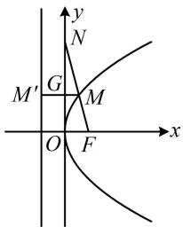

text_image

y
N
M'
G
M
O
F
x

4. (2022·河南模拟·★★★)

过抛物线 $y^{2} = 2px (p > 0)$ 的焦点 $F$ 的直线交抛物线于 $A, B$ 两点，交其准线于点 $C$ ，若点 $F$ 是 $AC$ 的中点，且 $|AF| = 4$ ，则 $|AB| =$ \_\_\_\_.

4. $\frac{16}{3}$

解析：如图，已知 $|AF|$ ，只需求得 $|BF|$ 即可求出 $|AB|$ ，可先过A，B向准线作垂线，

作 $AA' \perp$ 准线于 $A'$ ， $BB' \perp$ 准线于 $B'$ ，

则 $\left|AA'\right| = \left|AF\right| = 4$ ， $\left|BB'\right| = \left|BF\right|$ ，接下来我们可以设一段长，利用几何关系来分析其它有关线段的长，

设 $\left|BB'\right|=\left|BF\right|=m$ ，因为F是AC中点，所以 $\left|AC\right|=2\left|AF\right|$

$= 2\left|AA^{\prime}\right|$ ，从而 $\cos \angle CAA' = \frac{|AA'|}{|AC|} = \frac{1}{2}$ ，故 $\angle CAA' = 60^{\circ}$

又 $BB' \parallel AA'$ ，所以 $\angle CBB' = 60^\circ$ ，故 $|BC| = \frac{|BB'|}{\cos\angle CBB'}$

$= 2m$ ，所以 $\left|CF\right| = 3m$ ， $\left|AC\right| = 2\left|CF\right| = 6m$

又 $|AC|=2|AF|=8$ ，所以6m=8，故 $m=\frac{4}{3}$ ，

所以 $\left|BF\right|=\frac{4}{3}$ ，故 $\left|AB\right|=\left|AF\right|+\left|BF\right|=4+\frac{4}{3}=\frac{16}{3}$ .

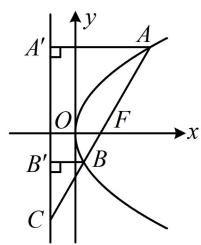

text_image

A'
y
A
O
F
x
B'
B
C

5. (2024·湖南长沙模拟·★★★)

设抛物线 $C: y^{2} = 2px (p > 0)$ 的焦点为 $F$ ，直线 $l$ 与 $C$ 交于 $A$ ， $B$ 两点， $FA \perp FB$ ， $|FA| = 2|FB|$ ，则 $l$ 的斜率是（）

A. $\pm 1$

B. $\pm \sqrt{2}$

C. $\pm \sqrt{3}$

D. ±2

5. D

解析：条件给出 $|FA| = 2|FB|$ ，想到过 $A$ 和 $B$ 分别作准线的垂线，结合抛物线定义处理，

如图，作 $AP \perp$ 准线于点 $P$ ， $BQ \perp$ 准线于点 $Q$

则由抛物线定义， $\left|FA\right|=\left|AP\right|$ ， $\left|FB\right|=\left|BQ\right|$ ，

有大量的长度关系，于是考虑设其中一条线段的长，再用它表示其它线段的长，

设 $|FB|=m$ ，则 $|FA|=2m$ ，所以 $|AP|=2m$ ， $|BQ|=m$ ，

因为 $FA \perp FB$ ，所以 $\left|AB\right| = \sqrt{\left|FA\right|^2 + \left|FB\right|^2} = \sqrt{5} m$

直线 l 的斜率即为图中 $\theta$ 的正切值，由 $PA \parallel x$ 轴不难发现 $\theta = \angle PAB$ ，故只需求 $\tan \angle PAB$ ，可考虑构造包含 $\angle PAB$ 的 Rt△ 来分析，

作 $BE \perp AP$ 于点 $E$ ，则 $\left|AE\right| = \left|AP\right| - \left|PE\right| = \left|AP\right| - \left|BQ\right| = m$ ， $\left|BE\right| = \sqrt{\left|AB\right|^2 - \left|AE\right|^2} = 2m$ ，所以在 $\triangle ABE$ 中，

$\tan \angle EAB = \frac{|BE|}{|AE|} = \frac{2m}{m} = 2$ ，故图中直线 $l$ 的斜率为2，

由抛物线的对称性， $l$ 的斜率为-2时也满足题意，故选D.

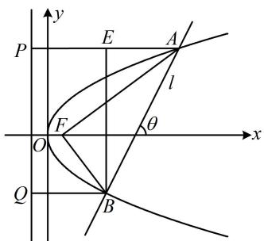

text_image

y
P	E	A
l
F	θ
O
x
Q	B

6. (2024·安徽合肥二模·★★★)

抛物线 $C: y^{2} = 4x$ 的焦点为 $F$ ，准线为 $l$ ， $A$ 为 $C$ 上一点，以点 $F$ 为圆心， $|AF|$ 为半径的圆与 $l$ 交于点 $B$ ， $D$ ，与 $x$ 轴交于点 $M$ ， $N$ ，若 $\overrightarrow{AB} = \overrightarrow{FM}$ ，则 $|AM| =$ \_\_\_\_.

6. $4 \sqrt{3}$

解法1：抛物线 $C:y^{2} = 4x$ 的焦点为 $F(1,0)$

准线为 $l: x = -1$ ，设准线与 $x$ 轴交于点 $E$ ，则 $E(-1,0)$ ，

怎样翻译 $\overrightarrow{AB} = \overrightarrow{FM}$ ？有两个方向，一是从几何上来看，翻译成 $|AB| = |FM|$ 且 $AB // FM$ ，二是用坐标翻译，我们先试试前者，如图，因为 $\overrightarrow{AB} = \overrightarrow{FM}$ ，所以 $AB // FM$ ，且 $|AB| = |FM|$ ，

所以四边形 $ABMF$ 是平行四边形，

因为 $FM \perp l$ ，所以 $AB \perp l$ ，故 $\left|AB\right|$ 是点 $A$ 到抛物线准线的距离，由抛物线定义， $\left|AB\right| = \left|AF\right|$ ，

又 $\left|AF\right|=\left|BF\right|$ ，所以 $\left|AB\right|=\left|AF\right|=\left|BF\right|$ ，

从而 $\triangle ABF$ 是正三角形，故 $\triangle MBF$ 也是正三角形，

所以四边形 $ABMF$ 是菱形，

因为 $BE \perp MF$ ，所以 $E$ 为 $MF$ 中点，

又 $|EF|=2$ ，所以MF=4，设AM与BF交于点I，

则 $|AM|=2|MI|=2\times4\times\frac{\sqrt{3}}{2}=4\sqrt{3}$ .

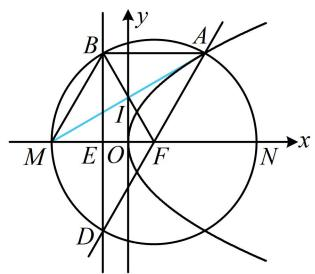

text_image

y
B
A
I
M E O F N x
D

解法2：再来试试用坐标翻译 $\overrightarrow{AB} = \overrightarrow{FM}$ ，方便起见，我们设圆的半径为未知数，结合 $\overrightarrow{AB} = \overrightarrow{FM}$ 来表示 $A, B$ 的坐标，设圆的半径为 $r(r > 0)$ ，由题意， $F(1,0)$ ，

所以圆 F 的方程为 $(x-1)^{2} + y^{2} = r^{2}$ ①,

点 $B$ 在 $x = -1$ 上，在①中令 $x = -1$ 可得 $y = \pm \sqrt{r^2 - 4}$

所以 $B(-1, \sqrt{r^2 - 4})$ ，故 $A(r - 1, \sqrt{r^2 - 4})$ ，

代入 $y^{2} = 4x$ 得 $r^2 -4 = 4(r - 1)$ ，解得： $r = 4$ 或0（舍去），

所以 $A(3,2\sqrt{3})$ ， $M(-3,0)$ ，

故 $\left|AM\right|=\sqrt{(-3-3)^{2}+(0-2\sqrt{3})^{2}}=4\sqrt{3}$ .

# 7. (★★★☆)

抛物线 $E: y^{2} = 4x$ 的焦点为 $F$ ，过 $F$ 的直线与 $E$ 交于 $A$ ， $B$ 两点，延长 $FB$ 交 $E$ 的准线 $l$ 于点 $C$ ，过 $A$ ， $B$ 作 $l$ 的垂线，垂足分别为 $M$ ， $N$ ，若 $\left|BC\right| = 2\left|BN\right|$ ，则 $\triangle AFM$ 的面积为（）

A. $4 \sqrt{3}$

B. 4

C. $2 \sqrt{3}$

D. 2

7. A

解析：如图，条件给出 $|BC|=2|BN|$ ，由抛物线定义还有 $|AM|=|AF|$ ， $|BN|=|BF|$ ，既然有这么多长度关系，那我们不妨设AF和BF的长，以此来分析图形的几何特征，

设 $\left|AF\right|=m$ ， $\left|BF\right|=n$ ，则 $\left|AM\right|=m$ ， $\left|BN\right|=n$ ，

因为 $|BC|=2|BN|$ ，所以 $|BC|=2n$ ， $|FC|=3n$ ，

且 $\cos \angle NBC = \frac{|BN|}{|BC|} = \frac{1}{2}$ 故 $\angle NBC = \frac{\pi}{3}$

又 $AM \parallel BN$ ，所以 $\angle MAC = \frac{\pi}{3}$

从而 $\cos\angle MAC=\frac{|AM|}{|AC|}=\frac{m}{m+3n}=\frac{1}{2}$ ，故 m=3n，

有了 $m$ 和 $n$ 的关系，就能分析 $F$ 在 $AC$ 上的位置，结合 $\vert FH\vert$ 是已知的，可由相似比求得 $\vert AM\vert$

由题意，抛物线的焦点为 $F(1,0)$ ，准线为 $l:x = -1$

所以 $\left|FH\right|=2$ ，由m=3n知 $\left|AF\right|=\left|FC\right|$ ，

所以 $F$ 为 $AC$ 中点，又 $FH \parallel AM$ ，所以 $\left|AM\right| = 2\left|FH\right| = 4$

由 $\angle MAC = \frac{\pi}{3}$ 和 $|AM| = |AF|$ 可得 $\triangle AFM$ 是正三角形，

所以 $S_{\triangle AFM} = \frac{1}{2}\times 4\times 4\times \sin \frac{\pi}{3} = 4\sqrt{3}.$

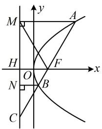

text_image

M
y
A
H
O
F
x
N
B
C

8. (2022·黑龙江齐齐哈尔模拟·★★★★)

已知抛物线 $C: y^{2} = 2px (p > 0)$ 的准线 $x = -1$ 与 $x$ 轴交于点 $A, F$ 为 $C$ 的焦点， $B$ 是 $C$ 上第一象限内的一点，则当 $\frac{|BF|}{|AB|}$ 取得最小值时， $\triangle ABF$ 的面积为（）

A. 2 B. 3 C. 4 D. 6

8. A

解析：抛物线的准线为 $x = -1 \Rightarrow p = 2 \Rightarrow$ 抛物线的方程为 $y^{2} = 4x$ ，其焦点为 $F(1,0)$ ， $A(-1,0)$

如图1，直接分析 $\frac{|BF|}{|AB|}$ 的最小值不易，涉及 $|BF|$ ，可用定义转化后再看，作 $BD \perp$ 准线于 $D$ ，则 $|BF| = |BD|$ ，

所以 $\frac{|BF|}{|AB|} = \frac{|BD|}{|AB|} = \sin \angle BAD$

要使 $\sin \angle BAD$ 最小，只需 $\angle BAD$ 最小，此时直线 $AB$ 与抛物线相切，如图2.可联立直线和抛物线用 $\Delta = 0$ 求解，设切线 $AB$ 的方程为 $x = my - 1$ ，联立 $\left\{ \begin{array}{l} x = my - 1 \\ y^2 = 4x \end{array} \right.$ 消去 $x$ 整理得： $y^{2} - 4my + 4 = 0$ ①，

因为直线 $AB$ 与抛物线相切，所以方程①的判别式 $\Delta =$

$(-4m)^{2}-4\times1\times4=0$ ，解得： $m=\pm1$ ，

代入①解得： $y=\pm2$ ，所以 $y_{B}=\pm2$ ，

故 $S_{\triangle ABF} = \frac{1}{2}\big|AF\big|\cdot \big|y_B\big| = \frac{1}{2}\times 2\times 2 = 2$

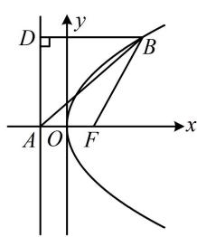

text_image

y
D
B
A O F x

图1

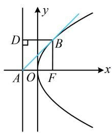

text_image

y
D
B
A O F
x

图2

9. (2022·云南昆明模拟·★★★★)

抛物线 $C:y^{2} = 2px(p > 0)$ 的焦点为 $F$ ，第一象限的 $A$ ， $B$ 两点在抛物线上，且 $FA\bot AB$ ， $\left|AF\right| = 7$ ， $\left|BF\right| = 25$ 若直线 $AB$ 的倾斜角为 $\theta$ ，则 $\cos \theta =$

9. $\frac{3}{4}$

解法 1: 涉及 $|AF|$ 和 $|BF|$ , 考虑抛物线的定义,

如图，作 $AA'\perp$ 准线于 $A^{\prime}$ ， $BB^{\prime}\perp$ 准线于 $B^{\prime}$

则 $\left|AA'\right| = \left|AF\right| = 7$ ， $\left|BB'\right| = \left|BF\right| = 25$ ，因为 $FA \perp AB$ ，

所以 $\left|AB\right|=\sqrt{\left|BF\right|^{2}-\left|AF\right|^{2}}=\sqrt{25^{2}-7^{2}}=24$ ，

由图可知直线 $AB$ 的倾斜角 $\theta = \angle ABB'$ ，于是构造一个直角三角形来求 $\angle ABB'$ ，

作 $AH \perp BB'$ 于 $H$ ，则 $\left|BH\right| = \left|BB'\right| - \left|B'H\right| = \left|BB'\right| - \left|AA'\right|$

$= 18$ ，所以 $\cos \angle ABH = \frac{|BH|}{|AB|} = \frac{3}{4}$ ，故 $\cos \theta = \frac{3}{4}$

解法 2: 题干的条件也可用 $A$ 和 $B$ 的坐标来翻译, 于是设

坐标，设 $A(x_{1},y_{1})$ ， $B(x_{2},y_{2})$ ，则 $\left\{ \begin{array}{ll}\left|AF\right| = x_1 + \frac{p}{2} = 7 & ①\\ \left|BF\right| = x_2 + \frac{p}{2} = 25 & ② \end{array} \right.$

又 $FA \perp AB$ ，所以 $\left|AB\right| = \sqrt{\left|BF\right|^2 - \left|AF\right|^2} = \sqrt{25^2 - 7^2} = 24$

故 $\sqrt{(x_2 - x_1)^2 + (y_2 - y_1)^2} = 24$ ③，

观察发现用①②作差可求得 $x_{2} - x_{1}$ ，代入③又可求出 $y_{2} - y_{1}$ ，故可先算 $AB$ 的斜率 $\tan \theta$ ，再求 $\cos \theta$

由②-①可得： $x_{2} - x_{1} = 18$ ，代入③可得 $(y_{2} - y_{1})^{2} = 252$

如图，由 $\left|BF\right|>\left|AF\right|$ 及A、B都在第一象限知 $y_{2}>y_{1}$ ，

所以 $y_{2} - y_{1} = 6\sqrt{7}$ ，故 $\tan \theta = \frac{y_2 - y_1}{x_2 - x_1} = \frac{6\sqrt{7}}{18} = \frac{\sqrt{7}}{3}$

即 $\frac{\sin\theta}{\cos\theta} = \frac{\sqrt{7}}{3}$ ，结合 $\sin^2\theta +\cos^2\theta = 1$ 可解得 $\cos \theta = \pm \frac{3}{4}$

由图可知直线 AB 的倾斜角 $\theta$ 为锐角，故 $\cos\theta=\frac{3}{4}$ .

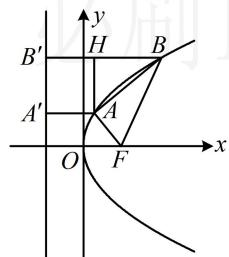

text_image

B'
H
B
A'
A
O
F
x
y

10. (2022·湖北模拟·★★★★)

已知抛物线 $C$ 的焦点为 $F$ , 点 $A, B$ 在抛物线上, 以 $AB$ 为直径的圆过点 $F$ , 过线段 $AB$ 的中点 $P$ 作 $C$ 的准线的垂线, 垂足为 $Q$ , 则 $\frac{|PQ|}{|AB|}$ 的最大值为 ( )

A. $\frac{1}{2}$

B. $\frac{\sqrt{3}}{3}$

C. $\frac{\sqrt{2}}{2}$

D. 1

10. C

解析：如图，以 $AB$ 为直径的圆过 $F \Rightarrow FA \perp FB$

所以 $\left|AB\right|=\sqrt{\left|AF\right|^{2}+\left|BF\right|^{2}}$ ，结合抛物线定义， $\left|PQ\right|$ 也可用 $\left|AF\right|$ 和 $\left|BF\right|$ 表示，故把它们设为变量，分析 $\frac{\left|PQ\right|}{\left|AB\right|}$ 的最大值，作 $PQ\perp$ 抛物线的准线于Q， $AA'\perp$ 准线于 $A'$ ， $BB'\perp$ 准线于 $B'$ ，设 $\left|AF\right|=m$ ， $\left|BF\right|=n$ ，则 $\left|AA'\right|=m$ ， $\left|BB'\right|=n$ ，

$$
\left| P Q \right| = \frac {\left| A A ^ {\prime} \right| + \left| B B ^ {\prime} \right|}{2} = \frac {m + n}{2}, \quad \left| A B \right| = \sqrt {m ^ {2} + n ^ {2}},
$$

所以 $\frac{|PQ|}{|AB|} = \frac{m + n}{2\sqrt{m^2 + n^2}} = \frac{1}{2}\sqrt{\frac{(m + n)^2}{m^2 + n^2}} = \frac{1}{2}\sqrt{\frac{m^2 + n^2 + 2mn}{m^2 + n^2}}$

$$
= \frac {1}{2} \sqrt {1 + \frac {2 m n}{m ^ {2} + n ^ {2}}} \leq \frac {1}{2} \sqrt {1 + \frac {2 m n}{2 m n}} = \frac {\sqrt {2}}{2},
$$

当且仅当 $m = n$ 时取等号，故 $\frac{|PQ|}{|AB|}$ 的最大值为 $\frac{\sqrt{2}}{2}$ .

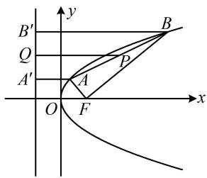

text_image

B'
Q
A'
O
F
x
y
P
B

