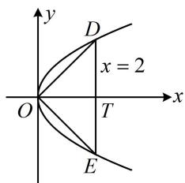
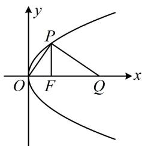
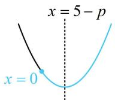
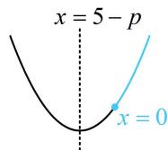
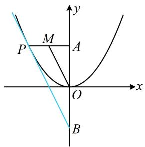
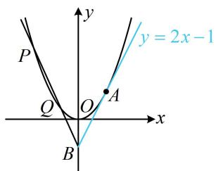

# 第 3 节 抛物线小题的综合运算（★★★）

# 内容提要

本节主要涉及三类抛物线有关的小题:

1. 简单的运算求值: 一些抛物线小题中, 我们可以联立直线和抛物线去求交点坐标, 用坐标参与运算, 也可以结合图形的几何特征来解决问题.  
2. 抛物线上的动点问题: 设点 $P$ 在抛物线 $y^{2} = 2px (p > 0)$ 上运动, 点 $P$ 的坐标常用两种设法.

①设 $P(x_0, y_0)$ ，这种设法引入了2个变量，没有体现点 $P$ 在抛物线上，可用 $y_0^2 = 2px_0$ 建立变量间的关系.  
②设 $P\left(\frac{y_0^2}{2p}, y_0\right)$ ，这种设法只引入1个变量，已经体现了点 $P$ 在抛物线上，单动点问题用此设法往往比较方便.

3. 设而不求韦达定理: 设直线 $l$ 与抛物线 $C$ 交于 $A, B$ 两点, 由此产生的诸多问题中, 需要将直线 $l$ 与抛物线 $C$ 的方程联立, 但联立后我们往往不去解方程组, 求交点 $A, B$ 的坐标, 而是消去 $y$ (或 $x$ ) 整理得出关于 $x$ (或 $y$ ) 的一元二次方程, 结合韦达定理来计算一些目标量, 如数量积、斜率、弦长、面积等.

# 类型 I：简单的运算求值问题

【例 1】(2020·新课标III卷) 设 O 为坐标原点，直线 x=2 与抛物线 $C: y^{2}=2px (p>0)$ 交于 D，E 两点，若 $OD \perp OE$ ，则 C 的焦点坐标为（）

A. $\left(\frac{1}{4},0\right)$

B. $\left(\frac{1}{2}, 0\right)$

C. (1,0)

D. (2,0)

解法1：如图， $OD\perp OE$ 可用斜率翻译，求斜率需要 $D$ ， $E$ 坐标，联立直线 $x = 2$ 和抛物线可求得坐标，联立 $\left\{ \begin{array}{l} x = 2 \\ y^2 = 2px \end{array} \right.$ 解得： $y = \pm 2\sqrt{p}$ ，所以 $D(2,2\sqrt{p})$ ， $E(2, -2\sqrt{p})$ ，

因为 $OD \perp OE$ ，所以 $k_{OD} \cdot k_{OE} = \frac{2\sqrt{p}}{2} \times \frac{-2\sqrt{p}}{2} = -1$ ，解得： $p = 1$ ，故 $C$ 的焦点为 $\left(\frac{1}{2}, 0\right)$ .

解法2：如图，观察发现由 $\triangle DOE$ 的几何特征可分析出点 $D$ 坐标，代入抛物线方程也能求 $p$

设直线 $x = 2$ 与 $x$ 轴交于点 $T$ ，则 $\vert OT\vert = 2$ ，由题意， $OD\bot OE$

结合对称性可得 $\triangle DOE$ 为等腰直角三角形， $\triangle DOT$ 也为等腰直角三角形，所以 $|DT| = |OT| = 2$ ，从而点 $D$ 的坐标为(2,2)，

代入 $y^{2} = 2px$ 得： $2^{2} = 2p \cdot 2$ ，解得： $p = 1$ ，故 $C$ 的焦点为 $\left(\frac{1}{2}, 0\right)$ .

text_image

y
D
x = 2
O
T
x
E

答案: B

【反思】在简单的抛物线求值问题中，用直线的方程、点的坐标等直接翻译已知条件可以解决问题，但若能结合条件的几何特征分析，往往计算量更小.

【例2】(2021·新高考I卷)已知 $O$ 为坐标原点, 抛物线 $C: y^{2} = 2px (p > 0)$ 的焦点为 $F$ , $P$ 为 $C$ 上一点, $PF$ 与 $x$ 轴垂直, $Q$ 为 $x$ 轴上一点, 且 $PQ \perp OP$ . 若 $\left|FQ\right| = 6$ , 则 $C$ 的准线方程为 \_\_\_\_.

解法1：如图，由 $PF \perp x$ 轴和 $|FQ| = 6$ 可分别求出 $P, Q$ 的坐标，再翻译 $PQ \perp OP$ 即可建立方程求 $p$

由题意， $F\left(\frac{p}{2},0\right)$ ，将 $x=\frac{p}{2}$ 代入 $y^{2}=2px$ 解得： $y=\pm p$ ，不妨设 $P\left(\frac{p}{2},p\right)$ ， $|FQ|=6\Rightarrow Q\left(\frac{p}{2}+6,0\right)$

因为 $PQ \perp OP$ ，所以 $k_{OP} \cdot k_{PQ} = \frac{p}{\frac{p}{2}} \cdot \frac{p}{\frac{p}{2} - \left(\frac{p}{2} + 6\right)} = -1$ ，解得： $p = 3$ ，故 $C$ 的准线方程为 $x = -\frac{3}{2}$ .

解法2: 如图, $|OF|$ , $|PF|$ 都好求, $|FQ|$ 又已知, 可抓住 $\angle POF = \angle FPQ$ 直接建立方程求 $p$ ,

由题意， $F\left(\frac{p}{2},0\right)$ ，将 $x=\frac{p}{2}$ 代入 $y^{2}=2px$ 解得： $y=\pm p$ ，所以 $|PF|=p$ ，

因为 $PQ \perp OP$ ， $PF \perp OQ$ ，所以 $\angle POF + \angle OPF = \angle FPQ + \angle OPF = 90^{\circ}$

故 $\angle POF = \angle FPQ$ ，所以 $\tan \angle POF = \tan \angle FPQ$ ，从而 $\frac{|PF|}{|OF|} = \frac{|FQ|}{|PF|}$

即 $\frac{p}{\frac{p}{2}} = \frac{6}{p}$ ，解得： $p = 3$ ，故 $C$ 的准线方程为 $x = -\frac{3}{2}$ .

答案： $x = -\frac{3}{2}$

text_image

y
P
O F Q x

# 类型 II：动点类问题

【例 3】已知 A 是抛物线 $y = x^{2}$ 上的点，点 $B(0,2)$ ，则 $\left|AB\right|$ 的最小值为（）

A. $\frac{1}{2}$

B. $\frac{\sqrt{3}}{2}$

C. $\frac{7}{4}$

D. $\frac{\sqrt{7}}{2}$

解析： $A$ 是抛物线上的动点，可根据其方程设单变量形式的坐标，用于计算 $|AB|$ ，

由题意，可设 $A(x_0, x_0^2)$ ，则 $\left|AB\right| = \sqrt{(x_0 - 0)^2 + (x_0^2 - 2)^2} = \sqrt{x_0^4 - 3x_0^2 + 4} = \sqrt{\left(x_0^2 - \frac{3}{2}\right)^2 + \frac{7}{4}}$

所以当 $x_0 = \pm \frac{\sqrt{6}}{2}$ 时， $|AB|$ 取得最小值 $\frac{\sqrt{7}}{2}$ .

答案: D

【反思】对于抛物线上的动点问题，可先设动点坐标（设法参考内容提要），并用该坐标计算题目中求最值的量，再借助函数、不等式等方法来求解最值.

【变式】抛物线 $y^{2} = 2px (p > 0)$ 上任意一点 $P$ 到点 $M(5,0)$ 的距离的最小值为4，则 $p =$ \_\_\_\_.

解析：若将点 $P$ 的坐标设为 $P\left(\frac{y_0^2}{2p}, y_0\right)$ ，则求得的 $|PM|$ 的结果较复杂，于是设双变量的形式，

设 $P(x_0,y_0)$ ，则 $\left|PM\right| = \sqrt{(x_0 - 5)^2 + (y_0 - 0)^2} = \sqrt{x_0^2 - 10x_0 + 25 + y_0^2}$ ①，

有 $x_0$ 和 $y_0$ 两个变量，可利用抛物线方程来消元，因为点 $P$ 在抛物线上，所以 $y_0^2 = 2px_0$

代入式①可得 $\left|PM\right|=\sqrt{x_{0}^{2}-10x_{0}+25+2px_{0}}=\sqrt{x_{0}^{2}-(10-2p)x_{0}+25}$ ， $x_{0}\geq0$ ，

设 $f(x) = x^{2} - (10 - 2p)x + 25(x\geq 0)$ ，则 $\left|PM\right| = \sqrt{f(x)}$

由于 $p$ 是未知量，所以求 $f(x)$ 的最小值需讨论对称轴 $x = 5 - p$ 和区间 $[0, +\infty)$ 的位置关系，

当 $5 - p \geq 0$ 时， $0 < p \leq 5$ ，如图1， $f(x)_{\min} = f(5 - p) = (5 - p)^2 - (10 - 2p)(5 - p) + 25 = 25 - (5 - p)^2$ ，

因为 $\left|PM\right|_{\min} = 4$ ，所以 $f(x)_{\min} = 16$ ，令 $25 - (5 - p)^{2} = 16$ ，解得： $p = 2$ 或8（不满足 $0 < p \leq 5$ ，舍去）；

当 $5 - p < 0$ 时， $p > 5$ ，如图2， $f(x)_{\min} = f(0) = 25$

所以 $\left|PM\right|_{\min}=5$ ，不合题意；

综上所述， $p$ 的值为 2.

答案: 2

  
图1

  
图2

【例4】设 $O$ 为坐标原点，点 $A(0,4)$ ，动点 $P$ 在抛物线 $x^{2} = 4y$ 上，且位于第二象限， $M$ 是线段 $PA$ 的中点，则直线 $OM$ 的斜率的取值范围是（）

A. $(2, +\infty)$

B. $[2, +\infty)$

C. $(- \infty, -2)$

D. $(- \infty, -2]$

解法1：点 $P$ 在抛物线上运动，可将其坐标设为单变量的形式，由题意，可设 $P\left(a, \frac{a^2}{4}\right)$ ，其中 $a < 0$ ，

因为 $M$ 是 $PA$ 中点，所以 $M\left(\frac{a}{2}, \frac{a^2}{8} + 2\right)$ ，故 $k_{OM} = \frac{\frac{a^2}{8} + 2}{\frac{a}{2}} = \frac{a^2 + 16}{4a} = \frac{1}{4}\left(a + \frac{16}{a}\right)$ ，

虽然 $a$ 和 $\frac{16}{a}$ 积为定值，但这两项均为负，不能直接用均值不等式，可先添负号，化负为正，

所以 $k_{OM} = \frac{1}{4}\left(a + \frac{16}{a}\right) = -\frac{1}{4}\left[(-a) + \frac{16}{-a}\right] \leq -\frac{1}{4} \times 2\sqrt{(-a) \cdot \frac{16}{-a}} = -2$

当且仅当 $-a = \frac{16}{-a}$ ，即 $a = -4$ 时取等号，所以 $k_{OM}$ 的取值范围是 $(- \infty, -2]$ .

解法2：涉及中点，想到中位线，题干只有 $M$ 一个中点，所以再构造一个中点出来，

如图，记 $B(0, -4)$ ，则 $O$ 为 $AB$ 的中点，

又 $M$ 为 $PA$ 的中点，所以 $OM \parallel PB$ ，故 $k_{OM} = k_{PB}$ ，于是只需求当 $P$ 运动时， $k_{PB}$ 的取值范围，如图所示的相切的情形即为 $k_{PB}$ 最大的情况，

设图中切线 $PB$ 的方程为 $y = kx - 4$ ，代入 $x^{2} = 4y$ 整理得： $x^{2} - 4kx + 16 = 0$

判别式 $\Delta = (-4k)^2 - 4 \times 1 \times 16 = 0$ ，解得： $k = \pm 2$ ，

由图可知 $k = -2$ ，所以 $k_{PB}\in (-\infty , - 2]$ ，故 $k_{OM}\in (-\infty , - 2]$

答案: D

text_image

y
M
P A
O
x
B

【例 5】已知 $\triangle ABC$ 的三个顶点都在抛物线 $y^{2}=4x$ 上，F 为抛物线的焦点，若 $\overrightarrow{AF}=\frac{1}{3}(\overrightarrow{AB}+\overrightarrow{AC})$ ，则 $\left|\overrightarrow{AF}\right|+\left|\overrightarrow{BF}\right|+\left|\overrightarrow{CF}\right|=()$

A. 3

B. 6

C. 9

D. 12

解析：由 $\overrightarrow{AF} = \frac{1}{3} (\overrightarrow{AB} +\overrightarrow{AC})$ 可建立坐标关系， $\left|\overrightarrow{AF}\right|,\left|\overrightarrow{BF}\right|,\left|\overrightarrow{CF}\right|$ 也能用 $A,B,C$ 的横坐标来算，故设坐标，由题意， $F(1,0)$ ，设 $A(x_{1},y_{1})$ ， $B(x_{2},y_{2})$ ， $C(x_3,y_3)$

则 $\overrightarrow{AF} = (1 - x_1, - y_1)$ ， $\overrightarrow{AB} = (x_2 - x_1, y_2 - y_1)$ ， $\overrightarrow{AC} = (x_3 - x_1, y_3 - y_1)$

因为 $\overrightarrow{AF} = \frac{1}{3} (\overrightarrow{AB} +\overrightarrow{AC})$ ，利用横坐标相等有 $1 - x_{1} = \frac{1}{3} (x_{2} - x_{1} + x_{3} - x_{1})$ ，整理得： $x_{1} + x_{2} + x_{3} = 3$

故 $\left|\overrightarrow{AF}\right|+\left|\overrightarrow{BF}\right|+\left|\overrightarrow{CF}\right|=(x_{1}+1)+(x_{2}+1)+(x_{3}+1)=(x_{1}+x_{2}+x_{3})+3=6$ .

答案: B

【总结】可发现设点的方式要由题目来定，当设单变量形式复杂时，就考虑双变量（如例3变式）；而涉及抛物线上的点到焦点的距离时，常根据前面小节用过的方法，即用定义转到与准线的距离（如例5）.

# 类型III：设直线，联立，韦达

【例 6】(2022·新课标 I 卷) (多选) 已知 O 为坐标原点, 点 A(1,1) 在抛物线 C: $x^{2} = 2py (p > 0)$ 上, 过点 B(0, -1) 的直线交 C 于 P、Q 两点, 则 ( )

A. $C$ 的准线为 $y = -1$

B. 直线 $AB$ 与 $C$ 相切

C. $|OP|\cdot|OQ|>|OA|^{2}$

D. $\left|BP\right|\cdot\left|BQ\right|>\left|BA\right|^{2}$

解析：A 项，点 $A(1,1)$ 在抛物线 $C$ 上 $\Rightarrow 1^2 = 2p \cdot 1 \Rightarrow p = \frac{1}{2} \Rightarrow C$ 的准线为 $y = -\frac{1}{4}$ ，故 A 项错误；

B项，如图，可用导数求出抛物线在点 $A$ 处的切线方程，再验证点 $B$ 是否在该切线上即可，

$x^{2}=y\Rightarrow y^{\prime}=2x\Rightarrow y^{\prime}|_{x=1}=2\Rightarrow$ 抛物线C在点A处的切线方程为 $y-1=2(x-1)$ ，整理得：y=2x-1，经检验，点 $B(0,-1)$ 在该切线上，所以直线AB与C相切，故B项正确；

C项，经观察， $|OP|$ 和 $|OQ|$ 不方便用几何的方法求，故转为设 $P$ ， $Q$ 的坐标，用坐标来算它们，

设 $P(x_{1},x_{1}^{2})$ ， $Q(x_{2},x_{2}^{2})$ ，则 $\left|OP\right|\cdot \left|OQ\right| = \sqrt{x_1^2 + x_1^4}\cdot \sqrt{x_2^2 + x_2^4} = \sqrt{x_1^2x_2^2(1 + x_1^2)(1 + x_2^2)} = \sqrt{x_1^2x_2^2(1 + x_1^2 + x_2^2 + x_1^2x_2^2)}$ ①，式①可通过设直线的方程，并与抛物线联立，结合韦达定理来计算，

由题意，直线 $PQ$ 的斜率存在，可设其方程为 $y = kx - 1$ ，代入 $x^{2} = y$ 消去 $y$ 整理得： $x^{2} - kx + 1 = 0$ 判别式 $\Delta = k^2 -4 > 0\Rightarrow |k| > 2$ ，由韦达定理， $x_{1} + x_{2} = k$ ， $x_{1}x_{2} = 1$

代入式①可得 $\left|OP\right|\cdot\left|OQ\right|=\sqrt{2+x_{1}^{2}+x_{2}^{2}}=\sqrt{2+(x_{1}+x_{2})^{2}-2x_{1}x_{2}}=\left|k\right|>2$

又 $\left|OA\right|^{2}=2$ ，所以 $\left|OP\right|\cdot\left|OQ\right|>\left|OA\right|^{2}$ ，故C项正确；

D 项，已知点 B，用弦长公式 $\sqrt{1+k^{2}}\cdot|x_{1}-x_{2}|$ 算 $|BP|$ 和 $|BQ|$ 较方便，故同样用坐标运算来验证 D 项，由弦长公式， $|BP|=\sqrt{1+k^{2}}\cdot|0-x_{1}|=\sqrt{1+k^{2}}\cdot|x_{1}|$ ，同理， $|BQ|=\sqrt{1+k^{2}}\cdot|x_{2}|$ ，

所以 $\left|BP\right|\cdot\left|BQ\right|=\sqrt{1+k^{2}}\cdot\left|x_{1}\right|\cdot\sqrt{1+k^{2}}\cdot\left|x_{2}\right|=(1+k^{2})\left|x_{1}x_{2}\right|$

将C项得到的 $|k| > 2$ 和 $x_{1}x_{2} = 1$ 代入上式可得 $\left|BP\right|\cdot \left|BQ\right| = 1 + k^2 >5$

又 $\left|BA\right|^{2}=(0-1)^{2}+(-1-1)^{2}=5$ ，所以 $\left|BP\right|\cdot\left|BQ\right|>\left|BA\right|^{2}$ ，故D项正确.

答案: BCD

text_image

y
P
y = 2x - 1
Q
O
A
x
B

【反思】同椭圆与双曲线一样，不方便用几何法求解问题时，我们常设点、设线进行坐标运算。若涉及 $x_{1} + x_{2}$ ， $x_{1}x_{2}$ ， $\left|x_{1} - x_{2}\right|$ ， $y_{1} + y_{2}$ ， $y_{1}y_{2}$ ， $\left|y_{1} - y_{2}\right|$ 这些量，常结合韦达定理求解，圆锥曲线中的这种计算思路与技巧，我们将在下个模块“模块6：解析几何大题”深入学习，所以本节只举一道例题。

# 强化训练

1. (★★)

已知 $O$ 为坐标原点，垂直于抛物线 $C:y^{2} = 2px(p > 0)$ 的对称轴的直线 $l$ 交 $C$ 于 $A$ ， $B$ 两点， $\overrightarrow{OA}\cdot \overrightarrow{OB} = 0$ ，且 $|AB| = 4$ ，则 $p =$ （）

A. 4 B. 3 C. 2 D. 1

2. (2022·贵州镇远模拟·★★)

已知 $A$ ， $B$ 是抛物线 $C:y^{2} = 4x$ 上关于 $x$ 轴对称的两点， $D$ 是 $C$ 的准线与 $x$ 轴的交点，若直线 $BD$ 与 $C$ 的另一个交点是 $E(4,4)$ ，则直线 $AE$ 的方程为（）

A. $2x - y - 4 = 0$

B. $4x - 3y - 4 = 0$

C. $x - 2y + 4 = 0$

D. $4x - 5y + 4 = 0$

3. (2024·天津卷·★★)

$(x - 1)^2 + y^2 = 25$ 的圆心与抛物线 $y^2 = 2px (p > 0)$ 的焦点 $F$ 重合， $A$ 为两曲线的交点，则原点到直线 $AF$ 的距离为 \_\_\_\_.

4. (2022·江西上饶模拟·★★)

已知抛物线 $y^{2} = 2px (p > 0)$ 的焦点为 $F(1,0)$ ，则抛物线上的动点 $N$ 到点 $M(3p,0)$ 的距离的最小值为（）

A. 4 B. 6 C. $2 \sqrt{5}$ D. $4 \sqrt{5}$

5. (2022·湖北模拟（改）·★★★)

已知 $F$ 为抛物线 $y^{2} = 2x$ 的焦点， $A(x_{0}, y_{0})(x_{0} \neq 0)$ 为抛物线上的动点，点 $B(-1, 0)$ ，则 $\frac{2|AB|}{\sqrt{4|AF| - 2}}$ 的最小值为（）

A. $\frac{1}{2}$

B. $\sqrt{2}$

C. $\sqrt{6}$

D. $\sqrt{5}$

6. (2022·河北唐山一模·★★★) (多选)

已知直线 $l: x = my + 4$ 和抛物线 $C: y^2 = 4x$ 交于 $A(x_1, y_1)$ ， $B(x_2, y_2)$ 两点， $O$ 为原点，直线 $OA$ ， $OB$ 的斜率分别为 $k_1$ ， $k_2$ ，则（）

A. $y_{1}y_{2}$ 为定值

B. $k_{1} k_{2}$ 为定值

C. $y_{1} + y_{2}$ 为定值

D. $k_{1} + k_{2} + m$ 为定值

7. (2024·新课标II卷·★★★☆)(多选)

抛物线 $C: y^{2} = 4x$ 的准线为 $l$ , $P$ 为 $C$ 上的动点, 过 $P$ 作 $\odot A: x^{2} + (y - 4)^{2} = 1$ 的一条切线, $Q$ 为切点, 过 $P$ 作 $l$ 的垂线, 垂足为 $B$ , 则 ( )

A. $l$ 与 $\odot A$ 相切

B. 当 $P, A, B$ 三点共线时， $|PQ| = \sqrt{15}$

C. 当 $|PB|=2$ 时， $PA\perp AB$

D. 满足 $|PA| = |PB|$ 的点 $P$ 有且仅有2个

8. (2022·北京模拟·★★★★)

设 $A$ ， $B$ 是抛物线 $y^{2} = 2x$ 上的两个不与原点 $O$ 重合的动点，且 $OA\bot OB$ ，则 $\left|OA\right|\cdot \left|OB\right|$ 的最小值是（）

A. $\frac{5}{4}$

B. 4

C. 8

D. 64

9. (2022·新课标II卷·★★★★★) (多选)

已知 $O$ 为坐标原点，过抛物线 $C: y^2 = 2px (p > 0)$ 的焦点 $F$ 的直线与 $C$ 交于 $A$ 、 $B$ 两点，点 $A$ 在第一象限，点 $M(p,0)$ ，若 $\left|AF\right| = \left|AM\right|$ ，则（）

A. 直线 $AB$ 的斜率为 $2 \sqrt{6}$

B. $|OB| = |OF|$

C. $|AB| > 4|OF|$

D. $\angle OAM + \angle OBM < 180^{\circ}$

一数·必刷100讲

