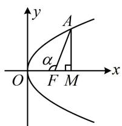
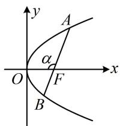
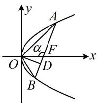
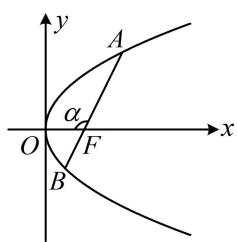
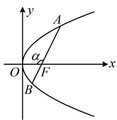
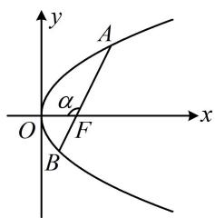
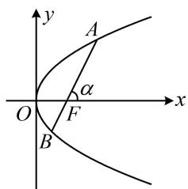
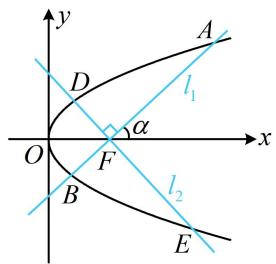
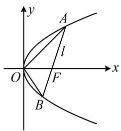
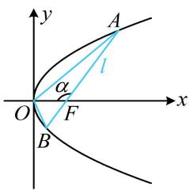

# 内容提要

1. 坐标版焦半径、焦点弦公式（设 $P(x_0, y_0)$ 在抛物线上， $A(x_1, y_1)$ ， $B(x_2, y_2)$ ， $AB$ 是抛物线的焦点弦）

<table><tr><td>标准方程</td><td> $y^2=2px(p>0)$ </td><td> $y^2=-2px(p>0)$ </td><td> $x^2=2py(p>0)$ </td><td> $x^2=-2py(p>0)$ </td></tr><tr><td>焦半径公式</td><td> $|PF|=x_0+\frac{p}{2}$ </td><td> $|PF|=\frac{p}{2}-x_0$ </td><td> $|PF|=y_0+\frac{p}{2}$ </td><td> $|PF|=\frac{p}{2}-y_0$ </td></tr><tr><td>焦点弦公式</td><td> $|AB|=x_1+x_2+p$ </td><td> $|AB|=p-(x_1+x_2)$ </td><td> $|AB|=y_1+y_2+p$ </td><td> $|AB|=p-(y_1+y_2)$ </td></tr></table>

2. 角版焦半径、焦点弦、焦原三角形面积公式：设抛物线 $y^{2} = 2px (p > 0)$ 的焦点为 $F, O$ 为原点.

①焦半径公式：设 $A$ 为抛物线上任意一点，记 $\angle AFO = \alpha$ ，则焦半径 $\left|AF\right| = \frac{p}{1 + \cos\alpha}$

证明：作 $AM \perp x$ 轴于 $M$ ，先考虑 $M$ 在 $F$ 右侧的情形，如图1，

设 $A(x_0, y_0)$ ，则 $\left|FM\right| = x_0 - \frac{p}{2}$ ，又 $\left|FM\right| = \left|AF\right|\cos \angle AFM = \left|AF\right|\cos (\pi - \alpha) = -\left|AF\right|\cos \alpha$ ，

与上式比较可得: $-\left|AF\right|\cos \alpha = x_{0} - \frac{p}{2}$ , 另一方面, 由坐标版焦半径公式知 $\left|AF\right| = x_{0} + \frac{p}{2}$ ,

与上式作差消去 $x_0$ 整理得： $\left|AF\right| = \frac{p}{1 + \cos\alpha}$

同理可证当 M 在 F 左侧或恰好与 F 重合时，都有 $\left|AF\right|=\frac{p}{1+\cos\alpha}$ .

text_image

y
A
α
O F M x

图1

text_image

y
A
α
O
F
x
B

图2

text_image

y
A
α
F
O
D
x
B

图3

②焦点弦公式： $AB$ 是抛物线的焦点弦，记 $\angle AFO = \alpha$ ，则 $\left|AB\right| = \frac{2p}{\sin^2\alpha}$

证明：如上图2， $\angle BFO = \pi - \alpha$ ，由①中的焦半径公式可得

$$
\left| A F \right| = \frac {p}{1 + \cos \alpha}, \quad \left| B F \right| = \frac {p}{1 + \cos (\pi - \alpha)} = \frac {p}{1 - \cos \alpha},
$$

所以 $\left|AB\right|=\frac{p}{1+\cos\alpha}+\frac{p}{1-\cos\alpha}=\frac{p(1-\cos\alpha)+p(1+\cos\alpha)}{(1+\cos\alpha)(1-\cos\alpha)}=\frac{2p}{1-\cos^{2}\alpha}=\frac{2p}{\sin^{2}\alpha}$

③焦原三角形面积：设 $AB$ 是抛物线的焦点弦，记 $\angle AFO = \alpha$ ，则 $S_{\triangle AOB} = \frac{p^2}{2\sin\alpha}$

证明：如上图3，作 $OD \perp AB$ 于 $D$ ，则 $\vert OD\vert = \vert OF\vert \sin \angle OFD = \vert OF\vert \sin (\pi -\alpha)$

$= |OF|\sin \alpha = \frac{p}{2}\cdot \sin \alpha$ ，由②中的焦点弦公式可得： $|AB| = \frac{2p}{\sin^2\alpha}$

所以 $S_{\triangle AOB} = \frac{1}{2} |AB| \cdot |OD| = \frac{1}{2} \cdot \frac{2p}{\sin^{2}\alpha} \cdot \frac{p}{2} \cdot \sin\alpha = \frac{p^{2}}{2\sin\alpha}$ .

注：②和③中的 $\alpha$ 可由 $\angle AFO$ 换成 $\angle BFO$ 或 $AB$ 的倾斜角，结果不变；但若 $\alpha$ 统一取 $\angle AFO$ 则①②③中的结论对各种开口的抛物线都成立，这也是我们要把 $\angle AFO$ 设为 $\alpha$ 的原因.

3. 焦半径倒数和定值结论：设抛物线的焦点为 $F, AB$ 是抛物线的一条焦点弦，则 $\frac{1}{|AF|} + \frac{1}{|BF|} = \frac{2}{p}$ .

证明：如上图2，由①中的焦半径公式， $\left|AF\right|=\frac{p}{1+\cos\alpha}$ ， $\left|BF\right|=\frac{p}{1+\cos(\pi-\alpha)}=\frac{p}{1-\cos\alpha}$

所以 $\frac{1}{|AF|} +\frac{1}{|BF|} = \frac{1 + \cos\alpha}{p} +\frac{1 - \cos\alpha}{p} = \frac{2}{p}.$

# 类型 I：焦半径问题

【例 1】过抛物线 C: $y^{2}=4x$ 的焦点 F 的直线 l 与 C 交于 A, B 两点，若 $\left|AF\right|=3$ ，则 $\left|BF\right|=$ \_\_\_\_.解法 1: 已知 $|AF|$ , 可由坐标版焦半径公式求得 $A$ 的坐标,

由题意， $\left|AF\right|=x_{A}+1=3$ ，所以 $x_{A}=2$ ，代入 $y^{2}=4x$ 可得 $y_{A}=\pm2\sqrt{2}$ ，由对称性，不妨设 $A(2,2\sqrt{2})$ ，此时可结合点F写出直线AF的方程，并与抛物线联立求出点B的坐标，再算 $\left|BF\right|$ ，

又 $F(1,0)$ ，所以 $k_{AF} = \frac{2\sqrt{2} - 0}{2 - 1} = 2\sqrt{2}$ ，故直线 $AF$ 的方程为 $y = 2\sqrt{2}(x - 1)$

联立 $\left\{ \begin{array}{l} y = 2\sqrt{2}(x - 1) \\ y^2 = 4x \end{array} \right.$ 消去 $y$ 整理得： $2x^2 - 5x + 2 = 0$ ，解得： $x = 2$ 或 $\frac{1}{2}$ ，

因为 $x_{A} = 2$ ，所以 $x_{B} = \frac{1}{2}$ ，故 $\left|BF\right| = x_{B} + 1 = \frac{3}{2}$

解法2：如图，已知 $|AF|$ ，可由角版焦半径公式求得 $\cos \alpha$ ，并用于求 $|BF|$ ，

设 $\angle AFO = \alpha$ ，则 $\left|AF\right| = \frac{2}{1 + \cos\alpha} = 3$ ，所以 $\cos \alpha = -\frac{1}{3}$

故 $\left|BF\right|=\frac{2}{1+\cos(\pi-\alpha)}=\frac{2}{1-\cos\alpha}=\frac{3}{2}$ .

解法3：已知 $|AF|$ 求 $|BF|$ ，也可用结论 $\frac{1}{|AF|} + \frac{1}{|BF|} = \frac{2}{p}$ ，

由题意， $p = 2$ ，所以 $\frac{1}{|AF|} +\frac{1}{|BF|} = \frac{2}{p} = 1$ ，将 $\left|AF\right| = 3$ 代入可求得 $\left|BF\right| = \frac{3}{2}$

text_image

y
A
α
O
F
x
B

答案： $\frac{3}{2}$

【变式1】过抛物线 $C: y^{2} = 2x$ 的焦点 $F$ 的直线 $l$ 与 $C$ 交于 $A, B$ 两点，若 $|AB| = 8$ ，则 $|AF| \cdot |BF| =$ \_\_\_\_.

解法 1: $|AB|$ 和 $|AF| \cdot |BF|$ 都可以用 $A, B$ 的坐标来算, 故先设坐标,

设 $A(x_{1},y_{1})$ ， $B(x_{2},y_{2})$ ，则 $\left|AB\right| = x_1 + x_2 + 1$ ， $\left|AF\right| = x_1 + \frac{1}{2}$ ， $\left|BF\right| = x_2 + \frac{1}{2}$

所以 $\left|AF\right|\cdot\left|BF\right|=\left(x_{1}+\frac{1}{2}\right)\left(x_{2}+\frac{1}{2}\right)=x_{1}x_{2}+\frac{x_{1}+x_{2}}{2}+\frac{1}{4}$ ①,

涉及 $x_{1} + x_{2}$ 和 $x_{1}x_{2}$ ，可将直线与抛物线联立，结合韦达定理来算，

由题意， $F\left(\frac{1}{2},0\right)$ ，直线 l 不与 y 轴垂直，可设其方程为 $x=my+\frac{1}{2}$ ，

代入 $y^{2} = 2x$ 整理得： $y^{2} - 2my - 1 = 0$ ，由韦达定理， $y_{1} + y_{2} = 2m$ ， $y_{1}y_{2} = -1$ ，

所以 $x_{1} + x_{2} = my_{1} + \frac{1}{2} +my_{2} + \frac{1}{2} = m(y_{1} + y_{2}) + 1 = 2m^{2} + 1$ ②， $x_{1}x_{2} = \frac{y_{1}^{2}}{2}\cdot \frac{y_{2}^{2}}{2} = \left(\frac{y_{1}y_{2}}{2}\right)^{2} = \frac{1}{4}$ ③，

故 $\left|AB\right|=x_{1}+x_{2}+1=2m^{2}+2$ ，由题意， $\left|AB\right|=8$ ，所以 $2m^{2}+2=8$ ，故 $m^{2}=3$ ，

将②③代入①可得 $\left|AF\right|\cdot\left|BF\right|=x_{1}x_{2}+\frac{x_{1}+x_{2}}{2}+\frac{1}{4}=\frac{1}{4}+\frac{2m^{2}+1}{2}+\frac{1}{4}=m^{2}+1=4$ .

解法2: 涉及焦点弦 $|AB|$ 和焦半径 $|AF|$ 与 $|BF|$ , 也可设角, 用角版的焦点弦、焦半径公式来处理,如图，设 $\angle AFO = \alpha$ ，由题意， $\left|AB\right| = \frac{2}{\sin^2\alpha} = 8$ ，所以 $\sin^2\alpha = \frac{1}{4}$

又 $\left|AF\right|=\frac{1}{1+\cos\alpha}$ ， $\left|BF\right|=\frac{1}{1+\cos(\pi-\alpha)}=\frac{1}{1-\cos\alpha}$ ，所以 $\left|AF\right|\cdot\left|BF\right|=\frac{1}{1+\cos\alpha}\cdot\frac{1}{1-\cos\alpha}=\frac{1}{1-\cos^{2}\alpha}=\frac{1}{\sin^{2}\alpha}=4$ 。

解法 3: 注意到 $|AB| = |AF| + |BF|$ , 故将 $\frac{1}{|AF|} + \frac{1}{|BF|} = \frac{2}{p}$ 通分, 恰好可求得 $|AF| \cdot |BF|$ ,

由题意， $p = 1$ ，所以 $\frac{1}{|AF|} +\frac{1}{|BF|} = \frac{2}{p} = 2$

又 $\frac{1}{|AF|} +\frac{1}{|BF|} = \frac{|BF| + |AF|}{|AF|\cdot|BF|} = \frac{|AB|}{|AF|\cdot|BF|} = \frac{8}{|AF|\cdot|BF|},$

所以 $\frac{8}{|AF|\cdot|BF|} = 2$ ，故 $|AF|\cdot|BF| = 4$

text_image

y
A
α
O
F
x
B

答案: 4

【反思】从上面两道题可以看出，涉及焦半径、焦点弦的计算，用角版的公式或 $\frac{1}{|AF|} + \frac{1}{|BF|} = \frac{2}{p}$ 计算量往往更小，可作为首选方案，坐标版公式为次选方案.

【变式2】过抛物线 $C: y^{2} = 4x$ 的焦点 $F$ 的直线 $l$ 与 $C$ 交于 $A, B$ 两点，若 $\vert AF\vert = 2\vert BF\vert$ ，则 $\vert AB\vert =$ \_\_\_\_。解法1：由 $\vert AF\vert = 2\vert BF\vert$ 可用角版焦半径公式建立方程求得 $\cos \alpha$ ，从而求得 $\vert AB\vert$ ，

如图，设 $\angle AFO = \alpha$ ，则 $|AF| = \frac{2}{1 + \cos\alpha}$ ， $|BF| = \frac{2}{1 + \cos(\pi - \alpha)} = \frac{2}{1 - \cos\alpha}$ 因为 $|AF|=2|BF|$ ，所以 $\frac{2}{1+\cos\alpha}=2\cdot\frac{2}{1-\cos\alpha}$ ，从而 $\cos\alpha=-\frac{1}{3}$ ，故 $|AB|=\frac{4}{\sin^{2}\alpha}=\frac{4}{1-\cos^{2}\alpha}=\frac{9}{2}$ .

解法 2: 已知 $|AF| = 2|BF|$ , 想到结合 $\frac{1}{|AF|} + \frac{1}{|BF|} = \frac{2}{p}$ 也可求出 $|AF|$ 和 $|BF|$ , 从而求得 $|AB|$ ,

由题意， $\frac{1}{|AF|} +\frac{1}{|BF|} = \frac{2}{p} = 1$ ，结合 $\left|AF\right| = 2\left|BF\right|$ 可得 $\left|AF\right| = 3$ ， $\left|BF\right| = \frac{3}{2}$

所以 $\left|AB\right|=\left|AF\right|+\left|BF\right|=\frac{9}{2}$ .

答案: $\frac{9}{2}$

text_image

y
A
α
O
F
x
B

【变式 3】已知抛物线 $C: y^{2} = 2px (p > 0)$ 的焦点为 $F$ ，过 $F$ 且斜率为 $2\sqrt{2}$ 的直线 $l$ 与 $C$ 交于 $A$ ， $B$ 两点（ $A$ 在 $x$ 轴上方），若 $\left|AF\right| = \lambda \left|BF\right|$ ，则 $\lambda = (\quad)$

A. $\sqrt{2}$

B. $\sqrt{3}$

C. 2

D. $\sqrt{5}$

解析：如图，由斜率可求得 $\cos \alpha$ ，于是选择角版焦半径公式来计算 $|AF|$ 和 $|BF|$

设直线 $l$ 的倾斜角为 $\alpha \left(0 < \alpha < \frac{\pi}{2}\right)$ ，则 $\tan \alpha = \frac{\sin \alpha}{\cos \alpha} = 2\sqrt{2}$ ，结合 $\sin^2\alpha + \cos^2\alpha = 1$ 可得 $\cos \alpha = \frac{1}{3}$ ，

由图可知 $\angle AFO = \pi -\alpha$ ， $\angle BFO = \alpha$ ，所以 $\left|AF\right| = \frac{p}{1 + \cos(\pi - \alpha)} = \frac{p}{1 - \cos\alpha} = \frac{3p}{2}$

$\left|BF\right| = \frac{p}{1 + \cos\alpha} = \frac{3p}{4}$ 又 $\left|AF\right| = \lambda \left|BF\right|$ 所以 $\lambda = \frac{\left|AF\right|}{\left|BF\right|} = \frac{\frac{3p}{2}}{\frac{3p}{4}} = 2.$

text_image

y
A
α
O
F
x
B

答案: C

【变式 4】抛物线 C: $y^{2}=4x$ 的焦点为 F，直线 l: x-my-1=0 ( $m \in R$ ) 与 C 交于 A，B 两点，则 $\left|AF\right|+4\left|BF\right|$ 的最小值是 \_\_\_\_.

解析: 我们知道 $\frac{1}{|AF|} + \frac{1}{|BF|} = \frac{2}{p}$ , 故可由此将 $|AF| + 4|BF|$ 凑成积为定值, 用均值不等式求最值,

由题意， $p = 2$ ，直线 $l$ 过定点(1,0)，该定点恰为抛物线 $C$ 的焦点 $F$ ，所以 $\frac{1}{|AF|} +\frac{1}{|BF|} = \frac{2}{p} = 1$

从而 $\left|AF\right| + 4\left|BF\right| = (\left|AF\right| + 4\left|BF\right|)\left(\frac{1}{\left|AF\right|} + \frac{1}{\left|BF\right|}\right) = 5 + \frac{\left|AF\right|}{\left|BF\right|} + \frac{4\left|BF\right|}{\left|AF\right|} \geq 5 + 2\sqrt{\frac{\left|AF\right|}{\left|BF\right|} \cdot \frac{4\left|BF\right|}{\left|AF\right|}} = 9$ ,

取等条件是 $\frac{|AF|}{|BF|} = \frac{4|BF|}{|AF|}$ ，结合 $\frac{1}{|AF|} + \frac{1}{|BF|} = 1$ 可得此时 $|AF| = 3$ ， $|BF| = \frac{3}{2}$ ，故 $(|AF| + 4|BF|)_{\min} = 9$ 。

答案: 9

【反思】也可引入 $\angle AFO$ 为变量, 用角版焦半径公式求 $|AF| + 4|BF|$ , 但计算量偏大, 可自行尝试.

# 类型 II：焦点弦问题

【例 2】抛物线 $C: y^{2} = 2px (p > 0)$ 的焦点为 F，过 F 且倾斜角为 $45^{\circ}$ 的直线交 C 于 A，B 两点，若 $|AB| = 8$ ，则 p = \_\_\_\_.

解法1: 可写出直线 $AB$ 的方程, 与抛物线联立求出 $x_{A} + x_{B}$ , 用坐标版的焦点弦公式算 $\vert AB\vert$ ,

由题意， $F\left(\frac{p}{2},0\right)$ ，直线AB的斜率 $k=\tan45^{\circ}=1$ ，故其方程为 $y=x-\frac{p}{2}$ ，

代入 $y^{2} = 2px$ 整理得： $x^{2} - 3px + \frac{p^{2}}{4} = 0$ ，由韦达定理， $x_{A} + x_{B} = 3p$ ，所以 $|AB| = x_{A} + x_{B} + p = 4p$ ，

又 $|AB|=8$ ，所以4p=8，解得：p=2。

解法2: 给了直线 $AB$ 的倾斜角, 用角版焦点弦公式算 $|AB|$ 更简单,

直线 $AB$ 的倾斜角为 $45^{\circ} \Rightarrow |AB| = \frac{2p}{\sin^{2} 45^{\circ}} = 4p$ ，又 $|AB| = 8$ ，所以 $4p = 8$ ，解得： $p = 2$ 。

答案：2

【反思】当抛物线中出现焦点弦以及焦点弦的斜率或倾斜角时，可考虑使用角版焦点弦公式速解.

【变式1】已知抛物线 $y^{2} = 8x$ 的焦点为 $F$ ，过 $F$ 的直线 $l$ 与抛物线交于 $A, B$ 两点，若点 $M(t,4)$ 是 $AB$ 的中点，则 $|AB| = (\quad)$

A. 8 B. 12 C. 16 D. 18

解析：本题没有角度，故联立直线和抛物线，由韦达定理结合坐标版焦点弦公式算 $|AB|$ ，

由题意， $F(2,0)$ ，直线 $l$ 不与 $y$ 轴垂直，可设其方程为 $x = my + 2$ ，设 $A(x_{1},y_{1})$ ， $B(x_{2},y_{2})$

联立 $\left\{ \begin{array}{l} x = my + 2 \\ y^2 = 8x \end{array} \right.$ 消去 $x$ 整理得： $y^2 - 8my - 16 = 0$ ，由韦达定理， $y_1 + y_2 = 8m$ ，

点 $M$ 的纵坐标是已知的，故可用它求 $m$ ，因为 $AB$ 中点 $M$ 的纵坐标为4，所以 $\frac{y_1 + y_2}{2} = 4m = 4$ ，故 $m = 1$ 再求 $x_{1} + x_{2}$ ，可利用点 $A$ ， $B$ 在直线 $l$ 上转化为 $y_{1}$ 和 $y_{2}$ 来算，

$x_{1} + x_{2} = my_{1} + 2 + my_{2} + 2 = m(y_{1} + y_{2}) + 4 = 8m^{2} + 4 = 12$ ，所以 $\left|AB\right| = x_1 + x_2 + 4 = 16$

答案: C

【变式2】已知 $F$ 为抛物线 $C: y^2 = 6x$ 的焦点，过 $F$ 作两条互相垂直的直线 $l_1$ 和 $l_2$ ， $l_1$ 与 $C$ 交于 $A$ ， $B$ 两点， $l_2$ 与 $C$ 交于 $D$ ， $E$ 两点，则 $\left|AB\right| + \left|DE\right|$ 的最小值为 \_\_\_\_.

解法1： $|AB|$ 和 $|DE|$ 都是焦点弦，可由坐标版公式来算，需用到韦达定理，故联立直线和抛物线方程，

由题意， $F\left(\frac{3}{2},0\right)$ ， $l_{1}$ 和 $l_{2}$ 都不与坐标轴垂直，可设 $l_{1}:y=k\left(x-\frac{3}{2}\right)(k\neq0)$ ，则 $l_{2}:y=-\frac{1}{k}\left(x-\frac{3}{2}\right)$ ，

将 $y = k\left(x - \frac{3}{2}\right)$ 代入 $y^{2} = 6x$ 消去 $y$ 整理得： $k^2 x^2 - (3k^2 + 6)x + \frac{9}{4} k^2 = 0$

由韦达定理， $x_{1} + x_{2} = \frac{3k^{2} + 6}{k^{2}} = 3 + \frac{6}{k^{2}}$ ，所以 $\left|AB\right| = x_1 + x_2 + 3 = 6 + \frac{6}{k^2}$ ①，

注意到两直线仅斜率不同，其它都一样，故只需在①中替换斜率即可得到 $|DE|$ ，无需重复计算，

在①用 $-\frac{1}{k}$ 替换 $k$ 可得 $\left|DE\right| = 6 + 6k^2$ ，所以 $\left|AB\right| + \left|DE\right| = 12 + 6\left(\frac{1}{k^2} + k^2\right)\geq 12 + 6\times 2\sqrt{\frac{1}{k^2}\cdot k^2} = 24$

当且仅当 $\frac{1}{k^2} = k^2$ ，即 $k = \pm 1$ 时取等号，故 $\left|AB\right| + \left|DE\right|$ 的最小值为24.

解法 2: $|AB|$ 和 $|DE|$ 都是焦点弦, 也可设两直线的倾斜角, 用角版焦点弦公式来计算,

如图，设直线 $l_{1}$ 的倾斜角为 $\alpha$ ，两直线都不与坐标轴垂直，不妨设 $0 < \alpha < \frac{\pi}{2}$ ，则 $\left|AB\right| = \frac{6}{\sin^2\alpha}$ ，

因为 $l_{1} \perp l_{2}$ ，所以 $l_{2}$ 的倾斜角为 $\frac{\pi}{2} + \alpha$ ，从而 $|DE| = \frac{6}{\sin^2\left(\frac{\pi}{2} + \alpha\right)} = \frac{6}{\cos^2\alpha}$ ，

故 $\left|AB\right|+\left|DE\right|=\frac{6}{\sin^{2}\alpha}+\frac{6}{\cos^{2}\alpha}=\frac{6\cos^{2}\alpha+6\sin^{2}\alpha}{\sin^{2}\alpha\cos^{2}\alpha}=\frac{6}{\left(\frac{1}{2}\sin 2\alpha\right)^{2}}=\frac{24}{\sin^{2}2\alpha}$

所以当 $\alpha = \frac{\pi}{4}$ 时， $\sin^2 2\alpha = 1$ ， $|AB| + |DE|$ 取得最小值24.

答案：24

text_image

y
A
l₁
D
α
O
F
x
B
l₂
E

# 类型III：焦原三角形面积

【例 3】设 F 是抛物线 $C: y^{2} = 2px (p > 0)$ 的焦点，过 F 且斜率为 1 的直线 l 与 C 交于 A, B 两点，O 为原点，若 $\triangle AOB$ 的面积为 $3\sqrt{2}$ ，则 p = （）

A. $\sqrt{2}$

B. $\sqrt{6}$

C. 1

D. 2

解析：给了直线 l 的斜率，可求得其倾斜角，故考虑直接代公式 $S=\frac{p^{2}}{2\sin\alpha}$ 计算 $\triangle AOB$ 的面积，

如图，直线 $l$ 的斜率为 $1 \Rightarrow$ 倾斜角 $\alpha = 45^{\circ}$ ，所以 $S_{\triangle AOB} = \frac{p^{2}}{2\sin\alpha} = \frac{p^{2}}{2\sin 45^{\circ}} = \frac{p^{2}}{\sqrt{2}}$ ，由题意， $\triangle AOB$ 的面积为 $3\sqrt{2}$ ，所以 $\frac{p^{2}}{\sqrt{2}} = 3\sqrt{2}$ ，解得： $p = \sqrt{6}$ .

text_image

y
A
l
O
F
x
B

答案: B

【反思】抛物线中涉及焦点弦与原点组成的三角形的面积问题，都可考虑用面积公式 $S = \frac{p^2}{2\sin\alpha}$ 来算.

【变式】过抛物线 $y^{2} = 2px (p > 0)$ 的焦点 $F$ 的直线 $l$ 与抛物线交于 $A, B$ 两点， $O$ 为原点，若 $\overrightarrow{AB} = 3\overrightarrow{FB}$ ，且 $\triangle AOB$ 的面积为 $\frac{3\sqrt{2}}{2}$ ，则 $p = (\quad)$

A. 2

B. $\frac{2}{9}$

C. 4

D. $\frac{9}{2}$

解析: 由 $\overrightarrow{AB} = 3\overrightarrow{FB}$ 可结合角版焦点弦、焦半径公式求角, 再用 $S = \frac{p^{2}}{2 \sin \alpha}$ 算 $\triangle AOB$ 的面积,

如图，设 $\angle AFO = \alpha (0 < \alpha < \pi)$ ，则 $|AB| = \frac{2p}{\sin^2\alpha}$ ， $\angle BFO = \pi - \alpha$ ，所以 $|FB| = \frac{p}{1 + \cos(\pi - \alpha)} = \frac{p}{1 - \cos\alpha}$ ，

因为 $\overrightarrow{AB} = 3\overrightarrow{FB}$ ，所以 $|AB| = 3|FB|$ ，从而 $\frac{2p}{\sin^2\alpha} = 3\cdot \frac{p}{1 - \cos\alpha}$ 故 $\frac{2}{\sin^2\alpha} = \frac{3}{1 - \cos\alpha}$ ①，

又 $\frac{2}{\sin^2\alpha} = \frac{2}{1 - \cos^2\alpha} = \frac{2}{(1 + \cos\alpha)(1 - \cos\alpha)}$ ，所以代入①化简得： $\frac{2}{1 + \cos\alpha} = 3$ ，解得：

$$
\cos \alpha = - \frac {1}{3},
$$

因为 $0 < \alpha < \pi$ ，所以 $\sin \alpha = \sqrt{1 - \cos^2\alpha} = \frac{2\sqrt{2}}{3}$ ，故 $S_{\triangle AOB} = \frac{p^2}{2\sin\alpha} = \frac{p^2}{\frac{4\sqrt{2}}{3}} = \frac{3p^2}{4\sqrt{2}}$ 又 $S_{\triangle AOB} = \frac{3\sqrt{2}}{2}$ ，所以 $\frac{3p^2}{4\sqrt{2}} = \frac{3\sqrt{2}}{2}$ ，解得： $p = 2$ ：

text_image

y
A
l
α
O
F
x
B

答案: A

# 强化训练

1. (2020·新高考Ⅰ卷·★★)

斜率为 $\sqrt{3}$ 的直线过抛物线 $C:y^{2} = 4x$ 的焦点，且与 $C$ 交于 $A$ ， $B$ 两点，则 $\vert AB\vert =$

2. (★★)

设 F 为抛物线 $C: y^{2} = 3x$ 的焦点，过 F 且倾斜角为 $30^{\circ}$ 的直线交 C 于 A, B 两点，O 为原点，则 $\triangle AOB$ 的面积为 \_\_\_\_.

3. (★★★)

过抛物线 $y^{2} = 2x$ 的焦点 $F$ 作直线交抛物线于 $A$ ， $B$ 两点，若 $|AB| = \frac{25}{12}$ ， $|AF| < |BF|$ ，则 $|AF| =$ \_\_\_\_.

4. (2023·广东深圳模拟·★★★)

过抛物线 $C: y^{2} = 4x$ 焦点 $F$ 的直线 $l$ 交抛物线 $C$ 于 $A, B$ 两点，且 $\overrightarrow{AF} = 3\overrightarrow{FB}$ ，若 $M$ 为 $AB$ 的中点，则 $M$ 到 $y$ 轴的距离为 \_\_\_\_.

5. (2024·湖北武汉二调·★★★)

设抛物线 $y^{2} = 2x$ 的焦点为 $F$ ，过抛物线上点 $P$ 作其准线的垂线，设垂足为 $Q$ ，若 $\angle PQF = 30^{\circ}$ ，则 $|PQ| = (\quad)$

A. $\frac{2}{3}$

B. $\frac{\sqrt{3}}{3}$

C. $\frac{3}{4}$

D. $\frac{\sqrt{3}}{2}$

6. (★★★)

已知抛物线 $C: y^{2} = 2px (p > 0)$ 的焦点为 $F$ ，准线为 $l$ ，过点 $F$ 作倾斜角为 $120^{\circ}$ 的直线与准线 $l$ 相交于点 $A$ ，线段 $AF$ 与 $C$ 相交于点 $B$ ，且 $\left|AB\right| = \frac{4}{3}$ ，则 $C$ 的方程为 \_\_\_\_.

7. (★★★☆)

已知 $F$ 为抛物线 $y^{2} = 2px(p > 0)$ 的焦点，过 $F$ 且倾斜角为 $45^{\circ}$ 的直线 $l$ 与抛物线交于 $A$ ， $B$ 两点，线段 $AB$ 的中垂线与 $x$ 轴交于点 $M$ ，则 $\frac{4p}{|FM|} =$ \_\_\_\_.

8. (2025·全国Ⅰ卷·★★★) (多选)

设抛物线 $C:y^{2} = 6x$ 的焦点为 $F$ ，过 $F$ 的直线交 $C$ 于 $A$ ， $B$ ，过 $A$ 作 $l:x = -\frac{3}{2}$ 的垂线，垂足为 $D$ ，过 $F$ 且垂直于 $AB$ 的直线交 $l$ 于 $E$ ，则（）

A. $\left|AD\right| = \left|AF\right|$

B. $|AE| = |AB|$

C. $|AB|\geq 6$

D. $|AE|\cdot|BE|\geq18$

