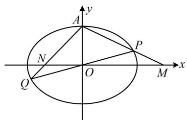
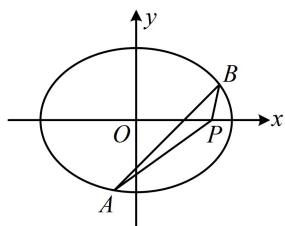
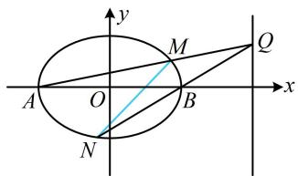
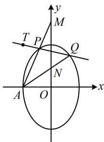

# 强化训练

1. (2019·北京卷·★★★☆)

已知椭圆 $C: \frac{x^2}{a^2} + \frac{y^2}{b^2} = 1$ 的右焦点为 $(1,0)$ ，且经过点 $A(0,1)$ 。

(1) 求椭圆 C 的方程;

（2）设 $O$ 为原点，直线 $l: y = kx + t (t \neq \pm 1)$ 与椭圆 $C$ 交于两个不同点 $P, Q$ ，直线 $AP$ 与 $x$ 轴交于点 $M$ ，直线 $AQ$ 与 $x$ 轴交于点 $N$ ， $|OM| \cdot |ON| = 2$ ，求证：直线 $l$ 经过定点.

1. 解：（1）椭圆 $C$ 的右焦点为 $(1,0)$ ，所以半焦距 $c = 1$

又椭圆经过点 $A(0,1)$ ，所以 $b = 1$ ，从而 $a^2 = b^2 + c^2 = 2$

故椭圆 $C$ 的方程为 $\frac{x^2}{2} + y^2 = 1$ .

（2）（如图，条件涉及 $|OM|\cdot|ON|=2$ ，故需计算 $|OM|$ 和 $|ON|$ ，算它们需要M，N的坐标，而M，N的坐标可通过分别联立AP，AQ和x轴方程求得，故考虑设P，Q的坐标，用于写出AP，AQ的方程）

设 $P(x_{1},y_{1})$ ， $Q(x_{2},y_{2})$ ，则 $AP$ 的方程为 $y = \frac{y_1 - 1}{x_1} x + 1$

令 $y = 0$ 解得： $x = \frac{x_1}{1 - y_1}$ ，所以 $M\left(\frac{x_1}{1 - y_1},0\right)$

同理可得点 N 的坐标为 $\left(\frac{x_{2}}{1-y_{2}},0\right)$ ,

所以 $\left|OM\right|\cdot\left|ON\right|=\left|\frac{x_{1}x_{2}}{(1-y_{1})(1-y_{2})}\right|=\left|\frac{x_{1}x_{2}}{1-(y_{1}+y_{2})+y_{1}y_{2}}\right|=2$ ，

故 $\left|x_{1}x_{2}\right|=2\left|1-\left(y_{1}+y_{2}\right)+y_{1}y_{2}\right|$ ①,

（涉及 $x_{1}x_{2}$ ， $y_{1} + y_{2}$ ， $y_{1}y_{2}$ ，于是联立直线 $l$ 与椭圆方程，结合韦达定理计算它们）

联立 $\left\{ \begin{array}{l} y = kx + t \\ \frac{x^2}{2} + y^2 = 1 \end{array} \right.$ 消去 $y$ 整理得：

$$
(1 + 2 k ^ {2}) x ^ {2} + 4 k t x + 2 t ^ {2} - 2 = 0 \quad ②,
$$

由韦达定理， $x_{1} + x_{2} = -\frac{4kt}{1 + 2k^{2}}$ ， $x_{1}x_{2} = \frac{2t^{2} - 2}{1 + 2k^{2}}$

故 $y_{1} + y_{2} = k(x_{1} + x_{2}) + 2t = \frac{2t}{1 + 2k^{2}}$

$$
y _ {1} y _ {2} = (k x _ {1} + t) (k x _ {2} + t) = k ^ {2} x _ {1} x _ {2} + k t (x _ {1} + x _ {2}) + t ^ {2} = \frac {t ^ {2} - 2 k ^ {2}}{1 + 2 k ^ {2}},
$$

代入①得 $\left|\frac{2t^2 - 2}{1 + 2k^2}\right| = 2\left|1 - \frac{2t}{1 + 2k^2} +\frac{t^2 - 2k^2}{1 + 2k^2}\right|$

从而 $\left|2t^2 - 2\right| = 2\left|1 - 2t + t^2\right|$ ，故 $\left|(t + 1)(t - 1)\right| = \left|(t - 1)^2\right|$ ，

结合 $t \neq \pm 1$ 可解得： $t = 0$ ，经检验，满足方程②的判别式

$\Delta > 0$ ，所以直线 $l$ 的方程为 $y = kx$ ，该直线过定点 $O$ .

text_image

y
A
N
O
P
Q
M
x

2. (2024·吉林模拟·★★★★)

已知椭圆 $C: \frac{x^2}{a^2} + \frac{y^2}{b^2} = 1 (a > b > 0)$ 的离心率为 $\frac{1}{2}$ ，短轴长为 $2\sqrt{3}$ .

(1) 求椭圆 C 的方程;  
（2）过点(1,0)的直线 $l$ 交椭圆 $C$ 于 $A$ ， $B$ 两点，在 $x$ 轴上是否存在定点 $P$ ，使得 $\overrightarrow{PA} \cdot \overrightarrow{PB}$ 为定值？若存在，求出点 $P$ 的坐标和 $\overrightarrow{PA} \cdot \overrightarrow{PB}$ 的值；若不存在，请说明理由.

2. 解: (1) 因为椭圆 $C$ 的短轴长 $2b = 2\sqrt{3}$ , 所以 $b = \sqrt{3}$ ,

又因为椭圆的离心率 $e = \frac{\sqrt{a^2 - b^2}}{a} = \frac{1}{2}$ ，所以 $a = 2$

故椭圆 $C$ 的方程为 $\frac{x^2}{4} +\frac{y^2}{3} = 1$

(2) (计算 $\overrightarrow{PA} \cdot \overrightarrow{PB}$ 需要 $P, A, B$ 的坐标, 故先设坐标)

设 $P(t,0)$ ， $A(x_{1},y_{1})$ ， $B(x_{2},y_{2})$ ，则 $\overrightarrow{PA} = (x_1 - t,y_1)$

$\overrightarrow{PB}=(x_{2}-t,y_{2})$ ，所以 $\overrightarrow{PA}\cdot\overrightarrow{PB}=(x_{1}-t)(x_{2}-t)+y_{1}y_{2}$

$$
= x _ {1} x _ {2} - t (x _ {1} + x _ {2}) + t ^ {2} + y _ {1} y _ {2} \quad ①,
$$

（看到 $x_{1}x_{2}$ ， $x_{1} + x_{2}$ ， $y_{1}y_{2}$ ，想到联立直线 $l$ 与椭圆的方程，结合韦达定理计算它们，故先设直线. 直线 $l$ 过 $x$ 轴上的定点，这种情况一般考虑设横截式方程）

当直线 $l$ 与 $x$ 轴不重合时，设 $l$ 的方程为 $x = my + 1$

由 $\left\{ \begin{array}{l} x = my + 1 \\ \frac{x^2}{4} + \frac{y^2}{3} = 1 \end{array} \right.$ 消去 $x$ 整理得： $(3m^2 + 4)y^2 + 6my - 9 = 0$

易知 $\Delta > 0$ ，所以 $y_{1} + y_{2} = -\frac{6m}{3m^{2} + 4}$ ， $y_{1}y_{2} = -\frac{9}{3m^{2} + 4}$ ，

故 $x_{1} + x_{2} = my_{1} + 1 + my_{2} + 1 = m(y_{1} + y_{2}) + 2 = \frac{8}{3m^{2} + 4}$

$$
x _ {1} x _ {2} = (m y _ {1} + 1) (m y _ {2} + 1) = m ^ {2} y _ {1} y _ {2} + m (y _ {1} + y _ {2}) + 1
$$

$= \frac{4 - 12m^2}{3m^2 + 4}$ ，代入①得 $\overrightarrow{PA} \cdot \overrightarrow{PB} =$

$$
\frac {4 - 1 2 m ^ {2}}{3 m ^ {2} + 4} - t \cdot \frac {8}{3 m ^ {2} + 4} + t ^ {2} - \frac {9}{3 m ^ {2} + 4} = \frac {- 1 2 m ^ {2} - 8 t - 5}{3 m ^ {2} + 4} + t ^ {2},
$$

(怎样能使上式的值不随 m 的变化而改变？像这种分式型式子要为定值，只需分子分母对应系数成比例)

$\overrightarrow{PA}\cdot\overrightarrow{PB}$ 为定值等价于 $\frac{-12}{3}=\frac{-8t-5}{4}$ ，解得： $t=\frac{11}{8}$ ，

此时 $\overrightarrow{PA} \cdot \overrightarrow{PB} = -\frac{135}{64}$ ;

当直线 l 与 x 轴重合且 $t=\frac{11}{8}$ 时，A，B 都是长轴端点，

不妨设 $A(-2,0)$ ， $B(2,0)$ ，则 $\overrightarrow{PA} = \left(-\frac{27}{8},0\right)$ ， $\overrightarrow{PB} = \left(\frac{5}{8},0\right)$

$$
\overrightarrow {P A} \cdot \overrightarrow {P B} = - \frac {2 7}{8} \times \frac {5}{8} = - \frac {1 3 5}{6 4};
$$

综上所述，存在点 $P\left(\frac{11}{8},0\right)$ ，使得 $\overrightarrow{PA}\cdot \overrightarrow{PB}$ 为定值 $-\frac{135}{64}$

text_image

y
O
x
A
B
P

3. (2024·贵州贵阳模拟·★★★★)

在直角坐标平面内，已知 $A(-2,0)$ ， $B(2,0)$ ，动点 $P$ 满足直线 $PA$ 与直线 $PB$ 斜率之积等于 $-\frac{1}{2}$ ，记动点 $P$ 的轨迹为 $E$ .

(1) 求 E 的方程;

（2）过直线 $l: x = 4$ 上任意一点 $Q$ 作直线 $QA$ 与 $QB$ ，分别交 $E$ 于 $M, N$ 两点，则直线 $MN$ 是否过定点？若是，求出该点坐标；若不是，说明理由.

3. 解: (1) (所给的斜率之积容易用坐标计算, 故直接设 $P$ 的

坐标，翻译斜率之积建立关于所设坐标的方程）

设 $P(x,y)$ ，则 $k_{PA}\cdot k_{PB} = \frac{y}{x + 2}\cdot \frac{y}{x - 2} = -\frac{1}{2}$

化简得： $\frac{x^2}{4} +\frac{y^2}{2} = 1$

因为 $PA$ ， $PB$ 斜率要存在，所以 $P$ 不与 $A$ ， $B$ 重合，

从而 $x \neq \pm 2$ ，故点 $P$ 的轨迹 $E$ 的方程为 $\frac{x^2}{4} + \frac{y^2}{2} = 1 (x \neq \pm 2)$ .

(2) 解法 1: (注意到 $M, N$ 分别是 $QA, QB$ 与轨迹 $E$ 的交点, 图形可看成随 $Q$ 的运动而运动, 只要设 $Q$ 的坐标, 就能写出 $QA, QB$ 的方程, 与 $E$ 的方程联立, 求得 $M, N$ 的坐标, 故可考虑先求 $M, N$ 的坐标, 再找定点)

设 $Q(4,t)(t\neq 0)$ ，则直线 $QA$ 的方程为 $y = \frac{t}{6} (x + 2)$

代入 $\frac{x^2}{4} +\frac{y^2}{2} = 1$ 消去 $y$ 整理得： $(t^2 +18)x^2 +4t^2 x + 4t^2 -72$

$= 0$ ，判别式 $\Delta_1 = (4t^2)^2 -4(t^2 +18)(4t^2 -72) = 72^2 >0$

由韦达定理， $x_{A}x_{M} = -2x_{M} = \frac{4t^{2} - 72}{t^{2} + 18}$ ，所以 $x_{M} = \frac{36 - 2t^{2}}{t^{2} + 18}$

$y_{M} = \frac{t}{6} (x_{M} + 2) = \frac{12t}{t^{2} + 18}$ 故 $M\left(\frac{36 - 2t^2}{t^2 + 18},\frac{12t}{t^2 + 18}\right)$

直线 $QB$ 的方程为 $y = \frac{t}{2} (x - 2)$ ，代入 $\frac{x^2}{4} +\frac{y^2}{2} = 1$ 消去 $y$ 整理得： $(t^2 +2)x^2 -4t^2 x + 4t^2 -8 = 0$

判别式 $\Delta_{2} = (-4t^{2})^{2} - 4(t^{2} + 2)(4t^{2} - 8) = 64 > 0$

由韦达定理， $x_{B}x_{N} = 2x_{N} = \frac{4t^{2} - 8}{t^{2} + 2}$ ，所以 $x_{N} = \frac{2t^{2} - 4}{t^{2} + 2}$

$y_{N} = \frac{t}{2} (x_{N} - 2) = -\frac{4t}{t^{2} + 2}$ ，故 $N\left(\frac{2t^2 - 4}{t^2 + 2}, - \frac{4t}{t^2 + 2}\right)$

（上述 $M, N$ 的坐标较复杂，先求直线 $MN$ 的方程再找定点较难，怎么办呢？此时可考虑用特值探路，只需取两个特定的 $t$ 求出两条直线 $MN$ ，则定点只能是这两条直线的交点。为了便于计算，第一条我们假设 $t = 0$ ，不难得出此时 $MN$ 即为 $x$ 轴；第二条我们让 $M$ 在 $y$ 轴上，故取 $t = 3\sqrt{2}$ ，进一步可求得直线 $MN$ 的方程为 $y = -\sqrt{2} x + \sqrt{2}$ ，它与 $x$ 轴的交点为 $P(1,0)$ ，于是直线 $MN$ 过的定点只能为 $P$ 。既然我们心中已有答案，作答时可直接给出 $P$ 的坐标，再用向量法证明 $P, M, N$ 三点共线即可）记 $P(1,0)$ ，则 $\overrightarrow{PM} = \left(\frac{18 - 3t^2}{t^2 + 18}, \frac{12t}{t^2 + 18}\right)$ ，

$\overrightarrow{PN} = \left(\frac{t^2 - 6}{t^2 + 2}, -\frac{4t}{t^2 + 2}\right)$ ，所以 $\overrightarrow{PM} = -\frac{3(t^2 + 2)}{t^2 + 18}\overrightarrow{PN}$ ，

从而 $P$ ， $M$ ， $N$ 三点共线，故直线 $MN$ 过定点 $P(1,0)$ ：

解法2: (求直线 $MN$ 过的定点, 也可考虑设直线 $MN$ 的方程, 再寻找参数满足的条件. 这里的已知怎样翻译呢? 受题干斜率之积的启发, 我们来分析有关直线的斜率, 看能否找出端倪)

设 $Q(4,t)(t \neq 0)$ ，由题意可知 $k_{MA} \cdot k_{MB} = -\frac{1}{2}$ ①，

又 $k_{MA} = k_{QA} = \frac{t - 0}{4 - (-2)} = \frac{t}{6},\quad k_{NB} = k_{QB} = \frac{t - 0}{4 - 2} = \frac{t}{2},$

所以 $k_{MA}=\frac{1}{3}k_{NB}$ ，

代入①得 $\frac{1}{3} k_{NB}\cdot k_{MB} = -\frac{1}{2}$ ，故 $k_{NB}\cdot k_{MB} = -\frac{3}{2}$ ②，

(要求 $k_{NB}$ 和 $k_{MB}$ ，需要M，N的坐标，故设它们的坐标)

设 $M(x_{1},y_{1})$ ， $N(x_{2},y_{2})$ ，则式②即为 $\frac{y_2}{x_2 - 2}\cdot \frac{y_1}{x_1 - 2} = -\frac{3}{2}$

所以 $2y_{1}y_{2} = -3(x_{1} - 2)(x_{2} - 2) = -3[x_{1}x_{2} - 2(x_{1} + x_{2}) + 4]$ ③，

(看到式③，想到联立直线 MN 和椭圆的方程，结合韦达定理来算)

因为 $t \neq 0$ ，所以 $MN$ 不与 $y$ 轴垂直，可设直线 $MN$ 的方程

为 $x = my + n$ ，代入 $\frac{x^2}{4} +\frac{y^2}{2} = 1$ 消去 $x$ 整理得：

$$
(m ^ {2} + 2) y ^ {2} + 2 m n y + n ^ {2} - 4 = 0,
$$

判别式 $\Delta = (2mn)^2 - 4(m^2 + 2)(n^2 - 4) = 8(2m^2 - n^2 + 4)$ ④，

由韦达定理， $y_{1} + y_{2} = -\frac{2mn}{m^{2} + 2}$ ， $y_{1}y_{2} = \frac{n^{2} - 4}{m^{2} + 2}$

所以 $x_{1} + x_{2} = my_{1} + n + my_{2} + n = m(y_{1} + y_{2}) + 2n = \frac{4n}{m^{2} + 2}$

$$
\begin{array}{l} x _ {1} x _ {2} = (m y _ {1} + n) (m y _ {2} + n) = m ^ {2} y _ {1} y _ {2} + m n (y _ {1} + y _ {2}) + n ^ {2} \\ = \frac {2 n ^ {2} - 4 m ^ {2}}{m ^ {2} + 2}, \\ \end{array}
$$

代入③得 $2 \cdot \frac{n^2 - 4}{m^2 + 2} = -3\left(\frac{2n^2 - 4m^2}{m^2 + 2} - 2 \cdot \frac{4n}{m^2 + 2} + 4\right)$ ,

化简得： $(n - 2)(n - 1) = 0$ ，所以 $n = 1$ 或2，

若 $n = 2$ ，则 $MN$ 的方程为 $x = my + 2$ ，所以直线 $MN$ 过点 $B$ ，不合题意，故 $n = 1$ ，代入④得 $\Delta = 8(2m^2 +3) > 0$

所以 $MN$ 的方程为 $x = my + 1$ ，故直线 $MN$ 过定点(1,0).

text_image

y
M
Q
A
O
B
x
N

4. (2023·全国乙卷·★★★★)

已知椭圆 $C: \frac{y^2}{a^2} + \frac{x^2}{b^2} = 1 (a > b > 0)$ 的离心率为 $\frac{\sqrt{5}}{3}$ ，点 $A(-2,0)$ 在 $C$ 上.

(1) 求 C 的方程;  
(2) 过点 $(-2,3)$ 的直线交 $C$ 于 $P$ , $Q$ 两点, 直线 $AP$ , $AQ$ 与 $y$ 轴的交点分别为 $M$ , $N$ , 证明: 线段 $MN$ 的中点为定点.

4. 解：（1）因为点 $A(-2,0)$ 在椭圆 $C$ 上，所以 $b = 2$

又 $C$ 的离心率 $e = \frac{c}{a} = \frac{\sqrt{a^2 - b^2}}{a} = \frac{\sqrt{5}}{3}$ ，所以 $a = 3$ ，

故椭圆 $C$ 的方程为 $\frac{y^2}{9} +\frac{x^2}{4} = 1$

(2) 解法1: (由于 $M, N$ 都在 $y$ 轴上, 所以要证线段 $MN$ 中点为定点, 只需证 $MN$ 中点的纵坐标为定值, 而计算 $MN$ 中点的纵坐标需要 $M, N$ 的纵坐标, 故可考虑设 $P, Q$ 的坐标, 写出 $AP, AQ$ 的方程, 用于求 $M, N$ 的纵坐标)

设 $P(x_{1},y_{1})$ ， $Q(x_{2},y_{2})$ ，则 $AP$ 的方程为 $y = \frac{y_1}{x_1 + 2} (x + 2)$

令 $x = 0$ 得 $y = \frac{2y_1}{x_1 + 2}$ ，故 $y_{M} = \frac{2y_{1}}{x_{1} + 2}$ ，同理 $y_{N} = \frac{2y_{2}}{x_{2} + 2}$

所以 $MN$ 中点的纵坐标为 $\frac{y_M + y_N}{2} = \frac{y_1}{x_1 + 2} +\frac{y_2}{x_2 + 2}$

（上式变量较多，但注意到它关于 $x_{1}$ 和 $x_{2}$ ， $y_{1}$ 和 $y_{2}$ 的结构是对称的，故可以想象，若利用直线 $PQ$ 的方程将其消元，化简后结构也应是对称的，可联立直线 $PQ$ 和椭圆的方程处理，于是又设直线 $PQ$ 的方程）

如图，由题意，直线 $PQ$ 不与坐标轴垂直，可设其方程为

$y - 3 = k(x + 2)(k \neq 0)$ ，则 $x_{1} + 2 = \frac{y_{1} - 3}{k}$ ， $x_{2} + 2 = \frac{y_{2} - 3}{k}$ ，

所以 $\frac{y_M + y_N}{2} = \frac{y_1}{x_1 + 2} +\frac{y_2}{x_2 + 2} = \frac{y_1}{\frac{y_1 - 3}{k}} +\frac{y_2}{\frac{y_2 - 3}{k}}$

$$
\begin{array}{l} = k \left(\frac {y _ {1}}{y _ {1} - 3} + \frac {y _ {2}}{y _ {2} - 3}\right) = k \left(\frac {y _ {1} - 3 + 3}{y _ {1} - 3} + \frac {y _ {2} - 3 + 3}{y _ {2} - 3}\right) \\ = k \left(2 + \frac {3}{y _ {1} - 3} + \frac {3}{y _ {2} - 3}\right) = k \left[ 2 + 3 \cdot \frac {(y _ {1} - 3) + (y _ {2} - 3)}{(y _ {1} - 3) (y _ {2} - 3)} \right] \tag {①} \\ \end{array}
$$

（由于这里需要的是 $(y_{1} - 3) + (y_{2} - 3)$ 和 $(y_{1} - 3)(y_{2} - 3)$ ，所以联立方程时，可考虑整理成 $A(y - 3)^{2} + B(y - 3) + C = 0$ 这种结构，以便于直接求出上述两式）

将 $\frac{y^2}{9} +\frac{x^2}{4} = 1$ 变形成 $4[(y - 3) + 3]^2 +9[(x + 2) - 2]^2 = 36$ ②，

由 $y - 3 = k(x + 2)$ 可得 $x + 2 = \frac{1}{k} (y - 3)$

代入②得 $4(y - 3)^2 + 24(y - 3) + 36 + 9\left[\frac{1}{k} (y - 3) - 2\right]^2 = 36$

整理得： $\left(4 + \frac{9}{k^2}\right)(y - 3)^2 +\left(24 - \frac{36}{k}\right)(y - 3) + 36 = 0$

所以 $(y_{1} - 3) + (y_{2} - 3) = -\frac{24 - \frac{36}{k}}{4 + \frac{9}{k^{2}}} = \frac{36k - 24k^{2}}{4k^{2} + 9}$

$$
(y _ {1} - 3) (y _ {2} - 3) = \frac {3 6}{4 + \frac {9}{k ^ {2}}} = \frac {3 6 k ^ {2}}{4 k ^ {2} + 9},
$$

代入①得 $\frac{y_M + y_N}{2} = k\left(2 + 3\cdot \frac{\frac{36k - 24k^2}{4k^2 + 9}}{\frac{36k^2}{4k^2 + 9}}\right)$

$$
= k \left(2 + 3 \cdot \frac {3 6 - 2 4 k}{3 6 k}\right) = k \left(2 + \frac {3}{k} - 2\right) = 3,
$$

故线段 $MN$ 的中点为定点 $(0,3)$

解法2: (既然要用 $M, N$ 的坐标, 那能否直接设这个坐标, 再翻译已知条件进行计算呢? 可以的, 以 $M$ 为例, 只要设出 $M$ 的坐标, 就能写出 $AM$ 的方程, 与椭圆联立, 求出 $P$ 的坐标, 故按此尝试)

设 $M(0,m)$ ， $N(0,n)$ ， $m\neq n$ ，则直线 $AM$ 的斜率 $k_{AM} =$

$\frac{m-0}{0-(-2)}=\frac{m}{2}$ ，其方程为 $y=\frac{m}{2}(x+2)$ ，

代入 $\frac{y^2}{9} +\frac{x^2}{4} = 1$ 消去 $y$ 整理得：

$$
(m ^ {2} + 9) x ^ {2} + 4 m ^ {2} x + 4 m ^ {2} - 3 6 = 0,
$$

因为点 $A$ 的横坐标为-2，所以由韦达定理，

$x_{A}x_{P} = -2x_{P} = \frac{4m^{2} - 36}{m^{2} + 9}$ ，故 $x_{P} = \frac{18 - 2m^{2}}{m^{2} + 9}$

$y_{P} = \frac{m}{2} (x_{P} + 2) = \frac{18m}{m^{2} + 9}$ 所以 $P\left(\frac{18 - 2m^2}{m^2 + 9},\frac{18m}{m^2 + 9}\right)$

同理， $Q\left(\frac{18-2n^{2}}{n^{2}+9},\frac{18n}{n^{2}+9}\right)$ ，（怎样寻找 m，n 满足的关系？观察发现还有 P，Q 是过 $(-2,3)$ 的直线与椭圆的交点没有翻译，怎样翻译呢？注意到点 $(-2,3)$ 与 P，Q 共线，故可用斜率来翻译）记 T $(-2,3)$ ，由题意，T，P，Q 三点共线，

所以 $k_{TP} = k_{TQ}$ ，故 $\frac{\frac{18m}{m^2 + 9} - 3}{\frac{18 - 2m^2}{m^2 + 9} + 2} = \frac{\frac{18n}{n^2 + 9} - 3}{\frac{18 - 2n^2}{n^2 + 9} + 2},$

整理得： $(m - 3)^{2} = (n - 3)^{2}$

因为 $m \neq n$ ，所以 $m - 3 \neq n - 3$ ，从而 $m - 3 = 3 - n$

故 $m + n = 6$ ，所以 $\frac{m + n}{2} = 3$ ，故 $MN$ 的中点为定点(0,3).

text_image

y
M
T P Q
N
A O x

