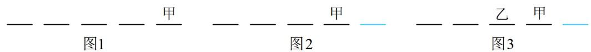
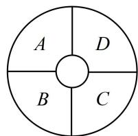
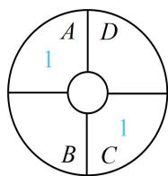
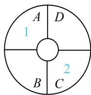
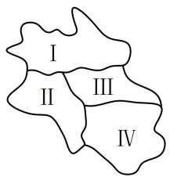
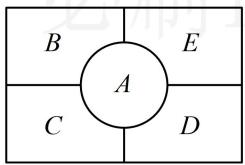

# 模块一 排列与组合（★★★）

# 内容提要

本节归纳排列组合有关问题, 下面先复习排列数、组合数的计算公式.

①排列数公式： $A_{n}^{m}=n(n-1)(n-2)\cdots(n-m+1)=\frac{n!}{(n-m)!}$ ，其中 $m,n\in N^{*}$ ，且 $m\leq n$ .  
②组合数公式： $C_{n}^{m}=\frac{A_{n}^{m}}{A_{m}^{m}}=\frac{n(n-1)(n-2)\cdots(n-m+1)}{m!}=\frac{n!}{m!(n-m)!}$ ，其中 $m,n\in N^{*}$ 且 $m\leq n$ ，另外，我们规定 $C_{n}^{0}=1$ .

排列组合问题种类繁多，有难有易，本节将梳理一些考试中常见的题型，每种题型都有自己的独特特征，处理方法也有一些差异，对它们进行归纳总结，是有必要的。

1. 考查两个计数原理的简单题型: 相关考题属概念题, 难度不高, 解题的核心是分清楚何时分类, 何时分步, 做到分类标准清晰, 分步层次清楚, 不重不漏即可.  
2. 特殊元素优先考虑: 对有限制条件的排列组合问题, 常先把那些有特殊要求的元素安排好, 再排其它没有要求的元素.  
3. 元素相邻问题：若排列时，要求某些元素必须相邻，则可将必须相邻的元素捆绑在一起，看成一个元素，再与其它元素进行排列，但需注意捆绑的元素内部可交换顺序。

4. 元素不相邻问题: 若排列时, 要求某些元素不能相邻, 则先把其它元素排好, 再将不能相邻的元素插入到空位中即可.

5. 分组分派问题: 把 $m$ 个人安排到 $n (m > n)$ 项工作, 每人只安排一项工作, 每项工作至少安排一人, 这类问题常采用先分后排的方法处理, 可先把 $m$ 个人分成 $n$ 组, 再将 $n$ 组人员派到 $n$ 项工作.

6. 排数字问题：这类题可画出数位，往数位上依次填入数字即可.

①若供选择的数字中有0，则0不能排最高位，故常先用其它数字把最高位排了；  
②若要求排出的数是奇数或偶数，则考虑最低位的数字为奇数数字或偶数数字；  
③若要求排出的数字比某数大或比某数小，则先排最高位的数字，因为最高位对数的大小的影响最重.

7. 染色问题：这类问题常用“跳格分类”的方法处理，详见本节类型VII.

# 类型 I：两个计数原理的简单应用

【例 1】(2020·新高考Ⅰ卷) 6 名同学到甲、乙、丙三个场馆做志愿者, 每名同学只去 1 个场馆,甲场馆安排 1 名, 乙场馆安排 2 名, 丙场馆安排 3 名, 则不同的安排方法共有 ( )

A. 120 种

B. 90 种

C. 60 种

D. 30 种

解析：按照甲、乙、丙各场馆的人数要求，分三步从6人中依次选出对应的人进行安排即可，

第一步，从6名同学中选1名安排到甲场馆，有 $C_{6}^{1}$ 种方法；

第二步，从余下的5名同学中选2名安排到乙场馆，有 $C_{5}^{2}$ 种选法；

第三步, 从余下的 3 名同学中选 3 名安排到丙场馆, 有 $C_{3}^{3}$ 种选法;

由分步乘法计数原理，不同的安排方法共有 $\mathrm{C}_6^1\mathrm{C}_5^2\mathrm{C}_3^3 = 60$ 种.

答案: C

【变式 1】一个宿舍的 6 名同学被邀请参加一个节目，要求必须有人去，但去几个人可自行决定，其中甲和乙两名同学要么都去，要么都不去，则该宿舍同学的去法共有（）

A. 15 种

B. 28 种

C. 31 种

D. 63 种

解析：从条件来看，可按甲乙都去、都不去分类考虑，

①若甲乙都去，则剩下的4人可以去0人、1人、2人、3人、4人，有 $C_{4}^{0}+C_{4}^{1}+C_{4}^{2}+C_{4}^{3}+C_{4}^{4}=16$ 种去法；  
②若甲乙都不去，则剩下的4人可以去1人、2人、3人、4人，有 $C_{4}^{1}+C_{4}^{2}+C_{4}^{3}+C_{4}^{4}=15$ 种去法；

由分类加法计数原理，该宿舍同学的去法共有 $16 + 15 = 31$ 种.

答案: C

【变式2】某学校开设4门球类运动课程，5门田径类运动课程和2门水上运动课程供学生学习，某位学生要从中选2门不同类型的运动课程，则不同的选法有\_\_\_\_种。（用数字作答）

解析：选出的两门课程不同类，可按课程类型进行分类，

①若选1门球类1门田径类，则有 $C_{4}^{1}C_{5}^{1}=20$ 种；  
②若选1门球类1门水上运动，则有 $C_{4}^{1}C_{2}^{1}=8$ 种；  
③若选1门田径类和1门水上运动，则有 $C_{5}^{1}C_{2}^{1}=10$ 种；

由分类加法计数原理，不同的选法共有 $20 + 8 + 10 = 38$ 种.

答案: 38

【变式 3】从 5 男 3 女共 8 名学生中选出班长 1 人, 副班长 1 人, 纪律委员 1 人, 要求至少有 1 名女生入选, 共有\_\_\_\_种不同的选派方法. (用数字作答)

解法1：事情可分两步完成，第一步，先确定选出来的是哪三人，由于女生至少选1人，故又按女生的人数分三类，若女生选1人，则有 $\mathrm{C}_3^1\mathrm{C}_5^2 = 30$ 种选法；若女生选2人，则有 $\mathrm{C}_3^2\mathrm{C}_5^1 = 15$ 种选法；

若全部选女生，则有 $C_3^3 = 1$ 种选法；故选人的方法共有 $30 + 15 + 1 = 46$ 种，

第二步, 将选出的三人安排职位, 可任意安排, 安排职位的方法有 $\mathrm{A}_{3}^{3}=6$ 种,

由分步乘法计数原理，共有 $46 \times 6 = 276$ 种不同的选派方法.

解法2：题干只有女生至少选1人这一个限制条件，可先不考虑它，求出共有多少种选派方法，

若不管选到的3人是否有女生，则直接从8人中选3人并安排职位即可，有 $A_{8}^{3}=336$ 种选派方法；

再考虑不满足要求的，即没有女生入选的情形，并在前面的总数中将其减掉，

若没有女生入选，则有 $A_{5}^{3} = 60$ 种选派方法；所以满足要求的不同选派方法共有 $336 - 60 = 276$ 种.

答案：276

【反思】间接法是带限制条件的计数问题中常用的方法，分析时可先不考虑某限制条件，求出有几种方法，再计算不满足该限制条件的有几种方法，两者相减即得所求答案.

类型Ⅱ：特殊元素优先考虑

【例 2】从某学习小组的 8 人中选 2 人分别担任组长和副组长, 其中甲不能担任组长, 则不同的选派方法共有\_\_\_\_种。(用数字作答)

解法1：甲是有特殊要求的人，可优先考虑甲，但甲不一定被选到，故分类，

①若甲被选到，则甲只能担任副组长，只需从剩下7人中选1人担任组长即可，有 $A_{7}^{1}=7$ 种选法；

② 若甲未被选到，则从剩下的7人中选2人分别担任组长和副组长，有 $A_{7}^{2}=42$ 种选法；

由分类加法计数原理，不同的选派方法共有 $7 + 42 = 49$ 种.

解法 2: 组长不能是甲, 所以组长是有特殊要求的职位, 故也可先考虑组长, 于是分两步来做,

第一步, 安排组长, 可从除甲外的 7 人任选 1 人担任组长, 有 $\mathrm{A}_{7}^{1}$ 种方法;

第二步，安排副组长，从剩下的7人任选1人担任副组长即可，有 $A_{7}^{1}$ 种方法；

由分步乘法计数原理，不同的选派方法共有 $A_{7}^{1}A_{7}^{1}=49$ 种.

答案: 49

【变式】从某学习小组的 8 人中选 2 人分别担任组长和副组长, 其中甲不能担任组长, 乙不能担任副组长, 则不同的选派方法有\_\_\_\_种. (用数字作答)

解法1：甲和乙是有特殊要求的人，可优先考虑他们，但他们不一定被选到，故据此分类，

①若甲、乙都入选，则只能甲担任副组长，乙担任组长，只有1种；

②若甲入选、乙未入选，则甲担任副组长，再从除甲、乙外的6人中选1人担任组长，有 $A_{6}^{1}=6$ 种；

③若甲未入选、乙入选，则乙担任组长，再从除甲、乙外的6人中选1人担任副组长，有 $A_{6}^{1}=6$ 种；

④若甲和乙都未入选，则从其余6人中选2人，分别担任组长和副组长即可，有 $A_{6}^{2}=30$ 种；

由分类加法计数原理，共有 $1 + 6 + 6 + 30 = 43$ 种不同的选派方法.

解法 2: 组长和副组长都有特殊要求, 故也可优先考虑他们, 不妨先考虑组长, 组长可从除甲外的任意 7 人中选, 但组长是乙与组长是其余 6 人之一, 接下来副组长的情形不同, 故可按组长是否为乙分类,

①若乙担任组长，则副组长的限制可不考虑了，从剩下的7人中任选1人担任副组长即可，有 $A_{7}^{1}=7$ 种；

②若乙不担任组长，由于甲也不能担任组长，所以应从其余6人中选1人来担任，有 $A_{6}^{1}$ 种选法，

接下来的副组长不能是乙和刚才选为组长的人，也有 $\mathrm{A}_6^1$ 种选法，故这种情况共有 $\mathrm{A}_6^1\mathrm{A}_6^1 = 36$ 种；

由分类加法计数原理，不同的选派方法共有 $7 + 36 = 43$ 种.

答案: 43

【反思】站在不同的角度来分类，复杂度可能不一样，因此分析前应先做预判，尽可能选择标准清晰且种类数较少的分类方法.

【例 3】2 名男同学 3 名女同学排成一排照相，若最左边不是男同学，则不同的照相方法有\_\_\_\_种。（用数字作答）

解法1：最左边的位置有特殊要求，故先考虑它，可先从3名女同学中选1名排在最左边，有 $\mathrm{A}_3^1$ 种排法，其余位置可任意排，有 $\mathrm{A}_4^4$ 种排法，由分步乘法计数原理，全部的照相方法有 $\mathrm{A}_3^1\mathrm{A}_4^4 = 72$ 种.

解法2：男同学是有特殊要求的人，他们不能排最左边的位置，故也可先排男同学，

第一步，2名男同学可排右侧4个位置中的任意2个，有 $\mathrm{A}_4^2$ 种排法，

第二步, 排 3 名女同学, 可在剩下的 3 个位置上任意排, 有 $\mathrm{A}_{3}^{3}$ 种排法,

由分步乘法计数原理，全部的照相方法有 $\mathrm{A}_4^2\mathrm{A}_3^3 = 72$ 种.

答案: 72

【变式】5名同学站成一排进行诗歌朗诵, 若甲不站最左边, 乙不站最右边, 则不同的站法有

种. (用数字作答)

解析：甲乙都是有特殊要求的元素，可优先考虑他们，不妨先考虑甲，甲站中间几个位置和站最右边的位置，对乙的排位有不同影响，故分类，

①若甲站最右边，如图1，则乙的限制条件必定满足，剩下4人可任意排，这一类有 $A_{4}^{4}=24$ 种排法；

② 若甲不站最右边，则甲只能站中间3个位置，有 $\mathrm{A}_3^1$ 种排法，甲排好后如图2，

此时由于乙也是有特殊要求的元素，且他的要求尚未满足，故接下来又考虑乙，

乙不能排最右边，所以乙有 $\mathrm{A}_3^1$ 种排法，乙排好后如图3，余下的3个位置可随便排了，有 $\mathrm{A}_3^3$ 种排法，故这一类共有 $\mathrm{A}_3^1\mathrm{A}_3^1\mathrm{A}_3^3 = 54$ 种排法；由分类加法计数原理，不同的站法有 $24 + 54 = 78$ 种.

答案：78

text_image

— — — — 甲 — — — — 甲 — — — — 乙 甲
图1      图2      图3

【总结】在计数问题中，若某些元素有特殊要求，往往优先考虑这些有特殊要求的元素，再考虑其它元素.

# 类型III：元素相邻-捆绑法

【例 4】现有 A, B, C, D, E 五人要站成一排，若 A, B 必须相邻，则共有 \_\_\_\_ 种站法。（用数字作答）

解析：元素相邻用捆绑法，A 和 B 必须相邻，将其捆绑看成 1 个人，与其它 3 人一起排列，有 $A_{4}^{4}$ 种；

捆绑的 A 和 B 彼此可交换顺序，如图，交换的方法有 $A_{2}^{2}$ 种，

所以全部的站法有 $\mathrm{A}_4^4\mathrm{A}_2^2 = 48$ 种.

C AB D E

答案: 48

【变式】(2022·新课标Ⅱ卷) 甲、乙、丙、丁、戊 5 名同学站成一排参加文艺汇演, 若甲不站在两端, 丙和丁相邻的不同排列方式有 ( )

A. 12 种

B. 24 种

C. 36 种

D. 48种

解析: 丙和丁相邻, 将其捆绑看成 1 人, 与剩下 3 人一起排列, 排列时由于甲不站两端, 先考虑甲,如图 1, 甲在中间两个位置选 1 个, 有 $\mathrm{A}_{2}^{1}$ 种排法, 剩下 3 人 (丙丁看成 1 人) 有 $\mathrm{A}_{3}^{3}$ 种排法, 如图 2,丙丁彼此可交换, 交换的方法有 $\mathrm{A}_{2}^{2}$ 种, 由分步乘法计数原理, 不同排列方式共有 $\mathrm{A}_{2}^{1} \mathrm{~A}_{3}^{3} \mathrm{~A}_{2}^{2} = 24$ 种.

答案: B

  
图1  
图2

【总结】某些元素必须相邻的排列问题，可将必须相邻的元素捆绑在一起，看成一个元素，与其它元素进行排列，但需注意，捆在一起的元素内部可交换顺序.

# 类型IV：元素不相邻-插空法

【例 5】某晚会有 3 个歌唱类节目，2 个舞蹈类节目，要求 2 个舞蹈类节目不相邻，则不同的节目顺序有\_\_\_\_种.

解析：元素不相邻用插空法，第一步，先排3个歌唱节目，有 $\mathrm{A}_3^3$ 种，排好后产生4个空位，如图；

第二步，将2个舞蹈节目插入其中的2个空位，有 $A_{4}^{2}$ 种；

由分步乘法计数原理，不同的节目顺序有 $A_{3}^{3}A_{4}^{2}=72$ 种.

歌1 歌2 歌3

答案：72

【变式】2022年11月30日，神舟十四号宇航员陈冬、刘洋、蔡旭哲和神舟十五号宇航员费俊龙、邓清明、张陆顺利“会师太空”，为记录这一历史时刻，他们准备在天和核心舱合影留念。假设6人站成一排，要求神舟十四号三名航天员互不相邻，且神舟十五号三名航天员也互不相邻，则他们的不同站法共有（）种。

A. 72 B. 144 C. 36 D. 108

解析：元素不相邻用插空法，此处有两组元素都要求不相邻，可先将其中一组排好，对另一组插空，

为了便于观察，把神舟十四号、十五号的宇航员依次简记为 $A_{14}$ ， $B_{14}$ ， $C_{14}$ ， $D_{15}$ ， $E_{15}$ ， $F_{15}$

先把神舟十四号的三名宇航员排好，有 $\mathrm{A}_3^3$ 种排法，排好后产生4个空位，如图，

再将神舟十五号的三名宇航员插空，由于 $A_{14}$ ， $B_{14}$ ， $C_{14}$ 也不能相邻，所以中间两个空位必须插，

故可从 $D_{15}$ ， $E_{15}$ ， $F_{15}$ 中选两人，填入中间的两个空位，有 $\mathrm{A}_3^2$ 种方法，

最后一名宇航员可在左右两边的空位选一个排过去，有 $A_{2}^{1}$ 种排法；

由分步乘法计数原理，不同的站法共有 $\mathrm{A}_3^3\mathrm{A}_3^2\mathrm{A}_2^1 = 72$ 种.

答案: A

$\frac{A_{14}}{\triangle}$ $\frac{B_{14}}{\triangle}$ $\frac{C_{14}}{\triangle}$

【总结】某些元素不能相邻的排列问题，可先将其它元素排好，再把不能相邻的这些元素插入空位中.

# 类型V：先分后派

【例 6】将 6 本不同的书分成三份.

(1) 若每份 2 本, 则共有\_种不同的分法;  
(2) 若一份 4 本, 其余两份都是 1 本, 则共有\_\_\_\_种不同的分法.

解析：（1）可以分三步完成，第一步，从6本书中选2本作为一份，有 $C_6^2$ 种选法，

第二步，从余下的4本书中选2本作为一份，有 $C_4^2$ 种选法，

第三步，将最后的2本书选出来作为一份，有 $\mathrm{C}_2^2$ 种选法，

由分步乘法计数原理，共有 $\mathrm{C}_6^2\mathrm{C}_4^2\mathrm{C}_2^2 = 90$ 种分法；

答案是 90 吗? 不是! 因为在这个问题中, 并未指定三份书的顺序, 我们可以用下述表格来罗列其中一种分法, 看看重复了几遍, 为了便于阐释, 我们把 6 本书编号为 $A, B, C, D, E, F$ ,

<table><tr><td> ${\mathrm{C}}_{6}^{2}$ </td><td>AB</td><td>AB</td><td>CD</td><td>CD</td><td>EF</td><td>EF</td></tr><tr><td> ${\mathrm{C}}_{4}^{2}$ </td><td>CD</td><td>EF</td><td>AB</td><td>EF</td><td>AB</td><td>CD</td></tr><tr><td> ${\mathrm{C}}_{2}^{2}$ </td><td>EF</td><td>CD</td><td>EF</td><td>AB</td><td>CD</td><td>AB</td></tr></table>

上表中六列对应的分法其实是一样的，都是 $AB$ ， $CD$ ， $EF$ 各自分一份，但按 $\mathrm{C}_6^2\mathrm{C}_4^2\mathrm{C}_2^2$ 来算就计了6次．事实上，每种分法都计了6次，这个6怎么来的呢？其实就是 $AB$ ， $CD$ ， $EF$ 三份书的排列方法数 $\mathrm{A}_3^3$ ，为了抵消同样的三份书选择的先后顺序，应除以 $\mathrm{A}_3^3$ ，本题消序后共有 $\frac{\mathrm{C}_6^2\mathrm{C}_4^2\mathrm{C}_2^2}{\mathrm{A}_3^3} = 15$ 种不同的分法.

(2) 还是仿照前面的做法, 先一步一步把每一份书选出来,

第一步，从6本书中选4本作为一份，有 $C_{6}^{4}$ 种选法，

第二步，从余下的2本书中选1本作为一份，有 $\mathrm{C}_2^1$ 种选法，

第三步，将最后的1本书选出来作为一份，有 $\mathrm{C}_1^1$ 种选法，

由分步乘法计数原理，共有 $\mathrm{C}_6^4\mathrm{C}_2^1\mathrm{C}_1^1 = 30$ 种分法；

注意到三份书中有两份本数是一样的，将这两份彼此交换，得到的是相同的分法，例如， $\{ABCD, E, F\}$ 和

$\{ABCD, F, E\}$ 是同一种分法，为了抵消相同本数的两份选择的顺序，应在上面结果基础上除以 $\mathrm{A}_2^2$

本题消序后共有 $\frac{\mathrm{C}_6^4\mathrm{C}_2^1\mathrm{C}_1^1}{\mathrm{A}_2^2} = 15$ 种不同的分法.

答案: 15; 15

【总结】在不同元素的分组问题中，若有某些组的元素个数相同，则逐步选出每组元素后，必须消序。例如，按 $3 + 3 + 2 + 2 + 2 + 1$ 来分组，由于有两组都是3个元素，这两组要除以 $\mathrm{A}_2^2$ 消序，有三组都是2个元素，这三组要除以 $\mathrm{A}_3^3$ 消序，其它情形以此类推。

【变式】将 $A, B, C, D, E, F$ 六名医生安排到甲、乙、丙三所医院，若每个医院至少安排一名医生，每名医生只去一所医院，且医生 $A$ 不去甲医院，则不同的安排方法有\_\_\_\_种。（用数字作答）

解析：医生的人数比医院数多，故可先将医生进行分组，使组数与医院数相等，便于安排，

将6人分成三组，从人数构成来看，有 $1 + 1 + 4$ ， $2 + 2 + 2$ ， $1 + 2 + 3$ 三种，下面分别考虑，

若按 $1 + 1 + 4$ 分组，则有 $\frac{\mathrm{C}_6^1\mathrm{C}_5^1\mathrm{C}_4^4}{\mathrm{A}_2^2} = 15$ 种分法；若按 $2 + 2 + 2$ 分组，则有 $\frac{\mathrm{C}_6^2\mathrm{C}_4^2\mathrm{C}_2^2}{\mathrm{A}_3^3} = 15$ 种分法；

若按 $1 + 2 + 3$ 分组，则有 $\mathrm{C}_6^1\mathrm{C}_5^2\mathrm{C}_3^3 = 60$ 种分法；所以分组的方法共有 $15 + 15 + 60 = 90$ 种，

无论哪种分组结果，接下来派到医院的过程都是一样的，故可统一考虑，

将分好的三组医生派到三所医院，由于医生 $A$ 不去甲医院，所以 $A$ 所在的那一组派到乙或丙医院，

有 $\mathrm{A}_{2}^{1}$ 种派方法, 另外两组医生可随意派, 有 $\mathrm{A}_{2}^{2}$ 种派方法;

由分步乘法计数原理，不同的安排方法有 $90\mathrm{A}_2^1\mathrm{A}_2^2 = 360$ 种.

答案: 360

【总结】诸如将 $m$ 个人安排到 $n(m > n)$ 项工作，且每人只安排一项工作，每项工作至少安排一人这类问题，考虑用先分后派的方法。分组时需注意，若涉及某几组人数相同，则选出每组人员后，还必须消序。

# 类型VI：排数字问题

【例 7】用数字 0, 1, 2, 3, 4, 5, 6 可以组成没有重复数字的四位数 \_\_\_\_ 个.

解析：要组成没有重复数字的4位数，唯一的要求就是0不能排最高位，故先考虑最高位，

第一步, 从除 0 外的 6 个数字中选 1 个排在最高位, 有 $\mathrm{A}_{6}^{1}$ 种排法;

第二步，从余下的6个数字中选3个排在后面的三位，有 $A_{6}^{3}$ 种排法；

由分步乘法计数原理，共可组成没有重复数字的四位数 $\mathrm{A}_6^1\mathrm{A}_6^3 = 720$ 个.

答案: 720

【变式1】用数字0，1，2，3，4，5，6可以组成没有重复数字的四位偶数\_\_\_\_个.

解法 1: 由于是四位偶数, 所以除了 0 不能排最高位之外, 还有最低位应为偶数数字, 可先考虑最高位, 最高位排奇数数字, 还是偶数数字, 对接下来最低位的安排有影响, 故应分类,

①若最高位排奇数数字，则可从1，3，5中选1个排在最高位，有 $\mathrm{A}_3^1$ 种排法，

再考虑最低位，可从0，2，4，6中选1个排在最低位，有 $\mathrm{A}_4^1$ 种排法，排好后如图1，

中间的两个位置可任意排，有 $\mathrm{A}_5^2$ 种排法，故这一类共有 $\mathrm{A}_3^1\mathrm{A}_4^1\mathrm{A}_5^2 = 240$ 种；

②若最高位排偶数数字，则可从2，4，6中选1个排在最高位，有 $A_{3}^{1}$ 种排法，

再考虑最低位，偶数数字已用掉一个，可从余下的3个中选1个排最低位，有 $A_{3}^{1}$ 种排法，排好后如图2，中间的两个位置可任意排，有 $A_{5}^{2}$ 种排法，故这一类共有 $A_{3}^{1}A_{3}^{1}A_{5}^{2}=180$ 种；

由分类加法计数原理，满足条件的四位偶数共有 $240 + 180 = 420$ 个.

解法2：也可以先考虑最低位，最低位排0和排其他偶数，对接下来最高位的影响不同，故应分类，

①若最低位是0，如图3，其他三位可任意排，故这一类有 $A_{6}^{3}=120$ 种；  
(2)若最低位不是0，则最低位可从2，4，6中选1个排上去，有 $A_{3}^{1}$ 种排法，排好后如图4，

接下来最高位不能是0，故又考虑最高位，0和最低位已排的数字不能用，还剩5个数字，有 $\mathrm{A}_5^1$ 种排法，中间2位可从余下的5个数字中任选2个排上去，有 $\mathrm{A}_5^2$ 种排法，故这一类有 $\mathrm{A}_3^1\mathrm{A}_5^1\mathrm{A}_5^2 = 300$ 种；

由分类加法计数原理，满足条件的四位偶数共有 $120 + 300 = 420$ 个.

答案: 420

text_image

1 — — 2 2 — — 0 — — — 0 — — — 2

图1  
图2  
图3   
图4

【变式 2】用数字 0, 1, 2, 3, 4, 5, 6 可以组成没有重复数字的四位数，其中比 3000 大的有\_\_\_\_个.

解析：涉及比某数大或比某数小的问题，往往先排最高位，

排出的数要比3000大，只需最高位为3，4，5，6即可，所以最高位有 $\mathrm{A}_4^1$ 种排法，

其余三位可随便排，有 $\mathrm{A}_6^3$ 种排法，由分步乘法计数原理，满足要求的四位数有 $\mathrm{A}_4^1\mathrm{A}_6^3 = 480$ 个.

答案: 480

【总结】从上面的几道题可以看出，对于排数字问题，常画出数位，综合应用两个计数原理来分析每个数位该怎么填，需注意三点：①数字0不能排最高位；②若对奇偶有要求，则考虑最低位的数字的奇偶；③若对数字的大小有要求，则常先排最高位的数字.

# 类型Ⅶ：染色问题

【例 8】如图, 一环形花坛分成 $A$ , $B$ , $C$ , $D$ 四块, 现有 4 种不同的花可供选择, 要求在每块里种 1 种花, 相邻的两块种不同的花, 则不同的种法总数为 \_\_\_\_.

text_image

A
D
B
C

解析：为了便于阐述，我们将4种花编号为1，2，3，4，不妨先种 $A$ 这一块，有 $\mathrm{C}_4^1$ 种种法，

接下来种哪块呢？由于 $C$ 和 $A$ 种相同的花或不同的花，接下来 $B, D$ 的考虑方法有区别，故对 $C$ 分类，若 $C$ 与 $A$ 种相同的花，如图1，则 $C$ 有1种种法，而 $B, D$ 各自都可从余下的3种花中选一种来种，所以 $B, D$ 都有 $\mathrm{C}_3^1$ 种种法，结合 $A$ 有 $\mathrm{C}_4^1$ 种种法知这一类共有 $\mathrm{C}_4^1\mathrm{C}_3^1\mathrm{C}_3^1 = 36$

种不同的种法;

若 $C$ 与 $A$ 种不同的花，如图2，则 $C$ 有 $\mathrm{C}_3^1$ 种种法，

而 $B, D$ 各自都可从余下的 2 种花中选一种来种，

所以 $B$ ， $D$ 都有 $\mathrm{C}_2^1$ 种种法，故这一类共有 $\mathrm{C}_4^1\mathrm{C}_3^1\mathrm{C}_2^1\mathrm{C}_2^1 = 48$ 种不同的种法；

由分类加法计数原理，不同的种法总数为 $36 + 48 = 84$ 种.

  
图1

  
图2

答案: 84

【反思】染色问题常采用 “跳格分类” 的方法处理，例如本题中 A, C 之间跳了一格，故可按 A, C 相同和 A, C 不同分类，再来考虑 B, D.

# 强化训练

1. (2025·山东模拟·★★)

从 5 名男生和 4 名女生中选出 4 人去参加一项创新大赛，如果 4 人中必须既有男生又有女生，则不同的选法共有 \_\_\_\_ 种.

2. (2023·新课标Ⅰ卷·★★)

某学校开设了 4 门体育类选修课和 4 门艺术类选修课，学生需从这 8 门课中选 2 门或 3 门课，并且每类选修课至少选 1 门，则不同的选课方案共有\_\_\_\_种。（用数字作答）

3. (2024·九省联考·★★★)

甲、乙、丙等5人站成一排，且甲不在两端，乙和丙之间恰有2人，则不同排法共有（）

A. 20 种

B. 16 种

C. 12种

D. 8种

4. (2023·重庆模拟·★★★)

春节文艺汇演中需要将 $A, B, C, D, E, F$ 六个节目进行排序，若 $A, B$ 两个节目必须相邻，且都不能排在3号位置，则不同的排序方式有\_\_\_\_种.

5. (2023·宁夏模拟·★★★)

五声音阶是中国古乐基本音阶，故有成语 “五音不全”，中国古乐中的五声音阶依次为宫、商、角、徵、羽，把这五个音阶排成一列，形成一个音序，若徵、羽两音阶相邻且在宫音阶之后，则可排成不同的音序的种数为\_\_\_\_。（用数字作答）

6. (2024·陕西模拟·★★)

亚运会火炬传递，假设某段线路由甲、乙等6人传递，每人传递一棒，且甲不从乙手中接棒，乙不从甲手中接棒，则不同的传递方案共有（）

A. 288 种

B. 360 种

C. 480 种

D. 504 种

7. (2024·湖南长沙模拟·★★★)

有 4 名男生、3 名女生和 2 个不同的道具（记作 A 和 B）参与一个活动，活动要求：所有人（男生和女生）必须站成一排，女生必须站在一起，并且她们之间按照身高从左到右由高到低的顺序排列（假设女生的身高各不相同）；两个道具 A 和 B 必须被分配给队伍中的两个人（可以是男生，也可以是女生），但这两人不能站在一起。满足上述所有条件的排列方式共有（）

A. 2400 种

B. 3600 种

C. 2880种

D. 4200种

8. (2024·湖北武汉二调·★★★)

将 3 个相同的红球和 3 个相同的黑球装入三个不同的袋中，每袋均装 2 个球，则不同的装法种数为（）

A. 7

B. 8

C. 9

D. 10

9. (2021·全国乙卷·★★★)

将 5 名北京冬奥会志愿者分配到花样滑冰、短道速滑、冰球和冰壶 4 个项目进行培训，每名志愿者只分配到 1 个项目，每个项目至少分配 1 名志愿者，则不同的分配方案共有（）

A. 60 种

B. 120 种

C. 240 种

D. 480 种

10. (2023·全国模拟·★★★)

安排5名学生去3个社区进行志愿者服务，每人只去1个社区，要求每个社区至少安排1名学生，则不同的安排方法有（）

A. 360 种 
B. 300 种  
C. 150 种 D. 125 种

11. (2024·河北邯郸一模·★★★)

在第 33 届夏季奥运会期间，中国中央电视台体育频道在某比赛日安排甲、乙、丙、丁 4 个人参加当天 A, B, C 三个比赛场地的现场报道，且每个场地至少安排一人，甲不在 A 场地的不同安排方法数为（）

A. 32

B. 24

C. 18

D. 12

12. (2023·全国模拟·★★☆)

由数字 0, 1, 2, 3, 4, 5, 6, 7 组成没有重复数字的三位数，则能被 5 整除的三位数共有 \_\_\_\_ 个.

13. (2024·山东济南模拟·★★★)

由 0, 1, 2, 3, 4, 5 组成没有重复数字的六位数，其中任意两个偶数都不相邻，则满足条件的六位数的个数为（）

A. 60

B. 108

C. 132

D. 144

14. (2022·广东广州模拟·★★★)

用数字 0, 1, 2, 3, 4, 5 可以组成没有重复数字，且比 20000 大的五位偶数共 \_\_\_\_ 个.

15.（2023·天津和平三模·★★★）

如图, 现要用 5 种不同的颜色对某市的 4 个区县的地图进行涂色, 要求有公共边的两个地区不能用同一种颜色, 共有\_\_\_\_种不同的涂色方法.

text_image

I
II III
IV

16.（2023·广东珠海模拟·★★★）

五一期间，某公园准备用不同的花卉装扮一个有五个区域的矩形花坛（如图），要求同一个区域用同一种花卉，相邻区域不能使用同种花卉，现有5种花卉可供选择，则不同的装扮方法共有\_\_\_\_种。（用数字作答）

text_image

B
A
E
C
D

17. (2022·重庆模拟·★★★★)

某地高考规定每一考场安排 24 名考生，编成六行四列就座，若甲乙两位考生在同一考场，那么他们既不前后相邻，也不左右相邻的坐法有\_\_\_\_种.

