# 第2节 用样本估计总体（★★★）

# 内容提要

本节包含总体取值规律的估计，总体百分位数的估计，总体集中趋势估计，总体离散程度估计等内容，下面先把涉及到的一些基础知识进行梳理.

1. 频率分布直方图：每个小矩形的面积表示数据落在该组的频率，各小矩形的面积之和为 1.  
2. 百分位数: 一组数据的第 $p$ 百分位数是这样一个值, 它使得这组数据中至少有 $p\%$ 的数据小于或等于这个值, 且至少有 $(100 - p)\%$ 的数据大于或等于这个值, 其计算步骤为:

①按从小到大排列原始数据；  
②计算 $i=n\times p\%$ ，其中n为样本量；  
③若 $i$ 不是整数，而大于 $i$ 的比邻整数为 $j$ ，则第 $p$ 百分位数为第 $j$ 项数据；若 $i$ 是整数，则第 $p$ 百分位数为第 $i$ 项和第 $i + 1$ 项数据的平均数.

3. 平均数：可反映数据的集中趋势.

①一组数据 $x_{1},x_{2},\cdots,x_{n}$ 的平均数 $\overline{x}=\frac{x_{1}+x_{2}+\cdots+x_{n}}{n}$ .  
②由频率分布直方图估计样本平均数，常用每组区间中点值代表落在该区间的数据，若设各组区间中点为 $x_{1}, x_{2}, \cdots, x_{n}$ ，对应各组的频率为 $f_{1}, f_{2}, \cdots, f_{n}$ ，则可估计样本平均数 $\overline{x} = \sum_{i=1}^{n} x_{i} f_{i}$ 。

4. 中位数：可反映数据的集中趋势.

①对于从小到大排列的一组数据，若数据个数为奇数，则中位数为最中间的一个数据；若数据个数为偶数，则中位数为中间两个数据的平均数.  
②由频率分布直方图估计样本中位数，应在横轴上找到一个数，使其左右两侧频率各占0.5.

5. 众数：可反映数据的集中趋势.

①一组数据中出现次数最多的数据即为该组数据的众数，若有几个数据出现次数一样多，且都比其它数据多，则它们都是众数.  
②由频率分布直方图估计样本众数，取最高的小矩形区间中点即可.

6. 极差：一组数据的最大值与最小值之差，它可以一定程度反映数据的离散程度.

7. 方差、标准差：刻画数据的离散程度。方差、标准差越大，数据越分散，反之越集中。

①一组数据 $x_{1}, x_{2}, \cdots, x_{n}$ 的方差 $s^{2} = \frac{1}{n} \sum_{i=1}^{n} (x_{i} - \overline{x})^{2} = \frac{1}{n} \sum_{i=1}^{n} x_{i}^{2} - \overline{x}^{2}$ ，方差公式的两种形式都需掌握，计算或证明时都可能用到。方差的算数平方根 $s$ 即为标准差。若数据 $x_{1}, x_{2}, \cdots, x_{n}$ 有重复，设其不重复的值为 $y_{1}, y_{2}, \cdots, y_{k}$ ，对应的数据个数依次为 $f_{1}, f_{2}, \cdots, f_{k}$ ，则 $s^{2} = \frac{1}{n} \sum_{i=1}^{k} f_{i} (y_{i} - \overline{x})^{2}$ 。

②由频率分布直方图估计样本方差, 常用每组区间中点值代表落在该区间的数据, 若设各组区间中点为 $x_{1}, x_{2}, \cdots, x_{n}$ , 对应各组的频率为 $f_{1}, f_{2}, \cdots, f_{n}$ , 则可估计样本方差 $s^{2} = \sum_{i=1}^{n} (x_{i} - \overline{x})^{2} f_{i}$ .  
③方差、标准差的性质：设数据 $x_{1}, x_{2}, \cdots, x_{n}$ 的平均数为 $\overline{x}$ ，方差为 $s^{2}$ ，则数据 $y_{i} = ax_{i} + b (i = 1, 2, \cdots, n)$ 的平均数 $\overline{y} = a\overline{x} + b$ ，方差 $s_{y}^{2} = a^{2}s^{2}$ （后面有证明），标准差 $s_{y} = |a|s$ 。

证明： $s_{y}^{2} = \frac{1}{n}\sum_{i = 1}^{n}y_{i}^{2} - \overline{y}^{2} = \frac{1}{n}\sum_{i = 1}^{n}(ax_{i} + b)^{2} - (a\overline{x} +b)^{2} = \frac{1}{n}\sum_{i = 1}^{n}(a^{2}x_{i}^{2} + 2abx_{i} + b^{2}) - (a^{2}\overline{x}^{2} + 2ab\overline{x} +b^{2})$

$$
= \frac {1}{n} \sum_ {i = 1} ^ {n} a ^ {2} x _ {i} ^ {2} + \frac {1}{n} \sum_ {i = 1} ^ {n} 2 a b x _ {i} + \frac {1}{n} \sum_ {i = 1} ^ {n} b ^ {2} - (a ^ {2} \overline {{{x}}} ^ {2} + 2 a b \overline {{{x}}} + b ^ {2})
$$

$$
= a ^ {2} \cdot \frac {1}{n} \sum_ {i = 1} ^ {n} x _ {i} ^ {2} + 2 a b \overline {{{x}}} + \frac {1}{n} \cdot n b ^ {2} - (a ^ {2} \overline {{{x}}} ^ {2} + 2 a b \overline {{{x}}} + b ^ {2}) = a ^ {2} \left(\frac {1}{n} \sum_ {i = 1} ^ {n} x _ {i} ^ {2} - \overline {{{x}}} ^ {2}\right) = a ^ {2} s ^ {2}.
$$

# 类型Ⅰ：由频率分布直方图计算频率、频数

【例 1】某地区工会利用 “健步行 APP” 开展健步走活动。为了解会员的健步走情况，工会在某天从系统中抽取了 1000 名会员，统计了当天他们的步数（千步为单位），并将样本数据分为 [3,5)，[5,7)，[7,9)，…，[17,19)，[19,21] 九组，整理得到如图所示的频率分布直方图，则当天这 1000 名会员中步数少于 11 千步的人数为（）

A. 100

B. 200

C. 260

D. 300

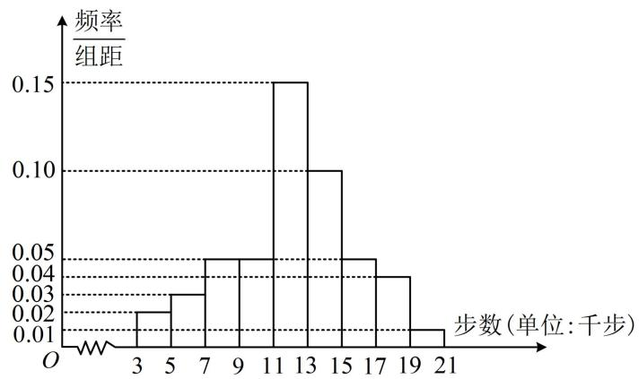

histogram

| 步数 (千步) | 频率/组距 |
| :--- | :--- |
| 3 | 0.02 |
| 5 | 0.03 |
| 7 | 0.045 |
| 9 | 0.045 |
| 11 | 0.15 |
| 13 | 0.10 |
| 15 | 0.045 |
| 17 | 0.035 |
| 19 | 0.015 |
| 21 | 0.01 |

解析：要求人数，可由频率分布直方图求出对应的频率，再乘以样本量，

由图知步数少于11千步的频率为 $2 \times 0.02 + 2 \times 0.03 + 2 \times 0.05 + 2 \times 0.05 = 0.3$ ，故所求人数为 $0.3 \times 1000 = 300$ .

答案: D

【变式】如图是一学校期末考试中某班物理成绩的频率分布直方图，数据的分组依次为[40,50)，[50,60)，[60,70)，[70,80)，[80,90)，[90,100]，若成绩不低于70分的人数比成绩低于70分的人数多4人，则 $a =$ \_\_\_\_；该班的学生人数为\_\_\_\_。

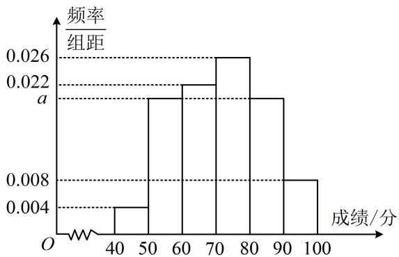

histogram

| 成绩/分 | 频率/组距 |
| :--- | :--- |
| 40-50 | 0.004 |
| 50-60 | 0.022 |
| 60-70 | 0.026 |
| 70-80 | 0.022 |
| 80-90 | 0.026 |
| 90-100 | 0.008 |

解析：先求 $a$ ，可用小矩形的面积和为 1 来建立方程，

由图可知， $10 \times 0.004 + 10 \times a + 10 \times 0.022 + 10 \times 0.026 + 10 \times a + 10 \times 0.008 = 1$ ，解得： $a = 0.02$

设该班的学生人数为 $x$ ，由图可知成绩不低于70分的频率为 $10\times 0.026 + 10\times a + 10\times 0.008 = 0.54$

所以成绩低于70分的频率为 $1 - 0.54 = 0.46$ ，由题意， $0.54x - 0.46x = 4$ ，解得： $x = 50$

答案：0.02；50

【总结】在频率分布直方图中, 需注意三点: ①某个小矩形的面积代表数据落在该组的频率; ②小矩形的面积之和为 1; ③计算频数用频率 $\times$ 样本量.

# 类型Ⅱ：百分位数的计算

【例 2】如图是根据某市 1 月 1 日至 1 月 10 日的最低气温（单位：°C）的情况绘制的折线统计图，由图可知这 10 天的最低气温的第 40 百分位数是（）

A. $2^{\circ} \mathrm{C}$

B. $-1^{\circ} \mathrm{C}$

C. $-0.5^{\circ}\mathrm{C}$

D. $-2^{\circ} \mathrm{C}$

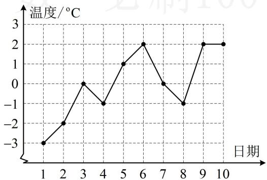

line

| 日期 | 温度/℃ |
| ---- | ------- |
| 1    | -3.0    |
| 2    | -2.0    |
| 3    | 0.0     |
| 4    | -1.0    |
| 5    | 1.0     |
| 6    | 2.0     |
| 7    | 0.0     |
| 8    | -1.0    |
| 9    | 2.0     |
| 10   | 2.0     |

解析：计算百分位数，先把数据按照由小到大的顺序排列，再计算 $i = n \times p\%$ ，看 $i$ 是否为整数，

由折线图可知这 10 天的最低气温按照从低到高的顺序排列为 -3, -2, -1, -1, 0, 0, 1, 2, 2, 2, 而 $10 \times 40\% = 4$ ， $i$ 为整数，故取第 4 项和第 5 项数据的平均值作为第 40 百分位数。

所以这 10 天的最低气温的第 40 百分位数是 $\frac{-1+0}{2} = -0.5^{\circ}C$ .

答案: C

【变式 1】某学校组织班级知识竞赛，某班的 12 名学生的成绩（单位：分）分别是 58, 67, 73, 74, 76, 82, 82, 87, 90, 92, 93, 98，则这 12 名学生成绩的第 70 百分位数是 \_\_\_\_.

解析：所给数据已是从小到大排列，直接计算 $i = n \times p\%$

由题意， $i=12\times70\%=8.4$ ， $i$ 不是整数，所以取第9个数据为第70百分位数，故第70百分位数是90.

答案: 90

【变式 2】凯里市 2020 年被评为全国文明城市，为了巩文固卫，凯里一中某研究性学习小组举办了“文明城市”知识竞赛，从所有答卷中随机抽取 400 份试卷作为样本，将样本的成绩（满分 100 分，成绩均为不低于 40 分的整数）分成 6 段：[40,50)，[50,60)，…，[90,100]，得到如图所示的频率分布直方图，则 $a=$ \_\_\_\_；由图可估计知识竞赛的第 80 百分位数为 \_\_\_\_.

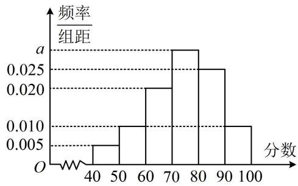

histogram

| 分数 | 频率/组距 |
|---|---|
| 40-50 | 0.005 |
| 50-60 | 0.010 |
| 60-70 | 0.020 |
| 70-80 | 0.025 |
| 80-90 | 0.025 |
| 90-100 | 0.010 |

解析：由图可知， $10 \times 0.005 + 10 \times 0.01 + 10 \times 0.02 + 10 \times a + 10 \times 0.025 + 10 \times 0.01 = 1$ ，解得：a = 0.03；

由频率分布直方图估计第 $p$ 百分位数，就是要在频率分布直方图中找到左侧小矩形面积和为 $p\%$ 的位置，由图可知前4组的面积之和 $1 - 10 \times 0.025 - 10 \times 0.01 = 0.65 < 0.8$ ，前5组的面积之和 $1 - 10 \times 0.01 = 0.9 > 0.8$ ，所以第80百分位数必定在区间[80,90)内，设为 $x$

如图，由左侧阴影面积为0.8可得 $0.65+(x-80)\times0.025=0.8$ ，解得：x=86。

答案: 0.03; 86

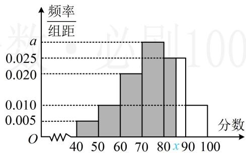

histogram

| 分数 | 频率/组距 |
| :--- | :--- |
| 40-50 | 0.005 |
| 50-60 | 0.010 |
| 60-70 | 0.020 |
| 70-80 | 0.025 |
| 80-90 | 0.025 |
| 90-100 | 0.010 |

【总结】①给出 $n$ 个数据, 让求第 $p$ 百分位数, 先将数据按从小到大的顺序排列, 再计算 $i = n \times p\%$ , 若 $i$ 为整数, 则取第 $i$ 个和第 $i + 1$ 个数据的平均值作为第 $p$ 百分位数, 若 $i$ 不是整数, 而比 $i$ 大的最小整数为 $j$ , 则取第 $j$ 个数据为第 $p$ 百分位数; ②由频率分布直方图估计第 $p$ 百分位数, 只需在频率分布直方图中找到左侧小矩形面积和为 $p\%$ 的位置即可.

# 类型III：平均数、中位数、众数的计算

【例 3】甲、乙两位同学本学期前 8 周的各周课外阅读时长的条形统计图如图所示.

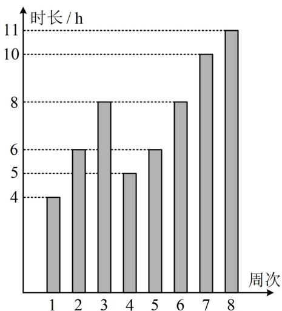

bar

| 周次 | 时长 (h) |
| :--- | :--- |
| 1 | 4 |
| 2 | 6 |
| 3 | 8 |
| 4 | 5 |
| 5 | 6 |
| 6 | 8 |
| 7 | 10 |
| 8 | 11 |

甲

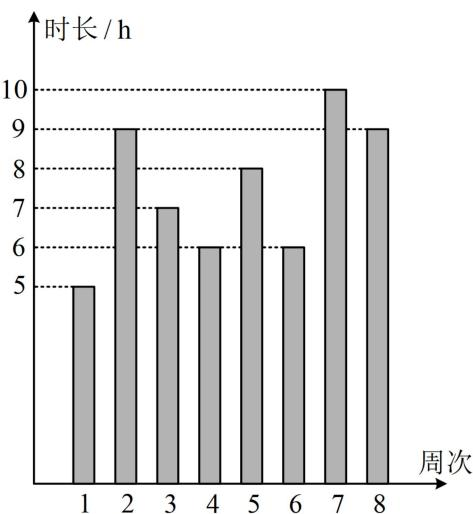

bar

| 周次 | 时长 (h) |
| :--- | :--- |
| 1 | 5 |
| 2 | 9 |
| 3 | 7 |
| 4 | 6 |
| 5 | 8 |
| 6 | 6 |
| 7 | 10 |
| 8 | 9 |

乙

则下列结论正确的是（）

A. 甲同学周课外阅读时长的样本众数为8  
B. 甲同学周课外阅读时长的样本中位数是 5.5  
C. 乙同学周课外阅读时长的样本平均数是 7.5  
D. 乙同学周课外阅读时长大于8的概率的估计值大于0.4

解析：A 项，由图可知甲的 8 个数据按从小到大的顺序依次为 4, 5, 6, 6, 8, 8, 10, 11，其中 6 和 8 出现的次数都最多，所以众数为 6 和 8，故 A 项错误；

B项，甲同学周课外阅读时长的样本中位数是 $\frac{6 + 8}{2} = 7$ ，故B项错误；

C 项，由图可知乙的 8 个数据按从小到大的顺序依次为 5, 6, 6, 7, 8, 9, 9, 10，所以乙同学周课外阅读时长的样本平均数为 $\frac{5 + 6 + 6 + 7 + 8 + 9 + 9 + 10}{8} = 7.5$ ，故 C 项正确；

D 项, 乙有 3 个大于 8 的数据, 所以乙同学周课外阅读时长大于 8 的概率的估计值为 $\frac{3}{8} < 0.4$ , 故 D 项错误.

答案: C

【反思】一组数据的众数是出现次数最多的数据，若有多个数据出现次数一样多，且都比其它数据多，那它们都是众数.

【例 4】非物质文化遗产（简称“非遗”）是优秀传统文化的重要组成部分，是一个国家和民族历史文化成就的重要标志。随着短视频这一新兴媒介形态的兴起，非遗传播获得广阔的平台，非遗文化迎来了发展的春天。为研究非遗短视频受众的年龄结构，现从各短视频平台随机调查了1000名非遗短视频的粉丝，记录他们的年龄，将数据分成6组：[10,20)，[20,30)，…，[50,60)，[60,70]，并整理得到如下的频率分布直方图：

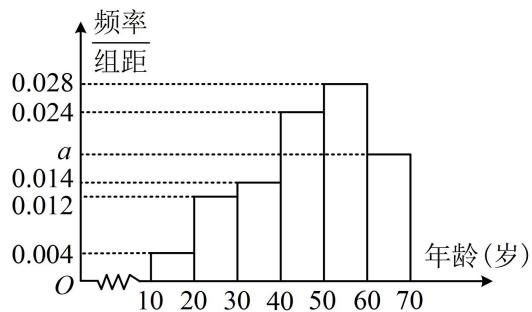

histogram

| 年龄 (岁) | 频率/组距 |
| :--- | :--- |
| 10-20 | 0.004 |
| 20-30 | 0.012 |
| 30-40 | 0.014 |
| 40-50 | 0.024 |
| 50-60 | 0.028 |
| 60-70 | 0.016 |

(1) 求 $a$ 的值;  
（2）在频率分布直方图中，用每一个小矩形底边中点的横坐标作为该组粉丝年龄的平均数，估计非遗短视频粉丝年龄的平均数 $m$ ，若中位数的估计值为 $n$ ，比较 $m$ 与 $n$ 的大小关系.

解：（1）由图可知， $10 \times 0.004 + 10 \times 0.012 + 10 \times 0.014 + 10 \times 0.024 + 10 \times 0.028 + 10 \times a = 1$ ，解得：a = 0.018。

（2）由图可知，从左至右6组的频率依次为0.04，0.12，0.14，0.24，0.28，0.18，

所以频数依次为 40，120，140，240，280，180，

故 $m = \frac{15\times 40 + 25\times 120 + 35\times 140 + 45\times 240 + 55\times 280 + 65\times 180}{1000} = 46.4$

(再求中位数 n，只需找到使左侧频率和为 0.5 的位置即可)

前3组的频率和 $0.04 + 0.12 + 0.14 = 0.3 < 0.5$ ，前4组的频率和 $0.04 + 0.12 + 0.14 + 0.24 = 0.54 > 0.5$

所以中位数 $n$ 在[40,50)这一组，（如图，阴影部分面积应为0.5，前三组的面积已求出，第四组的左边阴影部分底边是 $n - 40$ ，高为0.024，其面积能用 $n$ 表示，故可由此建立方程求 $n$ ）

从而 $0.3 + (n - 40) \times 0.024 = 0.5$ ，解得： $n = \frac{145}{3} \approx 48.3$ ，故 $m < n$

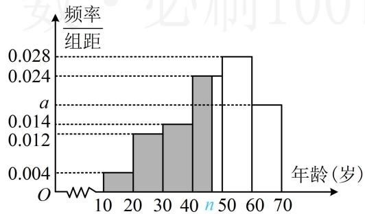

histogram

| 年龄 (岁) | 频率/组距 |
| :--- | :--- |
| 10-20 | 0.004 |
| 20-30 | 0.013 |
| 30-40 | 0.014 |
| 40-50 | 0.024 |
| 50-60 | 0.028 |
| 60-70 | 0.015 |

【反思】由频率分布直方图估计样本数据的中位数，就是在频率分布直方图的横轴上找一个数，使不超过该数的频率和为0.5，求解时应先判断中位数位于哪一组，再列方程计算.

# 类型IV：方差、标准差的计算与分析

【例 5】(2022·全国甲卷) 某社区通过公益讲座来普及社区居民的垃圾分类知识, 随机抽取 10 位社区居民, 让他们在讲座前和讲座后各回答一份垃圾分类知识问卷, 这 10 位社区居民在讲座前和讲座后问卷答题的正确率如下图, 则 ( )

A. 讲座前问卷答题的正确率的中位数小于 $70 \%$   
B. 讲座后问卷答题的正确率的平均数大于 $85\%$   
C. 讲座前问卷答题的正确率的标准差小于讲座后正确率的标准差  
D. 讲座后问卷答题的正确率的极差大于讲座前正确率的极差

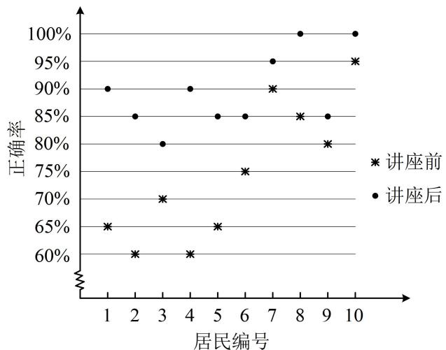

scatter

| 居民编号 | 正确率 (%) | 讲座前 | 讲座后 |
| :--- | :--- | :--- | :--- |
| 1 | 65 | 65 | 90 |
| 2 | 60 | 60 | 85 |
| 3 | 70 | 70 | 80 |
| 4 | 60 | 60 | 90 |
| 5 | 65 | 65 | 85 |
| 6 | 75 | 75 | 85 |
| 7 | 90 | 90 | 95 |
| 8 | 85 | 85 | 100 |
| 9 | 80 | 80 | 95 |
| 10 | 100 | 95 | 100 |

解析：A 项，由图可知讲座前 10 位居民问卷答题的正确率按从小到大排列，第 5, 6 位分别为 $70\%$ ， $75\%$ 所以中位数为 $72.5\%$ ，故 A 项错误；

B项，由图可知讲座后问卷答题正确率的平均数为 $\frac{0.8 + 0.85 \times 4 + 0.9 \times 2 + 0.95 + 1 \times 2}{10} > 0.85$ ，故B项正确；

C项，计算标准差较复杂，故考虑直接看图，观察波动情况，结合标准差的统计意义来分析，

由图知讲座前问卷答题正确率的数据比讲座后更分散，波动更大，所以讲座前标准差更大，故C项错误；

D 项，由图可知讲座后问卷答题的正确率的极差为 $100\% - 80\% = 20\%$ ，

讲座前为 $95\% - 60\% = 35\%$ ，故D项错误.

答案: B

【变式】已知一组数据为：4，1，2，5，5，3，3，2，3，2，则这组数据的方差为\_\_\_\_；标准差为\_\_\_\_。

解析：要算方差，先算平均数，由题意，这组数据的平均数 $\bar{x}=\frac{4+1+2+5+5+3+3+2+3+2}{10}=3$ ，由于 10 个数据中重复的数据较多，于是算方差可用内容提要中的公式 $s^{2}=\frac{1}{n}\sum_{i=1}^{k}f_{i}(y_{i}-\bar{x})^{2}$ 所以方差 $s^2 = \frac{1}{10} [(1 - 3)^2 + 3 \times (2 - 3)^2 + 3 \times (3 - 3)^2 + (4 - 3)^2 + 2 \times (5 - 3)^2] = \frac{8}{5}$ ，标准差 $s = \frac{2\sqrt{10}}{5}$ .

答案： $\frac{8}{5}$ ； $\frac{2\sqrt{10}}{5}$

【例 6】（多选）第一组数据： $x_{1}, x_{2}, \cdots, x_{n}$ ，由这组数据得到第二组数据： $y_{1}, y_{2}, \cdots, y_{n}$ ，其中 $y_{i} = ax_{i} + b (i = 1, 2, \cdots, n)$ 且 a，b 为正数，则下列命题正确的是（）

A. 当 $a = 1$ 时, 两组数据的平均数不相同  
B. 第二组数据的极差是第一组的 $a$ 倍  
C. 第二组数据的方差是第一组的 $a$ 倍  
D. 第二组数据的标准差是第一组的 $a$ 倍

解析：A 项，当 a=1 时，设第一组数据的平均数为 $\bar{x}$ ，则第二组数据的平均数 $\bar{y}=\bar{x}+b\neq\bar{x}$ ，故 A 项正确；B 项，不妨设 $x_{1}\leq x_{2}\leq x_{3}\leq\cdots\leq x_{n}$ ，则第一组数据的极差为 $x_{n}-x_{1}$ ，且 $y_{1}\leq y_{2}\leq y_{3}\leq\cdots\leq y_{n}$ ，所以第二组数据的极差为 $y_{n}-y_{1}=(ax_{n}+b)-(ax_{1}+b)=a(x_{n}-x_{1})$ ，故 B 项正确；

C 项和 D 项，设第一组数据的标准差为 s，由方差和标准差的性质（内容提要中有证明过程）可知第二组数据的标准差为 as，方差为 $a^{2}s^{2}$ ，故 C 项错误，D 项正确.

答案: ABD

【反思】若数据 $x_{i}(i=1,2,\cdots,n)$ 的标准差为 s，则数据 $ax_{i}+b(i=1,2,\cdots,n)$ 的标准差为 $|a|s$ ，方差为 $a^{2}s^{2}$ .

【变式】已知一组数据 $x_{1}$ , $x_{2}$ , $x_{3}$ 的平均数为 4, 方差为 2, 则由 $3x_{1} - 1$ , $3x_{2} - 1$ , $3x_{3} - 1$ 和 11 这四个数据组成的新数据组的方差是 \_\_\_\_.

解析：由于数据中增加了个11，所以无法像例6那样用结论计算，故直接代公式计算新老方差，并进行对比．此处为了更方便地观察两者差异，我们选择公式 $s^{2}=\frac{1}{n}\sum_{i=1}^{n}x_{i}^{2}-\overline{x}^{2}$ ，

由题意，原数据组的平均数 $\overline{x} = \frac{x_1 + x_2 + x_3}{3} = 4$ ，所以 $x_{1} + x_{2} + x_{3} = 12$

新数据组的平均数为 $\frac{(3x_1 - 1) + (3x_2 - 1) + (3x_3 - 1) + 11}{4} = \frac{3(x_1 + x_2 + x_3) + 8}{4} = 11$

接下来用 $s^2 = \frac{1}{n}\sum_{i = 1}^{n}x_i^2 -\overline{x}^2$ 算方差，原数据组的方差 $s^2 = \frac{1}{3} (x_1^2 +x_2^2 +x_3^2) - 4^2 = 2$ ，所以 $x_{1}^{2} + x_{2}^{2} + x_{3}^{2} = 54$

新数据组的方差为 $\frac{1}{4} [(3x_1 - 1)^2 +(3x_2 - 1)^2 +(3x_3 - 1)^2 +11^2 ] - 11^2$

$$
= \frac {1}{4} \left[ 9 \left(x _ {1} ^ {2} + x _ {2} ^ {2} + x _ {3} ^ {2}\right) - 6 \left(x _ {1} + x _ {2} + x _ {3}\right) + 1 2 4 \right] - 1 2 1 = \frac {1}{4} (9 \times 5 4 - 6 \times 1 2 + 1 2 4) - 1 2 1 = \frac {2 7}{2}.
$$

答案: $\frac{27}{2}$

【反思】对于添项或减项的新数据组方差计算问题，常用 $s^2 = \frac{1}{n}\sum_{i=1}^{n} x_i^2 - \overline{x}^2$ 来对比新旧方差更方便。需注意，用此公式的前提是 $\sum_{i=1}^{n} x_i^2$ 已知或好求，否则只能采用基本公式 $s^2 = \frac{1}{n}\sum_{i=1}^{n} (x_i - \overline{x})^2$ 。

【例 7】从某企业生产的某种产品中抽取 100 件，测量这些产品的一项质量指标值，由测量数据得到频率分布直方图如图所示.

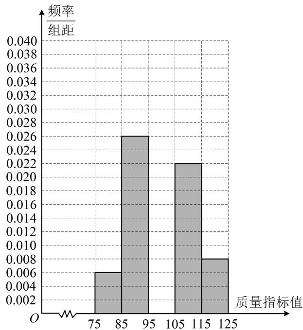

histogram

| 质量指标值 | 频率/组距 |
| :--- | :--- |
| 75 | 0.006 |
| 85 | 0.026 |
| 95 | 0.022 |
| 105 | 0.008 |
| 115 | 0.008 |
| 125 | 0.008 |

(1) 补全频率分布直方图;   
(2) 若同一组数据用该组区间的中点值作代表, 试估计这种产品质量指标值的平均数 $\overline{x}$ 和方差 $s^2$ .

解：（1）由图可知数据落在[95,105)的频率为 $1-10\times(0.006+0.026+0.022+0.008)=0.38$ ，所以[95,105)这一组的高为0.038，故补全后的频率分布直方图如图.

(2) (由频率分布直方图估计样本平均数, 用区间中点乘以对应的频率, 再求和即可)由题意, $\overline{x} = 80 \times 0.06 + 90 \times 0.26 + 100 \times 0.38 + 110 \times 0.22 + 120 \times 0.08 = 100$ ,

（由频率分布直方图估计样本方差，可代公式 $s^2 = \sum_{i=1}^{n}(x_i - \overline{x})^2 f_i$ ，其中 $x_i$ 为各组区间中点， $f_i$ 为对应的频率） $s^2 = (80 - 100)^2 \times 0.06 + (90 - 100)^2 \times 0.26 + (110 - 100)^2 \times 0.22 + (120 - 100)^2 \times 0.08 = 104$ .

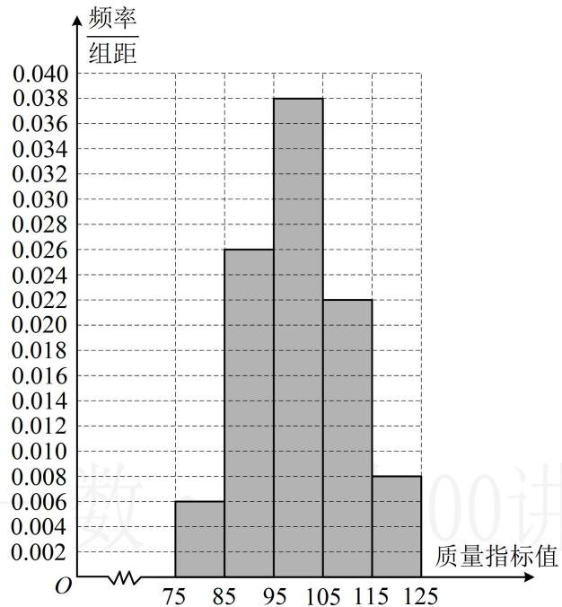

histogram

| 质量指标值 | 频率/组距 |
| :--- | :--- |
| 75 | 0.006 |
| 85 | 0.026 |
| 95 | 0.038 |
| 105 | 0.022 |
| 115 | 0.008 |
质量指标值为75，质量指标值为85，质量指标值为95，质量指标值为105，质量指标值为115，质量指标值为125。

【反思】在频率分布直方图中，设第 i 组的区间中点为 $x_{i}$ ，频率为 $f_{i}$ ，其中 $i=1,2,\cdots,n$ ，若每组数据用区间中点值作代表，则样本平均数 $\bar{x}=\sum_{i=1}^{n}x_{i}f_{i}$ ，样本方差 $s^{2}=\sum_{i=1}^{n}(x_{i}-\bar{x})^{2}f_{i}$ .

【变式】为了调查某中学高一年级学生的身高情况，在高一年级随机抽取100名学生作为样本，把他们的身高（单位：cm）按照区间[160,165)，[165,170)，[170,175)，[175,180)，[180,185]分组，得到样本身高的频率分布直方图如图所示.

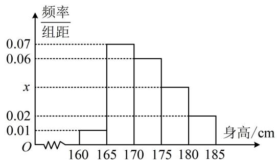

histogram

| 身高/cm | 频率/组距 |
| :--- | :--- |
| 160-165 | 0.01 |
| 165-170 | 0.07 |
| 170-175 | 0.06 |
| 175-180 | 0.04 |
| 180-185 | 0.02 |

（1）求频率分布直方图中 $x$ 的值以及样本中身高不低于 $175\mathrm{cm}$ 的学生人数；  
(2) 统计过程中, 小明与小张两位同学因事缺席, 测得其余 98 名同学的平均身高为 $172 \mathrm{~cm}$ , 方

差为 29, 之后补测得到小明与小张的身高分别为 $171 \mathrm{~cm}$ 与 $173 \mathrm{~cm}$ , 试根据上述数据求样本的方差.

解：（1）由图可知， $5(0.01+0.07+0.06+x+0.02)=1$ ，解得：x=0.04，

样本中身高不低于 $175 \mathrm{~cm}$ 的学生人数为 $100 \times 5(x + 0.02) = 500 x + 10 = 30$ .

(2) (此小问重新给出了有关数据, 故不再使用频率分布直方图来算, 下面先计算样本平均数) 设除小明与小张外的 98 名同学的身高分别为 $x_{1}, x_{2}, \cdots, x_{98}$ , 由题意, $\frac{x_{1} + x_{2} + \cdots + x_{98}}{98} = 172$ ,

所以 $x_{1} + x_{2} + \dots +x_{98} = 98\times 172$ ，故样本平均数 $\overline{x} = \frac{x_1 + x_2 + \cdots + x_{98} + 171 + 173}{100} = \frac{98\times 172 + 2\times 172}{100} = 172$

(再算方差, 可把 98 名学生的方差和 100 名学生的方差的算式都写出来, 进行对比)

又 $\frac{1}{98} [(x_1 - 172)^2 +(x_2 - 172)^2 +\dots +(x_{98} - 172)^2 ] = 29$

所以 $(x_{1}-172)^{2}+(x_{2}-172)^{2}+\cdots+(x_{98}-172)^{2}=29\times98=2842$ ，故样本方差

$$
s ^ {2} = \frac {1}{1 0 0} \left[ \left(x _ {1} - 1 7 2\right) ^ {2} + \left(x _ {2} - 1 7 2\right) ^ {2} + \dots + \left(x _ {9 8} - 1 7 2\right) ^ {2} + (1 7 1 - 1 7 2) ^ {2} + (1 7 3 - 1 7 2) ^ {2} \right] = \frac {1}{1 0 0} \times (2 8 4 2 + 2) = 2 8. 4 4.
$$

# 强化训练

1. (2023·江苏模拟·★★)(多选)

某校1000名学生在高三一模测试中数学成绩的频率分布直方图如图所示（同一组中的数据用该组区间的中点值作代表），分数不低于 $X$ 即为优秀，已知优秀学生有80人，则（）

A. $a = 0.008$

B. $X = 120$

C. 70分以下的人数约为6人

D. 本次考试的平均分约为93.6

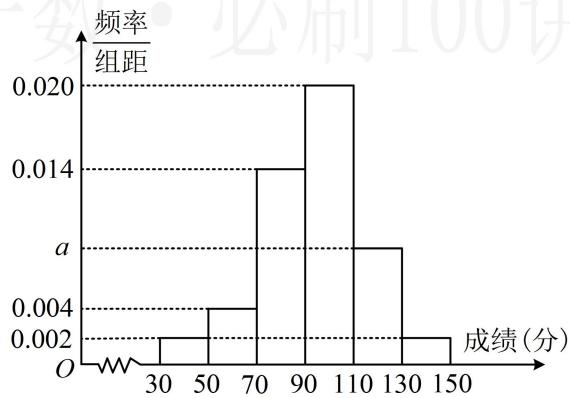

histogram

| 成绩 (分) | 频率/组距 |
| :--- | :--- |
| 30-50 | 0.002 |
| 50-70 | 0.004 |
| 70-90 | 0.014 |
| 90-110 | 0.020 |
| 110-130 | 0.010 |
| 130-150 | 0.002 |

2. (2024·广东模拟·★★)(多选)

某部门30名员工一年中请假天数（未请假则请假天数为0）与对应人数的柱形图（图中只有请假天数为0的未显示）如图所示，则（）

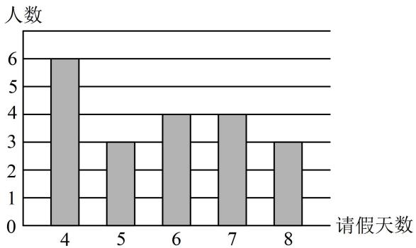

bar

| 请假天数 | 人数 |
|---|---|
| 4 | 6 |
| 5 | 3 |
| 6 | 4 |
| 7 | 4 |
| 8 | 3 |

A. 该部门一年中请假天数为0的人数为10  
B. 该部门一年中请假天数大于 $5$ 的人数为 10  
C. 这 30 名员工一年中请假天数的第 40 百分位数为 4  
D. 这 30 名员工一年中请假天数的平均数小于 4

3. (2024·江苏南通二模·★★☆)

某同学在一次数学测试中的成绩是班级第三名（假设测试成绩两两不同），成绩处于第90百分位数，则该班级的人数可能为（）

A. 15

B. 25

C. 30

D. 35

4. (2023·新课标Ⅰ卷·★★☆)(多选)

有一组样本数据 $x_{1}, x_{2}, \cdots, x_{6}$ ，其中 $x_{1}$ 是最小值， $x_{6}$ 是最大值，则（）

A. $x_{2}, x_{3}, x_{4}, x_{5}$ 的平均数等于 $x_{1}, x_{2}, \cdots, x_{6}$ 的平均数  
B. $x_{2}, x_{3}, x_{4}, x_{5}$ 的中位数等于 $x_{1}, x_{2}, \cdots, x_{6}$ 的中位数  
C. $x_{2}, x_{3}, x_{4}, x_{5}$ 的标准差不小于 $x_{1}, x_{2}, \cdots, x_{6}$ 的标准差  
D. $x_{2}, x_{3}, x_{4}, x_{5}$ 的极差不大于 $x_{1}, x_{2}, \cdots, x_{6}$ 的极差

5. (2024·山东济南二模·★★★)

现有 $A, B$ 两组数据，其中 $A$ 组有4个数据，平均数为2，方差为6， $B$ 组有6个数据，平均数为7，方差为1．若将这两组数据混合成一组，则新的一组数据的方差为\_\_\_\_．

6.（2023·广东模拟·★★★）（多选）

有一组样本数据 $x_{1}, x_{2}, \cdots, x_{n}$ ，其样本平均数为 $\overline{x}$ ，现加入一个新数据 $x_{n+1} (x_{n+1} < \overline{x})$ ，组成新的样本数据 $x_{1}, x_{2}, \cdots, x_{n}, x_{n+1}$ ，与原样本数据相比，新的样本数据可能（）

A. 平均数不变

B. 众数不变

C. 极差变小

D. 第20百分位数变大

7. (2020·新课标III卷·★★★)

在一组样本数据中，1，2，3，4出现的频率分别为 $p_1$ ， $p_2$ ， $p_3$ ， $p_4$ ，且 $\sum_{i=1}^{4} p_i = 1$ ，则下面四种情形中，对应样本的标准差最大的一组是（）

A. $p_1 = p_4 = 0.1, p_2 = p_3 = 0.4$

B. $p_1 = p_4 = 0.4, p_2 = p_3 = 0.1$

C. $p_1 = p_4 = 0.2, p_2 = p_3 = 0.3$

D. $p_1 = p_4 = 0.3, p_2 = p_3 = 0.2$

8. (2023·河南模拟·★★★)

为了让学生了解环保知识, 增强环保意识, 某班举行了一次环保知识有奖竞赛活动, 有 20 名学生参加活动, 已知这 20 名学生得分的平均数为 $m$ , 方差为 $n$ , 若将 $m$ 当成一个学生的分数与原来的 20 名学生的分数一起, 算出这 21 个分数的平均数为 $m'$ , 方差为 $n'$ , 则 ( )

A. $20m = 21m'$ ， $21n = 20n'$

B. $m = m'$ , $20n = 21n'$

C. $20m = 21m'$ , $20n = 21n'$

D. $m = m^{\prime}$ ， $21n = 20n^{\prime}$

9. (2023·辽宁模拟·★★★)

某班为了了解学生每月购买零食的支出情况，利用分层随机抽样抽取了一个9人的样本，统计如下：

<table><tr><td></td><td>学生数</td><td>平均支出(元)</td><td>支出平方的累加值</td><td>方差</td></tr><tr><td>女生</td><td>4</td><td> $\overline{x} = {115}$ </td><td> $\mathop{\sum }\limits_{{i = 1}}^{4}{x}_{i}^{2} = {53800}$ </td><td>225</td></tr><tr><td>男生</td><td>5</td><td> $\overline{y} = {106}$ </td><td> $\mathop{\sum }\limits_{{i = 1}}^{5}{y}_{i}^{2} = {57700}$ </td><td>304</td></tr></table>

则样本的9人每月购买零食支出的平均数为\_\_\_\_元，方差为\_\_\_\_。（精确到小数点后一位）

10. (2022·上海模拟改·★★)

某高校承办了奥运会的志愿者选拔面试工作，现随机抽取了100名候选者的面试成绩并分成五组：[45,55)，[55,65)，[65,75)，[75,85)，[85,95]，绘制成如图所示的频率分布直方图，已知第三、四、五组的频率之和为0.7，第一组和第五组的频率相同.

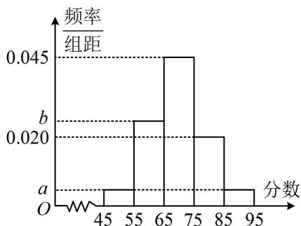

histogram

| 分数 | 频率/组距 |
|---|---|
| 45-55 | a |
| 55-65 | b |
| 65-75 | 0.045 |
| 75-85 | a |
| 85-95 | a |

(1) 求图中 a, b 的值;  
（2）估计这100名候选者面试成绩的平均数、方差和第60百分位数（精确到0.1）.

参考数据： $69.5^{2} = 4830.25$

11. (2022·全国模拟·★★★)

已知 $A$ ， $B$ 两家公司的员工月均工资（单位：万元）的情况分别如图1，图2所示：

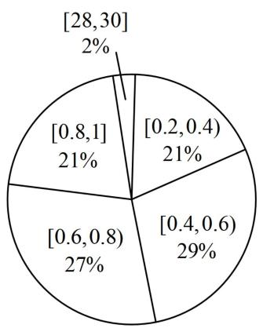

pie

| Range | Percentage (%) |
|---|---|
| [28,30] | 2 |
| [0.2,0.4) | 21 |
| [0.4,0.6) | 29 |
| [0.6,0.8) | 27 |
| [0.8,1] | 21 |

图1

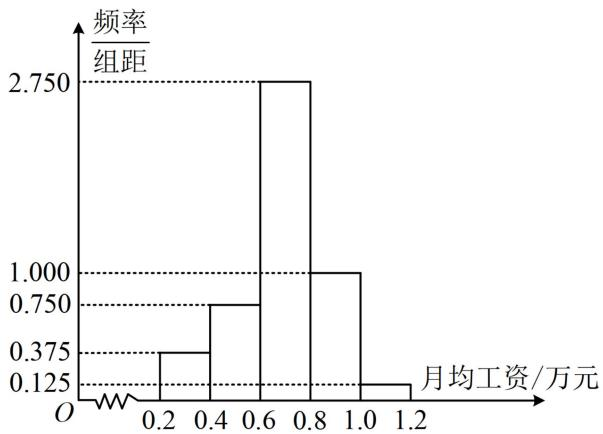

histogram

| 月均工资/万元 | 频率/组距 |
|---|---|
| 0.2 | 0.375 |
| 0.4 | 0.750 |
| 0.6 | 2.750 |
| 0.8 | 1.000 |
| 1.0 | 0.125 |
| 1.2 | 0.125 |

图2

（1）以每组数据的区间中点值为代表，根据图1估计 $A$ 公司员工月均工资的平均数、中位数，你认为哪个数据更能反映该公司普通员工的工资水平？请说明理由；  
(2) 小明拟到 $A, B$ 两家公司中的一家应聘，以公司普通员工的工资水平作为决策依据，他应该选哪家公司？

12. (2021·全国乙卷·★★★)

某厂研制了一种生产高精产品的设备，为检验新设备生产产品的某项指标有无提高，用一台旧设备和一台新设备各生产了10件产品，得到各件产品该项指标数据如下：

<table><tr><td>旧设备</td><td>9.8</td><td>10.3</td><td>10.0</td><td>10.2</td><td>9.9</td><td>9.8</td><td>10.0</td><td>10.1</td><td>10.2</td><td>9.7</td></tr><tr><td>新设备</td><td>10.1</td><td>10.4</td><td>10.1</td><td>10.0</td><td>10.1</td><td>10.3</td><td>10.6</td><td>10.5</td><td>10.4</td><td>10.5</td></tr></table>

旧设备和新设备生产产品的该项指标的样本平均数分别记为 $\overline{x}$ 和 $\overline{y}$ ，样本方差分别记为 $s_1^2$ 和 $s_2^2$ .

（1）求 $\overline{x}$ ， $\overline{y}$ ， $s_1^2$ ， $s_2^2$   
（2）判断新设备生产产品的该项指标的均值较旧设备是否有显著提高（如果 $\overline{y} -\overline{x}\geq 2\sqrt{\frac{s_1^2 + s_2^2}{10}}$ ，则认为新设备生产产品的该项指标的均值较旧设备有显著提高，否则不认为有显著提高）.

# 13. (2023·新课标Ⅱ卷·★★★)

某研究小组经过研究发现某种疾病的患病者与未患病者的某项医学指标有明显差异，经过大量调查，得到如下的患病者和未患病者该项指标的频率分布直方图：

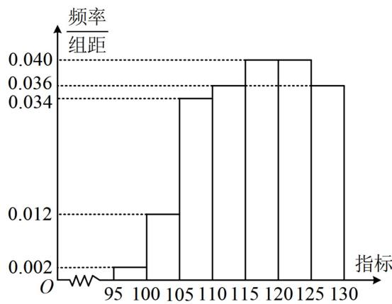

histogram

| 指标 | 频率/组距 |
| :--- | :--- |
| 95 | 0.002 |
| 100 | 0.012 |
| 105 | 0.034 |
| 110 | 0.036 |
| 115 | 0.040 |
| 120 | 0.040 |
| 125 | 0.036 |
| 130 | 0.036 |

患病者

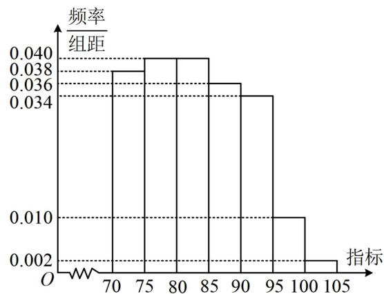

histogram

| 指标 | 频率/组距 |
| ---- | --------- |
| 70   | 0.038     |
| 75   | 0.040     |
| 80   | 0.040     |
| 85   | 0.036     |
| 90   | 0.036     |
| 95   | 0.010     |
| 100  | 0.002     |
| 105  | 0.002     |

未患病者

利用该指标制定一个检测标准，需要确定临界值 $c$ ，将该指标大于 $c$ 的人判定为阳性，小于或等于 $c$ 的人判定为阴性．此检测标准的漏诊率是将患病者判定为阴性的概率，记为 $p(c)$ ；误诊率是将未患病者判定为阳性的概率，记为 $q(c)$ ．假设数据在组内均匀分布．以事件发生的频率作为相应事件发生的概率.

（1）当漏诊率 $p(c) = 0.5\%$ 时，求临界值 $c$ 和误诊率 $q(c)$ ；  
(2) 设函数 $f(c) = p(c) + q(c)$ . 当 $c \in [95,105]$ 时，求 $f(c)$ 的解析式，并求 $f(c)$ 在区间[95,105]的最小值.

