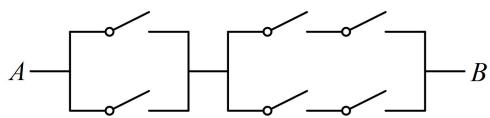

# 模块二 随机事件的概率、事件的独立性（★★☆）

# 内容提要

本节包括事件的关系和运算、古典概型、概率的基本性质、事件的独立性，相关概念较多，先进行梳理.

1. 事件的关系和运算

<table><tr><td>事件的关系或运算</td><td>含义</td><td>符号表示</td></tr><tr><td>包含</td><td>若A发生,则B必然发生</td><td> $A \subseteq B$ </td></tr><tr><td>并事件(和事件)</td><td>A与B至少有一个发生</td><td> $A \cup B$ 或 $A+B$ </td></tr><tr><td>交事件(积事件)</td><td>A与B同时发生</td><td> $A \cap B$ 或AB</td></tr><tr><td>互斥(互不相容)</td><td>A与B不能同时发生</td><td> $A \cap B = \varnothing$ </td></tr><tr><td>互为对立</td><td>A与B有且仅有一个发生</td><td> $A \cap B = \varnothing$ 且 $A \cup B = \Omega$ </td></tr></table>

2. 古典概型: ①样本空间的样本点只有有限个, ②每个样本点发生的可能性相等. 满足①和②这两个特征的试验称为古典概型试验, 其数学模型称为古典概型. 在古典概型中, 事件 $A$ 发生的概率 $P(A) = \frac{n(A)}{n(\Omega)}$ , 其中 $n(A)$ 表示事件 $A$ 包含的样本点的个数, $n(\Omega)$ 表示样本空间 $\Omega$ 包含的样本点个数.

3. 概率的基本性质

①对任意事件 $A$ , 都有 $0 \leq P (A) \leq 1$ .  
②必然事件的概率为1，不可能事件的概率为0，即 $P(\Omega)=1$ ， $P(\varnothing)=0$ 。  
③互斥事件的概率加法公式：若事件 $A$ 与事件 $B$ 互斥，则 $P(A \cup B) = P(A) + P(B)$ .  
④若事件 $A$ 与事件 $B$ 互为对立事件，则 $P(A) = 1 - P(B)$ ， $P(B) = 1 - P(A)$ ，事件 $A$ 的对立事件一般记作 $\overline{A}$ .  
⑤若 $A \subseteq B$ ，则 $P(A) \leq P(B)$ .  
⑥设 A, B 是一个随机试验中的两个事件，则 $P(A \cup B) = P(A) + P(B) - P(A \cap B) = 1 - P(\overline{A}\overline{B})$ .

注：以上公式都可用集合中的 Venn 图来理解.

4. 事件的独立性: 对任意两个事件 $A$ 和 $B$ , 若 $P(AB) = P(A)P(B)$ , 则称事件 $A$ 与事件 $B$ 相互独立. 当事件 $A$ 与 $B$ 独立时, $\overline{A}$ 与 $B$ , $A$ 与 $\overline{B}$ , $\overline{A}$ 与 $\overline{B}$ 也都相互独立.

# 类型 I：抽象概率计算、概率恒等式分析

【例1】假设 $P(A) = 0.3$ ， $P(B) = 0.4$ ，且 $A$ 与 $B$ 相互独立，则 $P(A \cup B) = (\quad)$

A. 0.12

B. 0.58

C. 0.7

D. 0.88

解析：A，B 独立，而不是互斥，故求 $P(A \cup B)$ 想到内容提要第 3 点⑥和第 4 点的公式，由题意， $P(A \cup B) = P(A) + P(B) - P(AB) = P(A) + P(B) - P(A)P(B) = 0.3 + 0.4 - 0.3 \times 0.4 = 0.58$ .

答案: B

【例 2】（多选）设 $\overline{A}$ ， $\overline{B}$ 分别为事件 A，B 的对立事件，如果 A，B 两个事件独立，那么以下四个概率等式一定成立的是（）

A. $P(A \cup B) = P(A) + P(B)$

B. $P(\overline{A} \cap B) = P(\overline{A})P(B)$

C. $P(\overline{A} \cap \overline{B}) = [1 - P(A)][1 - P(B)]$

D. $P(\overline{A} \cup \overline{B}) = P(\overline{A}) + P(\overline{B})$

解析：观察选项发现可用内容提要第3点④⑥和第4点的公式展开来看，下面依次分析，

A 项，由题意， $P(A \cup B) = P(A) + P(B) - P(AB) = P(A) + P(B) - P(A)P(B) \neq P(A) + P(B)$ ，故 A 项错误；

B 项，A，B 独立 $\Rightarrow \overline{A}$ 与 B 也独立，所以 $P(\overline{A} \cap B) = P(\overline{A})P(B)$ ，故 B 项正确；

C 项，A，B 独立 $\Rightarrow \overline{A}$ 与 $\overline{B}$ 也独立，所以 $P(\overline{A} \cap \overline{B}) = P(\overline{A})P(\overline{B}) = [1 - P(A)][1 - P(B)]$ ，故 C 项正确；

D 项， $P(\overline{A} \cup \overline{B}) = P(\overline{A}) + P(\overline{B}) - P(\overline{A}\overline{B}) = P(\overline{A}) + P(\overline{B}) - P(\overline{A})P(\overline{B}) \neq P(\overline{A}) + P(\overline{B})$ ，故 D 项错误.

答案: BC

# 类型 II：古典概型

【例 3】从 2, 3, 4, 5, 6 这 5 个数中随机取 3 个不同的数，则可用这 3 个数作为三角形的三边长的概率是 \_\_\_\_.

解析：由于是否构成三角形必须一一验证，故直接列出样本空间中的样本点，

由题意，样本空间 $\Omega = \{(2,3,4),(2,3,5),(2,3,6),(2,4,5),(2,4,6),(2,5,6),(3,4,5),(3,4,6),(3,5,6),(4,5,6)\}$

记选出的3个数能作为三角形的三边长为事件 $A$ ，能作为三角形三边长即较小的两数之和大于最大的数，

所以 $A = \{(2,3,4),(2,4,5),(2,5,6),(3,4,5),(3,4,6),(3,5,6),(4,5,6)\}$ ，故 $P(A) = \frac{n(A)}{n(\Omega)} = \frac{7}{10}$

答案： $\frac{7}{10}$

【反思】当必须一一验证样本点是否在事件 A 中时，直接列出样本空间中的样本点，再逐个分析.

【变式1】在“2, 3, 5, 7, 11, 13”这6个素数中，任取2个不同的数，这两数之和仍为素数的概率是\_\_\_\_。

解法 1: 素数是指大于 1 的自然数中, 除了 1 和它本身以外不再有其他因数的自然数, 两数之和是否仍为素数必须一一验证, 故列出样本空间中的样本点,

样本空间 $\Omega = \{(2,3),(2,5),(2,7),(2,11),(2,13),(3,5),(3,7),(3,11),(3,13),(5,7),(5,11),(5,13),(7,11),(7,13),(11,13)\}$

记选出的两数之和仍为素数为事件 $A$ ，则 $A = \{(2,3),(2,5),(2,11)\}$ ，所以 $P(A) = \frac{n(A)}{n(\Omega)} = \frac{3}{15} = \frac{1}{5}$ .

解法 2: 本题也可不罗列样本空间, 因为若取到 2 个奇数, 则和必为偶数, 不是素数, 所以必定为 1 奇 1 偶, 故 2 必须取, 只需看另一个奇数可以为哪些,

由题意， $n(\Omega) = \mathrm{C}_6^2 = 15$ ，若选到的两数之和仍为素数，则只能取到2和3，2和5，2和11，

有3种情况，故所求概率 $P = \frac{3}{15} = \frac{1}{5}$ .

答案: $\frac{1}{5}$

【变式2】掷一枚质地均匀的骰子2次，则向上的点数之和等于6的概率为\_\_\_\_。

解析：概率模型为古典概型，先算样本空间 $\Omega$ 包含的样本点个数，

由题意，每次掷出的点数都有6种可能，由分步乘法计数原理， $n(\Omega)=6\times6=36$ ，

样本空间的样本点数较多，罗列再一一检验较为繁琐，故直接分析 $A$ 有哪些样本点，

记向上的点数之和等于6为事件 $A$ ，则 $A = \{(1,5),(5,1),(2,4),(4,2),(3,3)\}$ ，所以 $P(A) = \frac{n(A)}{n(\Omega)} = \frac{5}{36}$

答案: $\frac{5}{36}$

【例 4】袋中装有大小相同的 2 个白球和 5 个红球，从中任取 2 个球，则取到的 2 个球颜色相同的概率是（）

A. $\frac{3}{7}$

B. $\frac{4}{7}$

C. $\frac{10}{21}$

D. $\frac{11}{21}$

解析：可按古典概率公式 $P(A) = \frac{n(A)}{n(\Omega)}$ 来求概率，且 $n(\Omega)$ 和 $n(A)$ 都可用排列组合方法计算，无需罗列，

由题意， $n(\Omega) = \mathrm{C}_7^2 = 21$ ，记取到的2个球颜色相同为事件 $A$ ，则 $n(A) = \mathrm{C}_2^2 +\mathrm{C}_5^2 = 11$ ，所以 $P(A) = \frac{n(A)}{n(\Omega)} = \frac{11}{21}$

答案: D

【例 5】某校进行 “七选三” 选课，甲、乙两名学生都要从物理、化学、生物、政治、历史、地理和技术这 7 门课中选 3 门课程进行高考，假设他们对这 7 门课程都没有偏好，则他们所选课程中恰有 2 门相同的概率为（）

A. $\frac{12}{35}$

B. $\frac{13}{35}$

C. $\frac{15}{28}$

D. $\frac{13}{28}$

解析：样本空间包含的样本点数较多，考虑用排列组合的方法来求 $n(\Omega)$ 和 $n(A)$ ，

甲和乙都有 $C_7^3 = 35$ 种选法，所以 $n(\Omega) = 35 \times 35$

若甲、乙所选课程中恰有2门相同，则可先从7门课中选2门，作为甲乙都选的课程，有 $C_{7}^{2}$ 种选法，再从余下的5门课程中选2门，分别安排给甲和乙，有 $A_{5}^{2}$ 种方法，故共有 $C_{7}^{2}A_{5}^{2}=21\times20$ 种选法，

由古典概率公式，所求概率 $P = \frac{21\times 20}{35\times 35} = \frac{12}{35}$

答案: A

【例 6】从分别写有 1, 2, 3, 4, 5, 6 的 6 张卡片中无放回随机抽取 2 张，则抽到的 2 张卡片上的数字之积是 2 的倍数的概率为 \_\_\_\_.

解析：本题的 $n(\Omega)$ 和 $n(A)$ 都可用排列组合方法计算，故不罗列，

记抽到的2张卡片上的数字之积是2的倍数为事件 $A$ ，由题意， $n(\Omega) = \mathrm{C}_6^2 = 15$

而要使抽到的2张卡片上的数字之积是2的倍数，则至少应抽到1个偶数，

若抽到1奇1偶，则有 $C_{3}^{1}C_{3}^{1}=9$ 种抽法；若抽到2偶，则有 $C_{3}^{2}=3$ 种抽法；

所以 $n(A) = 9 + 3 = 12$ ，故 $P(A) = \frac{n(A)}{n(\Omega)} = \frac{12}{15} = \frac{4}{5}$

答案： $\frac{4}{5}$

【总结】在样本空间的样本点不多的情况下，可以采用罗列样本空间，再逐一检验样本点的方法计算古典概率；

若样本点数较多，则考虑用排列组合的方法来处理；有时也可结合起来使用，样本点总数用排列组合方法算，而求概率的事件的样本点则一一罗列.

# 类型III：互斥、对立、独立有关概念题

【例 7】分别掷两枚质地均匀的硬币，记“第一枚为正面”为事件 A，“第二枚为正面”为事件 B，“两枚结果相同”为事件 C，则（）

A. $A$ 与 $B, A$ 与 $C$ 均相互独立

B. $A$ 与 $B$ 相互独立， $A$ 与 $C$ 互斥

C. $A$ 与 $B, A$ 与 $C$ 均互斥

D. $A$ 与 $B$ 互斥， $A$ 与 $C$ 相互独立

解析：只要列出 $A, B, C$ 的样本点，关系就清晰了，为了便于书写，用 1 表示正面，0 表示反面，例如，(1,0)表示第一枚正面，第二枚反面，

由题意，样本空间 $\Omega = \{(1,1),(1,0),(0,1),(0,0)\}$ ，事件 $A = \{(1,1),(1,0)\}$ ， $B = \{(1,1),(0,1)\}$ ， $C = \{(1,1),(0,0)\}$

所以 $A \cap B = \{(1,1)\} \neq \emptyset$ ， $A \cap C = \{(1,1)\} \neq \emptyset$ ，从而 $A$ 与 $B$ ， $A$ 与 $C$ 均不互斥，可排除 B、C、D，故选 A；

若要分析选项 A，直观感知不难发现第一枚和第二枚的结果互不影响，所以 A 与 B 独立；而 A 与 C 是否独立则不易直接看出，可用相互独立的定义来验证，只需看 $P(A \cap C) = P(A)P(C)$ 是否成立，

$P(A)=\frac{n(A)}{n(\Omega)}=\frac{1}{2}$ ， $P(C)=\frac{n(C)}{n(\Omega)}=\frac{1}{2}$ ，因为 $P(AC)=\frac{n(A\cap C)}{n(\Omega)}=\frac{1}{4}=P(A)P(C)$ ，所以A与C相互独立.

答案: A

【反思】①当无法通过直观感知判断事件 A 和 B 是否相互独立时，可用定义 $P(AB) = P(A)P(B)$ 判断；②判断事件 A 和 B 是否互斥，就看 $A \cap B$ 是否为 $\varnothing$ .

【变式 1】(2021·新高考 I 卷) 有 6 个相同的球, 分别标有数字 1, 2, 3, 4, 5, 6, 从中有放回地随机抽取两次, 每次取 1 个球, 甲表示事件 “第一次取出的球的数字是 1”, 乙表示事件 “第二次取出的球的数字是 2”, 丙表示事件 “两次取出的球的数字之和是 8”, 丁表示事件 “两次取出的球的数字之和是 7”, 则 ( )

A. 甲与丙相互独立

B. 甲与丁相互独立

C. 乙与丙相互独立

D. 丙与丁相互独立

解析：选项涉及的事件都不易直接判断是否独立，故用定义处理，

因为是有放回地抽取两次，所以每次都有6种结果，故 $n(\Omega) = 6 \times 6 = 36$

观察发现甲、乙、丙、丁的样本点不多，故通过罗列它们的样本点，结合古典概率公式求所需概率，

事件甲 $= \{(1,1),(1,2),(1,3),(1,4),(1,5),(1,6)\}$ ，乙 $= \{(1,2),(2,2),(3,2),(4,2),(5,2),(6,2)\}$

丙 $= \{(2,6),(3,5),(4,4),(5,3),(6,2)\}$ ，丁 $= \{(1,6),(2,5),(3,4),(4,3),(5,2),(6,1)\}$

所以 $P(\text{甲}) = \frac{n(\text{甲})}{n(\Omega)} = \frac{6}{36} = \frac{1}{6}$ , $P(\text{乙}) = \frac{n(\text{乙})}{n(\Omega)} = \frac{6}{36} = \frac{1}{6}$ , $P(\text{丙}) = \frac{n(\text{丙})}{n(\Omega)} = \frac{5}{36}$ , $P(\text{丁}) = \frac{n(\text{丁})}{n(\Omega)} = \frac{6}{36} = \frac{1}{6}$ ;

A 项，甲 $\cap$ 丙 = ∅ ，所以 $P(\text{甲} \cap \text{丙}) = 0 \neq P(\text{甲})P(\text{丙})$ ，从而甲与丙不独立，故 A 项错误；

B项，甲 $\cap$ 丁 $= \{(1,6)\}$ ，所以 $P(\text{甲} \cap \text{丁}) = \frac{1}{36} = P(\text{甲})P(\text{丁})$ ，从而甲与丁相互独立，故B项正确；

C 项，乙∩丙 = {(6,2)}，所以 $P(\text{乙} \cap \text{丙}) = \frac{1}{36}$ ，而 $P(\text{乙})P(\text{丙}) = \frac{1}{6} \times \frac{5}{36} = \frac{5}{216}$ ，

所以 $P(\text{乙} \cap \text{丙}) \neq P(\text{乙})P(\text{丙})$ ，从而乙与丙不独立，故 C 项错误；

D 项，丙 $\bigcap$ 丁 = ∅ ，所以 $P(\text{丙} \bigcap \text{丁}) = 0 \neq P(\text{丙})P(\text{丁})$ ，从而丙与丁不独立，故 D 项错误.

答案: B

【变式 2】随着北京冬奥会的举办, 中国冰雪运动的参与人数有了突飞猛进的提升. 某校为提升学生的综合素养, 大力推广冰雪运动, 号召青少年成为 “三亿人参与冰雪运动的主力军”, 开设了 “陆地冰壶”、“陆地冰球”、“滑冰”、“模拟滑雪” 四类冰雪运动体验课程. 甲、乙两名同学各自从中任意挑选两门课程学习, 设事件 $A =$ “甲、乙两人所选课程恰有一门相同”, 事件 $B =$ “甲、乙两人所选课程完全不同”, 事件 $C =$ “甲、乙两人均未选择陆地冰壶课程”, 则 ( )

A. $A$ 与 $B$ 为对立事件

B. $A$ 与 $C$ 互斥

C. $A$ 与 $C$ 相互独立

D. $B$ 与 $C$ 相互独立

解析：甲、乙各有 $C_4^2 = 6$ 种选法，所以共有 $6\times 6 = 36$ 种选法，故 $n(\Omega) = 36$

样本点个数较多，且不易罗列，故用排列组合的方法分析各事件的样本点情况，

A 项，当甲、乙选择的两门课都相同时，A 和 B 都不发生，所以 A 和 B 不对立，故 A 项错误；

B项，若甲选陆地冰球和滑冰，乙选陆地冰球和模拟滑雪，则 $A, C$ 同时发生，所以 $A, C$ 不互斥，故B项错误；

C 项，A，C 是否独立不易直接看出，考虑用定义 $P(A \cap C) = P(A)P(C)$ 来判断，

若事件 $A$ 发生, 则两人有 1 门课程相同, 先把这 1 门选出来, 有 $\mathrm{C}_{4}^{1}$ 种选法, 另外 1 门不同, 可从余下的 3 门课中选 2 门分别安排给甲和乙, 有 $\mathrm{A}_{3}^{2}$ 种方法, 所以 $n(A) = \mathrm{C}_{4}^{1} \mathrm{~A}_{3}^{2} = 24$ , 故 $P(A) = \frac{n(A)}{n(\Omega)} = \frac{24}{36} = \frac{2}{3}$ ,

若事件 $C$ 发生, 则甲、乙两人各自都有 $\mathrm{C}_3^2 = 3$ 种选法, 所以 $n(C) = 3 \times 3 = 9$ , 故 $P(C) = \frac{n(C)}{n(\Omega)} = \frac{9}{36} = \frac{1}{4}$ ,

若 $A \cap C$ 发生, 则甲、乙都在除陆地冰壶外的 3 门课中选, 且只有 1 门相同, 可先把这门选出来, 有 $\mathrm{C}_{3}^{1}$ 种选法, 余下的两门分别安排给甲和乙即可, 有 $\mathrm{A}_{2}^{2}$ 种方法, 所以 $n(A \cap C) = \mathrm{C}_{3}^{1} \mathrm{~A}_{2}^{2} = 6$ , 故 $P(A \cap C) = \frac{6}{36} = \frac{1}{6}$ , 所以 $P(A \cap C) = P(A)P(C)$ , 从而 $A$ 与 $C$ 相互独立, 故 $\mathbf{C}$ 项正确;

D项, 若事件 $B$ 发生, 则直接从 4 门课中选 2 门给甲, 有 $\mathrm{C}_{4}^{2}$ 种选法,

余下的2门给乙，只有1种方法，所以 $n(B) = \mathrm{C}_4^2 = 6$ ，故 $P(B) = \frac{6}{36} = \frac{1}{6}$

再看 $B \cap C$ 的情况，若事件 $C$ 发生了，则甲和乙只有3门课程可选，他们的课程不可能完全不同，所以 $B$ 不会发生，故 $B \cap C = \emptyset$ ，所以 $P(B \cap C) = 0 \neq P(B)P(C)$ ，从而 $B$ 与 $C$ 不独立，故D项错误.

答案: C

【总结】判断事件是否互斥、对立、独立，若样本点个数不多，则可罗列样本点，结合互斥、对立、独立的定义来进行判断；若样本点个数多，则可用排列组合的方法来分析各事件包含的样本点个数.

# 类型IV：用对立事件求概率

【例 8】为了推广一种新饮料, 某饮料生产企业开展了有奖促销活动: 将 8 罐这种饮料装一箱,每箱中都放置 3 罐能中奖的饮料. 若从一箱中随机抽出 2 罐, 能中奖的概率为 \_\_\_\_.

解析：能中奖包含抽到1罐或2罐中奖饮料，其对立事件为2罐都不中奖，故对立事件更简单，

由题意，能中奖的概率 $P = 1 - \frac{\mathrm{C}_5^2}{\mathrm{C}_8^2} = \frac{9}{14}$

答案: $\frac{9}{14}$

【变式】甲、乙、丙三人射击命中目标的概率分别是 $\frac{1}{2}$ , $\frac{2}{3}$ , $\frac{3}{4}$ , 现三人同时射击目标, 则目标

被击中的概率为（）

A. $\frac{1}{4}$

B. $\frac{2}{3}$

C. $\frac{3}{4}$

D. $\frac{23}{24}$

解析：目标被击中表示甲、乙、丙三人至少有1人击中，可能的情形较多，其对立事件只有三人均未击中1种情况，故用对立事件求概率更简单，

由题意，目标被击中的概率 $P = 1 - \left(1 - \frac{1}{2}\right)\times \left(1 - \frac{2}{3}\right)\times \left(1 - \frac{3}{4}\right) = \frac{23}{24}.$

答案: D

【总结】当事件 A 包含的情况较多，而其对立事件 $\overline{A}$ 的情形较少，则可用 $P(A)=1-P(\overline{A})$ 来求 A 的概率；至多、至少是使用对立事件求概率的常见标志用语.

# 类型 V：由加法公式和乘法公式求概率

【例 9】市场供应的电子产品中, 甲厂产品的合格率为 $90 \%$ , 乙厂产品的合格率是 $80 \%$ ，若从该市场供应的电子产品中任意购买甲厂、乙厂的电子产品各一件，则这两件产品中恰有一件合格品的概率是

解析：设这两件产品中，甲厂产品是合格品为事件 $A$ ，乙厂产品是合格品为事件 $B$ ，恰有一件合格品为事件 $C$ .则 $C$ 有两种情况：甲厂合格乙厂不合格，甲厂不合格乙厂合格，用符号表示分别为 $A\overline{B}$ ， $\overline{A} B$ 由于 $A\overline{B}$ 与 $\overline{A} B$ 互斥，所以 $P(C) = P(A\overline{B}) + P(\overline{A} B)$

由题意可分析出 $A, B$ 相互独立，于是 $\overline{A}$ 与 $B, A$ 与 $\overline{B}, \overline{A}$ 与 $\overline{B}$ 也都相互独立，

故 $P(C) = P(A\overline{B}) + P(\overline{A} B) = P(A)P(\overline{B}) + P(\overline{A})P(B) = 0.9\times (1 - 0.8) + (1 - 0.9)\times 0.8 = 0.26$

答案：0.26

【变式 1】近年来，部分高校根据教育部相关文件规定开展基础学科招生改革试点（也称强基计划），假设甲、乙、丙三人通过强基计划的概率分别为 $\frac{4}{5}$ ， $\frac{3}{4}$ ， $\frac{3}{4}$ ，且通过与否彼此没有影响，那么三人中恰有两人通过强基计划的概率为\_\_\_\_。

解析：先分析恰有两人通过有几种情况，为了方便阐述，设一些字母来表示事件，

设甲、乙、丙通过强基计划分别为事件 $A, B, C$ ，则 $A, B, C$ 相互独立，

设三人中恰有两人通过强基计划为事件 $D$ ，则 $D$ 有三种可能： $AB\overline{C}$ ， $A\overline{B}C$ ， $\overline{A}BC$ ，它们彼此互斥，由加法公式和乘法公式， $P(D) = P((AB\overline{C}) \cup (A\overline{B}C) \cup (\overline{A}BC)) = P(AB\overline{C}) + P(A\overline{B}C) + P(\overline{A}BC)$

$$
= P (A) P (B) P (\bar {C}) + P (A) P (\bar {B}) P (C) + P (\bar {A}) P (B) P (C) = \frac {4}{5} \times \frac {3}{4} \times \left(1 - \frac {3}{4}\right) + \frac {4}{5} \times \left(1 - \frac {3}{4}\right) \times \frac {3}{4} + \left(1 - \frac {4}{5}\right) \times \frac {3}{4} \times \frac {3}{4} = \frac {3 3}{8 0}.
$$

答案： $\frac{33}{80}$

【变式 2】(2022·全国乙卷) 某棋手与甲、乙、丙三位棋手各比赛一盘, 各盘比赛结果相互独立, 已知该棋手与甲、乙、丙比赛获胜的概率分别为 $p_{1}$ , $p_{2}$ , $p_{3}$ , 且 $p_{3} > p_{2} > p_{1} > 0$ , 记该棋手连胜两盘的概率为 $p$ , 则 ( )

A. $p$ 与该棋手和甲、乙、丙的比赛次序无关

B. 该棋手在第二盘与甲比赛， $p$ 最大  
C. 该棋手在第二盘与乙比赛， $p$ 最大  
D. 该棋手在第二盘与丙比赛， $p$ 最大

解析：记该棋手在第二盘与甲、乙、丙比赛，其连胜两盘的概率分别为 $p_{\text{甲}}$ ， $p_{\text{乙}}$ ， $p_{\text{丙}}$

接下来应把 $p_{\text{甲}}$ ， $p_{\text{乙}}$ ， $p_{\text{丙}}$ 用 $p_{1}$ ， $p_{2}$ ， $p_{3}$ 表示，再比较大小，以 $p_{\text{甲}}$ 为例，要连胜两盘，则第二盘必须获胜，第一、三盘一胜一败，第一、三盘的顺序未知，怎么办呢？其实此处可不考虑一、三盘的顺序，我们站在与乙、丙两人比赛的角度来看，反正只需一胜一败即可，其概率为 $p_{2}(1 - p_{3}) + p_{3}(1 - p_{2})$ ，（此问题的进一步阐释见本题反思）

所以 $p_{\text{甲}} = p_{1}[p_{2}(1 - p_{3}) + (1 - p_{2})p_{3}] = p_{1}p_{2} + p_{1}p_{3} - 2p_{1}p_{2}p_{3}$ ①，

同理， $p_{\text{乙}} = p_{1}p_{2} + p_{2}p_{3} - 2p_{1}p_{2}p_{3}$ ， $p_{\text{丙}} = p_{1}p_{3} + p_{2}p_{3} - 2p_{1}p_{2}p_{3}$ ，要比较 $p_{\text{甲}}$ ， $p_{\text{乙}}$ ， $p_{\text{丙}}$ 的大小，可作差来看，因为 $p_{\text{丙}} - p_{\text{甲}} = p_{1}p_{3} + p_{2}p_{3} - 2p_{1}p_{2}p_{3} - (p_{1}p_{2} + p_{1}p_{3} - 2p_{1}p_{2}p_{3}) = p_{2}(p_{3} - p_{1}) > 0$ ，所以 $p_{\text{丙}} > p_{\text{甲}}$

又 $p_{\text{丙}} - p_{\text{乙}} = p_{1}p_{3} + p_{2}p_{3} - 2p_{1}p_{2}p_{3} - (p_{1}p_{2} + p_{2}p_{3} - 2p_{1}p_{2}p_{3}) = p_{1}(p_{3} - p_{2}) > 0$ ，所以 $p_{\text{丙}} > p_{\text{乙}}$ ，故选D.

答案: D

【反思】若难以理解上述分析过程中为什么可以不考虑一、三盘的顺序，我们不妨从另一个角度来看，若该棋手在第二场与甲比赛，假设一、三场两种比赛的顺序都有可能发生，把“比赛顺序为乙甲丙”记作事件 $A_{1}$ ，“比赛顺序为丙甲乙”记作事件 $A_{2}$ ，它们发生的概率分别为 $p$ 和 $1 - p$ ，则由全概率公式，

$$
\begin{array}{l} P _ {\mathrm{甲}} = P (A _ {1}) P (\mathrm{连胜两场} | A _ {1}) + P (A _ {2}) P (\mathrm{连胜两场} | A _ {2}) \\ = P (A _ {1}) P (\text { 胜胜败 } + \text { 败胜胜 } \mid A _ {1}) + P (A _ {2}) P (\text { 胜胜败 } + \text { 败胜胜 } \mid A _ {2}) \\ = p \left[ p _ {2} p _ {1} \left(1 - p _ {3}\right) + \left(1 - p _ {2}\right) p _ {1} p _ {3} \right] + (1 - p) \left[ p _ {3} p _ {1} \left(1 - p _ {2}\right) + \left(1 - p _ {3}\right) p _ {1} p _ {2} \right] = p _ {1} p _ {2} + p _ {1} p _ {3} - 2 p _ {1} p _ {2} p _ {3}, \\ \end{array}
$$

这一结果和上面的式①是一样的. 另外, 若误认为一、三场两种比赛顺序下连胜两场的概率应直接相加, 则会得到 $P_{\text {甲}} = 2(p_{1}p_{2} + p_{1}p_{3} - 2p_{1}p_{2}p_{3})$ , 虽不影响本题的比较大小, 但这一结果是错误的.

【总结】在求复杂事件概率时，常根据该事件发生的不同方法，将其拆分成几个互斥事件的并事件，分别求概率再相加．而求每一种发生方法的概率时，可能又需用到独立事件的乘法公式 $P(AB) = P(A)P(B)$ .

# 强化训练

1. (2022·陕西汉中模拟·★★)

对于事件 $A, B$ , 下列命题不正确的是 ( )

A. 若 $A, B$ 互斥，则 $P(A) + P(B) \leq 1$   
B. 若 $A, B$ 对立，则 $P(A) + P(B) = 1$   
C. 若 $A, B$ 独立，则 $P(\overline{A}) P(\overline{B}) = P(\overline{A} \overline{B})$   
D. 若 $A, B$ 独立，则 $P(A) + P(B) \leq 1$

2. (2023·甘肃天水模拟·★★)

从 2, 3, 4, 9 中任取两个不同的数，分别记为 $a$ , $b$ ，则 $\log_a b = 2$ 的概率为（）

A. $\frac{1}{12}$

B. $\frac{1}{6}$

C. $\frac{1}{3}$

D. $\frac{2}{3}$

3. (2023·重庆二诊·★★)

饺子是我国的传统美食, 不仅味道鲜美而且寓意美好. 现锅中煮有白菜馅饺子 4 个, 韭菜馅饺子 3 个, 这两种饺子的外形完全相同. 从中任意舀取 3 个饺子, 则每种口味的饺子都至少舀取到 1 个的概率为 \_\_\_\_.

4. (2023·四川绵阳二诊·★★★)

寒假来临，秀秀将从《西游记》、《童年》、《巴黎圣母院》、《战争与和平》、《三国演义》、《水浒传》这六部著作中选四部（其中国外两部，国内两部），每周看一部，连续四周看完，则《三国演义》与《水浒传》被选中且在相邻两周看完的概率为（）

A. $\frac{1}{12}$

B. $\frac{1}{6}$

C. $\frac{1}{3}$

D. $\frac{2}{3}$

5. (2023·四川成都模拟·★★)

口袋中装有编号为①、②的2个红球和编号为①、②、③、④、⑤的5个黑球，小球除颜色、编号外，形状、大小完全相同。现从中取出1个小球，记事件 $A$ 为“取到的小球的编号为②”，事件 $B$ 为“取到的小球是黑球”，则下列说法正确的是（）

A. $A$ 与 $B$ 互斥

B. $A$ 与 $B$ 对立

C. $P(A\cap B) = \frac{6}{7}$

D. $P(A \cup B) = \frac{6}{7}$

6. (2023·吉林模拟·★★)

掷一颗质地均匀的骰子，记随机事件 $A_{i} =$ “向上的点数为 $i$ ”，其中 $i = 1,2,3,4,5,6$ ， $B =$ “向上的点数为奇数”，则下列说法正确的是（）

A. $\overline{A}_{1}$ 与 $B$ 互斥

B. $A_{2} + B = \Omega$

C. $A_{3}$ 与 $\overline{B}$ 相互独立

D. $A_{4} \cap B = \varnothing$

7. (2024·湖北武汉模拟·★★★)

抛掷一枚质地均匀的硬币 $n$ 次，记事件 $A =$ “ $n$ 次中既有正面朝上又有反面朝上”， $B =$ “ $n$ 次中至多有一次正面朝上”，下列说法不正确的是（）

A. 当 $n = 2$ 时， $P(AB) = \frac{1}{2}$ B. 当 $n = 2$ 时，事件 $A$ 与事件 $B$ 不独立  
C. 当 $n = 3$ 时， $P(A + B) = \frac{7}{8}$ D. 当 $n = 3$ 时，事件 $A$ 与事件 $B$ 不独立

8. (2020·天津卷·★★☆)

已知甲、乙两球落入盒子的概率分别为 $\frac{1}{2}$ 和 $\frac{1}{3}$ , 假定两球是否落入盒子互不影响, 则甲、乙两球都落入盒子的概率为\_\_\_\_; 甲、乙两球至少有一个落入盒子的概率为\_\_\_\_.

9. (2022·广东佛山模拟·★★★)

如图，电路从 $A$ 到 $B$ 上共连接了6个开关，每个开关闭合的概率都为 $\frac{2}{3}$ ，若每个开关是否闭合相互之间没有影响，则从 $A$ 到 $B$ 通路的概率是（）

A. $\frac{10}{27}$ B. $\frac{100}{243}$   
C. $\frac{448}{729}$ D. $\frac{40}{81}$

natural_image

Pure electrical circuit diagram with switches and terminals, no text or symbols present

10. (2023·江苏模拟·★★★☆)

甲、乙两队进行篮球比赛，采取五场三胜制（先胜三场者获胜，比赛结束），根据前期比赛成绩，甲队的主客场安排依次为“客客主主客”，设甲队主场取胜的概率为0.5，客场取胜的概率为0.4，且各场比赛相互独立，则甲队在0:1落后的情况下，最终获胜的概率为（）

A. 0.24

B. 0.25

C. 0.2

D. 0.3

11. (★★★)

甲乙两人进行乒乓球比赛，约定每局胜者得1分，负者得0分，比赛进行到有一人比对方多2分或打满6局时停止。设甲在每局中获胜的概率为 $\frac{2}{3}$ ，乙在每局中获胜的概率为 $\frac{1}{3}$ ，且各局胜负相互独立。

(1) 求乙赢得比赛（不含平局）的概率;   
(2) 求比赛停止时已打局数 $\xi$ 的数学期望.

12. (2024·新课标Ⅱ卷(节选)·★★★☆)

某投篮比赛分为两个阶段，每个参赛队由两名队员组成，比赛具体规则如下：第一阶段由参赛队中一名队员投篮3次，若3次都未投中，则该队被淘汰，比赛成员为0分，若至少投中1次，则该队进入第二阶段，由该队的另一名队员投篮3次，每次投中得5分，未投中得0分，该队的比赛成绩为第二阶段的得分总和。某参赛队由甲、乙两名队员组成，设甲每次投中的概率为 $p$ ，乙每次投中的概率为 $q$ ，各次投中与否相互独立。

（1）若 $p = 0.4$ ， $q = 0.5$ ，甲参加第一阶段比赛，求甲、乙所在队的比赛成绩不少于5的概率；  
（2）假设 $0 < p < q$ ，为使得甲、乙所在队的比赛成绩为15分的概率最大，则该由谁参加第一阶段的比赛？

