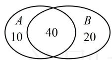
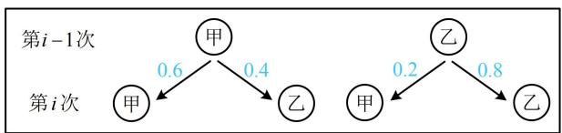
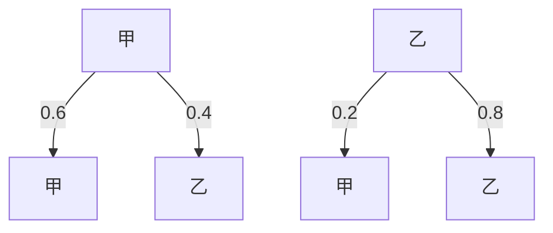

# 强化训练

1. (★★)

有 50 人报名足球俱乐部，60 人报名乒乓球俱乐部，70 人报名足球或乒乓球俱乐部。若已知某人报足球俱乐部，则其报乒乓球俱乐部的概率为（）

A. 0.8

B. 0.6

C. 0.5

D. 0.4

1. A

解法1：所求概率为条件概率，先设事件，再套公式，

设某人报足球俱乐部为事件 A，报乒乓球俱乐部为事件 B，则所求概率为 $P(B \mid A) = \frac{P(AB)}{P(A)}$ ①，

要算 $P(AB)$ 和 $P(A)$ ，需要 $n(AB)$ ， $n(A)$ 和 $n(\Omega)$ ，为了分析各部分构成，我们画图来看，

如图， $n(AB) = 40$ ， $n(A) = 50$ ， $n(\Omega) = 70$

所以 $P(AB)=\frac{n(AB)}{n(\Omega)}=\frac{4}{7}$ ， $P(A)=\frac{n(A)}{n(\Omega)}=\frac{5}{7}$ ，

代入①得 $P(B\mid A) = 0.8$

解法 2: 也可利用条件的直观意义, 将报足球俱乐部的人作为新的样本空间来考虑. 要计算所求概率, 应先分析各部分的人数构成, 题干的文字描述较抽象, 我们画 Venn 图来看,

设报名足球俱乐部的 50 人构成集合 A，报名乒乓球俱乐部的 60 人构成集合 B，如图，报足球俱乐部的 50 人中有 40 人报乒乓球俱乐部，故所求概率 $P=\frac{40}{50}=0.8$ .

2. (2023·浙江温州二模·★★★)

一枚质地均匀的骰子，其六个面的点数分别为1，2，3，4，5，6.现将此骰子任意抛掷2次，正面向上的点数分别为 $X_{1}$ ， $X_{2}$ .设 $Y_{1} = \left\{ \begin{array}{l}X_{1},X_{1}\geq X_{2}\\ X_{2},X_{1} <   X_{2} \end{array} \right.$ ，设 $Y_{2} = \left\{ \begin{array}{l}X_{1},X_{1}\leq X_{2}\\ X_{2},X_{1} > X_{2} \end{array} \right.$ ，记事件 $A = "Y_1 = 5$ ”， $B = "Y_2 = 3$ ”则 $P(B|A) =$ （）

A. $\frac{1}{9}$

B. $\frac{2}{9}$

C. $\frac{1}{5}$

D. $\frac{2}{11}$

2. B

解析：由条件概率公式， $P(B|A) = \frac{P(AB)}{P(A)}$ ①，下面先算分母，可通过分析 $A$ 和样本空间 $\Omega$ 包含的样本点个数来算，

因为每枚骰子都有6种结果，所以 $n(\Omega) = 6 \times 6 = 36$

注意到 $n(A) = n(Y_{1} = 5)$ ，怎样能使 $Y_{1}$ 取5？注意到 $Y_{1}$ 取的是 $X_{1}$ ， $X_{2}$ 中较大的一个，要使较大点数为5，应至少有一次掷出5，且两次都没有掷出6，可按恰有1次掷出5和两次都掷出5分类，

若恰有1次掷出5，则可从2次中选1次掷出5，有 $\mathrm{C}_2^1$ 种选法，另一次向上的点数小于5，有 $\mathrm{C}_4^1$ 种，所以共有 $\mathrm{C}_2^1\mathrm{C}_4^1$ 个样本点，若两次都掷出5，则只有1种结果，即1个样本点，

所以 $n(A) = \mathrm{C}_2^1\mathrm{C}_4^1 +1 = 9$ ，故 $P(A) = \frac{n(A)}{n(\Omega)} = \frac{9}{36} = \frac{1}{4}$ ②；

再求 $P(AB)$ ， $n(AB) = n(Y_1 = 5$ 且 $Y_{2} = 3)$ ，注意到 $Y_{1}$ ， $Y_{2}$ 分别是较大、较小的点数，故只能两次分别掷出 5，3，顺序可换，

由题意， $n(AB)=2$ ，所以 $P(AB)=\frac{n(AB)}{n(\Omega)}=\frac{2}{36}=\frac{1}{18}$ ③；

将②③代入①可得 $P(B\mid A) = \frac{2}{9}$

3. (2022·湖南模拟·★★☆)

某人忘记了一个电话号码的最后一个数字，只好去试拨，则他第一次失败，第二次成功的概率是\_\_\_\_。

3. $\frac{1}{10}$

解析：设他第一次失败为事件 $A$ ，第二次成功为事件 $B$ ，则所求概率即为 $P(AB)$

事件 $A$ 是否发生对事件 $B$ 有影响，二者不独立，故用乘法公式 $P(AB) = P(A)P(B|A)$ 来求 $P(AB)$ ，

由题意， $P(A)=\frac{C_{9}^{1}}{C_{10}^{1}}=\frac{9}{10}$ ， $P(B|A)=\frac{C_{1}^{1}}{C_{9}^{1}}=\frac{1}{9}$

所以 $P(AB) = P(A)P(B|A) = \frac{9}{10}\times \frac{1}{9} = \frac{1}{10}.$

4.（2024·江苏南京模拟·★★★）（多选）

对于随机事件 $A$ ， $B$ ，若 $P(A) = \frac{2}{5}$ ， $P(B) = \frac{3}{5}$ ， $P(B|A) = \frac{1}{4}$ ，则（）

A. $P(AB) = \frac{3}{20}$

B. $P(A\mid B) = \frac{1}{6}$

C. $P(A + B) = \frac{9}{10}$

D. $P(\overline{A} B) = \frac{1}{2}$

4. BCD

解析：A项，由乘法公式， $P(AB) = P(A)P(B|A)$

$= \frac{2}{5}\times \frac{1}{4} = \frac{1}{10}$ ，故A项错误；

B 项，由条件概率公式， $P(A|B)=\frac{P(AB)}{P(B)}=\frac{\frac{1}{10}}{\frac{3}{5}}=\frac{1}{6}$

故B项正确；

C 项， $P(A+B)=P(A)+P(B)-P(AB)=\frac{2}{5}+\frac{3}{5}-\frac{1}{10}=\frac{9}{10}$

故C项正确；

D 项，已有 $P(A \mid B)$ ，容易求出 $P(\bar{A} \mid B)$ ，故可用乘法公式求 $P(\bar{A} B)$ ，

因为 $P(A|B) = \frac{1}{6}$ ，所以 $P(\overline{A}|B) = 1 - P(A|B) = 1 - \frac{1}{6} = \frac{5}{6}$ ，由乘法公式， $P(\overline{A} B) = P(B)P(\overline{A}|B) = \frac{3}{5} \times \frac{5}{6} = \frac{1}{2}$ ，

故D项正确.

5. (2023·河北石家庄模拟·★★★)

某种疾病的患病率为 $5\%$ ，通过验血诊断该疾病的误诊率为 $2\%$ ，即非患者中有 $2\%$ 的人诊断为阳性，患者中有 $2\%$ 的人诊断为阴性。随机抽取 1 人进行验血，则其诊断结果为阳性的概率为（）

A. 0.46

B. 0.046

C. 0.68

D. 0.068

5. D

解析：诊断结果为阳性，实际可能是患病中诊出阳性，也可能是不患病中诊出阳性，故按是否患病划分样本空间，套用全概率公式计算所求概率，

记随机抽取的1人患病为事件 $A$ ，诊断结果为阳性为事件

B，则由全概率公式， $P(B)=P(A)P(B\mid A)+P(\overline{A})P(B\mid\overline{A})$

$$
= 5\% \times (1 - 2\%) + (1 - 5\%) \times 2\% = 0.068.
$$

6.（2024·湖南长沙模拟·★★★）（多选）

甲罐中有 5 个红球, 5 个白球, 乙罐中有 3 个红球, 7 个白球. 先从甲罐中随机取出一球放入乙罐, 再从乙罐中随机取出一球. $A_{1}$ 表示事件 “从甲罐取出的球是红球”, $A_{2}$ 表示事件 “从甲罐取出的球是白球”, $B$ 表示事件 “从乙罐取出的球是红球”. 则下列结论正确的是 ( )

A. $A_{1}$ ， $A_{2}$ 为对立事件B. $P(B\mid A_1) = \frac{4}{11}$   
C. $P(B) = \frac{3}{10}$ D. $P(B\mid A_1) + P(B\mid A_2) = 1$

6. AB

解析：A项，从甲罐中取出球，要么取出红球，要么取出白球，所以 $A_{1}$ ， $A_{2}$ 为对立事件，故A项正确；

B项，在 $A_{1}$ 的条件下，甲罐取出的是红球放入乙罐，所以从乙罐取球前，乙罐内有4个红球，7个白球，于是取到红球的概率为 $\frac{4}{11}$ ，即 $P(B|A_1) = \frac{4}{11}$ ，故B项正确；

C 项, 甲罐的取球结果, 对乙罐取到红球的概率有影响, 故可考虑按甲罐的取球结果划分样本空间, 套用全概率公式, 由题意, $P(A_{1}) = P(A_{2}) = \frac{1}{2}, P(B \mid A_{1}) = \frac{4}{11}$ ,

$P(B\mid A_2) = \frac{3}{11}$ ，由全概率公式， $P(B) = P(A_{1})P(B\mid A_{1})+$

$P(A_{2})P(B \mid A_{2})=\frac{1}{2}\times\frac{4}{11}+\frac{1}{2}\times\frac{3}{11}=\frac{7}{22}$ ，故C项错误；

D 项， $P(B \mid A_{1}) + P(B \mid A_{2}) = \frac{4}{11} + \frac{3}{11} = \frac{7}{11}$ ，故 D 项错误.

7. (2025·天津卷·★★★)

小桐操场跑圈, 一周两次, 一次 5 圈或 6 圈. 第一次跑 5 圈或 6 圈的概率均为 0.5, 若第一次跑 5 圈, 则第二次跑 5 圈的概率为 0.4, 6 圈的概率为 0.6; 若第一次跑 6 圈, 则第二次跑 5 圈的概率为 0.6, 6 圈的概率为 0.4. 小桐一周跑 11 圈的概率为\_\_\_\_; 若一周至少跑 11 圈为运动量达标, 则连续跑 4 周, 记运动量达标的周数为 $X$ , 则期望 $E(X) = \_$ .

7. 0.6; 3.2

解析：一周跑 11 圈，则两次之中，应有一次跑 5 圈，另一次跑 6 圈，由于第二次跑 5 圈或 6 圈的概率会受到第一次所跑圈数的影响，故考虑按第一次所跑圈数划分样本空间，套用全概率公式求目标概率，

记小桐第一、二次跑5圈分别为事件 $A_{1}$ ， $A_{2}$ ，小桐一周跑11圈为事件 $B$ ，则由题意， $P(A_{1}) = P(\overline{A}_{1}) = 0.5$

$$
P (A _ {2} \mid A _ {1}) = 0. 4, P (\overline {{{{A}}}} _ {2} \mid A _ {1}) = 0. 6, P (A _ {2} \mid \overline {{{{A}}}} _ {1}) = 0. 6,
$$

由全概率公式， $P(B)=P(A_{1})P(B\mid A_{1})+P(\overline{A}_{1})P(B\mid\overline{A}_{1})$ ①,

何为 $P(B|A_1)$ ？在第一次跑5圈的条件下，一周要跑11圈，则第二次必定要跑6圈，所以 $P(B|A_1) = P(\overline{A}_2|A_1)$ ， $P(B|\overline{A}_1)$ 可类似分析，

$$
P (B \mid A _ {1}) = P (\overline {{{A}}} _ {2} \mid A _ {1}), \quad P (B \mid \overline {{{A}}} _ {1}) = P (A _ {2} \mid \overline {{{A}}} _ {1}),
$$

代入①得 $P(B) = P(A_{1})P(\overline{A}_{2}\mid A_{1}) + P(\overline{A}_{1})P(A_{2}\mid \overline{A}_{1})$

$$
= 0. 5 \times 0. 6 + 0. 5 \times 0. 6 = 0. 6;
$$

再求 $E(X)$ ，连续跑4周，可看成4重伯努利试验，运动量达标的周数应服从二项分布 $B(4, p)$ ，可按 $E(X) = 4p$ 求期望，下面先算一周运动量达标的概率 $p$ ，

要使一周运动量达标，则该周至少跑11圈，所以两次跑圈中，不能都跑5圈，故一周运动量达标的概率 $p =$

$$
1 - P (A _ {1} A _ {2}) = 1 - P (A _ {1}) P (A _ {2} \mid A _ {1}) = 1 - 0. 5 \times 0. 4 = 0. 8,
$$

由题意， $X\sim B(4,0.8)$ ，所以 $E(X) = 4\times 0.8 = 3.2$

8. (2023·广东深圳模拟·★★★)

某厂生产的产品每 10 件包装成一箱，每箱含 0, 1, 2 件次品的概率分别为 0.8, 0.1, 0.1. 在出厂前需要对每箱产品进行检测，质检员甲拟定了一种检测方案：开箱随机检测该箱中的 3 件产品，若无次品，则认定该箱产品合格，否则认定该箱产品不合格.

(1) 在质检员甲认定一箱产品合格的条件下, 求该箱产品不含次品的概率;  
（2）若质检员甲随机检测一箱中的3件产品，抽到次品的件数为 $X$ ，求 $X$ 的分布列及期望.

8. 解: (1) 设质检员甲认定一箱产品合格为事件 $A$ , 不含

次品为事件 $B$ ，则所求概率为 $P(B|A) = \frac{P(AB)}{P(A)}$ ①，

(若一箱产品不含次品, 则经检测后必定会被认定为合格, 所以若 $B$ 发生, 则 $A$ 一定发生, 从而 $B \subseteq A$ , 故 $AB = B$ )

由题意， $AB = B$ ，所以 $P(AB) = P(B) = 0.8$ ②，

(再求 $P(A)$ , 由于一箱产品中所含次品的件数不同时, 检测为合格的概率不一样, 但能够求出, 故考虑按所含次品的件数划分样本空间, 套用全概率公式求 $P(A)$ )

记一箱产品含0，1，2件次品分别为事件 $C_1$ ， $C_2$ ， $C_3$ ，则由全概率公式， $P(A) = P(C_{1})P(A|C_{1}) + P(C_{2})P(A|C_{2})+$

$$
P (C _ {3}) P (A \mid C _ {3}) = 0. 8 \times 1 + 0. 1 \times \frac {\mathrm{C} _ {9} ^ {3}}{\mathrm{C} _ {1 0} ^ {3}} + 0. 1 \times \frac {\mathrm{C} _ {8} ^ {3}}{\mathrm{C} _ {1 0} ^ {3}} = \frac {1 1}{1 2} \quad ③,
$$

将②③代入①得 $P(B \mid A)=\frac{48}{55}$ .

（2）由题意， $X$ 可能的取值有0，1，2，其中 $X = 0$ 即为检测后认定合格，由（1）可得 $P(X = 0) = P(A) = \frac{11}{12}$ ，

(再求 X=1 和 X=2 的概率，以 X=1 为例，它指的是抽到 1 件次品，但该箱产品内实际所含次品数可能为 1, 2 件，两种情况下抽到 1 件次品的概率都好求，故可按该箱产品实际所含次品数来划分样本空间，套用全概率公式求概率)

由全概率公式， $P(X = 1) = P(C_{1})P(X = 1|C_{1})+$

$$
\begin{array}{l} P (C _ {2}) P (X = 1 \mid C _ {2}) + P (C _ {3}) P (X = 1 \mid C _ {3}) \\ = 0. 8 \times 0 + 0. 1 \times \frac {\mathrm{C} _ {1} ^ {1} \mathrm{C} _ {9} ^ {2}}{\mathrm{C} _ {1 0} ^ {3}} + 0. 1 \times \frac {\mathrm{C} _ {2} ^ {1} \mathrm{C} _ {8} ^ {2}}{\mathrm{C} _ {1 0} ^ {3}} = \frac {2 3}{3 0 0}, \\ \end{array}
$$

（接下来可仿照上面用全概率公式求 $P(X = 2)$ ，也可以按 $1 - P(X = 0) - P(X = 1)$ 来算）

同理， $P(X = 2) = P(C_1)P(X = 2|C_1) + P(C_2)P(X = 2|C_2)$

$$
+ P (C _ {3}) P (X = 2 \mid C _ {3}) = 0. 8 \times 0 + 0. 1 \times 0 + 0. 1 \times \frac {\mathrm{C} _ {2} ^ {2} \mathrm{C} _ {8} ^ {1}}{\mathrm{C} _ {1 0} ^ {3}} = \frac {1}{1 5 0},
$$

所以 $X$ 的分布列为：

<table><tr><td>X</td><td>0</td><td>1</td><td>2</td></tr><tr><td>P</td><td> $\frac{11}{12}$ </td><td> $\frac{23}{300}$ </td><td> $\frac{1}{150}$ </td></tr></table>

故 $E(X) = 0 \times \frac{11}{12} + 1 \times \frac{23}{300} + 2 \times \frac{1}{150} = \frac{9}{100}$ .

9. (2023·新课标Ⅰ卷·★★★★)

甲乙两人投篮，每次由其中一人投篮，规则如下：若命中则此人继续投篮，若未命中则换为对方投篮。无论之前投篮情况如何，甲每次投篮的命中率均为0.6，乙每次投篮的命中率均为0.8，由抽签确定第一次投篮的人选，第一次投篮的人是甲、乙的概率各为0.5。

(1) 求第二次投篮的人是乙的概率;  
（2）求第 $i$ 次投篮的人是甲的概率；  
（3）已知：若随机变量 $X_{i}$ 服从两点分布，且 $P(X_{i}=1)=1-P(X_{i}=0)=q_{i}, i=1,2,\cdots,n$ ，则 $E\left(\sum_{i=1}^{n}X_{i}\right)=\sum_{i=1}^{n}q_{i}$ ，记前 n 次（即从第 1 次到第 n 次）投篮中甲投篮的次数为 Y，求 $E(Y)$ .

9. 解: (1) (第一次投篮的人可能是甲, 也可能是乙, 两种情

况下第二次投篮的人是乙的概率都是已知的，故按第一次投篮的人是谁划分样本空间，套用全概率公式）

记第 $i(i=1,2,3,\cdots)$ 次投篮的人是甲为事件 $A_{i}$ ，第 2 次投篮的人是乙为事件 B，

由全概率公式， $P(B) = P(A_{1})P(B|A_{1}) + P(\overline{A}_{1})P(B|\overline{A}_{1})$

$$
= 0. 5 \times (1 - 0. 6) + 0. 5 \times 0. 8 = 0. 6.
$$

（2）（从第 $i - 1$ 次到第 $i$ 次的投篮情况，我们可画图辅助理解，如下图，第 $i - 1$ 次两种情况下第 $i$ 次投篮的人是甲的概率都已知，故根据第 $i - 1$ 次由谁投篮划分样本空间，套用全概率公式来建立递推公式）

当 $i \geq 2$ 时，由全概率公式， $P(A_i) = P(A_{i-1})P(A_i \mid A_{i-1}) +$

$$
P (\overline {{{A}}} _ {i - 1}) P (A _ {i} \mid \overline {{{A}}} _ {i - 1}) = P (A _ {i - 1}) \times 0. 6 + [ 1 - P (A _ {i - 1}) ] \times 0. 2,
$$

整理得： $P(A_{i})=\frac{2}{5}P(A_{i-1})+\frac{1}{5}$ ①,

（要由此递推公式求 $P(A_{i})$ ，可用待定系数法构造等比数列.设 $P(A_{i}) + \lambda = \frac{2}{5} [P(A_{i - 1}) + \lambda ]$ ，展开化简得 $P(A_{i}) = \frac{2}{5} P(A_{i - 1}) - \frac{3}{5}\lambda$ 与 $P(A_{i}) = \frac{2}{5} P(A_{i - 1}) + \frac{1}{5}$ 对比可得 $-\frac{3}{5}\lambda = \frac{1}{5}$ ，所以 $\lambda = -\frac{1}{3}$

由①可得 $P(A_{i}) - \frac{1}{3} = \frac{2}{5}\Bigg[P(A_{i - 1}) - \frac{1}{3}\Bigg]$

又 $P(A_{1}) = 0.5 = \frac{1}{2}$ ，所以 $P(A_{1}) - \frac{1}{3} = \frac{1}{6}$

故 $\left\{P(A_i) - \frac{1}{3}\right\}$ 是等比数列，首项为 $\frac{1}{6}$ ，公比为 $\frac{2}{5}$ ，

所以 $P(A_{i}) - \frac{1}{3} = \frac{1}{6}\times \left(\frac{2}{5}\right)^{i - 1}$ ，故 $P(A_{i}) = \frac{1}{6}\times \left(\frac{2}{5}\right)^{i - 1} + \frac{1}{3},$

即第 $i$ 次投篮的人是甲的概率为 $\frac{1}{6} \times \left(\frac{2}{5}\right)^{i-1} + \frac{1}{3}$ .

flowchart

(3) (题干给出了一个期望的结论, 我们先把它和本题的背景对应起来. 所给结论涉及两点分布, 那本题背景下有没有两点分布呢? 有的, 在第 $i$ 次的投篮中, 若设甲投篮的次数为 $X_{i}$ , 则 $X_{i}$ 的取值为 1 (表示第 $i$ 次投篮的是甲) 或 0 (表示第 $i$ 次投篮的是乙), 所以 $X_{i}$ 就服从两点分布, 且前 $n$ 次投篮的总次数即为 $\sum_{i=1}^{n} X_{i}$ , 故直接套用所给的期望公式就能求得答案)

设第 $i$ 次投篮中，甲投篮的次数为 $X_{i}$

则 $P(X_{i}=1)=P(A_{i})$ ，且 $Y=X_{1}+X_{2}+\cdots+X_{n}$ ，

所以 $E(Y)=E(X_{1}+X_{2}+\cdots+X_{n})$ ,

由所给结论， $E(Y)=P(A_{1})+P(A_{2})+\cdots+P(A_{n})$

$$
\begin{array}{l} = \frac {1}{6} \times \left(\frac {2}{5}\right) ^ {0} + \frac {1}{3} + \frac {1}{6} \times \left(\frac {2}{5}\right) ^ {1} + \frac {1}{3} + \dots + \frac {1}{6} \times \left(\frac {2}{5}\right) ^ {n - 1} + \frac {1}{3} \\ = \frac {1}{6} \left[ \left(\frac {2}{5}\right) ^ {0} + \left(\frac {2}{5}\right) ^ {1} + \dots + \left(\frac {2}{5}\right) ^ {n - 1} \right] + \frac {n}{3} = \frac {1}{6} \times \frac {1 - \left(\frac {2}{5}\right) ^ {n}}{1 - \frac {2}{5}} + \frac {n}{3} \\ = \frac {5}{1 8} \left[ 1 - \left(\frac {2}{5}\right) ^ {n} \right] + \frac {n}{3}. \\ \end{array}
$$

10.（2023·湖北模拟·★★★★）

从有 3 个红球和 3 个蓝球的袋中, 每次随机摸出 1 个球, 摸出的球不放回, 记 $A_{i}$ 表示事件 “第 $i$ 次摸到红球”, $i = 1,2,\cdots,6$ .

（1）求第一次摸到蓝球的条件下，第二次摸到红球的概率；  
（2）在同一试验下，记 $P(B_{1}B_{2}B_{3})$ 表示 $B_{1}$ ， $B_{2}$ ， $B_{3}$ 同时发生的概率， $P(B_{3}|B_{1}B_{2})$ 表示在 $B_{1}$ 和 $B_{2}$ 都发生的条件下， $B_{3}$ 发生的概率，若 $P(B_{1}) > 0$ ， $P(B_{1}B_{2}) > 0$ ，证明： $P(B_{1}B_{2}B_{3}) = P(B_{1})P(B_{2}|B_{1})P(B_{3}|B_{1}B_{2})$ ；

(3) 求 $P(A_{3})$ .

10. 解：（1）第一次摸到蓝球作为新的样本空间，袋中还剩3

个红球和2个蓝球，所以第二次摸到红球的概率为 $\frac{3}{5}$

(2) 证法1: (右侧较复杂, 考虑将其化简为左侧, 右侧有2个条件概率, 故可用条件概率公式)

由条件概率公式， $P(B_{1})P(B_{2}|B_{1})P(B_{3}|B_{1}B_{2})$

$$
= P (B _ {1}) \cdot \frac {P (B _ {1} B _ {2})}{P (B _ {1})} \cdot \frac {P (B _ {1} B _ {2} B _ {3})}{P (B _ {1} B _ {2})} = P (B _ {1} B _ {2} B _ {3}).
$$

证法2: (观察发现目标等式右侧有以 $B_{1} B_{2}$ 为条件的条件概率, 故在 $P(B_{1} B_{2} B_{3})$ 中将 $B_{1} B_{2}$ 看作整体, 用乘法公式)

由乘法公式， $P(B_{1}B_{2}B_{3}) = P(B_{1}B_{2})P(B_{3}\mid B_{1}B_{2})$ ①，

(与目标等式对比发现, 再对 $P(B_{1}B_{2})$ 用乘法公式即可)

又 $P(B_{1}B_{2}) = P(B_{1})P(B_{2}|B_{1})$ ，代入①可得

$$
P (B _ {1} B _ {2} B _ {3}) = P (B _ {1}) P (B _ {2} \mid B _ {1}) P (B _ {3} \mid B _ {1} B _ {2}).
$$

(3) (第 3 次摸球的情况与前 2 次的结果有关, 故考虑按前 2 次的结果划分样本空间, 用全概率公式来求 $P(A_{3})$ , 前两次的结果不外乎 4 种: $A_{1}A_{2}$ , $\overline{A}_{1}A_{2}$ , $A_{1}\overline{A}_{2}$ , $\overline{A}_{1}\overline{A}_{2}$ )

由全概率公式， $P(A_{3}) = P(A_{1}A_{2})P(A_{3}\mid A_{1}A_{2})+$

$$
\begin{array}{l} P (\overline {{{A}}} _ {1} A _ {2}) P (A _ {3} \mid \overline {{{A}}} _ {1} A _ {2}) + P (A _ {1} \overline {{{A}}} _ {2}) P (A _ {3} \mid A _ {1} \overline {{{A}}} _ {2}) \\ + P (\overline {{{A}}} _ {1} \overline {{{A}}} _ {2}) P (A _ {3} | \overline {{{A}}} _ {1} \overline {{{A}}} _ {2}) \quad ②, \\ \end{array}
$$

(上式中形如 $P(A_{3} \mid A_{1}A_{2})$ 的项容易计算, 形如 $P(A_{1}A_{2})$ 的项不好算, 可再用乘法公式对它们变形)

$$
\text {又} P (A _ {1} A _ {2}) = P (A _ {1}) P (A _ {2} \mid A _ {1}), \quad P (\overline {{{{A}}}} _ {1} A _ {2}) = P (\overline {{{{A}}}} _ {1}) P (A _ {2} \mid \overline {{{{A}}}} _ {1}),
$$

$$
P (A _ {1} \overline {{{{A}}}} _ {2}) = P (A _ {1}) P (\overline {{{{A}}}} _ {2} \mid A _ {1}), \quad P (\overline {{{{A}}}} _ {1} \overline {{{{A}}}} _ {2}) = P (\overline {{{{A}}}} _ {1}) P (\overline {{{{A}}}} _ {2} \mid \overline {{{{A}}}} _ {1}),
$$

代入②得 $P(A_{3}) = P(A_{1})P(A_{2}\mid A_{1})P(A_{3}\mid A_{1}A_{2})+$

$$
P (\overline {{{A}}} _ {1}) P (A _ {2} \mid \overline {{{A}}} _ {1}) P (A _ {3} \mid \overline {{{A}}} _ {1} A _ {2}) + P (A _ {1}) P (\overline {{{A}}} _ {2} \mid A _ {1}) P (A _ {3} \mid A _ {1} \overline {{{A}}} _ {2})
$$

$$
+ P (\overline {{{A}}} _ {1}) P (\overline {{{A}}} _ {2} \mid \overline {{{A}}} _ {1}) P (A _ {3} \mid \overline {{{A}}} _ {1} \overline {{{A}}} _ {2})
$$

$$
= \frac {1}{2} \times \frac {2}{5} \times \frac {1}{4} + \frac {1}{2} \times \frac {3}{5} \times \frac {1}{2} + \frac {1}{2} \times \frac {3}{5} \times \frac {1}{2} + \frac {1}{2} \times \frac {2}{5} \times \frac {3}{4} = \frac {1}{2}.
$$

