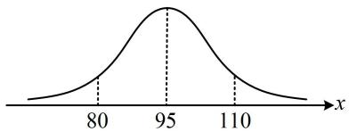
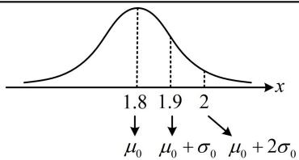
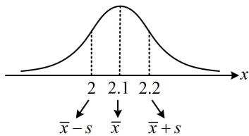
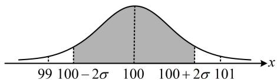
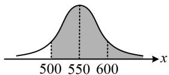
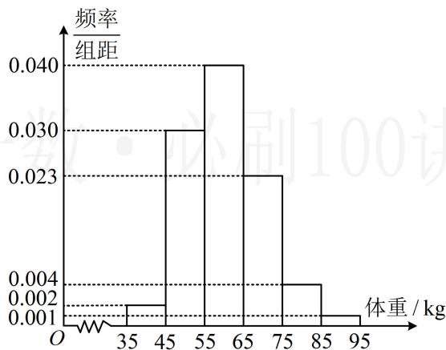

# 强化训练

1. (2024·江西模拟·★☆)

已知某地区高考二检数学共有8000名考生参与，且二检的数学成绩 $X$ 近似服从正态分布 $N(95, \sigma^2)$ ，若成绩在80分以下的有1500人，则可以估计 $P(95 \leq X \leq 110) = (\quad)$

A. $\frac{5}{32}$

B. $\frac{5}{16}$

C. $\frac{11}{32}$

D. $\frac{3}{16}$

1. B

解析：涉及正态分布的区间概率，考虑画正态曲线来看，

由题意，成绩在80分以下的概率 $P(X < 80) = \frac{1500}{8000} = \frac{3}{16}$ ，

如图，由对称性， $P(X > 110) = P(X < 80) = \frac{3}{16}$

所以 $P(95 \leq X \leq 110) = \frac{1}{2} - P(X > 110) = \frac{1}{2} - \frac{3}{16} = \frac{5}{16}$ .

line

| x   | y     |
| --- | ----- |
| 80  | Low   |
| 95  | High  |
| 110 | Low   |

2. (2024·新课标Ⅰ卷·★★☆) (多选)

为了解推动出口后的亩收入（单位：万元）情况，从该种植区抽取样本，得到推动出口后亩收入的样本均值 $\overline{x} = 2.1$ ，样本方差 $s^2 = 0.01$ ，已知该种植区以往的亩收入 $X$ 服从正态分布 $N(1.8,0.1^2)$ ，假设推动出口后的亩收入 $Y$ 服从正态分布 $N(\overline{x},s^2)$ ，则（）（若随机变量 $Z$ 服从正态分布 $N(\mu ,\sigma^2)$ ，则 $P(Z < \mu +\sigma)\approx 0.8413$ ）

A. $P(X > 2) > 0.2$

B. $P(X > 2) <   0.5$

C. $P(Y > 2) > 0.5$

D. $P(Y > 2) <   0.8$

2. BC

解析：涉及正态分布区间取值概率，可画正态曲线来看，

由题意， $X\sim N(1.8,0.1^2)$ ，所以 $X$ 的均值为 $\mu_0 = 1.8$

标准差为 $\sigma_0 = 0.1$ ，故随机变量 $X$ 的正态曲线如图1，

由图可知， $P(X > 2) <   P(X > 1.9) = 1 - P(X <   1.9)$

$$
= 1 - P (X <   \mu_ {0} + \sigma_ {0}) \approx 1 - 0. 8 4 1 3 = 0. 1 5 8 7 <   0. 2,
$$

故A项错误，B项正确；

又 $Y \sim N(\overline{x}, s^2)$ ， $\overline{x} = 2.1$ ， $s^2 = 0.01$ ，所以 $Y$ 的正态曲线如图2，由图形的对称性可知， $P(Y > 2) = P(Y < 2.2)$

$= P(Y < \overline{x} + s) \approx 0.8413$ ，故C项正确，D项错误

line

| x    | Value |
| ---- | ----- |
| 1.8  | 1.8   |
| 1.9  | 1.9   |
| 2    | 2     |

图1

line

| x    | Value |
| ---- | ----- |
| 2    | 0     |
| 2.1  | 1     |
| 2.2  | 0     |

图2

3. (2023·四省联考·★★★)

某工厂生产的产品的质量指标服从正态分布 $N(100, \sigma^2)$ ，质量指标介于99至101之间的产品为良品，为使这种产品的良品率达到 $95.45\%$ ，则需调整生产工艺，使得 $\sigma$ 至多为\_\_\_\_。（附：若 $X \sim N(\mu, \sigma^2)$ ，则 $P(|X - \mu| < 2\sigma) = 0.9545$ ）

3. $\frac{1}{2}$

解析：注意到 $95.45\%$ 恰好是 $P(|X - \mu| < 2\sigma)$ ，故先把本题的 $\mu$ 代入此不等式，

由所给数据， $P(\left|X - \mu \right| < 2\sigma) = P(-2\sigma < X - \mu < 2\sigma)$

$$
= P (\mu - 2 \sigma <   X <   \mu + 2 \sigma) = 0. 9 5 4 5 \quad (1),
$$

本题中，质量指标服从正态分布 $N(100,\sigma^2)\Rightarrow \mu = 100$

代入①得： $P(100 - 2\sigma < X < 100 + 2\sigma) = 0.9545$

如图，故要使良品率达到 $95.45\%$ ，即 $P(99 < X < 101) \geq$

95.45%，此时(99,101)应包含 $(100-2\sigma,100+2\sigma)$ ，

所以 $\left\{ \begin{array}{l} 100 + 2\sigma \leq 101 \\ 100 - 2\sigma \geq 99 \end{array} \right.$ ，解得： $\sigma \leq \frac{1}{2}$ ，所以 $\sigma$ 至多为 $\frac{1}{2}$ .

area

| x           | Value     |
|-------------|-----------|
| 99          | 0         |
| 100         | 100       |
| 101         | 0         |

4. (2023·河南洛阳模拟·★★★☆)

某汽车公司最近研发了一款新能源汽车，以单次最大续航里程 500 公里为标准进行测试，且每辆汽车是否达到标准相互独立，设每辆新能源汽车达到标准的概率为 $p (0 < p < 1)$ ，当 100 辆汽车中恰有 80 辆达到标准的概率取最大值时，若预测该款新能源汽车的单次最大续航里程为 $X$ ，且 $X \sim N(550, \sigma^2)$ ，则预测这款汽车的单次最大续航里程不低于 600 公里的概率为（）

A. 0.2

B. 0.3

C. 0.6

D. 0.8

4. A

解析：应先分析 $p$ 为何值时，100辆汽车中恰有80辆达到标准的概率取得最大值，由题意，100辆汽车中达到标准的汽车辆数服从二项分布 $B(100, p)$ ，

所以恰有80辆达到标准的概率为 $\mathrm{C}_{100}^{80}p^{80}(1 - p)^{20}$

此式较复杂，可构造函数求导分析最大值，

设 $f(p) = \mathrm{C}_{100}^{80}p^{80}(1 - p)^{20}(0 <   p <   1)$ ，

则 $f^{\prime}(p) = \mathrm{C}_{100}^{80}[80p^{79}(1 - p)^{20} - p^{80}\cdot 20(1 - p)^{19}]$

$$
= \mathrm{C} _ {1 0 0} ^ {8 0} p ^ {7 9} (1 - p) ^ {1 9} (8 0 - 1 0 0 p),
$$

所以 $f^{\prime}(p) > 0\Leftrightarrow 0 <   p <   0.8$ ， $f^{\prime}(p) <   0\Leftrightarrow 0.8 <   p <   1$

从而 $f(p)$ 在 $(0,0.8)$ 上 $\nearrow$ ，在 $(0.8,1)$ 上 $\searrow$ ，故当100辆汽车中恰有80辆达到标准的概率取最大值时， $p = 0.8$

达到标准即最大续航里程不低于 500 公里, 这一结果可翻译成 $X$ 的取值概率, 由题意, $P(X \geq 500) = 0.8$ ,

在此基础上求 $P(X \geq 600)$ ，可画正态曲线来看，如图，

$$
P (X \geq 6 0 0) = P (X \leq 5 0 0) = 1 - P (X \geq 5 0 0) = 1 - 0. 8 = 0. 2.
$$

# 5. (2023·安徽模拟·★★★)

为贯彻落实《健康中国行动（2019\~2030年）》、《关于全面加强和改进新时代学校体育工作的意见》等文件的精神，确保2030年学生体质达到规定要求，各地将认真做好学生的体质健康检测。某市决定对某中学学生的身体健康状况进行调查，现从该校抽取200名学生测量他们的体重，得到如下的样本数据的频率分布直方图。

histogram

| 体重 (kg) | 频率/组距 |
|---|---|
| 35-45 | 0.002 |
| 45-55 | 0.030 |
| 55-65 | 0.040 |
| 65-75 | 0.023 |
| 75-85 | 0.004 |
| 85-95 | 0.001 |

（1）求这200名学生体重的平均数 $\bar{x}$ 和方差 $s^2$ ；（同一组数据用该区间的中点值作代表）  
（2）由频率分布直方图可知，该校学生的体重 $Z$ 服从正态分布 $N(\mu, \sigma^2)$ ，其中 $\mu$ 近似为样本平均数 $\bar{x}$ ， $\sigma^2$ 近似为样本方差 $s^2$ 。

①利用该正态分布，求 $P(50.73 < Z \leq 69.27)$ ；  
②若从该校随机抽取50名学生，记 $X$ 表示这50名学生的体重位于区间(50.73,69.27]内的人数，利用①的结果，求 $E(X)$ ：

参考数据： $\sqrt{86} \approx 9.27$ ，若 $Z \sim N(\mu, \sigma^2)$ ，则 $P(\mu - \sigma < Z \leq \mu + \sigma) \approx 0.6827$ ， $P(\mu - 2\sigma < Z \leq \mu + 2\sigma) \approx 0.9545$

$$
P (\mu - 3 \sigma <   Z \leq \mu + 3 \sigma) \approx 0. 9 9 7 3.
$$

5. 解：（1）由图可知， $\overline{x}=40\times0.02+50\times0.3+60\times0.4+$

$$
7 0 \times 0. 2 3 + 8 0 \times 0. 0 4 + 9 0 \times 0. 0 1 = 6 0,
$$

$$
s ^ {2} = (4 0 - 6 0) ^ {2} \times 0. 0 2 + (5 0 - 6 0) ^ {2} \times 0. 3 + (7 0 - 6 0) ^ {2} \times 0. 2 3 +
$$

$$
(8 0 - 6 0) ^ {2} \times 0. 0 4 + (9 0 - 6 0) ^ {2} \times 0. 0 1 = 8 6.
$$

（2）①由题意， $\mu = 60$ ， $\sigma^2 = 86$ ，所以 $\sigma = \sqrt{86}\approx 9.27$

(要求 $P(50.73 < Z \leq 69.27)$ ，结合给的是 $3\sigma$ 区间概率知应先找到 50.73 和 69.27 与 $\mu$ ， $\sigma$ 的关系)

因为 $\mu -\sigma = 60 - 9.27 = 50.73$ ， $\mu +\sigma = 60 + 9.27 = 69.27$

所以 $P(50.73 < Z \leq 69.27) = P(\mu - \sigma < Z \leq \mu + \sigma) \approx 0.6827$

②（题干没给该校共有多少学生，可认为该校学生人数很多，从中随机抽取50名，可以近似看成50重伯努利试验，故用二项分布求 $E(X)$ 即可）

由①可得， $X\sim B(50,0.6827)$

所以 $E(X)=50\times0.6827=34.135$ .

6. (2017·新课标Ⅰ卷·★★★★)

为了监控某种零件的一条生产线的生产过程，检验员每天从该生产线上随机抽取16个零件，并测量其尺寸（单位：cm）。根据长期生产经验，可以认为这条生产线正常状态下生产的零件的尺寸服从正态分布 $N(\mu, \sigma^{2})$ 。

(1) 假设生产状态正常, 记 $X$ 表示一天内抽取的 16 个零件中其尺寸在 $(\mu - 3\sigma, \mu + 3\sigma)$ 之外的零件数, 求 $P(X \geq 1)$ 及 $X$ 的数学期望;

（2）一天内抽检的零件中，如果出现了尺寸在 $(\mu - 3\sigma, \mu + 3\sigma)$ 之外的零件，就认为这条生产线在这一天的生产过程可能出现了异常情况，需对当天的生产过程进行检查.

(i) 试说明上述监控生产过程方法的合理性;

（ii）下面是检验员在一天内抽取的16个零件的尺寸：

<table><tr><td>9.95</td><td>10.12</td><td>9.96</td><td>9.96</td><td>10.01</td><td>9.92</td><td>9.98</td><td>10.04</td></tr><tr><td>10.26</td><td>9.91</td><td>10.13</td><td>10.02</td><td>9.22</td><td>10.04</td><td>10.05</td><td>9.95</td></tr></table>

经计算得 $\overline{x}=\frac{1}{16}\sum_{i=1}^{16}x_{i}=9.97,\quad s=\sqrt{\frac{1}{16}\sum_{i=1}^{16}(x_{i}-\overline{x})^{2}}=\sqrt{\frac{1}{16}\left(\sum_{i=1}^{16}x_{i}^{2}-16\overline{x}^{2}\right)}\approx0.212$ ，其中 $x_{i}$ 为抽取的第 i 个零件的尺寸， $i=1,2,\cdots,16$

用样本平均数 $\bar{x}$ 作为 $\mu$ 的估计值 $\hat{u}$ ，用样本标准差 $s$ 作为 $\sigma$ 的估计值 $\hat{\sigma}$ ，利用估计值判断是否需对当天的生产过程进行检查？剔除 $(\hat{\mu} - 3\hat{\sigma}, \hat{\mu} + 3\hat{\sigma})$ 之外的数据，用剩下的数据估计 $\mu$ 和 $\sigma$ （精确到0.01）.

附：若随机变量 $Z \sim N(\mu, \sigma^2)$ ，则 $P(\mu - 3\sigma < Z < \mu + 3\sigma) = 0.9974$ ， $0.9974^{16} \approx 0.9592$ ， $\sqrt{0.008} \approx 0.09$ 。

6. 解: (1) (把抽取 16 个零件看成 16 次独立重复试验, 对每

个零件，若尺寸落在 $(\mu - 3\sigma, \mu + 3\sigma)$ 外，则称试验成功，则16个零件中尺寸落在 $(\mu - 3\sigma, \mu + 3\sigma)$ 外的个数 $X$ 即为成功次数，应服从二项分布）

由所给数据，每个零件尺寸落在 $(\mu - 3\sigma, \mu + 3\sigma)$ 的概率为0.9974，所以落在 $(\mu - 3\sigma, \mu + 3\sigma)$ 外的概率为0.0026，

从而 $X \sim B(16, 0.0026)$ ，故 $E(X) = 16 \times 0.0026 = 0.0416$ ，

(再求 $P(X \geq 1)$ ，考虑到 $X \geq 1$ 的情况较多，但其对立面只有 X = 0 一种情况，故用对立事件求概率)

所以 $P(X \geq 1) = 1 - P(X = 0) = 1 - 0.9974^{16} \approx 0.0408$ .

（2）（i）如果生产状态正常，一个零件尺寸在 $(\mu -3\sigma ,\mu +3\sigma)$ 之外的概率只有0.0026，一天内抽取的16个零件中，出现尺寸在 $(\mu -3\sigma ,\mu +3\sigma)$ 之外的概率为0.0408，发生的概率很小，因此一旦发生这种情况，就有理由认为可能出现了异常情况，需对当天的生产过程进行检查，故监控生产过程的方法合理.

（ii）（要看是否需对当天的生产过程进行检查，就看有没有 $(\mu -3\sigma ,\mu +3\sigma)$ 外的零件，故先由所给抽取的16个零件的参考数据计算 $\mu$ 和 $\sigma$ 的估计值）

由所给数据知 $\overline{x} = 9.97$ ， $s\approx 0.212$ ，所以 $\mu$ 和 $\sigma$ 的估计值分别为 $\hat{\mu} = 9.97$ ， $\hat{\sigma} = 0.212$

从而 $\hat{\mu} - 3\hat{\sigma} = 9.97 - 3 \times 0.212 = 9.334$

$$
\hat {\mu} + 3 \hat {\sigma} = 9. 9 7 + 3 \times 0. 2 1 2 = 1 0. 6 0 6,
$$

抽检的16个尺寸中 $9.22 \notin (9.334, 10.606)$ ，故需对当天的生产过程进行检查；

（再算剔除9.22后的均值和方差，均值易算，对于方差，由参考数据中的 $s = \sqrt{\frac{1}{16}\left(\sum_{i=1}^{16}x_i^2 - 16\overline{x}^2\right)} \approx 0.212$ 容易求出 $\sum_{i=1}^{16}x_i^2$ ，只需减掉 $9.22^2$ 即可得到余下数据的平方和，故代公式 $s^2 = \frac{1}{n}\sum_{i=1}^{n}x_i^2 - \overline{x}^2$ 来算新方差）

剔除数据9.22之后， $\mu$ 的估计值为 $\frac{9.97\times 16 - 9.22}{15}$

$= 10.02$ ，由 $s = \sqrt{\frac{1}{16}\left(\sum_{i = 1}^{16}x_i^2 - 16\overline{x}^2\right)}\approx 0.212$ 可得

$$
\sum_ {i = 1} ^ {1 6} x _ {i} ^ {2} = 0. 2 1 2 ^ {2} \times 1 6 + 1 6 \times 9. 9 7 ^ {2} \approx 1 5 9 1. 1 3 4,
$$

剔除9.22这个数据后，剩下的数据的样本方差约为

$$
\frac {1}{1 5} \times (1 5 9 1. 1 3 4 - 9. 2 2 ^ {2}) - 1 0. 0 2 ^ {2} \approx 0. 0 0 8,
$$

所以 $\sigma$ 的估计值为 $\sqrt{0.008} \approx 0.09$ .

