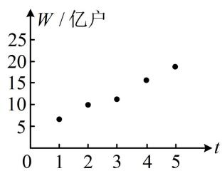

# 强化训练

1. (2023·河南模拟·★)

为了研究汽车减重对降低油耗的作用，对一组样本数据 $(x_{1},y_{1}),(x_{2},y_{2}),\cdots,(x_{n},y_{n})$ 进行分析，其中 $x_{i}$ 表示减重质量（单位：kg）， $y_{i}$ 表示每行驶一百公里降低的油耗（单位：升）， $i=1,2,\cdots,n$ ，由此得到的经验回归方程为 $\hat{y}=\hat{b}x+\hat{a}(\hat{b}>0)$ ，有下列四个说法：

① $\hat{a}$ 的值一定为0；② $\hat{b}$ 越大，减重对降低油耗的作用越大；③决定系数 $R^{2}$ 越大，拟合效果越好；④至少有一个数据点在经验回归直线上．其中所有正确说法的编号是（）

A. ①④

B. ②③

C. ②③④

D. ①②④

1. B

解析：①项，从实际意义来看， $a$ 表示减重 $0\mathrm{kg}$ 时，每行驶一百公里降低的油耗，应该为0，但 $\hat{a}$ 是由样本观测数据求出的 $a$ 的估计值，只会近似等于0，但不是一定为0，故①项错误；

②项， $\hat{b}$ 越大，则每减重 $1\mathrm{kg}$ ，行驶一百公里降低的油耗越多，减重对降低油耗的作用越大，故②项正确；  
③项，决定系数 $R^2$ 越大，则残差平方和越小，拟合效果越好，故③项正确；  
④项，用最小二乘法估计经验回归方程，数据点不一定落在经验回归直线上，故④项错误.

2. (2024·浙江宁波二模·★)

某校数学建模兴趣小组为研究本地区儿子身高 $y(\mathrm{cm})$ 与父亲身高 $x(\mathrm{cm})$ 之间的关系，抽样调查后得出 $y$ 与 $x$ 线性相关，且经验回归方程为 $\hat{y} = 0.85x + 29.5$ 。调查所得的部分样本数据如下：

<table><tr><td>父亲身高x(cm)</td><td>164</td><td>166</td><td>170</td><td>173</td><td>173</td><td>174</td><td>180</td></tr><tr><td>儿子身高y(cm)</td><td>165</td><td>168</td><td>176</td><td>170</td><td>172</td><td>176</td><td>178</td></tr></table>

则下列说法正确的是（）

A. 儿子身高 $y(\mathrm{cm})$ 是关于父亲身高 $x(\mathrm{cm})$ 的函数  
B. 当父亲身高增加 $1 \mathrm{~cm}$ 时, 儿子身高增加 $0.85 \mathrm{~cm}$   
C. 儿子身高为 $172 \mathrm{~cm}$ 时, 父亲身高一定为 $173 \mathrm{~cm}$   
D. 父亲身高为 $170 \mathrm{~cm}$ 时, 儿子身高的均值为 $174 \mathrm{~cm}$

2. D

解析：A项，由题意， $y$ 与 $x$ 只是具有线性关系，不具有函数关系，故A项错误；  
B项，由线性相关关系只能得到 $y$ 的预测值，并不能得到精确值，所以当父亲身高增加 $1\mathrm{cm}$ 时，儿子身高大约增加 $0.85\mathrm{cm}$ ，不一定刚好增加 $0.85\mathrm{cm}$ ，故B项错误；  
C 项，与 B 项同理，选项中说 “父亲身高一定为 173cm”，此说法太绝对，故 C 项错误；  
D项，把 $x = 170$ 代入 $\hat{y} = 0.85x + 29.5$ 可得 $\hat{y} = 0.85\times 170+$

29.5=174，所以儿子身高的均值为174cm，故D项正确.

3. (2023·吉林模拟·★★)

某地以“绿水青山就是金山银山”理念为引导，推进绿色发展，现要订购一批苗木，苗木长度与售价如下表：

<table><tr><td>苗木长度x(cm)</td><td>38</td><td>48</td><td>58</td><td>68</td><td>78</td><td>88</td></tr><tr><td>售价y(元)</td><td>16.8</td><td>18.8</td><td>20.8</td><td>22.8</td><td>24</td><td>25.8</td></tr></table>

若苗木长度 $x$ （cm）与售价 $y$ （元）之间存在线性相关关系，其经验回归方程为 $\hat{y} = \hat{b} x + 8.9$ ，则当售价大约为38.9元时，苗木长度大约为（）

A. $148 \mathrm{~cm}$

B. $150 \mathrm{~cm}$

C. $152 \mathrm{~cm}$

D. $154 \mathrm{~cm}$

3. B

解析：应先由表中数据求出 $\hat{b}$ ，才能作出估计，可将样本中心点 $(\overline{x}, \overline{y})$ 代入经验回归方程，

由题意， $\overline{x}=\frac{38+48+58+68+78+88}{6}=63$ ，

$$
\overline {{{{y}}}} = \frac {1 6 . 8 + 1 8 . 8 + 2 0 . 8 + 2 2 . 8 + 2 4 + 2 5 . 8}{6} = 2 1. 5,
$$

将(63,21.5)代入 $\hat{y} = \hat{b} x + 8.9$ 可得 $21.5 = 63\hat{b} +8.9$

解得： $\hat{b}=0.2$ ，所以 $\hat{y}=0.2x+8.9$ ，

当 $\hat{y} = 38.9$ 时， $38.9 = 0.2x + 8.9$ ，解得： $x = 150$

所以当售价大约为 38.9 元时，苗木长度大约为 150cm.

4.（2022·贵州模拟·★★★）

某企业新研发了一种产品，产品的成本由原料成本及非原料成本组成，每件产品的非原料成本 $y$ （元）与生产的产品数量 $x$ （千件）有关，经统计得到如下数据：

<table><tr><td>x</td><td>2</td><td>5</td><td>8</td><td>9</td><td>11</td></tr><tr><td>y</td><td>12</td><td>10</td><td>8</td><td>8</td><td>7</td></tr></table>

（1）根据表中的数据，运用相关系数进行分析说明，可以用一元线性回归模型拟合 $y$ 与 $x$ 的关系，并指出是正相关还是负相关；  
（2）求 $y$ 关于 $x$ 的经验回归方程，并预测生产该产品13千件时，每件产品的非原料成本为多少元？

参考公式：相关系数 $r = \frac{\sum_{i=1}^{n}(x_i - \overline{x})(y_i - \overline{y})}{\sqrt{\sum_{i=1}^{n}(x_i - \overline{x})^2}\cdot\sqrt{\sum_{i=1}^{n}(y_i - \overline{y})^2}}$ ，经验回归方程 $\hat{y} = \hat{b} x + \hat{a}$ 中的 $\hat{b}$ 和 $\hat{a}$ 的最小二乘估计公式

为 $\hat{b} = \frac{\sum_{i=1}^{n}(x_i - \overline{x})(y_i - \overline{y})}{\sum_{i=1}^{n}(x_i - \overline{x})^2}$ , $\hat{a} = \overline{y} - \hat{b}\overline{x}$ ; 参考数据: $\sqrt{2} \approx 1.414$ .

4. 解: (1) (直接代给出的相关系数公式求 $r$ 可行, 但注意到

数据的绝对值都不大，按 $r = \frac{\sum_{i=1}^{n} x_i y_i - n\overline{x}\overline{y}}{\sqrt{\left(\sum_{i=1}^{n} x_i^2 - n\overline{x}^2\right) \cdot \left(\sum_{i=1}^{n} y_i^2 - n\overline{y}^2\right)}}$ 来算更方便，先求 $\overline{x}$ 和 $\overline{y}$

由表中数据可得， $\overline{x} = \frac{2 + 5 + 8 + 9 + 11}{5} = 7$

$$
\overline {{{{y}}}} = \frac {1 2 + 1 0 + 8 + 8 + 7}{5} = 9,
$$

所以 $\sum_{i=1}^{5}(x_i - \overline{x})(y_i - \overline{y}) = \sum_{i=1}^{5} x_i y_i - 5\overline{x}\overline{y}$

$$
= 2 \times 1 2 + 5 \times 1 0 + 8 \times 8 + 9 \times 8 + 1 1 \times 7 - 5 \times 7 \times 9 = - 2 8,
$$

$$
\sum_ {i = 1} ^ {5} \left(x _ {i} - \bar {x}\right) ^ {2} = \sum_ {i = 1} ^ {5} x _ {i} ^ {2} - 5 \bar {x} ^ {2}
$$

$$
= 2 ^ {2} + 5 ^ {2} + 8 ^ {2} + 9 ^ {2} + 1 1 ^ {2} - 5 \times 7 ^ {2} = 5 0,
$$

$$
\sum_ {i = 1} ^ {5} (y _ {i} - \overline {{{{y}}}}) ^ {2} = \sum_ {i = 1} ^ {5} y _ {i} ^ {2} - 5 \overline {{{{y}}}} ^ {2}
$$

$$
= 1 2 ^ {2} + 1 0 ^ {2} + 8 ^ {2} + 8 ^ {2} + 7 ^ {2} - 5 \times 9 ^ {2} = 1 6,
$$

故相关系数 $r = \frac{\sum_{i=1}^{5}(x_i - \overline{x})(y_i - \overline{y})}{\sqrt{\sum_{i=1}^{5}(x_i - \overline{x})^2}\cdot\sqrt{\sum_{i=1}^{5}(y_i - \overline{y})^2}}$

$$
= \frac {- 2 8}{\sqrt {5 0} \times \sqrt {1 6}} = - \frac {7}{5 \sqrt {2}} \approx - \frac {7}{5 \times 1 . 4 1 4} \approx - 0. 9 9,
$$

因为 $|r|$ 很接近1，所以 $x, y$ 的线性相关性很强，可用一元线性回归模型拟合 $y$ 与 $x$ 的关系，

又 $r < 0$ ，所以 $y$ 与 $x$ 负相关.

（2）由（1）可得 $\hat{b} = \frac{\sum_{i=1}^{5}(x_i - \overline{x})(y_i - \overline{y})}{\sum_{i=1}^{5}(x_i - \overline{x})^2} = \frac{-28}{50} = -0.56$

$$
\hat {a} = \overline {{{{y}}}} - \hat {b} \overline {{{{x}}}} = 9 - (- 0. 5 6) \times 7 = 1 2. 9 2,
$$

所以 $y$ 关于 $x$ 的经验回归方程为 $\hat{y} = -0.56x + 12.92$

当 $x = 13$ 时， $\hat{y} = -0.56\times 13 + 12.92 = 5.64$ ，故可预测生产该产品13千件时，每件产品的非原料成本约为5.64元

【反思】若观测数据 $x_{i}$ ， $y_{i}$ 的绝对值较小，则按 $\sum_{i = 1}^{n}x_{i}y_{i} - n\overline{x}\overline{y}$ ， $\sum_{i = 1}^{n}x_{i}^{2} - n\overline{x}^{2}$ ， $\sum_{i = 1}^{n}y_{i}^{2} - n\overline{y}^{2}$ 来算比按 $\sum_{i = 1}^{n}(x_i - \overline{x})(y_i - \overline{y})$ ， $\sum_{i = 1}^{n}(x_i - \overline{x})^2$ ， $\sum_{i = 1}^{n}(y_i - \overline{y})^2$ 计算简单，否则宜采用后者计算.

# 5. (2024·浙江温州二模·★★★☆)

红旗淀粉厂 2024 年之前只生产食品淀粉，下表为年投入资金 x（万元）与年收益 y（万元）的 8 组数据：

<table><tr><td>x</td><td>10</td><td>20</td><td>30</td><td>40</td><td>50</td><td>60</td><td>70</td><td>80</td></tr><tr><td>y</td><td>12.8</td><td>16.5</td><td>19</td><td>20.9</td><td>21.5</td><td>21.9</td><td>23</td><td>25.4</td></tr></table>

（1）用 $\hat{y} = \hat{b}\ln x + \hat{a}$ 模拟生产食品淀粉年收益 $y$ 与年投入资金 $x$ 的关系，求出回归方程；

（2）为响应国家“加快调整产业结构”的号召，该企业又自主研发出一种药用淀粉，预计其收益为投入的 $10\%$ 。2024年该企业计划投入200万元用于生产两种淀粉，求年收益的最大值。（精确到0.1万元）

附：①回归直线方程 $\hat{u} = \hat{b} v + \hat{a}$ 中斜率和截距的最小二乘估计公式分别为 $\hat{b} = \frac{\sum_{i=1}^{n}v_iu_i - n\overline{v}\cdot\overline{u}}{\sum_{i=1}^{n}v_i^2 - n\overline{v}^2},\quad \hat{a} = \overline{u} -\hat{b}\cdot\overline{v}$ .

②参考数据：

<table><tr><td> $\mathop{\sum }\limits_{{i = 1}}^{8}{y}_{i}$ </td><td> $\mathop{\sum }\limits_{{i = 1}}^{8}\ln {x}_{i}$ </td><td> $\mathop{\sum }\limits_{{i = 1}}^{8}{x}_{i}^{2}$ </td><td> $\mathop{\sum }\limits_{{i = 1}}^{8}{\left( \ln {x}_{i}\right) }^{2}$ </td><td> $\mathop{\sum }\limits_{{i = 1}}^{8}{y}_{i}\ln {x}_{i}$ </td></tr><tr><td>161</td><td>29</td><td>20400</td><td>109</td><td>603</td></tr></table>

③ $\ln 2\approx 0.7,\ln 5\approx 1.6$

5. 解：（1）（观察发现 $y$ 与 $x$ 之间不是线性相关，但若将 $\ln x$ 换

元成 $t$ ，则 $y$ 与 $t$ 之间是线性相关，故按此换元，将非线性回归方程转化为线性回归方程来计算，下面我们先把表中涉及 $\ln x_{i}$ 的参考数据转化到 $t_{i}$ 上来）

令 $t = \ln x$ ，则 $\hat{y} = \hat{b}\ln x + \hat{a}$ 即为 $\hat{y} = \hat{b} t + \hat{a}$

由表中数据， $\sum_{i = 1}^{8}(\ln x_i)^2 = \sum_{i = 1}^{8}t_i^2 = 109$ ， $\sum_{i = 1}^{8}\ln x_{i} = \sum_{i = 1}^{8}t_{i} = 29$

$$
\sum_ {i = 1} ^ {8} y _ {i} \ln x _ {i} = \sum_ {i = 1} ^ {8} y _ {i} t _ {i} = 6 0 3,
$$

（由所给公式，算 $\hat{b}$ 需要 $\sum_{i=1}^{8} y_i t_i$ ， $\overline{y}$ ， $\overline{t}$ ， $\sum_{i=1}^{8} t_i^2$ ，结合上述参考数据，我们发现只差 $\overline{y}$ 和 $\overline{t}$ ，故先算它们）

由所给参考数据， $\overline{y} = \frac{1}{8}\sum_{i = 1}^{8}y_{i} = \frac{1}{8}\times 161 = \frac{161}{8}$

$\overline{t} = \frac{1}{8}\sum_{i = 1}^{8}t_{i} = \frac{1}{8}\times 29 = \frac{29}{8}$ 所以 $\hat{b} = \frac{\sum_{i = 1}^{8}t_iy_i - 8\overline{t}\cdot\overline{y}}{\sum_{i = 1}^{8}t_i^2 - 8\overline{t}^2}$

$$
= \frac {6 0 3 - 8 \times \frac {2 9}{8} \times \frac {1 6 1}{8}}{1 0 9 - 8 \times \left(\frac {2 9}{8}\right) ^ {2}} = \frac {6 0 3 \times 8 - 2 9 \times 1 6 1}{1 0 9 \times 8 - 2 9 ^ {2}} = 5,
$$

$\hat{a} = \overline{y} -\hat{b}\overline{t} = \frac{161}{8} -5\times \frac{29}{8} = 2$ ，所以 $\hat{y} = 5t + 2$

又 $t = \ln x$ ，所以 $y$ 关于 $x$ 的回归方程是 $\hat{y} = 5\ln x + 2$

（2）（问题即为如何分配投入的200万元到食品淀粉和药用淀粉的生产，可以使总收益最大。要研究此问题，需先表示出总收益，可设食品淀粉的投入为 $x$ ，则其收益可用（1）问的回归方程计算，药用淀粉的收益为投入的 $10\%$ ，总收益就有了）设该企业生产食品淀粉的投入为 $x$ 万元，年收益为 $y$ 万元，则生产药用淀粉的投入为 $(200 - x)$ 万元，

$$
y = 5 \ln x + 2 + (2 0 0 - x) \cdot \frac {1}{1 0} = 5 \ln x - \frac {x}{1 0} + 2 2, \quad 0 <   x \leq 2 0 0,
$$

(此函数较复杂, 考虑通过求导分析最值)

设 $f(x) = 5\ln x - \frac{x}{10} +22$ ， $0 <   x\leq 200$

则 $f^{\prime}(x) = \frac{5}{x} -\frac{1}{10} = \frac{50 - x}{10x}$ ，所以 $f^{\prime}(x) > 0\Leftrightarrow 0 <   x <   50$ ， $f^{\prime}(x) <   0\Leftrightarrow 50 <   x\leq 200$

从而 $f(x)$ 在 $(0,50)$ 上单调递增，在 $(50,200]$ 上单调递减，故 $f(x)_{\max} = f(50) = 5\ln 50 - \frac{50}{10} + 22 = 5\ln 50 + 17$

$$
= 5 (\ln 2 5 + \ln 2) + 1 7 = 5 (2 \ln 5 + \ln 2) + 1 7
$$

$$
\approx 5 \times (2 \times 1. 6 + 0. 7) + 1 7 = 3 6. 5,
$$

所以年收益的最大值为 36.5 万元.

# 6. (2023·福建厦门模拟·★★★★)

移动物联网广泛应用于生产制造、公共服务、个人消费等领域. 截至 2022 年底, 我国移动物联网连接数达 18.45 亿户, 成为全球主要经济体中首个实现 “物超人” 的国家. 如图是 2018\~2022 年移动物联网连接数 $W$ 与年份代码 $t$ 的散点图, 其中年份 2018\~2022 对应的 $t$ 分别为 1\~5.

scatter

| t | W / 亿户 |
|---|---|
| 1 | 7 |
| 2 | 10 |
| 3 | 11 |
| 4 | 16 |
| 5 | 19 |

（1）根据散点图推断两个变量是否线性相关. 计算样本相关系数（精确到0.01），并推断它们的相关程度；（2）（i）假设变量 $x$ 与变量 $Y$ 的 $n$ 对观测数据为 $(x_{1},y_{1})$ ， $(x_{2},y_{2})$ ，…， $(x_{n},y_{n})$ ，两个变量满足一元线性回归模型 $\left\{ \begin{array}{l} Y = bx + e \\ E(e) = 0, D(e) = \sigma^{2} \end{array} \right.$ （随机误差 $e_i = y_i - bx_i$ ）．请推导：当随机误差平方和 $Q = \sum_{i=1}^{n} e_i^2$ 取得最小值时，参数 $b$ 的最小二乘估计；

（ii）令变量 $x = t - \overline{t}$ ， $y = w - \overline{w}$ ，则变量 $x$ 与变量 $Y$ 满足一元线性回归模型 $\left\{ \begin{array}{l} Y = bx + e \\ E(e) = 0, D(e) = \sigma^2 \end{array} \right.$ . 利用（i）中结论求 $y$ 关于 $x$ 的经验回归方程，并预测2024年移动物联网连接数.

附：样本相关系数 $r = \frac{\sum_{i=1}^{n}(t_i - \overline{t})(w_i - \overline{w})}{\sqrt{\sum_{i=1}^{n}(t_i - \overline{t})^2}\sqrt{\sum_{i=1}^{n}(w_i - \overline{w})^2}}$ ， $\sum_{i=1}^{5}(w_i - \overline{w})^2 = 76.9$ ， $\sum_{i=1}^{5}(t_i - \overline{t})(w_i - \overline{w}) = 27.2$ ， $\sum_{i=1}^{5}w_i = 60.8$ ， $\sqrt{769} \approx 27.7$ 。

6. 解: (1) 由散点图可以看出样本点集中分布在一条直线附

近，所以可以推断两个变量线性相关，

（观察相关系数的公式和所给数据可知，求相关系数 $r$ 只差 $\sum_{i=1}^{5}(t_i - \overline{t})^2$ ，故先算它）

由题意， $\overline{t} = \frac{1 + 2 + 3 + 4 + 5}{5} = 3$ ， $\sum_{i = 1}^{5}(t_i - \overline{t})^2 = (1 - 3)^2 +$

$$
(2 - 3) ^ {2} + (3 - 3) ^ {2} + (4 - 3) ^ {2} + (5 - 3) ^ {2} = 1 0,
$$

所以 $r = \frac{\sum_{i=1}^{5}(t_i - \overline{t})(w_i - \overline{w})}{\sqrt{\sum_{i=1}^{5}(t_i - \overline{t})^2}\sqrt{\sum_{i=1}^{5}(w_i - \overline{w})^2}} = \frac{27.2}{\sqrt{10}\times\sqrt{76.9}}\approx \frac{27.2}{27.7}$

$\approx 0.98$ ，因为 $r$ 的值很接近1，所以变量 $t$ 与 $W$ 有很强的线性相关关系，且为正相关

(2) (i) (已有随机误差的定义 $e_{i} = y_{i} - bx_{i}$ , 直接代入 $Q =$

$\sum_{i=1}^{n}e_{i}^{2}$ 分析最小值即可)

由题意， $Q = \sum_{i = 1}^{n}e_{i}^{2} = \sum_{i = 1}^{n}(y_{i} - bx_{i})^{2} = \sum_{i = 1}^{n}(y_{i}^{2} - 2bx_{i}y_{i} + b^{2}x_{i}^{2}) =$

$\sum_{i=1}^{n} y_i^2 - 2b \sum_{i=1}^{n} x_i y_i + b^2 \sum_{i=1}^{n} x_i^2$ ①，（式①中的 $x_i$ ， $y_i$ 是观测数据，为常数，变量只有 $b$ ，故 $Q$ 可看成关于 $b$ 的二次函数，开口向上，在对称轴处取得最小值）

记 $f(b) = \sum_{i=1}^{n} y_i^2 - 2b\sum_{i=1}^{n} x_i y_i + b^2\sum_{i=1}^{n} x_i^2$ ，则其对称轴方程为 $b =$

$\frac{\sum_{i=1}^{n} x_i y_i}{\sum_{i=1}^{n} x_i^2}$ ，所以当 $f(b)$ 取得最小值时， $b = \frac{\sum_{i=1}^{n} x_i y_i}{\sum_{i=1}^{n} x_i^2}$ ，

故 $b$ 的最小二乘估计为 $\hat{b} = \frac{\sum_{i=1}^{n} x_i y_i}{\sum_{i=1}^{n} x_i^2}$ .

（ii）（由（i）的结论，求 $\hat{b}$ 只需算 $\sum_{i=1}^{5} x_i y_i$ 和 $\sum_{i=1}^{5} x_i^2$ ，所给数据都是与 $t$ 和 $w$ 有关的，故将 $x$ 和 $y$ 换回 $t$ 和 $w$ ，再计算）

$$
\sum_ {i = 1} ^ {5} x _ {i} y _ {i} = \sum_ {i = 1} ^ {5} (t _ {i} - \overline {{{{t}}}}) (w _ {i} - \overline {{{{w}}}}) = 2 7. 2, \quad \sum_ {i = 1} ^ {5} x _ {i} ^ {2} = \sum_ {i = 1} ^ {5} (t _ {i} - \overline {{{{t}}}}) ^ {2} = 1 0,
$$

所以 $\hat{b} = \frac{\sum_{i=1}^{5} x_i y_i}{\sum_{i=1}^{5} x_i^2} = \frac{27.2}{10} = 2.72$ ，从而 $\hat{y} = 2.72x$ ，

故 $\hat{w} -\overline{w} = 2.72(t - \overline{t})$

由所给数据， $\overline{w} = \frac{1}{5}\sum_{i = 1}^{5}w_{i} = \frac{1}{5}\times 60.8 = 12.16$

所以 $\hat{w} - 12.16 = 2.72(t - 3)$ ，化简得： $\hat{w} = 2.72t + 4$ ，

2024年的年份代码 $t = 7$ ，此时 $\hat{w} = 2.72\times 7 + 4 = 23.04$

所以可预测 2024 年移动物联网连接数为 23.04 亿户.

7. (2023·广东七校联考·★★★★)

规定抽球试验规则如下：盒子中初始装有白球和红球各一个，每次有放回地任取一个，连续取两次，将以上过程记为一轮。如果每一轮取到的两个球都是白球，则记该轮为成功，否则记为失败。在抽取过程中，如果某一轮成功，则停止；否则，在盒子中再放入一个红球，然后接着进行下一轮抽球，如此不断继续下去，直至成功。

（1）某人进行该抽球试验时，最多进行三轮，即使第三轮不成功，也停止抽球，记其进行抽球试验的轮数为随机变量 $X$ ，求 $X$ 的分布列和数学期望；  
（2）为验证抽球试验成功的概率不超过 $\frac{1}{2}$ ，有1000名数学爱好者独立的进行该抽球试验，记 $t$ 表示成功时抽球试验的轮数， $y$ 表示对应的人数，部分统计数据如下：

<table><tr><td>t</td><td>1</td><td>2</td><td>3</td><td>4</td><td>5</td></tr><tr><td>y</td><td>232</td><td>98</td><td>60</td><td>40</td><td>20</td></tr></table>

求 $y$ 关于 $t$ 的回归方程 $\hat{y} = \frac{\hat{b}}{t} +\hat{a}$ ，并预测成功的总人数（精确到1）；

（3）证明： $\frac{1}{2^2} +\left(1 - \frac{1}{2^2}\right)\frac{1}{3^2} +\left(1 - \frac{1}{2^2}\right)\left(1 - \frac{1}{3^2}\right)\frac{1}{4^2} +\dots +\left(1 - \frac{1}{2^2}\right)\left(1 - \frac{1}{3^2}\right)\dots \left(1 - \frac{1}{n^2}\right)\frac{1}{(n + 1)^2} <  \frac{1}{2}.$

附：经验回归方程系数 $\hat{b} = \frac{\sum_{i=1}^{n} x_i y_i - n\overline{x} \cdot \overline{y}}{\sum_{i=1}^{n} x_i^2 - n\overline{x}^2}$ ， $\hat{a} = \overline{y} - \hat{b}\overline{x}$ ；参考数据： $\sum_{i=1}^{5} x_i^2 = 1.46$ ， $\overline{x} = 0.46$ ， $\overline{x}^2 = 0.212$ ，其中 $x_i = \frac{1}{t_i}$ ， $\overline{x} = \frac{1}{5}\sum_{i=1}^{5} x_i$ 。

7. 解：（1） $X$ 可能的取值有1，2，3，且 $X = 1$ 表示第一轮成

功，即两次都抽到白球，所以 $P(X = 1) = \frac{1}{\mathrm{C}_2^1}\times \frac{1}{\mathrm{C}_2^1} = \frac{1}{4}$

$X = 2$ 表示第一轮失败，第二轮成功，

所以 $P(X=2)=\left(1-\frac{1}{4}\right)\times\frac{1}{C_{3}^{1}}\times\frac{1}{C_{3}^{1}}=\frac{1}{12}$

$X = 3$ 表示第一轮、第二轮均失败，

所以 $P(X = 3) = \left(1 - \frac{1}{C_2^1} \times \frac{1}{C_2^1}\right)\left(1 - \frac{1}{C_3^1} \times \frac{1}{C_3^1}\right) = \frac{2}{3}$ ,

从而 $X$ 的分布列为

<table><tr><td>X</td><td>1</td><td>2</td><td>3</td></tr><tr><td>P</td><td> $\frac{1}{4}$ </td><td> $\frac{1}{12}$ </td><td> $\frac{2}{3}$ </td></tr></table>

故 $E(X) = 1 \times \frac{1}{4} + 2 \times \frac{1}{12} + 3 \times \frac{2}{3} = \frac{29}{12}$ .

(2) (尽管 $y$ 与 $t$ 是非线性相关, 但只要令 $x = \frac{1}{t}$ , 则 $\hat{y} = \frac{\hat{b}}{t} + \hat{a}$ 即为 $\hat{y} = \hat{b} x + \hat{a}$ , 所以 $y$ 与 $x$ 是线性相关, 所给的恰好也就是 $x$ 有关的参考数据. 下面先算 $\hat{b}$ , 结合已知的参考数据可知还差 $\overline{y}$ , $\sum_{i=1}^{5} x_i y_i$ )

令 $x_{i} = \frac{1}{t_{i}}$ ，由表可得 $\overline{y} = \frac{232 + 98 + 60 + 40 + 20}{5} = 90$

$$
\sum_ {i = 1} ^ {5} x _ {i} y _ {i} = \frac {1}{1} \times 2 3 2 + \frac {1}{2} \times 9 8 + \frac {1}{3} \times 6 0 + \frac {1}{4} \times 4 0 + \frac {1}{5} \times 2 0 = 3 1 5,
$$

所以 $\hat{b} = \frac{\sum_{i=1}^{5}x_iy_i - 5\overline{x}\cdot\overline{y}}{\sum_{i=1}^{5}x_i^2 - 5\overline{x}^2} = \frac{315 - 5\times 0.46\times 90}{1.46 - 5\times 0.212} = 270$

$$
\hat {a} = \overline {{{{y}}}} - \hat {b} \overline {{{{x}}}} = 9 0 - 2 7 0 \times 0. 4 6 = - 3 4. 2,
$$

从而 $y$ 关于 $x$ 的回归方程为 $\hat{y} = 270x - 34.2$

故 $y$ 关于 $t$ 的回归方程为 $\hat{y} = \frac{270}{t} - 34.2$ ①，

(表中已有 1, 2, 3, 4, 5 轮成功的人数, 6 轮及以后成功的还有多少人, 可用回归方程①来预测, 将 $t = 6,7,8,\cdots$ 逐个代入计算, 直到 $y$ 的值小于 0 即可)

将 $t = 6$ 代入①得 $\hat{y} = 10.8\approx 11$ ，将 $t = 7$ 代入①得 $\hat{y}\approx 4$

将 $t = 8$ 代入①得 $\hat{y} = -0.45 < 0$ ，所以当 $t \geq 8$ 时， $\hat{y} < 0$

这就说明可预测从第8轮开始就没有人成功了，所以可预测成功的总人数为 $232 + 98 + 60 + 40 + 20 + 11 + 4 = 465$

(3) (联系本题的概率背景可发现不等式左侧的 $\frac{1}{2^2}$ , $\left(1 - \frac{1}{2^2}\right)\frac{1}{3^2}$ , $\cdots$ , $\left(1 - \frac{1}{2^2}\right)\left(1 - \frac{1}{3^2}\right)\cdots\left(1 - \frac{1}{n^2}\right)\frac{1}{(n + 1)^2}$ 依次表示第 $1, 2, \cdots, n$ 轮成功的概率, 所以它们的和即为最多 $n$ 轮就成功的概率, 正面求和较难, 但它的对立事件简单, 即前 $n$ 轮全部失败, 这个概率好求, 故尝试转化为证明前 $n$ 轮全部失败的概率大于 $\frac{1}{2}$ )

记 $p = \frac{1}{2^2} +\left(1 - \frac{1}{2^2}\right)\frac{1}{3^2} +\left(1 - \frac{1}{2^2}\right)\left(1 - \frac{1}{3^2}\right)\frac{1}{4^2} +\dots$

$$
+ \left(1 - \frac {1}{2 ^ {2}}\right) \left(1 - \frac {1}{3 ^ {2}}\right) \dots \left(1 - \frac {1}{n ^ {2}}\right) \frac {1}{(n + 1) ^ {2}},
$$

由题意， $p$ 表示最多 $n$ 轮就成功的概率，所以 $1 - p$ 表示前 $n$ 轮全部失败的概率，

且 $1 - p = \left(1 - \frac{1}{2^2}\right)\left(1 - \frac{1}{3^2}\right)\left(1 - \frac{1}{4^2}\right)\dots \left[1 - \frac{1}{(n + 1)^2}\right]$

$$
= \left(1 + \frac {1}{2}\right) \times \left(1 - \frac {1}{2}\right) \times \left(1 + \frac {1}{3}\right) \times \left(1 - \frac {1}{3}\right) \times \left(1 + \frac {1}{4}\right) \times \left(1 - \frac {1}{4}\right) \times \dots
$$

$$
\times \left(1 + \frac {1}{n + 1}\right) \times \left(1 - \frac {1}{n + 1}\right)
$$

$$
= \frac {3}{2} \times \frac {1}{2} \times \frac {4}{3} \times \frac {2}{3} \times \frac {5}{4} \times \frac {3}{4} \times \dots \times \frac {n + 2}{n + 1} \times \frac {n}{n + 1}
$$

$$
= \left(\frac {3}{2} \times \frac {4}{3} \times \frac {5}{4} \times \dots \times \frac {n + 2}{n + 1}\right) \times \left(\frac {1}{2} \times \frac {2}{3} \times \frac {3}{4} \times \dots \times \frac {n}{n + 1}\right)
$$

$$
= \frac {n + 2}{2} \times \frac {1}{n + 1} = \frac {n + 2}{2 (n + 1)} = \frac {(n + 1) + 1}{2 (n + 1)} = \frac {1}{2} + \frac {1}{2 (n + 1)} > \frac {1}{2},
$$

所以 $p < \frac{1}{2}$ ，故 $\frac{1}{2^2} + \left(1 - \frac{1}{2^2}\right) \frac{1}{3^2} + \left(1 - \frac{1}{2^2}\right) \left(1 - \frac{1}{3^2}\right) \frac{1}{4^2} + \cdots$

$$
+ \left(1 - \frac {1}{2 ^ {2}}\right) \left(1 - \frac {1}{3 ^ {2}}\right) \dots \left(1 - \frac {1}{n ^ {2}}\right) \frac {1}{(n + 1) ^ {2}} <   \frac {1}{2}.
$$

